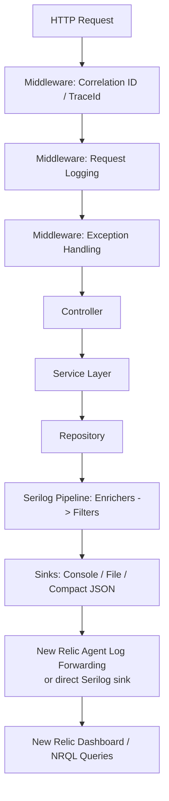
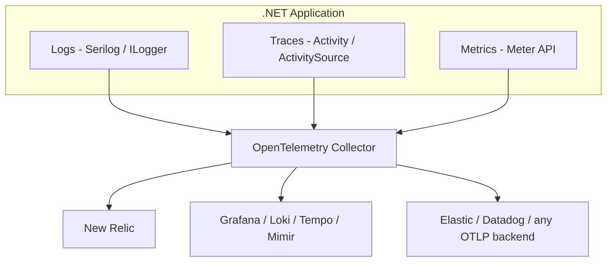
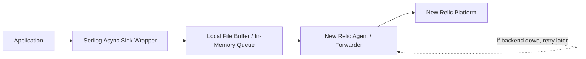
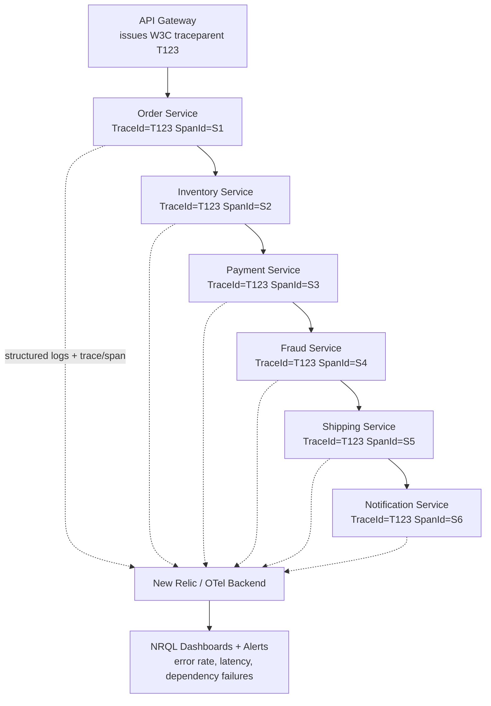

# Structured Logging — Senior .NET Interview Guide

> Scope: Serilog-centric structured logging in ASP.NET Core, correlation/distributed tracing, New Relic integration, centralized logging pipelines, and modern (2026) observability practices. Pitched for a 10-year .NET full-stack dev prepping for senior/lead interviews.

## Table of Contents

1. [Core Concepts](#core-concepts)
   - [What Is Structured Logging and Why It Beats String Interpolation](#what-is-structured-logging)
   - [Message Templates](#message-templates)
   - [Log Levels](#log-levels)
   - [[new content] Structured Logging vs Plain-Text Logging — The Full Picture](#structured-vs-plaintext)
2. [Architecture](#architecture)
   - [End-to-End Request Flow](#end-to-end-flow)
   - [Program.cs Configuration (Code-Based)](#programcs-config)
   - [appsettings.json Configuration (Config-Based)](#appsettings-config)
3. [Intermediate — Enrichment and Context Propagation](#intermediate)
   - [Correlation ID Middleware](#correlation-id-middleware)
   - [LogContext.PushProperty Deep Dive](#pushproperty-deep-dive)
   - [Controller / Service / Repository Logging](#layered-logging)
   - [Built-in Request Logging](#request-logging)
   - [Global Exception Middleware](#exception-middleware)
   - [[new content] Serilog Sinks Internals](#sinks-internals)
   - [[new content] Enrichers vs Destructuring — What's the Difference](#enrichers-vs-destructuring)
4. [Advanced — Distributed Tracing & Multi-Tenancy](#advanced)
   - [CorrelationId vs TraceId](#correlationid-vs-traceid)
   - [Tracing a Request Across 15 Microservices](#tracing-across-microservices)
   - [Multi-Tenant Logging](#multi-tenant-logging)
   - [[new content] OpenTelemetry Logs/Traces/Metrics Unification](#opentelemetry)
   - [[new content] ASP.NET Core Activity / W3C Trace Context Integration](#activity-integration)
   - [[new content] Centralized Logging Pipelines: ELK vs Seq vs Grafana Loki](#centralized-pipelines)
   - [[gaps] AWS-Native Logging and Tracing](#aws-native-logging-and-tracing-gaps)
5. [New Relic Integration](#new-relic-integration)
   - [Three Integration Options](#integration-options)
   - [NRQL Query Examples](#nrql-queries)
6. [Performance](#performance)
   - [Why Excessive Logging Hurts Production](#excessive-logging)
   - [Async Logging and Buffering](#async-logging)
   - [[new content] Source-Generated Logging (LoggerMessage) and the Cost of ILogger Calls](#source-generated-logging)
   - [[new content] Log Sampling Strategies at Scale](#log-sampling)
7. [Best Practices](#best-practices)
   - [10 Logging Best Practices](#ten-best-practices)
   - [Golden Rules Checklist](#golden-rules)
   - [[new content] PII / Sensitive-Data Redaction Patterns](#pii-redaction)
8. [Common Pitfalls](#common-pitfalls)
9. [Why Serilog (vs NLog vs log4net)](#why-serilog)
10. [Sample Interview Q&A](#sample-qa)
    - [Foundational Q&A (from notes)](#foundational-qa)
    - [Staff/Lead-Level System Design Question](#staff-system-design)
    - [[new content] Additional Senior/Staff Q&A](#additional-qa)
11. [Summary of Additions](#summary-of-additions)
12. [Summary of \[gaps\] Additions (This Pass)](#summary-of-gaps-additions-this-pass)

---

## Core Concepts

### What Is Structured Logging and Why It Beats String Interpolation
<a id="what-is-structured-logging"></a>

Structured logging means every log event is emitted as a set of **typed key/value properties** (plus a message), not just a flattened string. Instead of asking "does this text contain the word 'error'?", your logging backend can ask "give me every event where `OrderId = 45678` and `Level = Error`."

**Bad (string interpolation):**
```csharp
_logger.LogInformation($"Order {orderId} created");
```

**Good (message template):**
```csharp
_logger.LogInformation("Order {OrderId} created", orderId);
```

Why this matters at a senior level:
- Serilog parses the template and stores `OrderId` as a **separate, typed property** on the `LogEvent` — not a flattened string.
- Downstream systems (New Relic, Seq, Elasticsearch) can query/filter/facet on `OrderId` directly.
- **Performance**: with string interpolation, the string is built immediately regardless of whether any sink is listening or whether the level is even enabled. With a template, rendering is deferred — the template + arguments are only formatted into a string if a sink actually needs the rendered message (e.g., console text sink); a JSON sink can serialize the properties directly without ever building the human-readable string.
- Enables consistent analytics/dashboards across services without regex-scraping log text.

### Message Templates
<a id="message-templates"></a>

Serilog's message template syntax (`{PropertyName}`) is a superset of standard .NET composite formatting:
- `{OrderId}` — captured as a scalar property, using its `ToString()` for text sinks but as native type for structured sinks.
- `{@Order}` — the **destructuring operator**. Captures the full object graph as structured properties instead of a flattened string:
  ```csharp
  _logger.LogInformation("Order created {@Order}", order);
  ```
  This serializes the object into the log event as nested structured data — invaluable for auditing, but be careful with large graphs and circular references (see [Common Pitfalls](#common-pitfalls)).
- `{$Order}` — the **stringification operator**, forces `ToString()` even for types that would normally be destructured.

### Log Levels
<a id="log-levels"></a>

| Level | Serilog Name | Meaning | Production default? | Example |
|---|---|---|---|---|
| Trace | `Verbose` | Extremely detailed tracing (finest granularity) | Off | "Entering `CalculateTax()`" |
| Debug | `Debug` | Developer troubleshooting detail | Off (usually) | "SQL query execution started" |
| Information | `Information` | Normal business flow events | On | "Order created", "Payment successful" |
| Warning | `Warning` | Unexpected but recoverable | On | Retry attempts, validation failures (400s) |
| Error | `Error` | Failures requiring attention | On | DB errors, 3rd-party API failures, unhandled exceptions |
| Critical | `Fatal` (Serilog) / `Critical` (MEL) | App can't continue / total outage | On | Database down, system-wide outage |

> **Note on naming**: `Microsoft.Extensions.Logging.LogLevel` uses `Trace/Debug/Information/Warning/Error/Critical`. Serilog's native `LogEventLevel` uses `Verbose/Debug/Information/Warning/Error/Fatal`. Serilog's `Microsoft.Extensions.Logging` bridge maps `Critical ↔ Fatal` and `Trace ↔ Verbose`. Interviewers sometimes probe whether you know these aren't 1:1 identical enums — know the mapping.

### [new content] Structured Logging vs Plain-Text Logging — The Full Picture
<a id="structured-vs-plaintext"></a>

This is one of the most common opening questions in a senior interview ("why structured logging?") and the notes only answered it partially (via the message-template comparison). Full picture:

| Aspect | Plain-text logging | Structured logging |
|---|---|---|
| Storage shape | Free text | Key/value properties + message |
| Query capability | Regex / substring search | Exact-match, range, facet queries (NRQL, KQL, Lucene) |
| Schema evolution | None — any change breaks parsers | Additive — new properties don't break old queries |
| Machine readability | Requires fragile log-parsing regexes downstream | Native JSON/CLEF — no parsing needed |
| Dashboarding | Hard (must extract fields via regex first) | Trivial (`FACET`, `GROUP BY` on properties) |
| Human readability (console) | Good | Good if using a template-aware console theme (Serilog renders human text AND keeps properties) |
| Migration cost | N/A | Requires discipline — team must consistently use templates, not `$"..."` |

Key interview point: structured logging is **not** mutually exclusive with human-readable output — Serilog's console sink renders the templated message as readable text *while* the same `LogEvent` carries the structured properties to other sinks. You get both.

---

## Architecture

### End-to-End Request Flow
<a id="end-to-end-flow"></a>



### Program.cs Configuration (Code-Based)
<a id="programcs-config"></a>

```csharp
using Serilog;

Log.Logger = new LoggerConfiguration()
    .MinimumLevel.Information()
    .Enrich.FromLogContext()
    .Enrich.WithEnvironmentName()
    .Enrich.WithThreadId()
    .Enrich.WithProperty("Application", "OrderApi")
    .WriteTo.Console()
    .WriteTo.Async(a => a.File(
        new Serilog.Formatting.Compact.CompactJsonFormatter(),
        "logs/app-.log",
        rollingInterval: RollingInterval.Day))
    .CreateLogger();

try
{
    var builder = WebApplication.CreateBuilder(args);

    builder.Host.UseSerilog();

    builder.Services.AddControllers();

    var app = builder.Build();

    app.UseSerilogRequestLogging();

    app.UseMiddleware<CorrelationIdMiddleware>();

    app.MapControllers();

    app.Run();
}
catch (Exception ex)
{
    Log.Fatal(ex, "Application stopped unexpectedly");
}
finally
{
    Log.CloseAndFlush();
}
```

Required packages:
```text
dotnet add package Serilog.AspNetCore
dotnet add package Serilog.Sinks.Console
dotnet add package Serilog.Sinks.File
dotnet add package Serilog.Formatting.Compact
dotnet add package Serilog.Enrichers.Environment
dotnet add package Serilog.Enrichers.Thread
dotnet add package Serilog.Sinks.Async
```

Optional, for direct New Relic shipping without relying on the host agent:
```text
dotnet add package Serilog.Sinks.NewRelicLogs
dotnet add package NewRelic.LogEnrichers.Serilog
```

> **Note:** `UseSerilogRequestLogging()` replaces a hand-rolled request-logging middleware out of the box — it logs path, status code, and elapsed time for every request with a single line.

### appsettings.json Configuration (Config-Based)
<a id="appsettings-config"></a>

```json
{
  "Serilog": {
    "Using": [ "Serilog.Sinks.Console", "Serilog.Sinks.File" ],
    "MinimumLevel": {
      "Default": "Information",
      "Override": {
        "Microsoft": "Warning",
        "System": "Warning"
      }
    },
    "Enrich": [ "FromLogContext", "WithEnvironmentName", "WithThreadId" ],
    "WriteTo": [
      { "Name": "Console" },
      {
        "Name": "File",
        "Args": {
          "path": "logs/app-.log",
          "rollingInterval": "Day",
          "formatter": "Serilog.Formatting.Compact.CompactJsonFormatter, Serilog.Formatting.Compact"
        }
      }
    ]
  }
}
```

```csharp
Log.Logger = new LoggerConfiguration()
    .ReadFrom.Configuration(builder.Configuration)
    .CreateLogger();
```

**Code-based vs config-based — trade-off an interviewer may probe:** config-based (`ReadFrom.Configuration`) lets ops change sinks/levels without a redeploy (especially combined with `IOptionsMonitor`/reloadOnChange + a `LoggingLevelSwitch`), but some sink options and custom enrichers/`ILogEventSink` implementations can only be wired programmatically or need to be registered in the `Using` array to be discoverable by the config reader. Most real systems combine both: config for levels/sinks, code for anything requiring DI or custom types.

---

## Intermediate — Enrichment and Context Propagation

### Correlation ID Middleware
<a id="correlation-id-middleware"></a>

```csharp
public class CorrelationIdMiddleware
{
    private readonly RequestDelegate _next;

    public CorrelationIdMiddleware(RequestDelegate next)
    {
        _next = next;
    }

    public async Task Invoke(HttpContext context)
    {
        var correlationId = Guid.NewGuid().ToString();

        using (Serilog.Context.LogContext.PushProperty(
            "CorrelationId", correlationId))
        {
            context.Response.Headers.Add(
                "X-Correlation-Id",
                correlationId);

            await _next(context);
        }
    }
}
```

Purpose:
- Unique ID per request
- Helps trace logs across microservices
- Makes debugging easier in New Relic

> **Note:** Serilog's idiomatic context-attachment mechanism is `LogContext.PushProperty`, not `ILogger.BeginScope`. `BeginScope` still works because Serilog implements `Microsoft.Extensions.Logging.ILogger`, but `LogContext.PushProperty` is the native, more efficient path and is what most Serilog-based teams standardize on.

> **Gotcha the notes didn't flag explicitly**: this middleware always *mints a new* correlation ID rather than checking for an inbound one (e.g., `X-Correlation-Id` from an upstream caller or gateway). In a real multi-service deployment this breaks correlation the moment there's more than one hop — see [What problems occur if every service generates its own CorrelationId?](#foundational-qa) below, where the notes' own Q&A explicitly calls this out as an anti-pattern. Production code should be:
> ```csharp
> var correlationId = context.Request.Headers.TryGetValue("X-Correlation-Id", out var existing)
>     ? existing.ToString()
>     : Guid.NewGuid().ToString();
> ```

### LogContext.PushProperty Deep Dive
<a id="pushproperty-deep-dive"></a>

**The problem without it:** in production with 5,000 concurrent users / 50,000 requests per minute, a support ticket says "Order 98765 failed." Individual unrelated log lines like:
```text
Order validation started
Calling payment service
Order created successfully
```
have no way to be grouped back to a single logical operation.

**The fix:**
```csharp
using (Serilog.Context.LogContext.PushProperty("OrderId", 98765))
using (Serilog.Context.LogContext.PushProperty("CustomerId", 1001))
{
    _logger.LogInformation("Order validation started");
    _logger.LogInformation("Calling payment service");
    _logger.LogInformation("Order created successfully");
}
```

Every log line inside the block now automatically carries `OrderId` and `CustomerId`:
```json
{ "message": "Order validation started", "OrderId": 98765, "CustomerId": 1001 }
{ "message": "Calling payment service",  "OrderId": 98765, "CustomerId": 1001 }
{ "message": "Order created successfully", "OrderId": 98765, "CustomerId": 1001 }
```

**Why it works across `await`:** `LogContext` is backed by `AsyncLocal<T>`, so pushed properties flow correctly through async/await continuations without manual parameter passing — even across `Task.Run` continuations that resume on a different thread pool thread, since `AsyncLocal` follows the logical call context, not the physical thread.

**Real enterprise example (banking):**
```csharp
using (Serilog.Context.LogContext.PushProperty("CustomerId", customerId))
using (Serilog.Context.LogContext.PushProperty("AccountId", accountId))
using (Serilog.Context.LogContext.PushProperty("TransactionId", transactionId))
{
    // business logic
}
```

**Staff-level answer:** `LogContext.PushProperty` allows contextual information to be attached to every log emitted within a logical operation, including across async/await boundaries, since it rides on `AsyncLocal`. It reduces duplicate logging code and makes logs searchable and traceable. In enterprise systems we commonly push `CorrelationId`, `TraceId`, `TenantId`, `CustomerId`, `OrderId`, and `UserId` onto the log context so support engineers can quickly locate all logs associated with a specific business transaction.

### Controller / Service / Repository Logging
<a id="layered-logging"></a>

```csharp
[ApiController]
[Route("api/orders")]
public class OrderController : ControllerBase
{
    private readonly OrderService _service;
    private readonly ILogger<OrderController> _logger;

    public OrderController(
        OrderService service,
        ILogger<OrderController> logger)
    {
        _service = service;
        _logger = logger;
    }

    [HttpPost]
    public async Task<IActionResult> CreateOrder(
        CreateOrderRequest request)
    {
        _logger.LogInformation(
            "CreateOrder request received. CustomerId={CustomerId}",
            request.CustomerId);

        var orderId = await _service.CreateOrder(request);

        return Ok(orderId);
    }
}
```

```csharp
public class OrderService
{
    private readonly ILogger<OrderService> _logger;

    public OrderService(ILogger<OrderService> logger)
    {
        _logger = logger;
    }

    public async Task<int> CreateOrder(CreateOrderRequest request)
    {
        _logger.LogInformation(
            "Creating order. CustomerId={CustomerId}, Amount={Amount}",
            request.CustomerId,
            request.Amount);

        try
        {
            var orderId = await SaveOrder(request);

            _logger.LogInformation(
                "Order created successfully. OrderId={OrderId}",
                orderId);

            return orderId;
        }
        catch (Exception ex)
        {
            _logger.LogError(
                ex,
                "Order creation failed. CustomerId={CustomerId}",
                request.CustomerId);

            throw;
        }
    }
}
```

> **Why shouldn't repositories contain business logs?** Repository = data access concerns ("SQL timeout"). Service = business concerns ("Customer upgraded plan"). Mixing them blurs log semantics and makes it harder to build layer-specific alerting (e.g., alert on repository-layer timeout spikes independent of business-event volume).

> **Contradiction flagged:** The `OrderService.CreateOrder` example above logs the error via `_logger.LogError(ex, ...)` *and then rethrows*, which the notes' own "Avoid Duplicate Logging" best-practice section (and the "duplicate logs are a serious production issue" Q&A) explicitly says is wrong if a global exception middleware will also log it. The original notes contain both the "log-and-rethrow" example *and* the "only the global handler should log" rule without reconciling them. **Correct resolution:** log domain-specific context at the point of failure only if you're adding information the global handler can't reconstruct (e.g., `CustomerId` before the exception bubbles up as a generic 500) — and in that case, do it via a scoped log context property (`LogContext.PushProperty`) rather than `LogError`, so the global handler's single `LogError` call carries all the context without a duplicate entry. If no extra context can be added, don't log locally at all — swallow-and-rethrow (`catch { throw; }`) and let the global handler own the one `LogError` call.

### Built-in Request Logging
<a id="request-logging"></a>

```csharp
app.UseSerilogRequestLogging(options =>
{
    options.MessageTemplate =
        "Request completed. Path={RequestPath}, StatusCode={StatusCode}, DurationMs={Elapsed}";

    options.EnrichDiagnosticContext = (diagnosticContext, httpContext) =>
    {
        diagnosticContext.Set("UserId", httpContext.User?.Identity?.Name);
    };
});
```

Purpose: track API execution time, monitor slow endpoints, one log line per request instead of hand-written stopwatch code.

### Global Exception Middleware
<a id="exception-middleware"></a>

```csharp
public class ExceptionHandlingMiddleware
{
    private readonly RequestDelegate _next;
    private readonly ILogger<ExceptionHandlingMiddleware> _logger;

    public ExceptionHandlingMiddleware(
        RequestDelegate next,
        ILogger<ExceptionHandlingMiddleware> logger)
    {
        _next = next;
        _logger = logger;
    }

    public async Task Invoke(HttpContext context)
    {
        try
        {
            await _next(context);
        }
        catch (Exception ex)
        {
            _logger.LogError(ex, "Unhandled exception occurred");
            throw;
        }
    }
}
```

Purpose: capture all unhandled exceptions once, avoid duplicate try/catch blocks, centralized error logging.

> **Gotcha**: rethrowing after logging here means something upstream (e.g., a `UseExceptionHandler` or a further-out middleware/host) must also convert it into an HTTP response. Make sure only *one* layer in that chain also logs — typically the innermost catch (this middleware) logs, and anything further out only maps to a response, it doesn't log again.

### [new content] Serilog Sinks Internals
<a id="sinks-internals"></a>

This is a very common senior .NET interview topic and deserves a first-class section (the original notes had it as a large dump near the end — consolidated and tightened here).

**What is a sink?** The destination where Serilog writes a `LogEvent` — console, file, Elasticsearch, Seq, New Relic, a custom monitoring system, etc.

**How Serilog processes a log event:**

```mermaid
flowchart LR
    A[Log.Information/LogEvent created] --> B[Enrichers add metadata
    TraceId, CorrelationId, MachineName...]
    B --> C[Filters run
    e.g. drop health-check noise]
    C --> D{Sink(s)}
    D --> E[Console]
    D --> F[File]
    D --> G[Elasticsearch]
    D --> H[New Relic]
```

1. Application creates a `LogEvent` (`Message`, properties, `Level`, `Timestamp`).
2. Enrichers add contextual metadata (`CorrelationId`, `MachineName`, `Environment`, etc.).
3. Filters execute (e.g., "only Error+", "ignore health-check requests").
4. Event is dispatched to every configured sink.

**Every sink implements `ILogEventSink`:**
```csharp
public interface ILogEventSink
{
    void Emit(LogEvent logEvent);
}
```

**Custom sink example:**
```csharp
public class CompanySink : ILogEventSink
{
    public void Emit(LogEvent logEvent)
    {
        SendToMonitoringSystem(logEvent);
    }
}
```
Registered via `.WriteTo.Sink(new CompanySink())`.

**Multiple sinks fan out the same event** — one `LogEvent`, many destinations, without business code knowing or caring which destinations exist:
```csharp
builder.Host.UseSerilog((ctx, lc) =>
{
    lc.WriteTo.Console()
      .WriteTo.File("logs/app.log")
      .WriteTo.Elasticsearch(/* ... */)
      .WriteTo.NewRelicLogs(/* ... */);
});
```

**What happens if one sink fails?** Serilog isolates sink failures — a failing sink (e.g., New Relic unreachable) should not crash the application or block other sinks. Enterprise systems wrap sinks in async processing + buffering, and some sinks (e.g., `Serilog.Sinks.PeriodicBatching`-based ones) implement their own retry policies. Know that this isolation is sink-implementation-dependent — a naive custom sink that throws inside `Emit()` synchronously *can* propagate the exception up through the logging call unless it's wrapped in `.WriteTo.Async(...)`, which catches and drops (or retries, depending on config) failures in the background worker instead of the calling thread.

**Staff-level answer:** A Serilog sink is the output component responsible for persisting or transmitting log events. When a log is created, Serilog builds a structured `LogEvent`, enriches it with contextual metadata, applies filters, and forwards it to one or more configured sinks. Each sink implements `ILogEventSink` and receives log events through `Emit()`. In enterprise systems, sinks are usually wrapped with asynchronous processing and buffering to avoid blocking request threads, and multiple sinks can run in parallel so the same event reaches files, console, Elasticsearch, and New Relic simultaneously while preserving throughput and fault tolerance.

### [new content] Enrichers vs Destructuring — What's the Difference
<a id="enrichers-vs-destructuring"></a>

Interviewers sometimes conflate these — be ready to draw the line clearly:

| | Enrichers | Destructuring (`@`) |
|---|---|---|
| What it adds | Ambient/contextual properties not present in the call site (`MachineName`, `CorrelationId`, `ThreadId`) | Structure for a *specific object passed at the call site* (`{@Order}`) |
| Scope | Applies to every log event flowing through the pipeline (or every event within a `LogContext` block) | Applies only to the single log call that uses `@` |
| Mechanism | `ILogEventEnricher.Enrich(LogEvent, ILogEventPropertyFactory)` | Serilog's `IDestructuringPolicy`, or built-in reflection-based destructurer |
| Example | `.Enrich.WithEnvironmentName()`, `.Enrich.WithThreadId()`, custom `ILogEventEnricher` for `TenantId` | `_logger.LogInformation("Order created {@Order}", order)` |
| Custom extension point | Implement `ILogEventEnricher` | Implement `IDestructuringPolicy` to control how a specific type serializes (e.g., mask a field, cap depth) |

---

## Advanced — Distributed Tracing & Multi-Tenancy

### CorrelationId vs TraceId
<a id="correlationid-vs-traceid"></a>

| | CorrelationId | TraceId |
|---|---|---|
| Origin | Custom-generated, business/request tracking identifier | Generated by distributed tracing systems (W3C `traceparent`, OpenTelemetry, New Relic) |
| Captured by | Manual `LogContext.PushProperty` | Automatic, via `Serilog.Enrichers.Span` or the New Relic log enricher, riding on ASP.NET Core's `Activity`/`DiagnosticSource` |
| Who searches by it | Support teams (often ticket-friendly, human-readable) | Engineers (matches APM trace view directly) |
| Modern trend | Being subsumed by TraceId in many orgs | Increasingly the primary key; many companies still keep both for support-team ergonomics |

### Tracing a Request Across 15 Microservices
<a id="tracing-across-microservices"></a>

- `TraceId` generated once (W3C `traceparent` header, gateway-issued or SDK-issued).
- Passed in headers to every downstream hop.
- Captured in every service via `Serilog.Enrichers.Span` or the New Relic log enricher.
- New Relic Distributed Tracing enabled end-to-end.
- Search using `TraceId` to reconstruct the full request journey:
```sql
SELECT * FROM Log WHERE trace.id = 'T123'
```

```mermaid
sequenceDiagram
    participant GW as API Gateway
    participant OS as Order Service
    participant IS as Inventory Service
    participant PS as Payment Service
    participant NS as Notification Service

    GW->>OS: traceparent: TraceId=T123
    OS->>IS: TraceId=T123, SpanId=S1
    IS->>PS: TraceId=T123, SpanId=S2
    PS->>NS: TraceId=T123, SpanId=S3
    Note over GW,NS: TraceId constant across every hop; SpanId changes per service
```

### Multi-Tenant Logging
<a id="multi-tenant-logging"></a>

**Problem:** in a shared SaaS app serving Walmart, Target, Costco, Amazon, etc., a "Database Timeout" error gives no clue which tenant hit it — without tenant metadata, isolating the incident is impossible.

**Solution:** extract `TenantId` from JWT claims, API Gateway headers, or request headers, and push it onto the log context in a tenant-resolution middleware:
```csharp
var tenantId = httpContext.Request.Headers["TenantId"];

using (Serilog.Context.LogContext.PushProperty("TenantId", tenantId))
{
    await _next(context);
}
```

Resulting logs:
```json
{ "message": "Order Created", "TenantId": "Walmart" }
{ "message": "Payment Failed", "TenantId": "Target" }
```

Query:
```sql
SELECT * FROM Log WHERE TenantId = 'Walmart'
```

**Staff-level answer:** In a multi-tenant SaaS system, every log should be enriched with `TenantId` and other contextual metadata. Tenant information is usually extracted from JWT claims, API Gateway headers, or request headers and attached using `LogContext.PushProperty` in a tenant-resolution middleware, or via a custom `ILogEventEnricher`. This allows operations teams to filter logs per tenant, isolate incidents quickly, and build tenant-specific dashboards and alerts.

### [new content] OpenTelemetry Logs/Traces/Metrics Unification
<a id="opentelemetry"></a>

The original notes mention OpenTelemetry only in passing ("OpenTelemetry SDK... collects trace, span, latency data"). This is now one of the hottest senior/staff interview areas for 2025–2026 because most orgs are actively migrating off vendor-proprietary agents (including New Relic's own .NET Agent) toward OpenTelemetry as the vendor-neutral standard.

**The three pillars, unified:**


Key points for a senior interview:
- OpenTelemetry defines a **vendor-neutral wire format (OTLP)** and SDK. You instrument once; you can swap backends (New Relic, Datadog, Grafana stack, Elastic) by reconfiguring the Collector's exporter, not your code.
- .NET's `Microsoft.Extensions.Logging` integrates with OpenTelemetry via `OpenTelemetry.Extensions.Logging` — you can route `ILogger` output through an OTel `LoggerProvider` alongside (or instead of) Serilog sinks.
- Serilog and OpenTelemetry are **not mutually exclusive**: a common pattern is Serilog for rich structured logging + an OTel exporter sink (`Serilog.Sinks.OpenTelemetry`) so logs carry the same `TraceId`/`SpanId` that OTel traces use, unifying correlation without hand-rolled enrichers.
- Traces use `System.Diagnostics.ActivitySource`/`Activity` (built into .NET since Core 3.0/`DiagnosticSource` package) as the native tracing primitive — OpenTelemetry's .NET SDK is largely a *listener and exporter* on top of `Activity`, not a replacement for it. This is why `Serilog.Enrichers.Span` and OTel both "just work" off the same ambient `Activity.Current`.
- Metrics use the `System.Diagnostics.Metrics.Meter` API, exported via OTel's metrics SDK — separate from logs/traces but correlated by the same resource attributes (`service.name`, `deployment.environment`).
- **Interviewer follow-up to expect:** "Why would you adopt OpenTelemetry if you already have New Relic's agent working?" Answer: vendor lock-in avoidance, multi-backend flexibility (e.g., traces to New Relic, logs to a cheaper Loki/S3-backed store), and standardization across polyglot services (Java, Node, Go) that don't have a New Relic-specific SDK parity with .NET's.

### [new content] ASP.NET Core Activity / W3C Trace Context Integration
<a id="activity-integration"></a>

ASP.NET Core automatically creates an `Activity` per incoming request (via `DiagnosticListener`/`ActivitySource`) and parses the incoming `traceparent`/`tracestate` headers (W3C Trace Context spec) if present, populating `Activity.Current.TraceId` and `SpanId` without any custom middleware. This is the mechanism `Serilog.Enrichers.Span` reads from to attach `TraceId`/`SpanId` to every `LogEvent` — it is *not* pulling from your custom `CorrelationIdMiddleware` at all unless you wire it there yourself. Interview nuance: know that ASP.NET Core gives you this tracing context "for free" as of .NET Core 3.0+ (via `HttpContext.TraceIdentifier` for the request ID and `Activity.Current` for the W3C trace), so a hand-rolled correlation ID is often *redundant* with what the framework already provides — many teams keep a custom `CorrelationId` purely as a business-friendly alias, while the actual cross-service linkage rides on the framework's `Activity`/`traceparent`.

### [new content] Centralized Logging Pipelines: ELK vs Seq vs Grafana Loki
<a id="centralized-pipelines"></a>

The notes focus heavily on New Relic. A senior interviewer will expect you to compare New Relic against the other common centralized logging stacks:

| Stack | Storage model | Query language | Strengths | Trade-offs |
|---|---|---|---|---|
| **ELK** (Elasticsearch, Logstash, Kibana) | Full-text indexed JSON documents | Lucene / KQL (Kibana Query Language) | Extremely powerful full-text search, mature ecosystem, self-hostable | Elasticsearch is resource-hungry and operationally heavy at scale; indexing cost is high |
| **Seq** | Structured events (CLEF format), SQL-like store | Seq's own SQL-ish query language | Purpose-built for Serilog/structured logs, phenomenal local-dev experience, lightweight to self-host | Smaller ecosystem than ELK; scaling to very large multi-tenant volumes needs Seq's paid clustering |
| **Grafana Loki** | Log-stream storage indexed only by labels (not full text) | LogQL | Very cheap to run at scale (index is small — labels only), pairs naturally with Grafana dashboards/Tempo traces/Prometheus metrics for a unified "LGTM" (Loki-Grafana-Tempo-Mimir) stack | Full-text search within a stream is slower than ELK since content isn't indexed, only labels are — you trade search flexibility for cost |
| **New Relic Logs** | Managed SaaS, NRQL | NRQL | Zero infra to run, tight APM/trace correlation ("Logs in Context") | Cost scales directly with ingest volume — the exact problem the notes' "staff-level 50k req/min" question is about; vendor lock-in |

**Why this matters for the interview:** "centralized logging" isn't just "ship JSON somewhere" — it's a cost/query-power/operational-burden trade-off. A senior engineer should be able to justify: use Seq for local dev + small internal tools, ELK when you need deep full-text search and have ops capacity to run it, Loki when cost-per-GB dominates and you already run Grafana/Prometheus, and a SaaS platform (New Relic/Datadog) when you want APM+logs+traces unified with no infrastructure ownership — accepting the ingest-cost trade-off.

### [gaps] AWS-Native Logging and Tracing
<a id="aws-native-logging-and-tracing-gaps"></a>

Everything above (New Relic, ELK, Seq, Loki) is either a third-party SaaS or a self-hosted stack. Since the candidate's target cloud is AWS, this section covers the AWS-native equivalents — CloudWatch Logs Insights and X-Ray — and how they sit alongside (not instead of) the OpenTelemetry content already covered.

#### `[gaps]` CloudWatch Logs Insights

**What it is**: a query engine built directly on top of CloudWatch Logs — no separate indexing pipeline to run or pay for beyond CloudWatch Logs ingestion itself. A .NET service running on ECS/Lambda/EC2 with the CloudWatch agent (or Lambda's automatic log group per function) gets its stdout/Serilog console-sink output into a Log Group automatically; Logs Insights queries that Log Group directly.

**Query syntax basics** (its own purpose-built query language, not SQL and not Lucene):

```
fields @timestamp, @message
| filter @message like /OrderId/
| sort @timestamp desc
| limit 20
```

Parsing structured JSON fields out of a Serilog Compact-JSON log line (the same `CompactJsonFormatter` output already used elsewhere in this guide) and aggregating on them:

```
fields @timestamp, OrderId, CorrelationId, Level
| filter Level = "Error"
| stats count(*) as errorCount by bin(5m)
```

Faceting by a structured property, directly analogous to the NRQL `FACET` examples already in this guide:

```
fields RequestPath, DurationMs
| stats avg(DurationMs) as avgDuration by RequestPath
| sort avgDuration desc
```

**Use case vs. ELK/Seq** — the honest trade-off a senior candidate should state plainly:

| | CloudWatch Logs Insights | ELK | Seq |
|---|---|---|---|
| Infra to run | None — fully managed, pay-per-query-scanned + ingestion | Self-hosted Elasticsearch cluster (or managed OpenSearch) | Self-hosted (or Seq Cloud) |
| Query language | Logs Insights QL (purpose-built, AWS-only) | Lucene/KQL | Seq's SQL-ish language |
| Query performance model | Scans the raw log data for the queried time range on each query (no persistent index) — fine for ad hoc investigation, not built for high-frequency dashboards | Pre-indexed — much faster for repeated/dashboard-style queries at the cost of indexing overhead/cost | Pre-indexed (CLEF), fast, but smaller ecosystem |
| Best fit | Already-on-AWS shops wanting zero extra infrastructure and tight IAM-based access control on log data | Teams needing deep full-text search and can run/tune Elasticsearch | Local dev + small internal tools, tight Serilog fit |
| Cost model | Pay per GB scanned per query + standard CloudWatch Logs ingestion/storage — cost scales with *how much you query*, not just how much you ingest, which is a distinct gotcha from every other stack in this guide | Infra cost (compute/storage for the cluster) | Infra cost or Seq Cloud subscription |

**Gotcha specific to Logs Insights**: because it scans rather than maintains a persistent index, a broad, unbounded time-range query over a high-volume Log Group can be slow and can rack up "GB scanned" cost quickly — narrowing the time range and log group scope before running a query matters more here than it does with a pre-indexed store like ELK/Seq.

#### `[gaps]` AWS X-Ray for Distributed Tracing

**What it is**: AWS's native distributed tracing service — conceptually the same role as the OpenTelemetry tracing pipeline already covered in this guide (`ActivitySource`/`Activity`, trace/span propagation across service hops), but X-Ray is AWS's own backend and SDK/daemon for collecting and visualizing that data, with first-class integration into AWS compute (Lambda, ECS, EC2) and AWS service calls (DynamoDB, S3, SQS calls show up as segments automatically via the X-Ray SDK's instrumentation).

- **The X-Ray daemon/agent** runs alongside your application (as a sidecar on ECS, built into the Lambda runtime, or as an agent process on EC2) and batches trace segments before forwarding them to the X-Ray API — the same "don't block the request thread on the tracing backend" principle already covered for Serilog's async sinks applies here.
- **Service map** — X-Ray's signature visualization: a live-updating graph of every service/downstream call in a distributed system, annotated with latency and error rate per edge — the AWS-native equivalent of what a New Relic distributed trace view or a Grafana Tempo/Jaeger UI gives you for OTel traces.
- **X-Ray can consume OpenTelemetry data directly** — this is the key point that ties X-Ray back into the OpenTelemetry section already in this guide rather than treating it as a totally separate choice: the **AWS Distro for OpenTelemetry (ADOT)** Collector can export OTel traces to X-Ray as a backend, meaning a .NET service instrumented with the standard `ActivitySource`/OTel SDK (exactly as described in the OpenTelemetry section above) doesn't need a separate, X-Ray-proprietary SDK — it can emit standard OTLP and have the ADOT Collector forward to X-Ray, New Relic, or both simultaneously, the same multi-backend flexibility argument already made for OpenTelemetry generally.
- **X-Ray vs. OpenTelemetry — how to frame this in an interview**: X-Ray is a *backend + a legacy proprietary SDK*; OpenTelemetry is the *vendor-neutral instrumentation standard*. The senior-level answer to "would you use the X-Ray SDK or OpenTelemetry?" is: instrument with OpenTelemetry (`ActivitySource`, the OTel .NET SDK) so you're not locked into any one backend, and point the ADOT Collector's exporter at X-Ray (or swap it for another backend later without touching application code) — using the X-Ray SDK directly is the older pattern, comparable to instrumenting directly against the New Relic .NET Agent instead of going through OTel.
- **Correlating X-Ray traces with CloudWatch Logs** — X-Ray segments carry a `trace_id`; emitting that same `trace_id` as a structured property on every Serilog `LogEvent` (the same enrichment pattern already used for `TraceId`/`SpanId` via `Serilog.Enrichers.Span`) lets you jump from a slow/failed X-Ray trace segment straight to the corresponding CloudWatch Logs Insights query (`filter trace_id = "..."`) — the AWS-native version of New Relic's "Logs in Context" click-through already described in the New Relic Integration section.

#### `[gaps]` CloudWatch Log Group Retention Policies and Subscription Filters for Cost Control

The notes already cover tiered retention (Debug 7 days, Error 90-180 days, Audit 7 years) as a general logging best practice — CloudWatch has its own specific mechanisms for enforcing this and for controlling cost, worth knowing concretely rather than just "set a retention policy":

- **Log Group retention** — each CloudWatch Log Group has an explicit retention setting (1 day up to 10 years, or "Never Expire") that must be set deliberately; **the default is Never Expire**, which is a real, common cost leak — a Lambda function's auto-created log group with no retention policy set will accumulate logs (and cost) forever unless someone explicitly sets it. Setting this via IaC (Terraform's `aws_cloudwatch_log_group` `retention_in_days` argument) at provisioning time, rather than relying on someone remembering to configure it manually per environment, is the senior-level answer here.
  ```hcl
  resource "aws_cloudwatch_log_group" "order_api" {
    name              = "/ecs/order-api"
    retention_in_days = 30
  }
  ```
- **Subscription filters** — rather than paying to retain 100% of log volume in CloudWatch itself long-term, a **subscription filter** streams matching log events in near-real-time to a cheaper long-term destination (Kinesis Data Firehose → S3, for cold/compliance-tier storage; or Lambda, for real-time processing/alerting on specific patterns) — this is the AWS-native equivalent of the tiered-retention-by-sink pattern already described in this guide (separate audit/error/debug sinks with different retention), except implemented as a filter+stream rule instead of a separate Serilog sink.
  ```hcl
  resource "aws_cloudwatch_log_subscription_filter" "errors_to_firehose" {
    name            = "errors-to-s3-archive"
    log_group_name  = aws_cloudwatch_log_group.order_api.name
    filter_pattern  = "{ $.Level = \"Error\" }"
    destination_arn = aws_kinesis_firehose_delivery_stream.log_archive.arn
    role_arn        = aws_iam_role.cwl_to_firehose.arn
  }
  ```
- **Cost framing for an interview**: CloudWatch Logs cost has two independent dimensions — ingestion (per GB ingested) and storage (per GB-month retained) — plus, as noted above, Logs Insights adds a third, per-query-GB-scanned dimension. The three levers that map to each: reduce ingestion via sampling/level filtering (same principle as the Log Sampling Strategies section elsewhere in this guide), reduce storage cost via aggressive retention policies + subscription-filter offload to S3 for anything needed only for compliance/audit (S3 is dramatically cheaper per GB-month than CloudWatch Logs storage), and reduce query cost by narrowing Logs Insights time ranges/log group scope rather than querying broadly out of habit.

---

## New Relic Integration
<a id="new-relic-integration"></a>

### Three Integration Options
<a id="integration-options"></a>

There are three common ways to get Serilog output into New Relic. **Pick one** — combining them double-ships logs and can cause double billing.

**Option A — Agent-based log forwarding (recommended default).** Install the New Relic .NET Agent on the host/container; it tails console/file output and forwards automatically (same pattern as an NLog setup).
```xml
<configuration>
  <service licenseKey="YOUR_LICENSE_KEY"/>
  <application>
    <name>Order API</name>
  </application>
  <log>
    <level>info</level>
  </log>
  <applicationLogging enabled="true">
    <forwarding enabled="true"/>
  </applicationLogging>
</configuration>
```

**Option B — New Relic Log Enricher for Serilog (Logs in Context).** `NewRelic.LogEnrichers.Serilog` adds linking metadata (`trace.id`, `span.id`, `entity.guid`) directly onto each `LogEvent`:
```csharp
Log.Logger = new LoggerConfiguration()
    .Enrich.WithNewRelicLogsInContext()
    .WriteTo.File(new NewRelicFormatter(), "logs/newrelic-app.log")
    .CreateLogger();
```
The New Relic Log Forwarder / infrastructure agent then watches that output folder and ships the formatted JSON.

**Option C — Direct sink to the New Relic Logs API.** For environments without the agent (containers, serverless, console apps):
```csharp
Log.Logger = new LoggerConfiguration()
    .WriteTo.NewRelicLogs(
        endpointUrl: "https://log-api.newrelic.com/log/v1",
        applicationName: "OrderApi",
        licenseKey: "YOUR_LICENSE_KEY")
    .CreateLogger();
```

Purpose of all three: collect APM metrics, forward Serilog logs, correlate logs with traces.

### NRQL Query Examples
<a id="nrql-queries"></a>

```sql
-- Find all errors
SELECT * FROM Log WHERE level = 'Error'

-- Find logs for a request
SELECT * FROM Log WHERE CorrelationId = '2e1f4f9a-b0f2'

-- Count successful order creations
SELECT count(*) FROM Log WHERE message LIKE '%Order created%'

-- Find slow requests
SELECT average(DurationMs) FROM Log FACET RequestPath

-- Error rate
SELECT percentage(count(*), WHERE level = 'Error') FROM Log

-- Slowest APIs
SELECT average(duration) FROM Transaction FACET name

-- Logs scoped to one order
SELECT * FROM Log WHERE OrderId = 98765

-- Logs scoped to one tenant
SELECT * FROM Log WHERE TenantId = 'Walmart'
```

**Sample structured log (Compact JSON format):**
```json
{
  "@t": "2026-06-17T10:15:11.000Z",
  "@m": "Order created successfully",
  "@l": "Information",
  "OrderId": 45678,
  "CorrelationId": "2e1f4f9a-b0f2",
  "Application": "OrderApi",
  "EnvironmentName": "Production"
}
```
Benefits: searchable, filterable, easy NRQL queries, better observability.

---

## Performance

### Why Excessive Logging Hurts Production
<a id="excessive-logging"></a>

- Disk I/O saturation
- Increased CPU usage
- Huge storage costs
- Log ingestion costs in New Relic (or any SaaS backend)
- Network congestion

**Solution:** log only actionable information; use log levels and a `LoggingLevelSwitch` properly.

### Async Logging and Buffering
<a id="async-logging"></a>

**Without async:**
```text
Request Thread -> Write file -> Wait for disk -> Continue request
```

**With async:**
```text
Request Thread -> Queue log -> Continue request
Background Thread -> Write to file
```

```csharp
.WriteTo.Async(a => a.File("logs/app-.log"))
```

**What happens if New Relic becomes unavailable?** The application should keep running; logging must be asynchronous and buffered; never block a business request waiting on a logging backend.


If the backend goes down, logs buffer locally and forward later — no customer-facing impact.

**Why enterprises prefer async logging:** file/network writes are expensive; async prevents request-thread blocking and improves API response time.

### [new content] Source-Generated Logging (LoggerMessage) and the Cost of ILogger Calls
<a id="source-generated-logging"></a>

The original notes never mention this, and it's a strong signal of currency with .NET 6+ — expect it to come up when discussing logging performance at senior level.

**The historical cost problem:** Even `_logger.LogInformation("Order {OrderId} created", orderId)`, despite deferring *rendering*, still boxes value-type arguments (like `int orderId`) into `object[]` on every call, and involves an `params object[]` allocation, unless the level is disabled and the call short-circuits early — the classic advice was to guard hot-path debug logs with `if (_logger.IsEnabled(LogLevel.Debug))` before doing any expensive argument computation.

**The modern fix — compile-time source-generated logging (`LoggerMessageAttribute`, .NET 6+):**
```csharp
public static partial class Log
{
    [LoggerMessage(
        EventId = 1001,
        Level = LogLevel.Information,
        Message = "Order {OrderId} created for customer {CustomerId}")]
    public static partial void OrderCreated(this ILogger logger, int orderId, int customerId);
}

// usage
_logger.OrderCreated(orderId, customerId);
```

Why this matters for a senior interview:
- The source generator emits a strongly-typed method with **no boxing, no array allocation, and a built-in `IsEnabled` check** before doing any work — it's the fastest logging call shape available in .NET today.
- It also gives you compile-time checking of the message template against the method's parameters (typos/parameter mismatches are caught at build time, not at runtime when nobody's looking at that log line).
- Assigning an explicit `EventId` gives you a stable, language-independent identifier for alerting/dashboards that survives message-text rewording — something raw `LogInformation` calls don't give you for free.
- **Interview framing:** "For hot paths (tight loops, high-throughput endpoints), we use `[LoggerMessage]` source-generated logging instead of direct `ILogger.LogX` calls, because it eliminates allocation overhead and gives compile-time template validation — this matters when you're doing tens of thousands of log calls per second and logging itself becomes a measurable percentage of CPU time."

### [new content] Log Sampling Strategies at Scale
<a id="log-sampling"></a>

The original notes mention sampling briefly in the staff-level system-design section ("log 100% of errors/warnings, sample 10% of successful requests") — worth expanding as its own topic since "how do you control cost at scale" is asked independently of the big system-design scenario.

Common sampling strategies, roughly in order of sophistication:
1. **Level-based filtering** — log 100% of Warning+, sample Information. Simplest, most common first step.
2. **Fixed-rate sampling** — e.g., keep 1-in-10 successful request logs via a custom `GetLevel` callback in `UseSerilogRequestLogging`, or a Serilog `Filter.ByIncludingOnly` predicate using a random threshold.
3. **Rate limiting / "log the first N per key per window"** — e.g., only the first 5 occurrences of an identical error per minute, to avoid a single misbehaving downstream dependency flooding the pipeline (`Serilog.Sinks.RateLimit`-style pattern, or a hand-rolled `ConcurrentDictionary`-based throttle).
4. **Tail-based / trace-aware sampling** (more of an OpenTelemetry tracing concept, but increasingly bleeds into logs) — keep 100% of traces/logs for requests that ended in an error, but sample successful ones, decided *after* the outcome is known rather than up front.
5. **Dynamic sampling via `LoggingLevelSwitch`** — not sampling per se, but the operational lever to raise verbosity temporarily during an incident without a redeploy:
```csharp
var levelSwitch = new LoggingLevelSwitch(LogEventLevel.Information);

Log.Logger = new LoggerConfiguration()
    .MinimumLevel.ControlledBy(levelSwitch)
    .CreateLogger();

// during an incident, exposed via an admin endpoint or config reload:
levelSwitch.MinimumLevel = LogEventLevel.Debug;
```

**Interview framing:** sampling is a deliberate trade-off between *cost* and *statistical visibility* — you should always keep 100% of errors (you can't sample your way out of missing the one failure that matters), and apply sampling only to high-volume, low-signal success paths.

---

## Best Practices

### 10 Logging Best Practices
<a id="ten-best-practices"></a>

Good logging helps with: troubleshooting production issues, monitoring application health, distributed tracing, security auditing, performance analysis.

1. **Log structured data, not strings.** Use message templates (`{OrderId}`), not `$"..."` interpolation — searchable in Seq, Elasticsearch, Splunk, Application Insights, Datadog, etc., and better performance.
2. **Pick the right log level deliberately** — see the [level table](#log-levels) above; know the concrete examples (`LogTrace` for `Entering CalculateTax()`, `LogWarning` for validation failures, `LogCritical` for "Database unavailable").
3. **Avoid duplicate logging.** Rule: log an exception once. Prefer letting only the global exception middleware log unhandled exceptions; services should `throw;` without a redundant `LogError` unless adding unique context (see the [contradiction flagged](#layered-logging) above).
4. **Enrich logs with context, not repetition.** Push `CorrelationId` (or any per-operation identifier) once via `LogContext.PushProperty` instead of repeating it as a template argument on every call.
5. **Never log sensitive data** — passwords, credit card numbers, CVV, JWT/refresh tokens, API secrets, personal information. Log `UserId`, not `Password`.
6. **Make logging async and non-blocking** — `.WriteTo.Async(a => a.File(...))`. Better throughput, faster requests, reduced blocking.
7. **Design for correlation across services** — every log should share the same `TraceId`/`CorrelationId` end-to-end; propagate via headers (`traceparent`) and push into `LogContext` at ingress.
8. **Control log volume and cost** — use a `LoggingLevelSwitch` to raise verbosity temporarily during incidents without redeploying; lower back down afterward.
9. **Separate logs by concern and retention** — application logs, audit logs, security logs, performance logs each get their own sink/file and retention policy:

   | Log type | Typical retention |
   |---|---|
   | Debug | 7 days |
   | Application / Info | 30 days |
   | Error | 90–180 days |
   | Audit | 7 years (compliance-driven) |

   ```csharp
   .WriteTo.Logger(lc => lc
       .Filter.ByIncludingOnly(e => e.Properties.ContainsKey("Audit"))
       .WriteTo.File("logs/audit-.log", retainedFileCountLimit: 2555))
   ```
10. **Treat logging as part of the API/observability contract** — agree on standard fields across teams (`Event`, `TraceId`, `CorrelationId`, `TenantId`, `UserId`, `RequestId`, `MachineName`, `Environment`) so dashboards and searches work consistently across services.

### Golden Rules Checklist
<a id="golden-rules"></a>

- Log structured data: `_logger.LogInformation("Order {OrderId} created", orderId);`
- Use appropriate levels: Information → normal events, Warning → recoverable problems, Error → failures, Critical → outage.
- Log exceptions only once — prefer the global exception middleware.
- Add context through enrichment (`LogContext.PushProperty()`), not repetition.
- Never log secrets: passwords, tokens, credit cards, API keys.
- Keep logging asynchronous (`.WriteTo.Async()`).
- Correlate logs across services using `TraceId`/`CorrelationId`.
- Manage log volume — increase verbosity only during incidents.
- Separate logs by purpose: application, audit, security, performance.
- Treat logging as a first-class feature of your system's observability and reliability, not an afterthought.

### [new content] PII / Sensitive-Data Redaction Patterns
<a id="pii-redaction"></a>

The notes list *what not to log* (passwords, tokens, PII, connection strings, secrets, API keys) but don't cover *how* to enforce this systematically beyond "don't put it in the template." At senior level you're expected to know mechanisms, not just the rule:

1. **Discipline at the call site (baseline, but fragile)** — simply never pass sensitive fields into a template. Works until someone destructures a whole object (`{@Request}`) that happens to contain a `Password` property.
2. **Custom `IDestructuringPolicy`** — intercept destructuring for specific types (e.g., `LoginRequest`) and mask/omit sensitive properties before they're serialized, so even `{@Request}` calls are safe by construction:
   ```csharp
   public class RedactingDestructuringPolicy : IDestructuringPolicy
   {
       public bool TryDestructure(object value, ILogEventPropertyValueFactory factory, out LogEventPropertyValue result)
       {
           if (value is LoginRequest req)
           {
               result = new StructureValue(new[]
               {
                   new LogEventProperty("UserId", new ScalarPropertyValue(req.UserId)),
                   new LogEventProperty("Password", new ScalarPropertyValue("***REDACTED***"))
               });
               return true;
           }
           result = null;
           return false;
       }
   }
   // .Destructure.With(new RedactingDestructuringPolicy())
   ```
3. **.NET's built-in `[Redact]`/`Microsoft.Extensions.Compliance.Redaction` /taxonomy attributes** *(verify exact package/API surface and current naming for the target .NET version before quoting version numbers in an interview — the compliance/redaction APIs shipped as part of the `Microsoft.Extensions.Compliance` family and have moved/renamed across preview releases)* — mark model properties as sensitive (e.g., `[PrivateData]`) so the logging/telemetry pipeline redacts them automatically wherever the type is logged, rather than relying on every call site remembering to do it.
4. **Sink/formatter-level scrubbing** — a custom `ITextFormatter` or a Serilog enricher/filter that regex-scans rendered output for patterns (card numbers, JWT shapes) as a last-resort safety net; expensive and imperfect, but useful as defense-in-depth against a developer mistake, not a primary control.
5. **Log-schema review in code review / CI** — some teams add a static-analysis rule (Roslyn analyzer) that flags logging calls referencing model properties tagged `[Sensitive]`, catching the mistake before it ships rather than after it's already in a log store with a 90-day retention window.

**Why this is a "hot" topic:** GDPR/CCPA and PCI-DSS compliance failures are frequently root-caused to logging, not to the primary datastore — interviewers ask this because it's a real, recurring incident pattern, not a hypothetical.

---

## Common Pitfalls
<a id="common-pitfalls"></a>

- **String interpolation instead of message templates** — kills structured querying and defeats deferred rendering.
- **Every service minting its own CorrelationId** instead of propagating one from the gateway — breaks cross-service traceability, makes root-cause analysis effectively impossible (see [Q&A](#foundational-qa)).
- **Logging request/response bodies wholesale** — large payloads, PII exposure, GDPR/PCI violations, increased storage cost. Log metadata only via the diagnostic context; mask sensitive fields with custom destructuring policies if full objects must be logged.
- **Duplicate logging of the same exception** across controller, service, repository, and middleware — inflates ingestion cost and confuses troubleshooting. Only the global exception middleware should log unhandled exceptions.
- **Wrong level for validation failures** — a 400 Bad Request from bad user input is a `Warning`, not an `Error`; the application is functioning correctly, the caller made a mistake.
- **Losing the stack trace** — `_logger.LogError(ex.Message)` throws away the exception object; always pass `ex` as the first argument: `_logger.LogError(ex, "Order processing failed. OrderId={OrderId}", orderId);` so Serilog captures the full exception as a structured property.
- **Synchronous sinks blocking the request thread** — especially network sinks (New Relic, Elasticsearch); always wrap in `.WriteTo.Async(...)`.
- **Repositories logging business events** ("Customer upgraded plan") instead of data-access concerns ("SQL timeout") — blurs layer responsibilities and pollutes business-event dashboards with plumbing noise.
- **Uncontrolled `{@Object}` destructuring** — logging entire EF Core entities via `{@Order}` can pull in lazy-loaded navigation properties, circular references, or huge graphs, causing serialization blowups or `StackOverflowException` in extreme cases (verify current Serilog default max-depth/recursion guards for your version); prefer projecting to a small DTO before destructuring.
- **Treating DEBUG-in-production as harmless** — at real scale (tens of thousands of req/min), DEBUG-level logging is a direct driver of disk I/O saturation and log-ingestion cost; disable by default and use a `LoggingLevelSwitch` to enable it temporarily and narrowly.
- **Combining multiple New Relic integration paths simultaneously** (agent forwarding + direct sink + log enricher all at once) — causes duplicate log shipping and double billing; pick one integration option.

---

## Why Serilog (vs NLog vs log4net)
<a id="why-serilog"></a>

| Criterion | Serilog | NLog | log4net |
|---|---|---|---|
| Structured-by-default | Yes — captures `{OrderId}` as a typed property on the `LogEvent` itself | Gets there by layering a JSON layout on a fundamentally text-based pipeline | Same — text-based core, JSON bolted on |
| Sink/target ecosystem | Largest — native, well-maintained sinks for Seq, Elasticsearch, Datadog, New Relic, Application Insights, CloudWatch, etc. | Fewer than Serilog but solid | Very few actively maintained targets |
| ASP.NET Core-native fit | `Serilog.AspNetCore` gives `UseSerilogRequestLogging()` and DI/enricher integration (`LogContext.PushProperty`) out of the box | Good, but less first-class middleware integration | Largely legacy/.NET Framework era |
| Local dev tooling | Seq pairs natively — free structured-log viewer, same query experience locally as in prod | Less tightly paired to a specific structured viewer | Minimal |
| Async/buffered targets | Solid via `Serilog.Sinks.Async` | **More mature** async/buffered targets historically, plus live XML config reload without a restart | Limited |
| Ecosystem momentum | Most momentum in new cloud-native .NET projects | Current, actively maintained | Largely legacy |

**Counterpoint (don't over-sell Serilog):** NLog has historically had more mature async/buffered targets and supports live XML config reload without a restart. If a team is already deep in NLog and it's working well operationally, structured logging support alone isn't always sufficient reason to migrate — migration cost and retraining have to be weighed against the marginal gain, especially since NLog also supports structured logging via its own JSON layout renderers today.

---

## Sample Interview Q&A
<a id="sample-qa"></a>

### Foundational Q&A (from notes)
<a id="foundational-qa"></a>

**Q: Why is structured logging with message templates better than string interpolation?**
A: Serilog parses the template and stores `OrderId` as a separate, typed property, not a flattened string. New Relic (or any structured backend) can query/filter on `OrderId` directly. Performance is better because formatting is deferred and only happens if a sink actually needs the rendered string. It also enables easier analytics and dashboards.

**Q: What problems occur if every service generates its own CorrelationId?**
A: Logs cannot be traced across services; the request journey is broken; root-cause analysis becomes difficult. Correct approach: generate the `CorrelationId` at the API Gateway, propagate it via HTTP headers, and have all downstream services reuse the same value via `LogContext.PushProperty`.

**Q: CorrelationId vs TraceId?**
A: See the [comparison table](#correlationid-vs-traceid). In modern systems, `TraceId` usually replaces `CorrelationId` for engineering purposes, but many companies keep both since support teams often prefer a business-friendly `CorrelationId`.

**Q: Why is logging request and response body dangerous?**
A: Large payloads, PII exposure, GDPR violations, PCI compliance issues, increased storage cost. Enterprise approach: log metadata only via `UseSerilogRequestLogging`'s diagnostic context; mask sensitive fields with custom destructuring policies if objects must be logged.

**Q: Why can excessive logging bring down production systems?**
A: Disk I/O saturation, increased CPU usage, huge storage costs, log ingestion costs, network congestion. Solution: log only actionable information; use log levels and a `LoggingLevelSwitch` properly.

**Q: What happens if New Relic becomes unavailable?**
A: The application should continue running; logging must be asynchronous and buffered; never block business requests waiting for the logging backend. Pattern: `Application → Serilog (async sink) → Local file buffer → New Relic Agent/Forwarder → New Relic`.

**Q: Why do enterprises prefer asynchronous logging?**
A: File/network writes are expensive; async prevents request-thread blocking and improves API response time. `.WriteTo.Async(a => a.File("logs/app-.log"))`.

**Q: What is log enrichment?**
A: Automatically adding contextual properties to every log event — `CorrelationId`, `UserId`, `TenantId`, `Environment` (`Enrich.WithEnvironmentName()`), Application Name, Machine Name/Thread Id (`Enrich.WithThreadId()`). Without enrichment, troubleshooting becomes difficult because logs have no shared context.

**Q: How would you trace a request across 15 microservices?**
A: See [Tracing a Request Across 15 Microservices](#tracing-across-microservices) — `TraceId` generated once, propagated via headers, captured in every service via `Serilog.Enrichers.Span` or the New Relic log enricher, with distributed tracing enabled and searchable by `TraceId`.

**Q: Why shouldn't repositories contain business logs?**
A: Repository = data access concerns ("SQL timeout"). Service = business concerns ("Customer upgraded plan"). Mixing them blurs responsibilities and pollutes business dashboards with plumbing noise.

**Q: What is the difference between logs, metrics, and traces?**
A: Logs answer "what happened?" (e.g., "Order failed"). Metrics answer "how often did it happen?" (e.g., "50 order failures"). Traces answer "where did it happen?" (e.g., "failure occurred in PaymentService").

**Q: How do you correlate Serilog logs with APM transactions in New Relic?**
A: Use the New Relic log enricher: `.Enrich.WithNewRelicLogsInContext()`. It injects `trace.id`, `span.id`, and `entity.guid` directly into the `LogEvent` so New Relic automatically links logs to the transactions/spans that produced them.

**Q: Why is LogContext.PushProperty important?**
A: See the [deep dive](#pushproperty-deep-dive) above — it attaches contextual information to every log within a logical operation, flows correctly across `await` boundaries via `AsyncLocal`, reduces duplicated logging parameters, and makes logs searchable/traceable.

**Q: How would you log a failed third-party API call?**
A: Log endpoint, status code, `CorrelationId`, duration. Do NOT log access tokens or secrets. Example: "Payment gateway failed. StatusCode=500 Duration=2300ms".

**Q: How would you reduce New Relic logging costs?**
A: Use a `LoggingLevelSwitch` to lower verbosity dynamically without redeploying; sample high-volume logs; avoid duplicate logs; log business events only; retain logs for shorter periods.

**Q: Why are duplicate logs a serious production issue?**
A: Controller logs error, service logs same error, middleware logs same error → 3 log entries for 1 exception. Enterprise approach: only the global exception middleware logs unhandled exceptions.

**Q: What logging level should be used for validation failures?**
A: A 400 Bad Request is usually `Warning`, not `Error` — the application is functioning correctly; the caller supplied invalid input.

**Q: How do you log exceptions correctly?**
A: Wrong: `_logger.LogError(ex.Message)` — loses the stack trace. Correct: `_logger.LogError(ex, "Order processing failed. OrderId={OrderId}", orderId);` — Serilog captures the full `Exception` object as a structured property, preserving the stack trace for the sink/New Relic.

**Q: How would you implement multi-tenant logging?**
A: See [Multi-Tenant Logging](#multi-tenant-logging) — add `TenantId` to the log context via `LogContext.PushProperty` in a tenant-resolution middleware.

### Staff/Lead-Level System Design Question
<a id="staff-system-design"></a>

**Scenario A (from notes): Your API processes 50,000 requests per minute. New Relic costs are exploding. Developers need DEBUG logs. Production performance is degrading. How would you redesign logging?**

Expected answer:
- DEBUG disabled in production by default.
- A `LoggingLevelSwitch` exposed via an admin endpoint or config reload, so verbosity can be raised temporarily for a single investigation without a redeploy.
- Async sinks everywhere.
- Structured logs only (message templates, no string interpolation).
- Log sampling for high-volume successful requests.
- Separate audit logger/sink with its own retention.
- Centralized exception logging.
- Distributed tracing via the New Relic log enricher.
- Retention policies tiered by level.

This demonstrates understanding of scalability, observability, cost optimization, and production operations.

**Scenario B (from notes): Design logging for 20 microservices where a single user request travels through API Gateway → Order → Inventory → Payment → Fraud → Shipping → Notification, and failures must be identified within 2 minutes.**

Problem statement: customer places an order, request travels through seven services, customer reports "my order failed." Without observability, finding which service failed — and why — can take hours. Goal: root cause within 2 minutes.

Full design, consolidated:



1. **Distributed tracing** — the Gateway issues a W3C `traceparent` (`TraceId = T123`); every downstream service captures it via ASP.NET Core's built-in `Activity`/`DiagnosticSource` integration plus a Serilog enricher such as `Serilog.Enrichers.Span`. `TraceId` stays constant across every hop; `SpanId` changes per service. New Relic reconstructs the full journey: `SELECT * FROM Log WHERE trace.id = 'T123'`.
2. **CorrelationId** — kept alongside `TraceId` for business-transaction tracking; support searches by `CorrelationId`, engineers search by `TraceId`.
3. **Structured JSON logging** — every service emits `{"OrderId":123,"PaymentId":456,"Status":"Failed","ErrorCode":"GatewayTimeout","TraceId":"TRACE999"}` natively via message templates, no bolted-on parsing needed.
4. **OpenTelemetry/Serilog enrichment** — each service runs the New Relic .NET Agent or the OpenTelemetry SDK plus a Serilog enricher that copies the active `Activity`'s trace/span IDs onto every `LogEvent`, capturing trace, span, latency, dependency, exception, HTTP, and DB call data automatically.
5. **New Relic APM + Logs in Context** — clicking a failed span in the trace view jumps straight to the related log lines and exception details instead of manual timestamp cross-referencing.
6. **Centralized exception handling** — only the global exception middleware logs unhandled exceptions once, with full context, avoiding quadruple logging and inflated ingest cost.
7. **NRQL dashboards** — error rate, slowest APIs, per-service failure counts (`FACET Service`).
8. **Alerting** — e.g., payment failures > 20 within 2 minutes, API latency > 5s for 2 minutes, inventory failures > 10 → trigger alert, notifying engineering before customers complain.
9. **Log sampling** — at 50,000 req/min, log 100% of errors/warnings but sample (e.g., 10%) of successful requests; configurable per-sink, or by gating `UseSerilogRequestLogging` with a custom `GetLevel` callback that downgrades fast, successful requests to a level an environment-specific minimum-level filter drops.
10. **Retention strategy** — DEBUG 7 days, INFO 30 days, ERROR 180 days, AUDIT 7 years — compliance, lower storage cost, better query performance.
11. **Async logging + buffering** — never let the request thread wait on New Relic; `Application → Serilog Async Sink Wrapper → Local File Buffer → New Relic Agent/Forwarder → New Relic Platform`. If New Relic goes down, the app keeps running and logs forward later.

**Final staff-engineer answer:** I would implement end-to-end observability using distributed tracing, Serilog's native structured logging, and New Relic APM (or an OpenTelemetry-based equivalent). The API Gateway issues a W3C-compliant `TraceId` and a business `CorrelationId` propagated across all microservices. Each service enriches its Serilog pipeline with `TraceId`, `SpanId`, `CorrelationId`, `ServiceName`, `Environment`, `TenantId`, and business identifiers such as `OrderId`, using `LogContext.PushProperty` and standard enrichers. Logs are emitted through async sinks and either forwarded by the New Relic .NET Agent or shipped directly via a New Relic sink, with the New Relic log enricher attaching `trace.id`/`span.id`/`entity.guid` so engineers can jump from a failed trace span directly to its logs. Centralized exception middleware prevents duplicate logging. NRQL dashboards and alerts monitor error rates, latency, dependency failures, and service health. Sampling and tiered retention control ingestion cost while preserving critical operational data. This design lets engineering teams identify the exact failing service and root cause within minutes, even across large-scale microservice architectures.

### [new content] Additional Senior/Staff Q&A
<a id="additional-qa"></a>

**Q: Your team wants to migrate from a proprietary APM agent (New Relic) to OpenTelemetry. What's the migration risk, and how would you sequence it?**
A: Risk areas: (1) losing vendor-specific niceties like New Relic's one-line "Logs in Context" click-through until the OTel-based equivalent is configured on the backend side; (2) `Activity`/`ActivitySource` instrumentation gaps in third-party libraries that had first-class New Relic agent auto-instrumentation but no OTel instrumentation library yet (verify current library coverage before committing to a timeline); (3) cost/effort of re-validating dashboards and alerts built on NRQL against whatever query language the new backend uses. Sequencing: run both in parallel for a bake-in period (dual-export via the OTel Collector to both New Relic and the new backend), validate trace/log parity on a low-risk service first, then cut over service-by-service rather than a big-bang switch.

**Q: How do you prevent a logging library itself from becoming a source of production incidents (e.g., an unbounded queue causing an OOM, or a slow sink stalling shutdown)?**
A: Bound the async sink's internal queue (Serilog's `Async` sink and most buffering sinks accept a `bufferSize` and a drop-vs-block policy when full — verify the exact parameter names for the sink version in use) so a downstream outage causes log loss under extreme backpressure rather than unbounded memory growth. Always call `Log.CloseAndFlush()` in a `finally` at shutdown with a bounded timeout, so a hung sink can't prevent graceful shutdown/pod termination in a containerized environment (Kubernetes `terminationGracePeriodSeconds` will kill the pod regardless — make sure your flush completes well within that window).

**Q: What's the difference between `ILogger<T>`'s category name and Serilog's `SourceContext` property, and why does it matter for filtering?**
A: `ILogger<T>` sets the log category to the full type name of `T`; Serilog's Microsoft.Extensions.Logging bridge stores this as the `SourceContext` property on the `LogEvent`. This is what lets you write `MinimumLevel.Override("Microsoft", LogEventLevel.Warning)` — the override matches on a `SourceContext` prefix, not a magic framework hook. Understanding this lets you write precise per-namespace overrides (e.g., silence a chatty third-party library's `Information` logs without touching your own).

---

## Summary of Additions

The following `[new content]` sections were added because they were missing or only superficially mentioned in the original notes, and are commonly probed in current (2025–2026) senior/staff .NET interviews:

- **Structured Logging vs Plain-Text Logging — The Full Picture** — the notes only justified structured logging via the message-template example; a senior interview opener often asks for the broader case (schema evolution, dashboarding, machine readability) independent of any one code sample.
- **Serilog Sinks Internals** — consolidated a large, loosely organized block from the end of the source notes into a proper section; sink internals (`ILogEventSink`, fan-out, failure isolation) are explicitly called out in the notes themselves as "a very common Senior .NET interview question," so it earns first-class placement rather than being an appendix.
- **Enrichers vs Destructuring — What's the Difference** — these two mechanisms are used side-by-side throughout the notes but never explicitly contrasted; interviewers frequently probe whether candidates conflate them.
- **OpenTelemetry Logs/Traces/Metrics Unification** — the notes mention OpenTelemetry only in passing; given the industry-wide shift toward OTel as the vendor-neutral standard, this is now a near-certain senior/staff topic.
- **ASP.NET Core Activity / W3C Trace Context Integration** — explains that ASP.NET Core provides trace context "for free" via `Activity`/`DiagnosticSource`, which is the actual mechanism behind `Serilog.Enrichers.Span` that the notes reference but never explain.
- **Centralized Logging Pipelines: ELK vs Seq vs Grafana Loki** — the notes are New-Relic-only; a senior candidate is expected to reason about the broader centralized-logging landscape and its cost/capability trade-offs.
- **Source-Generated Logging (LoggerMessage) and the Cost of ILogger Calls** — the single most notable gap: no mention of .NET 6+ compile-time logging generation, which is the modern answer to "how do you make logging cheap at scale."
- **Log Sampling Strategies at Scale** — expands the one-line sampling mention buried in the staff system-design scenario into a standalone, interview-ready topic with concrete strategies.
- **PII / Sensitive-Data Redaction Patterns** — the notes list *what* not to log but never *how* to enforce it beyond call-site discipline; added destructuring policies, compliance-attribute redaction, and CI-level enforcement.
- **Additional Senior/Staff Q&A** (OTel migration risk, bounding async sink queues, `ILogger<T>` category vs `SourceContext`) — rounds out interviewer follow-ups not present in the original notes.

**Contradiction flagged:** the source notes contain a service-layer example (`OrderService.CreateOrder`) that logs an exception via `_logger.LogError(ex, ...)` and then rethrows, while a separate section in the same notes states the enterprise rule is "log an exception once, only in the global exception middleware." These two pieces of the original material directly conflict. Resolution documented inline in [Controller / Service / Repository Logging](#layered-logging): only log locally if adding context the global handler can't reconstruct, and prefer doing so via `LogContext.PushProperty` rather than a duplicate `LogError` call.

## Summary of `[gaps]` Additions (This Pass)

A follow-up gap-analysis review flagged that this guide's centralized-logging and tracing content defaulted to New Relic/ELK/Seq/Loki with no AWS-native equivalents, despite AWS being the candidate's target cloud. One `[gaps]`-tagged section was added to close this:

1. **AWS-Native Logging and Tracing** — added **CloudWatch Logs Insights** (its purpose-built query syntax, worked examples querying the same Compact-JSON Serilog output already used elsewhere in this guide, and an honest cost/capability comparison against ELK/Seq — specifically flagging that Logs Insights bills per-GB-scanned-per-query on top of ingestion/storage, a cost dimension none of the other stacks in this guide have). Added **AWS X-Ray** for distributed tracing, explicitly tied back to the OpenTelemetry section already in this guide rather than presented as a competing choice — the key point being that X-Ray can consume standard OTel data via the AWS Distro for OpenTelemetry (ADOT) Collector, so the senior-level answer is to instrument with OpenTelemetry and point the exporter at X-Ray (or any other backend) rather than coupling application code to the X-Ray-proprietary SDK directly. Also added **CloudWatch Log Group retention policies and subscription filters** as the concrete AWS mechanism for the tiered-retention-by-log-type principle already in this guide's Best Practices section — including the common cost leak of CloudWatch Log Groups defaulting to "Never Expire" retention if not set explicitly via IaC, and using subscription filters to offload cold/audit-tier logs to cheaper S3 storage instead of paying CloudWatch Logs' higher per-GB-month storage rate indefinitely.
