# C# / .NET Interview Guide (Senior / Lead Level)

*6 source files se consolidate kiya gaya: `c#.txt`, `C# .NET Interview Notes - Consolidated.docx`, `C#.docx`, `C#2.docx`, `c# Async.docx`, `C# Swagger.docx`.*
*Audience: 10-year .NET full-stack developer jo 2026 mein senior/lead interviews ke liye prepare kar raha hai. Fundamentals already pata hone chahiye — yeh guide nuance, trade-offs, "why", gotchas, aur interviewer ke likely follow-ups par focus karta hai.*
*Jin sections ko **[new content]** tag kiya gaya hai, unhe consolidation ke time add kiya gaya tha taaki un topics ko cover kiya ja sake jo saare six source files mein missing ya thin the. Baaki sab kuch aapke original notes se reorganize/de-duplicate kiya gaya hai.*

---

## Table of Contents

- [Part I — Core Concepts: Type System & CLR](#part-i--core-concepts-type-system--clr)
  - [What Is C# / .NET, and How Does the CLR Fit In](#what-is-c--net-and-how-does-the-clr-fit-in)
  - [.NET Framework vs .NET Core vs .NET 5–10](#net-framework-vs-net-core-vs-net-510)
  - [The .NET Build & Execution Pipeline](#the-net-build--execution-pipeline)
  - [Value Types vs Reference Types](#value-types-vs-reference-types)
  - [var, object, dynamic](#var-object-dynamic)
  - [== vs Equals() vs ReferenceEquals()](#-vs-equals-vs-referenceequals)
  - [Nullable Value Types & Nullable Reference Types](#nullable-value-types--nullable-reference-types-nrts)
  - [Implicit vs Explicit Conversion](#implicit-vs-explicit-conversion)
  - [Boxing & Unboxing](#boxing--unboxing)
- [Part II — Core Concepts: OOP](#part-ii--core-concepts-oop)
  - [The Four Pillars](#the-four-pillars)
  - [Inheritance vs Composition](#inheritance-vs-composition)
  - [Polymorphism: Compile-Time vs Runtime](#polymorphism-compile-time-vs-runtime)
  - [Overloading vs Overriding vs Hiding (new)](#overloading-vs-overriding-vs-hiding-new)
  - [Interface vs Abstract Class](#interface-vs-abstract-class)
  - [struct vs class](#struct-vs-class)
  - [sealed, static, and partial classes](#sealed-static-and-partial-classes)
  - [Access Modifiers](#access-modifiers)
  - [[new content] Records & record struct](#new-content-records--record-struct)
  - [[new content] Pattern Matching & Switch Expressions](#new-content-pattern-matching--switch-expressions)
- [Part III — Constructors & Object Creation](#part-iii--constructors--object-creation)
  - [Types of Constructors](#types-of-constructors)
  - [Constructors in Abstract Classes](#constructors-in-abstract-classes)
  - [Step-by-Step Object Creation Process](#step-by-step-object-creation-process)
  - [[new content] init, required, and Primary Constructors (C# 11/12)](#new-content-init-required-and-primary-constructors-c-1112)
- [Part IV — Intermediate: Members & Language Features](#part-iv--intermediate-members--language-features)
  - [Properties vs Fields](#properties-vs-fields)
  - [const vs readonly vs static](#const-vs-readonly-vs-static)
  - [ref vs out vs in](#ref-vs-out-vs-in)
  - [params, Named Parameters, Indexers](#params-named-parameters-indexers)
  - [Extension Methods](#extension-methods)
  - [Generics — Why They're Not Slow](#generics--why-theyre-not-slow)
  - [Tuples & Anonymous Types](#tuples--anonymous-types)
  - [Reflection, Attributes, dynamic, ExpandoObject](#reflection-attributes-dynamic-expandoobject)
  - [yield return and Iterators](#yield-return-and-iterators)
  - [Fluent Interfaces](#fluent-interfaces)
  - [Deep Copy vs Shallow Copy](#deep-copy-vs-shallow-copy)
  - [[new content] Static Abstract/Virtual Interface Members & Generic Math (C# 11)](#new-content-static-abstractvirtual-interface-members--generic-math-c-11)
  - [[new content] Source Generators](#new-content-source-generators)
- [Part V — Delegates, Events & Lambdas](#part-v--delegates-events--lambdas)
  - [Delegates](#delegates)
  - [Func, Action, Predicate](#func-action-predicate)
  - [Events](#events)
  - [Delegate vs Event](#delegate-vs-event)
  - [Lambda Expressions & Anonymous Methods](#lambda-expressions--anonymous-methods)
- [Part VI — Collections & LINQ](#part-vi--collections--linq)
  - [LINQ Fundamentals](#linq-fundamentals)
  - [IEnumerable vs IQueryable](#ienumerable-vs-iqueryable)
  - [IEnumerable vs ICollection vs IList vs IReadOnlyList](#ienumerable-vs-icollection-vs-ilist-vs-ireadonlylist)
  - [List vs Array](#list-vs-array)
  - [Dictionary vs Hashtable](#dictionary-vs-hashtable)
  - [ReadOnlyCollection vs List](#readonlycollection-vs-list)
  - [Jagged vs Multidimensional Arrays](#jagged-vs-multidimensional-arrays)
  - [Covariance & Contravariance](#covariance--contravariance)
  - [String vs StringBuilder](#string-vs-stringbuilder)
  - [[gaps] Expression Trees & How EF Core Translates LINQ to SQL](#expression-trees--how-ef-core-translates-linq-to-sql-gaps)
  - [[gaps] PLINQ / AsParallel() Trade-offs](#plinq--asparallel-trade-offs-gaps)
  - [[gaps] .NET 6+ LINQ Additions: MinBy/MaxBy/Chunk/DistinctBy/Order/OrderDescending](#net-6-linq-additions-minbymaxbychunkdistinctbyorderorderdescending-gaps)
  - [[new content] LINQ Gotchas Every Senior Dev Should Know](#new-content-linq-gotchas-every-senior-dev-should-know)
- [Part VII — Memory Management & Garbage Collection](#part-vii--memory-management--garbage-collection)
  - [Stack vs Heap](#stack-vs-heap-in-the-net-memory-model)
  - [Garbage Collection Mechanics](#garbage-collection-gc)
  - [[gaps] GC Diagnostics Tooling for Production](#gc-diagnostics-tooling-for-production-gaps)
  - [Dispose() vs Finalize()](#dispose-vs-finalize)
  - [Weak References](#weak-references)
  - [Memory Leaks in .NET](#memory-leaks-in-net)
  - [[new content] IAsyncDisposable](#new-content-iasyncdisposable)
- [Part VIII — Advanced: Multithreading & Async](#part-viii--advanced-multithreading--async)
  - [Thread vs Task](#thread-vs-task-tpl)
  - [Task Lifecycle & Exception Handling](#task-lifecycle--exception-handling)
  - [Thread Safety Primitives](#thread-safety-primitives)
  - [async/await Fundamentals](#asyncawait-fundamentals)
  - [[gaps] Async State-Machine Internals](#async-state-machine-internals-gaps)
  - [Asynchrony vs Multithreading](#asynchrony-vs-multithreading)
  - [Deadlocks & Race Conditions](#deadlocks--race-conditions)
  - [Task Parallel Library (TPL)](#task-parallel-library-tpl)
  - [[gaps] Task.Run vs Task.Factory.StartNew(LongRunning) vs Parallel.ForEachAsync](#taskrun-vs-taskfactorystartnewlongrunning-vs-parallelforeachasync-gaps)
  - [How the "Main Thread" Works in ASP.NET Core](#how-the-main-thread-works-in-aspnet-core)
  - [Async Streams (IAsyncEnumerable\<T\>)](#async-streams-iasyncenumerablet)
  - [[new content] ConfigureAwait(false) and SynchronizationContext](#new-content-configureawaitfalse-and-synchronizationcontext)
  - [[new content] The Classic Sync-Over-Async Deadlock](#new-content-the-classic-sync-over-async-deadlock)
  - [[new content] async void — Why It's Dangerous](#new-content-async-void--why-its-dangerous)
  - [[new content] Task vs ValueTask](#new-content-task-vs-valuetask)
- [Part IX — Data Access: ADO.NET](#part-ix--data-access-adonet)
- [Part X — Design Principles & Patterns](#part-x--design-principles--patterns)
  - [SOLID Principles](#solid-principles)
  - [Dependency Injection](#dependency-injection-di)
  - [Serialization & Deserialization](#serialization--deserialization)
  - [AutoMapper](#automapper)
  - [Architectural Patterns](#architectural-patterns)
  - [Microservices](#microservices)
  - [[new content] The Captive Dependency Problem](#new-content-the-captive-dependency-problem)
  - [[new content] Keyed DI Services (.NET 8+)](#new-content-keyed-di-services-net-8)
- [Part XI — Cross-Cutting Concerns: Logging & Exceptions](#part-xi--cross-cutting-concerns-logging--exceptions)
- [Part XII — Modern C# Language Features (C# 9–14)](#part-xii--modern-c-language-features-c-914)
- [Part XIII — Minimal APIs, EF Core & Caching](#part-xiii--minimal-apis-ef-core--caching)
- [Part XIV — Resilience, Auth & Security](#part-xiv--resilience-auth--security)
- [Part XV — Performance & Low-Allocation Programming](#part-xv--performance--low-allocation-programming)
- [Part XVI — Advanced Concurrency Primitives](#part-xvi--advanced-concurrency-primitives)
  - [[gaps] Low-Level Concurrency Primitives: Monitor, SpinLock, False Sharing, Thread-Pool Starvation](#low-level-concurrency-primitives-monitor-spinlock-false-sharing-thread-pool-starvation-gaps)
- [Part XVII — Microservices, Messaging & CQRS](#part-xvii--microservices-messaging--cqrs)
- [Part XVIII — Observability, Testing & Full-Stack Integration](#part-xviii--observability-testing--full-stack-integration)
- [Part XIX — Swagger / OpenAPI & API Documentation](#part-xix--swagger--openapi--api-documentation)
- [Part XX — Terminology Reference](#part-xx--terminology-reference)
- [Best Practices Checklist](#best-practices-checklist)
- [Common Pitfalls Checklist](#common-pitfalls-checklist)
- [Sample Interview Q&A (Rapid Fire)](#sample-interview-qa-rapid-fire)
- [Summary of Additions](#summary-of-additions)
- [Summary of [gaps] Additions (This Pass)](#summary-of-gaps-additions-this-pass)

---

## Part I — Core Concepts: Type System & CLR

### C# / .NET Kya Hai, Aur CLR Isme Kaise Fit Hota Hai

C# Microsoft ka ek modern, object-oriented, strongly typed language hai, jo .NET platform ka part hai, aur web, desktop, cloud, aur mobile apps ke liye use hota hai. Key features: OOP, strong typing, automatic garbage collection, structured exception handling, LINQ, aur async/await.

**Strongly typed** ka matlab hai ki har variable/expression ka ek specific type compile time par fixed hota hai; compiler incompatible assignments ko explicit conversion ke bina reject kar deta hai.

| Feature | C# | Java |
|---|---|---|
| Platform | Windows, Linux, macOS (via .NET) | Cross-platform (JVM) |
| Memory Management | Garbage Collection | Garbage Collection |
| Multiple Inheritance | Support nahi hai (interfaces use karta hai) | Support nahi hai (interfaces use karta hai) |
| Properties | First-class `get`/`set` properties | Getter/setter methods |

**CLR (Common Language Runtime)** .NET ka execution engine hai. Responsibilities:

- **Memory management** — managed heap par automatically allocate/deallocate karta hai; manual `malloc`/`free` ki zarurat nahi; leaks aur dangling pointers prevent karta hai.
- **Security** — type safety enforce karta hai; managed code (C#, VB.NET, F#) MSIL mein compile hota hai aur CLR ki supervision mein run hota hai.
- **Exception handling** — ek structured model hai; unhandled exceptions CLR dwara catch kiye jaate hain, OS level par crash hone ke bajaye.
- **Garbage collection** — unreferenced objects ka automatic, generational (Gen 0/1/2) reclamation.

> **Correction/currency flag:** purane notes CLR security ko **Code Access Security (CAS)** ke terms mein describe karte hain. CAS legacy hai — .NET Framework 4 se ise de-emphasize kar diya gaya tha aur yeh .NET Core/.NET 5+ mein **exist nahi karta**. Modern .NET security OS-level process/user permissions, sandboxing (containers), aur code signing ke through enforce hoti hai — CAS policy se nahi. 2026 ke interview mein CAS ko current CLR feature bolke cite mat karna.

### .NET Framework vs .NET Core vs .NET 5–10

| Feature | .NET Framework | .NET Core (2.x/3.x) | .NET 5/6/7/8/9/10 |
|---|---|---|---|
| Platform | Sirf Windows | Cross-platform | Cross-platform |
| Release | Legacy (2002–2019) | 2016–2019 | .NET 5 (2020) → .NET 10 (2025) |
| Performance | Baseline | Good | Har release mein progressively faster (JIT/GC improvements) |
| LTS | N/A (maintenance mein) | Core 3.1 (Dec 2022 mein end hua) | .NET 6 (LTS), .NET 8 (LTS), **.NET 10 (LTS, Nov 2025)** |
| Desktop (WPF/WinForms) | Full | Shuruat mein limited | Full support (Windows) |
| Blazor | Nahi | Nahi (.NET 5 mein introduce hua) | Haan (WASM, Server, Hybrid) |
| Mobile | Nahi | Nahi | .NET MAUI |
| Cloud-Native/Microservices | Limited | Haan | Haan (behtar containers, gRPC, Minimal APIs) |

Mid-2026 tak, **.NET 10 current LTS release hai** (November 2025 mein ship hua, C# 14 ke saath); .NET 9 ek Standard Term Support (STS) release tha jo May 2026 mein end-of-support ko pahuncha — ek senior candidate ko yeh pata hona chahiye ki STS releases ka window ~18-month hota hai vs LTS ke ~3 saal, aur upgrade cadence usi hisaab se plan karna chahiye *(interview ke time exact EOL dates ko current Microsoft lifecycle docs se verify kar lena, kyunki support windows kabhi-kabhi adjust ho jaate hain)*.

### .NET Build & Execution Pipeline

1. **Source compilation** — `.cs`/`.vb`/`.fs` Roslyn compiler (`csc.exe` C# ke liye) dwara compile hota hai.
2. **IL generation** — source `.dll`/`.exe` ke andar CPU-independent MSIL plus metadata ban jaata hai.
3. **Assembly linking** — dependent assemblies resolve/link hoti hain. Assemblies mein IL hota hai, machine code abhi nahi.
4. **JIT compilation** — runtime par, CLR ka Just-In-Time compiler IL ko native machine code mein convert karta hai; native code cache ho jaata hai.
5. **Execution & memory management** — CLR GC, exception handling, security checks, threading handle karta hai.
6. **Runtime optimization** — AOT compilation, tiered compilation (hot paths optimize karna), kuch scenarios mein NGEN pre-compilation.


> One-liner: **Compile → IL (.dll/.exe) → Link → JIT/AOT to machine code → Execute under CLR.**

### Value Types vs Reference Types

- **Value types**: `int, float, char, bool, struct, enum` — data ko directly store karte hain, typically stack par (jab tak box na ho ya heap object ke field ke roop mein capture na ho).
- **Reference types**: `string, object, arrays, class, interface` — heap par data ka reference (pointer) store karte hain.

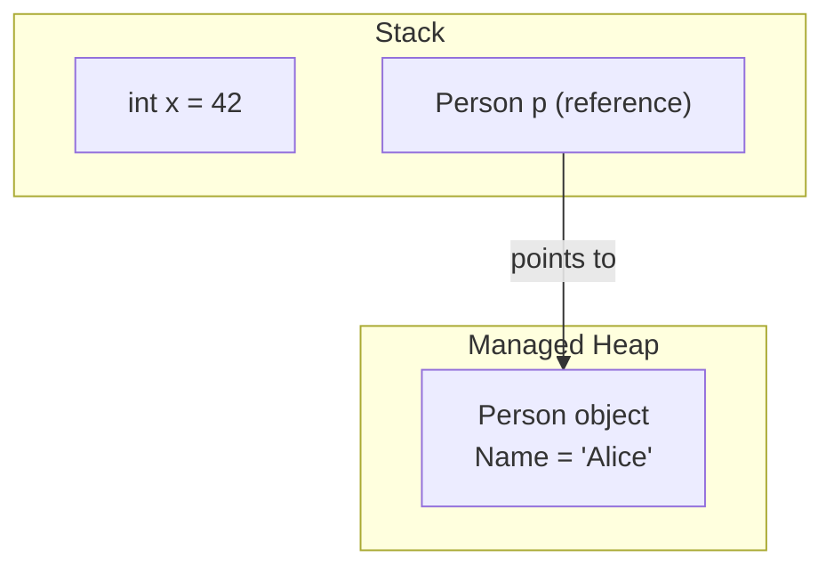

### var, object, dynamic

| Type | Description | Example |
|---|---|---|
| `var` | Statically typed, compile time par infer hota hai | `var x = 5;` |
| `object` | Saare types ka base type; casting chahiye | `object obj = "Hello";` |
| `dynamic` | Runtime par resolve hota hai, compile-time checking nahi | `dynamic d = 5;` |

`var` ke rules: declaration ke time type hint ke bina `null` assign nahi kiya ja sakta; declaration par hi initialize karna zaruri hai; inferred type baad mein change nahi ho sakta; sirf local-scope (kabhi class field nahi). `var` use karo jab type obvious ho, anonymous types ke saath, aur LINQ mein; jab readability kharab ho tab avoid karo (`var x = GetData();` — kaunsa type hai?).

### == vs Equals() vs ReferenceEquals()

`==` **default** roop se value types ke liye values compare karta hai aur reference types ke liye references. `Equals()` value equality check karta hai aur override kiya ja sakta hai. `==` ko **operator-overload** bhi kiya ja sakta hai.

```csharp
string a = "hello", b = "hello";
Console.WriteLine(a == b);       // True (string overloads == for value comparison)
Console.WriteLine(a.Equals(b));  // True

public class Employee
{
    public int Id { get; set; }
    public override bool Equals(object obj) => obj is Employee e && e.Id == Id;
    public override int GetHashCode() => Id.GetHashCode();
    public static bool operator ==(Employee e1, Employee e2) => e1.Id == e2.Id;
    public static bool operator !=(Employee e1, Employee e2) => !(e1 == e2);
}
```

> **Gotcha jo interviewer probe karega:** agar aap `Equals()` override karte ho, to aapko `GetHashCode()` bhi **zaroor** override karna padega — warna type `Dictionary`/`HashSet` mein toot jaata hai (jo objects `Equals`-equal hain unhe same hash code return karna chahiye, warna lookups silently unhe dhoondh nahi paate). `object.ReferenceEquals(a, b)` kisi bhi overload ko bypass karta hai aur hamesha raw references compare karta hai — kaam aata hai jab aapko overridden `Equals` ke bawajood specifically identity comparison chahiye ho.

### Nullable Value Types & Nullable Reference Types (NRTs)

```csharp
int? age = null;                 // nullable value type — wraps in Nullable<int>
Console.WriteLine(age ?? 18);    // 18

string? name = null;             // nullable reference type (C# 8+, opt-in via <Nullable>enable</Nullable>)
```

**[new content] NRTs real-world mein — adoption ka asli dard.** Nullable reference types ek *compile-time, opt-in* analysis feature hain — inse **koi runtime null-checking add nahi hoti**; `string?` vs `string` sirf compiler warnings (CS8600-series) se enforce hota hai, jo by default warnings hoti hain, errors nahi. Senior candidates ko discuss karne ke liye ready rehna chahiye in consequences ke liye:

- **Retrofit-friendly nahi.** Ek bade legacy codebase par `<Nullable>enable</Nullable>` enable karne se build sainkdon/hazaron warnings se bhar jaata hai, kyunki ab har parameter, field, aur return type ko correctly annotate karna padta hai. Zyada teams ek file-by-file ya project-by-project rollout karti hain `#nullable enable` pragmas use karke, big-bang flip ke bajaye.
- **NRTs runtime par non-null prove nahi karte.** Ek `string` jo non-nullable annotate hai, wo *phir bhi* runtime par null ho sakta hai (jaise reflection se, JSON se deserialization jisme fields missing hon, ya kisi un-annotated third-party library se) — compiler ka confidence sirf uske analysis jitna hi accha hai, isi wajah se `NullReferenceException` NRT-enabled code mein bhi hoti hai.
- **Escape hatches ka use teams ke admit karne se zyada hota hai**: null-forgiving operator `!` (jaise `user!.Name`) compiler ko silence kar deta hai bina koi runtime check add kiye — `!` ko overuse karna wahi bug class reintroduce kar deta hai jise NRTs prevent karne ke liye bane the.
- Interviewers pooch sakte hain: *"Aapki team ne nullable reference types enable kiye aur ab 3,000 warnings hain — aap ise kaise rollout karoge?"* Ek strong jawab: har project ko `.csproj` ke through individually enable karo, top-down fix karo public APIs/DTOs se shuru karke trust boundaries par, warnings ko errors treat karo sirf jab project clean ho jaaye, aur `[NotNull]`/`[MaybeNull]`/`[AllowNull]` attributes use karo un cases ke liye jo compiler infer nahi kar sakta (jaise `TryGetValue`-style patterns).

### Implicit vs Explicit Conversion

| | Implicit | Explicit |
|---|---|---|
| Data loss? | Nahi | Possible |
| Syntax | Automatic | Manual `(type)` cast |

```csharp
int x = 10;
double y = x;      // implicit
int z = (int)y;    // explicit
```

### Boxing & Unboxing

| Concept | Description | Example |
|---|---|---|
| Boxing | Value type → object (stack → heap copy) | `object obj = 10;` |
| Unboxing | object → value type | `int num = (int)obj;` |

Boxing extra heap allocation aur GC pressure create karta hai — relevant hota hai jab bhi koi `struct` `object` ke roop mein pass hota hai, non-generic collection (`ArrayList`) mein store hota hai, ya kisi `interface` (jo wo implement karta hai) expect karne wale method ko pass hota hai. **Performance cost, concretely:** har boxing operation ek naya heap object allocate karta hai (object header + sync block ke saath, typically 16–24 bytes overhead ek 4-byte `int` ke liye bhi), aur har unboxing operation value ko copy karne se pehle ek runtime type check karta hai. Ek hot loop mein, yeh GC Gen0 pressure ke roop mein dikhta hai — ek classic "yeh slow kyun hai" interview scenario hai `ArrayList` boxed `int`s se bhara hua vs `List<int>` (generic, boxing nahi).

---

## Part II — Core Concepts: OOP

### The Four Pillars

Encapsulation, Inheritance, Polymorphism, Abstraction.

**Encapsulation** — object data tak direct access restrict karna, controlled access properties/methods ke through expose karna.

```csharp
class Person
{
    private string name;
    public string Name { get => name; set => name = value; }
}
```

### Inheritance vs Composition

**Inheritance** ("is-a"): ek class dusri class ki properties/behavior acquire karti hai. C# sirf **single class inheritance** support karta hai. Deep inheritance ke problems: tight coupling, base-class changes subclasses mein ripple ho jaate hain.

```csharp
class Animal { public void Eat() => Console.WriteLine("Eating..."); }
class Dog : Animal { public void Bark() => Console.WriteLine("Barking..."); }
```

**Composition** ("has-a"): chhote components ko combine karke behavior build karna — kyunki ek class multiple interfaces implement kar sakti hai, aap behaviors ko compose karte ho instead of ek rigid hierarchy mein locked hone ke.

```csharp
interface IFly { void Fly(); }
interface ISwim { void Swim(); }

class Duck : IFly, ISwim   // composed abilities, no deep hierarchy
{
    public void Fly() => Console.WriteLine("Flying");
    public void Swim() => Console.WriteLine("Swimming");
}
```

.NET mein, chhote focused interfaces (`IDisposable`, `IEnumerable<T>`, `IComparable`) kisi bhi class ko ek behavior mein opt-in karne dete hain bina shared base class ke — `List<T>` aur `Dictionary<TKey,TValue>` dono `IEnumerable<T>` implement karte hain bina same inheritance tree mein hone ke.

> **Guideline:** flexibility ke liye composition ko inheritance se zyada prefer karo; inheritance ka use sirf tab karo jab genuinely ek "is-a" relationship ho shared invariants ke saath.

### Polymorphism: Compile-Time vs Runtime

**Compile-time (static) polymorphism** — compiler dwara method/operator overloading ke through resolve hota hai.

```csharp
class Calculator
{
    public int Add(int a, int b) => a + b;
    public double Add(double a, double b) => a + b;
}
```
Fayde: readability, koi virtual-dispatch overhead nahi, code reuse. Nuksan: compile time par fixed, possible duplication, ambiguity errors (jaise `Print(null)` jab overloads `object`/`string` accept karte hain).

**Runtime (dynamic) polymorphism** — CLR dwara runtime par `virtual`/`override` ya interface implementation ke through resolve hota hai.

```csharp
class Animal { public virtual void Speak() => Console.WriteLine("Animal sound"); }
class Dog : Animal { public override void Speak() => Console.WriteLine("Bark"); }
class Cat : Animal { public override void Speak() => Console.WriteLine("Meow"); }

Animal a1 = new Dog();   // compiler sees Animal; CLR resolves Dog.Speak at runtime
a1.Speak();              // Bark
```
Yeh naye implementations ko ek stable abstraction ke against plug karne deta hai (`IPaymentProcessor` ke saath `CreditCardProcessor`/`UPIProcessor`), type-check chains avoid karta hai, Factory/Strategy/Template Method ke underlying hota hai. Nuksan: thoda dispatch overhead, deep hierarchies mein debugging harder, weaker JIT inlining.

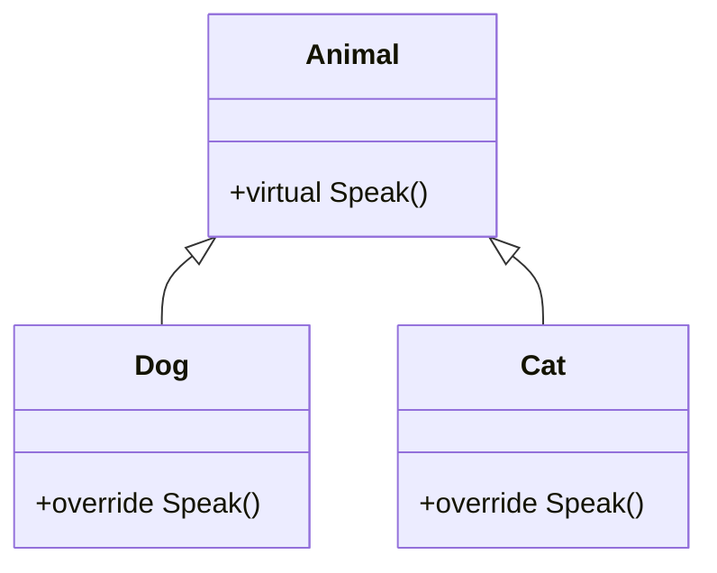

### Overloading vs Overriding vs Hiding (new)

| Keyword | Meaning |
|---|---|
| `virtual` | Ek method declare karta hai jo override ho sakta hai |
| `override` | Ek virtual method ka naya implementation provide karta hai |
| `new` | Base-class method ko hide karta hai instead of override karne ke |

```csharp
class Base { public void Show() => Console.WriteLine("Base"); }
class Derived : Base { public new void Show() => Console.WriteLine("Derived"); }
```

Hiding resolution **reference type** par depend karta hai, object ke runtime type par nahi — yeh classic trap hai:

```csharp
Base b = new Derived();
b.Show();       // "Base" — resolved by reference type (Base), not object type
((Derived)b).Show(); // "Derived"
```

`override` ke bajaye `new` use karne ke real-world reasons:
- **Backward compatibility** legacy code mein jise aap change nahi kar sakte — `LegacyLogger.Log()` ke purane callers kaam karte rehte hain jab ek naya hiding method naye consumers ke liye behavior improve karta hai.
- Base method **virtual nahi hai**, isliye wo literally override nahi ho sakta.
- Aapko base behavior chahiye jab base type se access ho aur specialized behavior derived type se (jaise ek watermarking `ConfidentialDocument`).
- Ek framework class customize karna jiska method `virtual` nahi hai (jaise ek custom `MyButton : Button` jo non-virtual `Refresh()` hide kar rahi hai).

> Agar base class aapke control mein hai, `virtual` + `override` prefer karo — yeh almost always better design hota hai.

### Interface vs Abstract Class

```csharp
public interface IAnimal { void Speak(); }
public class Dog : IAnimal { public void Speak() => Console.WriteLine("Bark"); }

public abstract class Animal
{
    public abstract void Speak();               // must override
    public void Eat() => Console.WriteLine("Eating..."); // shared default
}
```

| Aspect | Interface | Abstract Class |
|---|---|---|
| Core idea | Class CAN DO kya (capability) | Class IS kya (identity) |
| Methods | Koi implementation nahi (default methods C# 8 se) | Dono abstract aur implemented |
| Fields / Constructors | Nahi | Haan |
| Inheritance | Multiple | Single |

**Interface ke fayde:** multiple inheritance, loose coupling (`IRepository` not `SqlRepository`), unrelated classes ke across flexibility/polymorphism, DI aur mocking ke liye great, composition encourage karta hai, C# 8 se default implementations. **Nuksan:** pre-C#8 shared implementation nahi, pre-C#8 members add karte time versioning issues, no fields/constructors, weaker encapsulation, interface over-engineering ka risk (`IService`, `IHelper`, `IManager` har jagah).

**Abstract class ke fayde:** concrete methods ke through code reuse, shared state hold kar sakta hai (fields/constructors), polymorphism, organized hierarchy. **Nuksan:** single-inheritance limitation, tighter coupling, directly instantiate nahi ho sakta (halaanki uska constructor phir bhi run hota hai jab derived object create hota hai — Part III dekho).

> **Design guideline:** interface se start karo; abstract class ka use sirf tab karo jab shared state ya behavior genuinely required ho.

### struct vs class

```csharp
struct Point
{
    public int X { get; }
    public int Y { get; }
    public Point(int x, int y) { X = x; Y = y; }
}
Point p1 = new Point(2, 3);
Point p2 = p1;          // value copy
p2 = new Point(5, 6);
// p1.X == 2 (unchanged), p2.X == 5
```

| Feature | struct (value type) | class (reference type) |
|---|---|---|
| Memory | Stack (jab tak box na ho ya class ka field ho) | Heap |
| Passing | By value (copy) | By reference |
| Inheritance | Sirf interfaces, class inheritance nahi | Inheritance support karta hai |
| GC | GC overhead nahi | GC dwara managed |
| Mutability | Usually immutable hona chahiye | Mutable |

Ready rakhne wale facts: by value pass hota hai (ek copy pass hoti hai, isliye method mutations original ko affect nahi karte); C# 10 se pehle, structs mein parameterless constructors nahi ho sakte the (C# 10 se allowed); usually immutable hona chahiye (copy-on-assignment mutable structs ko ek common bug source banata hai); boxing tab hoti hai jab struct `object`/kisi interface (jo wo implement karta hai) mein convert hota hai (stack → heap copy); Microsoft structs ko chhota rakhne ki recommend karta hai (**≤ 16 bytes** commonly cited guideline hai) kyunki large structs har pass/assignment par copy karna expensive hota hai.

### sealed, static, and partial classes

```csharp
sealed class MyClass { }   // cannot be inherited

static class MathHelper    // cannot be instantiated; only static members
{
    public static int Square(int n) => n * n;
}
```

Ek `static` class instantiate nahi ho sakti, sirf static members hote hain, dusri classes se inherit nahi kar sakti (C# 8+ se interfaces implement kar sakti hai... actually static classes still instance interfaces implement nahi kar sakti kyunki unke paas koi instance nahi hota — yeh sirf extension-method-style static classes par applicable hai), ek static constructor ho sakta hai, aur utility methods ke liye ideal hai.

`partial` classes ek class ko multiple files mein split karti hain — kaam aata hai large classes ke liye, generated code (jaise EF Core scaffolding, WinForms designer) ko hand-written code se separate karne ke liye, aur multiple developers ko merge conflicts ke bina kaam karne dene ke liye.

### Access Modifiers

| Modifier | Inside class | Derived (same asm) | Same asm (non-derived) | Derived (diff asm) | Outside asm |
|---|---|---|---|---|---|
| `public` | Yes | Yes | Yes | Yes | Yes |
| `private` | Yes | No | No | No | No |
| `protected` | Yes | Yes | No | Yes | No |
| `internal` | Yes | Yes | Yes | No | No |
| `protected internal` | Yes | Yes | Yes | Yes | No |
| `private protected` | Yes | Yes | No | No | No |

Top-level (non-nested) classes sirf `public` ya `internal` ho sakti hain; nested classes koi bhi modifier use kar sakti hain.

### [new content] Records & record struct

Ek `record` ek reference type hai jisme built-in **value-based equality**, `ToString()`, aur (convention se) immutability hoti hai — DTOs aur domain value objects ke liye ideal.

```csharp
public record Product(int Id, string Name, decimal Price);

var p1 = new Product(1, "Laptop", 999.99m);
var p2 = new Product(1, "Laptop", 999.99m);
Console.WriteLine(p1 == p2);              // True — value equality, unlike class
var p3 = p1 with { Price = 899.99m };     // non-destructive mutation
```

`record struct` (C# 10) same value-equality semantics deta hai lekin ek value type ke roop mein, heap allocation avoid karte hue — kaam aata hai chhote, frequently-created value objects ke liye (`Money`, `Coordinates`).

| | class | record | record struct |
|---|---|---|---|
| Equality | Reference | Value (member-wise) | Value (member-wise) |
| Storage | Heap | Heap | Stack (usually) |
| Mutability | Default se mutable | Convention se immutable (init-only) | Mutable, jab tak `readonly` na ho |
| Best for | Behavior-rich entities | DTOs, domain value objects | Chhote, hot-path value objects |

> **Common interview question:** "record aur class mein kya difference hai?" — value equality + `with` expression (non-destructive updates ke liye) se shuru karo, phir allocation-sensitive scenarios ke liye `record struct` mention karo.

### [new content] Pattern Matching & Switch Expressions

```csharp
// Switch expression (C# 8+) replaces verbose switch statements
string Describe(object obj) => obj switch
{
    int n when n < 0 => "negative number",
    int n => $"number {n}",
    string s => $"string of length {s.Length}",
    Product { Price: > 1000 } => "expensive product",   // property pattern
    null => "nothing",
    _ => "unknown"
};

// Relational and logical patterns (C# 9)
bool IsAdult(int age) => age is >= 18 and < 120;

// List patterns (C# 11)
int[] numbers = { 1, 2, 3 };
if (numbers is [1, 2, 3]) Console.WriteLine("matched exact sequence");
if (numbers is [var first, .., var last]) Console.WriteLine($"{first}..{last}");
```

Property patterns aur switch expressions ab nested `if/else` aur type-checking chains ko replace karne ka idiomatic tareeka hain — interviewers isse gauge karte hain ki aapka day-to-day style kitna current hai.

---

## Part III — Constructors & Object Creation

Ek constructor ek special method hota hai, class ke same naam ka, koi return type nahi (`void` bhi nahi), jo object creation par automatically run hota hai use valid, usable state mein laane ke liye aur invariants enforce karne ke liye (partially-constructed objects ko prevent karna).

### Types of Constructors

1. **Default** — no parameters; agar aap koi constructor define nahi karte, C# implicit ek supply karta hai; *koi bhi* constructor define karne se implicit default remove ho jaata hai.
2. **Parameterized** — mandatory data enforce karta hai; commonly DI ke saath use hota hai.
3. **Overloaded** — multiple constructors, different parameter lists; duplication avoid karne ke liye `: this(...)` chaining use karo.
   ```csharp
   public Order() : this(0, "Default") { }
   public Order(int id, string type) { Id = id; Type = type; }
   ```
4. **Static** — static members initialize karta hai; per type ek baar run hota hai, first instance creation ya static member access se pehle; no parameters, no access modifiers; **per class sirf ek allowed**; iske andar exception app crash kar deti hai, isliye ise light rakho.
5. **Private** — external instantiation prevent karta hai; Singleton, static utility classes, ya factory-controlled creation ke liye use hota hai.
   ```csharp
   public class Logger
   {
       private static Logger _instance;
       private Logger() { }
       public static Logger Instance => _instance ??= new Logger();
   }
   ```
6. **Copy** — C# **koi** built-in copy constructor provide nahi karta; cloning/defensive-copy/immutable patterns ke liye aapko hand-write karna padega.

### Constructors in Abstract Classes

Abstract classes mein constructors ho sakte hain, chahe wo directly instantiate na ho sakein — constructor sabse pehle run hota hai jab *derived* object create hota hai, shared state initialize karne aur setup enforce karne ke liye.

> *"Abstract class constructors derived object creation ke time run hote hain shared state initialize karne aur required setup enforce karne ke liye."*

### Step-by-Step Object Creation Process

```csharp
Employee emp = new Employee(10, "John");
```

1. `new` encounter hota hai — CLR determine karta hai ki use ek `Employee` create karna hai.
2. Managed heap par memory allocate hoti hai — size compute hota hai (fields + object header); fields **zero-initialize** hote hain (`Id = 0`, `Name = null`) **kisi bhi constructor run hone se pehle**.
3. Object reference create hota hai (stack/register) — `emp` heap address hold karta hai; object khud stack par nahi hota.
4. Constructor resolution (compile time) — argument count/types/order se chosen hota hai.
5. Base constructor pehle run hota hai — har class ultimately `object` se derive hoti hai; call order hai `object()` → derived.
6. Instance field initializers run hote hain — constructor body se pehle.
7. Constructor body execute hoti hai.
8. Reference assign hota hai — object ab use ke liye ready hai.
9. Lifetime & GC — jab tak reachable hai zinda rehta hai; unreachable hone par non-deterministic GC ke liye eligible ho jaata hai.

> One-liner: **Memory allocation → zero initialization → constructor selection → base constructor → field initializers → constructor body → reference assignment.**

**Common interview Q&A (fully answered):**
- *Kya constructors virtual ho sakte hain?* Nahi — kabhi virtual, abstract, ya overridable nahi hote.
- *Kya constructors exceptions throw kar sakte hain?* Haan, lekin generally sirf argument-validation failures ke liye.
- *Static vs instance constructor?* Static per type ek baar run hota hai; instance per object run hota hai.
- *Kya ek class ke multiple static constructors ho sakte hain?* Nahi — sirf ek allowed hai.

Constructor best practices (senior level): constructors ko lightweight rakho (no I/O/DB calls); arguments early validate karo; immutability prefer karo; DI scenarios mein multiple public constructors avoid karo (container ko call karne ke liye ek unambiguous constructor chahiye); complex initialization ke liye factory patterns use karo.

### [new content] init, required, and Primary Constructors (C# 11/12)

```csharp
public class Person
{
    public string Name { get; init; }        // settable only during object initialization
    public required int Age { get; set; }    // C# 11 — compiler enforces it's set
}
var person = new Person { Name = "Alice", Age = 30 }; // fine
// person.Name = "Bob";  // compile error — init-only after construction
```

`init` ek property ko sirf construction time par (object initializer ya constructor mein) set hone deta hai, immutability deta hai bina har properties combination ke liye constructor overload ki zarurat ke. `required` (C# 11) callers ko property set karne ke liye force karta hai, missing-data bugs ko runtime ke bajaye compile time par catch karte hue.

**Primary constructors** (records se extend hokar ordinary classes/structs tak C# 12 mein) constructor parameters ko class body mein throughout scope mein rakhte hain bina fields ko redeclare kiye:

```csharp
public class ProductService(IRepository repo, ILogger<ProductService> logger)
{
    public async Task<Product> GetAsync(int id)
    {
        logger.LogInformation("Fetching {Id}", id);
        return await repo.GetProductAsync(id);
    }
}
// no explicit constructor or private readonly fields needed
```
> *Caution: primary constructor parameters automatically fields nahi hote — agar aapko koi value later use ke liye store karni hai beyond jo directly reference hota hai, compiler ek hidden backing field synthesize karta hai sirf tab jab parameter kisi method body mein capture ho. Isse implicitly rely mat karo agar clarity matter karti hai.*

---

## Part IV — Intermediate: Members & Language Features

### Properties vs Fields

```csharp
public int MyField;                          // no encapsulation
public int MyProperty { get; set; }           // encapsulated access
```

| Feature | Field | Property |
|---|---|---|
| Encapsulation | Nahi | Haan (get/set) |

### const vs readonly vs static

```csharp
const int ConstValue = 10;
readonly int ReadOnlyValue;    // assignable in constructor
static int StaticValue;
```

| Feature | const | readonly | static |
|---|---|---|---|
| Value set | Compile-time, declaration par | Runtime, constructor mein | Instances ke across shared |
| Init ke baad change ho sakta? | Nahi | Nahi, constructor finish hone ke baad | n/a |
| Storage | Assembly metadata (IL) mein baked | Kisi bhi field jaisa instance/type storage | Per type ek copy |

### ref vs out vs in

```csharp
void RefExample(ref int num) { num += 5; }
void OutExample(out int num) { num = 10; }
void InExample(in int num) { /* read-only, cannot modify num */ }
```

| Feature | `ref` | `out` | `in` |
|---|---|---|---|
| Initialization | Pass karne se pehle initialize hona zaruri | Initialize karne ki zarurat nahi | Pass karne se pehle initialize hona zaruri |
| Used for | Ek existing value read aur modify karna | Additional value(s) return karna, jaise `int.TryParse` | Large structs ko reference se pass karna mutation allow **kiye bina** (copy avoid karta hai read-only rehte hue) |

### params, Named Parameters, Indexers

```csharp
void PrintNumbers(params int[] numbers) { foreach (int n in numbers) Console.Write(n + " "); }
PrintNumbers(1, 2, 3, 4, 5); // 1 2 3 4 5

void Greet(string name, int age) => Console.WriteLine($"{name} is {age}");
Greet(age: 25, name: "Alice");     // named parameters — order-independent

class Sample
{
    private int[] arr = new int[5];
    public int this[int index] { get => arr[index]; set => arr[index] = value; }
}
```

### Extension Methods

Ek static method jo kisi existing type mein "add" ho jaata hai bina use modify kiye — first parameter par `this` se marked hota hai.

```csharp
public static class MyExtensions
{
    public static bool IsEven(this int number) => number % 2 == 0;
}
int x = 10;
Console.WriteLine(x.IsEven());   // True
```

Compiler `name.IsLongerThan(3)` ko rewrite karke `StringExtensions.IsLongerThan(name, 3)` bana deta hai — yeh instance method jaisa dikhta hai lekin under the hood ek static call hai. Built-in types (`string`, `int`, `DateTime`) extend karne ke liye use hota hai, Open/Closed Principle honor karne ke liye, aur call sites ko readable rakhne ke liye. LINQ ke `Where`/`Select`/`OrderBy` sab `IEnumerable<T>` par extension methods hain.

### Generics — Why They're Not Slow

```csharp
public class Box<T> { public T Value { get; set; } }
Box<int> intBox = new Box<int> { Value = 10 };
Box<string> strBox = new Box<string> { Value = "Hello" };
```

- **Compile-time:** ek generic definition ek baar type-checked hoti hai; value types ke liye boxing/unboxing nahi (unlike `ArrayList`).
- **Runtime:** CLR saare reference-type instantiations ke across **ek implementation share karta hai** (kyunki references sab same size/shape ke hote hain), lekin **har distinct value-type instantiation ke liye ek specialized native implementation generate karta hai** (`Box<int>` aur `Box<double>` ko apna-apna JIT-compiled code milta hai; `Box<string>` har dusre reference type ke saath code share karta hai).
- **Net effect:** boxing avoid karta hai, memory overhead kam karta hai, aur JIT ko zyada aggressively inline karne deta hai jitna wo ek non-generic `object`-based API ke through kar sakta.

### Tuples & Anonymous Types

```csharp
var person = ("John", 30);
Console.WriteLine(person.Item1);              // John

(string Name, int Age) named = ("John", 30);
Console.WriteLine(named.Name);                // named tuple elements — more readable

var p = new { Name = "John", Age = 30 };      // anonymous type
Console.WriteLine(p.Name);
```

### Reflection, Attributes, dynamic, ExpandoObject

```csharp
Type type = typeof(string);          // compile-time type retrieval
Console.WriteLine(type.FullName);

Type t2 = Type.GetType("System.String"); // runtime type retrieval (e.g. from a string)

[Obsolete("This method is deprecated.")]
void OldMethod() { }

dynamic value = "Hello";
value = 10;                          // no compile-time error — resolved at runtime (late binding)

dynamic expando = new ExpandoObject();
expando.Name = "John";               // properties added dynamically at runtime
```

`dynamic` compile-time type checking ko poori tarah skip kar deta hai (late binding); yeh compile-time safety ko flexibility ke liye trade karta hai (jaise COM interop, dynamic JSON, scripting scenarios) aur ek real performance cost aata hai iske saath (har `dynamic` operation DLR — Dynamic Language Runtime — call-site caching se guzarta hai, jo ek direct static call se slower hai).

### yield return and Iterators

```csharp
IEnumerable<int> GetNumbers() { yield return 1; yield return 2; }
```

Compiler ek `yield return` method ko rewrite karke ek state machine bana deta hai jo `IEnumerable<T>`/`IEnumerator<T>` implement karta hai — execution deferred hota hai jab tak caller enumerate na kare (`foreach`, `.ToList()`, etc.), aur har `MoveNext()` call wahi se resume hota hai jahan pichhla chhoda tha.

### Fluent Interfaces

Ek design style jisme methods same/related object return karte hain taaki calls chain hokar readable, sentence-like code banaye. Har fluent interface method chaining use karta hai, lekin har method chain fluent interface nahi hota — ek fluent interface specifically ek readable DSL target karta hai.

```csharp
class Calculator
{
    private int _result;
    public Calculator Add(int x) { _result += x; return this; }
    public Calculator Multiply(int x) { _result *= x; return this; }
    public int Result() => _result;
}
```

.NET examples: `StringBuilder`, LINQ (`Where`/`Select`/`OrderBy`), ASP.NET Core middleware:
```csharp
app.UseRouting().UseAuthentication().UseAuthorization().MapControllers();
```

### Deep Copy vs Shallow Copy

| | Shallow Copy | Deep Copy |
|---|---|---|
| Copies | References (nested objects shared) | New instances (fully independent) |

```csharp
Person clone = (Person)this.MemberwiseClone(); // shallow copy — nested reference fields still shared
```

Ek deep copy typically ya to hand-written recursive clone chahta hai, serialize/deserialize round-trip (JSON ya binary), ya ek copy constructor jo khud nested reference members ko deep-copy kare. .NET mein koi built-in "deep clone" nahi hai — har approach ke trade-offs hain (serialization simple hai lekin slow aur saare nested types ko serializable hona chahiye; ek hand-written deep-copy constructor sabse fast hai lekin class shape ke saath sync mein rakhna padta hai).

### [new content] Static Abstract/Virtual Interface Members & Generic Math (C# 11)

C# 11 se pehle, interfaces sirf *instance* members declare kar sakte the. C# 11 `static abstract`/`static virtual` members allow karta hai, jo **generic math** aur operator-based generic constraints enable karta hai:

```csharp
public interface IShape<T> where T : IShape<T>
{
    static abstract T Create(double size);
    static abstract double Area(T shape);
}

public readonly struct Square : IShape<Square>
{
    public double Side { get; }
    private Square(double side) => Side = side;
    public static Square Create(double size) => new Square(size);
    public static double Area(Square s) => s.Side * s.Side;
}
```

Headline use case `System.Numerics.INumber<T>` aur related interfaces hain, jo aapko ek single generic method likhne dete hain jo `int`, `double`, `decimal`, aur custom numeric types ke across real operators (`+`, `-`, `*`, comparisons) ke saath kaam kare instead of per-type math logic duplicate karne ya `dynamic`/reflection par fallback karne ke.

### [new content] Source Generators

Ek source generator ek Roslyn-based compiler plugin hai jo **compile time par aapka code inspect karta hai aur additional C# source files emit karta hai** jo uske saath compile ho jaate hain — reflection-heavy runtime metaprogramming ka ek modern alternative.

- Modern .NET mein heavily use hota hai: `System.Text.Json` ka `[JsonSerializable]` + `JsonSerializerContext` (source-generated serialization, reflection nahi, Native-AOT-friendly), zero-allocation structured logging ke liye `LoggerMessage` source generator, regex source generation (`[GeneratedRegex]`), aur MVVM/DI-container community libraries.
- **Senior interviews ke liye kyun matter karta hai:** industry direction (Native AOT, trimming, faster cold starts) reflection-based frameworks se door aur compile-time code generation ki taraf push kar rahi hai. Yeh kehna ki "main yahan reflection ke bajaye source generator use karunga AOT compatibility aur startup performance ke liye" ek strong senior signal hai.

```csharp
[JsonSerializable(typeof(Product))]
internal partial class AppJsonContext : JsonSerializerContext { }

// Usage — no reflection at runtime:
var json = JsonSerializer.Serialize(product, AppJsonContext.Default.Product);
```

---

## Part V — Delegates, Events & Lambdas

### Delegates

Ek delegate ek type-safe function pointer hai — C/C++ function pointers ke unlike, delegates secure aur type-checked hote hain, aur aap methods ko parameters ke roop mein pass kar sakte ho.

```csharp
public delegate void Notify(string message);

public class Process
{
    public void StartProcess(Notify notifier) => notifier("Process Started...");
}

Notify notifyDelegate = Console.WriteLine;
new Process().StartProcess(notifyDelegate); // "Process Started..."
```

Types: **single-cast** (ek method reference karta hai) aur **multicast** (`+=`, multiple methods reference karta hai, registration order mein invoke hota hai).

### Func, Action, Predicate

| Delegate | Inputs | Returns | Use case |
|---|---|---|---|
| `Func<T,TResult>` | 0–16 | Ek value | Computations, LINQ `Select`/`Where`/`OrderBy` |
| `Action<T>` | 0–16 | `void` | Logging, printing, `ForEach` |
| `Predicate<T>` | 1 | `bool` | Conditions, `FindAll` |

```csharp
Action<string> log = msg => Console.WriteLine("Log: " + msg);
Func<int,int,int> add = (a, b) => a + b;         // add(5,10) -> 15
Predicate<int> isEven = n => n % 2 == 0;         // isEven(4) -> true
```

**Delegates ke fayde:** loose coupling, callbacks/event-driven programming, multicast, LINQ/async continuations ka foundation. **Nuksan:** overuse traceability kharab karta hai; multicast misuse unintended multiple executions cause karta hai; ek null delegate call throw karta hai (`?.Invoke()` isse guard karta hai).

### Events

Ek event ek delegate ko wrap karta hai aur **Publisher–Subscriber** pattern implement karta hai: `event` keyword external code ko sirf `+=`/`-=` tak restrict karta hai — yeh underlying delegate ko directly **invoke ya overwrite nahi kar sakta**. Yahi hai raw public delegate field ke upar core encapsulation benefit.

```csharp
public class Alarm
{
    public delegate void AlarmEventHandler(string message);
    public event AlarmEventHandler OnAlarm;
    public void Ring()
    {
        Console.WriteLine("Alarm ringing...");
        OnAlarm?.Invoke("Wake up! It's 7 AM");
    }
}
var alarm = new Alarm();
alarm.OnAlarm += msg => Console.WriteLine("Subscriber 1: " + msg);
alarm.OnAlarm += msg => Console.WriteLine("Subscriber 2: " + msg);
alarm.Ring();
```

**Real-life scenarios:** UI events (`Button.Click`, `TextBox.TextChanged`); stock-price notification (`PriceChanged` sirf `if (price != value)` par fire hota hai redundant notifications avoid karne ke liye — ek accha nuance); e-commerce `OrderPlaced` order service ko email/inventory/shipping listeners se decouple karta hai; microservices/messaging jahan domain events Kafka/RabbitMQ/AWS SNS/SQS pub-sub par map hote hain.

**Fayde:** loose coupling, multicast, reusability (publisher ko touch kiye bina subscribers add karna), raw delegates se stronger encapsulation. **Nuksan:** un-unsubscribed handlers ek classic **memory-leak** source hain (ek long-lived publisher apni invocation list ke through har subscriber ka reference hold karta hai — agar ek short-lived subscriber kabhi unsubscribe nahi karta, wo GC nahi ho sakta); many subscribers ke saath harder debugging; overuse control flow ko obscure karta hai.

### Delegate vs Event

| Feature | Delegate | Event |
|---|---|---|
| Assignable? | Haan | Nahi — sirf `+=` / `-=` |
| Kaun invoke kar sakta hai? | Access wala koi bhi code | Sirf publisher class |
| Encapsulation | Weaker (misuse/overwrite ho sakta hai) | Stronger (compiler-enforced) |
| Usage | Callbacks, functions pass karna, LINQ, async | Notifications, decoupled communication |

> *Analogy: ek delegate kisi ko aapki car keys de deta hai (wo kabhi bhi drive kar sakta hai); ek event unhe ride ke liye invite karta hai (aap, publisher, decide karte ho kab hoga). Best practice: reusable libraries/APIs mein **events** expose karo, raw delegates nahi.*

### Lambda Expressions & Anonymous Methods

```csharp
Func<int,int> square = x => x * x;
Console.WriteLine(square(5)); // 25

Action<int> squarePrint = delegate(int x) { Console.WriteLine(x * x); }; // older anonymous-method syntax
```

Lambdas modern idiomatic form hain; `delegate(...)` anonymous-method syntax abhi bhi compile hota hai lekin aaj kal shayad hi hand se likha jaata hai.

---

## Part VI — Collections & LINQ

### LINQ Fundamentals

```csharp
var numbers = new[] { 1, 2, 3, 4, 5 };
var evens = numbers.Where(n => n % 2 == 0);   // deferred — not executed until enumerated
```

### IEnumerable vs IQueryable

```csharp
// IEnumerable — filtering happens in memory
List<int> numbers = new() { 1, 2, 3, 4, 5, 6 };
IEnumerable<int> result = numbers.Where(n => n > 3);

// IQueryable — translated to SQL: SELECT * FROM Customers WHERE Age > 30
IQueryable<Customer> q = context.Customers.Where(c => c.Age > 30);
```

| | IEnumerable | IQueryable |
|---|---|---|
| Namespace | `System.Collections` | `System.Linq` |
| Execution | In-memory (client-side) | Data source par (server-side) |
| Best for | In-memory collections (`List<T>`, arrays) | Remote data (EF Core, LINQ-to-SQL) |
| Mechanism | LINQ to Objects — memory mein load karne ke baad filter karta hai | Expression trees SQL mein translate hoti hain |
| Performance | Pehle saari rows load karta hai, phir filter | Sirf matching rows fetch karta hai |
| Deferred execution | Supported | Supported |

### Expression Trees & How EF Core Translates LINQ to SQL [gaps]

"`IEnumerable` aur `IQueryable` mein kya difference hai" ka ek near-guaranteed senior follow-up hota hai **"theek hai, lekin EF Core actually mera LINQ SQL mein kaise convert karta hai?"** Jawab hai expression trees.

Jab ek LINQ method `IQueryable<T>` par call hota hai, compiler lambda ko **compile nahi** karta IL mein jo code run kare — instead, `Expression<Func<T,bool>>`-typed parameters ke liye, wo ek **data structure banata hai jo code describe karta hai** (expression ka ek abstract syntax tree), jise LINQ provider inspect aur runtime par translate kar sake.

```csharp
Expression<Func<Customer, bool>> predicate = c => c.Age > 30 && c.City == "Seattle";
```

Yeh kisi aisi cheez mein compile hota hai jise aap runtime par inspect aur walk kar sakte ho:
```csharp
Console.WriteLine(predicate.Body);   // (c.Age > 30) AndAlso (c.City == "Seattle")
// predicate.Parameters[0].Name -> "c"
// predicate.Body is a BinaryExpression with Left/Right sub-expressions, recursively walkable
```

**Woh key contrast jo interview question ko directly answer karta hai:**

| | `Func<T,bool>` | `Expression<Func<T,bool>>` |
|---|---|---|
| Compiler kya produce karta hai | Compiled IL — ek delegate jo aap directly invoke kar sakte ho | Ek object graph (`Expression` tree) jo lambda ki structure describe karta hai |
| Kahan run hota hai | In-process, immediately | Khud se kahin nahi — ek provider ko tree walk karke translate karna padta hai |
| Kaun use karta hai | `IEnumerable<T>`/LINQ to Objects | `IQueryable<T>`/EF Core, LINQ to SQL, koi bhi remote-query provider |

**EF Core ka translation pipeline, concretely:**

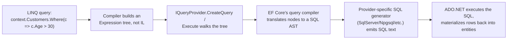

1. `IQueryable<T>` par har `Where`/`Select`/`OrderBy` call kuch execute nahi karta — wo *previous* expression tree ko ek naye node mein wrap kar deta hai jo "is predicate expression ke saath `Where` call karo" represent karta hai, ek bada tree build karte hue. Isi wajah se LINQ-to-SQL queries **deferred** hoti hain: kuch bhi run nahi hota jab tak query enumerate na ho (`ToList()`, `foreach`, `FirstAsync()`, etc.).
2. Enumeration par, EF Core ka `IQueryProvider` pura accumulated expression tree walk karta hai, recognized patterns (property access, comparisons, jaanne wale method calls) match karta hai, aur ek internal relational query model build karta hai.
3. Woh model ek provider-specific SQL generator ko diya jaata hai (SQL Server, PostgreSQL/Npgsql, SQLite, etc. ke liye different) jo actual `SELECT ... WHERE ...` text emit karta hai.
4. **Jo bhi EF Core ka translator recognize nahi karta wo runtime par throw karta hai** (ya, older EF Core versions mein, silently client-side evaluation par fall back karta tha — EF Core 3.0+ ne isko default se error bana diya specifically kyunki silent client-evaluation "yeh kyun itna slow hai" jaise N+1-style bugs ka major source tha). Ek classic gotcha: `Where()` predicate ke andar ek non-translatable custom C# method call karna (`c => MyHelper.IsValid(c)`) translate nahi hota — EF Core ke paas kisi arbitrary compiled method ko SQL mein badalne ka koi tareeka nahi hai, kyunki wo kabhi method run nahi karta, wo sirf call describe karne wale expression ko inspect karta hai.
5. Yahi wajah hai ki `.ToList()` "too early" call karna (LINQ Gotchas ke neeche cover kiya gaya hai) translation ko poori tarah tod deta hai — ek baar aap in-memory `List<T>` mein materialize ho gaye, har subsequent LINQ call `IEnumerable<T>`/`Func<T,bool>` se bind hoti hai, `IQueryable<T>`/`Expression<Func<T,bool>>` se nahi, isliye us point ke baad kuch bhi SQL tak push down nahi ho sakta.

> **Interview one-liner:** "`IQueryable` methods `Func<...>` ke bajaye `Expression<Func<...>>` lete hain — compiler provider ko aapke lambda ki compiled code ke bajaye ek *description* deta hai, aur provider (EF Core) us description ko walk karke SQL generate karta hai. Yahi pura mechanism hai — tree-walking aur known translatable shapes ke against pattern-matching se aage koi magic nahi hai."

### PLINQ / AsParallel() Trade-offs [gaps]

PLINQ (`System.Linq.ParallelEnumerable`, `.AsParallel()` ke through expose hota hai) LINQ-to-Objects queries ko multiple cores ke across ThreadPool use karke parallelize karta hai, source sequence ko partition karta hai aur results merge karta hai. Yeh **free** performance win nahi hai — yeh ek targeted tool hai jisme real overhead hai, aur ise misuse karna ek common senior-level trap question hai ("Maine `.AsParallel()` add kiya aur woh slow ho gaya — kyun?").

```csharp
var result = numbers
    .AsParallel()
    .Where(n => IsExpensivePredicate(n))   // CPU-bound work per element — good PLINQ candidate
    .Select(n => Transform(n))
    .ToList();                              // forces materialization/merge
```

**PLINQ kab help karta hai:**
- Per-element work genuinely **CPU-bound aur non-trivial** ho (ek cheap predicate jaisa `n % 2 == 0` ek chhoti collection par parallelize karna pure overhead hai bina payoff ke).
- Source collection partitioning aur thread-coordination cost amortize karne ke liye **kaafi bada** ho — PLINQ ke apne heuristics (`WithExecutionMode(ParallelExecutionMode.ForceParallelism)` unhe override karne ke liye) kabhi-kabhi decide kar lete hain ek query ko parallelize *na* karne ka jise wo bahut cheap samajhte hain.
- Operations per element **independent** hon — koi shared mutable state nahi, koi ordering dependency nahi.

**PLINQ kab hurt karta hai (jo trade-offs interviewer sunna chahta hai):**
- **Partitioning overhead** — PLINQ ko source ko chunks mein split karna padta hai aur worker tasks schedule/coordinate karne padte hain; chhoti collections ya cheap per-element work ke liye, yeh coordination cost kisi bhi parallelism benefit se zyada ho jaati hai.
- **Result merging cost** — by default PLINQ kuch operators ke liye order-sensitive merging behavior preserve karta hai, jiska khud overhead hai; `.AsUnordered()` isko relax karta hai jab order matter nahi karta, aksar meaningfully fast.
- **Over-subscription** — PLINQ queries ko dusre CPU-bound work (dusre PLINQ queries ya ek Server-GC background thread including) ke saath concurrently run karna fixed number of cores par contention cause karta hai — aap end up kar sakte ho *zyada* total threads ke saath cores se, jo genuine parallelism ke bajaye context-switch thrashing cause karta hai.
- **I/O-bound work bilkul wrong fit hai** — PLINQ CPU work ko cores ke across parallelize karta hai; I/O-bound per-element work ke liye, `Parallel.ForEachAsync` (Part VIII dekho) correct tool hai, PLINQ nahi.
- **Exceptions** ek `AggregateException` mein aggregate hote hain (`Task`-based parallelism jaisa hi), jo aapke catch-block shape ko normal sequential LINQ query se change kar deta hai.

> **Strong senior jawab:** "Main PLINQ ka use sirf tab karunga jab profiling se pata chale ki ek specific CPU-bound LINQ-to-Objects operation ek sufficiently large in-memory collection par bottleneck hai — yeh default nahi hai, aur I/O-bound fan-out work ke liye main `Parallel.ForEachAsync` ya `Task.WhenAll` use karunga PLINQ ke bajaye, kyunki PLINQ specifically CPU-bound per-element work ko cores ke across spread karne ke baare mein hai."

### IEnumerable vs ICollection vs IList vs IReadOnlyList

- **`IEnumerable<T>`** — sirf read-only forward iteration (`foreach`); no `Count`, no indexer.
- **`ICollection<T>`** — `Add`, `Remove`, `Count`, `Contains` add karta hai.
- **`IList<T>`** — index-based access (`this[int]`), `Insert`, `RemoveAt` add karta hai.
- **`IReadOnlyList<T>` / `IReadOnlyCollection<T>`** — read-only indexed access/count expose karta hai **bina** mutation methods expose kiye — ek public API ke liye correct return type jo apna internal list wapas deta hai bina callers ko mutate karne diye (`List<T>` directly return karne se safer, aur `.ToList().AsReadOnly()` se cheaper kyunki khud ek defensive copy force nahi karta — halaanki callers phir bhi concrete mutable type mein cast back kar sakte hain agar wo determined hain, isliye yeh ek signal/contract hai, hard guarantee nahi).

### List vs Array

```csharp
int[] numbers = new int[5];
List<int> numList = new List<int>();
```

| Feature | Array | List |
|---|---|---|
| Fixed size? | Haan | Nahi |
| Performance | Faster | Thoda slower |

`List<T>` array se slower hota hai kyunki yeh internally ek array wrap karta hai aur resizing (amortized doubling), bounds checking, aur safety features add karta hai jo overhead introduce karte hain.

### Dictionary vs Hashtable

```csharp
Dictionary<int,string> students = new();
students[1] = "Alice";
```

| Feature | Hashtable | Dictionary\<TKey,TValue\> |
|---|---|---|
| Type safety | Nahi (value types ko box karta hai, `object` ke roop mein store karta hai) | Haan (generic) |
| Thread safety | Legacy: single-writer/multiple-reader ke liye safe bina locking ke | Thread-safe nahi — concurrent access ke liye `ConcurrentDictionary` use karo |
| Recommendation | Legacy/naye code mein avoid karo | Preferred |

### ReadOnlyCollection vs List

```csharp
ReadOnlyCollection<int> numbers = new List<int> { 1, 2, 3 }.AsReadOnly();
```

| Feature | ReadOnlyCollection | List |
|---|---|---|
| Modification | Nahi | Haan |
| Usage | Safety / immutability API boundaries par | General-purpose |

### Jagged vs Multidimensional Arrays

```csharp
// Jagged array — array of arrays, independently-sized rows
int[][] jagged = new int[2][];
jagged[0] = new int[] { 1, 2 };
jagged[1] = new int[] { 3, 4, 5 };

// Multidimensional (rectangular) array — fixed rectangular shape, single memory block
int[,] grid = new int[2, 3];
grid[0, 0] = 1;
```

Jagged arrays zyada flexible hote hain (different lengths ki rows) aur actually arrays-of-references hote hain (extra indirection per row); rectangular multidimensional arrays saare elements ko contiguously ek single block mein store karte hain, jo genuinely rectangular data (jaise ek fixed grid ya matrix) ke liye faster ho sakta hai kyunki ek allocation hoti hai instead of N+1.

### Covariance & Contravariance

**Covariance (`out`)** — ek more-derived type ko ek base-typed reference mein assign kiya ja sakta hai (sirf output positions). **Contravariance (`in`)** — ek base type ko wahan assign kiya ja sakta hai jahan derived type expected ho (sirf input positions).

```csharp
public interface IEnumerable<out T> : IEnumerable { IEnumerator<T> GetEnumerator(); }

IEnumerable<string> strings = new List<string> { "A", "B", "C" };
IEnumerable<object> objects = strings;    // allowed thanks to out T
```

`out` modifier compiler ko batata hai ki `T` sirf **output** positions mein appear ho sakta hai (jaise `GetEnumerator()` se return hona) aur kabhi method parameter ke roop mein nahi — yahi wajah hai ki `IEnumerable<T>` safely covariant ho sakta hai: aap usse items read kar sakte ho, lekin koi `Add(T item)` method nahi hai jo aapko incompatible type daalne de.

### String vs StringBuilder

```csharp
StringBuilder sb = new StringBuilder("Hello");
sb.Append(" World");
```

| Feature | String | StringBuilder |
|---|---|---|
| Mutable? | Nahi (har change par new instance) | Haan (in place modify karta hai) |
| Performance | Repeated edits ke liye slower | Repeated edits ke liye faster |

`string` immutable hai — har apparent "modification" (`+=`, `Replace`, `Substring`) ek naya string object allocate karta hai. .NET string literals ko **intern** bhi karta hai (assembly ke identical literals ek instance intern pool ke through share kar sakte hain), isi wajah se `"abc" == "abc"` literals ke liye reference se true hota hai — lekin runtime par build hui strings (jaise concatenation se) automatically intern nahi hoti. `StringBuilder` ek internal mutable char buffer maintain karta hai aur **pre-size** kiya jaana chahiye (`new StringBuilder(capacity)`) jab approximate final length pata ho, repeated internal buffer resizes avoid karne ke liye.

### .NET 6+ LINQ Additions: MinBy/MaxBy/Chunk/DistinctBy/Order/OrderDescending [gaps]

.NET 6 se 9 tak kai LINQ operators add hue jo purane, verbose, easy-to-get-wrong workarounds replace karte hain — cold janna zaruri hai kyunki interviewers inhe use karte hain gauge karne ke liye ki aapka day-to-day LINQ usage kitna current hai.

```csharp
var products = new[]
{
    new Product("Laptop", 999.99m, "Electronics"),
    new Product("Mouse", 25.00m, "Electronics"),
    new Product("Desk", 250.00m, "Furniture"),
};

// MinBy / MaxBy (.NET 6) — select the element with the min/max key, not just the key itself.
// Old way: products.OrderBy(p => p.Price).First();  (sorts the whole sequence just to get one element)
Product cheapest = products.MinBy(p => p.Price);       // Mouse
Product priciest = products.MaxBy(p => p.Price);       // Laptop

// Chunk (.NET 6) — splits a sequence into fixed-size batches, last batch may be smaller.
foreach (Product[] batch in products.Chunk(2))
    await ProcessBatchAsync(batch);                     // e.g., batched bulk-insert calls

// DistinctBy (.NET 6) — de-duplicate by a key selector instead of the whole object/a custom IEqualityComparer.
var onePerCategory = products.DistinctBy(p => p.Category);  // first product seen per category

// Order / OrderDescending (.NET 7) — shorthand for OrderBy(x => x) when sorting by the element itself.
var sorted = new[] { 3, 1, 2 }.Order();                 // [1, 2, 3] — no need for OrderBy(x => x)
var sortedDesc = products.Select(p => p.Price).OrderDescending();
```

| Method | Replaces | Introduced |
|---|---|---|
| `MinBy(keySelector)` / `MaxBy(keySelector)` | `OrderBy(key).First()` / `OrderByDescending(key).First()` — ek element ke liye poori sequence sort karne se bachata hai | .NET 6 |
| `Chunk(size)` | Hand-rolled batching loops manual index math ke saath | .NET 6 |
| `DistinctBy(keySelector)` | `GroupBy(key).Select(g => g.First())`, ya ek custom `IEqualityComparer<T>` sirf ek property se de-dupe karne ke liye | .NET 6 |
| `Order()` / `OrderDescending()` | `OrderBy(x => x)` / `OrderByDescending(x => x)` jab element khud sort key ho | .NET 7 |

> **Nuance jo mention karna important hai:** `MinBy`/`MaxBy` **element** return karte hain, key nahi (unlike `Min()`/`Max()`, jo kuch overloads mein selector ke saath call hone par key/value return karte hain) — inhe mix up karna easy mistake hai. Iske alawa, tie hone par, `MinBy`/`MaxBy` iteration order mein **first** matching element return karte hain, `First()` semantics mirror karte hue.

### [new content] LINQ Gotchas Every Senior Dev Should Know

- **Multiple enumeration.** Same `IEnumerable<T>` query (abhi materialize nahi hui) par `.Count()` phir `.First()` call karna underlying query ko **do baar** execute kar sakta hai — `IQueryable` ke liye expensive (DB tak do round-trips) aur ek lazily-evaluated sequence ke liye dangerous jisme side effects hain. Fix: `.ToList()`/`.ToArray()` se ek baar materialize karo agar aapko use ek se zyada baar inspect karna hai.
- **Deferred execution + captured variables in loops.** Ek classic bug:
  ```csharp
  var funcs = new List<Func<int>>();
  for (int i = 0; i < 3; i++) funcs.Add(() => i);   // C# 5+: each iteration has its own 'i' — this is actually fine now
  ```
  C# 5 se pehle, `foreach`/`for` loop variables reference se capture hote the aur closures ke across share hote the, jiski wajah se har lambda *final* value return karta tha. **C# 5 ne `foreach` ko change kiya taaki har iteration ka apna variable ho** — lekin ek classic-`for` loop ka index variable abhi bhi ek single variable hota hai jo saare captured lambdas ke across shared hai *jab tak* aap use ek loop-local variable mein copy na karo. Interviewers abhi bhi yeh poochte hain kyunki C# 5 ka fix sirf `foreach` ko cover karta hai, `for` ko nahi.
- **`First()`/`FirstOrDefault()`/`Single()`/`SingleOrDefault()` semantics**: `First()` empty sequence par `InvalidOperationException` throw karta hai; `FirstOrDefault()` `default(T)` (null/0/etc.) return karta hai; `Single()` throw karta hai agar **zero ya ek se zyada** match ho (isse uniqueness assert karne ke liye use karo, jaise ek primary-key lookup jo aap expect karte ho unambiguous hoga); `SingleOrDefault()` sirf more-than-one par throw karta hai, zero par default return karta hai.
- **`ToList()`/`ToArray()` `IQueryable` par too early.** Further `Where`/`OrderBy` apply karne se pehle materialize karna EF Core ko poori table memory mein khinchne aur client-side filter karne ke liye force karta hai — classic "yeh endpoint slow kyun hai" ka root cause code review mein.
- **LINQ mein custom equality** (`Distinct()`, `GroupBy()`, `Except()`) ko chahiye ya element type par `Equals`/`GetHashCode` override karna ya ek `IEqualityComparer<T>` supply karna — silently ek custom class par reference equality use karna ek common bug hai (`Distinct()` "kaam nahi kar raha").

---

## Part VII — Memory Management & Garbage Collection

### Stack vs Heap in the .NET Memory Model

**Stack** — fast, temporary, LIFO storage hota hai. Isme local value-type variables, reference variables (heap objects ke pointers), aur call-frame details (return address, parameters) store hote hain. Method return hone par yeh automatically free ho jata hai; fragmentation nahi hota.

**Heap (managed heap)** — reference-type objects ke liye flexible storage hota hai, jo GC dwara controlled hota hai. Jab objects reachable nahi rehte tab yeh free hota hai; stack se slower hota hai; fragment ho sakta hai (GC collection ke time isse compact karta hai).

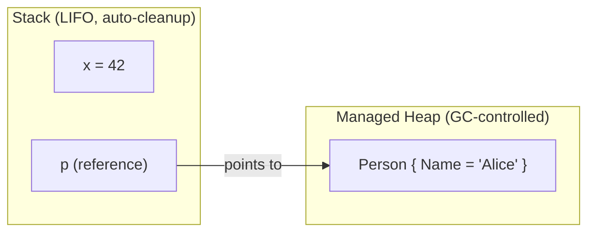

| Feature | Stack | Heap |
|---|---|---|
| Stores | Value types, references, call frames | Objects, reference-type data |
| Memory mgmt | Automatic, scope-based | Garbage Collector |
| Speed | Bahut fast | Thoda slow (GC overhead) |
| Lifetime | Method/block tak scoped | Jab tak reference na ho |
| Fragmentation | Kuch nahi hota | Ho sakta hai (GC compact karta hai) |

### Garbage Collection (GC)

GC un objects ki memory reclaim karta hai jo ab reference nahi ho rahe. Mechanics: **Mark** (GC roots se reachable objects identify karna) → **Sweep** (unreachable objects remove karna) → **Compact** (optional, fragmentation kam karta hai).

**Generational GC** — objects Gen 0 mein start hote hain aur collections survive karte karte promote hote jaate hain:

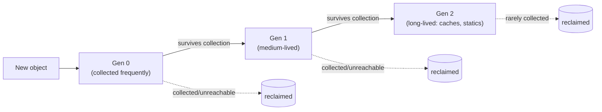

| Generation | Description | Example |
|---|---|---|
| Gen 0 | Naye create hue, frequently collect hote hain | Method-local variables |
| Gen 1 | Gen 0 survive kiya, medium-lived | Gen 0 se promote hue objects |
| Gen 2 | Long-lived, sabse kam collect hota hai | Caches, static/global references |

**GC triggers:** memory pressure, allocation threshold reach hona, ya explicit `GC.Collect()` call (discouraged hai — isse ek out-of-schedule full collection force hoti hai jo performance hurt karti hai). **Large Object Heap (LOH):** 85 KB se bade objects LOH par jaate hain, Gen 2 ke saath collect hote hain, aur historically (performance ke liye) automatically compact nahi hote — agar fragmentation ek real problem ban jaaye to `GCSettings.LargeObjectHeapCompactionMode` next collection mein compaction request kar sakta hai.

| Mode | Description |
|---|---|
| Workstation GC | Default; single-threaded apps ke liye |
| Server GC | Multi-threaded apps ke liye (e.g. ASP.NET Core — server contexts mein default) |
| Concurrent/Background GC | App ko fully freeze kiye bina background thread par Gen 2 collection run karta hai |

> `GC.Collect()` avoid karo jab tak truly necessary na ho (e.g., batch job mein ek known-large, one-off allocation burst ke baad) — manual collection GC ke apne heuristics ko defeat karta hai aur throughput ko hurt karta hai.

### GC Diagnostics Tooling for Production [gaps]

"Walk me through debugging a production memory leak" senior .NET interviews mein sabse common prompts mein se ek hai (yeh guide mein aage bhi ek sample scenario ke roop mein aata hai) — aur ek strong answer actual tools naam leta hai, sirf "generations" aur "roots" jaise concepts nahi. Modern .NET diagnostics toolchain (`dotnet-counters`, `dotnet-gcdump`, `dotnet-trace`) `dotnet tool install -g <name>` se install hota hai aur **running process ko PID se** attach karta hai, bina kisi code change ya restart ke — yeh production ke liye critical hai, jahan aksar aap debugger attach ya redeploy nahi kar sakte sirf investigate karne ke liye.

| Tool | What it does | When to reach for it |
|---|---|---|
| `dotnet-counters` | Real time mein console par performance counters (GC heap size per generation, allocation rate, ThreadPool queue length, exception count, GC pause time) ko live-stream karta hai | **First step** — cheap hai, low-overhead hai, batata hai ki *kya* koi real problem hai aur roughly *kaisi* (Gen 2 heap steadily grow ho rahi hai? high allocation rate? ThreadPool starvation?) — ek heavier capture commit karne se pehle |
| `dotnet-gcdump` | Managed heap ka point-in-time snapshot capture karta hai (object graph, counts, aur retention paths) process ko lambe time tak pause kiye bina — PerfView ya Visual Studio ke heap-diff viewer jaise tool mein analyze hota hai | **Second step**, jab counters heap growth dikhaye — yeh batane ke liye use hota hai ki "kaunse specific objects accumulate ho rahe hain, aur unhe kaun root kar raha hai" |
| `dotnet-trace` | Ek time window ke doraan broader CPU/runtime event trace capture karta hai (GC events, JIT, exceptions, call stack se tagged allocations), PerfView/Speedscope/Visual Studio mein analyze hota hai | Use hota hai jab aapko **allocation call stacks** chahiye (sirf object counts nahi) ya GC pauses ko CPU activity/latency spikes ke saath time ke across correlate karna ho |

**Ek realistic walkthrough — "production memory usage keeps climbing, diagnose it":**

```bash
# 1. Find the process
dotnet-counters ps

# 2. Watch live GC/heap counters against the running process — cheap, safe, no pause
dotnet-counters monitor --process-id <pid> System.Runtime
#    Look at: gc-heap-size, gen-0/1/2-size, gen-0/1/2-gc-count, alloc-rate, gc-committed-bytes
#    A Gen 2 heap that keeps climbing across repeated GC cycles (never shrinking back down after
#    a full collection) is the actual signature of a leak, as opposed to just high-but-stable
#    allocation churn — this distinction matters and is worth stating explicitly.

# 3. Take two heap snapshots several minutes apart under normal load
dotnet-gcdump collect --process-id <pid> -o snapshot1.gcdump
#    ...wait, let more traffic accumulate...
dotnet-gcdump collect --process-id <pid> -o snapshot2.gcdump

# 4. Diff the two dumps (e.g., in the PerfView heap-diff view, or `dotnet-gcdump report`)
#    Look for object types whose *count* grew between snapshots disproportionately to traffic —
#    e.g., 50,000 more HttpRequestMessage or EventHandler-captured closures than expected.
#    Then inspect the retention/GC-root path for that type: what's holding a reference?
#    Classic culprits (all covered elsewhere in this guide): un-unsubscribed event handlers,
#    a static/singleton cache with no eviction, a captive DbContext, closures captured into a
#    long-lived delegate.

# 5. If the heap diff alone isn't conclusive, capture a trace to get allocation call stacks
dotnet-trace collect --process-id <pid> --providers Microsoft-DotNETCore-SampleProfiler
#    Analyze in PerfView/Speedscope: which call stack is doing the allocating, not just which
#    type is accumulating — pinpoints the actual line of code, not just the symptom.
```

> **Yeh sequencing ek senior answer ke liye kyu matter karti hai:** pehle `dotnet-counters` (cheap hai, batata hai *kya* aur roughly *kaisi* problem hai), phir `dotnet-gcdump` (batata hai *kaunse* objects aur *unhe kaun root kar raha hai*), phir `dotnet-trace` sirf tab jab aapko yeh bhi jaanna ho ki *code mein kahan* allocations originate ho rahi hain. Load ke under ek production box par directly full trace lena zyada tar leak investigations ke liye zaroorat se zyada heavy-handed hai — apne tool usage ko cheapest/safest se most invasive tak sequence karna khud production experience ka signal hai.

### Dispose() vs Finalize()

`Dispose()` (`IDisposable`) unmanaged resources (file handles, DB connections, sockets, OS handles, native memory) ka **explicit, deterministic** cleanup hai. `Finalize()` (jo `~ClassName()` destructor hai) GC dwara call hota hai, **non-deterministic** aur slower hota hai — ek last-resort safety net hai agar `Dispose()` kabhi call nahi hua.

> **GC memory ke baare mein hai. Dispose() resources ke baare mein hai.** GC unmanaged resources ko promptly release nahi karta — usse sirf managed memory ke baare mein pata hota hai.

```csharp
using var fs = new FileStream("test.txt", FileMode.Open); // Dispose() guaranteed even on exception
```

Full Dispose pattern (Dispose + finalizer backup):

```csharp
public class ResourceHolder : IDisposable
{
    private bool disposed = false;
    public void Dispose() { Dispose(true); GC.SuppressFinalize(this); }
    protected virtual void Dispose(bool disposing)
    {
        if (!disposed)
        {
            if (disposing) { /* free managed resources (other IDisposables) */ }
            // free unmanaged resources (native handles) unconditionally
            disposed = true;
        }
    }
    ~ResourceHolder() { Dispose(false); }
}
```

| | Dispose() | Finalize() |
|---|---|---|
| Defined in | `IDisposable` | `object` (via destructor syntax) |
| Called by | Developer (ya `using`) | GC |
| Determinism | Deterministic | Non-deterministic |
| Reusability | Multiple baar call karna safe hai (idempotent) | GC dwara ek baar call hota hai |

Common disposable types: `FileStream`, `SqlConnection`, `SqlCommand`, `StreamReader`/`StreamWriter`. **`HttpClient` ko reuse/DI-managed hona chahiye (via `IHttpClientFactory`), per request dispose nahi karna chahiye** — yeh ek bahut common gotcha question hai (`HttpClient` ko per call dispose/recreate karne se load ke under sockets exhaust ho sakte hain, kyunki underlying `SocketsHttpHandler` connections ko us tarah manage karta hai).

Best practices: `using`/`using var` prefer karo; sirf wahi dispose karo jiske aap owner ho; injected dependencies ko dispose mat karo jab tak ownership explicit na ho; `Dispose()` ko lightweight rakho; `Dispose()` se kabhi throw mat karo.

### Weak References

`WeakReference<T>` GC ko object collect karne deta hai, jabki app usse *agar wo abhi bhi alive hai* to retrieve bhi kar sakta hai — yeh reference object ko rooted nahi rakhta.

```csharp
WeakReference<object> weakRef = new WeakReference<object>(new object());
if (weakRef.TryGetTarget(out var target)) { /* still alive */ }
```

Real use cases: large caches jaha aap chahte ho ki entries memory pressure ke under, bina koi explicit eviction policy ke, reclaimable ho; event-subscriber patterns jinse classic "publisher subscriber ko hamesha alive rakhta hai" leak avoid hota hai (`ConditionalWeakTable<TKey,TValue>` ek related tool hai jo object ki lifetime ko extend kiye bina usse extra data attach karne ke liye use hota hai — kuch caching aur interop scenarios mein internally use hota hai).

### Memory Leaks in .NET

Kyunki .NET garbage-collected hai, "leaks" actually **unintentional rooting** hote hain — koi cheez ek reference ko alive rakhti hai jo release ho jana chahiye tha. Classic sources, roughly us order mein jitna often woh production code ko actually bite karte hain:

```csharp
static List<byte[]> list = new List<byte[]>();
void LeakMemory() => list.Add(new byte[100000]); // static root never released
```

1. **Un-unsubscribed event handlers** — ek long-lived publisher ki invocation list har subscriber ka reference hold karti hai.
2. **Long-lived delegates mein captured closures** — ek lambda jo static event ya long-lived cache ke saath register hota hai aur `this` capture karta hai, poore containing object ko alive rakhta hai.
3. **Eviction ke bina static caches** — ek `static Dictionary` jo sirf grow hoti rehti hai.
4. **[new content] DI captive dependencies** — Part X dekho.
5. `HttpClient` misuse (upar dekho).

---

### [new content] IAsyncDisposable

`IDisposable.Dispose()` synchronous hota hai — lekin kuch cleanup inherently asynchronous hota hai (network stream flush karna, DB connection close karna jisme async round-trip chahiye). C# 8 ne `IAsyncDisposable` + `await using` add kiya:

```csharp
public class AsyncResource : IAsyncDisposable
{
    private readonly Stream _stream;
    public async ValueTask DisposeAsync()
    {
        await _stream.FlushAsync();
        await _stream.DisposeAsync();
    }
}

await using var resource = new AsyncResource(); // calls DisposeAsync() at scope exit, asynchronously
```

Ek type **dono** `IDisposable` aur `IAsyncDisposable` implement kar sakta hai un callers ke liye jo `await` nahi kar sakte (e.g., synchronous legacy call sites) — synchronous `Dispose()` ko fallback ke roop mein bhi resources release karne ki best koshish karni chahiye (aksar async cleanup par block karke), lekin jab bhi call site already `async` ho tab `await using` preferred hota hai. Modern .NET mein `DbContext`, `SqlConnection`, aur `Stream` subclasses sabhi `IAsyncDisposable` implement karte hain.

---

## Part VIII — Advanced: Multithreading & Async

### Thread vs Task (TPL)

| Feature | Thread | Task (TPL) |
|---|---|---|
| Abstraction level | Low-level (OS-managed) | High-level (.NET runtime-managed) |
| Execution | Dedicated OS thread | ThreadPool-managed thread par run hota hai |
| Creation cost | Expensive hota hai | Optimized (pooled threads reuse karta hai) |
| Return value | Kuch nahi | Values return kar sakta hai (`Task<T>`) |
| Synchronization | Manual (`lock`, `Monitor`) | async/await se easier |
| Exception handling | Manual | Built-in (`Task.Exception`, `AggregateException`) |
| Best use case | Long-running background operations | Parallel/short-lived, I/O-bound work |

### Task Lifecycle & Exception Handling

**Task states:** `Created` → `WaitingToRun` → `Running` → `WaitingForChildrenToComplete` → `RanToCompletion` / `Faulted` / `Canceled`.

| Feature | Thread | Task |
|---|---|---|
| Exception propagation | Automatically propagate nahi hota; thread ke andar hi handle karna padta hai | Capture ho jata hai; jab await/`.Wait()`/`.Result` observe hota hai tab (re)throw hota hai |
| Crashes application if uncaught? | Haan | Nahi — jab tak observe na ho, Task ke andar hi rehta hai |
| Multiple exceptions | Koi built-in aggregation nahi | `AggregateException.InnerExceptions` |
| Works with async/await? | Nahi | Haan |

**Cancellation** — `CancellationToken`/`CancellationTokenSource` ke through cooperative cancellation:

```csharp
using var cts = new CancellationTokenSource(TimeSpan.FromSeconds(5)); // auto-cancel after 5s
try
{
    await DoWorkAsync(cts.Token);
}
catch (OperationCanceledException)
{
    // expected on cancellation — not necessarily an error
}

async Task DoWorkAsync(CancellationToken token)
{
    for (int i = 0; i < 100; i++)
    {
        token.ThrowIfCancellationRequested();   // cooperative check
        await Task.Delay(100, token);
    }
}
```
`CancellationTokenSource.CreateLinkedTokenSource(tokenA, tokenB)` multiple cancellation sources ko (e.g., ek per-request token aur ek app-shutdown token) ek mein combine karta hai — agar *koi bhi* source cancel ho jaaye to yeh cancel ho jata hai.

### Thread Safety Primitives

**Critical section** — wo code jo multiple threads dwara concurrently access/write hota hai. `lock` access ko serialize karta hai.

```csharp
private readonly object _lockObj = new();
lock (_lockObj) { /* critical section */ }
```

`lock` **sirf synchronous** hota hai — isse `await` ke across hold nahi kiya ja sakta (compiler `lock` block ke andar `await` ko forbid karta hai). Async-compatible mutual exclusion ke liye `SemaphoreSlim` use karo (Part XVI dekho).

### async/await Fundamentals

`async` ek method ko asynchronous mark karta hai aur usme `await` enable karta hai. `await` execution ko asynchronously suspend karta hai jab tak awaited operation complete nahi hota, aur yeh **calling thread ko block kiye bina** hota hai.

```csharp
public async Task<string> GetDataAsync()
{
    using var client = new HttpClient();
    string data = await client.GetStringAsync("https://example.com");
    return data;
}
```

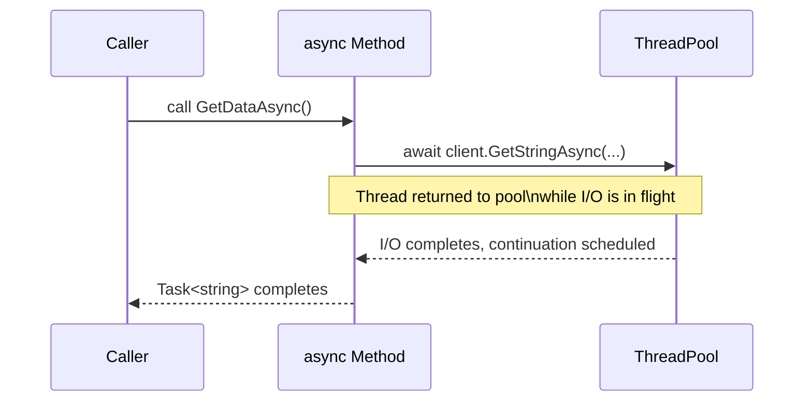

### Async State-Machine Internals [gaps]

Yeh wo topic hai jo un candidates ko alag karta hai jinhone sirf "await doesn't block a thread" memorize kiya hai unse jo actually *kaise* explain kar sakte hain. C# compiler har `async` method ko ek compiler-generated class mein rewrite karta hai (kuch cases mein struct, allocations kam karne ke liye) jo `IAsyncStateMachine` implement karta hai, jisme method body ek jump-table-driven `MoveNext()` method mein transform ho jata hai.

**Compiler conceptually kya generate karta hai, iske liye:**
```csharp
public async Task<string> GetDataAsync()
{
    var response = await _httpClient.GetStringAsync(url);
    return response.ToUpper();
}
```

...roughly iske equivalent hai:

```csharp
private struct GetDataAsyncStateMachine : IAsyncStateMachine
{
    public int _state;                                   // tracks which await we're resuming after
    public AsyncTaskMethodBuilder<string> _builder;       // manages the returned Task<string>
    public HttpClient _httpClient;
    private TaskAwaiter<string> _awaiter;                 // captured awaiter, survives across suspension

    void IAsyncStateMachine.MoveNext()
    {
        string result;
        try
        {
            if (_state == 0)   // resuming after the await
            {
                result = _awaiter.GetResult();            // rethrows if the task faulted
                goto AfterAwait;
            }

            // first entry — call the async operation
            var task = _httpClient.GetStringAsync(url);
            _awaiter = task.GetAwaiter();
            if (!_awaiter.IsCompleted)
            {
                _state = 0;
                _builder.AwaitUnsafeOnCompleted(ref _awaiter, ref this);  // registers continuation, returns to caller
                return;                                    // <-- this is the "suspend" point; thread is freed here
            }
            result = _awaiter.GetResult();                 // synchronous fast path — already completed

            AfterAwait:
            var final = result.ToUpper();
            _builder.SetResult(final);                     // completes the returned Task<string>
        }
        catch (Exception ex)
        {
            _builder.SetException(ex);                     // exception captured onto the Task, not thrown here
        }
    }

    void IAsyncStateMachine.SetStateMachine(IAsyncStateMachine sm) { }
}
```

**Mechanics jo interviewer actually probe karna chahta hai:**

1. **Async method ko call karne se poora body run nahi hota.** Yeh synchronously *pehle* `await` tak run hota hai jiska awaited operation abhi complete nahi hua ho. `AsyncTaskMethodBuilder<T>` wo `Task<T>` create karta hai jo caller ko immediately return hota hai — yeh wahi `Task` object hai jispar eventually `SetResult`/`SetException` call hota hai.
2. **`awaiter.IsCompleted` pehle, synchronously check hota hai**, ek fast-path optimization ke roop mein — agar awaited operation already done hai (e.g., ek cache-hit `ValueTask`, ya `Task.CompletedTask`), to state machine actually suspend hi nahi hoti; yeh bas `GetResult()` inline call karta hai aur chalte rehta hai. Isliye "await" context switch ya thread hop ka *guarantee* nahi deta.
3. **Agar complete nahi hua**, to state machine awaiter par `OnCompleted`/`UnsafeOnCompleted` ke through khud ko continuation ke roop mein register karti hai, phir **control caller ko return kar deti hai** — yahi actual point hai jaha "thread free hota hai." Method finish nahi hua hai; yeh suspended hai, aur `MoveNext()` ko baad mein jo bhi awaited operation ko complete karta hai (I/O completion port callback, timer, ThreadPool work item) usse dobara invoke kiya jayega.
4. **Resuming** ka matlab hai ki koi doosra infrastructure code ("wahi thread jo wait kar raha tha" nahi) dobara `MoveNext()` call karta hai. `_state` field yeh batata hai ki rewritten method ko setup code past jump karke seedha `_awaiter.GetResult()` consume karna hai aur `await` ke baad continue karna hai.
5. **Exceptions `MoveNext()` se call stack up ek normal `throw` ke through kabhi propagate nahi hoti.** Yeh `MoveNext()` ke andar hi catch hoti hain aur `_builder.SetException(ex)` ke through `Task` par store hoti hain — *yahi wajah* hai ki `async Task` method ke andar ka exception sirf tab surface hota hai jab caller us `Task` ko await/observe karta hai, aur yahi wajah hai ki `async void` (jispar exception store karne ke liye koi `Task` nahi hai) dangerous hai (neeche dekho).
6. **Awaiter contract**: `await` ke saath usable koi bhi type ko `GetAwaiter()` chahiye jo `bool IsCompleted`, `void GetResult()` (ya `T GetResult()`), aur `INotifyCompletion`/`ICriticalNotifyCompletion` implement karne wale `OnCompleted(Action)`/`UnsafeOnCompleted(Action)` wali koi cheez return kare — yeh ek compile-time duck-typed pattern hai, awaited type par koi interface requirement nahi, isi liye aap ek `Task`, ek `ValueTask`, ek `YieldAwaitable`, ya ek custom awaitable type ko `await` kar sakte ho.

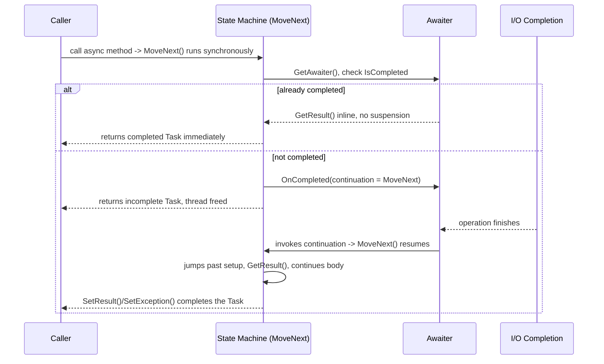

> **Interviewer follow-up: "State machine class hai ya struct?"** By default compiler state machine ke liye ek `struct` emit karta hai (us common case mein heap allocation avoid karne ke liye jaha method synchronously complete ho jata hai), aur yeh sirf pehli baar heap par box hota hai jab isse actually suspend karna padta hai (yaani wo pehla `await` jo synchronously complete nahi hota) — yeh compiler ke kai allocation-avoidance tricks mein se ek hai (cached, already-completed `Task`/`ValueTask` instances reuse karne ke saath) jo `async`/`await` ko sirf syntax dekhne se lagne se zyada cheap banate hain.

### Asynchrony vs Multithreading

| Feature | Asynchrony (async/await) | Multithreading (Thread, Task, Parallel) |
|---|---|---|
| Threading model | Single thread, blocking avoid karta hai | Multiple explicit threads |
| Best for | I/O-bound tasks (file, network, DB) | CPU-bound tasks (computation) |
| Resource usage | Efficient — threads ko tie up nahi karta | Costlier — zyada threads resources consume karte hain |
| Complexity | Likhna aur manage karna easier hai | Synchronization, deadlock/race handling chahiye |
| Parallel execution? | Zaroori nahi — sirf non-blocking hota hai | Cores ke across truly parallel |

I/O par wait karte time async/await use karo; CPU-bound parallel work ke liye multithreading (ya `Parallel`/PLINQ) use karo; yeh dono frequently combine kiye jaate hain (e.g., `await Task.Run(() => CpuBoundWork())` se CPU work ko ek aise thread se hata sakte ho jo responsive rehna chahiye — neeche ASP.NET Core caveat dekho).

### Deadlocks & Race Conditions

**Classic lock-ordering deadlock:**
```csharp
// Thread A: lock(obj1) then lock(obj2)
// Thread B: lock(obj2) then lock(obj1)  <-- inconsistent order = deadlock risk
lock (obj1) { lock (obj2) { /* ... */ } }
```

**Race condition:**
```csharp
int count = 0;
Parallel.For(0, 1000, _ => count++); // non-atomic increment — lost updates, wrong total
```

> Async-specific deadlock pattern ke liye neeche **[new content] The Classic Sync-Over-Async Deadlock** dekho — yeh single sabse common senior async interview question hai, aur upar wale lock-ordering deadlock se genuinely alag mechanism hai.

### Task Parallel Library (TPL)

TPL (`System.Threading.Tasks`) concurrent/parallel code ke liye raw threads ke upar ek higher-level abstraction hai — manually threads create/manage karne ke bajaye, aap `Task`s use karte ho, jo ThreadPool par run hote hain.

> *Interview definition: "Task Parallel Library concurrent aur parallel code likhna Task aur Parallel classes provide karke simplify karta hai. Threads ko manually manage karne ke bajaye, developers tasks use karte hain, jo lightweight, efficient hote hain, aur .NET ThreadPool dwara automatically schedule hote hain."*

```csharp
Task task = Task.Run(() => Console.WriteLine("Running on thread: " + Task.CurrentId));
task.Wait();

Parallel.For(1, 5, i => Console.WriteLine($"Processing {i} on thread {Task.CurrentId}"));
```

**TPL vs async/await:** TPL concurrent work create/manage karne ke liye APIs (`Task`, `Parallel`, `TaskFactory`) ka ek set hai — low-level control deta hai. `async`/`await` *TPL ke upar built language syntactic sugar* hai jo asynchronous code ko sequentially padhne jaisa banata hai.

```csharp
// TPL version — "plumbing heavy"
Task<string> task1 = Task.Run(() => DownloadData("API 1", 2000));
Task<string> task2 = Task.Run(() => DownloadData("API 2", 3000));
Task.WaitAll(task1, task2);
Console.WriteLine(task1.Result);
Console.WriteLine(task2.Result);

// async/await version — idiomatic, exceptions propagate naturally via try/catch
var t1 = DownloadDataAsync("API 1", 2000);
var t2 = DownloadDataAsync("API 2", 3000);
var results = await Task.WhenAll(t1, t2);
```

> *Analogy: TPL = engine (tasks run karne ki raw power). async/await = automatic transmission (engine drive karna easy banata hai). Yeh dono saath use hote hain, alternatives ke roop mein nahi.*

**Commonly used TPL functions:**

| Method | Purpose |
|---|---|
| `Task.Run()` | Background thread par code run karta hai; ek value return kar sakta hai |
| `Task.Wait()` / `.Result` | Task complete hone tak **block** karta hai — ASP.NET/UI code mein avoid karo (deadlock section dekho) |
| `Task.WhenAll()` | Jab tak sab finish na ho jaaye, multiple tasks ko concurrently await karta hai |
| `Task.WhenAny()` | Jab pehla task complete hota hai tab return hota hai |
| `Task.Delay()` | Non-blocking delay |
| `Task.FromResult()` | Ek already-available value ko completed `Task<T>` mein wrap karta hai |
| `Task.CompletedTask` | Ek already-completed `Task` (void-equivalent) |
| `ContinueWith()` | Task ke baad ek continuation run karta hai (modern C# mein zyadatar `await` se replace ho gaya hai) |
| `Parallel.For()` / `Parallel.ForEach()` | CPU-bound parallel loops |
| `Task.Factory.StartNew()` | Older, lower-level task starter — `Task.Run` ka **drop-in replacement nahi hai**: yeh by default nested `Task` ko unwrap *nahi* karta (isliye `StartNew(() => SomeAsyncMethod())` aapko `Task<Task>` deta hai jab tak aap `.Unwrap()` add na karo), aur uske default scheduling options bhi different hote hain. Virtually har modern code mein "isse asynchronously just run kar do" ke liye `Task.Run` hi correct default hai. |

### Task.Run vs Task.Factory.StartNew(LongRunning) vs Parallel.ForEachAsync [gaps]

`Task.Run` 95% se zyada cases mein "isse ThreadPool par run karo" ke liye correct default hai — yeh sensible defaults (`TaskScheduler.Default`, `DenyChildAttach`) use karta hai aur nested `Task` ko automatically unwrap karta hai. Bache hue cases ko precisely jaanna worth hai:

```csharp
// Task.Run — the default. Uses a pooled thread; fine for short/medium CPU-bound work.
Task.Run(() => ProcessBatch(data));

// Task.Factory.StartNew with LongRunning — opts OUT of the pool for a genuinely
// long-lived, dedicated thread (the TaskScheduler hints the underlying thread
// shouldn't be reused/reclaimed the way pooled worker threads are).
Task.Factory.StartNew(
    () => RunForeverPollingLoop(),
    CancellationToken.None,
    TaskCreationOptions.LongRunning,
    TaskScheduler.Default);
```

| | `Task.Run` | `Task.Factory.StartNew(..., LongRunning)` |
|---|---|---|
| Thread source | ThreadPool (shared, reused) | Scheduler ko hint deta hai ek dedicated thread create karne ke liye, normal pool heuristics ko bypass karke |
| Nested `Task` unwrapping | Automatic | Manual — `.Unwrap()` call karna padta hai warna `Task<Task>` milta hai |
| When to use | CPU-bound work, background offload ke liye default choice | Ek **long-running, blocking loop** jo otherwise poori lifetime ke liye ek pool thread ko occupy (aur starve) kar deti — e.g., ek dedicated polling/consumer loop jo application ki life ke liye `BlockingCollection.Take()` par block hota hai |
| Overuse risk | Kuch nahi — yeh safe default hai | Bahut saare `LongRunning` tasks banane se pooling ka purpose defeat hota hai aur raw `Thread` objects jaise OS thread resources exhaust ho sakte hain |

**Rule of thumb:** agar work bounded hai aur finish ho jayega, `Task.Run` use karo. Agar work ek unbounded, blocking loop hai jo otherwise ek pool thread ko indefinitely tie up kar degi (aur baaki queued work ko starve karegi), to `TaskCreationOptions.LongRunning` use karo — yeh functionally ek raw dedicated `Thread` spin up karne ke zyada kareeb hai, ek normal pooled task ke mukable.

**`Parallel.ForEachAsync` (.NET 6+)** "mujhe ek async operation par bounded concurrency chahiye" ka modern, built-in jawab hai — yeh `SemaphoreSlim` plus ek list of tasks wale common hand-rolled pattern ko replace karta hai:

```csharp
// Old pattern — manual SemaphoreSlim throttling
var semaphore = new SemaphoreSlim(maxDegreeOfParallelism: 8);
var tasks = urls.Select(async url =>
{
    await semaphore.WaitAsync();
    try { await DownloadAsync(url); }
    finally { semaphore.Release(); }
});
await Task.WhenAll(tasks);

// Modern equivalent — Parallel.ForEachAsync
await Parallel.ForEachAsync(urls,
    new ParallelOptions { MaxDegreeOfParallelism = 8, CancellationToken = ct },
    async (url, token) => await DownloadAsync(url, token));
```

`Parallel.ForEachAsync` throttling, cancellation propagation, aur exception aggregation (`AggregateException` agar multiple iterations fail hote hain) sab kuch aapke liye handle karta hai — modern .NET mein "N items ko bounded async concurrency ke saath process karo" ke liye yahi go-to hai, aur "aap kisi downstream API ko concurrent outbound calls kaise limit karoge" ka strong senior answer ab manual semaphore par jaane se pehle isi se lead karta hai.

### How the "Main Thread" Works in ASP.NET Core

ASP.NET Core ke sabse misunderstood topics mein se ek. WinForms/WPF ke unlike, **ASP.NET Core mein koi dedicated UI thread ya request thread nahi hota**.

```csharp
var builder = WebApplication.CreateBuilder(args);
builder.Services.AddScoped<IProductService, ProductService>();
var app = builder.Build();
app.MapControllers();
app.Run();
```

Ek single startup thread `Program.cs` execute karta hai; `app.Run()` ke baad, us thread ka kaam essentially khatam ho jata hai — Kestrel requests ke liye listen karta hai, aur har request ek **ThreadPool thread** dwara handle hota hai, startup thread se nahi.

```csharp
// Synchronous — blocks Thread #17 for 5 seconds, unavailable to serve other requests
public Product GetProduct(int id) { Thread.Sleep(5000); return new Product(); }

// Async — releases Thread #17 back to the pool immediately while waiting
public async Task<Product> GetProduct(int id) { await Task.Delay(5000); return new Product(); }
```

`await` ke saath, jaise hi `await` reach hota hai thread pool mein wapas return ho jata hai; jab awaited operation complete ho jata hai to ek **possibly different thread** execution resume karta hai — ASP.NET Core mein **koi thread affinity nahi** hoti (WinForms ke unlike, jaha `button.Text = "Done"` ko UI thread par hi run karna padta hai).

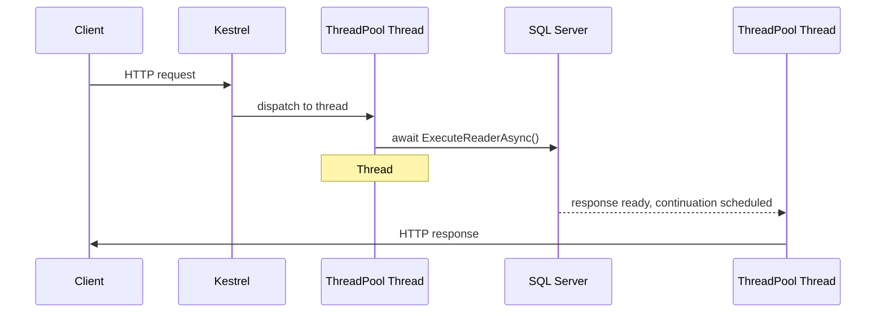

100 concurrent requests ka matlab **nahi** hai 100 dedicated threads — threads poore middleware pipeline (Kestrel → Auth → Authz → Logging → Controller → Service → Repository → SQL) ke across shared/reused hote hain. `BackgroundService` bhi ThreadPool threads par hi run hota hai, kisi dedicated thread par nahi. Under the hood, Kestrel work ko ThreadPool par dispatch karne ke liye **I/O Completion Ports** (Windows) / **epoll** (Linux) use karta hai.

> **Notes mein aksar missing nuance:** ek controller action ke *andar* CPU-bound work ko `Task.Run()` mein wrap karna (e.g., `await Task.Run(() => CreatePdf())`) ASP.NET Core mein ek **mild anti-pattern** hai. Yeh sirf work ko ek pool thread se doosre pool thread par move karta hai aur scheduling/context-switch overhead add karta hai — yaha "free up" karne ke liye koi dedicated UI thread hai hi nahi, WinForms/WPF ke unlike jaha `Task.Run` genuinely UI thread ko free karta hai. Jaha ek truly async I/O-bound API exist karta hai use prefer karo, ya genuinely CPU-heavy work ko request path mein inline karne ke bajaye ek background worker/queue par run karo.

**Key takeaways:** ASP.NET Core mein koi UI thread nahi hota; requests shared ThreadPool threads dwara handle hote hain; `await` I/O ke duration thread ko release karta hai; continuations kisi different thread par resume ho sakte hain; scalability blocked threads avoid karne se aati hai; Kestrel + ThreadPool milkar high throughput enable karte hain. Yeh model `Task`, async/await, `Task.Run`, `ThreadPool`, `Parallel.ForEach`, `Channels`, `BackgroundService`, `SemaphoreSlim`, TPL Dataflow, aur producer-consumer patterns ke peeche hai (inme se kaafi Part XVI mein cover kiye gaye hain).

### Async Streams (IAsyncEnumerable\<T\>)

```csharp
public static async IAsyncEnumerable<int> GenerateNumbers()
{
    for (int i = 1; i <= 5; i++)
    {
        await Task.Delay(1000);
        yield return i;
    }
}

await foreach (var number in GenerateNumbers())
    Console.WriteLine(number);
```

Data ko asynchronously process karta hai jaise hi wo aata hai, pehle poori collection ko materialize karne ke bajaye — large result sets stream karne ya bina sab kuch memory mein buffer kiye ek API ke through paging karne ke liye useful hai.

---

### [new content] ConfigureAwait(false) and SynchronizationContext

Ek `SynchronizationContext` yeh capture karta hai ki `await` ke baad continuation "kaha" resume hona chahiye. **UI frameworks** (WPF, WinForms, request `SynchronizationContext` wale older ASP.NET Framework/MVC) mein, ek captured context hota hai — continuation usi mein marshal ho ke wapas jata hai (e.g., wapas UI thread par) taaki `await` ke baad UI controls touch karna "just works."

**ASP.NET Core mein koi `SynchronizationContext` nahi hota** (ASP.NET Core 1.0 se hi remove kar diya gaya) — continuations *kisi bhi* available ThreadPool thread par resume hote hain, isi liye upar describe kiya gaya "no thread affinity" behavior hold karta hai.

`ConfigureAwait(false)` awaiter ko batata hai ki captured context par resume karne ki koshish **na** kare, agar koi context exist karta ho:

```csharp
public async Task<string> GetDataAsync()
{
    var response = await _httpClient.GetAsync(url).ConfigureAwait(false);
    return await response.Content.ReadAsStringAsync().ConfigureAwait(false);
}
```

**Current, nuanced guidance (2026):**
- **Library code** mein jisse UI context ke baare mein jaanne ya care karne ki koi wajah nahi hai (NuGet packages, shared class libraries, business-logic layers), `ConfigureAwait(false)` har `await` par abhi bhi good practice hai — yeh context-marshal cost force hone se bachata hai aur ek aise caller mein sync-over-async deadlock ka *cause* banne se bachata hai jo aapke `Task` par block hota hai (neeche dekho).
- **ASP.NET Core application code** mein, `ConfigureAwait(false)` largely **unnecessary** hai kyunki yaha capture karne ke liye koi `SynchronizationContext` hi nahi hota — kaafi teams ne ASP.NET Core-only codebases ke liye "hamesha ConfigureAwait(false) add karo" rule drop kar diya hai, aur isse sirf wahi rakha hai jaha same code kisi context-sensitive host mein bhi run ho sakta ho (e.g., ek shared library jo ek WPF app dwara bhi consume hoti ho).
- Yeh ek nuance hai jo interviewer probe karega: *"kya ASP.NET Core mein abhi bhi ConfigureAwait(false) chahiye?"* — strong senior answer hai "strictly nahi, kyunki Core mein SynchronizationContext hota hi nahi, lekin main isse shared library code mein abhi bhi use karta hoon jo ek context-capturing host dwara consume ho sakta hai, aur yeh cheap insurance hai."

### [new content] The Classic Sync-Over-Async Deadlock

Yeh **#1 sabse commonly asked senior async question** hai — aur yeh lock-ordering deadlock se ek fundamentally different mechanism hai.

```csharp
// WPF / WinForms / ASP.NET (classic, pre-Core) button click handler:
void Button_Click(object sender, EventArgs e)
{
    var result = GetDataAsync().Result;  // BLOCKS the UI thread, waiting for GetDataAsync to finish
}

async Task<string> GetDataAsync()
{
    await Task.Delay(1000);   // by default, captures the current SynchronizationContext
    return "done";            // this continuation needs to resume ON the UI thread
}
```

**Yeh kyu deadlock karta hai:**
1. UI thread `.Result` call karta hai, jo UI thread ko **block** kar deta hai jab tak `GetDataAsync()` complete nahi hota.
2. `GetDataAsync` ke andar, `await Task.Delay(1000)` ke baad, continuation (`return "done";`) **captured `SynchronizationContext` par** resume hone ke liye schedule hota hai — yaani wapas UI thread par.
3. Lekin UI thread `.Result` par wait karte hue **blocked** hai — yeh us continuation ko run karne tak kabhi pahunch hi nahi sakta.
4. Deadlock: continuation UI thread free hone ka wait kar raha hai; UI thread continuation finish hone ka wait kar raha hai.

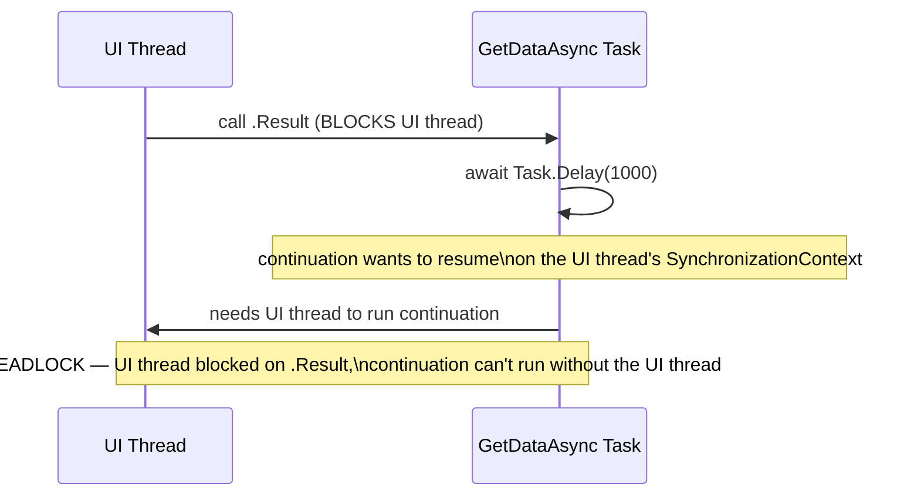

**Yeh ASP.NET Core mein isi tarah NAHI hota**, kyunki yaha capture karne ke liye koi `SynchronizationContext` nahi hota — continuation kisi bhi ThreadPool thread par run ho sakta hai. Lekin yeh load ke under abhi bhi **thread-pool starvation** cause *kar sakta hai* (ek pool thread ko `.Result` par block karna jabki uska continuation ek aur pool thread chahta hai), jo ek related lekin distinct problem hai — kaafi concurrent load ke under, aap abhi bhi pool exhaust kar sakte ho.

**Fixes, preference ke order mein:**
1. **Await all the way up** — caller ko bhi `async` bana do; agar avoid kar sakte ho to sync code se kisi async method par kabhi `.Result`/`.Wait()` call mat karo.
2. Agar aapko truly ek sync context se async code call karna hi padta hai (e.g., ek legacy sync interface jise aap change nahi kar sakte), to poori async call chain mein `ConfigureAwait(false)` use karo taaki kisi continuation ko original context ki zaroorat na pade — isse deadlock avoid ho jata hai (halaanki yeh abhi bhi ek thread ko block karta hai, isliye yeh ek workaround hai, underlying design smell ka fix nahi).
3. `Task.Run(() => AsyncMethod()).Result` — async call ko ek aise ThreadPool thread par offload karta hai jispar koi captured context nahi hota, jisse specific UI-context deadlock sidestep ho jata hai (yeh abhi bhi calling thread ko block karta hai, abhi bhi ideal nahi hai, lekin deadlock todta hai).

### [new content] async void — Why It's Dangerous

```csharp
async void ProcessOrder()  // DANGER
{
    await Task.Delay(100);
    throw new Exception("boom");
}
```

- **`async void` method ke andar throw hui exceptions caller dwara catch nahi ho sakti** — observe karne ke liye koi `Task` nahi hota, isliye exception us `SynchronizationContext` par directly throw hoti hai jo method start hone par active thi, jo typically **process ko crash kar deta hai** (ya host ke hisaab se silently swallow ho jati hai), call site ke around ke `try/catch` mein propagate hone ke bajaye.
- `async void` methods ko `await` nahi kiya ja sakta — caller ko yeh jaanne ka koi tareeka nahi hota ki operation kab finish hoti hai, jisse sequencing, testing, aur error handling sab significantly harder ho jate hain.
- **Ek legitimate use case: top-level event handlers** (e.g., ek WinForms/WPF `Button_Click`), kyunki event-handler delegates ke paas `void`-returning signature hoti hai jo framework dictate karta hai aur jise aap change nahi kar sakte. Wahan bhi, best practice yeh hai ki handler immediately ek `async Task` method ko delegate kare aur usse internally `try/catch` mein wrap kare.
- **Rule of thumb: hamesha `async Task` prefer karo, even un methods ke liye jo logically "kuch return nahi karte."** `async Task` aapko ek `Task` deta hai jise caller *await* kar sakta hai aur usse exceptions observe kar sakta hai; `async void` caller ko hook karne ke liye kuch nahi deta.
- Yeh tests mein bhi matter karta hai — ek `async void` test method silently pass ho jata hai chahe uske andar ka ek awaited call throw kare, kyunki test runner ko wo exception kabhi nazar nahi aati. xUnit/NUnit test methods hamesha `async Task` hone chahiye.

### [new content] Task vs ValueTask

`Task`/`Task<T>` ek heap-allocated reference type hai — `async Task<T>` method ki har call jo fast synchronous path hit nahi karti wo abhi bhi ek `Task<T>` object allocate karti hai. `ValueTask<T>` ek `struct` hai jo ya to ek synchronously-available result represent kar sakta hai (koi heap allocation nahi) ya jab operation genuinely asynchronous ho to ek underlying `Task<T>` ko wrap kar sakta hai.

```csharp
public ValueTask<int> GetCachedOrComputeAsync(int key)
{
    if (_cache.TryGetValue(key, out var value))
        return new ValueTask<int>(value);          // synchronous path — zero allocation

    return new ValueTask<int>(ComputeAsync(key));   // async path — wraps a Task<int>
}
```

| | `Task<T>` | `ValueTask<T>` |
|---|---|---|
| Type | Reference type (heap-allocated) | Struct (stack, unless it wraps a Task) |
| Best for | General-purpose async APIs | Hot paths jaha result *frequently* already synchronously available hota hai (e.g., cache hits) |
| Can be awaited multiple times? | Haan | **Nahi** — ek `ValueTask` ko ek se zyada baar await karna, ya completion check karne se pehle `.Result` access karna, undefined/unsafe hai |
| Can be stored and awaited later? | Haan, freely | Ek baar, immediately await hona chahiye — ek `ValueTask` ko baad ke liye cache mat karo |
| API surface | Rich (`.WhenAll`, `.WhenAny`, continuations) | Deliberately minimal — agar richer API chahiye to `.AsTask()` ke through `Task` mein convert karo |

> **Interviewer follow-up: "Toh kya performance ke liye main bas har jagah ValueTask use kar sakta hoon?"** Nahi — strong senior answer hai *nahi, default `Task<T>` par rakho* jab tak profiling ek specific hot path na dikhaye jaha calls ka bada percentage synchronously complete hota ho (classic case: ek caching layer, ya ek buffered stream reader). `ValueTask` ki restrictions (multiple awaits nahi, completion checks se pehle `.Result` access nahi, `Task.WhenAll` ke saath awkward) isse misuse karna easy banati hain, aur iska benefit (ek small heap allocation avoid karna) genuinely hot, high-throughput code paths ke bahar rarely matter karta hai. Microsoft ki apni guidance hai ki default `Task` use karo aur `ValueTask` ke liye sirf tab jao jab evidence ho ki added complexity worth hai.

---

## Part IX — Data Access: ADO.NET

**ADO.NET kya hai?** Yeh connections open karne, SQL execute karne, data retrieve/manipulate karne, transactions handle karne, aur disconnected data ke saath kaam karne ke liye ek low-level data-access framework hai. SQL execution par full control deta hai; EF Core se faster/lighter hai kyunki yaha koi object tracking ya LINQ-translation layer nahi hoti. High-performance apps, fine-grained control chahne wale microservices, aur legacy systems mein common hai.

**Core architecture:**
- **Connected model** — `Application → Connection → Command → DataReader → Database`; connection open rehte hue data read hota hai.
- **Disconnected model** — `Application → DataAdapter → DataSet/DataTable → Database`; data memory mein load hota hai, connection close ho sakta hai.

**Data providers:** `SqlConnection`, `SqlCommand`, `SqlDataReader`, `SqlDataAdapter`, `SqlTransaction`. Modern SQL Server provider: **`Microsoft.Data.SqlClient`** (older `System.Data.SqlClient` legacy/deprecated hai — yeh ek currency point hai jo interview mein explicitly bolna worth hai).

**Connection pooling** by default enabled hoti hai — `Close()`/`Dispose()` par connections reuse hote hain (destroy nahi hote). Best practice: `using` ke through "open late, close early"; improper management (leaked open connections) load ke under pool exhaust kar sakti hai.

**Command execution methods:**

| Method | Returns | Use for |
|---|---|---|
| `ExecuteReader()` | `SqlDataReader` (forward-only) | Large datasets ko stream/read karna — sabse fastest |
| `ExecuteNonQuery()` | Affected row count | INSERT, UPDATE, DELETE |
| `ExecuteScalar()` | Single value | Aggregates, existence checks |

**Parameterized queries** SQL injection ko prevent karti hain aur query-plan reuse enable karti hain:
```csharp
cmd.Parameters.Add("@Id", SqlDbType.Int).Value = id;   // correct
// "SELECT * FROM Users WHERE Id=" + id                // WRONG — injection risk
```
`.AddWithValue()` ke upar explicit `SqlDbType` prefer karo — `AddWithValue` .NET value se type/size infer karta hai, jisse query-plan cache bloat ho sakta hai (slightly different inferred sizes logically same query ke liye different cached plans produce karte hain) aur occasional implicit-conversion index scans ho sakte hain.

**Transactions** — `BeginTransaction()`/`Commit()`/`Rollback()` ke through ACID guarantees. Transaction scope ko small rakho; **isolation levels** discuss karne ke liye ready raho:

| Isolation Level | Dirty Reads | Non-Repeatable Reads | Phantom Reads | Notes |
|---|---|---|---|---|
| Read Uncommitted | Ho sakta hai | Ho sakta hai | Ho sakta hai | Fastest, sabse kam safe |
| Read Committed (SQL Server default) | Prevent hota hai | Ho sakta hai | Ho sakta hai | Common default |
| Repeatable Read | Prevent hota hai | Prevent hota hai | Ho sakta hai | Read locks zyada der hold karta hai |
| Serializable | Prevent hota hai | Prevent hota hai | Prevent hota hai | Slowest, fully isolated |
| Snapshot | Prevent hota hai | Prevent hota hai | Prevent hota hai | Row-versioning based, blocking reads nahi |

**Async operations** (`OpenAsync`, `ExecuteReaderAsync`, etc.) **throughput** improve karte hain (concurrent load ke under threads free karke), single-query latency nahi.

**ADO.NET vs Dapper vs EF Core** — ek senior answer ek decision framework deta hai, sirf "it depends" nahi:

| | ADO.NET | Dapper | EF Core |
|---|---|---|---|
| Abstraction | Kuch nahi — raw SQL + manual mapping | Micro-ORM — raw SQL + automatic mapping | Full ORM — LINQ, change tracking, migrations |
| Performance | Fastest | Very fast (ADO.NET ke kareeb) | Slow hai, har release mein improve ho raha hai |
| Productivity | Sabse kam | Medium | Sabse zyada |
| Best for | Performance-critical hot paths | High-performance apps jo mapping convenience bhi chahte hain | CRUD-heavy business apps, rapid development |

> Zyadatar business logic ke liye EF Core ko default rakho; specific hot-path queries ke liye Dapper (ya raw ADO.NET) par jao, lekin sirf jab profiling actually dikhaye ki EF Core overhead matter karta hai — sirf principle ke naam par har jagah EF Core avoid karke pre-optimize mat karo.

**Common pitfalls:** connection pooling ko na samajhna; string-concatenated SQL; connections ko open chhod dena; readers ko dispose na karna; async ignore karna (load ke under thread-pool starvation); jaha `DataReader` kaafi hota wahan `DataSet` ka overuse karna; poochhe jaane par isolation levels/transaction scope discuss na karna.

**High-scale composite example** — async order-creation jo ek transaction, parameterized queries, aur ek `CancellationToken` ko combine karta hai:

```csharp
public async Task<OrderResult> CreateOrderAsync(int productId, int quantity, CancellationToken token)
{
    using SqlConnection conn = new SqlConnection(_cs);
    await conn.OpenAsync(token);
    using SqlTransaction transaction = conn.BeginTransaction();
    try
    {
        var productCmd = new SqlCommand(
            "SELECT Id, Name, Price, Stock FROM Products WHERE Id = @ProductId", conn, transaction);
        productCmd.Parameters.Add("@ProductId", SqlDbType.Int).Value = productId;

        Product product = null;
        using (var reader = await productCmd.ExecuteReaderAsync(token))
            if (await reader.ReadAsync(token))
                product = new Product { Id = reader.GetInt32(0), Name = reader.GetString(1),
                                         Price = reader.GetDecimal(2), Stock = reader.GetInt32(3) };

        if (product == null) throw new Exception("Product not found");
        if (product.Stock < quantity) throw new Exception("Insufficient stock");

        var orderCmd = new SqlCommand(
            "INSERT INTO Orders(ProductId, Quantity, TotalAmount) OUTPUT INSERTED.Id " +
            "VALUES(@ProductId, @Qty, @Total)", conn, transaction);
        orderCmd.Parameters.Add("@ProductId", SqlDbType.Int).Value = productId;
        orderCmd.Parameters.Add("@Qty", SqlDbType.Int).Value = quantity;
        orderCmd.Parameters.Add("@Total", SqlDbType.Decimal).Value = product.Price * quantity;
        int orderId = (int)await orderCmd.ExecuteScalarAsync(token);

        var stockCmd = new SqlCommand(
            "UPDATE Products SET Stock = Stock - @Qty WHERE Id = @ProductId", conn, transaction);
        stockCmd.Parameters.Add("@Qty", SqlDbType.Int).Value = quantity;
        stockCmd.Parameters.Add("@ProductId", SqlDbType.Int).Value = productId;
        await stockCmd.ExecuteNonQueryAsync(token);

        transaction.Commit();
        return new OrderResult { OrderId = orderId, ProductName = product.Name, Quantity = quantity };
    }
    catch { transaction.Rollback(); throw; }
}
```

---

## Part X — Design Principles & Patterns

### SOLID Principles

| Principle | Purpose |
|---|---|
| **S**RP | Ek class, ek responsibility |
| **O**CP | Extension ke liye open, modification ke liye closed |
| **L**SP | Subtypes apne base type ke liye substitutable hone chahiye |
| **I**SP | Implementers par unused methods force mat karo |
| **D**IP | Abstractions par depend karo, concretions par nahi |

- **SRP** — ek class jo salary calculation aur report generation dono karti hai usse `SalaryCalculator` aur `ReportGenerator` mein split karna chahiye.
- **OCP** — `ProcessPayment()` ki `if/else` chain ko ek `IPayment` interface aur har payment method ke liye ek class se replace karo, taaki naye methods existing code touch kiye bina add ho sakein.
- **LSP** — ek `Square : Rectangle` jo `Width == Height` force karta hai `Rectangle` ke contract ko break karta hai (`Width` set karne se unexpectedly `Height` badal jata hai); iske bajaye, dono ko independently ek `Shape` abstraction implement karna chahiye.
- **ISP** — ek fat `Worker { Work(); Eat(); }` ko `IWorkable`/`IEatable` mein split karo taaki ek `Robot` sirf `IWorkable` implement kare.
- **DIP** — ek `Computer` ko constructor ke through injected `IKeyboard`/`IMonitor` par depend karna chahiye, concrete `Keyboard`/`Monitor` classes par nahi.

> **Note:** ek raw source file (`c#.txt`) mein SOLID code examples Java syntax (`implements`, `extends`, `System.out.println`) mein likhe hue the, jabki yeh C# interview notes hain — yeh guide upar throughout correct, idiomatic C# framing use karti hai.

### Dependency Injection (DI)

```csharp
public interface IService { void Serve(); }
public class MyService : IService { public void Serve() => Console.WriteLine("Serving..."); }
public class Client
{
    private readonly IService _service;
    public Client(IService service) { _service = service; }
}
```

**.NET ka built-in DI container actually kaise kaam karta hai** (`Microsoft.Extensions.DependencyInjection`):

1. **Service registration** ek service map banata hai (interface → implementation):
   ```csharp
   builder.Services.AddScoped<INotificationService, EmailService>();
   builder.Services.AddScoped<ReportService>();
   ```
2. **Service resolution** — jab `ReportService` ko `INotificationService` chahiye hota hai, container `EmailService` dhoondta hai, usse create karta hai, aur inject karta hai (constructor injection standard mechanism hai).
3. **Object lifetime** — container aapke liye lifetime manage karta hai:

| Lifetime | Behavior |
|---|---|
| Transient | Har baar request hone par naya instance |
| Scoped | Har HTTP request (ya har scope) ke liye ek instance |
| Singleton | Poori application lifetime ke liye ek instance |

4. **Mechanism** — C# compiler DI ke liye aapka code **rewrite nahi** karta. Runtime par, container **reflection** ke through constructors inspect karta hai, parameters ko registered services se match karta hai, aur recursively saari dependencies resolve karta hai. Yeh sab runtime par hota hai, compile time par nahi.

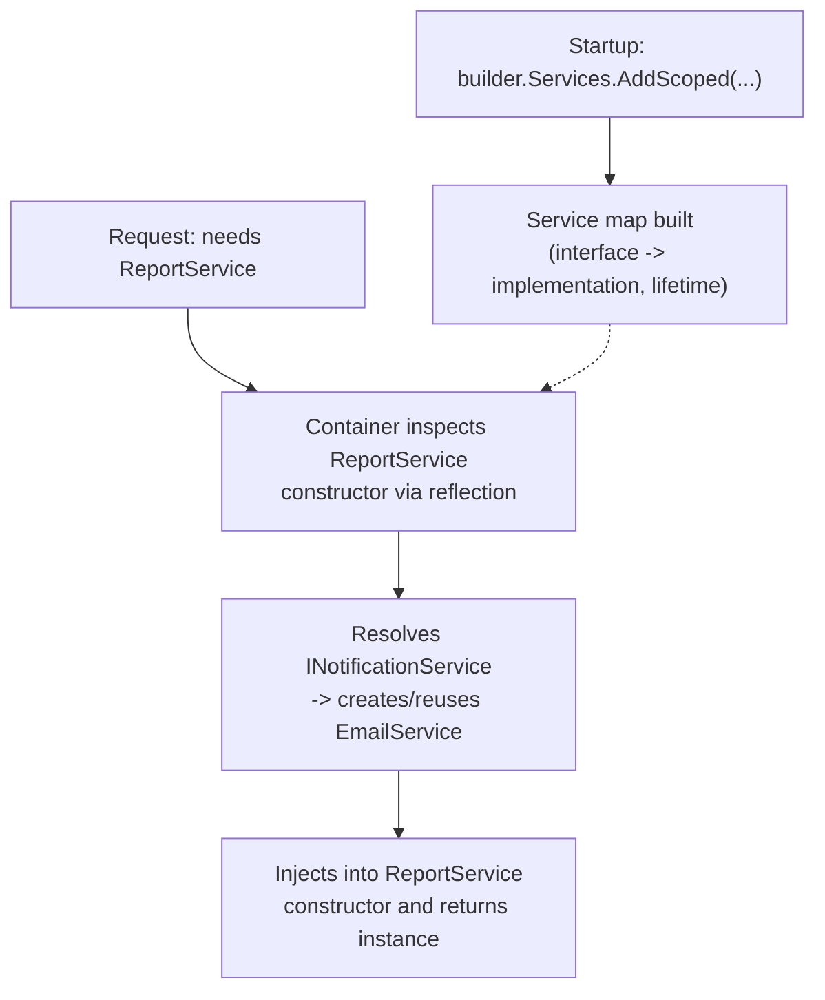

### Serialization & Deserialization

```csharp
string json = JsonSerializer.Serialize(myObject);
Person p = JsonSerializer.Deserialize<Person>(jsonString);
```

`[Serializable]` + `BinaryFormatter` legacy binary approach hai; `System.Text.Json` modern, explicit JSON approach hai. **Security note (Microsoft ki apni guidance): untrusted data ke liye `BinaryFormatter`/`[Serializable]` USE NA KARO** — `BinaryFormatter` obsolete hai aur deserialization-based remote-code-execution vulnerabilities ki wajah se modern .NET mein by default disabled hai. Modern .NET APIs isse entirely avoid karte hain.

**[new content]** Performance/AOT scenarios ke liye, `System.Text.Json` source generators (`JsonSerializerContext` + `[JsonSerializable]`) serialization se reflection ko entirely eliminate kar dete hain — Part IV ka Source Generators section dekho. `Newtonsoft.Json` older codebases mein abhi bhi common hai aur kuch edge cases mein richer feature set rakhta hai (e.g., historically zyada flexible custom converters), lekin naye code ke liye `System.Text.Json` performance aur native AOT support ki wajah se modern default hai.

### AutoMapper

```csharp
var config = new MapperConfiguration(cfg => cfg.CreateMap<Person, PersonDTO>());
var mapper = config.CreateMapper();
```

**[new content] The AutoMapper debate.** AutoMapper simple entity↔DTO mapping ke liye convenient hai lekin senior level par iske real, debated downsides hain: reflection-based mapping mein runtime cost hoti hai; mapping bugs (wrong property matched, silently `null`) compile time ke bajaye runtime par surface hote hain; complex mapping configurations apni khud ki hard-to-debug DSL ban jati hain. Kaafi senior teams **explicit manual mapping** (extension methods ya static factory methods) ya **source-generated mappers** (e.g., Mapperly) par shift ho gaye hain jo full IntelliSense/refactoring support ke saath compile-time-checked, allocation-free mapping code produce karte hain. Ek strong senior answer: "AutoMapper simple, low-stakes mapping ke liye fine hai, lekin kisi bhi business-critical ya performance-sensitive cheez ke liye, main explicit mapping ya ek source-generated mapper prefer karta hoon — compile-time safety aur debuggability AutoMapper ki convenience se zyada outweigh karti hain."

### Architectural Patterns

- **MVC** (Model-View-Controller) — web applications ke liye.
- **MVVM** (Model-View-ViewModel) — WPF, Xamarin, Blazor.
- **Command** — ek request ko object ke roop mein encapsulate karta hai; undo/redo support karta hai.
- **CQRS** — scalability ke liye read aur write operations ko separate karta hai (MediatR-based .NET implementation ke liye Part XVII dekho).

**[new content]** Senior level par yeh bhi expected hai: **Repository + Unit of Work** — ek `Repository<T>` per aggregate persistence ko abstract karta hai, aur ek `Unit of Work` multiple repository operations ko ek atomic save mein coordinate karta hai (EF Core ka `DbContext` already khud ek Unit of Work *hai*, isi liye EF Core ke upar ek generic repository hand-roll karna aksar ek redundant abstraction layer ke roop mein criticize kiya jata hai — agar pucha jaaye "kya aap EF Core ke upar ek repository layer banaoge?" to yeh nuance raise karna worth hai). **Mediator** (MediatR ke through) request senders ko handlers se decouple karta hai, commonly CQRS ke saath paired. **Clean/Onion Architecture** — concentric layers (center mein Domain, phir Application, phir edges par Infrastructure/Presentation) enforce karti hain ki dependencies inward point karein, taaki business logic frameworks/DB/UI par depend na kare.

### Microservices

Small, independently deployable services. .NET mein: ASP.NET Core + Docker + Kubernetes + ek API Gateway. (Part XVII mein messaging, gRPC, aur Saga pattern ke saath substantially expand kiya gaya hai.)

### [new content] The Captive Dependency Problem

Ek subtle DI bug jo ek favorite senior "gotcha" question hai: ek **Singleton**-lifetime service jo ek constructor-injected **Scoped** (ya Transient) dependency capture kar leti hai.

```csharp
public class CacheService  // registered as Singleton
{
    private readonly AppDbContext _db;  // Scoped — captured once, held forever!
    public CacheService(AppDbContext db) => _db = db;
}
```

Kyunki `CacheService` ek Singleton hai, yeh **ek baar** construct hota hai — aur us moment par container jo `AppDbContext` instance usse deta hai wo sirf ek request ke liye nahi, balki **application ki poori lifetime** ke liye hold hoti hai. Wo `DbContext` bhi de facto singleton ban jata hai — apne intended per-request scope se bahar, jisse thread-safety violations (EF Core `DbContext` thread-safe nahi hai) aur stale/leaked state hoti hai.

**Built-in DI container actually isse `AddScoped`/`AddTransient` validation mein detect karta hai aur throw karta hai** (`ValidateScopes = true`, jo `CreateDefaultBuilder` ke through Development environment mein by default on hota hai) — lekin agar pucha jaaye to *fix* jaanna abhi bhi worth hai: Singleton mein `IServiceScopeFactory` inject karo aur jab bhi zaroorat ho ek naya scope create karo (aur scoped dependency ko fresh resolve karo):

```csharp
public class CacheService(IServiceScopeFactory scopeFactory)
{
    public async Task DoWorkAsync()
    {
        using var scope = scopeFactory.CreateScope();
        var db = scope.ServiceProvider.GetRequiredService<AppDbContext>();
        // use db safely within this scope's lifetime
    }
}
```

### [new content] Keyed DI Services (.NET 8+)

.NET 8 ne **keyed services** introduce kiye — same interface ke multiple implementations ko register karna, ek key se distinguish karke, bina kisi factory/wrapper pattern ki zaroorat ke:

```csharp
builder.Services.AddKeyedScoped<INotificationService, EmailService>("email");
builder.Services.AddKeyedScoped<INotificationService, SmsService>("sms");

public class OrderService([FromKeyedServices("email")] INotificationService notifier) { ... }
```

Yeh useful hai jab bhi aap pehle ek factory delegate ya ek manual `Dictionary<string, IService>` ka use karte the sirf resolution time par naam se ek implementation pick karne ke liye.

---

## Part XI — Cross-Cutting Concerns: Logging & Exceptions

`ILogger<T>` (`Microsoft.Extensions.Logging`) structured logging provide karta hai jisme class name ke basis par ek category hoti hai. Built-in providers: Console, Debug, EventLog, Application Insights; common third-party providers: Serilog, NLog.

```csharp
public class HomeController : ControllerBase
{
    private readonly ILogger<HomeController> _logger;
    public HomeController(ILogger<HomeController> logger) => _logger = logger;

    [HttpGet]
    public IActionResult Get()
    {
        _logger.LogInformation("HomeController: Get method called.");
        return Ok("Logging example");
    }
}
```

**Log levels** (kam se zyada severe ki taraf): `Trace`, `Debug`, `Information`, `Warning`, `Error`, `Critical`.

**Structured logging** (string concatenation se better — searchable, queryable, JSON-capable logs produce karta hai):
```csharp
_logger.LogInformation("User {UserId} with name {UserName} logged in.", userId, user);
```

**Serilog** file/console sinks ke liye:
```csharp
Log.Logger = new LoggerConfiguration()
    .WriteTo.Console()
    .WriteTo.File("logs/log.txt", rollingInterval: RollingInterval.Day)
    .CreateLogger();
builder.Host.UseSerilog();
```

**Exception logging** — hamesha exception object pass karo taaki providers full stack trace capture kar sakein:
```csharp
catch (Exception ex) { _logger.LogError(ex, "An error occurred while processing the request."); }
```

**Exception-handling architecture:** unhandled exceptions ke liye ek **global exception-handling middleware** ko single place ke roop mein prefer karo — isse controllers/services clean rehte hain, consistent error responses milte hain, aur logging centralize ho jaati hai. Local `try/catch` sirf tab use karo jab aap genuinely recover kar sakte ho, ek fallback provide kar sakte ho, meaningful context add kar sakte ho, ya cleanup ki zarurat ho; warna exceptions ko middleware tak propagate hone do.

**[new content]** .NET 8 ne `IExceptionHandler` introduce kiya jo purane `UseExceptionHandler` middleware delegate pattern ka typed alternative hai — aap `TryHandleAsync` implement karte ho aur multiple handlers ko priority order mein register karte ho, jo ek bade middleware lambda se better compose hota hai:

```csharp
public class ValidationExceptionHandler : IExceptionHandler
{
    public async ValueTask<bool> TryHandleAsync(HttpContext context, Exception exception, CancellationToken ct)
    {
        if (exception is not ValidationException ve) return false; // not handled — try next handler
        context.Response.StatusCode = StatusCodes.Status400BadRequest;
        await context.Response.WriteAsJsonAsync(new ProblemDetails { Title = "Validation failed", Detail = ve.Message }, ct);
        return true;
    }
}
// builder.Services.AddExceptionHandler<ValidationExceptionHandler>();
// app.UseExceptionHandler();
```
Isse `ProblemDetails` (RFC 7807) ke saath pair karo jo standard error-response shape hai — Part XIX dekho.

---

## Part XII — Modern C# Language Features (C# 9–14)

*Gap note: raw source notes C# 8–10 features tak ruk gaye the; 2026 mein interviewers routinely C# 9–14/.NET 9–10 syntax probe karte hain kyunki yeh ab day-to-day production code mein common hai. (Records aur pattern matching Part II mein cover kiye gaye the kyunki woh core-concept-adjacent hain; baaki modern-syntax features yahan grouped hain.)*

**Collection Expressions (C# 12):**
```csharp
int[] numbers = [1, 2, 3, 4, 5];        // replaces new int[] {...}
List<string> names = ["Alice", "Bob"];
int[] combined = [..numbers, 6, 7];      // spread operator
```

**The field keyword (C# 14):** aapko manually backing field declare kiye bina auto-property accessor mein validation/logic add karne deta hai:
```csharp
public class Person
{
    public string Name
    {
        get => field;
        set => field = value?.Trim() ?? throw new ArgumentNullException(nameof(value));
    }
}
```
Yeh directly ek long-standing pain point solve karta hai — pehle, koi bhi getter/setter guard add karne ka matlab tha auto-property ko poori tarah chhodna aur manually `_name` declare karna.

**Extension Members (C# 14):** extension-method concept ko extension properties, static extension members, aur operators tak extend karta hai:
```csharp
public static class StringExtensions
{
    extension(string s)
    {
        public bool IsPalindrome => s.SequenceEqual(s.Reverse());
    }
}
Console.WriteLine("level".IsPalindrome); // True
```

**Kuch aur notable additions:**
- **File-scoped namespaces (C# 10)** — `namespace MyApp;`, ek wrapping `{ }` block ke bajaye, jisse file mein indentation kam ho jaata hai.
- **Global usings (C# 10)** — ek file mein (aksar `GlobalUsings.cs`) `global using System;` likhna project-wide apply hota hai, jisse repetitive `using` boilerplate kam ho jaata hai.
- **Top-level statements (C# 9) & minimal hosting** — `Program.cs` ko ab explicit `Main` method ya class wrapper ki zarurat nahi; `WebApplication.CreateBuilder(args)` ke saath combine karke, yeh ASP.NET Core apps ke liye modern minimal-hosting-model entry point hai (.NET 5 aur usse pehle ke purane `Startup.cs` + `Program.cs` split ko replace karta hai).
  ```csharp
  // Entire Program.cs, C# 9+ top-level statements + minimal hosting:
  var builder = WebApplication.CreateBuilder(args);
  builder.Services.AddControllers();
  var app = builder.Build();
  app.MapControllers();
  app.Run();
  ```
- **Raw string literals (C# 11)** — `"""..."""` triple-quoted strings jo JSON/regex/multi-line text ko escaping ke bina embed karne ke liye use hote hain.
- **Native AOT** — directly native code mein ahead-of-time compile ho jaata hai; trade-offs ke liye Part XV dekho.

---

## Part XIII — Minimal APIs, EF Core & Caching

### Minimal APIs vs Controllers

```csharp
app.MapGet("/products/{id}", async (int id, IProductService svc) => await svc.GetAsync(id))
   .Produces<Product>(200)
   .Produces(404);
```

| | Minimal APIs | MVC Controllers |
|---|---|---|
| Boilerplate | Bahut low — endpoints lambdas ke roop mein | Zyada — classes, attributes, base class |
| Best for | Microservices, small/simple APIs, high-throughput endpoints | Large APIs, complex model binding, filter/versioning-heavy apps |
| Startup performance | Faster (kam reflection) | Slower (zyada MVC pipeline overhead) |
| Native AOT support | First-class | Historically weaker (improve ho raha hai) |

Shared prefixes/policies/OpenAPI metadata ke liye endpoints ko group karo:
```csharp
var products = app.MapGroup("/products").RequireAuthorization();
products.MapGet("/", GetAllProducts);
products.MapPost("/", CreateProduct);
```
`IEndpointFilter` minimal APIs mein cross-cutting behavior (logging, validation, exception mapping) add karta hai, MVC action filters jaise:
```csharp
app.MapPost("/products", CreateProduct).AddEndpointFilter<ValidationFilter<ProductDto>>();
```

### EF Core Deep Dive

**The N+1 query problem** — EF Core senior interview ke sabse common questions mein se ek:
```csharp
// BAD — triggers N+1: one query for orders, then one query per order for Customer
var orders = context.Orders.ToList();
foreach (var o in orders) Console.WriteLine(o.Customer.Name); // lazy-loads per iteration

// GOOD — eager load with Include, single query with a JOIN
var orders = context.Orders.Include(o => o.Customer).ToList();

// GOOD — projection pulls only the fields you need
var summaries = context.Orders.Select(o => new { o.Id, CustomerName = o.Customer.Name }).ToList();
```
Isse tests ya profiling tools mein EF Core query logging/SQL counting ke through detect karo; multiple `Include` collections ke liye `AsSplitQuery()` mention karo taaki cartesian-explosion join se bacha ja sake.

**Tracking vs no-tracking:**
```csharp
var product = context.Products.First(p => p.Id == 1);  // tracked (default) — needed before SaveChanges()
product.Price = 10;
context.SaveChanges();

var products = context.Products.AsNoTracking().ToList(); // faster for read-only queries
```
Rule of thumb: kisi bhi query ke liye `AsNoTracking()` use karo jiske results ko modify karke wapas save nahi karna hai.

**Migrations:** `dotnet ef migrations add AddProductDiscount` / `dotnet ef database update`. Migrations ko small aur reversible rakho; kabhi bhi ek already-applied migration ko edit mat karo (uske bajaye ek naya add karo); production ke against run karne se pehle generated SQL review karo; CI/CD pipelines ke liye `dotnet ef migrations script --idempotent` use karo.

**EF Core vs Dapper vs ADO.NET** — Part IX mein comparison table dekho; wahi decision framework yahan apply hota hai.

### Caching Strategies

| Cache Type | Scope | Example |
|---|---|---|
| `IMemoryCache` | In-process (single server instance) | Har node par ek computed value cache karna |
| `IDistributedCache` | Instances ke across shared (Redis, SQL Server) | Session state, load balancer ke peeche shared lookup data |
| `HybridCache` (.NET 9+) | Dono ko combine karta hai — L1 in-memory + L2 distributed | API responses jinhe speed + cross-instance consistency chahiye |
| Output Caching (middleware) | Poori HTTP responses cache karta hai | Public GET endpoints jinka data kabhi-kabhi hi change hota hai |

**HybridCache** in-memory (L1) aur distributed (L2) caching ko ek API ke peeche unify karta hai aur **cache stampede** problem solve karta hai — jab many concurrent requests same key ke liye ek saath cache miss karte hain, tab sirf ek hi value recompute karta hai jab ki baaki us result ke liye wait karte hain:

```csharp
builder.Services.AddHybridCache();

public class ProductService(HybridCache cache, IRepository repo)
{
    public async Task<Product> GetAsync(int id) =>
        await cache.GetOrCreateAsync($"product:{id}",
            async token => await repo.GetProductAsync(id),
            new HybridCacheEntryOptions { Expiration = TimeSpan.FromMinutes(10) });
}
```

**Output caching middleware** poore rendered HTTP response ko cache karta hai:
```csharp
builder.Services.AddOutputCache(options =>
    options.AddPolicy("Products", b => b.Expire(TimeSpan.FromSeconds(30)).Tag("products")));
app.UseOutputCache();
app.MapGet("/products", GetProducts).CacheOutput("Products");
```

**Distributed cache with Redis:**
```csharp
builder.Services.AddStackExchangeRedisCache(options =>
    options.Configuration = builder.Configuration["Redis:ConnectionString"]);
```

> **Common senior interview scenario: "Design a caching strategy for a product catalog API."** Ek strong answer yeh cover karta hai: **cache-aside pattern** (cache check karo → miss hone par DB par fall back karo → cache populate karo), sensible TTLs vs writes par explicit invalidation, **stampede protection** (HybridCache ya ek distributed lock), aur cache-key design jo tenants/versions ke across collisions avoid kare.

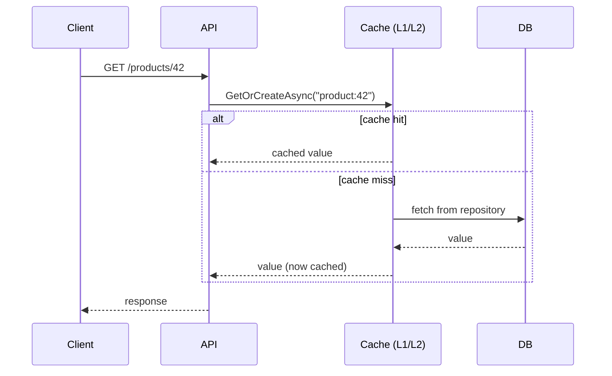

---

## Part XIV — Resilience, Auth & Security

### Resilience & Rate Limiting

System-design-style questions ("design a rate limiter," "design a resilient call to a flaky payment API") ab senior level par common hain — yeh scale aur failure ke baare mein reasoning test karte hain, sirf syntax nahi.

**Built-in rate limiting middleware (.NET 7+):**
```csharp
builder.Services.AddRateLimiter(options =>
    options.AddFixedWindowLimiter("fixed", opt => { opt.Window = TimeSpan.FromSeconds(10); opt.PermitLimit = 5; opt.QueueLimit = 2; }));
app.UseRateLimiter();
app.MapGet("/products", GetProducts).RequireRateLimiting("fixed");
```

| Algorithm | Behavior | Good for |
|---|---|---|
| Fixed Window | Fixed time window mein N requests | Simple quota enforcement |
| Sliding Window | Window boundaries par bursts ko smooth karta hai | Fixed window se fairer |
| Token Bucket | Tokens time ke saath refill hote hain; bucket size tak burst allowed | Sustained rate cap karte hue short bursts allow karna |
| Concurrency Limiter | Simultaneous in-flight requests cap karta hai | Limited downstream resources protect karna |

**Polly** (retry/circuit breaker/timeout), jo ab `Microsoft.Extensions.Http.Resilience` ke through directly `HttpClientFactory` mein wired hai:
```csharp
builder.Services.AddHttpClient<PaymentClient>()
    .AddResilienceHandler("payment-pipeline", b =>
    {
        b.AddRetry(new RetryStrategyOptions { MaxRetryAttempts = 3, BackoffType = DelayBackoffType.Exponential });
        b.AddCircuitBreaker(new CircuitBreakerStrategyOptions { FailureRatio = 0.5, MinimumThroughput = 10 });
        b.AddTimeout(TimeSpan.FromSeconds(5));
    });
```
- **Retry** — ek failed call ko re-attempt karta hai, ideally exponential backoff + jitter ke saath taaki ek already-struggling service ke against thundering herd avoid ho.
- **Circuit Breaker** — ek failure threshold ke baad, cooldown period ke liye downstream service ko call karna band kar deta hai, timeouts pile-up karne ke bajaye fast fail hota hai.
- **Timeout** — bound karta hai ki ek call kitni der hang kar sakti hai, jisse threads/connections free ho jaate hain.
- **Bulkhead** — resource pools ko isolate karta hai taaki ek failing dependency unrelated calls ko chahiye resources exhaust na kar sake.

> *"Why not just retry forever?"* — kyunki ek genuinely down/overloaded service ke against retry karne se outage aur bhi bura ho jaata hai; retry ko circuit breaker ke saath combine karo taaki system fast fail ho aur apne schedule par recover kare.

**Idempotency for safe retries** — `POST /orders` ko safely retry karne ke liye endpoint ko idempotent hona zaroori hai: client ek `Idempotency-Key` header bhejta hai; server key → result ka ek mapping persist karta hai aur time window ke andar duplicate requests ko short-circuit kar deta hai.

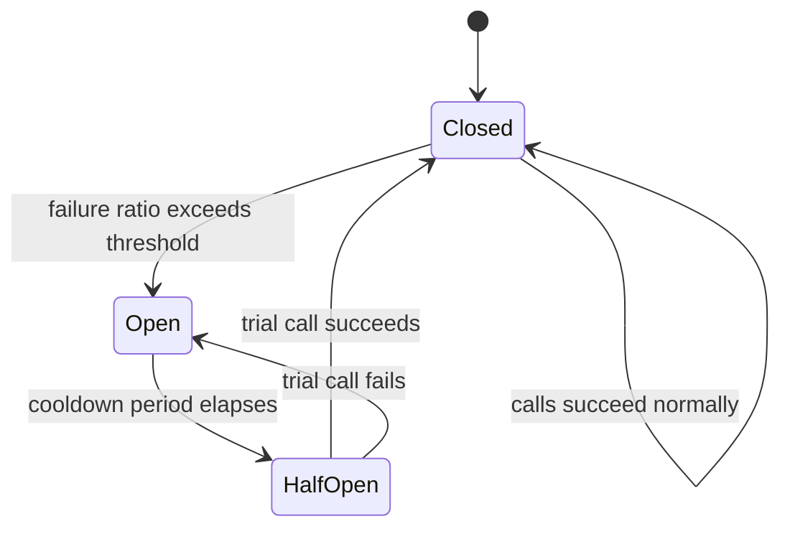

### Authentication & Authorization

**JWT Bearer authentication** — stateless hai, horizontally scale hota hai (koi server-side session store nahi), aur `Authorization: Bearer` header ke through SPA/mobile clients tak naturally pahunchta hai:
```csharp
builder.Services.AddAuthentication(JwtBearerDefaults.AuthenticationScheme)
    .AddJwtBearer(options => options.TokenValidationParameters = new TokenValidationParameters
    {
        ValidateIssuer = true, ValidateAudience = true, ValidateLifetime = true, ValidateIssuerSigningKey = true,
        ValidIssuer = config["Jwt:Issuer"], ValidAudience = config["Jwt:Audience"],
        IssuerSigningKey = new SymmetricSecurityKey(Encoding.UTF8.GetBytes(config["Jwt:Key"]))
    });
builder.Services.AddAuthorization();
app.UseAuthentication();
app.UseAuthorization();
```

**OAuth2 vs OpenID Connect:** OAuth2 ek *authorization* framework hai (kaun kya access kar sakta hai); OIDC uske upar ek *identity* layer hai (user kaun hai). Zyadatar full-stack .NET apps apna khud ka login banane ke bajaye ek external identity provider (Entra ID, Auth0, Keycloak, Duende IdentityServer) par delegate karte hain.

| Grant/Flow | Typical use |
|---|---|
| Authorization Code + PKCE | SPA aur mobile apps (modern default — deprecated Implicit flow avoid karo) |
| Client Credentials | Service-to-service (machine-to-machine), koi user involved nahi |
| Refresh Token | Login re-prompt kiye bina silently access token renew karna |

**Claims/policy-based authorization** (hardcoded role checks se better):
```csharp
builder.Services.AddAuthorization(options =>
    options.AddPolicy("CanEditProducts", policy => policy.RequireClaim("permission", "products.edit")));

[Authorize(Policy = "CanEditProducts")]
[HttpPut("{id}")]
public IActionResult Update(int id, ProductDto dto) { /* ... */ }
```
Yeh "user kya kar sakta hai" ko "unke paas kaunsa role hai" se decouple karta hai, jo permission models ke ek handful roles se badhne par kaafi better scale karta hai.

**Other security topics:** kisi bhi different origin par SPA ke liye CORS explicitly configure (`AddCors`/`UseCors`) hona chahiye; CSRF mainly cookie-based auth ke liye matter karta hai (`Authorization` header mein token-based JWT inherently kam exposed hota hai, lekin cookie-authenticated form posts ko still antiforgery tokens chahiye); **Data Protection API** ASP.NET Core ka built-in key-management system hai jo cookies/tokens ko rest mein encrypt karta hai; source control mein `appsettings.json` mein **kabhi bhi** secrets store mat karo — locally User Secrets aur production mein Key Vault/Secrets Manager/environment variables use karo.

---

## Part XV — Performance & Low-Allocation Programming

Senior level par, interviewers assess karte hain ki kya aap hot paths mein allocations reduce kar sakte ho — jo commonly "aap is hot loop/high-throughput endpoint ko kaise optimize karoge?" ke roop mein frame hota hai.

**`Span<T>` and `Memory<T>`** — `Span<T>` ek stack-only, allocation-free view hai contiguous memory (array, string, ya stack-allocated memory) ke upar, jo copying ke bina slicing enable karta hai:
```csharp
ReadOnlySpan<char> text = "Hello, World!";
ReadOnlySpan<char> hello = text.Slice(0, 5);      // no allocation — a view, not a copy

Span<int> numbers = stackalloc int[5];             // stack-allocated, zero heap allocation
for (int i = 0; i < numbers.Length; i++) numbers[i] = i * i;
```
`Memory<T>` iska heap-friendly counterpart hai, jo `async` boundaries ke across usable hai — `Span<T>` ek `ref struct` hai isliye ise `async` methods ke andar use ya field ke roop mein store **nahi** kiya ja sakta.

**`ArrayPool<T>`** har call par allocate/discard karne ke bajaye ek shared pool se arrays rent/return karta hai — high-throughput networking/serialization mein common (Kestrel khud internally isko use karta hai):
```csharp
byte[] buffer = ArrayPool<byte>.Shared.Rent(1024);
try { /* use buffer */ } finally { ArrayPool<byte>.Shared.Return(buffer); }
```

**`string.Create()`** directly ek destination buffer mein likhta hai, jisse programmatic string construction ke liye intermediate allocations avoid ho jaate hain.

**`record struct`/plain `struct`** small, frequently-created, short-lived value objects (`Money`, `Point`, RGB color) ke liye unhe heap se poori tarah door rakhta hai, jisse hot loops mein GC pressure avoid ho jaata hai.

**BenchmarkDotNet** de-facto standard micro-benchmarking library hai — "aap isko kaise fast karoge" ka strong senior answer sirf intuition nahi, balki before/after *measuring* mention karta hai:
```csharp
[MemoryDiagnoser]
public class StringBenchmarks
{
    [Benchmark(Baseline = true)]
    public string Concat() => "a" + "b" + "c";

    [Benchmark]
    public string StringBuilderVersion() => new StringBuilder().Append("a").Append("b").Append("c").ToString();
}
```

**Native AOT** directly native machine code mein ahead-of-time compile ho jaata hai — koi JIT warm-up nahi, smaller memory footprint, kai cases mein 50ms se kam ke startup times. Trade-offs: koi runtime reflection-based dynamic code generation nahi (isliye reflection-heavy libraries ko source-generator alternatives chahiye — Part IV dekho); kuch older libraries abhi fully AOT-compatible nahi hain. Prime use cases: containers, serverless functions, CLI tools jahan cold-start latency matter karti hai.

| Technique | Problem it solves |
|---|---|
| `Span<T>`/`Memory<T>` | Buffers slice/process karte time copying avoid karta hai |
| `ArrayPool<T>` | Repeated array allocation/GC churn avoid karta hai |
| `ValueTask<T>` | Frequently-synchronous hot paths par `Task` allocation avoid karta hai |
| `record struct` | Small value objects ko heap se door rakhta hai |
| Native AOT | JIT warm-up eliminate karta hai, memory/startup footprint shrink karta hai |
| Source generators | Runtime par reflection eliminate karta hai |

---

## Part XVI — Advanced Concurrency Primitives

*Gap note: basic notes ne `lock`, `Thread`, `Task`, aur ThreadPool cover kiya tha, lekin finer-grained synchronization primitives nahi jo senior interviewers puchte hain jab ek simple `lock` right tool nahi hota.*

### Low-Level Concurrency Primitives: Monitor, SpinLock, False Sharing, Thread-Pool Starvation [gaps]

**`lock` actually compile hokar kya banta hai.** `lock (obj) { ... }` keyword `System.Threading.Monitor` ke upar syntactic sugar hai:

```csharp
lock (_lockObj)
{
    // critical section
}

// is (approximately) equivalent to:
bool lockTaken = false;
try
{
    Monitor.Enter(_lockObj, ref lockTaken);
    // critical section
}
finally
{
    if (lockTaken) Monitor.Exit(_lockObj);
}
```

`Monitor.Enter`/`Monitor.Exit` ek object ke **sync block** (object header ka part) se associated exclusive lock acquire/release karte hain — isi wajah se lock object ek reference type hona chahiye, aur isi wajah se ek boxed value type, ek string literal (jo interned ho sakta hai aur unrelated code mein unexpectedly shared ho sakta hai), ya public class mein `this` (koi bhi external code jiske paas aapke object ka reference hai, wo bhi usi par lock kar sakta hai) par lock karna sab classic mistakes hain. `Monitor` `Monitor.Wait`/`Monitor.Pulse`/`Monitor.PulseAll` bhi expose karta hai — lower-level signaling primitives jo custom condition-variable-style coordination banane ke liye hain (ek thread `Wait()` call karta hai lock release karne aur signal hone tak block hone ke liye; lock hold kar rahi doosri thread `Pulse()`/`PulseAll()` call karti hai ek/sab waiters ko wake karne ke liye). Yeh wahi mechanism hai jo kuch producer-consumer patterns ke peeche hai jo `BlockingCollection`/`Channels` se pehle ke hain — modern code ko woh higher-level types prefer karni chahiye, lekin `Wait`/`Pulse` samajhna hi hai jiska matlab hai "main samajhta hoon `lock` actually kya karta hai" senior level par.

**`SpinLock` and `SpinWait`.** Ek `lock`/`Monitor` ek blocked thread ko sleep kara deta hai (ek full context switch, relatively expensive — microseconds ke order mein). Ek **very short** critical section ke liye jahan wait brief expected hai, wahan yeh context-switch overhead sirf spinning (busy-waiting, repeatedly ek flag check karna) ki cost se zyada ho sakta hai jab tak lock free nahi ho jaata:

```csharp
private SpinLock _spinLock = new SpinLock();

bool lockTaken = false;
try
{
    _spinLock.Enter(ref lockTaken);
    // extremely short critical section — a few instructions, not a DB call
}
finally
{
    if (lockTaken) _spinLock.Exit();
}
```

`SpinWait` woh lower-level building block hai jise `SpinLock` (aur ThreadPool/Task infrastructure ke parts) internally use karte hain — yeh briefly spin karta hai, phir agar wait bahut lamba chal jaaye to thread ko yield karne/sleep karne par fall back kar jaata hai, taaki ek lock jo expected se zyada lamba hold hua, uske liye ek core ko indefinitely 100% par pegging na ho. **Rule of thumb: `SpinLock`/`SpinWait` bahut specific, measured, ultra-short-duration contention scenarios ke liye hain (kuch low-level runtime/library code) — typical application code mein inhe use karna almost hamesha ek premature optimization hota hai; `lock`/`Monitor` default mein correct hai**, aur yeh exactly waisa "fancy tool kab NAHI use karna hai yeh jaanna" wala answer hai jo seniority signal karta hai.

**False sharing / cache-line contention.** CPUs memory ko fixed-size lines mein cache karte hain (commonly 64 bytes). Agar different threads ke use kiye do *unrelated* fields **same cache line** par land ho jaate hain, to ek field mein writes CPU cache ko force karti hain ki poori line ko har core par jo usse touch kar raha hai invalidate aur resync kare — bhale hi threads logically data share nahi kar rahe, wo cache line par khud contend kar rahe hote hain, jo ek real (aur confusing) performance cliff cause karta hai:

```csharp
// Naive: Counter1 and Counter2 likely share a cache line — a thread hammering
// Counter1 forces cache invalidation that also stalls a thread hammering Counter2.
public class Counters
{
    public long Counter1;
    public long Counter2;
}

// Fixed: pad so each counter gets its own cache line (64 bytes is the common line size).
[StructLayout(LayoutKind.Explicit, Size = 128)]
public struct PaddedCounters
{
    [FieldOffset(0)]  public long Counter1;
    [FieldOffset(64)] public long Counter2;
}
```
.NET `System.Runtime.CompilerServices.PaddingHelpers`-style tricks bhi ship karta hai, aur, more practically, **`[StructLayout]` padding ya hot counters ko separate heap-allocated objects mein split karna** usual fixes hain; yeh niche hai lekin ek real senior differentiator hai — "yeh lock-free counter heavy multi-core contention ke under expected se worse perform kyun karta hai" exactly woh sawaal hai jiska jawaab false sharing deta hai.

**ThreadPool starvation — symptoms and diagnosis.** ThreadPool apna worker-thread count slowly badhata hai (sustained demand ke under roughly ek nayi thread per ~500ms-ish, by design, taaki transient burst ke liye threads over-provision na ho) — yeh "slow ramp-up" by far load ke under mysterious latency spikes ka sabse common real-world cause hai:

- **Symptoms:** requests/tasks queue up ho jaate hain aur unki latency badhti hai bhale hi CPU usage *low* dikhe (bottleneck thread availability hai, compute nahi) — `dotnet-counters` ke `ThreadPool Queue Length` aur `ThreadPool Thread Count` counters direct diagnostic signal hain (broader tooling workflow ke liye Part VII mein GC diagnostics section dekho). Root causes almost hamesha **pool threads par blocking calls** hote hain — synchronous I/O (`.Result`/`.Wait()` ek async call par), `Task.Run()` jo kisi cheez ko wrap kar rahi hai jo khud block karti hai, ya ek `LongRunning`-style workload jo mistakenly plain pooled task ke roop mein run ho rahi hai.
- **`ThreadPool.SetMinThreads(workerThreads, completionPortThreads)`** *minimum* thread count ko raise karta hai taaki pool ek small baseline se gradually ramp-up hone ke bajaye actual demand ke closer se start ho — ek common mitigation (kabhi-kabhi high-throughput services mein startup-time tuning knob ke roop mein dekha jaata hai) lekin yeh ek **band-aid** hai, fix nahi: yeh symptom ko papers over kar deta hai jabki real fix woh blocking calls remove karna hai jo pehli jagah pool ko starve kar rahe hain.
  ```csharp
  ThreadPool.SetMinThreads(workerThreads: 200, completionPortThreads: 200);
  ```
- **Strong senior framing:** "Agar mujhe latency spikes low CPU aur ek badhti ThreadPool queue length ke saath correlate hote dikhte hain, to main pehle pool threads par blocking calls dhoondta hoon — `SetMinThreads` short-term symptom ko mask kar sakta hai, lekin actual fix almost hamesha blocking call path ko properly async banana hota hai."

**`SemaphoreSlim`** — concurrent access ko throttle karta hai; `lock` ke unlike, yeh async/await (`WaitAsync`) support karta hai aur ek se zyada caller ko ek saath through jaane deta hai:
```csharp
private static readonly SemaphoreSlim _semaphore = new(maxCount: 3);
async Task CallDownstreamAsync()
{
    await _semaphore.WaitAsync();
    try { await CallApiAsync(); } finally { _semaphore.Release(); }
}
```

**`ReaderWriterLockSlim`** — many concurrent readers **ya** ek exclusive writer allow karta hai; read-heavy shared state ke liye ek plain `lock` se better hai (e.g., occasional writes ke saath ek in-memory cache).

**`Interlocked` & `volatile`:**
```csharp
private static int _counter;
Interlocked.Increment(ref _counter);   // atomic increment, no lock needed

private volatile bool _isRunning;      // prevents per-core caching from hiding updates from other threads
```
`Interlocked` lock-free atomic operations provide karta hai (`Increment`, `Decrement`, `CompareExchange`) — simple counters/flags ke liye ek full `lock` se kaafi cheaper. `volatile` modern C# mein directly rarely needed hota hai (zyadatar synchronization higher-level primitives ke through jaata hai), lekin conceptually abhi bhi puchha jaata hai.

**Concurrent collections:**

| Type | Use case |
|---|---|
| `ConcurrentDictionary<TKey,TValue>` | Manual locking ke bina thread-safe key/value cache |
| `ConcurrentQueue<T>` / `ConcurrentStack<T>` | Thread-safe FIFO/LIFO producer-consumer buffers |
| `BlockingCollection<T>` | Blocking `Add`/`Take` ke saath bounded producer-consumer |

**`System.Threading.Channels`** — ek modern, high-performance async producer-consumer pipeline, jo kai naye designs mein older `BlockingCollection`-based patterns ko replace kar raha hai:
```csharp
var channel = Channel.CreateUnbounded<int>();
await channel.Writer.WriteAsync(42);         // producer
channel.Writer.Complete();
await foreach (var item in channel.Reader.ReadAllAsync()) Console.WriteLine(item); // consumer
```
Common use case: ek `BackgroundService` jo ek API endpoint dwara populate kiye gaye channel se work items read karta hai, jisse request handling slower processing se decouple ho jaati hai.

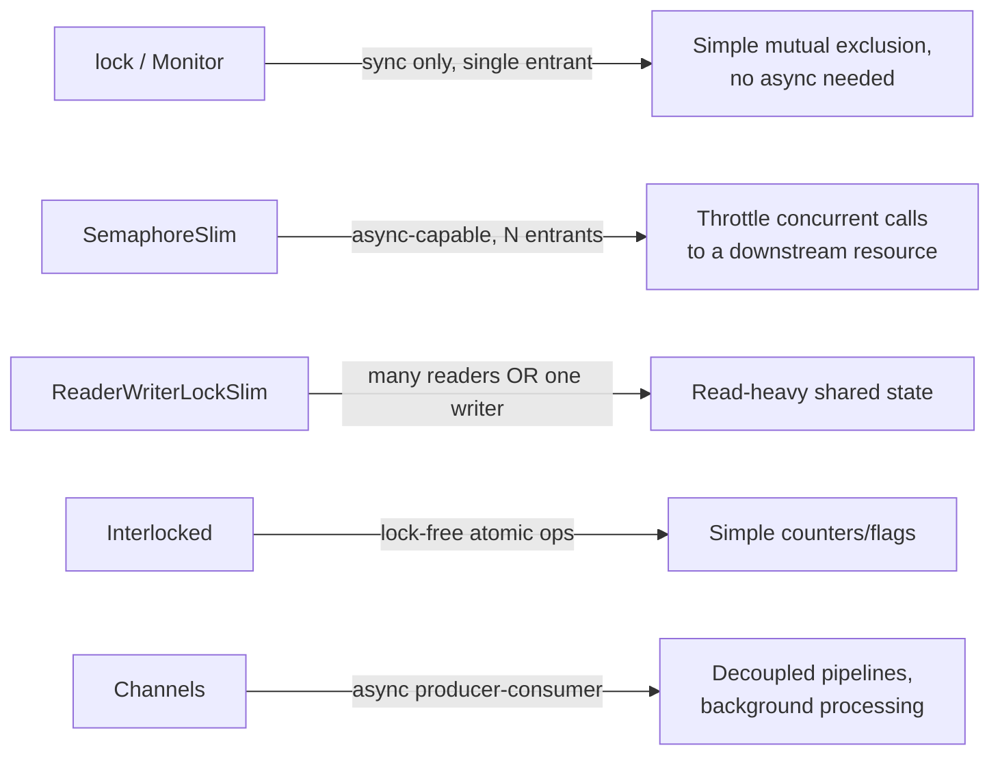

---

## Part XVII — Microservices, Messaging & CQRS

**REST vs gRPC:**

| | REST/OpenAPI | gRPC |
|---|---|---|
| Transport | HTTP/1.1 (typically), JSON | HTTP/2, binary Protobuf |
| Performance | Achha | Faster — smaller payloads, multiplexed streams |
| Contract | OpenAPI (optional/loose) | `.proto` file (strict, code-generated) |
| Streaming | Limited (SSE, polling) | First-class bidirectional streaming |
| Browser support | Native | grpc-web / ek proxy chahiye |
| Best for | Public APIs, browser clients | Internal service-to-service calls, low-latency needs |

**Message brokers:**

| Broker | Model | Typical use |
|---|---|---|
| RabbitMQ | Traditional message queue (AMQP) | Task queues, work distribution, topic/exchange ke through routing |
| Kafka | Distributed log / event streaming | High-throughput event streams, event sourcing, replayable history |
| Azure Service Bus | Managed queue/topic service | Enterprise .NET-native messaging, dead-lettering, sessions |

Ek **queue** (message ek baar consume hota hai, phir remove) aur ek **topic/pub-sub** (message har subscriber ko deliver hota hai) ke beech difference jaano — aur pub-sub use karke decoupling ke liye ek design describe karne ke liye ready raho (e.g., `OrderPlaced` → Inventory + Shipping services dono independently react karte hain).

**CQRS with MediatR:**
```csharp
public record CreateOrderCommand(int ProductId, int Quantity) : IRequest<int>;

public class CreateOrderHandler : IRequestHandler<CreateOrderCommand, int>
{
    public async Task<int> Handle(CreateOrderCommand request, CancellationToken ct)
    {
        // validate, persist, publish domain event...
        return newOrderId;
    }
}
// var orderId = await mediator.Send(new CreateOrderCommand(productId, quantity));
```
Benefits: thin controllers/endpoints, har use case apne testable handler mein isolated, `IPipelineBehavior<>` cross-cutting concerns (validation, logging, transactions) ke liye ek clean jagah deta hai.

**Saga pattern** — microservices ek ACID transaction share nahi kar sakte, isliye ek Saga local transactions ki ek sequence coordinate karta hai jiske saath compensating actions hote hain agar koi later step fail ho jaaye (inventory reserve karo → payment charge karo → order confirm karo; agar payment fail ho jaaye, to inventory reservation release karo).

| Style | Description |
|---|---|
| Orchestration | Ek central coordinator explicitly har service ko call karta hai aur compensations trigger karta hai |
| Choreography | Har service doosron ke events par react karta hai; koi central coordinator nahi, lekin end-to-end trace karna harder hai |

**Domain-Driven Design vocabulary** jo ready rakhne layak hai: **Entity** (jiski identity state changes ke across persist karti hai), **Value Object** (poori tarah apne values se defined, koi identity nahi — `record`/`record struct` ke liye natural fit), **Aggregate** (entities/value objects ka ek cluster jo ek single Aggregate Root ke saath ek consistency boundary maana jaata hai), **Bounded Context** (woh boundary jiske andar ek specific model/vocabulary valid hai — aksar ek microservice ke saath 1:1 map hota hai), **Domain Event** (kuch jo hua hai jiske baare mein system ke doosre parts care kar sakte hain, e.g. `OrderPlaced`).

---

## Part XVIII — Observability, Testing & Full-Stack Integration

### Observability & Health Checks

Distributed systems mein, ek single request kai services ke across span karta hai — sirf per-service logs se full picture reconstruct karna mushkil ho jaata hai. Modern observability logs ke saath **distributed tracing** aur **metrics** bhi add karta hai (yeh "three pillars" hain).

**OpenTelemetry** traces/metrics/logs collect karne aur ek backend (Azure Monitor, Jaeger, Prometheus/Grafana, Datadog) tak export karne ka current vendor-neutral standard hai:
```csharp
builder.Services.AddOpenTelemetry()
    .WithTracing(t => t.AddAspNetCoreInstrumentation().AddHttpClientInstrumentation().AddSource("MyApp").AddOtlpExporter())
    .WithMetrics(m => m.AddAspNetCoreInstrumentation().AddRuntimeInstrumentation());
```
Distributed tracing ek trace/correlation ID ko service boundaries ke across propagate karta hai taaki ek single request end-to-end follow kiya ja sake — production mein latency aur failures debug karne ke liye essential.

**Health checks:**
```csharp
builder.Services.AddHealthChecks().AddSqlServer(connectionString).AddCheck<RedisHealthCheck>("redis");
app.MapHealthChecks("/health");
```
Kubernetes/load balancers ek health endpoint ko poll karte hain readiness (kya is instance ko traffic milna chahiye?) aur liveness (kya is instance ko restart hona chahiye?) decide karne ke liye.

### Testing Strategy

| Layer | Tooling | Covers |
|---|---|---|
| Unit tests | xUnit/NUnit + Moq or NSubstitute | Isolation mein business logic, mocked dependencies |
| Integration tests | `WebApplicationFactory<T>`, Testcontainers | API + real (ya containerized) DB/cache jo saath kaam karte hain |
| E2E/UI tests | Playwright, Selenium | Actual frontend ke through full user flows |

```csharp
public class OrderServiceTests
{
    [Fact]
    public async Task CreateOrder_Should_Throw_When_Stock_Is_Insufficient()
    {
        var repoMock = new Mock<IProductRepository>();
        repoMock.Setup(r => r.GetAsync(1)).ReturnsAsync(new Product { Id = 1, Stock = 0 });
        var service = new OrderService(repoMock.Object);

        await Assert.ThrowsAsync<InsufficientStockException>(
            () => service.CreateOrderAsync(productId: 1, quantity: 1));
    }
}

public class ProductsApiTests : IClassFixture<WebApplicationFactory<Program>>
{
    private readonly HttpClient _client;
    public ProductsApiTests(WebApplicationFactory<Program> factory) => _client = factory.CreateClient();

    [Fact]
    public async Task Get_Products_Returns_Ok()
    {
        var response = await _client.GetAsync("/products");
        response.EnsureSuccessStatusCode();
    }
}
```
**Testcontainers** ek test run ke liye Docker mein ek real, disposable DB/Redis instance spin up karta hai — jisse integration tests ko ek shared, stateful test environment ke bina real fidelity milti hai.

**Testing philosophy talking points:** architectural boundaries (repositories, external HTTP clients) par mock karo, internal implementation details par nahi, warna tests refactors ke liye brittle ho jaate hain; exact internal calls verify karne ke bajaye behavior/outcomes test karna prefer karo; AAA structure (Arrange, Act, Assert); **`async void` test methods mein bhi dangerous hai** — hamesha `async Task` use karo taaki test runner andar throw hui exceptions observe kar sake (Part VIII dekho).

### Full-Stack Integration

**SignalR** real-time, bidirectional communication ke liye WebSockets ko abstract karta hai (SSE/long-polling fallbacks ke saath):
```csharp
public class NotificationHub : Hub
{
    public async Task SendMessage(string user, string message) =>
        await Clients.All.SendAsync("ReceiveMessage", user, message);
}
// app.MapHub<NotificationHub>("/hubs/notifications");
```

**Blazor hosting models:**

| Model | Where code runs | Notes |
|---|---|---|
| Blazor Server | Server par; UI SignalR ke over push hota hai | Small download, ek persistent connection chahiye |
| Blazor WebAssembly (WASM) | Browser mein WASM ke through | True client-side C#, offline kaam karta hai, larger initial download |
| Blazor Hybrid/MAUI | Native app shell jo ek Blazor UI host karti hai | Web aur native mobile/desktop ke across shared UI code |

**Backend-for-Frontend (BFF)** — ek dedicated backend layer (aksar ASP.NET Core) jo ek specific frontend ki needs ke liye tailored hoti hai: multiple downstream microservices ke calls ko aggregate karti hai, auth token exchange handle karti hai, responses ko exactly SPA ki zarurat ke hisaab se shape karti hai — browser kabhi bhi directly internal services se baat nahi karta.

**CORS in practice** — ek near-guaranteed practical question: *"Aapka React app `localhost:3000` par `localhost:5001` par API ko call nahi kar sakta — kyun, aur aap ise kaise fix karoge?"* Jawab: same-origin policy default mein cross-origin requests ko block karti hai; API ko CORS middleware ke through explicitly specific origins ko opt in karna hoga:
```csharp
builder.Services.AddCors(options => options.AddPolicy("SpaPolicy",
    p => p.WithOrigins("https://myapp.com").AllowAnyHeader().AllowAnyMethod().AllowCredentials()));
app.UseCors("SpaPolicy");
```

### Senior-Level Interviews Mein Kya Different Hai

- Kam "define X" trivia, zyada scenario-based reasoning: "Design a rate limiter," "Design a notification service," "Walk me through debugging a production memory leak" (concrete `dotnet-counters` → `dotnet-gcdump` → `dotnet-trace` walkthrough ke liye Part VII mein **GC Diagnostics Tooling for Production** dekho — yahan actual tools naam lena hi hai jo ek senior answer ko conceptual answer se alag karta hai).
- Interviewers production experience aur architectural judgment ko bhaari weight dete hain, sirf correct syntax nahi.
- Weakness ka ek common signal: bina follow-up ke "it depends" bol dena. Ek strong answer "it depends" kehta hai aur phir ek **decision framework plus ek default recommendation** deta hai (e.g., Part IX mein EF Core vs Dapper framing).
- Almost har answer par "why not X instead?" probing expect karo — yeh test karta hai ki kya aap trade-offs samajhte ho, sirf happy path nahi.

Rehearse karne layak sample system-design-style prompts: URL shortener/rate limiter/notification service design karna (API, cache, DB, queue sketch karne aur scaling/failure modes ke baare mein out loud baat karne ki practice); "aap teen downstream services ko sequentially call karne wale ek endpoint ka P99 latency kaise reduce karoge?" (independent calls ko `Task.WhenAll` se parallelize karo, caching add karo, sabse slowest dependency ke liye ek circuit breaker consider karo); "aap ek monolith ke Products module ko downtime ke bina microservice mein kaise migrate karoge?" (strangler-fig pattern, dual-write ya CDC-based data sync, feature-flag cutover).

---

## Part XIX — Swagger / OpenAPI & API Documentation

> **Framing note:** yeh topic fundamentally ek **ASP.NET Core / Web API tooling** subject hai, C# language feature nahi — yeh yahan include kiya gaya hai kyunki source material (`C# Swagger.docx`) C# notes folder mein tha. Genuinely C#-language-relevant slice XML doc-comment syntax (`///`, `<summary>`, `<param>`) aur generally attribute usage hai; baaki sab niche Web API tooling/configuration knowledge hai jo ek full-stack interview mein bhi expect ki jaayegi.

**OpenAPI vs Swagger:** OpenAPI Specification (OAS) REST APIs ko machine-readable JSON/YAML mein describe karne ka standard hai — API contract. Swagger uske aaspaas bana tooling ecosystem hai (Swagger UI, Swagger Editor, Swagger Codegen). Swagger OpenAPI ko *implement* karta hai.

**Swagger in .NET (Swashbuckle):**
```csharp
// dotnet add package Swashbuckle.AspNetCore
builder.Services.AddEndpointsApiExplorer();
builder.Services.AddSwaggerGen();
app.UseSwagger();
app.UseSwaggerUI();     // https://localhost:5001/swagger
```

**JWT auth in Swagger UI:**
```csharp
builder.Services.AddSwaggerGen(options =>
{
    options.AddSecurityDefinition("Bearer", new OpenApiSecurityScheme
    {
        Name = "Authorization", Type = SecuritySchemeType.Http, Scheme = "bearer", BearerFormat = "JWT",
        In = ParameterLocation.Header, Description = "Enter your JWT token (without the 'Bearer' prefix)."
    });
    options.AddSecurityRequirement(new OpenApiSecurityRequirement
    {
        { new OpenApiSecurityScheme { Reference = new OpenApiReference { Type = ReferenceType.SecurityScheme, Id = "Bearer" } },
          Array.Empty<string>() }
    });
});
```
Yaad rakhne wali do parts: **security definition** declare karta hai ki scheme exist karti hai (Authorize button); **security requirement** declare karta hai ki kaunse operations ko yeh chahiye (padlocks). Ek bahut common pitfall: JWT ko auth middleware mein wire karna lekin OpenAPI security scheme bhool jaana, jisse Authorize button kabhi appear nahi hota.

**.NET 9+ mein Swashbuckle default se remove ho gaya (current hot topic — ek great "do you keep up with the platform" signal):**

| Version | OpenAPI behavior |
|---|---|
| .NET 8 aur usse pehle | Swashbuckle default mein included; OpenAPI 3.0 generate karta hai |
| .NET 9 | Built-in `Microsoft.AspNetCore.OpenApi`; OpenAPI 3.0; launch par koi UI nahi, koi XML comment support nahi |
| .NET 10 | Built-in generator default mein OpenAPI 3.1 emit karta hai; Native AOT friendly |

*(Interview ke time current Microsoft docs ke against exact per-version behavior verify karo — is jaise tooling details preview aur RTM ke beech shift hoti hain.)* Change ki reasons: Swashbuckle ke maintenance gaps aur Native AOT compatibility ki zarurat, jiske saath reflection-heavy Swashbuckle struggle karta tha. Swashbuckle dead nahi hai — yeh ab bhi ek actively maintained community package hai jise aap manually add kar sakte ho.

```csharp
builder.Services.AddOpenApi();     // register generation only — no UI shipped
var app = builder.Build();
app.MapOpenApi();                  // serves /openapi/v1.json
```

| UI tool | Role |
|---|---|
| Swagger UI (`Swashbuckle.AspNetCore.SwaggerUI`) | Classic interactive UI, `/openapi/v1.json` ko point karta hai |
| Scalar (`Scalar.AspNetCore`) | Modern UI — dark mode, multi-language snippets, `MapScalarApiReference()` |
| NSwag | Client SDK generation (TypeScript, C#) |
| ReDoc | Clean, read-only reference documentation |

**OpenAPI document structure:** `openapi` (spec version), `info`, `servers`, `paths`, `components` (reusable schemas/responses/parameters/securitySchemes, `$ref` ke through referenced), `security` (global requirements), `tags` (UI grouping). OpenAPI 3.1 JSON Schema draft 2020-12 ke saath align hota hai, webhooks ko ek top-level element ke roop mein add karta hai, aur nullability ko 3.0 ke `nullable: true` ke bajaye `type: [string, null]` ke through describe karta hai.

**API versioning:** URL path (`/api/v1/products`), query string (`?api-version=1.0`), header (`api-version: 1.0`), ya media type (`Accept: application/json;v=1.0`) — `Asp.Versioning.Mvc` plus API explorer har version ke liye ek Swagger document expose karta hai. Kisi existing version ke contract mein kabhi breaking changes mat karo; uske bajaye ek naya version ship karo.

**Documenting responses/errors:**
```csharp
[ProducesResponseType(typeof(Product), StatusCodes.Status200OK)]
[ProducesResponseType(typeof(ProblemDetails), StatusCodes.Status404NotFound)]
public async Task<IActionResult> Get(int id) { /* ... */ }
```
Anonymous/dynamic objects ke bajaye sab error responses ke liye `ProblemDetails` (RFC 7807) prefer karo, jo koi usable schema produce nahi karte. `<GenerateDocumentationFile>true</GenerateDocumentationFile>` enable karo aur generated XML ko generator mein feed karo taaki `<summary>`/`<param>` text UI mein appear ho.

**Quick-fire comparisons:** Swagger UI (hamesha live code reflect karta hai) vs Postman (standalone collections jo drift kar sakte hain); code-first (fast, doc intent se lag kar sakta hai) vs contract-first (parallel teams/public APIs ke liye better, contract source of truth hai); REST/OpenAPI (fixed endpoints, mature tooling/caching) vs GraphQL (client-specified fields, over/under-fetching kam karta hai).

**Production mein Swagger secure karna** — sirf "just disable it" se aage jaao: spec/UI ko sirf Development mein serve karo (ya ek toggle ke peeche); agar UI expose karna zaroori hai, to ise auth ke peeche daalo (e.g., ek admin policy); network se restrict karo (IP allow-lists, VPN, internal-only ingress); internal APIs ke liye, koi UI ke bina sirf raw JSON serve karna consider karo, kyunki ek public UI attackers ke liye free reconnaissance hai; examples mein kabhi secrets/sample tokens leak mat karo.

**[new content] Raw notes ke baaki thin/unelaborated "advanced topics", answered:**
- **API linting** — Spectral jaise tools use karke ek OpenAPI document ko style/consistency rules (naming conventions, required fields, forbidden patterns) ke against validate karna, jisse contract problems consumers tak pahunchne se pehle CI mein catch ho jaate hain.
- **Mock server generation** — Prism ya WireMock jaise tools directly ek OpenAPI document se ek working mock HTTP server spin up kar sakte hain, jisse frontend teams real backend exist hone se pehle ek contract ke against build kar sakti hain.
- **OpenAPI validation pipelines** — CI steps jo spec ko lint karte hain, breaking changes catch karne ke liye ise previous version ke against diff karte hain, aur optionally running service ke against contract tests run karte hain taaki ensure ho ki implementation documented contract se match karti hai.
- **AsyncAPI** — OpenAPI ki ek sibling specification, jo **event-driven/asynchronous APIs** (message queues, WebSockets, Kafka topics) describe karne ke liye purpose-built hai jahan OpenAPI ka request/response model fit nahi hota; agar OpenAPI ke saath microservices-messaging question aaye to naam lene layak.
- **Schema evolution strategies** — fields remove/rename karne ke bajaye additive-only changes (new optional fields) favor karo; removal se pehle `deprecated: true` use karo; kabhi bhi ek field ka type mat badlo ya bina naye API version ke ek optional field ko required mat banao; consumer-driven contract testing (e.g., Pact) consider karo taaki breaking changes shipping se pehle tests dwara catch ho, production mein downstream consumers dwara nahi.

---

## Part XX — Terminology Reference

| Term | What It Is | Runs on Its Own? | Example |
|---|---|---|---|
| Library | Reusable code | Nahi | `System.Collections` |
| DLL | Ek library ka compiled binary | Nahi | `Newtonsoft.Json.dll` |
| EXE | Executable application | Haan | `MyApp.exe` |
| Framework/SDK | Libraries + runtime (SDK tooling add karta hai: compilers, templates, CLI) | Nahi (ek app chahiye) | .NET 8, .NET 10 |
| Package | NuGet distribution format (`.nupkg`) | Nahi | `Newtonsoft.Json` (NuGet) |

**Managed vs unmanaged code:** managed code ek .NET language mein likha jaata hai, MSIL mein compile hota hai, aur CLR supervision ke under run hota hai (memory management, type safety, security). Unmanaged resources CLR ke bahar hote hain (file handles, DB connections, sockets, OS handles, native memory) aur inhe explicitly `Dispose()` ke through release karna zaroori hai.

---

## Best Practices Checklist

- Composition ko inheritance se favor karo; inheritance hierarchies ko shallow rakho.
- Ek interface se start karo; ek abstract class ke liye sirf tab jaao jab genuinely shared state/behavior chahiye ho.
- Constructors ko lightweight rakho — koi I/O/DB calls nahi; arguments ko early validate karo; immutability prefer karo.
- `Equals()` aur `GetHashCode()` ko saath override karo, kabhi bhi ek ko doosre ke bina mat karo.
- Read-only EF Core queries ke liye `AsNoTracking()` prefer karo; N+1 avoid karne ke liye `Include()` se eager-load karo.
- Default mein `Task` prefer karo; `ValueTask` ke liye sirf tab jaao jab profiling se benefit ka evidence ho.
- Hamesha `async Task`, kabhi `async void` nahi, framework-mandated event handlers ko chhod kar.
- Shared library code mein `ConfigureAwait(false)` use karo; ASP.NET Core application code mein yeh largely optional hai.
- Scattered `try/catch` ke bajaye ek global exception-handling middleware / `IExceptionHandler` use karo.
- Reusable APIs se raw delegates nahi, **events** expose karo.
- String concatenation ke bajaye structured logging (`{PlaceholderName}`) use karo.
- API error responses ke liye `ProblemDetails` (RFC 7807) prefer karo.
- Source control mein kabhi secrets store mat karo; locally User Secrets, production mein Key Vault/Secrets Manager use karo.
- Downstream calls ke liye retry ko circuit breaker ke saath combine karo — kabhi indefinitely retry mat karo.
- Intuition par trust karne ke bajaye kisi bhi performance change ko before/after benchmark karo (BenchmarkDotNet).
- EF Core migrations ko small, reversible, aur production ke against run karne se pehle reviewed rakho.

## Common Pitfalls Checklist

- Ek context se `.Result`/`.Wait()` ke saath async code par blocking jo ek `SynchronizationContext` capture karta hai → deadlock.
- `async void` silently exceptions swallow karta hai (test methods mein bhi).
- `IHttpClientFactory` use karne ke bajaye har request par `HttpClient` ko dispose/recreate karna.
- Singleton services jo Scoped/Transient dependencies capture kar lein (captive dependency).
- Same `IQueryable`/lazily-evaluated `IEnumerable` ka multiple enumeration.
- Further filters apply karne se pehle ek `IQueryable` ko materialize (`.ToList()`) karna, jisse client-side evaluation force ho jaata hai.
- String-concatenated SQL (`AddWithValue` ka overuse, ya usse bhi bura, raw concatenation) — injection risk aur plan-cache bloat.
- Un-unsubscribed event handlers jo memory leak karte hain.
- `dynamic`/reflection ka overuse jahan ek source generator ya static typing kaam kar deta.
- Access restrict kiye bina production mein Swagger/OpenAPI UI expose karna.
- `GC.Collect()` ko ek routine performance tool ki tarah treat karna.

---

## Sample Interview Q&A (Rapid Fire)

**Q: Record aur class mein kya difference hai?**
A: Records value-based equality aur `ToString()` free mein dete hain, aur `with` expressions ke through non-destructive mutation support karte hain; classes ki reference equality hoti hai aur default mein mutable hoti hain. DTOs/domain value objects ke liye records use karo; small, allocation-sensitive value types ke liye `record struct` use karo.

**Q: `.Result` kabhi deadlock kyun karta hai aur kabhi nahi?**
A: Yeh deadlock hota hai jab calling thread `.Result` par block hoti hai jabki awaited method ki continuation ko usi thread ke capture kiye `SynchronizationContext` par resume karna hota hai (WPF/WinForms/old ASP.NET mein classic). ASP.NET Core mein koi `SynchronizationContext` nahi hota, isliye yeh specific deadlock wahan nahi hota — halaanki load ke under `.Result` par blocking still ThreadPool ko starve kar sakta hai.

**Q: Aap Task ke bajaye ValueTask kab use karoge?**
A: Sirf ek proven hot path par jahan results frequently already synchronously available hote hain (e.g., ek cache-hit path) — aur sirf tab jab profiling dikhaye ki `Task` allocation actually matter karta hai. Warna `Task` ko default rakho; `ValueTask` ki single-await restriction ise easily misuse karne layak banati hai.

**Q: Jab bhi Equals() override karte ho, tab GetHashCode() kyun override karna chahiye?**
A: `Dictionary`/`HashSet` pehle hash code se objects ko bucket karte hain, phir ek bucket ke andar disambiguate karne ke liye `Equals()` use karte hain. Agar do objects `Equals`-equal hain lekin unke different hash codes hain, to lookups silently unhe find karne mein fail ho jaate hain.

**Q: N+1 query problem kya hai aur aap ise kaise fix karoge?**
A: Ek parent collection fetch karna, phir related data fetch karne ke liye har row ke liye lazily ek additional query trigger hona. Eager loading (`Include()`), projection (`Select()` se sirf needed fields pull karna), ya multiple `Include`s ke liye `AsSplitQuery()` se fix karo.

**Q: AutoMapper senior level par controversial kyun hai?**
A: Yeh convenience ke liye compile-time safety aur debuggability trade karta hai — mapping bugs runtime par surface hote hain, compile time par nahi, aur complex configurations apna hi ek hard-to-maintain DSL ban jaate hain. Kai senior teams kisi bhi business-critical cheez ke liye explicit manual mapping ya ek source-generated mapper prefer karti hain.

**Q: DI mein captive dependency kya hai?**
A: Ek longer-lived service (typically Singleton) jo apne constructor mein ek shorter-lived dependency (Scoped/Transient) capture kar leti hai, use uske intended lifetime se kaafi zyada hold karti hai — commonly `DbContext` ke saath thread-safety bugs cause karta hai. `IServiceScopeFactory` ke through fix hota hai jo dependency actually chahiye hone par ek fresh scope create karta hai.

**Q: Aap production mein ek Swagger/OpenAPI endpoint kaise secure karoge?**
A: Development environment tak restrict karo ya auth/network controls (IP allow-list, VPN) ke peeche gate karo; internal APIs ke liye, koi UI ke bina sirf raw JSON document serve karna consider karo, kyunki ek public UI free reconnaissance hoti hai; examples mein kabhi real tokens/hostnames leak mat karo.

**Q: Async vs multithreading — actual difference kya hai?**
A: Async/await I/O par wait karte time thread ko block na karne ke baare mein hai — yeh inherently parallelism create nahi karta aur I/O-bound work ke liye ideal hai. Multithreading true parallelism ke liye explicitly multiple threads par concurrently code run karta hai — CPU-bound work ke liye ideal hai, iski cost synchronization ki zarurat hai.

**Q: Ek production memory leak debug karne ka process batao. [gaps]**
A: Cheap aur non-invasive se start karo: live PID ke against `dotnet-counters monitor` karo yeh dekhne ke liye ki kya Gen 2 heap size GC cycles ke across upward trend kar raha hai (yeh actual leak signature hai, sirf high allocation churn nahi). Agar yeh climb kar raha hai, to minutes apart do `dotnet-gcdump` snapshots lo aur diff karo yeh dekhne ke liye ki kaunse object types disproportionately grow hue aur unhe kya root kar raha hai — usually ek un-unsubscribed event handler, ek unbounded static cache, ek captive `DbContext`, ya ek closure jo ek long-lived delegate mein captured hai. Sirf tab full `dotnet-trace` capture ke liye jaao jab aapko exact line of code pinpoint karne ke liye still allocation call stacks chahiye ho. Full details Part VII mein hain.

**Q: .NET 9 mein Swagger ke saath kya change hua?**
A: Swashbuckle ko default Web API template dependency se drop kar diya gaya, uski jagah built-in `Microsoft.AspNetCore.OpenApi` package (sirf document generation, koi UI ship nahi hoti) aa gaya — Swashbuckle ke maintenance gaps aur Native AOT incompatibility ki wajah se driven. Ab aap separately ek UI choose karte ho (Swagger UI, Scalar, ReDoc, NSwag).

---

## Summary of Additions

Niche diye gaye sab headings consolidation ke dauraan add kiye gaye kyunki topic chhe source files mein missing tha ya bahut thin tha, is basis par ki 2026 mein senior .NET interviews commonly kya probe karte hain (C# 12–14 / .NET 9–10 era):

| [new content] Heading | Why it matters |
|---|---|
| Records & record struct | Ab DTOs/value objects ke liye default choice hai; ek near-guaranteed "what's new in C#" question. |
| Pattern Matching & Switch Expressions | `if/else`/type-check chains ka idiomatic replacement; current coding style signal karta hai. |
| init, required, and Primary Constructors (C# 11/12) | Modern minimal-API/DI code mein extremely common; original notes C# 8–10 ke aaspaas ruk gaye the. |
| Static Abstract/Virtual Interface Members & Generic Math (C# 11) | `INumber<T>`-style generics ko power karta hai; ek genuinely new capability jiska pehle koi C# equivalent nahi tha. |
| Source Generators | Reflection ka modern, AOT-friendly alternative; ek strong current-knowledge signal. |
| LINQ Gotchas Every Senior Dev Should Know | Multiple-enumeration, closure-capture, aur First/Single semantics poori tarah absent the lekin classic senior traps hain. |
| IAsyncDisposable | `await using`/async cleanup bilkul cover nahi hua tha bhale hi yeh modern `DbContext`/`Stream` usage mein standard ho. |
| ConfigureAwait(false) and SynchronizationContext | Chhe sources mein se kisi mein bhi kahi naam nahi liya gaya tha bhale hi yeh sabse zyada puchhi jaane wali async nuances mein se ek ho. |
| The Classic Sync-Over-Async Deadlock | Single most common senior async interview question; source mein sirf ek generic lock-ordering deadlock tha, yeh nahi. |
| async void — Why It's Dangerous | Sirf ek passing one-line mention tha; yeh ek top-tier async gotcha hai jise full treatment chahiye. |
| Task vs ValueTask | `ValueTask` kisi bhi source mein kabhi mention nahi hua tha bhale hi yeh ek common senior performance question ho. |
| The Captive Dependency Problem | Ek classic senior DI gotcha (Singleton jo Scoped capture karta hai) sources ke sab DI coverage mein absent tha. |
| Keyed DI Services (.NET 8+) | Current DI feature; captive dependencies discuss hone ke baad natural follow-up. |
| NRTs in practice — the real-world adoption pain (Part I) | Sources ne `string?` syntax mention kiya tha lekin real rollout pain/escape hatches nahi jo interviewers probe karte hain. |
| The AutoMapper debate | Sources ne AutoMapper ko uncritically present kiya tha; senior interviews iske trade-offs/alternatives ki awareness expect karte hain. |
| Also expected... Repository/Unit of Work/Mediator/Clean Architecture (Part X) | Architectural patterns section ek one-liner list tha jisme koi Repository/UoW/Mediator/Clean Architecture content nahi tha. |

**Contradictions/issues flagged and resolved:**
- **CAS (Code Access Security)** ko raw notes mein ek current CLR security responsibility ke roop mein list kiya gaya tha — current ke roop mein present karne ke bajaye legacy/deprecated ke roop mein flag kiya gaya (absent since .NET Framework 4 / .NET Core+ se poori tarah absent).
- **SOLID code examples** `c#.txt` mein Java syntax (`implements`, `extends`) mein likhe gaye the bhale hi yeh C# notes hain — yeh guide poore mein correct C# versions use karta hai (more complete consolidated docx se sourced).
- **.NET version currency**: source tables .NET 9 par ruk gaye the; is guide ke likhe jaane ke time (mid-2026) .NET 10 ko current LTS release reflect karne ke liye update kiya gaya — ek "verify exact dates" caveat ke saath flag kiya gaya kyunki Microsoft ke lifecycle pages authoritative source hain.
- **OpenAPI 3.0/3.1 version-to-.NET-version mapping** (Part XIX) source ke hisaab se fact ke roop mein stated hai lekin current Microsoft docs ke against verification ke liye flag kiya gaya hai, kyunki exact tooling behavior preview aur RTM ke beech shift ho sakta hai.

**Source-file contribution to overlap:** `c#.txt` (raw, ~100 numbered Q&A plus appendices) aur pre-consolidated `C# .NET Interview Notes - Consolidated.docx` foundational topics (OOP, CLR, delegates/events, collections, memory/GC, ADO.NET, Swagger) ke liye almost completely overlap karte the — Consolidated docx ne ek prior pass mein `C#.docx`, `C#2.docx`, `c# Async.docx`, aur `C# Swagger.docx` ko already absorb aur reorganize kar liya tha, aur additionally isme substantial pre-existing `[NEW CONTENT]`-tagged material (EF Core, caching, resilience, auth, performance, concurrency primitives, microservices, observability, testing, full-stack integration) tha jo kisi bhi raw source mein present nahi tha. `C#.docx` aur `C#2.docx` ek doosre ke saath heavily overlap karte the (stack/heap, constructors, delegates/events, DI, interface-vs-abstract-class — aksar near word-for-word, including identical analogies jaise "car keys vs invited for a ride" delegate/event comparison). `c# Async.docx` ne ASP.NET Core threading deep-dive contribute kiya (Part VIII mein preserved) lekin `ConfigureAwait`, sync-over-async deadlock, `async void`, aur `ValueTask` par thin tha — sab yahan new content ke roop mein fill kiye gaye. `C# Swagger.docx` sabse self-contained tha aur already fairly current tha, jisme sirf API-linting/AsyncAPI/schema-evolution gaps fill karne ki zarurat thi.

---

## [gaps] Additions ka Summary (Yeh Pass)

Yeh ek second gap-fill pass hai, jo ek **formal gap-analysis review** ke against run kiya gaya hai jisne guide mein six specific missing/thin topics identify kiye the (jaisa ki woh upar ke `[new content]` consolidation pass ke baad tha). Pehle pass ke unlike, yeh list directly handed down ki gayi thi rather than re-derive ki gayi — neeche diye gaye items exactly wahi hain jo specify kiye gaye the, full mein likhe gaye aur most relevant existing sections ke next insert kiye gaye:

| [gaps] Heading | Location | Yeh Kyun Important Hai |
|---|---|---|
| Async State-Machine Internals | Part VIII, async/await Fundamentals ke baad | Explain karta hai *kaise* compiler `async` methods ko `IAsyncStateMachine`/`MoveNext()` implementation mein rewrite karta hai aur `IsCompleted`/`OnCompleted`/`GetResult()` actually kaise invoke hote hain — yeh wahi mechanical understanding hai jo un candidates ko alag karti hai jinhone async rules memorize kiye the un se jo explain kar sakte hain ki woh true kyun hain. |
| Task.Run vs Task.Factory.StartNew(LongRunning) vs Parallel.ForEachAsync | Part VIII, Task Parallel Library (TPL) ke baad | `StartNew(..., LongRunning)` ke liye ek real remaining use case clarify karta hai, aur `Parallel.ForEachAsync` (.NET 6+) ko hand-rolled `SemaphoreSlim` throttling ke modern built-in replacement ke roop mein introduce karta hai — ek pattern jo yeh guide pehle sirf manual way mein dikhata tha. |
| Expression Trees & EF Core LINQ ko SQL mein kaise Translate karta hai | Part VI, IEnumerable vs ICollection/IList/IReadOnlyList se pehle | "IEnumerable vs IQueryable" ke near-guaranteed follow-up ka directly jawab deta hai: *kaise* `Expression<Func<T,bool>>` actually SQL banta hai — guide pehle sirf mechanism ka naam leta tha ("expression trees translated to SQL") kabhi explain kiye bina. |
| PLINQ / AsParallel() Trade-offs | Part VI, expression-trees section ke saath | Guide mein PLINQ ka koi coverage bilkul nahi tha; yeh fill karta hai ki LINQ ko parallelize karna kab genuinely help karta hai vs. kab partitioning/merging overhead ise net loss bana deta hai — ek common "maine yeh try kiya aur woh slow ho gaya" senior trap question. |
| .NET 6+ LINQ Additions: MinBy/MaxBy/Chunk/DistinctBy/Order/OrderDescending | Part VI, LINQ Gotchas se pehle | Modern, frequently-used LINQ operators jo guide se bilkul absent the, bawajood iske ki woh current-day .NET code mein standard hain — ek quick, high-value currency signal. |
| GC Diagnostics Tooling for Production | Part VII, Dispose() vs Finalize() se pehle | Guide ke apne sample question ("walk me through debugging a production memory leak") ka pehle document mein kahin bhi tooling-based answer nahi tha; yeh `dotnet-counters` → `dotnet-gcdump` → `dotnet-trace` ko ek concrete, sequenced walkthrough ke roop mein add karta hai, aur elsewhere ke sample-question references ko yahan point karne ke liye update kiya gaya. |
| Low-Level Concurrency Primitives: Monitor, SpinLock, False Sharing, Thread-Pool Starvation | Part XVI, SemaphoreSlim se pehle | Explain karta hai ki `lock` actually kis mein compile hota hai (`Monitor.Enter`/`Exit`/`Wait`/`Pulse`), `SpinLock`/`SpinWait` kab (rarely) appropriate hote hain, false-sharing/cache-line-contention performance trap, aur ThreadPool starvation ko kaise recognize aur reason karein (`ThreadPool.SetMinThreads` ek band-aid ke roop mein, fix nahi) — yeh sab pehle concurrency coverage se missing tha. |

Is pass ki additions aur existing `[new content]` material ke beech koi contradictions nahi mile — dono passes complementary hain (pehla pass missing *features* cover karta tha; yeh pass un *mechanisms aur tooling* ko cover karta hai jo guide already documented features ke underneath missing the, jaise async/await, LINQ, GC, aur locking).
</content>
