# C# — Interview Revision Notes

> `A. C#-Interview-Guide.md` se nikaali gayi quick-revision Q&A. Source ke har section ko cover karta hai.

## Part I — Core Concepts: Type System & CLR

### C# / .NET Kya Hai, Aur CLR Kaise Fit Hota Hai

**Q: C#/.NET kya hai aur iske key features kya hain?**

A: C# ek modern, object-oriented, strongly typed Microsoft language hai .NET platform par, jo web/desktop/cloud/mobile apps ke liye use hoti hai. Key features: OOP, strong typing, automatic garbage collection, structured exception handling, LINQ, async/await.

**Q: "Strongly typed" ka matlab kya hai?**

A: Har variable/expression ka ek specific type hota hai jo compile time par fix ho jaata hai; compiler incompatible assignments ko reject kar deta hai jab tak explicit conversion na ho.

**Q: CLR kya hai aur yeh kya karta hai?**

A: Common Language Runtime .NET ka execution engine hai. Responsibilities:

- Automatic memory management (managed heap, manual malloc/free nahi).
- Managed code ke liye type safety/security enforce karna (jo MSIL mein compile hota hai).
- Structured exception handling.
- Generational garbage collection.

**Q: Kya Code Access Security (CAS) ab bhi ek current CLR feature hai jo interviews mein cite kiya jaa sake?**

A: Nahi — CAS legacy hai, .NET Framework 4 se de-emphasized hai aur .NET Core/.NET 5+ mein bilkul absent hai. Modern security OS-level process/user permissions, sandboxing/containers, aur code signing par depend karta hai, CAS policy par nahi.

### .NET Framework vs .NET Core vs .NET 5–10

**Q: .NET Framework, .NET Core, aur .NET 5+ mein kya difference hai?**

A: .NET Framework legacy hai aur sirf Windows par chalta hai. .NET Core (2.x/3.x) cross-platform hai. .NET 5 se aage sab kuch cross-platform ho gaya hai, progressively better performance ke saath, full desktop (WPF/WinForms) support, Blazor, MAUI, aur stronger cloud-native/microservices support.

**Q: Mid-2026 tak current LTS release kya hai, aur LTS/STS windows mein kya difference hai?**

A: .NET 10 (Nov 2025 mein shipped, C# 14 ke saath) current LTS hai. LTS releases ko roughly 3 saal ka support milta hai; Standard Term Support (STS) releases jaise .NET 9 ko roughly 18 mahine ka support milta hai (May 2026 mein EOL) — upgrade cadence ke plan usi hisaab se banao aur exact dates Microsoft ke lifecycle docs se verify karo.

### .NET Build & Execution Pipeline

**Q: .NET build & execution pipeline ko step by step samjhao.**

A:
- Source (`.cs`) ko Roslyn MSIL + metadata (`.dll`/`.exe`) mein compile karta hai.
- Assemblies link hote hain; unme IL hota hai, machine code abhi nahi.
- Runtime par, CLR ka JIT IL ko native code mein compile karta hai (jo cache ho jaata hai).
- CLR execution karta hai GC, security checks, aur threading ke saath.
- Tiered compilation/AOT/NGEN hot paths ko aur optimize karte hain.

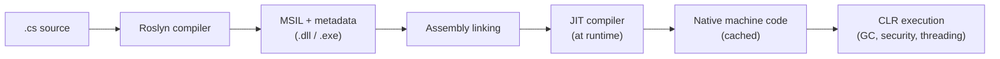

**Q: Pipeline ka one-liner summary kya hai?**

A: Compile → IL (.dll/.exe) → Link → JIT/AOT to machine code → CLR ke under Execute.

### Value Types vs Reference Types

**Q: Value types aur reference types mein core difference kya hai?**

A: Value types (`int`, `float`, `char`, `bool`, `struct`, `enum`) data ko directly store karte hain, typically stack par, jab tak boxed na ho ya heap object ke field ke roop mein embed na ho. Reference types (`string`, `object`, arrays, `class`, `interface`) heap par data ka ek reference/pointer store karte hain.

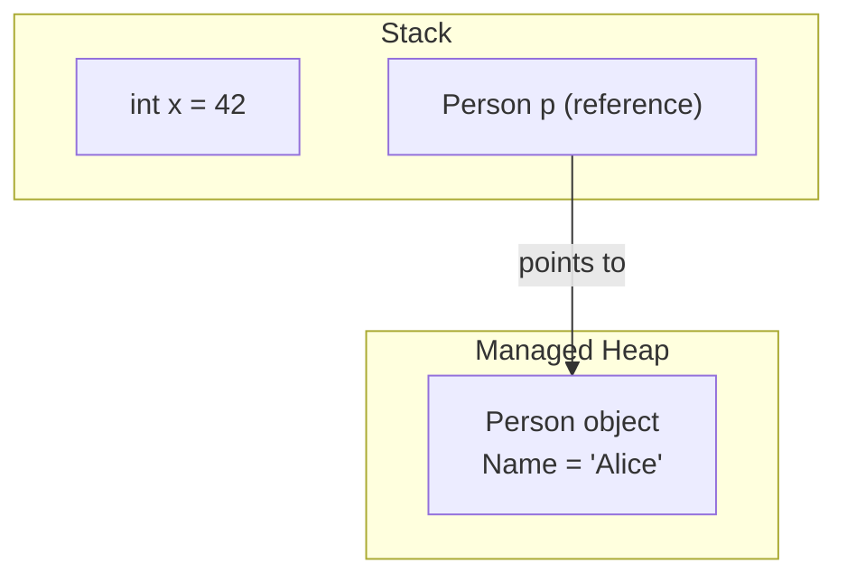

### var, object, dynamic

**Q: var, object, aur dynamic ko contrast karo.**

A: `var` statically typed hai, compile time par inferred hota hai (`var x = 5;`). `object` sab kuch ka base type hai aur real type ke roop mein use karne ke liye casting chahiye. `dynamic` runtime par resolve hota hai, koi compile-time type checking nahi hoti.

**Q: var use karne ke rules/best practices kya hain?**

A: Declaration par hi initialize hona chahiye (bare `null` assign nahi kar sakte); iska inferred type baad mein change nahi ho sakta; local-scope only hai, kabhi class field nahi. Isko use karo jab type obvious ho, anonymous types ke saath, aur LINQ mein; avoid karo jab yeh readability hurt kare (jaise, `var x = GetData();`).

### == vs Equals() vs ReferenceEquals()

**Q: ==, Equals(), aur ReferenceEquals() mein kya difference hai?**

A: `==` value types ke liye values compare karta hai aur reference types ke liye by default references compare karta hai, lekin operator-overload ho sakta hai (jaise `string` karta hai). `Equals()` value equality check karta hai aur override ho sakta hai. `object.ReferenceEquals()` hamesha overloads ko bypass karta hai aur raw identity compare karta hai.

```csharp
string a = "hello", b = "hello";
Console.WriteLine(a == b);       // True (string overloads == for value comparison)
Console.WriteLine(a.Equals(b));  // True

public class Employee
{
    public int Id { get; set; }
    public override bool Equals(object obj) => obj is Employee e && e.Id == Id;
    public override int GetHashCode() => Id.GetHashCode();
    public static bool operator ==(Employee e1, Employee e2) => e1.Id == e2.Id;
    public static bool operator !=(Employee e1, Employee e2) => !(e1 == e2);
}
```

**Q: Jab bhi Equals() ko override karo, GetHashCode() ko bhi override karna kyun zaruri hai?**

A: `Dictionary`/`HashSet` objects ko pehle hash code se bucket karte hain, phir bucket ke andar disambiguate karne ke liye `Equals()` use karte hain. Agar `Equals`-equal objects different hash codes return karte hain, to lookups silently unko find karne mein fail ho jaate hain.

### Nullable Value Types & Nullable Reference Types (NRTs)

**Q: int? aur string? (nullable value type vs NRT) mein kya difference hai?**

A: `int?` ek value type ko `Nullable<int>` mein wrap karta hai, jo ek real runtime construct hai. `string?` (C# 8+, opt-in via `<Nullable>enable</Nullable>`) purely ek compile-time annotation/analysis feature hai — yeh koi runtime null-checking add nahi karta.

```csharp
int? age = null;                 // nullable value type — wraps in Nullable<int>
Console.WriteLine(age ?? 18);    // 18

string? name = null;             // nullable reference type (C# 8+, opt-in via <Nullable>enable</Nullable>)
```

**Q: Ek large legacy codebase par NRTs enable karna kyun painful hota hai?**

A: Yeh retrofit-friendly nahi hai — `<Nullable>enable</Nullable>` flip karne se build hundreds/thousands CS8600-series warnings se flood ho jaata hai kyunki har parameter, field, aur return type correctly annotated hona chahiye. Zyada teams big-bang flip ke bajaye `#nullable enable` pragmas se per-file/per-project rollout karte hain.

**Q: Kya NRTs runtime par NullReferenceException ko prevent karte hain?**

A: Nahi — yeh sirf compile-time analysis hai. Ek non-nullable `string` still runtime par null ho sakta hai reflection, missing fields ke saath JSON deserialization, ya ek un-annotated third-party library ke through. Null-forgiving `!` operator bhi compiler ko silence kar deta hai bina koi runtime check add kiye.

**Q: Ek codebase par NRTs kaise rollout karoge jisme ab 3,000 warnings hain?**

A: `.csproj` ke through per-project enable karo; top-down fix karo public APIs/DTOs se shuru karke trust boundaries par; warnings ko errors mein tabhi convert karo jab project clean ho jaye; `[NotNull]`/`[MaybeNull]`/`[AllowNull]` attributes use karo jaha compiler correctly infer nahi kar paata (jaise, `TryGetValue`-style patterns).

### Implicit vs Explicit Conversion

**Q: Implicit vs explicit conversion — kya difference hai?**

A: Implicit conversions automatically hoti hain bina data loss ke (jaise, `int` → `double`). Explicit conversions ko manual `(type)` cast chahiye aur data lose kar sakti hain (jaise, `double` → `int` truncate ho jaata hai).

```csharp
int x = 10;
double y = x;      // implicit
int z = (int)y;    // explicit
```

### Boxing & Unboxing

**Q: Boxing aur unboxing kya hain?**

A: Boxing ek value type ko heap par copy karta hai `object` ke roop mein wrap karke (`object obj = 10;`). Unboxing usko wapas value-type variable mein copy karta hai runtime type check ke saath (`int num = (int)obj;`).

**Q: Boxing ki real performance cost kya hai?**

A: Har boxing operation ek naya heap object allocate karta hai (object header + sync block, ~16–24 bytes overhead ek 4-byte `int` ke liye bhi); unboxing wapas copy karne se pehle ek runtime type check karta hai. Ek hot loop mein yeh Gen0 GC pressure ke roop mein dikhta hai — classic example hai `ArrayList` of boxed `int`s vs `List<int>` (generic, boxing nahi).

---

## Part II — Core Concepts: OOP

### The Four Pillars

**Q: OOP ke four pillars kya hain, aur C# mein encapsulation ka matlab kya hai?**

A: Encapsulation, Inheritance, Polymorphism, Abstraction. Encapsulation object data tak direct access restrict karta hai, controlled access properties/methods ke through expose karta hai — jaise, ek private field jo ek public property se wrapped ho.

```csharp
class Person
{
    private string name;
    public string Name { get => name; set => name = value; }
}
```

### Inheritance vs Composition

**Q: Inheritance aur composition mein kya difference hai, aur composition ko kyun prefer karein?**

A: Inheritance ("is-a") ek base class ka behavior acquire karta hai lekin C# sirf single class inheritance support karta hai, aur yeh tight coupling create karta hai jo base change hone par ripple karta hai. Composition ("has-a") small interfaces/components ko combine karta hai. Flexibility ke liye composition favor karo; inheritance ka use tab karo jab genuinely "is-a" relationship ho shared invariants ke saath.

```csharp
class Animal { public void Eat() => Console.WriteLine("Eating..."); }
class Dog : Animal { public void Bark() => Console.WriteLine("Barking..."); }
```

**Q: .NET composition enable karne ke liye small interfaces kaise use karta hai?**

A: `IDisposable`, `IEnumerable<T>`, aur `IComparable` jaise interfaces unrelated classes (jaise, `List<T>` aur `Dictionary<TKey,TValue>`) ko shared behavior mein opt-in karne dete hain bina base class ya inheritance tree share kiye.

```csharp
interface IFly { void Fly(); }
interface ISwim { void Swim(); }

class Duck : IFly, ISwim   // composed abilities, no deep hierarchy
{
    public void Fly() => Console.WriteLine("Flying");
    public void Swim() => Console.WriteLine("Swimming");
}
```

### Polymorphism: Compile-Time vs Runtime

**Q: Compile-time vs runtime polymorphism — har ek ko kaun resolve karta hai, aur trade-offs kya hain?**

A: Compile-time (static) polymorphism compiler resolve karta hai method/operator overloading ke through — readable, koi virtual-dispatch overhead nahi, lekin compile time par fixed hota hai aur ambiguity errors cause kar sakta hai. Runtime (dynamic) polymorphism CLR resolve karta hai `virtual`/`override` ya interface implementation ke through — ek stable abstraction (jaise, `IPaymentProcessor`) ke against naye implementations plug-in karne dete hain, thoda dispatch overhead aur deep hierarchies mein harder debugging ki cost par.

```csharp
class Calculator
{
    public int Add(int a, int b) => a + b;
    public double Add(double a, double b) => a + b;
}
```

```csharp
class Animal { public virtual void Speak() => Console.WriteLine("Animal sound"); }
class Dog : Animal { public override void Speak() => Console.WriteLine("Bark"); }
class Cat : Animal { public override void Speak() => Console.WriteLine("Meow"); }

Animal a1 = new Dog();   // compiler sees Animal; CLR resolves Dog.Speak at runtime
a1.Speak();              // Bark
```

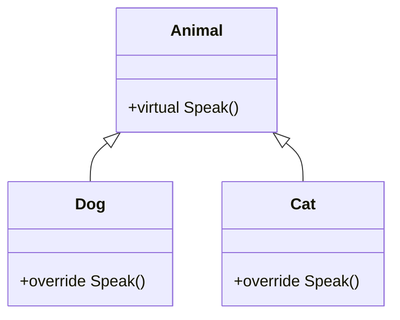

### Overloading vs Overriding vs Hiding (new)

**Q: virtual, override, aur new ka respectively kya matlab hai?**

A: `virtual` ek method declare karta hai jo override ho sakta hai. `override` ek virtual method ka naya implementation deta hai. `new` base-class method ko hide karta hai override karne ke bajaye.

```csharp
class Base { public void Show() => Console.WriteLine("Base"); }
class Derived : Base { public new void Show() => Console.WriteLine("Derived"); }
```

**Q: Classic "new" hiding trap kya hai?**

A: Hiding reference type se resolve hota hai, runtime object type se nahi:

```csharp
Base b = new Derived();
b.Show();             // "Base" — resolved by reference type
((Derived)b).Show();  // "Derived"
```

**Q: override ke bajaye new use karne ke real reasons batao.**

A: Legacy callers ke liye backward compatibility jinko tum change nahi kar sakte; base method `virtual` nahi hai isliye literally override nahi ho sakta; tumhe chahiye ki behavior static reference type par depend kare; kisi non-virtual framework method ko customize karna. Agar tumhare control mein base class hai, to `virtual` + `override` prefer karo.

### Interface vs Abstract Class

**Q: Interface vs abstract class — kaise decide karo kaunsa use karna hai?**

A: Ek interface define karta hai ki class KYA KAR SAKTI HAI (capability, multiple inheritance support karta hai, koi fields/constructors nahi, C# 8 se default methods). Ek abstract class define karta hai ki class KYA HAI (identity, single inheritance, state/constructors hold kar sakta hai, abstract aur concrete methods mix karta hai). Interface se start karo; abstract class ka use tabhi karo jab shared state/behavior genuinely required ho.

```csharp
public interface IAnimal { void Speak(); }
public class Dog : IAnimal { public void Speak() => Console.WriteLine("Bark"); }

public abstract class Animal
{
    public abstract void Speak();               // must override
    public void Eat() => Console.WriteLine("Eating..."); // shared default
}
```

**Q: Kya abstract class ka constructor ho sakta hai agar usko directly instantiate nahi kar sakte?**

A: Haan — yeh chalta hai jab ek derived class instantiate hoti hai, shared state initialize karne aur required setup enforce karne ke liye.

### struct vs class

**Q: struct vs class — key differences kya hain?**

A: `struct` ek value type hai: stack-allocated (jab tak boxed na ho ya class ka field na ho), value/copy se pass hota hai, interface-only "inheritance," koi GC overhead nahi, usually immutable hona chahiye. `class` ek reference type hai: heap-allocated, reference se pass hota hai, full inheritance support karta hai, GC-managed hota hai, typically mutable hota hai.

```csharp
struct Point
{
    public int X { get; }
    public int Y { get; }
    public Point(int x, int y) { X = x; Y = y; }
}
Point p1 = new Point(2, 3);
Point p2 = p1;          // value copy
p2 = new Point(5, 6);
// p1.X == 2 (unchanged), p2.X == 5
```

**Q: struct ke liye recommended size limit kya hai, aur kyun?**

A: Microsoft ki commonly cited guideline ≤ 16 bytes hai, kyunki structs har pass/assignment par copy hote hain aur large structs isko expensive bana dete hain.

**Q: Struct kab box hota hai?**

A: Jab yeh `object` mein ya kisi interface mein convert hota hai jo yeh implement karta hai — yeh isko stack se heap par copy karta hai.

### sealed, static, aur partial classes

**Q: sealed, static, aur partial classes kya karti hain?**

A: `sealed` further inheritance ko prevent karta hai. `static` classes instantiate nahi ho sakti, sirf static members hold karti hain, ek static constructor ho sakta hai, aur utility methods ke liye ideal hain. `partial` classes ek class ko multiple files mein split karti hain — jaise, EF Core/designer-generated code ko hand-written code se alag karna, ya multiple developers ko merge conflicts ke bina kaam karne dena.

```csharp
sealed class MyClass { }   // cannot be inherited

static class MathHelper    // cannot be instantiated; only static members
{
    public static int Square(int n) => n * n;
}
```

### Access Modifiers

**Q: C# ke access modifiers aur unki visibility list karo.**

A:
- `public` — sab jagah visible.
- `private` — sirf declaring class.
- `protected` — declaring class + derived classes.
- `internal` — same assembly.
- `protected internal` — derived classes YA same assembly.
- `private protected` — derived classes AUR same assembly.

Top-level (non-nested) classes sirf `public`/`internal` ho sakti hain; nested classes koi bhi modifier use kar sakti hain.

### Records & record struct

**Q: Record kya hai, aur yeh class se kaise differ karta hai?**

A: `record` ek reference type hai built-in value-based equality, `ToString()`, aur by-convention immutability ke saath — DTOs/domain value objects ke liye ideal. Class ke unlike (reference equality), identical property values wale do records `==` equal hote hain, aur `with` expressions non-destructive copy-and-mutate allow karte hain:

```csharp
public record Product(int Id, string Name, decimal Price);

var p1 = new Product(1, "Laptop", 999.99m);
var p2 = new Product(1, "Laptop", 999.99m);
Console.WriteLine(p1 == p2);              // True — value equality, unlike class
var p3 = p1 with { Price = 899.99m };     // non-destructive mutation
```

**Q: record struct kya hai, aur kab use karoge?**

A: Record ka value-type version (C# 10) — same value-equality semantics lekin stack-allocated, heap allocation avoid karta hai. Small, frequently-created value objects jaise `Money` ya `Coordinates` ke liye good hai.

### Pattern Matching & Switch Expressions

**Q: Switch expressions aur pattern matching type-checking code ko kaise modernize karte hain?**

A: Switch expressions (C# 8+) verbose switch statements ko ek expression se replace karte hain. Property patterns (`Product { Price: > 1000 }`), relational/logical patterns (`age is >= 18 and < 120`), aur list patterns (C# 11, `numbers is [1, 2, 3]`) nested `if/else` aur type-check chains ko replace karte hain — current coding style ka ek strong signal.

```csharp
// Switch expression (C# 8+) replaces verbose switch statements
string Describe(object obj) => obj switch
{
    int n when n < 0 => "negative number",
    int n => $"number {n}",
    string s => $"string of length {s.Length}",
    Product { Price: > 1000 } => "expensive product",   // property pattern
    null => "nothing",
    _ => "unknown"
};

// Relational and logical patterns (C# 9)
bool IsAdult(int age) => age is >= 18 and < 120;

// List patterns (C# 11)
int[] numbers = { 1, 2, 3 };
if (numbers is [1, 2, 3]) Console.WriteLine("matched exact sequence");
if (numbers is [var first, .., var last]) Console.WriteLine($"{first}..{last}");
```

---

## Part III — Constructors & Object Creation

**Q: Constructor kya hai aur iska purpose kya hai?**

A: Ek special method jo class ke naam se hota hai, koi return type nahi, jo object creation par automatically chalta hai object ko ek valid, usable state mein laane aur invariants enforce karne ke liye — partially-constructed objects ko prevent karta hai.

### Types of Constructors

**Q: C# mein constructors ke types list karo aur har ek kis liye hai.**

A:
- **Default** — no parameters; implicit agar tum koi constructor define nahi karte; kisi bhi constructor ko define karne se implicit default hat jaata hai.
- **Parameterized** — mandatory data enforce karta hai; DI ke saath common.
- **Overloaded** — multiple signatures, `: this(...)` ke through chained duplication avoid karne ke liye.
  ```csharp
  public Order() : this(0, "Default") { }
  public Order(int id, string type) { Id = id; Type = type; }
  ```
- **Static** — static members initialize karta hai, first use se pehle per type ek baar chalta hai, no params/modifiers, sirf ek allowed, isko light rakho (iske andar exception aane se app crash ho jaata hai).
- **Private** — external instantiation ko block karta hai (Singleton, static utility, factory-controlled creation).
  ```csharp
  public class Logger
  {
      private static Logger _instance;
      private Logger() { }
      public static Logger Instance => _instance ??= new Logger();
  }
  ```
- **Copy** — C# mein built-in nahi hai; tumhe cloning/defensive-copy/immutable patterns ke liye hand-write karna padta hai.

**Q: Kya ek class ke multiple static constructors ho sakte hain?**

A: Nahi — per class sirf ek static constructor allowed hai.

**Q: Kya constructors virtual ho sakte hain, ya exceptions throw kar sakte hain?**

A: Constructors kabhi virtual, abstract, ya overridable nahi hote. Yeh exceptions throw kar sakte hain, lekin generally sirf argument-validation failures ke liye.

### Abstract Classes mein Constructors

**Q: Abstract class ka constructor kab chalta hai?**

A: Derived-object creation ke dauran, shared state initialize karne aur required setup enforce karne ke liye — even though abstract class khud kabhi directly instantiate nahi ho sakta.

### Step-by-Step Object Creation Process

**Q: Step by step batao ki jab `new Employee(10, "John")` execute hota hai to kya hota hai.**

```csharp
Employee emp = new Employee(10, "John");
```

A:
1. CLR decide karta hai ki kaunsa type create karna hai.
2. Heap memory allocate hoti hai; fields kisi bhi constructor chalne se pehle zero-initialize ho jaate hain.
3. Stack/register par ek object reference create hota hai.
4. Constructor overload compile time par resolve hota hai.
5. Base constructor pehle chalta hai (ultimately `object()`).
6. Instance field initializers chalte hain.
7. Constructor body execute hoti hai.
8. Reference assign hota hai — object ready ho jaata hai.
9. Object tab tak zinda rehta hai jab tak reachable hai, phir GC-eligible ban jaata hai.

**Q: Object creation order ka one-liner summary kya hai?**

A: Memory allocation → zero initialization → constructor selection → base constructor → field initializers → constructor body → reference assignment.

### init, required, aur Primary Constructors (C# 11/12)

**Q: init accessor kya karta hai?**

A: Property ko sirf construction ke dauran set hone deta hai (constructor ya object initializer), immutability deta hai bina har property combination ke liye constructor overload chahiye.

```csharp
public class Person
{
    public string Name { get; init; }        // settable only during object initialization
    public required int Age { get; set; }    // C# 11 — compiler enforces it's set
}
var person = new Person { Name = "Alice", Age = 30 }; // fine
// person.Name = "Bob";  // compile error — init-only after construction
```

**Q: required (C# 11) kya enforce karta hai?**

A: Compiler callers ko construction ke time property set karne ko force karta hai, missing-data bugs ko runtime ke bajaye compile time par catch karta hai.

**Q: Primary constructors (C# 12) kya hain, aur catch kya hai?**

A: Yeh constructor parameters ko class/struct body mein throughout scope mein rakhte hain (records se extended) bina fields redeclare kiye ya explicit constructor likhe:

```csharp
public class ProductService(IRepository repo, ILogger<ProductService> logger)
{
    public async Task<Product> GetAsync(int id)
    {
        logger.LogInformation("Fetching {Id}", id);
        return await repo.GetProductAsync(id);
    }
}
// no explicit constructor or private readonly fields needed
```

Catch: parameters automatically fields nahi bante — compiler sirf ek hidden backing field synthesize karta hai jab ek parameter method body ke andar capture hota hai, isliye clarity matter kare to isko implicitly rely mat karo.

---

## Part IV — Intermediate: Members & Language Features

### Properties vs Fields

**Q: Properties vs fields — difference kya hai?**

A: Field ek raw member variable hai bina encapsulation ke. Property `get`/`set` accessors ke through access wrap karta hai, validation/logic allow karta hai clean call-site syntax rakhte hue.

```csharp
public int MyField;                          // no encapsulation
public int MyProperty { get; set; }           // encapsulated access
```

### const vs readonly vs static

**Q: const vs readonly vs static?**

A: `const` ek compile-time value hai jo assembly metadata (IL) mein baked hoti hai aur kabhi change nahi ho sakti. `readonly` runtime par set hota hai, typically constructor mein, aur constructor khatam hone ke baad change nahi ho sakta. `static` ka matlab hai one shared copy per type, per instance nahi.

```csharp
const int ConstValue = 10;
readonly int ReadOnlyValue;    // assignable in constructor
static int StaticValue;
```

### ref vs out vs in

**Q: ref vs out vs in parameters — kaise differ karte hain?**

A:
- `ref` — pass karne se pehle initialize hona chahiye; read aur modify dono allow karta hai.
- `out` — pass karne se pehle initialize hone ki zarurat nahi; additional values return karne ke liye use hota hai (jaise, `int.TryParse`).
- `in` — pass karne se pehle initialize hona chahiye; large structs ko reference se pass karta hai **bina** mutation allow kiye, copy avoid karte hue read-only rehta hai.

```csharp
void RefExample(ref int num) { num += 5; }
void OutExample(out int num) { num = 10; }
void InExample(in int num) { /* read-only, cannot modify num */ }
```

### params, Named Parameters, Indexers

**Q: params, named parameters, aur indexers kya dete hain?**

A: `params` ek variable number of arguments ko array ke roop mein allow karta hai (`params int[] numbers`). Named parameters callers ko arguments naam se pass karne dete hain, order-independent (`Greet(age: 25, name: "Alice")`). Indexers (`this[int index] { get; set; }`) ek type ko array-like `obj[i]` access support karne dete hain.

```csharp
void PrintNumbers(params int[] numbers) { foreach (int n in numbers) Console.Write(n + " "); }
PrintNumbers(1, 2, 3, 4, 5); // 1 2 3 4 5

void Greet(string name, int age) => Console.WriteLine($"{name} is {age}");
Greet(age: 25, name: "Alice");     // named parameters — order-independent

class Sample
{
    private int[] arr = new int[5];
    public int this[int index] { get => arr[index]; set => arr[index] = value; }
}
```

### Extension Methods

**Q: Extension method kya hai, aur compiler isko under the hood kaise treat karta hai?**

A: Ek static method jo apne first parameter par `this` se marked hai jo ek existing type mein method "add" karta dikhta hai bina usko modify kiye. Compiler `name.IsLongerThan(3)` ko `StringExtensions.IsLongerThan(name, 3)` mein rewrite karta hai — ek static call jo instance call ki tarah disguise hai. LINQ ke `Where`/`Select`/`OrderBy` sab `IEnumerable<T>` par extension methods hain.

```csharp
public static class MyExtensions
{
    public static bool IsEven(this int number) => number % 2 == 0;
}
int x = 10;
Console.WriteLine(x.IsEven());   // True
```

### Generics — Yeh Slow Kyun Nahi Hain

**Q: C# mein generics slow kyun nahi hote, aur CLR under the hood inhe kaise implement karta hai?**

A: Compile time par, ek generic definition ek baar type-check hota hai, value types ke liye boxing/unboxing avoid karta hai (`ArrayList` ke unlike). Runtime par, CLR reference-type instantiations ke across ek implementation share karta hai, lekin har distinct value-type instantiation ke liye ek specialized native implementation generate karta hai (`Box<int>` aur `Box<double>` har ek ko apna JIT code milta hai; `Box<string>` other reference types ke saath code share karta hai) — net effect: koi boxing nahi, kam memory overhead, better JIT inlining.

```csharp
public class Box<T> { public T Value { get; set; } }
Box<int> intBox = new Box<int> { Value = 10 };
Box<string> strBox = new Box<string> { Value = "Hello" };
```

### Tuples & Anonymous Types

**Q: Tuples vs named tuples vs anonymous types?**

A: `var t = ("John", 30);` unnamed `Item1`/`Item2` access deta hai. `(string Name, int Age) named = (...)` readable, named-element access deta hai. `var p = new { Name = "John", Age = 30 };` ek anonymous type create karta hai compiler-generated properties ke saath, jo commonly LINQ projections mein use hota hai.

```csharp
var person = ("John", 30);
Console.WriteLine(person.Item1);              // John

(string Name, int Age) named = ("John", 30);
Console.WriteLine(named.Name);                // named tuple elements — more readable

var p = new { Name = "John", Age = 30 };      // anonymous type
Console.WriteLine(p.Name);
```

### Reflection, Attributes, dynamic, ExpandoObject

**Q: typeof aur Type.GetType mein kya difference hai, aur dynamic kya trade off karta hai?**

A: `typeof(string)` compile-time type retrieval hai. `Type.GetType("System.String")` runtime par ek type retrieve karta hai, jaise ek string se. `dynamic` compile-time type checking ko poori tarah skip karta hai (late binding DLR ke through) — COM interop/dynamic JSON/scripting ke liye flexible, lekin har `dynamic` operation DLR call-site caching se guzarta hai, jo ek static call se slower hai.

```csharp
Type type = typeof(string);          // compile-time type retrieval
Console.WriteLine(type.FullName);

Type t2 = Type.GetType("System.String"); // runtime type retrieval (e.g. from a string)

[Obsolete("This method is deprecated.")]
void OldMethod() { }

dynamic value = "Hello";
value = 10;                          // no compile-time error — resolved at runtime (late binding)

dynamic expando = new ExpandoObject();
expando.Name = "John";               // properties added dynamically at runtime
```

**Q: ExpandoObject kis liye use hota hai?**

A: Ek dynamic object jo tumhe runtime par properties add karne deta hai (`expando.Name = "John";`) bina koi predefined class ke — dynamic/loosely-structured data ke liye useful.

### yield return aur Iterators

**Q: yield return under the hood kaise kaam karta hai?**

A: Compiler method ko ek state machine mein rewrite karta hai jo `IEnumerable<T>`/`IEnumerator<T>` implement karta hai. Execution deferred hota hai jab tak caller enumerate nahi karta (`foreach`, `.ToList()`), aur har `MoveNext()` call exactly wahin resume karta hai jaha previous ne chhoda tha.

```csharp
IEnumerable<int> GetNumbers() { yield return 1; yield return 2; }
```

### Fluent Interfaces

**Q: Fluent interface kya hai, aur yeh plain method chaining se kaise differ karta hai?**

A: Ek design style jaha methods same/related object return karte hain taaki calls readable, sentence-like code mein chain ho jayein. Har fluent interface method chaining use karta hai, lekin fluent interface specifically ek readable DSL target karta hai — examples: `StringBuilder`, LINQ, ASP.NET Core middleware (`app.UseRouting().UseAuthentication().UseAuthorization()...`).

```csharp
class Calculator
{
    private int _result;
    public Calculator Add(int x) { _result += x; return this; }
    public Calculator Multiply(int x) { _result *= x; return this; }
    public int Result() => _result;
}
```

```csharp
app.UseRouting().UseAuthentication().UseAuthorization().MapControllers();
```

### Deep Copy vs Shallow Copy

**Q: Shallow copy vs deep copy — C# mein har ek kaise achieve karoge?**

A: Shallow copy (jaise, `MemberwiseClone()`) object ko copy karta hai lekin nested reference fields still same shared objects ko point karte hain. Deep copy fully independent nested objects create karta hai. .NET mein koi built-in "deep clone" nahi hai — tumhe hand-write karna padta hai ek recursive clone/copy constructor ya serialize/deserialize round-trip use karna padta hai, har ek ke apne trade-offs (serialization simple hai lekin slow; hand-written fastest hai lekin class shape track karna padta hai).

```csharp
Person clone = (Person)this.MemberwiseClone(); // shallow copy — nested reference fields still shared
```

### Static Abstract/Virtual Interface Members & Generic Math (C# 11)

**Q: C# 11 ke static abstract/virtual interface members ne kya enable kiya?**

A: C# 11 se pehle, interfaces sirf instance members declare kar sakte the. C# 11 `static abstract`/`static virtual` members allow karta hai, jo "generic math" enable karta hai — ek single generic method jo `int`, `double`, `decimal`, aur custom numeric types ke across real operators use karke kaam karta hai, `System.Numerics.INumber<T>` aur related interfaces ke through, per-type logic duplicate karne ya `dynamic`/reflection use karne ke bajaye.

```csharp
public interface IShape<T> where T : IShape<T>
{
    static abstract T Create(double size);
    static abstract double Area(T shape);
}

public readonly struct Square : IShape<Square>
{
    public double Side { get; }
    private Square(double side) => Side = side;
    public static Square Create(double size) => new Square(size);
    public static double Area(Square s) => s.Side * s.Side;
}
```

### Source Generators

**Q: Source generator kya hai, aur senior interviews ke liye yeh kyun matter karta hai?**

A: Ek Roslyn compiler plugin jo tumhare code ko compile time par inspect karta hai aur additional C# source emit karta hai jo uske saath compile hota hai — runtime metaprogramming ka ek modern, reflection-free alternative. `System.Text.Json` ke `JsonSerializerContext`, `LoggerMessage` generator, aur `[GeneratedRegex]` isko use karte hain. Yeh matter karta hai kyunki industry (Native AOT, trimming, faster cold starts) reflection-heavy frameworks se compile-time codegen ki taraf move ho rahi hai.

```csharp
[JsonSerializable(typeof(Product))]
internal partial class AppJsonContext : JsonSerializerContext { }

// Usage — no reflection at runtime:
var json = JsonSerializer.Serialize(product, AppJsonContext.Default.Product);
```

---

## Part V — Delegates, Events & Lambdas

### Delegates

**Q: Delegate kya hai, aur do delegate types kya hain?**

A: Ek type-safe function pointer — tum methods ko parameters ke roop mein pass kar sakte ho, aur C/C++ function pointers ke unlike, delegates secure aur type-checked hote hain. Single-cast delegates ek method reference karte hain; multicast delegates (`+=`) multiple methods reference karte hain, jo registration order mein invoke hote hain.

```csharp
public delegate void Notify(string message);

public class Process
{
    public void StartProcess(Notify notifier) => notifier("Process Started...");
}

Notify notifyDelegate = Console.WriteLine;
new Process().StartProcess(notifyDelegate); // "Process Started..."
```

### Func, Action, Predicate

**Q: Func vs Action vs Predicate?**

A: `Func<T,TResult>` 0–16 inputs leta hai aur ek value return karta hai (LINQ `Select`/`Where`). `Action<T>` inputs leta hai aur `void` return karta hai (logging, `ForEach`). `Predicate<T>` ek input leta hai aur `bool` return karta hai (conditions, `FindAll`).

```csharp
Action<string> log = msg => Console.WriteLine("Log: " + msg);
Func<int,int,int> add = (a, b) => a + b;         // add(5,10) -> 15
Predicate<int> isEven = n => n % 2 == 0;         // isEven(4) -> true
```

**Q: Delegates ke fayde aur nuksan kya hain?**

A: Fayde: loose coupling, callbacks/event-driven programming, multicast, LINQ/async continuations ka foundation. Nuksan: overuse traceability ko hurt karta hai; multicast misuse unintended multiple executions cause karta hai; null delegate ko call karna throw karta hai (`?.Invoke()` se guard karo).

### Events

**Q: event keyword ek raw delegate par kya add karta hai?**

A: Yeh external code ko sirf `+=`/`-=` tak restrict karta hai — external code underlying delegate ko directly invoke ya overwrite nahi kar sakta, jo ek public delegate field se stronger encapsulation deta hai (Publisher–Subscriber pattern).

```csharp
public class Alarm
{
    public delegate void AlarmEventHandler(string message);
    public event AlarmEventHandler OnAlarm;
    public void Ring()
    {
        Console.WriteLine("Alarm ringing...");
        OnAlarm?.Invoke("Wake up! It's 7 AM");
    }
}
var alarm = new Alarm();
alarm.OnAlarm += msg => Console.WriteLine("Subscriber 1: " + msg);
alarm.OnAlarm += msg => Console.WriteLine("Subscriber 2: " + msg);
alarm.Ring();
```

**Q: Un-unsubscribed event handlers ek classic memory-leak source kyun hain?**

A: Ek long-lived publisher ki invocation list har subscriber ka reference hold karti hai; agar ek short-lived subscriber kabhi unsubscribe nahi karta, publisher usko alive rakhta hai aur yeh kabhi garbage collected nahi ho sakta.

### Delegate vs Event

**Q: Delegate vs event — public API mein kaunsa expose karna chahiye aur kab?**

A: Delegate freely assignable/invokable hai kisi bhi code se jinke paas access hai (weaker encapsulation). Event sirf publisher class se invoke ho sakta hai aur sirf `+=`/`-=` ke through subscribe/unsubscribe ho sakta hai (stronger, compiler-enforced encapsulation). Best practice: reusable libraries/APIs mein events expose karo, raw delegates nahi.

### Lambda Expressions & Anonymous Methods

**Q: Lambda expressions vs older anonymous-method syntax?**

A: Lambdas (`x => x * x`) modern idiomatic form hain; `delegate(int x) { ... }` anonymous-method syntax abhi bhi compile hoti hai lekin aajkal rarely hand-written hoti hai.

```csharp
Func<int,int> square = x => x * x;
Console.WriteLine(square(5)); // 25

Action<int> squarePrint = delegate(int x) { Console.WriteLine(x * x); }; // older anonymous-method syntax
```

---

## Part VI — Collections & LINQ

### LINQ Fundamentals

**Q: LINQ mein "deferred execution" ka matlab kya hai?**

A: Ek query jaise `numbers.Where(n => n % 2 == 0)` define hone par execute nahi hoti — yeh tabhi chalti hai jab enumerate kiya jaaye (`foreach`, `.ToList()`, etc.).

```csharp
var numbers = new[] { 1, 2, 3, 4, 5 };
var evens = numbers.Where(n => n % 2 == 0);   // deferred — not executed until enumerated
```

### IEnumerable vs IQueryable

**Q: IEnumerable vs IQueryable — core difference kya hai?**

A: `IEnumerable` in-memory/client-side filter karta hai (LINQ to Objects) — `List<T>`/arrays ke liye best. `IQueryable` ek expression tree build karta hai jo data source (jaise, SQL) mein translate hota hai — EF Core/remote data ke liye best, sirf matching rows fetch karta hai pehle sab kuch load karne ke bajaye.

```csharp
// IEnumerable — filtering happens in memory
List<int> numbers = new() { 1, 2, 3, 4, 5, 6 };
IEnumerable<int> result = numbers.Where(n => n > 3);

// IQueryable — translated to SQL: SELECT * FROM Customers WHERE Age > 30
IQueryable<Customer> q = context.Customers.Where(c => c.Age > 30);
```

### Expression Trees & EF Core LINQ ko SQL mein Kaise Translate Karta Hai

**Q: Func<T,bool> aur Expression<Func<T,bool>> mein kya difference hai?**

A: `Func<T,bool>` IL mein compile hota hai — ek directly invocable delegate. `Expression<Func<T,bool>>` ek object graph (ek `Expression` tree) mein compile hota hai jo lambda ki structure describe karta hai; kuch bhi khud se nahi chalta jab tak koi provider (jaise, EF Core) tree ko walk aur translate na kare.

```csharp
Expression<Func<Customer, bool>> predicate = c => c.Age > 30 && c.City == "Seattle";
```

Yeh kuch aisa compile hota hai jo tum runtime par inspect aur walk kar sakte ho:

```csharp
Console.WriteLine(predicate.Body);   // (c.Age > 30) AndAlso (c.City == "Seattle")
// predicate.Parameters[0].Name -> "c"
// predicate.Body is a BinaryExpression with Left/Right sub-expressions, recursively walkable
```

**Q: EF Core ka LINQ-to-SQL translation pipeline describe karo.**

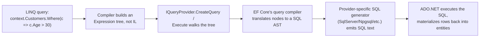

A:
1. `IQueryable<T>` par har `Where`/`Select`/`OrderBy` call prior expression tree ko ek naye node mein wrap karta hai — abhi tak koi execution nahi.
2. Enumeration par, EF Core ka `IQueryProvider` accumulated tree ko walk karta hai aur ek relational query model build karta hai.
3. Ek provider-specific SQL generator (SQL Server/Npgsql/etc.) actual `SELECT ... WHERE ...` text emit karta hai.
4. ADO.NET usko execute karta hai aur rows ko wapas entities mein materialize karta hai.

**Q: IQueryable ke against Where() predicate ke andar ek non-translatable custom C# method call karne par kya hota hai?**

A: Yeh translate hone mein fail hota hai aur runtime par throw karta hai (EF Core 3.0+ ne isko silently client-side evaluation mein fall back karne ke bajaye ek hard error bana diya, kyunki silent client-eval "why is this so slow" N+1-style bugs ka ek major cause tha) — EF Core kabhi method run nahi karta, yeh sirf call describe karne wale expression ko inspect karta hai.

**Q: .ToList() bahut early call karna further query translation ko kyun break karta hai?**

A: Ek baar in-memory `List<T>` mein materialize hone ke baad, har subsequent LINQ call `IEnumerable<T>`/`Func<T,bool>` ke against bind hota hai, `IQueryable<T>`/`Expression<Func<T,bool>>` ke nahi, isliye us point ke baad kuch bhi SQL mein push down nahi ho sakta.

### PLINQ / AsParallel() Trade-offs

**Q: PLINQ (.AsParallel()) actually kab help karta hai?**

A: Jab per-element work genuinely CPU-bound aur non-trivial ho, source collection partitioning cost amortize karne ke liye enough large ho, aur operations per element independent hain koi shared mutable state ke bina.

```csharp
var result = numbers
    .AsParallel()
    .Where(n => IsExpensivePredicate(n))   // CPU-bound work per element — good PLINQ candidate
    .Select(n => Transform(n))
    .ToList();                              // forces materialization/merge
```

**Q: .AsParallel() code ko slower kyun bana sakta hai?**

A: Partitioning/coordination overhead small collections ya cheap work par parallelism benefit se zyada ho sakta hai; result-merging by default order preserve karta hai (`.AsUnordered()` help kar sakta hai); over-subscription context-switch thrashing cause karta hai; yeh I/O-bound work ke liye wrong tool hai (`Parallel.ForEachAsync` use karo); exceptions `AggregateException` mein wrap hote hain.

### IEnumerable vs ICollection vs IList vs IReadOnlyList

**Q: IEnumerable, ICollection, IList, aur IReadOnlyList ek dusre par kaise build karte hain?**

A: `IEnumerable<T>` — forward-only iteration, koi `Count`/indexer nahi. `ICollection<T>` `Add`/`Remove`/`Count`/`Contains` add karta hai. `IList<T>` index-based access/`Insert`/`RemoveAt` add karta hai. `IReadOnlyList<T>`/`IReadOnlyCollection<T>` read-only indexed access/count expose karte hain bina mutation methods ke — ek public API ke liye correct return type jo internal list wapas de raha ho.

### List vs Array

**Q: List<T> array se thoda slower kyun hai?**

A: `List<T>` internally ek array wrap karta hai aur amortized-doubling resizing, bounds checking, aur safety features upar add karta hai.

```csharp
int[] numbers = new int[5];
List<int> numList = new List<int>();
```

### Dictionary vs Hashtable

**Q: Dictionary<TKey,TValue> vs Hashtable — aaj kaunsa use karna chahiye?**

A: `Hashtable` legacy aur non-generic hai (value types ko box karta hai, `object` ke roop mein store karta hai) lekin single writer ke saath multiple readers ke liye bina locking safe hai; `Dictionary` generic/type-safe hai aur preferred hai lekin concurrent access ke liye bilkul thread-safe nahi hai — uske liye `ConcurrentDictionary` use karo.

```csharp
Dictionary<int,string> students = new();
students[1] = "Alice";
```

### ReadOnlyCollection vs List

**Q: ReadOnlyCollection<T> vs List<T>?**

A: `ReadOnlyCollection` ek list ko wrap karta hai us reference ke through modification prevent karne ke liye — API boundaries par safety/immutability ke liye use hota hai. `List<T>` general-purpose mutable collection hai.

```csharp
ReadOnlyCollection<int> numbers = new List<int> { 1, 2, 3 }.AsReadOnly();
```

### Jagged vs Multidimensional Arrays

**Q: Jagged vs rectangular multidimensional arrays?**

A: Jagged (`int[][]`) arrays ka ek array hai independently-sized rows ke saath — zyada flexible lekin per-row extra indirection ke saath. Rectangular (`int[,]`) sab elements contiguously ek block mein store karta hai — genuinely rectangular data ke liye faster kyunki N+1 allocations ke bajaye ek allocation hoti hai.

```csharp
// Jagged array — array of arrays, independently-sized rows
int[][] jagged = new int[2][];
jagged[0] = new int[] { 1, 2 };
jagged[1] = new int[] { 3, 4, 5 };

// Multidimensional (rectangular) array — fixed rectangular shape, single memory block
int[,] grid = new int[2, 3];
grid[0, 0] = 1;
```

### Covariance & Contravariance

**Q: out/in generic modifiers kya enable karte hain?**

A: `out T` covariance enable karta hai — ek more-derived type ek base-typed reference ko assign ho sakta hai (jaise, `IEnumerable<string>` ko `IEnumerable<object>`) kyunki `T` sirf output positions mein appear hota hai. `in T` contravariance enable karta hai — ek base type wahan use ho sakta hai jaha derived type expected hai, input-only positions ke liye.

```csharp
public interface IEnumerable<out T> : IEnumerable { IEnumerator<T> GetEnumerator(); }

IEnumerable<string> strings = new List<string> { "A", "B", "C" };
IEnumerable<object> objects = strings;    // allowed thanks to out T
```

### String vs StringBuilder

**Q: Repeated string edits ke liye StringBuilder faster kyun hai?**

A: `string` immutable hai — har apparent modification (`+=`, `Replace`, `Substring`) ek brand-new string object allocate karta hai. `StringBuilder` ek mutable internal char buffer maintain karta hai, jo in place modify hota hai; isko pre-size karo (`new StringBuilder(capacity)`) jab final length roughly known ho, repeated resizes avoid karne ke liye.

```csharp
StringBuilder sb = new StringBuilder("Hello");
sb.Append(" World");
```

**Q: String interning kya hai?**

A: .NET string literals ko intern karta hai taaki identical literals intern pool ke through ek instance share karein (`"abc" == "abc"` literals ke liye reference se) — lekin runtime par build hone wale strings (jaise, concatenation se) automatically intern nahi hote.

### .NET 6+ LINQ Additions: MinBy/MaxBy/Chunk/DistinctBy/Order/OrderDescending

```csharp
var products = new[]
{
    new Product("Laptop", 999.99m, "Electronics"),
    new Product("Mouse", 25.00m, "Electronics"),
    new Product("Desk", 250.00m, "Furniture"),
};

// MinBy / MaxBy (.NET 6) — select the element with the min/max key, not just the key itself.
// Old way: products.OrderBy(p => p.Price).First();  (sorts the whole sequence just to get one element)
Product cheapest = products.MinBy(p => p.Price);       // Mouse
Product priciest = products.MaxBy(p => p.Price);       // Laptop

// Chunk (.NET 6) — splits a sequence into fixed-size batches, last batch may be smaller.
foreach (Product[] batch in products.Chunk(2))
    await ProcessBatchAsync(batch);                     // e.g., batched bulk-insert calls

// DistinctBy (.NET 6) — de-duplicate by a key selector instead of the whole object/a custom IEqualityComparer.
var onePerCategory = products.DistinctBy(p => p.Category);  // first product seen per category

// Order / OrderDescending (.NET 7) — shorthand for OrderBy(x => x) when sorting by the element itself.
var sorted = new[] { 3, 1, 2 }.Order();                 // [1, 2, 3] — no need for OrderBy(x => x)
var sortedDesc = products.Select(p => p.Price).OrderDescending();
```

**Q: MinBy/MaxBy kya replace karte hain, aur gotcha kya hai?**

A: Yeh `OrderBy(key).First()` ko replace karte hain, jo poori sequence sort kiye bina min/max key wale element (sirf key nahi) return karte hain. Gotcha: tie hone par, yeh iteration order mein first matching element return karte hain, `First()` ki tarah.

**Q: Chunk, DistinctBy, aur Order/OrderDescending kya karte hain?**

A: `Chunk(size)` (.NET 6) ek sequence ko fixed-size batches mein split karta hai (last batch chhota ho sakta hai) — batched bulk-insert calls ke liye good hai. `DistinctBy(keySelector)` (.NET 6) whole object ya custom `IEqualityComparer` ke bajaye ek key se de-dupe karta hai. `Order()`/`OrderDescending()` (.NET 7) `OrderBy(x => x)` ka shorthand hai jab element itself se sort karna ho.

### LINQ Gotchas Jo Har Senior Dev Ko Pata Hona Chahiye

**Q: Same un-materialized query par .Count() phir .First() call karna kyun dangerous hai?**

A: Yeh underlying query ko do baar execute kar sakta hai — `IQueryable` ke liye expensive hai (do DB round-trips) aur side effects ke saath ek lazily-evaluated sequence ke liye dangerous hai. Fix: agar tumhe usko ek se zyada baar inspect karna hai to ek baar `.ToList()`/`.ToArray()` se materialize karo.

**Q: foreach aur classic for loops mein closure capture kaise differ karta hai?**

A: C# 5+ har `foreach` iteration ko apna loop variable deta hai, isliye captured lambdas har ek apna value dekhte hain. Ek classic `for` loop ka index variable still ek single variable hai jo saare captured lambdas ke across shared hota hai jab tak tum usko pehle ek loop-local variable mein copy na karo — interviewers isko abhi bhi puchte hain kyunki C# 5 fix sirf `foreach` ko cover karta hai.

```csharp
var funcs = new List<Func<int>>();
for (int i = 0; i < 3; i++) funcs.Add(() => i);   // C# 5+: each iteration has its own 'i' — this is actually fine now
```

**Q: First()/FirstOrDefault()/Single()/SingleOrDefault() mein differentiate karo.**

A: `First()` empty sequence par `InvalidOperationException` throw karta hai. `FirstOrDefault()` `default(T)` return karta hai. `Single()` throw karta hai agar zero YA ek se zyada match ho (uniqueness assert karne ke liye use karo). `SingleOrDefault()` sirf more-than-one par throw karta hai, zero par default return karta hai.

**Q: Distinct()/GroupBy()/Except() ke liye custom equality kyun matter karti hai?**

A: Inhe ya to element type par `Equals`/`GetHashCode` override karna padta hai ya ek `IEqualityComparer<T>` supply karna padta hai — warna yeh silently custom class par reference equality use karte hain, ek common "Distinct() not working" bug.

---

## Part VII — Memory Management & Garbage Collection

### .NET Memory Model mein Stack vs Heap

**Q: .NET mein stack vs heap — kaise differ karte hain?**

A: Stack — fast, LIFO, local value types, references (pointers), aur call-frame data hold karta hai; method return par automatically free hota hai, koi fragmentation nahi. Heap — reference-type objects ke liye flexible storage, GC-controlled, slower, fragment ho sakta hai (GC collection ke dauran compact karta hai).

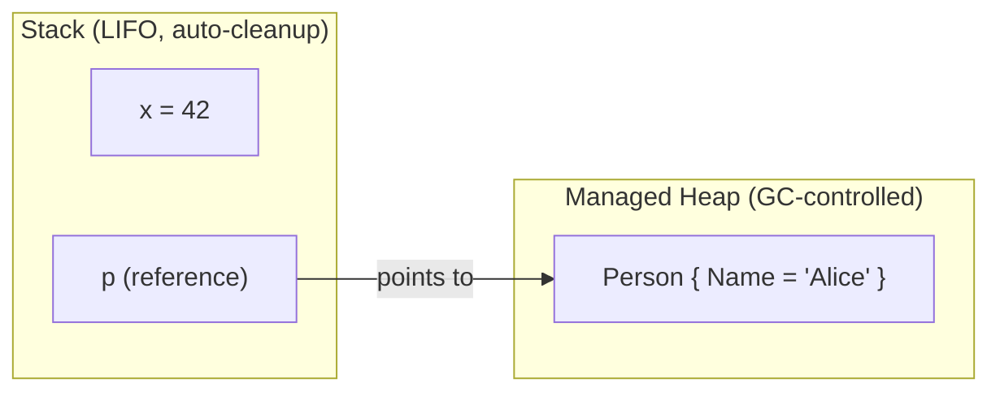

### Garbage Collection (GC)

**Q: GC ki core mechanics kya hain?**

A: Mark (GC roots se reachable objects find karna) → Sweep (unreachable ones remove karna) → Compact (optional, fragmentation reduce karta hai).

**Q: Generational GC explain karo.**

A: Objects Gen 0 mein start hote hain (frequently collected); survivors Gen 1 mein promote hote hain (medium-lived), phir Gen 2 mein (long-lived — caches, statics), jo least often collected hota hai.

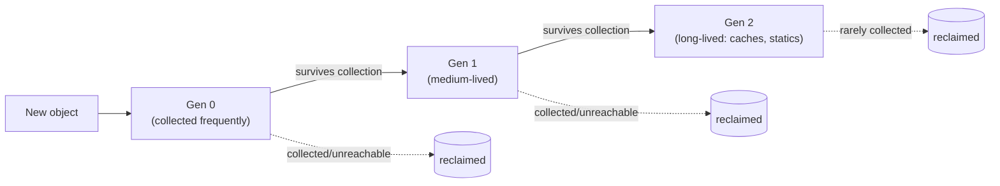

**Q: GC ko kya trigger karta hai, aur GC.Collect() kyun avoid karna chahiye?**

A: Memory pressure, allocation threshold, ya ek explicit `GC.Collect()` call — discouraged hai, kyunki yeh ek out-of-schedule full collection force karta hai aur GC ke apne heuristics defeat karke throughput hurt karta hai. Sirf ek known, one-off large allocation burst ke baad acceptable hai.

**Q: Large Object Heap (LOH) kya hai?**

A: 85 KB se bade objects LOH par jaate hain, Gen 2 ke saath collected hote hain, aur historically performance ke liye auto-compact nahi hote — `GCSettings.LargeObjectHeapCompactionMode` compaction request kar sakta hai agar fragmentation ek real problem ban jaaye.

**Q: Workstation vs Server vs Concurrent/Background GC?**

A: Workstation GC single-threaded apps ke liye default hai. Server GC multi-threaded apps ke liye hai (ASP.NET Core server contexts mein default). Concurrent/Background GC Gen 2 collection ko ek background thread par chalata hai bina app ko fully freeze kiye.

### Production ke liye GC Diagnostics Tooling

**Q: Production memory leak diagnose karne ke liye recommended tool sequence kya hai?**

A:
1. `dotnet-counters` pehle — cheap, live GC/heap/ThreadPool counters, batata hai ki koi problem hai ya nahi aur kis kism ki.
2. `dotnet-gcdump` — heap snapshots, diff karke growing object types aur unko kaun root kar raha hai find karna.
3. `dotnet-trace` — sirf agar exact code pinpoint karne ke liye allocation call stacks chahiye ho.

```bash
# 1. Find the process
dotnet-counters ps

# 2. Watch live GC/heap counters against the running process — cheap, safe, no pause
dotnet-counters monitor --process-id <pid> System.Runtime
#    Look at: gc-heap-size, gen-0/1/2-size, gen-0/1/2-gc-count, alloc-rate, gc-committed-bytes
#    A Gen 2 heap that keeps climbing across repeated GC cycles (never shrinking back down after
#    a full collection) is the actual signature of a leak, as opposed to just high-but-stable
#    allocation churn — this distinction matters and is worth stating explicitly.

# 3. Take two heap snapshots several minutes apart under normal load
dotnet-gcdump collect --process-id <pid> -o snapshot1.gcdump
#    ...wait, let more traffic accumulate...
dotnet-gcdump collect --process-id <pid> -o snapshot2.gcdump

# 4. Diff the two dumps (e.g., in the PerfView heap-diff view, or `dotnet-gcdump report`)
#    Look for object types whose *count* grew between snapshots disproportionately to traffic —
#    e.g., 50,000 more HttpRequestMessage or EventHandler-captured closures than expected.
#    Then inspect the retention/GC-root path for that type: what's holding a reference?
#    Classic culprits (all covered elsewhere in this guide): un-unsubscribed event handlers,
#    a static/singleton cache with no eviction, a captive DbContext, closures captured into a
#    long-lived delegate.

# 5. If the heap diff alone isn't conclusive, capture a trace to get allocation call stacks
dotnet-trace collect --process-id <pid> --providers Microsoft-DotNETCore-SampleProfiler
#    Analyze in PerfView/Speedscope: which call stack is doing the allocating, not just which
#    type is accumulating — pinpoints the actual line of code, not just the symptom.
```

**Q: dotnet-counters use karke real leak ko high-but-stable allocation churn se kaise distinguish karoge?**

A: Ek Gen 2 heap size jo repeated GC cycles ke across climb karta rehta hai (full collection ke baad kabhi shrink na ho) — yeh leak signature hai, jo ek high allocation rate se different hai jiske saath heap size stable rehta hai, jo sirf churn hai.

**Q: Yeh diagnostics tools kis se attach hote hain, aur production ke liye yeh kyun matter karta hai?**

A: Yeh ek running process se PID se attach hote hain bina koi code changes ya restarts chahiye — critical hai kyunki tum production issue investigate karne ke liye often debugger attach ya redeploy nahi kar sakte.

### Dispose() vs Finalize()

**Q: Dispose() vs Finalize() — kaise differ karte hain?**

A: `Dispose()` (`IDisposable`) unmanaged resources ka explicit, deterministic cleanup hai, developer (ya `using`) se callable hai, aur multiple baar call karna safe hai. `Finalize()` (`~ClassName()`) GC se call hota hai, non-deterministic hai, slower hai, aur ek last-resort safety net hai agar `Dispose()` kabhi call nahi hua.

```csharp
using var fs = new FileStream("test.txt", FileMode.Open); // Dispose() guaranteed even on exception
```

**Q: Finalizer backup ke saath full Dispose pattern kya hai?**

A: `Dispose()` `Dispose(true)` call karta hai phir `GC.SuppressFinalize(this)`; `protected virtual Dispose(bool disposing)` managed resources ko sirf free karta hai agar `disposing` true hai, aur unmanaged resources ko unconditionally free karta hai; finalizer `~ClassName()` backup ke roop mein `Dispose(false)` call karta hai.

```csharp
public class ResourceHolder : IDisposable
{
    private bool disposed = false;
    public void Dispose() { Dispose(true); GC.SuppressFinalize(this); }
    protected virtual void Dispose(bool disposing)
    {
        if (!disposed)
        {
            if (disposing) { /* free managed resources (other IDisposables) */ }
            // free unmanaged resources (native handles) unconditionally
            disposed = true;
        }
    }
    ~ResourceHolder() { Dispose(false); }
}
```

**Q: HttpClient ko per request dispose kyun nahi karna chahiye?**

A: Isko reuse/DI-managed hona chahiye `IHttpClientFactory` ke through — per call dispose/recreate karna load ke under sockets exhaust kar sakta hai kyunki underlying `SocketsHttpHandler` connections manage kaise karta hai.

### Weak References

**Q: WeakReference<T> tumhe kya karne deta hai?**

A: GC ko ek object collect karne deta hai jab app abhi bhi usko retrieve kar sakta hai agar yeh still alive hai — reference khud object ko rooted nahi rakhta. Large reclaimable caches ke liye aur "publisher keeps subscriber alive forever" leaks avoid karne ke liye use hota hai.

```csharp
WeakReference<object> weakRef = new WeakReference<object>(new object());
if (weakRef.TryGetTarget(out var target)) { /* still alive */ }
```

### .NET mein Memory Leaks

**Q: .NET garbage-collected hai to, "memory leak" ka actually matlab kya hai?**

A: Unintentional rooting — kuch ek reference ko alive rakhta hai jo release ho jaana chahiye tha. Common sources: un-unsubscribed event handlers, long-lived delegates mein captured closures, eviction ke bina static caches, DI captive dependencies, aur `HttpClient` misuse.

```csharp
static List<byte[]> list = new List<byte[]>();
void LeakMemory() => list.Add(new byte[100000]); // static root never released
```

### IAsyncDisposable

**Q: IAsyncDisposable kyun exist karta hai, aur isko kaise use karte ho?**

A: `IDisposable.Dispose()` synchronous hai, lekin kuch cleanup inherently async hai (ek network stream flush karna, ek async DB close). C# 8 ka `IAsyncDisposable` + `await using` `DisposeAsync()` ko scope exit par asynchronously yeh cleanup perform karne deta hai. `DbContext`, `SqlConnection`, aur `Stream` subclasses sab isko implement karte hain.

```csharp
public class AsyncResource : IAsyncDisposable
{
    private readonly Stream _stream;
    public async ValueTask DisposeAsync()
    {
        await _stream.FlushAsync();
        await _stream.DisposeAsync();
    }
}

await using var resource = new AsyncResource(); // calls DisposeAsync() at scope exit, asynchronously
```

---

## Part VIII — Advanced: Multithreading & Async

### Thread vs Task (TPL)

**Q: Thread vs Task — key contrasts kya hain?**

A: `Thread` low-level/OS-managed hai, create karna expensive hai, ek dedicated OS thread hai, koi built-in return value nahi, manual exception handling — long-running background work ke liye best. `Task` high-level/runtime-managed hai, ek pooled thread par chalta hai, optimized/reused hai, values return kar sakta hai (`Task<T>`), built-in exception handling hai — parallel/short-lived, I/O-bound work ke liye best.

### Task Lifecycle & Exception Handling

**Q: Task states kya hain?**

A: `Created` → `WaitingToRun` → `Running` → `WaitingForChildrenToComplete` → `RanToCompletion` / `Faulted` / `Canceled`.

**Q: Exception propagation ek raw Thread aur ek Task mein kaise differ karta hai?**

A: Ek `Thread` exceptions automatically propagate nahi karta (thread ke andar handle karna padta hai, warna uncaught hone par app crash ho jaata hai). Ek `Task` exceptions capture karta hai aur (re)throw karta hai sirf jab await/`.Wait()`/`.Result` observe hota hai; multiple exceptions `AggregateException.InnerExceptions` mein aggregate ho jaate hain.

**Q: CancellationToken ke saath cooperative cancellation kaise kaam karta hai?**

A: Ek `CancellationTokenSource` ek token issue karta hai; async method periodically `token.ThrowIfCancellationRequested()` call karta hai ya token ko awaitable calls mein pass karta hai (jaise, `Task.Delay(100, token)`); `OperationCanceledException` catch karna expected outcome hai, necessarily koi error nahi. `CreateLinkedTokenSource` multiple sources ko combine karta hai, agar koi bhi cancel ho to cancel ho jaata hai.

```csharp
using var cts = new CancellationTokenSource(TimeSpan.FromSeconds(5)); // auto-cancel after 5s
try
{
    await DoWorkAsync(cts.Token);
}
catch (OperationCanceledException)
{
    // expected on cancellation — not necessarily an error
}

async Task DoWorkAsync(CancellationToken token)
{
    for (int i = 0; i < 100; i++)
    {
        token.ThrowIfCancellationRequested();   // cooperative check
        await Task.Delay(100, token);
    }
}
```

### Thread Safety Primitives

**Q: Critical section kya hai, aur lock async code ke saath kaise behave karta hai?**

A: Ek critical section woh code hai jo multiple threads concurrently access/modify karte hain; `lock` uske access ko serialize karta hai. `lock` sirf synchronous hai — compiler `lock` block ke andar `await` ko forbid karta hai; async-compatible mutual exclusion ke liye `SemaphoreSlim` use karo.

```csharp
private readonly object _lockObj = new();
lock (_lockObj) { /* critical section */ }
```

### async/await Fundamentals

**Q: async aur await actually kya karte hain?**

A: `async` ek method ko asynchronous mark karta hai, uske andar `await` enable karta hai. `await` execution ko asynchronously suspend karta hai jab tak awaited operation complete na ho, calling thread ko block kiye bina — thread pool mein wapas jaata hai jab I/O in flight hai.

```csharp
public async Task<string> GetDataAsync()
{
    using var client = new HttpClient();
    string data = await client.GetStringAsync("https://example.com");
    return data;
}
```

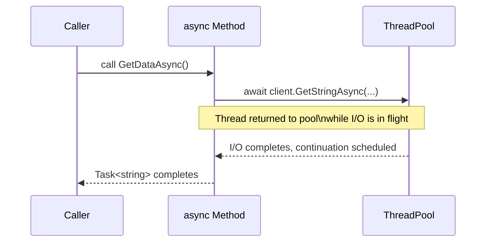

### Async State-Machine Internals

**Q: Async method ke liye compiler actually kya generate karta hai?**

A: Ek compiler-generated struct/class jo `IAsyncStateMachine` implement karta hai, jisme method body ko jump-table-driven `MoveNext()` mein rewrite kiya jaata hai. Ek `AsyncTaskMethodBuilder<T>` immediately `Task<T>` create aur return karta hai; ek `_state` field track karta hai ki resume karne ke baad kaunse await point par jaana hai.

```csharp
public async Task<string> GetDataAsync()
{
    var response = await _httpClient.GetStringAsync(url);
    return response.ToUpper();
}
```

...roughly iske equivalent hai:

```csharp
private struct GetDataAsyncStateMachine : IAsyncStateMachine
{
    public int _state;                                   // tracks which await we're resuming after
    public AsyncTaskMethodBuilder<string> _builder;       // manages the returned Task<string>
    public HttpClient _httpClient;
    private TaskAwaiter<string> _awaiter;                 // captured awaiter, survives across suspension

    void IAsyncStateMachine.MoveNext()
    {
        string result;
        try
        {
            if (_state == 0)   // resuming after the await
            {
                result = _awaiter.GetResult();            // rethrows if the task faulted
                goto AfterAwait;
            }

            // first entry — call the async operation
            var task = _httpClient.GetStringAsync(url);
            _awaiter = task.GetAwaiter();
            if (!_awaiter.IsCompleted)
            {
                _state = 0;
                _builder.AwaitUnsafeOnCompleted(ref _awaiter, ref this);  // registers continuation, returns to caller
                return;                                    // <-- this is the "suspend" point; thread is freed here
            }
            result = _awaiter.GetResult();                 // synchronous fast path — already completed

            AfterAwait:
            var final = result.ToUpper();
            _builder.SetResult(final);                     // completes the returned Task<string>
        }
        catch (Exception ex)
        {
            _builder.SetException(ex);                     // exception captured onto the Task, not thrown here
        }
    }

    void IAsyncStateMachine.SetStateMachine(IAsyncStateMachine sm) { }
}
```

**Q: Jab awaited operation abhi complete nahi hua hai, tab kya hota hai wo walk through karo.**

A: `MoveNext()` sabse pehle `awaiter.IsCompleted` synchronously check karta hai (agar already done hai to fast path, jaise cache hit). Agar complete nahi hai, to yeh khud ko continuation ke roop mein `OnCompleted`/`UnsafeOnCompleted` ke through register karta hai aur caller ko control return karta hai — yehi asal point hai jahan thread free hota hai. Kuch aur infrastructure piece baad mein `MoveNext()` ko dobara call karke resume karta hai.

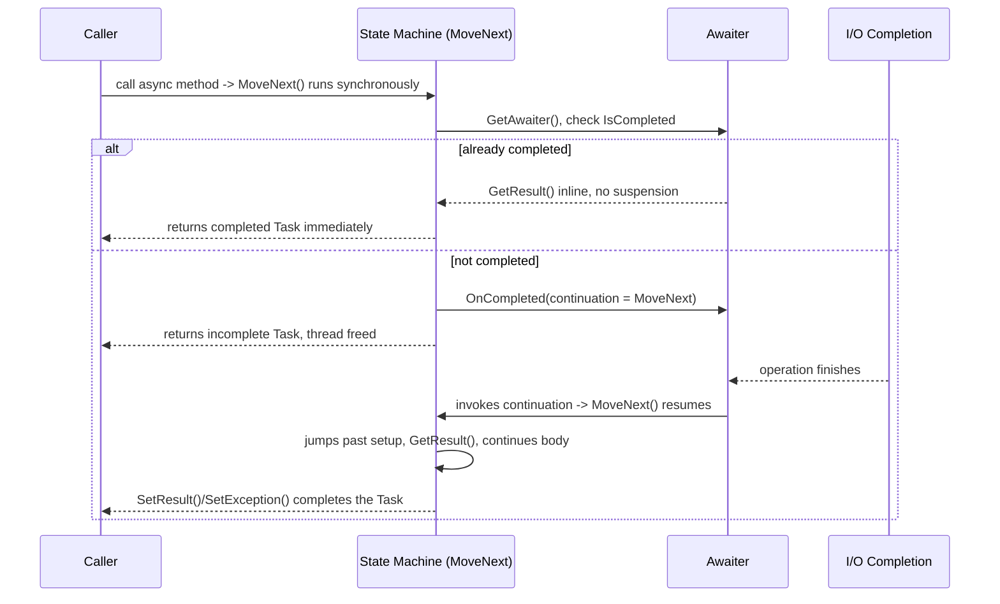

**Q: Generated state machine ke andar exceptions kaise handle hote hain?**

A: Yeh `MoveNext()` ke andar catch hote hain aur `_builder.SetException(ex)` ke through `Task` par store hote hain, call stack up throw hone ke bajaye — isi wajah se `async Task` method mein exception sirf tab surface hota hai jab caller uss `Task` ko await/observe kare, aur isi wajah se `async void` (koi `Task` nahi jisme exception store ho) dangerous hai.

**Q: Compiler-generated state machine class hai ya struct?**

A: By default ek struct, taaki method synchronously complete hone par heap allocation avoid ho sake — heap par box sirf tab hota hai jab isse actually suspend karne ki zarurat pade. Yeh un allocation-avoidance tricks mein se ek hai (cached completed `Task`/`ValueTask` instances ke saath) jo `async`/`await` ko syntax se lagne se zyada cheap banate hain.

**Q: Ek type ko awaitable hone ke liye minimal "awaiter contract" kya chahiye?**

A: `GetAwaiter()` jo koi aisi cheez return kare jisme `bool IsCompleted`, `GetResult()`, aur `OnCompleted`/`UnsafeOnCompleted` implementing `INotifyCompletion`/`ICriticalNotifyCompletion` ho — ek compile-time duck-typed pattern, awaited type par required interface nahi, isi wajah se aap `await` kar sakte ho ek `Task`, ek `ValueTask`, ek `YieldAwaitable`, ya ek custom awaitable ko.

### Asynchrony vs Multithreading

**Q: Asynchrony vs multithreading — kab kaunsa use karein?**

A: Async/await single thread use karta hai aur blocking avoid karta hai — I/O-bound work ke liye best, efficient, zaroori nahi ki parallel ho. Multithreading true parallelism ke liye multiple explicit threads use karta hai — CPU-bound work ke liye best, synchronization ki zarurat ke cost par. Dono frequently combine hote hain (`await Task.Run(() => CpuBoundWork())`).

### Deadlocks & Race Conditions

**Q: Ek classic lock-ordering deadlock, aur ek race condition ka example do.**

A: Deadlock: Thread A `obj1` phir `obj2` lock karta hai; Thread B `obj2` phir `obj1` lock karta hai — inconsistent lock order deadlock ka risk banata hai. Race condition: shared `int count` par `Parallel.For(0, 1000, _ => count++)` — non-atomic increments lost updates aur wrong total cause karte hain.

```csharp
// Thread A: lock(obj1) then lock(obj2)
// Thread B: lock(obj2) then lock(obj1)  <-- inconsistent order = deadlock risk
lock (obj1) { lock (obj2) { /* ... */ } }
```

```csharp
int count = 0;
Parallel.For(0, 1000, _ => count++); // non-atomic increment — lost updates, wrong total
```

### Task Parallel Library (TPL)

**Q: TPL kya hai, aur yeh async/await se kaise related hai?**

A: TPL (`System.Threading.Tasks`) raw threads ke upar ek higher-level abstraction hai — `Task`/`Parallel`/`TaskFactory` jo ThreadPool se scheduled hote hain. `async`/`await` TPL ke upar built language syntactic sugar hai jo asynchronous code ko sequentially padhne jaisa banata hai — yeh saath mein use hote hain, alternatives ke roop mein nahi (engine vs automatic transmission analogy).

```csharp
Task task = Task.Run(() => Console.WriteLine("Running on thread: " + Task.CurrentId));
task.Wait();

Parallel.For(1, 5, i => Console.WriteLine($"Processing {i} on thread {Task.CurrentId}"));
```

```csharp
// TPL version — "plumbing heavy"
Task<string> task1 = Task.Run(() => DownloadData("API 1", 2000));
Task<string> task2 = Task.Run(() => DownloadData("API 2", 3000));
Task.WaitAll(task1, task2);
Console.WriteLine(task1.Result);
Console.WriteLine(task2.Result);

// async/await version — idiomatic, exceptions propagate naturally via try/catch
var t1 = DownloadDataAsync("API 1", 2000);
var t2 = DownloadDataAsync("API 2", 3000);
var results = await Task.WhenAll(t1, t2);
```

**Q: Key TPL methods aur unke purposes naam batao.**

A: `Task.Run()` (background work, value return kar sakta hai), `Task.Wait()`/`.Result` (blocks karta hai — ASP.NET/UI code mein avoid karein), `Task.WhenAll()`/`WhenAny()`, `Task.Delay()` (non-blocking), `Task.FromResult()`/`CompletedTask` (already-completed wrappers), `ContinueWith()` (mostly `await` se replaced), `Parallel.For()`/`ForEach()` (CPU-bound loops), `Task.Factory.StartNew()` (older, lower-level, nested `Task` ko auto-unwrap nahi karta).

**Q: Task.Factory.StartNew Task.Run ka drop-in replacement kyun nahi hai?**

A: Yeh default se nested `Task` ko unwrap NAHI karta (isliye async method ko wrap karne se aapko `Task<Task>` milta hai jab tak `.Unwrap()` na call karo) aur alag default scheduling options hote hain — "isse asynchronously bas run karo" ke liye `Task.Run` correct default hai.

### Task.Run vs Task.Factory.StartNew(LongRunning) vs Parallel.ForEachAsync

**Q: Task.Run ke bajaye Task.Factory.StartNew with LongRunning kab use karenge?**

A: Ek genuinely long-lived, dedicated, often-blocking loop ke liye (jaise, app ki lifetime ke liye `BlockingCollection.Take()` par blocking karta hua ek polling/consumer loop) jo otherwise ek pooled thread ko occupy aur starve kar dega — `LongRunning` scheduler ko hint deta hai ki normal pool heuristics se bahar ek dedicated thread use kare. Isse overuse karna pooling ko defeat kar deta hai aur OS threads exhaust kar sakta hai.

```csharp
// Task.Run — the default. Uses a pooled thread; fine for short/medium CPU-bound work.
Task.Run(() => ProcessBatch(data));

// Task.Factory.StartNew with LongRunning — opts OUT of the pool for a genuinely
// long-lived, dedicated thread (the TaskScheduler hints the underlying thread
// shouldn't be reused/reclaimed the way pooled worker threads are).
Task.Factory.StartNew(
    () => RunForeverPollingLoop(),
    CancellationToken.None,
    TaskCreationOptions.LongRunning,
    TaskScheduler.Default);
```

**Q: Parallel.ForEachAsync (.NET 6+) kya replace karta hai, aur yeh aapke liye kya handle karta hai?**

A: Yeh bounded async concurrency ke liye hand-rolled `SemaphoreSlim`-plus-list-of-tasks pattern ko replace karta hai — throttling (`MaxDegreeOfParallelism`), cancellation propagation, aur exception aggregation automatically handle karta hai. "Downstream API ko concurrent outbound calls limit karo" ke liye yeh modern go-to answer hai.

```csharp
// Old pattern — manual SemaphoreSlim throttling
var semaphore = new SemaphoreSlim(maxDegreeOfParallelism: 8);
var tasks = urls.Select(async url =>
{
    await semaphore.WaitAsync();
    try { await DownloadAsync(url); }
    finally { semaphore.Release(); }
});
await Task.WhenAll(tasks);

// Modern equivalent — Parallel.ForEachAsync
await Parallel.ForEachAsync(urls,
    new ParallelOptions { MaxDegreeOfParallelism = 8, CancellationToken = ct },
    async (url, token) => await DownloadAsync(url, token));
```

### ASP.NET Core mein "Main Thread" Kaise Kaam Karta Hai

**Q: Kya ASP.NET Core mein WinForms ke UI thread jaisa dedicated request thread hota hai?**

A: Nahi — ek single startup thread `Program.cs` run karta hai, phir Kestrel requests ke liye listen karta hai aur har request ek ThreadPool thread se handle hota hai. Koi thread affinity nahi hai: `await` ke saath, thread immediately pool mein wapas chala jaata hai, aur ek shayad different thread continuation resume karta hai.

```csharp
var builder = WebApplication.CreateBuilder(args);
builder.Services.AddScoped<IProductService, ProductService>();
var app = builder.Build();
app.MapControllers();
app.Run();
```

```csharp
// Synchronous — blocks Thread #17 for 5 seconds, unavailable to serve other requests
public Product GetProduct(int id) { Thread.Sleep(5000); return new Product(); }

// Async — releases Thread #17 back to the pool immediately while waiting
public async Task<Product> GetProduct(int id) { await Task.Delay(5000); return new Product(); }
```

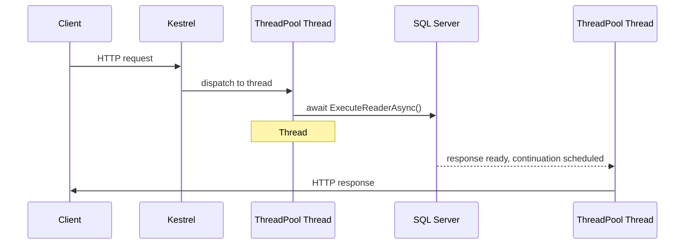

**Q: ASP.NET Core controller action ke andar CPU-bound work ko Task.Run() mein wrap karna ek mild anti-pattern kyun hai?**

A: Yeh bas work ko ek pool thread se doosre pool thread par move karta hai aur scheduling/context-switch overhead add karta hai — WinForms/WPF ke unlike, koi dedicated UI thread "free" nahi ho raha. Ek truly async I/O API prefer karein, ya genuinely CPU-heavy work ko background worker/queue par offload karein.

**Q: ThreadPool par work dispatch karne ke liye Kestrel hood ke neeche kya use karta hai?**

A: Windows par I/O Completion Ports / Linux par epoll.

### Async Streams (IAsyncEnumerable\<T\>)

**Q: Async streams (IAsyncEnumerable<T>) kya problem solve karte hain?**

A: Yeh entire collection pehle materialize karne ke bajaye data ko asynchronously process karte hain jaise wo arrive hota hai — large result sets stream karne ya memory mein sab kuch buffer kiye bina API ko paging karne ke liye useful, `await foreach` ke through consume hota hai.

```csharp
public static async IAsyncEnumerable<int> GenerateNumbers()
{
    for (int i = 1; i <= 5; i++)
    {
        await Task.Delay(1000);
        yield return i;
    }
}

await foreach (var number in GenerateNumbers())
    Console.WriteLine(number);
```

### ConfigureAwait(false) and SynchronizationContext

**Q: SynchronizationContext kya capture karta hai, aur yeh kahan exist karta hai?**

A: "Kahan" `await` ke baad ek continuation resume hona chahiye. UI frameworks (WPF, WinForms, older ASP.NET Framework/MVC) ek context capture karte hain taaki continuations wapas marshal ho sakein (jaise, UI thread par). ASP.NET Core mein koi `SynchronizationContext` nahi hai (Core 1.0 se removed) — continuations kisi bhi ThreadPool thread par resume hote hain.

**Q: ConfigureAwait(false) kya karta hai, aur 2026 mein yeh kahan abhi bhi use karna chahiye?**

A: Yeh awaiter ko batata hai ki captured context (agar exist karta ho) par resume karne ki koshish na kare. Library code mein jahan UI context ke baare mein jaanne ki koi wajah nahi hai, har `await` par yeh abhi bhi good practice hai (context-marshal cost avoid karta hai, ek blocking caller ke liye deadlock cause banne se bachata hai). Pure ASP.NET Core application code mein yeh largely unnecessary hai kyunki capture karne ke liye koi context nahi hai, phir bhi yeh cheap insurance hai agar code kisi context-sensitive host mein bhi run ho sakta ho.

```csharp
public async Task<string> GetDataAsync()
{
    var response = await _httpClient.GetAsync(url).ConfigureAwait(false);
    return await response.Content.ReadAsStringAsync().ConfigureAwait(false);
}
```

### The Classic Sync-Over-Async Deadlock

**Q: Classic sync-over-async deadlock explain karo (.Result ek UI thread se).**

A: UI thread `.Result` call karta hai, khud ko block karke jab tak async method finish nahi hota. Uss method ke andar, `await Task.Delay(...)` ke baad, continuation captured `SynchronizationContext` (UI thread) par resume hone ke liye scheduled hota hai — lekin wo thread `.Result` par blocked hai aur continuation kabhi run nahi kar sakta. Deadlock.

```csharp
// WPF / WinForms / ASP.NET (classic, pre-Core) button click handler:
void Button_Click(object sender, EventArgs e)
{
    var result = GetDataAsync().Result;  // BLOCKS the UI thread, waiting for GetDataAsync to finish
}

async Task<string> GetDataAsync()
{
    await Task.Delay(1000);   // by default, captures the current SynchronizationContext
    return "done";            // this continuation needs to resume ON the UI thread
}
```

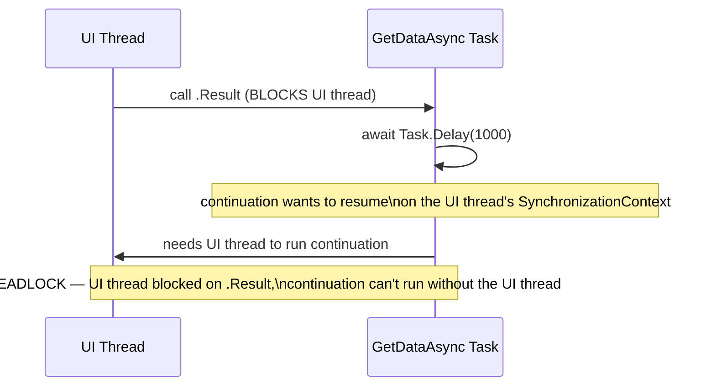

**Q: Kya yeh deadlock ASP.NET Core mein hota hai? Wahan aur kya galat ho sakta hai?**

A: Same tarike se nahi, kyunki capture karne ke liye koi `SynchronizationContext` nahi hai, isliye continuation kisi bhi pool thread par run ho sakta hai. Load ke under yeh abhi bhi ThreadPool starvation cause kar sakta hai (`.Result` par ek pool thread block karte hue jab uske continuation ko doosre pool thread ki zarurat ho) — ek related lekin distinct problem.

**Q: Sync-over-async deadlocks ke fixes preference order mein kya hain?**

A:
1. Await all the way up — caller ko bhi `async` banao.
2. Agar aapko sync code se async call karna hi padega, chain mein `ConfigureAwait(false)` throughout use karo taaki koi continuation ko original context ki zarurat na pade.
3. `Task.Run(() => AsyncMethod()).Result` ek pool thread par offload karta hai koi captured context ke bina, iss specific deadlock ko sidestep karta hai (abhi bhi blocking, abhi bhi ideal nahi).

### async void — Yeh Kyun Dangerous Hai

**Q: Ek caller async void method ke andar throw hue exceptions ko catch kyun nahi kar sakta?**

A: Observe karne ke liye koi `Task` nahi hai — exception iske bajaye method start hone ke waqt active `SynchronizationContext` par directly throw hota hai, typically process crash karta hai (ya host ke depend karte hue silently swallow ho jaata hai) surrounding `try/catch` mein propagate hone ke bajaye.

```csharp
async void ProcessOrder()  // DANGER
{
    await Task.Delay(100);
    throw new Exception("boom");
}
```

**Q: async void ka ek legitimate use case kya hai, aur ise kaise handle karna chahiye?**

A: Top-level event handlers (jaise, WinForms/WPF `Button_Click`) jinki void-returning signature framework dictate karta hai. Wahan bhi, best practice yeh hai ki immediately ek `async Task` method ko delegate karo aur internally usse `try/catch` mein wrap karo.

**Q: async void test methods ke liye specifically kyun matter karta hai?**

A: Ek `async void` test method silently pass ho jaata hai chahe uske andar ek awaited call throw kare, kyunki test runner exception ko kabhi observe nahi karta — xUnit/NUnit test methods hamesha `async Task` hone chahiye.

### Task vs ValueTask

**Q: Task<T> vs ValueTask<T> — structural difference aur ValueTask kab use karein?**

A: `Task<T>` ek heap-allocated reference type hai — har call jo synchronous fast path hit nahi karti wo ek allocate karti hai. `ValueTask<T>` ek struct hai jo synchronously-available result (zero allocation) represent kar sakta hai ya underlying `Task<T>` wrap kar sakta hai. Default `Task<T>` rakho; `ValueTask` sirf ek proven hot path par use karo (jaise, cache-hit path) jahan profiling se pata chale ki allocation matter karta hai.

```csharp
public ValueTask<int> GetCachedOrComputeAsync(int key)
{
    if (_cache.TryGetValue(key, out var value))
        return new ValueTask<int>(value);          // synchronous path — zero allocation

    return new ValueTask<int>(ComputeAsync(key));   // async path — wraps a Task<int>
}
```

**Q: ValueTask ki wo restrictions kya hain jo ise misuse karna aasaan banati hain?**

A: Ise ek se zyada baar await nahi karna chahiye, completion check karne se pehle `.Result` access nahi karna chahiye, aur ise cache/later await nahi karna chahiye — iska API surface deliberately minimal hai; agar aapko richer `Task` API chahiye to `.AsTask()` se convert karo.

---

## Part IX — Data Access: ADO.NET

**Q: ADO.NET kya hai, aur ORM ke bajaye isse kab choose karenge?**

A: Connections, SQL execution, transactions, aur disconnected data ke liye ek low-level data-access framework — full control, EF Core se faster/lighter kyunki koi object tracking ya LINQ-translation layer nahi hai. Performance-critical hot paths, fine-grained microservices, aur legacy systems ke liye good.

**Q: Connected vs disconnected ADO.NET model?**

A: Connected: `Application → Connection → Command → DataReader → Database`, connection open rakhte hue read karta hai. Disconnected: `Application → DataAdapter → DataSet/DataTable → Database`, memory mein load karta hai taaki connection close ho sake.

**Q: Modern SQL Server data provider kya hai, aur legacy kya hai?**

A: `Microsoft.Data.SqlClient` current provider hai; older `System.Data.SqlClient` legacy/deprecated hai.

**Q: Connection pooling kya hai, aur best practice kya hai?**

A: Default se enabled — `Close()`/`Dispose()` par connections reuse hote hain, destroy nahi. Best practice: `using` ke through "open late, close early"; leaked open connections load ke under pool exhaust kar dete hain.

**Q: ExecuteReader, ExecuteNonQuery, aur ExecuteScalar ko contrast karo.**

A: `ExecuteReader()` large datasets stream karne ke liye ek forward-only `SqlDataReader` return karta hai (reads ke liye fastest). `ExecuteNonQuery()` INSERT/UPDATE/DELETE ke liye affected row count return karta hai. `ExecuteScalar()` aggregates/existence checks ke liye ek single value return karta hai.

**Q: AddWithValue() ke bajaye explicit SqlDbType parameters kyun prefer karein?**

A: `AddWithValue` .NET value se type/size infer karta hai, jo query-plan cache ko bloat kar sakta hai (slightly different inferred sizes logically same query ke liye different cached plans produce karte hain) aur implicit-conversion index scans cause kar sakta hai.

```csharp
cmd.Parameters.Add("@Id", SqlDbType.Int).Value = id;   // correct
// "SELECT * FROM Users WHERE Id=" + id                // WRONG — injection risk
```

**Q: SQL isolation levels ko least se most strict list karo, aur har ek kya prevent karta hai.**

A:
- **Read Uncommitted** — kuch bhi prevent nahi hota; fastest, least safe.
- **Read Committed** — dirty reads prevent karta hai (SQL Server default).
- **Repeatable Read** — non-repeatable reads bhi prevent karta hai; read locks longer hold karta hai.
- **Serializable** — dirty, non-repeatable, aur phantom reads sab prevent karta hai; slowest.
- **Snapshot** — row-versioning ke through teeno prevent karta hai, koi blocking reads nahi.

**Q: Kya async ADO.NET calls (OpenAsync, ExecuteReaderAsync) single-query latency reduce karte hain?**

A: Nahi — yeh concurrent load ke under threads free karke throughput improve karte hain, single query ki latency nahi.

**Q: ADO.NET vs Dapper vs EF Core — decision framework kya hai?**

A: ADO.NET — koi abstraction nahi, fastest, lowest productivity — performance-critical hot paths. Dapper — micro-ORM, bahut fast (ADO.NET ke close), medium productivity — high-performance apps jo abhi bhi mapping convenience chahte hain. EF Core — full ORM (LINQ, tracking, migrations), slower but improving, highest productivity — CRUD-heavy business apps. Default EF Core rakho; sirf Dapper/ADO.NET par jao jahan profiling se pata chale ki matter karta hai.

**Q: Common ADO.NET pitfalls kya hain?**

A: Connection pooling ko na samajhna; string-concatenated SQL (injection risk); leaked open connections; readers ko dispose na karna; concurrent load ke under async ignore karna (ThreadPool starvation); `DataSet` ka overuse karna jahan `DataReader` kaafi hoga; puche jaane par isolation levels/transaction scope discuss na karna.

**Q: Ek high-scale composite example do jisme transaction, parameterized queries, aur CancellationToken combine ho.**

A: Ek async order-creation method jo connection open karta hai, transaction begin karta hai, parameterized `SELECT` se product read karta hai, stock validate karta hai, order insert karta hai, stock update karta hai, aur commit karta hai — kisi bhi exception par rollback karte hue:

```csharp
public async Task<OrderResult> CreateOrderAsync(int productId, int quantity, CancellationToken token)
{
    using SqlConnection conn = new SqlConnection(_cs);
    await conn.OpenAsync(token);
    using SqlTransaction transaction = conn.BeginTransaction();
    try
    {
        var productCmd = new SqlCommand(
            "SELECT Id, Name, Price, Stock FROM Products WHERE Id = @ProductId", conn, transaction);
        productCmd.Parameters.Add("@ProductId", SqlDbType.Int).Value = productId;

        Product product = null;
        using (var reader = await productCmd.ExecuteReaderAsync(token))
            if (await reader.ReadAsync(token))
                product = new Product { Id = reader.GetInt32(0), Name = reader.GetString(1),
                                         Price = reader.GetDecimal(2), Stock = reader.GetInt32(3) };

        if (product == null) throw new Exception("Product not found");
        if (product.Stock < quantity) throw new Exception("Insufficient stock");

        var orderCmd = new SqlCommand(
            "INSERT INTO Orders(ProductId, Quantity, TotalAmount) OUTPUT INSERTED.Id " +
            "VALUES(@ProductId, @Qty, @Total)", conn, transaction);
        orderCmd.Parameters.Add("@ProductId", SqlDbType.Int).Value = productId;
        orderCmd.Parameters.Add("@Qty", SqlDbType.Int).Value = quantity;
        orderCmd.Parameters.Add("@Total", SqlDbType.Decimal).Value = product.Price * quantity;
        int orderId = (int)await orderCmd.ExecuteScalarAsync(token);

        var stockCmd = new SqlCommand(
            "UPDATE Products SET Stock = Stock - @Qty WHERE Id = @ProductId", conn, transaction);
        stockCmd.Parameters.Add("@Qty", SqlDbType.Int).Value = quantity;
        stockCmd.Parameters.Add("@ProductId", SqlDbType.Int).Value = productId;
        await stockCmd.ExecuteNonQueryAsync(token);

        transaction.Commit();
        return new OrderResult { OrderId = orderId, ProductName = product.Name, Quantity = quantity };
    }
    catch { transaction.Rollback(); throw; }
}
```

---

## Part X — Design Principles & Patterns

### SOLID Principles

**Q: SOLID ko ek C# example ke saath summarize karo har ek ke liye.**

A:
- **SRP** — salary calculation aur reporting dono karne wali ek class ko `SalaryCalculator` aur `ReportGenerator` mein split karo.
- **OCP** — ek if/else payment-method chain ko `IPayment` interface aur har method ke liye ek class se replace karo.
- **LSP** — ek `Square : Rectangle` jo `Width == Height` force karta hai contract break karta hai; dono ko independently ek `Shape` abstraction ke through model karo.
- **ISP** — ek fat `Worker { Work(); Eat(); }` ko `IWorkable`/`IEatable` mein split karo taaki ek `Robot` sirf `IWorkable` implement kare.
- **DIP** — ek `Computer` ko concrete classes ke bajaye constructor ke through inject kiye `IKeyboard`/`IMonitor` par depend karna chahiye.

### Dependency Injection (DI)

**Q: .NET ka built-in DI container actually dependencies kaise resolve karta hai?**

A: Service registration ek interface→implementation map banata hai (`AddScoped`/`AddTransient`/`AddSingleton`). Resolution par, container requesting type ke constructor ko reflection ke through inspect karta hai, parameters ko registered services se match karta hai, aur dependencies ko recursively resolve karta hai — sab runtime par, compile time par nahi (compiler DI ke liye aapka code rewrite nahi karta).

```csharp
public interface IService { void Serve(); }
public class MyService : IService { public void Serve() => Console.WriteLine("Serving..."); }
public class Client
{
    private readonly IService _service;
    public Client(IService service) { _service = service; }
}
```

Service registration map banata hai:

```csharp
builder.Services.AddScoped<INotificationService, EmailService>();
builder.Services.AddScoped<ReportService>();
```

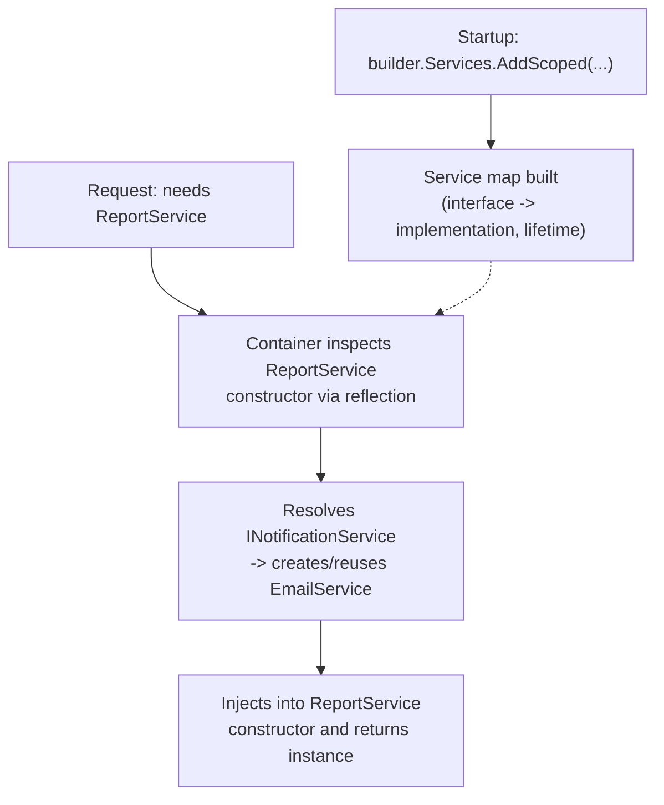

**Q: Transient, Scoped, aur Singleton lifetimes ko contrast karo.**

A: Transient — jab bhi request hoga ek naya instance. Scoped — har HTTP request/scope ke liye ek instance. Singleton — poori application lifetime ke liye ek instance.

### Serialization & Deserialization

**Q: Untrusted data ke liye BinaryFormatter/[Serializable] kyun avoid karna chahiye?**

A: Deserialization-based remote-code-execution vulnerabilities ki wajah se yeh modern .NET mein obsolete aur default se disabled hai — yeh Microsoft ki khud ki guidance hai. `System.Text.Json` modern, explicit approach hai.

```csharp
string json = JsonSerializer.Serialize(myObject);
Person p = JsonSerializer.Deserialize<Person>(jsonString);
```

**Q: 2026 mein System.Text.Json vs Newtonsoft.Json?**

A: `System.Text.Json` naye code ke liye modern default hai (performance, source-generated `JsonSerializerContext` ke through native AOT support, reflection eliminate karta hai). `Newtonsoft.Json` older codebases mein common hai aur historically kuch edge cases ke liye richer feature set raha hai.

### AutoMapper

**Q: Senior level par AutoMapper controversial kyun hai, aur alternative kya hai?**

A: Reflection-based mapping ka runtime cost hota hai; mapping bugs (wrong property matched, silently null) compile time par nahi, runtime par surface hoti hain; complex configurations apna hard-to-debug DSL ban jaati hain. Bahut se senior teams compile-time-checked, allocation-free, IntelliSense-friendly mapping ke liye explicit manual mapping ya ek source-generated mapper (jaise, Mapperly) prefer karte hain.

```csharp
var config = new MapperConfiguration(cfg => cfg.CreateMap<Person, PersonDTO>());
var mapper = config.CreateMapper();
```

### Architectural Patterns

**Q: MVC/MVVM se aage common architectural patterns naam batao.**

A: Command (ek request ko object ke roop mein encapsulate karta hai, undo/redo support karta hai); CQRS (scalability ke liye reads/writes separate karta hai); Repository + Unit of Work (per-aggregate persistence abstraction + atomic multi-repo save); Mediator/MediatR (senders ko handlers se decouple karta hai, CQRS ke saath pair karta hai); Clean/Onion Architecture (concentric layers, dependencies Domain ki taraf inward point karte hain).

**Q: Kya aap EF Core ke upar ek generic repository layer banaoge?**

A: Isse often ek redundant abstraction ke roop mein criticize kiya jaata hai, kyunki EF Core ka `DbContext` already Unit of Work pattern implement karta hai aur querying/change-tracking provide karta hai — puche jaane par yeh nuance raise karna worth hai.

### Microservices

**Q: Typical .NET microservices stack kya hai?**

A: ASP.NET Core + Docker + Kubernetes + ek API Gateway, messaging/gRPC/Saga patterns layer mein add kiye hue (Part XVII mein expand kiya gaya hai).

### The Captive Dependency Problem

**Q: Captive dependency kya hai, aur ek example do.**

A: Ek longer-lived service (typically Singleton) jo apne constructor mein ek shorter-lived (Scoped/Transient) dependency capture kar leta hai, use apni intended lifetime se kaafi aage tak hold karta hai — jaise, ek Singleton `CacheService` jo ek Scoped `AppDbContext` capture kar leta hai, jisse wo `DbContext` instance de facto singleton ban jaata hai (thread-unsafe, stale state).

```csharp
public class CacheService  // registered as Singleton
{
    private readonly AppDbContext _db;  // Scoped — captured once, held forever!
    public CacheService(AppDbContext db) => _db = db;
}
```

**Q: Captive dependency ko kaise fix karein?**

A: Singleton mein `IServiceScopeFactory` inject karein aur constructor mein capture karne ke bajaye har baar zarurat padne par ek naya scope create karo (scoped dependency ko fresh resolve karte hue). Built-in DI container ki scope validation (Development mein default se on) bhi ise detect karke throw kar deti hai.

```csharp
public class CacheService(IServiceScopeFactory scopeFactory)
{
    public async Task DoWorkAsync()
    {
        using var scope = scopeFactory.CreateScope();
        var db = scope.ServiceProvider.GetRequiredService<AppDbContext>();
        // use db safely within this scope's lifetime
    }
}
```

### Keyed DI Services (.NET 8+)

**Q: Keyed DI services (.NET 8+) kya solve karte hain?**

A: Same interface ki multiple implementations register karna jo key se distinguish hoti hain (`AddKeyedScoped<INotificationService, EmailService>("email")`), `[FromKeyedServices("email")]` ke through resolved — pehle jo factory delegate ya manual `Dictionary<string, IService>` ki zarurat hoti thi use replace karta hai.

```csharp
builder.Services.AddKeyedScoped<INotificationService, EmailService>("email");
builder.Services.AddKeyedScoped<INotificationService, SmsService>("sms");

public class OrderService([FromKeyedServices("email")] INotificationService notifier) { ... }
```

---

## Part XI — Cross-Cutting Concerns: Logging & Exceptions

**Q: ILogger<T> kya provide karta hai, aur built-in/common third-party providers kya hain?**

A: Class name based ek category ke saath structured logging. Built-in: Console, Debug, EventLog, Application Insights. Common third-party: Serilog, NLog.

```csharp
public class HomeController : ControllerBase
{
    private readonly ILogger<HomeController> _logger;
    public HomeController(ILogger<HomeController> logger) => _logger = logger;

    [HttpGet]
    public IActionResult Get()
    {
        _logger.LogInformation("HomeController: Get method called.");
        return Ok("Logging example");
    }
}
```

**Q: Log levels ko least se most severe list karo.**

A: `Trace`, `Debug`, `Information`, `Warning`, `Error`, `Critical`.

**Q: String concatenation ke upar structured logging ({PlaceholderName}) kyun prefer kiya jaata hai?**

A: Yeh searchable, queryable, JSON-capable logs produce karta hai, parameter values ko structured fields ke roop mein preserve karta hai ek flat string mein bake karne ke bajaye.

```csharp
_logger.LogInformation("User {UserId} with name {UserName} logged in.", userId, user);
```

Serilog file/console sinks ke liye:

```csharp
Log.Logger = new LoggerConfiguration()
    .WriteTo.Console()
    .WriteTo.File("logs/log.txt", rollingInterval: RollingInterval.Day)
    .CreateLogger();
builder.Host.UseSerilog();
```

**Q: Sirf message ke bajaye exception object ko hamesha LogError mein pass kyun karein?**

A: Taaki logging providers full stack trace capture karein (`_logger.LogError(ex, "message")`), sirf ek text summary nahi.

```csharp
catch (Exception ex) { _logger.LogError(ex, "An error occurred while processing the request."); }
```

**Q: Recommended exception-handling architecture kya hai, aur local try/catch kab abhi bhi use karna chahiye?**

A: Unhandled exceptions ke liye ek single global exception-handling middleware prefer karein — isse controllers/services clean rehte hain, consistent error responses ensure hoti hain, logging centralize hoti hai. Local `try/catch` sirf tab use karein jab aap genuinely recover kar sakte ho, ek fallback provide kar sakte ho, meaningful context add kar sakte ho, ya cleanup ki zarurat ho.

**Q: IExceptionHandler (.NET 8+) kya hai aur yeh UseExceptionHandler middleware se kaise better hai?**

A: Ek typed alternative jahan aap `TryHandleAsync` implement karte ho aur priority order mein multiple handlers register karte ho — ek badi middleware lambda se better compose hota hai; `false` return karne se next handler try karta hai. Standard error shape ke roop mein `ProblemDetails` (RFC 7807) ke saath pair karein.

```csharp
public class ValidationExceptionHandler : IExceptionHandler
{
    public async ValueTask<bool> TryHandleAsync(HttpContext context, Exception exception, CancellationToken ct)
    {
        if (exception is not ValidationException ve) return false; // not handled — try next handler
        context.Response.StatusCode = StatusCodes.Status400BadRequest;
        await context.Response.WriteAsJsonAsync(new ProblemDetails { Title = "Validation failed", Detail = ve.Message }, ct);
        return true;
    }
}
// builder.Services.AddExceptionHandler<ValidationExceptionHandler>();
// app.UseExceptionHandler();
```

---

## Part XII — Modern C# Language Features (C# 9–14)

**Q: Collection expressions (C# 12) kya hain?**

A: `int[] numbers = [1, 2, 3, 4, 5];` `new int[] {...}` ko replace karta hai; yeh ek spread operator support karte hain, jaise `int[] combined = [..numbers, 6, 7];`.

```csharp
int[] numbers = [1, 2, 3, 4, 5];        // replaces new int[] {...}
List<string> names = ["Alice", "Bob"];
int[] combined = [..numbers, 6, 7];      // spread operator
```

**Q: field keyword (C# 14) kya solve karta hai?**

A: Isse aap manually backing field declare kiye bina ek auto-property accessor mein validation/logic add kar sakte ho (`get => field; set => field = value?.Trim() ?? throw ...;`) — pehle koi bhi guard logic ka matlab tha auto-property ko poori tarah chhod dena.

```csharp
public class Person
{
    public string Name
    {
        get => field;
        set => field = value?.Trim() ?? throw new ArgumentNullException(nameof(value));
    }
}
```

**Q: Extension members (C# 14) kya hain?**

A: Yeh extension-method concept ko extension properties, static extension members, aur operators tak extend karte hain, jaise `extension(string s) { public bool IsPalindrome => ...; }`.

```csharp
public static class StringExtensions
{
    extension(string s)
    {
        public bool IsPalindrome => s.SequenceEqual(s.Reverse());
    }
}
Console.WriteLine("level".IsPalindrome); // True
```

**Q: File-scoped namespaces aur global usings (C# 10) kya hain?**

A: `namespace MyApp;` wrapping `{ }` block ko replace karta hai, indentation reduce karta hai. Ek file mein `global using System;` (jaise `GlobalUsings.cs`) project-wide apply hota hai, repetitive `using` boilerplate kaat deta hai.

**Q: Top-level statements aur minimal hosting (C# 9) kya hain?**

A: `Program.cs` ko ab explicit `Main` method ya class wrapper ki zarurat nahi; `WebApplication.CreateBuilder(args)` ke saath combined, yeh modern minimal-hosting entry point hai, jo old `Startup.cs` + `Program.cs` split ko replace karta hai.

  ```csharp
  // Entire Program.cs, C# 9+ top-level statements + minimal hosting:
  var builder = WebApplication.CreateBuilder(args);
  builder.Services.AddControllers();
  var app = builder.Build();
  app.MapControllers();
  app.Run();
  ```

**Q: Raw string literals (C# 11) kis liye hain?**

A: Triple-quoted `"""..."""` strings JSON/regex/multi-line text ko escaping ke bina embed karne ke liye.

---

## Part XIII — Minimal APIs, EF Core & Caching

### Minimal APIs vs Controllers

**Q: Minimal APIs vs MVC Controllers — kaise choose karenge?**

A: Minimal APIs: bahut low boilerplate (lambda endpoints), microservices/small APIs/high-throughput endpoints ke liye best, faster startup (kam reflection), first-class Native AOT support. MVC Controllers: zyada boilerplate lekin large APIs, complex model binding, filter/versioning-heavy apps ke liye better.

```csharp
app.MapGet("/products/{id}", async (int id, IProductService svc) => await svc.GetAsync(id))
   .Produces<Product>(200)
   .Produces(404);
```

**Q: Shared prefixes/policies/OpenAPI metadata ke liye minimal API endpoints ko kaise group karte hain?**

A: `MapGroup()` use karo ek group create karne ke liye jo ek route prefix share kare aur authorization require kar sake ya apne saare endpoints ke across metadata share kar sake.

```csharp
var products = app.MapGroup("/products").RequireAuthorization();
products.MapGet("/", GetAllProducts);
products.MapPost("/", CreateProduct);
```

**Q: IEndpointFilter minimal APIs ke liye kya karta hai?**

A: Minimal API endpoints mein cross-cutting behavior (logging, validation, exception mapping) add karta hai, MVC action filters ke similar — jaise, `.AddEndpointFilter<ValidationFilter<ProductDto>>()`.

```csharp
app.MapPost("/products", CreateProduct).AddEndpointFilter<ValidationFilter<ProductDto>>();
```

### EF Core Deep Dive

**Q: N+1 query problem kya hai, aur ise kaise fix karte hain?**

A: Ek parent collection fetch karna phir related data ke liye per row ek additional query trigger karna (jaise, foreach ke andar `o.Customer.Name` ko lazy-loading). Eager loading (`Include()`), projection (`Select()` sirf needed fields ke liye), ya multiple `Include`s ke liye `AsSplitQuery()` se fix karo taaki cartesian-explosion join avoid ho.

```csharp
// BAD — triggers N+1: one query for orders, then one query per order for Customer
var orders = context.Orders.ToList();
foreach (var o in orders) Console.WriteLine(o.Customer.Name); // lazy-loads per iteration

// GOOD — eager load with Include, single query with a JOIN
var orders = context.Orders.Include(o => o.Customer).ToList();

// GOOD — projection pulls only the fields you need
var summaries = context.Orders.Select(o => new { o.Id, CustomerName = o.Customer.Name }).ToList();
```

**Q: EF Core mein tracking vs no-tracking queries — AsNoTracking() kab use karein?**

A: Tracked queries (default) ki zarurat tab hoti hai jab aap modify karke `SaveChanges()` karoge. Kisi bhi read-only query ke liye `AsNoTracking()` use karo jiske results modify/save nahi honge — yeh faster hai kyunki EF Core change-tracking bookkeeping skip kar deta hai.

```csharp
var product = context.Products.First(p => p.Id == 1);  // tracked (default) — needed before SaveChanges()
product.Price = 10;
context.SaveChanges();

var products = context.Products.AsNoTracking().ToList(); // faster for read-only queries
```

**Q: EF Core migration best practices kya hain?**

A: Migrations ko small aur reversible rakho; ek already-applied migration ko kabhi edit na karo (uske bajaye naya add karo); production ke against run karne se pehle generated SQL review karo; CI/CD ke liye `dotnet ef migrations script --idempotent` use karo.

### Caching Strategies

**Q: IMemoryCache, IDistributedCache, HybridCache, aur Output Caching ko contrast karo.**

A: `IMemoryCache` — in-process, single server instance. `IDistributedCache` — instances ke across shared (Redis, SQL Server), jaise load balancer ke peeche session state. `HybridCache` (.NET 9+) — in-memory L1 + distributed L2 combine karta hai. Output Caching (middleware) — public GET endpoints ke liye full HTTP responses cache karta hai.

**Q: HybridCache L1/L2 unify karne se aage kya problem solve karta hai?**

A: Cache-stampede problem — jab bahut se concurrent requests ek saath same key ke liye cache miss karte hain, `HybridCache` sirf ek ko value recompute karne deta hai jab baaki wo result ke liye wait karte hain.

```csharp
builder.Services.AddHybridCache();

public class ProductService(HybridCache cache, IRepository repo)
{
    public async Task<Product> GetAsync(int id) =>
        await cache.GetOrCreateAsync($"product:{id}",
            async token => await repo.GetProductAsync(id),
            new HybridCacheEntryOptions { Expiration = TimeSpan.FromMinutes(10) });
}
```

**Q: Output caching middleware aur ek distributed Redis cache kaise set up karte hain?**

A: Output caching middleware policies ke through entire rendered HTTP response cache karta hai; `AddStackExchangeRedisCache` Redis ko ek `IDistributedCache` implementation ke roop mein wire up karta hai.

```csharp
builder.Services.AddOutputCache(options =>
    options.AddPolicy("Products", b => b.Expire(TimeSpan.FromSeconds(30)).Tag("products")));
app.UseOutputCache();
app.MapGet("/products", GetProducts).CacheOutput("Products");
```

```csharp
builder.Services.AddStackExchangeRedisCache(options =>
    options.Configuration = builder.Configuration["Redis:ConnectionString"]);
```

**Q: "Design a caching strategy for a product catalog API" ke ek strong answer mein kya cover hona chahiye?**

A: Cache-aside pattern (cache check karo → miss par DB par fallback karo → cache populate karo), sensible TTLs vs writes par explicit invalidation, stampede protection (`HybridCache` ya ek distributed lock), aur cache-key design jo tenants/versions ke across collisions avoid kare.

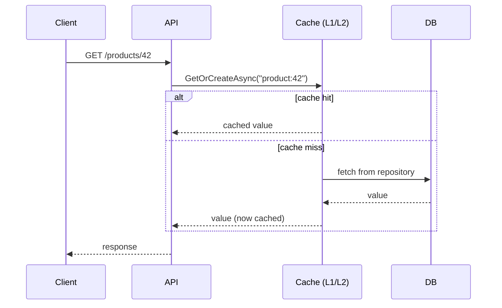

---

## Part XIV — Resilience, Auth & Security

### Resilience & Rate Limiting

**Q: .NET 7+'s built-in middleware mein four common rate-limiting algorithms kya hain?**

A: Fixed Window (per fixed window N requests — simple quota); Sliding Window (window boundaries par bursts smooth karta hai); Token Bucket (tokens time ke saath refill hote hain, bucket size tak bursts allow karta hai); Concurrency Limiter (simultaneous in-flight requests cap karta hai).

```csharp
builder.Services.AddRateLimiter(options =>
    options.AddFixedWindowLimiter("fixed", opt => { opt.Window = TimeSpan.FromSeconds(10); opt.PermitLimit = 5; opt.QueueLimit = 2; }));
app.UseRateLimiter();
app.MapGet("/products", GetProducts).RequireRateLimiting("fixed");
```

**Q: Polly ke Retry, Circuit Breaker, Timeout, aur Bulkhead policies har ek kya karti hain?**

A: Retry — ek failed call ko re-attempt karta hai, ideally exponential backoff + jitter ke saath. Circuit Breaker — ek failure threshold ke baad, downstream service ko call karna cooldown ke liye rok deta hai, fail fast karta hai. Timeout — ek call kitna time hang kar sakta hai bound karta hai. Bulkhead — resource pools isolate karta hai taaki ek failing dependency kahin aur zarurat wale resources exhaust na kar sake.

```csharp
builder.Services.AddHttpClient<PaymentClient>()
    .AddResilienceHandler("payment-pipeline", b =>
    {
        b.AddRetry(new RetryStrategyOptions { MaxRetryAttempts = 3, BackoffType = DelayBackoffType.Exponential });
        b.AddCircuitBreaker(new CircuitBreakerStrategyOptions { FailureRatio = 0.5, MinimumThroughput = 10 });
        b.AddTimeout(TimeSpan.FromSeconds(5));
    });
```

**Q: Forever retry karne ke bajaye retry ko circuit breaker ke saath kyun combine karein?**

A: Genuinely down/overloaded service ke against retry karna outage ko worse bana deta hai; ek circuit breaker system ko fail fast karne deta hai aur apni khud ki schedule par recover karne deta hai.

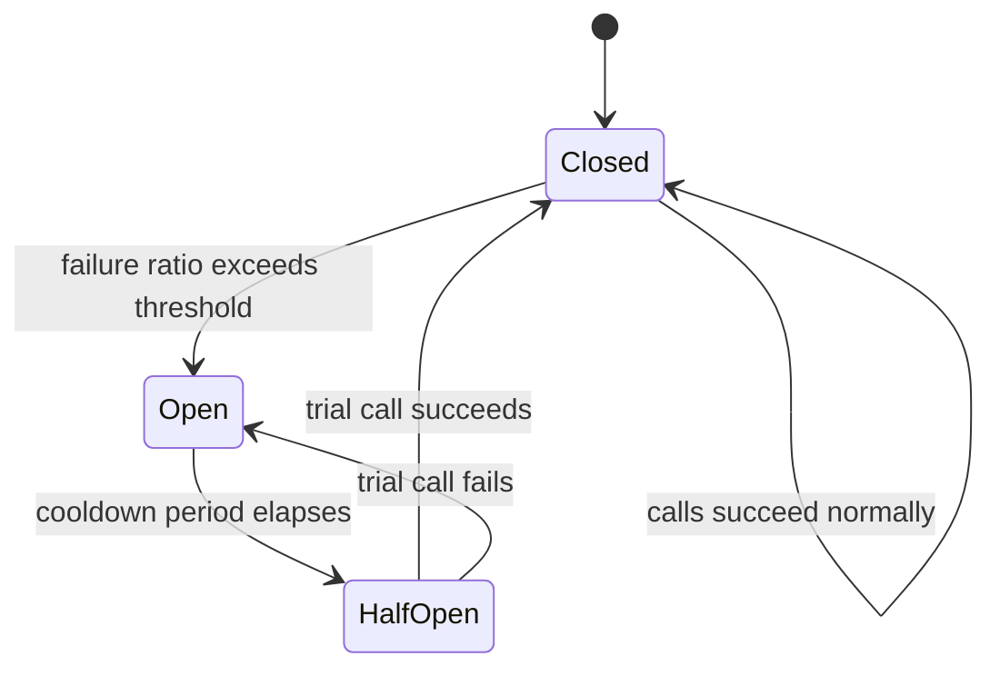

**Q: Ek POST endpoint ko retry-safe (idempotency) kaise banaye?**

A: Client ek `Idempotency-Key` header bhejta hai; server key → result ka ek mapping persist karta hai aur ek time window mein duplicate requests ko short-circuit kar deta hai.

### Authentication & Authorization

**Q: SPA/mobile clients se consume hone wali APIs ke liye JWT Bearer auth ek achha fit kyun hai?**

A: Yeh stateless hai (koi server-side session store nahi) aur horizontally scale karta hai, `Authorization: Bearer` header ke through naturally travel karta hai.

```csharp
builder.Services.AddAuthentication(JwtBearerDefaults.AuthenticationScheme)
    .AddJwtBearer(options => options.TokenValidationParameters = new TokenValidationParameters
    {
        ValidateIssuer = true, ValidateAudience = true, ValidateLifetime = true, ValidateIssuerSigningKey = true,
        ValidIssuer = config["Jwt:Issuer"], ValidAudience = config["Jwt:Audience"],
        IssuerSigningKey = new SymmetricSecurityKey(Encoding.UTF8.GetBytes(config["Jwt:Key"]))
    });
builder.Services.AddAuthorization();
app.UseAuthentication();
app.UseAuthorization();
```

**Q: OAuth2 vs OpenID Connect?**

A: OAuth2 ek authorization framework hai (kaun kya access kar sakta hai); OIDC iske upar ek identity layer hai (user kaun hai). Zyadatar full-stack .NET apps apna khud ka login banane ke bajaye ek external identity provider (Entra ID, Auth0, Keycloak, Duende IdentityServer) ko delegate karte hain.

**Q: Authorization Code + PKCE, Client Credentials, aur Refresh Token grants ko contrast karo.**

A: Authorization Code + PKCE — SPA/mobile apps (modern default; deprecated Implicit flow avoid karo). Client Credentials — service-to-service, koi user involved nahi. Refresh Token — bina login re-prompt kiye silently ek access token renew karta hai.

**Q: Hardcoded role checks ke upar claims/policy-based authorization kyun prefer kiya jaata hai?**

A: Yeh "user kya kar sakta hai" ko "unke paas kaunsa role hai" se decouple karta hai, permission models ek handful of roles se aage badhne par bahut better scale karta hai (`RequireClaim("permission", "products.edit")`).

```csharp
builder.Services.AddAuthorization(options =>
    options.AddPolicy("CanEditProducts", policy => policy.RequireClaim("permission", "products.edit")));

[Authorize(Policy = "CanEditProducts")]
[HttpPut("{id}")]
public IActionResult Update(int id, ProductDto dto) { /* ... */ }
```

**Q: Aur kaunse key security topics ke liye ready rehna chahiye?**

A: CORS ko kisi bhi cross-origin SPA ke liye explicitly configure karna zaroori hai; CSRF mainly cookie-based auth ke liye matter karta hai (Authorization header mein JWT inherently kam exposed hai, lekin cookie-authenticated form posts ko abhi bhi antiforgery tokens ki zarurat hai); Data Protection API ASP.NET Core ka built-in key-management hai cookies/tokens ko at rest encrypt karne ke liye; secrets ko kabhi `appsettings.json` mein source control mein store na karo — locally User Secrets aur production mein Key Vault/Secrets Manager/environment variables use karo.

---

## Part XV — Performance & Low-Allocation Programming

**Q: Span<T> kya hai, aur ise async methods mein kyun nahi use kar sakte?**

A: Ek stack-only, allocation-free view contiguous memory (array/string/stackalloc) ke upar, copying ke bina slicing enable karta hai. Yeh ek `ref struct` hai, isliye ise async methods ke andar use nahi kar sakte ya field ke roop mein store nahi kar sakte — `Memory<T>` iska heap-friendly counterpart hai jo async boundaries ke across usable hai.

```csharp
ReadOnlySpan<char> text = "Hello, World!";
ReadOnlySpan<char> hello = text.Slice(0, 5);      // no allocation — a view, not a copy

Span<int> numbers = stackalloc int[5];             // stack-allocated, zero heap allocation
for (int i = 0; i < numbers.Length; i++) numbers[i] = i * i;
```

**Q: ArrayPool<T> kya solve karta hai?**

A: Har call par allocate/discard karne ke bajaye ek shared pool se arrays rent/return karna — high-throughput networking/serialization mein common (Kestrel internally isse use karta hai): `ArrayPool<byte>.Shared.Rent(1024)` / `.Return(buffer)`.

```csharp
byte[] buffer = ArrayPool<byte>.Shared.Rent(1024);
try { /* use buffer */ } finally { ArrayPool<byte>.Shared.Return(buffer); }
```

**Q: string.Create() kya karta hai?**

A: Directly ek destination buffer mein write karta hai, programmatic string construction ke liye intermediate allocations avoid karta hai.

**Q: Money ya Point jaise small hot-path objects ke liye record struct/plain struct kyun use karein?**

A: Yeh unhe heap se poori tarah door rakhta hai, hot loops mein GC pressure avoid karta hai, kyunki wo small, frequently-created, aur short-lived hote hain.

**Q: BenchmarkDotNet kis liye use hota hai, aur ek strong senior answer isse mention kyun karta hai?**

A: .NET ke liye de-facto micro-benchmarking library — "isse fast kaise banaoge" ka ek strong answer intuition trust karne ke bajaye isse before/after measure karta hai.

```csharp
[MemoryDiagnoser]
public class StringBenchmarks
{
    [Benchmark(Baseline = true)]
    public string Concat() => "a" + "b" + "c";

    [Benchmark]
    public string StringBuilderVersion() => new StringBuilder().Append("a").Append("b").Append("c").ToString();
}
```

**Q: Native AOT kya hai, aur iske trade-offs kya hain?**

A: Ahead of time straight native machine code mein compile karta hai — koi JIT warm-up nahi, smaller memory footprint, bahut cases mein sub-50ms startup. Trade-offs: koi runtime reflection-based dynamic code generation nahi (source-generator alternatives ki zarurat padti hai), aur kuch older libraries abhi fully AOT-compatible nahi hain. Containers, serverless functions, aur CLI tools ke liye best jahan cold-start latency matter karti hai.

---

## Part XVI — Advanced Concurrency Primitives

### Low-Level Concurrency Primitives: Monitor, SpinLock, False Sharing, Thread-Pool Starvation

**Q: lock actually compile karke kya banta hai?**

A: Ek try block mein `Monitor.Enter(_lockObj, ref lockTaken)` aur ek finally block mein `Monitor.Exit(_lockObj)` ke upar syntactic sugar, jo lock object ke sync block (object header ka part) par operate karta hai — isi wajah se lock object ek reference type hona chahiye, aur isi wajah se ek boxed value, ek interned string literal, ya public class mein `this` ko lock karna classic mistakes hain.

```csharp
lock (_lockObj)
{
    // critical section
}

// is (approximately) equivalent to:
bool lockTaken = false;
try
{
    Monitor.Enter(_lockObj, ref lockTaken);
    // critical section
}
finally
{
    if (lockTaken) Monitor.Exit(_lockObj);
}
```

**Q: Monitor.Wait/Pulse/PulseAll kis liye use hote hain?**

A: Lower-level, condition-variable-style signaling: ek thread `Wait()` call karta hai lock release karke signal hone tak block hone ke liye; lock hold kiya hua ek doosra thread ek/saare waiters ko wake karne ke liye `Pulse()`/`PulseAll()` call karta hai — yeh mechanism kuch producer-consumer patterns ke neeche hai jo `BlockingCollection`/`Channels` se pehle ke hain.

**Q: SpinLock/SpinWait ko lock/Monitor ke bajaye (rarely) kab use karenge?**

A: Sirf ek bahut short critical section ke liye jahan expected wait itna brief ho ki busy-waiting ka cost ek full context switch se kam ho (microseconds ke order par). Typical application code mein inhe reach karna almost hamesha premature optimization hai — `lock`/`Monitor` default se correct hai.

```csharp
private SpinLock _spinLock = new SpinLock();

bool lockTaken = false;
try
{
    _spinLock.Enter(ref lockTaken);
    // extremely short critical section — a few instructions, not a DB call
}
finally
{
    if (lockTaken) _spinLock.Exit();
}
```

**Q: False sharing / cache-line contention kya hai?**

A: Jab different threads use hone wale do unrelated fields same CPU cache line par land ho jaate hain (commonly 64 bytes), to ek field par writes har core ke liye pura line invalidate kar deti hain jo uss line ko touch karta hai, ek confusing performance cliff cause karte hue chahe threads logically data share nahi kar rahe ho. Fix: fields ko separate cache lines par pad karo (jaise, `[StructLayout(LayoutKind.Explicit)]` FieldOffset spacing ke saath).

```csharp
// Naive: Counter1 and Counter2 likely share a cache line — a thread hammering
// Counter1 forces cache invalidation that also stalls a thread hammering Counter2.
public class Counters
{
    public long Counter1;
    public long Counter2;
}

// Fixed: pad so each counter gets its own cache line (64 bytes is the common line size).
[StructLayout(LayoutKind.Explicit, Size = 128)]
public struct PaddedCounters
{
    [FieldOffset(0)]  public long Counter1;
    [FieldOffset(64)] public long Counter2;
}
```

**Q: ThreadPool starvation ke symptoms aur root cause kya hain?**

A: Symptoms: request/task latency badhti hai jab CPU usage low dikhta hai. Root cause: almost always pool threads par blocking calls (async code par `.Result`/`.Wait()`, kisi blocking chiz ko wrap karta hua `Task.Run`, ya ek `LongRunning` workload jo mistakenly ek plain pooled task ke roop mein run hoti hai) pool ke slow, deliberate thread-count ramp-up ke saath combined.

**Q: Kya ThreadPool.SetMinThreads ThreadPool starvation ka fix hai?**

A: Nahi — yeh ek band-aid hai jo minimum thread count raise karta hai taaki pool demand ke closer start ho, lekin actual fix wo blocking calls hataana hai jo pool ko starve kar rahe hain.

  ```csharp
  ThreadPool.SetMinThreads(workerThreads: 200, completionPortThreads: 200);
  ```

**Q: SemaphoreSlim vs lock — SemaphoreSlim kyun use karein?**

A: `SemaphoreSlim` async/await support karta hai (`WaitAsync`) aur ek se zyada caller ko ek saath through jaane deta hai (ek configurable max count) — `lock` sirf synchronous aur single-entrant hai.

```csharp
private static readonly SemaphoreSlim _semaphore = new(maxCount: 3);
async Task CallDownstreamAsync()
{
    await _semaphore.WaitAsync();
    try { await CallApiAsync(); } finally { _semaphore.Release(); }
}
```

**Q: ReaderWriterLockSlim plain lock se kab better hai?**

A: Read-heavy shared state ke liye (jaise, occasional writes ke saath ek in-memory cache) — yeh many concurrent readers ya ek exclusive writer allow karta hai, plain `lock` ki tarah saara access serialize karne ke bajaye.

**Q: Interlocked kya provide karta hai, aur volatile kaise differ karta hai?**

A: `Interlocked` lock-free atomic operations deta hai (`Increment`, `Decrement`, `CompareExchange`) — simple counters/flags ke liye ek full `lock` se cheaper. `volatile` per-core caching ko doosre threads se ek field ke updates hide karne se rokta hai; directly rarely zarurat padti hai kyunki zyadatar synchronization higher-level primitives ke through jaata hai, lekin conceptually abhi bhi puchha jaata hai.

```csharp
private static int _counter;
Interlocked.Increment(ref _counter);   // atomic increment, no lock needed

private volatile bool _isRunning;      // prevents per-core caching from hiding updates from other threads
```

**Q: Key concurrent collections aur unke use cases naam batao.**

A: `ConcurrentDictionary<TKey,TValue>` — manual locking ke bina thread-safe cache. `ConcurrentQueue<T>`/`ConcurrentStack<T>` — thread-safe FIFO/LIFO producer-consumer buffers. `BlockingCollection<T>` — blocking `Add`/`Take` ke saath bounded producer-consumer.

**Q: System.Threading.Channels kya hai, aur yeh kya replace karta hai?**

A: Ek modern, high-performance async producer-consumer pipeline (`Channel.CreateUnbounded<T>()`, `Writer.WriteAsync`/`Reader.ReadAllAsync`), jo older `BlockingCollection`-based patterns ko replace karta hai — ek API endpoint se populate hue work items ko padhne wale ek `BackgroundService` ke liye common hai.

```csharp
var channel = Channel.CreateUnbounded<int>();
await channel.Writer.WriteAsync(42);         // producer
channel.Writer.Complete();
await foreach (var item in channel.Reader.ReadAllAsync()) Console.WriteLine(item); // consumer
```

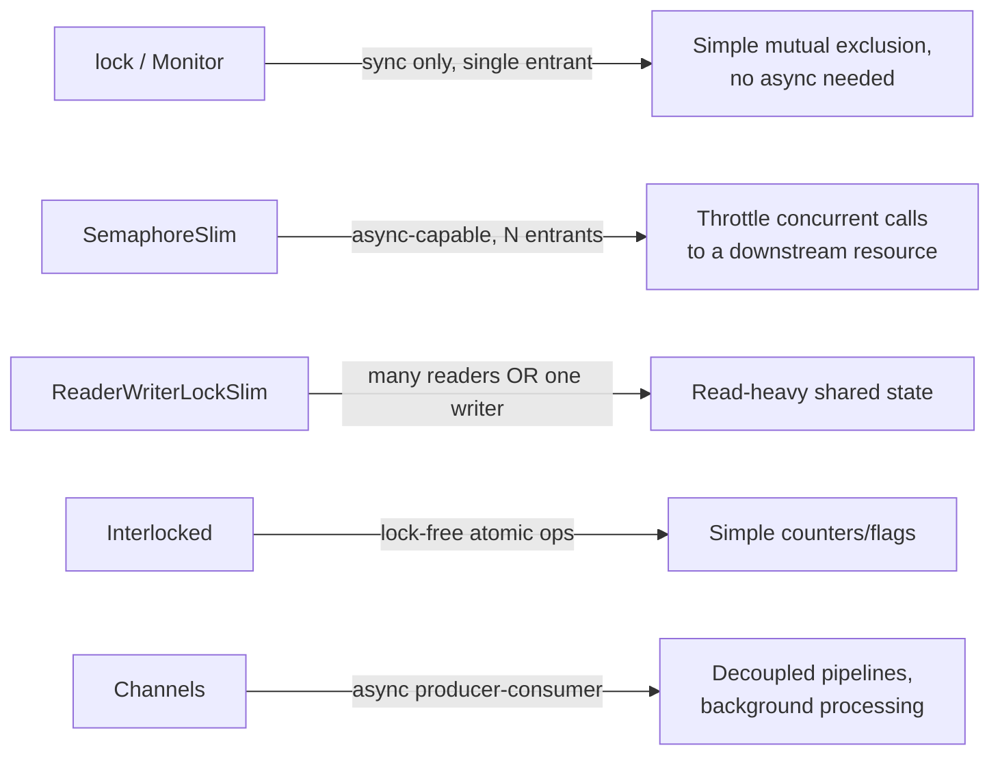

---

## Part XVII — Microservices, Messaging & CQRS

**Q: REST/OpenAPI vs gRPC — har ek kab choose karenge?**

A: REST/OpenAPI: HTTP/1.1, JSON, good performance, loose/optional contract, native browser support — public APIs/browser clients ke liye best. gRPC: HTTP/2, binary Protobuf, smaller payloads ke saath faster aur first-class bidirectional streaming, strict `.proto` contract — internal service-to-service calls ke liye best jinhe low latency chahiye (browsers ke liye grpc-web/a proxy ki zarurat).

**Q: RabbitMQ vs Kafka vs Azure Service Bus?**

A: RabbitMQ — task queues/routing ke liye traditional AMQP message queue. Kafka — high-throughput, replayable event history ke liye distributed log/event streaming. Azure Service Bus — dead-lettering/sessions ke saath enterprise .NET-native messaging ke liye managed queue/topic service.

**Q: Queue vs topic/pub-sub messaging model?**

A: Ek queue message ko ek consumer tak deliver karta hai, phir usse remove kar deta hai. Ek topic/pub-sub message ko har subscriber tak deliver karta hai — jaise, `OrderPlaced` independently Inventory aur Shipping services tak fan out hota hai.

**Q: MediatR ke saath CQRS ek use case ko kaise structure karta hai?**

A: Ek command/query record (jaise, `CreateOrderCommand : IRequest<int>`) ek dedicated `IRequestHandler<TCommand,TResult>` se handle hota hai, `mediator.Send(...)` ke through dispatch hota hai — controllers ko thin rakhta hai, har use case ko ek testable handler mein isolate karta hai, aur `IPipelineBehavior<>` cross-cutting concerns jaise validation/logging/transactions ke liye ek clean jagah deta hai.

```csharp
public record CreateOrderCommand(int ProductId, int Quantity) : IRequest<int>;

public class CreateOrderHandler : IRequestHandler<CreateOrderCommand, int>
{
    public async Task<int> Handle(CreateOrderCommand request, CancellationToken ct)
    {
        // validate, persist, publish domain event...
        return newOrderId;
    }
}
// var orderId = await mediator.Send(new CreateOrderCommand(productId, quantity));
```

**Q: Saga pattern kya problem solve karta hai, aur iske do styles kya hain?**

A: Kyunki microservices ek ACID transaction share nahi kar sakte, ek Saga local transactions ki ek sequence ko coordinate karta hai compensating actions ke saath agar koi later step fail ho (jaise, agar payment fail ho to inventory reservation release karo). Orchestration ek central coordinator use karta hai; Choreography mein har service doosron ke events par react karta hai koi central coordinator ke bina (end-to-end trace karna harder hai).

**Q: Key DDD vocabulary terms define karo.**

A: Entity (identity state changes ke across persist karti hai); Value Object (poori tarah apni values se defined, koi identity nahi — `record`/`record struct` ke liye ek natural fit); Aggregate (entities/value objects ka ek cluster ek consistency boundary aur ek single Aggregate Root ke saath); Bounded Context (wo boundary jiske andar ek specific model/vocabulary valid hai, often 1:1 ek microservice se map hota hai); Domain Event (kuch hua jise system ke doosre parts care kar sakte hain, jaise `OrderPlaced`).

---

## Part XVIII — Observability, Testing & Full-Stack Integration

### Observability & Health Checks

**Q: Observability ke "three pillars" kya hain, aur OpenTelemetry kya provide karta hai?**

A: Logs, traces, aur metrics. OpenTelemetry saare teeno collect karne aur ek backend (Azure Monitor, Jaeger, Prometheus/Grafana, Datadog) ko export karne ke liye current vendor-neutral standard hai; distributed tracing service boundaries ke across ek trace/correlation ID propagate karta hai taaki ek single request end-to-end follow kiya ja sake.

```csharp
builder.Services.AddOpenTelemetry()
    .WithTracing(t => t.AddAspNetCoreInstrumentation().AddHttpClientInstrumentation().AddSource("MyApp").AddOtlpExporter())
    .WithMetrics(m => m.AddAspNetCoreInstrumentation().AddRuntimeInstrumentation());
```

**Q: Readiness aur liveness health checks mein kya difference hai?**

A: Readiness — kya yeh instance abhi traffic receive karne chahiye? Liveness — kya yeh instance restart hona chahiye? Kubernetes/load balancers dono decide karne ke liye ek health endpoint (`app.MapHealthChecks("/health")`) poll karte hain.

```csharp
builder.Services.AddHealthChecks().AddSqlServer(connectionString).AddCheck<RedisHealthCheck>("redis");
app.MapHealthChecks("/health");
```

### Testing Strategy

**Q: Har testing layer kya cover karti hai, aur typical tooling kya hai?**

A: Unit tests (xUnit/NUnit + Moq/NSubstitute) — isolation mein business logic, mocked dependencies. Integration tests (`WebApplicationFactory<T>`, Testcontainers) — API + real/containerized DB/cache saath mein. E2E/UI tests (Playwright, Selenium) — actual frontend ke through full user flows.

```csharp
public class OrderServiceTests
{
    [Fact]
    public async Task CreateOrder_Should_Throw_When_Stock_Is_Insufficient()
    {
        var repoMock = new Mock<IProductRepository>();
        repoMock.Setup(r => r.GetAsync(1)).ReturnsAsync(new Product { Id = 1, Stock = 0 });
        var service = new OrderService(repoMock.Object);

        await Assert.ThrowsAsync<InsufficientStockException>(
            () => service.CreateOrderAsync(productId: 1, quantity: 1));
    }
}

public class ProductsApiTests : IClassFixture<WebApplicationFactory<Program>>
{
    private readonly HttpClient _client;
    public ProductsApiTests(WebApplicationFactory<Program> factory) => _client = factory.CreateClient();

    [Fact]
    public async Task Get_Products_Returns_Ok()
    {
        var response = await _client.GetAsync("/products");
        response.EnsureSuccessStatusCode();
    }
}
```

**Q: Testcontainers ek shared test environment ke muqable aapko kya deta hai?**

A: Ek real, disposable DB/Redis instance jo test run ke per Docker mein spin up hota hai, integration tests ko real fidelity deta hai bina ek shared, stateful (aur flaky) test environment ke.

**Q: Key testing philosophy talking points kya hain?**

A: Architectural boundaries (repositories, external HTTP clients) par mock karo, internal implementation details par nahi, warna tests refactors ke against brittle ho jaate hain; exact internal calls ke bajaye behavior/outcomes test karna prefer karo; AAA structure use karo (Arrange, Act, Assert); test methods mein hamesha `async Task` use karo (kabhi `async void` nahi) taaki runner thrown exceptions observe kare.

### Full-Stack Integration

**Q: SignalR kya abstract karta hai, aur ek hub kaise use hota hai?**

A: Real-time bidirectional communication ke liye SSE/long-polling fallbacks ke saath WebSockets; ek `Hub` class server methods expose karta hai jo clients call kar sakte hain aur `Clients.All.SendAsync(...)` ke through clients ko push kar sakta hai.

```csharp
public class NotificationHub : Hub
{
    public async Task SendMessage(string user, string message) =>
        await Clients.All.SendAsync("ReceiveMessage", user, message);
}
// app.MapHub<NotificationHub>("/hubs/notifications");
```

**Q: Teen Blazor hosting models ko contrast karo.**

A: Blazor Server — code server-side run hota hai, UI SignalR ke over push hota hai (small download, persistent connection ki zarurat). Blazor WebAssembly — WASM ke through browser mein run hota hai (true client-side C#, offline kaam karta hai, larger initial download). Blazor Hybrid/MAUI — ek native app shell jo Blazor UI host karta hai, web aur native ke across code share karta hai.

**Q: Backend-for-Frontend (BFF) kya hai, aur ise kyun use karein?**

A: Ek dedicated backend layer ek specific frontend ki needs ke liye tailored — multiple downstream microservices ke calls aggregate karta hai, auth token exchange handle karta hai, aur responses ko exactly SPA ki zarurat ke hisaab se shape karta hai, taaki browser kabhi directly internal services se baat na kare.

**Q: localhost:3000 par React app localhost:5001 par API call karne mein kyun fail hoti hai, aur ise kaise fix karte hain?**

A: Same-origin policy default se cross-origin requests block kar deti hai; API ko CORS middleware (`AddCors`/`UseCors`) ke through specific origins explicitly opt in karna padta hai.

```csharp
builder.Services.AddCors(options => options.AddPolicy("SpaPolicy",
    p => p.WithOrigins("https://myapp.com").AllowAnyHeader().AllowAnyMethod().AllowCredentials()));
app.UseCors("SpaPolicy");
```

### Senior-Level Interviews Mein Kya Alag Hai

**Q: Senior-level .NET interviews ko junior interviews se kya distinguish karta hai?**

A: Kam "define X" trivia, zyada scenario-based reasoning (ek rate limiter/notification service design karo, ek production memory leak debug karo); production experience aur architectural judgment par heavier weight; ek weak "it depends" answer ke saath ek decision framework aur ek default recommendation chahiye; almost har answer par "why not X instead?" probing expect karo.

---

## Part XIX — Swagger / OpenAPI & API Documentation

**Q: OpenAPI vs Swagger — dono ka relationship kya hai?**

A: OpenAPI Specification (OAS) standard machine-readable API-contract format hai (JSON/YAML). Swagger uske around bana tooling ecosystem hai (Swagger UI, Editor, Codegen) — Swagger OpenAPI ko implement karta hai.

**Q: ASP.NET Core app mein Swagger (Swashbuckle) kaise wire up karte ho?**

A: Registration mein `AddEndpointsApiExplorer()` + `AddSwaggerGen()`, uske baad pipeline mein `UseSwagger()` + `UseSwaggerUI()` — isse UI `/swagger` par expose hota hai.

```csharp
// dotnet add package Swashbuckle.AspNetCore
builder.Services.AddEndpointsApiExplorer();
builder.Services.AddSwaggerGen();
app.UseSwagger();
app.UseSwaggerUI();     // https://localhost:5001/swagger
```

**Q: Swagger UI mein working "Authorize" JWT button ke liye kaunse do parts chahiye?**

A: Ek security definition (yeh declare karta hai ki Bearer scheme exist karta hai — Authorize button) aur ek security requirement (yeh declare karta hai ki kaunse operations ko yeh chahiye — padlocks). Common pitfall yeh hai ki JWT ko auth middleware mein wire kar dete hain lekin OpenAPI security scheme bhool jaate hain.

```csharp
builder.Services.AddSwaggerGen(options =>
{
    options.AddSecurityDefinition("Bearer", new OpenApiSecurityScheme
    {
        Name = "Authorization", Type = SecuritySchemeType.Http, Scheme = "bearer", BearerFormat = "JWT",
        In = ParameterLocation.Header, Description = "Enter your JWT token (without the 'Bearer' prefix)."
    });
    options.AddSecurityRequirement(new OpenApiSecurityRequirement
    {
        { new OpenApiSecurityScheme { Reference = new OpenApiReference { Type = ReferenceType.SecurityScheme, Id = "Bearer" } },
          Array.Empty<string>() }
    });
});
```

**Q: .NET 9 se Swagger/OpenAPI defaults mein kya change hua?**

A: Swashbuckle ko default dependency se hata diya gaya, uski jagah built-in `Microsoft.AspNetCore.OpenApi` aa gaya (sirf document generation, koi UI ship nahi hota) — yeh Swashbuckle ke maintenance gaps aur Native AOT incompatibility (reflection-heavy) ki wajah se hua. .NET 10 ka built-in generator by default OpenAPI 3.1 emit karta hai. Swashbuckle ab bhi actively maintained package hai jise aap manually add kar sakte ho.

```csharp
builder.Services.AddOpenApi();     // register generation only — no UI shipped
var app = builder.Build();
app.MapOpenApi();                  // serves /openapi/v1.json
```

**Q: Built-in OpenAPI generator (jisme koi bundled UI nahi hota) use karte waqt kaunse UI options available hain?**

A: Swagger UI (classic, JSON doc ko point karta hai), Scalar (modern UI, dark mode, `MapScalarApiReference()` ke through multi-language snippets), NSwag (client SDK generation), ReDoc (clean read-only reference docs).

**Q: OpenAPI document ke top-level elements kya hain?**

A: `openapi` (spec version), `info`, `servers`, `paths`, `components` (`$ref` ke through reusable schemas/responses/parameters/securitySchemes), `security` (global requirements), `tags` (UI grouping). OpenAPI 3.1 JSON Schema 2020-12 ke saath align hota hai, webhooks add karta hai, aur nullability ko 3.0 ke `nullable: true` ke instead `type: [string, null]` ke roop mein express karta hai.

**Q: Common API-versioning strategies kya hain?**

A: URL path (`/api/v1/products`), query string (`?api-version=1.0`), header (`api-version: 1.0`), ya media type (`Accept: application/json;v=1.0`) — `Asp.Versioning.Mvc` plus API explorer har version ke liye Swagger doc expose karta hai. Kabhi bhi existing version mein breaking changes mat karo; iske jagah naya version ship karo.

**Q: API error responses ka recommended shape kya hai, aur unhe document kaise karte ho?**

A: Anonymous/dynamic objects (jo koi usable schema produce nahi karte) ke instead `ProblemDetails` (RFC 7807) use karo, jise `[ProducesResponseType(typeof(ProblemDetails), StatusCodes.Status404NotFound)]` ke through document kiya jaata hai; `GenerateDocumentationFile` enable karo aur XML comments ko generator mein feed karo taaki UI mein `<summary>`/`<param>` text aaye.

```csharp
[ProducesResponseType(typeof(Product), StatusCodes.Status200OK)]
[ProducesResponseType(typeof(ProblemDetails), StatusCodes.Status404NotFound)]
public async Task<IActionResult> Get(int id) { /* ... */ }
```

**Q: Code-first vs contract-first API design mein kya difference hai?**

A: Code-first fast hota hai lekin doc actual intent se lag kar sakta hai; contract-first parallel teams/public APIs ke liye better hai kyunki contract hi agreed source of truth hota hai.

**Q: Production mein Swagger/OpenAPI endpoint ko kaise secure karte ho?**

A: Spec/UI ko sirf Development mein serve karo (ya kisi toggle ke peeche); agar expose karna hi hai, to auth ke peeche gate karo (e.g. admin policy) aur/ya network restriction (IP allow-list, VPN, internal-only ingress); internal APIs ke liye sirf raw JSON serve karne ka soch, koi UI nahi (public UI free reconnaissance hoti hai); examples mein kabhi secrets/sample tokens leak mat karo.

**Q: API linting kya hai, aur isse kaunse tools support karte hain?**

A: Spectral jaise tools use karke OpenAPI document ko style/consistency rules (naming conventions, required fields, forbidden patterns) ke against validate karna, jisse contract problems consumers tak pahunchne se pehle CI mein hi pakde jaate hain.

**Q: Prism/WireMock jaise mock-server-generation tools kya karte hain?**

A: Yeh directly OpenAPI document se ek working mock HTTP server spin up karte hain, jisse frontend teams real backend exist karne se pehle hi contract ke against build kar sakti hain.

**Q: AsyncAPI kya hai, aur isko kab mention karoge?**

A: Yeh OpenAPI ka sibling spec hai jo event-driven/async APIs (message queues, WebSockets, Kafka topics) describe karne ke liye purpose-built hai, jahan OpenAPI ka request/response model fit nahi hota — microservices-messaging discussion mein OpenAPI ke saath iska naam lena worth hota hai.

**Q: API contract ke liye safe schema-evolution practices kya hain?**

A: Fields remove/rename karne ke bajaye additive-only changes (naye optional fields) prefer karo; removal se pehle fields ko `deprecated: true` mark karo; kabhi bhi field ka type change mat karo ya naye API version ke bina optional field ko required mat banao; breaking changes ko ship hone se pehle pakadne ke liye consumer-driven contract testing (e.g., Pact) consider karo.

---

## Part XX — Terminology Reference

**Q: Library, DLL, EXE, Framework/SDK, aur Package mein distinguish karo.**

A: Library — reusable code hoti hai, akele run nahi hoti (e.g. `System.Collections`). DLL — ek compiled library binary. EXE — ek runnable executable application. Framework/SDK — libraries + runtime, jisme SDK tooling add karta hai (compilers, templates, CLI) — isko run karne ke liye ek app chahiye. Package — NuGet distribution format (`.nupkg`).

**Q: Managed vs unmanaged code/resources — kya difference hai?**

A: Managed code ek .NET language mein likha jaata hai, MSIL mein compile hota hai, aur CLR supervision ke under run hota hai (memory management, type safety, security). Unmanaged resources (file handles, DB connections, sockets, native memory) CLR control se bahar rehte hain aur inhe explicitly `Dispose()` ke through release karna padta hai.

---

## Best Practices Checklist

**Q: Is guide ke core OOP/design best practices kya hain?**

A: Inheritance ke bajaye composition prefer karo aur hierarchies ko shallow rakho; interface se start karo, abstract class tabhi lo jab shared state/behavior genuinely chahiye ho; constructors ko lightweight rakho (koi I/O/DB calls nahi), arguments ko early validate karo, aur immutability prefer karo.

**Q: Equality/EF Core ke kaunse best practices yaad rakhne chahiye?**

A: `Equals()` aur `GetHashCode()` ko saath override karo, kabhi ek ko doosre ke bina mat karo; read-only EF Core queries ke liye `AsNoTracking()` prefer karo aur N+1 avoid karne ke liye `Include()` se eager-load karo; EF Core migrations ko small, reversible rakho, aur production ke against run karne se pehle review karo.

**Q: Guide kaunse async best practices emphasize karta hai?**

A: By default `Task` prefer karo, `ValueTask` sirf profiling evidence hone par lo; hamesha `async Task` use karo, `async void` kabhi nahi except framework-mandated event handlers ke liye; shared library code mein `ConfigureAwait(false)` use karo (ASP.NET Core application code mein largely optional hai).

**Q: Kaunse cross-cutting/API best practices recommend kiye jaate hain?**

A: Scattered `try/catch` ke bajaye global exception-handling middleware/`IExceptionHandler` use karo; reusable APIs se raw delegates ke bajaye events expose karo; string concatenation ke bajaye structured logging use karo; API error responses ke liye `ProblemDetails` (RFC 7807) prefer karo.

**Q: Checklist ko kaunse operational/security best practices round out karte hain?**

A: Kabhi bhi secrets ko source control mein store mat karo (locally User Secrets, production mein Key Vault/Secrets Manager); downstream calls ke liye retry ko circuit breaker ke saath combine karo, kabhi indefinitely retry mat karo; intuition par trust karne ke bajaye kisi bhi performance change ko BenchmarkDotNet se before/after benchmark karo.

---

## Common Pitfalls Checklist

**Q: Avoid karne wale top async-related pitfalls kya hain?**

A: Aise context se `.Result`/`.Wait()` ke saath async code par block karna jo `SynchronizationContext` capture karta hai (deadlock); `async void` ka exceptions ko silently swallow karna, test methods mein bhi; har request par `IHttpClientFactory` use karne ke bajaye `HttpClient` ko dispose/recreate karna.

**Q: Avoid karne wale top DI/EF Core/LINQ pitfalls kya hain?**

A: Singleton services ka Scoped/Transient dependencies capture karna (captive dependency); same `IQueryable`/lazily-evaluated `IEnumerable` ka multiple enumeration; further filters apply karne se pehle `IQueryable` ko materialize (`.ToList()`) karna, jisse client-side evaluation force ho jaata hai.

**Q: Checklist ko kaunse aur common pitfalls round out karte hain?**

A: String-concatenated SQL ya `AddWithValue` ka overuse (injection risk aur plan-cache bloat); un-unsubscribed event handlers ka memory leak karna; jahan source generator ya static typing kaam kar deta wahan `dynamic`/reflection ka overuse karna; production mein access restrict kiye bina Swagger/OpenAPI UI expose karna; `GC.Collect()` ko routine performance tool ki tarah treat karna.

---

## Sample Interview Q&A (Rapid Fire)

**Q: Record aur class mein kya difference hai?**

A: Records value-based equality aur `ToString()` free mein deti hain, aur `with` expressions ke through non-destructive mutation support karti hain; classes ki reference equality hoti hai aur yeh default mutable hoti hain. DTOs/domain value objects ke liye records use karo; small, allocation-sensitive value types ke liye `record struct` use karo.

**Q: .Result kabhi deadlock kyun karta hai aur kabhi nahi?**

A: Yeh deadlock tab hota hai jab calling thread `.Result` par block hoti hai jabki awaited method ke continuation ko usi thread ke capture kiye gaye `SynchronizationContext` par resume hona padta hai (WPF/WinForms/old ASP.NET mein classic case). ASP.NET Core mein koi `SynchronizationContext` nahi hota, isliye yeh specific deadlock wahan nahi hota — halaanki load ke under `.Result` par block karna phir bhi ThreadPool ko starve kar sakta hai.

**Q: Task ke bajaye ValueTask kab use karoge?**

A: Sirf ek proven hot path par jahan results frequently already synchronously available hote hain (e.g., cache-hit path) — aur sirf tab jab profiling se pata chale ki `Task` allocation actually matter karta hai. Warna default `Task` hi rakho; `ValueTask` ki single-await restriction ki wajah se ise misuse karna easy hai.

**Q: Jab bhi Equals() override karte ho to GetHashCode() kyun override karna chahiye?**

A: `Dictionary`/`HashSet` pehle objects ko hash code se bucket karte hain, uske baad bucket ke andar disambiguate karne ke liye `Equals()` use karte hain. Agar do objects `Equals`-equal hain lekin unke hash codes different hain, to lookups silently unhe find karne mein fail ho jaate hain.

**Q: N+1 query problem kya hai aur ise kaise fix karte ho?**

A: Ek parent collection fetch karna, uske baad related data fetch karne ke liye har row par lazily ek additional query trigger hona. Isse eager loading (`Include()`), projection (`Select()` se sirf needed fields pull karna), ya multiple `Include`s ke liye `AsSplitQuery()` se fix karo.

**Q: Senior level par AutoMapper controversial kyun hai?**

A: Yeh convenience ke liye compile-time safety aur debuggability trade kar deta hai — mapping bugs runtime par surface hote hain, compile time par nahi, aur complex configurations apni hi hard-to-maintain DSL ban jaati hain. Bahut si senior teams business-critical kaam ke liye explicit manual mapping ya source-generated mapper prefer karti hain.

**Q: DI mein captive dependency kya hoti hai?**

A: Ek longer-lived service (typically Singleton) jo apne constructor mein ek shorter-lived dependency (Scoped/Transient) capture kar leti hai, aur ise iske intended lifetime se kaafi zyada der tak hold karti hai — yeh commonly `DbContext` ke saath thread-safety bugs cause karta hai. Ise `IServiceScopeFactory` ke through fix karo jo dependency actually chahiye hone par ek fresh scope create karta hai.

**Q: Production mein Swagger/OpenAPI endpoint ko kaise secure karte ho?**

A: Development environment tak restrict karo ya auth/network controls (IP allow-list, VPN) ke peeche gate karo; internal APIs ke liye sirf raw JSON document serve karne ka soch, koi UI nahi, kyunki public UI free reconnaissance hoti hai; examples mein kabhi real tokens/hostnames leak mat karo.

**Q: Async vs multithreading — actual difference kya hai?**

A: Async/await ka matlab hai I/O par wait karte waqt thread ko block na karna — yeh inherently parallelism create nahi karta aur I/O-bound work ke liye ideal hai. Multithreading explicitly code ko multiple threads par concurrently run karta hai true parallelism ke liye — CPU-bound work ke liye ideal hai, lekin iske liye synchronization ki zarurat padti hai.

**Q: Production memory leak ko debug karne ka process samjhao.**

A: Cheap aur non-invasive approach se start karo: live PID ke against `dotnet-counters monitor` chalao yeh dekhne ke liye ki Gen 2 heap size GC cycles ke across upward trend kar raha hai ya nahi (yeh actual leak signature hai, sirf high allocation churn nahi). Agar yeh climb kar raha hai, to kuch minutes ke gap par do `dotnet-gcdump` snapshots lo aur unhe diff karo yeh dekhne ke liye ki kaunse object types disproportionately grow hue aur unhe kaun root kar raha hai — usually yeh koi un-unsubscribed event handler, unbounded static cache, captive `DbContext`, ya long-lived delegate mein capture hua closure hota hai. Sirf tab full `dotnet-trace` capture lo jab exact line of code pinpoint karne ke liye allocation call stacks ki zarurat ho.

**Q: .NET 9 mein Swagger ke saath kya change hua?**

A: Swashbuckle ko default Web API template dependency se hata diya gaya, uski jagah built-in `Microsoft.AspNetCore.OpenApi` package aa gaya (sirf document generation, koi UI ship nahi hota) — yeh Swashbuckle ke maintenance gaps aur Native AOT incompatibility ki wajah se hua. Ab aapko UI (Swagger UI, Scalar, ReDoc, NSwag) separately choose karna padta hai.
