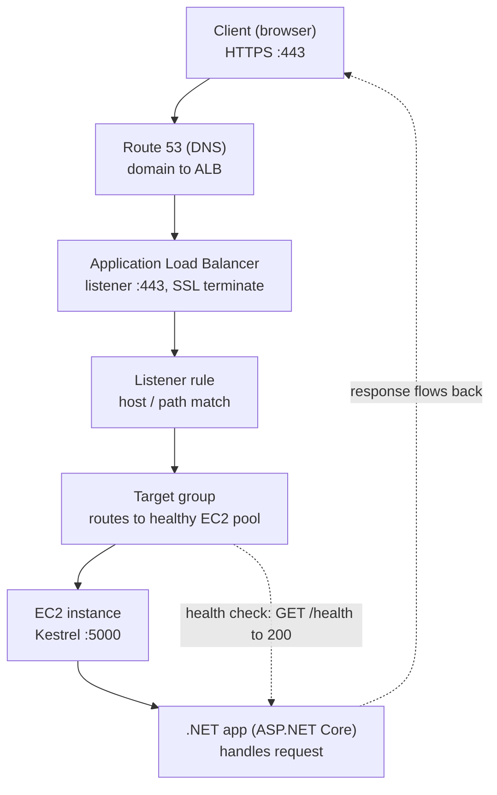

> **AWS Detailed Guide** · [Index](README.md) · Part II

# Load Balancing, Scalability & Auto Scaling

---

## 1. Scalability Concepts

### Scalability, High Availability, Elasticity & Agility

Chaar words jinhe interviewers deliberately blur karte hain. Inhe cleanly define karo aur aapne section ka aadha jawab de diya.

**Scalability** = system *ke paas capability hai* ki woh zyada load handle kar sake.
- **Vertical scaling (scale up)** — ek bigger instance. `t3.micro` → `m5.4xlarge`. Simple, koi app changes nahi, lekin ek hard ceiling hoti hai (sabse bada instance type) aur usually downtime chahiye hota hai. Yeh un cheezon ko scale karne ka tareeka hai jo distribute nahi ho sakte: RDS primaries, ek single large cache node, legacy monoliths.
- **Horizontal scaling (scale out)** — ek load balancer ke peeche zyada instances. Effectively unlimited, no downtime, better fault tolerance. App ko **stateless** hona chahiye. Yeh web/API tiers ke liye default hai.

**High Availability** = kisi failure ke bina downtime survive karna, kam se kam **do Availability Zones** mein run karke achieve kiya jaata hai. Dhyan rakhna yeh scalability se *alag goal* hai: aap ek AZ mein highly scalable ho sakte ho (aur us AZ ke fail hone par sab kuch kho sakte ho) ya do small instances ke saath highly available ho sakte ho jo load handle nahi kar sakte. Interviewers exactly isi confusion ko probe karte hain.

**Elasticity** = **automatically, dono directions mein, actual demand ke saath matched** scale karna — isliye aap sirf abhi jitna chahiye uska payment karte ho. Scalability ek capability hai; elasticity uska automation hai.

**Agility** = aap bilkul naye resources kitni fast get kar sakte ho — minutes mein, ek months-long hardware procurement cycle ke bajaye. Iska load se **kuch lena dena nahi hai**; yeh speed of change ke baare mein hai. Yahi woh point hai jo log galat samajhte hain.

| Term | Question it answers | Example |
|---|---|---|
| Scalability | *Kya* yeh grow kar sakta hai? | Ek ASG jiska max 20 instances hai |
| Elasticity | Kya yeh khud-ba-khud grow aur shrink karta hai? | Woh ASG ek target-tracking policy par, din ke across 2→20→2 scale karte hue |
| High Availability | Kya yeh ek failure survive karta hai? | Woh ASG 3 AZs mein spread, ek ALB ke peeche |
| Agility | Main kitni fast *kuch bhi* naya get kar sakta hoon? | Terraform ke zariye 10 minutes mein poora test environment spin up karna |

**Ek scalable-but-not-elastic example ready rakhna:** Black Friday ke liye sized 20 EC2 instances ka ek fixed fleet. Yeh scale hoti hai (peak handle karti hai) lekin elastic nahi hai (February mein bhi aap 20 instances ka payment karte ho). Yeh ek single example definitions recite karne ke bajaye yeh dikhata hai ki aap difference samajhte ho.

**HA vs Fault Tolerance vs Disaster Recovery:** HA = region ke andar minimal downtime (multi-AZ); fault tolerance = component failure se *zero* interruption (redundancy bina impact ke); DR = poore region kho jaane se recover karna, **RTO/RPO** se measured — dekho [Disaster Recovery Strategies](18-well-architected-resilience.md#disaster-recovery-strategies).

---

## 2. Load Balancers

### ALB vs API Gateway vs ELB (NLB/GWLB/CLB)

**ELB family**
| Type | Layer | Protocols | Best for |
|---|---|---|---|
| ALB (Application LB) | 7 | HTTP/HTTPS/WebSocket | Host/path routing, microservices, Lambda targets |
| NLB (Network LB) | 4 | TCP/UDP/TLS | Extreme throughput, static IP, low latency |
| GWLB (Gateway LB) | 3 | IP | Transparent traffic inspection (firewalls/IDS appliances) |
| CLB (Classic, deprecated) | 4/7 | Basic | Legacy only |

**ALB core concepts:** Listener (port/protocol) → Rules (host/path/header conditions) → Target Group (EC2, ECS, IP, **Lambda**) health checks ke saath. TLS termination with SNI support karta hai (ek listener par multiple certs), WebSocket, HTTP/2, aur direct Lambda invocation ek target ke taur par (Lambda ek HTTP-shaped response return karta hai, API Gateway proxy integration jaisa).

**API Gateway core concepts:** REST API (feature-rich, zyada expensive — API keys, usage plans, request/response VTL mapping templates, caching) vs HTTP API (cheaper, lower latency, JWT/IAM auth, Lambda-backed serverless ke liye good default) vs WebSocket API (connection-managed real-time).

**ALB vs API Gateway — mental model jo interviews jeet leta hai**
> "ALB ek smart Layer-7 load balancer hai: mere paas services hain, traffic route aur balance karta hoon unke beech. API Gateway ek full API front door hai: main external clients ke liye ek API expose kar raha hoon aur mujhe auth, throttling, quotas, versioning, transformation, aur monitoring built-in chahiye."

| Aspect | ALB | API Gateway |
|---|---|---|
| Primary purpose | Backend services ke beech load balancing | Consumers ke liye APIs publish/manage karna |
| Targets | EC2, ECS/EKS, IP, Lambda | Lambda, HTTP endpoints, AWS service integrations |
| Built-in throttling/quotas | Nahi (sirf app-level) | Haan (usage plans, rate limits) |
| Request transformation | Limited (sirf routing) | Advanced (VTL mapping templates) |
| Caching | Nahi | Haan (sirf REST API) |
| Pricing | Per-hour + LCU | Per-million-requests (+ cache agar enabled ho) |
| Typical client | Internal/browser | Mobile/web/3rd-party API consumers |

**Decision examples**
- Ek mobile app ke liye public REST API jisme auth/throttling/API keys chahiye, Lambda+DynamoDB backend → **API Gateway**.
- ECS par internal microservices jinhe sirf path/host routing + TLS termination chahiye → **ALB**.
- Real-time chat: fully serverless → **API Gateway WebSocket API**; already containers par → **ALB WebSocket**.

### ELB Deep-Dive: Cross-Zone Load Balancing, 504 Timeouts & Shield DDoS Protection

**Cross-Zone Load Balancing:** jab enable hota hai, to har load balancer node traffic ko sabhi enabled AZs mein registered saare targets ke across evenly distribute karta hai, sirf apne AZ ke targets mein nahi — jab targets AZs ke across unevenly distributed ho (e.g., AZ-A mein 8 targets, AZ-B mein 2) to yeh load ko even out kar deta hai. ALB mein cross-zone load balancing **default on hoti hai, hamesha** (disable nahi ho sakti); NLB mein yeh **default off** hoti hai aur ek per-target-group toggle hai — NLB par ise enable karna cross-AZ data transfer charges introduce kar sakta hai, jo usually wajah hai ki teams latency/cost-sensitive NLB use cases ke liye ise off rakhti hain. Yeh jaanna ki ALB aur NLB yahan alag default rakhte hain, ek achha "gotcha" fact hai ready rakhne ke liye.

**HTTP 504 Gateway Timeout (ELB):** matlab load balancer ne request ko target tak forward kiya lekin timely response wapas nahi mila. Do common root causes: ek **unhealthy/slow target** (app hung, DB call blocking, thread pool exhausted) ya ek **traffic spike** jo backend capacity ko overwhelm kar deti hai auto-scaling ke catch up karne se pehle. Standard ELB behavior se ek teesra worth-naming cause: **ALB idle timeout** (default 60s) aur backend ke apne keep-alive/response time ke beech mismatch — agar aapki app legitimately ALB ke configured idle timeout se zyada time le sakti hai, to aapko 504s dikhenge jinka target health se koi lena dena nahi — fix hai ALB idle timeout (aur app ke keep-alive) ko badhana, ek phantom backend bug chase karne ke bajaye.

**AWS Shield — Route 53/ELB ke saath WAF ke alongside DDoS protection ko tie karna:** Shield network/transport layer par defend karta hai (L3/L4 volumetric aur protocol attacks), jabki WAF application layer par defend karta hai (L7 — malicious request patterns, rate limiting, bad bots) — yeh complementary hain, competing nahi, aur ek senior answer dono ko saath naam leta hai, ek pick karne ke bajaye.
- **Shield Standard:** free, **har** AWS account ke liye automatically enabled hai Route 53, CloudFront, aur ELB (ALB/NLB/CLB) par — koi opt-in nahi chahiye, common, automated L3/L4 DDoS attack patterns cover karta hai.
- **Shield Advanced:** paid, opt-in tier jo larger-attack mitigation capacity, real-time attack visibility/metrics, attack ke dauraan automatic rule creation ke liye WAF ke saath integration, cost protection (attack ke dauraan incurred scaling charges ke liye credits), aur AWS DDoS Response Team (DRT) tak 24/7 access add karta hai.
- **Practical pairing:** Route 53 (DNS-layer resilience + Shield Standard baseline) + ELB (Shield Standard baseline, critical public endpoints ke liye Advanced tak upgrade) + WAF (L7 rate limiting/malicious pattern blocking) yeh standard "defend the public edge" stack hai — sirf ek service naam lene ke bajaye ek layered answer ke taur par bolna worth hai.

### Load Balancing Fundamentals

**Load balancer aapko kya deta hai:** traffic ko kaafi targets par spread karna, disposable instances ke aage ek stable DNS name, unhealthy targets ka automatic removal, ek jagah TLS termination, aur cross-AZ high availability. ELB khud ek managed, auto-scaling, multi-AZ fleet hai — aap kabhi ise patch ya size nahi karte.

**Chaar objects, order mein:** **Listener** (port + protocol) → **Rules** (conditions: host, path, header, query string, source IP, HTTP method) → **Target Group** (EC2, IP, Lambda, ya doosra ALB) → **Targets**, har ek continuously **health-checked**.

**Target groups short mein** — woh object jo most actual work karta hai, aur jise aap tune karte ho:
- **Yeh kya hai:** targets ka ek named group **plus unka health check aur traffic behaviour**. Yeh load balancer se independently exist karta hai — ek target group kai load balancers use kar sakti hai, aur ek load balancer kai target groups ko route kar sakta hai.
- **Target types:** `instance` (instance ID se register karna) · **`ip`** (VPC mein koi bhi IP, ya on-prem Direct Connect/VPN ke zariye — **aur Fargate aur `awsvpc` ECS tasks ke liye required type**, kyunki unke apne ENIs hote hain) · `lambda` (sirf ALB) · `alb` (ek NLB jo ek ALB ke aage hai, ek static IP ko Layer-7 routing ke saath combine karne ke liye).
- **Health check** yahan configure hota hai, load balancer par nahi: protocol, path, **port** (`traffic-port` ya ek override — e.g. app 8080 par, health endpoint 8081 par), interval, timeout, healthy/unhealthy thresholds, aur **success codes** (*matcher*, default `200`, aksar `200-299` tak widen kiya jaata hai).
- **[stickiness](#sticky-sessions-session-affinity) aur [deregistration delay](#connection-draining--deregistration-delay) se aage teen attributes jaanne-worth:**
  - **Slow start** — ek *naye* target par traffic ko 30–900s mein ramp karta hai turant full share dene ke bajaye. **Default off, aur .NET/JVM ke liye genuinely useful**, jahan ek fresh process ke paas cold JIT aur empty caches hote hain: iske bina, naye target ka p99 spike ho jaata hai ya join hote hi full load ke under health checks mein fail ho jaata hai.
  - **Load balancing algorithm** — `round_robin` (default) vs **`least_outstanding_requests`**. Round robin khushi-khushi ek request ek aise target ko de dega jo already ek slow request mein stuck hai; LOR better choice hai jab bhi request durations mein bahut variation ho.
  - **Protocol version** — HTTP1 / HTTP2 / **gRPC**, target group par set hota hai; ek gRPC backend ko yeh chahiye warna yeh simply kaam nahi karega.
- **Target states:** `initial` → `healthy` / `unhealthy` → `draining` (remove ho raha hai, in-flight requests finish kar raha hai) → `unused`. In states ko padhna usually "ALB 503 return kar raha hai" diagnose karne ka fastest tareeka hai.
- **Weighted target groups:** ek listener rule **multiple target groups par weight ke according** forward kar sakta hai — jo load balancer *par* canary/blue-green hai, aur woh mechanism jo CodeDeploy ECS blue/green deployments ke liye use karta hai.

ALB/NLB/GWLB/CLB comparison table aur ALB-vs-API-Gateway decision ke liye, dekho [ALB vs API Gateway vs ELB](#alb-vs-api-gateway-vs-elb-nlbgwlbclb). Yahan add karne worth specifics:

**ALB (Layer 7)** — HTTP content par route karta hai: host, path, header, query string, method, source IP. **SNI** support karta hai (ek listener par kaafi TLS certificates), HTTP/2, gRPC, WebSocket, **Lambda targets**, native redirect aur fixed-response actions, aur listener par built-in **Cognito/OIDC authentication**. Kyunki yeh HTTP terminate karta hai, original client IP **`X-Forwarded-For`** header mein aata hai (plus `X-Forwarded-Proto` aur `-Port`) — ASP.NET Core mein aapko `ForwardedHeadersMiddleware` enable karna hoga warna har client load balancer jaisa lagega, jo silently rate limiting, geo-logic, aur audit logs ko break kar dega.

**NLB (Layer 4)** — millions of requests per second ultra-low latency par. Do properties jo questions decide karti hain: iska **per AZ ek static IP ho sakta hai (aur Elastic IPs support karta hai)**, aur yeh **client source IP preserve karta hai** bina kisi header ke. TLS ko targets tak straight through pass kar sakta hai, ya terminate kar sakta hai. Targets instances, IPs (on-prem Direct Connect ke zariye bhi shamil) ya ek ALB tak ho sakte hain.

**❗ Ek ALB ke paas koi static IP nahi hoti — sirf ek DNS name**, aur uske peeche ke IPs change hote rehte hain. Agar ek client ya partner firewall ko ek fixed IP chahiye, to answer hai **NLB**, **NLB fronting an ALB**, ya **Global Accelerator** (dekho [Global Accelerator](14-global-edge-services.md#aws-global-accelerator)). Yeh sabse commonly asked ELB questions mein se ek hai.

**Gateway Load Balancer — GWLB (Layer 3)** — transparently saare traffic ko third-party inspection appliances ke ek fleet (firewall, IDS/IPS) ke through route karta hai **GENEVE port 6081** use karke, original packet preserve karte hue. Yeh ek traffic-inspection insertion point hai, conventional load balancer nahi. AWS-native alternative ke taur par [AWS Network Firewall](12-security-services.md#aws-network-firewall) ke saath pair karo.

**Classic Load Balancer — CLB** — legacy Layer 4/7 balancer, ab deprecated. Yeh target groups se pehle ka hai, isliye instances ko directly register karta hai aur na hi host/path routing, na SNI multi-certificate listeners, aur na hi Lambda targets support karta hai. "Hum EC2-Classic par hain" ke liye yahi ek correct answer hai; otherwise ALB (HTTP) ya NLB (TCP/UDP) mein migrate karo. Terminology difference note karo jo yeh chhod jaata hai: CLB ise **"connection draining"** kehta hai, ALB/NLB usi cheez ko **"deregistration delay"** kehte hain (dekho [Connection Draining](#connection-draining--deregistration-delay)).

**Health checks:** protocol, port, aur path (`/health`), plus interval, timeout, aur healthy/unhealthy thresholds. Ek target jo threshold fail karta hai traffic receive karna band kar deta hai aur — agar ASG isko configure kiya gaya ho — replace ho jaata hai. **Check ko ek aise endpoint par point karo jo actually app ki dependencies ko exercise kare** (ek `/health` jo sirf Kestrel se `200 OK` return karta hai khushi-khushi healthy report karega jabki database connection pool exhausted hai). ASP.NET Core ka `AddHealthChecks()` DB/cache probes ke saath right implementation hai.

### Sticky Sessions (Session Affinity)

**Yeh kya karta hai:** ek session ke duration ke liye ek client ko same target par pin kar deta hai, isliye in-process session state valid rehta hai.

| Load balancer | Mechanism |
|---|---|
| **ALB** | **Duration-based** — LB-generated `AWSALB` cookie ek configurable duration ke saath (1 second se 7 days); ya **application-based** — LB *aapki* app ka cookie honour karta hai `AWSALBAPP` ke zariye, isliye app session lifetime control karti hai |
| CLB | `AWSELB` cookie, ya ek application cookie |
| **NLB** | Koi cookies nahi (yeh Layer 4 hai) — stickiness **source IP / flow hash** per target group se hoti hai |

**Naam lene worth trade-offs:** stickiness even load distribution ko undermine karti hai (ek pinned client ek target ko hot-spot kar sakta hai), aur jab scale-in ya deploy par ek target remove hota hai, woh sessions **anyway lost** ho jaate hain — isliye yeh actually kabhi session survival guarantee nahi karta.

**Senior answer:** stickiness ek stateful app tier ke liye ek workaround hai. Real fix hai session state ko externalise karna taaki koi bhi instance koi bhi request serve kar sake — **ElastiCache for Redis** ya **DynamoDB**. .NET mein woh `IDistributedCache` hai (`AddStackExchangeRedisCache`) in-process `ISession` ke bajaye. Sticky sessions legacy applications ke liye legitimate hain jinhe aap refactor nahi kar sakte, ya jahan genuinely ek expensive per-user in-memory context affinity ko cost-worth banata hai — yeh kaho, stickiness ko simply "bad" declare karne ke bajaye.

### Connection Draining / Deregistration Delay

Same feature, do naam: **"connection draining"** CLB par, **"deregistration delay"** ALB/NLB target groups par.

**Kya hota hai:** jab ek target remove ho raha hota hai (scale-in, deploy, manual deregistration) yeh `draining` state mein enter karta hai — **koi naya request usko route nahi kiya jaata**, lekin in-flight requests ko configured delay tak complete karne diya jaata hai. Uske baad, remaining connections close ho jaate hain.

- Default **300 seconds**; configurable **0–3600**.
- Ise apne **longest legitimate request** ke according tune karo. Bahut low set karo to large file uploads ya slow reports beech mein cut ho jaate hain (users ko 502/504 dikhta hai); bahut high set karo to har deploy aur scale-in crawl karta hai.
- Sirf un workloads ke liye `0` set karo jahan genuinely instantaneous requests hon aur deploy speed zyada matter kare.

**"Aap requests drop kiye bina deploy kaise karte ho?"** — complete answer teen cheezon ko chain karta hai: ek appropriate **deregistration delay**, ASG par **ELB health checks** taaki ek bad instance catch ho jaaye, aur **ASG lifecycle hooks** (neeche) taaki ek instance serve karne se pehle warm ho aur die karne se pehle drain ho. Ek rolling replacement ke liye **ASG instance refresh** add karo.

### Worked Example: .NET App EC2 par, ALB ke Peeche — Target Group aur Request Flow

**One-liner:** Target Group = ALB aur aapke EC2-hosted .NET app ke beech ka *routing + health-check* layer. ALB kabhi seedha EC2 ko nahi jaanta — hamesha ek Target Group ke through route karta hai, aur Target Group sirf **healthy** targets par hi traffic distribute karta hai.

**Request kaise flow karta hai (top → down):**

1. **Client (browser)** → `https://myapp.com` on **:443**.
2. **Route 53 (DNS)** → domain ko ALB ke DNS name par resolve karta hai.
3. **ALB Listener (:443)** → request receive karta hai aur **SSL terminate** karta hai (ACM cert).
4. **Listener Rule** → host/path match karke decide karta hai kaunsi Target Group.
5. **Target Group** → ek **healthy** EC2 target select karta hai (health `/health` check se decide hoti hai).
6. **EC2 instance** → Kestrel ke **:5000** par forwarded request receive karta hai.
7. **.NET app (ASP.NET Core)** → request handle karke response deta hai — jo wapas isi path se client tak jaata hai.



**.NET-specific setup:**
- **Target type:** `instance` (EC2 ID register hota hai) jab app seedha EC2 par ho; `ip` containers/ENI-based ke liye.
- **Protocol/Port:** Target Group ka port = jis port par app sun rahi hai (Kestrel `:5000`). ALB listener (`:443`) aur Target Group port (`:5000`) **alag ho sakte hain** — ALB SSL terminate karke backend ko plain HTTP `:5000` bhejta hai.
- **Health endpoint** app mein banao taaki ALB app ki sehat jaan sake:

```csharp
// Program.cs (ASP.NET Core)
var builder = WebApplication.CreateBuilder(args);
builder.Services.AddHealthChecks();       // optionally DB/dependency checks
var app = builder.Build();
app.MapHealthChecks("/health");           // ALB isko poll karega
app.MapControllers();
app.Run();                                // Kestrel :5000
```

- Target Group health check: **Path `/health`**, **Port = traffic port (5000)**, interval/threshold, success code `200`. `200` mile to target **healthy**; warna **unhealthy** mark hoke traffic milna band.

**Target Group kyun (fayde):**
- **Health-based routing** — koi EC2/app hang ho jaye to health check fail → us instance ko traffic milna band, baaki healthy instances serve karte rahenge (HA).
- **Auto Scaling integration** — ASG ko Target Group se attach karo: naya instance launch hote hi auto-register, scale-in par auto-deregister. Manual kaam nahi.
- **Load balancing** — multiple healthy EC2 ke beech distribute (`round_robin` default, ya `least_outstanding_requests`).
- **Sticky sessions (optional)** — in-memory session state ke liye stickiness (`AWSALB` cookie) on kar sakte ho. *Better:* app ko stateless banao + session Redis/distributed cache mein rakho, phir stickiness ki zaroorat hi nahi.

**❗ Security Group gotcha:** EC2 ke SG mein **ALB ke SG se port 5000 inbound allow** hona chahiye. Warna health check timeout hoke target **unhealthy** dikhega — sabse common mistake. (Yaad rakho: ASG health-check type bhi **ELB** karo, warna hang hui app EC2-level par "healthy" dikhती rahegi — upar [ASG health-check gotcha](#auto-scaling-groups-asg) dekho.)

---

## 3. Auto Scaling

### Auto Scaling Groups (ASG)

**Yeh aapko kya deta hai:** instances ki ek target number maintain karta hai, failed instances ko automatically replace karta hai, multiple AZs mein span karta hai (yehi HA part hai), aur scale hone par load balancer ke saath targets register/deregister karta hai.

**Core settings:** **minimum** (kabhi kam nahi), **desired** (current target, jo scaling policies change karti hain), **maximum** (kabhi zyada nahi, aur aapki cost ceiling). Instances ek **launch template** se launch hote hain — deprecated *launch configuration* ka modern replacement; launch templates versioning, mixed instance types, aur mixed On-Demand/Spot support karte hain.

**❗ Health-check gotcha:** ASG ka health-check type default mein **EC2 only** hota hai, jiska matlab yeh sirf un instances ko replace karta hai jinke *hypervisor-level* status checks fail hon. Ek instance jiski application hang ho gayi ho — ya 500s return kar rahi ho — EC2 ko perfectly healthy dikhti hai aur **kabhi replace nahi hoti**, even jabki ALB ne usko traffic bhejna already band kar diya ho. Health check type ko **ELB** set karna zaruri hai taaki ASG load balancer ke application-level view par act kare. Yeh ek genuine production incident pattern hai aur ek bahut common interview question.

**Scaling policies:**
| Policy | How it works | When to use |
|---|---|---|
| **Target tracking** | "Is metric ko is value par rakho" — e.g. average CPU 40% par. AWS alarms banata aur manage karta hai | ✅ **Default recommendation.** Simplest hai aur most cases handle karta hai |
| **Step scaling** | CloudWatch alarm → N instances add/remove karo, alarm severity ke according different steps ke saath | Jab bade breaches ke liye aggressive response chahiye ho (e.g. 60% CPU par +1, 85% par +4) |
| **Simple scaling** | Ek alarm → ek adjustment, phir cooldown ka wait | Legacy; step scaling isko supersede karta hai |
| **Scheduled scaling** | Ek specific time par min/desired/max change karo | Known patterns: business hours, ek marketing launch, month-end batch |
| **Predictive scaling** | Historical traffic par ML, forecast demand se **pehle** scale hota hai | Cyclical daily/weekly traffic jahan reactive scaling hamesha kuch minutes late rehti hai |

**Kaunse metric par scale karein — senior differentiator.** CPU default hai aur aksar wrong signal hota hai. Better choices:
- Web/API tier ke liye **`ALBRequestCountPerTarget`** — demand ke directly proportional hota hai, aur CPU se pehle react karta hai.
- Worker tier ke liye **SQS queue depth** — specifically **backlog per instance** (`ApproximateNumberOfMessagesVisible` ÷ running instances) ek target-tracking metric ke taur par. Yeh "aap ek queue-consuming service ko kaise scale karoge?" ka canonical answer hai, aur yeh CPU se kaafi better hai kyunki I/O par blocked ek worker low CPU dikhata hai jabki backlog grow karta rehta hai.
- Custom application metrics (p99 latency, active connections, thread-pool saturation) CloudWatch mein publish kiye jaate hain.

**ASG surface ka baaki hissa jaanne-worth:**
- **Cooldown / warm-up** — ek scaling action ke baad ek pause taaki metrics settle ho sakein next action se pehle, thrash rokne ke liye. Target tracking iske bajaye *instance warm-up* use karta hai: naye instances jab tak actually ready nahi hote, metric mein count nahi hote.
- **Lifecycle hooks** — ek instance ko `Pending:Wait` (bootstrap, warm caches, ek service ke saath register karna, smoke tests run karna) ya `Terminating:Wait` (connections drain karna, logs flush karna, deregister karna) mein pause kar dete hain uske proceed karne se pehle. "Way in ya way out par kuch custom karo" ke liye hook.
- **Termination policy** — default order: sabse zyada instances wali AZ pehle, phir oldest launch template/configuration, phir next billing hour ke sabse kareeb wala instance. Configurable hai, aur `OldestInstance` common hai jab gradual rotation chahiye ho.
- **Instance refresh** — har instance ko naye launch-template version se rolling replacement (e.g. ek patched AMI), ek minimum healthy percentage honour karte hue. AMI updates ship karne ka tareeka bina downtime ke.
- **Scale-in protection** — specific instances ko scale-in se exclude karna, ek aise node ke liye jiska work interrupt nahi ho sakta.
- **Warm pools** — pre-initialised, stopped instances ready rakhna taaki scale-out boot aur bootstrap time skip kar sake; slow startup wali apps ke liye answer jahan predictive scaling kaafi nahi hai.

```bash
aws autoscaling create-auto-scaling-group --auto-scaling-group-name web-asg \
  --launch-template LaunchTemplateName=web-lt,Version='$Latest' \
  --min-size 2 --max-size 10 --desired-capacity 2 \
  --vpc-zone-identifier "subnet-a,subnet-b,subnet-c" \
  --target-group-arns arn:aws:elasticloadbalancing:... \
  --health-check-type ELB --health-check-grace-period 120     # ← ELB, not EC2
aws autoscaling start-instance-refresh --auto-scaling-group-name web-asg
```

---

## 4. Best Practices & Shared Responsibility

### Scalability Best Practices

- **App tier ko stateless banao** — no in-process session, no local file writes jo matter karti hon. Iss list ki baaki har cheez isi par depend karti hai.
- **Scale out, not up**, kisi bhi cheez ke liye jo distribute ho sake; vertical scaling reserve karo un cheezon ke liye jo nahi ho sakti (databases, single-node caches).
- **Kam se kam 2 AZs mein 2 instances** (3 better hai) — ek single instance highly available nahi hota, instance type kuch bhi ho.
- **ASG health check type ko ELB set karo**, aur `/health` ko genuinely dependencies check karne do.
- **Ek demand-correlated metric par scale karo** (requests per target, queue backlog), reflex mein CPU par nahi.
- Session aur cache state ko **ElastiCache/DynamoDB mein externalise karo**.
- **Known events ke liye scheduled ya predictive scaling use karo** — reactive scaling hamesha ek spike se instance ke boot time jitna peeche lagti hai.
- **Scale-in bhi test karo, sirf scale-out nahi.** Zyadatar scaling bugs (dropped requests, lost work, orphaned locks) *neeche* jaate waqt surface hote hain, jiske liye deregistration delay aur lifecycle hooks exist karte hain.
- **`max` ko deliberately cap karo** — yeh ek cost ceiling bhi hai aur ek blast-radius limit bhi agar koi bug ya attack artificial load drive kare.

### Scalability & Load Balancing Shared Responsibility Model

| AWS is responsible for | You are responsible for |
|---|---|
| ELB fleet ko khud run aur scale karna (multi-AZ, patched, manage karne ke liye koi capacity nahi) | **Right LB type choose karna** (ALB/NLB/GWLB) protocol aur requirements ke liye |
| ASG control plane — failed instances replace karna, aapki policies honour karna | **min/desired/max, scaling policy, aur woh metric jo ise drive kare, set karna** |
| Health-check infrastructure | **Ek health endpoint likhna jo real application health reflect kare** |
| AZ-level infrastructure availability | **Actually multiple AZs mein span karna** — AWS aapke liye yeh nahi karega |
| TLS termination capability, ACM ke zariye managed certificates | Certificate lifecycle, cipher/TLS policy selection, aur HTTPS redirect rules |
| Lifecycle hooks aur deregistration delay provide karna | Inhe tune karna taaki deploys aur scale-in in-flight requests drop na karein |
| — | **App ko stateless design karna** taaki horizontal scaling bilkul possible ho sake |

**Disaster Recovery — Load Balancing & Auto Scaling**

| | |
|---|---|
| **Actually risk par kya hai** | ALB/NLB aur unke listeners aur target groups, ASGs, launch templates. Sab config hai, data nahi |
| **Backup mechanism** | **IaC.** ASGs design se hi self-healing hain, toh recovery story mostly "re-apply karo aur converge hone do" hai |
| **Realistic RPO / RTO** | RPO ~0. RTO minutes — plus instance warm-up mein jitna actually lagta hai |

**Recovery runbook:**
1. **IaC se re-apply karo** DR region mein.
2. **Traffic shift karne se pehle DR ASG ko pre-scale karo.** `min=0` par baitha DR ASG failover surge absorb nahi kar sakta — aapko zero capacity ke against thundering herd milti hai, jo bilkul usi outage jaisi dikhti hai jisse aap recover kar rahe ho.
3. **Traffic shift karo** Route 53 **failover ya weighted** records se, health check ke against, aur ek saath sab nahi — increments mein.
4. **Confirm karo ki ASG health check type `ELB` hai, `EC2` nahi.**

⚠️ **Gotcha:** **ALB dobara banane par use bilkul naya DNS name milta hai**, toh jisne bhi hostname hardcode kiya tha wo toot jaata hai — hamesha uske aage Route 53 alias record rakho taaki jo naam aap publish karte ho wo aapka ho, AWS ka nahi. Aur classic real-world finding, jise dohrana banta hai kyunki yeh itna common hai: **ASG health check type `EC2` par chhod dene ka matlab hai ki hung application kabhi replace nahi hoti** — instance "running" hai, toh ASG santusht hai jabki har request fail ho rahi hai. (Dekho [Auto Scaling Groups](#auto-scaling-groups-asg).)

---

← [Observability & Monitoring](07-observability-monitoring.md) · [Index](README.md) · [Containers: Docker, ECS, ECR & Fargate](09-containers-ecs-fargate.md) →
