> **AWS Detailed Guide** · [Index](README.md) · Part II

# Networking

---

## 1. Fundamentals — Addressing & Design

### IP Addressing, CIDR & Subnetting — Ground Up

Baaki poori Networking section CIDR notation ko *given* maankar chalti hai — VPC `10.0.0.0/16`, subnet `10.0.1.0/24`, route `0.0.0.0/0`, SG rule `x.x.x.x/32`. Yeh subsection woh assumption fill karti hai, kyunki subnet sizing, route tables, security-group rules, peering, aur IP exhaustion — sab isi ek concept par tike hain. Interview mein "`/24` mein AWS ke andar kitne usable IPs hain?" ek routine sawaal hai, aur uska jawaab `254` nahi hai.

**1. Ek IPv4 address 4 numbers nahi — 32 bits hai.** Dotted-decimal sirf humans ke liye readable packaging hai:

```
Dotted decimal :     10   .    0     .    5     .    23
                     |         |          |          |
Binary         : 00001010 . 00000000 . 00000101 . 00010111
                 +-8 bit-+  +-8 bit-+  +-8 bit-+  +-8 bit-+
                              Total = 32 bits
```

Har octet 8 bits hai, isliye range `0-255` (2^8 = 256 values) — yahi wajah hai ki `10.0.300.1` invalid hai. Total IPv4 space = 2^32 ≈ 4.29 billion, aur isi exhaustion ne NAT aur IPv6 ko janm diya.

**2. Address do hisson mein banta hai — network part aur host part.**

```
    +---------------- 32 bits -----------------+
    |  NETWORK part       |    HOST part       |
    |  (building ka pata) |  (flat number)     |
    +---------------------+--------------------+
      subnet ke SAB devices   har device ke liye
      mein IDENTICAL          UNIQUE
```

Sawaal sirf ek hai: **32 mein se kitne bits "building ka pata" hain?** Yehi CIDR batata hai.

**3. CIDR = "shuru ke kitne bits lock ho gaye."**

```
10.0.0.0/16
00001010.00000000 . 00000000.00000000
+----- 16 bits ---+ +----- 16 bits ---+
   NETWORK (FIXED)      HOST (FREE)
   badal nahi sakta     2^16 = 65,536 addresses

10.0.5.0/24
00001010.00000000.00000101 . 00000000
+-------- 24 bits --------+ +-8 bits-+
      NETWORK (FIXED)          HOST
                             2^8 = 256 addresses
```

Do formulas jo sab kuch derive kar dete hain:

```
Free host bits  = 32 - prefix
Total addresses = 2^(32 - prefix)
```

**4. Sabse counter-intuitive baat: chhota prefix = BADA network.** Prefix "kitna locked hai" batata hai, toh zyada locked = kam freedom = chhota block.

```
32 bits ki ek "pizza", prefix ke hisaab se:

/8   ################################  16,777,216 IPs   <- HUGE
/16  ########                          65,536 IPs
/20  ##                                4,096 IPs
/24  #                                 256 IPs
/28  .                                 16 IPs
/32  |                                 1 IP             <- ek single machine
```

**Rule:** prefix mein `+1` = size **half**; `-1` = size **double**. Mnemonic: **"/24 = 256, aage har step aadha"** (`/25`=128, `/26`=64, `/27`=32, `/28`=16).

**5. Subnet mask wahi CIDR hai, purani zubaan mein** — network bits ke liye `1`, host bits ke liye `0`:

```
/24 ->  11111111.11111111.11111111.00000000  =  255.255.255.0
/26 ->  11111111.11111111.11111111.11000000  =  255.255.255.192
```

Kyunki ones hamesha left se continuous hote hain, ek mask octet in nau values ke alawa kuch nahi ho sakta — yeh row yaad kar lo, subnetting ki aadhi maths ho gayi:

| ones ki count | 0 | 1 | 2 | 3 | 4 | 5 | 6 | 7 | 8 |
|---|---|---|---|---|---|---|---|---|---|
| **Octet value** | 0 | 128 | 192 | 224 | 240 | 248 | 252 | 254 | 255 |

**6. Master table** (revision ke liye — practically `/16`, `/24`, `/28` teen numbers hi kaafi hain):

| CIDR | Subnet Mask | Total IPs | AWS usable | Kahan use hota hai |
|---|---|---|---|---|
| `/8` | 255.0.0.0 | 16,777,216 | — | Poora `10.x` RFC1918 space |
| `/16` | 255.255.0.0 | 65,536 | 65,531 | **Standard VPC size** |
| `/18` | 255.255.192.0 | 16,384 | 16,379 | Per-AZ bada block |
| `/20` | 255.255.240.0 | 4,096 | 4,091 | Bade EKS/app subnets |
| `/22` | 255.255.252.0 | 1,024 | 1,019 | Mid-size subnet |
| `/24` | 255.255.255.0 | 256 | **251** | **Standard subnet size** |
| `/26` | 255.255.255.192 | 64 | 59 | Chhota app subnet |
| `/27` | 255.255.255.224 | 32 | 27 | DB / endpoint subnet |
| `/28` | 255.255.255.240 | 16 | 11 | **AWS ka minimum subnet** |
| `/32` | 255.255.255.255 | 1 | — | Single host (SG rules, static routes) |

⚠️ **AWS constraint:** VPC CIDR **`/16` se `/28`** tak, aur subnet bhi **`/16` se `/28`** tak — `/29` ya usse chhota subnet allowed nahi hai. VPC ka **primary CIDR creation ke baad change nahi hota** (secondary CIDRs add ho sakte hain).

**7. AWS har subnet mein 5 IPs kha jaata hai, 2 nahi** — yeh is subsection ka sabse zyada poocha jaane wala fact hai. Example `10.0.1.0/24`:

```
+-------------------- 10.0.1.0/24 (256 addresses) ---------------------+
| 10.0.1.0    -> NETWORK address     (block ka naam, assign nahi hota) |
| 10.0.1.1    -> VPC router          (AWS reserved)                    |
| 10.0.1.2    -> Amazon DNS resolver (AWS reserved, base + 2)          |
| 10.0.1.3    -> future use          (AWS reserved)                    |
| 10.0.1.4                                                             |
|   ...       -> 251 USABLE addresses (aapke EC2 / ENI / Fargate task) |
| 10.0.1.254                                                           |
| 10.0.1.255  -> BROADCAST address   (reserved)                        |
+----------------------------------------------------------------------+
```

- Normal networking: usable = `total - 2` (network + broadcast).
- **AWS mein: usable = `total - 5`.**

Isliye ek `/28` subnet mein sirf **11** usable IPs hote hain, 16 nahi. Aur yeh dard theoretical nahi hai: **`awsvpc` mode mein har ECS/Fargate task ek ENI aur ek private IP leta hai**, aur EKS mein VPC CNI ke saath har pod ek IP leta hai — chhote subnets par yeh "insufficient free IP addresses in subnet" failure banta hai, jo dekhne mein compute-capacity problem lagta hai lekin actually subnet-sizing problem hai (dekhein [ECS](09-containers-ecs-fargate.md#ecs-elastic-container-service) ka `awsvpc` networking).

**8. Block-size trick — non-octet boundaries (`/25`–`/31`) ka jaadu.**

```
Block size = 256 - (mask ka last non-zero octet)
```

Example — `192.168.1.0/24` ko chaar `/26` mein todo. `/26` mask = `255.255.255.192`, toh block size = `256 - 192 = 64`:

```
0        64       128      192      255
+--------+--------+--------+--------+
|  /26   |  /26   |  /26   |  /26   |
+--------+--------+--------+--------+

192.168.1.0   - 192.168.1.63     (network .0,   broadcast .63)
192.168.1.64  - 192.168.1.127    (network .64,  broadcast .127)
192.168.1.128 - 192.168.1.191
192.168.1.192 - 192.168.1.255
```

Network addresses **always** block-size ke multiples par hote hain (0, 64, 128, 192) — isliye `192.168.1.50/26` ek valid *network* nahi hai; woh `192.168.1.0/26` ke andar ek host hai.

Isi trick se "kya yeh IP us block mein hai?" 10 second mein solve hota hai — ek routine troubleshooting sawaal:

```
Q: Kya 10.0.130.45 block 10.0.128.0/18 ke andar hai?

/18 -> mask 255.255.192.0 -> 3rd octet ka block size = 256 - 192 = 64
10.0.128.0/18 covers 10.0.128.0 -> 10.0.191.255      (128 + 64 - 1 = 191)
130 is between 128 and 191  ->  HAAN, andar hai.
```

**9. Subnetting in practice — VPC ko slices mein todna.** `10.0.0.0/16` (65,536 IPs) ka 3-tier × 3-AZ breakdown:

```
                      VPC: 10.0.0.0/16
              network part FIXED: 10.0.x.x
              3rd + 4th octet   : aapke khelne ke liye
                             |
    +-----------------+------+----------+-----------------+
    |  ap-south-1a    |  ap-south-1b    |  ap-south-1c    |
    +-----------------+-----------------+-----------------+
 PUBLIC 10.0.0.0/24   | 10.0.1.0/24     | 10.0.2.0/24     |  ALB, NAT GW
    +-----------------+-----------------+-----------------+
 APP    10.0.10.0/24  | 10.0.11.0/24    | 10.0.12.0/24    |  EC2/ECS/EKS
    +-----------------+-----------------+-----------------+
 DB     10.0.20.0/24  | 10.0.21.0/24    | 10.0.22.0/24    |  RDS subnet group
    +-----------------+-----------------+-----------------+

Used: 9 x /24 = 2,304 of 65,536  ->  baaki space future ke liye bacha hua
```

Do design habits jo yahan dikh rahi hain:
- **Third octet ko ek label bana do** — `0-9 = public`, `10-19 = app`, `20-29 = db`. Ab koi bhi IP dekh kar turant pata chalta hai woh kaunsa tier aur kaunsi AZ hai. Flow logs padhte waqt yeh bahut madad karta hai.
- **Beech mein gaps chhodo.** Aaj `/24` kaafi lagta hai; kal EKS ko `/20` chahiye hoga. Back-to-back `/24` bhar dene se woh jagah nahi bachegi.

⚠️ **Subnetting ki #1 galti:** non-`/24` subnets kitni jagah khaate hain woh bhool jaana. Ek `/23` subnet **do** third-octet values consume karta hai — `10.20.10.0/23` ka matlab `10.20.10.0 – 10.20.11.255` hai, toh next subnet `10.20.12.0` se shuru hona chahiye, `10.20.11.0` se nahi. Warna aap chup-chaap overlapping subnets bana dete ho.

**10. Route tables ko CIDR ki nazar se dekho — Longest Prefix Match.** Route table CIDRs ki list hai, aur router hamesha **sabse specific (sabse bada prefix number)** matching route chunta hai:

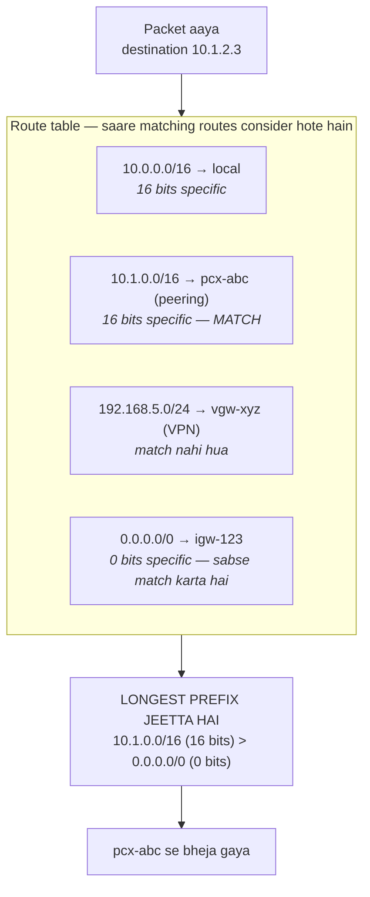

Toh `8.8.8.8` sirf `0.0.0.0/0` se match karta hai aur IGW ko jaata hai; `10.0.5.9` `10.0.0.0/16` se match karke local rehta hai; `10.1.2.3` dono `10.1.0.0/16` aur `0.0.0.0/0` se match karta hai, aur `/16` jeetta hai.

Char special CIDRs jo har jagah dikhte hain:

| CIDR | Matlab |
|---|---|
| `0.0.0.0/0` | **Har IPv4 address** — "internet" / default route. SG mein iska matlab "poori duniya se allow" |
| `10.0.0.0/16` | Typical VPC — yeh `local` route hai, jo delete nahi hota aur override nahi kiya ja sakta |
| `x.x.x.x/32` | **Exactly ek IP** — office ke static IP ko allow karne ka sahi tarika |
| `::/0` | IPv6 ka "sab kuch" — IPv6-enabled VPC mein ise `0.0.0.0/0` ke saath block karna bhoolna ek common miss hai |

Isliye SG mein port 22 par `0.0.0.0/0` ek audit finding hai — aap 4.29 billion addresses ko SSH de rahe ho. Sahi rule `203.0.113.45/32` jaisa hota hai (ya behtar: SG hole hi nahi, [Session Manager](12-security-services.md#aws-systems-manager-ssm)).

**11. Private IP ranges (RFC 1918) — VPC mein sirf yehi use karo:**

| Range | Span | Size | Note |
|---|---|---|---|
| `10.0.0.0/8` | 10.0.0.0 – 10.255.255.255 | 16.7M | AWS mein most common — iske andar **256 `/16` VPCs** aate hain |
| `172.16.0.0/12` | 172.16.0.0 – 172.31.255.255 | 1M | AWS ka **default VPC** `172.31.0.0/16` yahin se aata hai |
| `192.168.0.0/16` | 192.168.0.0 – 192.168.255.255 | 65K | Ghar/office ke routers — isliye VPC ke liye avoid karo |

Yeh ranges public internet par routable nahi hain, aur **isi wajah se NAT exist karta hai** — private source IP ko NAT Gateway ke public IP mein translate karna. Yahi link hai is subsection aur neeche wale [NAT model](#vpc-subnets-nat--complete-model) ke beech.

⚠️ **Traps:** middle range `172.16.0.0/`**`12`** hai, `/16` nahi — `172.32.0.0` **public** internet space hai. Aur `192.168.x.x` ko VPC CIDR banane se bacho: jis din koi VPN se ghar ya branch office se connect karega, overlap practically guaranteed hai.

**12. Quick recall — 30-second cheat sheet:**

```
IP = 32 bits.   CIDR /n = "n bits network, (32-n) bits host"
Total IPs   = 2^(32-n)
AWS usable  = total - 5     (.0 network, .1 router, .2 DNS, .3 reserved, last broadcast)
Block size  = 256 - mask octet
Chhota prefix = bada network.  +1 prefix = aadha size.
Mask octets : 128 192 224 240 248 252 254 255
Sizes       : /24=256  /25=128  /26=64  /27=32  /28=16
AWS limits  : VPC aur subnet dono /16 .. /28
0.0.0.0/0 = sab kuch     x.x.x.x/32 = ek IP     local route sabse pehle jeetta hai
Route match = longest prefix wins
```

**Char lines jo interview mein directly bolne layak hain:**
1. Subnet inherently public/private nahi hota — **route table** decide karta hai.
2. AWS har subnet mein **5 IPs** reserve karta hai, 2 nahi — toh `/28` = 11 usable, aur `awsvpc`/EKS ka per-task-IP model isse jaldi kha jaata hai.
3. Route selection **longest prefix match** hai, aur VPC ka **`local` route har cheez se pehle** aata hai — isliye overlapping-CIDR wala traffic VPC hi nahi chhodta.
4. **Overlapping CIDRs** peering/TGW ko permanently todte hain aur creation ke baad fix nahi hote — dekhein [Overlapping CIDRs](#overlapping-cidrs--the-design-mistake-you-cannot-undo).

### Overlapping CIDRs — The Design Mistake You Cannot Undo

"IP space upfront carefully plan karo" wali advice abstract lagti hai jab tak actual failure na dekho. Yeh woh ek networking galti hai jo **saalon baad** bill karti hai aur jiska koi clean fix nahi hota. Poora scenario as-is sunaane layak hai — yeh senior-level *"kabhi kisi design decision ne baad mein dard diya?"* ka ready answer hai.

**Timeline — "do teams, dono ne console ka default accept kiya"**

```
2021 | Payments team, Account A          2021 | Orders team, Account B
     | VPC 10.0.0.0/16                        | VPC 10.0.0.0/16   <-- SAME
     |   app  10.0.10.0/24 (40 tasks)         |   app  10.0.10.0/24 (25 pods)
     |   db   10.0.20.0/24 (RDS)              |   db   10.0.20.0/24 (RDS)
     |
     | Us waqt koi problem nahi. Dono VPCs ek doosre ko jaante bhi nahi. Sab green.
     v
2023 | Requirement: Orders ko Payments private call karni hai
     | (internet par nahi -- latency + PCI scope ke wajah se).
```

**Failure 1 — VPC Peering banti hi nahi.**

```
aws ec2 create-vpc-peering-connection --vpc-id vpc-payments --peer-vpc-id vpc-orders
  -> REJECTED: matching / overlapping CIDR blocks
```

Yeh koi config knob nahi hai — koi `--force` nahi, koi NAT workaround nahi. AWS ise hard-block karta hai (dekhein [VPC Peering](#vpc-peering) constraint #1).

**Failure 2 — Transit Gateway ke saath aur khatarnaak: attachment ban jaata hai, phir traffic chup-chaap marta hai.**

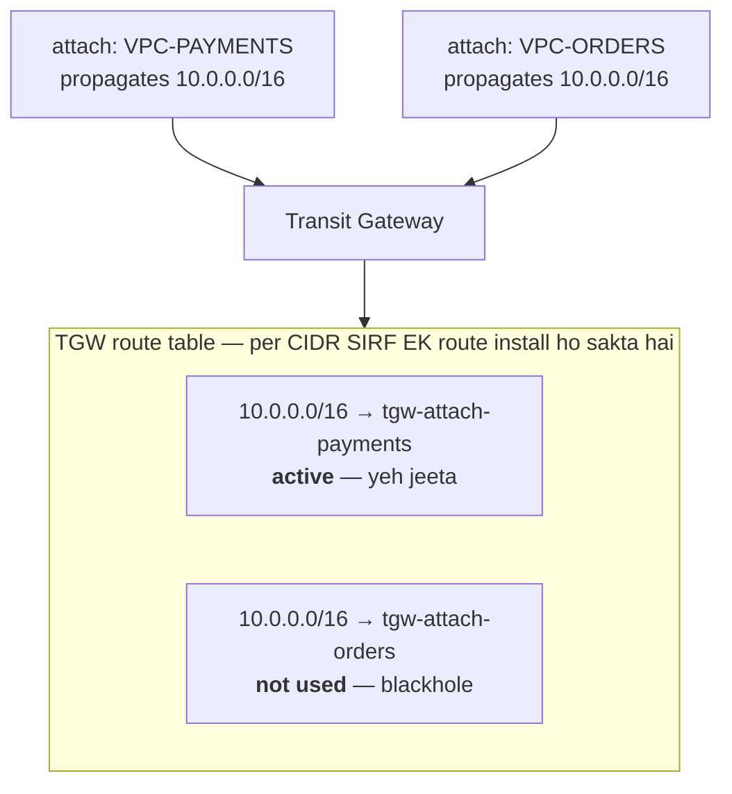

Aur asli killer TGW se **pehle** hi lag jaata hai — VPC ka `local` route. Orders ka app jab `10.0.10.5` (Payments ka app) call karta hai:

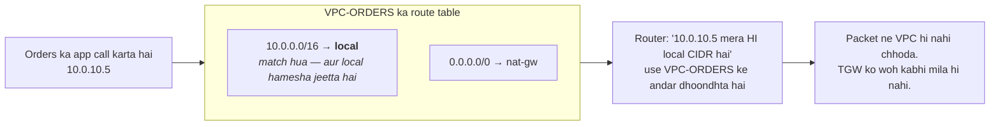

**Symptom jo debugging ke ghante khaata hai:** connection timeout, aur **Flow Logs mein `REJECT` bhi nahi** — kyunki reject karne ke liye packet ko kahin pahunchna to padta hai. Team ghanton SGs aur NACLs check karti hai, jabki problem routing arithmetic hai. Yeh [Flow Logs](#vpc-flow-logs) wale *"koi record nahi = packet kabhi pahuncha hi nahi"* rule ka textbook case hai.

**Failure 3 — partial overlap, jo sabse zyada dhokha deta hai.** Ranges poori tarah same nahi, bas ek doosre ke andar:

```
VPC-A (hub)     10.0.0.0/16     ->  10.0.0.0 - 10.0.255.255
VPC-B (spoke)   10.0.5.0/24     ->  10.0.5.0 - 10.0.5.255     <- A ke ANDAR

A: |--------------------------------|
B:            |----|                        (inside)

TGW route table, longest prefix match:
   10.0.0.0/16 -> VPC-A
   10.0.5.0/24 -> VPC-B      <- zyada specific, YEH jeetega
```

Yahan peering/attachment ban jaata hai aur mostly kaam bhi karta hai — lekin VPC-A apna hi `10.0.5.x` range **permanently kho deta hai**: us range ka saara traffic VPC-B ko chala jaata hai. Aur yeh sirf us din pata chalta hai jis din kisi ne VPC-A ke us `/24` mein resource launch kiya.

**Escape hatches, ghatte-badhte dard ke order mein:**

| Option | Kaam karta hai? | Keemat / caveat |
|---|---|---|
| **Ek VPC ko re-IP karo** | ✅ Asli fix | VPC ka **primary CIDR change nahi hota** — naya VPC banao aur sab migrate karo. Hafton ka kaam + downtime window. |
| **Secondary CIDR add karo** (e.g. `10.50.0.0/16`) | ⚠️ Partial | Naye non-overlapping subnets ban jaate hain aur workloads shift ho sakte hain, lekin **purane overlapping subnets phir bhi unreachable** rehte hain. |
| **PrivateLink (NLB + interface endpoint)** | ✅ **Best practical fix** | Overlapping CIDRs se **koi farak nahi padta** — traffic proxy hota hai, dono networks ko route karna hi nahi padta. Limitation: yeh **service-level, one-directional** exposure hai, full network reachability nahi. Dekhein VPC Endpoints & PrivateLink. |
| **Private NAT Gateway + `100.64.0.0/10`** | ✅ Works | AWS ka documented overlapping-network pattern: CGNAT (RFC 6598) space se non-overlapping IPs dekar TGW par translate karo. Chalta hai, lekin network diagram samajhne layak nahi bachta. |
| **Kuch mat karo, internet par jao** | ❌ | Latency, NAT data-processing cost, aur PCI/security scope phail jaata hai. |

**Interview answer:** *"Agar overlap already ho chuka hai to default recommendation **PrivateLink** hai — woh service-level exposure deta hai bina networks merge karne ke, aur overlapping CIDRs use affect nahi karte. Lekin asli answer yeh hai ki ise design time par prevent kiya jaata hai."*

**Prevention — ek allocation registry, day one par.** `10.0.0.0/8` mein **256 `/16` VPCs** aate hain; space ki kami nahi hai, sirf discipline ki hai:

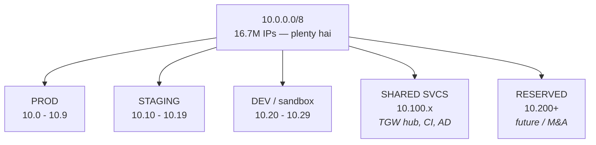

| Allocation | Region | CIDR | Kyun |
|---|---|---|---|
| Prod – Payments | ap-south-1 | `10.0.0.0/16` | |
| Prod – Orders | ap-south-1 | `10.1.0.0/16` | |
| Prod – Payments **DR** | eu-west-1 | `10.2.0.0/16` | **DR ko apna block** — warna failover ke din peer hi nahi kar paoge |
| Prod – Orders DR | eu-west-1 | `10.3.0.0/16` | |
| Staging | ap-south-1 | `10.10.0.0/16`, `10.11.0.0/16` | |
| Dev / sandbox | ap-south-1 | `10.20.0.0/16` | |
| Shared services (TGW hub, CI, AD) | ap-south-1 | `10.100.0.0/16` | Hub-and-spoke ka centre |
| **On-prem / corporate LAN** | — | network team se poocho | Jo range wahan use ho rahi hai, woh AWS mein **kabhi** na lo — warna VPN/DX kaam nahi karega |
| **Reserved** | — | `10.200.0.0/13`+ | Acquisition/M&A — jo company aap kharidoge uska bhi apna block chahiye |

Isse jo problem gayab ho jaati hai:

```
VPC-PAYMENTS  10.0.0.0/16   |----------|
VPC-ORDERS    10.1.0.0/16              |----------|     koi overlap nahi

TGW route table:
   10.0.0.0/16   -> tgw-attach-payments   active
   10.1.0.0/16   -> tgw-attach-orders     active
   10.100.0.0/16 -> tgw-attach-shared     active

Sab kuch sabse baat kar sakta hai, aur naye VPCs bas add hote rehte hain.
```

**Paanch rules jo yaad rakhne layak hain:**
1. **Console ka default CIDR kabhi accept mat karo.** `10.0.0.0/16` duniya ki aadhi companies ke aadhe VPCs mein hai — collision practically guaranteed hai.
2. **DR region ko apna alag block do.** Yeh sabse common miss hai (dekhein [DR strategies](18-well-architected-resilience.md#disaster-recovery-strategies)): prod aur DR dono ko `10.0.0.0/16`, aur yeh us din pata chalta hai jis din fix karne ka waqt nahi hota.
3. **On-prem range pehle poocho.** Corporate LAN par `10.0.0.0/16` hai to aapka Site-to-Site VPN / Direct Connect kabhi kaam nahi karega.
4. **M&A ke liye space reserve rakho** — jo company acquire hogi, uska bhi apna block chahiye.
5. **Amazon VPC IPAM use karo** — yeh exactly isi kaam ke liye bana hai: pools define karo, accounts ko CIDRs allocate karao, aur overlap **automatically** rok do. Multi-account estate mein spreadsheet ke bharose nahi rehna chahiye — IPAM default hona chahiye (RAM ke saath share hota hai, dekhein [RAM](15-management-org-billing.md#aws-resource-access-manager-ram)).

---

## 2. VPC Core — Subnets, Routing & Security

### VPC, Subnets, NAT — Complete Model

**VPC kya hai:** ek logically isolated virtual network — "AWS ke andar apna private data center." Aap IP range, subnets, routing, internet access, aur security boundary (Security Groups + NACLs) control karte ho.

**CIDR block:** VPC creation ke time define hota hai (e.g., `10.0.0.0/16`); creation ke baad change nahi kiya ja sakta (aap secondary CIDR blocks add kar sakte ho, lekin original design constraint stand karta hai — IP space ko upfront carefully plan karo, especially future VPC peering/Transit Gateway ke liye jahan overlapping CIDRs real pain cause karte hain). CIDR notation khud kaise padha jaata hai iske liye [IP Addressing, CIDR & Subnetting](#ip-addressing-cidr--subnetting--ground-up) dekhein; aur yeh planning miss karne par actual mein kya phatta hai iske liye [Overlapping CIDRs](#overlapping-cidrs--the-design-mistake-you-cannot-undo).

**Subnets**
- Ek subnet VPC CIDR ka ek slice hai, exactly ek Availability Zone se tied.
- **Inherently "public" ya "private" subnet jaisi koi cheez nahi hoti** — woh behavior poori tarah subnet ke route table se aata hai, uske naam ya kisi flag se nahi.

**Public vs private subnet — real rule**
| | Public Subnet | Private Subnet |
|---|---|---|
| Internet Gateway ka route? | Haan | Nahi |
| Internet se inbound? | Possible (agar resource ke paas public IP hai + SG allow karta hai) | Nahi |
| Internet ko outbound? | Haan, directly | Sirf NAT Gateway/Instance ke through |

**Internet Gateway (IGW):** ek per VPC, VPC se attach hona zaruri hai; public subnet ke route table mein `0.0.0.0/0 → igw-xxxx` route hona zaruri hai.

**Route tables:** har subnet exactly ek route table se associated hota hai; ek route table multiple subnets se shared ho sakta hai. Typical routes: `0.0.0.0/0 → IGW` (public) ya `0.0.0.0/0 → NAT Gateway` (private).

**NAT (Network Address Translation)**
- Purpose: private-subnet resources ko internet **sirf outbound** reach karne dena — inbound internet traffic NAT ke bawajood hamesha blocked rehta hai.
- Flow: `Private Subnet → NAT Gateway (ek PUBLIC subnet mein) → Internet Gateway → Internet`.
- **NAT Gateway ka ek public subnet mein rehna zaruri hai** — private subnet mein rakha gaya NAT Gateway simply invalid/non-functional hota hai.

| | NAT Gateway | NAT Instance |
|---|---|---|
| Management | Fully managed | Self-managed EC2 |
| HA | AZ ke andar built-in | Aap khud banao |
| Scaling | Automatic | Manual |
| Recommendation | **Default choice** | Sirf legacy/very specific cost cases |

**Cost gotcha:** NAT Gateway per-hour *plus* per-GB processed bill karta hai — private resources se high outbound traffic ek common surprise cost spike hai. AWS-service-only traffic ke liye (S3, DynamoDB, Secrets Manager, SQS, etc.), NAT ke through route karne ke bajaye **VPC Endpoints** use karo — cheaper, lower latency, aur traffic ko poori tarah public internet se door rakhta hai.

**Security layers**
| | Security Group | Network ACL |
|---|---|---|
| Statefulness | Stateful (return traffic auto-allowed) | Stateless (dono directions explicitly allow karna padta hai) |
| Attached to | ENI/instance | Subnet |
| Rule type | Sirf Allow | Allow AND deny |
| Typical usage | Primary defense — heavily use karo | Sparingly, coarse subnet-level blocking ke liye |

**Placement rules of thumb**
- Public subnet: load balancers, bastion hosts, NAT Gateways.
- Private subnet: application servers, ECS tasks, RDS — **database ko kabhi directly public subnet mein na daalo.**

**Common misconceptions (explicitly false)**
- "Public subnet = automatic internet access" — false; chahiye ek public IP *aur* IGW ka route *aur* permissive SG.
- "NAT inbound traffic allow karta hai" — false; NAT design se outbound-only hai.
- "Subnet name/tag security behavior decide karta hai" — false; sirf route tables aur SGs/NACLs matter karte hain.
- "Per VPC ek route table" — false; ek VPC ke paas multiple route tables ho sakte hain (aur usually hote hain), per subnet-group ek.

**High-availability note:** NAT Gateways AZ-scoped hote hain. Proper HA ke liye, per AZ ek NAT Gateway deploy karo taaki ek AZ failure VPC ke har private subnet ke liye outbound internet access na le jaaye (AZs ke across ek single shared NAT Gateway kaam karta hai lekin ek cross-AZ dependency aur extra data-transfer cost create karta hai).

### Default VPC (aur Isme Build Kyun Nahi Karna Chahiye)

Har AWS account ko **per region ek default VPC** milta hai — pehle se bana hua, taaki ek brand-new account networking ko chhue bina EC2 instance launch kar sake. Yahi convenience wajah hai ki itne accounts galti se apna real workload isi mein chala rahe hote hain.

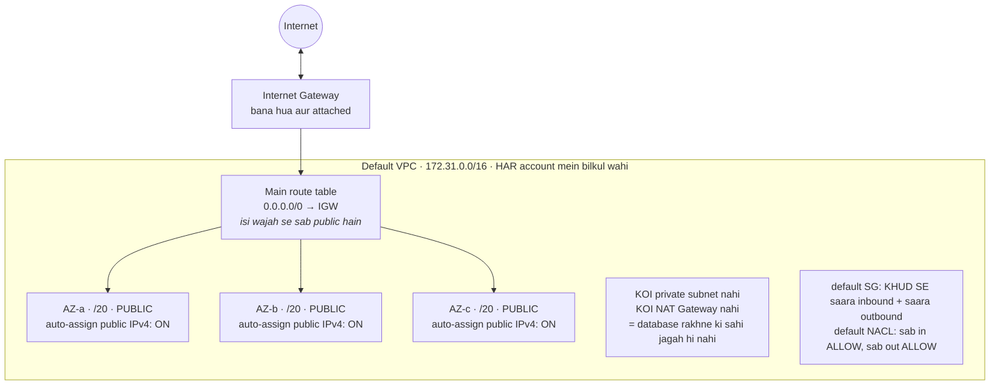

**AWS aapke liye pehle se kya bana deta hai:**

| Component | Default configuration |
|---|---|
| VPC CIDR | **`172.31.0.0/16`** — har region mein, har account mein, bilkul wahi |
| Default subnets | Per AZ ek, har ek **`/20`**, aur **saare public** |
| Internet Gateway | Bana hua aur attached |
| Main route table | `0.0.0.0/0 → IGW` — isi wajah se har default subnet public hai |
| Default security group | Khud se **saara inbound** allow, saara outbound allow |
| Default NACL | **Saara** inbound aur outbound allow |
| DNS | `enableDnsSupport` aur `enableDnsHostnames` dono **on** |
| Auto-assign public IPv4 | Har default subnet par **enabled** |

**Yeh combination problem kyun hai**
- **Har subnet public hai.** Koi private subnet nahi, koi NAT Gateway nahi — toh database rakhne ki koi sahi jagah hi nahi hai. Defaults par launch kiya gaya RDS instance ek public subnet mein jaakar baithta hai.
- **Auto-assign public IP on hai**, toh har instance ko routable public IPv4 milta hai jab tak aap explicitly opt out na karo. Yeh us "private by default" posture ka ulta hai jo aap chahte ho.
- **`172.31.0.0/16` har account mein same hai**, isliye jis din do accounts peer karoge ya on-prem connect karoge, collision ke liye yeh sabse zyada likely CIDR hai — aur VPC ka primary CIDR baad mein badla nahi ja sakta (dekhein [Overlapping CIDRs](#overlapping-cidrs--the-design-mistake-you-cannot-undo)).
- Khule-khule default SG aur NACL ka matlab hai ki security poori tarah is baat par depend karti hai ki aapne unhe **replace kiya ya nahi**. "Default security group khud se sab kuch allow karta hai" un logon ko chaunkata hai jo maante hain ki *default* ka matlab *restrictive* hota hai.

⚠️ **Sabse common gotcha:** **koi subnet specify na karke** launch kiya gaya EC2 instance default VPC mein chala jaata hai, aur console ke kai wizards bhi wahi karte hain. "Hamara dev database internet se reachable kyun hai?" — usually mechanism yahi hota hai.

**Precisely jaanne layak details**
- **Default VPC delete ho sakta hai**, aur ek theek se manage kiye gaye account mein usually kar bhi diya jaata hai (ya jaan-boojh kar khaali chhoda jaata hai). `aws ec2 create-default-vpc` use dobara bana deta hai, lekin woh ek **naya** VPC hota hai naye subnet IDs ke saath — restore nahi.
- **"Default subnet" definition se public hai, nature se nahi.** Uske route table se IGW route hata do aur woh public behave karna band kar dega; label metadata hai, behaviour route table hai. Wahi rule jo [public vs private subnet](#vpc-subnets-nat--complete-model) par lagta hai.
- **Default VPC ≠ "main VPC".** Main VPC jaisa koi concept hi nahi hai. Haan, per VPC ek **main route table** hoti hai — woh jo subnet ko explicitly associate na karne par mil jaati hai — aur woh bilkul alag cheez hai.
- Manually banaye gaye subnet mein `MapPublicIpOnLaunch` set na karo to woh **off** rehta hai — default subnet ka ulta. Yeh asymmetry un logon ko pakadti hai jo default-VPC ki aadat se aaye hain.

**Interview framing:** *"Main jo bhi account design karun, usmein default VPC mein kuch nahi chalta. Har account mein woh `172.31.0.0/16` hai, jo aage CIDR collision guarantee karta hai; har subnet public hai auto-assign public IP ke saath; aur default SG aur NACL khule pade hain. Hum VPCs ek allocated block se provision karte hain, explicit public/app/data tiers ke saath, aur default VPC mein launch hui kisi bhi cheez ko AWS Config ya ek SCP se flag karte hain."*

### NACLs Detail Mein — Rule Evaluation aur Ephemeral Port Trap

[Upar wali comparison table](#vpc-subnets-nat--complete-model) one-liner de deti hai — SG stateful, NACL stateless. Yeh subsection woh hissa cover karta hai jo actually production mein cheezein todta hai, aur woh sawaal jo NACL *use* kar chuke logon ko sirf *padh* chuke logon se alag karta hai: *"aapne inbound allow rule add kiya aur traffic phir bhi fail ho raha hai — kyun?"*

**Rules numbered hote hain, aur sabse chhota number jeetta hai.**

```
Inbound rules, ASCENDING order mein evaluate hote hain — pehla match jeetta hai, phir evaluation RUK jaata hai

Rule #    Type       Port    Source            Action
100       HTTPS      443     0.0.0.0/0         ALLOW    <- sabse pehle evaluate hua
200       ALL        ALL     10.0.0.0/16       ALLOW
300       HTTPS      443     203.0.113.9/32    DENY     <- YAHAN TAK PAHUNCHTA HI NAHI
*         ALL        ALL     0.0.0.0/0         DENY     <- implicit, edit nahi ho sakta
```

Rule `300` kabhi fire nahi hota: rule `100` pehle hi match ho gaya aur evaluation ruk gayi. **Deny rule ka number us allow rule se chhota hona chahiye jise woh override karna chahta hai.** Yeh security group ka bilkul ulta hai, jahan saare rules evaluate hote hain, order ka koi matlab nahi hota, aur deny hota hi nahi.

- Convention: 100 ke gaps mein number do (`100`, `200`, `300`) taaki baad mein do rules ke beech naya rule daal sako bina sabko renumber kiye.
- Aakhir wala `*` rule implicit deny-all hai. Woh hamesha rehta hai aur na hata sakte ho na reorder kar sakte ho.
- Default quota **20 rules** per NACL hai (40 tak badh sakta hai) — aur yaad rakho har direction ki alag list hoti hai.

**Ephemeral port trap — NACL ka #1 failure.** Kyunki NACL stateless hai, allowed connection ka reply wapas jaate waqt **naye sire se** evaluate hota hai, aur reply port 443 par nahi jaata. Woh us high-numbered **ephemeral port** par jaata hai jo client ne choose kiya tha:

```
Client 203.0.113.9:51234  ---- :443 par request ---->  Subnet ka instance
                                                              |
       reply aata hai FROM :443 TO 203.0.113.9:51234          |
                                                              v
        OUTBOUND NACL ko port 51234 allow karna padega
        matlab ephemeral range: 32768-65535
        port 443 NAHI  <- yahi galti hai
```

Toh ek chalta-hua web-tier NACL ko chahiye:

| Direction | Port range | Kyun |
|---|---|---|
| Inbound | 443 | asli request |
| **Outbound** | **`32768–65535`** | **reply, client ke ephemeral port par** |

Galat kar do to symptom hota hai **connection timeout us subnet mein jiska security group provably sahi hai** — request pahunch gayi thi, aur reply bahar jaate waqt drop ho gaya.

**Exactly kaunsi range?** **`32768–65535`** wahi range hai jo **AWS ke apne documented example NACL** mein use hoti hai, aur poocha jaaye to yeh number quote karna chahiye. Lekin asli range is baat par depend karti hai ki **client kaun hai** — AWS yeh document karta hai:

| Client | Ephemeral source-port range |
|---|---|
| **AWS ka documented example NACL** | **`32768–65535`** |
| Amazon Linux / kai Linux kernels | `32768–61000` |
| Windows Server 2008 aur baad ke | `49152–65535` |
| Windows, Server 2003 tak | `1025–5000` |
| **Elastic Load Balancing** | `1024–65535` |
| **NAT Gateway** | `1024–65535` |
| **Lambda** | `1024–65535` |

`32768–65535` Linux aur modern Windows clients ko cover karta hai, isliye wahi canonical answer hai. ⚠️ Jaise hi aage **ELB, NAT gateway, ya Lambda** aaye — jo real VPC mein lagbhag hamesha hota hai — **`1024–65535`** tak widen karo, kyunki woh safe superset hai aur in teenon mein se koi 32768 se shuru nahi hota.

**Evaluation order mein NACL kahan baithta hai.** Inbound mein NACL security group se **pehle** evaluate hota hai; outbound mein **baad mein**:

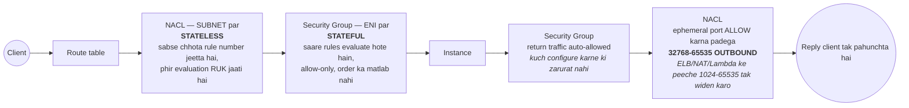

Do baatein khul kar bolne layak: NACL ka deny ek permissive security group se **override nahi ho sakta**, aur NACL jo traffic block karta hai woh instance tak pahunchta hi nahi — isliye [Flow Logs](#vpc-flow-logs) mein `REJECT` dikhta hai lekin application side par koi nishaan nahi hota.

**Actually kab use karna chahiye**
- Kisi specific hostile IP ya CIDR ko subnet ke edge par block karna — yeh ek kaam security groups genuinely nahi kar sakte, kyunki woh allow-only hain.
- Data subnet ke around ek hard compliance boundary ("VPC ke bahar se kuch nahi, kabhi nahi").
- Warna: default allow-all NACL ko chhedo hi na, aur kaam security groups mein karo. Haath se maintain kiye NACLs khud-ki-lagayi outages ka regular source hain, aur har rule do baar likhna padta hai — ek per direction.

**"Security group ya NACL?" ka interview answer:** *"Practically har cheez ke liye security groups — woh stateful hain, subnet ke bajaye workload par attach hote hain, aur doosre security groups ko reference kar sakte hain, jo tier-to-tier rules ke liye exactly wahi hai jo chahiye. NACL ki taraf main sirf tab jaata hoon jab explicit deny chahiye jo SG express nahi kar sakta, jaise hostile CIDR block karna. Aur jab karta hoon to yaad rakhta hoon ki woh stateless hai: outbound `32768–65535` khula hona chahiye — aur ELB ya NAT gateway aage ho to `1024–65535` tak widen — warna har reply drop ho jaayega."*

### VPC Mein IPv6 aur Egress-Only Internet Gateway

IPv6 do interview contexts mein aata hai: bade VPCs mein **IPv4 exhaustion** (khaas kar EKS, jahan har pod ek IP kha jaata hai), aur *"private resources IPv6 par internet kaise reach karte hain?"* Doosre ka jawaab NAT Gateway **nahi** hai — aur kyun nahi, wahi poora point hai.

**IPv6 allocate kaise hota hai — dhyaan do, range aap choose nahi karte.**

| | IPv4 | IPv6 |
|---|---|---|
| CIDR kaun choose karta hai | **Aap** (jaise RFC 1918 se `10.0.0.0/16`) | **AWS assign karta hai** apne pool se ek `/56` (ya BYOIP/IPAM se apna laao) |
| VPC block size | `/16` – `/28` | **hamesha `/56`** |
| Subnet block size | `/16` – `/28` | **hamesha `/64`** — fixed, non-negotiable |
| Per subnet addresses | `/24` mein 251 usable | ~18 quintillion — **exhaustion ek concept hi nahi bachta** |
| Public vs private | private ranges + egress ke liye NAT | **har address globally unique aur publicly routable** |
| Optional? | Nahi — VPC ke paas IPv4 CIDR hamesha hota hai | **Haan** — IPv6 VPC mein add kiya jaata hai |

`/56` ko `/64` mein todne se **per VPC 256 subnets** milte hain, hamesha same size ke — isliye IPv6 subnet planning arithmetic ke bajaye bookkeeping ban jaati hai:

```
AWS VPC ko EK /56 assign karta hai   (aap choose nahi kar sakte)

   2001:db8:1234:  XX  ::/56
   +--- 56 bits AWS ne fix kiye ---+--8--+------ 64 host bits ------+
                                      |
                    ye 8 bits = 2^8 = 256 possible /64 subnets
                                      |
   +----------------+----------------+----------------+
   | ...:0000::/64  | ...:0001::/64  | ... :00ff::/64 |
   |   subnet 1     |   subnet 2     |   subnet 256   |
   +----------------+----------------+----------------+
        har /64 mein 2^64 = ~18 quintillion addresses
        subnet size HAMESHA /64 -- kabhi kuch aur nahi
```

Ise IPv4 se compare karo, jahan VPC block choose karo, har subnet ka size choose karo, aur overlap bachane ke liye arithmetic karo. Yahan sirf ek decision hai: **256 `/64` mein se kaunsa** subnet ko milega.

⚠️ **Conceptual jump:** yahan **"private" IPv6 address hota hi nahi**. AWS jo bhi IPv6 address deta hai woh internet-routable hai, toh koi resource private sirf tab hai jab *routing aur security groups* aisa kehte hain — is wajah se nahi ki uska address unroutable hai. Aur exactly isi karan NAT — jiska poora kaam unroutable private IPv4 ko routable banana hai — ka **IPv6 mein koi equivalent nahi hai**.

**Egress-Only Internet Gateway (EIGW) — "outbound only" ka IPv6 jawaab.**

Kyunki IPv6 ko translation ki zarurat nahi, outbound-only behaviour aise device se aana chahiye jo simply inbound connections forward karne se mana kar de. Woh device EIGW hai:

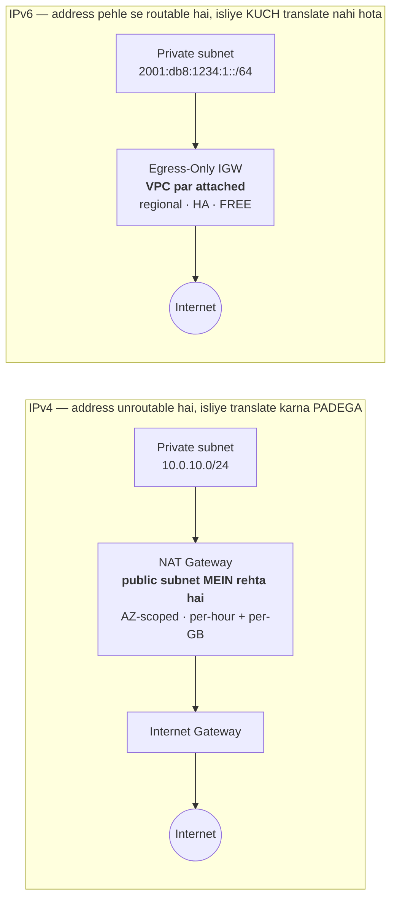

| | NAT Gateway | Egress-Only IGW |
|---|---|---|
| Protocol | **Sirf IPv4** | **Sirf IPv6** |
| Kaam | private → public translate karna, outbound only | Sirf outbound allow karna (koi translation nahi) |
| Kahan rehta hai | **Ek public subnet mein** | **VPC par attached** — kisi subnet mein nahi |
| Route entry | Private route table mein `0.0.0.0/0 → nat-xxxx` | Private route table mein `::/0 → eigw-xxxx` |
| High availability | **AZ-scoped** — per AZ ek deploy karo | **Regional aur by default highly available** |
| Cost | Per hour **+ per GB processed** | **Free** |
| Stateful? | Haan | Haan — outbound flows ka return traffic allow, inbound-initiated block |

In rows mein se teen interview points hain: EIGW **free** hai, use **per-AZ deploy karne ki zarurat nahi**, aur woh **subnet mein rehne ke bajaye VPC par attach** hota hai — teenon NAT Gateway ke cost aur HA problems ka exact ulta.

**Dual-stack hi normal deployment hai.** Aap IPv6 par migrate nahi karte, use IPv4 ke saath add karte ho:
- VPC ko ek IPv6 `/56`, har subnet ko ek `/64`, aur auto-assign IPv6 enable.
- **Security groups aur NACLs ko explicit IPv6 rules chahiye.** `0.0.0.0/0` ka IPv4 rule IPv6 traffic par kuch nahi karta. ⚠️ Yeh ek asli aur bahut common miss hai: team IPv4 ko dhyaan se lock karti hai aur `::/0` khula chhod deti hai, toh instance IPv6 par kisi ke liye bhi reachable reh jaata hai.
- **Route tables ko alag `::/0` route chahiye** — public subnets mein IGW ko, private mein EIGW ko.
- **IPv6-only subnets** bhi hote hain, lekin pehle service support check karo: kai AWS services aur bahut se third-party endpoints abhi bhi IPv4-only hain. Isliye default answer dual-stack hai, IPv6-only nahi.
- Instance par IPv6 address ENI ko assign hota hai aur, auto-assigned public IPv4 ke ulta, **stop/start ke baad bhi bana rehta hai** — dekhein [Public IP vs Private IP vs Elastic IP](06-ec2-instance-storage.md#public-ip-vs-private-ip-vs-elastic-ip).

**Kab yeh sach mein sahi choice hai:** bade multi-account estate mein RFC 1918 space khatam ho raha ho; EKS clusters jahan per-pod IPs IPv4 subnets kha jaate hain (wahi per-ENI IP model dekhein [ECS](09-containers-ecs-fargate.md#ecs-elastic-container-service) mein); ya IPv6-only clients serve karne hain, jo kuch mobile carriers hain. Warna dual-stack ka matlab hai security rules ka doosra set maintain karna bahut kam fayde ke liye — aur *"kya aap IPv6 use karoge?"* ka yeh ek perfectly acha jawaab hai.

### VPC Reference Architecture

```
                            +------------+
                            |  Internet  |
                            +-----+------+
                                  |
                        +---------v----------+
                        |  Internet Gateway  |
                        +----+----------+----+
                             |          |
+----------------------------|----------|-----------------------------+
| VPC  10.0.0.0/16           |          |                             |
|                            v          v                             |
|      AVAILABILITY ZONE A               AVAILABILITY ZONE B          |
|  +--------------------------+      +--------------------------+     |
|  | PUBLIC      10.0.0.0/24  |      | PUBLIC      10.0.1.0/24  |     |
|  | ALB . NAT GW . Bastion   |      | ALB . NAT GW             |     |
|  +------------+-------------+      +------------+-------------+     |
|               | outbound via NAT                | outbound via NAT  |
|  +------------v-------------+      +------------v-------------+     |
|  | PRIVATE APP 10.0.10.0/24 |      | PRIVATE APP 10.0.11.0/24 |     |
|  | ECS tasks / EC2 app      |      | ECS tasks / EC2 app      |     |
|  +------------+-------------+      +------------+-------------+     |
|               |                                 |                   |
|  +------------v-------------+      +------------v-------------+     |
|  | PRIVATE DB  10.0.20.0/24 |      | PRIVATE DB  10.0.21.0/24 |     |
|  | RDS PRIMARY              |<====>| RDS STANDBY              |     |
|  +--------------------------+ sync +--------------------------+     |
+---------------------------------------------------------------------+

  Both AZs' app subnets talk to the RDS PRIMARY; the standby carries no
  traffic and only takes over on failover. No subnet is "public" because
  of its name -- only because its route table points 0.0.0.0/0 at the IGW.
```

Yahi canonical 3-tier VPC layout hai jo senior interviewers expect karte hain: per AZ public subnet (ALB + NAT), per AZ private app subnet (compute), per AZ private isolated data subnet (RDS jisse NAT/IGW ka koi route hi nahi hota — DB subnets ko typically outbound internet ki zarurat hi nahi hoti).

---

## 3. Connectivity — Peering, Hybrid & Private Access

### VPC Peering

Do VPCs ke beech ek private, one-to-one network connection — same account ya different, same region ya different — AWS ke internal network ka use karte hue (koi IGW, NAT, ya VPN involved nahi).

**Teen constraints jo interview question hain:**
1. **❗ CIDR blocks overlap nahi hone chahiye.** Koi exceptions nahi, koi NAT workaround nahi. Isi wajah se VPC creation ke time IP-space planning itna matter karti hai. Poora failure walkthrough, partial-overlap trap, aur escape hatches: [Overlapping CIDRs](#overlapping-cidrs--the-design-mistake-you-cannot-undo).
2. **❗ Peering transitive NAHI hoti.** Agar A B ke saath peer karta hai aur B C ke saath peer karta hai, to **A C ko reach nahi kar sakta**. Aapko ek direct A↔C peering create karni padegi. Yahi single most-asked VPC peering question hai.
3. **No edge-to-edge routing** — aap ek peer ka internet gateway, NAT gateway, VPN, ya Direct Connect connection use nahi kar sakte.

Iske alawa: aapko **dono** VPCs ke route tables par routes add karne padenge, aur security groups update karna padega. Same region mein aap peered VPC mein **ek security group ko ID se reference** kar sakte ho (accounts ke across bhi), jo CIDRs hardcode karne se kaafi behtar hai.

**Peering scale kyun nahi karta:** *n* VPCs ko fully connect karne ke liye **n(n−1)/2** peering connections chahiye — 10 VPCs ka matlab hai 45 connections, har ek ke dono sides par route-table entries.

### Transit Gateway

Ek **regional hub-and-spoke router**. Har VPC, Site-to-Site VPN, aur Direct Connect gateway TGW se ek baar attach hota hai, aur TGW unke beech route karta hai.

- **Yeh transitive routing support karta hai** — woh jo peering nahi kar sakti. A → TGW → C kaam karta hai.
- ⚠️ **Lekin TGW overlapping CIDRs ko fix nahi karta.** Peering ki tarah yeh upfront reject nahi karta — attachment ban jaata hai aur phir traffic chup-chaap blackhole ho jaata hai, jo debug karna kaafi mushkil hai. Dekhein [Overlapping CIDRs](#overlapping-cidrs--the-design-mistake-you-cannot-undo).
- Hazaron attachments tak scale hota hai; *n* VPCs connect karne mein *n* attachments lagte hain, n(n−1)/2 connections nahi.
- **Per attachment TGW route tables** aapko network segmentation dete hain — e.g. ek route table jo prod VPCs ko shared services reach karne deta hai lekin ek doosre ko nahi, aur non-prod ko fully isolated rakhta hai. Real multi-account networks aise hi banaye jaate hain.
- **Inter-region TGW peering** AWS backbone ke over regions ke across hubs ko connect karta hai.
- **Multicast** support karta hai, jo na peering karti hai na VPN.
- Organisation ke sabhi accounts ke across ek central TGW share karne ke liye **Resource Access Manager** ke saath kaam karta hai (dekhein [RAM](15-management-org-billing.md#aws-resource-access-manager-ram)).
- **Cost:** per attachment-hour **plus** per GB processed charge hota hai — isliye simple two-VPC case ke liye yeh peering se zyada expensive hai.

| | VPC Peering | Transit Gateway |
|---|---|---|
| Topology | Point-to-point mesh | **Hub and spoke** |
| Transitive routing | ❌ | ✅ |
| Scale | ~5 VPCs se aage poor | Hazaron attachments |
| Cost | **No hourly charge** (sirf cross-AZ/region data transfer) | Per attachment-hour + per GB |
| Segmentation | Per VPC route tables | **Per attachment TGW route tables** |
| Best for | Do ya teen VPCs, cost-sensitive, high bandwidth | Multi-account/multi-VPC networks, hybrid connectivity |

---

### Hybrid Connectivity: Site-to-Site VPN & Direct Connect

| | **Site-to-Site VPN** | **Direct Connect (DX)** |
|---|---|---|
| Medium | **Public internet ke over IPsec** | Ek AWS Direct Connect location tak **dedicated private fibre** |
| Setup time | Minutes se hours | **Weeks se months** (physical circuit provisioning) |
| Bandwidth | ~1.25 Gbps per tunnel (multiple tunnels/ECMP se scale) | 1 / 10 / 100 Gbps dedicated, ya sub-1 Gbps hosted |
| Latency | Variable — yeh internet hai | **Consistent aur predictable** |
| Encryption | **Default se encrypted** (IPsec) | **❗ Default se encrypted nahi** — DX ke upar VPN, ya MACsec add karo |
| Cost | Cheap hourly + data transfer | High fixed port cost, lekin volume par **materially cheaper egress** |
| Use for | Quick setup, branch offices, backup path, low-to-moderate volume | Large sustained data transfer, latency-sensitive hybrid apps, internet transit ke against regulatory requirements |

**VPN components detail mein** — yahan precise hona zaroori hai, kyunki "AWS ko VPN se jodo" ek routine design sawaal hai aur yeh chaar naam log aapas mein mix kar dete hain:

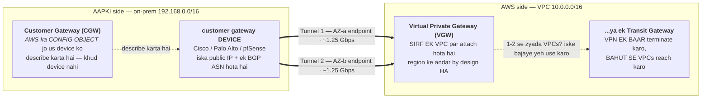

| Component | Kiski side | Actually kya hai |
|---|---|---|
| **Customer Gateway (CGW)** | **Aapki** | AWS-side ka ek *configuration object* jo aapke on-prem device ko describe karta hai: uska **public IP** aur uska **BGP ASN**. Yeh metadata hai, device nahi |
| **Customer gateway device** | Aapki | On-prem ka asli router/firewall (Cisco, Palo Alto, pfSense, strongSwan…) |
| **Virtual Private Gateway (VGW)** | AWS | VPN concentrator jo **exactly ek VPC par attach** hota hai. Region ke andar by design highly available |
| **Transit Gateway** | AWS | Doosra VPN endpoint option — VPN **ek baar** terminate karo aur kai VPCs reach karo |
| **Site-to-Site VPN connection** | Dono | Woh object jo CGW ko VGW/TGW se jodta hai; banane par **do tunnels** provision hote hain |

- **Tunnels hamesha do hote hain.** AWS unhe **do different AZs ke do different endpoints** par terminate karta hai, har ek ~1.25 Gbps. Sirf ek configure karna classic single point of failure hai — "humne tunnel 1 hi kabhi up kiya tha" AWS ke routine endpoint maintenance ke dauraan outage ki asli wajah banti hai.
- **Static vs dynamic routing** — *"on-prem ko AWS ke routes kaise pata chalte hain?"* ke peeche yahi sawaal hai:

| | Static | Dynamic (**BGP**) |
|---|---|---|
| Routes kaise pata chalte hain | On-prem CIDRs aap khud VPN connection par manually list karte ho | BGP par automatically exchange hote hain |
| Tunnels ke beech failover | Manual / slow | **Automatic** |
| Kya chahiye | Kuch khaas nahi | BGP-capable device aur dono side ek **ASN** |
| Verdict | Chhote, fixed networks | **Preferred** — asli HA aur tunnels par ECMP ke liye zaroori |

- **ASNs:** aapki side CGW par ek declare karti hai (private ASN use karo, `64512–65534`); AWS ki side VGW par default **`64512`** hai aur TGW par configurable hai. Dono side same ASN hone se BGP session toot jaata hai.
- **VGW ya TGW?** Ek VPC → VGW theek hai. Do se zyada VPCs, ya on-prem ko sab tak pahunchna hai → **TGW**, kyunki VGW exactly ek VPC par attach hota hai aur **VPN routes peering ke across transitive nahi hote** — wahi transitivity limit jo [VPC Peering](#vpc-peering) mein hai.
- **Route propagation** VPC route tables par enable karna padta hai (ya routes haath se add karo). Poori tarah established tunnel jiska propagation off ho, wahi classic "VPN up hai lekin kuch kaam nahi kar raha" hai.
- **Accelerated Site-to-Site VPN** tunnel traffic ko Global Accelerator ke edge network par le jaata hai, zyada consistent latency ke liye; iske liye **TGW** chahiye, VGW nahi.
- **Direct Connect Gateway** ek DX connection ko **multiple regions aur accounts** mein VPCs reach karne deta hai.
- **Standard HA answer:** full redundancy ke liye **do different DX locations** par do DX connections; ya, aur cheaply, automatic backup ke roop mein Site-to-Site VPN ke saath **ek DX** — ek bahut common real-world design aur "hybrid connectivity ko resilient kaise banate ho?" ka ek good jawab.
- **AWS Client VPN** *individual users* (laptops) ke VPC mein connect hone ke liye ek different product hai, site-to-site networks ke opposite.

### AWS Client VPN, Individual Users ko VPC ke Andar Laana

**Yeh gap kyun tha:** [Hybrid Connectivity](#hybrid-connectivity-site-to-site-vpn--direct-connect) section Site-to-Site VPN aur Direct Connect ko depth mein cover karta hai aur Client VPN ko ek single throwaway line deta hai — *"individual users ke liye ek different product hai."* Lekin reference topology mein ALB **internal-only** hai: koi public listener nahi, koi CDN nahi, koi API Gateway nahi. Toh corporate network se bahar baithe kisi bhi human ke liye Client VPN hi **service tak pahunchne ka ekmatra raasta** hai. Woh stack use itna first-class dependency maanta hai ki uska security group tag se discover karta hai, taaki uspar ingress rules add kar sake. Ek ekmatra raasta jise document ek line deta ho — wahi gap hai.

**Yeh kya hai:** ek managed, OpenVPN-based VPN endpoint. Users apne laptop par ek client chalate hain, endpoint se connect hote hain, aur ek **client CIDR** se ek IP paate hain — us point ke baad woh VPC ke andar routable hote hain, lagbhag ek instance ki tarah.

**Chaar objects jo configure karne hote hain** — Site-to-Site VPN ke CGW/VGW/tunnels se **poori tarah different** naam hain, aur yahi confusion ki jagah hai:

| Object | Kya karta hai |
|---|---|
| **Client VPN endpoint** | Woh regional construct jo connections terminate karta hai. Client CIDR, auth mode, aur split-tunnel setting isi par baithti hain |
| **Target network association** | Endpoint ko ek **subnet** se jodta hai. Yahi woh step hai jo us subnet mein **ENIs create karta hai** — HA ke liye multiple AZs ke subnets associate karo |
| **Authorization rule** | *Kaun kaunse destination CIDR tak ja sakta hai.* Yeh ek **network-level grant** hai, security group se alag — Active Directory ya SAML group par scope kiya ja sakta hai |
| **Route table** (endpoint ka apna) | Client traffic kahan jaayega. VPC CIDR automatically aata hai; **internet, peered VPCs, TGW, ya on-prem ke routes aapko haath se add karne padte hain** |

⚠️ **Yeh document ka ek genuinely absent debugging insight tha: ek Client VPN connection ko *do* independent gates paar karne padte hain.** Log inhe ek hi cheez samajh lete hain aur ghanton debug karte hain:

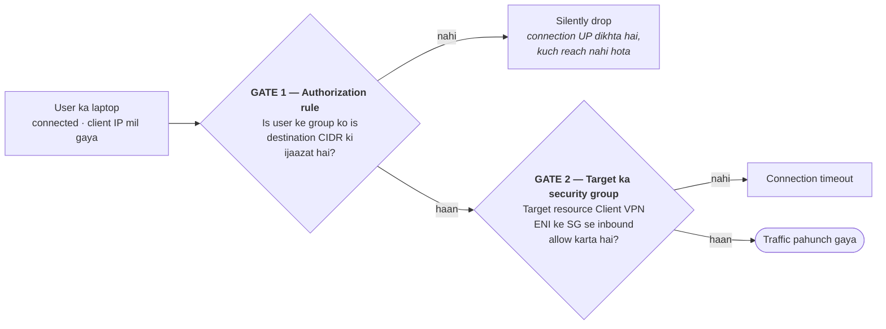

Reference topology mein yeh diagram ka **VPN** node hi hai: platform Client VPN endpoint aur uska SG own karta hai; application stack us SG ko tag se discover karta hai aur apne ALB SG par ingress rule add karke **Gate 2 khud kholta hai**. Gate 1 platform ke haath mein rehta hai — jo yeh bhi batata hai ki access request kis team ko jaayega.

**Authentication modes**

| Mode | Kaise kaam karta hai | Kab |
|---|---|---|
| **Mutual authentication** (certificate-based) | Server aur client dono certificates, ACM mein import kiye jaate hain. Revocation ek **client revocation list** se | Chhoti teams, machine-to-machine, jahan koi identity provider na ho |
| **Active Directory** | AWS Directory Service / AD Connector ke through on-prem AD ke against | Woh enterprises jinke paas already AD hai — **authorization rules AD groups par scope ho sakti hain** |
| **SAML 2.0 federation** | Okta, Entra ID, Ping ke through SSO | Modern enterprise standard; MFA aur joiner-leaver flow IdP handle karta hai |

Mutual auth ko doosre dono ke saath **combine** kiya ja sakta hai (certificate *plus* identity) — ek common hardening move.

**Split-tunnel vs full-tunnel — yeh ek cost aur bandwidth decision hai, sirf security ka nahi**

| | Full-tunnel (**default**) | Split-tunnel |
|---|---|---|
| Client ka kaunsa traffic VPN par jaata hai | **Sab kuch** — video streaming, OS updates, sab | Sirf woh jo endpoint ki route table mein match kare |
| Client ka internet traffic kahan se nikalta hai | **Aapke NAT Gateway se** — aap uska per-GB processing bharte ho | Client ke apne ISP se — aapko koi cost nahi |
| Kab chahiye | Jab compliance kehta ho ki saara employee traffic inspect ho | **Zyadatar cases** — cost aur client latency dono better |

❗ Yeh us point se directly judta hai jo [Networking Costs](#networking-costs--paisa-actually-kahan-jaata-hai) section already banata hai: default **full-tunnel** hai, toh 200 remote developers ka poora internet browsing aapke NAT Gateway ke `~$0.045/GB` processing charge se guzarta hai. Split-tunnel enable karna ek one-line change hai aur kisi bhi AWS network bill review ka ek classic finding.

**Client CIDR — jo galtiyan permanent hoti hain**
- VPC CIDR ya kisi bhi manually added route se **overlap nahi kar sakta** — wahi rule jo [Overlapping CIDRs](#overlapping-cidrs--the-design-mistake-you-cannot-undo) section poore VPC design ke liye banata hai.
- Minimum `/22`, maximum `/12`.
- ❗ **Endpoint create hone ke baad change nahi ho sakta.** Chhota rakh diya, ya prod VPC se overlap kar gaya, to endpoint recreate karna padega — aur uska naya configuration sabhi clients ko dobara distribute karna padega.
- Concurrent connections se **kaafi bada** size karo; har associated subnet bhi apna hissa leta hai.

**Cost model** — [per-service charging table](#networking-costs--paisa-actually-kahan-jaata-hai) mein Client VPN missing hai; yahan uski shape hai:

| Charge | Shape | Trap |
|---|---|---|
| **Subnet association** | Per association-hour (~$0.10/hr, region-dependent) | **Zero users hone par bhi lagta hai.** 3 AZs = 3× hourly, 24×7 |
| **Client connection** | Per connected client-hour (~$0.05/hr) | Raat bhar connected chhoda gaya laptop poori raat bill karta hai |
| **Data transfer** | Normal VPC/NAT rules | Full-tunnel isi ko multiply karta hai |

Yaad rakhne layak: HA ke liye multi-AZ association chahiye, aur woh ek **hourly floor** create karta hai — Client VPN ka cost structure NAT Gateway jaisa hai, Site-to-Site VPN jaisa nahi.

**Baaki jaanne layak**
- **Connection logging** CloudWatch Logs mein — kaun connect hua, kab, kahan se, kitna transfer. Audit questions ka jawaab yahi hai.
- **Self-service portal** users ko client software aur unki configuration khud download karne deta hai (SAML/AD modes ke saath).
- **Client Connect handler** ek Lambda hai jo har connection par posture checks chala kar use allow/deny kar sakta hai.
- Endpoint ke ENIs par **security groups** apply hote hain — yahi Gate 2 ki source hai.
- ❗ **DNS servers endpoint par set karo**, warna clients aapki [private hosted zones](#route-53) resolve nahi kar payenge — ek bahut common "VPN up hai lekin internal hostnames resolve hi nahi hote."

**Interview framing:** *"Site-to-Site VPN networks ko jodta hai, Client VPN individual laptops ko. Client VPN ke liye main SAML federation choose karunga taaki joiner-leaver flow IdP mein rahe, authorization rules ko IdP groups par scope karunga na ki flat VPC-wide access dunga, kam se kam do AZs ke subnets associate karunga, aur split-tunnel enable karunga — kyunki default full-tunnel hai aur woh saara employee internet traffic mere NAT Gateway ki per-GB processing par daal deta hai. Do cheezein main pehle din verify karunga: client CIDR kisi bhi routed network se overlap na kare, kyunki woh creation ke baad immutable hai, aur endpoint par DNS servers set hon, warna private hosted zones resolve nahi hongi."*

### Network Inherited Hai, Owned Nahi: Shared VPC aur Central Platform Model

**Yeh gap kyun tha:** yeh document — aur honestly zyadatar AWS training material — aapko sikhata hai **VPC kaise banayi jaati hai**: CIDR choose karo, subnets carve karo, IGW attach karo, NAT rakho, route tables likho. Woh knowledge zaroori hai. Lekin ek bade enterprise mein aap **woh kaam kabhi nahi karte** — ek central cloud platform team VPC provision karti hai aur aapki application stack use **discover** karti hai. Reference topology ka headline finding exactly yahi hai, aur is document mein iske liye **ek shabd bhi nahi** tha. Yeh us kism ka gap hai jo interview mein nahi, lekin naye job ke pehle hafte mein hit karta hai.

**Teen operating models — asli design fork yahi hai**

| | **A. Platform-owned VPC, per account ek** | **B. Shared VPC (AWS RAM)** | **C. VPC per account + TGW** |
|---|---|---|---|
| VPC kaun banata hai | Landing-zone pipeline, per account | Ek central **owner account** | Har team apni |
| App teams kaise access karte hain | Same account mein **tag se discover** | Owner **subnets** ko RAM se share karta hai | Apni VPC, TGW se judi |
| Network boundary | **AWS account** | Owner ki VPC (kai accounts share karte hain) | Per team/service |
| IP space efficiency | Theek | **Sabse behtar** — ek CIDR, kai accounts | Sabse kharab — har VPC ka apna block |
| Isolation | ❗ Account ka har service ek flat network share karta hai | ❗ Participants ek hi subnets share karte hain | ✅ Sabse strong |
| NAT / endpoint cost | Per account duplicate | **Share hota hai** — badi bachat | Per VPC duplicate |
| Blast radius | Poora account | Owner VPC | Contained |
| Reference topology | **← yeh wala** | | |

**Model B — VPC Sharing via AWS RAM.** [RAM](15-management-org-billing.md#aws-resource-access-manager-ram) is document mein sirf TGW sharing aur [IPAM](#overlapping-cidrs--the-design-mistake-you-cannot-undo) ke context mein aata hai — **subnet sharing**, jo uska sabse impactful use hai, missing tha. Aur "multi-account estate mein IP space aur NAT cost kaise bachaoge" ka jawaab yahi hai:

- **AWS Organizations chahiye.** Owner account VPC, subnets, route tables, IGW, NAT, NACLs aur VPC-level flow logs own karta hai, aur phir **individual subnets** RAM se participant accounts ko share karta hai. Poori VPC share nahi hoti — subnets hote hain.
- **Participants kya kar sakte hain:** un shared subnets mein apne resources launch karna — EC2, ECS tasks, ALBs, RDS, Lambda ENIs — apne khud ke security groups ke saath, apne khud ke account mein bill hote hue.
- **Participants kya nahi kar sakte:** shared subnets ya route tables modify/delete karna, VPC par peering banana, ya doosre participants ke resources dekhna. NAT, IGW aur routing owner ka decision rehta hai.
- ✅ **Cross-account security group referencing shared VPC ke andar kaam karta hai** — participant A ka SG participant B ke SG ko ID se reference kar sakta hai. Yeh critical hai: iske bina aapko CIDRs hardcode karne padte, aur yahi cheez shared VPC ko practically usable banati hai. (Wahi capability jo same-region [VPC Peering](#vpc-peering) deta hai.)
- 💰 **Shared VPC ke andar accounts ke beech same-AZ traffic free hai**, jaise ek hi VPC ke andar — jo aksar shared VPC ka sabse bada financial argument hota hai, IP savings se bhi bada.
- Un-share karne se participants ke chal rahe resources delete **nahi** hote; woh sirf naye resources banana band kar dete hain.

**Model A par kaam karne ke liye jo jaanna zaroori hai** — reference topology ka model, aur practically sabse common:

- **Discovery interface tags hain, ARNs nahi.** VPC ke liye `Name = <account alias>`, subnets ke liye ek subnet-type tag (`SUB-Type = Private`). Yeh platform aur app teams ke beech ka **contract** hai — aur ek *undocumented* contract, kyunki agar platform tag rename kar de to har stack ek saath toot jaata hai.
- **Platform apne tags apply karta hai, aur Terraform ko unse ladna nahi chahiye.** Isliye har provider block mein `ignore_tags { key_prefixes = ["<org>:"] }` hota hai — iske bina har `plan` platform-managed tags hatane ki koshish karta rehta hai, endlessly (dekhein [IaC](04-iac-cicd.md#terraformcdktf-in-practice--depth-questions-to-expect)).
- **NAT sirf implicitly exist karta hai.** Codebase mein `aws_nat_gateway` kahin nahi hai; use `egress 0.0.0.0/0` plus private-subnet placement se **infer** karna padta hai. Debugging ke liye iska matlab hai: agar egress toot jaaye, to fix aapke repo mein nahi hai.
- **Subnet sizing par control aapka nahi, lekin dard aapka hai.** Platform ne `/24`s allocate kiye aur aap `awsvpc` mode par shift karte ho, to per-task ENI IP consumption (dekhein [CIDR section](#ip-addressing-cidr--subnetting--ground-up) ka `awsvpc` note) us space ko khaa jaayega — aur remedy ek **platform ticket** hai, ek code change nahi.
- ❗ **Isolation accept ki gayi hai, achieve nahi.** Ek account-wide VPC, ek flat set of private subnets, aur ek fleet SG jo khud ko all-ports self-ingress deta hai — matlab ek compromised task cluster ke har doosre task ko reach kar sakta hai. Yeh ek **likha hua accepted risk** hona chahiye, na ki ek accident. Real fixes: `awsvpc` mode par jaana taaki per-service SGs mil sakein, self-ingress ko specific ports par tighten karna, ya genuinely sensitive workloads ke liye alag accounts.

**Platform team se jo maangna chahiye** (yeh list khud ek senior-level answer hai): stable aur documented subnet tags; [IPAM](#overlapping-cidrs--the-design-mistake-you-cannot-undo)-backed CIDR allocation with growth headroom; **per-AZ NAT gateways**, ek shared cross-AZ NAT nahi; S3/DynamoDB ke **gateway endpoints** (free hain — inhe na rakhne ki koi wajah nahi); VPC-level flow logs jinhe aap read kar sakein; aur NACLs kaun own karta hai iska clear jawaab — kyunki ek platform-owned NACL aapki app ko [ephemeral-port trap](#nacls-detail-mein--rule-evaluation-aur-ephemeral-port-trap) se tod sakta hai aur aapko dikhega bhi nahi ki kyun.

**Interview framing:** *"Zyadatar enterprises mein main network banata nahi, consume karta hoon — ek landing-zone pipeline per-account VPC provision karti hai aur main use tags se discover karta hoon, ARNs hardcode nahi karta. Trade-off saaf hai: mujhe governance aur amortized NAT/endpoint cost milta hai, aur main per-service network isolation kho deta hoon, kyunki account ka har service ek hi flat private-subnet set share karta hai. Agar IP space aur NAT cost kai accounts ke across bachana ho, to main RAM ke through VPC sharing recommend karunga — subnets share karo, cross-account SG referencing rakho, same-AZ inter-account traffic free ho jaata hai. Aur agar strong isolation genuinely chahiye, to VPC-per-account plus Transit Gateway."*

### VPC Endpoints & PrivateLink

**Problem:** ek **private** subnet mein ek instance jo S3, DynamoDB, ya Secrets Manager call karta hai, normally ek **NAT Gateway** ke through ek public endpoint tak route hota hai — jo per GB paisa cost karta hai aur traffic ko internet ke over bhejta hai. VPC endpoints ise poori tarah AWS network ke andar rakhte hain.

| Type | Kis ke saath kaam karta hai | Kaise kaam karta hai | Cost |
|---|---|---|---|
| **Gateway endpoint** | **Sirf S3 aur DynamoDB** | Ek prefix list ko endpoint par point karne wala **route-table entry**. Koi ENI nahi, koi IP nahi | **Free** |
| **Interface endpoint** (**PrivateLink**) | Zyadatar AWS services, plus SaaS aur aapki apni services | Aapke subnet mein ek security group ke saath **private IP wala ENI** | Per hour **+ per GB** |
| **Gateway Load Balancer endpoint** | Third-party inspection appliances | Traffic ko ek GWLB par direct karta hai (dekhein [Load Balancing](08-load-balancing-autoscaling.md#load-balancing-fundamentals)) | Per hour + per GB |

**Questions decide karne wale facts:**
- "NAT Gateway ke bina private subnet se S3 kaise reach karun?" → **Gateway endpoint, aur yeh free hai.** Yeh dono hi hai — security wala jawab aur ek real cost optimisation, kyunki S3 traffic par NAT ke per-GB charges ek common surprise bill hote hain.
- Interface endpoints ko standard service hostname (`secretsmanager.us-east-1.amazonaws.com`) ko private IP par resolve karne ke liye **private DNS enabled** chahiye; iske bina aapka SDK phir bhi public endpoint par jaata hai. Unke security group ko client subnets se **inbound 443** allow karna chahiye. Dono hi "endpoint exist karta hai lekin koi use hi nahi karta" ke frequent causes hain.
- Interface endpoints Direct Connect/VPN ke over **on-premises se reachable** hote hain; gateway endpoints **nahi**.
- Inhe aur restrict karo ek **endpoint policy** se (endpoint par ek resource policy) — e.g. yeh endpoint sirf yeh buckets reach kar sake.
- **Apni service ke liye PrivateLink:** uske saamne ek **NLB** lagao aur use ek endpoint service ki tarah expose karo; doosre VPCs/accounts mein consumers ise reach karne ke liye interface endpoints create karte hain — koi peering nahi, koi overlapping-CIDR problem nahi, internet ko koi exposure nahi. Ek large organisation ke across internal service publish karne ka yahi standard tarika hai.

---

### Interface Endpoint ka AZ/Subnet Placement, Zonal DNS, aur AZ IDs

**Yeh gap kyun tha:** VPC Endpoints & PrivateLink section *kya* aur *kyun* achhe se cover karta hai — gateway vs interface, private DNS, endpoint policies, apni service publish karna — aur [cost table](#networking-costs--paisa-actually-kahan-jaata-hai) charging model theek batata hai ("per hour per AZ per endpoint"). Jo missing tha woh **placement mechanics** hai: aap actually kaunse subnets choose karte ho, aur kyun. Reference topology mein shared data stack private subnets ko **per endpoint AZ filter karta hai** — ek aisa kaam jo bina wajah bilkul arbitrary lagta hai.

**Placement mechanics**

- Ek interface endpoint ke liye aap **subnets choose karte ho — per AZ ek**. Har chosen subnet mein AWS ek **ENI** create karta hai, jise ek private IP milta hai aur jispar aapka security group lagta hai.
- Toh "3 AZs mein endpoint" ka literal matlab hai **teen ENIs, teen private IPs, teen hourly charges**. Cost table ka "per AZ" isi ka reflection hai.
- Aapka SDK jab endpoint ka DNS naam resolve karta hai, to use us AZ ka ENI IP milta hai — matlab **AZ-local traffic**, jo tab tak sasta aur fast hai jab tak us AZ mein ENI ho.

**Teen DNS names, aur unme farq matter karta hai**

| Naam | Shape | Resolve kya karta hai |
|---|---|---|
| **Regional endpoint DNS** | `vpce-xxx-yyy.svc.region.vpce.amazonaws.com` | Sabhi AZs ke ENI IPs |
| **Zonal endpoint DNS** | `vpce-xxx-yyy-az1.svc.region.vpce.amazonaws.com` | **Sirf ek AZ ka** ENI IP — deliberate AZ-pinning ke liye |
| **Private DNS** (jab enabled) | `secretsmanager.region.amazonaws.com` | Standard service naam, jo endpoint par hijack ho jaata hai |

Zonal names ki practical value: **zone-aware clients** jo cross-AZ charges avoid karna chahte hain, aur **failure isolation testing** — ek AZ ke endpoint ko target karke dekhna ki client uske gir jaane par kya karta hai.

**Woh trade-off jo actually decide karna padta hai**

| Endpoint kitne AZs mein | Hourly cost | Data cost | Availability |
|---|---|---|---|
| **1 AZ** | 1× (sabse sasta) | ❗ Doosri AZs ke clients ka traffic **cross-AZ** — dono direction mein bill | ❗ Us AZ ke jaane par endpoint poora chala gaya |
| **Har client AZ** | 3× | Sab AZ-local — koi cross-AZ charge nahi | ✅ AZ failure contained |

Chhote traffic par 1 AZ sasti padti hai; kisi bhi meaningful volume par cross-AZ per-GB charge (**dono direction mein**, jaisa cost section warn karta hai) hourly savings kha jaata hai. Aur prod mein availability argument usually cost argument se pehle jeet jaata hai.

⚠️ **Aur yahan woh wajah hai jo reference topology ke per-AZ subnet filtering ko explain karti hai:**

**Ek endpoint sirf un AZs mein ban sakta hai jahan provider ki endpoint service available hai.** Ek third-party/partner PrivateLink service ka NLB ho sakta hai sirf do AZs mein ho. Agar aap teesri AZ ka subnet pass karte ho, to creation fail hoti hai. Isliye stack pehle service ki AZs poochta hai, phir private subnets ko usi set par filter karta hai — hardcoded subnet list ke bajaye.

❗ **Aur isse bhi zyada important, ek nuance jo poore guide mein nahi tha: AZ *names* per account different physical AZs ko point karte hain.** Aapke account ka `us-east-1a` partner ke account ke `us-east-1a` se ek hi physical datacenter nahi hai — AWS deliberately per-account randomise karta hai taaki sab log `-1a` mein na bhar jaayein.

| | **AZ name** | **AZ ID** |
|---|---|---|
| Example | `us-east-1a` | `use1-az1` |
| Har account mein same physical AZ? | ❌ **Nahi** — per account mapped | ✅ **Haan** — yeh stable identifier hai |
| Kab yeh matter karta hai | — | Cross-account AZ alignment, PrivateLink AZ matching, cross-AZ cost analysis |

Toh ek partner endpoint service ki AZs ke against alignment karte waqt aapko **AZ IDs** ke against match karna hai, names ke against nahi. `describe-availability-zones` dono deta hai, aur `describe-vpc-endpoint-services` service ki supported AZs return karta hai. Yeh un cheezon mein hai jo interview mein kabhi kabhi hi poochi jaati hai, lekin cross-account networking mein ise na jaanne se chup-chaap galat placement aur unexplained cross-AZ bill milta hai.

**Cost discipline, dohrane layak:** interface endpoints "sasti" lagti hain kyunki hourly rate chhota hai, lekin woh **services × AZs** se multiply hota hai. Das services × teen AZs = tees hourly charges. [Cost section](#networking-costs--paisa-actually-kahan-jaata-hai) ka "Interface Endpoints right-size karna" isi ka matlab hai: audit karo ki kaun actually use ho raha hai (VPC flow logs se ENI IPs par), aur S3/DynamoDB ke liye kabhi interface endpoint na banao jab **gateway endpoint free** hai.

---

## 4. DNS — Route 53

### Route 53

**Yeh kya hai:** highly available, scalable DNS service jo ek traffic-control layer bhi hai (health checks, routing policies, failover) — sirf static DNS nahi.

**DNS resolution actually kaise kaam karta hai** — walk through kar paana zaruri hai, kyunki kai Route 53 answers isi par depend karte hain:
```
Browser cache → OS cache → Recursive resolver (ISP / 8.8.8.8)
   → Root nameserver (.)            "ask the .com servers"
   → TLD nameserver (.com)          "ask ns-123.awsdns-45.com"
   → Authoritative nameserver       "example.com A = 52.1.2.3"   ← Route 53 lives here
   → answer cached at every hop for the length of the TTL
```
Route 53 ka naam **port 53** se aata hai, jo DNS port hai. Jab aap ek public hosted zone create karte ho, Route 53 aapko **4 nameservers** deta hai, aur aap apne registrar ke NS records ko unpar point karte ho — yahi delegation hai jo Route 53 ko domain ke liye authoritative banata hai. Ek bahut common real-world failure hai hosted zone create karna lekin registrar ko kabhi update na karna, ya ek hosted zone ko delete karke recreate karna (jo **different** nameservers issue karta hai).

**Jaanne layak record types:**
| Record | Purpose |
|---|---|
| **A** | Hostname → IPv4 address |
| **AAAA** | Hostname → IPv6 address |
| **CNAME** | Hostname → ek doosra hostname. **Zone apex par use nahi ho sakta** (`example.com`), sirf subdomains par |
| **ALIAS** | Route 53-specific: hostname → ek **AWS resource** (ALB, CloudFront, S3 website, API Gateway, ek aur Route 53 record). Free, **apex par** kaam karta hai, aur health-check aware |
| **NS** | Ek zone ko uske nameservers par delegate karta hai |
| **SOA** | Start of authority — zone metadata |
| **MX** | Mail servers, priority values ke saath |
| **TXT** | Arbitrary text — email ke liye SPF/DKIM/DMARC, aur domain-ownership verification (ACM certificate validation iske liye **CNAME** records use karta hai) |
| **SRV** | Service location: host + port |
| **PTR** | Reverse DNS (IP → name) |
| **CAA** | Restrict karta hai ki domain ke liye kaunse certificate authorities certs issue kar sakte hain |

**TTL (Time To Live)** — resolvers kitne seconds tak ek record cache kar sakte hain. Yeh ek direct trade-off hai: ek **high TTL** (e.g. 24 h) ka matlab hai kam Route 53 queries (lower cost) lekin change ke baad stale answers linger karte hain; ek **low TTL** (e.g. 60 s) ka matlab hai fast propagation lekin zyada queries aur cost. Ek planned migration ya cutover se pehle standard practice hai **TTL ko well in advance kam karna** (kam se kam ek old-TTL period pehle), change karna, phir use dobara badhana. **AWS resources ke ALIAS records ka koi TTL aap set nahi karte** — Route 53 use manage karta hai.

**Core concepts:** Domain Name, Hosted Zone (public = internet-resolvable, private = VPC-only), DNS Records (A/AAAA, CNAME, ALIAS, MX, TXT, NS, SOA).

**AWS targets ke liye ALIAS > CNAME kyun:** ALIAS records free hote hain, bina extra lookup ke DNS layer par resolve hote hain, aur — critically — **zone apex par kaam karte hain** (`example.com`, sirf `www.example.com` nahi), jo ek CNAME DNS spec ki wajah se nahi kar sakta.

**Routing policies**
| Policy | Use case |
|---|---|
| Simple | Single endpoint, no failover |
| Weighted | Canary/A-B traffic shifting (e.g., 90/10 split) |
| Failover | Health checks ke through Primary/secondary HA |
| Latency-based | Sabse kam measured latency wale AWS region ko route karo |
| Geolocation | Legal/regional content restrictions |
| Geoproximity | Users **aur** resources ki geographic location ke basis par route karo, ek configurable "bias" ke saath jo ek given region ki taraf zyada/kam traffic shift karta hai — doosri policies ke unlike, **Route 53 Traffic Flow** chahiye |
| Multi-value answer | Simple client-side load distribution (ek real load balancer nahi) |

**Health checks:** HTTP/HTTPS/TCP endpoints monitor karte hain, CloudWatch alarms ke saath integrate ho sakte hain; sirf health checks traffic reroute **nahi** karte — aapko phir bhi ek Failover (ya similar) routing policy attached chahiye.

**Route 53 vs Load Balancer** — yeh different layers par operate karte hain aur complementary hain, competing nahi:
- Route 53: DNS-level, global, region-aware, coarse-grained.
- ALB/NLB: request-level, regional, fine-grained (per-request routing, sticky sessions, real-time health-based removal).

**Critical trap-question theme:** DNS instant **nahi** hai. Resolvers/ISPs/clients par TTL caching ka matlab hai:
- Ek record update karna immediately sabhi clients ko redirect nahi karta.
- Failover routing instant nahi hoti — yeh TTL plus client-side caching behavior se bounded hoti hai.
- Sub-second failover requirements ke liye Route 53 kabhi aapka *sirf* HA mechanism nahi hona chahiye — fast reaction ke liye ALB/NLB-level health-based removal ke saath combine karo, aur macro/region-level failover ke liye Route 53.

**Private Hosted Zones:** internal DNS jo sirf associated VPC(s) ke andar resolvable hota hai — e.g., `db.internal → RDS endpoint`. Ek private hosted zone ko har us VPC se explicitly associate karna zaruri hai jise use resolve karna hai (ek common trap: "ek VPC mein kaam karta hai, doosre mein nahi" = missing association).

**Route 53 Resolver:** woh DNS query-forwarding service jo har VPC ki default DNS resolution ke peeche baithti hai. Hybrid setups ke liye (VPC ↔ on-premises), aap **inbound endpoints** attach karte ho (on-prem resolvers ko aapke VPC ki private hosted zones query karne dena) aur **outbound endpoints** (VPC resources ko **Resolver rules** ke through on-prem DNS servers ko queries forward karne dena) — VPC ke andar Lambda/EC2/ECS se `*.internal` on-prem names resolve karne ka, aur vice versa, apne khud ke DNS forwarders khade kiye bina, yahi standard mechanism hai.

**AWS Global Accelerator, aur yeh plain Route 53 latency routing se kaise differ karta hai:** Global Accelerator aapko do static anycast IPs deta hai jo aapki application ke front hoti hain aur client traffic ko AWS ke private global network backbone ke over (public internet ke bajaye) sabse closest healthy regional endpoint (ALB, NLB, ya EC2) tak route karta hai. Route 53 ek domain ko un Global Accelerator static IPs par point kar sakta hai, Route 53 ke DNS-layer control ko Global Accelerator ke network-layer performance aur fast (sub-minute) health-check-based failover ke saath combine karte hue — jab failover par TTL-caching delays unacceptable hon, tab yeh sirf Route 53 latency-based routing se stronger option hai, kyunki entry-point IPs kabhi change nahi hote, chahe Global Accelerator unke underneath reroute karta rahe.

**DNSSEC:** ek Route 53 security best practice jo DNS responses ko cryptographically sign karta hai (ek Key-Signing Key/Zone-Signing Key chain of trust ke through) taaki resolvers verify kar sakein ki response transit mein spoof ya tamper nahi hui — DNS cache-poisoning aur spoofing attacks ko mitigate karta hai. Route 53 public hosted zones ke liye DNSSEC signing support karta hai; ise enable karna ek one-time hardening step hai jo "Route 53 ko kaise secure karoge?" puchhe jaane par IAM policy restrictions aur AWS Organizations-level change control ke saath naam lene layak hai.

---

## 5. Load Balancing & Container Networking

### Internal vs Internet-Facing ALB, aur ALB ke Subnet Requirements

**Yeh gap kyun tha:** poore guide mein `internal = true` ek baar bhi nahi aata, aur [Load Balancing](08-load-balancing-autoscaling.md#load-balancing-fundamentals) section internal microservices ko ek passing line deta hai. Lekin reference topology ka **poora ingress** ek internal ALB hai jo private subnets mein baitha hai, sirf HTTP par. Aur "internal" ek networking decision hai, load-balancing feature nahi — woh decide karta hai ALB ko kaunse IPs milenge, use IGW chahiye ya nahi, aur use kaun resolve kar sakta hai. Uske saath ek aur cheez missing thi jo poore guide mein kahin nahi hai: **ALB ke actual subnet requirements**, jo ek classic "kyun provision hi nahi hua" failure hai.

**`scheme` do cheezein decide karta hai, aur woh immutable hai**

| | **`internet-facing`** | **`internal`** |
|---|---|---|
| LB nodes ko kaunse IPs milte hain | Har associated subnet mein **public + private** IP | **Sirf private IP**, har associated subnet se |
| DNS name kya resolve karta hai | Public IPs | **Private IPs hi** — internet se resolve karo to bhi |
| Subnets kaunse hone chahiye | **Public** — `0.0.0.0/0 → IGW` route chahiye | Private theek hai; **IGW ki koi zaroorat nahi** |
| Kaun reach kar sakta hai | Internet | Kuch bhi jo VPC ke andar ya us tak routed ho — peered VPC, TGW, VPN, **Client VPN** |
| Targets private ho sakte hain? | Haan (yahi normal hai) | Haan |

❗ **`scheme` creation ke baad change nahi ho sakta.** Ek internal ALB ko internet-facing banane ka koi flag nahi hai — naya ALB banao, DNS cutover karo, purana hatao. Isliye yeh decision din ek ka hai, na ki baad mein tune karne wali cheez.

**Subnet requirements — poore guide mein missing thi, aur yeh ek real provisioning failure hai**

| Requirement | Value | Kyun |
|---|---|---|
| AZs ki minimum sankhya | **ALB: 2** · NLB: 1 | ALB architecturally multi-AZ hai; ek AZ ke saath create hi nahi hoga |
| Per subnet minimum size | **`/27`** | AWS ko scale karne ke liye nodes add karne ki jagah chahiye |
| Per subnet free IPs | **kam se kam 8** | ALB traffic par apne nodes scale out karta hai, aur har node IPs leta hai |
| Per AZ subnets | Exactly ek per AZ | Ek AZ ke do subnets associate nahi kar sakte |

Yeh usi "5 reserved IPs" reality se judta hai jo [CIDR section](#ip-addressing-cidr--subnetting--ground-up) explain karta hai: ek `/28` mein 11 usable IPs hote hain, toh woh `/27` minimum bhi satisfy nahi karta. Aur agar aap `awsvpc` mode ECS ya EKS ke saath us subnet ko share kar rahe ho, to **ALB ke 8 free IPs ke liye jagah bachni chahiye** — warna traffic spike par ALB scale out nahi kar payega, aur symptom "ALB slow hai" dikhega, "subnet full hai" nahi. Yeh us gap ka doosra chehra hai jo [Gap 2](#network-inherited-hai-owned-nahi-shared-vpc-aur-central-platform-model) mein hai: sizing platform ne ki thi, consequence aapko milta hai.

**Internal ALB ko phir bhi DNS chahiye — aur yahi reference topology ka Route 53 node hai**

Ek internal ALB ka AWS-generated naam (`internal-my-alb-1234.us-east-1.elb.amazonaws.com`) technically resolve hota hai, lekin uspar callers ko point karna do wajah se galat hai: woh stack-specific hai, aur ALB replace hone par badal jaata hai. Isliye topology ek **private hosted zone** mein ek **A-alias record** rakhta hai jo ALB par point karta hai — dekhein [Route 53](#route-53). Dono cheezein isi wajah se zaroori hain: ALIAS free hai aur zone apex par kaam karta hai, aur private hosted zone ko **har us VPC se explicitly associate karna padta hai** jise use resolve karna hai.

**Do cheezein jo is topology mein deliberate hain aur poochi ja sakti hain**

- **HTTP-only listener, koi TLS nahi.** TLS upstream terminate hota hai. Honest trade-off: ALB se task tak, aur caller se ALB tak, **VPC ke andar traffic unencrypted hai**. Kai compliance regimes (PCI, HIPAA-adjacent) in-VPC encryption in transit maangte hain, aur tab jawaab ACM ke through ALB par ek HTTPS listener hai — ACM public certs **internal** ALB par bhi kaam karte hain, aur ACM Private CA internal names ke liye hai.
- **Default action `fixed-response 501`.** Ek shared listener par yeh actually achha design hai: koi unmatched path chup-chaap kisi random service par nahi jaata, woh loudly fail hota hai. Iska ulta — default action ek target group hona — woh classic bug hai jahan galat service ko traffic milta hai.

**NLB se difference, ek line mein:** NLB ek AZ ke saath ban sakta hai, per AZ ek **static IP** deta hai (ya aapka apna Elastic IP leta hai), aur **PrivateLink ke liye woh zaroori hai** — VPC Endpoints section jo kehta hai "apni service ke saamne ek NLB lagao," woh isi wajah se hai. ALB ke paas security groups shuru se hain; NLB ke paas ab hain, pehle nahi the.

### ECS Dynamic Host Ports: Isko Networking Side se Dekhna

**Yeh gap kyun tha:** mechanics [Containers](09-containers-ecs-fargate.md#ecs-elastic-container-service) mein achhe se cover hain — `bridge` mode, `hostPort: 0`, automatic target-group registration, aur `32768–65535` wala SG rule. Problem yeh hai ki **is document mein `32768` ka ekmatra zikr ek poori tarah unrelated cheez hai**: [NACL ephemeral port trap](#nacls-detail-mein--rule-evaluation-aur-ephemeral-port-trap). Do bilkul alag concepts, ek jaisa number — aur log inhe mix karte hain. Yeh section woh distinction pin karta hai, kyunki reference topology mein dynamic host ports **asli data path** hai.

**Ek jaisa number, do alag cheezein**

| | **NACL ephemeral range** | **ECS dynamic host port range** |
|---|---|---|
| Kahan lagta hai | **NACL** outbound/inbound rules | **Security group** ingress, ALB SG se fleet SG par |
| Kyun exist karta hai | NACL stateless hai, toh **return traffic** ko explicitly allow karna padta hai | ECS har task ko ek random host port deta hai taaki ek instance par kai copies chal sakein |
| Kis direction ka traffic | Client ka **source port**, jo reply mein destination banta hai | ALB → instance, task ka **listening** port |
| Typical range | **`32768–65535`** (AWS ka documented example; ELB/NAT/Lambda ke peeche `1024–65535` tak widen) | **`32768–65535`** (Docker ka ephemeral range) |
| ⚠️ Note | **Dono ki range same hai.** Inhe *rule kahan lagta hai* aur *kyun* se pehchano — number se kabhi nahi | same |
| Galat karne par symptom | Timeout, jabki SG provably sahi hai | Target group mein **saare targets unhealthy** |

**Reference topology mein data path, port ke hisaab se**

```
Caller → ALB :80  (listener)
       → listener rule path match
       → target group :8006  ← yeh sirf DEFAULT hai, actual port ECS override karta hai
       → instance :4xxxx     ← ASLI host port, ECS ne register kiya
       → container :8006      (IIS default site 80 se 8006 par rebind ki gayi)
```

Isliye SG rule `32768–65535` hai aur `8006` nahi: **target group ka port ek placeholder hai** jab `bridge` + dynamic mapping use ho. ECS registration par actual ephemeral port register karta hai, aur target group ka configured port ignore ho jaata hai. Yeh dekh kar log confuse hote hain ki SG mein `8006` kahin nahi khula, phir bhi sab kaam kar raha hai.

**Do networking trade-offs jo isse nikalte hain**

| | **`bridge` + dynamic ports** | **`awsvpc`** |
|---|---|---|
| Task ka network identity | Instance ka ENI share karta hai | **Apna ENI + apna private IP + apna SG** |
| Security-group granularity | ❗ Poore instance par ek SG — per-service rules likh hi nahi sakte | ✅ **Per-service SG rules** |
| Target group type | `instance` | `ip` |
| Subnet IP consumption | Kam — per instance ek IP | ❗ **Per task ek IP** — dekhein [CIDR section](#ip-addressing-cidr--subnetting--ground-up) ka exhaustion note |
| Task density per instance | ✅ High — yahi iska point hai | ENI limits se bandhi |
| Fargate | Available nahi | **Mandatory** |

Yahi asli tension hai, aur yeh [Gap 2](#network-inherited-hai-owned-nahi-shared-vpc-aur-central-platform-model) ki flat-network problem se seedha judta hai: reference topology `bridge` par hai, toh uska fleet SG **poore instance par** lagta hai, aur usse per-service isolation architecturally impossible ho jaata hai — chahe aap kitne bhi careful rules likho. `awsvpc` par jaana woh fix hai; uski cost subnet IP space hai, jo Model A mein aapka own kiya hua nahi hota. Ek real trade-off, dono taraf real constraints.

---

### API Gateway Auth & Integration Patterns

**Authentication/authorization options** (API Gateway kai support karta hai, aur kab kaunsa use karna hai yeh jaanna hi answer ka senior-level part hai):
| Mechanism | Kaise kaam karta hai | Best for |
|---|---|---|
| **Cognito User Pools (JWT authorizer)** | API Gateway ek Cognito User Pool (ya kisi bhi OIDC-compliant IdP) se issued JWT ko directly gateway par validate karta hai, request ke aapke Lambda/backend tak pahunchne se pehle | Public APIs ke liye standard username/password ya social-login user auth — likhne/maintain karne ke liye koi custom auth code nahi |
| IAM authorization | Caller SigV4 se request sign karta hai; API Gateway IAM policy check karta hai | Aapke apne AWS account/org ke andar service-to-service calls |
| Lambda custom authorizer | Aapka khud ka Lambda token/headers inspect karta hai aur ek IAM policy return karta hai | Legacy tokens, non-standard auth schemes, ya ek built-in authorizer ke liye bahut custom logic |
| API keys + usage plans | Ek usage plan ke against check hone wali simple key (throttle/quota) | Partner/B2B API monetization, real authentication nahi |

**Cognito specifically:** ek **User Pool** user directory + token issuer hai (sign-up/sign-in, hosted UI, MFA handle karta hai, aur ID/access JWTs issue karta hai); ek **Identity Pool** un tokens (ya third-party IdP tokens) ko temporary AWS credentials ke liye exchange karne ka separate mechanism hai, jab ek client ko directly AWS services call karni ho. API Gateway ke liye, aap almost hamesha ek **User Pool** JWT authorizer chahte ho — Identity Pools tab matter karte hain jab ek mobile/SPA client ko aapke API se guzarne ke bajaye direct, scoped AWS SDK access chahiye ho (e.g., seedha S3 mein upload karna). Wahi Cognito User Pool ek **ALB listener rule** par bhi OIDC identity provider ki tarah wire kiya ja sakta hai, jisse load balancer targets ko forward karne se pehle users ko authenticate kar sake — yeh useful hai jab aap API Gateway ke bajaye ALB par ho lekin phir bhi har backend service mein auth code likhe bina managed login chahte ho.

**VPC Link:** API Gateway (REST ya HTTP API) ko un resources ko public internet ko expose kiye bina, ek private VPC ke andar resources — ek internal ALB/NLB, ya (HTTP APIs ke liye specifically) ek Cloud Map service registry entry — securely reach karne deta hai. REST APIs ko ek NLB-backed VPC Link chahiye; HTTP APIs newer VPC Link v2 support karti hain, jo directly ek ALB ya Cloud Map ko target kar sakta hai, REST-API NLB requirement se ek hop kam. Ek internal-only ECS/EC2 service ko directly khole bina ek public API Gateway front door ke through expose karne ka yahi standard pattern hai.

**CORS (Cross-Origin Resource Sharing):** jab bhi ek origin par ek browser-based client doosre par ek API Gateway endpoint call kare, tab required. API Gateway per resource required `OPTIONS` preflight method aur `Access-Control-Allow-*` response headers auto-generate kar sakta hai, ya aap unhe apne Lambda proxy integration response mein hand-roll kar sakte ho — common trap hai API par CORS enable karna lekin Lambda ke actual (non-OPTIONS) response se bhi headers return karna bhool jaana, jo preflight succeed hone ke bawajood phir bhi browser ka CORS check fail kar deta hai.

**JSON Schema models ke through Request validation:** API Gateway backend invoke karne *se pehle* incoming requests ko validate kar sakta hai, ek **request model** (expected body shape ki ek JSON Schema definition) aur per method/API configured ek **request validator** use karke jo body, query-string/header parameters, ya dono check kare. Yeh gateway par malformed requests ko 400 ke saath reject kar deta hai, us input par ek Lambda invocation (aur uski cost/cold-start) bachate hue jo waise bhi kabhi succeed nahi hone wala tha — "fail fast at the edge" ka ek achha example jo API Gateway best practices puchhe jaane par naam lene layak hai.

**Direct service integrations (Lambda bypass karte hue):** API Gateway kuch certain AWS services ke saath directly integrate kar sakta hai — most commonly **DynamoDB** (GetItem/PutItem/Query jo ek VTL mapping template ke through seedha HTTP request se mapped hote hain), lekin wahi "AWS service integration" mechanism **Step Functions** (ek API call se directly ek execution start karna) aur **Kinesis** (API se seedha PutRecord, high-volume ingestion endpoints ke liye useful) tak extend hota hai. Senior-level point yeh banana hai: yeh sirf ek cost optimization nahi hai — yeh simple CRUD-shaped ya fire-and-forget endpoints ke liye ek poori compute layer (aur uska cold start, patching, aur failure surface) hata deta hai, jahan ek Lambda request marshal karne se aage koi real logic add nahi karega. Trade-off yeh hai ki VTL mapping templates Lambda code se likhne/debug karne mein clunkier hote hain, isliye yeh pattern genuinely thin passthrough endpoints ke liye best reserved hai, kisi bhi real business logic chahiye wali cheez ke liye nahi.

**Disaster Recovery — Networking**

| | |
|---|---|
| **Actually risk par kya hai** | VPCs, subnets, route tables, NAT gateways, security groups, NACLs, VPN aur Direct Connect configuration |
| **Backup mechanism** | **Sirf IaC** — networking ke liye koi snapshot nahi hota. AWS Config change history record karta hai |
| **Realistic RPO / RTO** | RPO = last commit. RTO uneven hai: security groups seconds, NAT gateway minutes, VPN tunnels tens of minutes, **Direct Connect hafte** |

**Recovery runbook:**
1. **VPC module re-apply karo** DR region mein — jo sirf tab kaam karta hai jab aapne pehle se **non-overlapping CIDRs** plan kiye the.
2. **Connectivity dobara banao:** VPN tunnels, VPC peering, ya Transit Gateway attachments, phir route tables aur propagations theek karo.
3. **DNS update karo:** Route 53 private hosted zone associations aur Resolver rules per-VPC hote hain aur automatically saath nahi aate.
4. **Success declare karne se pehle egress verify karo** — missing NAT gateway ya route ek aisi app deta hai jo start theek hoti hai aur phir har outbound call fail karti hai, jo application bug jaisa dikhta hai.

⚠️ **Gotcha:** **overlapping CIDR ranges ek DR blocker hai jise aap sirf incident se *pehle* fix kar sakte ho.** Agar prod aur DR dono ko `10.0.0.0/16` diya gaya tha, to aap unhe kabhi peer ya transit-gateway nahi kar sakte, aur yeh sabse kharab waqt par pata chalta hai. DR CIDRs design time par allocate karo. Dusra: **Direct Connect emergency mein provision nahi ho sakta** — wo physical cross-connect hai hafton ke lead time ke saath, toh har DR plan ko VPN-over-internet fallback maan kar chalna chahiye aur usi tarah test hona chahiye.

---

---

## 6. Observability & Debugging

### VPC/Subnet/NAT/SG Rapid-Fire Drill Sheet

Upar ki prose already VPC networking model ko depth mein cover karti hai — yeh usi fundamentals ka ek condensed, last-minute-review version hai, jo explanatory prose ke bajaye quick-recall drill Q&A ki tarah formatted hai. Interview ki subah isse use karo; pehle actually *samajhne* ke liye upar wale sections use karo.

| Drill question | One-line answer |
|---|---|
| Ek subnet ko "public" kya banata hai? | Uske route table mein `0.0.0.0/0 → Internet Gateway` route hai — aur kuch nahi. |
| Ek subnet ko "private" kya banata hai? | Internet Gateway ka koi direct route nahi; outbound internet (agar koi ho) uske bajaye ek NAT Gateway/Instance se hota hai. |
| NAT Gateway vs Internet Gateway — one-line difference? | IGW = public-subnet resources ke liye two-way internet access; NAT Gateway = private-subnet resources ke liye outbound-only internet access. |
| NAT Gateway kahan rehna chahiye? | Ek **public** subnet mein — private subnet mein NAT Gateway kaam nahi karta. |
| Kya NAT internet se inbound traffic allow kar sakta hai? | Nahi — NAT design se hamesha outbound-only hai. |
| Security Group vs NACL — statefulness? | SG stateful hai (return traffic auto-allowed); NACL stateless hai (dono directions explicitly allow karna padta hai). |
| Security Group vs NACL — kisse attach hota hai? | SG ek ENI/instance se attach hota hai; NACL ek subnet se attach hota hai. |
| Security Group vs NACL — kya koi explicitly Deny kar sakta hai? | SG: sirf allow. NACL: allow AND deny rules. |
| Practice mein primary defense layer kaunsa hai? | Security Groups — heavily use karo; NACLs sparingly, coarse subnet-level blocking ke liye. |
| Database subnet ko kahan route karna chahiye? | Internet par kahin nahi — ideally IGW ya NAT ka koi route hi nahi (isolated private/data subnet). |
| Route table VPC ka hota hai ya subnet ka? | Har subnet exactly ek route table se associated hota hai; ek VPC ke paas typically multiple route tables hote hain (sirf ek nahi). |
| Kya NAT Gateway AZ-scoped hai ya region-scoped? | AZ-scoped — HA ke liye per AZ ek deploy karo, ya ek single shared wale ke saath cross-AZ dependency accept karo. |
| "public subnet" ke baare mein #1 wrong assumption kya hai? | Ki yeh automatic internet access grant karta hai — isse phir bhi ek public IP wala resource *aur* IGW route ke upar ek permissive Security Group chahiye. |

### VPC Flow Logs

**Yeh kya capture karte hain:** IP traffic ka **metadata** — payloads nahi. Inhe **VPC**, **subnet**, ya **individual ENI** level par enable karo, aur inhe **CloudWatch Logs**, **S3**, ya **Data Firehose** ko send karo.

Har record mein source/destination address aur port, protocol, packet aur byte counts, time window, aur — sabse zyada matter karne wala field — **`action`: `ACCEPT` ya `REJECT`** hota hai.

**Yeh "connectivity kaise debug karte ho?" ka jawab kyun hain**: ek `REJECT` record proves karta hai ki traffic *arrive* hua aur ek security group ya NACL se blocked hua; **koi record hi nahi hona** matlab packets kabhi wahan pahunche hi nahi (wrong route table, wrong subnet, no IGW/NAT). Yeh distinction, [Security Groups](06-ec2-instance-storage.md#security-groups-unki-properties--classic-ports) wale timeout-vs-connection-refused rule ke saath combined, almost kisi bhi network fault ko minutes mein narrow kar deta hai.

- Ek useful nuance: kyunki **security groups stateful** hote hain, ek SG block sirf inbound `REJECT` dikhata hai; kyunki **NACLs stateless** hote hain, ek NACL misconfiguration typically **return** path par bhi `REJECT` dikhata hai. Dono directions mein rejects dekhna NACL ki taraf point karta hai.
- Inhe **Athena** se query karo (agar S3 mein delivered hain) ya **CloudWatch Logs Insights** se (agar CloudWatch mein delivered hain).
- Security analytics ke liye bhi use hote hain — port-scan aur exfiltration detection — aur **cross-AZ / NAT data-transfer cost attribution** ke liye.
- **Capture nahi hota:** Amazon DNS server ko traffic, DHCP, **instance metadata endpoint `169.254.169.254`**, Windows license activation, aur reserved VPC router address ko traffic. Yeh list jaanna "mera traffic kyun nahi dikh raha?" explain karta hai.

### VPC Traffic Mirroring

[Flow Logs](#vpc-flow-logs) aapko **metadata** dete hain — kaun kisse baat kiya, aur allow hua ya nahi. Traffic Mirroring aapko **asli packets, payload ke saath** deta hai. Yeh us baat ka jawaab hai: *"Flow Logs kaafi nahi hain, mujhe dekhna hai traffic ke andar kya tha."*

**Kaam kaise karta hai:** ek ENI ke network traffic ki copy inspection target ko bheji jaati hai, out-of-band, original flow ko chhue bina.

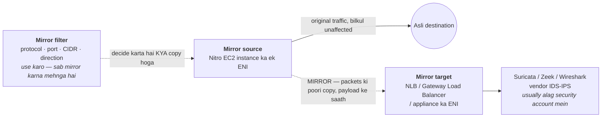

**Chaar objects jo configure karne hote hain** — inke naam yaad rakhne layak hain, kyunki sawaal usually sirf itna hota hai: *"VPC mein packets kaise capture karoge?"*

| Object | Kya hai |
|---|---|
| **Mirror source** | Woh ENI jiska traffic copy kar rahe ho |
| **Mirror target** | Copies kahan jaayengi — ek ENI, ek **NLB**, ya ek **Gateway Load Balancer** (GWLB scalable, appliance-fleet option hai) |
| **Mirror filter** | Rules jo decide karte hain *kya* mirror hoga (protocol, port, CIDR, direction). Zaroori hai — sab kuch mirror karna mehnga hai |
| **Mirror session** | Source + target + filter ko jodta hai, ek priority number ke saath |

**Key facts aur constraints**
- **Source hamesha ek ENI hota hai**, isliye yeh ek **Nitro-based EC2** feature hai. Lambda ke liye kaam **nahi** karta, aur RDS ya doosre managed services ke liye bhi nahi jahan ENI aapka nahi hota.
- Source aur target **different VPCs** (peering ya Transit Gateway ke through) aur **different accounts** mein ho sakte hain — standard pattern ek dedicated security/inspection account hai.
- Mirrored traffic **source instance ke network bandwidth allocation se kata hai**, aur production traffic se *neeche* prioritise hota hai — toh load par AWS mirror packets drop karta hai, asli packets nahi.
- Yeh **free nahi hai**: per hour per mirrored ENI, plus inspection fleet, plus AZs ke across jaaye to data transfer. Filters isi ko sane rakhne ka tareeka hain.
- Yeh **jo ENI ke wire par hai wahi** capture karta hai — ek copy, koi security decision nahi. Na block karta hai, na badalta hai.

**Flow Logs vs Traffic Mirroring vs CloudTrail** — yahi distinction test hoti hai:

| | Kya capture karta hai | Kab uthao |
|---|---|---|
| **VPC Flow Logs** | Metadata: 5-tuple, byte/packet counts, `ACCEPT`/`REJECT` | Connectivity debugging, cost attribution, "block hua tha kya?" |
| **Traffic Mirroring** | **Poore packets, payload ke saath** | Deep packet inspection, IDS/IPS, forensics, "asal mein kya bheja gaya tha?" |
| **CloudTrail** | AWS control plane ke **API calls** | "Security group kisne delete kiya?" — data-plane traffic ke baare mein kuch nahi batata |

**Interview framing:** *"Pehle Flow Logs — woh sasta hai, always-on hai, aur zyadatar connectivity sawaalon ka jawaab de deta hai. Traffic Mirroring jab payload chahiye ho: Suricata jaisa IDS chalana, ya suspected compromise ki forensics. Main ek separate security account mein appliance fleet ke aage Gateway Load Balancer par mirror karunga, aur mirror filters aggressively use karunga, kyunki sab kuch mirror karne se traffic volume double ho jaata hai aur source instance ki bandwidth kat jaati hai."*

### Hands-On: VPC

```bash
# VPC + one public and one private subnet
aws ec2 create-vpc --cidr-block 10.0.0.0/16 --tag-specifications 'ResourceType=vpc,Tags=[{Key=Name,Value=prod-vpc}]'
aws ec2 create-subnet --vpc-id vpc-abc --cidr-block 10.0.1.0/24 --availability-zone us-east-1a  # public
aws ec2 create-subnet --vpc-id vpc-abc --cidr-block 10.0.11.0/24 --availability-zone us-east-1a # private

# Internet gateway + public route (this route is what MAKES the subnet public)
aws ec2 create-internet-gateway
aws ec2 attach-internet-gateway --vpc-id vpc-abc --internet-gateway-id igw-abc
aws ec2 create-route --route-table-id rtb-public --destination-cidr-block 0.0.0.0/0 --gateway-id igw-abc

# NAT gateway (in the PUBLIC subnet) + private route
aws ec2 allocate-address --domain vpc
aws ec2 create-nat-gateway --subnet-id subnet-public --allocation-id eipalloc-abc
aws ec2 create-route --route-table-id rtb-private --destination-cidr-block 0.0.0.0/0 --nat-gateway-id nat-abc

# Free S3 gateway endpoint so private subnets skip the NAT for S3 traffic
aws ec2 create-vpc-endpoint --vpc-id vpc-abc --service-name com.amazonaws.us-east-1.s3 \
  --vpc-endpoint-type Gateway --route-table-ids rtb-private

# Flow logs for debugging
aws ec2 create-flow-logs --resource-type VPC --resource-ids vpc-abc --traffic-type ALL \
  --log-destination-type cloud-watch-logs --log-group-name /aws/vpc/flowlogs \
  --deliver-logs-permission-arn arn:aws:iam::123456789012:role/flowlogsRole
```
**"mera instance internet reach nahi kar pa raha" ke liye debug order:** route table (kya ek `0.0.0.0/0` hai aur kya woh public ke liye IGW / private ke liye NAT par point karta hai?) → kya NAT Gateway actually **ek public subnet mein** hai? → security group outbound → NACL dono directions → kya instance ke paas bilkul bhi public IP hai (sirf public subnet) → phir `ACCEPT`/`REJECT` ke liye **flow logs** padho.

---

## 7. Cost

### Networking Costs — Paisa Actually Kahan Jaata Hai

Data transfer wahi line item hai jo teams ko chaunkata hai, kyunki compute aur storage cost upfront dikhte hain jabki network cost *emergent* hota hai — woh architecture ke natije mein paida hota hai. Woh ek rule jo zyadatar surprising bill samjha deta hai: **inbound free hai, outbound paise leta hai, aur "outbound" mein woh traffic bhi shaamil hai jo AWS se bahar hi nahi jaata.**

**Mental model — packet jitna door jaata hai, cost utna badhta hai:**

```
FREE      Internet se inbound
          Same-AZ, same-VPC traffic private IPs par
          In-region S3 & DynamoDB se GATEWAY ENDPOINT ke through

$         Cross-AZ, ek region ke andar     (~$0.01/GB -- DONO DIRECTION MEIN)
$$        Cross-region                    (~$0.02/GB se upar)
$$$       Internet ko bahar                (~$0.09/GB, volume par tiered down)
$$$$      NAT Gateway ke through bahar     (internet egress + ~$0.045/GB PROCESSING)
```

*Rates directional aur region-dependent hain — order matter karta hai, exact paise nahi.*

**Chaar cheezein jo actually surprise bill banati hain**

| Wajah | Kyun chubhta hai | Fix |
|---|---|---|
| **NAT Gateway data processing** | Hourly charge *aur* internet egress ke upar ~$0.045/GB. Private-subnet ka S3 traffic bina kisi wajah ke NAT processing bharta hai | S3/DynamoDB ke liye **Gateway VPC Endpoint** — free, aur NAT hop poori tarah hata deta hai |
| **Cross-AZ chatter** | **Dono direction** mein bill hota hai; randomly load-balance karta 3-AZ service mesh apni lagbhag ⅔ calls cross-AZ bhejta hai | Jahan workload allow kare wahan same-AZ routing, aur cross-zone load balancing par deliberate raho — dekhein [ELB Deep-Dive](08-load-balancing-autoscaling.md#elb-deep-dive-cross-zone-load-balancing-504-timeouts--shield-ddos-protection) |
| **Internet egress** | ~$0.09/GB sabse mehnga normal path hai, aur woh user ko bheje gaye har response par lagta hai | Aage **CloudFront**: CDN egress sasta hai *aur* origin→CloudFront transfer free hai |
| **Private traffic ke liye public path** | AWS service ko uske public endpoint se reach karna NAT/IGW se bahar jaata hai aur internet egress bill hota hai | Interface/Gateway VPC Endpoints use karo, traffic AWS network par hi rehta hai |

⚠️ **Classic trap:** cross-AZ traffic **per direction** bill hota hai, toh ek request/response pair jo AZ boundary cross karta hai **do baar** charge hota hai. Isliye "sab kuch teen AZs mein spread kar do" free nahi hai — high availability ka ek running cost hai, aur yeh jaanna ki dono direction mein charge hota hai, hi answer ko senior banata hai.

**Sabse zyada value wala fix, diagram mein** — wahi S3 `GetObject`, do raaste, bahut alag bill:

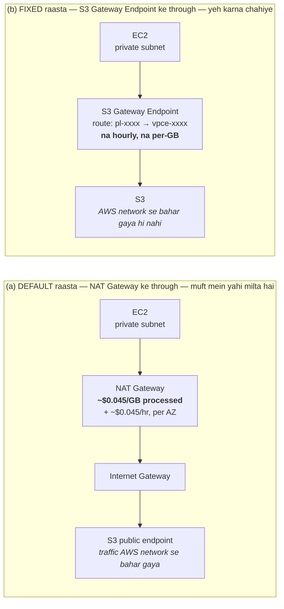

Gateway endpoint par **na hourly na per-GB charge** hai, toh raasta (b) strictly sasta *aur* strictly zyada private hai. Isliye "S3 aur DynamoDB ke liye gateway endpoints add karo" kisi bhi AWS network cost review ka pehla item hota hai.

**Per-service charging models jo yaad rakhne layak hain** — rate se zyada *shape* matter karta hai:

| Service | Charging model |
|---|---|
| **NAT Gateway** | Per hour **+ per GB processed** — aur HA ke liye per AZ ek chahiye, toh realistically ~3× hourly |
| **Interface VPC Endpoint (PrivateLink)** | Per hour **per AZ per endpoint** + per GB — akele sasta, lekin kai services × 3 AZs par multiply ho jaata hai |
| **Gateway VPC Endpoint** (S3, DynamoDB) | **Free** — na hourly, na per-GB. Ise na rakhne ki koi wajah nahi hai |
| **Transit Gateway** | Per **attachment**-hour + per GB — 30 VPCs wala hub 30 attachment-hours bharta hai |
| **VPC Peering** | **Koi hourly charge nahi** — sirf neeche ka cross-AZ/cross-region transfer |
| **Internet Gateway / Egress-Only IGW** | Device ke roop mein **free** — sirf unke through gaya data transfer bharte ho |
| **Site-to-Site VPN** | Per tunnel-hour + data transfer |
| **Direct Connect** | Fixed port-hour zyada, lekin **volume par egress kaafi sasta** — isi se woh pay back karta hai |
| **Public IPv4 addresses** | Feb 2024 se **har public IPv4 par hourly charge**, use mein ho ya na ho. Idle Elastic IP par charge pehle se tha; ab attached wale par bhi hai |

**Do cost answers jo ready rakhne layak hain**
- *"Hamara AWS network bill kaise kam karoge?"* → Impact ke order mein: NAT processing charges khatam karne ke liye **S3/DynamoDB ke gateway endpoints**; internet egress ke aage **CloudFront**; phir [Flow Logs](#vpc-flow-logs) se **cross-AZ chatter ka audit**, jo use attribute kar sakte hain; phir Interface Endpoints right-size karna, kyunki per service per AZ ek jama ho jaana aasan hai. Aakhir mein unattached public IPv4 release karna.
- *"VPC Peering Transit Gateway se sasta kyun hai?"* → Peering mein na per-attachment na per-GB charge hai — lekin woh scale nahi karta: *n* VPCs ko *n(n−1)/2* connections chahiye aur peering **transitive nahi** hai. TGW ka per-attachment cost transitive routing aur routes manage karne ki ek jagah kharidta hai. Crossover usually 5–10 VPCs ke aas-paas aata hai.

---

## 8. Resilience & Disaster Recovery

### Disaster Recovery — Networking

| | |
|---|---|
| **Actually risk par kya hai** | VPCs, subnets, route tables, NAT gateways, security groups, NACLs, VPN aur Direct Connect configuration |
| **Backup mechanism** | **Sirf IaC** — networking ke liye koi snapshot nahi hota. AWS Config change history record karta hai |
| **Realistic RPO / RTO** | RPO = last commit. RTO uneven hai: security groups seconds, NAT gateway minutes, VPN tunnels tens of minutes, **Direct Connect hafte** |

**Recovery runbook:**
1. **VPC module re-apply karo** DR region mein — jo sirf tab kaam karta hai jab aapne pehle se **non-overlapping CIDRs** plan kiye the.
2. **Connectivity dobara banao:** VPN tunnels, VPC peering, ya Transit Gateway attachments, phir route tables aur propagations theek karo.
3. **DNS update karo:** Route 53 private hosted zone associations aur Resolver rules per-VPC hote hain aur automatically saath nahi aate.
4. **Success declare karne se pehle egress verify karo** — missing NAT gateway ya route ek aisi app deta hai jo start theek hoti hai aur phir har outbound call fail karti hai, jo application bug jaisa dikhta hai.

⚠️ **Gotcha:** **overlapping CIDR ranges ek DR blocker hai jise aap sirf incident se *pehle* fix kar sakte ho.** Agar prod aur DR dono ko `10.0.0.0/16` diya gaya tha, to aap unhe kabhi peer ya transit-gateway nahi kar sakte, aur yeh sabse kharab waqt par pata chalta hai. DR CIDRs design time par allocate karo. Dusra: **Direct Connect emergency mein provision nahi ho sakta** — wo physical cross-connect hai hafton ke lead time ke saath, toh har DR plan ko VPN-over-internet fallback maan kar chalna chahiye aur usi tarah test hona chahiye.

---

## 9. Real-World Topology Pass

### Real-World Topology Pass — Ek Production ECS-on-EC2 Stack ke Against

Yeh seventh pass hai, aur baaki `[gaps]` sections se iska origin different hai. Pehle ke passes **interview syllabus** ke against gap-fill the — "senior bar par yeh topic missing hai." Yeh pass ek **asli production topology** ke against gap-fill hai: ek containerized Windows service jo ECS-on-EC2 par, ek internal ALB ke peeche, ek aisi VPC ke andar chalti hai jo application khud own nahi karti.

Yeh distinction matter karta hai kyunki interview ka syllabus aapko sikhata hai **VPC kaise banaya jaata hai**, jabki zyadatar enterprise jobs mein aap ek aisi VPC **consume** karte ho jo kisi aur ne banayi hai. Neeche ke paanch gaps thik wahi delta hain — woh cheezein jo ek real stack ko chalane ke liye chahiye thi lekin is document mein absent ya sirf ek line mein thi.

### Reference Topology — Jiske Against Yeh Pass Kiya Gaya

Ek generic three-stack Terraform topology. Sab kuch jispar *platform-managed* likha hai, woh **inherited aur read-only** hai — application stacks use `data` sources se **discover** karte hain, create nahi karte. Baaki sab Terraform se banta hai.

```text
        ┌──────────────────────────────────────────────────────────────┐
        │  CALLERS — inside the corporate network                      │
        │  web apps · sibling internal services · partner integrations │
        └───────────────────────────┬──────────────────────────────────┘
                                    │  resolves a private DNS name
                                    ▼
        ┌──────────────────────────────────────────────────────────────┐
        │  ROUTE 53 — private hosted zone                              │
        │  A-alias record  ──►  internal ALB   (zone id from state)    │
        └───────────────────────────┬──────────────────────────────────┘
                                    │
 ═══════════════════════════════════╪══════════════════════════════════════════
   V P C  — platform-provisioned, discovered by tag  Name = <account alias>
            IGW · NAT · subnets · route tables · AZ layout :  ALL INHERITED
 ═══════════════════════════════════╪══════════════════════════════════════════
                                    │
  ┌─ PUBLIC SUBNETS — tag SubnetType = Public ──────────────────────────────────┐
  │   Looked up by all three stacks. NO service resource is ever placed here.
  │
  │     [ Internet Gateway  ]   platform-managed
  │     [ NAT Gateway per AZ ]  platform-managed  ◄── sole egress path for tasks
  └─────────────────────────────────────────────────────────────────────────────┘
                                    │
  ┌─ PRIVATE SUBNETS — tag SubnetType = Private, one per AZ ────────────────────┐
  │                                 ▼
  │  ┌─ INTERNAL ALB ───────────────────────────────────────────────────────┐
  │  │  internal = true · idle_timeout 300s · subnets = private
  │  │  Listener   HTTP :80   — no TLS, terminates upstream
  │  │  Default action: fixed-response 501  (unmatched path fails loudly)
  │  └──────────────────────────────┬───────────────────────────────────────┘
  │                                 │  LISTENER RULE
  │                                 │  path  /service/*   and  /legacy-service/*
  │                                 ▼
  │  ┌─ TARGET GROUP ───────────────────────────────────────────────────────┐
  │  │  HTTP :8006 · target_type = instance · least_outstanding_requests
  │  │  health  /service/ping · matcher 200-499 · 30s/15s · 2 up / 3 down
  │  │  deregistration_delay 120s
  │  └──────────────────────────────┬───────────────────────────────────────┘
  │                                 │  connects to EPHEMERAL host port
  │                                 │  32768-65535  (fleet SG allows from ALB SG)
  │                                 ▼
  │  ┌─ ECS CLUSTER ON EC2 — not Fargate; a cost decision for Windows ──────┐
  │  │
  │  │    ASG  ──capacity provider──►  ECS SERVICE  ──uses──►  TASK DEF
  │  │    ───────────────────────      ───────────────────     ─────────────
  │  │    Windows fleet                spread by AZ,           Win 2019 Full
  │  │    gp3 100GB encrypted          then binpack CPU        cpu/mem per env
  │  │    managed scaling on           circuit breaker +       container :8006
  │  │    min/max per env              rollback · grace 900s   awslogs driver
  │  │                                 CPU-target autoscaling  roles from core
  │  │
  │  │  ┌────────────────┐  ┌────────────────┐  ┌────────────────┐
  │  │  │ EC2 · Windows  │  │ EC2 · Windows  │  │ EC2 · Windows  │
  │  │  │      AZ a      │  │      AZ b      │  │      AZ c      │
  │  │  ├────────────────┤  ├────────────────┤  ├────────────────┤
  │  │  │ IIS container  │  │ IIS container  │  │ IIS container  │
  │  │  │ site :80→:8006 │  │ site :80→:8006 │  │ site :80→:8006 │
  │  │  │ app pool: new  │  │ app pool: new  │  │ app pool: new  │
  │  │  │ app pool: old  │  │ app pool: old  │  │ app pool: old  │
  │  │  │ same phys path │  │ same phys path │  │ same phys path │
  │  │  └───────┬────────┘  └───────┬────────┘  └───────┬────────┘
  │  └──────────┼───────────────────┼───────────────────┼───────────────────┘
  │             └───────────────────┴───────────────────┘
  │                                 │
  │  ┌─ VPC INTERFACE ENDPOINT ─────┴───────────────────────────────────────┐
  │  │  PrivateLink → external partner service · private DNS enabled
  │  │  own SG: ingress on the partner port from the fleet SG
  │  │  keeps partner traffic OFF the NAT / internet path entirely
  │  └──────────────────────────────────────────────────────────────────────┘
  │
  │  ┌─ CLIENT VPN SECURITY GROUP — platform-owned, discovered by tag ──────┐
  │  │  lets engineers reach internal endpoints over VPN
  │  └──────────────────────────────────────────────────────────────────────┘
  └─────────────────────────────────────────────────────────────────────────────┘
                                    │
        ┌───────────────────────────┴──────────────────────────────────┐
        │                    DATA & DEPENDENCIES                       │
        └──────────────────────────────────────────────────────────────┘

   RELATIONAL DB (Oracle)     S3 APPLICATION DATA       SECRETS MANAGER
   ──────────────────────     ───────────────────       ───────────────
   SG ingress from fleet SG   regulated KMS key         DB credentials
   host + creds via state     public access blocked     APM licence key
   port opened by core repo   cross-region replication  registry creds

   CLOUDWATCH LOGS            ECR + ARTIFACT REGISTRY   PLATFORM KMS
   ───────────────            ───────────────────────   ────────────
   /ecs/tasks/<stack>-<svc>   image built in CI, then   basic-data key
   NO retention configured    pushed to the registry    regulated-data key
   also shipped to a central  version pinned by the     task role gets Decrypt
   log platform               release tool              + GenerateDataKey

   SIBLING INTERNAL SERVICES  COMPLIANCE BUCKET
   ─────────────────────────  ─────────────────
   reached over their own     PutObject only
   internal ALBs; core repo
   adds the ingress rules


   OWNERSHIP KEY
   ─────────────
   "platform-managed" / "platform-owned"  →  inherited, read-only to these stacks
   everything else                        →  created by the three Terraform stacks
```

**Is diagram ka headline finding, aur kyun yeh purely ek networking observation hai:** teen repositories mein se **koi bhi** VPC, subnets, NAT gateway, ya internet gateway create nahi karta. Sab **tag se discover** karte hain:

```hcl
data "aws_vpc" "vpc" {
  tags = { Name = data.aws_iam_account_alias.current.account_alias }
}

data "aws_subnets" "private" {
  filter { name = "vpc-id"            values = [data.aws_vpc.vpc.id] }
  filter { name = "tag:SUB-Type"      values = ["Private"] }
}
```

Per AWS account **ek** platform-provisioned VPC hai, jo tag `Name = <account alias>` se locate hoti hai. NAT gateways, IGW, route tables aur AZ layout ek central cloud platform team ke owned hain. NAT poore codebase mein **kabhi named nahi hai** — woh sirf *implicitly* exist karta hai, kyunki fleet SG `0.0.0.0/0` par egress allow karta hai jabki har instance ek private subnet mein baitha hai, toh outbound traffic ko platform NAT se guzarna hi padega.

**Networking consequence:** *account boundary hi environment boundary hai.* Koi per-service network isolation nahi — account ka har service ek hi VPC, ek hi set of private subnets, aur ek hi NAT path share karta hai.

| Diagram mein yeh cheez | Is document mein pehle kahan thi | Gap number |
|---|---|---|
| Client VPN security group | Sirf ek line, [Hybrid Connectivity](#hybrid-connectivity-site-to-site-vpn--direct-connect) ke aakhir mein | **Gap 1** |
| Tag se discover hone wali platform VPC/subnets | Kahin nahi — document VPC *banana* sikhata hai | **Gap 2** |
| `internal = true` ALB, private subnets mein | Kahin nahi (`internal = true` poore guide mein absent) | **Gap 3** |
| Per-AZ filtered subnets par interface endpoint | Placement mechanics absent; cost model tha | **Gap 4** |
| `32768–65535` ALB SG → fleet SG | [Containers](09-containers-ecs-fargate.md#ecs-elastic-container-service) mein tha, yahan nahi | **Gap 5** |

### Is Pass ka Summary

| # | Gap | Ek line mein kyun matter karta hai |
|---|---|---|
| 1 | [AWS Client VPN](#aws-client-vpn-individual-users-ko-vpc-ke-andar-laana) | Internal-only architecture mein humans ka ekmatra raasta; do gates (authorization rule + SG) ka distinction, aur split-tunnel ka NAT cost |
| 2 | [Network inherited, owned nahi](#network-inherited-hai-owned-nahi-shared-vpc-aur-central-platform-model) | Enterprise mein aap VPC banate nahi, discover karte ho; RAM se subnet sharing; account = blast radius |
| 3 | [Internal ALB + subnet requirements](#internal-vs-internet-facing-alb-aur-alb-ke-subnet-requirements) | `scheme` immutable hai; ALB ko 2 AZs, `/27`, aur 8 free IPs chahiye — warna scale out chup-chaap fail hota hai |
| 4 | [Endpoint AZ placement & AZ IDs](#interface-endpoint-ka-azsubnet-placement-zonal-dns-aur-az-ids) | Per AZ ek ENI = per AZ ek charge; provider ki AZs match karni padti hain, aur **AZ names per account different hote hain** |
| 5 | [Dynamic host ports, network side](#ecs-dynamic-host-ports-isko-networking-side-se-dekhna) | `32768–65535` SG rule ka NACL ephemeral trap se koi rishta nahi; `bridge` per-service SG isolation impossible bana deta hai |

---

## 10. Applied Case — App-to-Database Networking

### Aurora MySQL ← .NET Service on ECS

Ek end-to-end applied case: app tier se database tak ka networking. Yahan sabse zyada kaam **security groups, subnet sizing, aur failover par connection-pool behaviour** ka hai — routing ka nahi.

**Target architecture:** `ALB → ECS task (private subnets) → RDS Proxy → Aurora MySQL cluster`. Aurora `PubliclyAccessible = false`, DB subnet group **3 AZs** par. Credentials: task role se **IAM DB auth** (container mein koi password nahi); Secrets Manager wala credential sirf *RDS Proxy* use karta hai.

**Networking baseline**

| Item | Setting |
|---|---|
| ECS tasks | Private subnets, Fargate `assignPublicIp: DISABLED` |
| Aurora | Private subnets, **koi IGW/NAT route nahi** |
| Aurora SG | Inbound 3306 **from RDS Proxy SG** |
| RDS Proxy SG | Inbound 3306 **from ECS task SG** |
| VPC endpoints | Interface: `secretsmanager`, `sts`, `ecr.api`, `ecr.dkr`, `logs` + **S3 gateway** |

⚠️ In endpoints ke bina task ko sirf IAM token lene aur image pull karne ke liye **NAT gateway** chahiye hoga. Aur endpoints **ECS task ke VPC** mein hone chahiye, DB ke VPC mein nahi.

---

#### Security groups — access control asal mein yahin rehta hai

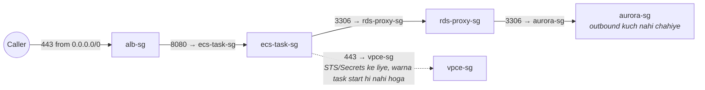

Har rule ka source ek **SG ID** hai, CIDR nahi. Teen properties jo matter karti hain:

1. **Stateful** — permitted outbound ka return traffic automatically allowed. **Ephemeral-port return rule kabhi na likho** (NACL ka ulta — dekhein [NACLs](#nacls-detail-mein--rule-evaluation-aur-ephemeral-port-trap)).
2. **Identity, location nahi** — `source_security_group_id` ka matlab "jispar yeh SG laga hai, wo jahan bhi ho". Subnet rescale karo, AZ add karo, tasks move karo — rule ka matlab wahi rehta hai. **CIDR rule chup-chaap widen ho jaata hai** jab subnet reuse hota hai.
3. **Default egress allow-all hai** — task egress lock karo to `443 → vpce-sg` yaad rakhna, warna task STS se token nahi le paayega aur aisi error se fail hoga jo networking jaisi *dikhti hi nahi*.

```hcl
resource "aws_security_group_rule" "aurora_from_proxy" {
  type = "ingress"; from_port = 3306; to_port = 3306; protocol = "tcp"
  security_group_id        = aws_security_group.aurora.id
  source_security_group_id = aws_security_group.rds_proxy.id
}
```

Proxy skip kar rahe ho? Phir bas `aurora-sg ← ecs-task-sg` on 3306.

---

#### Same VPC, different subnets — routing mein kuch nahi karna padta

Har route table mein VPC CIDR ka **undeletable `local` route** hota hai, jo **saare** subnet CIDRs cover karta hai (baad mein add kiye secondary CIDR blocks bhi). `10.20.10.5 → 10.20.20.42:3306` ek plain intra-VPC hop hai — koi peering, gateway, NAT nahi. **Ghumane ke liye koi routing knob hi nahi hai.**

Do consequences:
- ⚠️ **Alag subnet CIDRs khud se koi isolation nahi dete.** Data subnets VPC ki har cheez se reachable hain. Isolation poori tarah **SGs + default route ki gairhaazri** se aati hai.
- Intra-VPC traffic par interpose karne ka ek hi tarika hai: `local` se **zyada specific** route jo GWLB/ENI par point kare ("middlebox routing"). Yani `local` literally absolute nahi hai.

---

#### Subnet sizing — yahi log galat karte hain

**App subnets.** `awsvpc` mein har task apna ENI + ek private IP leta hai; AWS **5 IPs reserve** karta hai (dekhein [CIDR section](#ip-addressing-cidr--subnetting--ground-up)), toh `/27` = 27 usable. ⚠️ **Rolling deploy ka budget bhoolna sabse badi galti hai:** `deploymentMaximumPercent = 200` par purane aur naye tasks saath rehte hain, toh peak demand **2× max task count** hoti hai. 40 tasks × 2 AZs wali service ko peak par ~40 IPs per subnet chahiye — `/27` **deployment ke beech mein** `RESOURCE:ENI` placement error se fail hoga aur aapko half-deployed chhod dega. **`/24` use karo** — VPC ke andar IPv4 space free hai.

**Data subnets.** Per AZ `/27` comfortable hai. Har Aurora instance apni AZ mein ek IP leta hai; RDS Proxy har assigned subnet mein ENIs banata hai. DB subnet group ko **≥2 AZs** chahiye — **3 do**, taaki failover ke paas utarne ki jagah hamesha ho. Subnet group define karta hai ki Aurora *kahan place ho sakta hai*, toh aap us AZ mein IP space pre-provision kar rahe ho jahan aaj koi instance nahi bhi ho.

---

#### NACLs aur failure signatures

Default NACL (allow all) → kuch karne ki zarurat nahi, aur **yahi sahi choice hai**; SGs behtar tool hain. Custom NACL mandated ho to woh **stateless** hai:

| NACL | Direction | Rule |
|---|---|---|
| App subnets | Egress | allow TCP 3306 → data CIDRs |
| App subnets | Ingress | allow TCP **32768–65535** ← data CIDRs |
| Data subnets | Ingress | allow TCP 3306 ← app CIDRs |
| Data subnets | Egress | allow TCP **32768–65535** → app CIDRs |

**Failure signature diagnostic hai** — yeh teen lines debugging ke ghante bachati hain:

| Symptom | Matlab |
|---|---|
| **Timeout** | NACL drop ya missing SG rule — packets chup-chaap discard |
| **Connection refused / RST** | Host mil gaya, wahan kuch listen nahi kar raha. **Network path theek hai** — port aur DB up hai ya nahi dekho |
| **TLS ya auth error** | Path aur port dono theek — ab certs ya IAM debug karo |

---

#### DNS aur Aurora failover ka asli trap

```
appdb.cluster-abc123.us-east-1.rds.amazonaws.com   (CNAME, TTL 5s)
  └→ appdb-instance-1.abc123…   └→ A  10.20.20.42
```

VPC par `enableDnsSupport` **aur** `enableDnsHostnames` dono chahiye. `enableDnsHostnames = false` par endpoint **public address** par resolve ho sakta hai jiska private subnet se koi route nahi — aur woh timeout **SG problem jaisa dikhta hai**.

⚠️ **Asli trap:** aapka connection pool ek specific instance IP par **khule TCP sessions** rakhta hai. **DNS re-point established sockets par kuch nahi karta.** Failover ke baad purana writer reader ban jaata hai, pooled connections chalte rehte hain, aur **har write fail hoti hai**:

```
Error 1290: The MySQL server is running with the --read-only option
```

Mitigations, preference order mein:
1. **RDS Proxy** — failover detect karke client sessions khud re-point karta hai. Yahi uski cost justify karne ki main wajah hai.
2. **`ConnectionLifeTime=900`** — pooled connection ki age cap karta hai, toh pool 15 min mein khud drain ho jaata hai.
3. **`1290` catch karo → `MySqlConnection.ClearPool()` → retry.** EF Core (Pomelo) mein `errorNumbersToAdd: [1290]` daalo taaki woh ise transient maane.

DNS caching par: .NET (Core/5+) raw TCP ke liye in-process DNS cache nahi karta — OS resolver par chhodta hai, aur Linux containers usually bina `nscd` chalte hain, toh har naya physical connection re-resolve karke 5s TTL honour karta hai. `DnsRefreshTimeout` .NET Framework ka concern tha.

---

#### Cross-AZ — by design, aur theek hai

Aurora ka **ek writer ek AZ** mein hota hai; tasks availability ke liye AZs par spread hote hain. Toh **zyadatar write traffic AZ boundary cross karta hai — by design.**
- **Latency:** sub-ms se ~1ms. Irrelevant, jab tak per request sau sequential round trips na ho — us case mein **query pattern fix karo, topology nahi**.
- **Cost:** $0.01/GB each direction (dekhein [Networking Costs](#networking-costs--paisa-actually-kahan-jaata-hai)).
- ⚠️ **Tasks ko writer ki AZ par pin na karo** — rounding-error cost ke badle availability regression milega, aur failover par writer khud move ho jaata hai.

---

#### Topology options — jab app aur DB ek VPC mein na hon

| Topology | Chalega? | SG-to-SG rules? | Note |
|---|---|---|---|
| **Same VPC, different subnets** | ✅ kuch karna nahi | ✅ | `local` route sab handle karta hai |
| Different VPCs, same region, **peering** | ✅ | ✅ | Non-overlapping CIDRs zaroori; routes **dono side** add karo |
| Different VPCs via **Transit Gateway** | ✅ | ❌ **sirf CIDR rules** | Yahi par SG-reference wali advice tootti hai |
| Overlapping CIDRs / hard account boundary | ❌ peering impossible | ❌ | PrivateLink + NLB, caveats ke saath |

- **Peering:** SG references **same-region peering par kaam karte hain** — peer VPC ka task SG ID seedha Aurora SG rule mein daal do. **Cross-region par nahi chalta.** Missing return route "timeout par SG theek lagta hai" ka #1 karan hai (dekhein [VPC Peering](#vpc-peering)).
- **TGW:** SG referencing **support nahi karta** → CIDR rules majboori. Mitigation: ECS tasks ko **dedicated** subnets do taaki CIDR rule ka matlab "app tier" ho, "us VPC mein kuch bhi" nahi — lekin unka size **`/24` rakho, `/27` nahi**. ⚠️ Load-bearing word *dedicated* hai, ***chhota* nahi**: `/27` rule ke liye theek hai lekin **deployment ke beech fail** ho jaata hai (upar [Subnet sizing](#subnet-sizing--yahi-log-galat-karte-hain) dekho), aur toota deploy thode broad CIDR rule se zyada bura hai. Per AZ ek dedicated `/24` rule ke liye kaafi precise hai *aur* rolling deploys ke liye kaafi bada bhi. Isse bhi tight chahiye? Rule mein VPC CIDR ki jagah individual app-subnet CIDRs list karo.
- **PrivateLink (last resort):** overlapping CIDRs tolerate karne wala ek hi option, par Aurora ke against awkward — Aurora ka writer IP **failover par badalta hai**, toh static IP targets stale ho jaate hain aur aap RDS event subscriptions par Lambda chalane lagte ho jo **theek us incident mein fail ho sakta hai** jab woh sabse zyada chahiye. NLB ka **350s idle timeout** idle flows ko chup-chaap girata hai. **Simpler alternative:** ek VPC mein **secondary non-overlapping CIDR** add karke ECS tasks wahan move kar do.

**Topology-independent:** IAM DB auth, `SslMode=VerifyFull`, aur VPC endpoints ka **task ke VPC** mein hona — teenon topology se badalte nahi.

---

#### RDS Proxy, IAM auth aur app-side settings (jitna networking se juda hai)

- **Proxy kab worth hai:** tasks scale in/out karte hon (bursty connections), fast failover chahiye (~seconds vs ~60s), ya credential handling centralize karni ho. Cost ~$0.015/vCPU-hr of the DB instance. Ek always-on fixed-pool service seedha cluster writer endpoint par ja sakti hai.
- **MySQL-specific:** IAM auth **~200 new connections/sec per instance** par capped hai — cold Fargate scale-out ise hit kar sakta hai; proxy backend connections reuse karke absorb karta hai.
- ⚠️ **Session pinning (MySQL):** proxy client ko ek backend connection par **pin** kar deta hai (silently one-connection-per-client) jab session server-side `PREPARE`, `CREATE TEMPORARY TABLE`, `LOCK TABLES`/`GET_LOCK`, session/user variables (`SET @x`, `SET SESSION`), ya long-held explicit transactions kare. Isliye `IgnorePrepare=true`. **`DatabaseConnectionsCurrentlySessionPinned`** metric dekho — agar woh total connections ko track kar raha hai to failover resilience mil rahi hai lekin **pooling ka fayda nahi**.
- **IAM auth ka #1 error:** `rds-db:connect` ka resource ARN galat hona — proxy ke through jaa rahe ho to **proxy ID (`prx-…`)**, direct jaa rahe ho to **cluster resource ID (`cluster-…`)`**. Galat ID = `PAM authentication failed`.
- **`SslMode=VerifyFull` + CA bundle non-negotiable hai:** IAM auth token `mysql_clear_password` se bhejta hai — full verification ke bina aap ek **usable credential** ek unverified server ko de rahe ho.
- **Pool math:** `MaximumPoolSize` × task count Aurora ke `max_connections` (~1000 on `db.r6g.large`) se neeche rehna chahiye. 40 × 20 = 800 already close hai.
- **Token 15 min mein expire hota hai, container din bhar jeeta hai** → refreshing password provider use karo (MySqlConnector 2.3.0+ `UsePeriodicPasswordProvider`), startup par ek baar token generate na karo. Symptom: "~15 min chalta hai phir fail".
- **`ServerVersion.AutoDetect()` kabhi na use karo** (Pomelo) — woh DI configuration ke dauraan synchronous connection kholta hai, toh Aurora mid-failover ho to container start hi nahi hoga, aur woh aapki retry policy banne se pehle chalta hai.
- **Migrations:** alag one-off ECS `RunTask` se chalao, service deploy se pehle gated. **Container start par kabhi nahi** — N tasks = N concurrent migrators racing.
- ⚠️ **ALB health check DB ko touch na kare**, warna ek Aurora failover cascade hokar ALB se saare tasks maar dega. DB reachability alag se `/health/ready` par expose karo, deployment gates ke liye.
- **Reads:** proxy read-only endpoint ya Aurora reader endpoint ko **doosre `MySqlDataSource`** ke roop mein register karke explicitly route karo. **Koi bhi aapke reads route nahi karta**, aur replicas lag kar sakte hain.

---

#### Verify kaise karein

```bash
# chalte task ke andar se (ECS Exec)
aws ecs execute-command --cluster prod --task <id> --container app --interactive --command "/bin/sh"
nc -zv appdb.cluster-abc123.us-east-1.rds.amazonaws.com 3306
```

Jo paths task start hone se **pehle** fail hote hain (ya jab image mein shell nahi bhejna) — **VPC Reachability Analyzer** route tables, SGs aur NACLs ko statically evaluate karke **blocking component ka naam** batata hai:

```bash
aws ec2 create-network-insights-path --source <eni-id> --destination <db-eni-id> \
  --protocol tcp --destination-port 3306
```

---

#### Common failure modes

| Symptom | Cause |
|---|---|
| `PAM authentication failed` | Galat `rds-db:connect` resource ARN (cluster vs proxy), ya user AWS auth plugin se nahi bana |
| ~15 min chalta hai phir fail | Token startup par ek baar generate hua, refreshing provider se nahi |
| `too many connections` at scale | Pool size × task count > `max_connections`; proxy nahi hai |
| Secret fetch par task timeout | `secretsmanager`/`sts` ka VPC endpoint missing aur NAT bhi nahi |
| Intermittent `connection reset` | Idle lifetime proxy/NLB idle timeout se lamba |
| Failover ke baad `1290 --read-only` | Pooled connections demoted purane writer par khule hain |

**Bottom line:** same-VPC case mein **routing free aur automatic hai**. Asli kaam teen cheezein hain — (1) **SG chaining** (identity-based, CIDR-based nahi), (2) **rolling deploy ke liye subnet IP sizing** (`/24` app subnets), (3) **Aurora failover par connection-pool behaviour** — jo ek *application* concern hai, networking nahi, aur production mein sabse zyada yahi kaatta hai.

---
---

← [Relational Databases, Caching & Analytics](10-databases-caching-analytics.md) · [Index](README.md) · [Security Services](12-security-services.md) →
