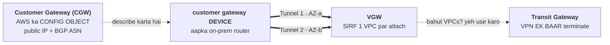
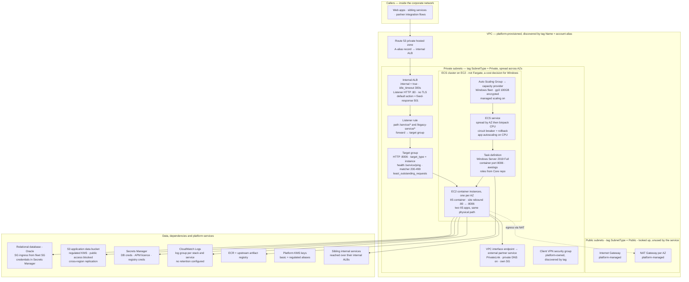

> **AWS Quick Revision Notes** · [Index](README.md) · Part II

# Networking

---

## 1. Fundamentals — Addressing & Design

### IP Addressing, CIDR & Subnetting (fundamentals)

- **IP = 32 bits**, 4 octets × 8 bits (`0-255`). Total IPv4 = 2^32 ≈ 4.29B → isi exhaustion se NAT + IPv6.
- Address = **network part** (building ka pata, subnet mein sabke liye same) + **host part** (flat number, unique). CIDR batata hai kitne bits network hain.
- **`/n` = shuru ke n bits locked.** `Total IPs = 2^(32-n)`. `/16` = 65,536; `/24` = 256; `/28` = 16.
- ⚠️ **Chhota prefix = BADA network.** `+1` prefix = size **half**, `-1` = **double**. Mnemonic: **"/24 = 256, aage har step aadha"** → /25=128, /26=64, /27=32, /28=16.
- **Subnet mask = wahi CIDR**: network bits `1`, host bits `0`. `/24`=255.255.255.0, `/26`=255.255.255.192. Mask octet sirf yeh ho sakta hai: **0 128 192 224 240 248 252 254 255**.

| CIDR | Mask | Total | AWS usable | Use |
|---|---|---|---|---|
| `/16` | 255.255.0.0 | 65,536 | 65,531 | **standard VPC** |
| `/20` | 255.255.240.0 | 4,096 | 4,091 | big EKS/app subnet |
| `/24` | 255.255.255.0 | 256 | **251** | **standard subnet** |
| `/26` | 255.255.255.192 | 64 | 59 | small app subnet |
| `/27` | 255.255.255.224 | 32 | 27 | DB / endpoint subnet |
| `/28` | 255.255.255.240 | 16 | 11 | **AWS minimum** |
| `/32` | 255.255.255.255 | 1 | — | one host (SG rule, static route) |

- **AWS limits:** VPC **aur** subnet dono `/16`..`/28`. `/29`+ allowed nahi. VPC **primary CIDR change nahi hota** (secondary CIDRs add ho sakte hain).
- ⚠️ **AWS 5 IPs reserve karta hai per subnet, 2 nahi:** `.0` network, `.1` VPC router, `.2` Amazon DNS (base+2), `.3` future, **last** broadcast. → **usable = total − 5**, isliye `/28` = **11**. `awsvpc` (per-task ENI) + EKS VPC CNI (per-pod IP) isse jaldi khaate hain → *"insufficient free IP addresses in subnet"* = **subnet sizing** problem, capacity problem nahi.
- **Block-size trick** (`/25`–`/31`): `block = 256 − last non-zero mask octet`. `/26` → 256−192 = **64** → `.0-.63 / .64-.127 / .128-.191 / .192-.255`. Network address hamesha block-size ka multiple (`192.168.1.50/26` valid *network* nahi hai).
  - *"Kya `10.0.130.45` `10.0.128.0/18` mein hai?"* → /18 mask 255.255.192.0 → block 64 → range `10.0.128.0–10.0.191.255` → **haan**.
- **Subnetting example** — VPC `10.0.0.0/16`, 3-tier × 3-AZ: public `10.0.{0,1,2}.0/24`, app `10.0.{10,11,12}.0/24`, db `10.0.{20,21,22}.0/24` (ek `/24` per tier per AZ). Habit: **3rd octet = tier+AZ label** (0-9 public, 10-19 app, 20-29 db) aur **beech mein gaps chhodo** (kal EKS ko `/20` chahiye hoga).
- ⚠️ **#1 subnetting galti:** non-`/24` ki width bhoolna — `/23` **do** third-octet values khaata hai (`10.20.10.0/23` = `10.20.10.0–10.20.11.255`), toh next subnet `10.20.12.0` se, `10.20.11.0` se nahi.
- **Route tables = CIDR list, Longest Prefix Match jeetta hai.** `0.0.0.0/0` (0 bits) vs `10.1.0.0/16` (16 bits) → specific wala. **`local` route delete/override nahi hota aur sabse pehle jeetta hai.**
- Special CIDRs: `0.0.0.0/0` = sab kuch (SG mein "poori duniya"), `x.x.x.x/32` = ek IP (office static IP ka sahi tarika), `::/0` = IPv6 sab kuch (IPv6 VPC mein ise block karna bhoolna common miss).
- **RFC 1918 private ranges:** `10.0.0.0/8` (16.7M, AWS default choice, **256 `/16` VPCs**), `172.16.0.0/`**`12`** (1M — AWS default VPC `172.31.0.0/16` yahin se; `172.32.x` **public** hai), `192.168.0.0/16` (ghar/office routers → VPC ke liye avoid). Yeh routable nahi → **isi wajah se NAT exist karta hai**.

### Overlapping CIDRs — the mistake you can't undo

- **Story:** 2021 mein do teams ne console default `10.0.0.0/16` accept kiya (alag accounts, ek doosre se anjaan). 2023 mein private connectivity chahiye → phansa.
- **Peering:** create request hi **reject** ho jaati hai (matching/overlapping CIDR). Koi `--force`, koi NAT workaround nahi.
- **TGW:** attachment **ban jaata hai**, phir traffic chup-chaap marta hai — ek route table mein ek CIDR ka **ek hi route** install hota hai; doosra blackhole.
- ⚠️ **Asli killer TGW se pehle hai — VPC ka `local` route.** Orders ka app `10.0.10.5` call karta hai → apna hi `10.0.0.0/16 → local` match hota hai → **packet VPC hi nahi chhodta**. Symptom: timeout, aur **Flow Logs mein `REJECT` bhi nahi** (reject ke liye packet ko pahunchna padta hai). Team SG/NACL debug karti rehti hai; problem routing arithmetic hai.
- **Partial overlap sabse zyada dhokha:** A=`10.0.0.0/16`, B=`10.0.5.0/24` (A ke andar) → peering ban jaati hai, par longest-prefix se `10.0.5.0/24` B ko jeet jaata hai → **A apna hi `10.0.5.x` range permanently kho deta hai**, aur pata us din chalta hai jab wahan resource launch ho.

| Fix (overlap ho chuka ho) | Verdict |
|---|---|
| Re-IP ek VPC | ✅ asli fix — par **primary CIDR change nahi hota** → naya VPC + migration, hafton ka kaam |
| Secondary CIDR (`10.50.0.0/16`) | ⚠️ partial — naye subnets reachable, **purane nahi** |
| **PrivateLink (NLB + interface endpoint)** | ✅ **best practical** — overlap se farak nahi padta (proxy, routing nahi); limitation: service-level, one-directional |
| Private NAT GW + `100.64.0.0/10` (CGNAT) | ✅ AWS ka documented overlapping-network pattern; diagram samajhne layak nahi bachta |
| Internet par jao | ❌ latency + NAT cost + PCI scope creep |

- **Model answer:** *"Overlap ho chuka hai to **PrivateLink** — networks merge kiye bina service-level exposure. Par asli answer yeh hai ki ise design time par prevent karte hain."*
- **Prevention — allocation registry day one.** `10.0.0.0/8` mein **256 `/16`** aate hain, space ki kami nahi, discipline ki hai: prod `10.0-10.9`, staging `10.10-10.19`, dev `10.20-10.29`, shared svcs `10.100.x`, reserved `10.200+` (M&A).
- **5 rules:** (1) console ka **default CIDR kabhi accept mat karo**; (2) **DR region ko apna block** (prod+DR dono `10.0.0.0/16` = failover ke din peer hi nahi kar paoge — DR ka #1 blocker); (3) **on-prem range pehle poocho** warna VPN/DX marega; (4) M&A ke liye space reserve; (5) **Amazon VPC IPAM** use karo — pools + auto overlap prevention, multi-account mein spreadsheet ke bharose na raho.

---

## 2. VPC Core — Subnets, Routing & Security

### VPC, Subnets, NAT

- VPC = isolated virtual network. CIDR at creation (`10.0.0.0/16`, can't change; secondary CIDRs; plan for peering/TGW no-overlap — upar dono CIDR subsections dekho).
- Subnet = CIDR slice, one AZ. **No inherent public/private** — route table decides.

| | Public | Private |
|---|---|---|
| IGW route | Yes | No |
| Inbound internet | possible | No |
| Outbound | direct | NAT only |

- **IGW:** one per VPC, `0.0.0.0/0 → igw` in public route table.
- **Route tables:** each subnet → 1 table; VPC has multiple.
- **NAT:** private → internet **outbound only** (inbound always blocked). `Private → NAT (in PUBLIC subnet) → IGW`. NAT **must be in public subnet**. NAT Gateway (managed, default) vs NAT Instance (self-managed). **Cost gotcha:** per-hour + per-GB → use VPC Endpoints for AWS-service traffic. NAT AZ-scoped → one per AZ for HA.
- Placement: public = LB/bastion/NAT; private = app/ECS/RDS (never DB in public).
- Misconceptions: public subnet ≠ auto internet (need public IP + IGW route + SG); NAT ≠ inbound; name ≠ security; VPC has multiple route tables.

### Default VPC

Per region ek, pehle se bana. **Hamesha `172.31.0.0/16`** (har account mein same → CIDR collision ka #1 source; primary CIDR kabhi badla nahi ja sakta). Default subnets: **per AZ ek, har ek `/20`, saare PUBLIC** (main route table mein `0.0.0.0/0 → IGW`). **Auto-assign public IPv4 = ON.** Default SG = khud se saara inbound + saara outbound; default NACL = sab allow. **Koi private subnet nahi, koi NAT Gateway nahi → database ke liye koi sahi jagah nahi.** ⚠️ **Koi subnet specify na karke** launch kiya instance yahin aata hai — "hamara dev DB internet par kyun hai?" ki usual wajah. Delete ho sakta hai (`create-default-vpc` use **naye** VPC ke roop mein banata hai, naye subnet IDs ke saath). "Default subnet" apne route table se public hai, nature se nahi. **Default VPC ≠ main VPC** (aisa kuch nahi hota; *main route table* asli concept hai). Manually banaye subnet mein `MapPublicIpOnLaunch` default **off** — bilkul ulta.

```
Default VPC  172.31.0.0/16   [IGW] -- main RT: 0.0.0.0/0 -> IGW
   AZ-a /20 PUBLIC | AZ-b /20 PUBLIC | AZ-c /20 PUBLIC    <- saare public
   auto-assign public IPv4 = ON      KOI private subnet nahi, KOI NAT GW nahi
```

### NACL Rule Evaluation & Ephemeral Ports

**Rules numbered hote hain; sabse chhota number jeetta hai aur pehle match par evaluation RUK jaati hai** — toh deny ka number us allow se **neeche** hona chahiye jise override karna hai (SG ka ulta, jahan saare rules evaluate hote hain aur order bekaar hai). 100 ke gaps mein number do. Aakhir wala `*` = implicit deny-all, edit nahi hota. Quota 20 rules (→40), per direction alag list.

**#1 failure — ephemeral ports.** NACL stateless hai, toh reply ek fresh outbound decision hai, aur woh **443 par wapas nahi aata** — client ke high port par aata hai. Web tier ko chahiye **inbound 443 + outbound `32768–65535`** (AWS ka documented example range). Galat hone par symptom: **us subnet mein timeout jiska SG provably sahi hai.** (Linux `32768–61000`, Windows `49152–65535`; par **ELB / NAT GW / Lambda `1024–65535`** use karte hain → unke peeche `1024–65535` tak widen karo.)

```
Client :51234 --request-> :443  Instance
        reply FROM :443 TO :51234   -> OUTBOUND NACL ko 32768-65535 allow karna hoga
Order:  in:  RT -> NACL -> SG -> instance     out:  SG -> NACL
```

NACL ka deny permissive SG se **override nahi hota**, aur block hua traffic instance tak pahunchta hi nahi → Flow Logs mein `REJECT`, app side par zero nishaan. **Sirf tab use karo jab explicit deny chahiye jo SG express na kar sake** (hostile CIDR) ya data-subnet ki hard boundary; warna default allow-all ko chhedo hi na.

### IPv6 & Egress-Only IGW

**Range AWS assign karta hai — aap choose nahi karte.** VPC ko **`/56`**, har subnet **hamesha `/64`** (→ per VPC 256 subnets, har ek mein ~18 quintillion addresses, toh exhaustion concept hi nahi bachta). IPv4 required rehta hai; IPv6 add hota hai → **dual-stack hi normal deployment hai**, migration nahi. ⚠️ **"Private" IPv6 address hota hi nahi** — har ek globally routable hai, toh privacy routing + SGs se aati hai. Isi wajah se **NAT ka IPv6 equivalent nahi hai**.

**Egress-Only Internet Gateway = "outbound only" ka IPv6 device** (koi translation nahi, bas stateful outbound):

| | NAT Gateway | Egress-Only IGW |
|---|---|---|
| Protocol | IPv4 | **IPv6** |
| Kahan | **public subnet mein** | **VPC par attached** |
| Route | `0.0.0.0/0 → nat-xxxx` | `::/0 → eigw-xxxx` |
| HA | **AZ-scoped, per AZ ek** | **Regional, by default HA** |
| Cost | per hour + **per GB** | **Free** |

⚠️ **SG/NACL ko explicit IPv6 rules chahiye** — IPv4 ka `0.0.0.0/0` rule IPv6 par kuch nahi karta, toh teams IPv4 lock karke `::/0` khula chhod deti hain. Route tables ko alag `::/0` chahiye. IPv6-only subnets hote hain lekin kai services/third parties abhi IPv4-only hain. ENI par IPv6 **stop/start ke baad bacha rehta hai** (auto-assigned public IPv4 ke ulta). **Kab use karo:** RFC 1918 exhaustion, EKS per-pod IP pressure, IPv6-only clients.

### Reference Architecture

3-tier multi-AZ: per-AZ public subnet (ALB+NAT), per-AZ private app subnet, per-AZ isolated data subnet (RDS, no IGW/NAT route). "Public" = route table points 0.0.0.0/0 at IGW.

---

## 3. Connectivity — Peering, Hybrid & Private Access

### VPC Peering

- Private 1-to-1, same/cross account/region, AWS internal. Constraints: ❗ **no overlapping CIDRs** (create request reject; fix = PrivateLink, dekho *Overlapping CIDRs*); ❗ **non-transitive** (A-B, B-C ≠ A-C); no edge-to-edge routing. Routes both sides + SG update (can reference SG by ID same-region). Doesn't scale: `n(n-1)/2` connections.

### Transit Gateway
Regional **hub-and-spoke router** — har VPC, Site-to-Site VPN aur DX gateway **ek baar** attach hota hai, TGW unke beech route karta hai. **Transitive** (A→TGW→C — jo peering nahi kar sakti). **Hazaron** attachments tak scale: *n* VPCs = *n* attachments, `n(n−1)/2` nahi. **Per-attachment TGW route tables = segmentation** (e.g. prod shared services tak pahunche par ek doosre tak nahi). **Inter-region TGW peering** AWS backbone par. **Multicast** support karta hai (peering aur VPN nahi karte). **RAM se shareable** → poore org ke liye ek central TGW (dekhein [RAM](15-management-org-billing.md#ram)). **Cost:** per **attachment-hour** + per GB → simple 2-VPC case ke liye peering se mehnga.

⚠️ **TGW overlapping CIDRs ko fix nahi karta.** Peering ki tarah upfront reject nahi karta — attachment ban jaata hai aur traffic chup-chaap marta hai (per CIDR ek hi route install hota hai; doosra blackhole). Dekhein [Overlapping CIDRs](#overlapping-cidrs--the-mistake-you-cant-undo).

| | VPC Peering | Transit Gateway |
|---|---|---|
| Topology | Point-to-point mesh | **Hub and spoke** |
| Transitive routing | ❌ | ✅ |
| Scale | ~5 VPCs se aage poor | Hazaron attachments |
| Cost | **Koi hourly charge nahi** (sirf cross-AZ/region transfer) | Per attachment-hour + per GB |
| Segmentation | Per-VPC route tables | **Per-attachment TGW route tables** |
| SG referencing | ✅ same-region | ❌ **sirf CIDR rules** |
| Best for | 2–3 VPCs, cost-sensitive, high bandwidth | Multi-account/multi-VPC, hybrid |

### Hybrid Connectivity

| | S2S VPN | Direct Connect |
|---|---|---|
| Medium | IPsec over internet | dedicated fibre |
| Setup | min-hours | weeks-months |
| Encryption | ✅ default | ❌ **not default** (VPN over DX / MACsec) |
| Cost | cheap | high port, cheaper egress |

**VPN components — chaar naam jo log mix karte hain:**



**Tunnels hamesha do**, do AZs ke do endpoints par, har ek ~1.25 Gbps — sirf ek up karna classic SPOF hai. **Static vs dynamic (BGP):** static = manual CIDR list, manual/slow failover; **BGP = automatic failover + ECMP, preferred** (dono side ASN chahiye; private range `64512–65534`, AWS VGW default **`64512`**, dono side same ASN se session toot jaata hai). **VGW vs TGW:** VGW **sirf ek VPC** par attach hota hai aur **VPN routes peering ke across transitive nahi** → 1–2 se zyada VPCs ho to TGW. ⚠️ **Route propagation** VPC route tables par enable karna padta hai — poori tarah up tunnel bina propagation ke wahi classic "VPN up hai lekin kuch kaam nahi kar raha" hai. **Accelerated S2S VPN** = tunnels Global Accelerator ke edge par; **TGW chahiye**. DX Gateway (multi-region/account). HA = 2 DX locations, ya DX + VPN backup. Client VPN = individual laptops.

### AWS Client VPN

Individual laptops → VPC (managed OpenVPN). Internal-only architecture mein yeh **humans ka ekmatra raasta** hai. **Chaar objects:** endpoint (client CIDR, auth mode, split-tunnel) · **target network association** (ek *subnet* attach karo — yahi ENIs banata hai; HA ke liye multi-AZ) · **authorization rule** (kaunse destination CIDRs, AD/SAML group par scopable) · apni route table (VPC CIDR auto; internet/peered/TGW/on-prem routes manual).

⚠️ **Do independent gates** — log inhe ek samajh lete hain aur ghanton debug karte hain: **Gate 1 = authorization rule** (fail → silent drop, connection UP dikhta hai lekin kuch reachable nahi); **Gate 2 = target ka SG** jo Client VPN ENI ke SG se inbound allow kare (fail → timeout). **Auth:** mutual TLS certs (ACM + client revocation list) / **AD** (Directory Service, rules AD groups par scoped) / **SAML** (Okta/Entra/Ping — MFA + joiner-leaver IdP mein); mutual dono ke saath combine ho sakta hai.

❗ **Split-tunnel vs full-tunnel ek COST decision hai.** Default **full-tunnel** hai → client ka saara internet traffic **aapke NAT Gateway** se nikalta hai, ~$0.045/GB processing par. Split-tunnel = sirf route-table matches VPN par jaate hain. **Client CIDR:** VPC ya kisi added route se overlap nahi · min `/22`, max `/12` · **creation ke baad immutable** · peak concurrency se kaafi bada rakho. **Cost:** per **subnet-association**-hour (~$0.10, zero users par bhi lagta hai; 3 AZs = 3×) + per **client-connection**-hour (~$0.05) + normal transfer → hourly floor NAT GW jaisa, S2S VPN jaisa nahi. Aur: connection logging → CloudWatch, self-service portal, Client Connect Lambda (posture checks), endpoint ENIs par SGs, ❗ **DNS servers set karo warna private hosted zones resolve nahi hongi** (classic "VPN up hai, internal names dead").

### Inherited Network: Shared VPC & Platform Model

Syllabus VPC *banana* sikhata hai; enterprise mein aap use *consume* karte ho. **Teen models:** (A) **platform-owned VPC per account**, tag se discover — boundary = account, isolation sabse kamzor, sabse common; (B) **Shared VPC via RAM** — IP/NAT economics sabse achhi; (C) **VPC-per-account + TGW** — isolation sabse strong, IP efficiency sabse kharab.

**Model B (RAM subnet sharing)** — "multi-account estate mein IP space aur NAT cost kaise bachaoge" ka jawaab, aur pehle missing tha (RAM sirf TGW/IPAM ke liye aata tha): **Organizations** chahiye; owner VPC/subnets/routes/IGW/NAT/NACLs/VPC-flow-logs own karta hai aur **individual subnets** share karta hai (poori VPC nahi); participants apne resources apne SGs ke saath launch karte hain, apne account mein bill hote hue; participants shared subnets/route tables modify-delete **nahi** kar sakte, peering nahi bana sakte, ek doosre ke resources nahi dekh sakte. ✅ **Cross-account SG referencing shared VPC ke andar kaam karta hai** (warna CIDRs hardcode karne padte — yahi ise usable banata hai). 💰 **Same-AZ inter-account traffic free hai**, aksar IP savings se bada win. Un-share karne se chal rahe resources delete nahi hote.

**Model A survival notes:** **contract tags hai, ARNs nahi** (tag rename → har stack ek saath toota) · platform apne tags lagata hai → `ignore_tags { key_prefixes = [...] }`, warna har `plan` unse ladta rahega · NAT implicitly exist karta hai (egress toota to fix aapke repo mein nahi) · subnet sizing par control nahi lekin dard aapka (`awsvpc` per-task IPs ek `/24` kha jaate hain; remedy = platform ticket) · ❗ isolation **accepted hai, achieved nahi** — flat subnets + fleet SG ka all-ports self-ingress = ek compromised task har task tak; ise likha hua accepted risk banao. **Platform team se maango:** documented stable subnet tags, IPAM-backed CIDRs with headroom, **per-AZ NAT**, S3/DynamoDB ke free **gateway endpoints**, readable VPC flow logs, aur NACLs kaun own karta hai ka clear jawaab (platform NACL aapko ephemeral-port trap se tod sakta hai, bina koi visible wajah ke).

### VPC Endpoints & PrivateLink
**Problem:** private subnet ka instance jo S3/DynamoDB/Secrets Manager call karta hai, normally **NAT Gateway → IGW** se nikalta hai — us traffic par NAT per-GB *aur* internet egress bharta hai jise AWS chhodne ki zarurat hi nahi thi.

| Type | Kis ke saath | Kaise | Cost |
|---|---|---|---|
| **Gateway endpoint** | **Sirf S3 + DynamoDB** | **Route-table entry** (prefix list → `vpce-`). Koi ENI nahi, koi IP nahi | **FREE** |
| **Interface endpoint** (**PrivateLink**) | Zyadatar AWS services, SaaS, apni services | Aapke subnet mein **private IP wala ENI** + SG | Per-hour **per AZ** + per GB |
| **GWLB endpoint** | Third-party inspection appliances | Traffic ko GWLB par bhejta hai (dekhein [Load Balancing](08-load-balancing-autoscaling.md#lb-fundamentals--target-groups)) | Per-hour + per GB |

**Questions decide karne wale facts:**
- *"NAT Gateway ke bina private subnet se S3 kaise reach karun?"* → **Gateway endpoint, aur woh free hai.** Yeh security answer bhi hai aur cost answer bhi.
- Interface endpoints ko **private DNS enabled** chahiye taaki standard hostname (`secretsmanager.us-east-1.amazonaws.com`) private IP par resolve ho — warna code ko endpoint-specific DNS name use karna padega.
- Interface endpoints DX/VPN ke over **on-prem se reachable** hote hain; **gateway endpoints nahi**.
- **Endpoint policy** (endpoint par resource policy) se aur restrict karo — e.g. yeh endpoint sirf in buckets tak pahunche.
- **Apni service ke liye PrivateLink:** uske saamne **NLB** lagao, use endpoint service ki tarah expose karo; consumers interface endpoints banate hain — koi peering nahi, koi CIDR coordination nahi, koi internet nahi, aur **overlapping CIDRs se farak nahi padta**.

### Interface Endpoint ka AZ Placement, Zonal DNS & AZ IDs

Aap **per AZ ek subnet** choose karte ho; AWS har ek mein **ENI** banata hai (private IP + aapka SG) ⇒ 3 AZs = **3 ENIs, 3 hourly charges**. **Teen DNS names:** regional (sab AZs ke ENI IPs) · **zonal** (`...-az1...`, ek AZ — zone-aware clients aur failure-isolation testing ke liye) · private DNS (standard service naam hijack karta hai). **Trade-off:** 1 AZ = sabse sasta hourly, lekin doosri AZs ka traffic **cross-AZ, dono direction mein bill** aur us AZ ke jaane par endpoint gaya; har client AZ = 3× hourly, sab AZ-local. Kisi bhi real volume par cross-AZ per-GB hourly savings ko kha jaata hai.

⚠️ **Per-AZ subnet filtering kyun exist karta hai:** endpoint sirf un AZs mein ban sakta hai jahan **provider ki endpoint service** available hai (partner ka NLB 2 AZs mein ho sakta hai) — teesri AZ ka subnet pass karo to creation fail. ❗ **Aur AZ *names* per account different physical AZs ko point karte hain** — aapka `us-east-1a` ≠ partner ka `us-east-1a` (AWS deliberately randomise karta hai). **AZ IDs (`use1-az1`) stable identifier hain**; cross-account/PrivateLink alignment aur cross-AZ cost analysis IDs par match karo (`describe-availability-zones` dono deta hai; `describe-vpc-endpoint-services` service ki AZs deta hai). **Cost discipline:** hourly rate chhota hai lekin **services × AZs** se multiply hota hai (10 × 3 = 30); flow logs se ENI IPs ke against real usage audit karo, aur S3/DynamoDB ke liye kabhi interface endpoint na banao jab **gateway endpoint free** hai.

---

## 4. DNS — Route 53

### Route 53

- HA DNS + traffic control (health checks, routing). DNS resolution: browser→OS→resolver→root→TLD→authoritative (Route 53). Public zone → 4 nameservers → point registrar NS.
- **Records:** A/AAAA, **CNAME** (no apex), **ALIAS** (Route 53, AWS resource, free, apex-ok, health-aware), NS, SOA, MX, TXT (SPF/DKIM), SRV, PTR, CAA.
- **TTL:** high (fewer queries, stale linger) vs low (fast propagation, more cost). Lower TTL before cutover. ALIAS TTL managed.
- **ALIAS > CNAME** for AWS (free, apex works).
- **Routing:** Simple, Weighted (canary), Failover (health), Latency, Geolocation, Geoproximity (needs Traffic Flow), Multi-value.
- Health checks alone don't reroute (need Failover policy). **DNS not instant** (TTL) → not sole HA for sub-second failover; combine with LB health-based removal.
- Private Hosted Zones (VPC-only, must associate each VPC), Route 53 Resolver (inbound/outbound endpoints for hybrid DNS), Global Accelerator (static IPs + backbone + fast failover), DNSSEC (signed responses, anti-spoofing).

---

## 5. Load Balancing & Container Networking

### Internal vs Internet-Facing ALB + Subnet Requirements

**`scheme` immutable hai** (flip karne ka koi flag nahi; naya ALB + DNS cutover). **`internal`** = per subnet sirf private IP, DNS internet se resolve karo to bhi private IPs deta hai, **IGW ki zaroorat nahi**, VPC tak routed kisi bhi cheez se reachable (peering/TGW/VPN/**Client VPN**). **`internet-facing`** = public+private IPs, subnets ko `0.0.0.0/0→IGW` chahiye.

❗ **ALB subnet requirements (poore guide se missing thi):** **≥2 AZs** (NLB: 1) · per subnet minimum **`/27`** · per subnet **≥8 free IPs** (ALB apne nodes scale karta hai) · per AZ exactly ek subnet. 5-reserved-IPs rule se juda: `/28` = 11 usable, toh woh `/27` floor bhi fail karta hai. `awsvpc` ECS/EKS ke saath subnet share karo to **un 8 IPs ke liye jagah chhodo** — warna scale-out fail hota hai aur "ALB slow hai" dikhta hai, "subnet full hai" nahi. Internal ALB ko phir bhi **private hosted zone A-alias** chahiye (uska generated naam stack-specific hai aur replace hone par badalta hai; private zones ko har resolve karne wali VPC se associate karna padta hai). Reference stack mein deliberate-but-questionable: **HTTP-only listener** (TLS upstream ⇒ in-VPC traffic unencrypted; ACM public certs internal ALB par bhi *chalte hain*, internal names ke liye ACM Private CA) aur **default action `fixed-response 501`** (achha hai — unmatched path loudly fail hota hai, kisi doosre service par nahi girta). **NLB:** 1 AZ chalega, per AZ static IP, **PrivateLink ke liye zaroori**.

### ECS Dynamic Host Ports (networking side)

❗ **`32768–65535` is document mein do bilkul unrelated cheezein hai — aur dono ki range genuinely same hai, isliye inhe NUMBER se nahi, balki *rule kahan lagta hai aur kyun* se pehchano.** **NACL ephemeral range** (**NACL outbound** rules par, exist karta hai kyunki NACL stateless hai toh client ke high source port ka *reply* allow karna padta hai; symptom = timeout jahan SG provably sahi hai) vs **ECS dynamic host ports** (`32768–65535`, **ALB SG se fleet SG par SG ingress**, exist karta hai kyunki ECS har task ko random host port deta hai taaki copies ek instance par baithein; symptom = **saare targets unhealthy**).

**Data path:** `caller → ALB :80 → listener rule → target group :8006 (sirf DEFAULT) → instance :4xxxx (ASLI port, ECS ne register kiya) → container :8006`. `bridge` + dynamic mapping mein **target-group port ek placeholder hai** aur ECS actual ephemeral port register karta hai — isliye `8006` SG mein kahin nahi hai aur sab kaam kar raha hai. **`bridge` vs `awsvpc`:** bridge instance ka ENI share karta hai ⇒ ❗ poore instance par ek SG, **per-service rules impossible**, target type `instance`, kam IP use, high task density; `awsvpc` **apna ENI/IP/SG** deta hai ⇒ per-service rules, target type `ip`, ❗ **per task ek IP**, ENI-limit se bandha, Fargate par mandatory. Inherited-network problem se juda: reference stack `bridge` par hai, toh per-service isolation architecturally impossible hai chahe rules kitne bhi careful likho; `awsvpc` woh fix hai aur uski keemat subnet IP space hai jo aapka own kiya hua nahi.

---

### API Gateway Auth & Integration Patterns
| Mechanism | Kaise | Best for |
|---|---|---|
| **Cognito User Pools** (JWT authorizer) | API Gateway User Pool / kisi OIDC IdP se issued JWT validate karta hai | Customer-facing web & mobile |
| **IAM authorization** | Caller **SigV4** se sign karta hai; API Gateway IAM policy check karta hai | Aapke AWS accounts ke andar service-to-service |
| **Lambda authorizer** | Aapka Lambda token/headers inspect karke IAM policy return karta hai | Legacy/custom token schemes |
| **API keys + usage plans** | Usage plan ke against simple key (throttle/quota) | Partner/B2B monetisation — **authentication nahi** |

**Cognito:** **User Pool** ek user directory + token issuer hai (sign-up/sign-in, hosted UI, MFA); **Identity Pool** token ko **temporary AWS credentials** se exchange karta hai taaki client seedha AWS services hit kar sake. Alag kaam — common mix-up.

**VPC Link:** API Gateway (REST ya HTTP API) ko **private VPC ke andar** ke resources tak pahunchne deta hai bina unhe internet par expose kiye — REST APIs → NLB; HTTP APIs → ALB/NLB/Cloud Map. Private-integration ka jawaab yahi hai.

**CORS:** jab browser client ek origin se doosre origin ke API Gateway endpoint ko call kare tab chahiye. **`OPTIONS` preflight** handle karo — `MOCK`/proxy integrations mein often explicitly configure karna padta hai; headers missing hon to browser call block kar deta hai, jo API failure jaisa *lagta* hai par config gap hai.

**Request validation (JSON Schema models):** backend invoke karne *se pehle* validate karo — malformed payloads edge par reject, toh 400 return karne ke liye Lambda invocation ka paisa nahi lagta.

**Direct service integrations:** API Gateway DynamoDB, SQS, Step Functions, S3 etc. ko **Lambda ke bina** call kar sakta hai — kam cost aur ek kam moving part, keemat mapping-template complexity.

## 6. Observability & Debugging

### VPC Rapid-Fire

Public = IGW route; private = no IGW route (NAT for outbound); IGW two-way vs NAT outbound-only; NAT in public subnet; NAT no inbound; SG stateful/ENI/allow-only vs NACL stateless/subnet/allow+deny; SG primary defence; DB subnet no internet route; VPC multiple route tables; NAT AZ-scoped; public subnet ≠ auto internet.

### Flow Logs

- Metadata (not payloads), at VPC/subnet/ENI. Fields incl. **`action: ACCEPT/REJECT`**. `REJECT` = arrived + blocked (SG/NACL); no record = never arrived (route/subnet/IGW). SG (stateful) = inbound REJECT only; NACL (stateless) = both directions. Query via Athena/Logs Insights. Not captured: DNS, DHCP, **169.254.169.254**, license activation.

### Traffic Mirroring

Flow Logs = **metadata**; Traffic Mirroring = **poore packets, payload ke saath**. Ek **ENI** ka traffic out-of-band target ko copy karta hai; original flow unaffected. Chaar objects: **mirror source** (ENI), **mirror target** (ENI / **NLB** / **GWLB**), **mirror filter** (protocol/port/CIDR/direction — use karo, sab mirror karna mehnga hai), **mirror session** (inhe bind karta hai + priority). **Sirf Nitro EC2** — Lambda nahi, RDS/managed services nahi. Source aur target **different VPCs aur accounts** mein ho sakte hain (standard: dedicated security account). Mirrored traffic **source instance ki bandwidth kha jaata hai** aur production se **neeche** prioritise hota hai, toh AWS mirror packets pehle drop karta hai. Per hour per mirrored ENI charge. Yeh ek copy hai, **enforcement point nahi**.

**Flow Logs vs Mirroring vs CloudTrail:** metadata + `ACCEPT`/`REJECT` → **Flow Logs**; payload/DPI/IDS/forensics → **Mirroring**; kisne kaunsa AWS API call kiya → **CloudTrail** (data-plane traffic ke baare mein kuch nahi).

### Hands-On VPC + Debug

create-vpc → subnets → IGW + attach + public route (**yahi route use public BANATA hai**) → NAT (public subnet mein) + private route → free S3 gateway endpoint → flow logs. **Debug "internet reach nahi ho raha":** route table (`0.0.0.0/0`→IGW public / NAT private?) → NAT public subnet mein hai? → SG outbound → NACL dono directions → public IP hai? → flow logs ACCEPT/REJECT padho.

---

## 7. Cost

### Networking Costs

**Inbound free; outbound paise leta hai — aur "outbound" mein woh traffic bhi hai jo AWS se bahar hi nahi jaata.**

```
FREE   inbound  |  same-AZ same-VPC private IPs  |  S3/DDB GATEWAY endpoint se
$      cross-AZ ~$0.01/GB  *** DONO DIRECTION MEIN ***
$$     cross-region ~$0.02/GB
$$$    internet egress ~$0.09/GB
$$$$   NAT GW ke through = internet egress + ~$0.045/GB PROCESSING
```

⚠️ **Cross-AZ per direction bill hota hai** → AZs ke across ek request/response pair **do baar** charge hota hai. HA ka running cost hai.

**Charging models:** NAT GW = hourly + **per-GB processed** (per-AZ HA ke liye ×3) · **Interface endpoint** = hourly **per AZ per endpoint** + per GB · **Gateway endpoint (S3/DynamoDB) = FREE** · TGW = per **attachment**-hour + per GB · **VPC Peering = koi hourly nahi** (sirf neeche ka transfer) · IGW aur **Egress-Only IGW = free** devices · VPN = per tunnel-hour · DX = high port-hour, **volume par egress kaafi sasta** · **Feb 2024 se har public IPv4 par hourly charge**, attached ho ya na ho.

**"Network bill kam karo"** order mein: **S3/DynamoDB ke gateway endpoints** (NAT processing khatam) → egress ke aage **CloudFront** → **Flow Logs se cross-AZ chatter ka audit** → interface endpoints right-size → unattached public IPv4 release.
**"Peering TGW se sasta kyun?"** Na per-attachment na per-GB charge — lekin scale nahi karta (*n(n−1)/2* links, **transitive nahi**). TGW ka attachment cost transitive routing + routes manage karne ki ek jagah deta hai; crossover ~5–10 VPCs.

---

## 8. Resilience & Disaster Recovery

### DR — Networking

Risk = VPC/subnets/routes/NAT/SG/NACL/VPN/DX config. Backup = **IaC only** (no snapshot); Config = change history. RPO = last commit; RTO uneven (SG seconds, NAT minutes, VPN tens-of-min, **DX weeks**). Re-apply VPC module (needs non-overlapping CIDRs); rebuild connectivity; update Route 53 associations (per-VPC); verify egress. ⚠️ Overlapping CIDR = DR blocker (allocate at design); DX can't provision in emergency (VPN fallback).

---

## 9. Real-World Topology Pass

### Real-World Topology Pass (inherited network)

Seventh pass — interview syllabus ke against nahi, ek **asli production stack** ke against gap-fill (containerized Windows service ECS-on-EC2 par, internal ALB, aur ek VPC jo app khud own nahi karti). Headline: **koi bhi repo VPC/subnets/NAT/IGW create nahi karta** — teeno stacks tag se *discover* karte hain (`data "aws_vpc"` on `tags.Name = <account alias>`; `aws_subnets` on `vpc-id` + `tag:SUB-Type = Private`). Per account ek platform VPC; NAT **code mein kabhi named nahi** — `egress 0.0.0.0/0` + private-subnet placement se infer hota hai. ⇒ **Account boundary = environment boundary; koi per-service network isolation nahi.**



---

← [Relational Databases, Caching & Analytics](10-databases-caching-analytics.md) · [Index](README.md) · [Security Services](12-security-services.md) →
