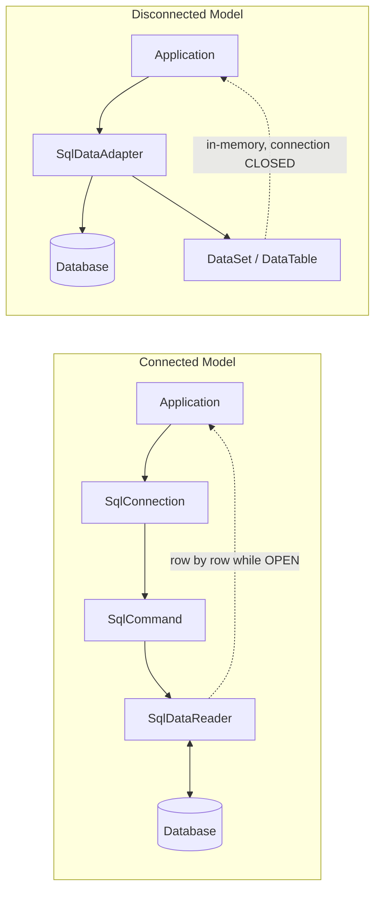
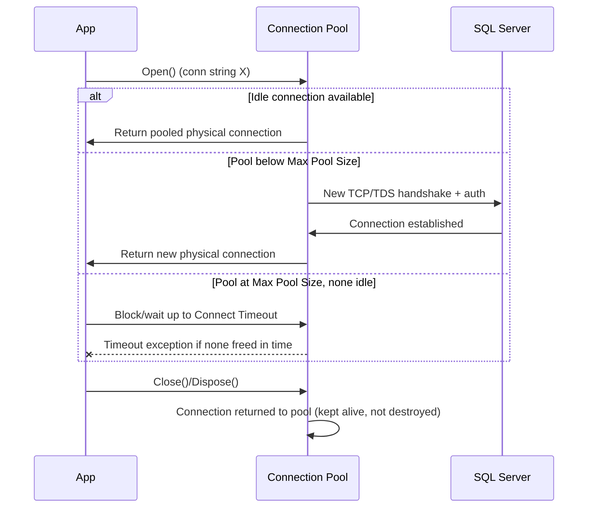
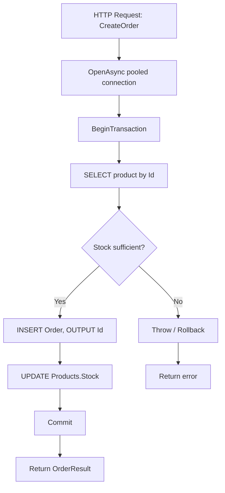

# ADO.NET Interview Guide (Senior / Lead Level)

> Audience: 10+ year ka .NET full-stack developer jo senior/lead interviews ki prep kar raha hai. Fundamentals assumed hain — yeh guide nuance, trade-offs, "why", gotchas, aur likely follow-ups par focus karta hai.

## Table of Contents

- [1. Core Concepts](#1-core-concepts)
  - [1.1 What Is ADO.NET](#11-what-is-adonet)
  - [1.2 Core Architecture: Connected vs Disconnected](#12-core-architecture-connected-vs-disconnected)
  - [1.3 Data Providers](#13-data-providers)
  - [1.4 Connection Management & Connection Strings](#14-connection-management--connection-strings)
  - [1.5 Command Execution](#15-command-execution)
  - [1.6 Execution Methods (ExecuteReader / ExecuteNonQuery / ExecuteScalar)](#16-execution-methods-executereader--executenonquery--executescalar)
- [2. Intermediate Topics](#2-intermediate-topics)
  - [2.1 Parameterized Queries & SQL Injection Prevention](#21-parameterized-queries--sql-injection-prevention)
  - [2.2 DataReader (Connected Model) Deep Dive](#22-datareader-connected-model-deep-dive)
  - [2.3 DataSet / DataTable / DataAdapter (Disconnected Model) Deep Dive](#23-dataset--datatable--dataadapter-disconnected-model-deep-dive)
  - [2.4 Transactions & ACID](#24-transactions--acid)
  - [2.5 Error Handling](#25-error-handling)
- [3. Advanced Topics](#3-advanced-topics)
  - [3.1 [new content] Connection Pooling Internals & Tuning](#31-new-content-connection-pooling-internals--tuning)
  - [3.2 Async ADO.NET & CancellationToken](#32-async-adonet--cancellationtoken)
  - [3.3 [new content] Transaction Isolation Levels & TransactionScope (Ambient Transactions)](#33-new-content-transaction-isolation-levels--transactionscope-ambient-transactions)
  - [3.4 [new content] Multiple Active Result Sets (MARS)](#34-new-content-multiple-active-result-sets-mars)
  - [3.5 [new content] SqlBulkCopy for High-Volume Inserts](#35-new-content-sqlbulkcopy-for-high-volume-inserts)
  - [3.6 [new content] Reading & Streaming Large Objects (BLOBs/CLOBs)](#36-new-content-reading--streaming-large-objects-blobsclobs)
  - [3.7 [new content] Retry & Resilience for Transient Faults](#37-new-content-retry--resilience-for-transient-faults)
  - [3.8 High-Scale End-to-End Example](#38-high-scale-end-to-end-example)
- [4. Performance](#4-performance)
  - [4.1 Performance Best Practices](#41-performance-best-practices)
  - [4.2 [new content] ADO.NET vs Dapper vs EF Core Trade-offs](#42-new-content-ado.net-vs-dapper-vs-ef-core-trade-offs)
  - [4.3 ExecuteUpdate / ExecuteDelete (EF Core 7+) — Closing the Bulk-Operation Gap [gaps]](#43-executeupdate--executedelete-ef-core-7-closing-the-bulk-operation-gap-gaps)
  - [4.4 Managed Identity / Azure AD Authentication with Microsoft.Data.SqlClient [gaps]](#44-managed-identity--azure-ad-authentication-with-microsoftdatasqlclient-gaps)
- [5. Best Practices](#5-best-practices)
- [6. Common Pitfalls](#6-common-pitfalls)
- [7. Sample Interview Q&A](#7-sample-interview-qa)
- [Summary of Additions](#summary-of-additions)
- [Summary of [gaps] Additions (This Pass)](#summary-of-gaps-additions-this-pass)

---

## 1. Core Concepts

### 1.1 What Is ADO.NET

ADO.NET .NET mein ek low-level, provider-based data access framework hai jo relational (aur kuch non-relational) data sources ke saath communicate karne ke liye use hota hai. Yeh aapko deta hai:

- Direct connection management
- Direct SQL/stored-procedure execution
- Raw result retrieval (koi automatic object materialization nahi jab tak aap khud na likho)
- Manual transaction control
- Ek **connected** (streaming) aur ek **disconnected** (in-memory) data model, dono

Kyunki yeh mapping/change-tracking/LINQ-translation layers skip karta hai jo ORMs add karte hain, ADO.NET generally faster aur zyada memory-efficient hota hai — iski cost yeh hai ki aapko khud zyada boilerplate mapping code likhna padta hai.

**Common usage today:** high-throughput APIs, reporting/analytics endpoints, bulk data pipelines, tight latency budgets wale microservices, aur legacy enterprise systems jo EF se pehle ke hain. Yeh woh substrate bhi hai jispar Dapper aur EF Core khud bane hain — `DbConnection`/`DbCommand` kisi bhi ORM ke neeche abhi bhi hote hain.

### 1.2 Core Architecture: Connected vs Disconnected

ADO.NET ke do operating models hain:

**A) Connected architecture**
- Read ki duration ke liye ek live connection open rakha jaata hai.
- Data row-by-row stream hota hai.
- `DataReader` ke through implement hota hai.

**B) Disconnected architecture**
- Data ek baar in-memory structure (`DataSet`/`DataTable`) mein pull kiya jaata hai.
- Fill ke baad connection ko immediately close kiya ja sakta hai.
- `DataAdapter` ke through implement hota hai.



**Interviewer follow-up:** "Aaj aap default kya use karoge?" Senior answer: read paths ke liye connected (`DataReader`), ya better, connected model par bana ek ORM/micro-ORM (Dapper/EF Core) simplest CRUD se aage kisi bhi cheez ke liye — hand-rolled `DataSet` usage ab modern greenfield code mein rare hai aur mostly legacy WinForms/data-binding scenarios mein dekha jaata hai.

### 1.3 Data Providers

Ek **Data Provider** ADO.NET classes ka woh set hai jo ek specific database engine (SQL Server, Oracle, MySQL, PostgreSQL, etc.) ko target karta hai. ADO.NET ke provider model ka matlab hai ki object model (`Connection`, `Command`, `DataReader`, `DataAdapter`, `Transaction`) providers ke across consistent hota hai, lekin concrete implementation har database ke hisaab se different hota hai.

Common SQL Server classes:
- `SqlConnection`
- `SqlCommand`
- `SqlDataReader`
- `SqlDataAdapter`
- `SqlTransaction`

**Modern provider note:** `System.Data.SqlClient` legacy/maintenance mode mein hai. Actively developed, recommended provider **`Microsoft.Data.SqlClient`** (NuGet package) hai, jo newer SQL Server/Azure SQL features (Always Encrypted, Azure AD auth, TDS 8.0/strict encryption, UTF-8 support, newer TLS) support karta hai. Senior-level expectation: kisi bhi naye project mein purane `System.Data.SqlClient` ke bajaye `Microsoft.Data.SqlClient` reference karna jaanna.

### 1.4 Connection Management & Connection Strings

**Purpose:** yeh establish aur describe karna ki app database se kaise baat karta hai.

**Typical connection string components:**
- Server / Data Source
- Initial Catalog (database)
- Authentication (Windows/Integrated vs SQL login vs Azure AD/Managed Identity)
- Timeout (`Connect Timeout`)
- Encryption (`Encrypt=True`, `TrustServerCertificate`)
- Pooling settings (`Pooling`, `Min Pool Size`, `Max Pool Size`)

```
Server=myServer;Database=myDb;Trusted_Connection=True;
```

**Ek connection open karna:**

```csharp
using (SqlConnection conn = new SqlConnection(connectionString))
{
    conn.Open();
    // work
}
```

**Best practices:**
- Jitni der ho sake late open karo, jitni jaldi ho sake early close karo.
- Hamesha `using`/`using var` mein wrap karo taaki exceptions par bhi `Dispose()` run ho.
- Requests ke across kabhi bhi ek single long-lived `SqlConnection` instance ko cache/share mat karo — yeh kaam pooling ko karne do.

### 1.5 Command Execution

`SqlCommand` ek SQL statement ya stored procedure represent karta hai jo ek connection ke against run hota hai.

**Command types (`CommandType`):**
1. `Text` — raw SQL (default)
2. `StoredProcedure`
3. `TableDirect` — rarely used, provider-specific (mainly OLE DB); practice mein `SqlCommand` ke saath SQL Server ke against supported nahi hai (verify karo — table-direct largely ek Access/OLE DB/ODBC concept hai, `Microsoft.Data.SqlClient` ke saath commonly use nahi hota)

```csharp
SqlCommand cmd = new SqlCommand("SELECT * FROM Users", conn);
```

**Interviewer follow-up:** "`SELECT *` kyun avoid karein?" — schema drift column-ordinal-based reads ko break kar deta hai, unused columns par bandwidth waste karta hai, aur server par covering-index usage ko prevent kar sakta hai.

### 1.6 Execution Methods (ExecuteReader / ExecuteNonQuery / ExecuteScalar)

| Method | Returns | Typical Use |
|---|---|---|
| `ExecuteReader()` | `SqlDataReader` (forward-only, streaming) | Multiple rows/columns wale SELECT; large ya streamed results |
| `ExecuteNonQuery()` | `int` (rows affected) | INSERT / UPDATE / DELETE / DDL |
| `ExecuteScalar()` | `object` (first row ka first column) | Aggregates (`COUNT`, `SUM`), existence checks |

```csharp
// ExecuteReader
using (SqlDataReader reader = cmd.ExecuteReader())
{
    while (reader.Read())
    {
        string name = reader["Name"].ToString();
    }
}

// ExecuteScalar
SqlCommand countCmd = new SqlCommand("SELECT COUNT(*) FROM Users", conn);
int count = (int)countCmd.ExecuteScalar();
```

**Gotcha:** `ExecuteScalar()` `object` return karta hai; ek `NULL` result ya empty result set no-rows case mein C# `null` return karta hai, `DBNull.Value` nahi — lekin selected cell mein ek `NULL` value `DBNull.Value` return karti hai. Casting se pehle hamesha dono ke against guard karo.

---

## 2. Intermediate Topics

### 2.1 Parameterized Queries & SQL Injection Prevention

**Purpose:** SQL injection prevent karna aur SQL Server ko har literal value ke liye recompile karne ke bajaye cached execution plans reuse karne dena.

**Wrong (vulnerable, aur plan caching ko defeat karta hai):**

```csharp
string sql = "SELECT * FROM Users WHERE Name = '" + userInput + "'";
```

**Correct:**

```csharp
cmd.Parameters.Add("@Name", SqlDbType.VarChar, 100).Value = userInput;
```

**`AddWithValue` vs explicit typing — ek real gotcha, sirf style nahi:**

```csharp
// Works, but infers SqlDbType from the CLR value at runtime
cmd.Parameters.AddWithValue("@UserId", 1);

// Preferred: explicit type/size avoids plan-cache bloat and type-mismatch surprises
cmd.Parameters.Add("@UserId", SqlDbType.Int).Value = 1;
```

Yeh senior level par kyun matter karta hai: `AddWithValue` har call par .NET value se parameter ka SQL type/length infer karta hai. Varying lengths ka ek `string` pass karna per call ek *different* parameter signature generate kar sakta hai (e.g., implicit `nvarchar(4)` vs `nvarchar(12)`), jo plan cache reuse ko defeat kar deta hai aur near-duplicate query plans se plan cache ko bloat kar sakta hai. Explicit `SqlDbType` + size signature ko pin kar deta hai taaki SQL Server ek cached plan reuse kare.

**Benefits recap:** security, performance (plan reuse), safe type handling, koi manual string concatenation/escaping bugs nahi.

### 2.2 DataReader (Connected Model) Deep Dive

**Characteristics:**
- Iteration ki duration ke liye ek open connection chahiye.
- Forward-only, read-only cursor — backward seek ya rows ko in place modify nahi kar sakta.
- ADO.NET data-retrieval options mein sabse lowest memory footprint — sirf current row materialize hoti hai.

**Advantages:** best raw throughput; ek consumer ko large result sets stream karne ke liye ideal (e.g., directly HTTP response ya CSV mein likhna).

**Limitations:** koi random access nahi, extra work ke bina koi data binding nahi, connection ko open rehna padta hai (poore read ke liye ek pooled connection ko tied up kar deta hai).

```csharp
using (SqlDataReader reader = cmd.ExecuteReader())
{
    while (reader.Read())
    {
        string name = reader["Name"].ToString();
    }
}
```

**Follow-up interviewers ask:** "Aap hot loop mein ordinal/column-name lookup cost kaise avoid karoge?" — `reader.GetOrdinal("Name")` ke through ordinals ko ek baar cache karo, phir indexer ke bajaye typed accessors (`GetString(ordinal)`, `GetInt32(ordinal)`) use karo, jo har row par box karta hai aur name lookup karta hai.

### 2.3 DataSet / DataTable / DataAdapter (Disconnected Model) Deep Dive

**DataSet:**
- In-memory, relations/constraints ke saath multiple related `DataTable`s hold kar sakta hai.
- Fill hone ke baad koi active connection required nahi — offline processing, caching, ya classic WinForms/WebForms data binding ke liye good.

**DataAdapter:**

```csharp
SqlDataAdapter adapter = new SqlDataAdapter(query, conn);
DataTable table = new DataTable();
adapter.Fill(table);
```

**Advantages:** offline processing, built-in change tracking (`AcceptChanges`/`RejectChanges`), native data-binding support (WinForms/legacy WebForms), aur `adapter.Update()` `SqlCommandBuilder` ke through auto-generated INSERT/UPDATE/DELETE commands ke saath edits ko wapas push kar sakta hai.

**Disadvantages:** significantly higher memory usage (har column `DataRow` ke andar `object` ke roop mein boxed hota hai), `DataReader` se slower, aur API modern async/LINQ-friendly patterns ke against dated feel hota hai.

**Senior framing:** `DataSet`/`DataAdapter` ab largely legacy-maintenance territory hai. New code ko `DataSet` ke bajaye `DataReader` + manual mapping, Dapper, ya EF Core ki taraf jaana chahiye, jab tak aap ek existing WinForms/WebForms codebase extend nahi kar rahe jo already isi ke around bana hai.

### 2.4 Transactions & ACID

**Purpose:** ek ya zyada statements ke across atomic, all-or-nothing execution guarantee karna.

**ACID:**
- **Atomicity** — transaction ke sab operations succeed hote hain ya koi bhi nahi.
- **Consistency** — DB ek valid state se doosri valid state mein move karta hai; constraints kabhi bhi mid-way violate nahi hote.
- **Isolation** — concurrent transactions ek doosre ke uncommitted changes nahi dekhte (degree configurable hai — [3.3](#33-new-content-transaction-isolation-levels--transactionscope-ambient-transactions) dekho).
- **Durability** — commit hone ke baad, changes ek crash mein bhi survive karte hain (write-ahead log/journal).

```csharp
SqlTransaction transaction = conn.BeginTransaction();

try
{
    cmd.Transaction = transaction;
    cmd.ExecuteNonQuery();
    transaction.Commit();
}
catch
{
    transaction.Rollback();
    throw; // don't swallow — rethrow after rollback
}
```

**Use cases:** financial postings, multi-table updates (e.g., order + inventory + payment), koi bhi operation jahan ek partial write business invariants ko corrupt kar de.

**Senior tips:**
- Transaction scope ko jitna possible ho sake chhota rakho — sirf woh statements jinhe truly atomicity chahiye.
- Ek open transaction ke andar kabhi network calls, user I/O, ya long computation mat karo — yeh locks hold karta hai aur doosre sessions ko block karta hai.
- Hamesha `Rollback()` ke baad rethrow karo jab tak aap deliberately failure ko ek different outcome mein convert nahi kar rahe.

### 2.5 Error Handling

Hamesha DB calls ko wrap karo aur sirf generic `Exception` nahi balki provider-specific exception type catch karo, taaki aap transient vs permanent failures par branch kar sako:

```csharp
try
{
    // DB operation
}
catch (SqlException ex)
{
    // Inspect ex.Number for specific SQL Server error codes
    // (e.g., 1205 = deadlock victim, -2 = timeout, 4060 = invalid DB)
    // log error with correlation id
    throw;
}
```

**Senior-level nuance:** `SqlException.Number` batata hai ki *kis type* ki failure hui. Deadlock victims (1205) aur timeouts aksar retry karne ke liye safe hote hain; constraint violations (2627/2601 unique key) ya permission errors (229/230) safe nahi hote. Yeh distinction directly [3.7 Retry & Resilience](#37-new-content-retry--resilience-for-transient-faults) mein feed hota hai.

---

## 3. Advanced Topics

### 3.1 [new content] Connection Pooling Internals & Tuning

Connection pooling ek mechanism hai jahan ADO.NET provider har unique connection string ("pool key") ke liye already-established physical connections ka ek pool maintain karta hai, aur har logical `Open()` ke liye ek naya TCP/TDS handshake khol kar re-authenticate karne ke bajaye unhe reuse karta hai.

**How it actually works:**
- Pool **exact connection string** (plus kuch identity-related settings) se keyed hota hai. Do connection strings jo ek space ya case difference se bhi different hain, wo *separate* pools create kar sakte hain — jab connection strings dynamically per tenant/user build hoti hain, tab yeh ek subtle bug source hai.
- `conn.Open()` pool se ek idle physical connection maangta hai; agar ek exist karta hai aur still valid hai, to yeh immediately handed back ho jaata hai (koi handshake nahi).
- `conn.Close()`/`Dispose()` **connection ko pool mein return kar deta hai** — yeh TCP connection ko tear down nahi karta. Isi wajah se "open late, close early" guidance kaam karti hai: closing cheap hoti hai kyunki yeh ek real disconnect nahi hai.
- Agar koi idle connection available nahi hai aur pool `Max Pool Size` (default 100) se neeche hai, to ek naya physical connection create hota hai.
- Agar pool `Max Pool Size` par hai aur koi free nahi hai, to caller `Connect Timeout` seconds tak wait karte hue **block** hota hai, phir `InvalidOperationException: Timeout expired. The timeout period elapsed prior to obtaining a connection from the pool.` throw karta hai. Yeh ek **connection leak** ka classic symptom hai (code jo connections open karta hai lekin kisi code path ke under unhe kabhi dispose nahi karta, aksar ek unawaited exception path).
- `Min Pool Size` se zyada idle connections ~4-8 minutes ki inactivity ke baad prune ho sakte hain (implementation detail hai, provider-version dependent).

**Tuning knobs (connection-string keywords):**

| Keyword | Effect |
|---|---|
| `Pooling=true/false` | Sirf diagnostics ke liye disable karo; production mein pooling on rehni chahiye |
| `Max Pool Size` | Har pool mein concurrent physical connections ki ceiling; cautiously raise karo — DB server ka apna bhi max connection limit hota hai |
| `Min Pool Size` | N connections ko pre-warm karta hai; idle periods ke baad cold-start latency spikes avoid karne mein help karta hai |
| `Connect Timeout` | `Open()` fail hone se pehle ek free pooled/new connection ke liye kitni der wait karta hai |
| `Connection Lifetime` | N seconds se older connections ko recycle karne ke liye force karta hai — load-balanced failover scenarios ke liye useful (provider version ke hisaab se exact keyword naam verify karo) |

**Interview-grade insight:** pool exhaustion almost hamesha ek application bug hota hai (leaked connections, ya loop mein har item ke liye bina dispose kiye ek connection open karna), "need bigger pool" problem nahi — fix almost kabhi bhi first move ke roop mein "Max Pool Size raise karo" nahi hota; woh leak dhoondhna hota hai.



### 3.2 Async ADO.NET & CancellationToken

Modern best practice: server-side code (ASP.NET Core APIs, background services) mein har jagah `*Async` overloads use karo taaki database tak network I/O par wait karte time ek thread-pool thread tied up na ho.

```csharp
await conn.OpenAsync(token);
using SqlCommand cmd = new SqlCommand(sql, conn);
using SqlDataReader reader = await cmd.ExecuteReaderAsync(token);
while (await reader.ReadAsync(token))
{
    // ...
}
```

Key async members: `OpenAsync`, `ExecuteReaderAsync`, `ExecuteNonQueryAsync`, `ExecuteScalarAsync`, `ReadAsync`, `NextResultAsync`.

**Benefits:** non-blocking threads, concurrent load ke under better scalability, improved API responsiveness — classic ASP.NET thread-pool-starvation-under-load scenario poore call chain ko async banakar largely solve ho jaata hai.

**Senior-level nuance (important, aksar mis-stated):** async **throughput/scalability** improve karta hai (server kitne concurrent requests handle kar sakta hai), **single query ki latency** nahi. DB ko ek single async call sync se "faster" nahi hoti — yeh sirf thread ko wait karte time doosra kaam karne ke liye free kar deta hai. Yeh claim mat karo ki async queries ko faster banata hai; yeh *server* ko unhe zyada concurrently handle karne layak banata hai.

**CancellationToken propagation:** token ko har async DB call tak pass karo taaki ek ASP.NET Core request mein client disconnects/timeouts actually in-flight SQL command ko abort kar de, uselessly completion tak run hone dene ke bajaye. Yeh `HttpContext.RequestAborted` wiring ke liye bhi matter karta hai.

**Common mistake:** sync aur async ko mix karna (ek async DB call par `.Result`, `.Wait()`, ya `GetAwaiter().GetResult()`) — yeh ek synchronization context wale contexts mein deadlock kar sakta hai aur poore purpose ko defeat kar deta hai.

### 3.3 [new content] Transaction Isolation Levels & TransactionScope (Ambient Transactions)

**Why this matters:** ACID mein "Isolation" binary nahi hai — yeh ek spectrum hai jo correctness guarantees ko concurrency/throughput ke against trade karta hai. Senior interviewers frequently isko probe karte hain kyunki yeh reveal karta hai ki kya aapne actually production mein ek deadlock ya phantom-read issue debug kiya hai.

| Isolation Level | Dirty Read | Non-Repeatable Read | Phantom Read | Notes |
|---|---|---|---|---|
| `ReadUncommitted` | Possible | Possible | Possible | "NOLOCK" behavior; kisi bhi transactional cheez ke liye avoid karo |
| `ReadCommitted` (SQL Server default) | Prevented | Possible | Possible | Har statement ke baad locks release ho jaate hain |
| `RepeatableRead` | Prevented | Prevented | Possible | Transaction end tak shared locks hold karta hai — higher blocking |
| `Serializable` | Prevented | Prevented | Prevented | Highest isolation, highest contention/deadlock risk |
| `Snapshot` | Prevented | Prevented | Prevented | Row-versioning based (readers/writers block nahi hote), DB par `ALLOW_SNAPSHOT_ISOLATION` chahiye |

```csharp
using SqlTransaction tx = conn.BeginTransaction(IsolationLevel.ReadCommitted);
```

**`TransactionScope` / ambient transactions:** aapko ADO.NET calls (aur even multiple resources) ko ek transaction mein wrap karne deta hai bina manually har command ke through ek `SqlTransaction` object thread kiye — `System.Transactions` infrastructure ambient transaction ko detect karta hai aur connections ko automatically enlist karta hai.

```csharp
using (var scope = new TransactionScope(
           TransactionScopeAsyncFlowOption.Enabled)) // required for async code paths
{
    using var conn = new SqlConnection(connectionString);
    await conn.OpenAsync();
    // command automatically enlists in the ambient transaction
    await cmd.ExecuteNonQueryAsync();

    scope.Complete(); // marks success; omit/throw to roll back
}
```

**Gotchas:**
- `TransactionScopeAsyncFlowOption.Enabled` bhoolne se ambient transaction `await` boundaries ke across correctly flow nahi karta (pre-.NET-Core behavior throw bhi kar sakta tha).
- Agar **do different connections** (same database ke liye bhi) ek `TransactionScope` mein enlist hote hain, to yeh ek **Distributed Transaction Coordinator (DTC/MSDTC)** transaction mein escalate ho jaata hai — heavier hota hai, aur Linux/containers par DTC support limited/unavailable hai (apne SQL Server version ke hisaab se current state verify karo — yeh historically ek Windows-only pain point raha hai).
- Agar aap `TransactionOptions.IsolationLevel` specify nahi karte, to `TransactionScope` default mein `Serializable` isolation par chala jaata hai — un developers ke liye unexpected blocking/deadlocks ka ek bahut common source jinhone assume kiya tha ki yeh DB default (`ReadCommitted`) se match karega.

### 3.4 [new content] Multiple Active Result Sets (MARS)

By default, ek single `SqlConnection` mein ek time mein sirf **ek** active `DataReader` open ho sakta hai — jab pehla abhi bhi read ho raha ho tab doosra khol ne ki koshish karne se `InvalidOperationException` throw hota hai.

**MARS** (connection string mein `MultipleActiveResultSets=True`) ek single physical connection par multiple batches/readers ko interleave hone deta hai, jo useful hai jab, e.g., aap ek reader ko iterate kar rahe ho aur bina doosra connection khole har row ke liye ek lookup query issue karne ki zarurat ho.

```
Server=.;Database=ShopDB;Trusted_Connection=True;MultipleActiveResultSets=True;
```

**Senior-level trade-off framing:** MARS ek convenience hai, performance feature nahi — interleaved MARS operations wire par still serialized hote hain (yeh ek connection ke over cooperative multiplexing hai, true parallel execution nahi), aur yeh server-side session overhead add karta hai. Zyadatar senior engineers MARS par rely karne ke bajaye code ko restructure karna prefer karte hain (e.g., pehle lookup data load karo, ya ek JOIN use karo), aur ise ORM internals ke liye reserve karte hain (EF Core exactly is tarah ke scenario ke liye ise default mein enable karta hai) hand-written ADO.NET ke bajaye.

### 3.5 [new content] SqlBulkCopy for High-Volume Inserts

Thousands-to-millions rows insert karne ke liye, `ExecuteNonQuery` ke through row-by-row `INSERT` (parameterized ho, batched ho) SQL Server ke native bulk-load path se dramatically slower hai. `SqlBulkCopy` us native path ko wrap karta hai.

```csharp
using var bulkCopy = new SqlBulkCopy(connection, SqlBulkCopyOptions.Default, transaction)
{
    DestinationTableName = "dbo.Orders",
    BatchSize = 5000,
    BulkCopyTimeout = 60
};

bulkCopy.ColumnMappings.Add("OrderId", "OrderId");
bulkCopy.ColumnMappings.Add("ProductId", "ProductId");

await bulkCopy.WriteToServerAsync(dataTable /* or IDataReader */, cancellationToken);
```

**Why it's fast:** yeh TDS bulk insert protocol use karke rows ko server tak stream karta hai, largely individual INSERTs ke per-row transaction log overhead patterns ko bypass karte hue (especially `SqlBulkCopyOptions.TableLock` aur ek target table/index configuration ke saath jo minimal logging support karta hai).

**Senior-level talking points:**
- Source ek `DataTable`, `DataRow` ka array, ya (more memory-efficiently) koi bhi `IDataReader` ho sakta hai — ek query se directly doosri table mein stream karte hue bina sab kuch memory mein materialize kiye.
- `SqlBulkCopyOptions.KeepIdentity`, `CheckConstraints`, `FireTriggers` default-off behaviors control karte hain — bulk copy speed ke liye default mein constraint checks aur triggers skip kar deta hai, jo ek real correctness gotcha hai agar aapki business logic triggers firing par depend karti hai.
- Interviewers puch sakte hain "aap isko kab NAHI use karoge?" — small batches ke liye, ya jab aapko per-row error handling/business validation chahiye ho, plain parameterized batched inserts simpler aur safer hote hain.

### 3.6 [new content] Reading & Streaming Large Objects (BLOBs/CLOBs)

Ek large `VARBINARY(MAX)`/`NVARCHAR(MAX)` column (files, images, large JSON/XML blobs) ko normal `reader["Column"]` cast ke through poori tarah memory mein load karna large payloads ke liye memory blow up kar sakta hai. ADO.NET streaming access support karta hai:

```csharp
using SqlDataReader reader = await cmd.ExecuteReaderAsync(
    CommandBehavior.SequentialAccess, token); // required for true streaming

if (await reader.ReadAsync(token))
{
    using Stream blobStream = reader.GetStream(reader.GetOrdinal("FileContent"));
    using Stream output = File.Create(destinationPath);
    await blobStream.CopyToAsync(output, token);
}
```

**Key points:**
- Stream karne ke liye `CommandBehavior.SequentialAccess` required hai — yeh reader ko batata hai ki poori row buffer na karne ke badle random column access chhod de, jisse aap column data (especially large columns) ko incrementally ek `Stream`/`TextReader` ke roop mein read kar sako.
- `reader.GetStream()`, `GetTextReader()`, `GetSqlBytes()` streaming-friendly accessors hain; `SequentialAccess` ke saath, columns ko ordinal order mein aur sirf ek baar read karna zaroori hai.
- Yeh file-serving APIs, large document export, aur big blobs ke `byte[]` allocations se LOH (Large Object Heap) pressure avoid karne ke liye matter karta hai.

### 3.7 [new content] Retry & Resilience for Transient Faults

Cloud SQL (specifically Azure SQL) aur even load ke under on-prem SQL Server **transient** errors throw kar sakte hain: throttling, failover, network blips, deadlock victim selection. Ek senior implementation retryable ko non-retryable failures se distinguish karta hai aur backoff ke saath retry karta hai — kabhi blindly retry nahi karta.

**Approach:**
- `Microsoft.Data.SqlClient` ka built-in **configurable retry logic** (`SqlRetryLogicBaseProvider`, `Microsoft.Data.SqlClient` v3+ se available) use karo ya ek provider-agnostic policy ke liye calls ko **Polly** ke saath wrap karo.
- `SqlException.Number` se classify karo: common Azure SQL transient codes mein 40613 (database unavailable), 40501 (service busy), 40197, 4060, 1205 (deadlock victim), -2 (timeout) shamil hain. Non-transient: constraint violations (2627), auth failures (18456), syntax errors.
- Ek already-struggling server ke against thundering-herd retries avoid karne ke liye jitter ke saath exponential backoff use karo.
- **Idempotency matters**: sirf un operations ko safely auto-retry karo jo idempotent hain, ya retryable unit ko ek transaction mein wrap karo taaki ek failed commit ke baad retry double-apply na ho. Ek bare `INSERT` ko bina dedupe key/transaction boundary ke retry karna duplicate rows create kar sakta hai agar failure server ke commit karne ke baad lekin client ko ack milne se pehle hui ho.

```csharp
// Example: Polly-based retry around a transient SqlException
var retryPolicy = Policy
    .Handle<SqlException>(ex => IsTransient(ex.Number))
    .WaitAndRetryAsync(3, attempt =>
        TimeSpan.FromMilliseconds(200 * Math.Pow(2, attempt)) +
        TimeSpan.FromMilliseconds(Random.Shared.Next(0, 100))); // jitter

await retryPolicy.ExecuteAsync(async ct =>
{
    await conn.OpenAsync(ct);
    await cmd.ExecuteNonQueryAsync(ct);
}, token);
```

**Interview follow-up:** "Why not just retry everything?" — kyunki ek server ke against ek non-idempotent write retry karna jo actually succeed hua tha lekin ack lost ho gayi, side effects duplicate kar sakta hai; aur non-transient errors (bad SQL, permission errors) ko retry karna sirf time waste karta hai aur real bugs ko hide karta hai.

### 3.8 High-Scale End-to-End Example

Ek realistic order-processing endpoint jo async calls, pooling, teen statements ko span karne wala ek transaction, parameterization, aur cancellation demonstrate karta hai — upar ki practices ko ek flow mein combine karte hue.



```csharp
public async Task<OrderResult> CreateOrderAsync(
    int productId,
    int quantity,
    CancellationToken token)
{
    string connectionString = "Server=.;Database=ShopDB;Trusted_Connection=True;";

    using SqlConnection conn = new SqlConnection(connectionString);
    await conn.OpenAsync(token);

    using SqlTransaction transaction = conn.BeginTransaction();

    try
    {
        // 1. Read product information
        SqlCommand productCmd = new SqlCommand(
            @"SELECT Id, Name, Price, Stock
              FROM Products
              WHERE Id = @ProductId",
            conn,
            transaction);

        productCmd.Parameters.Add("@ProductId", SqlDbType.Int).Value = productId;

        Product product = null;

        using (SqlDataReader reader = await productCmd.ExecuteReaderAsync(token))
        {
            if (await reader.ReadAsync(token))
            {
                product = new Product
                {
                    Id = reader.GetInt32(0),
                    Name = reader.GetString(1),
                    Price = reader.GetDecimal(2),
                    Stock = reader.GetInt32(3)
                };
            }
        }

        if (product == null)
            throw new Exception("Product not found");

        if (product.Stock < quantity)
            throw new Exception("Insufficient stock");

        // 2. Insert order
        SqlCommand orderCmd = new SqlCommand(
            @"INSERT INTO Orders(ProductId, Quantity, TotalAmount)
              OUTPUT INSERTED.Id
              VALUES(@ProductId, @Qty, @Total)",
            conn,
            transaction);

        orderCmd.Parameters.Add("@ProductId", SqlDbType.Int).Value = productId;
        orderCmd.Parameters.Add("@Qty", SqlDbType.Int).Value = quantity;
        orderCmd.Parameters.Add("@Total", SqlDbType.Decimal).Value = product.Price * quantity;

        int orderId = (int)await orderCmd.ExecuteScalarAsync(token);

        // 3. Update inventory
        SqlCommand stockCmd = new SqlCommand(
            @"UPDATE Products
              SET Stock = Stock - @Qty
              WHERE Id = @ProductId",
            conn,
            transaction);

        stockCmd.Parameters.Add("@Qty", SqlDbType.Int).Value = quantity;
        stockCmd.Parameters.Add("@ProductId", SqlDbType.Int).Value = productId;

        await stockCmd.ExecuteNonQueryAsync(token);

        transaction.Commit();

        return new OrderResult
        {
            OrderId = orderId,
            ProductName = product.Name,
            Quantity = quantity
        };
    }
    catch
    {
        transaction.Rollback();
        throw;
    }
}
```

Supporting models:

```csharp
public class Product
{
    public int Id;
    public string Name;
    public decimal Price;
    public int Stock;
}

public class OrderResult
{
    public int OrderId;
    public string ProductName;
    public int Quantity;
}
```

Batch retrieval via `SqlDataAdapter` (disconnected model example):

```csharp
public DataTable GetProducts()
{
    using SqlConnection conn = new SqlConnection(_connectionString);

    SqlCommand cmd = new SqlCommand(
        "SELECT Id, Name, Price, Stock FROM Products",
        conn);

    SqlDataAdapter adapter = new SqlDataAdapter(cmd);
    DataTable table = new DataTable();
    adapter.Fill(table);

    return table;
}
```

**Practices demonstrated:** end-to-end async DB calls, multi-statement consistency ke liye transactions, minimal connection lifetime, parameterized queries, connection pooling (implicit/automatic), `CancellationToken` propagation, aur deterministic disposal ke liye `using` blocks.

---

## 4. Performance

### 4.1 Performance Best Practices

- Hamesha parameterized queries use karo (security + plan-cache reuse).
- `SELECT *` avoid karo — columns ko explicitly naam do.
- Design/verify karo ki indexes aapke WHERE/JOIN/ORDER BY predicates support karte hain.
- Read-heavy, high-throughput paths ke liye `DataReader` (ya uske upar ek thin mapper) prefer karo.
- Connection open time minimize karo — late open karo, early close karo, churn ko pooling absorb karne do.
- `DataSet`/`DataTable` avoid karo jab tak aapko specifically disconnected/data-binding semantics na chahiye ho.
- Jahan possible ho operations ko batch karo (multi-row inserts, table-valued parameters, ya large volumes ke liye `SqlBulkCopy` — [3.5](#35-new-content-sqlbulkcopy-for-high-volume-inserts) dekho).
- Hot loops mein reader column ordinals cache karo; string indexer ke bajaye typed `Get*` accessors use karo.
- Large columns ke liye `CommandBehavior.SequentialAccess` + streaming use karo ([3.6](#36-new-content-reading--streaming-large-objects-blobsclobs) dekho).
- Concurrent load ke under scalability ke liye server-side code mein call stack ke through poori tarah async prefer karo.

### 4.2 [new content] ADO.NET vs Dapper vs EF Core Trade-offs

Yeh comparison sabse common senior .NET interview questions mein se ek hai — "aap kab raw ADO.NET vs Dapper vs EF Core ki taraf jaoge?" Ek shallow answer ("CRUD ke liye EF, performance ke liye ADO.NET") table stakes hai; ek senior answer team velocity, maintainability, aur abstraction cost actually kahan show up karti hai, iske baare mein baat karta hai.


| Aspect | ADO.NET (raw) | Dapper | EF Core |
|---|---|---|---|
| Abstraction level | Koi nahi — aap SQL aur mapping khud likhte ho | Minimal — aap SQL likhte ho, yeh objects mein map karta hai | High — LINQ-to-SQL translation, change tracking |
| Performance | Fastest (koi mapping overhead nahi) | Raw ADO.NET ke bahut close (~5-10% overhead, benchmark/version ke hisaab se verify karo) | Pure reads ke liye slower; change tracking, cold start par query compilation cache misses se overhead |
| Productivity | Lowest — sabse zyada boilerplate | Medium — abhi bhi hand-write SQL | Highest — LINQ, no-SQL-needed CRUD, migrations |
| Change tracking / unit of work | Manual | Koi built-in nahi | Built-in `DbContext` change tracker |
| Migrations | Koi nahi (schema separately manage karo) | Koi nahi | Built-in (`dotnet ef migrations`) |
| Complex relationships/graphs | Manual joins + manual mapping | Manual joins + manual mapping (ya multi-mapping) | Navigation properties, `Include()`, automatic |
| Best fit | Bulk operations, streaming, ultra-hot paths, legacy systems | Reporting/read-heavy APIs, un microservices ke liye jo raw ADO.NET se kam boilerplate ke saath SQL control chahte hain | CRUD-heavy business apps, rapid iteration, teams jo micro-optimized latency se zyada maintainability ko prioritize karti hain |
| Learning curve for new team members | High (strong SQL + manual mapping discipline chahiye) | Medium | CRUD ke liye lower; advanced LINQ translation debugging ke liye high |

**Senior talking points:**
- Dapper aksar woh "sweet spot" hai jispar kai senior teams APIs ke liye land karti hain: SQL ko explicit aur reviewable rakhta hai, EF ke change-tracking/query-translation surprises avoid karta hai, aur hand-written ADO.NET ke bahut close benchmark karta hai.
- EF Core ka overhead mostly high-throughput read paths aur large graphs mein matter karta hai; typical CRUD volumes ke liye (hundreds/thousands ops/sec, hundreds of thousands nahi), EF Core kaafi fast hai aur productivity win dominate karta hai.
- Inhe ek codebase mein **mix** karna common aur legitimate hai: transactional/CRUD core ke liye EF Core, reporting queries, bulk jobs, aur hot paths ke liye raw ADO.NET ya Dapper — "kya aap performance ke liye sab kuch ADO.NET mein rewrite karoge?" ka ek good answer hai "nahi, pehle profile karo, phir selectively ek lower abstraction par jaao sirf wahan jahan yeh proven ho ki matter karta hai."
- EF Core `AsNoTracking()`, compiled queries, aur `ExecuteUpdate`/`ExecuteDelete` (EF Core 7+) ORM ko abandon kiye bina read-only aur bulk-update scenarios ke liye historical performance gap ka kaafi hissa close kar dete hain.

### 4.3 ExecuteUpdate / ExecuteDelete (EF Core 7+) — Closing the Bulk-Operation Gap [gaps]

Historically, senior teams ke bulk writes ke liye EF Core se raw ADO.NET/Dapper par jaane ki ek top reason EF Core ka change-tracking model tha: kai rows update ya delete karne ke liye har entity ko change tracker mein load karna, use mutate karna, aur `SaveChanges()` call karna zaroori tha — har entity ke state ke liye ek round trip, plus tracker overhead, bhale hi actual intent ek single set-based SQL statement ho.

**EF Core 7 ne `ExecuteUpdateAsync`/`ExecuteDeleteAsync`** introduce kiya, jo ek LINQ query ko directly ek single set-based `UPDATE`/`DELETE` SQL statement mein compile karte hain, jo immediately execute hota hai — us operation ke liye change tracker aur `SaveChanges()` ko poori tarah bypass karte hue.

```csharp
// Single UPDATE statement, no entities loaded into the change tracker
await dbContext.Products
    .Where(p => p.CategoryId == 5)
    .ExecuteUpdateAsync(s => s.SetProperty(p => p.Discontinued, true));

// Single DELETE statement, same principle
await dbContext.Orders
    .Where(o => o.CreatedAt < cutoffDate)
    .ExecuteDeleteAsync();
```

**[4.2](#42-new-content-ado.net-vs-dapper-vs-ef-core-trade-offs) mein ADO.NET vs Dapper vs EF Core comparison ke liye yeh kyun matter karta hai:** yeh feature directly us performance gap ka kaafi hissa close karta hai jo bulk `UPDATE`/`DELETE` operations ke liye raw ADO.NET par drop karne ko justify karta tha. Aapko EF Core ki LINQ ergonomics aur strong typing milti hai jab ki aap still database ke against ek efficient, set-based statement issue karte ho — koi entity materialization nahi, koi per-row change-tracking snapshotting nahi, koi N-round-trip `SaveChanges()` pattern nahi.

**Remaining gap — yeh `SqlBulkCopy` ko replace nahi karta:** `ExecuteUpdate`/`ExecuteDelete` sirf set-based `UPDATE`/`DELETE` address karte hain. Bahut large bulk **INSERTs** ke liye (thousands-to-millions naye rows load karna), `SqlBulkCopy` ([3.5](#35-new-content-sqlbulkcopy-for-high-volume-inserts) dekho) meaningfully faster rehta hai — yeh native TDS bulk-load protocol ke over rows stream karta hai, jo EF Core ka LINQ-to-SQL translation inserts ke liye jo kuch produce karta hai usse fundamentally different code path hai. Ek senior answer dono ko distinguish karta hai: "EF Core 7+ ne bulk updates/deletes ke liye gap close kiya; bulk inserts ke liye gap close nahi kiya — woh abhi bhi `SqlBulkCopy` territory hai."

**Interviewer follow-up:** "Kya `ExecuteUpdate` global query filters aur interceptors respect karta hai?" — haan, yeh abhi bhi EF Core ke query pipeline (model, filters, value converters) se guzarta hai, yeh sirf change tracker skip karta hai aur per-entity round trips ke bajaye ek single SQL statement produce karta hai.

### 4.4 Managed Identity / Azure AD Authentication with Microsoft.Data.SqlClient [gaps]

Section [1.4](#14-connection-management--connection-strings) mein connection-string authentication options ke under "Azure AD/Managed Identity" ko bina elaboration ke ek bullet ke roop mein list kiya gaya hai — yeh section wahi elaboration hai, aur yeh ek topic hai jise senior interviewers passwordless/secret-free cloud architectures ki taraf push dekhte hue increasingly probe karte hain.

**Managed Identity kya hai:** Azure AD (Entra ID) mein ek identity jise Azure automatically provision karta hai aur ek specific Azure resource — ek App Service, VM, Azure Function, Container App, AKS pod, etc. — se bind kar deta hai. Application *us resource ki identity ke roop mein* authenticate hota hai, koi connection-string password nahi, koi client secret nahi, aur aapke store, rotate, ya leak karne ke liye koi certificate nahi. Azure transparently underlying credentials/tokens issue aur rotate karta hai; aapka code unhe directly kabhi nahi dekhta jab tak aap unhe inspect karna choose na karo.

- **System-assigned** managed identity: resource ke lifecycle se 1:1 tied hoti hai (resource delete hone par delete ho jaati hai).
- **User-assigned** managed identity: ek standalone Azure resource jo aap ek baar create karte ho aur ek ya zyada compute resources se attach karte ho — useful jab several services ko ek identity/permission set share karna ho.

**`Microsoft.Data.SqlClient` isko kaise support karta hai:** `Authentication` connection-string keyword ke through, jo driver ko batata hai ki SQL login/password bhejne ke bajaye ek Azure AD access token acquire kare.

```
Server=tcp:myserver.database.windows.net,1433;Database=myDb;Authentication=Active Directory Managed Identity;Encrypt=True;
```

```
# For user-assigned managed identity, also specify the identity's client ID:
Server=tcp:myserver.database.windows.net,1433;Database=myDb;Authentication=Active Directory Managed Identity;User Id=<managed-identity-client-id>;Encrypt=True;
```

`Authentication=Active Directory Default` ek broader variant hai: yeh ek credential-discovery chain par delegate karta hai (Azure mein run hote time managed identity, locally run hote time environment variables, Visual Studio/Azure CLI login, etc. par fall back karte hue) — us code ke liye convenient hai jise Azure aur developer ki machine dono par connection strings ko branch kiye bina run hona hai.

```csharp
using Microsoft.Data.SqlClient;

var connectionString =
    "Server=tcp:myserver.database.windows.net,1433;Database=myDb;" +
    "Authentication=Active Directory Managed Identity;Encrypt=True;";

using SqlConnection conn = new SqlConnection(connectionString);
await conn.OpenAsync(); // driver acquires the AAD token transparently on Open()
```

**Alternative token-acquisition path (`Azure.Identity`):** jab aapko token kaise obtain hota hai iske upar zyada control chahiye ho — custom credential chains, explicit tenant targeting, caching behavior, ya same process mein doosre Azure resources ke liye tokens acquire karna — to `Azure.Identity` ka `DefaultAzureCredential` (ya ek more specific credential type) use karo khud token fetch karne ke liye aur open karne se pehle ise `SqlConnection.AccessToken` mein assign karo:

```csharp
using Azure.Identity;
using Azure.Core;
using Microsoft.Data.SqlClient;

var credential = new DefaultAzureCredential();
var tokenRequestContext = new TokenRequestContext(new[] { "https://database.windows.net/.default" });
AccessToken token = await credential.GetTokenAsync(tokenRequestContext);

using SqlConnection conn = new SqlConnection(
    "Server=tcp:myserver.database.windows.net,1433;Database=myDb;Encrypt=True;");
conn.AccessToken = token.Token;
await conn.OpenAsync();
```

**Yeh connection strings/`appsettings.json` mein SQL-login credentials ka modern recommended alternative kyun hai:**
- **Secret sprawl eliminate karta hai** — `appsettings.json`, Key Vault references, CI/CD variables, ya developer machines mein store karne ke liye koi SQL password ya connection-string secret nahi; source control mein accidentally commit karne ke liye kuch nahi.
- **Automatic credential rotation** — Azure managed identity ke liye underlying credential lifecycle manage karta hai; is connection path ke liye koi password-expiry rotation project nahi hai.
- **Centralized access control** — database permissions Azure AD identity ko grant hote hain (`CREATE USER [my-app-identity] FROM EXTERNAL PROVIDER;` plus role membership) aur Entra ID/Azure RBAC ke through governed hote hain, aapke identity provider se independently audit, disable, aur track karne ke liye SQL logins ka ek separate universe rakhne ke bajaye.
- **Reduced blast radius** — ek compromised app ek reusable password expose nahi karta; token short-lived aur scoped hota hai, aur identity assignment Azure resource level par revoke kiya ja sakta hai.

**Interviewer follow-up:** "Locally, Azure ke bahar, jahan assume karne ke liye koi managed identity nahi hai, wahan kya hota hai?" — `Authentication=Active Directory Default` (ya `Azure.Identity` ka `DefaultAzureCredential`) developer-context credentials (Azure CLI/`az login`, Visual Studio sign-in, environment variables) par fall back karta hai, isliye same code path dono environments mein kaam karta hai bina local development ke liye ek different auth story hardcode kiye.

---

## 5. Best Practices

- Har `IDisposable` ADO.NET object (`SqlConnection`, `SqlCommand`, `SqlDataReader`, `SqlTransaction`) ke liye `using`/`using var` use karo.
- Hamesha parameterize karo — kabhi bhi user input ko SQL text mein concatenate mat karo.
- Connections ko late open karo, early close/dispose karo; churn absorb karne ke liye connection pooling par trust karo.
- Transactions ko short rakho — ek open transaction ke andar koi network calls, user waits, ya heavy computation nahi.
- Sab server-side/API code mein async DB APIs prefer karo; `CancellationToken` propagate karo.
- Har operation ke liye right tool choose karo: read-heavy hot paths ke liye `DataReader`/Dapper, CRUD-heavy business logic ke liye EF Core, bulk loads ke liye `SqlBulkCopy`.
- Purely `AddWithValue` inference par rely karne ke bajaye parameters ko explicitly type aur size karo (`SqlDbType` + length).
- Specifically `SqlException` catch karo (bare `Exception` nahi) taaki aap retry/no-retry decisions ke liye error number par branch kar sako.
- `Rollback()` ke baad rethrow karo — transaction failures ko swallow mat karo.
- Long-running reports/batch jobs ke liye default ko blindly accept karne ke bajaye `CommandTimeout` ko deliberately set karo.

---

## 6. Common Pitfalls

1. **Connection pooling ko na samajhna** — "open late, close early" ko wasteful misread karna, jab ki closing sirf connection ko pool mein return karta hai, use tear down karne ke bajaye.
2. **String concatenation SQL** — SQL injection risk, plan-cache reuse ko defeat karta hai.
3. **Connections ko unnecessarily open rakhna** — doosre requests ko block karta hai, pool exhaustion ka risk hai, scalability ko hurt karta hai.
4. **Readers/connections/transactions ko dispose na karna** — leaks, pool starvation, lingering locks.
5. **Async programming ignore karna** — ek web API ki request thread par sync DB calls load ke under thread-pool starvation cause karte hain.
6. **`DataSet`/`DataTable` ko default/habit se use karna** — heavier, slower; connected model ya ek mapper choose karo jab tak disconnected semantics actually zaroori na ho.
7. **Transactions handle na karna** — partial multi-statement writes DB ko ek inconsistent state mein chhod dete hain.
8. **Performance differences explain na kar sakna** — DataReader vs DataSet, ADO.NET vs ORM, parameterized vs inline SQL, sync vs async throughput impact.
9. **[new content] Transient faults par blind retries** — bina transaction/dedupe boundary ke non-idempotent writes ko retry karna, ya non-transient errors ko retry karke real bugs mask karna.
10. **[new content] Yeh assume karna ki async ek single query ko faster banata hai** — async concurrency/scalability deta hai, ek call ke liye lower latency nahi.
11. **[new content] `TransactionScopeAsyncFlowOption.Enabled` bhoolna** — ambient transaction `await` ke across correctly flow nahi karta, ya do connections ko enlist karna unexpectedly ek DTC distributed transaction mein escalate ho jaata hai.

---

## 7. Sample Interview Q&A

**Q: ADO.NET ek ORM jaise EF Core se faster kyun hai?**
A: Koi change-tracking overhead nahi, koi LINQ-to-SQL translation layer nahi, koi entity materialization/proxying nahi — aap directly SQL execute karte ho aur sirf woh columns map karte ho jo aapne maange the. Trade-off yeh hai ki aap khud us mapping aur SQL ko likhte aur maintain karte ho, aur migrations, navigation properties, aur LINQ composability lose kar dete ho.

**Q: Aap EF Core ke bajaye `DataReader` kab choose karoge?**
A: High-throughput read scenarios, large/streamed result sets, reporting queries, ya koi bhi hot path jahan profiling dikhaye ki ORM overhead matter karta hai. CRUD-heavy business logic ke liye jahan maintainability aur development speed micro-level latency se zyada matter karti hai, EF Core jeet jaata hai.

**Q: Connection pooling ka impact explain karo, ek failure mode ke saath jo aapne dekha hai.**
A: Pooling connection string se keyed physical connections ko reuse karti hai, jisse har logical `Open()` ke liye ek naye TCP/TDS handshake aur auth ki cost avoid ho jaati hai. `Close()`/`Dispose()` connection ko destroy karne ke bajaye pool mein return kar deta hai — isi wajah se "open late, close early" cheap aur correct hai. Failure mode ek connection leak hai: code jo ek connection open karta hai lekin kisi exception path par use dispose karne mein fail ho jaata hai, pool ko exhaust kar deta hai, aur har subsequent `Open()` call `Connect Timeout` tak block hoti hai aur phir throw karti hai.

**Q: Aap transactions ko correctly kaise handle karte ho, aur isolation levels ka isse kya lena-dena hai?**
A: Transaction scope ko minimal rakho — sirf woh statements jo atomic hona zaroori hain — promptly commit ya rollback karo, aur rollback ke baad hamesha rethrow karo. Isolation level control karta hai ki concurrent transactions ek doosre ke uncommitted/committed-but-changing data ka kitna dekh sakte hain; `ReadCommitted` SQL Server ka default hai aur ek reasonable baseline hai, lekin specific business scenarios mein phantom reads ya non-repeatable reads prevent karne ke liye `Serializable` ya `Snapshot` chahiye ho sakta hai, iski cost zyada blocking/versioning overhead hai.

**Q: Kya async ADO.NET ek single query ko faster run karata hai?**
A: Nahi — query khud server par same time leti hai. Async calling thread ko I/O wait par blocking se free kar deta hai, isliye *server* same thread pool ke saath zyada concurrent requests handle kar sakta hai. Win throughput/scalability under load hai, per-call latency nahi.

**Q: Aap 2 million rows ko efficiently kaise insert karoge?**
A: `ExecuteNonQuery` ke through row-by-row `INSERT` nahi — `SqlBulkCopy` use karo, jo SQL Server ke native bulk-load protocol ke through rows stream karta hai, per-row overhead ka kaafi hissa bypass karte hue. Agar memory ek concern hai to pehle sab kuch ek `DataTable` mein materialize karne ke bajaye ek `IDataReader` source se stream karo. Aware raho ki yeh default mein triggers aur constraint checks skip karta hai jab tak aap `SqlBulkCopyOptions` ke through opt in na karo.

**Q: `AddWithValue` aur explicitly-typed parameters mein kya difference hai, aur yeh kyun matter karta hai?**
A: `AddWithValue` runtime value se `SqlDbType` aur size infer karta hai, jo same query text ke saath calls ke across different parameter signatures (e.g., varying `nvarchar` lengths) produce kar sakta hai, jisse plan cache fragment ho jaata hai. Explicit `Add(name, SqlDbType, size)` signature ko pin kar deta hai taaki SQL Server ek execution plan reuse kare — scale par better performance aur zyada predictable behavior.

**Q: Aap `SqlTransaction` ke bajaye `TransactionScope` kab use karoge?**
A: Jab ek logical unit of work multiple `SqlConnection` instances (ya even multiple resource managers) ke across span karta hai, ya jab aap transaction-demarcation code ko data-access code se separate rakhna chahte ho (outer service layer par `scope.Complete()`, har method ke through ek `SqlTransaction` object thread kiye bina). Agar do distinct connections enlist hote hain to accidental DTC escalation ke liye dhyan rakho, aur yaad rakho ki yeh override na hone par `Serializable` isolation par default hota hai.

---

## Summary of Additions

Niche diye gaye sections add kiye gaye kyunki inhe senior .NET interview level par commonly probe kiya jaata hai aur original notes mein yeh missing the ya sirf lightly cover kiye gaye the:

- **[new content] Connection Pooling Internals & Tuning** — original notes ne stated kiya tha ki pooling exist karti hai aur correctly use hona chahiye, lekin pool-key mechanism, exhaustion par blocking/timeout behavior, ya tuning keywords (`Max Pool Size`, `Min Pool Size`, `Connection Lifetime`) explain nahi kiya — yeh exactly wahi depth hai jo senior interviewers probe karte hain.
- **[new content] Transaction Isolation Levels & TransactionScope (Ambient Transactions)** — original notes ne bina unhe define kiye "isolation levels if asked mention karo" kaha tha; full isolation-level comparison table plus `TransactionScope`/ambient-transaction mechanics aur iske DTC-escalation aur default-`Serializable` gotchas add kiye gaye.
- **[new content] Multiple Active Result Sets (MARS)** — source notes mein bilkul mention nahi tha; ek real gotcha (`InvalidOperationException` concurrent readers ke saath) aur ek common connection-string interview question.
- **[new content] SqlBulkCopy for High-Volume Inserts** — bulk loading ek standard senior ADO.NET topic hai (aap millions rows efficiently kaise insert karte ho) aur source se poori tarah absent tha.
- **[new content] Reading & Streaming Large Objects (BLOBs/CLOBs)** — `CommandBehavior.SequentialAccess` aur streaming accessors missing the; file-serving/large-payload interview scenarios ke liye relevant.
- **[new content] Retry & Resilience for Transient Faults** — cloud/Azure SQL resiliency (transient fault classification, idempotency concerns, Polly/`SqlRetryLogicBaseProvider`) ek hot modern topic hai jo original notes mein cover nahi tha.
- **[new content] ADO.NET vs Dapper vs EF Core Trade-offs** — original notes ne sirf ADO.NET vs EF Core ko passing mein compare kiya tha; Dapper (senior teams mein ek near-universal middle-ground choice) poori tarah absent tha, isliye ek full three-way comparison table aur guidance add ki gayi.

**Contradictions flagged:** genuine substance ka kuch nahi mila — "Common Interview Pitfalls" section aur baad ka "Detailed Explanation" section ne same aath pitfalls ko consistent content ke saath do baar cover kiya; inhe duplicate karne ke bajaye merge kiya gaya. Ek factual nuance ko contradict karne ke bajaye clarify kiya gaya: notes ka claim ki "async API performance improve karta hai" ko refine karke explicitly throughput/scalability gains ko single-query latency gains (jo absent hain) se distinguish kiya gaya, kyunki interviewers specifically us distinction ko probe karte hain.

## Summary of [gaps] Additions (This Pass)

Yeh second pass ADO.NET vs Dapper vs EF Core comparison mein aur connection-string authentication coverage mein identify kiye gaye do specific gaps ko target karta hai:

- **[gaps] ExecuteUpdate / ExecuteDelete (EF Core 7+) — Closing the Bulk-Operation Gap** — section 4.2 mein pehle sirf `ExecuteUpdate`/`ExecuteDelete` ko mention karne wali ek single passing line thi. Is pass ne ise ek full dedicated subsection (4.3) mein expand kiya jiske saath ek working code example, ek explicit explanation ki yeh set-based bulk writes ke liye change tracking/`SaveChanges()` ko kaise bypass karta hai, aur — critically — yeh nuance ki yeh performance gap sirf `UPDATE`/`DELETE` ke liye close karta hai, bulk `INSERT` ke liye nahi (jo abhi bhi `SqlBulkCopy` favor karta hai). Yeh senior level par matter karta hai kyunki "EF Core bulk ops ke liye hamesha slower hai" ab ek outdated blanket answer hai, aur current EF Core versions probe karne wale interviewers update/delete-vs-insert distinction expect karte hain.
- **[gaps] Managed Identity / Azure AD Authentication with Microsoft.Data.SqlClient** — section 1.4 ne "Azure AD/Managed Identity" ko bina elaboration ke ek bare bullet ke roop mein list kiya tha. Is pass ne ek full subsection (4.4) add ki jo explain karta hai ki managed identity kya hai, `Authentication` connection-string keyword aur `Azure.Identity` ka `DefaultAzureCredential` SQL login credentials ki jagah tokens kaise acquire karte hain, aur yeh modern recommended posture kyun hai (no secret sprawl, automatic rotation, centralized Entra ID-based access control). Yeh matter karta hai kyunki passwordless/secretless cloud data access ab Azure par deploy karne wale kisi ke liye bhi ek standard senior-level expectation hai, aur interviewers commonly probe karte hain ki kya ek candidate abhi bhi SQL-login-in-a-connection-string thinking par default karta hai.

**Contradictions flagged:** koi nahi — dono additions existing bullets/lines ke elaborations hain, corrections nahi.
