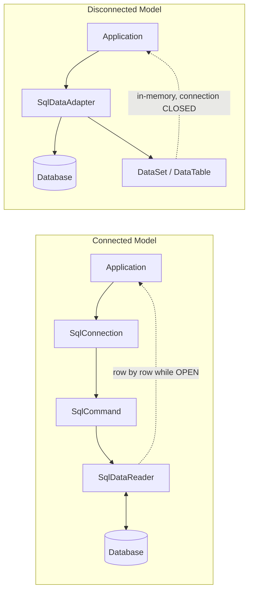
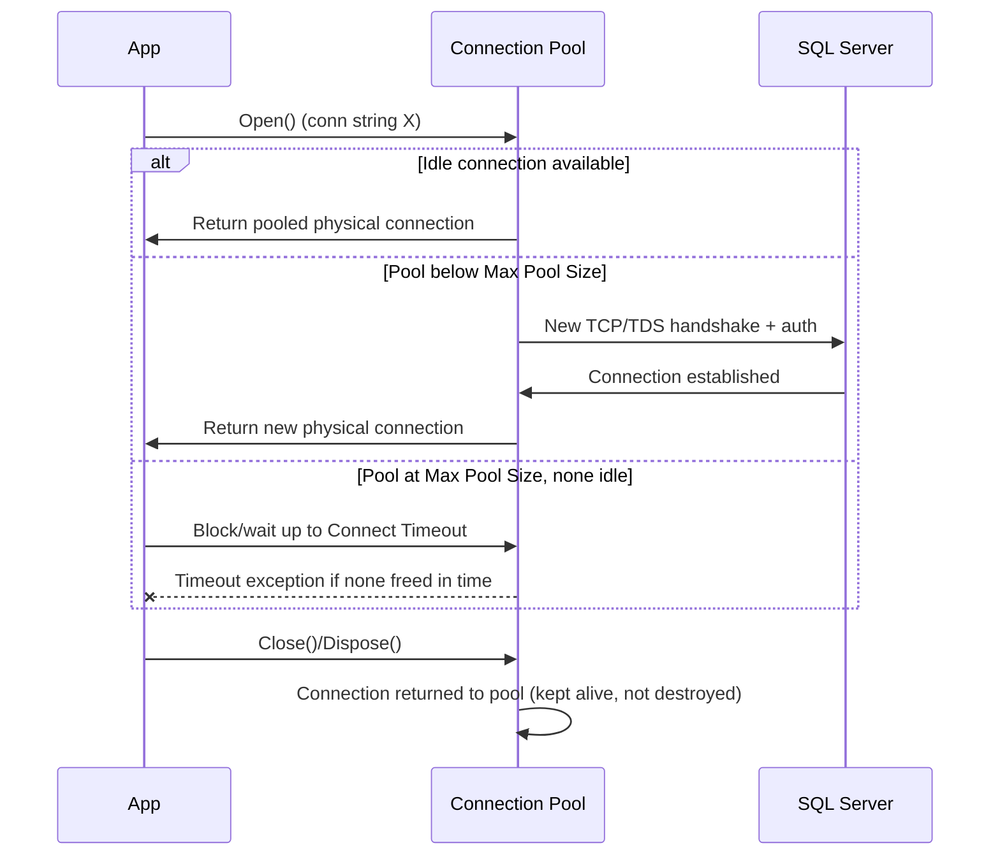
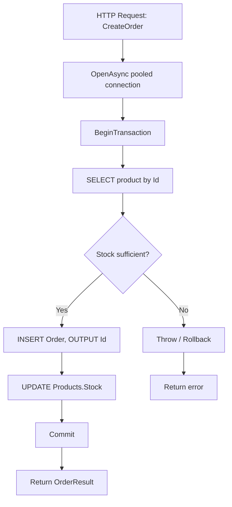
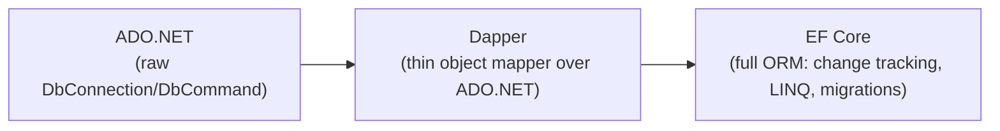

# ADO.NET — Interview Revision Notes

> Quick-revision Q&A `B. ADO.NET-Interview-Guide.md` se derive kiya gaya hai. Source ke har section ko cover karta hai.

## 1. Core Concepts

### 1.1 ADO.NET Kya Hai

**Q: ADO.NET kya hai aur yeh directly aapko kya deta hai?**

A:
- .NET mein relational (aur kuch non-relational) sources ke liye low-level, provider-based data access framework hai.
- Direct connection management, direct SQL/stored-procedure execution, raw result retrieval, manual transaction control deta hai.
- Connected (streaming) aur disconnected (in-memory) — dono data models offer karta hai.

**Q: ADO.NET generally ek ORM se faster/leaner kyun hota hai?**

A: Yeh mapping, change-tracking, aur LINQ-translation layers skip kar deta hai jo ORMs add karte hain — aap mapping code khud likhte ho, boilerplate ke badle speed aur lower memory use milta hai.

**Q: Aaj ADO.NET typically kahan use hota hai?**

A: High-throughput APIs, reporting/analytics endpoints, bulk data pipelines, latency-sensitive microservices, aur legacy enterprise systems mein. Yeh woh substrate bhi hai jispar `Dapper` aur `EF Core` bane hain (neeche `DbConnection`/`DbCommand` hota hai).

### 1.2 Core Architecture: Connected vs Disconnected

**Q: ADO.NET ke do architecture models kya hain?**

A:
- **Connected**: live connection open rakha jaata hai, data row-by-row stream hota hai, `DataReader` ke through implement hota hai.
- **Disconnected**: data ek baar in-memory `DataSet`/`DataTable` mein pull hota hai, fill hone ke baad connection close ho sakta hai, `DataAdapter` ke through implement hota hai.



**Q: Senior engineers aaj kaunsa model default use karte hain?**

A: Connected model (`DataReader`), ya usse behtar, iske upar bana micro-ORM/ORM (Dapper/EF Core) — trivial CRUD se aage kisi bhi kaam ke liye. Hand-rolled `DataSet` usage ab rare hai aur mostly legacy WinForms/data-binding code mein dikhta hai.

### 1.3 Data Providers

**Q: ADO.NET mein Data Provider kya hai?**

A: Woh classes ka set jo ek specific database engine (SQL Server, Oracle, MySQL, PostgreSQL...) ko target karta hai. Object model (`Connection`, `Command`, `DataReader`, `DataAdapter`, `Transaction`) sab providers mein consistent rehta hai; implementation har engine ke hisaab se alag hoti hai.

**Q: New projects ko kaunsa SQL Server provider use karna chahiye, aur older wala kyun nahi?**

A: **`Microsoft.Data.SqlClient`** (actively developed) use karo, legacy **`System.Data.SqlClient`** (maintenance mode) ki jagah. Naya package Always Encrypted, Azure AD auth, TDS 8.0/strict encryption, UTF-8, aur newer TLS support karta hai.

### 1.4 Connection Management & Connection Strings

**Q: Typical connection-string components kya hote hain?**

A:
- Server/Data Source, Initial Catalog (database)
- Authentication (Windows/Integrated, SQL login, Azure AD/Managed Identity)
- `Connect Timeout`
- Encryption (`Encrypt=True`, `TrustServerCertificate`)
- Pooling settings (`Pooling`, `Min Pool Size`, `Max Pool Size`)

```
Server=myServer;Database=myDb;Trusted_Connection=True;
```

**Q: Connection-management best practices kya hain?**

A:
- Jitna possible ho as late as possible open karo, as early as possible close karo.
- Hamesha `using`/`using var` mein wrap karo taaki exception aane par bhi `Dispose()` run ho.
- Ek long-lived `SqlConnection` ko requests ke across kabhi cache/share mat karo — reuse pooling ko handle karne do.

```csharp
using (SqlConnection conn = new SqlConnection(connectionString))
{
    conn.Open();
    // work
}
```

### 1.5 Command Execution

**Q: `SqlCommand` ke liye kaunse `CommandType` options hote hain?**

A:
- `Text` — raw SQL (default)
- `StoredProcedure`
- `TableDirect` — rarely use hota hai, mainly ek Access/OLE DB/ODBC concept hai, `Microsoft.Data.SqlClient` ke saath SQL Server ke against practically use nahi hota

```csharp
SqlCommand cmd = new SqlCommand("SELECT * FROM Users", conn);
```

**Q: `SELECT *` se kyun bachna chahiye?**

A: Schema drift column-ordinal-based reads ko break karta hai, unused columns par bandwidth waste karta hai, aur server par covering-index usage ko prevent kar sakta hai.

### 1.6 Execution Methods (ExecuteReader / ExecuteNonQuery / ExecuteScalar)

**Q: Har core execution method kya return karta hai aur kab use karte hain?**

A:

| Method | Returns | Typical Use |
|---|---|---|
| `ExecuteReader()` | `SqlDataReader` (streaming) | Multiple rows/columns wale SELECT ke liye |
| `ExecuteNonQuery()` | `int` (rows affected) | INSERT/UPDATE/DELETE/DDL ke liye |
| `ExecuteScalar()` | `object` (first column, first row) | Aggregates, existence checks ke liye |

```csharp
// ExecuteReader
using (SqlDataReader reader = cmd.ExecuteReader())
{
    while (reader.Read())
    {
        string name = reader["Name"].ToString();
    }
}

// ExecuteScalar
SqlCommand countCmd = new SqlCommand("SELECT COUNT(*) FROM Users", conn);
int count = (int)countCmd.ExecuteScalar();
```

**Q: `ExecuteScalar()` ka null gotcha kya hai?**

A: Empty result set C# `null` return karta hai; selected cell mein `NULL` value `DBNull.Value` return karta hai. Cast karne se pehle dono ke against guard karo.

## 2. Intermediate Topics

### 2.1 Parameterized Queries & SQL Injection Prevention

**Q: Sirf SQL injection prevent karne ke aage bhi parameterized queries kyun use karein?**

A: Yeh SQL Server ko cached execution plans reuse karne dete hain, har literal value ke liye recompile karne ki jagah — concatenated SQL text plan caching ko poori tarah defeat kar deta hai.

**Wrong (vulnerable, aur plan caching defeat karta hai):**

```csharp
string sql = "SELECT * FROM Users WHERE Name = '" + userInput + "'";
```

**Correct:**

```csharp
cmd.Parameters.Add("@Name", SqlDbType.VarChar, 100).Value = userInput;
```

**Q: `AddWithValue` vs explicit typing ka real gotcha kya hai?**

A: `AddWithValue` runtime par CLR value se `SqlDbType`/length infer karta hai; varying lengths ka ek `string` har call par ek different parameter signature generate kar sakta hai (jaise, implicit `nvarchar(4)` vs `nvarchar(12)`), jo plan cache ko fragment/bloat karta hai. Explicit typing signature pin kar deta hai taaki SQL Server ek plan reuse kare:

```csharp
// Works, but infers SqlDbType from the CLR value at runtime
cmd.Parameters.AddWithValue("@UserId", 1);

// Preferred: explicit type/size avoids plan-cache bloat and type-mismatch surprises
cmd.Parameters.Add("@UserId", SqlDbType.Int).Value = 1;
```

### 2.2 DataReader (Connected Model) Deep Dive

**Q: `DataReader` ke core characteristics kya hain?**

A: Poori iteration ke liye ek open connection chahiye; forward-only, read-only cursor hota hai (koi seeking/in-place edits nahi); memory footprint sabse kam hota hai kyunki sirf current row materialize hoti hai.

```csharp
using (SqlDataReader reader = cmd.ExecuteReader())
{
    while (reader.Read())
    {
        string name = reader["Name"].ToString();
    }
}
```

**Q: Hot loop mein ordinal/column-name lookup cost se kaise bachein?**

A: `reader.GetOrdinal("Name")` ke through ordinal ek baar cache karo, phir string indexer ke bajaye typed accessors (`GetString(ordinal)`, `GetInt32(ordinal)`) use karo, jo har row par boxing aur name lookup karta hai.

### 2.3 DataSet / DataTable / DataAdapter (Disconnected Model) Deep Dive

```csharp
SqlDataAdapter adapter = new SqlDataAdapter(query, conn);
DataTable table = new DataTable();
adapter.Fill(table);
```

**Q: `DataSet`/`DataAdapter` ke advantages kya hain?**

A: Offline processing, built-in change tracking (`AcceptChanges`/`RejectChanges`), native data-binding (WinForms/legacy WebForms), aur `adapter.Update()` `SqlCommandBuilder` se auto-generated INSERT/UPDATE/DELETE ke through edits ko push back kar sakta hai.

**Q: Disadvantages kya hain, aur yeh model kab bhi appropriate hota hai?**

A: Significantly higher memory use (`DataRow` mein har column `object` ke roop mein boxed hota hai), `DataReader` se slower, dated API. Isko sirf ek existing WinForms/WebForms codebase extend karne ke liye reserve karo jo already iske upar bana hua hai — new code ke liye `DataReader` + mapping, Dapper, ya EF Core use karna chahiye.

### 2.4 Transactions & ACID

**Q: ACID ka matlab kya hai?**

A:
- **Atomicity** — sab operations succeed hote hain ya koi bhi nahi.
- **Consistency** — DB valid states ke beech move karta hai; constraints kabhi bhi mid-way violate nahi hote.
- **Isolation** — concurrent transactions ek-doosre ke uncommitted changes nahi dekhte (degree configurable hai).
- **Durability** — committed changes crash ke baad bhi survive karte hain (write-ahead log).

**Q: Transactions ko correctly handle karne ke senior-level rules kya hain?**

A:
- Transaction scope jitna possible ho chhota rakho.
- Kabhi bhi open transaction ke andar network calls, user I/O, ya long computation mat karo — yeh locks hold karta hai aur other sessions ko block karta hai.
- `Rollback()` ke baad hamesha rethrow karo, jab tak deliberately failure ko ek alag outcome mein convert nahi kar rahe.

```csharp
SqlTransaction transaction = conn.BeginTransaction();

try
{
    cmd.Transaction = transaction;
    cmd.ExecuteNonQuery();
    transaction.Commit();
}
catch
{
    transaction.Rollback();
    throw; // don't swallow — rethrow after rollback
}
```

### 2.5 Error Handling

**Q: Generic `Exception` ki jagah specifically `SqlException` kyun catch karein?**

A: Yeh aapko `ex.Number` par branch karne dete hain specific error codes ke liye (jaise, 1205 = deadlock victim, -2 = timeout, 4060 = invalid DB) — transient failures (jo often safely retryable hote hain) ko permanent failures se distinguish karne ke liye jaise constraint violations (2627/2601) ya permission errors (229/230).

```csharp
try
{
    // DB operation
}
catch (SqlException ex)
{
    // Inspect ex.Number for specific SQL Server error codes
    // (e.g., 1205 = deadlock victim, -2 = timeout, 4060 = invalid DB)
    // log error with correlation id
    throw;
}
```

## 3. Advanced Topics

### 3.1 Connection Pooling Internals & Tuning

**Q: Connection pooling actually kaise work karta hai?**

A:
- Pool **exact connection string** (plus identity settings) se keyed hota hai — ek space ya case ka difference bhi ek *alag* pool create kar deta hai.
- `Open()` pool se ek idle connection maangta hai; agar valid hai, toh instantly return ho jaata hai (koi handshake nahi).
- `Close()`/`Dispose()` connection ko **pool mein return karta hai**, TCP connection ko tear down nahi karta — isi liye "open late, close early" cheap hai.
- Agar koi idle nahi hai aur pool `Max Pool Size` (default 100) se neeche hai, toh ek naya physical connection create hota hai.
- Agar `Max Pool Size` par hai aur koi free nahi hai, toh caller `Connect Timeout` tak **block** hota hai, phir `InvalidOperationException` throw karta hai — ek **connection leak** ka classic symptom.
- `Min Pool Size` se upar idle connections ~4-8 minutes ki inactivity ke baad prune ho sakte hain.



**Q: Key pooling tuning knobs kya hain?**

A:

| Keyword | Effect |
|---|---|
| `Pooling` | Sirf diagnostics ke liye disable karo |
| `Max Pool Size` | Concurrent physical connections par ceiling (default 100) |
| `Min Pool Size` | Cold-start latency avoid karne ke liye N connections pre-warm karta hai |
| `Connect Timeout` | `Open()` fail hone se pehle kitna wait karta hai |
| `Connection Lifetime` | Older connections ko recycle karne ke liye force karta hai (failover ke liye useful) |

**Q: Pool exhaustion ke baare mein senior-level insight kya hai?**

A: Yeh almost always ek application bug hota hai — leaked/undisposed connections, ya har loop item ke liye ek connection open karna — "`Max Pool Size` raise karo" wala problem nahi hai. Sabse pehle leak dhoondo.

### 3.2 Async ADO.NET & CancellationToken

**Q: Kya async ADO.NET se ek single query fast hoti hai?**

A: Nahi. Async **throughput/scalability** improve karta hai (server kitne concurrent requests handle karta hai), ek call ki latency nahi — yeh thread ko wait karte waqt doosra kaam karne ke liye free kar deta hai, lekin DB round trip ko khud speed up nahi karta.

**Q: Key async members kya hain, aur `CancellationToken` ko kaise use karna chahiye?**

A: `OpenAsync`, `ExecuteReaderAsync`, `ExecuteNonQueryAsync`, `ExecuteScalarAsync`, `ReadAsync`, `NextResultAsync`. Token ko har async DB call ke through propagate karo (`HttpContext.RequestAborted` se wire karo) taaki client disconnects actually in-flight SQL command ko abort kar sakein.

```csharp
await conn.OpenAsync(token);
using SqlCommand cmd = new SqlCommand(sql, conn);
using SqlDataReader reader = await cmd.ExecuteReaderAsync(token);
while (await reader.ReadAsync(token))
{
    // ...
}
```

**Q: Ek common async mistake kya hai?**

A: Sync aur async ko mix karna — ek async DB call par `.Result`, `.Wait()`, ya `GetAwaiter().GetResult()` call karna. Yeh ek synchronization context ke under deadlock kar sakta hai aur async jaane ka purpose defeat kar deta hai.

### 3.3 Transaction Isolation Levels & TransactionScope (Ambient Transactions)

**Q: Standard isolation levels kya prevent karte hain?**

A:

| Isolation Level | Dirty Read | Non-Repeatable Read | Phantom Read |
|---|---|---|---|
| `ReadUncommitted` | Possible | Possible | Possible |
| `ReadCommitted` (SQL Server default) | Prevented | Possible | Possible |
| `RepeatableRead` | Prevented | Prevented | Possible |
| `Serializable` | Prevented | Prevented | Prevented |
| `Snapshot` (row-versioning) | Prevented | Prevented | Prevented |

```csharp
using SqlTransaction tx = conn.BeginTransaction(IsolationLevel.ReadCommitted);
```

**Q: `TransactionScope` kya hai aur isse kyun use karein?**

A: Yeh ADO.NET calls ko (multiple resources bhi) ek transaction mein wrap kar deta hai without manually har command mein `SqlTransaction` object thread kiye — `System.Transactions` ambient transaction ko auto-detect karta hai aur connections ko enlist karta hai.

```csharp
using (var scope = new TransactionScope(
           TransactionScopeAsyncFlowOption.Enabled)) // required for async code paths
{
    using var conn = new SqlConnection(connectionString);
    await conn.OpenAsync();
    // command automatically enlists in the ambient transaction
    await cmd.ExecuteNonQueryAsync();

    scope.Complete(); // marks success; omit/throw to roll back
}
```

**Q: `TransactionScope` ke gotchas kya hain?**

A:
- `TransactionScopeAsyncFlowOption.Enabled` bhoolna ambient transaction ko `await` boundaries ke across flow karne se break kar deta hai.
- Ek scope mein do different connections enlist karna ek heavier **DTC/MSDTC** distributed transaction mein escalate ho jaata hai — historically Linux/containers par Windows-only limitation raha hai (apne SQL Server version ke liye current state verify karo).
- Override na kiya jaaye toh default **`Serializable`** isolation par hota hai — DB ke `ReadCommitted` default ke against unexpected blocking ka ek common source.

### 3.4 Multiple Active Result Sets (MARS)

**Q: MARS kaunsa problem solve karta hai?**

A: By default ek single `SqlConnection` ek time par sirf ek active `DataReader` allow karta hai (doosra `InvalidOperationException` throw karta hai). `MultipleActiveResultSets=True` ek physical connection par interleaved batches/readers allow karta hai.

```
Server=.;Database=ShopDB;Trusted_Connection=True;MultipleActiveResultSets=True;
```

**Q: Kya MARS ek performance feature hai?**

A: Nahi — yeh ek convenience hai. Interleaved operations wire par still serialized hote hain (cooperative multiplexing, true parallelism nahi) aur server-side session overhead add karte hain. Most seniors MARS par rely karne ke bajaye code restructure karna prefer karte hain (lookups pehle load karo, JOIN use karo); EF Core exactly isi scenario ke liye internally by default MARS enable karta hai.

### 3.5 SqlBulkCopy for High-Volume Inserts

**Q: Millions of rows ko efficiently kaise insert karein?**

A: Row-by-row `ExecuteNonQuery` ki jagah `SqlBulkCopy` use karo — yeh SQL Server ke native TDS bulk-load protocol ke through rows stream karta hai, per-row overhead ko bypass karte hue:

```csharp
using var bulkCopy = new SqlBulkCopy(connection, SqlBulkCopyOptions.Default, transaction)
{ DestinationTableName = "dbo.Orders", BatchSize = 5000 };
await bulkCopy.WriteToServerAsync(dataTable, cancellationToken);
```

**Q: `SqlBulkCopy` mein by default kaunsa correctness gotcha hota hai?**

A: Yeh speed ke liye by default constraint checks aur trigger firing skip karta hai (`SqlBulkCopyOptions.KeepIdentity`, `CheckConstraints`, `FireTriggers` yeh control karte hain) — ek real gotcha agar business logic triggers par depend karti ho.

**Q: `SqlBulkCopy` kab NAHI use karenge?**

A: Small batches ke liye, ya jab aapko per-row error handling/business validation chahiye ho — plain parameterized batched inserts simpler aur safer hote hain.

### 3.6 Reading & Streaming Large Objects (BLOBs/CLOBs)

**Q: Ek large BLOB column ko poori tarah memory mein load kiye bina kaise stream karein?**

A: `ExecuteReaderAsync` par `CommandBehavior.SequentialAccess` use karo, phir `reader.GetStream()` (ya `GetTextReader()`/`GetSqlBytes()`) se incrementally copy karo, indexer ke through poore column ko cast karne ke bajaye.

```csharp
using SqlDataReader reader = await cmd.ExecuteReaderAsync(
    CommandBehavior.SequentialAccess, token); // required for true streaming

if (await reader.ReadAsync(token))
{
    using Stream blobStream = reader.GetStream(reader.GetOrdinal("FileContent"));
    using Stream output = File.Create(destinationPath);
    await blobStream.CopyToAsync(output, token);
}
```

**Q: `SequentialAccess` use karte waqt constraint kya hai?**

A: Columns ko ordinal order mein aur sirf ek baar read karna padta hai — aap random column access ko trade karte ho poori row buffer na karne ke against, jisse bade `byte[]` allocations se Large Object Heap pressure avoid hoti hai.

### 3.7 Retry & Resilience for Transient Faults

**Q: Ek senior implementation transient SQL faults ko kaise handle kare?**

A:
- `SqlException.Number` se classify karo: transient (40613, 40501, 40197, 4060, 1205 deadlock, -2 timeout) vs non-transient (2627 constraint, 18456 auth, syntax errors).
- Provider-agnostic policy ke liye `Microsoft.Data.SqlClient` ke `SqlRetryLogicBaseProvider` (v3+) ya Polly use karo.
- Thundering-herd retries avoid karne ke liye jitter ke saath exponential backoff use karo.
- Kabhi bhi blindly retry mat karo.

```csharp
// Example: Polly-based retry around a transient SqlException
var retryPolicy = Policy
    .Handle<SqlException>(ex => IsTransient(ex.Number))
    .WaitAndRetryAsync(3, attempt =>
        TimeSpan.FromMilliseconds(200 * Math.Pow(2, attempt)) +
        TimeSpan.FromMilliseconds(Random.Shared.Next(0, 100))); // jitter

await retryPolicy.ExecuteAsync(async ct =>
{
    await conn.OpenAsync(ct);
    await cmd.ExecuteNonQueryAsync(ct);
}, token);
```

**Q: Retries ke liye idempotency kyun matter karti hai?**

A: Ek lost ack ke baad ek non-idempotent write (jaise, ek bare `INSERT`) retry karna — jab server ne actually commit kiya ho — rows/side effects ko duplicate kar sakta hai. Retryable unit ko ek transaction mein wrap karo ya ek dedupe key use karo.

### 3.8 High-Scale End-to-End Example

**Q: `CreateOrderAsync` example kya demonstrate karta hai?**

A: End-to-end async calls, ek pooled connection, ek transaction jo ek stock-check SELECT + ek INSERT (`OUTPUT INSERTED.Id`) + ek UPDATE ko span karta hai, parameterized commands, `CancellationToken` propagation, deterministic disposal ke liye `using` blocks, aur failure par rollback+rethrow.



```csharp
public async Task<OrderResult> CreateOrderAsync(
    int productId,
    int quantity,
    CancellationToken token)
{
    string connectionString = "Server=.;Database=ShopDB;Trusted_Connection=True;";

    using SqlConnection conn = new SqlConnection(connectionString);
    await conn.OpenAsync(token);

    using SqlTransaction transaction = conn.BeginTransaction();

    try
    {
        // 1. Read product information
        SqlCommand productCmd = new SqlCommand(
            @"SELECT Id, Name, Price, Stock
              FROM Products
              WHERE Id = @ProductId",
            conn,
            transaction);

        productCmd.Parameters.Add("@ProductId", SqlDbType.Int).Value = productId;

        Product product = null;

        using (SqlDataReader reader = await productCmd.ExecuteReaderAsync(token))
        {
            if (await reader.ReadAsync(token))
            {
                product = new Product
                {
                    Id = reader.GetInt32(0),
                    Name = reader.GetString(1),
                    Price = reader.GetDecimal(2),
                    Stock = reader.GetInt32(3)
                };
            }
        }

        if (product == null)
            throw new Exception("Product not found");

        if (product.Stock < quantity)
            throw new Exception("Insufficient stock");

        // 2. Insert order
        SqlCommand orderCmd = new SqlCommand(
            @"INSERT INTO Orders(ProductId, Quantity, TotalAmount)
              OUTPUT INSERTED.Id
              VALUES(@ProductId, @Qty, @Total)",
            conn,
            transaction);

        orderCmd.Parameters.Add("@ProductId", SqlDbType.Int).Value = productId;
        orderCmd.Parameters.Add("@Qty", SqlDbType.Int).Value = quantity;
        orderCmd.Parameters.Add("@Total", SqlDbType.Decimal).Value = product.Price * quantity;

        int orderId = (int)await orderCmd.ExecuteScalarAsync(token);

        // 3. Update inventory
        SqlCommand stockCmd = new SqlCommand(
            @"UPDATE Products
              SET Stock = Stock - @Qty
              WHERE Id = @ProductId",
            conn,
            transaction);

        stockCmd.Parameters.Add("@Qty", SqlDbType.Int).Value = quantity;
        stockCmd.Parameters.Add("@ProductId", SqlDbType.Int).Value = productId;

        await stockCmd.ExecuteNonQueryAsync(token);

        transaction.Commit();

        return new OrderResult
        {
            OrderId = orderId,
            ProductName = product.Name,
            Quantity = quantity
        };
    }
    catch
    {
        transaction.Rollback();
        throw;
    }
}
```

Supporting models:

```csharp
public class Product
{
    public int Id;
    public string Name;
    public decimal Price;
    public int Stock;
}

public class OrderResult
{
    public int OrderId;
    public string ProductName;
    public int Quantity;
}
```

**Q: Companion `GetProducts` example kya dikhata hai?**

A: Disconnected model — `SqlDataAdapter.Fill(DataTable)` `DataReader` ke ek batch-retrieval alternative ke roop mein.

```csharp
public DataTable GetProducts()
{
    using SqlConnection conn = new SqlConnection(_connectionString);

    SqlCommand cmd = new SqlCommand(
        "SELECT Id, Name, Price, Stock FROM Products",
        conn);

    SqlDataAdapter adapter = new SqlDataAdapter(cmd);
    DataTable table = new DataTable();
    adapter.Fill(table);

    return table;
}
```

## 4. Performance

### 4.1 Performance Best Practices

**Q: Core ADO.NET performance best practices kya hain?**

A:
- Hamesha parameterized queries use karo (security + plan-cache reuse).
- `SELECT *` avoid karo; columns explicitly naam se select karo.
- Verify karo ki indexes WHERE/JOIN/ORDER BY predicates support karte hain.
- Read-heavy, high-throughput paths ke liye `DataReader` (ya ek thin mapper) prefer karo.
- Connection open time minimize karo; churn absorb karne ke liye pooling ko chhod do.
- `DataSet`/`DataTable` avoid karo jab tak disconnected/data-binding semantics genuinely zaroori na ho.
- Operations batch karo (multi-row inserts, table-valued parameters, large volumes ke liye `SqlBulkCopy`).
- Hot loops mein reader ordinals cache karo; typed `Get*` accessors use karo.
- Large columns ke liye `CommandBehavior.SequentialAccess` + streaming use karo.
- Server-side call stack mein poori tarah async prefer karo.

### 4.2 ADO.NET vs Dapper vs EF Core Trade-offs

**Q: ADO.NET, Dapper, aur EF Core kaise compare karte hain?**

A:

| Aspect | ADO.NET | Dapper | EF Core |
|---|---|---|---|
| Abstraction | None | Minimal (objects mein map karta hai) | High (LINQ, change tracking) |
| Performance | Fastest | Raw ke against ~5-10% overhead | Pure reads ke liye slower |
| Productivity | Lowest | Medium | Highest |
| Change tracking | Manual | None | Built-in `DbContext` |
| Migrations | None | None | Built-in |
| Best fit | Bulk ops, streaming, hot paths | Reporting/read-heavy APIs | CRUD-heavy business apps |



**Q: In technologies ko mix karne par senior talking point kya hai?**

A: Inhe mix karna common aur legitimate hai — transactional/CRUD core ke liye EF Core, reporting, bulk jobs, aur hot paths ke liye ADO.NET/Dapper. Performance ke liye sab kuch rewrite mat karo; pehle profile karo, phir selectively abstraction drop karo sirf wahan jahan proven ho ki matter karta hai.

**Q: Kaunse EF Core features historical performance gap ko kaafi close karte hain?**

A: `AsNoTracking()`, compiled queries, aur `ExecuteUpdate`/`ExecuteDelete` (EF Core 7+) — read-only aur bulk-update scenarios ke liye, ORM ko chhode bina.

### 4.3 ExecuteUpdate / ExecuteDelete (EF Core 7+) — Closing the Bulk-Operation Gap

**Q: EF Core ke change-tracking model ne historically bulk updates/deletes ke liye kaunsa problem create kiya?**

A: Bahut sari rows ko update/delete karne ke liye har entity ko change tracker mein load karna, mutate karna, aur `SaveChanges()` call karna padta tha — jo conceptually ek single set-based statement tha, uske liye entity ke state ka har round trip, plus tracker overhead.

**Q: `ExecuteUpdateAsync`/`ExecuteDeleteAsync` kya karte hain?**

A: Ek LINQ query ko directly ek single set-based `UPDATE`/`DELETE` SQL statement mein compile karte hain jo immediately execute hota hai, change tracker aur `SaveChanges()` ko bypass karte hue:

```csharp
// Single UPDATE statement, no entities loaded into the change tracker
await dbContext.Products
    .Where(p => p.CategoryId == 5)
    .ExecuteUpdateAsync(s => s.SetProperty(p => p.Discontinued, true));

// Single DELETE statement, same principle
await dbContext.Orders
    .Where(o => o.CreatedAt < cutoffDate)
    .ExecuteDeleteAsync();
```

**Q: Kya yeh bulk INSERTs ke liye bhi performance gap close karta hai?**

A: Nahi — sirf `UPDATE`/`DELETE`. Bulk **INSERT** still `SqlBulkCopy` ko favor karta hai, jo native TDS bulk-load protocol par stream karta hai, jo EF Core ki LINQ-to-SQL translation se fundamentally alag code path hai.

**Q: Kya `ExecuteUpdate` still global query filters aur interceptors respect karta hai?**

A: Haan — yeh still EF Core ke query pipeline (model, filters, value converters) se guzarta hai; yeh sirf change tracker skip karta hai aur per-entity round trips ke bajaye ek SQL statement produce karta hai.

### 4.4 Managed Identity / Azure AD Authentication with Microsoft.Data.SqlClient

**Q: Managed Identity kya hai, aur yeh SQL auth ke liye kyun matter karti hai?**

A: Ek Azure AD (Entra ID) identity jo Azure auto-provision karta hai aur ek specific resource (App Service, VM, Function, etc.) se bind karta hai. App us resource ki identity ke roop mein authenticate hota hai, bina koi password/secret/certificate store ya rotate kiye.

**Q: System-assigned vs user-assigned managed identity?**

A: System-assigned resource ki lifecycle se 1:1 tied hoti hai (uske saath delete ho jaati hai). User-assigned ek standalone resource hai jo aap ek baar create karte ho aur multiple compute resources se attach karte ho — ek shared identity/permission set ke liye useful.

**Q: `Microsoft.Data.SqlClient` managed identity kaise use karta hai?**

A: `Authentication` connection-string keyword ke through:

```
Authentication=Active Directory Managed Identity;
```

User-assigned identity ke liye, `User Id=<managed-identity-client-id>` bhi add karo. Driver `Open()` par transparently AAD token acquire kar leta hai.

```
# For user-assigned managed identity, also specify the identity's client ID:
Server=tcp:myserver.database.windows.net,1433;Database=myDb;Authentication=Active Directory Managed Identity;User Id=<managed-identity-client-id>;Encrypt=True;
```

```csharp
using Microsoft.Data.SqlClient;

var connectionString =
    "Server=tcp:myserver.database.windows.net,1433;Database=myDb;" +
    "Authentication=Active Directory Managed Identity;Encrypt=True;";

using SqlConnection conn = new SqlConnection(connectionString);
await conn.OpenAsync(); // driver acquires the AAD token transparently on Open()
```

**Q: `Authentication=Active Directory Default` kya karta hai?**

A: Ek credential-discovery chain ko delegate karta hai (Azure mein managed identity, locally environment variables/Azure CLI/Visual Studio login par fallback karte hue) — same connection string Azure mein aur ek dev machine par kaam karta hai.

**Q: `Authentication` keyword ke bajaye `Azure.Identity` ke `DefaultAzureCredential` ko directly kab use karenge?**

A: Jab aapko zyada control chahiye ho — custom credential chains, explicit tenant targeting, caching, ya doosre Azure resources ke liye tokens acquire karna. Token khud fetch karo aur `Open()` se pehle usko `SqlConnection.AccessToken` mein assign karo.

```csharp
using Azure.Identity;
using Azure.Core;
using Microsoft.Data.SqlClient;

var credential = new DefaultAzureCredential();
var tokenRequestContext = new TokenRequestContext(new[] { "https://database.windows.net/.default" });
AccessToken token = await credential.GetTokenAsync(tokenRequestContext);

using SqlConnection conn = new SqlConnection(
    "Server=tcp:myserver.database.windows.net,1433;Database=myDb;Encrypt=True;");
conn.AccessToken = token.Token;
await conn.OpenAsync();
```

**Q: Managed identity ko SQL-login credentials ke upar modern recommended posture kyun mana jaata hai?**

A:
- Secret sprawl eliminate karta hai (`appsettings.json`/CI variables mein koi password leak karne ke liye nahi).
- Azure dwara managed automatic credential rotation.
- Entra ID/Azure RBAC (`CREATE USER ... FROM EXTERNAL PROVIDER`) ke through centralized access control.
- Reduced blast radius — tokens short-lived, scoped, aur resource level par revocable hote hain.

## 5. Best Practices

**Q: Core disposal, parameterization, aur connection rules kya hain?**

A:
- Har `IDisposable` (`SqlConnection`, `SqlCommand`, `SqlDataReader`, `SqlTransaction`) ke liye `using`/`using var` use karo.
- Hamesha parameterize karo — user input ko kabhi SQL text mein concatenate mat karo.
- Parameters ko explicitly type/size karo (`SqlDbType` + length) sirf `AddWithValue` par purely rely karne ke bajaye.
- Connections late open karo, early dispose karo; churn absorb karne ke liye pooling par trust karo.

**Q: Transaction aur async best practices kya hain?**

A:
- Transactions short rakho — ek open transaction ke andar koi network calls, user waits, ya heavy computation nahi.
- `Rollback()` ke baad rethrow karo — transaction failures ko swallow mat karo.
- Server-side har jagah async DB APIs prefer karo; `CancellationToken` propagate karo.

**Q: Tooling aur error-handling best practices kya hain?**

A:
- Har operation ke liye right tool choose karo: read-heavy hot paths ke liye `DataReader`/Dapper, CRUD-heavy logic ke liye EF Core, bulk loads ke liye `SqlBulkCopy`.
- Retry decisions ke liye error number par branch karne ke liye specifically `SqlException` catch karo (bare `Exception` nahi).
- Long-running reports/batch jobs ke liye `CommandTimeout` ko deliberately set karo.

## 6. Common Pitfalls

**Q: Classic ADO.NET pitfalls (1-8) kya hain?**

A:
1. "Open late, close early" ko wasteful samajhna — close karna sirf connection ko pool mein return karta hai.
2. String-concatenated SQL — injection risk, plan-cache reuse ko defeat karta hai.
3. Connections ko unnecessarily open rakhna — pool exhaustion ka risk, scalability ko hurt karta hai.
4. Readers/connections/transactions ko dispose na karna — leaks, pool starvation, lingering locks.
5. Async ko ignore karna — web API thread par sync DB calls load ke under thread-pool starvation cause karte hain.
6. Habit se `DataSet`/`DataTable` use karna — zaroorat se zyada heavy aur slower.
7. Transactions handle na karna — partial multi-statement writes DB ko inconsistent chhod dete hain.
8. Performance differences explain na kar sakna (DataReader vs DataSet, ADO.NET vs ORM, parameterized vs inline SQL, sync vs async throughput impact).

**Q: Resilience aur async ke around naye pitfalls (9-11) kya hain?**

A:
9. **Transient faults par blind retries** — ek transaction/dedupe boundary ke bina non-idempotent writes retry karna, ya non-transient errors retry karna aur real bugs ko mask karna.
10. **Assume karna ki async ek single query fast bana deta hai** — async concurrency/scalability khareedta hai, ek call ke liye lower latency nahi.
11. **`TransactionScopeAsyncFlowOption.Enabled` bhoolna** — ambient transaction `await` ke across flow nahi karta, ya do enlisted connections unexpectedly ek DTC distributed transaction mein escalate ho jaate hain.

## 7. Sample Interview Q&A

**Q: ADO.NET EF Core jaise ek ORM se faster kyun hai?**

A: No change-tracking, no LINQ-to-SQL translation, no entity materialization/proxying — aap directly SQL execute karte ho aur sirf wahi map karte ho jo aapne maanga. Trade-off: aap mapping/SQL ke owner ho, aur migrations/navigation properties/LINQ composability lose ho jaate hain.

**Q: `DataReader` ko EF Core ke upar kab choose karenge?**

A: High-throughput reads, large/streamed result sets, reporting queries, ya kisi bhi hot path mein jahan profiling dikhaye ki ORM overhead matter karta hai. CRUD-heavy business logic ke liye, EF Core maintainability/dev speed par win karta hai.

**Q: Connection pooling ka impact explain karo, ek failure mode ke saath jo aapne dekha ho.**

A: Pooling connection string se keyed physical connections reuse karta hai, har `Open()` par ek naya TCP/TDS handshake avoid karte hue. `Close()`/`Dispose()` connection ko destroy karne ke bajaye return karta hai. Failure mode: ek connection leak (kisi exception path par undisposed connection) pool ko exhaust kar deta hai — har baad ka `Open()` `Connect Timeout` tak block hota hai aur throw karta hai.

**Q: Transactions ko correctly kaise handle karte ho, aur isolation levels kaise relate hote hain?**

A: Scope minimal rakho, promptly commit/rollback karo, rollback ke baad hamesha rethrow karo. Isolation level control karta hai ki concurrent transactions ek-doosre ke changes kitna dekhte hain; `ReadCommitted` SQL Server ka default baseline hai, jabki `Serializable`/`Snapshot` phantom/non-repeatable reads ko prevent karte hain, extra blocking/versioning overhead ki cost par.

**Q: Kya async ADO.NET ek single query ko fast run karata hai?**

A: Nahi — query server-side same time leti hai. Async calling thread ko I/O par blocking se free kar deta hai, isliye server same thread pool ke saath zyada concurrent requests handle karta hai. Win throughput hai, per-call latency nahi.

**Q: 2 million rows ko efficiently kaise insert karoge?**

A: Row-by-row `ExecuteNonQuery` nahi — `SqlBulkCopy` use karo, SQL Server ke native bulk-load protocol ke through streaming. Agar memory ek concern hai toh ek poora `DataTable` materialize karne ke bajaye ek `IDataReader` source se stream karo. Yaad rakho yeh by default triggers/constraint checks skip karta hai jab tak opt in na kiya jaaye.

**Q: `AddWithValue` aur explicitly-typed parameters mein kya difference hai, aur yeh kyun matter karta hai?**

A: `AddWithValue` runtime value se type/size infer karta hai, calls ke across varying parameter signatures produce karte hue aur plan cache ko fragment karte hue. Explicit `Add(name, SqlDbType, size)` signature ko pin kar deta hai taaki SQL Server ek execution plan reuse kare.

**Q: `SqlTransaction` ke bajaye `TransactionScope` kab use karoge?**

A: Jab ek logical unit of work multiple `SqlConnection` instances (ya resource managers) ko span karta ho, ya transaction demarcation ko data-access code se separate rakhne ke liye. Do enlisted connections ke saath accidental DTC escalation ke liye dhyan rakho, aur yaad rakho default `Serializable` isolation hai jab tak override na kiya jaaye.
