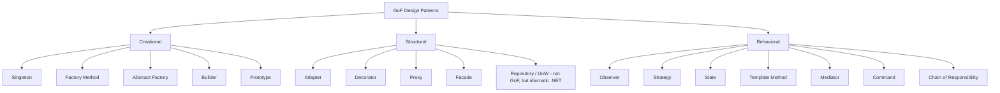
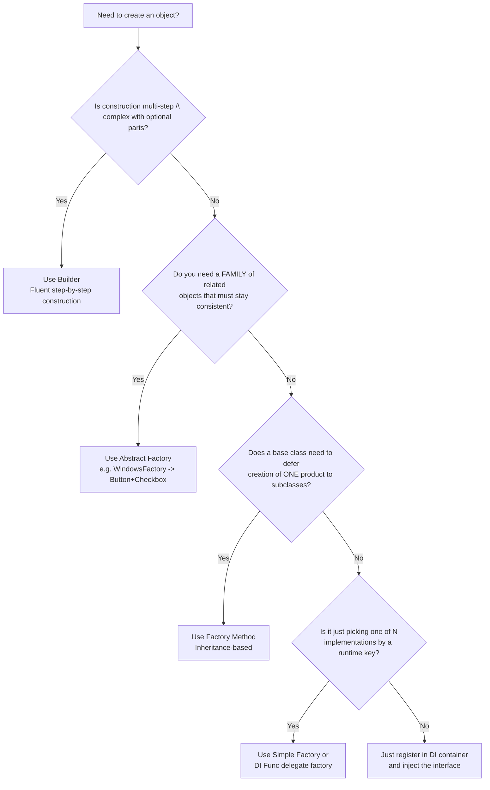
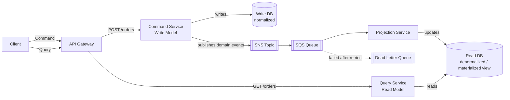
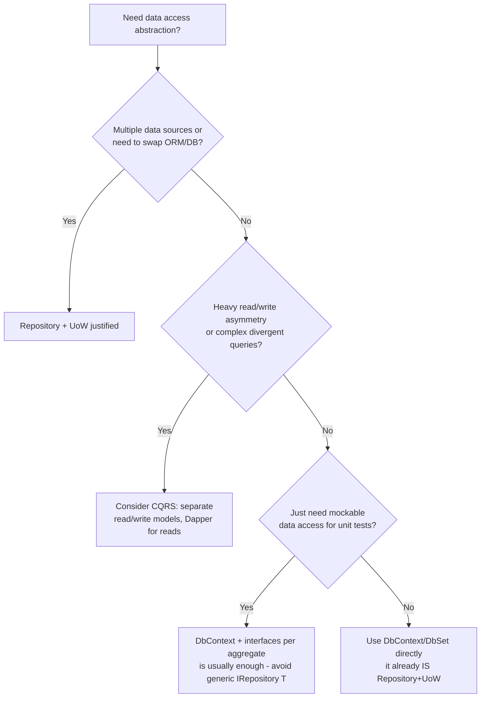

# Design Patterns — Senior .NET Interview Guide

> Audience: 10-year .NET full-stack engineer jo senior/lead interviews ke liye prep kar raha hai. Focus trade-offs, "why," gotchas, aur follow-up questions par hai — tutorials par nahi.

## Table of Contents

1. [Core Concepts](#core-concepts)
2. [Creational Patterns](#creational-patterns)
   - [Singleton](#singleton)
   - [Factory Method, Simple Factory, Abstract Factory](#factory-patterns)
   - [[new content] Builder](#new-content-builder)
   - [[new content] Builder vs Factory vs Abstract Factory Decision Tree](#new-content-builder-vs-factory-vs-abstract-factory-decision-tree)
   - [[new content] Prototype](#new-content-prototype)
3. [Structural Patterns](#structural-patterns)
   - [Dependency Injection (as a pattern)](#dependency-injection-as-a-pattern)
   - [Repository Pattern](#repository-pattern)
   - [Unit of Work Pattern](#unit-of-work-pattern)
   - [[new content] Decorator vs Proxy vs Adapter](#new-content-decorator-vs-proxy-vs-adapter)
   - [[new content] Facade](#new-content-facade)
   - [[new content] Specification Pattern](#new-content-specification-pattern)
   - [Bridge, Composite, and Flyweight [gaps]](#bridge-composite-and-flyweight-gaps)
4. [Behavioral Patterns](#behavioral-patterns)
   - [Observer](#observer)
   - [Mediator Pattern (MediatR)](#mediator-pattern-mediatr)
   - [[new content] Strategy vs State](#new-content-strategy-vs-state)
   - [[new content] Template Method](#new-content-template-method)
   - [[new content] Command Pattern](#new-content-command-pattern)
   - [[new content] Chain of Responsibility](#new-content-chain-of-responsibility)
   - [Visitor and Memento [gaps]](#visitor-and-memento-gaps)
   - [Null Object Pattern [gaps]](#null-object-pattern-gaps)
5. [Architectural Patterns](#architectural-patterns)
   - [CQRS](#cqrs)
   - [Projection Service](#projection-service)
   - [Distributed Locks / Leases](#distributed-locks--leases)
   - [[new content] Options Pattern in .NET](#new-content-options-pattern-in-net)
   - [[new content] Repository + Unit of Work vs Raw EF Core / CQRS](#new-content-repository--unit-of-work-vs-raw-ef-core--cqrs)
6. [SOLID Principles](#solid-principles)
   - [[new content] SOLID in Practice — Violation-to-Fix Walkthroughs](#new-content-solid-in-practice--violation-to-fix-walkthroughs)
7. [Anti-Patterns](#anti-patterns)
   - [[new content] God Object, Anemic Domain Model, Service Locator, and Other Overused/Misapplied Patterns](#new-content-god-object-anemic-domain-model-service-locator-and-other-overusedmisapplied-patterns)
8. [Performance Considerations](#performance-considerations)
9. [Best Practices](#best-practices)
10. [Common Pitfalls](#common-pitfalls)
11. [Sample Interview Q&A](#sample-interview-qa)
12. [Summary of Additions](#summary-of-additions)
13. [Summary of \[gaps\] Additions (This Pass)](#summary-of-gaps-additions-this-pass)
8. [Performance Considerations](#performance-considerations)
9. [Best Practices](#best-practices)
10. [Common Pitfalls](#common-pitfalls)
11. [Sample Interview Q&A](#sample-interview-qa)
12. [Summary of Additions](#summary-of-additions)
13. [Summary of [gaps] Additions (This Pass)](#summary-of-gaps-additions-this-pass)

---

## Core Concepts

Design patterns reusable, named solutions hote hain recurring software design problems ke liye. Yeh exist karte hain teams ko ek **shared vocabulary** dene ke liye ("yahan bas ek Decorator use kar lo") aur hard-won trade-offs encode karne ke liye taaki aapko unhe rediscover na karna pade. GoF (Gang of Four) book 23 patterns ko teen categories mein classify karti hai:

| Category | Purpose | Examples |
|---|---|---|
| Creational | Control karta hai **kaise objects create hote hain** | Singleton, Factory Method, Abstract Factory, Builder, Prototype |
| Structural | Control karta hai **kaise objects/classes compose hote hain** | Adapter, Decorator, Proxy, Facade, Composite, Bridge, Flyweight |
| Behavioral | Control karta hai **kaise objects communicate/collaborate karte hain** | Observer, Strategy, State, Template Method, Command, Chain of Responsibility, Mediator, Iterator, Visitor, Memento |



**Senior-level framing jo ek interviewer sunna chahta hai:** patterns goals nahi hote — yeh trade-offs hote hain jo aap accept karte ho ek specific force (variability, coupling, lifecycle, testability) ko solve karne ke liye. Agar aap yeh naam nahi bata sakte ki pattern kaunsi force resolve karta hai, toh probably aap over-engineering kar rahe ho. "Yahan aap kaunsa pattern use karoge?" ka best senior answer often isse start hota hai — "hum actually kaunsa problem solve kar rahe hain — kya humein ek pattern chahiye bhi hai, ya ek simple function/DI registration hi isko solve kar deta hai?"

---

## Creational Patterns

### Singleton

**Intent:** Ensure karo ki ek class ka exactly ek instance ho aur usko ek global access point provide karo.

**Kab use karein:** shared, expensive-to-create, effectively stateless (ya read-only state) resources — logging, in-memory cache wrappers, configuration snapshots, connection pool managers.

#### Implementations compared

| Approach | Thread-safe | Lazy? | Best for | Notes |
|---|---|---|---|---|
| Naive (`if (_instance == null)`) | ❌ No | ✔ Yes | Kabhi nahi (demo only) | Race condition multiple instances create karti hai |
| `lock` on every access | ✔ Yes | ✔ Yes | Legacy code | Har call par locking overhead |
| Double-checked locking | ✔ Yes | ✔ Yes | Threading knowledge dikhana | Verbose; reordering prevent karne ke liye `volatile` chahiye |
| Static field / static constructor | ✔ Yes (CLR guarantees) | ❌ No (eager) | Simple, cheap objects | CLR type initializer ko har AppDomain ke liye exactly ek baar run karta hai |
| `Lazy<T>` | ✔ Yes | ✔ Yes | **Modern default** | Cleanest, safest, `LazyThreadSafetyMode` support karta hai |
| `LazyInitializer.EnsureInitialized` | ✔ Yes | ✔ Yes | Perf-critical, multiple lazy fields | `Lazy<T>` se lower allocation, more verbose |

```csharp
// Recommended modern approach
public sealed class Logger
{
    private static readonly Lazy<Logger> _instance = new(() => new Logger());
    public static Logger Instance => _instance.Value;
    private Logger() { }

    public void Log(string message) =>
        Console.WriteLine($"[{DateTime.UtcNow:O}] {message}");
}
```

```csharp
// Double-checked locking — must use `volatile` or memory reordering can expose
// a partially-constructed object to another thread.
public sealed class Singleton
{
    private static volatile Singleton? _instance;
    private static readonly object _lock = new();
    private Singleton() { }

    public static Singleton Instance
    {
        get
        {
            if (_instance == null)
            {
                lock (_lock)
                {
                    _instance ??= new Singleton();
                }
            }
            return _instance;
        }
    }
}
```

**Anti-pattern trap (common interview trick question):**

```csharp
public sealed class Singleton
{
    private static Singleton? _instance;
    public static Singleton Instance => _instance ??= new Singleton();
}
```
Yeh **thread-safe nahi hai** — `??=` atomic nahi hai; do threads dono `null` observe kar sakte hain aur do instances construct kar sakte hain.

#### Singleton in ASP.NET Core DI

Hand-rolled singletons ke bajaye container-managed singletons prefer karo:
```csharp
builder.Services.AddSingleton<ILogger, Logger>();
```
Isse aapko testability milti hai (static accessor ke bajaye interface + constructor injection), aur container shutdown par `IDisposable`/`IAsyncDisposable` ke through disposal handle karta hai.

#### Singleton vs Static Class

| Singleton | Static Class |
|---|---|
| Instance-based | No instance |
| Interfaces implement kar sakta hai | Nahi kar sakta |
| DI / mocking ke saath kaam karta hai | Inject ya mock nahi ho sakta |
| Control ke saath, deliberately state hold kar sakta hai | Default se effectively global mutable state |

#### Singleton kab NAHI use karein

- Aapko per-request ya per-user state chahiye → **web app mein stateful Singletons ek classic bug hain**: ek Singleton par `CurrentUser` har concurrent request ke across shared hota hai, jo users ke beech data leakage cause karta hai.
- Testing: global state tests ko order-dependent aur isolate/mock karna mushkil banata hai.
- **SRP** violate karta hai (creation-control logic ko business behavior ke saath mix karta hai) aur often **DIP** bhi (callers ek abstraction ki jagah ek concrete global reach karte hain).
- Distributed/cloud environments: ek Singleton **ek process** ke scope mein hota hai, poore system ke nahi. 5 pods tak scale out karo = 5 independent Singletons. Cluster-wide behavior coordinate karne ke liye isko use mat karo — uske liye ek **distributed lock/lease** chahiye (neeche dekho).
- Kabhi bhi `HttpContext`, database connections, ya doosre short-lived/request-scoped objects ko ek Singleton ke andar store mat karo — yeh captured-context bugs aur leaks cause karta hai (classic **captive dependency** problem: ek Singleton jo apne constructor mein ek Scoped/Transient service ko capture kar leta hai, us instance ko forever alive rakhta hai).

#### Reflection/serialization ke through Singleton breakage prevent karna

- Class ko `sealed` mark karo.
- Constructor ko `private` rakho.
- Serialization ke liye, custom `GetObjectData`/deserialization hooks implement karo (ya `[NonSerialized]` mark karo) taaki deserialize par ek second instance create na ho; reflection abhi bhi ek private constructor ko `Activator.CreateInstance(type, nonPublic: true)` ke through bypass kar sakta hai — .NET mein 100% reflection-proof singleton nahi hai, jab tak `ModuleInitializer` checks ke through harden na karo ya manual Singleton ko poori tarah chhod kar DI-managed singletons use na karo (recommended: reflection se mat lado, DI use karo).

#### Singleton Logger — end-to-end example

```csharp
public sealed class Logger
{
    private static readonly Lazy<Logger> _instance = new(() => new Logger());
    private readonly string _logFilePath = "log.txt";

    private Logger() { }
    public static Logger Instance => _instance.Value;

    public void Log(string message)
    {
        using var writer = new StreamWriter(_logFilePath, append: true);
        writer.WriteLine($"{DateTime.Now}: {message}");
    }
}
```
> **Note (original source ne is Logger class ke liye ek `lock`-based Instance property ek separate `Lazy<T>` example ke saath use kiya tha — dono ko yahan rakha gaya hai kyunki yeh "before/after" best-practice progression represent karte hain, contradiction nahi.)**

---

### Factory Patterns

#### Simple Factory (formal GoF pattern nahi hai)

Ek static method/class jo input ke basis par ek implementation return karta hai. Cheap, common, aur often "good enough":

```csharp
public interface INotification { void Send(string message); }

public class EmailNotification : INotification
{
    public void Send(string message) => Console.WriteLine("Email: " + message);
}
public class SmsNotification : INotification
{
    public void Send(string message) => Console.WriteLine("SMS: " + message);
}

public static class NotificationFactory
{
    public static INotification Create(string type) => type switch
    {
        "email" => new EmailNotification(),
        "sms"   => new SmsNotification(),
        _       => throw new ArgumentException("Invalid notification type")
    };
}
```

#### Factory Method (GoF)

Base `Creator` ek invariant workflow define karta hai; subclasses factory method ko override karti hain yeh decide karne ke liye ki *kaunsa* concrete product create hota hai. **Inheritance** use karta hai.

```csharp
public interface IProduct { string Operation(); }
public class ConcreteProductA : IProduct { public string Operation() => "Result A"; }
public class ConcreteProductB : IProduct { public string Operation() => "Result B"; }

public abstract class Creator
{
    protected abstract IProduct FactoryMethod();
    public string SomeOperation() => $"Creator: working with {FactoryMethod().Operation()}";
}

public class ConcreteCreatorA : Creator
{
    protected override IProduct FactoryMethod() => new ConcreteProductA();
}
```

**Trade-offs:** invariant algorithm ko centralized rakhta hai (OCP ke liye good hai — existing code ko touch kiye bina naye `CreatorX`/`ProductX` pairs add kar sakte ho), lekin inheritance par rely karta hai, jo composition se zyada rigid hai aur subclass explosion lead kar sakta hai.

#### Abstract Factory (GoF)

Ek interface jo **related objects ke families** create karta hai jo saath use hone chahiye (consistency guarantee).

```csharp
public interface IButton { void Paint(); }
public interface ICheckbox { void Paint(); }

public class WindowsButton : IButton { public void Paint() => Console.WriteLine("Windows Button"); }
public class WindowsCheckbox : ICheckbox { public void Paint() => Console.WriteLine("Windows Checkbox"); }
public class MacButton : IButton { public void Paint() => Console.WriteLine("Mac Button"); }
public class MacCheckbox : ICheckbox { public void Paint() => Console.WriteLine("Mac Checkbox"); }

public interface IGuiFactory
{
    IButton CreateButton();
    ICheckbox CreateCheckbox();
}

public class WindowsFactory : IGuiFactory
{
    public IButton CreateButton() => new WindowsButton();
    public ICheckbox CreateCheckbox() => new WindowsCheckbox();
}

public class MacFactory : IGuiFactory
{
    public IButton CreateButton() => new MacButton();
    public ICheckbox CreateCheckbox() => new MacCheckbox();
}

public class Application
{
    private readonly IButton _button;
    private readonly ICheckbox _checkbox;
    public Application(IGuiFactory factory)
    {
        _button = factory.CreateButton();
        _checkbox = factory.CreateCheckbox();
    }
    public void RenderUI() { _button.Paint(); _checkbox.Paint(); }
}
```

Runtime par concrete family ko DI ke through wire karna:
```csharp
services.AddTransient<IGuiFactory>(sp =>
{
    var platform = configuration["Ui:Platform"];
    return platform == "windows" ? new WindowsFactory() : (IGuiFactory)new MacFactory();
});
```

| | Factory Method | Abstract Factory |
|---|---|---|
| Scope | Ek product | Related products ki family |
| Mechanism | Inheritance (ek method override karo) | Composition (ek factory object hold karo) |
| Use case | Ek single product ka concrete type vary karo | Kai products ke across compatibility guarantee karo |
| Extension | Naya `Creator` subclass add karo | Family interface implement karne wala naya concrete factory add karo |

#### Factory vs Strategy

Ek common senior follow-up: "Factory aur Strategy dono ek concrete type ko ek interface ke peeche hide karte hain — actually different kya hai?"

| | Factory | Strategy |
|---|---|---|
| **Decides** | *Object kaise/kya create hota hai* | *Kaunsa algorithm/behavior run hota hai* |
| **Chosen by** | Ek creation-time key/config (type name, platform, provider) | Client/caller, per invocation ya per context |
| **Output** | Ek naya object instance | Existing collaborators par behavior execute karne ka result |
| **Relationship** | Often ek Strategy implementation **construct karke return karta hai** | Frequently woh *product* hai jo ek Factory hand back karta hai |

```csharp
// Factory picks WHICH strategy to construct...
public static IDiscountStrategy DiscountStrategyFactory(string customerTier) => customerTier switch
{
    "Gold"   => new GoldDiscount(),
    "Silver" => new SilverDiscount(),
    _        => new NoDiscount()
};

// ...Strategy then decides HOW the chosen behavior executes
var strategy = DiscountStrategyFactory(customer.Tier);
var finalTotal = strategy.Apply(orderTotal);
```

**Interview one-liner:** "Strategy answer karta hai *kaunsa behavior run hota hai*; Factory answer karta hai *woh object kaise banta hai*. Yeh competing patterns nahi hain — factories bahut baar specifically isliye exist karte hain ki ek Strategy implementation construct karke hand back karein jo ek runtime key se select hui ho."

#### DI containers hand-rolled factories ki zaroorat kaise kam karte hain

Modern DI containers already object creation, lifetime management (Singleton/Scoped/Transient), aur implementation selection provide karte hain — jo ek factory ki exact responsibilities hain:

```csharp
// Instead of:
var service = ServiceFactory.Create("email");
// Do:
var service = provider.GetRequiredService<INotificationService>();
```

**Runtime-parameterized** creation ke liye, ek factory class likhne ke bajaye ek factory delegate inject karo:
```csharp
services.AddTransient<EmailService>();
services.AddTransient<SmsService>();
services.AddTransient<Func<string, IService>>(provider => key => key switch
{
    "email" => provider.GetRequiredService<EmailService>(),
    "sms"   => provider.GetRequiredService<SmsService>(),
    _       => throw new ArgumentException("Invalid type")
});
```

**Interview line:** "DI containers automatic factories ki tarah act karte hain built-in lifetime management ke saath — ek hand-written Factory class sirf tab justified hai jab creation logic genuinely complex ho, container ke bahar pluggable hona chahiye (jaise, third-party plugin DLLs), ya ek family/consistency guarantee enforce karna ho (Abstract Factory)."

**Real ASP.NET Core factory examples jo interviews mein cite kar sakte ho:**

| Factory | Purpose |
|---|---|
| `IHttpClientFactory` | Socket exhaustion avoid karne ke liye `HttpClient`/`HttpMessageHandler` pooling manage karta hai; named/typed clients, Polly policies support karta hai |
| `ILoggerFactory` | Category-typed `ILogger<T>` instances create karta hai; provider config centralize karta hai (Console, Serilog, App Insights) |
| `IServiceScopeFactory` | Manually ek DI scope create karta hai (jaise, ek `BackgroundService` ke andar) taaki Scoped services ko HTTP request ke bahar resolve kiya ja sake |
| `IMiddlewareFactory` | Convention-based middleware pattern ke bajaye DI ke through `IMiddleware` instances create karta hai, jo scoped dependency use enable karta hai |

```csharp
using var scope = scopeFactory.CreateScope();
var service = scope.ServiceProvider.GetRequiredService<IMyScopedService>();
```

**Plugin architecture (dynamic assembly loading)** — senior-level factory extension:
```csharp
public interface IPlugin { string Name { get; } void Execute(); }

var pluginFolder = Path.Combine(AppContext.BaseDirectory, "Plugins");
foreach (var dll in Directory.GetFiles(pluginFolder, "*.dll"))
    Assembly.LoadFrom(dll);

var plugins = AppDomain.CurrentDomain.GetAssemblies()
    .SelectMany(a => a.GetTypes())
    .Where(t => typeof(IPlugin).IsAssignableFrom(t) && !t.IsInterface && !t.IsAbstract)
    .Select(t => (IPlugin)Activator.CreateInstance(t)!)
    .ToList();

foreach (var plugin in plugins) plugin.Execute();
```
> Modern alternative (apne target runtime ke against verify karo): isolated/unloadable plugin contexts ke liye `System.Runtime.Loader.AssemblyLoadContext`, aur attribute-based discovery ke liye `System.Composition`/MEF, production plugin systems mein raw `Assembly.LoadFrom` + `Activator.CreateInstance` se zyada robust hain kyunki yeh unloading aur version isolation support karte hain.

#### Plugin Factory Versioning & Backward Compatibility

Dynamic plugin loading *discovery* solve karta hai; production plugin systems ko yeh bhi chahiye ki **plugin versions host se independently evolve** hote rehne par yeh survive kar sake. Senior interviews mein repeatedly char techniques aati hain:

- **Adapter layers** — ek older plugin ke interface ko current `IPlugin` contract ke peeche wrap karo taaki host ko legacy plugins ke liye kabhi bhi special-case na karna pade; adapter shape mismatch ko absorb karta hai.
- **Versioned interfaces** — `IPlugin`, `IPluginV2`, etc. ship karo (ya plugin par ek `Version` property/attribute) jab contract change hota hai purane plugins ko silently break karne ke bajaye; host resolve karta hai jo version ek given plugin DLL actually implement karti hai.
- **Feature negotiation** — ek fat interface ke bajaye, plugins small optional capability interfaces implement karte hain (`ISupportsAsyncExecute`, `ISupportsCancellation`); host `is`/`as` (ya ek capabilities descriptor) ke through probe karta hai aur sirf wahi call karta hai jo plugin actually support karta hai.
- **Fallback factories** — agar ek plugin load fail ho jaaye, ek incompatible version ho, ya missing ho, toh factory ek safe default/no-op implementation (ek Null Object — Behavioral Patterns neeche dekho) return karta hai host ko throw karke le down karne ke bajaye.

```csharp
public interface IPluginV1 { string Name { get; } void Execute(); }
public interface IPluginV2 : IPluginV1 { Task ExecuteAsync(CancellationToken ct); }

// Adapter layer: bridges an old sync-only plugin onto the current async contract
public class PluginAdapter : IPluginV2
{
    private readonly IPluginV1 _legacy;
    public PluginAdapter(IPluginV1 legacy) => _legacy = legacy;
    public string Name => _legacy.Name;
    public void Execute() => _legacy.Execute();
    public Task ExecuteAsync(CancellationToken ct) { _legacy.Execute(); return Task.CompletedTask; }
}

// Fallback factory target: a Null Object plugin, never a thrown exception
public class NoOpPlugin : IPluginV2
{
    public string Name => "NoOp";
    public void Execute() { }
    public Task ExecuteAsync(CancellationToken ct) => Task.CompletedTask;
}

public static IPluginV2 LoadPluginWithFallback(Type pluginType)
{
    try
    {
        var instance = Activator.CreateInstance(pluginType);
        return instance switch
        {
            IPluginV2 v2 => v2,
            IPluginV1 v1 => new PluginAdapter(v1), // versioned interface + adapter layer
            _            => new NoOpPlugin()       // unrecognized/incompatible — fall back safely
        };
    }
    catch
    {
        return new NoOpPlugin(); // load failure (bad DLL, missing dependency) also falls back safely
    }
}
```

**Interview line:** "Class explosion aur version drift scale par plugin factories mein do real risks hain — versioned interfaces plus small capability interfaces (feature negotiation) host aur plugins ko independently evolve karne dete hain, jabki adapter layers aur fallback factories ek bad ya outdated plugin ko poore host process ko le down karne se rokte hain."

---

### [new content] Builder

**Gap identified:** source notes ne Builder pattern kabhi cover nahi kiya, iske bawajood ki yeh ek GoF creational pattern hai jo interviews mein Factory ke saath frequently confuse ho jaata hai.

**Intent:** ek complex object ke construction ko uske representation se separate karo, step-by-step construction aur same construction process se multiple representations allow karte hue.

**.NET seniors ke liye yeh kyun matter karta hai:** aap already isko constantly use karte ho — `HostBuilder`, `WebApplicationBuilder`, `DbContextOptionsBuilder`, EF Core ka Fluent API (`modelBuilder.Entity<T>()...`), aur `StringBuilder` ke through string-building — yeh sab Builder-pattern instances hain. Interview mein yeh naam bata sakna framework fluency signal karta hai.

```csharp
public class Pizza
{
    public string Size { get; set; } = "Medium";
    public List<string> Toppings { get; } = new();
    public bool ExtraCheese { get; set; }
}

public class PizzaBuilder
{
    private readonly Pizza _pizza = new();

    public PizzaBuilder WithSize(string size) { _pizza.Size = size; return this; }
    public PizzaBuilder AddTopping(string topping) { _pizza.Toppings.Add(topping); return this; }
    public PizzaBuilder WithExtraCheese() { _pizza.ExtraCheese = true; return this; }
    public Pizza Build() => _pizza;
}

// Fluent usage
var pizza = new PizzaBuilder()
    .WithSize("Large")
    .AddTopping("Pepperoni")
    .WithExtraCheese()
    .Build();
```

Immutable objects ke liye modern C# alternative — **records `with` expressions ke saath** often simple cases ke liye Builder replace karte hain:
```csharp
public record Pizza(string Size, IReadOnlyList<string> Toppings, bool ExtraCheese);

var basePizza = new Pizza("Medium", Array.Empty<string>(), false);
var custom = basePizza with { Size = "Large", ExtraCheese = true };
```

**Builder records ke upar kab bhi win karta hai:** jab construction genuinely multi-step ho, steps ke beech validation involve karta ho, readability ke liye ek fluent API chahiye ho kai optional parameters ke saath (telescoping constructors avoid karne ke liye), ya same steps se different representations produce karna ho (Director pattern variant).

---

### [new content] Builder vs Factory vs Abstract Factory Decision Tree



---

### [new content] Prototype

**Gap identified:** source notes mein cover nahi hai; occasionally poocha jaata hai "C# mein ek object ko deeply vs shallowly kaise clone karte ho, aur yeh kab ek design pattern hota hai?"

**Intent:** naye objects create karo ek existing instance ("prototype") ko copy karke, scratch se instantiate karne ke bajaye — useful hai jab construction expensive ho ya jab aapko ek preconfigured object ke variations chahiye ho.

```csharp
public class Prototype : ICloneable
{
    public string Name { get; set; } = "";
    public List<string> Tags { get; set; } = new();

    // Shallow clone: MemberwiseClone copies value types and reference-type
    // fields as REFERENCES — Tags would be shared between clones unless
    // explicitly deep-copied here.
    public object Clone()
    {
        var clone = (Prototype)MemberwiseClone();
        clone.Tags = new List<string>(Tags); // manual deep copy of mutable ref members
        return clone;
    }
}
```

**.NET-relevant nuance:** `ICloneable` BCL mein largely discouraged hai (uska contract shallow vs deep specify nahi karta, aur yeh generic nahi hai) — explicit `Clone()`/copy-constructor methods, ya records ke built-in shallow-copy `with` expression semantics prefer karo. Distributed/microservices contexts mein, "prototype" thinking templated configuration objects ke roop mein dikhta hai (jaise, ek base `HttpRequestMessage` jo har retry par cloned hota hai).

---

## Structural Patterns

### Dependency Injection (as a pattern)

DI ek *technique* hai, strictly ek GoF pattern nahi, lekin yeh foundational hai aur frequently test hoti hai. Dependencies ek class ko provide ki jaati hain uske andar construct karne ke bajaye, dependency creation ka control invert karte hue (Inversion of Control).

```csharp
public class Service { }
public class Client
{
    private readonly Service _service;
    public Client(Service service) => _service = service;
}
```

**DI pattern vs DI container** — ek distinction jiske liye interviewers specifically senior level par probe karte hain:

- **DI (the pattern):** ek design principle — abstractions par depend karo, unhe constructor/property/method ke through inject karo. Aap zero libraries ke saath DI kar sakte ho (manual "poor man's DI" via `Program.cs` mein dependencies ko `new` karna aur unhe neeche pass karna).
- **DI container (the tool):** ek runtime component (`Microsoft.Extensions.DependencyInjection`, Autofac, etc.) jo object graph ko *resolve* karna automate karta hai, **lifetimes** (Singleton/Scoped/Transient) manage karta hai, aur decoration, interception, aur assembly scanning jaisi features add kar sakta hai.

| Lifetime | Instances | Typical use |
|---|---|---|
| Singleton | Application ke liye 1 | Caches, configuration snapshots, stateless services |
| Scoped | Request/scope ke liye 1 | EF Core `DbContext`, per-request unit of work |
| Transient | Har resolution par naya | Lightweight, stateless, cheap-to-construct services |

**Common gotcha (captive dependency):** ek Singleton ke constructor mein ek Scoped/Transient service inject karna container ko us instance ko Singleton ki lifetime ke liye capture karne ke liye cause karta hai — jo silently intended shorter lifetime ko break karta hai aur potentially ek disposed `DbContext` leak kar sakta hai. `Program.cs` mein Development mein `ServiceProviderOptions.ValidateScopes = true` ke through detect karo.

---

### Repository Pattern

**Intent:** data-access layer ko business logic se abstract karo taaki domain/service layer EF Core, Dapper, ya ek specific store se tightly coupled na ho.

```csharp
public interface IRepository<T> where T : class
{
    Task<IEnumerable<T>> GetAllAsync();
    Task<T> GetByIdAsync(int id);
    Task AddAsync(T entity);
    Task UpdateAsync(T entity);
    Task DeleteAsync(int id);
}

public class Repository<T> : IRepository<T> where T : class
{
    private readonly AppDbContext _context;
    private readonly DbSet<T> _dbSet;

    public Repository(AppDbContext context)
    {
        _context = context;
        _dbSet = context.Set<T>();
    }

    public async Task<IEnumerable<T>> GetAllAsync() => await _dbSet.ToListAsync();
    public async Task<T> GetByIdAsync(int id) => await _dbSet.FindAsync(id);

    public async Task AddAsync(T entity)
    {
        await _dbSet.AddAsync(entity);
        await _context.SaveChangesAsync();
    }

    public async Task UpdateAsync(T entity)
    {
        _dbSet.Update(entity);
        await _context.SaveChangesAsync();
    }

    public async Task DeleteAsync(int id)
    {
        var entity = await _dbSet.FindAsync(id);
        if (entity != null)
        {
            _dbSet.Remove(entity);
            await _context.SaveChangesAsync();
        }
    }
}
```

Specific repositories custom queries ke liye generic wale ko extend karte hain:
```csharp
public interface IEmployeeRepository : IRepository<Employee>
{
    Task<IEnumerable<Employee>> GetEmployeesByDepartmentAsync(string department);
}

public class EmployeeRepository : Repository<Employee>, IEmployeeRepository
{
    private readonly AppDbContext _context;
    public EmployeeRepository(AppDbContext context) : base(context) => _context = context;

    public async Task<IEnumerable<Employee>> GetEmployeesByDepartmentAsync(string department) =>
        await _context.Employees.Where(e => e.Department == department).ToListAsync();
}
```

```csharp
builder.Services.AddScoped(typeof(IRepository<>), typeof(Repository<>));
builder.Services.AddScoped<IEmployeeRepository, EmployeeRepository>();
```

**Kab use karein:** DDD-style architecture, genuinely swappable persistence chahiye ho, ya database hit kiye bina unit tests ke liye mockable data access chahiye ho.

**Kab avoid karein:** app small hai, `DbContext`/`DbSet<T>` already ek repository + unit of work **hai** (EF Core ka `DbSet<T>` `IQueryable` implement karta hai, changes track karta hai, aur `SaveChanges` aapka commit hai) — isko ek generic repository mein wrap karna often sirf ek indirection layer add karta hai jo `IQueryable` ko waise bhi leak karta hai ya aapko apne interface ke upar filtering/paging/`Include()` support reinvent karne ke liye force karta hai. Yeh .NET interviews mein sabse contested topics mein se ek hai — **dono sides** argue karne ke liye ready raho.

---

### Unit of Work Pattern

**Intent:** multiple repository operations ko ek atomic transaction/commit mein coordinate karo, round-trips minimize karte hue aur consistency maintain karte hue.

```csharp
public interface IUnitOfWork : IDisposable
{
    IProductRepository Products { get; }
    ICustomerRepository Customers { get; }
    int Complete();
}

public class UnitOfWork : IUnitOfWork
{
    private readonly ApplicationDbContext _context;
    public IProductRepository Products { get; }
    public ICustomerRepository Customers { get; }

    public UnitOfWork(ApplicationDbContext context)
    {
        _context = context;
        Products = new ProductRepository(_context);
        Customers = new CustomerRepository(_context);
    }

    public int Complete() => _context.SaveChanges();
    public void Dispose() => _context.Dispose();
}
```

```csharp
public class OrderService
{
    private readonly IUnitOfWork _unitOfWork;
    public OrderService(IUnitOfWork unitOfWork) => _unitOfWork = unitOfWork;

    public void ProcessOrder(int productId, int customerId)
    {
        var product = _unitOfWork.Products.GetById(productId);
        var customer = _unitOfWork.Customers.GetById(customerId);
        if (product == null || customer == null) throw new Exception("Invalid product or customer.");
        // domain logic...
        _unitOfWork.Complete();
    }
}
```

```csharp
builder.Services.AddScoped<IUnitOfWork, UnitOfWork>();
```

**Key senior nuance:** EF Core mein, `DbContext` **already** ek Unit of Work hai (yeh sabhi `DbSet<T>` ke across sab changes track karta hai aur `SaveChanges()` par unhe atomically commit karta hai). Ek hand-rolled `IUnitOfWork` jo ek shared `DbContext` ke upar multiple repositories ko wrap karta hai, mostly ek **testability/DI-ergonomics wrapper** hai, ek nayi transactional capability nahi — yeh distinction jaanna zaroori hai, yeh ek bahut common trap question hai ("EF Core toh already yeh karta hai?").

---

### [new content] Decorator vs Proxy vs Adapter

**Gap identified:** source notes ne in teen structural patterns ko kabhi distinguish nahi kiya, iske bawajood ki yeh sabse common senior-level "compare and contrast" interview questions mein se ek hain (teenon ek doosre object ko same-shaped interface ke peeche wrap karte hain, isi wajah se log confuse ho jaate hain).

| | Adapter | Decorator | Proxy |
|---|---|---|---|
| **Intent** | Ek interface ko doosre mein convert karo jo client expect karta hai | Interface change kiye bina dynamically responsibility/behavior add karo | Ek object tak access control karo (lazy load, security, remoting, caching) |
| **Interface relationship** | Target interface adaptee se different hai | Wrapped object ke same interface | Real subject ke same interface |
| **Naya behavior add karta hai?** | Nahi — sirf calls translate karta hai | Haan — behavior layers karta hai (logging, caching, validation) | Kabhi kabhi — access control, core behavior nahi |
| **Typical .NET example** | Ek 3rd-party SDK ko apne `IPaymentGateway` ke peeche wrap karna | `Stream` decorators (`GZipStream` ek `FileStream` ko wrap karta hai); middleware pipeline | `DbConnection` connection pooling proxy; virtual proxy ke roop mein `Lazy<T>`; EF Core change-tracking proxies |
| **Composability** | Usually ek adapter per adaptee | Freely stackable (decorator chains) | Usually ek proxy per real subject |

```csharp
// Adapter: your app expects IPaymentGateway, but the SDK exposes ThirdPartySdk
public interface IPaymentGateway { bool Charge(decimal amount); }

public class StripeSdkAdapter : IPaymentGateway
{
    private readonly ThirdPartyStripeClient _client;
    public StripeSdkAdapter(ThirdPartyStripeClient client) => _client = client;
    public bool Charge(decimal amount) => _client.CreateCharge(amount * 100, "usd") == "succeeded";
}
```

```csharp
// Decorator: add caching to an existing IProductService without changing callers
public interface IProductService { Product Get(int id); }

public class CachingProductServiceDecorator : IProductService
{
    private readonly IProductService _inner;
    private readonly IMemoryCache _cache;
    public CachingProductServiceDecorator(IProductService inner, IMemoryCache cache)
    { _inner = inner; _cache = cache; }

    public Product Get(int id) =>
        _cache.GetOrCreate($"product:{id}", _ => _inner.Get(id))!;
}

// Registration (Scrutor package makes DI-based decoration idiomatic in .NET):
// services.AddScoped<IProductService, ProductService>();
// services.Decorate<IProductService, CachingProductServiceDecorator>();
```

```csharp
// Proxy: lazy/virtual proxy delaying expensive construction
public interface IReportGenerator { string Generate(); }

public class RealReportGenerator : IReportGenerator
{
    public RealReportGenerator() => Thread.Sleep(2000); // expensive init
    public string Generate() => "Report data";
}

public class LazyReportGeneratorProxy : IReportGenerator
{
    private readonly Lazy<RealReportGenerator> _real = new(() => new RealReportGenerator());
    public string Generate() => _real.Value.Generate();
}
```

**Interview one-liner:** "Adapter ek interface ki *shape* change karta hai; Decorator same shape rakhte hue *behavior* add karta hai; Proxy same shape tak *access* control karta hai. ASP.NET Core middleware essentially `RequestDelegate` ke upar ek live Decorator chain hai."

---

### [new content] Facade

**Gap identified:** source mein kahin mention nahi hai, lekin commonly poocha jaata hai ek quick "ek pattern batao jo ek complex subsystem ko simplify karne ke liye use karte ho."

**Intent:** classes ke ek complex subsystem ke upar ek single simplified interface provide karo, un callers se subsystem ki power hide kiye bina jinhe use directly zaroorat hai.

```csharp
// Subsystem: multiple services with intricate coordination
public class InventoryService { public bool Reserve(int sku, int qty) => true; }
public class PaymentService { public bool Charge(decimal amount) => true; }
public class ShippingService { public string Schedule(int orderId) => "TRACK123"; }

// Facade
public class OrderFacade
{
    private readonly InventoryService _inventory = new();
    private readonly PaymentService _payment = new();
    private readonly ShippingService _shipping = new();

    public string PlaceOrder(int sku, int qty, decimal amount, int orderId)
    {
        if (!_inventory.Reserve(sku, qty)) throw new InvalidOperationException("Out of stock");
        if (!_payment.Charge(amount)) throw new InvalidOperationException("Payment failed");
        return _shipping.Schedule(orderId);
    }
}
```
Real-world .NET example: `HttpClient` khud `HttpMessageHandler`, socket management, aur connection pooling ke upar ek facade hai.

---

### [new content] Specification Pattern

**Gap identified:** explicitly request kiya gaya — Repository ke saath frequently discuss hota hai DDD-flavored senior interviews mein query logic ko repositories se bahar rakhne ke ek tarike ke roop mein.

**Intent:** ek business rule/query predicate ko ek composable object (`IsSatisfiedBy`) ke roop mein encapsulate karo, services ke across `Where()` lambdas scatter karne ya repository interfaces ko har query variation ke liye ek method se bloat karne ke bajaye.

```csharp
public interface ISpecification<T>
{
    Expression<Func<T, bool>> ToExpression();
}

public class ActiveCustomerSpecification : ISpecification<Customer>
{
    public Expression<Func<Customer, bool>> ToExpression() => c => c.IsActive;
}

public class HighValueCustomerSpecification : ISpecification<Customer>
{
    private readonly decimal _threshold;
    public HighValueCustomerSpecification(decimal threshold) => _threshold = threshold;
    public Expression<Func<Customer, bool>> ToExpression() => c => c.LifetimeValue >= _threshold;
}

// Combinator support (AND) — the real payoff of the pattern
public class AndSpecification<T> : ISpecification<T>
{
    private readonly ISpecification<T> _left, _right;
    public AndSpecification(ISpecification<T> left, ISpecification<T> right) { _left = left; _right = right; }

    public Expression<Func<T, bool>> ToExpression()
    {
        var param = Expression.Parameter(typeof(T));
        var body = Expression.AndAlso(
            Expression.Invoke(_left.ToExpression(), param),
            Expression.Invoke(_right.ToExpression(), param));
        return Expression.Lambda<Func<T, bool>>(body, param);
    }
}

// Repository accepts specifications instead of growing bespoke query methods
public async Task<List<Customer>> FindAsync(ISpecification<Customer> spec) =>
    await _dbSet.Where(spec.ToExpression()).ToListAsync();
```

**Trade-off:** reusable, testable, composable business rules ke liye aur repository interface bloat avoid karne ke liye great hai; CRUD-only apps ke liye overkill hai — ek abstraction layer aur expression-tree complexity add karta hai jo most small services ko zaroorat nahi hoti. EF Core simple specification expressions ko directly SQL mein translate kar sakta hai kyunki yeh sirf `Expression<Func<T,bool>>` hi hain.

---

### Bridge, Composite, and Flyweight [gaps]

**Gap identified:** yeh teen GoF structural patterns source mein absent hain aur Decorator/Proxy/Adapter se kam frequently aate hain, lekin ek senior candidate se still expect kiya jaata hai ki inhe define kare aur inke lookalikes se distinguish kare (Bridge vs Adapter, Composite vs Decorator) agar interviewer poochhe "have you used X?" Yahan intentionally tight rakha gaya hai — lower interview frequency upar wale core structural trio jaisi depth warrant nahi karti.

#### Bridge

Ek **abstraction** ko uske **implementation** se separate karta hai taaki dono independently vary kar sakein, jab aapke paas variation ke do orthogonal dimensions hote hain (jaise, shape × renderer, ya notification-type × channel) toh subclasses ka combinatorial explosion avoid karte hue.

```csharp
// Implementation hierarchy (the "how")
public interface IChannel { void Send(string message); }
public class EmailChannel : IChannel { public void Send(string m) => Console.WriteLine($"Email: {m}"); }
public class SmsChannel : IChannel { public void Send(string m) => Console.WriteLine($"SMS: {m}"); }

// Abstraction hierarchy (the "what") — holds a reference to the implementation
public abstract class Notification
{
    protected readonly IChannel Channel;
    protected Notification(IChannel channel) => Channel = channel;
    public abstract void Notify(string content);
}

public class Alert : Notification
{
    public Alert(IChannel channel) : base(channel) { }
    public override void Notify(string content) => Channel.Send($"[ALERT] {content}");
}

public class Reminder : Notification
{
    public Reminder(IChannel channel) : base(channel) { }
    public override void Notify(string content) => Channel.Send($"[REMINDER] {content}");
}

// 2 abstractions x 2 channels = 4 combinations without 4 subclasses
var alert = new Alert(new SmsChannel());
alert.Notify("Server down");
```

*Ek real .NET codebase mein isko actually kab reach karoge:* ek notification system jahan kai message types (Alert, Reminder, Digest) ko kai delivery channels (Email, SMS, Push) ke upar kaam karna hai — Bridge us grid ko `AlertEmail`, `AlertSms`, `ReminderEmail`, `ReminderSms`, etc. banne se rokta hai.

#### Composite

Clients ko ek single object aur objects ki ek composition ko **uniformly** treat karne deta hai ek shared component interface ke through — tree-shaped data (file systems, UI control trees, org charts, nested validation rules) ke liye classic fit.

```csharp
public interface IValidationRule
{
    bool IsValid(object input);
}

public class RequiredFieldRule : IValidationRule
{
    public bool IsValid(object input) => input is not null;
}

// Composite: aggregates children but exposes the exact same interface as a leaf
public class CompositeRule : IValidationRule
{
    private readonly List<IValidationRule> _children = new();
    public CompositeRule Add(IValidationRule rule) { _children.Add(rule); return this; }
    public bool IsValid(object input) => _children.All(r => r.IsValid(input));
}

// Caller doesn't know or care whether it's holding one rule or a whole tree of rules
IValidationRule rules = new CompositeRule()
    .Add(new RequiredFieldRule())
    .Add(new CompositeRule().Add(new RequiredFieldRule()));
```

*Ek real .NET codebase mein isko actually kab reach karoge:* ek recursive UI component/menu tree render karna, ya ek composable business-rule/validation tree banana jahan ek "group" rule child rules ko aggregate karti hai lekin khud ek aur `IValidationRule` ki tarah pass ki jaati hai.

#### Flyweight

Large numbers of similar objects ke liye memory footprint minimize karta hai **intrinsic (context-independent) state** ko instances ke across share karke aur sirf **extrinsic (context-specific) state** ko per object rakhte hue — ek classic space/time trade-off jo matter karta hai jab object counts bade ho jaate hain (thousands se millions).

```csharp
// Intrinsic state (shared, immutable) — the "flyweight"
public class CharacterGlyph
{
    public char Symbol { get; }
    public string FontFamily { get; }
    public CharacterGlyph(char symbol, string fontFamily) { Symbol = symbol; FontFamily = fontFamily; }
}

public class GlyphFactory
{
    private readonly Dictionary<(char, string), CharacterGlyph> _cache = new();

    public CharacterGlyph GetGlyph(char symbol, string fontFamily)
    {
        var key = (symbol, fontFamily);
        if (!_cache.TryGetValue(key, out var glyph))
        {
            glyph = new CharacterGlyph(symbol, fontFamily);
            _cache[key] = glyph;
        }
        return glyph;
    }
}

// Extrinsic state (per-occurrence: position) stays outside the shared glyph
public record RenderedCharacter(CharacterGlyph Glyph, int X, int Y);
```

*Ek real .NET codebase mein isko actually kab reach karoge:* string interning khud ek built-in Flyweight hai (`string.Intern`); same idea ek text editor mein shared immutable formatting/glyph objects cache karne mein, ya thousands of lightweight game entities dwara reference kiye jaane wale shared sprite/texture objects mein apply hoti hai.

---

## Behavioral Patterns

### Observer

**Intent:** multiple dependent objects ko notify karo jab ek subject ka state change ho, subject ko concrete subscriber types jaane bina.

```csharp
public class NewsPublisher
{
    public event Action<string>? NewsUpdated;
    public void PublishNews(string news) => NewsUpdated?.Invoke(news);
}

public class Subscriber
{
    public void OnNewsReceived(string news) => Console.WriteLine($"Received: {news}");
}
```

Event-driven code, UI data-binding (`INotifyPropertyChanged`), aur pub/sub messaging mein use hota hai. Distributed systems mein, Observer conceptually **domain events + message brokers** mein scale up hota hai (neeche CQRS/Projection Service dekho) — same intent, different transport (in-memory delegate vs. SNS/SQS/Kafka).

---

### Mediator Pattern (MediatR)

**Intent:** components ke beech direct coupling kam karo communication ko ek central mediator object ke through route karke, components ke ek doosre ko directly reference karne ke bajaye.

**MediatR ke bina** (Controller → Service, tightly coupled):
```csharp
public class OrdersController : ControllerBase
{
    private readonly IOrderService _orderService;
    public OrdersController(IOrderService orderService) => _orderService = orderService;

    [HttpGet("{id}")]
    public async Task<IActionResult> GetOrderById(int id) =>
        Ok(await _orderService.GetOrderByIdAsync(id));
}
```

**MediatR ke saath** (Controller → Mediator → Handler):
```csharp
public class GetOrderByIdQuery : IRequest<OrderDto>
{
    public int OrderId { get; }
    public GetOrderByIdQuery(int orderId) => OrderId = orderId;
}

public class GetOrderByIdQueryHandler : IRequestHandler<GetOrderByIdQuery, OrderDto>
{
    private readonly IOrderRepository _orderRepository;
    public GetOrderByIdQueryHandler(IOrderRepository orderRepository) => _orderRepository = orderRepository;

    public async Task<OrderDto> Handle(GetOrderByIdQuery request, CancellationToken ct) =>
        await _orderRepository.GetOrderByIdAsync(request.OrderId);
}

public class OrdersController : ControllerBase
{
    private readonly IMediator _mediator;
    public OrdersController(IMediator mediator) => _mediator = mediator;

    [HttpGet("{id}")]
    public async Task<IActionResult> GetOrderById(int id) =>
        Ok(await _mediator.Send(new GetOrderByIdQuery(id)));

    [HttpPost]
    public async Task<IActionResult> CreateOrder(CreateOrderCommand command)
    {
        var orderId = await _mediator.Send(command);
        return CreatedAtAction(nameof(GetOrderById), new { id = orderId }, orderId);
    }
}
```

Registration:
```csharp
builder.Services.AddMediatR(cfg => cfg.RegisterServicesFromAssembly(Assembly.GetExecutingAssembly()));
```
> **(verify)** — `AddMediatR(Assembly)` (older overload) kuch versions mein abhi bhi kaam karta hai, lekin MediatR 12+ `cfg =>` configuration-delegate overload use karta hai; installed package version check karo, kyunki MediatR ne major versions ke across apna registration API aur licensing model change kiya hai.

| Pros | Cons |
|---|---|
| Controller ko concrete service/repository se decouple karta hai | Indirection add karta hai — "jump to definition" karna aur ek call trace karna harder |
| Har handler ek small, independently testable unit hai | Small/simple CRUD apps ke liye overkill |
| CQRS ke liye natural fit (separate Command/Query objects) | Runtime dispatch debugging/stack traces ko less obvious banata hai |
| Cross-cutting concerns pipeline behaviors ke through (validation, logging, transactions) | Naye devs ko onboard karne ke liye ek aur package/convention |

**Kab use karein:** bahut modules wale large apps, CQRS-style separation, DDD, ya jab aapko composable cross-cutting behavior chahiye ho (`IPipelineBehavior<TRequest,TResponse>` validation/logging/caching ke liye har handler ko manually decorate kiye bina).

**Mediator vs plain service layer — real trade-off jo senior interviewers probe karte hain:** MediatR coupling remove nahi karta, isko relocate karta hai — controller ab `IOrderService` par depend nahi karta, lekin ab bhi har handler jo bhi zaroorat hai uske upar depend karta hai. Actual win **discoverability aur cross-cutting concerns ki consistency** hai (ek pipeline behavior sab requests par apply hota hai) aur **thinner controllers**, "no coupling" nahi.

---

### [new content] Strategy vs State

**Gap identified:** source notes ne Strategy ya State ko individually kabhi cover nahi kiya, phir bhi "Strategy aur State mein difference kya hai?" senior level par sabse frequently asked behavioral-pattern comparison questions mein se ek hai — dono patterns structurally identical dikhte hain (ek interface + swappable implementations jo ek context hold karta hai) lekin *intent* mein aur *transition kaun control karta hai* mein different hote hain.

| | Strategy | State |
|---|---|---|
| **Intent** | Runtime par ek *algorithm/behavior* choose karo, **client** dwara selected | **Internal state transitions** ke basis par behavior change karo, object khud decide karta hai |
| **Implementation kaun switch karta hai** | Caller/config strategy ko upfront (ya per call) pick karta hai | State objects khud next state par transition trigger karte hain |
| **Implementations ke beech awareness** | Strategies independent hoti hain, ek doosre ko nahi jaanti | States often ek doosre ko jaanti hain (aur transition karti hain) |
| **Typical .NET example** | `IComparer<T>`, pricing/discount algorithms, payment gateway selection | Order lifecycle (`Pending → Shipped → Delivered → Cancelled`), TCP connection states, workflow engines |

```csharp
// Strategy: caller picks the algorithm
public interface IDiscountStrategy { decimal Apply(decimal total); }
public class NoDiscount : IDiscountStrategy { public decimal Apply(decimal total) => total; }
public class TenPercentOff : IDiscountStrategy { public decimal Apply(decimal total) => total * 0.9m; }

public class Checkout
{
    private readonly IDiscountStrategy _strategy;
    public Checkout(IDiscountStrategy strategy) => _strategy = strategy; // injected/chosen externally
    public decimal Total(decimal amount) => _strategy.Apply(amount);
}
```

```csharp
// State: the object drives its own transitions
public interface IOrderState
{
    IOrderState Next(Order order);
    string Name { get; }
}

public class PendingState : IOrderState
{
    public string Name => "Pending";
    public IOrderState Next(Order order) => new ShippedState(); // state decides what's next
}

public class ShippedState : IOrderState
{
    public string Name => "Shipped";
    public IOrderState Next(Order order) => new DeliveredState();
}

public class DeliveredState : IOrderState
{
    public string Name => "Delivered";
    public IOrderState Next(Order order) => this; // terminal
}

public class Order
{
    public IOrderState State { get; private set; } = new PendingState();
    public void Advance() => State = State.Next(this);
}
```

**Interview one-liner:** "Strategy answer karta hai 'kaunsa algorithm run hona chahiye', externally chosen; State answer karta hai 'ab isko object kya karna chahiye', internally ek lifecycle ke part ke roop mein decided. Agar transition logic swappable classes ke *andar* rehti hai dikhe, toh yeh State hai; agar classes peers hain zero transition awareness ke saath, toh yeh Strategy hai."

**Factory vs Strategy, revisited:** "kaunsa pattern hai" ko "kaunsa pattern isko choose karta hai" ke saath conflate mat karo. Strategy iske baare mein hai ki runtime par kaunsa *algorithm* execute hota hai; Factory (upar Creational Patterns dekho) iske baare mein hai ki runtime par kaunsa *object construct hota hai* — aur yeh dono constantly compose hote hain, kyunki ek factory often exactly wahi hai jo ek runtime key ke basis par chosen Strategy instance hand back karta hai.

---

### [new content] Template Method

**Gap identified:** original source file abruptly end hota hai sirf ek heading "Template Method:" ke saath aur koi content nahi — ek bare, unanswered stub. Yahan poori tarah complete kiya gaya hai.

**Intent:** ek base class method mein ek algorithm ka skeleton define karo, specific steps ko subclasses par deferring karte hue — subclasses ko overall algorithm structure change karne diye bina. Inheritance use karta hai (Strategy ke contrast mein, jo composition use karta hai ek similar "ek step swap karo" goal achieve karne ke liye).

```csharp
public abstract class ReportGenerator
{
    // Template method — defines the invariant skeleton; sealed to prevent
    // subclasses from breaking the overall algorithm shape.
    public sealed string Generate()
    {
        var data = FetchData();
        var formatted = FormatData(data);
        return WrapWithHeaderFooter(formatted);
    }

    protected abstract string FetchData();
    protected abstract string FormatData(string rawData);

    // Optional step with a default — a "hook" subclasses may override
    protected virtual string WrapWithHeaderFooter(string body) =>
        $"--- Report ---\n{body}\n--- End ---";
}

public class SalesReportGenerator : ReportGenerator
{
    protected override string FetchData() => "raw sales rows...";
    protected override string FormatData(string rawData) => $"Formatted Sales: {rawData}";
}

public class InventoryReportGenerator : ReportGenerator
{
    protected override string FetchData() => "raw inventory rows...";
    protected override string FormatData(string rawData) => $"Formatted Inventory: {rawData}";
    protected override string WrapWithHeaderFooter(string body) => $"[INVENTORY]\n{body}"; // overrides the hook
}
```

**Template Method vs Strategy (ek natural interview follow-up):**

| | Template Method | Strategy |
|---|---|---|
| Mechanism | Inheritance — subclass abstract steps ko override karta hai | Composition — ek different implementation object inject karo |
| Flexibility | Fixed algorithm shape, variable steps | Poora algorithm/behavior swappable hai |
| Runtime swap | Nahi — type compile time par fixed hai (jab tak ek factory ke saath combine na kiya jaaye) | Haan — strategy instance ko runtime par swap karo |
| ASP.NET Core example | `ControllerBase` action filters/lifecycle hooks; `WebApplicationFactory` ke configurable pipeline steps | `IAuthorizationHandler` chains, pluggable payment strategies |

**Common pitfall:** template method ko khud override karna (agar `sealed` nahi hai) purpose defeat kar deta hai — skeleton method ko hamesha seal karo aur extension ke liye sirf well-named hook methods expose karo.

---

### [new content] Command Pattern

**Gap identified:** source mein present nahi hai; relevant hai kyunki MediatR ka `IRequest`/`IRequestHandler` (source mein heavily covered) literally Command ka ek implementation hai (commands ke liye) + iska ek variant queries ke liye — interviewers often poochte hain "MediatR kaunse GoF pattern par bana hai?" aur expect karte hain "Command + Mediator."

**Intent:** ek request (action + parameters) ko ek object ke roop mein encapsulate karo, queuing, logging, undo/redo enable karte hue, aur invoker ko executor se decouple karte hue.

```csharp
public interface ICommand { void Execute(); void Undo(); }

public class AddItemCommand : ICommand
{
    private readonly List<string> _cart;
    private readonly string _item;
    public AddItemCommand(List<string> cart, string item) { _cart = cart; _item = item; }
    public void Execute() => _cart.Add(_item);
    public void Undo() => _cart.Remove(_item);
}

public class CommandInvoker
{
    private readonly Stack<ICommand> _history = new();
    public void Run(ICommand command) { command.Execute(); _history.Push(command); }
    public void UndoLast() { if (_history.TryPop(out var cmd)) cmd.Undo(); }
}
```

**MediatR se connection:** `IRequest<TResponse>` + `IRequestHandler<TRequest,TResponse>` Command hai (encapsulated request object + separate handler) jo dispatch ke liye ek Mediator ke through wired hai. Interview mein isko recognize/kehna ek strong senior signal hai.

---

### [new content] Chain of Responsibility

**Gap identified:** source mein present nahi hai; directly relevant hai kyunki ASP.NET Core middleware — jo most .NET developers daily use karte hain — **Chain of Responsibility hai**, aur interviewers "ASP.NET Core middleware ke peeche wala GoF pattern naam batao" poochna pasand karte hain.

**Intent:** ek request ko handlers ki ek chain ke through pass karo jab tak koi ek isko handle na kare (ya sabko act karne ka chance mile), sender ko receivers se decouple karte hue.

```csharp
public abstract class Handler
{
    protected Handler? Next;
    public Handler SetNext(Handler next) { Next = next; return next; }
    public abstract Task HandleAsync(HttpContext ctx);
}

public class AuthHandler : Handler
{
    public override async Task HandleAsync(HttpContext ctx)
    {
        Console.WriteLine("Checking auth...");
        if (Next != null) await Next.HandleAsync(ctx);
    }
}

public class LoggingHandler : Handler
{
    public override async Task HandleAsync(HttpContext ctx)
    {
        Console.WriteLine("Logging request...");
        if (Next != null) await Next.HandleAsync(ctx);
    }
}
```

**Direct real-world mapping:** ASP.NET Core ka `app.Use(...)` middleware pipeline, har middleware `await next(context)` call karte hue, exactly yeh pattern hai — har link decide karta hai act karna hai, pass through karna hai, ya chain short-circuit karna hai.

---

### Visitor and Memento [gaps]

**Gap identified:** dono source mein absent hain. Visitor real framework machinery ke underlying hai (`ExpressionVisitor`) isliye yeh LINQ/expression-tree discussions mein surface ho sakta hai; Memento ek common follow-up hai jab bhi undo/redo ya state-snapshotting design ki baat aati hai. Upar ke core behavioral write-ups ke against yahan tight rakha gaya hai.

#### Visitor

Aapko ek heterogeneous object structure (jaise, ek AST, ek shape hierarchy) ke upar ek **new operation** add karne deta hai element classes ko khud modify kiye bina — har element ek visitor accept karta hai aur double-dispatch karta hai us `Visit` overload ko jo uske concrete type ke saath match karta ho. Trade-off Strategy/Template Method ka mirror image hai: ek naya **operation** add karna easy hai (ek naya visitor), lekin ek naya **element type** add karna matlab har existing visitor implementation ko touch karna — inverse extensibility problem, aur interview mein trade-off ke roop mein explicitly naam lene layak.

```csharp
public interface IShapeVisitor
{
    void Visit(Circle circle);
    void Visit(Square square);
}

public abstract class Shape { public abstract void Accept(IShapeVisitor visitor); }

public class Circle : Shape
{
    public double Radius { get; init; }
    public override void Accept(IShapeVisitor visitor) => visitor.Visit(this);
}

public class Square : Shape
{
    public double Side { get; init; }
    public override void Accept(IShapeVisitor visitor) => visitor.Visit(this);
}

// New operation added without touching Circle/Square
public class AreaVisitor : IShapeVisitor
{
    public double TotalArea { get; private set; }
    public void Visit(Circle circle) => TotalArea += Math.PI * circle.Radius * circle.Radius;
    public void Visit(Square square) => TotalArea += square.Side * square.Side;
}
```

*Ek real .NET codebase mein isko actually kab reach karoge:* ek AST/expression tree ko walk ya rewrite karna — `System.Linq.Expressions.ExpressionVisitor` canonical BCL example hai — ya node classes ko per-format logic se pollute kiye bina ek fixed, closed set of node types ko kai different output formats (JSON, XML, ek report) mein serialize karna.

#### Memento

Ek object ke internal state ko capture aur externalize karta hai taaki isko baad mein restore kiya ja sake **encapsulation violate kiye bina** — originator khud decide karta hai ki snapshot mein kya jaayega aur ek opaque token hand back karta hai jisko sirf usi ko reapply karna aata hai.

```csharp
public class EditorMemento
{
    // Internal representation; caretaker never inspects this
    internal string Content { get; }
    internal EditorMemento(string content) => Content = content;
}

public class TextEditor
{
    public string Content { get; private set; } = string.Empty;
    public void Type(string text) => Content += text;
    public EditorMemento Save() => new EditorMemento(Content);
    public void Restore(EditorMemento memento) => Content = memento.Content;
}

// Caretaker only stores/retrieves opaque mementos — never touches TextEditor internals directly
public class UndoStack
{
    private readonly Stack<EditorMemento> _history = new();
    public void Push(EditorMemento m) => _history.Push(m);
    public EditorMemento Pop() => _history.Pop();
}
```

*Ek real .NET codebase mein isko actually kab reach karoge:* editors ya form-builder UIs mein undo/redo stacks, ya rollback allow karne ke liye ek risky operation se pehle state snapshot karna. Modern C# mein, note karo yeh overlap: ek immutable `record` (ya plain serialization JSON mein) often aapko ek "free" memento de deta hai — aapko formal pattern ki ceremony ki zaroorat nahi hai jab tak originator ka true internal state ek simple immutable copy se richer na ho, ya aapko exactly control karna ho ki caretaker ko kya expose hota hai.

---

### Null Object Pattern [gaps]

**Gap identified:** source mein absent hai. Frequently nullable reference types (C# 8+ `#nullable enable`) aur functional Option/Maybe types ke against pitted hota hai modern senior discussions mein — yeh comparison ek live design debate hai jiske dono sides argue karne layak hai.

**Yeh kya hai:** ek interface ki no-op, "kuch mat karo" implementation jo kahin bhi ek null reference ki jagah substitute ki jaati hai, taaki calling code ko kabhi bhi ek member invoke karne se pehle ek defensive null check ki zaroorat na pade.

```csharp
public interface ICustomerNotifier
{
    void Notify(string message);
}

public class EmailNotifier : ICustomerNotifier
{
    public void Notify(string message) => Console.WriteLine($"Emailing: {message}");
}

// The Null Object — safe to call, does nothing
public class NullNotifier : ICustomerNotifier
{
    public void Notify(string message) { /* intentionally no-op */ }
}

public class Customer
{
    public ICustomerNotifier Notifier { get; init; } = new NullNotifier(); // never null
}

// Calling code has zero null checks, regardless of whether a real notifier was configured
void SendPromo(Customer customer) => customer.Notifier.Notify("20% off today!");
```

Ek bahut common real BCL/ecosystem example: `Microsoft.Extensions.Logging.Abstractions.NullLogger`/`NullLogger<T>`, jo tests mein ya jab logging optional ho tab ek safe default `ILogger` ke roop mein use hota hai.

**`Nullable<T>` / nullable reference types / Option/Maybe types ke against trade-off:** Null Object real value ki absence ko poori tarah **hide** kar deta hai — calling code ke paas "ek genuine no-op collaborator tha" ko "kuch bhi configure nahi kiya gaya tha" se distinguish karne ka koi tarika nahi hota, jo silently bugs mask kar sakta hai (ek missing configuration silently ek successful no-op ki tarah behave karta hai fail hone ke bajaye). Nullable reference types (`ICustomerNotifier?`) absence ko ek **compile-time-checked** concern banate hain — compiler aapko call site par `null` case handle karne ke liye force karta hai, isliye absence ko silently ignore nahi kiya ja sakta. Option/Maybe types (`Option<T>`, ya hand-rolled equivalents; BCL mein nahi hain lekin functional libraries ke through common hain) aage jaate hain aur absence ko type system mein ek **explicit, composable value** banate hain, `Map`/`Bind` ke through chainable, bina kisi imperative null checks ke.

| Approach | Absence hai... | Compiler handling enforce karta hai? | Risk |
|---|---|---|---|
| Null Object | Polymorphism ke peeche poori tarah hidden | Nahi | Real bugs mask kar sakta hai (koi signal nahi ki kuch missing hai) |
| `Nullable<T>` / nullable reference types | Ek explicit, typed possibility | Haan (warnings-as-errors ke saath) | Devs abhi bhi `!` se suppress kar sakte hain |
| Option/Maybe `<T>` | Functionally composed ek explicit value | Haan, construction se | Imperative teams ke liye ek functional-style dependency/learning curve add karta hai |

**Senior-level take:** Null Object abhi bhi jeet jaata hai jab aapko genuine **polymorphic no-op behavior** chahiye ho jo kai call sites par uniformly apply ho — legacy ya highly imperative code mein scattered defensive null checks avoid karne ke liye, ya jab "safely kuch mat karna" genuinely ek valid behavior ho (jaise, ek `NullLogger` jo intentionally discard karta hai). Modern C# codebase mein naye code ke liye, nullable reference types (compile-time-checked baseline ke roop mein) ya ek Option/Maybe type (jab absence ko ek pipeline ke through compose karna ho) generally better default hain, kyunki yeh "yahan kuch nahi hai" case ko surface karte hain isko quietly swallow karne ke bajaye.

---

## Architectural Patterns

### CQRS

**Intent:** ek system ke woh parts jo **state change** karte hain (Commands) unhe alag karo un parts se jo **state read** karte hain (Queries), taaki har side different models, optimizations, aur different data stores tak use kar sake.

- **Commands** = state change karne ka intent (`CreateOrder`, `UpdateProfile`) — typically sirf success/failure ya ek ID return karte hain, entity nahi.
- **Queries** = read-only, kabhi state mutate nahi karte, data return karte hain.



**Kyun use karein:** denormalized/materialized views ke through better read performance, simpler focused write-side logic, reads vs writes ki independent scaling, testing ke liye cleaner separation, aur event-driven/eventually-consistent systems ke liye ek natural fit.

**Cost:** added complexity — multiple models, replication lag, eventual consistency jise UI/UX ko accommodate karna padta hai. Complex domains, high read/write asymmetry, kai divergent query shapes, ya auditability/event-history requirements ke liye best suited.

**CQRS vs Event Sourcing** — confusion ka ek frequent point:
- CQRS = separate read/write **models**. Isse Event Sourcing ki zarurat nahi hoti.
- Event Sourcing (ES) = state ko events ke ek ordered sequence ki tarah persist karna; current state unhe replay karke rebuild hota hai.
- Aapke paas CQRS **ES ke bina** ho sakta hai (write model ek normal DB update karta hai aur sirf read side update karne ke liye events publish karta hai), ya CQRS **ES ke saath** (write model ka source of truth *hi* event stream hai).

**.NET example — command handler (write side):**
```csharp
public record PlaceOrderCommand(Guid OrderId, Guid CustomerId, List<OrderItem> Items);

public class PlaceOrderHandler : IRequestHandler<PlaceOrderCommand, Unit>
{
    private readonly WriteDbContext _db;
    private readonly IEventPublisher _events;

    public async Task<Unit> Handle(PlaceOrderCommand cmd, CancellationToken ct)
    {
        var order = Order.Create(cmd.OrderId, cmd.CustomerId, cmd.Items);
        _db.Orders.Add(order);
        await _db.SaveChangesAsync(ct);

        await _events.PublishAsync(new OrderPlacedEvent(order.Id, order.Total));
        return Unit.Value;
    }
}
```

**Projection handler (read side), idempotency check ke saath:**
```csharp
public class OrderPlacedProjectionHandler : IEventHandler<OrderPlacedEvent>
{
    private readonly ReadDbContext _readDb;

    public async Task Handle(OrderPlacedEvent evt)
    {
        var existing = await _readDb.Orders.FindAsync(evt.OrderId);
        if (existing != null) return; // idempotent — event may be delivered more than once

        _readDb.Orders.Add(new OrderReadModel
        {
            Id = evt.OrderId, Total = evt.Total, Status = "Placed", CreatedAt = evt.Timestamp
        });
        await _readDb.SaveChangesAsync();
    }
}
```

**Operational must-knows (frequently probed):**

1. **Outbox pattern** — events ko write ke *same DB transaction* mein ek outbox table mein persist karo, phir ek background dispatcher reliably unhe publish karta hai. "DB mein likh diya lekin event publish karne se pehle crash ho gaya" jaisa event loss prevent karta hai.
2. **Idempotency** — handlers ko duplicate delivery tolerate karna hi padta hai (at-least-once messaging norm hai); processed event IDs track karo ya upsert semantics use karo.
3. **Event ordering** — partition/message-group keys use karo (e.g., `OrderId`) taaki same entity ke events order mein process hon (e.g., `MessageGroupId` ke saath SQS FIFO).
4. **Schema evolution** — events version karo; older consumers ko break hone se avoid karne ke liye fields ko nullable/optional add karo.
5. **Eventual consistency UX** — decide karo ki UI "processing" vs. immediately-consistent reads kaise communicate karta hai; critical flows ke liye read-your-writes fallbacks consider karo.
6. **Sagas** — multi-service transactions ke liye, distributed 2PC transactions ke bajaye compensating actions ke saath choreography (services ek doosre ke events par react karte hain) ya orchestration (ek saga coordinator commands issue karta hai aur state track karta hai) use karo.

**Checklist — yahan CQRS worth it hai kya?**
- Bahut saari expensive/divergent read queries? Complex write-side domain logic? Asymmetric read/write scaling needs? Audit/event history ki zarurat? Agar zyadatar "yes" hain, to CQRS fit karta hai; nahi to yeh likely problem size ke liye over-engineering hai.

#### Incremental Rollout ("big-bang rewrite ke bina isko kaise introduce karoge" ka ek achha jawab)

Senior/lead interviews aksar "is CQRS worth it" question ke baad "okay, mujhe walk through karo ki aap actually isko kaise ship karoge" puchte hain. Ek single bounded context ke liye ek realistic phased rollout, roughly 4–6 weeks:

| Phase | Focus |
|---|---|
| 1 | Ek bounded context ke liye commands/events/queries design karo; write API + basic write DB stand up karo |
| 2 | Command handlers, outbox table, aur event publisher implement karo |
| 3 | Projection service, read DB, aur query API implement karo |
| 4 | Message broker end-to-end wire karo; idempotency checks add karo; integration tests run karo |
| 5 | Production-ready declare karne se pehle observability add karo — projection-lag metrics, DLQ alerting |
| 6 | *sirf tab* saga/orchestration add karo *agar* cross-service workflows actually exist karte hain — speculatively build mat karo |

**Ek jawab ki tarah yeh kyun matter karta hai:** yeh signal karta hai ki aap CQRS ko per bounded context incrementally introduce karoge, outbox aur idempotency ko live jaane *se pehle* jagah par rakhte hue, read aur write models ka simultaneously big-bang rewrite attempt karne ke bajaye.

**Common pitfalls:** trivial CRUD services ke liye read/write split karna; outbox skip karna (silent event loss); non-idempotent projections (duplicate side effects); projection lag/DLQ monitoring ignore karna; services ke across strong consistency expect karna (CQRS eventual consistency embrace karta hai, strict consistency nahi).

---

### Projection Service

Ek Projection Service woh CQRS component hai jo **domain events ko sunta hai aur read model ko materialize karta hai** — woh "translator" jo normalized write-side events ko denormalized, query-optimized views mein badalta hai.

```
OrderPlaced        → write into OrderSummaryView
PaymentCompleted    → update OrderStatusView
ItemAdded           → adjust OrderItemsView
```

**Write aur read sides ke beech AWS SNS/SQS (ya equivalent broker) kyun:**

| Guarantee | Broker ise kaise provide karta hai |
|---|---|
| Decoupling | Write API sirf publish karta hai; read-side processing par wait nahi karta |
| Durability | Events AZs ke across persisted hote hain; at-least-once delivery |
| Retry/backoff | Broker automatically transient projection failures retry karta hai |
| Poison-message isolation | N retries ke baad, message queue ko forever block karne ke bajaye ek Dead Letter Queue (DLQ) par route hota hai |
| Buffering/elasticity | Queue traffic spikes absorb karti hai; projection workers queue depth par autoscale hote hain |
| Ordering | FIFO queues / partition keys (`MessageGroupId = OrderId`) per-entity order preserve karte hain |

#### Query Shape ke through Read Store Choose Karna

Ek Projection Service ek storage technology se tied nahi hota — read/write models separate karne ka poora point hi yeh hai ki ek aisa read store pick karo jo match kare ki data actually kaise query hoga, sirf write-side RDBMS reuse karne ke bajaye:

| Query need | Read store | Why |
|---|---|---|
| Complex search, filters, faceting, free text | Elasticsearch / OpenSearch | Full-text search, ranking, aur multi-field filtering ke liye built jo relational indexes poorly handle karte hain |
| Fast key-value lookups (e.g., "ID se order summary get karo") | Redis | Simple access patterns ke liye high throughput par sub-millisecond reads |
| Analytical/aggregation queries, reporting, dashboards | Read-optimized RDBMS ya ek data warehouse | Point lookups ke bajaye scans, joins, aur aggregations ke suited columnar/indexed storage |

**Senior framing:** wahi event stream se *multiple* read stores chalana common hai — aur often correct — har projection ek query shape ke liye tuned (e.g., order-status widget ke liye Redis, "search my orders" page ke liye Elasticsearch), har read pattern ko ek single denormalized table ke through force karne ke bajaye.

**Interview-ready one-liner:** "Projection Service domain events ko subscribe karta hai (SNS/SQS ya equivalent ke through) aur materialized read models banata hai; broker reliability, retries, ordering, aur fault isolation deta hai, aur yahi hai jo CQRS ko sirf ek theoretical split ke bajaye scale par practical banata hai."

---

### Distributed Locks / Leases

**Definition:** ek distributed lock ek aisa lock hai jo multiple service instances/nodes/pods ke across shared hota hai taaki ek time par sirf ek hi critical operation perform kare — ek Singleton ki guarantee ("is process mein ek instance") ek horizontally scaled, multi-pod deployment ke across extend **nahi** hoti. Ek **lease** ek TTL wala lock hai jo holder crash hone par auto-expire ho jaata hai, permanent deadlock prevent karte hue.

**Use cases:** cluster-wide ek scheduled job ka ek instance chalana; yeh ensure karna ki ek given queue message ko sirf ek worker process kare; leader election; replicas ke across unique ID/invoice generation guarantee karna.

**Mechanics:**
1. Ek node ek shared store se atomically ek lock acquire karne ki try karta hai (Redis, SQL Server, etcd/Kubernetes Lease object, etc.).
2. Success → node leader ban jaata hai aur proceed karta hai.
3. Baaki wait/retry/back off karte hain.
4. Lock ek TTL carry karta hai; leader ko leadership retain karne ke liye periodically use **renew** karna padta hai.
5. Agar leader renew kiye bina die ho jaata hai, to lease expire ho jaata hai aur koi doosra node takeover kar leta hai.

```csharp
// Redis RedLock example
using var redLock = await redlockFactory.CreateLockAsync("critical-job", TimeSpan.FromSeconds(30));
if (redLock.IsAcquired)
{
    await RunJobAsync();
}
```

```sql
-- SQL Server application lock
EXEC sp_getapplock @Resource = 'job-lock', @LockMode = 'Exclusive', @LockTimeout = 0;
```

Kubernetes bhi pods ke beech leader election ke liye ek native `Lease` object (etcd mein stored) offer karta hai.

**Key properties jo interviewers probe karte hain:** acquisition ki atomicity (warna "split brain" — do leaders), crash par permanent deadlock avoid karne ke liye TTL/expiry, renewal protocol, guarded job ki idempotency (kyunki lease mid-job expire ho sakta hai aur koi doosra node wahi kaam start kar sakta hai), aur agar lock store khud unavailable ho to graceful failure handling.

**Trade-offs:** ek external dependency (Redis/DB/etcd) aur network-partition risk add karta hai; Redis RedLock algorithm ko specifically distributed-systems researchers se timing assumptions ke regarding publicized correctness critiques mile hain **(interview mein details cite karne se pehle current consensus/version verify kar lena — yeh ek nuanced, debated area hai)**; phir bhi, zyadatar .NET cloud shops mein yeh problem ke liye standard pragmatic tool hai.

**Singleton se direct tie-back:** "In-process Singleton per process ek instance ensure karta hai; ek distributed lock/lease uska cluster-wide equivalent hai jab aap us process ko horizontally scale karte ho" — agar back-to-back puchha jaaye to yeh donon topics ko bridge karne ka ek great tarika hai.

---

### [new content] .NET mein Options Pattern

**Gap identified:** source mein bilkul mention nahi hai, lekin Options pattern ek staple senior ASP.NET Core question hai — yeh strongly-typed, validated configuration objects ka idiomatic .NET analogue hai aur upar already discuss ki gayi DI lifetimes se directly tie karta hai.

**Intent:** codebase ke through `IConfiguration["Key:SubKey"]` string lookups scatter karne ke bajaye configuration sections ko strongly typed POCOs se bind karna, aur configuration ko DI lifetimes ke saath integrate karna.

```csharp
public class SmtpOptions
{
    public string Host { get; set; } = "";
    public int Port { get; set; } = 587;
    public bool UseSsl { get; set; } = true;
}
```

```csharp
builder.Services.Configure<SmtpOptions>(builder.Configuration.GetSection("Smtp"));
```

```csharp
public class EmailSender
{
    private readonly SmtpOptions _options;
    public EmailSender(IOptions<SmtpOptions> options) => _options = options.Value;
}
```

| Interface | Reload behavior | Lifetime fit | Use case |
|---|---|---|---|
| `IOptions<T>` | First resolution par snapshot — runtime mein config changes **nahi** pick karta | Singleton ke saath kaam karta hai | Simple, static-for-app-lifetime settings |
| `IOptionsSnapshot<T>` | Agar config source reload support kare to per Scoped resolution (e.g., per request) recomputed hota hai | Sirf Scoped | Settings jo change ho sakti hain aur per-request apply hone chahiye |
| `IOptionsMonitor<T>` | Live-reloads karta hai aur `OnChange` callbacks support karta hai | Singleton ke saath kaam karta hai | Long-lived services (e.g., background workers) jinhe restart kiye bina config changes par react karna hai |

**Validation (senior-level add-on):**
```csharp
builder.Services.AddOptions<SmtpOptions>()
    .Bind(builder.Configuration.GetSection("Smtp"))
    .Validate(o => o.Port > 0, "Port must be positive")
    .ValidateDataAnnotations()
    .ValidateOnStart(); // fail fast at startup instead of first use
```

**Yeh architecturally kyun matter karta hai:** Options effectively configuration ke liye ek **typed Factory + Strategy hybrid** hai — `IOptionsMonitor<T>` conceptually configuration changes ke upar ek Observer hai. Options ko upar wale patterns (DI lifetimes, Observer-like change notification) se connect kar paana rote memorization ke bajaye pattern fluency ka ek strong signal hai.

---

### [new content] Repository + Unit of Work vs Raw EF Core / CQRS

**Gap identified:** source ne Repository aur Unit of Work ko individually cover kiya lekin kabhi directly "kya humein yeh EF Core ke saath use bhi karna chahiye, ya 2026 mein yeh redundant/anti-pattern hai?" wala debate address nahi kiya — most common senior .NET interview traps mein se ek.



**Core tension:**
- `DbContext` already **Unit of Work** implement karta hai (change tracking + atomic `SaveChanges`) aur har `DbSet<T>` already ek **Repository** ke close hai (`IQueryable<T>` + CRUD).
- `DbSet<T>` ko wrap karne wala ek generic `IRepository<T>` aksar `IQueryable` ko ek leaky abstraction ke peeche sirf **hide** kar deta hai (aap ya to interface par `IQueryable` expose karte ho — jo abstraction ka purpose hi defeat kar deta hai — ya aap har query shape ke liye ek bespoke method add karte-karte end kar dete ho, jo interface ko balloon kar deta hai).
- Repository/UoW abhi bhi add karne ke legitimate reasons: DDD aggregate boundaries enforce karna (per aggregate root repository, per table nahi), swappable persistence technology, ya complex query composition centralize karna (upar wale **Specification pattern** ke saath well pairs karta hai).
- CQRS-style systems mein, kai teams **read side par Repository ko poori tarah skip** kar dete hain — DTOs ko direct Dapper/raw SQL/`AsNoTracking()` projections pure reads ke liye repository abstraction se aksar faster aur simpler hote hain; Repository mainly write/command side par invariants enforce karne ke liye relevant rehta hai.

**Strong senior answer:** "Main default se EF Core ke saath generic Repository + UoW ke liye nahi jaata — `DbContext` already mujhe dono deta hai. Main Repository introduce karta hoon jab mujhe DDD mein aggregate boundaries enforce karni hon, testing ke liye domain ko persistence tech se isolate karna ho, ya complex specifications centralize karni hon. Read side par, especially CQRS mein, main repository abstraction ke bajaye direct, no-tracking projections ya Dapper favor karta hoon kyunki wahan abstraction apna cost pay nahi karta."

---

## SOLID Principles

| Principle | One-line definition | Design pattern jo enforce karne mein help karta hai |
|---|---|---|
| **S** — Single Responsibility | Ek class ke change hone ka ek hi reason hona chahiye | Facade, Decorator (concerns ko layers mein separate karta hai) |
| **O** — Open/Closed | Extension ke liye open, modification ke liye closed | Strategy, Factory Method, Decorator, Chain of Responsibility |
| **L** — Liskov Substitution | Subtypes bina behavior break kiye apne base types ke liye substitutable hone chahiye | Template Method (jab correctly kiya jaaye), careful inheritance design |
| **I** — Interface Segregation | Ek fat interface ke bajaye kai small, client-specific interfaces prefer karo | Adapter, role interfaces (`IReader`/`IWriter` vs ek monolithic `IRepository`) |
| **D** — Dependency Inversion | High-level modules ko abstractions par depend karna chahiye, concretions par nahi | DI, Abstract Factory, Strategy |

### [new content] Practice mein SOLID — Violation-to-Fix Walkthroughs

**Gap identified:** source notes SOLID ko sirf passing mein mention karte hain (e.g., "Singleton SRP/DIP violate karta hai") bina concrete violation→fix code walkthroughs ke — ek format jo senior interviews frequently use karte hain ("yeh kuch code hai, yeh kaunsa SOLID principle violate karta hai, aap ise kaise fix karoge?").

**1. SRP violation:**
```csharp
// ❌ Violates SRP: validation, persistence, and email notification all in one method
public class OrderService
{
    public void PlaceOrder(Order order)
    {
        if (order.Items.Count == 0) throw new ArgumentException("Empty order");
        using var conn = new SqlConnection("...");
        conn.Execute("INSERT INTO Orders ...", order);
        SmtpClient.Send("customer@example.com", "Order placed");
    }
}
```
```csharp
// ✅ Fixed: each responsibility extracted, orchestrated by a thin service
public class OrderValidator { public void Validate(Order order) { /* ... */ } }
public class OrderRepository { public Task SaveAsync(Order order) { /* ... */ return Task.CompletedTask; } }
public class OrderNotifier { public Task NotifyAsync(Order order) { /* ... */ return Task.CompletedTask; } }

public class OrderService
{
    private readonly OrderValidator _validator;
    private readonly OrderRepository _repository;
    private readonly OrderNotifier _notifier;
    // constructor injection...

    public async Task PlaceOrderAsync(Order order)
    {
        _validator.Validate(order);
        await _repository.SaveAsync(order);
        await _notifier.NotifyAsync(order);
    }
}
```

**2. OCP violation:**
```csharp
// ❌ Every new discount type requires modifying this method
public decimal CalculateDiscount(string customerType, decimal total) => customerType switch
{
    "Gold"   => total * 0.8m,
    "Silver" => total * 0.9m,
    _        => total
};
```
```csharp
// ✅ Fixed with Strategy — new discount types = new class, no existing code touched
public interface IDiscountStrategy { decimal Apply(decimal total); }
public class GoldDiscount : IDiscountStrategy { public decimal Apply(decimal total) => total * 0.8m; }
public class SilverDiscount : IDiscountStrategy { public decimal Apply(decimal total) => total * 0.9m; }
```

**3. LSP violation:**
```csharp
// ❌ Square "is-a" Rectangle in math, but breaks LSP: setting Width unexpectedly changes Height
public class Rectangle { public virtual int Width { get; set; } public virtual int Height { get; set; } }
public class Square : Rectangle
{
    public override int Width { set { base.Width = base.Height = value; } }
}
```
```csharp
// ✅ Fixed: don't force an inheritance relationship that doesn't hold behaviorally
public interface IShape { int Area(); }
public class Rectangle : IShape { public int Width; public int Height; public int Area() => Width * Height; }
public class Square : IShape { public int Side; public int Area() => Side * Side; }
```

**4. ISP violation:**
```csharp
// ❌ Fat interface forces unrelated implementers to implement methods they don't need
public interface IWorker { void Work(); void Eat(); }
public class RobotWorker : IWorker
{
    public void Work() => Console.WriteLine("Working");
    public void Eat() => throw new NotSupportedException(); // robots don't eat!
}
```
```csharp
// ✅ Fixed: segregate into role interfaces
public interface IWorkable { void Work(); }
public interface IFeedable { void Eat(); }
public class RobotWorker : IWorkable { public void Work() => Console.WriteLine("Working"); }
public class HumanWorker : IWorkable, IFeedable
{
    public void Work() => Console.WriteLine("Working");
    public void Eat() => Console.WriteLine("Eating");
}
```

**5. DIP violation:**
```csharp
// ❌ High-level OrderProcessor depends directly on a concrete low-level SqlOrderRepository
public class OrderProcessor
{
    private readonly SqlOrderRepository _repo = new SqlOrderRepository();
    public void Process(Order order) => _repo.Save(order);
}
```
```csharp
// ✅ Fixed: depend on abstraction, inject concrete implementation
public interface IOrderRepository { void Save(Order order); }
public class SqlOrderRepository : IOrderRepository { public void Save(Order order) { /* ... */ } }

public class OrderProcessor
{
    private readonly IOrderRepository _repo;
    public OrderProcessor(IOrderRepository repo) => _repo = repo;
    public void Process(Order order) => _repo.Save(order);
}
```

---

## Anti-Patterns

### [new content] God Object, Anemic Domain Model, Service Locator, aur Doosre Overused/Misapplied Patterns

**Gap identified:** source notes anti-patterns ko ek category ki tarah kabhi discuss nahi karte, iske bawajood ki "aapne kaunse anti-patterns dekhe/fix kiye hain?" ek near-guaranteed senior/lead interview question hai.

**God Object (aka God Class):** ek class jo bahut zyada jaanti/karti hai — aksar ek `Manager`, `Helper`, ya `Utils` class jo saalon ke over unrelated responsibilities accrete karti hai. Long-term SRP ignore karne ka symptom hai. **Extract Class**/Facade ke through incrementally fix karo, ek big-bang rewrite nahi.

**Anemic Domain Model:** entities jo pure data bags hain (`{ get; set; }` everywhere) jinme saari business logic separate "Service" classes mein push kar di gayi hai. EF Core codebases mein common hai kyunki yeh path of least resistance hai, lekin yeh OO encapsulation violate karta hai — invariants kahin bhi violate ho sakte hain kyunki kuch bhi entity state protect nahi karta. Fix: behavior ko entity par khud push karo (rich domain model) — e.g., `order.Cancel()` jo "shipped order cancel nahi kar sakte" internally enforce karta hai, `OrderService.Cancel(order)` ke bajaye jo woh check externally perform karta hai jahan use bhoolna/duplicate karna easy hai.
```csharp
// ❌ Anemic
public class Order { public OrderStatus Status { get; set; } }
if (order.Status != OrderStatus.Shipped) order.Status = OrderStatus.Cancelled; // check can be forgotten elsewhere

// ✅ Rich domain model enforces the invariant itself
public class Order
{
    public OrderStatus Status { get; private set; }
    public void Cancel()
    {
        if (Status == OrderStatus.Shipped) throw new InvalidOperationException("Cannot cancel a shipped order");
        Status = OrderStatus.Cancelled;
    }
}
```

**Service Locator:** ek global registry (`ServiceLocator.Resolve<T>()`) jo classes ke andar se call hoti hai dependencies ko will par fetch karne ke liye, unhe constructor injection ke through receive karne ke bajaye. DI jaisa dikhta hai lekin hai nahi — yeh ek class ki real dependencies ko uske public API se **hide** kar deta hai, unhe implementation padhe bina undiscoverable banata hai, aur unit testing ko locator setup/mocking gymnastics chahiye banata hai. `IServiceProvider` jo *pervasively business logic ke andar* use hota hai (composition-root/factory boundaries par ke bajaye) woh disguise mein Service Locator hai — fix hai ek class ko chahiye specific dependencies inject karna, `IServiceProvider` ko genuine factory scenarios ke liye reserve karte hue (Factory section dekhein).

**Discuss karne ke liye ready rehne layak doosre commonly overused/misapplied patterns:**
- Web apps mein **mutable shared state ke liye Singleton** (upar covered) — single most common real-world Singleton misuse.
- Bina reason ke **EF Core par cargo-culted Repository/UoW** (upar covered) — simple CRUD ke liye bina benefit ceremony add karta hai.
- **Trivial CRUD apps ke liye MediatR/CQRS overuse karna** — jab koi real read/write divergence na ho to bina payoff ke indirection tax.
- **Ek single implementation ke liye premature Abstract Factory / Strategy** — "just in case kabhi humein koi doosra payment provider chahiye ho" ek YAGNI smell hai; abstraction add karo jab second implementation actually show up ho.
- **Har class ke liye interface ("Java-itis")** — har `Foo` ke liye `IFoo` create karna jiska sirf ek implementation hai, "testability ke liye," jab real testability lever pure logic ko I/O se separate karna hai, blanket interface creation nahi.

---

## Performance Considerations

- **Singleton locking overhead:** har access par manual `lock` ke bajaye `Lazy<T>` ya static init prefer karo — har call par locking (sirf initialization nahi) contention ke under ek needless bottleneck hai.
- **Decorator/Proxy chains:** har layer ek virtual call + potential allocation add karta hai; deep decorator stacks (logging+caching+retry+circuit-breaker jaise cross-cutting concerns ke saath common) hot paths mein measurable overhead add kar sakte hain — very hot code ke liye hand-stacked decorators ke bajaye source-generated ya compiled pipelines consider karo (e.g., `Microsoft.Extensions.Http.Resilience`/Polly ka `ResiliencePipeline`).
- **MediatR/Mediator dispatch:** reflection-based handler resolution ka ek cost hota hai; MediatR handler lookups cache karta hai, lekin very hot paths (thousands of req/sec) ko mediator overhead vs. direct method calls benchmark karna chahiye — usually I/O ke relative negligible hai, lekin "kya MediatR latency add karta hai?" ka jawab dena jaanna zaruri hai (answer: haan, small aur typically I/O se dwarfed, lekin non-zero — measure karo, assume mat karo).
- **CQRS/Projection lag:** load ke under read-model staleness ek real performance/consistency trade-off hai, free nahi — user-visible staleness ke leading indicator ki tarah queue depth monitor karo.
- **Repository over-abstraction:** `IQueryable` ko non-queryable repository methods ke peeche wrap karna filtering se pehle full result sets ko memory mein materialize karne ko force karta hai, SQL-side filtering/paging ko kill karte hue — Repository misuse se directly caused ek bahut real, bahut common EF Core perf bug.
- **Distributed locks:** har acquire/renew round-trip ek network call hoti hai; overly fine-grained distributed locking (e.g., per-row) latency ko dominate kar sakti hai — jahan correctness allow kare wahan lock granularity ko batch ya coarsen karo.

---

## Best Practices

- Ek **named force** resolve karne ke liye patterns choose karo (variability point, lifecycle concern, coupling problem) — bata pao ki aapke code mein ek pattern kaunsa force solve karta hai.
- Default se **composition over inheritance** prefer karo (deep class hierarchies ke bajaye Strategy/Decorator) — test karna, extend karna, aur reason karna easier hota hai.
- Default se **DI container ko apni factory** banne do; explicit Factory/Abstract Factory classes sirf tab likho jab creation logic genuinely complex ho ya container ke bahar rehna zaruri ho.
- **Repository/UoW usage ko intentional** rakho — inhe DDD aggregate boundaries ya swappable persistence ke liye introduce karo, EF Core ke saath default se nahi.
- Cross-cutting concerns (logging, caching, retries, validation) ko **pipeline behaviors ya decorators** banao, har handler/service mein copy-paste mat karo.
- Template Method skeletons ko seal karo; extension ke liye sirf named hook methods expose karo.
- **Eventual consistency** (CQRS, event-driven projections) ko ek UX decision ki tarah treat karo, sirf ek technical implementation detail nahi — staleness tolerance upfront decide aur communicate karo.
- Simple immutable data ke liye classic Builder/Prototype ke bajaye **records + `with` expressions** favor karo; Builder ko genuinely multi-step, validated construction ke liye reserve karo.

---

## Common Pitfalls

- `??=` ya unsynchronized null-checks ke through non-thread-safe Singleton.
- Ek Singleton ke andar per-request/mutable state (`HttpContext`, `CurrentUser`) store karna.
- Captive dependency: ek Scoped/Transient service jo ek Singleton ke constructor mein inject hoti hai, silently uski lifetime extend karte hue.
- Generic `IRepository<T>` jo `IQueryable` leak karta hai ya per query shape bespoke methods force karta hai.
- `DbContext` + hand-rolled `IUnitOfWork` ko naye transactional guarantees add karne wala treat karna jo yeh nahi karta (EF Core ka `SaveChanges` already transaction boundary hai).
- CQRS mein missing outbox pattern → crash par silently lost domain events.
- Non-idempotent event/projection handlers → at-least-once redelivery par duplicated side effects.
- Strategy aur State ko confuse karna kyunki yeh structurally identical dikhte hain — "transition kaun decide karta hai" wala distinction bhool jaana.
- Ek Template Method ke skeleton method ko override karna kyunki yeh sealed nahi tha.
- Ek simple CRUD service par MediatR/CQRS ke liye jaana "kyunki yeh best practice hai" kyunki read/write divergence use justify karta hai, isliye nahi.
- `IServiceProvider` ka true factory/composition-root boundaries ke bajaye business logic ke through ek general-purpose Service Locator ki tarah use hona.

---

## Sample Interview Q&A

**Q: Singleton aur ek static class mein kya difference hai, aur aap kab ek ko doosre ke upar pick karoge?**
A: Singleton instance-based hai, interfaces implement kar sakta hai, DI ke through inject/mock ho sakta hai, aur lifecycle control ke saath (careful, ideally read-only) state carry kar sakta hai; ek static class ka koi instance nahi hota, interfaces implement nahi kar sakti, tests mein substitute nahi ho sakti, aur uska state (agar koi ho) effectively uncontrolled global state hota hai. Almost sabhi modern ASP.NET Core code mein hand-rolled static/Singleton classes ke upar container-managed Singleton registration (`AddSingleton<TInterface, TImpl>`) prefer karo, static classes ko pure, stateless utility functions ke liye reserve karte hue.

**Q: Aap 5 replicas ke across ek cluster-wide "sirf ek worker yeh job run kare" guarantee kaise implement karoge?**
A: In-process Singleton help nahi karta — har pod ka apna hota hai. Ek TTL ke saath ek distributed lock/lease use karo (Redis RedLock, SQL Server `sp_getapplock`, ya ek Kubernetes `Lease` object); jo pod ise acquire karta hai woh leader ban jaata hai aur periodically lease renew karna padta hai; agar woh die ho jaaye, lease expire ho jaata hai aur koi doosra pod takeover kar leta hai. Job khud idempotent hona chahiye kyunki lease mid-execution expire ho sakta hai.

**Q: Aap EF Core ke saath Repository pattern kab NAHI use karoge?**
A: Jab `DbContext`/`DbSet<T>` already aapko woh sab de deta hai jo ek repository dega (querying, tracking, UoW ki tarah `SaveChanges`) aur aapko persistence technology swap karne, DDD aggregate boundaries enforce karne, ya complex specifications centralize karne ki koi zarurat nahi. Un reasons mein se ek ke bina EF ko ek generic `IRepository<T>` mein wrap karna usually ceremony add karta hai aur `IQueryable` composability hide karke performance degrade kar sakta hai.

**Q: Strategy aur State mein kya difference hai?**
A: Strategy ek caller ko externally ek algorithm/behavior choose karne deta hai, aur strategies ek doosre se independent hoti hain. State ek object ki internal lifecycle represent karta hai, jahan state objects khud next state tak transitions decide aur drive karte hain. Structurally near-identical (interface + swappable implementations); difference intent hai aur kaun transitions control karta hai.

**Q: MediatR kaunse GoF pattern par built hai, aur ise use karne ka actual benefit kya hai?**
A: Yeh Command (har `IRequest`/handler pair ek request ko ek object ki tarah encapsulate karta hai) ko Mediator (`IMediator` sender/receiver ko ek doosre ko jaane bina sahi handler ko dispatch karta hai) ke saath combine karta hai. Real benefit "zero coupling" nahi hai — handlers phir bhi jo chahiye usme depend karte hain — yeh hai thinner controllers aur har request par uniformly applied pipeline behaviors ke through consistent cross-cutting behavior.

**Q: Aapki team ek service mein CQRS add karne par debate kar rahi hai. Aap kaise decide karte ho?**
A: Check karo ki kya reads aur writes genuinely diverge karte hain: kai expensive/different read shapes, complex write-side domain logic, asymmetric scaling needs, ya ek real audit/event-history requirement. Agar zyadatar "no" hain, to ek well-modeled domain ke saath plain CRUD maintain karna simpler aur cheaper hai — CQRS ki eventual consistency aur dual-model complexity ek cost hai jo aapko sirf tab pay karni chahiye jab benefits concrete hon, speculative nahi.

**Q: Anemic Domain Model kya hai, aur yeh problem kyun hai?**
A: Entities jo pure property bags hoti hain jinke saare business rules "Service" classes mein externalized hote hain. Yeh ek problem hai kyunki kuch bhi ek invalid state transition ko us doosre code path se trigger hone se nahi rokta jo check bhool gaya — class apne invariants protect nahi karti. Fix: behavior ko entity par move karo (e.g., `order.Cancel()` jo apna khud ka business rule enforce karta hai) ek rich domain model ke liye.

**Q: Outbox pattern explain karo aur CQRS/event-driven systems ko iski zarurat kyun hai.**
A: Jab ek command handler database mein write bhi karta hai aur ek domain event publish bhi karta hai, DB commit aur publish call ke beech ek crash event ko lose kar deta hai, read side ko permanently stale chhod kar. Outbox pattern event ko business write ke *same* DB transaction mein ek "outbox" table mein persist karta hai, phir ek separate reliable dispatcher unsent outbox rows read karta hai aur unhe publish karta hai, acknowledged hone tak retry karte hue — bina distributed transaction ke at-least-once delivery guarantee karte hue.

**Q: Kya `IServiceProvider` ek Service Locator anti-pattern hai?**
A: Yeh depend karta hai ki isse kahan use kiya ja raha hai. Agar *business logic ke andar* pervasively use hota hai will par arbitrary dependencies fetch karne ke liye, to yeh Service Locator hai — yeh real dependencies ko class ke public constructor signature se hide karta hai. Legitimate factory/composition-root boundaries par use hota hai (e.g., `IServiceScopeFactory` ke through ek background worker mein ek `DI scope` banana, ya runtime par discovered types resolve karne wala ek plugin loader) to yeh container ko ek factory ki tarah use karne ka ek accepted, idiomatic use hai.

---

## Summary of Additions

Neeche diye `[new content]` sections add kiye gaye kyunki yeh source notes mein missing ya bahut thin the, lekin senior/lead .NET interviews mein commonly probed hote hain:

- **Builder** — ek core GoF creational pattern jo notes se absent tha; `WebApplicationBuilder`/`DbContextOptionsBuilder` fluency aur modern record `with`-expression alternatives se directly ties karta hai.
- **Builder vs Factory vs Abstract Factory Decision Tree** — interviewers aksar puchte hain "aap kaunsa pick karoge aur kyun"; ek decision framework judgment demonstrate karta hai, sirf recall nahi.
- **Prototype** — baaki reh gaya uncovered GoF creational pattern; shallow vs. deep clone questions ke liye relevant.
- **Decorator vs Proxy vs Adapter** — most common structural-pattern comparison questions mein se ek; yeh teen ek jaise dikhte hain aur frequently confuse ho jaate hain.
- **Facade** — subsystem access simplify karne ke liye quick, commonly-asked pattern; `HttpClient` aur similar BCL types ko frame karne ke liye use hota hai.
- **Specification Pattern** — explicitly requested; Repository/DDD discussions ko complement karta hai aur query logic ko composable aur repository interfaces ke bahar rakhta hai.
- **Strategy vs State** — dono structurally identical dikhte hain lekin intent/control of transitions mein differ karte hain; ek bahut common "in dono ko compare karo" senior question, source se absent.
- **Template Method** — source file ek bare, completely unanswered "Template Method:" stub par end hui thi; "answer everything" requirement ke per fully likha gaya, Strategy se comparison including.
- **Command Pattern** — MediatR (already heavily covered) se directly connect karta hai kyunki MediatR ka `IRequest`/handler ek Command implementation hai; interviewers puchte hain "MediatR kaunse pattern par built hai."
- **Chain of Responsibility** — ASP.NET Core middleware se directly maps karta hai, ek daily-use feature; ek bahut likely "X ke peeche wala pattern naam karo" question.
- **Options Pattern in .NET** — idiomatic strongly-typed configuration binding, already discussed DI lifetimes mein ties karta hai; ek staple modern ASP.NET Core question jo source se absent tha.
- **Repository + Unit of Work vs Raw EF Core / CQRS** — source ne har pattern individually cover kiya lekin kabhi "kya yeh EF Core ke saath redundant hai?" wala debate nahi, ek bahut common senior trap question.
- **SOLID in Practice — Violation-to-Fix Walkthroughs** — source sirf passing mein SOLID mention karta tha (re: Singleton); saare paanch principles ke liye full violation→fix code add kiya gaya kyunki "SOLID violation spot karo" ek frequent live-coding interview format hai.
- **God Object, Anemic Domain Model, Service Locator, aur Doosre Overused/Misapplied Patterns** — anti-patterns source se poori tarah absent the, near-guaranteed senior/lead interview material hone ke bawajood.

**Contradictions flagged:** ek minor inconsistency mili — source do different Singleton `Logger` implementations present karta hai (ek `lock` use karke, ek `Lazy<T>` use karke) jaise woh conflict karne ke bajaye sequentially ek doosre ko supersede kar rahe hon; dono technically correct hain, isliye dono ko preserve kiya gaya ek note ke saath jo unhe genuine contradiction ke bajaye ek before/after best-practice progression ki tarah frame karta hai. Sections ke beech koi aur factual contradictions nahi mile; jahan source uncertain tha (e.g., current MediatR registration API version, RedLock correctness debate specifics), yeh guide un points ko unverified details assert karne ke bajaye **(verify)** se mark karta hai.

---

## Summary of [gaps] Additions (Yeh Pass)

Neeche diye `[gaps]` sections is second pass mein add kiye gaye taaki un recognizable GoF patterns aur ek common modern-C# design debate ko cover kiya ja sake jo pehle `[new content]` pass ke baad bhi still missing the:

1. **Bridge, Composite, aur Flyweight** (Structural Patterns) — yeh kyun matter karta hai: yeh recognizable GoF structural patterns hain jinhe senior candidates se at least define karna aur similar patterns se distinguish karna (e.g. Bridge vs Adapter, Composite vs Decorator) expect kiya jaata hai, chahe yeh Decorator/Proxy/Adapter se kam aate hon; crisp real-world .NET examples hona ek "aapne X use kiya hai?" follow-up mein fumble karne se bachata hai.
2. **Visitor aur Memento** (Behavioral Patterns) — yeh kyun matter karta hai: Visitor real .NET framework machinery (`ExpressionVisitor`) ke underlying hai isliye interviewers LINQ/expression trees discuss karte waqt ise probe kar sakte hain; Memento undo/redo ya state snapshotting design discuss karte waqt ek common follow-up hai.
3. **Null Object Pattern** — yeh kyun matter karta hai: modern C# discussions mein frequently nullable reference types aur Option/Maybe types se confuse ya compare kiya jaata hai; senior interviews aksar probe karte hain ki kya ek candidate absence ko hide karna (Null Object) vs type system mein surface karna (nullable refs / Option types) ke trade-off ko articulate kar sakta hai, jo current .NET codebases mein ek live design debate hai.
