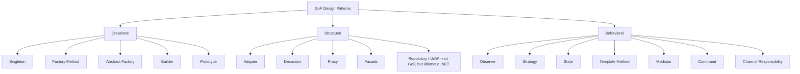
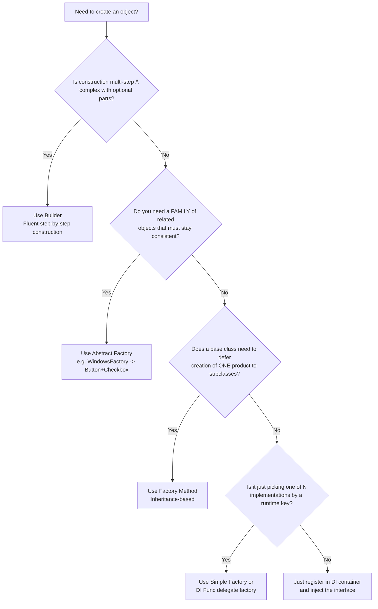
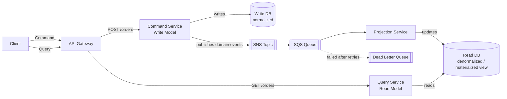
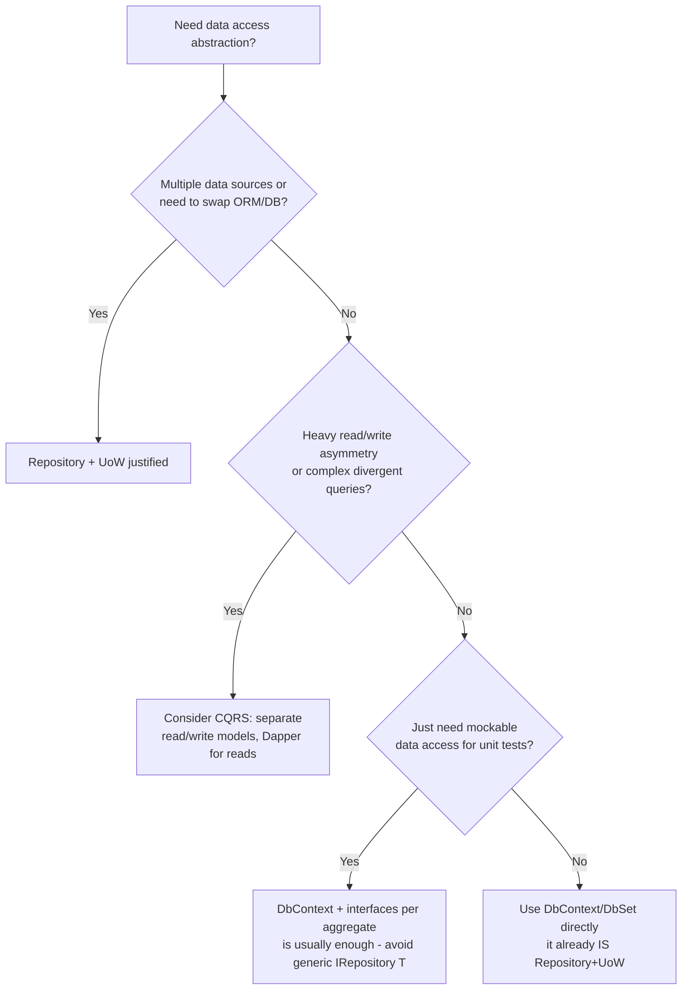

# Design Patterns — Interview Revision Notes

> Quick-revision Q&A `C. Design-Patterns-Interview-Guide.md` se derive kiya gaya hai. Source ke har section ko cover karta hai.

## Core Concepts

**Q: Design pattern kya hota hai, aur teams inhe use kyun karti hain?**

A: Ek reusable, named solution jo kisi recurring design problem ko solve karta hai. Yeh teams ko shared vocabulary deta hai aur hard-won trade-offs ko encode karta hai, taaki problems scratch se dobara discover na karni pade.

**Q: GoF book 23 patterns ko kaise classify karti hai?**

A:
- Creational — control karte hain ki objects kaise create hote hain (Singleton, Factory Method, Abstract Factory, Builder, Prototype).
- Structural — control karte hain ki objects/classes kaise compose hote hain (Adapter, Decorator, Proxy, Facade, Composite, Bridge, Flyweight).
- Behavioral — control karte hain ki objects kaise communicate/collaborate karte hain (Observer, Strategy, State, Template Method, Command, Chain of Responsibility, Mediator, Iterator, Visitor, Memento).



**Q: Interviewer jab "what pattern would you use here?" poochta hai, tab wo senior-level framing kya sunna chahta hai?**

A: Patterns trade-offs hote hain jo ek specific force (variability, coupling, lifecycle, testability) resolve karne ke liye accept kiye jaate hain — yeh khud goal nahi hote. Ek strong answer yahan se start hota hai: "what problem are we solving — do we need a pattern at all, or does a simple function/DI registration suffice?"

## Creational Patterns

### Singleton

**Q: Singleton pattern ka intent kya hai, aur ise kab use karna chahiye?**

A: Ensure karta hai ki ek class ka exactly ek instance ho, ek global access point ke saath. Use karo shared, expensive-to-create, effectively stateless/read-only resources ke liye — logging, cache wrappers, config snapshots, connection pool managers.

#### Implementations compared

**Q: Modern C# mein Singleton implementation ke liye default kya choose karna chahiye, aur kyun?**

A: `Lazy<T>` — thread-safe, lazy, sabse clean, `LazyThreadSafetyMode` support karta hai. Example:
```csharp
public sealed class Logger
{
    private static readonly Lazy<Logger> _instance = new(() => new Logger());
    public static Logger Instance => _instance.Value;
    private Logger() { }
}
```

**Q: Naive `if (_instance == null)` Singleton kyun broken hai, aur double-checked locking ko `volatile` ki zarurat kyun padti hai?**

A: Naive check mein race condition hoti hai — do threads dono null dekh sakte hain aur alag-alag instances construct kar sakte hain. Double-checked locking ko backing field par `volatile` chahiye hota hai taaki memory reordering doosre thread ko ek partially-constructed object expose na kare.

```csharp
// Double-checked locking — must use `volatile` or memory reordering can expose
// a partially-constructed object to another thread.
public sealed class Singleton
{
    private static volatile Singleton? _instance;
    private static readonly object _lock = new();
    private Singleton() { }

    public static Singleton Instance
    {
        get
        {
            if (_instance == null)
            {
                lock (_lock)
                {
                    _instance ??= new Singleton();
                }
            }
            return _instance;
        }
    }
}
```

**Q: Kya `_instance ??= new Singleton()` thread-safe hai?**

A: Nahi — yeh ek classic interview trick question hai. `??=` atomic nahi hai; do threads dono null observe kar sakte hain aur dono apna instance construct kar sakte hain.

```csharp
public sealed class Singleton
{
    private static Singleton? _instance;
    public static Singleton Instance => _instance ??= new Singleton();
}
```
Yeh **thread-safe nahi hai** — `??=` atomic nahi hai; do threads dono `null` observe kar sakte hain aur do instances construct kar sakte hain.

**Q: Static field/static constructor Singletons `Lazy<T>` se kaise differ karte hain?**

A: Static constructors eager hote hain (CLR guarantee karta hai single execution per AppDomain) vs `Lazy<T>` jo lazy hota hai. `LazyInitializer.EnsureInitialized` `Lazy<T>` ka ek lower-allocation, zyada verbose alternative hai perf-critical, multiple-lazy-field scenarios ke liye.

#### Singleton in ASP.NET Core DI

**Q: Hand-rolled singleton ke bajaye container-managed singleton kyun prefer karein?**

A: `builder.Services.AddSingleton<ILogger, Logger>()` testability deta hai (interface + constructor injection, static accessor ki jagah) aur container shutdown par `IDisposable`/`IAsyncDisposable` ke through disposal handle karta hai.

```csharp
builder.Services.AddSingleton<ILogger, Logger>();
```

#### Singleton vs Static Class

**Q: Singleton static class se kaise differ karta hai?**

A: Singleton instance-based hai, interfaces implement kar sakta hai, aur DI/mocking ke saath kaam karta hai; ek static class ka koi instance nahi hota, interfaces implement nahi kar sakti, aur inject ya mock nahi ki ja sakti. Singleton state ko deliberately control ke saath hold kar sakta hai; static classes default mein uncontrolled global mutable state ban jaati hain.

#### When NOT to use Singleton

**Q: Singleton ke classic misuse scenarios kya hain?**

A:
- Web app mein Singleton par per-request/per-user state — `CurrentUser` ko concurrent requests ke beech share karna users ke beech data leakage cause karta hai.
- Global state tests ko order-dependent bana deta hai aur isolate/mock karna mushkil ho jaata hai.
- SRP violate karta hai (creation control ko business behavior ke saath mix karta hai) aur often DIP bhi.
- Distributed/cloud: Singleton ek process tak scoped hota hai — 5 pods matlab 5 independent Singletons; cluster-wide coordination ke liye distributed lock/lease use karo.
- Kabhi bhi `HttpContext`/DB connections/short-lived objects ko Singleton mein store mat karo — isse **captive dependency** problem hoti hai (Singleton ek Scoped/Transient service ko capture karke usko hamesha ke liye alive rakh deta hai).

#### Preventing Singleton breakage via reflection/serialization

**Q: Hand-rolled Singleton ko reflection ya deserialization se dusra instance banne se kaise harden karein?**

A: Class ko `sealed` mark karo, constructor `private` rakho, aur custom serialization hooks implement karo (ya `[NonSerialized]`). Reflection abhi bhi `Activator.CreateInstance(type, nonPublic: true)` ke through private constructor bypass kar sakta hai — koi 100% reflection-proof singleton nahi hota; pragmatic fix yeh hai ki reflection se lado mat aur DI-managed singletons use karo.

#### Singleton Logger — end-to-end example

**Q: Ek full Singleton Logger implementation kaisa dikhta hai, aur guide `lock`-based aur `Lazy<T>`-based dono versions kyun dikha sakta hai?**

A: Dono ek before/after best-practice progression ke roop mein dikhaye jaate hain (contradiction nahi) — `Lazy<T>` modern recommended approach hai:
```csharp
public sealed class Logger
{
    private static readonly Lazy<Logger> _instance = new(() => new Logger());
    private Logger() { }
    public static Logger Instance => _instance.Value;
    public void Log(string message) { /* write to file */ }
}
```

### Factory Patterns

#### Simple Factory (not a formal GoF pattern)

**Q: Simple Factory kya hai, aur kya yeh ek GoF pattern hai?**

A: Formal GoF nahi hai — bas ek static method/class hai jo input ke basis par implementation return karta hai (e.g., ek `switch` expression jo `INotification` implementations return karta hai). Cheap hota hai aur often "good enough" hota hai.

```csharp
public interface INotification { void Send(string message); }

public class EmailNotification : INotification
{
    public void Send(string message) => Console.WriteLine("Email: " + message);
}
public class SmsNotification : INotification
{
    public void Send(string message) => Console.WriteLine("SMS: " + message);
}

public static class NotificationFactory
{
    public static INotification Create(string type) => type switch
    {
        "email" => new EmailNotification(),
        "sms"   => new SmsNotification(),
        _       => throw new ArgumentException("Invalid notification type")
    };
}
```

#### Factory Method (GoF)

**Q: Factory Method ka mechanism aur trade-off kya hai?**

A: Ek base `Creator` ek invariant workflow define karta hai; subclasses factory method ko override karke decide karti hain ki kaunsa concrete product create hoga — yeh **inheritance** use karta hai. Algorithm ko centralized rakhta hai (good OCP — existing code ko touch kiye bina naye Creator/Product pairs add kar sakte ho), lekin inheritance composition se zyada rigid hota hai aur subclass explosion cause kar sakta hai.

```csharp
public interface IProduct { string Operation(); }
public class ConcreteProductA : IProduct { public string Operation() => "Result A"; }
public class ConcreteProductB : IProduct { public string Operation() => "Result B"; }

public abstract class Creator
{
    protected abstract IProduct FactoryMethod();
    public string SomeOperation() => $"Creator: working with {FactoryMethod().Operation()}";
}

public class ConcreteCreatorA : Creator
{
    protected override IProduct FactoryMethod() => new ConcreteProductA();
}
```

#### Abstract Factory (GoF)

**Q: Abstract Factory Factory Method ke upar kya add karta hai?**

A: Yeh **families of related objects** create karta hai jo saath mein consistently use hone chahiye (e.g., `IGuiFactory` jo Windows ya Mac ke liye matching `IButton`+`ICheckbox` produce karta hai), runtime par DI/config ke through wire kiya jaata hai, ek single product ki jagah.

```csharp
public interface IButton { void Paint(); }
public interface ICheckbox { void Paint(); }

public class WindowsButton : IButton { public void Paint() => Console.WriteLine("Windows Button"); }
public class WindowsCheckbox : ICheckbox { public void Paint() => Console.WriteLine("Windows Checkbox"); }
public class MacButton : IButton { public void Paint() => Console.WriteLine("Mac Button"); }
public class MacCheckbox : ICheckbox { public void Paint() => Console.WriteLine("Mac Checkbox"); }

public interface IGuiFactory
{
    IButton CreateButton();
    ICheckbox CreateCheckbox();
}

public class WindowsFactory : IGuiFactory
{
    public IButton CreateButton() => new WindowsButton();
    public ICheckbox CreateCheckbox() => new WindowsCheckbox();
}

public class MacFactory : IGuiFactory
{
    public IButton CreateButton() => new MacButton();
    public ICheckbox CreateCheckbox() => new MacCheckbox();
}

public class Application
{
    private readonly IButton _button;
    private readonly ICheckbox _checkbox;
    public Application(IGuiFactory factory)
    {
        _button = factory.CreateButton();
        _checkbox = factory.CreateCheckbox();
    }
    public void RenderUI() { _button.Paint(); _checkbox.Paint(); }
}
```

Wiring the concrete family at runtime via DI:
```csharp
services.AddTransient<IGuiFactory>(sp =>
{
    var platform = configuration["Ui:Platform"];
    return platform == "windows" ? new WindowsFactory() : (IGuiFactory)new MacFactory();
});
```

**Q: Factory Method vs Abstract Factory — key differences kya hain?**

A:
- Scope: ek product vs related products ki ek family.
- Mechanism: inheritance (ek method override karna) vs composition (ek factory object hold karna).
- Extension: ek naya Creator subclass add karna vs family interface implement karne wali ek nayi concrete factory.

#### Factory vs Strategy

**Q: Factory aur Strategy dono ek concrete type ko interface ke peeche hide karte hain — actually different kya hai?**

A: Factory decide karta hai *kaise/kaunsa object create hota hai* (ek creation-time key/config se chosen), ek naya instance produce karta hai. Strategy decide karta hai *kaunsa algorithm/behavior run hota hai*, jo client per call choose karta hai, existing collaborators par behavior execute karta hai. Yeh constantly compose hote hain — ek factory often chosen Strategy implementation construct karke wapas de deta hai.

```csharp
// Factory picks WHICH strategy to construct...
public static IDiscountStrategy DiscountStrategyFactory(string customerTier) => customerTier switch
{
    "Gold"   => new GoldDiscount(),
    "Silver" => new SilverDiscount(),
    _        => new NoDiscount()
};

// ...Strategy then decides HOW the chosen behavior executes
var strategy = DiscountStrategyFactory(customer.Tier);
var finalTotal = strategy.Apply(orderTotal);
```

#### How DI containers reduce the need for hand-rolled factories

**Q: Modern DI containers ke hote hue bhi hand-written Factory class kab justified hoti hai?**

A: DI containers already creation, lifetime management, aur implementation selection provide karte hain. Factory class sirf tab justified hai jab creation logic genuinely complex ho, container ke bahar pluggable hona zaruri ho (e.g., third-party plugin DLLs), ya ek family/consistency guarantee enforce karni ho (Abstract Factory). Runtime-parameterized creation ke liye, factory class likhne ke bajaye ek `Func<string, IService>` delegate factory inject karo.

```csharp
// Instead of:
var service = ServiceFactory.Create("email");
// Do:
var service = provider.GetRequiredService<INotificationService>();
```

```csharp
services.AddTransient<EmailService>();
services.AddTransient<SmsService>();
services.AddTransient<Func<string, IService>>(provider => key => key switch
{
    "email" => provider.GetRequiredService<EmailService>(),
    "sms"   => provider.GetRequiredService<SmsService>(),
    _       => throw new ArgumentException("Invalid type")
});
```

**Q: Real ASP.NET Core factories batao jo aap interview mein cite karoge.**

A: `IHttpClientFactory` (`HttpClient`/handlers ko pool karta hai, socket exhaustion avoid karta hai), `ILoggerFactory` (`ILogger<T>` create karta hai), `IServiceScopeFactory` (manually ek DI scope create karta hai, e.g. ek `BackgroundService` mein), `IMiddlewareFactory` (DI ke through `IMiddleware` create karta hai).

```csharp
using var scope = scopeFactory.CreateScope();
var service = scope.ServiceProvider.GetRequiredService<IMyScopedService>();
```

**Q: Aap runtime par implementations ko dynamically discover karne wala plugin architecture kaise banaoge?**

A: Ek plugins folder scan karo, har assembly load karo, phir plugin contract implement karne wale types ke liye loaded types par reflect karo:

```csharp
public interface IPlugin { string Name { get; } void Execute(); }

var pluginFolder = Path.Combine(AppContext.BaseDirectory, "Plugins");
foreach (var dll in Directory.GetFiles(pluginFolder, "*.dll"))
    Assembly.LoadFrom(dll);

var plugins = AppDomain.CurrentDomain.GetAssemblies()
    .SelectMany(a => a.GetTypes())
    .Where(t => typeof(IPlugin).IsAssignableFrom(t) && !t.IsInterface && !t.IsAbstract)
    .Select(t => (IPlugin)Activator.CreateInstance(t)!)
    .ToList();

foreach (var plugin in plugins) plugin.Execute();
```
Modern alternative (apne target runtime ke against verify karo): isolated/unloadable plugin contexts ke liye `System.Runtime.Loader.AssemblyLoadContext`, aur attribute-based discovery ke liye `System.Composition`/MEF, production plugin systems mein raw `Assembly.LoadFrom` + `Activator.CreateInstance` se zyada robust hain kyunki yeh unloading aur version isolation support karte hain.

#### Plugin Factory Versioning & Backward Compatibility

**Q: Plugin versions ko host se independently evolve karne ke liye kaunsi four techniques handle karti hain?**

A:
- Adapter layers — kisi older plugin ka interface current contract ke peeche wrap karte hain.
- Versioned interfaces — `IPlugin`, `IPluginV2`, etc ship karo old plugins ko silently break karne ki jagah.
- Feature negotiation — small optional capability interfaces (`ISupportsAsyncExecute`) jo `is`/`as` se probe hote hain.
- Fallback factories — plugin fail/incompatible/missing hone par throw karne ki jagah ek safe Null Object default (e.g., `NoOpPlugin`) return karo.

**Q: Scale par plugin factories mein do real risks kya hain?**

A: Class explosion aur version drift — versioned interfaces plus capability interfaces host aur plugins ko independently evolve karne dete hain, jabki adapters aur fallback factories ek bad plugin ko poore host process ko down le jaane se rokte hain.

```csharp
public interface IPluginV1 { string Name { get; } void Execute(); }
public interface IPluginV2 : IPluginV1 { Task ExecuteAsync(CancellationToken ct); }

// Adapter layer: bridges an old sync-only plugin onto the current async contract
public class PluginAdapter : IPluginV2
{
    private readonly IPluginV1 _legacy;
    public PluginAdapter(IPluginV1 legacy) => _legacy = legacy;
    public string Name => _legacy.Name;
    public void Execute() => _legacy.Execute();
    public Task ExecuteAsync(CancellationToken ct) { _legacy.Execute(); return Task.CompletedTask; }
}

// Fallback factory target: a Null Object plugin, never a thrown exception
public class NoOpPlugin : IPluginV2
{
    public string Name => "NoOp";
    public void Execute() { }
    public Task ExecuteAsync(CancellationToken ct) => Task.CompletedTask;
}

public static IPluginV2 LoadPluginWithFallback(Type pluginType)
{
    try
    {
        var instance = Activator.CreateInstance(pluginType);
        return instance switch
        {
            IPluginV2 v2 => v2,
            IPluginV1 v1 => new PluginAdapter(v1), // versioned interface + adapter layer
            _            => new NoOpPlugin()       // unrecognized/incompatible — fall back safely
        };
    }
    catch
    {
        return new NoOpPlugin(); // load failure (bad DLL, missing dependency) also falls back safely
    }
}
```

### Builder

**Q: Builder pattern ka intent kya hai, aur .NET mein aap already ise kahan use karte ho?**

A: Ek complex object ki construction ko uske representation se separate karta hai, step-by-step, fluent construction enable karta hai. Aap already ise `HostBuilder`, `WebApplicationBuilder`, `DbContextOptionsBuilder`, EF Core Fluent API, aur `StringBuilder` ke through use karte ho.

```csharp
public class Pizza
{
    public string Size { get; set; } = "Medium";
    public List<string> Toppings { get; } = new();
    public bool ExtraCheese { get; set; }
}

public class PizzaBuilder
{
    private readonly Pizza _pizza = new();

    public PizzaBuilder WithSize(string size) { _pizza.Size = size; return this; }
    public PizzaBuilder AddTopping(string topping) { _pizza.Toppings.Add(topping); return this; }
    public PizzaBuilder WithExtraCheese() { _pizza.ExtraCheese = true; return this; }
    public Pizza Build() => _pizza;
}

// Fluent usage
var pizza = new PizzaBuilder()
    .WithSize("Large")
    .AddTopping("Pepperoni")
    .WithExtraCheese()
    .Build();
```

**Q: Records `with` expressions ke saath Builder ko kab replace karte hain, aur Builder kab bhi jeet jaata hai?**

A: Simple immutable objects ke liye Records + `with` kaam karte hain. Builder tab bhi jeetta hai jab construction genuinely multi-step ho, inter-step validation chahiye ho, telescoping constructors avoid karne ke liye fluent API chahiye ho, ya same steps se different representations produce karni ho (Director variant).

```csharp
public record Pizza(string Size, IReadOnlyList<string> Toppings, bool ExtraCheese);

var basePizza = new Pizza("Medium", Array.Empty<string>(), false);
var custom = basePizza with { Size = "Large", ExtraCheese = true };
```

### Builder vs Factory vs Abstract Factory Decision Tree

**Q: Builder, Abstract Factory, Factory Method, Simple Factory, aur plain DI ke beech choose karne ka decision tree walk through karo.**

A:
1. Multi-step/complex construction with optional parts? → Builder.
2. Related objects ki ek family chahiye jo consistent rahe? → Abstract Factory.
3. Base class ko one product ki creation subclasses ko defer karni ho? → Factory Method.
4. Bas runtime key se N implementations mein se ek pick karna hai? → Simple Factory ya DI `Func` delegate.
5. Warna → bas DI mein register karo aur interface inject karo.



### Prototype

**Q: Prototype pattern ka intent kya hai?**

A: Scratch se instantiate karne ki jagah existing instance ko copy karke naye objects create karta hai — useful hai jab construction expensive ho ya aapko ek preconfigured object ke variations chahiye ho.

```csharp
public class Prototype : ICloneable
{
    public string Name { get; set; } = "";
    public List<string> Tags { get; set; } = new();

    // Shallow clone: MemberwiseClone copies value types and reference-type
    // fields as REFERENCES — Tags would be shared between clones unless
    // explicitly deep-copied here.
    public object Clone()
    {
        var clone = (Prototype)MemberwiseClone();
        clone.Tags = new List<string>(Tags); // manual deep copy of mutable ref members
        return clone;
    }
}
```

**Q: `MemberwiseClone` ka danger kya hai, aur BCL mein `ICloneable` kyun discouraged hai?**

A: `MemberwiseClone` ek shallow clone perform karta hai — reference-type fields (e.g., ek `List<string>`) original aur clone ke beech shared hote hain jab tak manually deep-copy na kiya jaaye. `ICloneable` discouraged hai kyunki uska contract shallow vs deep specify nahi karta aur yeh generic nahi hai; explicit `Clone()`/copy-constructor methods ya records ke `with` semantics ko prefer karo.

## Structural Patterns

### Dependency Injection (as a pattern)

**Q: Kya DI ek GoF pattern hai? Yeh actually kya karta hai?**

A: Nahi — yeh ek technique/principle hai, formal GoF nahi, lekin foundational hai. Dependencies ek class ke andar construct karne ki jagah usko provide ki jaati hain (Inversion of Control), typically constructor injection ke through.

```csharp
public class Service { }
public class Client
{
    private readonly Service _service;
    public Client(Service service) => _service = service;
}
```

**Q: "DI the pattern" ko "DI container the tool" se distinguish karo.**

A: DI (pattern) = abstractions par depend karo, constructor/property/method ke through inject karo; zero libraries ke saath doable ("poor man's DI"). DI container (tool) = ek runtime component (`Microsoft.Extensions.DependencyInjection`, Autofac) jo object graph resolve karna automate karta hai, lifetimes (Singleton/Scoped/Transient) manage karta hai, aur decoration/interception/assembly scanning add kar sakta hai.

**Q: Captive dependency gotcha kya hai, aur ise detect kaise karte hain?**

A: Ek Singleton ke constructor mein Scoped/Transient service inject karna container ko us instance ko Singleton ki lifetime ke liye capture karne par majboor karta hai, silently intended shorter lifetime break kar deta hai (e.g., ek disposed `DbContext` leak karna). Development mein `ServiceProviderOptions.ValidateScopes = true` ke through detect karo.

### Repository Pattern

**Q: Repository pattern ka intent kya hai?**

A: Data-access layer ko business logic se abstract karta hai taaki domain/service layer EF Core, Dapper, ya kisi specific store ke saath tightly coupled na ho — typically ek `IRepository<T>` CRUD methods ke saath, plus specific repositories (e.g., `IEmployeeRepository`) usko extend karke custom queries ke liye.

```csharp
public interface IRepository<T> where T : class
{
    Task<IEnumerable<T>> GetAllAsync();
    Task<T> GetByIdAsync(int id);
    Task AddAsync(T entity);
    Task UpdateAsync(T entity);
    Task DeleteAsync(int id);
}

public class Repository<T> : IRepository<T> where T : class
{
    private readonly AppDbContext _context;
    private readonly DbSet<T> _dbSet;

    public Repository(AppDbContext context)
    {
        _context = context;
        _dbSet = context.Set<T>();
    }

    public async Task<IEnumerable<T>> GetAllAsync() => await _dbSet.ToListAsync();
    public async Task<T> GetByIdAsync(int id) => await _dbSet.FindAsync(id);

    public async Task AddAsync(T entity)
    {
        await _dbSet.AddAsync(entity);
        await _context.SaveChangesAsync();
    }

    public async Task UpdateAsync(T entity)
    {
        _dbSet.Update(entity);
        await _context.SaveChangesAsync();
    }

    public async Task DeleteAsync(int id)
    {
        var entity = await _dbSet.FindAsync(id);
        if (entity != null)
        {
            _dbSet.Remove(entity);
            await _context.SaveChangesAsync();
        }
    }
}
```

Specific repositories generic ek ko custom queries ke liye extend karti hain:
```csharp
public interface IEmployeeRepository : IRepository<Employee>
{
    Task<IEnumerable<Employee>> GetEmployeesByDepartmentAsync(string department);
}

public class EmployeeRepository : Repository<Employee>, IEmployeeRepository
{
    private readonly AppDbContext _context;
    public EmployeeRepository(AppDbContext context) : base(context) => _context = context;

    public async Task<IEnumerable<Employee>> GetEmployeesByDepartmentAsync(string department) =>
        await _context.Employees.Where(e => e.Department == department).ToListAsync();
}
```

```csharp
builder.Services.AddScoped(typeof(IRepository<>), typeof(Repository<>));
builder.Services.AddScoped<IEmployeeRepository, EmployeeRepository>();
```

**Q: Repository kab use karna chahiye, aur EF Core ke saath ise kab avoid karna chahiye?**

A: DDD-style architecture, genuinely swappable persistence, ya unit tests ke liye mockable data access ke liye use karo. Small apps ke liye avoid karo — `DbSet<T>` already `IQueryable` implement karta hai, changes track karta hai, aur `SaveChanges` aapka commit hai, isliye ek generic repository often bas indirection add karta hai jo `IQueryable` leak kar deta hai ya filtering/paging/`Include()` reinvent karne par majboor karta hai. Yeh .NET ke sabse contested interview topics mein se ek hai — dono sides argue karne ke liye ready raho.

### Unit of Work Pattern

**Q: Unit of Work ka intent kya hai?**

A: Multiple repository operations ko ek single atomic transaction/commit mein coordinate karta hai, round-trips minimize karta hai aur consistency maintain karta hai — typically ek `IUnitOfWork` jo repositories expose karta hai plus ek `Complete()`/`SaveChanges()` method.

```csharp
public interface IUnitOfWork : IDisposable
{
    IProductRepository Products { get; }
    ICustomerRepository Customers { get; }
    int Complete();
}

public class UnitOfWork : IUnitOfWork
{
    private readonly ApplicationDbContext _context;
    public IProductRepository Products { get; }
    public ICustomerRepository Customers { get; }

    public UnitOfWork(ApplicationDbContext context)
    {
        _context = context;
        Products = new ProductRepository(_context);
        Customers = new CustomerRepository(_context);
    }

    public int Complete() => _context.SaveChanges();
    public void Dispose() => _context.Dispose();
}
```

```csharp
public class OrderService
{
    private readonly IUnitOfWork _unitOfWork;
    public OrderService(IUnitOfWork unitOfWork) => _unitOfWork = unitOfWork;

    public void ProcessOrder(int productId, int customerId)
    {
        var product = _unitOfWork.Products.GetById(productId);
        var customer = _unitOfWork.Customers.GetById(customerId);
        if (product == null || customer == null) throw new Exception("Invalid product or customer.");
        // domain logic...
        _unitOfWork.Complete();
    }
}
```

```csharp
builder.Services.AddScoped<IUnitOfWork, UnitOfWork>();
```

**Q: Unit of Work aur EF Core ke baare mein senior nuance kya hai?**

A: `DbContext` already **ek Unit of Work hai** — yeh sab `DbSet<T>` ke changes track karta hai aur `SaveChanges()` par atomically commit karta hai. Ek hand-rolled `IUnitOfWork` jo repositories ko ek shared `DbContext` par wrap karta hai, mostly ek testability/DI-ergonomics wrapper hai, koi nayi transactional capability nahi. Bahut common trap question: "doesn't EF Core already do this?"

### Decorator vs Proxy vs Adapter

**Q: Teeno same-shaped interface ke peeche doosra object wrap karte hain — Adapter, Decorator, aur Proxy ko kaise distinguish karte hain?**

A:
- Adapter — ek interface ko doosre interface mein convert karta hai jo client expect karta hai; koi naya behavior nahi, bas translation (e.g., ek 3rd-party SDK ko `IPaymentGateway` ke peeche wrap karna).
- Decorator — responsibility/behavior dynamically add karta hai, same interface, freely stackable (e.g., `GZipStream` jo `FileStream` ko wrap karta hai; ASP.NET Core middleware pipeline; `IProductService` par ek caching decorator).
- Proxy — kisi object ke access ko control karta hai (lazy load, security, remoting, caching), real subject jaisa hi interface, usually ek subject ke liye ek proxy (e.g., `Lazy<T>` as a virtual proxy, EF Core change-tracking proxies).

```csharp
// Adapter: your app expects IPaymentGateway, but the SDK exposes ThirdPartySdk
public interface IPaymentGateway { bool Charge(decimal amount); }

public class StripeSdkAdapter : IPaymentGateway
{
    private readonly ThirdPartyStripeClient _client;
    public StripeSdkAdapter(ThirdPartyStripeClient client) => _client = client;
    public bool Charge(decimal amount) => _client.CreateCharge(amount * 100, "usd") == "succeeded";
}
```

```csharp
// Decorator: add caching to an existing IProductService without changing callers
public interface IProductService { Product Get(int id); }

public class CachingProductServiceDecorator : IProductService
{
    private readonly IProductService _inner;
    private readonly IMemoryCache _cache;
    public CachingProductServiceDecorator(IProductService inner, IMemoryCache cache)
    { _inner = inner; _cache = cache; }

    public Product Get(int id) =>
        _cache.GetOrCreate($"product:{id}", _ => _inner.Get(id))!;
}

// Registration (Scrutor package makes DI-based decoration idiomatic in .NET):
// services.AddScoped<IProductService, ProductService>();
// services.Decorate<IProductService, CachingProductServiceDecorator>();
```

```csharp
// Proxy: lazy/virtual proxy delaying expensive construction
public interface IReportGenerator { string Generate(); }

public class RealReportGenerator : IReportGenerator
{
    public RealReportGenerator() => Thread.Sleep(2000); // expensive init
    public string Generate() => "Report data";
}

public class LazyReportGeneratorProxy : IReportGenerator
{
    private readonly Lazy<RealReportGenerator> _real = new(() => new RealReportGenerator());
    public string Generate() => _real.Value.Generate();
}
```

**Q: Teeno ko distinguish karne wala one-liner do.**

A: "Adapter interface ka *shape* change karta hai; Decorator same shape rakhte hue *behavior* add karta hai; Proxy same shape ke *access* ko control karta hai. ASP.NET Core middleware essentially `RequestDelegate` par ek live Decorator chain hai."

### Facade

**Q: Facade pattern ka intent kya hai, aur ek real .NET example do.**

A: Classes ke ek complex subsystem par ek single simplified interface provide karta hai, un callers se subsystem ka power hide kiye bina jinhe directly access chahiye (e.g., ek `OrderFacade.PlaceOrder()` jo Inventory, Payment, aur Shipping services ko coordinate karta hai). `HttpClient` khud `HttpMessageHandler`, socket management, aur connection pooling ke upar ek facade hai.

```csharp
// Subsystem: multiple services with intricate coordination
public class InventoryService { public bool Reserve(int sku, int qty) => true; }
public class PaymentService { public bool Charge(decimal amount) => true; }
public class ShippingService { public string Schedule(int orderId) => "TRACK123"; }

// Facade
public class OrderFacade
{
    private readonly InventoryService _inventory = new();
    private readonly PaymentService _payment = new();
    private readonly ShippingService _shipping = new();

    public string PlaceOrder(int sku, int qty, decimal amount, int orderId)
    {
        if (!_inventory.Reserve(sku, qty)) throw new InvalidOperationException("Out of stock");
        if (!_payment.Charge(amount)) throw new InvalidOperationException("Payment failed");
        return _shipping.Schedule(orderId);
    }
}
```

### Specification Pattern

**Q: Specification pattern kaunsi problem solve karta hai, aur yeh Repository ko kaise complement karta hai?**

A: Ek business rule/query predicate ko ek composable object (`ISpecification<T>.ToExpression()`) ke roop mein encapsulate karta hai, `Where()` lambdas scatter karne ya repository interfaces ko har query variation ke liye ek method se bloat karne ki jagah. Repositories ek specification accept kar sakte hain (`FindAsync(ISpecification<Customer> spec)`) bespoke query methods badhaane ki jagah; specifications combinators jaise `AndSpecification<T>` ke through compose hoti hain.

```csharp
public interface ISpecification<T>
{
    Expression<Func<T, bool>> ToExpression();
}

public class ActiveCustomerSpecification : ISpecification<Customer>
{
    public Expression<Func<Customer, bool>> ToExpression() => c => c.IsActive;
}

public class HighValueCustomerSpecification : ISpecification<Customer>
{
    private readonly decimal _threshold;
    public HighValueCustomerSpecification(decimal threshold) => _threshold = threshold;
    public Expression<Func<Customer, bool>> ToExpression() => c => c.LifetimeValue >= _threshold;
}

// Combinator support (AND) — the real payoff of the pattern
public class AndSpecification<T> : ISpecification<T>
{
    private readonly ISpecification<T> _left, _right;
    public AndSpecification(ISpecification<T> left, ISpecification<T> right) { _left = left; _right = right; }

    public Expression<Func<T, bool>> ToExpression()
    {
        var param = Expression.Parameter(typeof(T));
        var body = Expression.AndAlso(
            Expression.Invoke(_left.ToExpression(), param),
            Expression.Invoke(_right.ToExpression(), param));
        return Expression.Lambda<Func<T, bool>>(body, param);
    }
}

// Repository accepts specifications instead of growing bespoke query methods
public async Task<List<Customer>> FindAsync(ISpecification<Customer> spec) =>
    await _dbSet.Where(spec.ToExpression()).ToListAsync();
```

**Q: Trade-off kya hai?**

A: Reusable, testable, composable business rules ke liye great hai aur repository interface bloat avoid karta hai; CRUD-only apps ke liye overkill hai added abstraction aur expression-tree complexity ki wajah se. EF Core simple specification expressions ko directly SQL mein translate kar sakta hai kyunki yeh bas `Expression<Func<T,bool>>` hote hain.

### Bridge, Composite, and Flyweight

#### Bridge

**Q: Bridge ka intent kya hai, aur yeh kaunsi problem avoid karta hai?**

A: Ek abstraction ko uski implementation se separate karta hai taaki dono independently vary kar sakein, do orthogonal dimensions ke across combinatorial subclass explosion avoid karta hai (e.g., notification-type × channel: Alert/Reminder × Email/SMS = 4 combos bina 4 subclasses ke jaise `AlertEmail`, `AlertSms`).

```csharp
// Implementation hierarchy (the "how")
public interface IChannel { void Send(string message); }
public class EmailChannel : IChannel { public void Send(string m) => Console.WriteLine($"Email: {m}"); }
public class SmsChannel : IChannel { public void Send(string m) => Console.WriteLine($"SMS: {m}"); }

// Abstraction hierarchy (the "what") — holds a reference to the implementation
public abstract class Notification
{
    protected readonly IChannel Channel;
    protected Notification(IChannel channel) => Channel = channel;
    public abstract void Notify(string content);
}

public class Alert : Notification
{
    public Alert(IChannel channel) : base(channel) { }
    public override void Notify(string content) => Channel.Send($"[ALERT] {content}");
}

public class Reminder : Notification
{
    public Reminder(IChannel channel) : base(channel) { }
    public override void Notify(string content) => Channel.Send($"[REMINDER] {content}");
}

// 2 abstractions x 2 channels = 4 combinations without 4 subclasses
var alert = new Alert(new SmsChannel());
alert.Notify("Server down");
```

**Q: Bridge vs Adapter — difference kya hai?**

A: Adapter typically retrofitted hota hai ek existing incompatible interface ko fit karne ke liye; Bridge upfront design kiya jaata hai taaki do hierarchies (abstraction aur implementation) starting se independently vary kar sakein.

#### Composite

**Q: Composite ka intent kya hai, aur ise kab reach for karte ho?**

A: Clients ko ek single object aur objects ki ek composition ko ek shared component interface ke through uniformly treat karne deta hai — tree-shaped data ke liye classic fit hai (file systems, UI trees, org charts, nested validation rules). Ek `CompositeRule` same `IValidationRule` interface implement karta hai jaisa ek leaf rule karta hai, isliye callers ko pata/care nahi hota ki wo ek rule hold kar rahe hain ya ek tree.

```csharp
public interface IValidationRule
{
    bool IsValid(object input);
}

public class RequiredFieldRule : IValidationRule
{
    public bool IsValid(object input) => input is not null;
}

// Composite: aggregates children but exposes the exact same interface as a leaf
public class CompositeRule : IValidationRule
{
    private readonly List<IValidationRule> _children = new();
    public CompositeRule Add(IValidationRule rule) { _children.Add(rule); return this; }
    public bool IsValid(object input) => _children.All(r => r.IsValid(input));
}

// Caller doesn't know or care whether it's holding one rule or a whole tree of rules
IValidationRule rules = new CompositeRule()
    .Add(new RequiredFieldRule())
    .Add(new CompositeRule().Add(new RequiredFieldRule()));
```

#### Flyweight

**Q: Flyweight ka intent kya hai, aur trade-off kya hai?**

A: Similar objects ki large numbers ke liye memory footprint minimize karta hai intrinsic (context-independent) state ko instances ke beech share karke, extrinsic (context-specific) state ko per object rakhte hue — ek space/time trade-off hai jo matter karta hai jab object counts thousands se millions tak reach karte hain. `string.Intern` ek built-in Flyweight example hai.

```csharp
// Intrinsic state (shared, immutable) — the "flyweight"
public class CharacterGlyph
{
    public char Symbol { get; }
    public string FontFamily { get; }
    public CharacterGlyph(char symbol, string fontFamily) { Symbol = symbol; FontFamily = fontFamily; }
}

public class GlyphFactory
{
    private readonly Dictionary<(char, string), CharacterGlyph> _cache = new();

    public CharacterGlyph GetGlyph(char symbol, string fontFamily)
    {
        var key = (symbol, fontFamily);
        if (!_cache.TryGetValue(key, out var glyph))
        {
            glyph = new CharacterGlyph(symbol, fontFamily);
            _cache[key] = glyph;
        }
        return glyph;
    }
}

// Extrinsic state (per-occurrence: position) stays outside the shared glyph
public record RenderedCharacter(CharacterGlyph Glyph, int X, int Y);
```

## Behavioral Patterns

### Observer

**Q: Observer ka intent kya hai, aur .NET mein yeh kahan show hota hai?**

A: Multiple dependent objects ko notify karta hai jab subject ka state change hota hai, bina subject ko concrete subscriber types pata hone diye — C# events/delegates ke through implement hota hai. Event-driven code, `INotifyPropertyChanged` data-binding, aur pub/sub messaging mein show hota hai. Distributed scale par, Observer ka intent domain events + message brokers ban jaata hai (same intent, different transport).

```csharp
public class NewsPublisher
{
    public event Action<string>? NewsUpdated;
    public void PublishNews(string news) => NewsUpdated?.Invoke(news);
}

public class Subscriber
{
    public void OnNewsReceived(string news) => Console.WriteLine($"Received: {news}");
}
```

### Mediator Pattern (MediatR)

**Q: Mediator ka intent kya hai, aur MediatR ise kaise implement karta hai?**

A: Components ke beech direct coupling reduce karta hai communication ko ek central mediator se route karke, components ke ek doosre ko directly reference karne ki jagah. MediatR: controller ek `IRequest` (e.g., `GetOrderByIdQuery`) `IMediator.Send()` ke through send karta hai, jo matching `IRequestHandler<TRequest,TResponse>` ko dispatch karta hai — controller kabhi handler/repository ko directly reference nahi karta.

**Without MediatR** (Controller → Service, tightly coupled):
```csharp
public class OrdersController : ControllerBase
{
    private readonly IOrderService _orderService;
    public OrdersController(IOrderService orderService) => _orderService = orderService;

    [HttpGet("{id}")]
    public async Task<IActionResult> GetOrderById(int id) =>
        Ok(await _orderService.GetOrderByIdAsync(id));
}
```

**With MediatR** (Controller → Mediator → Handler):
```csharp
public class GetOrderByIdQuery : IRequest<OrderDto>
{
    public int OrderId { get; }
    public GetOrderByIdQuery(int orderId) => OrderId = orderId;
}

public class GetOrderByIdQueryHandler : IRequestHandler<GetOrderByIdQuery, OrderDto>
{
    private readonly IOrderRepository _orderRepository;
    public GetOrderByIdQueryHandler(IOrderRepository orderRepository) => _orderRepository = orderRepository;

    public async Task<OrderDto> Handle(GetOrderByIdQuery request, CancellationToken ct) =>
        await _orderRepository.GetOrderByIdAsync(request.OrderId);
}

public class OrdersController : ControllerBase
{
    private readonly IMediator _mediator;
    public OrdersController(IMediator mediator) => _mediator = mediator;

    [HttpGet("{id}")]
    public async Task<IActionResult> GetOrderById(int id) =>
        Ok(await _mediator.Send(new GetOrderByIdQuery(id)));

    [HttpPost]
    public async Task<IActionResult> CreateOrder(CreateOrderCommand command)
    {
        var orderId = await _mediator.Send(command);
        return CreatedAtAction(nameof(GetOrderById), new { id = orderId }, orderId);
    }
}
```

Registration:
```csharp
builder.Services.AddMediatR(cfg => cfg.RegisterServicesFromAssembly(Assembly.GetExecutingAssembly()));
```
> **(verify)** — `AddMediatR(Assembly)` (older overload) kuch versions mein abhi bhi kaam karta hai, lekin MediatR 12+ `cfg =>` configuration-delegate overload use karta hai; installed package version check karo, kyunki MediatR ne apna registration API aur licensing model major versions ke across change kiya hai.

**Q: MediatR ke pros/cons kya hain?**

A: Pros — controller ko concrete service se decouple karta hai, small independently testable handlers, CQRS ke liye natural fit, `IPipelineBehavior<TRequest,TResponse>` ke through composable cross-cutting concerns. Cons — indirection add karta hai (harder "jump to definition"), small CRUD apps ke liye overkill, runtime dispatch stack traces ko obscure karta hai, ek aur convention onboard karna padta hai.

**Q: Mediator vs plain service layer mein senior interviewers actual trade-off kya probe karte hain?**

A: MediatR coupling remove nahi karta, isko relocate karta hai — controller ab `IOrderService` par depend nahi karta, lekin har handler abhi bhi apni zarurat par depend karta hai. Real win discoverability aur cross-cutting concerns ki consistency hai (ek pipeline behavior sab requests par apply hota hai) aur thinner controllers, "no coupling" nahi.

### Strategy vs State

**Q: Strategy aur State structurally identical lagte hain — actually different kya hai?**

A:
- Intent: Strategy runtime par ek algorithm/behavior choose karta hai, **client** dwara selected; State internal state transitions ke basis par behavior change karta hai, **object khud** dwara decided.
- Kaun switch karta hai: caller/config ek Strategy upfront ya per call pick karta hai; State objects apne khud ke transitions trigger karte hain.
- Awareness: Strategies ek doosre se independent hote hain; States often ek doosre ke baare mein jaante hain aur doosre states mein transition karte hain.
- .NET examples: `IComparer<T>`/discount strategies (Strategy) vs order lifecycle `Pending→Shipped→Delivered` (State).

```csharp
// Strategy: caller picks the algorithm
public interface IDiscountStrategy { decimal Apply(decimal total); }
public class NoDiscount : IDiscountStrategy { public decimal Apply(decimal total) => total; }
public class TenPercentOff : IDiscountStrategy { public decimal Apply(decimal total) => total * 0.9m; }

public class Checkout
{
    private readonly IDiscountStrategy _strategy;
    public Checkout(IDiscountStrategy strategy) => _strategy = strategy; // injected/chosen externally
    public decimal Total(decimal amount) => _strategy.Apply(amount);
}
```

```csharp
// State: the object drives its own transitions
public interface IOrderState
{
    IOrderState Next(Order order);
    string Name { get; }
}

public class PendingState : IOrderState
{
    public string Name => "Pending";
    public IOrderState Next(Order order) => new ShippedState(); // state decides what's next
}

public class ShippedState : IOrderState
{
    public string Name => "Shipped";
    public IOrderState Next(Order order) => new DeliveredState();
}

public class DeliveredState : IOrderState
{
    public string Name => "Delivered";
    public IOrderState Next(Order order) => this; // terminal
}

public class Order
{
    public IOrderState State { get; private set; } = new PendingState();
    public void Advance() => State = State.Next(this);
}
```

**Q: Unhe distinguish karne wala interview one-liner do.**

A: "Strategy answer deta hai 'which algorithm should run', externally chosen; State answer deta hai 'what should this object do now', internally ek lifecycle ke part ke roop mein decided. Agar transition logic swappable classes ke andar rehti hai, toh yeh State hai; agar classes peers hain zero transition awareness ke saath, toh yeh Strategy hai."

### Template Method

**Q: Template Method ka intent kya hai, aur yeh kaunsa mechanism use karta hai?**

A: Ek base class method mein algorithm ka skeleton define karta hai, specific steps ko subclasses ko defer karta hai bina unhe overall structure change karne diye — **inheritance** use karta hai (Strategy ke composition se contrast). Template method `sealed` hona chahiye; subclasses abstract steps override karte hain aur virtual "hook" methods ko optionally override kar sakte hain.

```csharp
public abstract class ReportGenerator
{
    // Template method — defines the invariant skeleton; sealed to prevent
    // subclasses from breaking the overall algorithm shape.
    public sealed string Generate()
    {
        var data = FetchData();
        var formatted = FormatData(data);
        return WrapWithHeaderFooter(formatted);
    }

    protected abstract string FetchData();
    protected abstract string FormatData(string rawData);

    // Optional step with a default — a "hook" subclasses may override
    protected virtual string WrapWithHeaderFooter(string body) =>
        $"--- Report ---\n{body}\n--- End ---";
}

public class SalesReportGenerator : ReportGenerator
{
    protected override string FetchData() => "raw sales rows...";
    protected override string FormatData(string rawData) => $"Formatted Sales: {rawData}";
}

public class InventoryReportGenerator : ReportGenerator
{
    protected override string FetchData() => "raw inventory rows...";
    protected override string FormatData(string rawData) => $"Formatted Inventory: {rawData}";
    protected override string WrapWithHeaderFooter(string body) => $"[INVENTORY]\n{body}"; // overrides the hook
}
```

**Q: Template Method vs Strategy?**

A: Template Method inheritance use karta hai ek fixed algorithm shape ke saath aur variable steps, compile time par fixed; Strategy composition use karta hai aur poora algorithm/behavior runtime par swappable hota hai.

**Q: Common pitfall kya hai?**

A: Skeleton method ko seal na karna subclasses ko template method khud override karne deta hai, jo pattern ka purpose defeat kar deta hai — hamesha ise seal karo aur extension ke liye sirf named hooks expose karo.

### Command Pattern

**Q: Command ka intent kya hai?**

A: Ek request (action + parameters) ko ek object ke roop mein encapsulate karta hai, queuing, logging, undo/redo enable karta hai, aur invoker ko executor se decouple karta hai (e.g., `ICommand` `Execute()`/`Undo()` ke saath, ek `CommandInvoker` ke through run hota hai jo ek history stack maintain karta hai).

```csharp
public interface ICommand { void Execute(); void Undo(); }

public class AddItemCommand : ICommand
{
    private readonly List<string> _cart;
    private readonly string _item;
    public AddItemCommand(List<string> cart, string item) { _cart = cart; _item = item; }
    public void Execute() => _cart.Add(_item);
    public void Undo() => _cart.Remove(_item);
}

public class CommandInvoker
{
    private readonly Stack<ICommand> _history = new();
    public void Run(ICommand command) { command.Execute(); _history.Push(command); }
    public void UndoLast() { if (_history.TryPop(out var cmd)) cmd.Undo(); }
}
```

**Q: Command MediatR se kaise relate karta hai — ek common interviewer trap?**

A: MediatR ka `IRequest<TResponse>` + `IRequestHandler<TRequest,TResponse>` **Command hai** (encapsulated request object + separate handler) jo dispatch ke liye ek Mediator ke through wired hai. Interviewers poochte hain "what GoF pattern is MediatR built on?" — answer hai Command + Mediator.

### Chain of Responsibility

**Q: Chain of Responsibility ka intent kya hai, aur ASP.NET Core mapping direct kya hai?**

A: Ek request ko handlers ki ek chain ke saath pass karta hai jab tak koi usko handle na kare (ya sab act karein), sender ko receivers se decouple karta hai — har handler `Next` ka reference hold karta hai aur decide karta hai act karna hai, pass through karna hai, ya short-circuit karna hai. ASP.NET Core ka `app.Use(...)` middleware pipeline, jahan har middleware `await next(context)` call karta hai, **yeh pattern hai**.

```csharp
public abstract class Handler
{
    protected Handler? Next;
    public Handler SetNext(Handler next) { Next = next; return next; }
    public abstract Task HandleAsync(HttpContext ctx);
}

public class AuthHandler : Handler
{
    public override async Task HandleAsync(HttpContext ctx)
    {
        Console.WriteLine("Checking auth...");
        if (Next != null) await Next.HandleAsync(ctx);
    }
}

public class LoggingHandler : Handler
{
    public override async Task HandleAsync(HttpContext ctx)
    {
        Console.WriteLine("Logging request...");
        if (Next != null) await Next.HandleAsync(ctx);
    }
}
```

### Visitor and Memento

#### Visitor

**Q: Visitor ka intent kya hai, aur uska extensibility trade-off kya hai?**

A: Ek heterogeneous object structure (e.g., ek AST, shape hierarchy) par element classes modify kiye bina ek naya operation add karta hai — elements `Accept` ek visitor ko karte hain aur double-dispatch karte hain matching `Visit` overload par. Trade-off Strategy/Template Method ka inverse hai: ek nayi **operation** add karna easy hai (ek naya visitor class), lekin ek naya **element type** add karne ke liye har existing visitor ko touch karna padta hai.

```csharp
public interface IShapeVisitor
{
    void Visit(Circle circle);
    void Visit(Square square);
}

public abstract class Shape { public abstract void Accept(IShapeVisitor visitor); }

public class Circle : Shape
{
    public double Radius { get; init; }
    public override void Accept(IShapeVisitor visitor) => visitor.Visit(this);
}

public class Square : Shape
{
    public double Side { get; init; }
    public override void Accept(IShapeVisitor visitor) => visitor.Visit(this);
}

// New operation added without touching Circle/Square
public class AreaVisitor : IShapeVisitor
{
    public double TotalArea { get; private set; }
    public void Visit(Circle circle) => TotalArea += Math.PI * circle.Radius * circle.Radius;
    public void Visit(Square square) => TotalArea += square.Side * square.Side;
}
```

**Q: .NET BCL mein Visitor kahan show hota hai?**

A: `System.Linq.Expressions.ExpressionVisitor` expression trees walk/rewrite karne ke liye.

#### Memento

**Q: Memento ka intent kya hai?**

A: Ek object ki internal state ko capture aur externalize karta hai taaki wo baad mein restore ki ja sake bina encapsulation violate kiye — originator decide karta hai ki snapshot mein kya jaata hai aur ek opaque token (e.g., `EditorMemento`) wapas deta hai jo sirf wahi jaanta hai ki kaise reapply karna hai; ek caretaker (`UndoStack`) mementos ko store/retrieve karta hai bina unhe inspect kiye.

```csharp
public class EditorMemento
{
    // Internal representation; caretaker never inspects this
    internal string Content { get; }
    internal EditorMemento(string content) => Content = content;
}

public class TextEditor
{
    public string Content { get; private set; } = string.Empty;
    public void Type(string text) => Content += text;
    public EditorMemento Save() => new EditorMemento(Content);
    public void Restore(EditorMemento memento) => Content = memento.Content;
}

// Caretaker only stores/retrieves opaque mementos — never touches TextEditor internals directly
public class UndoStack
{
    private readonly Stack<EditorMemento> _history = new();
    public void Push(EditorMemento m) => _history.Push(m);
    public EditorMemento Pop() => _history.Pop();
}
```

**Q: Modern C# mein kya aapko hamesha formal Memento pattern ki zarurat hoti hai?**

A: Nahi — ek immutable `record` ya JSON serialization often ek "free" memento de deta hai. Formal pattern apna ceremony sirf tab earn karta hai jab originator ki true internal state ek simple immutable copy se richer ho, ya aapko exactly control karna ho ki caretaker ko kya expose hota hai.

### Null Object Pattern

**Q: Null Object pattern kya hai?**

A: Ek interface ka no-op "do nothing" implementation jo wahan substitute kiya jaata hai jahan otherwise ek null reference use hoti, isliye calling code ko kabhi defensive null check ki zarurat nahi padti (e.g., `NullNotifier : ICustomerNotifier`). Real BCL example: `NullLogger`/`NullLogger<T>`.

```csharp
public interface ICustomerNotifier
{
    void Notify(string message);
}

public class EmailNotifier : ICustomerNotifier
{
    public void Notify(string message) => Console.WriteLine($"Emailing: {message}");
}

// The Null Object — safe to call, does nothing
public class NullNotifier : ICustomerNotifier
{
    public void Notify(string message) { /* intentionally no-op */ }
}

public class Customer
{
    public ICustomerNotifier Notifier { get; init; } = new NullNotifier(); // never null
}

// Calling code has zero null checks, regardless of whether a real notifier was configured
void SendPromo(Customer customer) => customer.Notifier.Notify("20% off today!");
```

**Q: Null Object nullable reference types aur Option/Maybe types se kaise compare karta hai?**

A:
| Approach | Absence kya hai... | Compiler handling enforce karta hai? |
|---|---|---|
| Null Object | Polymorphism ke peeche hidden | No |
| Nullable reference types | Explicit, typed possibility | Yes (warnings-as-errors) |
| Option/Maybe`<T>` | Explicit value jo functionally compose hota hai | Yes, by construction |

Null Object bugs mask kar sakta hai (koi signal nahi ki kuch missing hai); nullable refs compile-time handling force karte hain (halaanki `!` isko suppress kar sakta hai); Option/Maybe absence ko ek composable value banate hain.

**Q: Aaj bhi Null Object ko nullable refs/Option types ke upar kab choose karoge?**

A: Jab aapko genuine polymorphic no-op behavior chahiye ho jo bahut saare call sites par uniformly apply ho (legacy/imperative code mein scattered null checks avoid karne ke liye), ya jab "doing nothing safely" khud valid behavior ho (e.g., `NullLogger` intentionally discard karna). Naye code ke liye, nullable reference types ya Option/Maybe generally better default hain kyunki wo absence ko surface karte hain, swallow nahi karte.

## Architectural Patterns

### CQRS

**Q: CQRS ka intent kya hai?**

A: System ke un parts ko separate karta hai jo state change karte hain (Commands) un parts se jo state read karte hain (Queries), har side ko different models, optimizations, aur even different data stores use karne dete hain. Commands sirf success/failure ya ek ID return karte hain; Queries read-only hote hain aur data return karte hain.



**.NET example — command handler (write side):**
```csharp
public record PlaceOrderCommand(Guid OrderId, Guid CustomerId, List<OrderItem> Items);

public class PlaceOrderHandler : IRequestHandler<PlaceOrderCommand, Unit>
{
    private readonly WriteDbContext _db;
    private readonly IEventPublisher _events;

    public async Task<Unit> Handle(PlaceOrderCommand cmd, CancellationToken ct)
    {
        var order = Order.Create(cmd.OrderId, cmd.CustomerId, cmd.Items);
        _db.Orders.Add(order);
        await _db.SaveChangesAsync(ct);

        await _events.PublishAsync(new OrderPlacedEvent(order.Id, order.Total));
        return Unit.Value;
    }
}
```

**Projection handler (read side), with idempotency check:**
```csharp
public class OrderPlacedProjectionHandler : IEventHandler<OrderPlacedEvent>
{
    private readonly ReadDbContext _readDb;

    public async Task Handle(OrderPlacedEvent evt)
    {
        var existing = await _readDb.Orders.FindAsync(evt.OrderId);
        if (existing != null) return; // idempotent — event may be delivered more than once

        _readDb.Orders.Add(new OrderReadModel
        {
            Id = evt.OrderId, Total = evt.Total, Status = "Placed", CreatedAt = evt.Timestamp
        });
        await _readDb.SaveChangesAsync();
    }
}
```

**Q: CQRS kyun use karein, aur iski cost kya hai?**

A: Benefits — denormalized views ke through better read performance, simpler focused write-side logic, reads vs writes ka independent scaling, event-driven/eventually-consistent systems ke liye natural fit. Cost — added complexity: multiple models, replication lag, eventual consistency jo UI ko accommodate karna padta hai. Complex domains, high read/write asymmetry, many divergent query shapes, ya audit/event-history needs ke liye best suited hai.

**Q: CQRS vs Event Sourcing — yeh kaise relate karte hain?**

A: CQRS read/write **models** ko separate karta hai aur Event Sourcing require nahi karta. Event Sourcing state ko ek ordered event sequence ke roop mein persist karta hai, replay se current state rebuild karta hai. Aap CQRS bina ES ke bhi kar sakte ho (write model ek normal DB update karta hai, sirf read side update karne ke liye events publish karta hai) ya CQRS with ES (event stream write model ka source of truth hota hai).

**Q: CQRS production ke liye operational must-knows list karo.**

A:
- Outbox pattern — events ko same DB transaction mein persist karo jo write ke saath hoti hai; ek background dispatcher reliably publish karta hai, crash par event loss prevent karta hai.
- Idempotency — handlers ko duplicate delivery tolerate karna chahiye (at-least-once messaging).
- Event ordering — partition/message-group keys (e.g., `OrderId`) use karo taaki per-entity events order mein process hon.
- Schema evolution — events ko version karo; fields nullable/optional ke roop mein add karo.
- Eventual consistency UX — decide karo UI kaise "processing" vs immediately-consistent reads communicate karta hai.
- Sagas — multi-service transactions ke liye, distributed 2PC ki jagah choreography ya orchestration with compensating actions use karo.

**Q: "Is CQRS worth it here" ke liye checklist kya hai?**

A: Kya bahut saare expensive/divergent read queries hain? Complex write-side domain logic? Asymmetric read/write scaling? Audit/event history ki zarurat? Mostly "yes" → CQRS fit karta hai; warna yeh likely over-engineering hai.

#### Incremental Rollout

**Q: Bina big-bang rewrite ke aap CQRS ko kaise introduce karoge?**

A: Har bounded context ke liye ek phased rollout (~4-6 weeks): (1) commands/events/queries design karo, write API + write DB stand up karo; (2) command handlers, outbox table, event publisher implement karo; (3) projection service, read DB, query API implement karo; (4) broker ko end-to-end wire karo, idempotency add karo, integration test karo; (5) observability add karo (projection-lag metrics, DLQ alerting) production-ready declare karne se pehle; (6) saga/orchestration sirf tab add karo jab cross-service workflows actually exist karte hon.

**Q: Common CQRS pitfalls kya hain?**

A: Trivial CRUD ke liye read/write split karna; outbox skip karna (silent event loss); non-idempotent projections (duplicated side effects); projection lag/DLQ monitoring ignore karna; services ke across strong consistency expect karna.

### Projection Service

**Q: Projection Service kya karta hai?**

A: CQRS component jo domain events ko listen karta hai aur read model materialize karta hai — normalized write-side events (`OrderPlaced`, `PaymentCompleted`) ko denormalized, query-optimized views mein translate karta hai.

```
OrderPlaced        → write into OrderSummaryView
PaymentCompleted    → update OrderStatusView
ItemAdded           → adjust OrderItemsView
```

**Q: Write aur read sides ke beech ek broker (SNS/SQS ya equivalent) kyun put karein?**

A: Yeh decoupling provide karta hai (write API read-side processing par wait nahi karta), durability (at-least-once delivery across AZs), transient failures ke liye retry/backoff, DLQ ke through poison-message isolation, traffic spikes ke liye buffering/elasticity, aur FIFO/partition keys ke through ordering.

#### Choosing the Read Store by Query Shape

**Q: Ek projection ke liye read store kaise pick karte ho?**

A: Store ko query shape se match karo: complex search/filtering/faceting ke liye Elasticsearch/OpenSearch; fast key-value lookups ke liye Redis; analytical/aggregation/reporting queries ke liye ek read-optimized RDBMS ya data warehouse. Same event stream se multiple read stores run karna often correct hota hai, har ek ek query shape ke liye tuned.

### Distributed Locks / Leases

**Q: Distributed lock/lease kya hai, aur yeh Singleton se kaise relate karta hai?**

A: Ek lock jo multiple service instances/pods ke across shared hota hai taaki sirf ek critical operation perform kare — Singleton ka "one instance per process" guarantee horizontally scaled deployment ke across extend nahi hota. Ek lease ek TTL wala lock hai jo automatically expire ho jaata hai agar holder crash ho jaaye, permanent deadlock prevent karta hai. "In-process Singleton ek process ke liye ek instance ensure karta hai; distributed lock/lease horizontal scaling ke waqt cluster-wide equivalent hai."

**Q: Distributed lock acquire aur hold karne ke mechanics walk through karo.**

A: Ek node atomically ek shared store (Redis, SQL Server, etcd/K8s Lease) se lock acquire karne ki koshish karta hai; success par yeh leader ban jaata hai; doosre wait/retry/back off karte hain; lock ek TTL carry karta hai aur leader ko periodically renew karna padta hai; agar leader renew kiye bina die ho jaaye, lease expire ho jaata hai aur koi doosra node take over kar leta hai.

**Q: Distributed locks par interviewers kaunsi key properties probe karte hain?**

A: Acquisition ki atomicity (warna split-brain — do leaders), deadlock avoid karne ke liye TTL/expiry, renewal protocol, guarded job ki idempotency (ek lease job ke beech mein expire ho sakta hai), aur lock store unavailable hone par graceful handling. Note: Redis RedLock ko distributed-systems researchers se publicized correctness critiques mile hain — details cite karne se pehle current consensus verify karo.

```csharp
// Redis RedLock example
using var redLock = await redlockFactory.CreateLockAsync("critical-job", TimeSpan.FromSeconds(30));
if (redLock.IsAcquired)
{
    await RunJobAsync();
}
```

```sql
-- SQL Server application lock
EXEC sp_getapplock @Resource = 'job-lock', @LockMode = 'Exclusive', @LockTimeout = 0;
```

Kubernetes bhi pods ke beech leader election ke liye ek native `Lease` object (etcd mein stored) offer karta hai.

### Options Pattern in .NET

**Q: Options pattern kaunsi problem solve karta hai?**

A: Configuration sections ko strongly typed POCOs se bind karta hai `IConfiguration["Key:SubKey"]` string lookups scatter karne ki jagah, configuration ko DI lifetimes ke saath integrate karta hai:
```csharp
public class SmtpOptions
{
    public string Host { get; set; } = "";
    public int Port { get; set; } = 587;
    public bool UseSsl { get; set; } = true;
}
```

```csharp
builder.Services.Configure<SmtpOptions>(builder.Configuration.GetSection("Smtp"));
```

```csharp
public class EmailSender
{
    private readonly SmtpOptions _options;
    public EmailSender(IOptions<SmtpOptions> options) => _options = options.Value;
}
```

**Q: `IOptions<T>`, `IOptionsSnapshot<T>`, aur `IOptionsMonitor<T>` ko distinguish karo.**

A:
- `IOptions<T>` — first resolution par snapshot, runtime changes pick up nahi karta; Singleton ke saath kaam karta hai.
- `IOptionsSnapshot<T>` — per Scoped resolution par recomputed hota hai agar config source reload support kare; Scoped only.
- `IOptionsMonitor<T>` — `OnChange` callbacks ke saath live-reload karta hai; Singleton ke saath kaam karta hai, long-lived background workers ke liye ideal hai.

**Q: Options mein validation aur fail-fast startup checks kaise add karte ho?**

A: `.AddOptions<T>().Bind(...).Validate(...).ValidateDataAnnotations().ValidateOnStart()` — startup par fail-fast hota hai first use ki jagah.

```csharp
builder.Services.AddOptions<SmtpOptions>()
    .Bind(builder.Configuration.GetSection("Smtp"))
    .Validate(o => o.Port > 0, "Port must be positive")
    .ValidateDataAnnotations()
    .ValidateOnStart(); // fail fast at startup instead of first use
```

**Q: Options doosre patterns se kaise connect hota hai?**

A: Yeh effectively configuration ke liye ek typed Factory + Strategy hybrid hai; `IOptionsMonitor<T>` conceptually configuration changes ke upar ek Observer hai.

### Repository + Unit of Work vs Raw EF Core / CQRS

**Q: EF Core ke saath Repository + UoW use karna chahiye, ya yeh redundant hai?**

A: `DbContext` already Unit of Work implement karta hai (change tracking + atomic `SaveChanges`), aur har `DbSet<T>` already ek Repository ke close hai (`IQueryable<T>` + CRUD). Ek generic `IRepository<T>` jo `DbSet<T>` ko wrap karta hai often bas `IQueryable` ko ek leaky abstraction ke peeche hide karta hai. Inhe abhi bhi add karne ke legitimate reasons: DDD aggregate boundaries enforce karna, swappable persistence technology, ya complex query composition centralize karna (Specification ke saath pairs karta hai).



**Q: Yeh CQRS systems mein specifically kaise play out hota hai?**

A: Bahut si teams read side par Repository ko poori tarah skip karti hain — Dapper/raw SQL/`AsNoTracking()` projections directly DTOs mein often pure reads ke liye repository abstraction se simpler aur faster hota hai; Repository mainly write/command side par relevant rehta hai invariants enforce karne ke liye.

## SOLID Principles

**Q: Har SOLID principle ko ek design pattern se match karo jo usko enforce karne mein help karta hai.**

A:
| Principle | Pattern(s) |
|---|---|
| SRP | Facade, Decorator |
| OCP | Strategy, Factory Method, Decorator, Chain of Responsibility |
| LSP | Template Method (correctly done), careful inheritance |
| ISP | Adapter, role interfaces |
| DIP | DI, Abstract Factory, Strategy |

### SOLID in Practice — Violation-to-Fix Walkthroughs

**Q: Ek SRP violation aur uska fix dikhao.**

A: Violation — `OrderService.PlaceOrder` validation, DB insert, aur email send sab ek method mein karta hai. Fix — `OrderValidator`, `OrderRepository`, `OrderNotifier` extract karo; ek thin `OrderService` inhe constructor injection ke through orchestrate karta hai.

```csharp
// ❌ Violates SRP: validation, persistence, and email notification all in one method
public class OrderService
{
    public void PlaceOrder(Order order)
    {
        if (order.Items.Count == 0) throw new ArgumentException("Empty order");
        using var conn = new SqlConnection("...");
        conn.Execute("INSERT INTO Orders ...", order);
        SmtpClient.Send("customer@example.com", "Order placed");
    }
}
```
```csharp
// ✅ Fixed: each responsibility extracted, orchestrated by a thin service
public class OrderValidator { public void Validate(Order order) { /* ... */ } }
public class OrderRepository { public Task SaveAsync(Order order) { /* ... */ return Task.CompletedTask; } }
public class OrderNotifier { public Task NotifyAsync(Order order) { /* ... */ return Task.CompletedTask; } }

public class OrderService
{
    private readonly OrderValidator _validator;
    private readonly OrderRepository _repository;
    private readonly OrderNotifier _notifier;
    // constructor injection...

    public async Task PlaceOrderAsync(Order order)
    {
        _validator.Validate(order);
        await _repository.SaveAsync(order);
        await _notifier.NotifyAsync(order);
    }
}
```

**Q: Ek OCP violation aur uska fix dikhao.**

A: Violation — `CalculateDiscount` ke andar `customerType` par ek `switch` har naye discount type ke liye method modify karne ki maang karta hai. Fix — `IDiscountStrategy` with `GoldDiscount`/`SilverDiscount` classes; naye discount types = nayi class, existing code touch nahi hota.

```csharp
// ❌ Every new discount type requires modifying this method
public decimal CalculateDiscount(string customerType, decimal total) => customerType switch
{
    "Gold"   => total * 0.8m,
    "Silver" => total * 0.9m,
    _        => total
};
```
```csharp
// ✅ Fixed with Strategy — new discount types = new class, no existing code touched
public interface IDiscountStrategy { decimal Apply(decimal total); }
public class GoldDiscount : IDiscountStrategy { public decimal Apply(decimal total) => total * 0.8m; }
public class SilverDiscount : IDiscountStrategy { public decimal Apply(decimal total) => total * 0.9m; }
```

**Q: Ek LSP violation aur uska fix dikhao.**

A: Violation — `Square : Rectangle` `Width` ko override karke `Height` bhi set kar deta hai, un callers ko break karta hai jo assume karte hain ki Width set karne se Height change nahi hoti. Fix — inheritance relationship force mat karo; dono ek `IShape` interface implement karte hain independent `Area()` ke saath.

```csharp
// ❌ Square "is-a" Rectangle in math, but breaks LSP: setting Width unexpectedly changes Height
public class Rectangle { public virtual int Width { get; set; } public virtual int Height { get; set; } }
public class Square : Rectangle
{
    public override int Width { set { base.Width = base.Height = value; } }
}
```
```csharp
// ✅ Fixed: don't force an inheritance relationship that doesn't hold behaviorally
public interface IShape { int Area(); }
public class Rectangle : IShape { public int Width; public int Height; public int Area() => Width * Height; }
public class Square : IShape { public int Side; public int Area() => Side * Side; }
```

**Q: Ek ISP violation aur uska fix dikhao.**

A: Violation — ek fat `IWorker { Work(); Eat(); }` `RobotWorker` ko `Eat()` par `NotSupportedException` throw karne majboor karta hai. Fix — `IWorkable`/`IFeedable` role interfaces mein segregate karo; `RobotWorker` sirf `IWorkable` implement karta hai.

```csharp
// ❌ Fat interface forces unrelated implementers to implement methods they don't need
public interface IWorker { void Work(); void Eat(); }
public class RobotWorker : IWorker
{
    public void Work() => Console.WriteLine("Working");
    public void Eat() => throw new NotSupportedException(); // robots don't eat!
}
```
```csharp
// ✅ Fixed: segregate into role interfaces
public interface IWorkable { void Work(); }
public interface IFeedable { void Eat(); }
public class RobotWorker : IWorkable { public void Work() => Console.WriteLine("Working"); }
public class HumanWorker : IWorkable, IFeedable
{
    public void Work() => Console.WriteLine("Working");
    public void Eat() => Console.WriteLine("Eating");
}
```

**Q: Ek DIP violation aur uska fix dikhao.**

A: Violation — `OrderProcessor` directly ek concrete `SqlOrderRepository` ko `new` karta hai. Fix — `IOrderRepository` par depend karo, constructor ke through concrete implementation inject karo.

```csharp
// ❌ High-level OrderProcessor depends directly on a concrete low-level SqlOrderRepository
public class OrderProcessor
{
    private readonly SqlOrderRepository _repo = new SqlOrderRepository();
    public void Process(Order order) => _repo.Save(order);
}
```
```csharp
// ✅ Fixed: depend on abstraction, inject concrete implementation
public interface IOrderRepository { void Save(Order order); }
public class SqlOrderRepository : IOrderRepository { public void Save(Order order) { /* ... */ } }

public class OrderProcessor
{
    private readonly IOrderRepository _repo;
    public OrderProcessor(IOrderRepository repo) => _repo = repo;
    public void Process(Order order) => _repo.Save(order);
}
```

## Anti-Patterns

### God Object, Anemic Domain Model, Service Locator, and Other Overused/Misapplied Patterns

**Q: God Object kya hai, aur ise kaise fix karte ho?**

A: Ek class jo bahut zyada jaanti/karti hai — often ek `Manager`/`Helper`/`Utils` class jo saalon mein unrelated responsibilities accrue kar leti hai; SRP ignore karne ka ek long-term symptom hai. Incrementally Extract Class/Facade ke through fix karo, big-bang rewrite nahi.

**Q: Anemic Domain Model kya hai, aur yeh problem kyun hai?**

A: Entities jo pure `{ get; set; }` data bags hain, sara business logic separate Service classes mein pushed hota hai — EF Core codebases mein common hai path of least resistance ke roop mein, lekin yeh encapsulation violate karta hai kyunki kuch bhi invariants protect nahi karta. Fix — behavior ko entity par khud push karo (rich domain model), e.g. `order.Cancel()` internally "can't cancel a shipped order" enforce kare, ek external service ke through wo check perform karne ki jagah (jo bhula/duplicate ho sakta hai kahin aur).

```csharp
// ❌ Anemic
public class Order { public OrderStatus Status { get; set; } }
if (order.Status != OrderStatus.Shipped) order.Status = OrderStatus.Cancelled; // check can be forgotten elsewhere

// ✅ Rich domain model enforces the invariant itself
public class Order
{
    public OrderStatus Status { get; private set; }
    public void Cancel()
    {
        if (Status == OrderStatus.Shipped) throw new InvalidOperationException("Cannot cancel a shipped order");
        Status = OrderStatus.Cancelled;
    }
}
```

**Q: Service Locator anti-pattern kya hai, aur yeh real DI se kaise differ karta hai?**

A: Ek global registry (`ServiceLocator.Resolve<T>()`) jo classes ke andar se dependencies fetch karne ke liye call hota hai jab bhi chahiye, constructor injection ke through receive karne ki jagah. Yeh DI jaisa dikhta hai lekin ek class ki real dependencies ko uske public API se hide kar deta hai aur unit testing complicate kar deta hai. `IServiceProvider` *business logic ke andar* pervasively use hona Service Locator hai disguise mein; fix hai specific dependencies inject karna aur `IServiceProvider` ko genuine factory/composition-root scenarios ke liye reserve karna.

**Q: Aur kaunse overused/misapplied patterns discuss karne ke liye ready rehna chahiye?**

A:
- Web apps mein mutable shared state ke liye Singleton — sabse common real-world misuse.
- EF Core par bina reason ke cargo-culted Repository/UoW.
- Trivial CRUD apps ke liye MediatR/CQRS ka overuse.
- Ek single implementation ke liye premature Abstract Factory/Strategy ("just in case" — ek YAGNI smell).
- Har class ke liye interface ("Java-itis") — har `Foo` ke liye ek `IFoo` banana jisme sirf ek implementation ho "testability" ke liye, jab real lever pure logic ko I/O se separate karna hai.

## Performance Considerations

**Q: Kaunsa Singleton-related performance issue watch karna chahiye?**

A: Har access par lock lagana (sirf initialization par nahi) ek needless contention bottleneck hai — `Lazy<T>` ya static init prefer karo.

**Q: Deep Decorator/Proxy chains ki perf cost kya hai, aur hot paths ke liye modern alternative kya hai?**

A: Har layer ek virtual call + potential allocation add karta hai; deep stacks (logging+caching+retry+circuit-breaker) measurable overhead add karte hain. Bahut hot code ke liye hand-stacked decorators ke upar compiled/source-generated pipelines (`Microsoft.Extensions.Http.Resilience`/Polly's `ResiliencePipeline`) consider karo.

**Q: Kya MediatR latency add karta hai?**

A: Haan, small aur typically I/O se dwarfed, lekin non-zero — reflection-based handler resolution ki cost hoti hai (halaanki MediatR lookups cache karta hai). Bahut hot paths par measure karo, assume mat karo.

**Q: CQRS, Repository, aur distributed locks ke liye aur kaunse performance considerations matter karte hain?**

A: CQRS/projection lag — load ke under read-model staleness ek real trade-off hai; leading indicator ke roop mein queue depth monitor karo. Repository over-abstraction — `IQueryable` ko non-queryable methods ke peeche wrap karna full result sets materialize karne par majboor karta hai, SQL-side filtering/paging ko kill karta hai. Distributed locks — har acquire/renew ek network round-trip hai; overly fine-grained locking (per-row) latency par dominate kar sakta hai; jahan correctness allow kare wahan lock granularity batch/coarsen karo.

## Best Practices

**Q: Guide ki best-practices list summarize karo.**

A:
- Patterns ko ek named force resolve karne ke liye choose karo (variability, lifecycle, coupling) — able ho name karne mein ki aapke code mein ek pattern kaunsi force solve karta hai.
- Default mein composition ko inheritance ke upar prefer karo (Strategy/Decorator deep hierarchies ke upar).
- DI container ko apna default factory hone do; explicit Factory/Abstract Factory sirf tab likho jab creation logic genuinely complex ho ya container ke bahar rehna zaruri ho.
- Repository/UoW usage ko intentional rakho — DDD aggregate boundaries ya swappable persistence ke liye, EF Core ke saath default mein nahi.
- Cross-cutting concerns ko pipeline behaviors ya decorators banao, har handler/service mein copy-paste nahi.
- Template Method skeletons ko seal karo; sirf named hook methods expose karo.
- Eventual consistency (CQRS, event-driven projections) ko ek UX decision treat karo, sirf technical detail nahi.
- Simple immutable data ke liye records + `with` expressions ko classic Builder/Prototype ke upar favor karo; Builder ko genuinely multi-step, validated construction ke liye reserve karo.

## Common Pitfalls

**Q: Guide ke common pitfalls list karo.**

A:
- `??=` ya unsynchronized null-checks ke through non-thread-safe Singleton.
- Singleton ke andar per-request/mutable state (`HttpContext`, `CurrentUser`) store karna.
- Captive dependency: Scoped/Transient ko Singleton ke constructor mein inject karna.
- Generic `IRepository<T>` jo `IQueryable` leak kare ya har query shape ke liye bespoke methods force kare.
- `DbContext` + hand-rolled `IUnitOfWork` ko naya transactional guarantee add karne wala treat karna, jo yeh nahi karta.
- CQRS mein missing outbox pattern → crash par silently lost domain events.
- Non-idempotent event/projection handlers → at-least-once redelivery par duplicated side effects.
- Strategy aur State confuse karna — "who decides the transition" bhoolna.
- Template Method ka skeleton method override karna kyunki seal nahi kiya gaya tha.
- Simple CRUD par MediatR/CQRS reach karna "because it's best practice", read/write divergence justify karne ki jagah.
- `IServiceProvider` ko true factory/composition-root boundaries ki jagah general-purpose Service Locator ke roop mein use karna.

## Sample Interview Q&A

**Q: Singleton aur static class mein difference kya hai, aur kab ek ko doosre ke upar pick karoge?**

A: Singleton instance-based hai, interfaces implement kar sakta hai, DI ke through inject/mock ho sakta hai, aur controlled state carry kar sakta hai; ek static class ka koi instance nahi hota, interfaces implement nahi kar sakti, aur tests mein substitute nahi ki ja sakti. Almost sab modern ASP.NET Core code mein container-managed Singleton registration prefer karo, static classes ko pure stateless utilities ke liye reserve karo.

**Q: 5 replicas ke across "only one worker runs this job" guarantee kaise implement karoge?**

A: In-process Singleton help nahi karta — har pod ka apna hota hai. Ek distributed lock/lease use karo (Redis RedLock, SQL Server `sp_getapplock`, ya ek Kubernetes `Lease`) ek TTL ke saath; jo pod acquire karta hai wo leader ban jaata hai aur periodically renew karna padta hai; agar wo die ho jaaye, koi doosra pod take over kar leta hai. Job idempotent hona chahiye kyunki lease job ke beech expire ho sakta hai.

**Q: EF Core ke saath Repository pattern kab NOT use karoge?**

A: Jab `DbContext`/`DbSet<T>` already sab kuch de deta hai jo ek repository dega, aur aapko persistence technology swap karne, DDD aggregate boundaries enforce karne, ya complex specifications centralize karne ki zarurat nahi hai — EF ko ek generic `IRepository<T>` mein wrap karna usually ceremony add karta hai aur `IQueryable` composability hide kar sakta hai.

**Q: Strategy aur State mein difference kya hai?**

A: Strategy caller ko externally ek algorithm choose karne deta hai independent strategies ke saath; State ek object ki internal lifecycle represent karta hai jahan state objects khud transitions drive karte hain. Structurally near-identical; difference intent hai aur transitions kaun control karta hai.

**Q: MediatR kis GoF pattern par built hai, aur ise use karne ka actual benefit kya hai?**

A: Command (har `IRequest`/handler pair ek request encapsulate karta hai) Mediator ke saath combined (`IMediator` dispatch karta hai bina sender/receiver ko ek doosre ke baare mein pata hue). Real benefit thinner controllers aur pipeline behaviors ke through consistent cross-cutting behavior hai, "zero coupling" nahi.

**Q: Aapki team ek service mein CQRS add karne ke baare mein debate kar rahi hai. Aap kaise decide karoge?**

A: Check karo ki reads aur writes genuinely diverge karte hain ya nahi: bahut saare expensive/different read shapes, complex write-side logic, asymmetric scaling, ya ek real audit/event-history requirement. Agar mostly "no" hai, toh plain CRUD ek well-modeled domain ke saath simpler hai — CQRS ki eventual consistency aur dual-model complexity ko sirf concrete benefits ke liye pay karna chahiye, speculative nahi.

**Q: Anemic Domain Model kya hai, aur yeh problem kyun hai?**

A: Entities jo pure property bags hain business rules ke saath Service classes mein externalized — kuch bhi ek invalid state transition ko doosre code path se nahi rokta jo check bhool gaya. Fix: behavior ko entity par move karo (e.g., `order.Cancel()`) ek rich domain model ke liye.

**Q: Outbox pattern explain karo aur CQRS/event-driven systems ko iski zarurat kyun hai.**

A: DB commit aur event-publish call ke beech ek crash event ko lose kar deta hai, read side ko permanently stale chhod deta hai. Outbox event ko *same* DB transaction mein persist karta hai jo business write ke saath hota hai; ek separate dispatcher unsent rows read karta hai aur unhe publish karta hai, acknowledge hone tak retry karta hai — bina distributed transaction ke at-least-once delivery guarantee karta hai.

**Q: Kya `IServiceProvider` ek Service Locator anti-pattern hai?**

A: Depend karta hai ki kahan use hota hai. Business logic ke andar pervasively use hona arbitrary dependencies fetch karne ke liye, yeh Service Locator hai — yeh real dependencies ko constructor signature se hide kar deta hai. Legitimate factory/composition-root boundaries par use hona (e.g., ek background worker mein `IServiceScopeFactory`, ya ek plugin loader), yeh container ko factory ke roop mein use karne ka ek accepted, idiomatic use hai.
