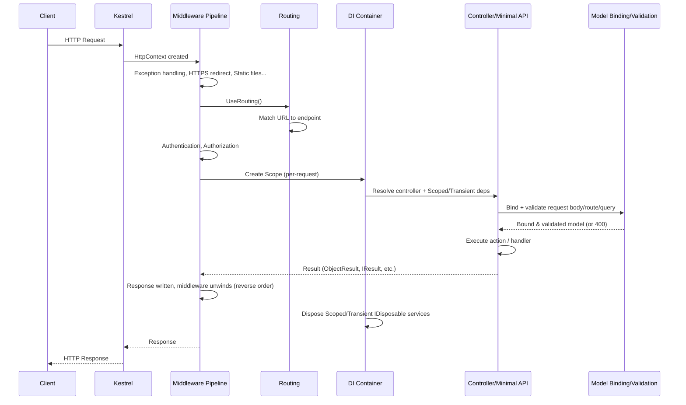

# .NET 8 Request Lifecycle & Dependency Injection — Hands-On Learning Exercises

*A practical, exercise-first guide to understanding how an HTTP request flows through ASP.NET Core, how the DI container creates and disposes objects, and how service factories fit in. Every concept is paired with runnable code and a "predict → run → observe → understand why" experiment.*

**How to use this guide:** create one `dotnet new webapi -n DiLab` project and work through the sections in order. Each exercise builds on the previous one — don't skip ahead.

```bash
dotnet new webapi -n DiLab -minimal false
cd DiLab
dotnet run
```

---

## Table of Contents

1. [Part 1 — .NET 8 Request Lifecycle](#part-1--net-8-request-lifecycle)
2. [Part 2 — DI Service Lifetimes](#part-2--di-service-lifetimes)
3. [Part 3 — Interface vs Concrete Registration](#part-3--interface-vs-concrete-registration)
4. [Part 4 — Service Factories](#part-4--service-factories)
5. [Part 5 — Advanced DI Concepts](#part-5--advanced-di-concepts)
6. [Part 6 — Hands-On Exercises (Level 1–3)](#part-6--hands-on-exercises-level-13)
7. [Part 7 — Interview Questions](#part-7--interview-questions)
8. [Part 8 — Final Mini Project](#part-8--final-mini-project)
9. [Cheat Sheet](#cheat-sheet)

---

## Part 1 — .NET 8 Request Lifecycle

### 1.1 The big picture



### 1.2 Stage-by-stage breakdown

| Stage | What happens internally |
|---|---|
| **1. Kestrel receives request** | Kestrel (the web server) parses the raw HTTP request and creates an `HttpContext` object — this object carries the request, response, `RequestServices` (the DI scope), user, and items dictionary through the whole pipeline. |
| **2. DI scope created** | Before any middleware runs, ASP.NET Core creates **one `IServiceScope` per request**. `HttpContext.RequestServices` points to this scope's `IServiceProvider`. This is *the* scope that makes `AddScoped` work — "per request" literally means "per this scope". |
| **3. Middleware pipeline (request side)** | Middleware runs in the exact order it was registered with `app.Use...()`, each one calling `await next()` to pass control forward. Typical order: exception handler → HTTPS redirection → static files → routing → CORS → authentication → authorization → custom middleware → endpoint. |
| **4. Routing (`UseRouting`)** | The routing middleware matches the request's URL + HTTP verb against registered routes/attributes and picks a matching `Endpoint`. It does **not** execute it yet — it just attaches the chosen endpoint to `HttpContext.GetEndpoint()`. |
| **5. Auth middleware** | `UseAuthentication()` figures out *who* the user is (populates `HttpContext.User`). `UseAuthorization()` checks *whether* they're allowed to hit the matched endpoint (policies/roles). |
| **6. Endpoint execution (`UseEndpoints` / `MapControllers` / Minimal API)** | This is where the actual controller action or minimal API delegate finally runs. For MVC, the framework creates the controller instance via DI. For Minimal APIs, the handler delegate's parameters are resolved via DI + binding automatically. |
| **7. DI resolution for the endpoint** | The controller/handler's constructor (or method parameters, for Minimal APIs) are resolved from `HttpContext.RequestServices` — i.e., from the **per-request scope**. Any `Scoped` service resolved here (directly or transitively) will be the *same instance* for the rest of this request. |
| **8. Model binding & validation** | Route values, query string, headers, and body (JSON) are bound onto the action's parameters/DTO. Data annotations (`[Required]`, `[Range]`, etc.) or `IValidatableObject` run; if invalid and `[ApiController]` is used, a `400 Bad Request` is auto-returned *before* your action code runs. |
| **9. Action/handler executes** | Your business logic runs, using the injected services. |
| **10. Result execution** | The returned `IActionResult` / `IResult` / POCO is serialized (JSON by default) and written to the response. |
| **11. Middleware pipeline (response side)** | Control unwinds back **up** through the same middleware, in **reverse order** — each middleware's code *after* its `await next()` call now executes (e.g., response logging, adding headers). |
| **12. Scope disposal** | Once the response has been sent, ASP.NET Core disposes the request's `IServiceScope`. Every `Scoped` and `Transient` service resolved during this request that implements `IDisposable`/`IAsyncDisposable` gets its `Dispose()`/`DisposeAsync()` called here. `Singleton` services are **never** disposed per-request — only when the whole app shuts down. |

### 1.3 Middleware order matters — mental model

Think of middleware as **nested functions**, not a flat list:

```
Middleware1(
    Middleware2(
        Middleware3(
            Endpoint()
        )
    )
)
```

Code *before* `await next()` runs on the way **in** (request); code *after* `await next()` runs on the way **out** (response) — in reverse order.

```csharp
app.Use(async (context, next) =>
{
    Console.WriteLine("A - before");
    await next();
    Console.WriteLine("A - after");
});

app.Use(async (context, next) =>
{
    Console.WriteLine("B - before");
    await next();
    Console.WriteLine("B - after");
});

app.Run(async context =>
{
    Console.WriteLine("Endpoint");
    await context.Response.WriteAsync("Hello");
});
```

**Predict** the console output before running, then run it.

<details>
<summary>Expected output</summary>

```
A - before
B - before
Endpoint
B - after
A - after
```
</details>

**Why:** each middleware wraps the next one. `A` calls `next()` which runs `B`, which calls `next()` which runs the endpoint. Once the endpoint finishes, control returns to `B`'s code *after* `next()`, then to `A`'s code *after* `next()`. This is the same pattern as a call stack unwinding.

### Experiment 1.1 — Swap middleware order

Swap the registration order of `A` and `B` above. **Predict** the new output, run it, and confirm.

### Experiment 1.2 — Short-circuit the pipeline

Add `return;` instead of calling `await next()` inside middleware `A`. **Predict**: does `B` or `Endpoint` ever run? Does "A - after" print?

<details>
<summary>Answer</summary>

Neither `B` nor `Endpoint` runs — the pipeline is short-circuited at `A`. Only `"A - before"` prints; `"A - after"` still prints because it's after the `if`/`return` in your own code path unless you `return` before it. If you `return;` right where `next()` would've been called, "A - after" **does** print (it's just a normal `return` from an `async` lambda, the rest of that lambda's code after the `return` line does *not* run — so make sure you understand exactly where the `return` sits relative to the `Console.WriteLine("A - after")` line).
</details>


---

## Part 2 — DI Service Lifetimes

### 2.1 The three lifetimes

| Lifetime | Created | Lives until | Disposed | Typical use |
|---|---|---|---|---|
| **Transient** | Every time it's resolved/injected | Just that one resolution | Right after the scope that resolved it disposes (or immediately if resolved from root and it's `IDisposable`) | Lightweight, stateless services: validators, mappers, calculators |
| **Scoped** | Once per scope (≈ once per HTTP request) | Rest of that request/scope | End of the request/scope | Per-request state: `DbContext`, unit-of-work, "current user" services |
| **Singleton** | Once, first time it's requested (or eagerly at startup if registered as an instance) | Entire application lifetime | App shutdown | App-wide shared/cached state: `IMemoryCache`, configuration, connection pools |

### 2.2 See it for yourself — instance ID tracking

Create these files:

```csharp
// IOperation.cs
public interface IOperation
{
    Guid OperationId { get; }
}

public class Operation : IOperation, IDisposable
{
    public Guid OperationId { get; } = Guid.NewGuid();
    public Operation() => Console.WriteLine($"[CREATED] Operation {OperationId}");
    public void Dispose() => Console.WriteLine($"[DISPOSED] Operation {OperationId}");
}

// Marker interfaces so we can register the SAME class 3 different ways
public interface IOperationTransient : IOperation { }
public interface IOperationScoped : IOperation { }
public interface IOperationSingleton : IOperation { }

public class OperationTransient : Operation, IOperationTransient { }
public class OperationScoped : Operation, IOperationScoped { }
public class OperationSingleton : Operation, IOperationSingleton { }
```

```csharp
// Program.cs
builder.Services.AddTransient<IOperationTransient, OperationTransient>();
builder.Services.AddScoped<IOperationScoped, OperationScoped>();
builder.Services.AddSingleton<IOperationSingleton, OperationSingleton>();
```

```csharp
// OperationsController.cs
[ApiController]
[Route("api/[controller]")]
public class OperationsController : ControllerBase
{
    private readonly IOperationTransient _transient1;
    private readonly IOperationTransient _transient2;
    private readonly IOperationScoped _scoped1;
    private readonly IOperationScoped _scoped2;
    private readonly IOperationSingleton _singleton1;
    private readonly IOperationSingleton _singleton2;

    public OperationsController(
        IOperationTransient transient1, IOperationTransient transient2,
        IOperationScoped scoped1, IOperationScoped scoped2,
        IOperationSingleton singleton1, IOperationSingleton singleton2)
    {
        _transient1 = transient1; _transient2 = transient2;
        _scoped1 = scoped1; _scoped2 = scoped2;
        _singleton1 = singleton1; _singleton2 = singleton2;
    }

    [HttpGet]
    public object Get() => new
    {
        Transient1 = _transient1.OperationId,
        Transient2 = _transient2.OperationId,
        Scoped1 = _scoped1.OperationId,
        Scoped2 = _scoped2.OperationId,
        Singleton1 = _singleton1.OperationId,
        Singleton2 = _singleton2.OperationId
    };
}
```

### Experiment 2.1 — Same request, two injections each

Call `GET /api/operations` **once**. **Predict** which pairs of GUIDs will match, then check the response.

<details>
<summary>Expected result</summary>

- `Transient1 != Transient2` — a new instance every time it's resolved, even within the same request.
- `Scoped1 == Scoped2` — same scope (this request) → same instance.
- `Singleton1 == Singleton2` — always the same instance app-wide.

</details>

### Experiment 2.2 — Across two requests

Call `GET /api/operations` **twice** (two separate browser tabs/Postman calls) and compare the `Scoped1` value between the two responses. **Predict**, then verify.

<details>
<summary>Expected result</summary>

`Scoped1` from request #1 is **different** from `Scoped1` from request #2 — a new scope (and therefore a new Scoped instance) is created per request. `Singleton1` however stays **identical** across both requests, and across every request until the app restarts.
</details>

### Experiment 2.3 — Watch disposal in the console

Watch your terminal output while calling the endpoint. You'll see `[CREATED]` lines when the controller is constructed, and `[DISPOSED]` lines *after* the response has been written for Transient and Scoped instances. **You will never see `[DISPOSED]` for the Singleton** until you `Ctrl+C` the app (try it — stop the app and watch the console).

### 2.3 Common mistakes

| Mistake | Why it's a problem |
|---|---|
| Injecting `Scoped`/`Transient` into a `Singleton`'s constructor | **Captive Dependency** — the Scoped instance gets "captured" and lives as long as the Singleton (forever), defeating its purpose (e.g., a captured `DbContext` reused across thousands of requests → stale data, thread-safety bugs, memory growth). Covered in depth in [Part 5](#53-captive-dependency-problem). |
| Registering `DbContext`-holding services as `Singleton` | EF Core's `DbContext` is **not thread-safe**; a Singleton is shared across concurrent requests → race conditions and exceptions. |
| Assuming `Transient` means "cheap" automatically | It's cheap for lightweight objects, but if a Transient's constructor does expensive work (e.g., opens a file, hits a DB), that expensive work repeats on *every single injection*. |
| Storing mutable per-request state in a `Singleton` field | That field is shared by *all* concurrent users — one user's request can silently overwrite another's data (a very common source of "random" bugs in production). |
| Manually calling `.Dispose()` on a DI-resolved service | The container owns disposal. Manually disposing a Scoped/Transient object *before* the container is done with it (it's still injected elsewhere in the same request) can crash other consumers mid-request ("Cannot access a disposed object"). |

---

## Part 3 — Interface vs Concrete Registration

### 3.1 The two forms

```csharp
// Form A — interface to implementation
services.AddTransient<IReportService, ReportService>();

// Form B — concrete type only
services.AddTransient<ReportService>();
```

Both let the container construct `ReportService` and inject its own dependencies automatically. The difference is **what key the container stores it under**, and therefore **what you're allowed to ask for**.

| | Form A: `AddTransient<IReportService, ReportService>()` | Form B: `AddTransient<ReportService>()` |
|---|---|---|
| Registered under | `IReportService` | `ReportService` (its own concrete type) |
| Can inject `IReportService` into a constructor? | ✅ Yes | ❌ No — throws at startup/resolution: no service for type `IReportService` |
| Can inject `ReportService` (concrete) into a constructor? | ❌ No, unless *also* separately registered | ✅ Yes |
| Can swap implementation later without touching consumers? | ✅ Yes — change the registration line only | ❌ No — every consumer references the concrete type directly |
| Mockable in unit tests (constructor-injected consumers)? | ✅ Easy — mock `IReportService` | ⚠️ Harder — either mock the concrete class (needs virtual members) or use the real thing |
| Typical use case | Services with multiple implementations, or where you want loose coupling / testability | Small internal helper classes, or "sealed leaf" utility classes with no need for abstraction |

### Experiment 3.1 — Resolve failure

```csharp
public interface IReportService { string Generate(); }
public class ReportService : IReportService
{
    public string Generate() => "report content";
}

// Program.cs — Form B only
builder.Services.AddTransient<ReportService>();
```

```csharp
public class ReportController : ControllerBase
{
    // Constructor depends on the INTERFACE, but only the concrete type is registered
    public ReportController(IReportService svc) { ... }
}
```

**Predict:** what happens when you hit this controller's endpoint?

<details>
<summary>Answer</summary>

`InvalidOperationException: Unable to resolve service for type 'IReportService' while attempting to activate 'ReportController'.` The container has **no entry** for `IReportService` — only for the concrete `ReportService` type. Registration keys are exact types; there's no automatic "well it implements this interface, so use it" fallback.
</details>

Fix it by either changing the constructor to depend on `ReportService` directly, or changing the registration to `AddTransient<IReportService, ReportService>()`.

### 3.2 Multiple implementations of one interface

```csharp
public interface INotifier { Task SendAsync(string msg); }
public class EmailNotifier : INotifier { public Task SendAsync(string msg) { Console.WriteLine($"EMAIL: {msg}"); return Task.CompletedTask; } }
public class SmsNotifier : INotifier { public Task SendAsync(string msg) { Console.WriteLine($"SMS: {msg}"); return Task.CompletedTask; } }

builder.Services.AddTransient<INotifier, EmailNotifier>();
builder.Services.AddTransient<INotifier, SmsNotifier>();
```

### Experiment 3.2 — Which one wins?

```csharp
public class AlertController : ControllerBase
{
    private readonly INotifier _notifier;
    public AlertController(INotifier notifier) => _notifier = notifier;

    [HttpGet]
    public IActionResult Get() { _notifier.SendAsync("hi").Wait(); return Ok(); }
}
```

**Predict** what prints to the console, then run it.

<details>
<summary>Answer</summary>

`SMS: hi` — when multiple registrations exist for the same service type and you inject a **single** `INotifier`, the container gives you the **last one registered**. It doesn't merge, average, or error — it simply overwrites which implementation "wins" for single injection.

To get **all** of them, inject `IEnumerable<INotifier>` instead (see [5.10](#510-ienumerablet-resolution--multiple-registrations)) — that returns both `EmailNotifier` and `SmsNotifier`, in registration order.
</details>

### 3.3 Testing & maintainability impact

- **Form A (interface)** lets you write `new AlertController(new FakeNotifier())` in a unit test with zero DI container involved, or use a mocking library (`Moq`, `NSubstitute`) to assert `SendAsync` was called.
- **Form B (concrete)** forces your test to either use the real class (pulling in its real dependencies/side effects) or make its members `virtual` so a mocking framework can override them — messier, and it signals the class probably *should* have an interface.
- **Rule of thumb:** use interface registration for anything crossing an architectural boundary (services, repositories, gateways to external systems) — use concrete-type registration only for small, self-contained, "leaf" helper classes that will realistically only ever have one implementation (e.g., a stateless CSV parser used internally).

---

## Part 4 — Service Factories

### 4.1 Why factories are needed

The built-in DI container is great at "give me one thing per type", but sometimes you need to **decide which implementation, or how to construct it, at runtime** — based on data that isn't known until the request is running (a config value, a header, an enum, the current user's plan tier). That's what a **factory** is for: a piece of code whose *job* is to produce an instance of something, deciding the details at call-time instead of at registration-time.

### 4.2 Factory delegate registrations (`AddTransient`/`AddScoped`/`AddSingleton` with a lambda)

Every `Add*` method has an overload that takes `Func<IServiceProvider, T>` instead of just a type — this **is** DI's built-in factory mechanism:

```csharp
builder.Services.AddSingleton<IConfiguration>(sp => builder.Configuration);

builder.Services.AddScoped<IOrderService>(sp =>
{
    var db = sp.GetRequiredService<AppDbContext>();
    var logger = sp.GetRequiredService<ILogger<OrderService>>();
    return new OrderService(db, logger, DateTime.UtcNow); // extra runtime-only arg
});

builder.Services.AddTransient<INotifier>(sp =>
{
    var config = sp.GetRequiredService<IConfiguration>();
    return config["Notifier:Provider"] == "sms"
        ? new SmsNotifier()
        : new EmailNotifier();
});
```

The lifetime you choose (`AddTransient`/`AddScoped`/`AddSingleton`) still governs **how often the factory lambda runs** — a `Transient` factory runs on every resolution, a `Scoped` factory runs once per scope, a `Singleton` factory runs exactly once.

### 4.3 `Func<T>` factory pattern — resolve lazily / choose at call time

Sometimes a consumer needs to create **new instances on demand**, not just have one injected once. Inject a `Func<T>` (or a custom factory delegate) instead of `T` directly:

```csharp
builder.Services.AddTransient<Operation>();
builder.Services.AddSingleton<Func<Operation>>(sp => () => sp.GetRequiredService<Operation>());
```

```csharp
public class BatchJobRunner
{
    private readonly Func<Operation> _operationFactory;
    public BatchJobRunner(Func<Operation> operationFactory) => _operationFactory = operationFactory;

    public void RunBatch(int count)
    {
        for (int i = 0; i < count; i++)
        {
            var op = _operationFactory(); // a FRESH Operation every call, on demand
            Console.WriteLine($"Batch item {i}: {op.OperationId}");
        }
    }
}
```

This is different from just injecting `IEnumerable<Operation>` or a single `Operation` — the caller controls **when** and **how many** instances get created, which plain constructor injection can't do.

### 4.4 Explicit factory classes

For anything more elaborate than a one-line lambda, write a real factory class implementing an interface — this keeps `Program.cs` clean and the factory itself unit-testable:

```csharp
public interface INotifierFactory
{
    INotifier Create(string channel); // "email" | "sms"
}

public class NotifierFactory : INotifierFactory
{
    private readonly IServiceProvider _provider;
    public NotifierFactory(IServiceProvider provider) => _provider = provider;

    public INotifier Create(string channel) => channel switch
    {
        "sms" => _provider.GetRequiredService<SmsNotifier>(),
        "email" => _provider.GetRequiredService<EmailNotifier>(),
        _ => throw new ArgumentException($"Unknown channel: {channel}")
    };
}
```

```csharp
builder.Services.AddTransient<EmailNotifier>();
builder.Services.AddTransient<SmsNotifier>();
builder.Services.AddSingleton<INotifierFactory, NotifierFactory>();
```

```csharp
public class AlertController : ControllerBase
{
    private readonly INotifierFactory _factory;
    public AlertController(INotifierFactory factory) => _factory = factory;

    [HttpGet("{channel}")]
    public async Task<IActionResult> Send(string channel)
    {
        var notifier = _factory.Create(channel);
        await notifier.SendAsync("hello");
        return Ok();
    }
}
```

### 4.5 Keyed services (new in .NET 8) — the modern replacement for many hand-rolled factories

.NET 8 introduced **keyed DI services** — you register multiple implementations of the same interface under different *keys*, and resolve the right one by key, without writing a factory class at all:

```csharp
builder.Services.AddKeyedTransient<INotifier, EmailNotifier>("email");
builder.Services.AddKeyedTransient<INotifier, SmsNotifier>("sms");
```

```csharp
public class AlertController : ControllerBase
{
    private readonly IServiceProvider _provider;
    public AlertController(IServiceProvider provider) => _provider = provider;

    [HttpGet("{channel}")]
    public async Task<IActionResult> Send(string channel)
    {
        var notifier = _provider.GetRequiredKeyedService<INotifier>(channel);
        await notifier.SendAsync("hello");
        return Ok();
    }
}
```

You can also inject a *specific* key directly into a constructor with `[FromKeyedServices("email")]`:

```csharp
public class WelcomeEmailSender
{
    public WelcomeEmailSender([FromKeyedServices("email")] INotifier notifier) { ... }
}
```

### 4.6 Factory Design Pattern vs DI container "factory" behavior — don't confuse them

| | **Factory Design Pattern** (GoF) | **DI container factory delegate / keyed services** |
|---|---|---|
| What it is | A class/method whose sole responsibility is object creation logic, independent of any DI framework — works even with `new` and no container at all | A *feature of the DI container* letting you customize how the container itself builds/selects an instance |
| Lives where | Anywhere — a plain C# pattern | Inside `services.Add...(sp => ...)` or `AddKeyedX` registrations |
| Who calls it | Your own code (`factory.Create(...)`) | The container, internally, when something asks to resolve `T` |
| Needed even without DI? | Yes | No — meaningless without a DI container |

**How DI reduces the need for manually-written factories:** a lot of what developers used to hand-roll a Factory pattern for — "pick an implementation based on a string/enum", "construct with extra runtime info", "lazily create N instances" — is now covered natively by factory delegate registrations, `Func<T>` injection, and keyed services. You reach for these container features first.

**When a hand-written factory class is still the better design:**
- The selection/construction logic is genuinely complex (multiple steps, validation, caching, fallback chains) — a class is easier to read, test, and reuse than a fat lambda in `Program.cs`.
- You need the *same* factory logic usable **outside** of a request/DI context too (e.g., a background job, a console tool, a unit test) without spinning up the whole container.
- You want the factory itself to be independently unit-tested without touching the DI container at all.

### Experiment 4.1 — Keyed service missing key

Register only `"email"` as a keyed service, then request `GetRequiredKeyedService<INotifier>("sms")`. **Predict** the result, then try it.

<details>
<summary>Answer</summary>

Throws `InvalidOperationException: No service for type 'INotifier' has been registered with key 'sms'.` — just like unkeyed resolution, there's no silent fallback; the key must match exactly what was registered.
</details>

---

## Part 5 — Advanced DI Concepts

### 5.1 Constructor injection vs method injection

**Constructor injection** (the standard, preferred approach in ASP.NET Core) — dependencies are declared as constructor parameters and the container supplies them when it builds the object:

```csharp
public class OrderService
{
    private readonly AppDbContext _db;
    public OrderService(AppDbContext db) => _db = db; // constructor injection
}
```

**Method injection** — ASP.NET Core doesn't support "inject into any method" generically, but there are two real patterns people mean by this:
1. **`[FromServices]` on an MVC action parameter** — inject a service into a single action method instead of the whole controller's constructor (useful when only one action needs it):
```csharp
[HttpGet]
public IActionResult Get([FromServices] IReportService reportService)
    => Ok(reportService.Generate());
```
2. **Minimal API handler parameters** — every parameter of a minimal API delegate is auto-resolved from DI (no attribute needed, unless it's ambiguous with route/query binding):
```csharp
app.MapGet("/reports", (IReportService reportService) => reportService.Generate());
```

### 5.2 `IServiceProvider` and service resolution

`IServiceProvider` is the actual DI container interface — `GetService<T>()` (returns `null` if not found) and `GetRequiredService<T>()` (throws if not found) are how you resolve manually. You rarely call this directly in application code (constructor injection is preferred), but it's central to how the framework itself works, and it's what factory delegates receive as their parameter.

```csharp
var service = app.Services.GetRequiredService<IReportService>(); // resolving from the ROOT provider
```

⚠️ Resolving a `Scoped` service directly from `app.Services` (the root provider) throws in newer .NET versions (or silently behaves like a Singleton in older ones) — the root provider has no "request" scope. Always resolve Scoped services from `HttpContext.RequestServices` or a scope you created yourself (see 5.4).

### 5.3 Captive Dependency Problem

**What it is:** a `Singleton` (or a `Transient` resolved *from* a Singleton) captures a reference to a `Scoped` (or another `Transient` meant to be short-lived) dependency in its constructor. Because the Singleton is only constructed **once**, the Scoped dependency it captured gets held onto **forever** — effectively becoming a de-facto Singleton itself, but without anyone intending that.

```csharp
public class CacheWarmerSingleton   // registered as Singleton
{
    private readonly AppDbContext _db; // Scoped! ⚠️
    public CacheWarmerSingleton(AppDbContext db) => _db = db;
}

builder.Services.AddSingleton<CacheWarmerSingleton>();
builder.Services.AddScoped<AppDbContext>();
```

### Experiment 5.1 — Let the container catch it for you

Add this line right before `builder.Build()`:

```csharp
builder.Host.UseDefaultServiceProvider(opts =>
{
    opts.ValidateScopes = true;   // catches captive dependencies at startup
    opts.ValidateOnBuild = true;  // validates the ENTIRE graph immediately, not lazily
});
```

**Predict** what happens when you run the app with the `CacheWarmerSingleton` registration above, then run it.

<details>
<summary>Answer</summary>

`InvalidOperationException: Cannot consume scoped service 'AppDbContext' from singleton 'CacheWarmerSingleton'.` — this validation is **exactly** the captive-dependency detector, and you should always enable it in Development (it's on by default in the ASP.NET Core "Development" environment already — try setting `ASPNETCORE_ENVIRONMENT=Production` and notice it silently *doesn't* throw, it just captures the dependency, which is far more dangerous).
</details>

**Fix options:**
1. Change `CacheWarmerSingleton` to `Scoped` (if that's semantically correct), or
2. Inject `IServiceScopeFactory` instead of `AppDbContext` directly, and create a fresh scope each time you need the DbContext (see 5.4).

### 5.4 `IServiceScopeFactory` and nested scopes

Background work (hosted services, queued jobs, timers) runs **outside** any HTTP request — there's no ambient scope to grab a `Scoped` service from. `IServiceScopeFactory` lets you create one manually:

```csharp
public class CacheWarmerSingleton
{
    private readonly IServiceScopeFactory _scopeFactory;
    public CacheWarmerSingleton(IServiceScopeFactory scopeFactory) => _scopeFactory = scopeFactory;

    public async Task WarmAsync()
    {
        using IServiceScope scope = _scopeFactory.CreateScope(); // a brand-new, short-lived scope
        var db = scope.ServiceProvider.GetRequiredService<AppDbContext>();
        var orders = await db.Orders.ToListAsync();
        // scope disposed at end of `using` -> db (and any other Scoped it created) disposed too
    }
}
```

**Nested scopes:** you *can* create a scope inside a scope (e.g., inside a request handler, spin up a child scope for a sub-unit-of-work) — each nested scope gets its **own** instances of Scoped services, independent from the parent scope. This is uncommon in typical web apps but common in batch/worker scenarios that process many "logical units" within one long-running process.

### Experiment 5.2 — Two scopes, two different Scoped instances

```csharp
using var scope1 = app.Services.CreateScope();
using var scope2 = app.Services.CreateScope();

var op1 = scope1.ServiceProvider.GetRequiredService<IOperationScoped>();
var op2 = scope2.ServiceProvider.GetRequiredService<IOperationScoped>();

Console.WriteLine(op1.OperationId == op2.OperationId); // predict this
```

<details>
<summary>Answer</summary>

`False` — each `CreateScope()` call is an entirely separate scope, so each gets its own Scoped instance, exactly like two separate HTTP requests would.
</details>

### 5.5 `IOptions<T>` vs `IOptionsSnapshot<T>` vs `IOptionsMonitor<T>`

```csharp
public class MailSettings { public string Host { get; set; } = ""; public int Port { get; set; } }
builder.Services.Configure<MailSettings>(builder.Configuration.GetSection("Mail"));
```

| | Lifetime | Re-reads config if file changes? | Typical use |
|---|---|---|---|
| `IOptions<T>` | Singleton | ❌ No — value is captured once at first access and cached forever | Config that never changes while the app runs |
| `IOptionsSnapshot<T>` | Scoped | ✅ Yes — recomputed once **per scope/request** | Config you want fresh per-request, but consistent within one request |
| `IOptionsMonitor<T>` | Singleton | ✅ Yes — always returns the current value, and supports `OnChange` callbacks | Config needed inside a Singleton/background service that must react to live changes |

⚠️ Because `IOptionsSnapshot<T>` is **Scoped**, injecting it into a **Singleton** is exactly the captive dependency problem from 5.3 — this is precisely why `IOptionsMonitor<T>` exists (it's Singleton-safe).

### 5.6 Singleton depending on Scoped/Transient — summary rule

> **A service can only safely depend on things with an equal or longer lifetime.**
> Singleton → can depend on Singleton only (safely).
> Scoped → can depend on Scoped or Singleton.
> Transient → can depend on Transient, Scoped, or Singleton (Transient is "shortest", so it's compatible with everything — though a Transient capturing a Scoped and then itself being captured by a Singleton reintroduces the same captive problem one level removed).

### 5.7 Open generic registrations

Register a generic type once, and the container builds a **closed** version for whatever `T` is actually requested:

```csharp
public interface IRepository<T> { T? GetById(int id); }
public class Repository<T> : IRepository<T> where T : class
{
    public T? GetById(int id) => default; // demo
}

builder.Services.AddScoped(typeof(IRepository<>), typeof(Repository<>));
```

Now `IRepository<Order>`, `IRepository<Customer>`, etc. all resolve automatically — you never register each closed type individually.

### 5.8 Decorator pattern with DI

"Decorating" wraps an existing registered implementation with extra behavior (logging, caching, retries) **without changing the original class or its consumers**:

```csharp
public class LoggingNotifierDecorator : INotifier
{
    private readonly INotifier _inner;
    private readonly ILogger<LoggingNotifierDecorator> _logger;
    public LoggingNotifierDecorator(INotifier inner, ILogger<LoggingNotifierDecorator> logger)
    {
        _inner = inner; _logger = logger;
    }
    public async Task SendAsync(string msg)
    {
        _logger.LogInformation("Sending: {Msg}", msg);
        await _inner.SendAsync(msg);
        _logger.LogInformation("Sent.");
    }
}
```

The built-in container has no `Decorate()` API (unlike Scrutor, a popular add-on library) — the manual pattern is a factory delegate that resolves the *original* concrete type and wraps it:

```csharp
builder.Services.AddTransient<EmailNotifier>();  // the real implementation, concrete registration
builder.Services.AddTransient<INotifier>(sp =>
    new LoggingNotifierDecorator(sp.GetRequiredService<EmailNotifier>(), sp.GetRequiredService<ILogger<LoggingNotifierDecorator>>()));
```

Now every consumer that injects `INotifier` transparently gets the logging behavior wrapped around the real notifier.

### 5.9 DI validation

Covered in 5.3 — `ValidateOnBuild` and `ValidateScopes`. Worth restating as its own concept: **always enable both in Development/CI**, because they turn subtle runtime bugs (captive dependencies, missing registrations only hit on rare code paths) into **immediate startup failures**, which are far cheaper to fix.

### 5.10 `IEnumerable<T>` resolution — multiple registrations

As shown in 3.2, injecting `IEnumerable<INotifier>` (instead of a single `INotifier`) returns **every** registered implementation, in registration order:

```csharp
public class BroadcastService
{
    private readonly IEnumerable<INotifier> _notifiers;
    public BroadcastService(IEnumerable<INotifier> notifiers) => _notifiers = notifiers;

    public async Task BroadcastAsync(string msg)
    {
        foreach (var notifier in _notifiers)
            await notifier.SendAsync(msg); // sends via EmailNotifier AND SmsNotifier
    }
}
```

### 5.11 Disposal — `IDisposable` and `IAsyncDisposable`

The container automatically calls `Dispose()` (or `DisposeAsync()`, preferred if the type implements `IAsyncDisposable`) on any Scoped/Transient service it created, at the end of the owning scope. **It will never dispose a service it did not create itself** (e.g., if you registered an already-constructed instance with `AddSingleton<T>(existingInstance)`, the container won't dispose it — you own its lifetime).

```csharp
public class FileWriterService : IAsyncDisposable
{
    private readonly StreamWriter _writer = new("log.txt", append: true);
    public async ValueTask DisposeAsync()
    {
        await _writer.FlushAsync();
        _writer.Dispose();
        Console.WriteLine("FileWriterService disposed.");
    }
}
builder.Services.AddScoped<FileWriterService>();
```

### Experiment 5.3 — Confirm disposal ordering

Inject `FileWriterService` alongside `Operation` (from Part 2) into the same controller. **Predict** the order the `[DISPOSED]` messages print in relative to each other, then check the console.

<details>
<summary>Answer</summary>

Disposal happens in **reverse order of creation** (last created, first disposed) — mirroring how `using` blocks nest. The exact order depends on resolution order in your constructor, but it will always be the reverse of the creation order, not registration order.
</details>

---

## Part 6 — Hands-On Exercises (Level 1–3)

> Do these in order. Each one has a **Goal**, a **Task**, and a **Check yourself** section — try before revealing.

### Level 1 — Beginner

**Exercise 1.1 — Register and inject a simple service**
- *Goal:* get comfortable with the basic `Add*` + constructor injection flow.
- *Task:* create `IGreeter`/`Greeter` with a `Greet(string name)` method, register it `AddTransient`, inject it into a minimal API endpoint `GET /greet/{name}`, and return the greeting.
- *Check yourself:* does the app throw at startup if you forget to register it? (Yes — but only when the endpoint is actually **hit**, not at startup, unless `ValidateOnBuild` is enabled.)

**Exercise 1.2 — Transient vs Scoped vs Singleton, side by side**
- *Goal:* internalize the three lifetime rules using your own eyes, not just theory.
- *Task:* reuse the `Operation`/`IOperationTransient`/`IOperationScoped`/`IOperationSingleton` setup from Part 2. Build an endpoint that resolves each **twice** and returns all 6 GUIDs as JSON.
- *Check yourself:* call the endpoint 3 times in a row. Which GUIDs change every time? Which stay identical across all 3 calls?

**Exercise 1.3 — Understand request boundaries**
- *Goal:* prove to yourself that "Scoped = per request", not "per user" or "per session".
- *Task:* call your Exercise 1.2 endpoint from two different browser tabs (or two `curl` calls) at nearly the same time. Log the Scoped GUID with a timestamp on the server console.
- *Check yourself:* are the two Scoped GUIDs ever the same? (They should never be — even simultaneous requests get independent scopes.)

### Level 2 — Intermediate

**Exercise 2.1 — Multiple implementations**
- *Goal:* see what "last registration wins" really means.
- *Task:* register three `INotifier` implementations (`EmailNotifier`, `SmsNotifier`, `PushNotifier`). Inject a single `INotifier` somewhere and log which one actually gets used.
- *Check yourself:* reorder the three `AddTransient<INotifier, ...>()` lines. Does the "winner" change?

**Exercise 2.2 — Interface vs concrete, break it on purpose**
- *Goal:* feel the exact failure mode from Experiment 3.1.
- *Task:* register a service with `AddScoped<PaymentService>()` (concrete only), then write a class that constructor-injects `IPaymentService` (an interface `PaymentService` implements but isn't registered under). Run it and read the exact exception message.
- *Check yourself:* fix it two different ways — (a) add the interface registration, (b) change the consumer to depend on the concrete type — and note the trade-off of each.

**Exercise 2.3 — Build a factory delegate**
- *Goal:* practice choosing an implementation at runtime instead of registration-time.
- *Task:* write a factory-delegate registration for `INotifier` that reads a value from `IConfiguration` (`"Notifier:Default"`) and returns `SmsNotifier` or `EmailNotifier` accordingly.
- *Check yourself:* change the config value and restart — confirm the resolved type actually changes.

**Exercise 2.4 — `IEnumerable<T>` broadcast**
- *Goal:* understand the "give me ALL of them" resolution pattern.
- *Task:* build a `BroadcastService` (see 5.10) that injects `IEnumerable<INotifier>` and calls `SendAsync` on every one.
- *Check yourself:* add a 4th `INotifier` implementation and register it — do you need to change `BroadcastService` at all? (No — this is the Open/Closed Principle in action.)

**Exercise 2.5 — Mixed lifetimes interacting**
- *Goal:* see how a Scoped service's lifetime is unaffected by being injected into a Transient.
- *Task:* create a `Transient` service that injects a `Scoped` `AppDbContext`-like service. Resolve the Transient service **twice** in the same request/scope.
- *Check yourself:* is the *Transient wrapper* different each time? Is the *Scoped thing inside it* the same each time? (Yes to both — the Transient shell is fresh, but the Scoped dependency it holds is shared within that scope.)

### Level 3 — Advanced

**Exercise 3.1 — Realistic service-selection mechanism**
- *Goal:* combine keyed services + a small "strategy" pattern into something you'd actually ship.
- *Task:* build a `IDiscountStrategy` interface with `Standard`, `Premium`, and `VIP` keyed implementations (`AddKeyedTransient`). Given a `customerTier` string on an incoming order request, resolve the right strategy with `GetRequiredKeyedService<IDiscountStrategy>(tier)` and apply it.
- *Check yourself:* what happens if `customerTier` is a typo/unknown value? Handle it gracefully (don't let the raw `InvalidOperationException` leak to the client — catch it and return a `400`).

**Exercise 3.2 — Implement a factory class using DI**
- *Goal:* practice the "factory class, not just a lambda" pattern from 4.4.
- *Task:* build `IReportGeneratorFactory` with a `Create(ReportType type)` method returning the right `IReportGenerator` (`PdfReportGenerator`, `CsvReportGenerator`, `ExcelReportGenerator`), backed by `IServiceProvider` internally.
- *Check yourself:* unit-test the factory class directly (build a tiny `ServiceCollection`, register the generators, build a provider, pass it to your factory, assert `Create(ReportType.Pdf)` returns a `PdfReportGenerator`) — no ASP.NET Core hosting needed at all.

**Exercise 3.3 — Demonstrate a captive dependency, then fix it**
- *Goal:* reproduce Experiment 5.1 from scratch, in your own words.
- *Task:* deliberately build a Singleton that constructor-injects a Scoped service. Turn on `ValidateOnBuild`/`ValidateScopes` and watch it fail at startup. Then fix it using `IServiceScopeFactory`.
- *Check yourself:* explain out loud (or in a comment) *why* this bug would NOT have been caught without validation enabled, and what production symptom it would eventually cause (stale data / cross-request data leakage / threading exceptions).

**Exercise 3.4 — Create multiple scopes manually**
- *Goal:* simulate background-job-style scope creation outside of HTTP requests.
- *Task:* in a `BackgroundService` (`ExecuteAsync`), loop 3 times; each iteration, create a new scope via `IServiceScopeFactory`, resolve a Scoped `AppDbContext`-like service, log its instance ID, then dispose the scope.
- *Check yourself:* confirm all 3 instance IDs are different, and that each one's `[DISPOSED]` log appears before the next iteration's `[CREATED]` log.

**Exercise 3.5 — Demonstrate service disposal end-to-end**
- *Goal:* trace disposal across Transient, Scoped, and a nested scope.
- *Task:* build a service tree: a Scoped `OrderProcessor` that itself creates a nested scope internally (via `IServiceScopeFactory`) to resolve a Transient `InventoryChecker`. Log every creation and disposal with timestamps.
- *Check yourself:* draw (on paper or in a comment block) the actual order of Created/Disposed events you observed — does it match a "last in, first out" stack?

**Exercise 3.6 — Combine everything: middleware + DI + factories + lifecycle**
- *Goal:* a dry run for the final mini-project in Part 8.
- *Task:* add a custom middleware that logs `HttpContext.TraceIdentifier` (request ID) at the start and end of every request. Inside an endpoint, use a keyed-service factory to pick a notifier, send a message, and log the Scoped `AppDbContext`-like service's instance ID — all tagged with the same request ID from the middleware, so you can visually correlate one request's full lifecycle in the console.

---

## Part 7 — Interview Questions

### Beginner

1. **What is Dependency Injection?**
   A design pattern where a class receives its dependencies from an external source (a container) instead of creating them itself — improving loose coupling and testability.

2. **What are the three built-in DI lifetimes in ASP.NET Core?**
   Transient (new instance every resolution), Scoped (one instance per request/scope), Singleton (one instance for the app's entire lifetime).

3. **What's the difference between `AddTransient<IService, Service>()` and `AddTransient<Service>()`?**
   The first registers `Service` under the key `IService`, so anything depending on `IService` resolves it. The second registers it under its own concrete type only — nothing depending on `IService` can resolve it unless it's also separately registered.

4. **When is a Scoped service disposed?**
   At the end of the scope that created it — in a web request, that's when the request finishes and its `IServiceScope` is disposed.

5. **Where does the DI container create the per-request scope?**
   Internally in the ASP.NET Core hosting pipeline, before middleware runs, attached to `HttpContext.RequestServices`.

### Intermediate

6. **What happens if you inject a Scoped service into a Singleton?**
   The Scoped instance gets captured and effectively lives as long as the Singleton — the Captive Dependency Problem. With `ValidateScopes`/`ValidateOnBuild` enabled it throws at startup; otherwise it silently causes stale-data/thread-safety bugs.

7. **How do you get ALL implementations of an interface instead of just one?**
   Inject `IEnumerable<TInterface>` — the container returns every registered implementation, in registration order.

8. **What's a factory delegate registration and why would you use one?**
   The `Add*(Func<IServiceProvider, T>)` overload — used when constructing the instance needs extra logic or runtime data (reading config, picking an implementation conditionally, passing extra constructor args) that a plain type registration can't express.

9. **What are keyed services in .NET 8, and what problem do they solve?**
   `AddKeyedTransient/Scoped/Singleton<TInterface, TImpl>(key)` lets you register multiple implementations under distinct keys and resolve a specific one with `GetRequiredKeyedService<T>(key)` or `[FromKeyedServices(key)]` — replacing a lot of hand-written "if/switch and manually resolve" factory code.

10. **What's the difference between `IOptions<T>`, `IOptionsSnapshot<T>`, and `IOptionsMonitor<T>`?**
    `IOptions<T>` (Singleton, computed once, never refreshes), `IOptionsSnapshot<T>` (Scoped, recomputed per request), `IOptionsMonitor<T>` (Singleton, always current + supports change notifications).

### Advanced

11. **Explain how middleware short-circuiting interacts with `app.Run()`.**
    Middleware registered with `app.Use(...)` can choose not to call `next()`, ending the pipeline right there regardless of what's registered afterward — `app.Run()` is just an optional terminal fallback handler, not a required closing statement.

12. **Why can't you safely resolve a Scoped service from the root `IServiceProvider` (`app.Services`)?**
    The root provider represents the app-wide (effectively Singleton) scope — it has no concept of "this one HTTP request". Depending on validation settings, this either throws or silently behaves like a Singleton, defeating the purpose of Scoped.

13. **How would you implement the Decorator pattern with the built-in DI container (no third-party library)?**
    Register the real implementation under its concrete type, then register the interface with a factory delegate that resolves the concrete type and wraps it in the decorator class, injecting any extra decorator-only dependencies (like `ILogger`) from the same `IServiceProvider`.

14. **What's the difference between the GoF Factory pattern and a DI container's factory delegate/keyed services?**
    The GoF Factory pattern is a standalone OOP pattern that works with or without any DI framework — your own code calls `factory.Create(...)`. A DI factory delegate/keyed service is a *feature of the container itself*, invoked internally by the container when something asks it to resolve a type — meaningless outside a DI context.

15. **Open generics — how does `AddScoped(typeof(IRepository<>), typeof(Repository<>))` work internally?**
    The container stores the *open* generic type definitions. When something requests a *closed* generic like `IRepository<Order>`, the container builds (and caches) a closed generic `Repository<Order>` on demand, applying the registered lifetime to each closed type independently.

### Scenario-based

16. **"Our app works fine locally but under production load, users occasionally see each other's data." What DI-related bug would you suspect first, and how would you confirm it?**
    Suspect a captive dependency — likely a Scoped (per-request) service like a "current user" holder or `DbContext` was accidentally captured by a Singleton. Confirm by enabling `ValidateScopes`/`ValidateOnBuild` in a non-Development environment (or explicitly in your test/staging config) and looking for the exact exception; or audit all `AddSingleton` registrations' constructors for Scoped dependencies.

17. **"We need to select between 5 different payment gateway implementations based on a config value that can change without redeploying." How would you design this?**
    Use `IOptionsMonitor<PaymentSettings>` (Singleton-safe, live-updating) combined with a factory delegate or keyed-service resolution that reads the current gateway name from the monitor at call time — never bake the choice in at startup if it needs to change live.

18. **"A background job needs database access, but `AppDbContext` is registered Scoped." How do you use it safely from a `BackgroundService`?**
    Inject `IServiceScopeFactory` into the `BackgroundService`, and inside each unit of work (e.g., each timer tick), `using var scope = scopeFactory.CreateScope();` then resolve `AppDbContext` from `scope.ServiceProvider` — never hold a single `AppDbContext` for the whole background service's lifetime.

### Common trick questions

19. **"Is `app.Run()` mandatory at the end of the middleware pipeline?"**
    No — it's just an optional terminal/fallback delegate. A short-circuiting `app.Use(...)` or a matched endpoint (`MapControllers`/`MapGet`, etc.) can end the pipeline just as well; without any terminal handler and no match, the response simply ends with an empty/404 result.

20. **"If I register the same interface with `AddSingleton` twice, does the second call overwrite the first?"**
    No — both registrations stay in the container's list; requesting a single `T` gives you the **last** one registered, but `IEnumerable<T>` gives you both. Nothing is "overwritten" — `Add*` always appends.

21. **"Does `Transient` guarantee thread safety?"**
    No — it guarantees a **new instance per resolution**, which *often* makes concurrency issues moot for that particular instance, but if a Transient service touches genuinely shared state (a static field, a Singleton it depends on, an external resource), it can still have thread-safety bugs.

22. **"Can a Transient service be more expensive/wasteful than a Scoped one?"**
    Yes — if it's resolved many times within one request/operation and its constructor does non-trivial work, a Transient can be created far more often (and therefore cost far more CPU/memory) than a Scoped version of the same thing, which is built once per request.

---

## Part 8 — Final Mini Project

### 8.1 Goal

A single .NET 8 Web API — **`LifecycleLab`** — that combines everything above into one small, observable app. Every request should print a clear, correlated trail of logs showing the full lifecycle.

### 8.2 Project structure

```
LifecycleLab/
├── Program.cs
├── Middleware/
│   └── RequestTimingMiddleware.cs
├── Services/
│   ├── IOperation.cs / Operation.cs          (Transient/Scoped/Singleton demo, from Part 2)
│   ├── INotifier.cs, EmailNotifier.cs, SmsNotifier.cs, PushNotifier.cs
│   ├── INotifierFactory.cs / NotifierFactory.cs
│   ├── IDiscountStrategy.cs + Standard/Premium/VipDiscountStrategy.cs  (keyed services)
│   └── AppDbContextFake.cs                    (Scoped, IAsyncDisposable, logs create/dispose)
├── Controllers/
│   └── LifecycleController.cs
└── LifecycleLab.csproj
```

### 8.3 Step-by-step tasks

1. **Scaffold the project:** `dotnet new webapi -n LifecycleLab -minimal false`.
2. **Add the Operation trio** (Transient/Scoped/Singleton) from Part 2, unchanged.
3. **Add `AppDbContextFake`** — a Scoped, `IAsyncDisposable` class with a `Guid InstanceId` and console logging on construct/dispose (stand-in for a real `DbContext` so you don't need an actual database for this exercise).
4. **Add three `INotifier` implementations** and register them as **keyed** services: `"email"`, `"sms"`, `"push"`.
5. **Add `INotifierFactory`/`NotifierFactory`** (Part 4.4 style) that internally resolves the right keyed notifier — register it Singleton, and prove to yourself it does NOT capture a Scoped dependency (it takes `IServiceProvider`, not the notifiers directly).
6. **Add `IDiscountStrategy`** with `Standard`/`Premium`/`Vip` keyed implementations (Exercise 3.1).
7. **Add `RequestTimingMiddleware`** — custom middleware logging `[REQUEST START] {TraceIdentifier} {Path}` before `next()` and `[REQUEST END] {TraceIdentifier} {elapsedMs}ms` after it. Register it early in the pipeline (right after exception handling, before routing).
8. **Add `LifecycleController`** with one endpoint, `POST /api/lifecycle/checkout`, that:
   - Accepts a small DTO: `{ "customerTier": "vip", "notifyVia": "sms", "amount": 100 }` (exercises model binding + validation — add a `[Required]`/`[Range]` attribute or two and confirm a bad payload returns `400` automatically, without your action code running).
   - Resolves `AppDbContextFake` (Scoped) and logs its `InstanceId`.
   - Resolves the right `IDiscountStrategy` via the keyed service for `customerTier`, applies it to `amount`.
   - Uses `INotifierFactory` to get the right notifier for `notifyVia` and sends a confirmation message.
   - Resolves `IOperationTransient` **twice** in the method body and logs both GUIDs (to visually confirm they differ, even within one request).
   - Returns a JSON summary: original amount, discounted amount, which notifier/strategy were used, the DbContext instance ID, and both Transient GUIDs.
9. **Enable DI validation** in `Program.cs`:
   ```csharp
   builder.Host.UseDefaultServiceProvider(o => { o.ValidateScopes = true; o.ValidateOnBuild = true; });
   ```
10. **(Intentional bug, then fix)** Temporarily register a `Singleton` "warm-up" hosted service that constructor-injects `AppDbContextFake` directly — run the app, observe the captive-dependency startup exception, then fix it using `IServiceScopeFactory` as shown in 5.4.

### 8.4 Expected behavior when you call `POST /api/lifecycle/checkout` twice

- Console shows a `[REQUEST START]`/`[REQUEST END]` pair per call, each with a **different** `TraceIdentifier`.
- The two Transient GUIDs logged **within a single call** are different from each other.
- The `AppDbContextFake.InstanceId` is different **between** the two calls, but if you log it twice within the *same* call (e.g., resolve it in two different places), it's identical within that one call.
- `[DISPOSED]` for `AppDbContextFake` appears right after `[REQUEST END]` for that same call — never before the response was generated, never carried over into the next request.
- Changing `notifyVia` between `"email"`/`"sms"`/`"push"` changes which notifier's console output appears, with zero `if/else` in the controller itself — all routed through the keyed-service factory.
- An invalid `customerTier` (not `standard`/`premium`/`vip`) returns a clean `400`, not an unhandled `InvalidOperationException`.
- A payload missing `amount` or with a negative amount returns `400` **before** your action method body runs at all (model validation intercepts it).

---

## Cheat Sheet

### Request lifecycle, top to bottom
`Kestrel receives request → HttpContext + per-request DI scope created → middleware pipeline (request side, in registration order) → routing matches endpoint → auth (who? / allowed?) → endpoint executes (controller/minimal API constructed via DI, using the request's scope) → model binding + validation → action runs → result serialized → middleware pipeline (response side, reverse order) → scope disposed (Scoped/Transient IDisposables cleaned up) → response sent`

### DI lifetimes
| | Created | Same instance across... | Disposed |
|---|---|---|---|
| Transient | Every resolution | Never | End of the scope that resolved it |
| Scoped | Once per scope | Everything within one request/scope | End of that request/scope |
| Singleton | Once, app-wide | Every request, forever | App shutdown |

### Registration patterns
- `services.AddX<IFoo, Foo>()` — interface → implementation (preferred; swappable, mockable).
- `services.AddX<Foo>()` — concrete only; only injectable as `Foo`, not `IFoo`.
- `services.AddX<IFoo, FooA>(); services.AddX<IFoo, FooB>();` — injecting `IFoo` gives the **last** one; injecting `IEnumerable<IFoo>` gives **both**.
- `services.AddX<IFoo>(sp => ...)` — factory delegate; runs per the chosen lifetime's rules.
- `services.AddKeyedX<IFoo, FooImpl>("key")` — .NET 8 keyed services; resolve via `GetRequiredKeyedService<IFoo>("key")` or `[FromKeyedServices("key")]`.
- `services.AddX(typeof(IFoo<>), typeof(Foo<>))` — open generic; closed per requested `T`.

### Factories
- Built-in factory delegate (`Add*(sp => ...)`) covers most "decide at runtime" needs — reach for this first.
- `Func<T>` injection when a consumer needs to create new instances **on demand**, possibly many times.
- A real factory class when selection logic is non-trivial or needs to be usable/testable outside DI.
- Keyed services (.NET 8) replace most hand-written "switch on a string and resolve" factories.
- GoF Factory pattern ≠ DI container factory feature — one is a standalone OOP pattern, the other only exists because of the container.

### Common pitfalls
- Captive dependency: Singleton (directly or transitively) holding a Scoped/Transient service → enable `ValidateScopes`/`ValidateOnBuild`.
- Resolving Scoped from the root `IServiceProvider` (`app.Services`) instead of `HttpContext.RequestServices` or a created scope.
- `DbContext` (or anything not thread-safe) registered as Singleton.
- Forgetting `IOptionsSnapshot<T>` is Scoped — don't inject it into a Singleton; use `IOptionsMonitor<T>` there instead.
- Assuming interface registration is automatic — the container has zero knowledge of interfaces unless you explicitly register `<IFoo, Foo>`.
- Manually calling `.Dispose()` on a container-managed instance — let the container own disposal.
- Background work (`BackgroundService`, timers, queued jobs) grabbing a Scoped service directly instead of going through `IServiceScopeFactory.CreateScope()`.

