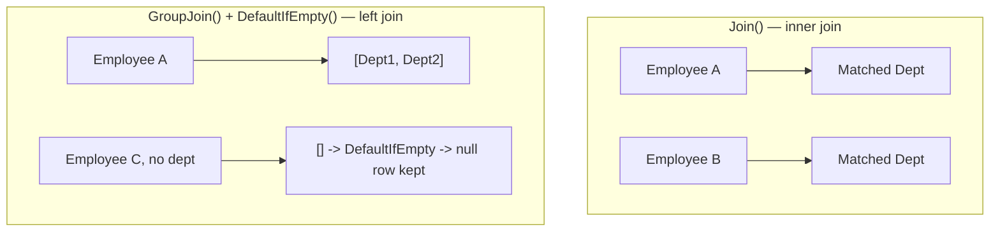
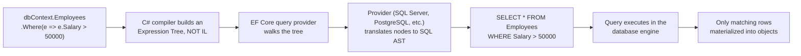

# LINQ — Senior .NET Interview Guide

> Audience: 10+ YOE .NET full-stack developer jo senior/lead interviews ki prep kar raha hai. Fundamentals assume kiye gaye hain; focus nuance, trade-offs, "why," gotchas, aur interviewer follow-ups par hai.

## Table of Contents

- [Core Concepts](#core-concepts)
  - [What LINQ Is and Why It Exists](#what-linq-is-and-why-it-exists)
  - [LINQ Flavors](#linq-flavors)
  - [Query Syntax vs Method Syntax](#query-syntax-vs-method-syntax)
  - [Deferred vs Immediate Execution](#deferred-vs-immediate-execution)
  - [[new content] Closures Over Variables — The Classic Deferred Execution Trap](#new-content-closures-over-variables--the-classic-deferred-execution-trap)
- [Intermediate Concepts](#intermediate-concepts)
  - [Select vs SelectMany](#select-vs-selectmany)
  - [First/FirstOrDefault/Single/SingleOrDefault](#firstfirstordefaultsinglesingleordefault)
  - [Any / All](#any--all)
  - [GroupBy](#groupby)
  - [Join vs GroupJoin (Left Join)](#join-vs-groupjoin-left-join)
  - [Aggregate Functions and Aggregate()](#aggregate-functions-and-aggregate)
  - [Distinct, Except, Intersect, Union](#distinct-except-intersect-union)
  - [ToLookup() vs GroupBy()](#tolookup-vs-groupby)
  - [MaxBy, MinBy, DistinctBy, and Chunk (.NET 6+) [gaps]](#maxby-minby-distinctby-and-chunk-net-6-gaps)
  - [Take/Skip, Pagination, DefaultIfEmpty, Zip](#takeskip-pagination-defaultifempty-zip)
  - [ToDictionary and Non-Generic Collections](#todictionary-and-non-generic-collections)
  - [Let Clause](#let-clause)
  - [Cross Join](#cross-join)
- [Advanced Concepts](#advanced-concepts)
  - [IEnumerable\<T\> vs IQueryable\<T\>](#ienumerablet-vs-iqueryablet)
  - [[new content] Expression Trees and How LINQ-to-Entities Translates to SQL](#new-content-expression-trees-and-how-linq-to-entities-translates-to-sql)
  - [[new content] Client-Eval Fallback and Query Translation Limits (EF Core)](#new-content-client-eval-fallback-and-query-translation-limits-ef-core)
  - [[new content] yield return and Custom Iterators](#new-content-yield-return-and-custom-iterators)
  - [Custom LINQ Extension Methods](#custom-linq-extension-methods)
  - [Dynamic LINQ](#dynamic-linq)
  - [[new content] LINQ Method Chaining vs Query Syntax — When to Use Which](#new-content-linq-method-chaining-vs-query-syntax--when-to-use-which)
- [Performance](#performance)
  - [General Optimization Rules](#general-optimization-rules)
  - [[new content] The Multiple Enumeration Pitfall](#new-content-the-multiple-enumeration-pitfall)
  - [[new content] Hidden O(n²) Traps — Nested Where/Any Inside Select](#new-content-hidden-on²-traps--nested-whereany-inside-select)
  - [Parallel LINQ (PLINQ)](#parallel-linq-plinq)
  - [[new content] IAsyncEnumerable and System.Linq.Async](#new-content-iasyncenumerable-and-systemlinqasync)
  - [[new content] EF Core: AsNoTracking, Split Queries, and Compiled Queries](#new-content-ef-core-asnotracking-split-queries-and-compiled-queries)
  - [Window-Function Alternatives for Ranking Queries (Nth Highest Salary in Production) [gaps]](#window-function-alternatives-for-ranking-queries-nth-highest-salary-in-production-gaps)
- [Best Practices](#best-practices)
- [Common Pitfalls](#common-pitfalls)
- [Worked Coding Exercises](#worked-coding-exercises)
- [Senior-Level Query Challenges (with Solutions)](#senior-level-query-challenges-with-solutions)
- [Sample Interview Q&A](#sample-interview-qa)
- [Summary of Additions](#summary-of-additions)
- [Summary of [gaps] Additions (This Pass)](#summary-of-gaps-additions-this-pass)

---

## Core Concepts

### LINQ Kya Hai Aur Yeh Kyun Exist Karta Hai

LINQ (Language-Integrated Query) query operators ka ek set hai jo .NET mein baked hota hai aur aapko in-memory collections, databases, XML, aur doosre data sources ko query karne deta hai — ek single, consistent, strongly-typed syntax use karke, bespoke loops ya hand-written SQL strings likhne ke bajaye.

**Senior level par yeh kyun important hai:** interviewer yeh test nahi kar raha ki aapko `Where()` exist karta hai yeh pata hai — woh yeh test kar raha hai ki aap samajhte ho ki LINQ actually do cheezein hain jo same syntax pehne hui hain:
1. **LINQ to Objects** — ordinary delegates (`Func<T,bool>`) jo in-memory execute hote hain, ek item ek time par.
2. **LINQ to Entities / LINQ to SQL** — **expression trees** jo *translate* hoke doosri language (SQL) mein jaati hain aur remotely execute hoti hain.

Inn dono ko conflate karna LINQ involve karne wale production bugs aur performance incidents ka sabse common source hai (neeche [Client-Eval Fallback](#new-content-client-eval-fallback-and-query-translation-limits-ef-core) dekho).

**Key benefits:**
- Readability — declarative queries imperative loops se zyada intent ke close read hote hain.
- Compile-time type safety aur IntelliSense — typos compiler errors ban jaate hain, runtime surprises nahi.
- Bahut different back ends (objects, SQL, XML, JSON) mein ek uniform query surface.
- Deferred execution composable queries enable karta hai aur, `IQueryable` ke liye, kuch actually run hone se pehle query optimization enable karta hai.

### LINQ Flavors

| Flavor | Target | Underlying Interface |
|---|---|---|
| LINQ to Objects | In-memory collections (arrays, `List<T>`, etc.) | `IEnumerable<T>` |
| LINQ to Entities | EF / EF Core databases | `IQueryable<T>` |
| LINQ to SQL | SQL Server (legacy ORM) | `IQueryable<T>` |
| LINQ to XML (XLinq) | XML documents (`XDocument`) | `IEnumerable<T>` |
| LINQ to JSON | JSON (via Newtonsoft `JToken`/System.Text.Json) | `IEnumerable<T>` |

```csharp
// LINQ to XML
XDocument xml = XDocument.Load("employees.xml");
var names = xml.Descendants("Employee").Select(e => e.Element("Name").Value);

// LINQ to JSON-derived objects — once deserialized, it's just LINQ to Objects
var users = JsonConvert.DeserializeObject<List<User>>(jsonData);
var activeUsers = users.Where(u => u.IsActive).ToList();
```

### Query Syntax vs Method Syntax

```csharp
// Query syntax (SQL-like)
var result = from emp in employees
             where emp.Age > 30
             select emp;

// Method syntax (fluent API)
var result = employees.Where(emp => emp.Age > 30);
```

Dono same IL mein compile hote hain — query syntax pure syntactic sugar hai jo compiler method calls mein translate kar deta hai. Real codebases mein method syntax dominate karta hai kyunki yeh full operator surface support karta hai (`Sum`, `Count`, `Take`, etc., jinke liye koi query-syntax keyword nahi hai) aur method chaining ke saath better compose hota hai. Neeche [dedicated comparison](#new-content-linq-method-chaining-vs-query-syntax--when-to-use-which) dekho ki query syntax genuinely kab wins karta hai.

### Deferred vs Immediate Execution

Yeh har level par single most-tested LINQ concept hai, aur woh ek jise zyadatar candidates recite kar sakte hain lekin truly explain nahi kar sakte.

- **Deferred execution**: query variable kaam ka ek *description* hold karta hai (ek iterator, ya `IQueryable` ke liye, ek expression tree) — jab tak aap usko enumerate na karo (`foreach`, `.ToList()`, `.Count()`, `.First()`, etc.) tab tak kuch run nahi hota.
- **Immediate execution**: methods jinhe turant ek concrete answer produce karna hi hota hai — `.ToList()`, `.ToArray()`, `.ToDictionary()`, `.Count()`, `.Sum()`, `.First()`, `.Any()` jab directly call kiye jaayein (aage chain kiye bina) — enumeration ko on the spot force karte hain.

```csharp
var result = employees.Where(emp => emp.Age > 30); // deferred — nothing has run yet
Console.WriteLine(result.Count());                  // query executes HERE

var result2 = employees.Where(emp => emp.Age > 30).ToList(); // executes immediately
```


**Interviewers isko kyun probe karte hain:** deferred execution ka matlab hai ki *same* query variable har baar enumerate karne par *different* results produce kar sakta hai agar underlying collection ya captured variables beech mein change ho gaye ho — ek classic "gotcha" question.

```csharp
var numbers = new List<int> { 1, 2, 3 };
var query = numbers.Where(n => n > 1);   // deferred
numbers.Add(4);
Console.WriteLine(string.Join(",", query)); // prints 2,3,4 — NOT 2,3
```

### [new content] Variables Par Closures — Classic Deferred Execution Trap

Yeh deferred execution ka natural, zyada dangerous extension hai jise original notes ne sirf hint kiya tha, aur yeh ek favorite senior-level "gotcha" question hai kyunki yeh infamous pre-C# 5 `foreach` variable-capture bug se bhi intersect karta hai.

Deferred execution ka matlab hai ki *lambda variables ko reference se close karta hai*, value se nahi jab query likhi gayi thi us time par. Agar captured variable enumeration se pehle change hota hai, to query naya value dekhti hai.

```csharp
int threshold = 30;
var query = employees.Where(e => e.Age > threshold); // captures 'threshold' by reference
threshold = 50;
var result = query.ToList(); // filters using 50, NOT 30 — surprises people every time
```

Iss bug ka historical version (C# 5.0 se `foreach` ke liye fix ho gaya, lekin plain `for` loops aur kisi bhi manually-scoped mutable capture ke liye **abhi bhi bahut zinda hai**):

```csharp
var actions = new List<Action>();
for (int i = 0; i < 3; i++)
{
    actions.Add(() => Console.WriteLine(i)); // captures the SAME 'i' variable across iterations
}
actions.ForEach(a => a()); // prints 3, 3, 3 in old semantics for 'for'; NOT 0,1,2
```

Fix: loop body ke andar ek local copy capture karo.

```csharp
for (int i = 0; i < 3; i++)
{
    int local = i; // new variable per iteration
    actions.Add(() => Console.WriteLine(local));
}
```

Note: `foreach` loop variables C# 5.0 se effectively "new variable per iteration" ho gaye hain, isliye yeh specific trap ab `foreach` par apply nahi hota — lekin exactly yehi history interviewers use karte hain yeh test karne ke liye ki aap samajhte ho *why* fix kaam karta hai, sirf yeh nahi ki karta hai. Yeh deferred LINQ execution ke peeche ke closures ka ek direct real-world consequence hai.

---

## Intermediate Concepts

### Select vs SelectMany

| | `Select()` | `SelectMany()` |
|---|---|---|
| Output shape | Nesting preserve karta hai — collections ki ek collection | Nesting ke ek level ko single sequence mein flatten karta hai |
| Typical use | Simple 1:1 projection | Projecting + flattening (e.g., saare employees ke saare skills) |

```csharp
var result1 = students.Select(s => s.Courses);     // IEnumerable<List<string>>
var result2 = students.SelectMany(s => s.Courses); // IEnumerable<string>, flattened

var allSkills = employees.SelectMany(e => e.Skills); // flattened list of all skills across all employees
```

`SelectMany` yeh bhi hai ki LINQ ek **cross join** kaise implement karta hai aur monadic "flatMap" composition nested collections ke across kaise kaam karta hai — mention karne layak hai agar interviewer functional-programming parallels probe kare.

### First/FirstOrDefault/Single/SingleOrDefault

| Method | Behavior | Throws? |
|---|---|---|
| `First()` | First matching element return karta hai | Yes, agar match nahi ya sequence empty ho |
| `FirstOrDefault()` | First match ya `default(T)` return karta hai | No |
| `Single()` | Exactly ek match expect karta hai | Yes, agar zero ya ek se zyada match ho |
| `SingleOrDefault()` | Zero ya ek match expect karta hai | Yes, agar ek se zyada match ho; zero par default return karta hai |

```csharp
var firstUser = users.FirstOrDefault(u => u.Age > 30); // safe, no exception risk
var singleEmp = employees.Single(e => e.Id == 101);     // asserts uniqueness — use for PK lookups
```

**Senior nuance:** `Single()` ek good *assertion* hai — isko use karo jab business rule genuinely uniqueness guarantee karta ho (e.g., primary key lookup) taaki data-integrity bug loudly surface ho, silently "the first one" pick karne ke bajaye. Jab aapka matlab actually "exactly ek hona chahiye" ho tab `First()`/`FirstOrDefault()` use karna bugs hide karta hai.

### Any / All

```csharp
bool hasAdults = users.Any(u => u.Age >= 18);
bool allAdults = users.All(u => u.Age >= 18);
```

- Predicate ke bina `Any()` idiomatic existence check hai — hamesha `collection.Count() > 0` ke bajaye `collection.Any()` prefer karo (dekho [Best Practices](#best-practices)).
- **Empty sequence par `All()` `true`** return karta hai (vacuous truth) — ek classic gotcha. Empty sequence par `Any()` `false` return karta hai.

### GroupBy

```csharp
var groupedUsers = users.GroupBy(u => u.City);
foreach (var group in groupedUsers)
{
    Console.WriteLine($"City: {group.Key}, Count: {group.Count()}");
}
```

`GroupBy` `IEnumerable<IGrouping<TKey, TElement>>` return karta hai — har `IGrouping` khud ek `IEnumerable<TElement>` hai jiske saath ek `.Key` hota hai. Yeh **deferred** hai, aur importantly, LINQ-to-Objects mein isko first group yield karne se pehle *entire* source ko groups mein buffer karna padta hai (yeh truly stream nahi kar sakta), jo large in-memory sets ke liye matter karta hai.

### Join vs GroupJoin (Left Join)

- `Join()` — inner join; matching pair ke liye ek flat row produce karta hai.
- `GroupJoin()` — *per left element* ek row produce karta hai, matches ki ek nested collection ke saath (naturally ek "left join" / one-to-many shape model karta hai); ek true SQL-style left outer join mein flatten karne ke liye `.SelectMany(...DefaultIfEmpty())` ke saath combine karo.

```csharp
// Inner join
var result = employees.Join(departments,
    e => e.DeptID,
    d => d.ID,
    (e, d) => new { e.Name, d.Name });

// Left join (query syntax) — DefaultIfEmpty() includes unmatched left rows
var result2 = from emp in employees
              join dept in departments
                  on emp.DeptID equals dept.ID into empDept
              from d in empDept.DefaultIfEmpty()
              select new { emp.Name, Department = d?.Name ?? "No Department" };
```



### Aggregate Functions and Aggregate()

```csharp
int totalSalary = employees.Sum(emp => emp.Salary);
double avgSalary = employees.Average(emp => emp.Salary);

int product = numbers.Aggregate((a, b) => a * b); // custom cumulative operation
```

`Aggregate()` LINQ ka generic fold/reduce hai — useful hai jab koi built-in aggregate (`Sum`/`Max`/`Count`) fit na ho, e.g., ek running string banana, ek custom rolling metric compute karna, ya objects compose karna. EF Core mein, `Aggregate()` almost always SQL mein translate **nahi ho sakta** aur client evaluation force karega ya throw karega — `IQueryable` ke against isko use karne se pehle yeh trade-off jaan lo.

### Distinct, Except, Intersect, Union

| Method | Description |
|---|---|
| `Except()` | Elements jo first collection mein hain lekin second mein nahi |
| `Intersect()` | Elements jo dono collections mein common hain |
| `Union()` | Dono collections ke saare unique elements (implicitly de-duplicate karta hai) |

```csharp
int[] a = { 1, 2, 3, 4 };
int[] b = { 3, 4, 5, 6 };
var except = a.Except(b);       // 1, 2
var intersect = a.Intersect(b); // 3, 4
var union = a.Union(b);         // 1, 2, 3, 4, 5, 6
```

Teenon `EqualityComparer<T>.Default` use karte hain jab tak aap ek custom `IEqualityComparer<T>` pass na karo — custom equality semantics wale reference types ke liye (e.g., properties ke ek subset se DTOs compare karna), comparer bhool jaana ek common bug hai.

### ToLookup() vs GroupBy()

| Feature | `GroupBy()` | `ToLookup()` |
|---|---|---|
| Execution | Deferred | Immediate |
| Return type | `IEnumerable<IGrouping<K,V>>` | `ILookup<K,V>` |
| Key se indexable | No | Yes (`lookup["HR"]`) |
| Missing key behavior | N/A | Empty sequence return karta hai, exception nahi |

```csharp
var lookup = employees.ToLookup(e => e.Department);
Console.WriteLine(lookup["HR"].Count());
```

### MaxBy, MinBy, DistinctBy, aur Chunk (.NET 6+) [gaps]

Original notes ne `MaxBy` aur `DistinctBy` ko couple jagah reference kiya hai ("or `MaxBy` — see gap below", "or `.DistinctBy(...)` (see .NET 6+ gap below)") lekin unhe actually kabhi cover nahi kiya — yeh four operators (`MaxBy`, `MinBy`, `DistinctBy`, `Chunk`) .NET 6 ke saath `System.Linq` mein shipped hue, aur ab kisi bhi current senior interview mein fair game hain, kyunki yeh verbose, easy-to-get-wrong idioms replace karte hain jo unse pehle the.

- **`MaxBy` / `MinBy`** — max/min projected key wala *element* return karte hain, `Max()`/`Min()` ke bajaye jo sirf projected value khud return karte hain. Yeh directly is guide mein pehle flag kiya gaya Q6/Q15-style bug fix karta hai (`.Max(f => f.AverageSalary)` use karna aur associated department lose karna).
- **`DistinctBy`** — whole element ke bajaye ek projected key se de-duplicate karta hai, kisi custom `IEqualityComparer<T>` ki zarurat ke bina.
- **`Chunk`** — ek sequence ko fixed-size batches mein split karta hai (last batch smaller ho sakta hai), `IEnumerable<T[]>` return karta hai. Common use: max-batch-size limit respect karne ke liye bulk inserts/API calls batch karna.

```csharp
// MaxBy / MinBy — keeps the whole element, not just the projected value
var highestPaid = employees.MaxBy(e => e.Salary);   // Employee, not decimal
var lowestPaid = employees.MinBy(e => e.Salary);     // Employee, not decimal

// Equivalent to the older, more verbose idiom:
var highestPaidOld = employees.OrderByDescending(e => e.Salary).First();

// DistinctBy — de-dup by a key selector, no custom IEqualityComparer needed
var oneEmployeePerDept = employees.DistinctBy(e => e.DepartmentId);

// Chunk — batch a sequence into arrays of at most N elements
foreach (int[] batch in employeeIds.Chunk(100))
{
    await bulkApiClient.ProcessBatchAsync(batch); // e.g., respecting a 100-item API limit
}
```

**Gotchas/follow-ups jo interviewer raise kar sakta hai:**
- `MaxBy`/`MinBy` empty sequence par throw karne ke bajaye `default(T)` (e.g., reference types ke liye `null`) return karte hain — `Max()`/`Min()` ke unlike, jo non-nullable value type ki empty sequence par `InvalidOperationException` throw karte hain. Yeh asymmetry jaan lo.
- Agar multiple elements max/min key ke liye tie karein, `MaxBy`/`MinBy` **first** encountered wala return karte hain — `OrderBy...First()` jaisa hi tie-breaking semantics, koi arbitrary/undefined pick nahi.
- EF Core 8 tak, `IQueryable` ke against `MaxBy`/`MinBy`/`DistinctBy`/`Chunk` translation support provider aur version ke hisaab se vary karta hai — yeh assume karne se pehle ki yeh database tak push down hote hain client evaluation trigger karne ke bajaye, apne EF Core version aur generated SQL ke against verify karo.
- `Chunk` ka last batch requested size se shorter ho sakta hai — hamesha fixed length assume karne ke bajaye partial final batch handle karo.

### Take/Skip, Pagination, DefaultIfEmpty, Zip

```csharp
// Pagination
int pageSize = 5, pageNumber = 2;
var pagedEmployees = employees.Skip((pageNumber - 1) * pageSize).Take(pageSize);

// DefaultIfEmpty
var result = employees.Where(e => e.ID == 100).DefaultIfEmpty(new Employee { Name = "Not Found" });

// Zip — merges two sequences element-wise, stops at the shorter one
var combined = names.Zip(ages, (name, age) => $"{name} is {age} years old.");
```

**`IQueryable` ke against `Skip`/`Take` pagination ka Senior gotcha:** hamesha `OrderBy` ke saath pair karo — SQL bina uske koi ordering guarantee nahi deta, isliye explicit sort ke bina paging concurrent writes ke under non-deterministic page contents/duplicates produce karti hai.

### ToDictionary and Non-Generic Collections

```csharp
var empDict = employees.ToDictionary(e => e.ID, e => e.Name);

// Non-generic collections need casting
ArrayList list = new ArrayList { 1, 2, 3, 4 };
var numbers = list.Cast<int>().Where(n => n > 2);
```

`ToDictionary` duplicate keys par `ArgumentException` throw karta hai — ek bahut common runtime surprise jab "unique key" assumption real data mein hold nahi karta. Jab duplicates possible hon to `GroupBy` + `ToDictionary(g => g.Key, g => g.ToList())` ya `.DistinctBy(...)` (neeche .NET 6+ gap dekho) consider karo.

### Let Clause

```csharp
var result = from e in employees
             let bonus = e.Salary * 0.1m
             select new { e.Name, Bonus = bonus };
```

`let` sirf query syntax mein exist karta hai; method-syntax equivalent ek intermediate `Select` hai jo anonymous type project karta hai, ya simply calculation inline karna. Yeh mainly ek readability aid hai jo same query ke andar ek expression ko multiple baar recompute karne se bachata hai.

### Cross Join

```csharp
var result = from e in employees
             from d in departments
             select new { e.Name, d.Name };
```

`employees.SelectMany(e => departments, (e, d) => new { e.Name, d.Name })` ke equivalent — dono sequences ka Cartesian product. Practice mein rare hai; usually ek bug hota hai jab yeh unintentionally appear hota hai (e.g., dono sequences ko correlate karne wala `where` bhool jaana).

---

## Advanced Concepts

### IEnumerable\<T\> vs IQueryable\<T\>

Yeh senior level par highest-signal LINQ question hai — yeh un logon ko separate karta hai jinhone flash cards memorize kiye hain un logon se jinhone actually production mein slow EF query debug ki hai.

| Feature | `IEnumerable<T>` | `IQueryable<T>` |
|---|---|---|
| Represents karta hai | Ek sequence + ek delegate (`Func<T,...>`) | Ek sequence + ek **expression tree** (`Expression<Func<T,...>>`) |
| Typical source | In-memory collections (LINQ to Objects) | ORMs — EF Core, LINQ to SQL (LINQ to Entities) |
| Filtering kahan hoti hai | Application memory mein, full source materialize/iterate hone ke baad | Target query language (SQL) mein translate hoti hai aur source par execute hoti hai |
| Deferred execution | Yes | Yes |
| Composability | Har `.Where()` per item executed chain mein ek delegate add karta hai | Har `.Where()` expression tree mein ek node add karta hai; *whole* tree ek baar translate hoti hai, enumeration time par |
| Large remote datasets ke liye performance | Poor — pehle sab kuch memory mein pull karta hai | Good — filtering/sorting/paging database tak push hoti hai |
| Kya yeh predicate mein arbitrary C# methods call kar sakta hai? | Yes, kuch bhi | No — sirf woh jo provider (e.g., EF Core) SQL mein translate karna jaanta hai |

```csharp
IEnumerable<int> data1 = numbers.Where(n => n > 5);                       // in-memory
IQueryable<int> data2 = dbContext.Employees.Where(e => e.Salary > 50000); // translated to SQL, runs in DB
```

**Trap jo interviewers dig karte hain:** agar aap apne final `Where()` *se pehle* `.AsEnumerable()` call karte ho (ya accidentally `IEnumerable<T>` mein implicit cast trigger kar dete ho, e.g., ek non-translatable method call karke), to yeh filter ab client-side, in-memory run hota hai, wire ke across *entire* table pull karne ke baad. Yeh large tables par quietly catastrophic hai aur real codebases mein sabse common EF performance bugs mein se ek hai.

```csharp
// BAD: pulls all employees into memory, then filters in C#
var result = dbContext.Employees.AsEnumerable().Where(e => e.Salary > 50000);

// GOOD: filter is translated to SQL WHERE clause, only matching rows come back
var result = dbContext.Employees.Where(e => e.Salary > 50000);
```

### [new content] Expression Trees Aur LINQ-to-Entities SQL Mein Kaise Translate Hota Hai

Original notes expression trees ko ek line mein mention karte hain (`Expression<Func<int,bool>> isEven = n => n % 2 == 0;`) yeh explain kiye bina ki *why* yeh exist karte hain ya SQL translation pipeline actually kaise kaam karta hai — yeh exactly woh follow-up hai jo ek senior interviewer `IEnumerable` vs `IQueryable` question ke baad poochega.

`Func<T,...>` ko assigned ek lambda **IL** mein compile hota hai — ek executable delegate. `Expression<Func<T,...>>` ko assigned ek lambda **data** mein compile hota hai: `Expression` node objects (`BinaryExpression`, `MemberExpression`, `ConstantExpression`, etc.) ka ek tree jo code ko *describe* karta hai usko run kiye bina.



Yehi *why* hai ki `IQueryable<T>` ke `Where` ka parameter type `Expression<Func<T,bool>>` hai jabki `IEnumerable<T>` ka plain `Func<T,bool>` hai — provider ko *tree* chahiye, ek compiled delegate nahi, taaki woh usko doosri language mein translate kar sake.

```csharp
Expression<Func<Employee, bool>> isHighEarner = e => e.Salary > 50000;
// isHighEarner.Body, .Parameters, etc. can be inspected/rewritten at runtime —
// this is what libraries like AutoMapper's ProjectTo, Dynamic LINQ, and
// custom query-builder abstractions rely on.
```

Practical implication: koi bhi C# construct jiska SQL equivalent nahi hai (custom methods, zyadatar string-formatting helpers, complex pattern matching), agar ek predicate ke andar use kiya jaaye jise translate hona zaruri hai, to woh ya `InvalidOperationException` throw karta hai (older EF/strict providers) ya client evaluation trigger karta hai (EF Core, ek warning ke saath).

### [new content] Client-Eval Fallback Aur Query Translation Limits (EF Core)

Yeh arguably original notes mein highest real-world-impact LINQ gap hai — "EF large datasets kaise handle karta hai" mention hai, lekin **silent client-side evaluation** ka actual danger nahi hai.

EF Core (EF6 ke unlike, jo hard errors throw karta tha) by default, query ke jitna possible ho SQL mein translate karne ki koshish karega, aur **untranslatable part ko silently memory mein pull karega** aur usko client-side evaluate karega — sirf ek warning log karke (jo proper logging configuration ke bina production mein miss karna easy hai).

```csharp
// Looks fine, but Regex.IsMatch has no SQL translation.
var result = dbContext.Employees
    .Where(e => Regex.IsMatch(e.Name, "^A"))   // EF Core: client-eval warning, pulls ALL rows first
    .ToList();
```

Common untranslatable constructs jo cold jaan lo:
- Provider-specific translation ke bina arbitrary instance/static C# methods ke calls (custom validators, zyadatar regex, culture-specific string ops).
- `Aggregate()`, zyadatar LINQ operators jinhe custom `IComparer`/`IEqualityComparer` chahiye.
- Kuch provider versions mein complex nested ternary/pattern-matching (apne EF Core version ke against verify karo — translation support har release mein expand hota hai).
- Kuch bhi jo aap already `IEnumerable` par drop hone ke baad karte ho (e.g., `.AsEnumerable()`, `.ToList()`, ya ek method jo sirf `IEnumerable` par exist karta hai, ke through).

**Mitigation:**
- EF Core 3.0+ mein, `QueryTrackingBehavior`/logging configure karo taaki non-production environments mein client evaluation warnings **errors** ban jaayein: `optionsBuilder.ConfigureWarnings(w => w.Throw(RelationalEventId.QueryClientEvaluationWarning))` (exact API surface EF Core version ke hisaab se vary karta hai — use mein aa rahe version ke against verify karo).
- Query ke jitna filtering/projection ho sake usko us part mein push karo jo `IQueryable` rehta hai; `.AsEnumerable()`/`.ToList()` sirf *last* step ke roop mein call karo.
- Materialize karne se pehle exactly needed columns par project karne ke liye `.Select()` use karo — dono translation risk aur network/memory cost kam karta hai.

### [new content] yield return Aur Custom Iterators

Notes poochte hain "aap ek custom LINQ extension method kaise likhoge?" lekin sirf `Where()` ka ek wrapper dikhate hain — real senior-level question hai "aap ek aisa kaise likhoge jo stream aur defer kare, jaise built-in operators karte hain?" Jawab hai `yield return`.

```csharp
public static IEnumerable<TSource> WhereGreaterThan<TSource, TKey>(
    this IEnumerable<TSource> source,
    Func<TSource, TKey> selector,
    TKey threshold) where TKey : IComparable<TKey>
{
    foreach (var item in source)
    {
        if (selector(item).CompareTo(threshold) > 0)
            yield return item; // pauses here; resumes on next MoveNext()
    }
}
```

C# compiler ek `yield return` method ko ek compiler-generated state machine mein rewrite karta hai jo `IEnumerator<T>` implement karta hai — yehi *how* hai ki `Where`, `Select`, aur unke friends bina whole sequence ko memory mein buffer kiye deferred, streaming (one-item-at-a-time) execution achieve karte hain. Yeh samajhna explain karta hai:
- Kyun LINQ-to-Objects operators large sequences stream karne ke liye memory-efficient hain (ek simple `Where().Select()` chain ke liye full materialization ki zarurat nahi).
- Kyun ek `yield return` iterator ke andar throw hui exceptions surface tab hi hoti hain jab enumeration ke during `MoveNext()` call hota hai, method call hone par nahi — confusing stack traces ka ek common source ("exception aisa lagta hai jaise woh query build hone se bahut door throw hui ho").
- Ek subtle gotcha: iterator method ke andar argument validation **first enumeration tak run nahi hoti**, kyunki method body `MoveNext()` tak execute nahi hoti — eager validation paane ke liye, ek public non-iterator wrapper mein split karo jo validate kare, phir ek private iterator call kare.

```csharp
public static IEnumerable<T> SafeWhere<T>(this IEnumerable<T> source, Func<T, bool> predicate)
{
    if (source is null) throw new ArgumentNullException(nameof(source)); // validated eagerly
    if (predicate is null) throw new ArgumentNullException(nameof(predicate));
    return SafeWhereIterator(source, predicate); // deferred part factored out
}

private static IEnumerable<T> SafeWhereIterator<T>(IEnumerable<T> source, Func<T, bool> predicate)
{
    foreach (var item in source)
        if (predicate(item))
            yield return item;
}
```

### Custom LINQ Extension Methods

```csharp
public static class MyExtensions
{
    public static IEnumerable<int> GetEvens(this IEnumerable<int> numbers)
        => numbers.Where(n => n % 2 == 0);
}

// Usage
var evens = numbers.GetEvens();
```

### Dynamic LINQ

```csharp
// Requires System.Linq.Dynamic.Core
var result = employees.AsQueryable().Where("Salary > 50000").ToList();
```

Runtime configuration se filters/sorts build karne ke liye useful hai (e.g., user-selectable filter fields wali ek search UI) bina expression-tree construction hand-roll kiye. Trade-off: string-based predicates compile-time safety lose kar dete hain aur ek potential injection surface hain agar field names/operators directly untrusted user input se aayein — hamesha column names ki ek allow-list ke against validate karo.

### [new content] LINQ Method Chaining vs Query Syntax — Kab Kaunsa Use Karein

Original notes query syntax aur method syntax ko simply "ek hi cheez likhne ke do tarike" ke roop mein present karte hain, bina koi real decision rule diye — ek senior interviewer "why" chahega, sirf "both work" nahi.

| Scenario | Prefer |
|---|---|
| Simple filter/projection/sort chains | Method syntax — naturally left-to-right read hota hai, kisi bhi operator ke saath compose hota hai |
| Multiple `join`s wali queries, especially `GroupJoin` + `DefaultIfEmpty` (left join) | Query syntax — `into`/`from` shape nested `Join`/`SelectMany` calls se meaningfully zyada readable hai |
| Queries jinhe multiple baar use hone wale intermediate named value ke liye `let` chahiye | Query syntax — ek extra explicit `Select` ke bina koi clean method-syntax equivalent nahi hai |
| Woh operators jinke liye koi query-syntax keyword nahi hai: `Sum`, `Count`, `Take`, `Skip`, `Distinct`, `Any`, `Aggregate`, etc. | Method syntax — mandatory hai, kyunki query syntax ke paas inke liye koi keyword nahi hai |
| Fluent, incrementally-built queries (e.g., filter flags ke basis par conditionally `.Where()` append karna) | Method syntax — query variable reassign karke trivially composable hai |

```csharp
// Conditional composition — natural in method syntax, awkward in query syntax
IQueryable<Employee> query = dbContext.Employees;
if (minSalary.HasValue) query = query.Where(e => e.Salary >= minSalary.Value);
if (!string.IsNullOrEmpty(department)) query = query.Where(e => e.Department == department);
```

Practice mein, zyadatar production code by default method syntax hai, specifically multi-join ya `let`-heavy queries ke liye query syntax mein drop hota hai, phir wapas convert hota hai — aap dono ko same expression mein mix kar sakte ho query syntax ki implicit method-call translation ke through.

---

## Performance

### General Optimization Rules

- `.AsEnumerable()` deliberately use karo (aur sirf tab jab saari possible server-side filtering ho chuki ho) pipeline ke remainder ke liye LINQ-to-Entities se LINQ-to-Objects mein switch karne ke liye.
- `.ToList()`/`.ToArray()` prematurely call karne se bacho — yeh immediate execution force karta hai aur *entire* result materialize karta hai, jo further query composition aur provider-side optimization ko defeat karta hai (e.g., aap ek aur `Where` add karne ki ability lose kar dete ho jo SQL tak push hota).
- Existence checks ke liye `.Count() > 0` ke bajaye `.Any()` prefer karo — `Any()` first match par short-circuit karta hai; `Count()` (especially `IQueryable` ke against) ek full `COUNT(*)` scan ya full enumeration require kar sakta hai.
- `Select()`/`OrderBy()` se pehle `Where()` se early filter karo — pipeline mein working set ko jitna jaldi ho sake reduce karta hai, aur `IQueryable` ke against, ek smaller/cheaper translated query produce karta hai.
- `IQueryable` ke liye, hamesha `Skip`/`Take` paging ko deterministic results ke liye `OrderBy` ke saath pair karo.

### [new content] Multiple Enumeration Pitfall

Yeh sabse common real-world LINQ performance bugs mein se ek hai aur original notes se entirely absent hai, iske bawajood ki yeh ek near-guaranteed senior-interview question hai ("is code mein kya galat hai?").

```csharp
IEnumerable<Employee> highEarners = employees.Where(e => e.Salary > 50000); // deferred, not yet run

int count = highEarners.Count();       // enumeration #1 — full pass over 'employees'
var list = highEarners.ToList();       // enumeration #2 — full pass AGAIN
if (highEarners.Any()) { ... }         // enumeration #3 — full pass AGAIN
```

`Count()`, `ToList()`, `Any()` mein se har ek `Where` predicate ko *original* source ke against scratch se re-run karta hai, kyunki variable ek undecided iterator hold karta hai, cached result nahi. Consequences:
- **Performance**: LINQ-to-Objects ke liye, bina kisi reason ke 3x work. LINQ-to-Entities ke liye, yeh **database ke 3 separate round trips** hain, har baar query re-run hoti hai.
- **Correctness**: agar source kuch aisa hai jo enumerations ke beech change hota hai (ek live collection, ek non-deterministic generator, ya ek database jisme concurrently likha ja raha hai), to har enumeration *different* results return kar sakta hai — inconsistent counts, list contents, aur `Any()` results jo ek doosre se agree nahi karte.

**Fix:** jaise hi pata chale ki aapko results ek se zyada baar chahiye honge, `.ToList()` (ya `.ToArray()`) se ek baar materialize karo, phir us materialized snapshot par kaam karo.

```csharp
var highEarners = employees.Where(e => e.Salary > 50000).ToList(); // ONE enumeration, cached

int count = highEarners.Count;   // property on List<T>, no re-enumeration
var list = highEarners;          // already a list
if (highEarners.Any()) { ... }   // cheap, operates on the materialized list
```

Static analysis tools (Roslyn analyzers, ReSharper) isko "possible multiple enumeration of IEnumerable" ke roop mein flag karte hain — mention karne layak hai agar poocha jaaye ki aap scale par/code review mein is class ke bug ko kaise catch karoge.

### [new content] Hidden O(n²) Traps — Nested Where/Any Inside Select

Original notes mein bilkul cover nahi kiya gaya, aur ek bahut common real "yeh endpoint slow kyun hai" root cause hai jab collections kuch thousand items se aage grow ho jaate hain.

```csharp
// O(n * m): for every employee, linearly scans the entire departments list
var result = employees.Select(e => new
{
    e.Name,
    DeptName = departments.FirstOrDefault(d => d.Id == e.DepartmentId)?.Name
});

// Similarly O(n * m): Any() inside Select/Where re-scans 'blockedIds' for every item
var filtered = employees.Where(e => !blockedIds.Any(b => b == e.Id));
```

Agar `employees` mein n rows hain aur `departments`/`blockedIds` mein m rows hain, to yeh O(n·m) hai — small m ke liye fine hai, dono collections scale hone par disastrous hai (e.g., 50,000 orders ko 50,000 customers ke against linearly join karne wali ek report 2.5 billion comparisons hai).

**Fix:** lookup side ko ek `Dictionary`/`HashSet`/`ILookup` mein pre-index karo (O(1) ya O(log n) lookups), ya better, ek actual `Join`/`GroupJoin` use karo jise LINQ (aur especially LINQ-to-Entities/SQL) far more efficiently execute kar sakta hai (database level par hash join / indexed join).

```csharp
// O(n + m): build the lookup once, then O(1) per employee
var deptById = departments.ToDictionary(d => d.Id, d => d.Name);
var result = employees.Select(e => new
{
    e.Name,
    DeptName = deptById.TryGetValue(e.DepartmentId, out var name) ? name : null
});

// O(n + m) with a HashSet
var blockedSet = blockedIds.ToHashSet();
var filtered = employees.Where(e => !blockedSet.Contains(e.Id));

// Or, idiomatically, just use Join — same O(n+m) hash-join semantics, and
// translates to an efficient SQL JOIN against IQueryable
var result2 = employees.Join(departments, e => e.DepartmentId, d => d.Id,
    (e, d) => new { e.Name, DeptName = d.Name });
```

Yeh exact pattern — "`Select`/`Where` ke andar ek second collection re-scan karta nested lambda" — sabse common LINQ-specific complexity bug hai jo interviewers candidates se ek code-review-style question mein spot karne ke liye poochte hain.

### Parallel LINQ (PLINQ)

```csharp
var results = users.AsParallel().Where(u => u.Age > 30).ToList();
```

PLINQ source ko multiple threads/cores ke across partition karta hai aur results merge karta hai, jo large in-memory collections par CPU-bound, embarrassingly-parallel work ko significantly speed up kar sakta hai.

**Trade-offs jo interviewer expect karta hai aap unprompted raise karo:**
- **Overhead** — small collections ya cheap predicates ke liye, partitioning/merging overhead benefit se zyada hota hai; PLINQ sequential LINQ se *slower* ho sakta hai. Benchmark karo, assume mat karo.
- **Ordering** — results by default unordered hain; agar order preserve karna zaruri hai to `.AsOrdered()` use karo (performance cost par).
- **I/O-bound ya database work ke liye nahi** — EF ke against `IQueryable` ko iss tarah parallelize karne ke liye nahi bana; PLINQ ek LINQ-to-Objects (in-memory, CPU-bound) tool hai. `DbContext` bhi thread-safe nahi hai — same context ke against kabhi bhi PLINQ ke through EF queries fan out mat karo.
- **Side effects / thread safety** — `AsParallel()` ke andar use hone wale predicates/projections side-effect-free ya properly synchronized hone chahiye; parallel lambdas se shared state mutate karna ek race condition ka wait hai.
- **Exception handling** — multiple partitions ki exceptions ek `AggregateException` mein aggregate ho jaati hain, individually surface nahi hoti — code isko unwrap karne ke liye ready hona chahiye.
- Shared/server environments mein thread usage cap karne ke liye `.WithDegreeOfParallelism(n)` use karo jahan unconstrained parallelism doosre work ko starve kar sakta hai.

### [new content] IAsyncEnumerable Aur System.Linq.Async

Original notes mein async streaming ka koi mention nahi hai, jo ab ek standard senior-level EF Core / high-throughput API question hai, given ki `IAsyncEnumerable<T>` C# 8 / .NET Core 3.0 se mainstream hai.

`IEnumerable<T>`/`IQueryable<T>` enumeration synchronous hai — next item pull karna calling thread ko block karta hai. `IAsyncEnumerable<T>` (jo `await foreach` ke through consume hota hai) har `MoveNextAsync()` ko I/O par wait karte hue thread ko yield back karne deta hai (e.g., database se rows ke next batch ka wait karna), jo load ke under scalability ke liye matter karta hai.

```csharp
// EF Core: streams rows as they arrive from the DB instead of blocking until all are read
await foreach (var employee in dbContext.Employees.Where(e => e.Salary > 50000).AsAsyncEnumerable())
{
    Process(employee);
}
```

Async streams ke upar LINQ-to-Objects style composition ke liye (`IAsyncEnumerable<T>` par `Select`, `Where`, `SelectMany`), **`System.Linq.Async`** NuGet package (`dotnet/reactive` se) async LINQ operator set provide karta hai, kyunki BCL ke apne LINQ operators sirf `IEnumerable<T>`/`IQueryable<T>` target karte hain.

```csharp
using System.Linq; // System.Linq.Async extension methods on IAsyncEnumerable<T>

var filtered = dbContext.Employees.AsAsyncEnumerable()
    .Where(e => e.IsActive)
    .Select(e => e.Name);

await foreach (var name in filtered) { ... }
```

Interviews ke liye distinction jaan lo: `Task<IEnumerable<T>>` (ek big async wait, phir ek synchronous in-memory sequence) vs `IAsyncEnumerable<T>` (ek genuinely async *stream*, items incrementally deliver hote hain) — latter large result sets ya server-streaming scenarios ke liye right tool hai (e.g., gRPC streaming, paged API responses, Minimal API endpoints jo huge datasets return karte hain unhe pehle memory mein buffer kiye bina).

### [new content] EF Core: AsNoTracking, Split Queries, Aur Compiled Queries

Notes "LINQ large datasets ko efficiently kaise handle karta hai" ko sirf generic level par mention karte hain (`IQueryable`, `AsEnumerable`, deferred execution) — yeh concrete, current (EF Core 5+) levers hain jo senior engineers ko naam se jaanne expected hain.

- **`.AsNoTracking()`** — read-only queries ke liye, EF Core ke change-tracking overhead ko skip karta hai (koi snapshot comparison nahi, koi identity map maintenance nahi). Reporting/read-heavy endpoints ke liye significant win hai. `.AsNoTrackingWithIdentityResolution()` full change tracking ke bina identity resolution rakhta hai (repeated references ke liye same entity instance).
- **Split queries (`.AsSplitQuery()`)** — jab multiple `Include()` collection navigations eager-load karte ho, EF Core default se JOINs wali single SQL query use karta hai, jo ek "cartesian explosion" produce kar sakti hai (row count har included collection ke across multiply hota hai). `.AsSplitQuery()` iske bajaye per collection separate SQL queries issue karta hai, multiplication blow-up avoid karne ke liye round trips trade karta hai. Iss trade-off ki dono directions jaan lo — zyada round trips vs quadratic row bloat — kyunki yeh genuinely context-dependent hai ki kaunsa faster hai.
- **Compiled queries (`EF.CompileQuery` / `EF.CompileAsyncQuery`)** — expression-tree-to-SQL translation ko ek baar pre-compile karta hai, har subsequent call par translation cost bypass karta hai. Extremely frequently executed hot-path queries ke liye matter karta hai; usually elsewhere ek unnecessary micro-optimization hai kyunki EF Core already default se query plans internally cache karta hai.
- **Full-entity loading ke upar Projection** — materialize karne se pehle `.Select(e => new EmployeeDto { ... })` unused columns pull karne se bachata hai aur unselected shape ke liye change tracking machinery entirely skip karta hai — read-only API endpoints ke liye upar wale kisi bhi se often bigger win hai.

```csharp
var dtos = await dbContext.Employees
    .AsNoTracking()
    .Where(e => e.IsActive)
    .Select(e => new EmployeeDto { Id = e.Id, Name = e.Name })
    .ToListAsync();
```

### Ranking Queries Ke Liye Window-Function Alternatives (Production Mein Nth Highest Salary) [gaps]

Upar wale Worked Coding Exercises aur Senior-Level Query Challenges sections "Nth highest salary" aur "top/Nth per group" problems ko `Distinct().OrderByDescending().Skip(n).FirstOrDefault()` (Q2, "Second highest salary") aur ek nested `GroupBy` + `Distinct().OrderByDescending().Skip(n)` (Q11, "Third highest salary per department") ke saath solve karte hain. Yeh LINQ-to-Objects (in-memory) ke liye ya interview warm-up ke roop mein right answers hain, lekin ek senior interviewer follow up karega: **"millions rows wale ek production database ke against aap yeh kaise karoge?"** Honest answer hai: aap usually nahi karte — aap ranking ko database ke native window functions tak push down karte ho, rows ko memory mein pull karke C# mein rank karne ke bajaye.

**SQL window functions tak push down karna usually kyun better hai:**
- **Full materialization avoid karta hai** — `IQueryable` ke against translated `Skip(n)` ko still generally skip karne se pehle database ko *entire* qualifying result set compute aur order karna padta hai; `ROW_NUMBER()` jaisa ek window function query optimizer ko ordering column par ek index use karne deta hai aur, bahut se plans mein, ek full sort/scan entirely avoid karta hai.
- **Set-based, row-by-row nahi** — `RANK()`/`DENSE_RANK()`/`ROW_NUMBER() OVER (PARTITION BY ... ORDER BY ...)` exactly woh primitive hai jise optimize karne ke liye database engine banaya gaya tha; nested nested-`GroupBy`-then-rank shapes (jaise Q11 ka per-department third-highest) historically EF Core ke liye correctly translate karne ke sabse hard patterns mein se kuch hain (upar Q30 ke neeche ka note dekho) aur often older EF Core/EF6 versions par silently client evaluation par fall back karte hain.
- **Ek round trip, ek query plan** — wire ke across ek department ka (ya whole table ka) worth rows pull karke C# mein rank karne ke bajaye, aap exactly N rows waapas milte hain jo aapne poocha tha.
- **Ties ki correct handling explicit hai** — `RANK()` (ties ek rank share karti hain, gaps chhodti hain), `DENSE_RANK()` (ties ek rank share karti hain, no gaps), aur `ROW_NUMBER()` (strict, `ORDER BY` se arbitrary tie-break) "Nth highest" ke liye teen genuinely different business rules map karte hain jo LINQ mein `Distinct()`/`Skip()` se hand-rolled karne par subtly galat hona easy hai.

```sql
-- Nth highest salary per department using window functions (SQL Server dialect)
-- Compare against Q11's LINQ GroupBy + Distinct().OrderByDescending().Skip(2) equivalent
WITH RankedSalaries AS (
    SELECT
        e.DepartmentId,
        e.Name,
        e.Salary,
        DENSE_RANK() OVER (PARTITION BY e.DepartmentId ORDER BY e.Salary DESC) AS SalaryRank
    FROM Employees e
)
SELECT DepartmentId, Name, Salary
FROM RankedSalaries
WHERE SalaryRank = 3; -- "third highest salary per department" — DENSE_RANK avoids skipping ranks on ties
```

```csharp
// EF Core: raw SQL for the ranking, still returned as strongly-typed rows.
// FromSqlRaw works when mapping to an existing entity/keyless type; SqlQuery<T> (EF Core 8+)
// is the newer, more flexible option for arbitrary projections that aren't a full tracked entity.

// EF Core 8+ : SqlQuery<T> — no need for a DbSet-mapped entity, works for scalar/DTO projections
var thirdHighestPerDept = await dbContext.Database
    .SqlQuery<DeptSalaryRankDto>($"""
        WITH RankedSalaries AS (
            SELECT DepartmentId, Name, Salary,
                   DENSE_RANK() OVER (PARTITION BY DepartmentId ORDER BY Salary DESC) AS SalaryRank
            FROM Employees
        )
        SELECT DepartmentId, Name, Salary FROM RankedSalaries WHERE SalaryRank = 3
        """)
    .ToListAsync();

// Pre-EF Core 8 / entity-shaped result: FromSqlRaw against a mapped (or keyless) entity type
var thirdHighestPerDeptLegacy = await dbContext.Employees
    .FromSqlRaw(@"
        WITH RankedSalaries AS (
            SELECT e.*, DENSE_RANK() OVER (PARTITION BY DepartmentId ORDER BY Salary DESC) AS SalaryRank
            FROM Employees e
        )
        SELECT * FROM RankedSalaries WHERE SalaryRank = 3")
    .ToListAsync();

public record DeptSalaryRankDto(int DepartmentId, string Name, decimal Salary);
```

**LINQ/in-memory version (Q2, Q11) kab abhi bhi fine hai:** small, already-materialized collections (config data, ek page ka worth results already fetched, unit tests), ya ek genuine LINQ-to-Objects scenario jisme koi database involved na ho. Trade-off flip hota hai jab source ek real, growing table ke upar ek `IQueryable` ho — tab raw SQL ke through window functions (ya, modern EF Core mein, provider ka apna `GroupBy`+ranking ka translation jahan supported ho) production-grade answer ban jaate hain. Dono taraf actual generated SQL/execution plan hamesha verify karo — yeh assume mat karo ki translation hua hi hoga sirf isliye ki LINQ compile ho gaya.

---

## Best Practices

- By default method syntax prefer karo; multi-join / `let`-heavy queries ke liye query syntax use karo (upar comparison dekho).
- Exactly ek baar materialize karo (`.ToList()`/`.ToArray()`), us point par jahan aapko pata ho ki aap ek se zyada baar enumerate karoge — [multiple enumeration pitfall](#new-content-the-multiple-enumeration-pitfall) avoid karo.
- Chain mein jitna jaldi ho sake `Where` se filter karo, especially `IQueryable` ke against, database tak work push karne ke liye.
- Existence checks ke liye `Count() > 0` ke bajaye `Any()` use karo.
- Aapko jo bhi SQL mein translate karna hai woh pipeline ke `IQueryable` portion ke andar rakho; `.AsEnumerable()`/`.ToList()` sirf final step ke roop mein call karo, aur [client-eval fallback](#new-content-client-eval-fallback-and-query-translation-limits-ef-core) ke liye alert raho.
- `Select`/`Where` ke andar ek scan nest karne se pehle lookup collections (`Dictionary`/`HashSet`/`ToLookup`) pre-index karo — [O(n²) traps](#new-content-hidden-on²-traps--nested-whereany-inside-select) avoid karo.
- Read-only EF Core queries ke liye `AsNoTracking()` use karo.
- Over-fetching columns aur unnecessary change tracking avoid karne ke liye materialize karne se pehle `Select()` se DTOs par project karo.
- Deterministic pagination ke liye `IQueryable` sources ke against hamesha `Skip`/`Take` ko `OrderBy` ke saath pair karo.
- `AsParallel()` ke liye reach karne se pehle benchmark karo — yeh free nahi hai, aur I/O-bound/database work ke liye galat tool hai.
- `foreach` se currently iterate ki ja rahi collection ko mutate karne se pehle `.ToList()` use karo (iteration ke during removes/inserts otherwise `InvalidOperationException` throw karte hain).

---

## Common Pitfalls

- Ek deferred `IEnumerable`/`IQueryable` ka **Multiple enumeration** — har baar silently query re-run karta hai (aur, EF ke liye, database ko re-hit karta hai). Upar dedicated section dekho.
- Deferred queries mein reference se captured **mutable variables par closures** variable change hone ke baad unexpected results produce karte hain. Upar dedicated section dekho.
- EF Core mein **client-side evaluation fallback** silently entire tables ko memory mein pull karta hai jab ek predicate SQL mein translate nahi ho sakta.
- **Empty sequence par `All()` `true`** return karta hai (vacuous truth) — empty par `false` return karne wale `Any()` ke versus backwards karna easy hai.
- **`ToDictionary()` duplicate keys par throw karta hai** — verify kiye bina uniqueness assume mat karo, especially live/dirty data ke against.
- **Iterate karte hue collection modify karna** `InvalidOperationException` throw karta hai; pehle `.ToList()` se snapshot lo.
- Database ke against **`Skip`/`Take` se pehle `OrderBy` bhool jaana** — explicit sort ke bina paging non-deterministic hoti hai.
- **`Select` ke andar nested `Where`/`Any`/`FirstOrDefault` scans** scale par hidden O(n²) behavior cause karte hain.
- **`IEnumerable` aur `IQueryable` ko confuse karna** — `.AsEnumerable()` (ya kisi bhi non-translatable method) ko too early call karna, filtering ko database se application memory mein move karna.
- **Yeh assume karna ki `GroupBy` `Where`/`Select` jaisa stream karta hai** — LINQ-to-Objects mein isko first group yield karne se pehle whole source buffer karna padta hai.

---

## Worked Coding Exercises

Yeh foundational patterns hain; inhe cold jaan lo, yeh neeche ke harder senior challenges ke building blocks hain.

```csharp
// 1. Even numbers
var evenNumbers = numbers.Where(n => n % 2 == 0).ToList();

// 2. Employees earning > 50,000
var highEarners = employees.Where(e => e.Salary > 50000).Select(e => e.Name);

// 3. Duplicate numbers
var duplicates = numbers.GroupBy(n => n).Where(g => g.Count() > 1).Select(g => g.Key).ToList();

// 4. Word frequency count
var wordCount = sentence.Split(' ').GroupBy(w => w).Select(g => new { Word = g.Key, Count = g.Count() });

// 5. Second highest salary (single sort, no duplicate sort pass)
var secondHighest = salaries.Distinct().OrderByDescending(s => s).Skip(1).FirstOrDefault();

// 6. Top 3 expensive products
var top3Expensive = products.OrderByDescending(p => p.Price).Take(3).Select(p => p.Name);

// 7. Group employees by department (see GroupBy section above)

// 8. Uppercase transform
var upperNames = names.Select(name => name.ToUpper());

// 9. Names starting with 'A'
var aNames = employees.Where(name => name.StartsWith("A")).ToList();

// 10. Inner join students to scores
var studentScores = students.Join(scores,
    student => student,
    score => score.StudentId,
    (student, score) => new { StudentId = student, Score = score.Score });
```

---

## Senior-Level Query Challenges (with Solutions)

Dataset jo throughout use hua hai (source notes ki tarah):

```csharp
public class Employee
{
    public int Id { get; set; }
    public string Name { get; set; }
    public int DepartmentId { get; set; }
    public decimal Salary { get; set; }
    public DateTime JoiningDate { get; set; }
}

public class Department
{
    public int Id { get; set; }
    public string Name { get; set; }
}

public class Order
{
    public int Id { get; set; }
    public int CustomerId { get; set; }
    public decimal Amount { get; set; }
    public DateTime OrderDate { get; set; }
}

public class Customer
{
    public int Id { get; set; }
    public string Name { get; set; }
    public string City { get; set; }
}
```

### Level 1 — Medium

**Q1. Employees jo average salary se zyada earn karte hain.**
```csharp
var avg = employees.Average(e => e.Salary);
var result = employees.Where(e => e.Salary > avg);
```
*Gotcha:* `IQueryable` ke against, isko two round trips chahiye (ya EF Core isko ek subquery mein translate karta hai) — agar performance matter karti hai to generated SQL verify karo; kabhi kabhi ek windowed average wali single query ke roop mein better express hota hai.

**Q2. Second highest salary — do baar sort mat karo.**
```csharp
var secondHighest = salaries.Distinct().OrderByDescending(s => s).Skip(1).FirstOrDefault();
```
Ek `OrderByDescending`, ranking se pehle ties collapse karne ke liye pehle `Distinct()`.

**Q3. Employees jo last 6 months mein joined hue.**
```csharp
var cutoff = DateTime.Today.AddMonths(-6);
var recentJoiners = employees.Where(e => e.JoiningDate >= cutoff);
```

**Q4. Names DepartmentId ascending, Salary descending se ordered.**
```csharp
var ordered = employees.OrderBy(e => e.DepartmentId).ThenByDescending(e => e.Salary).Select(e => e.Name);
```

**Q5. Top 5 highest paid employees.**
```csharp
var top5 = employees.OrderByDescending(e => e.Salary).Take(5);
```

### Level 2 — Upper Medium

**Q6. Highest average salary wala department.**
```csharp
var topDept = employees.GroupBy(e => e.DepartmentId)
    .Select(g => new { DeptId = g.Key, AvgSalary = g.Average(e => e.Salary) })
    .OrderByDescending(x => x.AvgSalary)
    .First(); // do NOT use Max() here if you need the department, not just the value — see note below
```
*Original source par Note:* notes ke `Day2` sample ne `.Max(f => f.AverageSalary)` compute kiya jo sirf **numeric max** return karta hai, yeh discard karke ki yeh kaunse department ka hai. Associated key rakhne ke liye `OrderByDescending(...).First()` (ya `MaxBy` — neeche gap dekho) use karo.

**Q7. Har department ka highest paid employee (department name se joined).**
```csharp
var highestPaidByDept = employees.GroupBy(e => e.DepartmentId)
    .Select(g => new { DeptId = g.Key, Top = g.OrderByDescending(e => e.Salary).First() })
    .Join(departments, x => x.DeptId, d => d.Id, (x, d) => new { Dept = d.Name, x.Top.Name, x.Top.Salary });
```

**Q8. Duplicate employee names.**
```csharp
var dupNames = employees.GroupBy(e => e.Name).Where(g => g.Count() > 1).Select(g => g.Key);
```

**Q9. Har saal joined employees.**
```csharp
var perYear = employees.GroupBy(e => e.JoiningDate.Year)
    .Select(g => new { Year = g.Key, Count = g.Count() });
```

**Q10. Employees jinki salary unke department ke average se zyada hai.** (classic — almost har senior interview mein expect karo)
```csharp
var aboveDeptAvg = employees.GroupBy(e => e.DepartmentId)
    .SelectMany(g =>
    {
        var avg = g.Average(e => e.Salary);
        return g.Where(e => e.Salary > avg);
    });
```
Yahan `SelectMany` use karna (raw notes ki tarah ek nested `Emp` collection return karne wale `Select` ke bajaye) directly qualifying employees ki ek single sequence mein flatten kar deta hai — cleaner hai agar aapko sirf list chahiye, grouping structure nahi.

### Level 3 — Hard

**Q11. Har department ka third highest salary.**
```csharp
var thirdHighestByDept = employees.GroupBy(e => e.DepartmentId)
    .Select(g => new
    {
        DeptId = g.Key,
        ThirdHighest = g.Select(e => e.Salary).Distinct().OrderByDescending(s => s).Skip(2).FirstOrDefault()
    });
```

**Q12. Employees jinki salary kisi doosre department ke employee jaisi hai.**
```csharp
var crossDeptSameSalary = employees.GroupBy(e => e.Salary)
    .Where(g => g.Select(e => e.DepartmentId).Distinct().Count() > 1)
    .SelectMany(g => g);
```

**Q13. Departments jahan har employee 50,000 se zyada earn karta hai.**
```csharp
var allAbove50k = employees.GroupBy(e => e.DepartmentId)
    .Where(g => g.All(e => e.Salary > 50000))
    .Select(g => g.Key);
```
*Source ke against Correction:* raw notes ke `Day2`/`Run()` code ne iske liye `.TakeWhile(u => u.Emps.Min(x => x.Salary) >= 70000)` use kiya tha — yahan `TakeWhile` **galat** hai; yeh *first* group par stop hota hai jo condition fail karta hai aur uske baad ki saari groups ko silently discard kar deta hai, un groups ko bhi jo pass ho jaate. Correct operator upar dikhaya gaya `.All()` ke saath combined `.Where(...)` hai. **Isko original notes mein ek genuine bug ke roop mein flag kar rahe hain, stylistic difference nahi.**

**Q14. Departments jinme kam se kam ek employee > 200,000 earn karta hai.**
```csharp
var anyAbove200k = employees.GroupBy(e => e.DepartmentId)
    .Where(g => g.Any(e => e.Salary > 200000))
    .Select(g => g.Key);
```

**Q15. Employees jo apne department mein max salary earn karte hain.**
```csharp
var maxEarners = employees.GroupBy(e => e.DepartmentId)
    .SelectMany(g =>
    {
        var max = g.Max(e => e.Salary);
        return g.Where(e => e.Salary == max);
    });
```

### Level 4 — Advanced Joins

**Q16. Department names ke saath employees.**
```csharp
var withDeptNames = employees.Join(departments, e => e.DepartmentId, d => d.Id,
    (e, d) => new { e.Name, DeptName = d.Name });
```

**Q17. Departments jinme koi employee nahi hai.** (notes ke hisaab se favorite interview question — correctly flagged)
```csharp
var emptyDepartments = departments.GroupJoin(employees, d => d.Id, e => e.DepartmentId,
        (d, emps) => new { Dept = d.Name, Emps = emps })
    .Where(x => !x.Emps.Any()) // prefer !Any() over Count() < 1 — avoids a full count when Any() short-circuits
    .Select(x => x.Dept);
```

**Q18. Employees jinka department exist nahi karta.**
```csharp
var orphanEmployees = employees.GroupJoin(departments, e => e.DepartmentId, d => d.Id,
        (e, depts) => new { e.Name, DeptMatches = depts })
    .Where(x => !x.DeptMatches.Any())
    .Select(x => x.Name);
```

**Q19. Per-department count, average, max, min salary.**
```csharp
var deptStats = departments.GroupJoin(employees, d => d.Id, e => e.DepartmentId,
    (d, emps) => new
    {
        Dept = d.Name,
        Count = emps.Count(),
        Average = emps.Any() ? emps.Average(e => e.Salary) : 0,
        Max = emps.Any() ? emps.Max(e => e.Salary) : 0,
        Min = emps.Any() ? emps.Min(e => e.Salary) : 0
    });
```
*Source ke against Correction:* raw notes ne zero employees wale departments ke against guard kiye bina `GroupJoin` results par directly `e.Average(...)`/`.Max(...)`/`.Min(...)` call kiya — `Average`/`Max`/`Min` **empty sequence par `InvalidOperationException` throw karte hain**. Upar wala `emps.Any() ? ... : 0` guard zero employees wale departments ke liye required hai. **Isko original notes mein ek genuine bug ke roop mein flag kar rahe hain.**

### Level 5 — Real Production Style

**Q20. Customers jinhone kabhi order place nahi kiya.**
```csharp
var noOrderCustomers = customers.GroupJoin(orders, c => c.Id, o => o.CustomerId,
        (c, custOrders) => new { c.Name, custOrders })
    .Where(x => !x.custOrders.Any())
    .Select(x => x.Name);
```

**Q21. Customer jisne overall sabse zyada spend kiya.**
```csharp
var topSpender = orders.GroupBy(o => o.CustomerId)
    .Select(g => new { CustomerId = g.Key, Total = g.Sum(o => o.Amount) })
    .OrderByDescending(x => x.Total)
    .First();
```

**Q22. Har city ka spending ke hisaab se top customer.** (notes ke hisaab se senior interviews mein commonly poocha jaata hai — correctly flagged)
```csharp
var topCustomerPerCity = customers.Join(orders, c => c.Id, o => o.CustomerId,
        (c, o) => new { c.City, c.Name, o.Amount })
    .GroupBy(x => x.City)
    .Select(cityGroup => new
    {
        City = cityGroup.Key,
        TopCustomer = cityGroup.GroupBy(x => x.Name)
            .Select(custGroup => new { Name = custGroup.Key, Total = custGroup.Sum(x => x.Amount) })
            .OrderByDescending(x => x.Total)
            .First()
    });
```
Yeh ek **nested GroupBy** hai — city se group karo, phir har city ke andar customer se group karke rank karo. Yeh exact shape ("top N per group") Q22 aur Q30 dono ke peeche ka pattern hai.

**Q23. Per-month total orders, total revenue, average order value.**
```csharp
var monthlyStats = orders.GroupBy(o => new { o.OrderDate.Year, o.OrderDate.Month })
    .Select(g => new
    {
        g.Key.Year,
        g.Key.Month,
        TotalOrders = g.Count(),
        TotalRevenue = g.Sum(o => o.Amount),
        AvgOrderValue = g.Average(o => o.Amount)
    })
    .OrderBy(x => x.Year).ThenBy(x => x.Month);
```

**Q24. Customers jinhone consecutive days par orders place kiye.** (notes ke hisaab se surprisingly tricky — correctly flagged; yeh hai full answer)
```csharp
var consecutiveDayCustomers = orders
    .GroupBy(o => o.CustomerId)
    .Where(g =>
    {
        var dates = g.Select(o => o.OrderDate.Date).Distinct().OrderBy(d => d).ToList();
        for (int i = 1; i < dates.Count; i++)
            if ((dates[i] - dates[i - 1]).Days == 1)
                return true;
        return false;
    })
    .Select(g => g.Key);
```
Yeh kyun tricky hai: "adjacent pairwise comparison" ke liye koi built-in LINQ operator nahi hai — aapko har element ko uske neighbor se compare karne ke liye ya to ek explicit index loop (upar) ya `Zip` (next question) chahiye. Pure declarative LINQ pehle ek list mein materialize kiye bina "previous item dekho" ko cleanly express nahi karta.

**Q25. Har customer ke orders ke beech longest gap.**
```csharp
var longestGapPerCustomer = orders.GroupBy(o => o.CustomerId)
    .Select(g =>
    {
        var dates = g.Select(o => o.OrderDate.Date).Distinct().OrderBy(d => d).ToList();
        var gaps = dates.Zip(dates.Skip(1), (earlier, later) => (later - earlier).Days);
        return new { CustomerId = g.Key, LongestGap = gaps.DefaultIfEmpty(0).Max() };
    });
```
`dates.Zip(dates.Skip(1), ...)` consecutive pairs generate karne ka idiomatic LINQ way hai — ek sequence ko khud ke saath ek offset se zip karna. `DefaultIfEmpty(0)` single order wale customers ko guard karta hai (no gaps, otherwise `Max()` empty par throw karega).

### Level 6 — Senior Developer Challenges

**Q26. Numbers jo ek se zyada baar appear hote hain, original order preserve karte hue.**
```csharp
var seen = new HashSet<int>();
var emitted = new HashSet<int>();
var duplicatesInOrder = numbers.Where(n => !seen.Add(n) && emitted.Add(n));
```
`HashSet<T>.Add` `false` return karta hai agar item already exist karta ho — `!seen.Add(n)` exactly `true` hota hai jab `n` pehle se seen ho; `emitted.Add(n)` ensure karta hai ki har duplicate value sirf ek baar yield ho, first-seen order mein. Yeh ek query ka good example hai jo *predicate ke andar side effects par rely karti hai* — interviewer ko flag karo ki yeh intentionally impure LINQ hai, idiomatic nahi, lekin ek ordering constraint ka pragmatic solution hai jiska LINQ ke paas koi clean declarative answer nahi hai.

**Q27. Ek sequence mein missing numbers.**
```csharp
var missing = Enumerable.Range(numbers.Min(), numbers.Max() - numbers.Min() + 1).Except(numbers);
```

**Q28. Overlapping date ranges merge karo.** (notes explicitly flag karte hain: "bahut log pehle LINQ try karte hain aur phir realize karte hain ki LINQ kahan right tool nahi raha" — correct hai aur internalize karne layak hai)
```csharp
public static List<(DateTime Start, DateTime End)> MergeRanges(List<(DateTime Start, DateTime End)> ranges)
{
    var sorted = ranges.OrderBy(r => r.Start).ToList(); // LINQ handles the sort
    var merged = new List<(DateTime Start, DateTime End)>();
    foreach (var range in sorted) // but the merge itself needs stateful imperative logic
    {
        if (merged.Count > 0 && range.Start <= merged[^1].End)
        {
            var last = merged[^1];
            merged[^1] = (last.Start, range.End > last.End ? range.End : last.End);
        }
        else
        {
            merged.Add(range);
        }
    }
    return merged;
}
```
**LINQ yahan right tool kyun nahi hai:** merging inherently *stateful* hai — kya ek range previous mein merge hota hai yeh running "current merged range" par depend karta hai, jo aage badhte hue change hota hai. LINQ operators pure, stateless, item-independent transformations ke around designed hain (`Aggregate` technically isko ek expression mein force kar sakta hai, lekin yeh plain loop se far less readable ban jaata hai). Yeh recognize karna ki kab imperative loop ke favor mein LINQ *drop* karna hai, khud ek senior-level signal hai — inherently sequential/stateful logic ke liye LINQ ka over-use karna ek code smell hai.

**Q29. Ek manager ke under recursive reporting hierarchy.** (notes flag karte hain: "yeh sikhata hai ki LINQ alone kahan insufficient hai" — correct)
```csharp
public static IEnumerable<Employee> GetAllReports(int managerId, List<Employee> allEmployees)
{
    var directReports = allEmployees.Where(e => e.ManagerId == managerId).ToList(); // LINQ for one level
    foreach (var report in directReports)
    {
        yield return report;
        foreach (var indirect in GetAllReports(report.Id, allEmployees)) // recursion for depth
            yield return indirect;
    }
}
```
LINQ ke paas koi native recursive/hierarchical traversal operator nahi hai (SQL ke recursive CTE ka koi equivalent nahi) — aapko LINQ ko explicit recursion (upar ki tarah) ya ek iterative stack/queue-based traversal ke saath combine karna hoga. Agar hierarchy database mein rehti hai, to C# mein level-by-level N+1 query karne ke bajaye traversal ko SQL **recursive CTE** mein push karna aur results map karna prefer karo.

**Q30 (Very Hard). Har saal ke liye revenue ke hisaab se top 3 customers.**
```csharp
var top3PerYear = orders.GroupBy(o => o.OrderDate.Year)
    .Select(yearGroup => new
    {
        Year = yearGroup.Key,
        TopCustomers = yearGroup.GroupBy(o => o.CustomerId)
            .Select(custGroup => new { CustomerId = custGroup.Key, Total = custGroup.Sum(o => o.Amount) })
            .OrderByDescending(x => x.Total)
            .Take(3)
            .ToList()
    });
```
Yeh general "top N per group" pattern hai — nested `GroupBy` (outer key = partition, inner key = ranking dimension), har partition ke andar rank, `Take(N)`. Same shape Q22 (top customer per city) aur yeh question solve karta hai; yeh recognize karna ki dono ek pattern ke instances hain, exactly waisi abstraction hai jise senior interviewers sun rahe hote hain.

**"top N per group" ko SQL/EF Core mein translate karne par Note:** yeh pattern (`ROW_NUMBER() OVER (PARTITION BY ... ORDER BY ...)` jaise window functions) historically sabse hard LINQ-to-Entities translations mein se ek hai. Modern EF Core (5+) bahut cases mein upar wale nested-GroupBy shape ko translate kar sakta hai, lekin hamesha generated SQL verify karo — older EF Core/EF6 versions frequently isi exact pattern ke liye client evaluation force karte the. (large production dataset mein isko trust karne se pehle apne EF Core version aur actual generated SQL ke against verify karo.)

---

## Sample Interview Q&A

**Q: `IEnumerable<T>` aur `IQueryable<T>` mein practical difference kya hai, aur yeh method signature ke liye kyun matter karta hai?**
A: `IEnumerable<T>` compiled delegates ke through ek in-memory-executable sequence represent karta hai; `IQueryable<T>` ek expression tree represent karta hai jise provider source par execute karne se pehle doosri query language (typically SQL) mein translate karta hai. Ek repository method ke return type ke roop mein `IQueryable<T>` accept karna callers ko additional filtering compose karne deta hai jo database tak push hoti hai; `IEnumerable<T>` (ya worse, `List<T>`) return karna kisi bhi further filtering se pehle entire result set ko materialize karne force karta hai, jo layered architectures mein ek common performance anti-pattern hai ("repository `List<T>` return karta hai, phir service layer usko memory mein filter karta hai").

**Q: Mere paas `var query = employees.Where(e => e.Age > minAge); minAge = 50;` hai — phir main `query` enumerate karta hoon. Kya filter hota hai — 30 ya 50?**
A: 50 (ya jo bhi `minAge` enumeration time par ho). LINQ ka deferred execution lambda ke closure mein *variable* ko reference se capture karta hai, query-definition time ke value se nahi — predicate har baar run hone par `minAge` re-read karta hai.

**Q: Ek EF Core query silently correct results kyun return kar sakti hai lekin terribly perform kar sakti hai, chahe LINQ "dekhne" mein fine lage?**
A: Client evaluation fallback — predicate/projection ka koi part SQL mein translatable nahi hai, isliye EF Core untranslated slice ko memory mein pull karta hai (often *entire* table) aur C# mein evaluate karna finish karta hai. Yeh silent hai (ek log warning, miss karna easy hai) compile ya runtime error ke bajaye, jo exactly yehi wajah hai ki yeh dangerous hai. Generated SQL inspect karke diagnose karo (EF Core logging, EF Core 5+ mein `ToQueryString()`) aur check karo ki jo `WHERE` clause aap expect karte ho woh actually SQL mein present hai, sirf C# mein nahi.

**Q: `IQueryable` ke against existence check ke roop mein `if (collection.Count() > 0)` mein kya galat hai?**
A: Yeh (worst case mein) ek full `COUNT(*)` scan/materialization force karta hai ek number paane ke liye jise aap sirf zero se compare karte ho. `.Any()` SQL mein `EXISTS(...)` mein translate hota hai aur first match par short-circuit karta hai — hamesha cheaper ya equal, kabhi worse nahi.

**Q: Aap deliberately method syntax ke bajaye query syntax kab choose karoge?**
A: Multi-table joins (especially `GroupJoin` + `DefaultIfEmpty` ke through left joins), aur queries jinhe ek se zyada baar use hone wale named intermediate value ke liye `let` chahiye — dono query syntax mein meaningfully zyada readable hain. Baaki sab kuch, especially `Sum`/`Count`/`Take`/`Distinct` (koi query-syntax keyword nahi) use karne wala kuch bhi, method syntax mein default hota hai.

**Q: Aap har department ke liye highest salary wala employee kaise find karoge — aur log yeh solve karte hue commonly kya mistake karte hain?**
A: `employees.GroupBy(e => e.DepartmentId).Select(g => g.OrderByDescending(e => e.Salary).First())`. Common mistake group par directly `.Max(e => e.Salary)` use karna hai, jo sirf numeric maximum return karta hai, employee record nahi — aap max value aur kis entity ne usko produce kiya, unke beech association lose kar dete ho. Dono rakhne ke liye `OrderByDescending().First()` (ya `MaxBy`, .NET 6+) chahiye.

**Q: EF Core ke `DbContext` ke saath combined `AsParallel()` ka danger kya hai?**
A: `DbContext` thread-safe nahi hai — ek single context instance ko threads ke across concurrently use nahi karna chahiye. `AsParallel()` work ko threads ke across fan out karta hai; ek shared `DbContext` se backed `IQueryable` ke upar directly isko run karna concurrent access exceptions ya corrupted state ka risk leta hai. PLINQ CPU-bound in-memory work ke liye ek LINQ-to-Objects tool hai, database queries parallelize karne ka tarika nahi.

**Q: Explain karo ki step by step kya hota hai jab aap `dbContext.Employees.Where(e => e.Salary > 50000).ToList()` likhte ho.**
A: `Where` call underlying `DbSet<Employee>` ke query provider ko wrap karke ek expression tree node build karta hai (executable IL nahi). Abhi kuch execute nahi hota — `.ToList()` enumeration trigger karta hai, us point par EF Core ka query provider accumulated expression tree walk karta hai, isko SQL mein translate karta hai (`SELECT ... WHERE Salary > 50000`), database ke against isko execute karta hai, aur returned rows ko `Employee` objects mein materialize karta hai, context ke change tracker se tracked (jab tak `AsNoTracking()` use na hua ho).

---

## Summary of Additions

Neeche wale `[new content]` sections isliye add kiye gaye kyunki yeh high-frequency senior/lead .NET interview topics hain jo original notes mein missing the ya sirf implicitly touch kiye gaye the:

1. **Closures Over Variables — The Classic Deferred Execution Trap** — notes ke bare deferred-execution examples ko us actual gotcha tak extend karta hai jispar interviewers poochte hain: reference se variable capture, aur historical `for`-loop closure bug.
2. **Expression Trees and How LINQ-to-Entities Translates to SQL** — notes ne expression trees ko ek line mein mention kiya, us translation pipeline ki koi explanation nahi jo `IQueryable` ko `IEnumerable` se fundamentally different banata hai.
3. **Client-Eval Fallback and Query Translation Limits (EF Core)** — single highest real-world-impact gap: EF Core ka silently in-memory evaluation par fall back hona ek common, hard-to-spot production performance bug hai.
4. **yield return and Custom Iterators** — us mechanism (compiler-generated state machine) ko explain karta hai ki LINQ operators actually deferred, streaming execution kaise achieve karte hain, plus eager-validation gotcha.
5. **LINQ Method Chaining vs Query Syntax — When to Use Which** — notes ne dono syntaxes present kiye bina koi decision framework diye; ek concrete rule of thumb add kiya gaya.
6. **The Multiple Enumeration Pitfall** — extremely common, high-signal interview aur code-review topic jo original notes se entirely absent hai.
7. **Hidden O(n²) Traps — Nested Where/Any Inside Select** — ek bahut common real-world performance bug pattern, source mein bilkul cover nahi kiya gaya.
8. **IAsyncEnumerable and System.Linq.Async** — modern (C# 8+/.NET Core 3+) async streaming LINQ, current EF Core / high-throughput API interviews ke liye standard hai.
9. **EF Core: AsNoTracking, Split Queries, and Compiled Queries** — concrete, current (EF Core 5+) performance levers jo notes ke generic "use IQueryable / AsEnumerable" advice se aage jaate hain.

### Contradictions / Bugs Flagged from Original Notes

- **Q6 (highest-average-salary department):** original `Day2` sample code ne `.Max(f => f.AverageSalary)` use kiya, jo department key discard kar deta hai aur sirf numeric maximum return karta hai. Department association retain karne ke liye `OrderByDescending(...).First()` mein correct kiya gaya.
- **Q13 (departments where every employee earns > 50,000):** original code ne `.TakeWhile(u => u.Emps.Min(x => x.Salary) >= 70000)` use kiya, jo first failing group par stop hota hai aur uske baad ki saari groups ko silently drop kar deta hai — un groups ko bhi jo pass ho jaate. Yeh ek genuine logic bug hai, style choice nahi; `.Where(g => g.All(...))` mein correct kiya gaya.
- **Q19 (per-department stats):** original code ne zero employees wale departments ke against guard kiye bina `GroupJoin` results par directly `Average`/`Max`/`Min` call kiya; yeh empty sequence par `InvalidOperationException` throw karte hain. Ek `emps.Any() ? ... : 0` guard ke saath correct kiya gaya.
- Minor duplication: source deferred/immediate execution explanation aur `First/FirstOrDefault/Single/SingleOrDefault` comparison table ko slightly different wording ke saath teen baar repeat karta hai (sections 2–3, questions 41–43, aur questions 81–83). Inhe is guide mein single canonical sections mein merge kiya gaya hai, har pass ki sabse complete phrasing rakhte hue.

---

## Summary of [gaps] Additions (Yeh Pass)

Yeh second pass do aur gap topics add karta hai, `[gaps]` tagged taaki inhe previous pass mein kiye gaye `[new content]` additions se distinguish kiya ja sake:

1. **MaxBy, MinBy, DistinctBy, and Chunk (.NET 6+) [gaps]** — original guide ne already `MaxBy` aur `DistinctBy` ko do jagah cross-referenced kiya tha ("see gap below" / "see .NET 6+ gap below," Q6 ke under aur `ToDictionary` ke under) lekin unhe actually kabhi define nahi kiya. Yeh four operators ab standard senior-interview material hain kyunki .NET 6 ne unhe mainstream bana diya, aur `MaxBy`/`MinBy` particularly exactly wahi "`.Max()` associated entity lose kar deta hai" bug fix karte hain jo yeh guide already Q6/Q15 mein flag karta hai — matters karta hai kyunki interviewers current-idiom answers expect karte hain, older `OrderByDescending().First()` workaround nahi, jab aap .NET 6+ target kar rahe ho.
2. **Window-Function Alternatives for Ranking Queries (Nth Highest Salary in Production) [gaps]** — guide ke Q2 aur Q11 "Nth highest salary" ko `Distinct().OrderByDescending().Skip(n)` se solve karte hain, jo LINQ-to-Objects ke liye correct hai lekin yeh nahi hai ki ek senior engineer "production mein ek large table ke against aap yeh kaise karoge" kaise answer karega. Matters karta hai kyunki yeh test karta hai ki candidate ko pata hai ki ranking ko `RANK()`/`DENSE_RANK()`/`ROW_NUMBER()` ke through (`FromSqlRaw` ya EF Core 8 ke `SqlQuery<T>` ke through) database tak push down karna hai, rows ko memory mein materialize karke C# mein rank karne ke bajaye — ek common real-world performance/scalability question jo pure LINQ syntax se aage jaata hai.
