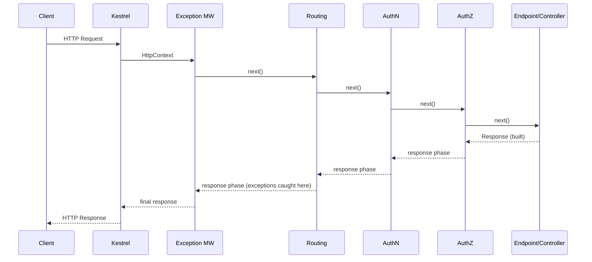
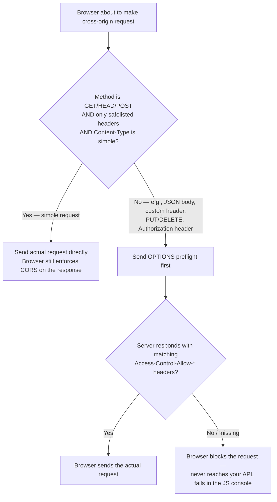
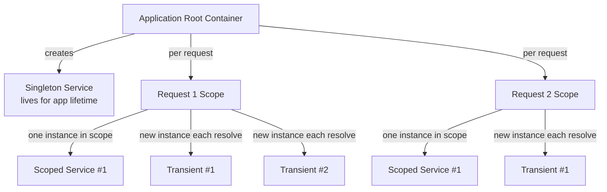
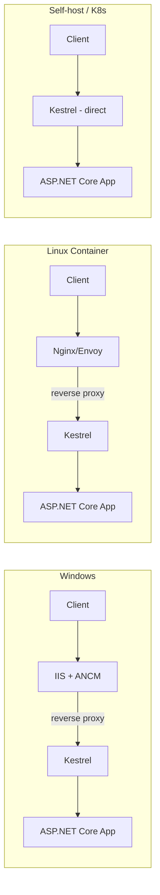

# ASP.NET Core — Senior/Lead Interview Guide

Audience: 10-year .NET full-stack developer jo senior/lead interviews ke liye prepare kar raha hai. Fundamentals already pata hone chahiye — focus nuance, trade-offs, internals, aur interviewer follow-ups par hai. Current as of ASP.NET Core 8/9.

## Table of Contents

1. [Core Concepts](#core-concepts)
   - [.NET Core vs ASP.NET Core, and vs .NET Framework](#net-core-vs-aspnet-core-and-vs-net-framework)
   - [Project Structure & Hosting Model Evolution](#project-structure--hosting-model-evolution)
   - [Program.cs / Startup.cs / Minimal Hosting Model](#programcs--startupcs--minimal-hosting-model)
   - [Environments & Configuration Basics](#environments--configuration-basics)
   - [Static Files & Default Files](#static-files--default-files)
   - [Logging Providers & Configuration](#logging-providers--configuration)
   - [.NET Application Types, Code Sharing & Multi-Targeting](#net-application-types-code-sharing--multi-targeting)
2. [Middleware Pipeline (Deep Dive)](#middleware-pipeline-deep-dive)
   - [What Middleware Really Is](#what-middleware-really-is)
   - [Request/Response Flow](#requestresponse-flow)
   - [Built-in Middleware Deep Dive](#built-in-middleware-deep-dive)
   - [Custom Middleware](#custom-middleware)
   - [Use vs Run vs Map vs MapWhen](#use-vs-run-vs-map-vs-mapwhen)
   - [Short-Circuiting](#short-circuiting)
   - [Correct Middleware Ordering](#correct-middleware-ordering)
   - [[new content] Endpoint Routing Internals](#new-content-endpoint-routing-internals)
   - [Middleware vs Filters](#middleware-vs-filters)
   - [[gaps] IStartupFilter — Composing the Middleware Pipeline from a Library](#gaps-istartupfilter--composing-the-middleware-pipeline-from-a-library)
   - [[gaps] CORS Preflight Mechanics — What Actually Triggers an OPTIONS Request](#gaps-cors-preflight-mechanics--what-actually-triggers-an-options-request)
3. [Dependency Injection](#dependency-injection)
   - [Service Lifetimes](#service-lifetimes)
   - [[new content] Captive Dependencies & Lifetime Mismatch Bugs](#new-content-captive-dependencies--lifetime-mismatch-bugs)
   - [[new content] IOptions vs IOptionsSnapshot vs IOptionsMonitor](#new-content-ioptions-vs-ioptionssnapshot-vs-ioptionsmonitor)
   - [Detecting & Fixing Cyclic Dependencies](#detecting--fixing-cyclic-dependencies)
4. [Minimal APIs, MVC & API Design](#minimal-apis-mvc--api-design)
   - [[new content] Minimal APIs vs Controller-based MVC — Full Comparison](#new-content-minimal-apis-vs-controller-based-mvc--full-comparison)
   - [REST API vs MVC App](#rest-api-vs-mvc-app)
   - [Angular/React SPA Integration](#angularreact-spa-integration)
   - [API Versioning Strategies](#api-versioning-strategies)
   - [DTOs, Validation & FluentValidation](#dtos-validation--fluentvalidation)
   - [CQRS, Mediator Pattern & MediatR](#cqrs-mediator-pattern--mediatr)
   - [DDD in ASP.NET Core](#ddd-in-aspnet-core)
   - [Clean Architecture / Folder Structure at Scale](#clean-architecture--folder-structure-at-scale)
   - [Multi-Tenant Applications](#multi-tenant-applications)
   - [API Anti-Patterns](#api-anti-patterns)
   - [Plugin Architecture (Dynamic Assembly Loading)](#plugin-architecture-dynamic-assembly-loading)
   - [WebHooks (Outbound Event Callbacks)](#webhooks-outbound-event-callbacks)
5. [Hosting & Infrastructure](#hosting--infrastructure)
   - [Kestrel, IIS, HTTP.sys & Reverse Proxy Models](#kestrel-iis-httpsys--reverse-proxy-models)
   - [[new content] Native AOT Compilation](#new-content-native-aot-compilation)
   - [Deployment Models (Framework-Dependent vs Self-Contained)](#deployment-models-framework-dependent-vs-self-contained)
   - [Long-Running Jobs: BackgroundService vs IHostedService](#long-running-jobs-backgroundservice-vs-ihostedservice)
   - [Feature Flags](#feature-flags)
   - [Pre-loading / Startup Warmup Tasks](#pre-loading--startup-warmup-tasks)
6. [Performance & Optimization](#performance--optimization)
   - [Response Caching vs Output Caching vs Distributed Caching](#response-caching-vs-output-caching-vs-distributed-caching)
   - [Response Compression](#response-compression)
   - [Data Shaping](#data-shaping)
   - [Optimizing Static Content Delivery](#optimizing-static-content-delivery)
   - [HttpClientFactory & Socket Exhaustion](#httpclientfactory--socket-exhaustion)
   - [[new content] Rate Limiting Middleware (.NET 7+)](#new-content-rate-limiting-middleware-net-7)
   - [[new content] Thread Pool Starvation & Async Gotchas](#new-content-thread-pool-starvation--async-gotchas)
   - [Kestrel Tuning for High Throughput](#kestrel-tuning-for-high-throughput)
   - [EF Core Performance](#ef-core-performance)
   - [Diagnosing Memory Leaks & Measuring Performance](#diagnosing-memory-leaks--measuring-performance)
7. [Security](#security)
   - [Authentication vs Authorization](#authentication-vs-authorization)
   - [JWT, OAuth2 & OpenID Connect](#jwt-oauth2--openid-connect)
   - [Role-based vs Policy-based Authorization](#role-based-vs-policy-based-authorization)
   - [CSRF, XSS & Security Headers](#csrf-xss--security-headers)
   - [Secrets Management](#secrets-management)
   - [Other Security Concerns](#other-security-concerns)
8. [EF Core & Data Access](#ef-core--data-access)
9. [Microservices & Distributed Systems](#microservices--distributed-systems)
10. [Cloud, DevOps & Observability](#cloud-devops--observability)
    - [[new content] Health Checks](#new-content-health-checks)
    - [[new content] OpenTelemetry & Distributed Tracing in .NET 8/9](#new-content-opentelemetry--distributed-tracing-in-net-89)
    - [Deployment Strategies](#deployment-strategies)
11. [Testing](#testing)
    - [[gaps] Integration Testing with WebApplicationFactory](#gaps-integration-testing-with-webapplicationfactory)
12. [Best Practices](#best-practices)
13. [Common Pitfalls](#common-pitfalls)
14. [Sample Interview Q&A](#sample-interview-qa)
15. [Summary of Additions](#summary-of-additions)
    - [Summary of \[gaps\] Additions (This Pass)](#summary-of-gaps-additions-this-pass)

---

## Core Concepts

### .NET Core vs ASP.NET Core, and vs .NET Framework

**.NET Core** cross-platform, modular, open-source runtime (CoreCLR) hai jo applications build karne ke liye use hota hai. **ASP.NET Core** iske upar bana web framework hai — Web APIs, MVC, Razor Pages, Blazor, gRPC, aur SignalR ke liye.

Legacy ASP.NET (.NET Framework) ke upar ASP.NET Core ke advantages:

- Cross-platform: Windows, Linux, macOS; container-native.
- Unified framework — MVC aur Web API ek hi pipeline share karte hain (alag `System.Web.Http` vs `System.Web.Mvc` stacks nahi hain).
- High performance Kestrel, async-first I/O, `Span<T>`/`Memory<T>` se milta hai, aur `System.Web` ke legacy `HttpModule`/`HttpHandler` pipeline se kaafi lighter middleware pipeline hai.
- Built-in, first-class DI container (shuru karne ke liye third-party container ki zarurat nahi).
- Minimal hosting footprint; self-contained deployment options.
- Runtime ka side-by-side versioning — ek machine par multiple major versions saath reh sakte hain.
- Flexible, composable middleware pipeline jo monolithic `System.Web` pipeline ko replace karta hai.

**.NET Framework vs .NET (Core) — cheat sheet:**

| Dimension | .NET Framework | .NET Core / .NET 5+ |
|---|---|---|
| Platform | Sirf Windows | Cross-platform, Docker-native |
| Architecture | Monolithic, IIS + `System.Web` pipeline | Modular, Kestrel, async-first |
| WebForms | Supported | Supported nahi |
| ASP.NET MVC | Supported | ASP.NET Core MVC ke roop mein rewrite kiya gaya |
| WPF/WinForms | Supported | Supported, sirf Windows par |
| gRPC | Supported nahi | Supported |
| Minimal APIs | Supported nahi | Supported |
| Deployment | Machine-wide install, IIS zaruri | Self-contained EXE, side-by-side, kisi bhi reverse proxy, container-ready |
| Dev tooling | Sirf Visual Studio | VS, VS Code, Rider, `dotnet` CLI |
| Future | Sirf maintenance/security patches | Poora active development |

Abhi bhi relevant kyun hai: kaafi enterprises legacy WebForms/WCF apps chalate hain jinko port karna expensive hota hai; yeh ek legitimate reason hai .NET Framework ke persist karne ka, koi technical advantage nahi.

Migration path (Framework → Core), senior level par:
1. Dependencies inventory karo (NuGet packages, `System.Web` usage, WCF, WebForms) — blockers dhundne ke liye .NET Upgrade Assistant / API Analyzer use karo.
2. Shared logic ko pehle .NET Standard ya multi-targeted class libraries mein port karo.
3. `System.Web` HttpModules/Handlers ko middleware equivalents se replace karo.
4. WCF ko gRPC ya REST se replace karo; `Web.config` ko `appsettings.json` + Options pattern se replace karo.
5. DI ko re-wire karo (Framework apps aksar Autofac/Ninject manually use karte the — decide karo ki unhe `IServiceProviderFactory` ke peeche rakhna hai ya built-in container par move karna hai).
6. Incrementally test aur deploy karo feature flags ke peeche; bade monoliths ke liye **strangler fig pattern** consider karo (old aur new ko gateway ke peeche side by side chalao).

### Project Structure & Hosting Model Evolution

Key folders/files:

| Item | Purpose |
|---|---|
| `Program.cs` | App startup: builder, DI, middleware pipeline, `app.Run()` |
| `wwwroot/` | Static files (JS, CSS, images) |
| `appsettings.json` / `appsettings.{Environment}.json` | Configuration |
| `Controllers/` | API & MVC controllers |
| `Models/` | Entities/DTOs |
| `Views/` | Razor views (MVC) |
| `Properties/launchSettings.json` | Local debug profiles (Kestrel/IIS Express) — dev-only, production mein use nahi hota |

**Before .NET 6** (generic host model):
- `Program.cs` ek `IHost`/`IWebHost` build karta hai aur `Startup` class ko point karta hai.
- `Startup.ConfigureServices(IServiceCollection)` → DI registration.
- `Startup.Configure(IApplicationBuilder, IWebHostEnvironment)` → middleware pipeline.

**.NET 6+** (minimal hosting model):
- `Startup.cs` ko `Program.cs` mein fold kar diya gaya hai. Top-level statements ka matlab hai ki koi `Main` method ya class wrapper zaruri nahi.
- `Program.cs` ab: `WebApplicationBuilder` create karta hai, services ko `builder.Services` par register karta hai, `WebApplication` build karta hai, middleware pipeline ko directly `app` par configure karta hai, aur `app.Run()` call karta hai.
- Aap bade apps mein organization ke liye chahen to `Startup`-jaisi class ya extension methods (`AddApplicationServices()`, `UseApplicationMiddleware()`) mein bhi split kar sakte ho — minimal hosting structure ko forbid nahi karta, sirf mandatory ceremony hata deta hai.

```csharp
var builder = WebApplication.CreateBuilder(args);

builder.Services.AddControllers();
builder.Services.AddScoped<IOrderService, OrderService>();

var app = builder.Build();

if (app.Environment.IsDevelopment())
    app.UseDeveloperExceptionPage();

app.UseHttpsRedirection();
app.UseAuthentication();
app.UseAuthorization();
app.MapControllers();

app.Run();
```

Follow-up interviewers puchte hain: *"Under the hood actually kya change hua, ya sirf syntax sugar hai?"* — Mostly sugar hai: `WebApplicationBuilder` abhi bhi internally generic `Host` builder ko wrap karta hai, aur `WebApplication` `IApplicationBuilder`, `IEndpointRouteBuilder`, aur `IHost` implement karta hai. DI container, hosting abstractions (`IHostedService`, `IHostEnvironment`), aur middleware pipeline unchanged hain — jo gaya hai wo mandatory `Startup` class ceremony hai.

### Program.cs / Startup.cs / Minimal Hosting Model

Upar cover ho gaya; responsibilities ka split summarize kar rahe hain taaki yeh standalone answerable ho:

- `ConfigureServices()` / `builder.Services.Add...()` → sirf dependency registration. Yahan middleware nahi.
- `Configure()` / `app.Use...()` calls → sirf middleware pipeline wiring, registration order mein execute hota hai.
- Inn concerns ko mix karna (jaise `Configure` ke andar services ko eagerly resolve karna) ek common junior mistake hai; senior devs DI registration ko side-effect-free rakhte hain.

### Environments & Configuration Basics

Environment variables/configuration environment-specific behavior drive karte hain: connection strings, log levels, external endpoints, feature toggles, aur — critically — secrets kabhi source mein commit **nahi** hone chahiye. Built-in environments: `Development`, `Staging`, `Production`, jo `ASPNETCORE_ENVIRONMENT` ke through select hote hain.

```csharp
if (app.Environment.IsDevelopment()) { app.UseDeveloperExceptionPage(); }
```

**Configuration provider precedence** (baad wala pehle wale ko override karta hai) — yeh ek bahut common interview question hai aur source notes mein yeh detail mein nahi tha, isliye yahan poora diya gaya hai:

1. `appsettings.json`
2. `appsettings.{Environment}.json`
3. User Secrets (Development only)
4. Environment variables
5. Command-line arguments

Yeh ordering operationally matter karti hai: container orchestration (Kubernetes/ECS) typically config ko environment variables ke through inject karta hai, isliye env vars JSON files se upar rehte hain — ops image rebuild kiye bina override kar sakte hain.

**Options pattern** configuration consume karne ka idiomatic way hai — `IOptions` vs `IOptionsSnapshot` vs `IOptionsMonitor` ke liye neeche [new content] section dekho.

### Static Files & Default Files

```csharp
app.UseDefaultFiles();   // must run BEFORE UseStaticFiles
app.UseStaticFiles();
```

Default file names customize karna:

```csharp
var options = new DefaultFilesOptions();
options.DefaultFileNames.Clear();
options.DefaultFileNames.Add("home.html");
app.UseDefaultFiles(options);
```

Non-`wwwroot` folder se serve karna:

```csharp
app.UseStaticFiles(new StaticFileOptions
{
    FileProvider = new PhysicalFileProvider(
        Path.Combine(Directory.GetCurrentDirectory(), "MyStatic")),
    RequestPath = "/mystatic"
});
```

Gotcha: `UseDefaultFiles` sirf default document ki *URL rewrite* karta hai — file khud serve nahi karta. Isko `UseStaticFiles` (ya `UseFileServer`, jo dono plus directory browsing combine karta hai) ke saath pair karna zaruri hai.

### Logging Providers & Configuration

ASP.NET Core mein structured logging built-in hoti hai `Microsoft.Extensions.Logging` abstraction ke through, jo `ILogger<T>` ke through consume hoti hai — per-class inject hota hai taaki log entries automatically category name (jo `T` ka fully-qualified type name hota hai) se tag ho jayein.

```csharp
public class OrdersController : ControllerBase
{
    private readonly ILogger<OrdersController> _logger;
    public OrdersController(ILogger<OrdersController> logger) => _logger = logger;

    [HttpGet("{id}")]
    public IActionResult Get(int id)
    {
        _logger.LogInformation("Fetching order {OrderId}", id);
        // ...
    }
}
```

Built-in providers:

| Provider | Notes |
|---|---|
| Console | `CreateBuilder` mein default; human-readable dev output |
| Debug | Attached debugger ke output window mein likhta hai |
| EventSource | Cross-platform ETW-style tracing, `dotnet-trace`/PerfView se consumable |
| EventLog | Windows Event Log (sirf Windows) |
| Azure App Insights | `Microsoft.ApplicationInsights.AspNetCore` — cloud-native telemetry sink |
| Third-party (Serilog, NLog) | Structured/sink-based logging (files, Elasticsearch, Seq) `Microsoft.Extensions.Logging` provider adapters ke roop mein plug hoti hai |

Configuration via `appsettings.json`:

```json
{
  "Logging": {
    "LogLevel": {
      "Default": "Information",
      "Microsoft": "Warning",
      "Microsoft.Hosting.Lifetime": "Information"
    }
  }
}
```

Log-level filtering category namespace ke hisaab se hierarchical hota hai — ek zyada specific category (`Microsoft.AspNetCore`) us namespace ke andar kisi bhi cheez ke liye `Default` ko override karta hai, isliye noisy framework namespaces typically `Warning` par pin kiye jaate hain jabki app ka apna namespace `Information`/`Debug` par rehta hai.

Senior-level nuance jo unprompted raise karna chahiye: `ILogger<T>` ki structured/semantic logging (named placeholders jaise `{OrderId}`, string interpolation nahi) matter karti hai kyunki isse Serilog/Application Insights jaise sinks unn fields par index aur query kar sakte hain — `$"Fetching order {id}"` likhne se yeh structure waste ho jaata hai aur ek query-able field opaque string ban jaata hai.

### .NET Application Types, Code Sharing & Multi-Targeting

Unified .NET SDK ke andar **application types** — same DI/logging/config building blocks sab par apply hote hain, sirf web apps par nahi:

| Type | Typical use |
|---|---|
| Console app | CLI tools, scripts, one-off jobs |
| Class library | Shared logic, dusre projects se referenced |
| Web app (MVC / Razor Pages / Web API) | ASP.NET Core-hosted HTTP apps |
| Worker service | Long-running background process bina HTTP listener ke, `dotnet new worker` se templated |
| Background service | Ek `IHostedService`/`BackgroundService` jo kisi bhi host (web app ya worker) ke andar chalta hai — neeche dedicated section dekho |
| ASP.NET Core hosted service | Ek background task jo web app ke *apne* process ke andar hosted hai, uska DI container aur lifetime share karta hai |

**Projects ke beech code sharing** — mechanisms, roughly "kitna packaged" hai uske order mein:

| Mechanism | When to use |
|---|---|
| Project reference | Same solution, actively co-developed code (jaise DTOs/utilities jo ek Web API aur ek Worker ke beech same repo mein shared hain) |
| Class library | Sharing ki general-purpose unit — ek baar compile hoti hai, project reference se consume hoti hai ya NuGet package ke roop mein package hoti hai |
| Shared project | Legacy pattern (source files har consumer mein directly compile hote hain, ek baar compile hone ke bajaye) — aaj mostly class libraries se superseded ho gaya hai |
| NuGet package | Cross-repository/cross-team sharing independent versioning ke saath — right choice jab code apne solution ke bahar consume hona ho |

Sharing ke typical candidates: DTOs/contracts frontend-facing API aur backend service ke beech, cross-cutting utilities (validation helpers, extension methods), aur business logic jo, kaho, Web API aur batch Worker service ke beech reuse hoti hai jinko same domain rules chahiye.

**Multi-targeting** ek single project ko ek se zyada target framework ke liye compile karta hai:

```xml
<PropertyGroup>
  <TargetFrameworks>net6.0;net8.0</TargetFrameworks>
</PropertyGroup>
```

Kab use karein:
- Ek NuGet library publish karte time jisko purane LTS release ke consumers ko current ke saath support karna ho.
- Cross-platform tooling banate time jisko multiple installed SDKs ke against build karna ho.
- Ek migration window bridge karte time — legacy aur modern .NET version dono support karna jab consumers incrementally migrate ho rahe hain.

Ek gotcha mention karne layak: multi-targeted code ko aksar `#if NET8_0_OR_GREATER`-style conditional compilation chahiye hoti hai un APIs ke liye jo sirf newer TFMs par exist karte hain, jisse real maintenance cost badhti hai. Most application-level projects (shared libraries ke opposite) ko single current LTS version target karna chahiye multi-target karne ke bajaye — multi-targeting genuinely reusable library projects ke liye reserve karo.

---

## Middleware Pipeline (Deep Dive)

Middleware ASP.NET Core ka execution backbone hai — yeh define karta hai ki har HTTP request kaise application mein enter karta hai, flow karta hai, aur exit karta hai. Isko master karna matlab request handling, security, performance, aur framework internals simultaneously master karna hai.

### What Middleware Really Is

Middleware `RequestDelegate`s ki ek chain hai jo *registration* time par sequentially execute hoti hai lekin **runtime par nested** hoti hai — yeh stack-based hai, linear nahi:

```
Middleware A
 └── Middleware B
      └── Middleware C
           └── Endpoint
```

Yeh nested-delegate model teen cheezein explain karta hai jo interviewers probe karna pasand karte hain:
- **Registration ka order** kyun matter karta hai (har middleware baad ki har cheez ko wrap karta hai).
- `await next()` ke relative code ki **placement** kyun matter karti hai (pehle = request phase, baad mein = response phase).
- Responses kyun same chain ke through **backward flow** karte hain jis chain se request forward flow hui thi.

### Request/Response Flow



Request flow:
1. Kestrel HTTP request receive karta hai aur `HttpContext` create karta hai.
2. Request middleware pipeline mein registration order mein enter karta hai.
3. Har middleware apna "before" logic run karta hai, phir `next()` call karta hai.
4. Endpoint (controller action ya minimal API delegate) execute hota hai.

Response flow:
1. Endpoint response produce karta hai.
2. Execution same middleware stack ke through *reverse* order mein unwind hota hai.
3. Har middleware ka "after `next()`" code run hota hai.
4. Final response client ko send hota hai.

**Key insight**: conceptually, har middleware har request ke liye *do baar* execute hota hai — ek baar aane par, ek baar jaane par — isliye exception-handling middleware sabse outermost (pehle registered) hona chahiye, aur response-mutation logic (jaise response body ke based par header add karna) `await next()` ke baad aata hai.

### Built-in Middleware Deep Dive

**Exception Handling Middleware**
- Isse *baad* registered har cheez ke unhandled exceptions ko catch karta hai aur unko HTTP responses mein convert karta hai.
- Pehle register hona chahiye — yeh sirf downstream registered middleware ko protect kar sakta hai; usse pehle wali koi bhi cheez unprotected hai.

```csharp
if (app.Environment.IsDevelopment())
    app.UseDeveloperExceptionPage();
else
    app.UseExceptionHandler("/error");   // or the IExceptionHandler-based approach, .NET 8+
```

- .NET 8 ne `IExceptionHandler` introduce kiya, jo `/error` redirect pattern ka ek zyada testable, DI-friendly alternative hai:

```csharp
public class GlobalExceptionHandler : IExceptionHandler
{
    public async ValueTask<bool> TryHandleAsync(HttpContext httpContext, Exception exception, CancellationToken ct)
    {
        httpContext.Response.StatusCode = StatusCodes.Status500InternalServerError;
        await httpContext.Response.WriteAsJsonAsync(new { error = "An unexpected error occurred." }, ct);
        return true; // true = handled, short-circuits further processing
    }
}

// Program.cs
builder.Services.AddExceptionHandler<GlobalExceptionHandler>();
builder.Services.AddProblemDetails();
app.UseExceptionHandler();
```

**Routing Middleware**
- Incoming URL ko ek endpoint ke metadata se match karta hai aur route data build karta hai.
- Yeh controller/endpoint ko khud execute **nahi** karta — yeh sirf decide karta hai ki *kaunsa* endpoint run hoga.
- Downstream middleware (khaas kar Authorization) us endpoint metadata par depend karta hai jo routing produce karti hai.

**Authentication Middleware**
- Tokens/cookies/headers padhta hai, credentials validate karta hai, ek `ClaimsPrincipal` build karta hai, aur `HttpContext.User` set karta hai.
- **Important nuance**: authentication khud requests ko block *nahi* karta — yeh sirf identify karta hai ki caller kaun hai. Ek anonymous request bhi pass through ho jaati hai; Authorization decide karta hai ki identity *sufficient* hai ya nahi.

**Authorization Middleware**
- Authenticated user aur endpoint ke `[Authorize]` metadata ke against roles/policies evaluate karta hai.
- Dependency chain: routing (endpoint metadata ke liye) aur authentication (user identity ke liye) pehle se run hone chahiye — isliye `UseRouting` ke bina `UseAuthorization` throw karta hai ya silently kuch useful nahi karta.

### Custom Middleware

Do registration styles:

```csharp
// 1. Inline (lambda) middleware — good for simple, one-off logic
app.Use(async (context, next) =>
{
    context.Items["CorrelationId"] = Guid.NewGuid().ToString();
    await next();
});

// 2. Class-based middleware — good for reusable, testable, DI-friendly logic
public class CorrelationIdMiddleware
{
    private readonly RequestDelegate _next;
    public CorrelationIdMiddleware(RequestDelegate next) => _next = next;

    public async Task InvokeAsync(HttpContext context)
    {
        context.Items["CorrelationId"] = Guid.NewGuid().ToString();
        await _next(context);
    }
}
// Registration:
app.UseMiddleware<CorrelationIdMiddleware>();
```

Class-based middleware pipeline build ke per **ek baar** ek singleton-jaisi object ke roop mein construct hota hai (isliye iski constructor dependencies singleton-safe honi chahiye), lekin `InvokeAsync` method parameters ke roop mein additional scoped services accept kar sakta hai — DI unko per-request method injection ke through inject karega.

Good uses: logging, correlation IDs, tenant resolution, header validation, rate limiting, security headers.
Bad uses: business logic, direct database access, domain workflows, heavy computation — yeh sab controllers/endpoints se invoke hone waale services mein belong karte hain, pipeline mein nahi.

### Use vs Run vs Map vs MapWhen

| Method | Behavior | Typical use |
|---|---|---|
| `app.Use(...)` | Pipeline continue karta hai; `next()` se before/after logic support karta hai | Most middleware |
| `app.Run(...)` | Pipeline terminate karta hai; koi `next()` parameter nahi hota | Terminal handlers, maintenance-mode pages |
| `app.Map(pattern, ...)` | Ek URL **path prefix** ke based par pipeline ko branch karta hai, isolated sub-pipeline banata hai | `/health`, `/metrics`, admin sub-apps |
| `app.MapWhen(predicate, ...)` | `HttpContext` par ek arbitrary predicate ke based par branch karta hai (sirf path nahi) | Header-based ya query-based branching |

`Map`/`MapWhen` branches automatically main pipeline mein rejoin nahi hote — branch ke andar jo bhi register hota hai wo sirf usi ke andar apply hota hai.

### Short-Circuiting

Short-circuiting = middleware ek response likhta hai aur deliberately `next()` call **nahi** karta.

```csharp
if (!authorized)
{
    context.Response.StatusCode = 401;
    return;   // pipeline stops here — downstream middleware and the endpoint never run
}
```

Common legitimate scenarios: authentication/authorization failure, rate limiting, feature toggles, maintenance windows. Yeh intentional design hai, bug nahi — lekin yeh confusing "mera middleware kyun nahi chala" bugs ka bhi ek common source hai jab koi colleague upstream mein short-circuit kar deta hai bina realize kiye.

### Correct Middleware Ordering

```csharp
app.UseExceptionHandler("/error");   // 1. Wraps everything — must be outermost
app.UseHttpsRedirection();
app.UseStaticFiles();
app.UseRouting();                    // 2. Identifies the endpoint
app.UseCors();                       // 3. Must be after Routing, before AuthN/AuthZ
app.UseAuthentication();             // 4. Identifies the user
app.UseAuthorization();              // 5. Enforces access, needs routing + authn
app.UseResponseCompression();
app.MapControllers();                // 6. Executes business logic
app.Run();
```

| Middleware | Why it sits where it does |
|---|---|
| Exception handling | Poore pipeline ko wrap karta hai — downstream har cheez ko catch karta hai |
| Routing | Endpoint + metadata identify karta hai jis par baad ke stages depend karte hain |
| CORS | Auth se pehle run karna chahiye taaki preflight/cross-origin checks early ho, lekin routing ke baad taaki endpoint-specific CORS policies padhi ja sakein |
| Authentication | User identify karta hai (`HttpContext.User` populate karta hai) |
| Authorization | Routing metadata + authenticated identity use karke access enforce karta hai |
| Endpoint execution | Actual business logic run karta hai |

### [new content] Endpoint Routing Internals

Senior level par interviewers frequently probe karte hain ki endpoint routing *actually* kaise kaam karti hai, sirf ordering rule nahi. Key internals:

- Endpoint Routing (ASP.NET Core 3.0 mein introduced) route *matching* ko route *execution* se decouple kar diya. `UseRouting()` request ko ek `Endpoint` object se match karta hai (aur usko `HttpContext.GetEndpoint()` mein store karta hai), jabki `UseEndpoints()`/`MapControllers()`/`MapGet()` etc. usko actually execute karte hain.
- Yeh split hi allow karta hai ki `UseRouting()` aur terminal endpoint execution ke beech ka middleware (jaise `UseAuthorization()`) endpoint metadata inspect kar sake — `[Authorize]`, `[AllowAnonymous]`, CORS policy names, rate-limiter policy names — `context.GetEndpoint()?.Metadata` ke through.
- Yeh MVC, Minimal APIs, gRPC, SignalR, aur Blazor ke across routing ko bhi unify karta hai — yeh sab apne `Endpoint`s ko same `EndpointDataSource` mein register karte hain, isliye ek single routing/authorization/CORS pipeline unn sabko govern karta hai, alag alag har framework ka apna routing stack hone ke bajaye (jaise pre-3.0 ASP.NET Core mein, jahan MVC routing sirf MVC middleware ke andar rehti thi).
- Route matching ek **tree-based (DFA-like) matcher** use karta hai, saari routes ka linear scan nahi — isliye endpoint routing older `IRouter`-based approach se better scale karta hai jab route counts badhte hain.
- Gotcha: agar aap manually ordered pipeline mein `UseRouting()` se pehle `MapControllers()`/`MapGet()` etc. call karte ho (`WebApplication` defaults ke saath rare, lekin `IApplicationBuilder` composition ke saath possible), toh routing metadata upstream middleware ko available nahi hoga aur tumko inconsistent 404s ya bypassed authorization milega.

### Middleware vs Filters

| Middleware | Filters |
|---|---|
| Har request ke liye execute hota hai jo pipeline tak reach karti hai | Sirf MVC/endpoint-bound requests ke liye execute hota hai |
| MVC-specific context tak access nahi (model binding results, action arguments) | `ActionExecutingContext`, `ActionExecutedContext`, action arguments, result, exceptions tak access |
| Poore pipeline mein early/late runs hota hai | Specifically action/page execution ke around runs hota hai, routing ke ek MVC endpoint select karne ke baad |
| Framework-agnostic cross-cutting concerns ke liye better (correlation IDs, compression, CORS) | MVC-specific concerns ke liye better (model validation shortcuts, `[Authorize]`-adjacent policy checks jinko action metadata chahiye, response shaping) |
| Poore pipeline ko short-circuit kar sakta hai | Sirf MVC action pipeline ke andar short-circuit kar sakta hai |

Filter types, completeness ke liye: **Authorization filters** → **Resource filters** → **Action filters** → **Exception filters** → **Result filters**, har ek ka "executing"/"executed" pair hota hai. Interviewers kabhi kabhi puchte hain "X kahan rakhoge" — jaise, ek global model-validation short-circuit middleware mein nahi, resource ya action filter mein jaana chahiye, kyunki usko bound model chahiye.

### [gaps] IStartupFilter — Composing the Middleware Pipeline from a Library

Upar sab kuch assume karta hai ki aap khud `Program.cs` own karte ho aur har `app.Use...()` call ko hand-order kar sakte ho. Lekin agar aap ek reusable library/module (ek internal NuGet package, ek shared platform module) author kar rahe ho jisko apna **middleware pipeline mein inject karna** ho — *consuming* application ke dusre middleware ke relative ek specific position par — bina har consumer ko unke `Program.cs` mein ek line add karna yaad rakhwaye? Yeh exactly wahi hai jiske liye `IStartupFilter` hai, aur yeh ek common senior/platform-engineering follow-up hai jab basic middleware ordering established ho jaati hai.

`IStartupFilter` ek library ko `Configure`/pipeline-building delegate ko khud **wrap** karne deta hai, taaki wo host application ke configure karne se pehle ya baad middleware add kar sake — bina application ko filter register karne ke alawa kuch explicitly call karne ki zarurat ke.

```csharp
public class CorrelationIdStartupFilter : IStartupFilter
{
    public Action<IApplicationBuilder> Configure(Action<IApplicationBuilder> next)
    {
        return app =>
        {
            // Runs BEFORE the app's own Configure/pipeline — i.e., outermost,
            // wrapping everything the consuming app registers.
            app.UseMiddleware<CorrelationIdMiddleware>();

            next(app);   // hands control to the next filter, then eventually the app's own pipeline
        };
    }
}

// Library's registration extension method — this is all a consumer has to call:
public static IServiceCollection AddCorrelationIdModule(this IServiceCollection services)
{
    services.AddTransient<IStartupFilter, CorrelationIdStartupFilter>();
    return services;
}
```

**Yeh internally kaise kaam karta hai:**
- ASP.NET Core **saare** registered `IStartupFilter` instances resolve karta hai (aap ek se zyada register kar sakte ho — multiple libraries se) aur unko application ke apne `Configure` pipeline delegate ke around compose karta hai, nested decorators jaise. Har filter ka `Configure(next)` *next* filter (ya, innermost, app ka actual pipeline) receive karta hai aur ek naya `Action<IApplicationBuilder>` return karta hai jo usko wrap karta hai.
- Kyunki har filter *next* wale ko wrap karta hai, jo filter `next(app)` call karne se **pehle** `app.Use...()` call karta hai, wo apna middleware final pipeline mein **earlier** (zyada outer) place karta hai app ya baad ke filters ke register kiye kisi bhi cheez se; `next(app)` ke **baad** `app.Use...()` call karna middleware ko **later** (zyada inner/endpoint ke closer) place karta hai.
- Yeh exactly wo tareeka hai jisse kuch built-in ASP.NET Core features implement kiye jaate hain — jaise, hosting infrastructure kuch hosting scenarios mein default exception-handling behavior automatically wire karne ke liye internally `IStartupFilter` use karti hai, isliye yeh "framework-grade" plumbing ke roop mein jaanna worth hai, sirf ek obscure extensibility point nahi.

**Consumers ko khud `app.UseMyMiddleware()` call karne ke liye kyun na kaho?** Kyunki:
- Yeh ek footgun remove karta hai — consumers bhool sakte hain, ya usko apne middleware ke relative galat order mein rakh sakte hain, khaaskar agar library ka middleware genuinely kisi cheez se pehle/baad run hona chahiye jisko app control karta hai (jaise, ek security header module jo response compression se pehle run hona chahiye).
- Yeh ek platform team ko cross-cutting concerns (correlation IDs, tenant resolution, standardized security headers, request/response logging) `Program.cs` mein ek single `services.AddXyzModule()` call ke roop mein ship karne deta hai, actual pipeline wiring ko ek implementation detail ke roop mein hide karke jo package versions ke beech change ho sakta hai bina har consumer ko apna `Program.cs` update karne ki zarurat ke.

**Trade-off/gotcha jo unprompted raise karna chahiye:** kyunki `IStartupFilter`-injected middleware `Program.cs` mein invisible hota hai (yeh ek line nahi hai jo aap call site par dekh aur reorder kar sako), yeh *effective* pipeline order ko sirf app ke apne startup code padhkar reason karna harder bana sakta hai — ek real debugging cost. Senior guidance: isko genuinely reusable cross-app modules ke liye use karo, apne single application mein explicit `app.Use...()` call likhne se bachne ke tareeke ke roop mein nahi.

### [gaps] CORS Preflight Mechanics — What Actually Triggers an OPTIONS Request

Notes mein pehle wala CORS section (aur generally most notes mein) *policy configuration* cover karta hai — origins, methods, headers, `AllowCredentials()` — lekin actual **browser-side trigger mechanism** ko gloss over karta hai jo decide karta hai ki koi preflight `OPTIONS` request hoti hai bhi ya nahi. Yeh ek frequent, precise follow-up hai: *"Browser exactly kab preflight request send karta hai, aur kab directly real request par jaata hai?"*

**Core rule:** ek cross-origin request tabhi **"simple request"** hai (no preflight) jab yeh **saari** following conditions ek saath satisfy kare. Kisi bhi violation par pehle preflight `OPTIONS` request force hoti hai.

| Condition for a "simple" (no-preflight) request | Detail |
|---|---|
| Method | Sirf `GET`, `HEAD`, ya `POST` hona chahiye — kisi bhi dusre verb (`PUT`, `PATCH`, `DELETE`, etc.) se hamesha preflight trigger hota hai |
| Headers | Sirf "CORS-safelisted" request headers allowed hain: `Accept`, `Accept-Language`, `Content-Language`, `Content-Type` (neeche restrictions ke saath), plus kuch browser-managed headers. Koi bhi custom header add karna (`Authorization`, `X-Api-Version`, `X-Correlation-Id`, etc.) preflight force karta hai |
| `Content-Type` | Sirf yeh teen values "simple" hain: `application/x-www-form-urlencoded`, `multipart/form-data`, `text/plain`. **`application/json` simple NAHI hai** — matlab virtually har modern JSON-based API call browser se preflight trigger karti hai, by design |
| Upload par koi `ReadableStream`/koi event listener nahi | Advanced fetch usage (jaise upload progress tracking) bhi preflight force karti hai |



**Practical consequence jo senior candidates ko call out karna chahiye:** kyunki almost saari real-world API traffic `Content-Type: application/json` aur/ya `Authorization: Bearer <token>` header use karti hai, **almost har browser-originated cross-origin API call preflighted hoti hai** — yeh normal, expected traffic hai, misconfiguration nahi, aur isliye CORS middleware ko `UseRouting()` ke baad lekin `UseAuthentication()`/`UseAuthorization()` se pehle pipeline mein position karna hota hai: preflight `OPTIONS` request spec ke hisaab se koi `Authorization` header ya credentials carry nahi karti, isliye isko CORS middleware khud answer kare, ek `204` se short-circuit karke, authentication/authorization middleware usko unauthenticated reject karne se pehle.

**Key details jo senior answer ko surface-level se alag karte hain:**
- Preflight `OPTIONS` request `Access-Control-Request-Method` aur `Access-Control-Request-Headers` include karti hai — browser puch raha hai "agar main actually yeh headers ke saath `PUT` send karu, kya tum allow karoge?" *real request commit karne se pehle*.
- Server ka preflight response matching `Access-Control-Allow-Methods`/`Access-Control-Allow-Headers`/`Access-Control-Allow-Origin` (aur `Access-Control-Allow-Credentials: true` agar real request credentials carry karegi) echo karna chahiye — ASP.NET Core ka `UseCors()` yeh response tumhari configured policy se automatically construct karta hai; tum khud `OPTIONS` handler hand-write nahi karte.
- Preflight responses browser dwara `Access-Control-Max-Age` ke through **cacheable** hoti hain — isko set karna same endpoint/method/header combination ke liye har subsequent request par duplicate preflight round trip avoid karta hai cache window ke andar, jo latency-sensitive SPAs ke liye matter karta hai jo frequent calls karte hain.
- **Common "production logs mein extra OPTIONS call kyun aa rahi hai" confusion** — yeh exactly upar wala mechanism hai; yeh koi bug nahi hai, aur `OPTIONS` requests ko routing ya auth layer par block/ignore karna (CORS middleware ko unko answer karne dene ke bajaye) legitimate cross-origin calls ko break kar deta hai.
- CORS (aur isliye preflight) server-to-server calls ke liye **irrelevant** hai — yeh sirf browser-enforced mechanism hai; curl, Postman, aur koi dusra backend service kabhi preflight requests send nahi karte aur CORS policy se completely unaffected hote hain.

---

## Dependency Injection

DI = classes apne dependencies outside se receive karti hain, internally construct karne ke bajaye. ASP.NET Core ek built-in, minimal-but-complete IoC container (`IServiceCollection`/`IServiceProvider`) ke saath aata hai — shuru karne ke liye koi third-party container zaruri nahi, halaanki Autofac/Lamar/etc. `IServiceProviderFactory<T>` ke through abhi bhi plug ho sakte hain jab tumhe property injection, decorators-as-first-class-citizens, ya assembly scanning conventions jaise features chahiye jo built-in container natively nahi rakhta (Scrutor built-in container par most needs ke liye scanning add karta hai).

```csharp
builder.Services.AddSingleton<ICacheService, MemoryCacheService>();
builder.Services.AddScoped<IOrderRepository, OrderRepository>();
builder.Services.AddTransient<IEmailSender, SmtpEmailSender>();
```

Constructor injection default aur preferred mechanism hai:

```csharp
public class OrdersController : ControllerBase
{
    private readonly IOrderRepository _repo;
    public OrdersController(IOrderRepository repo) => _repo = repo;
}
```

### Service Lifetimes

| Lifetime | Description | Typical use case |
|---|---|---|
| Transient | Har baar request hone par naya instance | Lightweight, stateless services |
| Scoped | Har HTTP request (per DI scope) ke liye ek instance | `DbContext`, unit-of-work, per-request state |
| Singleton | Poori application lifetime ke liye ek instance | Configuration objects, in-memory caches, `IHttpClientFactory` internals |



### [new content] Captive Dependencies & Lifetime Mismatch Bugs

Yeh sabse high-value senior DI topics mein se ek hai aur original notes mein sirf teen lifetimes list ki gayi thi bina us failure mode ko cover kiye jo mid-level engineers ko trip karta hai.

**Captive dependency**: ek shorter-lived service ko ek longer-lived service mein inject karna, jisse shorter-lived instance "capture" ho jaata hai aur intended se zyada time tak live karta hai.

```csharp
// BAD: Singleton captures a Scoped DbContext
public class BadCacheWarmer   // registered as Singleton
{
    private readonly AppDbContext _db;   // Scoped — captured at construction time!
    public BadCacheWarmer(AppDbContext db) => _db = db;
    // _db now lives forever, using the connection/state from whichever
    // request scope happened to construct this singleton first. Later requests
    // see stale/disposed state, and concurrent use of a captured DbContext
    // (which is NOT thread-safe) causes intermittent, hard-to-reproduce exceptions.
}
```

- Built-in container **isko startup par validate karta hai** jab `ValidateScopes = true` ho (jo `CreateBuilder` ke through Development environment mein default hai) — yeh `InvalidOperationException: Cannot consume scoped service ... from singleton` throw karta hai. Production mein yeh validation performance ke liye by default off rehta hai, matlab yeh bug silently ship ho sakta hai jab tak tum explicitly `ServiceProviderOptions.ValidateScopes` / `ValidateOnBuild` ko saare environments ke liye enable na karo — ek genuine gotcha jo interview mein proactively mention karne layak hai.
- Fix patterns:
  - Singleton mein `IServiceScopeFactory` inject karo aur per-operation ek scope create karo:
    ```csharp
    public class CacheWarmer
    {
        private readonly IServiceScopeFactory _scopeFactory;
        public CacheWarmer(IServiceScopeFactory scopeFactory) => _scopeFactory = scopeFactory;

        public async Task WarmAsync()
        {
            using var scope = _scopeFactory.CreateScope();
            var db = scope.ServiceProvider.GetRequiredService<AppDbContext>();
            // use db, then let the scope dispose it
        }
    }
    ```
  - Ya `IDbContextFactory<T>` use karo (EF Core ka is exact problem ke liye dedicated answer) `DbContext` ko directly long-lived services mein inject karne ke bajaye.
- Inverse mismatch — ek **Transient/Scoped service jo ek Singleton inject karti hai** — safe aur common hai (jaise `IMemoryCache` ya `IConfiguration` ko ek scoped repository mein inject karna) kyunki singleton simply consumer se zyada der tak live karta hai; us direction mein koi capture problem nahi hai.
- Yeh bhi jaanna worth hai: `AddHttpContextAccessor()` ka `IHttpContextAccessor` khud ek singleton ke roop mein registered hai lekin `AsyncLocal<T>` ke through safely per-request `HttpContext` expose karta hai — yeh ek singleton se request-scoped ambient state tak pahunchne ka sanctioned tareeka hai bina captive-dependency violation ke.

### [new content] IOptions vs IOptionsSnapshot vs IOptionsMonitor

Original notes configuration ke liye `appsettings.json` mention karte hain lekin Options pattern kabhi cover nahi karte, jo configuration consume karne ka idiomatic, testable tareeka hai jo senior devs se expected hai (raw `IConfiguration` injection ko bootstrapping code ke aage kuch bhi mein ek smell samjha jaata hai).

```csharp
public class SmtpOptions
{
    public string Host { get; set; } = string.Empty;
    public int Port { get; set; }
}

builder.Services.Configure<SmtpOptions>(builder.Configuration.GetSection("Smtp"));
```

| Interface | Lifetime semantics | Reloads on config change? | Typical use |
|---|---|---|---|
| `IOptions<T>` | Singleton ke roop mein registered, value ek baar compute hoti hai aur forever cache hoti hai | Nahi | Config jo runtime par kabhi change nahi hoti |
| `IOptionsSnapshot<T>` | Scoped ke roop mein registered, har scope/request par ek baar recompute hoti hai | Haan, har naye scope ke start mein | Scoped/Transient services mein per-request-fresh config |
| `IOptionsMonitor<T>` | Singleton ke roop mein registered, lekin changes actively watch karta hai | Haan, immediately, `OnChange` callback support ke saath | Long-lived singletons/background services jinko live config updates chahiye |

```csharp
public class EmailSender
{
    private readonly IOptionsMonitor<SmtpOptions> _options;
    public EmailSender(IOptionsMonitor<SmtpOptions> options)
    {
        _options = options;
        _options.OnChange(updated => Console.WriteLine($"SMTP host changed to {updated.Host}"));
    }
    public SmtpOptions Current => _options.CurrentValue;
}
```

Gotcha jo interviewers probe karte hain: *"`IOptionsSnapshot` ko Singleton mein kyun inject nahi kar sakte?"* — kyunki yeh Scoped registered hai, aur ek Singleton jo Scoped dependency capture karta hai wo exactly upar wala captive-dependency problem hai; container startup par throw karta hai jab scope validation enabled ho. Singletons mein iske bajaye `IOptionsMonitor` use karo.

Named options (`Configure<T>(name, ...)` + `IOptionsSnapshot<T>.Get(name)`) multi-tenant ya multi-provider scenarios (jaise multiple payment gateway configs) ke liye mention karne layak hain.

### Detecting & Fixing Cyclic Dependencies

ASP.NET Core ka container resolution time par circular constructor dependencies detect karta hai aur throw karta hai:

```
System.InvalidOperationException: A circular dependency was detected for the service of type 'X'.
```

Fixes:
- Cycle ko break karo — concrete class ke bajaye ek side ko ek interface/abstraction depend karne do.
- Ek factory (`Func<T>` ya ek dedicated factory service) use karo ek side ke resolution ko construction ke baad tak defer karne ke liye.
- Generally constructor dependency count kam karo — ek cyclic dependency aksar do services ke bahut tightly coupled hone ka symptom hota hai jinko merge karna chahiye ya jinse ek shared collaborator extract karna chahiye.

---

## Minimal APIs, MVC & API Design

### [new content] Minimal APIs vs Controller-based MVC — Full Comparison

Source notes isko sirf ek shallow "best for" table se touch karte hain. Yeh 2024–2026 mein sabse common senior ASP.NET Core interview questions mein se ek hai minimal APIs ki maturation ko dekhte hue, isliye yeh full treatment deserve karta hai.

```csharp
// Minimal API
var app = builder.Build();
app.MapGet("/orders/{id:int}", async (int id, IOrderService svc) =>
{
    var order = await svc.GetAsync(id);
    return order is not null ? Results.Ok(order) : Results.NotFound();
})
.WithName("GetOrder")
.Produces<OrderDto>(200)
.Produces(404);
```

```csharp
// Controller-based MVC
[ApiController]
[Route("orders")]
public class OrdersController : ControllerBase
{
    private readonly IOrderService _svc;
    public OrdersController(IOrderService svc) => _svc = svc;

    [HttpGet("{id:int}")]
    [ProducesResponseType(typeof(OrderDto), 200)]
    [ProducesResponseType(404)]
    public async Task<IActionResult> Get(int id)
    {
        var order = await _svc.GetAsync(id);
        return order is not null ? Ok(order) : NotFound();
    }
}
```

| Aspect | Minimal APIs | Controller-based MVC |
|---|---|---|
| Boilerplate | Minimal — koi base class nahi, koi attributes zaruri nahi | `ControllerBase`, routing/action attributes chahiye |
| Startup performance / AOT | Faster startup, smaller memory footprint, first-class Native AOT support | Heavier reflection-based model binding, weaker AOT story (har release improve ho rahi hai lekin abhi bhi gaps hain — current release notes verify karo) |
| Filters | `IEndpointFilter` (lighter-weight, .NET 7 se) | Full MVC filter pipeline (authorization/resource/action/exception/result filters) |
| Model binding | Explicit parameter binding (`[FromBody]`, `[FromRoute]`, etc., aksar inferred) | Rich, convention-based model binding historically zyada automatic inference ke saath |
| Validation | Manual ya endpoint filters / `IEndpointFilter` ke through; khud se wire kiye bina automatic `[ApiController]`-style 400 short-circuit nahi | Automatic model validation + `[ApiController]` ke through automatic 400 response |
| Views/Razor | Applicable nahi — sirf JSON/API | Razor Views (server-rendered HTML) ka full support |
| Discoverability at scale | Bade APIs ke liye `Program.cs` mein unwieldy ho sakta hai jab tak extension methods/route groups mein split na kiya jaaye | Naturally controller class ke hisaab se organized |
| Route grouping | `app.MapGroup("/orders")` (.NET 7 se) shared prefix/filters/metadata ke liye | Controller + `[Route]` attribute inheritance |
| OpenAPI/Swagger | Supported, historically slightly zyada manual metadata annotation, .NET 8/9 mein significantly improved | Mature, `Swashbuckle`/attributes ke through well-integrated |
| Best for | Lightweight microservices, high-throughput endpoints, greenfield APIs jinko startup time/AOT priority chahiye | Bade apps jinko filters, view rendering, conventions, complex model binding, ya ek bade existing controller codebase ko migrate karna chahiye |

Senior answer ke liye practical guidance: minimal APIs aur MVC controllers same app mein **mutually exclusive nahi** hain — `MapControllers()` aur `MapGet()`/route groups coexist kar sakte hain. Real decision driver team convention hai aur yeh ki kya tumko MVC filters/views chahiye, raw performance nahi (dono fast hain; perf gap mostly cold-start/AOT par hai, jo serverless/containers ke zero tak scale hone ke liye matter karta hai, steady-state throughput ke liye nahi).

### REST API vs MVC App

| Feature | MVC Web App | Web API / Minimal API |
|---|---|---|
| Views | Haan (Razor) | Nahi |
| Result | HTML | JSON/XML |
| Routing | Controller + Views (conventional routing common) | Controller + attributes, ya minimal API route mapping |
| SPA support | Possible lekin atypical | Commonly SPA ke backend ke roop mein act karta hai |

### Angular/React SPA Integration

ASP.NET Core backend ko Angular/React SPA ke saath pair karne ke do broad hosting models:

1. **Separate deployments** — SPA independently build aur deploy hoti hai (apna static host/CDN), API ko cross-origin call karti hai. API par CORS configured hona zaruri hai; independently scale aur deploy karna sabse simple hai, aur aaj greenfield SPA + API projects ke liye zyada common pattern hai.
2. **Merged/hosted project** — SPA ka build output ASP.NET Core app ke apne `wwwroot` se serve hota hai, taaki API aur UI ek deployable unit ke roop mein ship hon.

Merged-project specifics (historical ASP.NET Core SPA templates, `Microsoft.AspNetCore.SpaServices.Extensions`):

```csharp
if (app.Environment.IsDevelopment())
{
    app.UseSpa(spa =>
    {
        spa.Options.SourcePath = "ClientApp";
        spa.UseAngularCliServer(npmScript: "start");   // proxies to the Angular CLI dev server
        // Equivalent for React/CRA: spa.UseReactDevelopmentServer(npmScript: "start");
    });
}
else
{
    app.UseSpaStaticFiles();   // serves the pre-built SPA output from wwwroot in production
}
```

Key pieces:
- **CORS** — jab bhi SPA aur API alag origins par hon (dev mein alag port, prod mein alag domain) zaruri hai: `builder.Services.AddCors(...)` + `app.UseCors(...)`, `UseRouting()` ke baad aur `UseAuthentication()`/`UseAuthorization()` se pehle position kiya gaya (pehle wali CORS preflight mechanics note dekho).
- **Static file serving** — built SPA (`ng build` / `npm run build` output) `wwwroot` mein jaata hai, merged-project model mein standard `UseStaticFiles()`/`UseDefaultFiles()` pipeline se serve hota hai.
- **Dev proxy configs** — development mein, SPA ka apna dev server (Angular CLI, Vite, Webpack Dev Server) API calls ko backend par proxy karta hai (`proxy.conf.json` Angular CLI ke liye, ya React `package.json` mein `"proxy"` field) taaki SPA locally relative API paths call kar sake bina bilkul CORS hit kiye, halaanki same calls merged-hosting production model mein cross-origin hoti hain.

Senior framing: merged-hosting/`UseSpa` template approach 2024–2026 mein naye projects ke liye out of favor ho gaya hai — most teams ab SPA ko independently deploy karti hain (static hosting/CDN + apna CI/CD) aur API ko purely CORS ke through call karti hain, frontend aur backend ke beech release cadence aur scaling decouple karke. `UseAngularCliServer`/`UseSpaStaticFiles` mechanics jaano kyunki yeh legacy codebases aur "Angular ko ASP.NET Core ke saath kaise integrate karoge" interview questions mein abhi bhi dikhte hain, lekin independent deployment ko zyada current default recommendation ke roop mein state karne ke liye ready raho.

### API Versioning Strategies

- **URL versioning**: `/api/v1/orders` — sabse explicit, cache-friendly, route karna easy, lekin URL ko "pollute" karta hai aur clients ko upgrade karne ke liye URLs change karni padti hain.
- **Query string versioning**: `/api/orders?api-version=1.0` — default karna easy hai, lekin accidentally omit karna bhi easy hai; RESTful purists ki favorite kam hai.
- **Header versioning**: `X-Api-Version: 1.0` jaisa custom header — URLs clean rakhta hai, lekin browser se test/debug karna harder hai aur logs mein kam visible hai.
- **Media type (Accept header) versioning**: `Accept: application/json;v=1.0` — HTTP content negotiation semantics ke hisaab se sabse "correct", consumers ke liye least discoverable/ergonomic.

```csharp
builder.Services.AddApiVersioning(options =>
{
    options.DefaultApiVersion = new ApiVersion(1, 0);
    options.AssumeDefaultVersionWhenUnspecified = true;
    options.ReportApiVersions = true;
}).AddApiExplorer(options =>
{
    options.GroupNameFormat = "'v'VVV";
});
```

Breaking-change discipline: kabhi existing contract mutate mat karo; ek naya version add karo, dono ko ek documented deprecation window ke liye support karo, aur `ReportApiVersions`/`Deprecated` metadata (`api-supported-versions` / `api-deprecated-versions` response headers mein visible) aur changelogs ke through communicate karo, silent removal se nahi.

### DTOs, Validation & FluentValidation

EF entities ko kabhi directly API se return mat karo — reasons: over-posting/mass-assignment vulnerabilities prevent karta hai, wire contract ko persistence model se decouple karta hai (dono independently evolve karte hain), internal structure/navigation properties hide karta hai (jo accidental lazy-loading serialization loops ko bhi sidestep karta hai), payload ko shape/trim karne deta hai, aur computed/aggregated fields cheaply add karne deta hai.

FluentValidation trivial se zyada kisi bhi validation ke liye DataAnnotations ka standard alternative hai:

```csharp
public class UserDto
{
    public string Name { get; set; } = string.Empty;
    public string Email { get; set; } = string.Empty;
    public int Age { get; set; }
}

public class UserValidator : AbstractValidator<UserDto>
{
    public UserValidator()
    {
        RuleFor(x => x.Name).NotEmpty().MinimumLength(3);
        RuleFor(x => x.Email).NotEmpty().EmailAddress();
        RuleFor(x => x.Age).InclusiveBetween(18, 60)
            .WithMessage("User must be an adult, and under 60.");
    }
}
```

```csharp
// dotnet add package FluentValidation.AspNetCore
builder.Services.AddControllers();
builder.Services.AddFluentValidationAutoValidation();
builder.Services.AddValidatorsFromAssemblyContaining<UserValidator>();
```

```csharp
[ApiController]
[Route("api/users")]
public class UsersController : ControllerBase
{
    [HttpPost]
    public IActionResult Create(UserDto user) => Ok(user);   // auto-validated; invalid input -> 400
}
```

Example failure response shape (`[ApiController]` ke automatic `ValidationProblemDetails` se):

```json
{
  "errors": {
    "Name": ["'Name' must not be empty."],
    "Email": ["'Email' is not a valid email address."],
    "Age": ["'Age' must be between 18 and 60."]
  }
}
```

Custom rules:

```csharp
RuleFor(x => x.Age).Must(age => age >= 18).WithMessage("User must be an adult");
```

Note: `AddFluentValidationAutoValidation()` auto-validation MVC ke filter pipeline mein hook hota hai (controllers ke saath jo `[ApiController]` use karte hain); **Minimal APIs** ke liye, tumko validator ko explicitly handler ke andar invoke karna hoga ya ek custom `IEndpointFilter` ke through, kyunki out of the box koi automatic model-validation filter equivalent nahi hai.

Application-level vs domain-level validation, ek distinction jo interviews mein precisely state karne layak hai: **application/DTO validation** incoming data ke shape aur format check karta hai (kya yeh ek valid email string hai, kya age range mein hai); **domain validation** domain model ke andar entity invariants protect karta hai (jaise, ek `Order` `Cancelled` se `Shipped` transition nahi kar sakta) — DTO validation pass ho jaana yeh matlab nahi ki domain operation valid hai.

### CQRS, Mediator Pattern & MediatR

CQRS **commands** (writes, state-changing, typically `void`/`Task` ya return sirf ek ID) ko **queries** (reads, side-effect-free, DTOs return karte hain) se separate karta hai. Benefits: read/write paths ka independent optimization (different data stores, per query caching strategies), fat services ke bajaye smaller single-responsibility handlers, aur — MediatR ke saath combine karke — pipeline behaviors (cross-cutting concerns jaise logging/validation/transactions har handler ke around generically wrapped).

```csharp
public record GetOrderQuery(int Id) : IRequest<OrderDto>;

public class GetOrderQueryHandler : IRequestHandler<GetOrderQuery, OrderDto>
{
    private readonly IOrderRepository _repo;
    public GetOrderQueryHandler(IOrderRepository repo) => _repo = repo;
    public async Task<OrderDto> Handle(GetOrderQuery request, CancellationToken ct)
        => (await _repo.GetAsync(request.Id, ct)).ToDto();
}
```

Mediator pattern use karo jab: business rules kaafi complex hain ki controllers fat ho rahe hain, tum "what" (request) ko "how" (handler) se decouple karna chahte ho, ya tumko generic pipeline behaviors (validation, logging, transactions) uniformly apply karna hain.

Trade-off jo unprompted voice karna chahiye: MediatR/CQRS indirection add karta hai — CRUD-simple services ke liye yeh over-engineering ho sakta hai; isko un domains ke liye reserve karo jinke read/write concerns genuinely complex ya divergent hain.

### DDD in ASP.NET Core

Core building blocks: **Entities** (identity-based equality), **Value Objects** (immutable, structural equality), **Aggregates** aur **Aggregate Roots** (consistency boundary — saare writes root ke through jaate hain), **Domain Events** (kuch hua, decoupled side effects), **Repositories** (per aggregate persistence abstraction), **Bounded Contexts** (subdomains ke beech explicit model boundaries, aksar separate microservices ya kam se kam separate modules mein mapped).

### Clean Architecture / Folder Structure at Scale

```
src/
  Api/              -> Controllers/Minimal API endpoints, DI wiring, composition root
  Application/      -> CQRS handlers, validators, DTOs, use-case orchestration
  Domain/            -> Entities, Value Objects, domain interfaces, domain events
  Infrastructure/    -> EF Core, external service clients, messaging, repositories
tests/
  UnitTests/
  IntegrationTests/
```

Dependency rule: `Domain` ki zero outward dependencies hoti hain; `Application` sirf `Domain` par depend karta hai; `Infrastructure` `Domain`/`Application` mein defined interfaces implement karta hai; `Api` `Application` par depend karta hai (aur startup par DI se `Infrastructure` wire karta hai) — dependencies *inward* point karti hain, Dependency Inversion ke through achieve kiya jaata hai (interfaces inner layers ke owned hote hain, outer layers implement karte hain).

### Multi-Tenant Applications

- Tenant resolution header, subdomain, ya token mein claims ke through hoti hai — **early** honi chahiye, ideally dedicated middleware mein **authentication se pehle**, kyunki authentication ko tenant-specific issuer/authority ke against validate karna pad sakta hai.
- Tenant context ek scoped service (`ITenantContext`) mein stored hota hai, us middleware se populate hota hai, aur data access se consume hota hai queries scope karne ke liye (tenant-specific connection string, ya EF Core mein `HasQueryFilter(x => x.TenantId == _tenantContext.TenantId)` jaisa global query filter).
- Per-tenant configuration/caching (named `IOptionsSnapshot`, tenant-keyed cache entries).

### API Anti-Patterns

- Fat controllers jinme business logic hai (logic ko Application/Domain layers mein push karo).
- EF entities directly return karna (upar DTO discussion dekho).
- Day one se koi API versioning strategy nahi — existing consumers wale live API par versioning retrofit karna painful hota hai.
- Trivial pass-through data ke liye excessive/needless DTOs (dusri direction mein over-engineering).
- Collection endpoints par koi pagination nahi — data badhne ke saath unbounded response sizes aur DB load leads karta hai.
- Retry-heavy clients (mobile, unreliable networks) ke under POST/PUT par idempotency ignore karna — duplicate side effects leads karta hai.

### Plugin Architecture (Dynamic Assembly Loading)

Ek plugin architecture application ko wo functionality load aur execute karne deta hai jo main deployable mein compiled nahi thi — useful jahan bhi third parties ya separate teams ko extensibility modules independently ship karne hain (CMS-style extensions, integration connectors, tenant-specific customizations).

Core pieces:

```csharp
public interface IPlugin
{
    string Name { get; }
    void Execute(IServiceProvider services);
}
```

- **Reflection-based dynamic loading**: plugins folder ko DLLs ke liye scan karo, har assembly load karo, reflection use karo (`assembly.GetTypes().Where(t => typeof(IPlugin).IsAssignableFrom(t))`) implementations discover karne ke liye, aur `Activator.CreateInstance` ya DI ke through unko instantiate karo.
- **`AssemblyLoadContext`**: plugin assemblies ko ek isolated context mein load karne ka modern (.NET Core+) mechanism, taaki plugins load — aur principle mein unload — ho sakein bina host application ke apne assemblies ko pollute ya version-conflict kiye. Yeh .NET Framework ke old `AppDomain`-based isolation ko replace karta hai (.NET Core mein koi `AppDomain`s nahi hote).
- **Scrutor**: ek popular library jo built-in DI container ke upar assembly-scanning registration conventions add karti hai:
  ```csharp
  services.Scan(scan => scan
      .FromAssemblies(pluginAssemblies)
      .AddClasses(c => c.AssignableTo<IPlugin>())
      .AsImplementedInterfaces()
      .WithScopedLifetime());
  ```
  har discovered plugin ko har plugin ke liye hand-written registration line ke bina auto-register karne ke liye use hota hai.


Trade-offs jo unprompted raise karne chahiye: dynamic assembly loading fundamentally Native AOT/trimming ke saath incompatible hai (neeche AOT section dekho), kyunki yeh runtime reflection par depend karta hai aur assemblies load karta hai jo compile time par unknown hoti hain — ek plugin architecture aur ek AOT-compiled host mutually exclusive strategies hain. Host ke plugin contract (`IPlugin` aur koi bhi shared types) aur independently-shipped plugin DLLs ke beech versioning/compatibility bhi ek real operational concern hai — ek contract change har plugin ke coordinated redeployment ki demand karta hai, isliye plugin interfaces ko small aur stable rakhna chahiye.

### WebHooks (Outbound Event Callbacks)

WebHooks ek normal API call ke inverse hain: client ke tumhari API poll karne ke bajaye, tumhara server proactively ek outbound HTTP `POST` client-registered callback URL par send karta hai jab koi event occur hoti hai (jaise "order shipped," "payment completed").

Ek production-grade WebHook sender ke implementation concerns:

- **Signed payloads** — outbound payload ko sign karo (typically HMAC-SHA256 raw request body ke upar, per-subscriber secret use karke) aur signature ko ek header mein send karo (jaise `X-Webhook-Signature`) taaki receiver verify kar sake ki payload tamper nahi hua aur genuinely tumse aaya hai.
- **Retry mechanism** — receivers ke endpoints by nature unreliable hote hain (kisi aur ka server): exponential backoff ke saath failure/timeout par retry karo, total retry duration/attempts cap karo, aur delivery attempts persist karo taaki koi failed webhook silently lost na ho (yahan ek outbox-pattern-style table achha kaam karti hai).
- **Timestamp validation** — signed payload/header mein ek timestamp include karo, aur receivers ko requests reject karne do jo acceptable clock-skew window ke bahar hon. Yeh replay attacks se defend karta hai even agar ek signed payload kisi tarah capture ho jaaye aur baad mein resend ho.
- **Logging/observability** — har delivery attempt log karo (success, failure, retry count); webhook delivery failures otherwise receiver ko invisible hoti hain, aur support teams ko yeh history chahiye jab koi customer report kare "humein kabhi callback nahi mila."

Practical framing: WebHooks aur ek message broker (Kafka/RabbitMQ/SQS) similar decoupling problem solve karte hain, lekin WebHooks *external, third-party* consumers ko plain HTTP par target karte hain bina koi shared infrastructure assume kiye, jabki broker *internal* services ko target karta hai jo infrastructure share kar sakte hain — jab actual requirement "ek external customer ke endpoint ko notify karo" ho tab broker mat use karo.

---

## Hosting & Infrastructure

### Kestrel, IIS, HTTP.sys & Reverse Proxy Models

| Model | Notes |
|---|---|
| **Kestrel** | Default, cross-platform, high-performance managed web server hai jo ASP.NET Core mein built-in aata hai. Historically production mein isse reverse proxy ke peeche rakhne ki recommendation thi un cheezon ke liye jo Kestrel specialize nahi karta tha (advanced request filtering, bahut saari sites mein port sharing, additional TLS/cert management tooling) — lekin modern Kestrel itna robust hai ki kaafi scenarios mein directly internet-facing bhi rakha ja sakta hai; aaj reverse-proxy recommendation zyada defense-in-depth, TLS termination convenience, aur multi-app port sharing ke baare mein hai, na ki koi hard Kestrel limitation. |
| **IIS** | Windows-only hai. ASP.NET Core Module (ANCM) ke through Kestrel ke aage reverse proxy ki tarah kaam karta hai, ya in-process hosting mein app IIS worker process ke andar hi chalta hai (in-process, IIS-hosted ASP.NET Core apps ke liye default hai — neeche in-process vs out-of-process detail dekho). Yeh mature Windows-integrated hosting features leke aata hai (Windows Auth, IIS-level app pools, process recycling). |
| **HTTP.sys** | Ek alternative *self-hosting* server hai (Windows-only, kernel-mode HTTP driver) — Kestrel ke bajaye use hota hai jab aapko woh features chahiye jo Kestrel natively support nahi karta, jaise reverse proxy ke bina Windows Authentication, kernel level par processes ke across port sharing, ya direct file-handle-based responses. Yeh Kestrel ka *alternative* hai, uske aage koi proxy nahi. |
| **Self-host / containers** | `dotnet run` / ek container ka `ENTRYPOINT` jo Kestrel ko directly run karta hai — Linux, Kubernetes, aur zyadatar modern cloud deployments ke liye standard model hai; isme IIS bilkul bhi involve nahi hota. |



In-process vs out-of-process IIS hosting (precisely jaanna zaroori hai, kyunki yeh frequently poocha jaata hai):
- **In-process**: app IIS worker process (`w3wp.exe`) ke andar hi chalta hai; koi loopback/proxy hop nahi hota, isliye faster hai; aaj IIS-hosted ASP.NET Core apps ke liye yeh default hai.
- **Out-of-process**: IIS ek separate Kestrel process ko proxy karta hai; thoda zyada overhead hota hai lekin IIS se process isolation milta hai.

### [new content] Native AOT Compilation

Original notes mein yeh bilkul missing tha, aur .NET 7/8 ke baad se increasingly poocha ja raha hai jab se Native AOT ASP.NET Core (especially Minimal APIs) ke liye viable ban gaya.

- **Yeh kya hai**: app ko ahead of time directly native machine code mein compile kar deta hai (runtime par koi JIT nahi), jisse ek self-contained native executable milta hai jise target machine par .NET runtime installed hone ki koi zarurat nahi hoti.
- **ASP.NET Core ke liye yeh kyun matter karta hai**: dramatically faster cold start (milliseconds vs hundreds of ms) aur lower memory footprint milta hai — yeh do cheezein serverless functions, scale-to-zero containers, aur high-density multi-tenant hosting ke liye sabse zyada matter karti hain.
- **Trade-offs / constraints**:
  - Runtime reflection-heavy features nahi chalte — isse classic MVC controllers, zyadatar EF Core scenarios (compiled models required hote hain), aur reflection-based DI scanning conventions rule out ya restrict ho jaate hain. Minimal APIs + source-generated JSON serialization (`System.Text.Json` source generators) hi primary supported path hai.
  - Dynamic assembly loading/plugins possible nahi hote.
  - Trimming un libraries ko break kar sakta hai jo trim-safe annotate nahi hain; careful testing chahiye (`PublishAot`, trim warnings ko build errors ki tarah treat karna).
  - Existing large MVC apps ke liye yeh drop-in nahi hai — yeh ek deliberate architectural choice hai jo early stage mein liya jaata hai, mainly new, small, high-density services ke liye.
- Enable karne ka tareeka:
```xml
<PropertyGroup>
  <PublishAot>true</PublishAot>
</PropertyGroup>
```
- (interview mein hard numbers quote karne se pehle exact current-release constraints latest .NET release notes se verify kar lena — AOT support ka surface area release to release expand ho raha hai.)

### Deployment Models (Framework-Dependent vs Self-Contained)

- **Framework-dependent**: host par shared .NET runtime installed hona zaroori hai; artifact chhota hota hai, builds faster hote hain, aur shared runtime independently patch ho sakta hai.
- **Self-contained**: runtime ko app ke saath bundle kar deta hai; artifact bada hota hai, host par kisi dependency ki zarurat nahi hoti, minimal base images wale containers ya un environments ke liye useful hai jahan runtime ki presence guarantee nahi kar sakte.
- **ReadyToRun (R2R)**: faster startup ke liye IL ko native code mein precompile kar deta hai jabki IL bhi ship karta rehta hai (partial AOT hai, reflection kaam karta rehta hai) — yeh JIT-only aur full Native AOT ke beech ka middle ground hai, jo AOT ke constraints ke bina cold start kam karne mein useful hai.

### Long-Running Jobs: BackgroundService vs IHostedService

`IHostedService` woh base abstraction hai jise ASP.NET Core ka generic host web app ke saath background work run karne ke liye use karta hai — `services.AddHostedService<T>()` ke through register kiya gaya koi bhi cheez host application startup/shutdown par apna `StartAsync`/`StopAsync` call hote hue dekhta hai.

```csharp
public interface IHostedService
{
    Task StartAsync(CancellationToken cancellationToken);
    Task StopAsync(CancellationToken cancellationToken);
}
```

`BackgroundService` ek abstract base class hai jo aapke liye `IHostedService` ko **implement** karta hai, aur correctly wired cancellation ke saath ek long-lived loop chalane ka boilerplate handle karta hai — aapko sirf `ExecuteAsync` override karna hota hai:

```csharp
public class OrderQueueProcessor : BackgroundService
{
    private readonly IServiceScopeFactory _scopeFactory;
    public OrderQueueProcessor(IServiceScopeFactory scopeFactory) => _scopeFactory = scopeFactory;

    protected override async Task ExecuteAsync(CancellationToken stoppingToken)
    {
        while (!stoppingToken.IsCancellationRequested)
        {
            using var scope = _scopeFactory.CreateScope();
            var queue = scope.ServiceProvider.GetRequiredService<IOrderQueue>();
            await queue.ProcessNextBatchAsync(stoppingToken);
            await Task.Delay(TimeSpan.FromSeconds(5), stoppingToken);
        }
    }
}

builder.Services.AddHostedService<OrderQueueProcessor>();
```

Interviewers yeh distinction precisely stated sunna chahte hain: `BackgroundService` common "app ke lifetime ke liye loop run karo" case ke liye `IHostedService` implement karna **simplify** kar deta hai (cancellation token plumbing, exception surfacing, aur task tracking aapke liye handle ho jaata hai); raw `IHostedService` woh lower-level interface hai jise aap directly tab implement karoge jab `StartAsync` ko ongoing loop ke bina *jaldi return* karna ho (jaise ki continuous `while` loop chalane ke bajaye ek fire-and-forget timer start karna ya kisi event ko subscribe karna).

**Golden rule: request thread ko long-running work se kabhi block mat karo.** Hosted service host ke apne lifetime par chalta hai, kisi bhi HTTP request se decoupled — yahi polling loops, queue consumers, aur scheduled cleanup ke liye correct jagah hai, kabhi bhi controller action ke andar inline nahi.

In-process hosted services ke aage, genuinely long-running ya heavy background work ke alternatives:

| Option | Kab use karein |
|---|---|
| `BackgroundService`/`IHostedService` | Lightweight, in-process background work jo app ke apne lifetime se tied hota hai — restart par acceptable data-loss risk ho, ya woh work jo resume karne mein cheap ho |
| **Hangfire** | Persistent, durable background jobs jinke saath dashboard, retries, aur scheduling (fire-and-forget, delayed, recurring/cron) milti hai, backed by ek durable store (SQL Server, Redis) — app restarts mein survive karta hai, in-process `BackgroundService` ke unlike |
| **Azure Functions** (ya AWS Lambda) | Serverless, event- ya timer-triggered work jo web app se independently scale ho aur uske resources bilkul consume na kare |
| **SQS/SNS (ya Kafka/RabbitMQ) + dedicated Worker service** | Decoupled, horizontally scalable processing jaha producer (web API) aur consumer (worker) independently scale aur deploy hote hain — high-volume, durable async workloads ke liye standard pattern |

Senior framing: low-stakes, restart-tolerant work ke liye in-process `BackgroundService` theek hai; jahan deploy/restart par in-flight job kho jaana unacceptable ho, ya workload ko independent scaling chahiye ho, woh ek durable job system (Hangfire) ya queue ke peeche ek separate worker process mein hona chahiye — web app ke apne process ke andar nahi.

### Feature Flags

Feature flags aapko redeploy ke bina functionality toggle karne dete hain — progressive rollouts, risky features par kill-switches, aur A/B-style experimentation ke liye essential hote hain.

```csharp
// Microsoft.FeatureManagement
builder.Services.AddFeatureManagement();
```

```json
{
  "FeatureManagement": {
    "NewCheckoutFlow": true,
    "BetaDashboard": false
  }
}
```

```csharp
public class CheckoutController : ControllerBase
{
    private readonly IFeatureManager _featureManager;
    public CheckoutController(IFeatureManager featureManager) => _featureManager = featureManager;

    [HttpPost]
    public async Task<IActionResult> Checkout()
    {
        if (await _featureManager.IsEnabledAsync("NewCheckoutFlow"))
            return await NewCheckoutAsync();
        return await LegacyCheckoutAsync();
    }
}
```

Options, roughly sophistication ke hisaab se:

| Approach | Notes |
|---|---|
| Boolean config switches (raw `appsettings.json`/`IConfiguration`) | Simplest hai; flip karne ke liye config change plus restart/reload chahiye, koi targeting rules nahi |
| `Microsoft.FeatureManagement` | First-class ASP.NET Core integration — controllers/actions par `[FeatureGate]` attributes, `IFeatureManager.IsEnabledAsync`, percentage rollout/targeting groups ke liye filters |
| **Azure App Configuration** (feature flag store) | Centralized, dynamically-refreshable flag store jo multiple app instances/services ke across shared hota hai; backing provider ke roop mein `Microsoft.FeatureManagement` ke saath integrate hota hai |
| **LaunchDarkly** (ya similar SaaS) | Full-featured flag management platform hai — user targeting, percentage rollouts, streaming ke through real-time flag updates, audit history, experimentation — jab flags sirf dev convenience nahi balki first-class product/release-management concern hon, tab yeh choice banta hai |

Senior framing: jaise hi aapke paas ek se zyada instance ho ya do-teen se zyada flags hon, `Microsoft.FeatureManagement` ko centralized store (App Configuration) ke saath prefer karo — raw config-file booleans redeploy/restart ke bina runtime toggling support nahi karte aur mutthi-bhar flags ke baad hi unmanageable ho jaate hain.

### Pre-loading / Startup Warmup Tasks

Kuch services first use par initialize karna expensive hota hai — jaise ek large in-memory cache population, ek cold ML model load, ya ek connection pool jise real traffic aane se pehle prime karne ka fayda hota hai. Yeh work *pehli* real request par lazily karne ka matlab hai ki latency cost pehle user ko chukani padti hai.

Pattern: warmup work ko startup ke dauraan run karo, app ke traffic accept karna shuru karne se pehle (ya uske saath concurrently) — commonly ek `IHostedService` ki tarah implement kiya jaata hai jiska `StartAsync` warmup work karta hai:

```csharp
public class CacheWarmupService : IHostedService
{
    private readonly IServiceScopeFactory _scopeFactory;
    public CacheWarmupService(IServiceScopeFactory scopeFactory) => _scopeFactory = scopeFactory;

    public async Task StartAsync(CancellationToken cancellationToken)
    {
        using var scope = _scopeFactory.CreateScope();
        var cache = scope.ServiceProvider.GetRequiredService<IProductCache>();
        await cache.PreloadAsync(cancellationToken);
    }

    public Task StopAsync(CancellationToken cancellationToken) => Task.CompletedTask;
}
```

Isko health checks se jodkar dekho: warmup task ko **readiness** probe ke saath pair karo (liveness ke saath nahi) — jab tak warmup complete na ho jaaye, instance ko ready mark ya load-balancer rotation mein add nahi karna chahiye, taaki woh cold rehte hue kabhi traffic receive na kare. Yahi exact reason hai ki liveness aur readiness ko separate endpoints hona chahiye, jaise neeche Cloud/DevOps section mein cover kiya gaya hai.

---

## Performance & Optimization

### Response Caching vs Output Caching vs Distributed Caching

Original notes mein sirf `[ResponseCache]` aur `UseResponseCaching()` ka mention hai. .NET 7 ne **Output Caching** introduce kiya, jo materially different aur zyada powerful mechanism hai — yeh distinction ek common current gap hai aur frequently test hota hai.

| Mechanism | How it works | Key limitation / strength |
|---|---|---|
| `ResponseCaching` middleware + `[ResponseCache]` | HTTP caching headers (`Cache-Control`, `Vary`) set/respect karta hai; *client ya kisi intermediary proxy/CDN* ke unhe honour karne par depend karta hai; server-side cache store minimal hai | Standards-based hai, lekin server-side control weak hota hai; woh API responses jinhe aap fully control karte ho, unke liye policy ke hisaab se server par cache nahi karta jaisa aap chahte ho |
| **[new content] Output Caching** (`.NET 7+`) | Full responses ka server-side cache hai, entirely server-defined policies se controlled (client ke headers honour karne par dependent nahi); tag-based eviction support karta hai | API scenarios ke liye zyada powerful aur predictable hai; query/header/route value ke hisaab se vary kar sakta hai; cache tags ke through programmatic invalidation support karta hai |
| Distributed cache (Redis, `IDistributedCache`) | *Data* ka explicit key/value caching hai, full HTTP responses nahi, jo instances ke across shared hota hai | Aap control karte ho kya cache hoga aur kitni der ke liye; read/populate karne ke liye app code chahiye; HTTP semantics se bilkul bhi tied nahi hai |
| In-memory cache (`IMemoryCache`) | Local process cache hai | Fastest hai, lekin instances ke across shared nahi hota — scaled-out/multi-instance deployment mein inconsistent hota hai |

```csharp
// [new content] Output Caching setup (.NET 7+)
builder.Services.AddOutputCache(options =>
{
    options.AddPolicy("Expire60", b => b.Expire(TimeSpan.FromSeconds(60)));
});

var app = builder.Build();
app.UseOutputCache();

app.MapGet("/products", GetProducts).CacheOutput("Expire60");
```

```csharp
[ResponseCache(Duration = 60)]
public IActionResult Get() => Ok(_data);
```

```csharp
services.AddStackExchangeRedisCache(options =>
{
    options.Configuration = "redis-host:6379";
});
```

Multi-instance deployment mein distributed caching: jab multiple service instances containers mein chalte hain, to har instance network ke through same Redis server se connect hota hai. Redis ek centralized cache ki tarah kaam karta hai jo saare instances ke across shared hota hai, isliye ensure hota hai ki cached data consistent aur available rahe, chahe koi bhi container given request handle kare — yahi mechanism hai jo cached data ke liye horizontal scaling ko safe banata hai (in-memory cache mein har instance ka apna inconsistent view hota).

Memory cache vs distributed cache summary:

| Type | Stored where | Use case |
|---|---|---|
| In-memory (`IMemoryCache`) | Local server process | Single-instance apps, ya per-instance non-critical caching ke liye |
| Distributed (Redis) | Shared external store | Multi-instance/scaled-out deployments jinhe consistency chahiye |

### Response Compression

HTTP responses ko bhejne se pehle server-side par compress karta hai; client `Accept-Encoding` ke basis par automatically decompress kar leta hai.

Flow: client `Accept-Encoding: gzip, br` bhejta hai → ASP.NET Core ek supported encoding select karta hai → response body compress hota hai → bheja jaata hai → client transparently decompress kar leta hai.

```csharp
builder.Services.AddResponseCompression(options =>
{
    options.EnableForHttps = true;
    options.Providers.Add<BrotliCompressionProvider>();
    options.Providers.Add<GzipCompressionProvider>();
});
app.UseResponseCompression();
```

| Algorithm | Notes |
|---|---|
| Gzip | Widely supported hai, moderate compression ratio deta hai |
| Brotli | Better compression ratio deta hai, HTTPS APIs ke liye recommended hai, thoda zyada CPU cost lagta hai |

Best practices: primarily HTTPS ke liye enable karo (unencrypted HTTP par compression historically kuch contexts mein BREACH jaise attacks se linked raha hai — applicability verify kar lena, lekin isi wajah se `EnableForHttps` opt-in hai); already-compressed formats (images, video, already-gzipped payloads) ko phir se compress mat karo; load ke under CPU usage monitor karo kyunki compression CPU-bound hai aur very high throughput par bottleneck ban sakta hai; API/JSON payloads ke liye Brotli prefer karo.

### Data Shaping

Data shaping ka matlab hai sirf woh fields return karna jo client ko actually chahiye, full resource representation nahi — isse payload size kam hoti hai aur over-fetching avoid hota hai, especially high-traffic list endpoints ya bandwidth-constrained clients (mobile) ke liye valuable hota hai.

```csharp
var summaries = await _db.Orders
    .Select(o => new OrderSummaryDto { Id = o.Id, Total = o.Total, Status = o.Status })
    .ToListAsync();
```

Senior answer ke liye key point yeh hai: `Select()` projection ko **query mein hi** karo (jo EF Core SQL mein translate karta hai), na ki full entities materialize karke baad mein memory mein shape karo — pehla approach sirf zaroori columns hi database se wire par le kar aata hai, jabki doosra approach DB aur network bandwidth dono waste karta hai un columns ko fetch karke jinhe aap immediately discard kar dete ho. Yeh general DTO mapping se distinct hai, lekin complementary hai — projection *hi* DTO construction hai, jo query level par ki jaati hai.

Agar aur pucha jaaye to naam lene layak related, zyada dynamic approaches: query-string-driven field selection (`?fields=id,total,status`, jaisa GitHub jaise APIs use karte hain) aur GraphQL (jo field-level shaping ko query language ka hi first-class part bana deta hai, lekin ek entirely different API paradigm adopt karne ki cost par) — dono simple `Select()` projection se heavier-weight hain aur sirf tab worth hote hain jab client needs itni vary karti ho ki flexibility justify ho.

### Optimizing Static Content Delivery

Basic `UseStaticFiles()` se aage, production-grade static asset delivery kayi techniques ko layer karta hai:

| Technique | What it does |
|---|---|
| **CDN** | User ke close edge locations se static assets serve karta hai, cacheable content ke liye origin server ko entirely offload kar deta hai — global user bases ke liye yeh single highest-leverage change hai |
| **Caching headers** | Static files par `Cache-Control`/`ETag` (ASP.NET Core `UseStaticFiles` ke liye sensible defaults set karta hai, lekin immutable, fingerprinted assets ke liye `max-age` tune karo — jaise `app.js?v=abc123` — jinhe essentially forever cache kiya ja sakta hai) |
| **Compression** | Text-based static assets (JS, CSS, SVG) par Brotli/Gzip — wahi `AddResponseCompression`/reverse-proxy-level compression jo upar discuss kiya, specifically static content par applied |
| **SPA static file middleware** | `UseSpaStaticFiles()` (upar SPA integration section dekho) production mein specifically `wwwroot` se SPA ka pre-built bundle static-file pipeline ke through serve karta hai, dev server ko proxy karne ke bajaye |

Senior framing: static content optimization largely ek *caching and offloading* problem hai, code problem nahi — ASP.NET Core app khud ko minimum kaam karna chahiye (correct cache headers ke saath serve karo, text assets compress karo) aur actual serving ko jitna ho sake CDN par push karo, kyunki har request jo app server ek static asset ke liye handle karta hai, woh capacity dynamic request processing ke liye available nahi rehti.

### HttpClientFactory & Socket Exhaustion

`IHttpClientFactory` specifically un problems ko solve karne ke liye exist karta hai jo naive `new HttpClient()` usage se hote hain:
- **Socket exhaustion**: per-request dispose kiya gaya `HttpClient` apna underlying socket immediately release nahi karta (TCP connections `TIME_WAIT` mein linger karte hain), aur load ke under yeh ephemeral port range ko exhaust kar deta hai.
- **DNS change blindness**: ek single long-lived static `HttpClient` instance apne `HttpClientHandler` ka connection pool indefinitely hold karta hai, matlab target host ke liye DNS changes (jaise failover ke baad) pick up nahi karega kyunki connections re-resolve kiye bina reuse ho jaate hain.

`IHttpClientFactory` dono problems ko `HttpMessageHandler` instances ke ek pool ko rotation/recycling policy (default handler lifetime 2 minutes) ke saath manage karke solve karta hai, isliye aapko connection reuse *aur* periodic DNS refresh dono milte hain.

```csharp
builder.Services.AddHttpClient<IPaymentGatewayClient, PaymentGatewayClient>(client =>
{
    client.BaseAddress = new Uri("https://payments.internal/");
    client.Timeout = TimeSpan.FromSeconds(10);
})
.AddPolicyHandler(Policy<HttpResponseMessage>
    .Handle<HttpRequestException>()
    .RetryAsync(3));
```

Object pooling ko broadly bhi cite karna worth hai (DB connections, `ObjectPool<T>` ke through `StringBuilder`, buffers ke liye `ArrayPool<T>`) — yeh woh general pattern hai jiska `HttpClientFactory` ek instance hai.

### [new content] Rate Limiting Middleware (.NET 7+)

Original notes mein rate limiting sirf conceptually mention hai ("in-memory/Redis/API Gateway") aur built-in .NET 7+ middleware cover nahi kiya gaya — yeh ab kayi APIs ke liye external gateway se pehle sabse pehli cheez hai jo reach for karni chahiye, aur yeh ek live gap hai.

```csharp
builder.Services.AddRateLimiter(options =>
{
    options.AddFixedWindowLimiter("fixed", opt =>
    {
        opt.Window = TimeSpan.FromSeconds(10);
        opt.PermitLimit = 20;
        opt.QueueLimit = 0;
        opt.QueueProcessingOrder = QueueProcessingOrder.OldestFirst;
    });

    options.AddSlidingWindowLimiter("sliding", opt => { /* ... */ });
    options.AddTokenBucketLimiter("token", opt => { /* ... */ });
    options.AddConcurrencyLimiter("concurrency", opt => { /* ... */ });

    options.RejectionStatusCode = StatusCodes.Status429TooManyRequests;
});

var app = builder.Build();
app.UseRateLimiter();

app.MapGet("/orders", GetOrders).RequireRateLimiting("fixed");
```

Chaar built-in algorithms aur har ek kab use karna:

| Algorithm | Behavior | Kab use karein |
|---|---|---|
| Fixed Window | Fixed time window mein N requests, boundary par sharply reset ho jaata hai | Simple quotas ke liye; burst-at-boundary edge cases accept karta hai |
| Sliding Window | Sub-segments track karke fixed-window boundary-burst problem ko smooth kar deta hai | Jab bursty edges ke bina fairer distribution chahiye |
| Token Bucket | Tokens time ke saath refill hote hain, requests tokens consume karti hain, bucket size tak short bursts allow karta hai | Jin APIs ko occasional bursts allow karne hain lekin sustained rate cap karna hai |
| Concurrency Limiter | *Simultaneous* in-flight requests cap karta hai, requests-per-time nahi | Jab request rate ke bajaye downstream resource (jaise limited-capacity backend) ko concurrent overload se protect karna ho |

Gotcha: yeh **in-process** rate limiting hai — multi-instance deployment mein, har instance apna limit independently enforce karta hai jab tak aap ise shared store (Redis-backed limiter) se back na karo ya concern ko aggregate traffic dekhne wale API Gateway/reverse proxy par push na karo. Zyadatar microservice fleets ke liye, *global* limit ke liye gateway-level (YARP/Kong/APIM) ya Redis-backed limiting abhi bhi necessary hai; built-in middleware per-instance protection ke liye best hai (jaise single instance ke thread pool/CPU ko protect karna) ya jab genuinely aapke paas sirf ek instance ho.

### [new content] Thread Pool Starvation & Async Gotchas

Notes mein "async everywhere" aur "sync vs async thread usage" surface level par mention hai lekin kabhi explain nahi kiya gaya ki *kyun* yeh matter karta hai us level par jis level par ek senior engineer se explain karne ki expectation hoti hai, aur classic failure mode bhi nahi bataya gaya.

- **Async kyun matter karta hai**: ek synchronous blocking call (jaise `.Result`, `.Wait()`, ya genuinely synchronous I/O call) I/O wait ki duration tak ek thread pool thread ko tie up kar deta hai. Kyunki thread pool ek shared, finite resource hai jo CPU-bound work ke liye sized hai, isko I/O par block karna *other unrelated requests* ko chalne ke liye threads se starve kar deta hai — yahi thread pool starvation hai, aur yeh sirf slow endpoint nahi, balki entire application ko degrade karta hai.
- **Classic deadlock gotcha**: ek synchronization context wale context (classic ASP.NET, ya WinForms/WPF UI threads) se kisi async method par `.Result`/`.Wait()` call karna deadlock kar sakta hai, kyunki continuation captured context par resume hone ki koshish karta hai jabki us context ka thread call par wait karte hue blocked hai. ASP.NET **Core** ne apne request pipeline se `SynchronizationContext` remove kar diya, isliye yeh specific deadlock mode ASP.NET Core mein largely gaya hi hai — lekin blocking abhi bhi load ke under thread pool starvation cause karta hai deadlock ke bina bhi, aur sync-over-async mix karna sirf stylistic issue nahi, ek real production performance bug hai.
- **Production mein diagnose karna**: symptoms yeh hote hain ki requests individually isolation mein fast hoti hain lekin concurrent load ke under sharply aur non-linearly degrade ho jaati hain, aur `ThreadPool` queue length climb karta hai (`dotnet-counters` ke `threadpool-queue-length` ya EventCounters se visible), CPU usage moderate lagne ke bawajood. Fix shayad hi "aur threads add karo" hota hai (pool already slowly grow karta hai apne hill-climbing heuristic se — aur sudden spike ke under yeh slow growth khud problem ka part hai) — asal fix hai blocking call ko dhundh kar remove karna.
- **Practical rules**: `async`/`await` end-to-end use karo ("async all the way"), sirf "request thread se off ho jaane" ke liye ek CPU-light I/O operation ko fake-async karne ke liye `Task.Run` avoid karo (isse help nahi milta — aap phir bhi ek thread pool thread consume kar rahe ho, sirf ek alag door se), `Task.Run` ko genuinely CPU-bound work offload karne ke liye reserve karo, aur hot paths par kabhi bhi `.Result`/`.Wait()`/`GetAwaiter().GetResult()` call mat karo.
- **`ConfigureAwait(false)`**: ASP.NET Core mein specifically yeh application/endpoint code mein largely unnecessary hai (capture avoid karne ke liye koi `SynchronizationContext` hi nahi hai), lekin library code mein abhi bhi commonly use hota hai jo *other* hosts mein sync context ke saath chal sakta hai — yeh ek nuance hai jise har jagah cargo-cult karne ke bajaye precisely state karna worth hai.

### Kestrel Tuning for High Throughput

```csharp
builder.WebHost.ConfigureKestrel(options =>
{
    options.Limits.MaxConcurrentConnections = 1000;
    options.Limits.MaxRequestBodySize = 10 * 1024 * 1024; // 10 MB
    options.Limits.MinRequestBodyDataRate = new MinDataRate(bytesPerSecond: 100, gracePeriod: TimeSpan.FromSeconds(10));
    options.Limits.KeepAliveTimeout = TimeSpan.FromMinutes(2);
    options.ListenAnyIP(5000, listenOptions => listenOptions.Protocols = HttpProtocols.Http1AndHttp2);
});
```

Naam se jaanne layak levers: HTTP/2 enable karna (aur HTTP/3 jahan platform/client support allow kare — kisi ko promise karne se pehle current OS/client support verify kar lena), max request body size limit karna, connection/request throttling, slow-drip attacks se defend karne ke liye `MinRequestBodyDataRate` tune karna, aur thread pool ke minimum thread count (`ThreadPool.SetMinThreads`) ko tune karna taaki sudden load spike ke under pool scale up hone se pehle lag kam ho jaaye — yeh traffic bursts ke dauraan upar wale thread pool starvation issue ka direct mitigation hai.

### EF Core Performance

- Read-only queries ke liye `AsNoTracking()` — change tracking overhead skip kar deta hai.
- Hot, repeated query shapes ke liye compiled queries.
- N+1 avoid karo — loop mein lazy-loading ke bajaye `Include`/projection use karo.
- Actual query predicates se matching appropriate SQL indexes (execution plans se verify karo, guesses se nahi).
- Batching (`SaveChanges` jahan provider support karta hai wahan har round trip mein multiple statements batch kar deta hai).
- Collections par multiple `Include`s se cartesian-explosion result sets avoid karne ke liye split queries (`AsSplitQuery()`).
- Connection pooling (zyadatar ADO.NET providers mein default enabled hota hai; bina strong reason ke disable mat karo).

EF Core ke specific concepts jo in notes mein aur kahin reference hote hain, unhe yahan one-stop reference ke liye consolidate kiya gaya hai:
- **Optimistic concurrency**: ek `RowVersion`/`[ConcurrencyCheck]` column conflicting concurrent updates detect kar leta hai aur silently overwrite karne ke bajaye `DbUpdateConcurrencyException` throw karta hai.
- **Shadow properties**: EF-mapped columns jinke entity par koi corresponding CLR property nahi hoti (jaise audit columns jinse aap domain model ko clutter nahi karna chahte).
- **Value conversions**: ek property ko uske CLR representation aur stored representation ke beech transform karna (jaise write par encrypt/read par decrypt, ya enum ko string ki tarah store karna).
- **Soft delete**: `modelBuilder.Entity<User>().HasQueryFilter(x => !x.IsDeleted);` — yeh automatically saari queries par apply hota hai jab tak `IgnoreQueryFilters()` se explicitly ignore na kiya jaaye.
- **Interceptors**: logging, auditing, ya retry jaise cross-cutting concerns ke liye EF Core ke command/connection/save pipeline mein hook karte hain.
- Lazy vs eager vs explicit loading: lazy first access par navigation properties load karta hai (proxies chahiye hote hain, accidentally N+1 trigger karna easy hota hai); eager `Include()` ke through upfront load karta hai; explicit loading manually `.Load()` call karta hai jab aapko control chahiye ho *kab* ek navigation populate ho, original query mein eager-load kiye bina.

### Diagnosing Memory Leaks & Measuring Performance

Tools: `dotnet-trace`, `dotnet-dump`, `dotnet-counters`, `dotMemory`, PerfView, BenchmarkDotNet (micro-benchmarking), Application Insights / Prometheus + Grafana / OpenTelemetry (production telemetry).

ASP.NET Core ke liye specific common leak causes: static references jo large object graphs hold karte hain, long-lived DI singletons jo captured scopes hold karte hain (captive dependency section dekho), event handlers jo unsubscribe nahi hote, `IDisposable` objects jo dispose nahi hote (especially `DbContext` jo normal DI scope ke bahar obtain kiya gaya ho), aur caches jinme eviction policies nahi hoti aur woh unbounded grow karte hain.

Cold start reduction: ReadyToRun publishing, unused assemblies trimming, DI registrations/startup work kam karna, most extreme cases ke liye Native AOT (upar dekho).

---

## Security

### Authentication vs Authorization

- **Authentication**: yeh establish karna ki caller *kaun* hai.
- **Authorization**: yeh decide karna ki ek authenticated (ya anonymous bhi) caller ko *kya* karne ki allow hai.

### JWT, OAuth2 & OpenID Connect

JWT: ek self-contained, signed (aur optionally encrypted) token hai jiske teen parts hote hain — header, payload (claims), signature — jo stateless authentication enable karta hai (identity validate karne ke liye koi server-side session store nahi chahiye, sirf signature/expiry validate karni hoti hai).

OAuth2 flow (authorization code flow, web apps ke liye standard): user authorization server par authenticate karta hai → authorization server ek authorization code issue karta hai, jo access token (aur refresh token) ke liye exchange kiya jaata hai → client subsequent API calls par access token ko Bearer token ki tarah bhejta hai → resource server request serve karne se pehle token validate karta hai (signature, issuer, audience, expiry).

OpenID Connect (OIDC) OAuth2 ke upar sit karta hai specifically *authentication* (identity, ID token ke through) ko standardize karne ke liye — OAuth2 alone ek authorization framework hai aur strictly kabhi authentication protocol nahi tha, ek distinction jo interviewers kabhi kabhi directly probe karte hain.

```csharp
builder.Services.AddAuthentication(JwtBearerDefaults.AuthenticationScheme)
    .AddJwtBearer(options =>
    {
        options.Authority = "https://identity.myapp.com";
        options.Audience = "orders-api";
        options.TokenValidationParameters = new TokenValidationParameters
        {
            ValidateIssuer = true,
            ValidateAudience = true,
            ValidateLifetime = true,
            ClockSkew = TimeSpan.FromMinutes(1)
        };
    });
```

`IdentityServer4` (OSS license change ke baad ab commercially largely **Duende IdentityServer** ne succeed kar liya hai — client ko recommend karne se pehle current licensing terms verify kar lena) SSO/token issuance ke liye ek OpenID Connect + OAuth2 provider implementation provide karta hai; alternatives mein Azure AD/Entra ID, Auth0, Okta, aur Keycloak shamil hain.

### Role-based vs Policy-based Authorization

```csharp
[Authorize(Roles = "Admin")]
public IActionResult AdminOnly() => Ok();
```

```csharp
builder.Services.AddAuthorization(options =>
    options.AddPolicy("MinimumAge", policy =>
        policy.Requirements.Add(new MinimumAgeRequirement(18))));
```

```csharp
public class MinimumAgeRequirement : IAuthorizationRequirement
{
    public int MinimumAge { get; }
    public MinimumAgeRequirement(int age) => MinimumAge = age;
}

public class MinimumAgeHandler : AuthorizationHandler<MinimumAgeRequirement>
{
    protected override Task HandleRequirementAsync(AuthorizationHandlerContext context, MinimumAgeRequirement requirement)
    {
        var dob = context.User.FindFirst(c => c.Type == ClaimTypes.DateOfBirth);
        if (dob != null && CalculateAge(dob.Value) >= requirement.MinimumAge)
            context.Succeed(requirement);
        return Task.CompletedTask;
    }
}
```

Policy-based authorization zyada flexible, composable, aur testable mechanism hai — trivial role checks se aage kisi bhi cheez ke liye hardcoded `Roles = "..."` strings ke upar isse prefer karo, kyunki policies multiple requirements combine kar sakti hain aur `IAuthorizationHandler` ke through independently unit-testable hoti hain.

### CSRF, XSS & Security Headers

- **XSS prevention**: Razor ka output ka automatic HTML encoding, ek Content-Security-Policy header, input validation/sanitization.
- **CSRF prevention**: anti-forgery tokens (`[ValidateAntiForgeryToken]`, Razor form tag helpers ke liye automatically wired), `SameSite` cookie attribute, short-lived cookies, aur double-submit cookie pattern (ek CSRF token cookie aur request parameter/header dono ke roop mein bheja jaata hai; server verify karta hai ki woh match karte hain, jo sirf woh origin kar sakta hai jo cookie read kar sake — matlab same-site).
- **Security headers**: HSTS (`Strict-Transport-Security`, subsequent visits par HTTPS force karta hai), `X-Frame-Options` (clickjacking defense), Content-Security-Policy, `X-Content-Type-Options: nosniff`. Yeh add karne ka best tareeka ek small custom middleware ya `NWebsec`/`OwaspHeaders.Core` jaisa package hai.
- `SameSite` cookie attribute specifically browser ko cross-site requests par cookie bhejne se block karta hai, jo anti-forgery tokens ke saath modern CSRF mitigations mein se ek zyada effective mitigation hai.

### Secrets Management

- Local development: **User Secrets** (`dotnet user-secrets`) — secrets ko kabhi `appsettings.json` mein commit mat karo.
- Production: Azure Key Vault, AWS Secrets Manager (ya equivalent), configuration providers ke through inject kiya jaata hai taaki app code ko kabhi raw secret storage details dekhni na padein.

### Other Security Concerns

- **API key security**: header-based keys validate karo, regularly rotate karo, agar persist karna zaroori ho to hashed (plaintext nahi) store karo.
- **Password hashing**: PBKDF2, BCrypt, ya Argon2 use karo — passwords ke liye kabhi bhi fast general-purpose hash (MD5/SHA-family alone) mat use karo; ASP.NET Core Identity default mein PBKDF2 use karta hai.
- **File upload security**: content validate karo (sirf extension nahi — actual content type/magic bytes sniff karo), size limits enforce karo, sensitive contexts mein user-supplied files ke liye virus scanner chalao, aur storage ke liye original filename ko kabhi trust/reuse mat karo (path traversal risk hai) — ek naya naam generate karo aur original ko sirf metadata ki tarah store karo.
- **Certificate authentication**: mTLS scenarios mein machines/services identify karne ke liye client certificates, trusted network ke andar service-to-service auth mein common hota hai.
- **Brute-force protection**: rate limiting (upar built-in middleware dekho), account lockout policies, CAPTCHA, IP-based throttling/blocking.
- **CORS**: Cross-Origin Resource Sharing — allowed origins/methods/headers ko explicitly whitelist karo; `AllowAnyOrigin()` ko `AllowCredentials()` ke saath combine karne se avoid karo (framework khud is combination ko disallow karta hai ek good reason se — yeh same-origin credential protection ko defeat kar dega jise preserve karne ke liye CORS exist karta hai).

---

## EF Core & Data Access

(Additional EF Core depth duplication avoid karne ke liye upar Performance section mein consolidate kiya gaya hai; yeh section un access-pattern topics ko cover karta hai jo primarily performance ke baare mein nahi hain.)

**EF Core vs Dapper**: EF Core ek full ORM hai — change tracking, migrations, LINQ provider, relationship navigation — jiski cost zyada overhead aur "magic" hai. Dapper ek micro-ORM hai — aap SQL likhte ho, yeh results ko objects mein map kar deta hai — performance-critical ya complex reporting queries ke liye faster aur zyada predictable hai, cost yeh hai ki change tracking/migrations/LINQ khona padta hai. Kayi senior-level codebases dono use karte hain: EF Core transactional write-side domain model ke liye, Dapper read-heavy reporting queries ke liye.

**Repository + Unit of Work**: ek generic repository har aggregate ke CRUD ko abstract karta hai; ek Unit of Work multiple repository operations ko single transaction/`SaveChanges()` call mein wrap karta hai. Ek debate jise acknowledge karna worth hai: `DbContext` already *hi* ek Unit of Work aur rough repository hai, isliye isse ek aur repository layer mein wrap karna kabhi kabhi redundant abstraction ki tarah criticize kiya jaata hai — ek nuanced senior answer Repository+UoW ko unquestioned best practice treat karne ke bajaye dono sides state karta hai.

```csharp
await using var transaction = await db.Database.BeginTransactionAsync();
try
{
    // multiple SaveChanges/operations
    await transaction.CommitAsync();
}
catch
{
    await transaction.RollbackAsync();
    throw;
}
```

---

## Microservices & Distributed Systems

- **Inter-service communication**: HTTP/REST (simple, ubiquitous), gRPC (low-latency, contract-first, HTTP/2 streaming — internal service-to-service calls ke liye achha jaha aap dono ends control karte ho), broker ke through event-driven (Kafka, RabbitMQ, SQS/SNS — decoupling aur async workflows ke liye achha).
- **ASP.NET Core mein gRPC** — ek dedicated note likhne layak hai kyunki source mein yeh barely cover hua hai: Protobuf-defined contracts languages ke across strong typing aur codegen dete hain, HTTP/2 multiplexing us head-of-line blocking ko avoid karta hai jo plain HTTP/1.1 REST high concurrency ke under suffer kar sakta hai, aur yeh streaming (client, server, aur bidirectional) support karta hai jo REST naturally express nahi karta. Trade-off: bina proxy (grpc-web) ke browser-friendly nahi hai, aur JSON REST (binary wire format) se kam human-debuggable hai — zyadatar designs mein isse internal service-to-service traffic ke liye reserve karo, public-facing APIs ke liye nahi.
- **Resilience** (Polly): backoff ke saath retries, circuit breakers (ek failing downstream ko call karna band karo taaki woh recover ho sake aur aapka apna thread pool uspar wait karte hue pile up hone se protect ho), timeout policies, fallback responses, aur bulkhead isolation (ek specific downstream ko concurrent calls cap karo taaki uski failure doosre downstreams ki calls ke liye needed resources ko starve na kar sake).
- **Saga pattern**: local transactions ki ek sequence aur agar koi later step fail ho to compensating actions use karke services ke across ek distributed transaction ko coordinate karta hai — yeh zaroori hai kyunki modern service boundaries ke across distributed two-phase-commit transactions largely impractical/unsupported hain.
- **Event Sourcing**: sirf current state persist karne ke bajaye state-changing events ki sequence persist karta hai; current state events replay karke derive kiya jaata hai. Yeh audit trails aur temporal queries "for free" enable karta hai, cost hai query complexity (projections/read models) aur eventual consistency.
- **Outbox pattern**: guarantee karta hai ki ek state change aur uska corresponding integration event kabhi inconsistent na ho (jaise DB write succeed ho jaaye lekin message publish fail ho jaaye) — event ko state change wale *same* local transaction mein ek "outbox" table mein likh kar, phir ek separate relay process outbox se asynchronously publish karta hai aur usse sent mark kar deta hai — yahi "save to DB, then publish to broker" mein bina shared transaction ke inherent "dual write" problem ka standard fix hai.
- **API Gateway**: edge par aggregation, authentication, routing, rate limiting, aur caching karta hai, taaki individual services ko yeh concerns alag-alag reimplement na karne padein. Common choices: YARP (Microsoft ka reverse proxy toolkit, code-first aur .NET-native), Ocelot, Kong, cloud-native API Management (Azure APIM, AWS API Gateway).
- **Service discovery**: service instance addresses ka dynamic lookup (Consul, Eureka, Kubernetes DNS/`Service` objects) — Kubernetes mein specifically yeh often cluster DNS se transparently handle ho jaata hai, isse dedicated discovery library ki zarurat kam ho jaati hai.
- **Distributed tracing**: ek single logical request ko kayi services ke across correlate karta hai (Jaeger, Zipkin, Application Insights, ya OpenTelemetry ke through vendor-neutral — neeche [new content] section dekho). Ek header ke through propagate hui correlation/trace ID (jaise W3C Trace Context standard mein `traceparent`, ya custom `X-Correlation-ID`) hi woh mechanism hai jo services ke across spans ko tie together karta hai.
- **Idempotency**: write endpoints par idempotency keys, retry-safe operation design, duplicate inserts reject karne ke liye database unique constraints, aur consumer side par event deduplication — jahan bhi at-least-once delivery semantics play mein hon wahan essential hai (jo default mein zyadatar message brokers hote hain).
- **Schema/contract versioning across services**: Protobuf field versioning rules (field numbers ko kabhi reuse/renumber mat karo), shared contract NuGet packages, aur REST ke liye HTTP layer par API versioning — yeh sab producers aur consumers ko bina synchronized "big bang" release ke independently deploy karne dene ke liye aimed hain.

---

## Cloud, DevOps & Observability

### [new content] Health Checks

Yeh apne dedicated subsection layak hai real depth ke saath — original notes ne isse ek single line (`app.UseHealthChecks("/health")`) tak reduce kar diya tha, us readiness/liveness distinction ko cover kiye bina jispar Kubernetes jaise orchestrators actually depend karte hain.

```csharp
builder.Services.AddHealthChecks()
    .AddDbContextCheck<AppDbContext>("database", tags: new[] { "ready" })
    .AddCheck<RedisHealthCheck>("redis", tags: new[] { "ready" })
    .AddCheck("self", () => HealthCheckResult.Healthy(), tags: new[] { "live" });

var app = builder.Build();

app.MapHealthChecks("/health/live", new HealthCheckOptions
{
    Predicate = check => check.Tags.Contains("live")
});
app.MapHealthChecks("/health/ready", new HealthCheckOptions
{
    Predicate = check => check.Tags.Contains("ready")
});
```

- **Liveness** yeh answer deta hai ki "process alive hai aur deadlocked nahi hai" — orchestrators ek failing liveness probe ko container *restart* karne ka decision lene ke liye use karte hain. Yeh check extremely cheap rakho (koi DB calls nahi) — ek liveness check jo kisi downstream dependency par depend karta hai, jab woh dependency sirf ek blip hi face kare tab bhi cascading restarts cause kar dega.
- **Readiness** yeh answer deta hai ki "yeh instance traffic accept karne ke liye ready hai ya nahi" — orchestrators ek failing readiness probe ko use karte hain instance ko bina restart kiye *load balancer rotation se bahar* nikalne ke liye. Yahi jagah hai jaha dependency checks (DB, cache, downstream services) belong karte hain.
- Custom checks `IHealthCheck` implement karte hain; built-in EF Core check package (`AspNetCore.HealthChecks.SqlServer`/similar community packages, ya `AddDbContextCheck<T>()`) hand-rolled SQL pings ke bina common data-store scenarios cover kar deta hai.
- Common galti jo yeh correct karta hai: liveness endpoint par DB check daal dena — isse ek transient DB blip unnecessary container restarts mein badal jaata hai (liveness failure ek restart trigger karti hai; readiness failure sirf usse rotation se remove karti hai, jo "DB temporarily down hai lekin mera process fine hai" ke liye correct response hai).

### [new content] OpenTelemetry & Distributed Tracing in .NET 8/9

Original notes "Jaeger/Zipkin/App Insights" ko tools ki tarah mention karte hain lekin yeh fact nahi bataya gaya ki .NET ab platform mein first-class, vendor-neutral OpenTelemetry support built-in leke aata hai, jo 2025/2026 interviews mein "aap .NET service ko instrument kaise karte ho" ka current standard answer hai.

```csharp
builder.Services.AddOpenTelemetry()
    .ConfigureResource(r => r.AddService("orders-api"))
    .WithTracing(tracing => tracing
        .AddAspNetCoreInstrumentation()
        .AddHttpClientInstrumentation()
        .AddEntityFrameworkCoreInstrumentation()
        .AddOtlpExporter())
    .WithMetrics(metrics => metrics
        .AddAspNetCoreInstrumentation()
        .AddRuntimeInstrumentation()
        .AddOtlpExporter());
```

- `System.Diagnostics.Activity`/`ActivitySource` woh underlying .NET primitive hai jispar OpenTelemetry ka tracing API build hota hai — yeh OTel package se pehle se exist karta hai aur isi wajah se OTel exporters add karne ke baad ASP.NET Core/`HttpClient`/EF Core ke liye instrumentation "just works" karta hai, in libraries ko koi OTel-specific dependency baked in karne ki zarurat nahi padti.
- OTLP exporter vendor-neutral hai — same instrumentation code sirf exporter configuration swap karke Jaeger, Grafana Tempo, Application Insights, Datadog, ya kisi bhi OTLP-compatible backend par traces/metrics ship kar deta hai, instrumentation code ko touch kiye bina. Application Insights-specific SDK ko directly business code mein hand-wire karne ke against yahi key selling point hai.
- `W3C Trace Context` (`traceparent` header) woh propagation standard hai jo automatically service boundaries ke across spans correlate karne ke liye use hota hai, jab ek call ke respective sides par `AddAspNetCoreInstrumentation()`/`AddHttpClientInstrumentation()` dono wired in hon.

### Deployment Strategies

- **CI/CD pipeline** (GitHub Actions/Azure DevOps/GitLab CI): restore → build → test → publish → deploy, required checks se gated.
- **Zero-downtime deployment**: rolling upgrades ya blue-green deployments ke through achieve kiya jaata hai — saare instances ko simultaneously kabhi down mat karo.
- **Blue-green deployment**: do full environments hote hain; naya environment verify ho jaane par traffic atomically ek se doosre par switch ho jaata hai, aur wapas switch karke instant rollback enable ho jaata hai.
- **Canary release**: pehle traffic ka ek small percentage naye version par route karo, error rates/metrics observe karo, phir progressively roll out karo — yeh blue-green ke all-or-nothing cutover ke comparison mein ek bad deploy ka blast radius limit kar deta hai.
- **Infrastructure as Code**: infrastructure ko reproducibly aur version control ke under provision karne ke liye Terraform ya Bicep (Azure-native).
- **Auto-scaling**: CPU, memory, ya queue length metrics ke basis par instance count scale karna.
- **Horizontal vs vertical scaling**: horizontal = zyada instances (better fault tolerance, statelessness chahiye hoti hai); vertical = bigger machine (simpler hai, lekin ek ceiling aur single point of failure hota hai).
- **ASP.NET Core ko containerize karna**: multi-stage Docker builds — full SDK image wala ek build stage, sirf smaller ASP.NET runtime image wala ek runtime stage, aur final image lean rakhne ke liye stages ke beech sirf published output copy karna.

```dockerfile
FROM mcr.microsoft.com/dotnet/sdk:8.0 AS build
WORKDIR /src
COPY . .
RUN dotnet publish -c Release -o /app

FROM mcr.microsoft.com/dotnet/aspnet:8.0 AS runtime
WORKDIR /app
COPY --from=build /app .
ENTRYPOINT ["dotnet", "MyApi.dll"]
```

- **Linux deployment specifics**: self-contained ya framework-dependent publish karo, process supervision/auto-restart ke liye `systemd` ke under run karo, reverse proxy ki tarah Nginx se front karo, aur logs ko `journald` par redirect karo (ya better, production mein sirf journald par depend karne ke bajaye structured logs ko ek log aggregator ko ship karo).
- **Log correlation ID**: ek value (often `X-Correlation-ID` ya W3C `traceparent`) jo request se attach hoti hai aur logs aur downstream calls ke through propagate hoti hai, taaki log aggregation tooling mein ek single logical request ko services ke across trace kiya ja sake.

---

## Testing

### [gaps] Integration Testing with WebApplicationFactory

Unit testing ki kisi bhi discussion ke baad ek near-universal senior follow-up hota hai: *"Unit tests isolated logic ke liye theek hain, lekin aap Web API ko as a whole kaise test karte ho — routing, middleware, DI wiring, model binding, aur database interaction saath mein?"* Jawab hai `Microsoft.AspNetCore.Mvc.Testing` ke `WebApplicationFactory<TEntryPoint>` ke through integration testing, jo aapke actual app ko ek in-memory test server mein spin up karta hai aur aapko real HTTP requests fire karne deta hai, bina kisi network socket ya deployed instance ke.

**`WebApplicationFactory<T>` actually kya karta hai:**
- Aapke app ke real `Program.cs`/DI container/middleware pipeline ko **in-process** boot karta hai, ek real port bind karne ke bajaye `TestServer` (server abstraction ka ek in-memory implementation jo normally Kestrel provide karta hai) use karke.
- Aapko ek `HttpClient` (`factory.CreateClient()`) deta hai jo us in-memory server se baat karta hai — requests exactly wahi actual routing, middleware, filters, aur controllers se guzarti hain jaisa production mein hota, sirf ek real TCP socket ke bina.
- Host build hone se pehle aapko **DI registrations override** karne deta hai, jo real SQL Server `DbContext` ko in-memory/test wale se swap karne, ek external payment gateway client ko fake se replace karne, ya configuration values override karne ka mechanism hai — sab bina production startup code touch kiye.

```csharp
// CustomWebApplicationFactory.cs — lives in the test project
public class CustomWebApplicationFactory : WebApplicationFactory<Program>
{
    protected override void ConfigureWebHost(IWebHostBuilder builder)
    {
        builder.ConfigureServices(services =>
        {
            // Remove the real DbContext registration (SQL Server, etc.)
            var descriptor = services.SingleOrDefault(
                d => d.ServiceType == typeof(DbContextOptions<AppDbContext>));
            if (descriptor is not null) services.Remove(descriptor);

            // Swap in an in-memory/test provider for the duration of the test run
            services.AddDbContext<AppDbContext>(options =>
                options.UseInMemoryDatabase("IntegrationTestDb"));

            // Build a scoped provider once to seed test data
            using var scope = services.BuildServiceProvider().CreateScope();
            var db = scope.ServiceProvider.GetRequiredService<AppDbContext>();
            db.Database.EnsureCreated();
            db.Users.Add(new User { Id = 1, Name = "Test User", Email = "test@example.com" });
            db.SaveChanges();
        });
    }
}
```

```csharp
// OrdersApiTests.cs — xUnit, using IClassFixture to share the factory across tests in a class
public class OrdersApiTests : IClassFixture<CustomWebApplicationFactory>
{
    private readonly HttpClient _client;

    public OrdersApiTests(CustomWebApplicationFactory factory)
    {
        _client = factory.CreateClient();
    }

    [Fact]
    public async Task GetUser_ReturnsSeededUser()
    {
        var response = await _client.GetAsync("/api/users/1");

        response.EnsureSuccessStatusCode();
        var user = await response.Content.ReadFromJsonAsync<UserDto>();

        Assert.Equal("Test User", user!.Name);
    }

    [Fact]
    public async Task CreateOrder_WithInvalidPayload_Returns400()
    {
        var response = await _client.PostAsJsonAsync("/api/orders", new { });

        Assert.Equal(HttpStatusCode.BadRequest, response.StatusCode);
    }

    [Fact]
    public async Task CreateOrder_ThenGetOrder_RoundTripsCorrectly()
    {
        var createResponse = await _client.PostAsJsonAsync("/api/orders",
            new CreateOrderRequest(UserId: 1, ProductId: 42, Quantity: 2));
        createResponse.EnsureSuccessStatusCode();

        var created = await createResponse.Content.ReadFromJsonAsync<OrderDto>();
        var getResponse = await _client.GetAsync($"/api/orders/{created!.Id}");

        getResponse.EnsureSuccessStatusCode();
        var fetched = await getResponse.Content.ReadFromJsonAsync<OrderDto>();
        Assert.Equal(created.Id, fetched!.Id);
    }
}
```

**Key design points jo ek senior candidate ko bina pooche raise karne chahiye:**
- **`Program` test project ko visible hona chahiye.** Minimal hosting model ke top-level statements ke saath, newer SDK versions mein `Program` default roop se ek internal class hoti hai — either app ke `.csproj` mein `<InternalsVisibleTo Include="YourApp.Tests" />` add karo, ya `Program.cs` ke bottom mein ek single line `public partial class Program { }` add karo taaki test project isse generic type argument ki tarah reference kar sake.
- **EF Core InMemory provider vs SQLite in-memory vs Testcontainers** — "test database" ke liye teen common choices, har ek ke different fidelity trade-offs ke saath:

| Approach | Fidelity | Speed | Notes |
|---|---|---|---|
| EF Core `UseInMemoryDatabase` | Lowest — yeh bilkul relational engine nahi hai, FK constraints enforce nahi karta ya real SQL translate nahi karta | Fastest | Basic controller/wiring tests ke liye fine hai; provider-specific SQL, constraints, ya transactions se aane wale bugs ko **catch nahi kar sakta** |
| SQLite in-memory (`DataSource=:memory:`) | Medium — real relational engine hai, kuch constraints enforce karta hai, lekin SQL dialect SQL Server/Postgres se differ karta hai | Fast | Better middle ground hai; abhi bhi aapke real production provider ka perfect stand-in nahi hai |
| **Testcontainers** (Docker container mein real SQL Server/Postgres, per test run spin up hota hai) | Highest — waisa hi actual database engine jo aap production mein run karte ho | Slower hai (container startup cost hoti hai), lekin most trustworthy | "integration tests se true confidence kaise milta hai" iske liye senior-preferred answer hai — provider-specific SQL issues catch karta hai jo upar wale fakes nahi kar sakte |

- **Tests ke beech isolation matter karta hai.** Ek `WebApplicationFactory`/in-memory DB ko poore test class (via `IClassFixture`) ke across share karna fast hota hai lekin agar tests shared data mutate karte hain to test interference ka risk hota hai — tests ke beech state reset/reseed karo (ya har test method ko ek uniquely named in-memory database do) jab tests safely independent na hon.
- **Yeh abhi bhi "integration" hai, "end-to-end" nahi.** `WebApplicationFactory` aapke real middleware pipeline, DI graph, routing, model binding, aur (upar wale DB substitution ke saath) ek real-enough data layer ko exercise karta hai — lekin yeh process kabhi nahi chhodta: koi real network hop nahi, koi real external dependencies (payment gateways, third-party APIs) nahi jab tak aap unhe bhi same `ConfigureServices` override mechanism se fake/stub na karo. Yeh testing pyramid mein unit tests (isolated class-level) aur full end-to-end tests (deployed environment, real infra) ke beech mein sit karta hai.
- **Sirf services nahi, configuration override karna** bhi supported hai — `IWebHostBuilder` par `builder.UseConfiguration(...)` ya `ConfigureAppConfiguration` aapko test-specific `appsettings` values inject karne deta hai (jaise ek feature flag disable karna, ek mock external endpoint par point karna) usi tarah jaise aap DI registrations override karte ho.

Yeh "aap Web API ko integration level par kaise test karte ho" ka standard, expected answer hai — interviewers specifically `WebApplicationFactory`, `TestServer`, `ConfigureServices`/`ConfigureTestServices` ke through DI override, aur fake/in-memory aur real (Testcontainers) databases ke beech fidelity trade-offs ki awareness sunna chahte hain.

---

## Best Practices

- Middleware **order ko architecture** treat karo, na ki incidental configuration — document karo ki pipeline is order mein kyun hai.
- Middleware ko lightweight rakho; scale par milliseconds matter karte hain — heavy logic ko services mein delegate karo.
- Middleware mein kabhi business/domain logic mat daalo — yeh Application/Domain layers mein hona chahiye, jise endpoints/controllers se invoke kiya jaaye.
- Application code mein raw `IConfiguration` injection ke bajaye Options pattern ko prefer karo.
- Constructor injection ko prefer karo; service locator anti-pattern (business code mein jagah-jagah `IServiceProvider.GetService` daalna) avoid karo, sivaye deliberate composition boundaries ke (factories, ya middleware jisko per-request scoped resolution chahiye).
- DTOs ko deliberately design karo — EF entities ko kabhi wire par expose mat karo.
- APIs ko day one se version karo, chahe shuru mein sirf v1 hi ship kar rahe ho — baad mein retrofit karna kaafi zyada expensive hota hai.
- `IHttpClientFactory` use karo, kabhi bhi per request ek bare `new HttpClient()` mat banao, aur na hi ise naive `static readonly` singleton banao bina DNS-caching trade-off samjhe.
- Output/response caching aur compression ko deliberately enable karo, CPU trade-offs ke liye monitoring ke saath — har jagah default se enable mat karo.
- Shuru se hi OpenTelemetry se instrument karo, production incident ke baad observability retrofit karne ke bajaye.
- Health checks mein liveness ko readiness se separate rakho; liveness probe ko kabhi bhi external dependency par depend mat karne do.

---

## Common Pitfalls

- Middleware ko galat order mein register karna (jaise `UseAuthorization()` ko `UseRouting()` se pehle rakhna, ya exception handling ko first na rakhna) — isse silent authorization bypass ya unprotected exceptions hote hain.
- Captive dependencies — Scoped/Transient services ko Singletons mein inject karna (especially `DbContext`) — isse intermittent, hard-to-reproduce concurrency bugs aate hain jo aksar sirf production load ke under surface hote hain, dev/test mein nahi jab `ValidateScopes` off ho.
- Yeh bhool jaana ki scope validation (`ValidateScopes`) by default sirf Development mein enabled hoti hai — isliye ek captive dependency bug CI/local testing mein pass ho sakta hai aur sirf Production mein blow up karta hai.
- Sync-over-async (`.Result`, `.Wait()`) load ke under thread pool starvation create karta hai, jo "app slow hai" jaisa dikhta hai, isse blocking-call problem diagnose karne ke bajaye.
- `IOptionsSnapshot` ko Singleton mein inject karne ke liye safe maan lena (yeh safe nahi hai — same captive dependency class ka bug hai).
- Liveness probe par database/dependency check daal dena, jisse transient downstream blip ke time unnecessary container restart storms aate hain.
- Yeh assume karna ki sirf `UseDefaultFiles()` files serve kar deta hai (yeh sirf URL rewrite karta hai — `UseStaticFiles()` abhi bhi zaroori hai).
- Simple CRUD services par CQRS/MediatR ko zyada apply karna, jisse bina kisi corresponding benefit ke indirection add ho jaata hai.
- API versioning ko tab tak skip karna jab tak first breaking change unavoidable na ho jaaye, aur phir usse existing consumers ko break kiye bina introduce karne ka koi safe path na hona.
- Yeh assume karna ki Minimal APIs ko `[ApiController]` jaisi automatic model validation milti hai — yeh nahi milti, bina explicit wiring ke.
- Multi-instance deployment mein rate limiting ko sirf application/instance level par lagana, aur yeh believe karna ki yeh global limit enforce karta hai jabki yeh actually per-instance hota hai.

---

## Sample Interview Q&A

**Q1: `UseAuthorization()` `UseRouting()` ke bina pehle correctly kaam kyun nahi karta?**
A: Authorization ko evaluate karne ke liye endpoint metadata (roles/policies jo `[Authorize]` ke through declare hoti hain) chahiye hoti hai. Routing hi wo cheez hai jo request ko ek specific endpoint tak resolve karti hai aur us metadata ko `HttpContext` par attach karti hai. Agar routing pehle run nahi hui, to authorization ke paas evaluate karne ke liye koi endpoint metadata nahi hoti — configuration ke hisaab se ya to usko check karne ke liye kuch nahi milta ya throw kar deta hai.

**Q2: Exception-handling middleware ko sabse pehle register karna kyun zaroori hai?**
A: Kyunki middleware sirf unhi exceptions ko catch kar sakta hai jo pipeline mein uske *baad* register hue middleware ne throw kiye hain (nested-delegate execution model ki wajah se). Agar yeh outermost nahi hai, to pehle wale middleware ke throw kiye exceptions unhandled reh jaate hain aur pipeline crash ho jaata hai ya ek unformatted 500 return hota hai.

**Q3: Middleware mein response modification exactly kaise kaam karta hai?**
A: Response wapas usi chain se backward flow karta hai jisse request forward flow hui thi. `await next()` ke baad rakha gaya code wapas jaate time execute hota hai, endpoint ke response produce kar lene (ya produce karna shuru karne) ke baad — isliye response-header mutation ya final status code ka logging `next()` call ke baad hi rakhna chahiye, pehle nahi.

**Q4: Agar koi middleware kabhi `next()` call nahi karta to kya hota hai?**
A: Pipeline us point par immediately short-circuit ho jaata hai — koi downstream middleware run nahi hota, aur endpoint/controller kabhi execute nahi hota. Yeh deliberately auth failures, rate limiting, aur maintenance-mode responses ke liye use hota hai; yeh ek designed capability hai, bug nahi, lekin ek *unintentional* missing `next()` call classic "mera code run kyun nahi ho raha" bug ban jaata hai.

**Q5: Middleware aur MVC filters ke beech practical difference kya hai, aur kab ek ko dusre ke upar choose karoge?**
A: Middleware pipeline mein har request ke liye globally run hota hai aur usko MVC-specific constructs (bound model, action metadata) ki visibility nahi hoti; filters specifically MVC/endpoint execution ke around run hote hain aur unko MVC terms mein action arguments, results, aur exceptions tak access hota hai. Framework-agnostic cross-cutting concerns (correlation IDs, compression, CORS) ke liye middleware choose karo; jab MVC context chahiye ho (jaise bound aur validated model ke basis par short-circuit karna, ya kisi specific controller ki actions ko transaction mein wrap karna) tab filters choose karo.

**Q6: Tumhare paas ek singleton service hai jo load ke under `DbContext` par intermittently `ObjectDisposedException` throw karta hai. Kya ho raha hai aur isse kaise fix karoge?**
A: Yeh almost certainly ek captive dependency hai — ek Scoped `DbContext` ko constructor injection ke through ek Singleton mein inject kiya gaya, isliye yeh first resolution par ek baar capture ho gaya aur us request scope se lambi zindagi jee gaya jisne use banaya tha; concurrent requests jab wo singleton reuse karte hain to wo ek single, eventually-disposed `DbContext` par race karte hain (jo waise bhi disposal ke bina bhi concurrently share karne ke liye thread-safe nahi hota). Fix karne ke liye `IServiceScopeFactory` ya `IDbContextFactory<T>` inject karo aur singleton ke andar construction time capture karne ke bajaye har operation ke liye fresh scope/context banao.

**Q7: Naye service ke liye Minimal APIs aur controller-based MVC ke beech kaise choose karoge?**
A: Agar yeh ek small, high-throughput service hai, jo possibly Native AOT ya scale-to-zero hosting target kar rahi hai, simple request/response shapes ke saath aur server-rendered views ki zaroorat nahi hai, to Minimal APIs leaner choice hai jiske better cold-start characteristics hote hain. Agar service ko full MVC filter pipeline, Razor views, complex conventional routing chahiye, ya tum ek existing large controller-based codebase ko extend kar rahe ho, to MVC pragmatic choice hai. Yeh dono ek app ke andar mutually exclusive nahi hain — teams commonly dono mix karte hain, Minimal APIs ko kuch lightweight endpoints ke liye use karte hain ek controller-based core ke saath.

**Q8: `IOptions<T>`, `IOptionsSnapshot<T>`, aur `IOptionsMonitor<T>` ke beech difference explain karo, aur yeh bhi ki `IOptionsSnapshot<T>` ko har jagah kyun inject nahi kar sakte.**
A: `IOptions<T>` ek singleton-lifetime snapshot hai jo first use par ek baar compute hota hai aur kabhi refresh nahi hota. `IOptionsSnapshot<T>` scoped hai aur har request/scope mein ek baar recompute hota hai, isliye yeh requests ke beech config reloads pick up kar leta hai — lekin kyunki yeh Scoped hai, isse Singleton mein inject karna ek captive-dependency violation hoga. `IOptionsMonitor<T>` ek Singleton hai jo changes ko actively track karta hai aur `.CurrentValue` ke saath ek `OnChange` callback expose karta hai, isliye yeh long-lived services ke liye correct choice hai jinko live-reloading configuration chahiye.

**Q9: Liveness aur readiness health checks ke beech real difference kya hai, aur yeh operationally kyun matter karta hai?**
A: Liveness yeh batata hai ki process khud alive/functioning hai ya nahi; ek failing liveness check orchestrator ko container restart karne ke liye trigger karta hai. Readiness yeh batata hai ki instance abhi traffic serve karne mein capable hai ya nahi; ek failing readiness check use bina restart kiye load balancer se hata deta hai. Dependency checks (DB, cache) ko readiness ke bajaye liveness par daal dena matlab ek transient downstream outage se tumhare fleet mein unnecessary, potentially cascading, restarts hote hain, us correct behavior ke bajaye jahan traffic quietly drain hota hai jab tak dependency recover na ho jaaye.

**Q10: Tumhare API ki p99 latency load ke under sharply degrade ho jaati hai, jabki CPU usage theek dikh raha hai aur individual requests isolation mein fast hain. Pehle kya check karoge?**
A: Request path mein kahin blocking (sync-over-async) call se aane wala thread pool starvation — `dotnet-counters` ke through `ThreadPool` queue length check karo, aur `.Result`/`.Wait()`/`GetAwaiter().GetResult()` calls ya hot paths par genuinely synchronous I/O ke liye audit karo. Thread pool ek sudden spike ke under slowly grow karta hai (hill-climbing heuristic), isliye blocked threads ka burst exactly yeh "low load par fine, load ke under cliff" wala signature create karta hai, chahe raw CPU par headroom bhi ho.

---

## Summary of Additions

Yeh niche wale `[new content]` sections isliye add kiye gaye kyunki yeh current (2025/2026) ASP.NET Core interviews mein senior/lead level par commonly test kiye jaate hain aur original notes mein yeh missing the ya sirf superficially cover kiye gaye the:

- **Endpoint Routing Internals** — yeh explain karta hai ki ASP.NET Core 3+ mein introduce hua routing/execution split kya hai aur yeh MVC, Minimal APIs, gRPC, aur SignalR ko ek metadata-driven pipeline ke under kaise unify karta hai; basic routing questions ke baad "yeh actually kaise kaam karta hai" wale follow-up ki tarah frequently poocha jaata hai.
- **Captive Dependencies & Lifetime Mismatch Bugs** — yeh sabse common real-world DI bug hai (Singleton ka Scoped/`DbContext` ko capture karna), including `ValidateScopes` ka Dev-vs-Prod gotcha; original notes mein lifetimes list ki gayi thi lekin unka sabse dangerous failure mode kabhi mention nahi hua tha.
- **IOptions vs IOptionsSnapshot vs IOptionsMonitor** — idiomatic configuration-consumption pattern source notes mein entirely absent tha, jabki configuration discuss karne wale kisi bhi senior dev se yeh expected knowledge hoti hai.
- **Minimal APIs vs Controller-based MVC — Full Comparison** — ek thin one-line "best for" table ko ek full trade-off comparison (AOT, filters, validation, discoverability) mein expand kiya gaya, jo yeh reflect karta hai ki Minimal APIs mature hone ke baad se yeh decision kitna central ban gaya hai.
- **Native AOT Compilation** — source mein entirely absent tha; .NET 7/8/9 ka cold-start-sensitive aur container-dense deployments ke liye AOT ki taraf push dekhte hue yeh increasingly poocha jaata hai.
- **Rate Limiting Middleware (.NET 7+)** — source mein rate limiting sirf conceptually mention thi; ab built-in middleware aur uske four algorithms first-line answer hain, saath important per-instance-vs-global caveat ke.
- **Thread Pool Starvation & Async Gotchas** — source mein sirf "har jagah async use karo" bola gaya tha, bina mechanism explain kiye, bina classic sync-over-async failure mode ya isse diagnose karne ka tareeka bataye — yeh ek bahut common deep-dive follow-up question hai.
- **Health Checks** — ek single line ko liveness/readiness distinction mein expand kiya gaya jis par Kubernetes/orchestrators actually depend karte hain, saath us common misconfiguration ke jo restart storms cause karti hai.
- **OpenTelemetry & Distributed Tracing in .NET 8/9** — source mein tracing tools (Jaeger/Zipkin) ka reference tha lekin .NET ki ab-native, vendor-neutral OpenTelemetry integration ka nahi, jo current standard instrumentation answer hai.

**Consolidation ke time flag ki gayi contradictions/inconsistencies:**
- Source ki "Advantages of ASP.NET Core" bullet list aur middleware pipeline ordering example, dono nearly verbatim do baar appear hue the (duplicated "ChatGPT said" re-answer block mein) — inko single canonical versions mein merge kiya gaya bina kisi content loss ke.
- Source ki yeh guidance ki Kestrel "production mein reverse proxy ke peeche hona chahiye" early notes mein ek absolute rule ki tarah present ki gayi hai, lekin actually yeh aaj ek historical best-practice hai jo defense-in-depth recommendation ban chuki hai — Hosting section mein isko flag karke soften kiya gaya, silently ek hard requirement ki tarah repeat karne ke bajaye.
- Source mein ek duplicated numbering artifact hai ("Section F" question 97 se seedha 99 par jump karta hai, 98 skip ho jaata hai) jo content coverage mein faithfully preserve kiya gaya (source mein us gap par actually koi content missing nahi tha — verify kar lena ki kya question 98 tumhare original material mein kahin aur exist karta tha, kyunki yeh is file se recover nahi ho saka).

## Summary of [gaps] Additions (This Pass)

Is pass mein ek formal gap-analysis review se identify kiya gaya targeted content add kiya gaya, jise `[gaps]` tag kiya gaya hai taaki isko earlier `[new content]` pass se distinguish kiya ja sake:

1. **Integration Testing with WebApplicationFactory** — guide mein pehle koi dedicated testing section hi nahi tha; yeh "Web API ko integration level par kaise test karte ho" ka standard, expected answer hai, jo unit testing ki kisi bhi discussion ke baad near-guaranteed senior follow-up hota hai. Yeh `TestServer`, `ConfigureServices` ke through DI override, minimal hosting model ke saath `Program` visibility gotcha, aur test database ke liye EF Core InMemory, SQLite in-memory, aur Testcontainers ke beech fidelity trade-offs ko cover karta hai.
2. **IStartupFilter — Composing the Middleware Pipeline from a Library** — yeh DI/middleware coverage mein ek real gap fill karta hai: ki kaise ek library ya platform module bina consuming app ko `Program.cs` modify kiye, middleware ko pipeline mein ek specific position par inject karta hai. Yeh platform-engineering-flavored senior interviews mein frequently aata hai.
3. **CORS Preflight Mechanics — What Actually Triggers an OPTIONS Request** — existing CORS content mein policy configuration cover ki gayi thi lekin underlying browser mechanism nahi (simple vs non-simple requests, `Content-Type: application/json` gotcha, aur production logs mein `OPTIONS` traffic normal kyun hai) — yeh ek precise, frequently-asked follow-up hai jiska jawab policy-only coverage nahi deta.
