# .NET Web API — Senior/Lead Interview Guide

Audience: 10-year .NET full-stack developer jo senior/lead-level interviews ke liye prepare kar raha hai. Fundamentals already assume kiye gaye hain; focus nuance, trade-offs, "why", gotchas, aur interviewer follow-ups par hai.

## Table of Contents

1. [Core Concepts](#core-concepts)
   - [REST Architectural Principles](#rest-architectural-principles)
   - [Web API vs WCF vs MVC vs gRPC vs GraphQL](#web-api-vs-wcf-vs-mvc-vs-grpc-vs-graphql)
   - [SOAP vs REST](#soap-vs-rest)
   - [HTTP Methods, Status Codes, and Idempotency](#http-methods-status-codes-and-idempotency)
   - [Controllers, IActionResult, ActionResult\<T\>](#controllers-iactionresult-actionresultt)
   - [Routing: Attribute vs Conventional](#routing-attribute-vs-conventional)
   - [Parameter Binding: FromRoute/FromQuery/FromBody/FromHeader](#parameter-binding-fromroutefromqueryfrombodyfromheader)
   - [File Upload & Download (IFormFile)](#file-upload--download-iformfile)
   - [Content Negotiation](#content-negotiation)
2. [Intermediate](#intermediate)
   - [Dependency Injection & Service Lifetimes](#dependency-injection--service-lifetimes)
   - [SOLID Principles](#solid-principles)
   - [Middleware Pipeline](#middleware-pipeline)
   - [Request Lifecycle End-to-End](#request-lifecycle-end-to-end)
   - [Model Validation](#model-validation)
   - [Action Filters & Filter Pipeline](#action-filters--filter-pipeline)
   - [PUT vs PATCH (JSON Patch)](#put-vs-patch-json-patch)
   - [Exception Handling](#exception-handling)
   - [CORS](#cors)
   - [Repository Pattern & DTOs](#repository-pattern--dtos)
   - [IHttpClientFactory & Resilient HTTP Calls](#ihttpclientfactory--resilient-http-calls)
3. [Advanced](#advanced)
   - [API Versioning Strategies](#api-versioning-strategies)
   - [\[new content\] REST Maturity Model (Richardson) & HATEOAS Trade-offs](#new-content-rest-maturity-model-richardson--hateoas-trade-offs)
   - [\[new content\] Problem Details (RFC 7807/9457) for Error Responses](#new-content-problem-details-rfc-79079457-for-error-responses)
   - [\[new content\] Idempotency Keys for POST/PUT](#new-content-idempotency-keys-for-postput)
   - [\[new content\] Pagination Strategies: Offset vs Cursor](#new-content-pagination-strategies-offset-vs-cursor)
   - [\[new content\] Long-Running Operations: 202 Accepted + Polling](#new-content-long-running-operations-202-accepted--polling)
   - [\[new content\] OpenAPI/Swagger: Contract-First vs Code-First](#new-content-openapiswagger-contract-first-vs-code-first)
   - [\[new content\] Minimal APIs vs Controllers](#new-content-minimal-apis-vs-controllers)
   - [\[new content\] Rate Limiting with Built-in ASP.NET Core Middleware](#new-content-rate-limiting-with-built-in-aspnet-core-middleware)
   - [Authentication & Authorization (JWT, OAuth2, OIDC)](#authentication--authorization-jwt-oauth2-oidc)
   - [\[gaps\] OAuth2 Grant Types — Which One Fits Which Client](#gaps-oauth2-grant-types--which-one-fits-which-client)
   - [\[new content\] API Keys vs OAuth2 Scopes — When to Use Which](#new-content-api-keys-vs-oauth2-scopes--when-to-use-which)
   - [HATEOAS](#hateoas)
   - [Microservices vs Monolithic Architecture](#microservices-vs-monolithic-architecture)
   - [API Gateway Pattern](#api-gateway-pattern)
   - [CQRS](#cqrs)
   - [Background Jobs & IHostedService/BackgroundService](#background-jobs--ihostedservicebackgroundservice)
   - [WebSockets & SignalR](#websockets--signalr)
   - [Circuit Breaker & Resiliency (Polly)](#circuit-breaker--resiliency-polly)
   - [gRPC vs REST vs GraphQL](#grpc-vs-rest-vs-graphql)
   - [OData](#odata)
4. [System Design & Scalability](#system-design--scalability)
   - [Database Sharding vs Partitioning](#database-sharding-vs-partitioning)
   - [Feature Flags & Safe Rollout](#feature-flags--safe-rollout)
   - [Zero-Downtime Deployment: Blue-Green & Canary](#zero-downtime-deployment-blue-green--canary)
   - [The Outbox Pattern](#the-outbox-pattern)
   - [Eventual Consistency & Compensating Transactions](#eventual-consistency--compensating-transactions)
5. [Deployment & Observability](#deployment--observability)
   - [Health Checks](#health-checks)
   - [Dockerizing a .NET Web API](#dockerizing-a-net-web-api)
   - [Application Insights (Monitoring & Telemetry)](#application-insights-monitoring--telemetry)
6. [Performance](#performance)
   - [Response Compression](#response-compression)
   - [Response Caching, Output Caching & Distributed Cache (Redis)](#response-caching-output-caching--distributed-cache-redis)
   - [\[new content\] ETags & Conditional Requests](#new-content-etags--conditional-requests)
   - [Query & EF Core Performance](#query--ef-core-performance)
   - [Soft Delete Pattern](#soft-delete-pattern)
   - [Async/Await Pitfalls](#asyncawait-pitfalls)
7. [Security](#security)
   - [Securing a Web API — Full Checklist](#securing-a-web-api--full-checklist)
   - [SSL/TLS Fundamentals](#ssltls-fundamentals)
   - [Token Revocation & Refresh Tokens](#token-revocation--refresh-tokens)
   - [Two-Factor Authentication](#two-factor-authentication)
8. [Best Practices](#best-practices)
9. [Common Pitfalls](#common-pitfalls)
10. [Sample Interview Q&A](#sample-interview-qa)
11. [Summary of Additions](#summary-of-additions)
    - [Contradictions Flagged](#contradictions-flagged)
    - [Summary of \[gaps\] Additions (This Pass)](#summary-of-gaps-additions-this-pass)

---

## Core Concepts

### REST Architectural Principles

REST (Representational State Transfer), jise Roy Fielding ne define kiya tha, ek architectural style hai — koi protocol ya standard nahi — jiska use networked applications design karne ke liye hota hai, jisme scalability, simplicity, aur HTTP ke upar performance par emphasis hota hai.

| Principle | Definition | Key Benefit |
|---|---|---|
| Client-Server | Client (UI/UX) aur server (data, business logic) ek dusre se independently evolve karte hain | Independent development, separation of concerns |
| Statelessness | Har request ke saath process karne ke liye zaroori saari info hoti hai; server koi session state nahi rakhta | Horizontal scaling easier hoti hai, server design simpler hota hai |
| Cacheable | Responses apni cacheability declare karte hain (`Cache-Control`, `ETag`) | Load kam hota hai, latency kam hoti hai |
| Uniform Interface | Resource-based URLs, standard HTTP verbs, self-descriptive messages, resource representations | Client-server interaction predictable rehta hai |
| Layered System | Client ko intermediate layers (gateway, load balancer, auth server) ke baare mein pata nahi hota | Security, scalability, flexible infra |
| Code-on-Demand (optional) | Server client ko executable code (jaise JS) bhej sakta hai | Pure APIs mein rarely use hota hai |

**Uniform Interface ke practical constraints:**
- Resource-based URLs — nouns use karo, verbs nahi: `GET /users/123`, kabhi bhi `/getUserById` nahi.
- Standard HTTP methods: `GET` (read), `POST` (create), `PUT` (replace), `PATCH` (partial update), `DELETE` (remove).
- Self-descriptive messages — status codes aur headers intent communicate karte hain, isliye response interpret karne ke liye koi out-of-band information ki zarurat nahi hoti.

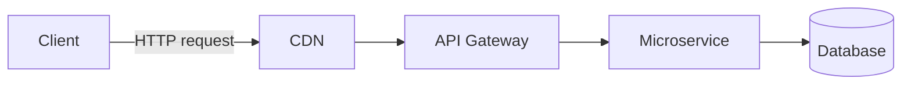

**Interviewer follow-up:** *"Is a truly stateless API always desirable?"* Hamesha nahi — isse har request ko re-authenticate karna padta hai (jaise, har call mein JWT re-validate karna, ya client ko context resend karwana), jisse server simplicity ke badle thoda client/network overhead trade-off hota hai. Statelessness *protocol* ke baare mein hai, saare persisted state ko forbid karne ke baare mein nahi (database stateful hota hai; *API interaction* stateless hota hai).

### Web API vs WCF vs MVC vs gRPC vs GraphQL

| Feature | Web API (ASP.NET Core) | WCF | MVC | gRPC | GraphQL |
|---|---|---|---|---|---|
| Protocol | HTTP only | HTTP, TCP, MSMQ, Named Pipes | HTTP | HTTP/2 | HTTP |
| Payload | JSON/XML | SOAP/XML (configurable) | HTML/JSON (Views + JSON) | Protobuf (binary) | JSON (flexible shape) |
| Lightweight | Yes | Nahi (heavier config/runtime) | Yes | Yes (binary, multiplexed) | Resolver complexity par depend karta hai |
| Hosting | Self-host / IIS / containers | IIS / Windows Service | Self-host / IIS | Self-host / containers | Self-host / IIS |
| Best for | Public/internal REST APIs | Legacy enterprise SOAP integration | Server-rendered web apps | Internal low-latency microservice-to-microservice calls | Client-driven flexible queries, BFF layers |

**Note:** WCF legacy hai; modern .NET mein koi first-class WCF nahi hai (sirf [CoreWCF](https://github.com/CoreWCF/CoreWCF) hai jo migration scenarios ke liye community-maintained port hai). Yeh rarely aata hai except "hum WCF se kyu migrate kar rahe hain" jaisi discussions mein.

### SOAP vs REST

| Feature | SOAP | REST |
|---|---|---|
| Messaging | XML-based, strict envelope/contract (WSDL) | JSON/XML, flexible |
| Performance | Slower (verbose XML, strict parsing) | Faster, lightweight |
| Security | Built-in WS-Security | OAuth2/JWT + HTTPS par rely karta hai |
| Complexity | High — formal contracts ki zarurat hoti hai | Simple, convention-driven |
| Statefulness | Stateful operations support kar sakta hai (WS-*) | Design se hi stateless |

### HTTP Methods, Status Codes, and Idempotency

| Method | Usage | Idempotent | Safe |
|---|---|---|---|
| GET | Retrieve | Yes | Yes |
| POST | Create | No (by default — neeche idempotency keys dekho) | No |
| PUT | Replace whole resource | Yes | No |
| PATCH | Partial update | No (technically guaranteed idempotent nahi hai jab tak specially design na kiya jaye) | No |
| DELETE | Remove | Yes (dobara delete karna = same end state) | No |

Interviewer jo status codes fluently expect karta hai:

| Code | Meaning |
|---|---|
| 200 OK | Success |
| 201 Created | Resource create ho gaya (`Location` header include karo) |
| 202 Accepted | Request accept ho gaya, processing async hai (long-running ops dekho) |
| 204 No Content | Success, body nahi hai (typically DELETE/PUT ke liye) |
| 400 Bad Request | Malformed/invalid request |
| 401 Unauthorized | Authenticated nahi hai |
| 403 Forbidden | Authenticated hai but authorized nahi hai |
| 404 Not Found | Resource exist nahi karta |
| 409 Conflict | State conflict (jaise, concurrency, duplicate) |
| 422 Unprocessable Entity | Semantically invalid (validation failure), 400 se alag |
| 429 Too Many Requests | Rate limit exceed ho gaya |
| 500 Internal Server Error | Unhandled server fault |
| 503 Service Unavailable | Downstream dependency down hai / overloaded hai |

**Gotcha interviewers probe:** HTTP spec ke according PUT idempotent defined hai — usko N baar call karna aur ek baar call karna same server state produce karna chahiye. PATCH *guaranteed idempotent nahi* hota (jaise, "counter ko 1 se increment karo" wala PATCH idempotent nahi hai, halaanki full-replacement-semantics wala PATCH ho sakta hai). "Idempotent" ko "safe" ke saath confuse mat karo — GET dono hai; PUT/DELETE idempotent hain but safe nahi (yeh state mutate karte hain).

### Controllers, IActionResult, ActionResult\<T\>

```csharp
[ApiController]
[Route("api/products")]
public class ProductsController : ControllerBase
{
    [HttpGet]
    public IEnumerable<string> Get() => new[] { "Laptop", "Mobile" };

    [HttpGet("{id}")]
    public IActionResult GetProduct(int id)
    {
        if (id <= 0) return BadRequest("Invalid ID");
        return Ok(new { id, name = "Laptop" });
    }
}
```

`[ApiController]` aapko deta hai: invalid `ModelState` par automatic 400, complex types ke liye `[FromBody]` inference, problem-details-shaped error responses, aur attribute-routing requirement.

| Feature | `IActionResult` | `ActionResult<T>` |
|---|---|---|
| Return type | Kisi bhi HTTP response shape ke liye | Strongly typed + phir bhi `Ok()`/`NotFound()` allow karta hai |
| Swagger/OpenAPI inference | Poor — `[ProducesResponseType]` ki zarurat hoti hai | Better — compiler ko `T` pata hota hai, tooling schema infer kar leti hai |
| Recommended for | Mixed-result actions | Zyadatar modern controller actions |

**Follow-up:** New code mein `ActionResult<T>` prefer karo — yeh OpenAPI generators (Swashbuckle/NSwag) ko document karne ke liye ek concrete return type deta hai, bina extra attributes ke, jabki aap phir bhi `return NotFound()` ya `return BadRequest()` kar sakte ho.

**Legacy note — `IHttpActionResult` vs `IActionResult`:** yeh dono often confuse kar diye jaate hain but belong to completely different frameworks.

| | `IHttpActionResult` | `IActionResult` |
|---|---|---|
| Framework | ASP.NET Web API 2 (`System.Web.Http`, pre-Core, classic `System.Web`/IIS pipeline) | ASP.NET Core (`Microsoft.AspNetCore.Mvc`) |
| Namespace | `System.Web.Http` | `Microsoft.AspNetCore.Mvc` |
| Execution model | `ExecuteAsync()` ek `HttpResponseMessage` return karta hai | Framework `ActionContext` ke against `ExecuteResultAsync()` call karta hai, directly Core response pipeline mein likhta hai |
| Status today | Legacy — classic .NET Framework Web API se tied hai, ASP.NET Core mein usable nahi | Current — Core controllers ke liye standard return-type family |

```csharp
// Legacy ASP.NET Web API 2 (System.Web.Http) — IHttpActionResult
public IHttpActionResult GetProduct(int id)
{
    if (id <= 0) return BadRequest("Invalid ID");
    return Ok(new { Id = id, Name = "Laptop" });
}
```

**Yeh interviews mein kyu aata hai:** yeh check karne ka quick litmus test hai ki candidate ne kabhi legacy .NET Framework Web API 2 codebase touch kiya hai (ya usse migrate kiya hai) — jo 10-year dev ke liye ek bahut common "modernize this" engagement hai. Dono types almost identical dikhte hain (same helper method names — `Ok()`, `BadRequest()`, `NotFound()`) exactly isliye kyunki ASP.NET Core ke MVC team ne deliberately ergonomics preserve ki jab underneath execution pipeline rebuild kiya; yaad rakhna ki yeh **source-compatible nahi hain** — migration ke time ek straight find-and-replace compile nahi hoga jab tak `using` directives aur base class (`ApiController` → `ControllerBase`) bhi change na karo.

### Routing: Attribute vs Conventional

| Feature | Convention-Based Routing | Attribute Routing |
|---|---|---|
| Location | `Program.cs` / `Startup.cs` | Controller/action par |
| Flexibility | Kam — MVC views ke liye achha | Zyada — Web APIs ke liye required |
| Example | `{controller}/{action}/{id?}` | `[Route("api/products/{id}")]` |

Modern Web APIs almost exclusively attribute routing use karte hain kyunki yeh route ko action ke saath colocate karta hai aur route constraints, versioning tokens, aur explicit HTTP verb binding support karta hai.

```csharp
var builder = WebApplication.CreateBuilder(args);
builder.Services.AddControllers();
var app = builder.Build();

app.UseHttpsRedirection();
app.UseRouting();
app.UseAuthentication();
app.UseAuthorization();
app.MapControllers();
app.Run();
```

### Parameter Binding: FromRoute/FromQuery/FromBody/FromHeader

| Attribute | Source | Example |
|---|---|---|
| `[FromRoute]` | URL route segment | `/api/products/1` |
| `[FromQuery]` | Query string | `/api/products?id=1` |
| `[FromBody]` | Request body (JSON) | `{ "id": 1, "name": "Laptop" }` |
| `[FromHeader]` | HTTP header | `Authorization: Bearer <token>` |
| `[FromForm]` | Form/multipart body | File uploads, form posts |

**Gotcha:** Har action mein sirf **ek** `[FromBody]` parameter allowed hai — body stream sirf ek baar read ho sakta hai. Agar aapko multiple pieces of complex data chahiye, unhe single DTO mein wrap karo.

### File Upload & Download (IFormFile)

Upar sirf `[FromForm]` binding source ke reference mein mention hua hai — ek full example dena zaroori hai kyunki "file upload handle karo" ek near-guaranteed practical coding question hai.

```csharp
[HttpPost("upload")]
public async Task<IActionResult> Upload(IFormFile file)
{
    if (file is null || file.Length == 0) return BadRequest("No file uploaded.");

    var filePath = Path.Combine("uploads", file.FileName);
    using var stream = new FileStream(filePath, FileMode.Create);
    await file.CopyToAsync(stream);

    return Ok(new { file.FileName, file.Length });
}

[HttpGet("download/{fileName}")]
public IActionResult Download(string fileName)
{
    var filePath = Path.Combine("uploads", fileName);
    if (!System.IO.File.Exists(filePath)) return NotFound();

    var fileBytes = System.IO.File.ReadAllBytes(filePath);
    return File(fileBytes, "application/octet-stream", fileName);
}
```

**Senior-level details worth adding unprompted:**
- `IFormFile` by default memory/temp disk mein buffer karta hai — large files ke liye, directly stream karo (`Request.Form.Files` ke saath streaming `MultipartReader`, ya `file.OpenReadStream()`) instead of full byte array ko memory mein load karne ke, aur request body size limit enforce karo (`[RequestSizeLimit]` / `Kestrel.Limits.MaxRequestBodySize`) taaki huge uploads se trivial DoS na ho.
- `file.FileName` ko filesystem path ke roop mein as-is kabhi trust mat karo — yeh client se aata hai aur path-traversal sequences (`../../etc/passwd`) contain kar sakta hai; disk par likhne se pehle hamesha filename sanitize/regenerate karo server-side (jaise, ek GUID).
- Content type/extension validate karo **aur** actual file bytes inspect karo (magic-number/signature check) kisi bhi security-sensitive cheez ke liye — client `Content-Type` ke baare mein freely lie kar sakta hai.
- Genuinely large files ya high-throughput scenarios ke liye, app server ke local disk ke bajaye directly blob storage (Azure Blob/S3) mein stream karna prefer karo — isse API stateless rehta hai aur horizontally scaled deployment mein disk-space/instance-affinity problems avoid ho jaate hain.
- Small files ke liye `File(bytes, contentType, fileName)` fine hai; larger downloads ke liye ek stream-backed `FileStreamResult` (`File(stream, ...)` ya `PhysicalFile(...)`) return karo taaki framework pehle pura file memory mein buffer karne ke bajaye response stream kare.

### Content Negotiation

Content negotiation se same endpoint `Accept` header ke basis par different representations return kar sakta hai.

```csharp
builder.Services.AddControllers().AddXmlSerializerFormatters();
```

```http
GET /api/products
Accept: application/xml
```

- `Accept` — *client* ko kya wapas chahiye.
- `Content-Type` — *current request/response body* actually kis format mein hai.
- Agar `Accept` header ke saath koi formatter match nahi karta aur koi default configure nahi hai, ASP.NET Core `406 Not Acceptable` return karta hai (yeh jaanna zaroori hai — kaafi candidates assume karte hain ki yeh silently hamesha JSON par fall back kar jaata hai; by default yeh *fall back karta hai* jab tak aap `ReturnHttpNotAcceptable = true` set na karo).

---

## Intermediate

### Dependency Injection & Service Lifetimes

```csharp
public interface IProductService { List<string> GetProducts(); }
public class ProductService : IProductService
{
    public List<string> GetProducts() => new() { "Laptop", "Mobile" };
}

builder.Services.AddScoped<IProductService, ProductService>();
```

| Lifetime | Created | Typical use | Risk |
|---|---|---|---|
| Singleton | App mein ek baar | Logging, config, caches | Thread-safe hona zaroori hai; scoped deps ko safely hold nahi kar sakta |
| Scoped | Har request mein ek baar | `DbContext`, unit-of-work, per-request state | Agar singleton mein inject kiya to captive dependency ban jaata hai |
| Transient | Har resolution par | Lightweight, stateless services | Agar construct karna expensive ho to wasteful ho sakta hai |

`TryAddSingleton<T>` sirf tab register karta hai jab us service type ke liye already kuch registered na ho — library/extension-method code mein useful hai taaki consumer ki existing registration clobber na ho; `AddSingleton<T>` hamesha ek nayi registration add karta hai (jisse `IEnumerable<T>` ke through multiple registrations resolve ho sakte hain).

**"Very common interview question" jo source notes mein flag hua tha, ab poori tarah answer kiya gaya:**

> Singleton kyu ek Scoped service (jaise `DbContext`) par depend nahi kar sakta?

`DbContext` design se Scoped hai — yeh ek single unit of work represent karta hai jo ek request se tied hai aur **thread-safe nahi hai**. Singleton pure application lifetime ke liye jeeta hai aur saare concurrent requests ke beech shared hota hai. Agar aap ek Scoped service ko directly Singleton ke constructor mein inject karo, DI container `InvalidOperationException: Cannot consume scoped service from singleton` throw karta hai (jab validation enabled ho) — aur agar throw na bhi kare, aapko race conditions aur unrelated requests ke beech stale/shared state mil jaayega.

**Correct fix — `IServiceScopeFactory`:**

```csharp
public class MyLoggerService
{
    private readonly IServiceScopeFactory _scopeFactory;
    public MyLoggerService(IServiceScopeFactory scopeFactory) => _scopeFactory = scopeFactory;

    public void LogToDatabase(string message)
    {
        using var scope = _scopeFactory.CreateScope();
        var dbContext = scope.ServiceProvider.GetRequiredService<MyDbContext>();
        dbContext.Logs.Add(new Log { Message = message });
        dbContext.SaveChanges();
    }
}
```

Yeh singleton ke andar manually ek naya scope create karta hai, isliye resolved `DbContext` sirf us unit of work ki duration ke liye jeeta hai — safe aur correctly isolated. Loggers ke liye specifically best practice: unhe Singleton, stateless, thread-safe rakho, aur jab possible ho hand-rolled logger services ke bajaye built-in `ILogger<T>` abstraction prefer karo.

### SOLID Principles

SOLID woh baseline vocabulary hai jo interviewers year 10 tak fluently expect karte hain — "acronym define karo" se zyada "mujhe dikhao kahan tumne isko ek ASP.NET Core app mein apply kiya hai jo tumhe already cold pata hai" (hint: Dependency Injection khud, jo upar cover hua, Dependency Inversion ki *application* hai).

| Principle | Definition | ASP.NET Core Example |
|---|---|---|
| **S** — Single Responsibility | Ek class ke change hone ka ek hi reason hona chahiye | `ProductsController` (HTTP concerns) ko `ProductService` (business logic) aur `ProductRepository` (persistence) se separate rakho |
| **O** — Open/Closed | Extension ke liye open, modification ke liye closed | `PricingService` ke andar ek `if/else` chain edit karne ke bajaye ek naya `IDiscountStrategy` implementation add karo |
| **L** — Liskov Substitution | Ek subtype apne base type ki jagah kahin bhi usable hona chahiye, bina surprising behavior ke | Koi bhi `IPaymentGateway` implementation (Stripe, PayPal) ko dusre jaisa hi contract/exceptions honor karna chahiye — ek ko dusre se swap karne se callers break nahi hone chahiye |
| **I** — Interface Segregation | Ek badi general-purpose interface ke bajaye kai chhoti, client-specific interfaces prefer karo | Ek bloated `IRepository` jisme 20 methods hain use `IReadRepository<T>` / `IWriteRepository<T>` mein split karo taaki read-only consumers un write methods par depend na karein jo woh kabhi call nahi karte |
| **D** — Dependency Inversion | High-level modules ko abstractions par depend karna chahiye, concrete low-level implementations par nahi | Constructor mein `ILogger`/`IProductService` interfaces inject karo, class ke andar kabhi concrete dependency `new` mat karo |

**Dependency Inversion, concretely:**

```csharp
public interface ILogger { void Log(string message); }

public class ConsoleLogger : ILogger
{
    public void Log(string message) => Console.WriteLine(message);
}

public class UserService
{
    private readonly ILogger _logger;
    public UserService(ILogger logger) => _logger = logger; // depends on the abstraction, not ConsoleLogger
}
```

`UserService` kabhi directly `ConsoleLogger` reference nahi karta — `UserService` mein zero changes ke saath ek `SerilogLogger` ya test `FakeLogger` swap kar sakte ho. Yeh exactly wahi hai jo ASP.NET Core ka built-in DI container scale par operationalize karta hai: upar ka pura [Dependency Injection & Service Lifetimes](#dependency-injection--service-lifetimes) section practice mein DIP hi hai, koi alag concept nahi.

**Senior framing jo interviewer sunna chahta hai:** SOLID koi recite karne wali checklist nahi hai — pointed test yeh hai ki kya tum ek real violation naam bata sakte ho jo tumne refactor kiya (jaise, ek repository interface jo tumne split kiya kyunki half consumers sirf read karte the, ya ek controller jo tumne slim kiya kyunki usme change hone ke teen unrelated reasons aa gaye the) aur trade-off explain kar sakte ho (zyada interfaces/indirection vs easier testing aur isolated change). Bina koi story ke acronym recite karna junior lagta hai.

### Middleware Pipeline

Middleware pipeline components hote hain jo request ko inspect/modify karte hain, optionally short-circuit karte hain, `next()` call karte hain, aur phir waapas jaate time response ko modify kar sakte hain.

```csharp
public class CustomMiddleware
{
    private readonly RequestDelegate _next;
    public CustomMiddleware(RequestDelegate next) => _next = next;

    public async Task Invoke(HttpContext context)
    {
        Console.WriteLine("Request: " + context.Request.Path);
        await _next(context);
    }
}

app.UseMiddleware<CustomMiddleware>();
```

**Key rule:** order matter karta hai — middleware aane ke time top-down execute hota hai, jaane ke time bottom-up.

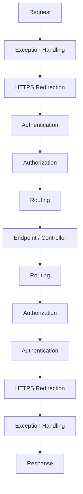

**Middleware vs Filters — ek bahut common trap:** Middleware HTTP pipeline ke liye global hota hai aur framework-agnostic hota hai; filters MVC/API-specific hote hain aur MVC action invocation pipeline ke *andar* run karte hain (routing ne controller/action select karne ke baad), isliye unhe `ActionExecutingContext`/model-bound arguments ka access milta hai jo raw middleware ke paas nahi hota.

### Request Lifecycle End-to-End

Request ka full journey, whiteboard answer ke liye useful:

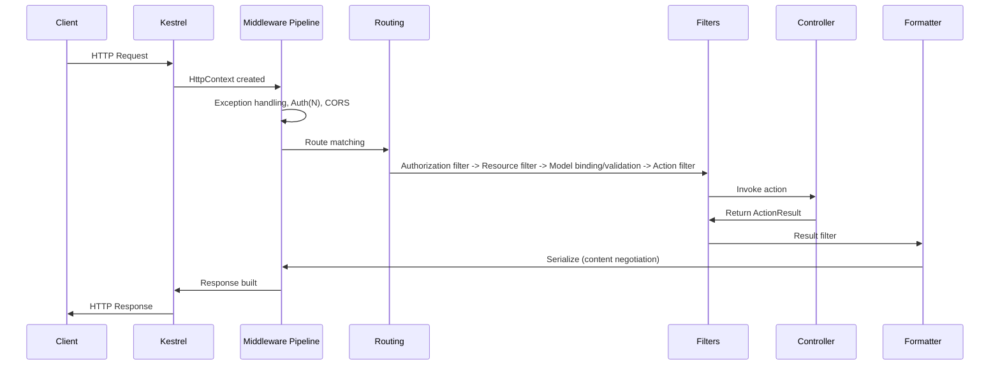

1. **HTTP Client** URL, method, headers, optional body bhejta hai.
2. **Kestrel** — ASP.NET Core mein built-in cross-platform server; raw HTTP parse karta hai, `HttpContext` build karta hai, isme **koi business logic nahi** hoti. Production mein yeh typically IIS/Nginx/cloud load balancer ke peeche baithta hai jo TLS termination, process management, aur Kestrel ko direct exposure se protect karne ke liye reverse proxy ka kaam karta hai.
3. **Middleware pipeline** — exception handling, logging, authentication, authorization, CORS, routing (order matter karta hai, top-down/bottom-up execute hota hai).
4. **Authentication middleware** — user *kaun hai* identify karta hai (`HttpContext.User` populate karta hai); permissions check nahi karta. Failure necessarily pipeline stop nahi karta — jab tak baad ka koi step auth require na kare, user ko anonymous treat kiya jaata hai.
5. **Authorization middleware** — check karta hai ki user *kya* kar sakta hai; `[Authorize]`, roles, policies, claims enforce karta hai. Failure 401/403 return karta hai aur controller kabhi execute nahi hota.
6. **Routing** — URL + verb + route template ko ek specific controller/action (ya minimal API endpoint) se match karta hai aur parameter binding sources determine karta hai.
7. **Filters** — Authorization Filters → Resource Filters → Model Binding/Validation → Action Filters (action se pehle/baad) → Exception Filters (controller-level exceptions catch karte hain) → Result Filters (response formatting se pehle/baad).
8. **Model binding & validation** — request data ko action parameters se bind karta hai; agar invalid ho aur controller mein `[ApiController]` ho, to aapka action code chalne se pehle hi ek `400 Bad Request` auto-return ho jaata hai.
9. **Controller** — validated input receive karta hai, services/domain logic orchestrate karta hai, ek `ActionResult` return karta hai (raw HTTP response nahi).
10. **Action result execution** — framework `Ok()`/`NotFound()`/etc. ko ek actual status code mein convert karta hai + ek formatter select karta hai.
11. **Response formatting / content negotiation** — `Accept` ke basis par JSON (default) ya XML (agar enabled ho) choose karta hai.
12. **HTTP response** — middleware pipeline se reverse order mein waapas travel karta hai, phir Kestrel usse client ko bhej deta hai.

**One-line interview-gold summary:** *ASP.NET Core requests ko Kestrel → Middleware → Routing → Filters → Controller → Formatters → Middleware → Client ke through process karta hai.*

### Model Validation

```csharp
public class Product
{
    [Required] public string Name { get; set; }
    [Range(1, 10000)] public decimal Price { get; set; }
}

[HttpPost]
public IActionResult AddProduct([FromBody] Product product)
{
    if (!ModelState.IsValid) return BadRequest(ModelState);
    return Ok("Product Added");
}
```

`[ApiController]` ke saath, upar wala explicit `ModelState.IsValid` check actually **redundant** hai — framework action chalne se pehle hi `ValidationProblemDetails` body ke saath `400` auto-return kar deta hai. Interviewers kabhi-kabhi probe karte hain ki tumhe yeh pata hai ya nahi (kaafi devs `[ApiController]`-decorated controllers ke andar dead code likhte hain jo `ModelState.IsValid` check karta hai). Yeh jaanna phir bhi useful hai jab tum custom validation-response shaping ke liye `[ApiController(SuppressModelStateInvalidFilter = true)]` se *opt out* karte ho.

Complex/conditional rules, better testability, aur model se separation ke liye FluentValidation Data Annotations ka common senior-level upgrade hai.

### Action Filters & Filter Pipeline

```csharp
public class LogActionFilter : ActionFilterAttribute
{
    public override void OnActionExecuting(ActionExecutingContext context)
    {
        Console.WriteLine($"Action {context.ActionDescriptor.DisplayName} is executing");
    }
}

[LogActionFilter]
public class ProductsController : ControllerBase
{
    [HttpGet] public IActionResult Get() => Ok("Product List");
}
```

Filter types aur unka scope, execution order mein:

| Filter Type | Runs | Typical Use |
|---|---|---|
| Authorization Filters | Sabse pehle, kisi bhi cheez se pehle | `[Authorize]` enforcement |
| Resource Filters | Model binding se pehle/baad | Short-circuit caching, expensive pre-checks |
| Action Filters | Action execution se pehle/baad | Logging, timing, arguments/results ki mutation |
| Exception Filters | Action se unhandled exception par | Centralized error shaping (controller-scoped) |
| Result Filters | Result execution se pehle/baad (formatting) | Response header injection, wrapping |

### PUT vs PATCH (JSON Patch)

| Feature | PUT | PATCH |
|---|---|---|
| Purpose | Pura resource replace karna | Partial update |
| Idempotent | Yes | Guaranteed nahi (operation semantics par depend karta hai) |
| Body | Full resource representation | Sirf changed fields (ya JSON Patch document) |

```csharp
[HttpPatch("{id}")]
public async Task<IActionResult> UpdateProduct(int id, [FromBody] JsonPatchDocument<Product> patchDoc)
{
    var product = await _context.Products.FindAsync(id);
    if (product == null) return NotFound();

    patchDoc.ApplyTo(product, ModelState);
    if (!ModelState.IsValid) return BadRequest(ModelState);

    await _context.SaveChangesAsync();
    return Ok(product);
}
```

**Gotcha:** `JsonPatchDocument<T>` (RFC 6902) ke liye `Content-Type: application/json-patch+json` aur `[{ "op": "replace", "path": "/price", "value": 1500 }]` jaisa body zaroori hai — kaafi teams simplicity ke liye instead ek plain partial DTO (merge-patch style, RFC 7396) accept karte hain, strict patch semantics ko developer ergonomics se trade karte hue. Dono exist karte hain, yeh pata hona chahiye aur apna choice justify karne ke liye ready rehna chahiye.

### Exception Handling

```csharp
public class ExceptionMiddleware
{
    private readonly RequestDelegate _next;
    public ExceptionMiddleware(RequestDelegate next) => _next = next;

    public async Task Invoke(HttpContext context)
    {
        try { await _next(context); }
        catch (Exception ex)
        {
            context.Response.StatusCode = 500;
            await context.Response.WriteAsync($"Error: {ex.Message}");
        }
    }
}
app.UseMiddleware<ExceptionMiddleware>();
```

Raw notes ka yeh pattern functional hai but **senior-grade nahi** hai — yeh exception messages ko clients tak leak kar deta hai (information disclosure) aur plain text return karta hai structured, machine-readable error body ke bajaye. Production-grade replacement ke liye jo `IExceptionHandler` (.NET 8+) aur RFC 7807/9457 use karta hai, neeche [\[new content\] Problem Details](#new-content-problem-details-rfc-79079457-for-error-responses) dekho.

### CORS

```csharp
builder.Services.AddCors(options =>
{
    options.AddPolicy("AllowSpecificOrigin", policy =>
        policy.WithOrigins("https://frontend.com")
              .AllowAnyMethod()
              .AllowAnyHeader());
});
app.UseCors("AllowSpecificOrigin");
```

CORS ek **browser-enforced** same-origin policy relaxation hai — yeh server-to-server calls ko protect karne mein kuch nahi karta (curl, Postman, koi dusra backend CORS ko completely ignore karte hain). `Access-Control-Allow-Origin: *` ko `AllowCredentials()` ke saath combine karna spec ke against invalid hai aur security reviews mein ek common misconfiguration flag hota hai — wildcard origin ko kabhi bhi credentialed requests ke saath combine mat karo.

### Repository Pattern & DTOs

```csharp
public interface IProductRepository { List<Product> GetAll(); }
public class ProductRepository : IProductRepository
{
    private readonly AppDbContext _context;
    public ProductRepository(AppDbContext context) => _context = context;
    public List<Product> GetAll() => _context.Products.AsNoTracking().ToList();
}
```

```csharp
public class ProductDTO
{
    public string Name { get; set; }
    public decimal Price { get; set; }
}
var productDto = _mapper.Map<ProductDTO>(product);
```

**Repository Pattern par senior-level nuance:** EF Core ka `DbSet<T>` / `DbContext` **already ek** unit-of-work + repository abstraction hai. Isko ek hand-rolled generic repository mein wrap karna ek well-known anti-pattern debate hai — yeh often ek indirection layer add kar deta hai jo coupling kam nahi karta (tum sirf `IQueryable` ko ek dusre interface ke peeche hide kar rahe ho) aur EF Core ke `Include`, projection, aur compiled-query capabilities strip kar sakta hai jab tak carefully design na kiya jaye. Repository usage ko ek real cross-cutting need se justify karo (jaise, persistence technology swap karna, test doubles simplify karna) na ki "best practice" cargo-culting se — system design rounds mein yeh probe hone ki expect karo.

DTOs matter karte hain: internal/DB-only fields hide karne ke liye, API contract ko persistence schema se decouple karne ke liye (taaki column rename se clients break na ho), aur over-posting/mass-assignment vulnerabilities prevent karne ke liye (EF entities ko directly bind karna ek malicious client ko fields jaise `IsAdmin` set karne deta hai jo client-writable kabhi intend nahi thi).

### IHttpClientFactory & Resilient HTTP Calls

```csharp
builder.Services.AddHttpClient<IProductService, ProductService>();

public class ProductService : IProductService
{
    private readonly HttpClient _httpClient;
    public ProductService(HttpClient httpClient) => _httpClient = httpClient;
    public async Task<string> GetData() => await _httpClient.GetStringAsync("https://api.example.com/products");
}
```

ASP.NET Core 2.1 (`Microsoft.Extensions.Http`) mein introduce hua, `IHttpClientFactory` classic **socket exhaustion** problem solve karta hai: ek naively `new HttpClient()`'d-per-request instance apna underlying `HttpClientHandler`/socket dispose kar deta hai but OS sockets ko `TIME_WAIT` mein chhod sakta hai, jisse load ke under available ports exhaust ho jaate hain. Iske opposite, ek single long-lived static `HttpClient` singleton DNS changes respect nahi karta (yeh resolved connection ko indefinitely cache karta hai). `IHttpClientFactory` `HttpMessageHandler` instances ko rotation par pool aur recycle karta hai (default 2 minutes) — isse tumhe connection reuse *aur* DNS responsiveness dono milte hain. Yeh named/typed clients bhi enable karta hai aur retries/circuit breakers ke liye Polly ke saath integrate hota hai.

---

## Advanced

### API Versioning Strategies

API versioning ek contract mein breaking changes ko existing consumers ko break kiye bina manage karta hai — ek baar API mein external ya cross-team consumers aa jaayein to yeh essential ho jaata hai.

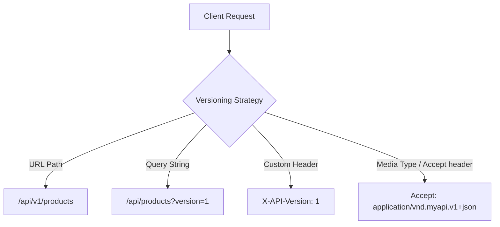

| Strategy | Example | Pros | Cons |
|---|---|---|---|
| URL Path | `GET /api/v1/products` | Explicit, cacheable, test/curl karna easy, logs mein visible | URL "pollute" ho jaata hai; version really ek resource property nahi hai |
| Query String | `GET /api/products?version=1` | Add karna simple hai | Bhulna/omit karna easy hai, less RESTfully "pure", caching keys messy ho jaate hain |
| Header | `X-API-Version: 1` | URL clean rehta hai | Casual browsing/curl mein bina extra flags ke invisible hota hai, manually test karna harder hai |
| Media Type (Accept) | `Accept: application/vnd.myapi.v1+json` | Sabse "RESTfully correct" (resource ko nahi, representation ko version kar rahe ho) | Implement aur document karna sabse complex; tooling support poor hai |

```csharp
builder.Services.AddApiVersioning(options =>
{
    options.AssumeDefaultVersionWhenUnspecified = true;
    options.DefaultApiVersion = new ApiVersion(1, 0);
    options.ReportApiVersions = true;
    options.ApiVersionReader = new UrlSegmentApiVersionReader();
});

[ApiController]
[Route("api/v{version:apiVersion}/products")]
[ApiVersion("1.0")]
public class ProductsV1Controller : ControllerBase
{
    [HttpGet] public IActionResult Get() => Ok(new { Message = "Product list from V1" });
}
```

**Senior discussion ke liye practical recommendation:** zyadatar real-world APIs mein URL path versioning discoverability aur cache-friendliness ke liye jeet jaata hai; header/media-type versioning REST purists ke according zyada "correct" hai but operational complexity ke worth rarely hoti hai jab tak tum strict deprecation SLA wala public API product na bana rahe ho. Versioning ko hamesha **NuGet package `Asp.Versioning.Mvc`** ke saath pair karo (jo `Microsoft.AspNetCore.Mvc.Versioning` ka modern, maintained successor hai, jo deprecated hai) — yeh flag kar raha hoon kyunki source notes purane package name ka reference dete hain.

**Best practices:** gradually deprecate karo (`Sunset` header, `ReportApiVersions` ke through `api-supported-versions` response header), har version ko OpenAPI mein document karo, zyada live versions accumulate karne se bacho, aur centrally routing/deprecation manage karne ke liye ek API gateway (Kong, Azure API Management, AWS API Gateway) consider karo.

### [new content] REST Maturity Model (Richardson) & HATEOAS Trade-offs

Senior level par interviewers often poochte hain "tumhari API really kitni RESTful hai?" — yeh isko answer karne ka framework hai.

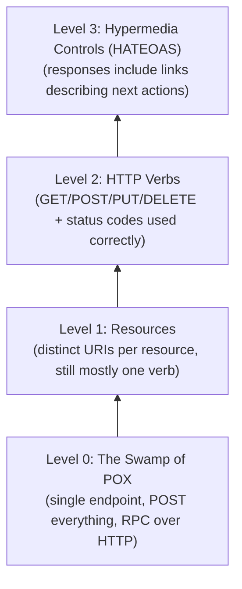

- **Level 0** — ek URL, ek HTTP verb (usually POST), "envelope" ek operation name carry karta hai (basically RPC/SOAP-in-disguise over HTTP).
- **Level 1** — har resource ke liye separate URIs (`/orders`, `/customers`) but still often single-verb-heavy.
- **Level 2** — HTTP verbs aur status codes ka proper use; **yahin par overwhelming majority ke production "REST" APIs actually rehte hain**, aur yeh ek perfectly legitimate, pragmatic target hai.
- **Level 3** — HATEOAS: responses mein hypermedia links embed hote hain jo client ko batate hain ki woh next kya kar sakta hai (state transitions runtime par discoverable hain, client code mein hardcoded nahi).

**HATEOAS trade-off analysis (jo ek senior candidate ko articulate karna chahiye, sirf define nahi):**

| Pro | Con |
|---|---|
| Client ko hardcoded URL construction se decouple karta hai | Server aur client ke liye significant added complexity |
| Client redeploys ke bina server-driven workflow changes enable karta hai | Almost koi client SDKs/mobile teams practically links ko dynamically consume nahi karte |
| Self-documenting, discoverable API surface | Bigger payloads, zyada serialization work |
| Real state machines wale APIs ke liye achha fit hota hai (order: pending → shipped → delivered, jahan allowed actions change hote hain) | Zyadatar CRUD APIs mein itna state-dependent behavior nahi hota ki isko justify kare |

**Honest senior take:** HATEOAS intellectually elegant hai aur interviews mein heavily test hota hai, but industry mein rarely fully implement hota hai — zyadatar teams Level 2 par ruk jaati hain aur hypermedia-driven discovery par rely karne ke bajaye explicitly version karti hain. Jahan yeh *pay off karta hai*: complex order/workflow APIs jahan "main next kya kar sakta hoon" genuinely resource state ke according vary karta hai, aur tum client-side business logic ko valid transitions determine karne se bachana chahte ho.

### [new content] Problem Details (RFC 7807/9457) for Error Responses

Source notes ka exception-handling middleware raw exception messages plain text ke roop mein return karta hai — production mein ek real anti-pattern (information disclosure, aur error types ke beech inconsistent shape). Modern, standardized answer hai **RFC 7807 Problem Details for HTTP APIs** (jo RFC 9457 se obsolete/update hui hai, functionally same shape hai).

```json
{
  "type": "https://example.com/probs/insufficient-funds",
  "title": "Insufficient funds",
  "status": 400,
  "detail": "Your balance is 30, but the transfer requires 50.",
  "instance": "/transfers/abc-123",
  "traceId": "00-4bf9...-01"
}
```

ASP.NET Core 8+ mein `AddProblemDetails()` aur `IExceptionHandler` ke through **built-in support** hai:

```csharp
builder.Services.AddProblemDetails(options =>
{
    options.CustomizeProblemDetails = ctx =>
    {
        ctx.ProblemDetails.Extensions["traceId"] = ctx.HttpContext.TraceIdentifier;
    };
});

builder.Services.AddExceptionHandler<GlobalExceptionHandler>();

// GlobalExceptionHandler.cs
public class GlobalExceptionHandler : IExceptionHandler
{
    private readonly ILogger<GlobalExceptionHandler> _logger;
    public GlobalExceptionHandler(ILogger<GlobalExceptionHandler> logger) => _logger = logger;

    public async ValueTask<bool> TryHandleAsync(HttpContext httpContext, Exception exception, CancellationToken ct)
    {
        _logger.LogError(exception, "Unhandled exception");

        httpContext.Response.StatusCode = StatusCodes.Status500InternalServerError;
        await httpContext.Response.WriteAsJsonAsync(new ProblemDetails
        {
            Status = StatusCodes.Status500InternalServerError,
            Title = "An unexpected error occurred",
            Type = "https://httpstatuses.io/500"
        }, cancellationToken: ct);

        return true; // exception handled — don't rethrow
    }
}

// Program.cs
app.UseExceptionHandler();
```

**Senior level par yeh kyu matter karta hai:** consistent, structured, machine-parseable errors woh cheez hai jo API consumers ko generic error-handling code likhne dete hain instead of messages ko string-match karne ke; `[ApiController]` ke automatic `400`s already `ValidationProblemDetails` (ek Problem Details subtype) return karte hain — *saare* errors (validation, business rule violations, unhandled exceptions) ke liye same shape use karna pure API surface mein ek uniform contract deta hai, jo exactly wahi hai jo interviewers check kar rahe hote hain jab woh poochte hain "dozens of endpoints ke across tum errors ko consistently kaise handle karte ho."

### [new content] Idempotency Keys for POST/PUT

HTTP spec ke according POST idempotent nahi hai — `POST /orders` ko client retry (timeout, network blip) ki wajah se do baar call karne se do orders create ho sakte hain. Yeh ek classic "retry par duplicate side effects kaise avoid karte ho" wala senior interview question hai (source notes mein explicitly ek sample question ke roop mein flag hua hai but wahan kabhi answer nahi hua).

**Pattern: client-supplied idempotency key**

```http
POST /payments
Idempotency-Key: 7b6a5e2e-3f1a-4b8e-9c2d-5a6f7e8d9c0b
Content-Type: application/json

{ "amount": 100, "currency": "USD" }
```

```csharp
[HttpPost]
public async Task<IActionResult> CreatePayment(
    [FromHeader(Name = "Idempotency-Key")] string idempotencyKey,
    [FromBody] PaymentRequest request)
{
    if (string.IsNullOrEmpty(idempotencyKey))
        return BadRequest("Idempotency-Key header is required.");

    var existing = await _cache.GetAsync<PaymentResult>(idempotencyKey);
    if (existing != null)
        return Ok(existing); // return the original result, don't reprocess

    var result = await _paymentService.ProcessAsync(request);

    // Store result keyed by idempotency key with a TTL (e.g., 24h)
    await _cache.SetAsync(idempotencyKey, result, TimeSpan.FromHours(24));

    return Ok(result);
}
```

**Implementation nuances jo senior answers ko junior wale se alag karte hain:**
- Idempotency key ko operation ke side effect ke saath **atomically store** karna chahiye (ideally same DB transaction mein, ya ek dedicated idempotency-keys table mein unique constraint ke saath) — sirf Redis cache wala approach mein "check" aur "process + store" ke beech ek race window hota hai.
- Key scope mein enough context hona chahiye taaki unrelated resources/users ke across collisions avoid ho (jaise, `userId + key` ka hash).
- Same key ke saath **concurrent** requests still in flight hone par behavior decide karo — typically double-processing ke bajaye `409 Conflict` ya `425 Too Early` return karo.
- Yeh event-driven consistency ke liye **outbox pattern** wala same core idea hai aur baad mein in notes mein mentioned "exactly-once vs at-least-once" delivery semantics se tie hota hai — idempotency woh cheez hai jo at-least-once delivery ko caller ke perspective se *exactly-once jaisa behave* karvati hai.

### [new content] Pagination Strategies: Offset vs Cursor

Original notes mein thin/missing — pagination design ek near-guaranteed senior API-design question hai.

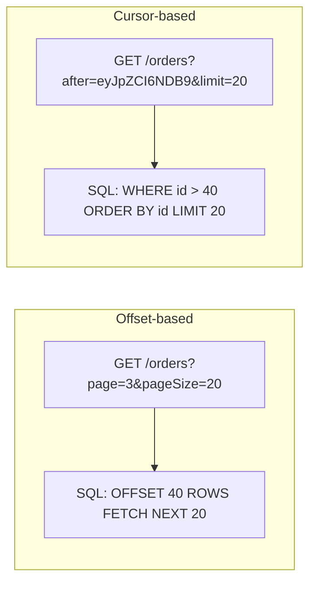

| Aspect | Offset-based (`page`/`pageSize` or `skip`/`take`) | Cursor-based (`after`/`before` opaque token) |
|---|---|---|
| Implementation | Trivial — `Skip(n).Take(m)` | Thoda zyada kaam — last-seen sort key encode karna |
| Performance at scale | Degrade hoti hai — `OFFSET 100000` phir bhi prior rows ko scan/discard karta hai | Consistently fast — indexed `WHERE id > X` seek |
| Consistency under concurrent writes | **Unstable** — inserts/deletes se subsequent pages shift ho jaate hain (duplicate ya skipped rows) | Stable — cursor ek specific row ke relative hota hai, usse pehle ke shifts se immune |
| Random page access ("page 5 par jump karo") | Supported | Naturally supported nahi hai (sequential only) |
| Typical use | Admin UIs, small-to-medium datasets, "total pages" display chahiye | Infinite scroll, feeds, large/high-write datasets, public APIs (GitHub, Stripe, Slack sab cursor pagination use karte hain) |

```csharp
// Cursor-based pagination example
[HttpGet]
public async Task<IActionResult> GetOrders([FromQuery] string? after, [FromQuery] int limit = 20)
{
    var query = _context.Orders.OrderBy(o => o.Id).AsQueryable();

    if (!string.IsNullOrEmpty(after))
    {
        var cursorId = DecodeCursor(after); // base64-decode opaque token
        query = query.Where(o => o.Id > cursorId);
    }

    var items = await query.Take(limit + 1).ToListAsync();
    var hasMore = items.Count > limit;
    items = items.Take(limit).ToList();

    return Ok(new
    {
        data = items,
        nextCursor = hasMore ? EncodeCursor(items.Last().Id) : null
    });
}
```

**Follow-up interviewers poochte hain:** "Public API ke liye `page` numbers kyu na use karein?" — kyunki concurrent inserts/deletes offset pagination ko *silently* client ko mid-scroll duplicate ya missing rows return karva dete hain, jo invisible rehta hai jab tak koi customer complain na kare ki data "missing" hai, aur ek indexed cursor column ke through seek karna DB par kaafi cheaper hai (koi `OFFSET` scan cost nahi).

### [new content] Long-Running Operations: 202 Accepted + Polling

Source mein sample interview Q10 ke roop mein flag hua hai ("API se triggered long-running work kaise handle karein?") sirf ek one-line pointer ke saath ("background queue, durable functions, polling or webhooks") — ise ek full answer mein expand kar rahe hain.

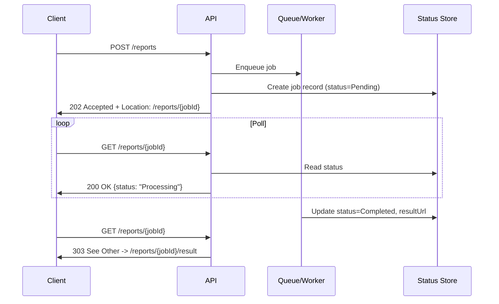

```csharp
[HttpPost("reports")]
public async Task<IActionResult> GenerateReport([FromBody] ReportRequest request)
{
    var jobId = Guid.NewGuid();
    await _jobStore.CreateAsync(jobId, JobStatus.Pending);
    await _queue.EnqueueAsync(new GenerateReportJob(jobId, request));

    return Accepted(new Uri($"/reports/{jobId}", UriKind.Relative), new { jobId, status = "Pending" });
}

[HttpGet("reports/{jobId}")]
public async Task<IActionResult> GetReportStatus(Guid jobId)
{
    var job = await _jobStore.GetAsync(jobId);
    if (job is null) return NotFound();

    if (job.Status == JobStatus.Completed)
        return Ok(new { status = "Completed", resultUrl = $"/reports/{jobId}/result" });

    return Ok(new { status = job.Status.ToString() });
}
```

**Key design points jo ek senior candidate ko unprompted raise karne chahiye:**
- `202 Accepted` response mein ek `Location` header hota hai jo ek status resource ko point karta hai — yeh "accepted, abhi done nahi hua" represent karne ka HTTP-idiomatic tarika hai.
- Client polling ka alternative: **webhooks** (server completion par ek client-registered URL ko callback karta hai) — infrequent, high-latency jobs ke liye better hai; polling load avoid karta hai, but client ko ek public endpoint expose karna padta hai aur tumhe callback par retries/signature verification handle karna padta hai.
- Internal system design discussions ke liye, mention karo ki yeh functionally **Azure Durable Functions ke async HTTP APIs pattern** ya status-check endpoint wale AWS Step Functions jaisa hi shape hai.
- Idempotency yahan bhi matter karta hai — agar `POST /reports` retry ho, tum duplicate jobs enqueue nahi karna chahte; isko upar wale idempotency-key pattern ke saath combine karo.

### [new content] OpenAPI/Swagger: Contract-First vs Code-First

Source notes sirf Swashbuckle *enable* karna cover karte hain — senior-level design decision completely missing hai.

```csharp
builder.Services.AddSwaggerGen();
app.UseSwagger();
app.UseSwaggerUI(c => c.SwaggerEndpoint("/swagger/v1/swagger.json", "My API v1"));
```

| Approach | How it works | Pros | Cons |
|---|---|---|---|
| **Code-first** (Swashbuckle/NSwag C# attributes/XML docs se spec generate karte hain) | Controllers likho → reflection `swagger.json` generate karti hai | Start karna fast hai, spec hamesha implementation match karti hai | Spec ek byproduct hai, design artifact nahi; consumers accidentally break karna easy hai kyunki koi force nahi karta ki code karne se pehle contract ke baare mein socho |
| **Contract-first** (pehle `.yaml`/`.json` OpenAPI spec author karo, usse server stubs/client SDKs generate karo) | Contract design karo → tools (`NSwag`, `OpenAPI Generator`, `Kiota`) use karke code scaffold karo | Implementation se pehle API design review force karta hai; shared contract par parallel frontend/backend work enable karta hai; SLAs wale public APIs ke liye better | Initial setup slower hai; agar CI mein enforce na ho to spec/implementation drift ka risk hai |

**Senior-level nuance:** internal microservices jo fast move karti hain unke liye code-first usually pragmatic hai. Public APIs, external partners wali APIs, ya jinme breaking changes ka real business cost ho, unke liye contract-first (contract tests / Pact-style consumer-driven contract testing ke saath, aur CI checks jo verify karein ki generated spec committed contract match karti hai) zyada defensible choice hai — yeh exactly wahi trade-off hai jo senior interviewers chahte hain ki tum articulate karo, sirf dono terms naam lene ke bajaye.

**.NET 9 update jaanna zaroori hai:** Microsoft ne kuch naye project templates mein built-in `Microsoft.AspNetCore.OpenApi`-adjacent Swashbuckle bundling ko deprecate/remove kar diya hai `Microsoft.AspNetCore.OpenApi` package (spec generation ke liye) ke favor mein, aur interactive doc viewer ke liye isko Scalar ya Swagger UI ke saath separately pair kar diya hai — interview se pehle ek quick "current tooling" check ke worth hai kyunki yeh space fast move karta hai (job ke stack ke exact .NET version ke against verify karo).

### [new content] Minimal APIs vs Controllers

Minimal APIs (.NET 6 mein introduce hui, .NET 8/9 tak matured) source notes mein sirf ek baar passing mention hui hain ("relevant hone par Minimal APIs vs Controllers") bina kisi comparison ke — ek genuine gap hai given ki yeh ab kitna aata hai.

```csharp
// Minimal API
var app = WebApplication.Create(args);

app.MapGet("/api/products/{id}", async (int id, IProductService service) =>
{
    var product = await service.GetByIdAsync(id);
    return product is not null ? Results.Ok(product) : Results.NotFound();
})
.WithName("GetProduct")
.WithOpenApi();

app.Run();
```

| Aspect | Controllers (`ControllerBase` + `[ApiController]`) | Minimal APIs (`MapGet`/`MapPost`/route groups) |
|---|---|---|
| Ceremony | Zyada boilerplate, class-per-resource convention | Terse, function-per-endpoint |
| Performance | Thoda higher overhead (MVC filter pipeline, model binding reflection) | Lower allocation/latency — leaner pipeline, high-throughput microservices ke liye achha |
| Filters/cross-cutting concerns | Mature filter pipeline (Action/Resource/Exception/Result filters) | Apna filter pipeline hai (`IEndpointFilter`, .NET 7+) but ecosystem/tooling less mature hai |
| Model binding & validation | Automatic, attribute-driven, well-documented | Manual/explicit; built-in validation support baad mein aaya aur `[ApiController]` jitna feature-complete nahi hai |
| Organization at scale | Controllers/areas se naturally ho jaata hai | Discipline chahiye — ek giant `Program.cs` avoid karne ke liye route groups (`MapGroup`) aur extension methods |
| Best fit | Large teams, complex APIs, filters/conventions ka heavy use, OData/versioning library maturity | Microservices, small focused APIs, latency-sensitive services, "sirf kuch endpoints" wali services, serverless/functions-style workloads |

**Senior framing:** yeh "ek dusre ko replace karta hai" wali baat nahi hai — dono ASP.NET Core mein same underlying `Endpoint`/routing infrastructure mein compile hote hain, isliye choice team ergonomics aur codebase scale ke baare mein hai, capability ke baare mein nahi. Ek common real-world pattern hai small internal utility services ke liye Minimal APIs aur large, filter-heavy, versioned public-facing API ke liye Controllers.

### [new content] Rate Limiting with Built-in ASP.NET Core Middleware

Source notes sirf third-party `AspNetCoreRateLimit` NuGet package reference karte hain. **.NET 7** se, ASP.NET Core ek **built-in rate limiting middleware** (`Microsoft.AspNetCore.RateLimiting`) ship karta hai jo aaj ke time default recommendation honi chahiye — yeh flag karna zaroori hai kyunki jab ek maintained first-party option exist karta ho tab third-party package use karna exactly wahi "yeh dev current hai ya nahi" wala signal hai jo interviewers dekhte hain.

```csharp
using System.Threading.RateLimiting;

builder.Services.AddRateLimiter(options =>
{
    options.AddFixedWindowLimiter("fixed", opt =>
    {
        opt.PermitLimit = 100;
        opt.Window = TimeSpan.FromMinutes(1);
        opt.QueueLimit = 0;
        opt.QueueProcessingOrder = QueueProcessingOrder.OldestFirst;
    });

    options.AddTokenBucketLimiter("token", opt =>
    {
        opt.TokenLimit = 50;
        opt.TokensPerPeriod = 10;
        opt.ReplenishmentPeriod = TimeSpan.FromSeconds(10);
    });

    options.OnRejected = async (context, token) =>
    {
        context.HttpContext.Response.StatusCode = StatusCodes.Status429TooManyRequests;
        await context.HttpContext.Response.WriteAsync("Too many requests. Try again later.", token);
    };
});

app.UseRateLimiter();

app.MapGet("/api/products", () => Ok("data")).RequireRateLimiting("fixed");
```

| Algorithm (built-in) | Behavior |
|---|---|
| Fixed Window | Fixed time window mein N requests; window boundary par sharply reset hota hai (boundary edges par bursts allow kar sakta hai) |
| Sliding Window | Fixed window se smoother hai; window ke andar segments track karta hai |
| Token Bucket | Tokens ek steady rate par refill hote hain; bucket capacity tak short bursts allow karta hai |
| Concurrency Limiter | Time ke over rate ke bajaye concurrent in-flight requests limit karta hai — expensive/limited resources (jaise, downstream DB connection pool) protect karne ke liye achha |

**Distributed caveat (senior-level catch):** built-in middleware ke counters by default **in-memory per instance** hote hain — load balancer ke peeche multiple pods/instances hone par, har instance apna own limit enforce karta hai, isliye *effective* global limit `perInstanceLimit × instanceCount` ban jaata hai. Horizontally scaled instances ke across ek true global limit ke liye, tumhe ek distributed store chahiye (Redis-backed counters, jaise `RedisRateLimiting` community package ke through, ya rate limiting ko ek API Gateway/Azure API Management/Kong par push karo jo saari instances ke aage baithta hai).

**Rate limiting ke alternatives (ya iske saath defenses):**

| Alternative | Description | When to reach for it |
|---|---|---|
| Queue-based throttling | Har request accept karo but usse ek queue par daal do aur controlled rate par process karo, `429` ke saath reject karne ke bajaye | Woh workloads jahan tum reject karne ke bajaye delay karna prefer karo (jaise, report generation, batch processing) |
| Web Application Firewall (WAF) | Edge security layer (Azure Front Door WAF, AWS WAF, Cloudflare) jo malicious/bot traffic ko rules se block karta hai isse pehle ki woh app tak pahunche | Volumetric attacks, bad bots, known attack signatures ke against defense — app-level rate limiting ko complement karta hai, replace nahi |
| CAPTCHA challenges | Kisi sensitive action (login, signup, checkout) allow karne se pehle ek human-verification step force karo | High-value endpoints jo credential-stuffed ya scraped ho rahe hain, jahan sirf rate se block karna bahut zyada false positives/negatives produce karta hai |
| Cloud API Gateway rate limiting (Azure APIM, AWS API Gateway, Kong) | Gateway ke apne distributed counters use karke, saare backend instances ke across centrally limits enforce karo | Multi-instance/multi-service deployments jahan tum apna Redis-backed counter wire kiye bina ek global limit chahte ho (yeh upar wale distributed caveat se directly ties karta hai) |

**Senior framing:** yeh `Microsoft.AspNetCore.RateLimiting` ke saath mutually exclusive nahi hain — ek mature production setup inhe layer karta hai: abuse aur bots ke liye edge par WAF/CAPTCHA, instances ke across centralized per-client/per-tier quotas ke liye ek cloud API gateway, aur ek individual instance ke apne resources (DB connection pool, CPU) protect karne ke liye last line of defense ke roop mein in-process ASP.NET Core middleware, even if upstream kuch misbehave kare ya misconfigured ho.

### Authentication & Authorization (JWT, OAuth2, OIDC)

**JWT (JSON Web Token)** — stateless bearer token, `Authorization: Bearer <token>` ke roop mein bheja jaata hai.

```csharp
builder.Services.AddAuthentication(JwtBearerDefaults.AuthenticationScheme)
    .AddJwtBearer(options =>
    {
        options.TokenValidationParameters = new TokenValidationParameters
        {
            ValidateIssuer = true,
            ValidateAudience = true,
            ValidateLifetime = true,
            ValidateIssuerSigningKey = true,
            ValidIssuer = "yourdomain.com",
            ValidAudience = "yourdomain.com",
            IssuerSigningKey = new SymmetricSecurityKey(Encoding.UTF8.GetBytes(secretKey))
        };
    });
```

| | Pros | Cons |
|---|---|---|
| JWT | Server-side session storage nahi chahiye; distributed/microservices systems mein achhe se scale karta hai | Leaked token expiry tak valid rehta hai; revocation design se hi hard hai (neeche dekho) |

**OAuth 2.0** — ek *authorization* framework hai (khud authentication nahi); credentials share karne ke bajaye tokens ke through scoped access grant karta hai. Commonly **OpenID Connect (OIDC)** ke saath paired hota hai, jo OAuth2 ke authorization primitives ke upar *authentication* (identity, ID tokens) layer karta hai. Interviewers frequently yeh distinction probe karte hain: **OAuth2 answer karta hai "yeh app mere behalf par kya kar sakta hai," OIDC answer karta hai "yeh user kaun hai."**

```csharp
builder.Services.AddAuthentication(JwtBearerDefaults.AuthenticationScheme)
    .AddJwtBearer(options =>
    {
        options.Authority = "https://your-identity-provider.com";
        options.Audience = "your-api";
    });
```

**Azure AD (Entra ID) SSO flow** (source notes se, retained aur lightly condensed):

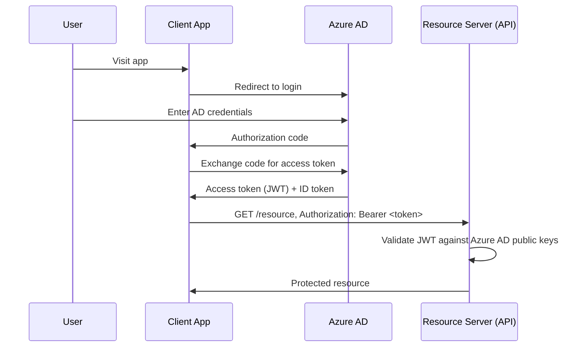

```csharp
builder.Services.AddAuthentication("Bearer")
    .AddMicrosoftIdentityWebApi(builder.Configuration.GetSection("AzureAd"));

builder.Services.AddAuthorization();
```

**Role-based vs claims-based authorization:**

```csharp
[Authorize(Roles = "Admin")]
[HttpGet("secure-data")]
public IActionResult GetSecureData() => Ok("Only Admin can access this!");
```

```csharp
[Authorize]
[HttpGet]
public IActionResult GetUserClaims()
{
    var email = User.FindFirst(ClaimTypes.Email)?.Value;
    return Ok($"User Email: {email}");
}
```

Claims-based authorization zyada general/flexible mechanism hai — roles really ek special-cased claim type hi hain (`ClaimTypes.Role`). Simple role checks se aage kisi bhi cheez ke liye, **policy-based authorization** use karo (`[Authorize(Policy = "MinimumAge")]` jo ek `IAuthorizationHandler` se backed hai) taaki authorization logic controllers ke across string role checks ke roop mein scattered na ho.

### [gaps] OAuth2 Grant Types — Kaunsa Grant Type Kis Client Ke Liye Fit Hai

Source notes mein OAuth2/OIDC ka naam liya gaya hai aur authorization code flow dikhaya gaya hai, lekin "aap X client ke liye kaunsa grant type use karoge" wala question generic "OAuth2 explain karo" ke mukable kahin zyada directly, standalone question ke taur par poocha jaata hai — interviewers yeh dekhna chahte hain ki aap client *type* ko grant type se deliberately map karte ho, sirf flow diagrams recite nahi karte.

**Client-type-to-grant-type decision, jis tarah ek senior candidate ko frame karna chahiye:**

| Grant Type | Kis Client Type Ko Fit Karta Hai | Kyun | Key Mechanic |
|---|---|---|---|
| **Authorization Code + PKCE** | SPAs (browser-based JS apps), native/mobile apps | Client "public" hai — yeh client secret ko safely hold nahi kar sakta (secret browser JS mein visible ho jaata ya mobile app binary se extract ho sakta hai). PKCE (Proof Key for Code Exchange) client secret ko ek dynamically generated code verifier/challenge pair se replace karta hai, jisse ek intercepted authorization code ko attacker dwara redeem hone se roka jaata hai | Browser/app authorization server par redirect karta hai → user authenticate karta hai → auth server code ke saath wapas redirect karta hai → client code + `code_verifier` ko tokens ke liye exchange karta hai. PKCE ab **saare** Authorization Code flows ke liye recommended hai, confidential clients ke liye bhi, OAuth 2.1 ke under |
| **Client Credentials** | Machine-to-machine (M2M) — backend service dusre backend service ko call kar raha ho, koi user beech mein nahi | Yahan authenticate karne ke liye koi end user nahi hai — *application khud* woh identity hai jise authorize kiya ja raha hai. Client "confidential" hai (ek backend service jo secret ko safely store kar sakta hai) | Service `client_id` + `client_secret` (ya ek signed JWT assertion) directly token endpoint ko present karta hai → us service ki permissions tak scoped access token milta hai, koi redirect/browser involve nahi hota |
| **Device Code** | Limited/no input capability wale devices — smart TVs, CLI tools, IoT devices | Device browser-based login redirect render nahi kar sakta ya complex text input accept nahi kar sakta (jaise, TV remote password type nahi kar sakta) | Device ek short code + ek URL display karta hai; user woh URL kisi *alag* device (phone/laptop) par normal browser mein open karta hai, code enter karta hai, wahan authenticate karta hai; original device token endpoint ko poll karta rehta hai jab tak user flow complete nahi kar leta |
| Implicit — **deprecated** | (pehle) SPAs, PKCE widely supported hone se pehle | Redirect ke baad access token ko directly URL fragment mein return karta tha, code-exchange step skip karke | **OAuth 2.1 mein removed.** URL fragment mein tokens browser history, referrer leaks, aur page par chal rahe kisi bhi script ke expose hote hain — Authorization Code + PKCE same public-client use case ko kahin zyada securely achieve karta hai aur ab universally recommended hai iske jagah |
| Resource Owner Password Credentials (ROPC) — **deprecated** | (pehle) first-party apps jo username/password directly collect karna chahte the | Client user ke raw credentials collect karta hai aur unhe directly token ke liye exchange karta hai | **OAuth 2.1 mein removed.** Client app ko raw passwords handle karne padte hain (delegated authorization ka purpose hi khatam ho jaata hai, users ko arbitrary apps mein credentials enter karne ki training milti hai, MFA/social login/passkeys ka support nahi hota). Sirf legacy migration bridge ke roop mein hi justify ho sakta hai, naye development ke liye kabhi nahi |

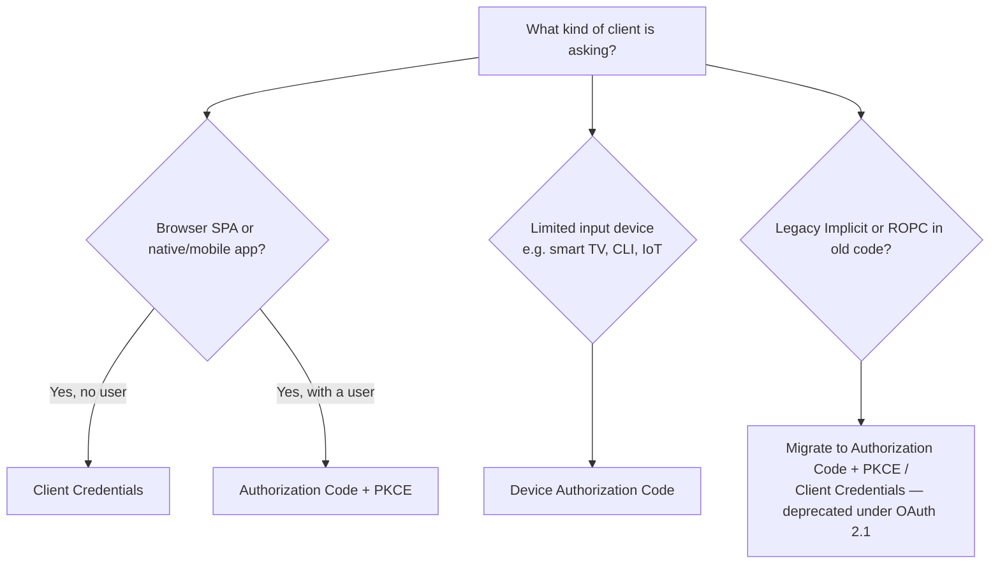

**Follow-up jo interviewers poochte hain, directly answer kiya gaya:**
- *"PKCE confidential client ke liye bhi kyun matter karta hai, sirf public clients ke liye nahi?"* — OAuth 2.1 guidance ke under, PKCE universally recommended hai kyunki yeh client type ke bawajood authorization-code-interception attacks se protect karta hai, aur har jagah consistently ek hi flow use karne se aapke system ko sahi tarike se implement karne wale distinct security mechanisms ki number kam ho jaati hai.
- *"SPA jo aapke API ko call kar rahi hai uske liye sirf Client Credentials kyun use nahi karte?"* — Kyunki Client Credentials ko client mein embedded client secret chahiye hota hai, aur SPA ka poora codebase browser mein deliver hota hai aur inspect kiya ja sakta hai — wahan secret ko confidential rakhne ka koi tarika nahi hai. Koi bhi "solution" jo frontend JS mein secret embed karta hai, woh actually secret nahi hai.
- *"Har flow mein *user* vs *application* ko kya identify karta hai?"* — Authorization Code (+PKCE) aur Device Code dono ka end result ek specific authenticated end user (plus client ki apni identity) se tied tokens hota hai. Client Credentials tokens sirf application/service ko hi represent karte hain — resulting token mein koi end-user identity bilkul nahi hoti, isi wajah se Client Credentials ko kisi bhi aise cheez ke liye use karna galat hai jisme per-user authorization ya audit trails chahiye.
- **.NET implementation note:** ASP.NET Core ka `AddJwtBearer`/`Microsoft.Identity.Web` jo bhi access token aata hai use validate karta hai, chahe woh kisi bhi grant type se generate hua ho — grant type *token issuance* side ka concern hai (authorization server / identity provider config), resource server ke validation code ka nahi, aur yeh nuance precisely bataana zaroori hai instead of "kaunsa grant type" ko "mera API token ko kaise validate karta hai" ke saath mix karne ke.

### [new content] API Keys vs OAuth2 Scopes — Kab Kaunsa Use Karein

Source notes API-key middleware aur OAuth2 ko alag-alag cover karte hain lekin kabhi compare nahi karte ki *kab* ek ko dusre ke upar choose karna hai — yeh ek common senior API-security design question hai.

| | API Keys | OAuth2 (scopes) |
|---|---|---|
| Identify karta hai | Ek application/client (aksar specific end-user nahi) | Ek specific user ya service, delegated, granular permissions ke saath |
| Granularity | Aam taur par all-or-nothing per key | Scopes ke through fine-grained (`read:orders`, `write:orders`) |
| Rotation/revocation | Manual, aksar redeploy ya key-management endpoint chahiye | Short-lived access tokens + refresh tokens; refresh token invalidate karke ya TTL kam karke revoke karo |
| Typical use case | Server-to-server, internal tooling, simple third-party integrations, metering/billing identification | User-delegated access, public APIs, "login with X," kisi bhi cheez ke liye jisme per-user consent/audit chahiye |
| Security posture | Weaker — ek static secret, agar carefully scope na kiya jaaye to often over-privileged | Stronger — short-lived tokens, standardized flows, consent screens, public clients ke liye PKCE |

```csharp
public class ApiKeyMiddleware
{
    private readonly RequestDelegate _next;
    public ApiKeyMiddleware(RequestDelegate next) => _next = next;

    public async Task Invoke(HttpContext context)
    {
        if (!context.Request.Headers.TryGetValue("X-API-KEY", out var key) || key != "expected-key")
        {
            context.Response.StatusCode = StatusCodes.Status401Unauthorized;
            await context.Response.WriteAsync("Unauthorized");
            return;
        }
        await _next(context);
    }
}
```

**Senior guidance:** API keys us *system* ko identify karne ke liye theek hain jo call kar raha hai (rate limiting buckets, billing/metering, trusted network ke andar simple internal service-to-service auth), lekin jab aapko per-user permissions, consent, ya auditability chahiye ho to yeh OAuth2 ka poor substitute hain — kaafi real breaches ek over-scoped, long-lived API key tak trace hoti hain jo config file mein check-in kar diya gaya tha. Machine-to-machine calls ke liye bhi bare API key ke upar OAuth2 client-credentials grant ko prefer karo jab ecosystem mein already ek identity provider ho, kyunki isse aapko free mein short-lived tokens aur centralized revocation milta hai.

### HATEOAS

```json
{
  "id": 1,
  "name": "Laptop",
  "price": 1200,
  "links": [
    { "rel": "self", "href": "/api/products/1" },
    { "rel": "update", "href": "/api/products/1", "method": "PUT" },
    { "rel": "delete", "href": "/api/products/1", "method": "DELETE" }
  ]
}
```

```csharp
public class ProductResource
{
    public int Id { get; set; }
    public string Name { get; set; }
    public decimal Price { get; set; }
    public List<LinkResource> Links { get; set; } = new();
}
public class LinkResource
{
    public string Rel { get; set; }
    public string Href { get; set; }
    public string Method { get; set; }
}
```

Senior level par expected pura trade-off discussion ke liye upar [REST Maturity Model & HATEOAS Trade-offs](#new-content-rest-maturity-model-richardson--hateoas-trade-offs) section dekhein.

### Microservices vs Monolithic Architecture

| Aspect | Monolithic | Microservices |
|---|---|---|
| Architecture | Single deployable codebase/process | Independent services, har ek ka apna codebase/deploy unit |
| Scalability | Pura app scale karo (coarse-grained) | Individual services ko independently scale karo (fine-grained) |
| Deployment | Ek deploy pipeline, ek artifact | Har service ka independent deploy — per team faster iteration, lekin zyada moving parts |
| Data ownership | Usually ek shared database | Har service typically apna data store khud own karta hai — cross-service joins cross-service API calls ban jaate hain |
| Team topology | Single team/small org ke liye achha kaam karta hai | Conway's Law ke saath align hota hai — separate teams separate services own karti hain |
| Operational overhead | Low — build, test, monitor, deploy karne ke liye ek hi cheez | High — service discovery, distributed tracing, network reliability, services ke beech versioned contracts |
| Transactions | Pure app mein native ACID transactions | Distributed transactions hard hote hain — usually [Outbox Pattern](#the-outbox-pattern) / sagas / eventual consistency se solve hote hain, two-phase commit se nahi |
| Failure isolation | Ek bug pura app down kar sakta hai | Ek failing service ko isolate kiya ja sakta hai (circuit breakers/bulkheads ke saath) baaki sab ko necessarily down kiye bina |

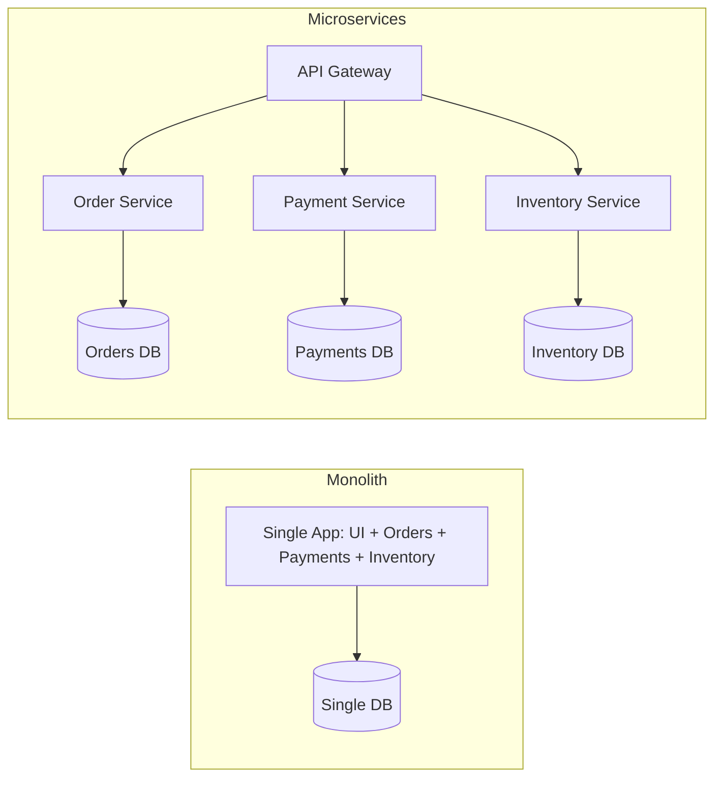

**"Aap microservices ke upar monolith kab choose karoge?" — ek direct, frequently-asked senior question, plainly answered:**
- **Small team, low complexity** — microservices ka operational tax (deployment pipelines × N, distributed tracing, service mesh, network-partition handling) tab tak pay karne layak nahi hai jab tak team size aur domain complexity ownership split karne ko justify na karein.
- **Early-stage product / unclear domain boundaries** — real seams kahan hain yeh samajhne se pehle services mein split karna aksar sabse worst outcome deta hai: ek "distributed monolith" (services jo abhi bhi tightly coupled hain lekin ab har change ke liye network-call latency aur deployment-coordination costs bhi pay karte hain).
- **Lower operational overhead ek genuine business win hai**, sirf cop-out nahi — fewer moving parts ka matlab hai monitor, secure, aur debug karne ke liye kam cheezein, jo aksar *correct* engineering trade-off hota hai, sirf lazy wala nahi.
- Ek pragmatic middle path jo kaafi senior engineers advocate karte hain: ek **well-modularized monolith** build karo (clean internal boundaries, jaise, separate class libraries/bounded contexts) taaki future mein microservices mein extraction — agar aur jab scale/team growth actually demand kare — ek refactor ho, rewrite nahi. Yeh wahi instinct hai jo legacy monolith se incremental migration ke liye **strangler fig pattern** ke peeche hai.

**Interviewer follow-up:** *"'distributed monolith' kya hota hai aur ban jaane se kaise bachein?"* Yeh naam se microservices hota hai — services abhi bhi database share karti hain, lockstep mein deploy hoti hain, ya ek-dusre ko long chains mein synchronously call karti hain, isliye aap microservices ki operational complexity inherit kar lete ho independent scalability ya deployability gain kiye bina. Isse bachne ke liye per-service data ownership enforce karo (no shared DB), jahan possible ho asynchronous/event-driven communication ke liye design karo, aur service boundaries actual business capabilities (bounded contexts) ke around draw karo, arbitrary technical layers ke around nahi.

### API Gateway Pattern

API Gateway ek single entry point hota hai jo multiple backend/microservices ko front karta hai, routing, auth, rate limiting, aur observability ko centralize karta hai.

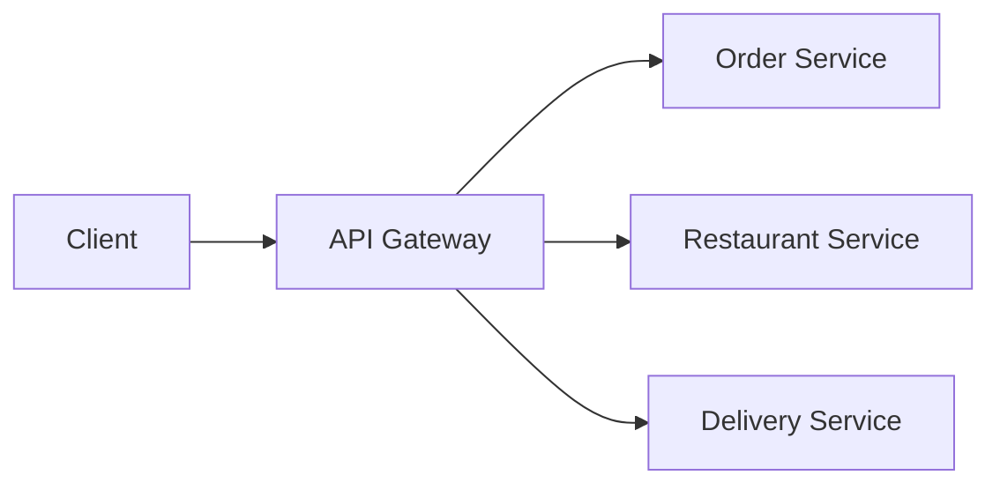

| Concern | Handled by Gateway |
|---|---|
| Centralized routing | `/api/orders` → Order Service, `/api/restaurants` → Restaurant Service |
| Security | Edge par Auth/authz, API key validation |
| Load balancing | Service instances ke across distribute karta hai |
| Rate limiting | Per-service ke bajaye ek baar, centrally enforce hota hai |
| Monitoring/logging | Cross-service telemetry ke liye single choke point |

Options: **Ocelot** (.NET-native, lightweight, chhote setups ke liye achha), **YARP** (Microsoft ka modern reverse-proxy toolkit, zyada flexible/performant, increasingly default .NET-native choice ban raha hai), ya managed cloud options (Azure API Management, AWS API Gateway, Kong). **Backend-for-Frontend (BFF)** ek related, narrower pattern hai — ek gateway jo ek specific client ke liye tailored ho (jaise, ek mobile BFF jo responses ko web BFF se differently aggregate/shape karta hai) instead of ek generic one-size-fits-all gateway.

### CQRS

Command Query Responsibility Segregation read (query) aur write (command) models ko separate karta hai, aksar unhe independently scale/optimize karne ke liye.

```csharp
public record CreateProductCommand(string Name, decimal Price) : IRequest<Product>;
public record GetProductQuery(int Id) : IRequest<Product>;

public class GetProductHandler : IRequestHandler<GetProductQuery, Product>
{
    private readonly DbContext _context;
    public GetProductHandler(DbContext context) => _context = context;

    public async Task<Product> Handle(GetProductQuery request, CancellationToken cancellationToken)
        => await _context.Products.FindAsync(request.Id);
}
```

```csharp
[HttpGet("{id}")]
public async Task<IActionResult> Get(int id, [FromServices] IMediator mediator)
    => Ok(await mediator.Send(new GetProductQuery(id)));
```

**Senior-level nuance:** CQRS ko MediatR, event sourcing, ya separate physical databases ki *zarurat nahi hai* — yeh optional escalations hain. Core idea simply yeh hai ki "jab reads aur writes ke concerns diverge karte hain to unhe same model/DTO shape se force mat karo" (jaise, ek write model jo invariants enforce karta hai vs ek read model jo UI grid ke liye ek flattened, denormalized projection hai). Full CQRS + event sourcing + separate read/write stores ek heavyweight pattern hai jo real scale/complexity se justify hota hai — isse default mein use karna ("kyunki MediatR hai") ek common junior/mid-level overengineering trap hai jise senior interviewers probe karte hain.

### Background Jobs & IHostedService/BackgroundService

`IHostedService` background tasks run karta hai jo app ke saath start hote hain aur shutdown par gracefully stop hote hain (namespace `Microsoft.Extensions.Hosting`).

```csharp
public class MyBackgroundService : IHostedService
{
    private readonly ILogger<MyBackgroundService> _logger;
    private Timer _timer;
    public MyBackgroundService(ILogger<MyBackgroundService> logger) => _logger = logger;

    public Task StartAsync(CancellationToken cancellationToken)
    {
        _logger.LogInformation("Hosted Service Started");
        _timer = new Timer(DoWork, null, TimeSpan.Zero, TimeSpan.FromSeconds(10));
        return Task.CompletedTask;
    }

    private void DoWork(object state) => _logger.LogInformation($"Running at: {DateTime.Now}");

    public Task StopAsync(CancellationToken cancellationToken)
    {
        _timer?.Change(Timeout.Infinite, 0);
        return Task.CompletedTask;
    }
}

builder.Services.AddHostedService<MyBackgroundService>();
```

**Preferred modern approach — `BackgroundService`** (abstract base class jo `IHostedService` implement karta hai, loop ko simplify karta hai):

```csharp
public class Worker : BackgroundService
{
    protected override async Task ExecuteAsync(CancellationToken stoppingToken)
    {
        while (!stoppingToken.IsCancellationRequested)
        {
            Console.WriteLine("Running background task...");
            await Task.Delay(5000, stoppingToken);
        }
    }
}
```

Use karo: periodic polling/cleanup, queue consumers, cache refresh, email sending ke liye. Durable, resumable, ya scheduled (cron-like) work ke liye retry/dashboards ke saath, **Hangfire** ya **Quartz.NET** hand-rolled `BackgroundService` loops ke upar common upgrades hain:

```csharp
builder.Services.AddHangfire(config => config.UseSqlServerStorage(connectionString));
app.UseHangfireDashboard();
app.UseHangfireServer();

BackgroundJob.Enqueue(() => Console.WriteLine("Background job executed"));
RecurringJob.AddOrUpdate("daily-cleanup", () => Console.WriteLine("Recurring job executed"), Cron.Daily);
```

**Gotcha:** `IHostedService`/`BackgroundService` instances hosting infrastructure dwara **Singleton** ke roop mein register hote hain — isliye Scoped services (jaise `DbContext`) ko directly inject na karne wala same rule yahan bhi apply hota hai; `ExecuteAsync` ke andar `IServiceScopeFactory` use karo, exactly jaise pehle singleton loggers ke liye dikhaya gaya tha.

### WebSockets & SignalR

Raw WebSockets:

```csharp
app.UseWebSockets();
app.Use(async (context, next) =>
{
    if (context.Request.Path == "/ws" && context.WebSockets.IsWebSocketRequest)
    {
        var socket = await context.WebSockets.AcceptWebSocketAsync();
        // handle communication
    }
    else await next();
});
```

**SignalR** — ASP.NET Core ka WebSockets ke upar real-time abstraction (jab WebSockets available na ho to Server-Sent Events / long polling par fallback karta hai), jo most low-level protocol handling ko hata deta hai:

```csharp
public class ChatHub : Hub
{
    public async Task SendMessage(string user, string message)
        => await Clients.All.SendAsync("ReceiveMessage", user, message);
}
app.MapHub<ChatHub>("/chatHub");
```

```javascript
const connection = new signalR.HubConnectionBuilder().withUrl("/chatHub").build();
connection.on("ReceiveMessage", (user, message) => console.log(`${user}: ${message}`));
connection.start();
```

**Jab "WebSockets vs SignalR vs SSE vs polling" poocha jaaye:** full control/cross-platform non-.NET clients ya custom protocol ke liye raw WebSockets; jab dono ends .NET-friendly hon (ya aapko iska group/user-management, automatic reconnection, aur Redis/Azure SignalR backplane ke through scale-out chahiye) aur bidirectional messaging kam boilerplate ke saath chahiye to SignalR; simple server→client push only ke liye (client→server channel ki zarurat nahi, plain HTTP par kaam karta hai, simpler infra) Server-Sent Events; lowest-common-denominator fallback ke roop mein long polling.

### Circuit Breaker & Resiliency (Polly)

```csharp
builder.Services.AddHttpClient("ExternalAPI")
    .AddTransientHttpErrorPolicy(p => p.CircuitBreakerAsync(2, TimeSpan.FromSeconds(30)));
```

```csharp
[HttpGet("external")]
public async Task<IActionResult> CallExternalAPI()
{
    var client = _httpClientFactory.CreateClient("ExternalAPI");
    var response = await client.GetAsync("https://external-api.com/data");
    return Ok(await response.Content.ReadAsStringAsync());
}
```

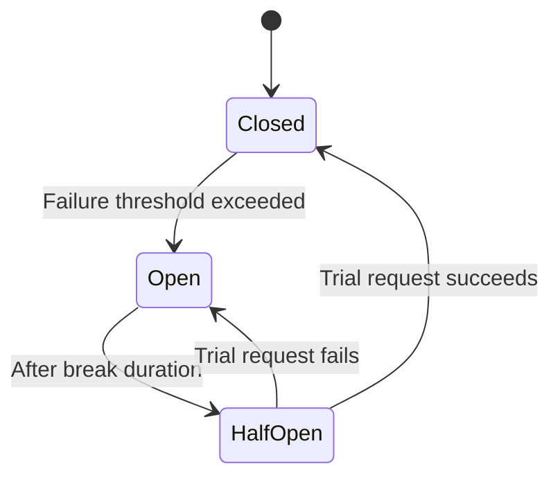

Circuit Breaker cascading failures ko failure threshold ke baad "open" karke (calls ko unhe attempt kiye bina hi immediately short-circuit karna) prevent karta hai, phir periodically ek trial request ko through jaane deta hai (**Half-Open**) fully close hone se pehle recovery test karne ke liye. Dhyan rakhna ki **.NET 8 ne `Microsoft.Extensions.Resilience`/`Microsoft.Extensions.Http.Resilience` introduce kiya**, jo Polly v8 ke naye pipeline API ke around ek first-party wrapper hai — Polly policies ko directly hand-wire karne ke bajaye current idiomatic approach ke roop mein mention karna worth hai, kyunki yeh `IHttpClientFactory` par `AddStandardResilienceHandler()` ke through resilience config ko standardize karta hai.

Related resiliency patterns jo interviewers circuit breaker ke saath pair karte hain:
- **Retry** — transient failures ko re-attempt karo, ideally exponential backoff + jitter ke saath thundering herd avoid karne ke liye.
- **Bulkhead isolation** — ek dependency ko concurrent calls cap karo taaki ek slow/failing downstream unrelated calls ke liye needed threads/connections ko exhaust na kar sake.
- **Timeout** — kitna wait karna hai give up karne se pehle usko bound karo, circuit breaker state se independent.
- **Fallback** — jab primary call fail ho jaaye to graceful degradation ke liye ek cached/default value return karo.

### gRPC vs REST vs GraphQL

| Feature | REST | gRPC | GraphQL |
|---|---|---|---|
| Protocol | HTTP/1.1 or HTTP/2 | HTTP/2 (mandatory) | HTTP (any version) |
| Payload | JSON/XML (text) | Protobuf (binary) | JSON |
| Contract | OpenAPI (aksar optional/baad mein generated) | `.proto` file (mandatory, strongly typed, code-generated) | GraphQL schema (mandatory, strongly typed) |
| Streaming | Limited (SSE, chunked) | Native bidirectional streaming | Subscriptions (WebSockets ke through, bolted on) |
| Browser support | Native | grpc-web proxy chahiye (browsers directly raw HTTP/2 trailers-based gRPC nahi kar sakte) | Native |
| Overfetching/underfetching | Common (per endpoint fixed shape) | N/A (RPC-style, per method defined) | Design se hi solved — client exact fields specify karta hai jo chahiye |
| Best for | Public APIs, broad client compatibility, simplicity | Internal service-to-service, low-latency/high-throughput, polyglot microservices | Client-driven UIs (mobile/web) jo multiple backend sources aggregate karte hain, BFF layers |

```protobuf
syntax = "proto3";
service ProductService {
  rpc GetProduct (ProductRequest) returns (ProductResponse);
}
```

```csharp
builder.Services.AddGraphQLServer().AddQueryType<Query>();
```

**Senior framing for "kya pick karoge":** REST kisi bhi public-facing cheez ke liye ya unknown/diverse clients dwara consumed ke liye (max compatibility, human-debuggable, standard HTTP semantics ke through intermediaries dwara cacheable); gRPC internal microservice-to-microservice calls ke liye jahan aap dono ends control karte ho aur speed + strong contracts chahte ho (service mesh mein common); GraphQL jab client ki data-shape needs bahut vary karti hain aur aap (a) chatty multiple round-trips ya (b) har UI variant ke liye bespoke REST endpoints ka explosion, dono avoid karna chahte ho — lekin uske downsides discuss karne ke liye ready raho: harder HTTP-level caching (single `POST /graphql` endpoint URL-based CDN caching ko defeat karta hai), resolvers mein N+1 query risk (DataLoader-style batching se mitigate hota hai), aur zyada complex authorization (field-level, sirf endpoint-level nahi).

### OData

OData standardized query capabilities (filter, sort, select, expand, paginate) ko query string conventions ke through ek REST endpoint par layer karta hai.

```csharp
builder.Services.AddControllers().AddOData(options => options.Select().Filter().OrderBy());

[EnableQuery]
[HttpGet]
public IQueryable<Product> Get() => _context.Products;
```

```http
GET /api/products?$filter=price gt 100&$orderby=name
```

**Trade-off:** OData consumers ko free mein powerful ad-hoc querying deta hai, lekin iska matlab yeh bhi hai ki clients aapke database ke against arbitrarily expensive queries construct kar sakte hain (unbounded `$expand` depth, unindexed columns par filters) — production use mein guardrails chahiye (`$top` max page size enforcement, query cost limits, large collections par `$expand` disable karna) warna yeh ek self-inflicted DoS vector ban jaata hai. Yeh ek common senior follow-up hai: "agar aap OData ko limits ke bina expose karte to kya galat ho sakta tha?"

---

## System Design & Scalability

Senior interviews increasingly API syntax ke bajaye distributed-systems judgment par ek pura round spend karte hain — yeh section un scalability/consistency questions ka jawab deta hai jo source notes ne sample questions ke roop mein flag kiye the lekin actually kabhi work through nahi kiye.

### Database Sharding vs Partitioning

| Aspect | Partitioning | Sharding |
|---|---|---|
| Scope | Ek logical table ka data multiple physical structures mein split karta hai **same database/instance ke andar** | Data ko **multiple separate database instances/servers** ke across split karta hai |
| Goal | Ek single large table par manageability aur query performance (jaise, date range se partition karna) | Horizontal scalability — jab ek single DB instance volume/throughput handle nahi kar paata to load aur storage ko machines ke across spread karta hai |
| Transparency | Usually application ke liye transparent — DB engine queries ko sahi partition par route karta hai | Application (ya ek routing/proxy layer) ko typically janna padta hai ki kaunsa shard kis row ko hold karta hai, ek shard key ke through |
| Cross-partition/shard queries | Relatively cheap — same instance, same query engine | Expensive/hard — aksar fan-out queries ya ek separate aggregation layer chahiye; shards ke across joins ek known pain point hain |
| Complexity | Lower — mostly ek DBA/schema-design concern | Higher — application code, connection routing, shards add karte waqt rebalancing, aur transaction scope ko affect karta hai |
| Common approach in .NET/SQL Server | Table partitioning (`PARTITION BY RANGE`), partitioned indexes | Connection-routing logic mein baked-in sharding key (jaise, `TenantId % N` ya consistent hashing), aksar ek middleware/proxy (Citus for Postgres, Vitess for MySQL) ke through ya hand-rolled multi-`DbContext` routing |

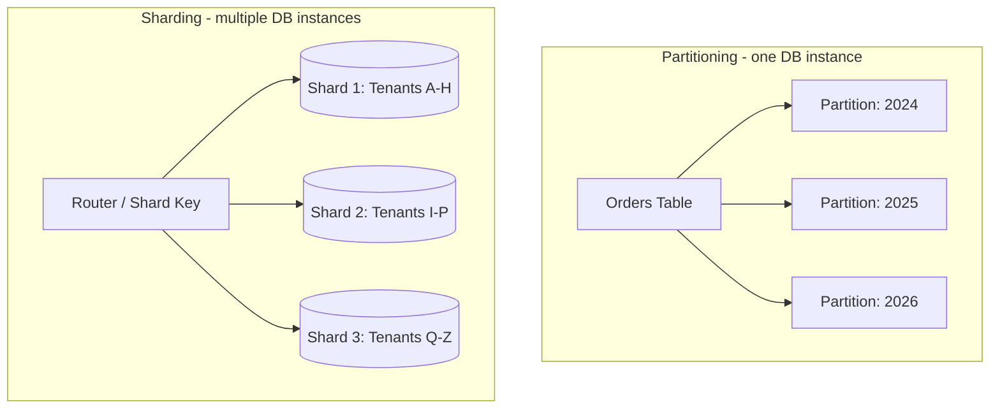

**Senior trade-off framing:** pehle partitioning ke liye reach karo — yeh application code ko touch kiye bina "yeh ek table too big/slow hai" wali problem solve karta hai. Sharding ke liye reach karo sirf jab *ek single database instance* ki total capacity (storage, IOPS, connections) actual bottleneck ho, kyunki sharding real complexity ko application mein push karta hai: ek shard key choose karna jo hotspots avoid kare, cross-shard queries/joins/transactions handle karna, aur baad mein shards add karte waqt rebalancing karna. Ek common real-world middle ground ek shard key hai jo ek natural partition boundary bhi ho (jaise, multi-tenant SaaS ke liye `TenantId`), jisse aap tenant ke hisaab se shard kar sakte ho jabki har shard ki tables internally date ke hisaab se partitioned hoti hain.

### Feature Flags & Safe Rollout

Feature flags **deployment** (code ka production tak pahunchna) ko **release** (feature ka users ke liye visible/active hona) se decouple karte hain — safe, gradual rollout ke liye ek foundational technique jise source notes ne sample question ke roop mein flag kiya tha lekin kabhi answer nahi kiya.

```csharp
if (await _featureManager.IsEnabledAsync("NewCheckoutFlow"))
{
    return await _newCheckoutService.ProcessAsync(order);
}
return await _legacyCheckoutService.ProcessAsync(order);
```

```csharp
builder.Services.AddFeatureManagement(); // Microsoft.FeatureManagement
```

**Safely implement karna — ek senior answer "SDK use karo" se aage kya cover karta hai:**
- **Gradual / percentage rollout** — ek global on/off switch ke bajaye traffic ke 1% → 10% → 50% → 100% ke liye (ya targeted user segments ke liye) enable karo, har step par error rates/metrics dekhte hue.
- **Kill switch** — ek flag *redeploy ke bina* checkable aur flippable hona chahiye, taaki incident ke dauraan ek bad feature seconds mein disable ho sake, rollback deploy ke through nahi.
- **Flag hygiene/debt** — flags temporary hone ke liye meant hain; stale flags code mein untested combinatorial branches ke roop mein accumulate hote hain aur rollout complete hone ke baad remove kar dene chahiye (ek common real-world pitfall jo unprompted naam lene layak hai).
- **Consistent bucketing** — same user ko requests ke across consistently same variant mein land karna chahiye (user/session ID ko rollout percentage mein hash karo, har request ke liye fresh random roll nahi) warna aapko confusing, inconsistent experience milta hai.
- Common tooling: `Microsoft.FeatureManagement` (config-driven, simple), ya ek dedicated platform (LaunchDarkly, Azure App Configuration feature flags, Unleash) jab aapko targeting rules, analytics, aur cross-service flag consistency chahiye.

### Zero-Downtime Deployment: Blue-Green & Canary

Source notes mein unanswered chhoda gaya ek aur sample question — "downtime ke bina deploy kaise karte ho" ek standard senior/lead operational-maturity check hai.

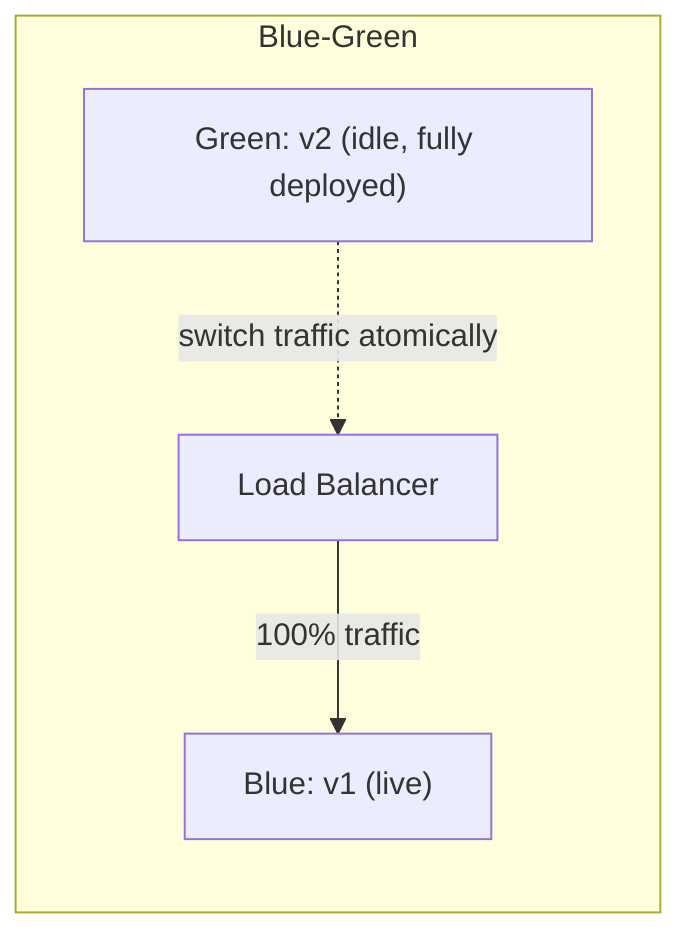

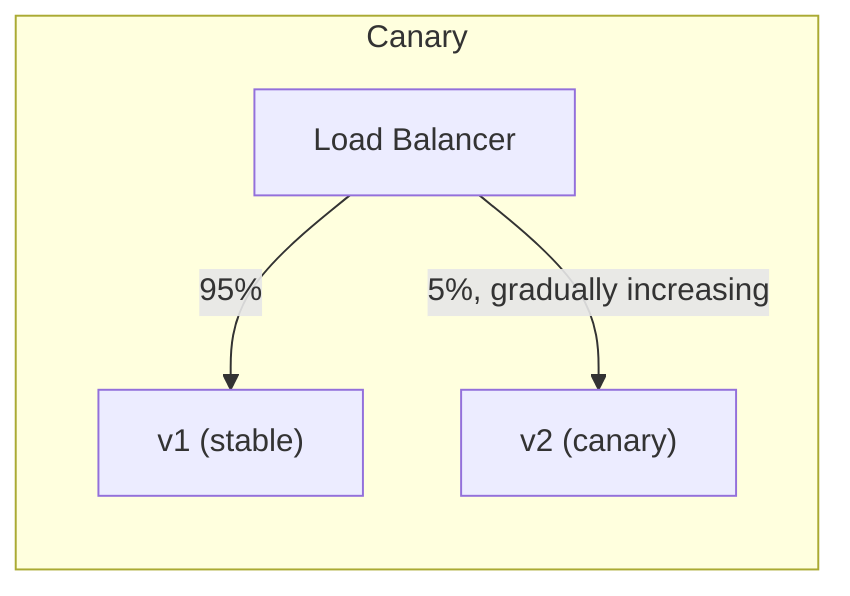

| Strategy | Kaise Kaam Karta Hai | Rollback Speed | Cost |
|---|---|---|---|
| **Blue-Green** | Two full environments; v2 ko idle wale par deploy karo, health/smoke checks run karo, phir load balancer/router ko flip karke 100% traffic v2 ko atomically send karo | Instant — router ko blue par wapas flip karo | Jab tak dono environments exist karte hain, double infrastructure |
| **Canary** | v1 ke saath v2 deploy karo; ek small percentage traffic v2 ko route karo, metrics/errors dekho, gradually 100% tak increase karo | Fast — v2 ka traffic share wapas 0% kar do | Lower — full duplicate environment nahi, lekin traffic-splitting infra chahiye |
| **Rolling update** | Load balancer ke peeche v1 ke instances ko v2 se ek (ya kuch) baar mein replace karo | Slower — previous version ko redeploy karna padta hai | Low — no duplicate environment, Kubernetes deployments mein standard |

**Key mechanics jo ek senior candidate ko unprompted naam lene chahiye:**
- **Readiness probes** — load balancer/orchestrator ko traffic sirf tab route karna chahiye jab instance ready report kare (sirf "process started" nahi); yahi actually rollout ke dauraan ek "half-deployed" instance ko errors serve karne se rokta hai. Concrete implementation ke liye neeche [Health Checks](#health-checks) dekhein.
- **Backward-compatible DB migrations** — "zero downtime" ka sabse riskiest part usually database hota hai, app tier nahi: rollout window ke dauraan ek migration *dono* old aur new code version ke saath compatible hona chahiye (jaise, ek naya nullable column add karo aur ek later deploy mein backfill karo, ek single deploy ke bajaye jo ek column rename/drop kar de jise old version abhi bhi read kar raha hai).
- **Graceful shutdown** — ek old instance terminate karne se pehle in-flight requests ko drain karna (`IHostApplicationLifetime`/`SIGTERM` handling), sirf process ko kill karna nahi.
- Canary ek bad deploy ko early *catch* karne ke liye blue-green se strictly better hai (small blast radius, real production traffic, gradual exposure) lekin zyada infrastructure sophistication chahiye (metrics-driven automated promotion/rollback); blue-green reason karne ke liye simpler hai lekin issue tab hi surface hota hai jab 100% traffic already flip ho gaya ho.

### The Outbox Pattern

Is guide mein kahin aur ek baar "event-driven consistency" ke shorthand ke roop mein naam liya gaya hai lekin actually kabhi define nahi kiya gaya — yahan full picture hai, kyunki "outbox pattern kya hai" directly poocha jaata hai.

**Yeh jo problem solve karta hai:** aapko apna database update karna hai *aur* ek message/event publish karna hai (jaise, Kafka/RabbitMQ ko) ek single atomic unit of work ke roop mein — lekin database aur message broker do separate systems hain jinke beech koi shared transaction nahi hai. DB mein likhna aur phir event publish karna do separate steps ke roop mein karne se ek **dual-write problem** ka risk hota hai: DB commit succeed ho jaata hai lekin publish fail ho jaata hai (ya vice versa), jisse system inconsistent reh jaata hai (jaise, ek order create ho jaata hai lekin koi `OrderCreated` event shipping service tak kabhi pahunchta hi nahi).

**Fix:** event ko `OutboxMessages` table mein business data change ke **same database transaction** mein likho, phir ek separate background process us table se unpublished rows read karta hai aur unhe broker ko publish karta hai, success par unhe processed mark karta hai.

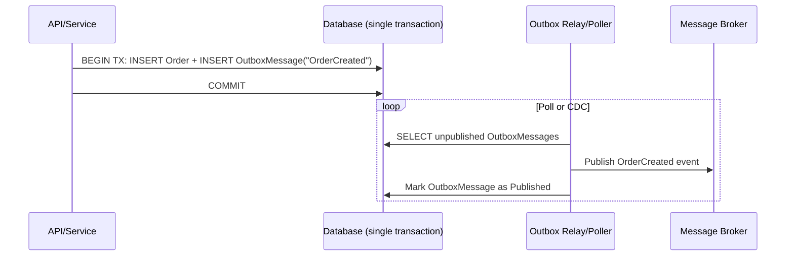

```csharp
public class OutboxMessage
{
    public Guid Id { get; set; }
    public string Type { get; set; }
    public string Payload { get; set; } // serialized event
    public DateTime CreatedAt { get; set; }
    public DateTime? ProcessedAt { get; set; }
}

// Inside the same DbContext SaveChanges transaction as the business entity:
_context.Orders.Add(order);
_context.OutboxMessages.Add(new OutboxMessage
{
    Id = Guid.NewGuid(),
    Type = "OrderCreated",
    Payload = JsonSerializer.Serialize(new { order.Id, order.CustomerId }),
    CreatedAt = DateTime.UtcNow
});
await _context.SaveChangesAsync(); // atomic: both rows commit together, or neither does
```

**Senior-level nuances:**
- Relay/poller (ek `BackgroundService`, ya Debezium jaisi ek change-data-capture pipeline) event ko **at-least-once** deliver karta hai — yeh publish karne ke baad lekin row ko processed mark karne se pehle crash ho sakta hai, jisse re-publish hota hai. Consumers **idempotent** hone chahiye (yeh upar [idempotency keys](#new-content-idempotency-keys-for-postput) discussion se directly ties karta hai) — yahi wo exact mechanism hai jo most real systems mein "exactly-once delivery" claims ke peeche hai: yeh actually at-least-once delivery plus idempotent consumers hai, ek true distributed exactly-once guarantee nahi.
- Yahi wajah hai ki outbox pattern **sagas** ke liye standard building block ban jaata hai (services ke across local transactions ka ek sequence, har ek previous step ke event se triggered) — distributed two-phase-commit transactions ka alternative, jo microservices/heterogeneous data stores ke across scale nahi karte.
- Simpler approaches ke against trade-off: yeh ek table, ek relay process, aur eventual (immediate nahi) event delivery add karta hai — sirf tab justified hai jab aapko actually ek network boundary ke across DB-write-and-event-publish atomicity chahiye; ek monolith ke liye jiske paas koi message broker nahi hai, yeh unnecessary ceremony hai.

### Eventual Consistency & Compensating Transactions

Source notes mein ek direct sample design question ke roop mein flag kiya gaya ("eventual consistency ke liye designing describe karo") koi worked answer ke bina — yeh upar wale outbox pattern ka natural follow-on hai.

Ek distributed system mein, aap generally multiple services ke across ek single-database ACID transaction ki strong consistency nahi paa sakte — har service apna khud ka local transaction commit karta hai, aur overall multi-service operation *eventually* hi consistent banta hai, jab events propagate hote hain aur downstream services catch up karte hain.

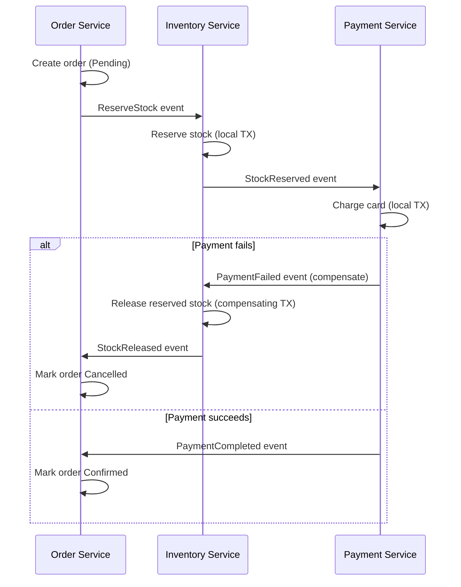

**Compensating transactions** distributed-systems ka jawab hain "rollback kaise karte ho" ke liye jab rollback karne ke liye koi shared transaction nahi hai — ek automatic rollback ke bajaye, har service jo already ek local change commit kar chuki hai, ek explicit, business-meaningful *undo* action perform karti hai agar workflow mein baad ka step fail ho jaaye (reserved stock release karna, ek charge refund karna, ek shipment cancel karna). Yeh **Saga pattern** ka core mechanic hai.

**Ek senior candidate ko unprompted kya raise karna chahiye:**
- **User-visible implications** — UI ko interim states ke baare mein honest hona chahiye ("Order placed — confirming payment" instant, final success imply karne ke bajaye), kyunki system ko genuinely pata nahi hota final outcome kya hai jab initial request return hota hai.
- **Read models lag kar sakte hain** — write ke immediately baad ek read replica ya denormalized projection ko hit karne wali query abhi usko reflect nahi kar sakti; UX aur APIs design karo (jaise, write path se hi just-written entity return karna, subsequent read se nahi) confusing "maine abhi save kiya lekin woh wahan nahi hai" bugs avoid karne ke liye.
- **Compensations hamesha possible nahi hote** — kuch actions (email bhejna, ek irreversible external side effect) undo nahi kiye ja sakte; design ko unhe trigger karne se rokna hota hai jab tak workflow ek aisa point na pahunche jahan realistic failure na ho, ya (rare) inconsistency ko business cost ke roop mein accept karna hota hai.
- **Idempotency aur outbox pattern hi sagas ko reliable banate hain** — har step aur har compensation ko double-effect kiye bina retried/re-delivered hone ko tolerate karna chahiye, isi wajah se yeh teen topics (outbox, idempotency, eventual consistency) usually saath mein poochhe jaate hain, isolation mein nahi.

---

## Deployment & Observability

### Health Checks

Load balancers, Kubernetes, aur container orchestrators ko "kya yeh instance actually traffic serve kar paane mein capable hai" poochne ka ek cheap, standard tarika chahiye hota hai — ASP.NET Core ka built-in health checks middleware isi ka jawab deta hai.

```csharp
builder.Services.AddHealthChecks()
    .AddDbContextCheck<AppDbContext>()
    .AddCheck<RedisHealthCheck>("redis")
    .AddUrlGroup(new Uri("https://downstream-api.com/health"), name: "downstream-api");

app.MapHealthChecks("/health");
```

```http
GET /health
```

**Senior-level detail "`AddHealthChecks()` enable karo" se aage:**
- **Liveness** (process alive hai/restart karna chahiye?) ko **readiness** (traffic receive karne ke liye ready hai — DB reachable, caches warm?) se separate endpoints/tags use karke split karo (`MapHealthChecks("/health/live", ...)` vs `/health/ready`) — unhe conflate karna Kubernetes ko ek healthy-but-still-starting pod ko restart karne, ya ek pod jiska DB connection down hai usko traffic route karte rehne ka cause banta hai.
- Ek readiness check jo ek downstream dependency ko ping karta hai (upar wale `AddUrlGroup` example jaisa) khud ek cascading-failure vector ban sakta hai agar woh dependency slow/down ho — usse ek timeout ke saath bound karo aur "downstream degraded" ko `Degraded` treat karo, necessarily `Unhealthy` nahi, depending on ki woh dependency request serve karne ke liye actually required hai ya nahi.
- Health check UI dashboards (`AspNetCore.HealthChecks.UI`) ek small ops team ke liye status eyeball karne ke liye useful hote hain, lekin check *endpoints* hi woh cheez hai jo orchestrators/load balancers actually consume karte hain — dashboard ko mechanism ke saath conflate mat karo.
- Yeh directly upar wale [Zero-Downtime Deployment](#zero-downtime-deployment-blue-green--canary) readiness-probe discussion se ties karta hai — yeh us "readiness probe" ka concrete implementation hai.

### Dockerizing a .NET Web API

Containerizing ek senior candidate ke liye table-stakes hai — kam se kam ek multi-stage Dockerfile discussion expect karo, sirf "maine `dotnet publish` run kiya" nahi.

```dockerfile
# Build stage
FROM mcr.microsoft.com/dotnet/sdk:8.0 AS build
WORKDIR /src
COPY . .
RUN dotnet restore
RUN dotnet publish -c Release -o /app/publish

# Runtime stage
FROM mcr.microsoft.com/dotnet/aspnet:8.0 AS runtime
WORKDIR /app
COPY --from=build /app/publish .
EXPOSE 8080
ENTRYPOINT ["dotnet", "MyWebAPI.dll"]
```

```bash
docker build -t mywebapi .
docker run -p 5000:8080 mywebapi
```

**Multi-stage build kyun matter karta hai (woh detail jo ek single-stage Dockerfile miss karta hai):** full `sdk` image se build karna lekin much smaller `aspnet` runtime image ship karna final image ko lean rakhta hai (production mein no compilers/build tooling) aur attack surface reduce karta hai. Raise karne layak dusre points:
- Reproducible builds ke liye exact base image tags pin karo (`aspnet:8.0`, `latest` nahi).
- Container security hardening ke liye final image mein root ke bajaye ek **non-root user** ke roop mein run karo (.NET 8 se official .NET images by default ek non-root `app` user use karti hain).
- Apne `bin`/`obj`/`.git` folders `.dockerignore` karo taaki build context (aur isliye image layers) small rahe.
- Configuration ko environment variables/mounted secrets ke through externalize karo — connection strings/API keys ko image mein kabhi bake mat karo.
- Container orchestrator liveness/readiness probes ke liye upar [Health Checks](#health-checks) ke saath pair karo, aur ek senior interview mein actual follow-up question Kubernetes (sirf raw `docker run` nahi) expect karo — Dockerfile table-stakes hai, orchestration wahan hai jahan interesting trade-offs rehte hain (resource limits, CPU/custom metrics par HPA scaling, `ConfigMap`/`Secret` ke through config).

### Application Insights (Monitoring & Telemetry)

Source notes Application Insights ko directly mention karte hain (is guide mein kahin aur ke generic OpenTelemetry references se distinct) — apna concrete example worth hai kyunki yeh abhi bhi un teams ke liye default APM choice hai jo already Azure par hain.

```csharp
builder.Services.AddApplicationInsightsTelemetry(builder.Configuration["ApplicationInsights:ConnectionString"]);
```

```csharp
public class ProductsController : ControllerBase
{
    private readonly TelemetryClient _telemetry;
    public ProductsController(TelemetryClient telemetry) => _telemetry = telemetry;

    [HttpGet]
    public IActionResult Get()
    {
        _telemetry.TrackEvent("ProductsListRequested");
        return Ok("Success");
    }
}
```

**Application Insights aapko out of the box kya deta hai** ek baar wire hone ke baad: automatic request/dependency tracking (incoming HTTP requests, outgoing SQL/HTTP calls timed aur correlated), exception tracking, live metrics, aur — microservices ke liye critically — **distributed request correlation** (ek `Operation Id` jo ek single logical user request ko service hops ke across ek saath tie karta hai, taaki aap Application Map mein isolated per-service logs ke bajaye ek end-to-end trace dekh sako).

**Senior framing vs. is guide mein kahin aur ke OpenTelemetry mentions:** Application Insights historically ek proprietary SDK/pipeline tha; current-generation Application Insights ab under the hood **OpenTelemetry** standard par built hai (Azure Monitor OpenTelemetry Distro ke through), isliye "Application Insights" aaj effectively "OpenTelemetry instrumentation, Azure Monitor ko exported" matlab hota hai, ek competing technology nahi — agar unhe contrast karne ke liye poocha jaaye to precisely bataana worth hai, kyunki unhe do unrelated tools treat karna ek dated understanding hai. Custom events/metrics (`TrackEvent`, `TrackMetric`, `TrackDependency`) business-level telemetry ke liye useful bane rehte hain (jaise, "checkout completed", "search returned zero results") jise generic auto-instrumentation capture nahi karega — unhe un signals ke liye reserve karo jo dashboard/alert ko actually chahiye, sab kuch ke liye nahi, warna aap useful signal ko noise mein drown kar dete ho (aur ingestion cost badha dete ho).

---

## Performance

### Response Compression

```csharp
builder.Services.AddResponseCompression(options =>
{
    options.Providers.Add<BrotliCompressionProvider>();
    options.Providers.Add<GzipCompressionProvider>();
});
app.UseResponseCompression();
```

```http
Accept-Encoding: gzip, deflate, br
```

Payload size aur network time reduce karta hai; compress karne mein CPU cost lagta hai. Brotli generally text (JSON) ke liye modern CPUs par comparable/better speed par Gzip se better compress karta hai — isse primary provider ke roop mein prefer karo aur older clients ke liye Gzip ko fallback rakho. **Gotcha:** compression usually already-compressed content (images, video) ya bahut small payloads ke liye worth *nahi* hoti (compression overhead savings se exceed kar sakta hai) — aur isse generally pipeline mein HTTPS/response caching ke **peeche** baithna chahiye; ordering double-check karo (`UseResponseCompression()` ko early register karna chahiye, static files/MVC se pehle).

### Response Caching, Output Caching & Distributed Cache (Redis)

**In-process response caching:**

```csharp
builder.Services.AddResponseCaching();
app.UseResponseCaching();

[ResponseCache(Duration = 60, Location = ResponseCacheLocation.Client)]
[HttpGet]
public IActionResult Get() => Ok("Cached Data");
```

**Note:** `[ResponseCache]` / `AddResponseCaching()` mostly HTTP caching *headers* ko manipulate karta hai — jab tak configure na kiya jaaye yeh necessarily response ko server-side cache nahi karta, aur yeh `Vary`/`Cache-Control` semantics ko fully respect karta hai, matlab misconfigured headers silently caching disable kar sakte hain. **Output Caching** (naya .NET 7 mein, `AddOutputCache()`/`UseOutputCache()`) zyada powerful, actual server-side cache-the-response-body feature hai, jo custom cache policies, tag-based eviction, aur pluggable storage support karta hai — sirf `ResponseCache` attributes par rely karne ke bajaye yeh modern recommendation hai:

```csharp
builder.Services.AddOutputCache(options =>
{
    options.AddPolicy("Products", policy => policy.Expire(TimeSpan.FromSeconds(60)).Tag("products"));
});
app.UseOutputCache();

app.MapGet("/api/products", () => Ok(products)).CacheOutput("Products");

// Later, on a write:
await outputCacheStore.EvictByTagAsync("products", cancellationToken);
```

**Distributed cache (Redis) — cache-aside pattern:**

```csharp
builder.Services.AddStackExchangeRedisCache(options =>
{
    options.Configuration = "redis:6379";
    options.InstanceName = "app_";
});

var value = await cache.GetStringAsync("product_10");
if (value is null)
{
    value = await FetchFromDbAndSerialize();
    await cache.SetStringAsync("product_10", value, new DistributedCacheEntryOptions
    {
        AbsoluteExpirationRelativeToNow = TimeSpan.FromMinutes(10)
    });
}
```

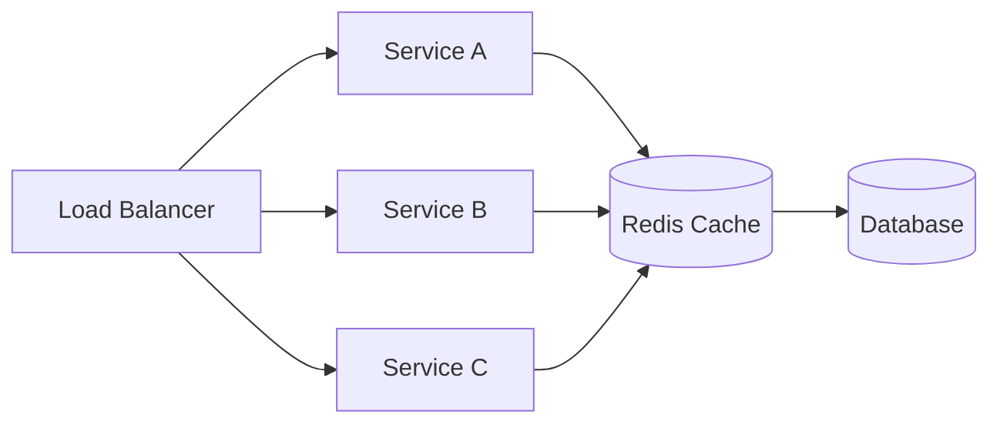

**Microservices mein Redis kyun matter karta hai (source notes se, retained):** jaise instance count scale hota hai (1 → 10 → 100 containers), in-memory (`IMemoryCache`) caches diverge ho jaate hain — har instance ka separate memory hota hai, isliye instance A par ek cache hit instance B par ek cache miss hota hai. Redis ek shared cache provide karta hai jise saare instances read karte hain, jisse cached state fleet ke across consistent rehta hai.

**Common interview pitfalls (source se retained, yeh genuinely good hain):**

| Pitfall | Description | Mitigation |
|---|---|---|
| Cache Stampede | Cache expire ho jaata hai; kaafi concurrent requests sab simultaneously DB hit karte hain | Distributed locks, cache warming, randomized/jittered TTLs |
| Cache Invalidation | DB updated ho gaya lekin cache mein abhi bhi stale value hai | Delete-on-write, write-through caching, event-driven invalidation |
| Storing Too Much Data | Redis ko cache ke bajaye ek general datastore treat karna | Sirf hot/frequently-accessed data cache karo; TTLs set karo |
| Serialization Problems | Large/complex object graphs inefficiently serialized honi | Compact formats (MessagePack) ya trimmed DTOs use karo, full entity graphs nahi |
| Redis as Primary Store | Critical data ke liye Redis durability par rely karna | Redis ko disposable treat karo — usse lose karna app ko degrade karna chahiye, break nahi |
| Connection Mismanagement | Har call ke liye naye Redis connections create karna | Ek shared `IConnectionMultiplexer` singleton reuse karo |

### [new content] ETags & Conditional Requests

Source notes se poori tarah missing — ETags ek standard, senior-expected performance/consistency mechanism hain jo explicit response caching ko complement karte hain (aur kabhi kabhi replace karte hain), aur PUT/PATCH ke liye optimistic concurrency ka backbone bhi hain.

```csharp
[HttpGet("{id}")]
public async Task<IActionResult> GetProduct(int id)
{
    var product = await _context.Products.FindAsync(id);
    if (product is null) return NotFound();

    var etag = $"\"{product.RowVersion.ToBase64()}\"";
    Response.Headers.ETag = etag;

    if (Request.Headers.IfNoneMatch == etag)
        return StatusCode(StatusCodes.Status304NotModified);

    return Ok(product);
}

[HttpPut("{id}")]
public async Task<IActionResult> UpdateProduct(int id, [FromBody] Product update)
{
    var product = await _context.Products.FindAsync(id);
    if (product is null) return NotFound();

    var currentEtag = $"\"{product.RowVersion.ToBase64()}\"";
    if (Request.Headers.IfMatch != currentEtag)
        return StatusCode(StatusCodes.Status412PreconditionFailed); // someone else updated it first

    // apply update, DB concurrency token check enforces this at the data layer too
    await _context.SaveChangesAsync();
    return NoContent();
}
```

- **`ETag` + `If-None-Match`** — conditional GET: agar client ki cached copy abhi bhi current hai to server `304 Not Modified` (no body) return karta hai, ek full response ke bina bandwidth save karta hai.
- **`ETag` + `If-Match`** — writes ke liye optimistic concurrency: agar client ne resource ko last read kiya tha uske baad se woh change ho gaya hai to update ko `412 Precondition Failed` se reject karo (EF Core ke `[ConcurrencyCheck]`/`RowVersion` pattern se directly analogous, lekin HTTP layer par expressed, jo interviewers connected dekhna chahte hain).
- Yeh request body mein bespoke "version" fields ka standards-based alternative/complement hai, aur un CDNs/reverse proxies ke saath achhe se play karta hai jo HTTP caching semantics ko natively samajhte hain.

### Query & EF Core Performance

```csharp
var products = _context.Products.AsNoTracking().ToList();
```

Senior-level EF Core performance checklist (source ke brief mentions ko expand karte hue):
- Read-only queries ke liye **`AsNoTracking()`** — change-tracking snapshot overhead skip karta hai.
- **N+1 queries avoid karo** — eager loading ke liye `.Include()`/`.ThenInclude()` use karo, ya full entities ke bajaye sirf needed columns fetch karne ke liye projections (`.Select(x => new Dto {...})`).
- Extremely hot, repeated query shapes ke liye **Compiled queries** (`EF.CompileAsyncQuery`).
- Multiple collection navigations eager-load karte waqt cartesian-explosion joins avoid karne ke liye **Split queries** (`.AsSplitQuery()`).
- Generated SQL inspect karne ke liye `.ToQueryString()` ke through, EF Core ki built-in query logging, ya DB side par `EXPLAIN`/execution plans se **slow queries diagnose karo**; filter/join columns par missing indexes ke liye watch karo.
- **DB level par pagination**, memory mein nahi — `Skip/Take` (ya cursor-based, upar dekhein) `ToList()` ke *pehle* hona chahiye, pura table materialize karne ke baad nahi.
- Genuine hotspots ke liye **Dapper/raw ADO.NET** jahan EF ka abstraction overhead (change tracking, LINQ-to-SQL translation) measurably matter karta hai — isko default mein reach mat karo, pehle profile karo.

### Soft Delete Pattern

Rows ko outright delete karne se audit history khatam ho jaati hai aur foreign keys cascade-break ho sakte hain; **soft delete** (physical `DELETE` ke bajaye ek `IsDeleted` flag) kisi bhi compliance/audit requirement wale most production systems mein default hai.

```csharp
public class Product
{
    public int Id { get; set; }
    public string Name { get; set; }
    public bool IsDeleted { get; set; }
}

[HttpDelete("{id}")]
public async Task<IActionResult> SoftDelete(int id)
{
    var product = await _context.Products.FindAsync(id);
    if (product is null) return NotFound();

    product.IsDeleted = true;
    await _context.SaveChangesAsync();
    return NoContent();
}
```

Har query ko haath se naively filter karna (`.Where(p => !p.IsDeleted)`) scale nahi karta — ek query par isse bhool jaana aasan hai aur "deleted" rows ek response mein leak ho jaate hain. Senior-grade fix ek **EF Core global query filter** hai, jo `OnModelCreating` mein ek baar applied hota hai:

```csharp
protected override void OnModelCreating(ModelBuilder modelBuilder)
{
    modelBuilder.Entity<Product>().HasQueryFilter(p => !p.IsDeleted);
}
```

`Products` ke against har LINQ query ab automatically soft-deleted rows exclude karta hai — `Include()`d navigations bhi shamil — koi per-query boilerplate ke bina. Rare admin/audit query ke liye jise deleted rows dekhne hain, explicitly `.IgnoreQueryFilters()` use karo.

**Unprompted raise karne wale trade-offs:**
- Unique constraints/indexes ko soft-deleted rows ka account karna chahiye (jaise, ek "deleted" username ko wapas add karna original ke saath collide nahi hona chahiye) — aksar ek filtered/partial unique index (`WHERE IsDeleted = 0`) se solve hota hai.
- Ek soft-deleted parent ke saath foreign-key relationships abhi bhi resolve hote hain — decide karo ki children ko bhi cascade-flag deleted karna chahiye ya independently visible rehna chahiye.
- Soft delete ek real data-retention/purge policy ka substitute nahi hai — retention window ke baad eventually rows ko hard-delete karne ke liye ek background job ya compliance process plan karo, warna table forever dead rows ke saath unbounded grow karta rahega.
- True GDPR/"right to be forgotten" requirements ke liye, sirf soft delete insufficient hai — aapko audit-trail continuity ke liye row retain karte hue bhi actually PII fields scrub karna pad sakta hai.

### Async/Await Pitfalls

- **ASP.NET Core request handlers mein `Task.Run` almost always galat hai** — yeh work ko sirf ek dusre thread pool thread par move karta hai jabki original request-handling thread pool already async I/O ke liye sahi jagah hai; yeh ek single request ke liye parallelism add nahi karta aur load ke under thread pool starvation ko worse bana sakta hai.
- Ek request ke andar **async code par blocking** (`.Result`, `.Wait()`, `.GetAwaiter().GetResult()`) synchronization context wale contexts mein deadlocks ka risk banata hai (ASP.NET Core mein kam issue hai, jiska by default koi `SynchronizationContext` nahi hota — classic ASP.NET/WCF/WinForms ke unlike — lekin abhi bhi I/O par blocking karke ek thread pool thread waste karta hai, aur testability/composability ke liye anti-pattern bana rehta hai).
- **`ConfigureAwait(false)`** sabse zyada *library* code mein matter karta hai jiska captured context par koi dependency nahi hai (unnecessarily original context par resume karne se bachata hai); ASP.NET Core application/controller code ke liye largely non-issue hai kyunki capture karne layak koi `SynchronizationContext` nahi hai, lekin un shared libraries mein abhi bhi good hygiene hai jo un contexts dwara consumed hoti hain jinke paas ek *hota* hai (jaise, WPF/WinForms callers).
- **`ValueTask` vs `Task`**: `ValueTask<T>` jab result synchronously available hota hai (jaise, cache hit) to ek heap allocation avoid karta hai — frequent synchronous completion wale hot paths mein valuable hai, lekin **isse do baar await ya concurrently store/await nahi karna chahiye** (`Task` ke unlike, jise multiple baar await karna safe hai) — ek subtle gotcha jo interviewers probe karna pasand karte hain.
- **Deadlock classic case:** synchronous-over-async chains jo ek thread ko block karte hain jo ek `Task` par wait kar raha hota hai jise complete hone ke liye khud usi thread (ya ek starved thread pool) ki zarurat hoti hai — ASP.NET Core mein ek captured `SynchronizationContext` ki absence se mitigate hota hai, lekin widespread blocking calls se thread pool starvation abhi bhi load ke under ek real production issue hai.

---

## Security

### Securing a Web API — Poori Checklist

| Measure | Purpose |
|---|---|
| Authentication (JWT/OAuth2/API keys) | Controls karta hai ki API ko kaun access kar sakta hai |
| Authorization (roles/claims/policies) | Controls karta hai ki ek authenticated caller kya kar sakta hai |
| CORS | Unauthorized cross-origin browser calls ko prevent karta hai |
| Rate limiting | Abuse aur DoS ko prevent karta hai |
| Input validation & sanitization | Injection (SQL, XSS) ko prevent karta hai |
| HTTPS/TLS everywhere | Transit mein data ko encrypt karta hai |
| Secrets management (Key Vault, env vars) | Credential leakage ko prevent karta hai |
| Security headers (HSTS, CSP, X-Content-Type-Options) | Browser-based attacks ke against defense-in-depth |

**SQL Injection prevention:**

```csharp
// BAD
string query = "SELECT * FROM users WHERE username = '" + userInput + "'";

// GOOD — parameterized
var command = new SqlCommand("SELECT * FROM users WHERE username = @username", connection);
command.Parameters.AddWithValue("@username", userInput);
```

EF Core ka LINQ provider queries ko automatically parameterize karta hai — `FromSqlRaw` ke through raw SQL risk area hai; wahan hamesha `FromSqlInterpolated` ya explicit parameters prefer karo.

**XSS prevention:** HTML ke roop mein rendered kisi bhi user-supplied content ko encode/escape karo (`@Html.Encode`); APIs ke liye specifically, bigger XSS risk usually *frontend* ka hota hai jo escaping ke bina API responses ko trust karta hai — lekin APIs ko phir bhi stored input ko validate/sanitize karna chahiye taaki dusre consumers ke liye ek stored-XSS vector na ban jaaye.

**Data Annotations ke through Model validation:**

```csharp
public class User
{
    [Required][StringLength(50)] public string Username { get; set; }
    [EmailAddress] public string Email { get; set; }
}
```

### SSL/TLS Fundamentals

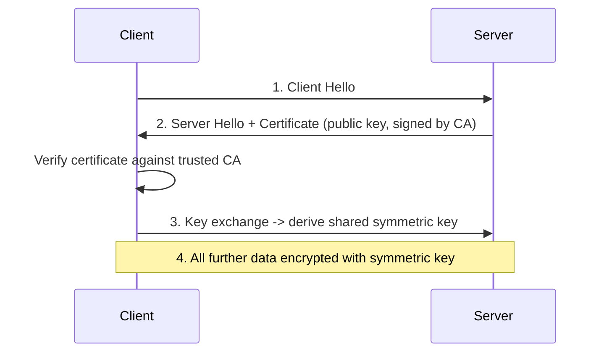

Key points (source notes se retained/consolidated — technically accurate aur interview-relevant):
- **"SSL" colloquial hai; TLS aaj use mein actual protocol hai** — SSL deprecated/insecure hai, lekin term casual usage mein persist karta hai.
- **Teen guarantees:** confidentiality (encryption), authentication (CA-signed certificate ke through server identity), integrity (tamper detection).
- **Sirf transit mein data ko protect karta hai**, at rest nahi — encryption at rest ek separate concern hai (DB/disk encryption).
- **Handshake per connection ek baar hota hai**; subsequent traffic negotiated symmetric key use karta hai (handshake ke liye asymmetric crypto, bulk transfer ke liye symmetric — standard hybrid approach, explicitly bataana worth hai kyunki "sab kuch ke liye sirf asymmetric kyun nahi use karte" ek natural follow-up hai: symmetric bulk data ke liye orders of magnitude faster hota hai).
- **TLS termination** commonly ek load balancer/IIS/reverse proxy par hota hai, backend ko internally ek trusted network boundary ke andar plain HTTP receive hota hai — ek bahut common real-world architecture jo describe karne layak hai.
- **HSTS** (`Strict-Transport-Security: max-age=31536000; includeSubDomains`) browsers ko ek domain ke liye sirf hamesha HTTPS use karne force karta hai, jisse bahut pehli request par downgrade attack ki window band ho jaati hai.

### Token Revocation & Refresh Tokens

**Fundamental JWT revocation problem:** JWTs design se stateless aur self-contained hote hain — server har request par database check nahi karta, jo unhe use karne ka whole point hai. Iska matlab hai ek compromised/leaked JWT expire hone tak valid rehta hai, aur usse early invalidate karne ka koi built-in tarika nahi hai.

```csharp
public class TokenService
{
    private static readonly List<string> _blacklistedTokens = new();
    public void RevokeToken(string token) => _blacklistedTokens.Add(token);
    public bool IsTokenRevoked(string token) => _blacklistedTokens.Contains(token);
}
```

**Upar wala naive in-memory blacklist production ke liye kyun inadequate hai (notes ne implicit chhoda woh answer karte hue):** ek `static List<string>` per-instance hota hai — ek horizontally scaled deployment mein, instance A par ek token revoke karna instances B/C ke liye kuch nahi karta. Production-correct approach ek **shared, distributed revocation store** (Redis, token ki remaining lifetime match karti TTL ke saath taaki entries self-expire hon) use karta hai jo ek validation-pipeline hook mein check hota hai, ya — zyada commonly — problem ko poori tarah **avoid** karta hai:
1. **Access token lifetimes ko short rakhna** (minutes, hours/days nahi) taaki leaked-token exposure windows small hon.
2. Long-lived sessions ke liye **refresh tokens use karna**, jo server-side (DB) mein stored hote hain taaki unhe demand par revoke/rotate *kiya ja sake* — access token khud stateless aur short-lived rehta hai.

```csharp
[HttpPost("refresh-token")]
public async Task<IActionResult> RefreshToken([FromBody] TokenRequest request)
{
    var user = await _context.Users.SingleOrDefaultAsync(u => u.RefreshToken == request.RefreshToken);
    if (user == null || user.RefreshTokenExpiry < DateTime.UtcNow)
        return Unauthorized();

    var newAccessToken = GenerateJwtToken(user);
    user.RefreshToken = GenerateRefreshToken(); // rotate on use — prevents replay of an old refresh token
    await _context.SaveChangesAsync();

    return Ok(new { Token = newAccessToken, RefreshToken = user.RefreshToken });
}

private string GenerateRefreshToken() => Convert.ToBase64String(RandomNumberGenerator.GetBytes(64));
```

**Refresh token rotation** (har use par ek naya refresh token issue karna aur purane ko invalidate karna) current best practice hai — isse aap token theft detect kar sakte ho (agar ek *stolen* refresh token legitimate client ke already rotate karne ke baad replay hota hai, to aapko pata chal jaata hai ki woh compromised tha aur aap whole family revoke kar sakte ho).

### Two-Factor Authentication

```csharp
var token = await _userManager.GenerateTwoFactorTokenAsync(user, TokenOptions.DefaultPhoneProvider);
await _smsService.SendSmsAsync(user.PhoneNumber, $"Your verification code is {token}");

var isValid = await _userManager.VerifyTwoFactorTokenAsync(user, TokenOptions.DefaultPhoneProvider, inputToken);
if (!isValid) return Unauthorized();
```

Ek senior discussion ke liye note karne layak: SMS-based 2FA sabse weakest common option hai (SIM-swapping ke liye vulnerable); TOTP apps (Google Authenticator/Authy) ya WebAuthn/FIDO2 passkeys stronger hain aur 2025-2026-era systems mein API/account security ke liye increasingly preferred hain.

---

## Best Practices

- Resource-oriented URLs (nouns) design karo, HTTP verbs aur status codes ko sahi tarike se use karo, aur pluralization/casing mein consistency rakho pure API surface mein.
- API boundaries par DTOs use karo — kabhi bhi directly EF entities ko bind mat karo (over-posting/mass-assignment risk, schema se tight coupling).
- Kisi bhi API ke liye jiske external ya cross-team consumers hain, day one se versioning karo — ek "v1-only" API jo already production mein hai usme baad mein versioning retrofit karna painful hota hai.
- Saare error responses ke liye Problem Details (RFC 7807/9457) return karo, har endpoint ke liye alag ad hoc shapes nahi.
- POST/PUT ko idempotent banao jahan operation ka business meaning allow kare, aur jahan nahi allow karta wahan idempotency keys use karo.
- Kisi bhi collection ke liye jo large, high-write, ya public-facing ho, cursor-based pagination ko prefer karo.
- Saare outbound HTTP ke liye `IHttpClientFactory` use karo; kabhi bhi per-call `new HttpClient()` nahi, aur bare static singleton bhi nahi.
- Controllers ko thin rakho — sirf orchestration; business logic services/domain layer mein honi chahiye, controller action mein nahi.
- Structured logging (`ILogger` + Serilog/structured sinks) use karo correlation IDs ke saath jo service boundaries ke across propagate hote hain; isko distributed tracing (OpenTelemetry) ke saath pair karo cross-service debugging ke liye.
- HTTPS everywhere enforce karo, production mein HSTS, aur certificate validation ko "temporarily" kabhi disable mat karo (yeh kabhi wapas enable nahi hota).
- Authorization mein fail closed karo — default-deny, explicit allow, reverse nahi.
- Optimize karne se pehle load-test aur profile karo — `dotnet-counters`/`dotnet-trace` use karo, guesswork nahi.
- Apne API ko product treat karo: usko document karo (OpenAPI), usko ek SLA/deprecation policy do, aur backward compatibility ko default expectation ke roop mein design karo.

## Common Pitfalls

- Yeh assume karna ki PATCH by default idempotent hota hai — yeh nahi hota jab tak aap isko waise design nahi karte.
- Unhandled-exception middleware ke through raw exception messages/stack traces ko clients tak leak karna.
- Wildcard CORS (`AllowAnyOrigin`) ko credentials ke saath combine karna — invalid hai aur agar kisi tarah kaam kar bhi jaye to real security hole hai.
- Ek Scoped service (`DbContext`) ko directly Singleton mein inject karna — runtime exception ya, agar validation disabled hai, to silent shared-state bugs.
- Ek frequently-mutated, large table par offset-based pagination — client ke liye silently duplicated/missing rows.
- Redis (ya kisi bhi cache) ko system of record ki tarah treat karna instead of ek disposable optimization layer.
- Rate limiting counters jo horizontally scaled deployment mein in-memory-per-instance hote hain, jisse ek "global" limit ka false sense ban jaata hai.
- OData ya unrestricted `$filter`/`$expand` ko page-size caps ya query cost limits ke bina expose karna.
- Request-handling paths ke andar async code par block karna (`.Result`/`.Wait()`), jisse load ke under thread pool capacity waste hoti hai.
- Repository-pattern se EF Core ke `DbContext` ko concrete justification ke bina wrap karna, jisse `IQueryable` composability bina kisi real gain ke lost ho jaati hai.
- Yeh bhool jaana ki `[ApiController]` already `ModelState` ko auto-validate kar deta hai — redundant (ya usse bhi bura, contradictory) manual checks likhna.
- Yeh assume karna ki ek JWT ko server-side "logged out" kiya ja sakta hai bina revocation store ya short expiry + refresh-token strategy ke jagah rakhe.

## Sample Interview Q&A

**Q: ASP.NET Core request pipeline explain karo aur middleware kahan fit hota hai.**
Jawab: Kestrel raw request receive karta hai aur `HttpContext` build karta hai, jo ek ordered middleware pipeline (exception handling → HTTPS redirection → routing → authentication → authorization → custom middleware) se flow karta hai, phir endpoint execution (controller/minimal API) mein jaata hai, filters ke through, aur wapas same middleware se reverse order mein bahar aata hai. Order matter karta hai — middleware sirf wahi dekh sakta hai jo usse pehle run hua ho, aur `Use` pipeline ko continue karta hai jabki `Run` usko terminate kar deta hai (short-circuit kar deta hai).

**Q: `HttpClient` use karte waqt socket exhaustion se kaise bachein?**
Jawab: `IHttpClientFactory` (named ya typed clients) use karo instead of per-call `new HttpClient()` ya ek naive static singleton — yeh `HttpMessageHandler`s ko rotation par pool aur recycle karta hai, jisse connection reuse milta hai bina ek permanent singleton handler ke DNS-staleness problem ke.

**Q: Production mein aap ek slow EF Core query ko kaise diagnose karoge?**
Jawab: `.ToQueryString()` ya query logging ke through generated SQL capture karo, DB par `EXPLAIN`/execution plan run karo, filter/join/order-by columns par missing indexes check karo, N+1 patterns dekho (missing `.Include()` ya projections jo lazy-load storms cause kar rahe hain), aur confirm karo ki read-only paths ke liye `AsNoTracking()` use ho raha hai.

**Q: Aap REST ke upar gRPC kab choose karoge?**
Jawab: Internal service-to-service calls jahan dono ends aapke control mein hain, jahan low latency aur high throughput matter karta hai, jahan aapko strongly-typed contracts (`.proto`) generated clients ke saath chahiye, aur/ya jahan aapko native bidirectional streaming chahiye. REST public APIs aur broad client compatibility ke liye default rehta hai.

**Q: Aap ek payment API ke liye idempotent retries kaise design karoge?**
Jawab: Har logical operation ke liye ek client-supplied idempotency key require karo; key ko operation ke result ke saath atomically store karo (same transaction ya ek unique-constrained table mein); same key ke saath retry par, stored result return karo reprocessing ke bajaye; concurrent-in-flight case ko explicitly handle karo (409/425) racing ke bajaye.

**Q: Aap ek POST se triggered long-running operation ko kaise handle karoge?**
Jawab: `202 Accepted` return karo ek `Location` header ke saath jo ek status resource ki taraf point kare, work ko ek background processor mein enqueue karo, aur client ko status endpoint poll karne do (ya completion notification ke liye ek webhook register karne do) — kabhi bhi original HTTP request ko work ki full duration ke liye block mat karo.

**Q: Authentication aur authorization mein kya difference hai, aur pipeline mein har ek kahan fail hota hai?**
Jawab: Authentication (aap kaun ho) pehle run hota hai aur `HttpContext.User` ko populate karta hai; failure typically ek anonymous identity mein result hoti hai instead of pipeline ko immediately stop karne ke. Authorization (aap kya kar sakte ho) baad mein run hota hai aur `[Authorize]`/roles/policies enforce karta hai; failure 401 (not authenticated) ya 403 (authenticated but forbidden) return karti hai aur controller action kabhi execute nahi hota.

**Q: Aap `DbContext` ko ek Singleton mein kyun inject nahi kar sakte?**
Jawab: `DbContext` Scoped registered hota hai (ek unit of work per request, thread-safe nahi); ek Singleton app ki lifetime ke liye zinda rehta hai aur concurrent requests ke across shared hota hai, isliye direct injection ek lifetime-validation exception cause karta hai ya, agar unvalidated ho, to race conditions/shared state corruption. Fix: `IServiceScopeFactory` inject karo aur singleton ke andar per-operation ek scope create karo.

**Q: Offset vs cursor pagination — kab kaunsa choose karein?**
Jawab: Offset (`page`/`pageSize`) sabse simple hai aur smaller, relatively static datasets ke liye fine hai jahan "jump to page N" aur total-page-count UI matter karte hain (e.g., admin back-office grids). Cursor-based pagination large, high-write, ya public-facing collections (feeds, APIs like Stripe/GitHub) ke liye preferred hai kyunki yeh concurrent inserts/deletes se row-shift artifacts ke against immune hai aur ek consistent indexed seek perform karta hai instead of ek discarding `OFFSET` scan ke.

**Q: Aap ek API ko evolve karte hue backward compatible kaise rakhte ho?**
Jawab: Explicitly version karo (URL path pragmatic default hai), fields ko add karo instead of unhe ek version ke andar change/remove karne ke, removals/type changes ko breaking treat karo aur unhe ek new version ke peeche gate karo, `Sunset`/`Deprecation` headers ke saath ek deprecation timeline publish karo, aur CI mein consumer-driven contract tests se compatibility validate karo.

---

## Summary of Additions

Yeh `[new content]` sections add kiye gaye kyunki inhe current (2025-2026) senior .NET Web API interviews mein frequently probe kiya jaata hai lekin original notes mein yeh missing the ya sirf thinly referenced the:

- **REST Maturity Model (Richardson) & HATEOAS Trade-offs** — source ne sirf HATEOAS ko mechanically define kiya tha; senior interviews maturity-level framework aur HATEOAS ko practice mein implement karna worth hai ya nahi uska ek honest pros/cons discussion expect karte hain.
- **Problem Details (RFC 7807/9457) for Error Responses** — source ka exception middleware raw exception messages ko plain text ki tarah leak kar raha tha; yeh standardized, production-grade replacement hai jo .NET 8 ke `IExceptionHandler` use karta hai.
- **Idempotency Keys for POST/PUT** — source notes mein explicitly ek sample question ki tarah pucha gaya tha ("how to implement retries without causing duplicate side effects") lekin kabhi answer nahi hua tha; ab implementation detail ke saath fully answer kiya gaya hai.
- **Pagination Strategies: Offset vs Cursor** — source se completely absent tha bawajood iske ki senior level par yeh near-guaranteed API-design question hai.
- **Long-Running Operations: 202 Accepted + Polling** — source mein ek sample question ki tarah flag kiya gaya tha ("how to handle long-running work") sirf ek one-line pointer ke saath; ab flow diagram aur code ke saath fully expand kiya gaya hai.
- **OpenAPI/Swagger: Contract-First vs Code-First** — source ne sirf Swashbuckle ko *enable* karna dikhaya tha; actual design trade-off (jismein interviewers ki interest hoti hai) missing tha.
- **Minimal APIs vs Controllers** — source mein sirf ek baar passing mein mention hua tha koi comparison ke bina, bawajood iske ki .NET 6/7/8 ke baad se yeh sabse common modern .NET API design questions mein se ek hai.
- **Rate Limiting with Built-in ASP.NET Core Middleware** — source ne sirf third-party `AspNetCoreRateLimit` package reference kiya tha; first-party `Microsoft.AspNetCore.RateLimiting` middleware (since .NET 7) ab expected default answer hai.
- **API Keys vs OAuth2 Scopes — When to Use Which** — source ne har mechanism ko alag-alag cover kiya tha lekin kabhi contrast nahi kiya, jo exactly wahi comparative question hai jo senior interviewers puchte hain.
- **ETags & Conditional Requests** — source se entirely missing tha; yeh directly caching, bandwidth savings, aur writes ke liye optimistic concurrency se judta hai, yeh saare high-value senior topics hain.

### Contradictions Flagged

- Source notes API versioning ke liye `Microsoft.AspNetCore.Mvc.Versioning` reference karti hain; yeh package `Asp.Versioning.Mvc` / `Asp.Versioning.Mvc.ApiExplorer` ke favor mein deprecated hai — isko [API Versioning Strategies](#api-versioning-strategies) section mein inline flag kiya gaya hai instead of ek factual contradiction ke roop mein treat karne ke notes ke beech, kyunki yeh time ke saath ek package-lifecycle change hai rather than do notes ka ek doosre se disagree karna.
- Source notes ke same topic par different passages ke beech koi direct factual contradictions nahi mile (e.g., do near-duplicate REST-principles blocks aur several duplicate PUT-vs-PATCH / CORS / rate-limiting / API-versioning explanations ek doosre ke saath consistent the aur inhe merge/de-duplicate kiya gaya hai instead of conflicts ki tarah flag karne ke).

## Summary of [gaps] Additions (This Pass)

Yeh pass ek formal gap-analysis review se identify kiya gaya targeted content add karta hai, `[gaps]` tag kiya gaya hai isko earlier `[new content]` pass se distinguish karne ke liye:

1. **OAuth2 Grant Types — Which One Fits Which Client** — existing content ne Authorization Code, Client Credentials, aur Device Code ko sirf passing mein naam liya tha jabki generally authentication ke liye flow diagrams dikha rahe the; "which grant type fits which client type" (SPA vs native/mobile vs machine-to-machine vs limited-input device) senior level par sabse frequently asked *direct* OAuth2 questions mein se ek hai, aur guide mein koi explicit client-to-grant-type mapping nahi thi. Yeh Implicit aur ROPC ko OAuth 2.1 ke under deprecated bhi call out karta hai, jo current hai aur older reference material se kaam karte waqt galat samajhna easy hai.
