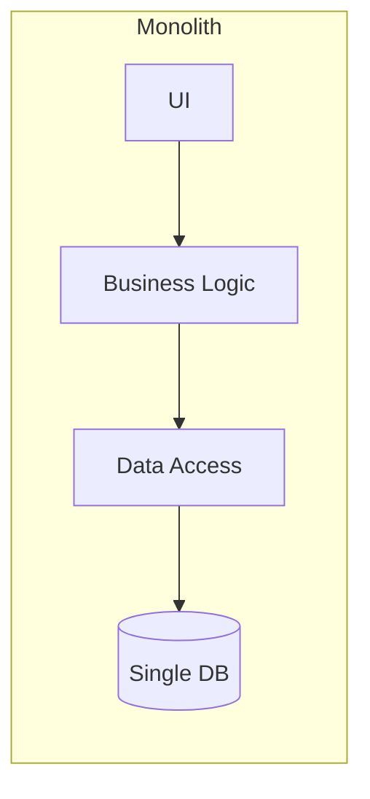
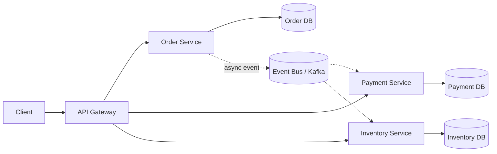
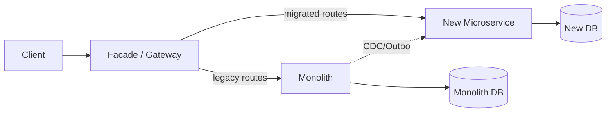
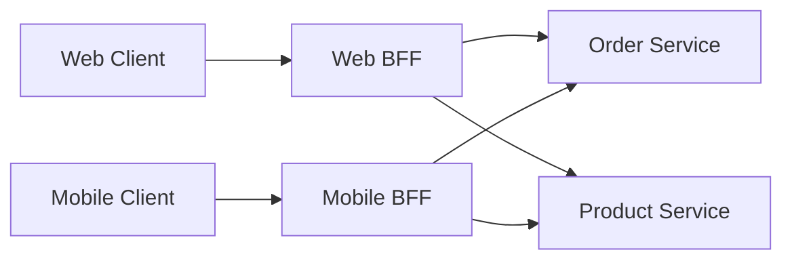
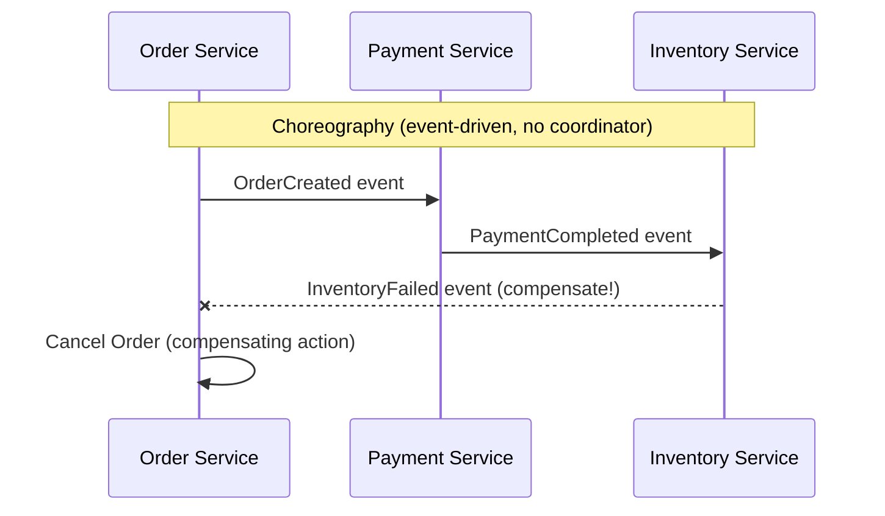
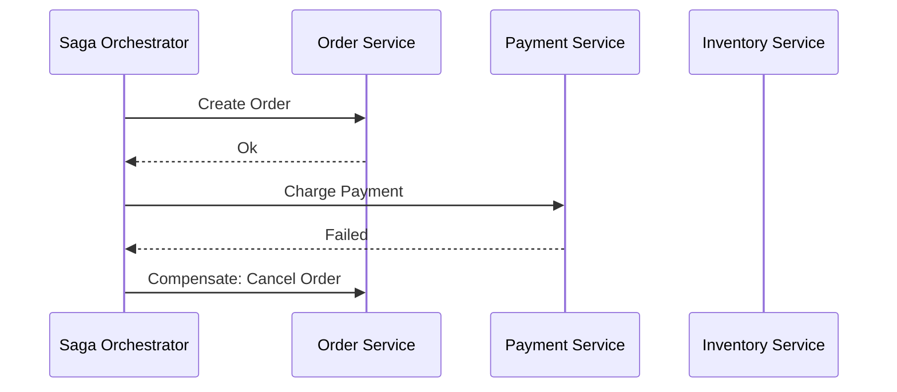
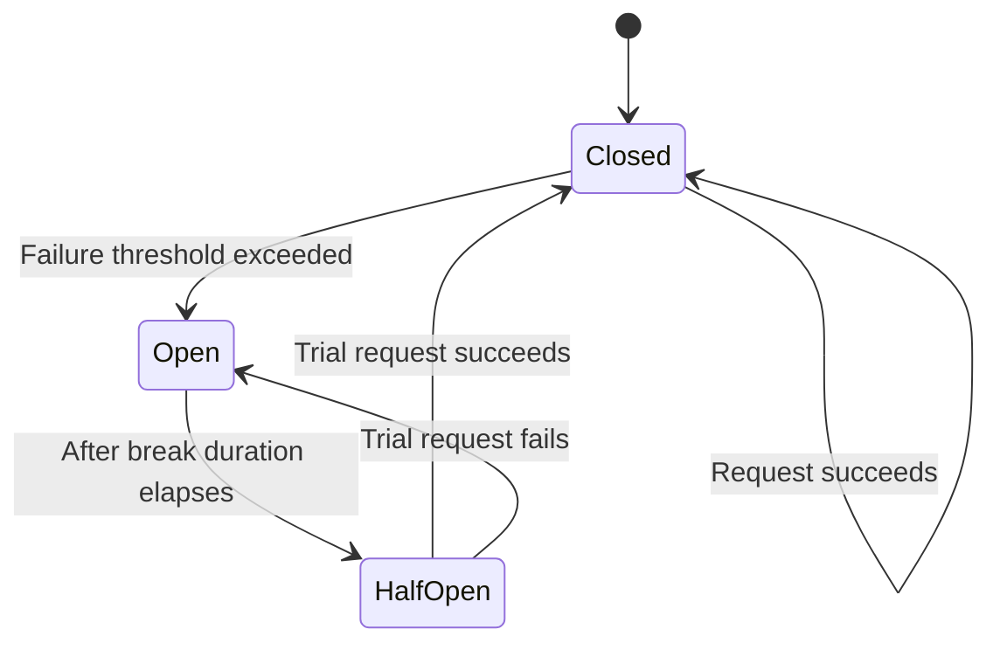
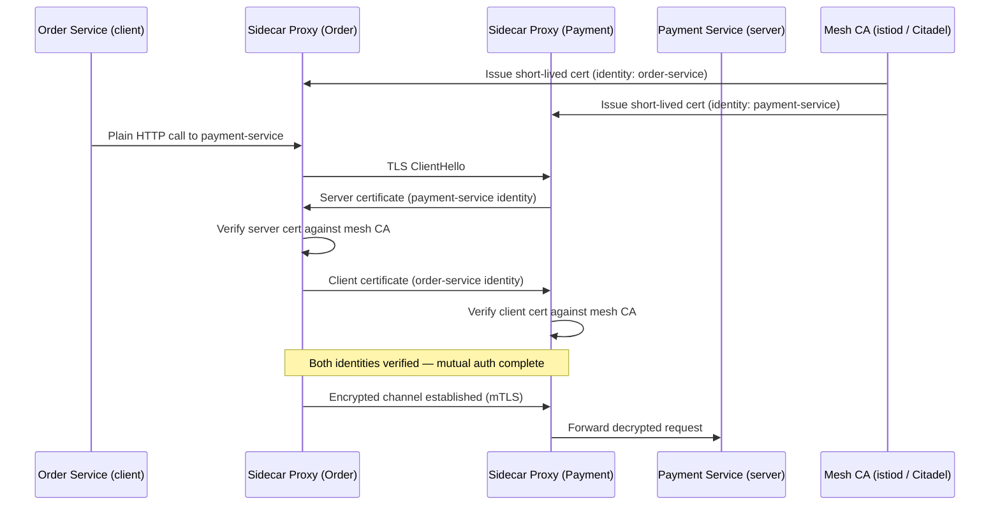
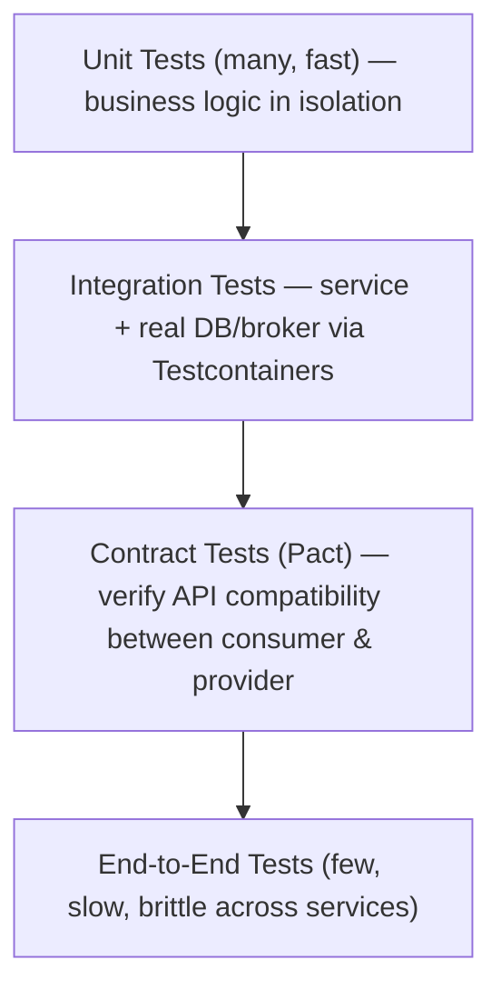

# Microservices — Senior .NET Interview Guide

> Personal notes (100 Q&A source items) se consolidated + senior/lead-level 2026 interviews ke liye gap-filled.
> Additions ko **[new content]** tag kiya gaya hai taaki original material distinguishable rahe.

## Table of Contents

1. [Core Concepts](#core-concepts)
2. [Service Design & Boundaries](#service-design--boundaries)
3. [Communication Patterns](#communication-patterns)
4. [Data Management & Consistency](#data-management--consistency)
5. [Resilience & Fault Tolerance](#resilience--fault-tolerance)
6. [Security](#security)
    - [Zero Trust Architecture & mTLS Deep Dive \[gaps\]](#zero-trust-mtls-gaps)
7. [Observability](#observability)
8. [Deployment & Infrastructure](#deployment--infrastructure)
9. [API Management](#api-management)
10. [Testing Strategies](#testing-strategies)
11. [Advanced Patterns](#advanced-patterns)
12. [Performance](#performance)
13. [Best Practices](#best-practices)
14. [Common Pitfalls / Anti-Patterns](#common-pitfalls--anti-patterns)
15. [Sample Interview Q&A](#sample-interview-qa)
16. [Summary of Additions](#summary-of-additions)

---

## Core Concepts

### Microservices kya hai?

Ek architectural style jahan application chhote, independently deployable services se composed hoti hai, har service ek single business capability own karti hai, network ke through communicate karti hai (in-process calls nahi). Har service ko independently develop, deploy, scale kiya ja sakta hai, aur — senior level par critically — **ek single team dwara own** kiya jaata hai.

**Example decomposition (e-commerce):**
- Order Service — order creation/lifecycle
- Payment Service — transactions
- Inventory Service — stock management
- Shipping Service — logistics

### Monolith vs Microservices

| Aspect | Monolithic | Microservices |
|---|---|---|
| Deployment | Poori app ek unit ke roop mein deploy hoti hai | Har service independently deploy hoti hai |
| Scalability | Whole ke roop mein scale hota hai | Per service scale hota hai |
| Technology | Single tech stack | Polyglot — har service ka alag stack |
| Failure Impact | Ek crash poori app ko affect karta hai | Ek service mein failure doosri services ko (necessarily) impact nahi karta |
| Development Speed | Tight coupling/dependencies ki wajah se slower | Independent teams ke saath faster — lekin sirf ek certain org size ke baad |
| Data | Single shared database | Database-per-service |
| Testing | Simpler (single process) | Harder — contract/integration tests, service virtualization chahiye |
| Operational overhead | Low | High (orchestration, tracing, service mesh) |





### Advantages

- **Scalability** — sirf hot service ko scale karo (jaise, flash sale ke dauran Inventory ko scale karo, poori app ko nahi).
- **Technology independence** — polyglot persistence aur runtimes per bounded context.
- **Fault isolation** — Shipping mein crash se Checkout down nahi hona chahiye (assuming resilience patterns actually applied hain — yeh automatic nahi hai).
- **Faster, parallel development** — teams independently ship karti hain (Conway's Law in action).
- **Independent deployability** — sirf changed service deploy karo.

### Challenges

- **Distributed systems complexity** — service discovery, network partitions, partial failures, process boundaries ke across debugging.
- **Network latency** — chatty inter-service calls add up hoti hain; N+1 style fan-out ek common perf killer hai.
- **Data consistency** — ab services ke across spanning ACID transactions nahi hain; eventual consistency ke baare mein reason karna padta hai.
- **Security surface** — monolith se bahut zyada network-exposed endpoints.
- **Operational cost** — ab tumhe per service CI/CD, centralized logging, tracing, ek service mesh ya client-side resilience libraries, aur monolith ki zarurat se kaafi zyada infrastructure maturity chahiye.

**[new content] Microservices kab NOT use karein**

Yeh sabse common senior-level trick questions mein se ek hai ("kya tum always microservices recommend karoge?"). Honest answer: nahi.
- Agar tumhari team small hai (<2 pizza teams) ya domain abhi well understood nahi hai, ek **modular monolith** (well-factored, clear internal boundaries, single deployable) maintainability benefit ka zyadatar hissa deta hai bina distributed-systems tax ke.
- Microservices development-time complexity ko run-time/operational complexity se trade karte hain. Microservices pay off karne se *pehle* tumhe mature DevOps (CI/CD, containers, observability) chahiye, baad mein nahi.
- Premature decomposition monolithic rehne se bigger risk hai — bounded contexts jo bahut early discover hote hain wo tend to be wrong, aur ek wrong boundary ko later split karne ka matlab distributed refactoring hai (in-process refactoring se much harder).
- Interviewers jo rule of thumb pasand karte hain: "Monolith-first (ya modular monolith) se start karo, services extract karo jab boundaries proven ho jaayen aur ek specific scaling/team-autonomy pain real ho."

---

## Service Design & Boundaries

**[new content] Service decomposition strategy & DDD bounded contexts**

Yeh arguably single most-asked *senior* microservices question hai, aur original notes sirf DDD building blocks (Entities, Value Objects, Aggregates, Repositories) mention karte hain bina yeh cover kiye ki decomposition actually kaise hota hai.

- **Business capability se decompose karo**, technical layer se nahi (kabhi "UI service", "DB service" nahi). Poocho "business kya karta hai?" (Order Management, Payments, Fulfillment) "humare paas kya tables hain?" ke jagah.
- **Bounded Context** (DDD) decomposition ka actual unit hai — ek boundary jiske andar ek domain model aur uski ubiquitous language consistent hain. Do contexts mein ek "Customer" ho sakta hai jiska matlab different hai (Sales ka Customer vs Support ka Customer) — yeh fine hai aur expected hai; ek single shared model force mat karo.
- **Context Mapping** patterns bounded contexts ke beech relationship describe karte hain:
  - *Shared Kernel* — small shared model, tightly coupled, sparingly use karo.
  - *Customer/Supplier* — upstream/downstream relationship negotiated contracts ke saath.
  - *Conformist* — downstream upstream ke model ko as-is accept kar leta hai.
  - *Anti-Corruption Layer (ACL)* — ek external/legacy model aur tumhare clean internal model ke beech translate karo (strangler-fig migrations ke dauran critical).
- **Event Storming** common workshop technique hai code likhne se pehle domain experts ke saath collaboratively bounded contexts discover karne ke liye.
- Aggregates transactional consistency boundaries define karte hain — **ek transaction kabhi ek se zyada aggregate span nahi karni chahiye**, aur by extension rarely ek se zyada service. Agar tumhe do services ke across transaction ki zarurat lag rahi hai, yeh signal hai ki ya boundary wrong hai ya tumhe Saga chahiye.
- Interviewers probe karenge: "Ek microservice kitna bada hona chahiye?" — Jawab: bounded context aur team ownership se sized, lines of code se nahi. "Useful hone ke liye kaafi bada, independently deployable aur ek team dwara owned hone ke liye kaafi chhota" (roughly ek 2-pizza team jo end-to-end own karti hai).

### DDD Building Blocks (original content, retained)

- **Entities** — identity wale objects (jaise, `Order`, `Customer`).
- **Value Objects** — immutable, no identity (jaise, `Address`).
- **Aggregates** — entities/value objects ka cluster jiska ek root invariants enforce karta hai (jaise, `Order` jismein `OrderItem`s hain).
- **Repositories** — per aggregate root abstract data access.

```csharp
public class Order
{
    public int Id { get; set; }
    public List<OrderItem> Items { get; set; } = new();
}
```

### Hexagonal Architecture (Ports & Adapters)

Core business logic ko infrastructure concerns se separate karta hai.

1. **Core business logic** — DB/API/frameworks se independent.
2. **Ports** — dependencies ko abstract karne wale interfaces (jaise, `IOrderRepository`).
3. **Adapters** — concrete implementations (EF Core repository, REST controller, message consumer).

Interviewers isko kyun care karte hain: yahi hai jo ek service ko *testable* banata hai (adapters ko test doubles se swap karo) aur *framework-agnostic* — directly related Clean Architecture se, jo zyadatar senior .NET shops ab default project template ke roop mein use karte hain.

**[new content] Strangler Fig migration — expanded**

Notes isko ek-line level par cover karte hain (old vs new traffic route karo, monolith phase out karo). Senior interviews mechanics expect karte hain:

1. **Monolith ke saamne Facade/Gateway** calls intercept karta hai.
2. Ek **vertical slice** (ek bounded context) pick karo pehle extract karne ke liye — usually wo jiske clearest boundaries hain ya highest business value/pain hai (jaise, Search, Notifications — read-heavy, low write-coupling).
3. New microservice build hota hai; gateway matching requests ko usme route karta hai jabki baaki sab monolith mein hi jaata hai.
4. Data migration hard part hai — often monolith ka DB temporarily old aur new code dono se read hota hai (views/CDC ke through) jab tak new service full ownership nahi le leti; phir writes cut over karo.
5. Repeat karo, incrementally monolith ko shrink karte hue, jab tak wo "strangled" na ho jaaye.
6. Key risk jo interviewers probe karte hain: transition window ke dauran **dual-write inconsistency** — Outbox pattern ya Change Data Capture (Debezium) se mitigate karo, naive dual writes se nahi.



---

## Communication Patterns

### Synchronous vs Asynchronous

- **Synchronous** (REST, gRPC) — caller response ka block/await karta hai. Simple mental model, lekin temporal coupling create karta hai: agar callee down hai, caller bhi fail hota hai (jab tak tum resilience patterns add nahi karte).
- **Asynchronous** (message queues, event bus) — caller fire karta hai aur continue karta hai; response (agar koi hai) later aata hai. Caller aur callee ki availability ko decouple karta hai, lekin complexity add karta hai: eventual consistency, message ordering, idempotency, debugging.

**[new content] Sync vs async choose karna — actual trade-off table jo interviewers chahte hain**

| Concern | Synchronous (REST/gRPC) | Asynchronous (Queue/Event) |
|---|---|---|
| Coupling | Temporal — callee up hona chahiye | Decoupled — callee down/slow ho sakta hai |
| Latency perception | Immediate (ya immediately fail hota hai) | Higher perceived latency, lekin non-blocking |
| Failure handling | Caller par retry/circuit breaker chahiye | DLQ, redelivery, idempotent consumers chahiye |
| Consistency | Call ke andar strongly consistent ho sakta hai | Default se eventual consistency |
| Complexity | Reason karna lower hai | Higher — ordering, dedup, poison messages |
| Best for | Read-heavy, request/response UX flows (jaise, "product details get karo") | Write-heavy workflows, cross-service side effects (jaise, "order placed → shipping ko notify karo, inventory update karo, email bhejo") |

Rule of thumb: queries ke liye synchronous calls use karo jahan client ko immediate answer chahiye; asynchronous events use karo kisi bhi cheez ke liye jo really "yeh hua, react karo agar tumhe matter karta hai" hai — yeh naturally long sync call chains ka fan-out/cascading-failure risk bhi kam karta hai.

### REST vs gRPC

| Feature | REST | gRPC |
|---|---|---|
| Protocol | HTTP/1.1 (typically) | HTTP/2 |
| Data Format | JSON/XML (text) | Protocol Buffers (binary) |
| Performance | Slower (text parsing, HTTP/1.1 overhead) | Faster (binary, multiplexed streams) |
| Contract | OpenAPI/Swagger (looser) | `.proto` file (strict, code-generated) |
| Streaming | Limited (SSE/WebSockets bolted on) | Native (unary, server, client, bidi streaming) |
| Browser support | Native | grpc-web proxy chahiye |
| Use Case | Public/external APIs, broad interoperability | Internal service-to-service, low-latency, streaming |

**[new content]** Follow-up jo interviewers poochte hain: "Kya tum public API ke liye gRPC expose karoge?" — Generally nahi; browser/client support weak hai aur human-debuggability poor hai. Common pattern: **internally services ke beech gRPC, edge par REST/GraphQL** (gateway translation ke through).

### Message Queue vs Event Bus

| Feature | Message Queue (RabbitMQ) | Event Bus (Kafka) |
|---|---|---|
| Communication | Point-to-point (competing consumers) | Publish/Subscribe (fan-out) |
| Message Storage | Short-term, consumption ke baad removed | Persistent log, replayable, retention-based |
| Ordering | FIFO per queue | Partition-based ordering |
| Consumer model | Ek message → ek consumer (typically) | Many consumer groups independently same stream read kar sakte hain |
| Replay | Typically possible nahi | Haan — kisi bhi offset se re-read karo |

**[new content]** Follow-up: "Tum kab RabbitMQ ke upar Kafka pick karoge?" — Kafka jab tumhe event replay chahiye, high-throughput log-based event sourcing, multiple independent consumer groups jo same stream read karte hain (analytics + fraud detection + notifications sab "OrderPlaced" read kar rahe hain). RabbitMQ jab tumhe simpler routing semantics chahiye (topic/direct/fanout exchanges), lower operational footprint, aur true work-queue (competing consumer) semantics bina full log/replay model ki zarurat ke.

### Event-Driven Architecture

Services state changes par events publish karti hain; interested subscribers react karte hain — decoupled, asynchronous.

```csharp
channel.BasicPublish(exchange: "", routingKey: "order-placed",
    body: Encoding.UTF8.GetBytes("Order ID: 1234"));
```

Benefits: asynchronous, decoupled services, natural audit trail. Downsides (notes mein often skipped, proactively raise karne layak): ek business flow trace karna harder ho jaata hai ("yeh trigger kisne kiya?"), eventual consistency, aur event schema evolution ek cross-team contract problem ban jaata hai.

### API Composition

Jab data services ke across split hota hai, aggregator pattern results combine karta hai:

```csharp
var orders = await httpClient.GetFromJsonAsync<List<Order>>("orders-service/orders");
var customers = await httpClient.GetFromJsonAsync<List<Customer>>("customer-service/customers");
```

Trade-off: implement karna simple hai lekin services ke across large joins/filters ke saath scale nahi karta — yahin **denormalized read model wala CQRS** (neeche dekho) better answer ban jaata hai.

**[new content] API Gateway vs Backend-for-Frontend (BFF)**

Notes "API Gateway vs Reverse Proxy" cover karte hain lekin BFF miss karte hain, jo ek bahut common senior follow-up hai.

- **API Gateway** — ek gateway jo saare client types serve karti hai (web, mobile, partner) generic routing/auth/rate-limiting ke saath.
- **BFF (Backend-for-Frontend)** — ek dedicated gateway *per client type* (jaise, `web-bff`, `mobile-bff`), har ek specifically us client ki needs ke liye responses shape/aggregate karti hai (mobile ko smaller payloads chahiye, web ko richer chahiye).
- Yeh kyun matter karta hai: ek single generic gateway client-specific branching logic accumulate karne lagti hai ("if mobile then...") jo ek shared bottleneck/anti-pattern ban jaata hai. BFFs har frontend team ko apna aggregation layer independently own karne dete hain, ek shared-gateway contention point avoid karte hue.
- Trade-off: ek single generic gateway ke against zyada services run aur maintain karni padti hain; teams ko cross-cutting logic (auth, logging) BFFs ke across duplicate karne se bachne ke liye discipline chahiye — usually us cross-cutting concerns ke liye BFFs ke saamne ek thin edge gateway/ingress lagakar solve hota hai.



### API Gateway (core pattern, original content)

Single entry point jo requests ko backend services par route karti hai; auth, rate limiting, load balancing, request transformation centralize karti hai.

```json
{
  "Routes": [
    {
      "DownstreamPathTemplate": "/api/products",
      "DownstreamScheme": "http",
      "DownstreamHostAndPorts": [ { "Host": "localhost", "Port": 5001 } ],
      "UpstreamPathTemplate": "/products",
      "UpstreamHttpMethod": [ "GET" ]
    }
  ]
}
```
*(Ocelot config — Ocelot classic .NET-native gateway hai; commonly bhi: YARP (Microsoft ka apna reverse-proxy toolkit, ab .NET ke liye more actively recommended choice), Kong, Nginx, Azure API Management, AWS API Gateway.)*

**[new content]** Note: Ocelot ki contributor activity slow ho gayi hai; kai current .NET shops build-your-own gateways ke liye **YARP** (Yet Another Reverse Proxy) default karte hain kyunki yeh Microsoft dwara maintained hai aur ASP.NET Core middleware pipelines ke saath natively integrate hota hai, ya wo ek fully-featured product ke liye managed gateway (Azure APIM, Kong, AWS API Gateway) use karte hain. Agar poocha jaaye "tum aaj actually kya use karoge" to YARP ka naam lena worth hai.

### API Gateway vs Reverse Proxy

| Feature | API Gateway | Reverse Proxy |
|---|---|---|
| Purpose | Multiple APIs manage karta hai, application-aware | Backend services ko traffic direct karta hai, mostly protocol-aware |
| Functionality | AuthN/AuthZ, rate limiting, request/response transformation, aggregation | Load balancing, TLS termination, basic routing |

### Request Aggregation / API Gateway Caching

- **Aggregation** — gateway multiple downstream calls ko ek client-facing response mein combine karti hai (jaise, `/api/orders/123` order + customer details ek saath return karta hai).
- **Caching** — gateway backend services par load kam karne ke liye responses cache karti hai.

```nginx
proxy_cache_path /var/cache/nginx levels=1:2 keys_zone=mycache:10m;
```

---

## Data Management & Consistency

### Database per Service

Har microservice apna khud ka database/schema own karti hai; koi direct cross-service DB access nahi. Independent schema evolution aur technology choice enable karta hai (Orders ke liye SQL, Catalog ke liye NoSQL, etc.) lekin tumhe cross-service queries aur transactions explicitly solve karne padte hain.

```csharp
public class OrderContext : DbContext
{
    public DbSet<Order> Orders { get; set; }
}
```

**[new content] Multiple services se data chahiye wale queries handle karna**

Simple API Composition (upar) ke aage, do aur standard answers jo interviewers expect karte hain:
- **CQRS with materialized read models** — ek dedicated read-side service Order/Customer/Product services se domain events subscribe karti hai aur ek denormalized, query-optimized view banati hai (jaise, Elasticsearch/Redis/ek reporting DB mein). Reads request time par multiple services mein kabhi fan out nahi karte.
- **Backend-for-Frontend aggregation** — upar ki tarah, jab aggregation client-specific ho general reporting need ke jagah.

### CQRS (Command Query Responsibility Segregation)

Write model (commands) ko read model (queries) se separate karta hai — often har access pattern ke liye optimized different data stores dwara backed.

- **Command Handler** → validate karta hai & write store update karta hai.
- **Query Handler** → separate (often denormalized/replica) store se reads karta hai.

```csharp
// Write
POST /orders   // handled by Command Handler → writes to primary DB

// Read
GET /orders    // handled by Query Handler → reads from read replica / projection
```

**[new content]** Common follow-up: "Kya CQRS ko Event Sourcing chahiye?" — Nahi, yeh independent patterns hain often ek saath use hote hain lekin required nahi hain. Tum do relational tables/views ke saath CQRS kar sakte ho. Event Sourcing (state ko current state ke jagah events ki sequence ke roop mein store karna) ek complementary pattern hai jo CQRS ke saath well pairs karta hai kyunki event stream naturally read-model projections feed karta hai, lekin plain CQRS ek read replica ke saath practice mein far more common aur operationally much simpler hai.

### Distributed Transactions — Saga Pattern

2PC (Two-Phase Commit) autonomous services/databases ke across well scale nahi karta (blocking, availability trade-offs, zyadatar modern message brokers/NoSQL stores usko support hi nahi karte) — **Saga** standard alternative hai: local transactions ka ek sequence, har ek ka failure par undo karne ke liye ek corresponding **compensating transaction**.

**Choreography** — services directly ek doosre ke events par react karti hain (koi central coordinator nahi); har service jaanti hai ki event sunke kya karna hai, aur failure par kya compensation publish karna hai.

**Orchestration** — ek central saga orchestrator explicitly har service ko batata hai next kya karna hai aur compensation logic centrally handle karta hai.





**[new content] Choreography vs Orchestration — trade-offs (yeh comparison notes mein implicit tha lekin actually kabhi laid out nahi tha)**

| Aspect | Choreography | Orchestration |
|---|---|---|
| Coupling | Loose — services sirf events jaanti hain, ek doosre ko nahi | Coordinator poora workflow jaanta hai; participants dumber hote hain |
| Overall flow ki visibility | Poor — logic services ke across smeared hai, "the saga" ko ek jagah dekhna hard hai | Good — flow explicit hai ek jagah (orchestrator mein) |
| Complexity growth | Steps badhne par messy ho jaata hai (cyclic event dependencies) | Complex flows ke liye better scale karta hai, lekin orchestrator ek god-service ban sakta hai |
| Failure/compensation logic | Har service mein distributed | Orchestrator mein centralized |
| Tooling | Plain pub/sub (Kafka/RabbitMQ) | Often ek dedicated engine — jaise, **MassTransit ka saga state machine**, **Temporal**, **Azure Durable Functions**, **AWS Step Functions**, **Camunda** |
| Best for | 2-3 step simple workflows | Long-running, multi-step business processes complex branching ke saath |

Compensating transaction example (original content):

```csharp
if (!PaymentService.ProcessPayment(order.Id))
{
    OrderService.RollbackOrder(order.Id);
}
```

### Outbox Pattern

Classic **dual-write problem** solve karta hai: tum atomically (a) apna database update aur (b) ek broker par message publish nahi kar sakte do separate operations ke roop mein bina risk liye ki ek succeed ho aur doosra fail ho.

**Mechanism:**
1. Business update ke *same local DB transaction* ke andar, event/message ko ek `Outbox` table mein insert karo.
2. Ek separate background process (poller ya CDC-based, jaise, Debezium) unpublished outbox rows read karta hai aur unhe broker (Kafka/RabbitMQ) par publish karta hai.
3. Broker ack receive hone ke baad row ko published mark karo (ya delete karo).

Yeh **at-least-once delivery** guarantee karta hai DB transaction ke saath aligned — event kabhi lost nahi hota even agar process commit ke turant baad crash ho jaaye, kyunki yeh business data ke saath durably stored hai.

**[new content] Transactional Outbox implementation nuance**

- Consumers ko **idempotent** hona chahiye kyunki outbox delivery at-least-once hai, exactly-once nahi — ek redelivered message ko double-process nahi karna chahiye (neeche Idempotency dekho).
- Do implementation styles: **polling publisher** (ek background job interval par outbox table query karta hai — simple, latency add karta hai, DB load add karta hai) vs **CDC-based** (Debezium DB transaction log ko tail karta hai aur outbox inserts ko directly Kafka par stream karta hai — near real-time, no polling overhead, lekin Debezium/Kafka Connect run karne ki operational complexity add karta hai).
- Directly Saga (choreography) ke saath pairs karta hai: har saga step ka local transaction commit + event publish exactly wahi dual-write problem hai jo Outbox pattern solve karta hai.

### Idempotency

Same request repeat karne se same effect produce hota hai ensure karta hai — critical kyunki at-least-once delivery (retries, redeliveries) distributed systems mein norm hai.

```
POST /api/orders?IdempotencyKey=abcd1234
```

**[new content] Idempotency actually kaise implement karein (notes sirf concept state karte hain)**

- Client har logical operation ke liye ek unique idempotency key generate karta hai (GUID) aur header/query/body mein bhejta hai.
- Server `(IdempotencyKey, ResponseHash/Result)` ko ek dedicated table/cache mein ek TTL ke saath store karta hai.
- Same key ke saath ek repeat request par: server short-circuit karta hai aur operation re-execute karne ke jagah *original* stored response return karta hai.
- Message consumers ke liye (sirf HTTP nahi): message ki unique ID se "processed messages" store ke against dedupe karo (ya natural idempotency par rely karo — jaise, `INSERT` ke jagah `UPSERT`, ya set-based operations jo naturally idempotent hain "increment counter" ke jagah "set status = Shipped" jaise).

### Concurrency Control

- **Optimistic locking** — assume karo conflicts rare hain; version/rowversion column se detect karo aur conflict par retry karo.
- **Pessimistic locking** — concurrent writers block karne ke liye record ko upfront lock karo; simpler correctness lekin throughput/availability hurt karta hai, service/network boundaries ke across generally discouraged.
- **Eventual consistency** — temporary staleness accept karo, events ke through reconcile karo.

```csharp
public class Order
{
    public int Id { get; set; }
    [ConcurrencyCheck]
    public int Version { get; set; }
}
```

### Read Replicas & Sharding

- **Read replica** — secondary DB copy jo read traffic serve karti hai primary ko offload karne ke liye (writes still primary ko jaate hain). Trade-off: replicas lag kar sakte hain (replication delay), isliye "read-your-own-write" scenarios ko care chahiye (write ke turant baad primary se read karo, ya us session ke reads ko temporarily primary par route karo).
- **Sharding strategies:**
  - *Range-based* — jaise, Customers A–M → DB1, N–Z → DB2. Simple lekin hot shards ka risk.
  - *Hash-based* — key ke hash se distribute karo; zyada even distribution, harder range queries.
  - *Geo-based* — region se split karo; data residency/latency ke liye good, lekin cross-region joins expensive hote hain.

### Database Migrations

- **EF Core Migrations** ya **Flyway/Liquibase** (language-agnostic, polyglot shops mein common) use karo, unhe version control mein store karo.

```bash
dotnet ef migrations add InitDatabase
dotnet ef database update
```

**[new content]** Ek live microservices environment mein, migrations **rollout ke dauran backward-compatible** hone chahiye — kyunki ek rolling deployment ke dauran service ke old aur new versions simultaneously run hote hain. Standard technique: **expand/contract** (a.k.a. parallel change) — naye columns/tables add karo purane ko remove kiye bina (expand), aisa code deploy karo jo dono mein write kare, phir fully rolled out hone ke baad, old schema remove karo (contract). Ek single deploy step mein kabhi breaking schema change mat karo agar service ke >1 replica hain.

---

## Resilience & Fault Tolerance

### Circuit Breaker Pattern

Ek system ko repeatedly ek failing dependency call karne se rokta hai, use recover hone ka time deta hai aur caller ko cascading failure/thread exhaustion se protect karta hai.

```csharp
services.AddHttpClient("OrderService")
    .AddTransientHttpErrorPolicy(policy =>
        policy.CircuitBreakerAsync(2, TimeSpan.FromSeconds(30)));
```

Agar 2 failures hoti hain, circuit 30 seconds ke liye open ho jaata hai phir se trial request allow karne se pehle.

**[new content] Circuit breaker state machine (notes effect describe karte hain lekin states kabhi nahi — yeh ek bahut common whiteboard ask hai)**



- **Closed** — requests normally flow karte hain; failures count hoti hain.
- **Open** — requests immediately fail fast hote hain (koi call attempt nahi) break duration ke liye — yeh failing service ko further load se aur caller ko threads/timeouts waste karne se protect karta hai.
- **Half-Open** — timeout ke baad, ek limited trial request allow hoti hai; success → Closed, failure → wapas Open.

**[new content] Polly v8+ resilience pipelines**

Notes purane Polly `CircuitBreakerAsync`/policy API ko reference karte hain. Current Polly (v8, `Microsoft.Extensions.Http.Resilience` ke through .NET 8+ mein use hota hai) **ResiliencePipeline** builder model use karta hai aur `IHttpClientFactory` ke saath `AddStandardResilienceHandler()` ke through integrate hota hai:

```csharp
services.AddHttpClient("OrderService")
    .AddResilienceHandler("standard", builder =>
    {
        builder.AddRetry(new RetryStrategyOptions
        {
            MaxRetryAttempts = 3,
            BackoffType = DelayBackoffType.Exponential
        });
        builder.AddCircuitBreaker(new CircuitBreakerStrategyOptions
        {
            FailureRatio = 0.5,
            SamplingDuration = TimeSpan.FromSeconds(30)
        });
        builder.AddTimeout(TimeSpan.FromSeconds(5));
    });
```

2026 mein interviewers awareness expect karte hain ki Polly v8 ne apna API surface change kiya (pipelines, chained policies nahi) aur ki `Microsoft.Extensions.Http.Resilience` retry + circuit breaker + timeout ko "standard resilience handler" ke roop mein out of the box bundle karta hai.

### Retry Pattern

**[new content]** Notes mein curiously apna alag topic ke roop mein absent (sirf Polly circuit breaker ke through implied). Retry foundational hai:
- Retries ko hamesha **exponential backoff + jitter** ke saath pair karo synchronized retry storms ("thundering herd") avoid karne ke liye ek recovering service ke against.
- Sirf **idempotent** operations retry karo (ya wo jo ek idempotency key se protected hain) — ek non-idempotent POST blindly retry karna duplicate orders/charges create kar sakta hai.
- Total retry attempts cap karo aur circuit breaker ke saath combine karo taaki retries khud ek struggling downstream ko overwhelm na karein.

### Bulkhead Pattern

Resources (thread pools/connection pools) ko per dependency isolate karta hai taaki ek slow/failing dependency doosron ko needed resources exhaust na kar sake — ship compartments ke naam par jo ek flooded section ko poore vessel ko sink karne se rokte hain.

```csharp
services.AddHttpClient("PaymentService")
    .AddBulkheadPolicy(100, 10); // 100 concurrent, 10 queued requests
```

### Rate Limiting / Throttling

Per client/time window requests cap karke abuse/overload prevent karta hai.

```csharp
services.AddRateLimiter(options =>
{
    options.GlobalLimiter = RateLimitPartition.GetFixedWindowLimiter(
        TimeSpan.FromSeconds(10), 100);  // 100 requests per 10 sec
});
```

*(ASP.NET Core ka built-in `Microsoft.AspNetCore.RateLimiting` middleware, .NET 7 mein introduced, ab naye projects ke liye third-party packages jaise `AspNetCoreRateLimit` ke upar standard choice hai.)*

**[new content] Rate limiter algorithms — ek common follow-up**

| Algorithm | Behavior | .NET support |
|---|---|---|
| Fixed Window | Fixed time window ke per N requests; boundary par reset hota hai (window edges par 2x burst allow kar sakta hai) | `GetFixedWindowLimiter` |
| Sliding Window | Fixed-window edge-burst problem ko smooth karta hai | `GetSlidingWindowLimiter` |
| Token Bucket | Tokens ek steady rate par refill hote hain; requests tokens consume karti hain, controlled bursts allow karta hai | `GetTokenBucketLimiter` |
| Concurrency | Time window ke jagah concurrent in-flight requests cap karta hai | `GetConcurrencyLimiter` |

### Dead Letter Queue (DLQ)

Retry limits exceed karne ke baad failed messages store karta hai later inspection/reprocessing ke liye, silently drop ya endlessly retry karne ke jagah (poison message problem).

- RabbitMQ: ek **Dead Letter Exchange (DLX)** ke through implemented.
- AWS SQS: max-receive-count redrive policy ke saath native DLQ configuration.

**[new content]** Hamesha DLQ depth par alert/monitor karo — ek growing DLQ ek silent failure signal hai jo dashboards/alerts wire kiye bina easily miss ho jaata hai.

### Sidecar & Ambassador Patterns

- **Sidecar** — main service ke saath deployed ek helper container/process (Kubernetes mein same pod) jo cross-cutting concerns jaise logging, monitoring, proxying, TLS termination handle karta hai — main service ke code ko pollute kiye bina.
- **Ambassador** — Sidecar ki ek specialization jo service ki taraf se outbound/inbound network calls (auth, retries, circuit breaking) proxy karne par focused hai — yehi exactly hai jo ek service mesh mein ek Envoy sidecar karta hai.

```yaml
containers:
- name: order-service
  image: order-service:v1
- name: envoy
  image: envoyproxy/envoy
```

**[new content] Service Mesh vs library-based resilience — architecture-level trade-off jo notes ne kabhi explicit nahi kiya**

Notes Istio/Linkerd/Consul ko "service mesh tools" ke roop mein mention karte hain lekin approach ko kabhi Polly/library-based resilience ke against contrast nahi karte, jo ek standard senior question hai ("tum Polly use karoge ya service mesh, aur kyun?").

| Aspect | Library-based (Polly, in-process) | Service Mesh (Istio/Linkerd, sidecar-based) |
|---|---|---|
| Logic kahan rehti hai | Application code mein, per language/stack | Infrastructure mein (sidecar proxy), language-agnostic |
| Polyglot support | Har language mein reimplement karna padta hai | Language regardless har service mein uniformly kaam karta hai |
| Consistency | Depend karta hai har team correctly apply kare | Platform team dwara centrally/uniformly enforced |
| Operational overhead | Low — sirf ek NuGet package | High — per pod sidecar, mesh control plane, added latency hop |
| Observability | App-level metrics only | Uniform mesh-wide telemetry (mTLS, traffic, retries) "for free" |
| Debuggability | Easier — yeh sirf code hai | Harder — behavior app code ke bahar rehta hai, mesh-specific tooling chahiye |
| Best for | Smaller orgs, single/few stacks, simplicity chahiye | Large polyglot orgs, platform teams jo uniform policy enforcement chahte hain |

Pragmatic answer jo interviewers chahte hain: kai .NET-heavy shops Polly/`Microsoft.Extensions.Http.Resilience` use karte hain kyunki yeh simpler hai aur sufficient hai jab stack mostly ek language ka hai; service mesh apni complexity earn karta hai larger polyglot scale par ya jab many teams ke across uniform mTLS/traffic policy ek hard requirement ho.

### Circuit Breaker at the Mesh Layer (Istio)

```yaml
apiVersion: networking.istio.io/v1alpha3
kind: DestinationRule
metadata:
  name: order-service
spec:
  host: order-service
  trafficPolicy:
    outlierDetection:
      consecutiveErrors: 5
      interval: 10s
      baseEjectionTime: 30s
```
Agar 10s ke andar 5 errors hoti hain, instance load-balancing pool se 30s ke liye eject ho jaata hai — same concept jaisa Polly ka circuit breaker, application code ke jagah infrastructure layer par enforced.

---

## Security

### Authentication & Authorization

- **JWT (JSON Web Tokens)** — self-contained token jo identity/claims carry karta hai, signature se verify hota hai (per request auth server ko round-trip ki zarurat nahi).
- **OAuth 2.0** — delegated, token-based access ke liye authorization framework/protocol.
- **API Gateway authentication** — har service mein duplicate karne ke jagah edge par AuthN centralize karo.

```csharp
services.AddAuthentication(JwtBearerDefaults.AuthenticationScheme)
    .AddJwtBearer(options =>
    {
        options.Authority = "https://your-auth-server";
        options.Audience = "your-api";
    });
```

**[new content] OAuth 2.0 vs OpenID Connect vs JWT — commonly conflated, commonly disambiguate karne ke liye poocha jaata hai**

- **OAuth 2.0** ek *authorization* framework hai (delegated access — "kya yeh app is scope ke saath mere behalf par act kar sakti hai?"). Yeh apne aap identity/authentication define nahi karta.
- **OpenID Connect (OIDC)** ek identity layer hai jo OAuth 2.0 ke upar built hai — **ID token** add karta hai (standardized identity claims wala ek JWT) taaki client actually jaane *kaun* user hai, sirf yeh nahi ki uske paas ek token hai.
- **JWT** sirf ek token *format* hai (ek signed/optionally encrypted claims payload) — yeh vehicle hai, protocol nahi. OAuth access tokens aur OIDC ID tokens commonly, lekin necessarily nahi, JWTs hote hain (opaque tokens bhi valid OAuth access tokens hote hain).
- Senior-level gotcha proactively raise karne layak: **kabhi bhi sensitive/PII data ko unencrypted JWT payload mein mat daalo** — JWTs typically signed hote hain, encrypted nahi, isliye payload us kisi bhi jiske paas token hai (jaise, ek browser) ke liye base64-readable hota hai.

### Access Token Example

```json
{
  "access_token": "eyJhbGciOiJIUzI1NiIsInR5cCI6IkpXVCJ9...",
  "expires_in": 3600,
  "token_type": "Bearer"
}
```

### Securing Internal (East-West) Communication

- **mTLS (Mutual TLS)** — client aur server dono certificates present karte hain; zero-trust internal service-to-service auth ke liye standard, usually per service hand-rolled ke jagah ek service mesh dwara enforced.
- **JWT propagation** — user's/service's token ko call chain ke saath pass karo (service-to-service tokens, often service identity ke liye ek client-credentials OAuth flow ke through, end-user ke token se distinct).

```yaml
apiVersion: networking.istio.io/v1alpha3
kind: DestinationRule
spec:
  host: order-service
  trafficPolicy:
    tls:
      mode: MUTUAL
```

**[new content] Zero Trust networking**

mTLS + per-request auth internally ke peeche wala broader principle: **kabhi bhi sirf network perimeter par trust mat karo** — har service-to-service call authenticated aur authorized hota hai regardless of ki yeh cluster/VPC ke "andar" se originate hota hai ya nahi. Yeh ab senior architecture discussions mein default assumption hai (older "trusted internal network" model ke against), aur service meshes common enabler hain kyunki per service mTLS hand-roll karna scale nahi karta.

### Zero Trust Architecture & mTLS Deep Dive [gaps] {#zero-trust-mtls-gaps}

> **Framing note:** yeh subsection conceptual/trade-off knowledge hai interview purposes ke liye — maine ek service mesh (Istio/Linkerd) hands-on run nahi kiya, lekin architecture ko enough samajhta hoon reason karne ke liye ki operational investment kab worth hai (guide mein pehle wala **[new content] Service Mesh vs library-based resilience** table dekho). Original notes ne Zero Trust aur mTLS ko har ek ke liye ek short paragraph mein covered kiya tha; yeh pass actual mechanics add karta hai jo ek interviewer probe karega ek baar tum kisi bhi term ka naam le lo.

**Castle-and-moat vs Zero Trust — model kyun shift hua**

- **Castle-and-moat (old model):** ek strong perimeter (firewall, VPN, network segmentation) boundary guard karta hai; jo bhi corporate network ya VPC ke "andar" pahunch gaya wo implicitly trusted hota tha. Internal service-to-service traffic often plaintext mein chalta tha koi per-call auth ke bina, kyunki "yeh sab hamare network ke andar hi hai."
- **Zero Trust (current model):** koi trusted network location nahi hai. Har request — regardless of ki yeh same cluster ke ek pod se originate ho, same VPC se, ya public internet se — independently authenticated (kaun call kar raha hai?) aur authorized (kya wo *yeh* call karne ki permission rakhte hain?) hona chahiye. Trust cryptographic identity se derive hota hai, IP address ya subnet membership se nahi.
- **Shift kyun hua:**
  - **Cloud-native, ephemeral infrastructure** — pods/containers constantly create aur destroy hote hain dynamic IPs ke saath; koi stable "firewall ke andar" boundary nahi hai defend karne ke liye jaise fixed on-prem network ke saath tha.
  - **Lateral movement risk** — dominant real-world breach pattern yeh hai: attacker ek low-value service (ya ek single credential/pod) compromise karta hai, phir "trusted" internal network ke through laterally move karta hai high-value data tak pahunchne ke liye, kyunki internally kuch bhi identity re-check nahi kar raha tha. Zero Trust specifically isko close karta hai har hop par auth require karke, sirf edge par nahi.
  - **Compliance/regulatory drivers** — regulated industries (finance, healthcare, government) increasingly explicit zero-trust mandates rakhti hain (jaise, cybersecurity par executive orders ke baad US federal guidance) jo "har request verify karo" ko best practice se ek audit requirement banaate hain.
  - **Multi-tenant/shared infrastructure** — ek Kubernetes cluster jo teams ke across shared hai, "cluster ke andar" koi meaningful trust boundary hi nahi hai; namespace isolation alone authentication nahi hai.

**mTLS actually service-to-service auth kaise implement karta hai**

Normal (one-way) TLS sirf *server's* identity client ko prove karta hai — classic padlock-in-the-browser model. **Mutual TLS (mTLS) dono sides ko identity prove karne deta hai:**

1. Har service ko apna khud ka **X.509 certificate** issue hota hai jo uski workload identity represent karta hai (ek human/user identity nahi — ek *service* identity, jaise "yeh genuinely `order-service` hai").
2. Ek **private Certificate Authority (CA)** — service mesh mein yeh typically control plane dwara run hota hai (Istio ka `istiod`, formerly Citadel; Linkerd ka `identity` component) — yeh certificates automatically per workload issue karta hai.
3. Certificates deliberately **short-lived** hote hain (often hours, months/years nahi) aur mesh ke control plane dwara **automatically rotated** hote hain, koi manual renewal step nahi hota aur agar ek leak ho jaaye to much smaller window of exposure hota hai.
4. Har connection par, dono sides apna certificate TLS handshake ke dauran present karte hain; har ek doosre ke certificate ko shared private CA ke against verify karta hai kisi bhi application traffic flow hone se pehle. Result: mutual authentication (dono ends cryptographically proven) **aur** encryption-in-transit, ek single handshake mein.



**Operational pain jo yeh solve karta hai:** application code mein per service mTLS hand-roll karne ka matlab hai har team ko certificate issuance, secure distribution, expiry se pehle rotation, aur compromise par revocation manage karna padta hai — har service ke liye, har language mein. Rotation ek baar galat ho jaaye aur services 3am par cluster-wide auth fail hona shuru ho jaati hain. Yehi exact reason hai ki scale par mTLS almost always per-service implement karne ke jagah infrastructure mein push down hota hai.

**Service mesh yahan kahan fit hota hai**

- Practice mein, teams `order-service` ke code mein mTLS logic bilkul nahi likhte. Ek **service mesh ka sidecar proxy** (jaise, Istio mein **Envoy**, Linkerd mein Linkerd2-proxy) har service instance ke saath sit karta hai aur uski taraf se TLS **transparently terminate aur originate** karta hai — application sirf apne local sidecar se plain HTTP mein baat karta hai; sidecar-to-sidecar hop hi wo jagah hai jahan mTLS actually hota hai.
- Mesh ka **control plane** hai jo isko "automatic" banaata hai: yeh har sidecar ke liye certificates issue, distribute, aur rotate karta hai bina kisi application code awareness ke. Yehi hai concrete mechanism upar stated "Zero Trust networking" principle ke peeche — yehi hai jo per-call authentication *scale par* achievable banaata hai theory mein hi nahi.

| Aspect | Istio | Linkerd |
|---|---|---|
| Data plane proxy | Envoy (general-purpose, feature-rich) | Linkerd2-proxy (purpose-built, lightweight, Rust mein likha gaya) |
| Feature surface | Very broad (traffic mgmt, mTLS, policy, telemetry, multi-cluster) | Narrower, core mesh problems par focused (mTLS, reliability, observability) |
| Complexity / learning curve | Higher — zyada CRDs, zyada moving parts, misconfigure karne ke liye zyada | Lower — minimal config ke saath "just works" ki reputation |
| Resource overhead per sidecar | Higher (Envoy heavier hai) | Lower (deliberately minimal footprint) |
| Best fit | Large orgs jinhe fine-grained traffic policy chahiye aur complexity mein invest karne ko willing hain | Teams jo least operational overhead ke saath mTLS + reliability + observability chahte hain |

Yeh wahi fundamental "kya complexity worth hai" trade-off hai jo already **Service Mesh vs library-based resilience** comparison mein guide mein pehle capture kiya gaya hai — mTLS/Zero Trust simply wo specific capability hai jahan yeh trade-off in-process library se replicate karna sabse hard hai, kyunki certificate issuance/rotation ko genuinely ek control plane chahiye, sirf ek NuGet package nahi.

### API Key Authentication

```csharp
if (!Request.Headers.TryGetValue("X-API-KEY", out var apiKey) || apiKey != "my-secret-key")
{
    return Unauthorized();
}
```
Simple lekin apne aap weak (static, no expiry, no scoping) — service-to-service ya partner integrations ke liye acceptable ek gateway ke peeche jo rate limiting/IP allow-listing bhi karta hai; user-facing APIs ke liye OAuth ka substitute nahi.

### Secrets Management

Source control mein committed code/config mein kabhi secrets store mat karo.

```csharp
var secret = await secretsManagerClient.GetSecretValueAsync(
    new GetSecretValueRequest { SecretId = "MyDatabaseSecret" });
```
Tools: AWS Secrets Manager, Azure Key Vault, HashiCorp Vault.

### CORS

```csharp
services.AddCors(options =>
{
    options.AddPolicy("AllowAll", builder =>
        builder.AllowAnyOrigin().AllowAnyMethod().AllowAnyHeader());
});
```
**Proactively flag karne layak gotcha:** `AllowAnyOrigin()` credentials (cookies/auth headers) ke saath combined hokar browsers dwara disallowed hai good reason ke liye aur interviews/code review mein ek common misconfiguration hai — production mein hamesha CORS ko explicit trusted origins tak scope karo, kabhi wildcard nahi.

### General Security Checklist (original content, retained)

- AuthN: OAuth, JWT
- AuthZ: Role/claims-based
- Encryption: TLS/HTTPS everywhere, rest par sensitive data encrypt karo
- Static analysis/security scanning: SonarQube, dependency vulnerability scanning (Dependabot/Snyk)

---

## Observability

**[new content] Original notes mein Observability thin/scattered hai (logging, tracing separately mention hue) — modern "three pillars" framing plus current standard tool ke neeche consolidate kar rahe hain, kyunki yeh ab ek first-class senior interview topic hai.**

### The Three Pillars

| Pillar | Answers | Tools |
|---|---|---|
| **Logs** | Ek point in time par detail mein kya hua | Serilog, NLog, ELK/Elastic Stack, Seq |
| **Metrics** | Time ke over aggregate numeric trends (rates, latencies, error %) | Prometheus, Grafana, Azure Monitor |
| **Traces** | Service boundaries ke across ek single request ka path | OpenTelemetry, Jaeger, Zipkin |

### Distributed Tracing

Ek single logical request ko track karta hai jab wo multiple services ke across flow karta hai, spans ko ek trace mein correlate karta hai.

```csharp
services.AddOpenTelemetryTracing(builder =>
    builder.AddAspNetCoreInstrumentation()
           .AddHttpClientInstrumentation()
           .AddJaegerExporter());
```

**[new content] OpenTelemetry ab de facto standard hai (kai options mein se sirf ek nahi)**

- OpenTelemetry (OTel) ne wo unify kiya jo pehle fragmented tha (OpenTracing + OpenCensus) traces, metrics, *aur* logs ke liye ek single vendor-neutral standard mein.
- .NET ka `System.Diagnostics.Activity`/`ActivitySource` natively OTel-compatible hai — modern ASP.NET Core apps distributed tracing largely "for free" pate hain `AddOpenTelemetry()` ke saath `.WithTracing(...)` ke through, aur kisi bhi OTel-compatible backend (Jaeger, Zipkin, Azure Monitor, Datadog, Honeycomb) ko OTLP protocol ke through export kar sakte hain — matlab tum ek specific vendor's SDK mein locked in nahi ho.
- Interviewers pooch sakte hain "tum ek async message boundary ke across (jaise, Kafka ke through) ek trace ko kaise correlate karoge?" — Jawab: **trace context** (`traceparent` header, W3C Trace Context standard) message headers/metadata mein propagate karo, sirf HTTP headers mein nahi, taaki trace ek queue hop ke across bhi continue rahe.

### Correlation IDs

Full tracing infrastructure ke bina simpler cross-service log correlation ke liye:

```csharp
var correlationId = Guid.NewGuid().ToString();
HttpContext.Response.Headers.Add("X-Correlation-ID", correlationId);
```

**[new content]** Practice mein, hand-rolled correlation IDs ke upar jahan possible ho full distributed tracing (OTel trace/span IDs) prefer karo — correlation IDs tumhe "yeh logs saath belong karte hain" dete hain lekin causality/timing/parent-child relationships calls ke beech nahi, jo traces natively dete hain.

### Centralized Logging

```csharp
Log.Logger = new LoggerConfiguration()
    .WriteTo.Console()
    .WriteTo.File("logs/log.txt")
    .CreateLogger();
```
Production mein yeh `WriteTo.File` pattern really ek local sink hai — logs abhi bhi centrally ship karne padte hain (ELK/Elastic, Seq, Azure Log Analytics, Datadog) kyunki containers/pods ephemeral hote hain aur local files restart par disappear ho jaate hain.

---

## Deployment & Infrastructure

### Docker

```dockerfile
FROM mcr.microsoft.com/dotnet/aspnet:8.0
COPY ./publish /app
WORKDIR /app
ENTRYPOINT ["dotnet", "MyMicroservice.dll"]
```
*(Notes originally .NET 6 reference karte the — current LTS baseline par update kiya gaya; apne actual target framework ke against verify karo.)*

**[new content]** Production Dockerfiles ke liye, ek **multi-stage build** use karo (build/publish ke liye SDK image, final layer ke liye slim aspnet runtime image) images ko small rakhne ke liye aur SDK/build tools ship karne se bachne ke liye:

```dockerfile
FROM mcr.microsoft.com/dotnet/sdk:8.0 AS build
WORKDIR /src
COPY . .
RUN dotnet publish -c Release -o /app/publish

FROM mcr.microsoft.com/dotnet/aspnet:8.0 AS final
WORKDIR /app
COPY --from=build /app/publish .
ENTRYPOINT ["dotnet", "MyMicroservice.dll"]
```

### Kubernetes

Containers ko orchestrate karta hai: scaling, self-healing, load balancing, rolling updates.

```yaml
apiVersion: apps/v1
kind: Deployment
metadata:
  name: product-service
spec:
  replicas: 3
  selector:
    matchLabels:
      app: product-service
  template:
    metadata:
      labels:
        app: product-service
    spec:
      containers:
      - name: product-service
        image: myproductservice:latest
        ports:
        - containerPort: 80
```

### Service Discovery in Kubernetes

- **ClusterIP** — internal-only exposure.
- **NodePort** — har node par ek static port par expose karta hai.
- **LoadBalancer** — ek cloud load balancer provision karta hai.

```yaml
apiVersion: v1
kind: Service
metadata:
  name: order-service
spec:
  type: LoadBalancer
  selector:
    app: order-service
  ports:
    - port: 80
      targetPort: 5001
```

### Service Discovery (general) & Registry

Kubernetes ke native mechanism ke aage, standalone registries: **Consul, Eureka**.

```json
{ "service": { "name": "order-service", "port": 5001 } }
```
**[new content]** Modern Kubernetes-native deployments mein, ek standalone service registry (Consul/Eureka) largely unnecessary hai — Kubernetes ka apna DNS-based service discovery (ClusterIP + kube-dns/CoreDNS) wo replace karta hai jo Eureka/Consul older Netflix-OSS/Spring Cloud style stacks mein karte the. Consul apni jagah mainly tab earn karta hai jab tumhe multi-cluster/multi-datacenter service discovery ya iski service-mesh capabilities chahiye, sirf basic in-cluster discovery nahi.

### Horizontal Pod Autoscaler (HPA)

```yaml
apiVersion: autoscaling/v2
kind: HorizontalPodAutoscaler
spec:
  minReplicas: 2
  maxReplicas: 10
  metrics:
    - type: Resource
      resource:
        name: cpu
        target:
          type: Utilization
          averageUtilization: 50
```
*(Notes se `autoscaling/v2beta2` deprecated hai — `autoscaling/v2` stable/current API version hai; apne cluster ke Kubernetes version ke against verify karo.)*

### Deployment Strategies

| Strategy | Mechanism | Rollback speed | Risk |
|---|---|---|---|
| Blue-Green | Do full environments; ek baar validated hone par traffic entirely switch karo | Instant (wapas switch karo) | Cutover ke dauran 2x infra chahiye |
| Canary | Gradually naye version ko traffic ka % shift karo | Fast (canary scale down karo) | Traffic-splitting infra + "stable" judge karne ke liye good metrics chahiye |
| Rolling update | Instances ko incrementally replace karo (K8s default) | Moderate | Dono versions simultaneously run hote hain — backward compatible hona chahiye |
| Shadow traffic | Real traffic ko naye version par mirror karo bina users ko affect kiye, responses compare karo | N/A (koi user impact nahi) | Extra infra cost; write-side shadowing ko care chahiye (double-charge mat karo!) |

```nginx
server {
  listen 80;
  location / {
    proxy_pass http://green-version;
  }
}
```

```yaml
spec:
  trafficRouting:
    weighted:
      blue: 80
      green: 20
```

### Feature Toggles

Redeploy kiye bina functionality enable/disable karo.

```csharp
if (_featureManager.IsEnabledAsync("NewFeature").Result)
{
    Console.WriteLine("New Feature Enabled");
}
```
*(`Microsoft.FeatureManagement` use karta hai — properly awaited fully-async `IsEnabledAsync` prefer karo `.Result` ke jagah, jo ASP.NET Core sync contexts mein deadlocks risk karta hai; ek senior reviewer ko `.Result`/`.Wait()` async calls par code-smell ke roop mein flag karna chahiye regardless of context.)*

### Monorepo vs Polyrepo

| Feature | Monorepo | Polyrepo |
|---|---|---|
| Storage | Saari microservices ek repo mein | Har service apni khud ki repo mein |
| Management | Easier cross-service refactors, services ke across atomic commits | Better isolation, independent versioning |
| CI/CD | Single pipeline (often path-based triggers ke saath) | Har service ke liye independent pipelines |
| Scalability (repo tooling) | Scale par tooling chahiye (Bazel, Nx, Turborepo) warna slow ho jaata hai | Naturally per repo scale karta hai, lekin cross-cutting changes ko many repos ke across coordinated PRs chahiye |
| Dependency management | Code/versions ko consistently share karna easy hai | Services ke beech version drift ka risk |

**[new content]** Koi bhi "correct" nahi hai — yeh genuinely debated senior-level trade-off hai. Monorepos un orgs ko favor karte hain jo atomic cross-service changes aur shared tooling value karte hain (Google, Meta style) lekin unhe build tooling mein invest karna padta hai CI slowness at scale avoid karne ke liye. Polyrepos strict team autonomy aur independent release cadences ko favor karte hain lekin coordinated multi-service changes (jaise, ek breaking contract change) ko logistically harder banaate hain — tumhe ad hoc dual writes ke jagah careful versioning/backward-compat discipline chahiye hoti hai.

### Azure Deployment Options (original content)

- **Azure Kubernetes Service (AKS)** — managed K8s.
- **Azure API Management** — API gateway/security layer.
- **Azure Service Bus** — managed async messaging (queues + topics).

---

## API Management

### API Versioning & Backward Compatibility

```csharp
[ApiVersion("1.0")]
[Route("api/v{version:apiVersion}/orders")]
public class OrdersController : ControllerBase
{
    [HttpGet]
    public IActionResult GetOrders() => Ok("Version 1 Orders");
}
```

**[new content] Versioning strategies compared — notes sirf URL versioning dikhate hain**

| Strategy | Example | Pros | Cons |
|---|---|---|---|
| URI versioning | `/api/v1/orders` | Explicit, cache-friendly, browser mein test karna easy | URI ko "pollute" karta hai; resource identity arguably version include nahi karni chahiye |
| Query string | `/api/orders?api-version=1.0` | Route changes ke bina add karna easy | Accidentally omit karna easy, less visible |
| Header versioning | `Api-Version: 1.0` header | URIs clean rakhta hai | Less discoverable, casually test karna harder (tooling chahiye) |
| Media type (content negotiation) | `Accept: application/vnd.myapi.v1+json` | RESTfully "correct" | Consumers ke liye least intuitive, more ceremony |

Senior-level point raise karne layak: jahan bhi possible ho versioning ke upar **additive, backward-compatible changes prefer karo** — version bump karne ke jagah naye optional fields add karo; major version bumps genuinely breaking contract changes ke liye reserve karo. Isko **Consumer-Driven Contract testing** (neeche) ke saath combine karo breaking changes ko production tak pahunchne se pehle catch karne ke liye.

### OpenAPI / Swagger

```csharp
services.AddSwaggerGen();
```
Interactive API docs generate karta hai aur client SDK generation drive kar sakta hai. .NET 9 mein, `Microsoft.AspNetCore.OpenApi` framework mein built-in hai OpenAPI document natively generate karne ke liye (Swashbuckle/Swagger UI interactive UI layer ke liye common rehta hai) — poocha jaane par current toolchain mention karne layak.

---

## Testing Strategies

**[new content] Yeh original notes mein sabse thin areas mein se ek hai — sirf Pact/CDC ka ek one-line mention. Senior interviews microservices ke liye testing pyramid ki full picture expect karte hain.**

### The Microservices Testing Pyramid



- **Unit tests** — kisi bhi codebase ki tarah; domain logic ko isolation mein test karo (yeh microservices se unchanged hai).
- **Integration tests** — ek service ko uski *real* dependencies (DB, cache, broker) ke against verify karo mocks ke jagah, typically **Testcontainers** use karke test run ke liye ephemeral Docker containers (Postgres, Kafka, Redis) spin up karne ke liye — yeh hand-rolled in-memory fakes ka standard replacement ban gaya hai kyunki yeh real engine ke actual behavior (SQL dialect quirks, index behavior, etc.) ke against test karta hai.
- **Consumer-Driven Contract testing (Pact)** — consumer wo contract define karta hai jo wo ek provider se expect karta hai (request/response shape); provider CI mein verify karta hai ki wo abhi bhi saare known consumer contracts satisfy karta hai, *bina* consumer spin up karne ya full E2E test run karne ki zarurat ke. Yeh breaking API changes early catch karta hai aur E2E tests se far cheaper hai.
- **End-to-end tests** — full user journey ko real (ya close-to-real) deployed services ke across exercise karte hain. Necessarily few, slow, aur flaky — sirf critical business flows ke liye sparingly use hote hain, primary safety net ke roop mein nahi.

**[new content] Service virtualization / downstream services mocking**

Local development aur integration tests ke liye jahan har real dependency spin up karna impractical hai, **WireMock.NET** jaise tools downstream HTTP APIs ko canned responses se stub karte hain — tumhe ek service ke behavior ko specific downstream failure/edge-case scenarios (timeouts, 500s, malformed payloads) ke against test karne dete hain jo real dependency ke against reliably trigger karna hard hote hain.

### API Consumer-Driven Contracts (original content, expanded above)

```
Using Pact.io for contract testing between consumer and provider.
```

---

## Advanced Patterns

### Event Sourcing

**[new content]** Notes mein sirf implicitly CQRS/Outbox ke through reference hua — explicitly define karne layak kyunki yeh CQRS questions ka common follow-up hai.

Current state persist karne ke jagah, **domain events** ki full sequence persist karo jo us state tak le gayi; current state events replay karke (ya snapshot + us snapshot ke baad se events replay karke) derive hota hai.

- Pros: full audit trail "for free," kisi bhi past state ko rebuild kar sakte ho, event-driven/CQRS systems ke liye natural fit.
- Cons: current state ko directly query karna harder hai (projections chahiye), event schema evolution/versioning ek real long-term maintenance burden hai, aur yeh ek significant complexity investment hai — **default se isko mat reach karo**; yeh apna keep un domains ke liye earn karta hai jahan audit history/temporal queries ek genuine business requirement hain (jaise, financial ledgers), default persistence style ke roop mein nahi.

### Sharding Strategies (expanded from Data Management section — cross-referenced)

Upar [Read Replicas & Sharding](#read-management--consistency) dekho.

### Sidecar / Ambassador / Service Mesh

Full coverage ke liye upar [Resilience & Fault Tolerance](#resilience--fault-tolerance) dekho — yahan cross-referenced kyunki notes originally inhe ek separate "advanced" bucket ke roop mein listed karte the.

---

## Performance

- Latency-sensitive service-to-service calls ke liye **REST ke upar gRPC internally** (binary payload, HTTP/2 multiplexing).
- **Distributed caching** (Redis/Memcached) frequently-read, rarely-changed data ke liye redundant DB round-trips kaatne ke liye.

```csharp
services.AddStackExchangeRedisCache(options =>
{
    options.Configuration = "localhost:6379";
});
```

- Read-heavy services ke liye **Read replicas** primary write DB ko offload karne ke liye.
- Frequently requested, cacheable responses ke liye **API Gateway response caching**.
- Throughout **Async/non-blocking I/O** (`async`/`await` end-to-end, sync-over-async avoid karo jo load ke neeche thread pool starvation cause karta hai — ek bahut common .NET-specific gotcha jo interviewers probe karte hain: "ASP.NET Core mein `.Result`/`.Wait()` kyun dangerous hai?").
- HTTP clients (`IHttpClientFactory`) aur DB connections ke liye **Connection pooling** — per request naya `HttpClient` create karne se socket exhaustion avoid karo.
- **[new content] Backpressure** — jab ek service overwhelmed hai, usse upstream ko signal karna chahiye ki slow down karo (429s, queue depth limits, ya reactive streams ke through) silently unboundedly queue karne ke jagah jab tak wo OOM na ho jaaye. Isko bulkhead + rate limiting ke saath combine karo "load ke neeche yeh service ka kya hota hai" ki complete picture ke liye.

---

## Best Practices

- Database-per-service — no shared database, no direct cross-service DB access.
- **Business capabilities/bounded contexts** ke around design karo, technical layers ke around nahi.
- Cross-service side effects ke liye **asynchronous, event-driven** communication prefer karo; synchronous calls request/response reads ke liye reserve karo.
- Har operation ko **idempotent** banao jahan bhi retries/redelivery possible hain (jo basically ek distributed system mein everywhere hai).
- Cross-cutting concerns (auth, rate limiting, logging correlation) ko gateway/mesh layer par centralize karo, per service duplicate karne ke jagah.
- APIs ko deliberately version karo; additive/backward-compatible changes prefer karo; contract testing use karo prod se pehle breakage catch karne ke liye.
- Day one se **structured logs + metrics + distributed traces** ke saath sab kuch instrument karo — ek incident ke baad observability retrofit karna build karne se much harder hai.
- Per service CI/CD automate karo independent pipelines ke saath taaki deployability truly independent rahe.
- Har network boundary par resilience patterns (retry, circuit breaker, bulkhead, timeout) apply karo — assume karo har downstream call fail kar sakta hai aur karega.
- **Outbox pattern** use karo jab bhi ek business transaction ko ek event publish karne ke saath atomically pair karna zaruri ho.
- Ek **modular monolith** se start karo agar bounded contexts aur team structure proven nahi hain; services extract karo jab real scaling/ownership pain operational cost justify kare.

---

## Common Pitfalls / Anti-Patterns

- **Services ke across shared database** — service autonomy tod deta hai, "tumhara microservices project actually ek distributed monolith kyun hai" ka single most common root cause.
- **Bahut zyada synchronous calls / deep call chains** — cascading latency aur cascading failure risk create karta hai (service A calls B calls C calls D synchronously — ek slow link poori chain stall kar deta hai).
- **Improper/absent API versioning** — breaking changes silently consumers ko break karte hain.
- **Distributed monolith** — services jo technically separate deployables hain lekin (shared DB, synchronous chains, ya ek shared library ke through jo saath change hoti hai) itni tightly coupled hain ki unhe lockstep mein deploy karna padta hai — tumhe microservices ki saari operational cost milti hai independence benefit ke bina.
- **Chatty APIs / N+1 services boundaries ke across** — fine-grained calls jo ek loop mein network hop ke across repeat hote hain, batching ya API restructure karne ke jagah.
- **[new content] Premature decomposition** — bounded contexts well understood hone se pehle microservices mein split karna, jiska result wrong boundaries hoti hain jinhe later expensive distributed refactoring chahiye. "Tumhe microservices ki zarurat nahi hai (YAGNI applied to architecture)" ek legitimate senior-level position hai hold karne ke liye, cop-out nahi.
- **[new content] UI/UX mein eventual consistency ke liye plan na karna** — agar Order Service ek order confirm kar deta hai Inventory Service dwara actually stock decrement karne se pehle, UI/business process ko us temporary inconsistency ko tolerate aur communicate karne ke liye designed hona chahiye (jaise, "order confirmed, processing" states) instant global consistency assume karne ke jagah.
- **[new content] Strangler Fig migrations ke dauran data migration problem ignore karna** — long migration window ke dauran old aur new stores ke beech dual-write inconsistency ek frequent real-world production incident source hai; CDC/Outbox discipline chahiye, ad hoc dual writes nahi.
- DLQ growth / poison messages monitor na karna.
- Idempotency skip karna, jiske result mein retries ke neeche duplicate side effects hote hain (double-charged payments, duplicate orders).

---

## Sample Interview Q&A

**Q: Ek naye e-commerce platform ke liye tum service boundaries kahan draw karoge yeh kaise decide karoge?**
Jawab: Business stakeholders ke saath Event Storming / domain modeling se start karo bounded contexts identify karne ke liye (Ordering, Payments, Inventory, Shipping, Catalog). Boundaries team ownership ke saath align karni chahiye aur jahan transactional consistency actually required hai (aggregates) us se align karni chahiye — kabhi ek single aggregate ke invariants ko do services mein split mat karo. Agar sure nahi ho, ek modular monolith ke roop mein clean internal module boundaries ke saath start karo aur real services mein extract karo jab ek specific scaling ya team-autonomy pain operational cost justify kare.

**Q: Ek downstream payment service intermittently slow hai. Tum kya put karoge, end to end?**
Jawab: HTTP client call par timeout, exponential backoff + jitter ke saath retry (sirf agar call idempotent hai, ideally ek idempotency key ke saath), circuit breaker ek failing service ko hammer karna rokne ke liye, bulkhead payment client ke resource pool ko doosri outbound calls se isolate karne ke liye, aur ek fallback/degraded response path (jaise, payment ko async processing ke liye queue karo aur user ko "processing" kaho instead of outright failing). Distributed tracing se instrument karo taaki tum exactly dekh sako ki call chain ke across latency kahan se originate ho rahi hai.

**Q: Distributed transactions ke bina services ke across data consistent kaise rakhte ho?**
Jawab: Saga pattern (simple flows ke liye choreography, complex/long-running ke liye orchestration) compensating transactions per step ke saath, Outbox pattern se backed taaki local DB update aur event publish atomic hon. Eventual consistency accept karo aur UI/business process ko intermediate states tolerate karne ke liye design karo.

**Q: Message queue aur event bus mein kya difference hai, aur tum har ek kab use karoge?**
Jawab: Queue (RabbitMQ) point-to-point/competing-consumers hai, work items distribute karne ke liye good hai; event bus (Kafka) publish/subscribe hai ek persistent, replayable log ke saath, good hai jab multiple independent consumers same event stream chahte hain (analytics, notifications, fraud detection sab independently "OrderPlaced" par react kar rahe hain) ya jab replay/audit chahiye.

**Q: Multiple running instances ke across ek breaking database schema change zero downtime ke saath tum kaise roll out karoge?**
Jawab: Expand/contract migration — naya column/table purane ke saath add karo (expand), aisa code deploy karo jo transition ke dauran old aur new dono mein write kare, verify karo, phir fully rolled out hone ke baad old schema remove karo (contract). Kabhi single-step breaking change mat karo jab service ka ek se zyada version concurrently run ho sakta hai (jo hamesha true hota hai ek rolling deployment ke dauran).

**Q: Tum service mesh use karoge ya Polly jaisi ek resilience library, aur kyun?**
Jawab: Organizational scale aur stack diversity par depend karta hai. Ek single/few-language .NET shop generally in-process Polly/`Microsoft.Extensions.Http.Resilience` se zyada value, less operational overhead, aur easier debugging paata hai. Ek large polyglot organization jise uniform mTLS, traffic policy, aur observability many teams/languages ke across consistently enforced chahiye ek service mesh (Istio/Linkerd) se benefit karti hai apni added infrastructure complexity aur latency hop ke bawajood.

**Q: Tum kaise prevent karte ho ek breaking API change ko silently ek consumer ko break karne se?**
Jawab: CI mein Consumer-driven contract testing (Pact) — provider ka build fail ho jaata hai agar wo ek contract satisfy nahi karta jo ek real consumer par depend karta hai. Isko deliberate API versioning aur additive, backward-compatible changes ke preference ke saath combine karo breaking changes ke upar.

**Q: Kya hota hai agar same message twice deliver ho jaaye — tum double-processing kaise prevent karte ho?**
Jawab: Consumers ko idempotent design karo — ek processed-messages store ke against unique message/idempotency key se dedupe karo, ya operation ko naturally idempotent banao (insert ke jagah upsert, "increment" ke jagah "set status"). At-least-once delivery message brokers ke saath norm hai aur Outbox pattern ke saath, isliye idempotent consumers ek requirement hain, edge case nahi.

---

## Summary of Additions

Neeche saare headings guide body mein **[new content]** se prefixed hain; yahan list kiye gaye hain ke har ek senior interview ke liye kyun matter karta hai:

1. **Microservices kab NOT use karein** — judgment test karta hai, sirf pattern recall nahi; ek bahut common senior trap question.
2. **Service decomposition strategy & DDD bounded contexts / context mapping** — "service boundaries kaise decide karo" ki actual mechanics missing thi; yeh most-asked senior microservices question hai.
3. **Strangler Fig migration — expanded mechanics** — original notes mein sirf one-line concept tha; dual-write/CDC risk add kiya jo real-world failure mode hai.
4. **Sync vs async choose karna — trade-off table** — notes ne dono define kiye lekin kabhi contrast nahi kiya ki kaun kab use karein.
5. **API Gateway vs BFF (Backend-for-Frontend)** — API Gateway ka ek standard companion pattern jo entirely absent tha.
6. **YARP as current .NET-native gateway** — notes sirf Ocelot dikhate the; more current Microsoft-maintained option flag kiya.
7. **Choreography vs Orchestration trade-off table** — notes dono describe karte the lekin kabhi directly compare nahi karte.
8. **Transactional Outbox implementation nuance (polling vs CDC, idempotent consumers)** — notes ne concept state kiya lekin mechanics ya iski idempotency dependency nahi.
9. **Idempotency actually kaise implement karein** — notes sirf header dikhate the, server-side mechanism nahi.
10. **Zero-downtime rollout ke liye Expand/contract DB migrations** — critical, frequently-asked operational detail migrations section se missing thi.
11. **Circuit breaker state machine (Closed/Open/Half-Open)** — states themselves kabhi describe nahi hui thi, sirf effect.
12. **Polly v8+ resilience pipelines** — notes ne deprecated policy-chaining API use kiya; current idiom par update kiya.
13. **Retry pattern as its own topic (backoff, jitter, idempotency requirement)** — sirf implied tha, directly kabhi covered nahi hua.
14. **Service Mesh vs library-based resilience trade-off table** — mesh tools naam liye gaye the lekin kabhi architecturally Polly se compare nahi kiye gaye.
15. **OAuth 2.0 vs OpenID Connect vs JWT disambiguation** — commonly conflated terms jo interviewers specifically probe karte hain.
16. **Zero Trust networking principle** — internally mTLS ke peeche wala "why" missing tha.
17. **Observability three-pillars framing + OpenTelemetry as current standard** — logging/tracing scattered the; consolidated aur OTel ki space unification reflect karne ke liye update kiya.
18. **API versioning strategies comparison table** — notes sirf URI versioning dikhate the kisi alternatives/trade-offs ke bina.
19. **Full microservices testing pyramid (unit/integration/contract/E2E + Testcontainers + WireMock.NET)** — testing original notes mein sabse thin section tha; yeh ab ek standard senior topic hai.
20. **Event Sourcing definition and trade-offs** — CQRS/Outbox mentions se implied tha lekin kabhi explicitly define nahi kiya gaya.
21. **Rate limiter algorithm comparison (fixed/sliding window, token bucket, concurrency)** — notes ek implementation dikhate the alternatives ki koi discussion ke bina.
22. **Backpressure** — overload scenarios ke liye missing performance/resilience concept.
23. **Monorepo vs Polyrepo — explicit trade-off framing add kiya** — original ek bare feature table tha kis ko kab pick karein ke bina koi guidance.
24. **Premature decomposition, distributed monolith, eventual-consistency UX planning as anti-patterns** — anti-patterns list ko original three bullet points se aage expand kiya.

**Contradictions flagged:** Koi nahi mila. Source material mein kai duplicate/repeated Q&A entries thi (jaise, Circuit Breaker Q21/Q61/Q100 par, Saga Q23/Q66/Q90 par, CQRS Q31/Q62 par, Sidecar Q34/Q72 par, DLQ Q48/Q92 par, Blue-Green Q52/Q83 par, Canary Q53/Q84 par, Monorepo/Polyrepo Q55/Q86 par) lekin saari restatements ek doosre ke saath consistent thi — flag karne layak koi genuine factual conflicts nahi. Ek minor factual staleness ko contradiction ke roop mein flag karne ke jagah correct kiya gaya: Dockerfile base image (.NET 6, ab out of support) aur HPA API version (`autoscaling/v2beta2`, deprecated) ko actual target environment ke against verify karne ke note ke saath current equivalents par update kiya gaya.

## Summary of [gaps] Additions (This Pass)

Yeh guide ka doosra gap-fill pass hai, tagged **[gaps]** taaki isko earlier **[new content]** pass se distinguish kiya ja sake.

1. **Zero Trust Architecture & mTLS Deep Dive** — existing notes mein Zero Trust aur mTLS par sirf ek brief paragraph tha har ek ke liye (ek one-line mention ki "client aur server dono certificates present karte hain"). Yeh terms name-drop karne ke liye enough hai lekin senior-level follow-up survive karne ke liye enough nahi. Yeh pass add kiya: explicit castle-and-moat vs Zero Trust contrast aur industry shift ke peeche wale concrete drivers (ephemeral cloud-native infra, lateral-movement risk, compliance mandates); actual mTLS mechanics (per-service X.509 identity, ek private CA — jaise, Istio ka `istiod`/Citadel ya Linkerd ka identity component — jo short-lived certs issue aur auto-rotate karta hai, aur mutual-verification handshake) ek sequence diagram ke saath; per service certificate distribution/rotation/revocation hand-roll karne ki operational pain versus mesh ko offload karna; aur ek high-level Istio vs Linkerd comparison table. Yehi wo cheez hai jo "mujhe pata hai mTLS ka matlab mutual TLS hai" ko ek senior-level answer se separate karti hai jo *kyun* aur *kaise* implement hota hai yeh reason kar sake — jabki explicit hai ki yeh conceptual/trade-off knowledge hai hands-on service-mesh experience nahi, existing Service Mesh vs Polly table ke against cross-referenced, duplicate kiye bina.
</content>
