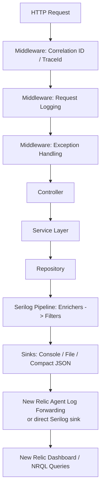
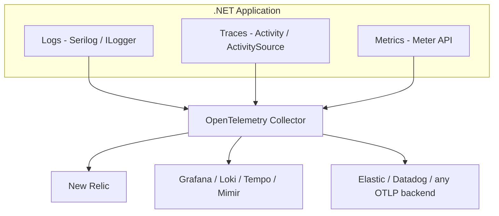
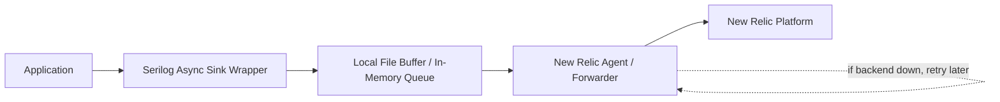
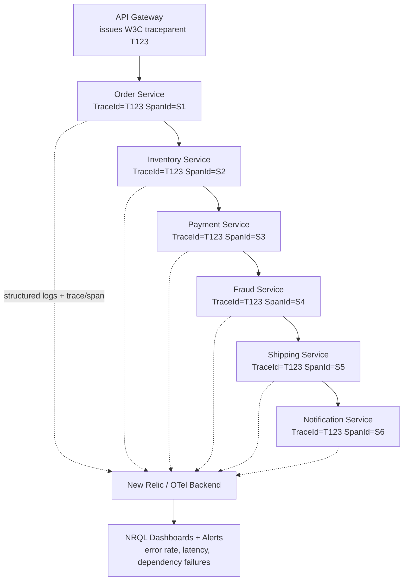

# Structured Logging — Senior .NET Interview Guide

> Scope: Serilog-centric structured logging ASP.NET Core mein, correlation/distributed tracing, New Relic integration, centralized logging pipelines, aur modern (2026) observability practices. Yeh ek 10-year .NET full-stack dev ke liye pitched hai jo senior/lead interviews ke liye prep kar raha hai.

## Table of Contents

1. [Core Concepts](#core-concepts)
   - [Structured Logging Kya Hai Aur Yeh String Interpolation Se Kaise Better Hai](#what-is-structured-logging)
   - [Message Templates](#message-templates)
   - [Log Levels](#log-levels)
   - [[new content] Structured Logging vs Plain-Text Logging — Full Picture](#structured-vs-plaintext)
2. [Architecture](#architecture)
   - [End-to-End Request Flow](#end-to-end-flow)
   - [Program.cs Configuration (Code-Based)](#programcs-config)
   - [appsettings.json Configuration (Config-Based)](#appsettings-config)
3. [Intermediate — Enrichment aur Context Propagation](#intermediate)
   - [Correlation ID Middleware](#correlation-id-middleware)
   - [LogContext.PushProperty Deep Dive](#pushproperty-deep-dive)
   - [Controller / Service / Repository Logging](#layered-logging)
   - [Built-in Request Logging](#request-logging)
   - [Global Exception Middleware](#exception-middleware)
   - [[new content] Serilog Sinks Internals](#sinks-internals)
   - [[new content] Enrichers vs Destructuring — Difference Kya Hai](#enrichers-vs-destructuring)
4. [Advanced — Distributed Tracing & Multi-Tenancy](#advanced)
   - [CorrelationId vs TraceId](#correlationid-vs-traceid)
   - [15 Microservices Ke Across Ek Request Ko Trace Karna](#tracing-across-microservices)
   - [Multi-Tenant Logging](#multi-tenant-logging)
   - [[new content] OpenTelemetry Logs/Traces/Metrics Unification](#opentelemetry)
   - [[new content] ASP.NET Core Activity / W3C Trace Context Integration](#activity-integration)
   - [[new content] Centralized Logging Pipelines: ELK vs Seq vs Grafana Loki](#centralized-pipelines)
   - [[gaps] AWS-Native Logging and Tracing](#aws-native-logging-and-tracing-gaps)
5. [New Relic Integration](#new-relic-integration)
   - [Three Integration Options](#integration-options)
   - [NRQL Query Examples](#nrql-queries)
6. [Performance](#performance)
   - [Excessive Logging Production Ko Kyun Hurt Karta Hai](#excessive-logging)
   - [Async Logging Aur Buffering](#async-logging)
   - [[new content] Source-Generated Logging (LoggerMessage) Aur ILogger Calls Ki Cost](#source-generated-logging)
   - [[new content] Scale Par Log Sampling Strategies](#log-sampling)
7. [Best Practices](#best-practices)
   - [10 Logging Best Practices](#ten-best-practices)
   - [Golden Rules Checklist](#golden-rules)
   - [[new content] PII / Sensitive-Data Redaction Patterns](#pii-redaction)
8. [Common Pitfalls](#common-pitfalls)
9. [Kyun Serilog (vs NLog vs log4net)](#why-serilog)
10. [Sample Interview Q&A](#sample-qa)
    - [Foundational Q&A (notes se)](#foundational-qa)
    - [Staff/Lead-Level System Design Question](#staff-system-design)
    - [[new content] Additional Senior/Staff Q&A](#additional-qa)
11. [Summary of Additions](#summary-of-additions)
12. [Summary of \[gaps\] Additions (This Pass)](#summary-of-gaps-additions-this-pass)

---

## Core Concepts

### Structured Logging Kya Hai Aur Yeh String Interpolation Se Kaise Better Hai
<a id="what-is-structured-logging"></a>

Structured logging ka matlab hai ki har log event ek set of **typed key/value properties** (plus ek message) ke roop mein emit hota hai, na ki sirf ek flattened string. "Does this text contain the word 'error'?" poochne ke bajaye, tumhara logging backend pooch sakta hai "give me every event where `OrderId = 45678` and `Level = Error`."

**Bad (string interpolation):**
```csharp
_logger.LogInformation($"Order {orderId} created");
```

**Good (message template):**
```csharp
_logger.LogInformation("Order {OrderId} created", orderId);
```

Yeh senior level par kyun matter karta hai:
- Serilog template ko parse karta hai aur `OrderId` ko `LogEvent` par ek **separate, typed property** ke roop mein store karta hai — na ki ek flattened string.
- Downstream systems (New Relic, Seq, Elasticsearch) `OrderId` par directly query/filter/facet kar sakte hain.
- **Performance**: string interpolation ke saath, string immediately ban jaati hai regardless ki koi sink sun raha hai ya nahi ya level enable bhi hai ya nahi. Template ke saath, rendering deferred hoti hai — template + arguments ko string mein format sirf tab kiya jaata hai jab kisi sink ko actually rendered message ki zarurat ho (e.g., console text sink); ek JSON sink properties ko directly serialize kar sakta hai bina kabhi human-readable string banaye.
- Consistent analytics/dashboards services ke across enable karta hai bina log text ko regex-scrape kiye.

### Message Templates
<a id="message-templates"></a>

Serilog ka message template syntax (`{PropertyName}`) standard .NET composite formatting ka ek superset hai:
- `{OrderId}` — ek scalar property ke roop mein captured hota hai, text sinks ke liye uska `ToString()` use karte hue lekin structured sinks ke liye native type ke roop mein.
- `{@Order}` — **destructuring operator**. Poore object graph ko structured properties ke roop mein capture karta hai flattened string ke bajaye:
  ```csharp
  _logger.LogInformation("Order created {@Order}", order);
  ```
  Yeh object ko log event mein nested structured data ke roop mein serialize karta hai — auditing ke liye invaluable, lekin large graphs aur circular references ke saath careful raho (dekho [Common Pitfalls](#common-pitfalls)).
- `{$Order}` — **stringification operator**, `ToString()` force karta hai even un types ke liye jo normally destructure hote.

### Log Levels
<a id="log-levels"></a>

| Level | Serilog Name | Meaning | Production default? | Example |
|---|---|---|---|---|
| Trace | `Verbose` | Extremely detailed tracing (finest granularity) | Off | "Entering `CalculateTax()`" |
| Debug | `Debug` | Developer troubleshooting detail | Off (usually) | "SQL query execution started" |
| Information | `Information` | Normal business flow events | On | "Order created", "Payment successful" |
| Warning | `Warning` | Unexpected but recoverable | On | Retry attempts, validation failures (400s) |
| Error | `Error` | Failures requiring attention | On | DB errors, 3rd-party API failures, unhandled exceptions |
| Critical | `Fatal` (Serilog) / `Critical` (MEL) | App can't continue / total outage | On | Database down, system-wide outage |

> **Naming par Note**: `Microsoft.Extensions.Logging.LogLevel` `Trace/Debug/Information/Warning/Error/Critical` use karta hai. Serilog ka native `LogEventLevel` `Verbose/Debug/Information/Warning/Error/Fatal` use karta hai. Serilog ka `Microsoft.Extensions.Logging` bridge `Critical ↔ Fatal` aur `Trace ↔ Verbose` map karta hai. Interviewers kabhi kabhi probe karte hain ki tumhe pata hai ki yeh enums 1:1 identical nahi hain — mapping jaan lo.

### [new content] Structured Logging vs Plain-Text Logging — Full Picture
<a id="structured-vs-plaintext"></a>

Yeh senior interview mein sabse common opening questions mein se ek hai ("why structured logging?") aur notes ne isko sirf partially answer kiya tha (message-template comparison ke through). Full picture:

| Aspect | Plain-text logging | Structured logging |
|---|---|---|
| Storage shape | Free text | Key/value properties + message |
| Query capability | Regex / substring search | Exact-match, range, facet queries (NRQL, KQL, Lucene) |
| Schema evolution | None — koi bhi change parsers ko break karta hai | Additive — naye properties purani queries ko break nahi karte |
| Machine readability | Downstream fragile log-parsing regexes chahiye | Native JSON/CLEF — koi parsing nahi chahiye |
| Dashboarding | Hard (pehle fields ko regex se extract karna padta hai) | Trivial (`FACET`, `GROUP BY` properties par) |
| Human readability (console) | Good | Good agar template-aware console theme use kar rahe ho (Serilog human text bhi render karta hai AND properties bhi rakhta hai) |
| Migration cost | N/A | Discipline chahiye — team ko consistently templates use karne padenge, `$"..."` nahi |

Key interview point: structured logging human-readable output ke saath **mutually exclusive nahi hai** — Serilog ka console sink templated message ko readable text ke roop mein render karta hai *while* same `LogEvent` structured properties ko doosre sinks tak carry karta hai. Tumhe dono milte hain.

---

## Architecture

### End-to-End Request Flow
<a id="end-to-end-flow"></a>



### Program.cs Configuration (Code-Based)
<a id="programcs-config"></a>

```csharp
using Serilog;

Log.Logger = new LoggerConfiguration()
    .MinimumLevel.Information()
    .Enrich.FromLogContext()
    .Enrich.WithEnvironmentName()
    .Enrich.WithThreadId()
    .Enrich.WithProperty("Application", "OrderApi")
    .WriteTo.Console()
    .WriteTo.Async(a => a.File(
        new Serilog.Formatting.Compact.CompactJsonFormatter(),
        "logs/app-.log",
        rollingInterval: RollingInterval.Day))
    .CreateLogger();

try
{
    var builder = WebApplication.CreateBuilder(args);

    builder.Host.UseSerilog();

    builder.Services.AddControllers();

    var app = builder.Build();

    app.UseSerilogRequestLogging();

    app.UseMiddleware<CorrelationIdMiddleware>();

    app.MapControllers();

    app.Run();
}
catch (Exception ex)
{
    Log.Fatal(ex, "Application stopped unexpectedly");
}
finally
{
    Log.CloseAndFlush();
}
```

Required packages:
```text
dotnet add package Serilog.AspNetCore
dotnet add package Serilog.Sinks.Console
dotnet add package Serilog.Sinks.File
dotnet add package Serilog.Formatting.Compact
dotnet add package Serilog.Enrichers.Environment
dotnet add package Serilog.Enrichers.Thread
dotnet add package Serilog.Sinks.Async
```

Optional, direct New Relic shipping ke liye host agent par depend kiye bina:
```text
dotnet add package Serilog.Sinks.NewRelicLogs
dotnet add package NewRelic.LogEnrichers.Serilog
```

> **Note:** `UseSerilogRequestLogging()` ek hand-rolled request-logging middleware ko out of the box replace karta hai — yeh har request ke liye path, status code, aur elapsed time ko single line mein log karta hai.

### appsettings.json Configuration (Config-Based)
<a id="appsettings-config"></a>

```json
{
  "Serilog": {
    "Using": [ "Serilog.Sinks.Console", "Serilog.Sinks.File" ],
    "MinimumLevel": {
      "Default": "Information",
      "Override": {
        "Microsoft": "Warning",
        "System": "Warning"
      }
    },
    "Enrich": [ "FromLogContext", "WithEnvironmentName", "WithThreadId" ],
    "WriteTo": [
      { "Name": "Console" },
      {
        "Name": "File",
        "Args": {
          "path": "logs/app-.log",
          "rollingInterval": "Day",
          "formatter": "Serilog.Formatting.Compact.CompactJsonFormatter, Serilog.Formatting.Compact"
        }
      }
    ]
  }
}
```

```csharp
Log.Logger = new LoggerConfiguration()
    .ReadFrom.Configuration(builder.Configuration)
    .CreateLogger();
```

**Code-based vs config-based — trade-off jo interviewer probe kar sakta hai:** config-based (`ReadFrom.Configuration`) ops ko sinks/levels change karne deta hai bina redeploy ke (especially `IOptionsMonitor`/reloadOnChange + ek `LoggingLevelSwitch` ke combination mein), lekin kuch sink options aur custom enrichers/`ILogEventSink` implementations sirf programmatically wire ho sakte hain ya `Using` array mein register karne padte hain taaki config reader unhe discover kar sake. Zyada real systems dono combine karte hain: levels/sinks ke liye config, aur kuch bhi jisme DI ya custom types chahiye ho uske liye code.

---

## Intermediate — Enrichment aur Context Propagation

### Correlation ID Middleware
<a id="correlation-id-middleware"></a>

```csharp
public class CorrelationIdMiddleware
{
    private readonly RequestDelegate _next;

    public CorrelationIdMiddleware(RequestDelegate next)
    {
        _next = next;
    }

    public async Task Invoke(HttpContext context)
    {
        var correlationId = Guid.NewGuid().ToString();

        using (Serilog.Context.LogContext.PushProperty(
            "CorrelationId", correlationId))
        {
            context.Response.Headers.Add(
                "X-Correlation-Id",
                correlationId);

            await _next(context);
        }
    }
}
```

Purpose:
- Har request ke liye unique ID
- Microservices ke across logs trace karne mein help karta hai
- New Relic mein debugging easier banata hai

> **Note:** Serilog ka idiomatic context-attachment mechanism `LogContext.PushProperty` hai, `ILogger.BeginScope` nahi. `BeginScope` still kaam karta hai kyunki Serilog `Microsoft.Extensions.Logging.ILogger` implement karta hai, lekin `LogContext.PushProperty` native, more efficient path hai aur yahi hai jispar zyada Serilog-based teams standardize karti hain.

> **Gotcha jo notes ne explicitly flag nahi kiya**: yeh middleware hamesha ek *naya* correlation ID mint karta hai, inbound ID (e.g., upstream caller ya gateway se `X-Correlation-Id`) check kiye bina. Ek real multi-service deployment mein yeh correlation ko break kar deta hai jaise hi ek se zyada hop hota hai — dekho [What problems occur if every service generates its own CorrelationId?](#foundational-qa) neeche, jahan notes ka apna Q&A explicitly isko anti-pattern kehta hai. Production code yeh hona chahiye:
> ```csharp
> var correlationId = context.Request.Headers.TryGetValue("X-Correlation-Id", out var existing)
>     ? existing.ToString()
>     : Guid.NewGuid().ToString();
> ```

### LogContext.PushProperty Deep Dive
<a id="pushproperty-deep-dive"></a>

**Problem iske bina:** production mein 5,000 concurrent users / 50,000 requests per minute ke saath, ek support ticket kehta hai "Order 98765 failed." Individual unrelated log lines jaise:
```text
Order validation started
Calling payment service
Order created successfully
```
inko ek single logical operation mein group back karne ka koi tareeka nahi hai.

**Fix:**
```csharp
using (Serilog.Context.LogContext.PushProperty("OrderId", 98765))
using (Serilog.Context.LogContext.PushProperty("CustomerId", 1001))
{
    _logger.LogInformation("Order validation started");
    _logger.LogInformation("Calling payment service");
    _logger.LogInformation("Order created successfully");
}
```

Block ke andar har log line ab automatically `OrderId` aur `CustomerId` carry karti hai:
```json
{ "message": "Order validation started", "OrderId": 98765, "CustomerId": 1001 }
{ "message": "Calling payment service",  "OrderId": 98765, "CustomerId": 1001 }
{ "message": "Order created successfully", "OrderId": 98765, "CustomerId": 1001 }
```

**`await` ke across yeh kyun kaam karta hai:** `LogContext` `AsyncLocal<T>` se backed hai, isliye pushed properties async/await continuations ke through correctly flow karti hain bina manual parameter passing ke — even `Task.Run` continuations ke across jo ek different thread pool thread par resume hote hain, kyunki `AsyncLocal` logical call context follow karta hai, physical thread nahi.

**Real enterprise example (banking):**
```csharp
using (Serilog.Context.LogContext.PushProperty("CustomerId", customerId))
using (Serilog.Context.LogContext.PushProperty("AccountId", accountId))
using (Serilog.Context.LogContext.PushProperty("TransactionId", transactionId))
{
    // business logic
}
```

**Staff-level jawab:** `LogContext.PushProperty` contextual information ko ek logical operation ke andar emit hone wale har log ke saath attach karne deta hai, including async/await boundaries ke across, kyunki yeh `AsyncLocal` par ride karta hai. Yeh duplicate logging code kam karta hai aur logs ko searchable aur traceable banata hai. Enterprise systems mein hum commonly `CorrelationId`, `TraceId`, `TenantId`, `CustomerId`, `OrderId`, aur `UserId` ko log context par push karte hain taaki support engineers quickly ek specific business transaction se associated saari logs locate kar sakein.

### Controller / Service / Repository Logging
<a id="layered-logging"></a>

```csharp
[ApiController]
[Route("api/orders")]
public class OrderController : ControllerBase
{
    private readonly OrderService _service;
    private readonly ILogger<OrderController> _logger;

    public OrderController(
        OrderService service,
        ILogger<OrderController> logger)
    {
        _service = service;
        _logger = logger;
    }

    [HttpPost]
    public async Task<IActionResult> CreateOrder(
        CreateOrderRequest request)
    {
        _logger.LogInformation(
            "CreateOrder request received. CustomerId={CustomerId}",
            request.CustomerId);

        var orderId = await _service.CreateOrder(request);

        return Ok(orderId);
    }
}
```

```csharp
public class OrderService
{
    private readonly ILogger<OrderService> _logger;

    public OrderService(ILogger<OrderService> logger)
    {
        _logger = logger;
    }

    public async Task<int> CreateOrder(CreateOrderRequest request)
    {
        _logger.LogInformation(
            "Creating order. CustomerId={CustomerId}, Amount={Amount}",
            request.CustomerId,
            request.Amount);

        try
        {
            var orderId = await SaveOrder(request);

            _logger.LogInformation(
                "Order created successfully. OrderId={OrderId}",
                orderId);

            return orderId;
        }
        catch (Exception ex)
        {
            _logger.LogError(
                ex,
                "Order creation failed. CustomerId={CustomerId}",
                request.CustomerId);

            throw;
        }
    }
}
```

> **Repositories mein business logs kyun nahi hone chahiye?** Repository = data access concerns ("SQL timeout"). Service = business concerns ("Customer upgraded plan"). Inko mix karna log semantics ko blur kar deta hai aur layer-specific alerting build karna harder bana deta hai (e.g., repository-layer timeout spikes par alert business-event volume se independent).

> **Contradiction flagged:** Upar wala `OrderService.CreateOrder` example error ko `_logger.LogError(ex, ...)` ke through log karta hai *aur phir rethrow karta hai*, jo notes ka apna "Avoid Duplicate Logging" best-practice section (aur "duplicate logs are a serious production issue" Q&A) explicitly kehta hai wrong hai agar ek global exception middleware bhi isko log karega. Original notes mein "log-and-rethrow" example *aur* "only the global handler should log" rule dono hain bina reconcile kiye. **Correct resolution:** failure point par domain-specific context sirf tab log karo agar tum information add kar rahe ho jo global handler reconstruct nahi kar sakta (e.g., `CustomerId` exception ke ek generic 500 ke roop mein bubble hone se pehle) — aur us case mein, `LogError` ke bajaye ek scoped log context property (`LogContext.PushProperty`) ke through karo, taaki global handler ka single `LogError` call bina duplicate entry ke poora context carry kare. Agar koi extra context add nahi ho sakta, to locally bilkul log mat karo — swallow-and-rethrow (`catch { throw; }`) aur global handler ko woh ek `LogError` call own karne do.

### Built-in Request Logging
<a id="request-logging"></a>

```csharp
app.UseSerilogRequestLogging(options =>
{
    options.MessageTemplate =
        "Request completed. Path={RequestPath}, StatusCode={StatusCode}, DurationMs={Elapsed}";

    options.EnrichDiagnosticContext = (diagnosticContext, httpContext) =>
    {
        diagnosticContext.Set("UserId", httpContext.User?.Identity?.Name);
    };
});
```

Purpose: API execution time track karna, slow endpoints monitor karna, hand-written stopwatch code ke bajaye per-request ek log line.

### Global Exception Middleware
<a id="exception-middleware"></a>

```csharp
public class ExceptionHandlingMiddleware
{
    private readonly RequestDelegate _next;
    private readonly ILogger<ExceptionHandlingMiddleware> _logger;

    public ExceptionHandlingMiddleware(
        RequestDelegate next,
        ILogger<ExceptionHandlingMiddleware> logger)
    {
        _next = next;
        _logger = logger;
    }

    public async Task Invoke(HttpContext context)
    {
        try
        {
            await _next(context);
        }
        catch (Exception ex)
        {
            _logger.LogError(ex, "Unhandled exception occurred");
            throw;
        }
    }
}
```

Purpose: sabhi unhandled exceptions ko ek baar capture karna, duplicate try/catch blocks avoid karna, centralized error logging.

> **Gotcha**: yahan log karne ke baad rethrow karne ka matlab hai ki upstream kuch (e.g., ek `UseExceptionHandler` ya ek further-out middleware/host) ko isko bhi HTTP response mein convert karna padega. Make sure ki us chain mein sirf *ek* layer bhi log kare — typically innermost catch (yeh middleware) log karta hai, aur uske aage kuch bhi sirf response par map hota hai, dobara log nahi karta.

### [new content] Serilog Sinks Internals
<a id="sinks-internals"></a>

Yeh ek bahut common senior .NET interview topic hai aur first-class section deserve karta hai (original notes mein yeh end ke paas ek large dump ke roop mein tha — yahan consolidated aur tightened kiya gaya hai).

**Sink kya hai?** Destination jahan Serilog ek `LogEvent` likhta hai — console, file, Elasticsearch, Seq, New Relic, ek custom monitoring system, etc.

**Serilog ek log event ko kaise process karta hai:**

```mermaid
flowchart LR
    A[Log.Information/LogEvent created] --> B[Enrichers add metadata
    TraceId, CorrelationId, MachineName...]
    B --> C[Filters run
    e.g. drop health-check noise]
    C --> D{Sink(s)}
    D --> E[Console]
    D --> F[File]
    D --> G[Elasticsearch]
    D --> H[New Relic]
```

1. Application ek `LogEvent` create karta hai (`Message`, properties, `Level`, `Timestamp`).
2. Enrichers contextual metadata add karte hain (`CorrelationId`, `MachineName`, `Environment`, etc.).
3. Filters execute hote hain (e.g., "only Error+", "ignore health-check requests").
4. Event har configured sink ko dispatch kiya jaata hai.

**Har sink `ILogEventSink` implement karta hai:**
```csharp
public interface ILogEventSink
{
    void Emit(LogEvent logEvent);
}
```

**Custom sink example:**
```csharp
public class CompanySink : ILogEventSink
{
    public void Emit(LogEvent logEvent)
    {
        SendToMonitoringSystem(logEvent);
    }
}
```
`.WriteTo.Sink(new CompanySink())` ke through registered hota hai.

**Multiple sinks same event ko fan out karte hain** — ek `LogEvent`, kai destinations, bina business code ko yeh jaane ya care kiye ki kaunse destinations exist karte hain:
```csharp
builder.Host.UseSerilog((ctx, lc) =>
{
    lc.WriteTo.Console()
      .WriteTo.File("logs/app.log")
      .WriteTo.Elasticsearch(/* ... */)
      .WriteTo.NewRelicLogs(/* ... */);
});
```

**Agar ek sink fail ho jaaye to kya hota hai?** Serilog sink failures ko isolate karta hai — ek failing sink (e.g., New Relic unreachable) application ko crash nahi karna chahiye ya doosre sinks ko block nahi karna chahiye. Enterprise systems sinks ko async processing + buffering mein wrap karte hain, aur kuch sinks (e.g., `Serilog.Sinks.PeriodicBatching`-based wale) apni own retry policies implement karte hain. Jaan lo ki yeh isolation sink-implementation-dependent hai — ek naive custom sink jo `Emit()` ke andar synchronously throw karta hai woh exception ko logging call ke through propagate *kar sakta hai* jab tak yeh `.WriteTo.Async(...)` mein wrapped na ho, jo background worker mein failures ko catch aur drop (ya retry, config par depend karta hai) karta hai calling thread ke bajaye.

**Staff-level jawab:** Ek Serilog sink woh output component hai jo log events ko persist ya transmit karne ke liye responsible hai. Jab ek log create hota hai, Serilog ek structured `LogEvent` banata hai, isko contextual metadata se enrich karta hai, filters apply karta hai, aur ek ya zyada configured sinks tak forward karta hai. Har sink `ILogEventSink` implement karta hai aur `Emit()` ke through log events receive karta hai. Enterprise systems mein, sinks usually asynchronous processing aur buffering ke saath wrapped hote hain taaki request threads block na hon, aur multiple sinks parallel mein run kar sakte hain taaki same event files, console, Elasticsearch, aur New Relic tak simultaneously pahunche while throughput aur fault tolerance preserve karte hue.

### [new content] Enrichers vs Destructuring — Difference Kya Hai
<a id="enrichers-vs-destructuring"></a>

Interviewers kabhi kabhi inko conflate karte hain — clearly line draw karne ke liye ready raho:

| | Enrichers | Destructuring (`@`) |
|---|---|---|
| Kya add karta hai | Ambient/contextual properties jo call site par present nahi hoti (`MachineName`, `CorrelationId`, `ThreadId`) | Ek *specific object jo call site par pass kiya gaya* uske liye structure (`{@Order}`) |
| Scope | Pipeline se flow ho rahe har log event par apply hota hai (ya `LogContext` block ke andar har event par) | Sirf single log call par apply hota hai jo `@` use karta hai |
| Mechanism | `ILogEventEnricher.Enrich(LogEvent, ILogEventPropertyFactory)` | Serilog ka `IDestructuringPolicy`, ya built-in reflection-based destructurer |
| Example | `.Enrich.WithEnvironmentName()`, `.Enrich.WithThreadId()`, `TenantId` ke liye custom `ILogEventEnricher` | `_logger.LogInformation("Order created {@Order}", order)` |
| Custom extension point | `ILogEventEnricher` implement karo | `IDestructuringPolicy` implement karo control karne ke liye ki ek specific type kaise serialize hota hai (e.g., ek field mask karo, depth cap karo) |

---

## Advanced — Distributed Tracing & Multi-Tenancy

### CorrelationId vs TraceId
<a id="correlationid-vs-traceid"></a>

| | CorrelationId | TraceId |
|---|---|---|
| Origin | Custom-generated, business/request tracking identifier | Distributed tracing systems dwara generated (W3C `traceparent`, OpenTelemetry, New Relic) |
| Captured by | Manual `LogContext.PushProperty` | Automatic, `Serilog.Enrichers.Span` ya New Relic log enricher ke through, ASP.NET Core ke `Activity`/`DiagnosticSource` par ride karte hue |
| Kaun isse search karta hai | Support teams (often ticket-friendly, human-readable) | Engineers (APM trace view se directly match karta hai) |
| Modern trend | Kai orgs mein TraceId se subsume ho raha hai | Increasingly primary key; kai companies support-team ergonomics ke liye dono rakhti hain |

### 15 Microservices Ke Across Ek Request Ko Trace Karna
<a id="tracing-across-microservices"></a>

- `TraceId` ek baar generate hota hai (W3C `traceparent` header, gateway-issued ya SDK-issued).
- Headers mein har downstream hop ko pass hota hai.
- Har service mein `Serilog.Enrichers.Span` ya New Relic log enricher ke through captured hota hai.
- New Relic Distributed Tracing end-to-end enabled hai.
- Poori request journey reconstruct karne ke liye `TraceId` se search karo:
```sql
SELECT * FROM Log WHERE trace.id = 'T123'
```

```mermaid
sequenceDiagram
    participant GW as API Gateway
    participant OS as Order Service
    participant IS as Inventory Service
    participant PS as Payment Service
    participant NS as Notification Service

    GW->>OS: traceparent: TraceId=T123
    OS->>IS: TraceId=T123, SpanId=S1
    IS->>PS: TraceId=T123, SpanId=S2
    PS->>NS: TraceId=T123, SpanId=S3
    Note over GW,NS: TraceId constant across every hop; SpanId changes per service
```

### Multi-Tenant Logging
<a id="multi-tenant-logging"></a>

**Problem:** Walmart, Target, Costco, Amazon, etc. ko serve karne wale ek shared SaaS app mein, ek "Database Timeout" error koi clue nahi deta ki kaunsa tenant hit hua — tenant metadata ke bina, incident isolate karna impossible hai.

**Solution:** `TenantId` ko JWT claims, API Gateway headers, ya request headers se extract karo, aur isko log context par push karo ek tenant-resolution middleware mein:
```csharp
var tenantId = httpContext.Request.Headers["TenantId"];

using (Serilog.Context.LogContext.PushProperty("TenantId", tenantId))
{
    await _next(context);
}
```

Resulting logs:
```json
{ "message": "Order Created", "TenantId": "Walmart" }
{ "message": "Payment Failed", "TenantId": "Target" }
```

Query:
```sql
SELECT * FROM Log WHERE TenantId = 'Walmart'
```

**Staff-level jawab:** Ek multi-tenant SaaS system mein, har log ko `TenantId` aur doosri contextual metadata se enrich hona chahiye. Tenant information usually JWT claims, API Gateway headers, ya request headers se extract kiya jaata hai aur `LogContext.PushProperty` use karke ek tenant-resolution middleware mein, ya ek custom `ILogEventEnricher` ke through attach kiya jaata hai. Yeh operations teams ko per-tenant logs filter karne, incidents quickly isolate karne, aur tenant-specific dashboards aur alerts build karne deta hai.

### [new content] OpenTelemetry Logs/Traces/Metrics Unification
<a id="opentelemetry"></a>

Original notes OpenTelemetry ko sirf passing mein mention karte hain ("OpenTelemetry SDK... collects trace, span, latency data"). Yeh ab 2025–2026 ke liye sabse hot senior/staff interview areas mein se ek hai kyunki zyada orgs actively vendor-proprietary agents (including New Relic ka apna .NET Agent) se OpenTelemetry ki taraf migrate ho rahe hain as vendor-neutral standard.

**Teen pillars, unified:**


Senior interview ke liye key points:
- OpenTelemetry ek **vendor-neutral wire format (OTLP)** aur SDK define karta hai. Tum ek baar instrument karte ho; tum backends (New Relic, Datadog, Grafana stack, Elastic) swap kar sakte ho Collector ke exporter ko reconfigure karke, apna code nahi.
- .NET ka `Microsoft.Extensions.Logging` `OpenTelemetry.Extensions.Logging` ke through OpenTelemetry se integrate hota hai — tum `ILogger` output ko ek OTel `LoggerProvider` ke through route kar sakte ho, Serilog sinks ke saath (ya unki jagah).
- Serilog aur OpenTelemetry **mutually exclusive nahi hain**: ek common pattern hai rich structured logging ke liye Serilog + ek OTel exporter sink (`Serilog.Sinks.OpenTelemetry`) taaki logs same `TraceId`/`SpanId` carry karein jo OTel traces use karte hain, hand-rolled enrichers ke bina correlation unify karte hue.
- Traces `System.Diagnostics.ActivitySource`/`Activity` (built into .NET since Core 3.0/`DiagnosticSource` package) ko native tracing primitive ke roop mein use karte hain — OpenTelemetry ka .NET SDK largely ek *listener aur exporter* hai `Activity` ke upar, uska replacement nahi. Isi wajah se `Serilog.Enrichers.Span` aur OTel dono same ambient `Activity.Current` par "just work" karte hain.
- Metrics `System.Diagnostics.Metrics.Meter` API use karte hain, OTel ke metrics SDK ke through exported — logs/traces se separate lekin same resource attributes se correlated (`service.name`, `deployment.environment`).
- **Interviewer follow-up jo expect karo:** "Agar tumhare paas already New Relic ka agent kaam kar raha hai to tum OpenTelemetry kyun adopt karoge?" Jawab: vendor lock-in avoidance, multi-backend flexibility (e.g., traces New Relic ko, logs ek cheaper Loki/S3-backed store ko), aur polyglot services (Java, Node, Go) ke across standardization jinke paas .NET ke New Relic-specific SDK parity jaisa kuch nahi hota.

### [new content] ASP.NET Core Activity / W3C Trace Context Integration
<a id="activity-integration"></a>

ASP.NET Core automatically incoming request ke liye ek `Activity` create karta hai (`DiagnosticListener`/`ActivitySource` ke through) aur incoming `traceparent`/`tracestate` headers (W3C Trace Context spec) parse karta hai agar present hain, `Activity.Current.TraceId` aur `SpanId` populate karte hue bina kisi custom middleware ke. Yeh wahi mechanism hai jisse `Serilog.Enrichers.Span` read karta hai `TraceId`/`SpanId` ko har `LogEvent` par attach karne ke liye — yeh tumhare custom `CorrelationIdMiddleware` se *nahi* pull kar raha jab tak tum khud isko wire nahi karte. Interview nuance: jaano ki ASP.NET Core tumhe yeh tracing context "for free" deta hai .NET Core 3.0+ se (`HttpContext.TraceIdentifier` request ID ke liye aur `Activity.Current` W3C trace ke liye), isliye ek hand-rolled correlation ID often us cheez se *redundant* hota hai jo framework already provide karta hai — kai teams ek custom `CorrelationId` purely ek business-friendly alias ke roop mein rakhti hain, jabki actual cross-service linkage framework ke `Activity`/`traceparent` par ride karta hai.

### [new content] Centralized Logging Pipelines: ELK vs Seq vs Grafana Loki
<a id="centralized-pipelines"></a>

Notes heavily New Relic par focus karte hain. Ek senior interviewer expect karega ki tum New Relic ko doosre common centralized logging stacks se compare karo:

| Stack | Storage model | Query language | Strengths | Trade-offs |
|---|---|---|---|---|
| **ELK** (Elasticsearch, Logstash, Kibana) | Full-text indexed JSON documents | Lucene / KQL (Kibana Query Language) | Extremely powerful full-text search, mature ecosystem, self-hostable | Elasticsearch resource-hungry aur scale par operationally heavy hai; indexing cost high hai |
| **Seq** | Structured events (CLEF format), SQL-like store | Seq ka own SQL-ish query language | Serilog/structured logs ke liye purpose-built, phenomenal local-dev experience, self-host karne ke liye lightweight | ELK se smaller ecosystem; bahut large multi-tenant volumes tak scale karne ke liye Seq ki paid clustering chahiye |
| **Grafana Loki** | Log-stream storage sirf labels se indexed (full text nahi) | LogQL | Scale par bahut cheap chalane ke liye (index chota hai — sirf labels), Grafana dashboards/Tempo traces/Prometheus metrics ke saath naturally pair hota hai ek unified "LGTM" (Loki-Grafana-Tempo-Mimir) stack ke liye | Stream ke andar full-text search ELK se slower hai kyunki content indexed nahi hota, sirf labels — tum search flexibility ko cost ke liye trade karte ho |
| **New Relic Logs** | Managed SaaS, NRQL | NRQL | Chalane ke liye zero infra, tight APM/trace correlation ("Logs in Context") | Cost directly ingest volume ke saath scale karta hai — exact problem jo notes ka "staff-level 50k req/min" question discuss karta hai; vendor lock-in |

**Interview ke liye yeh kyun matter karta hai:** "centralized logging" sirf "JSON kahin ship kar do" nahi hai — yeh ek cost/query-power/operational-burden trade-off hai. Ek senior engineer ko justify karna aana chahiye: local dev + small internal tools ke liye Seq use karo, deep full-text search chahiye aur ops capacity hai chalane ke liye to ELK, cost-per-GB dominant hai aur already Grafana/Prometheus chal rahe ho to Loki, aur ek SaaS platform (New Relic/Datadog) jab APM+logs+traces ko unified chahiye bina infrastructure ownership ke — ingest-cost trade-off accept karte hue.

### [gaps] AWS-Native Logging and Tracing
<a id="aws-native-logging-and-tracing-gaps"></a>

Upar sab kuch (New Relic, ELK, Seq, Loki) either ek third-party SaaS hai ya ek self-hosted stack. Kyunki candidate ka target cloud AWS hai, yeh section AWS-native equivalents cover karta hai — CloudWatch Logs Insights aur X-Ray — aur yeh kaise already covered OpenTelemetry content ke saath sit karte hain (uski jagah nahi).

#### `[gaps]` CloudWatch Logs Insights

**Yeh kya hai**: ek query engine jo directly CloudWatch Logs ke upar built hai — koi separate indexing pipeline chalane ya CloudWatch Logs ingestion ke aage extra pay karne ki zarurat nahi. ECS/Lambda/EC2 par chal rahi ek .NET service CloudWatch agent ke saath (ya Lambda ka automatic log group per function) apna stdout/Serilog console-sink output ek Log Group mein automatically deti hai; Logs Insights us Log Group ko directly query karta hai.

**Query syntax basics** (apni own purpose-built query language, SQL ya Lucene nahi):

```
fields @timestamp, @message
| filter @message like /OrderId/
| sort @timestamp desc
| limit 20
```

Ek Serilog Compact-JSON log line (same `CompactJsonFormatter` output jo already elsewhere in this guide use hua hai) se structured JSON fields ko parse aur unpar aggregate karna:

```
fields @timestamp, OrderId, CorrelationId, Level
| filter Level = "Error"
| stats count(*) as errorCount by bin(5m)
```

Ek structured property se facet karna, directly analogous NRQL `FACET` examples ke jo already this guide mein hain:

```
fields RequestPath, DurationMs
| stats avg(DurationMs) as avgDuration by RequestPath
| sort avgDuration desc
```

**Use case vs. ELK/Seq** — honest trade-off jo ek senior candidate ko clearly state karna chahiye:

| | CloudWatch Logs Insights | ELK | Seq |
|---|---|---|---|
| Infra chalani padti hai | Nahi — fully managed, pay-per-query-scanned + ingestion | Self-hosted Elasticsearch cluster (ya managed OpenSearch) | Self-hosted (ya Seq Cloud) |
| Query language | Logs Insights QL (purpose-built, AWS-only) | Lucene/KQL | Seq ki SQL-ish language |
| Query performance model | Har query par queried time range ke liye raw log data ko scan karta hai (koi persistent index nahi) — ad hoc investigation ke liye fine hai, high-frequency dashboards ke liye nahi banaya | Pre-indexed — repeated/dashboard-style queries ke liye kaafi fast, indexing overhead/cost ki cost par | Pre-indexed (CLEF), fast, lekin smaller ecosystem |
| Best fit | Already-on-AWS shops jo zero extra infrastructure aur log data par tight IAM-based access control chahte hain | Teams jinhe deep full-text search chahiye aur Elasticsearch chala/tune kar sakte hain | Local dev + small internal tools, tight Serilog fit |
| Cost model | Per query GB scanned + standard CloudWatch Logs ingestion/storage pay karna — cost *tum kitna query karte ho* se scale karta hai, na sirf kitna ingest karte ho, jo har doosre stack se ek distinct gotcha hai iss guide mein | Infra cost (cluster ke liye compute/storage) | Infra cost ya Seq Cloud subscription |

**Logs Insights ke liye specific gotcha**: kyunki yeh persistent index maintain karne ke bajaye scan karta hai, ek high-volume Log Group ke upar ek broad, unbounded time-range query slow ho sakti hai aur "GB scanned" cost quickly rack up kar sakti hai — time range aur log group scope narrow karna yahan zyada matter karta hai ek pre-indexed store jaise ELK/Seq ke saath karne se.

#### `[gaps]` AWS X-Ray for Distributed Tracing

**Yeh kya hai**: AWS ki native distributed tracing service — conceptually already covered OpenTelemetry tracing pipeline jaisa hi role (`ActivitySource`/`Activity`, trace/span propagation service hops ke across), lekin X-Ray AWS ka apna backend aur SDK/daemon hai us data ko collect aur visualize karne ke liye, AWS compute (Lambda, ECS, EC2) aur AWS service calls (DynamoDB, S3, SQS calls automatically segments ke roop mein dikhte hain X-Ray SDK ki instrumentation ke through) ke saath first-class integration ke saath.

- **X-Ray daemon/agent** tumhari application ke saath chalta hai (ECS par ek sidecar ke roop mein, Lambda runtime mein built-in, ya EC2 par ek agent process ke roop mein) aur trace segments ko batch karta hai X-Ray API tak forward karne se pehle — "don't block the request thread on the tracing backend" wala same principle jo already Serilog ke async sinks ke liye covered hai yahan bhi apply hota hai.
- **Service map** — X-Ray ka signature visualization: ek distributed system mein har service/downstream call ka ek live-updating graph, har edge par latency aur error rate annotated — AWS-native equivalent us cheez ka jo ek New Relic distributed trace view ya ek Grafana Tempo/Jaeger UI OTel traces ke liye deta hai.
- **X-Ray directly OpenTelemetry data consume kar sakta hai** — yeh key point hai jo X-Ray ko already this guide mein OpenTelemetry section se back tie karta hai, isko totally separate choice treat karne ke bajaye: **AWS Distro for OpenTelemetry (ADOT)** Collector OTel traces ko X-Ray tak backend ke roop mein export kar sakta hai, matlab standard `ActivitySource`/OTel SDK se instrumented ek .NET service (exactly upar OpenTelemetry section mein described) ko ek separate, X-Ray-proprietary SDK ki zarurat nahi hai — yeh standard OTLP emit kar sakti hai aur ADOT Collector ko X-Ray, New Relic, ya dono simultaneously forward karne de sakti hai, same multi-backend flexibility argument jo already OpenTelemetry ke liye generally banaya gaya hai.
- **X-Ray vs. OpenTelemetry — interview mein isko kaise frame karo**: X-Ray ek *backend + ek legacy proprietary SDK* hai; OpenTelemetry *vendor-neutral instrumentation standard* hai. "kya tum X-Ray SDK ya OpenTelemetry use karoge?" ka senior-level jawab hai: OpenTelemetry se instrument karo (`ActivitySource`, OTel .NET SDK) taaki tum kisi bhi ek backend mein locked-in na ho, aur ADOT Collector ke exporter ko X-Ray par point karo (ya baad mein application code touch kiye bina isko doosre backend se swap kar do) — X-Ray SDK ko directly use karna older pattern hai, comparable New Relic .NET Agent ke against directly instrument karne se, OTel ke through jaane ke bajaye.
- **X-Ray traces ko CloudWatch Logs ke saath correlate karna** — X-Ray segments ek `trace_id` carry karte hain; usi `trace_id` ko har Serilog `LogEvent` par ek structured property ke roop mein emit karna (same enrichment pattern jo already `TraceId`/`SpanId` ke liye `Serilog.Enrichers.Span` ke through use hua hai) tumhe ek slow/failed X-Ray trace segment se directly corresponding CloudWatch Logs Insights query (`filter trace_id = "..."`) tak jump karne deta hai — New Relic ke "Logs in Context" click-through ka AWS-native version jo already New Relic Integration section mein described hai.

#### `[gaps]` CloudWatch Log Group Retention Policies and Subscription Filters for Cost Control

Notes already tiered retention (Debug 7 days, Error 90-180 days, Audit 7 years) ko ek general logging best practice ke roop mein cover karte hain — CloudWatch ke paas apne specific mechanisms hain isko enforce karne aur cost control karne ke liye, jaanne layak concretely, sirf "set a retention policy" se zyada:

- **Log Group retention** — har CloudWatch Log Group ka ek explicit retention setting hai (1 day se lekar 10 years, ya "Never Expire") jo deliberately set karna zaruri hai; **default Never Expire hai**, jo ek real, common cost leak hai — ek Lambda function ka auto-created log group bina retention policy set kiye logs (aur cost) forever accumulate karega jab tak koi explicitly isko configure na kare. Isko IaC ke through set karna (Terraform ka `aws_cloudwatch_log_group` `retention_in_days` argument) provisioning time par, kisi ke manually per environment configure karna yaad rakhne par depend karne ke bajaye, yahan senior-level jawab hai.
  ```hcl
  resource "aws_cloudwatch_log_group" "order_api" {
    name              = "/ecs/order-api"
    retention_in_days = 30
  }
  ```
- **Subscription filters** — CloudWatch mein khud 100% log volume ko long-term retain karne ke liye pay karne ke bajaye, ek **subscription filter** matching log events ko near-real-time mein ek cheaper long-term destination tak stream karta hai (Kinesis Data Firehose → S3, cold/compliance-tier storage ke liye; ya Lambda, real-time processing/alerting ke liye specific patterns par) — yeh already this guide mein described tiered-retention-by-sink pattern ka AWS-native equivalent hai (separate audit/error/debug sinks with different retention), except yeh ek filter+stream rule ke roop mein implement hota hai, ek separate Serilog sink ke bajaye.
  ```hcl
  resource "aws_cloudwatch_log_subscription_filter" "errors_to_firehose" {
    name            = "errors-to-s3-archive"
    log_group_name  = aws_cloudwatch_log_group.order_api.name
    filter_pattern  = "{ $.Level = \"Error\" }"
    destination_arn = aws_kinesis_firehose_delivery_stream.log_archive.arn
    role_arn        = aws_iam_role.cwl_to_firehose.arn
  }
  ```
- **Interview ke liye cost framing**: CloudWatch Logs cost ke do independent dimensions hain — ingestion (per GB ingested) aur storage (per GB-month retained) — plus, jaisa upar bataya gaya, Logs Insights ek teesra, per-query-GB-scanned dimension add karta hai. Teen levers jo har ek se map karte hain: sampling/level filtering ke through ingestion reduce karo (same principle jo elsewhere in this guide Log Sampling Strategies section mein hai), aggressive retention policies + subscription-filter offload S3 tak jo kuch bhi sirf compliance/audit ke liye chahiye uske liye storage cost reduce karo (S3 CloudWatch Logs storage se per GB-month kaafi cheaper hai), aur Logs Insights time ranges/log group scope narrow karke query cost reduce karo, habit se broadly query karne ke bajaye.

---

## New Relic Integration
<a id="new-relic-integration"></a>

### Three Integration Options
<a id="integration-options"></a>

Serilog output ko New Relic tak lane ke teen common tareeke hain. **Ek pick karo** — inko combine karna logs double-ship karta hai aur double billing cause kar sakta hai.

**Option A — Agent-based log forwarding (recommended default).** Host/container par New Relic .NET Agent install karo; yeh console/file output tail karta hai aur automatically forward karta hai (same pattern ek NLog setup jaisa).
```xml
<configuration>
  <service licenseKey="YOUR_LICENSE_KEY"/>
  <application>
    <name>Order API</name>
  </application>
  <log>
    <level>info</level>
  </log>
  <applicationLogging enabled="true">
    <forwarding enabled="true"/>
  </applicationLogging>
</configuration>
```

**Option B — New Relic Log Enricher for Serilog (Logs in Context).** `NewRelic.LogEnrichers.Serilog` linking metadata (`trace.id`, `span.id`, `entity.guid`) directly har `LogEvent` par add karta hai:
```csharp
Log.Logger = new LoggerConfiguration()
    .Enrich.WithNewRelicLogsInContext()
    .WriteTo.File(new NewRelicFormatter(), "logs/newrelic-app.log")
    .CreateLogger();
```
New Relic Log Forwarder / infrastructure agent phir us output folder ko watch karta hai aur formatted JSON ship karta hai.

**Option C — Direct sink to the New Relic Logs API.** Environments ke liye jinke paas agent nahi hai (containers, serverless, console apps):
```csharp
Log.Logger = new LoggerConfiguration()
    .WriteTo.NewRelicLogs(
        endpointUrl: "https://log-api.newrelic.com/log/v1",
        applicationName: "OrderApi",
        licenseKey: "YOUR_LICENSE_KEY")
    .CreateLogger();
```

Teeno ka purpose: APM metrics collect karna, Serilog logs forward karna, logs ko traces ke saath correlate karna.

### NRQL Query Examples
<a id="nrql-queries"></a>

```sql
-- Find all errors
SELECT * FROM Log WHERE level = 'Error'

-- Find logs for a request
SELECT * FROM Log WHERE CorrelationId = '2e1f4f9a-b0f2'

-- Count successful order creations
SELECT count(*) FROM Log WHERE message LIKE '%Order created%'

-- Find slow requests
SELECT average(DurationMs) FROM Log FACET RequestPath

-- Error rate
SELECT percentage(count(*), WHERE level = 'Error') FROM Log

-- Slowest APIs
SELECT average(duration) FROM Transaction FACET name

-- Logs scoped to one order
SELECT * FROM Log WHERE OrderId = 98765

-- Logs scoped to one tenant
SELECT * FROM Log WHERE TenantId = 'Walmart'
```

**Sample structured log (Compact JSON format):**
```json
{
  "@t": "2026-06-17T10:15:11.000Z",
  "@m": "Order created successfully",
  "@l": "Information",
  "OrderId": 45678,
  "CorrelationId": "2e1f4f9a-b0f2",
  "Application": "OrderApi",
  "EnvironmentName": "Production"
}
```
Benefits: searchable, filterable, easy NRQL queries, better observability.

---

## Performance

### Excessive Logging Production Ko Kyun Hurt Karta Hai
<a id="excessive-logging"></a>

- Disk I/O saturation
- Increased CPU usage
- Huge storage costs
- New Relic mein log ingestion costs (ya kisi bhi SaaS backend mein)
- Network congestion

**Solution:** sirf actionable information log karo; log levels aur ek `LoggingLevelSwitch` properly use karo.

### Async Logging Aur Buffering
<a id="async-logging"></a>

**Async ke bina:**
```text
Request Thread -> Write file -> Wait for disk -> Continue request
```

**Async ke saath:**
```text
Request Thread -> Queue log -> Continue request
Background Thread -> Write to file
```

```csharp
.WriteTo.Async(a => a.File("logs/app-.log"))
```

**Agar New Relic unavailable ho jaaye to kya hota hai?** Application chalti rehni chahiye; logging asynchronous aur buffered honi chahiye; kabhi bhi ek business request ko logging backend ke liye wait karte hue block mat karo.


Agar backend down ho jaata hai, logs locally buffer hote hain aur later forward hote hain — koi customer-facing impact nahi.

**Enterprises async logging kyun prefer karte hain:** file/network writes expensive hote hain; async request-thread blocking rokta hai aur API response time improve karta hai.

### [new content] Source-Generated Logging (LoggerMessage) Aur ILogger Calls Ki Cost
<a id="source-generated-logging"></a>

Original notes isko kabhi mention nahi karte, aur yeh .NET 6+ ke saath currency ka ek strong signal hai — expect karo ki yeh senior level par logging performance discuss karte waqt aayega.

**Historical cost problem:** Even `_logger.LogInformation("Order {OrderId} created", orderId)`, rendering *defer* karne ke bawajood, har call par value-type arguments (jaise `int orderId`) ko `object[]` mein box karta hai, aur ek `params object[]` allocation involve karta hai, jab tak level disabled na ho aur call early short-circuit na ho — classic advice thi ki hot-path debug logs ko `if (_logger.IsEnabled(LogLevel.Debug))` se guard karo koi expensive argument computation karne se pehle.

**Modern fix — compile-time source-generated logging (`LoggerMessageAttribute`, .NET 6+):**
```csharp
public static partial class Log
{
    [LoggerMessage(
        EventId = 1001,
        Level = LogLevel.Information,
        Message = "Order {OrderId} created for customer {CustomerId}")]
    public static partial void OrderCreated(this ILogger logger, int orderId, int customerId);
}

// usage
_logger.OrderCreated(orderId, customerId);
```

Yeh senior interview ke liye kyun matter karta hai:
- Source generator ek strongly-typed method emit karta hai **koi boxing nahi, koi array allocation nahi, aur koi bhi kaam karne se pehle ek built-in `IsEnabled` check** ke saath — yeh .NET mein aaj available sabse fastest logging call shape hai.
- Yeh tumhe message template ka method ke parameters ke against compile-time checking bhi deta hai (typos/parameter mismatches build time par catch ho jaate hain, runtime par nahi jab koi us log line ko dekh nahi raha hota).
- Ek explicit `EventId` assign karna tumhe alerting/dashboards ke liye ek stable, language-independent identifier deta hai jo message-text rewording ke baad bhi survive karta hai — kuch jo raw `LogInformation` calls tumhe free mein nahi dete.
- **Interview framing:** "Hot paths (tight loops, high-throughput endpoints) ke liye, hum direct `ILogger.LogX` calls ke bajaye `[LoggerMessage]` source-generated logging use karte hain, kyunki yeh allocation overhead eliminate karta hai aur compile-time template validation deta hai — yeh matter karta hai jab tum tens of thousands log calls per second kar rahe ho aur logging khud CPU time ka ek measurable percentage ban jaata hai."

### [new content] Scale Par Log Sampling Strategies
<a id="log-sampling"></a>

Original notes staff-level system-design section mein sampling ko briefly mention karte hain ("log 100% of errors/warnings, sample 10% of successful requests") — apna own topic banake expand karne layak hai kyunki "how do you control cost at scale" big system-design scenario se independently poocha jaata hai.

Common sampling strategies, roughly sophistication ke order mein:
1. **Level-based filtering** — Warning+ ka 100% log karo, Information sample karo. Simplest, most common first step.
2. **Fixed-rate sampling** — e.g., successful request logs mein se 1-in-10 rakho `UseSerilogRequestLogging` mein ek custom `GetLevel` callback ke through, ya ek Serilog `Filter.ByIncludingOnly` predicate ek random threshold use karte hue.
3. **Rate limiting / "log the first N per key per window"** — e.g., sirf ek identical error ke first 5 occurrences per minute, taaki ek misbehaving downstream dependency pipeline ko flood na kare (`Serilog.Sinks.RateLimit`-style pattern, ya ek hand-rolled `ConcurrentDictionary`-based throttle).
4. **Tail-based / trace-aware sampling** (yeh zyada ek OpenTelemetry tracing concept hai, lekin increasingly logs mein bhi bleed karta hai) — un requests ke liye traces/logs ka 100% rakho jo error mein khatam hue, lekin successful ones ko sample karo, decided *outcome pata chalne ke baad*, upfront ke bajaye.
5. **Dynamic sampling via `LoggingLevelSwitch`** — sampling per se nahi, lekin operational lever hai temporarily verbosity raise karne ke liye ek incident ke during bina redeploy ke:
```csharp
var levelSwitch = new LoggingLevelSwitch(LogEventLevel.Information);

Log.Logger = new LoggerConfiguration()
    .MinimumLevel.ControlledBy(levelSwitch)
    .CreateLogger();

// during an incident, exposed via an admin endpoint or config reload:
levelSwitch.MinimumLevel = LogEventLevel.Debug;
```

**Interview framing:** sampling *cost* aur *statistical visibility* ke beech ek deliberate trade-off hai — tumhe hamesha errors ka 100% rakhna chahiye (tum us ek failure ko miss karne se sample nahi bach sakte jo matter karti hai), aur sampling sirf high-volume, low-signal success paths par apply karo.

---

## Best Practices

### 10 Logging Best Practices
<a id="ten-best-practices"></a>

Good logging inme help karta hai: production issues troubleshoot karna, application health monitor karna, distributed tracing, security auditing, performance analysis.

1. **Structured data log karo, strings nahi.** Message templates use karo (`{OrderId}`), `$"..."` interpolation nahi — Seq, Elasticsearch, Splunk, Application Insights, Datadog, etc. mein searchable, aur better performance.
2. **Right log level deliberately pick karo** — dekho [level table](#log-levels) upar; concrete examples jaano (`LogTrace` for `Entering CalculateTax()`, `LogWarning` validation failures ke liye, `LogCritical` "Database unavailable" ke liye).
3. **Duplicate logging avoid karo.** Rule: ek exception ko ek baar log karo. Sirf global exception middleware ko unhandled exceptions log karne do; services ko `throw;` karna chahiye bina ek redundant `LogError` ke jab tak unique context add na ho raha ho (dekho [contradiction flagged](#layered-logging) upar).
4. **Logs ko context se enrich karo, repetition se nahi.** `CorrelationId` (ya koi bhi per-operation identifier) ko `LogContext.PushProperty` ke through ek baar push karo, har call par ek template argument ke roop mein repeat karne ke bajaye.
5. **Kabhi sensitive data log mat karo** — passwords, credit card numbers, CVV, JWT/refresh tokens, API secrets, personal information. `UserId` log karo, `Password` nahi.
6. **Logging ko async aur non-blocking banao** — `.WriteTo.Async(a => a.File(...))`. Better throughput, faster requests, reduced blocking.
7. **Services ke across correlation ke liye design karo** — har log ko end-to-end same `TraceId`/`CorrelationId` share karna chahiye; headers (`traceparent`) ke through propagate karo aur ingress par `LogContext` mein push karo.
8. **Log volume aur cost control karo** — incidents ke during temporarily verbosity raise karne ke liye ek `LoggingLevelSwitch` use karo bina redeploy ke; uske baad lower back karo.
9. **Logs ko concern aur retention se separate karo** — application logs, audit logs, security logs, performance logs har ek ko apna own sink/file aur retention policy milna chahiye:

   | Log type | Typical retention |
   |---|---|
   | Debug | 7 days |
   | Application / Info | 30 days |
   | Error | 90–180 days |
   | Audit | 7 years (compliance-driven) |

   ```csharp
   .WriteTo.Logger(lc => lc
       .Filter.ByIncludingOnly(e => e.Properties.ContainsKey("Audit"))
       .WriteTo.File("logs/audit-.log", retainedFileCountLimit: 2555))
   ```
10. **Logging ko API/observability contract ka part treat karo** — teams ke across standard fields par agree karo (`Event`, `TraceId`, `CorrelationId`, `TenantId`, `UserId`, `RequestId`, `MachineName`, `Environment`) taaki dashboards aur searches services ke across consistently kaam karein.

### Golden Rules Checklist
<a id="golden-rules"></a>

- Structured data log karo: `_logger.LogInformation("Order {OrderId} created", orderId);`
- Appropriate levels use karo: Information → normal events, Warning → recoverable problems, Error → failures, Critical → outage.
- Exceptions ko sirf ek baar log karo — global exception middleware prefer karo.
- Enrichment se context add karo (`LogContext.PushProperty()`), repetition se nahi.
- Kabhi secrets log mat karo: passwords, tokens, credit cards, API keys.
- Logging ko asynchronous rakho (`.WriteTo.Async()`).
- `TraceId`/`CorrelationId` use karke services ke across logs correlate karo.
- Log volume manage karo — verbosity sirf incidents ke during increase karo.
- Logs ko purpose se separate karo: application, audit, security, performance.
- Logging ko apne system ke observability aur reliability ka first-class feature treat karo, afterthought nahi.

### [new content] PII / Sensitive-Data Redaction Patterns
<a id="pii-redaction"></a>

Notes list karte hain *kya log nahi karna* (passwords, tokens, PII, connection strings, secrets, API keys) lekin cover nahi karte *kaise* isko systematically enforce karna, "don't put it in the template" se aage. Senior level par tumhe mechanisms pata hone chahiye, sirf rule nahi:

1. **Call site par discipline (baseline, lekin fragile)** — simply sensitive fields ko kabhi template mein pass mat karo. Kaam karta hai jab tak koi ek poore object ko destructure na kare (`{@Request}`) jisme ek `Password` property ho.
2. **Custom `IDestructuringPolicy`** — specific types ke liye destructuring intercept karo (e.g., `LoginRequest`) aur sensitive properties ko mask/omit karo unke serialize hone se pehle, taaki even `{@Request}` calls construction se safe hon:
   ```csharp
   public class RedactingDestructuringPolicy : IDestructuringPolicy
   {
       public bool TryDestructure(object value, ILogEventPropertyValueFactory factory, out LogEventPropertyValue result)
       {
           if (value is LoginRequest req)
           {
               result = new StructureValue(new[]
               {
                   new LogEventProperty("UserId", new ScalarPropertyValue(req.UserId)),
                   new LogEventProperty("Password", new ScalarPropertyValue("***REDACTED***"))
               });
               return true;
           }
           result = null;
           return false;
       }
   }
   // .Destructure.With(new RedactingDestructuringPolicy())
   ```
3. **.NET ke built-in `[Redact]`/`Microsoft.Extensions.Compliance.Redaction` /taxonomy attributes** *(target .NET version ke liye exact package/API surface aur current naming verify karo interview mein version numbers quote karne se pehle — compliance/redaction APIs `Microsoft.Extensions.Compliance` family ke part ke roop mein shipped hue hain aur preview releases ke across move/rename hue hain)* — model properties ko sensitive mark karo (e.g., `[PrivateData]`) taaki logging/telemetry pipeline unhe automatically redact kare jahan bhi type log hota hai, har call site par yaad rakhne par depend karne ke bajaye.
4. **Sink/formatter-level scrubbing** — ek custom `ITextFormatter` ya ek Serilog enricher/filter jo rendered output ko patterns (card numbers, JWT shapes) ke liye regex-scan karta hai as last-resort safety net; expensive aur imperfect, lekin defense-in-depth ke liye useful hai ek developer mistake ke against, primary control nahi.
5. **Log-schema review code review / CI mein** — kuch teams ek static-analysis rule add karti hain (Roslyn analyzer) jo `[Sensitive]` tagged model properties reference karne wali logging calls ko flag karta hai, mistake ko ship hone se pehle catch karte hue ek 90-day retention window ke saath log store mein already hone ke baad ke bajaye.

**Yeh "hot" topic kyun hai:** GDPR/CCPA aur PCI-DSS compliance failures frequently logging se root-caused hote hain, primary datastore se nahi — interviewers yeh poochte hain kyunki yeh ek real, recurring incident pattern hai, hypothetical nahi.

---

## Common Pitfalls
<a id="common-pitfalls"></a>

- **Message templates ke bajaye string interpolation** — structured querying kill karta hai aur deferred rendering ko defeat karta hai.
- **Har service apna own CorrelationId mint karta hai** gateway se ek propagate karne ke bajaye — cross-service traceability break karta hai, root-cause analysis ko effectively impossible bana deta hai (dekho [Q&A](#foundational-qa)).
- **Request/response bodies wholesale log karna** — large payloads, PII exposure, GDPR/PCI violations, increased storage cost. Sirf metadata diagnostic context ke through log karo; agar full objects log karne padein to custom destructuring policies se sensitive fields mask karo.
- **Same exception ka duplicate logging** controller, service, repository, aur middleware ke across — ingestion cost inflate karta hai aur troubleshooting confuse karta hai. Sirf global exception middleware ko unhandled exceptions log karni chahiye.
- **Validation failures ke liye wrong level** — bad user input se ek 400 Bad Request ek `Warning` hai, `Error` nahi; application correctly function kar rahi hai, caller ne mistake ki hai.
- **Stack trace lose karna** — `_logger.LogError(ex.Message)` exception object throw kar deta hai; hamesha `ex` ko first argument ke roop mein pass karo: `_logger.LogError(ex, "Order processing failed. OrderId={OrderId}", orderId);` taaki Serilog full exception ko ek structured property ke roop mein capture kare.
- **Synchronous sinks jo request thread ko block karte hain** — especially network sinks (New Relic, Elasticsearch); hamesha `.WriteTo.Async(...)` mein wrap karo.
- **Repositories business events log karte hain** ("Customer upgraded plan") data-access concerns ke bajaye ("SQL timeout") — layer responsibilities blur karta hai aur business-event dashboards ko plumbing noise se pollute karta hai.
- **Uncontrolled `{@Object}` destructuring** — poore EF Core entities ko `{@Order}` se log karna lazy-loaded navigation properties, circular references, ya huge graphs pull kar sakta hai, serialization blowups ya extreme cases mein `StackOverflowException` cause karte hue (apni Serilog version ke current default max-depth/recursion guards verify karo); destructure karne se pehle ek small DTO mein project karna prefer karo.
- **DEBUG-in-production ko harmless treat karna** — real scale par (tens of thousands req/min), DEBUG-level logging disk I/O saturation aur log-ingestion cost ka ek direct driver hai; default se disable karo aur temporarily aur narrowly enable karne ke liye ek `LoggingLevelSwitch` use karo.
- **Multiple New Relic integration paths simultaneously combine karna** (agent forwarding + direct sink + log enricher sab ek saath) — duplicate log shipping aur double billing cause karta hai; ek integration option pick karo.

---

## Kyun Serilog (vs NLog vs log4net)
<a id="why-serilog"></a>

| Criterion | Serilog | NLog | log4net |
|---|---|---|---|
| Structured-by-default | Haan — `{OrderId}` ko `LogEvent` khud par ek typed property ke roop mein capture karta hai | Ek JSON layout ko ek fundamentally text-based pipeline par layer karke wahan pahunchta hai | Same — text-based core, JSON bolted on |
| Sink/target ecosystem | Sabse largest — Seq, Elasticsearch, Datadog, New Relic, Application Insights, CloudWatch, etc. ke liye native, well-maintained sinks | Serilog se fewer lekin solid | Bahut few actively maintained targets |
| ASP.NET Core-native fit | `Serilog.AspNetCore` `UseSerilogRequestLogging()` aur DI/enricher integration (`LogContext.PushProperty`) out of the box deta hai | Good, lekin less first-class middleware integration | Largely legacy/.NET Framework era |
| Local dev tooling | Seq naturally pair hota hai — free structured-log viewer, local par production jaisa hi query experience | Kisi specific structured viewer se less tightly paired | Minimal |
| Async/buffered targets | `Serilog.Sinks.Async` ke through solid | Historically **more mature** async/buffered targets, plus bina restart ke live XML config reload | Limited |
| Ecosystem momentum | New cloud-native .NET projects mein sabse zyada momentum | Current, actively maintained | Largely legacy |

**Counterpoint (Serilog ko over-sell mat karo):** NLog historically zyada mature async/buffered targets rakhta hai aur bina restart ke live XML config reload support karta hai. Agar ek team already NLog mein deep hai aur yeh operationally achha kaam kar raha hai, sirf structured logging support migrate karne ka sufficient reason nahi hai — migration cost aur retraining ko marginal gain ke against weigh karna padta hai, especially kyunki NLog bhi apne own JSON layout renderers ke through aaj structured logging support karta hai.

---

## Sample Interview Q&A
<a id="sample-qa"></a>

### Foundational Q&A (notes se)
<a id="foundational-qa"></a>

**Q: Message templates ke saath structured logging string interpolation se better kyun hai?**
A: Serilog template ko parse karta hai aur `OrderId` ko ek separate, typed property ke roop mein store karta hai, flattened string nahi. New Relic (ya koi bhi structured backend) `OrderId` par directly query/filter kar sakta hai. Performance better hai kyunki formatting deferred hoti hai aur sirf tab hoti hai jab ek sink ko actually rendered string chahiye ho. Yeh easier analytics aur dashboards bhi enable karta hai.

**Q: Agar har service apna own CorrelationId generate kare to kya problems hoti hain?**
A: Logs ko services ke across trace nahi kiya ja sakta; request journey break ho jaati hai; root-cause analysis difficult ho jaata hai. Correct approach: `CorrelationId` ko API Gateway par generate karo, HTTP headers ke through propagate karo, aur sabhi downstream services ko `LogContext.PushProperty` ke through same value reuse karne do.

**Q: CorrelationId vs TraceId?**
A: Dekho [comparison table](#correlationid-vs-traceid). Modern systems mein, `TraceId` usually `CorrelationId` ko engineering purposes ke liye replace karta hai, lekin kai companies dono rakhti hain kyunki support teams often ek business-friendly `CorrelationId` prefer karte hain.

**Q: Request aur response body log karna kyun dangerous hai?**
A: Large payloads, PII exposure, GDPR violations, PCI compliance issues, increased storage cost. Enterprise approach: sirf metadata `UseSerilogRequestLogging` ke diagnostic context ke through log karo; agar objects log karne padein to custom destructuring policies se sensitive fields mask karo.

**Q: Excessive logging production systems ko kyun down kar sakti hai?**
A: Disk I/O saturation, increased CPU usage, huge storage costs, log ingestion costs, network congestion. Solution: sirf actionable information log karo; log levels aur ek `LoggingLevelSwitch` properly use karo.

**Q: Agar New Relic unavailable ho jaaye to kya hota hai?**
A: Application continue chalti rehni chahiye; logging asynchronous aur buffered honi chahiye; business requests ko logging backend ke liye wait karte hue kabhi block mat karo. Pattern: `Application → Serilog (async sink) → Local file buffer → New Relic Agent/Forwarder → New Relic`.

**Q: Enterprises asynchronous logging kyun prefer karte hain?**
A: File/network writes expensive hote hain; async request-thread blocking rokta hai aur API response time improve karta hai. `.WriteTo.Async(a => a.File("logs/app-.log"))`.

**Q: Log enrichment kya hai?**
A: Har log event mein automatically contextual properties add karna — `CorrelationId`, `UserId`, `TenantId`, `Environment` (`Enrich.WithEnvironmentName()`), Application Name, Machine Name/Thread Id (`Enrich.WithThreadId()`). Enrichment ke bina, troubleshooting difficult ho jaata hai kyunki logs ke paas koi shared context nahi hota.

**Q: Tum 15 microservices ke across ek request kaise trace karoge?**
A: Dekho [Tracing a Request Across 15 Microservices](#tracing-across-microservices) — `TraceId` ek baar generate hota hai, headers ke through propagated, har service mein `Serilog.Enrichers.Span` ya New Relic log enricher ke through captured, distributed tracing enabled aur `TraceId` se searchable ke saath.

**Q: Repositories mein business logs kyun nahi hone chahiye?**
A: Repository = data access concerns ("SQL timeout"). Service = business concerns ("Customer upgraded plan"). Inko mix karna responsibilities blur karta hai aur business dashboards ko plumbing noise se pollute karta hai.

**Q: Logs, metrics, aur traces mein kya difference hai?**
A: Logs "what happened?" ka jawab dete hain (e.g., "Order failed"). Metrics "how often did it happen?" ka jawab dete hain (e.g., "50 order failures"). Traces "where did it happen?" ka jawab dete hain (e.g., "failure occurred in PaymentService").

**Q: Tum New Relic mein Serilog logs ko APM transactions ke saath kaise correlate karte ho?**
A: New Relic log enricher use karo: `.Enrich.WithNewRelicLogsInContext()`. Yeh `trace.id`, `span.id`, aur `entity.guid` ko directly `LogEvent` mein inject karta hai taaki New Relic automatically logs ko un transactions/spans se link kare jinhone unhe produce kiya.

**Q: LogContext.PushProperty important kyun hai?**
A: Dekho [deep dive](#pushproperty-deep-dive) upar — yeh ek logical operation ke andar har log ke saath contextual information attach karta hai, `await` boundaries ke across correctly flow karta hai `AsyncLocal` ke through, duplicated logging parameters kam karta hai, aur logs ko searchable/traceable banata hai.

**Q: Tum ek failed third-party API call kaise log karoge?**
A: Endpoint, status code, `CorrelationId`, duration log karo. Access tokens ya secrets kabhi log mat karo. Example: "Payment gateway failed. StatusCode=500 Duration=2300ms".

**Q: Tum New Relic logging costs kaise reduce karoge?**
A: Verbosity dynamically lower karne ke liye ek `LoggingLevelSwitch` use karo bina redeploy ke; high-volume logs sample karo; duplicate logs avoid karo; sirf business events log karo; logs ko shorter periods ke liye retain karo.

**Q: Duplicate logs ek serious production issue kyun hain?**
A: Controller error log karta hai, service same error log karta hai, middleware same error log karta hai → 1 exception ke liye 3 log entries. Enterprise approach: sirf global exception middleware unhandled exceptions log kare.

**Q: Validation failures ke liye kaunsa logging level use hona chahiye?**
A: Ek 400 Bad Request usually `Warning` hota hai, `Error` nahi — application correctly function kar rahi hai; caller ne invalid input diya hai.

**Q: Tum exceptions ko correctly kaise log karte ho?**
A: Wrong: `_logger.LogError(ex.Message)` — stack trace lose ho jaata hai. Correct: `_logger.LogError(ex, "Order processing failed. OrderId={OrderId}", orderId);` — Serilog full `Exception` object ko ek structured property ke roop mein capture karta hai, sink/New Relic ke liye stack trace preserve karte hue.

**Q: Tum multi-tenant logging kaise implement karoge?**
A: Dekho [Multi-Tenant Logging](#multi-tenant-logging) — `TenantId` ko log context mein `LogContext.PushProperty` ke through ek tenant-resolution middleware mein add karo.

### Staff/Lead-Level System Design Question
<a id="staff-system-design"></a>

**Scenario A (notes se): Tumhara API 50,000 requests per minute process karta hai. New Relic costs explode ho rahe hain. Developers ko DEBUG logs chahiye. Production performance degrade ho rahi hai. Tum logging ko kaise redesign karoge?**

Expected jawab:
- DEBUG production mein default se disabled.
- Ek `LoggingLevelSwitch` admin endpoint ya config reload ke through exposed, taaki verbosity temporarily ek single investigation ke liye raise ki ja sake bina redeploy ke.
- Sabhi jagah async sinks.
- Sirf structured logs (message templates, string interpolation nahi).
- High-volume successful requests ke liye log sampling.
- Apni own retention wala separate audit logger/sink.
- Centralized exception logging.
- New Relic log enricher ke through distributed tracing.
- Level se tiered retention policies.

Yeh scalability, observability, cost optimization, aur production operations ki understanding demonstrate karta hai.

**Scenario B (notes se): 20 microservices ke liye logging design karo jahan ek single user request API Gateway → Order → Inventory → Payment → Fraud → Shipping → Notification se travel karti hai, aur failures 2 minutes ke andar identify hone chahiye.**

Problem statement: customer ek order place karta hai, request seven services se travel karti hai, customer report karta hai "my order failed." Observability ke bina, kaunsi service fail hui — aur kyun — find karne mein hours lag sakte hain. Goal: 2 minutes ke andar root cause.

Full design, consolidated:



1. **Distributed tracing** — Gateway ek W3C `traceparent` issue karta hai (`TraceId = T123`); har downstream service isko capture karta hai ASP.NET Core ke built-in `Activity`/`DiagnosticSource` integration plus ek Serilog enricher jaise `Serilog.Enrichers.Span` ke through. `TraceId` har hop ke across constant rehta hai; `SpanId` per service change hota hai. New Relic full journey reconstruct karta hai: `SELECT * FROM Log WHERE trace.id = 'T123'`.
2. **CorrelationId** — `TraceId` ke saath business-transaction tracking ke liye rakha jaata hai; support `CorrelationId` se search karte hain, engineers `TraceId` se search karte hain.
3. **Structured JSON logging** — har service `{"OrderId":123,"PaymentId":456,"Status":"Failed","ErrorCode":"GatewayTimeout","TraceId":"TRACE999"}` natively message templates ke through emit karta hai, koi bolted-on parsing nahi chahiye.
4. **OpenTelemetry/Serilog enrichment** — har service New Relic .NET Agent ya OpenTelemetry SDK plus ek Serilog enricher chalata hai jo active `Activity` ke trace/span IDs ko har `LogEvent` par copy karta hai, trace, span, latency, dependency, exception, HTTP, aur DB call data automatically capture karte hue.
5. **New Relic APM + Logs in Context** — trace view mein ek failed span par click karna directly related log lines aur exception details tak jump karta hai, manual timestamp cross-referencing ke bajaye.
6. **Centralized exception handling** — sirf global exception middleware unhandled exceptions ko ek baar log karta hai, full context ke saath, quadruple logging aur inflated ingest cost avoid karte hue.
7. **NRQL dashboards** — error rate, slowest APIs, per-service failure counts (`FACET Service`).
8. **Alerting** — e.g., 2 minutes ke andar 20 se zyada payment failures, 2 minutes ke liye 5s se zyada API latency, 10 se zyada inventory failures → alert trigger, customers complain karne se pehle engineering ko notify karte hue.
9. **Log sampling** — 50,000 req/min par, errors/warnings ka 100% log karo lekin successful requests ka (e.g., 10%) sample karo, per-sink configurable, ya `UseSerilogRequestLogging` ko ek custom `GetLevel` callback se gate karke jo fast, successful requests ko ek level tak downgrade karta hai jisko ek environment-specific minimum-level filter drop kar deta hai.
10. **Retention strategy** — DEBUG 7 days, INFO 30 days, ERROR 180 days, AUDIT 7 years — compliance, lower storage cost, better query performance.
11. **Async logging + buffering** — request thread ko kabhi New Relic par wait mat karne do; `Application → Serilog Async Sink Wrapper → Local File Buffer → New Relic Agent/Forwarder → New Relic Platform`. Agar New Relic down ho jaaye, app chalti rehti hai aur logs later forward hote hain.

**Final staff-engineer jawab:** Main end-to-end observability implement karunga distributed tracing, Serilog ki native structured logging, aur New Relic APM (ya ek OpenTelemetry-based equivalent) use karke. API Gateway ek W3C-compliant `TraceId` aur ek business `CorrelationId` issue karta hai jo sabhi microservices ke across propagated hota hai. Har service apna Serilog pipeline `TraceId`, `SpanId`, `CorrelationId`, `ServiceName`, `Environment`, `TenantId`, aur business identifiers jaise `OrderId` se enrich karta hai, `LogContext.PushProperty` aur standard enrichers use karte hue. Logs async sinks ke through emit hote hain aur either New Relic .NET Agent forward karta hai ya directly ek New Relic sink ke through shipped hote hain, New Relic log enricher `trace.id`/`span.id`/`entity.guid` attach karte hue taaki engineers ek failed trace span se directly uske logs tak jump kar sakein. Centralized exception middleware duplicate logging prevent karta hai. NRQL dashboards aur alerts error rates, latency, dependency failures, aur service health monitor karte hain. Sampling aur tiered retention ingestion cost control karte hain while critical operational data preserve karte hue. Yeh design engineering teams ko exact failing service aur root cause minutes ke andar identify karne deta hai, even large-scale microservice architectures ke across.

### [new content] Additional Senior/Staff Q&A
<a id="additional-qa"></a>

**Q: Tumhari team ek proprietary APM agent (New Relic) se OpenTelemetry mein migrate karna chahti hai. Migration risk kya hai, aur tum isko kaise sequence karoge?**
A: Risk areas: (1) New Relic ke vendor-specific niceties jaise ek-line "Logs in Context" click-through kho dena jab tak OTel-based equivalent backend side par configured na ho; (2) third-party libraries mein `Activity`/`ActivitySource` instrumentation gaps jinke paas first-class New Relic agent auto-instrumentation tha lekin abhi tak koi OTel instrumentation library nahi (timeline commit karne se pehle current library coverage verify karo); (3) dashboards aur alerts ko revalidate karne ki cost/effort jo NRQL par built hain kisi bhi query language ke against jo naya backend use karta hai. Sequencing: dono ko parallel mein chalao ek bake-in period ke liye (dual-export OTel Collector ke through dono New Relic aur naye backend ko), ek low-risk service par trace/log parity validate karo pehle, phir service-by-service cut over karo, ek big-bang switch nahi.

**Q: Tum ek logging library ko khud production incidents ka source banne se kaise rokte ho (e.g., ek unbounded queue OOM cause kar rahi hai, ya ek slow sink shutdown stall kar raha hai)?**
A: Async sink ke internal queue ko bound karo (Serilog ka `Async` sink aur zyada buffering sinks ek `bufferSize` aur ek drop-vs-block policy accept karte hain jab full ho jaaye — use mein sink version ke exact parameter names verify karo) taaki ek downstream outage extreme backpressure ke under log loss cause kare, unbounded memory growth nahi. Shutdown par hamesha `Log.CloseAndFlush()` ko ek `finally` mein call karo ek bounded timeout ke saath, taaki ek hung sink ek containerized environment mein graceful shutdown/pod termination ko prevent na kar sake (Kubernetes `terminationGracePeriodSeconds` pod ko regardless kill kar dega — make sure ki tumhara flush us window ke well andar complete ho jaaye).

**Q: `ILogger<T>` ke category name aur Serilog ke `SourceContext` property mein kya difference hai, aur yeh filtering ke liye kyun matter karta hai?**
A: `ILogger<T>` log category ko `T` ke full type name par set karta hai; Serilog ka Microsoft.Extensions.Logging bridge isko `LogEvent` par `SourceContext` property ke roop mein store karta hai. Yehi hai jo tumhe `MinimumLevel.Override("Microsoft", LogEventLevel.Warning)` likhne deta hai — override ek `SourceContext` prefix par match karta hai, ek magic framework hook nahi. Isko samajhna tumhe precise per-namespace overrides likhne deta hai (e.g., ek chatty third-party library ke `Information` logs silence karna bina apne khud ke logs ko touch kiye).

---

## Summary of Additions

Following `[new content]` sections add kiye gaye kyunki yeh original notes mein missing the ya sirf superficially mention hue the, aur current (2025–2026) senior/staff .NET interviews mein commonly probe hote hain:

- **Structured Logging vs Plain-Text Logging — Full Picture** — notes ne structured logging ko sirf message-template example ke through justify kiya tha; ek senior interview opener often broader case poochta hai (schema evolution, dashboarding, machine readability) independent of any one code sample.
- **Serilog Sinks Internals** — source notes ke end se ek large, loosely organized block ko consolidate kiya gaya ek proper section mein; sink internals (`ILogEventSink`, fan-out, failure isolation) notes khud explicitly "a very common Senior .NET interview question" ke roop mein call out karte hain, isliye yeh first-class placement deserve karta hai appendix hone ke bajaye.
- **Enrichers vs Destructuring — Difference Kya Hai** — yeh do mechanisms notes ke poore hisse mein side-by-side use hote hain lekin kabhi explicitly contrast nahi kiye gaye; interviewers frequently probe karte hain ki candidates inko conflate to nahi karte.
- **OpenTelemetry Logs/Traces/Metrics Unification** — notes OpenTelemetry ko sirf passing mein mention karte hain; industry-wide shift OTel ki taraf vendor-neutral standard ke roop mein dekhte hue, yeh ab near-certain senior/staff topic hai.
- **ASP.NET Core Activity / W3C Trace Context Integration** — explain karta hai ki ASP.NET Core trace context "for free" deta hai `Activity`/`DiagnosticSource` ke through, jo actual mechanism hai `Serilog.Enrichers.Span` ke peeche jise notes reference karte hain lekin kabhi explain nahi karte.
- **Centralized Logging Pipelines: ELK vs Seq vs Grafana Loki** — notes New-Relic-only hain; ek senior candidate se expect kiya jaata hai ki woh broader centralized-logging landscape aur uske cost/capability trade-offs par reason kare.
- **Source-Generated Logging (LoggerMessage) Aur ILogger Calls Ki Cost** — single most notable gap: .NET 6+ compile-time logging generation ka koi mention nahi, jo modern jawab hai "how do you make logging cheap at scale" ka.
- **Scale Par Log Sampling Strategies** — staff system-design scenario mein buried ek-line sampling mention ko ek standalone, interview-ready topic mein expand karta hai concrete strategies ke saath.
- **PII / Sensitive-Data Redaction Patterns** — notes list karte hain *kya* log nahi karna lekin kabhi *kaise* enforce karna nahi, call-site discipline se aage; destructuring policies, compliance-attribute redaction, aur CI-level enforcement add kiya gaya.
- **Additional Senior/Staff Q&A** (OTel migration risk, bounding async sink queues, `ILogger<T>` category vs `SourceContext`) — interviewer follow-ups round out karte hain jo original notes mein present nahi the.

**Contradiction flagged:** source notes mein ek service-layer example hai (`OrderService.CreateOrder`) jo ek exception ko `_logger.LogError(ex, ...)` ke through log karta hai aur phir rethrow karta hai, jabki same notes mein ek separate section kehta hai ki enterprise rule hai "log an exception once, only in the global exception middleware." Original material ke yeh do pieces directly conflict karte hain. Resolution inline documented hai [Controller / Service / Repository Logging](#layered-logging) mein: locally sirf tab log karo jab context add ho raha ho jo global handler reconstruct nahi kar sakta, aur prefer karo `LogContext.PushProperty` ke through karna, ek duplicate `LogError` call ke bajaye.

## Summary of `[gaps]` Additions (This Pass)

Ek follow-up gap-analysis review ne flag kiya ki iss guide ka centralized-logging aur tracing content New Relic/ELK/Seq/Loki tak defaulted tha bina kisi AWS-native equivalent ke, candidate ke target cloud AWS hone ke bawajood. Ek `[gaps]`-tagged section isko close karne ke liye add kiya gaya:

1. **AWS-Native Logging and Tracing** — **CloudWatch Logs Insights** add kiya gaya (uska purpose-built query syntax, same Compact-JSON Serilog output ke against worked examples jo already elsewhere in this guide use hua hai, aur ek honest cost/capability comparison ELK/Seq ke against — specifically flagging ki Logs Insights per-GB-scanned-per-query bill karta hai ingestion/storage ke upar, ek cost dimension jo iss guide ke doosre stacks mein se kisi ke paas nahi hai). **AWS X-Ray** add kiya gaya distributed tracing ke liye, explicitly already this guide mein OpenTelemetry section se back tied, ek competing choice ke roop mein present kiye jaane ke bajaye — key point yeh hai ki X-Ray standard OTel data consume kar sakta hai AWS Distro for OpenTelemetry (ADOT) Collector ke through, isliye senior-level jawab hai OpenTelemetry se instrument karna aur exporter ko X-Ray (ya kisi bhi doosre backend) par point karna X-Ray-proprietary SDK se application code ko couple karne ke bajaye. **CloudWatch Log Group retention policies aur subscription filters** bhi add kiye gaye concrete AWS mechanism ke roop mein already this guide ke Best Practices section mein tiered-retention-by-log-type principle ke liye — including CloudWatch Log Groups ka common cost leak jo "Never Expire" retention default karte hain agar explicitly IaC ke through set na kiya jaaye, aur subscription filters use karna cold/audit-tier logs ko cheaper S3 storage tak offload karne ke liye, CloudWatch Logs ke higher per-GB-month storage rate ko indefinitely pay karne ke bajaye.
