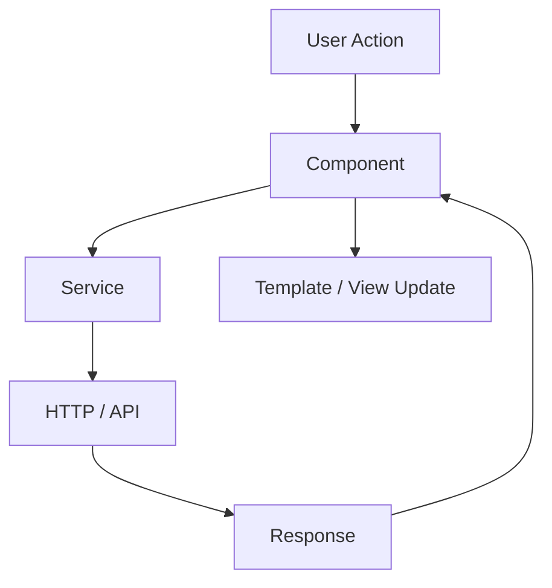
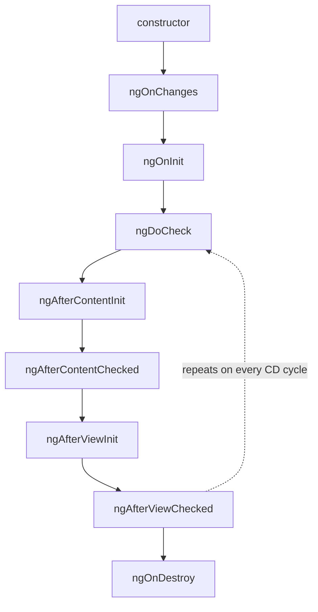
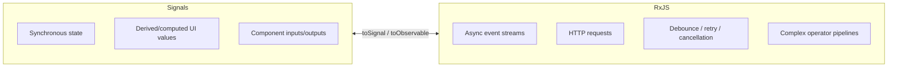
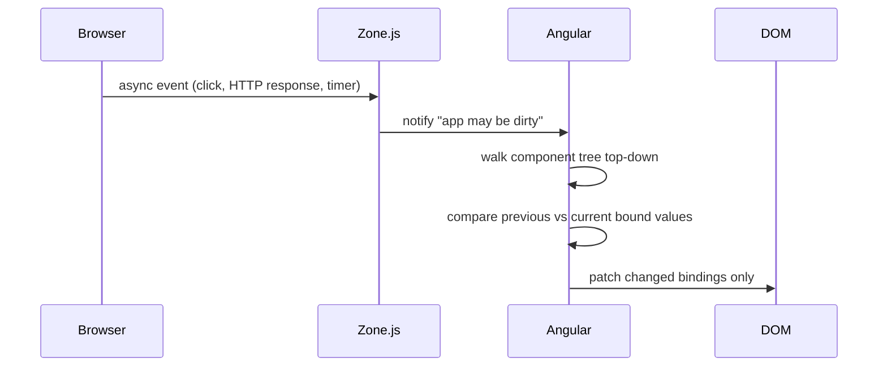
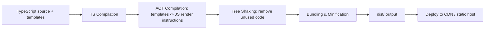
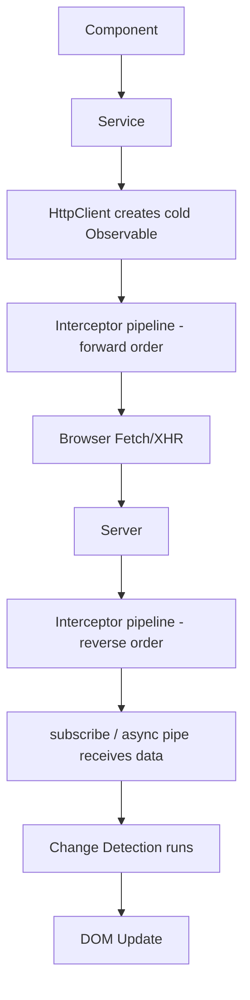
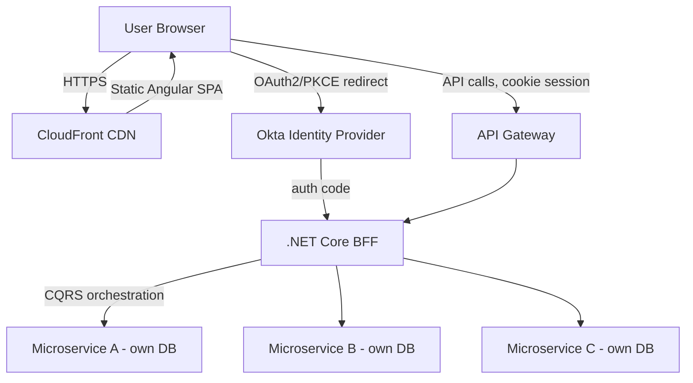

# Angular Interview Prep Guide (Angular 19) — Full-Stack / 10 YOE Edition

> **Yeh guide kis liye hai:** Aap ek 10-year full-stack developer ho, currently Angular 19 par kaam kar rahe ho (Dealer Management Dashboard project), aur interviews ke liye revise kar rahe ho. Maine aapke do original files (`L__Angular-Interview-Guide.md` — 3100+ lines — aur uska "Addendum") ko **ek hi file** mein merge kiya hai, restructure kiya hai, aur har major topic ko ek **consistent, revision-friendly format** diya hai taaki aap ise ek baar padh ke seedha interview mein bol sako.
>
> **Har topic is format mein hai:**
> - **💡 Simple Explanation** — plain language mein, bina jargon ke
> - **🧪 Code Example** — practical, copy-paste-ready
> - **🏢 Dealer Dashboard mein Real Use** — aapke apne project se concrete tie-in, taaki aap "maine yeh production mein use kiya hai" confidently bol sako
> - **⚠️ Common Mistakes** — jo log galat karte hain
> - **❓ Interview Q&A** — frequently asked + tricky follow-ups (with model answers)
> - **📝 Quick Revision** — ek-line summary, last-minute revision ke liye
>
> **Scope note:** Original "Practice Code" appendix jo duplicate/alternate snippets deta tha, usko main topic sections ke andar hi fold kar diya gaya hai — taaki aapko same concept do jagah na dhoondna pade. Addendum ke saare 6 gap-topics (`input()/output()/model()`, `hostDirectives`, `afterRender`, `NgOptimizedImage`, view transitions, i18n) bhi ab unke natural parent section ke andar hain, ek separate "addendum" ki tarah nahi.

---

## Table of Contents

1. [Core Concepts](#core-concepts)
2. [Intermediate](#intermediate)
3. [Advanced — RxJS & Signals](#advanced--rxjs--signals)
4. [Performance](#performance)
5. [Modern Angular Extras (Gap-Fill Topics)](#modern-angular-extras-gap-fill-topics)
6. [Enterprise Architecture Case Study (BFF + CQRS + .NET)](#enterprise-architecture-case-study-bff--cqrs--net)
7. [Testing](#testing)
8. [Best Practices](#best-practices)
9. [Common Pitfalls — Master List](#common-pitfalls--master-list)
10. [Version Feature Comparison Table](#version-feature-comparison-table)
11. [Big Sample Interview Q&A Bank](#big-sample-interview-qa-bank)
12. [Final Quick-Revision Cheat Sheet (Read This Night Before)](#final-quick-revision-cheat-sheet-read-this-night-before)

---

## Core Concepts

### 1. Angular vs AngularJS

**💡 Simple Explanation:** AngularJS (1.x) purana JavaScript-based framework tha, MVC pattern par. Angular (2+, jisme aapka Angular 19 bhi aata hai) usko poora TypeScript mein rewrite kiya gaya — ab yeh component-based hai, MVC nahi.

| Aspect | AngularJS (1.x) | Angular (2+) |
|---|---|---|
| Architecture | MVC | Component-based |
| Language | JavaScript | TypeScript |
| Performance | Digest cycle, slower | AOT + Ivy, faster |
| Mobile | Optimized nahi | Optimized |
| Rendering engine | N/A | Ivy (v9 se default) |

**Ivy kya hai?** Ivy Angular ka rendering + compilation engine hai — components/templates ko ahead-of-time compile karke low-level JS instructions banata hai, ek bade generic runtime interpreter par depend karne ke bajaye. Angular 9 se default hai. Fayde: chhote bundles (better tree-shaking), faster compilation, better debugging (component instances browser console mein directly inspect ho sakte hain).

**🏢 Dealer Dashboard mein Real Use:** Jab bhi koi legacy dealer-portal (jo purane AngularJS ya jQuery mein tha) ko naye Angular 19 dashboard mein migrate karne ki baat aayi, sabse pehla point yehi tha — "yeh sirf ek version upgrade nahi hai, poora rewrite hai" — isliye migration ek route/module ek time par hoti hai.

**⚠️ Common Mistakes**
- Angular ko "MVC framework" bol dena — galat hai, yeh component/MVVM-flavored hai.
- Ivy aur AOT ko same cheez samajh lena — Ivy ek compiler/rendering *engine* hai, AOT ek compilation *strategy* (build-time vs runtime) hai. Ivy dono JIT aur AOT support karta hai.

**❓ Interview Q&A**
- **Q: Angular MVC nahi hai — to aap isko kya kahoge?**
  A: Yeh ek component/MVVM-flavored architecture hai — component class view-model hai, template view hai, services/DI model/business-logic layer supply karte hain. Classic MVC jaisa single canonical controller layer nahi hota.
- **Q: Ivy solve kya karta hai jo View Engine nahi karta tha?**
  A: Bundle size (better tree-shaking, har component apne minimal instructions emit karta hai), compile speed, aur debuggability — kyunki Ivy components ko *locally* compile karta hai, View Engine puri app ko globally compile karta tha.

**📝 Quick Revision:** AngularJS = JS + MVC (old). Angular = TypeScript + Components + Ivy (current). Ivy v9 se default, v13 tak View Engine hata diya gaya.

---

### 2. Hybrid Angular Apps & Upgrading from AngularJS (`ngUpgrade`)

**💡 Simple Explanation:** Ek Hybrid App wo app hai jisme migration ke dauraan AngularJS (1.x) aur Angular (2+) **dono ek saath**, same page par, side-by-side chalte hain.

**🧪 Code Example**
```bash
npm install @angular/upgrade
```
- `UpgradeModule` — hybrid app bootstrap karta hai; AngularJS directives Angular templates mein aur Angular components AngularJS templates mein use hone deta hai (`downgradeComponent`/`downgradeInjectable` ke through).
- Typical strategy: naya Angular introduce karo existing AngularJS app ke saath, ek time par ek route/feature migrate karo, jab tak AngularJS retire na ho jaaye `ngUpgrade` ko bridge ki tarah rakho — poore app ka risky "big bang rewrite" mat karo.

**🏢 Dealer Dashboard mein Real Use:** Agar kabhi ek purana dealer-inventory module AngularJS mein hai aur naya vehicle-listing module Angular 19 mein banaya jaa raha hai, tab tak dono ek hi shell app mein chal sakte hain jab tak poora module migrate na ho jaaye.

**❓ Interview Q&A**
- **Q: Yeh interview mein kyun poocha jaata hai?** A: ~2016 se purani codebase wale most enterprises exactly isi migration path se guzre hain. Ek senior candidate se expect hota hai ki wo mechanism (`ngUpgrade`) ka awareness rakhe, chahe personally migration na kiya ho — yeh legacy-modernization projects kaise staff/scope hote hain iska signal hai.

**📝 Quick Revision:** `ngUpgrade` = AngularJS + Angular ko same page par ek saath chalane ka bridge, incremental migration ke liye.

---

### 3. Architecture Overview

**💡 Simple Explanation:** Classic (NgModule-based) building blocks:

1. **Modules** (`@NgModule`) — app ko blocks mein organize karte hain
2. **Components** (`@Component`) — UI logic + structure
3. **Templates & Views** — bindings/directives ke saath HTML
4. **Directives & Pipes** — behavior modify, data transform karte hain
5. **Services & DI** — components ke across logic share karte hain
6. **Routing** (`RouterModule`) — navigation
7. **Forms** — template-driven aur reactive



**Modern architecture note:** Angular 14+ se (v17 default schematic se), recommended architecture NgModules ko **entirely drop** karta hai — **standalone components/directives/pipes** ke favor mein. Routing `app.config.ts` mein provider functions (`provideRouter`) se hoti hai, `RouterModule.forRoot()` ke bajaye. NgModules deprecated nahi hain, abhi bhi legacy codebases mein common hain — lekin "naya Angular app kaise structure karoge" ka expected answer ab standalone, NgModule-free hai.

**🏢 Dealer Dashboard mein Real Use:** Naya dashboard poora standalone-component based hai — `main.ts` mein `bootstrapApplication()`, feature areas `loadChildren`/`loadComponent` se lazy-loaded (inventory, sales, service-tickets, reporting).

**❓ Interview Q&A**
- **Q: Aaj ek naya Angular app kaise structure karoge?** A: Standalone components, `bootstrapApplication()` + `app.config.ts` mein `provideRouter`/`provideHttpClient`, feature-wise lazy loading, services `providedIn: 'root'` ke saath.

**📝 Quick Revision:** Classic = NgModule-driven. Modern (v17+ default) = Standalone + provider functions, NgModule-free.

---

### 4. TypeScript in Angular

**💡 Simple Explanation:** TypeScript JavaScript ka superset hai jisme static typing + OOP features hain. Angular isko *require* karta hai kyunki uska compiler (AOT/Ivy) type information aur decorator metadata par rely karta hai optimized code generate karne aur DI ki type-based token resolution power karne ke liye.

**🏢 Dealer Dashboard mein Real Use:** 10-year .NET dev ke liye mental model directly C# se map hota hai: interfaces, generics, access modifiers, `strictNullChecks` (`strict: true`) — C# nullable reference types jaisa hi behave karta hai. Dealer/Vehicle/ServiceOrder models ke liye interfaces likhna bilkul C# DTOs jaisa hi feel hota hai.

**❓ Interview Q&A**
- **Q: Angular TypeScript ko sirf support karne ke bajaye *require* kyun karta hai?** A: Angular ka compiler static type info + decorator metadata par rely karta hai optimized instruction code generate karne ke liye, aur DI ki type-based resolution ke liye.

**📝 Quick Revision:** TS = JS + types. Angular ko chahiye compiler optimization + DI ke liye.

---

### 5. Modules (NgModule)

**💡 Simple Explanation:** `@NgModule` app ko logical blocks mein organize karta hai — legacy pattern, abhi bhi bahut common hai.

**🧪 Code Example**
```typescript
@NgModule({
  declarations: [AppComponent],
  imports: [BrowserModule],
  providers: [],
  bootstrap: [AppComponent]
})
export class AppModule { }
```

| Property | Purpose |
|---|---|
| `declarations` | Module ke owned components/directives/pipes |
| `imports` | Dusre modules jinke declarables chahiye |
| `providers` | Module-level DI (legacy; `providedIn: 'root'` ab preferred) |
| `bootstrap` | Root component (sirf root module ke liye) |

`RouterModule.forRoot(routes)` **exactly ek baar**, app ke root routing module mein — Router singleton, location strategy etc. configure karta hai. `forChild()` feature modules mein, sirf routes register karta hai bina singletons re-create kiye. Ek feature module mein `forRoot()` re-invoke karna duplicate/broken router state ka classic bug hai.

**⚠️ Common Mistakes**
- Feature module mein `forRoot()` use karna instead of `forChild()` — duplicate Router service instances.
- `providers` array mein service daalna jab `providedIn: 'root'` better fit hota (tree-shaking kho dete ho).

**❓ Interview Q&A**
- **Q: `forRoot()` vs `forChild()` mein kya farak hai aur galat use karne se kya hota hai?** A: `forRoot()` Router singleton setup karta hai — sirf root mein ek baar. `forChild()` sirf routes register karta hai. Feature module mein `forRoot()` use karne se duplicate/broken router state ban jaata hai.

**📝 Quick Revision:** NgModule = legacy organization unit. `forRoot()` once (root), `forChild()` many times (features).

---

### 6. Components

**💡 Simple Explanation:** Component = Template (HTML) + Class (TS logic) + Styles (CSS/SCSS).

**🧪 Code Example**
```typescript
import { Component, ViewEncapsulation, ChangeDetectionStrategy } from '@angular/core';
import { CommonModule } from '@angular/common';
import { UserService } from './user.service';

@Component({
  selector: 'app-user',
  templateUrl: './user.component.html',
  styleUrls: ['./user.component.css'],
  providers: [UserService],
  viewProviders: [UserService],
  encapsulation: ViewEncapsulation.Emulated,
  changeDetection: ChangeDetectionStrategy.OnPush,
  standalone: true,
  imports: [CommonModule],
  exportAs: 'userComp',
  host: {
    '(click)': 'onHostClick()',
    '[class.active]': 'isActive'
  }
})
export class UserComponent {
  name = 'John';
  isActive = true;
  onHostClick() { console.log('Host element clicked'); }
}
```

| Property | Purpose |
|---|---|
| `selector` | HTML tag name |
| `templateUrl` / `template` | External / inline HTML |
| `styleUrls` / `styles` | External / inline CSS |
| `providers` | Component + children ko scoped services |
| `viewProviders` | Sirf component ki *view* tak scoped (projected content ko visible nahi) |
| `encapsulation` | CSS scoping strategy |
| `changeDetection` | `Default` ya `OnPush` |
| `standalone` | NgModule ke bina usable |
| `imports` | Standalone deps jo template ko chahiye |
| `exportAs` | Template reference variable ka naam (directive ki tarah use hone par) |
| `host` | Host element par bindings/listeners |

`encapsulation` options:

| Value | Behavior |
|---|---|
| `Emulated` (default) | Shadow DOM emulate karta hai attribute selectors se; scoped par truly isolated nahi |
| `None` | Koi encapsulation nahi; global styles |
| `ShadowDom` | Real browser Shadow DOM, strict isolation |

**`providers` vs `viewProviders` (classic senior gotcha):** `providers` component ki apni view *aur* `<ng-content>` se projected content, dono ko visible hote hain. `viewProviders` sirf component ke apne template ko, projected content ko nahi.

**Directive vs Component:**

| Feature | Component | Directive |
|---|---|---|
| UI Rendering | Haan | Nahi |
| Decorator | `@Component` | `@Directive` |
| Template | Hai | Nahi |

Har component technically ek directive hai jisme template attached hai — common trick question.

**🏢 Dealer Dashboard mein Real Use:** `VehicleCardComponent` jaisa reusable component `providers: [VehicleActionsService]` se apna scoped service leta hai taaki har card ka "mark as sold" state independent rahe, dusre cards se leak na ho.

**⚠️ Common Mistakes**
- `providers` aur `viewProviders` ko same samajh lena — projected content wale scenarios mein bug deta hai.
- Standalone component mein `CommonModule` import karna bhool jaana, phir `*ngIf`/pipes template mein fail hote hain.

**❓ Interview Q&A**
- **Q (tricky follow-up): `viewProviders` kab actually zaroori hota hai — ek concrete scenario do.** A: Ek reusable `TabsComponent` jo apne template mein `TabsService` provide karta hai internal tab-state coordinate karne ke liye. Agar consumer `ng-content` se projected content mein wahi token inject karne ki koshish kare, `viewProviders` use hide kar dega (by design); `providers` expose kar dega. Galat choice "mera projected content service ko kyun nahi dekh pa raha" jaisa confusing bug deta hai.
- **Q: Kya component directive hai?** A: Haan — technically har component ek directive hai jisme template attached hota hai.

**📝 Quick Revision:** Component = template+class+style. `providers` = view+projected content dono ko visible; `viewProviders` = sirf apna template.

---

### 7. Standalone Components (Angular 14+, default since v17)

**💡 Simple Explanation:** Standalone components mandatory NgModule wrapper eliminate karte hain — component khud apne dependencies declare karta hai.

**🧪 Code Example**
```typescript
@Component({
  standalone: true,
  selector: 'app-user-card',
  imports: [CommonModule, RouterLink],
  template: `<div>{{ name }}</div>`
})
export class UserCardComponent {
  name = 'Jane';
}
```

`AppModule` ke bina bootstrapping:
```typescript
// main.ts
import { bootstrapApplication } from '@angular/platform-browser';
import { AppComponent } from './app/app.component';
import { appConfig } from './app/app.config';

bootstrapApplication(AppComponent, appConfig);
```
```typescript
// app.config.ts
export const appConfig: ApplicationConfig = {
  providers: [
    provideRouter(routes),
    provideHttpClient(withInterceptors([authInterceptor])),
    provideAnimations(),
  ]
};
```

**🏢 Dealer Dashboard mein Real Use:** Poora dashboard `bootstrapApplication()` se start hota hai, koi `AppModule` nahi. Har feature (`inventory`, `sales`, `service-tickets`) apna `*.routes.ts` export karta hai jo `loadChildren` se lazy-load hota hai.

**⚠️ Common Mistakes**
- Har standalone component apne `imports` array mein `CommonModule` (ya specific directives) khud import karna bhool jaana — NgModule apps ke unlike jahan `CommonModule` ek shared module mein ek baar import hota tha, yahan **per-component scoped** hai.
- Yeh sochna ki standalone ka matlab NgModules "deprecated" hain — nahi, coexist karte hain.

**❓ Interview Q&A**
- **Q: Angular ne standalone components ki taraf move kyun kiya?** A: Mental model simplify karne ke liye (ab "kis module mein declare karun" nahi), tree-shakability improve karne ke liye (har component apni exact deps declare karta hai), aur React/Vue/Svelte jaisa self-contained importable units ka model align karne ke liye.
- **Q (follow-up): Standalone components NgModules ka replacement hain ya coexist karte hain?** A: Dono coexist kar sakte hain (incremental migration ke liye zaroori) — `ng generate @angular/core:standalone` schematic assist karta hai. v17 se naye CLI-generated apps default standalone hain.

**📝 Quick Revision:** Standalone = no NgModule, `imports` directly component par, `bootstrapApplication()` se bootstrap. v17 se default.

---

### 8. UI Component Libraries: Angular Material & Bootstrap

**💡 Simple Explanation:**

| Library | What it is | Notes |
|---|---|---|
| **Angular Material** | Google ki official Material Design library, Angular ke liye built | Deep integration (CDK par built), SCSS theming, accessible-by-default |
| **Bootstrap** | General-purpose CSS framework | Angular-specific nahi; plain CSS classes ya `ngx-bootstrap`/`ng-bootstrap` wrapper se |

```bash
ng add @angular/material
```
Yeh package install karta hai, interactive theme picker run karta hai, typography/animations wire karta hai — same `ng add` convention jo `@angular/pwa`, `@angular/ssr`, `@ngrx/store` mein bhi use hota hai.

**🏢 Dealer Dashboard mein Real Use:** Data-heavy tables (vehicle inventory grid, service ticket list) ke liye Angular Material `mat-table` + `MatPaginator` + `MatSort` use karna common hai — CDK ka accessibility/keyboard-nav free mein milta hai.

**❓ Interview Q&A**
- **Q: Material ya Bootstrap — kab kaunsa?** A: Material jab baked-in accessibility/theming/Angular-native APIs chahiye aur Material Design acceptable ho; Bootstrap jab org ke paas already Bootstrap branding/conventions hain, ya team CSS-only approach chahti hai JS component framework se tied hue bina.

**📝 Quick Revision:** Material = Angular-native, CDK-backed. Bootstrap = framework-agnostic CSS, wrapper libs se Angular mein use hota.

---

### 9. Templates, Metadata, Decorators

**💡 Simple Explanation:** Template = declarative HTML view (desired UI describe karta hai, Angular Ivy se compile karta hai). Metadata = decorator (`@Component`, `@NgModule`, `@Injectable`) se attach ki gayi info jo Angular ko batati hai class construct/wire kaise karni hai. Decorators = functions jo metadata attach karte hain.

```html
<h1>{{ title }}</h1>
<button (click)="sayHello()">Click me</button>
```

Key decorators: `@Component`, `@Directive`, `@Pipe`, `@NgModule`, `@Injectable`, `@Input`, `@Output`, `@HostBinding`, `@HostListener`, `@ViewChild`, `@ContentChild`.

**📝 Quick Revision:** Decorators = metadata attach karne ka mechanism; iske bina Angular ko pata nahi chalega class instantiate/wire kaise karni hai.

---

### 10. Data Binding

**💡 Simple Explanation:** 4 types:

| Type | Syntax | Direction | Example |
|---|---|---|---|
| Interpolation | `{{ value }}` | Component → View | `<h1>{{ title }}</h1>` |
| Property binding | `[property]="value"` | Component → View | `` |
| Event binding | `(event)="handler()"` | View → Component | `<button (click)="onClick()">` |
| Two-way binding | `[(ngModel)]="value"` | Both | `<input [(ngModel)]="name">` |

Two-way binding **syntactic sugar** hai: `[(ngModel)]="name"` desugar hota hai `[ngModel]="name" (ngModelChange)="name=$event"` mein — "**banana in a box**" desugaring, frequent interview probe, especially apna custom two-way-bindable component (`@Input() value` + `@Output() valueChange`) build karne ke context mein.

**🏢 Dealer Dashboard mein Real Use:** Custom `<app-price-input [(value)]="vehicle.price">` component banaya jaa sakta hai jisme `@Input() value` + `@Output() valueChange` (ya modern `model()`) ho, jaisa `ngModel` ka pattern hai.

**❓ Interview Q&A**
- **Q: `[(ngModel)]="name"` internally kaise kaam karta hai?** A: Yeh `[ngModel]="name" (ngModelChange)="name=$event"` mein desugar hota hai — property binding + event binding ka combo, "banana in a box" syntax.
- **Q: Apna khud ka two-way bindable component kaise banaoge?** A: `@Input() value` + `@Output() valueChange = new EventEmitter()` (ya modern `model()` signal) — naming convention `xChange` critical hai taaki `[(x)]` syntax kaam kare.

**📝 Quick Revision:** 4 binding types. Two-way = property + event ka sugar, naming convention `propChange` zaroori hai.

---

### 11. Directives

**💡 Simple Explanation:** 3 types:

1. **Component directives** — template wala directive
2. **Structural directives** (`*ngIf`, `*ngFor`, `*ngSwitch`) — DOM elements add/remove karte hain
3. **Attribute directives** (`ngClass`, `ngStyle`, custom) — appearance/behavior change karte hain, DOM structure change kiye bina

`*` sugar hai: `*ngIf="cond"` internally `<ng-template [ngIf]="cond">...</ng-template>` mein desugar hota hai.

**🧪 Code Example**
```typescript
@Directive({ selector: '[appHighlight]' })
export class HighlightDirective {
  constructor(private el: ElementRef, private renderer: Renderer2) {}
  private setColor(color: string) {
    this.renderer.setStyle(this.el.nativeElement, 'color', color);
  }
}
```

**`ElementRef` vs `Renderer2`:** `ElementRef` native DOM node ka direct access deta hai. `Renderer2` Angular-recommended abstraction hai kyunki SSR/Web Worker rendering ke under bhi correctly kaam karta hai, jahan real DOM directly touch karne ko nahi hota.

**⚠️ Interview Trap:** `nativeElement.style` ko directly mutate karna browser mein kaam karta hai lekin SSR ke under **break** ho jaata hai — production code mein hamesha `Renderer2` prefer karo.

`*ngIf` vs `[hidden]`:

| Feature | `*ngIf` | `[hidden]` |
|---|---|---|
| Removes from DOM? | Haan | Nahi — bas `display:none` |
| Performance | Expensive subtrees ke liye better | Frequent toggle ke liye cheaper |
| Lifecycle hooks re-run? | Haan (destroy/recreate) | Nahi |

**🏢 Dealer Dashboard mein Real Use:** Ek `hasPermissionDirective` (custom attribute directive) banaya gaya jo dealer-role-based UI elements ko conditionally show/hide karta hai — `*appHasPermission="'canEditPrice'"`.

**❓ Interview Q&A**
- **Q: `*ngIf` vs `[hidden]` kab kaunsa use karoge?** A: Expensive/rarely-shown subtrees ke liye `*ngIf` (DOM se hata deta hai, render cost bachata hai). Frequently toggle hone wale simple elements ke liye `[hidden]` (DOM mein rehta hai, toggle cheap hai, lifecycle re-run nahi hota).

**📝 Quick Revision:** Structural = DOM add/remove (`*ngIf/For/Switch`). Attribute = behavior/appearance change (`ngClass`, custom). `Renderer2` > direct DOM mutation for SSR-safety.

---

### 12. New Control-Flow Syntax: `@if` / `@for` / `@switch` (Angular 17+)

**💡 Simple Explanation:** Angular 17 ne naya built-in template control-flow syntax introduce kiya jo eventually `*ngIf`/`*ngFor`/`*ngSwitch` ko replace karta hai naye code mein.

**🧪 Code Example**
```html
@if (isLoggedIn) {
  <p>Welcome back!</p>
} @else if (isGuest) {
  <p>Continue as guest</p>
} @else {
  <p>Please log in.</p>
}

@for (item of items; track item.id) {
  <li>{{ item.name }}</li>
} @empty {
  <li>No items found.</li>
}

@switch (status) {
  @case ('success') { <p>Success</p> }
  @case ('error') { <p>Error</p> }
  @default { <p>Unknown</p> }
}
```

**🏢 Dealer Dashboard mein Real Use:** Vehicle inventory list `@for (v of vehicles; track v.id) { ... } @empty { <p>No vehicles match filters</p> }` se likhi gayi — `@empty` block ne ek separate "no results" `*ngIf` sibling ko replace kar diya.

**⚠️ Common Mistakes**
- `@for` mein `track` bhool jaana — yeh **mandatory** hai, `*ngFor` ke optional `trackBy` ke unlike. Compile error milega agar miss kiya.
- Yeh sochna ki purana `*ngIf`/`*ngFor` deprecated hain — nahi, coexist karte hain; migration tool hai `ng generate @angular/core:control-flow`.
- `@if`/`@for` use karne ke liye `CommonModule` import karna (zaroorat nahi — yeh template compiler mein built-in hain, directives nahi).

**❓ Interview Q&A**
- **Q: `@for` mein `track` kyun mandatory kiya gaya?** A: Kyunki `trackBy` ko optional chhodna common performance pitfall tha (large lists par unnecessary DOM churn). Mandatory karke Angular team ne developers ko sahi pattern follow karne force kiya.
- **Q: Naya syntax purane se better kyun hai?** A: Directly Ivy se compile hota hai bina `<ng-template>` desugaring ke — chhota generated code, better runtime perf (benchmarks mein ~90% faster loop rendering tak claim). `@empty` first-class "no data" block hai.

**📝 Quick Revision:** `@if/@for/@switch` = v17+ naya syntax. `track` mandatory in `@for`. Old syntax still valid, coexist karta hai.

---

### 13. `ng-container`, `ng-template`, `ng-content`

**💡 Simple Explanation:**

| Feature | Purpose | Renders in DOM? | Best Use |
|---|---|---|---|
| `ng-container` | Logical grouping, extra element nahi | Nahi | Structural directive apply karte waqt wrapper `<div>` avoid karna |
| `ng-template` | Deferred/conditional rendering blueprint | Nahi (jab tak use na ho) | `*ngIf...else`, reusable templates, `ngTemplateOutlet` |
| `ng-content` | Content projection (parent → child) | Haan (sirf children project karta hai) | Reusable components: cards, modals, tabs |

**🧪 Code Example**
```html
<ng-container *ngIf="isLoggedIn">
  <p>Welcome back, user!</p>
  <button>Logout</button>
</ng-container>
```
```html
<p *ngIf="isLoggedIn; else showLogin">Welcome back!</p>
<ng-template #showLogin><p>Please log in to continue.</p></ng-template>
```
```typescript
@Component({
  selector: 'app-card',
  template: `
    <div class="card">
      <header><ng-content select="[card-title]"></ng-content></header>
      <section><ng-content></ng-content></section>
      <footer><ng-content select="[card-footer]"></ng-content></footer>
    </div>
  `
})
export class CardComponent {}
```
```html
<app-card>
  <h2 card-title>Book Title</h2>
  <p>Description here...</p>
  <button card-footer>Buy Now</button>
</app-card>
```

**🏢 Dealer Dashboard mein Real Use:** `VehicleDetailModalComponent` multi-slot `ng-content` use karta hai (`[modal-header]`, default, `[modal-footer]`) taaki alag-alag jagah (sell modal, service modal) same shell reuse kar sake apne alag content ke saath.

**📝 Quick Revision:** `ng-container` = wrapper-free grouping. `ng-template` = deferred blueprint. `ng-content` = parent→child content projection.

---

### 14. Pipes

**💡 Simple Explanation:** Pipes data ko **sirf display ke liye** transform karte hain — formatting logic component class se bahar, templates clean rehte hain.

**🧪 Code Example**
```html
<p>{{ name | uppercase }}</p>
<p>{{ 1234.56 | currency:'USD' }}</p>
```
Built-in: `uppercase`, `lowercase`, `titlecase`, `number`, `percent`, `currency`, `date`, `json`, `async`, `slice`, `decimal`.

Custom pipe:
```typescript
@Pipe({ name: 'reverse' })
export class ReversePipe implements PipeTransform {
  transform(value: string): string {
    return value.split('').reverse().join('');
  }
}
```

**Pure vs impure:**
```typescript
@Pipe({ name: 'purePipe', pure: true })   // default — sirf input reference change hone par re-run
@Pipe({ name: 'impurePipe', pure: false }) // har CD cycle par re-run
```
- **Pure** — sirf tab re-evaluate jab input ki *reference* change ho. Cheap, default, strongly preferred.
- **Impure** — har CD cycle par re-run, regardless of actual change. `async` pipe ko chahiye (Observable poll karne ke liye) lekin otherwise perf red flag hai.

**⚠️ Interview Trap (very common):** "List filter karne ke liye default se pipe kyun nahi use karni chahiye?" — Agar pipe pure hai, array in-place mutate karne par re-run nahi hogi (no new reference). Isse work around karne ke liye impure banaya jaaye to yeh **har CD cycle** par run hota hai — well-known perf foot-gun. **Fix:** filtering ko component mein karo (on-demand naye array mein recompute) ya RxJS/Signals-based derived state use karo.

**🏢 Dealer Dashboard mein Real Use (anti-pattern fix example):**
```typescript
// ❌ Wrong: impure pipe filtering in template — recomputes every CD cycle
@Pipe({ name: 'filterVehicles', pure: false })
export class FilterVehiclesPipe implements PipeTransform {
  transform(vehicles: Vehicle[], status: string) {
    return vehicles.filter(v => v.status === status);
  }
}
```
```typescript
// ✅ Right: derive filtered list in the component with a computed signal
export class InventoryComponent {
  vehicles = signal<Vehicle[]>([]);
  statusFilter = signal<string>('available');
  filteredVehicles = computed(() =>
    this.vehicles().filter(v => v.status === this.statusFilter())
  );
}
```

**❓ Interview Q&A**
- **Q: Pure vs impure pipe — real difference aur perf implication?** A: Pure sirf reference-change par re-evaluate hoti hai (cheap, default). Impure har CD cycle par re-run hoti hai (expensive) — sirf `async` pipe jaise genuine cases ke liye justified, list filter/sort ke liye nahi.

**📝 Quick Revision:** Pipes = display-only transform. Pure (default) = reference-change triggered. Impure = every CD cycle — avoid for filter/sort, use computed signal instead.

---

### 15. Services and Dependency Injection

**💡 Simple Explanation:** Service = reusable class jo DI se components mein inject hoti hai.

**🧪 Code Example**
```typescript
@Injectable({ providedIn: 'root' })
export class DataService {
  getData() { return 'Hello from Service'; }
}
```
```typescript
constructor(private dataService: DataService) { }
```

| Feature | `providedIn: 'root'` | `providers` in `@NgModule`/Component |
|---|---|---|
| Scope | Singleton, app-wide | Module/component scoped |
| Lazy loading | Tree-shakable, only instantiated on inject | Manual management; historically duplicate-instance risk |
| Recommendation | Preferred default | Deliberately scoped/multiple instances chahiye tab |

**Hierarchical DI:** Angular ka injector ek **tree** hai, single global container nahi. `providedIn: 'root'` app-wide ek instance deta hai. Component ke apne `providers` array mein service register karna us subtree ke liye **naya** instance create karta hai.

**🏢 Dealer Dashboard mein Real Use:** `AuthService`/`DealerContextService` `providedIn: 'root'` (app-wide singleton). Lekin `WizardStepFormComponent` (multi-step vehicle-intake wizard) apna khud ka scoped `WizardStateService` provide karta hai `providers` array se — har wizard instance isolated state paata hai, dusre open wizards se independent.

**⚠️ Common Mistakes**
- Component-scoped service ko app-wide singleton samajh lena — state leak/isolation bugs.
- Constructor mein business logic likhna (agle section mein detail).

**❓ Interview Q&A**
- **Q: Ek component `providers` array mein service register karke naya instance kyun paata hai, `providedIn: 'root'` hone ke bawajood bhi?** A: Injector tree hai — component-level `providers` registration us subtree ke liye ek naya, isolated instance create karta hai, root instance se separate. Use case: multi-step wizard jisme har instance independent state chahiye.

**📝 Quick Revision:** DI = tree, not single container. `providedIn: 'root'` = app singleton, tree-shakable. Component `providers` = subtree-scoped new instance.

---

### 16. The `inject()` Function (Angular 14+)

**💡 Simple Explanation:** Constructor injection ab dependencies pane ka ek hi tarika nahi hai. Functional `inject()` API ab idiomatic hai — standalone components, functional guards/interceptors/resolvers, aur kahin bhi jahan class constructor na ho.

**🧪 Code Example**
```typescript
import { inject } from '@angular/core';

@Component({ standalone: true, selector: 'app-user' })
export class UserComponent {
  private userService = inject(UserService);
  private route = inject(ActivatedRoute);
}
```
Functional guard (`CanActivate` class ki jagah):
```typescript
export const authGuard: CanActivateFn = (route, state) => {
  const auth = inject(AuthService);
  const router = inject(Router);
  return auth.isLoggedIn() ? true : router.createUrlTree(['/login']);
};
```

**🏢 Dealer Dashboard mein Real Use:** Poore dashboard ke route guards (`dealerAuthGuard`, `roleGuard`) aur functional interceptors `inject()` use karte hain — koi class-based guard nahi likha gaya.

**⚠️ Interview Trap (classic gotcha):** "Kya aap `setTimeout` callback ke andar `inject()` call kar sakte ho?" — **Nahi**, directly nahi. `inject()` sirf ek **injection context** ke andar kaam karta hai (constructor, field initializer, ya `runInInjectionContext()` ke andar). Ek baar async callback ke andar ho, context chala jaata hai — value pehle se capture karo ya `runInInjectionContext()` mein wrap karo.

**❓ Interview Q&A**
- **Q: `inject()` kab fail hota hai?** A: Jab injection context ke bahar call kiya jaaye (e.g., `setTimeout` callback ke andar) — runtime error throw hota hai. Dependencies ko function ke top par pehle capture karo ya `runInInjectionContext()` use karo.
- **Q: Constructor injection deprecated ho gaya?** A: Nahi — fully valid, most class-based services/components abhi bhi use karte hain. `inject()` additive hai, functional guards/resolvers/interceptors ke liye required style hai aur naye standalone projects mein CLI-generated default.

**📝 Quick Revision:** `inject()` = functional DI, injection-context-only. Required for functional guards/interceptors. Constructor injection still valid.

---

## Intermediate

### 17. Component Lifecycle Hooks

**💡 Simple Explanation:** Angular component ki life ke different stages par predictable hooks call hote hain.



| Hook | When | Typical use |
|---|---|---|
| `ngOnChanges(changes)` | Jab bhi bound `@Input()` change hota hai (first call `ngOnInit` se pehle) | Updated inputs par react karo; `SimpleChanges` previous vs current expose karta hai |
| `ngOnInit()` | Ek baar, first `ngOnChanges` ke baad | Initialization, data fetch |
| `ngDoCheck()` | Har CD cycle | Custom change detection (in-place array mutation jaisi cheezein jo Angular default se nahi dekh sakta) |
| `ngAfterContentInit()` | Ek baar, projected content init ke baad | Pehli baar projected content access |
| `ngAfterContentChecked()` | Projected content ki har check ke baad | Projected content updates par react |
| `ngAfterViewInit()` | Ek baar, view + child views init ke baad | Safely `@ViewChild`/DOM access |
| `ngAfterViewChecked()` | Har view check ke baad | Rare — repeated view updates |
| `ngOnDestroy()` | Destroy se right pehle | Subscriptions/timers/listeners cleanup |

**Senior rule:** Constructor mein business logic (API calls, DOM access) **kabhi mat daalo** — inputs abhi bound nahi hote, injected services fully ready nahi hote. Constructor = sirf DI ke liye.

| | `constructor` | `ngOnInit` |
|---|---|---|
| Runs | Class instantiate hone par | Input bindings set hone ke baad |
| Use for | Sirf DI | API calls, init logic |
| Inputs available? | Nahi | Haan |

**🏢 Dealer Dashboard mein Real Use:** `VehicleDetailComponent.ngOnInit()` mein vehicle-id se API call hoti hai (constructor mein nahi, kyunki `@Input() vehicleId` abhi set nahi hota). `ngOnDestroy()` mein saari manual subscriptions clean hoti hain (ya `takeUntilDestroyed()` use hota hai — dekho RxJS section).

**⚠️ Common Mistakes**
- Constructor mein `this.http.get(...)` call karna.
- `ngOnDestroy` mein unsubscribe bhool jaana.

**❓ Interview Q&A**
- **Q: `ngOnChanges` vs `ngOnInit` — kab kya use karoge?** A: `ngOnChanges` jab bhi koi `@Input` change ho (repeatedly fire hota hai) — parent se aane wale updated values react karne ke liye. `ngOnInit` sirf ek baar, one-time setup ke liye.
- **Q: `ngDoCheck` kab use karoge?** A: Jab Angular ka default change detection kisi mutation ko detect nahi kar pa raha (e.g., array in-place mutate hua, reference same hai) — lekin costly hai kyunki har CD cycle par chalta hai, sparingly use karo.

**📝 Quick Revision:** Order: constructor → ngOnChanges → ngOnInit → ngDoCheck → ngAfterContentInit → ngAfterContentChecked → ngAfterViewInit → ngAfterViewChecked → (repeat DoCheck onward) → ngOnDestroy. Constructor = DI only, never business logic.

---

### 18. ViewChild / ViewChildren / ContentChild / ContentChildren

**💡 Simple Explanation:** `@ViewChild`/`@ViewChildren` = apne **template** ke elements access karte hain. `@ContentChild`/`@ContentChildren` = parent se **projected** elements access karte hain.

**Interview one-liner:** "View = jo main own karta hoon, Content = jo parent mujhe deta hai."

**🧪 Code Example**
```typescript
@ViewChild(MatPaginator) paginator!: MatPaginator;
@ViewChildren(ItemComponent) items!: QueryList<ItemComponent>;
```

| | Source | Available after |
|---|---|---|
| `@ViewChild`/`@ViewChildren` | Own template | `ngAfterViewInit` |
| `@ContentChild`/`@ContentChildren` | Parent-projected content | `ngAfterContentInit` |

`@ViewChild` commonly use hota hai: DOM properties read/native methods call karne ke liye (focus, scroll, measure), child component ke public methods call karne, ya third-party non-Angular UI libraries integrate karne ke liye jinhe DOM handle chahiye.

**Signal-based queries (Angular 17.3+):** `viewChild()`, `viewChildren()`, `contentChild()`, `contentChildren()` — Signals return karte hain, `!` non-null assertion ki zaroorat nahi:
```typescript
export class UserComponent {
  paginator = viewChild(MatPaginator);      // Signal<MatPaginator | undefined>
  items = viewChildren(ItemComponent);      // Signal<readonly ItemComponent[]>
}
```
Yeh historical gotcha remove karta hai jahan `@ViewChild` fields `ngAfterViewInit` tak `undefined` hote the — Signal form "not yet available" ko type ka explicit part banata hai (`| undefined`), runtime surprise nahi.

**🏢 Dealer Dashboard mein Real Use:** `paginator = viewChild(MatPaginator)` — inventory table ke `MatPaginator` ko access karne ke liye modern signal-query approach, `computed()` ke saath combine karke "showing X-Y of Z vehicles" text derive karna.

**❓ Interview Q&A**
- **Q: `@ViewChild` `ngOnInit` mein kyun `undefined` aata hai?** A: Kyunki view (aur uske child views) sirf `ngAfterViewInit` tak fully initialize hote hain — `ngOnInit` bahut pehle chal jaata hai. Signal-based `viewChild()` isko type-safe banata hai (`| undefined` explicit hota hai).

**📝 Quick Revision:** View = own template (after AfterViewInit). Content = projected (after AfterContentInit). Signal versions (`viewChild()` etc) `!`-assertion aur timing-gotcha dono avoid karte hain.

---

### 19. Component Communication (incl. Signal-based `input()`/`output()`/`model()`)

**💡 Simple Explanation:**

| Direction | Mechanism |
|---|---|
| Parent → Child | `@Input()` (ya `input()`) |
| Child → Parent | `@Output()` + `EventEmitter` (ya `output()`) |
| Sibling / unrelated | Shared service ke saath `Subject`/`BehaviorSubject` ya Signal |
| Across routes | Route params, query params, ya router `state` |

`EventEmitter` ek RxJS `Subject` ke upar thin wrapper hai, strictly `@Output()` communication ke liye — services ke andar general pub/sub ke liye recommended **nahi** (wahan plain `Subject`/`BehaviorSubject` use karo).

**Senior guidance:** Direct parent-child ke liye `@Input`/`@Output` prefer karo; shared service sirf tab jab data unrelated components ke across cross karna ho ya route changes ke across persist karna ho.

**🧪 Code Example — Decorator style (still works)**
```typescript
export class UserCardComponent {
  @Input() name!: string;
  @Output() nameChange = new EventEmitter<string>();
}
```

**🧪 Code Example — Signal-based `input()` / `output()` / `model()` (stable v19, recommended default)**

`input()` — decorator-based `@Input()` ka signal-based replacement. Result ek **read-only Signal** hai, plain property nahi:
```typescript
import { Component, input, computed } from '@angular/core';

@Component({ selector: 'app-user-card', standalone: true, template: `{{ initials() }}` })
export class UserCardComponent {
  name = input.required<string>();        // required — must be bound
  role = input<string>('viewer');          // optional with default
  initials = computed(() => this.name().split(' ').map(w => w[0]).join(''));
}
```

`output()` — `@Output() + EventEmitter` ka replacement, plain function API ke saath:
```typescript
import { Component, output } from '@angular/core';

@Component({ selector: 'app-item', standalone: true, template: `<button (click)="deleted.emit(id)">Delete</button>` })
export class ItemComponent {
  deleted = output<number>();
}
```

`model()` — two-way binding ke liye, `@Input()` + matching `@Output() xChange` boilerplate ko ek writable Signal mein replace karta hai:
```typescript
import { Component, model } from '@angular/core';

@Component({ selector: 'app-counter', standalone: true, template: `<button (click)="count.set(count() + 1)">{{ count() }}</button>` })
export class CounterComponent {
  count = model(0); // parent: <app-counter [(count)]="value" />
}
```

**Migration schematics (existing codebase ke liye):**
```bash
ng generate @angular/core:signal-input-migration
ng generate @angular/core:signal-queries-migration
ng generate @angular/core:output-migration
```

**🏢 Dealer Dashboard mein Real Use:** `VehicleCardComponent` mein `vehicle = input.required<Vehicle>()` aur `sold = output<string>()` (vehicle-id emit karta hai) — parent (`InventoryListComponent`) `(sold)="onVehicleSold($event)"` se listen karta hai. Price-range filter component `range = model<[number, number]>([0, 100000])` se two-way bind hota hai `[(range)]="priceFilter"`.

**⚠️ Common Mistakes**
- `input()`/`output()` ko **plain properties** samajh lena — `name()` call karna padta hai, `this.name` nahi (common migration bug). Template mein bhi `{{ name() }}`.
- `model()` ke saath manually `xChange` `@Output()` bhi likh dena — zaroorat nahi, `model()` khud dono handle karta hai.
- Yeh sochna ki `@Input()`/`@Output()` ab kaam nahi karenge — dono styles coexist karte hain, ek hard-breaking migration nahi hai.

**❓ Interview Q&A**
- **Q: `input()` signal function `@Input()` decorator se practically kaise differ karta hai?** A: `@Input()` plain class property create karta hai jo Angular externally set karta hai; `input()` read-only **Signal** return karta hai, isliye value `this.name()` se read hoti hai, `this.name` se nahi. Fayda: `input()`-based values automatically fine-grained reactivity mein integrate ho jaate hain (`computed()`/`effect()` ke saath directly compose), aur `input.required<T>()` compile-time-enforced required-input pattern deta hai.
- **Q (tricky): `model()` internally kya karta hai jo parent ko `[(x)]` syntax use karne deta hai?** A: `model()` ek writable Signal deta hai jo internally `@Input` + matching `@Output() xChange` ka kaam karta hai — parent side wahi "banana in a box" desugaring use hota hai jo `[(ngModel)]` use karta hai.
- **Q: `output()` ab bhi RxJS-compatible hai?** A: Haan, internally `Subject`-jaisa hi hai (`.subscribe()` bhi kar sakte ho), lekin public API `EventEmitter` extend nahi karta — deliberately decoupled taaki future implementation change ho sake bina public API break kiye.

**📝 Quick Revision:** Parent→child = `@Input`/`input()`. Child→parent = `@Output`/`output()`. Two-way = `model()` (replaces Input+Output pair). Read signal values as functions: `this.name()`.

---

### 20. Routing and Navigation

**💡 Simple Explanation:** Router URL ko component se map karta hai, SPA navigation enable karta hai bina full page reload ke.

**🧪 Code Example**
```typescript
const routes: Routes = [
  { path: 'home', component: HomeComponent },
  { path: 'about', component: AboutComponent }
];
```
```html
<a routerLink="/home">Home</a>
<router-outlet></router-outlet>
```
Programmatic navigation:
```typescript
constructor(private router: Router) { }
navigateToHome() { this.router.navigate(['/home']); }
```
Wildcard: `{ path: '**', component: PageNotFoundComponent }`

Route params:
```typescript
{ path: 'product/:id', component: ProductComponent }
```
```typescript
constructor(private route: ActivatedRoute) {}
this.route.snapshot.paramMap.get('id');
```
Query params:
```typescript
this.router.navigate(['/products'], { queryParams: { category: 'electronics' } });
this.route.snapshot.queryParamMap.get('category');
```

**⚠️ Classic Gotcha:** `snapshot` sirf navigation ke moment par value **capture** karta hai — agar same component instance khud par different params ke saath re-navigate ho sakta hai (e.g., `/product/1` → `/product/2` bina component destroy hue), `snapshot` **update nahi hoga**. Observable form use karo (`this.route.paramMap.subscribe(...)` ya `switchMap` ke through) jab same component reuse ho sakta ho.

Lazy loading (modern, standalone):
```typescript
const routes: Routes = [
  { path: 'login', loadComponent: () => import('./login/login.component').then(c => c.LoginComponent) },
  { path: 'admin', loadChildren: () => import('./admin/admin.routes').then(m => m.ADMIN_ROUTES) }
];
```
`admin.routes.ts` ek plain `Routes` array export karta hai (`export const ADMIN_ROUTES: Routes = [...]`), `AdminModule` ke bajaye — less indirection, standalone ke saath naturally compose hota hai.

**🏢 Dealer Dashboard mein Real Use:** `/inventory/vehicle/:id` route par `snapshot` gotcha directly hit hua — jab user ek vehicle detail page se "similar vehicle" link click karke same component par different `id` ke saath navigate karta tha, page stale data dikha raha tha jab tak `route.paramMap.subscribe()`/`toSignal(route.paramMap)` mein switch nahi kiya gaya.

**❓ Interview Q&A**
- **Q: `route.snapshot.paramMap` kab fail karta hai?** A: Jab same component instance param-only navigation ke across reuse hoti hai (e.g. `/product/1` → `/product/2`) — snapshot stale reh jaata hai. Fix: observable `paramMap` subscribe karo ya `switchMap` se pipe karo.

**📝 Quick Revision:** `snapshot` = one-time capture, stale on param-only re-navigation. Use observable `paramMap` when component can be reused. `loadComponent`/`loadChildren` = modern lazy loading, no wrapper module needed.

---

### 21. Route Guards

**💡 Simple Explanation:**

| Guard | Purpose |
|---|---|
| `CanActivate` | Route protect karo (e.g., logged-in users only) |
| `CanActivateChild` | Saare child routes protect karo |
| `CanLoad` (legacy) / `CanMatch` (current) | Lazy module load hone se prevent |
| `CanMatch` | Role/feature-flag basis par decide karo route *match* karta hai ya nahi; fallback to a different route definition |
| `CanDeactivate` | Navigation away block karo (e.g., unsaved changes) |

> **`CanLoad` vs `CanMatch`:** `CanLoad` phase out ho raha hai `CanMatch` ke favor mein — jo strictly zyada capable hai: non-lazy routes bhi gate kar sakta hai aur agar false return kare to Angular ko *next* matching route config try karne deta hai (A/B routes, feature-flagged swaps). Naye code ko `CanMatch` use karna chahiye.

**🧪 Code Example — Full modern config (functional style, Angular 15+)**
```typescript
const routes: Routes = [
  { path: 'login', loadComponent: () => import('./login/login.component').then(c => c.LoginComponent) },
  {
    path: 'dashboard',
    canMatch: [authMatchGuard],
    canActivate: [authGuard],
    loadComponent: () => import('./dashboard/dashboard.component').then(c => c.DashboardComponent)
  },
  {
    path: 'admin',
    canMatch: [adminLoadGuard, adminMatchGuard],
    loadChildren: () => import('./admin/admin.routes').then(m => m.ADMIN_ROUTES)
  },
  {
    path: 'profile-edit',
    canDeactivate: [formExitGuard],
    loadComponent: () => import('./profile/profile-edit.component').then(c => c.ProfileEditComponent)
  }
];
```

Functional guard implementation:
```typescript
export const authGuard: CanActivateFn = () => {
  const auth = inject(AuthService);
  const router = inject(Router);
  return auth.isLoggedIn() || router.createUrlTree(['/login']);
};

export const formExitGuard: CanDeactivateFn<ProfileEditComponent> = (component) => {
  if (component.form.dirty) {
    return confirm('You have unsaved changes. Leave anyway?');
  }
  return true;
};
```
Class-based guards (`implements CanActivate`) abhi bhi kaam karte hain, older/enterprise codebases mein common. Functional guards modern idiomatic style hain (simple boolean checks ke liye extra injectable class avoid).

**🏢 Dealer Dashboard mein Real Use:** `formExitGuard` bilkul `VehicleIntakeFormComponent` route par use hota hai — dealer agar half-filled vehicle intake form chhod ke navigate kare to confirm dialog aata hai.

**❓ Interview Q&A**
- **Q: `CanDeactivate` real use case?** A: Ek form-heavy route se navigation ko block karna jab unsaved changes hon — user ko confirm dialog dikha ke.

**📝 Quick Revision:** `CanActivate` = entry gate. `CanMatch` = route-selection gate (preferred over legacy `CanLoad`). `CanDeactivate` = exit gate (unsaved changes). Functional style (`inject()`-based) is default now.

---

### 22. Forms: Template-driven vs Reactive (+ Typed Reactive Forms)

**💡 Simple Explanation:**

| | Template-driven | Reactive |
|---|---|---|
| Control style | `ngModel` template mein declared | `FormControl`/`FormGroup` class mein declared |
| Scalability | Less scalable | Complex forms ke liye enterprise standard |
| Testability | Harder (logic template mein) | Easier (pure TS) |
| Dynamic fields | Awkward | Natural fit |
| Use when | Small/simple forms | Complex, dynamic, conditional validation |

**🧪 Code Example**
```html
<!-- Template-driven -->
<form #form="ngForm">
  <input type="text" [(ngModel)]="name" name="name">
</form>
```
```typescript
// Reactive
form = new FormGroup({ name: new FormControl('') });
```
```html
<input type="text" [formControl]="form.controls['name']">
```
`FormBuilder`:
```typescript
constructor(private fb: FormBuilder) { }
form = this.fb.group({ name: ['', Validators.required] });
```
Validation:
```typescript
form = new FormGroup({
  email: new FormControl('', [Validators.required, Validators.email])
});
```
```html
<p *ngIf="form.controls.email.errors?.required">Email is required</p>
```
Built-in validators: `required`, `minLength`, `maxLength`, `pattern`, `email`, `min`/`max` — compose via array or `Validators.compose([...])`.

`FormGroup` vs `FormArray`:
```typescript
userForm = new FormGroup({
  name: new FormControl(''),
  phones: new FormArray([new FormControl('12345')])
});
```
**Interview one-liner:** "A `FormGroup` is a fixed, named group of controls, while a `FormArray` is a dynamic, indexed collection of controls used when the number of inputs is unknown or user-driven."

Dynamic/conditional validation:
```typescript
control.setValidators([Validators.required]);
control.clearValidators();
control.updateValueAndValidity();
```
Use hota hai jab ek field ki validity doosre par depend karti hai (e.g., "state" sirf US country ke liye required).

Status checks:
```typescript
form.valid
control.errors
control.touched
control.dirty
```

`valueChanges` — RxJS `Observable`, har user change par latest value emit karta hai:
```typescript
name = new FormControl('');
ngOnInit() {
  this.name.valueChanges.subscribe(value => console.log('Name changed:', value));
}
```
Use: live validation, real-time search, buttons enable/disable, autosave, dynamic behavior. **Sirf reactive forms ke liye exist karta hai.**

Submission:
```html
<form [formGroup]="form" (ngSubmit)="onSubmit()">
  <button type="submit">Submit</button>
</form>
```
```typescript
onSubmit() { console.log(this.form.value); }
```

Custom validators (cross-field):
```typescript
export function passwordsMatch(group: AbstractControl): ValidationErrors | null {
  const pass = group.get('password')?.value;
  const confirm = group.get('confirmPassword')?.value;
  return pass === confirm ? null : { passwordMismatch: true };
}
```

**Typed Reactive Forms (Angular 14+):** Angular 14 se pehle `FormGroup`/`FormControl` effectively `any`-typed the — `form.get('emial')` (typo) silently `null` return karta tha, compile error nahi. Angular 14 se **strictly typed forms**:
```typescript
interface ProfileForm {
  name: FormControl<string>;
  email: FormControl<string>;
  phones: FormArray<FormControl<string>>;
}

const form = new FormGroup<ProfileForm>({
  name: new FormControl('', { nonNullable: true }),
  email: new FormControl('', { nonNullable: true, validators: [Validators.email] }),
  phones: new FormArray<FormControl<string>>([])
});

form.value.name; // string | undefined — typed!
```
`nonNullable: true` option zaroori hai kyunki untyped `FormControl<string>` par `.reset()` pehle `null` par reset ho jaata tha, silently apparent `string` type violate karte hue — well-known typed-forms gotcha. Untyped escape hatch abhi bhi exist karta hai: `UntypedFormGroup`, `UntypedFormControl`.

**🏢 Dealer Dashboard mein Real Use:** `VehicleIntakeForm` ek typed `FormGroup<VehicleIntakeForm>` hai (make, model, VIN, price, condition) — VIN field custom validator use karta hai jo 17-character format check karta hai. `state`/`province` field conditional validator use karta hai jo country field par depend karta hai.

**⚠️ Common Mistakes**
- Untyped forms mein control-name typos — silently `null` return, koi compile error nahi.
- `nonNullable: true` bhool jaana — `.reset()` `null` de deta hai, type lie karta hai.
- Complex/dynamic forms ke liye template-driven forms use karna — scale nahi karta.

**❓ Interview Q&A**
- **Q: Typed forms se pehle kya problem thi, kaise fix hui?** A: `form.value` `any` type ka tha, control-name typos runtime par silently `null` return karte the. v14 se generics-based typing se typo'd names compile-time par fail hote hain.
- **Q: `FormGroup` vs `FormArray` — kab kaunsa?** A: `FormGroup` = fixed named controls. `FormArray` = dynamic indexed collection, jab inputs ki count unknown/user-driven ho (e.g., multiple phone numbers).

**📝 Quick Revision:** Reactive forms = enterprise default. Typed forms (v14+) catch typos at compile-time — use `nonNullable: true`. `valueChanges` sirf reactive forms mein.

---

### 23. HttpClient and Interceptors (incl. Functional Interceptors)

**💡 Simple Explanation:** `HttpClient` HTTP calls karta hai, Observable return karta hai. Interceptors requests/responses ko centrally intercept karte hain (auth headers, error handling, logging).

**🧪 Code Example**
```typescript
import { HttpClient } from '@angular/common/http';
constructor(private http: HttpClient) { }
getData() { return this.http.get('https://api.example.com/data'); }
```
GET/POST/PUT/DELETE:
```typescript
this.http.get('https://api.example.com/users').subscribe(response => console.log(response));
this.http.post('https://api.example.com/users', { name: 'John' }).subscribe();
this.http.put('https://api.example.com/users/1', { name: 'John Doe' }).subscribe();
this.http.delete('https://api.example.com/users/1').subscribe();
```
Headers/params:
```typescript
const headers = new HttpHeaders().set('Authorization', 'Bearer token');
this.http.get('https://api.example.com/data', { headers }).subscribe();

const params = new HttpParams().set('search', 'Angular');
this.http.get('https://api.example.com/items', { params }).subscribe();
```
Error handling:
```typescript
import { catchError } from 'rxjs/operators';
import { throwError } from 'rxjs';

this.http.get('https://api.example.com/data').pipe(
  catchError(error => {
    console.error('Error occurred:', error);
    return throwError(() => error);
  })
).subscribe();
```

**JSONP note (currency check):** Legacy technique jo `<script>` tag se cross-domain data load karti hai (CORS unsupported ho tab, GET only). 2026 mein rarely used hai — virtually saari modern APIs CORS support karti hain, aur JSONP ke real security downsides hain (arbitrary script execution risk). Sirf tab mention karo jab directly pucha jaaye.

**Functional interceptors (Angular 15+, modern idiomatic style):**
```typescript
export const authInterceptor: HttpInterceptorFn = (req, next) => {
  const token = inject(AuthService).getToken();
  const cloned = req.clone({ setHeaders: { Authorization: `Bearer ${token}` } });
  return next(cloned);
};
```
Registration, no `HTTP_INTERCEPTORS`/`multi:true` boilerplate:
```typescript
provideHttpClient(withInterceptors([authInterceptor, loaderInterceptor, errorInterceptor]))
```
Array order = execution order — same directional pipeline concept, less ceremony. Demonstrate this style by default unless class-based legacy specifically asked.

**Class-based `HttpInterceptor` (legacy, still works):**
```typescript
@Injectable()
export class AuthInterceptor implements HttpInterceptor {
  constructor(private auth: TokenService) {}
  intercept(req: HttpRequest<any>, next: HttpHandler): Observable<HttpEvent<any>> {
    const token = this.auth.getAccessToken();
    if (!token) { return next.handle(req); }   // don't send "Bearer null"
    const requestWithToken = req.clone({ setHeaders: { Authorization: `Bearer ${token}` } });
    return next.handle(requestWithToken);
  }
}
```
Registered via:
```typescript
providers: [{ provide: HTTP_INTERCEPTORS, useClass: AuthInterceptor, multi: true }]
```

**Interceptor execution order:** Interceptors request ke liye **registration order** mein, response ke liye **reverse order** mein execute hote hain — classic "pipeline draw karo" whiteboard question. Common chain: **Auth → Loader → Error handler**.

**🔐 Where does the token actually come from? — a real security decision, not a detail:**
- **`localStorage`/`sessionStorage`** — simplest, extremely common, lekin kisi bhi injected script se readable → XSS = token theft. Sirf low-stakes apps ke liye defensible.
- **BFF + HttpOnly cookie** — token browser JS tak pahuchta hi nahi; interceptor `withCredentials: true` bhejta hai, `Authorization` header ke bajaye. Zyada backend investment, bahut smaller blast radius. Enterprise-scale ke liye defensible answer (dekho [Enterprise Architecture Case Study](#enterprise-architecture-case-study-bff--cqrs--net)).

**Interview framing:** `localStorage` version ko "best practice" ki tarah present **mat** karo. Trade-off explicitly state karo aur bolo us app ke liye kaunsi posture choose karoge aur kyun.

Global error handling in interceptor:
```typescript
intercept(req: HttpRequest<any>, next: HttpHandler) {
  return next.handle(req).pipe(
    catchError(err => {
      if (err.status === 401) { /* redirect to login */ }
      if (err.status === 500) { /* show toast */ }
      return throwError(() => err);
    })
  );
}
```

**🏢 Dealer Dashboard mein Real Use:** `authInterceptor` (functional) request mein Bearer token attach karta hai; `loaderInterceptor` global loading spinner state manage karta hai; `errorInterceptor` 401 par login redirect karta hai aur 5xx par toast dikhata hai. Order: `[authInterceptor, loaderInterceptor, errorInterceptor]`.

**⚠️ Common Mistakes**
- `localStorage` mein token store karna aur usko best-practice bolna interview mein — trade-off explicitly discuss karo.
- Missing token hone par bhi `Bearer null` header bhej dena — check karo token exist karta hai ya nahi.
- Interceptor execution order ko galat samajhna (request = forward order, response = reverse order).

**❓ Interview Q&A**
- **Q: Interceptor chain ka order kaise kaam karta hai?** A: Registration order mein request ke liye chalte hain; response ke liye **reverse** order mein. E.g., `[Auth, Loader, Error]` registered ho to request Auth→Loader→Error se jaata hai, response Error→Loader→Auth se wapas aata hai.
- **Q: Functional vs class-based interceptor — kaunsa use karoge?** A: Functional (`HttpInterceptorFn` + `withInterceptors()`) — modern idiomatic style, less boilerplate, `provideHttpClient` se directly supported. Class-based abhi bhi valid hai legacy/enterprise codebases mein.

**📝 Quick Revision:** Interceptors: request=forward order, response=reverse order. Functional style (`withInterceptors`) = modern default. Token storage = a security decision (localStorage vs BFF+HttpOnly cookie), not a detail.

---

## Advanced — RxJS & Signals

### 24. RxJS and Observables

**💡 Simple Explanation:** RxJS reactive/async programming library hai jo **Observables** use karti hai — streams jo `next`, `error`, `complete` notifications ke through time ke saath zero/one/many values emit kar sakte hain.

**🧪 Code Example**
```typescript
const obs = new Observable(observer => {
  observer.next('Hello');
  observer.complete();
});
obs.subscribe(data => console.log(data));
```
- **Observable** = data producer/stream.
- **Observer** = consumer (`next()`, `error()`, `complete()`).

Observable vs Promise:

| Feature | Observable | Promise |
|---|---|---|
| Lazy execution | Haan — `.subscribe()` tak kuch nahi | Nahi — creation par immediately execute |
| Multiple values | Haan (stream) | Nahi (single value) |
| Cancelable | Haan (`unsubscribe()`) | Nahi |
| Operators | Haan, rich library | Nahi |

Angular `HttpClient`, route params, reactive forms (`valueChanges`), event streams — sab Observables heavily use karte hain.

```typescript
this.http.get(url).subscribe(
  data => console.log(data),
  err => console.log(err)
);
```
Jab tak `subscribe()` call nahi hota, kuch execute nahi hota — Observables lazy (default "cold") hote hain.

**Unsubscribe / leak avoid karne ke tarike:**
1. `Subscription` store karo, `ngOnDestroy()` mein `.unsubscribe()` call karo.
2. `takeUntil(destroySubject$)` pattern.
3. Template mein **`async` pipe** — Angular automatically subscribe/unsubscribe karta hai.

```typescript
ngOnDestroy() { this.subscription.unsubscribe(); }
```

**Modern pattern — `takeUntilDestroyed()` (Angular 16+):** Manual `Subject`-based `takeUntil` boilerplate largely superseded — automatically Angular ke `DestroyRef` mein hook karta hai:
```typescript
export class UserComponent {
  private destroyRef = inject(DestroyRef);
  ngOnInit() {
    this.userService.getUsers()
      .pipe(takeUntilDestroyed(this.destroyRef))
      .subscribe(users => this.users = users);
  }
}
```
Injection context mein (constructor/field initializer) call kiya jaaye to `destroyRef` argument omit kar sakte ho. Yeh "destroy$ Subject add karna bhool gaya" bugs ki entire category remove karta hai.

**🏢 Dealer Dashboard mein Real Use:** `ServiceTicketListComponent` mein live-search `valueChanges.pipe(takeUntilDestroyed(), debounceTime(300), switchMap(...))` use karta hai — koi manual `destroy$` Subject nahi likha.

**⚠️ Common Mistakes**
- Manually subscribe karke `ngOnDestroy` mein unsubscribe bhool jaana → memory leak, SPAs mein compounded (components frequently create/destroy hote hain bina full page reload ke jo memory reset kare).
- `async` pipe available hote hue bhi manual `.subscribe()` karna.

**❓ Interview Q&A**
- **Q: Subscription leak kaise avoid karoge — sab tarike batao.** A: (1) `async` pipe (automatic), (2) `takeUntilDestroyed()` (modern, DestroyRef-based), (3) manual `Subscription.unsubscribe()` in `ngOnDestroy` (fallback jab upar wale fit na baithein).

**📝 Quick Revision:** Observable = lazy, cancelable, multi-value stream. Prefer `async` pipe > `takeUntilDestroyed()` > manual unsubscribe.

---

### 25. Subjects, BehaviorSubject, Multicasting

**💡 Simple Explanation:** **Multicasting** = ek Observable execution ko multiple subscribers ke across share karna, taaki sab same emissions receive karein.

**Subject** — Observable + Observer dono (`.next()` se values push karte ho). Last value store **nahi** karta. New subscribers ko previous values **nahi** milte. Sirf subscription ke *baad* wale values emit karta hai.
```typescript
const subject = new Subject();
subject.next(1); // nobody receives yet
subject.subscribe(v => console.log('A:', v));
subject.next(2); // A: 2
subject.next(3); // A: 3
```

**BehaviorSubject** — latest value store karta hai, initial value **required**, new subscribers ko **immediately** current value emit karta hai.
```typescript
const subject = new BehaviorSubject(0);
subject.subscribe(v => console.log('A:', v));
subject.next(1);
subject.next(2);
subject.subscribe(v => console.log('B:', v)); // B: 2 immediately
```

**Rule of thumb:** Observable → data read karo; Subject → events send karo; BehaviorSubject → latest state store karo.

| Feature | Subject | BehaviorSubject |
|---|---|---|
| Stores previous value? | Nahi | Haan |
| Requires initial value? | Nahi | Haan |
| New subscriber gets last value? | Nahi | Haan |
| Typical use | Events, clicks | App/auth/theme/form state |

**ReplaySubject** — no initial value required, replays **last N** values (not just current) to new subscribers.
```typescript
const replay$ = new ReplaySubject<string>(2);
replay$.next('a'); replay$.next('b'); replay$.next('c');
replay$.subscribe(v => console.log('replay subscriber:', v)); // gets 'b' then 'c'
```

**`shareReplay()` vs manual `BehaviorSubject`:** Jab ek *source* Observable (jaise single HTTP call) ka result multiple subscribers ke among cache/share karna ho, ek state container manually manage kiye bina — `shareReplay(1)` idiomatic tareeka hai (HTTP result manually `BehaviorSubject` mein push karne ke versus).
```typescript
const cachedHttp$ = of('expensive-api-result').pipe(shareReplay(1));
```

**🏢 Dealer Dashboard mein Real Use:** `DealerContextService` mein `currentDealer$ = new BehaviorSubject<Dealer | null>(null)` — jo bhi component late subscribe kare (header, sidebar, footer widgets), current logged-in dealer ka data immediately paata hai, koi "missed" state nahi.

**❓ Interview Q&A**
- **Q: Shared state ke liye `BehaviorSubject` kyun preferred hai?** A: Latest value retain karta hai aur new subscribers ko immediately hand karta hai — late subscribers ke liye koi "missed" state nahi. Auth status/theme/dealer-context jaisi cheezon ke liye matter karta hai jo component well-after-subscribe set ho sakti hain.
- **Q: `ReplaySubject` vs `BehaviorSubject` kab kaunsa?** A: `BehaviorSubject` = sirf current/latest value. `ReplaySubject` = last N values (e.g. chat message history replay).
- **Q: `BehaviorSubject` ke bajaye `shareReplay` kab?** A: Jab ek source (HTTP call) ka result cache/multicast karna ho, state container manually manage kiye bina.

**📝 Quick Revision:** Subject = no memory, future-only. BehaviorSubject = has current value, replays to late subscribers. `shareReplay(1)` = multicast+cache a cold source without a manual state container.

---

### 26. RxJS Operators Cheat Sheet

**💡 Simple Explanation:** `pipe()` Observable ko mutate kiye bina operators chain karta hai — har operator naya Observable return karta hai; `.subscribe()` tak kuch execute nahi hota.

```typescript
this.http.get<User[]>('/api/users')
  .pipe(map(users => users.filter(u => u.active)))
  .subscribe(activeUsers => console.log(activeUsers));
```
```typescript
of(1, 2, 3, 4).pipe(filter(num => num > 2)).subscribe(console.log); // 3, 4
```

**Flattening operators — classic senior cheat sheet:**

| Operator | Behavior | Best for |
|---|---|---|
| `mergeMap` | Saare inner Observables concurrently run; previous cancel nahi; order guaranteed nahi | Parallel/independent API calls |
| `switchMap` | Naya source value aane par **previous cancel** karta hai, sirf latest rakhta hai | Search-as-you-type, live filters, stale request avoid karna |
| `concatMap` | Inner Observables **queue** karta hai, strictly one after another | Sequential ops jinme order preserve karna hai (ordered batch saves) |
| `exhaustMap` | Current inner Observable chal raha ho to naye emissions **ignore** karta hai | Duplicate submits prevent karna (Save button) |

```typescript
this.searchInput.valueChanges.pipe(
  debounceTime(300),
  switchMap(term => this.http.get(`/api/search?q=${term}`))
).subscribe(results => console.log(results));
```

**🧪 Full comparison demo:**
```typescript
demoSwitchMap = this.searchControl.valueChanges.pipe(
  debounceTime(300), distinctUntilChanged(),
  switchMap(term => this.http.get(`/api/search?q=${term}`)),   // cancels stale in-flight request
);
demoMergeMap = this.searchControl.valueChanges.pipe(
  mergeMap(term => this.http.get(`/api/search?q=${term}`)),    // all run in parallel
);
demoConcatMap = this.searchControl.valueChanges.pipe(
  concatMap(term => this.http.get(`/api/search?q=${term}`)),   // queued, in order
);
demoExhaustMap = this.searchControl.valueChanges.pipe(
  exhaustMap(term => this.http.get(`/api/search?q=${term}`)),  // ignores new while busy
);
```

`forkJoin` — **saare** Observables ke complete hone ka wait karta hai, phir ek baar final values ke saath emit karta hai (conceptually `Promise.all` jaisa):
```typescript
forkJoin([
  this.http.get('https://api.example.com/users'),
  this.http.get('https://api.example.com/posts')
]).subscribe(([users, posts]) => console.log(users, posts));
```

**⚠️ Interview Gotcha (favorite):** `forkJoin` sirf tab emit karta hai jab *saare* sources **complete** hon — ek Observable jo kabhi complete nahi hota (Subject ya infinite stream) `forkJoin` ko **forever hang** kar dega.

**Push/Reactive vs Pull/Imperative:** Pull systems mein consumer actively data maangta hai (function calls, array iterate). Push systems mein producer ready hone par consumer ko automatically bhejta hai (Observables, events, Promises). Push-based reactive systems async/UI-driven flows ke liye better scale karte hain — no polling needed.

**🏢 Dealer Dashboard mein Real Use:**
- **`switchMap`** — vehicle-search-as-you-type box (stale results discard).
- **`concatMap`** — bulk vehicle-price-update saves jinhe order mein apply hona zaroori hai.
- **`exhaustMap`** — "Mark as Sold" button (duplicate double-click submits prevent).
- **`forkJoin`** — vehicle detail page load karte waqt vehicle-info + service-history + pricing-history teeno APIs ek saath fetch karna.

**❓ Interview Q&A**
- **Q (the single most-asked RxJS question): Search box ke liye kaunsa operator, aur kyun?** A: `switchMap` — kyunki ek stale in-flight request ek outdated search term ke liye cancel honi chahiye, naye se race karke UI ko purane results se overwrite nahi karni chahiye.
- **Q: `forkJoin` ke saath kya risk hai?** A: Agar koi source Observable kabhi complete nahi hota, `forkJoin` silently forever hang ho jaata hai — no emission, no error.

**📝 Quick Revision:** `switchMap`=cancel-previous (search). `mergeMap`=parallel. `concatMap`=sequential/ordered. `exhaustMap`=ignore-while-busy (submit button). `forkJoin`=wait-for-all-to-complete (hangs on non-completing source).

---

### 27. Angular Signals (Angular 16+)

**💡 Simple Explanation:** Signals = `@angular/core` mein built-in fine-grained reactive primitive (RxJS nahi) jo ek value represent karta hai aur change hone par interested consumers ko notify karta hai. Zone.js-driven CD ke unlike, Signals Angular ko *exactly* batate hain kaunsa binding kis state par depend karta hai — surgical DOM updates possible.

**🧪 Code Example**
```typescript
import { signal, computed, effect } from '@angular/core';

export class CounterComponent {
  count = signal(0);
  doubled = computed(() => this.count() * 2); // auto-recomputes when count changes

  increment() { this.count.update(v => v + 1); } // or this.count.set(v)

  constructor() {
    effect(() => {
      console.log('Count changed to', this.count()); // reactive side-effect
    });
  }
}
```
```html
<p>Count: {{ count() }}</p>
<p>Doubled: {{ doubled() }}</p>
```
Value read karne ke liye **function-call syntax** (`count()`) note karo — yahi wo cheez hai jo compiler ko dependencies track karne deti hai.

**Signals kyun exist karte hain (real "why"):** RxJS powerful hai lekin real learning curve hai, subscription-management bugs encourage karta hai (leaks, template mein `async` pipe overuse), aur critically — Zone.js-based CD ko exactly nahi pata *kaunsa binding* change hua, isliye poore subtrees re-check karta hai even jab sirf ek value change hui ho. Signals directly dependency graph dete hain — **zoneless change detection** ke liye technical enabler.

**Signals RxJS ko replace nahi karte.** Signals = synchronous, "always-current-value" state (UI state, derived view state). Async streams, complex async orchestration (debounce, retry, cancellation, multiple async sources combine) ke liye RxJS hi right tool. Interop utilities: `toSignal()` (Observable → Signal), `toObservable()` (Signal → Observable) from `@angular/core/rxjs-interop`:
```typescript
users = toSignal(this.userService.getUsers(), { initialValue: [] });
```

**RxJS vs Signals — Kab Kaunsa Use Karein:**



| Concern | Signals | RxJS |
|---|---|---|
| Mental model | Pull-based, always current value | Push-based, time ke saath events |
| Async support | Nahi — sirf sync (RxJS se compose) | Haan, native |
| Cancellation/retry/debounce | Built-in nahi | Rich operator support |
| Learning curve | Low | High (operators, marble diagrams, subscription mgmt) |
| CD integration | Native, fine-grained, zoneless enable karta hai | `async` pipe ya manual subscription + CD trigger chahiye |
| Typical use | Component/view state, derived values, bindings | HTTP calls, WebSockets, complex async pipelines, form `valueChanges` |

**`linkedSignal()` (v19)** — writable Signal jo apne aap reset/recompute karta hai jab source Signal change ho (pehle manual `effect()` likhna padta tha):
```typescript
export class ProductListComponent {
  products = signal<Product[]>([...]);
  selectedId = linkedSignal(() => this.products()[0]?.id); // auto-resets on list change
}
```

**`resource()` (v19, experimental)** — Signals ko async operations se bridge karta hai; "async-aware `computed()`" jo `loading`/`error`/`value` khud manage karta hai:
```typescript
export class UserDetailComponent {
  userId = input.required<string>();
  userResource = resource({
    request: () => ({ id: this.userId() }),
    loader: ({ request }) => fetch(`/api/users/${request.id}`).then(r => r.json()),
  });
  // userResource.value(), userResource.isLoading(), userResource.error()
}
```
`linkedSignal` jahan "reset when source changes" pattern chahiye (selected tab, form default). `resource()` simple fetch-on-input-change ke liye — complex retry/debounce/cancellation ke liye RxJS+`HttpClient` prefer karo (experimental, kam operator support).

**🏢 Dealer Dashboard mein Real Use:**
- `filteredVehicles = computed(() => ...)` — inventory filtering (dekho Pipes section anti-pattern fix).
- `selectedTicketId = linkedSignal(() => this.tickets()[0]?.id)` — service-ticket list mein jab list refresh ho to selected ticket automatically reset ho jaata hai first item par.
- `dealerProfile = toSignal(this.dealerService.getProfile$(), { initialValue: null })` — RxJS HTTP call ko template-friendly Signal mein bridge karna.

**⚠️ Common Mistakes**
- Signals RxJS ko **completely replace** kar dete hain — assume kar lena. Galat, dono different problems solve karte hain.
- `computed()` ke andar side-effects (API calls, mutations) daal dena — `computed()` pure honi chahiye, side-effects `effect()` mein jaate hain.
- Signal ko template mein `{{ count }}` likh dena (function call `()` bhool jaana) — koi runtime error nahi milega but reactivity silently break ho jayegi.

**❓ Interview Q&A**
- **Q: Signals RxJS ko replace karte hain?** A: Nahi — Signals synchronous view state ke liye, RxJS asynchronous streams ke liye. Dono `toSignal()`/`toObservable()` se interop karte hain.
- **Q: Signals kyun exist karte hain jab RxJS already tha?** A: Zone.js exactly nahi jaanta kaunsa binding change hua, poore subtree re-check karta hai. Signals precise dependency graph dete hain — fine-grained updates + zoneless CD ka enabler.
- **Q: `linkedSignal` vs plain `computed` mein farak?** A: `computed` read-only derived value hai. `linkedSignal` **writable** hai — user manually override kar sakta hai, lekin source change hone par automatically reset/recompute ho jaata hai.

**📝 Quick Revision:** Signals = sync fine-grained reactivity (`signal`/`computed`/`effect`), read via `()`. RxJS = async streams. Bridge via `toSignal`/`toObservable`. `linkedSignal` = self-resetting derived state. `resource()` = async-aware computed (experimental).

---

## Performance

### 28. Change Detection Deep Dive

**💡 Simple Explanation:** Change Detection (CD) = mechanism jisse Angular data changes detect karke DOM update karta hai.

**Classic Zone.js-based model:**
1. **Zone.js** async browser APIs (`setTimeout`, Promises, DOM events, XHR/fetch) ko monkey-patch karta hai. Jab bhi fire hota hai, Zone.js Angular ko notify karta hai → CD pass trigger.
2. **CD cycle** — root component se start, tree ko top-down walk, har component ke bindings check, previous vs current compare, DOM patch jahan change hua. Often "dirty checking" bola jaata hai, halaanki Ivy ka check "bound expressions diff karna" jaisa hai, deep object comparison nahi.
3. **Default strategy** har triggering async event par tree ke **har** component ko check karta hai — simple, lekin scale par expensive.



CD ko trigger karta hai: DOM events, HTTP responses, `setTimeout`/`setInterval`, Promise resolution, `@Input` changes, manual triggers (`markForCheck()`, `detectChanges()`).

```typescript
constructor(private cd: ChangeDetectorRef) {}
this.cd.detectChanges();  // synchronously run CD now
this.cd.markForCheck();   // mark this (and OnPush ancestors) dirty for next cycle
```

**Senior-level "explain change detection" answer:** "Angular ek change detection mechanism use karta hai jo historically Zone.js se powered hai, jo async APIs patch karta hai aur async operation complete hone par Angular ko notify karta hai. Angular fir component tree ko top-down walk karta hai, previous/current bound values compare karta hai, aur jahan change milta hai wahan DOM patch karta hai. Default strategy har async event par entire tree check karti hai; `OnPush` ke saath component skip ho jaata hai jab tak `@Input` reference change na ho, koi event andar se originate na hua ho, `async`-piped emission na aayi ho, ya manual trigger na ho. Yeh large trees mein per-cycle work significantly kam karta hai."

**🏢 Dealer Dashboard mein Real Use:** Vehicle inventory grid (500+ rows) mein Default strategy visible jank de rahi thi — `OnPush` + immutable updates (Signals ke saath) switch karne se scroll/filter smooth ho gaya.

**❓ Interview Q&A**
- **Q: Change detection ko trigger kya karta hai?** A: DOM events, HTTP responses, timers/Promises, `@Input` changes, manual `markForCheck()`/`detectChanges()`.

**📝 Quick Revision:** CD = top-down tree walk, bindings diff, DOM patch. Default = check everything, always. Zone.js patches async APIs to know "when" to check.

---

### 29. Zoneless Change Detection (Angular 18+)

**💡 Simple Explanation:** Angular 18 ne **experimental zoneless CD** ship kiya (`provideExperimentalZonelessChangeDetection()`, v19/v20 mein aur mature), jisse Zone.js dependency poori tarah remove ho gayi.

**Yeh kyun matter karta hai:**
- Zone.js almost har async browser API patch karta hai — real runtime cost, aur subtle bugs ka source (third-party libraries monkey-patched globals ke under weirdly behave karti hain, ya Angular ke zone ke *bahar* async operations silently CD trigger nahi karte — classic "UI update kyun nahi hua" bug jab non-patched async API ya Web Worker use ho).
- Zone.js remove karne se initial bundle/parse cost ka non-trivial chunk bhi remove hota hai.
- Zoneless CD **Signals** par rely karta hai yeh jaanne ke liye ki kab re-render karna hai — Signals investment ka direct payoff.

```typescript
// app.config.ts
export const appConfig: ApplicationConfig = {
  providers: [
    provideExperimentalZonelessChangeDetection(),
    // ...
  ]
};
```

**⚠️ Proactively raise karne wala gotcha:** Zoneless app mein, jo code Signal write ke *bahar* aur Angular ke notification mechanisms ke bahar state mutate karta hai (e.g. raw untracked callback jo plain class field mutate kare) re-render trigger **nahi** karega — us state ko Signal ki tarah model karo, `markForCheck()` explicitly use karo, ya `async` pipe-driven Observable se route karo (zones se independent CD trigger karta rehta hai). Currently evolving area — job ke exact Angular version ke against stability status verify karo.

**🏢 Dealer Dashboard mein Real Use:** Abhi tak production mein zoneless nahi gaye (experimental status ki wajah se), lekin migration readiness ke liye poora codebase already Signal-heavy pattern follow karta hai taaki future mein flip karna smooth ho.

**❓ Interview Q&A**
- **Q: Zoneless CD adopt karne se pehle kya check karoge?** A: Ki saara reactive state Signals (ya `markForCheck`/`OnPush`-compatible patterns) use kar raha ho — Zone.js ka "automatically detect har async op" safety net ab nahi hai.

**📝 Quick Revision:** Zoneless = no Zone.js, Signals-driven CD. Faster, smaller bundle, but state must flow through Signals/markForCheck — raw mutations get silently missed.

---

### 30. OnPush Strategy and Pitfalls

**🧪 Code Example**
```typescript
@Component({ selector: 'app-demo', changeDetection: ChangeDetectionStrategy.OnPush })
export class DemoComponent { }
```
`OnPush` ke saath, Angular component ko **sirf** tab check karta hai jab:
1. Koi `@Input()` **reference** change hoti hai.
2. Koi event component ke andar se originate hota hai (apne template mein bound click handler).
3. `async` pipe se bound Observable emit karta hai.
4. Manually `markForCheck()`/`detectChanges()` call ho.

| | Default | OnPush |
|---|---|---|
| Entire tree check? | Haan | Nahi |
| Performance | Scale par slower | Faster |
| Triggered by | Kahin bhi koi bhi change | Input reference change, own event, async-piped emission, manual trigger |

**#1 OnPush gotcha:** OnPush `@Input` bindings ko **reference** se compare karta hai, deep equality se nahi.
```typescript
this.user.name = 'John';                      // ❌ mutates in place — OnPush NOT re-checked
this.user = { ...this.user, name: 'John' };    // ✅ new reference — triggers re-check
```
Isi wajah se OnPush naturally **immutable data patterns** (spread, NgRx reducers naye arrays/objects return karna, Signals) ke saath pair hota hai. Large enterprise apps mein OnPush standard hai.

**OnPush + Signals interaction:** Jab component apne template mein directly Signal read karta hai (`{{ mySignal() }}`), Angular automatically jaan jaata hai us binding ko re-check karna hai `OnPush` ke under bhi — bina `@Input` reference change ya manual `markForCheck()` ke. Signal ki apni change notification OnPush ki requirement ko natively satisfy karti hai.

**🏢 Dealer Dashboard mein Real Use:** `VehicleCardComponent` `OnPush` par hai; inventory update par naya array reference `[...vehicles]` banaya jaata hai (never `vehicles.push()` in place) — is discipline ke bina cards silently stale reh jaate.

**⚠️ Common Mistakes**
- Array/object ko in-place mutate karna (`push`, direct property assignment) `OnPush` component ke under — silently CD break.
- Blanket "always use OnPush" policy without immutability discipline — worse bug than the perf problem it solved.

**❓ Interview Q&A**
- **Q (common trap): Colleague bolta hai "hume hamesha `OnPush` use karna chahiye." Agree karoge?** A: Directionally haan for anything non-trivial, but ek caveat ke saath — `OnPush` immutability discipline demand karta hai. Agar team objects/arrays in-place mutate karti hai, `OnPush` components silently update hona band kar dete hain — jo perf problem se worse bug hai. Blanket policy ko immutable-update lint rules/code review ke saath pair karo, ya Signals ki taraf push karo (jo reference-equality gotcha entirely sidestep karte hain).

**📝 Quick Revision:** OnPush checks only on: input-reference-change, own-event, async-pipe-emission, manual-trigger. Mutating in-place breaks it silently — always create new references. Signals natively satisfy OnPush.

---

### 31. `trackBy` / `track` in Loops + Virtual Scrolling

**💡 Simple Explanation:** `trackBy` ke bina, Angular ki default identity tracking object reference se hoti hai — array ko naye reference se replace karne par (even mostly-unchanged items ke saath), Angular unnecessary DOM nodes destroy/recreate kar sakta hai.

```html
<li *ngFor="let item of items; trackBy: trackByFn">{{ item.name }}</li>
```
```typescript
trackByFn(index: number, item: any) { return item.id; }
```

Example: array ke ek item ka ek field update karna (`items = [...this.items]`) — `trackBy` ke bina Angular dono `<li>` tear-down/rebuild kar sakta hai; `id`-keyed `trackBy` ke saath sirf changed item ka binding patch hota hai. Net: kam DOM churn, better perf on large/frequently-updated lists.

Naye `@for` syntax mein `track` **mandatory** hai (not optional) — `@for (item of items; track item.id) { ... }`.

**Virtual scrolling (CDK):** Genuinely large lists (hundreds/thousands rows) ke liye sirf `trackBy` kaafi nahi — `@angular/cdk/scrolling` se `cdk-virtual-scroll-viewport` use karo, jo total size chahe kuch bhi ho, sirf currently-visible DOM nodes (plus small buffer) render karta hai:
```html
<cdk-virtual-scroll-viewport itemSize="50" class="viewport">
  <div *cdkVirtualFor="let item of items">{{ item.name }}</div>
</cdk-virtual-scroll-viewport>
```
Jab interviewer "`*ngFor` kaise optimize karoge" se aage "agar 50,000 rows hon to?" push kare, tab yehi correct answer — `trackBy` *update* cost kam karta hai, virtual scrolling off-screen DOM ko materialize hi nahi karke *render* cost kam karta hai.

**🏢 Dealer Dashboard mein Real Use:** Dealer network reporting screen jisme 20,000+ historical sale records ho sakte hain — `cdk-virtual-scroll-viewport` use kiya, saath mein `track record.id` bhi.

**❓ Interview Q&A**
- **Q: 50,000 rows wali list optimize karni hai — `trackBy` kaafi hai?** A: Nahi — `trackBy` sirf *update* cost kam karta hai (kaunse DOM nodes touch karne hain). Genuinely large lists ke liye `cdk-virtual-scroll-viewport` chahiye jo off-screen DOM ko bilkul render hi nahi karta.

**📝 Quick Revision:** `trackBy`/`track` = reduce update churn. Virtual scroll (CDK) = reduce render cost by not materializing off-screen DOM. `track` mandatory in `@for`.

---

### 32. Bundle Size, Tree Shaking, Build Optimization

**💡 Simple Explanation:**
- **Tree shaking** — build process (esbuild/webpack) unused code remove karta hai final bundle se.
- **Bundle size analyze:** `ng build --stats-json` + `npx webpack-bundle-analyzer dist/stats.json` (esbuild builder ke saath format thoda different ho sakta hai — apni `angular.json` `builder` setting ke against verify karo).
- **Differential loading (legacy/mostly obsolete):** Historically CLI do bundles generate karta tha (modern ES2015+ aur older ES5). Modern browser support universal hone ki wajah se ES5 differential bundles CLI ke default output se effectively obsolete/removed ho gaye hain.
- **Angular DevTools** — browser extension, component trees + CD cycles inspect karta hai, profile karta hai kaunse components har cycle mein check/re-render hote hain.
- **Budgets** (`angular.json`) — bundle-size thresholds exceed hone par warnings/errors, CI mein enforced.

**🏢 Dealer Dashboard mein Real Use:** `angular.json` budgets set kiye gaye taaki `main` bundle 500KB se zyada ho to CI build fail ho — ek naye heavy charting library import karne se accidentally bundle double ho gaya tha, budget ne isse catch kiya.

**📝 Quick Revision:** Tree shaking = dead code removal at build. Budgets = CI-enforced size limits. Angular DevTools = profiling CD cycles.

---

### 33. Angular CLI vs Webpack, and the esbuild/Vite Builder (Angular 17+)

**💡 Simple Explanation:** Angular CLI aur Webpack different layers par operate karte hain, competitors nahi.

| Aspect | Angular CLI | Webpack |
|---|---|---|
| Purpose | Poore projects scaffold/build/serve/test (`ng new/generate/build/serve/test`) | General-purpose JS module bundler |
| Configuration | Minimal, convention-based (`angular.json`) | Highly customizable, verbose (`webpack.config.js`) |
| Relationship | Historically apne bundler ki tarah Webpack internally use karta tha | CLI (aur dusre frameworks) dwara ek building block, replacement nahi |

Historically zyadatar Angular developers ne kabhi `webpack.config.js` hand-write nahi kiya (unlike Create-React-App-era React, jahan customize karne ke liye `eject` karna padta tha) — sab CLI ke `@angular-devkit/build-angular:browser` builder ke peeche hidden tha.

**esbuild/Vite builder (Angular 17+):** CLI webpack-based pipeline se naye **esbuild + Vite** based `application` builder mein move ho gaya, jo older `browser` builder ko replace karta hai:
- Dramatically faster cold builds/rebuilds — esbuild Go mein likha hai, aggressively parallelize karta hai.
- `ng serve` ab **Vite** dev server use karta hai — near-instant HMR.
- Separate "browser" aur "server" (SSR) targets ek single `application` builder config mein unify ho gaye hain.
- Existing webpack-specific custom configs (custom loaders, kuch third-party plugins) ka direct esbuild equivalent nahi ho sakta — large legacy app upgrade karte waqt real migration friction point.

**❓ Interview Q&A**
- **Q: CLI aur Webpack mein confusion clear karo.** A: CLI = poori tooling (scaffold/build/serve/test), Webpack (historically) = uska underlying bundler. v17 se CLI apna default bundler esbuild/Vite mein swap kar chuka hai — CLI khud conceptually change nahi hua, sirf underneath jo delegate karta hai woh change hua.

**📝 Quick Revision:** CLI = scaffolding/dev tool, sits above a bundler. v17+ default bundler = esbuild+Vite (faster than old webpack-based builder).

---

### 34. Angular Build & Runtime Lifecycle

**💡 Simple Explanation — Build-time (`ng build`):**

1. **TypeScript compilation** — Ivy `.ts` → `.js`, templates+decorators ko JS instructions mein convert, build-time type/binding errors check.
2. **AOT** — templates build ke dauraan JS render functions mein compile hote hain, browser mein nahi. **AOT default hai, production ke liye effectively mandatory** (JIT legacy hai, mostly dynamic-template edge cases ke liye).
3. **Tree shaking** — dead code removal.
4. **Bundling & minification** — `main.js`, `polyfills.js` etc, minified/compressed, `dist/` mein output.
5. **Deploy** — static files kisi bhi static host se serve hoti hain.

**Runtime (user app open karta hai):**
1. `index.html` load, `main.js`/`polyfills.js` reference.
2. `main.ts` bootstrap: `bootstrapApplication(AppComponent, appConfig)` (ya legacy `platformBrowserDynamic().bootstrapModule(AppModule)`).
3. **DI setup** — injector tree banata hai: root services, providers, interceptors.
4. **Root component created** — `<app-root>` locate, instantiate, lifecycle begin: `constructor → ngOnInit → ngAfterViewInit`.
5. **Router feature routes load** — lazy `loadChildren`/`loadComponent` sirf route activate hone par fetch.

JIT vs AOT:

| Feature | JIT | AOT |
|---|---|---|
| When compiled | Runtime, browser mein | Build-time |
| Performance | Slower | Faster |
| File size | Bada | Chota |
| Use case | Dev iteration (Ivy incremental compilation se partly superseded) | Production hamesha |

**📝 Quick Revision:** Build = TS compile → AOT → tree-shake → bundle → deploy. Runtime = bootstrap → DI tree → root component → lazy routes on demand.

---

### 35. HTTP Request Lifecycle


1. Component ek service method call karta hai.
2. `HttpClient.get()` **cold** Observable return karta hai — abhi network call nahi hui.
3. Interceptor pipeline registration order mein chalta hai (auth headers, logging, loader-start).
4. Browser networking API (Fetch/XHR) request send karta hai.
5. Server respond karta hai.
6. Interceptors **reverse** order mein response par phir chalte hain (error handling, logging, loader-stop).
7. Observable emit karta hai — `.subscribe()`/`async` pipe component ko data deliver karta hai.
8. CD chalta hai, bindings diff, DOM patch.

**📝 Quick Revision:** cold Observable → interceptors (fwd) → network → interceptors (rev) → subscribe/async → CD → DOM.

---

## Modern Angular Extras (Gap-Fill Topics)

*Yeh section woh cheezein cover karta hai jo har guide skip kar deti hai lekin 2026-era senior interview mein "aap current ho?" signal ke liye common hain.*

### 36. `hostDirectives` (Angular 15+)

**💡 Simple Explanation:** Multiple reusable behaviors (tooltip + draggable) ek component par combine karne ke traditionally do options the: inheritance (fragile, single-parent-only) ya manual delegation boilerplate. `hostDirectives` ek component/directive ko doosri directives apne host element par directly apply karne deta hai — behavior "inherit" karte hue **bina class inheritance ke**.

**🧪 Code Example**
```typescript
@Directive({ selector: '[appHighlightable]', standalone: true })
export class HighlightableDirective {
  @HostBinding('style.backgroundColor') color = 'yellow';
}

@Component({
  selector: 'app-card',
  standalone: true,
  template: `<ng-content />`,
  hostDirectives: [
    { directive: HighlightableDirective, inputs: ['color'] }, // exposes `color` as CardComponent input too
  ],
})
export class CardComponent {}
```

**🏢 Dealer Dashboard mein Real Use:** `DraggableDirective` + `ResizableDirective` dono `VehicleImageGalleryComponent` par `hostDirectives` se compose kiye gaye — bina do parent classes ke inherit kiye.

**❓ Interview Q&A**
- **Q: `hostDirectives` `@Component` inheritance se better kab hai?** A: Jab multiple, independent, reusable behaviors (draggable + resizable + highlightable) combine karne hon — `hostDirectives` unhe freely compose hone deta hai, jabki class inheritance Angular mein single-parent-only hai aur behaviors ko rigid hierarchy mein force karti hai. Yeh "composition over inheritance" ka Angular-native implementation hai.

**📝 Quick Revision:** `hostDirectives` = composition, not inheritance. Multiple behaviors combine karo without extending classes. `inputs`/`outputs` control karte hain kaunse re-export ho.

---

### 37. `afterRender` / `afterNextRender` (Angular 16+)

**💡 Simple Explanation:** Classic `ngAfterViewInit`/`ngAfterViewChecked` ek real limitation solve nahi karte — wo zoneless/SSR-safe nahi hain aur guaranteed-post-paint timing nahi dete.

**🧪 Code Example**
```typescript
import { Component, afterNextRender, afterRender, ElementRef, inject } from '@angular/core';

@Component({ selector: 'app-chart', standalone: true, template: `<canvas #canvas></canvas>` })
export class ChartComponent {
  private el = inject(ElementRef);
  constructor() {
    afterNextRender(() => {
      // safe place to measure DOM / initialize a third-party library that needs real dimensions
      this.initChartLibrary(this.el.nativeElement);
    });
    afterRender(() => {
      // runs after EVERY change detection cycle's render — use sparingly, real perf cost
    });
  }
}
```

`ngAfterViewInit` DOM-present guarantee deta hai lekin **browser-rendered/painted** guarantee nahi (especially SSR ke under, jahan yeh server par bhi fire hota hai, real rendering ke bina). `afterNextRender`/`afterRender` **sirf browser mein run hote hain** (SSR ke under automatically skip, no `isPlatformBrowser` check chahiye) — third-party DOM libraries (charting, maps) initialize karne ke liye design kiye gaye jo real layout par depend karti hain. Zoneless CD ke saath bhi correctly kaam karte hain (purane `setTimeout(0)` hacks zone-dependent the).

**🏢 Dealer Dashboard mein Real Use:** Sales-trend chart (third-party charting lib) `afterNextRender()` mein initialize hota hai — SSR build ke under crash nahi karta.

**📝 Quick Revision:** `afterNextRender` = once, post-paint, browser-only (SSR-safe). `afterRender` = every CD cycle's render (use sparingly). Right tool for DOM-measurement/third-party-lib-init.

---

### 38. `NgOptimizedImage` (Angular 15+)

**💡 Simple Explanation:** Sabse common single Core Web Vitals regression (unoptimized `` tags, poor LCP) ke liye Angular ka built-in fix.

**🧪 Code Example**
```html
<!-- Before -->

<!-- After -->

```
```typescript
import { NgOptimizedImage } from '@angular/common';
// component imports: [NgOptimizedImage]
```
Kya karta hai:
- `width`/`height` **enforce** karta hai (warning agar missing) taaki browser layout space reserve kare — **CLS (Cumulative Layout Shift)** prevent.
- `priority` above-the-fold hero images ke liye `fetchpriority="high"` + `loading="eager"` — **LCP (Largest Contentful Paint)** improve; non-priority images automatically `loading="lazy"`.
- Optionally image loader (Cloudinary/Imgix/custom CDN) configure kar sakte ho automatic responsive `srcset` ke liye.

**🏢 Dealer Dashboard mein Real Use:** Vehicle listing thumbnails `ngSrc` + explicit `width`/`height` use karte hain; hero banner par `priority` — Lighthouse LCP score meaningfully improve hua.

**⚠️ Common Mistakes**
- `priority` bahut saari images par laga dena — sab high-priority hone ka matlab koi actually high-priority nahi hai.

**📝 Quick Revision:** `NgOptimizedImage` = drop-in `` replacement enforcing width/height (CLS) + smart priority loading (LCP). Highest-ROI perf retrofit for existing apps.

---

### 39. Router View Transitions (Angular 17+)

**💡 Simple Explanation:** Browser-native **View Transitions API** ko route navigation se wire karta hai — smooth crossfade/morph animation automatically, bina `@angular/animations` triggers likhe.

**🧪 Code Example**
```typescript
import { provideRouter, withViewTransitions } from '@angular/router';

bootstrapApplication(AppComponent, {
  providers: [provideRouter(routes, withViewTransitions())],
});
```
Unsupported browsers mein progressively enhance hota hai (silently normal instant navigation — no polyfill needed, no broken experience).

**Interview framing:** Yeh `@angular/animations` ka replacement **nahi** hai — specifically **route-level page transitions** ke liye hai jahan full-page-navigation-feel smoothness chahiye minimal code ke saath; complex component-internal animations ke liye `@angular/animations`/CSS transitions still right tool.

**🏢 Dealer Dashboard mein Real Use:** Vehicle-list → vehicle-detail navigation mein subtle crossfade — `withViewTransitions()` se, koi custom animation code likhe bina.

**📝 Quick Revision:** `withViewTransitions()` = browser-native route-transition animation. Not a replacement for `@angular/animations` (which is for component-internal animations).

---

### 40. Internationalization (i18n)

**💡 Simple Explanation:** Angular ka built-in i18n **compile-time** approach hai — runtime string-swapping libraries (`ngx-translate`) ke against deliberate design choice.

**🧪 Code Example**
```html
<h1 i18n="@@welcomeHeader">Welcome to our app</h1>
<p i18n="header|Greeting shown to logged-in users@@greeting">Hello, {{ name }}!</p>
```
```bash
ng extract-i18n --output-path src/locale   # generates messages.xlf — translators fill this in
```
```json
// angular.json — one build target per locale
"i18n": {
  "sourceLocale": "en-US",
  "locales": { "hi": "src/locale/messages.hi.xlf", "fr": "src/locale/messages.fr.xlf" }
}
```
Har locale ke liye build-time par ek **separate, fully-localized bundle** produce hota hai — koi runtime translation-lookup overhead, koi missing-key runtime-fallback bug class (missing translations **build time par fail** hoti hain), lekin trade-off: language switch ke liye **full page reload** chahiye (different locale bundle), no instant SPA switch.

**Interview framing:** "Angular ka native i18n missing translations compile-time par pakadta hai (runtime silent-English-fallback ke bajaye), aur per-locale bundles ka matlab koi translation-loading JS overhead nahi — lekin language switching ek reload maangta hai. Runtime library (`ngx-translate`) tab better fit hai jab same session mein instant no-reload switching chahiye (e.g. user-facing language toggle); compile-time i18n locale-per-market deployments ke liye better fit hai (alag country domains/subdomains)."

**🏢 Dealer Dashboard mein Real Use:** Multi-region dealer network (US + Canada-French) ke liye compile-time i18n use kiya — har region ka apna locale-specific domain/subdomain hai, isliye page-reload trade-off acceptable tha.

**📝 Quick Revision:** Angular i18n = compile-time, per-locale bundles, no runtime overhead but needs reload to switch. Use `ngx-translate` instead when instant no-reload switching needed.

---

## Enterprise Architecture Case Study (BFF + CQRS + .NET)

**💡 Why this matters:** Ek full enterprise reference architecture jo senior .NET-full-stack interview ke liye highly relevant hai — Angular ko realistic .NET backend se directly connect karta hai. Yeh exactly wo kism ka system-design answer hai jo lead-level interview mein whiteboard par sketch karne ke liye kaha jaayega.



**Angular frontend responsibilities:** Sirf UI rendering — koi business logic nahi, koi direct microservice access nahi. **Authorization Code Flow with PKCE** — login ke liye Okta par redirect, **kabhi access tokens store nahi karta** (na `localStorage`, na `sessionStorage`); sirf BFF se communicate karta hai. Angular ko stateless/token-free rakhna frontend security surface area radically simplify kar deta hai.

**CloudFront (CDN):** S3 se Angular static files serve, edge cache, `/api/*` ko API Gateway par route, HTTPS enforce, AWS Shield + WAF fronted. Latency reduce, backend ko traffic spikes se protect.

**Okta (SSO/IdP):** Central auth/authz — login, MFA, session mgmt. Flow: Angular Okta par redirect → user authenticate → Okta authorization code return → **BFF** (Angular nahi) code ko tokens ke liye exchange karta hai. Token types: ID token, access token, refresh token (sirf BFF ke server-side par kept).

**API Gateway:** Single public backend entry point; Okta-issued JWTs validate, rate-limit, route, AWS WAF integrate, internal microservices tak direct client access prevent.

**Backend-for-Frontend (BFF):** Specifically is frontend ki needs serve karne ke liye built backend layer — Okta token exchange, session mgmt, API aggregation/response shaping (over/under-fetching avoid), CQRS orchestration. Stack: ASP.NET Core, `HttpClientFactory`/YARP, cookie-based auth. **BFF kyun:** Angular exactly ek backend ko call karta hai; tokens server-side rehte hain; frontend complexity substantially drop.

**CQRS (Command Query Responsibility Segregation):** Commands (create/update/delete) validated, transactional, write DB hit karte hain. Queries read-only, optimized, read models/projections se serve ho sakti hain. **One-liner:** "CQRS write consistency affect kiye bina read scalability allow karta hai."

**.NET Core microservices:** Ek service = ek responsibility = ek database; independently deployable; typically Clean Architecture/DDD (write side repository pattern, query side dedicated read models). Communication: sync HTTP internal calls, async events (SNS/SQS) decoupled workflows ke liye.

**Security model:** Zero trust, least privilege, defense in depth. Angular ke paas koi secrets nahi; BFF tokens securely store karta hai; API Gateway JWTs validate; microservices VPC ke andar privately, kabhi directly internet-reachable nahi. AWS: IAM roles, Secrets Manager, private subnets.

**CI/CD:** Frontend — build, S3 upload, CloudFront cache invalidate. Backend — build, Docker images, ECR push, ECS/EKS ke through blue/green ya rolling deployments with health checks.

**Observability:** Correlation IDs ke saath structured logs, centralized logging; latency/error-rate/throughput monitoring; end-to-end distributed tracing (Angular UI → BFF → microservices).

**🏢 Dealer Dashboard mein Real Use:** Yeh bilkul wahi pattern hai jo enterprise dealer-network dashboard mein use hota hai — Angular kabhi dealer credentials ya API tokens nahi rakhta, BFF layer .NET Core mein har dealer ki session manage karta hai, aur inventory/sales/service-ticket microservices independently scale karte hain.

**Common Interview Q&A on this architecture:**
- **BFF kyun?** Security (tokens browser tak nahi pahunchte), API aggregation, frontend/backend decoupling.
- **CQRS kyun?** Independent read/write scaling, perf optimization, clearer responsibility separation.
- **Tokens kaise secure hote hain?** Browser ko kabhi expose nahi hote; BFF mein server-side store.
- **APIs version kaise karte ho?** BFF layer par handled, frontend ko internal microservice API churn se insulate karta hai.
- **Downstream service fail ho jaaye to?** Circuit breakers, backoff-with-retries, graceful degradation (partial UI rendering, not hard failure).

**Kab *nahi* use karna chahiye:** Small apps, MVPs, low-traffic systems — yeh stack enterprise scale/security posture ke liye optimized hai, simplicity ke liye nahi. Senior/lead candidate ko BFF+CQRS+microservices ko universal default ki tarah present **nahi** karna chahiye — proactively trade-off explicit karo. Small app ko over-engineer karna khud ek red flag hai.

**Interview summary statement:** "Angular CloudFront ke peeche ek pure UI ki tarah act karta hai, authentication Okta se centralized hai, API Gateway ingress secure karta hai, BFF tokens aur frontend orchestration manage karta hai, aur CQRS-based .NET Core microservices strong security boundaries ke saath independently scale karte hain."

**📝 Quick Revision:** Angular=UI only, no tokens. Okta=auth. API Gateway=single entry+JWT validation. BFF=.NET, token exchange+aggregation. CQRS=separate read/write scaling. Microservices=1 service=1 DB, VPC-private.

---

## Testing

### 41. Unit, Integration, E2E + Jasmine/Karma/TestBed

**💡 Simple Explanation:** Testing types: **unit** (individual components/services), **integration** (units ke beech interactions), **E2E** (full app flows, e.g. Cypress).

**Jasmine** — Angular ka default JS testing framework: `describe`/`it`/`expect`, assertions, spies, mocking; real browser rendering pipeline ke bina run hota hai pure logic tests ke liye.
```typescript
describe('Calculator', () => {
  it('should add numbers', () => { expect(1 + 1).toBe(2); });
});
```

**Karma** — real browser launch karta hai (CI mein headless Chrome/Firefox), Jasmine tests execute karta hai, `karma.conf.js` se configured. **Currency note:** Newer CLI versions (17+) unit testing ke liye increasingly **Jest** ya **Web Test Runner** default karte hain; Karma broader JS ecosystem mein maintenance-mode hai. Interview mein codebase actually kaunsa runner use karta hai, clarify karo — "Angular 7" jaisa Karma assume mat karo.

`TestBed` — test module environment configure karta hai:
```typescript
beforeEach(() => {
  TestBed.configureTestingModule({ declarations: [MyComponent] }).compileComponents();
});
```
Service test:
```typescript
let service: MyService;
beforeEach(() => {
  TestBed.configureTestingModule({ providers: [MyService] });
  service = TestBed.inject(MyService);
});
it('should return expected data', () => { expect(service.getData()).toEqual(expectedData); });
```
`ComponentFixture` se component test:
```typescript
let fixture: ComponentFixture<MyComponent>;
beforeEach(() => { fixture = TestBed.createComponent(MyComponent); });
it('should render title', () => {
  const compiled = fixture.nativeElement;
  expect(compiled.querySelector('h1').textContent).toContain('Welcome');
});
```
Mocking dependencies:
```typescript
spyOn(myService, 'getData').and.returnValue(of(mockData));
```
`fakeAsync`/`tick` se async code synchronously test:
```typescript
it('resolves after timeout', fakeAsync(() => {
  let value = false;
  setTimeout(() => value = true, 1000);
  tick(1000);
  expect(value).toBe(true);
}));
```

**E2E testing:** **Protractor** original official framework tha, ab **deprecated aur naye CLI projects se removed**. Ecosystem **Cypress**/**WebdriverIO**/**Playwright** par move ho gaya — Playwright 2025-2026 mein Cypress ke saath bahut common choice hai; poocha jaaye "aaj E2E ke liye kya use karoge" to naam lene layak.

**Angular Testing Library:** `@testing-library/angular` — components ko us tarah test karna encourage karta hai jaise user interact karta hai (visible text/role se query karna, internal selectors/impl-details se nahi) — refactor-resilient tests. Optional, lekin current testing-philosophy awareness signal karta hai.

**🏢 Dealer Dashboard mein Real Use:** `VehicleIntakeFormComponent` ke liye `TestBed` + `ComponentFixture` se validation-error rendering unit-tested; `authInterceptor` ke liye `HttpTestingController` se token-attachment mocked; end-to-end vehicle-listing flow Playwright se covered.

**❓ Interview Q&A**
- **Q: `TestBed` kya karta hai?** A: Ek isolated Angular test module environment configure/compile karta hai — dependencies mock karne, components instantiate karne, DI test karne ke liye.
- **Q: `fakeAsync`/`tick` kyun chahiye?** A: Async code (timers, Promises) ko synchronously, deterministically test karne ke liye — real waiting ke bina.

**📝 Quick Revision:** Jasmine=assertion framework. Karma=legacy runner (Jest/Web Test Runner ab common). `TestBed`=test module setup. Protractor dead — Cypress/Playwright/WebdriverIO for E2E.

---

## Best Practices

- Naye code ke liye **standalone components** prefer karo; NgModule-based code incrementally migrate karo, disruptive rewrite nahi.
- Trivial components se aage kisi bhi cheez ke liye default **`OnPush`**, immutable data patterns (ya Signals) ke saath paired.
- Saari non-trivial list rendering ke liye **`trackBy`** (ya mandatory `@for` `track`).
- Manual `.subscribe()` ke bajaye **`async` pipe** (ya `toSignal`) prefer karo — subscription lifecycle + CD integration handle hoti hai, leak bugs eliminate.
- **Components ko thin rakho** — business logic/data-access/orchestration services mein; components sirf template↔service wiring.
- Simplest form se aage kisi bhi cheez ke liye **Reactive Forms** (ideally **typed**); template-driven sirf genuinely small/simple cases ke liye.
- Feature areas ko route-wise **lazy load** karo (`loadChildren`/`loadComponent`).
- Cross-cutting HTTP concerns (auth headers, error handling, loading) **interceptors** mein centralize karo, repeated per-call code mein nahi.
- Deliberately unsubscribe karo — pehle `async` pipe, phir `takeUntilDestroyed()`, phir fallback ke liye manual `ngOnDestroy()`.
- `angular.json` mein **bundle budgets** enforce karo, Angular DevTools + Lighthouse se regularly profile karo.
- `bypassSecurityTrustX` sanitizer calls, user content par `[innerHTML]`, `localStorage`-stored tokens ko explicit-justified-security-decision ki tarah treat karo, defaults nahi.

---

## Common Pitfalls — Master List

- `OnPush` ke under **objects/arrays ko in-place mutate karna** — silently CD break (reference kabhi change nahi hota).
- **Impure pipes overuse karna** (filtering/sorting logic pipe mein) — poori app mein har CD cycle par recompute.
- Long-lived components/services mein manually-subscribed Observables se **unsubscribe bhool jaana** — classic memory leak; SPAs mein compounded (no full page reload jo memory reset kare).
- **`route.snapshot.paramMap`** use karna jab same component instance param-only navigation ke across reuse hoti hai — stale ho jaata hai; observable form use karo.
- `ngOnInit` ke bajaye **constructor mein business logic** — inputs/DI ready hone ki guarantee nahi, testability undermine.
- `Renderer2` ke bajaye **`ElementRef.nativeElement` directly mutate karna** — SSR/platform-agnostic rendering ke under break.
- **`forkJoin` on a source Observable jo kabhi complete nahi hoti** — silently forever hang, no emission, no error.
- Large/frequently-updated lists par **`trackBy` ke bina `*ngFor`** — unnecessary DOM churn, janky UI.
- Low-stakes app se aage kisi bhi cheez ke liye **JWTs `localStorage` mein store karna** — XSS-exposed; better: BFF/HttpOnly-cookie pattern.
- **Signals RxJS ko replace kar dete hain, assume kar lena** — different problems solve karte hain; interop expect karo, wholesale migration nahi.
- Old `*ngFor` templates port karte waqt **naye `@for` mein mandatory `track` bhool jaana** — migration schematic flag karega, lekin manual conversions silently omit kar sakte hain.
- **`inject()` ko injection context ke bahar call karna** (`setTimeout`/`Promise.then` ke andar) — runtime throw; dependencies pehle capture karo ya `runInInjectionContext()`.
- **`input()`/`output()` ko plain property treat karna** — `this.name` likh dena instead of `this.name()`.
- **Zoneless app mein Signal-outside mutations** — re-render silently miss ho jaata hai.
- `priority` attribute **`NgOptimizedImage` par overuse karna** — sab high-priority = koi actually high-priority nahi.

---

## Version Feature Comparison Table

| Feature | Older Angular (pre-14, NgModule-era) | Current Angular 19-class |
|---|---|---|
| Component definition | Sirf NgModule-declared | Default Standalone; NgModules still supported |
| Bootstrap | `platformBrowserDynamic().bootstrapModule(AppModule)` | `bootstrapApplication(AppComponent, appConfig)` |
| Template control flow | `*ngIf`/`*ngFor`/`*ngSwitch` | `@if`/`@for`/`@switch` (naya syntax), old syntax still valid |
| Reactive state | Sirf RxJS (`BehaviorSubject`, services) | Signals (`signal`/`computed`/`effect`) + RxJS, interop ke saath |
| Change detection | Zone.js-based Default/OnPush | Zone.js Default/OnPush **plus** experimental zoneless (Signal-driven) |
| Dependency injection | Constructor injection | Constructor injection **aur** `inject()` |
| Forms | Untyped `FormGroup`/`FormControl` | Strictly typed reactive forms |
| Component I/O | `@Input()`/`@Output()` + `EventEmitter` | `input()`/`output()`/`model()` (Signal-based, stable v19) |
| Build tooling | Webpack (via Angular CLI) | esbuild + Vite `application` builder (v17 default) |
| E2E testing | Protractor | Protractor removed; Cypress/Playwright/WebdriverIO |
| Rendering engine | View Engine (Ivy shipped v9) | Ivy |
| HTTP interceptors | Class-based `HttpInterceptor` + `HTTP_INTERCEPTORS` | `withInterceptors()` functional (class-based still supported) |
| Route guards | Class-based `CanActivate` etc | Functional guards (`CanActivateFn`); class-based still supported |
| Image optimization | Manual `` handling | `NgOptimizedImage` (enforced width/height, priority loading) |
| Route animations | `@angular/animations` only | + `withViewTransitions()` (browser-native) |

---

## Big Sample Interview Q&A Bank

*Yeh Q&A already har topic section mein bhi thode-bahut mile — yahan un cheezon par focus hai jo **cross-cutting** hain ya jo end-to-end scenario/system-design flavor ke hain, jo interviewers separately pooch sakte hain.*

**Q1: Walk me through what happens, end-to-end, when a user clicks a button that triggers an HTTP call, under `OnPush`.**
A: Click ek native DOM event hai; kyunki `OnPush` component ke apne template ke andar se originate hota hai, Angular guaranteed us component ke liye CD run karega. Click handler service method call karta hai → `HttpClient.get()` cold Observable return karta hai (abhi kuch nahi hota). `.subscribe()` (ya `async` pipe) par, request interceptor chain se forward jaata hai (auth header), Fetch/XHR se bahar, response same interceptors se reverse mein wapas (error handling). Observable emit karta hai, subscriber result assign karta hai — agar object/array reference *replace* hota hai (mutate nahi), `OnPush` correctly naya `@Input` reference pick karta hai. CD bindings diff karta hai, sirf changed DOM nodes patch hote hain.

**Q2: Why would you choose Signals over a `BehaviorSubject` for component state, and when would you still reach for RxJS?**
A: Simple, synchronous, always-has-a-value UI state (toggle, selected tab, computed total) ke liye Signals simpler hain — no subscription management, templates automatically fine-grained CD-integrated reads (`OnPush`/zoneless ke under bhi). RxJS ke liye reach karunga jab state inherently async ho ya operator composition chahiye — debounced search, retryable HTTP, `combineLatest`/`forkJoin` se multiple sources combine, WebSocket streams. Practice mein dono ko `toSignal()`/`toObservable()` se bridge karta hoon.

**Q3: A colleague says "we should always use `OnPush` everywhere." Do you agree?**
A: Directionally haan for anything non-trivial, but caveat: `OnPush` immutability discipline demand karta hai. Team objects/arrays in-place mutate karti hai to `OnPush` components silently update hona band ho jaate hain — worse bug than the perf problem. Blanket policy ko immutable-update lint rules/code review ya Signals adoption ke saath pair karo.

**Q4: What's the actual difference between `providers` and `viewProviders` — real scenario?**
A: Dono service ko component subtree tak scoped register karte hain, lekin `providers` component ki apni view **aur** `<ng-content>` se projected content dono ko visible; `viewProviders` sirf apne template ko. Scenario: reusable `TabsComponent` jo apne children ke liye internal `TabsService` provide karta hai — agar consumer `ng-content` se projected content mein wahi token inject karne ki koshish kare, `viewProviders` use hide kar dega (by design).

**Q5: In an Okta + API Gateway + BFF + CQRS setup, why does the Angular app never hold tokens?**
A: Kyunki koi bhi token jo browser JS tak pahunchta hai XSS-exposed hota hai. Token exchange/storage BFF mein entirely server-side rakh kar (browser-BFF session ke liye HttpOnly secure cookies use karke), successful XSS bhi bearer token steal nahi kar sakta — kahin readable hai hi nahi. Trade-off: added backend complexity (BFF) ke exchange mein meaningfully reduced token-theft blast radius — enterprise-scale ke liye appropriate, low-stakes internal tool ke liye probably overkill.

**Q6: You inherited an Angular 7 codebase using NgModules everywhere. How would you modernize it without a risky big-bang rewrite?**
A: Incrementally: pehle `ng update` se version-by-version upgrade (versions skip karna risky hai, har major ke apne migration schematics hote hain). v14+ par pohochne ke baad, `ng generate @angular/core:standalone` se feature-area-by-feature-area standalone convert (standalone aur NgModule coexist karte hain). Parallel: `@if`/`@for` migration schematic se opportunistically adopt, genuinely-simpler state ko Signals mein move, touch hone par `HttpInterceptor` classes ko functional interceptors se swap. Poore build system (webpack→esbuild) aur poore component model ko same change mein flip nahi karunga — kuch regress ho jaaye to bisect karna bahut hard hota hai.

**Q7: `input()` signal function `@Input()` decorator se practically kaise differ karta hai, aur migrate kyun/kab karoge?**
A: `@Input()` plain class property banata hai jo Angular externally set karta hai; `input()` read-only **Signal** return karta hai — value `this.name()` se read hoti hai (template mein bhi). Fayda: automatic fine-grained reactivity integration (`computed()`/`effect()` ke saath directly compose), `input.required<T>()` compile-time-enforced required-input. Naye components ke liye `input()`/`output()`/`model()` use karunga; existing `@Input()`-heavy components ko sirf touch hone par migrate — dono styles coexist karte hain.

**Q8: `hostDirectives` `@Component` inheritance se better kab hai?**
A: Jab multiple independent reusable behaviors (draggable + resizable + highlightable) combine karne hon — `hostDirectives` freely compose hone deta hai, class inheritance single-parent-only hoti hai aur behaviors ko rigid hierarchy mein couple kar deti hai. Angular-specific first-class "composition over inheritance" implementation.

**Q9: `NgOptimizedImage`'s `priority` attribute kya karta hai, kis par lagaoge?**
A: `fetchpriority="high"` + eager loading signal karta hai (LCP candidate). Sirf viewport ke **above-the-fold** 1-2 sabse important images par (hero banner, primary product image) — bahut saari images par lagana priority signals diminish kar deta hai. Baaki automatically default lazy-loading.

**Q10: `mergeMap` vs `switchMap` vs `concatMap` vs `exhaustMap` — ek real production scenario har ek ke liye.**
A: `switchMap` = search-as-you-type (stale request cancel). `mergeMap` = parallel independent uploads (bulk file upload, order doesn't matter). `concatMap` = ordered sequential saves (e.g., applying a batch of price updates in the exact order the user made them). `exhaustMap` = submit-button double-click prevention.

**Q11: Zoneless CD adopt karne se pehle kya check karoge?**
A: Ki saara reactive state Signals (ya `markForCheck`/`OnPush`-compatible patterns) use kar raha ho — Zone.js ka "automatically detect har async op" safety net ab nahi hai; Signal-outside mutations silently missed ho jaate hain.

**Q12: `FormGroup` vs `FormArray` — difference aur ek real use case.**
A: `FormGroup` = fixed, named group of controls. `FormArray` = dynamic, indexed collection, jab inputs ki count unknown/user-driven ho. Use case: ek dealer intake form jisme user "add another contact number" bar-bar click kar sakta hai — phone numbers `FormArray` mein hain, naam/email jaise fixed fields `FormGroup` mein.

---

## Final Quick-Revision Cheat Sheet (Read This Night Before)

Agar bilkul kam time hai, yeh woh concepts hain jo almost har senior/lead Angular interview mein show up karte hain:

1. **Ivy vs View Engine** — Ivy (v9 default) = smaller bundles, faster compile, better debugging. "Ivy kya solve karta hai" → bundle size + compile speed + debuggability, kyunki locally compile karta hai (View Engine globally karta tha).
2. **Standalone Components** (v14→v17 default) — `NgModule` ke bina; biggest structural shift. Coexist karte hain NgModules ke saath.
3. **Signals** (`signal`/`computed`/`effect`, v16+; `linkedSignal`/`resource` v19) — fine-grained reactivity, `count()` function-call read. RxJS ko replace **nahi** karte — sync view state vs async streams; `toSignal`/`toObservable` se interop.
4. **`@if`/`@for`/`@switch`** (v17) — `track` mandatory in `@for` (unlike optional `trackBy`). Old syntax coexists.
5. **Zoneless CD** (v18, experimental) — Zone.js hata deta hai; Signals-driven. State non-Signal-tracked ho to re-render miss ho sakta hai.
6. **Typed Reactive Forms** (v14) — typo'd control names ab compile-time fail, runtime silent-null nahi.
7. **Functional interceptors/guards + `inject()`** (v14-15) — class-based ka simpler alternative; `inject()` sirf injection-context mein kaam karta hai (`setTimeout` ke andar fail).
8. **`input()`/`output()`/`model()`** (stable v19) — Signal-based component I/O; `this.name()` se read, `model()` = two-way binding in one line.
9. **`OnPush` + immutability** — reference-based comparison; in-place mutation silently breaks CD.
10. **`switchMap` for search boxes** — single most-asked RxJS question.
11. **BFF pattern** — Angular never holds tokens; token storage is a security *decision*, not a default (`localStorage` vs BFF+HttpOnly cookie).
12. **`trackBy`/`track`** reduces update cost; **virtual scrolling** reduces render cost for huge lists.
13. **`NgOptimizedImage`** — single-highest-ROI perf retrofit for LCP/CLS.
14. **esbuild/Vite builder** (v17 default) — faster builds, replaces webpack-based `browser` builder.

**One-line mnemonic for the whole modern-Angular story:** *"Standalone removed the module ceremony, Signals removed the guesswork from change detection, and functional APIs (`inject()`, guards, interceptors) removed the class-boilerplate — everything else (zoneless, esbuild, typed forms) is downstream of those three shifts."*
