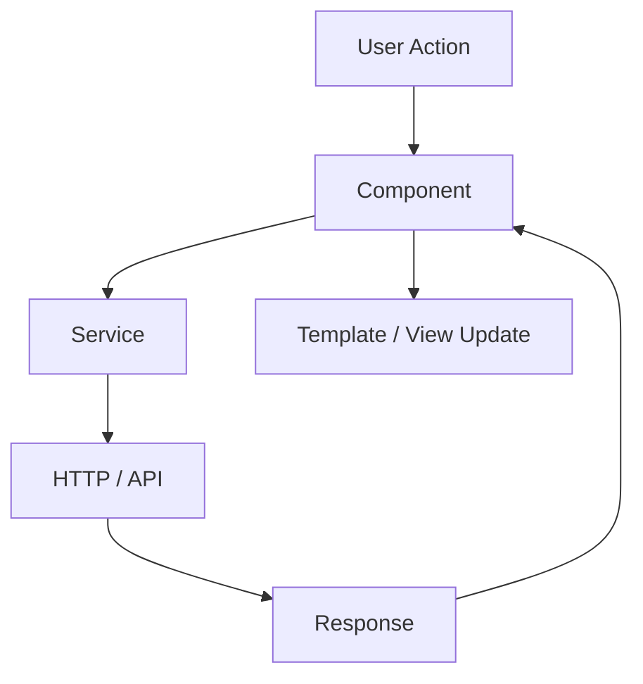
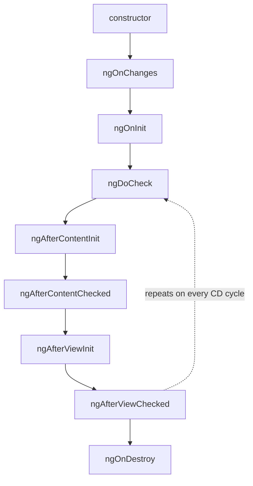
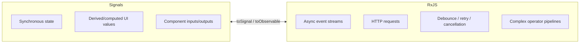
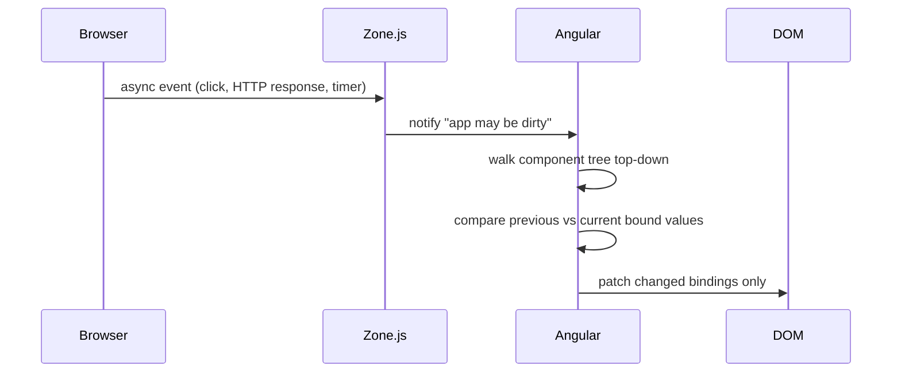
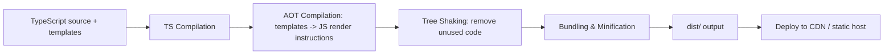
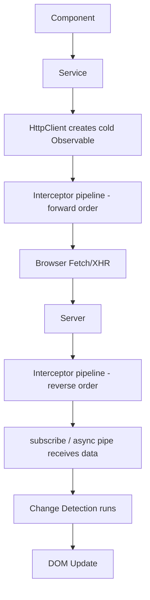
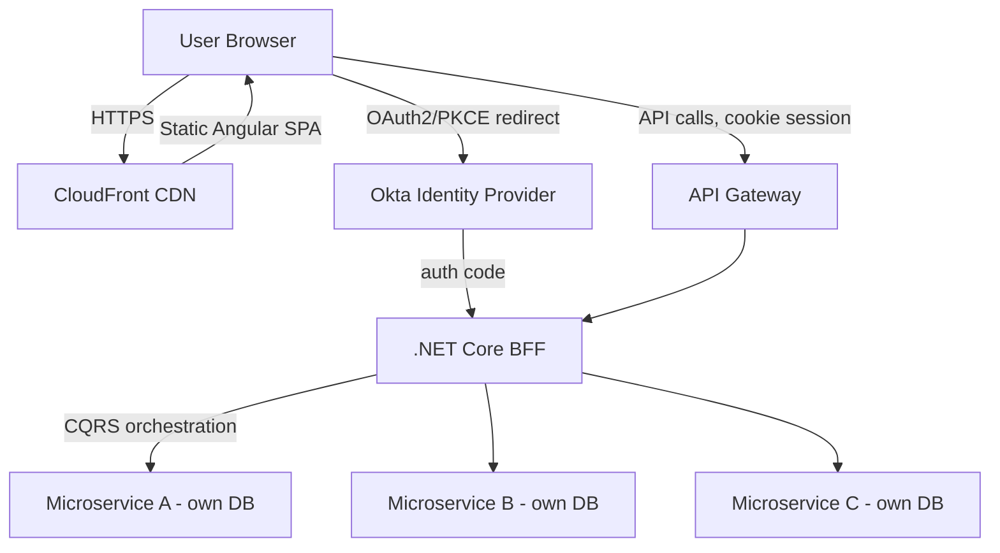

# Angular Senior/Lead Interview Guide

> Source notes ka title "Angular 7" (2018-era) tha, lekin modern senior interviews (2026) latest stable Angular tak ka knowledge assume karte hain (v18/19-class features: default se standalone APIs, Signals, naya control-flow syntax, zoneless change detection). Yeh guide aapke original notes preserve karta hai, unko reorganize karta hai, har open question ka answer deta hai, aur Angular 7 aur current Angular ke beech gap close karne ke liye add ki gayi har cheez ko clearly tag karta hai. Additions **[new content]** se prefixed hain.

## Table of Contents

1. [Core Concepts](#core-concepts)
   - [Angular vs AngularJS](#angular-vs-angularjs)
   - [Hybrid Angular Apps and Upgrading from AngularJS (ngUpgrade)](#hybrid-angular-apps-and-upgrading-from-angularjs-ngupgrade)
   - [Architecture Overview](#architecture-overview)
   - [TypeScript in Angular](#typescript-in-angular)
   - [Modules (NgModule)](#modules-ngmodule)
   - [Components](#components)
   - [[new content] Standalone Components (Angular 14+, default since v17)](#new-content-standalone-components-angular-14-default-since-v17)
   - [UI Component Libraries: Angular Material and Bootstrap](#ui-component-libraries-angular-material-and-bootstrap)
   - [Templates, Metadata, Decorators](#templates-metadata-decorators)
   - [Data Binding](#data-binding)
   - [Directives](#directives)
   - [[new content] New Control-Flow Syntax: @if / @for / @switch (Angular 17+)](#new-content-new-control-flow-syntax-if--for--switch-angular-17)
   - [ng-container, ng-template, ng-content](#ng-container-ng-template-ng-content)
   - [Pipes](#pipes)
   - [Services and Dependency Injection](#services-and-dependency-injection)
   - [[new content] The inject() Function (Angular 14+)](#new-content-the-inject-function-angular-14)
2. [Intermediate](#intermediate)
   - [Component Lifecycle Hooks](#component-lifecycle-hooks)
   - [ViewChild / ViewChildren / ContentChild / ContentChildren](#viewchild--viewchildren--contentchild--contentchildren)
   - [Component Communication](#component-communication)
   - [Routing and Navigation](#routing-and-navigation)
   - [Route Guards](#route-guards)
   - [Forms: Template-driven vs Reactive](#forms-template-driven-vs-reactive)
   - [[new content] Typed Reactive Forms (Angular 14+)](#new-content-typed-reactive-forms-angular-14)
   - [HttpClient and Interceptors](#httpclient-and-interceptors)
   - [[new content] Functional Interceptors (Angular 15+)](#new-content-functional-interceptors-angular-15)
3. [Advanced](#advanced)
   - [RxJS and Observables](#rxjs-and-observables)
   - [Subjects, BehaviorSubject, Multicasting](#subjects-behaviorsubject-multicasting)
   - [RxJS Operators Cheat Sheet](#rxjs-operators-cheat-sheet)
   - [[new content] Angular Signals (Angular 16+)](#new-content-angular-signals-angular-16)
   - [[new content] RxJS vs Signals — When to Use Which](#new-content-rxjs-vs-signals--when-to-use-which)
4. [Performance](#performance)
   - [Change Detection Deep Dive](#change-detection-deep-dive)
   - [[new content] Zoneless Change Detection (Angular 18+)](#new-content-zoneless-change-detection-angular-18)
   - [OnPush Strategy and Pitfalls](#onpush-strategy-and-pitfalls)
   - [trackBy / track in Loops](#trackby--track-in-loops)
   - [Bundle Size, Tree Shaking, Build Optimization](#bundle-size-tree-shaking-build-optimization)
   - [Angular CLI vs Webpack](#angular-cli-vs-webpack)
   - [[new content] esbuild / Vite-based Application Builder (Angular 17+)](#new-content-esbuild--vite-based-application-builder-angular-17)
   - [Angular Build & Runtime Lifecycle](#angular-build--runtime-lifecycle)
   - [HTTP Request Lifecycle](#http-request-lifecycle)
5. [Enterprise Architecture Case Study (BFF + CQRS + .NET)](#enterprise-architecture-case-study-bff--cqrs--net)
6. [Testing](#testing)
7. [Best Practices](#best-practices)
8. [Common Pitfalls](#common-pitfalls)
9. [Version Feature Comparison Table](#version-feature-comparison-table)
10. [Sample Interview Q&A](#sample-interview-qa)
11. [Summary of Additions](#summary-of-additions)
12. [Summary of [gaps] Additions (This Pass)](#summary-of-gaps-additions-this-pass)

---

## Core Concepts

### Angular vs AngularJS

Angular (v2+) AngularJS (1.x) ka ek full TypeScript rewrite hai. Key differences:

| Aspect | AngularJS (1.x) | Angular (2+) |
|---|---|---|
| Architecture | MVC | Component-based |
| Language | JavaScript | TypeScript |
| Performance | Digest cycle, slower | AOT + Ivy, faster |
| Mobile | Optimized nahi | Optimized |
| Rendering engine | N/A | View Engine → **Ivy** (v9 se default) |

**Angular ki key features** (source se, abhi bhi accurate): component-based architecture, two-way data binding, directives & pipes, DI, routing, HttpClient, template-driven & reactive forms, lazy loading, AOT compilation.

**Ivy kya hai?** Ivy Angular ka rendering aur compilation engine hai — yeh components aur templates ko ahead of time low-level JavaScript instructions ke ek set mein compile kar deta hai, ek larger, more generic runtime interpreter par rely karne ke bajaye. Yeh Angular 9 se default engine hai (older "View Engine" ko replace karte hue), aur yeh specifically isliye highlight hota hai ki yeh kya deliver karta hai: smaller bundle sizes (better tree-shaking, kyunki har component apne khud ke minimal instructions emit karta hai large shared runtime metadata ke bajaye), faster compilation, aur better debugging (component instances browser console mein directly inspectable ban jaate hain, aur template errors source locations tak zyada precisely map hote hain).

**Follow-up jo ek interviewer poochega:** "Angular MVC nahi hai — aap isko kya kahoge?" Jawab: yeh ek component/MVVM-flavored architecture ke closer hai — component class view-model hai, template view hai, aur services/DI model/business logic layer supply karte hain. Classic MVC jaisa koi single canonical controller layer nahi hota.

### Hybrid Angular Apps and Upgrading from AngularJS (ngUpgrade)

Ek **Hybrid Angular App** ek application hai jo migration ke during same page par AngularJS (1.x) aur Angular (2+) ko side by side run karti hai — dono framework runtimes simultaneously bootstrap kiye jaate hain, aur components/services dono ke beech shared ya communicated hote hain.

Angular isko specifically support karne ke liye **`ngUpgrade`** module (package `@angular/upgrade`) ship karta hai:

```bash
npm install @angular/upgrade
```

- `UpgradeModule` hybrid app ko bootstrap karta hai aur AngularJS directives ko Angular templates se use hone deta hai, aur Angular components ko AngularJS templates se use hone deta hai (`downgradeComponent`/`downgradeInjectable` ke through).
- Typical migration strategy: existing AngularJS app ke saath Angular introduce karo, ek time mein ek route/feature/component ko Angular mein migrate karo, aur jab tak AngularJS code fully retire na ho jaaye tab tak `ngUpgrade` ko bridge ke roop mein rakho — poore app ka ek risky "big bang" rewrite attempt karne ke bajaye.
- **Yeh interviews mein kyun aata hai:** ~2016 se purani codebase wale most enterprises exactly isi migration path se through gaye. Ek senior/lead candidate se expect kiya jaata hai ki woh yeh jaane ki mechanism exist karta hai (`ngUpgrade`, `@angular/upgrade`) even personally ek migration run kiye bina bhi — yeh Angular ki history ki awareness aur legacy-modernization projects actually kaise staffed aur scoped hote hain, iska signal deta hai, jo directly un WebForms → MVC → .NET Core migrations par map hota hai jinse ek 10-year .NET developer likely gujra hoga.

### Architecture Overview

Classic (NgModule-based) building blocks, source notes ke according:

1. **Modules** (`@NgModule`) — app ko blocks mein organize karte hain.
2. **Components** (`@Component`) — UI logic aur structure.
3. **Templates & Views** — directives/bindings ke saath HTML.
4. **Directives & Pipes** — behavior modify karte hain, data transform karte hain.
5. **Services & DI** — components ke across logic share karte hain.
6. **Routing** (`RouterModule`) — navigation.
7. **Forms** — template-driven aur reactive.



**[new content] Modern architecture note:** Angular 14+ se (aur Angular 17 se default project schematic mein), recommended architecture NgModules ko entirely drop kar deta hai **standalone components, directives, aur pipes** ke favor mein, routing `main.ts`/`app.config.ts` mein provider functions (`provideRouter`) ke through configured hoti hai, `RouterModule.forRoot()` ke bajaye. NgModules deprecated/removed nahi hain — wo abhi bhi kaam karte hain aur legacy codebases mein common hain — lekin "aaj ek naya Angular app kaise structure karoge" ab ek standalone, NgModule-free answer expect karta hai. Dono ke baare mein baat karne ke liye ready raho.

### TypeScript in Angular

TypeScript static typing aur OOP features ke saath JavaScript ka ek superset hai. Angular isko use karta hai: type safety, better tooling/IDE support, compile-time error detection, aur modern ES features aur decorators ke support ke liye. Ek 10-year .NET developer ke liye, mental model C# se closely map hota hai: interfaces, generics, access modifiers, aur strict null checking (`strictNullChecks`, Angular CLI projects mein `strict: true` ka part) C# nullable reference types ke analogous behave karte hain.

**Follow-up:** "Angular TypeScript ko sirf support karne ke bajaye *require* kyun karta hai?" Kyunki Angular ka compiler (AOT/Ivy) optimized instruction code generate karne aur dependency injection ki type-based token resolution ko power karne ke liye static type information aur decorator metadata par rely karta hai.

### Modules (NgModule)

```typescript
@NgModule({
  declarations: [AppComponent],
  imports: [BrowserModule],
  providers: [],
  bootstrap: [AppComponent]
})
export class AppModule { }
```

- `declarations` — is module ke owned components/directives/pipes.
- `imports` — dusre modules jinke exported declarables is module ko chahiye.
- `providers` — module-level DI registrations (legacy pattern; ab `providedIn: 'root'` preferred hai).
- `bootstrap` — root component jise Angular app start karne ke liye instantiate karta hai (sirf root module ke liye relevant).

`RouterModule.forRoot(routes)` vs `RouterModule.forChild(routes)` — `forRoot()` exactly ek baar use hota hai, app ke root routing module mein, aur additionally singleton `Router` service, location strategy, etc. configure karta hai. `forChild()` feature modules mein use hota hai aur sirf routes register karta hai router singletons ko re-create kiye bina — critical hai kyunki ek feature module mein `forRoot()` ko re-invoke karna duplicate/broken router state cause karne wala ek classic bug hota tha.

### Components

Ek component = Template (HTML) + Class (TS logic) + Styles (CSS/SCSS).

```typescript
import { Component, ViewEncapsulation, ChangeDetectionStrategy } from '@angular/core';
import { CommonModule } from '@angular/common';
import { UserService } from './user.service';
import { trigger, state, style, transition, animate } from '@angular/animations';

@Component({
  selector: 'app-user',
  templateUrl: './user.component.html',
  styleUrls: ['./user.component.css'],
  providers: [UserService],
  viewProviders: [UserService],
  encapsulation: ViewEncapsulation.Emulated,
  changeDetection: ChangeDetectionStrategy.OnPush,
  animations: [
    trigger('fade', [
      state('visible', style({ opacity: 1 })),
      state('hidden', style({ opacity: 0 })),
      transition('visible <=> hidden', [animate('300ms')])
    ])
  ],
  standalone: true,
  imports: [CommonModule],
  exportAs: 'userComp',
  host: {
    '(click)': 'onHostClick()',
    '[class.active]': 'isActive'
  }
})
export class UserComponent {
  name = 'John';
  isActive = true;
  state = 'visible';

  toggle() {
    this.state = this.state === 'visible' ? 'hidden' : 'visible';
  }

  onHostClick() {
    console.log('Host element clicked');
  }
}
```

**Har `@Component` property kya karti hai:**

| Property | Purpose |
|---|---|
| `selector` | Component ke liye HTML tag name |
| `template` | Inline HTML |
| `templateUrl` | External HTML file |
| `styles` | Inline CSS |
| `styleUrls` | External CSS |
| `providers` | Is component + uske children tak scoped services |
| `viewProviders` | Sirf is component ki *view* tak scoped services (projected content ko visible nahi) |
| `encapsulation` | CSS scoping strategy — neeche dekho |
| `changeDetection` | Change detection optimization (`Default` ya `OnPush`) |
| `animations` | Component animations |
| `standalone` | NgModule ke bina usable component |
| `imports` | Doosre standalone components/directives/pipes/modules jo is component ke template ko chahiye |
| `exportAs` | Directive ke roop mein use hone par is component ko template reference variable ke through reference karne ka naam |
| `host` | Component ke apne host element par applied bindings/listeners |

`encapsulation` options:

| Value | Behavior |
|---|---|
| `Emulated` (default) | Angular attribute selectors use karke Shadow DOM emulate karta hai; styles scoped hain lekin truly isolated nahi |
| `None` | Koi encapsulation nahi; styles global ban jaate hain |
| `ShadowDom` | Strict isolation ke liye real browser Shadow DOM use karta hai |

**`providers` vs `viewProviders`:** `providers` component ki apni view *aur* `<ng-content>` ke through usme projected kisi bhi content ko visible hote hain. `viewProviders` sirf component ke apne template ko visible hote hain, projected content ko nahi. Yeh ek classic senior-level gotcha question hai — most developers ko kabhi `viewProviders` ki zaroorat nahi padi aur woh on the spot difference explain nahi kar sakte.

**Directive vs Component:**

| Feature | Component | Directive |
|---|---|---|
| UI Rendering | Haan | Nahi |
| Decorator | `@Component` | `@Directive` |
| Template | Ek template hai | Koi template nahi |
| Example Usage | UI components | DOM behavior change |

Har component technically ek directive hai jisme ek template attached hai — yeh ek common trick interview question hai ("kya ek component ek directive hai?").

### [new content] Standalone Components (Angular 14+, default since v17)

Ek "2018 Angular 7" note set mein single biggest structural gap. Standalone components mandatory NgModule wrapper ko eliminate kar dete hain:

```typescript
@Component({
  standalone: true,
  selector: 'app-user-card',
  imports: [CommonModule, RouterLink], // import only what the template needs, directly
  template: `<div>{{ name }}</div>`
})
export class UserCardComponent {
  name = 'Jane';
}
```

`AppModule` ke bina bootstrapping:

```typescript
// main.ts
import { bootstrapApplication } from '@angular/platform-browser';
import { AppComponent } from './app/app.component';
import { appConfig } from './app/app.config';

bootstrapApplication(AppComponent, appConfig);
```

```typescript
// app.config.ts
export const appConfig: ApplicationConfig = {
  providers: [
    provideRouter(routes),
    provideHttpClient(withInterceptors([authInterceptor])),
    provideAnimations(),
  ]
};
```

**Interviews ke liye yeh kyun matter karta hai:** Angular CLI v17 se standalone-by-default projects generate karta hai. Interviewers aapse old (`NgModule` + `RouterModule.forRoot`) aur new (`bootstrapApplication` + `provideRouter`) bootstrap flows ko contrast karne ke liye kahenge, aur explain karne ke liye kahenge ki Angular ne yeh move *kyun* kiya — primarily mental model simplify karne ke liye (ab "main isko kis module mein declare karun?" nahi), tree-shakability improve karne ke liye (har component apni exact dependencies declare karta hai), aur Angular ko better align karne ke liye React/Vue/Svelte components jaise consume kiye jaate hain (self-contained, importable units) ke saath. NgModules **deprecated nahi hain** — aap standalone components ko ek NgModule-based app mein incrementally mix kar sakte ho, jo recommended migration path hai (`ng generate @angular/core:standalone` schematic assist kar sakta hai).

**Gotcha:** ek standalone component ka `imports` array ek NgModule ke `imports` ke analogous hai, lekin per-component scoped hai app-wide shared hone ke bajaye — har standalone component ko khud `CommonModule` (ya specific directives) import karna padta hai agar woh `*ngIf`/`*ngFor`/`date` jaise pipes use karta hai, NgModule apps ke unlike jahan `CommonModule` aksar ek shared module mein ek baar import kiya jaata tha.

### UI Component Libraries: Angular Material and Bootstrap

Angular ke saath paired do most common UI options:

| Library | What it is | Notes |
|---|---|---|
| **Angular Material** | Google ki official Material Design component library, specifically Angular ke liye built | Deep Angular integration (CDK par built, reactive forms ke saath naturally kaam karta hai), SCSS ke through theming, accessible-by-default components |
| **Bootstrap** | Ek general-purpose, framework-agnostic CSS framework | Angular-specific nahi — plain CSS classes ke through use hota hai, ya Angular-idiomatic components ke liye `ngx-bootstrap`/`ng-bootstrap` jaisi ek wrapper library ke through (jQuery-driven widgets ke bajaye directives) |

CLI schematic ke through Angular Material install karna:

```bash
ng add @angular/material
```

Yeh single command package install karta hai, ek interactive theme picker run karta hai, `angular.json`/`main.ts` mein typography/animations wire up karta hai, aur optionally gesture support (`hammerjs`) set up karta hai — CLI ecosystem mein kahin aur use hone wala wahi schematic-driven `ng add` convention (`@angular/pwa`, `@angular/ssr`, `@ngrx/store`).

**Senior framing:** Angular Material ke liye reach karo jab aapko baked-in accessibility, theming, aur Angular-native APIs wali ek component library chahiye, aur Material Design ka visual language acceptable hai; Bootstrap (ya ek wrapper) ke liye reach karo jab org ke paas already match karne ke liye Bootstrap-based design conventions/branding hai, ya team ek CSS-only approach chahti hai jo ek component framework ke JS se tied na ho.

### Templates, Metadata, Decorators

Ek **template** ek component ka HTML view hai — declarative, imperative nahi; yeh desired UI describe karta hai, aur Angular isko efficient render/update instructions mein compile karta hai (Ivy ke through).

```html
<h1>{{ title }}</h1>
<button (click)="sayHello()">Click me</button>
```

**Metadata** ek class se ek decorator (`@Component`, `@NgModule`, `@Injectable`) ke through attached information hai, jo Angular ko batati hai ki class ko kaise construct/wire karna hai.

**Decorators** functions hain jo wo metadata attach karte hain. Decorators ke bina, Angular ke paas jaanne ka koi tarika nahi hota ki ek class ko kaise instantiate karna hai ya uski dependencies kaise resolve karni hain. Key decorators: `@Component`, `@Directive`, `@Pipe`, `@NgModule`, `@Injectable`, `@Input`, `@Output`, `@HostBinding`, `@HostListener`, `@ViewChild`, `@ContentChild`.

### Data Binding

Char types:

| Type | Syntax | Direction | Example |
|---|---|---|---|
| Interpolation | `{{ value }}` | Component → View | `<h1>{{ title }}</h1>` |
| Property binding | `[property]="value"` | Component → View | `` |
| Event binding | `(event)="handler()"` | View → Component | `<button (click)="onClick()">` |
| Two-way binding | `[(ngModel)]="value"` | Both | `<input [(ngModel)]="name">` |

Two-way binding syntactic sugar hai: `[(ngModel)]="name"` `[ngModel]="name" (ngModelChange)="name=$event"` mein desugar hota hai. Yeh "banana in a box" desugaring jaanna ek frequent interview probe hai, especially jab aapko apna khud ka two-way-bindable custom component (`@Input() value` + `@Output() valueChange`) build karne ke liye kaha jaaye.

### Directives

Teen types:

1. **Component directives** — har component ek template wala directive hai.
2. **Structural directives** (`*ngIf`, `*ngFor`, `*ngSwitch`) — DOM elements add/remove karte hain. `*` sugar hai: Angular internally `*ngIf="cond"` ko `<ng-template [ngIf]="cond">...</ng-template>` mein desugar karta hai.
3. **Attribute directives** (`ngClass`, `ngStyle`, custom directives) — DOM structure alter kiye bina appearance/behavior change karte hain.

Custom directive example:

```typescript
@Directive({ selector: '[appHighlight]' })
export class HighlightDirective {
  constructor(private el: ElementRef, private renderer: Renderer2) {}

  private setColor(color: string) {
    this.renderer.setStyle(this.el.nativeElement, 'color', color);
  }
}
```

**`ElementRef` vs `Renderer2`:** `ElementRef` native DOM node (`elementRef.nativeElement`) ka direct access deta hai. `Renderer2` DOM manipulation ke liye Angular-recommended abstraction hai kyunki yeh server-side rendering aur Web Worker rendering ke under correctly kaam karta hai, jahan directly touch karne ke liye koi real DOM nahi hota. **Interview trap:** `nativeElement.style` ko directly mutate karna (jaise notes ke older `HighlightDirective` example mein dikhaya gaya hai) browser mein kaam karta hai lekin SSR ke under break ho jaata hai — production code mein hamesha `Renderer2` prefer karo, aur agar us snippet ko critique karne ke liye kaha jaaye to yeh call out karo.

`*ngIf` vs `[hidden]`:

| Feature | `*ngIf` | `[hidden]` |
|---|---|---|
| Removes from DOM? | Haan | Nahi — bas hide karta hai (`display:none`) |
| Performance impact | Expensive subtrees ke liye better (false hone par render cost nahi) | Element DOM/memory mein rehta hai; frequently toggle karna cheaper hai |
| Re-runs lifecycle hooks on toggle? | Haan (destroy/recreate karta hai) | Nahi |

`trackBy` — [Performance](#trackby--track-in-loops) dekho.

### [new content] New Control-Flow Syntax: @if / @for / @switch (Angular 17+)

Angular 17 ne ek naya built-in template control-flow syntax introduce kiya jo eventually naye code ke liye `*ngIf`/`*ngFor`/`*ngSwitch` ko replace karta hai:

```html
@if (isLoggedIn) {
  <p>Welcome back!</p>
} @else if (isGuest) {
  <p>Continue as guest</p>
} @else {
  <p>Please log in.</p>
}

@for (item of items; track item.id) {
  <li>{{ item.name }}</li>
} @empty {
  <li>No items found.</li>
}

@switch (status) {
  @case ('success') { <p>Success</p> }
  @case ('error') { <p>Error</p> }
  @default { <p>Unknown</p> }
}
```

**Senior level par yeh kyun matter karta hai:**
- `@for` mein `track` **mandatory** hai (`*ngFor` par optional `trackBy` ke unlike), jo developers ko baad mein perf problem discover karne ke bajaye upfront identity/keying ke baare mein sochne ke liye force karta hai.
- Naya syntax directly Ivy dwara compile hota hai `<ng-template>` desugaring ki zaroorat ke bina, jo structural-directive versions ke versus smaller generated code aur reportedly better runtime performance deta hai.
- `@empty` ek first-class "no data" block hai — pehle ek separate `*ngIf="items.length === 0"` sibling block ki zaroorat hoti thi.
- `*ngIf`/`*ngFor`/`*ngSwitch` **deprecated ya removed nahi hain** — dono syntaxes coexist karte hain, aur old wale 2024 se pehle build hui kisi bhi codebase mein extremely common hain. Dono ko read/maintain karne ke liye ready raho; ek codebase ko auto-convert karne ke liye migration tooling (`ng generate @angular/core:control-flow`) exist karta hai.
- `@if`/`@for` use karne ke liye `CommonModule` import ki ab zaroorat nahi hai — wo template compiler mein built-in hain, directives nahi, isliye kuch bhi import karne ki zaroorat nahi.

### ng-container, ng-template, ng-content

| Feature | Purpose | Renders in DOM? | Best Use |
|---|---|---|---|
| `ng-container` | Logical grouping, koi extra element nahi | Nahi | Structural directives apply karte waqt wrapper `<div>` pollution avoid karo |
| `ng-template` | Deferred/conditional rendering ke liye blueprint | Nahi (jab tak use na ho) | `*ngIf ... else`, reusable templates, `ngTemplateOutlet` |
| `ng-content` | Content projection (parent → child) | Haan (sirf children project karta hai) | Reusable components: cards, modals, tabs |

`ng-container` example (wrapper divs avoid karna):

```html
<ng-container *ngIf="isLoggedIn">
  <p>Welcome back, user!</p>
  <button>Logout</button>
</ng-container>
```

`else` aur `ngTemplateOutlet` ke saath `ng-template`:

```html
<p *ngIf="isLoggedIn; else showLogin">Welcome back!</p>
<ng-template #showLogin>
  <p>Please log in to continue.</p>
</ng-template>
```

```html
<ng-template #loadingTemplate>
  <p>Loading data...</p>
</ng-template>
<div *ngIf="isLoading; else content"></div>
<ng-template #content>
  <ng-container *ngTemplateOutlet="loadingTemplate"></ng-container>
</ng-template>
```

`ng-content` — basic aur multi-slot projection:

```typescript
@Component({
  selector: 'app-card',
  template: `
    <div class="card">
      <header><ng-content select="[card-title]"></ng-content></header>
      <section><ng-content></ng-content></section>
      <footer><ng-content select="[card-footer]"></ng-content></footer>
    </div>
  `
})
export class CardComponent {}
```

```html
<app-card>
  <h2 card-title>Book Title</h2>
  <p>Description here...</p>
  <button card-footer>Buy Now</button>
</app-card>
```

### Pipes

Pipes data ko **sirf display ke liye** transform karte hain, formatting logic ko component class se bahar rakhte hain aur templates ko clean rakhte hain.

```html
<p>{{ name | uppercase }}</p>
<p>{{ 1234.56 | currency:'USD' }}</p>
```

Built-in pipes: `uppercase`, `lowercase`, `titlecase`, `number`, `percent`, `currency`, `date`, `json`, `async`, `slice`, `decimal`.

Custom pipe:

```typescript
@Pipe({ name: 'reverse' })
export class ReversePipe implements PipeTransform {
  transform(value: string): string {
    return value.split('').reverse().join('');
  }
}
```

**Pure vs impure pipes:**

```typescript
@Pipe({ name: 'purePipe', pure: true })   // default — runs only when input reference changes
@Pipe({ name: 'impurePipe', pure: false }) // runs on every change detection cycle
```

- **Pure pipe** — sirf tab re-evaluate hota hai jab Angular input ki *reference* (ya uski primitive value) mein ek change detect karta hai. Cheap, predictable, default aur strongly preferred.
- **Impure pipe** — har change detection run par re-evaluate hota hai regardless of ki input actually change hua ya nahi. Built-in `async` pipe jaise pipes ke liye needed hai (jisko new emissions ke liye ek Observable/Promise poll karna padta hai) lekin otherwise ek performance red flag hai; templates mein arrays filter/sort karne ke liye custom impure pipes likhne se avoid karo — yeh poore app ke across har keystroke/tick par recompute karta hai.

**Interview trap:** "Aapko default se ek pipe use karke list filter kyun nahi karni chahiye?" Kyunki agar pipe pure hai, yeh re-run nahi hoga jab aap array ko in place mutate karte ho (koi new reference nahi), aur agar isko work around karne ke liye impure banaya jaaye, yeh ab har CD cycle par run hota hai — ek well-known Angular performance foot-gun. Fix yeh hai ki filtering ko component mein karo (on demand ek naye array mein recompute karke) ya instead RxJS/Signals-based derived state use karo.

### Services and Dependency Injection

```typescript
@Injectable({ providedIn: 'root' })
export class DataService {
  getData() { return 'Hello from Service'; }
}
```

```typescript
constructor(private dataService: DataService) { }
```

`providedIn: 'root'` vs `@NgModule` mein `providers` array:

| Feature | `providedIn: 'root'` | `providers` in `@NgModule` |
|---|---|---|
| Scope | Singleton, application-wide | Ek module/component tak scoped ho sakta hai |
| Lazy loading | Tree-shakable; achhe se kaam karta hai, sirf inject hone par instantiate hota hai | Manually manage karna padta hai; historically per lazy module duplicate instances ka risk hota tha |
| Recommendation | Most services ke liye preferred default | Jab aapko deliberately scoped/multiple instances chahiye tab use karo |

**Hierarchical DI:** Angular ka injector ek tree hai, ek single global container nahi. `providedIn: 'root'` app-wide ek instance deta hai. Ek component ke apne `providers` array mein ek service register karna us component subtree ke liye ek *new* instance create karta hai — e.g., `providers: [ValidationService]` wala ek `FormComponent` apna khud ka isolated `ValidationService` paata hai, tree mein kahin aur ki kisi bhi other instance se separate. Yeh deliberately per-feature ya per-component state isolation ke liye use hota hai (e.g., multiple independent step-form instances wala ek wizard component).

### [new content] The inject() Function (Angular 14+)

Constructor injection ab dependencies pane ka ek hi tarika nahi hai. Functional `inject()` API ab idiomatic hai, especially standalone components, functional guards/interceptors/resolvers, aur kisi bhi jagah jahan aapke paas ek class constructor nahi hota (e.g., `provideRouter` ke functional guards ke andar, ya Signal-based computed setups):

```typescript
import { inject } from '@angular/core';

@Component({ standalone: true, selector: 'app-user' })
export class UserComponent {
  private userService = inject(UserService);
  private route = inject(ActivatedRoute);
}
```

Functional route guard using `inject()` (replaces class-based `CanActivate`):

```typescript
export const authGuard: CanActivateFn = (route, state) => {
  const auth = inject(AuthService);
  const router = inject(Router);
  return auth.isLoggedIn() ? true : router.createUrlTree(['/login']);
};
```

**Interviewers isko kyun probe karte hain:** `inject()` sirf ek "injection context" ke andar kaam karta hai (constructor, field initializer, ya `runInInjectionContext` ke andar run hone wala ek function). Ek classic gotcha question: "Kya aap `setTimeout` callback ke andar `inject()` call kar sakte ho?" — Nahi, directly nahi; ek baar aap ek async callback ke andar ho to injection context chala jaata hai jab tak aap value ko pehle se capture na karo ya call ko `runInInjectionContext()` mein wrap na karo. Constructor injection fully valid rehta hai aur abhi bhi most existing class-based services/components jo use karte hain — `inject()` ek additive hai, replacement nahi, lekin functional guards/resolvers/interceptors ke liye required style hai aur consistency ke liye ab naye standalone projects mein CLI-generated default hai.

---

## Intermediate

### Component Lifecycle Hooks



| Hook | When | Typical use |
|---|---|---|
| `ngOnChanges(changes: SimpleChanges)` | Jab bhi ek bound `@Input()` change hota hai (first call par `ngOnInit` se pehle) | Updated input-bound properties par react karo; `SimpleChanges` previous vs current values expose karta hai |
| `ngOnInit()` | Ek baar, first `ngOnChanges` ke baad | Initialization logic, e.g., data fetch karna |
| `ngDoCheck()` | Har CD cycle | Angular ke default se beyond custom change detection (mutation detection jo Angular nahi dekh sakta, e.g., in-place array mutation) |
| `ngAfterContentInit()` | Ek baar, `<ng-content>` ke through projected content initialize hone ke baad | Pehli baar projected content access karo |
| `ngAfterContentChecked()` | Projected content ki har check ke baad | Projected content mein updates par react karo |
| `ngAfterViewInit()` | Ek baar, component ki view aur child views initialize hone ke baad | Safely `@ViewChild` aur DOM elements access karo |
| `ngAfterViewChecked()` | Har view check ke baad | Rare use — repeated view updates ko respond karna |
| `ngOnDestroy()` | Component destroy hone se right pehle | Subscriptions, timers, event listeners clean up karo |

Lifecycle hooks nahi lekin closely related:
- **`constructor()`** — class instantiation par run hota hai; *sirf* DI ke liye use karo, business logic ke liye kabhi nahi. **Senior rule: constructor mein business logic (API calls, DOM access) kabhi mat daalo** — inputs abhi bound nahi hote aur injected services saare contexts mein use ke liye fully ready na ho.
- **`SimpleChanges`** (`ngOnChanges` ke andar) — har changed input ke liye `.previousValue` / `.currentValue` / `.firstChange` provide karta hai.

`constructor` vs `ngOnInit`:

| | `constructor` | `ngOnInit` |
|---|---|---|
| Runs | Class instantiate hone par | Angular input bindings set karne ke baad |
| Use for | Sirf dependency injection | API calls, initialization logic |
| Inputs available? | Nahi (abhi bound nahi) | Haan |

### ViewChild / ViewChildren / ContentChild / ContentChildren

`@ViewChild`/`@ViewChildren` **is component ke apne template** mein declared elements/components access karte hain. `@ContentChild`/`@ContentChildren` `<ng-content>` ke through **parent se projected in** elements access karte hain.

```typescript
@ViewChild(MatPaginator) paginator!: MatPaginator;
@ViewChildren(ItemComponent) items!: QueryList<ItemComponent>;
```

| | Source | Available after |
|---|---|---|
| `@ViewChild` / `@ViewChildren` | Component ka apna template | `ngAfterViewInit` |
| `@ContentChild` / `@ContentChildren` | Parent se projected content | `ngAfterContentInit` |

**Interview one-liner:** "View = jo main own karta hoon, Content = jo parent mujhe deta hai."

`@ViewChild` commonly yeh karne ke liye use hota hai: DOM properties read karna/native methods call karna (focus, scroll, measure), child component public methods ko directly call karna, ya third-party non-Angular UI libraries integrate karna jinhe ek DOM handle chahiye.

**[new content] Signal-based queries (Angular 17.3+):** `viewChild()`, `viewChildren()`, `contentChild()`, aur `contentChildren()` function-based equivalents ab exist karte hain, jo `!` non-null assertion + lifecycle timing dance require karne ke bajaye Signals return karte hain:

```typescript
export class UserComponent {
  paginator = viewChild(MatPaginator);      // Signal<MatPaginator | undefined>
  items = viewChildren(ItemComponent);      // Signal<readonly ItemComponent[]>
}
```

Yeh us historical gotcha ko remove karta hai jahan `@ViewChild` fields `ngAfterViewInit` tak `undefined` hote hain — signal form "not yet available" ko type (`| undefined`) ka ek explicit part banata hai ek runtime surprise ke bajaye, aur `computed()`/`effect()` ke saath cleanly integrate hota hai.

### Component Communication

| Direction | Mechanism |
|---|---|
| Parent → Child | `@Input()` |
| Child → Parent | `@Output()` + `EventEmitter` |
| Sibling / unrelated | Ek `Subject`/`BehaviorSubject` (ya Signal) wali shared service |
| Across routes | Route params, query params, ya router navigation `state` |

`EventEmitter` ek RxJS `Subject` ke upar ek thin wrapper hai, strictly component `@Output()` communication ke liye intended — services ke andar ek general pub/sub mechanism ke roop mein recommended **nahi** hai (wahan instead ek plain `Subject`/`BehaviorSubject` use karo).

**Senior guidance:** direct parent-child ke liye `@Input`/`@Output` prefer karo; ek shared service ke liye sirf tab reach karo jab data ko unrelated components ke across cross karna ho ya route changes ke across persist karna ho. Services ke through data pass karna cross-cutting shared state (auth, cart, theme) ke liye appropriate hai lekin simple parent-child relationships ke liye overkill hai — aur indirection add karta hai.

Template reference variables (`#var`) trivial DOM access ke liye `@ViewChild` ka ek lighter-weight alternative hain:

```html
<input #txt />
<button (click)="print(txt.value)">Print</button>
```

Inko use karo jab aapko template mein hi bas ek quick handle chahiye ho, small UI logic ke liye component-class coupling avoid karte hue.

**[version 19 upgrade]** Angular 7 mein `@Input()`/`@Output()` + `EventEmitter` hi Parent ↔ Child communication ka **sirf ek** tareeka tha. Angular 19 mein signal-based `input()`, `output()`, aur `model()` **stable** ho gaye (pehle v17.1 se developer preview mein), aur inke saath official migration schematics bhi aaye — ab yeh recommended default hain, decorators still supported hain.

*Kya badla aur implement kaise karein:*
```typescript
export class UserCardComponent {
  // v7 style — still works, but no longer the default recommendation
  @Input() name!: string;
  @Output() nameChange = new EventEmitter<string>();

  // [version 19 upgrade] — signal-based equivalents
  name = input.required<string>();          // Signal<string>, required
  age = input(0);                            // Signal<number>, with default
  selected = output<string>();                // replaces @Output() + EventEmitter

  // model() gives two-way binding in one line (parent can [(name)]="...")
  name = model<string>('');
}
```
- **Reading the value:** call it like a function — `this.name()` instead of `this.name`.
- **Two-way binding:** `model()` replaces the old `@Input() + @Output() nameChange` pair used for `[(ngModel)]`-style custom two-way bindings — the parent just does `<user-card [(name)]="userName" />`.
- **Migrating an existing codebase:** run the official schematics instead of hand-editing every component:
  ```bash
  ng generate @angular/core:signal-input-migration
  ng generate @angular/core:signal-queries-migration
  ng generate @angular/core:output-migration
  ```
- **Interview angle:** "Why move `@Input`/`@Output` to Signals?" — same fine-grained change-detection benefit as `signal()`/`computed()` elsewhere: Angular knows exactly which binding depends on which input, which is what makes zoneless change detection safe for input-driven components.

### Routing and Navigation

```typescript
const routes: Routes = [
  { path: 'home', component: HomeComponent },
  { path: 'about', component: AboutComponent }
];

@NgModule({
  imports: [RouterModule.forRoot(routes)],
  exports: [RouterModule]
})
export class AppRoutingModule { }
```

```html
<a routerLink="/home">Home</a>
<router-outlet></router-outlet>
```

Programmatic navigation:

```typescript
constructor(private router: Router) { }
navigateToHome() {
  this.router.navigate(['/home']);
}
```

Wildcard route:

```typescript
{ path: '**', component: PageNotFoundComponent }
```

Route parameters:

```typescript
{ path: 'product/:id', component: ProductComponent }
```
```typescript
constructor(private route: ActivatedRoute) {}
this.route.snapshot.paramMap.get('id');
```

Query parameters:

```typescript
this.router.navigate(['/products'], { queryParams: { category: 'electronics' } });
this.route.snapshot.queryParamMap.get('category');
```

**Note:** `snapshot` sirf navigation ke moment par value capture karta hai — agar component ko destroy/recreate hue bina different params ke saath khud par re-navigate kiya ja sakta hai (e.g., `/product/1` → `/product/2`), `snapshot` update nahi hoga. Jab same component instance param changes ke across reuse ho sakta hai to observable form use karo (`this.route.paramMap.subscribe(...)` ya `switchMap` ke through piped `this.route.paramMap`) — ek very common gotcha/bug source aur popular interview question.

Lazy loading feature modules:

```typescript
const routes: Routes = [
  { path: 'dashboard', loadChildren: () => import('./dashboard/dashboard.module').then(m => m.DashboardModule) }
];
```

**[new content] Lazy-loading standalone components/routes (Angular 14+):** modern lazy loading ko ab wrapper NgModule ki bilkul zaroorat nahi hai:

```typescript
const routes: Routes = [
  { path: 'login', loadComponent: () => import('./login/login.component').then(c => c.LoginComponent) },
  { path: 'admin', loadChildren: () => import('./admin/admin.routes').then(m => m.ADMIN_ROUTES) }
];
```
Yahan `admin.routes.ts` ek `AdminModule` ke bajaye ek plain `Routes` array export karta hai (`export const ADMIN_ROUTES: Routes = [...]`) — ek less indirection layer, aur yeh standalone components ke saath naturally compose hota hai.

### Route Guards

| Guard | Purpose |
|---|---|
| `CanActivate` | Ek route protect karo — e.g., sirf logged-in users `/dashboard` access kar sakte hain |
| `CanActivateChild` | Saare child routes protect karo, e.g. `/admin/*` ke neeche sab kuch |
| `CanLoad` (legacy) / `CanMatch` (current) | Agar user ke paas access nahi hai to ek lazy module ko load hone se bilkul prevent karo |
| `CanMatch` | Role/feature flag ke basis par decide karo ki ek route *match* bhi karta hai ya nahi — same path ke liye ek different route definition tak fall through hone allow kar sakta hai |
| `CanDeactivate` | Ek route se navigation away ko block karo — e.g., `/profile-edit` par unsaved changes |

> **`CanLoad` vs `CanMatch` par Note:** `CanLoad` ko `CanMatch` ke favor mein phase out kiya ja raha hai, jo strictly zyada capable hai — `CanMatch` non-lazy routes ko bhi gate kar sakta hai aur Angular ko *next* matching route configuration try karne deta hai agar yeh false return kare (A/B routes ya feature-flagged route swaps ke liye useful), jabki `CanLoad` sirf lazy-module loading ko prevent karta tha. Naye code ko `CanMatch` use karna chahiye.

Full modern guard-based routing config (functional style, Angular 15+):

```typescript
const routes: Routes = [
  {
    path: 'login',
    loadComponent: () => import('./login/login.component').then(c => c.LoginComponent)
  },
  {
    path: 'dashboard',
    canMatch: [authMatchGuard],
    canActivate: [authGuard],
    loadComponent: () => import('./dashboard/dashboard.component').then(c => c.DashboardComponent)
  },
  {
    path: 'admin',
    canMatch: [adminLoadGuard, adminMatchGuard],
    loadChildren: () => import('./admin/admin.routes').then(m => m.ADMIN_ROUTES)
  },
  {
    path: 'profile-edit',
    canDeactivate: [formExitGuard],
    loadComponent: () => import('./profile/profile-edit.component').then(c => c.ProfileEditComponent)
  }
];
```

**[new content] Functional guard implementation example** (source notes ne guards ko conceptually reference kiya tha lekin ek full class/functional implementation nahi dikhaya — is gap ko fill karte hue):

```typescript
export const authGuard: CanActivateFn = () => {
  const auth = inject(AuthService);
  const router = inject(Router);
  return auth.isLoggedIn() || router.createUrlTree(['/login']);
};

export const formExitGuard: CanDeactivateFn<ProfileEditComponent> = (component) => {
  if (component.form.dirty) {
    return confirm('You have unsaved changes. Leave anyway?');
  }
  return true;
};
```

Class-based guards (`implements CanActivate`) abhi bhi kaam karte hain aur older/enterprise codebases mein common hain — functional guards modern idiomatic style hain kyunki wo simple boolean checks ke liye ek extra injectable class avoid karte hain.

### Forms: Template-driven vs Reactive

| | Template-driven | Reactive |
|---|---|---|
| Control style | `ngModel` ke through template mein declared | `FormControl`/`FormGroup` ke through component class mein declared |
| Scalability | Less scalable | Complex forms ke liye enterprise standard |
| Testability | Harder (logic template mein rehta hai) | Easier (pure TS, DOM ki zaroorat nahi) |
| Dynamic fields/validation | Awkward | Natural fit |
| Use when | Small forms, simple validation | Complex forms, dynamic fields, conditional validation |

Template-driven:

```html
<form #form="ngForm">
  <input type="text" [(ngModel)]="name" name="name">
</form>
```

Reactive:

```typescript
form = new FormGroup({
  name: new FormControl('')
});
```
```html
<input type="text" [formControl]="form.controls['name']">
```

`FormBuilder` construction ko simplify karta hai:

```typescript
constructor(private fb: FormBuilder) { }
form = this.fb.group({
  name: ['', Validators.required]
});
```

Validation:

```typescript
form = new FormGroup({
  email: new FormControl('', [Validators.required, Validators.email])
});
```
```html
<p *ngIf="form.controls.email.errors?.required">Email is required</p>
```

Built-in validators: `required`, `minLength`, `maxLength`, `pattern`, `email`, `min`/`max`. Inko ek array ke through ya `Validators.compose([...])` ke through compose karo.

`FormGroup` vs `FormArray`:

```typescript
userForm = new FormGroup({
  name: new FormControl(''),
  phones: new FormArray([
    new FormControl('12345')
  ])
});
```

**Interview one-liner (source se, verbatim rakha gaya — yeh good hai):** "A `FormGroup` is a fixed, named group of controls, while a `FormArray` is a dynamic, indexed collection of controls used when the number of inputs is unknown or user-driven."

Dynamic/conditional validation:

```typescript
control.setValidators([Validators.required]);
control.clearValidators();
control.updateValueAndValidity();
```

Use hota hai jab ek field ki validity doosre par depend karti hai (e.g., "state" sirf tab required banta hai jab "country" states wala ek country ho).

Checking validity:

```typescript
form.valid           // overall
control.errors       // specific control's errors
control.touched      // user has focused and left
control.dirty        // value has changed from initial
```

`[ngModelOptions]="{standalone: true}"` Angular ko batata hai ki us `ngModel` control ko surrounding `ngForm` ke saath register *na* kare — use hota hai jab aapko ek aise input par `ngModel` ke through two-way binding chahiye jisko parent form ki overall validity/value mein participate nahi karna chahiye (e.g., markup convenience ke liye ek `<form>` ke andar sitting ek UI-only filter field).

`valueChanges` — kisi bhi `FormControl`/`FormGroup`/`FormArray` par available ek RxJS `Observable`, jo har user change par latest value emit karta hai:

```typescript
name = new FormControl('');

ngOnInit() {
  this.name.valueChanges.subscribe(value => {
    console.log('Name changed:', value);
  });
}
```

Ek `FormGroup` par, yeh kisi bhi child change par poore group ka value object emit karta hai. Iske liye use hota hai: live validation, real-time search, buttons enable/disable karna, autosave, dynamic form behavior, aur user type karte hue lists filter karna. **Yeh sirf reactive forms ke liye exist karta hai** — template-driven forms is API ko directly expose nahi karte (halaanki `ngModelChange` aapko ek similar per-control event deta hai).

Form submission:

```html
<form [formGroup]="form" (ngSubmit)="onSubmit()">
  <button type="submit">Submit</button>
</form>
```
```typescript
onSubmit() {
  console.log(this.form.value);
}
```

Reset karna: `this.form.reset();`

Custom validators — `ValidationErrors | null` return karne wala ek function, business rules ya cross-field validation ke liye use hota hai (e.g., "password" ko "confirmPassword" ke equal hona chahiye):

```typescript
export function passwordsMatch(group: AbstractControl): ValidationErrors | null {
  const pass = group.get('password')?.value;
  const confirm = group.get('confirmPassword')?.value;
  return pass === confirm ? null : { passwordMismatch: true };
}
```

Aap ek `<form>` tag ke bina Angular validators use **kar sakte ho** — standalone `FormControl`/`FormGroup` instances kisi bhi `<form>` element se independently kaam karte hain; yeh inline editable fields ya search boxes ke liye common hai.

### [new content] Typed Reactive Forms (Angular 14+)

Angular 14 se pehle, `FormGroup`/`FormControl` effectively `any`-typed the — `form.value` aapko `{ [key: string]: any }` deta tha, isliye `form.get('emial')` mein typos runtime par silently fail hote the. Angular 14 ne **strictly typed forms** introduce kiye:

```typescript
interface ProfileForm {
  name: FormControl<string>;
  email: FormControl<string>;
  phones: FormArray<FormControl<string>>;
}

const form = new FormGroup<ProfileForm>({
  name: new FormControl('', { nonNullable: true }),
  email: new FormControl('', { nonNullable: true, validators: [Validators.email] }),
  phones: new FormArray<FormControl<string>>([])
});

form.value.name; // string | undefined — typed!
```

`FormBuilder.group()` ko ek explicit type ke saath use karna, ya inference ko flow through hone dena, aapko typo'd control names aur wrong value types ke liye compile-time errors deta hai — compile-time safety ke aadi ek .NET developer ke liye ek huge win. `AbstractControl<T>`/`FormControl<T>` ne `nonNullable` option bhi introduce kiya, kyunki ek untyped `FormControl<string>` par `.reset()` pehle `null` par reset ho jaata tha, silently apparent `string` type violate karte hue — ek well-known typed-forms gotcha jo mention karne layak hai (accurate hone ke liye aapko `nonNullable: true` opt in karna hoga ya control ko `FormControl<string | null>` type karna hoga).

**Untyped forms abhi bhi exist karte hain** (`UntypedFormGroup`, `UntypedFormControl`) old code ke liye ek escape hatch/migration aid ke roop mein — agar pucha jaaye to yeh explain karne ke liye ready raho ki wo kyun exist karte hain.

### HttpClient and Interceptors

```typescript
import { HttpClient } from '@angular/common/http';
constructor(private http: HttpClient) { }

getData() {
  return this.http.get('https://api.example.com/data');
}
```

GET / POST / PUT / DELETE:

```typescript
this.http.get('https://api.example.com/users').subscribe(response => console.log(response));

const data = { name: 'John' };
this.http.post('https://api.example.com/users', data).subscribe(response => console.log(response));

const updatedData = { name: 'John Doe' };
this.http.put('https://api.example.com/users/1', updatedData).subscribe(response => console.log(response));

this.http.delete('https://api.example.com/users/1').subscribe(response => console.log(response));
```

Custom headers:

```typescript
const headers = new HttpHeaders().set('Authorization', 'Bearer token');
this.http.get('https://api.example.com/data', { headers }).subscribe();
```

`HttpParams` ke through query params:

```typescript
const params = new HttpParams().set('search', 'Angular');
this.http.get('https://api.example.com/items', { params }).subscribe();
```

`catchError` ke saath error handling:

```typescript
import { catchError } from 'rxjs/operators';
import { throwError } from 'rxjs';

this.http.get('https://api.example.com/data').pipe(
  catchError(error => {
    console.error('Error occurred:', error);
    return throwError(() => error);
  })
).subscribe();
```

**JSONP** — ek legacy technique jo ek `<script>` tag ke through cross-domain data load karti hai JSON ko ek callback mein wrap karke, sirf tab use hoti hai jab CORS supported na ho aur sirf GET requests ke liye. **[new content — currency note]** JSONP 2026 mein legacy/rarely used hai; virtually saari modern APIs CORS ko properly support karti hain, aur JSONP ke real security downsides hain (response se arbitrary script execution). Isko sirf tab mention karo jab directly pucha jaaye; isko ek current recommendation ke roop mein volunteer mat karo.

Class-based `HttpInterceptor`:

```typescript
@Injectable()
export class AuthInterceptor implements HttpInterceptor {
  // Inject a token source rather than reading storage directly — this keeps the
  // interceptor testable and leaves the storage posture a separate decision.
  constructor(private auth: TokenService) {}

  intercept(req: HttpRequest<any>, next: HttpHandler): Observable<HttpEvent<any>> {
    const token = this.auth.getAccessToken();
    if (!token) { return next.handle(req); }   // don't send "Bearer null"
    const requestWithToken = req.clone({
      setHeaders: { Authorization: `Bearer ${token}` }
    });
    return next.handle(requestWithToken);
  }
}
```

**`TokenService` ko token kahan se milta hai?** Yeh actual security decision hai, aur dono postures equivalent nahi hain:

- **`localStorage`/`sessionStorage`** — simplest, real code mein extremely common, lekin kisi bhi injected script se readable, isliye koi bhi XSS token theft ban jaata hai. Sirf low-stakes apps ke liye defensible.
- **BFF + HttpOnly cookie** — token browser JavaScript tak bilkul pohochta hi nahi; interceptor ek `Authorization` header ke bajaye `withCredentials: true` bhejta hai. Zyada backend investment, bahut smaller blast radius. Yeh kisi bhi enterprise-scale cheez ke liye defensible answer hai (BFF architecture section dekho).

Interview framing: `localStorage` version ko best practice ke roop mein present mat karo. Trade-off ko explicitly state karo aur bolo ki us app ke liye aap kaunsi posture choose karoge, aur kyun.

Registering it:

```typescript
providers: [
  { provide: HTTP_INTERCEPTORS, useClass: AuthInterceptor, multi: true }
]
```

Global error handling in an interceptor:

```typescript
intercept(req: HttpRequest<any>, next: HttpHandler) {
  return next.handle(req).pipe(
    catchError(err => {
      if (err.status === 401) { /* redirect to login */ }
      if (err.status === 500) { /* show toast */ }
      return throwError(() => err);
    })
  );
}
```

Interceptors request ke liye registration order mein execute hote hain, aur response ke liye reverse order mein — ek classic "pipeline draw karo" interview whiteboard question. Common production interceptor chain: **Auth → Loader → Error handler**. `multi: true` ke through multiple interceptors fully supported hain.

### [new content] Functional Interceptors (Angular 15+)

Class-based `HttpInterceptor` abhi bhi kaam karta hai, lekin modern idiomatic style (aur `provideHttpClient` dwara directly supported sirf ek style) ek **functional interceptor** hai:

```typescript
export const authInterceptor: HttpInterceptorFn = (req, next) => {
  const token = inject(AuthService).getToken();
  const cloned = req.clone({ setHeaders: { Authorization: `Bearer ${token}` } });
  return next(cloned);
};
```

`HTTP_INTERCEPTORS`/`multi: true` boilerplate ke bina registered:

```typescript
provideHttpClient(withInterceptors([authInterceptor, loaderInterceptor, errorInterceptor]))
```

Array mein order execution order hai — pehle jaisa hi same directional pipeline concept, bas less ceremony. Yeh wo version hai jo aapko default demonstrate karna chahiye jab tak specifically class-based legacy API ke baare mein na pucha jaaye.

---

## Advanced

### RxJS and Observables

RxJS (Reactive Extensions for JavaScript) **Observables** use karke reactive/async programming ke liye ek library hai — streams jo `next`, `error`, aur `complete` notifications ke through time ke saath zero, one, ya many values emit kar sakte hain.

```typescript
const obs = new Observable(observer => {
  observer.next('Hello');
  observer.complete();
});
obs.subscribe(data => console.log(data));
```

- **Observable** — data producer/stream.
- **Observer** — consumer (jiske paas `next()`, `error()`, `complete()` hai).

Observable vs Promise:

| Feature | Observable | Promise |
|---|---|---|
| Lazy execution | Haan — `.subscribe()` tak kuch bhi run nahi hota | Nahi — creation par immediately execute hota hai |
| Multiple values | Haan (stream) | Nahi (single resolved value) |
| Cancelable | Haan (`unsubscribe()`) | Nahi |
| Operators (map, filter, etc.) | Haan, rich operator library | Nahi |

Angular `HttpClient`, route params, reactive forms (`valueChanges`), aur event streams mein Observables ko heavily use karta hai.

**Subscribe / unsubscribe karna:**

```typescript
this.http.get(url).subscribe(
  data => console.log(data),
  err => console.log(err)
);
```

Jab tak `subscribe()` call nahi hota kuch bhi execute nahi hota — Observables lazy hote hain (default se "cold").

Unsubscribe karne / leaks avoid karne ke tarike:
- `Subscription` ko store karo aur `ngOnDestroy()` mein `.unsubscribe()` call karo.
- `takeUntil(destroySubject$)` pattern use karo.
- Template mein **`async` pipe** use karo — Angular automatically subscribe/unsubscribe karta hai.

```typescript
ngOnDestroy() {
  this.subscription.unsubscribe();
}
```

**[new content] Modern unsubscribe pattern — `takeUntilDestroyed()` (Angular 16+):** Manual `Subject`-based `takeUntil` boilerplate largely built-in `takeUntilDestroyed()` operator se supersede ho gaya hai, jo automatically Angular ke `DestroyRef` mein hook karta hai:

```typescript
export class UserComponent {
  private destroyRef = inject(DestroyRef);

  ngOnInit() {
    this.userService.getUsers()
      .pipe(takeUntilDestroyed(this.destroyRef))
      .subscribe(users => this.users = users);
  }
}
```
Jab ek injection context mein constructor/field initializer ke andar call kiya jaaye, aap `destroyRef` argument ko entirely omit kar sakte ho. Yeh "ek `destroy$` Subject add karna bhool gaya" bugs ki ek entire category ko remove karta hai — proactively mention karne layak hai kyunki yeh dikhata hai ki aap current ho.

### Subjects, BehaviorSubject, Multicasting

**Multicasting** ka matlab hai ek Observable execution multiple subscribers ke across shared hota hai, isliye sabko same emissions receive hoti hain har ek ke ek separate execution trigger karne ke bajaye. Commonly `Subject` ya `share`/`shareReplay` jaise operators ke saath implement kiya jaata hai.

**Subject** — ek Observable (subscribable) aur ek Observer dono (aap `.next()` ke saath values push karte ho).
- Last value store **nahi** karta.
- New subscribers ko previously emitted values receive **nahi** hoti.
- Sirf wo values emit karta hai jo subscription ke *baad* occur hoti hain.

```typescript
const subject = new Subject();
subject.next(1); // nobody receives (no subscriber yet)
subject.subscribe(v => console.log('A:', v));
subject.next(2); // A: 2
subject.next(3); // A: 3
```

**BehaviorSubject** — latest value store karta hai, ek initial value require karta hai, aur new subscribers ko immediately current value emit karta hai.

```typescript
const subject = new BehaviorSubject(0);
subject.subscribe(v => console.log('A:', v));
subject.next(1);
subject.next(2);
subject.subscribe(v => console.log('B:', v)); // B: 2 immediately
```

Simple rule of thumb: **Observable → data read karo; Subject → events send karo; BehaviorSubject → latest state store karo.**

| Feature | Subject | BehaviorSubject |
|---|---|---|
| Stores previous value? | Nahi | Haan |
| Requires initial value? | Nahi | Haan |
| New subscriber gets last value? | Nahi | Haan |
| Typical use case | Events, clicks, streams | App/auth/theme/form state |
| Emits immediately on subscribe? | Nahi | Haan |

**Is topic par common interview Q&A (source se, answered):**
- *`Subject` ko "multicast" kyun kaha jaata hai?* Kyunki ek emitted value simultaneously saare current subscribers ko broadcast hoti hai, ek plain function call ya Promise ke unlike jo single-consumer hota hai.
- *Shared state ke liye `BehaviorSubject` kyun preferred hai?* Yeh latest value retain karta hai aur isko new subscribers ko immediately hand karta hai — late subscribers ke liye koi "missed" state nahi, jo auth status ya theme jaisi cheezon ke liye matter karta hai jinko ek component value set hone ke well after subscribe kar sakta hai.
- *`ReplaySubject` kab use karein?* Jab new subscribers ko some/all previously emitted values chahiye, sirf latest wali nahi (e.g., last N chat messages replay karna).
- *`BehaviorSubject` ke bajaye `shareReplay` kab use karein?* Jab aap ek *source* Observable (jaise ek single HTTP call) ke result ko multiple subscribers ke among cache/share karna chahte ho, ek state container ko manually manage kiye bina — `shareReplay(1)` ek HTTP-backed Observable ko "hot" aur late subscribers ke liye cached banane ka idiomatic tarika hai, HTTP result ko manually ek `BehaviorSubject` mein push karne ke versus.

**Best short interview answer:** "Multicasting ka matlab hai ek single Observable execution ko multiple subscribers ke saath share karna. Angular mein, state sharing aksar `BehaviorSubject` use karke ki jaati hai kyunki yeh latest value store karta hai aur isko new subscribers ko immediately send karta hai — auth state, cart count, ya app settings jaise shared data ke liye useful."

### RxJS Operators Cheat Sheet

`pipe()` ek Observable ko mutate kiye bina uske upar operators chain karta hai (Observables immutable hote hain; har operator ek naya Observable return karta hai). Yeh ek processing pipeline build karta hai; `.subscribe()` tak kuch bhi execute nahi hota.

```typescript
this.http.get<User[]>('/api/users')
  .pipe(map(users => users.filter(u => u.active)))
  .subscribe(activeUsers => console.log(activeUsers));
```

`filter`:

```typescript
of(1, 2, 3, 4).pipe(filter(num => num > 2)).subscribe(console.log); // 3, 4
```

**Flattening operators — classic senior cheat sheet:**

| Operator | Behavior | Best for |
|---|---|---|
| `mergeMap` | Saare inner Observables ko concurrently run karta hai; previous wale cancel nahi karta; order guaranteed nahi | Parallel/independent API calls |
| `switchMap` | Jab ek naya source value aata hai to previous inner Observable ko cancel karta hai, sirf latest wala rakhta hai | Search-as-you-type, live filters, stale/duplicate requests avoid karna |
| `concatMap` | Inner Observables ko queue karta hai, unko strictly one after another run karte hue | Sequential operations jinhe order preserve karna zaroori hai (e.g., ordered batch saves) |
| `exhaustMap` | Naye source emissions ko ignore karta hai jab tak current inner Observable abhi bhi run ho raha hai | Duplicate submits prevent karna (e.g., ek save in flight hote hue ek "Save" button) |

```typescript
this.searchInput.valueChanges.pipe(
  debounceTime(300),
  switchMap(term => this.http.get(`/api/search?q=${term}`))
).subscribe(results => console.log(results));
```

`forkJoin` — diye gaye **saare** Observables ke complete hone ka wait karta hai, phir final values ke ek array/object ke saath ek baar emit karta hai (conceptually `Promise.all` jaisa):

```typescript
forkJoin([
  this.http.get('https://api.example.com/users'),
  this.http.get('https://api.example.com/posts')
]).subscribe(([users, posts]) => console.log(users, posts));
```

**Gotcha:** `forkJoin` sirf tab emit karta hai jab *saare* source Observables complete hon — ek Observable jo kabhi complete nahi hota (most Subjects ya ek infinite stream jaisa) `forkJoin` ko forever hang kar dega. Yeh ek favorite interviewer gotcha hai.

Push/Reactive vs Pull/Imperative — ek useful mental-model question: **pull** systems mein consumer actively data ke liye poochta hai (ordinary function calls, ek array iterate karna); **push** systems mein producer ready hone par consumer ko automatically data bhejta hai (Observables, events, Promises). Reactive/push-based systems async, UI-driven flows ke liye better scale karte hain kyunki consumers ko poll karne ki zaroorat nahi hoti.

### [new content] Angular Signals (Angular 16+)

Yeh 2018-era note set ke against sabse important gaps mein se ek hai, aur arguably 2025-2026 mein sabse zyada pucha jaane wala senior interview question hai ki "Angular mein naya kya hai".

**Signals kya hote hain:** `@angular/core` mein built-in ek fine-grained reactive primitive (RxJS nahi) jo ek value ko represent karta hai aur jab woh change hoti hai to interested consumers ko notify karta hai. Zone.js-driven change detection ke unlike, Signals Angular ko *exactly* yeh batate hain ki kaunsa binding kis piece of state par depend karta hai, jisse bahut zyada surgical DOM updates possible hote hain.

```typescript
import { signal, computed, effect } from '@angular/core';

export class CounterComponent {
  count = signal(0);
  doubled = computed(() => this.count() * 2); // auto-recomputes when count changes

  increment() {
    this.count.update(v => v + 1); // or this.count.set(v)
  }

  constructor() {
    effect(() => {
      console.log('Count changed to', this.count()); // reactive side-effect
    });
  }
}
```

```html
<p>Count: {{ count() }}</p>
<p>Doubled: {{ doubled() }}</p>
```

Value read karne ke liye function-call syntax (`count()`) note karo — yahi wo cheez hai jo Angular ke compiler ko dependencies track karne deti hai.

**Signal-based component inputs/outputs (Angular 17.1+):**

```typescript
export class UserCardComponent {
  name = input.required<string>();       // signal-based @Input, required
  age = input(0);                        // signal-based @Input with default
  selected = output<string>();           // signal-based @Output
}
```

**Signals kyun exist karte hain (woh "why" jo interviewer sunna chahta hai):** RxJS powerful hai lekin uska ek real learning curve hai, subscription-management bugs ko encourage karta hai (leaks, `async` pipe ka template mein overuse), aur — critically — Angular ka Zone.js-based change detection yeh nahi jaan sakta ki *exactly kaunsa binding* change hua, isliye woh poore component subtrees ko re-check karta hai even jab sirf ek value change hui ho. Signals Angular ko directly dependency graph de dete hain, jo **zoneless change detection** (neeche dekho) ke liye technical enabler hai aur future mein coarse component-tree walks ke instead fine-grained, sub-component-level DOM patching (glass-box change detection) ke liye bhi.

**Signals RxJS ko replace nahi karte.** Signals synchronous, "hamesha current value hoti hai" wale state ko model karte hain (UI state, derived view state). Asynchronous event streams, complex async orchestration (debouncing, retries, cancellation, multiple async sources ko combine karna) ke liye RxJS hi right tool rehta hai — yeh woh cheezein hain jinhe Signals deliberately solve karne ki koshish nahi karte. Angular interop utilities ship karta hai: `toSignal()` (Observable → Signal) aur `toObservable()` (Signal → Observable) `@angular/core/rxjs-interop` se, jo explicitly same app mein dono models ko bridge karne ke liye design kiye gaye hain.

```typescript
users = toSignal(this.userService.getUsers(), { initialValue: [] });
```

### [new content] RxJS vs Signals — Kab Kaunsa Use Karein



| Concern | Signals | RxJS |
|---|---|---|
| Mental model | Pull-based, hamesha current value hoti hai | Push-based, time ke saath events ka stream |
| Async support | Nahi — sirf synchronous (async ke liye RxJS ke saath compose hota hai) | Haan, native |
| Cancellation / retries / debouncing | Built-in nahi hai | Rich operator support |
| Learning curve | Low | Zyada (operators, marble diagrams, subscription mgmt) |
| Change detection integration | Native, fine-grained, zoneless enable karta hai | `async` pipe ya manual subscription + CD trigger chahiye |
| Typical use | Component/view state, derived values, template bindings | HTTP calls, WebSockets, complex async pipelines, form `valueChanges` |

**Likely interview framing:** "Hum ek ko doosre ke over choose nahi kar rahe — Signals component-local state aur template bindings ke liye default banate ja rahe hain, jabki RxJS asynchronous streams aur complex operator composition ke liye backbone bana rehta hai. `toSignal`/`toObservable` interop hi wo tarika hai jisse yeh dono is transition ke dauraan same codebase mein coexist karte hain."

**[version 19 upgrade]** Angular 7 mein derived state ko manually recompute karna padta tha (constructor/lifecycle hooks mein ek dusri property se ek property set karke), aur async data-fetching state (loading/error/value) ko hamesha ek `Subject`/RxJS pipeline ke through hand-roll karna padta tha. Angular 19 ne do naye Signal primitives add kiye jo yeh dono gaps close karte hain:

**`linkedSignal()`** — ek writable Signal jo apne aap khud ko reset/recompute kar leta hai jab uska source Signal change hota hai (isse pehle aapko ek `effect()` likhna padta tha jo manually dusre signal ko reset karta):
```typescript
export class ProductListComponent {
  products = signal<Product[]>([...]);
  // selectedId automatically resets to the first product whenever the list changes
  selectedId = linkedSignal(() => this.products()[0]?.id);
}
```

**`resource()` (experimental)** — Signals ko asynchronous operations ke saath bridge karta hai; ek "async-aware `computed()`" ki tarah socho jo `loading`/`error`/`value` states khud manage karta hai:
```typescript
export class UserDetailComponent {
  userId = input.required<string>();

  userResource = resource({
    request: () => ({ id: this.userId() }),
    loader: ({ request }) => fetch(`/api/users/${request.id}`).then(r => r.json()),
  });
  // userResource.value(), userResource.isLoading(), userResource.error()
}
```
- **Kab use karein:** `linkedSignal` jahan bhi aapko ek "reset when the source changes" pattern chahiye (selected tab/item, form default recompute). `resource()` simple fetch-on-input-change data loading ke liye — abhi bhi complex retry/debounce/cancellation orchestration ke liye RxJS + `HttpClient` prefer karo, kyunki `resource()` experimental hai aur RxJS jitna operator support nahi deta.
- **Interview angle:** Yeh dono 2026-era interviews mein "what's the newest thing in Angular" follow-up ke liye good talking points hain — reasonable hai inhe "still evolving/experimental" ki tarah frame karna agar directly stability ke baare mein poocha jaaye.

## Performance

### Change Detection Deep Dive

Change Detection (CD) woh mechanism hai jo Angular data changes detect karne aur accordingly DOM update karne ke liye use karta hai.

**Yeh internally kaise kaam karta hai (classic Zone.js-based model):**

1. **Zone.js** async browser APIs (`setTimeout`, Promises, DOM events, XHR/fetch, etc.) ko monkey-patch karta hai. Jab bhi inme se koi fire hota hai, Zone.js Angular ko notify karta hai, jo ek CD pass trigger karta hai.
2. **CD cycle** — Angular root component se start hota hai aur component tree ko top-down walk karta hai, har component ke bindings check karta hai, previous vs current values compare karta hai, aur jahan change hua wahan DOM patch karta hai. Isse often **dirty checking** bola jaata hai, halaanki Angular ka Ivy-based check zyada "bound expressions ko diff karne" jaisa hai, deep object comparison nahi.
3. **Default strategy** (`ChangeDetectionStrategy.Default`) har triggering async event par tree ke har component ko check karta hai — simple hai, lekin scale par potentially expensive.



**Change detection ko kya trigger karta hai:** DOM events, HTTP responses, `setTimeout`/`setInterval`, Promise resolution, `@Input` changes, aur manual triggers (`markForCheck()`, `detectChanges()`).

`ChangeDetectorRef` ke through manual control:

```typescript
constructor(private cd: ChangeDetectorRef) {}

this.cd.detectChanges();  // synchronously run CD now
this.cd.markForCheck();   // mark this (and OnPush ancestors) dirty for the next cycle
```

**"Angular change detection explain karo" ka senior-level answer:** "Angular ek change detection mechanism use karta hai jo historically Zone.js se powered hota hai, jo async APIs ko patch karta hai aur jab bhi koi async operation complete hoti hai to Angular ko notify karta hai. Angular fir component tree ko top-down walk karta hai, previous aur current bound values compare karta hai, aur jahan changes milte hain wahan DOM patch karta hai. By default yeh har async event par entire tree check karta hai; `OnPush` ke saath, ek component skip ho jaata hai jab tak uska koi `@Input` reference change na ho, koi event uske andar se originate na hua ho, koi `async`-piped Observable emit na hua ho, ya `markForCheck()`/`detectChanges()` manually call na kiya gaya ho. Isse large component trees mein per cycle hone wala kaam significantly kam ho jaata hai. Change detection unidirectional, top-down hai, aur — Ivy ke baad se — instruction level par highly optimized hai."

### [new content] Zoneless Change Detection (Angular 18+)

Angular 18 ne **experimental zoneless change detection** ship kiya (`provideExperimentalZonelessChangeDetection()`; jo v19/v20 mein aur mature hua), jisse Zone.js dependency poori tarah remove ho gayi.

**Yeh kyun matter karta hai:**
- Zone.js almost har async browser API ko patch karta hai, jiska real runtime cost hota hai aur yeh subtle bugs ka source ban sakta hai (e.g., third-party libraries ka monkey-patched globals ke under weirdly behave karna, ya Angular ke zone ke *bahar* async operations ka silently CD trigger na karna — woh classic "mera UI update kyun nahi hua" bug jab koi non-patched async API ya Web Worker use kiya jaata hai).
- Zone.js ko remove karne se initial bundle/parse cost ka ek non-trivial chunk bhi remove ho jaata hai.
- Zoneless CD yeh precisely jaanne ke liye **Signals** par rely karta hai ki kab re-render karna hai — yeh Signals investment ka direct payoff hai: Signals use karne wale components (aur `async` pipe, aur manual `markForCheck()`) ko explicitly notify kiya ja sakta hai, bina Zone.js ko yeh "guess" karne diye ki kuch async hua hai.

```typescript
// app.config.ts
export const appConfig: ApplicationConfig = {
  providers: [
    provideExperimentalZonelessChangeDetection(),
    // ...
  ]
};
```

**Proactively raise karne wala gotcha:** ek zoneless app mein, woh code jo Signal write ke *bahar* aur Angular ke notification mechanisms ke bahar component state ko mutate karta hai (e.g., ek raw un-tracked callback jo ek plain class field ko mutate karta hai) re-render trigger nahi karega — aapko us state ko Signal ki tarah model karna hoga, `markForCheck()` explicitly use karna hoga, ya use kisi aisi cheez se route karna hoga jise Angular watch kar raha ho (`async` pipe se driven ek Observable zones se independent CD trigger karta rehta hai). Yeh currently evolving area hai — isse mark karo "(specific job ke stack mein Angular version ke against exact stability/GA status verify karo)" kyunki is training ki knowledge mein last widely verified stable release tak yeh abhi bhi experimental marked tha.

### OnPush Strategy aur Pitfalls

```typescript
@Component({
  selector: 'app-demo',
  changeDetection: ChangeDetectionStrategy.OnPush
})
export class DemoComponent { }
```

`OnPush` ke saath, Angular component ko **sirf** tab check karta hai jab:
1. Koi `@Input()` **reference** change hoti hai.
2. Koi event component ke andar se originate hota hai (e.g., uske apne template mein bound koi click handler).
3. `async` pipe ke through bound koi Observable emit karta hai.
4. Aap manually `markForCheck()` ya `detectChanges()` call karte ho.

| | Default | OnPush |
|---|---|---|
| Entire component tree check karta hai? | Haan | Nahi |
| Performance | Scale par slower | Faster |
| Triggered by | Kahin bhi, koi bhi change | `@Input` reference change, own event, async-piped emission, ya manual trigger |

**#1 OnPush gotcha (source se, correctly called out):** OnPush `@Input` bindings ko **reference** se compare karta hai, deep equality se nahi.

```typescript
this.user.name = 'John';                      // ❌ mutates in place — reference unchanged, OnPush component NOT re-checked
this.user = { ...this.user, name: 'John' };    // ✅ new object reference — triggers re-check
```

Isi wajah se OnPush naturally **immutable data patterns** (spread operators, NgRx reducers se naye arrays/objects return karna, Signals) ke saath pair hota hai. 500+ components ke saath complex/heavy DOM mein, Default strategy visibly performance degrade kar sakti hai; large enterprise apps mein OnPush standard hai.

**[new content] OnPush + Signals interaction:** jab koi component apne template mein directly ek Signal read karta hai (`{{ mySignal() }}`), Angular automatically jaan jaata hai ki `OnPush` ke under bhi us binding ko re-check karna hai, bina kisi `@Input` reference change ya manual `markForCheck()` ki zarurat ke — Signal ki apni change notification hi OnPush ki requirements ko natively satisfy kar deti hai. Isse Signals `OnPush` ke liye plain class fields se kahin zyada ergonomic complement ban jaate hain, aur yeh ek achha example hai ki Signals aur existing CD strategies ko compete karne ke instead interlock karne ke liye design kiya gaya tha.

### trackBy / track in Loops

`trackBy` ke bina, Angular ki default identity tracking object reference se hoti hai; agar aap ek array ko naye reference se replace karte ho (even mostly-unchanged items ke saath), to Angular un DOM nodes ko destroy aur recreate kar sakta hai jinki zarurat nahi thi.

```html
<li *ngFor="let item of items; trackBy: trackByFn">{{ item.name }}</li>
```
```typescript
trackByFn(index: number, item: any) {
  return item.id;
}
```

Example: ek array ke ek item ke ek field ko update karna (`items = [...this.items]` jisme `item[1].name` change hua) — `trackBy` ke bina, Angular dono `<li>` elements ko tear down aur rebuild kar sakta hai; `id` par keyed `trackBy` ke saath, yeh sirf changed item ke binding ko patch karta hai, unchanged items ke DOM nodes ko untouched chhod deta hai. Net effect: kam DOM churn, better performance, especially large/frequently-updated lists ke liye.

Naye `@for` control-flow syntax mein, `track` **mandatory** hai, optional nahi — `@for (item of items; track item.id) { ... }` — jo developer discipline par rely karne ke instead is optimization ko by default force karta hai.

**[new content] Virtual scrolling (CDK):** genuinely large lists (hundreds/thousands rows) ke liye, sirf `trackBy` kaafi nahi hai — `@angular/cdk/scrolling` se `cdk-virtual-scroll-viewport` use karo, jo total list size chahe kuch bhi ho, sirf currently viewport mein visible DOM nodes (plus ek small buffer) render karta hai:

```html
<cdk-virtual-scroll-viewport itemSize="50" class="viewport">
  <div *cdkVirtualFor="let item of items">{{ item.name }}</div>
</cdk-virtual-scroll-viewport>
```

Jab interviewer "aap `*ngFor` ko kaise optimize karte ho" se aage push karke "agar 50,000 rows hon to" pooche, tab yehi correct answer hai — `trackBy` *update* cost kam karta hai, virtual scrolling off-screen DOM ko bilkul bhi materialize na karke *render* cost kam karta hai.

### Bundle Size, Tree Shaking, Build Optimization

- **Tree shaking** — build process (esbuild/webpack) final bundle se unused components, services aur dead code ko remove kar deta hai.
- **Bundle size analyze karna:**
  ```
  ng build --stats-json
  npx webpack-bundle-analyzer dist/stats.json
  ```
  **[new content note]** naye esbuild-based builder ke saath, `--stats-json` output format aur analyzer tooling legacy webpack builder se thoda different ho sakta hai; apne project ki `angular.json` `builder` setting ke against exact flag verify karo.
- **Differential loading** — historically, Angular CLI do bundles generate karta tha: ek modern browsers (ES2015+) ke liye aur ek older browsers (ES5) ke liye, jo automatically `<script type="module">` / `nomodule` ke through serve hote the. **[new content — currency note]** recent Angular versions mein, modern browser support essentially universal hone aur Angular ke apne minimum supported ECMAScript target aage badh jaane ki wajah se, legacy ES5 differential bundles CLI ke default output se effectively obsolete/removed ho gaye hain — agar current interview mein "Angular 7" build pipeline discuss ho raha ho to isse outdated ki tarah call out karo (exact CLI version verify karo jahan ES5 output drop hua tha).
- **Angular DevTools** — component trees aur change-detection cycles inspect karne ke liye browser extension, aur profile karta hai ki har cycle mein kaunse components check/re-render hote hain.
- `angular.json` mein **Budgets** — jab bundle sizes thresholds exceed karte hain to warnings/errors configure karo (e.g., agar `main` bundle X KB exceed kare to build fail karo), CI mein enforced.

### Angular CLI vs Webpack

Angular mein naye developers ke liye ek frequent confusion point: **Angular CLI** aur **Webpack** different layers par operate karte hain aur really competitors nahi hain.

| Aspect | Angular CLI | Webpack |
|---|---|---|
| Purpose | Entire Angular projects ko scaffold, build, serve aur test karta hai (`ng new`, `ng generate`, `ng build`, `ng serve`, `ng test`) | Ek general-purpose JavaScript module bundler |
| Configuration | Minimal, convention-based (`angular.json`) | Highly customizable, lekin verbose (`webpack.config.js`) |
| Relationship | Historically apne bundler ki tarah Webpack ko **internally** use karta tha | CLI (aur kaafi doosre frameworks) dwara ek building block ki tarah consume kiya jaata hai, uska replacement nahi |

Interviewers jo practical answer chahte hain: Angular CLI woh higher-level tool hai jisse developers day to day interact karte hain; Webpack, saalon tak, uske underneath chalne wala bundler tha, CLI ke builder abstraction (`@angular-devkit/build-angular:browser`) ke peeche hidden — isliye zyadatar Angular developers ko kabhi bhi `webpack.config.js` hand-write nahi karna pada (unlike, say, Create-React-App-era React projects, jinme directly Webpack customize karne ke liye often `eject` karna padta tha). Jaisa aage cover hoga, CLI ne tab se apna default bundler esbuild/Vite mein swap kar diya hai — CLI khud conceptually change nahi hua, sirf yeh change hua ki woh underneath kya delegate karta hai.

### [new content] esbuild / Vite-based Application Builder (Angular 17+)

Angular ka CLI ek webpack-based build pipeline se naye **esbuild + Vite** based builder (`@angular-devkit/build-angular:application`, jo Angular 17 se new projects ke liye default hai) mein move ho gaya hai, jisne older `browser` builder ko replace kar diya.

**Yeh kyun matter karta hai:**
- Dramatically faster cold builds aur rebuilds — esbuild Go mein likha gaya hai aur aggressively parallelize karta hai; dev-server rebuilds jo webpack ke under seconds lete the, near-instant ho sakte hain.
- `ng serve` ab dev server ki tarah **Vite** use karta hai, jo zyadatar changes ke liye near-instant HMR (hot module replacement) deta hai.
- Naya builder pehle separate "browser" aur "server" (SSR) build targets ko ek single `application` builder configuration mein unify kar deta hai, jisse un apps ke liye `angular.json` simplify ho jaata hai jinhe CSR aur SSR dono output chahiye.
- Existing webpack-specific custom configurations (custom loaders, kuch third-party webpack plugins) ka koi direct esbuild equivalent nahi ho sakta — agar ek large legacy app ko upgrade karne ki discussion ho rahi hai to yeh mention karne layak ek real migration friction point hai.

**Interview framing:** "Angular ne v17 se apna default webpack-based builder ko esbuild/Vite-based ek se replace kar diya, primarily build speed ke liye — yeh analogous hai us baat se ki kaise kaafi JS ecosystems same reason ke liye webpack se esbuild/Rollup/Vite ki taraf move hue. Yeh isse change nahi karta ki aap components kaise likhte ho, lekin yeh troubleshooting (different error output, different plugin ecosystem) aur `angular.json` builder configuration change kar deta hai."

### Angular Build & Runtime Lifecycle

**Build-time (`ng build` par kya hota hai):**



1. **TypeScript compilation** — Angular compiler (`ngc`/Ivy) `.ts` → `.js` convert karta hai, aur templates + decorators ko JS instructions mein convert karta hai, build time par type errors aur (AOT ke saath) template binding errors check karte hue.
2. **AOT (Ahead-of-Time) compilation** — templates build ke dauraan JS render functions mein compile hote hain, browser mein nahi; DI metadata pre-generated hota hai. Benefits: faster startup, smaller bundles, kam runtime errors. **AOT default hai aur production builds ke liye effectively mandatory hai** (JIT — templates ko runtime par in-browser compile karna — legacy hai, mainly kuch dynamic-template edge cases aur older dev workflows ke liye relevant).
3. **Tree shaking** — unused components/services/dead code ko remove karta hai.
4. **Bundling & minification** — `main.js`, `polyfills.js`, aur (historically) `runtime.js`/`styles.css` produce karta hai, minified aur compressed, `dist/` mein output.
5. **Deploy** — static files IIS/Nginx/S3+CloudFront/kisi bhi static host se serve hoti hain; browser sirf static assets download karta hai.

**Runtime (jab user app open karta hai to kya hota hai):**

1. `index.html` load hota hai, jo `runtime.js` (webpack/module loading logic — esbuild builder ke under largely superseded/reshaped) ko reference karta hai, `main.js` (app ko bootstrap karta hai), aur `polyfills.js` (older-browser support shims).
2. `main.ts` root module/component ko bootstrap karta hai:
   ```typescript
   platformBrowserDynamic().bootstrapModule(AppModule);
   // or, standalone:
   bootstrapApplication(AppComponent, appConfig);
   ```
3. **DI setup** — Angular injector tree banata hai: root services, providers, interceptors.
4. **Root component created** — Angular `<app-root>` ko locate karta hai, `AppComponent` ko instantiate karta hai, aur lifecycle begin hota hai: `constructor → ngOnInit → ngAfterViewInit`.
5. **Router feature routes load karta hai** — lazy `loadChildren`/`loadComponent` entries sirf tab fetch hoti hain jab unka route activate hota hai.

JIT vs AOT:

| Feature | JIT (Just-In-Time) | AOT (Ahead-of-Time) |
|---|---|---|
| When compiled | Runtime par, browser mein | Deployment se pehle, build time par |
| Performance | Dheema | Tez |
| File size | Bada | Chota |
| Use case | Development iteration (Ivy ki incremental compilation se partially superseded) | Production ke liye hamesha use hota hai |

### HTTP Request Lifecycle



1. Component ek service method call karta hai (`this.userService.getUsers()`).
2. `HttpClient.get()` ek **cold** Observable return karta hai — abhi tak koi network call nahi hui hoti.
3. Interceptor pipeline outgoing request par registration order mein chalta hai (auth headers, logging, loader-start).
4. Actual browser networking API (under the hood Fetch ya XHR) request send karta hai.
5. Server respond karta hai.
6. Interceptors response par phir se chalte hain, **reverse** order mein (error handling, logging, loader-stop).
7. Observable emit karta hai — `.subscribe()` (ya `async` pipe) component ko data deliver karta hai.
8. Change detection chalta hai, bindings diff karta hai aur zarurat ke mutabik DOM patch karta hai.

---

## Enterprise Architecture Case Study (BFF + CQRS + .NET)

Aapke notes mein ek full enterprise reference architecture included hai jo ek senior .NET-full-stack interview ke liye highly relevant hai, kyunki yeh Angular ko directly ek realistic .NET backend se connect karta hai. Neeche preserved aur lightly organized hai — yeh exactly wahi kism ka system-design answer hai jo ek lead-level interview mein aapse whiteboard par sketch karne ke liye kaha jaayega.



**Angular frontend responsibilities:** sirf UI rendering — koi business logic nahi, koi direct microservice access nahi. **Authorization Code Flow with PKCE** use karta hai, login ke liye Okta par redirect karta hai; **kabhi access tokens store nahi karta** (na `localStorage` mein, na `sessionStorage` mein); sirf BFF ke saath communicate karta hai. Interview point: Angular ko stateless aur token-free rakhna frontend security surface area ko radically simplify kar deta hai.

**CloudFront (CDN):** S3 se built Angular static files serve karta hai, edge locations par cache karta hai, `/api/*` ko API Gateway par route karta hai, HTTPS enforce karta hai, AWS Shield + WAF se fronted hai. Latency reduce karta hai aur backend ko traffic spikes se protect karta hai.

**Okta (SSO/IdP):** central authentication/authorization — login, MFA, session management. Flow: Angular Okta par redirect karta hai → user authenticate hota hai → Okta ek authorization code return karta hai → **BFF** (Angular nahi) us code ko tokens ke liye exchange karta hai. Token types: ID token (identity), access token (API authorization), refresh token (sirf BFF ke server-side par kept). Enterprise-readiness aur identity concerns ko custom app code se externalize karne ke liye chosen.

**API Gateway:** single public backend entry point; Okta-issued JWTs validate karta hai, rate-limits karta hai, requests route karta hai, AWS WAF ke saath integrate karta hai, aur internal microservices tak kisi bhi direct client access ko prevent karta hai.

**Backend-for-Frontend (BFF):** ek backend layer jo specifically is frontend ki needs serve karne ke liye built hai — Okta ke saath token exchange, session management, API aggregation/response shaping (over-/under-fetching avoid karna), aur CQRS orchestration handle karta hai. Stack: ASP.NET Core, `HttpClientFactory`/YARP, cookie-based auth. **BFF kyun:** Angular app exactly ek backend ko call karta hai; tokens server-side rehte hain; frontend complexity substantially drop ho jaati hai.

**CQRS (Command Query Responsibility Segregation):** commands (create/update/delete) validated, transactional hote hain, aur write database ko hit karte hain; queries read-only, optimized hoti hain, aur read models/projections se serve ho sakti hain. Benefit: reads vs writes ki independent scaling, clearer intent, easier targeted optimization. **Interview one-liner:** "CQRS write consistency ko affect kiye bina read scalability allow karta hai."

**.NET Core microservices:** ek service = ek responsibility = ek database; independently deployable; typically Clean Architecture/DDD concepts ke saath built, write side par ek repository pattern aur query side par dedicated read models. Communication: internal calls ke liye synchronous HTTP, decoupled workflows ke liye SNS/SQS ke through asynchronous events.

**Security model:** zero trust, least privilege, defense in depth. Angular ke paas koi secrets nahi hote; BFF tokens ko securely store karta hai; API Gateway JWTs validate karta hai; microservices ek VPC ke andar privately baithe rehte hain, kabhi directly internet-reachable nahi. AWS mechanics: IAM roles, Secrets Manager, private subnets.

**CI/CD:** Frontend — Angular build karo, S3 par upload karo, CloudFront cache invalidate karo. Backend — .NET Core services build karo, Docker images build karo, ECR par push karo, health checks ke saath blue/green ya rolling deployments use karke ECS/EKS ke through deploy karo.

**Observability:** correlation IDs ke saath structured logs, centralized logging; latency/error-rate/throughput monitoring; Angular UI → BFF → microservices tak end-to-end distributed tracing.

**Is architecture par common interview Q&A (notes se answered):**
- *BFF kyun?* Security (tokens kabhi browser tak nahi pahunchte), API aggregation, frontend/backend decoupling.
- *CQRS kyun?* Independent read/write scaling, performance optimization, clearer responsibility separation.
- *Tokens kaise secure hote hain?* Browser ko kabhi expose nahi hote; BFF mein server-side store hote hain.
- *APIs ko version kaise karte ho?* Versioning BFF layer par handled hoti hai, jo frontend ko internal microservice API churn se insulate karta hai.
- *Agar ek downstream service fail ho jaaye to?* Circuit breakers, backoff ke saath retries, graceful degradation (hard failure ke bajaye partial UI rendering).

**Yeh architecture kab *nahi* use karna chahiye:** small applications, MVPs, low-traffic systems — yeh stack enterprise scale aur security posture ke liye optimized hai, simplicity ke liye nahi, aur notes explicitly (aur correctly) yeh baat call out karte hain. Ek senior/lead candidate ko BFF+CQRS+microservices ko universal default ki tarah present karne ke bajaye proactively yeh trade-off explicit karna chahiye — ek small app ko is tarah se over-engineer karna khud ek red flag hai jo interviewers sunte hain.

**Interview summary statement (source se, jaisa hai waisa strong):** "Angular CloudFront ke peeche ek pure UI ki tarah act karta hai, authentication Okta use karke centralized hai, API Gateway ingress secure karta hai, BFF tokens aur frontend orchestration manage karta hai, aur CQRS-based .NET Core microservices strong security boundaries ke saath independently scale karte hain."

---

## Testing

Testing ke types: **unit** (individual components/services), **integration** (units ke beech interactions), **end-to-end/E2E** (full application flows, e.g., Cypress ke through).

**Jasmine** — Angular ke liye default JS testing framework: `describe`/`it`/`expect`, assertions, spies, mocking provide karta hai; pure logic tests ke liye ek real browser rendering pipeline ke bina run hota hai.

```typescript
describe('Calculator', () => {
  it('should add numbers', () => {
    expect(1 + 1).toBe(2);
  });
});
```

**Karma** — ek test runner jo ek real browser launch karta hai (CI mein typically Chrome/Firefox headless) aur uske andar Jasmine tests execute karta hai, files ko watch karta hai aur change par re-run karta hai; `karma.conf.js` ke through configured hota hai. **[new content — currency note]:** newer Angular CLI versions (17+) unit testing ke liye Karma/Jasmine ke bajaye increasingly naye projects ko default **Jest** ya **Web Test Runner** par karte hain, aur Karma khud broader JS ecosystem mein ek maintenance-mode/deprecated project hai. Agar aap ek recent Angular version use karne wale role ke liye interview de rahe ho, to yeh ask/clarify karo ki codebase actually kaunsa test runner use karta hai — jis tarah aap ek "Angular 7" app ke liye karte, us tarah default Karma assume na karo. Jasmine ka `describe`/`it`/`expect` syntax khud often Jest ke under bhi use hota hai, kyunki Jest ka API intentionally Jasmine-compatible hai.

`TestBed` — ek test module environment configure aur initialize karne ke liye Angular ka utility:

```typescript
beforeEach(() => {
  TestBed.configureTestingModule({ declarations: [MyComponent] }).compileComponents();
});
```

Ek service ko test karna:

```typescript
let service: MyService;
beforeEach(() => {
  TestBed.configureTestingModule({ providers: [MyService] });
  service = TestBed.inject(MyService);
});

it('should return expected data', () => {
  expect(service.getData()).toEqual(expectedData);
});
```

`ComponentFixture` ke through ek component ko test karna:

```typescript
let fixture: ComponentFixture<MyComponent>;
beforeEach(() => {
  fixture = TestBed.createComponent(MyComponent);
});

it('should render title', () => {
  const compiled = fixture.nativeElement;
  expect(compiled.querySelector('h1').textContent).toContain('Welcome');
});
```

Dependencies ko mock karna:

```typescript
spyOn(myService, 'getData').and.returnValue(of(mockData));
```

`fakeAsync`/`tick` ke saath async code ko synchronously test karna:

```typescript
it('resolves after timeout', fakeAsync(() => {
  let value = false;
  setTimeout(() => value = true, 1000);
  tick(1000);
  expect(value).toBe(true);
}));
```

**E2E testing** — **Protractor** Angular ka original official E2E framework tha lekin ab **deprecated hai aur naye Angular CLI projects se remove ho gaya hai**; ecosystem **Cypress** aur **WebdriverIO** par move ho gaya hai (aur **Playwright** bhi widely adopted hai, halaanki original notes mein call out nahi kiya gaya — **[new content]**: Playwright ab 2025-2026 mein Angular E2E ke liye Cypress ke saath ek bahut common choice hai, aur agar poocha jaaye "aaj E2E ke liye kya use karoge" to naam lene layak hai kyunki Protractor fully gone hai).

**[new content] Angular Testing Library ke saath component testing:** raw `TestBed`+`ComponentFixture` ke ek alternative/complement ki tarah mention karne layak — `@testing-library/angular` components ko us tarah test karne ko encourage karta hai jis tarah ek user unke saath interact karta hai (internal implementation details/CSS selectors ke bajaye visible text/role se query karna), jo aisi tests produce karta hai jo refactors ko better survive karti hain. Required knowledge nahi hai, lekin agar aaye to current testing-philosophy awareness signal karta hai.

---

## Best Practices

- Naye code ke liye **standalone components** prefer karo; NgModule-based code ko ek disruptive rewrite mein na karke incrementally migrate karo.
- Trivial components se aage kisi bhi cheez ke liye default **`OnPush`** change detection use karo, immutable data patterns ke saath paired (ya Signals, jo OnPush ko natively satisfy karte hain).
- Saari non-trivial list rendering ke liye **`trackBy`** (ya `@for` mein mandatory `track`) use karo.
- Components mein manual `.subscribe()` ke bajaye **`async` pipe** (ya `toSignal` ke through Signals) prefer karo — yeh subscription lifecycle aur change-detection integration aapke liye handle karta hai, leak bugs ki ek whole class eliminate karta hai.
- **Components ko thin rakho** — business logic, data access, aur orchestration ko services mein push karo; components ko mostly template ↔ service wire karna chahiye.
- Simplest form se aage kisi bhi cheez ke liye **Reactive Forms** (ideally **typed**) use karo; template-driven forms ko genuinely small, simple cases ke liye reserve karo.
- Feature areas ko route ke hisaab se **lazy load** karo (`loadChildren`/`loadComponent`), taaki initial bundle mein wahi ship ho jo user ko pehle load par chahiye.
- Cross-cutting HTTP concerns (auth headers, error handling, loading indicators) ko repeated per-call code mein nahi, **interceptors** mein centralize karo.
- Deliberately unsubscribe karo — pehle `async` pipe, phir `takeUntilDestroyed()`, aur jo cases pehle do cover nahi karte unke fallback ke liye `ngOnDestroy()` mein manual `Subscription.unsubscribe()`.
- `angular.json` mein **bundle budgets** enforce karo aur blind optimize karne ke bajaye Angular DevTools + Lighthouse se regularly profile karo.
- `bypassSecurityTrustX` sanitizer calls, user content par `[innerHTML]`, aur `localStorage`-stored tokens ko un cheezon ki tarah treat karo jinhe ek explicit, justified security decision chahiye — defaults nahi.

## Common Pitfalls

- `OnPush` ke under **objects/arrays ko in place mutate karna** — silently change detection break karta hai kyunki input reference kabhi change nahi hota.
- **Impure pipes ko overuse karna** (ya filtering/sorting logic ko bilkul pipes ki tarah likhna) — poori app mein har CD cycle par recompute hota hai.
- Long-lived components/services mein manually-subscribed Observables se **unsubscribe karna bhool jaana** — classic memory leak source; SPAs mein compounded hota hai jahan components frequently create/destroy hote hain bina full page reloads ke jo memory ko "reset" kar sakein.
- **`route.snapshot.paramMap` use karna jab same component instance ek param-only navigation ke across reuse hota hai** — snapshot stale ho jaata hai; iske bajaye observable form use karo.
- `ngOnInit` ke bajaye **constructor mein business logic** — inputs/DI context ready hone ki guarantee nahi hoti, aur yeh testability ko undermine karta hai.
- `Renderer2` use karne ke bajaye **`ElementRef.nativeElement` styles/attributes ko directly mutate karna** — SSR aur platform-agnostic rendering ke under break ho jaata hai.
- **Ek source Observable par `forkJoin` jo kabhi complete nahi hota** — silently forever hang ho jaata hai, koi emission nahi, koi error nahi.
- Large ya frequently-updated lists par **`trackBy` ke bina `*ngFor` ko "fine" assume karna** — unnecessary DOM churn aur janky UI leads karta hai.
- Ek low-stakes app se aage kisi bhi cheez ke liye **JWTs ko `localStorage` mein store karna** — XSS-exposed; more defensible pattern BFF/HttpOnly-cookie-based token storage hai (dekho [`HttpInterceptor` with an HttpOnly cookie](#httpinterceptor-with-an-httponly-cookie) practice section).
- **Assume karna ki Signals RxJS ko replace kar dete hain** — yeh different problems solve karte hain (synchronous view state vs asynchronous streams); interop (`toSignal`/`toObservable`) explain karne ki expectation rakho, ek wholesale migration nahi.
- Old `*ngFor` templates jinme kabhi `trackBy` nahi tha unhe port karte waqt **yeh bhool jaana ki naye `@for` syntax mein `track` mandatory hai** — migration schematic isko flag karega, lekin manual conversions silently isko omit kar sakte hain (identity-based tracking par fall back karte hue, exact wahi problem reintroduce karte hue jise `@for` ka matlab tha aapko avoid karne ke liye force karna).
- **`inject()` ko ek injection context ke bahar call karna** (e.g., ek unrelated `setTimeout`/`Promise.then` callback ke andar) — runtime par throw karta hai; dependencies ko beforehand capture karo ya `runInInjectionContext()` use karo.

## Version Feature Comparison Table

| Feature | Angular 7 (2018, source notes ka baseline) | Current Angular (2025-2026 class) |
|---|---|---|
| Component definition | Sirf NgModule-declared | Default mein Standalone; NgModules still supported |
| Bootstrap | `platformBrowserDynamic().bootstrapModule(AppModule)` | `bootstrapApplication(AppComponent, appConfig)` |
| Template control flow | `*ngIf` / `*ngFor` / `*ngSwitch` | `@if` / `@for` / `@switch` (naya syntax), old syntax still valid |
| Reactive state | Sirf RxJS (`BehaviorSubject`, services) | Signals (`signal`/`computed`/`effect`) + RxJS, interop ke saath |
| Change detection | Zone.js-based Default/OnPush | Zone.js Default/OnPush **plus** experimental zoneless (Signal-driven) |
| Dependency injection | Constructor injection | Constructor injection **aur** `inject()` function |
| Forms | Untyped `FormGroup`/`FormControl` | Strictly typed reactive forms |
| Build tooling | Angular CLI ke through Webpack | esbuild + Vite-based `application` builder (v17 se default) |
| E2E testing | Protractor (tab-current) | Protractor removed; Cypress/Playwright/WebdriverIO |
| Rendering engine | View Engine (v9 mein Ivy shipped hua) | Ivy |
| HTTP interceptors | Class-based `HttpInterceptor` + `HTTP_INTERCEPTORS` multi-provider | `withInterceptors()` ke through functional interceptors (class-based still supported) |
| Route guards | Class-based `CanActivate` etc. | Functional guards (`CanActivateFn`, etc.); class-based still supported |

## Sample Interview Q&A

**Q: Walk me through what happens, end-to-end, when a user clicks a button that triggers an HTTP call, under `OnPush`.**
A: Click ek native DOM event hai; kyunki yeh `OnPush` component ke apne template ke andar se originate hota hai, Angular guaranteed hai ki strategy chahe kuch bhi ho, us component ke liye change detection run karega. Click handler ek service method call karta hai, jo `HttpClient.get()` call karta hai — yeh ek cold Observable return karta hai, isliye abhi kuch nahi hota. `.subscribe()` par (ya `async` pipe ke through), request interceptor chain (e.g., auth header injection) ke through forward pass hota hai, Fetch/XHR ke through bahar jaata hai, aur response same interceptors se reverse mein wapas aata hai (error handling, logging). Observable emit karta hai, subscriber callback (ya `async` pipe) result assign karta hai — critically, agar wo assignment ek object/array reference ko replace karta hai (mutate nahi), `OnPush` component correctly naya `@Input` reference pick up karta hai (agar data child tak flow karta hai) ya already checked ho raha hota hai kyunki initiating event local tha. Change detection phir bindings diff karta hai aur sirf changed DOM nodes patch karta hai.

**Q: Why would you choose Signals over a `BehaviorSubject` for a piece of component state, and when would you still reach for RxJS instead?**
A: Simple, synchronous, always-has-a-value UI state ke liye (e.g., ek toggle, ek selected tab, ek computed total), Signals simpler hain — koi subscription management nahi, aur templates unhe directly automatic, fine-grained change detection integration ke saath read karte hain (`OnPush`/zoneless ke under bhi). Main still RxJS ke liye reach karunga jab state inherently asynchronous ho ya operator composition chahiye ho — debounced search input, retryable HTTP calls, `combineLatest`/`forkJoin` ke saath multiple async sources combine karna, ya WebSocket streams — inme se koi bhi Signals natively model nahi karte. Practice mein, main dono ko `toSignal()`/`toObservable()` se bridge karta hoon, ek ko exclusively pick karne ke bajaye.

**Q: A colleague says "we should always use `ChangeDetectionStrategy.OnPush` everywhere." Do you agree?**
A: Directionally haan kisi bhi non-trivial cheez ke liye, lekin ek caveat ke saath: `OnPush` immutability ke around discipline demand karta hai — agar team naye references create karne ke bajaye objects/arrays ko in place mutate karti hai, `OnPush` components silently update hona band kar dete hain, jo us performance problem se worse bug hai jise solve karne ka matlab tha. Main ek blanket `OnPush` policy ko immutable update patterns enforce karne wale lint rules ya code review discipline ke saath pair karunga (ya teams ko Signals ki taraf push karunga, jo reference-equality gotcha ko entirely sidestep kar dete hain kyunki Signal reads individually tracked hote hain).

**Q: What's the actual difference between `providers` and `viewProviders` on a component, and can you give a real scenario where it matters?**
A: Dono ek service ko component tak scoped register karte hain (us subtree ke liye ek naya instance), lekin `providers` component ki apni view *aur* `<ng-content>` ke through usme projected kisi bhi content ko visible hota hai, jabki `viewProviders` sirf component ke apne template ko visible hota hai. Yeh matter karta hai, for example, ek reusable `TabsComponent` banate waqt jo apne template mein apne child `TabComponent`s ke beech internal tab state coordinate karne ke liye ek `TabsService` provide karta hai — agar ek consumer `ng-content` ke through ek tab mein arbitrary content project karta hai aur wo content tab ke service ki expectation rakhte hue same token inject karne ki koshish karta hai, `viewProviders` ise unse hide kar dega (by design), jabki `providers` ise expose kar dega. Isko galat karna confusing "mera projected content is service ko kyun nahi dekh sakta" bugs cause karta hai.

**Q: In the enterprise architecture with Okta + API Gateway + BFF + CQRS microservices, why does the Angular app never hold tokens?**
A: Kyunki koi bhi token jo browser JavaScript tak pahunchta hai XSS ko exposed hota hai — agar koi bhi dependency ya injected script `localStorage`/`sessionStorage` read kar sakta hai, yeh token exfiltrate kar sakta hai. Token exchange aur storage ko .NET BFF mein entirely server-side rakhkar (iske bajaye browser-BFF session ke liye HttpOnly, secure cookies use karke), Angular app mein ek successful XSS injection bhi ek bearer token steal nahi kar sakta, kyunki kahin bhi koi hai hi nahi jise browser read kar sake. Yeh ek deliberate trade-off hai — meaningfully reduced token-theft blast radius ke exchange mein added backend complexity (BFF) — enterprise-scale apps ke liye appropriate hai, aur probably ek low-stakes internal tool ke liye overkill hai.

**Q: You inherited an Angular 7 codebase using NgModules everywhere. How would you approach modernizing it without a risky big-bang rewrite?**
A: Incrementally: pehle `ng update` use karke Angular ko khud version-by-version update karo (har major version ke apne migration schematics hote hain — versions skip karna unsupported aur risky hai). Ek baar standalone components support karne wale version (14+) par ho, `ng generate @angular/core:standalone` schematics use karo components/directives/pipes ko ek time par ek feature area standalone mein convert karne ke liye, kyunki standalone aur NgModule-based code coexist kar sakte hain. Parallel mein, control-flow migration schematic ke through opportunistically `@if`/`@for` adopt karo, jahan genuinely simpler ho wahan naya state Signals mein move karo, aur jab touch ho tab `HttpInterceptor` classes ko functional interceptors se swap karo. Main poore build system (webpack → esbuild) aur poore component model ko same change mein flip karne ki koshish nahi karunga — agar kuch regress ho jaaye to us combination ko bisect karna bahut hard hai.

---

## Summary of Additions

Neeche wale **[new content]** sections "Angular 7" (2018) baseline aur current (2025-2026) senior-level Angular interview expectations ke beech gap close karne ke liye add kiye gaye:

1. **Standalone Components (Angular 14+, v17 se default)** — source notes ke baad se biggest structural shift; interviewers assume karte hain ki aap NgModules ke bina ek app bootstrap aur structure kar sakte ho.
2. **inject() Function (Angular 14+)** — functional guards/interceptors/resolvers ke liye required hai aur ab standalone apps mein idiomatic DI style hai; ek common gotcha question bhi hai (injection context rules).
3. **New Control-Flow Syntax: @if / @for / @switch (Angular 17+)** — naye code mein `*ngIf`/`*ngFor`/`*ngSwitch` ko replace karta hai; `@for` mein mandatory `track` optional `trackBy` se ek direct, testable improvement hai.
4. **Typed Reactive Forms (Angular 14+)** — ek real type-safety gap close karta hai (typo'd control names silently fail hote hain) jo compile-time safety par emphasis karne wale background ke liye highly relevant hai.
5. **Functional Interceptors (Angular 15+)** — modern `provideHttpClient(withInterceptors(...))` pattern, jo `HTTP_INTERCEPTORS`/`multi:true` boilerplate ko replace karta hai.
6. **Angular Signals (Angular 16+)** — arguably abhi single most-asked "Angular mein naya kya hai" question; ek naya reactive primitive jise Angular ka runtime khud samajhta hai.
7. **RxJS vs Signals — Kab Kaunsa Use Karein** — directly us trade-off question ka answer deta hai jo har interviewer Signals aane ke baad poochta hai.
8. **Zoneless Change Detection (Angular 18+)** — Zone.js ko remove karta hai, Signals se enabled; ek forward-looking lekin real topic hai (evolving/verify exact stability ki tarah flagged).
9. **esbuild / Vite-based Application Builder (Angular 17+)** — CLI ka build pipeline materially change hua; troubleshooting aur `angular.json` configuration ko affect karta hai.

**[version 19 upgrade] additions (this pass)** — in tagged inline call-outs mein specifically Angular 19-only features cover hui hain jo pehle kahin nahi thi, har ek exactly us jagah insert ki gayi jahan original v7 content unhe supersede karta hai:

10. **Signal-based `input()` / `output()` / `model()` — stable in v19** (Component Communication section mein) — `@Input()`/`@Output()` + `EventEmitter` decorators ko replace karta hai; `model()` two-way binding ke liye `@Input`+`@Output` pair ko ek single declaration mein collapse karta hai. Official migration schematics included.
11. **`linkedSignal()` aur `resource()` (Angular 19)** (Signals section mein) — derived/self-resetting state (`linkedSignal`) aur async data-fetching (`resource`, experimental) ke liye v7-era manual patterns (constructor recompute, hand-rolled RxJS loading/error state) ka Signals-native replacement.

**Inline flagged contradictions (aapke review ke liye):**
- **`ng build --prod` vs `--configuration production`:** source notes different places mein `ng build --prod` (older CLI syntax) aur `ng build --configuration production` (current syntax) dono use karte hain. `--prod` current CLI versions mein deprecated/removed hai — going forward `--configuration production` (ya shorthand `-c production`) use karo; aapke notes ne dono use kiye the isliye context mein dono rakhe gaye, lekin `--prod` ko outdated flag kiya ja raha hai.
- Koi aur substantive factual contradictions nahi mile — source mein zyadatar apparent duplication (e.g., do `HttpInterceptor` examples, do `ViewChild` explanations, repeated lifecycle-hook lists) straightforward repetition thi, jise conflicting flag karne ke bajaye de-duplicate kiya gaya.

## Quick "Most Frequently Asked" Cheat List

Agar time kam hai, yeh woh concepts hain jo almost har senior/lead Angular interview mein show up karte hain — har ek ke saath ek short explanation aur is guide mein wo detail kahan milega:

1. **Ivy vs View Engine** (v9 mein default, v13 mein View Engine removal) — Ivy Angular ka rendering/compilation pipeline hai jo View Engine ko replace karta hai: smaller bundles (better tree-shaking), faster incremental compilation, browser devtools mein directly inspectable components, aur better template type-checking. v9 mein default bana, aur v13 tak View Engine ko codebase se poori tarah hata diya gaya — ab sirf Ivy exist karta hai. **Interview mein poochne ka common tareeka:** "Ivy kya solve karta hai jo View Engine nahi karta tha?" — answer: bundle size, compile speed, aur debuggability, kyunki Ivy components ko locally compile karta hai (View Engine puri app ko globally compile karta tha). Dekho [Architecture Overview](#architecture-overview) aur [Version Feature Comparison Table](#version-feature-comparison-table).

2. **Standalone Components** (v14 preview → v15 stable → v17/v19 default) — components/directives/pipes ko `NgModule` ke bina declare karne ki ability, `imports: [...]` directly component decorator par. Yeh is puri guide ka single biggest structural shift hai: v7 mein har cheez `NgModule`-declared hoti thi, aur ab poori app `bootstrapApplication()` se bina ek bhi `NgModule` likhe bootstrap ho sakti hai. **Interview mein poochne ka common tareeka:** "Standalone components NgModules ka replacement hain ya coexist karte hain?" — answer: dono coexist kar sakte hain (incremental migration ke liye zaroori), lekin v17 se naye CLI-generated apps default standalone hote hain. Dekho [[new content] Standalone Components](#new-content-standalone-components-angular-14-default-since-v17).

3. **Signals** (`signal`/`computed`/`effect`, v16 preview → stable, plus `linkedSignal`/`resource` v19 mein) — ek fine-grained reactive primitive jo Angular ke runtime ko exactly batata hai ki kaunsi value change hui, jisse surgical DOM updates aur zoneless change detection possible hote hain. `linkedSignal()` self-resetting derived state ke liye hai, `resource()` async data-fetching ko Signals ke andar wrap karta hai. **Interview mein poochne ka common tareeka:** "Signals RxJS ko replace karte hain?" — answer: nahi, Signals synchronous view state ke liye hain, RxJS asynchronous streams ke liye; dono `toSignal()`/`toObservable()` se interop karte hain. Dekho [[new content] Angular Signals](#new-content-angular-signals-angular-16) aur [[new content] RxJS vs Signals](#new-content-rxjs-vs-signals--kab-kaunsa-use-karein).

4. **New control-flow syntax `@if`/`@for`/`@switch`** (v17) vs. old structural directives — `*ngIf`/`*ngFor`/`*ngSwitch` ko replace karta hai; naya syntax Ivy ke through directly compile hota hai (`<ng-template>` desugaring ki zaroorat nahi), aur `@for` mein `track` expression **mandatory** hai (jabki purane `*ngFor` mein `trackBy` optional tha). Benchmarks mein up to ~90% faster loop rendering. **Interview mein poochne ka common tareeka:** "`@for` mein `track` kyun mandatory kiya gaya?" — answer: kyunki `trackBy` ko optional chhodna ek common performance pitfall tha (large lists par unnecessary DOM churn); mandatory karke Angular team ne developers ko sahi pattern follow karne ke liye force kiya. Dekho [[new content] New Control-Flow Syntax](#new-content-new-control-flow-syntax-if--for--switch-angular-17) aur [trackBy / track in Loops](#trackby--track-in-loops).

5. **Zoneless change detection** (v18, experimental) aur Signals se iska relation — Zone.js dependency ko poori tarah remove karta hai; change detection ab async APIs ko monkey-patch karke trigger hone ke bajaye Signals/explicit triggers se driven hota hai. Yeh sirf tab safely kaam karta hai jab state changes Signals ke through track ho rahe hon — agar koi code Signal ke bahar state mutate karta hai, zoneless CD us change ko miss kar sakta hai. **Interview mein poochne ka common tareeka:** "Zoneless CD adopt karne se pehle kya check karoge?" — answer: ki saara reactive state Signals (ya `markForCheck`/`OnPush`-compatible patterns) use kar raha ho, kyunki Zone.js ka "automatically detect har async operation" safety net ab nahi hai. Dekho [[new content] Zoneless Change Detection](#new-content-zoneless-change-detection-angular-18).

6. **Typed Reactive Forms** (v14) aur jo type-safety gap yeh close karta hai — v7 mein `FormGroup`/`FormControl` untyped the (`form.value` `any` type ka hota tha), isliye `form.get('emial')` (typo) silently `null` return karta tha compile error ke bajaye. v14 se `FormGroup`/`FormControl` generics ke saath properly typed hain, isliye typo'd control names ab compile-time par fail hote hain. **Interview mein poochne ka common tareeka:** "Typed forms se pehle kya problem thi aur kaise fix hui?" — answer: runtime `null`/`undefined` bugs jo silently through nikal jaate the, ab compiler catch karta hai. Dekho [[new content] Typed Reactive Forms](#new-content-typed-reactive-forms-angular-14).

7. **Functional interceptors/guards** aur **`inject()` function** (v14–15) — class-based `HttpInterceptor` (+ `HTTP_INTERCEPTORS`/`multi: true` boilerplate) aur class-based `CanActivate` guards ko simple functions se replace karta hai (`HttpInterceptorFn` + `withInterceptors()`, `CanActivateFn`), jo `inject()` use karke dependencies grab karte hain constructor ke bina. Yeh standalone apps mein idiomatic DI style hai. **Interview mein poochne ka common tareeka:** "`inject()` kab fail hota hai?" — answer: jab ek injection context ke bahar call kiya jaaye (e.g., ek `setTimeout` callback ke andar) — runtime error throw hota hai; dependencies ko function ke top par pehle se capture karna hota hai ya `runInInjectionContext()` use karna padta hai. Dekho [[new content] The inject() Function](#new-content-the-inject-function-angular-14), [[new content] Functional Interceptors](#new-content-functional-interceptors-angular-15), aur [Route Guards](#route-guards).

---

## Practice App: One Project, Every Concept Above

Neeche ek single, coherent Angular 19 practice project hai — ek suggested file tree ke saath — jisme upar wale saare 7 cheat-list topics (aur unke andar mention hui har sub-concept) real, runnable code ke through cover hoti hai. Har topic ka apna folder/component hai taaki aap ek waqt mein ek concept practice kar sako.

**Setup (once):**
```bash
npm install -g @angular/cli@19
ng new interview-practice-app --standalone --routing --style=scss
cd interview-practice-app
```

**Suggested file tree:**
```
src/
  main.ts
  app/
    app.config.ts
    app.routes.ts
    app.ts                          # root standalone component
    core/
      auth.service.ts                # used by guards + interceptor
      auth.interceptor.ts            # topic 7
      auth.guard.ts                  # topic 7
    practice/
      ivy-debug/ivy-debug.ts         # topic 1
      standalone-demo/standalone-demo.ts   # topic 2
      signals-lab/signals-lab.ts     # topic 3
      control-flow-lab/control-flow-lab.ts # topic 4
      zoneless-counter/zoneless-counter.ts # topic 5
      typed-form/typed-form.ts       # topic 6
```

### 1. Ivy vs View Engine — practice code

Ivy khud ek "feature aap likhte ho" nahi hai (v9 se hi default hai) — practice ka point yeh **verify** karna hai ki Ivy actually kaam kar raha hai, aur strict template type-checking (jo sirf Ivy enable karta hai) on karna hai.

```typescript
// src/app/practice/ivy-debug/ivy-debug.ts
import { Component, ElementRef, viewChild, AfterViewInit } from '@angular/core';

@Component({
  selector: 'app-ivy-debug',
  standalone: true,
  template: `
    <div #target>Inspect me with Angular DevTools</div>
    <button (click)="proveIvy()">Prove this runs on Ivy</button>
  `,
})
export class IvyDebugComponent implements AfterViewInit {
  target = viewChild.required<ElementRef<HTMLDivElement>>('target');

  ngAfterViewInit() {
    // ɵcmp only exists on Ivy-compiled components — this throws/undefined on View Engine
    const anyThis = this as any;
    console.log('Ivy component def (ɵcmp):', (anyThis.constructor as any).ɵcmp);
  }

  proveIvy() {
    // Ivy-only global debug API — inspect any DOM node's component instance from the console
    console.log((window as any).ng.getComponent(this.target().nativeElement.parentElement));
  }
}
```

```jsonc
// tsconfig.json — enable Ivy's strict template type-checking (not possible under View Engine)
{
  "angularCompilerOptions": {
    "strictTemplates": true,
    "strictInjectionParameters": true,
    "strictInputAccessModifiers": true
  }
}
```
Run `ng build` and try typo-ing a property inside the template — `strictTemplates` catches it at compile time, proving Ivy's template checker is active.

### 2. Standalone Components — practice code

```typescript
// src/main.ts — no NgModule, no AppModule, no platformBrowserDynamic().bootstrapModule()
import { bootstrapApplication } from '@angular/platform-browser';
import { App } from './app/app';
import { appConfig } from './app/app.config';

bootstrapApplication(App, appConfig).catch((err) => console.error(err));
```

```typescript
// src/app/app.ts — root standalone component
import { Component } from '@angular/core';
import { RouterOutlet } from '@angular/router';

@Component({
  selector: 'app-root',
  standalone: true,
  imports: [RouterOutlet],
  template: `<router-outlet />`,
})
export class App {}
```

```typescript
// src/app/practice/standalone-demo/standalone-demo.ts
import { Component } from '@angular/core';
import { NgOptimizedImage } from '@angular/common'; // imported directly, no NgModule wrapper needed

@Component({
  selector: 'app-standalone-demo',
  standalone: true,
  imports: [NgOptimizedImage], // <-- this is the whole point: import only what you use
  template: `
    
    <p>This component has zero NgModule anywhere in its dependency chain.</p>
  `,
})
export class StandaloneDemoComponent {}
```

```typescript
// src/app/app.config.ts
import { ApplicationConfig } from '@angular/core';
import { provideRouter } from '@angular/router';
import { routes } from './app.routes';

export const appConfig: ApplicationConfig = {
  providers: [provideRouter(routes)],
};
```

### 3. Signals — practice code (signal, computed, effect, linkedSignal, resource, model)

```typescript
// src/app/practice/signals-lab/signals-lab.ts
import { Component, signal, computed, effect, linkedSignal, resource, model } from '@angular/core';

interface Product { id: number; name: string; price: number; }

@Component({
  selector: 'app-signals-lab',
  standalone: true,
  template: `
    <!-- signal + computed -->
    <p>Count: {{ count() }} | Doubled: {{ doubled() }}</p>
    <button (click)="count.set(count() + 1)">+1</button>

    <!-- model() two-way binding -->
    <input [(ngModel)]="searchTerm" placeholder="filter products" />

    <!-- linkedSignal: resets automatically when 'products' changes -->
    <select [(ngModel)]="selectedId">
      @for (p of products(); track p.id) {
        <option [value]="p.id">{{ p.name }}</option>
      }
    </select>
    <button (click)="removeFirstProduct()">Remove first product</button>

    <!-- resource(): async data fetching as a signal -->
    @if (userResource.isLoading()) {
      <p>Loading user…</p>
    } @else if (userResource.error()) {
      <p>Failed to load user</p>
    } @else {
      <p>User: {{ userResource.value()?.name }}</p>
    }
  `,
})
export class SignalsLabComponent {
  // basic signal + computed
  count = signal(0);
  doubled = computed(() => this.count() * 2);

  // model() — writable two-way-bindable signal
  searchTerm = model('');

  products = signal<Product[]>([
    { id: 1, name: 'Keyboard', price: 49 },
    { id: 2, name: 'Mouse', price: 25 },
  ]);

  // linkedSignal — auto-resets to the first product whenever the list changes
  selectedId = linkedSignal(() => this.products()[0]?.id);

  // effect — side effect that reruns whenever any read signal changes
  constructor() {
    effect(() => {
      console.log(`Selected product changed to id=${this.selectedId()}`);
    });
  }

  removeFirstProduct() {
    this.products.update((list) => list.slice(1)); // selectedId auto-recomputes via linkedSignal
  }

  // resource() — experimental async signal (loading/error/value handled for you)
  userId = signal(1);
  userResource = resource({
    request: () => ({ id: this.userId() }),
    loader: ({ request }) =>
      fetch(`https://jsonplaceholder.typicode.com/users/${request.id}`).then((r) => r.json()),
  });
}
```

```typescript
// RxJS <-> Signals interop, in the same lab file or a sibling service
import { toSignal, toObservable } from '@angular/core/rxjs-interop';
import { interval } from 'rxjs';

export class InteropDemo {
  // Observable -> Signal
  ticks = toSignal(interval(1000), { initialValue: 0 });
  // Signal -> Observable (e.g. to feed into an RxJS operator chain)
  // ticksAsObservable$ = toObservable(this.ticks);
}
```

### 4. New Control-Flow Syntax — practice code (`@if`/`@else if`/`@else`, `@for` + `track` + `@empty`, `@switch`)

```typescript
// src/app/practice/control-flow-lab/control-flow-lab.ts
import { Component, signal } from '@angular/core';

type Status = 'loading' | 'error' | 'success';

@Component({
  selector: 'app-control-flow-lab',
  standalone: true,
  template: `
    <!-- @if / @else if / @else -->
    @if (status() === 'loading') {
      <p>Loading…</p>
    } @else if (status() === 'error') {
      <p>Something went wrong.</p>
    } @else {
      <p>Data ready!</p>
    }

    <!-- @for with mandatory track, plus @empty -->
    <ul>
      @for (item of items(); track item.id; let i = $index, isFirst = $first, isLast = $last) {
        <li [class.first]="isFirst" [class.last]="isLast">{{ i }}: {{ item.label }}</li>
      } @empty {
        <li>No items yet.</li>
      }
    </ul>
    <button (click)="clearItems()">Clear list (shows @empty)</button>

    <!-- @switch / @case / @default -->
    @switch (role()) {
      @case ('admin') { <p>Admin panel</p> }
      @case ('editor') { <p>Editor tools</p> }
      @default { <p>Read-only view</p> }
    }
  `,
})
export class ControlFlowLabComponent {
  status = signal<Status>('success');
  role = signal<'admin' | 'editor' | 'viewer'>('viewer');
  items = signal([
    { id: 1, label: 'First' },
    { id: 2, label: 'Second' },
  ]);

  clearItems() {
    this.items.set([]); // triggers the @empty block
  }
}
```

### 5. Zoneless Change Detection — practice code

```typescript
// src/app/app.config.ts — remove Zone.js dependency entirely
import { ApplicationConfig, provideExperimentalZonelessChangeDetection } from '@angular/core';
import { provideRouter } from '@angular/router';
import { routes } from './app.routes';

export const appConfig: ApplicationConfig = {
  providers: [
    provideExperimentalZonelessChangeDetection(), // [new content] Angular 18
    provideRouter(routes),
  ],
};
```

```json
// angular.json — remove zone.js from polyfills once zoneless is adopted
// "polyfills": []   // instead of "polyfills": ["zone.js"]
```

```typescript
// src/app/practice/zoneless-counter/zoneless-counter.ts
import { Component, signal, ChangeDetectionStrategy } from '@angular/core';

@Component({
  selector: 'app-zoneless-counter',
  standalone: true,
  changeDetection: ChangeDetectionStrategy.OnPush, // required discipline under zoneless CD
  template: `
    <p>Ticks: {{ ticks() }}</p>
    <button (click)="ticks.set(ticks() + 1)">Tick (Signal write — updates view correctly)</button>
    <button (click)="brokenTick()">Broken tick (plain field — view will NOT update)</button>
  `,
})
export class ZonelessCounterComponent {
  ticks = signal(0);

  // deliberately NOT a signal, to demonstrate the zoneless gotcha from the guide:
  private brokenCounter = 0;
  brokenTick() {
    this.brokenCounter++; // mutating state outside a Signal — zoneless CD won't know to re-render
    console.log('brokenCounter is now', this.brokenCounter, '(but the view is stale)');
  }
}
```

### 6. Typed Reactive Forms — practice code

```typescript
// src/app/practice/typed-form/typed-form.ts
import { Component } from '@angular/core';
import { FormBuilder, FormGroup, Validators, ReactiveFormsModule } from '@angular/forms';

interface SignupForm {
  email: string;
  password: string;
  age: number;
}

@Component({
  selector: 'app-typed-form',
  standalone: true,
  imports: [ReactiveFormsModule],
  template: `
    <form [formGroup]="form" (ngSubmit)="submit()">
      <input formControlName="email" placeholder="Email" />
      @if (form.controls.email.invalid && form.controls.email.touched) {
        <small>Enter a valid email.</small>
      }

      <input formControlName="password" type="password" placeholder="Password" />
      <input formControlName="age" type="number" placeholder="Age" />

      <button type="submit" [disabled]="form.invalid">Submit</button>
    </form>
  `,
})
export class TypedFormComponent {
  private fb = inject(FormBuilder); // topic 8's inject(), used here too

  // FormGroup<{...}> is fully typed — form.value.emial (typo) fails to compile
  form: FormGroup<{
    email: import('@angular/forms').FormControl<string>;
    password: import('@angular/forms').FormControl<string>;
    age: import('@angular/forms').FormControl<number>;
  }> = this.fb.nonNullable.group({
    email: this.fb.nonNullable.control('', [Validators.required, Validators.email]),
    password: this.fb.nonNullable.control('', [Validators.required, Validators.minLength(8)]),
    age: this.fb.nonNullable.control(18, [Validators.min(13)]),
  });

  submit() {
    // form.value is typed as { email: string; password: string; age: number }
    const value: SignupForm = this.form.getRawValue();
    console.log(value);
  }
}
```
```typescript
// don't forget the import at the top of the file:
import { inject } from '@angular/core';
```

### 7. Functional Interceptors/Guards + `inject()` — practice code

```typescript
// src/app/core/auth.service.ts
import { Injectable, signal } from '@angular/core';

@Injectable({ providedIn: 'root' })
export class AuthService {
  isLoggedIn = signal(false);
  token = signal<string | null>(null);

  login(token: string) {
    this.token.set(token);
    this.isLoggedIn.set(true);
  }
}
```

```typescript
// src/app/core/auth.interceptor.ts — functional interceptor (v15)
import { HttpInterceptorFn } from '@angular/common/http';
import { inject } from '@angular/core';
import { AuthService } from './auth.service';

export const authInterceptor: HttpInterceptorFn = (req, next) => {
  const auth = inject(AuthService); // inject() used outside a constructor (v14)
  const token = auth.token();

  if (!token) return next(req);

  return next(
    req.clone({
      setHeaders: { Authorization: `Bearer ${token}` },
    }),
  );
};
```

```typescript
// src/app/core/auth.guard.ts — functional guard (v14+)
import { CanActivateFn, Router } from '@angular/router';
import { inject } from '@angular/core';
import { AuthService } from './auth.service';

export const authGuard: CanActivateFn = (route, state) => {
  const auth = inject(AuthService);
  const router = inject(Router);

  if (auth.isLoggedIn()) return true;

  router.navigate(['/login'], { queryParams: { redirectTo: state.url } });
  return false;
};
```

```typescript
// src/app/app.config.ts — wire the functional interceptor in
import { provideHttpClient, withInterceptors } from '@angular/common/http';
import { authInterceptor } from './core/auth.interceptor';

export const appConfig: ApplicationConfig = {
  providers: [
    provideHttpClient(withInterceptors([authInterceptor])),
    // ...provideRouter, provideExperimentalZonelessChangeDetection, etc.
  ],
};
```

```typescript
// src/app/app.routes.ts — functional guard wired into a lazy route
import { Routes } from '@angular/router';
import { authGuard } from './core/auth.guard';

export const routes: Routes = [
  {
    path: 'dashboard',
    canActivate: [authGuard],
    loadComponent: () => import('./practice/signals-lab/signals-lab').then((m) => m.SignalsLabComponent),
  },
];
```

**Running it:** wire each practice component into `app.routes.ts` behind its own path (`/ivy`, `/standalone`, `/signals`, `/control-flow`, `/zoneless`, `/form`), run `ng serve`, and click through each route while watching the console/Angular DevTools — that single run touches every concept listed in the cheat list above, end to end.

---

## Practice App (continued): Core Decorators, Data Binding, Structural APIs, Services & the Pipe Anti-Pattern Fix

Yeh section upar wale practice app ko extend karta hai — is doc mein mention hui baaki saari cheezein cover karta hai jo pehle practice code mein nahi thi: saare core decorators, teeno data-binding types, `ng-container`/`ng-template`/`ng-content`, services, aur `inject()` ka ek standalone example, plus wo **pipe-filtering anti-pattern ka actual fix** (jo Pipes section mein discuss hua tha) code ke saath.

**New files to add to the same project:**
```
src/app/
  practice/
    decorators-lab/
      highlight.directive.ts        # @Directive, @HostBinding, @HostListener
      reverse.pipe.ts                # @Pipe (pure)
      product-filter.pipe.ts         # @Pipe (the "wrong way" — impure filtering)
      decorators-lab.ts              # @Component using @Input/@Output/@ViewChild/@ContentChild
    binding-lab/binding-lab.ts       # property/event/two-way binding + ng-container/ng-template/ng-content
    legacy-ngmodule-demo/
      legacy.module.ts               # @NgModule — kept only for interview comparison
      legacy.component.ts
  core/
    data.service.ts                  # @Injectable + inject()
    product-filter-fix.ts            # component-based & signal-based fix for the pipe anti-pattern
```

### `@Directive`, `@HostBinding`, `@HostListener` — practice code

```typescript
// src/app/practice/decorators-lab/highlight.directive.ts
import { Directive, HostBinding, HostListener, input } from '@angular/core';

@Directive({
  selector: '[appHighlight]',
  standalone: true,
})
export class HighlightDirective {
  color = input('yellow', { alias: 'appHighlight' });

  @HostBinding('style.backgroundColor') background = 'transparent';
  @HostBinding('class.highlighted') isHighlighted = false;

  @HostListener('mouseenter')
  onMouseEnter() {
    this.background = this.color();
    this.isHighlighted = true;
  }

  @HostListener('mouseleave')
  onMouseLeave() {
    this.background = 'transparent';
    this.isHighlighted = false;
  }

  @HostListener('document:keydown.escape')
  onEscape() {
    console.log('Esc pressed anywhere in the document — @HostListener can bind to document/window too');
  }
}
```

### `@Pipe` — practice code (pure custom pipe + the "wrong way" impure filter pipe)

```typescript
// src/app/practice/decorators-lab/reverse.pipe.ts
import { Pipe, PipeTransform } from '@angular/core';

@Pipe({ name: 'reverse', standalone: true, pure: true }) // pure — default, preferred
export class ReversePipe implements PipeTransform {
  transform(value: string): string {
    return value.split('').reverse().join('');
  }
}
```

```typescript
// src/app/practice/decorators-lab/product-filter.pipe.ts
// ⚠️ THE ANTI-PATTERN, kept here ONLY so you can see + explain why it's wrong in an interview.
import { Pipe, PipeTransform } from '@angular/core';

@Pipe({ name: 'productFilter', standalone: true, pure: false }) // impure — runs every CD cycle!
export class ProductFilterPipe implements PipeTransform {
  transform(products: { name: string }[], term: string) {
    console.log('ProductFilterPipe recomputing...'); // watch this spam the console on every keystroke/tick
    return products.filter((p) => p.name.toLowerCase().includes(term.toLowerCase()));
  }
}
```
```html
<!-- the problem, live: -->
<input [(ngModel)]="term" />
<li *ngFor="let p of products | productFilter:term">{{ p.name }}</li>
<!-- open devtools console: filtering re-runs on EVERY change detection tick, not just when 'term' changes -->
```

### `@NgModule` — practice code (kept only for legacy/interview comparison)

```typescript
// src/app/practice/legacy-ngmodule-demo/legacy.component.ts
import { Component } from '@angular/core';

@Component({ selector: 'app-legacy', template: `<p>I'm declared via NgModule, not standalone.</p>` })
export class LegacyComponent {}
```

```typescript
// src/app/practice/legacy-ngmodule-demo/legacy.module.ts
import { NgModule } from '@angular/core';
import { CommonModule } from '@angular/common';
import { LegacyComponent } from './legacy.component';

@NgModule({
  declarations: [LegacyComponent],   // NgModule-only components MUST be non-standalone
  imports: [CommonModule],
  exports: [LegacyComponent],
})
export class LegacyModule {}
```
```typescript
// consuming an NgModule from a standalone component (interop, for migration scenarios):
@Component({
  standalone: true,
  imports: [LegacyModule], // standalone components CAN import NgModules
  template: `<app-legacy />`,
})
export class HostComponent {}
```

### `@Injectable` + Services + `inject()` — practice code

```typescript
// src/app/core/data.service.ts
import { Injectable, signal } from '@angular/core';

@Injectable({ providedIn: 'root' }) // tree-shakable singleton, no NgModule providers array needed
export class DataService {
  private products = signal([
    { id: 1, name: 'Keyboard' },
    { id: 2, name: 'Mouse' },
    { id: 3, name: 'Monitor' },
  ]);

  getProducts() {
    return this.products.asReadonly();
  }
}
```

```typescript
// inject() used as a field initializer — the idiomatic standalone-era style,
// vs. constructor(private dataService: DataService) the old (still valid) way
import { Component, inject } from '@angular/core';
import { DataService } from '../../core/data.service';

@Component({
  selector: 'app-inject-demo',
  standalone: true,
  template: `<p>Products loaded: {{ products().length }}</p>`,
})
export class InjectDemoComponent {
  private dataService = inject(DataService); // no constructor needed at all
  products = this.dataService.getProducts();
}
```

### `@Input`, `@Output`, `@ViewChild`, `@ContentChild` — practice code (decorator style, for contrast with the signal-based `input()`/`output()`/`viewChild()` shown earlier)

```typescript
// src/app/practice/decorators-lab/decorators-lab.ts
import {
  Component, Input, Output, EventEmitter,
  ViewChild, ContentChild, ElementRef, TemplateRef, AfterViewInit, AfterContentInit,
} from '@angular/core';

@Component({
  selector: 'app-child-card',
  standalone: true,
  template: `
    <div #cardRoot class="card">
      <h3>{{ title }}</h3>
      <ng-content></ng-content>  <!-- see ng-content section below -->
      <button (click)="dismiss()">Dismiss</button>
    </div>
  `,
})
export class ChildCardComponent implements AfterViewInit, AfterContentInit {
  @Input() title = 'Untitled';                          // decorator-style input
  @Output() dismissed = new EventEmitter<string>();      // decorator-style output

  @ViewChild('cardRoot') cardRoot!: ElementRef<HTMLDivElement>;   // query inside THIS component's own template
  @ContentChild(TemplateRef) projectedTemplate?: TemplateRef<unknown>; // query inside <ng-content>-projected content

  ngAfterViewInit() {
    console.log('View child element:', this.cardRoot.nativeElement);
  }
  ngAfterContentInit() {
    console.log('Projected content template found?', !!this.projectedTemplate);
  }

  dismiss() {
    this.dismissed.emit(this.title); // parent listens with (dismissed)="..."
  }
}
```

### Data Binding — property binding, event binding, two-way binding, plus `ng-container` / `ng-template` / `ng-content` — practice code

```typescript
// src/app/practice/binding-lab/binding-lab.ts
import { Component, signal } from '@angular/core';
import { ChildCardComponent } from '../decorators-lab/decorators-lab';
import { FormsModule } from '@angular/forms';

@Component({
  selector: 'app-binding-lab',
  standalone: true,
  imports: [ChildCardComponent, FormsModule],
  template: `
    <!-- 1. PROPERTY BINDING: component/DOM property <- component class -->
    

    <!-- 2. EVENT BINDING: DOM event -> component class -->
    <button (click)="increment()">Clicked {{ clickCount() }} times</button>

    <!-- 3. TWO-WAY BINDING: banana-in-a-box, sugar for [value]+(valueChange) or ngModel -->
    <input [(ngModel)]="username" placeholder="Two-way bound" />
    <p>Hello, {{ username() }}</p>

    <!-- custom two-way binding on a child component, using @Input()/@Output() convention name+nameChange -->
    <app-child-card
      [title]="cardTitle"
      (dismissed)="onCardDismissed($event)">
      <!-- ng-content: this projected markup renders wherever <ng-content> sits inside ChildCardComponent -->
      <p>This paragraph is <b>projected</b> into the child via ng-content.</p>
      <ng-template>
        <p>This is a TemplateRef — only rendered if explicitly used via ngTemplateOutlet or a structural directive.</p>
      </ng-template>
    </app-child-card>

    <!-- NG-CONTAINER: a grouping element that renders NOTHING to the DOM — useful to apply
         a structural directive without adding an extra <div> wrapper -->
    @if (showExtras()) {
      <ng-container>
        <p>Extra info line 1</p>
        <p>Extra info line 2</p>
      </ng-container>
    }
    <!-- pre-v17 equivalent for reference: <ng-container *ngIf="showExtras()">...</ng-container> -->

    <!-- NG-TEMPLATE + ngTemplateOutlet: define a reusable chunk of markup, render it on demand -->
    <ng-template #successTpl let-name="name">
      <p>✅ Welcome, {{ name }}!</p>
    </ng-template>
    <ng-container *ngTemplateOutlet="successTpl; context: { name: username() }"></ng-container>
  `,
})
export class BindingLabComponent {
  logoUrl = '/assets/logo.png';
  logoAlt = 'App logo';
  isDisabled = false;
  opacity = 1;

  clickCount = signal(0);
  increment() { this.clickCount.update((c) => c + 1); }

  username = signal('');
  cardTitle = 'A card built with @Input/@Output';
  showExtras = signal(true);

  onCardDismissed(title: string) {
    console.log('Dismissed:', title);
  }
}
```
> Note: `[(ngModel)]` needs `FormsModule` imported (shown above); it's unrelated to the Typed Reactive Forms example from topic 6, which uses `ReactiveFormsModule` instead — good interview trivia in itself (template-driven vs. reactive forms module).

### Fixing the Impure-Pipe Filtering Anti-Pattern — practice code (the actual "how to implement" fix)

Doc mein jo trap discuss hua tha uska fix — dono correct approaches, side by side, using the same `DataService` products list:

```typescript
// src/app/core/product-filter-fix.ts
import { Component, inject, signal, computed } from '@angular/core';
import { FormsModule } from '@angular/forms';
import { DataService } from './data.service';

@Component({
  selector: 'app-product-filter-fix',
  standalone: true,
  imports: [FormsModule],
  template: `
    <h3>❌ Wrong way (recap): {{ '{{ products | productFilter:term }}' }} — impure pipe, recomputes every CD tick</h3>

    <h3>✅ Fix option A — component-method filtering (recompute into a NEW array, on demand)</h3>
    <input [(ngModel)]="termA" (ngModelChange)="onTermAChange()" />
    <ul>
      @for (p of filteredA(); track p.id) { <li>{{ p.name }}</li> }
    </ul>

    <h3>✅ Fix option B — Signals-based derived state (computed() recalculates ONLY when its dependencies change)</h3>
    <input [(ngModel)]="termB" />
    <ul>
      @for (p of filteredB(); track p.id) { <li>{{ p.name }}</li> }
    </ul>
  `,
})
export class ProductFilterFixComponent {
  private dataService = inject(DataService);
  private allProducts = this.dataService.getProducts();

  // --- Option A: plain component state + a method called only when the input actually changes ---
  termA = '';
  filteredA = signal(this.allProducts());
  onTermAChange() {
    // recompute explicitly, only on the (debounced, if you add that) input event — not on every CD cycle
    const term = this.termA.toLowerCase();
    this.filteredA.set(this.allProducts().filter((p) => p.name.toLowerCase().includes(term)));
  }

  // --- Option B: fully Signals-based — computed() automatically re-runs ONLY when termB or allProducts change ---
  termB = signal('');
  filteredB = computed(() =>
    this.allProducts().filter((p) => p.name.toLowerCase().includes(this.termB().toLowerCase())),
  );
}
```
- **Option A** matches the doc's "filtering ko component mein karo" fix — explicit, on-demand recompute into a new array, triggered by an event rather than every change-detection pass.
- **Option B** matches "instead RxJS/Signals-based derived state use karo" — `computed()` is inherently memoized and only reruns when `termB` or `allProducts` actually change, giving you the same laziness a pure pipe has, without pipe boilerplate.
- **Interview answer, restated with this code in hand:** "I'd never filter/sort in a template pipe unless it's pure and the input is a new array reference on each real change — otherwise I lift the derived list into the component as a `computed()` signal (or a plain method triggered by the actual input event), so it only recomputes when the underlying data truly changes."

## Practice App (continued 3): Lifecycle, Queries, Routing, Guards, Forms, HttpClient, Interceptors & RxJS

Same project, more files. Yeh section doc mein baaki bache hue core topics cover karta hai — lifecycle hooks, both decorator-style aur Signal-style queries side-by-side, poora Routing/Guards/Lazy-loading, Template-driven vs Reactive forms, `HttpClient`, cookie-based auth interceptor, aur RxJS Subjects/operators including the four "map" family operators.

```
src/app/
  practice/
    lifecycle-lab/lifecycle-lab.component.ts
    query-lab/
      child-item.component.ts
      query-lab.component.ts            # @ViewChild(ren)/@ContentChild(ren) + viewChild()/viewChildren()/contentChild()/contentChildren()
    comms-lab/
      cart.service.ts                    # Subject vs BehaviorSubject sibling-communication demo
      sender.component.ts
      receiver.component.ts
  features/
    products/
      products.routes.ts                 # lazy-loaded feature routes
      product-list.component.ts
      product-detail.component.ts        # route params + query params
  core/
    guards/
      auth.guard.legacy.ts               # class-based CanActivate
      auth.guard.ts                      # functional CanActivateFn
    forms/
      signup-template.component.ts       # template-driven form
      signup-reactive.component.ts       # reactive form: FormGroup/FormControl/FormBuilder/FormArray
    http/
      product-api.service.ts             # headers, params, payload
      auth-cookie.interceptor.ts         # HttpOnly-cookie-aware interceptor
    rxjs/
      subjects-demo.component.ts
      search-operators.component.ts      # switchMap vs mergeMap vs concatMap vs exhaustMap
app.routes.ts
```

### Component Lifecycle Hooks — practice code

```typescript
// src/app/practice/lifecycle-lab/lifecycle-lab.component.ts
import { Component, Input, OnChanges, OnInit, DoCheck, AfterContentInit,
         AfterContentChecked, AfterViewInit, AfterViewChecked, OnDestroy,
         SimpleChanges, ContentChild, ViewChild, ElementRef } from '@angular/core';

@Component({
  selector: 'app-lifecycle-lab',
  standalone: true,
  template: `
    <div #box>Box</div>
    <ng-content></ng-content>
  `,
})
export class LifecycleLabComponent
  implements OnChanges, OnInit, DoCheck, AfterContentInit, AfterContentChecked,
             AfterViewInit, AfterViewChecked, OnDestroy {

  @Input() label = '';
  @ViewChild('box') box!: ElementRef;
  @ContentChild('projected') projected?: ElementRef;

  // 1. Fires BEFORE ngOnInit, and again every time a bound @Input reference changes.
  //    NOT called if the component has zero @Input()s.
  ngOnChanges(changes: SimpleChanges) {
    console.log('1. ngOnChanges', changes);
  }

  // 2. Fires ONCE, after the first ngOnChanges, after Angular has set all inputs.
  //    This is where you'd kick off an initial API call.
  ngOnInit() {
    console.log('2. ngOnInit');
  }

  // 3. Fires on EVERY change-detection run (very hot path — keep this cheap or empty).
  //    Use for custom dirty-checking Angular's own binding comparison would miss
  //    (e.g. mutating an object/array in place without a new reference).
  ngDoCheck() {
    console.log('3. ngDoCheck');
  }

  // 4. Fires ONCE, after Angular projects external content into this component via <ng-content>.
  ngAfterContentInit() {
    console.log('4. ngAfterContentInit — this.projected =', this.projected);
  }

  // 5. Fires after EVERY check of projected content (again, hot path).
  ngAfterContentChecked() {
    console.log('5. ngAfterContentChecked');
  }

  // 6. Fires ONCE, after this component's own view (and child views) have been fully initialized.
  //    This is the earliest safe point to read @ViewChild refs.
  ngAfterViewInit() {
    console.log('6. ngAfterViewInit — this.box =', this.box.nativeElement);
  }

  // 7. Fires after EVERY check of this component's view and child views.
  ngAfterViewChecked() {
    console.log('7. ngAfterViewChecked');
  }

  // 8. Fires right before Angular destroys the component — unsubscribe, clear intervals/timeouts,
  //    detach event listeners, complete Subjects here.
  ngOnDestroy() {
    console.log('8. ngOnDestroy');
  }
}
```
**Firing order (memorize this for interviews):** `constructor → ngOnChanges → ngOnInit → ngDoCheck → ngAfterContentInit → ngAfterContentChecked → ngAfterViewInit → ngAfterViewChecked → (ngDoCheck/ngAfterContentChecked/ngAfterViewChecked repeat every CD cycle) → ngOnDestroy`.
- **[version 19 upgrade] Signals angle:** `effect()` partially overlaps with `ngOnChanges`/`ngDoCheck` for *reacting to input changes* — an `effect(() => console.log(this.someInput()))` re-runs automatically whenever a signal input changes, without you needing `ngOnChanges` + manual `SimpleChanges` inspection at all. Lifecycle hooks are still needed for DOM-timing concerns (`ngAfterViewInit` for `@ViewChild` access) that `effect()` doesn't replace.
- **Interview trap:** "Can you read `@ViewChild` inside `ngOnInit`?" — No (reliably) — the view isn't initialized yet; you must wait for `ngAfterViewInit`. (Signal-based `viewChild()` — see next section — actually relaxes this, since it returns a Signal you can safely read anywhere; it's just `undefined` until the view exists.)

### `@ViewChild`/`@ViewChildren` + `@ContentChild`/`@ContentChildren` — both decorator and Signal styles

```typescript
// src/app/practice/query-lab/child-item.component.ts
import { Component, Input } from '@angular/core';

@Component({
  selector: 'app-child-item',
  standalone: true,
  template: `<li>{{ text }}</li>`,
})
export class ChildItemComponent {
  @Input() text = '';
  flash() { console.log(`flashing: ${this.text}`); }
}
```

```typescript
// src/app/practice/query-lab/query-lab.component.ts
import { Component, AfterViewInit, ViewChild, ViewChildren, ContentChild, ContentChildren,
         QueryList, ElementRef, viewChild, viewChildren, contentChild, contentChildren } from '@angular/core';
import { ChildItemComponent } from './child-item.component';

@Component({
  selector: 'app-query-lab',
  standalone: true,
  imports: [ChildItemComponent],
  template: `
    <input #searchBox />
    @for (item of items; track item) {
      <app-child-item [text]="item" />
    }
    <ng-content></ng-content>
  `,
})
export class QueryLabComponent implements AfterViewInit {

  // ---------- Decorator-style (v7-style, still fully supported) ----------
  @ViewChild('searchBox') searchBoxDecorator!: ElementRef<HTMLInputElement>;
  @ViewChild(ChildItemComponent) firstChildDecorator!: ChildItemComponent;   // single match
  @ViewChildren(ChildItemComponent) allChildrenDecorator!: QueryList<ChildItemComponent>; // live list

  @ContentChild('projected') projectedDecorator?: ElementRef;               // single projected node
  @ContentChildren('projectedItem') projectedItemsDecorator!: QueryList<ElementRef>; // all projected matches

  items = ['Alpha', 'Beta', 'Gamma'];

  ngAfterViewInit() {
    // Decorator refs are only safe to read from here onward.
    console.log(this.searchBoxDecorator.nativeElement);
    console.log(this.allChildrenDecorator.length);
    // QueryList emits `.changes` (an Observable) whenever the matched elements change (e.g. after *ngFor updates).
    this.allChildrenDecorator.changes.subscribe(list => console.log('children changed', list));
  }

  // ---------- [version 19 upgrade] Signal-based equivalents ----------
  // Available anywhere as functions — no ngAfterViewInit wait needed; they just resolve to
  // `undefined` (or an empty array) until the view/content actually exists.
  searchBoxSignal = viewChild<ElementRef<HTMLInputElement>>('searchBox');
  firstChildSignal = viewChild(ChildItemComponent);
  allChildrenSignal = viewChildren(ChildItemComponent);          // Signal<readonly ChildItemComponent[]>

  projectedSignal = contentChild<ElementRef>('projected');
  projectedItemsSignal = contentChildren<ElementRef>('projectedItem');

  // required variant throws a clear error instead of silently being undefined if the target is missing:
  requiredSearchBox = viewChild.required<ElementRef<HTMLInputElement>>('searchBox');

  logSignalQueries() {
    console.log(this.searchBoxSignal()?.nativeElement);   // call it like a function
    console.log(this.allChildrenSignal().length);          // plain array, not QueryList — use signal effects/computed instead of .changes
  }
}
```
| | Decorator style | Signal style (v17.3+, stable v19) |
|---|---|---|
| Read timing | Only safe after `ngAfterViewInit`/`ngAfterContentInit` | Safe to call anywhere; just returns `undefined` early |
| Reacting to changes | `QueryList.changes` Observable, manual `.subscribe()` | Wrap in `computed()`/`effect()` — reactivity is automatic |
| Multiple matches | `@ViewChildren`/`@ContentChildren` → `QueryList<T>` | `viewChildren()`/`contentChildren()` → `Signal<readonly T[]>` |
| Required-and-must-exist | Not built in — manual null checks | `viewChild.required(...)` throws if missing |

### Input/Output/Subject Behaviour — service-mediated sibling communication

```typescript
// src/app/practice/comms-lab/cart.service.ts
import { Injectable } from '@angular/core';
import { Subject, BehaviorSubject } from 'rxjs';

@Injectable({ providedIn: 'root' })
export class CartService {
  // Subject — NO current value; late subscribers get NOTHING until the next emission.
  private itemAddedSource = new Subject<string>();
  itemAdded$ = this.itemAddedSource.asObservable();

  // BehaviorSubject — ALWAYS has a current value; late subscribers immediately get the last one.
  private cartCountSource = new BehaviorSubject<number>(0);
  cartCount$ = this.cartCountSource.asObservable();

  addItem(name: string) {
    this.itemAddedSource.next(name);                       // "toast" style, fire-and-forget event
    this.cartCountSource.next(this.cartCountSource.value + 1); // running total, always readable
  }
}
```
```typescript
// sender.component.ts (any component that calls addItem)
constructor(private cart: CartService) {}
add() { this.cart.addItem('Wireless Mouse'); }
```
```typescript
// receiver.component.ts — a badge component mounted AFTER some items were already added
constructor(private cart: CartService) {
  this.cart.cartCount$.subscribe(count => console.log('badge shows:', count)); // gets CURRENT count immediately
  this.cart.itemAdded$.subscribe(name => console.log('toast:', name));         // only sees FUTURE additions, misses past ones
}
```
- **Interview angle:** "Why would a cart-count badge break if you used a plain `Subject` instead of `BehaviorSubject`?" — because a badge mounted after the count was already updated a few times would show `0`/stale until the *next* emission — `Subject` has no memory of past values, `BehaviorSubject` always replays its last one to new subscribers.

### Routing and Navigation — route params, query params, navigation `state`

```typescript
// app.routes.ts
import { Routes } from '@angular/router';

export const routes: Routes = [
  { path: 'products', loadChildren: () => import('./features/products/products.routes').then(m => m.PRODUCTS_ROUTES) },
  { path: 'login', loadComponent: () => import('./features/auth/login.component').then(m => m.LoginComponent) },
];
```
```typescript
// features/products/products.routes.ts — lazy-loaded FEATURE routes (see next section for more on this)
import { Routes } from '@angular/router';
import { productDetailResolver } from './product-detail.resolver';
import { authGuard } from '../../core/guards/auth.guard';

export const PRODUCTS_ROUTES: Routes = [
  { path: '', loadComponent: () => import('./product-list.component').then(m => m.ProductListComponent) },
  {
    path: ':id',                                              // route param
    loadComponent: () => import('./product-detail.component').then(m => m.ProductDetailComponent),
    canActivate: [authGuard],
    resolve: { product: productDetailResolver },
  },
];
```
```typescript
// features/products/product-detail.component.ts
import { Component, OnInit, OnDestroy, inject, input } from '@angular/core';
import { ActivatedRoute, Router } from '@angular/router';
import { Subscription } from 'rxjs';

@Component({ selector: 'app-product-detail', standalone: true, template: `Product: {{ id }}` })
export class ProductDetailComponent implements OnInit, OnDestroy {
  private route = inject(ActivatedRoute);
  private router = inject(Router);
  private sub?: Subscription;
  id = '';

  // v7-classic way — manual subscribe, MUST unsubscribe in ngOnDestroy or you leak.
  ngOnInit() {
    this.sub = this.route.paramMap.subscribe(params => {
      this.id = params.get('id')!;                            // route param, e.g. /products/42
    });

    this.route.queryParamMap.subscribe(query => {
      const sortBy = query.get('sortBy');                      // query param, e.g. ?sortBy=price
      console.log('sortBy =', sortBy);
    });

    // reading navigation-time state (data NOT put in the URL — cleared on refresh)
    const nav = this.router.getCurrentNavigation();             // only available DURING navigation (e.g. a guard/resolver)
    const historyState = history.state;                          // available any time after navigation completes
    console.log('nav state:', nav?.extras.state ?? historyState);
  }

  // [version 19 upgrade] — withComponentInputBinding() (v16+) lets you skip the subscribe entirely:
  // id = input<string>();  // auto-bound from the route param named `id`, no ActivatedRoute needed

  navigateWithState() {
    this.router.navigate(['/checkout'], {
      queryParams: { sortBy: 'price' },
      state: { fromProductId: this.id },                        // arbitrary data, NOT visible in the URL
    });
  }

  ngOnDestroy() {
    this.sub?.unsubscribe();                                     // mandatory cleanup for the manual-subscribe style
  }
}
```
```html
<!-- template-side routing -->
<a routerLink="/products" routerLinkActive="active">Products</a>
<a [routerLink]="['/products', product.id]" [queryParams]="{ sortBy: 'price' }">{{ product.name }}</a>
<router-outlet></router-outlet>
```
- **Interview angle:** "`paramMap` vs `snapshot.paramMap`?" — `.subscribe()` reacts to param changes when the SAME component instance is reused across navigations (e.g. `/products/1` → `/products/2` without route re-creation); `.snapshot.paramMap` only reads the value once, at the moment of injection — fine when the component is guaranteed to be destroyed/recreated on every navigation, wrong otherwise (classic bug: navigating between sibling detail pages and the view not updating).

### Route Guards — legacy way and new way

```typescript
// core/guards/auth.guard.legacy.ts — [v7-era] class-based
import { Injectable } from '@angular/core';
import { CanActivate, ActivatedRouteSnapshot, RouterStateSnapshot, Router } from '@angular/router';

@Injectable({ providedIn: 'root' })
export class AuthGuardLegacy implements CanActivate {
  constructor(private auth: AuthService, private router: Router) {}   // constructor injection only

  canActivate(route: ActivatedRouteSnapshot, state: RouterStateSnapshot): boolean {
    if (this.auth.isLoggedIn()) return true;
    this.router.navigate(['/login'], { queryParams: { returnUrl: state.url } });
    return false;
  }
}
// registered as: { path: 'dashboard', canActivate: [AuthGuardLegacy], component: DashboardComponent }
```
```typescript
// core/guards/auth.guard.ts — [version 19 upgrade] functional guard, uses inject()
import { inject } from '@angular/core';
import { CanActivateFn, Router } from '@angular/router';
import { AuthService } from '../auth.service';

export const authGuard: CanActivateFn = (route, state) => {
  const auth = inject(AuthService);      // inject() instead of a constructor — no class needed at all
  const router = inject(Router);

  if (auth.isLoggedIn()) return true;
  router.navigate(['/login'], { queryParams: { returnUrl: state.url } });
  return false;
};
// registered as: { path: 'dashboard', canActivate: [authGuard], loadComponent: ... }
```
```typescript
// bonus: the other guard types, functional style — all commonly asked about
export const canLeaveGuard: CanDeactivateFn<EditFormComponent> = (component) =>
  component.isDirty() ? confirm('Discard unsaved changes?') : true;

export const productDetailResolver: ResolveFn<Product> = (route) => {
  const api = inject(ProductApiService);
  return api.getById(route.paramMap.get('id')!);       // resolved data is available via `route.data.product` / (if bound) a component input
};
```
- **Interview angle:** "Why did Angular move from class guards to function guards?" — a functional guard is a plain function, so no DI-token boilerplate, no `providedIn: 'root'` ceremony, and it composes naturally with `inject()` the same way standalone components do — one consistent DI style across the whole app instead of "classes for guards, functions for everything else."

### Template-Driven vs Reactive Forms

```typescript
// core/forms/signup-template.component.ts — Template-driven
import { Component } from '@angular/core';
import { FormsModule, NgForm } from '@angular/forms';

@Component({
  selector: 'app-signup-template',
  standalone: true,
  imports: [FormsModule],
  template: `
    <form #signupForm="ngForm" (ngSubmit)="onSubmit(signupForm)">
      <input name="email" [(ngModel)]="model.email" required email #email="ngModel" />
      @if (email.invalid && email.touched) {
        <span class="error">Enter a valid email</span>
      }
      <input name="password" [(ngModel)]="model.password" required minlength="8" />
      <button [disabled]="signupForm.invalid">Sign up</button>
    </form>
  `,
})
export class SignupTemplateComponent {
  model = { email: '', password: '' };
  onSubmit(form: NgForm) { console.log(form.value, form.valid); }
}
```
```typescript
// core/forms/signup-reactive.component.ts — Reactive
import { Component } from '@angular/core';
import { ReactiveFormsModule, FormBuilder, Validators, FormArray, FormControl } from '@angular/forms';

@Component({
  selector: 'app-signup-reactive',
  standalone: true,
  imports: [ReactiveFormsModule],
  template: `
    <form [formGroup]="form" (ngSubmit)="onSubmit()">
      <input formControlName="email" />
      @if (form.get('email')?.invalid && form.get('email')?.touched) {
        <span class="error">Enter a valid email</span>
      }

      <div formArrayName="phones">
        @for (phone of phones.controls; track $index; let i = $index) {
          <input [formControlName]="i" />
        }
      </div>
      <button type="button" (click)="addPhone()">+ Add phone</button>

      <button [disabled]="form.invalid">Sign up</button>
    </form>
  `,
})
export class SignupReactiveComponent {
  private fb = inject(FormBuilder);          // inject() again — works in fields, not just constructors

  form = this.fb.group({
    email: ['', [Validators.required, Validators.email]],
    password: ['', [Validators.required, Validators.minLength(8)]],
    phones: this.fb.array([this.fb.control('', Validators.required)]),   // FormArray of FormControls
  });

  get phones() { return this.form.get('phones') as FormArray; }
  addPhone() { this.phones.push(new FormControl('', Validators.required)); }

  // custom validator example
  static passwordsMatch(group: FormGroup) {
    return group.get('password')?.value === group.get('confirm')?.value ? null : { mismatch: true };
  }

  onSubmit() { console.log(this.form.value, this.form.valid); }
}
```
| | Template-driven | Reactive |
|---|---|---|
| Form model lives in | The template (`ngModel`, directives build it implicitly) | The component class (`FormGroup`/`FormControl`, explicit) |
| Validation | Template-bound directives (`required`, `minlength`) | Explicit `Validators` array in the class — testable without the DOM |
| Async/dynamic forms (`FormArray`) | Awkward | Natural fit |
| Type safety | Weak (`ngModel` is essentially untyped) | **[version 19 upgrade]** Strongly typed since v14 (`FormGroup<{...}>`) |
| Best for | Simple forms, quick prototypes | Complex, dynamic, or heavily-tested forms |
- **Interview angle:** "Why prefer Reactive Forms for a large app?" — testability (assert on `form.value`/`form.valid` with zero DOM), type-safety since v14, and easier dynamic field manipulation via `FormArray`, none of which template-driven forms give you cleanly.

### `HttpClient` — headers, params, payload

```typescript
// core/http/product-api.service.ts
import { Injectable, inject } from '@angular/core';
import { HttpClient, HttpHeaders, HttpParams } from '@angular/common/http';
import { Observable } from 'rxjs';

@Injectable({ providedIn: 'root' })
export class ProductApiService {
  private http = inject(HttpClient);
  private baseUrl = '/api/products';

  // GET with query params + custom headers
  search(term: string, page: number): Observable<Product[]> {
    const params = new HttpParams().set('q', term).set('page', page);
    const headers = new HttpHeaders({ 'X-Client-Version': '19' });
    return this.http.get<Product[]>(this.baseUrl, { params, headers });
  }

  // POST with a JSON payload
  create(product: Partial<Product>): Observable<Product> {
    return this.http.post<Product>(this.baseUrl, product, {
      headers: new HttpHeaders({ 'Content-Type': 'application/json' }),
    });
  }

  // PUT/PATCH payload + observing the full response (status, headers) instead of just the body
  updateStock(id: string, stock: number) {
    return this.http.patch<Product>(`${this.baseUrl}/${id}`, { stock }, { observe: 'response' });
  }

  delete(id: string) {
    return this.http.delete<void>(`${this.baseUrl}/${id}`);
  }
}
```
- **Interview angle:** "How is `HttpParams`/`HttpHeaders` different from just passing a plain object?" — both are **immutable** — `params.set(...)` returns a NEW `HttpParams` instance rather than mutating in place, which matches Angular's general "immutable, new-reference" philosophy (same reason `OnPush`/pure-pipe change detection relies on new references).

### `HttpInterceptor` with an HttpOnly cookie

```typescript
// core/http/auth-cookie.interceptor.ts — [version 19 upgrade] functional style
import { HttpInterceptorFn } from '@angular/common/http';

export const authCookieInterceptor: HttpInterceptorFn = (req, next) => {
  // An HttpOnly cookie is NOT readable/settable from JS (that's the whole point — it protects
  // the session/JWT from XSS token theft). You can't attach it manually; the browser sends it
  // automatically PROVIDED the request opts into sending credentials cross-origin:
  const authReq = req.clone({ withCredentials: true });

  // If the backend uses the "double-submit" CSRF pattern alongside the HttpOnly session cookie,
  // you DO manually attach a CSRF token read from a *non*-HttpOnly cookie/meta tag:
  const csrfToken = document.cookie.match(/XSRF-TOKEN=([^;]+)/)?.[1];
  const finalReq = csrfToken
    ? authReq.clone({ setHeaders: { 'X-XSRF-TOKEN': csrfToken } })
    : authReq;

  return next(finalReq);
};
```
```typescript
// app.config.ts registration
export const appConfig: ApplicationConfig = {
  providers: [
    provideHttpClient(withInterceptors([authCookieInterceptor])),
  ],
};
```
```typescript
// [v7-era] the same thing, class-based — for interview contrast
@Injectable()
export class AuthCookieInterceptor implements HttpInterceptor {
  intercept(req: HttpRequest<any>, next: HttpHandler) {
    return next.handle(req.clone({ withCredentials: true }));
  }
}
// registered via: { provide: HTTP_INTERCEPTORS, useClass: AuthCookieInterceptor, multi: true }
```
- **Interview angle:** "Why is an HttpOnly cookie safer than storing a JWT in `localStorage`?" — JS (and therefore an XSS payload) literally cannot read or exfiltrate an HttpOnly cookie's value; `localStorage` has no such protection. The trade-off is you need `withCredentials: true` on every cross-origin request and typically a separate CSRF-token header, since the browser auto-attaching the cookie is also what makes CSRF possible without that extra check.

### RxJS — Observable vs Subject vs BehaviorSubject vs Multicasting, `pipe()` + operators

```typescript
// core/rxjs/subjects-demo.component.ts
import { Component, OnInit } from '@angular/core';
import { Observable, Subject, BehaviorSubject, ReplaySubject, interval, of } from 'rxjs';
import { map, filter, tap, share, shareReplay, take } from 'rxjs/operators';

@Component({ selector: 'app-subjects-demo', standalone: true, template: `` })
export class SubjectsDemoComponent implements OnInit {

  ngOnInit() {
    // ---------- Observable ----------
    // COLD by default: the producer logic runs SEPARATELY for every subscriber.
    const cold$: Observable<number> = interval(1000);
    cold$.subscribe(v => console.log('sub A', v));
    cold$.subscribe(v => console.log('sub B', v));  // sub B's timer starts fresh from 0, independent of A

    // ---------- Subject ----------
    // HOT, multicasts to current subscribers, NO memory of past values, NOT itself an Observable
    // (it's both an Observer AND an Observable — you can .next() into it manually).
    const subject$ = new Subject<string>();
    subject$.subscribe(v => console.log('early subscriber:', v));
    subject$.next('first');                          // early subscriber sees this
    subject$.subscribe(v => console.log('late subscriber:', v));
    subject$.next('second');                          // BOTH subscribers see this; late subscriber missed 'first'

    // ---------- BehaviorSubject ----------
    // HOT + requires an initial value + ALWAYS replays its CURRENT value to new subscribers.
    const behavior$ = new BehaviorSubject<string>('initial');
    behavior$.next('updated');
    behavior$.subscribe(v => console.log('late subscriber gets:', v));  // immediately logs 'updated'

    // ---------- ReplaySubject ----------
    // HOT + replays the last N values (not just the current one) to new subscribers.
    const replay$ = new ReplaySubject<string>(2);
    replay$.next('a'); replay$.next('b'); replay$.next('c');
    replay$.subscribe(v => console.log('replay subscriber:', v));  // gets 'b' then 'c' — last 2

    // ---------- Multicasting a cold Observable ----------
    // share()/shareReplay() convert a cold Observable into a hot, multicast one — so an expensive
    // source (e.g. an HTTP call) runs ONCE and is shared, instead of once per subscriber.
    const shared$ = cold$.pipe(share());
    const cachedHttp$ = of('expensive-api-result').pipe(shareReplay(1)); // cache the last emission for late subscribers too

    // ---------- pipe() + common operators ----------
    cold$.pipe(
      map(v => v * 2),               // transform each emitted value
      filter(v => v % 4 === 0),       // drop values that don't match
      tap(v => console.log('side effect / logging:', v)),  // observe without transforming
      take(5),                        // auto-unsubscribe after 5 emissions
    ).subscribe(v => console.log('final:', v));
  }
}
```
| | Has initial/current value? | Replays past values to late subscribers? | Typical use |
|---|---|---|---|
| `Observable` (cold) | N/A | N/A (re-runs per subscriber) | HTTP calls, one-shot data fetches |
| `Subject` | No | No — misses everything before subscribing | Fire-and-forget events (toasts, button clicks) |
| `BehaviorSubject` | Yes, required | Replays the current value only | "Current state" (logged-in user, cart count) |
| `ReplaySubject` | No | Replays last N values | Event history / undo logs |
- **Interview angle:** "Multicast an Observable that's being HTTP-called by five components at once, without five network requests." — `shareReplay(1)`, exactly as shown above.

### `mergeMap` vs `switchMap` vs `concatMap` vs `exhaustMap`

```typescript
// core/rxjs/search-operators.component.ts
import { Component, inject } from '@angular/core';
import { FormControl, ReactiveFormsModule } from '@angular/forms';
import { HttpClient } from '@angular/common/http';
import { debounceTime, distinctUntilChanged, switchMap, mergeMap, concatMap, exhaustMap } from 'rxjs/operators';

@Component({
  selector: 'app-search-operators',
  standalone: true,
  imports: [ReactiveFormsModule],
  template: `<input [formControl]="searchControl" />`,
})
export class SearchOperatorsComponent {
  private http = inject(HttpClient);
  searchControl = new FormControl('');

  demoSwitchMap = this.searchControl.valueChanges.pipe(
    debounceTime(300),
    distinctUntilChanged(),
    // switchMap: CANCELS the previous inner Observable the moment a new value arrives.
    // Perfect for search-as-you-type — only the LATEST keystroke's request result matters,
    // any in-flight request for a stale search term is thrown away.
    switchMap(term => this.http.get(`/api/search?q=${term}`)),
  );

  demoMergeMap = this.searchControl.valueChanges.pipe(
    // mergeMap: runs ALL inner Observables CONCURRENTLY, in parallel, results arrive in whatever order they finish.
    // Good for "fire N independent requests and handle each as it completes" (e.g. uploading multiple files at once).
    mergeMap(term => this.http.get(`/api/search?q=${term}`)),
  );

  demoConcatMap = this.searchControl.valueChanges.pipe(
    // concatMap: queues inner Observables and runs them ONE AT A TIME, strictly in order —
    // the next one doesn't start until the current one completes. Use when ORDER matters
    // (e.g. a sequence of save requests that must apply in the order the user made them).
    concatMap(term => this.http.get(`/api/search?q=${term}`)),
  );

  demoExhaustMap = this.searchControl.valueChanges.pipe(
    // exhaustMap: IGNORES new emissions while an inner Observable is still running — only
    // starts a new one once the current one completes. Classic use: a "Submit" button —
    // ignore repeated rapid clicks while the first submission is still in flight.
    exhaustMap(term => this.http.get(`/api/search?q=${term}`)),
  );
}
```
| Operator | Concurrent inner Observables? | Cancels previous? | Ignores new while busy? | Typical use |
|---|---|---|---|---|
| `switchMap` | No (only latest survives) | **Yes** | No | Search-as-you-type, route param changes |
| `mergeMap` | **Yes, all in parallel** | No | No | Parallel independent requests (bulk upload) |
| `concatMap` | No (strictly sequential) | No | Queues instead | Order-sensitive sequential requests (ordered saves) |
| `exhaustMap` | No | No | **Yes** | Prevent duplicate submits (login/submit buttons) |
- **Interview angle (the single most-asked RxJS question):** "Which operator for a search box, and why?" — `switchMap`, because a stale in-flight request for an outdated search term should be cancelled, not race with the newest one and potentially overwrite the UI with old results.
