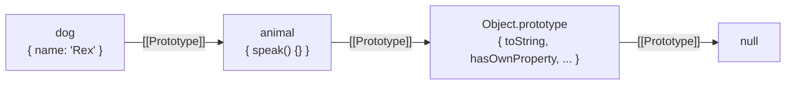
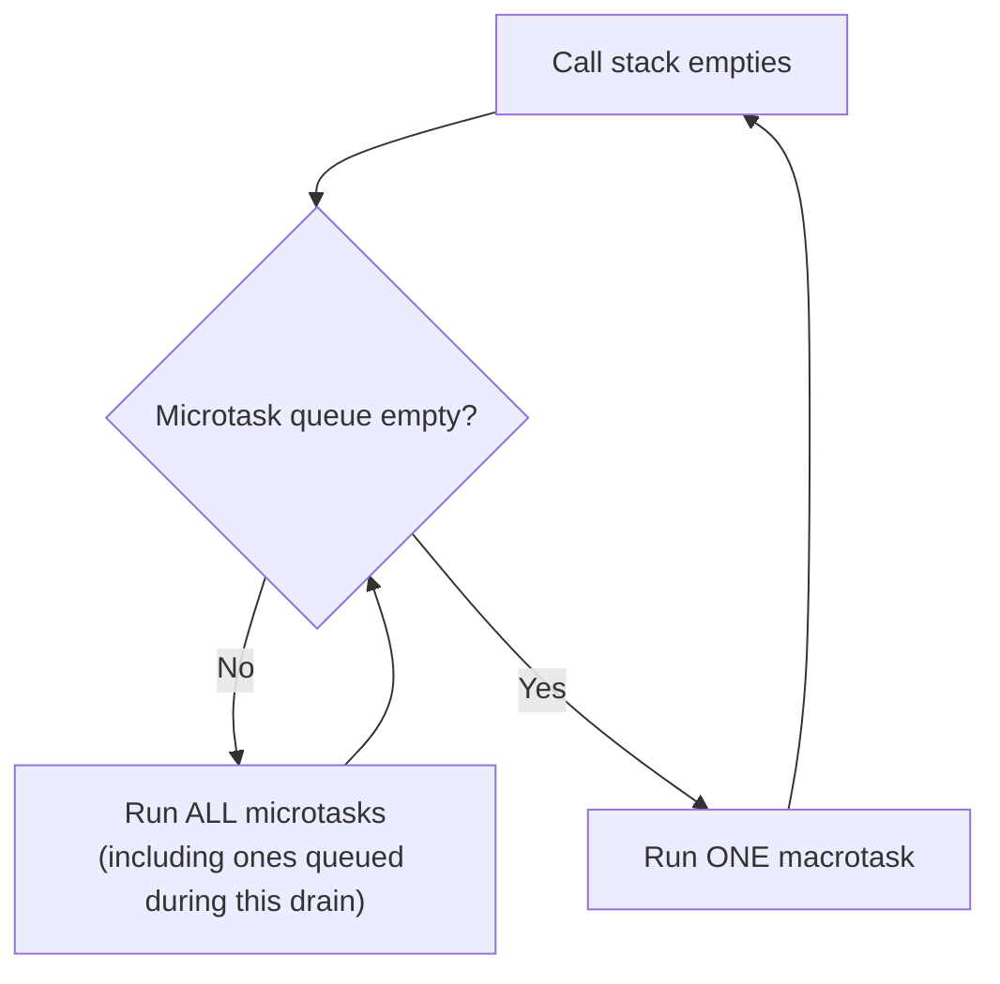

# JavaScript Interview Guide (Senior / Lead Level)

> Personal notes (`javascript_interview_questions_answers.md`) se consolidate kiya gaya hai + senior full-stack / frontend interviews (2026) ke liye gaps fill kiye gaye hain.
> **[new content]** se marked sections aur headings consolidation ke dauran add kiye gaye hain, taaki un topics ko cover kiya ja sake jo source notes mein missing the ya senior-level bar ke liye bohot halke tarike se treat kiye gaye the. **[gaps]** se marked sections ek formal gap-analysis pass mein add hui hain. Baaki sab kuch original notes se reorganize/expand kiya gaya hai — koi bhi original technically-correct content delete nahi kiya gaya hai.

## Table of Contents

1. [Core Concepts](#core-concepts)
   - [var, let, const](#var-let-const)
   - [Hoisting & the Temporal Dead Zone](#hoisting--the-temporal-dead-zone)
   - [== vs ===](#-vs-)
   - [null vs undefined](#null-vs-undefined)
   - [Primitives vs Reference Types](#primitives-vs-reference-types-new-content)
   - [Type Coercion Rules](#type-coercion-rules-new-content)
2. [Functions & Scope](#functions--scope)
   - [Function Declaration vs Expression vs Arrow Function](#function-declaration-vs-expression-vs-arrow-function)
   - [Callback & Higher-Order Functions](#callback--higher-order-functions)
   - [IIFE](#iife)
   - [Scope & Closures](#scope--closures)
   - [`this` and the Four Binding Rules](#this-and-the-four-binding-rules-new-content)
   - [call(), apply(), bind()](#call-apply-bind)
3. [Objects & Prototypes](#objects--prototypes)
   - [The Prototype Chain](#the-prototype-chain-new-content)
   - [`__proto__` vs `.prototype` vs `Object.getPrototypeOf`](#__proto__-vs-prototype-vs-objectgetprototypeof-new-content)
   - [Object.create() & Object.freeze()](#objectcreate--objectfreeze)
   - [[gaps] Prototype Pollution](#gaps-prototype-pollution)
4. [Arrays, Destructuring & Copying](#arrays-destructuring--copying)
   - [map / filter / reduce / find / some / every](#map--filter--reduce--find--some--every)
   - [slice() vs splice()](#slice-vs-splice)
   - [Spread & Rest](#spread--rest)
   - [Destructuring](#destructuring)
   - [Shallow Copy vs Deep Copy](#shallow-copy-vs-deep-copy-new-content)
5. [Asynchronous JavaScript](#asynchronous-javascript)
   - [Callbacks → Promises → async/await](#callbacks--promises--asyncawait)
   - [The Event Loop, Microtasks & Macrotasks](#the-event-loop-microtasks--macrotasks-new-content)
   - [Promise.all / allSettled / race / any](#promiseall--allsettled--race--any)
   - [Debounce vs Throttle](#debounce-vs-throttle)
6. [Advanced Concepts](#advanced-concepts)
   - [Modules: ESM vs CommonJS](#modules-esm-vs-commonjs-new-content)
   - [[gaps] Generators & Iterators](#gaps-generators--iterators)
   - [[gaps] Symbols & Well-Known Symbols](#gaps-symbols--well-known-symbols)
   - [WeakMap & WeakSet](#weakmap--weakset-new-content)
   - [Currying, Memoization, Immutability](#currying-memoization-immutability)
7. [Object-Oriented JavaScript](#object-oriented-javascript)
   - [Classes, Inheritance, super](#classes-inheritance-super)
   - [Private Fields (`#field`)](#private-fields-field)
   - [Getters/Setters & Mixins](#gettersetters--mixins)
8. [Error Handling](#error-handling)
   - [try/catch/finally & Custom Errors](#trycatchfinally--custom-errors)
   - [Errors Inside Promises & async/await](#errors-inside-promises--asyncawait-new-content)
9. [Performance](#performance)
   - [[new content] Memory Leaks & Garbage Collection](#new-content-memory-leaks--garbage-collection)
   - [[new content] Reflow, Repaint & Rendering Cost](#new-content-reflow-repaint--rendering-cost)
10. [Coding Questions](#coding-questions)
11. [Output-Based Questions](#output-based-questions)
12. [Best Practices](#best-practices)
13. [Common Pitfalls](#common-pitfalls)
14. [Quick Interview Cheat Sheet](#quick-interview-cheat-sheet)
15. [Sample Interview Q&A](#sample-interview-qa)
16. [Summary of Additions](#summary-of-additions)

---

## Core Concepts

### var, let, const

| Feature | `var` | `let` | `const` |
|---|---|---|---|
| Scope | Function | Block | Block |
| Redeclaration | Allowed | Not allowed | Not allowed |
| Reassignment | Allowed | Allowed | Binding reassign nahi ho sakti (value mutable ho sakti hai) |
| Hoisting | Yes, `undefined` se initialized | Yes, but TDZ | Yes, but TDZ |

```javascript
var a = 10;
let b = 20;
const c = 30;
```

**Interview point:** `const` default karo, jab reassignment genuinely required ho tab `let` use karo, aur modern JavaScript mein `var` generally avoid karo.

### Hoisting & the Temporal Dead Zone

JavaScript execution se pehle current scope ke declarations ko process kar leta hai.

```javascript
console.log(a); // undefined
var a = 10;
```

`let` aur `const` bhi hoist hote hain, lekin initialization se pehle access karne par **`ReferenceError`** aata hai kyunki woh **Temporal Dead Zone (TDZ)** mein hote hain — scope ke start se declaration line tak ka woh region jahaan binding exist karti hai lekin access nahi ki ja sakti.

```javascript
console.log(a); // ReferenceError
let a = 10;
```

Function declarations poori tarah hoist hoti hain (naam + body dono), isliye unhe declaration se pehle call kiya ja sakta hai:

```javascript
sayHello();

function sayHello() {
    console.log("Hello");
}
```

### == vs ===

- `==` type coercion karta hai comparison se pehle.
- `===` value aur type dono check karta hai, koi coercion nahi.

```javascript
5 == "5";   // true
5 === "5";  // false
null == undefined;  // true  — special-cased
null === undefined; // false — different types
```

**Best practice:** `===` prefer karo jab tak coercion ka koi specific, deliberate reason na ho (jaise `x == null` jo ek hi baar mein `null` aur `undefined` dono ko catch karta hai).

### null vs undefined

**`undefined`** — variable declare hui hai lekin koi value assign nahi hui, ya ek property/index exist hi nahi karta.

```javascript
let x;
console.log(x); // undefined
```

**`null`** — ek explicitly assigned "empty" value; developer ne jaan-boojh kar "yahaan koi value nahi hai" signal kiya hai.

```javascript
let user = null;
```

`typeof null` historically `"object"` return karta hai — yeh ek 1995-era bug hai jo language mein permanently frozen ho gaya kyunki fix karne se web breaking changes aate.

### Primitives vs Reference Types [new content]

Original notes `null`/`undefined` ko cover karte the lekin primitive-vs-reference distinction ko explicitly kabhi discuss nahi kiya — yeh senior JS interviews mein har jagah aata hai (function param passing, equality checks, mutation bugs).

- **Primitives** (`string`, `number`, `boolean`, `null`, `undefined`, `bigint`, `symbol`) — **immutable** hote hain aur **by value** copy/pass hote hain.
- **Reference types** (`object`, `array`, `function`) — heap par store hote hain; variables unka ek **reference (pointer)** hold karte hain, aur woh reference **by value** copy hota hai — matlab do variables same underlying object ko point kar sakte hain.

```javascript
let a = 10;
let b = a;
b = 20;
console.log(a); // 10 — primitive copy, independent

const obj1 = { count: 1 };
const obj2 = obj1;
obj2.count = 2;
console.log(obj1.count); // 2 — same object, reference shared
```

Gotcha jo interviewers pasand karte hain: `const obj2 = obj1;` ke baad `obj2 = {};` ek error deta hai (binding reassign nahi ho sakti), lekin `obj2.count = 2;` bilkul fine hai — `const` sirf **binding** ko lock karta hai, referenced object ki mutability ko nahi.

### Type Coercion Rules [new content]

Source notes ne `==` mein coercion mention kiya tha bina uske actual algorithm ke — senior interviewers specific coercion outputs ("`[] + []` kya deta hai?") poochte hain.

```javascript
console.log(1 + "1");     // "11"   — number + string → string concatenation
console.log("5" - 1);     // 4      — string - number → both numeric
console.log([] + []);     // ""     — arrays → strings, "" + "" 
console.log([] + {});     // "[object Object]"
console.log(1 + true);    // 2      — boolean → number (true → 1)
console.log("5" * "2");   // 10     — arithmetic operators (except +) coerce to number
```

Rule of thumb: `+` operator agar **kisi bhi side par string** hai, toh string concatenation karta hai (dusre operand ko `toString()`/`toPrimitive` ke through string mein convert karke); baaki sab arithmetic operators (`-`, `*`, `/`) hamesha dono operands ko number mein coerce karte hain. Isi wajah se `===` strongly prefer kiya jaata hai — coercion rules memorize karne ke bajaye avoid karna better hai.

---

## Functions & Scope

### Function Declaration vs Expression vs Arrow Function

```javascript
// Declaration — hoisted with body, callable before its line
function add(a, b) {
    return a + b;
}

// Expression — binding hoisted (if let/const, TDZ applies), NOT safely callable before its line
const subtract = function (a, b) {
    return a - b;
};

// Arrow function — always an expression, lexical `this`
const multiply = (a, b) => a * b;
```

### Callback & Higher-Order Functions

Ek callback ek function hai jo doosre function ko pass kiya jaata hai:

```javascript
function processUser(name, callback) {
    callback(name);
}

processUser("John", function (name) {
    console.log(name);
});
```

Ek function **higher-order** hai agar woh:

1. koi function argument ke tor par accept karta hai, ya
2. koi function return karta hai.

```javascript
function multiplyBy(x) {
    return function (y) {
        return x * y;
    };
}

const double = multiplyBy(2);
console.log(double(5)); // 10
```

### IIFE

```javascript
(function () {
    console.log("Executed immediately");
})();
```

Ek Immediately Invoked Function Expression create hote hi run ho jaati hai — pre-ES6 mein module-scoping/private-state simulate karne ka standard tareeka tha.

### Scope & Closures

JavaScript mein relevant scopes: global, function, block, module.

```javascript
{
    let x = 10;
}
// console.log(x); // ReferenceError
```

**Closure:** jab ek function apni lexical scope ke variables ko yaad rakhta hai, outer function ke execution finish ho jaane ke baad bhi.

```javascript
function counter() {
    let count = 0;
    return function () {
        count++;
        return count;
    };
}

const increment = counter();
console.log(increment()); // 1
console.log(increment()); // 2
```

Common interview use cases: data privacy, counters, function factories, memoization, event handlers/callbacks.

Senior-level nuance: closures **variables ko capture karte hain, values ko nahi** — yahi loop-over-`var` bug (neeche [Output-Based Questions](#output-based-questions) mein) ki root cause hai, aur closures ka overuse (jaise ek loop ke andar ek naya closure create karna jo ek large object ko capture kare) ek common memory-retention pitfall hai (dekhein [Memory Leaks](#new-content-memory-leaks--garbage-collection)).

### `this` and the Four Binding Rules [new content]

Original notes `this` ko sirf method-call context mein introduce karte the. Yeh ek common senior gap hai — interviewers expect karte hain ki candidate saari **four binding rules** ko priority order mein explain kare.

`this` generally us object ko refer karta hai jo current function invocation se associated hai — value **kaise function call hua** us par depend karti hai, declaration par nahi (arrow functions ke alawa).

| Rule | Trigger | `this` value | Priority |
|---|---|---|---|
| Default binding | Plain function call: `fn()` | `undefined` (strict mode) / global object (sloppy mode) | Lowest |
| Implicit binding | Method call: `obj.fn()` | `obj` | |
| Explicit binding | `fn.call(obj)`, `.apply(obj)`, `.bind(obj)` | `obj` | |
| `new` binding | `new Fn()` | Newly created object | Highest |
| Lexical `this` (arrow fn) | Arrow function definition | Enclosing lexical scope ka `this` — koi bhi call-site rule override nahi kar sakti | N/A — orthogonal to the above |

```javascript
const user = {
    name: "John",
    greet() {
        console.log(this.name);
    },
};
user.greet(); // "John" — implicit binding

const detached = user.greet;
detached(); // TypeError-prone / undefined — default binding, `this` lost
```

Arrow functions apna **koi `this`, `arguments`, `super`, ya `new.target` nahi** rakhte — yeh sab enclosing lexical scope se capture hote hain, isi wajah se woh call-site binding rules se immune hote hain.

### call(), apply(), bind()

```javascript
function greet(city) {
    console.log(this.name, city);
}
const user = { name: "John" };

greet.call(user, "Delhi");     // invokes immediately, args individually
greet.apply(user, ["Delhi"]);  // invokes immediately, args as array-like
const boundGreet = greet.bind(user); // returns a NEW function, this permanently bound
boundGreet("Delhi");
```

```text
call   -> invokes immediately, arguments separately
apply  -> invokes immediately, arguments as array-like
bind   -> returns a new function, doesn't invoke
```

---

## Objects & Prototypes

### The Prototype Chain [new content]

Source notes prototype ko sirf cheat-sheet mein ek line ("Object inheritance mechanism") mein mention karte the — senior interviews mein yeh apna poora section deserve karta hai kyunki `class` syntax ke peeche yahi mechanism hai.

Har JS object ka ek internal link (`[[Prototype]]`) hota hai kisi doosre object ki taraf. Jab aap `obj.property` access karte ho aur `property` `obj` par directly exist nahi karti, engine **prototype chain** ko upar traverse karta hai jab tak property mil na jaaye ya chain `null` par khatam ho jaaye.

```javascript
const animal = {
    speak() {
        console.log(`${this.name} makes a sound.`);
    },
};

const dog = Object.create(animal);
dog.name = "Rex";
dog.speak(); // "Rex makes a sound." — speak found up the chain, not on dog itself
```



`class`/`extends` syntax isi mechanism ke upar syntactic sugar hai — `class Dog extends Animal` under the hood `Dog.prototype.__proto__ = Animal.prototype` set karta hai.

### `__proto__` vs `.prototype` vs `Object.getPrototypeOf` [new content]

Yeh teeno naam similar dikhte hain aur candidates ko frequently confuse karte hain:

- **`.prototype`** — sirf **functions/classes** par exist karta hai; yeh woh object hai jo us function ko `new` ke saath call karne par create hui **instances ko diya jaayega** as their `[[Prototype]]`.
- **`__proto__`** — ek legacy, non-standard-but-widely-supported **accessor property** har object par jo uske actual internal `[[Prototype]]` ko expose/set karta hai.
- **`Object.getPrototypeOf(obj)` / `Object.setPrototypeOf(obj, proto)`** — standard, recommended tareeka `[[Prototype]]` read/write karne ka; `__proto__` ke bajaye yeh use karo.

```javascript
function Dog(name) { this.name = name; }
const rex = new Dog("Rex");

Object.getPrototypeOf(rex) === Dog.prototype; // true
rex.__proto__ === Dog.prototype;               // true, but non-standard usage
```

### Object.create() & Object.freeze()

```javascript
const proto = { greet() { console.log("hi"); } };
const obj = Object.create(proto); // new object with `proto` as its [[Prototype]]

const frozen = Object.freeze({ a: 1 });
frozen.a = 2; // silently fails (throws in strict mode)
console.log(frozen.a); // 1
```

`Object.freeze()` **shallow** hai — nested objects still mutable rehte hain, exactly TS ke `readonly` ki tarah shallow.

### [gaps] Prototype Pollution

Original notes prototype ko cover karte the lekin uske sabse well-known real-world security implication ko kabhi mention nahi karte — senior/lead interviews mein (especially Node.js backend context mein) yeh ek genuinely-asked security question hai.

**Problem:** agar attacker-controlled data (jaise ek deep-merge/JSON-parsed request body) ek key jaise `"__proto__"` ya `"constructor.prototype"` contain karta hai aur code use naively kisi object mein merge kar deta hai, toh woh `Object.prototype` ko globally pollute kar sakta hai — har object jo us prototype se inherit karta hai (matlab, practically **har plain object app mein**) affected ho jaata hai.

```javascript
function unsafeMerge(target, source) {
    for (const key in source) {
        if (typeof source[key] === "object") {
            target[key] = target[key] || {};
            unsafeMerge(target[key], source[key]);
        } else {
            target[key] = source[key];
        }
    }
    return target;
}

const payload = JSON.parse('{"__proto__": {"isAdmin": true}}');
unsafeMerge({}, payload);

console.log({}.isAdmin); // true !! every plain object now "has" isAdmin
```

**Mitigations jo senior interviewers expect karte hain:**
- Merge se pehle keys ko explicitly `"__proto__"`, `"constructor"`, `"prototype"` ke against block/skip karo.
- `Object.create(null)` use karo un objects ke liye jo untrusted keys store karenge (koi prototype hi nahi hai jise pollute kiya ja sake).
- Vetted, patched libraries prefer karo (`lodash.merge` ke recent versions is issue ko already patch kar chuke hain) instead of hand-rolled recursive merges.
- `Object.freeze(Object.prototype)` production mein ek defense-in-depth layer ke tor par (yeh sab legitimate reassignments ko bhi break kar sakta hai, isliye caution ke saath).

---

## Arrays, Destructuring & Copying

### map / filter / reduce / find / some / every

```javascript
const nums = [1, 2, 3, 4];

nums.map(x => x * 2);              // [2, 4, 6, 8] — new array, transform every element
nums.filter(x => x % 2 === 0);     // [2, 4]       — new array, matching elements
nums.reduce((sum, x) => sum + x, 0); // 10          — reduce to one value
nums.find(x => x > 2);             // 3            — first match, or undefined
nums.some(x => x > 3);             // true         — at least one matches
nums.every(x => x > 0);            // true         — all match
```

None of these mutate the original array (unlike `sort()`, `reverse()`, `splice()`, `push()`, `pop()`).

### slice() vs splice()

```javascript
const arr = [1, 2, 3, 4, 5];

arr.slice(1, 3);   // [2, 3] — non-mutating, returns a shallow copy of the range
arr.splice(1, 2);  // [2, 3] — MUTATES arr in place, arr is now [1, 4, 5]
```

### Spread & Rest

```javascript
// Spread — expand values
const arr1 = [1, 2];
const arr2 = [...arr1, 3, 4]; // [1, 2, 3, 4]

// Rest — collect values
function sum(...nums) {
    return nums.reduce((a, b) => a + b, 0);
}
sum(1, 2, 3); // 6
```

### Destructuring

```javascript
const { name, age = 18 } = { name: "John" };
// name = "John", age = 18 (default applied)

const [first, , third] = [1, 2, 3];
// first = 1, third = 3

function greet({ name, city = "Delhi" }) {
    console.log(`${name} from ${city}`);
}
```

### Shallow Copy vs Deep Copy [new content]

Source notes ne isko cheat-sheet ke ek entry mein reduce kar diya tha — yeh ek core senior-level pitfall hai (state management, Redux/NgRx-style immutable updates) jo apna proper treatment deserve karta hai.

**Shallow copy** — top-level properties copy hoti hain, lekin nested objects/arrays **reference** hi copy hote hain, value nahi.

```javascript
const original = { name: "John", address: { city: "Delhi" } };
const shallow = { ...original };

shallow.name = "Jane";
console.log(original.name); // "John" — top-level unaffected

shallow.address.city = "Mumbai";
console.log(original.address.city); // "Mumbai" — nested object was SHARED, both mutated!
```

**Deep copy** — nested structures bhi recursively copy hoti hain, complete independence.

```javascript
const deep = structuredClone(original); // modern, built-in, handles most cases well
deep.address.city = "Pune";
console.log(original.address.city); // "Mumbai" (unaffected by deep's change)

// Older/legacy alternative — has real limitations
const legacyDeep = JSON.parse(JSON.stringify(original));
// Limitations: drops functions, undefined, Symbol keys; converts Date to string;
// throws on circular references; loses Map/Set/RegExp/BigInt.
```

`structuredClone()` (native since 2022) ab `JSON.parse(JSON.stringify(...))` hack ka correct replacement hai for most cases — yeh `Date`, `Map`, `Set`, `RegExp`, circular references sab handle karta hai (lekin functions aur DOM nodes ko clone nahi kar sakta).

---

## Asynchronous JavaScript

### Callbacks → Promises → async/await

```javascript
// Callback style — prone to "callback hell" with nested async steps
getUser(id, (user) => {
    getOrders(user.id, (orders) => {
        console.log(orders);
    });
});

// Promise style
getUser(id)
    .then(user => getOrders(user.id))
    .then(orders => console.log(orders))
    .catch(err => console.error(err));

// async/await — same underlying Promise mechanics, synchronous-looking syntax
async function loadOrders(id) {
    try {
        const user = await getUser(id);
        const orders = await getOrders(user.id);
        console.log(orders);
    } catch (err) {
        console.error(err);
    }
}
```

Senior nuance: `async function` **hamesha ek Promise return karti hai**, chahe body mein explicit `return` ho ya na ho — jo value return hoti hai woh automatically resolve ho jaati hai, aur koi thrown error automatically reject ho jaata hai.

### The Event Loop, Microtasks & Macrotasks [new content]

Source notes ne sirf ek isolated output-based example diya tha bina underlying mechanism explain kiye — yeh single sabse-poocha-jaane-wala JS runtime question hai aur ek proper model deserve karta hai.

JavaScript ek single call stack ke saath run hota hai, lekin runtime (browser/Node) additional queues provide karta hai jo call stack empty hone ke baad drain hoti hain:

- **Call stack** — currently-executing synchronous code.
- **Microtask queue** — Promise callbacks (`.then`/`.catch`/`.finally`), `queueMicrotask`, `async/await` continuations.
- **Macrotask (Task) queue** — `setTimeout`, `setInterval`, I/O, UI events.



Key rule: **har macrotask ke baad, event loop agla macrotask uthaane se pehle poori microtask queue ko completely drain karta hai** — even agar microtasks execution ke dauraan naye microtasks queue karte hain.

```javascript
console.log(1);
setTimeout(() => console.log(2), 0);
Promise.resolve().then(() => console.log(3));
console.log(4);

// Output: 1, 4, 3, 2
// Sync code first → then ALL microtasks → then the next macrotask (timer)
```

### Promise.all / allSettled / race / any

| Method | Behavior |
|---|---|
| `Promise.all()` | Fail-fast — koi bhi ek reject hote hi turant reject; sab resolve ho toh results ka array |
| `Promise.allSettled()` | Har promise ke settle hone tak wait karta hai; `{status, value/reason}` ka array return karta hai — kabhi reject nahi hota |
| `Promise.race()` | Jo bhi pehle **settle** (resolve ya reject) ho jaaye |
| `Promise.any()` | Jo bhi pehle **fulfill** ho jaaye; sirf tab reject hota hai jab **sab** reject ho jaayein (`AggregateError`) |

```javascript
await Promise.all([p1, p2, p3]);        // one failure = whole thing rejects
await Promise.allSettled([p1, p2, p3]); // always resolves, per-promise outcomes
```

### Debounce vs Throttle

```javascript
function debounce(fn, delay) {
    let timer;
    return (...args) => {
        clearTimeout(timer);
        timer = setTimeout(() => fn(...args), delay);
    };
}

function throttle(fn, limit) {
    let inThrottle = false;
    return (...args) => {
        if (!inThrottle) {
            fn(...args);
            inThrottle = true;
            setTimeout(() => (inThrottle = false), limit);
        }
    };
}
```

**Debounce** — activity ruk jaane tak execute karna delay karta hai (search-as-you-type). **Throttle** — execution rate ko fixed interval tak limit karta hai (scroll/resize handlers).

---

## Advanced Concepts

### Modules: ESM vs CommonJS [new content]

Source notes modules ko bilkul cover nahi karte the — build-tooling/bundler interview questions (Node.js "require is not defined" errors, tree-shaking) ke liye yeh essential hai.

| | CommonJS (`require`/`module.exports`) | ESM (`import`/`export`) |
|---|---|---|
| Loading | Synchronous, runtime | Static, analyzable at build time (unless dynamic `import()`) |
| `this` at module top-level | `module.exports` | `undefined` |
| Tree-shaking | Not naturally supported | Supported — bundlers ko pata hota hai kaunse exports unused hain |
| Default environment | Node.js (historically) | Browsers, modern Node (`"type": "module"`), bundlers |
| Circular imports | Partially resolved objects, silently returned | Live bindings — later assignments visible |

```javascript
// CommonJS
const fs = require("fs");
module.exports = { readConfig };

// ESM
import fs from "fs";
export function readConfig() { /* ... */ }
```

Senior gotcha: ESM imports **live bindings** hote hain, values ki copies nahi — agar ek exporting module baad mein apni exported variable ko reassign karta hai, importing module updated value dekhta hai (CommonJS mein `require()` ek snapshot copy return karta hai).

### [gaps] Generators & Iterators

Original notes iteration protocols ko kabhi cover nahi karte the, phir bhi `for...of` istemal karte hain jo inhi par depend karta hai — senior interviewers custom-iterable questions poochte hain.

Koi bhi object **iterable** hai agar uske paas `Symbol.iterator` method ho jo ek **iterator** (`{ next(): {value, done} }`) return kare. **Generator functions** (`function*`) iterators aasaani se likhne ka syntax hai.

```javascript
function* range(start, end) {
    for (let i = start; i <= end; i++) {
        yield i;
    }
}

for (const n of range(1, 3)) {
    console.log(n); // 1, 2, 3
}

const iterator = range(1, 3);
iterator.next(); // { value: 1, done: false }
```

`yield` execution ko **pause** karta hai aur ek value externally return karta hai; agli `.next()` call wahi se resume karti hai. Yeh lazy sequences (infinite ranges), custom iteration logic, aur (historically, async generators se pehle) coroutine-style async flow control enable karta hai.

### [gaps] Symbols & Well-Known Symbols

Source notes `Symbol` ko primitive types ki list mein mention karte the bina kabhi explain kiye ki yeh actually kis liye hote hain — practical senior use case entirely missing tha.

`Symbol()` ek unique, immutable primitive value create karta hai — do symbols kabhi equal nahi hote, chahe same description ho.

```javascript
const id1 = Symbol("id");
const id2 = Symbol("id");
id1 === id2; // false
```

Do main practical uses:
1. **Collision-free object keys** — third-party object mein ek property add karna bina kisi existing/future string key ke overwrite hone ke risk ke.
2. **Well-known symbols** — `Symbol.iterator` (custom iteration protocol define karta hai, `for...of` yahi use karta hai) aur `Symbol.asyncIterator` (async generators/`for await...of` ke liye) jaise built-in hooks.

```javascript
const collection = {
    items: [1, 2, 3],
    [Symbol.iterator]() {
        let i = 0;
        return { next: () => ({ value: this.items[i], done: i++ >= this.items.length }) };
    },
};
[...collection]; // [1, 2, 3] — works because Symbol.iterator was implemented
```

### WeakMap & WeakSet [new content]

Source notes `Map`/`Set` ko cheat-sheet mein cover karte the lekin `WeakMap`/`WeakSet` ka bilkul mention nahi tha — memory-leak-conscious senior candidates se yeh expect kiya jaata hai.

`WeakMap`/`WeakSet` apne keys/values ko **weakly** hold karte hain — agar key object kahin aur se referenced nahi hai, garbage collector use collect kar sakta hai, chahe woh `WeakMap` mein ho. Regular `Map`/`Set` apni keys ko **strongly** hold karte hain, jo unintentional memory retention ka ek common source hai.

```javascript
let el = document.getElementById("btn");
const metadata = new WeakMap();
metadata.set(el, { clicks: 0 });

el = null; // if no other reference exists, both `el`'s object AND its WeakMap entry
           // become eligible for garbage collection automatically
```

Trade-off: `WeakMap`/`WeakSet` **not iterable** hain aur koi `.size` nahi rakhte (GC-eligibility ki wajah se, jo non-deterministic hai) — inhe primarily private per-object metadata store karne ke liye use karo (jaise class private state, DOM node metadata), general-purpose collections ke liye nahi.

### Currying, Memoization, Immutability

```javascript
// Currying — multi-arg function ko ek-ek-arg function chain mein convert karna
function add(a) {
    return (b) => (c) => a + b + c;
}
add(1)(2)(3); // 6

// Memoization — expensive, deterministic calls ka result cache karna
function memoize(fn) {
    const cache = new Map();
    return (arg) => {
        if (cache.has(arg)) return cache.get(arg);
        const result = fn(arg);
        cache.set(arg, result);
        return result;
    };
}

// Immutability — existing data mutate karne ke bajaye naya value banao
const user = { name: "John", age: 30 };
const updatedUser = { ...user, age: 31 };
```

---

## Object-Oriented JavaScript

### Classes, Inheritance, super

```javascript
class Animal {
    constructor(name) {
        this.name = name;
    }
    speak() {
        console.log(`${this.name} makes a sound.`);
    }
}

class Dog extends Animal {
    speak() {
        super.speak();
        console.log(`${this.name} barks.`);
    }
}

new Dog("Rex").speak();
```

`class` syntax prototype-based inheritance ke upar syntactic sugar hai — `extends` prototype chain link karta hai (dekhein [The Prototype Chain](#the-prototype-chain-new-content)), aur `super()` parent constructor call karta hai (subclass constructor mein `this` use karne se pehle mandatory).

### Private Fields (`#field`)

```javascript
class Counter {
    #count = 0; // genuinely private — not accessible outside the class, not even via bracket notation

    increment() {
        this.#count++;
        return this.#count;
    }
}

const c = new Counter();
c.increment(); // 1
// c.#count;    // SyntaxError outside the class body
```

Native `#privateFields` (ES2022) `_underscorePrefix` convention se genuinely different hai — underscore-prefix sirf ek **naming convention** hai, engine level par koi enforcement nahi; `#field` engine-enforced true privacy hai.

### Getters/Setters & Mixins

```javascript
class Temperature {
    #celsius = 0;
    get fahrenheit() {
        return this.#celsius * 9 / 5 + 32;
    }
    set fahrenheit(value) {
        this.#celsius = (value - 32) * 5 / 9;
    }
}
```

Mixins — JS single-inheritance hai (`class` sirf ek `extends` allow karti hai), isliye multiple behaviors compose karne ke liye function-that-returns-a-class pattern use hota hai:

```javascript
const Serializable = (Base) => class extends Base {
    serialize() { return JSON.stringify(this); }
};

class User {}
class SerializableUser extends Serializable(User) {}
```

---

## Error Handling

### try/catch/finally & Custom Errors

```javascript
class ValidationError extends Error {
    constructor(message) {
        super(message);
        this.name = "ValidationError";
    }
}

try {
    throw new ValidationError("Invalid input");
} catch (err) {
    console.error(err.name, err.message);
} finally {
    console.log("Cleanup runs regardless of success/failure");
}
```

`finally` **hamesha** run hota hai — chahe `try` block mein koi error na aaye, chahe woh throw kare, ya chahe `try`/`catch` mein `return` ho (finally ka apna `return`/`throw` hone par woh outer return ko override kar deta hai — ek well-known gotcha).

### Errors Inside Promises & async/await [new content]

Source notes original try/catch example strictly synchronous tha — async error propagation apna alag treatment deserve karta hai kyunki iska failure mode different hai (silent unhandled rejections).

```javascript
// Unhandled rejection — silently fails, no crash, no visible error by default
fetch("/api/data").then(res => res.json());

// Correct handling
async function loadData() {
    try {
        const res = await fetch("/api/data");
        if (!res.ok) throw new Error(`HTTP ${res.status}`);
        return await res.json();
    } catch (err) {
        console.error("Failed to load:", err);
        throw err; // re-throw if caller needs to react too
    }
}
```

Senior-level gotcha: ek `.catch()` sirf usi promise chain ke rejections ko catch karta hai jispar woh attach hai — agar `await` ke ird-gird `try/catch` nahi hai, rejected promise ek **unhandled rejection** ban jaata hai, jo Node.js mein process ko crash bhi kar sakta hai (`unhandledRejection` event, config ke depend karte hue).

---

## Performance

### [new content] Memory Leaks & Garbage Collection

Source notes performance topics ko bilkul cover nahi karte the — senior/lead level par yeh consistently poocha jaata hai.

JS garbage collector un objects ko free karta hai jo ab **reachable** nahi hain (root se koi reference path nahi). Common leak patterns:

- **Forgotten timers/listeners** — `setInterval`/event listener jo kabhi clear/remove nahi hota, us closure ko jinda rakhta hai jise woh capture karta hai.
- **Detached DOM nodes** — DOM se remove kiya gaya node still JS variable/closure se referenced hai.
- **Growing caches** — bina eviction policy ke ek `Map`/object mein data accumulate karte jaana.
- **Closures over large objects** — ek chhoti si closure accidentally ek badi object ko reference kar leti hai sirf ek chhoti si property ke liye.

```javascript
function setup() {
    const largeData = new Array(1_000_000).fill("x");
    document.getElementById("btn").addEventListener("click", () => {
        console.log("clicked"); // largeData is captured even though unused — leak
    });
}
```

Fix: sirf woh variables capture karo jo genuinely chahiye; listeners ko explicitly `removeEventListener` karo jab component/element destroy ho; bounded caches (`WeakMap` jahaan applicable ho) use karo.

### [new content] Reflow, Repaint & Rendering Cost

- **Reflow (layout)** — browser element positions/dimensions recalculate karta hai (DOM structure change, size/position read-after-write, box-model properties change hone par).
- **Repaint** — pixels redraw hote hain bina layout change kiye (color, visibility change hone par) — reflow se cheaper.

```javascript
// Bad — forces a synchronous reflow on every iteration (layout thrashing)
for (const el of elements) {
    el.style.width = el.offsetWidth + 10 + "px"; // read then write, repeated
}

// Better — batch reads, then batch writes
const widths = elements.map(el => el.offsetWidth);
elements.forEach((el, i) => (el.style.width = widths[i] + 10 + "px"));
```

Properties jaise `transform` aur `opacity` sirf **compositing** trigger karte hain (na reflow, na repaint), isliye animations ke liye inhe `top`/`left`/`width` par prefer kiya jaata hai.

---

## Coding Questions

### Find the Missing Number

```javascript
function findMissing(arr, n) {
    const expected = (n * (n + 1)) / 2;
    const actual = arr.reduce((sum, x) => sum + x, 0);
    return expected - actual;
}

findMissing([1, 2, 4, 5], 5); // 3
```

Time: `O(n)` · Space: `O(1)` apart from the input.

### Two Sum

```javascript
function twoSum(nums, target) {
    const map = new Map();
    for (let i = 0; i < nums.length; i++) {
        const complement = target - nums[i];
        if (map.has(complement)) return [map.get(complement), i];
        map.set(nums[i], i);
    }
    return [];
}
```

Time: `O(n)` · Space: `O(n)`

### [gaps] Debounce From Scratch (Interview Whiteboard Version)

Source notes debounce ko sirf ek utility ke tor par present karte the; senior interviews mein yeh aksar "ise live likho" style question hota hai jahaan interviewer edge cases probe karta hai (leading vs trailing call, `this` binding).

```javascript
function debounce(fn, delay, immediate = false) {
    let timer = null;
    return function (...args) {
        const callNow = immediate && !timer;
        clearTimeout(timer);
        timer = setTimeout(() => {
            timer = null;
            if (!immediate) fn.apply(this, args);
        }, delay);
        if (callNow) fn.apply(this, args);
    };
}
```

Follow-up jo interviewers poochte hain: "`fn.apply(this, args)` mein arrow function kyun use nahi kiya?" — outer function ko regular function hona chahiye taaki `this` caller ke context se properly bind ho, phir explicit `.apply(this, ...)` ke through pass ho; agar outer khud arrow hota, `this` uske definition scope se lock ho jaata, jo caller ka intended `this` nahi hota.

---

## Output-Based Questions

### Closure Output Question

```javascript
for (var i = 0; i < 3; i++) {
    setTimeout(() => console.log(i), 0);
}
// Output: 3, 3, 3 — var is function-scoped, all callbacks share the same `i`

for (let i = 0; i < 3; i++) {
    setTimeout(() => console.log(i), 0);
}
// Output: 0, 1, 2 — each loop iteration gets its own block-scoped binding
```

### Promise vs Timer

```javascript
console.log(1);
setTimeout(() => console.log(2), 0);
Promise.resolve().then(() => console.log(3));
console.log(4);
// Output: 1, 4, 3, 2
```

Reason: synchronous code → all microtasks (Promises) → then tasks/timers (dekhein [Event Loop](#the-event-loop-microtasks--macrotasks-new-content)).

---

## Best Practices

- `const` default karo, `let` sirf reassignment ke liye, `var` avoid karo.
- `===` prefer karo `==` ke bajaye; jab intentionally chahiye tab hi coercion use karo.
- Nested callbacks ke bajaye `async/await` prefer karo readability ke liye.
- Har `await` ko `try/catch` mein wrap karo, ya rejection-handling caller par explicitly document karo.
- Timers/listeners/observers cleanup karo jab unki zaroorat khatam ho jaaye.
- Deep copy ke liye `structuredClone()` prefer karo, legacy `JSON.parse(JSON.stringify())` hack ke bajaye.
- Objects/arrays ko naye values create karke update karo (immutability), especially UI-state-driving data ke liye.
- Genuine encapsulation ke liye native `#privateFields` prefer karo, `_underscore` convention ke bajaye.

## Common Pitfalls

- `this` ko event handlers/callbacks mein "lose" kar dena (unbound `this`, arrow function na use karna jahaan chahiye tha).
- Loop ke andar `var` use karna jab per-iteration binding expected ho.
- `.then()` chain ke aakhir mein `.catch()` bhool jaana → silent unhandled rejections.
- Nested object ko `{...spread}` se "deep clone" samajh lena — ek shallow copy hai.
- `NaN === NaN` → `false`; equality ke liye `Number.isNaN()` use karo.
- Array holes ke saath `for...in` use karna, ya array ke saath `for...in` use karna generally (inherited enumerable properties bhi iterate ho sakti hain) — arrays ke liye `for...of` ya `.forEach()` use karo.

---

## Quick Interview Cheat Sheet

  Concept                  Key Point
  ------------------------ --------------------------------------------
  `let`                    Block scoped, reassignment allowed
  `const`                  Block scoped, binding cannot be reassigned
  `var`                    Function scoped
  `==`                     Type coercion
  `===`                    Strict equality
  Closure                  Function remembers lexical environment
  Arrow function           Lexical `this`
  Prototype chain          Property lookup fallback mechanism
  `map()`                  Transform every element
  `filter()`               Keep matching elements
  `reduce()`               Reduce to one result
  `slice()`                Non-mutating extraction
  `splice()`               Mutates array
  `call()`/`apply()`/`bind()` Explicit `this` control
  Spread / Rest            Expand values / Collect values
  Promise                  Represents future async result
  Microtask                Promise callbacks — drained before next macrotask
  Macrotask                `setTimeout`, I/O, UI events
  `Promise.all()`          Fail-fast aggregate
  `Promise.allSettled()`   Wait for all outcomes, never rejects
  Debounce                 Execute after activity stops
  Throttle                 Limit execution rate
  `Map`/`Set`              Strongly-held key-value / unique-value collection
  `WeakMap`/`WeakSet`      Weakly-held, GC-eligible, not iterable
  `#field`                 Native, engine-enforced class privacy
  `structuredClone()`      Deep clone of supported values

---

## Sample Interview Q&A

**Q: Ek function ko `readonly`-jaisi guarantee kaise doge ki woh apne array argument ko mutate na kare, jabki JavaScript mein TypeScript ke `readonly T[]` jaisa koi compile-time feature nahi hai?**
A: Runtime enforcement ke liye function ke andar sabse pehle `[...arr]` ke through ek defensive copy banao aur phir usi copy par mutate/sort karo, taaki caller ka original reference untouched rahe. Compile-time-level guarantee JavaScript mein nahi milti (yeh purely convention/discipline par depend karta hai), isliye teams often JSDoc + TypeScript checker (`// @ts-check`) use karti hain plain `.js` files mein bhi is class ke bugs ko catch karne ke liye, ya runtime mein `Object.freeze()` use karte hain jab mutation ko actively prevent karna ho (shallow enforcement ke saath).

**Q: Event loop explain karo aur bataao `setTimeout(fn, 0)` guarantee kyun nahi karta ki `fn` immediately run hoga.**
A: `setTimeout` apne callback ko macrotask queue mein daalta hai, delay khatam hone ke baad — `0` ka matlab hai "jitni jaldi ho sake schedule karo," turant execute karo nahi. Callback tab tak run nahi hota jab tak call stack completely empty na ho jaaye **aur** current microtask queue (sab pending Promise callbacks) fully drain na ho jaaye. Isliye ek synchronous loop ya kai chained Promises `setTimeout(fn, 0)` ko real-world mein kaafi der tak delay kar sakte hain, chahe declared delay `0` ho.

**Q: Prototype-based inheritance `class`-based inheritance se kaise differ karta hai under the hood?**
A: Yeh differ nahi karta — `class`/`extends` prototype chains ke upar hi syntactic sugar hai. `class Dog extends Animal` internally `Dog.prototype`'s `[[Prototype]]` ko `Animal.prototype` par set kar deta hai, exactly jaise `Object.setPrototypeOf(Dog.prototype, Animal.prototype)` manually karne se hota. Real differences purely ergonomic/safety hain: `class` bodies implicitly strict mode mein run hoti hain, class declarations (function declarations ke unlike) hoist nahi hoti (TDZ mein rehti hain), aur `class` constructor ko `new` ke bina call karna TypeError deta hai, jabki ek constructor-function ko `new` ke bina call karna silently `this` ko global/undefined bind kar deta — ek classic pre-ES6 bug source jise `class` syntax explicitly prevent karta hai.

**Q: `Promise.all()` aur `Promise.allSettled()` mein choose kaise karoge?**
A: `Promise.all()` tab use karo jab saari operations genuinely dependent ho — agar ek fail ho, poora result meaningless hai (jaise, kai required resources parallel fetch karna jinke bina page render hi nahi ho sakta), kyunki yeh fail-fast hai aur pehla rejection turant poore combinator ko reject kar deta hai, baaki promises ke settle hone ka wait kiye bina (woh promises background mein settle toh hoti hain, lekin unke results silently discard ho jaate hain). `Promise.allSettled()` tab use karo jab operations independent ho aur partial success acceptable/useful ho (jaise, kai independent analytics calls, jahaan ek fail hone se baaki ka result invalid nahi hota) — yeh guarantee deta hai ki har promise ke liye ek outcome milega, `{status: "fulfilled", value}` ya `{status: "rejected", reason}`, kabhi reject nahi hota khud.

**Q: `WeakMap` ek regular `Map` se better fit kab hoga, aur `WeakMap` iterable kyun nahi hai?**
A: `WeakMap` tab better fit hai jab aap keys ke tor par object references use kar rahe ho (jaise DOM nodes, class instances) aur nahi chahte ki map ki entry us object ko garbage-collected hone se roke agar app mein kahin aur uska koi aur reference na bacha ho — jaise, per-DOM-node metadata store karna jo automatically clean ho jaani chahiye jab node remove ho jaaye. `WeakMap` iterable isliye nahi hai kyunki garbage collection **non-deterministic** hai — agar aap `WeakMap` ke entries ko iterate/enumerate kar paate, toh result GC ke exact timing par depend karta (jo engine-specific aur unpredictable hai), isliye spec ne deliberately iteration, `.size`, aur `.keys()`/`.values()` ko omit kiya taaki implementation ek deterministic-looking API expose na kare jiska actual behavior non-deterministic ho.

**Q: Ek deep-merge utility likhte waqt prototype pollution ko kaise prevent karoge?**
A: Merge loop mein explicitly dangerous keys ko block karo — `"__proto__"`, `"constructor"`, aur `"prototype"` ko kisi bhi merge target par set karne se pehle reject/skip karo, kyunki yahi teen keys hain jinke through ek attacker `Object.prototype` tak reach kar sakta hai. Zyada robust approach yeh hai ki jab bhi untrusted external data (jaise JSON request body) ko ek object mein store karna ho jise baad mein arbitrary keys ke saath enumerate kiya jaayega, `Object.create(null)` se ek prototype-less object banao — kyunki us object ka `[[Prototype]]` hi `null` hai, `"__proto__"` jaisi koi key set karne se koi global prototype pollute nahi ho sakta. Production mein hand-rolled recursive merge likhne ke bajaye ek maintained, already-patched library (recent `lodash.merge`) use karna generally safer hai.

---

## Summary of Additions

Consolidation ke dauraan add ki gayi new sections/headings (document mein sab `[new content]` se prefixed hain), aur har ek senior/lead full-stack interview ke liye kyun matter karta hai:

1. **Primitives vs Reference Types** — source notes ne isko kabhi explicit nahi kiya, jabki yeh mutation bugs aur equality-check confusion ka root cause hai.
2. **Type Coercion Rules** — original notes sirf `==` mention karte the; senior interviewers specific coercion outputs poochte hain (`[] + {}`, `"5" - 1` etc.).
3. **`this` and the Four Binding Rules** — source ne sirf implicit-binding case cover kiya tha; full priority-ordered rule set (default/implicit/explicit/`new`, plus lexical arrow-function exception) add kiya gaya.
4. **The Prototype Chain** aur **`__proto__` vs `.prototype` vs `Object.getPrototypeOf`** — source mein prototype sirf ek cheat-sheet line tha; yeh `class`/`extends` ke actual underlying mechanism ko explain karta hai.
5. **Shallow Copy vs Deep Copy** — pehle ek cheat-sheet entry tha; ab ek concrete shared-reference bug + `structuredClone()` ke saath modern fix ke saath.
6. **The Event Loop, Microtasks & Macrotasks** — source ne sirf ek isolated output example diya tha bina mechanism explain kiye; ab ek diagram ke saath full model hai.
7. **Modules: ESM vs CommonJS** — source mein entirely absent tha; real build-tooling/Node interview territory.
8. **WeakMap & WeakSet** — `Map`/`Set` cover kiye gaye the, weak variants bilkul nahi; memory-leak-conscious senior interviews ke liye critical.
9. **Errors Inside Promises & async/await** — original try/catch example purely synchronous tha; async failure mode (unhandled rejections) alag hai aur explicitly cover kiya gaya.
10. **Memory Leaks & Garbage Collection** aur **Reflow, Repaint & Rendering Cost** — poora Performance section jiski source mein kami thi.
11. Chhote inline additions: `null == undefined` special case, `Object.freeze()` shallow nature, `#privateFields` vs `_underscore` convention, `finally` override gotcha.

## Summary of [gaps] Additions (This Pass)

Is pass ne ek formal gap-analysis review se identify hui teen sections add ki, jo earlier **[new content]** pass se distinguish karne ke liye **[gaps]** tag ki gayi hain:

1. **Prototype Pollution** (Object.create/freeze ke baad inserted) — source ne prototype chain cover ki thi bina uske sabse well-known real-world security implication ke. Yeh ek concrete attack example, root cause, aur chaar concrete mitigations add karta hai.
2. **Generators & Iterators** (Modules ke baad inserted) — notes `for...of` freely use karte the bina kabhi iteration protocol explain kiye ki yeh kaam kaise karta hai. Yeh `Symbol.iterator`, custom iterables, aur `function*`/`yield` ka worked example add karta hai.
3. **Symbols & Well-Known Symbols** (Generators ke baad inserted) — `Symbol` sirf ek primitive-type list entry tha; iska practical use (collision-free keys, `Symbol.iterator` ke through custom iteration) pehle kabhi explain nahi hua tha.

Chaaron self-contained, senior-level additions hain working code ke saath — sab core-language JavaScript mechanics hain jo version-sensitive nahi hain (`structuredClone`/`#privateFields`/`WeakMap` ke alawa, jo widely-supported modern-engine features hain aur explicitly aise flag kiye gaye hain).
