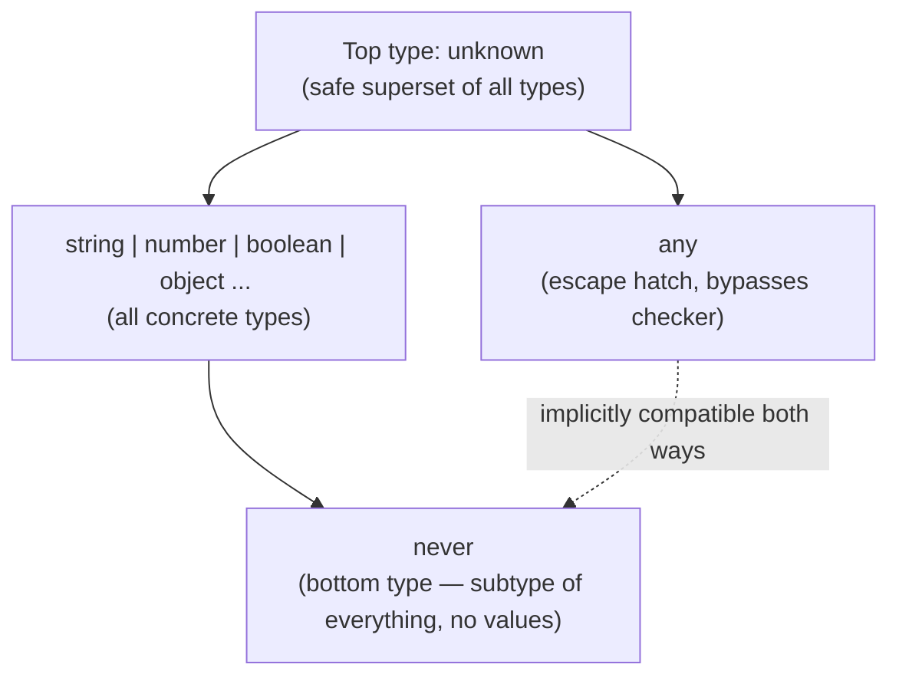
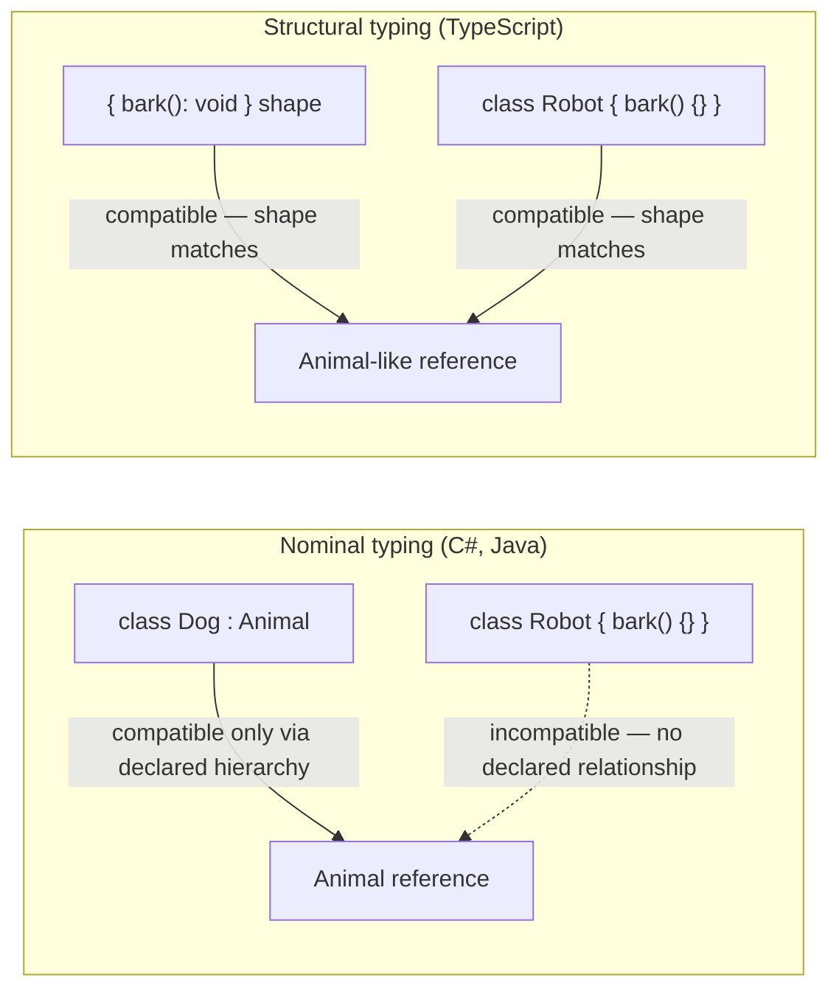
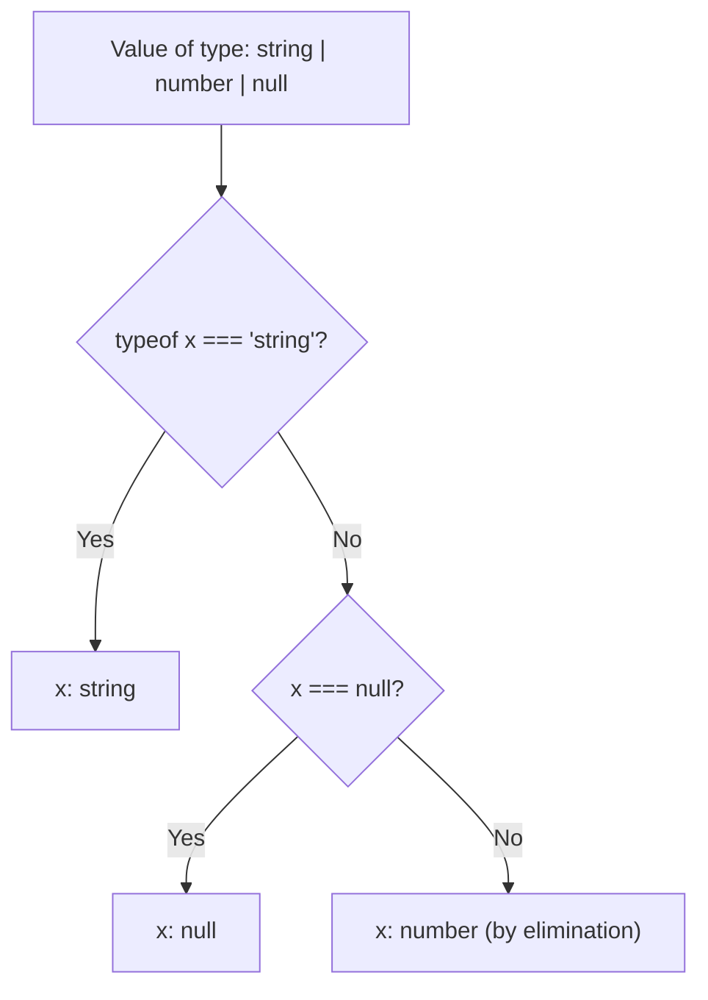

# TypeScript Interview Guide (Senior / Lead Level)

> Personal notes se consolidate kiya gaya hai + senior .NET full-stack / Angular interviews (2026) ke liye gaps fill kiye gaye hain.
> **[new content]** se marked sections aur headings consolidation ke dauran add kiye gaye the, taaki un topics ko cover kiya ja sake jo source notes mein missing the ya senior-level bar ke liye bohot halke tarike se treat kiye gaye the. Baaki sab kuch original notes se reorganize/expand kiya gaya hai — koi bhi original technically-correct content delete nahi kiya gaya hai.

## Table of Contents

1. [Core Concepts](#core-concepts)
   - [What is TypeScript and Why Use It](#what-is-typescript-and-why-use-it)
   - [Toolchain Basics](#toolchain-basics)
   - [Primitive & Special Types](#primitive--special-types)
   - [any vs unknown vs never vs void](#any-vs-unknown-vs-never-vs-void-new-content)
   - [Type Inference vs Type Annotation](#type-inference-vs-type-annotation)
   - [Type Assertions](#type-assertions)
   - [Type Aliases vs Interfaces](#type-aliases-vs-interfaces)
   - [Optional & Readonly Properties](#optional--readonly-properties)
   - [Function & Method Overloading](#function--method-overloading)
2. [Intermediate](#intermediate)
   - [Functions: Regular vs Arrow, Default & Rest Params](#functions-regular-vs-arrow-default--rest-params)
   - [Union, Intersection & Literal Types](#union-intersection--literal-types)
   - [Tuples](#tuples)
   - [[gaps] ReadonlyArray\<T\> / readonly T[] as Defensive API Design](#gaps-readonlyarrayt--readonly-t-as-defensive-api-design)
   - [Enums, and Why Senior Devs Avoid Them](#enums-and-why-senior-devs-avoid-them-new-content)
   - [Structural Typing vs Nominal Typing](#structural-typing-vs-nominal-typing-new-content)
   - [[gaps] Branded/Nominal Typing — Full Worked Example](#gaps-brandednominal-typing--full-worked-example)
   - [Type Narrowing & Type Guards](#type-narrowing--type-guards)
   - [Discriminated Unions & Exhaustiveness Checking](#discriminated-unions--exhaustiveness-checking)
   - [Optional Chaining & Nullish Coalescing](#optional-chaining--nullish-coalescing)
   - [strictNullChecks and the strict Family of Flags](#strictnullchecks-and-the-strict-family-of-flags-new-content)
3. [Advanced (Generics & the Type System)](#advanced-generics--the-type-system)
   - [Generics & Generic Constraints](#generics--generic-constraints)
   - [Generic Variance (Covariance/Contravariance)](#generic-variance-covariancecontravariance-new-content)
   - [keyof, typeof, and Indexed Access Types](#keyof-typeof-and-indexed-access-types)
   - [Mapped Types](#mapped-types)
   - [Conditional Types & infer](#conditional-types--infer)
   - [Template Literal Types](#template-literal-types)
   - [[gaps] Recursive Type Alias Depth Limits (TS2589)](#gaps-recursive-type-alias-depth-limits-ts2589)
   - [Utility Types Deep Dive](#utility-types-deep-dive)
   - [as const and satisfies](#as-const-and-satisfies)
   - [Ambient Declarations, Triple-Slash Directives, Module Augmentation & Declaration Merging](#ambient-declarations-triple-slash-directives-module-augmentation--declaration-merging)
   - [Decorators & Metadata (Angular Relevance)](#decorators--metadata-angular-relevance-new-content)
   - [Module Resolution: ESM vs CommonJS](#module-resolution-esm-vs-commonjs-new-content)
4. [Object-Oriented Programming in TypeScript](#object-oriented-programming-in-typescript)
   - [Access Modifiers](#access-modifiers)
   - [Inheritance, Overriding, super](#inheritance-overriding-super)
   - [Abstract Classes vs Interfaces](#abstract-classes-vs-interfaces)
   - [Multiple Interface Implementation & Interface Extension](#multiple-interface-implementation--interface-extension)
   - [Mixins](#mixins)
   - [Private Constructors & Singletons](#private-constructors--singletons)
   - [Index Signatures](#index-signatures)
   - [The this Type & Polymorphism](#the-this-type--polymorphism)
   - [Parameter Properties Shorthand](#parameter-properties-shorthand-new-content)
5. [Error Handling](#error-handling)
   - [try/catch/finally & Custom Errors](#trycatchfinally--custom-errors)
   - [Typed Catch Clauses (unknown in catch)](#typed-catch-clauses-unknown-in-catch-new-content)
6. [Performance](#performance)
   - [[new content] Compiler Performance & Type-Checking Cost](#new-content-compiler-performance--type-checking-cost)
   - [[new content] Runtime Performance: Erasure, Enums, and Bundle Size](#new-content-runtime-performance-erasure-enums-and-bundle-size)
7. [Best Practices](#best-practices)
8. [Common Pitfalls](#common-pitfalls)
9. [Sample Interview Q&A](#sample-interview-qa)
10. [Summary of Additions](#summary-of-additions)
11. [Summary of [gaps] Additions (This Pass)](#summary-of-gaps-additions-this-pass)

---

## Core Concepts

### TypeScript Kya Hai Aur Ise Kyun Use Karein

TypeScript basically JavaScript ka ek strongly, statically typed superset hai jo Microsoft ne develop kiya hai, aur yeh plain JavaScript mein compile ("transpile") ho jaata hai. Yeh JS semantics ke upar ek structural type system add karta hai, bina runtime behavior ko change kiye — types compile time par erase ho jaate hain.

Commonly cite kiye jaane wale advantages (aur senior level par jinko "why" ke saath defend karna zaroori hai):

- **Static typing** → bugs ki ek poori class (galat property names, galat argument shapes, null/undefined ka misuse) ko production ke bajaye compile time par hi catch kar leta hai.
- **OOP features** → classes, interfaces, generics, access modifiers — enterprise codebases ke liye useful hain, halaanki TS ka type system structural hai, classical OOP jaisa nominal typing nahi (neeche dekhein).
- **Scalability** → types ke bina 500-file wale Angular app ko refactor karna ek nightmare hai; TS rename/extract-method refactors ko mechanically safe bana deta hai (compiler har break ko flag karta hai).
- **DX** → IntelliSense, inline documentation, "go to definition," safe auto-refactors.
- **Self-documenting APIs** → function signatures implementation padhe bina hi contract communicate kar dete hain.

Senior-level nuance jo interviewers probe karte hain: TypeScript ka type system kaafi jagah **design se hi unsound** hai (jaise, `any`, type assertions, `noUncheckedIndexedAccess` ke bina array index access, bivariant method parameters) — yeh JS ke saath compatible rehne ke liye ek pragmatic trade-off hai. Yeh batane ke liye ready raho ki *kahan* yeh unsound hai aur ise kaise tighten karein.

### Toolchain Basics

- Install: `npm install -g typescript`
- Version check karo: `tsc -v`
- Ek file compile karo: `tsc filename.ts` → `filename.js` emit hoti hai
- `tsconfig.json` — central compiler configuration file hai. Example:

```json
{
  "compilerOptions": {
    "target": "ES6",
    "strict": true
  }
}
```

**[new content] Real projects mein `tsconfig.json`.** Production Angular/Node codebases mein aapko typically `target`/`strict` se kaafi zyada dekhne ko milta hai:

```json
{
  "compilerOptions": {
    "target": "ES2022",
    "module": "ESNext",
    "moduleResolution": "Bundler",
    "lib": ["ES2022", "DOM"],
    "strict": true,
    "noUncheckedIndexedAccess": true,
    "exactOptionalPropertyTypes": true,
    "esModuleInterop": true,
    "skipLibCheck": true,
    "isolatedModules": true,
    "forceConsistentCasingInFileNames": true,
    "declaration": true,
    "sourceMap": true
  }
}
```

Senior level ka interviewer expect karta hai ki aapko pata ho ki har strict flag *kyun* matter karta hai, sirf yeh nahi ki `strict: true` exist karta hai — neeche [strictNullChecks and the strict Family of Flags](#strictnullchecks-and-the-strict-family-of-flags-new-content) dekhein.

### Primitive & Special Types

Primitives: `string`, `number`, `boolean`, `null`, `undefined`, `bigint`, `symbol`.

Special types: `any` (type checking disable kar deta hai), `unknown` (`any` ka type-safe counterpart), `void` (function kuch return nahi karta), `never` (function kabhi return nahi karta / ek value jo exist hi nahi kar sakti).

### any vs unknown vs never vs void [new content]

Original notes ne sirf `any` vs `unknown` ko ek two-row table mein compare kiya tha. Yeh senior TS interview ka ek sabse common question hai aur iska full four-way comparison milna chahiye, kyunki candidates se aksar `void` aur `never` ko bhi same mental model mein place karne ko kaha jaata hai.

| Type | Meaning | Doosre types mein **assign** ho sakta hai? | Doosre types **se** assign ho sakta hai? | Typical use |
|---|---|---|---|---|
| `any` | "Type checker ko band kar do" | Haan, kisi bhi type mein | Haan, kisi bhi type se | Legacy JS interop, last resort |
| `unknown` | "Kuch bhi ho sakta hai, use karne se pehle prove karo" | Nahi (narrowing/assertion ke bina) | Haan, kisi bhi type se | External/untrusted input (API responses, `JSON.parse`, catch blocks) |
| `void` | "Koi meaningful return value nahi" | Sirf `void`/`any`/`undefined` mein (loosely) | N/A (return position) | Callback/function return type |
| `never` | "Yeh code path unreachable hai / koi bhi value yeh type satisfy nahi kar sakti" | Har jagah assignable hai (bottom type) | Iske andar kuch bhi assignable nahi hai except `never` khud | Exhaustiveness checks, aise functions jo hamesha throw karte hain / infinite loop karte hain |



Key gotcha: `any` ek saath top type aur bottom type dono hai (yeh jaan-boojh kar type theory ko todta hai) — isi wajah se yeh dangerous hai aur TS 3.0 mein `unknown` ko type-safe alternative ke tor par introduce kiya gaya tha. Follow-up expect karo: *"`unknown` kyun exist karta hai jab humare paas already `any` hai?"* — jawab: `unknown` kisi bhi operation se pehle narrowing force karta hai, jisse soundness maintain rehti hai aur phir bhi program ke boundary (I/O boundaries) par "mujhe abhi is type ka pata nahi" allow ho jaata hai.

### Type Inference vs Type Annotation

Inference: `let message = "Hello";` → TS `string` infer kar leta hai.
Annotation: `let age: number = 25;` → type explicitly likha gaya hai.

Senior nuance: local variables ke liye inference prefer karo (kam noise, same safety hoti hai) aur **module boundaries** par — function parameters, exported function return types, public class members — explicit annotations prefer karo, kyunki boundary par inference implementation change hone par silently type widen/narrow kar sakta hai, jisse consumers bina kisi visible signal ke break ho jaate hain.

### Type Assertions

```typescript
let someValue: any = "Hello";
let strLength: number = (someValue as string).length;
```

Assertions (`as`) compiler ko batate hain "trust me," aur zero runtime validation karte hain. `as unknown as T` ke through double assertion TS ke assertion-compatibility check ko bhi sidestep kar deta hai — ek common code-smell red flag jo interviewers sunte hi pakad lete hain. Jab bhi data ek runtime boundary cross kare (HTTP response, `localStorage`, third-party lib), assertions ke bajaye type guards ya validation libraries (`zod`, `io-ts`) prefer karo.

### Type Aliases vs Interfaces

| Feature | Interface | Type Alias |
|---|---|---|
| Extending | `extends` keyword, multiple inheritance support karta hai | Intersection (`&`) ke through hota hai, `extends` se nahi |
| Declaration merging | Haan — multiple `interface X {}` blocks merge ho jaate hain | Nahi |
| Object shapes | Haan | Haan |
| Unions/primitives/tuples | Nahi | Haan — `type T = string \| number` |
| Mapped/conditional types | Nahi | Haan |
| Performance (large unions) | Generally check karna faster hota hai (verify karo) | TS team guidance ke mutabik huge unions ke liye slower ho sakta hai (current version ke against verify karo) |

**Original notes ki ek imprecision correct kar rahe hain:** notes kehte hain ki type aliases "not extendable" hain — yeh *directionally* sahi hai (koi `extends` keyword nahi hai) lekin misleading hai, kyunki aap type aliases ko intersections (`type C = A & B`) ke through compose karke equivalent, kabhi-kabhi zyada flexible, composition bana sakte ho. Practical senior jawab: `interface` use karo un public object/class contracts ke liye jinke extend ya merge hone ki expectation ho (jaise, Angular component `@Input` bags, DTOs); `type` use karo unions, tuples, function signatures, aur mapped/conditional type utilities ke liye. Dono ek-doosre ke saath structurally compatible hain — ek `interface` `type` alias ko extend kar sakta hai aur vice versa (jaisa original Q76 — interface extending a class — aur Q69 mein dikhaya gaya hai).

### Optional & Readonly Properties

```typescript
interface Employee {
  name: string;
  age?: number;       // optional
}

interface Car {
  readonly model: string;   // cannot be reassigned after creation
}
```

Gotcha: `readonly` shallow hota hai — object property par `readonly` sirf property ko *rebind* hone se rokta hai, uske andar jo nested object/array point ho raha hai use mutate hone se nahi rokta. Agar deep immutability chahiye to `Readonly<T>` / `DeepReadonly` (custom recursive mapped type) use karo, ya scale par real immutable data structures ke liye Immutable.js / immer jaisi library use karo.

### Function & Method Overloading

```typescript
function add(a: number, b: number): number;
function add(a: string, b: string): string;
function add(a: any, b: any) {
  return a + b;
}
console.log(add(1, 2));               // 3
console.log(add("Hello, ", "World!")); // Hello, World!
```

TS overloads purely ek compile-time construct hain — neeche ek hi real JS function hota hai (yeh "implementation signature" hoti hai, jo callers ko visible bhi nahi hoti). Yeh C# se fundamentally different hai, jahan overloads genuinely distinct methods hote hain jo compile time par CLR/runtime binder dwara resolve hote hain — .NET background dekhte hue yeh mention karne ke liye ek good bridge point hai: TS mein aap ek single implementation ke liye *call-site shapes* describe kar rahe ho, multiple methods create nahi kar rahe.

---

## Intermediate

### Functions: Regular vs Arrow, Default & Rest Params

| Feature | Regular Function | Arrow Function |
|---|---|---|
| `this` binding | Dynamic (caller par depend karta hai) | Lexical (enclosing scope se inherit hota hai) |
| `arguments` object | Available hai | Available nahi hai |
| Use in classes | Un methods ke liye preferred jinhe aap override karna chahte ho | Callbacks ke liye achha hai jinhe captured `this` chahiye (jaise event handlers) |
| Hoisting | Function declarations hoist hoti hain | Arrow functions (`const` ke tor par) hoist nahi hoti |
| `new`-able | Haan | Nahi |

```typescript
function regular() { console.log(this); }
const arrow = () => console.log(this);
```

Default & rest parameters:

```typescript
function greet(name: string = "Guest") {
  console.log(`Hello, ${name}`);
}
greet(); // Hello, Guest

function sum(...numbers: number[]) {
  return numbers.reduce((acc, num) => acc + num, 0);
}
console.log(sum(1, 2, 3)); // 6
```

Angular-relevant gotcha: arrow-function class properties (`onClick = () => {...}`) template event bindings ke liye `this` ko correctly bind karte hain lekin **har instance ke liye ek naya function** create karte hain (scale par memory/perf cost, aur `@HostListener`/decorator-based method binding ko todta hai jisko ek real prototype method chahiye hoti hai).

### Union, Intersection & Literal Types

```typescript
let value: string | number;
value = "hello";
value = 42;

interface A { a: number; }
interface B { b: string; }
type C = A & B;
const obj: C = { a: 1, b: "text" };

type Direction = "North" | "South" | "East" | "West";
let move: Direction = "North";
```

Gotcha: same key ke liye conflicting property types wale do types ko intersect karna (jaise `{ a: string } & { a: number }`) us property ko `never` mein collapse kar deta hai, error nahi deta — ek classic "gotcha" question.

### Tuples

```typescript
let person: [string, number] = ["Alice", 25];

let numbers: readonly [number, number] = [10, 20];
// numbers[0] = 30; // Error
```

**[new content] Labeled tuples & variadic tuples.** Modern TS labeled tuple elements support karta hai (pure documentation, koi runtime effect nahi) aur generic function typing ke liye variadic tuples:

```typescript
type Point = [x: number, y: number];

// Variadic tuple — used heavily in typed `bind`/`curry` utility libraries
type Concat<T extends unknown[], U extends unknown[]> = [...T, ...U];
type Result = Concat<[1, 2], [3, 4]>; // [1, 2, 3, 4]
```

### [gaps] ReadonlyArray\<T\> / readonly T[] as Defensive API Design

Existing notes mein cover nahi kiya gaya — yeh ek small, concrete pattern hai jo senior code review discussions mein baar-baar aata hai ("aap kaise communicate karte ho ki function jo aapko pass kiya gaya hai use mutate nahi karega?").

**Problem yeh hai:** ek plain `T[]` parameter type kuch nahi batata ki function aapke diye hue array ko mutate karega ya nahi. Callers ko implementation padhna padta hai (ya docs par trust karna padta hai) yeh jaanne ke liye ki ek live, shared array reference pass karna safe hai ya nahi:

```typescript
function printTotal(prices: number[]): number {
  prices.sort((a, b) => a - b); // legal, but mutates the CALLER's array — a real bug class
  return prices.reduce((sum, p) => sum + p, 0);
}

const cart = [30, 10, 20];
printTotal(cart);
console.log(cart); // [10, 20, 30] — surprised? the caller's array was silently reordered
```

**Fix yeh hai — `T[]` ke bajaye `readonly T[]` (equivalently `ReadonlyArray<T>`) accept karo:**

```typescript
function printTotal(prices: readonly number[]): number {
  // prices.sort(...);   // Compile error: Property 'sort' does not exist on type
                          // 'readonly number[]' — mutating methods are removed from the type entirely.
  // prices.push(5);     // Compile error, same reason.
  return [...prices].sort((a, b) => a - b).reduce((sum, p) => sum + p, 0); // copy first, mutate the copy
}
```

`readonly T[]`/`ReadonlyArray<T>` same type ke do equivalent spellings hain (`ReadonlyArray<T>` generic-interface form hai; `readonly T[]` shorthand syntax hai) — yeh type simply type ke member list se har mutating array method (`push`, `pop`, `splice`, `sort`, `reverse`, `fill`, `copyWithin`, index-assignment via `arr[0] = x`) ko **omit** kar deta hai. Yeh koi runtime-enforced immutability wrapper nahi hai (yahan koi `Object.freeze` involved nahi hai) — yeh sirf ek **compile-time-only contract** hai: compiler simply aapko `readonly T[]` type wali kisi cheez par mutating method call nahi karne dega, aur ek regular mutable `T[]` freely `readonly T[]`-typed parameter mein assign ho jaata hai (lekin bina cast/copy ke opposite direction mein nahi), jo exactly wahi direction hai jo aapko ek defensive parameter type ke liye chahiye.

```typescript
const mutable: number[] = [1, 2, 3];
const ro: readonly number[] = mutable;   // OK — a mutable array satisfies the readonly contract
// mutable = ro;                          // Compile error — readonly array is not assignable back to T[]
```

**Yeh ek senior-level API design signal kyun hai, sirf syntax fact nahi:**
- Yeh intent ko **signature mein hi** document karta hai, compiler dwara enforced, us comment ki jagah jise koi padhta ya trust nahi karta. Yeh wahi instinct hai jo Angular/NgRx/React mein immutable update patterns prefer karne ke peeche hota hai — "main isse mutate nahi karunga" ko ek convention ki jagah type-level guarantee ke tor par communicate karo.
- Yeh `OnPush`/immutable-state patterns ka generally ek achha complement hai: ek function jo `readonly T[]` accept karne ke liye typed hai, guaranteed hai (compile time par) ki wahi accidental in-place mutation ka source nahi banega jo app mein kahin reference-equality change detection ko silently defeat kar de.
- Interviewers kabhi-kabhi boundary case probe karte hain: `readonly T[]` **shallow** hota hai, exactly `Readonly<T>` on objects ki tarah — `readonly Point[]` `arr.push(...)`/`arr[0] = ...` ko prevent karta hai, lekin `arr[0].x = 5` ko prevent **nahi** karta agar `Point` khud readonly nahi hai. Deep immutability ke liye `ReadonlyArray<Readonly<Point>>` (ya ek recursive `DeepReadonly<T>` utility) chahiye hoga agar yeh matter karta hai.
- `Array.prototype.map`/`filter`/`slice`/`reduce` still `readonly T[]` par callable hain kyunki yeh source array ko mutate nahi karte — sirf genuinely mutating methods exclude hote hain, isliye yeh pattern legitimate read-only/derive-a-new-array usage ko bilkul bhi limit nahi karta.

### Enums, Aur Senior Devs Inhe Kyun Avoid Karte Hain [new content]

Original notes enums (`enum Color { Red, Green, Blue }`) ko introduce karte hain unke well-known downsides discuss kiye bina — ek common senior-level gap.

```typescript
enum Color { Red, Green, Blue }
let c: Color = Color.Green;
```

Problems jo senior interviewers expect karte hain ki aap raise karo:

- Numeric enums **arbitrary numbers ke against type-safe nahi hain** — `let c: Color = 99` compile ho jaata hai jab tak aap `--strict` ke saath `const enum` use na karo... actually koi bhi `number` numeric enum type mein assignable hai, jo purpose ko hi defeat kar deta hai.
- Enums real runtime JS objects generate karte hain (reverse-mapping objects), jo bundle size mein add hote hain, jab tak `const enum` declare na kiya jaaye (jo compile time par values inline kar deta hai — lekin `const enum` `isolatedModules` ke under unsupported hai, jo modern bundlers jaise esbuild/swc/Vite ke liye required hai, aur ESM-only builds ke liye poori tarah banned hai — current Angular/Vite-based tooling mein ek real gotcha).
- Yeh literal unions jitna cleanly tree-shake nahi hote.

**Modern idiomatic replacement:** literal union types (+ optionally value list ke liye ek `satisfies`-checked object map):

```typescript
type Color = "red" | "green" | "blue";

const ColorValues = {
  Red: "red",
  Green: "green",
  Blue: "blue",
} as const satisfies Record<string, Color>;
```

Yeh exhaustiveness checking, zero runtime cost, aur full type safety deta hai — zyada tar senior TS style guides (Angular ke recent versions ke internal conventions included) ab naye code ke liye enums ke bajaye literal unions recommend karte hain.

### Structural Typing vs Nominal Typing [new content]

Yeh arguably *the* most-asked "C#/Java se aa rahe ho" conceptual question hai aur source notes mein bilkul absent tha.

- **C#/Java nominally typed hain**: identical members wali do classes bhi incompatible rehti hain jab tak koi ek explicitly doosre ko implement/extend na kare. Type identity *declared name* par based hoti hai.
- **TypeScript structurally typed hai** (duck typing, compile time par enforced): do types compatible hote hain agar unki *shapes* match karti hain, chahe naam ya declared relationship kuch bhi ho.

```typescript
interface Point2D { x: number; y: number; }
class Vector { x = 0; y = 0; }

function log(p: Point2D) { console.log(p.x, p.y); }

log(new Vector());          // OK — Vector has the same shape as Point2D
log({ x: 1, y: 2 });         // OK — plain object literal matches structurally
```



Mention karne layak practical consequences:

- Excess property checks sirf **object literals** par fire hoti hain jo directly assign ho rahe hain, variables par nahi — `log({x:1,y:2,z:3})` error deta hai ("z does not exist"), lekin `const p = {x:1,y:2,z:3}; log(p);` fine compile ho jaata hai, kyunki `p` structurally check hota hai (assignability), stricter literal-freshness check se nahi. Frequently-asked gotcha.
- TS mein private/protected members ek nominal-ish check mein **participate karte hain** (do classes jinke *different* class declarations se identically-named private members hain, structurally compatible NAHI mane jaate) — pure structural typing se ek deliberate exception.
- `unique symbol` aur branded/"tagged" types (`type UserId = string & { __brand: "UserId" }`) TS mein nominal typing ko *simulate* karne ka idiomatic tareeka hain jab aapko do structurally-identical types (jaise, `UserId` vs `OrderId`, dono underneath `string`) ke accidental mixing ko prevent karna ho.

### [gaps] Branded/Nominal Typing — Full Worked Example

Upar wala section branded-type one-liner introduce karta hai lekin ek usable pattern se short reh jaata hai. Yeh ready rakhna zaroori hai as a complete, senior-level jawab, kyunki "mujhe dikhao ki aap yeh actually kaise use karoge" natural follow-up hai jab candidate branded types ka naam le leta hai.

**Problem yeh hai:** `UserId` aur `OrderId` type level par dono plain `string` hain. Structural typing ka matlab hai TypeScript aapko khushi-khushi ek dono ko doosre ki jagah pass karne deta hai — yeh bug compile hone se kuch nahi rokta:

```typescript
type UserId = string;
type OrderId = string;

function getUser(id: UserId) { /* ... */ }

const orderId: OrderId = "ord_123";
getUser(orderId); // compiles! — silently wrong, no error, no warning
```

**Fix yeh hai — ek branded (tagged) type plus ek constructor function:**

```typescript
// The brand is a phantom property that never exists at runtime — it exists
// purely to make the type checker treat this string as "not just any string."
type UserId = string & { readonly __brand: 'UserId' };
type OrderId = string & { readonly __brand: 'OrderId' };

// Constructor functions are the ONLY sanctioned way to produce a branded value.
// This is where you'd put real validation (format checks, UUID validation, etc.)
function toUserId(raw: string): UserId {
  if (!raw) throw new Error('UserId cannot be empty');
  return raw as UserId; // the one, deliberate, encapsulated assertion in the codebase
}

function toOrderId(raw: string): OrderId {
  if (!raw) throw new Error('OrderId cannot be empty');
  return raw as OrderId;
}

function getUser(id: UserId): void {
  console.log('Fetching user', id);
}

const userId = toUserId('usr_123');
const orderId = toOrderId('ord_456');

getUser(userId);   // OK
getUser(orderId);  // Compile error: Argument of type 'OrderId' is not assignable to parameter of type 'UserId'.
                    // Type '{ __brand: "OrderId"; }' is not assignable to type '{ __brand: "UserId"; }'.
getUser('usr_789'); // Compile error too — a raw string isn't a UserId; must go through toUserId()
```

**Yeh kaam kyun karta hai:** intersection `string & { readonly __brand: 'UserId' }` ek property (`__brand`) add karta hai jo koi bhi real string literal ya `string`-typed value actually hold nahi karta, isliye `UserId` type ki value produce karne ka *sirf* tareeka ek explicit assertion hai — jise aap deliberately har branded type ke ek constructor function tak confine kar dete ho. Codebase ka baaki har part `UserId` sirf `toUserId()` call karke hi obtain kar sakta hai, isliye brand effectively "proof yeh value correctly validate/construct hui thi" ban jaata hai, sirf "proof yeh right primitive hai" nahi. `__brand` property runtime par **erase ho jaati hai** (types compilation ke baad exist nahi karte) — iski bundle size ya runtime performance mein koi cost nahi hai, yeh ek pure compile-time-only safety net hai.

**Senior interview ke liye yeh kyun matter karta hai:** yeh "TypeScript mein primitive obsession bugs kaise prevent karein" ka practical jawab hai — jahan `ProductId` expected hai wahan `CustomerId` pass karna, ya jahan dollars expected hain wahan cents mein value pass karna, real production bug classes hain jinhe plain `string`/`number` types catch nahi kar sakte, lekin branded types kar sakte hain, entirely compile time par zero runtime cost ke saath. Yeh .NET background se ek achha bridge bhi hai: yeh TypeScript ka structural-typing workaround hai us cheez ke liye jo C# ka nominal type system (distinct `UserId`/`OrderId` value types ya structs) aapko free mein deta hai — TS ko branding specifically *isliye* chahiye hoti hai *kyunki* yeh structurally typed hai.

**Ek common variant jo mention karne layak hai:** brand key ke liye string literal ke bajaye `unique symbol` use karna do unrelated brands ke accidental collision ko avoid karta hai jo alag-alag modules mein same literal tag name use kar rahe hain:

```typescript
declare const userIdBrand: unique symbol;
type UserId = string & { readonly [userIdBrand]: void };
```

Yeh bade codebases mein jahan alag-alag teams ne kaafi branded types authored kiye hain, thoda zyada robust hai, iski cost yeh hai ki yeh plain string literal brand se thoda kam readable/discoverable hai — dono hi ek acceptable senior-level jawab hain.

### Type Narrowing & Type Guards

```typescript
function isString(value: any): value is string {
  return typeof value === "string";
}

function example(val: string | number) {
  if (isString(val)) {
    console.log(val.toUpperCase()); // narrowed to string
  } else {
    console.log(val.toFixed(2));    // narrowed to number
  }
}
```

**[new content] Poora narrowing toolkit.** Original notes sirf custom type predicates cover karte hain. Senior interviews *sabhi* narrowing mechanisms mein fluency expect karte hain:

| Mechanism | Example | Notes |
|---|---|---|
| `typeof` | `typeof x === "string"` | `null` ko distinguish nahi karta (`typeof null === "object"`) |
| `instanceof` | `x instanceof MyClass` | Sirf class instances ke liye kaam karta hai, plain object shapes ke liye nahi |
| `in` operator | `"prop" in obj` | Ek key ki presence se object types ke union ko narrow karta hai |
| Truthiness | `if (x) {...}` | `null`/`undefined`/`0`/`""`/`NaN` ko narrow out karta hai — lekin legitimate `0`/`""` values ko narrow karte hue careful raho |
| Equality narrowing | `if (x === "a") {...}` | Literal unions ko narrow karta hai |
| Discriminant property | `if (shape.kind === "circle")` | Neeche discriminated unions dekhein |
| User-defined type predicate | `function isFoo(x): x is Foo` | Custom runtime validation logic ke liye sirf yehi mechanism hai |
| Assertion functions | `function assertIsString(x): asserts x is string` | Call ke baad *enclosing scope ke baaki hisse ke liye* narrow karta hai, predicates ke ulat jo sirf ek conditional ke andar narrow karte hain |



Assertion functions woh ek narrowing mechanism hain jo zyada tar senior candidates bhool jaate hain:

```typescript
function assertIsDefined<T>(val: T): asserts val is NonNullable<T> {
  if (val === undefined || val === null) {
    throw new Error("Expected value to be defined");
  }
}

function process(input?: string) {
  assertIsDefined(input);
  console.log(input.toUpperCase()); // input narrowed to string for the rest of the function
}
```

### Discriminated Unions & Exhaustiveness Checking

```typescript
interface Square { kind: "square"; size: number; }
interface Circle { kind: "circle"; radius: number; }
type Shape = Square | Circle;

function area(shape: Shape): number {
  switch (shape.kind) {
    case "square":
      return shape.size * shape.size;
    case "circle":
      return Math.PI * shape.radius * shape.radius;
  }
}
```

**[new content] Exhaustiveness checking.** Original example mein sabse important senior-level follow-up missing hai: *jab koi `Triangle` variant add karta hai aur `area()` update karna bhool jaata hai to kya hota hai?* Exhaustiveness checking ke bina, yeh silently compile ho jaata hai aur runtime par `undefined` return karta hai. Idiomatic fix `never`-based exhaustiveness guard hai:

```typescript
interface Triangle { kind: "triangle"; base: number; height: number; }
type Shape = Square | Circle | Triangle;

function area(shape: Shape): number {
  switch (shape.kind) {
    case "square":
      return shape.size * shape.size;
    case "circle":
      return Math.PI * shape.radius * shape.radius;
    case "triangle":
      return (shape.base * shape.height) / 2;
    default:
      // If a case is missing above, `shape` here is NOT `never`,
      // so this line fails to compile — catching the bug at build time.
      const _exhaustiveCheck: never = shape;
      return _exhaustiveCheck;
  }
}
```

Yeh pattern (discriminated union + `never` exhaustiveness check) TS seniority ka ek top-tier signal hai — yeh frequently "aap kaise ensure karte ho ki naya case add karne par miss na ho" ke tor par poocha jaata hai.

### Optional Chaining & Nullish Coalescing

```typescript
const obj = { user: { profile: { name: "John" } } };
console.log(obj.user?.profile?.name);   // John
console.log(obj.user?.address?.city);   // undefined

let name: string | null = null;
console.log(name ?? "Default Name"); // "Default Name"
```

Gotcha: `??` `||` se different hai — `0`, `""`, aur `false` `??` ke under valid values hain lekin `||` ke under incorrectly replace ho jaate hain. Yeh ek classic bug hai jab purane `||`-based default logic ko TS mein migrate karte hain, falsy-but-valid values ke liye re-audit kiye bina.

### strictNullChecks and the strict Family of Flags [new content]

Original notes `strictNullChecks` enable karne ka mention ek line mein karte hain, impact explain kiye bina — yeh ek highest-value senior topic hai kyunki yeh govern karta hai ki `strict: true` se aapko actually kitna milta hai.

`strict: true` ek bundle flag hai jo (at minimum, current stable TS mein) on karta hai:

| Flag | Effect | Real-world impact |
|---|---|---|
| `strictNullChecks` | `null`/`undefined` default se har type ka part nahi hote | Single sabse bada bug-catcher; use se pehle explicit `T \| null` aur narrowing force karta hai |
| `noImplicitAny` | Inferred `any` par error deta hai | Silent type-safety holes ko prevent karta hai, especially untyped function params par |
| `strictFunctionTypes` | Function parameters contravariantly check hote hain | Unsound function assignment ko prevent karta hai (variance section dekhein) |
| `strictBindCallApply` | `.bind`/`.call`/`.apply` function signature ke against type-checked hote hain | In rarely-typed-safe APIs par wrong-arg-count/type bugs catch karta hai |
| `strictPropertyInitialization` | Class properties ko constructor mein initialize karna hoga ya explicitly `undefined` allow karna hoga | Bahut common Angular pain point — DI-populated fields ko `!` (definite assignment assertion) ya constructor initialization chahiye |
| `noImplicitThis` | Jab `this` ka implicit `any` type ho tab error deta hai | Callbacks ke tor par use hone wale regular functions ke liye relevant |
| `alwaysStrict` | `"use strict"` emit karta hai aur strict JS mode mein parse karta hai | Mostly day-to-day invisible |
| `useUnknownInCatchVariables` (TS 4.4 se `strict` ke under default on) | `catch (e)` `unknown` type ka hota hai, `any` nahi | Safe error handling force karta hai — Error Handling section dekhein |

Flags jo `strict` mein **included nahi** hain lekin real senior-grade configs mein essential hain:

- `noUncheckedIndexedAccess` — `arr[i]` aur `record[key]` ko `T` ke bajaye `T | undefined` return karata hai, jo ek huge structural-typing hole close karta hai (index signatures otherwise guaranteed presence ke baare mein lie karte hain).
- `exactOptionalPropertyTypes` — `{ x?: string }` (key absent ho sakti hai) ko `{ x?: string | undefined }` (key present ho sakti hai `undefined` value ke saath) se distinguish karta hai — subtle hai lekin exact API contracts ke liye matter karta hai.
- `noUnusedLocals` / `noUnusedParameters` — hygiene, safety nahi.
- `noFallthroughCasesInSwitch` — `switch` mein missing `break`/`return` catch karta hai.

Interviewers aksar poochte hain: *"Aapki team ne migration unblock karne ke liye `strictNullChecks` disable kiya — aap kya lose kar rahe ho?"* Jawab: aap app ke har nullable path par compile-time guarantees lose kar dete ho; kisi bhi possibly-null value par `.foo` access ek latent `TypeError` ban jaata hai, aur third-party `.d.ts` files jo `strictNullChecks` assume karti hain (zyada tar modern wali karti hain) aapke codebase mein incorrect inference produce kar sakti hain.

---

## Advanced (Generics & the Type System)

### Generics & Generic Constraints

```typescript
function identity<T>(arg: T): T {
  return arg;
}
console.log(identity<string>("Hello")); // Hello

function printLength<T extends { length: number }>(arg: T) {
  console.log(arg.length);
}
printLength("Hello"); // 5
```

**[new content] Generic defaults aur multiple type parameters jinke constraints ek-doosre ko reference karte hain** — real code mein common hai (jaise, typed reducers, typed HTTP clients):

```typescript
function get<T, K extends keyof T = keyof T>(obj: T, key: K): T[K] {
  return obj[key];
}
```

### Generic Variance (Covariance/Contravariance) [new content]

Source notes mein bilkul present nahi tha, aur senior-level type-system depth ka ek strong signal hai — especially ek .NET dev ke liye valuable jo already C# generics se `in`/`out` variance annotations jaanta hai (`IEnumerable<out T>`, `IComparer<in T>`).

- **Covariance**: agar `Dog` `Animal` ka subtype hai, to kya `Dog[]` `Animal[]` ka subtype hai? TypeScript arrays aur return positions ke liye **haan** kehta hai — yeh technically **unsound** hai (aap ek `Animal[]`-typed reference ke through us `Dog[]` mein ek `Cat` push kar sakte ho jise compiler `Dog[]` sochta hai) lekin pragmatic hai, real-world JS usage ke saath match karta hai.
- **Contravariance**: function *parameter* types ko safely opposite direction mein narrow hona chahiye. `strictFunctionTypes` ke under, standalone function types ke liye method parameters contravariantly check hote hain, jo unsound case ko catch karta hai:

```typescript
type AnimalHandler = (a: Animal) => void;
type DogHandler = (d: Dog) => void;

let handler: AnimalHandler;
let dogHandler: DogHandler = (d) => console.log(d.bark());

// Without strictFunctionTypes this incorrectly compiles:
// handler = dogHandler; // unsound: handler could now be called with a Cat
```

Ek well-known TS quirk note karo (current version ke against verify karo, historically true): **method syntax** (`interface X { fn(a: Animal): void }`) backward-compatibility reasons ki wajah se `strictFunctionTypes` ke under bhi *bivariantly* check hota hai, jabki **property syntax with a function type** (`interface X { fn: (a: Animal) => void }`) contravariantly (strictly) check hota hai. Yeh genuinely obscure lekin real "gotcha" hai jo senior interviewers deep TS knowledge ko surface knowledge se separate karne ke liye use karte hain.

C# ke ulat, TypeScript mein **user generics par koi explicit `in`/`out` variance annotations nahi hain** (jab yeh likha ja raha hai tab widely deployed versions ke hisaab se — current spec status verify karo; explicit variance annotations for generics par active TC39/TS proposal discussion chal rahi hai). TS generics mein variance type parameter ke type ke andar use hone ke tareeke se *structurally inferred* hoti hai, explicitly declared nahi.

### keyof, typeof, and Indexed Access Types

```typescript
type User = { id: number; name: string };
type UserKeys = keyof User; // "id" | "name"

let person = { name: "Alice", age: 25 };
type PersonType = typeof person;
```

**[new content] Indexed access types** (`T[K]`) `keyof` ke natural complement hain aur source notes mein missing the, halaanki `infer`/`ReturnType` examples mein implicitly use ho rahe the:

```typescript
type User = { id: number; name: string; address: { city: string } };
type NameType = User["name"];              // string
type CityType = User["address"]["city"];   // string
type AllValues = User[keyof User];         // number | string | { city: string }
```

### Mapped Types

```typescript
type ReadonlyUser = { readonly [K in keyof User]: User[K] };
```

**[new content] `as` aur modifiers (`+`/`-`) ke saath key remapping** — TS 4.1+ mein introduce hua, notes mein absent tha:

```typescript
// Strip readonly/optional modifiers
type Mutable<T> = { -readonly [K in keyof T]-?: T[K] };

// Remap keys entirely — e.g., build getter names from property names
type Getters<T> = {
  [K in keyof T as `get${Capitalize<string & K>}`]: () => T[K];
};

interface Person { name: string; age: number; }
type PersonGetters = Getters<Person>;
// { getName: () => string; getAge: () => number }
```

### Conditional Types & infer

```typescript
type IsString<T> = T extends string ? "yes" : "no";
type Test = IsString<number>; // "no"

type ReturnTypeOf<T> = T extends (...args: any[]) => infer R ? R : never;

function getName(): string { return "Alice"; }
type NameType = ReturnTypeOf<typeof getName>; // string
```

**[new content] Unions ke upar distributive conditional types** — ek frequently-tested subtlety: jab conditional type ka checked type ek *naked* type parameter ho, TS conditional ko har union member par individually distribute karta hai:

```typescript
type ToArray<T> = T extends any ? T[] : never;
type Result = ToArray<string | number>; // string[] | number[]  (distributed)

// Wrapping in a tuple opts out of distribution:
type ToArrayNonDist<T> = [T] extends [any] ? T[] : never;
type Result2 = ToArrayNonDist<string | number>; // (string | number)[]
```

Yeh distributive behavior *exactly* wahi tareeka hai jisse built-in utility types jaise `Exclude`/`Extract`/`NonNullable` internally implement hote hain, isliye ise samajhna "yeh utility types is tareeke se kyun kaam karte hain" ko mechanical level par explain kar deta hai, sirf memorized effect se nahi.

### Template Literal Types

```typescript
type Greeting = `Hello, ${string}!`;
const greet: Greeting = "Hello, John!";
```

**[new content] Template literal types ko union distribution aur intrinsic string manipulation types ke saath combine karna** — yeh modern, practical use case hai (jaise, typed event names, typed CSS-in-JS keys, typed REST route params) jo one-line original example nahi dikhata:

```typescript
type EventName = "click" | "hover" | "focus";
type HandlerName = `on${Capitalize<EventName>}`;
// "onClick" | "onHover" | "onFocus"

// Intrinsic string manipulation types: Uppercase, Lowercase, Capitalize, Uncapitalize
type Loud = Uppercase<"hello">; // "HELLO"

// Extracting typed params from a route string (common in typed-router libraries)
type ExtractParams<T extends string> =
  T extends `${string}:${infer Param}/${infer Rest}`
    ? Param | ExtractParams<Rest>
    : T extends `${string}:${infer Param}`
      ? Param
      : never;

type Params = ExtractParams<"/users/:userId/posts/:postId">; // "userId" | "postId"
```

### [gaps] Recursive Type Alias Depth Limits (TS2589)

Existing notes mein cover nahi kiya gaya, lekin yeh ek real error hai jo har senior TS engineer eventually hit karta hai jab upar dikhaye gaye jaisa "clever" recursive type likhta hai (`ExtractParams`, `DeepPartial`, JSON-path types) — aur *kyun* hota hai yeh explain kar sakna, sirf "cast add kar do" nahi, ek genuine depth signal hai.

**Ek concrete trigger.** TypeScript compiler conditional/recursive types ko expand karke evaluate karta hai, aur uski ek hard internal recursion-depth limit hai (roughly ~50 levels of instantiation, halaanki exact number ek implementation detail hai jo releases ke across shift hui hai) genuinely infinite type-level recursion se protect karne ke liye. Ek naive recursive "increment" ya "deep concatenation" type ek large ya unbounded structure ke upar us limit ko cross kar jaata hai:

```typescript
// A naive recursive tuple-length-counter, called on something the compiler
// can't bound in advance:
type BuildTuple<N extends number, T extends unknown[] = []> =
  T['length'] extends N ? T : BuildTuple<N, [...T, unknown]>;

type Big = BuildTuple<10000>;
// error TS2589: Type instantiation is excessively deep and possibly infinite.
```

Same error zyada "realistic" code mein bhi dikhta hai — sabse common ek recursive `DeepPartial<T>`/`DeepReadonly<T>`-style mapped type jo ek large, self-referential, ya circular domain model par apply hota hai (jaise, ek ORM entity graph jahan `Order` ke paas `customer: Customer` hai, `Customer` ke paas `orders: Order[]` hai — circular reference), ya ek template-literal path-extraction type jo ek bahut lambi string par recurse kar rahi hai:

```typescript
interface Order { id: string; customer: Customer; }
interface Customer { id: string; orders: Order[]; } // circular reference

type DeepPartial<T> = T extends object
  ? { [K in keyof T]?: DeepPartial<T[K]> }
  : T;

type PartialOrder = DeepPartial<Order>;
// With a genuinely circular type graph and no depth guard, the compiler keeps
// expanding Order -> Customer -> Order -> Customer ... until it hits the
// recursion ceiling and raises TS2589 (behavior here also depends on TS version —
// modern TS has some circularity detection, but it's not a guarantee for every
// recursive-type shape, especially conditional types combined with mapped types).
```

**Yeh mechanically kyun hota hai:** ek recursive *function* ke ulat, jo runtime par recurse karta hai aur theoretically indefinitely chal sakta hai (jab tak stack overflow na ho), ek recursive *type* ko compiler ko type-checking time par fully expand karna padta hai — zyada tar recursive type shapes ke liye "lazy evaluation" jaisa kuch equivalent nahi hai. Recursion ka har level ek real, materialized intermediate type hai jise compiler track karta hai, isliye ek type jo recursively unbounded hai (koi clear terminating condition thode se steps mein reachable nahi hai) ya to compiler ko uske depth budget se bahar chala deta hai (`TS2589`), ya less bounded cases mein, hard error hit karne se pehle bhi type-checking/IDE responsiveness ko visibly slow kar sakta hai.

**Type ko restructure karke ise kaise avoid karein:**

1. **Recursion ko explicitly ek depth-limiting type parameter se bound karo** — ek decrementing counter (usually ek tuple-length trick ke through, kyunki TS mein types par native arithmetic nahi hai) recursive type ke through thread karo aur exhaust hone par ek safe fallback par bail out karo:

```typescript
type Prev = [never, 0, 1, 2, 3, 4, 5, 6, 7, 8, 9]; // lookup table simulating "N - 1"

type DeepPartialBounded<T, Depth extends number = 5> =
  Depth extends 0
    ? T
    : T extends object
      ? { [K in keyof T]?: DeepPartialBounded<T[K], Prev[Depth]> }
      : T;
```

Yeh recursion ko ek fixed, safe depth (yahan 5 levels) par cap kar deta hai, chahe actual input type kitna bhi deep ya circular ho — trade-off yeh hai ki cap se deeper nested types transform nahi hote (waise hi pass through hote hain jaise hain), jo usually acceptable trade-off hai kyunki zyada tar real domain models ko useful hone ke liye infinite type-level depth ki zaroorat nahi hoti.

2. **Circularity ko explicitly break karo** — agar type graph genuinely circular hai (`Order`/`Customer` ki tarah), consider karo ki kya *type* ko actually cycle walk karne ki zaroorat hai bhi; often practical fix yeh hai ki aap wahi DTO/view-model shape model karo jo aapko actually chahiye (jaise, `OrderSummary` ek flat `customerId: string` ke saath nested `customer: Customer` ki jagah), full circular domain graph ko deep-transform karne ke bajaye.

3. **Hand-rolled unbounded recursive types ke bajaye ek small set of pre-built, well-tested utility types prefer karo** (built-in `Partial`/`Readonly`/`Pick`/etc., ya `type-fest` jaisi vetted library ka `PartialDeep`) jahan possible ho — yeh already depth-limit problem ke around engineered hain.

4. **Base case simplify karo** — kabhi-kabhi real issue ek conditional type hota hai jismein ek naked type parameter unexpectedly ek large union par distribute ho raha hota hai (upar distributive conditional types wala note dekhein); tuple mein wrap karna (`[T] extends [U]`) distribution se opt out karke compiler ko perform karne padne wale instantiations ki count dramatically reduce kar sakta hai, kabhi-kabhi bina kisi depth-limiting machinery ke `TS2589` resolve kar deta hai.

**Senior level par yeh kyun jaanna zaroori hai:** yeh is guide mein kahin aur cover hui "type-level programming" techniques (conditional types, `infer`, mapped types, template literal recursion) ke practical cost side hai — inhe use karna jaanna tab tak complete nahi hai jab tak aapko yeh na pata ho ki yeh kahan break down hote hain aur inhe kaise bounded rakha jaaye, jo exactly wahi trade-off awareness hai jo ek lead-level interviewer sun rahe hote hain, ek us candidate ke against jisne sirf Stack Overflow se ek recursive utility type copy-paste ki hai.

### Utility Types Deep Dive

Source notes `Partial`, `Required`, `Readonly`, `Pick`, `Omit`, `Record`, `NonNullable`, `Extract`, `Exclude`, `ReturnType`, `InstanceType`, `Parameters` list karte hain — har ek do baar thodi different wording ke saath explain kiya gaya hai (Q32–40 aur Q92–100/46–50). Neeche consolidated hai, de-duplicated, ke saath ki har ek actually kaise implement hua hai (important senior detail: interviewers aksar aapse inmein se ek ko *scratch se likhne* ko kehte hain).

| Utility | Effect | Simplified implementation |
|---|---|---|
| `Partial<T>` | All properties optional | `{ [K in keyof T]?: T[K] }` |
| `Required<T>` | All properties mandatory | `{ [K in keyof T]-?: T[K] }` |
| `Readonly<T>` | All properties readonly | `{ readonly [K in keyof T]: T[K] }` |
| `Pick<T, K>` | Select a subset of keys | `{ [P in K]: T[P] }` |
| `Omit<T, K>` | Remove a subset of keys | `Pick<T, Exclude<keyof T, K>>` |
| `Record<K, T>` | Build object type from key union + value type | `{ [P in K]: T }` |
| `NonNullable<T>` | Strip `null`/`undefined` | `T extends null \| undefined ? never : T` |
| `Extract<T, U>` | Keep union members assignable to `U` | `T extends U ? T : never` |
| `Exclude<T, U>` | Remove union members assignable to `U` | `T extends U ? never : T` |
| `ReturnType<T>` | Function's return type | `T extends (...args: any[]) => infer R ? R : never` |
| `Parameters<T>` | Function's parameter tuple | `T extends (...args: infer P) => any ? P : never` |
| `InstanceType<T>` | Instance type of a constructor | `T extends new (...args: any[]) => infer R ? R : any` |

```typescript
interface User { id: number; name: string; email: string; age?: number; }

type PartialUser  = Partial<User>;             // all optional
type RequiredUser = Required<User>;            // all required
type UserPreview  = Pick<User, "name" | "email">;
type UserNoEmail  = Omit<User, "email">;
type UserRoles    = Record<string, boolean>;

type Union       = string | number | boolean;
type OnlyNumbers = Extract<Union, number>;     // number
type NoBooleans  = Exclude<Union, boolean>;    // string | number

function greet(name: string): string { return `Hello, ${name}`; }
type GreetReturn = ReturnType<typeof greet>;   // string
type GreetParams = Parameters<typeof greet>;   // [string]

class Person { constructor(public name: string) {} }
type PersonInstance = InstanceType<typeof Person>; // Person
```

**[new content] Utility types jo original notes ne bilkul omit kiye the** lekin jo senior interviews mein regularly aate hain:

```typescript
// Awaited<T> — unwraps nested Promise types (critical for async/await return typing since TS 4.5)
async function fetchUser(): Promise<User> { /* ... */ return {} as User; }
type FetchedUser = Awaited<ReturnType<typeof fetchUser>>; // User (not Promise<User>)

// Required deep utility isn't built in — a common "write this" interview task:
type DeepPartial<T> = T extends object
  ? { [K in keyof T]?: DeepPartial<T[K]> }
  : T;
```

### as const and satisfies

```typescript
const colors = ["red", "green", "blue"] as const;
// readonly ["red", "green", "blue"] — each element is a literal type, array is readonly

const person = {
  name: "Alice",
  age: 25,
} satisfies { name: string; age: number };
```

**[new content] `satisfies` kyun matter karta hai aur yeh type annotation se kaise different hai.** Original note kehta hai ki `satisfies` (TS 4.9) value ko ek type ke against check karta hai "uski inferred type change kiye bina" lekin explain nahi karta ki *yeh valuable kyun hai* — yeh actual interview follow-up hai:

```typescript
// Type annotation WIDENS the variable to the annotated type — you lose literal info
const config1: Record<string, string | number> = { retries: 3, mode: "fast" };
config1.retries; // type: string | number  (widened — lost the fact it's specifically `number`)

// satisfies VALIDATES against the type but keeps the narrower inferred type
const config2 = { retries: 3, mode: "fast" } satisfies Record<string, string | number>;
config2.retries; // type: number  (preserved!)
```

`satisfies` aapko dono duniya ka best deta hai: compile-time validation ki shape ek contract ke conform karti hai, *aur* downstream use ke liye precise, narrow inferred literal types (jaise, `config2.mode` par autocomplete `"fast"` mein narrow hota hai, `string` mein nahi). Yeh ab constant config objects ko type karne ka idiomatic tareeka hai, purane pattern `as const` (koi shape validation nahi) ya sirf annotation (literal narrowing lose ho jaata hai) ki jagah.

### Ambient Declarations, Triple-Slash Directives, Module Augmentation & Declaration Merging

```typescript
// Ambient declaration (.d.ts)
declare function jQuery(selector: string): any;

// Triple-slash directive
/// <reference path="path/to/file.d.ts" />

// Module augmentation
declare module "some-library" {
  interface SomeInterface {
    newMethod(): void;
  }
}

// Declaration merging
interface Window { customProperty: string; }
interface Window { anotherProperty: number; }
// Merged Window now has both properties.
```

Senior nuance: triple-slash directives modern module-based (ESM) TypeScript projects mein largely legacy hain — yeh mainly global/ambient `.d.ts` files (koi imports/exports nahi) aur old-style script concatenation ke liye matter karte hain. Third-party module types ko extend karne ke liye modern approach module augmentation hai (jaise, ek Node/Angular Universal backend mein Express ke `Request` object mein custom property add karna, ya RxJS operators ko extend karna).

### Decorators & Metadata (Angular Relevance) [new content]

Source notes mein completely absent tha, halaanki yeh Angular (`@Component`, `@Injectable`, `@Input`) ke liye core hai — us candidate ke liye must-know jo "Angular/TS frontend work bhi karta hai."

Decorators functions hote hain jo classes/members/parameters par declaration time par `@expression` syntax ke through apply hote hain, declarative metadata aur behavior injection enable karte hain:

```typescript
function Log(target: any, propertyKey: string, descriptor: PropertyDescriptor) {
  const original = descriptor.value;
  descriptor.value = function (...args: any[]) {
    console.log(`Calling ${propertyKey} with`, args);
    return original.apply(this, args);
  };
  return descriptor;
}

class Calculator {
  @Log
  add(a: number, b: number) { return a + b; }
}
```

Key senior-level points:

- Angular decorators (`@Component`, `@NgModule`, `@Injectable`, `@Input`, `@Output`) par **`reflect-metadata`** aur TypeScript ke `emitDecoratorMetadata`/`experimentalDecorators` compiler flags ke saath combine karke apna dependency-injection container implement karne ke liye rely karta hai — DI runtime par constructor parameter types ko emitted metadata padhkar resolve karta hai, jo *isi wajah se* hai ki Angular DI silently break ho jaata hai agar aap injection token ke tor par ek interface (compile time par erase ho jaata hai, koi runtime metadata nahi) use karo class ya `InjectionToken` ki jagah.
- **Standards track decorators** (Stage 3 TC39 proposal, TypeScript 5.0+ mein default ke tor par shipped) ki **different runtime semantics** hoti hai us legacy `experimentalDecorators: true` model se jo Angular historically use karta rahaa hai (pre-Angular v16/Ivy-era metadata reflection nuances ko chhod kar). Yeh ek live migration concern hai: Angular standard decorators support ki taraf move kar raha hai, aur ek hi project mein dono decorator models ko mix karna real compile errors cause karta hai. Agar poocha jaaye "TS 5.0 decorators mein kya change hua," jawab hai: naye decorators plain functions hote hain jo `(target, key, descriptor)` ke bajaye `(value, context)` receive karte hain, yeh `reflect-metadata` par rely nahi karte, aur class fields ke liye differently compose hote hain.
- Parameter decorators (`@Inject(TOKEN)`) aur property decorators (`@Input()`) common Angular patterns hain jinhe candidates explain kar paane chahiye ki yeh sirf `Object.defineProperty`/constructor parameter interception ke upar sugar hain.

(exact current default decorator behavior ko apne project mein use ho rahe TypeScript/Angular versions ke against verify karo, kyunki yeh area recent major versions ke across change hua hai.)

### Module Resolution: ESM vs CommonJS [new content]

Source notes mein bilkul cover nahi kiya gaya, phir bhi real build failures ka ek bahut common source hai jinhe senior candidates diagnose kar paane expected hote hain.

| Aspect | CommonJS (CJS) | ES Modules (ESM) |
|---|---|---|
| Syntax | `require()` / `module.exports` | `import` / `export` |
| Loading | Synchronous, runtime-resolved | Static, analyzable at compile time (enables tree-shaking) |
| `this` at module top level | `module.exports` object | `undefined` |
| File extension signal (Node) | `.cjs` or `"type": "commonjs"` in package.json | `.mjs` or `"type": "module"` in package.json |
| Interop | N/A | `esModuleInterop`/`allowSyntheticDefaultImports` needed to import CJS packages cleanly |
| `tsconfig` setting | `"module": "CommonJS"` | `"module": "ESNext"` / `"NodeNext"` / `"Bundler"` |

Practical senior-level gotchas:

- `moduleResolution: "Bundler"` (TS 5.0+) vs `"NodeNext"` vs classic `"Node"` — Angular/Vite/webpack frontend projects ke liye `"Bundler"` pick karo (bundler ko resolution handle karne deta hai, Node ke strict ESM rules ke bina `exports` map support karta hai), actual Node.js backend services ke liye `"NodeNext"` pick karo jinhe Node ke real runtime resolution algorithm ke saath match karna hota hai (real ESM ke under relative imports mein mandatory file extensions included).
- Tree-shaking (Angular bundle size budgets ke liye critical) ko **static, analyzable ESM `import`/`export`** chahiye — dynamically computed `require()` calls ya CommonJS ke through re-exporting ise defeat kar deta hai, isi liye library authors dual ESM/CJS builds ya ESM-only packages publish karne ki taraf push kiye jaate hain.
- Angular CLI (Angular 17+ se esbuild ke through) build graph mein throughout ESM expect karta hai; ek transitive CommonJS dependency well-known `CommonJS or AMD dependencies can cause optimization bailouts` warning trigger karti hai — build performance debugging ke baare mein poochhe jaane par mention karne layak ek real-world issue.

---

## Object-Oriented Programming in TypeScript

### Access Modifiers

```typescript
class Person {
  public name: string;
  private age: number;
  protected address: string;

  constructor(name: string, age: number, address: string) {
    this.name = name;
    this.age = age;
    this.address = address;
  }
}
```

| Modifier | Access Scope |
|---|---|
| `public` (default) | Kahin se bhi accessible |
| `private` | Sirf same class ke andar |
| `protected` | Class aur subclasses ke andar |

```typescript
class Parent {
  protected greet() { console.log("Hello from Parent"); }
}
class Child extends Parent {
  public sayHello() { this.greet(); } // Allowed
}
```

Senior nuance vs C#: TS ke `private`/`protected` **compile-time only** hote hain — emitted JS mein erase ho jaate hain, isliye runtime par koi bhi code bracket notation ke through `instance["age"]` access kar sakta hai ya kisi instance ko `JSON.stringify` karke private fields dekh sakta hai. Agar aapko *true* runtime privacy chahiye, to native JS **private fields** (`#age`) use karo, jo JS engine dwara khud enforce hote hain, sirf TS compiler dwara nahi:

```typescript
class Account {
  #balance = 0; // truly private at runtime, invisible even to Object.keys()
  deposit(amount: number) { this.#balance += amount; }
}
```

### Inheritance, Overriding, super

```typescript
class Animal {
  move() { console.log("Moving..."); }
}
class Dog extends Animal {
  bark() { console.log("Woof!"); }
}
const pet = new Dog();
pet.move(); // Moving...
pet.bark(); // Woof!

class Parent {
  greet() { console.log("Hello from Parent"); }
}
class Child extends Parent {
  greet() {
    super.greet();
    console.log("Hello from Child");
  }
}
```

**[new content] `override` keyword (TS 4.3+).** Iske bina, ek base-class method rename ya remove karna subclass "override" ko silently orphan kar deta hai (yeh simply ek naya unrelated method ban jaata hai) — ek real-world refactoring bug class. Explicit `override` annotations force karne ke liye `tsconfig.json` mein `noImplicitOverride` enable karo:

```typescript
class Child extends Parent {
  override greet() { // compiler verifies Parent.greet actually exists
    super.greet();
  }
}
```

### Abstract Classes vs Interfaces

```typescript
abstract class Animal {
  abstract makeSound(): void;
  move() { console.log("Moving..."); }
}
interface Flyable {
  fly(): void;
}
```

| Feature | Abstract Class | Interface |
|---|---|---|
| Methods | Concrete aur abstract dono methods ho sakte hain | Sirf signatures (koi implementation nahi) |
| Instantiation | Instantiate nahi kar sakte | Instantiate nahi kar sakte (yeh ek "type" bhi nahi hai) |
| Properties | Default values / initialization logic ke saath properties ho sakti hain | Sirf property type definitions |
| Multiple inheritance | Nahi (sirf single class inheritance) | Haan (`interface C extends A, B`) |
| Runtime existence | Haan — emitted output mein ek real JS class | Nahi — fully erased, zero runtime footprint |
| Constructors | Ek constructor ho sakta hai | Nahi ho sakta |

Interview framing: ek abstract class choose karo jab subclasses actual reusable implementation share karti hain (template-method pattern); ek interface choose karo pure contract ke liye, especially jab multiple unrelated classes ko use satisfy karna ho (interfaces structural, multiple "implementation" ko single-inheritance constraint ke bina support karte hain).

### Multiple Interface Implementation & Interface Extension

```typescript
interface A { a: string; }
interface B { b: number; }
interface C extends A, B { c: boolean; }
const obj: C = { a: "hello", b: 42, c: true };

interface X { aMethod(): void; }
interface Y { bMethod(): void; }
class MyClass implements X, Y {
  aMethod() { console.log("A method"); }
  bMethod() { console.log("B method"); }
}

// An interface can even extend a class (extracting its public shape):
class AnimalBase { name: string = ""; }
interface Dog extends AnimalBase { breed: string; }
```

Flag karne layak gotcha: `implements` sirf **public** shape check karta hai — yeh enforce nahi karta ki private members exist karte hain ya kisi certain tarike se behave karte hain, aur yeh koi runtime check bhi nahi karta (fully erased). `implements` (compile-time contract check) ko actually behavior delegate/inherit karne ke saath confuse mat karo.

### Mixins

```typescript
function Mixin<T extends new (...args: any[]) => {}>(Base: T) {
  return class extends Base {
    mixinMethod() { console.log("Mixin method"); }
  };
}
class Person {}
const MixedPerson = Mixin(Person);
const instance = new MixedPerson();
instance.mixinMethod(); // Mixin method
```

Mixins multiple class inheritance ki lack ka TS/JS ka jawab hain — conceptually C# extension methods ya default interface methods jaisa, lekin runtime par layer hone wale class-factory functions ke tor par implement hota hai, ek language feature ke tor par nahi.

### Private Constructors & Singletons

```typescript
class Singleton {
  private static instance: Singleton;
  private constructor() {}

  static getInstance() {
    if (!Singleton.instance) {
      Singleton.instance = new Singleton();
    }
    return Singleton.instance;
  }
}
const obj1 = Singleton.getInstance();
const obj2 = Singleton.getInstance();
console.log(obj1 === obj2); // true
```

Senior nuance: Angular mein, upar dikhaye classic GoF singleton pattern ke bajaye DI-scoped singletons (`@Injectable({ providedIn: 'root' })`) prefer karo — Angular ka injector already har injector scope ke liye ek single instance guarantee karta hai, testable hai (DI ke through mockable), aur hidden global-state problems aur hand-rolled singletons ke saath aane wale hard-to-test static state se bachata hai.

### Index Signatures

```typescript
interface Dictionary {
  [key: string]: string;
}
const translations: Dictionary = {
  hello: "hola",
  goodbye: "adiós",
};
```

`noUncheckedIndexedAccess` ke saath paired (strict flags section dekhein): iske bina, `translations["missingKey"]` `string` ke tor par type hota hai halaanki yeh runtime par actually `undefined` hota hai — production `undefined.toUpperCase()`-style crashes ka ek bahut common source jo TS ke default settings catch nahi karte.

### The this Type & Polymorphism

```typescript
class Fluent {
  setName(name: string): this {
    console.log(name);
    return this;
  }
}
const obj = new Fluent().setName("John");

class Animal {
  speak() { console.log("Animal speaks"); }
}
class Dog extends Animal {
  speak() { console.log("Bark"); }
}
```

`this` return type wahi cheez hai jo fluent/chainable builder APIs ko subclass-safe banati hai — ek method jo `this` return karta hai, subclass instance par call hone par correctly *subclass* type return karta hai, jabki literal base class type return karna chaining ke baad subclass ke additional members ko lose kar deta.

### Parameter Properties Shorthand [new content]

Source notes mein missing tha, lekin ek example mein (`constructor(private radius: number)` abstract class section mein) implicitly use hua tha bina explain kiye — explicitly call out karne layak hai kyunki yeh idiomatic TS/Angular/NestJS style hai aur interviewers expect karte hain ki aap use bhi karo aur explain bhi karo:

```typescript
class Circle {
  // Shorthand: declares AND assigns `radius` as a private field in one line
  constructor(private radius: number) {}

  area(): number {
    return Math.PI * this.radius * this.radius;
  }
}
```

Yeh pure syntax sugar hai — yeh `private radius: number;` declare karne aur constructor body mein `this.radius = radius;` karne ke equivalent hai, lekin Angular/NestJS constructor-DI code mein dominant style hai (`constructor(private http: HttpClient, private router: Router) {}`).

---

## Error Handling

### try/catch/finally & Custom Errors

```typescript
try {
  throw new Error("Something went wrong!");
} catch (error) {
  console.log(error.message);
} finally {
  console.log("Cleanup operations");
}

class CustomError extends Error {
  constructor(message: string) {
    super(message);
    this.name = "CustomError";
  }
}
throw new CustomError("This is a custom error!");
```

JS se carry hui ek gotcha: TS mein `Error` ko subclass karna jab older JS targets (pre-ES2015 `target`, ya kuch transpilation setups) mein compile hota hai, to custom error class ke against `instanceof` checks break ho sakte hain — iski wajah yeh hai ki ES5 built-ins ke liye class inheritance ko kaise downlevel karta hai. Agar aap ES5 target kar rahe ho, to historically constructor mein workaround ke tor par `Object.setPrototypeOf(this, CustomError.prototype)` chahiye hota tha (apne target ke liye verify kar lena ki abhi bhi relevant hai ya nahi — modern `target: ES2015+` ko iski zarurat nahi hoti).

### Typed Catch Clauses (unknown in catch) [new content]

Original example mein caught `error` ko implicitly type kiya gaya hai aur directly `.message` access kiya gaya hai — yeh aaj compile ho jaata hai lekin ek properly configured strict project ke under yeh ek real inaccuracy hai, aur isko call out karna zaruri hai kyunki yeh *exactly* waisi subtlety hai jo senior interviewers probe karte hain.

TypeScript 4.4 se, `strict` ke under (specifically `useUnknownInCatchVariables`), `catch (error)` `error` ko `unknown` ke tor par type karta hai, `any` nahi — kyunki JS kisi bhi value ka `throw` allow karta hai, sirf `Error` instances nahi (`throw "a string"`, `throw 42`, `throw { code: 500 }` sab valid hain). Senior-correct pattern yeh hai:

```typescript
try {
  riskyOperation();
} catch (error: unknown) {
  if (error instanceof Error) {
    console.log(error.message); // safe — narrowed
  } else {
    console.log("Unknown error", error);
  }
}
```

Un libraries/APIs ke liye jo structured non-Error values throw karti hain (kuch HTTP clients mein common hai), isko ek type guard ke saath pair karo:

```typescript
interface ApiError { code: number; message: string; }
function isApiError(e: unknown): e is ApiError {
  return typeof e === "object" && e !== null && "code" in e && "message" in e;
}

try {
  await callApi();
} catch (error: unknown) {
  if (isApiError(error)) {
    console.error(`API error ${error.code}: ${error.message}`);
  } else if (error instanceof Error) {
    console.error(error.message);
  } else {
    console.error("Unexpected throw value", error);
  }
}
```

---

## Performance

### [new content] Compiler Performance & Type-Checking Cost

Source notes mein cover nahi kiya gaya tha. Senior/lead-level interviews mein build-time performance ko increasingly probe kiya jaata hai kyunki large Angular monorepos routinely multi-minute `tsc` times hit karte hain.

- **Project references** (`tsconfig` `references` + `composite: true`) aapko ek large codebase ko independently type-checked/build-cached projects mein split karne dete hain, jisse incremental builds enable hote hain — monorepos (Nx/Angular workspace libraries) mein critical hai.
- **`skipLibCheck: true`** `node_modules` mein `.d.ts` files ka type-checking skip kar deta hai, jisse often build time significantly kam ho jaata hai — cost yeh hai ki jo type errors purely third-party type definitions mein originate hote hain unhe catch nahi kiya jaata.
- Deep conditional/recursive types (template-literal-based route parsers, deep mapped types) type checker ko measurably slow kar sakte hain ya compiler ki recursion depth limit hit kar sakte hain — "clever" type-level programming ki ek known real-world cost jise acknowledge karna zaruri hai (trade-off: expressive types vs. IDE responsiveness).
- `isolatedModules: true` modern single-file transpilers (esbuild, swc, Babel) ke liye required hai jo files ko independently transpile karte hain full program type information ke bina — yeh un constructs ko forbid karta hai jinhe correctly compile hone ke liye cross-file type knowledge chahiye hoti hai (e.g., `export type` ke bina ek type ko re-export karna).

### [new content] Runtime Performance: Erasure, Enums, and Bundle Size

- **Types runtime par 100% erase ho jaate hain** — types, generics, interfaces, ya type aliases khud use karne ka zero runtime performance cost hota hai. Yeh ek common interview trick question hai ("kya TypeScript mera code slower banata hai?") — honest answer hai nahi, *except* un constructs ke liye jo real runtime code emit karte hain (neeche dekhein).
- Real runtime cost wale constructs: numeric/string `enum` (`const enum` ke bina ek object + reverse mapping emit karta hai), decorators + `reflect-metadata` (metadata emission aur ek runtime dependency add karta hai), parameter properties (trivial constructor assignment, negligible), namespaces (IIFE wrappers emit karte hain).
- Enums ke bajaye literal unions prefer karo, aur classes ke bajaye plain interfaces/types prefer karo jab aapko sirf compile-time shape chahiye ho bina kisi runtime behavior ke — har `class` real constructor/prototype JS emit karta hai, jabki `interface`/`type` kuch bhi emit nahi karta.

---

## Best Practices

- Day one se `strict` on karo (aur, ideally, `noUncheckedIndexedAccess` + `exactOptionalPropertyTypes` bhi) — ek large codebase par baad mein strictness retrofit karna shuruaat se hi karne se kaafi zyada expensive hota hai.
- Har I/O boundary par (HTTP responses, `JSON.parse`, third-party callbacks) `any` ke bajaye `unknown` prefer karo; use karne se pehle explicitly narrow karo.
- New code ke liye `enum` ke bajaye literal union types prefer karo; `const enum` ko sirf tab reserve karo jab aap build pipeline ko fully control karte ho aur ESM/isolatedModules compatibility ki zarurat nahi hai.
- Multiple variants wale kisi bhi domain modeling ke liye discriminated unions + exhaustiveness (`never`) checks use karo (API responses, Redux/NgRx actions, state machines).
- Typed constant objects/config ke liye type annotation ke bajaye `satisfies` use karo, taaki literal type precision maintain rahe.
- Untrusted data ko runtime par ek schema library (`zod`, `io-ts`, class-validator) ke saath validate karo, ek type assertion par trust karne ke bajaye — types runtime par exist nahi karte aur aapko malformed API payloads se protect nahi kar sakte.
- Function/module boundary types explicit rakho (parameters aur exported return types); baaki sab internal cheezein inference ko handle karne do.
- `as` type assertions ko last resort ke tor par hi use karo, aur `as unknown as T` ko kabhi bhi chain mat karo bina ek comment ke jo justify kare ki koi safer narrowing possible kyun nahi thi.
- Un inputs par `readonly`/`Readonly<T>` use karo jinhe aap mutate karne ka intend nahi karte, aur in-place mutation ke bajaye immutable update patterns (spread, `structuredClone`, immer) prefer karo, especially Angular ke change-detection-sensitive code mein.
- Kisi bhi depth ki class hierarchy par ek baar `noImplicitOverride` enable karo taaki silent override drift catch ho sake.

---

## Common Pitfalls

- **`any` ko "fix the red squiggly" escape hatch samajhna** `unknown` + narrowing use karne ke bajaye — exactly wahi bug class reintroduce karta hai jise prevent karne ke liye TypeScript exist karta hai.
- **Yeh assume karna ki `readonly` deep hai** — yeh shallow hai; nested objects/arrays mutable rehte hain.
- **Discriminated unions par exhaustiveness checks bhool jaana** — ek naya variant add karna silently compile ho jaata hai aur compile error ke bajaye runtime par `undefined` produce karta hai.
- **`??` ko `||` ke saath confuse karna** — `||` `0`, `""`, `false` ko incorrectly "missing" treat karta hai.
- **Excess property check blind spot** — ek intermediate variable ke through assign karna literal freshness check ko bypass kar deta hai jo otherwise ek typo hui property name ko catch karta.
- **`private`/`protected` sirf compile-time par hote hain** — actual runtime data hiding/security ke liye inpar rely mat karo; agar runtime enforcement matter karta hai to `#privateFields` use karo.
- **`const enum` + `isolatedModules`/modern bundlers** — kai current build setups (esbuild/swc-based tooling, Angular ka esbuild builder) mein incompatible hai; otherwise "correct" code par confusing build errors leads karta hai.
- **Yeh assume karna ki index signatures presence guarantee karte hain** — `noUncheckedIndexedAccess` ke bina, `dict[key]` `T` ke tor par type hota hai, `T | undefined` nahi, jo real `undefined` risk ko hide kar deta hai.
- **Yeh assume karna ki caught errors hamesha `Error` instances hote hain** — JS mein `throw` kisi bhi value ko accept karta hai; jo code narrowing ke bina `error.message` karta hai wo non-`Error` throws par crash ho jaayega.
- **Legacy (`experimentalDecorators`) aur standard (TS 5+) decorator semantics ko mix karna** ek project/library boundary mein, jisse subtle metadata ya execution-order differences aate hain.
- **Type-level logic ko over-engineer karna** (deeply recursive conditional types) jo technically kaam karta hai lekin marginal type-safety gain ke liye IDE responsiveness aur compiler performance ko tank kar deta hai.

---

## Sample Interview Q&A

**Q: Ek function ke liye jo external API response parse karta hai, aap `any` ke bajaye `unknown` kyun choose karoge?**
A: `any` type checking ko entirely disable kar deta hai, isliye parsed result par koi bhi property access ya method call compile ho jaata hai chahe wrong ho, aur bug runtime tak deferred ho jaata hai. `unknown` caller ko force karta hai ki value ke saath kuch bhi karne se pehle narrow kare (`typeof`, ek type guard, ya `zod` jaisa schema validator ke through) — iska matlab compiler actively unvalidated external data ke unsafe usage ko catch karta hai — exactly wahi boundary jahaan malformed payloads se bugs aane ka chance sabse zyada aur sabse costly hota hai.

**Q: Aap kaise guarantee karte ho ki ek discriminated union par `switch` naye variants add hone par bhi exhaustive rahe?**
A: Ek `default` branch add karo jo remaining (narrowed) value ko `never` type wale ek variable mein assign kare. Agar har case handled hai, to compiler ne `default` tak pahunchne se pehle union ko nothing (`never`) tak narrow kar diya hoga, isliye assignment type-check ho jaata hai. Agar ek naya variant add ho jaaye aur ek case miss ho jaaye, to unhandled variant `default` branch par type mein reh jaata hai, aur usko `never` mein assign karna ek compile error ban jaata hai — jo ek silent runtime bug ko build failure mein badal deta hai.

**Q: Aaj `interface` aur `type` ke beech practical difference kya hai, aur aap default kisko karte ho?**
A: Dono object shapes describe karte hain aur most cases mein structurally interchangeable hain — ek interface ek type alias ko extend kar sakta hai aur vice versa. Real differences yeh hain: interfaces declaration merging support karte hain (multiple declarations combine ho jaate hain) aur `extends`-based multiple inheritance; type aliases unions, tuples, aur mapped/conditional types express kar sakte hain jo interfaces nahi kar sakte. Main object/class contracts ke liye `interface` default karta hoon jinhe extend ya merge kiya ja sakta ho (public DTOs, Angular component inputs), aur unions, function signatures, aur type-level utilities ke liye `type`.

**Q: Aapki team ek legacy migration speed up karne ke liye `strictNullChecks` disable karna chahti hai. Aap kya push back karoge?**
A: `strictNullChecks` single highest-value strict flag hai — iske bina, `null`/`undefined` implicitly har type ko assignable ho jaate hain, isliye compiler app mein kahin bhi ek guaranteed value ko ek possibly-missing value se distinguish nahi kar sakta. Ise off karna sirf "migration ko unblock" nahi karta, yeh silently exact `TypeError: cannot read property of undefined` bug class ko reintroduce kar deta hai jise TypeScript eliminate karne ke liye bana hai, poore *entire* codebase mein, sirf migrated files mein nahi — aur `node_modules` se aane wali most modern `.d.ts` files assume karti hain ki `strictNullChecks` on hai, isliye third-party libraries se inference bhi kam trustworthy ho jaata hai. Ek better path hai per-file `// @ts-strict-ignore`-style suppressions ke through incremental adoption ya project references se scoped `strict` flag rollout, ek blanket global disable nahi.

**Q: Structural typing explain karo aur ek jagah bataao jahaan yeh ek surprising result cause karta hai.**
A: TypeScript types ko shape se compare karta hai, declared name/hierarchy se nahi — compatible members ka set rakhne wala koi bhi object ek type ko satisfy karta hai, regardless is baat ki wo kis interface/class ko implement karne ka claim karta hai. Surprising case yeh hai: excess property checks sirf un object *literals* par apply hote hain jo directly ek typed location mein assign hote hain; agar aap pehle literal ko ek variable mein assign karo (jo ek wider/looser type ke tor par infer hota hai) aur phir wo variable pass karo, to check fire nahi hota, aur ek extra/typo hui property silently slip through ho jaati hai — kyunki us point par yeh ek structural assignability check hai, literal freshness check nahi.

**Q: TypeScript vs C# mein generics kaise differ karte hain, aur practice mein yeh kahaan matter karta hai?**
A: C# generics reified hote hain — CLR ko runtime par concrete type argument pata hota hai (aap `typeof(T)` kar sakte ho, runtime `is T` checks har closed generic type ke liye correctly kaam karte hain). TypeScript generics compile time par fully erase ho jaate hain — runtime par `T` bilkul exist nahi karta, isliye ek generic parameter ke against runtime type-checking, ya `new T()` jaise patterns directly possible nahi hain; agar aapko wo behavior chahiye to aapko ek constructor/class reference ya ek runtime discriminant explicitly ek value ke tor par pass karna padta hai. Yeh matter karta hai jab C# se generic factories ya repository base classes jaise patterns port kiye jaate hain — TS equivalent ko ek explicit constructor parameter (`new (...args: any[]) => T`) chahiye hota hai, na ki runtime par `T` ko inspectable hone par rely karna.

**Q: esbuild ke saath build ki gayi ek modern Angular app mein `enum` use karne ka risk kya hai, aur aap iske bajaye kya use karte ho?**
A: Regular (non-const) enums real runtime objects reverse mappings ke saath emit karte hain, jo bundle size mein add hote hain aur tree-shaking ko defeat karte hain. `const enum` compile time par values ko inline karke isse avoid karta hai, lekin `isolatedModules` ke saath incompatible hai, jo esbuild-based builds (Angular 17 se Angular ke esbuild builder including) require karte hain, kyunki yeh full program knowledge ke bina single-file-transpile karta hai. Idiomatic replacement ek literal union type hai, optionally ek `as const satisfies Record<...>` object ke saath paired agar aapko ek iterable/enumerable value list chahiye ho — yeh same type safety deta hai zero runtime cost aur full build-tool compatibility ke saath.

---

## Summary of Additions

Consolidation ke dauraan add ki gayi new sections/headings (document mein sab `[new content]` se prefixed hain), aur har ek senior/lead .NET-full-stack + Angular interview ke liye kyun matter karta hai:

1. **any vs unknown vs never vs void** — notes ke partial `any`/`unknown` table ko full four-way comparison mein extend karta hai jo interviewers actually poochte hain, top/bottom type relationships ke ek diagram ke saath.
2. **Enums, and Why Senior Devs Avoid Them** — notes ne enums introduce kiye the bina unke real-world downsides (bundle size, `const enum`/`isolatedModules` incompatibility) ya modern literal-union replacement pattern ka mention kiye.
3. **Structural Typing vs Nominal Typing** — single most common "C# se aa rahe ho" conceptual question; source mein entirely missing tha.
4. **strictNullChecks and the strict Family of Flags** — notes ek line mein flag enable karne ka mention karte hain; yeh isko full flag-by-flag breakdown mein expand karta hai jo senior interviewers expect karte hain (including `strict` ke bahar wale flags jaise `noUncheckedIndexedAccess`).
5. **Generic Variance (Covariance/Contravariance)** — directly C# `in`/`out` generic variance se bridge karta hai, is candidate ke background ke liye ek natural comparison point, aur entirely absent tha.
6. **Decorators & Metadata (Angular Relevance)** — critical hai kyunki candidate Angular work karta hai; Angular DI ki `reflect-metadata` par reliance aur TS 5 standard-decorators migration risk explain karta hai.
7. **Module Resolution: ESM vs CommonJS** — real, common build-failure territory (tree-shaking, esbuild/Angular 17+ builder warnings), source mein zero coverage ke saath.
8. **Parameter Properties Shorthand** — source ke apne example mein implicitly use hua tha bina naam/explain kiye; ab explicit hai.
9. **Typed Catch Clauses (unknown in catch)** — ek properly strict project ke under original try/catch example ki inaccuracy ko correct karta hai aur safe pattern dikhata hai.
10. **Compiler Performance & Type-Checking Cost** aur **Runtime Performance: Erasure, Enums, and Bundle Size** — ek poora Performance section jiski source mein kami thi, senior/lead level par common build-time aur runtime cost questions ko address karta hai.
11. Chhote inline additions: labeled/variadic tuples, mapped types mein key remapping (`as`), distributive conditional types, `infer` ke saath template literal type composition, `Awaited<T>` aur `DeepPartial<T>`, `override` keyword, aur native `#privateFields`.

**Flag ki gayi Contradictions/imprecisions (true contradictions nahi hain, lekin accuracy ke liye correct ki gayi hain):**
- Notes type aliases ko "not extendable" describe karte hain (Q17, Q69) — clarify kiya gaya hai ki yeh sirf `extends` keyword ke liye true hai; type aliases intersections (`&`) ke through compose hote hain, isliye "not extendable" ek oversimplification hai, ek hard limitation nahi.
- Duplicate Q&A pairs ke beech koi outright factual contradictions nahi milin (e.g., Q28/Q88, Q30/Q90, Q31/Q91, Q32-40/Q92-97 par do `keyof`, `infer`, `mapped types`, aur utility-type explanations different words mein same baat kehte the) — inhe conflicts ke tor par flag karne ke bajaye de-duplicate aur merge kiya gaya.

## Summary of [gaps] Additions (This Pass)

Is pass ne ek formal gap-analysis review se identify hui teen sections add ki, jo earlier **[new content]** pass se distinguish karne ke liye **[gaps]** tag ki gayi hain:

1. **Branded/Nominal Typing — Full Worked Example** (Structural Typing vs Nominal Typing ke baad inserted) — original notes ne `UserId`/`OrderId` branding pattern ko ek single line mein mention kiya tha bina ek usable implementation ke. Yeh full pattern add karta hai: `string & { readonly __brand: ... }` type, ek constructor function jo ek branded value produce karne ka sole sanctioned tareeka hai (jahaan real validation rehti hai), aur ek worked example jo dikhata hai ki compiler actually ek misused `OrderId` ko reject kar deta hai jahaan `UserId` expected hai — plus `unique symbol`-brand variant un large codebases ke liye jinme kai branded types hain.
2. **`ReadonlyArray<T>` / `readonly T[]` as Defensive API Design** (Tuples ke baad inserted) — pehle bilkul cover nahi kiya gaya tha. Yeh concrete mutation bug dikhata hai jo yeh pattern prevent karta hai (ek function jo silently caller ke array ko `sort()` kar deta hai), explain karta hai ki yeh ek compile-time-only contract hai (mutating methods type se remove ho jaate hain, koi `Object.freeze` involved nahi hota), aur shallow-immutability boundary case ko flag karta hai (`readonly Point[]` `arr[0].x = 5` ko nahi rokta).
3. **Recursive Type Alias Depth Limits (TS2589)** (Template Literal Types ke baad inserted) — notes ne recursive/conditional types (`ExtractParams`, `DeepPartial`) use kiye the bina kabhi unke real-world failure mode ko address kiye. Yeh `TS2589` ke liye ek concrete trigger, iske hone ka mechanical reason (recursive types check time par fully expand hone chahiye, ek recursing function ke unlike), aur chaar concrete mitigation strategies (depth-limiting counter types, modeled shape mein circularity break karna, vetted utility libraries prefer karna, aur distributive conditional types ko simplify karna) add karta hai.

Teeno self-contained, senior-level additions hain working code ke saath — is file ke liye koi version-sensitive framing ki zarurat nahi thi kyunki yeh core-language TypeScript mechanics hain, Angular-version-dependent APIs nahi.
