# System Design Interview Guide (.NET Full-Stack, Senior/Lead Level)

> Personal notes + gap-filled se consolidated for 2026 senior/lead .NET interviews.
> `[new content]` mark karta hai jo bhi original notes se aage add kiya gaya hai — baaki sab aapka original material hai, reorganized.

## Table of Contents

- [Core Concepts](#core-concepts)
  - [What "System Design" Interviews Actually Test](#what-system-design-interviews-actually-test-new-content)
  - [Scalability, Availability, Reliability — Definitions That Matter](#scalability-availability-reliability--definitions-that-matter-new-content)
  - [CAP Theorem in Practice](#cap-theorem-in-practice-new-content)
  - [Back-of-the-Envelope Capacity Estimation](#back-of-the-envelope-capacity-estimation-new-content)
- [Intermediate: Building Blocks](#intermediate-building-blocks)
  - [Caching Strategy](#caching-strategy)
  - [Load Balancing](#load-balancing-new-content)
  - [API Gateway / BFF Pattern](#api-gateway--bff-pattern)
  - [Database Read Replicas](#database-read-replicas)
  - [Database Sharding vs Partitioning](#database-sharding-vs-partitioning-new-content)
  - [Consistent Hashing](#consistent-hashing-new-content)
  - [Message Queues & Event-Driven Architecture](#message-queues--event-driven-architecture-new-content)
- [Advanced Architecture Patterns](#advanced-architecture-patterns)
  - [CQRS + BFF + Read Replicas (Reference Architecture)](#cqrs--bff--read-replicas-reference-architecture)
  - [Monolith → Microservices Migration (Strangler Fig)](#monolith--microservices-migration-strangler-fig)
  - [CQRS & Event Sourcing (Full Pattern)](#cqrs--event-sourcing-full-pattern-new-content)
  - [Outbox Pattern & Transactional Messaging](#outbox-pattern--transactional-messaging-new-content)
  - [Sagas / Distributed Transactions](#sagas--distributed-transactions-new-content)
  - [Resilience Patterns: Circuit Breaker, Retry, Bulkhead (Polly)](#resilience-patterns-circuit-breaker-retry-bulkhead-polly-new-content)
  - [Idempotency Keys](#idempotency-keys-new-content)
  - [Rate Limiting Algorithms](#rate-limiting-algorithms-new-content)
- [Kestrel & ASP.NET Core Server Internals](#kestrel--aspnet-core-server-internals)
- [API Performance Optimization](#api-performance-optimization)
- [Scalability & Performance Deep Dive](#scalability--performance-deep-dive)
- [Best Practices](#best-practices)
- [Common Pitfalls](#common-pitfalls)
- [Worked Examples](#worked-examples-new-content)
  - [Design a URL Shortener](#design-a-url-shortener-new-content)
  - [Design a Rate Limiter Service](#design-a-rate-limiter-service-new-content)
  - [Design a Notification System](#design-a-notification-system-new-content)
- [Closing the Gap: Additional Prep](#closing-the-gap-additional-prep-gaps)
  - [Expanding the Worked-Example Repertoire](#expanding-the-worked-example-repertoire-gaps)
  - [Mapping Patterns to AWS Managed Services](#mapping-patterns-to-aws-managed-services-gaps)
  - [Running the Interview: Time-Boxing & Whiteboard Mechanics](#running-the-interview-time-boxing--whiteboard-mechanics-gaps)
  - [Multi-Tenant Data Isolation & PII Handling](#multi-tenant-data-isolation--pii-handling-gaps)
- [Sample Interview Q&A](#sample-interview-qa)
- [Summary of Additions](#summary-of-additions)
- [Summary of \[gaps\] Additions (This Pass)](#summary-of-gaps-additions-this-pass)

---

## Core Concepts

### What System Design Interviews Actually Test [new content]

Senior/lead level par, interviewers rarely check karte hain ki aapko ek pattern ka naam pata hai ya nahi — wo yeh check karte hain:

- **Requirements clarification** — kya aap design karne se pehle read/write ratio, consistency needs, latency SLAs, scale (users, RPS, data volume) ke bare mein puchte ho?
- **Trade-off reasoning** — har choice (SQL vs NoSQL, sync vs async, strong vs eventual consistency) ki ek cost hoti hai. Kya aap isko articulate kar sakte ho instead of ek "correct" answer recite karne ke?
- **Depth on demand** — kya aap apne diagram mein kisi bhi box mein zoom kar sakte ho (e.g., "how exactly does the cache invalidate?") bina hand-waving ke?
- **Failure-mode thinking** — kya hota hai jab cache down ho, queue back up ho jaaye, ek replica lag kare, ek network partition ho jaaye?
- **Pragmatism** — jaanna ki kab ek pattern *na* use karo (e.g., CQRS/event sourcing/microservices frequently CRUD apps ke liye wrong answer hote hain) hamesha sabse fanciest tool reach karne se stronger signal hai.

Kisi bhi "design X" question ke liye ek good structure: **Requirements clarify karo → scale estimate karo → high-level architecture → 1-2 hard components par deep-dive → trade-offs/bottlenecks discuss karo → failure modes & monitoring discuss karo.**

### Scalability, Availability, Reliability — Definitions That Matter [new content]

| Term | Definition | Senior-level nuance |
|---|---|---|
| **Scalability** | Resources add karke growth handle karne ki ability | Vertical (bigger box) vs horizontal (more boxes) — horizontal web-scale ke liye default answer hai, lekin coordination cost add karta hai (state, sessions, consistency) |
| **Availability** | System successfully respond karta hai, "nines" mein expressed hota hai (99.9%, 99.99%) | 99.9% = ~8.7 hrs downtime/year; 99.99% = ~52 min/year. Har extra nine disproportionately zyada engineering effort cost karta hai |
| **Reliability** | System time ke saath correctly perform karta hai bina failure ke | Availability se distinct hai — ek system "up" (available) ho sakta hai lekin wrong data return kar raha ho (unreliable) |
| **Durability** | Data failures ke baad survive karta hai once acknowledged | RDS multi-AZ, replication factor, WAL/journaling |
| **Fault tolerance** | System component failure ke bawajood operate karta rehta hai | Redundancy + no single point of failure (SPOF) chahiye |
| **Latency vs Throughput** | Per request time vs per unit time requests | Ek ko optimize karna doosre ko hurt kar sakta hai (e.g., batching throughput improve karta hai lekin per-item latency increase karta hai) |

**Interviewer follow-up:** "How would you design for 99.99% availability?" → Jawab: SPOFs eliminate karo (multi-AZ/multi-region), health checks + auto-failover, graceful degradation (errors karne ke bajaye stale cache serve karo), cascading failures rokne ke liye circuit breakers, aur blast-radius-limiting deploys (canary/blue-green).

### CAP Theorem in Practice [new content]

CAP theorem states karta hai ki ek distributed system **network partition ke dauran** teen properties mein se sirf do hi guarantee kar sakta hai:

- **C**onsistency — har read latest write leta hai
- **A**vailability — har request ek (non-error) response leta hai
- **P**artition tolerance — system network partitions ke bawajood kaam karta rehta hai

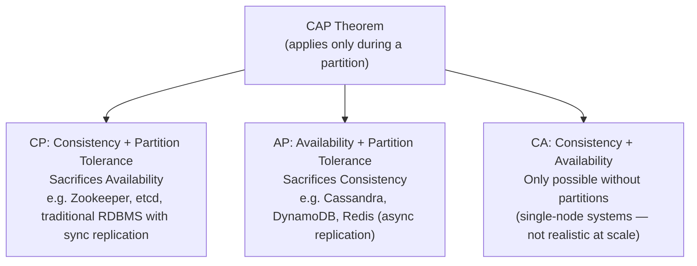

**Yeh practically kyun matter karta hai:** Partitions rare hain, lekin *latency* is trade-off ka day-to-day version hai. Isliye **PACELC** interviews ke liye zyada useful mental model hai:

> **P**artition → **A** ya **C** choose karo; **E**lse (normal operation) → **L**atency ya **C**onsistency choose karo.

- RDS synchronous multi-AZ replication ke saath: L par C ko favor karta hai (write replica ack ke liye wait karta hai).
- Is guide ka CQRS+read-replica architecture ek explicit **PA/EL** choice hai: normal operation ke dauran yeh lower latency (replica se read) ko strict consistency (replica lag) ke upar leta hai, aur yeh "read-after-write" handling section (neeche) ke through documented hai.

**Follow-up interviewers puchte hain:** "Give a concrete example of AP vs CP in a system you built." — isko kisi real cheez se tie karo: e.g., "Humare RDS read replicas design se AP/eventually-consistent hain; humara payment write path CP hai kyunki hum double-charging ka risk nahi le sakte."

### Back-of-the-Envelope Capacity Estimation [new content]

Senior interviews frequently chahte hain ki aap ek system ko *size* karo, na ki sirf boxes draw karo. Yeh numbers memorized rakho:

| Quantity | Rule of thumb |
|---|---|
| 1 million requests/day | ≈ 12 requests/second average |
| Peak traffic | Usually average ka 2–5x; peak ke liye design karo, average ke liye nahi |
| 1 KB × 1M requests/day | ≈ 1 GB/day, ≈ 30 GB/month |
| SSD read | ~ tens of µs–1ms |
| Network round trip, same region | ~0.5–2 ms |
| Network round trip, cross-continent | ~100–150 ms |
| Redis GET | ~0.5–1 ms |
| SQL query (indexed) | ~1–10 ms |
| SQL query (unindexed/full scan) | ~100ms–seconds |

**Interview ke liye method:**
1. DAU (daily active users) aur per user per day requests estimate/ask karo.
2. Average RPS compute karo, phir ek peak factor se multiply karo (e.g., 3x).
3. Storage estimate karo: `avg record size × records/day × retention period`.
4. Bandwidth estimate karo: `avg payload size × RPS`.
5. Decide karo ki ek single DB/server isse handle kar sakta hai, ya aapko caching, replicas, sharding, ya ek CDN chahiye.

Example: "500K DAU, each hitting the API 20x/day" → 10M requests/day → 10M / 86,400s ≈ 116 RPS average → ~350 RPS at a 3x peak factor (~580 RPS agar aap 5x ke liye size karo). Ek well-tuned Kestrel instance isko easily handle kar sakta hai; bottleneck database hoga, jo exactly kyun caching/read-replicas (neeche dekho) necessary ban jaate hain, optional nahi.

---

## Intermediate: Building Blocks

### Caching Strategy

*(Original notes: "How to Make APIs Fast")*

Multiple layers par cache karo:

**a. In-memory cache** (single node, small/short-lived data)
```csharp
services.AddMemoryCache();
```

**b. Distributed cache (Redis)** — multi-node deployments ke liye; DB lookups, dropdown data, access tokens cache karo. **Cache-aside pattern** use karo:

```csharp
var cached = await _redis.GetStringAsync(key);
if (cached != null) return JsonSerializer.Deserialize<User>(cached);

var user = await _db.Users.FindAsync(id);
await _redis.SetStringAsync(key, JsonSerializer.Serialize(user));
return user;
```

**c. Response caching**
```csharp
[ResponseCache(Duration = 60)]
```

**[new content] Cache invalidation strategies (interviewer's favorite follow-up: "caching is easy, invalidation is the hard part"):**

| Strategy | How it works | Trade-off |
|---|---|---|
| TTL / expiration | Key N seconds ke baad auto-expire ho jaati hai | Simple, lekin window ke andar stale data serve kar sakta hai |
| Write-through | Cache aur DB dono par synchronously write karo | Cache hamesha fresh rehta hai, lekin write latency add karta hai |
| Write-behind (write-back) | Cache par write karo, DB mein async flush | Fast writes, agar cache flush se pehle crash ho jaaye to data loss ka risk |
| Explicit invalidation on write | DB write ke baad app code key delete/update karta hai | Sabse correct hai, lekin ek code path miss karna easy hai (cache silently stale ho jaata hai) |
| Event-driven invalidation | Write par ek event publish karo; subscribers apna cache evict karte hain | Services ke across scale karta hai, lekin infra add karta hai (message broker) aur eventual-consistency lag |

**[new content] Cache stampede / thundering herd:** Jab ek hot key expire hoti hai, to bahut se concurrent requests simultaneously miss karte hain aur DB ko hammer karte hain. Mitigations: request coalescing (single in-flight fetch, others usko await karte hain), jittered TTLs (synchronized expiry avoid karo), aur probabilistic early refresh.

**[new content] Cache-aside vs read-through:** Cache-aside (upar dikhaya gaya) caching logic ko application code mein daalta hai — .NET mein `IDistributedCache`/Redis ke saath most common hai. Read-through cache ko DB ke saamne ek library/proxy ki tarah daalta hai jo miss par transparently fetch karta hai — kam app code, lekin serialization/edge cases par kam control. Distinction jaano; interviewers casually "read-through" aur "cache-aside" ko almost interchangeably use karte hain lekin yeh different responsibilities hain.

### Load Balancing [new content]

Original notes mein explicitly nahi hai, lekin essential hai — is guide ka har architecture diagram implicitly BFF/API layer ke saamne ek ki zarurat rakhta hai.

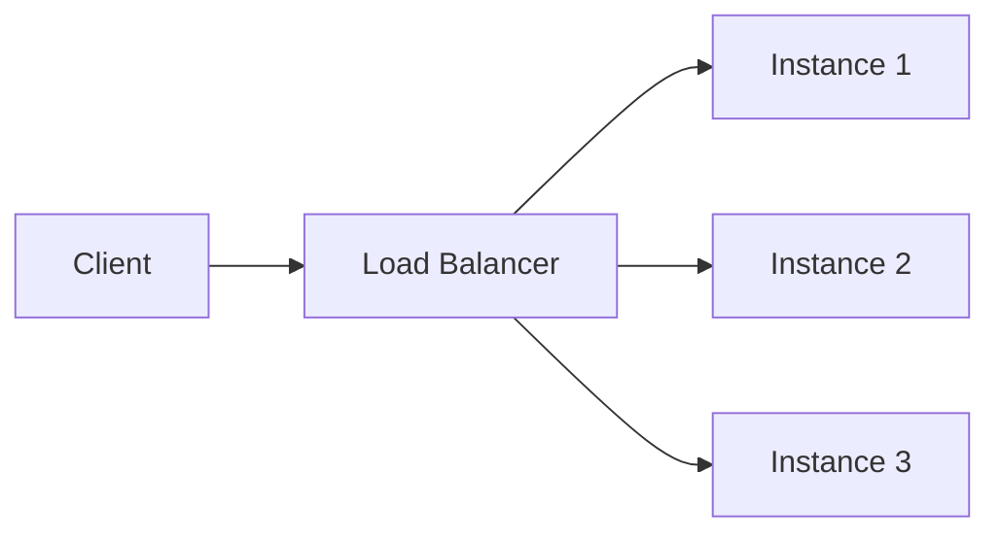

| Algorithm | Behavior | When to use |
|---|---|---|
| Round robin | Servers ke through evenly cycle karta hai | Uniform request cost, stateless servers |
| Least connections | Fewest active connections wale server ko bhejta hai | Variable request duration |
| IP hash / consistent hash | Same client → same server | Sticky sessions, cache locality |
| Weighted | Server capacity ke proportional distribute karta hai | Mixed instance sizes, gradual rollout (canary) |

**L4 vs L7 load balancing:** L4 (transport layer, e.g., AWS NLB) IP/port par route karta hai — fast, protocol-agnostic. L7 (application layer, e.g., ALB, Nginx, YARP) HTTP path/headers par route karta hai — path-based routing enable karta hai (neeche strangler-fig migration mein heavily use hota hai), lekin overhead add karta hai kyunki yeh HTTP ko terminate/inspect karta hai.

**Health checks algorithm jitna hi matter karte hain** — ek LB sirf tab tak achha hai jab tak wo unhealthy instances detect aur unhe route karna stop kar sake (active health checks/liveness probes + repeated failures par passive circuit-breaking).

### API Gateway / BFF Pattern

*(Original notes: CQRS + BFF section)*

**Backend for Frontend (BFF)** ek UI-specific API layer hai jisse Angular exclusively baat karta hai:

- Authentication and authorization
- Backend calls aggregate karta hai
- UI ke liye responses shape karta hai
- Decide karta hai read vs write path (Command vs Query APIs ko route karta hai)

**BFF kyun, na ki Angular se microservices tak direct calls:**
- Angular ko multiple backend services ko directly call karne se rokta hai
- Auth ko centralize karta hai (SPA otherwise jo bhi service call karega har jagah token validation logic duplicate karne se bachata hai)
- UI iteration speed ko backend service structure se decouple karta hai

**[new content] BFF vs generic API Gateway:** Yeh often confused hote hain. Ek API Gateway (e.g., Ocelot, YARP, Azure APIM, Kong) bahut se consumers (mobile, web, partners) ke liye ek *shared, generic* front door hai jo routing/auth/rate-limiting karta hai. Ek BFF *ek per frontend/client type* hai — e.g., Angular web app ke liye ek alag BFF vs mobile BFF — kyunki different clients ko different response shapes aur aggregation chahiye. Practice mein, kaafi .NET shops ek shared API Gateway ke *peeche* ek BFF banate hain: Gateway cross-cutting infra concerns handle karta hai (TLS, WAF, global rate limits), BFF UI-specific aggregation/shaping handle karta hai. Interview answer mein dono ko conflate karna ek minor red flag hai.

### Database Read Replicas

*(Original notes: CQRS + BFF section)*

- Read traffic ke liye horizontal scaling allow karte hain
- Primary se reporting/dashboard queries offload karte hain
- Write model change kiye bina read performance improve karte hain
- **Eventually consistent hote hain** — write ke baad kabhi bhi immediate consistency assume mat karo

### Database Sharding vs Partitioning [new content]

Original notes mein genuinely ek thin spot hai — sharding almost har senior system design interview mein aata hai jab bhi "scale" mention ho.

**Partitioning** = ek large table/dataset ko smaller pieces mein split karna, jo *same* server par rehte hain (e.g., SQL Server table partitioning by date range) purely isko manageable banane ke liye.

**Sharding** = horizontal partitioning ka ek form hai jahan pieces (shards) *completely different servers/databases* par rehte hain, specifically writes aur storage ko ek machine ki capacity se aage scale karne ke liye.

| Sharding strategy | How | Pros | Cons |
|---|---|---|---|
| Range-based | Key range se shard karo (e.g., user ID 1-1M, 1M-2M) | Simple, range queries ke liye good | Hotspotting agar data/traffic skewed hai (new users hamesha last shard ko hit karte hain) |
| Hash-based | `hash(key) % N` decide karta hai kaunsa shard | Even distribution | Resharding painful hai — N change karna almost sab kuch remap kar deta hai |
| Consistent hashing | Ring-based hash (neeche dekho) | Resize par minimal remapping | Implement karna zyada complex hai |
| Directory-based | Lookup service key → shard map karta hai | Flexible, easy rebalancing | Lookup service ek naya SPOF/bottleneck hai |
| Geo-based | Region/tenant se shard karo | Data locality, compliance (GDPR) | Cross-region queries expensive hain |

**Cross-shard problems jo proactively raise karne chahiye:**
- Shards ke across joins ko app-level fan-out ya denormalization chahiye
- Shards ke across transactions ko sagas ya 2PC chahiye (dono ki costs hain — Sagas section dekho)
- Rebalancing (ek shard add karna) sabse hard operational problem hai — yeh exactly wahi wajah hai ki consistent hashing exist karti hai

**Interviewer follow-up:** "How would you shard a multi-tenant SaaS DB?" → `tenant_id` se shard karo (geo- ya hash-based); har tenant ka data ek shard par rakho cross-shard joins ko entirely avoid karne ke liye — yeh tenant-based systems mein available single biggest simplification hai.

### Consistent Hashing [new content]

Naive `hash(key) % N` ke resharding problem ko solve karta hai: jab aap modulo hashing ke saath ek node add/remove karte ho, to *almost every* key remap hoti hai, jisse ek cache/data stampede hota hai.

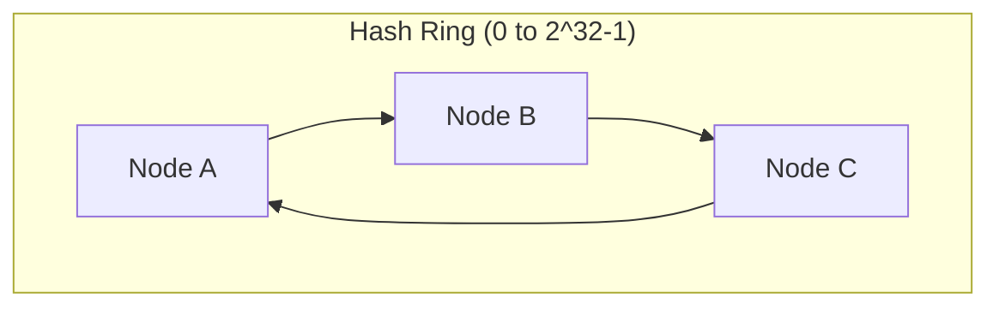

**Yeh kaise kaam karta hai:** Dono nodes aur keys ko ek circular ring (0 to 2^32-1) par hash kiya jaata hai. Ek key uske position se clockwise pehle node ki hoti hai. Ek node add/remove karna sirf usse aur ring par *previous* node ke beech ki keys ko affect karta hai — whole keyspace ko nahi.

**Virtual nodes:** Real implementations (e.g., Redis Cluster, DynamoDB, Cassandra) har physical node ko ring par multiple positions ("virtual nodes") assign karte hain uneven load distribution avoid karne ke liye jab node count small ho.

**.NET interviews mein yeh kahan aata hai:** Redis Cluster client-side sharding, distributed cache partitioning, load balancer session affinity, aur CDN edge-node selection — sab consistent hashing under the hood use karte hain. *Why* yeh modulo hashing se better hai jaanna hi actual signal hai jo interviewers chahte hain — ring math nahi.

### Message Queues & Event-Driven Architecture [new content]

Original notes mein RabbitMQ/Kafka/Azure Service Bus ek baar passing mein mention hota hai ("Service-to-service communication") bina depth ke — isko real treatment deserve karta hai kyunki event-driven architecture neeche ke Outbox/Saga/CQRS patterns ke underlying hai.

**Direct calls ke bajaye queue se decouple kyun:**
- Producer aur consumer independently scale karte hain
- Consumer downtime producer ko block nahi karta (messages buffer hote hain)
- Natural retry/backoff aur dead-letter handling
- Fan-out enable karta hai (one event, many subscribers) producer ko consumers pata hone ke bina

**Queue vs Topic/Pub-Sub:**

| | Point-to-point queue | Pub/Sub (topic) |
|---|---|---|
| Consumers | Ek consumer har message process karta hai (competing consumers) | Har subscriber ko ek copy milti hai |
| Example | Azure Service Bus Queue, SQS | Azure Service Bus Topic, Kafka, RabbitMQ exchange (fanout) |
| Use case | Work distribution (e.g., process an order) | Ek state change broadcast karna (e.g., "OrderPlaced" to Billing, Shipping, Analytics) |

**Kafka vs RabbitMQ vs Azure Service Bus (senior-level distinction, often asked directly):**

| | Kafka | RabbitMQ | Azure Service Bus |
|---|---|---|---|
| Model | Distributed log, partitioned, consumers offset track karte hain | Traditional broker, smart broker/dumb consumer | Managed broker (queues + topics), enterprise features |
| Throughput | Very high (millions/sec) | Moderate-high | Moderate |
| Message retention | Messages retain karta hai (replay possible) | Ack hone ke baad remove ho jaate hain (unless configured) | Time-boxed retention |
| Ordering | Per-partition ordering guaranteed | Per-queue ordering (mostly) | FIFO sessions available |
| Best for | Event streaming, event sourcing, high-volume telemetry | Task queues, RPC-style messaging, complex routing | Enterprise .NET-native integration, hybrid cloud |
| .NET fit | Confluent.Kafka client | RabbitMQ.Client / MassTransit | Azure.Messaging.ServiceBus, first-class Azure SDK support |

**At-least-once vs exactly-once vs at-most-once delivery:** Most brokers default se **at-least-once** guarantee karte hain (message redeliver hota hai agar ack lost ho jaaye) — matlab **consumers idempotent hone chahiye** (neeche Idempotency Keys dekho). True exactly-once practice mein expensive/rare hai; pragmatic senior answer hai "design for at-least-once + idempotent handlers" instead of exactly-once semantics chase karne ke.

---

## Advanced Architecture Patterns

### CQRS + BFF + Read Replicas (Reference Architecture)

*(Original notes, preserved and reorganized)*

**30-second elevator pitch:**

Hum CQRS use karte hain writes aur reads ko separate karne ke liye. Command APIs business logic handle karte hain aur primary RDS database mein write karte hain, jabki Query APIs RDS read replicas se read-only data serve karte hain. Angular kabhi bhi backend services ko directly call nahi karta; yeh ek Backend for Frontend (BFF) se baat karta hai, jo authentication, response shaping, handle karta hai aur decide karta hai ki request ek read hai ya write. Yeh scalability, performance improve karta hai aur UI aur domain logic ko cleanly separate rakhta hai.

**High-level architecture flow:**

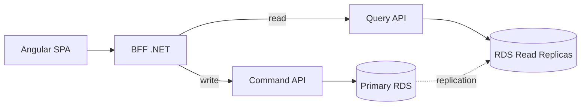

**Responsibility split:**

| Layer | Responsibility |
|---|---|
| Angular | Sirf UI, koi business logic nahi, sirf BFF ko call karta hai |
| BFF | AuthN/AuthZ, backend calls aggregate karta hai, responses shape karta hai, read vs write path decide karta hai |
| Command APIs | Business rules, validation, transactions, primary RDS mein writes |
| Query APIs | Read-only, optimized queries, replicas se reads |
| Primary RDS | Saari writes |
| RDS Read Replicas | Saari reads |

**Har piece kyun exist karta hai:**
- **CQRS kyun:** Writes complex, transactional hote hain aur strong consistency chahiye. Reads frequent, performance-critical hote hain aur writes se kaafi zyada fast scale karte hain. Unhe separate karna har side ko independently optimize karne deta hai.
- **RDS read replicas kyun:** Read traffic ke liye horizontal scaling; primary se reporting/dashboard queries offload karta hai; write model change kiye bina performance improve karta hai.
- **BFF kyun:** UI-specific API; multiple services se data aggregate karta hai; auth centralize karta hai; Angular ko multiple backend services directly call karne se rokta hai.

**Read-after-write consistency handle karna:** RDS read replicas eventually consistent hote hain. Isko handle karne ke liye: write ke baad, ya (a) command response directly UI ko return karo (re-query mat karo), ya (b) temporarily uss specific follow-up read ke liye BFF ke through primary database se read karo. **Kabhi bhi assume mat karo ki replicas immediately consistent hain.**

**.NET implementation talking points:**
- Command aur Query ke liye separate APIs, separate `DbContext`s
- Writes EF Core use karte hain change tracking enabled ke saath
- Reads EF Core `.AsNoTracking()` ya raw speed ke liye Dapper use karte hain
- BFF kabhi bhi database ko directly access nahi karta — hamesha Command/Query APIs ke through jaata hai

**Common interviewer follow-ups (answered):**

- **"Is this 'true' CQRS?"** — Yeh *pragmatic* CQRS hai: hum read/write paths aur scaling separate karte hain, lekin dono sides abhi bhi same logical database ko hit kar sakte hain (primary/replica ke through). Event-driven projections (separate read-optimized schema/store, events ke through populated) baad mein add ki ja sakti hain agar read patterns write model se aur diverge karein — tab yeh "full" CQRS ban jaata hai.
- **"Why not let Angular call Query APIs directly?"** — UI ko backend structure se couple kar deta hai, auth logic duplicate karta hai, UI changes ko expensive aur fragile banata hai.
- **"When would you avoid this architecture?"** — Small CRUD apps ya simple admin panels jahan complexity benefit se zyada ho.
- **"How does this scale?"** — Angular CDN ke through; BFF horizontally scale karta hai; Query APIs horizontally scale karti hain; read replicas independently add ki ja sakti hain; write side controlled aur consistent rehta hai.

**Apne answer mein avoid karne wale Red flags:** Angular ka microservices ko directly call karna; BFF mein business logic hona; yeh claim karna ki read replicas strongly consistent hain; real scale par ek single API dono reads aur writes handle kare.

**Closing line:** "CQRS with a BFF allows us to scale reads safely, keep writes consistent, and give the UI exactly what it needs without coupling it to backend complexity."

### Monolith → Microservices Migration (Strangler Fig)

*(Original notes, preserved and reorganized)*

**1. Start with why** — validate karo ki microservices genuinely zarurat hain jump in karne se pehle. Typical valid reasons: modules ka independent deployment (Orders, Billing, Inventory), different scalability needs (Search vs Admin), team autonomy/parallel development, tech heterogeneity. Agar inmein se koi bhi problem exist nahi karti, **ek modular monolith kaafi ho sakta hai** — interview mein yeh kaho; yeh maturity signal karta hai.

**2. Identify service boundaries (DDD / bounded contexts)** — code cut karne se pehle, jaano kahan cut karna hai. Bounded contexts use karo (Orders, Payments, Catalog, Shipping), har ek apna model/language ke saath. Yeh dekho: separate teams? separate DB schemas? modules jo saath change hote hain?

> Interview line: "I use domain & change boundaries (DDD bounded contexts) to decide microservices, not just controllers or tables."

**3. Migration strategy — Strangler Fig Pattern.** Kabhi bhi big-bang rewrite mat karo.

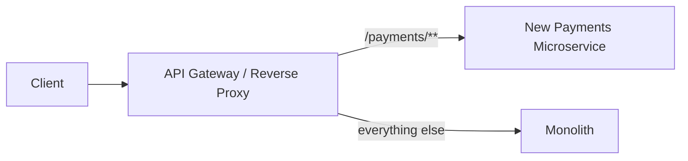

- Ek API Gateway/reverse proxy saamne rakho (YARP, Ocelot, Nginx, APIM)
- Initially saara traffic monolith ko route karo
- Ek capability (e.g., Payments) ko ek naye microservice mein extract karo
- Routing change karo taaki `/payments/**` new service ko jaaye, rest monolith par rahe
- Baaki modules ke liye repeat karo jab tak monolith mostly hollow na ho jaaye

**4. Prepare the monolith (modularize first)** — agar yeh mess hai, to pehle refactor karo: separate projects (`MyApp.Orders`, `MyApp.Payments`, `MyApp.Shipping`), modules ke beech clear interfaces (application services, events), critical flows ke around tests taaki extraction ke dauran regressions avoid ho. Yeh baad mein extraction ko "cut & paste + adaptation" ke closer bana deta hai.

**5. Extract one service end-to-end** (example: Order Management):
- New repo, own CI/CD pipeline
- Separate data: ya ek new DB/schema, ya (temporary compromise) same DB lekin sirf wahi service uski tables par write kare
- API expose karo (`POST /orders`, `GET /orders/{id}`)
- Callers ko gateway ke through jaane ke liye update karo
- Stable hone ke baad monolith mein old code off karo
- Other modules ke saath repeat karo

**6. Data migration strategy (usually sabse hard part).** Database-per-service goal hai (no shared write DB). Migration path: shared DB se start karo lekin isolated ownership ke saath → data gradually move karo ETL/one-time migration ya Change Data Capture (CDC)/event streams use karke data sync mein rakhne ke liye. Cross-service consistency maintain karne ke liye, **distributed transactions ke upar event-driven/eventual consistency ko prefer karo**; complex workflows (Order + Payment + Inventory) ke liye Outbox aur Saga/process-manager patterns use karo.

**7. Introduce platform components while extracting:**
- API Gateway (routing, auth, rate limiting, request/response shaping)
- Service-to-service communication: REST/gRPC + message broker (RabbitMQ, Kafka, Azure Service Bus)
- Observability: centralized logging (Serilog + ELK/App Insights), distributed tracing (correlation IDs), metrics & health checks
- CI/CD: har microservice ki apni build/deploy pipeline independent deployments ke liye

**8. Deployment & risk management** — ek small, low-risk module se start karo (e.g., Notifications). Feature toggles use karo naye paths ko on/off karne ke liye. Canary/blue-green ke saath deploy karo jahan possible ho, ek rollback plan ke saath (gateway traffic ko quickly monolith mein wapas flip kar deta hai).

**9. Common pitfalls:**
- Too fine-grained splitting → chatty network calls, high latency
- Ek shared database forever rakhna → tightly coupled "distributed monolith"
- Proper observability na hona → debugging ek nightmare ban jaata hai
- Tech explosion (har service different stack mein) → ops complexity

**Short interview version:** "I would not do a big-bang rewrite. I start by identifying bounded contexts and modularizing the monolith. Then I put an API gateway in front and follow the Strangler Fig pattern to extract one business capability at a time into independent ASP.NET Core microservices with their own data. Initially, some services may still share the DB, but long term each service owns its schema. I introduce cross-cutting concerns like centralized logging, tracing, and CI/CD per service, and prefer async, event-driven communication and eventual consistency for workflows. This incremental approach reduces risk and allows us to deliver value while we're still migrating."

### CQRS & Event Sourcing (Full Pattern) [new content]

Original notes *pragmatic* CQRS ko (same logical data par separate read/write paths) well cover karte hain, lekin **full CQRS with event sourcing** cover nahi karte, jise senior interviewers often follow-up ki tarah probe karte hain ("how would you evolve this if read models diverge further?").

**Full CQRS:** Write side aur read side *physically different data stores/schemas* use karte hain. Write side source-of-truth persist karta hai (often ek event stream ki tarah); read side one ya zyada denormalized "projections" maintain karta hai specific queries ke liye optimized, asynchronously events consume karke updated.

**Event Sourcing:** Current state store karne ke bajaye, aap events ki sequence store karte ho jo usko lead kiya (`OrderCreated`, `ItemAdded`, `OrderShipped`). Current state events replay karke derive hota hai (ya ek cached snapshot + recent events se).

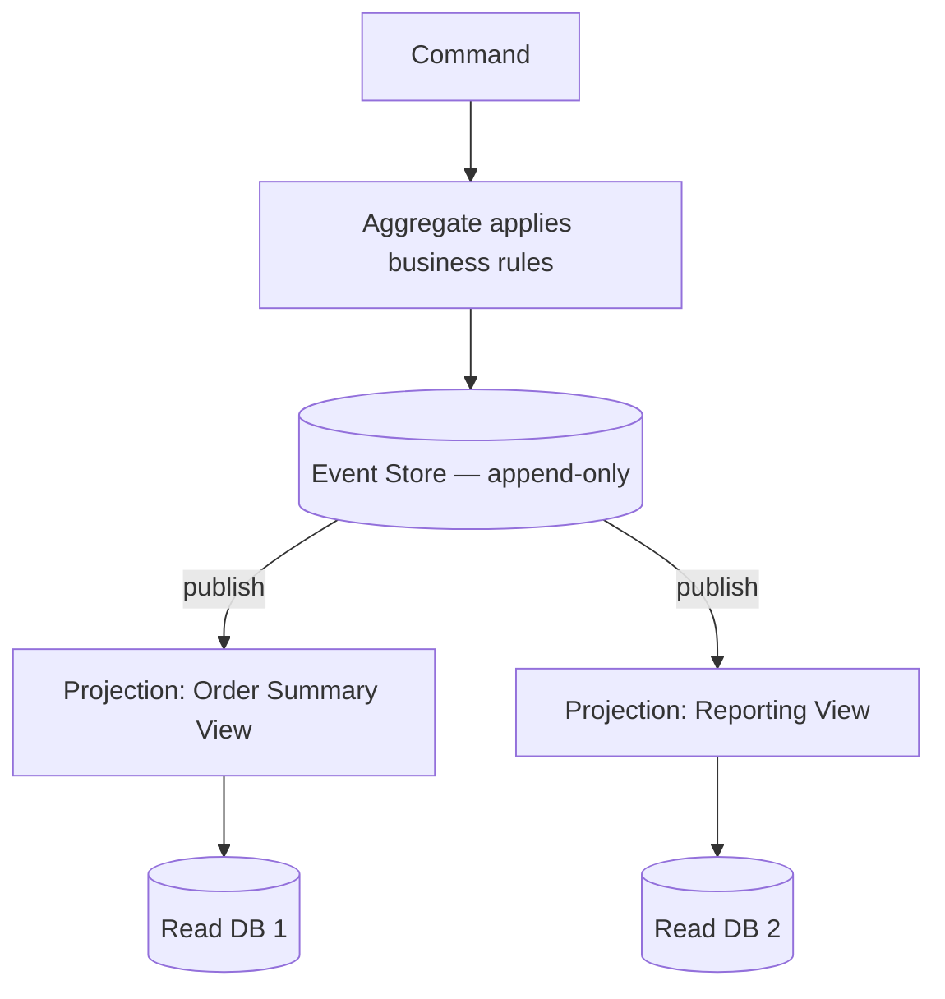

**Trade-offs (yeh wahi hai jo interview actually test kar raha hai):**

| Benefit | Cost |
|---|---|
| Full audit trail / temporal queries ("what did this look like last Tuesday?") | Significant complexity — most teams isko underestimate karte hain |
| Har query ke exact liye tailored read models (multiple projections) | Write aur har read model ke beech eventual consistency |
| Doosre services ke saath event-driven integration ke liye natural fit | Rebuilds ke liye large event streams replay karna snapshotting strategy chahta hai |
| Read scaling ko write scaling se entirely decouple karta hai | Time ke saath events ka schema evolution ek real, ongoing tax hai (versioning event contracts) |

**Interview mein dene wali senior-level guidance:** Default se event sourcing reach mat karo. Yeh apni complexity earn karta hai jab aapko audit history/temporal queries ek first-class feature ki tarah chahiye ho, ya jab read requirements itni varied hain ki ek normalized write model reasonably unhe serve nahi kar sakta. Vast majority systems ke liye (upar wale CQRS+BFF+RDS architecture ko include karke), synchronous replicas ke saath "pragmatic CQRS" complexity ka right level hai — full event sourcing escalation path hai, starting point nahi.

### Outbox Pattern & Transactional Messaging [new content]

"Data Migration Strategy" aur Saga sections se directly relevant hai original notes mein, jo Outbox pattern ko naam se reference karte hain lekin explain nahi karte — yeh isko close karta hai.

**Yeh problem solve karta hai:** Aapko apna database update karna hai *aur* ek event publish karna hai, aur dono atomically hona chahiye — lekin ek DB transaction aur ek message broker publish ek single ACID transaction share nahi kar sakte. Agar aap pehle publish karte ho aur DB write fail ho jaata hai, to consumers ek event par act karte hain jo really kabhi hua nahi. Agar aap pehle DB likhte ho aur publish fail ho jaata hai, to downstream services ko kabhi pata nahi chalta.

**Solution:** Event ko ek `Outbox` table mein *same database transaction* mein likho jitna ki business data change. Ek separate background process (ya CDC tool like Debezium) outbox table ko poll/read karta hai aur wo events broker ko publish karta hai, phir unhe sent mark karta hai.

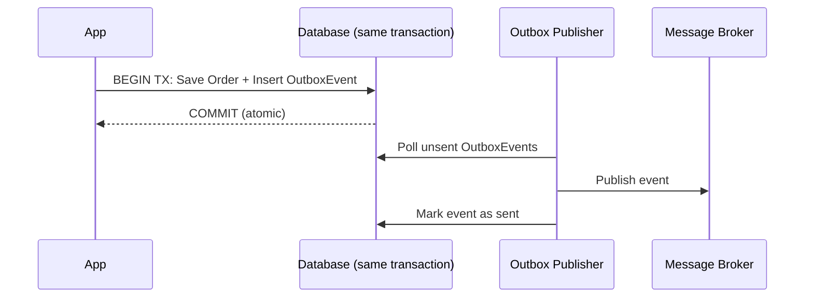

**.NET implementation notes:** EF Core `SaveChangesAsync()` business entity aur `OutboxMessage` row dono ek transaction mein likhta hai (same `DbContext`, same `SaveChanges` call). Ek `BackgroundService` ya Hangfire job outbox table ko ek interval par poll karta hai (ya CDC se triggered hota hai) aur Kafka/RabbitMQ/Service Bus ko publish karta hai, phir row ka status update karta hai. Yeh **at-least-once** delivery guarantee karta hai — consumer side idempotent hona chahiye (neeche dekho) kyunki publisher retry kar sakta hai.

### Sagas / Distributed Transactions [new content]

Original notes mein naam se referenced hai ("Saga / process manager for complex workflows like Order + Payment + Inventory") lekin explain nahi kiya gaya — yeh gap close kar raha hai.

**Distributed transaction (2PC) kyun na use karein?** Two-phase commit kaam karta hai lekin sabhi participants ko locks hold karne ki zarurat hai jab tak har participant commit ke liye vote na kare — yeh services/network boundaries ke across scale nahi karta aur tight coupling + availability risk create karta hai (ek slow/down service sabko block kar deta hai). Virtually koi bhi modern microservices architecture 2PC use nahi karta iss reason ke liye.

**Saga pattern:** Distributed transaction ko local transactions ki ek sequence mein break karo, har ek ke saath ek **compensating action** agar baad mein ek step fail ho to usko undo karne ke liye.

| Style | How it works | Trade-off |
|---|---|---|
| **Choreography** | Har service events publish karti hai; other services independently react karti hain (koi central coordinator nahi) | Few steps ke liye simple; steps grow karte hain to trace/understand karna hard ho jaata hai ("where's the logic?") |
| **Orchestration** | Ek central saga orchestrator explicitly har step ko call karta hai aur failure par compensations issue karta hai | Clear, testable, traceable; orchestrator khud ek naya component hai jo build/scale/monitor karna hai |

**Worked example — Order + Payment + Inventory:**
1. Order service order create karta hai (status: `Pending`) → `OrderCreated` publish karta hai
2. Payment service card charge karta hai → `PaymentCompleted` ya `PaymentFailed` publish karta hai
3. Agar `PaymentCompleted`: Inventory service stock reserve karta hai → `StockReserved` ya `StockUnavailable` publish karta hai
4. Agar `StockUnavailable`: compensate karo — Payment service refund issue karta hai, Order service order ko `Cancelled` mark karta hai

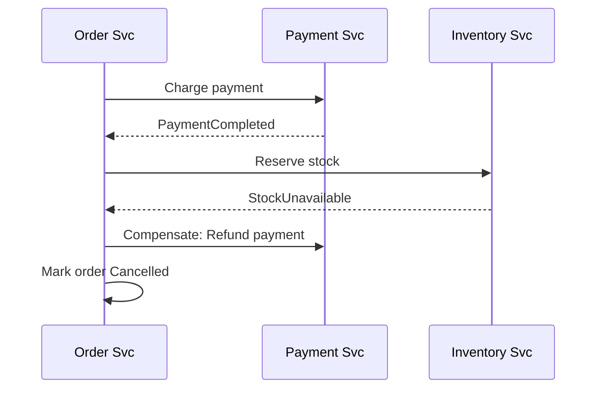

**Interview follow-up: "What if a compensating action itself fails?"** — Yeh sagas ka honest hard part hai. Jawab: compensations retry hone chahiye (idempotent, backoff ke saath); agar wo retries exhaust kar dete hain, to manual/ops intervention ke liye ek dead-letter queue ko escalate karo. "What if undo also fails" ka koi fully automatic answer nahi hai — isko hand-wave karne ke bajaye acknowledge karna ek strong signal hai.

### Resilience Patterns: Circuit Breaker, Retry, Bulkhead (Polly) [new content]

Original notes mein bilkul present nahi hai — yeh senior .NET candidates ke liye "how do you handle a downstream service failing" questions mein se sabse commonly asked hai, aur yeh standard library (Polly) hai jo unse pata hone ki expect ki jaati hai.

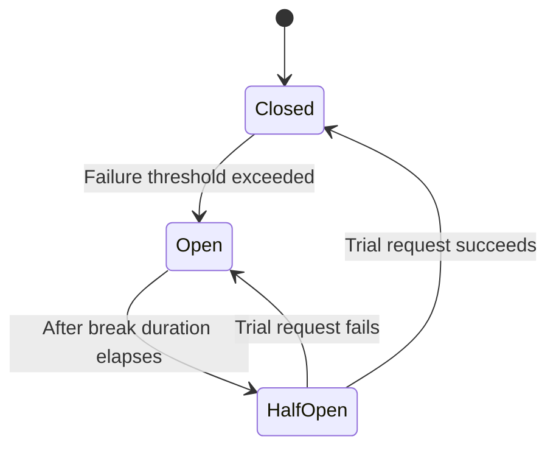

- **Retry** — ek transient failure ko re-attempt karo, ideally **exponential backoff + jitter** ke saath (jitter synchronized retry storms ko avoid karta hai bahut se clients jo same recovering service ko hit kar rahe hain unke across).
- **Circuit Breaker** — N consecutive failures ke baad, circuit ko "open" karo aur ek cooldown period ke liye fail fast karo instead of struggling dependency ko hammer karne ke; cooldown ke baad, recovery test karne ke liye ek trial ("half-open") request through jaane do.
- **Bulkhead isolation** — per dependency concurrent calls/resources cap karo (ship compartments ke naam par), taaki ek slow/failing downstream thread pool ya connection pool exhaust na kar sake aur unrelated features ko down na le jaaye.
- **Timeout** — hamesha upar wale ke saath pair karo; ek retry ya circuit breaker timeout policy ke bina sirf zyada wait karta hai fail hone ke liye.

**.NET implementation with Polly (v8, resilience pipelines):**
```csharp
var pipeline = new ResiliencePipelineBuilder<HttpResponseMessage>()
    .AddRetry(new RetryStrategyOptions<HttpResponseMessage>
    {
        MaxRetryAttempts = 3,
        BackoffType = DelayBackoffType.Exponential,
        UseJitter = true
    })
    .AddCircuitBreaker(new CircuitBreakerStrategyOptions<HttpResponseMessage>
    {
        FailureRatio = 0.5,
        SamplingDuration = TimeSpan.FromSeconds(30),
        BreakDuration = TimeSpan.FromSeconds(15)
    })
    .AddTimeout(TimeSpan.FromSeconds(5))
    .Build();
```

Modern .NET mein, yeh directly `HttpClientFactory` ke saath `Microsoft.Extensions.Http.Resilience` ke through integrate karta hai, jo Polly v8 pipelines ko named/typed clients par ek call se wrap karta hai (`AddStandardResilienceHandler()`).

**Interview framing:** "I wrap outbound calls to unreliable dependencies with Polly: retry with exponential backoff + jitter for transient faults, a circuit breaker so we fail fast instead of piling up requests against a dependency that's already down, a timeout so we never wait forever, and bulkhead isolation so a slow third-party API can't starve threads needed by unrelated features."

### Idempotency Keys [new content]

Original notes mein cover nahi hai, lekin essential hai ek baar aapne at-least-once message delivery (Outbox/queues upar) aur retries (Polly upar) introduce kar diye — dono ka matlab hai ki *same* operation ek se zyada baar trigger ho sakta hai, aur non-idempotent handlers (e.g., "charge card," "send email") double-execute karenge.

**Idempotency key pattern:** Client ek unique key (GUID) per logical operation generate karta hai aur usko ek header mein bhejta hai (e.g., `Idempotency-Key`). Server completed keys ko (response ke saath) ek fast store (Redis/DB with unique index) mein ek retention window ke liye store karta hai. Same key ke saath retry par, server operation ko re-execute karne ke bajaye cached original response return karta hai.

```csharp
[HttpPost("payments")]
public async Task<IActionResult> ChargeCard(
    [FromHeader(Name = "Idempotency-Key")] string idempotencyKey,
    PaymentRequest request)
{
    var existing = await _idempotencyStore.GetAsync(idempotencyKey);
    if (existing is not null) return Ok(existing.Response); // replay, don't re-execute

    var result = await _paymentService.ChargeAsync(request);
    await _idempotencyStore.SaveAsync(idempotencyKey, result);
    return Ok(result);
}
```

**Yeh sabse zyada kahan matter karta hai:** payment APIs, order creation, kisi bhi POST jo naturally idempotent nahi hai, aur ek at-least-once queue se read karne wale message consumers (upar wala outbox publisher crash-before-ack par redeliver karega).

**Interviewer follow-up: "Isn't a database unique constraint enough?"** — Kabhi kabhi, agar operation ka ek natural business key ho (e.g., `OrderId` unique constraint duplicate orders ko rokta hai). Idempotency keys general solution hain jab koi natural business key na ho, ya jab aapko retry par *exact original response* return karna ho (sirf ek duplicate row prevent karna nahi).

### Rate Limiting Algorithms [new content]

Original notes mein ek baar passing mein mention hua hai ("API Gateway: auth, rate limiting") zero depth ke saath — yeh ek near-guaranteed system-design interview topic hai ("design a rate limiter") aur full treatment deserve karta hai (neeche worked example bhi dekho).

| Algorithm | How it works | Pros | Cons |
|---|---|---|---|
| Fixed window counter | Ek fixed time window (e.g., per minute) mein requests count karo, boundary par reset karo | Simple, cheap | Window edges par bursts limit ko 2x allow kar sakte hain (e.g., 100 at 11:59:59, another 100 at 12:00:01) |
| Sliding window log | Har request ka timestamp store karo, rolling window ke andar count karo | Accurate | High volume par memory-heavy |
| Sliding window counter | Current + previous fixed window ka weighted average | Good accuracy, low memory | Slight approximation |
| Token bucket | Bucket tokens hold karta hai, fixed rate par refill hota hai; request ek token consume karta hai; empty bucket = reject/queue | Controlled bursts allow karta hai, traffic smooth karta hai | Implement karna slightly zyada complex |
| Leaky bucket | Requests ek queue mein enter hote hain, fixed output rate par process hote hain | Bursts ko ek constant rate mein smooth karta hai | Bursty clients ke liye latency add karta hai |

**.NET built-in support:** `Microsoft.AspNetCore.RateLimiting` middleware (since .NET 7) saare chaar policies out of the box provide karta hai (Fixed Window, Sliding Window, Token Bucket, Concurrency limiter):
```csharp
builder.Services.AddRateLimiter(options =>
{
    options.AddTokenBucketLimiter("api", opt =>
    {
        opt.TokenLimit = 100;
        opt.TokensPerPeriod = 20;
        opt.ReplenishmentPeriod = TimeSpan.FromSeconds(10);
    });
});
```

**Distributed rate limiting:** Ek multi-instance deployment mein, per-instance in-memory counters ek *global* limit enforce nahi karte. Redis (`INCR` + `EXPIRE`, ya atomicity ke liye ek Lua script) use karo shared counter store ki tarah taaki limit saari instances ke across enforce ho — yeh exactly wahi tarah ka follow-up hai ("what if you have 10 pods behind a load balancer?") jo senior ko mid-level se separate karta hai.

---

## Kestrel & ASP.NET Core Server Internals

*(Original notes, preserved)*

### What is Kestrel?

Kestrel ASP.NET Core ka default cross-platform web server hai — ek high-performance, event-driven, asynchronous web server jo .NET ke Socket APIs ke upar built hai, Windows par I/O Completion Ports (IOCP) aur Linux/macOS par epoll/kqueue use karta hai. Bahut low overhead ke saath thousands of concurrent connections handle karne ke liye optimized.

### Why was Kestrel created?

.NET Core se pehle, ASP.NET IIS with `System.Web` use karta tha: ek thread-per-request model jo thread starvation cause karta tha, Windows ke saath tight coupling tha, aur real-time web apps ke liye slow tha. Kestrel platform-independent hone ke liye banaya gaya, ground se async I/O use karta hai, Node.js/Nginx jaisa raw performance provide karta hai, aur `System.Web`/IIS pipeline ka overhead remove karta hai.

### Kestrel Features

- **Cross-platform:** Windows, Linux, macOS, containers
- **Asynchronous pipeline:** request reading/writing/routing sab async, bahut kam threads use karta hai, thread-per-request avoid karta hai
- **High performance:** TechEmpower Benchmarks mein consistently sabse fast web servers mein rank karta hai
- **HTTPS, HTTP/1.1, HTTP/2, HTTP/3 support:** built-in TLS termination, QUIC ke through HTTP/3
- **WebSockets support**
- **Endpoint routing:** multiple URLs par bind ho sakta hai (`http://localhost:5000`, `https://localhost:5001`)

### Kestrel Architecture (Internal Flow)

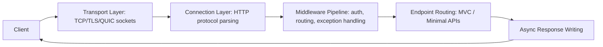

Kestrel ka event loop high concurrent I/O ko efficiently handle karne ke liye optimized hai.

### How Kestrel Handles Concurrency

Kestrel event-loop-based hai, Node.js jaisa lekin multiple loops ke saath. Key concepts:
- I/O Completion Ports (Windows) / epoll/kqueue (Linux/macOS) use karta hai
- Minimal threads → high throughput
- Async context-switching ThreadPool ko block karne se avoid karta hai

Example: agar 10,000 connections open hain, to sirf ek small number of threads active hote hain; saara I/O asynchronous hai; requests callbacks + async/await ke through process hote hain. **Yehi wajah hai ki async code aapki API ko faster banata hai — Kestrel threads ko efficiently reuse kar sakta hai.**

### Configure Kestrel (Real-World Example)

```csharp
var builder = WebApplication.CreateBuilder(args);

builder.WebHost.ConfigureKestrel(options =>
{
    options.Limits.MaxRequestBodySize = 10 * 1024 * 1024; // 10 MB
    options.Limits.KeepAliveTimeout = TimeSpan.FromMinutes(2);
    options.Limits.RequestHeadersTimeout = TimeSpan.FromSeconds(30);

    options.ListenAnyIP(5000);
    options.ListenAnyIP(5001, listenOptions =>
    {
        listenOptions.UseHttps();
    });
});

var app = builder.Build();
app.Run();
```

### Standalone vs Reverse Proxy Mode

- **Standalone:** Client → Kestrel → ASP.NET Core. Development, containers, simple deployments mein use hota hai.
- **Reverse proxy (production ke liye recommended):** Client → Nginx/Apache/IIS → Kestrel.

**Reverse proxy kyun use karein?** Better security, better load balancing, better connection handling, Nginx/IIS se static files faster serve hoti hain, Kestrel ko direct exposure se protect karta hai.

### Performance Features

- **Zero-copy memory** — `Span<T>`, `Memory<T>`, pipelines API use karta hai
- **Optimized header & body parsing** — unnecessary allocations nahi
- **HTTP/2 multiplexing** — ek connection par multiple streams
- **IIS Integration Middleware** — Windows par IIS reverse proxy ke saath hosting karte waqt

### Memory Management in Kestrel

Kestrel memory pools, shared buffers, aur reusable arrays use karta hai — GC pressure kam karta hai → faster response times.

### Common Interview Q&A (Kestrel)

**Q: Why is Kestrel faster than IIS/System.Web?**
Jawab: Async I/O, minimal pipeline, no `System.Web`, lightweight request handling, event-driven model.

**Q: Should Kestrel be exposed directly to the internet?**
Jawab: Nahi — production ke liye Nginx/IIS/ek cloud load balancer ko reverse proxy ki tarah use karo (security, static files, connection management). **[new content]** Modern containerized deployments mein (AKS/EKS behind an ingress controller, ya Azure App Service), "reverse proxy" often ingress controller ya platform load balancer hota hai instead of ek hand-configured Nginx box ke — principle (Kestrel ko raw expose mat karo) abhi bhi hold karta hai.

**Q: How does Kestrel handle thread starvation?**
Jawab: Yeh per request ek thread create nahi karta. Yeh async I/O + ek event loop use karta hai, isliye classic IIS/System.Web model se kaafi kam threads chahiye.

**Q: Does Kestrel run on Windows?**
Jawab: Haan — lekin request processing abhi bhi .NET ke cross-platform async I/O model use karti hai instead of legacy Windows-specific APIs ke.

**[new content] Q: What's `MinRequestBodyDataRate` / `MinResponseDataRate` and why would you tune it?**
Jawab: Kestrel request/response bodies par ek minimum data rate enforce karta hai (default ~240 bytes/sec) slow-client attacks (slowloris-style) ke against protect karne ke liye jo data ko trickle karke connections open rakhte hain. Aap limit ko raise karoge ya disable karoge (`options.Limits.MinRequestBodyDataRate = null`) legitimately slow clients ke liye (e.g., poor mobile connections ke over large uploads), aur aap public-facing endpoints ke liye isko kabhi disable nahi karoge bina ek doosre mitigation (WAF, reverse proxy timeout) ke saamne rakhe.

**[new content] Q: HTTP/2 vs HTTP/3 — why would you enable HTTP/3 (QUIC)?**
Jawab: HTTP/2 ek TCP connection ke upar multiple streams multiplex karta hai lekin abhi bhi TCP-level head-of-line blocking se suffer karta hai (ek lost packet uss connection ke saare streams ko stall kar deta hai). HTTP/3 QUIC (UDP-based) par run hota hai, jo transport layer par multiplex karta hai isliye ek lost packet sirf apna hi stream stall karta hai — lossy networks (mobile) par meaningful latency improvement. Trade-off: QUIC/UDP restrictive corporate firewalls/proxies se block ho sakta hai jo sirf TCP 443 allow karte hain, isliye HTTP/2 fallback available rehna chahiye.

### Senior-Level Summary (Kestrel, interview-ready)

"Kestrel is ASP.NET Core's default high-performance web server. It uses asynchronous I/O, event-driven architecture, and memory-efficient pipelines to handle thousands of concurrent connections. It supports HTTP/1.1, HTTP/2, and HTTP/3, TLS termination, WebSockets, and cross-platform hosting. In production, I usually run Kestrel behind a reverse proxy like Nginx or IIS (or a platform ingress/load balancer in containers) for security, load balancing, static file serving, and better connection management. Because it's async-first, APIs perform significantly better compared to classic IIS/System.Web models."

---

## API Performance Optimization

*(Original notes: "How to Make APIs Fast", preserved and reorganized)*

### 1. Reduce I/O & Database Latency

**a. Proper indexing** — frequent filters ke liye composite indexes; `SELECT *` avoid karo, sirf required fields fetch karo; slow queries ko SQL Server Query Store ya `EXPLAIN` execution plans se analyze karo.

**b. Pagination & projection** — huge datasets return karne se avoid karo; unnecessary columns load na karne ke liye EF Core mein `Select()` projections use karo.

**c. Async EF Core:**
```csharp
var data = await _dbContext.Users
    .Where(x => x.IsActive)
    .ToListAsync();
```
ASP.NET Core Kestrel mein thread starvation rokta hai.

### 2. Caching at Multiple Layers

Full treatment ke liye upar [Caching Strategy](#caching-strategy) dekho (in-memory, Redis cache-aside, response caching, invalidation strategies, cache stampede).

### 3. Reduce Serialization Time

- `Newtonsoft.Json` ke bajaye `System.Text.Json` use karo
- Response types (DTOs) pre-define karo
- EF entities ko directly serialize karne se avoid karo

**[new content]** `System.Text.Json` .NET 6+ se source-generator-capable hai (`System.Text.Json.Serialization.JsonSerializerContext`) — source-generated serialization contexts use karna reflection ko entirely avoid karta hai aur high throughput ke under ek meaningful win hai; agar pucha jaaye "how would you go even faster than the default STJ" to isko explicitly naam lena worth hai.

### 4. Asynchronous & Non-Blocking Architecture

Kestrel async workloads ke liye optimized hai. Synchronous calls jaise `.Result`/`.Wait()` avoid karo — wo thread pool ko block karte hain. End se end tak async use karo (koi "sync over async" nahi).

### 5. Minimize Middleware & Pipeline Overhead

Sirf required middleware rakho (routing, authentication, structured logging). Unused services, production mein verbose logging, aur large exception stack traces disable karo.

### 6. Compression, HTTP/2, and gRPC

**Response compression:**
```csharp
services.AddResponseCompression();
```

**gRPC for internal microservice calls** — REST se 5-10x faster, binary protocol, high-throughput systems ke liye useful.

**[new content]** gRPC ka speed advantage HTTP/2 + Protobuf binary serialization + strongly-typed contracts (no reflection-based JSON parsing) se aata hai, lekin trade-off ko explicitly state karna worth hai: gRPC manually debug/inspect karna harder hai (wire par human-readable nahi hai), weaker browser support hai (grpc-web + ek proxy chahiye), aur versioning/tooling REST/OpenAPI jitna universally familiar nahi hai. Standard senior answer: internal service-to-service calls ke liye gRPC, public/browser-facing APIs ke liye REST/JSON (ya GraphQL).

### 7. Improve Application Architecture

**a. CQRS for high-read systems** — read DB se reads, write DB se commands, load reduce karta hai. (Full treatment upar.)

**b. Background processing** — heavy work ko Hangfire, Azure Functions, ya `BackgroundService` mein move karo; APIs fast return karti hain jabki processing async continue karti hai.

### 8. Connection Pooling & HttpClientFactory

`HttpClientFactory` socket exhaustion rokta hai:
```csharp
services.AddHttpClient("external", c =>
{
    c.Timeout = TimeSpan.FromSeconds(5);
});
```
Databases ke liye: minimal DB contexts use karo, long-running transactions avoid karo.

### 9. Reduce Payload Size

JSON compress karo, unused fields remove karo, lightweight DTOs return karo, agar required ho to OData ya filtering APIs use karo.

### 10. Profiling & Monitoring

Tools: Application Insights, New Relic, CloudWatch, Datadog, .NET ke liye MiniProfiler, EF Core logging (N+1 queries track karne ke liye).

Track karo: API latency (p50, p90, p99), slow SQL queries, serialization time, GC pauses.

### Senior-Level Summary (API Performance, interview-ready)

"To make APIs fast, I optimize at multiple layers: database (indexes, projections, pagination), caching (Redis, memory, response caching), async architecture, Kestrel tuning, minimized middleware, payload optimization, and proper observability to detect bottlenecks. For high-scale systems, I also use CQRS, background processing, and gRPC. Performance is a cross-layer concern, not a single fix."

---

## Scalability & Performance Deep Dive

**[new content]** Yeh section upar wale individual performance tips ko ek coherent "where's the bottleneck" mental model mein tie karta hai, jo interviewers actually probe kar rahe hote hain jab wo puchte hain "the API is slow, walk me through how you'd debug it."

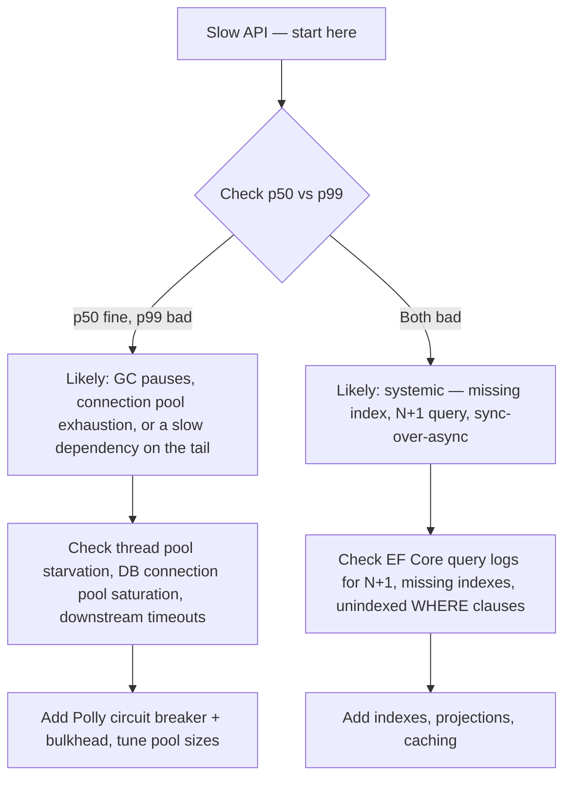

**Vertical vs horizontal scaling trade-off (ek direct question jiske liye aapko ready rehna chahiye):** Vertical scaling (bigger instance) simpler hai — no code changes, no distributed-systems complexity — lekin ek hard ceiling aur single point of failure hai. Horizontal scaling (more instances) internet-scale systems ke liye standard answer hai lekin app ko stateless hona chahiye (ya state ko Redis/DB mein externalize karna chahiye), ek load balancer chahiye, aur distributed-system problems introduce karta hai (data consistency, distributed caching, session affinity). Senior answer: scale par kisi bhi customer-facing cheez ke liye default se horizontal, lekin ek low-traffic internal tool ko sirf fashionable hone ki wajah se distributed system mein over-engineer mat karo.

**N+1 query problem** — single sabse common real-world EF Core performance bug: ek collection iterate karna aur per item ek related entity lazy-load karna N+1 round trips cause karta hai instead of 1 ke. Eager loading (`.Include()`), projection (`.Select()` exactly wo shape karne ke liye jo chahiye), ya ek single batched query se fix karo. EF Core ka `AsSplitQuery()` bhi relevant hai one-to-many `Include` scenarios ke liye jo otherwise ek single SQL query mein cartesian-product explosion produce karte — jaano kab split queries reach karni hain vs ek single query.

---

## Best Practices

- Microservices/CQRS/event sourcing adopt karne se pehle business need validate karo — complexity earn hona chahiye, default se nahi hona chahiye.
- **Async all the way down** ke liye design karo; kabhi `.Result`/`.Wait()` ko ek async call chain mein mix mat karo.
- Client ke sabse close layer par cache karo jo abhi bhi correct ho (CDN > response cache > distributed cache > in-memory > DB).
- Read replicas aur distributed caches ko **default se eventually consistent** treat karo — read-after-write flows ko explicitly design karo, assume mat karo.
- Queues/webhooks/retries ke consumers ko idempotent banao — at-least-once delivery realistic default hai, exactly-once nahi.
- Har outbound call ke around resilience (retry/circuit breaker/timeout/bulkhead) rakho ek dependency ke liye jo aap control nahi karte.
- Observability (structured logs, correlation IDs, distributed tracing, p50/p90/p99 latency) kisi bhi real scale par optional nahi hai — day one se build karo, first incident ke baad nahi.
- Premature microservices ke upar ek modular monolith prefer karo clean internal boundaries ke saath — yeh ek legitimate, defensible end-state hai, sirf ek stepping stone nahi.
- Sharding/partitioning karte waqt, ek shard key choose karo jo related data (aur transactions) ko saath rakhe cross-shard joins/transactions avoid karne ke liye.

## Common Pitfalls

- Microservices ko too fine-grained split karna → chatty network calls, high latency (original notes se).
- "Microservices" ke across ek shared database forever rakhna → tightly coupled "distributed monolith" (original notes se).
- Proper observability na hona → debugging ek nightmare ban jaata hai (original notes se).
- Tech stack explosion (har service ek different language/framework mein) → ops complexity (original notes se).
- Yeh assume karna ki RDS read replicas / distributed caches strongly consistent hain (original notes se — explicitly ek "red flag" ki tarah call out kiya gaya hai kehne se avoid karne ke liye).
- Async calls par `.Result`/`.Wait()` use karna, Kestrel ke under thread pool starvation cause karna (original notes se).
- **[new content]** Non-idempotent operations (e.g., "charge card") ko idempotency key ke bina retry karna, at-least-once delivery ke under duplicate side effects cause karna.
- **[new content]** Circuit breaker/retry add karna bina timeout ke — aap sirf fast fail karne ke bajaye slower fail karte ho.
- **[new content]** Ek sharding key choose karna jo aapke actual query/transaction patterns se match nahi karti, jisse baad mein expensive cross-shard fan-out force hota hai.
- **[new content]** Kafka/event sourcing/full CQRS reach karna kyunki wo "correct" hain, jab ek simpler pattern kam ongoing operational tax ke saath faster ship ho jaata.

---

## Worked Examples [new content]

Senior/staff-level system design interviews frequently aapse ek specific system ko end-to-end design karne ke liye kehte hain. Yeh teen sabse common mein se hain. Har ek follow karta hai: requirements → estimation → high-level design → deep dive → trade-offs.

### Design a URL Shortener [new content]

**Requirements:** Ek long URL ko short code mein shorten karo; short code → original URL redirect karo; ~100M new URLs/month, ~10:1 read:write ratio (redirects creations se kaafi zyada hote hain); low-latency redirects.

**Estimation:** 100M writes/month ≈ 40 writes/sec average; reads ≈ 400/sec average (peak par higher). Storage: URL + metadata ≈ 500 bytes; 100M/month × 500B ≈ 50GB/month — grows karta hai lekin old/unused links ke archiving se manageable hai.

**Core design decision — short code generation:**

| Approach | How | Trade-off |
|---|---|---|
| Auto-increment DB ID ko Base62 encode karo | `id=125 → "cb"` | Simple, no collisions, lekin creation order/volume reveal karta hai aur ek centralized ID generator chahta hai (ya per app instance per request ek DB round trip avoid karne ke liye ek range allocator) |
| URL ko hash karo (MD5/SHA) + truncate karo | Hash ke pehle 6-8 chars | Koi central counter nahi chahiye, lekin collisions possible hain — ek check-and-retry ya longer code chahiye |
| Random string + collision check | Random 6-7 chars generate karo, DB uniqueness check karo | Simple, lekin keyspace fill hone ke saath wasted lookups |

Senior answer: ek distributed ID generator ka base62 (e.g., Snowflake-style ID ya per node pre-allocated ID ranges) dono central-counter bottleneck aur collision handling avoid karta hai.

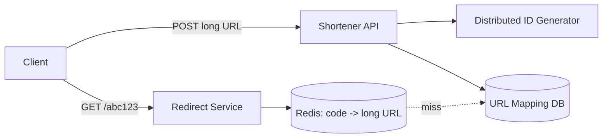

**Deep dive — redirect path is the hot path:** Short-code → long-URL mappings ko Redis mein cache karo (read-through ya cache-aside); DB sirf cache miss par hit hoti hai. 301 vs 302 redirect trade-off use karo: 301 (permanent) browsers ko client-side cache karne deta hai (aapki service par kam hits, lekin aap click-analytics lose karte ho aur destination baad mein easily change nahi kar sakte); 302 (temporary) har click ko aapki service hit karte rakhta hai (analytics, A/B redirects enable karta hai) more load ki cost par. Zyada production shorteners specifically 302 use karte hain click tracking retain karne ke liye.

**Proactively raise karne wale Trade-offs:** custom short domains/vanity URLs ko user-chosen codes ke against ek uniqueness check chahiye; link creation ko expire/rate-limit karna abuse rokne ke liye (spam link generation) directly upar wale Rate Limiting section se judta hai.

### Design a Rate Limiter Service [new content]

**Requirements:** Client (API key ya IP se) per requests ko N requests per time window tak limit karo; bahut se API server instances ke across kaam karna chahiye (distributed); low added latency.

**Design:** Counter ko Redis mein centralize karo (per-instance memory mein nahi) taaki limit load balancer ke peeche saari API instances ke across global ho. **Token bucket** algorithm use karo (upar [Rate Limiting Algorithms](#rate-limiting-algorithms-new-content) dekho) uski bursts absorb karne ki ability ke liye jabki average rate enforce karta hai.

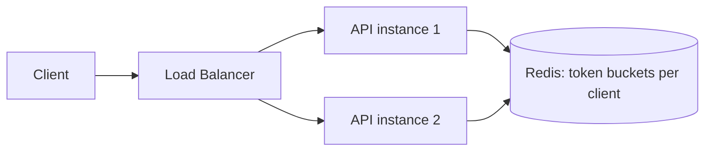

**Implementation detail jo senior answers ko separate karta hai:** Ek single Redis Lua script (ya `MULTI`/`EXEC`) use karo token count ko atomically read-and-decrement karne ke liye — application code se separate `GET` phir `SET` karna concurrent requests ke under ek race condition hai (do requests dono "1 token left" read karte hain, dono proceed karte hain, bucket negative ho jaata hai).

**Redis down hone par kya hota hai?** Yeh critical failure-mode question hai. Options: fail open (saari requests allow karo — outage ke dauran abuse ka risk) ya fail closed (saari requests reject karo — aapke safety mechanism se caused ek full outage ka risk). Zyada production systems specifically rate limiting ke liye fail open karte hain, kyunki ek rate limiter ka job abuse ke against protect karna hai, na ki ek hard security boundary hona — ek outage-caused traffic spike 100% legitimate traffic reject karne se lesser risk hai.

**Kahan enforce karein:** API Gateway/edge par (cheapest, abusive traffic ko rokta hai isse pehle ki wo aapko koi backend compute cost kare) instead of har service ke andar deep — bawajood iske ki per-service/per-endpoint limits finer-grained protection ke liye upar layer kar sakte hain (e.g., specifically ek expensive search endpoint par ek stricter limit).

### Design a Notification System [new content]

**Requirements:** Bahut se upstream services se triggered events se multiple channels (push, email, SMS) ke through notifications send karo; upstream service ko block nahi karna chahiye; retries/failures per channel independently handle karna chahiye; potentially huge fan-out (e.g., "notify all followers").

**High-level design:**

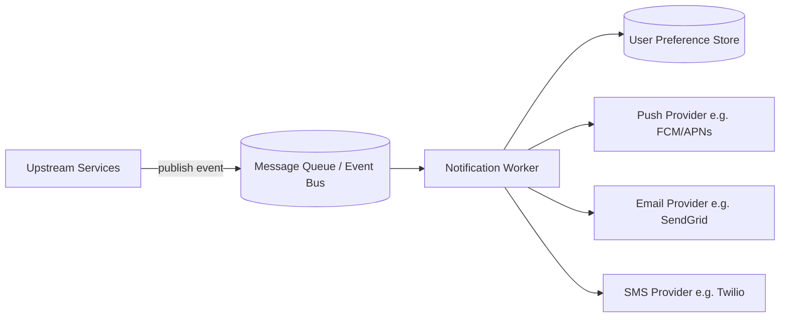

**Direct call ke bajaye ek queue kyun:** Triggering service (e.g., Orders) ko notification delivery par block nahi hona chahiye, aur SMS provider outages ko jaanna/care karna nahi chahiye — queue ke through decouple karna matlab order instantly complete hota hai aur notification delivery/retries independently hote hain (directly upar [Message Queues](#message-queues--event-driven-architecture-new-content) section se judta hai).

**Deep dive — fan-out at scale ("notify all 1M followers"):** 1M individual queue messages triggering request se synchronously create mat karo. Instead, ek "fan-out" event publish karo; ek dedicated fan-out worker isko per-user work items mein expand karta hai (possibly khud ek second queue mein push karta hai) — yeh originating request ko fast rakhta hai aur expensive fan-out work ko ek scalable background process mein isolate karta hai.

**Per-channel resilience:** Har channel (push/email/SMS) ke apne failure modes aur provider se rate limits hote hain — har provider call ko apni Polly policy mein wrap karo (retry + circuit breaker) taaki ek SMS provider outage email/push delivery ko stall na kare. Retries exhaust karne wale messages ke liye per channel dead-letter queues use karo, alerting ke saath.

**User preferences & idempotency:** Send karne se pehle user notification preferences (opt-outs, quiet hours, channel preference) check karo — isse cache karo kyunki yeh change hone se kaafi zyada baar read hota hai. Ek idempotency key per (event, channel) use karo taaki ek redelivered queue message (at-least-once delivery) ek duplicate notification na bheje.

**Explicitly naam lene wala Trade-off:** Real-time push vs batched/digest notifications — har event ko immediately send karna immediacy maximize karta hai lekin notification fatigue aur higher provider cost risk karta hai; batching/digesting (e.g., "5 new comments" 5 separate pushes ke bajaye) scale par better UX aur lower cost ke liye latency trade karta hai. Yeh assume karne ke bajaye isko mention karna worth hai ki aap yeh requirement clarify karoge.

---

## Closing the Gap: Additional Prep [gaps]

Upar wale sections paper par already senior/lead-calibrated hain. Neeche wale additions is guide ke ek formal gap-analysis review se aaye hain 2026 senior .NET/AWS system-design interview expectations ke against — yeh specific, named gaps close karte hain instead of already well-covered ground ko re-cover karne ke.

### Expanding the Worked-Example Repertoire [gaps]

Teen worked examples (URL Shortener, Rate Limiter, Notification System) ek good start hai, lekin senior/staff loops ek much larger pool se draw karte hain. Yeh chhe practice karo same tarike se — requirements → estimation → high-level design → deep dive → trade-offs — upar already established framework use karke:

- **Design a News Feed (Twitter/Instagram-style).** Core tension: fan-out-on-write (har post par har follower ka feed precompute karo — fast reads, celebrities ke liye jinke millions followers hain unke liye expensive/slow) vs fan-out-on-read (feed ko request time par assemble karo unko query karke jinhe aap follow karte ho — cheap writes, expensive reads). Senior answer: hybrid — normal users ke liye fan-out-on-write, high-follower accounts ke liye fan-out-on-read (ya ek separate "celebrity" path), kyunki ek single strategy tails par break ho jaati hai.
- **Design a Chat System (WhatsApp-style).** Core components: real-time delivery ke liye WebSocket/long-lived connections, ek presence service (online/offline/typing), delivery guarantees ke saath message persistence (sent/delivered/read receipts), aur group chats ke liye fan-out. Key deep-dive: aap ek message ko ek recipient ko kaise route karte ho jo thousands of stateless connection-handling servers mein se kisi ke saath connected ho sakta hai? (Jawab: ek connection-registry/lookup service — e.g., Redis mapping `userId -> serverId` — taaki koi bhi server dhundh sake ki message kahan forward karna hai.)
- **Design a Ride-Sharing Dispatch System (Uber-style).** Core problem: scale par geospatial matching — rider ke sabse nearest available driver ko find karna. Senior answer: geohashing ya ek quadtree driver locations ko index karne ke liye taaki "find nearby drivers" ek fast spatial query ho instead of ek full scan ke; frequent location updates (per driver har few seconds mein) matlab location store ko high-write-throughput ke liye optimized hona chahiye, strong consistency ke liye nahi.
- **Design a Distributed Key-Value Store** (the "build a mini-DynamoDB" prompt). Directly is guide mein already present content se judta hai: partitioning ke liye consistent hashing, durability ke liye replication factor, tunable consistency ke liye read/write quorums (`R`/`W`), aur same key par concurrent writes ke conflict resolution ke liye vector clocks ya last-write-wins.
- **Design a Video Streaming Service (Netflix-style).** Core components: multiple bitrates par chunked video encoding, edge delivery ke liye ek CDN (yahan aapka caching-strategy content directly apply hota hai), adaptive bitrate streaming (client measured bandwidth ke basis par next chunk ki quality pick karta hai), aur video-serving path se decoupled ek separate metadata/recommendation service.
- **Design an E-Commerce Checkout/Inventory System.** Core problem: concurrent checkouts ke under overselling rokna. Senior answer: yeh is guide mein already present Sagas aur Idempotency Keys content ka ek direct application hai — inventory reserve karo (ek TTL ke saath, agar checkout abandon ho jaaye), payment charge karo, reservation confirm karo; koi step fail ho to compensating actions use karo (reservation release karo), aur idempotency keys taaki ek retried checkout request double-charge ya double-reserve na kare.

### Mapping Patterns to AWS Managed Services [gaps]

Is guide mein pehle cover hua har generic building block ka ek concrete AWS managed-service equivalent hai. Given ki target role explicitly AWS-cloud hai, aapko instantly dono directions mein translate kar pana chahiye — agar interviewer kahe "how would you build this on AWS specifically," to generic pattern restate mat karo, service ka naam lo:

| Generic pattern (upar covered) | AWS managed-service equivalent | Notes |
|---|---|---|
| Distributed cache (Redis, cache-aside) | **ElastiCache** (Redis or Memcached) | Same cache-aside/write-through patterns apply hote hain; ElastiCache sirf Redis khud run karne ka operational burden remove karta hai |
| Message queue (point-to-point) | **SQS** (Simple Queue Service) | Default se at-least-once delivery — upar wala idempotency-key content directly apply hota hai; natively dead-letter queues support karta hai |
| Pub/Sub (topic, fan-out) | **SNS** (Simple Notification Service), often SNS → multiple SQS queues | SNS bahut se subscribers ko fan out karta hai; per-subscriber durable, independently-scalable consumers ke liye SQS ke saath combine karo |
| CDN / edge caching | **CloudFront** | S3 (static assets) ya ek ALB/API Gateway (dynamic content) ke saamne rehta hai; yeh upar wale Best Practices ka "cache at the layer closest to the client" principle hai, uske AWS-native conclusion tak liya gaya |
| Load balancer (L7) | **ALB** (Application Load Balancer) | Path/header-based routing — upar covered Strangler Fig gateway-routing pattern ke liye AWS-native tool |
| Load balancer (L4) | **NLB** (Network Load Balancer) | Ultra-low-latency, protocol-agnostic — use hota hai jab aapko raw TCP/UDP performance chahiye instead of HTTP-aware routing ke |
| Read replicas / horizontal read scaling | **RDS Read Replicas** ya **Aurora Replicas** | Upar wale CQRS+BFF reference architecture se same eventual-consistency caveat directly apply hota hai |
| Orchestrated Sagas / workflow coordination | **Step Functions** | Ek hand-rolled saga orchestrator ka ek managed alternative — state machine declaratively har step aur uska compensating action define karta hai |
| Event streaming (Kafka-equivalent) | **Kinesis Data Streams** (ya MSK — Managed Streaming for Kafka, agar aapko specifically Kafka compatibility chahiye) | Kinesis simpler ops ke saath AWS-native hai; MSK drop-in Kafka option hai jab aapko Kafka ki exact semantics/tooling chahiye |
| Background/event-driven work ke liye serverless compute | **Lambda** | Already aapka strongest hands-on area — Outbox Pattern ka polling publisher ek natural Lambda-on-a-schedule (EventBridge Scheduler) job hai |
| Rate limiter's shared counter store | **ElastiCache (Redis)**, same as distributed-cache row | Guide ka apna "what if 10 pods behind a load balancer" follow-up upar AWS par same tarike se answer hota hai: ek shared Redis (ElastiCache), per-instance memory nahi |

### Running the Interview: Time-Boxing & Whiteboard Mechanics [gaps]

Patterns jaanna aur ek good 45-60 minute live interview run karna different skills hain — yeh section specifically doosre wale ke bare mein hai, kyunki yeh wo part hai jo "read the notes" ko "performed well in the room" se separate karta hai.

**Ek 45-minute system design interview ke liye typical time-box:**

| Phase | Time | What you're doing |
|---|---|---|
| Requirements clarification | ~5 min | Scale (DAU/RPS), read:write ratio, consistency needs, latency SLAs ke bare mein puchho — time pressure ke under bhi isko skip mat karo; wrong thing ko fast design karna wrong thing ko slightly slower design karne se worse hai |
| Back-of-envelope estimation | ~5 min | Upar Core Concepts se capacity-estimation method use karo — jaate hue assumptions ko loud state karo |
| High-level architecture | ~15-20 min | Boxes aur arrows draw karo; add karte waqt narrate karo ki har component kyun exist karta hai, silently mat draw karo |
| Deep dive on 1-2 hard components | ~15-20 min | Interviewer usually aapko yahan steer karega ("how exactly does X work") — yahan is guide mein pehle wala detailed pattern content use hota hai |
| Trade-offs / failure modes / wrap-up | ~5-10 min | Proactively naam lo ki aap 10x scale par kya differently karoge, aur kam se kam ek failure mode jo aapne abhi tak address nahi kiya |

**Whiteboard/diagramming fluency:** Is guide ke architectures (CQRS+BFF, Strangler Fig, Saga sequence diagrams) ko sketch karne ki practice karo jo bhi tool aapko actually diya jaayega usse — zyada remote interviews ek shared virtual whiteboard (Excalidraw, Miro, ya ek plain collaborative doc) ya ek coding-interview platform ka built-in diagram pane (CoderPad, HackerRank) use karte hain. Speed par, boxes/arrows/labels ke saath fluent hona uss specific tool mein, jabki baat kar rahe ho, architecture jaanne se distinct skill hai — isko rehearse karo, assume mat karo ki yeh reading se transfer ho jaayega.

**Continuously narrate karo.** Aap sochte waqt silence single sabse common reason hai jiski wajah se ek technically-correct design bhi feedback mein "junior" padhta hai. Bolo ki aap kya consider kar rahe ho aur kyun alternatives reject kar rahe ho, even briefly ("I could shard by user ID, but I'll shard by tenant ID instead since it keeps each tenant's data — and transactions — on one shard").

### Multi-Tenant Data Isolation & PII Handling [gaps]

Yeh ek system-design angle hai jo ek strong personal story mein build karna worth hai, kyunki yeh directly real experience ke upar map hota hai: bahut se partner dealers ka data handle karne wala ek Dealership Management System, state/county-specific business rules aur compliance workflows ke saath, inherently ek multi-tenant, PII-adjacent system hai.

**Tenant isolation models** (architectural decision, EF Core-level global-query-filter mechanism se distinct jo EF Core guide mein covered hai):

| Model | Isolation | Cost/Complexity | When it fits |
|---|---|---|---|
| Silo (DB-per-tenant) | Strongest — per tenant separate database | Highest operational overhead (migrations, scaling, backups per tenant multiply ho jaate hain) | Regulatory requirements hard isolation demand karte hain (e.g., ek dealer/regulator require karta hai ki unka data kabhi infrastructure share na kare), ya tenants ke scale wildly different hain |
| Pooled with tenant-key partitioning (shared DB, `TenantId` column + row-level filtering) | Logical isolation, application/ORM code mein enforced | Lowest overhead, lekin ek missed filter ek real data-leak risk hai | Zyada SaaS platforms moderate-to-large scale par — "shard a multi-tenant SaaS DB" question ke liye guide ki already existing sharding-by-tenant-ID recommendation se match karta hai |
| Bridge (schema-per-tenant) | Middle ground — same DB instance, per tenant separate schema | Moderate — pooled se per-tenant backup/restore easier hai, full silo se cheaper hai | Ek middle number of tenants jahan per-tenant customization (schema differences) matter karta hai lekin full silo justified nahi hai |

**Proactively raise karne wala PII/compliance angle:** encryption at rest (AWS: RDS/DynamoDB encryption, KMS-managed keys) aur in transit (TLS everywhere), sabse sensitive fields ke liye field-level encryption ya tokenization (e.g., ek dealer ka financial/customer data) instead of sirf database-level encryption par rely karne ke, aur audit logging ki kis tenant ka data kisne access kiya aur kab — yeh last point directly Structured Logging guide ke content se judta hai aur frequently pehli cheez hai jo ek compliance-minded interviewer puchta hai ek baar multi-tenancy aane ke baad.

**#1 failure mode explicitly naam lene ke liye — cross-tenant leak:** aap chahe koi bhi isolation model pick karo, interview-winning statement wo specific mechanism naam lena hai jo tenant A ki request ko kabhi bhi tenant B ka data return karne se rokta hai — ek fail-closed default ke saath ek global query filter (queries throw hoti hain instead of silently unfiltered data return karne ke agar tenant context set nahi hai), sirf "we add a WHERE clause" nahi.

---

## Sample Interview Q&A

**Q: Why is Kestrel faster than IIS?**
Jawab: Async I/O, minimal pipeline, no `System.Web`, lightweight request handling, event-driven model.

**Q: Should Kestrel be exposed directly to the internet?**
Jawab: Nahi — production ke liye ek reverse proxy use karo (Nginx/IIS/ingress controller).

**Q: How does Kestrel handle thread starvation?**
Jawab: No thread-per-request; async I/O + event loop matlab kaafi kam threads chahiye.

**Q: Is CQRS with shared RDS + replicas "true" CQRS?**
Jawab: Nahi — yeh pragmatic CQRS hai (same logical data store par separated read/write paths aur scaling). Separate projections wala full CQRS/event sourcing ek escalation path hai agar read requirements aur diverge karein.

**Q: Why not let the Angular frontend call Query APIs directly instead of going through a BFF?**
Jawab: UI ko backend structure se couple karta hai, auth logic duplicate karta hai, UI changes ko fragile aur expensive banata hai.

**Q: When would you avoid microservices entirely?**
Jawab: Jab aapke paas genuinely independent scaling/deployment/team needs na ho — ek well-modularized monolith often right, defensible answer hota hai.

**[new content] Q: What's the difference between availability and consistency trade-offs during a network partition vs during normal operation?**
Jawab: CAP theorem sirf strictly ek partition ke dauran apply hota hai (A ya C choose karo). Normal operation ke dauran (no partition), real trade-off latency vs consistency (PACELC) hai — e.g., synchronous multi-AZ replication consistency guarantee karne ke liye latency add karta hai, jabki async replication (yahan wale RDS read replicas jaisa) temporary staleness ki cost par latency ko favor karta hai.

**[new content] Q: How would you make a payment API safe to retry?**
Jawab: Client se ek idempotency key require karo per logical payment attempt; completed keys ko unke response ke saath store karo; same key ke saath retry par, re-charging ke bajaye cached response return karo. Client side Polly retry policies ke saath combine karo aur defense-in-depth ki tarah business key par ek database-level uniqueness constraint.

**[new content] Q: Your circuit breaker is open and failing fast — what do you tell users, and what do you tell on-call?**
Jawab: Users ko: agar possible ho to ek graceful degraded response return karo (cached/stale data, ya ek clear "temporarily unavailable" instead of ek hung request ke). On-call ko: specifically circuit state transitions par alert karo (sirf error rate nahi) taaki unhe pata chale ki yeh ek downstream dependency issue hai, aapki service ka apna bug nahi — yeh diagnosis time significantly cut karta hai.

**[new content] Q: How would you scale the URL shortener redirect path to 50,000 reads/sec?**
Jawab: Aggressively cache karo (Redis, potentially bahut hot links ke liye ek CDN/edge cache), ensure karo ki redirect path kabhi write DB ko touch na kare, aur ek read replica ya dedicated read store consider karo agar cache miss volume alone bhi ek DB ki capacity exceed kare — redirect path nearly saara cache hits hona chahiye given URL shorteners ka typical skewed read:write ratio.

---

## Summary of Additions

Yeh `[new content]` topics add kiye gaye kyunki inhe 2026 senior/lead .NET system design interviews mein commonly probe kiya jaata hai lekin original notes mein yeh missing the ya sirf named-in-passing the:

- **What System Design Interviews Actually Test** — guide ke baaki hisse ko trade-off reasoning ke around frame karta hai, pattern recitation nahi.
- **Scalability/Availability/Reliability definitions** — precise vocabulary jo interviewers cleanly distinguish expect karte hain (esp. availability vs reliability).
- **CAP Theorem in Practice (+ PACELC)** — original notes ka read-replica design implicitly ek AP/EL choice hai; yeh us trade-off ko explicit aur interview-ready banata hai.
- **Back-of-the-Envelope Capacity Estimation** — almost har system design interview aapse kuch size karne ke liye kehta hai; yeh entirely absent tha.
- **Load Balancing** — ek foundational building block jo har architecture diagram mein implicit hai lekin kabhi cover nahi hua.
- **Database Sharding vs Partitioning** — ek top-tier "how do you scale writes" follow-up question, pehle entirely missing tha.
- **Consistent Hashing** — "how does sharding/caching survive adding a node," ka standard answer, entirely missing tha.
- **Message Queues & Event-Driven Architecture (Kafka vs RabbitMQ vs Service Bus)** — sirf passing mein named tha; yeh Outbox/Saga/CQRS patterns ke liye load-bearing hai.
- **CQRS & Event Sourcing (Full Pattern)** — original notes pragmatic CQRS ko well cover karte hain lekin "full" pattern ko nahi jo interviewers escalation/follow-up ki tarah puchte hain.
- **Outbox Pattern & Transactional Messaging** — original notes mein named tha lekin unexplained ("Outbox" zero detail ke saath appear hua tha); ab dual-write problem ke saath fully explained hai jo yeh solve karta hai.
- **Sagas / Distributed Transactions** — same gap: named tha lekin unexplained; ab choreography vs orchestration aur "what if compensation fails" follow-up cover karta hai.
- **Resilience Patterns: Circuit Breaker, Retry, Bulkhead (Polly)** — completely absent tha; sabse common senior .NET resilience questions mein se ek.
- **Idempotency Keys** — completely absent tha; ek baar at-least-once delivery aur retries play mein aane ke baad necessary hai.
- **Rate Limiting Algorithms** — ek baar zero depth ke saath named tha; full algorithm comparison plus .NET 7+ built-in middleware aur distributed (Redis-backed) enforcement add kiya gaya.
- **Scalability & Performance Deep Dive (bottleneck decision tree, N+1 queries)** — performance tips ko ek debugging framework se tie karta hai jo interviewers explicitly test karte hain ("the API is slow, walk me through it").
- **Worked Examples (URL Shortener, Rate Limiter, Notification System)** — full worked "design X" examples, ek near-guaranteed interview format jo original notes mein bilkul represented nahi tha.
- Kaafi **Kestrel Q&A additions** (`MinRequestBodyDataRate`, HTTP/2 vs HTTP/3 trade-offs) aur **serialization/gRPC nuance** additions, existing sections mein layered kiye gaye instead of new top-level headings ke.

**Contradictions flagged:** Koi nahi mila. Original notes internally consistent hain — CQRS+BFF section aur microservices-migration section ek doosre ko complement karte hain (dosra explicitly former mein pragmatically detailed patterns recommend karta hai, e.g., Outbox/Saga), aur source material ke across koi conflicting technical claims nahi mile.

---

## Summary of [gaps] Additions (This Pass)

Yeh pass [Closing the Gap: Additional Prep](#closing-the-gap-additional-prep-gaps) ke under chaar sections add kiye, is guide ke ek formal gap-analysis review ke basis par 2026 senior .NET/AWS system-design interview expectations ke against. Upar wale `[new content]` pass ke unlike (jisne missing *knowledge* fill ki), yeh pass strong written notes hone aur live achha perform karne ke beech gap ko target karta hai — plus kuch genuinely missing content items:

- **Expanding the Worked-Example Repertoire** — teen worked examples staff/senior loops ke liye enough breadth nahi thi — chhe aur add kiye (news feed, chat, ride-sharing, distributed KV store, video streaming, e-commerce checkout) specific hard trade-off ke saath jo har ek test karta hai.
- **Mapping Patterns to AWS Managed Services** — guide ne har pattern ko generically teach kiya (cache, queue, CDN, load balancer) bina kabhi wo AWS service naam liye jo isko implement karti hai. Given ki target role explicitly AWS-cloud hai, yeh single highest-leverage addition tha — yeh doubles as AWS interview prep, sirf system design prep nahi.
- **Running the Interview: Time-Boxing & Whiteboard Mechanics** — guide mein zero content tha ek live 45-60 minute interview run karne ki *performance* skill par (phase per time allocation, loud narrating, whiteboard-tool fluency) patterns jaanne se distinct ki tarah. Yeh sabse likely reason hai ki ek candidate genuinely strong notes ke saath bhi ek live loop mein "intermediate" padhta hai.
- **Multi-Tenant Data Isolation & PII Handling** — add kiya gaya kyunki yeh directly real hands-on experience ke upar map hota hai (compliance workflows ke saath ek multi-tenant Dealership Management System) jo abhi tak ek system-design talking point mein nahi convert hua tha; yeh AWS aur Microservices guides mein separately flag kiya gaya compliance/security depth ke around ek gap bhi close karta hai.
