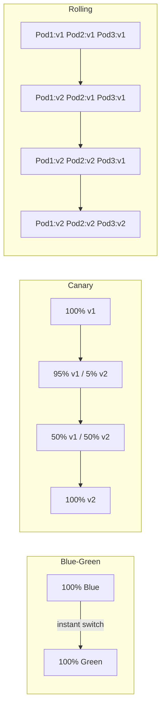
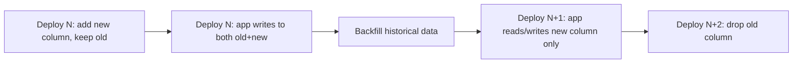
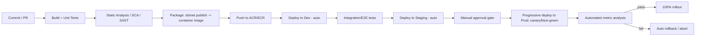
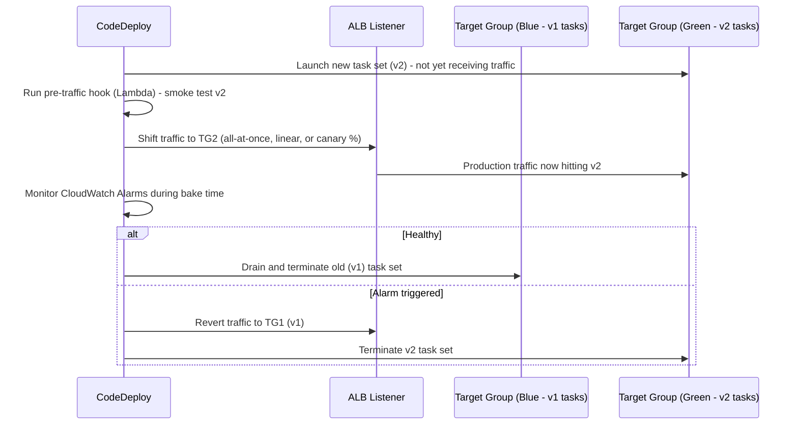

# Deployment Strategies — Senior .NET Interview Guide

> Personal notes se consolidate kiya gaya, aur senior/lead-level .NET full-stack interviews (2026) ke liye gaps fill kiye gaye hain.

## Table of Contents

1. [Core Concepts](#core-concepts)
   - [What "Deployment Strategy" Actually Means](#what-deployment-strategy-actually-means)
   - [Blue-Green Deployment](#blue-green-deployment)
   - [Canary Deployment](#canary-deployment)
   - [Rolling Deployment](#rolling-deployment)
   - [[new content] Comparison Table: Blue-Green vs Canary vs Rolling vs Recreate](#new-content-comparison-table-blue-green-vs-canary-vs-rolling-vs-recreate)
2. [Feature Flags / Feature Toggles](#feature-flags--feature-toggles)
   - [What Is a Feature Toggle](#what-is-a-feature-toggle)
   - [Why Use Feature Toggles](#why-use-feature-toggles)
   - [Implementing Feature Toggles with LaunchDarkly in .NET](#implementing-feature-toggles-with-launchdarkly-in-net)
   - [Testing Feature Toggles](#testing-feature-toggles)
   - [Real-World Use Cases](#real-world-use-cases)
   - [[new content] Feature Flags in a Microservices Architecture](#new-content-feature-flags-in-a-microservices-architecture)
   - [[new content] Feature Flag Types and Anti-Patterns](#new-content-feature-flag-types-and-anti-patterns)
3. [Intermediate Topics](#intermediate-topics)
   - [[new content] Zero-Downtime Database Migrations](#new-content-zero-downtime-database-migrations)
   - [[new content] Rollback Strategy for Stateful Services](#new-content-rollback-strategy-for-stateful-services)
   - [[new content] Deployment in Kubernetes / AKS / EKS](#new-content-deployment-in-kubernetes--aks--eks)
4. [Advanced Topics](#advanced-topics)
   - [[new content] Progressive Delivery](#new-content-progressive-delivery)
   - [[new content] GitOps](#new-content-gitops)
   - [[new content] Deployment Strategies: Microservices vs Monolith](#new-content-deployment-strategies-microservices-vs-monolith)
   - [[new content] Dark Launches / Shadow Traffic / A-B Testing at Infrastructure Level](#new-content-dark-launches--shadow-traffic--ab-testing-at-infrastructure-level)
   - [[new content] CI/CD Pipeline Design for .NET (Azure DevOps / GitHub Actions)](#new-content-cicd-pipeline-design-for-net-azure-devops--github-actions)
   - [[gaps] AWS-Specific Deployment Mechanics](#gaps-aws-specific-deployment-mechanics)
5. [Best Practices](#best-practices)
6. [Common Pitfalls](#common-pitfalls)
7. [Sample Interview Q&A](#sample-interview-qa)
8. [Summary of Additions](#summary-of-additions)
9. [Summary of \[gaps\] Additions (This Pass)](#summary-of-gaps-additions-this-pass)

---

## Core Concepts

### "Deployment Strategy" ka Actual Matlab Kya Hai

Deployment strategies teen questions ko simultaneously answer karne ke liye exist karti hain: changes ko production mein **downtime ke bina** kaise ship karein, jab kuch galat ho jaaye to **blast radius kaise limit** karein, aur jab wo ho jaaye to **fast rollback kaise** karein. Neeche di gayi har strategy infrastructure cost, deployment speed, aur risk exposure ke beech ek different trade-off hai — koi single "best" strategy nahi hoti; right choice service ki statefulness, regulatory/compliance constraints, team maturity (monitoring, automation), aur cost tolerance par depend karti hai.

Deployment strategies ke baare mein poochne wala interviewer rarely sirf "blue-green define karo" pooch raha hota hai. Woh yeh probe kar raha hota hai ki kya aapne actually kisi production system ko ek bad deploy se through operate kiya hai — kya aap traffic shifting mechanics, session affinity, database compatibility windows, aur observability requirements samajhte ho jo har strategy ko practice mein kaam karne lete hain.

### Blue-Green Deployment

**Yeh kaise kaam karta hai:**
- Do identical, fully-provisioned environments: **Blue** (current production) aur **Green** (new version).
- Green ko isolation mein deploy aur test kiya jaata hai (smoke tests, synthetic traffic) jab Blue saara real traffic serve karta rehta hai.
- Ek baar Green stable verify ho jaaye, traffic ko Blue se Green par switch kiya jaata hai — usually atomically, ek router/load balancer/DNS/CNAME swap ke through.
- Agar switch ke baad issues aate hain, rollback bas traffic ko Blue par wapas flip karna hai.

**Fayde**
- Cutover ke during zero downtime.
- Instant rollback (traffic switch, redeploy nahi).
- Koi real user dekhe usse pehle production-like infrastructure ke against Green ka full testing/validation.

**Nuksan**
- Expensive — aap double infrastructure ke liye pay karte ho (even if sirf briefly hi ho).
- Ek reliable traffic-switching mechanism chahiye (load balancer, service mesh, DNS) — particularly DNS-based switching TTL/caching delays se suffer karta hai, jo ek common gotcha hai.
- Database/schema state shared hoti hai ya carefully handle ki jaani chahiye (neeche [Zero-Downtime Database Migrations](#new-content-zero-downtime-database-migrations) dekho) — "two identical environments" model fast break ho jaata hai jaise hi aapke paas ek shared, stateful backing store ho jaata hai.

**Real-world example — AWS Elastic Beanstalk:**

```bash
# Deploy the new version in Green
eb create green-environment

# Swap Blue and Green environments (CNAME swap)
eb swap-environment-cnames --source-environment blue-environment --destination-environment green-environment
```

Scenario walkthrough (banking app):
1. Blue (v1.0) live hai aur saara traffic serve kar raha hai.
2. v2.0 Green mein deploy hota hai.
3. Green ke against automated + manual tests run hote hain.
4. Agar Green pass ho jaaye, traffic ko Green par swap karo.
5. Agar v2.0 misbehave kare, Blue par instantly swap back karo.

**Interviewer follow-ups jo expect karni chahiye:** "Swap ke during in-flight requests ka kya hota hai?" (connection draining / graceful shutdown chahiye), "Database ka kya?" (usually shared hoti hai, isliye yeh actually sirf *app tier* par blue-green hai, full-stack nahi), "Session state kaise handle karte ho?" (sticky sessions blue-green ko break karte hain — stateless services + distributed cache/session store prefer karo).

### Canary Deployment

**Yeh kaise kaam karta hai:**
- Naye version ko users/traffic ke ek small slice par deploy karo (e.g., 5–10%).
- Error rates, latency, business metrics monitor karo.
- Agar healthy hai, traffic ko progressively increase karo (e.g., 5% → 25% → 50% → 100%).
- Agar kisi bhi stage par problems surface hote hain, halt karo aur us slice ko roll back karo.

**Fayde**
- Blast radius minimize karta hai — sirf ek small user cohort ek bad release ke expose hota hai.
- Data-driven rollout: real production signals (sirf synthetic tests nahi) promotion ko gate karte hain.
- Ek all-or-nothing cutover ke bajaye gradual, controlled exposure.

**Nuksan**
- 100% rollout tak pohochne mein slower — multiple stages, har ek ko ek soak/bake period chahiye.
- Real traffic-splitting infrastructure chahiye (service mesh, weighted routing wali ingress, ya ek API gateway) plus statistically meaningful sample size par regressions detect karne ke liye solid observability.

**Real-world example — Netflix**, ek naya streaming feature roll out karte hue:
1. v2.0 ko 5% users ko deploy karo.
2. Performance, error logs, user feedback monitor karo.
3. Agar healthy hai, 50% tak bump karo.
4. Agar abhi bhi healthy hai, 100% par jao.

**Kubernetes implementation (notes se):**

```yaml
apiVersion: apps/v1
kind: Deployment
metadata:
  name: my-app
spec:
  replicas: 10
  selector:
    matchLabels:
      app: my-app
  template:
    metadata:
      labels:
        app: my-app
        version: canary
    spec:
      containers:
      - name: my-app
        image: my-app:v2.0
        ports:
        - containerPort: 80
```

Ingress ke through weighted traffic split:

```yaml
apiVersion: networking.k8s.io/v1
kind: Ingress
metadata:
  name: my-app-ingress
spec:
  rules:
  - http:
      paths:
      - path: /my-app
        backend:
          service:
            name: my-app
            port:
              number: 80
        weight: 20 # Send 20% traffic to Canary
```

> **Note (accuracy flag):** Plain Kubernetes `Ingress` (networking.k8s.io/v1) natively traffic-weight annotations support nahi karta — dikhaya gaya `weight` field vanilla Ingress spec ka part nahi hai. Isi tarah ki weighted canary routing typically ek ingress controller extension (e.g., **NGINX Ingress** ka `nginx.ingress.kubernetes.io/canary-weight` annotation), ek service mesh (**Istio VirtualService** weighted routing), ya ek progressive-delivery controller (**Flagger**, **Argo Rollouts**) ke through achieve ki jaati hai. Original notes ka YAML *intent* correctly illustrate karta hai lekin jaisa likha gaya hai wo raw manifest stock Kubernetes par unmodified kaam nahi karega — isko ek contradiction ke bajaye ek simplification ke roop mein flag kar rahe hain, kyunki yeh describe karne wala sirf yehi source hai. (real cluster mein use karne se pehle apne ingress controller ke actual annotation syntax ke against verify karo.)

**Interviewer follow-ups:** "Traffic split increments aur bake time kaise decide karte ho?" (SLO-based automated gates, gut feel nahi), "Kaun se users canary dekhenge, kaise pick karte ho?" (random sampling vs. sticky-by-user-id — UX ke liye consistency matter karti hai), "Tumhara automatic rollback trigger kya hai?" (error rate / latency SLO breach → auto-abort, ideally Flagger/Argo Rollouts jaise controller ke through, dashboard dekhta hua human nahi).

### Rolling Deployment

> **[new content]** — original notes mein nahi tha; yeh ek core comparison point hai jo interviewers blue-green/canary ke saath-saath aapse jaanna expect karte hain.

- Old version ke instances ko naye version se incrementally, thode-thode karke replace kiya jaata hai (e.g., Kubernetes `Deployment` ki default `RollingUpdate` strategy `maxSurge`/`maxUnavailable` ke saath).
- Koi second full environment nahi chahiye — blue-green se cheaper.
- Rollback *instant nahi* hai — aapko same incremental process ko reverse mein roll karna padta hai, jisme fleet size ke proportional time lagta hai.
- Mid-rollout, **do versions simultaneously run** hote hain live traffic serve karte hue — iski wahi "N aur N+1 compatibility" requirement hai jo canary aur blue-green ki hai (transition window ke during API/schema backward compatibility mandatory hai).
- Stateless services ke liye good default jahan cost instant rollback se zyada matter karta hai.

### [new content] Comparison Table: Blue-Green vs Canary vs Rolling vs Recreate

| Strategy | Infra Cost | Rollout Speed | Rollback Speed | Risk Exposure | Needs Traffic Splitting? | Typical Use Case |
|---|---|---|---|---|---|---|
| **Recreate** (old stop karo, new start karo) | Low | Fast | Slow (old redeploy) | High (downtime) | No | Dev/test environments, non-critical batch jobs |
| **Rolling** | Low–Medium | Medium | Medium (reverse rollout) | Medium | No (LB simply drain karta hai) | Stateless microservices ke liye default, cost-sensitive teams |
| **Blue-Green** | High (2x infra) | Fast cutover | Instant (traffic wapas flip) | Low (switch se pehle fully tested) | Yes (router/DNS/LB swap) | Regulated/critical systems jinhe instant, clean rollback chahiye |
| **Canary** | Medium (extra small fleet) | Slow (staged) | Fast (rollout stop, canary drain) | Lowest (limited blast radius) | Yes (weighted routing) | High-traffic consumer apps, gradual validated rollout |



---

## Feature Flags / Feature Toggles

### Feature Toggle Kya Hai

Ek Feature Toggle (Feature Flag) **deployment** ko **release** se decouple karta hai: code production mein dark (disabled) ship hota hai, aur independently — specific users, percentages, ya environments ke liye — redeploy ke bina on kiya jaata hai. Yeh wo mechanism hai jo trunk-based development aur continuous delivery ke underneath hota hai: aap incomplete ya risky work continuously merge aur deploy kar sakte ho jab tak wo flag-guarded ho.

Feature toggles teams ko yeh karne dete hain:
- Features ko specific users tak gradually roll out karna.
- Sabko affect kiye bina production mein test karna.
- Agar issue aaye to feature ko instantly disable karna — koi redeploy required nahi.

### Feature Toggles Kyun Use Karein

- **Risk-free deployments** — features default se off hote hain, progressively enable kiye jaate hain.
- **Instant rollback** — poore deployment ko rollback karne ke bajaye flag disable karo (kisi bhi deployment-strategy-level rollback se much faster MTTR).
- **A/B testing** — different cohorts ke liye features enable karo aur impact measure karo.
- **Continuous delivery** — incomplete work ko ek flag ke peeche ship karo, baad mein finish karo, ready hone par flip on karo.

### Implementing Feature Toggles with LaunchDarkly in .NET

**1. Ek LaunchDarkly account create karo**, ek project create karo, SDK key lo.

**2. SDK install karo:**

```bash
dotnet add package LaunchDarkly.ServerSdk
```

**3. SDK key configure karo** `appsettings.json` mein:

```json
{
  "LaunchDarkly": {
    "SdkKey": "your-launchdarkly-sdk-key"
  }
}
```

> **Note (secrets handling — gap flagged):** Kabhi bhi real SDK key ko source control mein `appsettings.json` mein commit mat karo. Production mein, **Azure Key Vault**, **User Secrets** (dev), ya environment variables/App Configuration use karo, aur dikhaye gaye tarah `IConfiguration` ke through bind karo — bas literal key ko check-in mat karo.

**4. LaunchDarkly client initialize karo:**

```csharp
using LaunchDarkly.Sdk;
using LaunchDarkly.Sdk.Server;
using Microsoft.Extensions.Configuration;
using System;

public class LaunchDarklyService : IDisposable
{
    private readonly LdClient _ldClient;

    public LaunchDarklyService(IConfiguration configuration)
    {
        var sdkKey = configuration["LaunchDarkly:SdkKey"];
        _ldClient = new LdClient(sdkKey);
    }

    public bool IsFeatureEnabled(string featureFlagKey, string userKey)
    {
        var user = User.WithKey(userKey);
        return _ldClient.BoolVariation(featureFlagKey, user, false); // Default is false
    }

    public void Dispose()
    {
        _ldClient.Dispose();
    }
}
```

> **Note (lifetime gotcha — gap flagged):** `LdClient` ek persistent streaming connection aur internal caches maintain karta hai; isko construct karna expensive hai aur yeh app ke lifetime ke liye ek **singleton** hona chahiye, per-request create nahi. Isko DI mein `services.AddSingleton<LaunchDarklyService>()` ke roop mein register karo. Per request ek naya `LdClient` construct karna (ek mistake jo beginners karte hain) connections exhaust kar dega aur har call mein multi-second startup latency add kar dega, kyunki `LdClient` default se initial connection par briefly block karta hai.

**5. Controller mein toggle use karo:**

```csharp
using Microsoft.AspNetCore.Mvc;

[Route("api/feature")]
[ApiController]
public class FeatureController : ControllerBase
{
    private readonly LaunchDarklyService _ldService;

    public FeatureController(LaunchDarklyService ldService)
    {
        _ldService = ldService;
    }

    [HttpGet("dark-mode")]
    public IActionResult GetFeatureStatus()
    {
        string featureFlagKey = "dark-mode";
        string userKey = "user-123"; // dynamic, from the authenticated user

        bool isEnabled = _ldService.IsFeatureEnabled(featureFlagKey, userKey);

        return Ok(new
        {
            message = isEnabled
                ? "Dark Mode is ENABLED for you!"
                : "Dark Mode is DISABLED for you."
        });
    }
}
```

### Testing Feature Toggles

1. LaunchDarkly dashboard mein, key `dark-mode` ke saath ek flag create karo aur ek specific user (`user-123`) target karo.
2. Endpoint call karo: `GET http://localhost:5000/api/feature/dark-mode`.
3. Enabled → `{ "message": "Dark Mode is ENABLED for you!" }`
4. Disabled → `{ "message": "Dark Mode is DISABLED for you." }`

### Real-World Use Cases

- **Facebook Dark Mode** — general availability se pehle limited rollout.
- **Netflix UI updates** — user segments ke across UI variants ka A/B testing.
- **Amazon promotions** — sirf Prime members tak scoped discounts.

### [new content] Feature Flags in a Microservices Architecture

Original notes ek open, unanswered question ke saath end hote hain: *"Would you like help setting up feature flags in a microservices architecture?"* Yahan complete senior-level answer hai.

Microservices architecture mein, feature flags cross-service consistency problems introduce karte hain jo ek monolith mein exist nahi karti:

- **Flag evaluation centralize karo.** Har service ko apni own ad-hoc flag logic maintain mat karne do. Ek shared flag platform use karo (LaunchDarkly, Azure App Configuration + Feature Management, Unleash, Split) taaki saari services flag state, targeting rules, aur audit history par agree karein.
- **Flag context ko consistently propagate karo.** Agar ek user-facing request paanch downstream services mein fan-out hoti hai, to *same* targeting context (user ID, tenant, region) pass along kiya jaana chahiye (e.g., ek header ya distributed trace context ke through) taaki saari services us request ke liye flag ko same way se evaluate karein. Same request ke andar services ke across inconsistent evaluation ek classic bug hai — e.g., Service A naya checkout UI dikhata hai lekin Service B ka API abhi bhi old contract ke against validate karta hai.
- **Version/contract compatibility.** Service A mein ek naya feature toggle karne wala flag aksar require karta hai ki Service B already naye contract ko support kare. Iska matlab hai flag ki "on" state ka ek **dependency graph** hota hai — flag dependencies ko document karo aur jahan possible ho enforce karo (kuch platforms prerequisite flags support karte hain).
- **Local caching + streaming updates.** Har service ke SDK ko flag values locally (in-memory) cache karni chahiye aur streaming/polling ke through push updates receive karni chahiye, har request par flag service ko synchronously call nahi karna chahiye — isse har request path mein ek network hop aur single point of failure add ho jaayega.
- **Kill switches vs. release flags vs. experiment flags** — ek microservices setup mein, kill switches (neeche dekho) especially important hote hain kyunki ek service mein bad release call graph ke through failures cascade kar sakta hai; ek coordinated multi-service rollback ke bina ek feature ko instantly disable kar paana ek major operational win hai.
- Scale par **flag lifecycle/cleanup governance zyada matter karta hai** — dozens of services har ek flags accumulate karte hue, stale flags ek distributed technical-debt aur security-audit problem ban jaate hain (old flags jo deprecated code paths ko gate karte hain jinke exist karne ki kisiko yaad hi nahi rehti).

### [new content] Feature Flag Types and Anti-Patterns

Interviewers aksar probe karte hain ki kya aap samajhte ho ki "feature flag" ek cheez nahi hai:

| Flag Type | Lifespan | Purpose |
|---|---|---|
| **Release flag** | Short (days–weeks) | Deploy ko release se decouple karta hai; full rollout ke baad remove kiya jaata hai |
| **Experiment flag** (A/B) | Medium | Experimentation/analytics drive karta hai; experiment conclude hone ke baad remove kiya jaata hai |
| **Ops / kill switch** | Long-lived | Ek feature/dependency ke liye circuit-breaker; operability ke liye permanently rakha jaata hai |
| **Permission / entitlement flag** | Permanent | Plan/tier se features gate karta hai (e.g., Prime-only discounts) — business logic hai, deploy mechanism nahi |

**Common anti-patterns:**
- **Flag debt** — 100% rollout ke baad release flags ko kabhi remove na karna, jisse codebase dead `if` branches aur combinatorial testing explosion se litter ho jaata hai.
- **Non-idempotent side effects ko wrap karne wale flags** (e.g., ek flag ko mid-transaction toggle karna jisne already apni half state likh di ho) — flags ko *behavior* gate karna chahiye, ek unit of work ke andar flip nahi hona chahiye.
- **Sirf "on" aur "off" paths test karna, kabhi other active flags ke combination mein nahi** — flag interaction bugs scale par ek real production risk hain.

---

## Intermediate Topics

### [new content] Zero-Downtime Database Migrations

Yeh arguably un notes mein single most commonly-missed topic hai jo sirf app-tier deployment strategies cover karte hain — aur ek favorite senior-level interview question hai, kyunki blue-green/canary/rolling sab assume karte hain ki transition window ke during old aur new versions ke across **database shared hoti hai**.

**Core rule: expand/contract (a.k.a. parallel change).**

1. **Expand** — naya schema element (column, table) add karo bina kisi purani cheez ko remove ya rename kiye. Old aur new dono app code ko is schema ke against work karna chahiye.
2. **Migrate/backfill** — data ko naye structure mein backfill karo, zaroorat pade to dual-write karo (old code old+new likhta hai, ya ek background job sync karta hai).
3. **Contract** — ek baar saare instances naya code run karein aur verify ho jaayein, ek later, separate deployment mein old schema element remove karo.



**Concrete rules of thumb:**
- Ek step mein kabhi breaking rename mat karo — hamesha multiple deploys ke across "add new" → "migrate" → "remove old" karo.
- Additive changes (`ADD COLUMN` nullable, new table) generally mid-rollout safe hote hain.
- Destructive changes (`DROP COLUMN`, `NOT NULL` bina default ke, renaming) ko tab tak wait karna chahiye jab tak **saare** instances (fleet ka 100%) wo code run na karein jo old shape ko reference nahi karta.
- EF Core ke liye specifically: multi-instance rolling deployment mein app startup par `Database.Migrate()` ko automatically run hone se avoid karo — migrations concurrently apply karne ke liye race karte multiple instances deadlock ya state corrupt kar sakte hain. Naya app version traffic receive karna start kare usse pehle migrations ko ek **separate, single pre-deploy step** (CI/CD migration job) ke roop mein run karo.
- Large table migrations (indexes add karna, backfills) **online/incrementally** ki jaani chahiye (batched updates, `CREATE INDEX ONLINE`/concurrently) production tables ko lock karne se avoid karne ke liye.
- Blue-green ke liye specifically: kyunki Blue aur Green typically **same database** point karte hain, "database ke liye blue-green" ek much harder, alag problem hai (aksar read replicas + cutover ke through, ya transition ke during DB ko append-only treat karke solve kiya jaata hai). Apne answer mein app-tier blue-green ko DB-tier blue-green ke saath conflate mat karo — explicitly call out karo ki wo usually decoupled hote hain.

### [new content] Rollback Strategy for Stateful Services

Stateless services ke liye rollback describe karna trivial hai ("old image redeploy karo" / "traffic wapas flip karo") lekin harder senior-level question yeh hai: **state ka kya hota hai?**

- **Schema compatibility** — upar expand/contract ke according, rollback cleanly sirf tab kaam karta hai jab code ka *previous* version schema/data ki *current* state ke against abhi bhi run kar sake. Isi liye destructive migrations ko code deploys se ek full contract cycle peeche lag karna chahiye — isse aapki rollback karne ki ability preserve hoti hai.
- **Message queue / event-driven state** — agar naye version ne ek message schema change kiya (e.g., ek naya required Kafka/Service Bus field), naye version dwara produce ki gayi in-flight messages ko bhi handle kiye bina consumer ko rollback karna deserialization failures cause kar sakta hai. Rollback ko safe rakhne ke liye schema versioning/tolerant readers use karo (unknown fields ignore karo).
- **Cache poisoning** — agar naye version ne ek shared cache (Redis) mein data ek naye shape mein likha, affected cache keys ko invalidate/flush kiye bina code rollback karna old code ko unexpected shapes par crash kar sakta hai. Apni cache keys ko version karo (e.g., `user:v2:{id}`) taaki old aur new code collide na karein.
- **Replays ke liye idempotency** — rollback ka matlab aksar operations ko replay/retry karna hota hai; ensure karo ki operations idempotent hain (payment/order APIs par idempotency keys) taaki ek rollback-triggered retry double-charge ya double-write na kare.
- **Kubernetes mein stateful sets** (in-cluster running databases, brokers) — ek `StatefulSet` ko rollback karna ek `Deployment` se fundamentally different hai: ordered, one-at-a-time rollback, aur aapko consider karna hoga ki persistent volume ka data abhi bhi older container image ke saath compatible hai ya nahi.
- **Feature-flag-first rollback** — kai production incidents ke liye fastest, safest "rollback" ek full deployment rollback ke bajaye risky code path ko guard karne wale feature flag ko disable karna hai. Yeh aapka first lever hona chahiye, un issues ke liye infrastructure rollback ko fallback ke roop mein rakho jinhe flags cover nahi kar sakte (e.g., ek bad container image, bad logic nahi).

### [new content] Deployment in Kubernetes / AKS / EKS

Kyunki source notes ke YAML examples ka ek large chunk Kubernetes target karta hai, yeh section wo platform-level context fill karta hai jo ek senior .NET/cloud interview expect karta hai:

- **Deployment object** — default strategy `RollingUpdate` hai configurable `maxSurge` (rollout ke during desired count se upar kitne extra pods) aur `maxUnavailable` (kitne down ho sakte hain) ke saath. Inko tune karna rollout speed vs. resource headroom vs. availability control karta hai.
- **Readiness vs. liveness probes** — ek rolling update sirf un pods ko traffic route karti hai jo **readiness** checks pass karte hain; ek pod "alive" ho sakta hai (liveness pass) lekin abhi serve karne ke liye ready nahi (abhi bhi caches/connections warm kar raha ho). Misconfigured probes "rolling deploy ne brief outage cause kiya" incidents ka #1 cause hain — pods actually ready hone se pehle unko traffic bheja jaana, ya `livenessProbe` ka healthy-but-slow-starting .NET pods (cold JIT/ReadyToRun startup) ko ready hone se pehle hi kill kar dena.
- **PodDisruptionBudget (PDB)** — voluntary disruptions (node drains, cluster upgrades) ke during minimum healthy replicas ki number guarantee karta hai — aapki deployment strategy se separate hai, lekin uske saath interact karta hai.
- **Managed cluster specifics (AKS/EKS):**
  - **AKS**: weighted/canary routing ke liye Azure Load Balancer / Application Gateway Ingress Controller (AGIC) ke saath integrate karta hai; Azure DevOps aur GitHub Actions dono ke paas first-class AKS deploy tasks hain (`kubectl`, Helm, ya `azure/k8s-deploy`).
  - **EKS**: typically traffic shaping ke liye AWS ALB Ingress Controller ya App Mesh/Istio ke saath paired hota hai; aksar CodeDeploy ke native Blue/Green aur Canary support ECS/EKS ke liye, ya Argo Rollouts ke through driven hota hai.
  - Dono raw Kubernetes primitives par layered progressive-delivery controllers ke roop mein **Flagger** ya **Argo Rollouts** support karte hain — yeh wo hai jo most real canary/blue-green implementations 2026 mein actually use karte hain, hand-rolled Ingress weight annotations ke bajaye.
- **Helm / Kustomize** — environment-specific manifests (dev/stage/prod) ke liye templating — ek question expect karo ki aap environments ke across config drift kaise avoid karte ho; answer: templated manifests + environment-specific values files ka single source, CI ke through environments mein promoted, har environment mein hand-edited nahi.

---

## Advanced Topics

### [new content] Progressive Delivery

"Progressive delivery" canary + feature flags + automated analysis combined ke liye umbrella term hai (Weaveworks/James Governor dwara coined) — yeh wo term hai jo aapko ek senior interview mein use karna chahiye current dikhne ke liye, canary/blue-green/flags ko teen unrelated ideas treat karne ke bajaye.

- **Automated analysis/gating** — **Flagger** ya **Argo Rollouts** jaise tools ek canary stage ke during Prometheus/Datadog metrics (error rate, latency, custom business metrics) watch karte hain aur automatically promote ya abort karte hain — human-watching-a-dashboard step ko remove karte hue.
- **Feature flags ke saath combine hota hai** — aap *infrastructure* ko canary-deploy kar sakte ho (new pods) jab *feature* ko separately flag-gate kiya jaaye — do independent risk levers.
- **Traffic mirroring/shadowing** — user ko response return kiye bina production traffic ka ek copy naye version ko bhejo, zero user-facing risk ke saath real load ke under behavior/performance validate karne ke liye (neeche Dark Launches dekho).
- Ek interviewer se yeh pooche jaane ki expect karo: "Progressive delivery canary se kaise different hai?" — answer: canary ek *technique* hai; progressive delivery canary analysis, flags, aur rollback decisions ko end-to-end automate karne ki *practice* hai taaki releases ko koi manual gate-watching na chahiye.

### [new content] GitOps

- **Definition**: aapke infrastructure/deployments ki desired state Git mein declare ki jaati hai (manifests, Helm values, Kustomize overlays); ek controller (**ArgoCD**, **Flux**) continuously live cluster state ko Git se match karne ke liye reconcile karta hai, ek CI pipeline imperatively `kubectl apply` run karne ke bajaye.
- **Deployment strategy ke liye yeh kyun matter karta hai**: Git single audit trail aur rollback mechanism ban jaata hai — ek bad deploy ka rollback literally manifest par `git revert` hai, aur GitOps controller cluster ko automatically wapas reconcile karta hai. Yeh "old pipeline re-run karo" se ek stronger, more auditable rollback story hai.
- **Push vs. pull model**: traditional CI/CD changes ko cluster mein *push* karta hai (CI ke paas cluster credentials hote hain — ek security surface). GitOps controllers Git se *pull* karte hain aur cluster ke andar se reconcile karte hain — koi external system ko prod cluster credentials nahi chahiye, jo ek common security/compliance talking point hai.
- **Drift detection**: GitOps continuously Git ke bahar kiye gaye manual `kubectl` changes ("configuration drift") ko detect karta hai aur auto-correct kar sakta hai — regulated environments mein valuable jahan aapko guaranteed state chahiye.
- Directly canary/progressive delivery ke saath tie hota hai: **Argo Rollouts** ArgoCD ke saath integrate hota hai canary/blue-green ko ek GitOps-native, declarative resource (`Rollout` CRD replacing `Deployment`) banane ke liye.

### [new content] Deployment Strategies: Microservices vs Monolith

Ek senior/lead-level differentiator question:

| Aspect | Monolith | Microservices |
|---|---|---|
| **Unit of deployment** | Poora app, ek artifact | Har service independently |
| **Blue-green cost** | Ek large environment duplicated (simpler, lekin double karna expensive) | Per-service blue-green ho sakta hai (per-service cheaper, lekin N services ke versions coordinate karna complex hai) |
| **Canary granularity** | Coarse — poore app ko canary karo | Fine-grained — dusron ko touch kiye bina ek service ko canary karo |
| **Contract/versioning risk** | Low (single deployable, internal calls in-process hoti hain) | High — independent rollouts ke during har service boundary ko backward/forward-compatible contracts chahiye (API versioning, consumer-driven contracts dekho) |
| **Rollback blast radius** | Poore app ka all-or-nothing rollback | Sirf offending service ko rollback kiya ja sakta hai |
| **Database migration coordination** | Single DB, single migration path (abhi bhi expand/contract chahiye) | Potentially many DBs (database-per-service) — independent migrations per service, lekin partial rollout ke during cross-service data consistency ek real design problem hai (sagas/eventual consistency) |
| **Deployment frequency** | Aksar lower (bigger, riskier releases) | Higher (small, frequent, isolated releases) — teams ke microservices adopt karne ka ek primary reason |
| **Tooling complexity** | Lower — ek pipeline | Higher — orchestration, service mesh, distributed tracing independent deploys ko safely operate karne ke liye near-mandatory ban jaate hain |

Key interview point: microservices deployment *strategies* ko kind mein different nahi banate — blue-green/canary/rolling sab abhi bhi apply hote hain — lekin wo **coordination problem** ko multiply kar dete hain: per-service independent deploy cadence ka matlab hai aapko N aur N+1 version compatibility ke liye *continuously* design karna hoga, sirf ek deploy window ke during nahi, kyunki kisi bhi moment kuch services doosri se aage hoti hain.

### [new content] Dark Launches / Shadow Traffic / A-B Testing at Infrastructure Level

- **Dark launch**: production mein naya code deploy aur run karo, lekin abhi uska output real users ko expose mat karo — e.g., naya recommendation engine parallel mein run karo, uske results log karo, current engine ke results ke against offline compare karo, kabhi bhi user ko dark-launch output dikhaye bina. Yeh ek validation technique hai, canary se distinct (jo *actually* real users ko expose karta hai) aur ek feature flag se distinct (jo ek on/off switch hai, shadow comparison nahi).
- **Traffic mirroring/shadowing**: infrastructure-level dark launch — load balancer/service mesh ek request ko old aur new dono versions ko duplicate kar deta hai; sirf old version ka response client ko return hota hai. Istio aur kuch API gateways isko natively support karte hain (`mirror` in a VirtualService).
- **A/B testing vs. canary**: canary ek *risk-mitigation* rollout mechanism hai (temporary, 100% ya 0% par converge hota hai); A/B testing ek *experimentation* mechanism hai (indefinitely run ho sakta hai, dono variants "correct" hote hain, aap ek business metric measure kar rahe ho, safety nahi). Apne answer mein inko conflate mat karo — interviewers is distinction ko sunte hain.

### [new content] CI/CD Pipeline Design for .NET (Azure DevOps / GitHub Actions)

Ek concrete, current pipeline shape jo senior .NET candidates ko sketch karne mein able hona chahiye:



- **Immutable artifacts**: ek baar build karo, *same* container image/artifact ko Dev → Staging → Prod ke through promote karo — har environment mein kabhi rebuild mat karo ("works in staging, different bits in prod" class ke bugs eliminate karta hai).
- **Environment-specific config**, environment-specific builds nahi: `appsettings.{Environment}.json`, Azure App Configuration, ya deploy time par injected environment variables/K8s ConfigMaps/Secrets use karo.
- **Approval gates**: Azure DevOps environments / GitHub Actions environments ek prod deploy job run hone se pehle required reviewers support karte hain — regulated .NET shops (banking, healthcare) ke liye standard.
- **Migrations ek pipeline stage ke roop mein**, ek baar run kiya jaata hai, naya version traffic receive karne se pehle (upar diye gaye zero-downtime migration section se tie back karta hai).

### [gaps] AWS-Specific Deployment Mechanics

Upar ki har cheez (blue-green, canary, rolling, progressive delivery, GitOps) principle mein framework-agnostic hai, lekin jo concrete implementation notes lean karte hain wo almost entirely Kubernetes-flavored hai (Ingress annotations, Flagger, Argo Rollouts). Kyunki candidate ka target cloud AWS hai, yeh section same strategies ko AWS-native mechanics mein ground karta hai — aur yeh close karta hai ki Terraform/CDKTF (candidate ka actual IaC tool) unko kaise drive karta hai, hand-run CLI commands ke bajaye.

#### `[gaps]` AWS CodeDeploy — Blue/Green for EC2, ECS, and Lambda

CodeDeploy AWS ka managed deployment orchestrator hai, aur yeh natively teen different compute targets ke liye blue/green samajhta hai — ek senior AWS answer ko distinguish karna chahiye ki mechanics per target kaise differ karte hain, "CodeDeploy blue/green" ko ek uniform cheez treat karne ke bajaye:

| Target | What "Blue" and "Green" mean | Traffic-shift mechanism | Rollback |
|---|---|---|---|
| **EC2 (in-place ya blue/green)** | Blue = existing ASG/instance fleet; Green = ek freshly provisioned, fully-provisioned replacement fleet | CodeDeploy instances ko existing ELB/Target Group ke peeche re-register karta hai, ya Target Groups ko entirely swap karta hai | Green fleet ko terminate karo, Blue fleet (cutover complete hone tak still running) serving jaari rakhta hai |
| **ECS** | Blue = current running task set (existing task definition revision); Green = same service par new task set (new task definition revision) | ALB listener rule do Target Groups (har task set ke liye ek) ke beech traffic shift karta hai — all-at-once, linear, ya canary ho sakta hai (neeche dekho) | CodeDeploy automatically ALB listener ko original (Blue) Target Group par wapas reroute karta hai |
| **Lambda** | Blue = currently aliased function version; Green = newly published function version | Lambda **alias traffic shifting** — alias ka weighted routing config invocations ka ek percentage naye version par shift karta hai | Alias weight original version par 100% revert ho jaata hai |

**CloudWatch Alarms automated abort trigger ke roop mein** — teeno targets ke liye, CodeDeploy ko CloudWatch Alarms (error rate, latency) se wire kiya ja sakta hai taaki ek bad deployment automatically halt ho jaaye aur dashboard dekhte human ke bina mid-shift rollback ho jaaye — yeh upar diye gaye Progressive Delivery section mein cover kiye gaye Flagger/Argo Rollouts ke automated canary analysis ka direct AWS-native analog hai.

#### `[gaps]` ECS Blue/Green Deployments in Detail

Kyunki ECS AWS par most likely .NET-container deployment target hai, upar wali table se ek level deeper mechanics jaanna worth hai:



- ECS isko natively service par **`CODE_DEPLOY` deployment controller** ke through support karta hai, default **`ECS` rolling-update controller** ke against (Kubernetes `RollingUpdate` ka ECS ka apna equivalent — koi second Target Group nahi, koi traffic-shift granularity nahi, bas incremental task replacement).
- Traffic-shift options Flagger/Argo Rollouts Kubernetes ke liye jo offer karte hain unko mirror karte hain: **Canary** (e.g., N minutes ke liye 10%, phir 100%), **Linear** (timer par fixed percentage increments), ya **AllAtOnce** (safety ke liye purely pre/post-traffic hooks aur alarms par relying karne wala full cutover).
- **Pre-traffic aur post-traffic Lambda hooks** aapko real traffic Green tak pohochne se pehle validation (smoke tests, synthetic checks) run karne dete hain, aur shift complete hone ke baad phir se — Progressive Delivery ke "automated analysis gate" concept ka AWS-native equivalent.

#### `[gaps]` Route 53 Weighted Routing for Gradual Traffic Shifting

Jahan CodeDeploy compute/target-group layer par operate karta hai, **Route 53 weighted routing policies** gradual traffic shifting ke liye DNS-layer alternative hain — most relevant jab do environments zyada coarsely separated hon (e.g., do entirely separate stacks/regions, ya ek ALB ke andar ke bajaye load-balancer level se upar ek blue-green cutover):

```
Record: api.example.com
  → Weighted record A (Blue stack ALB)   weight = 90
  → Weighted record B (Green stack ALB)  weight = 10
```

- Route 53 har DNS query ko weight ratio ke according probabilistically resolve karta hai — enough queries ke over, ~10% *new* connections Green par land karti hain.
- **Guide mein kahin aur flag ki gayi wahi DNS TTL/caching gotcha yahan bhi apply hoti hai**: jo clients (aur resolver caches) already Blue IP resolve aur cache kar chuke hain wo apna TTL expire hone tak re-resolve nahi karenge, isliye ek weighted Route 53 shift gradual aur edges par "fuzzy" hoti hai, ek precise, instant percentage nahi — ek ALB-layer ya service-mesh-layer traffic split se materially different characteristic, jo existing *connections* ko zyada precisely aur immediately shift karta hai.
- Aksar **Route 53 health checks** ke saath paired hota hai taaki agar target ALB/endpoint health checks fail karna start kare to ek weighted record automatically rotation se pull ho jaaye — CodeDeploy ke CloudWatch-Alarm-driven abort ke comparison mein ek coarser, DNS-layer safety net.
- Typical use case: cross-region blue-green (e.g., `us-east-1` stack se traffic ko ek newly-deployed `us-west-2` stack par shift karna) jahan koi single shared load balancer nahi hota jiske front mein ek canary/blue-green controller place kiya ja sake — DNS-weighted routing us scope par natural mechanism hai.

#### `[gaps]` Terraform/CDKTF Driving Deployment Orchestration

Candidate ka actual IaC tooling Terraform/CDKTF hai, aur jabki Terraform fundamentally ek *provisioning* tool hai (declarative infrastructure state), CodeDeploy/Argo Rollouts sense mein ek deployment *orchestrator* nahi, yeh is picture mein ek specific, important role play karta hai jisko precisely articulate kar paana worth hai, dono ko conflate karne ke bajaye:

- **Terraform deployment machinery ko khud provision karta hai** — CodeDeploy Application/DeploymentGroup resources, ECS service ka `deployment_controller` block, ALB listener rules aur dono Target Groups, Lambda alias aur uska `routing_config` weighted-alias block, aur Route 53 weighted record sets. Dusre shabdon mein: Terraform/CDKTF *rails* set up karta hai; CodeDeploy (ya ek CI/CD pipeline step) har release par *train* ko unke saath drive karta hai.
  ```hcl
  resource "aws_codedeploy_deployment_group" "ecs_bluegreen" {
    app_name               = aws_codedeploy_app.order_api.name
    deployment_group_name  = "order-api-dg"
    service_role_arn       = aws_iam_role.codedeploy.arn
    deployment_config_name = "CodeDeployDefault.ECSLinear10PercentEvery1Minute"

    deployment_style {
      deployment_type   = "BLUE_GREEN"
      deployment_option  = "WITH_TRAFFIC_CONTROL"
    }

    blue_green_deployment_config {
      terminate_blue_instances_on_deployment_success {
        action                           = "TERMINATE"
        termination_wait_time_in_minutes = 5
      }
    }

    ecs_service {
      cluster_name = aws_ecs_cluster.main.name
      service_name = aws_ecs_service.order_api.name
    }

    load_balancer_info {
      target_group_pair_info {
        target_group {
          name = aws_lb_target_group.blue.name
        }
        target_group {
          name = aws_lb_target_group.green.name
        }
        prod_traffic_route {
          listener_arns = [aws_lb_listener.https.arn]
        }
      }
    }
  }
  ```
- **Terraform *kya nahi* karta**: yeh khud live traffic shift perform nahi karta ya mid-deployment CloudWatch Alarms watch nahi karta — ek baar naya task definition/Lambda version deployment trigger kare to yeh CodeDeploy ka runtime job hai. Har code release par `terraform apply` run karna (per deploy poore stack ko re-apply karna) wrong mental model hai aur ek common junior mistake hai; correct split yeh hai: Terraform/CDKTF *infrastructure* manage karta hai (rarely change hota hai), jabki CI/CD pipeline (is candidate ke case mein, GitHub Actions) har release par ek CodeDeploy deployment trigger karta hai ya ek ECS task definition/Lambda alias update karta hai — infrastructure changes aur application deployments do different change cadences hain do different mechanisms use karte hue, chahe dono "IaC-adjacent" hi hon.
- **CDKTF specifically** — kyunki CDKTF aapko same HCL-equivalent resources ko TypeScript/C# mein express karne deta hai, yahan bhi ek .NET-background candidate note kar sakta hai ki CDKTF ke typed constructs services ke across shared ek reusable "blue-green ECS service" construct/module build karna straightforward bana dete hain, har repo mein CodeDeploy/Target-Group/Listener HCL block copy-paste karne ke bajaye — reusable workflows ke liye GitHub Actions guide jo same DRY argument banata hai wo structurally CDKTF constructs par apply hota hai.
- **Interviewer angle**: ek direct question expect karo jaise "kya Terraform tumhare blue-green deploys karta hai?" — precise, senior-level answer hai *nahi, directly nahi* — Terraform/CDKTF deployment infrastructure (CodeDeploy config, Target Groups, Lambda alias routing config, Route 53 weighted records) ko declaratively provision aur update karta hai, lekin release time par actual progressive traffic shift CodeDeploy dwara (ya alias weights/Route 53 weights directly update karne wale ek custom pipeline step dwara) execute kiya jaata hai, CI/CD pipeline se driven, ek `terraform apply` per release se nahi.

---

## Best Practices

- **Rollback decision ko automate karo, dashboards dekhte humans par rely mat karo** — canary/progressive delivery ko SLO-based automated analysis (Flagger, Argo Rollouts, ya Application Insights/Datadog metrics par custom pipeline gates) se wire karo.
- **Feature flags use karke deploy ko release se decouple karo** jahan bhi risk *logic* mein ho, aur deployment-strategy rollback (blue-green/canary abort) ko *runtime/infrastructure* mein risk ke liye reserve karo (bad image, crash loops, resource exhaustion).
- **Hamesha N/N+1 compatibility ke liye design karo** — koi bhi rolling, canary, ya blue-green strategy imply karti hai ki do versions temporarily coexist karte hain; API contracts aur DB schemas ko yeh tolerate karna chahiye, sirf "deploy day" nahi.
- **Database migrations ko expand/contract use karke ek separate, ordered pipeline stage ke roop mein treat karo**, multi-instance deployment mein kabhi app startup mein bundle mat karo.
- **Zaroorat padne se pehle instrument karo** — canary/progressive delivery version/cohort se segmented per-version metrics (error rate, latency, business KPIs) ke bina worthless hai.
- **Rollback practice karo, sirf plan mat karo** — regularly rollback path exercise karo (game days/chaos exercises) taaki yeh pressure ke under kaam karne ke liye proven ho, theoretical nahi.
- **Flag lifecycle hygiene maintain karo** — flag age track karo, stale flags par alert karo, full rollout ke baad promptly release flags remove karo.
- **Immutable infrastructure/artifacts prefer karo** — containers/images ek baar build hote hain aur promote hote hain, in place mutate nahi hote.

## Common Pitfalls

- DNS-based blue-green switching use karna aur DNS TTL/client-side caching bhool jaana, iska matlab hai "instant" cutover actually sabhi clients ke liye instant nahi hota.
- Rolling deployment ke during har instance ke startup par EF Core auto-migrations run karna — race conditions aur partial-migration states.
- Canary (risk mitigation, 0/100% par converge hota hai) ko A/B testing (experimentation, indefinitely run ho sakta hai) ke saath confuse karna.
- Feature flags ko free treat karna — flag debt accumulate karna, untested flag combinations, aur experiment/rollout khatam hone ke baad bhi code mein reh gaye flags.
- Assume karna ki blue-green aapko "for free" ek clean database story deta hai — nahi deta; DB usually shared hoti hai aur usko apni expand/contract discipline chahiye.
- Misconfigured Kubernetes readiness probes rolling updates ko unready pods ko traffic bhejne ka cause banate hain (ek deploy ke during brief user-facing errors jo zero-downtime hona chahiye tha).
- Older version ke saath schema/message/cache compatibility consider kiye bina application code ko rollback karna — rollback khud ek outage cause karta hai.
- Ek bare `weight` field ke saath Ingress YAML copy-paste karna (jaise kai tutorials/notes mein hota hai) aur assume karna ki vanilla Kubernetes Ingress out of the box canary weighting support karta hai — nahi karta; aapko ek ingress controller extension, mesh, ya progressive-delivery controller chahiye.

## Sample Interview Q&A

**Q: Walk me through karo ki aap zero downtime ke saath ek breaking database schema change kaise deploy karoge.**
A: Breaking change ko kabhi ek step mein ship mat karo. Expand/contract use karo: (1) old code kaam karta rahe tab tak naya column/table additively add karo; (2) naya app code deploy karo jo old aur new dono mein likhta hai (dual-write) ya asynchronously backfill karta hai; (3) ek baar 100% instances wo code run karein jisko sirf new shape chahiye, old column mein likhna band karne ke liye phir se deploy karo; (4) ek final, later deploy mein, old column drop karo. Har step independently deployable aur rollback-safe hai kyunki schema hamesha ek superset hota hai jisko old aur new dono code tolerate kar sakte hain.

**Q: Blue-green deployment aapko instant rollback deta hai — catch kya hai?**
A: Instant rollback claim actually sirf *app tier* ke baare mein hai. Agar Blue aur Green same database share karte hain (common case), Green dwara likha gaya koi bhi data jo Blue ki expectations ke saath incompatible hai (new schema, new message formats) ka matlab hai "traffic ko wapas switch karna" actually us state ko undo nahi karta. True instant, safe rollback ke liye schema/API ko already backward compatible hona zaroori hai — traffic switch easy part hai; compatibility discipline hard part hai.

**Q: Aap kab canary ko blue-green ke upar choose karoge, ya vice versa?**
A: Canary jab aapko smallest possible blast radius chahiye aur strong per-cohort metrics/traffic-splitting infrastructure ho — high-traffic consumer services ke liye good jahan affected users ka ek small percentage gradual confidence-building ke liye ek acceptable trade hai. Blue-green jab aapko instant total rollback ke saath ek clean, fully-tested cutover chahiye aur duplicate infrastructure tolerate kar sakte ho (ya already hai) — regulated environments (e.g., banking) mein common jahan kisi bhi user ke liye broken version ka partial exposure unacceptable hai, lekin ek full pre-switch validation window achievable hai. Mature CI/CD wali cost-sensitive teams aksar instead rolling deployments ko default karti hain, slightly slower rollback accept karte hue much lower infra cost ke liye.

**Q: Feature flags aapke incident response ko kaise change karte hain?**
A: Wo aapko ek sub-second "rollback" lever dete hain jisko deployment pipeline ko touch karne ki zaroorat bilkul nahi hoti — flag disable karo, aur risky code path saare users ke liye immediately execute hona band ho jaata hai, koi redeploy nahi, ek rolling/canary process ko reverse hone ke liye wait nahi karna padta. Yeh typically ek flag ke peeche logic bug ke liye aapka first response hona chahiye; full deployment rollback un issues ke liye necessary rehta hai jo flag cover nahi karta (bad binary, crash loops, infra misconfiguration).

**Q: Feature-flag evaluation microservices architecture mein monolith ke versus kaise change hota hai?**
A: Ek monolith mein, flag evaluation consistent state ke saath ek single in-process call hoti hai. Microservices mein, same logical request multiple services ko hit kar sakti hai, aur har ek ko us request ke liye flag ko *consistently* evaluate karna hota hai — jisko service boundaries ke across targeting context (user/tenant ID) ki propagation chahiye, typically headers ya trace context ke through, aur ek centralized flag platform par reliance chahiye taaki saari services current flag state par agree karein, har ek ke independently polling/caching aur out of sync drift karne ke bajaye.

**Q: Ek canary ko promote ya abort karna hai yeh decide karne ke liye aap kya monitor karoge?**
A: Version se segmented golden signals: error rate, p95/p99 latency, saturation (CPU/memory/thread pool), plus feature se relevant kam se kam ek business metric (conversion rate, checkout completion) — canary aur baseline cohorts ke beech statistically compared, eyeballed nahi. Ideally ek automated analysis tool (Flagger/Argo Rollouts) se wired jiske paas defined SLO thresholds hain jo auto-abort karte hain, bake window ke during dashboard dekhte human on-call ke bajaye.

---

## Summary of Additions

Neeche diye gaye `[new content]` sections add kiye gaye kyunki wo standard senior/lead-level deployment-strategy topics hain jo original notes mein missing the ya sirf implicitly present the (jo sirf blue-green, canary, aur LaunchDarkly feature flags par focused the):

- **Comparison Table: Blue-Green vs Canary vs Rolling vs Recreate** — interviewers ek side-by-side trade-off view (cost, speed, rollback, risk) expect karte hain, teen isolated definitions nahi.
- **Feature Flags in a Microservices Architecture** — source notes ke end mein dangling chhoda gaya open question directly answer karta hai ("Would you like help setting up feature flags in a microservices architecture?").
- **Feature Flag Types and Anti-Patterns** — release/experiment/ops/permission flags ko distinguish karta hai aur common flag-debt mistakes flag karta hai; ek frequent senior-level probe.
- **Zero-Downtime Database Migrations** — original notes mein biggest gap; blue-green/canary/rolling sab ek compatible shared database assume karte hain, jo source material ne address nahi kiya tha.
- **Rollback Strategy for Stateful Services** — stateless apps ke liye rollback describe karna trivial hai lekin real senior question rollback ke during state (schema, queues, cache) compatibility hai.
- **Deployment in Kubernetes / AKS / EKS** — notes mein already included raw YAML ke peeche platform-level detail (probes, PDBs, managed-cluster specifics).
- **Progressive Delivery** — canary + flags + automated analysis combine karne wala current (2026) umbrella term; modern practice ke saath currency dikhata hai.
- **GitOps** — ArgoCD/Flux-driven declarative deployment aur Git ke through rollback, Kubernetes-based delivery pipelines ka ek ab-standard part.
- **Deployment Strategies: Microservices vs Monolith** — ek gap-analysis topic ke roop mein requested explicit trade-off comparison.
- **Dark Launches / Shadow Traffic / A-B Testing at Infrastructure Level** — un distinctions ko clarify karta hai jo interviewers sunte hain (validation vs. rollout vs. experimentation).
- **CI/CD Pipeline Design for .NET (Azure DevOps / GitHub Actions)** — build-once/promote-everywhere, approval gates, aur migration-as-a-stage ko together tie karne wala concrete, current pipeline shape.

**Contradictions/accuracy flags jo inline note kiye gaye (notes ke beech true contradictions nahi, balki source mein corrections):**
1. Ek bare `weight: 20` field wala Kubernetes `Ingress` YAML vanilla Kubernetes Ingress par valid nahi hai — canary traffic weighting ke liye ek ingress controller extension (e.g., NGINX canary annotations), ek service mesh (Istio), ya ek progressive-delivery controller (Flagger/Argo Rollouts) chahiye. Canary section mein inline flag kiya gaya.
2. LaunchDarkly `appsettings.json` example SDK key ko directly store karta hai — ek secrets-management gap ke roop mein flag kiya gaya; real deployments mein Key Vault/User Secrets/environment variables use karo, ek checked-in config file mein literal key nahi.

## Summary of `[gaps]` Additions (This Pass)

Ek follow-up gap-analysis review ne flag kiya ki is guide ki deployment mechanics entirely Kubernetes-centric thi (Ingress, Flagger, Argo Rollouts, ArgoCD/Flux) koi AWS-native equivalents ke bina aur candidate ke actual IaC tooling (Terraform/CDKTF) se koi connection ke bina. Isko close karne ke liye ek `[gaps]`-tagged section add kiya gaya:

1. **AWS-Specific Deployment Mechanics** — guide mein already har Kubernetes-flavored mechanism ke AWS-native alternatives add kiye gaye: **AWS CodeDeploy** blue/green apne teen distinct compute targets ke across (EC2, ECS, Lambda — har ek ka "blue" aur "green" ka different notion aur ek different traffic-shift mechanism), specifically **ECS blue/green** par ek deeper look (`CODE_DEPLOY` deployment controller, ek ALB ke peeche dual Target Groups, pre/post-traffic Lambda hooks, aur CloudWatch-Alarm-driven auto-rollback — Flagger/Argo Rollouts ke automated canary analysis ka direct analog), aur gradual traffic shifting ke liye DNS-layer alternative ke roop mein **Route 53 weighted routing** (guide mein kahin aur blue-green cutovers ke liye already flag ki gayi wahi DNS TTL/caching gotcha shamil karte hue). Ek dedicated subsection bhi add kiya gaya jo **Terraform/CDKTF** ko is picture se precisely connect karta hai: Terraform/CDKTF deployment *rails* (CodeDeploy config, Target Groups, Lambda alias routing config, Route 53 weighted records) ko declaratively provision karta hai, lekin khud live progressive traffic shift execute nahi karta — yeh CodeDeploy ka runtime job hai, har release par CI/CD pipeline se triggered, ek per deploy `terraform apply` se nahi. Yeh matter karta hai kyunki candidate ka resume kahin aur Terraform/CDKTF reference karta hai, lekin yeh guide pehle kabhi deployment strategy ko usse tie back nahi karta tha — ek senior AWS interview is distinction ko crisp expect karega (IaC mechanism provision karta hai; ek separate orchestrator/pipeline step release ko drive karta hai).
