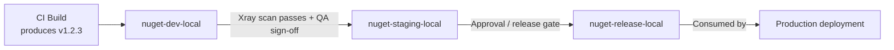

# JFrog Artifactory — Senior .NET Interview Guide

> Audience: 10-saal ka .NET full-stack engineer jo senior/lead interviews ke liye prepare kar raha hai. Yeh CI/CD aur package management ke fundamentals pehle se pata hone ka assume karta hai. Focus nuance, trade-offs, aur design decisions ke peeche ke "why" par hai.

## Table of Contents

- [Core Concepts](#core-concepts)
  - [What is JFrog Artifactory](#what-is-jfrog-artifactory)
  - [Why Use It](#why-use-it)
  - [Key Features](#key-features)
- [Repository Types](#repository-types)
  - [Local, Remote, Virtual Repositories](#local-remote-virtual-repositories)
  - [[new content] Resolution Order in Virtual Repositories](#new-content-resolution-order-in-virtual-repositories)
  - [[new content] NuGet-Specific Repository Setup for .NET Teams](#new-content-nuget-specific-repository-setup-for-net-teams)
- [Using Artifactory in a Pipeline](#using-artifactory-in-a-pipeline)
  - [Manual Upload/Download Examples](#manual-uploaddownload-examples)
  - [JFrog CLI](#jfrog-cli)
  - [GitHub Actions Example](#github-actions-example)
  - [[new content] Azure DevOps / dotnet CLI Integration](#new-content-azure-devops--dotnet-cli-integration)
- [Intermediate Topics](#intermediate-topics)
  - [[new content] Artifact Promotion Between Environments](#new-content-artifact-promotion-between-environments)
  - [[new content] Retention and Cleanup Policies](#new-content-retention-and-cleanup-policies)
  - [[new content] Build-Info, Provenance, and SBOM](#new-content-build-info-provenance-and-sbom)
- [Advanced Topics](#advanced-topics)
  - [[new content] JFrog Xray — Security & License Scanning](#new-content-jfrog-xray--security--license-scanning)
  - [[new content] Immutability, Versioning, and Reproducible Builds](#new-content-immutability-versioning-and-reproducible-builds)
  - [[new content] Access Tokens, Identity, and Securing Feeds](#new-content-access-tokens-identity-and-securing-feeds)
  - [[gaps] Terraform Provider for Artifactory and CDKTF-Driven Provisioning](#gaps-terraform-provider-for-artifactory-and-cdktf-driven-provisioning)
  - [High Availability & Scalability](#high-availability--scalability)
- [Best Practices](#best-practices)
- [Common Pitfalls](#common-pitfalls)
- [[new content] Artifactory vs Azure Artifacts vs Nexus](#new-content-artifactory-vs-azure-artifacts-vs-nexus)
- [Advantages and Disadvantages](#advantages-and-disadvantages)
- [Popular Use Cases](#popular-use-cases)
- [Sample Interview Q&A](#sample-interview-qa)
- [Summary of Additions](#summary-of-additions)
- [Summary of \[gaps\] Additions (This Pass)](#summary-of-gaps-additions-this-pass)

---

## Core Concepts

### JFrog Artifactory kya hai

JFrog Artifactory ek **universal binary repository manager** hai. Yeh build artifacts (packages, containers, libraries) ko secure, scalable, access-controlled tarike se store, version, aur distribute karta hai, aur DevOps toolchain ke center mein "kya build hua aur kya ship hua" ke single source of truth ke roop mein baitha hota hai.

Senior level par, interviewer jo key framing sunna chahta hai woh yeh hai: Artifactory sirf "NuGet packages rakhne ki jagah" nahi hai — yeh source control aur production ke beech ka **artifact provenance aur supply-chain control point** hai. Production tak pahunchne wala har binary exact commit, build, aur dependency set tak traceable hona chahiye jisne use produce kiya.

### Kyun Use Karein

- Binaries, Docker images, Helm charts, aur other build artifacts ke liye **central repository** ka kaam karta hai.
- Multiple package types support karta hai: Maven, npm, **NuGet**, PyPI, Docker, Helm, RPM, etc. — kayi single-purpose registries (npm registry, NuGet.org proxy, Docker Hub, etc.) ke bajaye ek hi platform.
- External repositories (Maven Central, npm registry, NuGet.org, Docker Hub) ke liye **caching aur proxying** provide karta hai — third-party registries par external dependency kam karta hai aur builds fast karta hai.
- CI/CD tools ke saath integrate hota hai: Jenkins, GitHub Actions, GitLab CI/CD, Azure DevOps, etc.
- Access control, vulnerability scanning (Xray), aur license compliance se security enhance karta hai.
- **Cloud (SaaS)** ya **On-Premises (self-hosted)** deployment ke roop mein available hai.

**Yeh "directly NuGet.org / npmjs.com use karo" se better kyun hai:**
- **Supply-chain risk** — ek public registry outage, ek yanked package, ya ek malicious dependency (typosquatting, dependency confusion attacks) aapki build ko break ya compromise kar sakta hai. Ek private proxy/cache aapko control aur fallback deta hai.
- **Compliance** — regulated industries ko ek auditable, access-controlled artifact store chahiye; aap production builds ko directly public internet par point nahi kar sakte.
- **Performance** — caching ka matlab hai repeat builds har baar internet se same package re-download nahi karte (scale par CI mein bahut bada fayda).

### Key Features

1. **Repository Management** — local, remote, aur virtual repositories; har repository (aur har path, permission targets ke through) par fine-grained access control.
2. **Universal Binary Repository** — Maven, Gradle, npm, NuGet, Docker, PyPI, etc., har package type ke native dependency management semantics ke saath.
3. **Build Integration** — Jenkins, Azure DevOps, GitHub Actions, Bitbucket Pipelines; artifact storage, versioning, build-info capture.
4. **Security & Compliance** — vulnerabilities/license issues ke liye Xray scanning; access tokens, LDAP, SSO, RBAC.
5. **High Availability & Scalability** — multi-node clustering, distributed teams ke liye geo-replication.

---

## Repository Types

### Local, Remote, Virtual Repositories

| Type | Purpose | Example | Who writes to it |
|---|---|---|---|
| **Local** | Internally develop/build kiye gaye artifacts store karta hai | Aapki team ke `.nupkg` files store karne wala NuGet repo | Aapki CI pipeline (push) |
| **Remote** | External repository ke liye proxy/cache | NuGet.org ya npm registry se packages cache karta hai | Artifactory khud (pull-through cache); consumers ke liye read-only |
| **Virtual** | Multiple local + remote repos ko ek URL ke peeche aggregate karta hai | Ek endpoint jo aapke internal NuGet feed aur cached NuGet.org packages dono serve kare | N/A — yeh ek routing/aggregation layer hai, physical storage nahi |

**Sabse important interview point:** developers aur CI ko almost always ek **virtual** repository par point karna chahiye, kabhi bhi directly local ya remote repos par nahi. Isse aapko ek stable URL/feed milta hai chahe backing repos baad mein kaise bhi reorganize ho jaayen, aur yehi transparent promotion aur proxying ko enable karta hai.

### [new content] Resolution Order in Virtual Repositories

Ek virtual repository kisi request ko resolve karne ke liye apni member repositories ko **ek configured order** mein check karta hai (local repos pehle typical/recommended pattern hai, phir remote/cached repos). Yeh do reasons se bahut matter karta hai:

1. **Correctness** — agar ek internal package name kisi public package se collide karta hai (jaise koi internal package `Newtonsoft.Json.Internal` naam se publish kar de, ya, worse, accidentally ek real public package name ko shadow kar de), to resolution order decide karta hai ki kaunsa wala jeetega.
2. **Dependency confusion attacks (2024-2026 ka ek hot topic)** — yeh exact vulnerability class hai jahan ek attacker public registry par aapke internal/private package jaisa hi naam wala ek malicious package publish kar deta hai. Agar aapka virtual repo local se pehle remote check karne ke liye misconfigured hai, ya aapka feed package names ko properly scope nahi karta, to build silently attacker ka package pull kar sakti hai aapke internal package ke bajaye. Mitigations:
   - Virtual repo configuration mein hamesha remote se pehle local repos resolve karo.
   - Scoped/prefixed internal package names use karo (jaise `Contoso.*`) jo collide hone ki possibility kam ho.
   - Remote repositories par "include/exclude patterns" consider karo taaki aapka internal namespace kabhi bhi externally resolve na ho.

```mermaid
flowchart LR
    Dev[Developer / CI Build] -->|nuget restore| VR[Virtual Repo: nuget-virtual]
    VR --> LR[Local Repo: nuget-local\n(internal packages)]
    VR --> RR[Remote Repo: nuget-remote\n(proxy/cache of NuGet.org)]
    RR -->|cache miss| Ext[(NuGet.org)]
    LR -->|checked first| Result[Package returned to build]
    RR -->|checked if not found locally| Result
```

### [new content] NuGet-Specific Repository Setup for .NET Teams

Ek .NET shop ke liye, practical setup jo interviewer aapse expect karta hai:

- Ek **NuGet local repo** banao (jaise `nuget-local`) un artifacts ke liye jo aapki teams publish karti hain.
- Ek **NuGet remote repo** banao (jaise `nuget-remote`) jo `https://api.nuget.org/v3/index.json` ko point kare taaki public packages proxy/cache ho sakein.
- Ek **NuGet virtual repo** banao (jaise `nuget`) jo dono ko combine kare; yeh woh single feed URL hai jise har `nuget.config` / `NuGet.Config` aur CI job reference kare.
- `NuGet.Config` ke through configure karo:

```xml
<?xml version="1.0" encoding="utf-8"?>
<configuration>
  <packageSources>
    <clear />
    <add key="corp-artifactory" value="https://artifactory.example.com/artifactory/api/nuget/v3/nuget" />
  </packageSources>
  <packageSourceCredentials>
    <corp-artifactory>
      <add key="Username" value="%ARTIFACTORY_USER%" />
      <add key="ClearTextPassword" value="%ARTIFACTORY_API_KEY%" />
    </corp-artifactory>
  </packageSourceCredentials>
</configuration>
```

- Package push karo:
```bash
dotnet nuget push my-package.1.0.0.nupkg -s corp-artifactory -k %ARTIFACTORY_API_KEY%
```
- Gotcha: Artifactory legacy NuGet v2 protocol endpoint aur v3 (JSON-based, faster) endpoint dono support karta hai — modern `dotnet` CLI tooling ke liye hamesha v3 (`api/nuget/v3/<repo>`) prefer karo; v2 slow hai aur mainly legacy `nuget.exe` compatibility ke liye hai.

---

## Using Artifactory in a Pipeline

### Manual Upload/Download Examples

**cURL ke through artifact upload karna (Maven example):**
```bash
curl -u user:password -T my-app.jar \
  "http://artifactory.example.com/artifactory/libs-release-local/com/myapp/my-app/1.0.0/my-app-1.0.0.jar"
```

**Docker image pull karna:**
```bash
docker login artifactory.example.com
docker pull artifactory.example.com/my-repo/my-image:latest
```

### JFrog CLI

```bash
# Install
curl -fL https://getcli.jfrog.io | sh

# Configure credentials (interactive)
./jfrog config add

# Upload an artifact
./jfrog rt upload "build/*.jar" libs-release-local/
```

JFrog CLI ko real pipelines mein raw `curl`/`docker` commands se better maana jaata hai kyunki yeh: retries/checksums handle karta hai, **build-info collection** support karta hai (`jfrog rt build-collect-env`, `build-publish`), aur ek hi consistent tool mein Xray scanning (`jfrog rt build-scan`) ke saath integrate hota hai sabhi package types ke across.

### GitHub Actions Example

```yaml
name: Build and Deploy to JFrog
on: push

jobs:
  build:
    runs-on: ubuntu-latest
    steps:
      - name: Checkout Code
        uses: actions/checkout@v3

      - name: Setup JFrog CLI
        run: |
          curl -fL https://getcli.jfrog.io | sh
          ./jfrog config add my-artifactory --url=https://artifactory.example.com --user=${{ secrets.ARTIFACTORY_USER }} --password=${{ secrets.ARTIFACTORY_PASSWORD }}

      - name: Build and Upload Artifact
        run: |
          ./jfrog rt upload "dist/*.jar" my-repo/
```

> **Source example par note:** CI mein `--password` ke through raw username/password use karna functionally sahi hai lekin best practice nahi hai. Official `jfrog/setup-jfrog-cli` GitHub Action prefer karo, jo OIDC-based token exchange support karta hai (GitHub mein koi long-lived secret store nahi hota) — neeche [Access Tokens, Identity, and Securing Feeds](#new-content-access-tokens-identity-and-securing-feeds) dekho.

### [new content] Azure DevOps / dotnet CLI Integration

Kyunki yeh audience ek .NET shop hai, GitHub Actions se zyada practically Azure DevOps likely hai. Do common integration patterns:

1. **Native Azure Artifacts + Artifactory as upstream** — Azure Artifacts feed Artifactory ke NuGet virtual repo ko upstream source ke roop mein configured (less common, ek extra hop add karta hai).
2. **Direct Artifactory integration (typical enterprise pattern)** — **JFrog Azure DevOps extension** (marketplace task) use karo ya YAML mein plain CLI steps:

```yaml
steps:
  - task: NuGetAuthenticate@1
  - script: |
      dotnet restore --source https://artifactory.example.com/artifactory/api/nuget/v3/nuget
      dotnet build
      dotnet nuget push "**/*.nupkg" -s https://artifactory.example.com/artifactory/api/nuget/v3/nuget -k $(ARTIFACTORY_API_KEY)
    displayName: 'Restore, Build, Push to Artifactory'
```

Interviewers yahan **credential management** par probe karenge — expect karo ek question jaisa "aap YAML mein API key hardcode karne se kaise bachte ho?" Jawab: Azure Key Vault se backed Azure DevOps variable groups, ya service connections, pipeline secrets/masked variables ke roop mein injected, kabhi bhi repo mein committed nahi.

---

## Intermediate Topics

### [new content] Artifact Promotion Between Environments

Ek recurring senior-level question: **"Aap ek build ko rebuild kiye bina dev se staging se production tak kaise promote karte ho?"** Yeh Artifactory ke core value propositions mein se ek hai aur original notes mein thin/missing hai.

**Principle: build once, promote many times.** Aap kabhi bhi har environment ke liye same binary rebuild nahi karte — aap use ek baar build karte ho, aur woh exact same artifact ko repositories ke through move/copy/tag karte ho jo pipeline stages represent karte hain. Isse yeh guarantee milta hai ki jo test hua hai wahi exactly ship hota hai (koi "staging mein kaam kar gaya, prod mein different binary" drift nahi).

Typical repo layout: `nuget-dev-local` → `nuget-staging-local` → `nuget-release-local` (ya property/tag-based promotion ek single repo ke andar metadata use karke jaise `promotion.status=released`).



Mechanics:
- `jfrog rt build-promote` (JFrog CLI) ya **Promotion API** (`POST /api/build/promote/{buildName}/{buildNumber}`) artifacts aur unke build-info ko repos ke beech move/copy karta hai, optionally properties add karta hai.
- Promotion **Xray scan results** (no critical CVEs) aur/ya manual approval par gate kiya ja sakta hai, aur yehi exactly hai kaise release governance implement hota hai build re-run kiye bina.
- Kyunki yeh same physical artifact hai (same checksum/SHA256) jo pipeline ke through move ho raha hai, aapko true immutability guarantees milte hain — audits ke liye critical ("prove karo ki prod mein jo hai wahi tha jo scan aur approve hua tha").

### [new content] Retention and Cleanup Policies

Original notes mein thin — cleanup ka bilkul mention nahi hai, aur yeh ek bahut common operational/cost question hai.

Yeh kyun matter karta hai: local repos snapshot/pre-release builds aur cached remote artifacts ko default roop se indefinitely accumulate karte hain, jo storage cost badhata hai aur searches/indexing slow karta hai.

Approaches:
- **Retention policies / cleanup policies** (Artifactory ke modern versions mein native cleanup policy feature hai) — rules define karo jaise "N days se purane artifacts delete karo jinme last M days mein koi download nahi hua" non-release repos ke liye.
- **AQL (Artifactory Query Language)**-driven cleanup scripts — classic/portable approach, schedule par run hota hai (jaise Jenkins job ya JFrog Pipelines ke through):
```sql
items.find({
  "repo": "nuget-dev-local",
  "created": {"$before": "30d"}
})
```
  phir result set ko ek delete operation mein feed karo.
- **Remote repo cache eviction** — remote repos se cached artifacts ko unused-for-N-days basis par evict kiya ja sakta hai, local repos ki retention se independent; yeh pure cache hygiene hai, compliance concern nahi.
- **Release repos ko exempt rakho** — cleanup policies ko almost always `*-release-local` repos ko exclude karna chahiye; sirf dev/snapshot/staging repos ko prune karo. Interviewers yeh sunna chahte hain ki aap "prune karna safe hai" aur "audit ke liye retain karna zaroori hai" wale repos mein distinguish karte ho.
- Kisi bhi release ya audit-relevant repo se kuch bhi delete karne se pehle legal/compliance retention minimums (jaise SOX, industry-specific rules) consider karo — retention policy ek deliberate, documented decision hona chahiye, sirf "disk save karne ke liye purana stuff delete karo" nahi.

### [new content] Build-Info, Provenance, and SBOM

Increasingly ek hot topic hai (supply-chain security regulations, SLSA framework, US mein 2020s se Executive Order-driven SBOM requirements) aur original notes se completely absent hai.

- **Build-info** ek JSON blob hai jise Artifactory har build ke liye capture kar sakta hai: kaunse artifacts produce hue, kaunsi dependencies resolve hui (checksums ke saath), kaunsi CI job/VCS revision ne yeh produce kiya, environment variables, aur issues/commits (agar tracker se integrated hai). `jfrog rt build-publish` ke through ya JFrog CLI ke build-aware upload/download commands use karte waqt automatically published hota hai.
- Yeh build-info hi hai jo **promotion**, **build comparison** ("build 41 aur 42 ke beech kya change hua"), aur ek running production binary ko source commit tak wapas **full traceability** power karta hai.
- **SBOM (Software Bill of Materials)** — Xray/Artifactory build-info + dependency graph se SBOMs (CycloneDX / SPDX format) generate kar sakte hain. Yeh government/enterprise customers ko sell karne wale vendors ke liye increasingly ek hard compliance requirement hai.
- **Provenance** — signing ke saath combined (neeche immutability section dekho), build-info + SBOM aapko ek chain of custody deta hai: source commit → build → dependencies resolved → artifact produced → scan results → promotion history → deployment. Yeh exactly wahi hai jo SLSA (Supply-chain Levels for Software Artifacts) framework compliance require karta hai, aur 2025-2026 mein increased supply-chain attack activity (jaise SolarWinds-style incidents, npm/PyPI supply chain compromises) ki wajah se ek bahut live interview topic hai.

---

## Advanced Topics

### [new content] JFrog Xray — Security & License Scanning

Original notes Xray ka mention sirf passing mein karte hain ("scans artifacts for vulnerabilities"). Senior level par aapko feature ke existence se aage mechanism aur trade-offs explain karne chahiye.

- Xray **recursive dependency-graph analysis** perform karta hai — yeh sirf aapke build kiye artifact ko scan nahi karta, yeh use unpack karta hai aur full transitive dependency tree ko walk karta hai, har component ko ek vulnerability database (CVEs) aur license database ke against match karta hai.
- Do integration points:
  1. **Repository-level scanning** — jo bhi ek watched repo mein aata hai use scan karta hai (continuous, newly-disclosed CVEs ko already-stored artifacts mein catch karta hai, sirf build time par nahi).
  2. **Build-level scanning** (`jfrog rt build-scan`) — CI ke part ke roop mein ek specific build ke dependency graph ko scan karta hai, policy violations milne par **pipeline fail kar sakta hai** (critical CVE par block, disallowed license jaise proprietary product mein GPL par block).
- **Repo-level scanning log se zyada kyun matter karta hai:** ek package clean ho sakta hai jab aap uske against build karte ho, phir chhe mahine baad exact us version ke liye ek CVE disclose ho jaata hai. Xray ki continuous scanning aapke repos mein already sitting artifacts ko re-flag karti hai, jo build-time-only scanning (jaise ek one-off `dotnet list package --vulnerable` check) kabhi catch nahi karegi.
- License compliance: Xray copyleft licenses (GPL, AGPL) ko flag/block kar sakta hai jo ek closed-source product ke saath incompatible hain — enterprise legal teams ke liye ek real concern aur ek common senior-interview trick question ("aap kaise rokte ho koi accidentally ek GPL-licensed library pull kar le?").
- Trade-off/gotcha: Xray ek **paid add-on** hai, free/base Artifactory tiers mein included nahi — mention karna worth hai as a licensing nuance jo interviewers probe kar sakte hain ("JFrog platform mein free vs. paid kya hai?").

### [new content] Immutability, Versioning, and Reproducible Builds

- Artifactory mein local repositories generally release artifacts ke liye **immutable configure** honi chahiye — ek baar `my-app-1.0.0.nupkg` publish ho jaaye, use kabhi bhi same version number ke under different bytes se overwrite nahi karna chahiye. Yeh repository configuration (overwrite disallow karke) aur team convention (semantic versioning discipline) se enforce hota hai.
- Contrast: **snapshot/pre-release repos** (jaise Maven-style `-SNAPSHOT`, ya NuGet pre-release suffixes jaise `-beta`, `-ci`) mutable/overwritable expected hote hain — yehi ek snapshot ka poora point hai.
- Yeh kyun matter karta hai: agar `1.0.0` silently contents change kar sake, to aap yeh reason karne ki ability lose kar dete ho ki kahin bhi kya deployed hai — cache poisoning possible ho jaata hai (ek build server "old" 1.0.0 cache karta hai jabki ek doosra environment "new" 1.0.0 pull karta hai), aur rollback unreliable ho jaata hai.
- Checksums (SHA-1/SHA-256) har artifact ke liye stored hote hain jo Artifactory (aur consumers) ko tampering ya accidental overwrite detect karne dete hain — yeh directly supply-chain integrity verification se juda hai aur yehi reason hai ki build-info/provenance tracking kaam karta hai.
- **Reproducible builds** (kuch interviewers probe karte hain ek stretch/advanced topic): ideal yeh hai ki same commit + locked dependency versions se rebuild karne se bit-for-bit identical artifact produce ho. Artifactory khud yeh guarantee nahi karta (yeh ek build-tooling concern hai — deterministic compilation, locked lockfiles/`packages.lock.json`), lekin immutable storage + build-info hi woh infrastructure piece hai jo reproducibility verify karna possible banata hai.

### [new content] Access Tokens, Identity, and Securing Feeds

Original notes "access tokens, LDAP, SSO, RBAC" ko ek bullet ke roop mein bina depth ke mention karte hain. Senior interviewers drill karenge *kaise* credentials ko actually handle karna chahiye.

- **API Keys (legacy)** — JFrog ne access tokens ke favor mein deprecate kar diya hai; agar aapko older docs/examples mein API keys dikhein, to jaan lo ki JFrog ki current guidance unse migrate off karne ki hai.
- **Access Tokens** — scoped, expiring, revocable tokens (JWT-based) jo ek specific identity, repo, aur permission set ke liye scope kiye ja sakte hain — CI ke liye modern recommended credential.
- **Platform-native identity mapping / OIDC** — current best practice (recent JFrog platform versions ke as of): Artifactory aur CI provider (GitHub Actions, Azure DevOps) ke beech ek OIDC trust relationship configure karo taaki pipeline runtime par ek short-lived OIDC token ko ek short-lived Artifactory access token ke saath exchange kare — CI system mein koi long-lived secret store hi nahi hota. Yeh directly "secrets sprawl" problem address karta hai jahan `ARTIFACTORY_PASSWORD` saalon tak ek secrets vault mein baitha rehta hai.
- **RBAC / Permission Targets** — permissions har repository (ya repo path pattern) par users ya groups ko assign hoti hain, globally nahi — ek senior point banane ke liye: least-privilege ka matlab hai CI service accounts ko *write* sirf us specific local repo par dena jismein woh publish karte hain, aur *read* sirf us virtual repo par jise woh consume karte hain, admin/global rights nahi.
- **LDAP/SSO (human users ke liye SAML/OIDC)** — identity ko centralize karta hai taaki artifact access rest of corporate identity ke same offboarding/lifecycle process follow kare — audit ke liye important ("prove karo ki ek terminated employee ka access everywhere revoke hua, Artifactory including").
- Interviewers ka favorite gotcha: ek dozen pipelines ke across use hone wale shared service-account password ko rotate karna painful aur risky hai (coordination, downtime); scoped, short-lived, per-pipeline tokens (ya OIDC federation) isse entirely avoid karte hain.

### [gaps] Terraform Provider for Artifactory and CDKTF-Driven Provisioning

Upar Repository Types aur Intermediate Topics sections mein sab kuch (local/remote/virtual repos, permission targets, retention policies) Artifactory UI ya ad hoc REST calls ke through configure hone wali cheez ke roop mein describe kiya gaya hai. Ek candidate ke liye jiska actual IaC tooling Terraform/CDKTF hai, yeh ek real gap hai: repository aur permission-target setup ko code ke roop mein reason karna chahiye, manual clicking se nahi, aur yeh ek concrete, likely interview probe hai ("aap kaise provision karoge ek new team ke Artifactory repos UI touch kiye bina?").

**`jfrog/artifactory` Terraform provider** is guide mein cover kiye gaye har Artifactory object ko ek first-class Terraform resource ke roop mein treat karta hai:

```hcl
terraform {
  required_providers {
    artifactory = {
      source  = "jfrog/artifactory"
      version = "~> 12.0"   # verify current major version against the provider registry at implementation time
    }
  }
}

provider "artifactory" {
  url          = "https://artifactory.example.com/artifactory"
  access_token = var.artifactory_access_token   # short-lived/scoped token, not a shared password — ties back to the Access Tokens section above
}

resource "artifactory_local_nuget_repository" "nuget_local" {
  key = "nuget-local"
}

resource "artifactory_remote_nuget_repository" "nuget_remote" {
  key           = "nuget-remote"
  url           = "https://api.nuget.org/v3/index.json"
  feed_context_path = "api/v3"
}

resource "artifactory_virtual_nuget_repository" "nuget_virtual" {
  key          = "nuget"
  repositories = [
    artifactory_local_nuget_repository.nuget_local.key,
    artifactory_remote_nuget_repository.nuget_remote.key,
  ]
  # resolution order matches the local-first pattern from the dependency-confusion discussion above
}

resource "artifactory_permission_target" "order_team_nuget" {
  name = "order-team-nuget-publish"

  repo {
    repositories = [artifactory_local_nuget_repository.nuget_local.key]
    actions {
      users {
        name        = "svc-order-ci"
        permissions = ["read", "write", "annotate"]
      }
    }
  }
}
```

Yeh senior level par kyun matter karta hai, is guide ke earlier sections se tying back:
- **Repeatable, reviewable repo provisioning** — ek new local/remote/virtual repo triple (upar [NuGet-Specific Repository Setup](#new-content-nuget-specific-repository-setup-for-net-teams) section ka exact pattern) ek PR-reviewed module ban jaata hai, manual UI steps ke ek runbook ke bajaye jismein koi step skip kar sakta hai.
- **Permission targets as code** — Access Tokens section ka least-privilege RBAC principle ("CI service accounts ko sirf us specific local repo ke liye write milta hai jismein woh publish karte hain") enforce aur audit karna bahut aasan ho jaata hai jab yeh version control mein ek `artifactory_permission_target` resource ho, UI mein ek permissions checkbox grid ke bajaye jise koi review karna yaad nahi rakhta.
- **Drift detection** — `terraform plan` Terraform ke bahar kiye gaye kisi bhi repo/permission-target change ko surface karta hai (jaise koi manually UI se ek repo add kar de), wahi drift-detection value proposition jo GitOps Kubernetes deployments ko deta hai, yahan artifact-repository configuration par applied.
- **Environments ke across consistency** — same module `nuget-dev-local`/`nuget-staging-local`/`nuget-release-local` (upar [Artifact Promotion](#new-content-artifact-promotion-between-environments) section ka promotion-stage repo layout) ko parameterized names ke saath provision karta hai, har environment ke liye pattern hand se recreate karne ke bajaye.

**CDKTF-driven provisioning** — kyunki CDKTF candidate ka actual day-to-day IaC surface hai (TypeScript/C# raw HCL ke bajaye), wahi `jfrog/artifactory` provider CDKTF bindings ke through consumable hai, jisse repository/permission-target provisioning platform ke rest of infrastructure constructs ke same codebase aur language mein reh sakti hai (jaise ek shared "new-service onboarding" CDKTF construct jo ek ECS service, uska IAM role, *aur* uska Artifactory NuGet repo + permission target ek saath provision kare) Artifactory ko ek out-of-band, UI-managed system treat karne ke bajaye jo baaki sab kuch already under IaC se separate hai.

**Interviewer follow-up jo expect karo:** "UI mein ek baar click-through karne se practical benefit kya hai?" — Jawab: yeh one-time setup cost ke baare mein nahi hai (UI ek ad hoc repo ke liye faster hai), yeh **scale par repeatability** ke baare mein hai (40th team ko first jaisa hi onboard karna, zero drift ke saath), **audit trail** (kisne kya click kiya iske tribal knowledge ke bajaye har permission change ki ek PR history), aur **repo lifecycle ko wahi review/approval process se tie karna** jisse org already har doosri infrastructure piece ko Terraform/CDKTF plan review ke through gate karta hai.

### High Availability & Scalability

- **Multi-node clustering** — load balancer ke peeche multiple Artifactory nodes jo ek common database aur filestore (ya HA-enabled storage) share karte hain, reliability/failover aur horizontal read/write scaling ke liye.
- **Geo-replication** — geographically distributed Artifactory instances ke across repositories ki push-based ya pull-based replication, taaki distributed teams (ya multi-region CI) har dependency restore par continents cross karne ke bajaye ek local instance se read karein. Latency reduce karta hai aur disaster-recovery redundancy provide karta hai.
- **Filestore considerations (apne version/edition ke liye specifics verify karo):** Artifactory typically metadata (ek database mein) ko binary storage (filestore — local disk, NFS, ya cloud object storage jaise S3/Azure Blob) se separate karta hai. Yeh separation samajhna HA/DR planning ke liye matter karta hai aur ek common systems-design follow-up hai ("aap isko backup / fail over kaise karoge?").

---

## Best Practices

- Developers/CI ko hamesha **virtual** repositories par point karo, kabhi local/remote directly nahi — isse aapko ek stable abstraction milta hai reorganize karne ke liye.
- Dependency confusion attacks se defend karne ke liye virtual repos mein **local-repo-first resolution order** enforce karo.
- Public registries ke saath namespace collision risk kam karne ke liye **scoped internal package naming conventions** use karo (jaise ek company prefix).
- Release/local repos ko **immutable** treat karo — published version numbers ka koi overwrite nahi.
- **Build once, promote many** — har environment ke liye same artifact kabhi rebuild na karo; same binary ko repo stages ke through promote karo.
- Promotion ko **Xray scan results** (no unresolved critical CVEs, no disallowed licenses) par ek automated policy ke roop mein gate karo, manual checklist nahi.
- CI credentials ke liye long-lived shared passwords/API keys ke bajaye **short-lived, scoped access tokens ya OIDC federation** use karo.
- Har repository/permission target par **least-privilege RBAC** apply karo, service accounts ke liye blanket admin rights nahi.
- Dev/snapshot repos par **retention/cleanup policies** set karo; release repos ko explicitly exempt karo aur compliance requirements ke against retention decisions document karo.
- Har CI build par **build-info** capture aur publish karo taaki aap full traceability retain karo aur promotion/comparison tooling enable karo.
- Raw `curl`/manual scripting ke bajaye **JFrog CLI** ya official CI extensions prefer karo — aapko retries, checksums, build-info, aur Xray integration free mein milte hain.

## Common Pitfalls

- CI ko directly ek **remote** repo par point karna (caching bypass karke) ya directly ek **local** repo par (aggregation bypass karke) virtual repo ke bajaye — abstraction break karta hai aur future reorganization ko painful banata hai.
- Misconfigured virtual-repo resolution order jo ek public package ko ek internal package shadow karne dega (dependency confusion).
- Xray ko "optional" treat karna ya cost-sensitive environments mein skip karna — ek supply-chain blind spot leave karta hai; kam se kam, full continuous repo scanning licensed na ho tab bhi release promotion ko ek scan par gate karo.
- Dev/snapshot repos ko unbounded grow hone dena — cleanup policies ke bina storage costs balloon karte hain aur search/index performance degrade hota hai.
- Release repositories par overwrite allow karna — silently "immutable artifact = trusted deployment" guarantee break karta hai aur "kal kaam kar raha tha" incidents cause kar sakta hai.
- Long-lived Artifactory passwords/API keys ko directly pipeline YAML mein ya unscoped secrets ke roop mein store karna — mask, scope kiya jaana chahiye, aur ideally OIDC-federated short-lived tokens se replace kiya jaana chahiye.
- **v2 vs v3 NuGet protocol** distinction bhool jaana aur habit/old documentation ki wajah se modern tooling ko slower legacy v2 API endpoint par point karna.
- Yeh assume karna ki HA/clustering aur Xray har license tier mein included hain — yeh frequently paid add-ons/higher tiers hote hain; kisi feature ke available hone ka assume karne se pehle licensing confirm karo (original notes mein flag kiya gaya ek real "disadvantage").

---

## [new content] Artifactory vs Azure Artifacts vs Nexus

Ek senior .NET dev ke liye ek bahut likely question, kyunki Azure Artifacts ek Azure DevOps shop mein "default" choice hai aur interviewers yeh janna chahte hain ki kya aap ek more complex tool justify kar sakte ho.

| Dimension | JFrog Artifactory | Azure Artifacts | Sonatype Nexus Repository |
|---|---|---|---|
| Package type breadth | Bahut broad (Maven, npm, NuGet, PyPI, Docker, Helm, RPM, Go, Conan, etc.) | Narrower (npm, NuGet, Maven, Python, universal packages); Azure DevOps se tightly tied | Broad, Artifactory jaisa hi (npm, NuGet, Maven, Docker, PyPI, etc.) |
| Multi-cloud / on-prem | Strong — Cloud SaaS ya fully self-hosted, cloud-agnostic | Azure DevOps-native; Azure ecosystem ke bahar less natural fit | Strong — self-hosted ya cloud, cloud-agnostic |
| Security scanning | Xray (deep, recursive dependency graph, paid add-on) | Basic; typically real scanning ke liye Defender for DevOps / GitHub Advanced Security par leans karta hai | Nexus IQ / Lifecycle (paid add-on), Xray jaisi depth comparable |
| CI/CD ecosystem fit | Broadest — Jenkins, GitHub Actions, Azure DevOps, GitLab, Bitbucket ke liye plugins/extensions | Best-in-class *sirf* agar aap fully Azure DevOps mein hain | Broad, Artifactory jaisa hi plugin ecosystem |
| HA / geo-replication | Enterprise-grade clustering + geo-replication (paid tiers) | Microsoft dwara managed; koi user-configurable geo-replication nahi | Nexus HA Pro tier mein available |
| Typical fit | Large orgs, polyglot tooling, multi-cloud/hybrid, strong governance needs | Teams jo fully Azure DevOps ke commit hain aur zero extra infra manage karna chahte hain | Cost-sensitive orgs jo different pricing model ke saath Artifactory-jaisi breadth chahte hain |
| Licensing model | Per-feature tiers (OSS/free tier limited; Xray, HA, geo-replication paid hain) | Azure DevOps ke saath included/bundled, per-GB storage + retention billed | Free/OSS core (Nexus OSS), IQ/HA ke liye paid Pro tier |

**Interviewer jo jawab chahta hai:** "Yeh org ke footprint par depend karta hai." Agar aap 100% Azure DevOps hain aur NuGet/npm se aage multi-cloud/polyglot package support nahi chahiye, to Azure Artifacts simpler hai aur run karne ke liye zero extra infrastructure hai. Artifactory (ya Nexus) apni complexity earn karta hai jab aapke paas **multiple CI systems, multiple package ecosystems, multi-cloud/on-prem requirements, ya deep security/compliance tooling (Xray/IQ) aur governed promotion workflows** ki zarurat ho jo Azure Artifacts natively offer nahi karta.

---

## Advantages and Disadvantages

**Advantages**
- Multiple package types support karta hai (Maven, npm, NuGet, Docker, etc.).
- Faster builds ke liye caching aur proxying.
- Automated deployments ke liye CI/CD tools ke saath integrate hota hai.
- JFrog Xray ke saath security scanning.
- Clustering ke saath high availability & scalability.

**Disadvantages**
- Advanced features (Xray, HA, geo-replication) ke liye paid licenses chahiye.
- Self-hosted environments ke liye initial setup complexity.
- Large-scale repositories ke liye extra storage ki zarurat pad sakti hai (cleanup/retention policies se mitigate hota hai — upar dekho).

## Popular Use Cases

- **CI/CD Pipelines** — build artifacts store aur manage karna.
- **Docker Image Management** — private container registry.
- **Dependency Management** — external repositories ke liye proxy.
- **Security & Compliance** — vulnerability scanning.

---

## Sample Interview Q&A

**Q: Local, remote, aur virtual repositories mein kya difference hai, aur ek developer ko apna `NuGet.Config` kise point karna chahiye?**
A: Local repos woh artifacts store karte hain jo aap own/publish karte ho; remote repos ek external registry ko proxy/cache karte hain; virtual repos multiple local/remote repos ko ek stable URL ke peeche aggregate karte hain. Developers aur CI ko hamesha virtual repo target karna chahiye — yeh unhe backend reorganization se insulate karta hai aur aapko ek feed deta hai jo internal aur cached public packages dono serve kare.

**Q: Aap Artifactory mein ek dependency confusion attack ko kaise prevent karoge?**
A: Ensure karo ki virtual repo ka resolution order remote (public proxy) repos se pehle local (internal) repos check kare, internal packages ke liye ek distinctive company-prefixed naming convention use karo, aur optionally remote repo par include/exclude patterns configure karo taaki aapke internal namespace ka resolution public source se entirely block ho jaaye.

**Q: "Build once, promote many" explain karo aur yeh kyun matter karta hai.**
A: Aap ek binary ko CI mein exactly ek baar build karte ho, phir wahi same artifact ko (uska build-info aur checksum intact ke saath) repository stages ke through move/copy karte ho jo dev → staging → release represent karte hain, typically Xray scan results aur/ya approvals se gated. Isse yeh guarantee milta hai ki staging mein test hua artifact byte-for-byte wahi hai jo production ko ship hota hai — koi rebuild-induced drift nahi.

**Q: Aap Artifactory storage costs ko control mein kaise rakhte ho?**
A: Dev/snapshot repos par age aur download activity ke basis par retention/cleanup policies (ya AQL-driven scripts), unused cached artifacts ke liye remote-repo cache eviction, aur kisi bhi automated deletion se release/audit-relevant repos ko explicitly exempt karna.

**Q: JFrog Xray ka role kya hai, aur yeh pipeline mein kahan plug in hota hai?**
A: Xray recursive dependency-graph vulnerability aur license scanning karta hai, dono continuously repository level par (already-stored artifacts mein newly disclosed CVEs catch karta hai) aur build time par (`build-scan`), jahan yeh policy violations (critical CVEs, closed-source code mein GPL jaise disallowed licenses) par pipeline fail ya promotion block kar sakta hai.

**Q: CI ko Artifactory se kaise authenticate karna chahiye — aur pipeline YAML mein ek shared username/password mein kya galat hai?**
A: Scoped, short-lived access tokens prefer karo, ya better, CI provider aur Artifactory ke beech OIDC federation taaki koi long-lived secret store hi na ho. Ek shared password YAML/secrets mein baked ek single point of compromise hai, sabhi consuming pipelines ke across downtime ke bina rotate karna hard hai, aur typically specific repos par least-privilege RBAC ke against over-privileged hai.

**Q: Ek all-Azure-DevOps shop mein aap Azure Artifacts ke bajaye Artifactory kab choose karoge?**
A: Jab aapko polyglot package support chahiye jo Azure Artifacts achhi tarah cover nahi karta, multi-cloud/on-prem flexibility, deeper security/license scanning (Xray vs. Azure DevOps mein jo bundled hai), ya governed multi-stage promotion workflows — otherwise Azure Artifacts lower-overhead default hai.

**Q: Ek released NuGet package ki immutability kya guarantee karta hai, aur yeh kyun matter karta hai?**
A: Repository configuration jo ek existing version ke artifact ko overwrite karne se disallow kare, semantic versioning discipline (version number kabhi reuse na karo) ke saath combined, aur checksum verification. Yeh matter karta hai kyunki deployments, rollbacks, aur audits sab assume karte hain ki "version 1.0.0" ka matlab exactly ek set of bytes hai, forever — mutable release artifacts reproducibility break karte hain aur supply-chain tampering mask kar sakte hain.

**Q: Build-info kya hai aur yeh SBOM/provenance se kaise relate karta hai?**
A: Build-info woh metadata hai jise Artifactory har CI build ke liye capture karta hai — produce hue artifacts, resolve hui dependencies (checksums ke saath), source revision, environment. Yeh promotion, build comparison, aur ek SBOM (CycloneDX/SPDX) generate karne ki foundation hai — dono milkar commit se deployed artifact tak full chain-of-custody dete hain, jo increasingly ek compliance requirement hai (SLSA framework, government SBOM mandates).

---

## Summary of Additions

Original source Artifactory ka ek generic, AI-style overview tha jisme koi genuine personal notes, unanswered questions, ya resolve karne ke liye TODOs nahi the — isliye existing content par koi "answer everything" work zaruri nahi tha. Saara original material preserve aur reorganize kiya gaya. Ek senior .NET interview ke liye real gaps close karne ke liye yeh `[new content]` sections add kiye gaye:

1. **Resolution Order in Virtual Repositories** — dependency confusion attacks cover karta hai, ek live supply-chain-security interview topic jo source mein entirely absent tha.
2. **NuGet-Specific Repository Setup for .NET Teams** — source sirf generically "supports NuGet" bola; kyunki yeh audience ek .NET dev hai, concrete `.NET`-relevant config (`NuGet.Config`, v2 vs v3 protocol) add kiya gaya.
3. **Azure DevOps / dotnet CLI Integration** — source mein sirf ek GitHub Actions example tha; more relevant Azure DevOps YAML pattern aur credential-handling follow-up add kiya gaya.
4. **Artifact Promotion Between Environments** — "build once, promote many" Artifactory ka ek core value proposition hai aur ek near-guaranteed senior interview question hai; bilkul missing tha.
5. **Retention and Cleanup Policies** — storage/cost management sirf ek "disadvantage" ke roop mein mention hua tha bina mitigation discussion ke; policy mechanics aur AQL example add kiya gaya.
6. **Build-Info, Provenance, and SBOM** — supply-chain traceability/compliance (SLSA, SBOM mandates) ek hot current topic hai aur bilkul mention nahi tha.
7. **JFrog Xray — Security & License Scanning** — original notes ne sirf Xray ka naam liya; mechanism (recursive scanning, repo-level vs build-level), license-compliance angle, aur licensing-tier gotcha add kiya gaya.
8. **Immutability, Versioning, and Reproducible Builds** — deployment safety aur rollback ke baare mein reason karne ke liye critical; source mein cover nahi tha.
9. **Access Tokens, Identity, and Securing Feeds** — source mein ek bare bullet tha ("supports access tokens, LDAP, SSO, RBAC"); interviewers jo real depth probe karte hain (API keys vs access tokens vs OIDC federation, least-privilege RBAC) add ki gayi.
10. **Artifactory vs Azure Artifacts vs Nexus** — ek highly likely "why not just use X" interview question ke liye comparison table, especially relevant kyunki audience Azure/.NET ecosystem mein hai.

**Contradictions flagged:** Koi nahi — source content internally consistent tha (ek single generic pass, multiple sessions ke conflicting personal notes nahi). Koi genuine contradictions flag karne ki zarurat nahi thi; jahan source thin tha, wrong nahi, wahan correct karne ke bajaye supplement kiya gaya.

## Summary of `[gaps]` Additions (This Pass)

Ek follow-up gap-analysis review ne flag kiya ki yeh guide saari repository/permission-target setup ko manual UI configuration ke roop mein describe karti hai, infrastructure-as-code se koi connection nahi — ek real gap kyunki candidate ka actual IaC tooling Terraform/CDKTF hai. Isse close karne ke liye ek `[gaps]`-tagged section add kiya gaya:

1. **Terraform Provider for Artifactory and CDKTF-Driven Provisioning** — `jfrog/artifactory` Terraform provider ko concrete mechanism ke roop mein add kiya gaya local/remote/virtual NuGet repos aur permission targets ko code ke roop mein provision karne ke liye, ek worked example ke saath jo guide mein pehle describe kiye gaye exact repo-triple pattern ko mirror karta hai (NuGet-Specific Repository Setup section mein). Isse guide mein pehle se cover ki gayi teen cheezon se explicitly connect kiya gaya: least-privilege RBAC (permission targets ko reviewable code ke roop mein, UI checkbox grid ke bajaye jise koi audit nahi karta), "build once, promote many" (parameterized modules jo dev/staging/release repo layout ko consistently har environment ke liye provision karte hain), aur GitOps-style drift detection (`terraform plan` jo manual out-of-band UI changes surface karta hai). CDKTF ko bhi specifically connect kiya gaya — kyunki yeh candidate ka actual day-to-day IaC surface hai — jaise Artifactory provisioning platform ke rest of infrastructure ke same codebase/language mein reh sakti hai, ek out-of-band, UI-managed system treat kiye jaane ke bajaye.
