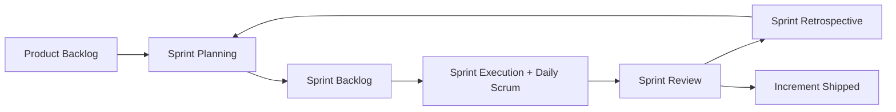
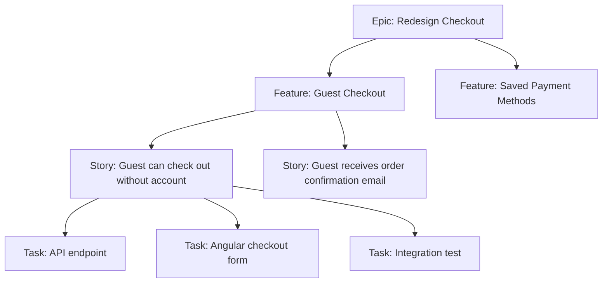
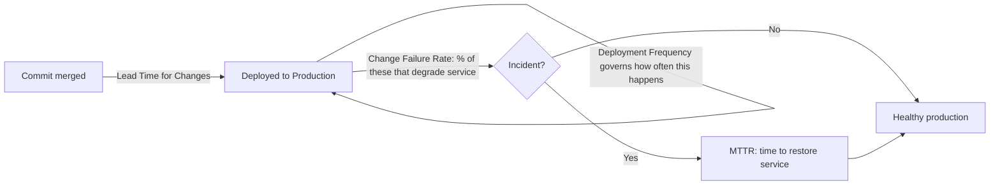
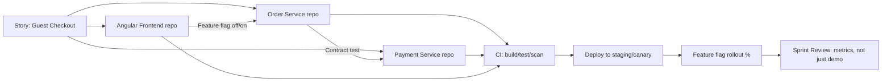
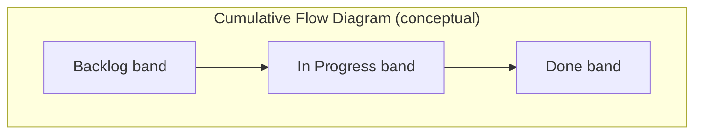

# Agile Interview Guide (Senior .NET Full-Stack / Lead Level)

Personal notes se consolidate kiya gaya hai ("Agile & Requirements Interview Q&A" aur "Advanced Agile Interview Questions — 5+ Years Exp"). Restructure kiya gaya, de-duplicate kiya gaya, fully answer kiya gaya, aur senior-level gap topics ke saath expand kiya gaya hai — ek 10-year .NET full-stack developer ke liye jo lead/senior interviews ki prepping kar raha hai.

## Table of Contents

- [Core Concepts](#core-concepts)
  - [What is Agile?](#what-is-agile)
  - [What is Scrum?](#what-is-scrum)
  - [What is a User Story?](#what-is-a-user-story)
  - [Functional vs Technical (Non-Functional) Requirements](#functional-vs-technical-non-functional-requirements)
  - [Who Defines Functional vs Technical Requirements](#who-defines-functional-vs-technical-requirements)
  - [Core Scrum Ceremonies](#core-scrum-ceremonies)
  - [Definition of Done (DoD)](#definition-of-done-dod)
  - [Backlog Refinement](#backlog-refinement)
  - [Agile vs Waterfall](#agile-vs-waterfall)
- [Intermediate Concepts](#intermediate-concepts)
  - [Story Point Estimation](#story-point-estimation)
  - [Handling Changing Requirements](#handling-changing-requirements)
  - [Definition of Ready (DoR)](#definition-of-ready-dor)
  - [[new content] DoD vs DoR — Why Both Matter](#new-content-dod-vs-dor--why-both-matter)
  - [Epic vs Feature vs Story vs Task](#epic-vs-feature-vs-story-vs-task)
  - [INVEST Principle for User Stories](#invest-principle-for-user-stories)
  - [Cross-Functional Teams](#cross-functional-teams)
  - [Agile Documentation Philosophy](#agile-documentation-philosophy)
- [Advanced Concepts](#advanced-concepts)
  - [Scrum vs Kanban](#scrum-vs-kanban)
  - [[new content] Scrum vs Kanban vs SAFe vs Scrumban](#new-content-scrum-vs-kanban-vs-safe-vs-scrumban)
  - [Handling Scope Change Mid-Sprint](#handling-scope-change-mid-sprint)
  - [Velocity and Its Use](#velocity-and-its-use)
  - [[new content] Velocity vs Throughput vs Cycle Time](#new-content-velocity-vs-throughput-vs-cycle-time)
  - [Managing Technical Debt in Agile](#managing-technical-debt-in-agile)
  - [Backlog Prioritization](#backlog-prioritization)
  - [[new content] Prioritization Frameworks (WSJF, MoSCoW, Kano, RICE)](#new-content-prioritization-frameworks-wsjf-moscow-kano-rice)
  - [Agile Metrics](#agile-metrics)
  - [[gaps] DORA Metrics](#gaps-dora-metrics)
  - [Handling Blockers](#handling-blockers)
  - [Role of the Developer in Estimation](#role-of-the-developer-in-estimation)
  - [[new content] Estimation Techniques Beyond Planning Poker](#new-content-estimation-techniques-beyond-planning-poker)
  - [When Sprint Goals Are Not Achieved](#when-sprint-goals-are-not-achieved)
  - [Real-World Challenge: PO Adds Urgent Work Mid-Sprint](#real-world-challenge-po-adds-urgent-work-mid-sprint)
  - [[new content] Agile in a Microservices / CI-CD Context](#new-content-agile-in-a-microservices--cicd-context)
  - [[new content] Scaling Agile: SAFe, LeSS, and Spotify Model](#new-content-scaling-agile-safe-less-and-spotify-model)
- [Best Practices](#best-practices)
- [[new content] Agile Anti-Patterns](#new-content-agile-anti-patterns)
- [Common Pitfalls](#common-pitfalls)
- [[new content] Agile Metrics Dashboards and Reporting to Leadership](#new-content-agile-metrics-dashboards-and-reporting-to-leadership)
- [Sample Interview Q&A](#sample-interview-qa)
- [Summary of Additions](#summary-of-additions)
- [Summary of \[gaps\] Additions (This Pass)](#summary-of-gaps-additions-this-pass)

---

## Core Concepts

### Agile kya hai?

Agile ek iterative aur incremental approach hai software development ke liye jisme kaam chhote-chhote cycles (sprints/iterations) mein deliver hota hai, continuous feedback, collaboration, aur change ke saath adaptability ke saath. Yeh basically ek *mindset aur values ka set* hai (Agile Manifesto dekho: individuals and interactions over processes and tools; working software over comprehensive documentation; customer collaboration over contract negotiation; responding to change over following a plan) — Scrum, Kanban, XP, aur SAFe sab *frameworks/methodologies* hain jo us mindset ko *implement* karte hain.

**Senior-level nuance:** Interviewers 10-year mark par shayad hi textbook definition chahte hain — woh yeh dekhna chahte hain ki aap samajhte ho ki Agile ek *philosophy* hai, ek rigid process nahi, aur aap yeh articulate kar sakte ho ki kab strict-by-the-book Scrum galat tool hoga (jaise, ek chhota maintenance team jo legacy system support karta hai, usko sprints se better Kanban serve karta hai).

### Scrum kya hai?

Scrum ek Agile framework hai jisme development fixed-length sprints (typically 1–4 weeks, sabse common 2) mein hota hai. Yeh define karta hai:

- **Roles**: Product Owner, Scrum Master, Development Team (Scrum Guide 2020+ mein, "Developers" — PO aur SM "the Scrum Team" se separate nahi hain, woh usi ka part hain).
- **Artifacts**: Product Backlog, Sprint Backlog, Increment.
- **Ceremonies (Events)**: Sprint Planning, Daily Scrum, Sprint Review, Sprint Retrospective, aur Sprint khud ek container event ke roop mein.



### User Story kya hai?

End user ke perspective se feature ka ek simple description, jo requirements ko ek lightweight, conversation-driving format mein capture karta hai, ek exhaustive spec ki jagah.

**Format:**
```
As a [user/role], I want [feature/capability], so that [benefit/value].
```

**Senior nuance:** User story ek *conversation ke liye placeholder* hai, contract nahi. Interviewers probe kar sakte hain ki aapko story aur fully-specified requirement ka difference pata hai ya nahi — acceptance criteria (aksar Given/When/Then / Gherkin format mein) hi wo hai jo isko actually testable aur "done" banata hai.

```gherkin
Given a registered user on the login page
When they submit valid credentials
Then they are redirected to the dashboard
And a session token is issued
```

### Functional vs Technical (Non-Functional) Requirements

**Functional Requirements** describe karte hain *kya* system karna chahiye — woh features jo usko provide karna zaroori hai.

Examples: user login, add to cart, generate report, reset password.

**Technical (Non-Functional) Requirements** describe karte hain *kaise* system perform karna chahiye — quality attributes jaise performance, security, scalability, aur technology constraints.

Examples: API response under 500ms, data encryption at rest/in transit, support for 10,000 concurrent users, mandated use of Angular + .NET stack.

| Aspect | Functional Requirement | Non-Functional Requirement |
|---|---|---|
| Answers | System kya karta hai? | System kitna achha karta hai? |
| Example | User password reset kar sakta hai | Password reset email 2s ke andar send hona chahiye |
| Testing | Behavioral/acceptance tests | Load, security, performance, chaos tests |
| Owner (typical) | BA / Product Owner | Architect / Tech Lead |
| Visibility to end user | Directly visible | Aksar invisible jab tak violate na ho |

### Functional vs Technical Requirements Kaun Define Karta Hai

- **Functional requirements**: Business Analyst ya Product Owner, stakeholders aur end users ke input ke saath.
- **Technical requirements**: Architect, Tech Lead, ya Development Team, system design, NFRs (non-functional requirements), aur platform constraints ke basis par.

**Senior nuance interviewers probe karte hain:** Mature teams mein yeh hard wall nahi hai — developers ko functional requirements par pushback dena chahiye jab unke technical implications hote hain (jaise, "yeh feature jaise describe hua hai, X users ke aage bina redesign scale nahi karega"), aur POs ko enough technical constraint samajhna chahiye NFR work prioritize karne ke liye. Best senior engineers business requirements ko technical requirements mein *translate* karte hain aur trade-offs early surface karte hain, sprint start hone ke baad nahi.

### Core Scrum Ceremonies

**Sprint Planning** — Ek meeting jaha team backlog items select karti hai (usually ek refined, prioritized backlog se) aur upcoming sprint ke liye kaam plan karti hai. Sprint Goal aur Sprint Backlog produce karta hai.

**Daily Standup (Daily Scrum)** — Ek short (≤15 min), timeboxed daily sync. Classic three questions:
- Kal kya kiya gaya?
- Aaj kya kiya jayega?
- Koi blockers?

> **Senior nuance:** "3 questions" format ab Scrum Guide khud thoda dated maanta hai — modern guidance Daily Scrum ko *Sprint Goal* ki taraf progress inspect karne aur re-planning karne ke around frame karti hai, Scrum Master ko status report dene ke around nahi. Agar poocha jaye, toh yeh shift mention karo — yeh signal karta hai ki aap framework ke saath current raho, na ki 2011-era Scrum recite kar rahe ho.

**Sprint Review** — Sprint ke end mein increment ka demo stakeholders ko, product inspect karne aur backlog adapt karne ke liye use hota hai. Sirf demo nahi hai — yeh ek collaborative working session hai.

**Sprint Retrospective** — Sprint ke baad hota hai (review ke baad, next planning se pehle) yeh discuss karne ke liye ki kya achha gaya, kya nahi, aur *process* ke liye concrete improvement actions (product ke liye nahi).

### Definition of Done (DoD)

Ek shared, team-agreed checklist jo ensure karti hai ki backlog item genuinely complete hai — coded, tested, reviewed, integrated, documented as needed, aur potentially shippable. .NET/Angular shop ke liye typical DoD:

- Code complete aur main/trunk mein merge hua
- Unit tests likhe aur passing hain (coverage threshold met)
- Code review / PR approved
- Integration tests CI pipeline mein pass hote hain
- Koi naye critical/high static-analysis ya security findings nahi (SonarQube, etc.)
- Test/staging environment mein deployed aur verified
- Story ke against acceptance criteria verified
- Documentation/README/API contract update hua agar applicable ho

**Gotcha:** DoD ek *team-wide, per-increment* standard hai jo har story par apply hota hai. Isko story-by-story renegotiate nahi karna chahiye — agar aisa ho raha hai, toh yeh ek maturity problem signal karta hai jo interviewer sunna chahta hai ki aap diagnose karo.

### Backlog Refinement

Ongoing process (jisko "grooming" bhi kehte hain) jisme backlog items ko review, clarify, split, estimate, aur re-prioritize kiya jata hai *sprint mein enter hone se pehle*. Usually ek recurring event hai (jaise weekly, mid-sprint), one-time activity nahi — isse backlog ka top hamesha "sprint-ready" rehta hai.

### Agile vs Waterfall

| Aspect | Agile | Waterfall |
|---|---|---|
| Delivery | Iterative, incremental (har sprint) | Sequential, end mein delivered |
| Requirements | Evolve hoti hain, change embrace karti hain | Upfront fixed, change costly hoti hai |
| Feedback loop | Continuous (har sprint/demo) | Sirf end mein (ya major milestones par) |
| Risk | Early discover/mitigate hota hai | Late discover hota hai, fix karna expensive |
| Documentation | Lightweight, just enough | Heavy, upfront comprehensive |
| Best fit | Uncertain/evolving requirements, digital products | Fixed-scope, regulatory/contractual, hardware-coupled projects |

---

## Intermediate Concepts

### Story Point Estimation

Ek relative (absolute nahi) estimation method hai jo stories ko complexity, effort, uncertainty, aur risk ke basis par size karta hai — literal hours nahi. Commonly ek Fibonacci-like scale use hoti hai (1, 2, 3, 5, 8, 13, 21…) kyunki widening gaps larger, less-understood items ke beech meaningful differentiation force karte hain, false precision ke bajaye.

**Kyun Fibonacci/relative sizing, hours nahi:** Humans absolute time estimation mein bad hote hain lekin relative comparison mein good hote hain ("yeh story pichle hafte wali story se bigger hai ya smaller?"). Isse estimation kisi single developer ki speed se decouple ho jata hai, jo important hota hai jab velocity ek team ke across use hoti hai.

### Changing Requirements Handle Karna

Agile change expect karta hai. Changes accept aur manage hote hain **Product Owner dwara backlog reprioritization** ke through — naye/changed requirements naye ya modified backlog items ban jate hain, sab kuch ke against re-rank hote hain, ek locked sprint mein disruptively inject hone ke bajaye. Team ko active sprint *ke andar* churn se protect kiya jata hai; *backlog* sprints ke beech change absorb karta hai.

### Definition of Ready (DoR)

Criteria jo ek story ko satisfy karna zaroori hai sprint mein allow hone se pehle (yaani Sprint Planning usko pull karne se pehle):

- Clear, testable acceptance criteria
- Dependencies identify aur ideally resolve/sequence hui hain
- Team dwara estimated
- Sprint ke andar complete hone jitni small
- UX/designs attached hain agar relevant ho
- Koi open questions nahi jo implementation block karte hain

### [new content] DoD vs DoR — Kyun Dono Matter Karte Hain

Yeh distinction ek favorite senior-interview trap hai kyunki candidates aksar dono mein se sirf ek jaante hain.

| | Definition of Ready (DoR) | Definition of Done (DoD) |
|---|---|---|
| Applies to | Story *sprint mein enter hone se pehle* | Story/increment *kaam complete hone ke baad* |
| Purpose | Ill-defined work start hone se roka | Unfinished/untested work ko "done" kehne se roka |
| Owned by | Team, mainly PO + team refinement ke dauraan enforce karti hai | Team, review/PR/CI ke dauraan enforce hota hai |
| Failure mode if missing | Mid-sprint churn, blocked stories, re-estimation | "Done" work jo shippable nahi hai, hidden technical debt, QA surprises |

**Senior/lead ke liye kyun matter karta hai:** DoR failures usually ek *refinement* discipline problem hoti hain; DoD failures usually ek *quality/engineering* discipline problem hoti hain. Yeh diagnose kar pana ki konsi tooti hai (aur sahi ceremony fix karna) exactly wo judgment hai jo ek lead se expect kiya jata hai.

### Epic vs Feature vs Story vs Task

- **Epic** = Large initiative, multiple sprints/releases ke across spans karta hai, aksar ek business goal map karta hai (jaise, "Checkout flow redesign karna").
- **Feature** = Ek epic ke andar functional grouping, still potentially multi-sprint (jaise, "Guest checkout").
- **Story** = Ek user-focused, sprint-sized requirement acceptance criteria ke saath (jaise, "As a guest, I want to check out without an account").
- **Task** = Technical, implementation-level work, usually story ka sub-unit (jaise, "`GuestCheckoutController` endpoint add karna", "`GuestOrder` table ke liye EF Core migration likhna").



### INVEST Principle for User Stories

Well-formed stories likhne ke liye ek checklist:

- **I**ndependent — dusri stories par hard sequencing ke bina develop/deliver ho sakti hai
- **N**egotiable — details discussion ke liye open hain, rigid contract nahi
- **V**aluable — user ya business ko clear value deliver karti hai
- **E**stimable — team ke paas isko size karne ke liye enough clarity hai
- **S**mall — ek sprint ke andar comfortably fit hoti hai
- **T**estable — clear, verifiable acceptance criteria hote hain

### Cross-Functional Teams

Ek team jiske paas idea se production tak feature le jaane ke liye saare skills hote hain, har increment ke liye external team par depend kiye bina — typically developers, QA, UX/UI, aur DevOps, kabhi-kabhi embedded DBAs/SREs.

**Senior nuance:** cross-functional teams ka point *hand-off latency* aur *queueing* ko minimize karna hai dusri specialties ke beech — kisi bhi dusri team ko har hand-off wait time aur context loss introduce karta hai. Interviewers poochh sakte hain ki jab full cross-functionality possible na ho toh aap team kaise structure karoge (jaise, ek shared DBA/security team) — answer usually ek rotating liaison embed karna ya us shared team ke saath explicit SLAs banana hota hai, constraint ignore karna nahi.

### Agile Documentation Philosophy

Agile "just enough" documentation favor karta hai comprehensive upfront specs ke bajaye — "working software over comprehensive documentation" (Agile Manifesto), lekin yeh aksar "no documentation" misquote ho jata hai. Practically ek .NET/Angular shop ke liye: living API contracts (OpenAPI/Swagger), ADRs (Architecture Decision Records) significant technical decisions ke liye, aur story-level acceptance criteria typically large requirement documents ko *replace* karte hain — woh documentation eliminate nahi karte, usko lighter, more current, aur code ke closer bana dete hain.

---

## Advanced Concepts

### Scrum vs Kanban

| Aspect | Scrum | Kanban |
|---|---|---|
| Cadence | Fixed-length sprints | Continuous flow, no fixed iteration |
| Roles | Defined (PO, SM, Dev Team) | Koi prescribed roles nahi |
| Ceremonies | Sprint planning, standup, review, retro | Optional; aksar sirf standup + periodic replenishment |
| Work commitment | Ek sprint ka worth commit karna | Capacity free hote hi continuously pull karna |
| Key constraint | Sprint length/capacity | **WIP (Work-In-Progress) limits** per column |
| Change mid-cycle | Mid-sprint discouraged | Naturally accommodate hota hai |
| Best fit | Plannable feature work wale product teams | Support/ops/maintenance teams, unpredictable inflow |
| Core metric | Velocity (points/sprint) | Cycle time / lead time, throughput |

### [new content] Scrum vs Kanban vs SAFe vs Scrumban

Yeh ek bahut common senior/lead-level question hai kyunki yeh test karta hai ki aap sahi framework choose kar sakte ho ya har jaga Scrum cargo-cult kar rahe ho.

| Framework | Best for | Trade-off |
|---|---|---|
| **Scrum** | Plannable scope ke saath naye features banane wali product teams | Rigid cadence interrupt-driven work (support, ops) ke liye poor fit ho sakti hai |
| **Kanban** | Support/maintenance teams, ops, unpredictable inbound work | Retros/planning ke liye built-in cadence nahi hai jab tak deliberately add na kiya jaye |
| **Scrumban** | Scrum se flow-based work mein transition kar rahi teams, ya teams jinke paas planned feature work aur unplanned support tickets dono hain | Hybrid — sprints + WIP limits; agar tuned na ho toh "dono mein se koi nahi" jaisa feel ho sakta hai |
| **SAFe (Scaled Agile Framework)** | Large orgs (50+ engineers, multiple teams) jinko cross-team coordination aur portfolio alignment chahiye | Heavyweight; risk hai "Waterfall in Agile clothing" ban jane ka agar PI Planning theek se handle na ho |

**Interviewer follow-up expect karo:** "Aapne Scrum use kiya hai — kab use nahi karoge?" Achha answer: ek production-support/BAU team jisme constant unplanned interrupts hote hain, 2-week sprint commitments ke liye poor fit hoti hai; Kanban with WIP limits aur SLA-based classes of service better fit karta hai. Also: early-stage discovery/spike work kabhi-kabhi Kanban-style flow mein better fit hota hai, sprint box mein force karne se better.

### Scope Change Mid-Sprint Handle Karna

Scope changes ideally active sprint ke dauraan avoid karni chahiye — sprint ek protected commitment hai. Agar change genuinely required hai:

1. Product Owner priority ko sprint goal ke against re-evaluate karta hai.
2. Team impact discuss karti hai (capacity, dependencies, risk).
3. Ya toh item *next* sprint mein add hota hai, ya ek existing (lower-value) item *swap out* hota hai agar naya item critical enough ho — aap bas sprint par kaam pile nahi karte.

**Gotcha jo interviewers dekhte hain:** candidates jo kehte hain "hum bas usko squeeze kar lenge." Correct instinct trade-off hai, addition nahi — sprint ki integrity aur team ki sustainable pace protect karna.

### Velocity aur Iska Use

Velocity ek team dwara ek sprint mein complete kiya gaya kaam hai (story points mein), recent sprints ke average liya gaya. Yeh use hota hai:

- Sprint planning ke liye (kitna pull karna hai)
- Delivery timelines/release forecasting predict karne ke liye
- Capacity/staffing conversations ke liye

**Gotcha (bahut common senior trap):** Velocity ek *team-specific, relative* planning tool hai — kabhi productivity ya performance metric nahi, aur kabhi teams ke across comparable nahi (different teams points differently calibrate karti hain). Velocity ko log ya teams compare karne ke liye use karna ek textbook Agile anti-pattern hai aur ek red flag hai agar koi candidate isko endorse kare.

### [new content] Velocity vs Throughput vs Cycle Time

Ek senior interviewer aksar yeh distinguish karne ke liye poochega kyunki yeh reveal karta hai ki aap Scrum-specific metrics se aage flow metrics samajhte ho ya nahi.

| Metric | Definition | Framework | Kya batata hai |
|---|---|---|---|
| **Velocity** | Story points completed per sprint | Scrum | Future sprints *plan* karne ke liye capacity (sirf same team) |
| **Throughput** | Items ki number (size chahe kuch bhi ho) per unit time completed | Kanban/flow | Delivery rate ki predictability, estimation se independent |
| **Cycle Time** | Work *start* hone se *done* hone tak ka time | Kanban/flow (Little's Law: WIP = Throughput × Cycle Time) | Responsiveness/flow efficiency; wo metric jo customers actually feel karte hain |
| **Lead Time** | Work *request* hone se *deliver* hone tak ka time | Dono | End-to-end customer-facing responsiveness, work start hone se pehle ka queue time include karta hai |

**Kyun matter karta hai:** Velocity great look kar sakti hai jab cycle time balloon ho rahi ho (team "busy" hai lekin items too much WIP ki wajah se progress mein half-done baithe rehte hain). Ek lead jo sirf velocity dekhta hai, yeh miss kar deta hai — Little's Law aur WIP limits hi isko fix karne ka real lever hain.

### Agile Mein Technical Debt Manage Karna

- Technical debt items explicitly backlog mein add karo (visible banao — invisible debt kabhi prioritize nahi hoti).
- Refactoring ke liye dedicated sprint capacity allocate karo (ek common pattern: har sprint ka 10–20% reserve karna, ya periodic "tech debt sprints" dedicate karna).
- Code quality continuously improve karo code reviews, static analysis (SonarQube/Roslyn analyzers), aur automated tests ke through, big-bang cleanup efforts par rely karne ke bajaye.
- Jaha possible ho debt items ko business impact se tie karo ("yeh debt feature X ko Y% se slow kar raha hai") — isse PO ke liye feature work ke against prioritize karna easy ho jata hai.

**Senior nuance:** interviewer yeh sunna chahta hai ki aap tech debt ko un terms mein *quantify aur communicate* karte ho jo PO/stakeholder ko matter karte hain (velocity drag, incident rate, naye devs ka onboarding time), sirf "hume refactor karna chahiye kyunki messy hai" nahi.

### Backlog Prioritization

Woh process jisme Product Owner backlog items order karta hai in basis par:

- Business value
- Risk
- Dependencies
- Customer needs

### [new content] Prioritization Frameworks (WSJF, MoSCoW, Kano, RICE)

Original notes prioritization ke *inputs* naam karti hain (value, risk, dependencies) lekin unko formalize karne wale *frameworks* nahi — ek common senior-interview gap.

- **WSJF (Weighted Shortest Job First)** — SAFe mein heavily use hota hai: `WSJF = Cost of Delay / Job Size`. Cost of Delay = user/business value + time criticality + risk reduction/opportunity enablement. High-value, low-effort, time-sensitive work favor karta hai.
- **MoSCoW** — Must have / Should have / Could have / Won't have. Simple, scope negotiation aur MVP definition ke liye achha.
- **Kano Model** — features ko Basic (expected), Performance (more is better), Delighters (unexpected value), aur Indifferent/Reverse mein classify karta hai. UX-driven prioritization discussions ke liye useful.
- **RICE** — `Score = (Reach × Impact × Confidence) / Effort`. Product-led orgs mein popular; explicit confidence estimation force karta hai, jo assumption risk surface karta hai.

**Interviewer angle:** WSJF specifically naam lena SAFe/scaled-Agile exposure signal karta hai, jo enterprise .NET shops mein increasingly common hai.

### Agile Metrics

- Velocity
- Burn-down chart (remaining work vs time ek sprint/release ke andar)
- Cycle time
- Lead time
- Sprint predictability (committed vs completed)

*(Throughput aur Little's Law ke liye upar wale [new content] additions dekho, aur dashboard/reporting nuance ke liye neeche.)*

### [gaps] DORA Metrics

Upar wali Agile Metrics list (velocity, burn-down, cycle time, lead time, sprint predictability) Scrum/flow-focused hai. Ek gap-analysis review ne flag kiya ki yeh guide kabhi **DORA metrics** mention nahi karta, jo industry-standard way ban gaye hain jisse engineering *organizations* (sirf individual teams nahi) delivery performance measure karte hain — aur almost certain topic hai kisi bhi senior/lead interview mein jo DevOps maturity touch kare, sirf Agile ceremonies nahi.

**Origin**: DORA (DevOps Research and Assessment) Google-run research program hai (ab Google Cloud ka part), jisne years ke large-scale survey data ke through, thousands of organizations ke across, char metrics identify kiye jo high-performing software delivery organizations ke saath sabse strongly correlate karte hain — Scrum-specific metrics se distinct hain kyunki yeh framework-agnostic hain aur *delivery pipeline* level par outcomes measure karte hain, applicable chahe team Scrum, Kanban, ya kuch bhi run kare.

**Char key metrics:**

| Metric | Definition | Kya measure karta hai |
|---|---|---|
| **Deployment Frequency** | Organization kitni baar successfully production mein release karta hai | Batch size / release cadence — elite performers on-demand deploy karte hain (din mein multiple baar); low performers month mein ek se kam baar deploy karte hain |
| **Lead Time for Changes** | Commit merge hone se lekar production mein successfully run hone tak ka time | End-to-end delivery pipeline speed — Agile ke "Lead Time" metric se distinct hai (jo *story* ke liye request-to-delivery hai); DORA ka version specifically commit-to-production hai, ek CI/CD pipeline efficiency measure |
| **Change Failure Rate** | Production deployments ka percentage jo degraded service result karte hain jisko remediation chahiye (rollback, hotfix, patch) | Deployment quality/risk — "testing mein bugs mile" nahi, specifically failures jo production mein pahunchne *ke baad* manifest hote hain |
| **Mean Time to Recovery (MTTR)** | Production incident/failure ke baad service restore karne mein kitna time lagta hai | Resilience/operational recovery capability — ek *reliability engineering* metric, development-speed metric nahi |



**Yeh char hi kyun, aur yeh standard kyun hain**: DORA ki research ne pata kiya ki yeh char metrics do axes mein cluster hote hain jo independently matter karte hain — **throughput** (Deployment Frequency + Lead Time for Changes: kitni fast ship kar sakte ho) aur **stability** (Change Failure Rate + MTTR: kitna safely ship kar sakte ho) — aur, critically, research ne pata kiya ki high-performing orgs *dono* axes par simultaneously strong hote hain; speed aur stability actually elite-performer level par trade-off nahi hain, jo intuitive assumption ko contradict karta hai ki "faster move karne ka matlab zyada breaking hai." Yeh finding khud interview mein cite karne ke liye ek strong baat hai — yeh "safe rehne ke liye humein slow down karna chahiye" ko *low* DevOps maturity ka sign bana deta hai, caution nahi.

**DORA metrics Agile ceremonies aur backlog health se kaise connect hote hain** — yeh wo senior-level synthesis point hai jo ek gap-analysis-driven interview question probe karega, aur yehi reason hai ki yeh topic ek Agile guide mein belong karta hai, purely DevOps guide mein nahi:

- **Ek team ki velocity great ho sakti hai lekin MTTR poor ho sakta hai, aur sirf velocity yeh surface nahi karegi** — velocity measure karti hai kitne story points per sprint complete hue; yeh kuch nahi batati ki production mein pahunchne ke baad un stories ka kya hota hai. Ek team har sprint mein high, healthy-looking velocity ship kar sakti hai jabki quietly production instability accumulate ho rahi ho (rising Change Failure Rate, lengthening MTTR) jo Scrum-level metrics kabhi expose nahi karte. Yeh exactly wo blind spot hai jise DORA metrics close karne ke liye bane hain — yeh measure karte hain ki "Done" ke *baad* kya hota hai, jo Scrum ke apne artifacts (burn-down, velocity) structurally cover nahi karte.
- **Retrospectives ko DORA trends dekhne chahiye, sirf sprint-level velocity nahi** — ek lead jo retro mein sirf velocity/burn-down review karta hai, *start kiye gaye* kaam ke throughput ko optimize kar raha hai, *delivered* kaam ki health ko nahi. Retro mein (ya ek dedicated reliability review mein) Change Failure Rate aur MTTR trends pull karna exactly wo "busy but fragile" pattern surface karta hai jo plain Agile metrics miss karte hain.
- **Backlog health directly tie hota hai**: rising Change Failure Rate ya lengthening MTTR khud ek backlog-prioritization signal hai — isse real priority ke saath technical-debt/reliability backlog items generate hone chahiye (upar [Managing Technical Debt in Agile](#managing-technical-debt-in-agile) dekho), ek separate "ops problem" treat nahi hona chahiye jo product backlog se divorced ho. Ek PO jo DORA trends nahi dekhta, usko real data ke saath "ek aur feature" ko "hume deployment safety mein invest karna hai" ke against weigh karne ka koi tarika nahi hai.
- **Batch size health ke proxy ke roop mein Deployment Frequency**: low deployment frequency usually large, risky batches ka matlab hota hai (yeh candidate ki Deployment Strategies knowledge se back tie hota hai — big-bang releases vs. small, frequent, low-risk ones) — aur large batches khud future Change Failure Rate problems ka leading indicator hain, sirf isolation mein ek speed metric nahi.
- **Interview ke liye practical senior framing**: "Velocity batati hai ki team predictable hai ya nahi ek sprint ke andar *kaam start aur finish* karne mein. DORA batata hai ki wo kaam actually *safe aur fast to ship* hai ya nahi. Ek lead ko dono chahiye — ek team jo sirf velocity optimize karti hai, burn-down chart par highly productive dikh sakti hai jabki DORA metrics quietly ek fragile, slow-to-recover production system reveal kar rahe hote hain underneath."

### Blockers Handle Karna

- Daily standup mein immediately raise karo — wait mat karo.
- Pehle team ke saath collaborate karo (pair up, peer knowledge se unblock karo).
- Scrum Master ke through escalate karo agar blocker external/organizational hai (jaise, dusri team ka wait, infra access, ek vendor).

### Estimation Mein Developer Ka Role

- Planning poker / estimation sessions mein actively participate karo.
- Technical complexity aur risk insight provide karo jo PO nahi de sakta (jaise, "yeh legacy payment integration touch karta hai, yeh hidden 5 hai, 2 nahi").
- Sprint planning ke dauraan stories ko technical tasks mein break karo.

### [new content] Planning Poker Se Aage Estimation Techniques

Notes sirf planning poker aur Fibonacci story points mention karti hain. Senior interviews aksar probe karti hain ki aapko alternatives pata hain ya nahi aur kab use karna hai:

- **Planning Poker** — classic, discussion-driven consensus estimation; calibration aur discussion ke through hidden complexity surface karne ke liye achha.
- **T-Shirt Sizing (XS/S/M/L/XL)** — fast, coarse-grained; early backlog/epic-level sizing ke liye achha detailed refinement se pehle.
- **Affinity Estimation / Silent Grouping** — team silently stories ko relative-size buckets mein place karti hai bina discussion ke pehle, phir sirf outliers discuss karti hai — bahut faster large backlogs ke liye (jaise, quarterly planning session mein 50+ stories).
- **Bucket System** — affinity jaisa hi, predefined point buckets ke saath, very large-scale estimation ke liye use hota hai (SAFe PI Planning).
- **#NoEstimates movement** — ek intentionally provocative counter-approach: story points estimate karne ke bajaye, stories ko chhota slice karo taki sab roughly similar size ke hon, aur forecasting ke liye *throughput* (item count/week) use karo, point-based velocity ke bajaye. Mention karne layak hai estimation critique/debate ki awareness dikhane ke liye, chahe aapki team isko practice na kare — yeh signal karta hai ki aap samajhte ho estimation ek means hai, end nahi.

### Jab Sprint Goals Achieve Nahi Hote

- Retrospective ke dauraan root cause analyze karo — bas note karke aage mat badho.
- *Planning/estimation* failures (over-committed, poor refinement) ko *execution* failures (unexpected complexity, blockers, absenteeism) se aur *external* failures (dependency delays, environment issues) se distinguish karo.
- Future planning adjust karo — jaise, DoR tighten karo, known risk categories ke liye buffer add karo, generic "aur conservatively estimate karenge" ke bajaye specific root cause address karo.
- Agar yeh repeated pattern hai, toh yeh khud ek signal hai Scrum Master ke liye ki isko systemic issue ke roop mein address kare, one-off retro action item nahi.

### Real-World Challenge: PO Mid-Sprint Urgent Work Add Karta Hai

- Team ke saath openly impact discuss karo (capacity, current commitments, sprint goal ko risk).
- PO ke perspective se "urgent" jo already committed hai usko automatically override nahi karta — true priority/urgency evaluate karo.
- Resolution ek *trade* hai, addition nahi: ya toh ek existing (lower-priority) item replace karo, ya naya work next sprint tak defer karo jab tak yeh genuinely sprint-goal-threatening na ho (jaise, ek production incident, jo "naya urgent feature work" se ek different category hai).

**Senior nuance:** "urgent business request" ko "production incident/hotfix" se distinguish karo. Baad wala legitimately sprint interrupt karta hai (aur most teams ka DoD/process explicitly P1 incidents ke liye exception carve out karta hai); pehle wale ko still upar wali trade-off conversation se guzarna chahiye.

### [new content] Microservices / CI-CD Context Mein Agile

Yeh 2026 mein ek .NET dev ke liye "apna Agile knowledge modernize karo" gaps mein se ek most likely hai — original notes generic Scrum ceremonies describe karti hain lekin kuch nahi kehti ki Agile delivery actually kaise kaam karta hai jab aapke paas microservices, trunk-based development, aur CI/CD ho.

- **Service boundaries ke across story slicing**: ek "vertical slice" story (jaise, "guest checkout") aksar multiple microservices/repos ke across span karti hai. Senior practice hai stories ko slice karna taki har ek deliverable aur independently testable ho *ek* service/repo ke andar jaha possible ho, contract tests (jaise, Pact) use karke cross-service dependencies decouple karna, lockstep releases force karne ke bajaye.
- **Trunk-based development + feature flags** long-lived feature branches replace karte hain high-maturity Agile/DevOps shops mein — isse ek story "done" ho sakti hai (merged, deployed) bina *release* hue (users ko expose hue), deployment ko release se decouple karke aur ek sprint ke andar true continuous delivery enable karke.
- **Definition of Done expand hoti hai** yeh include karne ke liye: automated pipeline gates pass karta hai (build, unit, integration, security scan), kam se kam staging/canary environment mein deployed hai, aur (agar flagged hai) feature flag ke peeche verified hai — sirf "code complete" nahi.
- **Sprint Review ek release gate ke roop mein less meaningful ban jata hai** — CI/CD ke saath, software review se pehle hi production mein ho sakta hai; review outcomes/metrics validate karne ki taraf shift hoti hai (jaise, A/B test results, adoption), first-time demo ke bajaye.
- **Cross-team dependency management** dominant coordination problem ban jati hai jab ek "story" ko 3+ microservices mein coordinated changes chahiye hote hain jo different teams own karti hain — yeh exactly wo problem hai jise SAFe ka Program Increment (PI) Planning aur dependency boards scale par solve karne ki koshish karte hain.



### [new content] Agile Scale Karna: SAFe, LeSS, aur Spotify Model

Notes sirf single-team Scrum describe karti hain. Ek 10-year candidate ke liye, "aapne multi-team Agile org mein kaam kiya hai?" almost guaranteed hai senior/lead level par.

- **SAFe (Scaled Agile Framework)** — team-level Scrum/Kanban ke upar Program (Agile Release Train, PI Planning har 8–12 weeks), aur Portfolio layers add karta hai. Strength: kai teams ko shared roadmaps aur dependencies ke saath coordinate karta hai; Weakness: Waterfall-like upfront planning reintroduce kar sakta hai agar PI Planning theek se handle na ho.
- **LeSS (Large-Scale Scrum)** — Scrum ke rules ko directly multiple teams tak extend karta hai jo ek Product Backlog aur ek Sprint share karti hain, deliberately added process/roles minimize karta hai (SAFe ke many new roles ke unlike). Coordination layers add karne ke bajaye organization ko "descale" karna favor karta hai.
- **Spotify Model (Squads/Tribes/Chapters/Guilds)** — ek prescriptive framework nahi hai balki ek organizational topology hai jo autonomous, cross-functional squads ko business domains ke saath align karne par emphasize karta hai, chapters/guilds cross-cutting skill communities ke liye. Widely referenced hai, lekin Spotify khud publicly iske parts se move away ho gaya hai — jaanna achha hai agar poocha jaye, taki aap isko current best practice ke roop mein over-cite na karo.
- **Practical senior take:** *scaling problem* actually ek *dependency-management aur communication* problem hai — specific framework kam matter karta hai, isse zyada matter karta hai ki org actively cross-team dependencies visibly manage karti hai (dependency boards, PI Planning, ya lightweight Scrum-of-Scrums) mid-sprint discover karne ke bajaye.

---

## Best Practices

- Sprints ko protected rakho — mid-sprint scope injection avoid karo genuine incidents ko chhod ke.
- Technical debt ko backlog par visible banao business-impact framing ke saath, sirf "cleanup" nahi.
- Sprint Planning se pehle DoR enforce karo aur kuch bhi "done" kehne se pehle DoD — dono, consistently, case-by-case nahi.
- Velocity sirf *same team* ke forward planning ke liye use karo — kabhi cross-team comparison ya productivity metric ke liye nahi.
- Stories ko vertically slice karo (thin end-to-end slices) horizontally (all-UI story, phir all-API story) ke bajaye, taki har story demonstrable value deliver kare.
- DoD verification automate karo jaha possible ho (CI gates for tests/coverage/security scans) manual checklist honesty par rely karne ke bajaye.
- Retrospectives ko action-oriented treat karo — action items ko completion tak track karo, revisit karo, retros ko no-follow-through venting sessions mat banne do.
- Scaled/multi-team contexts mein, cross-team dependencies early visible banao (dependency boards, PI Planning) integration time par discover karne ke bajaye.

## [new content] Agile Anti-Patterns

Original notes mein ek gap — anti-patterns recognize karna real (sirf textbook nahi) Agile experience ka strong signal hai, aur interviewers "aapki team mein Agile ke saath kya galat gaya" poochna pasand karte hain.

- **Water-Scrum-Fall** — Scrum ceremonies ek org par bolt kar diye jate hain jo abhi bhi upfront big design aur end mein hardening/UAT phase karti hai; sprints status theater ban jate hain, real iterative delivery nahi.
- **Zombie Scrum** — team motions se guzarti hai (standups, retros) bina koi real inspect-and-adapt ke; retro action items kuch bhi change nahi karte.
- **Velocity as a productivity metric / point inflation** — teams time ke saath story points inflate karti hain "improving" velocity dikhane ke liye, ya management teams ke across velocity compare karti hai, honest estimation ke bajaye gaming incentivize karti hai.
- **Standup as status report to management** — Daily Scrum ko top-down reporting ritual bana deta hai peer-to-peer re-planning session ke bajaye, psychological safety kill karta hai.
- **PO-as-bottleneck / absent PO** — ya toh PO har micro-decision approve karta hai (bottleneck) ya clarification ke liye unavailable hota hai (team blocked/guessing), dono role ke collaborative intent ko violate karte hain.
- **Scope creep disguised as "just one more thing"** — mid-sprint small additions jo individually harmless lagti hain lekin cumulatively sprint goal blow kar deti hain; fix same trade-off discipline hai jo upar cover hui hai, consistently applied.
- **Retrospective without action** — problems repeatedly identify karna bina improvement actions ko owners/deadlines assign kiye.
- **Estimation theater** — form ke liye planning poker chalana jabki ek manager ne already externally ek delivery date commit kar diya hai, estimate ko meaningless bana deta hai.
- **Copy-pasted "Agile at scale"** — SAFe/LeSS terminology aur ceremonies wholesale adopt karna underlying dependency/communication problem address kiye bina jise woh solve karne ke liye bane hain.

## Common Pitfalls

- Story points ko hours treat karna (relative estimation aur cross-team comparability break karta hai).
- Sprint Review ko "bas ek demo" ban jane dena, genuine inspect-and-adapt session stakeholders ke saath hone ke bajaye.
- Backlog refinement skip karna, jisse under-specified stories sprint planning mein enter kar jati hain (DoR violated).
- Definition of Done ko acceptance criteria ke saath conflate karna — DoD story-agnostic aur team-wide hai; acceptance criteria story-specific hote hain.
- Technical debt ko ignore karna jab tak yeh production incident cause na kare, continuously track karne aur pay down karne ke bajaye.
- Scrum ko dogmatically use karna un kaamon ke liye (jaise, pure support/ops) jo flow-based (Kanban) model mein far better fit karte hain.
- Sprint ko overload karna kyunki "team ne haan kaha" pressure ke under, capacity/velocity data respect karne ke bajaye.

## [new content] Agile Metrics Dashboards aur Leadership Ko Reporting

Original notes mein ek thin spot: metrics list hote hain, lekin yeh nahi ki *senior/lead unko upward reporting karte waqt kaise use karta hai*, jo ek realistic lead-level interview question hai ("Aap team health/progress ko ek VP ko kaise report karoge jisko story points se koi matlab nahi hai?").

- Team-level metrics (velocity, burn-down) ko leadership ke liye business-facing metrics mein translate karo: **predictability** (committed vs delivered %), **lead time to production** (decide hone ke baad ek change kitni fast ship ho sakti hai), aur **defect escape rate** (quality signal), raw point counts ke bajaye jo leadership interpret nahi kar sakti.
- Goodhart's Law se sawdhaan raho ("jab ek measure target ban jata hai, wo achha measure nahi rehta") — leadership ko velocity publish karna almost hamesha point inflation lead karta hai; throughput/cycle-time trends report karne ka consider karo, jo game karna harder hain.
- Cumulative Flow Diagrams (CFDs) most .NET shops ki reporting mein undervalued hote hain lekin excellent hain leadership ko visually dikhane ke liye ki *kaam kaha stuck hai* (ek widening "in progress" band bottleneck signal karta hai) unko story points samajhne ki zarurat ke bina.



---

## Sample Interview Q&A

**Q: Walk me through how you'd introduce Scrum to a team currently doing ad-hoc, unstructured development.**
Jawab: Pain points se start karo, ceremonies se nahi — pata karo ki actually unhe kya hurt kar raha hai (missed deadlines, unclear priorities, rework). Ek lightweight backlog aur ek short (1–2 week) sprint cadence introduce karo, ek real Definition of Done, aur day one se ek retrospective taki process self-correct kare. Ek saath saare SAFe/Scrum artifacts ka big-bang adoption avoid karo; team ka trust kamao pehle kuch working sprints se, phir ceremony weight add karo.

**Q: Your velocity has been flat for three sprints despite the team saying they're busier than ever. What do you investigate?**
Jawab: Pehle check karo ki "busier" ka matlab more WIP hai, more throughput nahi — cycle time aur WIP counts dekho, sirf velocity nahi. Hidden work check karo (unplanned interrupts, production support) jo board par capture nahi hua. Point inflation ya estimation drift check karo. Increased context-switching check karo (per person too many concurrent stories). Velocity ek lagging, aggregate signal hai — flat velocity alone cause diagnose nahi karti; cycle time aur WIP usually karte hain.

**Q: A stakeholder wants a fixed date and fixed scope for a project, but your org runs Scrum. How do you reconcile that?**
Jawab: Fixed date + fixed scope + fixed quality classic "iron triangle" conflict hai — kuch flex karna hi hoga. Practically: stakeholder ke saath upfront ek MVP scope negotiate karo (MoSCoW help karta hai), reduced/prioritized scope ke against date commit karo, aur backlog ko "nice to have" items absorb karne do jo cut ho sakte hain agar date paas aa rahi ho, sprint by sprint verify karo velocity-based forecasting se, single upfront estimate ke bajaye.

**Q: How do you know if your Definition of Done is actually being honored, versus just existing on a wiki page?**
Jawab: Jitna possible ho usko CI/CD gates mein automate karo (tests, coverage thresholds, security scans, static analysis) taki yeh pipeline se enforce ho, self-reported na ho. Un parts ke liye jo automate nahi ho sakte (jaise, "QA ne review kiya"), unko board workflow ke through track karo (ek story "QA" column se guzre bina Done mein move nahi ho sakti, explicit checklist ke saath) aur retro mein sporadically audit karo agar regressions/escaped-defects dikhna shuru ho jaye.

**Q: Explain the difference between a Product Owner prioritizing the backlog and a Scrum Master facilitating the process — where do responsibilities overlap or conflict?**
Jawab: PO *kya* aur *kyun* own karta hai (value, priority, business outcomes); Scrum Master *kaise* own karta hai (process health, impediments remove karna, team ko Agile practices par coach karna). Yeh conflict ho sakte hain jab ek PO *kaise* team kaam karti hai dictate karne ki koshish kare (jaise, scope hit karne ke liye overtime mandate karna) ya jab ek Scrum Master prioritization calls lena start kare jo PO ki hoti hain. Ek healthy team inhe separated rakhti hai chahe, practically, chhoti teams mein kabhi-kabhi ek person dono hats pehnta hai (jo khud ek known risk/anti-pattern hai, worth naming agar poocha jaye).

**Q: How would you handle a team member who consistently underestimates their own tasks?**
Jawab: Isko calibration problem treat karo, performance problem nahi, pehle ek 1:1 mein — dekho unka actual task breakdown process kaisa hai (kya woh testing/review/deployment effort miss kar rahe hain, sirf "coding time" nahi?). Retro data (planned vs actual) use karo pattern ko concretely visible banane ke liye. Unko ek teammate ke saath pair karo estimation sessions ke dauraan group consensus ke against calibrate karne ke liye (planning poker ki real value). Public callouts avoid karo — estimation accuracy ek team-learning problem hai, individual failing nahi, especially kyunki points relative/team-calibrated hone ke liye hi bane hain.

---

## Summary of Additions

Following `[new content]` sections add ki gayi hain 2026 senior/lead .NET interviews mein commonly probe hone wale gaps close karne ke liye jo original notes mein missing ya thin thin:

1. **DoD vs DoR — Why Both Matter** — original notes ne dono ko separately define kiya lekin kabhi contrast nahi kiya; yeh distinction ek classic interview trap hai.
2. **Scrum vs Kanban vs SAFe vs Scrumban** — notes ne sirf Scrum vs Kanban compare kiya; senior roles increasingly scaled frameworks touch karte hain, so SAFe/Scrumban awareness expected hai.
3. **Velocity vs Throughput vs Cycle Time** — notes ne metrics list ki lekin kabhi explain nahi kiya ki yeh kaise relate karti hain (Little's Law) ya kab konsi signal sahi hai — ek frequent "difference explain karo" question.
4. **Prioritization Frameworks (WSJF, MoSCoW, Kano, RICE)** — notes ne prioritization ke *inputs* naam kiye (value, risk) lekin koi formal frameworks nahi; WSJF especially SAFe experience signal karta hai.
5. **Estimation Techniques Beyond Planning Poker** — notes ne sirf planning poker/Fibonacci mention kiya; t-shirt sizing, affinity estimation, aur #NoEstimates movement add kiya breadth dikhane ke liye.
6. **Agile in a Microservices / CI-CD Context** — sabse bada single gap: original notes mein kuch nahi tha ki Agile delivery actually kaise kaam karta hai microservices, trunk-based dev, feature flags, aur CI/CD gates ke saath — 2026 mein ek .NET full-stack candidate ke liye highly relevant.
7. **Scaling Agile: SAFe, LeSS, and Spotify Model** — notes sirf single-team-Scrum thi; ek 10-year candidate se multi-team/scaled Agile experience ke baare mein poocha jana very likely hai.
8. **Agile Anti-Patterns** — notes ne failure modes kabhi cover nahi kiye (Water-Scrum-Fall, Zombie Scrum, velocity gaming, etc.); anti-patterns recognize karna real-world (textbook nahi) experience ka strong signal hai.
9. **Agile Metrics Dashboards and Reporting to Leadership** — notes ne metrics list ki lekin non-technical leadership ke liye translate karne ka tarika nahi, ya Goodhart's Law ka risk jab metrics targets ban jate hain.

**Contradictions flagged:** Koi nahi mila — dono source sections ("Agile & Requirements Interview Q&A" aur "Advanced Agile Interview Questions") complementary thi, conflicting nahi; overlapping topics (jaise, scope change handling, DoD-adjacent content) bina factual disagreement ke merge kiye gaye.

## Summary of `[gaps]` Additions (This Pass)

Ek follow-up gap-analysis review ne flag kiya ki is guide ki metrics coverage entirely Scrum/flow-focused thi (velocity, throughput, cycle time, lead time) DORA metrics ka koi mention nahi tha — industry-standard, framework-agnostic tarika jisse engineering organizations delivery performance measure karti hain. Yeh gap close karne ke liye ek `[gaps]`-tagged section add kiya gaya:

1. **DORA Metrics** — char key metrics add kiye (Deployment Frequency, Lead Time for Changes, Change Failure Rate, MTTR), unka origin (Google/DORA ka research program) aur throughput-vs-stability axis framing jo dikhata hai ki elite performers dono mein simultaneously strong hote hain — ek counterintuitive, interview-worthy finding. Sabse important, DORA metrics ko explicitly Agile ceremonies aur backlog health se back connect kiya jo guide mein kahi aur already cover hue hain: ek team great velocity post kar sakti hai jabki Change Failure Rate/MTTR quietly deteriorate ho rahe hon, kyunki velocity sirf wo work measure karti hai jo *sprint ke andar start aur finish hua*, isse nahi ki wo work production mein pahunchne *ke baad* uska kya hota hai — exactly wo blind spot jise DORA metrics close karne ke liye designed hain. Isko retrospectives se tie kiya (sirf burn-down nahi, DORA trends review karna), backlog prioritization se (rising Change Failure Rate ek real, data-backed reliability-investment signal ke roop mein jo ek PO ko naye feature work ke against weigh karna chahiye), aur is candidate ki Deployment Strategies knowledge se (low Deployment Frequency large, risky release batches ka proxy ke roop mein).
