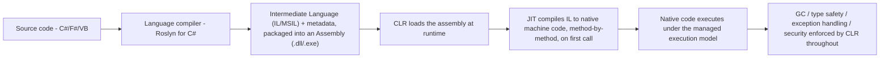
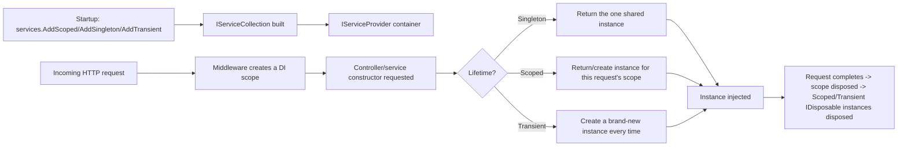
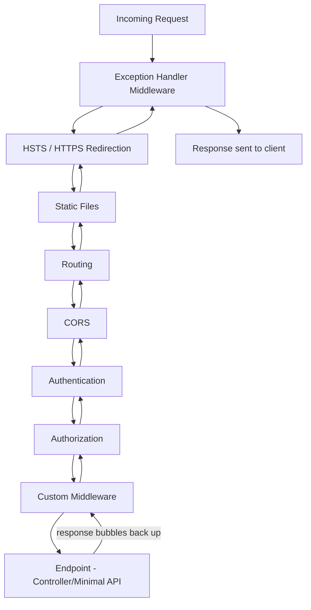
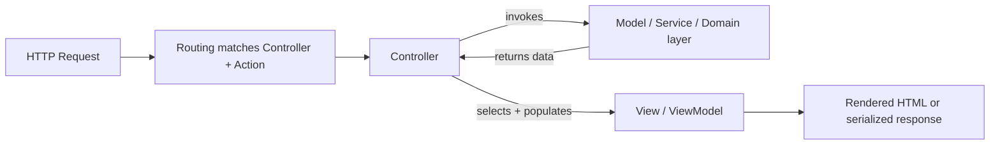
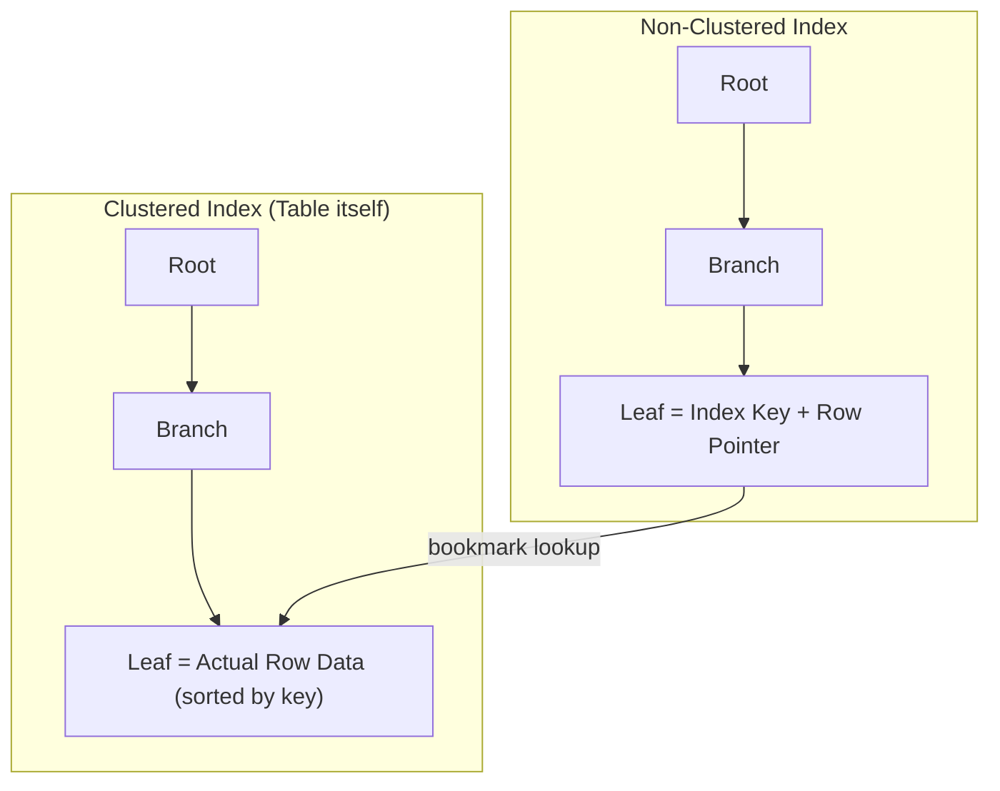
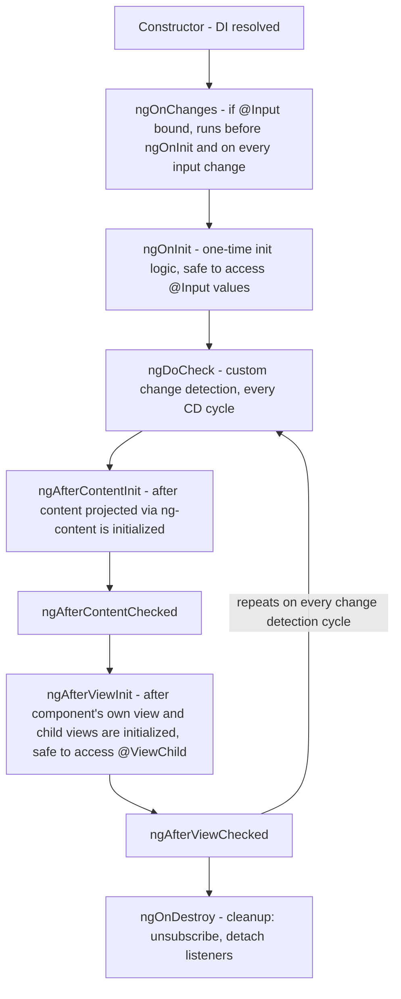
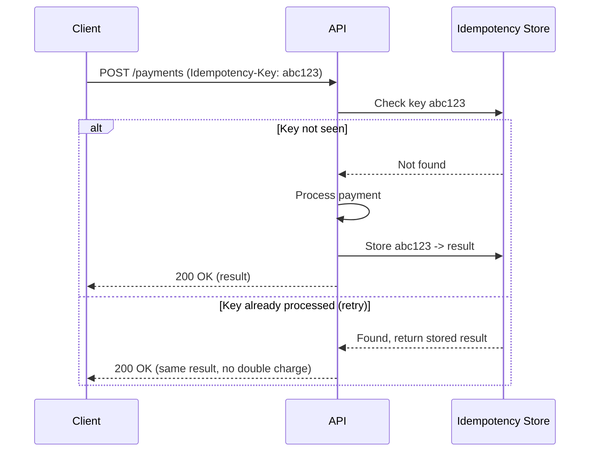

# Interview Questions — Senior .NET Full-Stack Interview Guide

> Consolidated, de-duplicated, aur raw grab-bag interview question lists (general background, C# OOP, coding round, EF, SQL, Angular, .NET Core/API, aur ek second SQL pass) se fully answered. 2026 mein senior/lead level par interview de rahe ek 10-year .NET full-stack developer ke liye pitched.

## Table of Contents

1. [Tell Me About Yourself / Project Experience](#tell-me-about-yourself--project-experience)
2. [C# Language & OOP](#c-language--oop)
3. [Async, Threading & Concurrency](#async-threading--concurrency)
4. [.NET Core / ASP.NET Core & Middleware](#net-core--aspnet-core--middleware)
5. [Authentication, Authorization & API Design](#authentication-authorization--api-design)
6. [Design Patterns & SOLID](#design-patterns--solid)
7. [Entity Framework (Core)](#entity-framework-core)
8. [SQL](#sql)
9. [Angular / TypeScript](#angular--typescript)
10. [Coding Round](#coding-round)
11. [Gap Analysis — Senior-Level Topics Not in the Original List](#gap-analysis--senior-level-topics-not-in-the-original-list)
12. [Summary of Additions](#summary-of-additions)
13. [Contradictions / Ambiguities Flagged](#contradictions--ambiguities-flagged)

---

## Apne Baare Mein Batao / Project Experience

### 1. Apne aur apne project experience ke baare mein briefly batao

Yeh ek narrative question hai — interviewer yahan communication, seniority signaling, aur relevance test kar raha hota hai, facts nahi. Isse ek 90-second "walk" ki tarah structure karo:

- **Frame**: years of experience, primary stack (.NET / C# backend, Angular frontend, SQL Server, Azure/AWS), aur aap *kis kism* ke systems banate ho (jaise, high-throughput APIs, data-heavy line-of-business apps, e-commerce, integrations).
- **Depth signal**: 1–2 aise projects pick karo jahan aapne architecture/design decisions own ki thi, sirf implementation nahi — ek specific hard problem mention karo (scaling, koi tricky bug, ek migration) aur uska outcome (ho sake to numbers ke saath: "reduced p95 latency from 800ms to 120ms", "cut infra cost 30%").
- **Current role**: abhi aap kya kar rahe ho, aapka scope (IC vs team lead karna, mentoring, code review ownership, architecture decisions).
- **Close with intent**: aap kyun switch dhund rahe ho, aur yeh role aapki trajectory ke saath kaise align karta hai (jaise, zyada architecture ownership chahna, ya ek zyada modern stack).

*(verify: concrete metrics/project names ko apne actual resume ke hisaab se tailor karo — yeh guide aapki specific history invent nahi kar sakta)*

**Interviewer follow-ups jo expect karo**: "What was the hardest technical decision you made on that project?", "What would you do differently?", "Who did you disagree with technically and how was it resolved?"

### 2. Current project mein responsibilities

**Ownership** ke terms mein baat karo, tasks ke nahi: system design, API contracts, DB schema decisions, code review gatekeeping, juniors ko mentor karna, CI/CD pipeline ownership, production incident response. Senior interviewers yeh sunte hain ki aap decisions influence karte ho ya sirf tickets execute karte ho. Cross-team responsibilities (QA, DevOps, product ke saath kaam karna) mention karo taaki full-stack/lead maturity dikhe.

### 3. Aap jis tech stack par kaam kar rahe ho – Backend / Frontend / DevOps

Concise stack rundown do aur, usse zyada important, **kyun** woh choices ki gayi thi, jahan tak pata ho:
- **Backend**: C# / ASP.NET Core Web API version, EF Core, SQL Server/PostgreSQL, message broker (RabbitMQ/Azure Service Bus/Kafka) agar use ho raha ho.
- **Frontend**: Angular version, state management approach (NgRx, services with RxJS, signals), UI library.
- **DevOps**: CI/CD tool (Azure DevOps, GitHub Actions, Jenkins), containerization (Docker/Kubernetes), cloud (Azure/AWS), monitoring (App Insights, Grafana/Prometheus, ELK).

Follow-up jo expect karo: "Why did the team choose X over Y?" — kam se kam ek real trade-off ready rakho (jaise, "we chose NgRx over plain services+RxJS because state was shared across 12+ components and debugging with Redux DevTools mattered more than the boilerplate cost").

---

## C# Language & OOP

### 3a. .NET kya hai aur yeh kaise kaam karta hai?

.NET ek general-purpose development platform hai — ek runtime, base class libraries ka set, aur tooling — jo multiple languages (C#, F#, VB.NET) mein likhe gaye code ko ek common format mein compile karke ek shared execution engine par run karne deta hai. Yeh pipeline hai jo har .NET dev ko whiteboard par draw karna aana chahiye:



**Managed execution model** — yeh phrase isi baat ko tie karta hai — matlab CLR, raw OS nahi, in sab cheezon ko control karta hai: memory (allocation + GC), type safety (IL verified hota hai isliye code `unsafe` blocks ke bahar arbitrary pointer arithmetic nahi kar sakta), structured exception handling (har .NET language mein uniform, kyunki sab same IL target karte hain), aur security boundaries.

**Senior-level nuance jo volunteer karo**: JIT one-shot-and-done nahi hota. Modern .NET **tiered compilation** use karta hai — Tier 0 ek fast, minimally-optimized JIT pass karta hai taaki code jaldi run hone lage, aur runtime hot methods ko instrument karke unhe Tier 1 par full optimizations ke saath re-JIT karta hai jab woh prove ho jaaye ki woh matter karte hain — yeh startup-latency vs steady-state-throughput ka trade-off hai jo automatically resolve ho jaata hai. Un scenarios ke liye jahan Tier-0 JIT latency bhi unacceptable ho (serverless cold starts, CLI tools, containers), .NET 8+ mein **Native AOT** hai, jo directly ahead-of-time native code mein compile karta hai aur CLR/JIT step ko poori tarah skip kar deta hai, iske cost par kuch dynamic features (reflection-heavy code, runtime codegen) chale jaate hain.

### 3b. CLR (Common Language Runtime) kya hai?

CLR woh managed execution engine hai jo actually compiled .NET assemblies ko host aur run karta hai — yeh ".NET is a runtime + libraries" ka "runtime" wala half hai. Iski core responsibilities, jinhe explicitly naam lena chahiye instead of sirf "it runs the code" kehke hand-wave karne ke:

- **JIT compilation** — har method ke IL ko native machine code mein translate karta hai, on demand, upar describe kiye gaye tiered (re-)compilation ke saath.
- **Memory management** — managed heap ko own karta hai aur generational GC run karta hai (Gen 0/1/2 + LOH, neeche Garbage Collector ke under detail mein hai); yehi wajah hai C# "managed" hai instead of C++ jaisa manually `malloc`/`free`d.
- **Type safety / verification** — IL check hota hai isliye managed code explicit `unsafe` blocks ke bahar illegal casts ya stray memory access perform nahi kar sakta — yehi badi wajah hai ki pure managed code mein buffer overruns rare hote hain.
- **Structured exception handling** — ek single, uniform exception model jo har CLR-targeting language mein kaam karta hai, kyunki sab same IL-level exception constructs mein compile hote hain.
- **GC hosting and thread/AppDomain management** — collections, finalizer queues, aur (historically) AppDomain isolation ko schedule aur coordinate karta hai; unmanaged code mein cross karne ke liye interop (P/Invoke, COM interop) bhi provide karta hai.

**Implementations jo pata hone chahiye**: **CoreCLR** cross-platform CLR hai jo modern .NET (Windows/Linux/macOS) ke saath ship hota hai; **Mono** historically mobile/Unity ke liye use kiya jaane wala alternative hai; **Native AOT** ahead of time compile karke runtime par CLR/JIT ki zarurat poori tarah hata deta hai. Yeh pata hona ki CLR ke ek se zyada implementations hain, aur "the CLR" "Windows" ka synonym nahi hai, ek achha currency signal hai.

### 3c. .NET mein Assemblies kya hain?

Assembly .NET mein **deployment, versioning, aur type-scoping** ki fundamental unit hai — compilation ka physical output (ek `.dll` ya `.exe`) jisme yeh hota hai:
- Ismein define kiye gaye har type/member ke liye **IL code**,
- **Metadata** jo un types aur unke signatures describe karta hai (isi se Reflection possible hota hai),
- Ek **manifest** — assembly name, version, culture, aur us assemblies ki list jinhe yeh reference karta hai,
- Optionally embedded resources (strings, images, etc.).

**Assembly vs namespace vs module — ek distinction jispar clear hona zaroori hai**: namespace sirf ek logical, compile-time naming construct hai jiska koi physical existence nahi hota; assembly physical deployable unit hai. Ek single assembly commonly kayi namespaces contain karta hai, aur (kam common but valid) ek namespace multiple assemblies mein span kar sakta hai — yeh orthogonal concepts hain, synonyms nahi, iske bawajood `MyCompany.MyApp.dll` convention se often `MyCompany.MyApp` namespace ke saath 1:1 line up karta hai.

**Loading and isolation**: CLR runtime par assembly references ko resolve aur load karta hai. .NET Core ne purane Framework-era GAC/strong-naming/AppDomain model ko **`AssemblyLoadContext`** se replace kiya, jo same process mein same assembly ke multiple versions ko side-by-side load karna support karta hai — yehi mechanism hai jo robust plugin architectures (jaise, kayi plugins load karna jinme har ek shared library ke different version par depend karta ho) ko "assembly binding redirect" hell ke bina practical banata hai.

**Yeh day-to-day kyun matter karta hai**: metadata-driven Reflection hi hai jo DI container auto-registration, EF Core ki convention-based entity scanning, JSON serializers, aur AutoMapper ko power deta hai — yeh sab under the hood "walk assemblies looking for types/attributes" karte hain, isliye assemblies ko sirf "the dll that comes out of the build" se zyada samajhna kaam aata hai jab debug karna ho ki koi type pick kyun nahi ho raha.

### 4. C# mein string kya hai? Yeh immutable kyun hai?

`string` ek sealed reference type hai (`System.String`) jo UTF-16 characters ki sequence represent karta hai, heap par stored hota hai even though yeh value-like syntax ke saath use hota hai.

**Immutable kyun:**
- **Thread safety** — multiple threads bina locking ke same string read kar sakte hain; aapko torn/partial reads nahi milte.
- **String interning / caching** — CLR literals ke liye ek intern pool maintain karta hai; agar strings mutable hote, ek reference literal ko mutate karke same interned value ke har doosre reference ko corrupt kar deta.
- **Hashing reliability** — strings dictionary/hashset keys ke roop mein bahut use hote hain. Agar ek mutable key insertion ke baad change ho jaaye to woh jis hash bucket mein rehta hai usko break kar degi.
- **Security** — validate hone ke baad immutable strings alter nahi ki ja sakti (jaise, security checks ke baad ek filename ya SQL fragment ko reference se change nahi kiya ja sakta).

Har apparent "mutation" (`s += "x"`, `.Replace()`, `.ToUpper()`) actually ek **new** string allocate karta hai aur original ko untouched chhod deta hai. Isi wajah se loop mein heavy string concatenation ek classic performance gotcha hai — O(n²) allocations — aur isi wajah se `StringBuilder` (mutable internal char buffer) ya `string.Create`/`Span<char>` iska fix hain.

**Follow-up**: "How does `StringBuilder` avoid the problem?" — Yeh ek internal mutable buffer pre-allocate/grow karta hai aur `string` ko sirf ek baar materialize karta hai, `.ToString()` par.

### 5. .NET Framework aur .NET Core (aur .NET 7/8/9) mein difference

| Aspect | .NET Framework | .NET Core (→ .NET 5+) |
|---|---|---|
| Platform | Sirf Windows | Cross-platform (Windows/Linux/macOS) |
| Open source | Partially | Fully open source (GitHub) |
| Deployment | Machine-wide GAC install | Self-contained ya framework-dependent, side-by-side versions |
| Performance | Slower JIT, purana GC | Kaafi zyada fast (Server GC improvements, tiered compilation, ReadyToRun) |
| Modularity | Monolithic (System.Web etc.) | NuGet-based, pay-for-what-you-use |
| Web stack | ASP.NET (System.Web, IIS-coupled) | ASP.NET Core (Kestrel, decoupled from IIS) |
| Future | Sirf maintenance mode (koi naye features nahi) | Active development, yearly release train |
| Container friendliness | Kharab (heavy) | Excellent (small, Linux containers, Docker-first) |

.NET 5 se, "**.NET Core**" ko rebrand karke sirf "**.NET**" (5, 6, 7, 8, 9...) kar diya gaya taaki yeh signal ho ki yeh aage jaane wala *ek* .NET hai — .NET Framework 4.8 last version hai aur sirf security patches receive karta hai. .NET 8 aur .NET 10 LTS releases hain (3-year support); odd-numbered releases (7, 9) STS hain (18 months) — **(apni target version ke against current LTS cadence verify karo, kyunki yeh policy kabhi kabhi model hoti hai — 2026 tak .NET 10 current LTS hai)**.

**Follow-up**: "Would you migrate a legacy .NET Framework app to .NET 8? What's the risk?" — `System.Web` dependency removal, third-party library compatibility, aur big-bang rewrite ke bajaye .NET Upgrade Assistant / incremental strangler-fig approach use karna discuss karo.

### 6. Value Types vs Reference Types kya hain?

| | Value Types | Reference Types |
|---|---|---|
| Examples | `int`, `struct`, `enum`, `bool`, `DateTime` | `class`, `string`, `object`, arrays, delegates |
| Storage | Stack (ya containing object/array ke andar inline) | Heap; variable ek pointer/reference hold karta hai |
| Assignment | Poori value copy hoti hai | Reference copy hota hai (dono same object ko point karte hain) |
| Default | Zeroed value (`0`, `false`, etc.) | `null` |
| Passed to methods | Default se by value (copy) | Reference copy hota hai, lekin same object ko point karta hai (isliye mutations visible hote hain; reassignment nahi) |

Gotcha: reference-type fields wala `struct` bhi sirf struct ke fields hi copy karta hai (shallow copy) — referenced object shared rehta hai. Iske alawa, value type ko box karna (usse `object` mein assign karna) heap par allocate karta hai aur ek copy incur karta hai — hot paths mein ek classic perf gotcha (jaise, `ArrayList` pre-generics, ya old-style logging mein `int` ko `object[] args` mein pass karna).

### 7. Constructors kya hote hain? Parameterized vs Non-parameterized

Ek constructor object ki state ko creation time par initialize karta hai; iska naam class ke naam jaisa hota hai aur iska koi return type nahi hota.

- **Non-parameterized (default) constructor**: koi arguments nahi; agar aap *koi bhi* constructor define karte ho, to compiler ab default wala auto-generate nahi karta — agar zarurat ho to aapko usko explicitly declare karna padega.
- **Parameterized constructor**: construction ke time fields ko specific values ke saath initialize karne ke liye arguments accept karta hai, isse enforce hota hai ki required state skip nahi ho sakti.
- Related, expected follow-ups:
  - **Constructor chaining**: same class ke doosre constructor ko call karne ke liye `this(...)`; parent ke constructor ko call karne ke liye `base(...)`.
  - **Static constructors**: ek baar run hote hain, first instance create hone se pehle ya static member access hone se pehle; koi access modifiers nahi, koi parameters nahi.
  - **Primary constructors (C# 12)**: `public class Person(string name, int age) { }` — simple DTOs/records ke liye boilerplate kam karta hai.

```csharp
public class Employee
{
    public string Name { get; }
    public decimal Salary { get; }

    public Employee() : this("Unknown", 0) { }         // chaining
    public Employee(string name, decimal salary)
    {
        Name = name;
        Salary = salary;
    }
}
```

### 8. Method Overloading vs Method Overriding

| | Overloading | Overriding |
|---|---|---|
| Definition | Same method name, different signature, same class (ya inheritance hiding ke through) | Subclass base class ke `virtual`/`abstract` method ko **same** signature ke saath redefine karta hai |
| Polymorphism type | Compile-time (static) | Runtime (dynamic) |
| Keywords | Kuch bhi required nahi | `virtual` (base) + `override` (derived); ya `abstract` + `override` |
| Return type | Different ho sakta hai | Match hona chahiye (ya C# 9 se covariant ho sakta hai) |
| Resolved by | Compiler, call site par argument types ke basis par | CLR, object ke actual runtime type ke basis par |

```csharp
class Shape
{
    public virtual double Area() => 0;
}
class Circle : Shape
{
    public double Radius;
    public override double Area() => Math.PI * Radius * Radius;   // overriding
}
class Calculator
{
    public int Add(int a, int b) => a + b;
    public double Add(double a, double b) => a + b;                // overloading
}
```

**Gotcha**: `new` vs `override` — `new` base member ko hide karta hai (calls reference ke *static* type se resolve hote hain), jabki `override` true polymorphism deta hai (calls *runtime* type se resolve hote hain). Inhe mix kar dena ek favorite interview trap hai:

```csharp
Shape s = new Circle();
s.Area();  // override → Circle.Area() called (polymorphic)
           // if Circle used "new" instead of "override" → Shape.Area() called (0), because s is statically typed as Shape
```

### 9. Real project examples ke saath OOP concepts explain karo

Chaar pillars, practical usage se tied hue jinhe ek senior dev ko instantly narrate karna aana chahiye:

- **Encapsulation**: private fields + public properties/methods; jaise, ek `Order` class public mutable `List<Item>` ke bajaye `AddItem()` expose karta hai, taaki business rules (jaise, "can't add items to a shipped order") ek hi jagah enforce hon.
- **Abstraction**: implementation detail ko ek interface ke peeche hide karna — jaise, `IPaymentGateway` with `Stripe`/`PayPal` implementations; calling code ko pata nahi hota aur farak nahi padta ki konsa wired up hai.
- **Inheritance**: shared base behavior — jaise, `BaseRepository<T>` with CRUD, jise `OrderRepository` order-specific queries ke liye extend karta hai. Interviews mein caution: mention karo ki modern design mein **composition ko inheritance se zyada prefer** kiya jaata hai (flexibility favor karta hai, fragile base class problem avoid karta hai).
- **Polymorphism**: `IEnumerable<IShape>` jahan `Area()` har concrete shape ke hisaab se differently behave karta hai — Strategy/Open-Closed pattern ko enable karta hai.

### 10. Interface aur Abstract Class mein difference

| | Interface | Abstract Class |
|---|---|---|
| Multiple inheritance | Ek class kayi interfaces implement kar sakti hai | Ek class sirf ek abstract class inherit kar sakti hai |
| Members | Sirf contract (C# 8+ default implementations allow karta hai) | Abstract aur fully implemented members, fields, constructors mix ho sakte hain |
| State | Koi instance fields nahi (jab tak recent C# ne static members add nahi kiye) | Instance state hold kar sakta hai |
| Access modifiers | Members traditionally implicitly public | Full access modifier support |
| Use case | "Can-do" capability contract (`IDisposable`, `IComparable`) | "Is-a" shared base common logic ke saath (`Stream`, `Controller`) |
| Versioning | Member add karne se sab implementers break ho jaate hain (jab tak default impl na diya ho) | Concrete method add karne se subclasses break nahi hote |

Interviews ke liye rule of thumb: **"Interfaces define what an object can do; abstract classes define what an object is, with shared implementation."** C# 8 se, default interface methods yeh line thodi blur kar dete hain — yeh nuance jaano, aur bina pooche mention karo, isse currency signal hoti hai.

### 11. C# mein Collections kya hain?

Collections `System.Collections` (non-generic, legacy, boxing overhead) aur `System.Collections.Generic` (type-safe, preferred) mein data-structure types hain. Key ones jo ek senior dev ko fluently compare karna aana chahiye:

| Collection | Backing structure | Ordered? | Duplicates? | Typical use |
|---|---|---|---|---|
| `List<T>` | Dynamic array | Yes | Yes | General-purpose ordered list |
| `Dictionary<K,V>` | Hash table | No (insertion order guaranteed nahi) | Unique keys | Key se O(1) average lookup |
| `HashSet<T>` | Hash table | No | No | Fast membership tests, set operations |
| `Queue<T>` | Circular buffer | FIFO | Yes | Task queues, BFS |
| `Stack<T>` | Array-backed | LIFO | Yes | Undo history, DFS |
| `LinkedList<T>` | Doubly-linked nodes | Yes | Yes | Mid-list mein frequent insert/remove (practice mein rare; array locality usually jeet jaati hai) |
| `ConcurrentDictionary<K,V>` | Thread-safe hash table | No | Unique keys | Multi-threaded caches |
| `ImmutableList<T>` etc. | Persistent tree/array | Yes | Yes | Bina locks ke functional/thread-safe scenarios |

**Gotcha**: `Dictionary<K,V>` concurrent writes ke liye thread-safe *nahi* hai — `ConcurrentDictionary` ya external locking use karna padta hai. Iske alawa, same loop mein collection ko iterate aur mutate karna `InvalidOperationException` throw karta hai ("Collection was modified"); iska fix `.ToList()` snapshot ya `RemoveAll` se hota hai.

### 12. Ek simple example ke saath LINQ explain karo

LINQ (Language Integrated Query) in-memory collections (`IEnumerable<T>` via `System.Linq`) aur remote data sources (`IQueryable<T>` via EF Core, SQL mein translated) par ek unified, declarative query syntax provide karta hai.

```csharp
var seniorDevs = employees
    .Where(e => e.YearsExperience >= 8)
    .OrderByDescending(e => e.YearsExperience)
    .Select(e => new { e.Name, e.YearsExperience })
    .ToList();
```

**Key nuance jo interviewers seniority ke liye probe karte hain:**
- **Deferred execution**: `Where`/`Select` ek expression tree/iterator build karte hain lekin enumerate hone tak run nahi hote (`ToList()`, `foreach`, etc.). Isse ek classic gotcha hota hai — loop ke andar query karna har baar query ko re-execute karta hai jab tak usse materialize na kiya jaaye.
- **`IEnumerable<T>` vs `IQueryable<T>`**: `IEnumerable` LINQ in-memory run hota hai (LINQ to Objects); `IQueryable` ek **expression tree** build karta hai jise provider (EF Core) SQL mein translate karke database par execute karta hai — matlab materialize karne se *pehle* filter karna (`.Where()` before `.ToList()`) kaam ko DB par push karta hai, jabki baad mein filter karna sab kuch pehle memory mein le aata hai (EF code reviews mein ek huge perf gotcha).
- **Multiple enumeration**: ek `IEnumerable` ko do baar enumerate karna (jaise, ek baar `.Any()` ke liye, ek baar `.ToList()` ke liye) poori pipeline ko re-run karta hai — DB-backed queries ke liye costly; reuse hone par `.ToList()`/`.ToArray()` se cache karo.

---

## Async, Threading & Concurrency

### 13. Garbage Collector kya hai? Yeh kaise kaam karta hai?

GC **managed heap** ke liye .NET ka automatic memory manager hai. Yeh un objects ki memory reclaim karta hai jo kisi bhi root (local variables, statics, GC handles, stack) se ab reachable nahi hain.

**Generational, mark-and-compact model:**
- **Gen 0**: short-lived objects; frequently aur fast collect hote hain.
- **Gen 1**: Gen 0 aur Gen 2 ke beech ka buffer.
- **Gen 2**: long-lived objects (jaise, static caches); rarely collect hote hain, sabse expensive (heap ka bahut zyada hissa traverse karte hain).
- **LOH (Large Object Heap)**: ≥ 85,000 bytes ke objects yahan directly jaate hain; sirf Gen 2 (full) collections ke dauraan collect hote hain; default mein compact nahi hote (fragmentation risk) — `GCSettings.LargeObjectHeapCompactionMode` compaction force kar sakta hai.

**Algorithm**: mark phase roots se live-object graph ko walk karta hai; unreachable objects garbage hote hain; Gen 0/1 collections fragmentation avoid karne ke liye **compact** karte hain (survivors ko saath move karte hain, pointers update karte hain), isi wajah se Gen 0 collections cheap hote hain "poori" generation ko touch karne ke bawajood — yeh small hoti hai aur fast compact hoti hai.

**Modes**: Workstation vs Server GC (Server GC har core ke liye ek heap+thread use karta hai, services ke liye better throughput); Background (concurrent) GC Gen 2 collection ko largely app threads ke saath concurrently run karne deta hai taaki pause times kam ho.

**Senior-level talking points / gotchas:**
- **unmanaged** resources (file handles, sockets, DB connections) ke liye `IDisposable`/`using` abhi bhi zaroori hai — GC ko unmanaged memory ke baare mein pata nahi hota; finalizers ek safety net hain, strategy nahi (yeh finalization queue ke through ek Gen-2-only cost add karte hain).
- .NET mein **memory leaks abhi bhi hote hain** forgotten event handler subscriptions (`+=` jo kabhi unsubscribe nahi hua), unbounded grow hoti static collections, ya long-lived caches mein captured closures ki wajah se.
- Production code mein `GC.Collect()` ko manually almost kabhi call nahi karna chahiye — yeh ek full, expensive collection force karta hai aur GC ke apne heuristics se fight karta hai.
- `Span<T>`/`stackalloc` sabse hot paths ke liye heap allocation ko poori tarah avoid karte hain.

### 14. Delegates kya hote hain? Delegates ke types

Delegate ek type-safe function pointer hai — ek object jo ek matching signature wale method (ya multiple, multicast ke through) ka reference hold karta hai, isse methods ko parameters ke roop mein pass karna, variables mein store karna, aur indirectly invoke karna possible ho jaata hai.

**Types:**
- **Single-cast delegate**: custom `delegate` keyword declarations, ya built-in generic forms:
  - `Action<T...>` — koi return value nahi.
  - `Func<T..., TResult>` — value return karta hai.
  - `Predicate<T>` — `bool` return karta hai (specialized `Func<T,bool>`).
- **Multicast delegate**: `+=`/`-=` multiple methods ko chain karte hain; invoke karne se yeh order mein call hote hain; agar koi value return karta hai, to sirf **last** invoked method ka return value observe hota hai (ek classic gotcha) — isliye multicast mainly `void`-returning delegates jaise events ke saath use hota hai.
- **Events**: delegates par built ek language feature (`event` keyword) jo external code ko sirf `+=`/`-=` tak restrict karta hai, outsiders ko poori handler list invoke ya clear karne se rokta hai — ek key encapsulation nuance.

```csharp
public delegate int Operation(int a, int b);

Operation add = (a, b) => a + b;
Func<int,int,int> subtract = (a, b) => a - b;

// Multicast
Action<string> log = Console.WriteLine;
log += msg => File.AppendAllText("log.txt", msg);
log("Both handlers run");
```

**Follow-up**: "How do delegates relate to events and to `IObservable`/Rx?" — Events restricted access wale delegates hain; Rx (`IObservable<T>`) same push-based pattern ko ek composable, LINQ-queryable stream mein generalize karta hai — conceptually Angular ke RxJS `Observable` ka .NET analog.

### 15. C# mein Async-Await & Asynchronous Programming explain karo

`async`/`await` **Task-based Asynchronous Pattern (TAP)** ke upar syntactic sugar hai jo aapko non-blocking code likhne deta hai jo sequential code jaisa dikhta hai. Compiler ek `async` method ko ek state machine mein rewrite kar deta hai.

```csharp
public async Task<Order> GetOrderAsync(int id)
{
    var order = await _dbContext.Orders.FindAsync(id);   // yields thread back to caller/pool while I/O is in flight
    var enriched = await _pricingService.EnrichAsync(order);
    return enriched;
}
```

**Key mental model**: `await` naya thread create nahi karta. Yeh ek continuation register karta hai aur current thread ko thread pool mein wapas **release** kar deta hai (ya, UI-bound code par, message loop mein wapas) jab tak awaited operation (typically I/O) in flight hai, phir jab woh complete ho jaata hai to ek captured context (ya ek pool thread) par resume karta hai.

**Senior-level nuances/gotchas:**
- **`async void`** ko top-level event handlers ke siva avoid karna chahiye — iske andar throw hui exceptions caller se await/catch nahi ho sakti aur process crash kar degi (via `SynchronizationContext` ya `AppDomain.UnhandledException`).
- **`ConfigureAwait(false)`**: library code mein (ASP.NET Core mein nahi, jisme by default koi `SynchronizationContext` nahi hota, lekin reusable libraries / WPF/WinForms/old ASP.NET ke liye phir bhi relevant hai), continuation ke liye original context capture karne se avoid karta hai, jisse overhead aur deadlock risk kam hota hai.
- **Deadlock classic**: `SynchronizationContext` wale context (old ASP.NET, UI apps) mein `.Result` ya `.Wait()` se async code par block karna deadlock kar deta hai kyunki continuation ko waisa hi captured context chahiye, jo waiting mein blocked hai. ASP.NET Core mein default mein aisa koi context nahi hota, lekin `.Result`/`.Wait()` phir bhi avoid karna chahiye — poori tarah `async` use karo ("async all the way").
- **`Task` vs `Task<T>` vs `ValueTask<T>`**: `ValueTask<T>` un hot paths ke liye heap allocation avoid karta hai jahan result frequently synchronously already available hota hai (jaise, ek cache hit) — lekin `Task` ke unlike, isko do baar await ya store nahi karna chahiye.
- **Exception handling**: `async` methods mein exceptions returned `Task` ke exception state mein capture hoti hain aur `await` par rethrow hoti hain; unobserved task exceptions purane .NET mein GC par process crash kar deti thi — ab generally sirf log hoti hain, lekin "fire and forget" tasks ko phir bhi hamesha error handling ke saath wrap karna chahiye.

### 16. Multithreading vs Async — difference kya hai?

Yeh sabse zyada misunderstood distinctions mein se ek hai aur ek favorite senior-level probe hai.

| | Multithreading | Async (async/await) |
|---|---|---|
| Goal | Parallelism — multiple CPU-bound things **ek hi time** par karna | Concurrency — I/O par wait karte waqt thread ko block na karna |
| Threads used | Actively multiple OS threads simultaneously use karta hai | Wait ke dauraan current thread ko free kar deta hai; alag pool thread par resume ho sakta hai, lekin busy-waiting ke liye second thread ki zarurat nahi |
| Best for | CPU-bound work (image processing, complex computation) | I/O-bound work (DB calls, HTTP calls, file I/O) |
| Tools | `Thread`, `Task.Run`, `Parallel.For`, `PLINQ` | `async`/`await`, `Task`, `ValueTask` |
| Cost | Thread creation/context switching relatively expensive hota hai; core count se limited | Bahut cheap — I/O await karte waqt koi thread "spent" nahi hota; ek chhote thread pool par hazaaron concurrent operations tak scale karta hai |

**Key insight jo explicitly state karo**: `async` threads create karne ke baare mein nahi hai — yeh **waiting par thread waste na karne** ke baare mein hai. `Task.Run` *actually* ek thread-pool thread use karta hai, aur isko us CPU-bound work ke liye reserve karna chahiye jise aap calling thread se offload karna chahte ho (jaise, UI ko responsive rakhna), un I/O calls ko wrap karne ke liye nahi jinke paas already ek async API hai (`context.SaveChangesAsync()` ko `Task.Run` mein wrap karna ek common junior mistake hai — isse bas bina kisi benefit ke ek pool thread burn hota hai).

**Follow-up**: "How would you parallelize CPU-bound work across cores?" — `Parallel.ForEach`/`Parallel.For` ya PLINQ (`.AsParallel()`), shared state ki thread-safety, over-subscription, aur core count se aage diminishing returns ka dhyan rakhte hue.

### 17. readonly vs constant (`const`)

| | `const` | `readonly` |
|---|---|---|
| When assigned | Compile time | Runtime (declaration ya constructor mein) |
| Storage | Har call site par IL mein baked hota hai (literal jaisa) | Actual field, construction par ek baar evaluate hota hai |
| Static? | Implicitly static (type ka hota hai) | Instance-level ya `static readonly` ho sakta hai |
| Allowed types | Primitives, `string`, `enum` (compile-time constant hona chahiye) | Koi bhi type, runtime par computed objects samet |
| Versioning gotcha | Ek referenced assembly mein `const` change karne se **sab consumers ko recompile** karna padta hai (value unke compile time par inline hoti hai) | `readonly` value change karne se consumers ko recompile karne ki zarurat nahi — runtime par resolve hota hai |

Yeh last row wahi answer hai jo interviewers actually fish kar rahe hote hain — yeh multi-assembly/NuGet-package scenarios mein ek real production gotcha hai.

### 18. Abstract vs Virtual

| | `abstract` | `virtual` |
|---|---|---|
| Implementation in base | Kuch nahi — koi body allowed nahi | Ek default body hoti hai |
| Must override? | Haan, first concrete derived class mein mandatory | Optional |
| Can the base class be instantiated? | Nahi (class ko bhi `abstract` hona chahiye) | Haan |
| Use case | Har subtype ko apna behavior define karne ke liye force karna (koi sensible default nahi) | Ek default provide karna jo zyadatar subtypes reuse kar sakein, lekin customization allow karna |

### 19. Extension Methods + Example

Extension methods aapko ek existing type mein (sealed types aur woh types jinke owner aap nahi ho unko bhi shaamil karke) methods "add" karne dete hain uska source modify kiye bina ya inheritance use kiye bina — yeh ek `static` class mein `static` methods ke roop mein implement hote hain, first parameter par `this` ke saath.

```csharp
public static class StringExtensions
{
    public static bool IsNullOrBlank(this string? value) =>
        string.IsNullOrWhiteSpace(value);
}

// usage
if (userInput.IsNullOrBlank()) { ... }
```

Under the hood, yeh pure syntactic sugar hai — compiler `userInput.IsNullOrBlank()` ko `StringExtensions.IsNullOrBlank(userInput)` mein rewrite karta hai. Isi tarah LINQ ka pura (`.Where()`, `.Select()`, etc.) `IEnumerable<T>` par extensions ke roop mein implement kiya gaya hai.

**Gotcha**: extension methods static type ke basis par **compile time** par resolve hote hain aur same signature wale instance methods se hamesha lower priority par hote hain — agar ek instance method exist karta hai to woh hamesha jeet jaata hai. Iske alawa, inhe `null` reference par bina throw kiye call kiya ja sakta hai (kyunki yeh actually sirf ek static method call hai) — upar wale example jaisi null-safety helpers ke liye useful, lekin agar aapko yeh rule pata na ho to surprising.

---

## .NET Core / ASP.NET Core & Middleware

### 20. .NET Core mein Dependency Injection kya hai? Yeh internally kaise kaam karta hai?

DI **Inversion of Control** achieve karne ki ek technique hai: ek class apni dependencies declare karti hai (typically constructor parameters ke through) unhe khud construct karne ke bajaye, aur ek container unhe runtime par supply (inject) karta hai. Isse consumers concrete implementations se decouple ho jaate hain, jisse testability (mock injection) aur centralized lifetime/configuration management enable hota hai.

**Internals** (`Microsoft.Extensions.DependencyInjection`):
1. Startup par, services ek `IServiceCollection` mein register hote hain (`builder.Services.AddScoped<IFoo, Foo>()` etc.), jo essentially `ServiceDescriptor` entries ki ek list hoti hai (service type, implementation type/factory, lifetime).
2. `.Build()` isko ek `IServiceProvider` (container) mein compile karta hai.
3. Har resolution request par, container:
   - Requested type ke liye descriptor lookup karta hai.
   - Constructor parameters ko recursively resolve karta hai (dependency graph walk karte hue).
   - Yeh decide karne ke liye **lifetime rules** (neeche dekho) apply karta hai ki naya instance banaye ya cached wala return kare.
4. ASP.NET Core ke liye, har HTTP request ke liye ek naya **scope** create hota hai (pipeline ke early middleware ke through), aur request end par dispose hota hai — isi wajah se "Scoped" "per request" ke saath line up karta hai.



### 21. Service Lifetimes — Transient, Scoped, Singleton

| Lifetime | Instance created | Typical use | Gotcha |
|---|---|---|---|
| **Transient** | Har baar request/inject hone par naya instance | Lightweight, stateless services (jaise, ek validator, ek mapper) | Agar construction expensive ho to wasteful; cheap objects ke liye fine |
| **Scoped** | Har request/scope ke liye ek instance, us scope mein reuse hota hai | `DbContext`, unit-of-work, per-request services | Ek Singleton se Scoped service resolve karna (captured `IServiceProvider` ke through) "captive dependency" bug create karta hai (neeche dekho) |
| **Singleton** | Application ki lifetime ke liye ek instance | Configuration objects, caches, `HttpClientFactory`-managed handlers, logging | Thread-safe hona chahiye; kabhi bhi Scoped service (jaise, `DbContext`) ka reference hold nahi karna chahiye — yehi classic **captive dependency** bug hai |

**Captive dependency gotcha (ek favorite senior question)**: agar ek `Singleton` service apne constructor mein ek `Scoped` dependency (jaise, `DbContext`) leta hai, to DI container khushi khushi usko *ek baar* inject kar dega, aur singleton phir usi `DbContext` instance ko forever hold karega — har request, har user, har thread ke across. Isse concurrency exceptions, stale data, aur connection leaks hote hain. Built-in container actually ASP.NET Core mein by default resolution time par isko catch karne ke liye throw karta hai (`ValidateScopes = true` Development mein) — lekin yeh phir bhi us code mein ek bahut real bug hai jo ek singleton ke andar manually `IServiceProvider` se resolve karta hai. Fix: singleton mein `IServiceScopeFactory` inject karo aur har operation ke liye ek naya scope create karo.

### 22. .NET Core mein Request Pipeline explain karo. Middleware kya hai aur yeh kaise execute hota hai?

ASP.NET Core poori request handling ko ek **pipeline of middleware components** ke roop mein model karta hai, jinme se har ek yeh kar sakta hai:
- Next component ko control pass karne se pehle kaam karna (`await next(context)`),
- Next component return hone ke baad kaam karna (post-processing, jaise, response status log karna),
- Ya pipeline ko poori tarah short-circuit karna (`next` ko kabhi call na karna, jaise, auth check se 401 return karna).

Yeh **Chain of Responsibility** pattern hai, jo `Program.cs` mein `app.Use...()` calls ke through configure hota hai, exact order mein jisme yeh register hote hain.



**Order matter karta hai aur ek classic gotcha hai**: jaise, `UseAuthentication()` `UseAuthorization()` se pehle aana chahiye; `UseCors()` typically `UseAuthorization()` se pehle aur routing ke baad position hona chahiye; `UseExceptionHandler()`/custom error-handling middleware ko **sabse pehle** register karna chahiye taaki yeh downstream sab kuch ko try/catch mein wrap kar de.

**Custom middleware** example:

```csharp
public class RequestTimingMiddleware
{
    private readonly RequestDelegate _next;
    private readonly ILogger<RequestTimingMiddleware> _logger;

    public RequestTimingMiddleware(RequestDelegate next, ILogger<RequestTimingMiddleware> logger)
    {
        _next = next;
        _logger = logger;
    }

    public async Task InvokeAsync(HttpContext context)
    {
        var sw = Stopwatch.StartNew();
        await _next(context);                     // call the rest of the pipeline
        sw.Stop();
        _logger.LogInformation("{Method} {Path} took {Elapsed}ms",
            context.Request.Method, context.Request.Path, sw.ElapsedMilliseconds);
    }
}

// Program.cs
app.UseMiddleware<RequestTimingMiddleware>();
```

Minimal API style bhi `app.Use(async (context, next) => { ... await next(); ... });` ke through inline middleware allow karta hai.

### 22a. MVC architecture explain karo

MVC (Model-View-Controller) ek application ko teen responsibilities mein separate karta hai, aur ASP.NET ki controller/routing plumbing (jo request pipeline aur filters sections mein already cover ho gayi hai) directly isi ke upar built hai:



- **Model**: domain/data layer — entities, DTOs, ViewModels, aur business rules/validation jo unhe govern karte hain. Isko HTTP ya rendering ke baare mein kuch pata nahi hota.
- **View**: presentation layer — classic server-rendered ASP.NET MVC mein, Razor views/pages jo ek Model ko HTML mein render karte hain. Ek API-only backend mein (modern Angular/SPA front end ke liye jyada common shape), rendering sense mein koi View nahi hota — "view" wala role client ko push ho jaata hai, aur controller directly serialized data (JSON) return karta hai.
- **Controller**: traffic cop — request receive karta hai, model/service layer ko delegate karta hai, aur ya to ek view select karta hai (`View(model)`) ya data return karta hai (`ActionResult`/`IActionResult`). Yeh thin hona chahiye: koi business logic nahi, sirf HTTP transport aur domain/service layer ke beech ek adapter.

**Senior-level framing jo explicitly state karni chahiye**: ek pure Web API ke liye, "MVC" effectively Model + Controller tak narrow ho jaata hai, lekin ASP.NET Core phir bhi API controllers ko full MVC jaisi same base infrastructure (`ControllerBase`, model binding, filters — #23 dekho) ke through route karta hai, isi wajah se framework isko "MVC" hi kehta hai even jab koi View render nahi ho raha ho. Frontend ke saath parallel draw karna bhi worth hai: Angular ka component (orchestration) + template (presentation) + service/state (model) conceptually isi separation par map karta hai, jo compare karne ke liye poochha jaaye to ek achha cross-stack signal hai. Jo discipline actually code review mein matter karti hai woh hai **"thin controller, fat service"** — business logic service/domain layer mein belong karti hai, controller actions mein scattered nahi honi chahiye, taaki yeh HTTP pipeline se independent testable rahe.

### 23. MVC mein Filters — yeh Middleware ke vs kahan fit hote hain?

Filters MVC/Web-API-specific hooks hain jo pipeline ke MVC action-invocation part ke **andar** run hote hain (routing ke ek endpoint match kar lene ke baad), jo MVC-specific context (action arguments, model binding results, `ActionResult`) tak access dete hain jo generic middleware ke paas nahi hota.

| Filter type | Runs | Typical use |
|---|---|---|
| Authorization filters | Sabse pehle, model binding se pehle | `[Authorize]` se aage custom auth checks |
| Resource filters | Pipeline ke rest se pehle/baad, model binding ke around | Caching short-circuits |
| Action filters | Action method execute hone se pehle/baad | Logging, validation, action results modify karna |
| Exception filters | Sirf agar exception throw ho | MVC-scoped error handling/transformation |
| Result filters | Result (jaise, `ViewResult`) execute hone se pehle/baad | Responses format/wrap karna |

**Middleware vs Filters** — middleware transport/pipeline-level aur framework-agnostic hota hai (non-MVC endpoints ke liye bhi kaam karta hai); filters MVC-pipeline-level hote hain aur rich action metadata (`ActionExecutingContext`) tak access rakhte hain. Rule of thumb: cross-cutting infra concerns (auth, CORS, raw request/response logging) ke liye middleware use karo; filters use karo jab aapko MVC-specific context (model state, action arguments) chahiye.

### 24. API mein Validation

- **Data annotations**: DTOs par `[Required]`, `[StringLength]`, `[Range]`, `[RegularExpression]` — MVC model binding se automatically validate hote hain; `ModelState.IsValid` (ya `[ApiController]` ke built-in model validation ke through automatic `400` responses).
- **FluentValidation**: senior level par complex, composable, testable rules ke liye preferred hai jo DTO class se hi decoupled hote hain; ek pipeline behavior ya filter ke through integrate hota hai.
- **Domain-level validation**: woh business rules jinhe declaratively express nahi kiya ja sakta (jaise, "order total must not exceed customer's credit limit") domain/service layer mein belong karte hain, attributes mein nahi — attribute validation shape/format ke liye hoti hai, business rules ke liye nahi.
- `[ApiController]` ke saath, invalid model state automatically ek `ProblemDetails` payload ke saath `400 Bad Request` par short-circuit ho jaata hai — zyadatar cases mein manual `ModelState.IsValid` check ki zarurat nahi.

### 25. Eager Loading vs Lazy Loading (EF)

Neeche EF section (#34) mein depth mein cover kiya gaya hai — yahan flag kiya gaya hai kyunki source list mein yeh EF aur .NET Core/API dono headings ke under tha (duplicate).

### 26. Async vs Await / Asynchronous Programming (duplicate)

[Async, Threading & Concurrency](#15-explain-async-await--asynchronous-programming-in-c) ke under already depth mein answer ho gaya hai — source list ne yeh question sections ke across teen baar repeat kiya (#17, #34/35, #249); redundancy avoid karne ke liye yahan consolidate kiya gaya hai.

---

## Authentication, Authorization & API Design

### 26a. ASP.NET (Core) mein REST API explain karo

REST (**RE**presentational **S**tate **T**ransfer) ek architectural style hai, protocol nahi — Roy Fielding ki dissertation mein networked systems banane ke liye constraints ke ek set ke roop mein defined. Chhe constraints jo naam le sakna chahiye (last wala practice mein almost kabhi use nahi hota, lekin uska pata hona depth signal karta hai):

1. **Client-Server separation** — client aur server ek contract ke peeche independently evolve karte hain.
2. **Statelessness** — har request usse process karne ke liye zaroori sab context carry karti hai; server requests ke beech koi client session state hold nahi karta (yeh isi principle par based hai jo is guide mein kahin aur horizontal-scalability discussion ke peeche hai — ek stateless API hi hai jo kisi bhi instance ko load balancer ke peeche koi bhi request serve karne ke able banata hai).
3. **Cacheability** — responses explicitly declare karte hain ki woh cache ho sakti hain ya nahi/kaise (`Cache-Control`, `ETag`).
4. **Uniform Interface** — resources URIs se identify hote hain aur ek small, standard verb set (`GET`/`POST`/`PUT`/`PATCH`/`DELETE`) ke through manipulate hote hain, self-descriptive representations (typically JSON) ke saath.
5. **Layered System** — client bata nahi sakta (aur bataane ki zarurat nahi honi chahiye) ki yeh directly origin server se baat kar raha hai ya intermediaries (API gateway, reverse proxy, CDN) ke through.
6. **Code on Demand** (optional) — server executable code bhejkar client behavior extend kar sakta hai; typical CRUD APIs ke liye rarely use hota hai.

**ASP.NET Core practice mein yeh kaise realize karta hai**: attribute routing (#30) URIs ko resources par map karta hai; HTTP verbs un resources par CRUD operations par map hote hain; `IActionResult`/`ActionResult<T>` return types ek controller ko hamesha `200` ke bajaye proper HTTP status codes (`200`, `201 Created` with a `Location` header, `204 No Content`, `400`, `404`, `409 Conflict`, etc.) honor karne dete hain; `Accept` header ke through content negotiation serialization format drive karta hai; model binding + validation attributes (#24) "self-descriptive representation" constraint enforce karte hain.

**Richardson Maturity Model** (bina pooche bring up karne ke liye ek achha follow-up): Level 0 HTTP par ek single RPC-style endpoint hai; Level 1 multiple resource URIs introduce karta hai; Level 2 HTTP verbs aur status codes ko properly use karta hai (jahan vast majority ke real-world "REST APIs," including zyadatar senior candidates ke production systems, actually sit karte hain); Level 3 **HATEOAS** (Hypermedia As The Engine Of Application State) add karta hai — responses mein available next actions describe karne wale links include hote hain, taaki clients URLs hardcode karne ke bajaye dynamically API discover karein. **Senior-level honesty**: industry mein almost koi bhi true Level 3/HATEOAS APIs ship nahi karta; "is your API RESTful?" ka pragmatic, defensible answer yeh hai ki yeh design choice se Level 2 par "RESTish" hai, ignorance se nahi — aur yeh isi guide mein baad mein hone wali API versioning/backward-compatibility discussion jaisa hi trade-off space hai.

### 27. Login mechanism / JWT Authentication kya hai? / JWT claims ke through user identity logging

**Ek modern API ke liye typical flow:**
1. User login endpoint par credentials submit karta hai.
2. Server credentials validate karta hai (identity store ke against — ASP.NET Identity, Azure AD/Entra ID, Auth0, etc.).
3. Server ek **JWT (JSON Web Token)** issue karta hai — ek signed, self-contained token jiske teen base64url parts hote hain: `header.payload.signature`.
   - **Header**: algorithm (`HS256`/`RS256`) aur token type.
   - **Payload (claims)**: `sub` (user id), `role`, `exp` (expiry), custom claims (tenant id, permissions, etc.).
   - **Signature**: server-held secret/private key use karke header+payload par HMAC ya RSA signature — yehi tampering prevent karta hai (client payload ko *read* kar sakta hai kyunki yeh sirf base64 hai, lekin key ke bina ek valid signature *forge* nahi kar sakta).
4. Client token ko store karta hai (memory ya secure storage — agar avoid kar sako to `localStorage` **nahi**, XSS risk ki wajah se) aur baad ki requests par `Authorization: Bearer <token>` header mein bhejta hai.
5. `UseAuthentication()` middleware har request par signature + expiry validate karta hai aur token ke claims se `HttpContext.User` (ek `ClaimsPrincipal`) populate karta hai.
6. Controllers/services `User.FindFirst(ClaimTypes.NameIdentifier)` ya injected `IHttpContextAccessor` ke through identity read karte hain — yehi hai "logging user identity from JWT claims."

**Refresh tokens**: short-lived access tokens (minutes) ko ek longer-lived refresh token (server-side ya httpOnly cookie ke roop mein stored) ke saath pair kiya jaata hai taaki bina re-login force kiye access tokens re-issue ho sakein — agar ek access token leak ho jaaye to blast radius mitigate karta hai.

**Gotcha jo mention karo**: JWTs by default **encrypted nahi** hote (`JWE` hota agar hoti), sirf signed (`JWS`) hote hain — confidentiality assume karke payload mein kabhi secrets/PII na daalo.

### 28. Authentication vs Authorization

| | Authentication | Authorization |
|---|---|---|
| Question answered | "Who are you?" | "What are you allowed to do?" |
| When it runs | Pehle | Authentication ke baad, uske produce kiye identity ko use karke |
| ASP.NET Core middleware | `UseAuthentication()` | `UseAuthorization()` (baad mein aana chahiye) |
| Mechanisms | Password, JWT, OAuth2/OIDC, API keys, certificates | Roles (`[Authorize(Roles="Admin")]`), Policies (`[Authorize(Policy="MinimumAge")]`), Claims |

### 29. CORS kyun?

Browsers **Same-Origin Policy** enforce karte hain: `https://app.example.com` par run ho rahi JavaScript `https://api.example.com` ko call nahi kar sakti (different origin — scheme/host/port) jab tak API explicitly allow na kare. **CORS (Cross-Origin Resource Sharing)** server-side opt-in mechanism hai: API `Access-Control-Allow-Origin` (aur related headers) ke saath respond karta hai jo browser ko batata hai ki kaunse origins response read kar sakte hain.

- Yeh ek **browser-enforced** protection hai, server security boundary nahi — ek non-browser client (Postman, server-to-server call, `curl`) CORS se poori tarah unaffected rehta hai, jo un logon ko surprise karta hai jo sochte hain ki CORS ek API ko "secure" karta hai. Real security ko phir bhi auth/authz chahiye.
- **Preflight requests**: non-simple requests ke liye (custom headers, non-GET/POST, kuch cases mein `Content-Type: application/json`), browser real request bhejne se pehle permissions check karne ke liye pehle ek `OPTIONS` request bhejta hai.

```csharp
builder.Services.AddCors(options =>
    options.AddPolicy("Frontend", policy =>
        policy.WithOrigins("https://app.example.com")
              .AllowAnyHeader()
              .AllowAnyMethod()
              .AllowCredentials()));   // needed if sending cookies/auth headers cross-origin
// ...
app.UseCors("Frontend");   // must be positioned correctly relative to routing/authz
```

### 30. Attribute Routing

Routes centrally convention-based route tables ke bajaye attributes ke through directly controllers/actions par declare kiye jaate hain — Web API ke liye modern default.

```csharp
[ApiController]
[Route("api/[controller]")]
public class OrdersController : ControllerBase
{
    [HttpGet("{id:int}")]
    public async Task<ActionResult<OrderDto>> GetById(int id) { ... }

    [HttpGet]
    public async Task<ActionResult<IEnumerable<OrderDto>>> GetAll([FromQuery] OrderFilter filter) { ... }

    [HttpPost]
    public async Task<ActionResult<OrderDto>> Create([FromBody] CreateOrderRequest request) { ... }
}
```

Benefits: routes us code ke paas rehte hain jispar yeh route karte hain (discoverability), route constraints support karte hain (`{id:int}`, `{slug:regex(...)}`), aur `[Route]` prefixes aur API versioning ke saath cleanly compose hote hain.

### 31. API mein Versioning

Common strategies:

| Strategy | Example | Trade-off |
|---|---|---|
| URI segment | `/api/v1/orders` | Most explicit/cache-friendly; URLs clutter ho jaate hain |
| Query string | `/api/orders?api-version=1.0` | Baad mein add karna easy; forget/omit karna bhi easy |
| Header | `Api-Version: 1.0` | Clean URLs; less discoverable, browser mein test karna harder |
| Media type | `Accept: application/json;v=1.0` | RESTfully "correct"; least common, zyada friction |

.NET ke paas structured version negotiation, deprecation headers (`Sunset`, `Deprecation`), aur `ApiVersionReader` composition ke liye `Asp.Versioning.Mvc` hai (purane `Microsoft.AspNetCore.Mvc.Versioning` ka maintained successor). Senior level par, **backward compatibility discipline** bhi discuss karo: additive-only changes (naye optional fields) ko version bump ki zarurat nahi; breaking changes (fields remove/rename karna, types change karna) ko zarurat hoti hai, aur unhe ek deprecation window aur consumer communication plan ke saath ship hona chahiye — deeper strategic angle ke liye Gap Analysis mein [new content] API versioning/backward compatibility item dekho.

### 32. Exception Handling Approach (.NET Core mein)

Senior level par expected layered approach:
1. **Global exception middleware** (ya .NET 8+ mein `app.UseExceptionHandler()` / `IExceptionHandler`) kuch bhi unhandled catch karta hai, usse correlation/trace id ke saath log karta hai, aur ek standardized `ProblemDetails` (RFC 7807) response return karta hai — production mein clients ko kabhi stack traces leak nahi karta.
2. **Domain/business exceptions**: custom exception types (`OrderNotFoundException`, `InsufficientStockException`) jo handler mein specific HTTP status codes par map hote hain, expected business failures ke liye generic 500s ke bajaye.
3. **Try/catch boundary par, har jagah nahi**: call stack mein deep exceptions ko sirf rethrow karne ke liye catch karne se avoid karo — unhe single global handler tak propagate hone do jab tak aap us specific layer par context add na kar rahe ho ya recoverably handle na kar rahe ho.
4. **Result-pattern alternative**: kuch senior teams expected failure paths (jaise, validation failures) ke liye exceptions ko poori tarah avoid karti hain aur `Result<T>`/`OneOf<T>` return type favor karti hain, exceptions ko truly exceptional/unexpected conditions ke liye reserve karti hain — ek trade-off discussion ke roop mein mention karne layak, hard rule nahi.

```csharp
app.UseExceptionHandler(errApp => errApp.Run(async context =>
{
    var feature = context.Features.Get<IExceptionHandlerFeature>();
    var ex = feature?.Error;
    context.Response.StatusCode = ex switch
    {
        NotFoundException => StatusCodes.Status404NotFound,
        ValidationException => StatusCodes.Status400BadRequest,
        _ => StatusCodes.Status500InternalServerError
    };
    await context.Response.WriteAsJsonAsync(new ProblemDetails
    {
        Status = context.Response.StatusCode,
        Title = ex?.Message ?? "An unexpected error occurred",
        Instance = context.TraceIdentifier
    });
}));
```

### 33. Aap ek ASP.NET application mein performance kaise improve karte ho?

Broad lekin common senior question — answer ko layer se structure karo:

- **Data access**: proper indexing, N+1 queries avoid karo (EF section dekho), read-only queries ke liye `AsNoTracking()` use karo, projection (full entities ke bajaye DTOs mein `Select`), pagination, hot paths ke liye compiled queries.
- **Caching**: single-instance ke liye in-memory (`IMemoryCache`), scaled-out deployments ke liye distributed (Redis); cacheable GET endpoints ke liye response caching/output caching; sane TTLs aur explicit invalidation ke saath cache-aside pattern.
- **Async all the way**: I/O par threads block na karo; large results stream karne ke liye `IAsyncEnumerable<T>` use karo.
- **Connection/resource pooling**: har call ke liye `new HttpClient()` ke bajaye `HttpClientFactory` (socket exhaustion gotcha); DB connection pooling (ADO.NET/EF mein by default on).
- **Serialization**: `System.Text.Json` (zyadatar workloads ke liye `Newtonsoft.Json` se faster, lower allocation) AOT/perf-sensitive paths ke liye source-generated contexts ke saath.
- **Compression & payload size**: response compression middleware, DTOs se unnecessary fields trim karna, internal service-to-service calls ke liye gRPC/binary protocols jahan JSON overhead matter karta hai.
- **Horizontal scaling & load balancing**, **static assets ke liye CDN**, **har request ke liye middleware pipeline work minimize karna**.
- **Optimize karne se pehle profiling**: mention karo ki aap guess karne se pehle `dotnet-trace`, Application Insights, ya ek profiler reach for karoge — yehi answer hai jo actually senior ko mid-level se separate karta hai: **measure karo, assume mat karo.**

---

## Design Patterns & SOLID

### 34. Design Patterns (general)

Patterns jo aapne *actually use* kiye hain unhe naam lene aur briefly describe karne ke liye ready raho, categorized:

- **Creational**: Singleton, Factory Method, Abstract Factory, Builder.
- **Structural**: Adapter, Decorator, Facade, Proxy.
- **Behavioral**: Strategy, Observer, Chain of Responsibility (yeh *hi* ASP.NET Core middleware hai), Template Method, Mediator (jaise, CQRS-style handlers ke liye `MediatR`).

Senior signal: sirf GoF list recite mat karo — 2–3 ko real usage se tie karo, jaise, "We used the Strategy pattern to swap pricing algorithms per region without an if/else ladder," ya "Repository + Unit of Work around EF Core to keep persistence concerns out of business logic and make it mockable in tests."

### 35. Singleton Pattern

Yeh ensure karta hai ki ek class ka exactly ek instance ho aur usko global access provide karta hai.

```csharp
public sealed class ConfigurationCache
{
    private static readonly Lazy<ConfigurationCache> _instance =
        new(() => new ConfigurationCache());

    public static ConfigurationCache Instance => _instance.Value;

    private ConfigurationCache() { /* load config once */ }
}
```

`Lazy<T>` bina manual locking ke thread-safe, on-demand initialization deta hai. **ASP.NET Core mein, classic static-instance GoF pattern ke bajaye DI Singleton (`AddSingleton`) ke roop mein register karna prefer karo** — yeh equally single-instance hai lekin testable/mockable hai aur container se lifetime-managed hai, hidden global state avoid karta hai jise DI-based unit tests substitute nahi kar sakte.

**Gotcha jo proactively raise karo**: Singletons thread-safe hone chahiye (concurrent requests sab instance share karte hain) aur kabhi bhi Scoped dependencies capture nahi karni chahiye (captive dependency, #21 mein discuss kiya gaya).

### 36. SOLID Principles (especially Dependency Inversion Principle)

| Principle | Statement | One-line why it matters |
|---|---|---|
| **S**ingle Responsibility | Ek class ke change hone ka ek hi reason hona chahiye | Classes ko small, testable rakhta hai, aur ripple-effect changes kam karta hai |
| **O**pen/Closed | Extension ke liye open, modification ke liye closed | Naye code (Strategy/polymorphism) ke through naya behavior, existing tested code edit karne ke bajaye |
| **L**iskov Substitution | Subtypes ko bina behavior break kiye apne base type ke liye substitutable hona chahiye | Surprising overrides prevent karta hai (jaise, ek `Square : Rectangle` jo `SetWidth`/`SetHeight` invariants break kare) |
| **I**nterface Segregation | Ek badi interface ke bajaye kayi small, specific interfaces prefer karo | Implementers ko un methods stub out karne se rokta hai jinki unhe zarurat nahi |
| **D**ependency Inversion | High-level modules ko low-level modules par depend nahi karna chahiye; dono abstractions par depend karte hain | DI/testability enable karta hai — yehi *reason* hai ki `IRepository` exist karta hai har jagah directly `new SqlRepository()` ke bajaye |

**DIP deep dive** (source notes mein explicitly call out kiya gaya): principle ke do parts hain jinme se log often sirf half state karte hain:
1. High-level (business logic) modules ko **abstractions** par depend karna chahiye, concrete low-level (infrastructure) modules par nahi.
2. Abstractions ko details par depend nahi karna chahiye; details (implementations) ko abstractions par depend karna chahiye.

```csharp
// Violates DIP: OrderService (high-level) directly depends on SqlOrderRepository (low-level, concrete)
public class OrderService
{
    private readonly SqlOrderRepository _repo = new();
}

// Follows DIP: both depend on the IOrderRepository abstraction
public interface IOrderRepository { Order GetById(int id); }

public class OrderService
{
    private readonly IOrderRepository _repo;
    public OrderService(IOrderRepository repo) => _repo = repo;   // inverted: injected, not constructed
}
```

Yehi *wajah* hai ki DI containers exist karte hain — DI **mechanism** hai; DIP woh **principle** hai jo yeh fulfill karta hai. Ek answer mein "DI" aur "DIP" ko conflate karna ek subtle tell hai jo mid ko senior se separate karta hai — DI discuss karne ke turant baad agar "what's DIP" poocha jaaye to distinction explicitly call out karo.

---

## Entity Framework (Core)

### 37. Entity Framework kya hai?

EF (Core) Microsoft ka ORM hai: yeh CLR objects (entities) ko relational database rows par map karta hai, `IQueryable<T>` providers ke through LINQ queries ko SQL mein translate karta hai, retrieved entities par changes track karta hai, aur `SaveChanges()` par inserts/updates/deletes ke liye SQL generate karta hai. Yeh ADO.NET ke upar sit karta hai, connection/command/reader plumbing ko abstract karte hue.

### 38. Code First vs Database First — aap kaunsa prefer karte ho & kyun?

| | Code First | Database First |
|---|---|---|
| Source of truth | C# entity classes + `DbContext` | Existing database schema |
| Schema evolution | Migrations (`dotnet ef migrations add`) model changes se SQL diffs generate karte hain | Scaffold (`dotnet ef dbcontext scaffold`) DB se model ko regenerate/update karta hai |
| Best for | Greenfield projects, wo teams jo code ke saath schema ko source control mein rakhna chahte hain | Legacy/existing databases, DBA-owned schemas, ya organizations jahan DB changes app deploys se separately gated hote hain |
| Version control friendliness | Excellent — migrations code hote hain, PRs mein reviewable | Weaker — jab tak disciplined na ho, schema changes app ki history se bahar hote hain |

**Preference (justification ke saath, jaisa poocha gaya)**: active feature development kar rahi teams ke liye Migrations ke saath Code First generally preferable hai — yeh schema changes ko us code ke saath co-located rakhta hai jisko unki zarurat hoti hai, same PR mein reviewable, aur CI/CD mein `dotnet ef database update` ke through environments ke across repeatable. Database First tab right call rehta hai jab ek DBA team schema changes ko independently own karti ho, jab ek badi legacy database ke against kaam kar rahe ho jise aap EF migrations ke through "own" nahi karna chahte, ya DB schema ke around strict change-control processes wale enterprises mein. **(interview mein yeh poochhe jaane par apne specific org ke governance model ke against verify karo — "right" answer context-dependent hai, aur yeh kehna khud ek senior signal hai.)**

### 39. Code First mein Migrations kaise kaam karte hain

1. Aap entity classes/`DbContext` configuration change karte ho (Fluent API ya attributes).
2. `dotnet ef migrations add <Name>` — EF current model snapshot (jo `Migrations` folder mein stored hota hai) ko previous snapshot se compare karta hai, aur delta describe karne wale `Up()`/`Down()` methods ke saath ek naya migration class generate karta hai.
3. `dotnet ef database update` (ya containerized deployments mein zyada common `context.Database.Migrate()` startup par) generated SQL execute karke pending migrations apply karta hai, aur `__EFMigrationsHistory` table mein applied migrations record karta hai.
4. `Down()` previous schema state par rollback allow karta hai.

**Senior gotchas jo raise karo**: app startup par migrations auto-apply karna (`Program.cs` mein `Database.Migrate()`) dev/single-instance deployments ke liye convenient hai lekin multi-instance/blue-green production deployments mein risky hai — concurrent instances same migration apply karne ke liye race kar sakte hain, ya ek rolling deploy mid-rollout mein naye schema ke against purana code run kar sakta hai. Production-grade approach: migrations ko app instances start hone se *pehle* ek separate, gated CI/CD step (ek one-shot job) ke roop mein run karo, app startup ke andar se nahi.

### 40. Eager Loading vs Lazy Loading

| | Eager Loading | Lazy Loading |
|---|---|---|
| Mechanism | `.Include()`/`.ThenInclude()` — related data upfront same (ya ek additional, explicit) query mein load hota hai | Related data automatically, transparently load hota hai jaise hi ek navigation property access hoti hai — proxies (`UseLazyLoadingProxies()`) aur `virtual` navigation properties chahiye |
| When query runs | Immediately, original query ke part ke roop mein | Navigation property ke first access par, potentially bahut baad mein, agar dispose na hui ho to original `DbContext` scope ke bahar bhi |
| Classic gotcha | Agar aap zarurat na hone wala data `.Include()` karo to over-fetching | **N+1 query problem** — ek loop jo har row ke liye ek lazy nav property access karta hai, *har iteration* mein ek query fire karta hai, code mein invisible, scale par performance ke liye devastating |
| Explicit Loading (teesra option) | `context.Entry(entity).Collection(e => e.Items).Load()` — jab fine control chahiye ho, on demand, explicitly load karna | — |

**Senior-level stance**: zyadatar experienced teams **default se lazy loading disable karti hain** aur iske bajaye eager loading (`.Include`) ya explicit projection (`.Select()` into DTOs) use karti hain — lazy loading convenient hai lekin us code mein performance characteristics ko invisible bana deta hai jo unhe trigger karta hai, jo exactly N+1 trap hai. DTOs mein projection often `.Include()` se bhi better hota hai kyunki yeh un columns ka over-fetching bhi avoid karta hai jinki zarurat nahi hoti aur change-tracking overhead ko poori tarah sidestep kar deta hai.

### 41. EF Performance Improvements

- Read-only queries ke liye **`AsNoTracking()`** — EF ka change-tracking snapshot overhead skip karta hai (scale par significant win).
- Full entity graphs materialize karne ke bajaye **DTOs mein Projection (`.Select()`)** — sirf zaroori columns fetch karo; over-fetching aur lazy-load traps avoid karta hai.
- **N+1 avoid karo**: `.Include()` ko deliberately use karo, ya ek single projected query mein restructure karo.
- Extremely hot, repeated query shapes ke liye **Compiled queries** (`EF.CompileAsyncQuery`) — har call par expression-tree-to-SQL translation overhead skip karta hai. Usually ek micro-optimization; iske liye reach karne se pehle measure karo.
- **Batching**: EF Core modern versions mein multiple `INSERT`/`UPDATE`/`DELETE` statements ko automatically kam round trips mein batch kar deta hai — lekin phir bhi dhyan rakho ki `SaveChanges()` loop ke baad ek baar ke bajaye loop mein per row ek baar call na ho (yeh batching benefits kill kar deta hai).
- Multiple collection navigations involve karne wale `.Include()` chains ke liye **Split queries** (`.AsSplitQuery()`) — ek single JOIN-based query se cartesian-product explosion avoid karta hai, iska cost multiple round trips hai (ek trade-off jise explicitly weigh karna chahiye).
- **Bulk operations**: large-scale inserts/updates/deletes ke liye, EF Core ka change-tracker-based `SaveChanges()` bulk ke liye designed nahi hai; true bulk operations ke liye raw SQL (EF Core 7+ mein `ExecuteUpdateAsync`/`ExecuteDeleteAsync`) ya ek bulk-extensions library use karo.
- DB layer par **Indexing** (EF ek missing index fix nahi kar sakta) — application-level tuning ko hamesha `EXPLAIN`/execution-plan review ke saath pair karo.
- High request volume mein context construction ka allocation overhead reduce karne ke liye **Pooled `DbContext`** (`AddDbContextPool`).

### 42. DB Context Lifetime & Usage

`DbContext` by default **Scoped** register hota hai (`AddDbContext<T>`) — har HTTP request ke liye ek instance, request end par dispose hota hai. Rationale:
- Yeh **thread-safe nahi hai** — ek single instance ko kabhi bhi threads/requests ke across concurrently use nahi karna chahiye.
- Yeh ek **unit-of-work** hai: change tracker request ke dauraan sab modifications accumulate karta hai aur `SaveChanges()` par unhe saath flush karta hai, isliye request-scoping unit-of-work boundary ko ek natural transaction boundary ke saath align karta hai.
- Ek `DbContext` ko bahut lambe time tak alive rakhna (jaise, accidentally ek Singleton ke roop mein, ya requests ke across cached) stale tracked entities, memory growth (change tracker references hold karta hai), aur concurrency exceptions ki taraf le jaata hai — yeh directly #21 ke captive-dependency gotcha se ties back karta hai.

Background workers/long-running processes ke liye jinke paas natural per-request scope nahi hota, `DbContext` ko directly ek singleton service mein inject karne ke bajaye `IServiceScopeFactory.CreateScope()` ke through har unit of work ke liye explicitly ek naya scope create karo.

---

## SQL

### 43. Joins ke Types

| Join | Returns |
|---|---|
| `INNER JOIN` | Sirf woh rows jinke matches dono tables mein hain |
| `LEFT (OUTER) JOIN` | Left table ke saare rows + right se matching rows (match na hone par NULLs) |
| `RIGHT (OUTER) JOIN` | Right table ke saare rows + left se matching rows |
| `FULL (OUTER) JOIN` | Dono se saare rows, jahan possible ho match kiya gaya, baaki jagah NULLs |
| `CROSS JOIN` | Cartesian product — A ka har row B ke har row ke saath |
| `SELF JOIN` | Ek table khud se joined (e.g., employee-manager hierarchy) |

```sql
SELECT e.Name AS Employee, m.Name AS Manager
FROM Employees e
LEFT JOIN Employees m ON e.ManagerId = m.EmployeeId;   -- self join example
```

### 44. Indexes kya hain? Clustered vs Non-Clustered

Index ek on-disk (ya in-memory) data structure hai (typically ek B-tree) jo engine ko poore table scan kiye bina rows locate karne deta hai — write cost aur storage ko read speed ke liye trade karta hai.

| | Clustered Index | Non-Clustered Index |
|---|---|---|
| Physical data order | Table ke rows ka physical storage order **determine** karta hai — table hi index ka leaf level *hai* | Separate structure; leaf nodes indexed column(s) + actual row par wapas ek pointer (row locator) store karte hain |
| Count per table | Exactly ek (yeh hi table ka storage order *hai*) | Kai allowed hain |
| Lookup cost | Direct — leaf node khud hi row hai | Extra step — leaf ek pointer deta hai, phir clustered index/heap tak "bookmark lookup" jab tak query fully covered na ho |
| Default | SQL Server mein Primary Key ko default mein clustered index milta hai (change ho sakta hai) | Frequently filtered/joined/sorted columns ke liye explicitly create kiya jaata hai |
| Write cost | Inserts ko physical row order maintain karna padta hai — random-order keys par costly hota hai (fragmentation) | Har non-clustered index bhi write overhead add karta hai, lekin poore table ko reorder karne se kam |



**Covering index** follow-up: ek non-clustered index jo (`INCLUDE` ke through) query ko chahiye saare columns include karta hai, bookmark lookup poori tarah avoid karta hai — ek key SQL performance-tuning tool.

### 45. Stored Procedures vs Views vs Functions

| | Stored Procedure | View | Function (Scalar/Table-Valued) |
|---|---|---|---|
| Data modify kar sakta hai? | Haan (DML, DDL) | Nahi (jab tak restrictions ke saath updatable view na ho) | No side effects — deterministic-ish hona chahiye, koi DML nahi |
| Parameters accept karta hai? | Haan | Nahi (parameterized views native SQL Server nahi hain; inline TVFs use karo) | Haan |
| SELECT ke andar callable hai? | Nahi | Haan (bilkul table jaisa use hota hai) | Haan |
| Multiple result sets return kar sakta hai? | Haan | Nahi | Nahi (single value ya single table) |
| Transaction control | Haan (`BEGIN TRAN`/`COMMIT`) | Nahi | Nahi |
| Typical use | Encapsulated business logic, batch operations, multi-statement work | Complex query simplify/reuse karna, column/row visibility restrict karna (security) | Reusable scalar computation ya joins mein usable ek parameterized "virtual table" |

**Gotcha**: bade table par `SELECT` mein row-by-row call hone wale scalar UDFs SQL Server mein classic performance trap hain (historically inline nahi hote the, jisse hidden per-row function call hota tha) — modern SQL Server (2019+) ne **scalar UDF inlining** introduce ki jo isko automatically kaafi cases mein mitigate karti hai, lekin execution plans check karna assume karne se better hai.

### 46. CTE (Common Table Expression)

Ek named, temporary result set jo `WITH` se define hota hai, usi single statement tak scoped hota hai jo uske baad aata hai — nested subqueries se readability improve karta hai aur **recursive** queries enable karta hai (e.g., org chart traversal, bill-of-materials expansion).

```sql
WITH OrgChart AS (
    SELECT EmployeeId, ManagerId, Name, 0 AS Level
    FROM Employees WHERE ManagerId IS NULL
    UNION ALL
    SELECT e.EmployeeId, e.ManagerId, e.Name, oc.Level + 1
    FROM Employees e
    INNER JOIN OrgChart oc ON e.ManagerId = oc.EmployeeId
)
SELECT * FROM OrgChart ORDER BY Level;
```

**Gotcha**: ek CTE temp table jaisa materialize/cache nahi hota — agar outer query mein multiple baar reference kiya jaaye, yeh har baar **re-evaluate** ho sakta hai (optimizer-dependent), temp table ke unlike jo ek baar compute hota hai aur store ho jaata hai. Genuinely reusable intermediate results ke liye jo bahut baar reference hote hain, ek temp table CTE se outperform kar sakta hai.

### 47. Magic Tables

SQL Server mein, `INSERTED` aur `DELETED` special, automatically-populated, in-memory tables hain jo **sirf trigger bodies ke andar** available hote hain, affected rows ki before/after images hold karte hain:
- `INSERT` trigger → sirf `INSERTED` populated hota hai.
- `DELETE` trigger → sirf `DELETED` populated hota hai.
- `UPDATE` trigger → dono populated hote hain (`DELETED` = old values, `INSERTED` = new values) — jisse trigger ke andar column-level change detection enable hota hai.

```sql
CREATE TRIGGER trg_Orders_AuditUpdate ON Orders
AFTER UPDATE AS
BEGIN
    INSERT INTO OrderAudit (OrderId, OldStatus, NewStatus, ChangedAt)
    SELECT i.OrderId, d.Status, i.Status, GETUTCDATE()
    FROM INSERTED i
    JOIN DELETED d ON i.OrderId = d.OrderId
    WHERE i.Status <> d.Status;
END;
```

### 48. Temp Tables & Types, aur Unka Scope

| Type | Syntax | Scope | Kiske liye visible |
|---|---|---|---|
| **Local temp table** | `#TempTable` | Current session tak, session/connection end par automatically drop hota hai (ya explicit `DROP`) | Sirf woh connection jisne create kiya (aur, proc call ke andar, us session se called nested procs bhi) |
| **Global temp table** | `##TempTable` | **Saare** sessions ke across visible | Koi bhi connection, jab tak creating session end na ho *aur* koi doosra session actively usse reference na kar raha ho |
| **Table variable** | `@TempTable` | Batch/procedure scope, `#temp` se aur zyada tightly scoped | Sirf declaring batch/proc ke andar; usse called nested/dynamic SQL ke liye visible nahi |

**Temp table vs table variable trade-offs** (ek likely follow-up): table variables historically statistics nahi rakhte the (optimizer 1 row assume karta tha), jisse bade datasets ke liye poor plans ban jaate the — SQL Server 2019+ ne table variables ke liye **deferred compilation** se yeh improve kiya, gap ko narrow kiya **(use SQL Server version ke against verify karo)**. Temp tables indexes, constraints, aur statistics ko poori tarah support karte hain aur generally small, short-lived row sets se aage kisi bhi cheez ke liye preferred hain. Dono `tempdb` mein rehte hain.

### 49. SQL Performance Tuning

Answer ko ek checklist ke roop mein structure karo jo ek senior candidate rattle off kare:
- **Execution plans pehle** — `SET STATISTICS IO, TIME ON`, actual vs estimated row counts dekho, scan vs seek, expensive operators (sorts, hash joins on large sets).
- **Indexing strategy** — right clustered key (narrow, ever-increasing, ideally unique), hot query predicates ke liye covering non-clustered indexes, over-indexing se dhyan rakho (write cost, fragmentation).
- **SARGability killers avoid karo** — ek indexed column ko function mein wrap karna (`WHERE YEAR(OrderDate) = 2026`) ya implicit conversions index seeks prevent karte hain; range predicates ke roop mein rewrite karo (`WHERE OrderDate >= '2026-01-01' AND OrderDate < '2027-01-01'`).
- **Parameter sniffing** awareness — ek value ke liye optimized cached plan doosre value ke liye terrible ho sakta hai; mitigations: `OPTION (RECOMPILE)`, query hints, ya "average case" plan force karne ke liye local variables.
- **Statistics freshness** — stale stats bad cardinality estimates cause karte hain; ensure karo auto-update stats on hai, ya volatile tables par manual updates schedule karo.
- **`SELECT *` avoid karo** — sirf needed columns fetch karo (covering indexes bhi enable hote hain).
- **Batch large DML** — huge single `UPDATE`/`DELETE` statements transaction log ko blow up kar sakte hain aur lock escalate kar sakte hain; batches mein chunk karo.
- **Cursors ke jagah set-based** — RBAR ("row by agonizing row") cursor logic almost always ek set-based query se replace ho sakta hai, orders of magnitude faster.

### 50. Second Highest Salary ke liye Query

Multiple valid approaches — unke trade-offs jaanna zaroori hai, kyunki "kaunsa approach aur kyun" hi real follow-up hai:

```sql
-- Approach 1: OFFSET-FETCH (clean, handles ties by row, not value)
SELECT DISTINCT Salary
FROM Employees
ORDER BY Salary DESC
OFFSET 1 ROWS FETCH NEXT 1 ROWS ONLY;

-- Approach 2: DENSE_RANK (correctly handles duplicate salaries as a single "rank")
WITH RankedSalaries AS (
    SELECT Salary, DENSE_RANK() OVER (ORDER BY Salary DESC) AS Rnk
    FROM Employees
)
SELECT DISTINCT Salary FROM RankedSalaries WHERE Rnk = 2;

-- Approach 3: Subquery (classic, portable to almost any RDBMS)
SELECT MAX(Salary) AS SecondHighest
FROM Employees
WHERE Salary < (SELECT MAX(Salary) FROM Employees);
```

**Kaunsa pick karo yeh kyun matter karta hai**: Approach 1 (`OFFSET-FETCH`) `DISTINCT` ke bina second-highest *row* return karega, necessarily *distinct* second value nahi, agar top par salary ties hain — ek classic bug. Approach 2 (`DENSE_RANK`) "second-highest **distinct value**" ke liye sabse semantically correct hai aur "Nth highest" tak cleanly generalize karta hai. Approach 3 window functions ke bina engines ke liye portable hai lekin "2nd" se aage easily generalize nahi karta.

### 51. Rank vs Dense Rank (vs Row_Number)

| Function | Ties par behavior | Ties ke baad gaps? |
|---|---|---|
| `ROW_NUMBER()` | Tied rows ko bhi ek unique, arbitrary sequential number deta hai | N/A — hamesha sequential, ties possible nahi |
| `RANK()` | Tied rows ko **same** rank milta hai | Haan — next rank skip karta hai (e.g., 1, 2, 2, 4) |
| `DENSE_RANK()` | Tied rows ko **same** rank milta hai | Gap nahi — next rank consecutive hai (e.g., 1, 2, 2, 3) |

```sql
SELECT Name, Salary,
       ROW_NUMBER() OVER (ORDER BY Salary DESC) AS RowNum,
       RANK()       OVER (ORDER BY Salary DESC) AS Rnk,
       DENSE_RANK() OVER (ORDER BY Salary DESC) AS DenseRnk
FROM Employees;
```

Intent ke hisaab se pick karo: pagination/deterministic uniqueness ke liye `ROW_NUMBER`; jab ties ko rank share karna ho lekin reflect karna ho ki unhone kitne rows "use" kiye (e.g., leaderboard jahan 2nd ke liye tied 2 log next person ko 4th tak push karte hain) `RANK`; "kitne distinct tiers hain" semantics ke liye `DENSE_RANK` (e.g., hamara upar wala 2nd-highest-salary example).

### 52. SQL mein Exception Handling

```sql
BEGIN TRY
    BEGIN TRANSACTION;

    UPDATE Accounts SET Balance = Balance - 100 WHERE AccountId = 1;
    UPDATE Accounts SET Balance = Balance + 100 WHERE AccountId = 2;

    COMMIT TRANSACTION;
END TRY
BEGIN CATCH
    IF XACT_STATE() <> 0
        ROLLBACK TRANSACTION;

    INSERT INTO ErrorLog (Message, Procedure, ErrorLine, CreatedAt)
    VALUES (ERROR_MESSAGE(), ERROR_PROCEDURE(), ERROR_LINE(), GETUTCDATE());

    THROW;   -- re-throw to caller after logging, preserving original error info (SQL Server 2012+)
END CATCH;
```

Key functions: `ERROR_MESSAGE()`, `ERROR_NUMBER()`, `ERROR_SEVERITY()`, `ERROR_LINE()`, `ERROR_PROCEDURE()`. `XACT_STATE()` ek committable transaction (1) ko ek uncommittable se (-1) distinguish karta hai jise rollback karna hi padega — blindly `ROLLBACK` call karne se pehle isko check karna woh senior-level detail hai jo interviewers sunte hain. `THROW` (modern) vs `RAISERROR` (legacy) — `THROW` original error details preserve karke re-raise karta hai aur generally going forward preferred hai.

### 53. Truncate vs Delete (vs Drop)

| | `DELETE` | `TRUNCATE` | `DROP` |
|---|---|---|---|
| Logging | Row-by-row logged (bade tables ke liye slow ho sakta hai) | Minimally logged (pages deallocate karta hai) | Object ko poori tarah remove karta hai |
| `WHERE` clause | Supported (partial delete) | Supported nahi — saare rows remove hote hain | N/A |
| Triggers fire hote hain | Haan | Nahi | N/A |
| Identity reset | Nahi (last value se continue karta hai) | Haan (identity/auto-increment reset karta hai) | N/A |
| Transaction/rollback | Fully rollback-able | Transaction ke andar rollback-able hai (popular belief ke contrary, SQL Server mein) | Transaction ke andar rollback-able hai |
| Locking | Row-level locks (ya escalate hota hai) | Table-level lock (schema modification-ish) | Table-level |
| Bade tables par speed | Slow | Fast | Fast (structure bhi remove karta hai) |

Poochha jaaye to correct karne wali common misconception: **TRUNCATE "unloggable" nahi hai** — yeh minimally logged hai, aur SQL Server mein yeh explicit transaction mein wrap kiya jaaye to rollback *ho sakta hai*, kuch doosre RDBMS behaviors ke unlike — oversimplified "truncate can't be rolled back" myth repeat karne se yeh clarify karna better hai.

### 54. Triggers

Trigger ek special stored procedure hai jo automatically ek DML event (`INSERT`/`UPDATE`/`DELETE`) ya kuch DDL events ke response mein fire hoti hai, bina explicitly call kiye.

- **AFTER (FOR) triggers**: triggering action complete hone ke baad fire hoti hain; auditing ke liye sabse common.
- **INSTEAD OF triggers**: triggering action ke jagah fire hoti hain, jisse aap logic intercept aur redirect kar sakte ho (commonly ek otherwise non-updatable view ko updatable banane ke liye use hota hai).
- Use cases: auditing (upar wale Magic Tables example jaisa), complex cross-table business rules enforce karna jo `CHECK` constraint ke roop mein express nahi ho sakte, denormalized/cached aggregate columns maintain karna.
- **Senior-level caution**: triggers "invisible" side effects hain — code jo explicit call site ke bina run hota hai reason karna, debug karna, aur performance-profile karna harder hai; bahut se senior teams explicit application-layer logic ya database `CHECK`/`FOREIGN KEY` constraints prefer karte hain jahan possible ho, triggers ko unhi cases ke liye reserve karte hain (jaise audit trails) jahan truly koi doosra clean hook point nahi hai. **Recursive trigger** pitfalls aur multi-row DML par bhi dhyan rakho — triggers **per statement ek baar** fire hoti hain, per row ek baar nahi, isliye trigger logic ko `INSERTED`/`DELETED` pseudo-tables ke against set-based tareeke se likhna chahiye, "one row at a time" handle karega yeh assume nahi karna chahiye.

---

## Angular / TypeScript

### 55. Angular kya hai? Angular Architecture Explain Karo (Components, Modules, Services)

Angular Google ka opinionated, batteries-included TypeScript SPA framework hai, jo in cheezon ke around banaya gaya hai:
- **Components**: fundamental UI building block — ek TypeScript class (`@Component`) jiske paas template (HTML) aur styles hain, ek tree banate hain jo poori app compose karta hai.
- **Modules (`NgModule`)**: historically related components, directives, pipes, aur services ko group/compile karne ki unit, declare karta hai kya export/import hota hai. **Angular 14+ se (stable/default v17+ se), standalone components** modern default hain — components apne imports directly declare karte hain, aur `NgModule` increasingly optional/legacy hai. Explicitly bolna currency signal karta hai: *"Modern Angular (17+) defaults to standalone components; NgModules are still supported for legacy code and gradual migration but are no longer the recommended starting point."* **(exact version verify karo jispar target company hai — bahut se enterprise codebases abhi bhi module-based hain.)**
- **Services**: injectable, typically singleton (`providedIn: 'root'` ke through) classes jo business logic, state, ya HTTP calls hold karte hain, Angular ke DI system se components se decoupled hote hain.
- **Directives**: HTML behavior extend karte hain (dekho #62).
- **Pipes**: templates mein display values transform karte hain (`{{ price | currency }}`).

### 56. Angular Lifecycle Hooks



**Interview-critical nuances:**
- `ngOnChanges` `ngOnInit` se **pehle** fire hota hai, aur sirf `@Input()`-bound properties ke liye, aur sirf jab Angular ki change detection ek changed reference identify karti hai (same object reference ki mutation nahi — ek aur common gotcha, kyunki Angular ki default change detection shallow reference comparison karti hai).
- `ngAfterViewInit` woh time hai jab `@ViewChild` references guaranteed populated hote hain — inhe `ngOnInit` mein access karna classic bug hai (`undefined`).
- `ngOnDestroy` woh jagah hai jahan aapko manual RxJS subscriptions **zaroor** unsubscribe karni chahiye (jab tak `async` pipe use na karo, jo auto-unsubscribe karta hai) memory leaks avoid karne ke liye — yeh ek sabse commonly cited Angular production bugs mein se ek hai.

### 57. Angular mein Routing, Lazy Loading (Modules ke saath), Guards, CanActivate vs CanDeactivate

**Routing** `RouterModule.forRoot()`/`forChild()` (ya standalone `provideRouter()` API) ke through URL paths ko components se map karta hai, path params, query params, nested/child routes, aur named outlets support karta hai.

**Lazy loading** app ko separate bundles ("chunks") mein split karta hai jo route activate hone par demand par load hote hain, initial bundle mein nahi — large app startup performance ke liye critical.

```typescript
// Modern standalone lazy loading (Angular 17+)
export const routes: Routes = [
  {
    path: 'orders',
    loadComponent: () => import('./orders/orders.component').then(m => m.OrdersComponent)
  },
  {
    // legacy module-based lazy loading, still valid/common in enterprise codebases
    path: 'admin',
    loadChildren: () => import('./admin/admin.module').then(m => m.AdminModule)
  }
];
```

**Guards** navigation control karte hain:

| Guard | Purpose |
|---|---|
| `CanActivate` | Route mein **enter** karna allow/block karo (e.g., auth check) |
| `CanActivateChild` | Same, lekin child routes ke liye |
| `CanDeactivate` | Route se **leave** karna allow/block karo (e.g., "unsaved changes, are you sure?") |
| `Resolve` | Route activate hone se pehle data pre-fetch karo, taaki component already available data ke saath render kare |
| `CanMatch` | Decide karo ki ek route config match bhi karta hai ya nahi, feature-flagged route sets ke liye useful |

Angular 15+ se, guards commonly plain functions (`CanActivateFn`) ke roop mein likhe jaate hain injectable classes ke jagah, boilerplate reduce karte hue:

```typescript
export const authGuard: CanActivateFn = (route, state) => {
  const auth = inject(AuthService);
  const router = inject(Router);
  return auth.isLoggedIn() ? true : router.createUrlTree(['/login']);
};
```

### 58. ViewChild Implementation

`@ViewChild` ek component ko apne hi template mein ek child component, directive, ya DOM element ka direct reference deta hai, imperative access ke liye (child method call karna, native element read karna) jab declarative `@Input`/`@Output` binding sufficient na ho.

```typescript
@Component({ /* ... */ })
export class ParentComponent implements AfterViewInit {
  @ViewChild(ChildComponent) child!: ChildComponent;
  @ViewChild('searchInput') inputRef!: ElementRef<HTMLInputElement>;

  ngAfterViewInit(): void {
    this.child.doSomething();          // only safe here, not in ngOnInit
    this.inputRef.nativeElement.focus();
  }
}
```

Components ke liye jo appear/disappear ho sakte hain (e.g., ek `*ngIf` ke andar), `{ static: false }` (default) consider karo taaki Angular reference ko re-resolve kare, aur `undefined` ke baare mein defensive raho jab conditional content render na ho.

### 59. Interceptors, Global Exception Handling (interceptors & catchError())

`HttpInterceptor` har outgoing `HttpClient` request/incoming response ke beech mein sit karta hai — Angular ka ASP.NET Core middleware ka equivalent, cross-cutting HTTP concerns ke liye.

```typescript
export const authInterceptor: HttpInterceptorFn = (req, next) => {
  const token = inject(AuthService).getToken();
  const authReq = token
    ? req.clone({ setHeaders: { Authorization: `Bearer ${token}` } })
    : req;

  return next(authReq).pipe(
    catchError((err: HttpErrorResponse) => {
      if (err.status === 401) {
        inject(Router).navigate(['/login']);
      }
      return throwError(() => err);
    })
  );
};
```

Common uses: auth headers attach karna, global error handling/toast notifications, request/response logging, retry logic (`retry()`/`retryWhen()` pipe mein), request counting ke through loading-spinner show/hide.

**Global exception handling** *non-HTTP* errors ke liye (template errors, unexpected exceptions) Angular ki `ErrorHandler` class use karta hai, root par override aur provide kiya jaata hai, taaki uncaught errors ko centrally log/report kiya ja sake console mein silently fail hone ke jagah.

### 60. `let` vs `var` vs `const` — aur TypeScript mein Values Reassign Kar Sakte Ho?

| | `var` | `let` | `const` |
|---|---|---|---|
| Scope | Function-scoped | Block-scoped | Block-scoped |
| Hoisting | Hoisted, `undefined` ke roop mein initialized ("hoisting gotcha") | Hoisted lekin declaration tak "temporal dead zone" mein — declaration se pehle access karna throw karta hai | `let` jaisa hi |
| Same scope mein re-declaration | Allowed (bug-prone) | Allowed nahi | Allowed nahi |
| Reassignment | Haan | Haan | **Nahi** — lekin neeche dekho |

**Kya TypeScript mein reassign kar sakte ho?** — `let` aur `var`-declared variables: haan, freely (type compatibility ke subject). `const`: **binding** reassign nahi ho sakti, lekin agar value ek object/array hai, uske **properties/elements abhi bhi mutate** ho sakte hain — `const` reference immutability deta hai, deep immutability nahi:

```typescript
const user = { name: 'Alice' };
user.name = 'Bob';       // fine — mutating the object, not reassigning the binding
user = { name: 'Carol' }; // compile error — cannot reassign a const
```

True deep immutability ke liye, `readonly` use karo (TypeScript compile-time only, runtime par erased), `Object.freeze()` (runtime, shallow), ya immutable data libraries.

### 61. `ng-template` vs `ng-content`

| | `ng-content` | `ng-template` |
|---|---|---|
| Purpose | **Content projection** — parent ko child component ke template ke andar ek defined "slot" mein markup inject karne deta hai | Ek **template fragment define karta hai jo default mein render nahi hota**, explicitly baad mein render hone ke liye (via `*ngIf`/`*ngFor` under the hood, `ngTemplateOutlet`, ya doosre component mein pass kiya gaya) |
| Immediately render hota hai? | Haan, normal component composition ke part ke roop mein | Nahi — jab tak explicitly instantiate na ho tab tak inert |
| Typical use | Reusable "wrapper" components banana (ek `Card` component jo arbitrary header/body content project karta hai) | Conditional/deferred rendering, structural directive internals, UI ka ek chunk parameter ke roop mein pass karna (e.g., custom "empty state" template) |

```html
<!-- ng-content: parent projects content into child's slot -->
<app-card>
  <h3>Custom Title</h3>       <!-- projected into <ng-content> in card.component.html -->
</app-card>

<!-- ng-template: defined but only rendered when referenced -->
<ng-template #noResults>
  <p>No results found.</p>
</ng-template>
<div *ngIf="results.length > 0; else noResults">
  <!-- results list -->
</div>
```

Note karne layak: `*ngIf`, `*ngFor`, etc. sirf syntactic sugar hain jo under the hood `ng-template` mein desugar hote hain — `ng-template` ko genuinely samajhna hi aapko explain karne deta hai *why* structural directives us tareeke se kaam karte hain, ek good depth signal.

### 62. Directives aur Types

Teen categories:
- **Component directives**: template wali directives — matlab har `@Component` under the hood ek directive **hai**, just ek view ke saath.
- **Structural directives**: DOM structure change karte hain (elements add/remove karte hain) — `*ngIf`, `*ngFor`, `*ngSwitch`, ya `TemplateRef`/`ViewContainerRef` par built ek custom wali.
- **Attribute directives**: kisi existing element ki appearance/behavior change karte hain bina DOM add/remove kiye — `ngClass`, `ngStyle`, ya ek custom `@Directive` jaisa `[appHighlight]` hover-color directive.

```typescript
@Directive({ selector: '[appHighlight]', standalone: true })
export class HighlightDirective {
  @Input() appHighlight = 'yellow';
  @HostListener('mouseenter') onEnter() {
    this.el.nativeElement.style.backgroundColor = this.appHighlight;
  }
  @HostListener('mouseleave') onLeave() {
    this.el.nativeElement.style.backgroundColor = '';
  }
  constructor(private el: ElementRef) {}
}
```

### 63. Angular mein Dependency Injection, Decorators

Angular ka apna hierarchical DI system hai (conceptually ASP.NET Core ke parallel, #20 mein discuss kiya gaya, lekin ek different lifetime model ke saath jo HTTP-request scope ke jagah **component/module injector tree** mein rooted hai):

- **`providedIn: 'root'`**: poori app ke liye effectively ek singleton (root injector par registered).
- **Component-level `providers`**: per component instance ek naya instance (aur uske children ke saath shared, jab tak woh khud dobara declare na karein) — Angular terms mein "scoped" service pane ka yeh hi tareeka hai.
- **Resolution injector tree upar walk karta hai**: agar ek component khud ek token provide nahi karta, Angular uske parent ko dekhta hai, phir parent ke parent ko, root tak, aur agar kahin bhi kuch provide nahi karta to `NullInjectorError` throw karta hai.

**Decorators** TypeScript/Angular metadata annotations hain jo classes/members par configuration attach karte hain, Angular ke compiler se processed hote hain: `@Component`, `@Injectable`, `@Input`, `@Output`, `@ViewChild`, `@HostListener`, `@Directive`, `@Pipe`, `@NgModule`. Yeh TypeScript ka (ab-standardized) decorator proposal ka implementation hain, jo Angular ke DI/compiler ko class metadata par reflect karne dete hain bina ek separate config file ke.

### 64. Promises vs Observables

| | Promise | Observable (RxJS) |
|---|---|---|
| Values emitted | Exactly ek (resolve/reject) | Zero, ek, ya bahut, time ke saath |
| Eager/Lazy | Eager — creation par immediately execute hota hai | Lazy — jab tak `.subscribe()` call na ho kuch nahi hota |
| Cancellable? | No native cancellation | Haan — `unsubscribe()`, ya `takeUntil()` jaise operators |
| Operators/composability | Limited (`.then()`, `.catch()`, `Promise.all/race`) | Rich operator set (`map`, `filter`, `switchMap`, `debounceTime`, `retry`, `combineLatest`, etc.) |
| Typical Angular use | One-off async operations, `async`/`await` interop | `HttpClient` ke through HTTP calls (default mein Observable return karta hai), reactive forms value changes, event streams, WebSocket streams |

**Angular HTTP ke liye Observables kyun favor karta hai**: composability. `switchMap` in-flight request cancel karne deta hai jab naya request supersede kare (e.g., type-ahead search) — Observables ke saath trivially express hota hai, Promises ke saath awkward hai. `debounceTime` + `distinctUntilChanged` + `switchMap` canonical type-ahead pattern hai:

```typescript
this.searchControl.valueChanges.pipe(
  debounceTime(300),
  distinctUntilChanged(),
  switchMap(term => this.api.search(term))   // cancels previous in-flight search automatically
).subscribe(results => this.results = results);
```

**Follow-up**: "How do you convert between them?" — Observable pane ke liye `from(promise)`; Promise pane ke liye `firstValueFrom(observable)` (deprecated `.toPromise()` ka modern replacement).

### 65. Components ke Andar State Management, Services, Parent ↔ Child Communication

**Parent → Child**: `@Input()` binding.
**Child → Parent**: `@Output()` + `EventEmitter`.
**Sibling / distant components**: ek shared service (`BehaviorSubject`/signal ke saath state expose karta hua) dono mein injected, ya ek dedicated state management library.

```typescript
// Child
@Output() itemSelected = new EventEmitter<Item>();
selectItem(item: Item) { this.itemSelected.emit(item); }

// Parent template
<app-item-list (itemSelected)="onItemSelected($event)"></app-item-list>
```

**State management approaches, scale ke hisaab se:**
- **Local component state**: plain class fields — jo state share nahi honi chahiye uske liye fine hai.
- **Service with `BehaviorSubject`** (ya Angular **Signals**, Angular 16+/17 stable se modern idiomatic approach): koi shareable, observable state ka piece bina external library overhead ke — small/medium apps ke liye good middle ground.
- **NgRx (Redux-pattern)**: bade apps ke liye jinke paas complex, cross-cutting state, time-travel debugging needs, aur ek team ho jo strict unidirectional data flow value karti ho — cost boilerplate hai.
- **[new content — see gap analysis] Angular Signals** increasingly `BehaviorSubject`-based state services ko replace kar rahe hain simpler, more ergonomic reactivity ke liye automatic, fine-grained change detection ke saath (neeche dedicated Signals entry dekho).

### 66. Angular mein Unit Testing (kya use kiya hai?)

Actual experience ke baare mein bolo, lekin expected senior-level answer ki shape:
- **Jasmine + Karma** historically default hai, bahut se modern Angular CLI projects ab **Jest** ya newer **Angular CLI + Web Test Runner/Vitest** setups default karte hain (recent Angular CLI versions ke hisaab se) faster, more standard tooling ke liye — **(current default us Angular CLI version mein verify karo jo aap use karoge; yeh recent releases mein shift hua hai).**
- Component ka testing module setup karne ke liye `TestBed.configureTestingModule()`, dependencies mock karna `providers: [{ provide: AuthService, useValue: mockAuthService }]` ke through.
- Testing pyramid: services/pure logic ke liye unit tests (fast, no DOM), template/binding logic ke liye shallow rendering ke saath component tests, aur critical user flows ke liye E2E ki ek thinner layer (Cypress/Playwright, deprecated Protractor ki jagah).
- **Marble testing** RxJS streams ke liye (`TestScheduler`) jab logic timing par depend karta ho (`debounceTime`, `switchMap` race conditions) — agar actually use kiya hai to ek good depth signal.

### 67. Angular mein Error Handling

Layered, .NET side jaisa mirror karta hai:
1. **HTTP-level**: interceptors ya per-call pipes mein `catchError()`, `HttpErrorResponse` ko user-friendly messages/retry logic mein map karna.
2. **App-level uncaught errors**: custom `ErrorHandler` root par provided, centrally ek monitoring service tak log karne ke liye (e.g., Sentry, App Insights) sirf console-erroring ke jagah.
3. **Template-level**: defensive `*ngIf` / optional chaining (`?.`) / `@if` (naya control-flow syntax) undefined data par runtime template errors avoid karne ke liye, especially async data ke saath jo abhi aaya nahi hai.
4. **Form-level**: reactive forms ki built-in validation state (`invalid`, `errors`, `touched`) user-input errors surface karne ke liye bina exceptions ke.

---

## Coding Round

### 68. Do Integer Arrays Diye Gaye Hain, Common Elements Dhoondo (Logic Writing)

Pehle naive approach aur uski complexity bolo, phir optimized approach — yeh framing khud ek senior signal hai.

**Naive (nested loop)**: O(n × m) time, O(1) extra space (result ignore karke) — "obvious first pass" ke roop mein mention karne layak, phir improve karo.

**Optimal (hash set)**: O(n + m) time, O(min(n, m)) space — lead karne wala answer.

```csharp
public static List<int> FindCommonElements(int[] arr1, int[] arr2)
{
    // Put the smaller array into the HashSet to minimize memory (O(min(n,m)) space)
    var (smaller, larger) = arr1.Length <= arr2.Length ? (arr1, arr2) : (arr2, arr1);

    var set = new HashSet<int>(smaller);
    var result = new List<int>();
    var seen = new HashSet<int>();   // avoid duplicate common elements in the output

    foreach (var num in larger)
    {
        if (set.Contains(num) && seen.Add(num))
        {
            result.Add(num);
        }
    }

    return result;
}
```

**Complexity**: Time O(n + m) — set build karne ke liye ek pass, usko probe karne ke liye ek pass. Space O(min(n, m)) set ke liye (plus output).

**One-liner LINQ alternative** (option ke roop mein mention karo, lekin call out karo ki interview mein complexity/dedup control ke baare mein yeh less explicit hai):

```csharp
var common = arr1.Intersect(arr2).ToList();   // Intersect already de-duplicates; roughly O(n+m) internally via a set
```

**Follow-ups jo interviewer likely poochega:**
- *"What if the arrays are sorted?"* — Two-pointer approach, O(n + m) time, O(1) extra space (koi hash set nahi chahiye), jo bhi pointer smaller current value par point karta hai usko advance karte hue, equal hone par matches record karo.
- *"What if you need common elements preserving duplicates' multiplicity (like a multiset intersection)?"* — Smaller array mein occurrences count karne wala `Dictionary<int,int>` use karo, larger se matches consume hone par decrement karo, `HashSet` ke jagah.
- *"What if the arrays are huge and don't fit in memory?"* — Dono ko externally sort karo aur stream-merge karo (external sort + two-pointer merge), ya approximate membership acceptable ho to pre-filter ke roop mein ek probabilistic structure (Bloom filter) use karo.

```csharp
// Two-pointer variant for pre-sorted input
public static List<int> FindCommonSorted(int[] a, int[] b)
{
    var result = new List<int>();
    int i = 0, j = 0;
    while (i < a.Length && j < b.Length)
    {
        if (a[i] == b[j]) { result.Add(a[i]); i++; j++; }
        else if (a[i] < b[j]) i++;
        else j++;
    }
    return result;
}
```

---

## Gap Analysis — Senior-Level Topics Jo Original List Mein Nahi Hain

Source question list heavily definitions aur "explain X" basics ki taraf weighted hai — mid-level screen ke liye appropriate hai, lekin ek senior/lead interview loop almost certainly system design, resilience, aur operational maturity probe karega jise yeh list bilkul touch nahi karti. Neeche wale yeh gap fill karte hain.

### [new content] Distributed API mein idempotency ke liye design kaise karoge?

Idempotency ka matlab hai same request repeat karna (client retries, network blips, ya load-balancer duplication ki wajah se) ek baar karne jaisa hi effect produce karta hai — POST/PATCH endpoints ke liye critical hai jo naturally idempotent nahi hote (GET/PUT ke unlike, jo HTTP semantics se idempotent hote hain).

**Standard pattern**: client ek logical operation ke per unique **idempotency key** (GUID) generate karta hai aur ek header (`Idempotency-Key`) mein send karta hai; server pehli baar process karte waqt `(key → result)` ka record persist karta hai, aur same key ke saath retry par, short-circuit karta hai aur operation re-execute karne ke jagah **stored** result return karta hai (e.g., double-charging a payment). Storage ko TTL chahiye (keys forever nahi rehni chahiye) aur atomically check/write hona chahiye (e.g., key column par ek unique constraint, ya ek distributed lock) concurrent retries ke ek doosre se race karne ko handle karne ke liye.



### [new content] Microservices ke across distributed transactions / data consistency kaise handle karte ho?

Classic ACID transactions service/database boundaries ke across span nahi karte. Do mainstream approaches:
- **Saga pattern**: transaction ko ek sequence of local transactions mein break karo, har ek ke paas ek **compensating action** ho jo baad ka step fail hone par usko undo kare (e.g., "reserve inventory" → "charge payment" → payment fail ho to "release inventory reservation"). Ya to **orchestrated** ho sakta hai (ek central coordinator steps drive karta hai) ya **choreographed** (har service previous ek se events par react karta hai, fully decentralized lekin trace karna harder hai).
- **Outbox pattern**: "dual write" problem avoid karne ke liye (apne DB mein likhna *aur* ek event publish karna — agar ek succeed ho aur doosra fail ho jaaye?), event ko `Outbox` table mein business data change ke **same local transaction** mein likho, phir ek separate background publisher outbox padhta hai aur message broker par publish karta hai, acknowledged hone tak retry karta hai — atomicity kho bina at-least-once delivery guarantee karta hai.
- Service boundaries ke across **eventual consistency** ko norm ke roop mein accept karo, aur UX/business processes usko around design karo (e.g., "order placed" vs "order confirmed" as distinct states) yeh pretend karne ke jagah ki aap distributed system ke across free mein strong consistency pa sakte ho.

### [new content] Aapki caching strategy kya hai, aur invalidation kaise handle karte ho?

- **Cache-aside** (sabse common): app pehle cache check karta hai; miss par, DB se read karta hai, cache populate karta hai, return karta hai. Simple, lekin cache briefly stale ho sakta hai.
- **Write-through**: writes cache aur DB dono mein saath jaate hain, unhe sync mein rakhte hain lekin write latency add karte hain.
- **Write-behind**: writes immediately cache mein jaate hain, DB asynchronously update hota hai — fast, lekin cache node flush hone se pehle fail ho jaaye to data loss ka risk hai.
- **Invalidation strategies**: TTL-based expiry (simple, eventually consistent), write par explicit invalidation (more precise, correct rakhne ko zyada code paths), ya versioned/keyed cache entries (e.g., cache key mein entity ka `UpdatedAt`/version include karo taaki stale key naturally "miss" kare).
- **Sabse hard part, aur zaroor bolna wala**: "There are only two hard things in computer science: cache invalidation, naming things, and off-by-one errors." Distributed caches (Redis) mein **thundering herd** problem bhi aata hai (expiry par bahut si requests simultaneously miss karti hain aur DB ko hammer karti hain) — request coalescing/locks ya staggered TTLs (jitter) se mitigate hota hai.

### [new content] API backward compatibility aur breaking-change management ka approach kya hai, sirf "versioning" se aage?

Source list mein bare "Versioning in API" item hai (#31) lekin *process* ke baare mein kuch nahi, jo senior-level part hai:
- Jab possible ho **additive, non-breaking changes** (new optional fields, new endpoints) ko breaking changes se prefer karo.
- Jab breaking change avoid na ho sake: new version ko old ke saath ship karo, old ko deprecated mark karo (`Deprecation`/`Sunset` HTTP headers), consumers ko ek concrete sunset date communicate karo, old version ka usage monitor karo yeh jaanne ke liye kab remove karna safe hai.
- **Contract testing** (e.g., Pact) producer aur consumer teams ke beech CI mein accidental breaking changes ko production hit karne se pehle catch karta hai, especially microservice architectures mein jahan bahut se independent consumers hain.
- **Consumer-driven contracts** ko governance model ke roop mein consider karo taaki backend teams ko guess na karna pade ki har frontend/consumer team ke liye "breaking" ka matlab kya hai.

### [new content] Observability ka approach kya hai (basic logging se aage)?

Original list sirf "Logging user identity (JWT claims)" mention karti hai — real production readiness ko teen pillars chahiye:
- **Logs**: structured (JSON), service boundaries ke across ek trace/request id se correlated (`ILogger` with scopes, `Serilog`/`Seq`, ya OpenTelemetry-based logging).
- **Metrics**: request rate/error rate/duration ("RED" method) aur resource metrics, Prometheus/Grafana ya Azure Monitor tak exported, alerting thresholds SLOs se tied, sirf raw thresholds se nahi.
- **Distributed tracing**: ek single trace id jo har service hop ke across propagate hota hai ek request mein (`OpenTelemetry`/`W3C Trace Context` headers ke through), jisse aap exactly dekh sakte ho ki call chain ke across latency ya failure kahan hua — 2-3 services se aage essential, aur kuch jo senior candidates ko proactively bring up karna chahiye kyunki isme under-invest karna easy hai jab tak ek outage isse force na kare.
- Agar conversation reliability engineering maturity ki taraf jaaye to isko **SLIs/SLOs/error budgets** se tie back karo.

### [new content] ASP.NET Core API ke liye horizontal scalability aur statelessness ka approach kaise karoge?

- **Stateless services**: koi in-process session/state nahi jo client ko ek specific instance se tie kare — session state (agar zaroorat ho) `IMemoryCache`/in-process ke jagah ek distributed store (Redis) mein jaata hai, taaki load balancer ke peeche koi bhi instance kisi bhi request serve kar sake.
- **Sticky sessions** avoid karne layak ek scalability anti-pattern hai — yeh wahi coupling reintroduce karti hain jise stateless design remove karne ki koshish kar raha hai, aur autoscaling/rolling deploys complicate karti hain.
- **Database eventual bottleneck ke roop mein**: read-heavy workloads ke liye read replicas, instance count se tied connection pool sizing (N instances × pool size DB ki max connections se exceed nahi honi chahiye — ek very real production incident cause), aur DB load reduce karne ke liye caching, DB khud scale karne se pehle wala first lever.
- **Autoscaling triggers**: CPU/memory naive default hain; better signals queue depth (worker services ke liye) ya request latency/concurrency (APIs ke liye) hain.

### [new content] .NET + Angular full-stack app ke liye CI/CD practices

Source list mein kahin bhi present nahi hai candidate ke background mein explicitly DevOps include hone ke bawajood:
- **Build pipeline**: restore → build → unit test (coverage gate ke saath) → static analysis (SonarQube/Roslyn analyzers) → package (container image) → publish artifact.
- **Deployment pipeline**: approval gates ke saath environment promotion (dev → staging → prod), database migrations ek distinct, gated step ke roop mein run (#39 ke migration-at-startup gotcha se tie back karte hue), releases de-risk karne ke liye blue-green ya canary deployment, automated smoke tests post-deploy, aur ek fast, well-rehearsed rollback path.
- **Frontend specifics**: Angular production builds (AOT compilation, tree-shaking, budget checks jo bundle size regress hone par build fail karte hain), content-hashed filenames ke through cache-busting ke saath CDN se served.
- **Trunk-based development vs GitFlow** trade-off discussion — most modern senior teams long-lived GitFlow branches se zyada short-lived feature branches + trunk-based development with feature flags favor karte hain, merge pain reduce karne aur continuous delivery enable karne ke liye.

### [new content] Angular Signals — modern reactivity model (Angular 16+/17+)

Source list ka Angular section Signals se pehle wale mental model mein likha gaya hai (abhi bhi `BehaviorSubject`-in-a-service ko "state management" ke roop mein frame karta hai), jo 2026 interview ke liye ek dated framing hai:
- **Signals** (`signal()`, `computed()`, `effect()`) Angular core mein built-in ek reactive primitive hain, RxJS ki subscription/unsubscription lifecycle management overhead ke bina fine-grained, synchronous reactivity dete hain, aur newer Angular versions mein better performance ke liye **zoneless change detection** enable karte hain (`zone.js` ki zarurat poori tarah remove karte hue).
- `computed()` reactive values declaratively derive karta hai; `effect()` side effects run karta hai jab dependencies change hote hain — React world se aane walon ke liye `useMemo`/`useEffect` jaisa conceptually similar hai.
- Signals genuinely asynchronous streams (HTTP, WebSockets, complex event composition) ke liye RxJS **replace nahi karte** — dono `toSignal()`/`toObservable()` ke through interop karte hain. Senior-level framing: **synchronous state ke liye Signals; asynchronous streams ke liye Observables** — jaano kab kaunsa use karna hai unhe competitors treat karne ke jagah.

```typescript
@Component({ /* standalone */ })
export class CartComponent {
  itemCount = signal(0);
  total = computed(() => this.itemCount() * this.pricePerItem);

  constructor() {
    effect(() => console.log(`Cart now has ${this.itemCount()} items`));
  }
}
```

---

## Additions ka Summary

Neeche wale saare items unke respective headings mein `[new content]` tagged hain aur add kiye gaye kyunki original notes sirf definitional/basic Q&A cover karti thi bina koi system-design, operational, ya "how would you architect this" angle ke — jo exactly wahi hai jispar senior/lead interview loop sabse zyada lean karta hai.

1. **Distributed APIs mein Idempotency** — scale par retries aur duplicate requests inevitable hain; idempotency-key pattern na jaanna ek common senior-interview red flag hai.
2. **Distributed transactions / Saga & Outbox patterns** — original list ek single database se bahar jaane ke baad consistency ko kabhi address nahi karti, jo modern service architectures mein default reality hai.
3. **Caching strategy & invalidation** — "how do you improve performance" (#33) ne caching ko sirf passing mein touch kiya; invalidation strategy aur thundering-herd awareness woh hain jo senior answers ko surface-level se alag karte hain.
4. **API backward compatibility / breaking-change process** — list mein bare "Versioning" hai lekin deprecation policy, contract testing, ya consumer communication par kuch nahi, jo practice mein actual hard part hai.
5. **Observability (logs/metrics/tracing)** — list sirf JWT claims logging mention karti hai; distributed tracing aur SLO-driven alerting ab senior candidates ke liye baseline expectations hain.
6. **Horizontal scalability & statelessness** — source mein single instance se aage scaling, connection pool sizing, ya autoscaling signals ke baare mein kuch nahi hai.
7. **CI/CD practices** — candidate ke stack question mein "DevOps" explicitly hone ke bawajood (#3), source mein kahin bhi CI/CD question exist nahi karta tha.
8. **Angular Signals** — Angular section poori tarah ek pre-Signals mental model mein likha hua hai; yeh single most important modern-Angular update hai jo 2026 interview mein laana chahiye.

## Flagged Contradictions / Ambiguities

- Different source lists ke beech koi direct factual contradictions nahi mile — lists conflicting hone ke jagah duplicative thi (same questions "general", ".NET Core/API", aur second "SQL" passes mein near-verbatim repeat hui thi). Duplicates ko single, consolidated answers mein merge kiya gaya (e.g., Eager/Lazy Loading EF aur .NET Core/API dono ke under aayi thi; Async/Await aur Clustered/Non-Clustered indexes har ek do baar aaye).
- Kuch points inline **(verify)** marked hain kyunki woh interview time par exact framework/tool version par depend karte hain aur target company ke stack ke against check kiye bina absolute fact ke roop mein state nahi honi chahiye: current .NET LTS cadence, use ki gayi SQL Server version mein table-variable statistics behavior, aur use ki gayi Angular CLI version mein current default Angular testing tool (Jasmine/Karma vs Jest).
