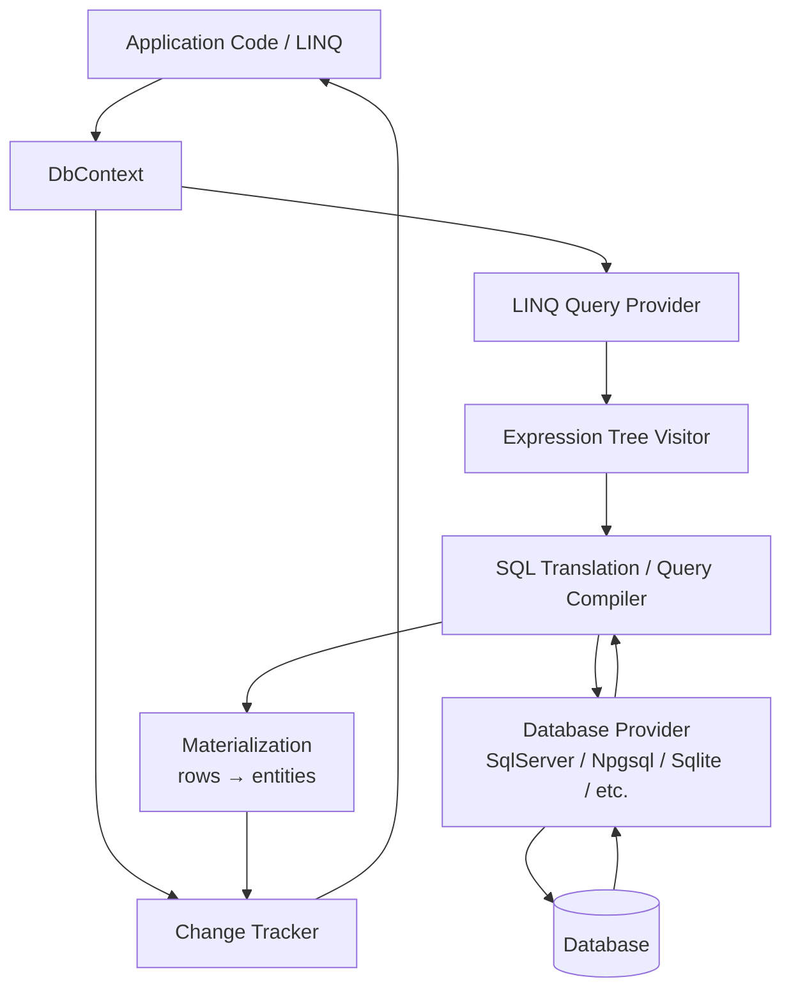
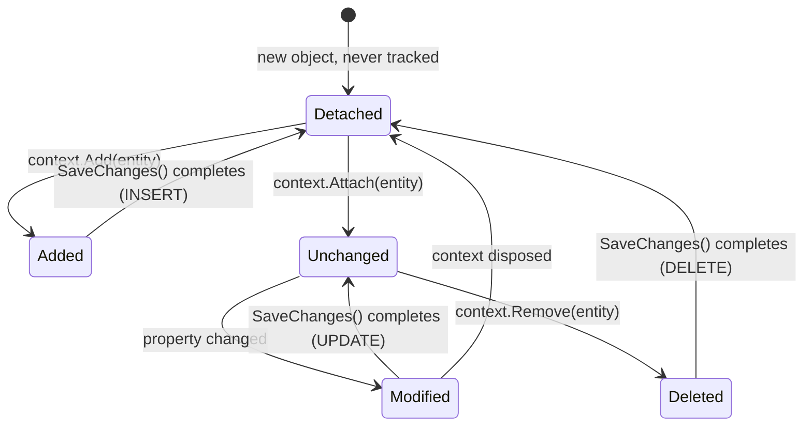
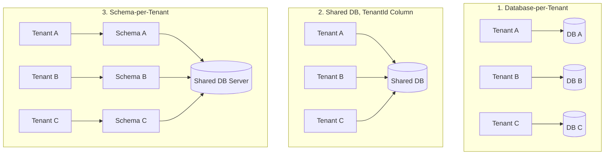

# EF Core – Senior/Lead Interview Guide

> Personal notes se consolidated + senior .NET interviews ke liye gap-filled (2026, EF Core 8/9 idioms).

## Table of Contents

- [1. Core Concepts](#1-core-concepts)
  - [1.1 What is EF Core and Why It Exists](#11-what-is-ef-core-and-why-it-exists)
  - [1.2 DbContext](#12-dbcontext)
  - [1.3 Entity, DbSet, and Conventions](#13-entity-dbset-and-conventions)
  - [1.4 EF Core Architecture](#14-ef-core-architecture)
  - [1.5 LINQ, Query Translation, and Deferred Execution](#15-linq-query-translation-and-deferred-execution)
- [2. Change Tracking](#2-change-tracking)
  - [2.1 Entity States and the Change Tracker](#21-entity-states-and-the-change-tracker)
  - [2.2 [new content] Change Tracker Internals — Snapshots vs Proxies](#22-new-content-change-tracker-internals--snapshots-vs-proxies)
  - [2.3 AsNoTracking vs AsNoTrackingWithIdentityResolution](#23-asnotracking-vs-asnotrackingwithidentityresolution)
  - [2.4 SaveChanges Internals](#24-savechanges-internals)
- [3. Relationships and Loading Strategies](#3-relationships-and-loading-strategies)
  - [3.1 Relationship Types & Configuration](#31-relationship-types--configuration)
  - [3.2 Eager, Lazy, and Explicit Loading](#32-eager-lazy-and-explicit-loading)
  - [3.3 [new content] Split Queries vs Single Query for Collection Includes](#33-new-content-split-queries-vs-single-query-for-collection-includes)
  - [3.4 [new content] The N+1 Problem — Spotting and Fixing It](#34-new-content-the-n1-problem--spotting-and-fixing-it)
- [4. Migrations](#4-migrations)
  - [4.1 Migration Fundamentals](#41-migration-fundamentals)
  - [4.2 [new content] Migrations in a Team / CI-CD Workflow](#42-new-content-migrations-in-a-team--cicd-workflow)
  - [4.3 Migration Disaster Recovery Scenarios](#43-migration-disaster-recovery-scenarios)
- [5. Intermediate Topics](#5-intermediate-topics)
  - [5.1 Concurrency Handling](#51-concurrency-handling)
  - [5.2 Transactions](#52-transactions)
  - [5.3 [new content] Shadow Properties](#53-new-content-shadow-properties)
  - [5.4 [new content] Value Converters and Owned Types](#54-new-content-value-converters-and-owned-types)
  - [5.5 [new content] Global Query Filters](#55-new-content-global-query-filters)
  - [5.6 [gaps] Multi-Tenancy Architectures — Which One Would You Choose?](#56-gaps-multi-tenancy-architectures--which-one-would-you-choose)
- [6. Advanced Topics](#6-advanced-topics)
  - [6.1 [new content] DbContext Pooling](#61-new-content-dbcontext-pooling)
  - [6.2 [new content] Compiled Queries](#62-new-content-compiled-queries)
  - [6.3 [new content] EF Core Interceptors](#63-new-content-ef-core-interceptors)
  - [6.4 [new content] Bulk Operations — ExecuteUpdate / ExecuteDelete](#64-new-content-bulk-operations--executeupdate--executedelete)
  - [6.5 [new content] EF Core vs Dapper — Choosing Deliberately](#65-new-content-ef-core-vs-dapper--choosing-deliberately)
- [7. Performance Best Practices](#7-performance-best-practices)
- [8. Common Pitfalls / Real Production Mistakes](#8-common-pitfalls--real-production-mistakes)
- [9. Troubleshooting Scenarios (Interview Style)](#9-troubleshooting-scenarios-interview-style)
- [10. Sample Interview Q&A](#10-sample-interview-qa)
- [11. One-Minute Interview Summaries](#11-one-minute-interview-summaries)
- [Summary of Additions](#summary-of-additions)
- [Summary of \[gaps\] Additions (This Pass)](#summary-of-gaps-additions-this-pass)

---

## 1. Core Concepts

### 1.1 What is EF Core and Why It Exists

EF Core Microsoft ka .NET ke liye ORM (Object-Relational Mapper) hai. Yeh aapko C# objects use karke relational database ke saath kaam karne deta hai raw SQL ke jagah, aur SQL generation, connection management, change tracking, aur relationship mapping khud handle karta hai.

**Without EF Core:**
```sql
SELECT * FROM Users WHERE Id = 1
```

**With EF Core:**
```csharp
var user = context.Users.Find(1);
```

**Why it exists (woh "why" jo interviewer sunna chahta hai):**
- Repetitive boilerplate SQL aur manual row↔object mapping ko hata deta hai.
- Migrations ke through schema evolution ko centralize karta hai (DB ke liye version control).
- Ek LINQ-based, strongly-typed query surface deta hai jo refactor-safe hai (property rename karo, silently broken SQL strings ke jagah compiler errors milte hain).
- Trade-off: aap kuch query control chodte ho aur ek abstraction layer add karte ho — isi liye senior engineers ko pata hona chahiye ki kab raw SQL/Dapper par drop down karna hai.

### 1.2 DbContext

DbContext EF Core ki central class hai — ek **Unit of Work** + **Repository**-jaisa abstraction combined. Yeh database ke saath ek session represent karta hai.

```csharp
public class AppDbContext : DbContext
{
    public AppDbContext(DbContextOptions<AppDbContext> options) : base(options) { }

    public DbSet<User> Users { get; set; }
}
```

**Responsibilities:**
- Underlying connection ko open/manage karta hai
- Queries execute karta hai (LINQ provider → SQL translation pipeline ke through)
- Entity changes track karta hai (Change Tracker)
- Changes ko SQL ke roop mein persist karta hai (`SaveChanges`)
- Transactions manage karta hai

**Key interview points:**
- Ek `DbContext` instance = ek unit of work / ek logical database session.
- `DbContext` **thread-safe nahi hota** — ek instance ko concurrent operations ya requests ke across kabhi share mat karo.
- ASP.NET Core mein, **Scoped** lifetime ke saath register karo (per HTTP request ek instance) `AddDbContext<T>` ke through.
- `DbContext` construct karna lightweight hai lekin **free nahi hai** — internally yeh ek connection, model cache lookup, aur change tracker wrap karta hai; isi liye **pooling** exist karta hai (dekho [6.1](#61-new-content-dbcontext-pooling)).

### 1.3 Entity, DbSet, and Conventions

Ek **entity** ek POCO hoti hai jo table se mapped hoti hai — usme koi database logic nahi hona chahiye.

```csharp
public class User
{
    public int Id { get; set; }        // Primary key by convention
    public string Name { get; set; }
    public string Email { get; set; }
}
```

**Convention-based mapping:**
- Class name → table name (EF Core mein pluralized, jaise `User` → `Users`)
- `Id` ya `<ClassName>Id` → primary key

**DbSet<T>** ek table ke liye queryable/updatable gateway represent karta hai — yeh data khud *nahi* hai, yeh ek `IQueryable<T>` entry point hai.

```csharp
context.Users.Add(new User { Name = "John" });   // INSERT (staged)
var users = context.Users.ToList();               // SELECT
var user = context.Users.First(u => u.Id == 1);
user.Name = "Updated";                            // UPDATE (staged, tracked)
context.Users.Remove(user);                       // DELETE (staged)
context.SaveChanges();                             // flush everything above
```

**`Find()` vs `FirstOrDefault()` (classic trap):**
- `Find()` **pehle** change tracker ko primary key se check karta hai — agar entity already tracked hai, toh DB ko hit kiye bina return kar deta hai.
- `FirstOrDefault()`/`First()` tracking state chahe kuch bhi ho, **hamesha** query issue karte hain.

**`Add()` vs `Attach()`:**
- `Add()` entity (aur uske untracked graph) ko `Added` mark karta hai → `INSERT` generate hota hai.
- `Attach()` entity ko `Unchanged` mark karta hai (tracked, koi DB hit nahi) — jab aapke paas already ek known key wali entity hai aur aap chahte ho ki EF usko re-insert kiye bina track kare, tab use hota hai. Ek common bug: kisi already-existing entity par `Add()` call karna duplicate-key insert cause karta hai; fix hai `Attach()` + explicitly state set karna, ya `Update()`.

### 1.4 EF Core Architecture



- **LINQ provider** aapke expression tree ko capture karta hai (yeh C# delegates ko DB ke against execute nahi karta — yeh *expression* ko translate karta hai, isi liye arbitrary C# methods often translate nahi ho pate; pitfall dekho [§9](#9-troubleshooting-scenarios-interview-style) mein).
- **Database provider** (SqlServer, PostgreSQL ke liye Npgsql, Sqlite, tests ke liye InMemory) provider-specific SQL dialect aur type mappings supply karta hai.
- Materialized rows **Change Tracker** ko handi jaati hain agar tracking enabled hai.

### 1.5 LINQ, Query Translation, and Deferred Execution

```csharp
var query = context.Users.Where(u => u.Id > 5);
// No SQL executed yet — query is an expression tree (IQueryable<User>)

var list = query.ToList();
// SQL executes NOW
```

**Deferred execution** sabse commonly probed concepts mein se ek hai: ek query database ko tab tak nahi bheji jaati jab tak koi terminal operator invoke na ho — `ToList()`, `ToArray()`, `First()`, `FirstOrDefault()`, `Single()`, `Count()`, `Any()`, `Sum()`, foreach enumeration, etc.

**Common LINQ → SQL mapping:**

| LINQ | SQL Equivalent |
|---|---|
| `Where` | `WHERE` |
| `Select` | `SELECT` (projection) |
| `First`/`FirstOrDefault` | `SELECT TOP(1)` / `LIMIT 1` |
| `Any` | `EXISTS` |
| `Count` | `COUNT` |
| `OrderBy`/`Skip`/`Take` | `ORDER BY` / `OFFSET` / `FETCH NEXT` |

**Projection ek first-class performance tool hai**, sirf syntax sugar nahi:
```csharp
var names = context.Users.Select(u => u.Name).ToList(); // only Name column fetched
```

**Gotcha:** `.ToList()` ko bahut jaldi call karna full result set ko memory mein materialize kar deta hai, aur uske baad koi bhi LINQ (`.Where`, `.OrderBy`) client-side memory mein chalta hai — SQL ke roop mein nahi. Yeh ek favorite "spot the bug" interview trap hai:
```csharp
// BAD — pulls entire table into memory, then filters in-process
context.Users.ToList().Where(u => u.IsActive);

// GOOD — filter translated to SQL, only matching rows come back
context.Users.Where(u => u.IsActive).ToList();
```

---

## 2. Change Tracking

### 2.1 Entity States and the Change Tracker

EF Core har entity ko track karta hai jo yeh materialize karta hai (jab tak mana na kiya jaaye), original values, current values, aur ek explicit state record karte hue.



| State | Meaning | SQL on SaveChanges |
|---|---|---|
| `Added` | Nayi entity, abhi DB mein nahi hai | `INSERT` |
| `Modified` | Tracked entity jiski property values change hui hain | `UPDATE` |
| `Deleted` | Removal ke liye marked | `DELETE` |
| `Unchanged` | Tracked, koi changes detect nahi hue | none |
| `Detached` | Is context se bilkul tracked nahi | none |

```csharp
var user = context.Users.First(u => u.Id == 1);
user.Name = "Updated Name";
context.SaveChanges();
// UPDATE Users SET Name = 'Updated Name' WHERE Id = 1
// No explicit "update" call needed — EF diffs current vs original values.
```

**Interview traps:**
- ❌ "EF har column ko automatically update karta hai." ✔ EF sirf **changed** columns ke liye `UPDATE` statements generate karta hai (snapshot comparison ke basis par), jab tak aapne full-column updates configure na kiya ho.
- ❌ "Tracking free hoti hai." ✔ Tracking ki real memory/CPU cost hoti hai — har tracked entity ke liye original values ka ek snapshot rakha jaata hai, aur har `SaveChanges()` call poore tracked graph ko changes detect karne ke liye walk karta hai (`DetectChanges()`), jo tracked entities mein O(n) hai.

### 2.2 [new content] Change Tracker Internals — Snapshots vs Proxies

Do change-detection strategies hain, aur inka difference jaanna real depth signal karta hai:

- **Snapshot-based tracking (default):** Har tracked entity ke liye, EF original property values ka ek internal snapshot rakhta hai jo query time (ya `Attach`/`Add` time) par capture hota hai. `DetectChanges()` current values ko snapshot values se compare karta hai. Yeh plain POCOs ke saath kaam karta hai lekin matlab change detection ek full-graph scan hai — jo thousands of tracked entities ke saath potentially expensive ho sakta hai.
- **Notification-based tracking (proxies):** Agar entities `INotifyPropertyChanged`/`INotifyPropertyChanging` implement karte hain (ya aap EF ke dynamic proxies `UseChangeTrackingProxies()` ke saath use karte ho), toh property mutation par EF ko immediately notify ho jaata hai aur poore graph ko rescan karne ki zarurat nahi padti. Bahut bade tracked sets ke liye faster hai, lekin isko implement karne ke liye ya toh interfaces khud implement karna padta hai ya runtime-generated proxy types accept karni padti hain (jinke apne gotchas hain: virtual properties, `sealed` classes nahi ho sakti, `new Entity()` se easily unit test nahi kar sakte).
- `ChangeTracker.DetectChanges()` `SaveChanges()` se pehle aur zyada tar tracked LINQ queries execute hone se pehle automatically call hota hai — aap manually bhi call kar sakte ho, aur ek bulk in-memory operation ke around auto-detection disable (`context.ChangeTracker.AutoDetectChangesEnabled = false`) kar ke end mein ek baar `DetectChanges()` call kar sakte ho, tight loops mein meaningful speedup ke liye.
- `ChangeTracker.Entries()` aapko saare tracked entities aur unke states inspect/iterate karne deta hai — generic audit logging ke liye useful (e.g., `ChangeTracker.Entries<IAuditable>()` ko iterate karke `SaveChanges` override mein `CreatedAt`/`ModifiedAt` set karna).

### 2.3 AsNoTracking vs AsNoTrackingWithIdentityResolution

```csharp
context.Users.AsNoTracking().ToList();   // no snapshot kept, no change tracker entries
```

- `AsNoTracking()` — fastest read path; har row ek independent object ke roop mein materialize hoti hai, chahe wahi entity joins ke through twice bhi aaye (koi identity resolution nahi). Flat, single-entity read APIs ke liye fine hai.
- `AsNoTrackingWithIdentityResolution()` **[new content within this section — original notes mein thin]** — abhi bhi untracked hai (koi snapshots nahi, `SaveChanges` participation nahi), lekin EF ek single query result ke andar same key wali entities ko *deduplicate* karta hai, isliye agar `User` join ke through twice aata hai toh yeh ek baar materialize hota hai aur dono references same object ko point karte hain. Isko use karo jab aap read-only display purposes ke liye `Include()` ke saath graphs project kar rahe ho aur full change-tracking cost pay kiye bina correct object identity chahiye (e.g., UI tree ko bind karna).
- Rule of thumb: saare read-only/GET endpoints ke liye default `AsNoTracking()` rakho; sirf tracking ke liye pay karo jab aap in entities ke against `SaveChanges()` call karne wale ho.

### 2.4 SaveChanges Internals

```csharp
context.SaveChanges();
```

**Internally kya hota hai:**
1. `DetectChanges()` tracked graph ko walk karta hai, snapshots ko diff karta hai.
2. EF `INSERT`/`UPDATE`/`DELETE` commands ka set banata hai jo zaroori hain, FK dependency order respect karte hue (parent rows ka insert dependent rows se pehle, dependents ka delete parents se pehle).
3. Saare commands ek implicit transaction ke andar execute hote hain (jab tak ek already open na ho).
4. Success par commit hota hai; failure par (e.g., constraint violation, concurrency conflict) fully rollback hota hai aur throw karta hai (`DbUpdateException`, `DbUpdateConcurrencyException`).
5. Success par, `Added` entities `Unchanged` mein transition ho jaati hain (aur DB-generated key values object par populate ho jaati hain), `Deleted` entities `Detached` ban jaati hain.

**Async matters — sirf style ki baat nahi:**
```csharp
await context.SaveChangesAsync();
```
`SaveChangesAsync` I/O ka wait karte hue thread ko free kar deta hai — ASP.NET Core throughput ke liye load ke under critical hai (thread-pool starvation avoid karta hai). Async call par `await` bhoolna ek real bug class hai: `Task` fire ho jaata hai, control immediately return hota hai, aur request complete ho sakta hai (ya method aage badh sakta hai) *before* write durable ho — aur worse, ek unawaited faulted task unobserved reh sakta hai aur exceptions swallow kar sakta hai.

---

## 3. Relationships and Loading Strategies

### 3.1 Relationship Types & Configuration

EF Core One-to-One, One-to-Many, aur Many-to-Many relationships support karta hai, jo convention se discover hoti hain ya Fluent API se explicitly configure hoti hain (data annotations se preferred kisi bhi trivial case se aage ke liye, kyunki Fluent API hi certain configurations ko express karne ka ek tareeka hai jaise composite keys ya `ExecuteUpdate` shadow FK mapping).

```csharp
public class User
{
    public int Id { get; set; }
    public string Name { get; set; }
    public List<Order> Orders { get; set; }
}

public class Order
{
    public int Id { get; set; }
    public int UserId { get; set; }
    public User User { get; set; }
}
```

```csharp
modelBuilder.Entity<Order>()
    .HasOne(o => o.User)
    .WithMany(u => u.Orders)
    .HasForeignKey(o => o.UserId);
```

**Key point:** ek navigation property FK ke **same nahi** hoti. FK column DB level par referential integrity enforce karta hai; navigation property code mein object-graph traversal ke liye ek convenience hai. EF Core (5.0 se) explicit join entity ke bina many-to-many bhi support karta hai (yeh automatically ek shadow join table bana leta hai), lekin join table par payload data hone par (e.g., `EnrolledAt`), join entity ko explicitly model karo.

### 3.2 Eager, Lazy, and Explicit Loading

EF Core default se related data load **nahi** karta — aapko opt in karna padta hai.

| Strategy | Mechanism | DB Round Trips | API Suitability |
|---|---|---|---|
| Eager | `.Include(u => u.Orders)` | 1 (or more with split query) | ✅ Preferred for APIs |
| Lazy | Proxy auto-loads on navigation access | 1 per access (N+1 risk) | ❌ Avoid in APIs |
| Explicit | `context.Entry(user).Collection(u => u.Orders).Load()` | 1 per explicit call, controlled | ✅ Fine for targeted, conditional loading |

```csharp
// Eager
context.Users.Include(u => u.Orders).ToList();

// Lazy (requires Microsoft.EntityFrameworkCore.Proxies + UseLazyLoadingProxies())
user.Orders; // triggers a DB call the moment this is touched

// Explicit
context.Entry(user).Collection(u => u.Orders).Load();
```

**Interview rule:** web APIs ke liye default eager loading (ya usse better, projection); lazy loading dangerous hai kyunki yeh DB calls ko ordinary property access ke peeche hide kar deta hai, jisse performance bugs code review mein invisible ho jaate hain.

### 3.3 [new content] Split Queries vs Single Query for Collection Includes

Jab aap multiple collection navigations ko `Include()` karte ho, EF Core default se `JOIN`s ke saath ek **single query** generate karta hai — jo ek **cartesian explosion** cause karta hai: agar ek `User` ke 10 `Orders` aur 5 `Addresses` hain, toh single-query approach graph ko client-side reconstruct karne ke liye 50 rows tak duplicated `User` data return karta hai.

```csharp
// Single query (default) — one round trip, but row count = Orders × Addresses
context.Users
    .Include(u => u.Orders)
    .Include(u => u.Addresses)
    .ToList();

// Split query — one query per collection Include, avoids the multiplication
context.Users
    .Include(u => u.Orders)
    .Include(u => u.Addresses)
    .AsSplitQuery()
    .ToList();
```

**Trade-offs:**
- **Single query:** ek round trip (chhote graphs ke liye lower latency), lekin bade "fan-out" collections ke liye huge duplicated result sets aur slower transfer ka risk. Iske alawa, explicit transaction ke bina, ek single query naturally atomic/consistent hoti hai.
- **Split query:** row explosion avoid karta hai, bade collections ke liye kaafi kam data transfer karta hai, lekin multiple round trips issue karta hai — aur kyunki yeh separate queries hain, agar explicit transaction mein wrap na ho toh unke beech data change hone ki ek small window hoti hai (read scenarios ke liye usually acceptable, lekin interviews mein isko trade-off ke roop mein call out karo).
- Isko globally set kar sakte ho (`UseSqlServer(connStr, o => o.UseQuerySplittingBehavior(QuerySplittingBehavior.SplitQuery))`) ya per-query `.AsSplitQuery()` / `.AsSingleQuery()` se. EF Core ek warning log karta hai agar aap explicitly splitting behavior choose kiye bina multiple collection `Include`s use karte ho — yeh warning khud ek accha interview callout hai ("EF actually tells you about this risk").

### 3.4 [new content] The N+1 Problem — Spotting and Fixing It

**N+1 problem**: N parent rows fetch karne ke liye 1 query, phir related data fetch karne ke liye N additional queries (per row ek) — typically loop ke andar lazy loading se, ya naive code se jo item-by-item query karta hai batch karne ke jagah.

```csharp
// N+1 — 1 query for users, then 1 query per user for Orders
var users = context.Users.ToList();
foreach (var user in users)
{
    user.Orders.Count();   // lazy-load trigger per iteration
}
```

**Ise wild mein kaise spot karein (senior-level signal):**
- EF Core query logging enable karo (`.LogTo(Console.WriteLine, LogLevel.Information)`) ya ek APM tool (Application Insights, MiniProfiler, Datadog) hook karo aur ek repeating identical query pattern dekho jisme sirf parameter value change ho raha ho.
- SQL Server Profiler / extended events near-identical `SELECT ... WHERE UserId = @p0` statements ka burst dikha rahe hain.
- Code review heuristic: ek navigation collection par property access jo `foreach`/`Select` ke andar hai ek queried list ke upar, agar lazy loading enabled hai toh ek red flag hai.

**Fixes, preference ke order mein:**
1. Jo chahiye woh **eager load** karo: `.Include(u => u.Orders)`.
2. Full graphs load karne ke jagah **project** karo jab sirf aggregates chahiye ho: `.Select(u => new { u.Id, OrderCount = u.Orders.Count() })` — yeh ek single SQL query mein translate hota hai correlated subquery/`GROUP BY` ke saath, koi client loop bilkul nahi.
3. API projects mein lazy loading ko poori tarah disable karo (`Microsoft.EntityFrameworkCore.Proxies` reference mat karo / `UseLazyLoadingProxies()` call mat karo), taaki har jagah explicit `Include()` force ho — isse N+1 bugs runtime ke jagah compile/review time par visible ho jaate hain.

```csharp
// Fix
var users = context.Users
    .Include(u => u.Orders)
    .AsNoTracking()
    .ToList();
```

---

## 4. Migrations

### 4.1 Migration Fundamentals

Migrations aapke database schema ke liye version control hain — Git commits jaisa hi, lekin DDL ke liye.

```powershell
Add-Migration InitialCreate
Update-Database
```
(ya CLI equivalents: `dotnet ef migrations add InitialCreate`, `dotnet ef database update`)

**Internally kya hota hai:**
1. EF current model snapshot ko last recorded model snapshot se compare karta hai (`Migrations` folder ki `*.Designer.cs` / snapshot file mein stored).
2. `Up()`/`Down()` methods wali ek migration class generate karta hai jisme `MigrationBuilder` calls hoti hain (`AddColumn`, `DropColumn`, `CreateTable`, etc.).
3. `Update-Database` pending migrations ko order mein execute karta hai, har ek ko `__EFMigrationsHistory` table mein record karte hue.

```csharp
migrationBuilder.AddColumn<string>(
    name: "Email",
    table: "Users",
    nullable: true);
```

**Traps:**
- ❌ Database schema ko manually edit karna, migrations bypass karke → model/DB drift cause karta hai, aur EF ka apna snapshot comparison unreliable ho jaata hai.
- ❌ "one migration per code change" ko ek hard rule maan lena — logically-related schema changes ko per-feature/PR ek coherent migration mein batch karo, per-keystroke nahi.
- ✔ EF Core migrations ke bina *chal* sakta hai (`EnsureCreated()`), lekin yeh sirf tests/prototypes ke liye hai — yeh incremental schema evolution support nahi karta aur same model par migrations ke saath coexist nahi kar sakta.

### 4.2 [new content] Migrations in a Team / CI-CD Workflow

Yeh original notes mein thin hai aur ek bahut common senior-level line of questioning hai ("how do you manage EF migrations across a team and pipeline?").

- **Production startup se `Database.Migrate()` kabhi call na karo** ek single-instance toy app se aage kisi bhi cheez ke liye — multiple instances/pods simultaneously scale up hone par, concurrent migration attempts ek dusre se race kar sakte hain. CI/CD pipeline mein ek dedicated migration step prefer karo (ek one-shot job/container jo `dotnet ef database update` run kare ya idempotent SQL script execute kare) jo naye app version deploy hone **se pehle** chale.
- **Idempotent SQL scripts generate karo review aur audit ke liye** prod mein `Update-Database` ko blindly trust karne ke jagah:
  ```powershell
  dotnet ef migrations script --idempotent -o migrate.sql
  ```
  Yeh ek script produce karta hai jo `__EFMigrationsHistory` ke against checks se guarded hai, re-run karna safe hai, aur execution se pehle ek DBA review kar sakta hai — mention karne layak ek strong practice.
- **Backward-compatible ("expand/contract") schema changes** zero-downtime deploys ke liye: jab old aur new app versions simultaneously run kar sakte hain (rolling deployment), ek migration currently-running old version ko break nahi karna chahiye.
  - Nullable column add karna: safe.
  - NOT NULL column add karna: phases mein karo — pehle nullable add karo, backfill karo, phir later migration/deploy mein constraint add karo.
  - Column rename karna: EF Core ka default diffing ek perceived rename ke liye `DROP` + `ADD` generate karta hai (data loss!) jab tak aap explicitly `migrationBuilder.RenameColumn(...)` use na karo — renames ke liye hamesha generated migrations ko hand-edit karo.
  - Column drop karna: pehle deprecate karo (code mein read/write karna band karo, deploy karo), phir ek subsequent migration mein drop karo jab confirm ho jaaye ki kuch bhi usme depend nahi karta.
- **Migrations mein merge conflicts** (two branches dono ne ek migration add kiya) — rebasing se resolve karo: merged model snapshot ke upar migration ko regenerate karo, do migration files ko hand-merge karne ki koshish karne ke jagah; redundant ek delete karo aur zarurat pade toh regenerate karo, lekin sirf tab jab dono mein se koi bhi shared/prod environment mein applied na hua ho.
- **PR review discipline:** merge se pehle hamesha generated `Up`/`Down` SQL review karo (`Script-Migration` ke through ya generated file padh ke) — silently-generated `DROP COLUMN`/`DROP TABLE` migration-related data loss incidents ka sabse common cause hai.
- **Environment safety:** har environment ke liye separate connection strings/credentials, prod mein running app identity ke liye least-privilege DB accounts (schema-alter rights nahi — migration step ek separate elevated credential use karta hai), aur prod par apply karne se pehle production-like data volume ke against staging validation (ek migration jo 100-row staging table par instant hai woh 100M-row prod table ko minutes ke liye lock kar sakta hai).

### 4.3 Migration Disaster Recovery Scenarios

Real production scenarios jo war stories ke roop mein ready rakhne layak hain:

| Scenario | Root Cause | Recovery | Prevention |
|---|---|---|---|
| Migration apply hui lekin app code rollback hua | DB schema running code se aage → "Invalid column name" errors | Matching app version re-deploy karo (preferred); ya `Update-Database PreviousMigration` agar reversible ho | Blue-green deploys; DB state consider kiye bina code rollback kabhi mat karo |
| Column drop hua, data lost | `DropColumn` migration prod mein run hui | Backup se restore karo, column re-add karo, possible ho toh data reinsert karo | Directly drop kabhi mat karo — pehle deprecate karo; prod migrations se pehle hamesha backup lo |
| Migration halfway fail hua | Long/complex migration mid-execution interrupted | `__EFMigrationsHistory` check karo, schema ko manually last successful step tak reconcile karo, re-run karo | Staging par test karo, migrations ko chhota aur atomic rakho jahan DB engine allow kare |
| Do devs se conflicting migrations | Parallel branches ne dono ne migrations add ki | Rebase karo, ek combined migration generate karo, conflicting ones delete karo (sirf pre-prod) | Per feature branch ek migration; PRs mein review karo; frequently sync karo |
| Emergency hotfix ko schema change chahiye | Standard pipeline ke liye time nahi | SQL manually apply karo (controlled), phir immediately model resync ke liye ek matching EF migration generate/backfill karo | Hotfix DB changes avoid karo; baad mein hamesha migrations backfill karo |
| Migration table lock/downtime cause karti hai | Default value wala column add karna bade table ko lock kar deta hai | Cancel karo; steps mein apply karo — nullable column → batched backfill → NOT NULL constraint add karna | Bade schema changes phases mein plan karo; hot tables par blocking DDL avoid karo |
| Migration galat environment mein applied hui | Prod migration QA ke against run hua ya vice versa | Correct backup se DB restore karo, correct migrations re-apply karo | Environment-specific connection strings, CI/CD safeguards, least-privilege creds |
| Migration ke bina manual DB change | DBA ne schema directly change kiya | `Add-Migration SyncWithDb`, generated SQL carefully validate karo | Koi manual DB changes nahi — EF migrations hi single source of truth hain |
| Migration unexpected SQL generate karta hai (e.g., rename → drop+recreate) | EF ka model diff "rename" ko "drop old, add new" se distinguish nahi kar sakta | Migration ko hand-edit karo explicitly `RenameColumn` use karne ke liye | Apply karne se pehle hamesha generated migration code review karo |

**Interviewers kya sunna chahte hain:** "I always review generated migration SQL," "I test migrations against staging with production-like data volume," "I avoid destructive migrations and prefer expand/contract," "I keep DB schema and code in sync via CI/CD, not manual changes."

---

## 5. Intermediate Topics

### 5.1 Concurrency Handling

EF Core out of the box **optimistic concurrency** support karta hai ek concurrency token / row-version column ke through.

```csharp
public class User
{
    public int Id { get; set; }
    public string Name { get; set; }

    [Timestamp]
    public byte[] RowVersion { get; set; }
}
```

- `UPDATE`/`DELETE` par, EF `WHERE` clause mein original `RowVersion` value include karta hai.
- Agar koi doosri transaction ne already row update kar di ho (row version change ho gaya), toh zero rows match hote hain → EF `0` affected rows detect karta hai aur `DbUpdateConcurrencyException` throw karta hai.
- **Resolution strategies jo aapko discuss karni aani chahiye:** "database wins" (reload karke local changes discard karna), "client wins" (local values ko re-apply karke fresh row version ke saath retry karna), ya ek merge UI jo user ko dono versions dikhaye. Ise handle karo `DbUpdateConcurrencyException` catch karke, `ex.Entries` inspect karke, aur retry se pehle `entry.OriginalValues.SetValues(entry.GetDatabaseValues())` call karke (database-wins) ya `entry.OriginalValues.SetValues(...)` + re-save (client-wins).
- `[Timestamp]` SQL Server-specific hai (`rowversion` type). Providers par jinke paas native rowversion type nahi hai, `[ConcurrencyCheck]` kisi bhi column par use karo, ya Fluent API se `.IsRowVersion()` / `.IsConcurrencyToken()` configure karo, ya ek computed value wali `uint`/`byte[]` shadow property use karo.

### 5.2 Transactions

```csharp
using var tx = context.Database.BeginTransaction();
context.SaveChanges();
tx.Commit();
```

- `SaveChanges()` **apne operations ko already ek implicit transaction mein wrap karta hai** — aapko explicit transaction sirf tab chahiye jab aapko **multiple** `SaveChanges()` calls ko (ya EF operations ko raw ADO.NET/Dapper calls ke saath mix karna) atomically span karna ho.
- Transactions ko short rakho — long-running transactions load ke under lock contention/deadlocks/timeouts ka classic cause hote hain production mein. Bade bulk operations ko ek giant transaction mein wrap karne ke jagah batch karo.
- **[new content] Distributed transactions aur inhe avoid kyun karein:** ek transaction ko do different databases ke across ya ek DB + ek message queue ke across span karne ke liye ek distributed transaction coordinator (e.g., MSDTC) ya two-phase commit protocol chahiye, jo slow, fragile hai aur often cloud-managed databases aur modern brokers unsupported hote hain. Modern alternative hai **Saga pattern** — local transactions ki ek sequence, har ek ke paas ek compensating action agar koi later step fail ho (e.g., "reserve inventory" → "charge payment" → agar charge fail ho, "release inventory reservation" se compensate karo). Zyada tar systems ke liye, distributed transactions se zyada outbox pattern ke through eventual consistency prefer karo (domain change aur ek "event to publish" row ko *same* local transaction mein likho, phir ek background process usko publish kare).

### 5.3 [new content] Shadow Properties

Ek **shadow property** ek property hai jo EF model mein exist karti hai aur ek database column se maps karti hai, lekin CLR entity class par **declared nahi** hoti. EF iski value internally track karta hai.

```csharp
modelBuilder.Entity<Order>()
    .Property<DateTime>("LastModified");

// Access via the change tracker API, not a C# property:
context.Entry(order).Property("LastModified").CurrentValue = DateTime.UtcNow;
```

**Yeh real code mein kahan dikhti hain:**
- Foreign key properties often shadow properties hoti hain jab aap dependent class par explicit FK property ke bina sirf navigation property model karte ho.
- Audit columns (`CreatedAt`, `ModifiedBy`) ke liye common hai jinhe aap EF/interceptors se track karana chahte ho lekin domain model mein clutter nahi karna chahte.
- `context.Model.FindEntityType(typeof(Order)).GetProperties()` se discoverable — ek useful debugging tip mention karne ke liye agar pucha jaaye "how would you find hidden/shadow columns on an entity?"

### 5.4 [new content] Value Converters and Owned Types

Simple scalar columns se aage mapping ke liye do related lekin distinct features — senior interviews mein commonly pucha jaata hai "how do you map a value object/enum/JSON column?" ke around.

**Value Converters** — ek CLR type ko storage ke liye ek different type se to/from map karte hain (e.g., enum ↔ string, ya ek custom value object ↔ primitive):
```csharp
modelBuilder.Entity<Order>()
    .Property(o => o.Status)
    .HasConversion<string>();   // store enum as string instead of int

// Custom converter
modelBuilder.Entity<Order>()
    .Property(o => o.Amount)
    .HasConversion(
        v => v.Value,                     // to provider
        v => new Money(v));               // from provider
```

**Owned Types** (`OwnsOne`/`OwnsMany`) — ek value object model karte hain jiski apni independent identity/table nahi hoti; default se iski properties owner ke table par columns ke roop mein mapped hoti hain (ya ek separate table `ToTable` ke saath agar `OwnsMany` use ho raha hai):
```csharp
public class Address
{
    public string Street { get; set; }
    public string City { get; set; }
}

modelBuilder.Entity<User>()
    .OwnsOne(u => u.Address);
// Produces columns: Address_Street, Address_City on Users table
```

- Owned types ki koi separate identity nahi hoti — yeh hamesha owner ke saath load/save hoti hain, independently query nahi ho sakti, aur nesting support karti hain.
- EF Core 7+ se, aap ek owned type (ya poori entity) ko ek JSON column (`ToJson()`) mein map kar sakte ho — semi-structured data ke liye useful bina ek full normalized schema ke, aur "hybrid relational/document" modeling ke around interview discussions mein increasingly common:
```csharp
modelBuilder.Entity<User>()
    .OwnsOne(u => u.Address, a => a.ToJson());
```

### 5.5 [new content] Global Query Filters

Ek **global query filter** ek `Where` predicate hai jo kisi given entity type ke liye har query par automatically apply hota hai — jab tak explicitly bypass na kiya jaaye. Canonical use cases hain **soft delete** aur **multi-tenancy**.

```csharp
modelBuilder.Entity<User>()
    .HasQueryFilter(u => !u.IsDeleted);

// Multi-tenant example
modelBuilder.Entity<Order>()
    .HasQueryFilter(o => o.TenantId == _currentTenantService.TenantId);
```

- Yeh automatically LINQ queries, `Include()`d navigations, aur relationships ke through entity ke liye generate hone wali queries par bhi apply hota hai — aapko har call site par `.Where(u => !u.IsDeleted)` add karna yaad rakhne ki zarurat nahi (jo exactly point hai — isko bhoolne se defense).
- `.IgnoreQueryFilters()` se explicitly bypass karo jab aapko genuinely sab kuch chahiye ho (e.g., ek admin "show deleted records" screen).
- **Interview mein raise karne layak gotchas:** ek service/DbContext field (jaise current tenant ID) reference karne wale filters ko dhyan rakhna chahiye ki woh value kab evaluate hoti hai — yeh per-query translation time par context instance ke current field value ke saath evaluate hoti hai, isliye `this.TenantId` capture karne wala ek filter ek scoped context ke saath per-request correctly kaam karta hai, lekin ek `DbContext` ya compiled query ko tenants ke across cache karne se savdhaan raho. Iske alawa, global filters sirf entity ki apni properties, related entity properties (navigation ke through), ya `DbContext` par fields/properties ko reference kar sakte hain — koi arbitrary external state nahi.

### 5.6 [gaps] Multi-Tenancy Architectures — Which One Would You Choose?

Upar wala global query filter shared-database multi-tenancy model ke liye **EF Core mechanism** hai — lekin yeh sirf "shared database *ke andar* queries ko tenant se kaise scope karte ho" ka jawab deta hai. Yeh us broader architectural question ka jawab nahi deta jo senior interviewers actually lead karte hain: *"You're designing a new multi-tenant SaaS product — which multi-tenancy architecture would you choose, and why?"* Yeh EF mechanism se ek level upar ka system-design trade-off question hai, aur yeh §5.5 ke bilkul saath belong karta hai kyunki upar wali query-filter technique specifically option 2 (neeche) ka implementation detail hai.

**Teen standard architectures:**



| Dimension | DB-per-Tenant | Shared DB + `TenantId` column | Schema-per-Tenant |
|---|---|---|---|
| **Data isolation** | Sabse strong — physically separate databases, missing WHERE clause se cross-tenant leak impossible hai | Sabse weak — ek single missing/bypassed query filter (`IgnoreQueryFilters()` misuse, raw SQL, ek naya code path jo filter bhool jaaye) doosre tenant ka data leak kar deta hai. EF ka global query filter (§5.5) is risk ko mitigate karta hai, eliminate nahi | Medium — schema boundary bina full separate database ke real DB-level separation deta hai; application code ka bug schemas ke across cross nahi kar sakta jaise ek table mein rows ke across kar sakta hai |
| **Cost / resource efficiency** | Sabse expensive — N databases matlab N sets connections, backups, compute overhead, aur often low-usage tenants ke liye N sets idle capacity | Sabse cheap — ek database, ek connection pool, shared compute; minimal marginal cost per tenant ke saath tenant count scale karta hai | Beech mein — ek database server, lekin N schemas jinme se har ek ka apna table set; shared-table se zyada DB objects manage karne padte hain lekin phir bhi ek physical database ka compute/connection budget |
| **Operational complexity** | High — migrations har tenant database ke against individually (ya orchestrated fan-out se) run karni padti hain, backup/restore per-tenant hai, monitoring ko N databases ke across aggregate karna padta hai | Low — ek schema, ek migration run, ek set monitoring dashboards | High — migrations har schema ke against run karni padti hain (DB-per-tenant jaisa hi fan-out problem, sirf ek physical server ke andar), aur zyada tar ORMs (EF Core included) ke paas "run this migration against N schemas" ke liye first-class tooling nahi hoti, isliye often hand-rolled hota hai |
| **Blast radius of a bug/incident** | Sabse chhota — ek bug, runaway query, ya poori database outage bhi exactly ek tenant ko affect karta hai | Sabse bada — ek bad migration, lock-contention incident, ek noisy-neighbor tenant heavy queries chala raha, ya ek data-leak bug potentially **saare** tenants ko simultaneously affect kar sakta hai | Medium — ek schema-level issue ek tenant ko affect karta hai; ek server-level outage (shared instance down hona) phir bhi saare tenants ko affect karta hai, shared-DB jaisa hi infra-level (application-level nahi) incidents ke liye |
| **"Noisy neighbor" risk** | None — tenants database level par compute/IO share nahi karte | Real risk — ek tenant ka heavy query load same database/connection pool share karne wale doosron ki performance degrade kar sakta hai | Shared-table se kam (schema ke separate tables same rows par lock contention avoid karte hain) lekin phir bhi underlying server ka CPU/IO/connection budget share hota hai |
| **Per-tenant customization** (custom fields, different retention/compliance needs) | Sabse easy — har DB ka literally ek different schema version ho sakta hai zarurat pade toh (halaanki yeh khud ek operational burden ban jaata hai) | Sabse hard — saare tenants ek schema share karte hain; per-tenant customization ko generic extensibility patterns (EAV tables, JSON columns) chahiye, real schema differences nahi | Possible lekin awkward — schemas *diverge* kar sakte hain, lekin zyada tar implementations sane tooling ke liye unhe identical rakhte hain, jisse flexibility benefit kuch defeat ho jaata hai |
| **Onboarding a new tenant** | Sabse slow — ek naya database provision karna (chahe automated ho) real latency aur infra cost rakhta hai | Sabse fast — literally ek naya `TenantId` value, koi naya infrastructure nahi | Medium — ek naya schema provision karna ek naye database se lighter hai lekin phir bhi per tenant ek DDL operation hai |
| **Regulatory/compliance fit** (data residency, "must be able to fully delete a tenant's data") | Best — ek tenant ka database drop karna ek clean, complete, auditable deletion hai; specific tenants ke DBs ko specific regions mein rakh ke data-residency requirements trivially satisfy karta hai | Worst — "tenant X ka sara data" delete karna matlab har table ke across rows correctly delete karna (ek miss karna easy hai), aur per-tenant data residency bahut difficult hai kyunki saare tenants ek physical database/region share karte hain | Medium — ek schema drop karna rows delete karne se cleaner hai, halaanki phir bhi ek physical server/region ke andar hi hai, isliye per-tenant data residency shared-DB jaisi hi constrained hai |
| **EF Core support quality** | Straightforward — per tenant ek different connection string, tenant-resolution middleware/service mein resolve hoke `DbContextOptionsBuilder` ko pass hoti hai | Best native EF Core support — yeh exactly wahi hai jiske liye `HasQueryFilter()` (§5.5) banaya gaya hai | `HasDefaultSchema()` dynamically per tenant set karke workable hai, lekin doosron se weaker tooling support — migrations aur model caching per schema ko zyada manual engineering chahiye |

**"which would you choose" ka interview mein actually jawab kaise dein** (yeh woh part hai jo senior ko mid-level se separate karta hai — sirf teenon ke naam lena kaafi nahi hai):

- **Business/compliance constraint se start karo, technology se nahi.** Agar tenants enterprise customers hain jinke contractual/regulatory data-isolation requirements hain (healthcare, finance, government), ya agar ek single tenant "big enough" ho sakta hai ki uska load doosron ko kabhi affect na kare, toh **DB-per-tenant** usually operational cost ke bawajood right default hota hai — isolation aur blast-radius properties hi poora point hain.
- **Agar product ek high-volume, low-touch-per-tenant SaaS hai** (thousands se millions small tenants — sochiye ek B2C-ish multi-tenant app, ya kisi internal platform jahan many small teams "tenants" hain), toh **shared DB with `TenantId`** almost hamesha pragmatic choice hai — us scale par DB-per-tenant ek operational nightmare ban jaata hai (imagine 50,000 databases ke against migrations chalana), aur §5.5 mein query-filter mechanism code mein isolation risk ko manageable (eliminated nahi) banane ka standard, well-supported tareeka hai.
- **Schema-per-tenant naye EF Core designs mein sabse kam chosen hai** specifically *kyunki* EF Core ki iske liye tooling story doosre dono se weaker hai — yeh zyada legacy systems mein ya kisi database engine/ORM ke around bane platforms mein dikhta hai jinke paas better native schema-per-tenant support hai. Completeness ke liye mention karo, lekin honest raho ki aaj yeh ek narrower-fit choice hai.
- **Hybrid approaches ek valid senior-level answer hain, cop-out nahi**: e.g., small/free-tier tenants ki "long tail" ke liye shared DB, saath mein bade/enterprise tenants ke liye ek explicit migration path jab woh operational cost justify karein — yeh ek common real-world evolution hai, sirf theoretical middle ground nahi.
- **Shared-DB model ki sabse badi weakness ke liye mitigation hamesha mention karo**: EF Core ka global query filter (§5.5) necessary hai lekin sufficient nahi — isko defense-in-depth ke saath pair karo (integration tests jo specifically cross-tenant isolation assert karein, `IgnoreQueryFilters()` usage ke around code review discipline, aur ideally ek database-level safeguard jaise PostgreSQL/SQL Server mein row-level security ek backstop ke roop mein application bug ke against).

**Follow-up interviewers ask:** *"What happens when a shared-DB tenant outgrows the shared model?"* — Yeh hybrid-migration scenario hai: aapko ek plan chahiye ek tenant ki rows ko bina downtime ke ek dedicated database mein move karne ka, jo ek real data-migration project hai (extract, transform tenant-scoped rows, connection resolution ko re-point karo, backfill/verify, cut over) — mention karne layak hai ki yeh migration path day one se design karna (e.g., har table par consistently `TenantId` rakhna, cross-tenant foreign keys avoid karna) baad mein retrofit karne se far easier hai.

---

## 6. Advanced Topics

### 6.1 [new content] DbContext Pooling

Original notes mein sirf ek one-line Q&A ke roop mein mentioned ("reuses DbContext instances to reduce allocations") — expand karne layak hai kyunki yeh ek real perf lever hai jispar interviewers probe karte hain.

```csharp
builder.Services.AddDbContextPool<AppDbContext>(options =>
    options.UseSqlServer(connectionString), poolSize: 128);
```

- Per request ek naya `DbContext` (aur uski internal services) allocate karne ke jagah, EF Core ek pool maintain karta hai; request start par ek instance pool se rent hoti hai aur uski state **reset** hoti hai (change tracker clear, etc.); disposal par yeh GC hone ke jagah pool mein wapas chali jaati hai.
- **Benefit:** `DbContext` aur uske internal service dependencies ke allocation overhead ko kam karta hai (high request volume par useful).
- **Constraints/gotchas:**
  - Aapke `DbContext` constructor ko sirf `DbContextOptions<T>` lena chahiye — koi doosri per-request state wali injected scoped services nahi, kyunki context instance ab DI container ke perspective se ek single logical "scope" se aage rehta hai (yeh requests ke across reused hota hai).
  - Agar aapko context ke andar doosri scoped services chahiye (e.g., auditing ke liye ek `ICurrentUserService`), aapko inhe ek method call ya har request/use ke start par set hone wali mutable property se inject karna hoga, ek specific request ke DI scope se tied constructor se nahi.
  - Aap apni derived `DbContext` class mein jo bhi static/instance state add karo usko explicitly reset karna hoga (aapke custom fields ke liye reset behavior automatic nahi hai `DbContext` ko override/extend karne se) — ek classic pooling bug hai stale state ka ek request se doosri request mein leak hona.
  - Pooling CPU/allocation overhead mein help karta hai, query performance mein nahi — yeh round trips ya SQL cost kam nahi karta.

### 6.2 [new content] Compiled Queries

Original notes mein sirf ek definition ke roop mein mentioned ("Precompiled LINQ → faster execution for repeated queries") — yahan how/why/when hai.

```csharp
private static readonly Func<AppDbContext, int, User> _getUserById =
    EF.CompileQuery((AppDbContext ctx, int id) =>
        ctx.Users.FirstOrDefault(u => u.Id == id));

var user = _getUserById(context, 5);

// Async version
private static readonly Func<AppDbContext, int, Task<User>> _getUserByIdAsync =
    EF.CompileAsyncQuery((AppDbContext ctx, int id) =>
        ctx.Users.FirstOrDefault(u => u.Id == id));
```

- EF Core already internally per unique query shape expression-tree-to-SQL translation cache karta hai (isi liye ek given LINQ shape ki *pehli* execution baad wali executions se zyada expensive hoti hai) — `EF.CompileQuery` uss internal cache lookup overhead ko bhi skip kar deta hai delegate ko ahead of time ek baar bind karke.
- **Yeh actually kab matter karta hai:** hot-path queries jo extremely frequently execute hoti hain (thousands+ times/sec) jahan cache lookup/expression-tree matching ke microseconds measurable hain — yeh "isko har jagah use karo" wali koi general recommendation nahi hai. Typical CRUD API endpoints ke liye, EF ki already-existing internal query caching sufficient hai; `EF.CompileQuery` ko sirf profiling se yeh confirm hone ke baad reach karo ki query-compilation/lookup overhead meaningful hai.
- Compiled queries ki ek stable shape honi chahiye — parameters vary ho sakte hain, lekin LINQ structure khud nahi ho sakta (koi dynamically-built `Where` clauses nahi).

### 6.3 [new content] EF Core Interceptors

Original notes mein bilkul present nahi hai — ek genuinely hot senior topic (cross-cutting concerns: auditing, soft-delete enforcement, logging, multi-tenancy, retry logic).

Interceptors aapko EF Core ke pipeline mein specific points par hook karne dete hain: command execution, `SaveChanges`, connection open/close, transaction events.

```csharp
public class AuditSaveChangesInterceptor : SaveChangesInterceptor
{
    public override InterceptionResult<int> SavingChanges(
        DbContextEventData eventData, InterceptionResult<int> result)
    {
        var context = eventData.Context;
        foreach (var entry in context.ChangeTracker.Entries<IAuditable>())
        {
            if (entry.State == EntityState.Added)
                entry.Entity.CreatedAt = DateTime.UtcNow;
            if (entry.State is EntityState.Added or EntityState.Modified)
                entry.Entity.ModifiedAt = DateTime.UtcNow;
        }
        return result;
    }
}

// Registration
options.AddInterceptors(new AuditSaveChangesInterceptor());
```

- **`ISaveChangesInterceptor`** — `SaveChanges`/`SaveChangesAsync` se before/after hook; classic use: automatic audit columns, soft-delete conversion (ek `Remove()` ko `IsDeleted = true` set karne + state `Modified` mein badal dena actual `DELETE` ke jagah), successful commit ke baad domain event dispatching.
- **`DbCommandInterceptor`** — execution se pehle raw `DbCommand` inspect/modify karta hai; query tagging, query hints inject karne, ya diagnostics ke liye parameter values ke saath exact SQL log karne ke liye useful.
- **`DbConnectionInterceptor`** — connection open/close hook karta hai; connection-level diagnostics ya certain contexts ke liye read-only replicas enforce karne ke liye useful.
- Purane `SaveChanges()` override approach se compare karo (abhi bhi valid, single-context-type logic ke liye simpler) — interceptors preferred hain jab cross-cutting logic ko multiple `DbContext` types ke across apply karna ho, ya subclassing ke bina composability/testability chahiye ho.

### 6.4 [new content] Bulk Operations — ExecuteUpdate / ExecuteDelete

Original notes mein present nahi hai — ek major EF Core 7+ feature jo directly notes ke already-flagged "large transactions" aur "over-tracking" pitfalls ko address karta hai, isliye yeh yahan modern fix ke roop mein belong karta hai.

Traditionally, many rows update/delete karne ke liye entities ko memory mein load karna, mutate karna, aur `SaveChanges()` call karna padta tha — jo matlab full change tracking overhead aur har `UPDATE`/`DELETE` se pehle ek `SELECT`. EF Core 7 ne set-based bulk operations introduce kiye jo directly ek single `UPDATE`/`DELETE` statement mein translate hote hain, change tracker ko poori tarah bypass karte hue.

```csharp
// Bulk update — single SQL UPDATE, no entities loaded into memory
await context.Users
    .Where(u => u.LastLoginDate < cutoff)
    .ExecuteUpdateAsync(setters => setters
        .SetProperty(u => u.IsActive, false)
        .SetProperty(u => u.ModifiedAt, DateTime.UtcNow));

// Bulk delete — single SQL DELETE
await context.Orders
    .Where(o => o.Status == OrderStatus.Cancelled && o.CreatedAt < cutoff)
    .ExecuteDeleteAsync();
```

Generated SQL roughly yeh hoti hai:
```sql
UPDATE Users SET IsActive = 0, ModifiedAt = @p0 WHERE LastLoginDate < @p1;
```

- **Koi change tracking involved nahi hai** — yeh `SaveChanges()` ko poori tarah bypass karte hain, call hote hi immediately execute hote hain, aur unhi rows par currently-tracked in-memory modifications ko respect nahi karte (yeh ordering gotcha jaan lo: agar aapne tracked entities modify ki hain aur abhi `SaveChanges()` call nahi kiya, overlapping rows par ek `ExecuteUpdate` surprising results de sakta hai kyunki yeh directly DB ko hit karta hai).
- **Interceptors aur `SaveChanges`-based interceptors (§6.3) `ExecuteUpdate`/`ExecuteDelete` ke liye RUN NAHI HOTE** — agar aap audit columns ya soft-delete conversion ke liye ek `SaveChangesInterceptor` par rely karte ho, bulk operations us logic ko poori tarah bypass kar dete hain; audit fields ko `SetProperty` calls mein explicitly set karna hoga, aur soft-delete `ExecuteDelete` ke jagah flag set karne wale `ExecuteUpdate` se karna hoga.
- **Global query filters phir bhi apply hote hain** target set banane wale `Where` clause par, jab tak aap `.IgnoreQueryFilters()` na karo.
- "100k rows sirf ek column update karne ke liye memory mein load karne se kaise bacho" ka yeh correct modern answer hai — ek common senior interview scenario question.

### 6.5 [new content] EF Core vs Dapper — Choosing Deliberately

Original notes mein ek comparison table hai lekin yeh shallow hai (sirf feature checkmarks). Yahan woh deeper trade-off framing hai jo ek interviewer chahta hai:

| Dimension | EF Core | Dapper |
|---|---|---|
| Abstraction | Full ORM — LINQ, change tracking, migrations, relationship mapping | Micro-ORM — aap SQL likhte ho, yeh results ko objects mein map karta hai |
| Productivity | CRUD-heavy domain logic ke liye high | Kam — SQL ko hand se likhna/maintain karna padta hai |
| Performance ceiling | Achhi, lekin tracking/materialization/translation ka overhead | Near-ADO.NET raw performance |
| Query control | LINQ ko cleanly translate hona chahiye; complex SQL (CTEs, window functions, hints) awkward ya impossible ho sakta hai express karna | Full control — DB support kare woh koi bhi SQL |
| Schema evolution | Migrations tracked, versioned schema history dete hain | Koi built-in schema management nahi — ek separate migration tool ke saath pair karo (ya Dapper querying karta ho tab bhi EF ke migrations use karo) |
| Testability | `InMemory`/SQLite provider reasonably realistic integration tests enable karta hai | Ek real DB chahiye (ya test containers) kyunki koi query-translation layer nahi hai fake karne ke liye |
| Best fit | Transactional/CRUD business logic, aggregate writes jinhe change tracking & concurrency tokens chahiye | Reporting, analytics, dashboards, high-throughput read paths, complex hand-tuned SQL |

**Senior answer "EF vs Dapper" nahi hai, "both, deliberately" hai:** domain ke transactional write-side ke liye EF Core use karo jahan aapko change tracking, concurrency tokens, aur migrations ka fayda mile; read-heavy reporting/analytics paths ke liye Dapper (ya raw ADO.NET, ya EF ka `FromSqlRaw`/`SqlQuery<T>`) par drop karo jahan hand-tuned SQL aur minimal overhead productivity se zyada matter karte hain. Bahut se production systems same codebase mein dono mix karte hain, often same `DbContext` ki underlying connection `context.Database.GetDbConnection()` ke through Dapper reuse karta hai.

---

## 7. Performance Best Practices

**Do:**
- Read-only queries ke liye `AsNoTracking()` (ya `AsNoTrackingWithIdentityResolution()`) use karo.
- Full entities ke jagah sirf needed columns fetch karne ke liye Project (`Select`) karo.
- Pagination use karo (`OrderBy().Skip().Take()`) — aur hamesha `Skip`/`Take` se pehle `OrderBy` karo, warna row order (aur isliye page contents) undefined hai aur calls ke beech vary kar sakta hai.
- Proper indexes use karo, especially joins/filters mein use hone wali foreign keys par.
- Multi-collection `Include()`s ke liye `AsSplitQuery()` use karo.
- Set-based bulk writes ke liye `ExecuteUpdate`/`ExecuteDelete` use karo.
- Non-prod mein query logging (`.LogTo(...)`) ya APM instrumentation enable karo N+1s aur unexpectedly expensive SQL ko ship hone se pehle catch karne ke liye.
- Generated SQL inspect karne ke liye ek `IQueryable` par `ToQueryString()` use karo bina execute kiye — debugging ke liye aur interview whiteboard answers ke liye great hai.

**Don't:**
- Filter karne se pehle `.ToList()` call mat karo (`.ToList()` ke baad `.Where` memory mein chalta hai).
- API projects mein lazy loading use mat karo.
- Poore object graphs `Include()` se load mat karo jab ek projection kaam kar sakta ho.
- DB calls loop mat karo (classic N+1: `foreach (var id in ids) context.Users.Find(id);` → `context.Users.Where(u => ids.Contains(u.Id)).ToList()` se fix karo).
- Bulk operations ke across long transactions mat run karo — batch karo.
- Yeh mat maano ki EF Core khud inherently slow hai — zyada tar "EF is slow" complaints bad LINQ, over-tracking, ya missing indexes tak trace hoti hain, framework tak nahi.

---

## 8. Common Pitfalls / Real Production Mistakes

| # | Mistake | Problem | Fix |
|---|---|---|---|
| 1 | APIs mein lazy loading | N+1 queries | `Include()` ya projections |
| 2 | GET APIs par `AsNoTracking()` bhoolna | High memory/CPU | Reads ke liye no-tracking |
| 3 | `ToList()` bahut jaldi | Filters memory mein chalte hain | Materialize karne se pehle filter karo |
| 4 | Poore entity graphs load karna | Huge joins/cartesian explosion | Projections, split queries |
| 5 | Requests ke across ek `DbContext` share karna | Threading bugs, data corruption | Scoped lifetime |
| 6 | Generated SQL ignore karna | Hidden perf issues | Logging/`ToQueryString()` se review karo |
| 7 | Manual DB changes, koi migration nahi | Schema drift | Sirf migrations, single source of truth |
| 8 | DB calls loop karna | N+1 | `Contains`/`In` se batch fetch |
| 9 | FKs par missing indexes | Slow joins | DB indexes add karo |
| 10 | Large transactions | Locks/timeouts | Transactions short rakho, batch karo |
| 11 | Concurrency conflicts handle na karna | Silent overwrites | RowVersion/concurrency tokens |
| 12 | Reporting ke liye EF overuse karna | Slow analytics | Reporting ke liye Dapper/raw SQL |
| 13 | Pagination bhoolna | Huge result sets | `OrderBy` ke saath `Skip()`/`Take()` |
| 14 | EF hamesha slow hai yeh assume karna | Misattributed root cause | Bad LINQ slow hota hai, EF khud nahi |
| 15 | EF queries par koi monitoring nahi | Regressions se blind | Query logging + APM |
| 16 *(new)* | Audit fields ke liye `SaveChanges`-based interceptors par rely karna jabki `ExecuteUpdate`/`ExecuteDelete` bhi use ho rahe hain | Audit logic bulk ops ke liye silently skip ho jaati hai | `SetProperty` mein audit fields explicitly set karo, ya accept karo ki bulk ops hooks bypass kar dete hain |
| 17 *(new)* | Ek pooled `DbContext` constructor mein scoped, per-request services register karna | Stale state requests ke across leak hota hai | Ctor mein sirf `DbContextOptions<T>`; per-request state method/property se pass karo |

---

## 9. Troubleshooting Scenarios (Interview Style)

**Scenario: API slow hai orders ke saath users fetch karne mein**
```csharp
// Problem — N+1 via lazy loading
var users = context.Users.ToList();
foreach (var user in users) { user.Orders.Count(); }

// Fix
var users = context.Users.Include(u => u.Orders).AsNoTracking().ToList();
```
Kaho: "eager loading" aur "N+1 problem."

**Scenario: GET APIs high memory consume kar rahe hain** — root cause: unnecessary tracking. Fix: `AsNoTracking()`. Key phrase: "no-tracking queries for read-only operations."

**Scenario: Duplicate records unexpectedly insert ho rahe hain** — cause: `Add()` ek entity par call hua jo already DB mein exist karti hai. Fix: `Add()` ke jagah `Attach()` (ya `Update()` agar `Modified` marked chahiye).

**Scenario: Data save nahi hua, koi exception throw nahi hui** — cause: `await SaveChangesAsync()` bhool gaye (fire-and-forget task). Fix: hamesha `await` karo, aur analyzers (`CA2007`/`VSTHRD` rules) enable karne ka consider karo jo un-awaited tasks flag karte hain.

**Scenario: Bulk updates ke dauraan deadlocks** — cause: ek giant long-running transaction. Fix: batch processing, short transactions, ya set-based writes ke liye `ExecuteUpdate` jo rows load karne se bilkul bachta hai.

**Scenario: Multiple joins wali huge SQL timeout ho jaati hai** — cause: `Include()` ka over-use → cartesian explosion. Fix: Include karne ke jagah project karo, ya `AsSplitQuery()` use karo. Interview keyword: "projection over Include."

**Scenario: Query prod vs dev mein differently behave karti hai** — cause: different DB versions/indexes/collation. Fix: execution plans compare karo, indexes review karo, dono environments ke against `ToQueryString()` output check karo.

**Scenario: Do users ek dusre ke updates overwrite kar dete hain** — cause: missing concurrency control. Fix: `[Timestamp]`/`RowVersion` + `DbUpdateConcurrencyException` handle karo.

**Scenario: Runtime exception — "could not be translated"** — cause: LINQ expression ek method call karta hai jo EF SQL mein translate nahi kar sakta (e.g., ek custom C# method, complex string formatting).
```csharp
.Where(u => CustomMethod(u.Name))   // throws at runtime, not compile time
```
Fix: translatable expressions/EF functions use karke rewrite karo, ya pehle materialize karo (`AsEnumerable()`/`ToList()`) phir custom method client-side apply karo — trade-off yeh hai ki zyada data memory mein aata hai, isliye yeh sirf jitna possible ho SQL mein filter karne ke baad hi karo.

**Scenario: Bahut slow repeated queries** — cause: hot path par query compilation/translation overhead. Fix: profiling se confirm karne ke baad ki yeh actual bottleneck hai, `EF.CompileQuery`.

**Scenario: Memory leak / load ke under weird cross-request state** — cause: `DbContext` Scoped ke jagah Singleton register hua (ya pooled context mein per-request state leak ho rahi hai). Fix: `services.AddDbContext<AppDbContext>()` default se Scoped hai; verify karo koi explicit `ServiceLifetime.Singleton` override nahi hai; agar pooled hai, ensure karo ki context instance par koi request-specific state stored nahi hai.

**Scenario: Pagination inconsistent data return karta hai** — cause: `Skip()`/`Take()` se pehle `OrderBy()` missing — row order iske bina guaranteed nahi hai. Fix: paging se pehle hamesha ek stable key se sort karo.

**Scenario: API bahut zyada sensitive data return karta hai** — cause: DTOs ke jagah entities directly return karna. Fix: DTOs par project karo; ek controller se kabhi EF entities directly serialize mat karo (over-posting/circular-reference serialization issues bhi avoid ho jaate hain).

**Scenario: Reporting queries slow hain** — cause: heavy aggregation ke liye ORM overhead unsuitable hai. Fix: reporting/analytics paths ke liye Dapper ya raw SQL.

**Scenario: Migration production mein fail hoti hai** — cause: manual DB changes ya missing migration ordering. Fix: prod DB ko kabhi manually edit mat karo; migrations ko pipeline ke through sequentially apply karo; full disaster-recovery table ke liye §4.3 dekho.

---

## 10. Sample Interview Q&A

**Q: EF Core kab query execute karta hai?**
A: Ek terminal operation par — `ToList()`, `First()`/`FirstOrDefault()`, `Single()`, `Count()`, `Any()`, foreach enumeration, etc. Uske pehle, query sirf ek unexecuted expression tree hai (`IQueryable<T>`) — yeh deferred execution hai.

**Q: Deferred execution kya hai, aur yeh kyun matter karta hai?**
A: LINQ query ko ek expression tree ke roop mein build karta hai; kuch bhi database ko nahi bheja jaata jab tak ek terminal operation run na ho. Yeh matter karta hai kyunki multiple `Where`/`Select` calls chain karna materialize karne se pehle ek *single* SQL query mein compose ho jaata hai — lekin `.ToList()` ko early call karke uske baad LINQ chain karna aapko slow, memory-hungry LINQ-to-Objects execution mein switch kar deta hai.

**Q: `SaveChanges()` ke dauraan internally kya hota hai?**
A: `DetectChanges()` tracked entities ko unke snapshots ke against diff karta hai → EF FK dependency order respect karte hue ordered INSERT/UPDATE/DELETE commands banata hai → unhe ek implicit transaction mein execute karta hai → success par commit karta hai ya failure par (`DbUpdateException`/`DbUpdateConcurrencyException`) rollback karke throw karta hai.

**Q: Kya `DbContext` thread-safe hai?**
A: Nahi. Ek logical operation/request ko ek `DbContext` instance use karna chahiye; multiple threads se concurrent use `InvalidOperationException` throw karta hai (ya corrupted state produce karta hai). DI mein Scoped ke roop mein register karo.

**Q: `Find()` vs `FirstOrDefault()`?**
A: `Find()` pehle primary key se change tracker check karta hai aur sirf cache miss par DB query karta hai; `FirstOrDefault()` tracking state chahe kuch bhi ho hamesha query issue karta hai.

**Q: Change Tracker kya hai?**
A: Woh subsystem jo har tracked entity ki original aur current property values plus uski `EntityState` record karta hai, jo `SaveChanges()` time par zaroori minimal set of SQL statements compute karne ke liye use hota hai.

**Q: `AsNoTracking()` kab use karna chahiye?**
A: Kisi bhi read-only scenario mein — GET endpoints, reports, dashboards — jahan bhi aap returned entities ke against `SaveChanges()` call nahi karoge. Memory aur `DetectChanges()` ka CPU cost bachata hai.

**Q: N+1 problem kya hai?**
A: Ek parent set fetch karne ke liye ek query, phir related data fetch karne ke liye per parent row ek additional query — typically loop ke andar lazy loading se. Eager loading (`Include`) ya projections se fix hota hai.

**Q: Eager vs Lazy vs Explicit loading?**
A: Eager (`Include()`) related data ko same/split query mein upfront load karta hai — APIs ke liye preferred. Lazy pehli property access par ek dynamic proxy ke through load karta hai — dangerous hai, ordinary code mein DB calls hide karta hai. Explicit demand par `context.Entry(...).Collection(...).Load()` ke through load karta hai — controlled, conditional graph loading ke liye useful.

**Q: Kya EF Core hamesha saare columns load karta hai?**
A: Nahi — sirf woh columns jo aapne pucha hua shape materialize karne ke liye zaroori hain. Ek `Select` projection ek anonymous type/DTO mein sirf referenced columns pull karta hai; ek full entity query saare mapped columns pull karta hai.

**Q: Shadow property kya hai?**
A: Ek property jo EF model/DB column mein exist karti hai lekin CLR entity class par declared nahi hai — EF iski value internally track karta hai, `context.Entry(e).Property("Name")` se accessible.

**Q: Optimistic concurrency kya hai, aur ise kaise implement karte ho?**
A: Ek strategy jo rows lock karne ke jagah ek version/timestamp column use karke conflicting concurrent updates detect karti hai. `[Timestamp]`/`[ConcurrencyCheck]`/`.IsRowVersion()` ke through implement hoti hai; ek conflicting update `DbUpdateConcurrencyException` throw karta hai, jise aap reload karke aur changes ko discard ya reapply karke handle karte ho.

**Q: EF Core transactions kaise handle karta hai?**
A: `SaveChanges()` apni generated SQL ko automatically ek implicit transaction mein wrap karta hai. Multi-`SaveChanges()` atomicity ke liye, ek explicit `context.Database.BeginTransaction()` use karo.

**Q: `Add()` vs `Attach()`?**
A: `Add()` entity ko `Added` mark karta hai → `INSERT`. `Attach()` ise `Unchanged` mark karta hai (tracked, koi DB write nahi) — ek aisi entity ko track karna start karne ke liye use hota hai jo already exist karti hai bina usse re-insert kiye.

**Q: Compiled query kya hai, aur aapko actually kab ek chahiye?**
A: Ek LINQ query jo `EF.CompileQuery`/`EF.CompileAsyncQuery` ke through pre-bound hoti hai, EF ke internal per-call query-cache lookup ko skip karne ke liye, bahut hot, bahut frequently repeated query shapes par extra performance nikaalne ke liye. Yeh default optimization nahi hai — sirf profiling se yeh dikhne ke baad reach karo ki EF ki already-existing internal caching kaafi nahi hai.

**Q: Kya EF Core bad SQL generate kar sakta hai?**
A: Haan — poorly structured LINQ (bade `Include` graphs, avoidable client-evaluation, missing projections) inefficient ya even untranslatable queries generate kar sakta hai. Framework inherently slow nahi hai; misuse usually root cause hota hai.

**Q: EF Core-generated SQL ko kaise debug/inspect karte ho?**
A: Full query logging ke liye `.LogTo(Console.WriteLine, LogLevel.Information)`, ya bina execute kiye SQL lene ke liye ek `IQueryable` par `.ToQueryString()` call karo. Iske alawa useful: dev mein logs mein parameter values dekhne ke liye `IncludeSensitiveData` config option (prod mein kabhi enable mat karo — logs mein data leak ho jaata hai).

**Q: `Include()` vs projection — kaunsa "better" hai?**
A: `Include()` full related-entity graph load karta hai (included type ke saare columns) aur usme tracking/updates enable karta hai. Projection (`Select`) sirf aapko actually chahiye woh fields fetch karta hai aur ek DTO/anonymous type ke roop mein materialize hota hai — faster aur lighter, lekin ek tracked entity ke roop mein update-able nahi. Read paths ke liye projection use karo, `Include()` jab related data mutate/save karni ho.

**Q: Kya EF Core migrations ke bina kaam kar sakta hai?**
A: Haan, `EnsureCreated()` ke through — lekin yeh sirf tests/prototypes ke liye hai; yeh ek existing schema ko incrementally evolve nahi kar sakta aur same model par migrations ke saath mix nahi ho sakta.

**Q: EF Core aur EF6 mein difference?**
A: EF Core ek ground-up rewrite hai — cross-platform (.NET Core/5+), modular, generally faster, modern patterns support karta hai (owned types, JSON columns, `ExecuteUpdate`/`ExecuteDelete`, interceptors) jo EF6 ko kabhi mile nahi. EF6 Windows/.NET Framework-oriented reh gaya hai aur is point par effectively legacy hai (existing apps ke liye still supported, naye development ke liye nahi).

**Q: Kya EF Core stored procedures support karta hai?**
A: Haan — entity-shaped results return karne wali queries ke liye `FromSqlRaw`/`FromSqlInterpolated` ke through, ya non-query procedure calls ke liye `context.Database.ExecuteSqlRaw`/`ExecuteSqlInterpolatedAsync` ke through. EF Core 7+ ek entity ke insert/update/delete operations ke liye stored procedures directly map karna bhi support karta hai (apne provider ke liye exact version support verify karo).

**Q: EF Core SQL injection kaise prevent karta hai?**
A: Saari LINQ-translated queries aur `FromSqlInterpolated`/parameterized `FromSqlRaw` calls default se parameterized SQL commands use karti hain — values command parameters ke roop mein bheji jaati hain, SQL text mein concatenate nahi hoti. Risk sirf tab wapas aata hai jab aap manually raw strings ko `FromSqlRaw` mein concatenate karte ho — hamesha `FromSqlInterpolated` ya explicit `SqlParameter`s use karo.

**Q: EF Core ka sabse bada performance killer kya hai?**
A: Over-fetching (jab projection kaam kar sakta ho tab full graphs/entities load karna) unnecessary change tracking ke saath combined — dono bade result sets par multiply ho jaate hain.

**Q: Kya aap EF Core aur Dapper mix kar sakte ho?**
A: Haan, aur yeh production mein common hai — transactional/write-side domain logic ke liye EF Core, high-performance reporting/read paths ke liye Dapper, potentially `context.Database.GetDbConnection()` ke through same underlying `DbConnection` share karte hue.

---

## 11. One-Minute Interview Summaries

**EF Core fundamentals:** EF Core ek ORM hai jo developers ko C# objects use karke relational databases ke saath kaam karne deta hai. `DbContext` database session manage karta hai, change tracker ke through entity changes track karta hai, provider-specific pipeline ke through LINQ ko SQL mein translate karta hai, aur sirf ek terminal operation par execute karta hai (deferred execution). Yeh schema versioning ke liye migrations support karta hai, navigation properties/foreign keys ke through relationships, aur multiple loading strategies (eager/lazy/explicit), APIs ke liye eager loading aur projections preferred hain. `SaveChanges()` saare tracked changes ko ek implicit transaction ke andar apply karta hai.

**Production reality:** Zyada tar EF Core production issues over-tracking, over-fetching, lazy-loading misuse, aur generated SQL ignore karne tak trace hote hain — framework khud tak nahi. Fixes consistently same hote hain: reads ke liye `AsNoTracking()`, jab graph mutate nahi karna ho toh `Include()` se zyada projections, multi-collection includes ke liye `AsSplitQuery()`, bulk writes ke liye `ExecuteUpdate`/`ExecuteDelete`, conflicting writes ke liye RowVersion-based optimistic concurrency, aur schema changes ke liye disciplined, reviewed, staged migrations — kabhi manual production DB edits nahi.

---

## Summary of Additions

Yeh `[new content]` sections add kiye gaye kyunki yeh senior .NET/EF Core interviews (2026, EF Core 8/9) mein frequently probe hote hain lekin original notes mein missing the ya sirf ek one-line Q&A ke roop mein mentioned the:

1. **Change Tracker Internals — Snapshots vs Proxies** — explain karta hai ki change detection *actually* kaise kaam karta hai (snapshot comparison vs `INotifyPropertyChanged` proxies) aur `DetectChanges()` ka performance cost — original notes ne sirf entity states list ki thi, mechanism nahi.
2. **AsNoTrackingWithIdentityResolution** — original notes ne sirf `AsNoTracking()` cover kiya tha; identity-resolution variant ek common "do you know the difference" follow-up hai.
3. **Split Queries vs Single Query for Collection Includes** — multiple `Include()`s ke saath cartesian explosion aur `AsSplitQuery()` trade-offs bilkul absent the, ek top modern performance topic hone ke bawajood.
4. **The N+1 Problem — Spotting and Fixing It** — original notes ne N+1 ka repeatedly mention kiya lekin kabhi explain nahi kiya ki ek real system mein isko actually kaise *detect* karein (logging, APM, code-review heuristics) — diagnostic angle add kiya gaya.
5. **Migrations in a Team / CI-CD Workflow** — original notes ne disaster recovery cover kiya lekin proactive pipeline practices nahi (idempotent scripts, expand/contract schema changes, pipeline-driven migration steps, least-privilege credentials).
6. **Shadow Properties** — sirf ek line mein defined tha; real-world usage (implicit FKs, audit columns) aur inhe discover karne ke tareeke ke saath expand kiya gaya.
7. **Value Converters and Owned Types** — poori tarah missing tha; enums-as-strings, value objects, aur JSON columns (EF Core 7+ `ToJson()`) model karne ke liye essential.
8. **Global Query Filters** — poori tarah missing tha; soft-delete aur multi-tenancy ke liye core mechanism, evaluation-time gotchas par ek call-out ke saath.
9. **DbContext Pooling** — sirf ek one-line definition tha; configuration, constraints (constructor-only options, no per-request scoped deps), aur "stale state" pooling bug ke saath expand kiya gaya.
10. **Compiled Queries** — sirf ek one-line definition tha; syntax ke saath expand kiya gaya, aur — importantly — yeh *actually* kab warranted hai vs premature optimization.
11. **EF Core Interceptors** — original notes se poori tarah missing; ek major modern cross-cutting-concerns mechanism (audit, soft delete, query tagging) jispar senior interviews increasingly probe karte hain.
12. **Bulk Operations — ExecuteUpdate/ExecuteDelete** — poori tarah missing; notes ne already flag kiye "large transactions"/"over-tracking" pitfalls ka EF Core 7+ answer, aur 2026 interviews mein ek near-guaranteed scenario question.
13. **EF Core vs Dapper — Choosing Deliberately** — original comparison ek shallow feature checklist thi; ek explicit trade-off framing ("both, deliberately") se replace/expand kiya gaya jo senior interviewers ek rote table se zyada expect karte hain.

**Contradictions flagged:** Resolution ki zarurat wali koi nahi mili — source mein do "1-Minute Summary" passages aur do entity-state tables overlapping restatements the (conflicts nahi) aur duplicate karne ke jagah consolidate kiye gaye. Ek nuance correct kiya gaya: notes ka blanket claim "EF updates everything automatically" ko "EF generates UPDATE statements only for changed columns" ke roop mein clarify kiya gaya, jo technically precise behavior hai.

## Summary of [gaps] Additions (This Pass)

Yeh pass ek formal gap-analysis review se identify kiya gaya targeted content add karta hai, `[gaps]` tag ke saath pehle wale `[new content]` pass se distinguish karne ke liye:

1. **Multi-Tenancy Architectures — Which One Would You Choose?** (§5.6) — guide ne already shared-database multi-tenancy ke liye EF Core *mechanism* cover kiya tha (global query filters, §5.5), lekin usme woh higher-level architectural decision kuch nahi tha jo senior interviewers actually pehle puchte hain: DB-per-tenant vs shared-database-with-`TenantId` vs schema-per-tenant, isolation, cost, operational complexity, aur blast radius ke across compared, "which would you choose and why" ko reason karne ke explicit guidance ke saath, sirf teen options ke naam lene se aage. §5.5 ke bilkul baad placed kiya gaya aur explicitly usko cross-reference karta hai, kyunki query-filter technique is naye comparison mein shared-DB option ka concrete implementation hai.
