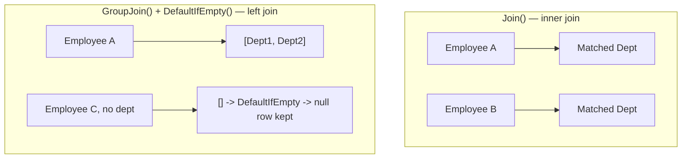
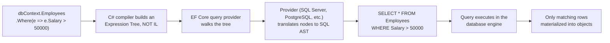

# LINQ — Interview Revision Notes

> `E. LINQ-Interview-Guide.md` se derive ki gayi quick-revision Q&A. Source ke har section ko cover karta hai.

## Core Concepts

### LINQ Kya Hai Aur Yeh Kyun Exist Karta Hai

**Q: LINQ kya hai aur yeh kyun exist karta hai?**

A: .NET mein built-in query operators ka ek set jo in-memory collections, databases, XML, JSON, etc. ko query karne ke liye use hota hai — ek consistent, strongly-typed syntax ke sath, hand-rolled loops ya SQL strings ki jagah.

**Q: "LINQ to Objects vs LINQ to Entities" ka distinction senior level pe kyun matter karta hai?**

A: Yeh syntactically identical dikhte hain lekin completely differently kaam karte hain:
- LINQ to Objects — plain delegates (`Func<T,bool>`), in-memory item by item execute hote hain.
- LINQ to Entities/SQL — expression trees jo SQL mein translate hoke remotely execute hote hain.

Dono ko conflate karna LINQ production bugs/perf incidents ka sabse common source hai.

**Q: LINQ ke key benefits kya hain?**

A:
- Readability — declarative, loops ke comparison mein intent ke zyada close.
- Compile-time type safety aur IntelliSense.
- Objects, SQL, XML, JSON ke across uniform query surface.
- Deferred execution composition enable karta hai aur (`IQueryable` ke liye) provider-side optimization.

### LINQ Flavors

**Q: LINQ ke flavors aur unke underlying interfaces batao.**

A:
- LINQ to Objects — arrays/`List<T>` — `IEnumerable<T>`
- LINQ to Entities — EF/EF Core — `IQueryable<T>`
- LINQ to SQL — legacy SQL Server ORM — `IQueryable<T>`
- LINQ to XML (XLinq) — `XDocument` — `IEnumerable<T>`
- LINQ to JSON — `JToken`/System.Text.Json — `IEnumerable<T>`

```csharp
// LINQ to XML
XDocument xml = XDocument.Load("employees.xml");
var names = xml.Descendants("Employee").Select(e => e.Element("Name").Value);

// LINQ to JSON-derived objects — once deserialized, it's just LINQ to Objects
var users = JsonConvert.DeserializeObject<List<User>>(jsonData);
var activeUsers = users.Where(u => u.IsActive).ToList();
```

### Query Syntax vs Method Syntax

**Q: Query syntax aur method syntax kaise related hain?**

A: Dono same IL mein compile hote hain — query syntax syntactic sugar hai jise compiler method calls mein translate kar deta hai. Method syntax real code mein dominate karta hai kyunki yeh un operators ko support karta hai jinke liye koi query keyword nahi hota (`Sum`, `Count`, `Take`, etc.) aur better chain hota hai.

```csharp
var result = from emp in employees where emp.Age > 30 select emp;
var result = employees.Where(emp => emp.Age > 30);
```

### Deferred vs Immediate Execution

**Q: Deferred aur immediate execution mein kya difference hai?**

A:
- Deferred — query variable ek description hold karta hai (iterator ya expression tree); jab tak enumerate nahi hota (`foreach`, `.ToList()`, `.Count()`, `.First()`...) kuch bhi nahi chalta.
- Immediate — woh methods jo abhi concrete result produce karte hain: `.ToList()`, `.ToArray()`, `.ToDictionary()`, `.Count()`, `.Sum()`, `.First()`, `.Any()` (jab directly call ho).

```csharp
var result = employees.Where(emp => emp.Age > 30); // deferred — nothing has run yet
Console.WriteLine(result.Count());                  // query executes HERE

var result2 = employees.Where(emp => emp.Age > 30).ToList(); // executes immediately
```


**Q: Interviewers deferred execution ko itna hard kyun probe karte hain?**

A: Same query variable har enumeration pe different results de sakta hai agar beech mein source ya captured variables change ho gaye ho.

```csharp
var numbers = new List<int> { 1, 2, 3 };
var query = numbers.Where(n => n > 1);
numbers.Add(4);
Console.WriteLine(string.Join(",", query)); // 2,3,4 — not 2,3
```

### Closures Over Variables — Classic Deferred Execution Trap

**Q: Closure-over-variable capture deferred execution ke sath kaise interact karta hai?**

A: Lambda variable ko reference se close karta hai, write-time ki value se nahi. Agar enumeration se pehle variable change ho jaaye, to query naye value ko use karti hai.

```csharp
int threshold = 30;
var query = employees.Where(e => e.Age > threshold);
threshold = 50;
var result = query.ToList(); // filters using 50
```

**Q: Historical `for`-loop closure bug kya tha, aur kya woh abhi bhi alive hai?**

A: Pre-C# 5, `for` loops iterations ke across same loop variable capture karte the, isliye loop ke andar create hone wale delegates sab final value dekhte the (e.g., `0,1,2` ki jagah `3,3,3` print hota tha). `foreach` ke liye C# 5 se fix ho gaya hai (per-iteration naya variable), lekin underlying trap `for` loops aur kisi bhi manually-scoped mutable capture pe abhi bhi apply hota hai. Fix: loop body ke andar capture karne se pehle local variable mein copy karo.

```csharp
var actions = new List<Action>();
for (int i = 0; i < 3; i++)
{
    actions.Add(() => Console.WriteLine(i)); // captures the SAME 'i' variable across iterations
}
actions.ForEach(a => a()); // prints 3, 3, 3 in old semantics for 'for'; NOT 0,1,2
```

```csharp
for (int i = 0; i < 3; i++)
{
    int local = i; // new variable per iteration
    actions.Add(() => Console.WriteLine(local));
}
```

## Intermediate Concepts

### Select vs SelectMany

**Q: `Select` aur `SelectMany` mein kya difference hai?**

A: `Select` nesting preserve karta hai (collections ka collection, 1:1 projection); `SelectMany` ek level flatten karta hai (projecting + flattening, e.g., sab employees ke across sab skills). `SelectMany` yeh bhi hai ki LINQ cross joins aur functional "flatMap" ko kaise implement karta hai.

```csharp
var result1 = students.Select(s => s.Courses);     // IEnumerable<List<string>>
var result2 = students.SelectMany(s => s.Courses); // IEnumerable<string>, flattened

var allSkills = employees.SelectMany(e => e.Skills); // flattened list of all skills across all employees
```

### First/FirstOrDefault/Single/SingleOrDefault

**Q: `First`, `FirstOrDefault`, `Single`, `SingleOrDefault` compare karo.**

A:
- `First()` — first match; kuch na mile to throw karta hai.
- `FirstOrDefault()` — first match ya `default(T)`; zero matches ke liye kabhi throw nahi karta.
- `Single()` — exactly one expect karta hai; zero ya more-than-one pe throw karta hai.
- `SingleOrDefault()` — zero ya one expect karta hai; more-than-one pe throw, zero pe default.

```csharp
var firstUser = users.FirstOrDefault(u => u.Age > 30); // safe, no exception risk
var singleEmp = employees.Single(e => e.Id == 101);     // asserts uniqueness — use for PK lookups
```

**Q: `First()` ke bajaye `Single()` kab prefer karna chahiye?**

A: Jab business rule genuinely uniqueness guarantee karta ho (e.g., PK lookup) — `Single()` "the first one" silently return karne ke bajaye ek data-integrity bug ko loudly surface karta hai.

### Any / All

**Q: Empty sequence pe `Any()`/`All()` kya return karte hain?**

A: `All()` empty pe `true` return karta hai (vacuous truth) — classic gotcha. `Any()` empty pe `false` return karta hai. Existence checks ke liye `collection.Count() > 0` ke bajaye `collection.Any()` prefer karo.

```csharp
bool hasAdults = users.Any(u => u.Age >= 18);
bool allAdults = users.All(u => u.Age >= 18);
```

### GroupBy

**Q: `GroupBy` kya return karta hai, aur kya yeh deferred hai?**

A: `IEnumerable<IGrouping<TKey, TElement>>` — har `IGrouping` khud `IEnumerable<TElement>` plus ek `.Key` hai. Yeh deferred hai, lekin LINQ-to-Objects mein pehla group yield karne se pehle poore source ko buffer karna hi padta hai — yeh genuinely stream nahi kar sakta.

```csharp
var groupedUsers = users.GroupBy(u => u.City);
foreach (var group in groupedUsers)
{
    Console.WriteLine($"City: {group.Key}, Count: {group.Count()}");
}
```

### Join vs GroupJoin (Left Join)

**Q: `Join()` aur `GroupJoin()` mein difference?**

A: `Join()` inner join hai — matching pair ke liye ek flat row. `GroupJoin()` left element ke liye ek row produce karta hai jisme matches ka nested collection hota hai (one-to-many/"left join" shape ko model karta hai); isko `.SelectMany(...DefaultIfEmpty())` ke sath combine karo taaki ek true SQL-style left outer join mein flatten ho jaaye.

```csharp
// Inner join
var result = employees.Join(departments,
    e => e.DeptID,
    d => d.ID,
    (e, d) => new { e.Name, d.Name });

// Left join (query syntax) — DefaultIfEmpty() includes unmatched left rows
var result2 = from emp in employees
              join dept in departments
                  on emp.DeptID equals dept.ID into empDept
              from d in empDept.DefaultIfEmpty()
              select new { emp.Name, Department = d?.Name ?? "No Department" };
```



### Aggregate Functions aur Aggregate()

**Q: `Aggregate()` kis liye use hota hai, aur EF Core caveat kya hai?**

A: LINQ ka generic fold/reduce — custom cumulative operations ke liye jinke liye koi built-in aggregate fit nahi hota (running string, custom rolling metric). EF Core mein, `Aggregate()` almost hamesha SQL mein translate nahi ho sakta — client evaluation force karta hai ya throw karta hai.

```csharp
int totalSalary = employees.Sum(emp => emp.Salary);
double avgSalary = employees.Average(emp => emp.Salary);

int product = numbers.Aggregate((a, b) => a * b); // custom cumulative operation
```

### Distinct, Except, Intersect, Union

**Q: `Except`, `Intersect`, `Union` describe karo.**

A:
- `Except()` — first mein hai lekin second mein nahi.
- `Intersect()` — dono mein common.
- `Union()` — dono se sab unique elements (de-duplicates karta hai).

```csharp
int[] a = { 1, 2, 3, 4 };
int[] b = { 3, 4, 5, 6 };
var except = a.Except(b);       // 1, 2
var intersect = a.Intersect(b); // 3, 4
var union = a.Union(b);         // 1, 2, 3, 4, 5, 6
```

Yeh teenon `EqualityComparer<T>.Default` use karte hain jab tak tum khud koi custom `IEqualityComparer<T>` supply na karo — reference types ke liye custom equality (e.g., DTOs ko properties ke subset se compare karna) ke case mein bhool jaana easy hai.

### ToLookup() vs GroupBy()

**Q: `ToLookup()` `GroupBy()` se kaise differ karta hai?**

A:

| Feature | `GroupBy()` | `ToLookup()` |
|---|---|---|
| Execution | Deferred | Immediate |
| Return type | `IEnumerable<IGrouping<K,V>>` | `ILookup<K,V>` |
| Indexable by key | No | Yes (`lookup["HR"]`) |
| Missing key | N/A | Empty sequence, not exception |

```csharp
var lookup = employees.ToLookup(e => e.Department);
Console.WriteLine(lookup["HR"].Count());
```

### MaxBy, MinBy, DistinctBy, aur Chunk (.NET 6+)

**Q: `MaxBy`/`MinBy` tumhe woh kya deta hai jo `Max`/`Min` nahi deta?**

A: Yeh *element* return karte hain jo max/min projected key ke sath hota hai, sirf projected value nahi — yeh classic bug fix karta hai jab `.Max(f => f.AverageSalary)` use karke associated entity/department lose ho jaata hai.

```csharp
// MaxBy / MinBy — keeps the whole element, not just the projected value
var highestPaid = employees.MaxBy(e => e.Salary);   // Employee, not decimal
var lowestPaid = employees.MinBy(e => e.Salary);     // Employee, not decimal

// Equivalent to the older, more verbose idiom:
var highestPaidOld = employees.OrderByDescending(e => e.Salary).First();
```

**Q: `DistinctBy` kya karta hai?**

A: Ek projected key se de-duplicate karta hai, bina custom `IEqualityComparer<T>` ki zarurat ke — e.g., `employees.DistinctBy(e => e.DepartmentId)`.

```csharp
// DistinctBy — de-dup by a key selector, no custom IEqualityComparer needed
var oneEmployeePerDept = employees.DistinctBy(e => e.DepartmentId);
```

**Q: `Chunk` kya karta hai?**

A: Ek sequence ko fixed-size batches mein split karta hai (`IEnumerable<T[]>`); last batch chhota ho sakta hai. Common use: max-batch-size limit ke under bulk inserts/API calls ko batching karna.

```csharp
// Chunk — batch a sequence into arrays of at most N elements
foreach (int[] batch in employeeIds.Chunk(100))
{
    await bulkApiClient.ProcessBatchAsync(batch); // e.g., respecting a 100-item API limit
}
```

**Q: `MaxBy`/`MinBy`/`DistinctBy`/`Chunk` ke gotchas?**

A:
- `MaxBy`/`MinBy` empty sequences pe throw karne ke bajaye `default(T)` return karte hain (`Max()`/`Min()` ke unlike, jo empty non-nullable value-type sequences pe `InvalidOperationException` throw karte hain).
- Ties: `MaxBy`/`MinBy` first encountered element return karte hain, `OrderBy...First()` ke jaisa.
- EF Core translation support inke liye provider/version ke hisab se vary karta hai — generated SQL verify karo, push-down assume mat karo.
- `Chunk` ka last batch shorter ho sakta hai — hamesha partial final batch handle karo.

### Take/Skip, Pagination, DefaultIfEmpty, Zip

**Q: `Zip` kya karta hai?**

A: Do sequences ko element-wise merge karta hai, shorter sequence pe stop hota hai: `names.Zip(ages, (n, a) => $"{n} is {a}")`.

```csharp
// Pagination
int pageSize = 5, pageNumber = 2;
var pagedEmployees = employees.Skip((pageNumber - 1) * pageSize).Take(pageSize);

// DefaultIfEmpty
var result = employees.Where(e => e.ID == 100).DefaultIfEmpty(new Employee { Name = "Not Found" });

// Zip — merges two sequences element-wise, stops at the shorter one
var combined = names.Zip(ages, (name, age) => $"{name} is {age} years old.");
```

**Q: `IQueryable` ke against `Skip`/`Take` pagination ke sath senior gotcha kya hai?**

A: Hamesha `OrderBy` ke sath pair karo — SQL bina ek ke koi ordering guarantee nahi deta, isliye explicit sort ke bina paging concurrent writes ke under non-deterministic page contents/duplicates produce karta hai.

### ToDictionary aur Non-Generic Collections

**Q: Agar `ToDictionary` ko duplicate keys mile to kya hota hai?**

A: `ArgumentException` throw karta hai — ek common surprise jab "unique key" assumptions hold nahi karti. Duplicates possible hone par `GroupBy` + `ToDictionary(g => g.Key, g => g.ToList())` ya `DistinctBy` use karo.

```csharp
var empDict = employees.ToDictionary(e => e.ID, e => e.Name);

// Non-generic collections need casting
ArrayList list = new ArrayList { 1, 2, 3, 4 };
var numbers = list.Cast<int>().Where(n => n > 2);
```

**Q: `ArrayList` jaisi non-generic collections pe LINQ kaise karte ho?**

A: Pehle cast karo: `list.Cast<int>().Where(n => n > 2)`.

### Let Clause

**Q: `let` kya karta hai, aur iska method-syntax equivalent hai kya?**

A: Query syntax ke andar ek named intermediate value introduce karta hai taaki ek expression multiple baar recompute na ho. Yeh sirf query syntax mein exist karta hai; method-syntax equivalent ek intermediate `Select` hai jo anonymous type project karta hai, ya inlining.

```csharp
var result = from e in employees
             let bonus = e.Salary * 0.1m
             select new { e.Name, Bonus = bonus };
```

### Cross Join

**Q: LINQ mein cross join kaise likhte ho, aur method-syntax equivalent kya hai?**

A: `from e in employees from d in departments select new {...}` — yeh `employees.SelectMany(e => departments, (e, d) => new {...})` ke equivalent hai, yaani Cartesian product. Practice mein rare hai; usually jab appear hota hai to ek bug hota hai (missing correlating `where`).

```csharp
var result = from e in employees
             from d in departments
             select new { e.Name, d.Name };
```

## Advanced Concepts

### IEnumerable\<T\> vs IQueryable\<T\>

**Q: `IEnumerable<T>` aur `IQueryable<T>` ka core difference kya hai?**

A:

| Feature | `IEnumerable<T>` | `IQueryable<T>` |
|---|---|---|
| Represents | Sequence + delegate (`Func<T,...>`) | Sequence + expression tree (`Expression<Func<T,...>>`) |
| Typical source | In-memory collections | ORMs (EF Core, LINQ to SQL) |
| Filtering happens | In app memory after materializing | Translated to SQL, executed at source |
| Can call arbitrary C# methods in predicate? | Yes | No — only what the provider can translate |

```csharp
IEnumerable<int> data1 = numbers.Where(n => n > 5);                       // in-memory
IQueryable<int> data2 = dbContext.Employees.Where(e => e.Salary > 50000); // translated to SQL, runs in DB
```

**Q: Classic `IEnumerable`/`IQueryable` trap jise interviewers dhoondhte hain?**

A: Apne final `Where()` se pehle `.AsEnumerable()` (ya koi aisa method jo implicitly `IEnumerable` pe drop kar de) call karna woh filter client-side move kar deta hai, poori table wire ke across pull karne ke baad — large tables pe quietly catastrophic.

```csharp
// BAD: pulls all employees into memory, then filters in C#
var result = dbContext.Employees.AsEnumerable().Where(e => e.Salary > 50000);
// GOOD: filter translated to SQL WHERE
var result = dbContext.Employees.Where(e => e.Salary > 50000);
```

### Expression Trees aur LINQ-to-Entities SQL Mein Kaise Translate Hota Hai

**Q: `Func<T,...>` mein assign ki gayi lambda vs `Expression<Func<T,...>>` mein kya difference hai?**

A: `Func<T,...>` IL mein compile hota hai — ek executable delegate. `Expression<Func<T,...>>` *data* mein compile hota hai — `Expression` node objects (`BinaryExpression`, `MemberExpression`, `ConstantExpression`) ka ek tree jo code ko describe karta hai bina usko run kiye.

**Q: LINQ query se SQL tak translation pipeline walk through karo.**

A: C# compiler ek expression tree banata hai (IL nahi) → EF Core ka query provider tree ko walk karta hai → provider nodes ko ek SQL AST mein translate karta hai → SQL database engine mein execute hota hai → sirf matching rows objects mein materialize hoti hain. Yehi wajah hai ki `IQueryable<T>.Where` ke parameter ka type `Expression<Func<T,bool>>` hai jabki `IEnumerable<T>.Where` ka ek plain `Func<T,bool>` hai.



```csharp
Expression<Func<Employee, bool>> isHighEarner = e => e.Salary > 50000;
// isHighEarner.Body, .Parameters, etc. can be inspected/rewritten at runtime —
// this is what libraries like AutoMapper's ProjectTo, Dynamic LINQ, and
// custom query-builder abstractions rely on.
```

**Q: Agar tum ek translated predicate ke andar koi C# construct use karo jiska SQL equivalent nahi hai to kya hota hai?**

A: Ya to `InvalidOperationException` throw hota hai (older EF/strict providers) ya warning ke sath client evaluation trigger hota hai (EF Core).

### Client-Eval Fallback aur Query Translation Limits (EF Core)

**Q: EF Core ek aise predicate ko kaise handle karta hai jise SQL mein translate nahi kar sakta?**

A: EF6 ke unlike (hard error), EF Core by default untranslatable part ko silently memory mein pull karta hai aur client-side evaluate karta hai, sirf ek warning log karke — production mein miss karna easy hai.

```csharp
var result = dbContext.Employees
    .Where(e => Regex.IsMatch(e.Name, "^A"))  // client-eval warning, pulls ALL rows first
    .ToList();
```

**Q: Common untranslatable constructs batao.**

A:
- Arbitrary instance/static C# method calls jinke liye provider translation nahi hai (custom validators, most regex, culture-specific string ops).
- `Aggregate()`, aur woh operators jinko custom `IComparer`/`IEqualityComparer` chahiye.
- Kuch provider versions mein complex nested ternary/pattern-matching.
- `IEnumerable` pe already drop hone ke baad kuch bhi (`.AsEnumerable()`, `.ToList()`, etc.).

**Q: Silent client-eval fallback ko kaise mitigate karte ho?**

A:
- Non-prod mein warnings-as-errors configure karo: `optionsBuilder.ConfigureWarnings(w => w.Throw(RelationalEventId.QueryClientEvaluationWarning))` (API version ke hisab se vary karta hai).
- Filtering/projection ko `IQueryable` portion ke andar hi rakho; `.AsEnumerable()`/`.ToList()` sirf last step mein call karo.
- Materializing se pehle needed columns project karne ke liye `.Select()` use karo.

### yield return aur Custom Iterators

**Q: Tum ek custom LINQ operator kaise likhoge jo built-ins ke jaisa stream/defer kare?**

A: `yield return` use karo:

```csharp
public static IEnumerable<TSource> WhereGreaterThan<TSource, TKey>(
    this IEnumerable<TSource> source, Func<TSource, TKey> selector, TKey threshold)
    where TKey : IComparable<TKey>
{
    foreach (var item in source)
        if (selector(item).CompareTo(threshold) > 0)
            yield return item;
}
```

**Q: Compiler `yield return` method ke sath kya karta hai?**

A: Isko ek compiler-generated state machine mein rewrite karta hai jo `IEnumerator<T>` implement karta hai — yehi wajah hai `Where`/`Select` deferred, streaming, one-item-at-a-time execution achieve karte hain bina poori sequence buffer kiye.

**Q: Iterator methods ke sath eager-validation gotcha kya hai?**

A: Iterator method ke andar argument validation jab tak first enumeration nahi hota (`MoveNext()`) chalti nahi, method call hone pe nahi — exceptions us jagah se bahut door surface hoti hain jahan query build hui thi. Fix: ek public non-iterator wrapper mein split karo jo eagerly validate kare, phir ek private iterator method ko delegate kare.

```csharp
public static IEnumerable<T> SafeWhere<T>(this IEnumerable<T> source, Func<T, bool> predicate)
{
    if (source is null) throw new ArgumentNullException(nameof(source)); // validated eagerly
    if (predicate is null) throw new ArgumentNullException(nameof(predicate));
    return SafeWhereIterator(source, predicate); // deferred part factored out
}

private static IEnumerable<T> SafeWhereIterator<T>(IEnumerable<T> source, Func<T, bool> predicate)
{
    foreach (var item in source)
        if (predicate(item))
            yield return item;
}
```

### Custom LINQ Extension Methods

**Q: Ek basic custom LINQ extension method kaise likhte ho?**

A:

```csharp
public static class MyExtensions
{
    public static IEnumerable<int> GetEvens(this IEnumerable<int> numbers)
        => numbers.Where(n => n % 2 == 0);
}

// Usage
var evens = numbers.GetEvens();
```

### Dynamic LINQ

**Q: Dynamic LINQ kis liye use hota hai, aur trade-off kya hai?**

A: Runtime configuration se filters/sorts build karne ke liye (e.g., ek search UI jisme user-selectable fields hain) string predicates ke through, `System.Linq.Dynamic.Core` use karke: `employees.AsQueryable().Where("Salary > 50000")`. Trade-off: compile-time safety lose hoti hai aur yeh ek potential injection surface hai agar field names/operators untrusted input se aa rahe hain — hamesha column names ke allow-list ke against validate karo.

```csharp
// Requires System.Linq.Dynamic.Core
var result = employees.AsQueryable().Where("Salary > 50000").ToList();
```

### LINQ Method Chaining vs Query Syntax — Kab Kya Use Karein

**Q: Query syntax vs method syntax ke liye ek decision rule do.**

A:
- Simple filter/projection/sort chains → method syntax.
- Multi-`join`, especially `GroupJoin` + `DefaultIfEmpty` (left join) → query syntax (more readable `into`/`from` shape).
- Ek reused intermediate value ke liye `let` ki zarurat → query syntax.
- Woh operators jinke liye koi query keyword nahi hai (`Sum`, `Count`, `Take`, `Skip`, `Distinct`, `Any`, `Aggregate`) → method syntax (mandatory).
- Conditionally-built queries (flags ke basis pe `.Where()` append karna) → method syntax (trivially composable).

```csharp
IQueryable<Employee> query = dbContext.Employees;
if (minSalary.HasValue) query = query.Where(e => e.Salary >= minSalary.Value);
if (!string.IsNullOrEmpty(department)) query = query.Where(e => e.Department == department);
```

## Performance

### General Optimization Rules

**Q: General LINQ performance rules list karo.**

A:
- `.AsEnumerable()` deliberately use karo, sirf server-side filtering complete hone ke baad.
- Premature `.ToList()`/`.ToArray()` avoid karo — yeh sab kuch materialize kar deta hai, further composition/provider optimization defeat kar deta hai.
- Existence checks ke liye `.Count() > 0` ke bajaye `.Any()` prefer karo.
- `Select()`/`OrderBy()` se pehle `Where()` ke sath early filter karo.
- `IQueryable` ke liye hamesha `Skip`/`Take` ko `OrderBy` ke sath pair karo.

### The Multiple Enumeration Pitfall

**Q: Is code mein kya galat hai?**

```csharp
IEnumerable<Employee> highEarners = employees.Where(e => e.Salary > 50000);
int count = highEarners.Count();   // enumeration #1
var list = highEarners.ToList();   // enumeration #2
if (highEarners.Any()) { ... }     // enumeration #3
```

A: Har call `Where` predicate ko original source ke against scratch se re-run karta hai — variable ek undecided iterator hold karta hai, cached result nahi. LINQ-to-Objects ke liye: 3x wasted work. LINQ-to-Entities ke liye: 3 separate DB round trips. Agar enumerations ke beech source change ho jaaye, results inconsistent bhi ho sakte hain.

**Q: Fix kya hai, aur review mein isko kaise catch karte ho?**

A: Jaise hi tumhe pata chale ki result ek se zyada baar chahiye hoga, use `.ToList()`/`.ToArray()` se ek baar materialize kar do, phir us snapshot pe kaam karo. Roslyn analyzers/ReSharper isko "possible multiple enumeration of IEnumerable" ke tarah flag karte hain.

```csharp
var highEarners = employees.Where(e => e.Salary > 50000).ToList(); // ONE enumeration, cached

int count = highEarners.Count;   // property on List<T>, no re-enumeration
var list = highEarners;          // already a list
if (highEarners.Any()) { ... }   // cheap, operates on the materialized list
```

### Hidden O(n²) Traps — Select Ke Andar Nested Where/Any

**Q: Yeh slow kyun hai, aur kaise fix karte ho?**

```csharp
// O(n * m): for every employee, linearly scans the entire departments list
var result = employees.Select(e => new
{
    e.Name,
    DeptName = departments.FirstOrDefault(d => d.Id == e.DepartmentId)?.Name
});

// Similarly O(n * m): Any() inside Select/Where re-scans 'blockedIds' for every item
var filtered = employees.Where(e => !blockedIds.Any(b => b == e.Id));
```

A: O(n·m) — har employee ke liye, poori departments list linearly scan hoti hai. Fix: ek `Dictionary`/`HashSet`/`ILookup` mein pre-index karo (O(1) lookups), ya O(n+m) hash-join semantics ke liye ek actual `Join`/`GroupJoin` use karo jo SQL mein bhi efficiently translate hota hai.

```csharp
// O(n + m): build the lookup once, then O(1) per employee
var deptById = departments.ToDictionary(d => d.Id, d => d.Name);
var result = employees.Select(e => new
{
    e.Name,
    DeptName = deptById.TryGetValue(e.DepartmentId, out var name) ? name : null
});

// O(n + m) with a HashSet
var blockedSet = blockedIds.ToHashSet();
var filtered = employees.Where(e => !blockedSet.Contains(e.Id));

// Or, idiomatically, just use Join — same O(n+m) hash-join semantics, and
// translates to an efficient SQL JOIN against IQueryable
var result2 = employees.Join(departments, e => e.DepartmentId, d => d.Id,
    (e, d) => new { e.Name, DeptName = d.Name });
```

### Parallel LINQ (PLINQ)

**Q: PLINQ kya hai aur yeh kab use karna chahiye?**

A: `users.AsParallel().Where(...).ToList()` — CPU-bound, embarrassingly-parallel in-memory work ke liye source ko threads/cores ke across partition karta hai.

```csharp
var results = users.AsParallel().Where(u => u.Age > 30).ToList();
```

**Q: PLINQ ke trade-offs list karo jo interviewer unprompted expect karta hai.**

A:
- Small collections/cheap predicates ke liye overhead benefit se exceed kar sakta hai — benchmark karo, assume mat karo.
- Results by default unordered hote hain; agar order matter kare to `.AsOrdered()` use karo (ek cost pe).
- I/O-bound ya database work ke liye nahi — `DbContext` thread-safe nahi hai; PLINQ ke through EF queries ko kabhi fan out mat karo.
- Predicates side-effect-free/synchronized hone chahiye — shared state ko mutate karna ek race condition hai.
- Exceptions `AggregateException` mein aggregate hoti hain — code ko isko unwrap karna padta hai.
- `.WithDegreeOfParallelism(n)` shared/server environments mein thread usage cap karta hai.

### IAsyncEnumerable aur System.Linq.Async

**Q: Synchronous LINQ enumeration aur `IAsyncEnumerable<T>` mein kya difference hai?**

A: `IEnumerable<T>`/`IQueryable<T>` enumeration synchronous hota hai — next item pull karne se thread block hota hai. `IAsyncEnumerable<T>` (via `await foreach`) `MoveNextAsync()` ko I/O ka wait karte hue thread ko yield back karne deta hai — load ke under scalability ke liye matter karta hai.

```csharp
await foreach (var employee in dbContext.Employees.Where(e => e.Salary > 50000).AsAsyncEnumerable())
{
    Process(employee);
}
```

**Q: `IAsyncEnumerable<T>` ke over `Select`/`Where`/`SelectMany` composition kaise milta hai?**

A: BCL ke apne LINQ operators sirf `IEnumerable`/`IQueryable` ko target karte hain; async LINQ operator set ke liye `System.Linq.Async` NuGet package (`dotnet/reactive` se) use karo.

**Q: `Task<IEnumerable<T>>` vs `IAsyncEnumerable<T>` — distinction kya hai?**

A: `Task<IEnumerable<T>>` ek bada async wait hai phir ek synchronous in-memory sequence. `IAsyncEnumerable<T>` genuinely ek async stream hai jo incrementally deliver hoti hai — large result sets/server-streaming (gRPC streaming, paged APIs, Minimal API endpoints) ke liye right tool hai.

### EF Core: AsNoTracking, Split Queries, aur Compiled Queries

**Q: `.AsNoTracking()` kya karta hai aur yeh kab use karna chahiye?**

A: Read-only queries ke liye EF Core ke change-tracking overhead ko skip karta hai (no snapshot comparison, no identity map) — reporting/read-heavy endpoints ke liye significant win. `.AsNoTrackingWithIdentityResolution()` full tracking ke bina identity resolution rakhta hai.

**Q: `.AsSplitQuery()` kaunsa problem solve karta hai?**

A: Multiple `Include()` collection navigations ko eager-load karne se by default JOINs ke sath ek SQL query bnti hai, jisse "cartesian explosion" hota hai (row count har included collection ke sath multiply hota hai). `.AsSplitQuery()` uske jagah har collection ke liye separate SQL queries issue karta hai — quadratic row bloat avoid karne ke liye zyada round trips trade karta hai. Genuinely context-dependent hai ki kaunsa faster hai.

**Q: Compiled queries kis liye hain?**

A: `EF.CompileQuery`/`EF.CompileAsyncQuery` expression-tree-to-SQL translation ko ek baar pre-compile karte hain, har call pe woh cost bypass karte hue — bahut hot-path queries ke liye matter karta hai; usually kahin aur unnecessary hai kyunki EF Core already query plans cache karta hai.

**Q: Upar ke sab se often bigger performance win kya hai?**

A: Full-entity loading ke bajaye projection — materializing se pehle `.Select(e => new EmployeeDto {...})` unused columns pull karne se bachta hai aur unselected shape ke liye change-tracking machinery skip karta hai.

```csharp
var dtos = await dbContext.Employees
    .AsNoTracking()
    .Where(e => e.IsActive)
    .Select(e => new EmployeeDto { Id = e.Id, Name = e.Name })
    .ToListAsync();
```

### Window-Function Alternatives for Ranking Queries (Production Mein Nth Highest Salary)

**Q: "Nth highest salary" ka in-memory answer `Distinct().OrderByDescending().Skip(n).FirstOrDefault()` hai. Millions of rows wale production database ke against yeh kaise karoge?**

A: Ranking ko database ke native window functions (`RANK()`/`DENSE_RANK()`/`ROW_NUMBER() OVER (PARTITION BY ... ORDER BY ...)`) tak push down karo, memory mein rows pull karke C# mein rank karne ke bajaye.

**Q: SQL window functions tak push down karna usually better kyun hai?**

A:
- Full materialization avoid karta hai — `IQueryable` pe `Skip(n)` generally ab bhi poore qualifying set ko compute/order karna require karta hai; ek window function optimizer ko index use karne deta hai aur often full sort avoid kar deta hai.
- Set-based hai, row-by-row nahi — exactly wahi jo DB engine optimize karne ke liye built hai; nested-`GroupBy`-then-rank shapes historically EF Core ke liye translate karna hard hote hain aur often silently client evaluation pe fall back hote hain.
- Ek round trip, ek query plan — exactly wahi N rows waapis milti hain jinki zarurat hai.
- Explicit tie handling — `RANK()` (shared rank, gaps), `DENSE_RANK()` (shared rank, no gaps), `ROW_NUMBER()` (strict tie-break) teen different business rules ko map karte hain, hand-rolled `Distinct()`/`Skip()` ke sath subtly galat hona easy hai.

```sql
WITH RankedSalaries AS (
    SELECT e.DepartmentId, e.Name, e.Salary,
           DENSE_RANK() OVER (PARTITION BY e.DepartmentId ORDER BY e.Salary DESC) AS SalaryRank
    FROM Employees e
)
SELECT DepartmentId, Name, Salary FROM RankedSalaries WHERE SalaryRank = 3;
```

**Q: Yeh raw-SQL ranking query EF Core ke through kaise execute karte ho aur phir bhi strongly-typed rows kaise milti hain?**

A: EF Core 8+: `dbContext.Database.SqlQuery<DeptSalaryRankDto>($"...")` — koi DbSet-mapped entity ki zarurat nahi, scalar/DTO projections ke liye kaam karta hai. Pre-EF Core 8: `dbContext.Employees.FromSqlRaw(@"...")` ek mapped (ya keyless) entity type ke against.

```csharp
// EF Core: raw SQL for the ranking, still returned as strongly-typed rows.
// FromSqlRaw works when mapping to an existing entity/keyless type; SqlQuery<T> (EF Core 8+)
// is the newer, more flexible option for arbitrary projections that aren't a full tracked entity.

// EF Core 8+ : SqlQuery<T> — no need for a DbSet-mapped entity, works for scalar/DTO projections
var thirdHighestPerDept = await dbContext.Database
    .SqlQuery<DeptSalaryRankDto>($"""
        WITH RankedSalaries AS (
            SELECT DepartmentId, Name, Salary,
                   DENSE_RANK() OVER (PARTITION BY DepartmentId ORDER BY Salary DESC) AS SalaryRank
            FROM Employees
        )
        SELECT DepartmentId, Name, Salary FROM RankedSalaries WHERE SalaryRank = 3
        """)
    .ToListAsync();

// Pre-EF Core 8 / entity-shaped result: FromSqlRaw against a mapped (or keyless) entity type
var thirdHighestPerDeptLegacy = await dbContext.Employees
    .FromSqlRaw(@"
        WITH RankedSalaries AS (
            SELECT e.*, DENSE_RANK() OVER (PARTITION BY DepartmentId ORDER BY Salary DESC) AS SalaryRank
            FROM Employees e
        )
        SELECT * FROM RankedSalaries WHERE SalaryRank = 3")
    .ToListAsync();

public record DeptSalaryRankDto(int DepartmentId, string Name, decimal Salary);
```

**Q: Pure-LINQ in-memory version (Q2/Q11 style) kab bhi theek hai?**

A: Small, already-materialized collections (config data, ek page already fetched, unit tests), ya ek genuine LINQ-to-Objects scenario jisme koi database nahi hai. Ek baar source ek real, growing `IQueryable` table ho jaaye, window functions production-grade answer ban jaate hain — hamesha actual generated SQL/execution plan verify karo.

## Best Practices

**Q: LINQ best-practices checklist summarize karo.**

A:
- Default se method syntax prefer karo; multi-join/`let`-heavy queries ke liye query syntax.
- Materialize (`.ToList()`/`.ToArray()`) exactly ek baar karo, us point pe jab tumhe pata ho ki ek se zyada baar enumerate karoge.
- Filter (`Where`) ko jitna early ho sake karo, especially `IQueryable` ke against.
- Existence checks ke liye `Count() > 0` ke bajaye `Any()` use karo.
- Sab kuch jo chahiye woh `IQueryable` portion ke andar hi rakho; `.AsEnumerable()`/`.ToList()` sirf final step mein call karo.
- `Select`/`Where` ke andar scan nest karne se pehle lookup collections (`Dictionary`/`HashSet`/`ToLookup`) pre-index karo.
- Read-only EF Core queries ke liye `AsNoTracking()` use karo.
- Materializing se pehle `Select()` ke sath DTOs pe project karo.
- `IQueryable` ke against hamesha `Skip`/`Take` ko `OrderBy` ke sath pair karo.
- `AsParallel()` ke liye reach karne se pehle benchmark karo.
- `foreach` ke sath currently iterate ho rahi collection ko mutate karne se pehle `.ToList()` use karo.

## Common Pitfalls

**Q: Watch karne ke liye common LINQ pitfalls list karo.**

A:
- Ek deferred `IEnumerable`/`IQueryable` ki multiple enumeration — har baar silently re-run hoti hai (aur EF ke liye DB ko re-hit karti hai).
- Deferred queries mein reference se captured mutable variables ke closures.
- EF Core mein client-side evaluation fallback jo silently poori tables ko memory mein pull kar deta hai.
- Empty sequence pe `All()` `true` return karta hai; `Any()` `false` return karta hai.
- `ToDictionary()` duplicate keys pe throw karta hai.
- Iterate karte waqt collection ko modify karna `InvalidOperationException` throw karta hai — pehle `.ToList()` ke sath snapshot lo.
- Database ke against `Skip`/`Take` se pehle `OrderBy` bhool jaana — non-deterministic paging.
- `Select` ke andar nested `Where`/`Any`/`FirstOrDefault` scans — hidden O(n²).
- `IEnumerable`/`IQueryable` confuse karna — `.AsEnumerable()` ko bahut early call karna filtering ko app memory mein move kar deta hai.
- Assume karna ki `GroupBy` `Where`/`Select` ki tarah stream karta hai — LINQ-to-Objects mein yeh poore source ko pehle buffer karta hai.

## Worked Coding Exercises

Yeh foundational patterns hain; inko cold jaano, yeh neeche diye harder senior challenges ke liye building blocks hain.

**Q: Even numbers filter karne ke liye LINQ one-liner do.**

A: `numbers.Where(n => n % 2 == 0).ToList();`

**Q: 50,000 se zyada earning karne wale employees, sirf names?**

A: `employees.Where(e => e.Salary > 50000).Select(e => e.Name);`

**Q: Ek list mein duplicate numbers dhoondho.**

A: `numbers.GroupBy(n => n).Where(g => g.Count() > 1).Select(g => g.Key).ToList();`

**Q: Ek sentence se word frequency count.**

A: `sentence.Split(' ').GroupBy(w => w).Select(g => new { Word = g.Key, Count = g.Count() });`

**Q: Do baar sort kiye bina second highest salary.**

A: `salaries.Distinct().OrderByDescending(s => s).Skip(1).FirstOrDefault();`

**Q: Top 3 most expensive products.**

A: `products.OrderByDescending(p => p.Price).Take(3).Select(p => p.Name);`

**Q: Names ka uppercase transform.**

A: `names.Select(name => name.ToUpper());`

**Q: 'A' se start hone wale names.**

A: `employees.Where(name => name.StartsWith("A")).ToList();`

**Q: Students ko scores se inner join.**

A: `students.Join(scores, student => student, score => score.StudentId, (student, score) => new { StudentId = student, Score = score.Score });`

Sab das ek sath:

```csharp
// 1. Even numbers
var evenNumbers = numbers.Where(n => n % 2 == 0).ToList();

// 2. Employees earning > 50,000
var highEarners = employees.Where(e => e.Salary > 50000).Select(e => e.Name);

// 3. Duplicate numbers
var duplicates = numbers.GroupBy(n => n).Where(g => g.Count() > 1).Select(g => g.Key).ToList();

// 4. Word frequency count
var wordCount = sentence.Split(' ').GroupBy(w => w).Select(g => new { Word = g.Key, Count = g.Count() });

// 5. Second highest salary (single sort, no duplicate sort pass)
var secondHighest = salaries.Distinct().OrderByDescending(s => s).Skip(1).FirstOrDefault();

// 6. Top 3 expensive products
var top3Expensive = products.OrderByDescending(p => p.Price).Take(3).Select(p => p.Name);

// 7. Group employees by department (see GroupBy section above)

// 8. Uppercase transform
var upperNames = names.Select(name => name.ToUpper());

// 9. Names starting with 'A'
var aNames = employees.Where(name => name.StartsWith("A")).ToList();

// 10. Inner join students to scores
var studentScores = students.Join(scores,
    student => student,
    score => score.StudentId,
    (student, score) => new { StudentId = student, Score = score.Score });
```

## Senior-Level Query Challenges (with Solutions)

Poore mein use hone wala dataset (source notes ke jaisa):

```csharp
public class Employee
{
    public int Id { get; set; }
    public string Name { get; set; }
    public int DepartmentId { get; set; }
    public decimal Salary { get; set; }
    public DateTime JoiningDate { get; set; }
}

public class Department
{
    public int Id { get; set; }
    public string Name { get; set; }
}

public class Order
{
    public int Id { get; set; }
    public int CustomerId { get; set; }
    public decimal Amount { get; set; }
    public DateTime OrderDate { get; set; }
}

public class Customer
{
    public int Id { get; set; }
    public string Name { get; set; }
    public string City { get; set; }
}
```

### Level 1 — Medium

**Q1: Average salary se zyada earning karne wale employees — aur `IQueryable` ke against gotcha?**

A: `var avg = employees.Average(e => e.Salary); employees.Where(e => e.Salary > avg);` — `IQueryable` ke against isko do round trips chahiye (ya EF Core isko ek subquery mein translate kar deta hai); generated SQL verify karo, kabhi-kabhi ek single windowed-average query ke tarah better hota hai.

```csharp
var avg = employees.Average(e => e.Salary);
var result = employees.Where(e => e.Salary > avg);
```

**Q3: Last 6 months mein join karne wale employees.**

A: `var cutoff = DateTime.Today.AddMonths(-6); employees.Where(e => e.JoiningDate >= cutoff);`

```csharp
var cutoff = DateTime.Today.AddMonths(-6);
var recentJoiners = employees.Where(e => e.JoiningDate >= cutoff);
```

**Q4: Names ko DepartmentId asc, Salary desc se order karo.**

A: `employees.OrderBy(e => e.DepartmentId).ThenByDescending(e => e.Salary).Select(e => e.Name);`

```csharp
var ordered = employees.OrderBy(e => e.DepartmentId).ThenByDescending(e => e.Salary).Select(e => e.Name);
```

**Q5: Top 5 highest paid employees.**

A: `employees.OrderByDescending(e => e.Salary).Take(5);`

```csharp
var top5 = employees.OrderByDescending(e => e.Salary).Take(5);
```

### Level 2 — Upper Medium

**Q6: Sabse highest average salary wala department — aur log kya mistake karte hain?**

A: `employees.GroupBy(e => e.DepartmentId).Select(g => new { DeptId = g.Key, AvgSalary = g.Average(e => e.Salary) }).OrderByDescending(x => x.AvgSalary).First();` — yahan `.Max()` use mat karo, yeh sirf numeric max return karta hai aur department discard kar deta hai; `OrderByDescending().First()` ya `MaxBy` use karo.

```csharp
var topDept = employees.GroupBy(e => e.DepartmentId)
    .Select(g => new { DeptId = g.Key, AvgSalary = g.Average(e => e.Salary) })
    .OrderByDescending(x => x.AvgSalary)
    .First(); // do NOT use Max() here if you need the department, not just the value — see note below
```

**Q7: Har department mein highest paid employee, department name se joined.**

A: Department se group karo, `Top = g.OrderByDescending(e => e.Salary).First()` project karo, phir `departments` ko `Join` karo.

```csharp
var highestPaidByDept = employees.GroupBy(e => e.DepartmentId)
    .Select(g => new { DeptId = g.Key, Top = g.OrderByDescending(e => e.Salary).First() })
    .Join(departments, x => x.DeptId, d => d.Id, (x, d) => new { Dept = d.Name, x.Top.Name, x.Top.Salary });
```

**Q8: Duplicate employee names.**

A: `employees.GroupBy(e => e.Name).Where(g => g.Count() > 1).Select(g => g.Key);`

```csharp
var dupNames = employees.GroupBy(e => e.Name).Where(g => g.Count() > 1).Select(g => g.Key);
```

**Q9: Har saal join hone wale employees.**

A: `employees.GroupBy(e => e.JoiningDate.Year).Select(g => new { Year = g.Key, Count = g.Count() });`

```csharp
var perYear = employees.GroupBy(e => e.JoiningDate.Year)
    .Select(g => new { Year = g.Key, Count = g.Count() });
```

**Q10: Employees jinki salary apne department ke average se zyada hai.**

A:

```csharp
employees.GroupBy(e => e.DepartmentId)
    .SelectMany(g => { var avg = g.Average(e => e.Salary); return g.Where(e => e.Salary > avg); });
```

`SelectMany` use karke directly qualifying employees mein flatten hota hai, ek nested grouping structure ke bajaye.

### Level 3 — Hard

**Q11: Har department mein third highest salary.**

A: `employees.GroupBy(e => e.DepartmentId).Select(g => new { DeptId = g.Key, ThirdHighest = g.Select(e => e.Salary).Distinct().OrderByDescending(s => s).Skip(2).FirstOrDefault() });`

```csharp
var thirdHighestByDept = employees.GroupBy(e => e.DepartmentId)
    .Select(g => new
    {
        DeptId = g.Key,
        ThirdHighest = g.Select(e => e.Salary).Distinct().OrderByDescending(s => s).Skip(2).FirstOrDefault()
    });
```

**Q12: Employees jinki salary kisi doosre department ke kisi ke jaisi same hai.**

A: `employees.GroupBy(e => e.Salary).Where(g => g.Select(e => e.DepartmentId).Distinct().Count() > 1).SelectMany(g => g);`

```csharp
var crossDeptSameSalary = employees.GroupBy(e => e.Salary)
    .Where(g => g.Select(e => e.DepartmentId).Distinct().Count() > 1)
    .SelectMany(g => g);
```

**Q13: Woh departments jahan har employee 50,000 se zyada earn karta hai — correct operator kya hai, aur kaunsa bug avoid karna hai?**

A: `employees.GroupBy(e => e.DepartmentId).Where(g => g.All(e => e.Salary > 50000)).Select(g => g.Key);` — yahan `.TakeWhile(...)` use karna galat hai: yeh first failing group pe stop ho jaata hai aur baad ke sab subsequent groups silently drop kar deta hai, passing groups bhi. `.Where(...).All(...)` use karna hi padega.

```csharp
var allAbove50k = employees.GroupBy(e => e.DepartmentId)
    .Where(g => g.All(e => e.Salary > 50000))
    .Select(g => g.Key);
```

**Q14: Woh departments jahan at least ek employee 200,000 se zyada earn karta hai.**

A: `employees.GroupBy(e => e.DepartmentId).Where(g => g.Any(e => e.Salary > 200000)).Select(g => g.Key);`

```csharp
var anyAbove200k = employees.GroupBy(e => e.DepartmentId)
    .Where(g => g.Any(e => e.Salary > 200000))
    .Select(g => g.Key);
```

**Q15: Employees jo apne department mein max salary earn karte hain.**

A:

```csharp
employees.GroupBy(e => e.DepartmentId)
    .SelectMany(g => { var max = g.Max(e => e.Salary); return g.Where(e => e.Salary == max); });
```

### Level 4 — Advanced Joins

**Q16: Employees department names ke sath.**

A: `employees.Join(departments, e => e.DepartmentId, d => d.Id, (e, d) => new { e.Name, DeptName = d.Name });`

```csharp
var withDeptNames = employees.Join(departments, e => e.DepartmentId, d => d.Id,
    (e, d) => new { e.Name, DeptName = d.Name });
```

**Q17: Woh departments jinme koi employee nahi hai.**

A: `departments.GroupJoin(employees, d => d.Id, e => e.DepartmentId, (d, emps) => new { Dept = d.Name, Emps = emps }).Where(x => !x.Emps.Any()).Select(x => x.Dept);` — `Count() < 1` ke bajaye `!Any()` prefer karo.

```csharp
var emptyDepartments = departments.GroupJoin(employees, d => d.Id, e => e.DepartmentId,
        (d, emps) => new { Dept = d.Name, Emps = emps })
    .Where(x => !x.Emps.Any()) // prefer !Any() over Count() < 1 — avoids a full count when Any() short-circuits
    .Select(x => x.Dept);
```

**Q18: Employees jinka department exist nahi karta.**

A: `employees.GroupJoin(departments, e => e.DepartmentId, d => d.Id, (e, depts) => new { e.Name, DeptMatches = depts }).Where(x => !x.DeptMatches.Any()).Select(x => x.Name);`

```csharp
var orphanEmployees = employees.GroupJoin(departments, e => e.DepartmentId, d => d.Id,
        (e, depts) => new { e.Name, DeptMatches = depts })
    .Where(x => !x.DeptMatches.Any())
    .Select(x => x.Name);
```

**Q19: Har department ka count/average/max/min salary — kaunsa bug guard karna zaruri hai?**

A: `GroupJoin` use karo phir har aggregate ko guard karo: `Average = emps.Any() ? emps.Average(e => e.Salary) : 0` (same `Max`/`Min` ke liye). Ek empty group pe directly `Average`/`Max`/`Min` call karna `InvalidOperationException` throw karta hai — zero-employee departments ke liye guard zaruri hai.

```csharp
var deptStats = departments.GroupJoin(employees, d => d.Id, e => e.DepartmentId,
    (d, emps) => new
    {
        Dept = d.Name,
        Count = emps.Count(),
        Average = emps.Any() ? emps.Average(e => e.Salary) : 0,
        Max = emps.Any() ? emps.Max(e => e.Salary) : 0,
        Min = emps.Any() ? emps.Min(e => e.Salary) : 0
    });
```

### Level 5 — Real Production Style

**Q20: Customers jinhone kabhi order place nahi kiya.**

A: `customers.GroupJoin(orders, c => c.Id, o => o.CustomerId, (c, custOrders) => new { c.Name, custOrders }).Where(x => !x.custOrders.Any()).Select(x => x.Name);`

```csharp
var noOrderCustomers = customers.GroupJoin(orders, c => c.Id, o => o.CustomerId,
        (c, custOrders) => new { c.Name, custOrders })
    .Where(x => !x.custOrders.Any())
    .Select(x => x.Name);
```

**Q21: Woh customer jisne overall sabse zyada spend kiya.**

A: `orders.GroupBy(o => o.CustomerId).Select(g => new { CustomerId = g.Key, Total = g.Sum(o => o.Amount) }).OrderByDescending(x => x.Total).First();`

```csharp
var topSpender = orders.GroupBy(o => o.CustomerId)
    .Select(g => new { CustomerId = g.Key, Total = g.Sum(o => o.Amount) })
    .OrderByDescending(x => x.Total)
    .First();
```

**Q22: Har city mein spending ke hisab se top customer — yeh kaunsa pattern hai?**

A: Customers ko orders se join karo, `GroupBy(city)`, phir har city group ke andar `GroupBy(customer)`, sum, `OrderByDescending`, `First()`. Yeh ek nested `GroupBy` hai ("top N per group" pattern) — Q30 ke jaisa hi shape hai.

```csharp
var topCustomerPerCity = customers.Join(orders, c => c.Id, o => o.CustomerId,
        (c, o) => new { c.City, c.Name, o.Amount })
    .GroupBy(x => x.City)
    .Select(cityGroup => new
    {
        City = cityGroup.Key,
        TopCustomer = cityGroup.GroupBy(x => x.Name)
            .Select(custGroup => new { Name = custGroup.Key, Total = custGroup.Sum(x => x.Amount) })
            .OrderByDescending(x => x.Total)
            .First()
    });
```

**Q23: Per-month total orders, revenue, average order value.**

A: `orders.GroupBy(o => new { o.OrderDate.Year, o.OrderDate.Month }).Select(g => new { g.Key.Year, g.Key.Month, TotalOrders = g.Count(), TotalRevenue = g.Sum(o => o.Amount), AvgOrderValue = g.Average(o => o.Amount) }).OrderBy(x => x.Year).ThenBy(x => x.Month);`

```csharp
var monthlyStats = orders.GroupBy(o => new { o.OrderDate.Year, o.OrderDate.Month })
    .Select(g => new
    {
        g.Key.Year,
        g.Key.Month,
        TotalOrders = g.Count(),
        TotalRevenue = g.Sum(o => o.Amount),
        AvgOrderValue = g.Average(o => o.Amount)
    })
    .OrderBy(x => x.Year).ThenBy(x => x.Month);
```

**Q24: Customers jinhone consecutive days pe orders place kiye — yeh tricky kyun hai?**

A: Koi built-in LINQ operator "adjacent pairwise comparison" nahi karta. Customer se group karo, distinct sorted dates lo, phir loop karke check karo `(dates[i] - dates[i-1]).Days == 1`. Isko ek explicit index loop ya materialize karne ke baad `Zip` chahiye.

```csharp
var consecutiveDayCustomers = orders
    .GroupBy(o => o.CustomerId)
    .Where(g =>
    {
        var dates = g.Select(o => o.OrderDate.Date).Distinct().OrderBy(d => d).ToList();
        for (int i = 1; i < dates.Count; i++)
            if ((dates[i] - dates[i - 1]).Days == 1)
                return true;
        return false;
    })
    .Select(g => g.Key);
```

**Q25: Har customer ke orders ke beech longest gap.**

A: `dates.Zip(dates.Skip(1), (earlier, later) => (later - earlier).Days)` consecutive-pair gaps generate karta hai (ek sequence ko khud se ek offset ke sath zip karte hue); single-order customers ko `Max()` ke empty pe throw karne se guard karne ke liye `.DefaultIfEmpty(0).Max()` ke sath wrap karo.

```csharp
var longestGapPerCustomer = orders.GroupBy(o => o.CustomerId)
    .Select(g =>
    {
        var dates = g.Select(o => o.OrderDate.Date).Distinct().OrderBy(d => d).ToList();
        var gaps = dates.Zip(dates.Skip(1), (earlier, later) => (later - earlier).Days);
        return new { CustomerId = g.Key, LongestGap = gaps.DefaultIfEmpty(0).Max() };
    });
```

### Level 6 — Senior Developer Challenges

**Q26: Original order preserve karte hue ek se zyada baar appear hone wale numbers.**

A:

```csharp
var seen = new HashSet<int>();
var emitted = new HashSet<int>();
var duplicatesInOrder = numbers.Where(n => !seen.Add(n) && emitted.Add(n));
```

`HashSet<T>.Add` `false` return karta hai agar already present hai — `!seen.Add(n)` true hai exactly jab `n` pehle dekha ja chuka hai; `emitted.Add(n)` ensure karta hai ki har duplicate ek hi baar yield ho. Predicate ke andar side effects pe rely karta hai — intentionally impure, ek pragmatic answer ek ordering constraint ke liye jise LINQ declaratively express nahi kar sakta.

**Q27: Ek sequence mein missing numbers.**

A: `Enumerable.Range(numbers.Min(), numbers.Max() - numbers.Min() + 1).Except(numbers);`

```csharp
var missing = Enumerable.Range(numbers.Min(), numbers.Max() - numbers.Min() + 1).Except(numbers);
```

**Q28: Overlapping date ranges merge karo — yahan LINQ right tool kyun nahi hai?**

A: Merging inherently stateful hai — kya ek range previous mein merge hota hai yeh ek running "current merged range" pe depend karta hai jo aage badhne ke sath change hota hai. LINQ operators pure, stateless, item-independent transforms ke liye designed hain. Solution: sort ke liye `OrderBy` (LINQ), phir stateful merge ke liye ek plain imperative `foreach` loop. Yeh recognize karna ki kab LINQ ko drop karke imperative logic use karna hai, khud ek senior signal hai.

```csharp
public static List<(DateTime Start, DateTime End)> MergeRanges(List<(DateTime Start, DateTime End)> ranges)
{
    var sorted = ranges.OrderBy(r => r.Start).ToList(); // LINQ handles the sort
    var merged = new List<(DateTime Start, DateTime End)>();
    foreach (var range in sorted) // but the merge itself needs stateful imperative logic
    {
        if (merged.Count > 0 && range.Start <= merged[^1].End)
        {
            var last = merged[^1];
            merged[^1] = (last.Start, range.End > last.End ? range.End : last.End);
        }
        else
        {
            merged.Add(range);
        }
    }
    return merged;
}
```

**Q29: Ek manager ke under recursive reporting hierarchy — LINQ mein kya missing hai?**

A: LINQ ke paas koi recursive/hierarchical traversal operator nahi hai (recursive CTE ka koi equivalent nahi). LINQ ko explicit recursion ya ek iterative stack/queue traversal ke sath combine karo:

```csharp
public static IEnumerable<Employee> GetAllReports(int managerId, List<Employee> allEmployees)
{
    var directReports = allEmployees.Where(e => e.ManagerId == managerId).ToList();
    foreach (var report in directReports)
    {
        yield return report;
        foreach (var indirect in GetAllReports(report.Id, allEmployees))
            yield return indirect;
    }
}
```

Agar hierarchy database mein rehti hai, to C# mein level-by-level N+1 querying ke bajaye ek SQL recursive CTE prefer karo.

**Q30: Har saal ke liye revenue ke hisab se top 3 customers — general pattern kya hai?**

A: Nested `GroupBy` — outer key = partition (year), inner key = ranking dimension (customer); sum, `OrderByDescending`, `Take(3)`. Yeh "top N per group" pattern Q22 ko bhi solve karta hai. Note: window functions (`ROW_NUMBER() OVER (PARTITION BY...)`) SQL-side equivalent hain; modern EF Core (5+) many cases mein nested-GroupBy shape ko translate kar sakta hai lekin hamesha generated SQL verify karo — older EF Core/EF6 often exactly is pattern ke liye client evaluation force karta tha.

```csharp
var top3PerYear = orders.GroupBy(o => o.OrderDate.Year)
    .Select(yearGroup => new
    {
        Year = yearGroup.Key,
        TopCustomers = yearGroup.GroupBy(o => o.CustomerId)
            .Select(custGroup => new { CustomerId = custGroup.Key, Total = custGroup.Sum(o => o.Amount) })
            .OrderByDescending(x => x.Total)
            .Take(3)
            .ToList()
    });
```

## Sample Interview Q&A

**Q: `IEnumerable<T>` aur `IQueryable<T>` mein practical difference kya hai, aur ek method signature ke liye yeh kyun matter karta hai?**

A: `IEnumerable<T>` compiled delegates ke through in-memory-executable hai; `IQueryable<T>` ek expression tree hai jise ek provider execute karne se pehle translate karta hai source pe. Repository methods jo `IQueryable<T>` return karte hain callers ko further filtering compose karne dete hain jo database tak push hoti hai; `IEnumerable<T>`/`List<T>` return karna further filtering se pehle full materialization force karta hai — ek common layered-architecture anti-pattern.

**Q: `var query = employees.Where(e => e.Age > minAge); minAge = 50;` phir `query` ko enumerate karo — kaunsi value filter karti hai, 30 ya 50?**

A: 50 — deferred execution variable ko reference se capture karta hai, definition time ki value se nahi; predicate enumeration time pe `minAge` re-read karta hai.

**Q: Ek EF Core query silently correct results kyun return kar sakti hai lekin terribly perform kar sakti hai?**

A: Client evaluation fallback — predicate/projection ka ek untranslatable part memory mein pull ho jaata hai (often poori table) aur C# mein complete hota hai, sirf ek warning ke tarah logged. `ToQueryString()` (EF Core 5+) ya query logging ke through diagnose karo yeh check karne ke liye ki expected `WHERE` clause actually SQL mein hai ki nahi.

**Q: `IQueryable` ke against `if (collection.Count() > 0)` existence check ke tarah kya galat hai?**

A: Zero ke against compare karne ke liye ek full `COUNT(*)` scan/materialization force karta hai. `.Any()` `EXISTS(...)` mein translate hota hai aur first match pe short-circuit karta hai — hamesha cheaper ya equal.

**Q: Method syntax ke bajaye deliberately query syntax kab choose karoge?**

A: Multi-table joins (especially `GroupJoin` + `DefaultIfEmpty` ke through left joins) aur woh queries jinko reused intermediate value ke liye `let` chahiye. Baaki sab, especially woh operators jinke liye koi query keyword nahi hai (`Sum`/`Count`/`Take`/`Distinct`), default se method syntax use karta hai.

**Q: Har department mein, highest salary wale employee ko kaise dhoondhoge — aur common mistake kya hai?**

A: `employees.GroupBy(e => e.DepartmentId).Select(g => g.OrderByDescending(e => e.Salary).First())`. Common mistake: directly `.Max(e => e.Salary)` use karna, jo sirf numeric max return karta hai, entity se association lose kar deta hai. `OrderByDescending().First()` ya `MaxBy` (.NET 6+) use karo.

**Q: EF Core ke `DbContext` ke sath combine kiye gaye `AsParallel()` ka danger kya hai?**

A: `DbContext` thread-safe nahi hai. `AsParallel()` work ko threads ke across fan karta hai, isliye ek `IQueryable` pe run karna jo ek shared `DbContext` se backed hai concurrent-access exceptions ya corrupted state ka risk hai. PLINQ CPU-bound in-memory work ke liye hai, database queries ko parallelize karne ke liye nahi.

**Q: `dbContext.Employees.Where(e => e.Salary > 50000).ToList()` likhne pe step by step kya hota hai explain karo.**

A: `Where` `DbSet<Employee>` query provider ko wrap karta ek expression tree node banata hai — abhi kuch bhi execute nahi hota. `.ToList()` enumeration trigger karta hai: EF Core ka provider tree ko walk karta hai, isko SQL mein translate karta hai, database ke against execute karta hai, aur rows ko tracked `Employee` objects mein materialize karta hai (jab tak `AsNoTracking()` use nahi kiya gaya ho).
