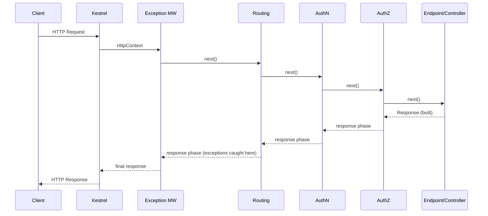
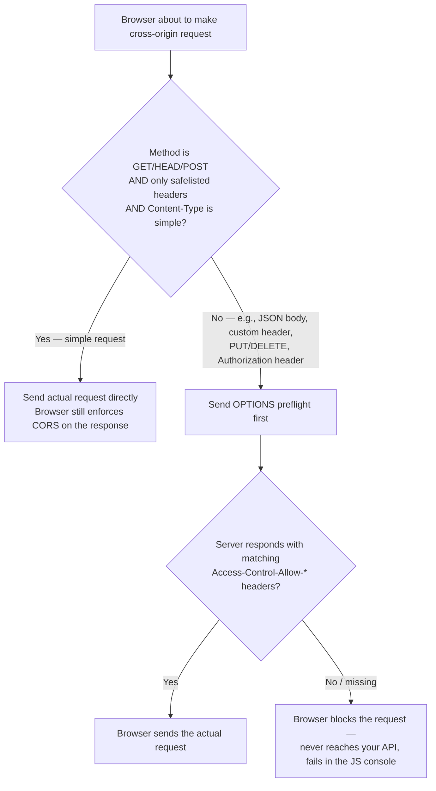
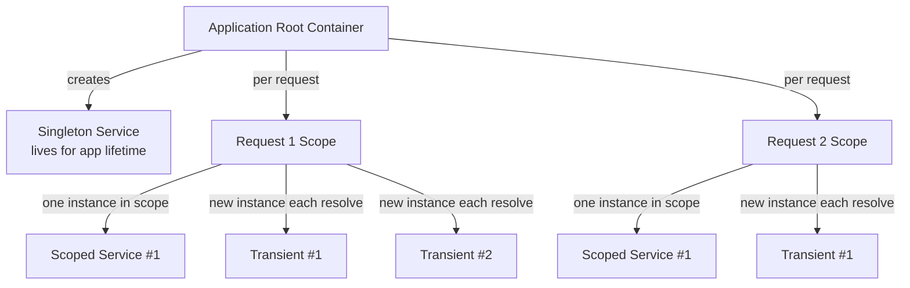
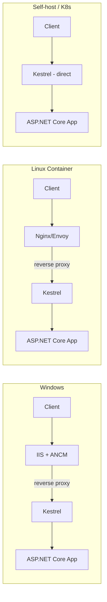

# ASP.NET Core — Interview Revision Notes

> Quick-revision Q&A jo `F. ASP.NET-Core-Interview-Guide.md` se derive kiya gaya hai. Source ke har section ko cover karta hai.

## Core Concepts

### .NET Core vs ASP.NET Core, and vs .NET Framework

**Q: .NET Core aur ASP.NET Core ke beech kya relationship hai?**

A: .NET Core cross-platform, modular runtime hai (CoreCLR). ASP.NET Core uske upar bana hua web framework hai (Web API, MVC, Razor Pages, Blazor, gRPC, SignalR).

**Q: Legacy ASP.NET (.NET Framework) ke comparison mein ASP.NET Core ke key advantages batao.**

A:
- Cross-platform, container-native.
- Unified MVC/Web API pipeline (alag `System.Web.Http`/`System.Web.Mvc` ki zarurat nahi).
- Kestrel + async-first I/O, `HttpModule`/`HttpHandler` se lighter middleware pipeline.
- Built-in DI container.
- Self-contained deployment, side-by-side runtime versioning.

**Q: .NET Framework ab bhi legitimately kab use hota hai?**

A: Jab enterprises legacy WebForms/WCF apps run karte hain jinko port karna bahut costly hai — yeh ek business constraint hai, technical advantage nahi.

**Q: Ek senior-level Framework → Core migration path outline karo.**

A:
1. Upgrade Assistant/API Analyzer use karke dependencies (NuGet, `System.Web`, WCF, WebForms) ka inventory banao.
2. Shared logic ko .NET Standard/multi-targeted libraries mein port karo.
3. HttpModules/Handlers ko middleware se replace karo.
4. WCF ko gRPC/REST se replace karo; `Web.config` ko `appsettings.json` + Options pattern mein move karo.
5. DI ko re-wire karo (Autofac/Ninject ka fate decide karo).
6. Feature flags ke peeche incrementally deploy karo; bade monoliths ke liye **strangler fig pattern** consider karo.

### Project Structure & Hosting Model Evolution

**Q: Pre-.NET 6 hosting model aur .NET 6+ minimal hosting model ke beech kya change hua?**

A: Pre-6 mein: `Startup.ConfigureServices` (DI) aur `Startup.Configure` (middleware) alag-alag methods hote the jinhe generic host invoke karta tha. .NET 6+ mein: `Startup` top-level statements ke through `Program.cs` mein fold ho jaata hai — `WebApplicationBuilder` → services register karo → `Build()` → `app` par pipeline configure karo → `app.Run()`.

```csharp
var builder = WebApplication.CreateBuilder(args);

builder.Services.AddControllers();
builder.Services.AddScoped<IOrderService, OrderService>();

var app = builder.Build();

if (app.Environment.IsDevelopment())
    app.UseDeveloperExceptionPage();

app.UseHttpsRedirection();
app.UseAuthentication();
app.UseAuthorization();
app.MapControllers();

app.Run();
```

**Q: Kya minimal hosting model sirf syntax sugar hai?**

A: Zyada tar haan — `WebApplicationBuilder` ab bhi generic `Host` builder ko wrap karta hai, aur `WebApplication` `IApplicationBuilder`, `IEndpointRouteBuilder`, aur `IHost` implement karta hai. DI, hosting abstractions, aur middleware pipeline unchanged hain; sirf mandatory `Startup` class ki ceremony hat gayi hai.

### Program.cs / Startup.cs / Minimal Hosting Model

**Q: `ConfigureServices`/`builder.Services` aur `Configure`/`app.Use...()` ke beech responsibility ka split kya hai?**

A: `ConfigureServices`/`builder.Services.Add...()` → sirf DI registration, koi middleware nahi. `Configure`/`app.Use...()` → sirf middleware pipeline wiring, jo registration order mein execute hota hai. Concerns ko mix karna (jaise `Configure` ke andar services ko eagerly resolve karna) ek common junior galti hai.

### Environments & Configuration Basics

**Q: Built-in ASP.NET Core environments kya hain aur unhe kaise select kiya jaata hai?**

A: `Development`, `Staging`, `Production` — inhe `ASPNETCORE_ENVIRONMENT` variable ke through select kiya jaata hai.

```csharp
if (app.Environment.IsDevelopment()) { app.UseDeveloperExceptionPage(); }
```

**Q: Configuration provider precedence order kya hai (baad wala pehle wale ko override karta hai)?**

A:
1. `appsettings.json`
2. `appsettings.{Environment}.json`
3. User Secrets (Development only)
4. Environment variables
5. Command-line arguments

Env vars JSON files se upar rehte hain kyunki container orchestrators (Kubernetes/ECS) config ko env vars ke through inject karte hain, jisse ops images rebuild kiye bina override kar paate hain.

**Q: Configuration consume karne ka idiomatic tareeka kya hai?**

A: Raw `IConfiguration` injection ke bajaye Options pattern (`IOptions`/`IOptionsSnapshot`/`IOptionsMonitor`) use karo.

### Static Files & Default Files

**Q: `UseDefaultFiles()` aur `UseStaticFiles()` kya-kya karte hain, aur inhe kis order mein run karna chahiye?**

A: `UseDefaultFiles()` request URL ko ek default document (jaise `index.html`) mein rewrite karta hai lekin file ko khud serve **nahi** karta; isse `UseStaticFiles()` se pehle run karna zaroori hai, jo actually file serve karta hai. `UseFileServer()` dono ko combine karta hai plus directory browsing bhi deta hai.

```csharp
app.UseDefaultFiles();   // must run BEFORE UseStaticFiles
app.UseStaticFiles();
```

Default file names customize karna:

```csharp
var options = new DefaultFilesOptions();
options.DefaultFileNames.Clear();
options.DefaultFileNames.Add("home.html");
app.UseDefaultFiles(options);
```

**Q: Non-`wwwroot` folder se static files kaise serve karte hain?**

A: `UseStaticFiles()` ko custom `FileProvider` (jaise `PhysicalFileProvider`) aur `RequestPath` ke saath `StaticFileOptions` pass karo.

```csharp
app.UseStaticFiles(new StaticFileOptions
{
    FileProvider = new PhysicalFileProvider(
        Path.Combine(Directory.GetCurrentDirectory(), "MyStatic")),
    RequestPath = "/mystatic"
});
```

### Logging Providers & Configuration

**Q: `ILogger<T>` ko single shared logger ke bajaye per-class kyun inject kiya jaata hai?**

A: Generic type parameter log entries ko category name (fully-qualified type name) ke saath tag kar deta hai, jisse per-namespace log-level filtering aur easy source attribution possible hota hai.

```csharp
public class OrdersController : ControllerBase
{
    private readonly ILogger<OrdersController> _logger;
    public OrdersController(ILogger<OrdersController> logger) => _logger = logger;

    [HttpGet("{id}")]
    public IActionResult Get(int id)
    {
        _logger.LogInformation("Fetching order {OrderId}", id);
        // ...
    }
}
```

**Q: Built-in logging providers batao.**

A: Console, Debug, EventSource (ETW-style, `dotnet-trace`/PerfView), EventLog (Windows-only), Azure App Insights, aur third-party adapters (Serilog, NLog).

**Q: Category ke hisaab se hierarchical log-level filtering kaise kaam karta hai?**

A: Ek zyada specific category (jaise `Microsoft.AspNetCore`) us namespace ke andar har chiz ke liye `Default` ko override kar deti hai — noisy framework namespaces `Warning` par pin ho jaate hain jabki app ka apna namespace `Information`/`Debug` par rehta hai.

```json
{
  "Logging": {
    "LogLevel": {
      "Default": "Information",
      "Microsoft": "Warning",
      "Microsoft.Hosting.Lifetime": "Information"
    }
  }
}
```

**Q: Structured/semantic logging (`LogInformation("Fetching order {OrderId}", id)`) string interpolation se zyada kyun matter karta hai?**

A: Named placeholders Serilog/App Insights jaise sinks ke liye queryable structured fields preserve karte hain; `$"Fetching order {id}"` usko ek opaque string mein collapse kar deta hai, jisse field ke hisaab se filter/aggregate karne ki ability chali jaati hai.

### .NET Application Types, Code Sharing & Multi-Targeting

**Q: Kaunse .NET application types same DI/logging/config building blocks share karte hain?**

A: Console apps, class libraries, web apps (MVC/Razor Pages/Web API), worker services (`dotnet new worker`), background services (`IHostedService`/`BackgroundService`), aur ASP.NET Core hosted services (background work jo web app ke apne DI/lifetime ko share karta hai).

**Q: Projects ke beech code-sharing mechanisms kya hain, roughly "packaging" level ke hisaab se?**

A: Project reference (same solution) → class library (general-purpose sharing unit) → shared project (legacy, source har consumer ke liye compile hota hai, zyada tar superseded) → NuGet package (cross-repo/cross-team, independently versioned).

**Q: Ek project ko kab multi-target karna chahiye, aur uska cost kya hai?**

A: Isko un NuGet libraries ke liye use karo jo multiple LTS releases support karti hain, cross-SDK tooling ke liye, ya migration window bridge karne ke liye. Cost: `#if NET8_0_OR_GREATER`-style conditional compilation maintenance burden badha deta hai — multi-targeting ko reusable libraries ke liye reserve karo, application projects ke liye nahi.

```xml
<PropertyGroup>
  <TargetFrameworks>net6.0;net8.0</TargetFrameworks>
</PropertyGroup>
```

---

## Middleware Pipeline (Deep Dive)

### What Middleware Really Is

**Q: Middleware ko runtime par "nested" kyun describe kiya jaata hai, linear nahi?**

A: Middleware `RequestDelegate`s ki ek chain hai jo *registration* time par sequentially execute hoti hai lekin runtime par nested hoti hai (har ek apne baad wali sabhi chizon ko wrap karta hai) — isi se explain hota hai ki registration order kyun matter karta hai, `await next()` ke relative code placement kyun matter karta hai (pehle = request phase, baad mein = response phase), aur responses same chain se backward kyun flow karte hain.

```
Middleware A
 └── Middleware B
      └── Middleware C
           └── Endpoint
```

### Request/Response Flow

**Q: Middleware pipeline ke through request/response flow walk through karo.**

A:
- Request: Kestrel `HttpContext` create karta hai → pipeline registration order mein run hota hai → har middleware ka "before" logic run hota hai, phir `next()` call hota hai → endpoint execute hota hai.
- Response: endpoint response produce karta hai → execution same stack se reverse mein unwind hota hai → har middleware ka "after `next()`" code run hota hai → final response bheja jaata hai.



**Q: Exception-handling middleware ko sabse outermost kyun rehna chahiye?**

A: Conceptually, har middleware ek request ke liye do baar execute hota hai (in aur out); ek middleware sirf uske baad register hui chizon ke exceptions catch kar sakta hai, isliye exception handling ko sabse pehle/outermost hona chahiye taaki downstream sab kuch protect ho.

### Built-in Middleware Deep Dive

**Q: Exception Handling middleware kya karta hai, aur `/error` redirect pattern ka .NET 8+ alternative kya hai?**

A: Yeh downstream middleware se unhandled exceptions catch karta hai aur unhe HTTP responses mein convert kar deta hai; isko sabse pehle register karna zaroori hai. .NET 8 ne `IExceptionHandler` introduce kiya — ek DI-friendly, testable interface (`TryHandleAsync`) jo `AddExceptionHandler<T>()` + `AddProblemDetails()` + `app.UseExceptionHandler()` ke through register hota hai.

```csharp
if (app.Environment.IsDevelopment())
    app.UseDeveloperExceptionPage();
else
    app.UseExceptionHandler("/error");   // or the IExceptionHandler-based approach, .NET 8+
```

```csharp
public class GlobalExceptionHandler : IExceptionHandler
{
    public async ValueTask<bool> TryHandleAsync(HttpContext httpContext, Exception exception, CancellationToken ct)
    {
        httpContext.Response.StatusCode = StatusCodes.Status500InternalServerError;
        await httpContext.Response.WriteAsJsonAsync(new { error = "An unexpected error occurred." }, ct);
        return true; // true = handled, short-circuits further processing
    }
}

// Program.cs
builder.Services.AddExceptionHandler<GlobalExceptionHandler>();
builder.Services.AddProblemDetails();
app.UseExceptionHandler();
```

**Q: Routing middleware actually kya karta hai, aur kya nahi karta?**

A: Yeh URL ko endpoint ke metadata se match karta hai aur route data build karta hai — yeh endpoint ko execute **nahi** karta. Downstream middleware (jaise Authorization) us metadata par depend karta hai.

**Q: Kya Authentication middleware unauthenticated requests ko block karta hai?**

A: Nahi — yeh sirf caller ko identify karta hai (`ClaimsPrincipal` build karta hai, `HttpContext.User` set karta hai). Anonymous requests phir bhi pass through ho jaati hain; Authorization decide karta hai ki identity sufficient hai ya nahi.

**Q: Authorization middleware kis par depend karta hai, aur kyun?**

A: Isko Routing (endpoint metadata/`[Authorize]`) aur Authentication (user identity) pehle se run hui chahiye — `UseAuthorization()` bina pehle `UseRouting()` chalaye ya toh throw kar deta hai ya kuch useful nahi karta.

### Custom Middleware

**Q: Custom middleware register karne ke do tareeke kya hain, aur har ek kab use karte hain?**

A: Simple, one-off logic ke liye `app.Use(async (context, next) => ...)` ke through inline lambda; reusable, testable, DI-friendly logic ke liye `app.UseMiddleware<T>()` ke through register hone wala class-based (`IMiddleware`/constructor + `InvokeAsync`).

```csharp
// 1. Inline (lambda) middleware — good for simple, one-off logic
app.Use(async (context, next) =>
{
    context.Items["CorrelationId"] = Guid.NewGuid().ToString();
    await next();
});

// 2. Class-based middleware — good for reusable, testable, DI-friendly logic
public class CorrelationIdMiddleware
{
    private readonly RequestDelegate _next;
    public CorrelationIdMiddleware(RequestDelegate next) => _next = next;

    public async Task InvokeAsync(HttpContext context)
    {
        context.Items["CorrelationId"] = Guid.NewGuid().ToString();
        await _next(context);
    }
}
// Registration:
app.UseMiddleware<CorrelationIdMiddleware>();
```

**Q: Class-based middleware ke liye DI lifetime ka nuance kya hai?**

A: Middleware class pipeline build ke hisaab se sirf ek baar construct hoti hai (singleton-like), isliye constructor dependencies singleton-safe honi chahiye; `InvokeAsync` phir bhi scoped services ko method parameters ke roop mein accept kar sakta hai, jo method injection ke through per-request inject hote hain.

**Q: Middleware vs services mein kya belong karta hai?**

A: Good: logging, correlation IDs, tenant resolution, header validation, rate limiting, security headers. Bad: business logic, direct DB access, domain workflows, heavy computation.

### Use vs Run vs Map vs MapWhen

**Q: `app.Use`, `app.Run`, `app.Map`, aur `app.MapWhen` mein differentiate karo.**

A:
- `Use` — pipeline ko continue karta hai, `next()` ke through before/after support karta hai.
- `Run` — terminal hai, `next()` parameter bilkul nahi hota.
- `Map(pattern, ...)` — URL path prefix ke hisaab se ek isolated sub-pipeline mein branch karta hai.
- `MapWhen(predicate, ...)` — `HttpContext` par kisi arbitrary predicate ke hisaab se branch karta hai.

`Map`/`MapWhen` se banaye gaye branches automatically main pipeline mein rejoin nahi hote.

### Short-Circuiting

**Q: Short-circuiting kya hai, aur yeh ek bug hai kya?**

A: Middleware ek response likhta hai aur deliberately `next()` call karna skip kar deta hai, jisse pipeline stop ho jaata hai. Yeh intentional design hai (auth failures, rate limiting, feature toggles, maintenance mode) — halaanki upstream ek accidental short-circuit ek classic "mera middleware kyun nahi chala" bug hota hai.

```csharp
if (!authorized)
{
    context.Response.StatusCode = 401;
    return;   // pipeline stops here — downstream middleware and the endpoint never run
}
```

### Correct Middleware Ordering

**Q: Exception handling, HTTPS redirection, static files, routing, CORS, authN, authZ, compression, aur endpoint mapping ka correct order batao — aur kyun.**

A:
1. Exception handler — sab kuch wrap karta hai, sabse outermost hona chahiye.
2. HTTPS redirection, static files.
3. Routing — endpoint + metadata identify karta hai.
4. CORS — routing ke baad (endpoint-specific policy chahiye), authN/authZ se pehle (preflight mein koi auth nahi hota).
5. Authentication — user ko identify karta hai.
6. Authorization — routing metadata + identity use karke access enforce karta hai.
7. Response compression.
8. `MapControllers()`/endpoint execution — business logic.

```csharp
app.UseExceptionHandler("/error");   // 1. Wraps everything — must be outermost
app.UseHttpsRedirection();
app.UseStaticFiles();
app.UseRouting();                    // 2. Identifies the endpoint
app.UseCors();                       // 3. Must be after Routing, before AuthN/AuthZ
app.UseAuthentication();             // 4. Identifies the user
app.UseAuthorization();              // 5. Enforces access, needs routing + authn
app.UseResponseCompression();
app.MapControllers();                // 6. Executes business logic
app.Run();
```

### Endpoint Routing Internals

**Q: Endpoint Routing (ASP.NET Core 3.0+) ne kya decouple kiya, aur yeh kyun matter karta hai?**

A: Isne route *matching* ko route *execution* se decouple kar diya: `UseRouting()` request ko ek `Endpoint` se match karta hai (jo `HttpContext.GetEndpoint()` ke through store hota hai); `UseEndpoints()`/`MapControllers()`/`MapGet()` usko execute karte hain. Isse routing aur execution ke beech ka middleware (jaise `UseAuthorization()`) `context.GetEndpoint()?.Metadata` ke through endpoint metadata (`[Authorize]`, CORS policy names, rate-limiter policy names) inspect kar sakta hai.

**Q: Endpoint Routing MVC, Minimal APIs, gRPC, SignalR, aur Blazor ko kaise unify karta hai?**

A: Yeh sab apne `Endpoint`s ko same `EndpointDataSource` mein register karte hain, isliye ek hi routing/authorization/CORS pipeline sabko govern karti hai, iske bajaye ki har framework ka apna routing stack ho (jaise pre-3.0 mein tha, jahan MVC routing sirf MVC middleware ke andar hoti thi).

**Q: Endpoint Routing kaisa route matcher use karta hai, aur `UseRouting()` skip karne ka gotcha kya hai?**

A: Ek tree-based (DFA-like) matcher, jo old linear `IRouter` scan se better scale karta hai. Agar `MapControllers()`/`MapGet()` ko `UseRouting()` chalaye bina call kiya jaaye, toh upstream middleware ke paas routing metadata nahi hota, jiske karan inconsistent 404s ya bypassed authorization ho jaata hai.

### Middleware vs Filters

**Q: Middleware aur MVC filters compare karo.**

A: Middleware har request ke liye run hota hai, uske paas koi MVC-specific context nahi hota, aur yeh whole pipeline ko short-circuit kar sakta hai. Filters sirf MVC/endpoint-bound requests ke liye run hote hain, unke paas `ActionExecutingContext`/action arguments/results/exceptions ka access hota hai, aur yeh sirf MVC action pipeline ke andar hi short-circuit kar sakte hain.

**Q: Filter types ko execution order mein list karo.**

A: Authorization filters → Resource filters → Action filters → Exception filters → Result filters (har ek ka executing/executed pair hota hai). Jaise, ek global model-validation short-circuit resource/action filter mein belong karta hai, middleware mein nahi, kyunki isko bound model chahiye hota hai.

### IStartupFilter — Composing the Middleware Pipeline from a Library

**Q: Ek reusable library apne middleware ko consuming app ke pipeline mein ek specific position par kaise inject karti hai, bina app ke `Program.cs` edit kiye?**

A: `IStartupFilter.Configure(Action<IApplicationBuilder> next)` implement karo, jo ek delegate return karta hai jo `next(app)` ko invoke karne se pehle ya baad mein `app.UseMiddleware<T>()` call karta hai, phir isko library ke apne `AddXyzModule()` extension method ke andar `services.AddTransient<IStartupFilter, MyFilter>()` ke through register karo.

```csharp
public class CorrelationIdStartupFilter : IStartupFilter
{
    public Action<IApplicationBuilder> Configure(Action<IApplicationBuilder> next)
    {
        return app =>
        {
            // Runs BEFORE the app's own Configure/pipeline — i.e., outermost,
            // wrapping everything the consuming app registers.
            app.UseMiddleware<CorrelationIdMiddleware>();

            next(app);   // hands control to the next filter, then eventually the app's own pipeline
        };
    }
}

// Library's registration extension method — this is all a consumer has to call:
public static IServiceCollection AddCorrelationIdModule(this IServiceCollection services)
{
    services.AddTransient<IStartupFilter, CorrelationIdStartupFilter>();
    return services;
}
```

**Q: ASP.NET Core multiple `IStartupFilter`s ko kaise compose karta hai, aur `next(app)` ke relative call order final middleware position ko kaise affect karta hai?**

A: Saare registered `IStartupFilter`s resolve hote hain aur app ke apne `Configure` pipeline ke around nested decorators jaise compose hote hain. `next(app)` se **pehle** `app.Use...()` call karna us middleware ko **earlier/more outer** rakh deta hai; `next(app)` ke **baad** call karna use **later/more inner** rakh deta hai, endpoint ke zyada kareeb.

**Q: `IStartupFilter` use karne ka trade-off kya hai?**

A: Yeh consumers ke middleware call bhoolne/order galat karne ka footgun hata deta hai, aur pipeline wiring ko implementation detail ki tarah hide kar deta hai — lekin kyunki yeh `Program.cs` mein invisible hota hai, effective pipeline order ke baare mein reason karna harder ho jaata hai. Isko genuinely reusable cross-app modules ke liye use karo, apni single app mein ek explicit call avoid karne ke liye nahi.

### CORS Preflight Mechanics — What Actually Triggers an OPTIONS Request

**Q: Kis conditions mein ek cross-origin request "simple request" hoti hai jo preflight skip kar deti hai?**

A: Sab kuch true hona chahiye: method sirf `GET`/`HEAD`/`POST` hai; sirf CORS-safelisted headers (`Accept`, `Accept-Language`, `Content-Language`, restricted `Content-Type`) hain; `Content-Type` `application/x-www-form-urlencoded`, `multipart/form-data`, `text/plain` mein se ek hai (`application/json` simple **nahi** hai); koi `ReadableStream`/upload progress listeners nahi hain. Koi bhi violation ek preflight `OPTIONS` request force kar deta hai.



**Q: Almost har modern browser-originated API call preflighted kyun ho jaati hai?**

A: Kyunki virtually saara real API traffic `Content-Type: application/json` aur/ya `Authorization` header use karta hai, dono hi "simple request" path ko disqualify kar dete hain — yeh normal hai, misconfiguration nahi.

**Q: CORS middleware ko `UseRouting()` ke baad lekin `UseAuthentication()`/`UseAuthorization()` se pehle kyun rehna chahiye?**

A: Preflight `OPTIONS` request spec ke hisaab se koi `Authorization` header/credentials carry nahi karti, isliye CORS middleware ko isko answer karna zaroori hai (`204` ke saath short-circuited) us se pehle ki auth middleware isko unauthenticated samajh kar reject kar de.

**Q: Preflight round trips kaise reduce kiye ja sakte hain, aur kya CORS server-to-server calls par apply hota hai?**

A: `Access-Control-Max-Age` browser ko preflight response cache karne deta hai, jisse har request ke liye duplicate round trip avoid ho jaata hai. CORS/preflight sirf ek browser-enforced mechanism hai — curl, Postman, aur other backend services kabhi preflight nahi bhejte aur unaffected rehte hain.

---

## Dependency Injection

**Q: ASP.NET Core mein built-in kaunsa DI container ship hota hai, aur third-party wala kab plug in karoge?**

A: `IServiceCollection`/`IServiceProvider` — minimal but complete. Third-party containers (Autofac, Lamar) `IServiceProviderFactory<T>` ke through property injection, decorators, ya assembly-scanning conventions add karte hain (Scrutor zyada tar needs ke liye built-in container mein scanning add kar deta hai).

```csharp
builder.Services.AddSingleton<ICacheService, MemoryCacheService>();
builder.Services.AddScoped<IOrderRepository, OrderRepository>();
builder.Services.AddTransient<IEmailSender, SmtpEmailSender>();
```

Constructor injection default aur preferred mechanism hai:

```csharp
public class OrdersController : ControllerBase
{
    private readonly IOrderRepository _repo;
    public OrdersController(IOrderRepository repo) => _repo = repo;
}
```

### Service Lifetimes

**Q: Teen DI lifetimes aur typical use cases describe karo.**

A:
- Transient — har resolution par new instance; lightweight stateless services.
- Scoped — har HTTP request/DI scope ke liye one instance; `DbContext`, unit-of-work.
- Singleton — app lifetime ke liye one instance; configuration objects, in-memory caches.



### Captive Dependencies & Lifetime Mismatch Bugs

**Q: Captive dependency kya hoti hai?**

A: Ek shorter-lived service ko ek longer-lived service mein inject karna, jisse shorter-lived instance capture ho jaata hai aur intended se zyada time tak live karta hai — classic example: ek Singleton jo constructor mein Scoped `DbContext` inject kar leta hai, jo phir hamesha ke liye live karta hai aur concurrently use hota hai (unsafe, kyunki `DbContext` thread-safe nahi hai).

```csharp
// BAD: Singleton captures a Scoped DbContext
public class BadCacheWarmer   // registered as Singleton
{
    private readonly AppDbContext _db;   // Scoped — captured at construction time!
    public BadCacheWarmer(AppDbContext db) => _db = db;
    // _db now lives forever, using the connection/state from whichever
    // request scope happened to construct this singleton first. Later requests
    // see stale/disposed state, and concurrent use of a captured DbContext
    // (which is NOT thread-safe) causes intermittent, hard-to-reproduce exceptions.
}
```

**Q: Container isse kaise guard karta hai, aur Dev/Prod gotcha kya hai?**

A: `ValidateScopes = true` ke saath (`CreateBuilder` ke through Development mein default), container startup par throw kar deta hai: `Cannot consume scoped service ... from singleton`. Yeh validation performance ke liye **Production mein default off** rehti hai, isliye yeh bug silently ship ho sakta hai jab tak aap explicitly saare environments ke liye enable na karo.

**Q: Captive dependency ko kaise fix karte hain?**

A: Singleton mein `IServiceScopeFactory` inject karo aur har operation ke liye ek scope create karo, ya `DbContext` ko directly long-lived services mein inject karne ke bajaye EF Core ka `IDbContextFactory<T>` use karo.

```csharp
public class CacheWarmer
{
    private readonly IServiceScopeFactory _scopeFactory;
    public CacheWarmer(IServiceScopeFactory scopeFactory) => _scopeFactory = scopeFactory;

    public async Task WarmAsync()
    {
        using var scope = _scopeFactory.CreateScope();
        var db = scope.ServiceProvider.GetRequiredService<AppDbContext>();
        // use db, then let the scope dispose it
    }
}
```

**Q: Kya inverse (Scoped/Transient ka Singleton inject karna) problem hai?**

A: Nahi — yeh safe aur common hai (jaise `IMemoryCache`/`IConfiguration` ko ek scoped repository mein inject karna) kyunki singleton simply consumer se zyada time tak outlive kar leta hai. `IHttpContextAccessor` khud ek singleton hai jo `AsyncLocal<T>` ke through per-request `HttpContext` ko safely expose karta hai.

### IOptions vs IOptionsSnapshot vs IOptionsMonitor

**Q: `IOptions<T>`, `IOptionsSnapshot<T>`, aur `IOptionsMonitor<T>` compare karo.**

A:
- `IOptions<T>` — Singleton, ek baar computed hota hai, kabhi reload nahi hota. Wo config jo runtime par kabhi change nahi hoti.
- `IOptionsSnapshot<T>` — Scoped, har scope/request ke liye ek baar recompute hota hai. Scoped/Transient services mein per-request-fresh config ke liye.
- `IOptionsMonitor<T>` — Singleton, `OnChange` callback + `.CurrentValue` ke saath changes ke liye actively watch karta hai. Long-lived singletons/background services jinhe live updates chahiye.

```csharp
public class SmtpOptions
{
    public string Host { get; set; } = string.Empty;
    public int Port { get; set; }
}

builder.Services.Configure<SmtpOptions>(builder.Configuration.GetSection("Smtp"));
```

**Q: `IOptionsSnapshot<T>` ko Singleton mein kyun inject nahi kar sakte?**

A: Yeh Scoped register hota hai — ek Singleton jo isko capture karta hai wahi captive-dependency problem hai; scope validation enabled hone par container startup par throw kar deta hai. Iske bajaye `IOptionsMonitor` use karo.

```csharp
public class EmailSender
{
    private readonly IOptionsMonitor<SmtpOptions> _options;
    public EmailSender(IOptionsMonitor<SmtpOptions> options)
    {
        _options = options;
        _options.OnChange(updated => Console.WriteLine($"SMTP host changed to {updated.Host}"));
    }
    public SmtpOptions Current => _options.CurrentValue;
}
```

**Q: Named options kis liye use hote hain?**

A: `Configure<T>(name, ...)` + `IOptionsSnapshot<T>.Get(name)` — multi-tenant ya multi-provider scenarios ke liye useful hai (jaise multiple payment gateway configs).

### Detecting & Fixing Cyclic Dependencies

**Q: ASP.NET Core circular constructor dependencies ko kaise detect karta hai, aur inhe kaise fix karte hain?**

A: Container resolution time par `InvalidOperationException: A circular dependency was detected...` throw kar deta hai. Fixes: ek side ke liye concrete class ke bajaye ek interface introduce karo jis par woh depend kare; resolution ko defer karne ke liye ek factory (`Func<T>` ya dedicated factory) use karo; ya do services ko merge karke ya ek shared collaborator extract karke coupling reduce karo.

```
System.InvalidOperationException: A circular dependency was detected for the service of type 'X'.
```

---

## Minimal APIs, MVC & API Design

### Minimal APIs vs Controller-based MVC — Full Comparison

**Q: Minimal APIs aur controller-based MVC ko boilerplate, AOT, filters, validation, aur views ke across compare karo.**

A:

| Aspect | Minimal APIs | MVC |
|---|---|---|
| Boilerplate | Kuch bhi required nahi | `ControllerBase` + attributes |
| AOT/startup | Faster, first-class Native AOT | Heavier reflection-based binding |
| Filters | `IEndpointFilter` (.NET 7+) | Full filter pipeline |
| Validation | Manual/endpoint filters, auto-400 nahi hota | `[ApiController]` ke through automatic |
| Views | Applicable nahi | Full Razor support |

```csharp
// Minimal API
var app = builder.Build();
app.MapGet("/orders/{id:int}", async (int id, IOrderService svc) =>
{
    var order = await svc.GetAsync(id);
    return order is not null ? Results.Ok(order) : Results.NotFound();
})
.WithName("GetOrder")
.Produces<OrderDto>(200)
.Produces(404);
```

```csharp
// Controller-based MVC
[ApiController]
[Route("orders")]
public class OrdersController : ControllerBase
{
    private readonly IOrderService _svc;
    public OrdersController(IOrderService svc) => _svc = svc;

    [HttpGet("{id:int}")]
    [ProducesResponseType(typeof(OrderDto), 200)]
    [ProducesResponseType(404)]
    public async Task<IActionResult> Get(int id)
    {
        var order = await _svc.GetAsync(id);
        return order is not null ? Ok(order) : NotFound();
    }
}
```

**Q: Kya ek app mein Minimal APIs aur MVC mutually exclusive hote hain?**

A: Nahi — `MapControllers()` aur `MapGet()`/route groups coexist kar sakte hain. Decision driver team convention hai aur yeh ki tumhe filters/views chahiye ya nahi, raw performance nahi; perf gap zyada tar cold-start/AOT par hota hai, steady-state throughput par nahi.

### REST API vs MVC App

**Q: Ek Web API/Minimal API app ek MVC web app se kaise differ karta hai?**

A: MVC apps Razor Views (HTML) render karte hain, commonly conventional routing use karte hain; Web APIs attribute ya minimal-API route mapping ke through JSON/XML return karte hain, aur typically ek SPA ke backend ki tarah act karte hain.

### Angular/React SPA Integration

**Q: Ek ASP.NET Core backend ko Angular/React SPA ke saath pair karne ke do hosting models kya hain?**

A: Separate deployments (SPA apne static host/CDN par, jo CORS ke through API ko cross-origin call karta hai — modern default) vs merged/hosted project (SPA build output app ke apne `wwwroot` se `UseSpa`/`UseSpaStaticFiles` ke through serve hota hai — historical template approach, ab zyada tar out of favor).

**Q: Merged-hosting model ke liye kya configure karna zaroori hai, aur CORS kahan fit hota hai?**

A: Dev mein `UseSpa(spa => spa.UseAngularCliServer(...))` (jo CLI dev server ko proxy karta hai), production mein `UseSpaStaticFiles()`. CORS tab zaroori hota hai jab SPA aur API different origins par hon, aur yeh `UseRouting()` ke baad aur AuthN/AuthZ se pehle position hota hai.

```csharp
if (app.Environment.IsDevelopment())
{
    app.UseSpa(spa =>
    {
        spa.Options.SourcePath = "ClientApp";
        spa.UseAngularCliServer(npmScript: "start");   // proxies to the Angular CLI dev server
        // Equivalent for React/CRA: spa.UseReactDevelopmentServer(npmScript: "start");
    });
}
else
{
    app.UseSpaStaticFiles();   // serves the pre-built SPA output from wwwroot in production
}
```

### API Versioning Strategies

**Q: Char API versioning strategies aur unke trade-offs batao.**

A:
- URL versioning (`/api/v1/orders`) — explicit, cache-friendly, lekin URL ko pollute karta hai.
- Query string (`?api-version=1.0`) — easy default, omit karna aasan hai.
- Header (`X-Api-Version`) — clean URLs, test/debug karna harder hai.
- Media type/Accept header (`Accept: application/json;v=1.0`) — HTTP semantics ke hisaab se most "correct", least discoverable.

```csharp
builder.Services.AddApiVersioning(options =>
{
    options.DefaultApiVersion = new ApiVersion(1, 0);
    options.AssumeDefaultVersionWhenUnspecified = true;
    options.ReportApiVersions = true;
}).AddApiExplorer(options =>
{
    options.GroupNameFormat = "'v'VVV";
});
```

**Q: Versioned APIs ke liye breaking-change discipline kya hai?**

A: Kabhi bhi existing contract ko mutate mat karo; ek new version add karo, ek documented deprecation window ke liye dono support karo, aur `ReportApiVersions`/`Deprecated` metadata aur changelogs ke through communicate karo — kabhi bhi silent removal mat karo.

### DTOs, Validation & FluentValidation

**Q: API se EF entities directly kabhi kyun return nahi karni chahiye?**

A: Yeh over-posting/mass-assignment vulnerabilities ko prevent karta hai, wire contract ko persistence model se decouple karta hai, internal/navigation structure ko hide karta hai (lazy-loading serialization loops avoid karta hai), aur payload shaping/computed fields allow karta hai.

**Q: FluentValidation ko MVC vs Minimal APIs mein kaise wire kiya jaata hai?**

A: MVC: `AddFluentValidationAutoValidation()` `[ApiController]` controllers ke liye MVC filter pipeline mein hook karta hai, failure par auto 400 trigger kar deta hai. Minimal APIs: koi automatic equivalent nahi hai — tumhe validator ko explicitly handler mein ya ek custom `IEndpointFilter` ke through invoke karna padta hai.

```csharp
public class UserDto
{
    public string Name { get; set; } = string.Empty;
    public string Email { get; set; } = string.Empty;
    public int Age { get; set; }
}

public class UserValidator : AbstractValidator<UserDto>
{
    public UserValidator()
    {
        RuleFor(x => x.Name).NotEmpty().MinimumLength(3);
        RuleFor(x => x.Email).NotEmpty().EmailAddress();
        RuleFor(x => x.Age).InclusiveBetween(18, 60)
            .WithMessage("User must be an adult, and under 60.");
    }
}
```

```csharp
// dotnet add package FluentValidation.AspNetCore
builder.Services.AddControllers();
builder.Services.AddFluentValidationAutoValidation();
builder.Services.AddValidatorsFromAssemblyContaining<UserValidator>();
```

```csharp
[ApiController]
[Route("api/users")]
public class UsersController : ControllerBase
{
    [HttpPost]
    public IActionResult Create(UserDto user) => Ok(user);   // auto-validated; invalid input -> 400
}
```

Example failure response shape (`[ApiController]` ke automatic `ValidationProblemDetails` se):

```json
{
  "errors": {
    "Name": ["'Name' must not be empty."],
    "Email": ["'Email' is not a valid email address."],
    "Age": ["'Age' must be between 18 and 60."]
  }
}
```

Custom rules:

```csharp
RuleFor(x => x.Age).Must(age => age >= 18).WithMessage("User must be an adult");
```

**Q: Application/DTO validation ko domain validation se distinguish karo.**

A: DTO validation incoming data ke shape/format ko check karta hai (valid email, age range mein). Domain validation domain model ke andar entity invariants ko protect karta hai (jaise, ek `Order` `Cancelled` se `Shipped` mein nahi ja sakta). DTO validation pass hone ka matlab yeh nahi ki domain operation valid hai.

### CQRS, Mediator Pattern & MediatR

**Q: CQRS kya separate karta hai, aur uske benefits kya hain?**

A: Commands (writes, state-changing) ko queries (reads, side-effect-free) se separate karta hai. Benefits: independent read/write optimization, chhote single-responsibility handlers, aur (MediatR ke saath) generic pipeline behaviors (logging/validation/transactions jo har handler ke around wrap hote hain).

```csharp
public record GetOrderQuery(int Id) : IRequest<OrderDto>;

public class GetOrderQueryHandler : IRequestHandler<GetOrderQuery, OrderDto>
{
    private readonly IOrderRepository _repo;
    public GetOrderQueryHandler(IOrderRepository repo) => _repo = repo;
    public async Task<OrderDto> Handle(GetOrderQuery request, CancellationToken ct)
        => (await _repo.GetAsync(request.Id, ct)).ToDto();
}
```

**Q: Mediator/CQRS ka istemal kab karna chahiye, aur uska trade-off kya hai?**

A: Jab controllers complex business rules se fat ho rahe hon, ya jab generic cross-cutting pipeline behaviors chahiye hon. Trade-off: indirection add hoti hai — CRUD-simple services ke liye over-engineering ho jaati hai.

### DDD in ASP.NET Core

**Q: Core DDD building blocks batao.**

A: Entities (identity-based equality), Value Objects (immutable, structural equality), Aggregates/Aggregate Roots (consistency boundary — saare writes root ke through hote hain), Domain Events, Repositories (per-aggregate persistence abstraction), Bounded Contexts (explicit model boundaries, jo often microservices se map hote hain).

### Clean Architecture / Folder Structure at Scale

**Q: Typical Clean Architecture layer structure aur dependency rule describe karo.**

A: `Api` (controllers/composition root) → `Application` (CQRS handlers, validators, DTOs) → `Domain` (entities, value objects, domain interfaces) → `Infrastructure` (EF Core, external clients, repositories). Dependency rule: dependencies inward point karti hain — `Domain` ki koi outward dependency nahi hoti; `Infrastructure` `Domain`/`Application` ke owned interfaces implement karta hai (Dependency Inversion).

```
src/
  Api/              -> Controllers/Minimal API endpoints, DI wiring, composition root
  Application/      -> CQRS handlers, validators, DTOs, use-case orchestration
  Domain/            -> Entities, Value Objects, domain interfaces, domain events
  Infrastructure/    -> EF Core, external service clients, messaging, repositories
tests/
  UnitTests/
  IntegrationTests/
```

### Multi-Tenant Applications

**Q: Tenant resolution kaise aur kahan hona chahiye?**

A: Header, subdomain, ya token claims ke through — ek dedicated middleware mein, early, **authentication se pehle** (kyunki auth ko tenant-specific issuer/authority chahiye ho sakta hai).

**Q: Tenant context kaise propagate hota hai aur data access mein kaise use hota hai?**

A: Yeh us middleware se populate hone wale ek scoped `ITenantContext` mein store hota hai, jise data access queries ko scope karne ke liye consume karta hai — jaise ek EF Core global query filter `HasQueryFilter(x => x.TenantId == _tenantContext.TenantId)`, plus per-tenant configuration/caching (named `IOptionsSnapshot`, tenant-keyed cache entries).

### API Anti-Patterns

**Q: Common API anti-patterns list karo.**

A:
- Business logic ke saath fat controllers.
- EF entities ko directly return karna.
- Din 1 se koi versioning strategy na hona.
- Trivial pass-through data ke liye excessive DTOs.
- Collection endpoints par koi pagination na hona.
- Retry-heavy clients ke under POST/PUT par idempotency ignore karna.

### Plugin Architecture (Dynamic Assembly Loading)

**Q: Ek reflection-based plugin architecture plugins ko kaise discover aur load karta hai?**

A: DLLs ke liye ek plugins folder scan karo, har assembly ko load karo, ek shared `IPlugin` interface implement karne wale types ke liye reflect karo, phir `Activator.CreateInstance` ya DI ke through instantiate karo.

```csharp
public interface IPlugin
{
    string Name { get; }
    void Execute(IServiceProvider services);
}
```

**Q: Plugin loading ke liye `AppDomain`-based isolation ki jagah kya aaya, aur yeh kya enable karta hai?**

A: `AssemblyLoadContext` — plugin assemblies ko ek isolated context mein load karta hai taaki unhe load (aur principle mein unload) kiya ja sake bina host ki apni assemblies ko pollute/version-conflict kiye.

**Q: Scrutor kya add karta hai, aur plugin architecture Native AOT ke saath incompatible kyun hai?**

A: Scrutor discovered plugins ko auto-register karne ke liye assembly-scanning DI registration conventions (`services.Scan(...)`) add karta hai. AOT incompatible hai kyunki dynamic assembly loading runtime reflection aur compile time par unknown assemblies par depend karta hai.

```csharp
services.Scan(scan => scan
    .FromAssemblies(pluginAssemblies)
    .AddClasses(c => c.AssignableTo<IPlugin>())
    .AsImplementedInterfaces()
    .WithScopedLifetime());
```


### WebHooks (Outbound Event Callbacks)

**Q: WebHook kya hai, aur ek production-grade sender ko kya chahiye?**

A: Polling ka inverse — tumhara server proactively ek event par client-registered callback URL par `POST` karta hai. Chahiye: signed payloads (HMAC-SHA256 + secret, header mein bheja jaata hai), exponential backoff ke saath retry + persisted delivery attempts (outbox-style), timestamp validation (replay se defend karta hai), aur delivery logging/observability.

**Q: WebHooks message broker se kaise differ karte hain?**

A: WebHooks external, third-party consumers ko plain HTTP par target karte hain jahan koi shared infrastructure nahi hoti; ek broker (Kafka/RabbitMQ/SQS) internal services ko target karta hai jo infrastructure share karte hain.

---

## Hosting & Infrastructure

### Kestrel, IIS, HTTP.sys & Reverse Proxy Models

**Q: Kestrel, IIS, HTTP.sys, aur self-hosting/containers compare karo.**

A:
- Kestrel — default cross-platform server; production mein reverse-proxy karna ab hard limitation se zyada defense-in-depth/TLS-convenience ke liye hota hai.
- IIS — Windows-only, ANCM ke through Kestrel ko proxy karta hai, ya IIS worker process ke andar in-process hosting (in-process hi IIS-hosted apps ke liye default hai).
- HTTP.sys — Kestrel ka Windows-only kernel-mode self-hosting alternative (uske aage koi proxy nahi hota) — native Windows Auth ya kernel-level port sharing ke liye use hota hai.
- Self-host/containers — `dotnet run`/container `ENTRYPOINT` jo Kestrel ko directly run karta hai; Linux/K8s ke liye standard hai.

**Q: In-process vs out-of-process IIS hosting mein distinguish karo.**

A: In-process — app IIS worker process (`w3wp.exe`) ke andar chalta hai, koi loopback hop nahi hota, faster hai, aaj default hai. Out-of-process — IIS ek separate Kestrel process ko proxy karta hai, zyada overhead hota hai lekin IIS se process isolation milta hai.



### Native AOT Compilation

**Q: Native AOT kya hai aur ASP.NET Core ke liye yeh kyun matter karta hai?**

A: App ko directly ahead of time native machine code mein compile kar deta hai (JIT nahi), jisse ek self-contained executable banta hai jisme koi .NET runtime dependency nahi hoti. Dramatically faster cold start aur kam memory — serverless, scale-to-zero containers, aur high-density multi-tenant hosting ke liye key hai.

**Q: AOT ke constraints kya hain?**

A: Koi runtime reflection-heavy features nahi (classic MVC, zyada tar EF Core, reflection-based DI scanning restrict ho jaate hain); koi dynamic assembly loading/plugins nahi; trimming non-trim-safe libraries ko break kar sakta hai. Minimal APIs + source-generated JSON primary supported path hai. `<PublishAot>true</PublishAot>` ke through enable karo.

```xml
<PropertyGroup>
  <PublishAot>true</PublishAot>
</PropertyGroup>
```

### Deployment Models (Framework-Dependent vs Self-Contained)

**Q: Framework-dependent, self-contained, aur ReadyToRun deployment compare karo.**

A: Framework-dependent — shared runtime installed hona chahiye, artifact chhota hota hai. Self-contained — runtime ko bundle karta hai, artifact bada hota hai, koi host dependency nahi. ReadyToRun (R2R) — reflection ko working rakhte hue faster startup ke liye IL ko native code mein precompile karta hai; JIT-only aur full AOT ke beech ek middle ground.

### Long-Running Jobs: BackgroundService vs IHostedService

**Q: `IHostedService` ko `BackgroundService` se distinguish karo.**

A: `IHostedService` base abstraction hai (`StartAsync`/`StopAsync`) jise generic host call karta hai. `BackgroundService` ek abstract class hai jo `IHostedService` implement karta hai, ek long-lived loop ke liye cancellation-token plumbing handle karta hai — tumhe sirf `ExecuteAsync` override karna hota hai. Raw `IHostedService` use karo jab `StartAsync` ko koi ongoing loop ke bina quickly return karna ho (jaise, ek fire-and-forget timer).

```csharp
public interface IHostedService
{
    Task StartAsync(CancellationToken cancellationToken);
    Task StopAsync(CancellationToken cancellationToken);
}
```

```csharp
public class OrderQueueProcessor : BackgroundService
{
    private readonly IServiceScopeFactory _scopeFactory;
    public OrderQueueProcessor(IServiceScopeFactory scopeFactory) => _scopeFactory = scopeFactory;

    protected override async Task ExecuteAsync(CancellationToken stoppingToken)
    {
        while (!stoppingToken.IsCancellationRequested)
        {
            using var scope = _scopeFactory.CreateScope();
            var queue = scope.ServiceProvider.GetRequiredService<IOrderQueue>();
            await queue.ProcessNextBatchAsync(stoppingToken);
            await Task.Delay(TimeSpan.FromSeconds(5), stoppingToken);
        }
    }
}

builder.Services.AddHostedService<OrderQueueProcessor>();
```

**Q: Background work ke liye golden rule kya hai, aur in-process `BackgroundService` ke alternatives kya hain?**

A: Request thread ko kabhi long-running work se block mat karo — hosted services host ki apni lifetime par chalti hain. Durability need ke hisaab se alternatives: `BackgroundService` (restart-tolerant, cheap-to-resume work) → Hangfire (durable, dashboard, retries, restarts survive karta hai) → Azure Functions/Lambda (serverless, independent scaling) → SQS/Kafka + dedicated Worker (decoupled, independently scaled).

### Feature Flags

**Q: Feature flags kaunsa problem solve karte hain, aur ASP.NET Core-native option kya hai?**

A: Bina redeploy kiye functionality toggle karna (progressive rollout, kill-switches, A/B). `Microsoft.FeatureManagement` `[FeatureGate]` attributes aur `IFeatureManager.IsEnabledAsync` provide karta hai, optionally instances ke across centralized, dynamically-refreshable flags ke liye Azure App Configuration se backed hota hai; full targeting/experimentation platforms ke liye LaunchDarkly.

```csharp
// Microsoft.FeatureManagement
builder.Services.AddFeatureManagement();
```

```json
{
  "FeatureManagement": {
    "NewCheckoutFlow": true,
    "BetaDashboard": false
  }
}
```

```csharp
public class CheckoutController : ControllerBase
{
    private readonly IFeatureManager _featureManager;
    public CheckoutController(IFeatureManager featureManager) => _featureManager = featureManager;

    [HttpPost]
    public async Task<IActionResult> Checkout()
    {
        if (await _featureManager.IsEnabledAsync("NewCheckoutFlow"))
            return await NewCheckoutAsync();
        return await LegacyCheckoutAsync();
    }
}
```

**Q: Raw config-file boolean switches kyun kam padte hain?**

A: Inhe flip karne ke liye ek config change + restart/reload chahiye hota hai, koi targeting rules nahi hote, aur yeh handful flags se aage scale nahi hote.

### Pre-loading / Startup Warmup Tasks

**Q: Startup par expensive-to-initialize services ko kyun aur kaise warm up karte hain?**

A: Isliye taaki pehla real user cold-init latency cost na chuka de (large cache population, ML model load). Isko ek `IHostedService` ki tarah implement karo jiska `StartAsync` warmup perform kare, aur **readiness** probe (liveness nahi) ko warmup completion par gate karo taaki instance cold rehte hue kabhi traffic receive na kare.

```csharp
public class CacheWarmupService : IHostedService
{
    private readonly IServiceScopeFactory _scopeFactory;
    public CacheWarmupService(IServiceScopeFactory scopeFactory) => _scopeFactory = scopeFactory;

    public async Task StartAsync(CancellationToken cancellationToken)
    {
        using var scope = _scopeFactory.CreateScope();
        var cache = scope.ServiceProvider.GetRequiredService<IProductCache>();
        await cache.PreloadAsync(cancellationToken);
    }

    public Task StopAsync(CancellationToken cancellationToken) => Task.CompletedTask;
}
```

---

## Performance & Optimization

### Response Caching vs Output Caching vs Distributed Caching

**Q: Response Caching middleware, Output Caching (.NET 7+), distributed caching, aur in-memory caching compare karo.**

A:
- `ResponseCaching` + `[ResponseCache]` — HTTP caching headers set/respect karta hai; client/proxy ke unhe honor karne par depend karta hai; weak server-side control.
- Output Caching (.NET 7+) — server-defined policy ke hisaab se full responses ka server-side cache, tag-based eviction, APIs ke liye zyada predictable.
- Distributed cache (Redis/`IDistributedCache`) — explicit key/value data caching jo instances ke across shared hoti hai.
- In-memory (`IMemoryCache`) — fastest, sirf local process, scaled-out instances ke across inconsistent.

**Q: Redis cached data ke liye horizontal scaling ko safe kyun banata hai?**

A: Saare instances same centralized Redis store se connect hote hain, isliye cached data consistent rehta hai regardless ki kaunsa container request handle kar raha hai — ek in-memory cache har instance ko apna inconsistent view de deta.

```csharp
// [new content] Output Caching setup (.NET 7+)
builder.Services.AddOutputCache(options =>
{
    options.AddPolicy("Expire60", b => b.Expire(TimeSpan.FromSeconds(60)));
});

var app = builder.Build();
app.UseOutputCache();

app.MapGet("/products", GetProducts).CacheOutput("Expire60");
```

```csharp
[ResponseCache(Duration = 60)]
public IActionResult Get() => Ok(_data);
```

```csharp
services.AddStackExchangeRedisCache(options =>
{
    options.Configuration = "redis-host:6379";
});
```

### Response Compression

**Q: Response compression negotiation kaise kaam karta hai, aur APIs ke liye kaunsa algorithm preferred hai?**

A: Client `Accept-Encoding: gzip, br` bhejta hai → server ek supported encoding select karta hai → compress karta hai → client transparently decompress karta hai. Brotli HTTPS APIs ke liye Gzip se better compression ratio deta hai (thoda zyada CPU lagta hai).

```csharp
builder.Services.AddResponseCompression(options =>
{
    options.EnableForHttps = true;
    options.Providers.Add<BrotliCompressionProvider>();
    options.Providers.Add<GzipCompressionProvider>();
});
app.UseResponseCompression();
```

**Q: Response compression ke around best practices/gotchas kya hain?**

A: Primarily HTTPS ke liye enable karo (`EnableForHttps`); already-compressed formats (images/video) ko recompress mat karo; CPU monitor karo kyunki compression CPU-bound hai aur high throughput par bottleneck ban sakta hai.

### Data Shaping

**Q: Data shaping kya hai, aur projection kahan hona chahiye?**

A: Full resource ke bajaye sirf wo fields return karna jo client ko chahiye, jisse payload size reduce ho jaata hai. `Select()` projection ko full entities materialize karke memory mein shape karne ke bajaye **query mein** (SQL mein translate hone wala) karo — pehla approach sirf needed columns wire se pull karta hai.

```csharp
var summaries = await _db.Orders
    .Select(o => new OrderSummaryDto { Id = o.Id, Total = o.Total, Status = o.Status })
    .ToListAsync();
```

**Q: Simple `Select()` projection ke heavier-weight alternatives batao.**

A: Query-string-driven field selection (`?fields=id,total,status`) aur GraphQL — dono worth it tab hote hain jab client needs itni vary karti hain ki flexibility justify ho jaaye.

### Optimizing Static Content Delivery

**Q: `UseStaticFiles()` se aage production-grade static asset delivery mein kaunsi techniques jaati hain?**

A: CDN (origin ko poori tarah offload kar deta hai, global users ke liye highest-leverage), tuned caching headers (`Cache-Control`/`ETag`, fingerprinted assets ke liye long `max-age`), compression (text assets par Brotli/Gzip), aur production mein SPA bundles ke liye `UseSpaStaticFiles()`.

### HttpClientFactory & Socket Exhaustion

**Q: Naive `new HttpClient()` usage ke against `IHttpClientFactory` kaunse do problems solve karta hai?**

A: Socket exhaustion (ek disposed-per-request `HttpClient` sockets ko `TIME_WAIT` mein lingering chhod deta hai, jisse ephemeral ports exhaust ho jaate hain) aur DNS change blindness (ek single long-lived static `HttpClient` apna connection pool indefinitely hold karta hai, kabhi bhi DNS ko re-resolve nahi karta jaise ek failover ke baad).

**Q: `IHttpClientFactory` dono ko kaise solve karta hai?**

A: Yeh `HttpMessageHandler` instances ka ek pool rotation/recycling ke saath manage karta hai (default handler lifetime 2 minutes) — jisse connection reuse *aur* periodic DNS refresh dono milte hain.

```csharp
builder.Services.AddHttpClient<IPaymentGatewayClient, PaymentGatewayClient>(client =>
{
    client.BaseAddress = new Uri("https://payments.internal/");
    client.Timeout = TimeSpan.FromSeconds(10);
})
.AddPolicyHandler(Policy<HttpResponseMessage>
    .Handle<HttpRequestException>()
    .RetryAsync(3));
```

### Rate Limiting Middleware (.NET 7+)

**Q: Char built-in .NET rate-limiting algorithms batao aur har ek kab use karna hai.**

A:
- Fixed Window — simple quotas, boundary par sharply reset hota hai (edges par bursty hota hai).
- Sliding Window — boundary-burst problem ko smooth kar deta hai.
- Token Bucket — bucket size tak short bursts allow karta hai, sustained rate cap karta hai.
- Concurrency Limiter — simultaneous in-flight requests cap karta hai, rate nahi — ek limited-capacity downstream ko protect karta hai.

```csharp
builder.Services.AddRateLimiter(options =>
{
    options.AddFixedWindowLimiter("fixed", opt =>
    {
        opt.Window = TimeSpan.FromSeconds(10);
        opt.PermitLimit = 20;
        opt.QueueLimit = 0;
        opt.QueueProcessingOrder = QueueProcessingOrder.OldestFirst;
    });

    options.AddSlidingWindowLimiter("sliding", opt => { /* ... */ });
    options.AddTokenBucketLimiter("token", opt => { /* ... */ });
    options.AddConcurrencyLimiter("concurrency", opt => { /* ... */ });

    options.RejectionStatusCode = StatusCodes.Status429TooManyRequests;
});

var app = builder.Build();
app.UseRateLimiter();

app.MapGet("/orders", GetOrders).RequireRateLimiting("fixed");
```

**Q: Multi-instance deployment mein built-in rate limiter ka key gotcha kya hai?**

A: Yeh **in-process** hai — har instance apna limit independently enforce karta hai. Ek true global limit ke liye Redis-backed limiter ya gateway-level limiting (YARP/Kong/APIM) chahiye; built-in middleware per-instance protection ke liye best hai.

### Thread Pool Starvation & Async Gotchas

**Q: Async code ke andar ek blocking synchronous call thread pool starvation kyun cause karta hai?**

A: Ek blocking call (`.Result`, `.Wait()`, sync I/O) poore I/O wait ke liye ek thread pool thread ko tie up kar deta hai; kyunki thread pool ek shared finite resource hai, isse *dusri unrelated requests* ke threads bhi starve ho jaate hain — jisse poori app degrade hoti hai, sirf slow endpoint nahi.

**Q: Kya ASP.NET Core mein ab bhi classic sync-over-async deadlock hota hai?**

A: Largely nahi — ASP.NET Core ne apne request pipeline se `SynchronizationContext` hata diya hai (classic ASP.NET/WinForms/WPF ke unlike), isliye woh specific deadlock mode zyada tar gaya hua hai. Lekin blocking abhi bhi load ke under thread pool starvation cause karta hai — yeh ek performance bug hai, sirf style ka issue nahi.

**Q: Production mein thread pool starvation ko kaise diagnose karte hain, aur fix kya hai?**

A: Symptoms: individually-fast requests jo concurrent load ke under sharply aur non-linearly degrade hoti hain; moderate CPU ke bawajood rising `ThreadPool` queue length (`dotnet-counters` ke through). Pool slowly grow karta hai (hill-climbing heuristic), isliye ek sudden spike isko compound kar deta hai. Fix: blocking call ko dhundo aur hatao — "zyada threads add karo" nahi.

**Q: Kya ASP.NET Core application code mein `ConfigureAwait(false)` ki zarurat hoti hai?**

A: App/endpoint code mein largely unnecessary hai (capture avoid karne ke liye koi `SynchronizationContext` nahi hota), lekin library code mein abhi bhi use hota hai jo dusre hosts mein ek sync context ke saath run ho sakta hai.

### Kestrel Tuning for High Throughput

**Q: High throughput ke liye kaunse Kestrel tuning levers matter karte hain?**

A: HTTP/2 (aur jahan supported ho HTTP/3), `MaxConcurrentConnections`, `MaxRequestBodySize`, `MinRequestBodyDataRate` (slow-drip attacks se defend karta hai), `KeepAliveTimeout`, aur `ThreadPool.SetMinThreads` ko tune karna taaki ek sudden spike ke under pool scale up hone se pehle ka lag reduce ho.

```csharp
builder.WebHost.ConfigureKestrel(options =>
{
    options.Limits.MaxConcurrentConnections = 1000;
    options.Limits.MaxRequestBodySize = 10 * 1024 * 1024; // 10 MB
    options.Limits.MinRequestBodyDataRate = new MinDataRate(bytesPerSecond: 100, gracePeriod: TimeSpan.FromSeconds(10));
    options.Limits.KeepAliveTimeout = TimeSpan.FromMinutes(2);
    options.ListenAnyIP(5000, listenOptions => listenOptions.Protocols = HttpProtocols.Http1AndHttp2);
});
```

### EF Core Performance

**Q: Core EF Core performance techniques list karo.**

A: Read-only queries ke liye `AsNoTracking()`, hot repeated shapes ke liye compiled queries, N+1 avoid karo (loop mein lazy-loading ke bajaye `Include`/projection), actual predicates se match karne wale indexes (execution plans ke through verified), `SaveChanges` ko batch karna, multiple collection `Include`s se hone wale cartesian explosion ko avoid karne ke liye `AsSplitQuery()`, connection pooling.

**Q: EF Core mein optimistic concurrency, shadow properties, value conversions, soft delete, aur interceptors ko define karo.**

A:
- Optimistic concurrency — conflicting concurrent updates par `RowVersion`/`[ConcurrencyCheck]` `DbUpdateConcurrencyException` throw karta hai.
- Shadow properties — mapped columns jinka koi corresponding CLR property nahi hota.
- Value conversions — CLR ↔ stored representation ko transform karta hai (jaise write par encrypt karna).
- Soft delete — `HasQueryFilter(x => !x.IsDeleted)`, `IgnoreQueryFilters()` ke through bypass hota hai.
- Interceptors — logging/auditing/retry ke liye EF ke command/connection/save pipeline mein hook karte hain.

**Q: Lazy, eager, aur explicit loading mein distinguish karo.**

A: Lazy — navigation properties ko first access par load karta hai (proxies chahiye hote hain, N+1 trigger karna aasan hai). Eager — upfront `Include()`. Explicit — manual `.Load()` call jab tumhe original query mein eager-loading kiye bina *kab* par control chahiye ho.

### Diagnosing Memory Leaks & Measuring Performance

**Q: .NET mein memory leaks/performance diagnose karne ke tools batao.**

A: `dotnet-trace`, `dotnet-dump`, `dotnet-counters`, dotMemory, PerfView, BenchmarkDotNet (micro-benchmarking), Application Insights/Prometheus+Grafana/OpenTelemetry (production telemetry).

**Q: Common ASP.NET Core-specific memory leak causes kya hain?**

A: Static references jo large object graphs hold karte hain, long-lived DI singletons jo scopes capture karte hain (captive dependencies), unsubscribed event handlers, undisposed `IDisposable`s (especially `DbContext` jo normal DI scope ke bahar obtain hote hain), aur unbounded caches jinki koi eviction policy nahi hoti.

---

## Security

### Authentication vs Authorization

**Q: Authentication aur authorization mein distinguish karo.**

A: Authentication establish karta hai ki caller *kaun* hai; authorization decide karta hai ki ek authenticated (ya anonymous) caller ko *kya* karne ki permission hai.

### JWT, OAuth2 & OpenID Connect

**Q: JWT kya hai, aur yeh kya enable karta hai?**

A: Ek self-contained, signed (optionally encrypted) token jisme header, payload (claims), aur signature hota hai — yeh stateless authentication enable karta hai (koi server-side session store ki zarurat nahi, sirf signature/expiry validation).

**Q: OAuth2 authorization code flow walk through karo.**

A: User authorization server par authenticate karta hai → server ek authorization code issue karta hai, jo access token (+ refresh token) ke liye exchange hota hai → client access token ko Bearer token ki tarah bhejta hai → resource server usko validate karta hai (signature, issuer, audience, expiry).

**Q: OpenID Connect OAuth2 se kaise related hai?**

A: OIDC specifically *authentication* (identity, ID token ke through) ko standardize karne ke liye OAuth2 ke upar sit karta hai — OAuth2 alone ek authorization framework hai, strictly authentication protocol nahi.

**Q: OIDC/OAuth2 provider options batao.**

A: Duende IdentityServer (IdentityServer4 ka successor uske OSS license change ke baad), Azure AD/Entra ID, Auth0, Okta, Keycloak.

```csharp
builder.Services.AddAuthentication(JwtBearerDefaults.AuthenticationScheme)
    .AddJwtBearer(options =>
    {
        options.Authority = "https://identity.myapp.com";
        options.Audience = "orders-api";
        options.TokenValidationParameters = new TokenValidationParameters
        {
            ValidateIssuer = true,
            ValidateAudience = true,
            ValidateLifetime = true,
            ClockSkew = TimeSpan.FromMinutes(1)
        };
    });
```

### Role-based vs Policy-based Authorization

**Q: Role-based aur policy-based authorization compare karo, aur kaunsa preferred hai.**

A: Role-based: `[Authorize(Roles = "Admin")]` — simple, hardcoded strings. Policy-based: `AddPolicy(...)` + `IAuthorizationRequirement`/`AuthorizationHandler<T>` — zyada flexible, composable, independently unit-testable, multiple requirements combine kar sakta hai. Trivial role checks se aage policy-based ko prefer karo.

```csharp
[Authorize(Roles = "Admin")]
public IActionResult AdminOnly() => Ok();
```

```csharp
builder.Services.AddAuthorization(options =>
    options.AddPolicy("MinimumAge", policy =>
        policy.Requirements.Add(new MinimumAgeRequirement(18))));
```

```csharp
public class MinimumAgeRequirement : IAuthorizationRequirement
{
    public int MinimumAge { get; }
    public MinimumAgeRequirement(int age) => MinimumAge = age;
}

public class MinimumAgeHandler : AuthorizationHandler<MinimumAgeRequirement>
{
    protected override Task HandleRequirementAsync(AuthorizationHandlerContext context, MinimumAgeRequirement requirement)
    {
        var dob = context.User.FindFirst(c => c.Type == ClaimTypes.DateOfBirth);
        if (dob != null && CalculateAge(dob.Value) >= requirement.MinimumAge)
            context.Succeed(requirement);
        return Task.CompletedTask;
    }
}
```

### CSRF, XSS & Security Headers

**Q: Core XSS aur CSRF prevention mechanisms kya hain?**

A: XSS — Razor ka automatic HTML encoding, Content-Security-Policy header, input validation/sanitization. CSRF — anti-forgery tokens (`[ValidateAntiForgeryToken]`, Razor tag helpers ke liye auto-wired), `SameSite` cookie attribute, short-lived cookies, double-submit cookie pattern.

**Q: Key security headers batao.**

A: HSTS (`Strict-Transport-Security`, HTTPS force karta hai), `X-Frame-Options` (clickjacking defense), Content-Security-Policy, `X-Content-Type-Options: nosniff` — custom middleware ya `NWebsec`/`OwaspHeaders.Core` ke through add hote hain.

### Secrets Management

**Q: Dev vs production mein secrets ko kaise manage karna chahiye?**

A: Dev — User Secrets (`dotnet user-secrets`), kabhi `appsettings.json` mein commit nahi hote. Production — Azure Key Vault/AWS Secrets Manager, configuration providers ke through inject hote hain taaki app code kabhi raw storage details na dekhe.

### Other Security Concerns

**Q: Aur security concerns list karo jo raise karne layak hain: API keys, password hashing, file uploads, certs, brute-force, CORS.**

A:
- API keys — validate karo, rotate karo, hashed store karo, plaintext nahi.
- Password hashing — PBKDF2/BCrypt/Argon2, kabhi bare MD5/SHA nahi (ASP.NET Core Identity default mein PBKDF2 use karta hai).
- File uploads — actual content/magic bytes sniff karo (sirf extension nahi), size limits enforce karo, virus scan karo, original filename par kabhi trust mat karo (path traversal) — ek naya naam generate karo.
- Certificate auth — mTLS service-to-service ke liye client certs.
- Brute-force protection — rate limiting, account lockout, CAPTCHA, IP throttling.
- CORS — explicitly whitelist karo; framework `AllowAnyOrigin()` + `AllowCredentials()` ko saath allow nahi karta kyunki isse same-origin credential protection defeat ho jaayegi.

---

## EF Core & Data Access

**Q: EF Core aur Dapper compare karo, aur ek codebase dono ko kab use karega?**

A: EF Core — full ORM (change tracking, migrations, LINQ, navigation), zyada overhead/"magic." Dapper — micro-ORM, tum khud SQL likhte ho, performance-critical ya reporting queries ke liye faster/predictable, koi change tracking/migrations nahi. Bahut si codebases transactional write side ke liye EF Core aur read-heavy reporting ke liye Dapper use karti hain.

**Q: Repository + Unit of Work pattern kya hai, aur EF Core mein iske around debate kya hai?**

A: Ek generic repository per-aggregate CRUD ko abstract karta hai; Unit of Work multiple repository operations ko ek transaction/`SaveChanges()` mein wrap karta hai. Debate: `DbContext` already khud *hi* ek Unit of Work aur ek rough repository hai, isliye ek extra repository layer ko kabhi kabhi redundant abstraction maan kar criticize kiya jaata hai.

**Q: Multiple EF Core operations ko ek explicit transaction mein kaise wrap karte hain?**

A:
```csharp
await using var transaction = await db.Database.BeginTransactionAsync();
try { /* multiple SaveChanges */ await transaction.CommitAsync(); }
catch { await transaction.RollbackAsync(); throw; }
```

---

## Microservices & Distributed Systems

**Q: Inter-service communication options compare karo: HTTP/REST, gRPC, event-driven.**

A: HTTP/REST — simple, ubiquitous. gRPC — low-latency, contract-first (Protobuf), HTTP/2 streaming, internal service-to-service ke liye good. Event-driven (Kafka/RabbitMQ/SQS/SNS) — decoupling aur async workflows.

**Q: gRPC plain REST ke upar kya laata hai, aur uska trade-off kya hai?**

A: Protobuf ke through languages ke across strong typing/codegen, HTTP/2 multiplexing head-of-line blocking avoid karta hai, client/server/bidirectional streaming support karta hai. Trade-off: grpc-web ke bina browser-friendly nahi hai, binary wire format kam human-debuggable hai — internal traffic ke liye reserve karo.

**Q: Polly kaunse resilience patterns provide karta hai?**

A: Backoff ke saath retries, circuit breakers (ek failing downstream ko call karna stop kar dena taaki woh recover ho sake aur tumhara apna thread pool protect ho), timeout policies, fallback responses, bulkhead isolation (ek downstream ko concurrent calls cap karna taaki woh dusron ko starve na kar sake).

**Q: Saga pattern kya hai, aur yeh kyun zaroori hai?**

A: Ek distributed transaction ko local transactions ki ek sequence plus failure par compensating actions ke through coordinate karta hai — zaroori hai kyunki distributed two-phase-commit modern service boundaries ke across largely impractical hai.

**Q: Event Sourcing kya hai?**

A: Current state ke bajaye state-changing events ki sequence ko persist karna; state events ko replay karke derive hota hai. Audit trails/temporal queries "for free" mil jaate hain, iski cost query complexity (projections/read models) aur eventual consistency hoti hai.

**Q: Outbox pattern kaunsa problem solve karta hai?**

A: "dual write" problem (DB write succeed hota hai, message publish fail hota hai) — event ko state change wali *same* local transaction mein ek outbox table mein likho; ek separate relay process asynchronously publish karta hai aur sent mark kar deta hai.

**Q: API Gateway kya centralize karta hai, aur common choices batao.**

A: Aggregation, authentication, routing, rate limiting, edge par caching. YARP (Microsoft, code-first .NET-native), Ocelot, Kong, Azure APIM/AWS API Gateway.

**Q: Service discovery kya hai, aur Kubernetes usually isko kaise handle karta hai?**

A: Service instance addresses ka dynamic lookup (Consul, Eureka) — Kubernetes mein, often cluster DNS ke through transparently handle ho jaata hai.

**Q: Distributed tracing services ke across kaise correlate hoti hai?**

A: Ek header (W3C `traceparent`, ya custom `X-Correlation-ID`) ke through propagate hone wali correlation/trace ID services ke across spans ko saath jodti hai (Jaeger, Zipkin, App Insights, ya OpenTelemetry).

**Q: Distributed systems mein idempotency ko kaunse mechanisms enforce karte hain?**

A: Write endpoints par idempotency keys, retry-safe operation design, duplicate inserts reject karne ke liye DB unique constraints, consumer side par event deduplication — jahan bhi at-least-once delivery ho waha essential hai.

**Q: Independently-deployed services ke across schemas/contracts ko kaise version karte hain?**

A: Protobuf field versioning rules (field numbers ko kabhi reuse/renumber mat karo), shared contract NuGet packages, REST ke liye HTTP-layer API versioning — yeh sab producers/consumers ko bina synchronized release ke independently deploy karne dete hain.

---

## Cloud, DevOps & Observability

### Health Checks

**Q: Liveness aur readiness health checks mein distinguish karo.**

A: Liveness — "kya process alive hai/deadlocked nahi hai"; ek failing check ek container **restart** trigger karti hai. Readiness — "kya yeh instance traffic ke liye ready hai"; ek failing check isko bina restart kiye sirf **load-balancer rotation se bahar** kar deti hai.

**Q: Liveness checks ko cheap aur dependency-free kyun rehna chahiye?**

A: Ek downstream (jaise DB) par depend karne wala liveness check cascading restarts cause karta hai jab woh dependency sirf thodi der ke liye blip karti hai — dependency checks ko readiness par belong karna chahiye.

**Q: Alag liveness/readiness endpoints ko kaise register aur expose karte hain?**

A: `AddHealthChecks()` mein checks ko tag karo (`tags: new[] { "live" }` / `"ready"`), phir `Predicate = check => check.Tags.Contains("live"/"ready")` ke saath do endpoints map karo; custom dependency checks ke liye `AddDbContextCheck<T>()` ya `IHealthCheck` use karo.

```csharp
builder.Services.AddHealthChecks()
    .AddDbContextCheck<AppDbContext>("database", tags: new[] { "ready" })
    .AddCheck<RedisHealthCheck>("redis", tags: new[] { "ready" })
    .AddCheck("self", () => HealthCheckResult.Healthy(), tags: new[] { "live" });

var app = builder.Build();

app.MapHealthChecks("/health/live", new HealthCheckOptions
{
    Predicate = check => check.Tags.Contains("live")
});
app.MapHealthChecks("/health/ready", new HealthCheckOptions
{
    Predicate = check => check.Tags.Contains("ready")
});
```

### OpenTelemetry & Distributed Tracing in .NET 8/9

**Q: OpenTelemetry ka tracing API kis underlying .NET primitive par build hota hai?**

A: `System.Diagnostics.Activity`/`ActivitySource` — yeh OTel package se pehle se hai, isi liye ASP.NET Core/`HttpClient`/EF Core instrumentation OTel exporters add hone ke baad "just works" karta hai, bina un libraries ko koi OTel-specific dependency chahiye.

```csharp
builder.Services.AddOpenTelemetry()
    .ConfigureResource(r => r.AddService("orders-api"))
    .WithTracing(tracing => tracing
        .AddAspNetCoreInstrumentation()
        .AddHttpClientInstrumentation()
        .AddEntityFrameworkCoreInstrumentation()
        .AddOtlpExporter())
    .WithMetrics(metrics => metrics
        .AddAspNetCoreInstrumentation()
        .AddRuntimeInstrumentation()
        .AddOtlpExporter());
```

**Q: OTLP exporter significant kyun hai?**

A: Yeh vendor-neutral hai — same instrumentation code sirf exporter config swap karke traces/metrics ko Jaeger, Grafana Tempo, App Insights, Datadog, ya kisi bhi OTLP-compatible backend ko ship kar deta hai, instrumentation code nahi.

**Q: Kaunsa standard service boundaries ke across trace context propagate karta hai?**

A: W3C Trace Context (`traceparent` header), jab ek baar `AddAspNetCoreInstrumentation()`/`AddHttpClientInstrumentation()` call ke dono sides par wire ho jaate hain.

### Deployment Strategies

**Q: Blue-green aur canary deployment compare karo.**

A: Blue-green — do full environments; verify hone ke baad traffic atomically switch ho jaata hai, jisse instant rollback enable hota hai. Canary — pehle new version par ek chhota traffic percentage route karta hai, metrics observe karta hai, phir progressively rollout karta hai — yeh blue-green ke all-or-nothing cutover ke against blast radius limit karta hai.

**Q: Horizontal aur vertical scaling compare karo.**

A: Horizontal — zyada instances, better fault tolerance, statelessness zaroori hoti hai. Vertical — bigger machine, simpler, lekin ek ceiling hoti hai aur single point of failure bhi.

**Q: ASP.NET Core ke liye ek multi-stage Docker build describe karo.**

A: Full SDK image wala build stage compile/publish karta hai; sirf chhoti ASP.NET runtime image wala runtime stage published output copy karta hai — isse final image lean rehti hai.

```dockerfile
FROM mcr.microsoft.com/dotnet/sdk:8.0 AS build
WORKDIR /src
COPY . .
RUN dotnet publish -c Release -o /app

FROM mcr.microsoft.com/dotnet/aspnet:8.0 AS runtime
WORKDIR /app
COPY --from=build /app .
ENTRYPOINT ["dotnet", "MyApi.dll"]
```

**Q: Log correlation ID kis liye use hoti hai?**

A: Ek value (`X-Correlation-ID` ya `traceparent`) jo ek request se attach hoti hai aur logs/downstream calls ke through propagate hoti hai taaki ek logical request ko log aggregation tooling mein services ke across trace kiya ja sake.

---

## Testing

### Integration Testing with WebApplicationFactory

**Q: `WebApplicationFactory<T>` actually kya karta hai?**

A: Yeh `TestServer` (ek in-memory server abstraction) use karke tumhare real `Program.cs`/DI container/middleware pipeline ko in-process boot karta hai, ek real port ke bajaye; `factory.CreateClient()` ek `HttpClient` deta hai jo bina real TCP socket ke tumhari actual routing, middleware, filters, aur controllers ko exercise karta hai.

**Q: `WebApplicationFactory` ke andar ek real `DbContext` ko test wale se kaise swap karte hain?**

A: `ConfigureWebHost` → `ConfigureServices` ko override karo: existing `DbContextOptions<T>` service descriptor ko remove karo, phir `UseInMemoryDatabase(...)` ke saath re-register karo, aur optionally host run hone se pehle ek scoped provider build karke data seed karo.

```csharp
// CustomWebApplicationFactory.cs — lives in the test project
public class CustomWebApplicationFactory : WebApplicationFactory<Program>
{
    protected override void ConfigureWebHost(IWebHostBuilder builder)
    {
        builder.ConfigureServices(services =>
        {
            // Remove the real DbContext registration (SQL Server, etc.)
            var descriptor = services.SingleOrDefault(
                d => d.ServiceType == typeof(DbContextOptions<AppDbContext>));
            if (descriptor is not null) services.Remove(descriptor);

            // Swap in an in-memory/test provider for the duration of the test run
            services.AddDbContext<AppDbContext>(options =>
                options.UseInMemoryDatabase("IntegrationTestDb"));

            // Build a scoped provider once to seed test data
            using var scope = services.BuildServiceProvider().CreateScope();
            var db = scope.ServiceProvider.GetRequiredService<AppDbContext>();
            db.Database.EnsureCreated();
            db.Users.Add(new User { Id = 1, Name = "Test User", Email = "test@example.com" });
            db.SaveChanges();
        });
    }
}
```

```csharp
// OrdersApiTests.cs — xUnit, using IClassFixture to share the factory across tests in a class
public class OrdersApiTests : IClassFixture<CustomWebApplicationFactory>
{
    private readonly HttpClient _client;

    public OrdersApiTests(CustomWebApplicationFactory factory)
    {
        _client = factory.CreateClient();
    }

    [Fact]
    public async Task GetUser_ReturnsSeededUser()
    {
        var response = await _client.GetAsync("/api/users/1");

        response.EnsureSuccessStatusCode();
        var user = await response.Content.ReadFromJsonAsync<UserDto>();

        Assert.Equal("Test User", user!.Name);
    }

    [Fact]
    public async Task CreateOrder_WithInvalidPayload_Returns400()
    {
        var response = await _client.PostAsJsonAsync("/api/orders", new { });

        Assert.Equal(HttpStatusCode.BadRequest, response.StatusCode);
    }

    [Fact]
    public async Task CreateOrder_ThenGetOrder_RoundTripsCorrectly()
    {
        var createResponse = await _client.PostAsJsonAsync("/api/orders",
            new CreateOrderRequest(UserId: 1, ProductId: 42, Quantity: 2));
        createResponse.EnsureSuccessStatusCode();

        var created = await createResponse.Content.ReadFromJsonAsync<OrderDto>();
        var getResponse = await _client.GetAsync($"/api/orders/{created!.Id}");

        getResponse.EnsureSuccessStatusCode();
        var fetched = await getResponse.Content.ReadFromJsonAsync<OrderDto>();
        Assert.Equal(created.Id, fetched!.Id);
    }
}
```

**Q: Minimal hosting model ke saath `Program` visibility ka gotcha kya hai?**

A: Top-level statements ke saath, `Program` default mein internal hota hai — app ke `.csproj` mein `<InternalsVisibleTo Include="YourApp.Tests" />` add karo, ya `Program.cs` ke bottom mein `public partial class Program { }` add karo taaki test project isko generic type argument ki tarah use kar sake.

**Q: "test database" ki tarah EF Core InMemory, SQLite in-memory, aur Testcontainers compare karo.**

A:
- EF Core `UseInMemoryDatabase` — lowest fidelity (relational nahi hai, koi FK/SQL translation nahi), fastest.
- SQLite in-memory — medium fidelity (real relational engine, different SQL dialect), fast.
- Testcontainers (Docker mein real SQL Server/Postgres) — highest fidelity, slower (container startup), most trustworthy — true confidence ke liye senior-preferred.

**Q: Kya `WebApplicationFactory`-based testing "integration" hai ya "end-to-end"?**

A: Integration — yeh real middleware pipeline, DI graph, routing, model binding, aur ek real-enough data layer ko exercise karta hai, lekin process kabhi nahi chhodta (koi real network hop nahi, koi real external dependencies nahi jab tak wo bhi fake na kiye gaye hon). Pyramid mein unit tests aur full end-to-end tests ke beech mein sits karta hai.

---

## Best Practices

**Q: Middleware aur pipeline design par kaunse senior-level best practices apply hote hain?**

A: Middleware order ko architecture ki tarah treat karo (kyun document karo); middleware ko lightweight rakho, heavy logic ko services ko delegate karo; business/domain logic ko kabhi middleware mein mat daalo.

**Q: Configuration aur DI par kaunse best practices apply hote hain?**

A: Raw `IConfiguration` injection ke bajaye Options pattern ko prefer karo; constructor injection ko prefer karo, service-locator anti-pattern ko avoid karo except deliberate composition boundaries par.

**Q: API design, resilience, aur observability par kaunse best practices apply hote hain?**

A: DTOs ko deliberately design karo (kabhi EF entities expose mat karo); din 1 se APIs version karo; hamesha `IHttpClientFactory` use karo, bare `new HttpClient()` kabhi nahi; caching/compression ko CPU monitoring ke saath deliberately enable karo, har jagah default se nahi; shuru se hi OpenTelemetry se instrument karo; health checks mein liveness ko readiness se separate rakho.

---

## Common Pitfalls

**Q: Middleware aur DI ke around sabse common ASP.NET Core pitfalls kya hain?**

A:
- Galat middleware order (jaise, `UseRouting()` se pehle `UseAuthorization()`, exception handling pehle nahi hona) — silent authz bypass ya unprotected exceptions cause karta hai.
- Captive dependencies (Scoped/Transient ka Singleton mein jaana, especially `DbContext`) — intermittent concurrency bugs.
- Bhool jaana ki `ValidateScopes` default sirf Development mein hota hai — bug CI pass kar sakta hai aur sirf Production mein blow up ho sakta hai.
- `IOptionsSnapshot` ko Singleton mein inject karna safe maan lena (jo yeh nahi hai).

**Q: Async, health checks, aur versioning ke around common pitfalls kya hain?**

A:
- Sync-over-async (`.Result`/`.Wait()`) thread pool starvation cause karta hai, jise "app slow hai" samajh liya jaata hai.
- Liveness probe par ek DB/dependency check daal dena — transient blip ke time restart storms cause karta hai.
- Assume karna ki `UseDefaultFiles()` khud files serve kar deta hai (yeh sirf URL rewrite karta hai).
- Simple CRUD par CQRS/MediatR ko bina benefit ke over-apply karna.
- API versioning ko tab tak skip karna jab tak pehla breaking change unavoidable na ho jaaye.
- Assume karna ki Minimal APIs ko `[ApiController]` jaisa automatic model validation milta hai (nahi milta).
- Multi-instance deployment mein rate limiting ko sirf per-instance rakhna, isko global limit samajh lena.

---

## Sample Interview Q&A

**Q: `UseAuthorization()` `UseRouting()` ke bina kyun fail ho jaata hai?**

A: Authorization ko routing se attach hui endpoint metadata (`[Authorize]` roles/policies) chahiye; agar yeh pehle run nahi hui, toh authorization ke paas evaluate karne ke liye kuch nahi hota.

**Q: Exception-handling middleware ko sabse pehle register karna kyun zaroori hai?**

A: Yeh sirf uske baad register hui middleware ke exceptions catch kar sakta hai (nested-delegate model); agar outermost nahi hai, toh pehle wale exceptions pipeline ko unhandled crash kar dete hain.

**Q: Middleware mein response modification precisely kaise kaam karta hai?**

A: Response us hi chain se backward flow karta hai jisse request forward flow hui thi — `await next()` ke baad ka code way out par run hota hai, isi liye response-header mutation `next()` ke baad belong karta hai.

**Q: Agar middleware kabhi `next()` call nahi karta toh kya hota hai?**

A: Pipeline immediately short-circuit ho jaata hai — koi downstream middleware ya endpoint nahi chalta. Auth failures/rate limiting/maintenance mode ke liye deliberate hota hai; agar unintentional ho toh yeh ek classic bug hai.

**Q: Middleware vs MVC filters — har ek ko kab choose karte ho?**

A: Middleware framework-agnostic cross-cutting concerns ke liye (correlation IDs, compression, CORS); filters jab tumhe MVC context chahiye (bound/validated model, ek specific controller ki actions ko wrap karna).

**Q: Ek singleton load ke under `DbContext` par intermittent `ObjectDisposedException` throw kar raha hai — diagnose karo aur fix karo.**

A: Captive dependency — ek Scoped `DbContext` singleton construction ke time capture ho gaya aur apne scope se zyada time tak live kar raha hai; concurrent requests ek disposed, non-thread-safe context par race karte hain. Fix: `IServiceScopeFactory`/`IDbContextFactory<T>` inject karo aur har operation ke liye ek fresh scope/context create karo.

**Q: Ek naye service ke liye Minimal APIs aur MVC ke beech kaise choose karoge?**

A: Small, high-throughput, possibly AOT/scale-to-zero, simple request/response → Minimal APIs. Full filter pipeline, Razor views, complex conventional routing chahiye, ya ek existing controller codebase ko extend karna hai → MVC. Ek app ke andar mutually exclusive nahi hain.

**Q: `IOptions<T>` vs `IOptionsSnapshot<T>` vs `IOptionsMonitor<T>` explain karo aur yeh ki `IOptionsSnapshot<T>` ko har jagah kyun inject nahi kar sakte.**

A: `IOptions<T>` — singleton, ek baar computed. `IOptionsSnapshot<T>` — scoped, per request recomputed, lekin agar singleton mein inject kiya jaaye toh ek captive-dependency violation hai. `IOptionsMonitor<T>` — singleton jo `.CurrentValue`/`OnChange` ke through changes ko live track karta hai, long-lived services ke liye correct choice.

**Q: Liveness aur readiness checks mein real difference kya hai, aur yeh operationally kyun matter karta hai?**

A: Liveness failure → restart; readiness failure → bina restart kiye load-balancer rotation se remove ho jaata hai. Dependency checks ko liveness par daalna ek transient outage ko quiet traffic draining ke bajaye unnecessary, potentially cascading restarts mein badal deta hai.

**Q: p99 latency load ke under sharply degrade ho rahi hai jabki CPU normal hai aur isolated requests fast hain — pehle kya check karoge?**

A: Ek sync-over-async blocking call se thread pool starvation — `dotnet-counters` ke through `ThreadPool` queue length check karo, hot paths par `.Result`/`.Wait()`/`GetAwaiter().GetResult()` ya sync I/O ke liye audit karo; pool ka slow hill-climbing growth ek sudden spike ke under exactly yeh "low load par fine, load ke under cliff" signature produce karta hai.
