# .NET Web API — Interview Revision Notes

> Quick-revision Q&A `G. DOT-NET-Web-API-Interview-Guide.md` se derived hai. Source ke har section ko cover karta hai.

## Core Concepts

### REST Architectural Principles

**Q: REST ke core architectural constraints kya hain?**

A:
- Client-Server separation — independent evolution.
- Statelessness — har request self-contained hoti hai; server par koi session hold nahi hota.
- Cacheable — responses `Cache-Control`/`ETag` ke through cacheability declare karti hain.
- Uniform Interface — resource-based URLs, standard verbs, self-descriptive messages.
- Layered System — client ko intermediary layers (gateway, LB, auth server) ka pata nahi hota.
- Code-on-Demand (optional) — server executable code ship kar sakta hai; pure APIs mein rarely use hota hai.

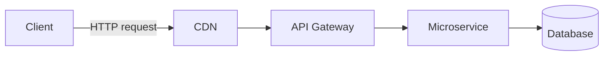

**Q: "Uniform Interface" ka practice mein matlab kya hai?**

A: URLs mein resource-based nouns (`GET /users/123`, `/getUserById` nahi), standard HTTP verbs (GET/POST/PUT/PATCH/DELETE), aur self-descriptive messages jahan status codes/headers meaning convey karte hain bina out-of-band info ke.

**Q: Kya ek truly stateless API hamesha desirable hoti hai?**

A: Hamesha nahi — har request ko poora context carry karna padta hai (jaise, har call par JWT re-validate karna), server simplicity ko client/network overhead ke saath trade karna. Statelessness protocol/interaction ke baare mein hai, ek stateful database ko forbid karne ke baare mein nahi.

### Web API vs WCF vs MVC vs gRPC vs GraphQL

**Q: Web API, WCF, MVC, gRPC, aur GraphQL kaise differ karte hain?**

A:
- Web API — HTTP only, JSON/XML, lightweight; public/internal REST APIs ke liye best.
- WCF — HTTP/TCP/MSMQ/Named Pipes, SOAP/XML, heavy; legacy enterprise SOAP integration ke liye hi.
- MVC — HTTP, HTML/JSON views; server-rendered web apps.
- gRPC — HTTP/2, Protobuf binary; internal low-latency microservice calls.
- GraphQL — HTTP, flexible JSON shape; client-driven queries, BFF layers.

**Q: Kya WCF modern .NET mein still relevant hai?**

A: Nahi — WCF legacy hai; modern .NET mein no first-class WCF hai, sirf community-maintained CoreWCF port migration scenarios ke liye.

### SOAP vs REST

**Q: SOAP REST se kaise compare karta hai?**

A: SOAP strict XML envelopes/WSDL contracts, built-in WS-Security use karta hai, aur stateful ho sakta hai — zyada complex aur slow. REST flexible JSON/XML use karta hai, security ke liye OAuth2/JWT + HTTPS par rely karta hai, design se stateless hai, aur simpler/faster hai.

### HTTP Methods, Status Codes, aur Idempotency

**Q: Kaunse HTTP methods idempotent hain aur kaunse safe hain?**

A:
- GET — idempotent, safe.
- POST — not idempotent, not safe.
- PUT — idempotent, not safe.
- PATCH — not guaranteed idempotent, not safe.
- DELETE — idempotent (same end state), not safe.

**Q: Kya idempotent aur safe ek hi baat nahi hain?**

A: Nahi. Safe ka matlab hai koi state mutation nahi (GET only). Idempotent ka matlab hai call ko N baar repeat karna waisa hi end state deta hai jaise ek baar — PUT/DELETE idempotent hain lekin phir bhi state mutate karte hain, isliye woh safe nahi hain.

**Q: Key HTTP status codes aur unka meaning naam batao.**

A: 200 OK, 201 Created (`Location` ke saath), 202 Accepted (async processing), 204 No Content, 400 Bad Request, 401 Unauthorized, 403 Forbidden, 404 Not Found, 409 Conflict, 422 Unprocessable Entity (semantic validation failure), 429 Too Many Requests, 500 Internal Server Error, 503 Service Unavailable.

**Q: Kya PATCH guaranteed idempotent hai?**

A: Nahi — jaise, "counter ko 1 se increment karo" idempotent nahi hai chahe PATCH ko full-replacement semantics ke saath design kiya ja sake idempotent banane ke liye.

### Controllers, IActionResult, ActionResult\<T\>

**Q: `[ApiController]` aapko automatically kya deta hai?**

A: Invalid `ModelState` par automatic 400, complex types ke liye `[FromBody]` inference, Problem-Details-shaped error responses, aur enforced attribute routing.

```csharp
[ApiController]
[Route("api/products")]
public class ProductsController : ControllerBase
{
    [HttpGet]
    public IEnumerable<string> Get() => new[] { "Laptop", "Mobile" };

    [HttpGet("{id}")]
    public IActionResult GetProduct(int id)
    {
        if (id <= 0) return BadRequest("Invalid ID");
        return Ok(new { id, name = "Laptop" });
    }
}
```

**Q: `IActionResult` vs `ActionResult<T>` — kaunsa prefer karna chahiye?**

A: New code mein `ActionResult<T>` prefer karo — yeh strongly typed hai (better OpenAPI/Swagger schema inference) jabki `Ok()`/`NotFound()` still allow karta hai. `IActionResult` genuinely mixed-result actions ke liye better hai jinme koi single type nahi hai.

**Q: `IHttpActionResult` vs `IActionResult` — difference kya hai?**

A: `IHttpActionResult` ASP.NET Web API 2 (`System.Web.Http`, classic pipeline) ka hai, jo `ExecuteAsync()` → `HttpResponseMessage` ke through execute hota hai. `IActionResult` ASP.NET Core (`Microsoft.AspNetCore.Mvc`) ka hai, jo directly Core pipeline mein `ExecuteResultAsync()` ke through execute hota hai. Woh helper names share karte hain (`Ok()`, `BadRequest()`) lekin **source-compatible nahi hain** — migration mein `using` directives aur base class (`ApiController` → `ControllerBase`) change karni padti hai.

```csharp
// Legacy ASP.NET Web API 2 (System.Web.Http) — IHttpActionResult
public IHttpActionResult GetProduct(int id)
{
    if (id <= 0) return BadRequest("Invalid ID");
    return Ok(new { Id = id, Name = "Laptop" });
}
```

### Routing: Attribute vs Conventional

**Q: Attribute routing vs conventional routing — modern Web APIs kaunsa use karte hain?**

A: Almost exclusively attribute routing (controller/action par `[Route("api/products/{id}")]`) kyunki yeh routes ko actions ke saath colocate karta hai aur constraints, versioning tokens, explicit verb binding support karta hai. Conventional routing (`Program.cs` mein `{controller}/{action}/{id?}`) MVC views ke liye better suit karta hai.

```csharp
var builder = WebApplication.CreateBuilder(args);
builder.Services.AddControllers();
var app = builder.Build();

app.UseHttpsRedirection();
app.UseRouting();
app.UseAuthentication();
app.UseAuthorization();
app.MapControllers();
app.Run();
```

### Parameter Binding: FromRoute/FromQuery/FromBody/FromHeader

**Q: Parameter-binding attributes aur unke sources list karo.**

A:
- `[FromRoute]` — URL route segment.
- `[FromQuery]` — query string.
- `[FromBody]` — JSON request body.
- `[FromHeader]` — HTTP header.
- `[FromForm]` — form/multipart body (file uploads).

**Q: Per action sirf ek `[FromBody]` parameter kyun ho sakta hai?**

A: Request body stream sirf ek baar hi padha ja sakta hai. Agar multiple complex pieces of data chahiye, to unko ek single DTO mein wrap karo.

### File Upload & Download (IFormFile)

**Q: `IFormFile` use karke ek basic file upload/download implementation dikhao.**

A:

```csharp
[HttpPost("upload")]
public async Task<IActionResult> Upload(IFormFile file)
{
    if (file is null || file.Length == 0) return BadRequest("No file uploaded.");

    var filePath = Path.Combine("uploads", file.FileName);
    using var stream = new FileStream(filePath, FileMode.Create);
    await file.CopyToAsync(stream);

    return Ok(new { file.FileName, file.Length });
}

[HttpGet("download/{fileName}")]
public IActionResult Download(string fileName)
{
    var filePath = Path.Combine("uploads", fileName);
    if (!System.IO.File.Exists(filePath)) return NotFound();

    var fileBytes = System.IO.File.ReadAllBytes(filePath);
    return File(fileBytes, "application/octet-stream", fileName);
}
```

**Q: Basic `IFormFile` example se aage, file upload/download ke liye senior-level details kya matter karti hain?**

A:
- Bade files ko fully memory mein buffer karne ke bajaye stream karo; DoS prevent karne ke liye ek request body size limit enforce karo huge uploads se.
- `file.FileName` ko as-is path ki tarah kabhi trust na karo (path traversal risk) — disk par likhne se pehle sanitize/regenerate karo (jaise, GUID).
- Content-type/extension validate karo **aur** actual file bytes inspect karo (magic-number check) — clients `Content-Type` ke baare mein lie kar sakte hain.
- Bade files/high throughput ke liye local disk se blob storage (Azure Blob/S3) mein streaming prefer karo — API ko stateless rakhta hai.
- Large downloads ke liye full bytes memory mein load karne ke bajaye `FileStreamResult`/`PhysicalFile` use karo.

### Content Negotiation

**Q: `Accept` aur `Content-Type` headers mein kya difference hai?**

A: `Accept` batata hai client ko kya representation waapas chahiye; `Content-Type` batata hai current body actually kis format mein hai.

```csharp
builder.Services.AddControllers().AddXmlSerializerFormatters();
```

```http
GET /api/products
Accept: application/xml
```

**Q: Agar `Accept` header se koi formatter match nahi karta to kya hota hai?**

A: By default ASP.NET Core silently JSON par fall back kar jaata hai; yeh sirf `406 Not Acceptable` return karta hai agar aap explicitly `ReturnHttpNotAcceptable = true` set karo.

## Intermediate

### Dependency Injection & Service Lifetimes

**Q: Teen DI service lifetimes aur unke risks describe karo.**

A:
- Singleton — app mein ek instance; thread-safe hona chahiye; safely Scoped deps hold nahi kar sakta.
- Scoped — per request ek instance (jaise, `DbContext`); Singleton mein inject hone par "captive dependency" ka risk.
- Transient — har resolution par naya instance; expensive to construct ho to wasteful ho sakta hai.

```csharp
public interface IProductService { List<string> GetProducts(); }
public class ProductService : IProductService
{
    public List<string> GetProducts() => new() { "Laptop", "Mobile" };
}

builder.Services.AddScoped<IProductService, ProductService>();
```

**Q: `TryAddSingleton<T>` vs `AddSingleton<T>`?**

A: `TryAddSingleton` sirf tab register karta hai jab uss type ke liye kuch already registered na ho (library/extension code ke liye safe). `AddSingleton` hamesha ek nayi registration add karta hai, jo `IEnumerable<T>` ke through resolutions ko multiply kar sakta hai.

**Q: Ek Singleton `DbContext` jaisi Scoped service par depend kyun nahi kar sakta?**

A: `DbContext` Scoped hai (per request ek unit of work, thread-safe nahi); ek Singleton app-wide rehta hai aur concurrent requests ke beech shared hota hai. Direct injection `InvalidOperationException` throw karta hai (validation enabled hone par) ya otherwise race conditions/shared state cause karta hai.

**Q: Singleton ke andar ek Scoped dependency chahiye hone ka fix kya hai?**

A: `IServiceScopeFactory` inject karo, phir `using var scope = _scopeFactory.CreateScope();` aur per operation `scope.ServiceProvider` se Scoped service resolve karo — yeh usse uss unit of work tak isolate karta hai.

```csharp
public class MyLoggerService
{
    private readonly IServiceScopeFactory _scopeFactory;
    public MyLoggerService(IServiceScopeFactory scopeFactory) => _scopeFactory = scopeFactory;

    public void LogToDatabase(string message)
    {
        using var scope = _scopeFactory.CreateScope();
        var dbContext = scope.ServiceProvider.GetRequiredService<MyDbContext>();
        dbContext.Logs.Add(new Log { Message = message });
        dbContext.SaveChanges();
    }
}
```

### SOLID Principles

**Q: SOLID ke har principle ke liye ek ASP.NET Core example do.**

A:
- SRP — `ProductsController` (HTTP), `ProductService` (business logic), `ProductRepository` (persistence) ko separate karo.
- OCP — if/else chain edit karne ke bajaye naya `IDiscountStrategy` implementation add karo.
- LSP — koi bhi `IPaymentGateway` implementation ko same contract honor karna chahiye bina callers ko surprise kiye.
- ISP — ek bloated `IRepository` ko `IReadRepository<T>`/`IWriteRepository<T>` mein split karo.
- DIP — constructor-inject interfaces (`ILogger`, `IProductService`), concrete dependency kabhi `new` mat karo.

**Q: ASP.NET Core ka built-in DI kaise DIP ka example hai?**

A: `UserService` `ILogger` (abstraction) par depend karta hai, `ConsoleLogger` (concretion) par nahi — aap `SerilogLogger` ya ek test `FakeLogger` swap kar sakte ho `UserService` mein zero changes ke saath. DI khud DIP ko scale par operationalize karta hai.

```csharp
public interface ILogger { void Log(string message); }

public class ConsoleLogger : ILogger
{
    public void Log(string message) => Console.WriteLine(message);
}

public class UserService
{
    private readonly ILogger _logger;
    public UserService(ILogger logger) => _logger = logger; // depends on the abstraction, not ConsoleLogger
}
```

**Q: Senior answer SOLID par junior answer se kya alag karti hai?**

A: Ek real violation cite karne ki ability jo aapne refactor ki aur uske involved trade-off (zyada indirection vs easier testing/isolated change) — bas acronym recite karna bina koi story ke junior lagta hai.

### Middleware Pipeline

**Q: Middleware execution order kaise kaam karta hai?**

A: Aane ke waqt top-down, jaane ke waqt bottom-up — har middleware request ko inspect/modify kar sakta hai, optionally short-circuit kar sakta hai, `next()` call karta hai, phir response ko waapas aate waqt modify karta hai.

```csharp
public class CustomMiddleware
{
    private readonly RequestDelegate _next;
    public CustomMiddleware(RequestDelegate next) => _next = next;

    public async Task Invoke(HttpContext context)
    {
        Console.WriteLine("Request: " + context.Request.Path);
        await _next(context);
    }
}

app.UseMiddleware<CustomMiddleware>();
```

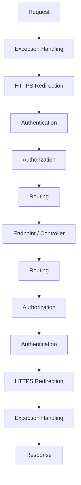

**Q: Middleware vs Filters — key difference kya hai?**

A: Middleware whole HTTP pipeline par global/framework-agnostic hota hai. Filters MVC/API-specific hote hain aur action-invocation pipeline ke andar run karte hain (routing ke controller/action select karne ke baad), jisse `ActionExecutingContext`/model-bound arguments tak access milta hai jo raw middleware mein nahi hota.

### Request Lifecycle End-to-End

**Q: Full ASP.NET Core request lifecycle ke through walk karo.**

A: Kestrel `HttpContext` build karta hai → Middleware pipeline (exception handling, auth, CORS) → Routing (controller/action match karta hai) → Authentication (user identify karta hai) → Authorization (permissions check karta hai, 401/403 ho sakta hai) → Filters (Authorization → Resource → Model binding/validation → Action → Exception → Result) → Controller execute hota hai aur `ActionResult` return karta hai → Formatter/content negotiation serialize karta hai → Response reverse mein middleware se hoke flow karta hai → Kestrel client ko bhej deta hai.

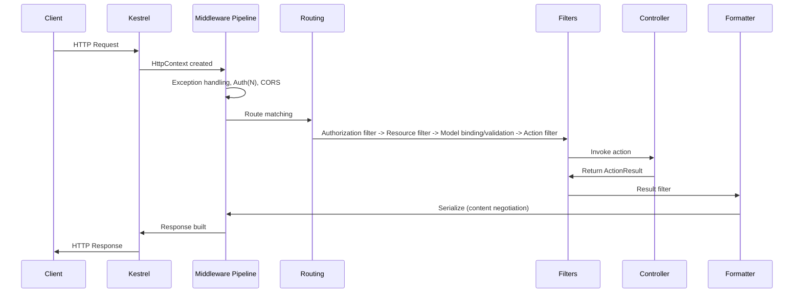

**Q: Pipeline ka "interview gold" one-line summary kya hai?**

A: "ASP.NET Core requests ko Kestrel → Middleware → Routing → Filters → Controller → Formatters → Middleware → Client ke through process karta hai."

**Q: Kya Kestrel mein business logic hoti hai?**

A: Nahi — Kestrel bas raw HTTP parse karta hai aur `HttpContext` build karta hai; production mein yeh usually IIS/Nginx/ek cloud LB ke peeche baithta hai TLS termination aur process protection ke liye.

**Q: Authentication aur authorization failure behavior mein kya distinction hai?**

A: Auth failure necessarily pipeline stop nahi karta — user ko bas anonymous treat kiya jaata hai. Authorization failure 401/403 return karta hai aur controller action kabhi execute nahi hota.

### Model Validation

**Q: Kya `[ApiController]`-decorated controller ke andar manual `ModelState.IsValid` check chahiye hoti hai?**

A: Nahi — yeh redundant hai. `[ApiController]` action run hone se pehle automatically `ValidationProblemDetails` body ke saath 400 return kar deta hai. Sirf tab chahiye jab aap `[ApiController(SuppressModelStateInvalidFilter = true)]` se opt out karo custom validation shaping ke liye.

```csharp
public class Product
{
    [Required] public string Name { get; set; }
    [Range(1, 10000)] public decimal Price { get; set; }
}

[HttpPost]
public IActionResult AddProduct([FromBody] Product product)
{
    if (!ModelState.IsValid) return BadRequest(ModelState);
    return Ok("Product Added");
}
```

**Q: Data Annotations ke bajaye FluentValidation kab reach karoge?**

A: Complex/conditional validation rules ke liye, better testability ke liye, aur validation logic ko model se separate karne ke liye.

### Action Filters & Filter Pipeline

**Q: Filter types ko execution order mein aur unka typical use list karo.**

A:
1. Authorization Filters — `[Authorize]` enforcement, pehle run hota hai.
2. Resource Filters — model binding se pehle/baad; caching, expensive pre-checks short-circuit karte hain.
3. Action Filters — action execution se pehle/baad; logging, timing, args/results mutate karna.
4. Exception Filters — action se unhandled exception par; centralized, controller-scoped error shaping.
5. Result Filters — result execution se pehle/baad; header injection, response wrapping.

```csharp
public class LogActionFilter : ActionFilterAttribute
{
    public override void OnActionExecuting(ActionExecutingContext context)
    {
        Console.WriteLine($"Action {context.ActionDescriptor.DisplayName} is executing");
    }
}

[LogActionFilter]
public class ProductsController : ControllerBase
{
    [HttpGet] public IActionResult Get() => Ok("Product List");
}
```

### PUT vs PATCH (JSON Patch)

**Q: PUT vs PATCH — purpose, idempotency, body?**

A: PUT poora resource replace karta hai (idempotent, full representation body). PATCH partially update karta hai (guaranteed idempotent nahi, body sirf changed fields ya ek JSON Patch document hoti hai).

```csharp
[HttpPatch("{id}")]
public async Task<IActionResult> UpdateProduct(int id, [FromBody] JsonPatchDocument<Product> patchDoc)
{
    var product = await _context.Products.FindAsync(id);
    if (product == null) return NotFound();

    patchDoc.ApplyTo(product, ModelState);
    if (!ModelState.IsValid) return BadRequest(ModelState);

    await _context.SaveChangesAsync();
    return Ok(product);
}
```

**Q: `JsonPatchDocument<T>` ke saath gotcha kya hai?**

A: RFC 6902 JSON Patch ko `Content-Type: application/json-patch+json` aur ek operations array chahiye hoti hai (`[{ "op": "replace", "path": "/price", "value": 1500 }]`). Bahut teams iske bajaye ek plain partial DTO accept karti hain (merge-patch style, RFC 7396) simplicity ke liye, strict semantics ko ergonomics se trade karte hue.

### Exception Handling

**Q: Classic try/catch exception middleware (plain text `Error: {ex.Message}` return karna) senior-grade kyun nahi hai?**

A: Yeh exception details clients ko leak karta hai (information disclosure) aur ek machine-readable error body ke bajaye unstructured plain text return karta hai. Production-grade replacement RFC 7807/9457 Problem Details hai `IExceptionHandler` (.NET 8+) ke through.

```csharp
public class ExceptionMiddleware
{
    private readonly RequestDelegate _next;
    public ExceptionMiddleware(RequestDelegate next) => _next = next;

    public async Task Invoke(HttpContext context)
    {
        try { await _next(context); }
        catch (Exception ex)
        {
            context.Response.StatusCode = 500;
            await context.Response.WriteAsync($"Error: {ex.Message}");
        }
    }
}
app.UseMiddleware<ExceptionMiddleware>();
```

### CORS

**Q: CORS actually kya protect karta hai, aur kya nahi protect karta?**

A: CORS ek browser-enforced same-origin relaxation hai — server-to-server calls (curl, Postman, ek dusra backend) ke liye yeh kuch nahi karta, woh isse entirely ignore karte hain.

```csharp
builder.Services.AddCors(options =>
{
    options.AddPolicy("AllowSpecificOrigin", policy =>
        policy.WithOrigins("https://frontend.com")
              .AllowAnyMethod()
              .AllowAnyHeader());
});
app.UseCors("AllowSpecificOrigin");
```

**Q: Ek common CORS misconfiguration kya hai?**

A: `Access-Control-Allow-Origin: *` ko `AllowCredentials()` ke saath combine karna — spec ke hisaab se invalid hai; wildcard origin ko credentialed requests ke saath kabhi combine na karo.

### Repository Pattern & DTOs

**Q: Kya EF Core ke `DbContext` ko ek generic repository mein wrap karna ek good default hai?**

A: Default se nahi — `DbSet<T>`/`DbContext` already ek unit-of-work + repository abstraction hai. Ek hand-rolled generic repository aksar bas `IQueryable` ko ek dusre interface ke peeche hide karta hai aur `Include`/projection/compiled-query capabilities strip kar sakta hai. Isko ek real cross-cutting need se justify karo (jaise, persistence tech swap karna, test doubles simplify karna), "best practice" cargo-culting se nahi.

```csharp
public interface IProductRepository { List<Product> GetAll(); }
public class ProductRepository : IProductRepository
{
    private readonly AppDbContext _context;
    public ProductRepository(AppDbContext context) => _context = context;
    public List<Product> GetAll() => _context.Products.AsNoTracking().ToList();
}
```

**Q: API boundaries par EF entities ko directly bind karne ke bajaye DTOs kyun use karo?**

A: Internal/DB-only fields hide karta hai, API contract ko persistence schema se decouple karta hai, aur over-posting/mass-assignment vulnerabilities prevent karta hai (jaise, client `IsAdmin` directly set kar de).

```csharp
public class ProductDTO
{
    public string Name { get; set; }
    public decimal Price { get; set; }
}
var productDto = _mapper.Map<ProductDTO>(product);
```

### IHttpClientFactory & Resilient HTTP Calls

**Q: `IHttpClientFactory` kaunsi problem solve karta hai?**

A: Socket exhaustion — per request ek `new HttpClient()` handler dispose karta hai lekin sockets ko `TIME_WAIT` mein chhod sakta hai, load ke under ports exhaust kar sakta hai. Ek single static `HttpClient` singleton isse avoid karta hai lekin DNS changes respect nahi karta (connections ko indefinitely cache karta hai). `IHttpClientFactory` `HttpMessageHandler`s ko ek rotation par pool/recycle karta hai (default 2 min), connection reuse aur DNS responsiveness deta hai, plus named/typed clients aur Polly integration.

```csharp
builder.Services.AddHttpClient<IProductService, ProductService>();

public class ProductService : IProductService
{
    private readonly HttpClient _httpClient;
    public ProductService(HttpClient httpClient) => _httpClient = httpClient;
    public async Task<string> GetData() => await _httpClient.GetStringAsync("https://api.example.com/products");
}
```

## Advanced

### API Versioning Strategies

**Q: Char common API versioning strategies kya hain, aur unke trade-offs?**

A:
- URL Path (`/api/v1/products`) — explicit, cacheable, test karna easy; URL ko "pollute" karta hai.
- Query String (`?version=1`) — simple; bhoolna easy, messy caching keys.
- Header (`X-API-Version: 1`) — clean URL; casual browsing/curl ke liye invisible.
- Media Type/Accept (`application/vnd.myapi.v1+json`) — most RESTfully correct; most complex, poor tooling.

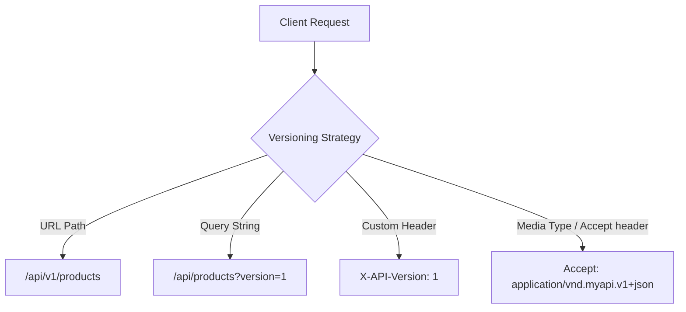

**Q: Most real-world APIs mein kaunsi strategy jeetti hai, aur kyun?**

A: URL path versioning — best discoverability aur cache-friendliness. Header/media-type "correct" REST purists ke hisaab se hai lekin operational complexity ke liye rarely worth hota hai except public APIs jinke strict deprecation SLAs hain.

```csharp
builder.Services.AddApiVersioning(options =>
{
    options.AssumeDefaultVersionWhenUnspecified = true;
    options.DefaultApiVersion = new ApiVersion(1, 0);
    options.ReportApiVersions = true;
    options.ApiVersionReader = new UrlSegmentApiVersionReader();
});

[ApiController]
[Route("api/v{version:apiVersion}/products")]
[ApiVersion("1.0")]
public class ProductsV1Controller : ControllerBase
{
    [HttpGet] public IActionResult Get() => Ok(new { Message = "Product list from V1" });
}
```

**Q: API versioning ke liye aaj kaunsa NuGet package use karna chahiye?**

A: `Asp.Versioning.Mvc` — deprecated `Microsoft.AspNetCore.Mvc.Versioning` ka modern maintained successor.

**Q: Versioning best practices kya hain?**

A: Gradually deprecate karo (`Sunset` header, `ReportApiVersions` ke through `api-supported-versions`), har version ko OpenAPI mein document karo, bahut zyada live versions accumulate karne se bacho, centralized routing/deprecation ke liye ek API gateway consider karo.

### REST Maturity Model (Richardson) & HATEOAS Trade-offs

**Q: Richardson Maturity Model levels describe karo.**

A:
- Level 0 — ek URL, ek verb (RPC/SOAP-in-disguise HTTP par).
- Level 1 — resource ke liye separate URIs, still aksar single-verb-heavy.
- Level 2 — proper HTTP verbs + status codes; jahan most production "REST" APIs actually rehte hain.
- Level 3 — HATEOAS; responses hypermedia links embed karti hain jo next actions describe karti hain.

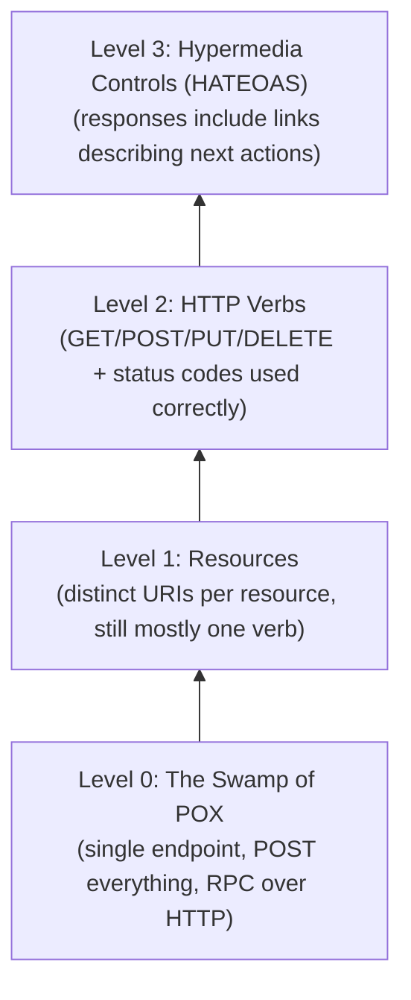

**Q: Kya HATEOAS practice mein implement karna worth hai?**

A: Rarely fully implemented hota hai — most teams Level 2 par stop kar jaati hain aur explicitly version karti hain. Yeh complex order/workflow APIs ke liye pay off karta hai jahan valid next actions genuinely resource state se vary karte hain; most CRUD APIs ke liye added complexity (bigger payloads, client-side plumbing) justified nahi hai.

### Problem Details (RFC 7807/9457) for Error Responses

**Q: RFC 7807/9457 Problem Details kya hai, aur yeh .NET 8+ mein kaise implement hota hai?**

A: HTTP API errors ke liye ek standardized JSON error shape (`type`, `title`, `status`, `detail`, `instance`). .NET 8+ isse `AddProblemDetails()` plus ek custom `IExceptionHandler` `AddExceptionHandler<T>()` se registered, aur `app.UseExceptionHandler()` ke through support karta hai.

```json
{
  "type": "https://example.com/probs/insufficient-funds",
  "title": "Insufficient funds",
  "status": 400,
  "detail": "Your balance is 30, but the transfer requires 50.",
  "instance": "/transfers/abc-123",
  "traceId": "00-4bf9...-01"
}
```

```csharp
builder.Services.AddProblemDetails(options =>
{
    options.CustomizeProblemDetails = ctx =>
    {
        ctx.ProblemDetails.Extensions["traceId"] = ctx.HttpContext.TraceIdentifier;
    };
});

builder.Services.AddExceptionHandler<GlobalExceptionHandler>();

// GlobalExceptionHandler.cs
public class GlobalExceptionHandler : IExceptionHandler
{
    private readonly ILogger<GlobalExceptionHandler> _logger;
    public GlobalExceptionHandler(ILogger<GlobalExceptionHandler> logger) => _logger = logger;

    public async ValueTask<bool> TryHandleAsync(HttpContext httpContext, Exception exception, CancellationToken ct)
    {
        _logger.LogError(exception, "Unhandled exception");

        httpContext.Response.StatusCode = StatusCodes.Status500InternalServerError;
        await httpContext.Response.WriteAsJsonAsync(new ProblemDetails
        {
            Status = StatusCodes.Status500InternalServerError,
            Title = "An unexpected error occurred",
            Type = "https://httpstatuses.io/500"
        }, cancellationToken: ct);

        return true; // exception handled — don't rethrow
    }
}

// Program.cs
app.UseExceptionHandler();
```

**Q: Senior level par sab errors ke liye Problem Details use karna kyun matter karta hai?**

A: Yeh consumers ko ek consistent, machine-parseable error shape deta hai validation failures (`[ApiController]` ke auto `400`s already `ValidationProblemDetails` use karte hain), business rule violations, aur unhandled exceptions ke across — har endpoint ke liye ad hoc shapes ke bajaye.

### Idempotency Keys for POST/PUT

**Q: Jab client ek POST retry karta hai to aap duplicate side effects kaise prevent karte ho?**

A: Ek client-supplied `Idempotency-Key` header require karo; usse pehle lookup karo — agar uss key ke liye result already exist karta hai, to reprocess karne ke bajaye usse return karo; otherwise process karo aur result ko uss key se keyed karke ek TTL ke saath store karo.

```http
POST /payments
Idempotency-Key: 7b6a5e2e-3f1a-4b8e-9c2d-5a6f7e8d9c0b
Content-Type: application/json

{ "amount": 100, "currency": "USD" }
```

```csharp
[HttpPost]
public async Task<IActionResult> CreatePayment(
    [FromHeader(Name = "Idempotency-Key")] string idempotencyKey,
    [FromBody] PaymentRequest request)
{
    if (string.IsNullOrEmpty(idempotencyKey))
        return BadRequest("Idempotency-Key header is required.");

    var existing = await _cache.GetAsync<PaymentResult>(idempotencyKey);
    if (existing != null)
        return Ok(existing); // return the original result, don't reprocess

    var result = await _paymentService.ProcessAsync(request);

    // Store result keyed by idempotency key with a TTL (e.g., 24h)
    await _cache.SetAsync(idempotencyKey, result, TimeSpan.FromHours(24));

    return Ok(result);
}
```

**Q: Senior answer idempotency keys par junior answer se kya alag karti hai?**

A:
- Key ko operation ke side effect ke saath atomically store karo (same transaction ya ek unique-constrained table) — ek cache-only approach mein check-then-process race window hota hai.
- Key ko scope karo cross-user/resource collisions avoid karne ke liye (jaise, `userId + key` hash karo).
- Same key ke saath concurrent in-flight requests ko explicitly handle karo (409/425), double-processing se nahi.
- Yeh outbox pattern aur "at-least-once + idempotent consumers = effectively exactly-once" ke peeche ka same idea hai.

### Pagination Strategies: Offset vs Cursor

**Q: Offset vs cursor pagination — performance aur consistency compare karo.**

A: Offset (`Skip(n).Take(m)`) trivial hai lekin scale par degrade hota hai (`OFFSET 100000` still rows scan/discard karta hai) aur concurrent writes ke under unstable hai (rows shift hoti hain, duplicates/skips cause karti hain). Cursor-based (`WHERE id > X ORDER BY id LIMIT m`) ek consistently fast indexed seek hai aur shifts se immune hai, lekin random "jump to page N" access support nahi karta.

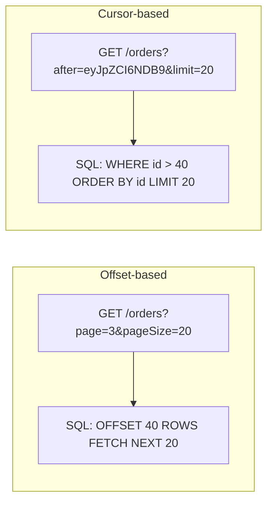

**Q: Har ek kab use karoge?**

A: Offset admin UIs/small-medium datasets ke liye jinko "total pages" chahiye. Cursor infinite scroll, feeds, large/high-write datasets, aur public APIs ke liye (GitHub, Stripe, Slack sab cursor pagination use karte hain).

```csharp
// Cursor-based pagination example
[HttpGet]
public async Task<IActionResult> GetOrders([FromQuery] string? after, [FromQuery] int limit = 20)
{
    var query = _context.Orders.OrderBy(o => o.Id).AsQueryable();

    if (!string.IsNullOrEmpty(after))
    {
        var cursorId = DecodeCursor(after); // base64-decode opaque token
        query = query.Where(o => o.Id > cursorId);
    }

    var items = await query.Take(limit + 1).ToListAsync();
    var hasMore = items.Count > limit;
    items = items.Take(limit).ToList();

    return Ok(new
    {
        data = items,
        nextCursor = hasMore ? EncodeCursor(items.Last().Id) : null
    });
}
```

### Long-Running Operations: 202 Accepted + Polling

**Q: Ek POST se trigger hone waali long-running operation aap kaise handle karte ho?**

A: Work ko enqueue karo, ek job record create karo, `202 Accepted` return karo ek `Location` header ke saath jo ek status resource ko point kare. Client `GET /reports/{jobId}` poll karta hai jab tak status `Completed` na ho, phir result link follow karta hai (ya ek `303 See Other`).

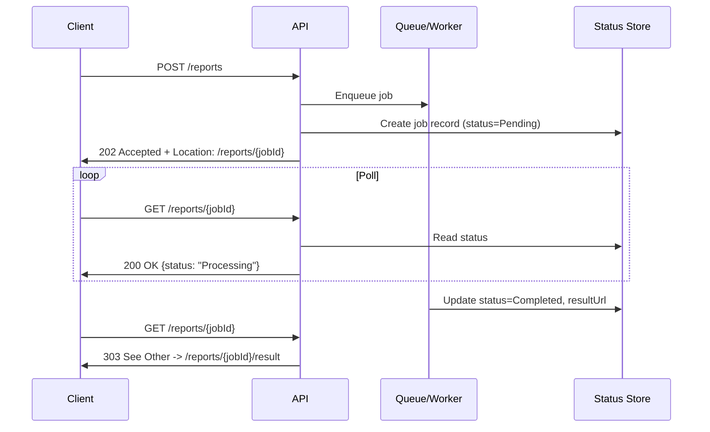

```csharp
[HttpPost("reports")]
public async Task<IActionResult> GenerateReport([FromBody] ReportRequest request)
{
    var jobId = Guid.NewGuid();
    await _jobStore.CreateAsync(jobId, JobStatus.Pending);
    await _queue.EnqueueAsync(new GenerateReportJob(jobId, request));

    return Accepted(new Uri($"/reports/{jobId}", UriKind.Relative), new { jobId, status = "Pending" });
}

[HttpGet("reports/{jobId}")]
public async Task<IActionResult> GetReportStatus(Guid jobId)
{
    var job = await _jobStore.GetAsync(jobId);
    if (job is null) return NotFound();

    if (job.Status == JobStatus.Completed)
        return Ok(new { status = "Completed", resultUrl = $"/reports/{jobId}/result" });

    return Ok(new { status = job.Status.ToString() });
}
```

**Q: Client polling ka alternative kya hai, aur uska trade-off?**

A: Webhooks — server completion par ek client-registered URL ko call back karta hai. Infrequent, high-latency jobs ke liye better hai aur polling load avoid karta hai, lekin client ko ek public endpoint expose karna padta hai aur aapko retries/signature verification handle karna padta hai.

**Q: Idempotency yahan bhi kyun matter karti hai?**

A: Agar `POST /reports` khud retry ho jaaye, to aap duplicate jobs enqueue nahi karna chahte — idempotency-key pattern ke saath combine karo.

### OpenAPI/Swagger: Contract-First vs Code-First

**Q: Code-first vs contract-first API design — trade-offs?**

A: Code-first (Swashbuckle/NSwag attributes se spec generate karte hain) start karna fast hai aur hamesha implementation se match karta hai, lekin spec ek byproduct hota hai, design artifact nahi, jisse consumers ko accidentally break karna easy ho jaata hai. Contract-first (pehle OpenAPI YAML author karo, stubs/SDKs generate karo) upfront design review force karta hai aur parallel frontend/backend work enable karta hai, slower setup aur CI enforcement ke bina spec/implementation drift ka risk ki cost par.

```csharp
builder.Services.AddSwaggerGen();
app.UseSwagger();
app.UseSwaggerUI(c => c.SwaggerEndpoint("/swagger/v1/swagger.json", "My API v1"));
```

**Q: Kaunsa approach kaunse scenario mein fit hota hai?**

A: Code-first internal microservices ke liye jo fast move karte hain; contract-first (contract tests ke saath) public APIs, external partners, ya jahan breaking changes ka real business cost ho.

**Q: .NET 9 tooling update kya jaanna worth hai?**

A: Kuch naye project templates bundled Swashbuckle ke bajaye spec generation ke liye `Microsoft.AspNetCore.OpenApi` favor karte hain, interactive doc viewer ke liye Scalar ya Swagger UI separately pair karte hue.

### Minimal APIs vs Controllers

**Q: Minimal APIs vs Controllers — key differences?**

A: Controllers zyada boilerplate offer karte hain lekin ek mature filter pipeline, automatic attribute-driven model binding/validation, aur large/complex/versioned APIs ke liye better fit. Minimal APIs terser hain, lower overhead/latency, unka apna filter pipeline hai (`IEndpointFilter`, .NET 7+) jo less mature hai, aur small focused services, latency-sensitive microservices, aur serverless-style workloads ke liye suit karte hain.

```csharp
// Minimal API
var app = WebApplication.Create(args);

app.MapGet("/api/products/{id}", async (int id, IProductService service) =>
{
    var product = await service.GetByIdAsync(id);
    return product is not null ? Results.Ok(product) : Results.NotFound();
})
.WithName("GetProduct")
.WithOpenApi();

app.Run();
```

**Q: Kya ek dusre ko replace karta hai?**

A: Nahi — dono same underlying `Endpoint`/routing infrastructure mein compile hote hain. Choice team ergonomics aur codebase scale ke baare mein hai, capability ke baare mein nahi. Common pattern: small internal utilities ke liye Minimal APIs, large filter-heavy public APIs ke liye Controllers.

### Rate Limiting with Built-in ASP.NET Core Middleware

**Q: ASP.NET Core mein rate-limit karne ka modern, first-party tarika kya hai?**

A: `Microsoft.AspNetCore.RateLimiting` middleware (.NET 7 se built in) — third-party `AspNetCoreRateLimit` package se preferred.

```csharp
using System.Threading.RateLimiting;

builder.Services.AddRateLimiter(options =>
{
    options.AddFixedWindowLimiter("fixed", opt =>
    {
        opt.PermitLimit = 100;
        opt.Window = TimeSpan.FromMinutes(1);
        opt.QueueLimit = 0;
        opt.QueueProcessingOrder = QueueProcessingOrder.OldestFirst;
    });

    options.AddTokenBucketLimiter("token", opt =>
    {
        opt.TokenLimit = 50;
        opt.TokensPerPeriod = 10;
        opt.ReplenishmentPeriod = TimeSpan.FromSeconds(10);
    });

    options.OnRejected = async (context, token) =>
    {
        context.HttpContext.Response.StatusCode = StatusCodes.Status429TooManyRequests;
        await context.HttpContext.Response.WriteAsync("Too many requests. Try again later.", token);
    };
});

app.UseRateLimiter();

app.MapGet("/api/products", () => Ok("data")).RequireRateLimiting("fixed");
```

**Q: Built-in rate limiting algorithms list karo.**

A:
- Fixed Window — fixed window mein N requests; boundary edges par burst kar sakta hai.
- Sliding Window — smoother, window ke andar segments track karta hai.
- Token Bucket — tokens steadily refill hote hain; capacity tak short bursts allow karta hai.
- Concurrency Limiter — concurrent in-flight requests limit karta hai, time ke over rate nahi.

**Q: Built-in middleware ke saath distributed caveat kya hai?**

A: Counters default se per instance in-memory hote hain — multiple instances waale ek load balancer ke peeche, effective global limit `perInstanceLimit × instanceCount` ban jaata hai. True global limit ke liye, ek distributed store (Redis-backed) use karo ya limiting ko ek API gateway par push karo.

**Q: App-level rate limiting ko kya complement karta hai (replace nahi)?**

A: Queue-based throttling (reject ke bajaye delay), WAF (edge par malicious/bot traffic block karta hai), CAPTCHA (sensitive actions ke liye human verification), aur cloud API gateway rate limiting (centralized, distributed counters).

### Authentication & Authorization (JWT, OAuth2, OIDC)

**Q: JWT — pros/cons?**

A: Server-side session storage nahi chahiye, distributed systems mein achhe se scale karta hai; lekin ek leaked token expiry tak valid rehta hai aur revocation design se hard hai.

```csharp
builder.Services.AddAuthentication(JwtBearerDefaults.AuthenticationScheme)
    .AddJwtBearer(options =>
    {
        options.TokenValidationParameters = new TokenValidationParameters
        {
            ValidateIssuer = true,
            ValidateAudience = true,
            ValidateLifetime = true,
            ValidateIssuerSigningKey = true,
            ValidIssuer = "yourdomain.com",
            ValidAudience = "yourdomain.com",
            IssuerSigningKey = new SymmetricSecurityKey(Encoding.UTF8.GetBytes(secretKey))
        };
    });
```

**Q: OAuth2 vs OIDC — distinction kya hai?**

A: OAuth2 ek authorization framework hai jo "yeh app mere behalf par kya kar sakta hai" answer karta hai. OIDC OAuth2 ke upar authentication (identity, ID tokens) layer karta hai, "yeh user kaun hai" answer karta hai.

```csharp
builder.Services.AddAuthentication(JwtBearerDefaults.AuthenticationScheme)
    .AddJwtBearer(options =>
    {
        options.Authority = "https://your-identity-provider.com";
        options.Audience = "your-api";
    });
```

**Q: Azure AD (Entra ID) SSO flow ke through walk karo.**

A:

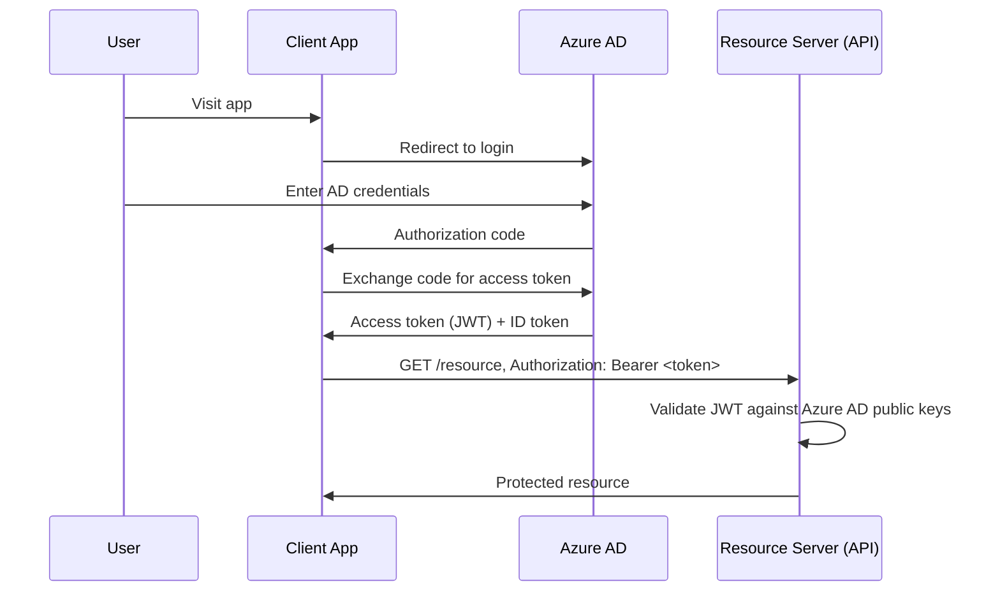

```csharp
builder.Services.AddAuthentication("Bearer")
    .AddMicrosoftIdentityWebApi(builder.Configuration.GetSection("AzureAd"));

builder.Services.AddAuthorization();
```

**Q: Role-based vs claims-based authorization — kaunsa zyada flexible hai?**

A: Claims-based zyada general hai — roles bas ek special-cased claim hain (`ClaimTypes.Role`). Simple role checks se aage kuch bhi ke liye, policy-based authorization use karo (`[Authorize(Policy = ...)]` `IAuthorizationHandler` se backed) taaki logic string role checks ke roop mein scattered na ho.

```csharp
[Authorize(Roles = "Admin")]
[HttpGet("secure-data")]
public IActionResult GetSecureData() => Ok("Only Admin can access this!");
```

```csharp
[Authorize]
[HttpGet]
public IActionResult GetUserClaims()
{
    var email = User.FindFirst(ClaimTypes.Email)?.Value;
    return Ok($"User Email: {email}");
}
```

### OAuth2 Grant Types — Which One Fits Which Client

**Q: Kaunsa OAuth2 grant type kaunse client type ko fit karta hai?**

A:
- Authorization Code + PKCE — SPAs, native/mobile apps (public clients jo secret hold nahi kar sakte); PKCE secret ko ek dynamic verifier/challenge pair se replace karta hai.
- Client Credentials — machine-to-machine, loop mein koi user nahi; confidential client directly `client_id`+`client_secret` present karta hai.
- Device Code — limited-input devices (smart TVs, CLI, IoT); device ek code dikhata hai, user separate device par auth complete karta hai.
- Implicit — **deprecated**, OAuth 2.1 mein removed (token URL fragment mein exposed).
- ROPC (Resource Owner Password Credentials) — **deprecated**, OAuth 2.1 mein removed (client raw passwords handle karta hai).

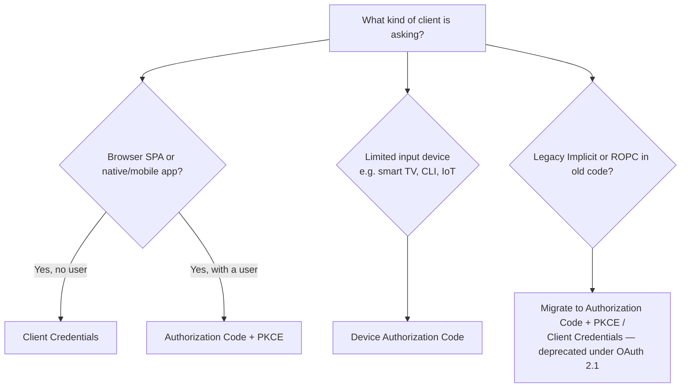

**Q: PKCE confidential clients ke liye bhi kyun matter karta hai?**

A: OAuth 2.1 ke under, PKCE universally recommended hai — yeh client type ke regardless authorization-code-interception attacks se protect karta hai, aur ek flow consistently use karna security mechanisms ki number kam karta hai jinhe right karna hai.

**Q: SPA ke liye Client Credentials kyun use nahi karte?**

A: Client Credentials ko ek embedded client secret chahiye, aur ek SPA ka code fully browser mein delivered aur inspectable hota hai — wahan secret confidential rakhne ka koi tarika nahi hai.

**Q: Kya grant type affect karta hai ki API token ko kaise validate karta hai?**

A: Nahi — `AddJwtBearer`/`Microsoft.Identity.Web` jo bhi access token aata hai usse validate karte hain grant type ke regardless; grant type token-issuance side (auth server) ka concern hai, resource server ke validation code ka nahi.

### API Keys vs OAuth2 Scopes — When to Use Which

**Q: API keys vs OAuth2 — har ek kab fit karta hai?**

A: API keys ek application identify karti hain (aksar all-or-nothing, manual rotation) — server-to-server/internal tooling/simple integrations ke liye fine hai. OAuth2 scopes ek specific user/service identify karte hain fine-grained, short-lived, revocable delegated permissions ke saath — user-delegated access, public APIs, aur per-user consent/audit ke liye chahiye.

```csharp
public class ApiKeyMiddleware
{
    private readonly RequestDelegate _next;
    public ApiKeyMiddleware(RequestDelegate next) => _next = next;

    public async Task Invoke(HttpContext context)
    {
        if (!context.Request.Headers.TryGetValue("X-API-KEY", out var key) || key != "expected-key")
        {
            context.Response.StatusCode = StatusCodes.Status401Unauthorized;
            await context.Response.WriteAsync("Unauthorized");
            return;
        }
        await _next(context);
    }
}
```

**Q: M2M calls ke liye ek bare API key se OAuth2 client-credentials kyun prefer karo?**

A: Jab ek identity provider already exist karta hai to short-lived tokens aur centralized revocation "for free" mil jaate hain — bahut breaches over-scoped, long-lived API keys tak trace hote hain jo config mein checked in hoti hain.

### HATEOAS

**Q: Ek HATEOAS response kaisa dikhta hai?**

A: Resource body mein ek `links` array hota hai `rel`/`href`/`method` ke saath available next actions ke liye (self, update, delete) — trade-off discussion ke liye upar REST Maturity Model section dekho.

```json
{
  "id": 1,
  "name": "Laptop",
  "price": 1200,
  "links": [
    { "rel": "self", "href": "/api/products/1" },
    { "rel": "update", "href": "/api/products/1", "method": "PUT" },
    { "rel": "delete", "href": "/api/products/1", "method": "DELETE" }
  ]
}
```

```csharp
public class ProductResource
{
    public int Id { get; set; }
    public string Name { get; set; }
    public decimal Price { get; set; }
    public List<LinkResource> Links { get; set; } = new();
}
public class LinkResource
{
    public string Rel { get; set; }
    public string Href { get; set; }
    public string Method { get; set; }
}
```

### Microservices vs Monolithic Architecture

**Q: Scalability, deployment, data, aur failure isolation ke across monolithic aur microservices architecture compare karo.**

A: Monolith — single deploy unit, coarse-grained scaling, usually ek shared DB, native ACID transactions, ek bug pura app down kar sakta hai. Microservices — per service independent deploy/scale, har service typically apna khud ka data store owns karti hai, distributed transactions ko 2PC ke bajaye sagas/outbox chahiye hote hain, failures ko circuit breakers/bulkheads se isolate kiya ja sakta hai — much higher operational overhead ki cost par.

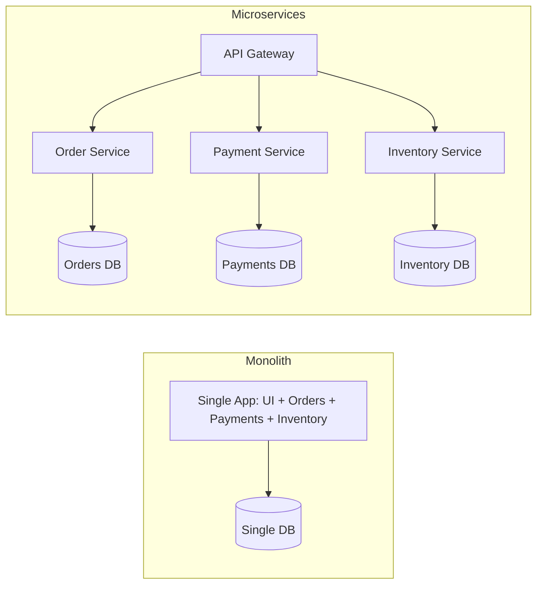

**Q: Microservices ke bajaye monolith kab choose karoge?**

A: Small team/low complexity jahan operational tax justified nahi hai; early-stage product jisme domain boundaries unclear hain (bahut early split karna "distributed monolith" ka risk hai); jab lower operational overhead ek genuine business win hai. Middle path: ek well-modularized monolith taaki future extraction ek refactor ho, rewrite nahi (same instinct as strangler fig pattern).

**Q: "Distributed monolith" kya hai aur usse kaise avoid karein?**

A: Microservices sirf naam mein — services ek DB share karti hain, lockstep mein deploy hoti hain, ya long chains mein ek dusre ko synchronously call karti hain, independent scalability/deployability ke bina operational complexity inherit karti hain. Per-service data ownership, async/event-driven communication, aur real business capabilities ke around drawn boundaries se avoid karo.

### API Gateway Pattern

**Q: Ek API Gateway kya centralize karta hai?**

A: Routing, security (auth/authz, API key validation), load balancing, rate limiting, aur cross-service monitoring/logging — ek single entry point jo multiple backend services ko front karta hai.

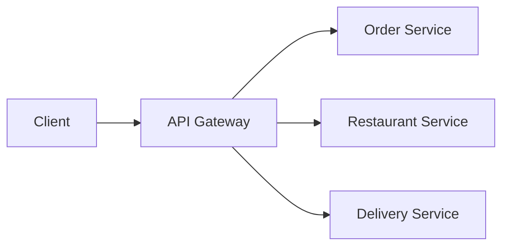

**Q: Kuch API Gateway options aur BFF pattern naam batao.**

A: Ocelot (.NET-native, lightweight), YARP (Microsoft ka modern reverse-proxy toolkit, increasingly default), ya managed options (Azure APIM, AWS API Gateway, Kong). Backend-for-Frontend (BFF) ek narrower, client-specific gateway hai (jaise, ek mobile BFF web BFF se differently responses shape karta hai).

### CQRS

**Q: CQRS kya hai, aur kya isse MediatR/event sourcing chahiye?**

A: Command Query Responsibility Segregation read aur write models ko separate karta hai taaki unke concerns/scaling diverge ho sakein. Isko MediatR, event sourcing, ya separate physical databases **nahi** chahiye — woh optional escalations hain. Default se full CQRS + event sourcing use karna ek common overengineering trap hai.

```csharp
public record CreateProductCommand(string Name, decimal Price) : IRequest<Product>;
public record GetProductQuery(int Id) : IRequest<Product>;

public class GetProductHandler : IRequestHandler<GetProductQuery, Product>
{
    private readonly DbContext _context;
    public GetProductHandler(DbContext context) => _context = context;

    public async Task<Product> Handle(GetProductQuery request, CancellationToken cancellationToken)
        => await _context.Products.FindAsync(request.Id);
}
```

```csharp
[HttpGet("{id}")]
public async Task<IActionResult> Get(int id, [FromServices] IMediator mediator)
    => Ok(await mediator.Send(new GetProductQuery(id)));
```

### Background Jobs & IHostedService/BackgroundService

**Q: `IHostedService` vs `BackgroundService`?**

A: `IHostedService` raw interface hai (`StartAsync`/`StopAsync`) app-lifecycle-bound background work ke liye. `BackgroundService` preferred abstract base class hai jo `ExecuteAsync(CancellationToken)` ke through loop simplify karta hai.

```csharp
public class MyBackgroundService : IHostedService
{
    private readonly ILogger<MyBackgroundService> _logger;
    private Timer _timer;
    public MyBackgroundService(ILogger<MyBackgroundService> logger) => _logger = logger;

    public Task StartAsync(CancellationToken cancellationToken)
    {
        _logger.LogInformation("Hosted Service Started");
        _timer = new Timer(DoWork, null, TimeSpan.Zero, TimeSpan.FromSeconds(10));
        return Task.CompletedTask;
    }

    private void DoWork(object state) => _logger.LogInformation($"Running at: {DateTime.Now}");

    public Task StopAsync(CancellationToken cancellationToken)
    {
        _timer?.Change(Timeout.Infinite, 0);
        return Task.CompletedTask;
    }
}

builder.Services.AddHostedService<MyBackgroundService>();
```

Preferred modern approach — `BackgroundService` (abstract base class jo `IHostedService` implement karta hai, loop simplify karta hai):

```csharp
public class Worker : BackgroundService
{
    protected override async Task ExecuteAsync(CancellationToken stoppingToken)
    {
        while (!stoppingToken.IsCancellationRequested)
        {
            Console.WriteLine("Running background task...");
            await Task.Delay(5000, stoppingToken);
        }
    }
}
```

**Q: `IHostedService`/`BackgroundService` lifetime ke saath gotcha kya hai?**

A: Woh hosting infrastructure se Singleton register hote hain — isliye Scoped services (jaise `DbContext`) ko directly inject karna unsafe hai; `ExecuteAsync` ke andar `IServiceScopeFactory` use karo, singleton loggers jaisa hi.

**Q: Hand-rolled `BackgroundService` ke bajaye Hangfire/Quartz.NET kab reach karoge?**

A: Durable, resumable, ya cron-like scheduled work jisko retry/dashboards chahiye ho.

```csharp
builder.Services.AddHangfire(config => config.UseSqlServerStorage(connectionString));
app.UseHangfireDashboard();
app.UseHangfireServer();

BackgroundJob.Enqueue(() => Console.WriteLine("Background job executed"));
RecurringJob.AddOrUpdate("daily-cleanup", () => Console.WriteLine("Recurring job executed"), Cron.Daily);
```

### WebSockets & SignalR

**Q: WebSockets vs SignalR vs SSE vs long polling — har ek kab choose karoge?**

A: Raw WebSockets full protocol control ya non-.NET clients ke liye. SignalR jab dono ends .NET-friendly hain aur aapko group/user management, automatic reconnection, scale-out backplane, aur kam boilerplate chahiye. SSE simple server→client-only push plain HTTP par ke liye. Long polling lowest-common-denominator fallback ke roop mein.

```csharp
app.UseWebSockets();
app.Use(async (context, next) =>
{
    if (context.Request.Path == "/ws" && context.WebSockets.IsWebSocketRequest)
    {
        var socket = await context.WebSockets.AcceptWebSocketAsync();
        // handle communication
    }
    else await next();
});
```

`SignalR` — ASP.NET Core ka real-time abstraction WebSockets ke upar (WebSockets available na hone par Server-Sent Events / long polling par fall back karta hai):

```csharp
public class ChatHub : Hub
{
    public async Task SendMessage(string user, string message)
        => await Clients.All.SendAsync("ReceiveMessage", user, message);
}
app.MapHub<ChatHub>("/chatHub");
```

```javascript
const connection = new signalR.HubConnectionBuilder().withUrl("/chatHub").build();
connection.on("ReceiveMessage", (user, message) => console.log(`${user}: ${message}`));
connection.start();
```

### Circuit Breaker & Resiliency (Polly)

**Q: Circuit breaker state machine describe karo.**

A: Closed (normal) → Open (failure threshold exceed hone ke baad calls immediately short-circuit karta hai) → Half-Open (break duration ke baad, ek trial request allow karta hai) → Closed (agar trial succeed ho) ya Open par waapas (agar trial fail ho).

```csharp
builder.Services.AddHttpClient("ExternalAPI")
    .AddTransientHttpErrorPolicy(p => p.CircuitBreakerAsync(2, TimeSpan.FromSeconds(30)));
```

```csharp
[HttpGet("external")]
public async Task<IActionResult> CallExternalAPI()
{
    var client = _httpClientFactory.CreateClient("ExternalAPI");
    var response = await client.GetAsync("https://external-api.com/data");
    return Ok(await response.Content.ReadAsStringAsync());
}
```

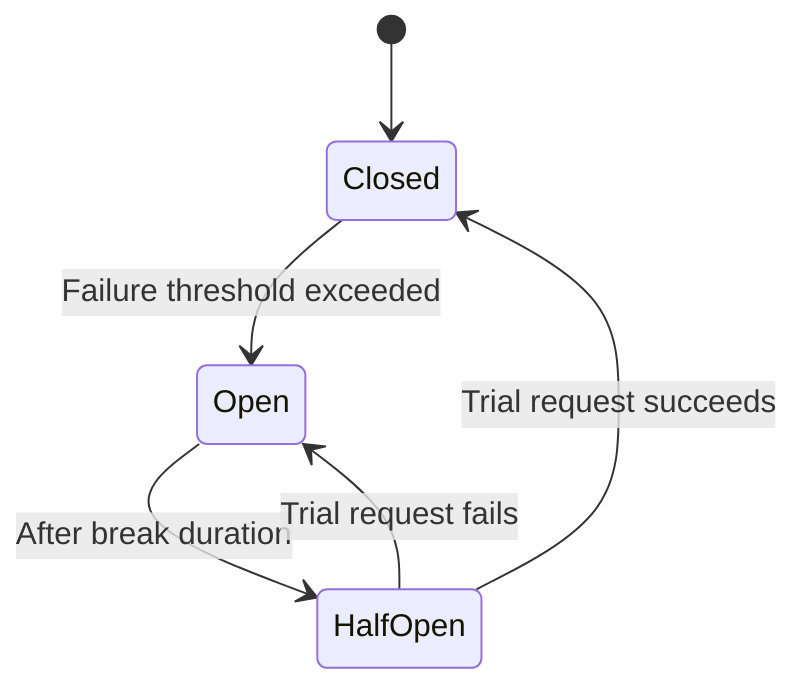

**Q: .NET 8+ mein current idiomatic resilience approach kya hai?**

A: `Microsoft.Extensions.Resilience`/`Microsoft.Extensions.Http.Resilience` (Polly v8 ke pipeline API par built), `IHttpClientFactory` par `AddStandardResilienceHandler()` ke through — hand-wiring Polly policies directly se preferred.

**Q: Circuit breaker ke saath paired related resiliency patterns naam batao.**

A: Retry (exponential backoff + jitter ke saath), Bulkhead isolation (ek dependency ko concurrent calls cap karna), Timeout (wait time bound karna), Fallback (failure par cached/default value return karna).

### gRPC vs REST vs GraphQL

**Q: REST, gRPC, aur GraphQL ko contract, streaming, aur browser support par compare karo.**

A: REST — OpenAPI (aksar optional), limited streaming (SSE/chunked), native browser support. gRPC — mandatory `.proto` contract, native bidirectional streaming, browsers ke liye grpc-web proxy chahiye. GraphQL — mandatory schema, subscriptions WebSockets ke through bolted on, native browser support.

```protobuf
syntax = "proto3";
service ProductService {
  rpc GetProduct (ProductRequest) returns (ProductResponse);
}
```

```csharp
builder.Services.AddGraphQLServer().AddQueryType<Query>();
```

**Q: Har ek kab choose karoge?**

A: Public APIs/broad compatibility/cacheability ke liye REST. Speed + strong contracts chahiye waale internal service-to-service calls ke liye gRPC. Jab client data-shape needs bahut vary karti hain to GraphQL — lekin uske downsides discuss karne ke liye ready raho (harder HTTP caching, N+1 resolver risk, field-level authorization complexity).

### OData

**Q: OData ek REST endpoint mein kya add karta hai, aur risk kya hai?**

A: Standardized query capabilities (`$filter`, `$orderby`, `$select`, `$expand`, `$top`) query string conventions ke through. Risk: clients arbitrarily expensive queries construct kar sakte hain (unbounded `$expand` depth, unindexed columns par filters) — guardrails chahiye hote hain (max page size, query cost limits, large collections par `$expand` disable karna) warna yeh ek self-inflicted DoS vector hai.

```csharp
builder.Services.AddControllers().AddOData(options => options.Select().Filter().OrderBy());

[EnableQuery]
[HttpGet]
public IQueryable<Product> Get() => _context.Products;
```

```http
GET /api/products?$filter=price gt 100&$orderby=name
```

## System Design & Scalability

### Database Sharding vs Partitioning

**Q: Partitioning vs sharding — difference kya hai?**

A: Partitioning ek table ka data multiple physical structures ke across split karta hai **same DB instance ke andar** (usually app ke liye transparent) — single-table manageability/performance solve karta hai. Sharding data ko multiple separate DB instances ke across split karta hai ek app-aware shard key ke through — horizontal scalability solve karta hai jab ek instance ki capacity bottleneck ho, app-code complexity, hotspots, aur hard cross-shard queries/joins ki cost par.

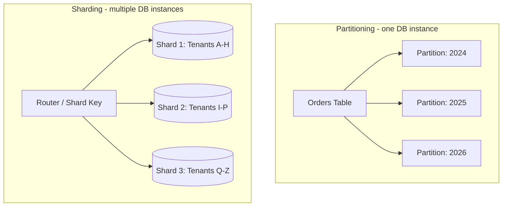

**Q: Pehle kaunsa reach karna chahiye?**

A: Partitioning — yeh "yeh table bahut bada/slow hai" problem ko application code touch kiye bina solve karta hai. Sharding sirf tab reach karo jab ek instance ki total capacity actual bottleneck ho. Ek common middle ground: tenant se shard karo (natural partition boundary) jabki har shard ki tables ko date se partition karo.

### Feature Flags & Safe Rollout

**Q: Feature flags ke peeche core idea kya hai?**

A: Woh deployment (code production mein pohochna) ko release (ek feature visible/active hona) se decouple karte hain — safe, gradual rollout enable karte hue.

```csharp
if (await _featureManager.IsEnabledAsync("NewCheckoutFlow"))
{
    return await _newCheckoutService.ProcessAsync(order);
}
return await _legacyCheckoutService.ProcessAsync(order);
```

```csharp
builder.Services.AddFeatureManagement(); // Microsoft.FeatureManagement
```

**Q: Safe feature-flag rollout par ek senior answer kya cover karta hai?**

A:
- Gradual/percentage rollout (1% → 10% → 50% → 100%), har step par metrics watch karna.
- Kill switch — redeploy ke bina flippable.
- Flag hygiene — flags temporary hote hain; rollout complete hone ke baad stale ones remove karo.
- Consistent bucketing — user/session ID ko rollout percentage mein hash karo, har request par fresh random roll nahi.

### Zero-Downtime Deployment: Blue-Green & Canary

**Q: Blue-Green, Canary, aur Rolling deployment strategies compare karo.**

A: Blue-Green — do full environments, health checks ke baad 100% traffic atomically flip karo; instant rollback, dono exist karte hue infra cost double karta hai. Canary — v2 ko small, gradually increasing traffic % route karo metrics watch karte hue; fast rollback, lower cost, traffic-splitting infra chahiye. Rolling — v1 instances ko ek-ek karke v2 se replace karo; slower rollback, low cost, Kubernetes mein standard.

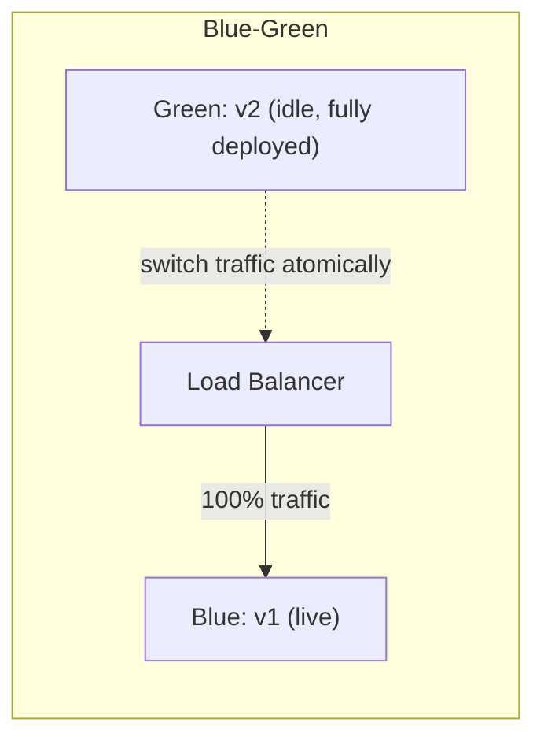

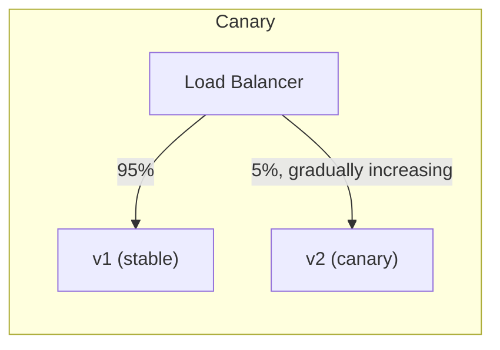

**Q: Ek senior candidate ko kaunse key mechanics unprompted naam lene chahiye?**

A: Readiness probes (traffic sirf tab route karo jab truly ready ho), backward-compatible DB migrations (rollout ke doran old aur new code dono ke saath kaam karni chahiye), aur graceful shutdown (terminate karne se pehle in-flight requests drain karo).

**Q: Canary vs Blue-Green — kaunsa ek bad deploy earlier catch karta hai?**

A: Canary — smaller blast radius, real production traffic, gradual exposure — lekin zyada sophisticated metrics-driven automation chahiye. Blue-Green reason karna simpler hai lekin ek bad deploy sirf 100% traffic flip hone ke baad surface hota hai.

### The Outbox Pattern

**Q: Outbox Pattern kaunsi problem solve karta hai?**

A: Dual-write problem — ek DB update karna aur ek message broker ko event publish karna do separate systems hain jinka koi shared transaction nahi hai; agar do separate steps ke roop mein kiya jaaye, ek succeed ho sakta hai jabki dusra fail ho jaaye, system ko inconsistent chodte hue.

**Q: Outbox Pattern kaise kaam karta hai?**

A: Event ko `OutboxMessages` table mein business data change ke **same DB transaction** mein likho; ek separate background relay/poller unpublished rows padhta hai aur unko broker ko publish karta hai, success par processed mark karta hai.

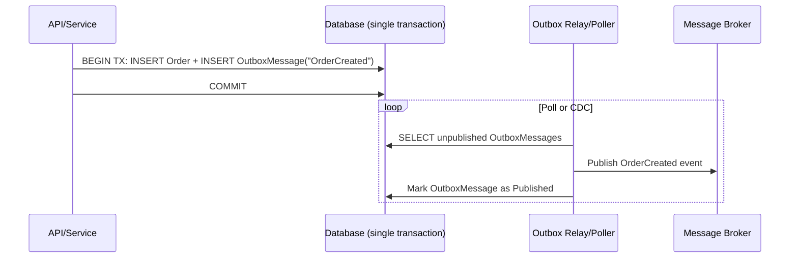

```csharp
public class OutboxMessage
{
    public Guid Id { get; set; }
    public string Type { get; set; }
    public string Payload { get; set; } // serialized event
    public DateTime CreatedAt { get; set; }
    public DateTime? ProcessedAt { get; set; }
}

// Inside the same DbContext SaveChanges transaction as the business entity:
_context.Orders.Add(order);
_context.OutboxMessages.Add(new OutboxMessage
{
    Id = Guid.NewGuid(),
    Type = "OrderCreated",
    Payload = JsonSerializer.Serialize(new { order.Id, order.CustomerId }),
    CreatedAt = DateTime.UtcNow
});
await _context.SaveChangesAsync(); // atomic: both rows commit together, or neither does
```

**Q: Relay ki delivery guarantee par kaunsa senior-level nuance apply hota hai?**

A: Yeh **at-least-once** deliver karta hai (publish karne ke baad lekin processed mark karne se pehle crash ho sakta hai, re-publish cause karte hue) — consumers ko idempotent hona chahiye. Yeh real mechanism hai jo most "exactly-once" claims ke peeche hota hai: at-least-once delivery + idempotent consumers.

**Q: Outbox pattern sagas se kaise relate karta hai?**

A: Yeh sagas ke liye standard building block hai (services ke across local transactions ki ek sequence, har ek previous step ke event se triggered) — distributed two-phase-commit transactions ka alternative.

### Eventual Consistency & Compensating Transactions

**Q: Compensating transaction kya hai?**

A: Ek explicit, business-meaningful "undo" action jo ek service perform karti hai jo already ek local change commit kar chuki hai, jab ek distributed workflow mein baad ka step fail ho jaaye (jaise, reserved stock release karo, ek charge refund karo) — kyunki automatically rollback karne ke liye koi shared transaction nahi hai. Yeh Saga pattern ka core mechanic hai.

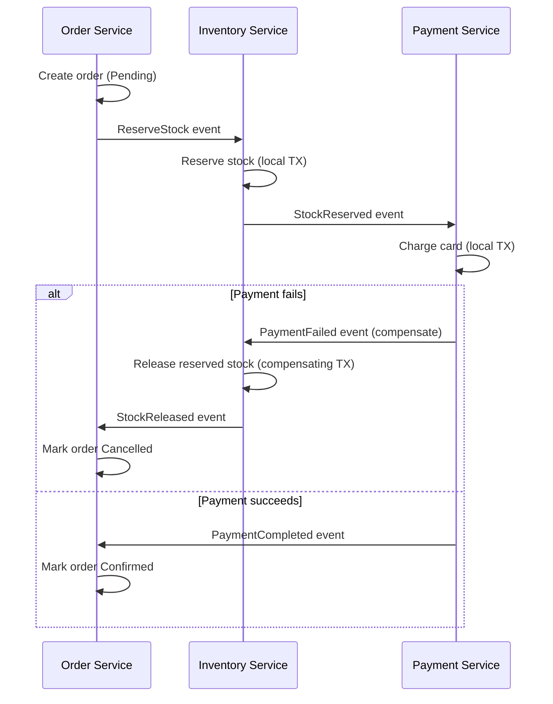

**Q: Eventual consistency ke liye design karte waqt ek senior candidate ko kya unprompted raise karna chahiye?**

A:
- UI ko interim states ke baare mein honest hona chahiye ("confirming payment," instant final success implying nahi karna).
- Read models lag kar sakte hain — "I just saved it but it's not there" bugs avoid karne ke liye design karo.
- Compensations hamesha possible nahi hote (jaise, ek already-sent email) — realistic failure points se aage irreversible side effects prevent karo.
- Idempotency aur outbox pattern hi hai jo sagas ko reliable banate hain.

## Deployment & Observability

### Health Checks

**Q: ASP.NET Core mein health checks kaise implement karte hain?**

A: `AddHealthChecks().AddDbContextCheck<AppDbContext>().AddCheck<...>().AddUrlGroup(...)`, phir `app.MapHealthChecks("/health")`.

```csharp
builder.Services.AddHealthChecks()
    .AddDbContextCheck<AppDbContext>()
    .AddCheck<RedisHealthCheck>("redis")
    .AddUrlGroup(new Uri("https://downstream-api.com/health"), name: "downstream-api");

app.MapHealthChecks("/health");
```

```http
GET /health
```

**Q: Liveness vs readiness — distinction kyun matter karta hai?**

A: Liveness = kya process alive hai/kya isse restart karna chahiye. Readiness = kya yeh traffic receive karne ke liye ready hai (DB reachable, caches warm). Inko confuse karna Kubernetes ko ek healthy-but-starting pod restart karne ke liye, ya ek pod ko traffic route karte rehne ke liye jiska DB down hai — separate endpoints/tags use karo.

**Q: Ek readiness check jo downstream dependency ko ping karta hai uska risk kya hai?**

A: Yeh khud ek cascading-failure vector ban sakta hai agar woh dependency slow/down hai — isse ek timeout se bound karo aur "downstream degraded" ko `Degraded` treat karna consider karo, necessarily `Unhealthy` nahi.

### Dockerizing a .NET Web API

**Q: Ek multi-stage Dockerfile kyun matter karti hai?**

A: Full `sdk` image se build karna lekin smaller `aspnet` runtime image ship karna final image ko lean rakhta hai (production mein no compilers/build tooling) aur attack surface reduce karta hai.

```dockerfile
# Build stage
FROM mcr.microsoft.com/dotnet/sdk:8.0 AS build
WORKDIR /src
COPY . .
RUN dotnet restore
RUN dotnet publish -c Release -o /app/publish

# Runtime stage
FROM mcr.microsoft.com/dotnet/aspnet:8.0 AS runtime
WORKDIR /app
COPY --from=build /app/publish .
EXPOSE 8080
ENTRYPOINT ["dotnet", "MyWebAPI.dll"]
```

```bash
docker build -t mywebapi .
docker run -p 5000:8080 mywebapi
```

**Q: Ek senior candidate ke liye aur Docker practices kya matter karti hain?**

A: Exact base image tags pin karo (`latest` nahi); non-root user se run karo; `.dockerignore` use karo `bin`/`obj`/`.git` ke liye; config ko env vars/mounted secrets se externalize karo, secrets ko kabhi image mein bake mat karo; orchestrator probes ke liye health checks ke saath pair karo.

### Application Insights (Monitoring & Telemetry)

**Q: Application Insights out of the box aapko kya deta hai?**

A: Automatic request/dependency tracking, exception tracking, live metrics, aur distributed request correlation (`Operation Id` ek logical request ko service hops ke across ties karta hai ek end-to-end Application Map trace ke liye).

```csharp
builder.Services.AddApplicationInsightsTelemetry(builder.Configuration["ApplicationInsights:ConnectionString"]);
```

```csharp
public class ProductsController : ControllerBase
{
    private readonly TelemetryClient _telemetry;
    public ProductsController(TelemetryClient telemetry) => _telemetry = telemetry;

    [HttpGet]
    public IActionResult Get()
    {
        _telemetry.TrackEvent("ProductsListRequested");
        return Ok("Success");
    }
}
```

**Q: Application Insights aaj OpenTelemetry se kaise relate karta hai?**

A: Current-generation Application Insights OpenTelemetry par built hai under the hood (Azure Monitor OpenTelemetry Distro ke through) — yeh effectively "OpenTelemetry instrumentation Azure Monitor ko exported" hai, koi separate competing technology nahi.

**Q: Custom events (`TrackEvent`) kab use karna chahiye auto-instrumentation ke bajaye?**

A: Custom events/metrics ko business-level signals ke liye reserve karo jo ek dashboard/alert ko actually chahiye (jaise, "checkout completed") — sab kuch nahi, warna aap useful signal ko noise aur ingestion cost mein drown kar dete ho.

## Performance

### Response Compression

**Q: Brotli vs Gzip, aur compression kab worth nahi hai?**

A: Brotli generally text/JSON ko Gzip se better compress karta hai comparable/better speed par modern CPUs par — isse primary ke roop mein use karo Gzip fallback ke saath. Already-compressed content (images/video) ya bahut chhote payloads (overhead savings se zyada) ke liye worth nahi hai; pipeline mein early `UseResponseCompression()` register karo.

```csharp
builder.Services.AddResponseCompression(options =>
{
    options.Providers.Add<BrotliCompressionProvider>();
    options.Providers.Add<GzipCompressionProvider>();
});
app.UseResponseCompression();
```

```http
Accept-Encoding: gzip, deflate, br
```

### Response Caching, Output Caching & Distributed Cache (Redis)

**Q: `[ResponseCache]`/`AddResponseCaching()` vs Output Caching — kya difference hai?**

A: `[ResponseCache]` mostly HTTP caching headers manipulate karta hai aur necessarily server-side cache nahi karta. Output Caching (.NET 7+, `AddOutputCache()`/`UseOutputCache()`) actual server-side cache-the-response-body feature hai, jo custom policies aur tag-based eviction (`EvictByTagAsync`) support karta hai — modern recommendation hai.

```csharp
builder.Services.AddResponseCaching();
app.UseResponseCaching();

[ResponseCache(Duration = 60, Location = ResponseCacheLocation.Client)]
[HttpGet]
public IActionResult Get() => Ok("Cached Data");
```

```csharp
builder.Services.AddOutputCache(options =>
{
    options.AddPolicy("Products", policy => policy.Expire(TimeSpan.FromSeconds(60)).Tag("products"));
});
app.UseOutputCache();

app.MapGet("/api/products", () => Ok(products)).CacheOutput("Products");

// Later, on a write:
await outputCacheStore.EvictByTagAsync("products", cancellationToken);
```

**Q: Microservices mein caching ke liye Redis kyun matter karta hai?**

A: Jaise instance count scale karta hai, `IMemoryCache` per instance diverge ho jaata hai — instance A par ek hit instance B par ek miss hai. Redis ek shared cache deta hai jise sab instances padhte hain, cached state ko fleet ke across consistent rakhte hue.

```csharp
builder.Services.AddStackExchangeRedisCache(options =>
{
    options.Configuration = "redis:6379";
    options.InstanceName = "app_";
});

var value = await cache.GetStringAsync("product_10");
if (value is null)
{
    value = await FetchFromDbAndSerialize();
    await cache.SetStringAsync("product_10", value, new DistributedCacheEntryOptions
    {
        AbsoluteExpirationRelativeToNow = TimeSpan.FromMinutes(10)
    });
}
```

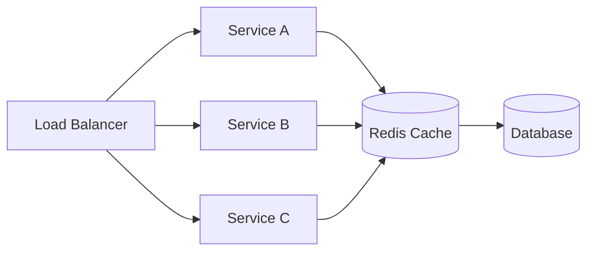

**Q: Common caching pitfalls aur mitigations naam batao.**

A:
- Cache Stampede — expiry par bahut concurrent requests DB par hit karte hain → distributed locks, cache warming, jittered TTLs.
- Cache Invalidation — DB update hui lekin cache stale hai → delete-on-write, write-through, event-driven invalidation.
- Storing Too Much Data → sirf hot data cache karo, TTLs set karo.
- Serialization Problems → compact formats (MessagePack), trimmed DTOs.
- Redis as Primary Store → Redis ko disposable treat karo, system of record nahi.
- Connection Mismanagement → ek shared `IConnectionMultiplexer` singleton reuse karo.

### ETags & Conditional Requests

**Q: ETags conditional GET aur optimistic concurrency ko kaise support karte hain?**

A: `ETag` + `If-None-Match` — conditional GET; server `304 Not Modified` return karta hai agar client ki cached copy current hai, bandwidth save karte hue. `ETag` + `If-Match` — writes ke liye optimistic concurrency; `412 Precondition Failed` se reject karo agar resource client ke last read se change hua ho (HTTP-layer analogue EF Core ke `[ConcurrencyCheck]`/`RowVersion` ka).

```csharp
[HttpGet("{id}")]
public async Task<IActionResult> GetProduct(int id)
{
    var product = await _context.Products.FindAsync(id);
    if (product is null) return NotFound();

    var etag = $"\"{product.RowVersion.ToBase64()}\"";
    Response.Headers.ETag = etag;

    if (Request.Headers.IfNoneMatch == etag)
        return StatusCode(StatusCodes.Status304NotModified);

    return Ok(product);
}

[HttpPut("{id}")]
public async Task<IActionResult> UpdateProduct(int id, [FromBody] Product update)
{
    var product = await _context.Products.FindAsync(id);
    if (product is null) return NotFound();

    var currentEtag = $"\"{product.RowVersion.ToBase64()}\"";
    if (Request.Headers.IfMatch != currentEtag)
        return StatusCode(StatusCodes.Status412PreconditionFailed); // someone else updated it first

    // apply update, DB concurrency token check enforces this at the data layer too
    await _context.SaveChangesAsync();
    return NoContent();
}
```

### Query & EF Core Performance

```csharp
var products = _context.Products.AsNoTracking().ToList();
```

**Q: Senior-level EF Core performance checklist list karo.**

A:
- Read-only queries ke liye `AsNoTracking()`.
- N+1 avoid karo — `.Include()`/`.ThenInclude()` ya projections use karo full entities ke bajaye.
- Compiled queries (`EF.CompileAsyncQuery`) hot, repeated query shapes ke liye.
- `.AsSplitQuery()` cartesian explosion avoid karne ke liye jab multiple collections eager-load ho rahi hon.
- `.ToQueryString()`, query logging, ya DB execution plans se diagnose karo; missing indexes check karo.
- DB level par paginate karo (`ToList()` se pehle `Skip/Take`), memory mein nahi.
- Genuine hotspots ke liye Dapper/raw ADO.NET jahan EF overhead measurably matter karta hai — pehle profile karo.

### Soft Delete Pattern

**Q: Physical DELETE se soft delete kyun prefer karo?**

A: Audit history preserve karta hai aur cascade-breaking foreign keys avoid karta hai — row remove karne ke bajaye ek `IsDeleted` flag.

```csharp
public class Product
{
    public int Id { get; set; }
    public string Name { get; set; }
    public bool IsDeleted { get; set; }
}

[HttpDelete("{id}")]
public async Task<IActionResult> SoftDelete(int id)
{
    var product = await _context.Products.FindAsync(id);
    if (product is null) return NotFound();

    product.IsDeleted = true;
    await _context.SaveChangesAsync();
    return NoContent();
}
```

**Q: Har query ko `IsDeleted` ke liye manually filter karne se kaise avoid karte ho?**

A: `OnModelCreating` mein ek EF Core global query filter: `modelBuilder.Entity<Product>().HasQueryFilter(p => !p.IsDeleted);` — yeh automatically har LINQ query mein apply hota hai including `Include()`d navigations. Admin/audit queries ke liye jinko deleted rows chahiye `.IgnoreQueryFilters()` use karo.

```csharp
protected override void OnModelCreating(ModelBuilder modelBuilder)
{
    modelBuilder.Entity<Product>().HasQueryFilter(p => !p.IsDeleted);
}
```

**Q: Soft delete ke saath kaunse trade-offs aate hain?**

A: Unique constraints ko filtered/partial indexes chahiye (`WHERE IsDeleted = 0`); decide karo ki kya ek soft-deleted parent ke children bhi cascade-flag hone chahiye; soft delete ek real retention/purge policy ka substitute nahi hai; GDPR "right to be forgotten" ko row retain karte hue bhi PII fields scrub karna pad sakta hai.

### Async/Await Pitfalls

**Q: ASP.NET Core request handler mein `Task.Run` almost always kyun wrong hai?**

A: Yeh bas work ko ek dusre thread pool thread par move karta hai — single request ke liye parallelism add nahi karta aur load ke under thread pool starvation worsen kar sakta hai.

**Q: Kya async code par block karna (`.Result`/`.Wait()`) ASP.NET Core mein specifically dangerous hai?**

A: Classic ASP.NET/WCF/WinForms se kam deadlock risk hai kyunki ASP.NET Core mein default se koi `SynchronizationContext` nahi hai, lekin phir bhi ek thread pool thread waste karta hai aur testability/composability ke liye anti-pattern rehta hai; widespread blocking phir bhi load ke under thread pool starve kar sakti hai.

**Q: `ValueTask` gotcha kya hai?**

A: `ValueTask<T>` synchronous completion par ek heap allocation avoid karta hai (jaise, cache hit) lekin **do baar await nahi kiya ja sakta ya concurrently store/await nahi kiya ja sakta** — `Task` ke unlike, jo multiple baar safely await kiya ja sakta hai.

**Q: `ConfigureAwait(false)` actually kahan matter karta hai?**

A: Mostly library code mein jisme koi captured context par dependency nahi hai — ASP.NET Core app/controller code mein largely non-issue hai (no `SynchronizationContext`), lekin shared libraries mein still good hygiene hai jo contexts consume karti hain jinke paas ek hota hai (WPF/WinForms).

## Security

### Securing a Web API — Full Checklist

**Q: Full Web API security checklist list karo.**

A: Authentication (JWT/OAuth2/API keys), Authorization (roles/claims/policies), CORS, Rate limiting, Input validation/sanitization, HTTPS/TLS everywhere, Secrets management (Key Vault/env vars), Security headers (HSTS, CSP, X-Content-Type-Options).

**Q: EF Core / ADO.NET mein SQL injection kaise prevent karte ho?**

A: EF Core ka LINQ provider queries ko automatically parameterize karta hai. Raw SQL ke liye, `FromSqlRaw` string concatenation ke bajaye `FromSqlInterpolated` ya explicit parameters prefer karo — user input ko kabhi ek query string mein concatenate mat karo.

```csharp
// BAD
string query = "SELECT * FROM users WHERE username = '" + userInput + "'";

// GOOD — parameterized
var command = new SqlCommand("SELECT * FROM users WHERE username = @username", connection);
command.Parameters.AddWithValue("@username", userInput);
```

**Q: Specifically ek API ke liye main XSS risk kya hai?**

A: Usually frontend jo API responses ko bina escape kiye trust karta hai, lekin APIs ko phir bhi stored input validate/sanitize karna chahiye taaki woh dusre consumers ke liye stored-XSS vector na ban jaaye.

**Q: Input sanitization ke liye ek Data Annotations validation example dikhao.**

A:

```csharp
public class User
{
    [Required][StringLength(50)] public string Username { get; set; }
    [EmailAddress] public string Email { get; set; }
}
```

### SSL/TLS Fundamentals

**Q: TLS kaunse teen guarantees provide karta hai?**

A: Confidentiality (encryption), authentication (server identity CA-signed cert ke through), integrity (tamper detection). Yeh sirf data in transit ko protect karta hai, at rest nahi.

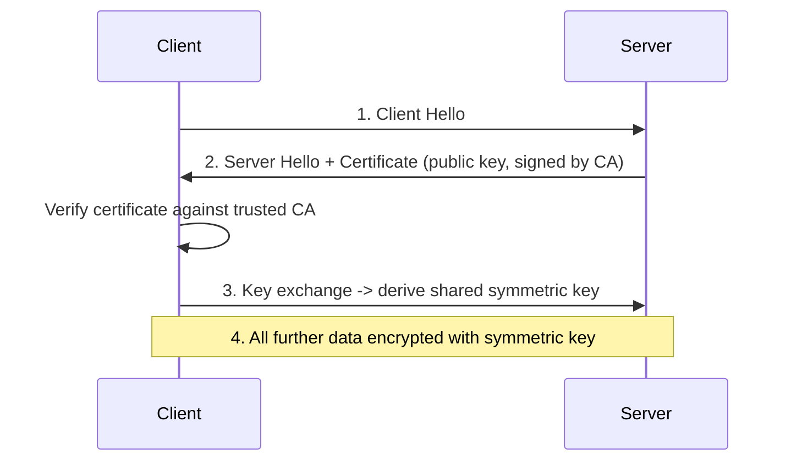

**Q: Hybrid crypto (asymmetric handshake + symmetric bulk transfer) kyun?**

A: Asymmetric crypto handshake ke doran ek shared symmetric key negotiate karta hai; symmetric crypto baad mein bulk data transfer ke liye orders of magnitude faster hai.

**Q: HSTS kya karta hai?**

A: `Strict-Transport-Security` browsers ko force karta hai ki woh ek domain ke liye aage sirf HTTPS use karein, very first request par hi downgrade-attack window close karte hue.

**Q: TLS termination commonly kahan hoti hai?**

A: Ek load balancer/IIS/reverse proxy par, jahan backend ek trusted network boundary ke andar internally plain HTTP receive karta hai.

### Token Revocation & Refresh Tokens

**Q: JWT revocation fundamentally hard kyun hai?**

A: JWTs design se stateless/self-contained hote hain — server per request ek database check nahi karta, jo point hai. Ek leaked JWT expire hone tak valid rehta hai; koi built-in early-invalidation mechanism nahi hai.

```csharp
public class TokenService
{
    private static readonly List<string> _blacklistedTokens = new();
    public void RevokeToken(string token) => _blacklistedTokens.Add(token);
    public bool IsTokenRevoked(string token) => _blacklistedTokens.Contains(token);
}
```

**Q: Ek naive in-memory token blacklist (`static List<string>`) kyun inadequate hai?**

A: Yeh per-instance hai — instance A par revoke karna instances B/C ke liye kuch nahi karta ek horizontally scaled deployment mein.

**Q: Revocation ka production-correct approach kya hai?**

A: Ek shared distributed revocation store (Redis, remaining token life se matching TTL), ya — zyada commonly — problem avoid karo: access tokens ko short-lived rakho, aur long sessions ke liye server-side-stored refresh tokens (DB) use karo taaki unko demand par revoke/rotate kiya ja sake.

```csharp
[HttpPost("refresh-token")]
public async Task<IActionResult> RefreshToken([FromBody] TokenRequest request)
{
    var user = await _context.Users.SingleOrDefaultAsync(u => u.RefreshToken == request.RefreshToken);
    if (user == null || user.RefreshTokenExpiry < DateTime.UtcNow)
        return Unauthorized();

    var newAccessToken = GenerateJwtToken(user);
    user.RefreshToken = GenerateRefreshToken(); // rotate on use — prevents replay of an old refresh token
    await _context.SaveChangesAsync();

    return Ok(new { Token = newAccessToken, RefreshToken = user.RefreshToken });
}

private string GenerateRefreshToken() => Convert.ToBase64String(RandomNumberGenerator.GetBytes(64));
```

**Q: Refresh token rotation kya hai, aur yeh kyun matter karti hai?**

A: Har use par ek naya refresh token issue karo aur purane ko invalidate karo — yeh theft detect karne deta hai: agar ek stolen (already-rotated) refresh token replay hota hai, to aap jaante ho ki woh compromised tha aur poori token family revoke kar sakte ho.

### Two-Factor Authentication

**Q: Common 2FA mechanisms ko strength se rank karo.**

A: SMS-based 2FA weakest hai (SIM-swapping ke liye vulnerable); TOTP apps (Google Authenticator/Authy) ya WebAuthn/FIDO2 passkeys stronger aur increasingly preferred hain.

```csharp
var token = await _userManager.GenerateTwoFactorTokenAsync(user, TokenOptions.DefaultPhoneProvider);
await _smsService.SendSmsAsync(user.PhoneNumber, $"Your verification code is {token}");

var isValid = await _userManager.VerifyTwoFactorTokenAsync(user, TokenOptions.DefaultPhoneProvider, inputToken);
if (!isValid) return Unauthorized();
```

## Best Practices

**Q: Guide ki Web API best practices summarize karo.**

A:
- Resource-oriented URLs design karo, verbs/status codes correctly use karo, casing/pluralization par consistent raho.
- Boundaries par DTOs use karo — kabhi directly EF entities se bind na karo.
- Kisi bhi API ke liye jisme external/cross-team consumers hain, day one se version karo.
- Sab errors ke liye Problem Details (RFC 7807/9459) return karo, ad hoc shapes nahi.
- POST/PUT ko idempotent banao jahan business meaning allow kare; otherwise idempotency keys use karo.
- Large/high-write/public collections ke liye cursor-based pagination prefer karo.
- Sab outbound HTTP ke liye `IHttpClientFactory` use karo.
- Controllers ko thin rakho — business logic services/domain layer mein rehti hai.
- Correlation IDs + distributed tracing (OpenTelemetry) ke saath structured logging use karo.
- HTTPS/HSTS everywhere enforce karo; certificate validation ko kabhi "temporarily" disable mat karo.
- Authorization par fail closed raho — default-deny, explicit allow.
- Optimize karne se pehle load-test/profile karo (`dotnet-counters`/`dotnet-trace`), guesswork nahi.
- Apni API ko ek product treat karo — isse document karo, isse ek SLA/deprecation policy do.

## Common Pitfalls

**Q: Guide ke flagged common pitfalls kya hain?**

A:
- PATCH ko default se idempotent assume karna.
- Raw exception messages/stack traces clients ko leak karna.
- Wildcard CORS credentials ke saath combined.
- Ek Scoped service (`DbContext`) ko directly ek Singleton mein inject karna.
- Ek large, frequently-mutated table par offset-based pagination.
- Redis ko system of record ki tarah treat karna, disposable cache ke bajaye.
- In-memory-per-instance rate limiting counters jo ek false "global" limit create karte hain.
- OData/`$filter`/`$expand` ko page-size caps ya query cost limits ke bina expose karna.
- Request paths mein async code par block karna (`.Result`/`.Wait()`).
- EF Core ke `DbContext` ko concrete justification ke bina repository-pattern-wrap karna.
- `[ApiController]` ke under redundant manual `ModelState.IsValid` checks likhna.
- Yeh assume karna ki ek JWT ko server-side "logged out" kiya ja sakta hai bina ek revocation store ya short-expiry + refresh strategy ke.

## Sample Interview Q&A

**Q: ASP.NET Core request pipeline explain karo aur middleware kahan fit hota hai.**

A: Kestrel `HttpContext` build karta hai, jo ek ordered middleware pipeline (exception handling → HTTPS redirection → routing → authentication → authorization → custom middleware) ke through flow karta hai, endpoint execution mein jaata hai, filters ke through, aur reverse mein waapas aata hai. `Use` pipeline continue karta hai; `Run` isse terminate/short-circuit karta hai.

**Q: `HttpClient` use karte waqt socket exhaustion kaise avoid karte ho?**

A: `IHttpClientFactory` (named/typed clients) use karo per call `new HttpClient()` ya ek naive static singleton ke bajaye — handlers ko rotation par pool/recycle karta hai, DNS staleness ke bina connection reuse deta hai.

**Q: Production mein ek slow EF Core query aap kaise diagnose karoge?**

A: `.ToQueryString()`/query logging se generated SQL capture karo, `EXPLAIN`/execution plan run karo, missing indexes check karo, N+1 patterns dhundo, read-only paths par `AsNoTracking()` confirm karo.

**Q: REST ke bajaye gRPC kab choose karoge?**

A: Internal service-to-service calls jo aapke control mein hain aur jinko low latency/high throughput, strongly-typed `.proto` contracts, aur/ya native bidirectional streaming chahiye. REST public APIs aur broad compatibility ke liye default rehta hai.

**Q: Ek payment API ke liye idempotent retries kaise design karte ho?**

A: Har logical operation ke liye ek client-supplied idempotency key require karo; key ko result ke saath atomically store karo; same key ke saath retry par stored result return karo; concurrent in-flight requests ko explicitly handle karo (409/425).

**Q: Ek POST se trigger hone waali long-running operation aap kaise handle karte ho?**

A: `202 Accepted` return karo ek `Location` header ke saath, work ko ek background processor mein enqueue karo, client ko poll karne do ya ek webhook register karne do — original request ko full duration par kabhi block mat karo.

**Q: Authentication aur authorization mein kya difference hai, aur pipeline mein har ek kahan fail hota hai?**

A: Authentication (aap kaun ho) pehle run hota hai, `HttpContext.User` populate karta hai; failure typically anonymous identity deti hai pipeline stop karne ke bajaye. Authorization (aap kya kar sakte ho) baad mein run hota hai; failure 401/403 return karta hai aur controller action kabhi execute nahi hota.

**Q: Aap `DbContext` ko ek Singleton mein kyun inject nahi kar sakte?**

A: `DbContext` Scoped hai aur thread-safe nahi hai; ek Singleton concurrent requests ke across shared hota hai, isliye direct injection ek lifetime-validation exception ya race conditions cause karta hai. Fix: `IServiceScopeFactory` inject karo aur per operation ek scope create karo.

**Q: Offset vs cursor pagination — har ek kab choose karoge?**

A: Offset smaller, relatively static datasets ke liye jinko "jump to page N"/total-page-count UI chahiye (admin grids). Cursor large, high-write, ya public-facing collections ke liye (feeds, Stripe/GitHub-style APIs) — row-shift artifacts se immune, consistent indexed seek.

**Q: Ek API ko evolve karte hue backward compatible kaise rakhte ho?**

A: Explicitly version karo (URL path pragmatic default hai), fields change/remove karne ke bajaye add karo ek version ke andar, breaking changes ko naye version ke peeche gate karo, ek deprecation timeline publish karo (`Sunset`/`Deprecation` headers), CI mein consumer-driven contract tests se validate karo.
