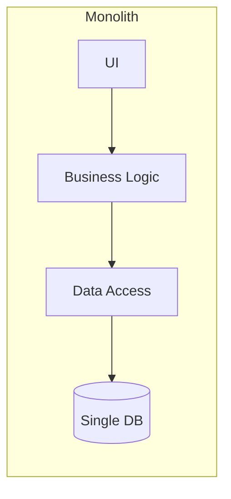
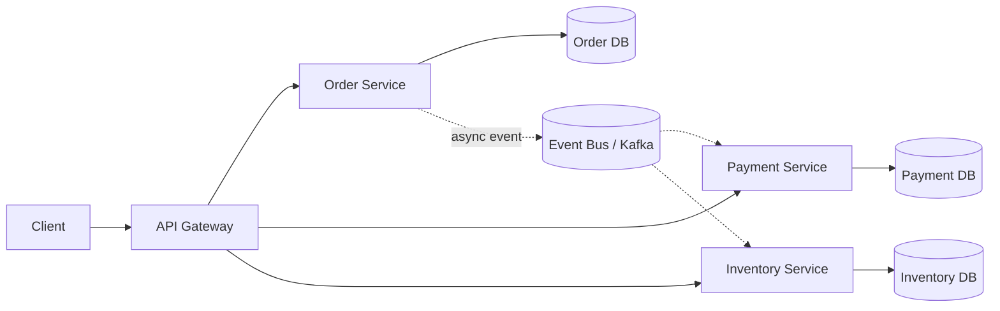
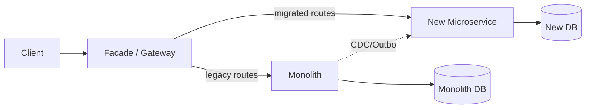
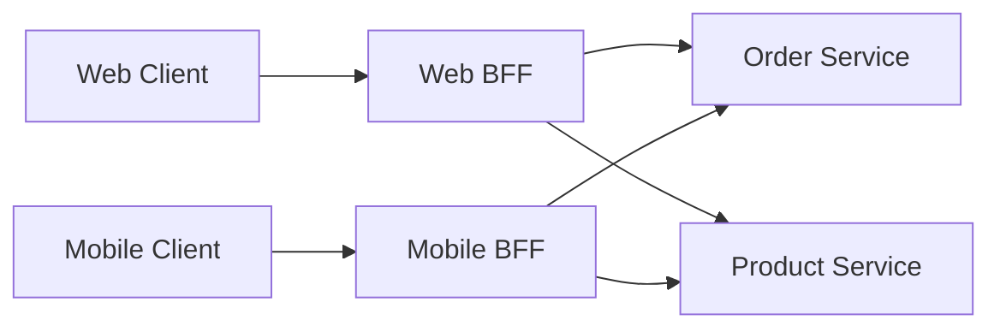
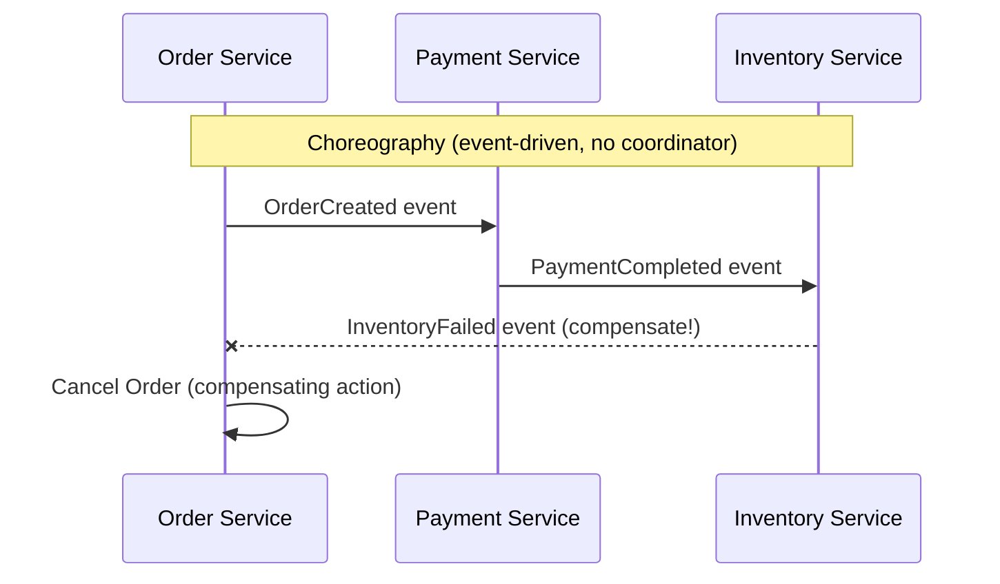
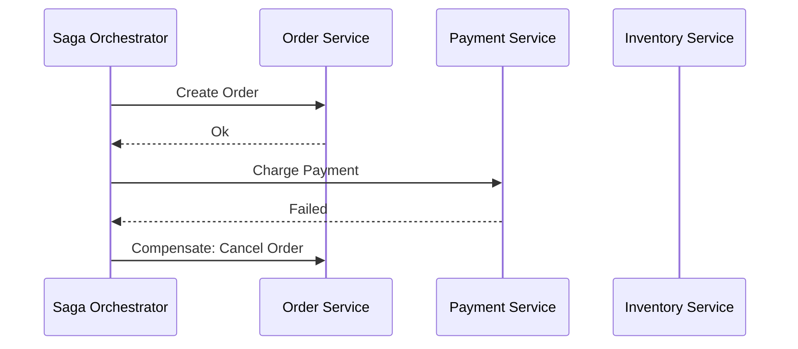
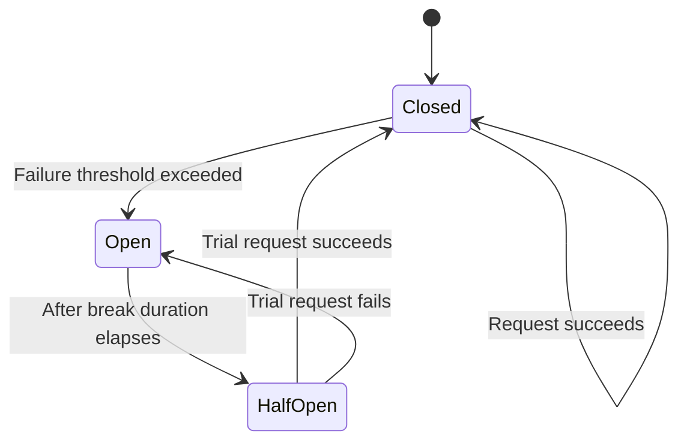
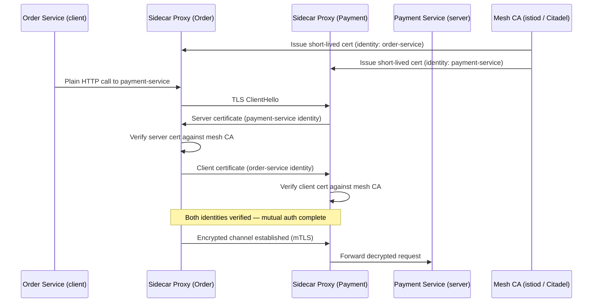
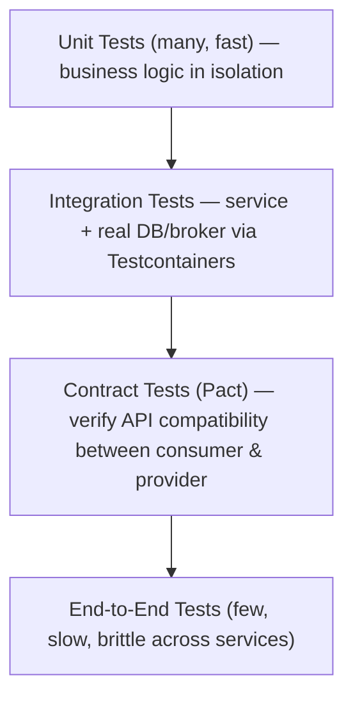

# Microservices — Interview Revision Notes

> Quick-revision Q&A `H. Microservices-Interview-Guide.md` se derived. Source ke har section ko cover karta hai.

## Core Concepts

### Microservices kya hote hain?

**Q: Microservices architecture kya hai?**

A: Ek architectural style jahan ek app small, independently deployable services se compose hoti hai, jinme har ek ek business capability own karti hai, aur network par (in-process nahi) communicate karti hai. Har service independently ek single team develop, deploy, scale, aur own karti hai.

**Q: E-commerce ke liye ek example decomposition do.**

A: Order Service (order lifecycle), Payment Service (transactions), Inventory Service (stock), Shipping Service (logistics).

### Monolith vs Microservices

**Q: Deployment, scaling, aur data ke across monoliths aur microservices kaise differ karte hain?**

A:
- Monolith: single deploy unit, poori tarah scale hota hai, single tech stack, single shared DB, simpler testing, low ops overhead.
- Microservices: independent deploys, per service scale, polyglot stacks, database-per-service, harder testing (contract/integration), high ops overhead (orchestration, tracing, mesh).





### Advantages

**Q: Microservices ke main advantages kya hain?**

A:
- Scalability — sirf hot service ko scale karo.
- Technology independence — polyglot persistence/runtimes.
- Fault isolation (agar resilience patterns apply kiye ho).
- Faster parallel development (Conway's Law).
- Independent deployability.

### Challenges

**Q: Microservices ke main challenges/costs kya hain?**

A:
- Distributed systems complexity (discovery, partial failures, cross-process debugging).
- Network latency / chatty calls (N+1 fan-out).
- Data consistency — cross-service ACID nahi hota, eventual consistency ke baare mein reason karna padta hai.
- Larger security surface (kayi network-exposed endpoints).
- Operational cost — per-service CI/CD, centralized logging/tracing, service mesh.

**Q: Microservices kab NAHI use karni chahiye?**

A:
- Small team (<2 pizza teams) ya poorly understood domain → modular monolith prefer karo.
- Microservices dev-time complexity ko run-time/ops complexity ke saath trade karti hain; pehle CI/CD, containers, observability maturity chahiye.
- Premature decomposition (wrong boundaries) monolithic rehne se zyada risky hai — baad mein fix karna matlab distributed refactoring.
- Rule of thumb: monolith-first start karo, services extract karo jab boundaries proven ho jaayein aur ek real scaling/autonomy pain exist kare.

---

## Service Design & Boundaries

**Q: Aap actually microservice boundaries kahan decide karte ho?**

A:
- **Business capability** se decompose karo, technical layer se kabhi nahi ("UI service", "DB service").
- **Bounded Context** (DDD) decomposition ki real unit hai — ek boundary jahan domain model/ubiquitous language consistent ho; same term (jaise, "Customer") different contexts mein different chiz mean kar sakta hai.
- **Context Mapping** patterns: Shared Kernel (small shared model, sparingly use karo), Customer/Supplier (upstream/downstream contract), Conformist (downstream upstream ka model accept karta hai), Anti-Corruption Layer (external/legacy model translate karta hai — strangler-fig migrations ke liye key).
- **Event Storming** — code karne se pehle domain experts ke saath bounded contexts discover karne ki workshop technique.
- Ek transaction ko kabhi bhi ek se zyada **Aggregate** span nahi karna chahiye — aur rarely ek se zyada service; cross-service transaction ki zarurat signal karti hai ki boundary wrong hai ya Saga chahiye.
- "Service kitni badi honi chahiye?" → bounded context aur team ownership se size hoti hai (2-pizza team jo end-to-end own kare), LOC se nahi.

### DDD Building Blocks

**Q: Service design mein use hone wale core DDD building blocks naam lo.**

A:
- **Entities** — identity wale objects (`Order`, `Customer`).
- **Value Objects** — immutable, no identity (`Address`).
- **Aggregates** — invariants enforce karne wale root ke saath entities/VOs ka cluster (`Order` + `OrderItem`s).
- **Repositories** — har aggregate root ke liye abstract data access.

```csharp
public class Order
{
    public int Id { get; set; }
    public List<OrderItem> Items { get; set; } = new();
}
```

### Hexagonal Architecture (Ports & Adapters)

**Q: Hexagonal Architecture kya hai aur yeh kyun matter karti hai?**

A: Core business logic ko infrastructure se separate karta hai. Core logic framework/DB-agnostic hoti hai; **Ports** interfaces hote hain (`IOrderRepository`); **Adapters** concrete implementations hote hain (EF Core repo, REST controller, message consumer). Isse services testable banti hain (test doubles ke liye adapters swap karo) aur framework-agnostic — senior .NET shops mein Clean Architecture ka basis.

**Q: Strangler Fig migration ki mechanics kya hain?**

A:
1. Monolith ke saamne ek Facade/Gateway lagao.
2. Extract karne ke liye pehle ek vertical slice (bounded context) pick karo — sabse clear boundary ya highest pain (jaise, Search, Notifications).
3. New microservice build karo; gateway matching requests ko usko route karta hai, baaki abhi bhi monolith ko hit karte hain.
4. Data migration sabse hard part hota hai — often old/new code monolith DB ko read karte hain (views/CDC) jab tak new service usko own na kar le, phir writes cut over karo.
5. Repeat karo, monolith ko incrementally shrink karte hue.
6. Key risk: transition ke dauraan **dual-write inconsistency** — Outbox ya CDC (Debezium) se mitigate karo, naive dual writes se nahi.



---

## Communication Patterns

### Synchronous vs Asynchronous

**Q: Sync vs async communication — core trade-off kya hai?**

A: Sync (REST/gRPC) — caller block hota hai, temporal coupling (callee down ho to caller fail hota hai). Async (queues/events) — caller continue karta hai; availability decouple karta hai lekin eventual consistency, ordering, idempotency, aur debugging complexity add karta hai.

**Q: Sync vs async kab choose karoge?**

A:
- Sync: read-heavy, request/response UX (jaise, "get product details"); immediate answer chahiye.
- Async: write-heavy workflows, cross-service side effects ("order placed → notify shipping, update inventory, email"); long sync chains ka cascading-failure risk kam karta hai.

### REST vs gRPC

**Q: REST aur gRPC compare karo, aur gRPC ko publicly kab expose karoge?**

A: REST = HTTP/1.1, JSON/text, OpenAPI contract, weaker streaming, browser-native, public/external APIs ke liye achha. gRPC = HTTP/2, Protobuf binary, strict `.proto` contract, native streaming (unary/server/client/bidi), browsers ke liye grpc-web proxy chahiye, internal service-to-service low-latency calls ke liye best. Publicly gRPC rarely expose karo — common pattern internally gRPC, edge par REST/GraphQL via gateway translation.

### Message Queue vs Event Bus

**Q: Message queue vs event bus — differences aur kab kaunsa pick karoge?**

A: Queue (RabbitMQ) = point-to-point/competing consumers, short-term storage, per queue FIFO, typically no replay. Event bus (Kafka) = pub/sub fan-out, persistent replayable log, partition ordering, kayi independent consumer groups. Replay/high-throughput/multiple independent consumers ke liye Kafka pick karo (analytics + fraud + notifications on "OrderPlaced"); simpler routing semantics aur replay ki zarurat ke bina true work-queue semantics ke liye RabbitMQ pick karo.

### Event-Driven Architecture

**Q: Event-driven architecture kya hai aur uske trade-offs kya hain?**

A: Services state changes par events publish karti hain; subscribers react karte hain — decoupled aur async. Benefits: async, decoupled, natural audit trail. Downsides: "isse kya trigger hua" trace karna harder, eventual consistency, event schema evolution ek cross-team contract problem ban jaati hai.

```csharp
channel.BasicPublish(exchange: "", routingKey: "order-placed",
    body: Encoding.UTF8.GetBytes("Order ID: 1234"));
```

### API Composition

**Q: API Composition (aggregator) pattern kya hai, aur uski limit kya hai?**

A: Ek aggregator client ke liye multiple services ke calls ke results combine karta hai (jaise, orders + customers separately fetch karo, merge karo). Simple hai, lekin large cross-service joins/filters ke liye scale nahi karta — tab CQRS with a denormalized read model better fit hota hai.

```csharp
var orders = await httpClient.GetFromJsonAsync<List<Order>>("orders-service/orders");
var customers = await httpClient.GetFromJsonAsync<List<Customer>>("customer-service/customers");
```

**Q: API Gateway vs Backend-for-Frontend (BFF) — difference kya hai?**

A:
- **API Gateway** — sab client types ke liye ek gateway, generic routing/auth/rate-limiting.
- **BFF** — har client type ke liye ek dedicated gateway (web-bff, mobile-bff), us client ki zarurat ke hisaab se responses shape karta hai.
- Ek single generic gateway client-specific branching logic accumulate kar leta hai (anti-pattern); BFFs frontend teams ko aggregation independently own karne dete hain.
- Trade-off: run karne ke liye zyada services; phir bhi shared cross-cutting concerns (auth, logging) ke liye BFFs ke aage ek thin edge gateway rakho.



### API Gateway (core pattern)

**Q: API Gateway kya karta hai, aur .NET mein aaj actually kya use karoge?**

A: Backend services ko route karne wala single entry point; auth, rate limiting, load balancing, request transformation centralize karta hai. Ocelot classic .NET-native gateway hai lekin activity mein slow ho gaya hai; kayi current .NET shops default se **YARP** (Microsoft-maintained, ASP.NET Core middleware ke saath integrate hota hai) ya ek managed gateway (Azure APIM, Kong, AWS API Gateway) use karte hain.

```json
{
  "Routes": [
    {
      "DownstreamPathTemplate": "/api/products",
      "DownstreamScheme": "http",
      "DownstreamHostAndPorts": [ { "Host": "localhost", "Port": 5001 } ],
      "UpstreamPathTemplate": "/products",
      "UpstreamHttpMethod": [ "GET" ]
    }
  ]
}
```

### API Gateway vs Reverse Proxy

**Q: Ek API Gateway ek plain reverse proxy se kaise differ karta hai?**

A: API Gateway application-aware hota hai — AuthN/AuthZ, rate limiting, transformation, aggregation. Reverse proxy mostly protocol-aware hota hai — load balancing, TLS termination, basic routing.

### Request Aggregation / API Gateway Caching

**Q: Gateway layer par "aggregation" aur "caching" ka matlab kya hai?**

A: Aggregation — gateway multiple downstream calls ko ek client-facing response mein combine karta hai. Caching — gateway backend load kam karne ke liye responses cache karta hai (jaise, Nginx `proxy_cache_path`).

```nginx
proxy_cache_path /var/cache/nginx levels=1:2 keys_zone=mycache:10m;
```

---

## Data Management & Consistency

### Database per Service

**Q: "Database per service" ka matlab kya hai aur yeh aapko kya solve karne ke liye force karta hai?**

A: Har service apni DB/schema own karti hai; direct cross-service DB access nahi hota. Isse independent schema evolution aur polyglot persistence enable hoti hai, lekin cross-service queries aur transactions ke liye explicit solutions force karta hai.

```csharp
public class OrderContext : DbContext
{
    public DbSet<Order> Orders { get; set; }
}
```

**Q: Aap wo queries kaise handle karte ho jinhe multiple services se data chahiye?**

A:
- API Composition (simple aggregator, badi joins ke liye scale nahi karta).
- **CQRS with materialized read models** — read-side service domain events subscribe karti hai aur ek denormalized query-optimized view banati hai (Elasticsearch/Redis/reporting DB); reads request time par kabhi fan out nahi karte.
- **BFF aggregation** — jab yeh general reporting ke bajaye client-specific ho.

### CQRS

**Q: CQRS kya hai?**

A: Write model (commands) ko read model (queries) se separate karta hai, often alag stores ke through backed. Command Handler validate karta hai/primary DB mein write karta hai; Query Handler ek separate (denormalized/replica) store se read karta hai.

```csharp
// Write
POST /orders   // handled by Command Handler → writes to primary DB

// Read
GET /orders    // handled by Query Handler → reads from read replica / projection
```

**Q: Kya CQRS ko Event Sourcing chahiye?**

A: Nahi — independent patterns hain jo often pair hote hain lekin required nahi hote. CQRS do relational tables/views par run ho sakta hai; Event Sourcing well pair karta hai kyunki iska event stream naturally read-model projections ko feed karta hai, lekin plain CQRS + read replica operationally kaafi zyada common aur simpler hai.

### Distributed Transactions — Saga Pattern

**Q: Services ke across 2PC kyun nahi, aur alternative kya hai?**

A: 2PC scale nahi karta (blocking, availability trade-offs; kayi brokers/NoSQL stores isko support nahi karte). **Saga** = local transactions ki ek sequence, jinme se har ek ke paas failure par undo karne ke liye ek compensating transaction hoti hai.





**Q: Choreography vs Orchestration — inhe compare karo.**

A:
- **Choreography** — services directly ek doosre ke events par react karte hain, koi coordinator nahi; loose coupling lekin overall flow ki poor visibility, steps badhne par messy ho jaata hai; simple 2-3 step workflows ke liye achha; tooling = plain pub/sub.
- **Orchestration** — ek central orchestrator har service ko batata hai kya karna hai aur compensation handle karta hai; achhi visibility, complex flows ke liye better scale karta hai lekin orchestrator ek god-service ban sakta hai; tooling = MassTransit saga state machine, Temporal, Azure Durable Functions, AWS Step Functions, Camunda.

**Q: Ek simple compensating-transaction example dikhao.**

A:
```csharp
if (!PaymentService.ProcessPayment(order.Id))
{
    OrderService.RollbackOrder(order.Id);
}
```

### Outbox Pattern

**Q: Outbox pattern kya problem solve karta hai, aur yeh kaise kaam karta hai?**

A: **Dual-write problem** solve karta hai (DB update aur message publish ko do separate operations ke roop mein atomically nahi kiya ja sakta).
1. Business update ke saath same local DB transaction mein event ko ek `Outbox` table mein insert karo.
2. Ek background poller ya CDC process (jaise, Debezium) unpublished rows ko read karta hai aur broker ko publish karta hai.
3. Ack hone par published mark karo/delete karo.
DB transaction ke saath aligned at-least-once delivery guarantee deta hai.

**Q: Polling-publisher aur CDC-based Outbox implementations ke beech nuance kya hai?**

A: Polling publisher — simple, latency aur DB load add karta hai. CDC-based (Debezium transaction log tail karta hai) — near real-time, koi polling overhead nahi, lekin Debezium/Kafka Connect run karne ki operational complexity add karta hai. Kisi bhi tarah, consumers idempotent hone chahiye kyunki delivery at-least-once hai.

### Idempotency

**Q: Idempotency kya hai aur yeh kyun matter karta hai?**

A: Same request repeat karna same effect produce karta hai — critical hai kyunki at-least-once delivery (retries/redeliveries) distributed systems mein norm hai.

```
POST /api/orders?IdempotencyKey=abcd1234
```

**Q: Aap actually idempotency kaise implement karte ho?**

A:
- Client har logical operation ke liye ek unique idempotency key (GUID) generate karta hai.
- Server `(IdempotencyKey, Result)` ko ek TTL ke saath store karta hai; repeat requests short-circuit ho jaati hain aur original stored response return karti hain.
- Message consumers ke liye: message ID se ek processed-messages store ke against dedupe karo, ya naturally idempotent operations use karo (UPSERT vs INSERT, "set status" vs "increment").

### Concurrency Control

**Q: Optimistic locking, pessimistic locking, aur eventual consistency compare karo.**

A:
- **Optimistic** — assume karo ki conflicts rare hain; version/rowversion column se detect karo, conflict par retry karo.
- **Pessimistic** — concurrent writers ko block karne ke liye upfront lock karo; simpler correctness lekin throughput hurt karta hai; service/network boundaries ke across generally discouraged.
- **Eventual consistency** — temporary staleness accept karo, events se reconcile karo.

```csharp
public class Order
{
    public int Id { get; set; }
    [ConcurrencyCheck]
    public int Version { get; set; }
}
```

### Read Replicas & Sharding

**Q: Read replicas ke saath trade-off kya hai?**

A: Primary se read traffic offload karta hai, lekin replicas lag kar sakti hain — "read-your-own-write" ko care chahiye (write ke turant baad primary se read karo, ya session reads ko temporarily primary par route karo).

**Q: Sharding strategies compare karo.**

A:
- **Range-based** — jaise, A–M / N–Z; simple lekin hot shards ka risk.
- **Hash-based** — even distribution, range queries harder.
- **Geo-based** — region se split; residency/latency ke liye achha, lekin cross-region joins expensive hote hain.

### Database Migrations

**Q: Live microservices environment mein schema migrations safely kaise run karte ho?**

A: EF Core Migrations ya Flyway/Liquibase use karo, version-controlled. Rolling deploys mein old/new versions simultaneously run hote hain isliye migrations **rollout ke dauraan backward-compatible** hone chahiye. **Expand/contract** use karo: naye columns/tables add karo (expand) → code dono mein write kare deploy karo → fully rolled out hone ke baad purana schema remove karo (contract). >1 replica concurrent chal rahi ho to kabhi bhi single-step breaking change mat karo.

```bash
dotnet ef migrations add InitDatabase
dotnet ef database update
```

---

## Resilience & Fault Tolerance

### Circuit Breaker Pattern

**Q: Circuit breaker kya karta hai?**

A: Ek failing dependency ko repeatedly call karne se rokta hai, usko recover hone ka time deta hai aur caller ko cascading failure/thread exhaustion se protect karta hai (jaise, Polly: 2 failures ke baad circuit ko 30s ke liye open karna).

```csharp
services.AddHttpClient("OrderService")
    .AddTransientHttpErrorPolicy(policy =>
        policy.CircuitBreakerAsync(2, TimeSpan.FromSeconds(30)));
```

**Q: Circuit breaker state machine describe karo.**



A:
- **Closed** — requests normally flow karte hain, failures count hoti hain.
- **Open** — break duration ke liye requests immediately fail-fast hote hain, koi call attempt nahi hota.
- **Half-Open** — timeout ke baad, ek limited trial request through jaane diya jaata hai; success → Closed, failure → wapas Open.

**Q: Polly v8+ mein kya change hua?**

A: Chained policies se **ResiliencePipeline** builder model par move ho gaya, `IHttpClientFactory` ke saath `AddResilienceHandler`/`AddStandardResilienceHandler()` (`Microsoft.Extensions.Http.Resilience` mein) ke through integrated, retry + circuit breaker + timeout ko out of the box bundle karta hai.

```csharp
services.AddHttpClient("OrderService")
    .AddResilienceHandler("standard", builder =>
    {
        builder.AddRetry(new RetryStrategyOptions
        {
            MaxRetryAttempts = 3,
            BackoffType = DelayBackoffType.Exponential
        });
        builder.AddCircuitBreaker(new CircuitBreakerStrategyOptions
        {
            FailureRatio = 0.5,
            SamplingDuration = TimeSpan.FromSeconds(30)
        });
        builder.AddTimeout(TimeSpan.FromSeconds(5));
    });
```

### Retry Pattern

**Q: Safe retries ke rules kya hain?**

A:
- Thundering-herd retry storms avoid karne ke liye retries ko **exponential backoff + jitter** ke saath pair karo.
- Sirf **idempotent** operations retry karo (ya jinke paas idempotency key ho) — non-idempotent POST ka blind retry orders/charges duplicate kar sakta hai.
- Total attempts cap karo aur ek circuit breaker ke saath combine karo.

### Bulkhead Pattern

**Q: Bulkhead pattern kya hai?**

A: Har dependency ke resources (thread/connection pools) ko isolate karta hai taaki ek slow/failing dependency doosron ke liye zaroori resources exhaust na kar sake — ship compartments ke naam par (jaise, Polly `AddBulkheadPolicy(100, 10)`).

```csharp
services.AddHttpClient("PaymentService")
    .AddBulkheadPolicy(100, 10); // 100 concurrent, 10 queued requests
```

### Rate Limiting / Throttling

**Q: Kaunse rate limiter algorithms exist karte hain aur .NET kya support karta hai?**

A:
- **Fixed Window** — fixed window mein N requests; window edges par 2x burst allow kar sakta hai (`GetFixedWindowLimiter`).
- **Sliding Window** — edge-burst problem ko smooth karta hai (`GetSlidingWindowLimiter`).
- **Token Bucket** — tokens steadily refill hote hain, controlled bursts allow karte hain (`GetTokenBucketLimiter`).
- **Concurrency** — concurrent in-flight requests cap karta hai (`GetConcurrencyLimiter`).
ASP.NET Core ka built-in `Microsoft.AspNetCore.RateLimiting` (.NET 7 se) ab third-party packages se zyada standard hai.

```csharp
services.AddRateLimiter(options =>
{
    options.GlobalLimiter = RateLimitPartition.GetFixedWindowLimiter(
        TimeSpan.FromSeconds(10), 100);  // 100 requests per 10 sec
});
```

### Dead Letter Queue (DLQ)

**Q: DLQ kya hai aur yeh kaise implement hota hai?**

A: Retry limits exceed kar jaane ke baad fail hui messages ko drop karne ya endlessly retry karne ke bajaye inspection/reprocessing ke liye store karta hai (poison message problem). RabbitMQ ek Dead Letter Exchange (DLX) use karta hai; AWS SQS ke paas native DLQ hota hai max-receive-count redrive policy ke saath. DLQ depth ko hamesha alert/monitor karo — badhta DLQ ek silent failure signal hai.

### Sidecar & Ambassador Patterns

**Q: Sidecar vs Ambassador — difference kya hai?**

A: **Sidecar** — main service ke saath (same pod) ek helper container jo cross-cutting concerns (logging, monitoring, proxying, TLS) handle karta hai bina app code ko pollute kiye. **Ambassador** — outbound/inbound network calls proxy karne par focused ek specialization (auth, retries, circuit breaking) — exactly wahi jo ek Envoy sidecar service mesh mein karta hai.

```yaml
containers:
- name: order-service
  image: order-service:v1
- name: envoy
  image: envoyproxy/envoy
```

**Q: Service Mesh vs library-based resilience (Polly) — compare karo.**

A:
| Aspect | Library (Polly) | Service Mesh (Istio/Linkerd) |
|---|---|---|
| Logic location | App code, per language | Infrastructure (sidecar), language-agnostic |
| Consistency | Har team par depend karta hai | Centrally enforced |
| Ops overhead | Low (NuGet package) | High (sidecar, control plane, latency hop) |
| Observability | Sirf App-level | Uniform mesh-wide, "for free" |

Pragmatic answer: single/few-language .NET shops usually Polly prefer karti hain; service mesh apni complexity large polyglot scale par ya jab uniform mTLS/traffic policy ek hard requirement ho tab earn karta hai.

**Q: Istio mesh layer par circuit breaking kaise implement karta hai?**

A: `DestinationRule` `outlierDetection` ke through (jaise, 10s mein 5 consecutive errors instance ko 30s ke liye load-balancing pool se eject kar deta hai) — Polly ke circuit breaker jaisa hi concept, app code ke bajaye infrastructure mein enforced.

```yaml
apiVersion: networking.istio.io/v1alpha3
kind: DestinationRule
metadata:
  name: order-service
spec:
  host: order-service
  trafficPolicy:
    outlierDetection:
      consecutiveErrors: 5
      interval: 10s
      baseEjectionTime: 30s
```

---

## Security

### Authentication & Authorization

**Q: AuthN/AuthZ mein JWT, OAuth 2.0, aur API Gateway kya roles play karte hain?**

A: JWT — self-contained signed token jo identity/claims carry karta hai, auth server ko round-trip kiye bina verify hota hai. OAuth 2.0 — delegated, token-based access ke liye authorization framework. API Gateway — har service mein duplicate karne ke bajaye edge par AuthN centralize karta hai.

```csharp
services.AddAuthentication(JwtBearerDefaults.AuthenticationScheme)
    .AddJwtBearer(options =>
    {
        options.Authority = "https://your-auth-server";
        options.Audience = "your-api";
    });
```

**Q: OAuth 2.0, OpenID Connect, aur JWT ko disambiguate karo.**

A:
- **OAuth 2.0** — authorization framework (delegated access); yeh khud authentication define nahi karta.
- **OIDC** — OAuth 2.0 ke upar identity layer; ID token add karta hai (standardized identity claims wala ek JWT).
- **JWT** — sirf ek token format (signed claims payload), protocol nahi; OAuth/OIDC tokens commonly but not necessarily JWTs hote hain.
- Gotcha: kabhi bhi ek JWT payload mein sensitive/PII data unencrypted na daalo — JWTs typically signed hote hain, encrypted nahi, isliye payload base64-readable hota hai.

**Q: Ek access token response kaisa dikhta hai?**

A:
```json
{
  "access_token": "eyJhbGciOiJIUzI1NiIsInR5cCI6IkpXVCJ9...",
  "expires_in": 3600,
  "token_type": "Bearer"
}
```

### Securing Internal (East-West) Communication

**Q: Aap service-to-service traffic kaise secure karte ho?**

A: **mTLS** — client aur server dono certificates present karte hain; standard zero-trust internal auth, usually ek service mesh se enforced. **JWT propagation** — token ko call chain ke saath pass karo, often service identity ke liye ek client-credentials OAuth flow ke through.

```yaml
apiVersion: networking.istio.io/v1alpha3
kind: DestinationRule
spec:
  host: order-service
  trafficPolicy:
    tls:
      mode: MUTUAL
```

**Q: Zero Trust networking kya hai?**

A: Sirf network perimeter par kabhi trust na karo — har service-to-service call authenticated/authorized hoti hai regardless ki yeh cluster/VPC ke "inside" se originate hui ho ya nahi. Service meshes common enabler hain kyunki per service hand-rolled mTLS scale nahi karta.

### Zero Trust Architecture & mTLS Deep Dive

**Q: Castle-and-moat vs Zero Trust — model kyun shift hua?**

A:
- **Castle-and-moat (old)** — strong perimeter (firewall/VPN); network ke andar kuch bhi implicitly trusted hota tha; internal traffic often plaintext, koi per-call auth nahi.
- **Zero Trust (current)** — koi trusted location nahi; har request independently authenticated/authorized hoti hai cryptographic identity ke basis par, IP/subnet ke nahi.
- Shift ke drivers: ephemeral cloud-native infra (koi stable perimeter nahi), lateral-movement breach risk (ek pod compromise karo, internally unchecked move karo), compliance mandates, aur multi-tenant clusters jahan "inside the cluster" ek real trust boundary nahi hai.

**Q: mTLS actually service-to-service auth kaise implement karta hai?**

A:
1. Har service ko apna **X.509 certificate** milta hai jo workload identity represent karta hai (human identity nahi).
2. Ek private **CA** (mesh control plane — Istio ka istiod/Citadel, Linkerd ka identity component) automatically har workload ke liye inhe issue karta hai.
3. Certs short-lived hote hain (hours) aur auto-rotate hote hain — koi manual renewal nahi, leak hone par chhota exposure window.
4. TLS handshake ke dauraan dono sides certs present karte hain aur traffic flow hone se pehle shared CA ke against verify karte hain — ek hi handshake mein mutual auth + encryption.



**Q: mTLS ko almost hamesha per service hand-roll karne ke bajaye infrastructure mein kyun pushed kiya jaata hai?**

A: Hand-rolling ka matlab har team har service ke liye har language mein cert issuance, distribution, rotation, aur revocation manage karti hai — rotation ek baar galat kar do to services cluster-wide auth fail ho jaati hain. Mesh ka sidecar (Envoy/Linkerd2-proxy) transparently TLS terminate/originate karta hai; app sirf apne local sidecar se plain HTTP bolta hai.

**Q: Istio aur Linkerd compare karo.**

A:
| Aspect | Istio | Linkerd |
|---|---|---|
| Proxy | Envoy (feature-rich) | Linkerd2-proxy (lightweight, Rust) |
| Feature surface | Bahut broad | Narrower, core mesh problems |
| Complexity | Zyada | Kam, "just works" |
| Overhead | Zyada | Kam |
| Best fit | Large orgs, fine-grained traffic policy | Least overhead ke saath mTLS+reliability chahne wali teams |

### API Key Authentication

**Q: Ek static API key kab acceptable hoti hai?**

A: Akele simple lekin weak hoti hai (static, no expiry/scoping) — rate limiting/IP allow-listing kar rahe ek gateway ke peeche service-to-service/partner integrations ke liye acceptable; user-facing APIs par OAuth ka substitute nahi.

```csharp
if (!Request.Headers.TryGetValue("X-API-KEY", out var apiKey) || apiKey != "my-secret-key")
{
    return Unauthorized();
}
```

### Secrets Management

**Q: Secrets kaise manage kiye jaane chahiye?**

A: Secrets ko kabhi bhi code/config mein source control mein store na karo; runtime par AWS Secrets Manager, Azure Key Vault, ya HashiCorp Vault se fetch karo.

```csharp
var secret = await secretsManagerClient.GetSecretValueAsync(
    new GetSecretValueRequest { SecretId = "MyDatabaseSecret" });
```

### CORS

**Q: Flag karne layak common CORS misconfiguration kya hai?**

A: `AllowAnyOrigin()` ko credentials (cookies/auth headers) ke saath combine karna browsers disallow karte hain aur yeh ek common misconfig hai — production mein CORS ko hamesha explicit trusted origins tak scope karo, kabhi wildcard nahi.

```csharp
services.AddCors(options =>
{
    options.AddPolicy("AllowAll", builder =>
        builder.AllowAnyOrigin().AllowAnyMethod().AllowAnyHeader());
});
```

### General Security Checklist

**Q: Microservices security checklist mein kya belong karta hai?**

A: AuthN (OAuth, JWT), AuthZ (role/claims-based), Encryption (TLS/HTTPS everywhere, encrypt data at rest), static analysis/dependency scanning (SonarQube, Dependabot/Snyk).

---

## Observability

### The Three Pillars

**Q: Observability ke teen pillars kya hain?**

A:
- **Logs** — kya hua, detail mein, ek point in time par (Serilog, NLog, ELK, Seq).
- **Metrics** — time ke saath aggregate numeric trends (Prometheus, Grafana, Azure Monitor).
- **Traces** — service boundaries ke across ek single request ka path (OpenTelemetry, Jaeger, Zipkin).

### Distributed Tracing

**Q: ASP.NET Core mein distributed tracing setup kaisa dikhta hai?**

A:
```csharp
services.AddOpenTelemetryTracing(builder =>
    builder.AddAspNetCoreInstrumentation()
           .AddHttpClientInstrumentation()
           .AddJaegerExporter());
```

**Q: OpenTelemetry ab de facto standard kyun hai?**

A: Pehle fragmented OpenTracing + OpenCensus ko ek vendor-neutral standard mein unify kar diya traces/metrics/logs ke liye. .NET ka `Activity`/`ActivitySource` natively OTel-compatible hai; `AddOpenTelemetry().WithTracing(...)` distributed tracing largely free mein deta hai, OTLP ke through kisi bhi backend (Jaeger, Zipkin, Azure Monitor, Datadog, Honeycomb) ko export karta hai.

**Q: Aap ek async message boundary (jaise, Kafka) ke across ek trace ko kaise correlate karte ho?**

A: Trace context (`traceparent` header, W3C Trace Context standard) ko message headers/metadata mein propagate karo, sirf HTTP headers mein nahi, taaki trace queue hop ke across continue ho.

### Correlation IDs

**Q: Correlation IDs vs full distributed tracing — kaunsa preferred hai?**

A: Jahan possible ho full distributed tracing (OTel trace/span IDs) prefer karo — correlation IDs sirf yeh batate hain "yeh logs saath belong karte hain," causality/timing/parent-child relationships nahi jo traces natively dete hain.

```csharp
var correlationId = Guid.NewGuid().ToString();
HttpContext.Response.Headers.Add("X-Correlation-ID", correlationId);
```

### Centralized Logging

**Q: `WriteTo.File` production mein sufficient kyun nahi hai?**

A: Yeh sirf ek local sink hai; containers/pods ephemeral hote hain aur local files restart par disappear ho jaati hain. Logs ko centrally ship karna zaroori hai (ELK/Elastic, Seq, Azure Log Analytics, Datadog).

```csharp
Log.Logger = new LoggerConfiguration()
    .WriteTo.Console()
    .WriteTo.File("logs/log.txt")
    .CreateLogger();
```

---

## Deployment & Infrastructure

### Docker

**Q: Ek basic microservice Dockerfile kaisa dikhta hai?**

A:
```dockerfile
FROM mcr.microsoft.com/dotnet/aspnet:8.0
COPY ./publish /app
WORKDIR /app
ENTRYPOINT ["dotnet", "MyMicroservice.dll"]
```

**Q: Production images ke liye multi-stage Docker build kyun use karo?**

A: SDK image build/publish karti hai; final layer ek slim aspnet runtime image hoti hai — images ko small rakhta hai aur SDK/build tools ship karne se avoid karta hai.

```dockerfile
FROM mcr.microsoft.com/dotnet/sdk:8.0 AS build
WORKDIR /src
COPY . .
RUN dotnet publish -c Release -o /app/publish

FROM mcr.microsoft.com/dotnet/aspnet:8.0 AS final
WORKDIR /app
COPY --from=build /app/publish .
ENTRYPOINT ["dotnet", "MyMicroservice.dll"]
```

### Kubernetes

**Q: Kubernetes kya orchestrate karta hai?**

A: Deployments/ReplicaSets ke through containers ki scaling, self-healing, load balancing, rolling updates.

```yaml
apiVersion: apps/v1
kind: Deployment
metadata:
  name: product-service
spec:
  replicas: 3
  selector:
    matchLabels:
      app: product-service
  template:
    metadata:
      labels:
        app: product-service
    spec:
      containers:
      - name: product-service
        image: myproductservice:latest
        ports:
        - containerPort: 80
```

### Service Discovery in Kubernetes

**Q: Exposure ke liye K8s Service types kya hain?**

A: **ClusterIP** — internal-only. **NodePort** — har node par ek static port. **LoadBalancer** — ek cloud load balancer provision karta hai.

```yaml
apiVersion: v1
kind: Service
metadata:
  name: order-service
spec:
  type: LoadBalancer
  selector:
    app: order-service
  ports:
    - port: 80
      targetPort: 5001
```

### Service Discovery (general) & Registry

**Q: Kubernetes-native deployments mein Consul/Eureka abhi bhi chahiye?**

A: Basic discovery ke liye largely unnecessary hai — Kubernetes ka DNS-based discovery (ClusterIP + CoreDNS) purane Netflix-OSS/Spring Cloud style registries ko replace karta hai. Consul multi-cluster/multi-datacenter discovery ya apni service-mesh capabilities ke liye phir bhi apni jagah earn karta hai.

```json
{ "service": { "name": "order-service", "port": 5001 } }
```

### Horizontal Pod Autoscaler (HPA)

**Q: HPA kya karta hai aur kaunsi API version current hai?**

A: Metrics (jaise, CPU utilization target) ke basis par replica count ko scale karta hai. `autoscaling/v2` current/stable hai (`v2beta2` deprecated hai).

```yaml
apiVersion: autoscaling/v2
kind: HorizontalPodAutoscaler
spec:
  minReplicas: 2
  maxReplicas: 10
  metrics:
    - type: Resource
      resource:
        name: cpu
        target:
          type: Utilization
          averageUtilization: 50
```

### Deployment Strategies

**Q: Blue-Green, Canary, Rolling update, aur Shadow traffic deployments compare karo.**

A:
- **Blue-Green** — do full environments, traffic entirely switch hoti hai; instant rollback; cutover ke dauraan 2x infra chahiye.
- **Canary** — traffic ka % gradually new version par shift karo; fast rollback; traffic-splitting infra aur achhe metrics chahiye.
- **Rolling update** — instances ko incrementally replace karo (K8s default); moderate rollback; dono versions simultaneously run hote hain, backward compatible hona zaroori.
- **Shadow traffic** — user impact ke bina real traffic ko new version par mirror karo, responses compare karo; rollback ki zarurat nahi lekin extra infra cost, write-side shadowing ko care chahiye (double-charge na ho).

```nginx
server {
  listen 80;
  location / {
    proxy_pass http://green-version;
  }
}
```

```yaml
spec:
  trafficRouting:
    weighted:
      blue: 80
      green: 20
```

### Feature Toggles

**Q: Feature toggle checks ke saath code-smell risk kya hai?**

A: `Microsoft.FeatureManagement` ka `IsEnabledAsync` properly await kiya jaana chahiye — usme `.Result` use karna ASP.NET Core sync contexts mein deadlocks risk karta hai; generally async calls par `.Result`/`.Wait()` ko code smell flag karo.

```csharp
if (_featureManager.IsEnabledAsync("NewFeature").Result)
{
    Console.WriteLine("New Feature Enabled");
}
```

### Monorepo vs Polyrepo

**Q: Monorepo vs Polyrepo — trade-off kya hai?**

A: Monorepo — easier atomic cross-service refactors, shared tooling, lekin scale par CI slowness avoid karne ke liye investment chahiye (Bazel/Nx/Turborepo). Polyrepo — strict team autonomy, independent release cadence, lekin coordinated multi-service changes ko kayi repos ke across careful versioning/backward-compat discipline chahiye. Koi bhi universally "correct" nahi hai.

### Azure Deployment Options

**Q: Key Azure microservices deployment building blocks naam lo.**

A: **AKS** (managed K8s), **Azure API Management** (gateway/security), **Azure Service Bus** (managed async messaging — queues + topics).

---

## API Management

### API Versioning & Backward Compatibility

**Q: Ek URI-versioned controller example dikhao.**

A:
```csharp
[ApiVersion("1.0")]
[Route("api/v{version:apiVersion}/orders")]
public class OrdersController : ControllerBase
{
    [HttpGet]
    public IActionResult GetOrders() => Ok("Version 1 Orders");
}
```

**Q: API versioning strategies compare karo.**

A:
| Strategy | Example | Trade-off |
|---|---|---|
| URI | `/api/v1/orders` | Explicit, cache-friendly, lekin URI pollute karta hai |
| Query string | `?api-version=1.0` | Baad mein add karna easy, accidentally omit karna bhi easy |
| Header | `Api-Version: 1.0` | Clean URIs, less discoverable |
| Media type | `Accept: application/vnd.myapi.v1+json` | RESTfully "correct", least intuitive |

Version bumps se zyada additive/backward-compatible changes prefer karo; prod se pehle breaks catch karne ke liye Consumer-Driven Contract testing ke saath combine karo.

### OpenAPI / Swagger

**Q: API docs/SDKs kya generate karta hai, aur .NET 9 mein kya change hua?**

A: `AddSwaggerGen()` interactive docs generate karta hai aur SDK generation drive kar sakta hai. .NET 9 mein, `Microsoft.AspNetCore.OpenApi` natively OpenAPI document generate karne ke liye framework mein built-in hai; interactive UI layer ke liye Swashbuckle/Swagger UI common rehta hai.

```csharp
services.AddSwaggerGen();
```

---

## Testing Strategies

### The Microservices Testing Pyramid

**Q: Microservices testing pyramid ki layers describe karo.**



A:
- **Unit tests** — isolation mein business logic (microservices se unchanged).
- **Integration tests** — real dependencies (DB, cache, broker) ke against service, hand-rolled fakes ke bajaye **Testcontainers** (ephemeral Docker containers) ke through.
- **Contract tests (Pact)** — consumer expected request/response shape define karta hai; provider CI mein consumer ya ek full E2E test spin up kiye bina isko verify karta hai — breaking changes ko early aur cheaply catch karta hai.
- **E2E tests** — real deployed services ke across full user journey; kam, slow, flaky; sirf critical flows ke liye sparingly use hote hain.

**Q: Service virtualization kya hai aur yeh kab use karte ho?**

A: **WireMock.NET** jaise tools downstream HTTP APIs ko canned responses se stub karte hain local dev/integration tests ke liye — isse downstream failure/edge-case scenarios (timeouts, 500s, malformed payloads) trigger kar sakte ho jinhe real dependency ke against reliably reproduce karna hard hota hai.

### API Consumer-Driven Contracts

**Q: Consumer-driven contract testing ke liye kaunsa tool standard hai?**

A: Pact.io — consumer aur provider ke beech contract testing ke liye.

```
Using Pact.io for contract testing between consumer and provider.
```

---

## Advanced Patterns

### Event Sourcing

**Q: Event Sourcing kya hai, aur yeh apni complexity kab earn karta hai?**

A: Current state ke bajaye domain events ki poori sequence persist karo; state events replay karke (ya snapshot + replay) derive hota hai. Pros: full audit trail, rebuildable past state, CQRS/event-driven systems ke liye natural fit. Cons: current state query karne ke liye projections chahiye, event schema evolution ek real maintenance burden hai. Isko default mat banao — wahan use karo jahan audit history/temporal queries ek genuine business requirement hon (jaise, financial ledgers).

### Sharding Strategies

**Q: Sharding is guide mein kahan cover hui hai?**

A: Data Management & Consistency → Read Replicas & Sharding ke under cross-referenced (range-based, hash-based, geo-based).

### Sidecar / Ambassador / Service Mesh

**Q: Sidecar/Ambassador/Service Mesh kahan cover hue hain?**

A: Resilience & Fault Tolerance ke under cross-referenced (Sidecar & Ambassador Patterns, Service Mesh vs library-based resilience).

---

## Performance

**Q: Microservices ke liye key performance levers kya hain?**

A:
- Latency-sensitive calls ke liye internally **REST se gRPC** (binary payload, HTTP/2 multiplexing).
- Redundant DB round-trips kam karne ke liye **Distributed caching** (Redis/Memcached).

```csharp
services.AddStackExchangeRedisCache(options =>
{
    options.Configuration = "localhost:6379";
});
```

- Read-heavy services ke liye **Read replicas**.
- Cacheable responses ke liye **API Gateway response caching**.
- End-to-end **Async/non-blocking I/O**; sync-over-async avoid karo (thread pool starvation) — ASP.NET Core mein `.Result`/`.Wait()` dangerous kyun hai?
- Socket exhaustion avoid karne ke liye **Connection pooling** (`IHttpClientFactory`, DB connection pools).
- **Backpressure** — OOM tak unboundedly queue karne ke bajaye upstream ko slow down ka signal do (429s, queue depth limits, reactive streams) — bulkhead + rate limiting ke saath combine karo.

---

## Best Practices

**Q: Top microservices best practices summarize karo.**

A:
- Database-per-service; koi shared DB ya direct cross-service DB access nahi.
- Technical layers ke bajaye business capabilities/bounded contexts ke around design karo.
- Cross-service side effects ke liye async/event-driven prefer karo; sync sirf request/response reads ke liye.
- Jahan bhi retries/redelivery possible ho har operation ko idempotent banao.
- Cross-cutting concerns (auth, rate limiting, log correlation) ko gateway/mesh layer par centralize karo.
- APIs ko deliberately version karo; additive changes prefer karo; contract testing use karo.
- Din 1 se structured logs + metrics + traces ke saath instrument karo.
- Har service ke liye CI/CD automate karo.
- Har network boundary par resilience patterns apply karo (retry, circuit breaker, bulkhead, timeout).
- Jab bhi ek transaction ko event publish ke saath atomically pair karna ho to Outbox pattern use karo.
- Agar boundaries/team structure proven nahi hain to ek modular monolith se start karo; pain justify kare tab extract karo.

---

## Common Pitfalls / Anti-Patterns

**Q: Sabse common microservices anti-patterns kya hain?**

A:
- **Services ke across shared database** — autonomy break karta hai; ek "distributed monolith" ka #1 root cause.
- **Bahut zyada synchronous calls / deep call chains** — cascading latency aur failure risk.
- **Improper/absent API versioning** — silently consumers ko break kar deta hai.
- **Distributed monolith** — separately deployable lekin tightly coupled (shared DB, sync chains, shared library) services jinhe lockstep mein deploy hona padta hai — sab cost, koi benefit nahi.
- **Chatty APIs / service boundaries ke across N+1** — batching ke bajaye fine-grained repeated network calls.
- **Premature decomposition** — bounded contexts samajhne se pehle split karna; baad mein expensive distributed refactoring ki zarurat padti hai ("YAGNI applied to architecture" ek legitimate stance hai).
- **UI/UX mein eventual consistency ke liye plan na karna** — jaise, inventory actually decrement hone se pehle order confirm ho jaana; instant consistency assume karne ke bajaye "processing" states design karo.
- **Strangler Fig migrations ke dauraan data migration problem ignore karna** — dual-write inconsistency ek frequent real production incident hai; CDC/Outbox discipline chahiye.
- DLQ growth ignore karna / poison messages monitor na karna.
- Idempotency skip karna → retries ke under duplicate side effects (double-charged payments, duplicate orders).

---

## Sample Interview Q&A

**Q: How would you decide where to draw service boundaries for a new e-commerce platform?**

A: Bounded contexts (Ordering, Payments, Inventory, Shipping, Catalog) dhundne ke liye stakeholders ke saath Event Storming/domain modeling; boundaries ko team ownership aur aggregate transactional consistency ke saath align karo — ek aggregate ke invariants ko kabhi do services ke across split na karo. Agar sure na ho to ek modular monolith ke roop mein start karo aur ek real pain justify kare tab extract karo.

**Q: A downstream payment service is intermittently slow — what do you put in place end to end?**

A: Timeout, exponential backoff+jitter ke saath retry (sirf idempotent ho to), circuit breaker, payment client ka resource pool isolate karne ke liye bulkhead, aur ek fallback/degraded path (async processing ke liye queue, user ko "processing" batao). Latency locate karne ke liye distributed tracing se instrument karo.

**Q: How do you keep data consistent across services without distributed transactions?**

A: Compensating transactions ke saath Saga pattern (simple flows ke liye choreography, complex ke liye orchestration), Outbox pattern se backed jo atomic local-update + event-publish ke liye hai. Eventual consistency accept karo aur UI/business process ko uske around design karo.

**Q: What's the difference between a message queue and an event bus, and when would you use each?**

A: Queue (RabbitMQ) work distribute karne ke liye point-to-point/competing-consumers hai; event bus (Kafka) multiple independent consumers ke liye ya jab replay/audit ki zarurat ho tab ek persistent, replayable log ke saath pub/sub hai.

**Q: How would you roll out a breaking database schema change with zero downtime across multiple running instances?**

A: Expand/contract migration — naya column/table add karo (expand), dono mein write karne wala code deploy karo, verify karo, phir purana schema remove karo (contract). Jab tak ek se zyada service version concurrently run ho sakta hai, kabhi bhi single-step breaking change mat karo.

**Q: Would you use a service mesh or a resilience library like Polly, and why?**

A: Scale/stack diversity par depend karta hai. Single/few-language .NET shop → Polly/`Microsoft.Extensions.Http.Resilience` (kam overhead, easier debugging). Kayi teams/languages ke across uniform mTLS/traffic policy/observability chahne wala large polyglot org → service mesh (Istio/Linkerd) added complexity/latency ke bawajood.

**Q: How do you prevent a breaking API change from silently breaking a consumer?**

A: CI mein Consumer-driven contract testing (Pact) — agar provider ab ek known consumer contract satisfy nahi karta to provider build fail ho jaata hai; deliberate versioning aur additive/backward-compatible changes ke saath combine karo.

**Q: What happens if the same message gets delivered twice — how do you prevent double-processing?**

A: Idempotent consumers design karo — unique message/idempotency key se ek processed-messages store ke against dedupe karo, ya naturally idempotent operations use karo (upsert vs insert, "set status" vs "increment"). At-least-once delivery + Outbox idempotent consumers ko ek requirement bana dete hain, edge case nahi.
