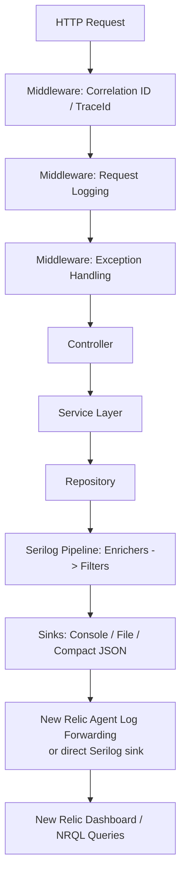
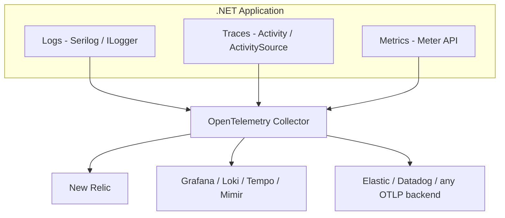
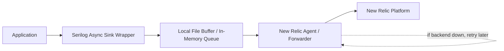
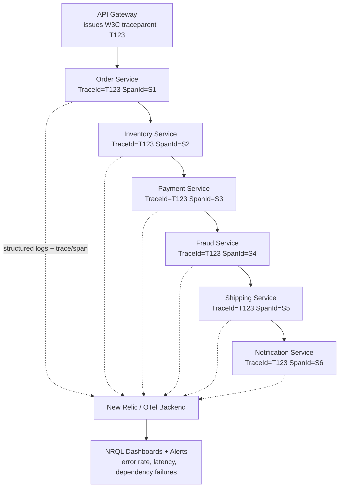

# Structured Logging — Interview Revision Notes

> Yeh quick-revision Q&A `I. Structured-Logging-Interview-Guide.md` se derive kiya gaya hai. Source ke har section ko cover karta hai.

## Core Concepts

### What Is Structured Logging and Why It Beats String Interpolation

**Q: Structured logging kya hai?**

A: Logging ka wo tarika jisme har event ko typed key/value properties plus ek message ke roop mein emit kiya jaata hai, na ki ek flattened string ke roop mein. Isse backend yeh pooch sakta hai ki "mujhe wo saare events do jahan `OrderId=45678` aur `Level=Error` ho" — text ko regex se scrape karne ke bajaye.

**Q: `_logger.LogInformation("Order {OrderId} created", orderId)` `$"Order {orderId} created"` se better kyun hai?**

A:

Bad (string interpolation):

```csharp
_logger.LogInformation($"Order {orderId} created");
```

Good (message template):

```csharp
_logger.LogInformation("Order {OrderId} created", orderId);
```

- Serilog template ko parse karta hai aur `OrderId` ko ek separate, typed property ke roop mein `LogEvent` par store karta hai, string ke andar baked karne ke bajaye.
- Downstream systems (New Relic, Seq, Elasticsearch) directly `OrderId` par query/filter/facet kar sakte hain.
- Performance: interpolation string ko immediately bana deta hai, chahe kisi sink ko uski zarurat ho ya na ho; ek template rendering ko tab tak defer karta hai jab tak koi sink actually text ki demand na kare — ek JSON sink properties ko directly serialize karta hai.
- Regex se log text scrape kiye bina consistent dashboards/analytics enable karta hai.

### Message Templates

**Q: Ek Serilog message template mein `{OrderId}`, `{@Order}`, aur `{$Order}` ka matlab kya hota hai?**

A:

- `{OrderId}` — scalar property; text sinks ke liye `ToString()` use karta hai, structured sinks ke liye native type.
- `{@Order}` — destructuring operator; poore object graph ko structured properties ke roop mein capture karta hai (large graphs/circular references ka dhyan rakhna).

  ```csharp
  _logger.LogInformation("Order created {@Order}", order);
  ```

- `{$Order}` — stringification operator; un types ke liye bhi `ToString()` force karta hai jo normally destructure hote.

### Log Levels

**Q: .NET/Serilog log levels list karo aur bataao ki har ek ka use kab karna chahiye.**

A: Trace/`Verbose` (finest detail, prod mein off) → Debug (dev troubleshooting, usually off) → Information (normal business flow, on) → Warning (recoverable/unexpected, jaise 400s, on) → Error (failures jinpar attention chahiye, on) → Critical/`Fatal` (outage, on).

**Q: Kya `Microsoft.Extensions.Logging.LogLevel` aur Serilog ka `LogEventLevel` 1:1 map hote hain?**

A: Nahi. MEL `Trace/Debug/Information/Warning/Error/Critical` use karta hai; Serilog `Verbose/Debug/Information/Warning/Error/Fatal` use karta hai. MEL bridge `Critical↔Fatal` aur `Trace↔Verbose` ko map karta hai.

### Structured Logging vs Plain-Text Logging — The Full Picture

**Q: Template example ke aage, structured logging ka plain-text logging ke muqable mein fuller case kya hai?**

A: Structured logging query capability (exact/range/facet vs regex/substring), schema evolution (additive vs parsers break hona), machine readability (native JSON/CLEF vs fragile downstream parsing), aur dashboarding (trivial `FACET`/`GROUP BY` vs pehle manual regex extraction) mein jeet jaata hai. Trade-off migration cost hai — iske liye team discipline chahiye taaki templates consistently use ho.

**Q: Kya structured logging human-readable console output ke saath mutually exclusive hai?**

A: Nahi — Serilog ka console sink templated message ko readable text ke roop mein render karta hai, jabki wahi `LogEvent` structured properties ko other sinks tak carry karta hai. Aapko dono mil jaate hain.

## Architecture

### End-to-End Request Flow

**Q: Serilog se New Relic tak request ke end-to-end flow ko describe karo.**

A: HTTP Request → Correlation/TraceId middleware → Request-logging middleware → Exception-handling middleware → Controller → Service → Repository → Serilog pipeline (Enrichers → Filters) → Sinks (Console/File/Compact JSON) → New Relic agent forwarding ya ek direct sink → New Relic dashboards/NRQL.



### Program.cs Configuration (Code-Based)

**Q: Ek typical code-based Serilog bootstrap kaisa dikhta hai?**

A:

```csharp
Log.Logger = new LoggerConfiguration()
    .MinimumLevel.Information()
    .Enrich.FromLogContext()
    .Enrich.WithEnvironmentName()
    .WriteTo.Console()
    .WriteTo.Async(a => a.File(new Serilog.Formatting.Compact.CompactJsonFormatter(), "logs/app-.log"))
    .CreateLogger();
```

Uske baad `builder.Host.UseSerilog()`, `app.UseSerilogRequestLogging()`, aur `Log.CloseAndFlush()` ko ek `finally` block mein use karte hain.

**Q: `UseSerilogRequestLogging()` aapko free mein kya deta hai?**

A: Yeh ek hand-rolled request-logging middleware ko replace karta hai — har request ke liye path, status code, aur elapsed time ko ek single line mein log karta hai.

**Q: Typically kaunse NuGet packages ki zarurat hoti hai?**

A: `Serilog.AspNetCore`, `Serilog.Sinks.Console`, `Serilog.Sinks.File`, `Serilog.Formatting.Compact`, `Serilog.Enrichers.Environment`, `Serilog.Enrichers.Thread`, `Serilog.Sinks.Async`; optionally direct shipping ke liye `Serilog.Sinks.NewRelicLogs` + `NewRelic.LogEnrichers.Serilog`.

Zaroori packages:
```text
dotnet add package Serilog.AspNetCore
dotnet add package Serilog.Sinks.Console
dotnet add package Serilog.Sinks.File
dotnet add package Serilog.Formatting.Compact
dotnet add package Serilog.Enrichers.Environment
dotnet add package Serilog.Enrichers.Thread
dotnet add package Serilog.Sinks.Async
```

Optional, host agent par depend na karte hue direct New Relic shipping ke liye:
```text
dotnet add package Serilog.Sinks.NewRelicLogs
dotnet add package NewRelic.LogEnrichers.Serilog
```

### appsettings.json Configuration (Config-Based)

**Q: Code ke bajaye appsettings.json se Serilog ko kaise configure karte hain?**

A: Ek `"Serilog"` section define karo (`Using`, `MinimumLevel.Default`/`Override`, `Enrich`, `WriteTo` array of `{Name, Args}`), phir `Log.Logger = new LoggerConfiguration().ReadFrom.Configuration(builder.Configuration).CreateLogger();` likho.

```json
{
  "Serilog": {
    "Using": [ "Serilog.Sinks.Console", "Serilog.Sinks.File" ],
    "MinimumLevel": {
      "Default": "Information",
      "Override": {
        "Microsoft": "Warning",
        "System": "Warning"
      }
    },
    "Enrich": [ "FromLogContext", "WithEnvironmentName", "WithThreadId" ],
    "WriteTo": [
      { "Name": "Console" },
      {
        "Name": "File",
        "Args": {
          "path": "logs/app-.log",
          "rollingInterval": "Day",
          "formatter": "Serilog.Formatting.Compact.CompactJsonFormatter, Serilog.Formatting.Compact"
        }
      }
    ]
  }
}
```

```csharp
Log.Logger = new LoggerConfiguration()
    .ReadFrom.Configuration(builder.Configuration)
    .CreateLogger();
```

**Q: Code-based vs config-based configuration — trade-off kya hai?**

A: Config-based approach ops ko redeploy ke bina sinks/levels change karne deta hai (especially `reloadOnChange` + ek `LoggingLevelSwitch` ke saath), lekin custom enrichers/`ILogEventSink` implementations ko discoverable banane ke liye code wiring ya `Using` array mein registration chahiye ho sakta hai. Zyaadatar real systems dono ko combine karte hain: levels/sinks ke liye config, aur DI ya custom types ki zarurat wale kaam ke liye code.

## Intermediate — Enrichment and Context Propagation

### Correlation ID Middleware

**Q: Ek CorrelationId middleware kya karta hai?**

A: Har request ke liye ek ID generate karta hai, use `LogContext.PushProperty("CorrelationId", id)` ke through `LogContext` par push karta hai, aur ise `X-Correlation-Id` response header mein return karta hai — isse services ke across tracing enable hoti hai aur debugging easy ho jaati hai.

```csharp
public class CorrelationIdMiddleware
{
    private readonly RequestDelegate _next;

    public CorrelationIdMiddleware(RequestDelegate next)
    {
        _next = next;
    }

    public async Task Invoke(HttpContext context)
    {
        var correlationId = Guid.NewGuid().ToString();

        using (Serilog.Context.LogContext.PushProperty(
            "CorrelationId", correlationId))
        {
            context.Response.Headers.Add(
                "X-Correlation-Id",
                correlationId);

            await _next(context);
        }
    }
}
```

**Q: Naive version mein flaw kya hai, aur fix kya hai?**

A: Yeh hamesha ek *naya* ID mint karta hai, inbound `X-Correlation-Id` header check karne ke bajaye, jisse correlation break ho jaata hai jaise hi ek se zyada hop hote hain. Fix:

```csharp
var correlationId = context.Request.Headers.TryGetValue("X-Correlation-Id", out var existing)
    ? existing.ToString()
    : Guid.NewGuid().ToString();
```

**Q: `LogContext.PushProperty` ya `ILogger.BeginScope` — idiomatic Serilog mechanism kaunsa hai?**

A: `LogContext.PushProperty` — yeh Serilog ka native, zyada efficient path hai. `BeginScope` bhi kaam karta hai (Serilog `ILogger` implement karta hai), lekin zyaadatar Serilog-based teams `PushProperty` par standardize karti hain.

### LogContext.PushProperty Deep Dive

**Q: Scale par (jaise 50,000 req/min) `PushProperty` ki zarurat kyun hoti hai?**

A: Iske bina, individual log lines ("Order validation started", "Calling payment service") ke paas koi shared identifier nahi hota, isliye "Order 98765 failed" jaisa support ticket ek single logical operation tak trace back nahi ho sakta.

```text
Order validation started
Calling payment service
Order created successfully
```

**Fix:**

```csharp
using (Serilog.Context.LogContext.PushProperty("OrderId", 98765))
using (Serilog.Context.LogContext.PushProperty("CustomerId", 1001))
{
    _logger.LogInformation("Order validation started");
    _logger.LogInformation("Calling payment service");
    _logger.LogInformation("Order created successfully");
}
```

Block ke andar ka har log line ab automatically `OrderId` aur `CustomerId` carry karta hai:

```json
{ "message": "Order validation started", "OrderId": 98765, "CustomerId": 1001 }
{ "message": "Calling payment service",  "OrderId": 98765, "CustomerId": 1001 }
{ "message": "Order created successfully", "OrderId": 98765, "CustomerId": 1001 }
```

**Q: `PushProperty` `await` boundaries aur thread hops ke across kaise survive karta hai?**

A: `LogContext` `AsyncLocal<T>` se backed hota hai, isliye pushed properties async continuations ke through correctly flow karti hain — even `Task.Run` continuations ke across jo ek different threadpool thread par resume hoti hain — kyunki `AsyncLocal` logical call context ko follow karta hai, physical thread ko nahi.

**Q: Enterprise systems commonly kaunsi properties log context par push karte hain?**

A: `CorrelationId`, `TraceId`, `TenantId`, `CustomerId`, `OrderId`, `UserId` — taaki support engineers ek business transaction ke saare logs quickly dhoond sakein.

**Real enterprise example (banking):**

```csharp
using (Serilog.Context.LogContext.PushProperty("CustomerId", customerId))
using (Serilog.Context.LogContext.PushProperty("AccountId", accountId))
using (Serilog.Context.LogContext.PushProperty("TransactionId", transactionId))
{
    // business logic
}
```

### Controller / Service / Repository Logging

**Q: Kahan kya log karna hai, iske liye layering principle kya hai?**

A: Repository = data-access concerns ("SQL timeout"). Service = business concerns ("Customer upgraded plan"). Inko mix karne se semantics blur ho jaate hain aur layer-specific alerting complicated ho jaati hai.

```csharp
[ApiController]
[Route("api/orders")]
public class OrderController : ControllerBase
{
    private readonly OrderService _service;
    private readonly ILogger<OrderController> _logger;

    public OrderController(
        OrderService service,
        ILogger<OrderController> logger)
    {
        _service = service;
        _logger = logger;
    }

    [HttpPost]
    public async Task<IActionResult> CreateOrder(
        CreateOrderRequest request)
    {
        _logger.LogInformation(
            "CreateOrder request received. CustomerId={CustomerId}",
            request.CustomerId);

        var orderId = await _service.CreateOrder(request);

        return Ok(orderId);
    }
}
```

```csharp
public class OrderService
{
    private readonly ILogger<OrderService> _logger;

    public OrderService(ILogger<OrderService> logger)
    {
        _logger = logger;
    }

    public async Task<int> CreateOrder(CreateOrderRequest request)
    {
        _logger.LogInformation(
            "Creating order. CustomerId={CustomerId}, Amount={Amount}",
            request.CustomerId,
            request.Amount);

        try
        {
            var orderId = await SaveOrder(request);

            _logger.LogInformation(
                "Order created successfully. OrderId={OrderId}",
                orderId);

            return orderId;
        }
        catch (Exception ex)
        {
            _logger.LogError(
                ex,
                "Order creation failed. CustomerId={CustomerId}",
                request.CustomerId);

            throw;
        }
    }
}
```

**Q: Sample `OrderService` error ko `LogError` ke through log karta hai aur phir rethrow karta hai — isse contradiction kyun flag kiya jaata hai, aur resolve kaise hota hai?**

A: Yeh "exception ko sirf ek baar, sirf global handler mein log karo" rule se conflict karta hai. Resolution: locally log tabhi karo jab wo context add ho rahi ho jo global handler reconstruct nahi kar sakta, aur ye `LogContext.PushProperty` ke through karo, ek duplicate `LogError` call ke bajaye; otherwise swallow-and-rethrow karo (`catch { throw; }`) aur global handler ko hi ek `LogError` ka owner banne do.

### Built-in Request Logging

**Q: `UseSerilogRequestLogging()` kya provide karta hai aur ise customize kaise karte hain?**

A: Hand-written stopwatch code ke bajaye har request ke liye ek log line (path, status code, elapsed time). `options.MessageTemplate` aur `options.EnrichDiagnosticContext` (jaise `diagnosticContext.Set("UserId", ...)`) ke through customize karo.

```csharp
app.UseSerilogRequestLogging(options =>
{
    options.MessageTemplate =
        "Request completed. Path={RequestPath}, StatusCode={StatusCode}, DurationMs={Elapsed}";

    options.EnrichDiagnosticContext = (diagnosticContext, httpContext) =>
    {
        diagnosticContext.Set("UserId", httpContext.User?.Identity?.Name);
    };
});
```

### Global Exception Middleware

**Q: Global exception-handling middleware ka purpose kya hai?**

A: `_next(context)` ke around ek single try/catch ke through saare unhandled exceptions ko ek hi baar capture karta hai — duplicate try/catch blocks avoid karta hai aur error logging ko centralize karta hai.

```csharp
public class ExceptionHandlingMiddleware
{
    private readonly RequestDelegate _next;
    private readonly ILogger<ExceptionHandlingMiddleware> _logger;

    public ExceptionHandlingMiddleware(
        RequestDelegate next,
        ILogger<ExceptionHandlingMiddleware> logger)
    {
        _next = next;
        _logger = logger;
    }

    public async Task Invoke(HttpContext context)
    {
        try
        {
            await _next(context);
        }
        catch (Exception ex)
        {
            _logger.LogError(ex, "Unhandled exception occurred");
            throw;
        }
    }
}
```

**Q: Yahan log karke rethrow karne mein gotcha kya hai?**

A: Aage kahin (jaise `UseExceptionHandler`) ko phir bhi exception ko HTTP response mein convert karna hoga. Yeh ensure karo ki us chain mein sirf ek layer log kare — typically innermost catch (yeh middleware) log karta hai, aur uske aage ka koi bhi part sirf response mein map karta hai.

### Serilog Sinks Internals

**Q: Sink kya hota hai, aur yeh kaunsa interface implement karta hai?**

A: Wo destination jahan Serilog ek `LogEvent` write karta hai (console, file, Elasticsearch, Seq, New Relic, custom). Yeh `ILogEventSink { void Emit(LogEvent logEvent); }` implement karta hai, aur `.WriteTo.Sink(new CompanySink())` ke through register hota hai.

```csharp
public interface ILogEventSink
{
    void Emit(LogEvent logEvent);
}
```

**Custom sink example:**

```csharp
public class CompanySink : ILogEventSink
{
    public void Emit(LogEvent logEvent)
    {
        SendToMonitoringSystem(logEvent);
    }
}
```

**Q: Serilog end to end ek log event ko kaise process karta hai, walk through karo.**

A: App ek `LogEvent` (Message, properties, Level, Timestamp) create karta hai → Enrichers metadata add karte hain (`CorrelationId`, `MachineName`, `Environment`) → Filters run hote hain (jaise health-check noise drop karna) → event har configured sink ko dispatch ho jaata hai (fan-out: ek event, many destinations).

```mermaid
flowchart LR
    A[Log.Information/LogEvent created] --> B[Enrichers add metadata
    TraceId, CorrelationId, MachineName...]
    B --> C[Filters run
    e.g. drop health-check noise]
    C --> D{Sink(s)}
    D --> E[Console]
    D --> F[File]
    D --> G[Elasticsearch]
    D --> H[New Relic]
```

**Multiple sinks same event ko fan out karte hain** — ek `LogEvent`, many destinations:

```csharp
builder.Host.UseSerilog((ctx, lc) =>
{
    lc.WriteTo.Console()
      .WriteTo.File("logs/app.log")
      .WriteTo.Elasticsearch(/* ... */)
      .WriteTo.NewRelicLogs(/* ... */);
});
```

**Q: Agar ek sink fail ho jaaye (jaise New Relic unreachable ho) to kya hota hai?**

A: Serilog sink failures ko isolate karne ki koshish karta hai taaki app crash na ho aur other sinks block na ho; enterprise systems sinks ko async processing + buffering mein wrap karte hain, aur kuch sinks (`PeriodicBatching`-based) apni own retries implement karte hain. Yeh isolation sink-implementation par depend karta hai — ek naive synchronous custom sink jo `Emit()` ke andar throw karta hai, exception ko propagate kar sakta hai jab tak `.WriteTo.Async(...)` mein wrap na kiya jaaye.

### Enrichers vs Destructuring — What's the Difference

**Q: Enricher aur destructuring mein kya difference hai?**

A: Enrichers pipeline se guzarne wale har event mein ambient/contextual properties add karte hain jo call site par present nahi hoti (`MachineName`, `CorrelationId`, `ThreadId`), `ILogEventEnricher.Enrich(...)` ke through. Destructuring (`@`) ek specific object ko structure karta hai jo ek single call site par pass hota hai (`{@Order}`), aur yeh us call tak scoped hota hai, `IDestructuringPolicy` ke through.

## Advanced — Distributed Tracing & Multi-Tenancy

### CorrelationId vs TraceId

**Q: `CorrelationId` aur `TraceId` ko contrast karo.**

A: `CorrelationId` custom-generated hota hai, `LogContext.PushProperty` ke through manually capture hota hai, aur support teams isko favor karte hain (human-readable). `TraceId` distributed tracing systems (W3C `traceparent`, OpenTelemetry, New Relic) se generate hota hai, `Serilog.Enrichers.Span`/New Relic ke enricher ke through automatically capture hota hai jo `Activity`/`DiagnosticSource` par ride karta hai, aur engineers isko favor karte hain jo APM views match karna chahte hain. Trend: `TraceId` increasingly primary ban raha hai; kaafi orgs abhi bhi dono rakhte hain.

### Tracing a Request Across 15 Microservices

**Q: Ek request ko multiple microservices ke across kaise trace karte hain?**

A: `TraceId` ek baar generate hota hai (W3C `traceparent`, gateway- ya SDK-issued), aur headers mein har hop tak pass hota hai, har service mein `Serilog.Enrichers.Span` ya New Relic log enricher ke through capture hota hai, aur distributed tracing end-to-end enabled hoti hai. Reconstruct karne ke liye:

```sql
SELECT * FROM Log WHERE trace.id = 'T123'
```

```mermaid
sequenceDiagram
    participant GW as API Gateway
    participant OS as Order Service
    participant IS as Inventory Service
    participant PS as Payment Service
    participant NS as Notification Service

    GW->>OS: traceparent: TraceId=T123
    OS->>IS: TraceId=T123, SpanId=S1
    IS->>PS: TraceId=T123, SpanId=S2
    PS->>NS: TraceId=T123, SpanId=S3
    Note over GW,NS: TraceId constant across every hop; SpanId changes per service
```

`TraceId` hops ke across constant rehta hai; `SpanId` har service ke liye change hota hai.

### Multi-Tenant Logging

**Q: Ek shared SaaS app mein logs ko per tenant traceable kaise banate hain?**

A: `TenantId` ko JWT claims, gateway headers, ya request headers se extract karo, aur ise ek tenant-resolution middleware (ya ek custom `ILogEventEnricher`) mein `LogContext.PushProperty("TenantId", tenantId)` ke through push karo. Yeh per-tenant filtering, incident isolation, aur dashboards enable karta hai, jaise `SELECT * FROM Log WHERE TenantId = 'Walmart'`.

```csharp
var tenantId = httpContext.Request.Headers["TenantId"];

using (Serilog.Context.LogContext.PushProperty("TenantId", tenantId))
{
    await _next(context);
}
```

Result wale logs:

```json
{ "message": "Order Created", "TenantId": "Walmart" }
{ "message": "Payment Failed", "TenantId": "Target" }
```

Query:

```sql
SELECT * FROM Log WHERE TenantId = 'Walmart'
```

### OpenTelemetry Logs/Traces/Metrics Unification

**Q: OpenTelemetry kya provide karta hai, aur yeh Serilog se kaise related hai?**

A: Ek vendor-neutral wire format (OTLP) + SDK jo logs, traces, aur metrics ko span karta hai — ek baar instrument karo, phir Collector ke exporter ko reconfigure karke backends swap karo. Yeh Serilog ke saath mutually exclusive nahi hai: ek common pattern yeh hai ki rich structured logs ke liye Serilog use karo + ek `Serilog.Sinks.OpenTelemetry` exporter, taaki logs OTel traces jaisa hi `TraceId`/`SpanId` carry karein.



**Q: .NET ki OTel story mein traces aur metrics ke peeche kya hota hai?**

A: Traces `System.Diagnostics.ActivitySource`/`Activity` use karte hain (.NET Core 3.0 se native) — OTel .NET SDK `Activity` ke top par ek listener/exporter hai, replacement nahi. Metrics `System.Diagnostics.Metrics.Meter` use karte hain, jo OTel ke metrics SDK ke through export hote hain, aur shared resource attributes (`service.name`, `deployment.environment`) ke through logs/traces se correlate hote hain.

**Q: Agar New Relic agent already kaam kar raha hai to OpenTelemetry adopt kyun karein?**

A: Vendor lock-in avoid karna, multi-backend flexibility (jaise traces New Relic ko, logs kisi cheaper Loki/S3 store ko), aur un polyglot services ke across standardization jinke paas .NET jaisi New Relic SDK parity nahi hai.

### ASP.NET Core Activity / W3C Trace Context Integration

**Q: Kya ASP.NET Core aapko distributed tracing context "for free" deta hai?**

A: Haan — .NET Core 3.0+ se, ASP.NET Core har request ke liye automatically ek `Activity` create karta hai aur incoming `traceparent`/`tracestate` headers ko parse karta hai, bina kisi custom middleware ke `Activity.Current.TraceId`/`SpanId` ko populate karta hai. `Serilog.Enrichers.Span` isi se read karta hai — kisi custom `CorrelationIdMiddleware` se nahi, jab tak wahan explicitly wire na kiya jaaye. Ek hand-rolled `CorrelationId` iske saath often redundant hota hai; kaafi teams ise sirf ek business-friendly alias ke roop mein rakhti hain.

### Centralized Logging Pipelines: ELK vs Seq vs Grafana Loki

**Q: ELK, Seq, Grafana Loki, aur New Relic Logs ko centralized logging stacks ke roop mein compare karo.**

A:

- **ELK** — full-text indexed JSON, Lucene/KQL, powerful full-text search, mature, self-hostable; scale par resource-hungry aur high indexing cost.
- **Seq** — structured events (CLEF), SQL-ish query language, Serilog ke liye purpose-built, great local-dev experience, lightweight; smaller ecosystem, large scale par paid clustering chahiye.
- **Grafana Loki** — log-stream storage jo sirf labels se indexed hoti hai, LogQL, scale par bahut cheap, Grafana/Tempo/Prometheus (LGTM stack) ke saath pairs karta hai; full-text search slow hoti hai kyunki content indexed nahi hoti.
- **New Relic Logs** — managed SaaS, NRQL, zero infra, tight APM correlation ("Logs in Context"); cost ingest volume ke saath scale karta hai, vendor lock-in.

**Q: Kaunsa stack use karna hai, yeh decide kaise karte hain?**

A: Local dev/small internal tools ke liye Seq; jab deep full-text search chahiye ho aur ops capacity ho tab ELK; jab cost-per-GB dominate karta ho aur Grafana/Prometheus already chal rahe ho tab Loki; jab bina infra ownership ke APM+logs+traces unified chahiye ho (ingest-cost trade-off accept karte hue) tab ek SaaS platform (New Relic/Datadog).

### AWS-Native Logging and Tracing

#### `` CloudWatch Logs Insights

**Q: CloudWatch Logs Insights kya hai aur ispar structured logs ko kaise query karte hain?**

A: Yeh ek query engine hai jo directly CloudWatch Logs par built hai — koi separate indexing pipeline run ya pay karne ki zarurat nahi. Basic query syntax:

```
fields @timestamp, @message
| filter @message like /OrderId/
| sort @timestamp desc
| limit 20
```

Structured JSON fields ko parse karna aur unpar aggregate karna:

```
fields @timestamp, OrderId, CorrelationId, Level
| filter Level = "Error"
| stats count(*) as errorCount by bin(5m)
```

NRQL ke `FACET` jaisa facet kar sakte hain: `stats avg(DurationMs) as avgDuration by RequestPath`.

```
fields RequestPath, DurationMs
| stats avg(DurationMs) as avgDuration by RequestPath
| sort avgDuration desc
```

**Q: Logs Insights ELK/Seq se kaise compare karta hai, aur iska cost gotcha kya hai?**

A: Run karne ke liye koi infra nahi (fully managed) vs self-hosted ELK/Seq. Yeh per query raw log data scan karta hai (koi persistent index nahi) — ad hoc investigation ke liye theek hai, lekin high-frequency dashboards ke liye nahi bana, ELK/Seq ke pre-indexed stores ke unlike. Cost GB *scanned per query* ke saath scale karta hai, jo ingestion/storage se ek alag dimension hai — runaway cost avoid karne ke liye query karne se pehle time range/log group ko narrow karo.

#### `` AWS X-Ray for Distributed Tracing

**Q: X-Ray kya hai, aur yeh OpenTelemetry se kaise related hai?**

A: AWS ka native distributed tracing backend + legacy proprietary SDK, jisme first-class AWS compute/service integration hoti hai (Lambda, ECS, EC2; DynamoDB/S3/SQS calls automatically segments ke roop mein appear hoti hain) aur ek "service map" visualization. X-Ray AWS Distro for OpenTelemetry (ADOT) Collector ke through directly OTel data consume kar sakta hai — senior answer yeh hai ki OpenTelemetry (`ActivitySource`) ke saath instrument karo aur ADOT ke exporter ko X-Ray par point karo (ya baad mein backends swap karo), na ki application code ko directly X-Ray SDK se couple karo.

**Q: X-Ray traces ko CloudWatch Logs ke saath kaise correlate karte hain?**

A: X-Ray segments ek `trace_id` carry karte hain; usi value ko ek structured Serilog property ke roop mein emit karo (same pattern jo `Serilog.Enrichers.Span` ke through `TraceId`/`SpanId` ke liye hota hai) taaki aap ek slow/failed X-Ray segment se Logs Insights mein `filter trace_id = "..."` tak jump kar sakein — yeh New Relic ke "Logs in Context" ka AWS-native version hai.

#### `` CloudWatch Log Group Retention Policies and Subscription Filters

**Q: Default CloudWatch Log Group retention kya hai, aur yeh cost risk kyun hai?**

A: Default "Never Expire" hai — ek common cost leak (jaise ek Lambda ka auto-created log group forever logs/cost accumulate karta rehta hai jab tak retention set na ho). Senior answer: provisioning time par IaC ke through `retention_in_days` set karo:

```hcl
resource "aws_cloudwatch_log_group" "order_api" {
  name              = "/ecs/order-api"
  retention_in_days = 30
}
```

**Q: Subscription filters kis liye use hote hain?**

A: Yeh matching log events ko near-real-time mein ek cheaper long-term destination (cold/compliance storage ke liye Kinesis Firehose → S3, ya real-time alerting ke liye Lambda) ko stream karte hain, iske bajaye ki CloudWatch mein 100% volume retain karne ke liye pay karein — yeh tiered-retention-by-sink ka AWS-native equivalent hai.

```hcl
resource "aws_cloudwatch_log_subscription_filter" "errors_to_firehose" {
  name            = "errors-to-s3-archive"
  log_group_name  = aws_cloudwatch_log_group.order_api.name
  filter_pattern  = "{ $.Level = \"Error\" }"
  destination_arn = aws_kinesis_firehose_delivery_stream.log_archive.arn
  role_arn        = aws_iam_role.cwl_to_firehose.arn
}
```

**Q: CloudWatch Logs ke teen cost dimensions kya hain, aur har ek ko kaise control karte hain?**

A: Ingestion (per GB ingested) — sampling/level filtering se reduce karo; Storage (per GB-month retained) — retention policies + subscription-filter offload to S3 se reduce karo; Query (Logs Insights ke through per-GB-scanned) — time range/log group scope narrow karke reduce karo.

## New Relic Integration

### Three Integration Options

**Q: Serilog output ko New Relic mein bhejne ke teen tareeke kya hain, aur key rule kya hai?**

A:

- **A — Agent-based forwarding** (recommended default): New Relic .NET Agent console/file output ko tail karta hai aur automatically forward karta hai.

  ```xml
  <configuration>
    <service licenseKey="YOUR_LICENSE_KEY"/>
    <application>
      <name>Order API</name>
    </application>
    <log>
      <level>info</level>
    </log>
    <applicationLogging enabled="true">
      <forwarding enabled="true"/>
    </applicationLogging>
  </configuration>
  ```

- **B — New Relic Log Enricher for Serilog**: `.Enrich.WithNewRelicLogsInContext()` har `LogEvent` mein `trace.id`/`span.id`/`entity.guid` add karta hai; infrastructure agent formatted file ko ship karta hai.

  ```csharp
  Log.Logger = new LoggerConfiguration()
      .Enrich.WithNewRelicLogsInContext()
      .WriteTo.File(new NewRelicFormatter(), "logs/newrelic-app.log")
      .CreateLogger();
  ```

- **C — Direct sink to the New Relic Logs API**: `.WriteTo.NewRelicLogs(endpointUrl, applicationName, licenseKey)`, agentless environments (containers, serverless) ke liye.

  ```csharp
  Log.Logger = new LoggerConfiguration()
      .WriteTo.NewRelicLogs(
          endpointUrl: "https://log-api.newrelic.com/log/v1",
          applicationName: "OrderApi",
          licenseKey: "YOUR_LICENSE_KEY")
      .CreateLogger();
  ```

Rule: ek hi pick karo — inko combine karne se logs double-ship ho jaate hain aur double billing hoti hai.

### NRQL Query Examples

**Q: Common log investigations ke liye example NRQL queries do.**

A:

- `SELECT * FROM Log WHERE level = 'Error'`
- `SELECT * FROM Log WHERE CorrelationId = '...'`
- `SELECT average(DurationMs) FROM Log FACET RequestPath`
- `SELECT percentage(count(*), WHERE level='Error') FROM Log`
- `SELECT * FROM Log WHERE OrderId = 98765` / `WHERE TenantId = 'Walmart'`

```sql
-- Find all errors
SELECT * FROM Log WHERE level = 'Error'

-- Find logs for a request
SELECT * FROM Log WHERE CorrelationId = '2e1f4f9a-b0f2'

-- Count successful order creations
SELECT count(*) FROM Log WHERE message LIKE '%Order created%'

-- Find slow requests
SELECT average(DurationMs) FROM Log FACET RequestPath

-- Error rate
SELECT percentage(count(*), WHERE level = 'Error') FROM Log

-- Slowest APIs
SELECT average(duration) FROM Transaction FACET name

-- Logs scoped to one order
SELECT * FROM Log WHERE OrderId = 98765

-- Logs scoped to one tenant
SELECT * FROM Log WHERE TenantId = 'Walmart'
```

**Q: Compact-JSON log event kaisa dikhta hai, aur format kyun matter karta hai?**

A: `{"@t":"...", "@m":"Order created successfully", "@l":"Information", "OrderId":45678, "CorrelationId":"...", "Application":"OrderApi", "EnvironmentName":"Production"}` — searchable, filterable, easy NRQL queries, flattened text ke muqable behtar observability.

```json
{
  "@t": "2026-06-17T10:15:11.000Z",
  "@m": "Order created successfully",
  "@l": "Information",
  "OrderId": 45678,
  "CorrelationId": "2e1f4f9a-b0f2",
  "Application": "OrderApi",
  "EnvironmentName": "Production"
}
```

## Performance

### Why Excessive Logging Hurts Production

**Q: Excessive logging ke concrete production costs kya hain?**

A: Disk I/O saturation, increased CPU usage, huge storage costs, log-ingestion costs (New Relic ya koi bhi SaaS backend), network congestion. Fix: sirf actionable information log karo; levels aur ek `LoggingLevelSwitch` ko deliberately use karo.

### Async Logging and Buffering

**Q: Async logging request path ko kaise change karta hai?**

A: Without async: request thread file mein write karta hai aur continue karne se pehle disk ke liye wait karta hai. With async: request thread log ko queue karta hai aur continue kar deta hai; ek background thread write perform karta hai. `.WriteTo.Async(a => a.File("logs/app-.log"))`.

**Without async:**
```text
Request Thread -> Write file -> Wait for disk -> Continue request
```

**With async:**
```text
Request Thread -> Queue log -> Continue request
Background Thread -> Write to file
```

```csharp
.WriteTo.Async(a => a.File("logs/app-.log"))
```

**Q: Agar New Relic unavailable ho jaaye to kya hona chahiye?**

A: App chalta rehta hai; logs locally buffer hote hain (file/in-memory queue) aur baad mein retry ke through forward hote hain — koi customer-facing impact nahi, kyunki logging async/buffered hai aur business request ko kabhi block nahi karta.



### Source-Generated Logging (LoggerMessage) and the Cost of ILogger Calls

**Q: Templates use karne ke bawajood plain `_logger.LogInformation(...)` calls ke saath performance problem kya hai?**

A: Value-type arguments (jaise `int orderId`) har call par `object[]` mein box ho jaate hain (ek `params` allocation), jab tak level disabled na ho aur early short-circuit na ho jaaye. Classic mitigation: expensive argument work karne se pehle hot-path debug logs ko `if (_logger.IsEnabled(LogLevel.Debug))` se guard karo.

**Q: `[LoggerMessage]` source-generated logging kya hai aur senior level par yeh kyun matter karta hai?**

A:

```csharp
[LoggerMessage(EventId = 1001, Level = LogLevel.Information,
    Message = "Order {OrderId} created for customer {CustomerId}")]
public static partial void OrderCreated(this ILogger logger, int orderId, int customerId);
```

Source generator ek strongly-typed method emit karta hai jisme no boxing, no array allocation, aur ek built-in `IsEnabled` check hota hai — aaj .NET mein sabse fast logging call shape. Yeh template ki compile-time validation parameters ke against bhi deta hai, aur ek stable `EventId` jo alerting ke liye hota hai jo message rewording ke baad bhi survive karta hai.

### Log Sampling Strategies at Scale

**Q: Simplest se most sophisticated tak log sampling strategies list karo.**

A:

1. Level-based filtering — Warning+ ka 100% log karo, Information ko sample karo.
2. Fixed-rate sampling — jaise 1-in-10 successful request logs rakho.
3. Rate limiting ("first N per key per window") — ek flapping downstream dependency ko pipeline flood karne se rokta hai.
4. Tail-based/trace-aware sampling — outcome pata chalne ke baad decide karo: failed requests ka 100% rakho, successful ones ko sample karo.
5. `LoggingLevelSwitch` ke through dynamic verbosity — yeh sampling nahi hai per se, lekin isse aap ek incident ke dauraan bina redeploy ke temporarily verbosity raise kar sakte ho.

```csharp
var levelSwitch = new LoggingLevelSwitch(LogEventLevel.Information);

Log.Logger = new LoggerConfiguration()
    .MinimumLevel.ControlledBy(levelSwitch)
    .CreateLogger();

// during an incident, exposed via an admin endpoint or config reload:
levelSwitch.MinimumLevel = LogEventLevel.Debug;
```

**Q: Sampling ke peeche core trade-off principle kya hai?**

A: Errors ka hamesha 100% rakho — us ek important failure ko miss karne se sampling ke through bach nahi sakte. Sampling sirf high-volume, low-signal success paths par apply karo.

## Best Practices

### 10 Logging Best Practices

**Q: 10 logging best practices ko summarize karo.**

A:

1. Structured data (templates) log karo, strings nahi.
2. Level table ke according, log level deliberately pick karo.
3. Duplicate logging avoid karo — exception ko ek hi baar, global handler mein log karo.
4. Arguments repeat karne ke bajaye `LogContext.PushProperty` ke through context ke saath enrich karo.
5. Kabhi sensitive data log na karo — `UserId` log karo, `Password` nahi.
6. Logging ko async/non-blocking banao.
7. Correlation ke liye design karo — headers + `LogContext` ke through end-to-end ek shared `TraceId`/`CorrelationId`.
8. `LoggingLevelSwitch` ke through volume/cost control karo.
9. Logs ko concern aur retention ke according separate karo (Debug 7d, App/Info 30d, Error 90–180d, Audit 7yr), har ek apne own sink/file mein.
10. Logging ko observability contract ka part treat karo — standard fields (`Event`, `TraceId`, `CorrelationId`, `TenantId`, `UserId`, `RequestId`, `MachineName`, `Environment`) teams ke across shared.

**Q: Apni own retention ke saath ek separate audit sink kaise implement karte hain?**

A:

```csharp
.WriteTo.Logger(lc => lc
    .Filter.ByIncludingOnly(e => e.Properties.ContainsKey("Audit"))
    .WriteTo.File("logs/audit-.log", retainedFileCountLimit: 2555))
```

### Golden Rules Checklist

**Q: Golden rules checklist recite karo.**

A: Structured data log karo; appropriate levels use karo; exceptions ko sirf ek baar log karo (global middleware); repetition ke bajaye enrichment ke through context add karo; kabhi secrets log na karo; logging ko asynchronous rakho; `TraceId`/`CorrelationId` ke through correlate karo; volume manage karo (verbosity sirf incidents ke dauraan raise karo); logs ko purpose ke according separate karo (app/audit/security/performance); logging ko first-class observability treat karo, ek afterthought nahi.

### PII / Sensitive-Data Redaction Patterns

**Q: Call-site discipline ke aage "never log sensitive data" ko enforce karne wale mechanisms kya hain?**

A:

1. Call-site discipline (baseline, fragile — jaise koi poora object destructure kar de, jaise `{@Request}`, jisme `Password` field ho, to yeh break ho jaata hai).
2. Custom `IDestructuringPolicy` — ek specific type (jaise `LoginRequest`) ke liye destructuring ko intercept karta hai aur serialization se pehle sensitive properties ko mask/omit karta hai, isliye `{@Request}` calls bhi construction se safe hote hain.

   ```csharp
   public class RedactingDestructuringPolicy : IDestructuringPolicy
   {
       public bool TryDestructure(object value, ILogEventPropertyValueFactory factory, out LogEventPropertyValue result)
       {
           if (value is LoginRequest req)
           {
               result = new StructureValue(new[]
               {
                   new LogEventProperty("UserId", new ScalarPropertyValue(req.UserId)),
                   new LogEventProperty("Password", new ScalarPropertyValue("***REDACTED***"))
               });
               return true;
           }
           result = null;
           return false;
       }
   }
   // .Destructure.With(new RedactingDestructuringPolicy())
   ```
3. Compliance/redaction attributes (`Microsoft.Extensions.Compliance` family, jaise `[PrivateData]`) — model properties ko sensitive mark karo taaki pipeline unhe automatically redact kare jahan bhi wo type log ho (exact package/API naming ko .NET version ke according verify karo — yeh preview releases ke across move hua hai).
4. Sink/formatter-level scrubbing — ek custom `ITextFormatter` ya enricher/filter jo rendered output ko card numbers/JWT shapes ke liye regex-scan karta hai, defense-in-depth ke roop mein, primary control nahi.
5. CI mein log-schema review — ek Roslyn analyzer un logging calls ko flag karta hai jo `[Sensitive]`-tagged properties ko reference karte hain, unke ship hone se pehle.

**Q: PII redaction ko "hot" interview topic kyun maana jaata hai?**

A: GDPR/CCPA aur PCI-DSS compliance failures ka root cause frequently logging hota hai, primary datastore nahi — yeh ek real, recurring incident pattern hai, koi hypothetical nahi.

## Common Pitfalls

**Q: Common structured-logging pitfalls list karo.**

A:

- Message templates ke bajaye string interpolation — structured querying ko kill karta hai, deferred rendering ko defeat karta hai.
- Gateway se ek propagate karne ke bajaye har service apna own `CorrelationId` mint karna.
- Request/response bodies ko wholesale log karna — PII/GDPR/PCI risk aur storage cost; sirf metadata log karo, destructuring policies ke through mask karo.
- Same exception ko layers ke across duplicate log karna — sirf global exception middleware ko hi unhandled exceptions log karni chahiye.
- Validation failures ke liye wrong level — ek 400 `Warning` hai, `Error` nahi.
- Stack trace lose karna: `LogError(ex.Message)` exception object ko throw away kar deta hai; hamesha `ex` ko first argument ke roop mein pass karo.
- Synchronous sinks jo request thread ko block karte hain (especially network sinks) — inhe `.WriteTo.Async(...)` mein wrap karo.
- Repositories ka data-access concerns ke bajaye business events log karna.
- EF Core entities ka uncontrolled `{@Object}` destructuring — lazy-loaded navigation properties/circular references/huge graphs serialization ko blow up kar sakte hain; pehle ek DTO mein project karo.
- DEBUG-in-production ko harmless treat karna — yeh scale par I/O saturation aur ingestion cost ka direct driver hai.
- Multiple New Relic integration paths ko simultaneously combine karna — duplicate shipping, double billing.

## Why Serilog (vs NLog vs log4net)

**Q: Serilog NLog aur log4net se kaise compare karta hai?**

A:

- Structured-by-default: Serilog `LogEvent` par properties ko natively capture karta hai; NLog/log4net text-based cores hain jinpar JSON layer kiya gaya hai.
- Sink ecosystem: Serilog sabse bada/best-maintained hai (Seq, Elasticsearch, Datadog, New Relic, CloudWatch); NLog ke kam hain lekin solid; log4net ke bahut kam maintained targets hain.
- ASP.NET Core fit: `Serilog.AspNetCore` out of the box `UseSerilogRequestLogging()` + DI/enricher integration deta hai.
- Local dev tooling: Seq Serilog ke saath natively pairs karta hai.
- Async/buffered targets: NLog historically yahan zyada mature raha hai, plus restart ke bina live XML config reload.
- Momentum: naye cloud-native .NET projects mein Serilog dominant hai; NLog current/maintained hai; log4net largely legacy hai.

**Q: Kya sirf structured logging ke liye ek NLog shop ko Serilog mein migrate karna chahiye?**

A: Necessarily nahi — NLog aaj apne own JSON layout renderers ke through structured logging support karta hai, aur historically iske async/buffered targets zyada mature hain. Agar NLog operationally kaam kar raha hai, to migration/retraining cost ko marginal gain ke against weigh karna hoga.

## Sample Interview Q&A

### Foundational Q&A (from notes)

**Q: Message templates ke saath structured logging string interpolation se better kyun hai?**

A: `OrderId` ek flattened string ke bajaye ek separate typed property ke roop mein store hota hai, isliye New Relic (ya koi bhi structured backend) directly ispar query/filter kar sakta hai; formatting deferred hoti hai isliye performance better hoti hai; yeh easier analytics/dashboards enable karta hai.

**Q: Agar har service apna own CorrelationId generate kare to kya problems hoti hain?**

A: Logs ko services ke across trace nahi kiya ja sakta aur root-cause analysis difficult ho jaati hai. Correct approach: `CorrelationId` ko API Gateway par generate karo, headers ke through propagate karo, aur downstream services ko `LogContext.PushProperty` ke through use karne do.

**Q: CorrelationId vs TraceId?**

A: Modern systems mein engineering purposes ke liye `TraceId` usually `CorrelationId` ko replace kar deta hai, lekin kaafi companies dono rakhti hain kyunki support teams ek business-friendly `CorrelationId` prefer karti hain.

**Q: Request/response bodies log karna dangerous kyun hai?**

A: Large payloads, PII exposure, GDPR/PCI issues, increased storage cost. Enterprise approach: diagnostic context ke through sirf metadata log karo; agar full objects log karne hi padein to custom destructuring policies se sensitive fields mask karo.

**Q: Excessive logging production systems ko kyun down kar sakti hai?**

A: Disk I/O saturation, CPU usage, storage cost, ingestion cost, network congestion. Solution: sirf actionable information log karo aur levels + ek `LoggingLevelSwitch` ko properly use karo.

**Q: Agar New Relic unavailable ho jaaye to kya hota hai?**

A: Application chalta rehta hai; logging async/buffered hai aur kabhi bhi business request ko block nahi karta. Flow: `Application → Serilog (async sink) → Local file buffer → New Relic Agent/Forwarder → New Relic`.

**Q: Enterprises asynchronous logging ko kyun prefer karte hain?**

A: File/network writes expensive hote hain; async request-thread blocking ko prevent karta hai aur API response time improve karta hai.

**Q: Log enrichment kya hai?**

A: Har log event mein automatically contextual properties add karna — `CorrelationId`, `UserId`, `TenantId`, `Environment`, `Application`, `MachineName`/`ThreadId`. Iske bina, troubleshooting hard hoti hai kyunki logs koi context share nahi karte.

**Q: Ek request ko 15 microservices ke across kaise trace karoge?**

A: `TraceId` ek baar generate hota hai, headers ke through propagate hota hai, har service mein `Serilog.Enrichers.Span` ya New Relic log enricher ke through capture hota hai, distributed tracing enabled hoti hai aur `TraceId` se searchable hota hai.

**Q: Repositories mein business logs kyun nahi hone chahiye?**

A: Repository = data-access concerns; Service = business concerns. Inko mix karne se responsibilities blur ho jaati hain aur business dashboards plumbing noise se pollute ho jaate hain.

**Q: Logs, metrics, aur traces mein kya difference hai?**

A: Logs "kya hua?" ka jawab dete hain (jaise "Order failed"). Metrics "kitni baar?" ka jawab dete hain (jaise "50 order failures"). Traces "kahan?" ka jawab dete hain (jaise "failure occurred in PaymentService").

**Q: Serilog logs ko New Relic mein APM transactions ke saath kaise correlate karte hain?**

A: `.Enrich.WithNewRelicLogsInContext()` `LogEvent` mein `trace.id`, `span.id`, aur `entity.guid` inject karta hai, isliye New Relic automatically logs ko un transactions/spans se link kar deta hai jinhone unhe produce kiya.

**Q: `LogContext.PushProperty` important kyun hai?**

A: Yeh ek logical operation ke andar har log mein contextual information attach karta hai, `AsyncLocal` ke through `await` ke across correctly flow karta hai, duplicated logging parameters ko reduce karta hai, aur logs ko searchable/traceable banata hai.

**Q: Ek failed third-party API call ko kaise log karoge?**

A: Endpoint, status code, `CorrelationId`, duration log karo — access tokens/secrets kabhi log na karo. Jaise "Payment gateway failed. StatusCode=500 Duration=2300ms".

**Q: New Relic logging costs kaise reduce karoge?**

A: Verbosity ko dynamically lower karne ke liye ek `LoggingLevelSwitch` use karo; high-volume logs ko sample karo; duplicate logs avoid karo; sirf business events log karo; retention shorten karo.

**Q: Duplicate logs ek serious production issue kyun hain?**

A: Controller + service + middleware har ek same error log karte hain → 1 exception ke liye 3 entries. Enterprise approach: sirf global exception middleware hi unhandled exceptions log karta hai.

**Q: Validation failures ke liye kaunsa logging level use karna chahiye?**

A: `Warning` — ek 400 ka matlab hai ki application correctly function kar raha hai aur caller ne invalid input diya hai, yeh application failure nahi hai.

**Q: Exceptions ko correctly kaise log karte hain?**

A: Wrong: `_logger.LogError(ex.Message)` — stack trace lose ho jaata hai. Correct: `_logger.LogError(ex, "Order processing failed. OrderId={OrderId}", orderId);` — Serilog poore `Exception` ko ek structured property ke roop mein capture karta hai.

**Q: Multi-tenant logging kaise implement karoge?**

A: Ek tenant-resolution middleware mein `LogContext.PushProperty` ke through `TenantId` ko log context mein add karo.

### Staff/Lead-Level System Design Question

**Q: Scenario A — 50,000 req/min, New Relic costs explode ho rahe hain, developers ko DEBUG logs chahiye, production performance degrade ho rahi hai. Logging ko kaise redesign karoge?**

A:

- DEBUG production mein default se disabled.
- Ek `LoggingLevelSwitch` jo admin endpoint/config reload ke through exposed ho, bina redeploy ke temporary verbosity ke liye.
- Har jagah async sinks.
- Sirf structured logs (no string interpolation).
- High-volume successful requests ke liye log sampling.
- Apni own retention ke saath separate audit sink.
- Centralized exception logging (sirf global middleware).
- New Relic log enricher ke through distributed tracing.
- Level ke according tiered retention policies.

**Q: Scenario B — 20 microservices ke liye logging design karo jahan ek request Gateway → Order → Inventory → Payment → Fraud → Shipping → Notification travel karti hai, aur failures ko 2 minute ke andar identify karna zaruri hai. Design ka outline do.**

A:



1. Gateway ek W3C `traceparent` (`TraceId=T123`) issue karta hai; har service ise `Activity`/`DiagnosticSource` + `Serilog.Enrichers.Span` ke through capture karta hai. `TraceId` hops ke across constant; `SpanId` har service ke liye change hota hai.
2. `TraceId` ke saath `CorrelationId` ko bhi rakho — support `CorrelationId` se search karta hai, engineers `TraceId` se.
3. Har service par structured JSON (`OrderId`, `PaymentId`, `Status`, `ErrorCode`, `TraceId`), koi bolted-on parsing nahi.
4. OTel/New Relic agent + Serilog enricher `Activity` ke trace/span IDs ko har `LogEvent` par copy karta hai.
5. New Relic APM + Logs in Context — ek failed span click karo, seedha related logs par jump kar jao.
6. Centralized exception handling — sirf global middleware hi unhandled exceptions ko ek baar log karta hai.
7. NRQL dashboards — error rate, slowest APIs, per-service failures (`FACET Service`).
8. Alerting — jaise payment failures > 20 in 2 minutes se customers complain karne se pehle hi notification trigger ho jaata hai.
9. Log sampling — errors/warnings ka 100%, successful requests ka ~10%.
10. Retention: Debug 7d, Info 30d, Error 180d, Audit 7yr.
11. Poore system mein async logging + buffering, taaki New Relic outage requests ko block na kare.

### Additional Senior/Staff Q&A

**Q: Ek proprietary APM agent (New Relic) se OpenTelemetry mein migrate karna — risk kya hai, aur ise sequence kaise karte hain?**

A: Risks: jab tak OTel equivalent configure na ho jaaye, vendor niceties (Logs in Context) lose ho jaate hain; third-party libraries mein `Activity`/`ActivitySource` instrumentation gaps jinme OTel coverage nahi hai; NRQL-based dashboards/alerts ko naye backend ki query language ke against re-validate karne ka cost. Sequencing: bake-in period ke dauraan OTel Collector ke through dono backends ko dual-export karo, pehle ek low-risk service par parity validate karo, phir big-bang ke bajaye service-by-service cut over karo.

**Q: Logging library ko khud production incidents (OOM, stalled shutdown) cause karne se kaise roka jaaye?**

A: Async sink ki internal queue ko bound karo (`bufferSize` + full hone par drop-vs-block policy) taaki downstream outage backpressure ke under log loss cause kare, na ki unbounded memory growth. Hamesha `Log.CloseAndFlush()` ko ek `finally` mein ek bounded timeout ke saath call karo, taaki ek hung sink Kubernetes ke `terminationGracePeriodSeconds` ke andar graceful shutdown ko block na kar sake.

**Q: `ILogger<T>` ke category name aur Serilog ke `SourceContext` mein kya difference hai, aur filtering ke liye yeh kyun matter karta hai?**

A: `ILogger<T>` category ko `T` ke full type name par set karta hai; Serilog ka MEL bridge ise `LogEvent` par `SourceContext` property ke roop mein store karta hai. `MinimumLevel.Override("Microsoft", LogEventLevel.Warning)` ek `SourceContext` prefix par match karta hai — isko samajhne se aap precise per-namespace overrides likh sakte ho (jaise apne logs ko touch kiye bina ek chatty third-party library ko silence karna).
