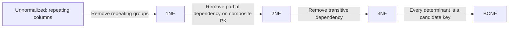
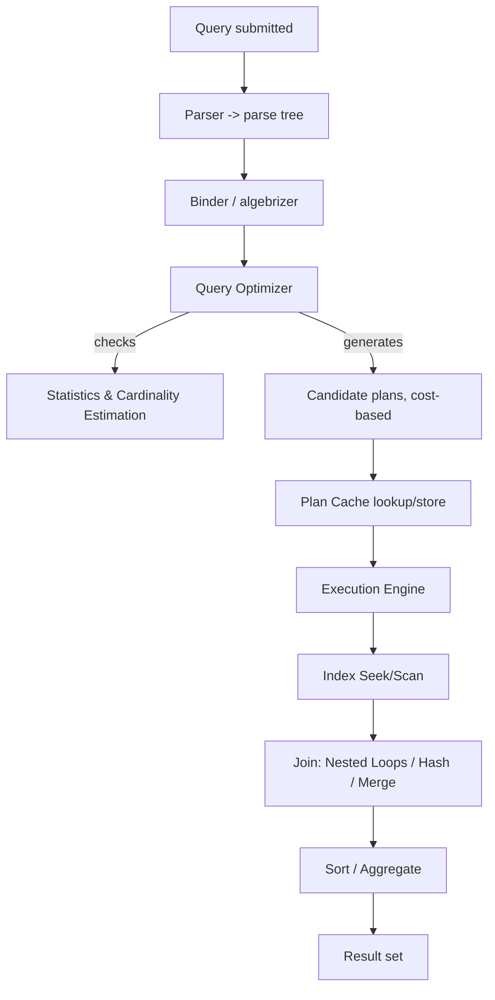
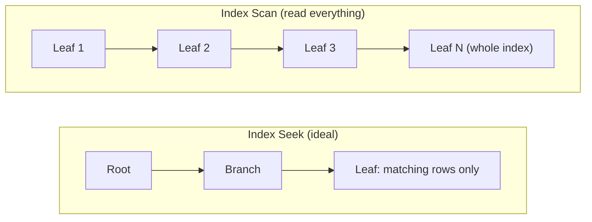
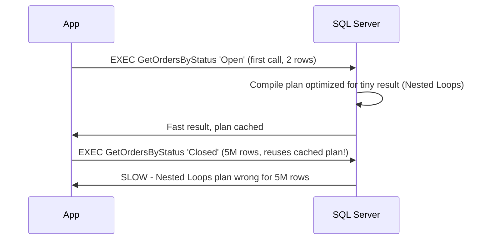
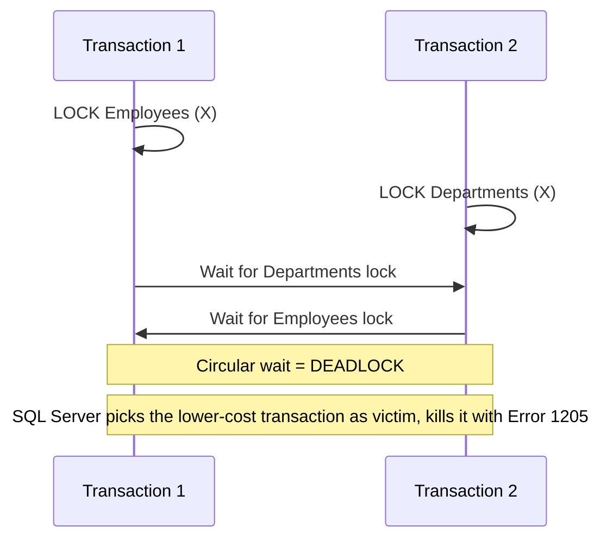

# SQL Server Interview Guide (Senior / Lead .NET Full-Stack)

> Personal notes se consolidate kiya gaya hai + senior-level 2026 interviews ke liye gaps fill kiye gaye hain.
> Additions apne heading mein **[new content]** tag carry karte hain, taaki aap ek nazar mein dekh sako ki aapke original notes se aage kya add kiya gaya hai.

## Table of Contents

- [Core Concepts](#core-concepts)
  - [RDBMS Basics & Keys](#rdbms-basics--keys)
  - [DELETE vs TRUNCATE vs DROP](#delete-vs-truncate-vs-drop)
  - [WHERE vs HAVING](#where-vs-having)
  - [CHAR vs VARCHAR vs NCHAR/NVARCHAR](#char-vs-varchar-vs-ncharnvarchar)
  - [Views (Normal, Indexed/Materialized)](#views-normal-indexedmaterialized)
  - [Stored Procedures vs Functions](#stored-procedures-vs-functions)
  - [Triggers & Magic Tables (inserted/deleted)](#triggers--magic-tables-inserteddeleted)
  - [Normalization & Denormalization (1NF–BCNF)](#normalization--denormalization-1nfbcnf)
  - [[new content] OLTP vs OLAP](#new-content-oltp-vs-olap)
- [Intermediate](#intermediate)
  - [Joins: INNER, OUTER, CROSS, SELF](#joins-inner-outer-cross-self)
  - [UNION vs UNION ALL](#union-vs-union-all)
  - [CTE vs Temp Table vs Table Variable vs View](#cte-vs-temp-table-vs-table-variable-vs-view)
  - [Subqueries: Scalar, Correlated, EXISTS vs IN vs JOIN](#subqueries-scalar-correlated-exists-vs-in-vs-join)
  - [Cursors and Why to Avoid Them](#cursors-and-why-to-avoid-them)
  - [Dynamic SQL](#dynamic-sql)
  - [TRY...CATCH, THROW vs RAISERROR](#trycatch-throw-vs-raiserror)
  - [Window Functions Deep Dive](#window-functions-deep-dive)
  - [[new content] SARGability](#new-content-sargability)
- [Advanced](#advanced)
  - [Execution Plans & Join Operators](#execution-plans--join-operators)
  - [[new content] Index Seek vs Scan, Key Lookup, Covering Indexes](#new-content-index-seek-vs-scan-key-lookup-covering-indexes)
  - [Heap Tables](#heap-tables)
  - [[new content] Statistics & Cardinality Estimation](#new-content-statistics--cardinality-estimation)
  - [[new content] Parameter Sniffing](#new-content-parameter-sniffing)
  - [Transactions & ACID](#transactions--acid)
  - [Isolation Levels & Concurrency](#isolation-levels--concurrency)
  - [[new content] RCSI vs Snapshot Isolation (Optimistic Concurrency)](#new-content-rcsi-vs-snapshot-isolation-optimistic-concurrency)
  - [Locking: Types, Granularity, and Deadlocks](#locking-types-granularity-and-deadlocks)
  - [[new content] TempDB Contention & Configuration](#new-content-tempdb-contention--configuration)
  - [[new content] Query Store in Depth](#new-content-query-store-in-depth)
  - [[new content] Columnstore Indexes for Analytics](#new-content-columnstore-indexes-for-analytics)
  - [[new content] Table Partitioning](#new-content-table-partitioning)
  - [High Availability & Disaster Recovery](#high-availability--disaster-recovery)
  - [Backup & Restore](#backup--restore)
  - [Database Snapshots](#database-snapshots)
  - [Bulk Insert vs Batch Insert](#bulk-insert-vs-batch-insert)
  - [Full-Text Search](#full-text-search)
  - [Security: Encryption, RBAC](#security-encryption-rbac)
  - [Linked Servers](#linked-servers)
  - [Service Broker](#service-broker)
  - [Log Sequence Number (LSN)](#log-sequence-number-lsn)
  - [FILESTREAM](#filestream)
  - [SQL Server Agent Jobs](#sql-server-agent-jobs)
  - [Edition Differences: Express vs Enterprise](#edition-differences-express-vs-enterprise)
  - [Azure Migration Paths](#azure-migration-paths)
  - [DBCC CHECKDB vs DBCC CHECKTABLE](#dbcc-checkdb-vs-dbcc-checktable)
- [Performance Tuning](#performance-tuning)
  - [[new content] Index Fragmentation & Maintenance](#new-content-index-fragmentation--maintenance)
  - [Query Optimization Checklist](#query-optimization-checklist)
  - [DMVs and Monitoring Tools](#dmvs-and-monitoring-tools)
  - [Real-World Troubleshooting Scenarios](#real-world-troubleshooting-scenarios)
- [Best Practices](#best-practices)
- [Common Pitfalls](#common-pitfalls)
- [Sample Interview Q&A (Answered)](#sample-interview-qa-answered)
  - [Practical Query Challenges (Fully Solved)](#practical-query-challenges-fully-solved)
- [Summary of Additions](#summary-of-additions)

---

## Core Concepts

### RDBMS Basics & Keys

- **SQL Server** Microsoft ka RDBMS hai. Core components: Database Engine, SQL Server Agent, SSMS, SSRS, SSIS, SSAS.
- **Primary Key**: row ko uniquely identify karta hai, NULL allow nahi karta, aur default mein clustered index create karta hai (jab tak aap explicitly nonclustered specify na karo).
- **Foreign Key**: child column aur parent ke primary/unique key ke beech referential integrity enforce karta hai. Yeh child column par automatically index **nahi** banata — agar aap us par frequently join/filter/delete karte ho to aapko khud ek add karna padega (warna parent par deletes/updates constraint check karte waqt child par table scans cause karte hain).
- **Unique Key**: uniqueness enforce karta hai, exactly ek NULL allow karta hai (unique index mein NULL ko NULL ke equal nahi mana jaata), aur default mein nonclustered index create karta hai.
- **Constraints**: `PRIMARY KEY`, `FOREIGN KEY`, `UNIQUE`, `CHECK`, `DEFAULT`, `NOT NULL`, `IDENTITY`.

```sql
CREATE TABLE dbo.OrdersDemo (
  OrderID INT IDENTITY(1,1) NOT NULL,
  OrderNumber NVARCHAR(30) NOT NULL,
  CustomerID INT NOT NULL,
  OrderDate DATE NOT NULL CONSTRAINT CK_OrdersDemo_OrderDate CHECK (OrderDate <= CAST(GETDATE() AS DATE)),
  Quantity INT NOT NULL CONSTRAINT CK_OrdersDemo_Quantity CHECK (Quantity > 0),
  UnitPrice MONEY NOT NULL CONSTRAINT CK_OrdersDemo_Price CHECK (UnitPrice >= 0),
  Status NVARCHAR(20) NOT NULL CONSTRAINT DF_OrdersDemo_Status DEFAULT ('Open'),
  LineTotal AS (Quantity * CONVERT(DECIMAL(18,2), UnitPrice)) PERSISTED,
  CONSTRAINT PK_OrdersDemo PRIMARY KEY CLUSTERED (OrderID),
  CONSTRAINT UQ_OrdersDemo_OrderNumber UNIQUE (OrderNumber),
  CONSTRAINT FK_OrdersDemo_Customers FOREIGN KEY (CustomerID)
    REFERENCES dbo.Customers(CustomerID)
    ON DELETE NO ACTION
    ON UPDATE NO ACTION
);
-- Index the FK column explicitly — SQL Server does not do this for you
CREATE NONCLUSTERED INDEX IX_OrdersDemo_CustomerID ON dbo.OrdersDemo(CustomerID);
```

- **Computed columns**: ek expression se derive hote hain; `PERSISTED` value ko disk par materialize kar deta hai taaki use index kiya ja sake, lekin expression deterministic hona chahiye. Aap computed column ko directly insert/update nahi kar sakte.
- **Cascading actions**: `ON DELETE CASCADE` / `ON UPDATE CASCADE` parent ke deletes/updates ko children tak automatically propagate karte hain. Production mein caution ke saath use karo — hamesha real data ki copy par cascade behavior pehle test karo, kyunki ek unexpected cascade intended se kaafi zyada data wipe out kar sakta hai.

### DELETE vs TRUNCATE vs DROP

| Feature | DELETE | TRUNCATE | DROP |
|---|---|---|---|
| Type | DML | DDL | DDL |
| Scope | Specific rows (WHERE) | Saari rows | Poora table + structure |
| Logging | Full row-level logging (slower) | Minimal, page-deallocation logging (faster) | Minimal |
| Rollback | Haan, fully transactional | Haan, agar explicit transaction ke andar ho (popular belief ke against — yeh **hai** transactional aur COMMIT se pehle rollback kiya ja sakta hai; yeh sirf individual row deletes log nahi karta) | Haan, agar explicit transaction ke andar ho |
| Resets IDENTITY | Nahi | Haan, seed par reset ho jaata hai | N/A (table gone) |
| Triggers fired | Haan (AFTER triggers) | Nahi | Nahi |
| FK constraints | Har row par check hota hai | Table par koi active FK reference nahi hona chahiye (ya pehle children ko truncate karna padega) | Pehle dependent objects drop karne padte hain |
| Use case | Specific rows remove karna | Fast wipe + identity reset | Object ko permanently remove karna |

> **Interview notes mein ek common myth ki correction:** "TRUNCATE ko rollback nahi kiya ja sakta" sirf tab true hai jab yeh transaction ke bahar ek *auto-committed* standalone statement ke roop mein run hota hai. `BEGIN TRAN ... ROLLBACK` ke andar, `TRUNCATE TABLE` **rollback ho jaata hai**. DELETE ke against real difference *logging granularity* ka hai (page deallocations vs row-by-row), transactional capability ka nahi.

### WHERE vs HAVING

- `WHERE` grouping/aggregation se **pehle** rows filter karta hai; (zyadatar) aggregate functions ko reference nahi kar sakta.
- `HAVING` `GROUP BY`/aggregation ke **baad** groups filter karta hai; aggregate results par filter karne ke liye use hota hai (e.g., `HAVING COUNT(*) > 1`).

### CHAR vs VARCHAR vs NCHAR/NVARCHAR

| Feature | CHAR | VARCHAR | NCHAR | NVARCHAR |
|---|---|---|---|---|
| Length | Fixed | Variable | Fixed | Variable |
| Encoding | Non-Unicode (1 byte/char) | Non-Unicode | Unicode (2 bytes/char) | Unicode |
| Padding | Space se padded | Padding nahi hoti | Space se padded | Padding nahi hoti |
| `CHAR(10)` storage | Hamesha 10 bytes | — | Hamesha 20 bytes | — |
| Best for | Fixed codes (country code, status flag) ke liye | Variable text ke liye | Fixed-length multilingual data ke liye | Variable multilingual text (names, free text) ke liye |

**[new content] Gotcha jo interviewers probe karte hain:** `VARCHAR` literals ko `NVARCHAR` columns ke saath mix karna ek implicit conversion force karta hai jo silently index seek ko disable kar sakta hai (optimizer ko har row convert karni pad sakti hai ya, worse, predicate ke column side ko convert karna pad sakta hai). `NVARCHAR` columns ke against compare karte waqt Unicode string literals ko hamesha `N'...'` se prefix karo.

### Views (Normal, Indexed/Materialized)

Ek view ek saved `SELECT` hai — virtual, koi physical storage nahi (indexed views ko chhodkar).

- **Simple view**: single table.
- **Complex view**: joins/aggregations.
- **Indexed (materialized) view**: `WITH SCHEMABINDING` ke saath create hota hai, phir isko ek `UNIQUE CLUSTERED INDEX` diya jaata hai. Data physically persist hota hai aur base tables ke against har INSERT/UPDATE/DELETE par automatically, synchronously maintain hota hai — yeh key exam point hai: **yeh kabhi stale data nahi dikhata**, kuch dusre RDBMSs ke materialized views ke ulat jinhe manual/scheduled refresh chahiye hota hai. Cost hai write amplification: base tables ke against har DML view ka index bhi update karta hai.

```sql
CREATE OR ALTER VIEW dbo.vOrderTotals
WITH SCHEMABINDING
AS
SELECT o.OrderID, SUM(oi.Quantity * oi.UnitPrice) AS OrderTotal
FROM dbo.Orders o
JOIN dbo.OrderItems oi ON o.OrderID = oi.OrderID
GROUP BY o.OrderID;
GO
CREATE UNIQUE CLUSTERED INDEX IX_vOrderTotals_OrderID ON dbo.vOrderTotals(OrderID);
```

Indexed view restrictions (senior-level detail jo interviewers expect karte hain): `SCHEMABINDING` chahiye; sabhi referenced functions/expressions deterministic hone chahiye; specific `SET` options session level par fixed hone chahiye (`ANSI_NULLS`, `QUOTED_IDENTIFIER`, etc.); outer joins allowed nahi, nullable expressions par `SUM`/`COUNT` ko extra care chahiye (internally often `COUNT_BIG` required hota hai); Standard Edition (2016 SP1+) indexed views use kar sakti hai lekin optimizer kuch versions mein non-Enterprise par unhe sirf `NOEXPAND` hint ke saath auto-match karta hai — apne exact edition/version ke against verify karo (verify).

**Ek glance mein Pros/cons:**

| | Normal View | Indexed View |
|---|---|---|
| Storage | Kuch nahi | Persisted |
| Read performance | Koi inherent gain nahi | Fast, precomputed |
| Write cost | Kuch nahi | Zyada (har DML par maintain hota hai) |
| Restrictions | Kam | Kaafi (schemabinding, determinism, SET options) |
| Data freshness | Hamesha current | Hamesha current (synchronously maintained) |

### Stored Procedures vs Functions

| Feature | Stored Procedure | Scalar Function | Table-Valued Function |
|---|---|---|---|
| Return | 0+ result sets, OUTPUT params, int return code | Single scalar value | Table |
| SELECT/JOIN mein usable | Nahi | Haan | Haan |
| Data modify kar sakta hai | Haan | Nahi (kuch `SCHEMABINDING`-free tricks ko chhodkar — generally read-only treat karo) | Nahi |
| Transactions | Haan | Nahi | Nahi |
| Error handling | Full TRY/CATCH | Limited | Limited |
| Performance | Compiled, plan cached, reused | **Historically slow tab jab scalar ho aur per-row call ho** (pre-2019); neeche note dekho | Inline TVFs query plan mein inline ho jaate hain (fast); multi-statement TVFs nahi hote (slow, optimizer ke liye ek black box jaisa) |

```sql
CREATE OR ALTER PROCEDURE dbo.uspCreateOrder
  @orderNumber NVARCHAR(30), @customerID INT, @orderDate DATE,
  @quantity INT, @unitPrice MONEY, @newOrderID INT OUTPUT
AS
BEGIN
  SET NOCOUNT ON;
  BEGIN TRY
    INSERT INTO dbo.Orders (OrderNumber, CustomerID, OrderDate, Quantity, UnitPrice)
    VALUES (@orderNumber, @customerID, @orderDate, @quantity, @unitPrice);
    SET @newOrderID = SCOPE_IDENTITY();  -- NOT @@IDENTITY (see pitfalls)
    RETURN 0;
  END TRY
  BEGIN CATCH
    SET @newOrderID = -1;
    THROW;
  END CATCH;
END;
```

**[new content] Scalar UDF inlining (SQL Server 2019+):** 2019 se pehle, query mein reference ki gayi scalar UDFs row-by-row (RBAR) execute hoti thi, surrounding query kaise bhi structured ho, isse parallelism kill ho jaata tha aur yeh OLTP code review mein top hidden performance killers mein se ek ban jaati thi. SQL Server 2019 ne **Scalar UDF Inlining** introduce kiya, jo eligible T-SQL scalar functions ko compile time par equivalent relational expressions/subqueries mein transform kar deta hai, jisse set-based execution aur parallelism possible hota hai. Eligibility rules: koi `TRY/CATCH` nahi, `RAND()`/temp tables jaise side effects wale non-deterministic functions nahi, aur kuch aur restrictions. Aap `sys.sql_modules.is_inlineable` check kar sakte ho. Compatibility level 150+ hona chahiye. Yeh ek bahut common senior-interview "gotcha" question hai: *"Kya scalar functions hamesha slow hote hain?"* — honest jawab hai "ab zaroori nahi, version aur function shape par depend karta hai."

### Triggers & Magic Tables (inserted/deleted)

Types: **AFTER** (DML ke baad fire hota hai, views par run nahi ho sakta), **INSTEAD OF** (DML ko replace karta hai, commonly soft deletes ya updatable views ke liye use hota hai), **DDL triggers** (schema changes jaise `CREATE`/`DROP`), **LOGON triggers** (server-level, login par fire hote hain).

`inserted` aur `deleted` virtual, in-memory pseudo-tables hain jo trigger tak scoped hote hain:

| Operation | `inserted` | `deleted` |
|---|---|---|
| INSERT | new rows | empty |
| DELETE | empty | old rows |
| UPDATE | new values | old values |

```sql
CREATE TRIGGER trg_AuditOrders ON Orders
AFTER INSERT, UPDATE, DELETE
AS
BEGIN
  SET NOCOUNT ON;
  INSERT INTO OrderAudit(OrderId, ActionType, ActionDate)
  SELECT COALESCE(i.OrderId, d.OrderId),
    CASE WHEN i.OrderId IS NOT NULL AND d.OrderId IS NULL THEN 'INSERT'
         WHEN i.OrderId IS NOT NULL AND d.OrderId IS NOT NULL THEN 'UPDATE'
         ELSE 'DELETE' END,
    SYSUTCDATETIME()
  FROM inserted i
  FULL OUTER JOIN deleted d ON i.OrderId = d.OrderId;
END;
```

**Critical pitfall (seniors ke liye must-know):** triggers **statement ke per fire hote hain, row ke per nahi**. `SELECT @id = OrderId FROM inserted` jaisa code multi-row inserts par silently sirf ek arbitrary row pick karta hai — ek classic production bug. `inserted`/`deleted` ko hamesha sets ki tarah treat karo aur unke against join/aggregate karo.

Other pitfalls: recursive triggers (jab trigger us same table ko update kare jis par yeh defined hai, isse re-entry hoti hai — `TRIGGER_NESTED_LEVEL()` se guard karo ya `RECURSIVE_TRIGGERS` disable karo), triggers DML ke same transaction mein run hote hain (ek slow ya failing trigger caller ko silently block/rollback kar deta hai), same table/event par multiple triggers ka execution order guaranteed nahi hai (jab tak first/last ke liye `sp_settriggerorder` use na karo), aur triggers bulk loads mein overhead add karte hain (often ETL ke time disable kiya jaata hai: `ALTER TABLE ... DISABLE TRIGGER ALL`).

### Normalization & Denormalization (1NF–BCNF)

| Level | Fixes | Rule |
|---|---|---|
| 1NF | Repeating groups | Atomic values, unique row identifier |
| 2NF | Partial dependency | Har non-key column **poore** composite PK par depend karta hai |
| 3NF | Transitive dependency | Non-key columns sirf PK par depend karte hain, dusre non-key columns par nahi |
| BCNF | Anomalies jo 3NF miss karta hai | Har determinant ek candidate key hai |

**Denormalization** joins kam karne aur reads speed up karne ke liye intentionally redundancy reintroduce karta hai — reporting/OLAP/dashboards mein common hai, write complexity aur potential inconsistency ki cost par.



### [new content] OLTP vs OLAP

| | OLTP | OLAP |
|---|---|---|
| Purpose | Transaction processing | Analytical reporting |
| Workload | Kaafi saare small, fast reads/writes | Kam, bade, complex read-heavy queries |
| Schema | Normalized (3NF) | Denormalized (star/snowflake schema) |
| Example | Order entry system | Data warehouse / BI dashboard |
| Indexing strategy | Point lookups ke liye selective nonclustered indexes | Columnstore indexes, wide scans, aggregates |
| Concurrency concern | Locking/blocking, deadlocks | Query concurrency, resource governance |

Senior level par yeh kyun matter karta hai: interviewers yeh sunna chahte hain ki aap OLTP aur OLAP workloads ko separate karte ho (e.g., read replicas, Always On readable secondaries, ya ek dedicated reporting/warehouse database ke through) instead of heavy analytical queries ko transactional system ke buffer pool aur locks ko starve karne dena.

---

## Intermediate

### Joins: INNER, OUTER, CROSS, SELF

| Join | Behavior |
|---|---|
| INNER JOIN | Dono sides se sirf matching rows |
| LEFT (OUTER) JOIN | Saari left rows + right se matches (agar nahi hai to NULL) |
| RIGHT (OUTER) JOIN | Saari right rows + left se matches |
| FULL (OUTER) JOIN | Dono sides se saari rows, unmatched jagah NULLs |
| CROSS JOIN | Cartesian product (har row × har row) |
| SELF JOIN | Table alias ke through khud se joined (e.g., employee → manager) |

```sql
-- Self join: employee -> manager
SELECT e.EmployeeID, e.Name AS Employee, m.Name AS Manager
FROM dbo.Employees e
LEFT JOIN dbo.Employees m ON e.ManagerID = m.EmployeeID;
```

### UNION vs UNION ALL

- `UNION` de-duplicate karta hai (implicit sort/hash distinct — CPU/memory cost karta hai).
- `UNION ALL` saari rows rakhta hai, koi dedup step nahi — jab duplicates acceptable ho ya possible hi na ho, tab isi ko prefer karo.
- Column count aur (implicitly convertible) types sabhi SELECTs mein match hone chahiye.
- `ORDER BY` **combined** result par apply hota hai aur sirf final SELECT ke baad hi appear hona chahiye.

### CTE vs Temp Table vs Table Variable vs View

| Feature | CTE | Temp Table (`#t`) | Table Variable (`@t`) | View |
|---|---|---|---|---|
| Lifetime | Single statement | Session / drop hone tak | Batch/procedure scope | Permanent (schema object) |
| Storage | (usually) materialize nahi hota | tempdb, physical | tempdb, physical (lighter) | Kuch nahi (jab tak indexed na ho) |
| Indexes | Koi nahi | Haan (explicit) | Sirf PK/UNIQUE inline (2016+ mein nonclustered bhi allowed) | Sirf indexed view ke through |
| Statistics | Koi nahi | Full column/index stats maintain hoti hain | Historically kuch nahi (pre-2019 mein 1 row estimate hota tha!) — SQL Server 2019+ better cardinality estimates ke saath deferred compilation add karta hai | Normal (base tables par) |
| Recursion | Haan | Nahi | Nahi | Nahi |
| Recompilation | N/A | Agar schema mid-proc change ho to recompiles cause kar sakta hai | Recompiles cause nahi karta (pre-2019 hot procs ke liye prefer karne ki main reason) | N/A |
| Best for | Recursive/readability, single use | Large intermediate sets jinhe indexes/stats chahiye | Small sets, recompilation avoid karna | Reusable, security abstraction |

**[new content] Yeh table notes se zyada kyun matter karta hai:** classic advice "table variables kabhi recompiles cause nahi karte, temp tables kar sakte hain" real hai lekin flip side yeh hai — **SQL Server 2019 se pehle table variables ke paas koi real statistics nahi thi**, isliye optimizer hamesha table variable ke liye ~1 row assume karta tha, jo catastrophic plans produce kar sakta tha (e.g., ek table variable ke against nested loop jo actually 500K rows hold karta hai). SQL Server 2019 ka **table variable deferred compilation** compilation ko first execution tak delay karke isko fix karta hai taaki actual row counts pata ho — isse table variable cardinality estimation roughly temp tables ke line mein aa jaata hai. Yeh ek common trap question hai: *"SQL Server 2016 par large intermediate set ke liye aap table variable ke bajaye temp table kab use karoge?"* Jawab: kyunki table variable ka estimate-of-1 assumption disastrous execution plans cause kar sakta hai; temp table ke paas real, cardinality-aware statistics hoti hain.

```sql
-- Recursive CTE: employee hierarchy
WITH EmployeeHierarchy AS (
    SELECT EmployeeID, Name, ManagerID, 1 AS Level
    FROM Employees WHERE ManagerID IS NULL
    UNION ALL
    SELECT e.EmployeeID, e.Name, e.ManagerID, eh.Level + 1
    FROM Employees e
    INNER JOIN EmployeeHierarchy eh ON e.ManagerID = eh.EmployeeID
)
SELECT * FROM EmployeeHierarchy;
```

### Subqueries: Scalar, Correlated, EXISTS vs IN vs JOIN

- **Scalar subquery**: har outer row ke liye 0 ya 1 value return karni chahiye, warna "Subquery returned more than 1 value" error aata hai.
- **Correlated subquery**: outer query ko reference karta hai, logically har outer row ke liye re-evaluate hota hai (optimizer literally loop kare ya na kare — yeh internally join mein rewrite kar sakta hai).
- **EXISTS vs IN**: `EXISTS` first match par short-circuit ho jaata hai aur NULLs ko safely handle karta hai; `IN` full candidate list materialize karta hai aur NULLs ke saath dangerous hota hai.

```sql
-- Classic NULL trap: NOT IN with a NULL in the subquery returns ZERO rows unexpectedly
SELECT CustomerName FROM dbo.Customers
WHERE CustomerID NOT IN (SELECT CustomerID FROM (VALUES (100),(101),(NULL)) AS x(CustomerID));
-- returns nothing, because comparing against NULL yields UNKNOWN, not FALSE

-- Safe alternative
SELECT c.CustomerName FROM dbo.Customers c
WHERE NOT EXISTS (SELECT 1 FROM dbo.Orders o WHERE o.CustomerID = c.CustomerID);
```

- Modern optimizer usually correlated `EXISTS`/`IN` subqueries ko semi-joins mein rewrite kar deta hai jinke plans explicit joins jaise hote hain — lekin assume karne ke bajaye hamesha execution plan se verify karo; older SQL Server versions ya complex predicates par, ek explicit `JOIN`/`GROUP BY` still per row evaluated correlated subquery se better perform kar sakta hai.

### Cursors and Why to Avoid Them

Row-by-row processing (RBAR). Types: **static**, **dynamic**, **forward-only** (sabse fast), **keyset-driven**.

```sql
DECLARE @EmployeeID INT, @Salary INT;
DECLARE EmployeeCursor CURSOR FOR SELECT EmployeeID, Salary FROM Employees;
OPEN EmployeeCursor;
FETCH NEXT FROM EmployeeCursor INTO @EmployeeID, @Salary;
WHILE @@FETCH_STATUS = 0
BEGIN
    -- row-by-row work
    FETCH NEXT FROM EmployeeCursor INTO @EmployeeID, @Salary;
END;
CLOSE EmployeeCursor;
DEALLOCATE EmployeeCursor;
```

Set-based equivalents ko prefer karo:

```sql
UPDATE Employees SET Salary = Salary * 1.10 WHERE Salary < 70000;
```

Cursors sirf tab legitimate hote hain jab ek genuinely procedural, order-dependent operation relationally express nahi ho sakta (e.g., per row external stored proc call karna, sequential state machines). Otherwise: slow, memory-heavy, aur locks ko zyada der hold kar sakte hain, jisse blocking/deadlocks worsen hote hain.

### Dynamic SQL

```sql
DECLARE @sql NVARCHAR(MAX) = N'SELECT * FROM Users WHERE Id = @Id';
EXEC sp_executesql @sql, N'@Id INT', @Id = 5;
```

Hamesha `sp_executesql` ko parameters ke saath use karo (user input ko kabhi string-concatenate na karo — SQL injection) taaki plan parameterized aur reusable rahe. Concatenated string par `EXEC()` dono injection risk hai aur almost har baar ek fresh, non-reusable plan produce karta hai (cache pollution).

### TRY...CATCH, THROW vs RAISERROR

```sql
BEGIN TRY
    BEGIN TRAN;
    -- statements
    COMMIT TRAN;
END TRY
BEGIN CATCH
    IF XACT_STATE() <> 0 ROLLBACK TRAN;
    THROW;  -- re-raises original error with original number/line/severity
END CATCH;
```

- `ERROR_NUMBER()`, `ERROR_MESSAGE()`, `ERROR_SEVERITY()`, `ERROR_STATE()`, `ERROR_LINE()`, `ERROR_PROCEDURE()` — sirf CATCH ke andar valid hote hain.
- `XACT_STATE()`: `1` = active/committable, `0` = none, `-1` = doomed/uncommittable (rollback zaroor karo — COMMIT attempt karne se ek aur error throw hoga).
- `THROW` (2012+) original error context preserve karta hai aur simpler hai; `RAISERROR` legacy hai, manual formatting chahiye, aur line/procedure info ko same tarah automatically preserve nahi karta. **New code mein THROW use karo.**
- TRY/CATCH yeh **catch nahi karta**: compile-time errors, syntax errors, parse time par resolve hone wala "object not found", ya connection terminate karne jitne severe errors (severity ≥ 20).

### Window Functions Deep Dive

| Function | Behavior |
|---|---|
| `ROW_NUMBER()` | Har partition ke liye unique sequential number, ties ke liye bhi hamesha distinct |
| `RANK()` | Ties rank share karte hain; tie ke baad numbers **skip** hote hain (1,2,2,4) |
| `DENSE_RANK()` | Ties rank share karte hain; **koi gap nahi** (1,2,2,3) |
| `NTILE(n)` | Partition ko n roughly-equal buckets mein split karta hai |
| `LAG(col, offset, default)` | Partition mein pehle wali row ki value |
| `LEAD(col, offset, default)` | Aage wali row ki value |
| `FIRST_VALUE()` / `LAST_VALUE()` | Window frame mein first/last value — **`LAST_VALUE` ek classic trap hai** |
| `NTH_VALUE()` | Ordering mein Nth value (2019+; older versions par `ROW_NUMBER` + `MAX(CASE...)` trick use karo) |

```sql
-- Running total, deterministic with ROWS not RANGE
SELECT *, SUM(amount) OVER (
  PARTITION BY region ORDER BY sale_date
  ROWS BETWEEN UNBOUNDED PRECEDING AND CURRENT ROW
) AS running_total
FROM sales;
```

**Key gotchas:**
1. **`LAST_VALUE` surprise**: default frame `RANGE BETWEEN UNBOUNDED PRECEDING AND CURRENT ROW` hota hai, isliye `LAST_VALUE` *current row* ki value return karta hai, partition ki true last value nahi — aapko explicitly frame ko expand karna padega: `ROWS BETWEEN UNBOUNDED PRECEDING AND UNBOUNDED FOLLOWING`.
2. **RANGE vs ROWS**: `RANGE` same `ORDER BY` value share karne wali peer rows ko ek logical frame mein group kar deta hai (ties ke saath surprising hota hai); `ROWS` strictly row-count based aur predictable hota hai — running totals ke liye `ROWS` prefer karo.
3. `OVER()` ke andar hamesha ek deterministic `ORDER BY` (tiebreaker column ke saath) specify karo, warna ordering/results executions ke across non-deterministic ho jaate hain.
4. Window aggregates (`SUM() OVER(...)`) row-level granularity maintain karte hain, `GROUP BY` ke ulat jo rows collapse kar deta hai — yeh window functions mein naye logon ke liye sabse common "har row mein duplicate totals kyun hai" confusion hai.
5. Window functions `WHERE`/`HAVING` mein directly use nahi ho sakte — ek CTE/subquery mein wrap karo aur alias par filter karo.

```sql
-- Nth highest salary via DENSE_RANK (fastest common approach)
SELECT Salary FROM (
  SELECT Salary, DENSE_RANK() OVER (ORDER BY Salary DESC) AS rnk
  FROM Employees
) t WHERE rnk = @N;
```

### [new content] SARGability

**SARG** = **S**earch **ARG**ument — ek predicate jise query optimizer ek efficient index seek mein convert kar sakta hai. Ek non-SARGable predicate scan force karta hai chahe ek perfectly good index exist kare.

Common SARGability killers aur fixes:

```sql
-- NOT SARGable: function wraps the indexed column
SELECT * FROM Orders WHERE YEAR(OrderDate) = 2025;

-- SARGable rewrite: leave the column bare, push the range into literals
SELECT * FROM Orders
WHERE OrderDate >= '2025-01-01' AND OrderDate < '2026-01-01';
```

| Non-SARGable pattern | SARGable fix |
|---|---|
| `WHERE YEAR(OrderDate) = 2025` | `WHERE OrderDate >= '2025-01-01' AND OrderDate < '2026-01-01'` |
| `WHERE ISNULL(Status,'') = 'Open'` | `WHERE Status = 'Open' OR Status IS NULL` (ya NULL avoid karne ke liye redesign karo) |
| `WHERE LTRIM(RTRIM(Name)) = 'Bob'` | Write time par data clean karo; raw column compare karo |
| `WHERE Column LIKE '%abc%'` | Leading wildcard b-tree seek ko defeat kar deta hai — full-text search ya alag data model chahiye |
| `WHERE CAST(SomeVarcharCol AS INT) = 5` | Schema level par data types fix karo; column side cast na karo |
| `WHERE Salary * 1.1 > 50000` | `WHERE Salary > 50000 / 1.1` — column ko ek side isolated rakho |
| `WHERE Col1 + Col2 = @x` | Iske bajaye parameter side par `@x - Col2` compute karo |

Universal rule: **indexed column ko kabhi function ya expression mein wrap na karo** — optimizer kisi column ke computed transformation par index use nahi kar sakta jab tak exact us computed expression ke pass khud ek matching computed-column index na ho. Yeh sabse common senior-level "spot the bug" interview questions mein se ek hai.

---

## Advanced

### Execution Plans & Join Operators

**Estimated vs Actual plan**: Estimated (`Ctrl+L`) query run kiye bina optimizer ka guess dikhata hai — cheap, production par safe. Actual (`Ctrl+M`) query run karta hai aur estimates ke saath real row counts dikhata hai — sabse valuable diagnostic jab plan "theek dikhta hai" lekin query slow hai: ek huge **estimated vs actual row count mismatch** stale/missing statistics ya parameter sniffing signal karta hai.

Key operators:

| Operator | Meaning |
|---|---|
| Table Scan | Ek heap ki har row read karta hai — scale par usually bad hai |
| Index Scan | Index ki har row read karta hai (agar chhota/covering index scan ho to fine ho sakta hai) |
| Index Seek | Matching rows tak directly jump karne ke liye index b-tree use karta hai — ideal |
| Key Lookup | Nonclustered index mein na hone wale columns fetch karne ke liye clustered index mein extra seek — volume par per row expensive; covering index se fix karo |
| Sort | Explicit sort operator — ek supporting index order se often removable |
| Nested Loops | Har outer row ke liye, inner input seek/scan karta hai — great jab outer set small ho aur inner indexed ho |
| Hash Match | Chhote input se ek in-memory hash table banata hai, bade se probe karta hai — large, unsorted, unindexed sets ke liye good hai; memory pressure ke under tempdb spill ka risk |
| Merge Join | Do already-sorted inputs ko zipper-merge karta hai — cheapest join jab dono sides pre-sorted hon (e.g., dono same indexed key se driven hon) |
| Parallelism (gather streams) | Query multiple threads/cores ke across execute hoti hai |



**Join operator decision table:**

| Scenario | Likely operator | Why |
|---|---|---|
| Small outer input, indexed inner input | Nested Loops | b-tree ke against kam seeks |
| Large, unsorted, unindexed dono sides | Hash Match | Koi sort/index dependency nahi; hash ek baar banata hai |
| Dono inputs already join key par sorted (e.g., clustered index order) | Merge Join | Sequential zipper scan, minimal memory |
| Outer input unexpectedly large (1M+ rows) jab Nested Loops chosen ho | Red flag — parameter sniffing ya stale stats likely | Millions of index seeks ek symptom hai, cause nahi |

```sql
SELECT * FROM Employees WHERE Age > 30;             -- Table Scan without index
CREATE INDEX IDX_Employees_Age ON Employees(Age);
SELECT * FROM Employees WHERE Age > 30;             -- Now Index Seek
```

Plans kaise capture karein: SSMS `Ctrl+L` / `Ctrl+M`; `SET STATISTICS IO, TIME ON`; Query Store; Extended Events (`query_post_execution_showplan`).

### [new content] Index Seek vs Scan, Key Lookup, Covering Indexes



- **Index Seek**: needed rows/range tak directly b-tree navigation — O(log n) style access. Highly selective predicates ke liye best.
- **Index Scan**: poora index leaf level read karta hai — acceptable hai jab most/all rows return ho rahi hon, ya ek small table par jahan seek ka overhead worth nahi hota.
- **Key Lookup**: jab ek nonclustered index mein saare requested columns nahi hote, SQL Server har matching row ke liye baaki fetch karne ke liye clustered index mein (ya heap RID lookup) ek extra seek karta hai. High row counts par, ek `Nested Loops + Key Lookup` combo (plan mein ek distinctive "seek + lookup" pattern ki tarah visible) often *table scan se zyada expensive* hota hai — ek classic tuning trap. Covering index se fix karo.

```sql
-- Query needing OrderDate filter + CustomerName, Status in the SELECT
SELECT OrderDate, CustomerName, Status FROM Orders WHERE OrderDate > '2025-01-01';

-- Non-covering index -> seek + key lookup per row
CREATE NONCLUSTERED INDEX IX_Orders_OrderDate ON Orders(OrderDate);

-- Covering index: INCLUDE columns needed only in the SELECT (not used for seeking/filtering)
CREATE NONCLUSTERED INDEX IX_Orders_OrderDate_Covering
  ON Orders(OrderDate)
  INCLUDE (CustomerName, Status);
```

**Key mein columns add karne ke bajaye `INCLUDE` kyun**: included columns sirf leaf level par store hote hain, b-tree ke intermediate levels mein nahi, isliye yeh seek navigation ko bloat nahi karte ya wider intermediate pages force nahi karte, aur yeh data types include kar sakte hain jo key columns ke roop mein allowed nahi hain (e.g., kuch contexts mein bada `VARCHAR(MAX)`). Seeks ke liye composite key column order matter karta hai (leftmost-prefix rule, ek phone book jaisa — aap last name se search kar sakte ho, phir first name se, lekin sirf first name se nahi), jabki `INCLUDE` column order matter nahi karta.

### Heap Tables

Ek **heap** simply ek table hai jisme koi clustered index nahi hota — rows kisi particular physical order mein store nahi hoti, internally ek clustering key ke bajaye ek RID (`FileID:PageID:SlotID`) se identify hoti hain. Yeh wahi object hai jise ek plain **Table Scan** operator read karta hai (join-operator table mein pehle reference kiya gaya).

```sql
-- A heap: no PRIMARY KEY / clustered index defined
CREATE TABLE dbo.StagingOrders (
    OrderNumber NVARCHAR(30) NOT NULL,
    CustomerID INT NOT NULL,
    OrderDate DATE NOT NULL
);

-- Confirm it's a heap (index_id = 0 means heap)
SELECT i.name, i.type_desc FROM sys.indexes i
WHERE i.object_id = OBJECT_ID('dbo.StagingOrders');
```

Interview mein explicitly state karne wale trade-offs:

- **Fast bulk inserts**: sort rakhne ke liye koi B-tree nahi hoti, isliye append-heavy loads (staging/ETL tables jinhe aap har run truncate-and-reload karte ho) clustered table mein insert karne se quicker ho sakte hain.
- **Slow selective reads**: supporting nonclustered index ke bina koi bhi `WHERE` predicate ek full Table Scan force karta hai, kyunki seek karne ke liye koi ordering nahi hoti.
- **Forwarded records**: agar ek update kisi row ko itna grow kar de ki wo apne original page par fit na ho, SQL Server original page par ek forwarding pointer chhod deta hai aur row ko move kar deta hai — us RID ke through har future access (nonclustered indexes ke through bhi, jo RID ko apna row locator store karte hain) ab ek extra hop cost karta hai. Ek heap par `sys.dm_db_index_physical_stats` mein high `forwarded_record_count` ek classic sign hai ki table ko clustered index chahiye.
- **Nonclustered indexes heap par bhi fine work karte hain** — yeh sirf clustering key ke bajaye ek RID par point back karte hain, jo ek row-locator byte-width smaller hai lekin "seek then get everything for free" benefit lose kar deta hai jo ek clustering key deta hai.

Rule of thumb: heaps ek deliberate, narrow choice hain (bulk-load staging tables, log-style insert-only tables jinhe aap kabhi directly filter nahi karte) — default nahi. Almost har OLTP table ek explicit clustered index se benefit karta hai (usually surrogate key par ya sabse common range-scan column par).

### [new content] Statistics & Cardinality Estimation

Optimizer **estimated row counts** ke basis par plans choose karta hai, jo column/index **statistics** (histograms + density info) se derive hote hain, compile time par actual table scan karke nahi. Stale ya missing statistics bad plans ke top real-world causes mein se ek hain.

```sql
-- Inspect statistics
DBCC SHOW_STATISTICS ('dbo.Orders', 'IX_Orders_OrderDate');

-- Manually update (usually automatic, but useful after bulk loads)
UPDATE STATISTICS dbo.Orders IX_Orders_OrderDate WITH FULLSCAN;

-- Check auto-update settings
SELECT name, is_auto_update_stats_on, is_auto_create_stats_on FROM sys.databases WHERE name = DB_NAME();
```

- Auto-update modified rows ke ek threshold par trigger hota hai (historically `AUTO_UPDATE_STATISTICS` ke liye table rows ka ~20%; SQL Server 2016+ compat level 130+ large tables ke liye ek lower, size-dependent dynamic threshold use karta hai — matlab bade tables ke statistics proportionally sooner refresh ho jaate hain).
- **Cardinality Estimator (CE)** SQL Server 2014 mein significantly change hua (new CE vs "legacy" pre-2012 CE). Database compatibility level control karta hai kaunsa CE model use hota hai — ek classic "migration ke baad mera plan kyun change hua" root cause. Troubleshooting/compat ke liye aap trace flag 9481 ya `ALTER DATABASE SCOPED CONFIGURATION SET LEGACY_CARDINALITY_ESTIMATION = ON` se legacy CE force kar sakte ho.
- Ascending-key problem: ek column ke liye jo sirf grow hi karta hai (e.g., ek `IDENTITY` ya `SYSDATETIME()` timestamp), statistics last stats update se *newer* values ke liye rows ko under-estimate kar sakti hain, kyunki histogram ke paas apne last sampled max ke baad koi data nahi hota. Trace flag 2371 ya zyada frequent stats updates isko mitigate karte hain.

### [new content] Parameter Sniffing

SQL Server **first call par supply kiye gaye parameter values ke basis par ek parameterized query (stored proc, `sp_executesql`) ke liye plan compile aur cache karta hai**. Yeh plan phir baaki saare subsequent calls ke liye reuse hota hai, chahe parameter values/selectivity kaafi alag ho — isi ko "parameter sniffing" kehte hain, aur yeh usually beneficial hota hai (plan reuse), lekin **skewed data distributions** ke saath ek serious problem ban jaata hai.

Classic symptom: "same stored proc zyadatar customers ke liye fast hai lekin ek big customer ke liye 30 seconds leta hai" (ya vice versa — big customer par compile hua, ab baaki sabke liye slow hai).

```sql
CREATE OR ALTER PROCEDURE dbo.GetOrdersByStatus @Status VARCHAR(20)
AS
BEGIN
  SELECT * FROM Orders WHERE Status = @Status;
  -- If 'Open' = 2 rows and 'Closed' = 5,000,000 rows, whichever value
  -- compiles the plan first "sniffs" that selectivity into the cached plan.
END;
```

Fixes, roughly preference ke order mein:

| Fix | How | Trade-off |
|---|---|---|
| `OPTION (RECOMPILE)` | Actual runtime parameter values use karke har execution ko recompile karta hai | Koi plan reuse nahi — per call CPU cost, lekin hamesha optimal per-call plan |
| `OPTIMIZE FOR (@Status = 'typical value')` | Compilation ko ek representative value par pin karta hai | "Ek common case, kam outliers" ke liye good |
| `OPTIMIZE FOR UNKNOWN` | Kisi specific value ko sniff karne ke bajaye average/density-based estimate use karta hai | Balanced, "safe average" plan — best-case aur worst-case extremes avoid karta hai |
| Local variables trick | Parameter ko ek local variable mein copy karo, local variable par filter karo | Optimizer ko density-vector average estimate use karne ke liye force karta hai (`OPTIMIZE FOR UNKNOWN` jaisa effect lekin ek older trick ke through) — new code mein explicit hint use karo |
| Har case ke liye separate procs mein split karo | `IF @Status = 'Closed' EXEC procA ELSE EXEC procB` | Har ek ko apna cached, optimal plan milta hai; maintain karne ke liye zyada code |
| Query Store "Force Plan" | Ek known-good historical plan pin karo | Production incidents mein good stop-gap |



### Transactions & ACID

- **Atomicity**: all-or-nothing.
- **Consistency**: data pehle aur baad mein saare constraints/rules satisfy karta hai.
- **Isolation**: concurrent transactions ek dusre ka uncommitted intermediate state nahi dekhte (degree isolation level par depend karta hai).
- **Durability**: committed changes crashes ke baad bhi survive karte hain (write-ahead transaction log ke through).

```sql
BEGIN TRAN;
  INSERT INTO Orders VALUES (1);
  UPDATE Stock SET Qty = Qty - 1;
  SAVE TRAN Step1;
  -- optional partial work
  -- ROLLBACK TRAN Step1;  -- rolls back only to savepoint, not entire transaction
COMMIT;
```

Savepoints (`SAVE TRAN`) ek larger transaction ke andar partial rollback allow karte hain lekin already acquired koi bhi locks **release nahi karte** — ek common misconception. Nested `BEGIN TRAN` calls true independent sub-transactions create nahi karte; `@@TRANCOUNT` sirf increment hota hai, aur sirf outermost `COMMIT` hi actually commit karta hai (lekin kisi bhi nesting level par koi bhi `ROLLBACK` sab kuch rollback kar deta hai, savepoints ko ignore karte hue jab tak explicitly target na kiya jaaye).

### Isolation Levels & Concurrency

| Isolation Level | Dirty Read | Non-Repeatable Read | Phantom Read | Mechanism |
|---|---|---|---|---|
| Read Uncommitted | Possible | Possible | Possible | Reads par koi lock nahi (`NOLOCK`) |
| Read Committed (default) | Prevented | Possible | Possible | Short-lived read locks, immediately release hote hain |
| Repeatable Read | Prevented | Prevented | Possible | Read locks transaction ke end tak held rehte hain |
| Serializable | Prevented | Prevented | Prevented | Range locks — read range mein inserts block karte hain |
| Snapshot | Prevented | Prevented | Prevented | Row versioning (optimistic), koi blocking reads nahi |
| Read Committed Snapshot (RCSI) | Prevented | Possible | Possible | Row versioning per-transaction ke bajaye per-statement apply hota hai |

- **Dirty read**: dusre transaction ka uncommitted change read karna.
- **Non-repeatable read**: ek transaction ke andar same row ko re-read karne par different data return hota hai kyunki beech mein ek aur transaction ne change commit kar diya.
- **Phantom read**: ek repeated range query new/missing rows return karti hai kyunki beech mein ek aur transaction ne matching rows insert/delete kar diye.

```sql
SELECT * FROM Employees WITH (NOLOCK);  -- Read Uncommitted for this query only; may see dirty/inconsistent data
```

### [new content] RCSI vs Snapshot Isolation (Optimistic Concurrency)

Yeh sabse most-tested senior SQL Server topics mein se ek hai aur source notes mein sirf thinly covered hai ("Snapshot" ek bullet ke roop mein listed hai) — isko yahan fully expand kiya ja raha hai.

Dono **row versioning** use karte hain (old row versions tempdb ke version store mein stored hote hain) locking ke bajaye, taaki readers ko writers ko block kiye bina ek consistent view mile, aur vice versa. Difference **consistent snapshot ke scope** ka hai:

| | RCSI (`READ_COMMITTED_SNAPSHOT`) | Snapshot Isolation (`SNAPSHOT`) |
|---|---|---|
| Snapshot kab liya jaata hai | Per **statement** | Per **transaction** (BEGIN TRAN par) |
| Enable | `ALTER DATABASE x SET READ_COMMITTED_SNAPSHOT ON` — existing `READ COMMITTED` default ka naya behavior ban jaata hai, app code ke liye transparent | `ALTER DATABASE x SET ALLOW_SNAPSHOT_ISOLATION ON`, phir app ko explicitly `SET TRANSACTION ISOLATION LEVEL SNAPSHOT` karna hoga |
| App mein changes required | Koi nahi — default isolation ka drop-in replacement | Haan — per session/transaction explicit opt-in |
| Non-repeatable reads | Still possible (har statement us statement tak ka latest committed data dekhta hai) | Prevented (same transaction hamesha transaction start tak ka data dekhta hai) |
| Write conflict detection | N/A (write-write conflict checks add nahi karta) | Update conflict error 3960 agar aapka snapshot start hone ke baad kisi aur transaction ne same row modify ki — aapko retry karna hoga |
| TempDB cost | Version store overhead | Version store overhead (potentially bada, kyunki versions poore transaction duration ke liye retain karni padti hain) |

```sql
-- RCSI: transparent, most common production choice to reduce blocking
ALTER DATABASE MyDB SET READ_COMMITTED_SNAPSHOT ON;

-- True Snapshot Isolation: explicit opt-in, needed when you want the same
-- consistent view across multiple statements in one transaction
ALTER DATABASE MyDB SET ALLOW_SNAPSHOT_ISOLATION ON;
SET TRANSACTION ISOLATION LEVEL SNAPSHOT;
BEGIN TRAN;
  SELECT * FROM Orders WHERE CustomerID = 100;  -- consistent as of tran start
  -- ... other logic ...
  SELECT * FROM Orders WHERE CustomerID = 100;  -- same snapshot, even if another session committed changes meanwhile
COMMIT;
```

Interview mein explicitly state karne wale trade-offs: dono models mein readers writers ko kabhi block nahi karte aur writers readers ko kabhi block nahi karte (read-heavy OLTP + reporting mix ke liye huge win) — lekin aap version store ke liye tempdb space/IO mein pay karte ho, aur Snapshot Isolation update-conflict errors ki possibility add karta hai jinhe aapki application ko retry karna padta hai. RCSI mein yeh conflict-detection behavior nahi hai kyunki yeh ek whole-transaction view hold karne ke bajaye per-statement latest committed version re-read karta hai.

### Locking: Types, Granularity, and Deadlocks

| Lock type | Purpose |
|---|---|
| Shared (S) | Reads |
| Exclusive (X) | Writes |
| Update (U) | X mein upgrade karne ka decision lete waqt use hota hai; do readers ke beech ek common deadlock pattern prevent karta hai jo dono X mein upgrade karne ki koshish kar rahe hon |
| Intent locks (IS/IX/SIX) | Ek fine-grained lock lene se pehle coarser granularity (table/page) par intent signal karte hain, taaki dusre transactions har row inspect kiye bina conflicts detect kar sakein |

Granularity: row → page → table. SQL Server memory save karne ke liye certain thresholds ke under row/page locks ko automatically ek table lock mein escalate kar deta hai (**lock escalation**, default mein roughly ~5,000 locks per single object) — yeh large batch updates par unexpectedly blocking increase kar sakta hai; `ALTER TABLE ... SET (LOCK_ESCALATION = DISABLE)` ek rarely-needed override hai (version ke hisaab se current default threshold verify karo).

**Deadlock**: do+ transactions ke beech circular wait, har ek us resource ko hold karta hai jo dusre ko chahiye.



```sql
-- Detection
DBCC TRACEON (1204, 1222, -1);          -- legacy trace flags for deadlock graphs in error log
SELECT * FROM sys.dm_tran_locks;         -- current lock waits
-- Modern approach: the built-in "system_health" Extended Events session already
-- captures deadlock graphs by default — no extra setup needed.
```

Prevention checklist:
1. Saare transactions mein tables/rows ko **consistent order** mein access karo (circular wait break hota hai).
2. Transactions ko **short** rakho — quickly commit/rollback karo, mid-transaction user interaction ya network calls avoid karo.
3. Table locks ke bajaye jo bhi zaroori ho wahi **narrowest lock granularity** use karo (`ROWLOCK` hint), lekin aware raho ki hints ignore/escalate ho sakte hain.
4. **Covering indexes** add karo taaki scans (jo broader/longer locks lete hain) seeks ban jaayein.
5. Read-vs-write blocking ko entirely remove karne ke liye **RCSI/Snapshot Isolation** consider karo.
6. Error 1205 (deadlock victim) ke liye **retry logic** implement karo — deadlocks high-concurrency OLTP systems mein normal hain aur inhe gracefully handle karna chahiye, 100% eliminate karne wale bugs ki tarah treat nahi karna chahiye.

```sql
DECLARE @RetryCount INT = 3, @TryAgain BIT = 1;
WHILE @TryAgain = 1 AND @RetryCount > 0
BEGIN
    BEGIN TRY
        BEGIN TRAN;
        UPDATE Employees SET Salary = Salary + 500 WHERE EmployeeID = 1;
        UPDATE Departments SET Budget = Budget - 1000 WHERE DepartmentID = 2;
        COMMIT;
        SET @TryAgain = 0;
    END TRY
    BEGIN CATCH
        IF XACT_STATE() <> 0 ROLLBACK;
        IF ERROR_NUMBER() = 1205
        BEGIN
            SET @RetryCount -= 1;
        END
        ELSE
        BEGIN
            THROW;
        END
    END CATCH
END;
```

> **Interview framing jo achhi lagti hai:** "Deadlocks almost hamesha ek design/access-pattern issue hote hain, database bug nahi — fix usually application code mein hota hai (access ordering, transaction scope), DBA setting mein nahi."

### [new content] TempDB Contention & Configuration

TempDB temp tables, table variables, sort/hash spills, version stores (RCSI/Snapshot), aur cursors ke worktables ko back karta hai — yeh ek shared, high-traffic system resource hai, isliye yahan contention *poore instance* ko affect karta hai, sirf ek database ko nahi.

Common contention sources: **PFS/GAM/SGAM allocation page contention** (kaafi saari sessions concurrently temp objects create/drop karte hue same metadata pages hit karti hain), ek single tempdb data file serialized allocation force karti hai, aur under-provisioned `work_mem`-equivalent grants se heavy hash/sort spills.

```sql
-- Check tempdb file layout
SELECT name, physical_name, size/128.0 AS SizeMB FROM tempdb.sys.database_files;

-- Recommended: multiple equally-sized data files (commonly 1 file per 4 logical CPUs,
-- up to ~8 files, then reassess) to spread allocation contention across files
ALTER DATABASE tempdb MODIFY FILE (NAME = tempdev, SIZE = 4096MB, FILEGROWTH = 512MB);
-- Add additional equally sized files via ALTER DATABASE tempdb ADD FILE (...)

-- Diagnose allocation contention (PAGELATCH waits on tempdb pages)
SELECT * FROM sys.dm_os_waiting_tasks WHERE wait_type LIKE 'PAGELATCH%';

-- Diagnose spills to tempdb (sort/hash warnings visible in actual execution plan too)
SELECT * FROM sys.dm_db_session_space_usage ORDER BY user_objects_alloc_page_count DESC;
```

Best practices: equal size ki multiple tempdb data files (trace flag 1117/1118 behavior modern versions mein ab largely automatic hai — version ke hisaab se verify karo), autogrow stalls avoid karne ke liye tempdb ko generously pre-size karo, tempdb ko available fastest storage par rakho, aur hot code paths mein unnecessary temp table/table variable churn minimize karo.

### [new content] Query Store in Depth

Query Store (2016+) ek built-in, per-database "flight data recorder" hai: yeh query text, execution plans (jab change hote hain to plan history bhi included), aur runtime statistics (duration, CPU, logical reads, etc.) ko directly database mein persist karta hai, restarts aur plan cache eviction ke baad bhi survive karta hai — volatile plan cache ya ad-hoc Profiler traces par rely karne se ek huge upgrade.

```sql
ALTER DATABASE MyDB SET QUERY_STORE = ON;
ALTER DATABASE MyDB SET QUERY_STORE (
    OPERATION_MODE = READ_WRITE,
    CLEANUP_POLICY = (STALE_QUERY_THRESHOLD_DAYS = 30),
    DATA_FLUSH_INTERVAL_SECONDS = 900,
    MAX_STORAGE_SIZE_MB = 1024,
    QUERY_CAPTURE_MODE = AUTO   -- ignores trivial/one-off queries, reduces noise
);

-- Force a previously good plan (requires the plan_id from Query Store views)
EXEC sp_query_store_force_plan @query_id = 42, @plan_id = 101;

-- Find regressed queries: compare average duration across recent vs prior interval
SELECT * FROM sys.query_store_runtime_stats ORDER BY avg_duration DESC;
```

Use cases: deployments/stats updates ke baad plan regression detection, historical trends se capacity planning, aur root cause investigate karte waqt "force plan" ek emergency stabilizer ki tarah (parameter sniffing, stale stats, schema change). Pitfall: plan force karna ek band-aid hai — agar data volume/shape badalta rahe, ek forced plan khud baad mein suboptimal ban sakta hai; isko temporary treat karo, permanent fix nahi. Storage growth bhi dekho aur ek sane retention/cleanup policy set karo.

### [new content] Columnstore Indexes for Analytics

Columnstore indexes data ko column-by-column store karte hain (row-by-row ke bajaye) heavy compression ke saath, aur scan-heavy analytical/aggregation workloads (data warehouses, reporting) ke liye purpose-built hain, singleton row lookups ke liye nahi.

```sql
-- Clustered columnstore: replaces the traditional rowstore structure entirely
CREATE CLUSTERED COLUMNSTORE INDEX CCI_FactSales ON dbo.FactSales;

-- Nonclustered columnstore: keep the base table as rowstore (OLTP), add a
-- columnstore copy for analytical queries to run alongside operational ones
CREATE NONCLUSTERED COLUMNSTORE INDEX NCCI_Orders_Analytics
  ON dbo.Orders (OrderDate, CustomerID, Amount, Status);
```

Yeh analytics ke liye fast kyun hai: **batch-mode execution** (row-at-a-time ke bajaye ek baar mein ~900 rows process karta hai), extreme compression (often disk par 5-10x smaller, matlab kaafi kam IO), aur **segment elimination** (per compressed row-group min/max metadata engine ko poore row-groups skip karne deta hai jo ek filter match nahi kar sakte, partition elimination jaisa hi spirit mein).

Trade-offs: singleton point lookups/frequent single-row updates ke liye ideal nahi (har row modification delta store ke saath interact karta hai aur rowgroup reorganization trigger kar sakta hai); best suited hai star schema mein fact tables, large append-mostly datasets, ya hybrid **operational analytics** ke liye jahan ek nonclustered columnstore index same table par normal OLTP rowstore indexes ke saath saath rehta hai (real-time operational analytics, 2016+).

### [new content] Table Partitioning

Ek logical table ko manageability ke liye aur, kuch cases mein, **partition elimination** ke through query performance ke liye multiple physical partitions mein (typically date range se) split karta hai.

```sql
CREATE PARTITION FUNCTION PF_OrderDate (DATE)
AS RANGE RIGHT FOR VALUES ('2023-01-01', '2024-01-01', '2025-01-01');

CREATE PARTITION SCHEME PS_OrderDate
AS PARTITION PF_OrderDate ALL TO ([PRIMARY]);   -- or map each range to its own filegroup

CREATE TABLE dbo.Orders (
    OrderID INT NOT NULL,
    OrderDate DATE NOT NULL,
    ...
) ON PS_OrderDate(OrderDate);
```

Senior level ke key benefits: **partition switching** (`ALTER TABLE ... SWITCH PARTITION`) ek near-instant metadata-only operation hai, isse yeh sliding-window archival ke liye standard pattern ban jaata hai (naya month ek staging table mein load karo, `SWITCH IN`; oldest partition ko purge/archive ke liye `SWITCH OUT`) ek slow, log-heavy `DELETE` ke bajaye. Partition elimination optimizer ko poore partitions skip karne deta hai jab query ka `WHERE` clause statically partition boundaries ke ek subset tak restrict kiya ja sake. Maintenance (index rebuilds, statistics) per-partition kiya ja sakta hai, jisse huge tables par maintenance windows ka blast radius aur duration kam ho jaata hai.

Correct karne wala common misconception: **partitioning primarily ek manageability feature hai (fast archival, targeted maintenance), guaranteed query-speed feature nahi** — pure query performance ke liye, ek well-designed index usually sirf partitioning se zyada help karta hai, aur agar aapki queries mein partition-aligned filter na ho to partitioning bilkul help nahi karega (optimizer ko predicate se statically partitions eliminate karne me able hona chahiye).

### High Availability & Disaster Recovery

| Feature | Model | Sync | Failover | Use Case |
|---|---|---|---|---|
| Log Shipping | Tx log backups ka backup/restore | Delayed (scheduled) | Manual | Cheap, simple DR/warm standby |
| Database Mirroring (deprecated) | Mirror ko log stream | Sync ya async | Automatic (sync mode w/ witness) | Legacy — Always On se superseded |
| Snapshot Replication | Publisher scheduled intervals par published data ki ek full copy push karta hai (koi continuous change tracking nahi) | Periodic (full refresh, incremental nahi) | N/A | Small/rarely-changing reference/lookup data, ya transactional/merge replication takeover se pehle initial seeding step ki tarah |
| Transactional Replication | Publisher committed changes push karta hai | Near real-time | N/A (yeh HA nahi hai, distribution hai) | Reporting copies, data distribution |
| Merge Replication | Bi-directional sync w/ conflict resolution | Periodic | N/A | Disconnected/mobile clients |
| Always On Availability Groups | Replicas ko log stream, DBs ka group | Sync (no data loss) ya async | Automatic (sync) | Modern HA/DR standard, readable secondaries |

**Conclusion jo notes mein already right thi:** Log Shipping = acceptable delay ke saath simple backup-based DR; Replication = reporting/scale-out ke liye real-time distribution, primarily HA nahi; **Always On Availability Groups modern default answer hai** HA+DR combined ke liye, aur interview mein aapka first mention hona chahiye jab tak question specifically legacy/cost-constrained environments ke baare mein na pooche. Teen replication types mein se, Snapshot Replication sabse simple hai lekin per sync sabse heaviest bhi hai (yeh sirf deltas ke bajaye poora published dataset re-copy karta hai), isliye yeh rarely small/static data ya baaki do types ko bootstrap karne se aage kisi cheez ka answer hota hai.

### Backup & Restore

```sql
BACKUP DATABASE MyDB TO DISK = 'C:\Backup\MyDB.bak';
RESTORE DATABASE MyDB FROM DISK = 'C:\Backup\MyDB.bak';

-- Point-in-time recovery using log backups
RESTORE DATABASE MyDB FROM DISK = 'C:\Backup\MyDB.bak' WITH NORECOVERY;
RESTORE LOG MyDB FROM DISK = 'C:\Backup\MyDB.trn'
  WITH STOPAT = '2024-03-08 12:30:00', RECOVERY;
```

| Backup type | Captures | Recovery role |
|---|---|---|
| Full | Us point par entire database | Saare restores ke liye base |
| Differential | Last full ke baad ke changes | Repeated fulls se faster |
| Transaction Log | Last log backup ke baad ke log records | Point-in-time recovery enable karta hai; `FULL`/`BULK_LOGGED` recovery models ke log ko truncate karne ke liye **required** hai |

Yahan recovery model matter karta hai (original notes mein explicit nahi tha): `SIMPLE` (koi log backups nahi, koi point-in-time recovery nahi, log auto-truncate hota hai), `FULL` (full point-in-time recovery, regular log backups chahiye warna log unbounded grow karta hai), `BULK_LOGGED` (performance ke liye kuch bulk operations ko minimally log karta hai, log backups support karta hai lekin ek minimally-logged operation ke andar kisi arbitrary point tak nahi).

### Database Snapshots

Ek **database snapshot** ek database ka read-only, point-in-time view hai, jo `CREATE DATABASE ... AS SNAPSHOT OF` se create hota hai. Under the hood yeh ek **copy-on-write sparse file** use karta hai: creation ke time snapshot file empty hoti hai, aur jab bhi source database mein pehli baar koi page change hota hai, SQL Server write proceed hone dene se pehle *original* (pre-change) page ko snapshot file mein copy kar deta hai — isliye snapshot hamesha database ko exactly waise dikhata hai jaise wo creation ke moment par tha, ek storage cost par jo tab se kitna data change hua hai uske proportional hoti hai.

```sql
CREATE DATABASE MyDB_Snapshot ON
(NAME = MyDB, FILENAME = 'C:\Snapshots\MyDB_Snapshot.ss')
AS SNAPSHOT OF MyDB;

-- Query the frozen point-in-time copy directly
SELECT * FROM MyDB_Snapshot.dbo.Orders;

-- Revert the source database back to the snapshot's point in time
-- (this discards every change made to MyDB since the snapshot was taken)
RESTORE DATABASE MyDB FROM DATABASE_SNAPSHOT = 'MyDB_Snapshot';
```

Common uses: production isolation settings ko touch kiye bina reporting queries ko ek stable, non-blocking view dena; ek risky deployment ya mass update se immediately pehle ek quick "undo" safety net (ek full backup/restore cycle ke bajaye `RESTORE ... FROM DATABASE_SNAPSHOT` se revert karna); aur pre-upgrade rollback points.

**Isko Snapshot Isolation ke saath conflate na karo** (pehle RCSI vs Snapshot Isolation ke under covered) — yeh "snapshot" word share karte hain lekin different problems solve karne wale different mechanisms hain:

| | Database Snapshot | Snapshot Isolation |
|---|---|---|
| Yeh kya hai | Ek separate, named database *object* (`sys.databases` entry) | Ek transaction *isolation level* (`SET TRANSACTION ISOLATION LEVEL SNAPSHOT`) |
| Mechanism | Page level par copy-on-write sparse file | tempdb version store mein row versioning |
| Lifetime | Explicitly drop hone tak persist karta hai | Ek single transaction tak scoped |
| Use case | Ek frozen copy se reporting, rollback safety net | OLTP concurrency ke liye non-blocking reads |
| Kya yeh backup hai? | **Nahi** — source jaisa hi underlying disk/storage; agar source database ya uski disk lost ho jaaye, to snapshot bhi lost ho jaata hai | N/A |

### Bulk Insert vs Batch Insert

Yeh different problems solve karte hain aur interviews mein frequently confused hote hain:

- **Bulk insert** (`BULK INSERT` T-SQL statement, ya `bcp` command-line utility) ek large external data file (CSV, fixed-width, etc.) ko as efficiently as possible ek table mein load karta hai — right conditions ke under (`SIMPLE`/`BULK_LOGGED` recovery model, `TABLOCK`, raste mein koi incompatible triggers/constraints nahi) SQL Server har row ko individually log karne ke bajaye operation ko **minimally log** kar sakta hai, jo iske speed advantage ka main source hai.
- **Batch insert** ka matlab hai ek large insert/update workload ko lena aur usko ek giant statement/transaction ke bajaye deliberately multiple smaller transactions (har ek mein kuch hazaar rows) mein split karna — goal minimal logging nahi hai, yeh transaction log growth ko bound karna hai, lock escalation avoid karna hai, aur failure par incremental progress/retry allow karna hai (Performance Tuning checklist mein large-scale delete example ke liye use hua same pattern).

```sql
-- Bulk insert from a flat file
BULK INSERT dbo.Orders
FROM 'C:\ImportData\orders.csv'
WITH (
    FIELDTERMINATOR = ',',
    ROWTERMINATOR = '\n',
    FIRSTROW = 2,
    BATCHSIZE = 10000,
    TABLOCK
);

-- bcp equivalent from the command line
-- bcp dbo.Orders in "C:\ImportData\orders.csv" -S MyServer -d MyDB -c -t, -F 2

-- Batch insert: an application/ETL step breaks a large in-database load into
-- bounded transactions rather than one giant INSERT
DECLARE @BatchSize INT = 5000, @RowsInserted INT = 1;
WHILE @RowsInserted > 0
BEGIN
    INSERT INTO dbo.Orders (OrderNumber, CustomerID, OrderDate)
    SELECT TOP (@BatchSize) OrderNumber, CustomerID, OrderDate
    FROM staging.OrdersStaging s
    WHERE NOT EXISTS (SELECT 1 FROM dbo.Orders o WHERE o.OrderNumber = s.OrderNumber);
    SET @RowsInserted = @@ROWCOUNT;
END;
```

| | Bulk Insert (`BULK INSERT` / `bcp`) | Batch Insert |
|---|---|---|
| Purpose | External flat files ko as fast as possible load karna | Ek large load ko smaller, safer transactions mein break karna |
| Logging | Right recovery model + options ke under minimally log ho sakta hai | Har batch fully logged hota hai, kisi normal DML jaisa hi |
| Typical source | External files, migrations, initial seeding | In-database ya app-driven inserts/updates at volume |
| Failure/rollback granularity | Usually per load all-or-nothing (jab tak `BATCHSIZE` se chunk na kiya jaaye) | Partial progress incrementally commit ho sakta hai, resume karna easy |

### Full-Text Search

Linguistic queries (inflections, proximity, ranking) ke liye purpose-built inverted-index search, jo `LIKE '%...%'` efficiently nahi kar sakta (leading wildcard ek full scan force karta hai).

```sql
CREATE FULLTEXT CATALOG ArticleFTCatalog;
CREATE FULLTEXT INDEX ON Articles (Title LANGUAGE 1033, Body LANGUAGE 1033)
  KEY INDEX PK_Articles ON ArticleFTCatalog;

SELECT * FROM Articles WHERE CONTAINS(Body, '"cloud computing"');
SELECT * FROM Articles WHERE CONTAINS(Body, '"microserv*"');            -- prefix search
SELECT * FROM Articles WHERE CONTAINS(Body, 'NEAR((api, performance), 5)'); -- proximity
SELECT * FROM Articles WHERE FREETEXT(Body, 'improve api performance');    -- natural-language

SELECT A.*, FT.RANK
FROM CONTAINSTABLE(Articles, Body, '"microservices"') FT
JOIN Articles A ON A.Id = FT.[KEY]
ORDER BY FT.RANK DESC;
```

Use karo jab data volume/text size `LIKE` ko too slow bana de, ya jab linguistic/ranked search ek real requirement ho; tiny tables, exact-match-only needs, ya extremely write-heavy tables ke liye avoid karo (index maintenance overhead — halaanki incremental population isko full rebuilds ke against minimize karta hai).

### Security: Encryption, RBAC

- **TDE (Transparent Data Encryption)**: queries ke liye transparently rest par data (data/log files, backups) encrypt karta hai — stolen disk/backup files ke against protect karta hai, query access wale ek compromised login ke against nahi.
- **Always Encrypted**: SQL Server tak pahunchne se pehle hi client-side par specific column data encrypt karta hai; server kabhi plaintext ya encryption keys nahi dekhta — DBAs/sysadmins se bhi protect karta hai, encrypted columns par restricted query capability ki cost par (sirf equality, jab tak randomized vs deterministic encryption trade-offs use na kiye jaayein).
- **Column-level encryption** (`ENCRYPTBYKEY`/certificates): symmetric (dono taraf same key, fast) vs asymmetric (public/private key pair, slower, practice mein symmetric keys ko khud protect karne ke liye use hota hai).
- **RBAC**: individual logins ko directly grant karne ke bajaye, roles ko permissions grant karo, users ko roles mein add karo — auditability aur maintainability.
- Principle of least privilege: application logins `db_owner` nahi honi chahiye; jahan feasible ho wahan direct table `SELECT/INSERT/UPDATE` grants ke bajaye stored procedures par `EXECUTE` use karo (yeh injection blast radius bhi mitigate karta hai).

### Linked Servers

Ek **linked server** ek SQL Server instance ko kisi dusre SQL Server (ya kisi bhi OLE DB/ODBC data source — Oracle, Excel, kisi dusre vendor ka RDBMS) ko query karne deta hai jaise wo local ho, four-part naming (`ServerName.DatabaseName.SchemaName.ObjectName`) ya `OPENQUERY` use karke.

```sql
EXEC sp_addlinkedserver
    @server = 'RemoteServer',
    @srvproduct = '',
    @provider = 'SQLNCLI',
    @datasrc = 'RemoteSqlHost\InstanceName';

EXEC sp_addlinkedsrvlogin
    @rmtsrvname = 'RemoteServer',
    @useself = 'false',
    @locallogin = NULL,
    @rmtuser = 'remote_login',
    @rmtpassword = '********';

-- Four-part name query
SELECT * FROM RemoteServer.RemoteDB.dbo.Orders WHERE OrderDate > '2025-01-01';

-- OPENQUERY pushes the entire query text to run on the remote server —
-- often more predictable than letting the optimizer decide how much to push down
SELECT * FROM OPENQUERY(RemoteServer, 'SELECT * FROM dbo.Orders WHERE OrderDate > ''2025-01-01''');
```

Senior-level caveats: ek four-part name ke against distributed queries hamesha predicates ko remote side par push nahi karti (optimizer filtering se pehle expected se kaafi zyada data network ke across pull kar sakta hai) — plan check karo aur jab aapko remote-side filtering guarantee karni ho tab `OPENQUERY` prefer karo; ek linked server ko span karne wale distributed transactions ko MSDTC chahiye; aur linked servers occasional cross-instance admin/reporting queries ke liye ek reasonable tool hain, lekin scale par ek risky permanent app-tier data-access pattern hain — high-volume cross-database joins ke liye ETL/replication/ek API boundary prefer karo.

### Service Broker

**Service Broker** SQL Server ka built-in asynchronous, transactional messaging framework hai queues ke beech messages pass karne ke liye — ek database ke andar ya databases/instances ke across — message types, contracts, queues, aur services use karke, har conversation ke liye guaranteed in-order, exactly-once delivery ke saath.

```sql
CREATE MESSAGE TYPE OrderMessageType VALIDATION = WELL_FORMED_XML;
CREATE CONTRACT OrderContract (OrderMessageType SENT BY INITIATOR);
CREATE QUEUE OrderQueue;
CREATE SERVICE OrderService ON QUEUE OrderQueue (OrderContract);

-- Send a message
DECLARE @ConversationHandle UNIQUEIDENTIFIER;
BEGIN DIALOG CONVERSATION @ConversationHandle
    FROM SERVICE OrderService TO SERVICE 'OrderService'
    ON CONTRACT OrderContract;
SEND ON CONVERSATION @ConversationHandle
    MESSAGE TYPE OrderMessageType ('<Order><Id>123</Id></Order>');

-- Receive (typically inside an activation stored procedure)
RECEIVE TOP(1) * FROM OrderQueue;
```

Typical use case: slow/long-running work ko triggering transaction se decouple karna (e.g., order commit karo, phir ek queued message ko downstream processing asynchronously drive karne do) ya external broker ke bina ek in-database pub/sub ya work-queue pattern banana. Senior framing jo bolne layak hai: yeh aaj largely ek legacy/niche choice hai — zyadatar naye systems iske bajaye ek external, language-agnostic broker (Azure Service Bus, Kafka, RabbitMQ) reach karte hain, lekin Service Broker still older enterprise SQL Server systems mein turn up hota hai, isliye ek queue/conversation object ko recognize karna worth knowing hai chahe aap naye design ke liye ise choose na karo.

### Log Sequence Number (LSN)

Transaction log mein likha gaya har record ek monotonically increasing **Log Sequence Number** (`00000025:000001d0:0003` jaisa format) leta hai, jo internally crash recovery ordering ke liye aur, critically, backups ko chain karne ke liye use hota hai. Har backup ek First/Last/Checkpoint LSN record karta hai, aur ek differential ya transaction log restore sirf tab valid hai jab uske LSNs preceding full backup se continuously chain hote hain — yahi wajah hai ki "the log or differential backup cannot be restored because it was not created in the correct sequence" errors tab hote hain jab chain mein ek link missing ho.

```sql
-- Last log backup LSN per database (part of the backup chain)
SELECT DB_NAME(database_id), last_log_backup_lsn FROM sys.database_recovery_status;

-- Backup history showing the LSN chain across full/diff/log backups
SELECT database_name, backup_start_date, first_lsn, last_lsn, checkpoint_lsn, type
FROM msdb.dbo.backupset
ORDER BY backup_start_date DESC;
```

### FILESTREAM

**FILESTREAM** unstructured BLOB data (documents, images, video) ko filesystem mein ordinary files ki tarah store karta hai, jabki inhe database ke saath transactionally consistent rakhta hai aur uske saath backup karta hai — column `VARBINARY(MAX) FILESTREAM` declare hota hai, lekin bytes khud mdf/ndf ke bahar, disk par ek dedicated FILESTREAM filegroup mein rehte hain.

```sql
-- Enable FILESTREAM access at the instance level (also requires a one-time
-- OS-level enable via SQL Server Configuration Manager)
EXEC sp_configure filestream_access_level, 2;
RECONFIGURE;

ALTER DATABASE MyDB ADD FILEGROUP FileStreamGroup CONTAINS FILESTREAM;
ALTER DATABASE MyDB ADD FILE (NAME = FSData, FILENAME = 'C:\FSData') TO FILEGROUP FileStreamGroup;

CREATE TABLE dbo.Documents (
    DocumentID UNIQUEIDENTIFIER ROWGUIDCOL NOT NULL UNIQUE DEFAULT NEWID(),
    FileName NVARCHAR(260) NOT NULL,
    FileData VARBINARY(MAX) FILESTREAM NULL
);
```

Sirf ek plain `VARBINARY(MAX)` column kyun nahi: FILESTREAM data buffer pool ko bypass kar deta hai aur Win32 file APIs (`GET_FILESTREAM_TRANSACTION_CONTEXT` + `PathName()`) ke through stream ho sakta hai, cache memory bloat kiye bina bahut large files ke liye better throughput deta hai — jabki phir bhi database ki transactional aur backup boundary ke andar rehta hai, purely ek file share par files store karne ke ulat. Senior discussion mein proactively raise karne layak: aaj kaafi teams bytes ke liye Azure Blob Storage/S3 choose karengi aur SQL Server mein sirf ek URL + metadata row rakhengi, transactional file consistency ko simpler ops aur cheaper storage ke liye trade karke — "kya aap ab bhi ek naye project par FILESTREAM ke liye reach karoge" ek fair follow-up question hai jiski expectation rakhein.

### SQL Server Agent Jobs

**SQL Server Agent** built-in scheduler hai; ek **Job** ek ya zyada **Steps** (T-SQL, SSIS package execution, PowerShell, CmdExec, replication tasks, etc.) se banki hui work ki unit hai, jo ek ya zyada **Schedules** (recurring, one-time, ya startup/idle-triggered) se driven hoti hai, per-step failure handling ke saath (retry counts, success/failure branching to other steps), completion/failure par operator notifications, aur ek queryable run history (`msdb.dbo.sysjobhistory`).

```sql
EXEC msdb.dbo.sp_add_job @job_name = N'Nightly_Index_Maintenance';

EXEC msdb.dbo.sp_add_jobstep
    @job_name = N'Nightly_Index_Maintenance',
    @step_name = N'Rebuild fragmented indexes',
    @subsystem = N'TSQL',
    @command = N'EXEC dbo.uspRebuildFragmentedIndexes;';

EXEC msdb.dbo.sp_add_schedule
    @schedule_name = N'Nightly_2AM',
    @freq_type = 4,            -- daily
    @active_start_time = 020000;

EXEC msdb.dbo.sp_attach_schedule
    @job_name = N'Nightly_Index_Maintenance',
    @schedule_name = N'Nightly_2AM';

EXEC msdb.dbo.sp_add_jobserver
    @job_name = N'Nightly_Index_Maintenance';
```

Senior-relevant patterns: maintenance windows (backups, index rebuild/reorg, statistics updates) aur ETL/SSIS orchestration ke liye Agent Jobs use karo; "fire and forget" ke bajaye hamesha explicit failure notifications aur ek retry policy configure karo; aur job step T-SQL ko application code jaise hi rigor se review karo — ek silently failing nightly job often ek badi production issue ka first, aur sirf, early warning sign hota hai.

### Edition Differences: Express vs Enterprise

| | Express | Standard | Enterprise |
|---|---|---|---|
| Cost | Free | Licensed (per-core) | Licensed (per-core, highest tier) |
| Max database size | 10 GB | Very large (multi-TB+) | Very large (multi-TB+) |
| Max buffer pool memory | Small, capped (single-digit GB, version-dependent) | Higher, still capped (double/triple-digit GB, version-dependent) | Sirf OS se bound |
| SQL Server Agent | Included nahi hai | Included hai | Included hai |
| Always On / HA | Kuch nahi (sirf log shipping) | Basic Availability Groups (limited secondaries) | Full Availability Groups (multiple readable secondaries, automatic failover) |
| Advanced security | Basic | TDE (2019+), basic auditing | TDE, secure enclaves ke saath Always Encrypted, advanced auditing |
| Typical use | Dev/test, small embedded/desktop apps | Mid-size production OLTP | Large-scale, mission-critical, HA/DR-heavy workloads |

*(Exact size/memory caps release to release shift hote hain — interview mein ek memorized figure quote karne ke bajaye hamesha jo SQL Server version aap deploy kar rahe ho uske against specific numbers verify karo.)* Bigger senior-level point yeh hai: SQL Server 2016 SP1 se, kaafi pehle Enterprise-only **programmability** features (columnstore, table partitioning, Always Encrypted, Change Data Capture, aur others) resource governance caps ke saath Standard/Express mein available ho gaye — lekin true **scale and HA** features (multiple AG secondaries, advanced auditing, older versions mein online index operations) Enterprise-gated hi rehte hain. Yeh distinction jaanna ek memorized feature list ko ek real "kis edition ko X ke liye deploy karoge" architectural answer se alag karta hai.

### Azure Migration Paths

SQL Server database ko Azure par move karne ke common routes, har ek downtime tolerance, size, aur target platform ke ek different combination ke liye suited hai:

- **Azure Database Migration Service (DMS)**: Azure SQL Database, Azure SQL Managed Instance, ya ek Azure VM par SQL Server ke liye offline aur near-zero-downtime *online* migrations (cutover tak continuous sync) dono support karta hai — jab downtime minimize karna zaroori ho tab go-to choice.
- **BACPAC export/import**: schema + data ko ek single portable file mein package karta hai; simple aur scriptable, lekin ek **offline** snapshot operation hai, isliye yeh smaller databases ya migrations ke liye best suited hai jahan ek maintenance window acceptable ho.
- **SQL Server Data Tools (SSDT) / DACPAC**: environments ke beech deployment aur drift detection ke liye **sirf schema** ko ek versioned artifact ki tarah package karta hai — schema/CI-CD ke liye right tool hai, bulk data movement ke liye nahi.
- **Data Migration Assistant (DMA)**: target platform ke against compatibility issues aur feature parity gaps assess karne ke liye upar wale kisi bhi step se *pehle* run karo.

```sql
-- Export schema+data as a BACPAC (via SSMS "Export Data-tier Application" or sqlpackage.exe)
-- sqlpackage /Action:Export /SourceServerName:MyServer /SourceDatabaseName:MyDB /TargetFile:MyDB.bacpac

-- Import into Azure SQL Database
-- sqlpackage /Action:Import /TargetServerName:myserver.database.windows.net /TargetDatabaseName:MyDB /SourceFile:MyDB.bacpac
```

Target choose karna tool jitna hi matter karta hai: **Azure SQL Managed Instance** minimal rework ke saath ek lift-and-shift ke liye near-complete surface-area compatibility offer karta hai (SQL Agent, linked servers, CLR, cross-database queries), jabki **Azure SQL Database** (PaaS) zyada restricted hai lekin kam operational overhead ke saath fully managed hai — ek common senior interview framing hai "agar main is specific database ko PaaS Azure SQL DB versus Managed Instance par lift karoon to kya break hoga."

### DBCC CHECKDB vs DBCC CHECKTABLE

Dono structural, logical, aur physical integrity (page checksums, allocation consistency, index/data consistency) validate karte hain — difference scope ka hai:

- **`DBCC CHECKDB`**: entire database mein har object check karta hai. Yeh standard, recommended regular integrity-check job hai (commonly database size aur RPO tolerance ke hisaab se nightly/weekly scheduled hota hai).
- **`DBCC CHECKTABLE`**: checks ke same set ko ek table tak scope karta hai — ek suspected issue ya repair ke baad ek fast, targeted re-check ke liye useful, poori database scan karne ki cost pay kiye bina.

```sql
-- Whole-database check (read-only, no repair) -- safe to run regularly
DBCC CHECKDB ('MyDB') WITH NO_INFOMSGS, ALL_ERRORMSGS;

-- Single-table check -- faster, targeted
DBCC CHECKTABLE ('dbo.Orders') WITH NO_INFOMSGS;

-- Repair (last resort; requires single-user mode; can itself lose data)
ALTER DATABASE MyDB SET SINGLE_USER WITH ROLLBACK IMMEDIATE;
DBCC CHECKDB ('MyDB', REPAIR_ALLOW_DATA_LOSS);
ALTER DATABASE MyDB SET MULTI_USER;
```

Senior framing: repair options (`REPAIR_ALLOW_DATA_LOSS`, `REPAIR_REBUILD`) ek last resort hain, first response nahi — corruption ke against repair run karna khud ek data-loss operation hai. Ek corruption alert ke liye correct default reaction almost hamesha "affected object ko last known-good backup se restore karo" hota hai, jahan `CHECKDB`/`CHECKTABLE` damage ka scope confirm karne aur restore verify karne ke liye use hota hai, first move ki tarah "fix it in place" karne ke liye nahi.

---

## Performance Tuning

### [new content] Index Fragmentation & Maintenance

Fragmentation data churn hone ke saath hota hai (inserts/updates/deletes page splits aur out-of-order pages cause karte hain), jisse range scans jis sequential-read efficiency par rely karte hain wo degrade ho jaati hai.

```sql
-- Check fragmentation (run sparingly on huge tables; DETAILED mode scans all pages)
SELECT ips.avg_fragmentation_in_percent, ips.page_count, i.name
FROM sys.dm_db_index_physical_stats(DB_ID(), NULL, NULL, NULL, 'LIMITED') ips
JOIN sys.indexes i ON ips.object_id = i.object_id AND ips.index_id = i.index_id
WHERE ips.avg_fragmentation_in_percent > 5
ORDER BY ips.avg_fragmentation_in_percent DESC;
```

| Fragmentation % | Action |
|---|---|
| < 5–10% | Usually chhod do |
| 10–30% | `ALTER INDEX ... REORGANIZE` (online, low-impact, leaf level ko in place defragment karta hai) |
| > 30% | `ALTER INDEX ... REBUILD` (scratch se rebuild karta hai; blocking avoid karne ke liye Enterprise/Azure SQL mein `ONLINE = ON` run kar sakte ho, warna ek schema lock leta hai) |

```sql
ALTER INDEX ALL ON dbo.Orders REORGANIZE;
ALTER INDEX IX_Orders_OrderDate ON dbo.Orders REBUILD WITH (ONLINE = ON, FILLFACTOR = 90);
```

- **Fill factor**: rebuild par per page free space chhodta hai (e.g., `FILLFACTOR = 90` 10% free chhodta hai) taaki page splits trigger hone se pehle future inserts absorb ho sakein — abhi kuch extra storage/IO ko baad mein kam expensive page splits ke liye trade karta hai. Default (100 ya 0) pages ko fully pack karta hai, jo mostly-static/append-only data ke liye fine hai lekin un tables ke liye bad hai jinme key range ke middle mein frequent random inserts hote hain.
- Rebuilding side effect ki tarah ek full scan ke saath statistics bhi refresh kar deta hai (halaanki yeh ek targeted `UPDATE STATISTICS WITH FULLSCAN` call jaisa exactly same nahi hai) — high-churn tables par maintenance windows ke beech stats freshness ke liye sirf isi par rely na karo.
- `DBCC DBREINDEX` deprecated legacy equivalent hai — current code mein iske bajaye `ALTER INDEX` use karo.

### Query Optimization Checklist

- Scans ke bajaye index seeks prefer karo; ensure karo ki predicates SARGable hon.
- `SELECT *` avoid karo — sirf needed columns fetch karo (IO kam karta hai, narrower covering indexes enable karta hai, unnecessary Key Lookups avoid karta hai).
- Jab performance-equivalent readability available ho to correlated subqueries ke bajaye `JOIN` use karo; assume karne ke bajaye actual plan se verify karo.
- Plans mein estimated vs actual row count mismatches par dhyan do — yeh stats/parameter sniffing issues signal karta hai.
- Implicit conversions avoid karo (parameter aur column ke beech mismatched types, Unicode ke liye missing `N'...'` prefix).
- Hot, frequently-run queries ke liye covering indexes use karo.
- Ek giant transaction ke bajaye large DML operations ko batch karo (`DELETE TOP (10000) ... WHILE @@ROWCOUNT > 0`).
- Transactions ko short rakho; mid-transaction network/user-interaction work na karo.
- `OPTION (RECOMPILE)` / query hints ko sirf yeh confirm karne ke baad consider karo ki parameter sniffing actual cause hai, first resort ki tarah nahi.

```sql
-- Safe large-scale delete pattern (avoids one giant transaction/log growth/lock escalation)
WHILE 1 = 1
BEGIN
    DELETE TOP (10000) FROM dbo.StaleAudit WHERE CreatedAt < DATEADD(YEAR, -2, GETDATE());
    IF @@ROWCOUNT = 0 BREAK;
END;
```

### DMVs and Monitoring Tools

```sql
SELECT * FROM sys.dm_exec_requests WHERE status = 'running';   -- currently executing requests
SELECT * FROM sys.dm_exec_query_stats ORDER BY total_worker_time DESC; -- top CPU consumers historically (plan cache lifetime)
SELECT * FROM sys.dm_os_waiting_tasks;                          -- current wait types (diagnose blocking/contention)
SELECT * FROM sys.dm_tran_locks;                                -- current lock state
SELECT * FROM sys.dm_db_index_usage_stats;                      -- index usage: seeks/scans/lookups/updates, find unused indexes
```

- **SQL Server Profiler**: legacy, heavy overhead, **Extended Events** ke favor mein deprecated, jo lightweight, more granular hai, aur ad-hoc aur production-safe tracing dono ke liye recommended tool hai (deadlock graphs aur query plans ko kaafi kam overhead ke saath capture karna included).
- **Query Store**: upar dedicated section dekho — volatile plan cache DMVs par sirf rely karne ka modern, persistent alternative.

### Real-World Troubleshooting Scenarios

| # | Symptom | Root Cause | Fix |
|---|---|---|---|
| 1 | Deployment ke turant baad API slow, koi code change nahi | Plan regression (stats update ya parameter sniffing) | Query Store: plans compare karo, last good plan force karo, stats update karo |
| 2 | Peak hours par blocking/deadlocks | Locks hold karti long transactions, scans cause karte missing indexes, inconsistent table access order | Transactions shorten karo, indexes add karo, consistent access order enforce karo, RCSI consider karo |
| 3 | High CPU, plan mein table scans | Missing index ya non-SARGable predicate | Covering index add karo, predicate ko SARGable banane ke liye rewrite karo |
| 4 | Same query kabhi fast, kabhi slow | Skewed data par parameter sniffing | `OPTION (RECOMPILE)`, `OPTIMIZE FOR`, ya procs split karo |
| 5 | TempDB par high waits | Single tempdb data file, heavy temp table/table-variable usage | Equally-sized tempdb files add karo, temp object churn kam karo |
| 6 | Disk fill ho raha hai, log backups lagging | Large transactions, missing/rare log backups, wrong recovery model | Log backups schedule karo, large transactions ko break up karo, recovery model review karo |
| 7 | Reporting queries OLTP ko slow kar deti hain | Transactional workload ke saath contend karti reports se heavy scans/locks | Reports ko ek read replica/Always On readable secondary par move karo, indexed/columnstore views use karo, snapshot isolation consider karo |
| 8 | Unexpected cloud logging cost spike | Excessive debug-level logging | Log verbosity kam karo, retention policy add karo, noisy logs filter karo |
| 9 | ETL/bulk load slow | Load ke time indexes/triggers active | Load ke time nonessential indexes/triggers disable karo, inserts batch karo, baad mein re-enable/rebuild karo |
| 10 | App DB se connect karte time timeout ho jaata hai | Connection pool exhaustion (leaked connections, long-running queries jo connections hold karti hain) | Proper connection disposal ensure karo (`using`/`Dispose`), query duration kam karo, pool size vs concurrency review karo |

---

## Best Practices

- Apne actual query patterns ke liye index karo; guesswork se nahi, execution plans aur DMV usage stats se validate karo.
- Cursors/RBAR loops ke bajaye set-based operations prefer karo.
- Hamesha dynamic SQL ko parameterize karo (`sp_executesql`); untrusted input ko kabhi concatenate na karo.
- `RAISERROR` ke bajaye `THROW` use karo; CATCH blocks mein COMMIT/ROLLBACK se pehle hamesha `XACT_STATE()` check karo.
- Triggers ko minimal, set-based, aur external calls se free rakho; jab constraints suffice karein to unhe prefer karo.
- Isolation level deliberately choose karo — default `READ COMMITTED` zyadatar OLTP ke liye fine hai, lekin agar blocking ek recurring issue ho to RCSI proactively consider karo.
- Hot read paths ke liye covering indexes use karo; periodically unused indexes review karke remove karo (write cost free nahi hai).
- Contention ke around hamesha tuning karne ke bajaye OLTP aur OLAP/reporting workloads ko physically separate karo (read replicas / Always On readable secondaries).
- Indexes maintain karo (reorganize/rebuild) aur statistics ko fresh rakho, especially large data loads ke baad.
- Har production database mein Query Store use karo — yeh low-overhead hai aur jab bhi aapko ek regression explain karna pade tab pehli baar mein hi apna cost recover kar leta hai.
- Large DML ko batch karo; millions of rows par single giant transactions avoid karo.

## Common Pitfalls
