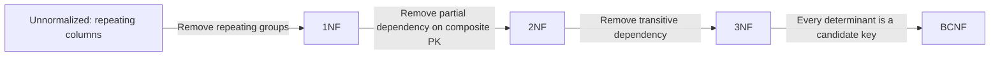
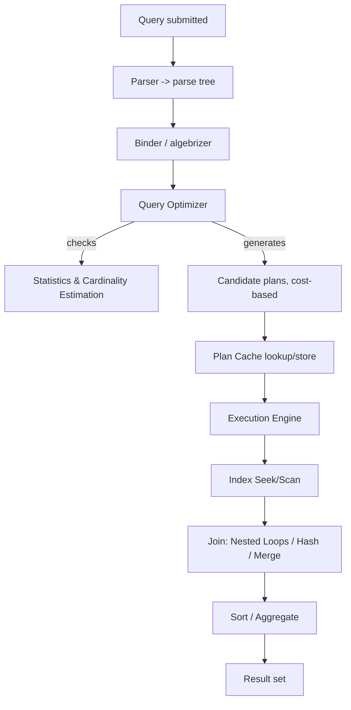
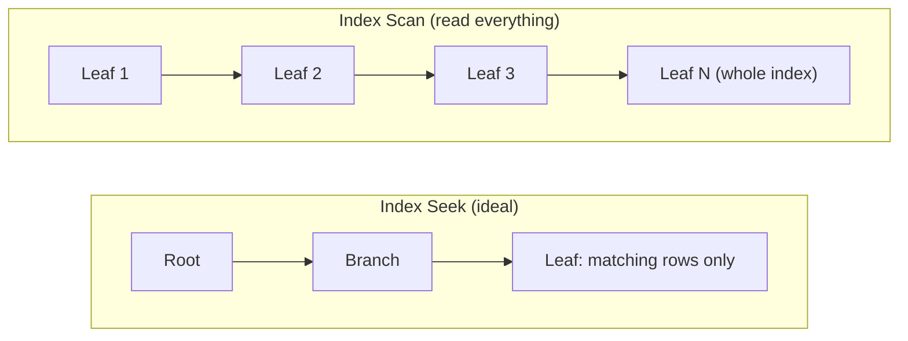
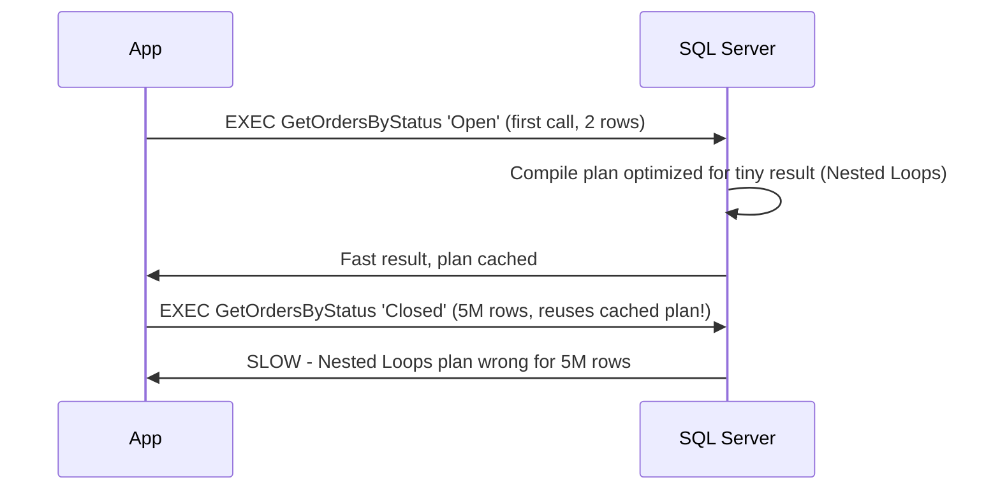
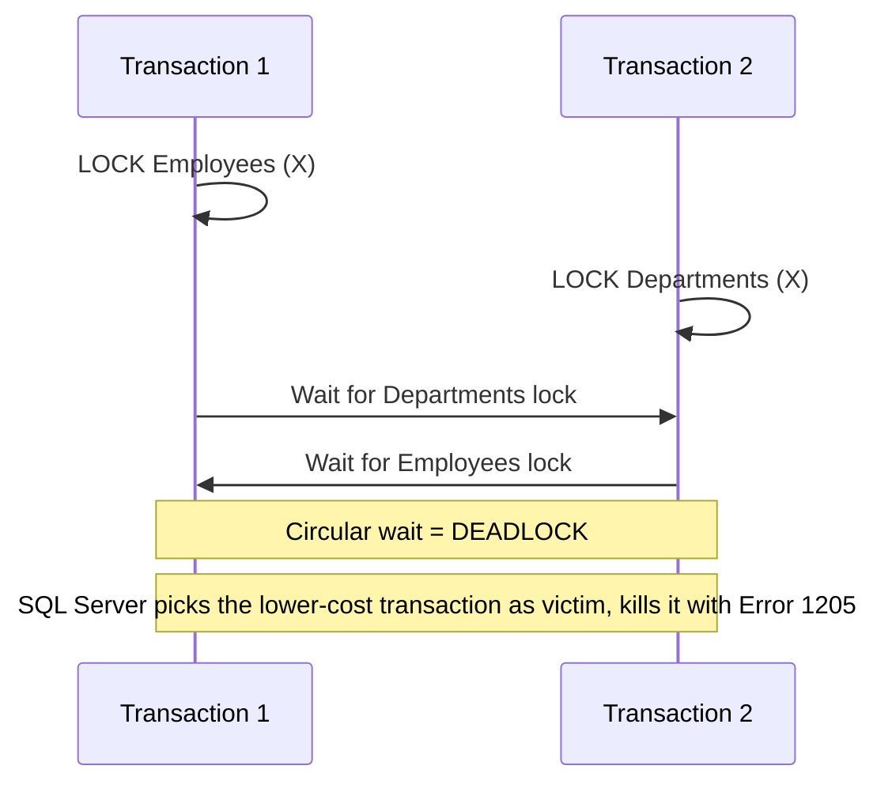

# SQL Server — Interview Revision Notes

> Quick-revision Q&A jo `J. SQL-Server-Interview-Guide.md` se derive kiya gaya hai. Source ke har section ko cover karta hai.

## Core Concepts

### RDBMS Basics & Keys

**Q: What are the core components of SQL Server?**

A: Database Engine, SQL Server Agent, SSMS, SSRS, SSIS, SSAS.

**Q: Primary Key kya guarantee karta hai, aur default mein yeh kaunsa index create karta hai?**

A: Uniqueness, NULLs allow nahi hote, aur default mein clustered index banta hai (jab tak explicitly nonclustered na banaya jaaye).

**Q: Kya Foreign Key automatically child column ko index kar deta hai?**

A: Nahi — SQL Server FK columns ko auto-index nahi karta. Explicit index ke bina, parent par deletes/updates hone par constraint check karte waqt child par table scans ho jaate hain.

**Q: NULLs aur indexing ke mamle mein Unique Key, Primary Key se kaise different hai?**

A: Unique Key exactly ek NULL allow karta hai (NULL, NULL ke equal nahi hota) aur default mein nonclustered index banata hai; Primary Key NULL ko poori tarah disallow karta hai aur default mein clustered hota hai.

**Q: PERSISTED computed column mein kya special hai?**

A: Yeh computed value ko disk par materialize kar deta hai isliye usse index kiya ja sakta hai, lekin expression deterministic hona chahiye. Aap computed column mein directly insert/update nahi kar sakte.

**Q: ON DELETE CASCADE / ON UPDATE CASCADE ke saath kya risk hai?**

A: Yeh parent deletes/updates ko automatically children tak propagate kar dete hain — cascade behavior ko hamesha real data ki copy par test karo, kyunki ek unexpected cascade expected se kaafi zyada data wipe out kar sakta hai.

```sql
CREATE TABLE dbo.OrdersDemo (
  OrderID INT IDENTITY(1,1) NOT NULL,
  OrderNumber NVARCHAR(30) NOT NULL,
  CustomerID INT NOT NULL,
  OrderDate DATE NOT NULL CONSTRAINT CK_OrdersDemo_OrderDate CHECK (OrderDate <= CAST(GETDATE() AS DATE)),
  Quantity INT NOT NULL CONSTRAINT CK_OrdersDemo_Quantity CHECK (Quantity > 0),
  UnitPrice MONEY NOT NULL CONSTRAINT CK_OrdersDemo_Price CHECK (UnitPrice >= 0),
  Status NVARCHAR(20) NOT NULL CONSTRAINT DF_OrdersDemo_Status DEFAULT ('Open'),
  LineTotal AS (Quantity * CONVERT(DECIMAL(18,2), UnitPrice)) PERSISTED,
  CONSTRAINT PK_OrdersDemo PRIMARY KEY CLUSTERED (OrderID),
  CONSTRAINT UQ_OrdersDemo_OrderNumber UNIQUE (OrderNumber),
  CONSTRAINT FK_OrdersDemo_Customers FOREIGN KEY (CustomerID)
    REFERENCES dbo.Customers(CustomerID)
    ON DELETE NO ACTION
    ON UPDATE NO ACTION
);
-- Index the FK column explicitly — SQL Server does not do this for you
CREATE NONCLUSTERED INDEX IX_OrdersDemo_CustomerID ON dbo.OrdersDemo(CustomerID);
```

### DELETE vs TRUNCATE vs DROP

**Q: Kya TRUNCATE TABLE ko roll back kiya ja sakta hai?**

A: Haan, agar explicit transaction ke andar run kiya jaaye — "TRUNCATE ko roll back nahi kiya ja sakta" wala myth sirf auto-committed standalone statement ke liye hi sahi hai. DELETE ke against real difference logging granularity ka hai (page deallocation vs row-by-row), transactional capability ka nahi.

**Q: DELETE/TRUNCATE/DROP mein se kaun triggers fire karta hai, aur kaun IDENTITY reset karta hai?**

A: DELETE AFTER triggers fire karta hai; TRUNCATE aur DROP nahi karte. TRUNCATE IDENTITY ko seed par reset kar deta hai; DELETE nahi karta; DROP table ko poori tarah remove kar deta hai.

**Q: Kya aap ek aise table ko TRUNCATE kar sakte ho jispar active FK reference point kar rahi ho?**

A: Nahi — table par koi active FK reference nahi honi chahiye (ya children ko pehle truncate/clear karna hoga).

### WHERE vs HAVING

**Q: WHERE aur HAVING mein functional difference kya hai?**

A: WHERE grouping/aggregation se pehle rows ko filter karta hai aur generally aggregates ko reference nahi kar sakta; HAVING GROUP BY ke baad groups ko filter karta hai, aggregate results par filter karne ke liye use hota hai (e.g., `HAVING COUNT(*) > 1`).

### CHAR vs VARCHAR vs NCHAR/NVARCHAR

**Q: CHAR aur VARCHAR storage mein kaise different hain?**

A: CHAR fixed-length hota hai, space-padded, non-Unicode (1 byte/char); VARCHAR variable-length hota hai, no padding, non-Unicode.

**Q: NCHAR/NVARCHAR ke liye encoding difference kya hai, aur inhe kab use karna chahiye?**

A: Yeh Unicode store karte hain (2 bytes/char) — NCHAR fixed-length, NVARCHAR variable-length. Multilingual/free text ke liye best hain.

**Q: Agar aap N prefix ke bina VARCHAR literal ko NVARCHAR column ke against compare karo to kya hota hai?**

A: Yeh implicit conversion force kar deta hai jo silently index seek ko disable kar sakta hai. NVARCHAR columns ke against compare karte waqt hamesha Unicode literals ko `N'...'` se prefix karo.

### Views (Normal, Indexed/Materialized)

**Q: View kya hota hai, aur simple aur complex view mein kya difference hai?**

A: View ek saved SELECT hota hai — virtual, koi physical storage nahi. Simple = single table; complex = joins/aggregations.

**Q: Ek indexed (materialized) view up to date kaise rehta hai, other RDBMSs ke materialized views ke comparison mein?**

A: Yeh `WITH SCHEMABINDING` plus ek `UNIQUE CLUSTERED INDEX` ke saath banaya jaata hai, aur SQL Server base tables par har INSERT/UPDATE/DELETE ke saath ise synchronously maintain karta hai — yeh kabhi stale data nahi dikhata, unlike materialized views elsewhere jinhe manual/scheduled refresh chahiye hota hai. Cost: write amplification.

**Q: Indexed views par key restrictions batao.**

A: SCHEMABINDING zaruri hai; referenced functions/expressions deterministic hone chahiye; specific SET options session level par fixed hain; no outer joins; nullable SUM/COUNT ko internally COUNT_BIG chahiye.

```sql
CREATE OR ALTER VIEW dbo.vOrderTotals
WITH SCHEMABINDING
AS
SELECT o.OrderID, SUM(oi.Quantity * oi.UnitPrice) AS OrderTotal
FROM dbo.Orders o
JOIN dbo.OrderItems oi ON o.OrderID = oi.OrderID
GROUP BY o.OrderID;
GO
CREATE UNIQUE CLUSTERED INDEX IX_vOrderTotals_OrderID ON dbo.vOrderTotals(OrderID);
```

### Stored Procedures vs Functions

**Q: Kya scalar/table-valued functions data modify kar sakte hain ya stored procedure jaise transactions ke andar run ho sakte hain?**

A: Nahi — functions ko read-only treat kiya jaata hai limited error handling ke saath; sirf stored procedures full transactions aur TRY/CATCH support karte hain.

**Q: INSERT ke baad @@IDENTITY ke bajaye SCOPE_IDENTITY() kyun use karein?**

A: SCOPE_IDENTITY() same scope mein generate hui identity value return karta hai, isse kahin aur (e.g., trigger se) insert hui identity value se contamination avoid hota hai — @@IDENTITY ke saath yeh ek classic pitfall hai.

```sql
CREATE OR ALTER PROCEDURE dbo.uspCreateOrder
  @orderNumber NVARCHAR(30), @customerID INT, @orderDate DATE,
  @quantity INT, @unitPrice MONEY, @newOrderID INT OUTPUT
AS
BEGIN
  SET NOCOUNT ON;
  BEGIN TRY
    INSERT INTO dbo.Orders (OrderNumber, CustomerID, OrderDate, Quantity, UnitPrice)
    VALUES (@orderNumber, @customerID, @orderDate, @quantity, @unitPrice);
    SET @newOrderID = SCOPE_IDENTITY();  -- NOT @@IDENTITY (see pitfalls)
    RETURN 0;
  END TRY
  BEGIN CATCH
    SET @newOrderID = -1;
    THROW;
  END CATCH;
END;
```

**Q: SQL Server 2019 mein scalar UDF performance mein kya change aaya?**

A: SQL Server 2019 ne Scalar UDF Inlining introduce kiya — eligible scalar functions compile time par relational expressions mein transform ho jaate hain, jisse set-based execution aur parallelism enable hoti hai row-by-row (RBAR) ke bajaye. Eligibility ke liye no TRY/CATCH, no non-deterministic side-effect functions, aur compat level 150+ chahiye; check karo `sys.sql_modules.is_inlineable` se.

**Q: Kaunsi TVF type query plan mein inline hoti hai, aur kaunsi optimizer ke liye black box hoti hai?**

A: Inline TVFs inline ho jaati hain (fast); multi-statement TVFs nahi hoti (slow, optimizer ke liye opaque).

### Triggers & Magic Tables (inserted/deleted)

**Q: SQL Server mein chaar trigger types kya hain?**

A: AFTER (post-DML, views par nahi), INSTEAD OF (DML ko replace karta hai, e.g., soft deletes/updatable views), DDL triggers (schema changes), LOGON triggers (server-level, login par).

**Q: UPDATE ke liye inserted/deleted pseudo-tables mein kya hota hai?**

A: `inserted` naye values hold karta hai, `deleted` purane values hold karta hai (INSERT: inserted=new rows/deleted=empty; DELETE: inserted=empty/deleted=old rows).

```sql
CREATE TRIGGER trg_AuditOrders ON Orders
AFTER INSERT, UPDATE, DELETE
AS
BEGIN
  SET NOCOUNT ON;
  INSERT INTO OrderAudit(OrderId, ActionType, ActionDate)
  SELECT COALESCE(i.OrderId, d.OrderId),
    CASE WHEN i.OrderId IS NOT NULL AND d.OrderId IS NULL THEN 'INSERT'
         WHEN i.OrderId IS NOT NULL AND d.OrderId IS NOT NULL THEN 'UPDATE'
         ELSE 'DELETE' END,
    SYSUTCDATETIME()
  FROM inserted i
  FULL OUTER JOIN deleted d ON i.OrderId = d.OrderId;
END;
```

**Q: Multi-row inserts ke saath classic trigger bug kya hai?**

A: Triggers ek statement ke liye ek baar fire hote hain, har row ke liye nahi. Code jaisa `SELECT @id = OrderId FROM inserted` multi-row inserts par silently sirf ek arbitrary row pick karta hai — hamesha `inserted`/`deleted` ko sets treat karo.

**Q: Ek senior engineer ko aur kaunse trigger pitfalls flag karne chahiye?**

A: Recursive triggers (self-updates par re-entry — `TRIGGER_NESTED_LEVEL()` se guard karo ya `RECURSIVE_TRIGGERS` disable karo); triggers DML ke same transaction mein run hote hain (ek slow/failing trigger caller ko block/rollback kar deta hai); multiple triggers ke across execution order guaranteed nahi hai (`sp_settriggerorder` ke bina); bulk loads par overhead (aksar `ALTER TABLE ... DISABLE TRIGGER ALL` se disable kar diya jaata hai).

### Normalization & Denormalization (1NF–BCNF)

**Q: Har normal form (1NF–BCNF) kya fix karta hai?**

A: 1NF: repeating groups → atomic values ek unique row id ke saath. 2NF: partial dependency → non-key columns poore composite PK par depend karte hain. 3NF: transitive dependency → non-key columns sirf PK par depend karte hain. BCNF: anomalies jo 3NF miss karta hai → har determinant ek candidate key hota hai.



**Q: Aap deliberately schema ko denormalize kyun karoge?**

A: Joins kam karne aur reads fast karne ke liye (reporting/OLAP/dashboards mein common), iske cost par write complexity aur potential inconsistency aati hai.

### OLTP vs OLAP

**Q: OLTP aur OLAP schema design aur indexing strategy mein kaise different hain?**

A: OLTP: normalized (3NF), point lookups ke liye selective nonclustered indexes, kaafi saare small fast reads/writes. OLAP: denormalized (star/snowflake), columnstore indexes aur wide scans, kam lekin large complex read-heavy queries.

**Q: OLTP aur OLAP workloads ko alag kyun rakhna chahiye?**

A: Isliye ki heavy analytical queries transactional system ke buffer pool aur locks ko starve na karein — read replicas, Always On readable secondaries, ya ek dedicated reporting/warehouse database use karo.

## Intermediate

### Joins: INNER, OUTER, CROSS, SELF

**Q: CROSS JOIN kya produce karta hai?**

A: Cartesian product — ek table ki har row doosre table ki har row ke saath pair hoti hai.

**Q: Self join kaise likhte hain, e.g., employee to manager?**

A:

```sql
-- Self join: employee -> manager
SELECT e.EmployeeID, e.Name AS Employee, m.Name AS Manager
FROM dbo.Employees e
LEFT JOIN dbo.Employees m ON e.ManagerID = m.EmployeeID;
```

**Q: LEFT aur FULL OUTER JOIN mein kya difference hai?**

A: LEFT left table ki saari rows plus right table se matches rakhta hai (NULL agar match na mile); FULL dono sides ki saari rows rakhta hai NULLs ke saath jahan bhi unmatched ho.

### UNION vs UNION ALL

**Q: UNION ke bajaye UNION ALL kab prefer karna chahiye?**

A: Jab bhi duplicates acceptable ho ya impossible ho — UNION ALL dedup step (implicit sort/hash distinct) skip kar deta hai jo UNION perform karta hai, isse CPU/memory bachta hai.

**Q: UNION query mein ORDER BY kahan jaana chahiye, aur column compatibility ko kya govern karta hai?**

A: ORDER BY combined result par apply hota hai aur sirf final SELECT ke baad hi aana chahiye; column count aur (implicitly convertible) types saare SELECTs mein match hone chahiye.

### CTE vs Temp Table vs Table Variable vs View

**Q: CTE/temp table/table variable mein se kaun recursion support karta hai?**

A: Sirf CTE.

**Q: SQL Server 2016 par 500K-row intermediate set ke liye table variable disastrous execution plan kyun cause kar sakta hai?**

A: 2019 se pehle, table variables ke paas real statistics nahi hote the — optimizer hamesha ~1 row assume karta tha, jisse catastrophic plan ban sakta tha (e.g., ek nested loop against ek table jispar actually 500K rows hain). Temp table ke paas real, cardinality-aware statistics hote hain, isliye 2019 se pehle large intermediate sets ke liye yeh safer choice hai.

**Q: SQL Server 2019 mein table variable cardinality problem ko kya fix kiya?**

A: Table variable deferred compilation — compilation first execution tak delay ho jaata hai, isliye actual row counts pata hote hain, aur cardinality estimation roughly temp tables ke barabar ho jaati hai.

**Q: Ek hot stored procedure mein recompilations avoid karne mein kaun better hai — temp table ya table variable?**

A: Table variable (mid-proc schema change par recompiles trigger nahi karta) — historically pre-2019 mein ise prefer karne ki main wajah yahi thi.

```sql
-- Recursive CTE: employee hierarchy
WITH EmployeeHierarchy AS (
    SELECT EmployeeID, Name, ManagerID, 1 AS Level
    FROM Employees WHERE ManagerID IS NULL
    UNION ALL
    SELECT e.EmployeeID, e.Name, e.ManagerID, eh.Level + 1
    FROM Employees e
    INNER JOIN EmployeeHierarchy eh ON e.ManagerID = eh.EmployeeID
)
SELECT * FROM EmployeeHierarchy;
```

### Subqueries: Scalar, Correlated, EXISTS vs IN vs JOIN

**Q: Agar scalar subquery ek se zyada row return kare to kaunsa error aata hai?**

A: "Subquery returned more than 1 value" — ek scalar subquery ko har outer row ke liye 0 ya 1 value return karni chahiye.

**Q: Subquery ki candidate list mein NULL hone par NOT IN dangerous kyun hai?**

A: NULL ke against compare karne se UNKNOWN milta hai, FALSE nahi, isliye `NOT IN (...)` list mein koi bhi NULL hone par unexpectedly zero rows return karta hai. Iske bajaye `NOT EXISTS` use karo — yeh NULLs ko safely handle karta hai.

```sql
-- Classic NULL trap: NOT IN with a NULL in the subquery returns ZERO rows unexpectedly
SELECT CustomerName FROM dbo.Customers
WHERE CustomerID NOT IN (SELECT CustomerID FROM (VALUES (100),(101),(NULL)) AS x(CustomerID));
-- returns nothing, because comparing against NULL yields UNKNOWN, not FALSE

-- Safe alternative
SELECT c.CustomerName FROM dbo.Customers c
WHERE NOT EXISTS (SELECT 1 FROM dbo.Orders o WHERE o.CustomerID = c.CustomerID);
```

**Q: EXISTS evaluation mein IN se kaise different hai?**

A: EXISTS first match par short-circuit ho jaata hai aur NULLs ko safely handle karta hai; IN full candidate list ko materialize kar deta hai.

### Cursors and Why to Avoid Them

**Q: Chaar cursor types kya hain, aur kaunsa sabse fastest hai?**

A: Static, dynamic, forward-only (fastest), aur keyset-driven.

```sql
DECLARE @EmployeeID INT, @Salary INT;
DECLARE EmployeeCursor CURSOR FOR SELECT EmployeeID, Salary FROM Employees;
OPEN EmployeeCursor;
FETCH NEXT FROM EmployeeCursor INTO @EmployeeID, @Salary;
WHILE @@FETCH_STATUS = 0
BEGIN
    -- row-by-row work
    FETCH NEXT FROM EmployeeCursor INTO @EmployeeID, @Salary;
END;
CLOSE EmployeeCursor;
DEALLOCATE EmployeeCursor;
```

Set-based equivalents prefer karo:

```sql
UPDATE Employees SET Salary = Salary * 1.10 WHERE Salary < 70000;
```

**Q: Cursors actually kab legitimate hote hain?**

A: Sirf genuinely procedural, order-dependent operations ke liye jo relationally express nahi ho sakte (e.g., har row ke liye ek external stored proc call karna, sequential state machines). Otherwise set-based UPDATE/INSERT prefer karo — cursors slow hote hain, memory-heavy, aur locks ko zyada der hold kar sakte hain, jisse blocking/deadlocks worse ho jaate hain.

### Dynamic SQL

**Q: EXEC() ke saath concatenated string ke bajaye sp_executesql kyun use karein?**

A: `sp_executesql` query ko parameterize kar deta hai isliye plan cache hota hai aur reusable rehta hai, aur SQL injection se bachata hai; concatenated string par `EXEC()` injection risk bhi hai aur almost har baar ek fresh, non-reusable plan produce karta hai (cache pollution).

```sql
DECLARE @sql NVARCHAR(MAX) = N'SELECT * FROM Users WHERE Id = @Id';
EXEC sp_executesql @sql, N'@Id INT', @Id = 5;
```

### TRY...CATCH, THROW vs RAISERROR

**Q: XACT_STATE() ki values 1, 0, -1 ka matlab kya hai, aur -1 par kya karna chahiye?**

A: 1 = active/committable, 0 = no transaction, -1 = doomed/uncommittable — aapko ROLLBACK karna hoga; COMMIT try karne se ek aur error aa jaayega.

```sql
BEGIN TRY
    BEGIN TRAN;
    -- statements
    COMMIT TRAN;
END TRY
BEGIN CATCH
    IF XACT_STATE() <> 0 ROLLBACK TRAN;
    THROW;  -- re-raises original error with original number/line/severity
END CATCH;
```

**Q: New code mein RAISERROR ke bajaye THROW kyun prefer karein?**

A: THROW (2012+) original error ka number/line/severity preserve karta hai aur usse simply re-raise kar deta hai; RAISERROR legacy hai aur manual formatting chahiye.

**Q: TRY/CATCH kis type ke errors ko NAHI catch karta?**

A: Compile-time/syntax errors, "object not found" jo parse time par resolve hota hai, aur itne severe errors jo connection terminate kar dein (severity ≥ 20).

### Window Functions Deep Dive

**Q: Tie hone par RANK() aur DENSE_RANK() kaise different hain?**

A: RANK() tie ke baad numbers skip kar deta hai (1,2,2,4); DENSE_RANK() mein koi gap nahi hota (1,2,2,3). ROW_NUMBER() ties ke liye bhi hamesha distinct hota hai.

```sql
-- Running total, deterministic with ROWS not RANGE
SELECT *, SUM(amount) OVER (
  PARTITION BY region ORDER BY sale_date
  ROWS BETWEEN UNBOUNDED PRECEDING AND CURRENT ROW
) AS running_total
FROM sales;
```

**Q: LAST_VALUE() often "surprisingly" partition ki true last value ke bajaye current row ki value kyun return karta hai?**

A: Default window frame `RANGE BETWEEN UNBOUNDED PRECEDING AND CURRENT ROW` hota hai, isliye LAST_VALUE current row ki value return karta hai. Fix karne ke liye frame ko explicitly expand karo: `ROWS BETWEEN UNBOUNDED PRECEDING AND UNBOUNDED FOLLOWING`.

**Q: Window frame mein RANGE vs ROWS — running total ke liye kaunsa prefer karna chahiye, aur kyun?**

A: ROWS prefer karo — strictly row-count based aur predictable hota hai. RANGE same ORDER BY value share karne wali peer rows ko ek logical frame mein group kar deta hai, jo ties ke saath surprising hota hai.

**Q: Aap WHERE/HAVING mein directly window function par filter kyun nahi kar sakte?**

A: Window functions wahan allowed nahi hain — query ko ek CTE/subquery mein wrap karo aur aliased column par filter karo.

**Q: Window function use karke Nth highest salary kaise dhoondte hain?**

A: `DENSE_RANK() OVER (ORDER BY Salary DESC)` ko ek subquery/CTE mein wrap karo aur `WHERE rnk = @N` se filter karo.

```sql
-- Nth highest salary via DENSE_RANK (fastest common approach)
SELECT Salary FROM (
  SELECT Salary, DENSE_RANK() OVER (ORDER BY Salary DESC) AS rnk
  FROM Employees
) t WHERE rnk = @N;
```

### SARGability

**Q: SARGable ka matlab kya hai, aur predicate ko SARGable rakhne ka universal rule kya hai?**

A: SARG = Search ARGument — ek predicate jise optimizer index seek mein badal sakta hai. Rule: indexed column ko kabhi function/expression mein wrap na karo (e.g., `YEAR(OrderDate)`, `ISNULL(Status,'')`, casting) — iske bajaye transformation ko literal/parameter side par daalo.

```sql
-- NOT SARGable: function wraps the indexed column
SELECT * FROM Orders WHERE YEAR(OrderDate) = 2025;

-- SARGable rewrite: leave the column bare, push the range into literals
SELECT * FROM Orders
WHERE OrderDate >= '2025-01-01' AND OrderDate < '2026-01-01';
```

**Q: `WHERE YEAR(OrderDate) = 2025` ko SARGable banane ke liye rewrite karo.**

A: `WHERE OrderDate >= '2025-01-01' AND OrderDate < '2026-01-01'`.

**Q: `LIKE '%abc%'` index seek ko kyun defeat kar deta hai?**

A: Leading wildcard b-tree navigation ko rok deta hai — iske liye full-text search ya ek different data model chahiye hota hai.

## Advanced

### Execution Plans & Join Operators

**Q: Estimated aur Actual execution plans mein kya difference hai, aur inke beech mismatch kyun matter karta hai?**

A: Estimated (Ctrl+L) query run kiye bina optimizer ka guess dikhata hai; Actual (Ctrl+M) query run karta hai aur estimates ke saath real row counts dikhata hai. Ek bada estimated-vs-actual row-count mismatch stale/missing statistics ya parameter sniffing ka signal hota hai.



**Q: Ek Key Lookup plan mein kab add hota hai, aur ise kaise eliminate karte hain?**

A: Jab ek nonclustered index mein saare requested columns nahi hote, isse har row ke liye clustered index/heap mein ek extra seek force ho jaata hai. Ek covering index (extra columns ko `INCLUDE` karke) se fix karo.

**Q: Optimizer kab Hash Match vs Merge Join vs Nested Loops prefer karta hai?**

A: Nested Loops: small outer input + indexed inner input. Hash Match: large, unsorted, unindexed inputs dono sides par (tempdb spill ka risk). Merge Join: dono inputs already join key par sorted hain — jab applicable ho to sabse cheap.

**Q: Unexpectedly huge (1M+ row) outer input ke against Nested Loops chosen hone par kya red flag hai?**

A: Likely parameter sniffing ya stale statistics — millions of index seeks ek symptom hai, root cause nahi.

```sql
SELECT * FROM Employees WHERE Age > 30;             -- Table Scan without index
CREATE INDEX IDX_Employees_Age ON Employees(Age);
SELECT * FROM Employees WHERE Age > 30;             -- Now Index Seek
```

**Q: Execution plans capture karne ke liye kaunse tools hain?**

A: SSMS Ctrl+L/Ctrl+M, `SET STATISTICS IO, TIME ON`, Query Store, Extended Events (`query_post_execution_showplan`).

### Index Seek vs Scan, Key Lookup, Covering Indexes



**Q: Index Scan kab problem nahi balki acceptable hota hai?**

A: Jab query most/all rows return karti hai, ya table itna small hota hai ki seek ka overhead worth nahi hota.

**Q: High row counts par Nested Loops + Key Lookup combo plain table scan se zyada expensive kyun ho sakta hai?**

A: Har matching row clustered index/heap mein ek extra seek ka cost lagata hai — volume mein yeh per-row cost ek single sequential scan se zyada ho sakta hai. Covering index se fix karo.

```sql
-- Query needing OrderDate filter + CustomerName, Status in the SELECT
SELECT OrderDate, CustomerName, Status FROM Orders WHERE OrderDate > '2025-01-01';

-- Non-covering index -> seek + key lookup per row
CREATE NONCLUSTERED INDEX IX_Orders_OrderDate ON Orders(OrderDate);

-- Covering index: INCLUDE columns needed only in the SELECT (not used for seeking/filtering)
CREATE NONCLUSTERED INDEX IX_Orders_OrderDate_Covering
  ON Orders(OrderDate)
  INCLUDE (CustomerName, Status);
```

**Q: Extra columns ko index key ke bajaye INCLUDE mein kyun daalte hain?**

A: INCLUDE columns sirf leaf level par store hote hain, isliye yeh b-tree ke intermediate levels ko bloat nahi karte ya wider pages force nahi karte, aur woh data types bhi hold kar sakte hain jo key columns ke taur par allowed nahi hain. Seeks ke liye key column order matter karta hai (leftmost-prefix rule); INCLUDE order nahi karta.

### Heap Tables

**Q: Heap kya hai, aur uski rows internally kaise identify hoti hain?**

A: Ek table jismein koi clustered index nahi hota — rows ka koi particular physical order nahi hota aur unhe clustering key ke bajaye ek RID (`FileID:PageID:SlotID`) se identify kiya jaata hai.

```sql
-- A heap: no PRIMARY KEY / clustered index defined
CREATE TABLE dbo.StagingOrders (
    OrderNumber NVARCHAR(30) NOT NULL,
    CustomerID INT NOT NULL,
    OrderDate DATE NOT NULL
);

-- Confirm it's a heap (index_id = 0 means heap)
SELECT i.name, i.type_desc FROM sys.indexes i
WHERE i.object_id = OBJECT_ID('dbo.StagingOrders');
```

**Q: "Forwarded record" kya hota hai, aur heaps par yeh problem kyun hai?**

A: Jab ek update se row itni badi ho jaati hai ki apne page mein fit nahi hoti, SQL Server ek forwarding pointer chhod deta hai aur row ko move kar deta hai — us RID ke through har future access (nonclustered indexes ke through bhi) ek extra hop ka cost lagata hai. `sys.dm_db_index_physical_stats` mein high `forwarded_record_count` signal karta hai ki heap ko clustered index chahiye.

**Q: Heap kab ek deliberate, sensible choice hota hai?**

A: Bulk-load staging tables ya insert-only, never-filtered-directly log-style tables — fast bulk inserts kyunki maintain karne ke liye koi b-tree nahi hai. OLTP tables ke liye default nahi hai.

### Statistics & Cardinality Estimation

**Q: Compile time par row counts estimate karne ke liye optimizer kya use karta hai?**

A: Column/index statistics (histograms + density info) — actual table ka live scan nahi.

```sql
-- Inspect statistics
DBCC SHOW_STATISTICS ('dbo.Orders', 'IX_Orders_OrderDate');

-- Manually update (usually automatic, but useful after bulk loads)
UPDATE STATISTICS dbo.Orders IX_Orders_OrderDate WITH FULLSCAN;

-- Check auto-update settings
SELECT name, is_auto_update_stats_on, is_auto_create_stats_on FROM sys.databases WHERE name = DB_NAME();
```

**Q: Statistics ka auto-update kya trigger karta hai?**

A: Modified rows ka ek threshold (historically ~20% table rows); SQL Server 2016+ compat level 130+ par ek lower, size-dependent dynamic threshold use karta hai isliye large tables proportionally sooner refresh ho jaate hain.

**Q: "Ascending key problem" kya hai?**

A: Ek ever-growing column (IDENTITY, SYSDATETIME()) ke liye, statistics un values ke rows under-estimate karte hain jo last stats update se newer hain, kyunki histogram ke paas apne last sampled max se aage ka data nahi hota. Trace flag 2371 ya zyada frequent stats updates se mitigate karo.

**Q: Database migration ya compat-level change ke baad plan unexpectedly kyun change ho sakta hai?**

A: Cardinality Estimator (CE) model SQL Server 2014 mein significantly change hua tha; database compatibility level control karta hai ki kaunsa CE use hoga. Troubleshooting ke liye trace flag 9481 ya `LEGACY_CARDINALITY_ESTIMATION` se legacy CE force karo.

### Parameter Sniffing

**Q: Parameter sniffing kya hai, aur yeh usually beneficial lekin kabhi kabhi harmful kyun hota hai?**

A: SQL Server ek parameterized query ke liye plan compile/cache karta hai first call ke parameter values ke basis par, phir subsequent calls ke liye wahi plan reuse karta hai. Plan reuse ke liye beneficial hai, lekin skewed data distributions ke saath harmful hai (e.g., 'Open'=2 rows vs 'Closed'=5M rows).

```sql
CREATE OR ALTER PROCEDURE dbo.GetOrdersByStatus @Status VARCHAR(20)
AS
BEGIN
  SELECT * FROM Orders WHERE Status = @Status;
  -- If 'Open' = 2 rows and 'Closed' = 5,000,000 rows, whichever value
  -- compiles the plan first "sniffs" that selectivity into the cached plan.
END;
```



**Q: Parameter sniffing ke fixes ko roughly preference order mein list karo.**

A: `OPTION (RECOMPILE)` (har call par recompile karta hai, no reuse lekin hamesha optimal); `OPTIMIZE FOR (@param = 'typical value')`; `OPTIMIZE FOR UNKNOWN` (density-based average estimate); local-variable trick (OPTIMIZE FOR UNKNOWN ka legacy equivalent); har case ke liye separate procs mein split karo; Query Store "Force Plan" ek stop-gap ke taur par.

### Transactions & ACID

**Q: Chaar ACID properties define karo.**

A: Atomicity (all-or-nothing), Consistency (constraints before/after satisfied hote hain), Isolation (concurrent transactions ek doosre ki uncommitted state nahi dekhte), Durability (committed changes crashes mein bhi survive karte hain write-ahead log ke zariye).

**Q: Kya SAVE TRAN savepoints already acquired locks ko release karte hain?**

A: Nahi — yeh ek common misconception hai. Savepoints partial rollback allow karte hain lekin locks outer transaction end hone tak held rehte hain.

```sql
BEGIN TRAN;
  INSERT INTO Orders VALUES (1);
  UPDATE Stock SET Qty = Qty - 1;
  SAVE TRAN Step1;
  -- optional partial work
  -- ROLLBACK TRAN Step1;  -- rolls back only to savepoint, not entire transaction
COMMIT;
```

**Q: Nesting BEGIN TRAN actually kya karta hai?**

A: Yeh true independent sub-transactions nahi banata — `@@TRANCOUNT` sirf increment hota hai; sirf outermost COMMIT hi actually commit karta hai, lekin kisi bhi level par ROLLBACK sab kuch rollback kar deta hai (savepoints ko ignore karke, jab tak explicitly target na kiya jaaye).

### Isolation Levels & Concurrency

**Q: Dirty read, non-repeatable read, aur phantom read define karo.**

A: Dirty read: doosri transaction ka uncommitted change padhna. Non-repeatable read: ek row ko dobara padhne par different data milta hai kyunki beech mein doosri transaction ne commit kar diya. Phantom read: ek repeated range query concurrent inserts/deletes ki wajah se new/missing rows return karti hai.

**Q: Kaunse isolation levels teeno (dirty, non-repeatable, phantom) reads ko prevent karte hain?**

A: Serializable (range locks ke zariye) aur Snapshot (row versioning ke zariye) — dono teeno ko prevent karte hain, different mechanisms use karke (blocking vs optimistic).

**Q: WITH (NOLOCK) kya karta hai?**

A: Us query ke liye sirf Read Uncommitted apply karta hai — reads par koi lock nahi liya jaata, isliye yeh dirty/inconsistent data dekh sakta hai.

```sql
SELECT * FROM Employees WITH (NOLOCK);  -- Read Uncommitted for this query only; may see dirty/inconsistent data
```

### RCSI vs Snapshot Isolation (Optimistic Concurrency)

**Q: RCSI aur Snapshot Isolation ke scope mein core difference kya hai?**

A: RCSI per-statement ek consistent snapshot leta hai; Snapshot Isolation per-transaction leta hai (BEGIN TRAN par).

**Q: Kya RCSI enable karne ke liye application code changes chahiye?**

A: Nahi — yeh default READ COMMITTED behavior ke liye ek transparent drop-in replacement hai (`ALTER DATABASE x SET READ_COMMITTED_SNAPSHOT ON`). True Snapshot Isolation ke liye explicit opt-in chahiye (`ALLOW_SNAPSHOT_ISOLATION` + per session `SET TRANSACTION ISOLATION LEVEL SNAPSHOT`).

```sql
-- RCSI: transparent, most common production choice to reduce blocking
ALTER DATABASE MyDB SET READ_COMMITTED_SNAPSHOT ON;

-- True Snapshot Isolation: explicit opt-in, needed when you want the same
-- consistent view across multiple statements in one transaction
ALTER DATABASE MyDB SET ALLOW_SNAPSHOT_ISOLATION ON;
SET TRANSACTION ISOLATION LEVEL SNAPSHOT;
BEGIN TRAN;
  SELECT * FROM Orders WHERE CustomerID = 100;  -- consistent as of tran start
  -- ... other logic ...
  SELECT * FROM Orders WHERE CustomerID = 100;  -- same snapshot, even if another session committed changes meanwhile
COMMIT;
```

**Q: Snapshot Isolation kaunsa error raise kar sakta hai jo RCSI kabhi nahi karta, aur kyun?**

A: Error 3960 (update conflict) agar doosri transaction ne aapka snapshot begin hone ke baad wahi row modify kar diya — kyunki Snapshot Isolation ek whole-transaction view hold karta hai, jisse write-write conflict detection zaruri hota hai. RCSI per-statement latest committed version re-read karta hai, isliye uske paas aisa koi check nahi hota.

**Q: Non-blocking reads ke badle RCSI aur Snapshot Isolation dono kya cost karte hain?**

A: TempDB version-store overhead (IO/space) — Snapshot Isolation ke liye potentially bada, kyunki versions poori transaction duration ke liye retain karne padte hain.

### Locking: Types, Granularity, and Deadlocks

**Q: Update (U) lock ka purpose kya hai?**

A: Yeh Exclusive mein upgrade karne ka decision lete waqt use hota hai — yeh ek common deadlock pattern ko prevent karta hai jab do readers dono X mein upgrade karne ki koshish karte hain.

**Q: Intent locks (IS/IX/SIX) kis liye hote hain?**

A: Yeh coarser granularity (table/page) par intent signal karte hain fine-grained lock lene se pehle, isse doosri transactions har row inspect kiye bina conflicts detect kar sakti hain.

**Q: Lock escalation kya hai, aur rough default threshold kya hai?**

A: SQL Server automatically row/page locks ko table lock mein escalate kar deta hai (default roughly ~5,000 locks single object par) memory bachane ke liye — yeh large batch updates par unexpectedly blocking badha sakta hai.

**Q: Deadlock prevention checklist list karo.**

A: Tables/rows ko consistent order mein access karo; transactions short rakho; jitni narrow lock granularity chahiye wahi use karo (`ROWLOCK`); covering indexes add karo taaki scans seeks ban jaayen; RCSI/Snapshot Isolation consider karo; error 1205 ke liye retry logic implement karo.

```sql
DECLARE @RetryCount INT = 3, @TryAgain BIT = 1;
WHILE @TryAgain = 1 AND @RetryCount > 0
BEGIN
    BEGIN TRY
        BEGIN TRAN;
        UPDATE Employees SET Salary = Salary + 500 WHERE EmployeeID = 1;
        UPDATE Departments SET Budget = Budget - 1000 WHERE DepartmentID = 2;
        COMMIT;
        SET @TryAgain = 0;
    END TRY
    BEGIN CATCH
        IF XACT_STATE() <> 0 ROLLBACK;
        IF ERROR_NUMBER() = 1205
        BEGIN
            SET @RetryCount -= 1;
        END
        ELSE
        BEGIN
            THROW;
        END
    END CATCH
END;
```

**Q: SQL Server deadlock victim kaise pick karta hai?**

A: Yeh lower-cost transaction ko victim ke taur par pick karta hai aur usse error 1205 se kill kar deta hai.



```sql
-- Detection
DBCC TRACEON (1204, 1222, -1);          -- legacy trace flags for deadlock graphs in error log
SELECT * FROM sys.dm_tran_locks;         -- current lock waits
-- Modern approach: the built-in "system_health" Extended Events session already
-- captures deadlock graphs by default — no extra setup needed.
```

### TempDB Contention & Configuration

**Q: TempDB kaunse workloads ko back karta hai?**

A: Temp tables, table variables, sort/hash spills, version stores (RCSI/Snapshot), aur cursors ke liye worktables — ek shared, instance-wide resource.

**Q: TempDB mein PFS/GAM/SGAM allocation page contention ke liye standard fix kya hai?**

A: Multiple equally-sized tempdb data files (commonly 4 logical CPUs par 1 file, ~8 tak, phir reassess) allocation contention ko files ke across spread karne ke liye.

```sql
-- Check tempdb file layout
SELECT name, physical_name, size/128.0 AS SizeMB FROM tempdb.sys.database_files;

-- Recommended: multiple equally-sized data files (commonly 1 file per 4 logical CPUs,
-- up to ~8 files, then reassess) to spread allocation contention across files
ALTER DATABASE tempdb MODIFY FILE (NAME = tempdev, SIZE = 4096MB, FILEGROWTH = 512MB);
-- Add additional equally sized files via ALTER DATABASE tempdb ADD FILE (...)

-- Diagnose allocation contention (PAGELATCH waits on tempdb pages)
SELECT * FROM sys.dm_os_waiting_tasks WHERE wait_type LIKE 'PAGELATCH%';

-- Diagnose spills to tempdb (sort/hash warnings visible in actual execution plan too)
SELECT * FROM sys.dm_db_session_space_usage ORDER BY user_objects_alloc_page_count DESC;
```

**Q: Aap tempdb allocation contention ko spill-related pressure se kaise alag diagnose karte ho?**

A: Allocation contention: `sys.dm_os_waiting_tasks` mein `PAGELATCH%` waits check karo. Spills: `sys.dm_db_session_space_usage` check karo (actual execution plan mein sort/hash warnings ke taur par bhi visible hota hai).

### Query Store in Depth

**Q: Query Store kya persist karta hai jo plan cache nahi karta?**

A: Query text, execution plan history (time ke saath changes ke saath), aur runtime statistics — database mein persisted, restarts aur plan cache eviction se bhi survive karta hai.

```sql
ALTER DATABASE MyDB SET QUERY_STORE = ON;
ALTER DATABASE MyDB SET QUERY_STORE (
    OPERATION_MODE = READ_WRITE,
    CLEANUP_POLICY = (STALE_QUERY_THRESHOLD_DAYS = 30),
    DATA_FLUSH_INTERVAL_SECONDS = 900,
    MAX_STORAGE_SIZE_MB = 1024,
    QUERY_CAPTURE_MODE = AUTO   -- ignores trivial/one-off queries, reduces noise
);

-- Force a previously good plan (requires the plan_id from Query Store views)
EXEC sp_query_store_force_plan @query_id = 42, @plan_id = 101;

-- Find regressed queries: compare average duration across recent vs prior interval
SELECT * FROM sys.query_store_runtime_stats ORDER BY avg_duration DESC;
```

**Q: Query Store ke zariye pehle wala good plan kaise force karte hain?**

A: `EXEC sp_query_store_force_plan @query_id = ..., @plan_id = ...` — ek achha emergency stabilizer hai, lekin temporary; agar data volume/shape badalta rehta hai, to forced plan khud bhi baad mein suboptimal ban sakta hai.

**Q: QUERY_CAPTURE_MODE = AUTO kya karta hai?**

A: Trivial/one-off queries ko ignore karta hai, isse Query Store data mein noise kam ho jaata hai.

### Columnstore Indexes for Analytics

**Q: Columnstore storage rowstore se kaise different hai, aur analytics ke liye yeh fast kyun hai?**

A: Columnstore data ko column-by-column heavy compression ke saath store karta hai (aksar 5-10x smaller), batch-mode execution use karta hai (~900 rows ek baar mein), aur segment elimination support karta hai (row-groups ko min/max metadata se skip karna) — yeh purpose-built hai scan-heavy aggregation ke liye, singleton lookups ke liye nahi.

```sql
-- Clustered columnstore: replaces the traditional rowstore structure entirely
CREATE CLUSTERED COLUMNSTORE INDEX CCI_FactSales ON dbo.FactSales;

-- Nonclustered columnstore: keep the base table as rowstore (OLTP), add a
-- columnstore copy for analytical queries to run alongside operational ones
CREATE NONCLUSTERED COLUMNSTORE INDEX NCCI_Orders_Analytics
  ON dbo.Orders (OrderDate, CustomerID, Amount, Status);
```

**Q: Clustered aur nonclustered columnstore index mein kya difference hai, aur nonclustered kab use karenge?**

A: Clustered columnstore table ki rowstore structure ko poori tarah replace kar deta hai. Nonclustered columnstore base table ko normal rowstore (OLTP) rakhta hai aur analytical queries ke liye ek columnstore copy add karta hai — real-time operational analytics (2016+) ke liye.

**Q: Columnstore frequent single-row updates ke liye poor fit kyun hai?**

A: Har row modification delta store ke saath interact karta hai aur rowgroup reorganization trigger kar sakta hai — yeh fact tables/large append-mostly datasets ke liye best suited hai, OLTP point updates ke liye nahi.

### Table Partitioning

**Q: Partition switching kya hai, aur yeh fast kyun hai?**

A: `ALTER TABLE ... SWITCH PARTITION` ek near-instant metadata-only operation hai — sliding-window archival ke liye standard pattern (SWITCH IN se naya data load karna, SWITCH OUT se sabse purana purge karna) ek slow, log-heavy DELETE ke bajaye.

```sql
CREATE PARTITION FUNCTION PF_OrderDate (DATE)
AS RANGE RIGHT FOR VALUES ('2023-01-01', '2024-01-01', '2025-01-01');

CREATE PARTITION SCHEME PS_OrderDate
AS PARTITION PF_OrderDate ALL TO ([PRIMARY]);   -- or map each range to its own filegroup

CREATE TABLE dbo.Orders (
    OrderID INT NOT NULL,
    OrderDate DATE NOT NULL,
    ...
) ON PS_OrderDate(OrderDate);
```

**Q: Partitioning primarily ek performance feature hai ya manageability feature?**

A: Manageability — fast archival aur targeted per-partition maintenance (index rebuilds, statistics). Yeh query speed mein sirf partition elimination ke zariye help karta hai, aur sirf tab jab query ka WHERE clause statically partition boundaries tak restrict kiya ja sake; ek well-designed index usually performance mein zyada help karta hai.

### High Availability & Disaster Recovery

**Q: HA+DR combined ke liye modern default answer kya hai, aur kyun?**

A: Always On Availability Groups — replicas ko log streaming sync mode (no data loss) ya async modes ke saath, aur sync mode mein automatic failover; jab tak question specifically legacy/cost-constrained environments target na kare, yahi aapka pehla mention hona chahiye.

**Q: Snapshot Replication, Transactional Replication se kaise different hai?**

A: Snapshot Replication periodically published data ki poori copy push karta hai (no continuous change tracking) — per sync sabse heavy; Transactional Replication committed changes ko near real-time push karta hai. Dono primarily HA mechanism nahi hain — yeh distribution/reporting ke liye hain.

**Q: Kya Database Mirroring abhi bhi relevant hai?**

A: Nahi — yeh deprecated hai, Always On Availability Groups ne isse supersede kar diya hai.

### Backup & Restore

**Q: Kaunse recovery models exist karte hain, aur yeh log backups ko kaise affect karte hain?**

A: SIMPLE (no log backups, no point-in-time recovery, log auto-truncate ho jaata hai); FULL (full point-in-time recovery, regular log backups chahiye warna log unbounded grow karta hai); BULK_LOGGED (kuch bulk ops ko minimally log karta hai, log backups ab bhi support karta hai lekin ek minimally-logged operation ke andar arbitrary point tak nahi).

```sql
BACKUP DATABASE MyDB TO DISK = 'C:\Backup\MyDB.bak';
RESTORE DATABASE MyDB FROM DISK = 'C:\Backup\MyDB.bak';

-- Point-in-time recovery using log backups
RESTORE DATABASE MyDB FROM DISK = 'C:\Backup\MyDB.bak' WITH NORECOVERY;
RESTORE LOG MyDB FROM DISK = 'C:\Backup\MyDB.trn'
  WITH STOPAT = '2024-03-08 12:30:00', RECOVERY;
```

**Q: Point-in-time recovery kaise achieve karte hain?**

A: Full backup se `RESTORE DATABASE ... WITH NORECOVERY`, phir transaction log backup se `RESTORE LOG ... WITH STOPAT = '<timestamp>', RECOVERY`.

**Q: FULL/BULK_LOGGED recovery models ke under log truncate karne ke liye kaunsa backup type zaruri hai?**

A: Transaction log backups.

### Database Snapshots

**Q: Database snapshot under the hood kaise kaam karta hai?**

A: Copy-on-write sparse file — creation par snapshot file empty hoti hai; jab bhi first baar source page change hota hai, SQL Server write se pehle original pre-change page ko snapshot file mein copy kar deta hai, isliye snapshot hamesha creation ke moment ko reflect karta hai.

```sql
CREATE DATABASE MyDB_Snapshot ON
(NAME = MyDB, FILENAME = 'C:\Snapshots\MyDB_Snapshot.ss')
AS SNAPSHOT OF MyDB;

-- Query the frozen point-in-time copy directly
SELECT * FROM MyDB_Snapshot.dbo.Orders;

-- Revert the source database back to the snapshot's point in time
-- (this discards every change made to MyDB since the snapshot was taken)
RESTORE DATABASE MyDB FROM DATABASE_SNAPSHOT = 'MyDB_Snapshot';
```

**Q: Kya database snapshot ek backup hota hai?**

A: Nahi — yeh source ke same underlying disk/storage share karta hai; agar source database ya uska disk lost ho jaaye, to snapshot bhi lost ho jaata hai.

**Q: Aap database ko uske snapshot ke point in time par kaise revert karte hain?**

A: `RESTORE DATABASE MyDB FROM DATABASE_SNAPSHOT = 'MyDB_Snapshot'` — snapshot liye jaane ke baad ka har change discard kar deta hai.

**Q: Database Snapshot, Snapshot Isolation se kaise different hai?**

A: Database Snapshot ek separate named database object hai jo page level par copy-on-write use karta hai, aur drop hone tak persist karta hai. Snapshot Isolation ek transaction isolation level hai jo tempdb row versioning use karta hai, ek single transaction tak scoped. Naam same hai lekin dono different problems solve karte hain.

### Bulk Insert vs Batch Insert

**Q: BULK INSERT ke speed advantage ka main source kya hai?**

A: Right conditions ke under (SIMPLE/BULK_LOGGED recovery model, TABLOCK, no incompatible triggers/constraints), SQL Server operation ko minimally log kar sakta hai har row ko individually log karne ke bajaye.

**Q: "Batch insert" (ek load ko smaller transactions mein split karna) kya problem solve karta hai jo bulk insert nahi karta?**

A: Transaction log growth ko bound karna, lock escalation avoid karna, aur incremental progress/retry on failure allow karna — minimal logging ke baare mein nahi, balki safer, resumable large loads ke baare mein hai.

```sql
-- Bulk insert from a flat file
BULK INSERT dbo.Orders
FROM 'C:\ImportData\orders.csv'
WITH (
    FIELDTERMINATOR = ',',
    ROWTERMINATOR = '\n',
    FIRSTROW = 2,
    BATCHSIZE = 10000,
    TABLOCK
);

-- bcp equivalent from the command line
-- bcp dbo.Orders in "C:\ImportData\orders.csv" -S MyServer -d MyDB -c -t, -F 2

-- Batch insert: an application/ETL step breaks a large in-database load into
-- bounded transactions rather than one giant INSERT
DECLARE @BatchSize INT = 5000, @RowsInserted INT = 1;
WHILE @RowsInserted > 0
BEGIN
    INSERT INTO dbo.Orders (OrderNumber, CustomerID, OrderDate)
    SELECT TOP (@BatchSize) OrderNumber, CustomerID, OrderDate
    FROM staging.OrdersStaging s
    WHERE NOT EXISTS (SELECT 1 FROM dbo.Orders o WHERE o.OrderNumber = s.OrderNumber);
    SET @RowsInserted = @@ROWCOUNT;
END;
```

### Full-Text Search

**Q: LIKE '%...%' large text ko efficiently search kyun nahi kar sakta, aur alternative kya hai?**

A: Leading wildcard ek full scan force kar deta hai. Full-Text Search ek purpose-built inverted index use karta hai jo `CONTAINS` (phrase/prefix/proximity via `NEAR`) aur `FREETEXT` (natural-language) queries support karta hai, ranking `CONTAINSTABLE` ke zariye.

```sql
CREATE FULLTEXT CATALOG ArticleFTCatalog;
CREATE FULLTEXT INDEX ON Articles (Title LANGUAGE 1033, Body LANGUAGE 1033)
  KEY INDEX PK_Articles ON ArticleFTCatalog;

SELECT * FROM Articles WHERE CONTAINS(Body, '"cloud computing"');
SELECT * FROM Articles WHERE CONTAINS(Body, '"microserv*"');            -- prefix search
SELECT * FROM Articles WHERE CONTAINS(Body, 'NEAR((api, performance), 5)'); -- proximity
SELECT * FROM Articles WHERE FREETEXT(Body, 'improve api performance');    -- natural-language

SELECT A.*, FT.RANK
FROM CONTAINSTABLE(Articles, Body, '"microservices"') FT
JOIN Articles A ON A.Id = FT.[KEY]
ORDER BY FT.RANK DESC;
```

**Q: Full-Text Search se kab avoid karenge?**

A: Tiny tables, exact-match-only needs, ya extremely write-heavy tables (index maintenance overhead, halaanki incremental population isse minimize kar deta hai).

### Security: Encryption, RBAC

**Q: TDE kis se protect karta hai, aur kis se nahi karta?**

A: Data at rest ko protect karta hai (data/log files, backups) ek stolen disk/backup file se; ek compromised login jiske paas query access ho, usse protect nahi karta (authorized queries ke liye data transparently decrypt ho jaata hai).

**Q: Always Encrypted, TDE se kaise different hai?**

A: Always Encrypted specific column data ko client-side encrypt karta hai SQL Server tak pahunchne se pehle — server ko kabhi plaintext ya keys nahi dikhte, DBAs se bhi protect karta hai — iske cost par encrypted columns par restricted query capability aati hai (equality only, deterministic vs randomized encryption par depend karta hai).

**Q: Application logins ke liye RBAC/least-privilege best practice kya hai?**

A: Permissions ko individual logins ke bajaye roles ko grant karo; app logins ke liye `db_owner` avoid karo; direct table grants ke bajaye stored procedures par `EXECUTE` prefer karo (isse injection blast radius bhi kam hota hai).

### Linked Servers

**Q: Linked server ke against four-part name query se OPENQUERY kyun prefer kiya jaa sakta hai?**

A: Four-part-name distributed queries hamesha predicates ko remote side par push nahi karti — optimizer network ke across filter karne se pehle bahut zyada data pull kar sakta hai. OPENQUERY puri query text ko remote run karne ke liye push karta hai, remote-side filtering guarantee karta hai.

```sql
EXEC sp_addlinkedserver
    @server = 'RemoteServer',
    @srvproduct = '',
    @provider = 'SQLNCLI',
    @datasrc = 'RemoteSqlHost\InstanceName';

EXEC sp_addlinkedsrvlogin
    @rmtsrvname = 'RemoteServer',
    @useself = 'false',
    @locallogin = NULL,
    @rmtuser = 'remote_login',
    @rmtpassword = '********';

-- Four-part name query
SELECT * FROM RemoteServer.RemoteDB.dbo.Orders WHERE OrderDate > '2025-01-01';

-- OPENQUERY pushes the entire query text to run on the remote server —
-- often more predictable than letting the optimizer decide how much to push down
SELECT * FROM OPENQUERY(RemoteServer, 'SELECT * FROM dbo.Orders WHERE OrderDate > ''2025-01-01''');
```

**Q: Linked server ke across distributed transactions ke liye kya zaruri hai?**

A: MSDTC.

**Q: Kya linked servers ek achha permanent app-tier data-access pattern hain?**

A: Nahi — occasional cross-instance admin/reporting queries ke liye theek hai, lekin scale par risky hai; high-volume cross-database joins ke liye ETL/replication/ek API boundary prefer karo.

### Service Broker

**Q: Service Broker kya provide karta hai, aur uske core objects kya hain?**

A: Queues ke beech built-in asynchronous, transactional messaging (database/instances ke andar ya across), guaranteed in-order, exactly-once delivery per conversation ke saath. Core objects: message types, contracts, queues, services.

```sql
CREATE MESSAGE TYPE OrderMessageType VALIDATION = WELL_FORMED_XML;
CREATE CONTRACT OrderContract (OrderMessageType SENT BY INITIATOR);
CREATE QUEUE OrderQueue;
CREATE SERVICE OrderService ON QUEUE OrderQueue (OrderContract);

-- Send a message
DECLARE @ConversationHandle UNIQUEIDENTIFIER;
BEGIN DIALOG CONVERSATION @ConversationHandle
    FROM SERVICE OrderService TO SERVICE 'OrderService'
    ON CONTRACT OrderContract;
SEND ON CONVERSATION @ConversationHandle
    MESSAGE TYPE OrderMessageType ('<Order><Id>123</Id></Order>');

-- Receive (typically inside an activation stored procedure)
RECEIVE TOP(1) * FROM OrderQueue;
```

**Q: Kya Service Broker naye systems ke liye abhi bhi go-to choice hai?**

A: Nahi — aaj largely legacy/niche hai; most new systems ek external broker use karte hain (Azure Service Bus, Kafka, RabbitMQ), lekin Service Broker abhi bhi older enterprise SQL Server systems mein dikhta hai.

### Log Sequence Number (LSN)

**Q: Backup chains ke liye LSNs kyun matter karte hain?**

A: Har backup ek First/Last/Checkpoint LSN record karta hai, aur ek differential ya log restore sirf valid hai agar uske LSNs preceding full backup se continuously chain karein — ek missing link "cannot be restored because it was not created in the correct sequence" errors cause karta hai.

```sql
-- Last log backup LSN per database (part of the backup chain)
SELECT DB_NAME(database_id), last_log_backup_lsn FROM sys.database_recovery_status;

-- Backup history showing the LSN chain across full/diff/log backups
SELECT database_name, backup_start_date, first_lsn, last_lsn, checkpoint_lsn, type
FROM msdb.dbo.backupset
ORDER BY backup_start_date DESC;
```

### FILESTREAM

**Q: FILESTREAM aapko kya karne deta hai, aur yeh plain VARBINARY(MAX) column se kaise different hai?**

A: Yeh BLOB data ko ordinary filesystem files ke taur par store karta hai, saath hi database ke saath transactionally consistent aur backed up rakhta hai. Plain VARBINARY(MAX) ke unlike, FILESTREAM data buffer pool ko bypass kar deta hai aur Win32 file APIs ke zariye stream hota hai, isse large files ke liye better throughput milta hai cache memory bloat kiye bina.

```sql
-- Enable FILESTREAM access at the instance level (also requires a one-time
-- OS-level enable via SQL Server Configuration Manager)
EXEC sp_configure filestream_access_level, 2;
RECONFIGURE;

ALTER DATABASE MyDB ADD FILEGROUP FileStreamGroup CONTAINS FILESTREAM;
ALTER DATABASE MyDB ADD FILE (NAME = FSData, FILENAME = 'C:\FSData') TO FILEGROUP FileStreamGroup;

CREATE TABLE dbo.Documents (
    DocumentID UNIQUEIDENTIFIER ROWGUIDCOL NOT NULL UNIQUE DEFAULT NEWID(),
    FileName NVARCHAR(260) NOT NULL,
    FileData VARBINARY(MAX) FILESTREAM NULL
);
```

**Q: Kya aap aaj bhi ek naye project ke liye FILESTREAM choose karoge?**

A: Aksar nahi — kaafi teams ab bytes ke liye Azure Blob Storage/S3 choose karti hain aur SQL Server mein sirf ek URL + metadata row rakhti hain, transactional file consistency ke badle simpler ops aur cheaper storage trade karti hain.

### SQL Server Agent Jobs

**Q: SQL Server Agent Job ke building blocks kya hain?**

A: Steps (T-SQL, SSIS, PowerShell, CmdExec, replication tasks) jo Schedules (recurring/one-time/startup-idle) se driven hote hain, per-step failure handling, operator notifications, aur `msdb.dbo.sysjobhistory` mein run history ke saath.

```sql
EXEC msdb.dbo.sp_add_job @job_name = N'Nightly_Index_Maintenance';

EXEC msdb.dbo.sp_add_jobstep
    @job_name = N'Nightly_Index_Maintenance',
    @step_name = N'Rebuild fragmented indexes',
    @subsystem = N'TSQL',
    @command = N'EXEC dbo.uspRebuildFragmentedIndexes;';

EXEC msdb.dbo.sp_add_schedule
    @schedule_name = N'Nightly_2AM',
    @freq_type = 4,            -- daily
    @active_start_time = 020000;
```

**Q: Agent Jobs ke baare mein senior-level red flag kya hai?**

A: Ek silently failing nightly job (koi failure notifications/retry policy configured nahi) aksar ek bade production issue ka pehla, aur sirf, early warning sign hota hai — job step T-SQL ko usi rigor se review karo jaise application code ko karte ho.

### Edition Differences: Express vs Enterprise

**Q: SQL Server 2016 SP1 ke baad Standard/Express edition feature availability mein kya change hua?**

A: Kaafi pehle wale Enterprise-only programmability features (columnstore, table partitioning, Always Encrypted, Change Data Capture, etc.) resource governance caps ke saath Standard/Express mein available ho gaye — lekin true scale/HA features (multiple AG secondaries, advanced auditing) abhi bhi Enterprise-gated hain.

**Q: Express edition ka max database size kya hai?**

A: 10 GB (interview mein quote karne se pehle version ke according exact figure verify karo).

### Azure Migration Paths

**Q: Kaunsa migration tool downtime minimize karta hai, aur kaunsa offline-only hai?**

A: Azure Database Migration Service (DMS) near-zero-downtime online migrations support karta hai continuous sync ke saath cutover tak. BACPAC export/import ek offline snapshot operation hai, smaller databases/acceptable maintenance windows ke liye best.

```sql
-- Export schema+data as a BACPAC (via SSMS "Export Data-tier Application" or sqlpackage.exe)
-- sqlpackage /Action:Export /SourceServerName:MyServer /SourceDatabaseName:MyDB /TargetFile:MyDB.bacpac

-- Import into Azure SQL Database
-- sqlpackage /Action:Import /TargetServerName:myserver.database.windows.net /TargetDatabaseName:MyDB /SourceFile:MyDB.bacpac
```

**Q: BACPAC aur DACPAC mein kya difference hai?**

A: BACPAC schema + data package karta hai (ek portable migration artifact); DACPAC sirf schema package karta hai, CI/CD deployment aur drift detection ke liye versioned.

**Q: Data Migration Assistant (DMA) kya karta hai, aur ise kab run karna chahiye?**

A: Target platform ke against compatibility issues aur feature-parity gaps assess karta hai — kisi bhi migration tool se pehle ise run karo.

**Q: Azure SQL Managed Instance vs Azure SQL Database (PaaS) — lift-and-shift ke kareeb kaun hai?**

A: Managed Instance near-complete surface-area compatibility offer karta hai (SQL Agent, linked servers, CLR, cross-database queries) minimal rework ke saath; Azure SQL Database zyada restricted hai lekin fully managed hai kam operational overhead ke saath.

### DBCC CHECKDB vs DBCC CHECKTABLE

**Q: CHECKDB aur CHECKTABLE ke scope mein kya difference hai?**

A: CHECKDB entire database ke har object ko check karta hai (standard scheduled integrity check); CHECKTABLE same checks ko ek table tak scope karta hai faster, targeted re-check ke liye.

```sql
-- Whole-database check (read-only, no repair) -- safe to run regularly
DBCC CHECKDB ('MyDB') WITH NO_INFOMSGS, ALL_ERRORMSGS;

-- Single-table check -- faster, targeted
DBCC CHECKTABLE ('dbo.Orders') WITH NO_INFOMSGS;

-- Repair (last resort; requires single-user mode; can itself lose data)
ALTER DATABASE MyDB SET SINGLE_USER WITH ROLLBACK IMMEDIATE;
DBCC CHECKDB ('MyDB', REPAIR_ALLOW_DATA_LOSS);
ALTER DATABASE MyDB SET MULTI_USER;
```

**Q: Corruption alert par aapka first reaction kya hona chahiye — repair ya restore?**

A: Last known-good backup se affected object ko restore karo. `REPAIR_ALLOW_DATA_LOSS`/`REPAIR_REBUILD` last resorts hain — corruption ke against repair run karna khud ek data-loss operation hai; CHECKDB/CHECKTABLE use karo scope confirm karne aur restore verify karne ke liye, "fix in place" karne ke liye nahi.

## Performance Tuning

### Index Fragmentation & Maintenance

```sql
-- Check fragmentation (run sparingly on huge tables; DETAILED mode scans all pages)
SELECT ips.avg_fragmentation_in_percent, ips.page_count, i.name
FROM sys.dm_db_index_physical_stats(DB_ID(), NULL, NULL, NULL, 'LIMITED') ips
JOIN sys.indexes i ON ips.object_id = i.object_id AND ips.index_id = i.index_id
WHERE ips.avg_fragmentation_in_percent > 5
ORDER BY ips.avg_fragmentation_in_percent DESC;
```

**Q: Fragmentation percentage ke basis par REORGANIZE vs REBUILD ka rule of thumb kya hai?**

A: <5–10%: usually chhod do. 10–30%: `ALTER INDEX ... REORGANIZE` (online, low-impact). >30%: `ALTER INDEX ... REBUILD` (Enterprise/Azure SQL mein `ONLINE = ON` se run kar sakte ho blocking avoid karne ke liye).

```sql
ALTER INDEX ALL ON dbo.Orders REORGANIZE;
ALTER INDEX IX_Orders_OrderDate ON dbo.Orders REBUILD WITH (ONLINE = ON, FILLFACTOR = 90);
```

**Q: FILLFACTOR kya karta hai, aur trade-off kya hai?**

A: Rebuild par per page free space chhod deta hai (e.g., `FILLFACTOR = 90` se 10% free rehta hai) future inserts ko absorb karne ke liye expensive page splits trigger hone se pehle — abhi extra storage/IO ka trade karta hai baad mein kam page splits ke liye.

**Q: Kya index rebuild statistics ko refresh kar deta hai?**

A: Ek side effect ke taur par, haan (full scan), lekin yeh targeted `UPDATE STATISTICS WITH FULLSCAN` jaisi guarantee nahi hai — high-churn tables par maintenance windows ke beech sirf rebuilds par stats freshness ke liye rely na karo.

### Query Optimization Checklist

**Q: Query optimization checklist mein se kam se kam paanch items batao.**

A:
- Index seeks ko scans se prefer karo / SARGable predicates ensure karo
- `SELECT *` avoid karo
- Jahan performance-equivalent ho, correlated subqueries ke bajaye `JOIN` use karo
- Estimated vs actual row-count mismatches par dhyan do
- Implicit conversions avoid karo (missing `N'...'` prefix, type mismatches)
- Hot queries ke liye covering indexes use karo
- Large DML ko ek giant transaction ke bajaye batch karo
- Transactions short rakho
- `OPTION (RECOMPILE)` sirf tab use karo jab parameter sniffing hi cause confirm ho jaaye

**Q: Ek large-scale DELETE ke liye safe pattern kya hai?**

A: Small batches mein delete karne ka loop:
```sql
WHILE 1 = 1
BEGIN
    DELETE TOP (10000) FROM dbo.StaleAudit WHERE CreatedAt < DATEADD(YEAR, -2, GETDATE());
    IF @@ROWCOUNT = 0 BREAK;
END;
```
Ek giant transaction, log growth, aur lock escalation avoid ho jaata hai.

### DMVs and Monitoring Tools

**Q: Blocking, CPU, aur unused indexes diagnose karne ke liye key DMVs batao.**

A: `sys.dm_exec_requests` (currently running), `sys.dm_exec_query_stats` (historically top CPU consumers), `sys.dm_os_waiting_tasks` (current waits/blocking), `sys.dm_tran_locks` (current lock state), `sys.dm_db_index_usage_stats` (seeks/scans/lookups/updates, unused indexes dhoondhna).

```sql
SELECT * FROM sys.dm_exec_requests WHERE status = 'running';   -- currently executing requests
SELECT * FROM sys.dm_exec_query_stats ORDER BY total_worker_time DESC; -- top CPU consumers historically (plan cache lifetime)
SELECT * FROM sys.dm_os_waiting_tasks;                          -- current wait types (diagnose blocking/contention)
SELECT * FROM sys.dm_tran_locks;                                -- current lock state
SELECT * FROM sys.dm_db_index_usage_stats;                      -- index usage: seeks/scans/lookups/updates, find unused indexes
```

**Q: Profiler vs Extended Events — aaj kaunsa recommended hai?**

A: Extended Events — lightweight, zyada granular, production-safe; Profiler legacy/deprecated hai heavy overhead ke saath.

### Real-World Troubleshooting Scenarios

**Q: Deployment ke turant baad API slow ho gayi hai bina kisi code change ke — likely cause aur fix?**

A: Plan regression (stats update ya parameter sniffing) — plans compare karne aur last good plan force karne ke liye Query Store use karo, ya stats update karo.

**Q: Reporting queries OLTP ko slow kar rahi hain — fix kya hai?**

A: Reports ko ek read replica/Always On readable secondary par move karo; indexed/columnstore views use karo; snapshot isolation consider karo — analytical scans/locks ko transactional workload ke saath contend na hone do.

**Q: Same query kabhi fast, kabhi slow — likely cause aur fix?**

A: Skewed data par parameter sniffing — `OPTION (RECOMPILE)`, `OPTIMIZE FOR`, ya separate procs mein split karo.

**Q: App database se connect karte waqt timeout ho rahi hai — likely cause?**

A: Connection pool exhaustion (leaked connections, long-running queries jo connections hold kar rahi hain) — proper disposal ensure karo (`using`/`Dispose`), query duration kam karo, pool size vs concurrency review karo.

**Q: Disk fill ho raha hai aur log backups lag ho rahe hain — likely cause aur fix?**

A: Large transactions, missing/rare log backups, ya wrong recovery model — log backups schedule karo, large transactions break karo, recovery model review karo.

**Q: ETL/bulk load slow hai — likely cause aur fix?**

A: Load ke time indexes/triggers active hain — load ke time nonessential indexes/triggers disable karo, inserts batch karo, load ke baad re-enable/rebuild karo.

## Best Practices

**Q: Indexing decisions ko kya drive karna chahiye — guesswork ya evidence?**

A: Evidence — actual query patterns ke liye index banao, execution plans aur DMV usage stats se validate karo, guesswork se nahi; periodically unused indexes review karo aur remove karo kyunki write cost free nahi hoti.

**Q: Isolation level choice par standing guidance kya hai?**

A: Default READ COMMITTED most OLTP ke liye theek hai, lekin agar blocking recurring issue hai to RCSI proactively consider karo.

**Q: Query Store adoption par best-practice stance kya hai?**

A: Har production database mein use karo — low overhead hai, aur jab bhi aapko ek regression explain karna pade, yeh apna value pehli baar hi wapas de deta hai.

**Q: Large DML aur long-term OLTP/OLAP separation par best-practice guidance kya hai?**

A: Large DML ko batch karo aur millions of rows par ek giant transaction avoid karo; OLTP aur OLAP/reporting workloads ko physically separate karo (read replicas / Always On readable secondaries) hamesha contention ke around tune karne ke bajaye.

**Q: Triggers, dynamic SQL, aur error handling ke around standing best practices kya hain?**

A: Triggers ko minimal, set-based, aur external calls se free rakho (jab sufficient ho to constraints prefer karo); dynamic SQL ko hamesha `sp_executesql` se parameterize karo, untrusted input kabhi concatenate na karo; `RAISERROR` ke bajaye `THROW` use karo; CATCH blocks mein COMMIT/ROLLBACK se pehle hamesha `XACT_STATE()` check karo.
