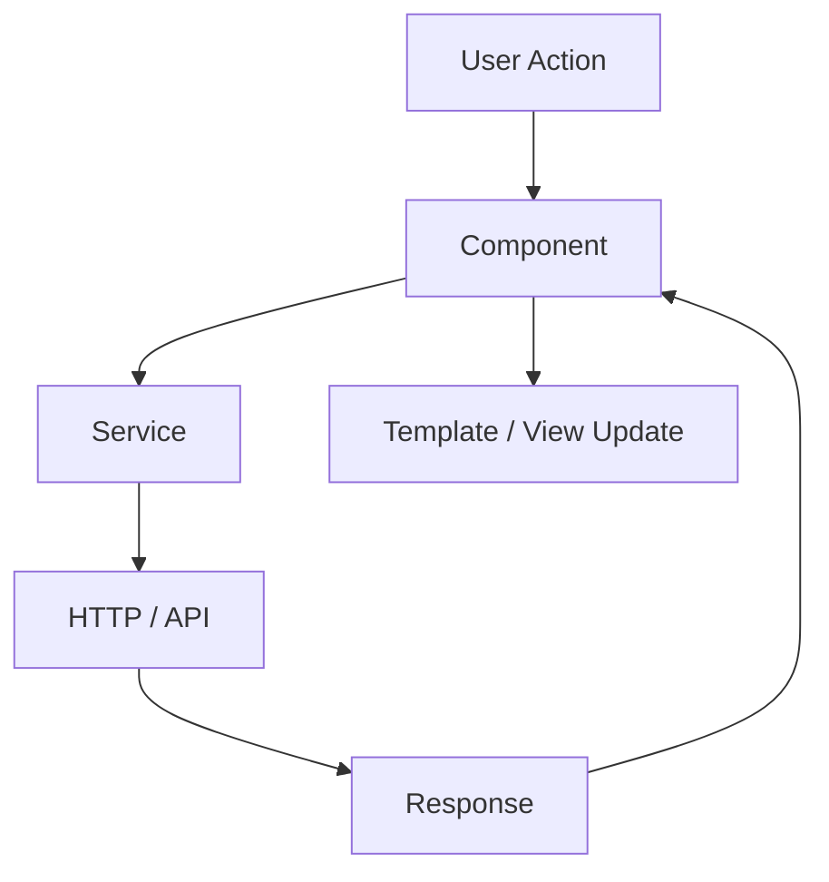
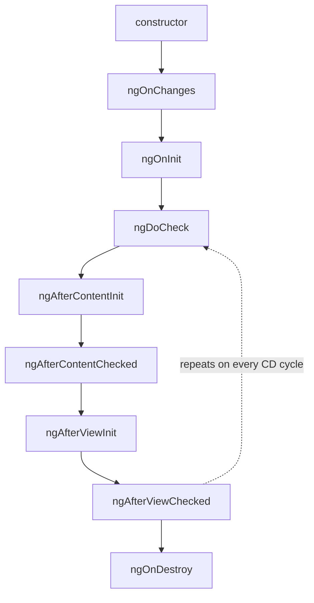
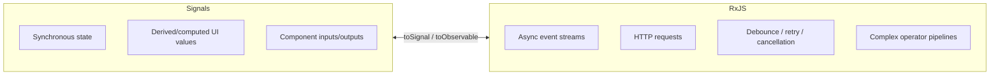
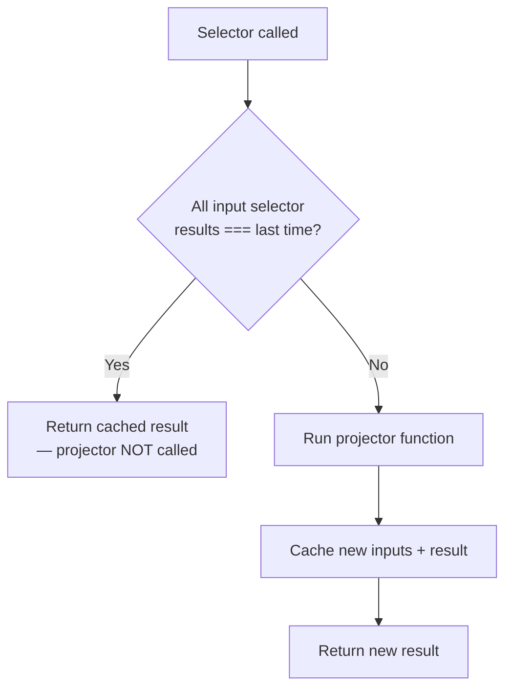
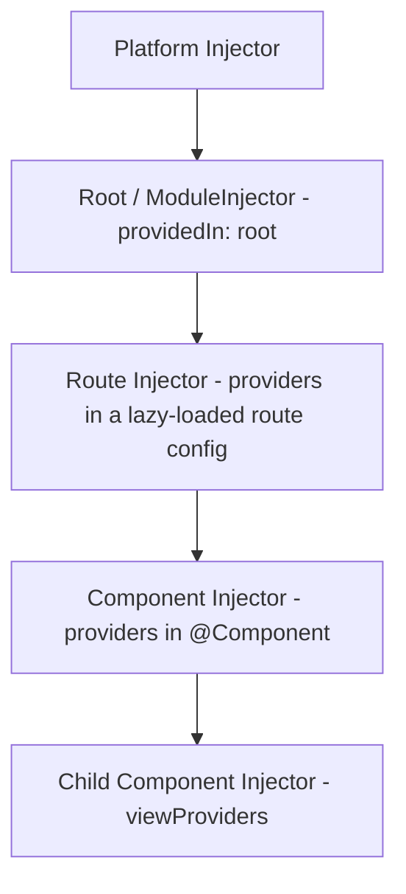
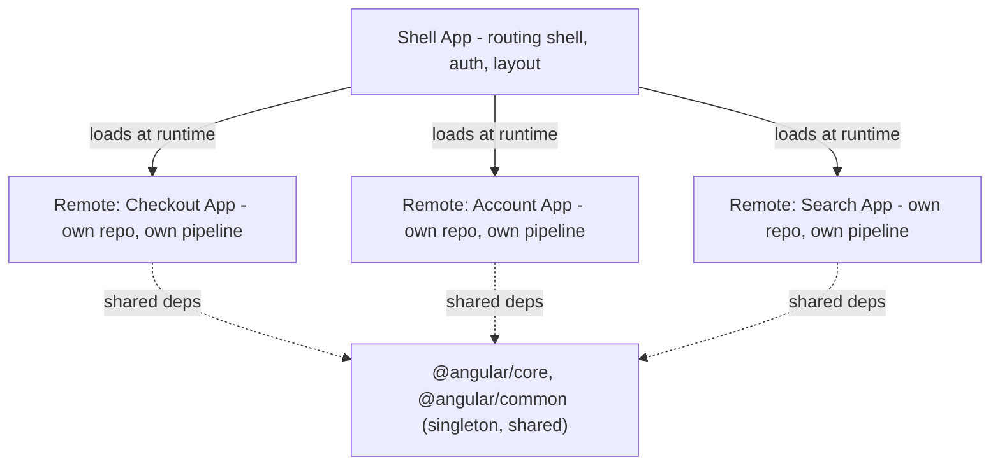
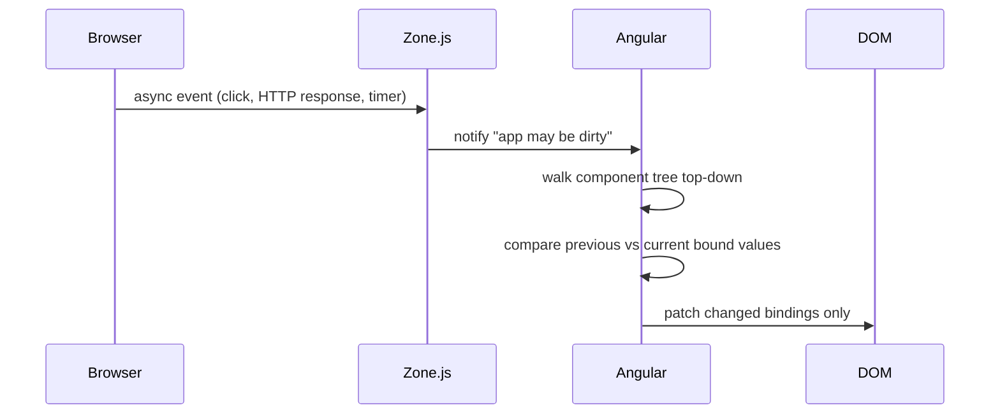
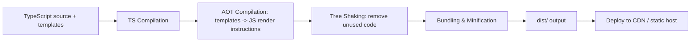
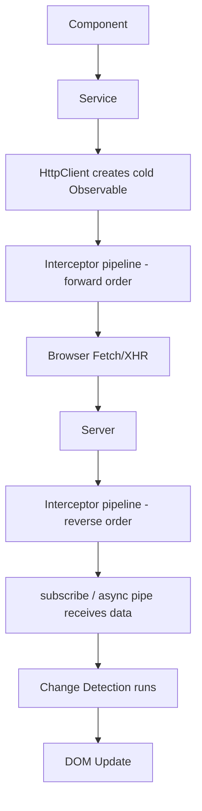
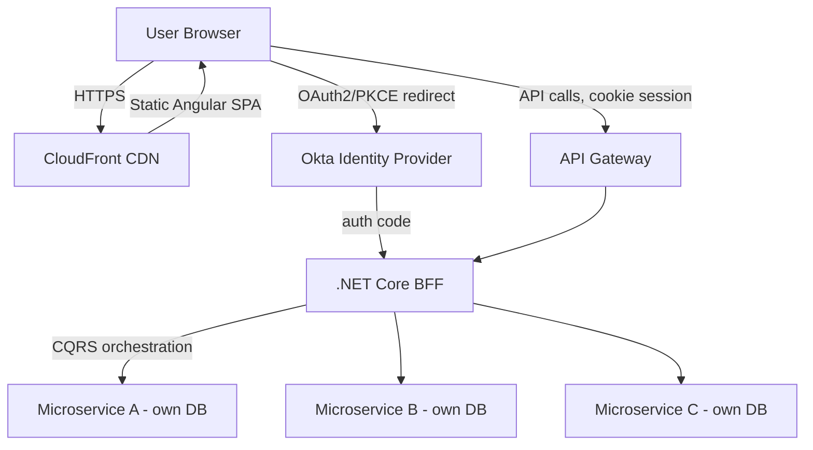

# Angular — Interview Revision Notes

> `L. Angular-Interview-Guide.md` se derive kiye gaye Quick-revision Q&A. Source ke har section ko cover karta hai.

## Core Concepts

### Angular vs AngularJS

**Q: AngularJS (1.x) aur Angular (2+) ke beech key differences kya hain?**

A:

- AngularJS: MVC, plain JavaScript, digest-cycle change detection, mobile-optimized nahi.
- Angular: component-based, TypeScript, AOT + Ivy rendering (faster), mobile-optimized.
- Rendering engine evolve hua: View Engine → Ivy (v9 se default).

**Q: Ivy kya hai aur yeh kyun matter karta hai?**

A: Ivy Angular ka compilation/rendering engine hai (v9 se default, View Engine ko replace karta hai). Yeh components/templates ko ahead-of-time compile karta hai small, per-component JS instructions mein instead of ek large shared runtime, jisse smaller bundles milte hain (better tree-shaking), faster compilation, aur better debugging (inspectable component instances, precise template error locations).

**Q: Kya Angular really MVC hai?**

A: Nahi — yeh component/MVVM model ke closer hai: component class = view-model, template = view, services/DI = model/business-logic layer. Classic MVC jaisa koi single canonical controller layer nahi hai.

### Hybrid Angular Apps aur AngularJS se Upgrade karna (ngUpgrade)

**Q: "Hybrid Angular app" kya hai aur yeh kaunsa mechanism enable karta hai?**

A: Ek app jo migration ke dauraan same page par AngularJS aur Angular ko side by side run karti hai. `ngUpgrade` module (`@angular/upgrade`) dono runtimes ko saath bootstrap karta hai aur AngularJS directives ko Angular templates mein use hone deta hai aur vice versa, `UpgradeModule`, `downgradeComponent`, aur `downgradeInjectable` ke through.

```bash
npm install @angular/upgrade
```

**Q: AngularJS se migrate karne ki recommended strategy kya hai?**

A: Angular ko existing AngularJS app ke saath introduce karo aur ek route/feature/component ek time mein migrate karo, `ngUpgrade` ko bridge ke roop mein rakhte hue jab tak AngularJS fully retire nahi ho jaata — ek risky "big bang" rewrite nahi.

### Architecture Overview

**Q: Angular app ke classic (NgModule-based) building blocks kya hain?**

A: Modules (`@NgModule`), Components (`@Component`), Templates & Views, Directives & Pipes, Services & DI, Routing (`RouterModule`), Forms, aur State Management (NgRx ya service-based).



**Q: Naye apps ke liye recommended architecture kaise change hua hai?**

A: Angular 14+ se (v17 se default CLI schematic), naye apps NgModules ko entirely drop karte hain standalone components/directives/pipes ke favor mein, routing provider functions (`provideRouter`) ke through `app.config.ts` mein configure ki jaati hai instead of `RouterModule.forRoot()`. NgModules abhi bhi kaam karte hain aur legacy code mein common rehte hain — dono approaches ke baare mein bolne ke liye ready raho.

### TypeScript in Angular

**Q: Angular TypeScript require kyun karta hai rather than just support karna?**

A: Angular ka compiler (AOT/Ivy) static type information aur decorator metadata par rely karta hai optimized instruction code generate karne ke liye aur DI ki type-based token resolution power karne ke liye — yeh sirf ek style choice nahi hai.

**Q: TypeScript ek .NET developer ke mental model se kaise map hota hai?**

A: Interfaces, generics, access modifiers, aur `strictNullChecks` (`strict: true` ka part) C# interfaces/generics aur nullable reference types ke analogous behave karte hain.

### Modules (NgModule)

**Q: Char core `@NgModule` metadata properties kya karti hain?**

A:

```typescript
@NgModule({
  declarations: [AppComponent],
  imports: [BrowserModule],
  providers: [],
  bootstrap: [AppComponent]
})
export class AppModule { }
```

- `declarations` — components/directives/pipes jo yeh module owns karta hai.
- `imports` — doosre modules jinke exported declarables ki zarurat is module ko hai.
- `providers` — module-level DI registrations (legacy; `providedIn: 'root'` ab preferred hai).
- `bootstrap` — root component jo instantiate karna hai (root module only).

**Q: `RouterModule.forRoot()` vs `forChild()` — difference kya hai aur yeh kyun matter karta hai?**

A: `forRoot()` root routing module mein ek baar run hota hai aur singleton `Router` service/location strategy bhi configure karta hai. `forChild()` (feature modules) sirf routes register karta hai. Feature module mein `forRoot()` ko phir se call karna ek classic bug tha jo duplicate/broken router state cause karta tha.

### Components

**Q: Ek component kis se consist hota hai, aur main `@Component` metadata fields kya control karte hain?**

A: Template (HTML) + Class (TS logic) + Styles (CSS/SCSS). Key fields: `selector`, `template`/`templateUrl`, `styles`/`styleUrls`, `providers`, `viewProviders`, `encapsulation`, `changeDetection`, `animations`, `standalone`, `imports`, `exportAs`, `host`.

```typescript
@Component({
  selector: 'app-user',
  templateUrl: './user.component.html',
  styleUrls: ['./user.component.css'],
  providers: [UserService],
  viewProviders: [UserService],
  encapsulation: ViewEncapsulation.Emulated,
  changeDetection: ChangeDetectionStrategy.OnPush,
  animations: [
    trigger('fade', [
      state('visible', style({ opacity: 1 })),
      state('hidden', style({ opacity: 0 })),
      transition('visible <=> hidden', [animate('300ms')])
    ])
  ],
  standalone: true,
  imports: [CommonModule],
  exportAs: 'userComp',
  host: {
    '(click)': 'onHostClick()',
    '[class.active]': 'isActive'
  }
})
export class UserComponent {
  name = 'John';
  isActive = true;
  state = 'visible';

  toggle() {
    this.state = this.state === 'visible' ? 'hidden' : 'visible';
  }

  onHostClick() {
    console.log('Host element clicked');
  }
}
```

**Q: Teen `ViewEncapsulation` options kya hain?**

A:

- `Emulated` (default) — Angular attribute selectors ke through Shadow DOM emulate karta hai; scoped hai lekin truly isolated nahi.
- `None` — koi encapsulation nahi; styles global ho jaati hain.
- `ShadowDom` — real browser Shadow DOM, strict isolation.

**Q: Ek component par `providers` aur `viewProviders` ke beech difference kya hai?**

A: `providers` component ke apne view *aur* `<ng-content>` ke through projected kisi bhi content ko visible hote hain. `viewProviders` sirf component ke apne template ko visible hote hain, projected content ko nahi. Classic senior gotcha — most developers ko `viewProviders` ki kabhi zarurat nahi padti.

**Q: Kya ek component ek directive hai?**

A: Haan — har component technically ek directive hai jiske saath template attached hai. Directives without templates (`@Directive`) DOM behavior/appearance change karte hain apna khud ka UI render kiye bina.

### Standalone Components (Angular 14+, v17 se default)

**Q: Standalone components kaunsi problem solve karte hain?**

A: Yeh mandatory NgModule wrapper ko eliminate karte hain — ek component `standalone: true` declare karta hai aur apne `imports` ko directly list karta hai, aur app `bootstrapApplication(AppComponent, appConfig)` ke through bootstrap hoti hai instead of `platformBrowserDynamic().bootstrapModule(AppModule)`.

```typescript
@Component({
  standalone: true,
  selector: 'app-user-card',
  imports: [CommonModule, RouterLink], // import only what the template needs, directly
  template: `<div>{{ name }}</div>`
})
export class UserCardComponent {
  name = 'Jane';
}
```

```typescript
// main.ts
import { bootstrapApplication } from '@angular/platform-browser';
import { AppComponent } from './app/app.component';
import { appConfig } from './app/app.config';

bootstrapApplication(AppComponent, appConfig);
```

```typescript
// app.config.ts
export const appConfig: ApplicationConfig = {
  providers: [
    provideRouter(routes),
    provideHttpClient(withInterceptors([authInterceptor])),
    provideAnimations(),
  ]
};
```

**Q: Angular standalone default par kyun move hua?**

A: Mental model simplify karta hai (koi "yeh kis module mein declare karu?" nahi), tree-shakability improve karta hai (har component apni exact dependencies declare karta hai), aur React/Vue/Svelte self-contained components ko kaise consume karte hain uske saath align karta hai. NgModules deprecated nahi hain — standalone aur NgModule code incremental migration ke dauraan coexist kar sakte hain (`ng generate @angular/core:standalone`).

**Q: `CommonModule` ke around standalone-components gotcha kya hai?**

A: Har standalone component ko `CommonModule` (ya specific directives) khud import karna padta hai `*ngIf`/`*ngFor`/pipes jaise `date` use karne ke liye — unlike NgModule apps jahan `CommonModule` often ek shared module mein ek baar import hota tha.

### UI Component Libraries: Angular Material aur Bootstrap

**Q: Angular Material vs Bootstrap — kab kaunsa reach for karein?**

A: Angular Material (Google ki Material Design library, CDK par built) jab aapko deep Angular integration, baked-in accessibility, aur theming chahiye, aur Material ka visual language acceptable ho. Bootstrap (ya `ngx-bootstrap`/`ng-bootstrap`) jab org already Bootstrap-based design conventions use karti ho ya ek CSS-only approach chahti ho jo ek JS framework se tied na ho.

**Q: `ng add @angular/material` kya karta hai?**

A: Package install karta hai, interactive theme picker run karta hai, `angular.json`/`main.ts` mein typography/animations wire up karta hai, aur optionally gesture support (`hammerjs`) set up karta hai — wahi `ng add` schematic convention jo `@angular/pwa`, `@angular/ssr`, `@ngrx/store` use karte hain.

```bash
ng add @angular/material
```

### Templates, Metadata, Decorators

**Q: Angular mein templates, metadata, aur decorators kya hain?**

A: Ek template declarative HTML view hai jise Angular Ivy ke through render/update instructions mein compile karta hai. Metadata woh information hai jo ek decorator (`@Component`, `@NgModule`, `@Injectable`) ke through attach hoti hai jo Angular ko batati hai class kaise construct/wire karna hai. Decorators woh functions hain jo yeh metadata attach karte hain — unke bina Angular kisi class ko instantiate nahi kar sakta ya uski dependencies resolve nahi kar sakta.

```html
<h1>{{ title }}</h1>
<button (click)="sayHello()">Click me</button>
```

### Data Binding

**Q: Data binding ke char types kya hain aur unki direction kya hai?**

A:

- Interpolation `{{ value }}` — Component → View.
- Property binding `[property]="value"` — Component → View.
- Event binding `(event)="handler()"` — View → Component.
- Two-way binding `[(ngModel)]="value"` — Both.

**Q: `[(ngModel)]="name"` kis mein desugar hota hai?**

A: `[ngModel]="name" (ngModelChange)="name=$event"` — "banana in a box" pattern. Relevant jab aap apna khud ka two-way-bindable component bana rahe ho (`@Input() value` + `@Output() valueChange`).

### Directives

**Q: Directives ke teen types kya hain?**

A: Component directives (har component), structural directives (`*ngIf`, `*ngFor`, `*ngSwitch` — DOM elements add/remove karte hain; `*` desugars to `<ng-template [ngIf]="cond">`), aur attribute directives (`ngClass`, `ngStyle`, custom directives — appearance/behavior change karte hain DOM structure alter kiye bina).

**Q: `ElementRef` vs `Renderer2` — DOM manipulation ke liye kaunsa use karna chahiye aur kyun?**

A: `ElementRef.nativeElement` direct DOM access deta hai lekin SSR/Web Worker rendering ke under break ho jaata hai (no real DOM). `Renderer2` Angular-recommended abstraction hai jo un environments mein correctly kaam karta hai — production code mein hamesha ise prefer karo.

```typescript
@Directive({ selector: '[appHighlight]' })
export class HighlightDirective {
  constructor(private el: ElementRef, private renderer: Renderer2) {}

  private setColor(color: string) {
    this.renderer.setStyle(this.el.nativeElement, 'color', color);
  }
}
```

**Q: `*ngIf` vs `[hidden]` — difference kya hai?**

A: `*ngIf` element ko DOM se remove kar deta hai (destroy/recreate karta hai, lifecycle hooks re-run karta hai) — expensive subtrees ke liye better. `[hidden]` sirf `display:none` toggle karta hai, element ko DOM/memory mein rakhta hai — frequent toggling ke liye cheaper, no lifecycle re-run.

### Naya Control-Flow Syntax: @if / @for / @switch (Angular 17+)

**Q: `@if`/`@for`/`@switch` versus `*ngIf`/`*ngFor`/`*ngSwitch` mein kya naya hai?**

A:

- `track` `@for` mein **mandatory** hai (identity/keying decisions ko upfront force karta hai, unlike optional `trackBy`).
- Ivy directly compile karta hai `<ng-template>` desugaring ke bina — smaller generated code, better runtime perf.
- `@empty` ek first-class "no data" block hai (previously ek separate `*ngIf="items.length===0"`).
- Koi `CommonModule` import ki zarurat nahi — template compiler mein built-in, directives mein nahi.
- Old syntax **deprecated nahi hai**; dono coexist karte hain (migration schematic: `ng generate @angular/core:control-flow`).

```html
@for (item of items; track item.id) { <li>{{ item.name }}</li> } @empty { <li>No items</li> }
```

```html
@if (isLoggedIn) {
  <p>Welcome back!</p>
} @else if (isGuest) {
  <p>Continue as guest</p>
} @else {
  <p>Please log in.</p>
}

@for (item of items; track item.id) {
  <li>{{ item.name }}</li>
} @empty {
  <li>No items found.</li>
}

@switch (status) {
  @case ('success') { <p>Success</p> }
  @case ('error') { <p>Error</p> }
  @default { <p>Unknown</p> }
}
```

### ng-container, ng-template, ng-content

**Q: `ng-container`, `ng-template`, aur `ng-content` ka purpose kya hai?**

A:

- `ng-container` — logical grouping, no extra DOM element; structural directives apply karte waqt wrapper `<div>`s avoid karta hai.
- `ng-template` — deferred/conditional rendering ka blueprint, use hone tak render nahi hota (`*ngIf...else`, `ngTemplateOutlet`).
- `ng-content` — parent se child mein content projection; sirf projected children render karta hai. `select="[attr]"` ke through multi-slot projection support karta hai.

`ng-container` wrapper divs avoid karte hue:

```html
<ng-container *ngIf="isLoggedIn">
  <p>Welcome back, user!</p>
  <button>Logout</button>
</ng-container>
```

`ng-template` `else` ke saath:

```html
<p *ngIf="isLoggedIn; else showLogin">Welcome back!</p>
<ng-template #showLogin>
  <p>Please log in to continue.</p>
</ng-template>
```

`ng-template` `ngTemplateOutlet` ke saath:

```html
<ng-template #loadingTemplate>
  <p>Loading data...</p>
</ng-template>
<div *ngIf="isLoading; else content"></div>
<ng-template #content>
  <ng-container *ngTemplateOutlet="loadingTemplate"></ng-container>
</ng-template>
```

`ng-content` — multi-slot projection:

```typescript
@Component({
  selector: 'app-card',
  template: `
    <div class="card">
      <header><ng-content select="[card-title]"></ng-content></header>
      <section><ng-content></ng-content></section>
      <footer><ng-content select="[card-footer]"></ng-content></footer>
    </div>
  `
})
export class CardComponent {}
```

```html
<app-card>
  <h2 card-title>Book Title</h2>
  <p>Description here...</p>
  <button card-footer>Buy Now</button>
</app-card>
```

### Pipes

**Q: Pipes kya hain aur pure vs impure pipes kya hain?**

A: Pipes data ko display ke liye transform karte hain, formatting ko component class se bahar rakhte hue. Pure (default, `pure: true`) — sirf tab re-evaluate hota hai jab input *reference* change hota hai; cheap aur predictable. Impure (`pure: false`) — har CD cycle par re-evaluate hota hai regardless; `async` ke liye zaruri hai (emissions ke liye poll karna padta hai) lekin custom filter/sort pipes ke liye ek performance red flag.

```html
<p>{{ name | uppercase }}</p>
<p>{{ 1234.56 | currency:'USD' }}</p>
```

Custom pipe:

```typescript
@Pipe({ name: 'reverse' })
export class ReversePipe implements PipeTransform {
  transform(value: string): string {
    return value.split('').reverse().join('');
  }
}
```

Pure vs impure declaration:

```typescript
@Pipe({ name: 'purePipe', pure: true })   // default — runs only when input reference changes
@Pipe({ name: 'impurePipe', pure: false }) // runs on every change detection cycle
```

**Q: Ek list ko pipe se filter karna default mein kyun nahi karna chahiye?**

A: Ek pure pipe in-place array mutation par re-run nahi hoga (no new reference); ise impure banana compensate karne ke liye ise har CD cycle app-wide run karwata hai — ek classic perf foot-gun. Fix: component mein filter karo (new array) ya RxJS/Signals-based derived state use karo.

### Services aur Dependency Injection

**Q: `providedIn: 'root'` vs `@NgModule` mein `providers` array — difference kya hai?**

A: `providedIn: 'root'` ek tree-shakable, app-wide singleton deta hai, sirf tab instantiate hota hai jab inject kiya jaaye — preferred default. `@NgModule` mein `providers` ek module/component tak scope kar sakta hai lekin historically lazy module ke per duplicate instances ka risk tha; jab aap deliberately scoped/multiple instances chahte ho tab use karo.

```typescript
@Injectable({ providedIn: 'root' })
export class DataService {
  getData() { return 'Hello from Service'; }
}
```

```typescript
constructor(private dataService: DataService) { }
```

**Q: Hierarchical DI kaise kaam karta hai?**

A: Angular ka injector ek tree hai, ek global container nahi. `providedIn: 'root'` ek instance app-wide deta hai; ek component ke apne `providers` array mein service register karna us component subtree ke liye ek *naya* instance banata hai (e.g., har wizard step ke liye isolated `ValidationService`).

### The inject() Function (Angular 14+)

**Q: `inject()` kya hai aur yeh kahan required hai?**

A: Constructor injection ka ek functional alternative, standalone components mein idiomatic, functional guards/interceptors/resolvers mein, aur kahin bhi jahan class constructor na ho.

```typescript
import { inject } from '@angular/core';

@Component({ standalone: true, selector: 'app-user' })
export class UserComponent {
  private userService = inject(UserService);
  private route = inject(ActivatedRoute);
}
```

```typescript
export const authGuard: CanActivateFn = (route, state) => {
  const auth = inject(AuthService);
  return auth.isLoggedIn() ? true : inject(Router).createUrlTree(['/login']);
};
```

**Q: Kya aap `setTimeout` callback ke andar `inject()` call kar sakte ho?**

A: Directly nahi — `inject()` sirf ek "injection context" (constructor, field initializer, ya `runInInjectionContext`) ke andar kaam karta hai. Async callback ke andar context gone ho jaata hai unless aap dependency ko beforehand capture karo ya call ko `runInInjectionContext()` mein wrap karo. Constructor injection abhi bhi valid hai; `inject()` additive hai, replacement nahi.

---

## Intermediate

### Component Lifecycle Hooks

**Q: Lifecycle hooks ko order mein list karo aur unka purpose bhi.**

A:



| Hook | Kab | Use |
|---|---|---|
| `ngOnChanges` | Jab bhi bound `@Input()` change ho | `SimpleChanges` ke through input changes par react karna |
| `ngOnInit` | Ek baar, first `ngOnChanges` ke baad | Init logic, data fetching |
| `ngDoCheck` | Har CD cycle | Custom change detection jo Angular nahi dekh sakta |
| `ngAfterContentInit` | Ek baar, projected content init ke baad | Projected content access karna |
| `ngAfterContentChecked` | Har projected-content check ke baad | Projected content updates par react karna |
| `ngAfterViewInit` | Ek baar, view/child views init ke baad | Safely `@ViewChild` access karna |
| `ngAfterViewChecked` | Har view check ke baad | Rare |
| `ngOnDestroy` | Destruction se pehle | Subscriptions/timers clean up karna |

**Q: Business logic constructor mein kabhi kyun nahi rehni chahiye?**

A: Inputs abhi bound nahi hue hain aur injected services fully ready na ho. API calls/initialization ke liye `ngOnInit` use karo — constructor sirf DI ke liye hai.

### ViewChild / ViewChildren / ContentChild / ContentChildren

**Q: `@ViewChild`/`@ViewChildren` vs `@ContentChild`/`@ContentChildren`?**

A: "View = jo mera hai" (is component ka apna template, `ngAfterViewInit` ke baad available), "Content = jo parent mujhe deta hai" (parent se `<ng-content>` ke through projected content, `ngAfterContentInit` ke baad available).

```typescript
@ViewChild(MatPaginator) paginator!: MatPaginator;
@ViewChildren(ItemComponent) items!: QueryList<ItemComponent>;
```

**Q: Signal-based query equivalents kya hain (Angular 17.3+)?**

A: `viewChild()`, `viewChildren()`, `contentChild()`, `contentChildren()` Signals return karte hain (e.g., `Signal<MatPaginator | undefined>`) instead of `!` non-null assertion + lifecycle-timing dance require karne ke — "abhi available nahi" ek explicit type ban jaata hai rather than a runtime surprise, aur `computed()`/`effect()` ke saath integrate hota hai.

```typescript
export class UserComponent {
  paginator = viewChild(MatPaginator);      // Signal<MatPaginator | undefined>
  items = viewChildren(ItemComponent);      // Signal<readonly ItemComponent[]>
}
```

### Component Communication

**Q: Component communication ke liye kaunse mechanisms exist karte hain?**

A: Parent→Child: `@Input()`. Child→Parent: `@Output()` + `EventEmitter`. Sibling/unrelated: shared service `Subject`/`BehaviorSubject`/Signal ke saath. Across routes: route params/query params/router navigation `state`.

**Q: Kya `EventEmitter` services mein general pub/sub mechanism ke liye suitable hai?**

A: Nahi — yeh RxJS `Subject` ka ek thin wrapper hai, strictly `@Output()` communication ke liye intended. Services ke andar pub/sub ke liye plain `Subject`/`BehaviorSubject` use karo.

Template reference variables (`#var`) trivial DOM access ke liye `@ViewChild` ka ek lighter-weight alternative hain:

```html
<input #txt />
<button (click)="print(txt.value)">Print</button>
```

### Routing and Navigation

**Q: Aap basic routes kaise configure karte ho aur programmatically navigate kaise karte ho?**

A:

```typescript
const routes: Routes = [{ path: 'home', component: HomeComponent }, { path: '**', component: PageNotFoundComponent }];
this.router.navigate(['/home']);
this.route.snapshot.paramMap.get('id');
```

**Q: NgModule-based app mein `RouterModule.forRoot()` ke through routes kaise register karte ho?**

A:

```typescript
const routes: Routes = [
  { path: 'home', component: HomeComponent },
  { path: 'about', component: AboutComponent }
];

@NgModule({
  imports: [RouterModule.forRoot(routes)],
  exports: [RouterModule]
})
export class AppRoutingModule { }
```

**Q: Template mein navigation links aur router outlet kaise add karte ho?**

A:

```html
<a routerLink="/home">Home</a>
<router-outlet></router-outlet>
```

**Q: `Router` service ke through programmatically kaise navigate karte ho?**

A:

```typescript
constructor(private router: Router) { }
navigateToHome() {
  this.router.navigate(['/home']);
}
```

**Q: Wildcard (404) route kaise define karte ho?**

A:

```typescript
{ path: '**', component: PageNotFoundComponent }
```

**Q: Route parameter kaise define aur read karte ho?**

A:

```typescript
{ path: 'product/:id', component: ProductComponent }
```
```typescript
constructor(private route: ActivatedRoute) {}
this.route.snapshot.paramMap.get('id');
```

**Q: Query parameters kaise set aur read karte ho?**

A:

```typescript
this.router.navigate(['/products'], { queryParams: { category: 'electronics' } });
this.route.snapshot.queryParamMap.get('category');
```

**Q: `loadChildren` ke through feature module ko lazy-load kaise karte ho?**

A:

```typescript
const routes: Routes = [
  { path: 'dashboard', loadChildren: () => import('./dashboard/dashboard.module').then(m => m.DashboardModule) }
];
```

**Q: `route.snapshot.paramMap` risky kyun hai, aur fix kya hai?**

A: `snapshot` sirf navigation time par value capture karta hai — agar same component instance ek param-only navigation ke across reuse hota hai (e.g., `/product/1` → `/product/2`), yeh update nahi hoga. Observable form use karo (`route.paramMap.subscribe(...)` ya `switchMap` ke through piped).

**Q: Standalone components/routes ke liye lazy loading kaise kaam karta hai (Angular 14+)?**

A: `loadComponent: () => import('./login/login.component').then(c => c.LoginComponent)` ya `loadChildren` ek plain `Routes` array export ki taraf point karte hue — koi wrapper NgModule ki zarurat nahi.

```typescript
const routes: Routes = [
  { path: 'login', loadComponent: () => import('./login/login.component').then(c => c.LoginComponent) },
  { path: 'admin', loadChildren: () => import('./admin/admin.routes').then(m => m.ADMIN_ROUTES) }
];
```

### Route Guards

**Q: Paanch route guard types aur unke purposes kya hain?**

A: `CanActivate` (route protect karna), `CanActivateChild` (child routes protect karna), `CanLoad` (legacy, lazy-module load gate), `CanMatch` (current — non-lazy routes ko bhi gate karta hai aur ek different route def par fall through kar sakta hai), `CanDeactivate` (navigating away block karna, e.g. unsaved changes).

**Q: `CanLoad` vs `CanMatch`?**

A: `CanMatch` strictly zyada capable hai — yeh non-lazy routes ko bhi gate kar sakta hai aur Angular ko next matching route config try karne deta hai agar yeh false return kare (feature-flagged route swaps ke liye useful). `CanLoad` sirf lazy-module loading prevent karta tha. Naye code ko `CanMatch` use karna chahiye.

**Q: Ek functional `CanActivateFn` guard likho.**

A:

```typescript
export const authGuard: CanActivateFn = () => {
  const auth = inject(AuthService);
  return auth.isLoggedIn() || inject(Router).createUrlTree(['/login']);
};
```

Full modern guard-based routing config (functional style, Angular 15+):

```typescript
const routes: Routes = [
  {
    path: 'login',
    loadComponent: () => import('./login/login.component').then(c => c.LoginComponent)
  },
  {
    path: 'dashboard',
    canMatch: [authMatchGuard],
    canActivate: [authGuard],
    loadComponent: () => import('./dashboard/dashboard.component').then(c => c.DashboardComponent)
  },
  {
    path: 'admin',
    canMatch: [adminLoadGuard, adminMatchGuard],
    loadChildren: () => import('./admin/admin.routes').then(m => m.ADMIN_ROUTES)
  },
  {
    path: 'profile-edit',
    canDeactivate: [formExitGuard],
    loadComponent: () => import('./profile/profile-edit.component').then(c => c.ProfileEditComponent)
  }
];
```

Ek `CanDeactivateFn` guard, upar wale `CanActivateFn` guard ke saath:

```typescript
export const authGuard: CanActivateFn = () => {
  const auth = inject(AuthService);
  const router = inject(Router);
  return auth.isLoggedIn() || router.createUrlTree(['/login']);
};

export const formExitGuard: CanDeactivateFn<ProfileEditComponent> = (component) => {
  if (component.form.dirty) {
    return confirm('You have unsaved changes. Leave anyway?');
  }
  return true;
};
```

Class-based guards (`implements CanActivate`) abhi bhi kaam karte hain; functional guards modern style hain, ek extra injectable class avoid karte hue.

### Forms: Template-driven vs Reactive

**Q: Template-driven vs Reactive forms — kab kaunsa use karein?**

A: Template-driven (`ngModel` template mein) — small forms, simple validation, less scalable/testable. Reactive (`FormControl`/`FormGroup` class mein) — complex/dynamic forms ke liye enterprise standard, zyada testable (pure TS, DOM ki zarurat nahi).

Template-driven:

```html
<form #form="ngForm">
  <input type="text" [(ngModel)]="name" name="name">
</form>
```

Reactive:

```typescript
form = new FormGroup({
  name: new FormControl('')
});
```
```html
<input type="text" [formControl]="form.controls['name']">
```

`FormBuilder` construction ko simplify karta hai:

```typescript
constructor(private fb: FormBuilder) { }
form = this.fb.group({
  name: ['', Validators.required]
});
```

Validation:

```typescript
form = new FormGroup({
  email: new FormControl('', [Validators.required, Validators.email])
});
```
```html
<p *ngIf="form.controls.email.errors?.required">Email is required</p>
```

**Q: `FormGroup` vs `FormArray`?**

A: "`FormGroup` controls ka ek fixed, named group hai; `FormArray` ek dynamic, indexed collection hai jo tab use hota hai jab inputs ki number unknown ya user-driven ho."

```typescript
userForm = new FormGroup({
  name: new FormControl(''),
  phones: new FormArray([
    new FormControl('12345')
  ])
});
```

**Q: Validators ko dynamically kaise set/clear karte ho aur control state kaise check karte ho?**

A: `control.setValidators([...]); control.clearValidators(); control.updateValueAndValidity();` — cross-field conditional validation ke liye use hota hai. State checks: `form.valid`, `control.errors`, `control.touched`, `control.dirty`.

```typescript
control.setValidators([Validators.required]);
control.clearValidators();
control.updateValueAndValidity();
```

```typescript
form.valid           // overall
control.errors       // specific control's errors
control.touched      // user has focused and left
control.dirty        // value has changed from initial
```

**Q: `valueChanges` kya deta hai, aur kya yeh template-driven forms par available hai?**

A: Kisi bhi `FormControl`/`FormGroup`/`FormArray` par ek RxJS Observable jo change par latest value emit karta hai — live validation, real-time search, autosave ke liye use hota hai. Sirf reactive forms ke liye exist karta hai (template-driven ke paas har control ke liye `ngModelChange` hota hai).

```typescript
name = new FormControl('');

ngOnInit() {
  this.name.valueChanges.subscribe(value => {
    console.log('Name changed:', value);
  });
}
```

**Q: `[ngModelOptions]="{standalone: true}"` kya karta hai?**

A: Angular ko batata hai ki us `ngModel` control ko surrounding `ngForm` ke saath register na kare — ek UI-only field ke liye `<form>` ke andar jo parent form ki validity/value affect nahi karna chahiye.

**Q: Ek reactive form ka submission kaise wire up karte ho?**

A:

```html
<form [formGroup]="form" (ngSubmit)="onSubmit()">
  <button type="submit">Submit</button>
</form>
```
```typescript
onSubmit() {
  console.log(this.form.value);
}
```

Resetting: `this.form.reset();`

**Q: Custom cross-field validator kaise likhte ho?**

A:

```typescript
export function passwordsMatch(group: AbstractControl): ValidationErrors | null {
  return group.get('password')?.value === group.get('confirmPassword')?.value ? null : { passwordMismatch: true };
}
```

### Typed Reactive Forms (Angular 14+)

**Q: Typed reactive forms kaunsi problem solve karte hain?**

A: Angular 14 se pehle, `FormGroup`/`FormControl` effectively `any`-typed the, isliye `form.get('emial')` jaise typos runtime par silently fail hote the. Angular 14 ne strict typing introduce ki: `FormControl<string>`, `FormGroup<ProfileForm>`, typo'd control names/wrong types ke liye compile-time errors dete hue.

```typescript
interface ProfileForm {
  name: FormControl<string>;
  email: FormControl<string>;
  phones: FormArray<FormControl<string>>;
}

const form = new FormGroup<ProfileForm>({
  name: new FormControl('', { nonNullable: true }),
  email: new FormControl('', { nonNullable: true, validators: [Validators.email] }),
  phones: new FormArray<FormControl<string>>([])
});

form.value.name; // string | undefined — typed!
```

**Q: `nonNullable` gotcha kya hai?**

A: Untyped `FormControl<string>` par `.reset()` previously `null` mein reset karta tha, apparent `string` type violate karte hue. Aapko `{ nonNullable: true }` opt in karna padega ya control ko `FormControl<string | null>` type karna padega accurate hone ke liye. `UntypedFormGroup`/`UntypedFormControl` old code migrate karne ke liye escape hatch ke roop mein rehte hain.

### HttpClient and Interceptors

**Q: `HttpClient` ko kaise inject karte ho aur basic GET request kaise issue karte ho?**

A:

```typescript
import { HttpClient } from '@angular/common/http';
constructor(private http: HttpClient) { }

getData() {
  return this.http.get('https://api.example.com/data');
}
```

**Q: `HttpClient` ke saath GET/POST/PUT/DELETE kaise perform karte ho aur errors kaise handle karte ho?**

A:

```typescript
this.http.get(url).subscribe(...);
this.http.post(url, data).subscribe(...);
this.http.get(url).pipe(catchError(err => throwError(() => err))).subscribe();
```

Har verb, explicitly:

```typescript
this.http.get('https://api.example.com/users').subscribe(response => console.log(response));

const data = { name: 'John' };
this.http.post('https://api.example.com/users', data).subscribe(response => console.log(response));

const updatedData = { name: 'John Doe' };
this.http.put('https://api.example.com/users/1', updatedData).subscribe(response => console.log(response));

this.http.delete('https://api.example.com/users/1').subscribe(response => console.log(response));
```

`HttpHeaders` ke through custom headers, `HttpParams` ke through query params.

```typescript
const headers = new HttpHeaders().set('Authorization', 'Bearer token');
this.http.get('https://api.example.com/data', { headers }).subscribe();
```

```typescript
const params = new HttpParams().set('search', 'Angular');
this.http.get('https://api.example.com/items', { params }).subscribe();
```

**Q: Interceptor pipeline execution order kya hai?**

A: Interceptors outgoing request par registration order mein run hote hain, aur response par **reverse** order mein — ek classic whiteboard question. Common chain: Auth → Loader → Error handler. `{ provide: HTTP_INTERCEPTORS, useClass: X, multi: true }` ke through registered.

```typescript
@Injectable()
export class AuthInterceptor implements HttpInterceptor {
  // Inject a token source — don't read storage directly. Keeps it testable and
  // leaves the storage posture (localStorage vs BFF cookie) an explicit choice.
  constructor(private auth: TokenService) {}

  intercept(req: HttpRequest<any>, next: HttpHandler): Observable<HttpEvent<any>> {
    const token = this.auth.getAccessToken();
    if (!token) { return next.handle(req); }   // don't send "Bearer null"
    const requestWithToken = req.clone({
      setHeaders: { Authorization: `Bearer ${token}` }
    });
    return next.handle(requestWithToken);
  }
}
```

Ise register karna:

```typescript
providers: [
  { provide: HTTP_INTERCEPTORS, useClass: AuthInterceptor, multi: true }
]
```

Interceptor mein global error handling:

```typescript
intercept(req: HttpRequest<any>, next: HttpHandler) {
  return next.handle(req).pipe(
    catchError(err => {
      if (err.status === 401) { /* redirect to login */ }
      if (err.status === 500) { /* show toast */ }
      return throwError(() => err);
    })
  );
}
```

**Q: Kya JSONP abhi bhi relevant hai?**

A: 2026 mein legacy/rarely used — virtually sab modern APIs CORS support karte hain, aur JSONP ke security downsides hain (arbitrary script execution). Sirf tab mention karo jab directly poocha jaaye.

### Functional Interceptors (Angular 15+)

**Q: Modern interceptor style kya hai?**

A: Functional interceptors, ekmatra style jo `provideHttpClient` directly support karta hai:

```typescript
export const authInterceptor: HttpInterceptorFn = (req, next) => {
  const token = inject(AuthService).getToken();
  return next(req.clone({ setHeaders: { Authorization: `Bearer ${token}` } }));
};
```

`HTTP_INTERCEPTORS`/`multi: true` boilerplate ke bina registered:

```typescript
provideHttpClient(withInterceptors([authInterceptor, loaderInterceptor, errorInterceptor]));
```

Array order = execution order; koi `HTTP_INTERCEPTORS`/`multi: true` boilerplate nahi. Class-based interceptors abhi bhi kaam karte hain lekin yeh demonstrate karne ke liye default hai.

---

## Advanced

### RxJS and Observables

**Q: RxJS kya hai aur Observables Promises se kaise differ karte hain?**

A: RxJS async/reactive programming ko Observables ke through model karta hai — streams jo zero, ek, ya many values `next`/`error`/`complete` ke through emit karte hain. Vs Promise: lazy (`.subscribe()` tak kuch run nahi hota) vs immediate execution; multiple values vs single; cancelable (`unsubscribe()`) vs not; rich operator library vs none.

```typescript
const obs = new Observable(observer => {
  observer.next('Hello');
  observer.complete();
});
obs.subscribe(data => console.log(data));
```

**Q: Separate success/error callbacks ke saath ek Observable subscribe karna kaisa dikhta hai, aur yeh execute kab start hota hai?**

A: `.subscribe()` call hone tak kuch bhi execute nahi hota — Observables lazy hote hain ("cold" by default):

```typescript
this.http.get(url).subscribe(
  data => console.log(data),
  err => console.log(err)
);
```

**Q: Subscription leaks avoid karne ke ways kya hain?**

A: `Subscription` ko store karo aur `ngOnDestroy()` mein `.unsubscribe()` call karo; `takeUntil(destroySubject$)` pattern use karo; ya template mein `async` pipe use karo (auto subscribe/unsubscribe).

```typescript
ngOnDestroy() {
  this.subscription.unsubscribe();
}
```

**Q: Modern unsubscribe pattern kya hai (Angular 16+)?**

A: `takeUntilDestroyed()`, jo Angular ke `DestroyRef` ke saath automatically hook hota hai — largely manual `Subject`-based `takeUntil` boilerplate replace karta hai:

```typescript
this.userService.getUsers().pipe(takeUntilDestroyed()).subscribe(...);
```

`destroyRef` argument omit karo jab injection context (constructor/field initializer) mein call kiya jaaye.

### Subjects, BehaviorSubject, Multicasting

**Q: Multicasting kya hai, aur `Subject` aur `BehaviorSubject` kaise differ karte hain?**

A: Multicasting = ek Observable execution multiple subscribers ke across shared. `Subject` last value store nahi karta aur naye subscribers sirf future emissions paate hain. `BehaviorSubject` latest value store karta hai, ek initial value require karta hai, aur naye subscribers ko immediately current value emit karta hai.

```typescript
const subject = new Subject();
subject.next(1); // nobody receives (no subscriber yet)
subject.subscribe(v => console.log('A:', v));
subject.next(2); // A: 2
subject.next(3); // A: 3
```

```typescript
const subject = new BehaviorSubject(0);
subject.subscribe(v => console.log('A:', v));
subject.next(1);
subject.next(2);
subject.subscribe(v => console.log('B:', v)); // B: 2 immediately
```

Rule of thumb: **Observable → data read karo; Subject → events send karo; BehaviorSubject → latest state store karo.**

**Q: `ReplaySubject` ya `shareReplay` kab use karoge instead of `BehaviorSubject`?**

A: `ReplaySubject` jab naye subscribers ko previously emitted values chahiye ho (sirf latest nahi), e.g. last N chat messages replay karna. `shareReplay(1)` jab ek *source* Observable ka result cache/share karna ho (e.g., ek HTTP call) multiple subscribers ke beech ek manual state container ke bina.

### RxJS Operators Cheat Sheet

**Q: `mergeMap`, `switchMap`, `concatMap`, `exhaustMap` compare karo.**

A:

`pipe()` operators ko chain karta hai source Observable ko mutate kiye bina:

```typescript
this.http.get<User[]>('/api/users')
  .pipe(map(users => users.filter(u => u.active)))
  .subscribe(activeUsers => console.log(activeUsers));
```

```typescript
of(1, 2, 3, 4).pipe(filter(num => num > 2)).subscribe(console.log); // 3, 4
```

| Operator | Behavior | Best for |
|---|---|---|
| `mergeMap` | Sab inner Observables ko concurrently run karta hai, no cancellation | Parallel/independent API calls |
| `switchMap` | Naye source value par previous inner Observable ko cancel karta hai | Search-as-you-type |
| `concatMap` | Inner Observables ko queue karta hai, strictly sequential | Ordered batch saves |
| `exhaustMap` | Current inner Observable ke chalte hue naye emissions ignore karta hai | Duplicate submits prevent karna |

```typescript
this.searchInput.valueChanges.pipe(
  debounceTime(300),
  switchMap(term => this.http.get(`/api/search?q=${term}`))
).subscribe(results => console.log(results));
```

**Q: `forkJoin` gotcha kya hai?**

A: `forkJoin` sirf ek baar emit hota hai jab **sab** source Observables complete ho jaate hain — ek source jo kabhi complete nahi hota (e.g., most Subjects, ek infinite stream) `forkJoin` ko forever hang kar deta hai. Yeh conceptually `Promise.all` jaisa hai.

```typescript
forkJoin([
  this.http.get('https://api.example.com/users'),
  this.http.get('https://api.example.com/posts')
]).subscribe(([users, posts]) => console.log(users, posts));
```

**Q: Pull vs Push (imperative vs reactive) — distinction kya hai?**

A: Pull: consumer actively data ke liye asks karta hai (function calls, array iteration). Push: producer automatically data send karta hai jab ready ho (Observables, events, Promises). Push/reactive async, UI-driven flows ke liye better scale karta hai kyunki consumers poll nahi karte.

### Angular Signals (Angular 16+)

**Q: Signals kya hain aur yeh kyun introduce kiye gaye?**

A: `@angular/core` mein built-in ek fine-grained reactive primitive (RxJS nahi) jo ek value represent karta hai jo change par consumers ko notify karta hai. Zone.js CD ke unlike (jo nahi jaan sakta *kaunsa* binding change hua aur whole subtrees re-check karta hai), Signals Angular ko exact dependency graph dete hain, surgical DOM updates enable karte hue aur zoneless CD ke liye technical enabler hone ke roop mein.

```typescript
count = signal(0);
doubled = computed(() => this.count() * 2);
increment() { this.count.update(v => v + 1); }
effect(() => console.log('Count', this.count()));
```

```html
<p>Count: {{ count() }}</p>
<p>Doubled: {{ doubled() }}</p>
```

**Q: Signal-based inputs/outputs kya hain (Angular 17.1+)?**

A: `name = input.required<string>()`, `age = input(0)`, `selected = output<string>()` — signal-based `@Input`/`@Output` equivalents.

```typescript
export class UserCardComponent {
  name = input.required<string>();       // signal-based @Input, required
  age = input(0);                        // signal-based @Input with default
  selected = output<string>();           // signal-based @Output
}
```

**Q: Kya Signals RxJS ko replace karte hain? Unhe kya bridge karta hai?**

A: Nahi — Signals synchronous, always-has-a-value state model karte hain; RxJS async streams/complex orchestration (debounce, retry, cancellation) ke liye right rehta hai. Interop: `toSignal()` (Observable→Signal) aur `toObservable()` (Signal→Observable) `@angular/core/rxjs-interop` se.

```typescript
users = toSignal(this.userService.getUsers(), { initialValue: [] });
```

### RxJS vs Signals — Kaunsa Kab Use Karein

**Q: "Signals vs RxJS" ke liye crisp framing do.**



A: "Hum ek ko doosre ke upar choose nahi kar rahe — Signals component-local state aur template bindings ke liye default ban rahe hain, jabki RxJS async streams aur operator composition ka backbone rehta hai. `toSignal`/`toObservable` interop dono ko coexist karne deta hai." Signals: pull-based, sync, no built-in cancellation/debounce, low learning curve, native fine-grained CD/zoneless support. RxJS: push-based, native async, rich operators, higher learning curve, CD ke liye `async` pipe ya manual subscription chahiye.

### State Management (NgRx and Alternatives)

**Q: Common state-management approaches kya hain, roughly increasing formality ke order mein?**

A: Service-based state (service mein Signal/`BehaviorSubject`) → RxJS `BehaviorSubject` ke saath → NgRx (RxJS par Redux pattern) → Akita/NGXS/Apollo client cache alternatives ke roop mein.

**Q: NgRx ke paanch core concepts kya hain?**

A: Store (single source of truth), Actions (plain objects: kya hua), Reducers (pure functions jo naya state compute karte hain), Effects (side effects jaise API calls, further actions dispatch karna), Selectors (memoized state slices).

```typescript
export const increment = createAction('INCREMENT');

const counterReducer = createReducer(
  initialState,
  on(increment, state => ({ count: state.count + 1 }))
);

@Injectable()
export class MyEffects {
  loadData$ = createEffect(() => this.actions$.pipe(
    ofType(loadData),
    mergeMap(() => this.http.get('/api/data').pipe(map(data => loadDataSuccess({ data }))))
  ));

  constructor(private actions$: Actions, private http: HttpClient) { }
}

export const selectCount = (state: AppState) => state.count;
```

**Q: NgRx kab reach for karna chahiye vs ek simpler `BehaviorSubject`/Signal store?**

A: NgRx large teams/apps ke liye pays off karta hai jinke paas complex cross-cutting shared state ho jisko strict unidirectional flow, time-travel debugging, aur many contributors ke across strong conventions chahiye. Small/medium apps ya well-bounded feature state ke liye, ek signal/service-based store onboard karna simpler hai — choice justify karo, NgRx ko reflexively default mat karo.

### SignalStore / NgRx Signals (Angular 17+)

**Q: `@ngrx/signals` / SignalStore kya hai aur ise classic NgRx ke upar kab use karte ho?**

A: Local/feature state ke liye Actions/Reducers/Effects ka ek lighter-weight, Signal-native alternative, boilerplate reduce karte hue devtools/testability rakhte hue.

```typescript
export const CounterStore = signalStore(
  { providedIn: 'root' },
  withState({ count: 0 }),
  withComputed(({ count }) => ({ doubled: computed(() => count() * 2) })),
  withMethods((store) => ({ increment() { patchState(store, { count: store.count() + 1 }); } }))
);
```

Classic NgRx effects complex async orchestration (retries, cancellation races) ke liye zyada mature rehte hain; SignalStore simpler feature/component-local state ke liye suit karta hai.

### NgRx Entity Adapters, Facade Pattern, and Selector Memoization

**Q: `@ngrx/entity` ka `EntityAdapter` kya solve karta hai?**

A: Collection state ko `{ ids: string[], entities: { [id]: T } }` mein normalize karta hai instead of ek raw array, typed CRUD reducer helpers (`setAll`, `addOne`, `updateOne`, `removeOne`, `upsertMany`) aur selectors (`selectIds`, `selectEntities`, `selectAll`, `selectTotal`) generate karte hue. `selectEntities` O(1) lookup-by-id deta hai instead of ek `Array.find()` scan — matters karta hai jab lists grow karti hain aur frequently look up hoti hain.

```typescript
import { createEntityAdapter, EntityState } from '@ngrx/entity';
import { createReducer, on } from '@ngrx/store';

interface User { id: string; name: string; email: string; }

// EntityState<User> = { ids: string[]; entities: { [id: string]: User } }
interface UserState extends EntityState<User> {
  loading: boolean;
  selectedUserId: string | null;
}

const adapter = createEntityAdapter<User>({
  selectId: (user) => user.id,          // defaults to `entity.id` if omitted
  sortComparer: (a, b) => a.name.localeCompare(b.name), // optional, keeps `ids` sorted
});

const initialState: UserState = adapter.getInitialState({
  loading: false,
  selectedUserId: null,
});

const userReducer = createReducer(
  initialState,
  on(loadUsersSuccess, (state, { users }) => adapter.setAll(users, state)),
  on(addUser,          (state, { user })  => adapter.addOne(user, state)),
  on(updateUser,       (state, { update }) => adapter.updateOne(update, state)),
  on(deleteUser,       (state, { id })    => adapter.removeOne(id, state)),
  on(upsertManyUsers,  (state, { users }) => adapter.upsertMany(users, state)),
);
```

`adapter.getSelectors()` char canonical selectors generate karta hai taaki aap kabhi hand se `Object.values(entities)` na likho:

```typescript
const { selectIds, selectEntities, selectAll, selectTotal } = adapter.getSelectors();

export const selectUserIds     = createSelector(selectUserState, selectIds);
export const selectUserEntities = createSelector(selectUserState, selectEntities); // dictionary, O(1) lookup by id
export const selectAllUsers    = createSelector(selectUserState, selectAll);       // User[]
export const selectUserCount   = createSelector(selectUserState, selectTotal);
```

**Q: NgRx mein facade pattern kya hai, aur ise kyun use karein?**

A: Direct `Store` access (`select`/`dispatch`) ko ek injectable service ke peeche wrap karo taaki components NgRx symbols directly kabhi import na karein. Fayde: chota testable app-specific API surface; state-management implementation swap karne ke liye sirf facade rewrite karna padta hai; component unit tests mein mock karna kahin easier hai (`{ provide: UserFacade, useValue: fakeFacade }`) ek `MockStore` khada karne se. Trade-off: har feature ke liye extra indirection/boilerplate — worth it jab state ek se zyada components consume karte hain.

```typescript
@Injectable({ providedIn: 'root' })
export class UserFacade {
  private store = inject(Store);

  users$ = this.store.select(selectAllUsers);
  loading$ = this.store.select(selectUserLoading);
  selectedUser$ = this.store.select(selectSelectedUser);

  loadUsers(): void {
    this.store.dispatch(loadUsers());
  }

  selectUser(id: string): void {
    this.store.dispatch(selectUser({ id }));
  }
}
```

```typescript
@Component({ /* ... */ })
export class UserListComponent {
  private facade = inject(UserFacade);
  users$ = this.facade.users$;

  onSelect(id: string) {
    this.facade.selectUser(id);
  }
}
```

**Q: `createSelector` actually kaise memoize karta hai, aur common gotcha kya hai?**

A: Yeh last set of input-selector results (reference/`===` se) aur last projector result cache karta hai. Agar har input result last time se `===` hai, projector re-run nahi hota. Cache size **1** hai — same selector ko alternating argument sets (parameterized selectors) ke saath call karna cache ko thrash karta hai aur har baar recompute karta hai. Iske alawa, reducers jo in place mutate karte hain intended update-detection ko defeat karte hain; reducers jo hamesha ek new reference return karte hain even jab data unchanged ho cache ko defeat karte hain.



```typescript
export const selectUserState = (state: AppState) => state.users;
export const selectFilterText = (state: AppState) => state.ui.filterText;

export const selectFilteredUsers = createSelector(
  selectAllUsers,
  selectFilterText,
  (users, filterText) => users.filter(u => u.name.includes(filterText)) // "projector" function
);
```

### Dependency Injection: Hierarchical Injectors Deep Dive

**Q: Angular injector tree ke across ek dependency ko kaise resolve karta hai?**



A: Yeh requesting component/directive se **upar** tree mein walk karta hai jab tak token ke liye ek provider mil jaaye, phir stop karta hai — nearest provider wins. Ek component ke `providers` array mein service us subtree ke liye fresh instantiate hota hai even agar same class kahin aur `providedIn: 'root'` bhi ho (component-level us subtree ke liye root ko shadow karta hai).

**Q: `providers` aur `viewProviders` ke beech DI terms mein exact difference kya hai?**

A: `viewProviders` `<ng-content>` ke through projected content ko invisible hota hai — projected content apni khud ki origin ke injector se dependencies resolve karta hai, host ke view injector se nahi.

**Q: `@Optional()`, `@Self()`, `@SkipSelf()`, `@Host()` kya karte hain?**

A: `@Optional()` — agar koi provider na mile toh throw karne ke instead `null` return karta hai. `@Self()` — resolution ko sirf requesting injector tak restrict karta hai (no walking up). `@SkipSelf()` — local injector ko skip karta hai, search ek level up se start karta hai (e.g., `ControlContainer` ko parent ka instance chahiye). `@Host()` — current component ke host boundary par walk stop karta hai.

**Q: Multi-providers kis liye hote hain?**

A: `{ provide: TOKEN, useClass: X, multi: true }` multiple values ko ek token ke under accumulate hone deta hai instead of last registration previous ones ko overwrite karne ke — `HTTP_INTERCEPTORS` ke liye use hota hai.

### Micro-Frontends / Module Federation for Angular

**Q: Micro-frontends / Module Federation kaunsi problem solve karte hain?**

A: Ek single large Angular app jo ek team owns karti hai woh organizationally scale nahi karti jab multiple teams ko independently build/deploy karna ho. Webpack Module Federation ek build ("remote") ko runtime par modules expose karne deta hai jo doosri build ("host"/shell) consume karti hai unhe compile-time saath compile kiye bina — sirf ek runtime manifest URL ki zarurat hoti hai.

```javascript
// remote's webpack.config.js (checkout-app) — exposes a module
new ModuleFederationPlugin({
  name: 'checkoutApp',
  filename: 'remoteEntry.js',
  exposes: {
    './CheckoutModule': './src/app/checkout/checkout.module.ts',
  },
  shared: ['@angular/core', '@angular/common', '@angular/router'],
});

// shell's webpack.config.js — consumes it
new ModuleFederationPlugin({
  name: 'shell',
  remotes: {
    checkoutApp: 'checkoutApp@https://checkout.example.com/remoteEntry.js',
  },
  shared: ['@angular/core', '@angular/common', '@angular/router'],
});
```

**Q: Kaunsa Angular-specific tooling Module Federation ko wrap karta hai?**

A: `@angular-architects/module-federation` schematic, Module Federation ko Angular CLI builder par wire karte hue; dynamic remote loading support karta hai (`loadRemoteModule({...})`) build time par remote ka URL jaane bina.

```typescript
// shell's routes — lazy-load a remote exposed module, resolved at runtime
{
  path: 'checkout',
  loadChildren: () =>
    loadRemoteModule({
      type: 'module',
      remoteEntry: 'https://checkout.example.com/remoteEntry.js',
      exposedModule: './CheckoutModule',
    }).then(m => m.CheckoutModule),
}
```



**Q: Module Federation ka key operational risk kya hai, aur `shared` config kis liye hai?**

A: `shared: ['@angular/core', ...]` runtime par host/remotes ke across singleton framework deps negotiate karta hai, duplicate instances avoid karte hue (jo DI/routing/CD break kar dete) aur bloat. Risk: version skew — agar host/remote ek shared dependency ke major version par disagree karte hain, yeh **runtime** par fail hota hai, build time par nahi — ek monorepo ke compile-time error se kahin later/harder-to-catch failure.

**Q: Module Federation vs ek Nx monorepo — kab kaunsa right call hai?**

A: Module Federation apna cost sirf tab earn karta hai jab teams ko genuine **independent deployability** chahiye ho (doosri teams ke saath coordinate kiye bina ship karna). Agar real constraint sirf "many teams, one codebase, fast builds, enforced boundaries" hai — independent runtime deployment nahi — toh lint-enforced library boundaries ke saath ek Nx monorepo far cheaper mein most of the benefit deta hai (ek pipeline, ek version, compile-time breakage). "Module Federation ek organizational/deployment problem solve karta hai, code-organization problem nahi."

---

## Performance

### Change Detection Deep Dive

**Q: Angular ka classic Zone.js-based change detection kaise kaam karta hai?**

A: Zone.js async browser APIs (`setTimeout`, Promises, DOM events, XHR/fetch) ko monkey-patch karta hai; jab bhi koi fire hota hai, yeh Angular ko notify karta hai ek CD pass run karne ke liye. Angular component tree ko root se top-down walk karta hai, previous vs current bound values compare karte hue ("diffing bound expressions," deep object comparison nahi), aur jahan change hua wahan DOM patch karta hai. Default strategy har triggering event par entire tree check karta hai.



**Q: Change detection ko kya trigger karta hai, aur ise manually kaise control karte ho?**

A: DOM events, HTTP responses, timers, Promise resolution, `@Input` changes, aur manual triggers. `ChangeDetectorRef.detectChanges()` ab CD ko synchronously run karta hai; `markForCheck()` isko (aur OnPush ancestors ko) next cycle ke liye dirty mark karta hai.

```typescript
constructor(private cd: ChangeDetectorRef) {}

this.cd.detectChanges();  // synchronously run CD now
this.cd.markForCheck();   // mark this (and OnPush ancestors) dirty for the next cycle
```

### Zoneless Change Detection (Angular 18+)

**Q: Zoneless change detection kya hai aur yeh kyun matter karta hai?**

A: `provideExperimentalZonelessChangeDetection()` (Angular 18+) Zone.js ko entirely remove karta hai. Zone.js nearly har async API ko patch karta hai (runtime cost, unpatched globals/Web Workers ke saath subtle bugs) aur bundle/parse cost add karta hai. Zoneless CD **Signals** par rely karta hai precisely jaanne ke liye ki kab re-render karna hai — Signals investment ka direct payoff.

```typescript
// app.config.ts
export const appConfig: ApplicationConfig = {
  providers: [
    provideExperimentalZonelessChangeDetection(),
    // ...
  ]
};
```

**Q: Zoneless gotcha kya hai jo proactively raise karna chahiye?**

A: Code jo Signal write ke bahar aur Angular ke notification mechanisms ke bahar state mutate karta hai (ek raw untracked callback jo plain class field mutate kare) re-render trigger nahi karega — ise Signal ke roop mein model karna hoga, `markForCheck()` call karna hoga, ya kisi cheez ke through route karna hoga jo Angular watch karta hai (e.g., `async`-piped Observable). Abhi bhi evolving/experimental hai — target Angular version ke against exact stability verify karo.

### OnPush Strategy and Pitfalls

**Q: Angular kab ek `OnPush` component ko check karta hai?**

A: Sirf jab: (1) ek `@Input()` **reference** change ho, (2) ek event component ke andar se originate ho, (3) ek `async`-piped Observable emit kare, ya (4) `markForCheck()`/`detectChanges()` manually call ki jaaye.

```typescript
@Component({
  selector: 'app-demo',
  changeDetection: ChangeDetectionStrategy.OnPush
})
export class DemoComponent { }
```

**Q: #1 OnPush gotcha kya hai?**

A: OnPush `@Input` bindings ko **reference** se compare karta hai, deep equality se nahi — `this.user.name = 'John'` (mutation) re-check trigger nahi karega; `this.user = {...this.user, name: 'John'}` (new reference) karega. Yeh naturally immutable data patterns (spread, NgRx reducers, Signals) ke saath pairs karta hai.

```typescript
this.user.name = 'John';                      // ❌ mutates in place — reference unchanged, OnPush component NOT re-checked
this.user = { ...this.user, name: 'John' };    // ✅ new object reference — triggers re-check
```

**Q: OnPush aur Signals kaise interact karte hain?**

A: Ek component jo apne template mein directly ek Signal read karta hai (`{{ mySignal() }}`) OnPush ke under automatically re-checked hota hai ek `@Input` reference change ya manual `markForCheck()` ki zarurat ke bina — Signal ki apni notification OnPush ko natively satisfy kar deti hai.

### trackBy / track in Loops

**Q: `trackBy` kya karta hai aur yeh kyun matter karta hai?**

A: Iske bina, Angular ka default identity tracking object reference se hota hai — ek array ko naye reference se replace karna (even mostly-unchanged items ke saath) unnecessary DOM destroy/recreate cause kar sakta hai. `trackBy` jo ek stable id par keyed hai Angular ko sirf changed items ke bindings patch karne deta hai, DOM churn reduce karte hue.

```html
<li *ngFor="let item of items; trackBy: trackByFn">{{ item.name }}</li>
```
```typescript
trackByFn(index: number, item: any) {
  return item.id;
}
```

**Q: Naye `@for` syntax mein `track`/`trackBy` mandatory hai kya?**

A: Haan — `track` `@for` mein mandatory hai (unlike optional `trackBy` `*ngFor` par), optimization ko default banaye force karte hue.

**Q: Genuinely huge lists (thousands of rows) ke liye `trackBy` se aage kya reach for karte ho?**

A: `cdk-virtual-scroll-viewport` (`@angular/cdk/scrolling`) — sirf woh DOM nodes render karta hai jo currently viewport mein visible hain plus ek small buffer, regardless of total list size. `trackBy` *update* cost reduce karta hai; virtual scrolling *render* cost reduce karta hai off-screen DOM ko kabhi materialize na karke.

```html
<cdk-virtual-scroll-viewport itemSize="50" class="viewport">
  <div *cdkVirtualFor="let item of items">{{ item.name }}</div>
</cdk-virtual-scroll-viewport>
```

### Deferrable Views: @defer (Angular 17+)

**Q: `@defer` kya hai aur yeh kaunsi problem solve karta hai?**

A: **Template regions** (sirf routes/modules nahi) ke liye ek declarative lazy-loading mechanism — deferred content aur uske dependencies ko ek trigger condition par loaded separate JS chunk mein split karta hai.

```html
@defer (on viewport) { <heavy-chart /> } @placeholder { <div class="skeleton"></div> } @loading (minimum 500ms) { <spinner /> } @error { <p>Failed</p> }
```

**Q: `@defer` kaunse triggers support karta hai?**

A: `on idle` (default), `on viewport` (IntersectionObserver), `on interaction`, `on hover`, `on timer(2s)`, aur `when someCondition` (boolean/Signal). Core Web Vitals ko target karta hai — below-the-fold/rarely-used UI defer karne ke liye ek separate lazy route ya manual `ViewContainerRef.createComponent()` ki zarurat nahi.

### Lazy Loading and Preloading

**Q: Feature modules ka lazy loading kaise kaam karta hai, aur preloading kya add karta hai?**

A: `loadChildren: () => import('./dashboard/dashboard.module').then(m => m.DashboardModule)` loading ko defer karta hai jab tak route visit na ho. Preloading (`RouterModule.forRoot(routes, { preloadingStrategy: PreloadAllModules })`) app stabilize hone ke baad quietly lazy modules ko background mein load karta hai, taaki first navigation fast feel ho.

```typescript
const routes: Routes = [
  { path: 'dashboard', loadChildren: () => import('./dashboard/dashboard.module').then(m => m.DashboardModule) }
];
```

```typescript
@NgModule({
  imports: [
    RouterModule.forRoot(routes, { preloadingStrategy: PreloadAllModules })
  ],
  exports: [RouterModule]
})
export class AppRoutingModule {}
```

**Q: Kya sab kuch preload karna hamesha ek good idea hai?**

A: Nahi — constrained/mobile networks par, sab kuch preload karna critical initial resources se compete kar sakta hai. Ek custom `PreloadingStrategy` jo role/usage analytics ke basis par selectively preload kare zyada sophisticated answer hai.

### Bundle Size, Tree Shaking, Build Optimization

**Q: Bundle size ko kaise analyze aur control karte ho?**

A: `ng build --stats-json` + `webpack-bundle-analyzer`; component trees/CD cycles inspect karne ke liye Angular DevTools; **budgets** `angular.json` mein warn/fail karne ke liye agar bundle ek size threshold exceed kare, CI mein enforced. Tree shaking automatically unused code remove karta hai.

```bash
ng build --stats-json
npx webpack-bundle-analyzer dist/stats.json
```

**Q: Kya differential loading (ES5/ES2015 dual bundles) abhi bhi relevant hai?**

A: Nahi — effectively obsolete/removed ho gaya hai CLI ke default output se kyunki ab modern browser support universal hai; agar current interview mein koi "Angular 7" pipeline discuss kare toh outdated flag karo.

### Angular CLI vs Webpack

**Q: Angular CLI aur Webpack kaise relate karte hain?**

A: Yeh different layers par operate karte hain, competitors nahi. CLI (`ng new/generate/build/serve/test`) higher-level tool hai jo developers daily use karte hain; Webpack, saalon tak, uske neeche run hone wala bundler tha CLI ke builder abstraction ke through — most Angular devs ne kabhi hand se `webpack.config.js` nahi likha (unlike Create-React-App-era React). CLI ne apna default bundler ab esbuild/Vite mein swap kar diya hai.

### esbuild / Vite-based Application Builder (Angular 17+)

**Q: Naye `application` builder ke saath kya change hua?**

A: CLI webpack se ek esbuild + Vite based builder (`@angular-devkit/build-angular:application`, v17 se default) mein move ho gaya, older `browser` builder ko replace karte hue. Dramatically faster cold builds/rebuilds (esbuild, Go, parallelized); `ng serve` near-instant HMR ke liye Vite use karta hai; previously separate browser/server (SSR) build targets ko ek config mein unify karta hai.

**Q: Migration friction point kya hai?**

A: Existing webpack-specific custom config (custom loaders, certain third-party webpack plugins) ke paas shayad direct esbuild equivalent na ho — ek large legacy app upgrade karte waqt real friction.

### Angular Build & Runtime Lifecycle

**Q: `ng build` (build-time) ke dauraan kya hota hai?**



A: TS compilation (`ngc`/Ivy) → AOT compilation (templates → JS render instructions, DI metadata pre-generated) → tree shaking → bundling/minification → static host par deploy. AOT production ke liye default/mandatory hai; JIT (in-browser compilation) legacy hai.

**Q: Jab user app open karta hai runtime par kya hota hai?**

A: `index.html` `runtime.js`/`main.js`/`polyfills.js` load karta hai → `main.ts` root module/component bootstrap karta hai (`bootstrapApplication` ya `bootstrapModule`) → DI injector tree build hota hai → root component create hota hai, lifecycle begin hota hai (`constructor → ngOnInit → ngAfterViewInit`) → Router lazy feature routes ko sirf tab load karta hai jab activate ho.

```typescript
platformBrowserDynamic().bootstrapModule(AppModule);
// or, standalone:
bootstrapApplication(AppComponent, appConfig);
```

### HTTP Request Lifecycle

**Q: Full HTTP request lifecycle ko end-to-end walk through karo.**



A: Component service ko call karta hai → `HttpClient.get()` ek **cold** Observable return karta hai (abhi tak koi call nahi) → interceptor pipeline outgoing request par registration order mein run hota hai (forward) → Fetch/XHR ise send karta hai → server respond karta hai → interceptors response par **reverse** order mein run hote hain → `.subscribe()`/`async` pipe data deliver karta hai → change detection bindings diff karta hai aur DOM patch karta hai.

---

## SSR, PWA & Cross-Cutting

### Angular Universal / SSR

**Q: Angular Universal / SSR kya hai aur iske benefits kya hain?**

A: Browser ko ship karne se pehle server (Node.js) par ek initial HTML snapshot render karta hai — perceived load time improve karta hai aur crawlers/SEO ko fully rendered content dekhne deta hai.

**Q: Modern SSR setup command kya hai?**

A: `ng add @angular/ssr` (ya `ng new` mein SSR select karo) — Angular 17 se, SSR core CLI mein integrated hai; older `@nguniversal/express-engine` package legacy/deprecated hai.

### Hydration (Angular 16+) and Event Replay (Angular 17+)

**Q: "Destructive rehydration" ne kya problem cause ki, aur ise kya fix karta hai?**

A: Classic Universal SSR client bootstrap par DOM ko destroy karta tha aur completely re-render karta tha apna component tree/listeners attach karne ke liye, visible flicker aur wasted work cause karte hue. `provideClientHydration()` (non-destructive hydration, 16/17 se stable) existing server-rendered DOM nodes ko reuse karta hai instead.

```typescript
// app.config.ts
export const appConfig: ApplicationConfig = {
  providers: [
    provideClientHydration(),
  ]
};
```

**Q: Event replay kya hai?**

A: "HTML painted" aur "Angular fully hydrated" ke beech ke window mein hone waali user interactions (clicks, etc.) ko capture karta hai, aur hydration complete hone par unhe replay karta hai — taaki ek early click silently swallow na ho.

### Progressive Web Apps and Service Workers

**Q: PWA kya hai aur ise kaise scaffold karte ho?**

A: Ek web app jisme offline support, background sync, push notifications, installability ho. `ng add @angular/pwa` service worker registration, ek Web App Manifest, aur icons scaffold karta hai.

```bash
ng add @angular/pwa
```

**Q: Service Worker kya karta hai, aur caching kaise configure hoti hai?**

A: Offline use ke liye resources cache karta hai, configured strategy ke per network requests intercept/handle karta hai, push notifications enable karta hai. `ngsw-config.json` `assetGroups` ke through configured (e.g., `installMode: "prefetch"`).

```json
{
  "assetGroups": [
    {
      "name": "app",
      "installMode": "prefetch",
      "updateMode": "prefetch",
      "resources": {
        "files": ["/favicon.ico", "/index.html"],
        "urls": ["/api/**"]
      }
    }
  ]
}
```

**Q: Modern `SwUpdate` API shape kya hai?**

A: Legacy: `updates.available`/`updates.activated` boolean-event observables. Current: `updates.versionUpdates`, ek discriminated-union event type ka Observable (`VersionReadyEvent`, `VersionInstallationFailedEvent`) — "new version available" prompt ke liye `VersionReadyEvent` filter karo.

```typescript
constructor(updates: SwUpdate) {
  updates.available.subscribe(() => {
    if (confirm('New version available. Load new version?')) {
      window.location.reload();
    }
  });
}
```

### Angular Security

**Q: Angular default se XSS ke against kaise protect karta hai, aur escape hatch kya hai?**

A: Interpolation aur most property bindings auto-sanitized/escaped hoti hain. `[innerHTML]` usme se kaafi bypass kar deta hai. `DomSanitizer.bypassSecurityTrustUrl/Html/...` ko treat karo jaise "main personally vouch kar raha hoon ki yeh safe hai" — sirf content par jise aap control/validate karte ho server-side, kabhi bhi raw user input par nahi.

```html
<p>{{ userInput }}</p>              <!-- safe: auto-escaped -->
<p [innerHTML]="userInput"></p>     <!-- dangerous: bypasses much of the auto-escaping context -->
```

```typescript
constructor(private sanitizer: DomSanitizer) { }
safeUrl = this.sanitizer.bypassSecurityTrustUrl(userInput);
```

**Q: Angular CSRF protection kaise support karta hai, aur catch kya hai?**

A: `HttpXsrfTokenExtractor`/`withXsrfConfiguration` double-submit cookie pattern implement karte hain (client server-set cookie ko header ke roop mein echo karta hai) — lekin yeh sirf tab kaam karta hai jab backend cooperate kare us cookie/header pair ko set/validate karke; yeh automatic nahi hai.

```html
<meta http-equiv="Content-Security-Policy" content="default-src 'self'">
```

**Q: Auth tokens kahan store hone chahiye, aur choice ko kaise justify karte ho?**

A: HttpOnly cookies preferred hain `localStorage` (kisi bhi injected script se readable — direct XSS exposure) ke upar. Interceptor example ek `TokenService` inject karta hai taaki storage posture ek explicit decision rahe, aur dono postures equivalent nahi hain: `localStorage`/`sessionStorage` sabse simplest aur common hai lekin kisi bhi XSS ko token theft bana deta hai (sirf low-stakes apps ke liye); BFF + HttpOnly cookie token ko browser JS se bahar hi rakhta hai (interceptor bearer header ke instead `withCredentials: true` send karta hai) — zyada backend work, kaafi smaller blast radius, defensible enterprise answer. Trade-off naam batao aur ek posture par commit karo.

```typescript
@Injectable({ providedIn: 'root' })
export class AuthGuard implements CanActivate {
  constructor(private authService: AuthService) { }
  canActivate(): boolean {
    return this.authService.isLoggedIn();
  }
}
```

### Accessibility (a11y): ARIA, CDK a11y Module, Focus Management

**Q: Custom Angular widgets ko explicit ARIA kyun chahiye, native elements ke unlike?**

A: Native elements (`<button>`, `<select>`) ke paas built-in accessibility semantics free mein hote hain. `<div>`/`<span>` se banaye custom components ke paas koi nahi hota — `role`, `aria-*` explicitly declare karna padta hai (e.g., `role="tablist"/"tab"/"tabpanel"`, `aria-selected`, keyboard navigation ke liye roving `tabindex` arrow-key handlers ke saath ek single Tab stop ke liye).

```typescript
@Component({
  selector: 'app-custom-tabs',
  template: `
    <div role="tablist" [attr.aria-label]="ariaLabel">
      @for (tab of tabs; track tab.id) {
        <button
          role="tab"
          [id]="'tab-' + tab.id"
          [attr.aria-selected]="tab.id === activeTabId"
          [attr.aria-controls]="'panel-' + tab.id"
          [tabindex]="tab.id === activeTabId ? 0 : -1"
          (click)="selectTab(tab.id)"
          (keydown.arrowRight)="focusNextTab()"
          (keydown.arrowLeft)="focusPreviousTab()">
          {{ tab.label }}
        </button>
      }
    </div>
    @for (tab of tabs; track tab.id) {
      <div
        role="tabpanel"
        [id]="'panel-' + tab.id"
        [attr.aria-labelledby]="'tab-' + tab.id"
        [hidden]="tab.id !== activeTabId">
        <ng-container *ngTemplateOutlet="tab.content"></ng-container>
      </div>
    }
  `
})
export class CustomTabsComponent { /* ... */ }
```

**Q: Key Angular CDK `a11y` utilities kya karte hain?**

A:

| Utility | Purpose |
|---|---|
| `FocusTrap`/`cdkTrapFocus` | Tab/Shift+Tab focus ko container ke andar confine karta hai (modals) |
| `LiveAnnouncer` | ARIA live region ke through screen readers ko messages announce karta hai |
| `FocusMonitor` | Detect karta hai *kaise* ek element ko focus mila (mouse/keyboard/touch) |
| `InteractivityChecker` | Determine karta hai ki ek element uski state ko dekhte hue genuinely focusable hai ya nahi |
| `ListKeyManager`/`ActiveDescendantKeyManager` | Composite widgets ke liye arrow-key nav/active-item tracking |

```typescript
import { LiveAnnouncer } from '@angular/cdk/a11y';

@Component({ /* ... */ })
export class SearchResultsComponent {
  private liveAnnouncer = inject(LiveAnnouncer);

  onResultsLoaded(count: number) {
    this.liveAnnouncer.announce(`${count} results found`, 'polite');
  }
}
```

**Q: Ek modal ke liye correct focus management ke teen steps kya hain?**

A: (1) Modal open hone se pehle triggering element ka focus capture karo, (2) modal open hone tak focus ko andar trap karo (`FocusTrapFactory`) aur initial focus ko andar move karo, (3) close hone par, explicitly focus ko trigger element par restore karo. Most home-grown modals steps 1 aur 3 ko wrong karte hain — ek common real-world a11y audit finding.

```typescript
import { FocusTrap, FocusTrapFactory } from '@angular/cdk/a11y';

@Component({
  selector: 'app-modal',
  template: `
    <div #modalContainer role="dialog" aria-modal="true" [attr.aria-labelledby]="titleId">
      <h2 [id]="titleId">{{ title }}</h2>
      <ng-content></ng-content>
      <button (click)="close()">Close</button>
    </div>
  `
})
export class ModalComponent implements AfterViewInit, OnDestroy {
  @ViewChild('modalContainer') containerRef!: ElementRef;
  private focusTrapFactory = inject(FocusTrapFactory);
  private focusTrap!: FocusTrap;
  private previouslyFocusedElement: HTMLElement | null = null;

  ngAfterViewInit() {
    // 1. Remember what had focus before the modal opened, to restore it later.
    this.previouslyFocusedElement = document.activeElement as HTMLElement;

    // 2. Trap Tab/Shift+Tab focus inside the modal.
    this.focusTrap = this.focusTrapFactory.create(this.containerRef.nativeElement);
    this.focusTrap.focusInitialElementWhenReady();
  }

  close() {
    this.onClose.emit();
  }

  ngOnDestroy() {
    this.focusTrap?.destroy();
    // 3. Restore focus to whatever triggered the modal, so keyboard users
    //    aren't dropped back at the top of the page (a very common a11y bug).
    this.previouslyFocusedElement?.focus();
  }
}
```

**Q: "Accessibility kaise verify karte ho" ke liye ek realistic answer kya hai?**

A: Automated tooling (axe-core, `@angular-eslint` a11y rules, Lighthouse) baseline ke roop mein, lekin honestly batao ki yeh shayad real WCAG issues ka ek-tihai hi catch karti hai — manual keyboard-only aur screen-reader (NVDA/VoiceOver) testing baaki catch karti hai.

### Deployment: Firebase and GitHub Pages

**Q: Ek Angular app ko Firebase Hosting par kaise deploy karte ho?**

A: `npm install -g firebase-tools` → `firebase login` → `firebase init` (Hosting select karo, `dist/<project>` point karo) → `firebase deploy` (build karta hai phir CDN par push karta hai). Free HTTPS, global CDN, easy custom domains minimal config ke saath.

```bash
npm install -g firebase-tools   # 1. install the Firebase CLI
firebase login                  # 2. authenticate with a Google account
firebase init                   # 3. select Hosting, point it at dist/<project-name>
firebase deploy                 # 4. build first (ng build), then push to Firebase's CDN
```

**Q: GitHub Pages par kaise deploy karte ho, aur most common failure kya hai?**

A: `ng add angular-cli-ghpages` phir `ng deploy --base-href=/repo-name/`. `--base-href` bhoolna blank page/broken asset-route links ka #1 cause hai, kyunki GitHub Pages ek subpath se serve karta hai, domain root se nahi.

```bash
ng add angular-cli-ghpages
ng deploy --base-href=/repo-name/
```

**Q: Firebase/GitHub Pages kab appropriate *nahi* hote?**

A: Yeh static SPA hosting/demos/portfolios ke liye fit hote hain, un scenarios ke liye nahi jinme custom Node server ke saath SSR, backend proxying, ya enterprise compliance/observability chahiye — wahan BFF/CloudFront architecture apply hota hai instead.

---

## Enterprise Architecture Case Study (BFF + CQRS + .NET)

**Q: Enterprise architecture ko end-to-end sketch karo (Angular + Okta + API Gateway + BFF + CQRS microservices).**



A: Angular SPA CloudFront CDN (S3 se) ke through serve hoti hai → user Okta (OAuth2/PKCE) par redirect hota hai login ke liye → Okta ek auth code **.NET Core BFF** ko return karta hai, jo ise tokens ke liye exchange karta hai (browser kabhi nahi) → Angular API Gateway ko call karta hai (cookie session) → Gateway JWTs validate karta hai aur BFF ko route karta hai → BFF independent microservices ke across CQRS orchestration karta hai (har ek apni own DB ke saath).

**Q: Is architecture mein Angular ki responsibilities kya hain, aur yeh kabhi kya nahi karta?**

A: Sirf UI rendering — no business logic, no direct microservice access, kabhi access tokens store nahi karta (`localStorage`/`sessionStorage` mein nahi); sirf BFF se cookie session ke through communicate karta hai.

**Q: Backend-for-Frontend (BFF) kyun use karein?**

A: Token exchange/session management server-side handle karta hai, API aggregation/response shaping (over-/under-fetching avoid karte hue), aur CQRS orchestration. Angular exactly ek backend ko call karta hai; tokens server-side rehte hain; frontend complexity kam hoti hai.

**Q: CQRS kya hai aur ise kyun use karein?**

A: Command Query Responsibility Segregation — commands (create/update/delete) validated/transactional hote hain, write DB ko hit karte hain; queries read-only/optimized hoti hain, read models/projections se served hoti hain. "CQRS write consistency affect kiye bina read scalability allow karta hai."

**Q: Security model kya hai, aur agar ek downstream service fail ho jaaye toh kya hota hai?**

A: Zero trust, least privilege, defense in depth — Angular ke paas koi secrets nahi hote, BFF tokens store karta hai, Gateway JWTs validate karta hai, microservices privately ek VPC mein rehte hain. Downstream failure par: circuit breakers, retries with backoff, graceful degradation (hard failure ke instead partial UI).

**Q: Yeh architecture kab *nahi* use karna chahiye?**

A: Small applications, MVPs, low-traffic systems — yeh stack enterprise scale/security posture ke liye optimize karta hai, simplicity ke liye nahi. Ek small app ke liye BFF+CQRS+microservices ko universal default ke roop mein present karna khud ek red flag hai jo interviewers dekhte hain.

---

## Testing

**Q: Testing ke teen levels kya hain, aur Jasmine/Karma kya hain?**

A: Unit (components/services), integration (units ke beech interactions), E2E (full flows). Jasmine — default JS test framework (`describe`/`it`/`expect`, spies/mocks). Karma — test runner jo Jasmine tests execute karne ke liye ek real browser launch karta hai; newer CLI defaults mein increasingly Jest/Web Test Runner se replace ho raha hai (Karma broader ecosystem mein maintenance-mode/deprecated hai).

```typescript
describe('Calculator', () => {
  it('should add numbers', () => {
    expect(1 + 1).toBe(2);
  });
});
```

**Q: Ek component ko compile karne se pehle `TestBed` module kaise configure karte ho?**

A:

```typescript
beforeEach(() => {
  TestBed.configureTestingModule({ declarations: [MyComponent] }).compileComponents();
});
```

**Q: Ek service aur ek component test karne ke liye `TestBed` kaise use karte ho?**

A:

```typescript
TestBed.configureTestingModule({ providers: [MyService] });
service = TestBed.inject(MyService);

fixture = TestBed.createComponent(MyComponent);
fixture.nativeElement.querySelector('h1').textContent;
```

**Q: Ek complete `TestBed` service test dikhao, assertion ke saath.**

A:

```typescript
let service: MyService;
beforeEach(() => {
  TestBed.configureTestingModule({ providers: [MyService] });
  service = TestBed.inject(MyService);
});

it('should return expected data', () => {
  expect(service.getData()).toEqual(expectedData);
});
```

**Q: `ComponentFixture` ke through ek complete component test dikhao, assertion ke saath.**

A:

```typescript
let fixture: ComponentFixture<MyComponent>;
beforeEach(() => {
  fixture = TestBed.createComponent(MyComponent);
});

it('should render title', () => {
  const compiled = fixture.nativeElement;
  expect(compiled.querySelector('h1').textContent).toContain('Welcome');
});
```

**Q: Ek dependency ko mock kaise karte ho aur async code ko synchronously test kaise karte ho?**

A: Mocking ke liye `spyOn(myService, 'getData').and.returnValue(of(mockData));`. Timers/async code ke synchronous testing ke liye `fakeAsync`/`tick()`:

```typescript
spyOn(myService, 'getData').and.returnValue(of(mockData));
```

```typescript
it('resolves', fakeAsync(() => { let v=false; setTimeout(()=>v=true,1000); tick(1000); expect(v).toBe(true); }));
```

**Q: Protractor ko kya hua, aur ab E2E ke liye kya use hota hai?**

A: Protractor Angular ka original E2E framework tha lekin naye CLI projects se deprecated/removed hai. Ecosystem Cypress, Playwright, aur WebdriverIO ki taraf move ho gaya hai.

**Q: Angular Testing Library kya hai, aur uska philosophy kya hai?**

A: `@testing-library/angular` — components ko waise test karta hai jaise ek user unke saath interact karta hai (internal implementation/CSS selectors ke instead visible text/role se query karna), tests produce karte hue jo refactors ko raw `TestBed`+`ComponentFixture` selector-based tests se better survive karte hain.

---

## Best Practices

**Q: Senior-level Angular best practices summarize karo.**

A:

- Naye code ke liye standalone components prefer karo; NgModules ko incrementally migrate karo.
- Non-trivial components ke liye `OnPush` + immutable data (ya Signals) ko default banao.
- Sab non-trivial list rendering ke liye `trackBy`/mandatory `track` use karo.
- Manual `.subscribe()` ke upar `async` pipe (ya `toSignal` ke through Signals) prefer karo.
- Components ko thin rakho — business logic/data access services mein.
- Simplest case se aage kisi bhi cheez ke liye typed Reactive Forms use karo.
- Route ke through lazy load karo; heavy in-page content ke liye `@defer` use karo.
- HTTP concerns ko interceptors mein centralize karo, per-call code mein nahi.
- Deliberately unsubscribe karo: `async` pipe → `takeUntilDestroyed()` → `ngOnDestroy()` mein manual `unsubscribe()` fallback ke roop mein.
- Bundle budgets enforce karo; Angular DevTools + Lighthouse se profile karo.
- `bypassSecurityTrustX`, user content par `[innerHTML]`, aur `localStorage` tokens ko decisions treat karo jinhe explicit justification chahiye.
- State-management tooling ko actual complexity ke proportionate choose karo — justify karo, NgRx name-drop mat karo.

---

## Common Pitfalls

**Q: Classic Angular pitfalls list karo jo ek interviewer expect karta hai ki aap naam batao.**

A:

- `OnPush` ke under objects/arrays ko in place mutate karna — CD silently break kar deta hai (reference unchanged).
- Impure pipes ko overuse karna, ya filter/sort logic ko pipes ke roop mein likhna hi.
- Unsubscribe bhoolna — classic memory leak, long-lived SPA components mein worse.
- `route.snapshot.paramMap` use karna jab component instance param-only navigation ke across reuse hota hai.
- Constructor mein business logic instead of `ngOnInit`.
- `Renderer2` ke instead `ElementRef.nativeElement` ko directly mutate karna — SSR ke under break ho jaata hai.
- Ek source par `forkJoin` jo kabhi complete nahi hota — silently forever hang ho jaata hai.
- Assume karna ki `trackBy` ke bina `*ngFor` large/frequently-updated lists par "fine" hai.
- Low-stakes app se aage JWTs ko `localStorage` mein store karna — XSS-exposed.
- NgRx ko ek deliberate choice ke instead default treat karna.
- Assume karna ki Signals RxJS ko replace karte hain (yeh different problems solve karte hain — sync view state vs async streams).
- Old `*ngFor` templates ko port karte waqt bhoolna ki `@for` mein `track` mandatory hai.
- Ek injection context ke bahar `inject()` call karna (e.g., `setTimeout` ke andar) — runtime par throw karta hai.

---

## Version Feature Comparison Table

**Q: Angular 7 (2018 baseline) vs current Angular (2025–2026) ko key dimensions ke across contrast karo.**

A:

| Feature | Angular 7 | Current Angular |
|---|---|---|
| Component definition | NgModule-declared only | Standalone by default |
| Bootstrap | `bootstrapModule(AppModule)` | `bootstrapApplication(AppComponent, appConfig)` |
| Template control flow | `*ngIf`/`*ngFor`/`*ngSwitch` | `@if`/`@for`/`@switch` (old still valid) |
| Reactive state | RxJS only | Signals + RxJS, with interop |
| Change detection | Zone.js Default/OnPush | Zone.js Default/OnPush + experimental zoneless |
| DI | Constructor injection | Constructor injection + `inject()` |
| Forms | Untyped | Strictly typed reactive forms |
| Template-level lazy load | Not available | `@defer` |
| Build tooling | Webpack via CLI | esbuild + Vite `application` builder |
| SSR | `@nguniversal`, destructive rehydration | `@angular/ssr`, non-destructive hydration + event replay |
| E2E | Protractor | Cypress/Playwright/WebdriverIO |
| Rendering engine | View Engine (Ivy shipped v9) | Ivy |
| HTTP interceptors | Class-based + `HTTP_INTERCEPTORS` multi | Functional via `withInterceptors()` |
| Route guards | Class-based `CanActivate` | Functional (`CanActivateFn`) |

---

## Sample Interview Q&A

**Q: End-to-end walk through karo ki kya hota hai jab ek user ek button click karta hai jo ek HTTP call trigger karta hai, `OnPush` ke under.**

A: Click `OnPush` component ke liye local hota hai, isliye CD guaranteed run hoga uske liye. Handler ek service ko call karta hai → `HttpClient.get()` ek cold Observable return karta hai → `.subscribe()`/`async` pipe par, request interceptors (forward) se pass hoti hai, Fetch/XHR ke through out jaati hai, interceptors (reverse) se return hoti hai. Observable emit karta hai; agar assignment ek reference ko replace karta hai (mutate nahi), `OnPush` correctly naya `@Input` downstream pick up karta hai ya already local event ki wajah se check ho raha hota hai. CD phir diff karta hai aur sirf changed DOM patch karta hai.

**Q: Component state ke liye `BehaviorSubject` ke upar Signals kyun choose karein, aur RxJS abhi bhi kab use karoge?**

A: Simple, synchronous, always-has-a-value UI state (toggle, selected tab, computed total) ke liye Signals — no subscription management, automatic fine-grained CD even under OnPush/zoneless. Inherently async/operator-composed state (debounced search, retryable HTTP, `combineLatest`/`forkJoin`, WebSockets) ke liye RxJS. `toSignal`/`toObservable` ke saath bridge karo rather than exclusively ek choose karna.

**Q: Ek colleague kehta hai "hamesha `OnPush` everywhere use karo" — agree ho?**

A: Directionally haan non-trivial components ke liye, lekin yeh immutability discipline demand karta hai — in place mutate karna silently updates rok deta hai (jo perf problem yeh solve karta hai usse worse). Blanket OnPush policy ko lint rules/code review ke saath pair karo immutable patterns ke liye, ya Signals ki taraf push karo jo reference-equality gotcha ko entirely sidestep kar dete hain.

**Q: Ek real scenario jahan `providers` vs `viewProviders` matter karta hai?**

A: Ek reusable `TabsComponent` `viewProviders` ke through ek `TabsService` provide karta hai apne khud ke child `TabComponent`s coordinate karne ke liye. Agar ek consumer arbitrary content ko `ng-content` ke through ek tab mein project karta hai expecting ki woh same service inject kar sake, `viewProviders` design se ise unse hide karta hai (`providers` unhe expose karta hai) — ise galat karna "why can't my projected content see this service" bugs cause karta hai.

**Q: Okta+BFF+CQRS architecture mein, Angular tokens kyun kabhi hold nahi karta?**

A: Browser JS tak pahunchne wala koi bhi token XSS ke expose hota hai (kisi bhi injected script se readable). Token exchange/storage ko entirely server-side .NET BFF mein rakhna (browser-BFF session ke liye HttpOnly secure cookie) matlab ek successful XSS bhi bearer token steal nahi kar sakta — ek deliberate trade-off (reduced token-theft blast radius ke liye added BFF complexity), enterprise scale par appropriate, likely overkill ek low-stakes internal tool ke liye.

**Q: Aapne ek Angular 7 NgModule codebase inherit kiya — big-bang rewrite ke bina ise kaise modernize karoge?**

A: Incrementally: `ng update` version-by-version (versions skip karna unsupported hai). Ek baar 14+ par ho, `ng generate @angular/core:standalone` use karo ek feature area ko ek time mein convert karne ke liye (standalone aur NgModule code coexist karte hain). Parallel mein: control-flow migration schematic ke through `@if`/`@for` adopt karo, naye state ko Signals mein move karo jahan simpler ho, `HttpInterceptor` classes ko functional interceptors se swap karo jaise touch karo. Build system (webpack→esbuild) aur whole component model ko same change mein mat flip karo — agar kuch regress hota hai toh bisect karna bahut hard hoga.
