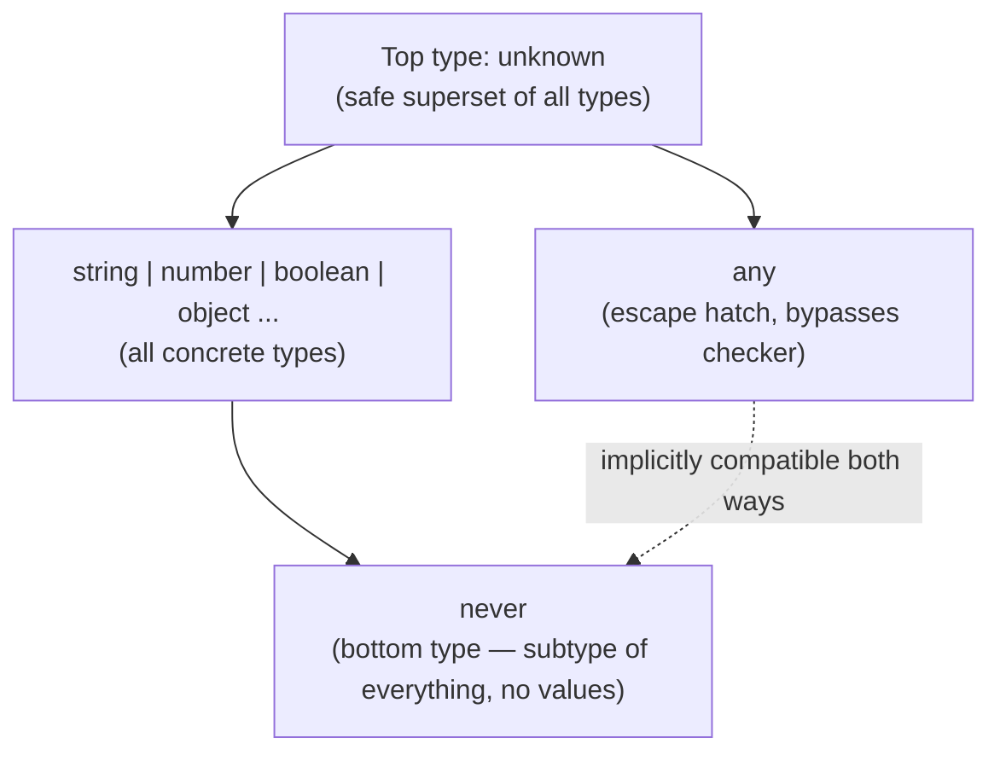
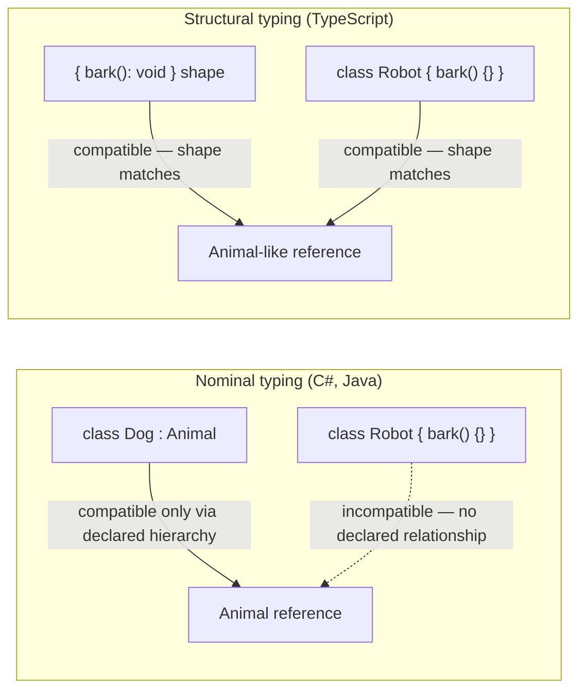
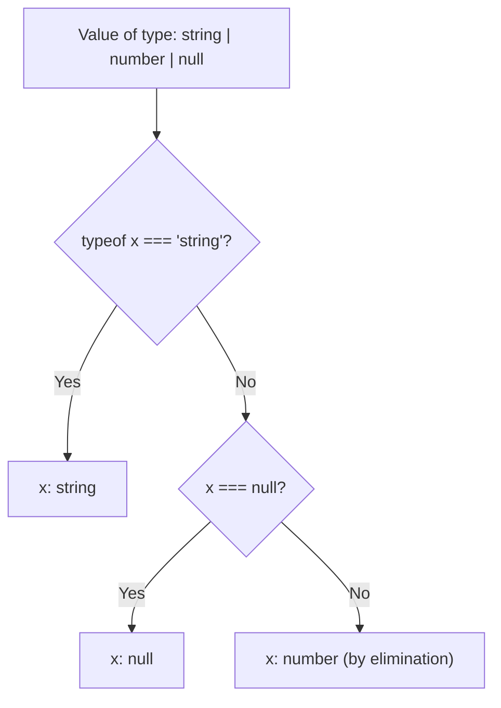

# TypeScript — Interview Revision Notes

> Quick-revision Q&A `M. TypeScript-Interview-Guide.md` se derive kiye gaye hain. Source ke har section ko cover karta hai.

## Core Concepts

### TypeScript kya hai aur isse kyun use karein

**Q: TypeScript kya hai?**

A: JavaScript ka ek strongly, statically typed superset (Microsoft dwara banaya gaya) jo plain JS mein transpile hota hai. Yeh JS semantics ke upar ek structural type system add karta hai; types compile time par erase ho jaate hain, isliye runtime behavior same rehta hai.

**Q: Enterprise codebase mein plain JS ke upar TypeScript kyun use karein?**

A:
- Static typing bugs (wrong props, wrong arg shapes, null misuse) ko compile time par hi catch kar leta hai.
- OOP features (classes, interfaces, generics, access modifiers) enterprise code ke liye suit karte hain, halanki type system structural hai, nominal nahi.
- Scalability: large codebases mein mechanically safe rename/extract refactors milte hain.
- Better DX: IntelliSense, go-to-definition, safe auto-refactors.
- Signatures ke through self-documenting APIs.

**Q: Kya TypeScript ka type system fully sound hai?**

A: Nahi — yeh design se kuch jagah unsound hai (`any`, type assertions, `noUncheckedIndexedAccess` ke bina array index access, bivariant method parameters) — JS compatibility ke liye ek pragmatic trade-off ke roop mein.

### Toolchain Basics

**Q: Basic TypeScript CLI commands kya hain?**

A: `npm install -g typescript`, `tsc -v` (version), `tsc filename.ts` (`filename.js` mein compile karta hai).

**Q: `tsconfig.json` kya hai aur ek real-world config typically `target`/`strict` ke aage kya include karta hai?**

A: Yeh central compiler configuration file hai. Production configs typically add karte hain: `module`, `moduleResolution` (jaise `Bundler`), `lib`, `noUncheckedIndexedAccess`, `exactOptionalPropertyTypes`, `esModuleInterop`, `skipLibCheck`, `isolatedModules`, `forceConsistentCasingInFileNames`, `declaration`, `sourceMap`.

Basic example:

```json
{
  "compilerOptions": {
    "target": "ES6",
    "strict": true
  }
}
```

Real-world production example:

```json
{
  "compilerOptions": {
    "target": "ES2022",
    "module": "ESNext",
    "moduleResolution": "Bundler",
    "lib": ["ES2022", "DOM"],
    "strict": true,
    "noUncheckedIndexedAccess": true,
    "exactOptionalPropertyTypes": true,
    "esModuleInterop": true,
    "skipLibCheck": true,
    "isolatedModules": true,
    "forceConsistentCasingInFileNames": true,
    "declaration": true,
    "sourceMap": true
  }
}
```

### Primitive & Special Types

**Q: TypeScript ke primitive aur special types kya hain?**

A: Primitives: `string`, `number`, `boolean`, `null`, `undefined`, `bigint`, `symbol`. Special: `any` (checking disable kar deta hai), `unknown` (safe `any`), `void` (koi return value nahi), `never` (kabhi return nahi hota / impossible value).

### any vs unknown vs never vs void

**Q: `any`, `unknown`, `void`, aur `never` kaise differ karte hain?**

A:
- `any` — type checking off kar deta hai; anything se/anything mein assignable.
- `unknown` — sabhi types ka safe superset; anything se assignable, lekin use se pehle narrow karna padta hai.
- `void` — "koi meaningful return value nahi," function return types ke liye use hota hai.
- `never` — bottom type; unreachable code / functions jo hamesha throw karte hain ya loop forever; everything ko assignable, kuch bhi (`never` ke siwa) usmein assignable nahi.

**Q: `any` already exist karte hue `unknown` kyun exist karta hai?**

A: `unknown` kisi bhi operation allow karne se pehle narrowing force karta hai, jisse type soundness preserve hoti hai aur phir bhi aap I/O boundaries par "mujhe abhi yeh type nahi pata" keh sakte ho. `any` simultaneously top aur bottom type dono hai — type theory mein ek deliberate break, isi wajah se yeh dangerous hai.



### Type Inference vs Type Annotation

**Q: Local variables ke liye inference par rely karna chahiye ya explicit annotations likhne chahiye?**

A: Local variables ke liye inference prefer karo (kam noise, same safety). Module boundaries par explicit annotations use karo — function params, exported return types, public class members — kyunki boundary par inference implementation evolve hone ke saath silently change ho sakti hai, jisse consumers invisibly break ho jaate hain.

### Type Assertions

**Q: Type assertion (`as`) kya karta hai, aur danger kya hai?**

A: Compiler ko "trust me" bolta hai zero runtime validation ke saath. `as unknown as T` (double assertion) TS ke compatibility checks ko bhi bypass kar deta hai — yeh ek code smell hai. Runtime boundaries (HTTP, `localStorage`, third-party libs) par type guards ya validation libraries (`zod`, `io-ts`) prefer karo.

```typescript
let someValue: any = "Hello";
let strLength: number = (someValue as string).length;
```

### Type Aliases vs Interfaces

**Q: `interface` aur `type` mein practical differences kya hain?**

A:
- Interfaces declaration merging aur `extends`-based multiple inheritance support karte hain; type aliases merge nahi hote aur `extends` ke bajaye intersections (`&`) use karte hain.
- Type aliases unions, tuples, aur mapped/conditional types express kar sakte hain; interfaces sirf object shapes describe kar sakte hain.
- Dono structurally compatible hain — ek interface type alias ko extend kar sakta hai aur vice versa.

**Q: Yeh kehna sahi hai ki type aliases "not extendable" hote hain?**

A: Sirf directionally — `extends` keyword nahi hota, lekin aap intersection ke through compose kar sakte ho (`type C = A & B`) equivalent (kabhi zyada flexible) composition ke liye.

**Q: `interface` vs `type` kab default choose karte ho?**

A: `interface` object/class contracts ke liye jinke extend ya merge hone ki possibility ho (DTOs, Angular `@Input` bags); `type` unions, tuples, function signatures, aur mapped/conditional utilities ke liye.

### Optional & Readonly Properties

**Q: Property ko optional ya readonly kaise mark karte ho?**

A: Optional ke liye `age?: number`; readonly ke liye `readonly model: string` (creation ke baad reassign nahi ho sakta).

```typescript
interface Employee {
  name: string;
  age?: number;       // optional
}

interface Car {
  readonly model: string;   // cannot be reassigned after creation
}
```

**Q: Kya `readonly` deep hota hai?**

A: Nahi — shallow hai. Yeh sirf property ko rebind hone se rokta hai, uske andar ka nested object/array mutate hone se nahi. Real deep immutability ke liye `Readonly<T>`/ek `DeepReadonly` mapped type, ya Immutable.js/immer jaisi library use karo.

### Function & Method Overloading

**Q: TS mein function overloading kaise kaam karta hai, aur C# se kaise differ karta hai?**

A: Aap multiple call signatures declare karte ho, uske baad ek implementation signature (jo callers ko visible nahi hoti) jo `any`/union params ke through sab cases handle karti hai. C# ke unlike, jahan overloads genuinely distinct methods hote hain jo CLR resolve karta hai, TS overloads ek single real JS function ke upar call-site shapes ka compile-time-only description hote hain.

```typescript
function add(a: number, b: number): number;
function add(a: string, b: string): string;
function add(a: any, b: any) {
  return a + b;
}
console.log(add(1, 2));               // 3
console.log(add("Hello, ", "World!")); // Hello, World!
```

## Intermediate

### Functions: Regular vs Arrow, Default & Rest Params

**Q: Regular functions aur arrow functions kaise differ karte hain?**

A:
- `this` binding: dynamic (caller-dependent) vs lexical (enclosing scope se inherit).
- `arguments` object: available vs not available.
- Hoisting: function declarations hoist hoti hain; `const` arrow functions nahi.
- `new`-able: yes vs no.

```typescript
function regular() { console.log(this); }
const arrow = () => console.log(this);
```

**Q: Arrow-function class properties ke saath Angular-relevant gotcha kya hai?**

A: `onClick = () => {...}` template bindings ke liye `this` ko correctly bind karta hai lekin har instance ke liye ek naya function create karta hai (scale par memory/perf cost) aur `@HostListener`/decorator-based method binding break kar deta hai, jisse ek real prototype method ki zarurat hoti hai.

**Q: Default aur rest parameters kaise kaam karte hain?**

A: `function greet(name: string = "Guest")` ek default supply karta hai; `function sum(...numbers: number[])` remaining args ko ek array mein collect karta hai.

```typescript
function greet(name: string = "Guest") {
  console.log(`Hello, ${name}`);
}
greet(); // Hello, Guest

function sum(...numbers: number[]) {
  return numbers.reduce((acc, num) => acc + num, 0);
}
console.log(sum(1, 2, 3)); // 6
```

### Union, Intersection & Literal Types

**Q: Union, intersection, aur literal types mein kya difference hai?**

A: Union (`string | number`) — value several types mein se ek hoti hai. Intersection (`A & B`) — value ko saare combined types satisfy karne padte hain. Literal (`"North" | "South"`) — specific literal values tak restrict karta hai.

```typescript
let value: string | number;
value = "hello";
value = 42;

interface A { a: number; }
interface B { b: string; }
type C = A & B;
const obj: C = { a: 1, b: "text" };

type Direction = "North" | "South" | "East" | "West";
let move: Direction = "North";
```

**Q: Ek hi key ke liye conflicting property type wale do types intersect karne par kya hota hai?**

A: Property `never` mein collapse ho jaati hai (jaise `{ a: string } & { a: number }` se `a: never` ban jaata hai), compile error nahi — ek classic gotcha.

### Tuples

**Q: TypeScript mein tuple kya hai?**

A: Ek fixed-length, fixed-type array, jaise `let person: [string, number] = ["Alice", 25]`. Mutation prevent karne ke liye `readonly` ke saath combine kiya ja sakta hai.

```typescript
let person: [string, number] = ["Alice", 25];

let numbers: readonly [number, number] = [10, 20];
// numbers[0] = 30; // Error
```

**Q: Labeled aur variadic tuples kya hain?**

A: Labeled tuple elements (`type Point = [x: number, y: number]`) documentation add karte hain, koi runtime effect nahi. Variadic tuples (`type Concat<T extends unknown[], U extends unknown[]> = [...T, ...U]`) generic tuple composition enable karte hain, typed bind/curry utilities mein use hote hain.

```typescript
type Point = [x: number, y: number];

// Variadic tuple — used heavily in typed `bind`/`curry` utility libraries
type Concat<T extends unknown[], U extends unknown[]> = [...T, ...U];
type Result = Concat<[1, 2], [3, 4]>; // [1, 2, 3, 4]
```

### ReadonlyArray\<T\> / readonly T[] as Defensive API Design

**Q: Plain `T[]` parameter type kya problem create karta hai, aur `readonly T[]` use fix kaise karta hai?**

A: `T[]` param yeh kuch nahi batata ki function caller ke array ko mutate karta hai ya nahi (jaise in-place `.sort()` call karna). `readonly T[]` (= `ReadonlyArray<T>`) type se saare mutating methods (`push`, `pop`, `splice`, `sort`, `reverse`, `fill`, `copyWithin`, index-assignment) remove kar deta hai, isliye mutating calls compile errors ban jaate hain — jisse aapko pehle copy karna padta hai (`[...prices].sort(...)`).

Problem, concretely:

```typescript
function printTotal(prices: number[]): number {
  prices.sort((a, b) => a - b); // legal, but mutates the CALLER's array — a real bug class
  return prices.reduce((sum, p) => sum + p, 0);
}

const cart = [30, 10, 20];
printTotal(cart);
console.log(cart); // [10, 20, 30] — surprised? the caller's array was silently reordered
```

Fix — `T[]` ke bajaye `readonly T[]` accept karo:

```typescript
function printTotal(prices: readonly number[]): number {
  // prices.sort(...);   // Compile error: Property 'sort' does not exist on type
                          // 'readonly number[]' — mutating methods are removed from the type entirely.
  // prices.push(5);     // Compile error, same reason.
  return [...prices].sort((a, b) => a - b).reduce((sum, p) => sum + p, 0); // copy first, mutate the copy
}
```

**Q: Kya `readonly T[]` ek runtime-enforced immutability wrapper hai?**

A: Nahi — yeh compile-time only hai (koi `Object.freeze` nahi). Ek mutable `T[]` freely `readonly T[]` param mein assignable hai, lekin reverse mein bina cast/copy ke nahi.

```typescript
const mutable: number[] = [1, 2, 3];
const ro: readonly number[] = mutable;   // OK — a mutable array satisfies the readonly contract
// mutable = ro;                          // Compile error — readonly array is not assignable back to T[]
```

**Q: Kya `readonly T[]` deep hota hai?**

A: Nahi, shallow hai — `Readonly<T>` jaisa. `readonly Point[]` `arr.push(...)`/`arr[0] = ...` ko block karta hai lekin `arr[0].x = 5` ko nahi, jab tak `Point` khud readonly na ho. Read-only-friendly methods (`map`, `filter`, `slice`, `reduce`) callable rehte hain kyunki woh source ko mutate nahi karte.

### Enums, aur Senior Devs Inhe Kyun Avoid Karte Hain

```typescript
enum Color { Red, Green, Blue }
let c: Color = Color.Green;
```

**Q: TypeScript enums ke downsides kya hain?**

A:
- Numeric enums arbitrary numbers ke against type-safe nahi hote.
- Non-`const` enums real runtime objects (reverse mappings) generate karte hain, jisse bundle size badhta hai.
- `const enum` values ko inline karta hai lekin `isolatedModules` (jo esbuild/swc/Vite ko chahiye) ke saath incompatible hai aur ESM-only builds ke liye banned hai.
- Yeh literal unions jaise cleanly tree-shake nahi hote.

**Q: Enums ka modern replacement kya hai?**

A: Literal union types, optionally ek `as const satisfies Record<...>` object ke saath paired ek iterable value list ke liye — exhaustiveness checking, zero runtime cost, full type safety deta hai.

```typescript
type Color = "red" | "green" | "blue";

const ColorValues = {
  Red: "red",
  Green: "green",
  Blue: "blue",
} as const satisfies Record<string, Color>;
```

### Structural Typing vs Nominal Typing

**Q: TypeScript ka type system C#/Java se kaise differ karta hai?**

A: C#/Java nominally typed hain — identical-shaped classes incompatible hain jab tak ek explicitly dusre ko extend/implement na kare; identity declared name se hoti hai. TypeScript structurally typed hai (duck typing) — types compatible hain agar unki shapes match karti hain, name ya declared relationship se independent.

```typescript
interface Point2D { x: number; y: number; }
class Vector { x = 0; y = 0; }

function log(p: Point2D) { console.log(p.x, p.y); }

log(new Vector());          // OK — Vector has the same shape as Point2D
log({ x: 1, y: 2 });         // OK — plain object literal matches structurally
```



**Q: Structural typing se related excess-property-check gotcha kya hai?**

A: Excess property checks sirf directly assign kiye gaye object literals par fire hoti hain (`log({x:1,y:2,z:3})` error deta hai). Literal ko pehle ek variable mein assign karke, phir variable pass karne se compile ho jaata hai — kyunki tab yeh ek looser structural assignability check hai, literal-freshness check nahi.

**Q: Kya TypeScript mein koi nominal-typing behavior bhi hota hai?**

A: Haan — private/protected members ek nominal-ish check mein participate karte hain: alag-alag class declarations ke identically-named private members structurally compatible nahi hote, pure structural typing mein ek deliberate exception.

**Q: TS mein nominal typing simulate kaise karte ho?**

A: Branded/"tagged" types, jaise `type UserId = string & { __brand: "UserId" }`, structurally-identical types ke accidental mixing ko prevent karne ke liye.

### Branded/Nominal Typing — Full Worked Example

**Q: `type UserId = string` IDs ko mix hone se prevent karne ke liye insufficient kyun hai?**

A: Kyunki `UserId` aur `OrderId` type level par dono plain `string` hain, structural typing aapko bina kisi compile error ke ek dusre ki jagah pass karne deti hai.

```typescript
type UserId = string;
type OrderId = string;

function getUser(id: UserId) { /* ... */ }

const orderId: OrderId = "ord_123";
getUser(orderId); // compiles! — silently wrong, no error, no warning
```

**Q: Ek proper branded type implement kaise karte ho?**

A:
```typescript
type UserId = string & { readonly __brand: 'UserId' };
function toUserId(raw: string): UserId {
  if (!raw) throw new Error('UserId cannot be empty');
  return raw as UserId; // the one sanctioned assertion
}
```
Sirf constructor function (`toUserId`) ko `UserId` produce karne ki permission hai, isliye raw string ya `OrderId` pass karna compile error ban jaata hai.

Full worked example, jo compiler ko misuse actually reject karte dikhata hai:

```typescript
// The brand is a phantom property that never exists at runtime — it exists
// purely to make the type checker treat this string as "not just any string."
type UserId = string & { readonly __brand: 'UserId' };
type OrderId = string & { readonly __brand: 'OrderId' };

// Constructor functions are the ONLY sanctioned way to produce a branded value.
// This is where you'd put real validation (format checks, UUID validation, etc.)
function toUserId(raw: string): UserId {
  if (!raw) throw new Error('UserId cannot be empty');
  return raw as UserId; // the one, deliberate, encapsulated assertion in the codebase
}

function toOrderId(raw: string): OrderId {
  if (!raw) throw new Error('OrderId cannot be empty');
  return raw as OrderId;
}

function getUser(id: UserId): void {
  console.log('Fetching user', id);
}

const userId = toUserId('usr_123');
const orderId = toOrderId('ord_456');

getUser(userId);   // OK
getUser(orderId);  // Compile error: Argument of type 'OrderId' is not assignable to parameter of type 'UserId'.
                    // Type '{ __brand: "OrderId"; }' is not assignable to type '{ __brand: "UserId"; }'.
getUser('usr_789'); // Compile error too — a raw string isn't a UserId; must go through toUserId()
```

**Q: Yeh kyun kaam karta hai, aur runtime cost kya hai?**

A: `__brand` property actually kisi bhi string par exist nahi karti, isliye branded type obtain karne ka sirf ek tarika hai constructor function (jahan real validation rehti hai). Brand runtime par erase ho jaata hai — zero bundle/perf cost.

**Q: `unique symbol` variant kya hai, aur yeh kyun use karte hain?**

A: `declare const userIdBrand: unique symbol; type UserId = string & { readonly [userIdBrand]: void };` — different teams ke authored kai branded types mein brand-name collisions avoid karta hai, thodi readability cost par.

### Type Narrowing & Type Guards

**Q: TypeScript kaunse narrowing mechanisms support karta hai?**

A:
- `typeof` (`null` distinguish nahi karta, kyunki `typeof null === "object"`).
- `instanceof` (sirf class instances ke liye).
- `in` operator (key presence se narrow karta hai).
- Truthiness checks (dhyan rakhna: legit `0`/`""` ko narrow out kar deta hai).
- Literal unions par equality narrowing.
- Discriminant property checks (discriminated unions).
- User-defined type predicates (`x is Foo`).
- Assertion functions (`asserts x is Foo`).

```typescript
function isString(value: any): value is string {
  return typeof value === "string";
}

function example(val: string | number) {
  if (isString(val)) {
    console.log(val.toUpperCase()); // narrowed to string
  } else {
    console.log(val.toFixed(2));    // narrowed to number
  }
}
```



**Q: Assertion functions type predicates se kaise differ karte hain?**

A: Ek type predicate (`function isFoo(x): x is Foo`) sirf us conditional branch ke andar narrow karta hai jahan yeh call hota hai. Ek assertion function (`function assertIsString(x): asserts x is string`) call ke baad enclosing scope ke baaki hisse ke liye narrow karta hai — koi `if` ki zarurat nahi.

```typescript
function assertIsDefined<T>(val: T): asserts val is NonNullable<T> {
  if (val === undefined || val === null) {
    throw new Error("Expected value to be defined");
  }
}

function process(input?: string) {
  assertIsDefined(input);
  console.log(input.toUpperCase()); // input narrowed to string for the rest of the function
}
```

### Discriminated Unions & Exhaustiveness Checking

**Q: Discriminated union kya hai?**

A: Object types ka ek union jo ek common literal "discriminant" property share karte hain (jaise `kind: "square" | "circle"`), jisse aap `switch (shape.kind)` ke through narrow kar sakte ho.

```typescript
interface Square { kind: "square"; size: number; }
interface Circle { kind: "circle"; radius: number; }
type Shape = Square | Circle;

function area(shape: Shape): number {
  switch (shape.kind) {
    case "square":
      return shape.size * shape.size;
    case "circle":
      return Math.PI * shape.radius * shape.radius;
  }
}
```

**Q: Naye variants add hone par discriminated union ke upar switch ko exhaustive kaise guarantee karte ho?**

A: Ek `default` branch add karo jo narrowed remaining value ko `never` typed variable mein assign kare. Agar koi case missing hai, to unhandled variant `default` mein reh jaata hai aur `never` ko assignment compile fail ho jaata hai — ek silent runtime bug ko build failure mein badalna.

```typescript
interface Triangle { kind: "triangle"; base: number; height: number; }
type Shape = Square | Circle | Triangle;

function area(shape: Shape): number {
  switch (shape.kind) {
    case "square":
      return shape.size * shape.size;
    case "circle":
      return Math.PI * shape.radius * shape.radius;
    case "triangle":
      return (shape.base * shape.height) / 2;
    default:
      // If a case is missing above, `shape` here is NOT `never`,
      // so this line fails to compile — catching the bug at build time.
      const _exhaustiveCheck: never = shape;
      return _exhaustiveCheck;
  }
}
```

### Optional Chaining & Nullish Coalescing

**Q: `?.` aur `??` kya karte hain?**

A: `?.` (optional chaining) chain ke kisi bhi link ke null/undefined hone par `undefined` par short-circuit ho jaata hai (`obj.user?.profile?.name`). `??` (nullish coalescing) sirf tab default supply karta hai jab left side `null`/`undefined` ho.

```typescript
const obj = { user: { profile: { name: "John" } } };
console.log(obj.user?.profile?.name);   // John
console.log(obj.user?.address?.city);   // undefined

let name: string | null = null;
console.log(name ?? "Default Name"); // "Default Name"
```

**Q: `??` `||` se kaise differ karta hai?**

A: `||` kisi bhi falsy value (`0`, `""`, `false`) ko "missing" treat karta hai aur replace kar deta hai; `??` sirf `null`/`undefined` ko replace karta hai, legitimate falsy values preserve karke. TS mein migrate karte waqt `||`-based defaults se yeh ek classic bug hai.

### strictNullChecks aur strict Family of Flags

**Q: `strictNullChecks` kya karta hai, aur yeh highest-value strict flag kyun hai?**

A: Iske bina, `null`/`undefined` implicitly har type ka part hote hain, isliye compiler guaranteed values ko possibly-missing values se kahin bhi distinguish nahi kar sakta. Ise on karne par, aapko explicitly `T | null` type karna padta hai aur use se pehle narrow karna padta hai — single biggest bug-catcher.

**Q: `strict: true` aur kaunse flags bundle karta hai, aur har ek kya catch karta hai?**

A:
- `noImplicitAny` — inferred `any` par error deta hai.
- `strictFunctionTypes` — function params ko contravariantly check karta hai.
- `strictBindCallApply` — `.bind`/`.call`/`.apply` ko type-check karta hai.
- `strictPropertyInitialization` — class properties ko initialize karna padta hai ya explicitly optional hona padta hai (common Angular DI pain point, `!` ya constructor init chahiye).
- `noImplicitThis` — implicit-`any` `this` par error deta hai.
- `alwaysStrict` — `"use strict"` emit karta hai.
- `useUnknownInCatchVariables` (TS 4.4 se default) — `catch (e)` `unknown` typed hota hai, `any` nahi.

**Q: Kaunse useful flags `strict` ka part nahi hain lekin senior-grade configs mein matter karte hain?**

A: `noUncheckedIndexedAccess` (index access `T | undefined` return karta hai), `exactOptionalPropertyTypes` (absent key vs present-with-`undefined` distinguish karta hai), `noUnusedLocals`/`noUnusedParameters` (hygiene), `noFallthroughCasesInSwitch` (missing `break` catch karta hai).

**Q: Agar team migration unblock karne ke liye `strictNullChecks` disable kare to kya lose hota hai?**

A: Har nullable path par compile-time guarantees — kisi bhi possibly-null value par `.foo` access ek latent `TypeError` ban jaata hai, aur third-party `.d.ts` files (jo mostly yeh assume karti hain ki yeh on hai) incorrect inference produce kar sakti hain.

## Advanced (Generics & the Type System)

### Generics & Generic Constraints

**Q: Generic function kya hai, aur type parameter ko constrain kaise karte ho?**

A: `function identity<T>(arg: T): T { return arg; }` input type preserve karta hai. `extends` se constrain karo: `function printLength<T extends { length: number }>(arg: T)` `T` ko `length` wali shapes tak restrict karta hai.

```typescript
function identity<T>(arg: T): T {
  return arg;
}
console.log(identity<string>("Hello")); // Hello

function printLength<T extends { length: number }>(arg: T) {
  console.log(arg.length);
}
printLength("Hello"); // 5
```

**Q: Generic defaults aur cross-referencing constraints kaise kaam karte hain?**

A: `function get<T, K extends keyof T = keyof T>(obj: T, key: K): T[K]` — `K` `keyof T` default hota hai aur usse constrained hota hai; typed reducers/HTTP clients mein common hai.

```typescript
function get<T, K extends keyof T = keyof T>(obj: T, key: K): T[K] {
  return obj[key];
}
```

### Generic Variance (Covariance/Contravariance)

**Q: TypeScript mein `Dog[]` `Animal[]` ka subtype hai kya?**

A: Haan — TS arrays aur return positions ko covariantly treat karta hai. Yeh technically unsound hai (aap `Cat` ko `Animal[]`-typed reference ke through push kar sakte ho jo actually `Dog[]` hai) lekin real-world JS usage ke liye pragmatic hai.

**Q: `strictFunctionTypes` contravariance se kaise relate karta hai?**

A: Function parameter types ko return type ki opposite direction mein safely narrow hona chahiye. `strictFunctionTypes` ke under, standalone function-type parameters contravariantly check hote hain, jisse unsound assignments (jaise `DogHandler` ko `AnimalHandler`-typed variable mein assign karna) catch ho jaate hain.

```typescript
type AnimalHandler = (a: Animal) => void;
type DogHandler = (d: Dog) => void;

let handler: AnimalHandler;
let dogHandler: DogHandler = (d) => console.log(d.bark());

// Without strictFunctionTypes this incorrectly compiles:
// handler = dogHandler; // unsound: handler could now be called with a Cat
```

**Q: `strictFunctionTypes` ke under method-vs-property-function quirk kya hai?**

A: Method syntax (`interface X { fn(a: Animal): void }`) `strictFunctionTypes` ke under bhi bivariantly check hota hai (backward compatibility ke liye); function type wali property syntax (`interface X { fn: (a: Animal) => void }`) contravariantly (strictly) check hoti hai — ek genuine "gotcha."

**Q: Kya TypeScript mein C# jaise explicit `in`/`out` variance annotations hote hain?**

A: Nahi (widely deployed ke roop mein) — variance structurally infer hoti hai type parameter kaise use hota hai usse, explicitly declared nahi hoti.

### keyof, typeof, and Indexed Access Types

**Q: Type position mein `keyof` aur `typeof` kya karte hain?**

A: `keyof User` `User` ke property-name literals ka union produce karta hai. `typeof person` (ek value par) value ke inferred type ko ek type ke roop mein capture karta hai.

```typescript
type User = { id: number; name: string };
type UserKeys = keyof User; // "id" | "name"

let person = { name: "Alice", age: 25 };
type PersonType = typeof person;
```

**Q: Indexed access types kya hain?**

A: `T[K]` ek specific property ka type extract karta hai, jaise `User["name"]` → `string`; chain kiya ja sakta hai (`User["address"]["city"]`) ya `User[keyof User]` use karo saare value types ke union ke liye.

```typescript
type User = { id: number; name: string; address: { city: string } };
type NameType = User["name"];              // string
type CityType = User["address"]["city"];   // string
type AllValues = User[keyof User];         // number | string | { city: string }
```

### Mapped Types

**Q: Mapped type kya hai?**

A: Ek type jo doosre type ki keys ke upar iterate karke banaya jaata hai: `{ readonly [K in keyof User]: User[K] }` (`ReadonlyUser`).

```typescript
type ReadonlyUser = { readonly [K in keyof User]: User[K] };
```

**Q: `+`/`-` modifiers aur `as` key remapping kya karte hain?**

A: `-readonly`/`-?` modifiers strip karte hain (`{ -readonly [K in keyof T]-?: T[K] }` = `Mutable<T>`). `as` keys ko entirely remap karta hai, jaise getter names banana: `[K in keyof T as \`get${Capitalize<string & K>}\`]: () => T[K]`.

```typescript
// Strip readonly/optional modifiers
type Mutable<T> = { -readonly [K in keyof T]-?: T[K] };

// Remap keys entirely — e.g., build getter names from property names
type Getters<T> = {
  [K in keyof T as `get${Capitalize<string & K>}`]: () => T[K];
};

interface Person { name: string; age: number; }
type PersonGetters = Getters<Person>;
// { getName: () => string; getAge: () => number }
```

### Conditional Types & infer

**Q: Conditional type kaise kaam karta hai?**

A: `T extends string ? "yes" : "no"` — evaluate karta hai ki `T` checked type ko assignable hai ya nahi uske basis par. `extends` clause ke andar `infer R` matched type ka ek sub-part capture karta hai, jaise `T extends (...args: any[]) => infer R ? R : never` ek function ka return type extract karta hai.

```typescript
type IsString<T> = T extends string ? "yes" : "no";
type Test = IsString<number>; // "no"

type ReturnTypeOf<T> = T extends (...args: any[]) => infer R ? R : never;

function getName(): string { return "Alice"; }
type NameType = ReturnTypeOf<typeof getName>; // string
```

**Q: Distributive conditional type kya hai?**

A: Jab checked type ek *naked* type parameter hota hai, TS conditional ko har union member ke upar distribute kar deta hai: `ToArray<string | number>` → `string[] | number[]`. Ek tuple mein wrap karna (`[T] extends [any]`) distribution se opt out karta hai, union ko whole rakhta hai. `Exclude`/`Extract`/`NonNullable` exactly isi tarah implement hote hain.

```typescript
type ToArray<T> = T extends any ? T[] : never;
type Result = ToArray<string | number>; // string[] | number[]  (distributed)

// Wrapping in a tuple opts out of distribution:
type ToArrayNonDist<T> = [T] extends [any] ? T[] : never;
type Result2 = ToArrayNonDist<string | number>; // (string | number)[]
```

### Template Literal Types

**Q: Template literal type kya hai, aur ek practical use case kya hai?**

A: Ek type jo string literal interpolation se banta hai, jaise `` `Hello, ${string}!` ``. Practical use: `type HandlerName = \`on${Capitalize<EventName>}\`` ek event-name union se `"onClick" | "onHover" | "onFocus"` produce karta hai — typed event names, CSS-in-JS keys, REST route params ke liye use hota hai.

```typescript
type Greeting = `Hello, ${string}!`;
const greet: Greeting = "Hello, John!";
```

**Q: Intrinsic string manipulation types kya hain?**

A: `Uppercase`, `Lowercase`, `Capitalize`, `Uncapitalize` — jaise `Uppercase<"hello">` → `"HELLO"`.

**Q: Ek path string type se typed route params kaise extract karte ho?**

A: Ek recursive conditional type jo `:` ke baad segments ko peel off karne ke liye `infer` use karta hai, remainder par recurse karta hai — jaise `ExtractParams<"/users/:userId/posts/:postId">` → `"userId" | "postId"`.

```typescript
type EventName = "click" | "hover" | "focus";
type HandlerName = `on${Capitalize<EventName>}`;
// "onClick" | "onHover" | "onFocus"

// Intrinsic string manipulation types: Uppercase, Lowercase, Capitalize, Uncapitalize
type Loud = Uppercase<"hello">; // "HELLO"

// Extracting typed params from a route string (common in typed-router libraries)
type ExtractParams<T extends string> =
  T extends `${string}:${infer Param}/${infer Rest}`
    ? Param | ExtractParams<Rest>
    : T extends `${string}:${infer Param}`
      ? Param
      : never;

type Params = ExtractParams<"/users/:userId/posts/:postId">; // "userId" | "postId"
```

### Recursive Type Alias Depth Limits (TS2589)

**Q: TS error TS2589 ("Type instantiation is excessively deep and possibly infinite") kis wajah se aata hai?**

A: Compiler ko check time par recursive/conditional types fully expand karni padti hain (recursive function ke runtime jaisa koi lazy evaluation nahi hota). Iski ek hard internal recursion-depth limit hoti hai (~50 levels historically); unbounded recursive types (naive tuple-length counters, circular domain model par `DeepPartial`, long template-literal recursion) yeh limit cross kar jaate hain.

```typescript
// A naive recursive tuple-length-counter, called on something the compiler
// can't bound in advance:
type BuildTuple<N extends number, T extends unknown[] = []> =
  T['length'] extends N ? T : BuildTuple<N, [...T, unknown]>;

type Big = BuildTuple<10000>;
// error TS2589: Type instantiation is excessively deep and possibly infinite.
```

Same error zyada "realistic" code mein bhi dikhta hai, most commonly ek circular domain model par apply hone wala recursive `DeepPartial<T>`-style mapped type:

```typescript
interface Order { id: string; customer: Customer; }
interface Customer { id: string; orders: Order[]; } // circular reference

type DeepPartial<T> = T extends object
  ? { [K in keyof T]?: DeepPartial<T[K]> }
  : T;

type PartialOrder = DeepPartial<Order>;
// With a genuinely circular type graph and no depth guard, the compiler keeps
// expanding Order -> Customer -> Order -> Customer ... until it hits the
// recursion ceiling and raises TS2589 (behavior here also depends on TS version —
// modern TS has some circularity detection, but it's not a guarantee for every
// recursive-type shape, especially conditional types combined with mapped types).
```

**Q: TS2589 fix/avoid kaise karte ho?**

A:
- Recursion ko explicitly bound karo ek depth-limiting counter type se (ek `Prev` lookup tuple jo `N - 1` simulate karta hai), depth 0 par ek safe fallback par bail out karo.

```typescript
type Prev = [never, 0, 1, 2, 3, 4, 5, 6, 7, 8, 9]; // lookup table simulating "N - 1"

type DeepPartialBounded<T, Depth extends number = 5> =
  Depth extends 0
    ? T
    : T extends object
      ? { [K in keyof T]?: DeepPartialBounded<T[K], Prev[Depth]> }
      : T;
```
- Modeled shape mein circularity break karo (deep-nested full circular graph ke bajaye ek flat DTO jaise `OrderSummary { customerId: string }` use karo).
- Hand-rolled recursive types ke bajaye vetted utility types/libraries prefer karo (built-in `Partial`/`Pick`, ya `type-fest` ka `PartialDeep`).
- Distributive conditional types ko simplify karo distribution se opt out karke (`[T] extends [U]`) instantiation count reduce karne ke liye.

### Utility Types Deep Dive

**Q: Core built-in utility types kya karte hain, aur kaise implement hote hain?**

A:

| Utility | Effect | Simplified implementation |
|---|---|---|
| `Partial<T>` | All optional | `{ [K in keyof T]?: T[K] }` |
| `Required<T>` | All mandatory | `{ [K in keyof T]-?: T[K] }` |
| `Readonly<T>` | All readonly | `{ readonly [K in keyof T]: T[K] }` |
| `Pick<T,K>` | Subset of keys | `{ [P in K]: T[P] }` |
| `Omit<T,K>` | Remove keys | `Pick<T, Exclude<keyof T, K>>` |
| `Record<K,T>` | Build object type | `{ [P in K]: T }` |
| `NonNullable<T>` | Strip null/undefined | `T extends null \| undefined ? never : T` |
| `Extract<T,U>` | Keep assignable to U | `T extends U ? T : never` |
| `Exclude<T,U>` | Remove assignable to U | `T extends U ? never : T` |
| `ReturnType<T>` | Fn's return type | `T extends (...a:any[]) => infer R ? R : never` |
| `Parameters<T>` | Fn's param tuple | `T extends (...a: infer P) => any ? P : never` |
| `InstanceType<T>` | Constructor's instance type | `T extends new (...a:any[]) => infer R ? R : any` |

```typescript
interface User { id: number; name: string; email: string; age?: number; }

type PartialUser  = Partial<User>;             // all optional
type RequiredUser = Required<User>;            // all required
type UserPreview  = Pick<User, "name" | "email">;
type UserNoEmail  = Omit<User, "email">;
type UserRoles    = Record<string, boolean>;

type Union       = string | number | boolean;
type OnlyNumbers = Extract<Union, number>;     // number
type NoBooleans  = Exclude<Union, boolean>;    // string | number

function greet(name: string): string { return `Hello, ${name}`; }
type GreetReturn = ReturnType<typeof greet>;   // string
type GreetParams = Parameters<typeof greet>;   // [string]

class Person { constructor(public name: string) {} }
type PersonInstance = InstanceType<typeof Person>; // Person
```

**Q: `Awaited<T>` kya karta hai, aur yeh kyun zaruri hai?**

A: Nested `Promise` types ko unwrap karta hai, jaise `Awaited<ReturnType<typeof fetchUser>>` `User` deta hai, `Promise<User>` nahi — TS 4.5 se correct async/await return typing ke liye critical hai.

```typescript
// Awaited<T> — unwraps nested Promise types (critical for async/await return typing since TS 4.5)
async function fetchUser(): Promise<User> { /* ... */ return {} as User; }
type FetchedUser = Awaited<ReturnType<typeof fetchUser>>; // User (not Promise<User>)
```

**Q: Koi built-in `DeepPartial<T>` nahi hai — aap ek kaise likhoge?**

A: `type DeepPartial<T> = T extends object ? { [K in keyof T]?: DeepPartial<T[K]> } : T;` — nested objects par recursively `Partial` apply karta hai. (Circular/unbounded inputs par TS2589 ke liye dhyan rakhna.)

### as const and satisfies

**Q: `as const` kya karta hai?**

A: Ek literal ko uske most specific type par freeze karta hai — array elements literal types ban jaate hain aur array readonly ban jaata hai, jaise `["red","green","blue"] as const` → `readonly ["red","green","blue"]`.

```typescript
const colors = ["red", "green", "blue"] as const;
// readonly ["red", "green", "blue"] — each element is a literal type, array is readonly

const person = {
  name: "Alice",
  age: 25,
} satisfies { name: string; age: number };
```

**Q: `satisfies` type annotation se kaise differ karta hai?**

A: Ek type annotation variable ko annotated type tak *widen* kar deta hai, literal precision lose karke (`Record<string, string|number>` har property ko `string | number` bana deta hai). `satisfies` value ki shape ko type ke against validate karta hai lekin narrower inferred type rakhta hai, isliye jaise `config2.retries` `number` hi rehta hai aur `config2.mode` `"fast"` hi rehta hai. Yeh ab constant config objects ko type karne ka idiomatic tarika hai.

```typescript
// Type annotation WIDENS the variable to the annotated type — you lose literal info
const config1: Record<string, string | number> = { retries: 3, mode: "fast" };
config1.retries; // type: string | number  (widened — lost the fact it's specifically `number`)

// satisfies VALIDATES against the type but keeps the narrower inferred type
const config2 = { retries: 3, mode: "fast" } satisfies Record<string, string | number>;
config2.retries; // type: number  (preserved!)
```

### Ambient Declarations, Triple-Slash Directives, Module Augmentation & Declaration Merging

**Q: Ambient declaration kya hai?**

A: Ek `.d.ts` type-only declaration jiska koi implementation nahi hota, jaise `declare function jQuery(selector: string): any;` — existing JS ko describe karta hai bina code provide kiye.

```typescript
// Ambient declaration (.d.ts)
declare function jQuery(selector: string): any;
```

**Q: Triple-slash directive kya hai, aur yeh abhi bhi relevant hai kya?**

A: `/// <reference path="..." />` — modern ESM projects mein largely legacy hai; global/ambient `.d.ts` files ke liye abhi bhi matter karta hai jinme koi imports/exports nahi hote.

```typescript
// Triple-slash directive
/// <reference path="path/to/file.d.ts" />
```

**Q: Module augmentation kya hai, aur kab use karte ho?**

A: `declare module "some-library" { interface X { newMethod(): void } }` — ek third-party module ke types ko extend karta hai, jaise Express ke `Request` mein ek property add karna, ya RxJS operators extend karna. Third-party types extend karne ka modern correct approach.

```typescript
// Module augmentation
declare module "some-library" {
  interface SomeInterface {
    newMethod(): void;
  }
}
```

**Q: Declaration merging kya hai?**

A: Same name ke multiple `interface X {}` declarations automatically ek combined interface mein merge ho jaate hain (jaise global `Window` interface ko augment karna).

```typescript
// Declaration merging
interface Window { customProperty: string; }
interface Window { anotherProperty: number; }
// Merged Window now has both properties.
```

### Decorators & Metadata (Angular Relevance)

**Q: Decorators kya hain, aur Angular inpe kaise rely karta hai?**

A: Functions jo `@expression` syntax ke through classes/members/params par apply hote hain declarative metadata/behavior injection ke liye. Angular ka DI container (`@Component`, `@Injectable`, `@Input`) decorators plus `reflect-metadata` aur `emitDecoratorMetadata`/`experimentalDecorators` compiler flags par rely karta hai runtime par constructor parameter types resolve karne ke liye.

```typescript
function Log(target: any, propertyKey: string, descriptor: PropertyDescriptor) {
  const original = descriptor.value;
  descriptor.value = function (...args: any[]) {
    console.log(`Calling ${propertyKey} with`, args);
    return original.apply(this, args);
  };
  return descriptor;
}

class Calculator {
  @Log
  add(a: number, b: number) { return a + b; }
}
```

**Q: Angular DI kyun break ho jaata hai agar aap interface ko injection token ke roop mein use karo?**

A: Interfaces compile time par fully erase ho jaate hain (koi runtime metadata nahi), isliye DI ke paas runtime par resolve karne ke liye kuch nahi hota — class ya `InjectionToken` use karo iske bajaye.

**Q: TS 5.0 standard decorators legacy Angular model se kaise change hue?**

A: Standard (Stage 3 TC39) decorators, TS 5.0+ mein default, different runtime semantics use karte hain: functions ko `(value, context)` milta hai `(target, key, descriptor)` ke bajaye, `reflect-metadata` par rely nahi karte, aur class fields ke liye differently compose hote hain. Ek project mein legacy `experimentalDecorators` aur standard decorators mix karna real compile errors deta hai.

### Module Resolution: ESM vs CommonJS

**Q: CommonJS aur ESM kaise differ karte hain?**

A:

| Aspect | CommonJS | ESM |
|---|---|---|
| Syntax | `require()`/`module.exports` | `import`/`export` |
| Loading | Synchronous, runtime-resolved | Static, compile-time analyzable (enables tree-shaking) |
| tsconfig `module` | `"CommonJS"` | `"ESNext"`/`"NodeNext"`/`"Bundler"` |

**Q: `moduleResolution: "Bundler"` vs `"NodeNext"` — kab kaunsa pick karte ho?**

A: `"Bundler"` Angular/Vite/webpack frontend projects ke liye (bundler ko resolve karne deta hai, `exports` map ko loosely support karta hai); `"NodeNext"` real Node.js backend services ke liye jo Node ke actual ESM resolution rules match karte hain (relative imports mein mandatory extensions bhi shamil).

**Q: Tree-shaking ko ESM kyun chahiye?**

A: Tree-shaking ko static, analyzable `import`/`export` chahiye; dynamic `require()` ya CJS re-exports isse defeat kar dete hain — isi wajah se library authors dual ESM/CJS ya ESM-only builds publish karte hain, aur isi wajah se Angular esbuild build mein ek transitive CommonJS dependency "optimization bailout" warnings trigger karti hai.

## Object-Oriented Programming in TypeScript

### Access Modifiers

**Q: TS access modifiers aur unke scopes kya hain?**

A: `public` (default, anywhere accessible), `private` (sirf same class), `protected` (class + subclasses).

```typescript
class Person {
  public name: string;
  private age: number;
  protected address: string;

  constructor(name: string, age: number, address: string) {
    this.name = name;
    this.age = age;
    this.address = address;
  }
}
```

**Q: Kya `private`/`protected` runtime par enforced hote hain?**

A: Nahi — compile-time only, emitted JS mein erase ho jaate hain; `instance["age"]` ya `JSON.stringify` phir bhi expose kar sakte hain. True runtime privacy ke liye native `#privateFields` use karo (JS engine dwara enforced, `Object.keys()` ko invisible).

```typescript
class Parent {
  protected greet() { console.log("Hello from Parent"); }
}
class Child extends Parent {
  public sayHello() { this.greet(); } // Allowed
}
```

```typescript
class Account {
  #balance = 0; // truly private at runtime, invisible even to Object.keys()
  deposit(amount: number) { this.#balance += amount; }
}
```

### Inheritance, Overriding, super

**Q: Class inheritance aur `super` kaise kaam karte hain?**

A: `class Dog extends Animal {}` members inherit karta hai; ek overriding method ke andar `super.greet()` subclass logic se pehle/baad base implementation call karta hai.

```typescript
class Animal {
  move() { console.log("Moving..."); }
}
class Dog extends Animal {
  bark() { console.log("Woof!"); }
}
const pet = new Dog();
pet.move(); // Moving...
pet.bark(); // Woof!

class Parent {
  greet() { console.log("Hello from Parent"); }
}
class Child extends Parent {
  greet() {
    super.greet();
    console.log("Hello from Child");
  }
}
```

**Q: `override` keyword kya karta hai, aur kaunsa flag ise enforce karta hai?**

A: `override greet() {...}` (TS 4.3+) compiler ko verify karata hai ki base method actually exist karta hai — base method rename/remove hone ke baad silently-orphaned "overrides" catch karta hai. Explicitly require karne ke liye `noImplicitOverride` enable karo.

```typescript
class Child extends Parent {
  override greet() { // compiler verifies Parent.greet actually exists
    super.greet();
  }
}
```

### Abstract Classes vs Interfaces

**Q: Abstract classes interfaces se kaise differ karte hain?**

A:

```typescript
abstract class Animal {
  abstract makeSound(): void;
  move() { console.log("Moving..."); }
}
interface Flyable {
  fly(): void;
}
```

| Feature | Abstract Class | Interface |
|---|---|---|
| Methods | Concrete + abstract | Signatures only |
| Instantiation | Cannot instantiate | Not even a runtime "type" |
| Multiple inheritance | No | Yes (`extends A, B`) |
| Runtime footprint | Real JS class | Fully erased |
| Constructors | Allowed | Not allowed |

**Q: Abstract class vs interface kab choose karte ho?**

A: Abstract class jab subclasses real reusable implementation share karti hain (template-method pattern); interface ek pure contract ke liye, especially multiple unrelated classes ke across.

### Multiple Interface Implementation & Interface Extension

**Q: Kya ek class multiple interfaces implement kar sakti hai, aur kya ek interface multiple interfaces extend kar sakta hai?**

A: Dono ke liye haan — `class MyClass implements X, Y {}` aur `interface C extends A, B {}`. Ek interface ek class ko bhi extend kar sakta hai, uski public shape extract karke.

```typescript
interface A { a: string; }
interface B { b: number; }
interface C extends A, B { c: boolean; }
const obj: C = { a: "hello", b: 42, c: true };

interface X { aMethod(): void; }
interface Y { bMethod(): void; }
class MyClass implements X, Y {
  aMethod() { console.log("A method"); }
  bMethod() { console.log("B method"); }
}

// An interface can even extend a class (extracting its public shape):
class AnimalBase { name: string = ""; }
interface Dog extends AnimalBase { breed: string; }
```

**Q: `implements` actually kya check karta hai?**

A: Sirf compile time par public shape — yeh private member existence/behavior enforce nahi karta aur koi runtime check nahi karta (fully erased). Ise actual behavior inheritance samajh ke confuse na karo.

### Mixins

**Q: TypeScript mein mixin kya hai?**

A: Ek class-factory function jo ek base class constructor leta hai aur ek extended class return karta hai, jaise `function Mixin<T extends new (...a:any[])=>{}>(Base: T) { return class extends Base { mixinMethod(){} } }`. Multiple class inheritance na hone ka TS/JS ka jawab — conceptually C# extension methods/default interface methods jaisa, lekin ek runtime construct hai, language feature nahi.

```typescript
function Mixin<T extends new (...args: any[]) => {}>(Base: T) {
  return class extends Base {
    mixinMethod() { console.log("Mixin method"); }
  };
}
class Person {}
const MixedPerson = Mixin(Person);
const instance = new MixedPerson();
instance.mixinMethod(); // Mixin method
```

### Private Constructors & Singletons

**Q: TS mein classic Singleton pattern kaise implement karte ho?**

A: `private constructor()` plus ek `static getInstance()` jo lazily ek single instance create karke cache karta hai.

```typescript
class Singleton {
  private static instance: Singleton;
  private constructor() {}

  static getInstance() {
    if (!Singleton.instance) {
      Singleton.instance = new Singleton();
    }
    return Singleton.instance;
  }
}
const obj1 = Singleton.getInstance();
const obj2 = Singleton.getInstance();
console.log(obj1 === obj2); // true
```

**Q: Hand-rolled Singleton ka Angular-idiomatic alternative kya hai?**

A: `@Injectable({ providedIn: 'root' })` — Angular ka injector already har injector scope mein ek instance guarantee karta hai, DI ke through testable/mockable hota hai, aur hidden global-state problems avoid karta hai.

### Index Signatures

**Q: Index signature kya hai, aur uska safety gap kya hai?**

A: `interface Dictionary { [key: string]: string; }` arbitrary string keys allow karta hai. `noUncheckedIndexedAccess` ke bina, `translations["missingKey"]` `string` type hota hai jab ki yeh actually runtime par `undefined` hai — production crashes ka ek common source.

```typescript
interface Dictionary {
  [key: string]: string;
}
const translations: Dictionary = {
  hello: "hola",
  goodbye: "adiós",
};
```

### The this Type & Polymorphism

**Q: `this` return karne wala method kya enable karta hai?**

A: Fluent/chainable builder APIs jo subclass-safe rehte hain — `setName(name): this { ...; return this; }` subclass instance par call hone par actual subclass type return karta hai, chain ke through uske additional members preserve karke.

```typescript
class Fluent {
  setName(name: string): this {
    console.log(name);
    return this;
  }
}
const obj = new Fluent().setName("John");

class Animal {
  speak() { console.log("Animal speaks"); }
}
class Dog extends Animal {
  speak() { console.log("Bark"); }
}
```

### Parameter Properties Shorthand

**Q: `constructor(private radius: number) {}` kya karta hai?**

A: Shorthand jo simultaneously ek `private radius: number` field declare karta hai aur constructor argument se assign karta hai — pure syntax sugar, lekin Angular/NestJS constructor DI mein dominant style hai (`constructor(private http: HttpClient) {}`).

```typescript
class Circle {
  // Shorthand: declares AND assigns `radius` as a private field in one line
  constructor(private radius: number) {}

  area(): number {
    return Math.PI * this.radius * this.radius;
  }
}
```

## Error Handling

### try/catch/finally & Custom Errors

**Q: Custom error type kaise create karte ho?**

A: `class CustomError extends Error { constructor(message: string) { super(message); this.name = "CustomError"; } }`.

```typescript
try {
  throw new Error("Something went wrong!");
} catch (error) {
  console.log(error.message);
} finally {
  console.log("Cleanup operations");
}

class CustomError extends Error {
  constructor(message: string) {
    super(message);
    this.name = "CustomError";
  }
}
throw new CustomError("This is a custom error!");
```

**Q: Older compile targets ke under `Error` ko subclass karne ka gotcha kya hai?**

A: ES5 mein compile karna custom error class ke against `instanceof` checks break kar sakta hai kyunki ES5 built-ins ke liye class inheritance ko kaise downlevel karta hai — historically constructor mein workaround ke roop mein `Object.setPrototypeOf(this, CustomError.prototype)` chahiye hota tha. `target: ES2015+` ke liye zarurat nahi.

### Typed Catch Clauses (unknown in catch)

**Q: `strict` ke under `catch (error)` ka type kya hota hai, aur kyun?**

A: `unknown`, `any` nahi, TS 4.4 (`useUnknownInCatchVariables`) se — kyunki JS kisi bhi value (strings, numbers, plain objects) ko `throw` karne deta hai, sirf `Error` instances nahi.

**Q: Typed catch clause handle karne ka safe pattern kya hai?**

A:
```typescript
try {
  riskyOperation();
} catch (error: unknown) {
  if (error instanceof Error) {
    console.log(error.message);
  } else {
    console.log("Unknown error", error);
  }
}
```
Structured non-Error throws ke liye (kuch HTTP clients), ek custom type guard (`isApiError`) ke saath pair karo jo `instanceof Error` par fallback karne se pehle check hota hai.

```typescript
interface ApiError { code: number; message: string; }
function isApiError(e: unknown): e is ApiError {
  return typeof e === "object" && e !== null && "code" in e && "message" in e;
}

try {
  await callApi();
} catch (error: unknown) {
  if (isApiError(error)) {
    console.error(`API error ${error.code}: ${error.message}`);
  } else if (error instanceof Error) {
    console.error(error.message);
  } else {
    console.error("Unexpected throw value", error);
  }
}
```

## Performance

### Compiler Performance & Type-Checking Cost

**Q: Large monorepo mein `tsc` build times manageable kaise rakhte ho?**

A:
- Project references (`references` + `composite: true`) use karo independently type-checked/cached projects mein split karne ke liye (Nx/Angular workspace libraries).
- `node_modules` mein `.d.ts` files check karna skip karne ke liye `skipLibCheck: true` enable karo (trade-off: purely third-party types se originate hone wale errors catch nahi karega).
- Jahan possible ho deep conditional/recursive types avoid karo — yeh measurably checker ko slow karte hain ya recursion depth limit hit karte hain.
- `isolatedModules: true` single-file transpilers (esbuild, swc, Babel) ke liye required hai aur cross-file type info chahne wale constructs forbid karta hai (jaise `export type` ke bina ek type ko re-export karna).

### Runtime Performance: Erasure, Enums, and Bundle Size

**Q: Kya TypeScript ka type system use karne se runtime par code slow ho jaata hai?**

A: Nahi — types runtime par 100% erase ho jaate hain; generics/interfaces/type aliases kuch cost nahi karte. Exceptions jinka real runtime cost hai: non-`const` enums (object + reverse mapping), decorators + `reflect-metadata` (metadata emission, runtime dependency), parameter properties (trivial, negligible), namespaces (IIFE wrappers).

**Q: Zero-runtime-cost typing ke liye kya prefer karna chahiye?**

A: Enums ke upar literal unions, aur classes ke upar plain interfaces/types jab aapko sirf compile-time shape chahiye — ek `class` real constructor/prototype JS emit karta hai, ek `interface`/`type` kuch bhi emit nahi karta.

## Best Practices

**Q: Senior-level codebase ke liye key TypeScript best practices kya hain?**

A:
- Day one se `strict` (+ ideally `noUncheckedIndexedAccess`, `exactOptionalPropertyTypes`) on karo.
- Har I/O boundary par `any` ke upar `unknown` prefer karo; use se pehle narrow karo.
- `enum` ke upar literal unions prefer karo; `const enum` sirf tab reserve karo jab aap fully build control karte ho aur ESM/isolatedModules ki zarurat nahi hai.
- Multi-variant domain modeling (API responses, NgRx actions, state machines) ke liye discriminated unions + `never` exhaustiveness checks use karo.
- Typed constant config ke liye type annotation ke bajaye `satisfies` use karo.
- Untrusted data ko runtime par ek schema library (`zod`, `io-ts`, class-validator) se validate karo, assertion par trust karne ke bajaye.
- Function/module boundary types explicit rakho; internals ke liye inference handle karne do.
- `as` assertions avoid karo except last resort ke roop mein; kabhi bhi `as unknown as T` uncommented chain na karo.
- Un inputs par `readonly`/`Readonly<T>` use karo jinhe aap mutate nahi karte; immutable update patterns prefer karo (spread, `structuredClone`, immer).
- Silent override drift catch karne ke liye `noImplicitOverride` enable karo.

## Common Pitfalls

**Q: Senior interviewers kaunse common TypeScript pitfalls sabse zyada probe karte hain?**

A:
- `any` ko "red squiggly fix karo" escape hatch ki tarah treat karna, `unknown` + narrowing ke bajaye.
- `readonly` deep hai yeh assume karna (yeh shallow hota hai).
- Discriminated unions par exhaustiveness checks forget karna (runtime par silent `undefined`).
- `??` ko `||` se confuse karna (`||` wrongly `0`/`""`/`false` ko missing treat karta hai).
- Excess property check blind spot (ek intermediate variable ke through assign karna literal freshness check bypass kar deta hai).
- Runtime security ke liye `private`/`protected` par rely karna (compile-time only; enforcement matter kare to `#privateFields` use karo).
- `const enum` + `isolatedModules`/modern bundlers incompatibility.
- `noUncheckedIndexedAccess` ke bina index signatures presence guarantee karte hain yeh assume karna.
- Caught errors hamesha `Error` instances hote hain yeh assume karna.
- Ek hi project mein legacy aur standard decorator semantics mix karna.
- Deeply recursive conditional types ko over-engineer karna jo marginal safety gain ke liye IDE/compiler performance ko tank kar dete hain.

## Sample Interview Q&A

**Q: External API response parse karne wale function ke liye aap `any` ke upar `unknown` kyun choose karoge?**

A: `any` checking entirely disable kar deta hai, bugs ko runtime tak defer karta hai. `unknown` caller ko force karta hai narrow karne ke liye (`typeof`, ek type guard, ya ek schema validator se) use se pehle, isliye compiler unsafe usage ko exactly boundary par catch kar leta hai jahan malformed-payload bugs sabse likely aur costly hote hain.

**Q: Naye variants add hone par discriminated union ke upar switch ko exhaustive kaise guarantee karte ho?**

A: Ek `default` branch add karo jo remaining narrowed value ko `never` typed variable mein assign kare. Agar koi case missing hai, compiler `never` tak narrow nahi kar sakta, isliye assignment compile fail ho jaata hai — silent runtime bug ko build failure mein badalna.

**Q: Aaj `interface` aur `type` ke beech practical difference kya hai, aur aap default kya choose karte ho?**

A: Dono object shapes ke liye structurally interchangeable hain; interfaces declaration merging aur `extends`-based multiple inheritance add karte hain, type aliases unions/tuples/mapped/conditional types add karte hain. Extendable/mergeable object contracts ke liye `interface` default karo, unions, function signatures, aur type-level utilities ke liye `type`.

**Q: Aapki team ek legacy migration speed up karne ke liye `strictNullChecks` disable karna chahti hai. Aap kya push back karte ho?**

A: Yeh single highest-value strict flag hai; ise disable karna entire codebase ke across silently `TypeError: cannot read property of undefined` bug class reintroduce kar deta hai, aur third-party `.d.ts` files assume karti hain ki yeh on hai, jisse inference quality degrade ho jaati hai. Blanket disable ke bajaye incremental adoption (project references ke through scoped `strict` rollout) prefer karo.

**Q: Structural typing explain karo aur ek jagah bataao jahan yeh surprising result deta hai.**

A: TS types ko shape se compare karta hai, declared name se nahi. Surprise: excess property checks sirf directly assigned object literals par apply hote hain — literal ko pehle ek variable mein assign karke (widening karke) aur usse variable pass karna check bypass kar deta hai, jisse ek typo'd/extra property silently slip through ho jaati hai.

**Q: Generics TypeScript vs C# mein kaise differ karte hain, aur yeh practice mein kahan matter karta hai?**

A: C# generics reified hote hain (runtime ko concrete type argument pata hota hai, `typeof(T)` kaam karta hai). TS generics fully erased hote hain — runtime par koi `T` nahi hota, isliye patterns jaise `new T()` ya `T` ke against runtime type-checks ko runtime reflection par rely karne ke bajaye ek explicit constructor/class reference pass karna padta hai.

**Q: esbuild se banaye gaye modern Angular app mein `enum` use karne ka risk kya hai, aur uske bajaye kya use karte ho?**

A: Non-const enums real runtime objects reverse mappings ke saath emit karte hain, bundle size aur tree-shaking ko hurt karte hain; `const enum` values inline karta hai lekin `isolatedModules` ke saath incompatible hai, jo esbuild-based Angular builds (17+) ko chahiye. Same safety zero runtime cost aur full build compatibility ke saath paane ke liye ek literal union type use karo, optionally `as const satisfies Record<...>` ke saath.
