# System Design — Interview Revision Notes

> Quick-revision Q&A `N. System-Design-Interview-Guide.md` se derive kiye gaye hain. Source ke har section ko cover karta hai.

## Core Concepts

### System Design Interviews Actually Kya Test Karte Hain

**Q: Senior/lead level par, interviewers pattern names se aage actually kya evaluate karte hain?**

A:
- Design karne se pehle requirements clarification (read/write ratio, consistency, latency SLAs, scale)
- Har choice ke liye trade-off reasoning (SQL vs NoSQL, sync vs async, strong vs eventual consistency)
- Depth on demand — kya aap bina hand-waving kiye kisi bhi box mein zoom kar sakte ho
- Failure-mode thinking (cache down, queue backs up, replica lags, partition)
- Pragmatism — yeh jaanna ki kab ek fancy pattern use *nahi* karna (CQRS/event sourcing/microservices CRUD apps ke liye aksar galat hote hain)

**Q: Ek "design X" question ka jawab dene ke liye recommended structure kya hai?**

A: Requirements clarify karo → scale estimate karo → high-level architecture → 1-2 hard components par deep-dive → trade-offs/bottlenecks discuss karo → failure modes & monitoring discuss karo.

### Scalability, Availability, Reliability — Definitions Jo Matter Karti Hain

**Q: Scalability, availability, reliability, durability, aur fault tolerance define karo — aur interviewers jo nuance expect karte hain.**

A:
- **Scalability**: resources add karke growth handle karna; horizontal (more boxes) default web-scale answer hai lekin coordination cost add karta hai
- **Availability**: system successfully respond karta hai, "nines" mein expressed hota hai (99.9% ≈ 8.7 hrs/yr downtime; 99.99% ≈ 52 min/yr) — har extra nine disproportionately zyada effort cost karta hai
- **Reliability**: time ke saath correct behavior — availability se distinct hai (ek system "up" ho sakta hai lekin wrong data return kar raha ho)
- **Durability**: acknowledge hone ke baad data failure survive karta hai (multi-AZ, replication factor, WAL)
- **Fault tolerance**: component failure ke bawajood operate karta rehta hai — redundancy + no SPOF chahiye

**Q: Latency vs throughput — dono ko hamesha optimize kyun nahi kar sakte?**

A: Latency = per request time; throughput = per unit time requests. Batching throughput improve karta hai lekin per-item latency increase karta hai — dono ek dusre ke against trade off karte hain.

**Q: 99.99% availability ke liye aap kaise design karoge?**

A: SPOFs eliminate karo (multi-AZ/multi-region), health checks + auto-failover, graceful degradation (error karne ke bajaye stale cache serve karo), cascading failures rokne ke liye circuit breakers, blast-radius-limiting deploys (canary/blue-green).

### Practice Mein CAP Theorem

**Q: CAP theorem actually kya state karta hai, aur yeh kab apply hota hai?**

A: Network partition ke during, ek distributed system in teen mein se sirf do guarantee kar sakta hai: Consistency (har read par latest write), Availability (har request ko ek non-error response milta hai), Partition tolerance. Yeh strictly *sirf* partition ke during apply hota hai.

**Q: CP, AP, aur CA systems ke examples do.**

A:
- CP (availability sacrifice karta hai): Zookeeper, etcd, sync replication wala RDBMS
- AP (consistency sacrifice karta hai): Cassandra, DynamoDB, Redis async replication
- CA: sirf partitions ke bina possible hai — scale par unrealistic (sirf single-node)

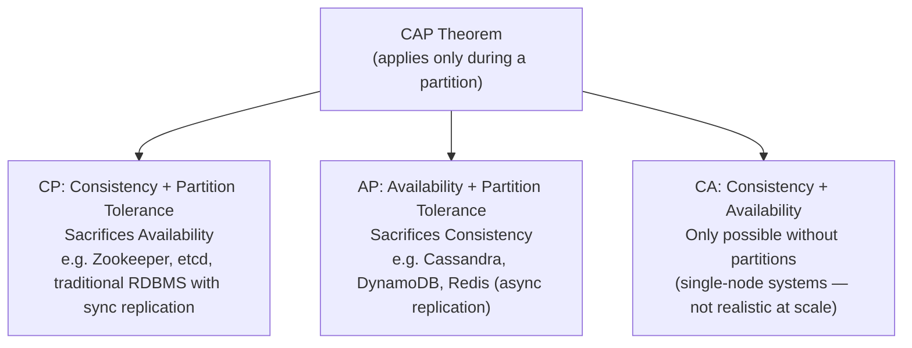

**Q: PACELC day-to-day CAP se zyada useful kyun hai?**

A: Partitions rare hote hain; latency vs consistency trade-offs constantly hote hain. PACELC: **P**artition → A ya C choose karo; **E**lse (normal operation) → **L**atency ya **C**onsistency choose karo. E.g., RDS sync multi-AZ L ke upar C ko favor karta hai; async read replicas C ke upar L ko favor karte hain (PA/EL choice).

**Q: Ek real system se AP vs CP ka concrete example do.**

A: RDS read replicas design se AP/eventually-consistent hote hain; ek payment write path CP hota hai kyunki double-charging risk unacceptable hai.

### Back-of-the-Envelope Capacity Estimation

**Q: Capacity estimation ke liye kaunse quick numbers memorize karne chahiye?**

A:
- 1M requests/day ≈ 12 RPS average; peak usually average se 2-5x hota hai
- 1KB × 1M req/day ≈ 1GB/day ≈ 30GB/month
- SSD read: tens of µs-1ms; same-region RTT: 0.5-2ms; cross-continent RTT: 100-150ms
- Redis GET: 0.5-1ms; indexed SQL: 1-10ms; unindexed SQL: 100ms-seconds

**Q: Interview mein ek system size karne ka method kya hai?**

A: 1) DAU aur requests/user/day estimate karo → 2) avg RPS compute karo, peak factor (~3x) se multiply karo → 3) storage estimate karo (avg record size × records/day × retention) → 4) bandwidth estimate karo (avg payload × RPS) → 5) decide karo ki ek DB/server kaafi hai ya caching/replicas/sharding/CDN chahiye.

**Q: Worked mini-example: 500K DAU API ko 20x/day hit karte hain — load kya hai?**

A: 10M requests/day → 10M / 86,400s ≈ 116 RPS average → 3x peak factor par ~350 RPS (5x par ~580). Kestrel isko easily handle kar leta hai; DB real bottleneck hota hai, isi wajah se caching/read-replicas zaroori ho jaate hain.

## Intermediate: Building Blocks

### Caching Strategy

**Q: .NET API mein main caching layers kya hain?**

A:
- In-memory (`services.AddMemoryCache()`) — single node, small/short-lived data
- Distributed (Redis) — multi-node, DB lookups/tokens ke liye cache-aside pattern
- Response caching (`[ResponseCache(Duration = 60)]`)

```csharp
services.AddMemoryCache();
```

```csharp
[ResponseCache(Duration = 60)]
```

**Q: Cache-aside pattern ko code mein dikhao.**

A:
```csharp
var cached = await _redis.GetStringAsync(key);
if (cached != null) return JsonSerializer.Deserialize<User>(cached);

var user = await _db.Users.FindAsync(id);
await _redis.SetStringAsync(key, JsonSerializer.Serialize(user));
return user;
```

**Q: Cache invalidation strategies compare karo.**

A:
| Strategy | Trade-off |
|---|---|
| TTL/expiration | Simple hai, lekin stale data serve kar sakta hai |
| Write-through | Hamesha fresh, write latency add karta hai |
| Write-behind | Fast writes, agar cache pre-flush crash ho jaaye to loss ka risk |
| Explicit invalidation on write | Most correct, ek code path miss karna easy hai |
| Event-driven invalidation | Services ke across scale karta hai, broker infra + lag add karta hai |

**Q: Cache stampede / thundering herd kya hai, aur isko kaise mitigate karte ho?**

A: Ek hot key expire ho jaata hai aur bahut si concurrent requests simultaneously miss karti hain, jo DB ko hammer karti hain. Request coalescing (ek in-flight fetch, baaki usko await karte hain), jittered TTLs, aur probabilistic early refresh se mitigate karo.

**Q: Cache-aside vs read-through — kya difference hai?**

A: Cache-aside caching logic ko app code mein rakhta hai (.NET mein `IDistributedCache`/Redis ke saath common hai). Read-through cache ko DB ke aage ek transparent library/proxy ke roop mein rakhta hai jo miss par fetch karta hai — kam app code, kam control. Interviewers aksar terms ko loosely use karte hain, lekin yeh different responsibilities hain.

### Load Balancing

**Q: Main load balancing algorithms compare karo.**

A:
| Algorithm | Kab use karein |
|---|---|
| Round robin | Uniform cost, stateless servers |
| Least connections | Variable request duration |
| IP hash / consistent hash | Sticky sessions, cache locality |
| Weighted | Mixed instance sizes, canary rollout |

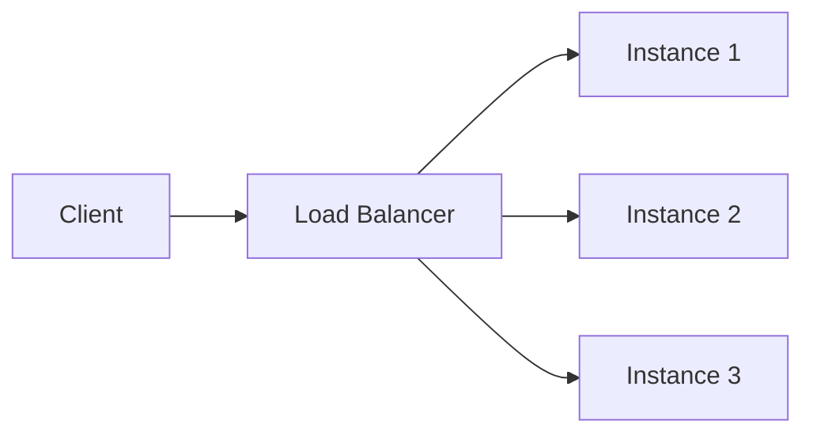

**Q: L4 vs L7 load balancing?**

A: L4 (transport, e.g. AWS NLB) IP/port par route karta hai — fast, protocol-agnostic. L7 (application, e.g. ALB/Nginx/YARP) HTTP path/headers par route karta hai — path-based routing enable karta hai (strangler-fig migrations mein use hota hai) lekin HTTP terminate/inspect karne se overhead add karta hai.

**Q: Health checks LB algorithm jitne hi kyun matter karte hain?**

A: Ek load balancer sirf itna hi accha hai jitni uski unhealthy instances ko detect karke unko route karna band karne ki ability hai — active health/liveness probes plus repeated failures par passive circuit-breaking chahiye.

### API Gateway / BFF Pattern

**Q: Backend for Frontend (BFF) kya karta hai?**

A: Ek UI-specific API layer jisse SPA exclusively baat karta hai: AuthN/AuthZ, backend calls ko aggregate karta hai, UI ke liye responses shape karta hai, Command vs Query APIs ko route karta hai.

**Q: Angular ko microservices directly call karne kyun nahi dena chahiye?**

A: SPA ko bahut si backend services directly call karne se rokta hai, auth ko centralize karta hai (har jagah token validation duplicate karne se bachata hai), UI iteration speed ko backend structure se decouple karta hai.

**Q: BFF vs generic API Gateway — yeh kaise different hain?**

A: Ek API Gateway (Ocelot, YARP, Azure APIM, Kong) bahut se consumer types ke liye ek shared, generic front door hai jo routing/auth/rate-limiting karta hai. Ek BFF one-per-client-type hota hai, UI-specific aggregation/shaping handle karta hai. Bahut si shops ek shared Gateway ke *peeche* ek BFF run karti hain. Interview mein dono ko conflate karna ek minor red flag hai.

### Database Read Replicas

**Q: RDS/DB read replicas kis liye use hote hain?**

A: Read traffic ke liye horizontal scaling, primary se reporting/dashboard queries offload karna, write model ko touch kiye bina read performance improve karna. Yeh **eventually consistent** hote hain — write ke baad kabhi immediate consistency assume mat karo.

### Database Sharding vs Partitioning

**Q: Partitioning ko sharding se distinguish karo.**

A: Partitioning ek large table ko chhote pieces mein split karta hai jo manageability ke liye *same* server par rah sakte hain (e.g., SQL Server range partitioning). Sharding horizontal partitioning hai jaha shards poori tarah *different servers* par rehte hain, ek machine se aage writes/storage scale karne ke liye.

**Q: Sharding strategies compare karo.**

A:
| Strategy | Con |
|---|---|
| Range-based | Skewed data par hotspotting (new users last shard hit karte hain) |
| Hash-based | Resharding almost sab kuch remap kar deta hai |
| Consistent hashing | Implement karna more complex hai (lekin minimal remap) |
| Directory-based | Lookup service naya SPOF ban jaata hai |
| Geo-based | Cross-region queries expensive hoti hain |

**Q: Kaunse cross-shard problems proactively raise karne chahiye?**

A: Shards ke across joins ko app-level fan-out ya denormalization chahiye; cross-shard transactions ko sagas/2PC chahiye; rebalancing (ek shard add karna) sabse hard operational problem hai — isi wajah se consistent hashing exist karti hai.

**Q: Ek multi-tenant SaaS DB ko aap kaise shard karoge?**

A: `tenant_id` se shard karo (geo- ya hash-based); har tenant ka data ek shard par rakho taaki cross-shard joins poori tarah avoid ho jaayein — tenant-based systems mein available sabse badi simplification.

### Consistent Hashing

**Q: Consistent hashing kaunsa problem solve karti hai?**

A: Naive `hash(key) % N` jab ek node add/remove hota hai to almost har key remap kar deta hai, jo ek stampede cause karta hai. Consistent hashing nodes aur keys ko ek ring (0 to 2^32-1) par place karti hai; ek key clockwise pehle node ki belong karti hai. Node add/remove karna sirf uske aur previous node ke beech ki keys ko affect karta hai.

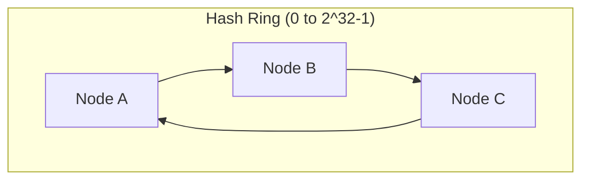

**Q: Virtual nodes kis liye hote hain?**

A: Real implementations (Redis Cluster, DynamoDB, Cassandra) har physical node ko multiple ring positions dete hain taaki node count chhota hone par uneven load avoid ho.

**Q: .NET systems mein consistent hashing kaha dikhti hai?**

A: Redis Cluster client-side sharding, distributed cache partitioning, LB session affinity, CDN edge-node selection. "Yeh modulo se better kyun hai" wali reasoning hi actual signal hai, ring math nahi.

### Message Queues & Event-Driven Architecture

**Q: Direct calls ke bajaye ek queue se services ko decouple kyun karein?**

A: Producer/consumer independently scale karte hain; consumer downtime producer ko block nahi karta; natural retry/backoff + DLQ; producer ko consumers ke baare mein pata hone ke bina fan-out enable karta hai.

**Q: Queue vs Topic/Pub-Sub — kya difference hai?**

A: Point-to-point queue: har message ko ek consumer process karta hai (competing consumers) — e.g. SQS, ASB Queue — work distribution ke liye use hota hai. Pub/Sub topic: har subscriber ko ek copy milti hai — e.g. ASB Topic, Kafka, RabbitMQ fanout exchange — state changes broadcast karne ke liye use hota hai.

**Q: Kafka, RabbitMQ, aur Azure Service Bus compare karo.**

A:
| | Kafka | RabbitMQ | Azure Service Bus |
|---|---|---|---|
| Model | Partitioned log, consumer offset track karta hai | Smart broker | Managed broker, enterprise features |
| Throughput | Bahut high | Moderate-high | Moderate |
| Retention | Replayable | Ack hone ke baad removed | Time-boxed |
| Best for | Event streaming/sourcing | Task queues, RPC routing | .NET-native, hybrid cloud |

**Q: Zyada tar brokers default mein kaunsi delivery guarantee dete hain, aur isse consumers ko kya chahiye hota hai?**

A: At-least-once (agar ack lost ho jaaye to message redeliver ho sakta hai) — consumers ko idempotent hona chahiye. True exactly-once expensive/rare hai; pragmatic answer hai "at-least-once + idempotent handlers ke liye design karo."

## Advanced Architecture Patterns

### CQRS + BFF + Read Replicas (Reference Architecture)

**Q: Is reference architecture ka 30-second elevator pitch do.**

A: Command APIs business logic handle karte hain aur primary RDS ko write karte hain; Query APIs RDS read replicas se reads serve karte hain. Angular kabhi backend services ko directly call nahi karta — yeh sirf ek BFF se baat karta hai, jo auth, response shaping handle karta hai, aur read vs write route karta hai. UI aur domain logic ko decoupled rakhte hue scalability/performance improve karta hai.

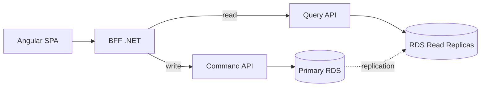

**Q: Layers ke across responsibility split kya hai?**

A: Angular = sirf UI, sirf BFF ko call karta hai. BFF = AuthN/AuthZ, aggregation, shaping, read/write routing. Command APIs = business rules/validation/transactions, primary ko write karte hain. Query APIs = replicas se read-only optimized reads.

**Q: Eventually-consistent replicas ke saath read-after-write consistency kaise handle karte ho?**

A: Either command response ko re-query kiye bina directly UI ko return karo, ya us specific follow-up read ke liye BFF ke zariye temporarily primary se read karo. Kabhi assume mat karo ki replicas immediately consistent hain.

**Q: Kya yeh "true" CQRS hai?**

A: Nahi — yeh pragmatic CQRS hai: read/write paths aur scaling separated hain, lekin dono sides same logical database (primary/replica) ko hit karte hain. Full CQRS (separate projections/event-driven) ek escalation path hai agar read patterns aage diverge karein.

**Q: Yeh architecture kab avoid karoge?**

A: Chhote CRUD apps ya simple admin panels jaha complexity benefit se zyada ho.

**Q: Apne design answer mein kaunse red flags state karne se avoid karna chahiye?**

A: Angular ka microservices se directly baat karna; BFF mein business logic hona; yeh claim karna ki read replicas strongly consistent hain; real scale par ek API dono reads aur writes handle kare.

### Monolith → Microservices Migration (Strangler Fig)

**Q: Microservices mein migrate karne se pehle sabse pehla question kya answer karna hai?**

A: Validate karo ki yeh actually needed hain — independent deployment, different scalability needs, team autonomy, tech heterogeneity. Agar koi bhi apply nahi hota, to ek modular monolith kaafi ho sakta hai.

**Q: Service boundaries kaise identify karte ho?**

A: DDD bounded contexts use karo (Orders, Payments, Catalog, Shipping) — separate teams, separate DB schemas, saath change hone wale modules dekho. "Main microservices decide karne ke liye domain & change boundaries use karta hoon, sirf controllers ya tables nahi."

**Q: Strangler Fig pattern kya hai aur ek big-bang rewrite ke upar isko kyun use karein?**

A: Aage ek API Gateway/reverse proxy lagao; initially saara traffic monolith ko route karo; ek capability ko ek naye microservice mein extract karo; routing change karo (`/payments/**` → new service, baaki as is rehta hai); monolith hollow hone tak repeat karo. Full rewrite ka risk avoid karta hai.

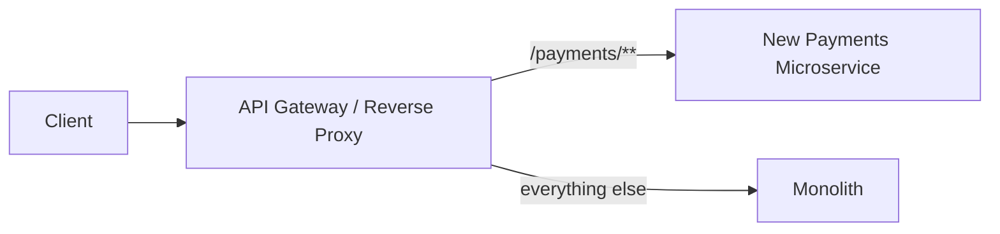

**Q: Services extract karne se pehle monolith ko kaise prepare karna chahiye?**

A: Pehle modularize karo — per module separate projects, clear interfaces (application services/events), extraction ke during regressions avoid karne ke liye critical flows ke around tests.

**Q: Ek service ko end-to-end extract karne mein kya involve hota hai?**

A: New repo + apna CI/CD, separate data (naya DB/schema, ya temporary shared-DB-isolated-ownership), API expose karo, gateway ke through callers update karo, stable ho jaane par old code retire karo.

**Q: Migration ka sabse hard part kya hai, aur isko kaise handle karte ho?**

A: Data migration. Goal database-per-service hai; path hai isolated ownership wali shared DB → ETL ya CDC/event streams ke zariye gradual move. Distributed transactions ke upar event-driven/eventual consistency prefer karo; cross-service consistency ke liye Outbox + Saga use karo.

**Q: Services extract karte time kaunse platform components introduce karne chahiye?**

A: API Gateway (routing/auth/rate limiting), service-to-service comms (REST/gRPC + broker), observability (centralized logging, distributed tracing, health checks), per-service CI/CD.

**Q: Is migration ke common pitfalls kya hain?**

A: Bahut zyada fine-grained split karna (chatty calls); ek shared DB ko forever rakhna (distributed monolith); no observability; tech stack explosion.

### CQRS & Event Sourcing (Full Pattern)

**Q: "Full" CQRS upar wale pragmatic CQRS se kaise different hai?**

A: Write aur read sides physically different data stores/schemas use karte hain. Write side source-of-truth persist karta hai (aksar ek event stream ke roop mein); read side events ke zariye asynchronously updated denormalized projections maintain karta hai.

**Q: Event sourcing kya hai?**

A: Current state store karne ke bajaye, uske sequence of events store karo jo usko lead kiye (`OrderCreated`, `ItemAdded`, ...). Current state events replay karke ya ek snapshot + recent events se derive hota hai.

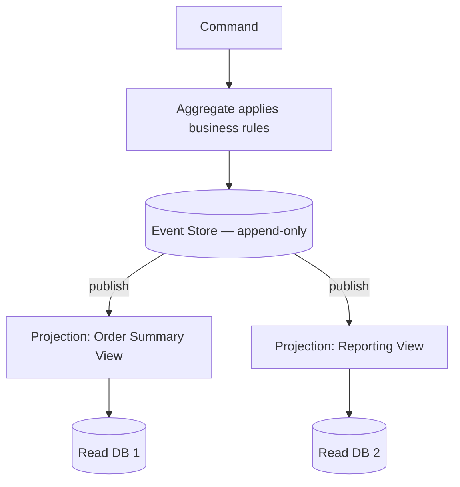

**Q: Event sourcing ke trade-offs kya hain?**

A: Benefits: full audit trail/temporal queries, tailored read projections, natural event-driven integration, decoupled read/write scaling. Costs: significant complexity, write aur har read model ke beech eventual consistency, scale par replay ke liye snapshotting chahiye, ongoing event-schema versioning tax.

**Q: Event sourcing ke liye actually kab reach karna chahiye?**

A: Sirf tab jab audit history/temporal queries ek first-class requirement hain, ya read needs itni varied hain ki ek normalized write model unko serve nahi kar sakta. Zyada tar systems ke liye, pragmatic CQRS right complexity level hai — event sourcing escalation path hai, default nahi.

### Outbox Pattern & Transactional Messaging

**Q: Outbox pattern kaunsa problem solve karta hai?**

A: Ek DB transaction aur ek message-broker publish ek ACID transaction share nahi kar sakte. Publish-then-write mein risk hai ki consumers un events par act karein jo commit hi nahi hue; write-then-publish mein risk hai ki agar publish fail ho jaaye to downstream ko kabhi pata na chale.

**Q: Outbox pattern isko kaise solve karta hai?**

A: Event ko ek `Outbox` table mein business change ke *same DB transaction* mein likho. Ek separate poller (ya Debezium jaisa CDC tool) unsent outbox rows padhta hai, broker ko publish karta hai, phir unko sent mark karta hai.

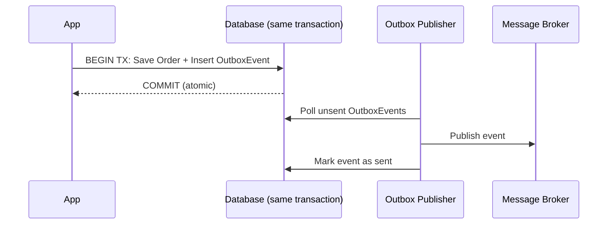

**Q: Yeh .NET mein kaise implement hota hai?**

A: EF Core `SaveChangesAsync()` entity aur `OutboxMessage` row dono ko ek transaction/DbContext call mein likhta hai. Ek `BackgroundService`/Hangfire job outbox ko ek interval par (ya CDC trigger ke zariye) poll karta hai aur publish karta hai, phir status update karta hai. At-least-once delivery guarantee karta hai — consumers idempotent hone chahiye.

### Sagas / Distributed Transactions

**Q: Services ke across ek 2-phase-commit distributed transaction kyun use nahi karein?**

A: 2PC ke liye zarurat hoti hai ki sab participants tab tak locks hold karein jab tak sab commit vote na kar dein — network boundaries ke across scale nahi karta, tight coupling aur availability risk create karta hai (ek slow/down participant sabko block kar deta hai). Virtually koi modern microservices architecture isko use nahi karta.

**Q: Saga pattern kya hai?**

A: Ek distributed transaction ko local transactions ki ek sequence mein break karo, har ek ke paas ek compensating action ho jo agar baad ka step fail ho jaaye to usko undo kar de.

**Q: Choreography vs Orchestration sagas?**

A: Choreography — har service events publish karti hai, baaki independently react karti hain (no coordinator); kam steps ke liye simple hai, steps grow karne par trace karna hard ho jaata hai. Orchestration — ek central saga orchestrator har step ko call karta hai aur compensations issue karta hai; clear/testable/traceable hai, lekin orchestrator ek naya component hai jo build/scale karna hai.

**Q: Order + Payment + Inventory saga example ko walk through karo.**

A: 1) Order create hota hai (`Pending`) → `OrderCreated`. 2) Payment card charge karta hai → `PaymentCompleted`/`PaymentFailed`. 3) Agar completed hai, Inventory stock reserve karta hai → `StockReserved`/`StockUnavailable`. 4) Agar unavailable hai: compensate karo — payment refund karo, order ko `Cancelled` mark karo.

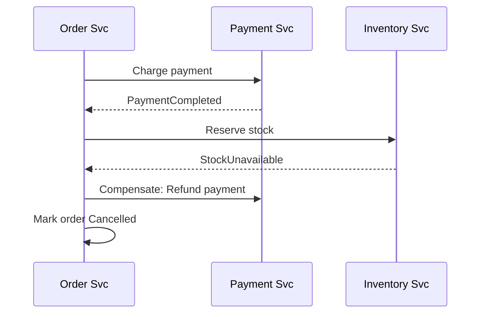

**Q: Agar ek compensating action khud fail ho jaaye to?**

A: Iska koi fully automatic answer nahi hai — compensations ko retry karna padta hai (idempotent, backoff ke saath); agar retries exhaust ho jaayein, to manual/ops intervention ke liye ek dead-letter queue par escalate karo. Isko honestly acknowledge karna ek strong interview signal hai.

### Resilience Patterns: Circuit Breaker, Retry, Bulkhead (Polly)

**Q: Char core resilience patterns describe karo.**

A:

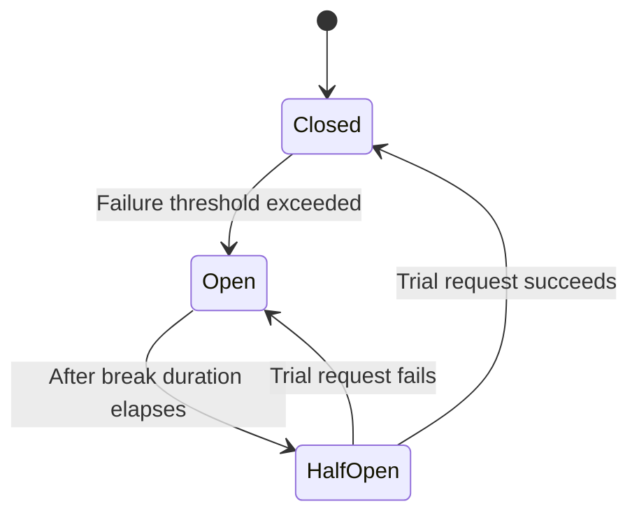

- **Retry** — exponential backoff + jitter ke saath transient failures ko re-attempt karo (jitter synchronized retry storms avoid karta hai)
- **Circuit Breaker** — N failures ke baad, cooldown ke liye open hota hai aur fail fast karta hai; half-open trial request recovery test karta hai
- **Bulkhead** — per dependency concurrent calls/resources ko cap karo taaki ek failing downstream shared thread/connection pools ko exhaust na kar sake
- **Timeout** — hamesha upar wale ke saath pair karo; timeout ke bina retry/circuit-breaker sirf fail hone mein zyada wait karta hai

**Q: .NET mein ek Polly v8 resilience pipeline dikhao.**

A:
```csharp
var pipeline = new ResiliencePipelineBuilder<HttpResponseMessage>()
    .AddRetry(new RetryStrategyOptions<HttpResponseMessage> {
        MaxRetryAttempts = 3, BackoffType = DelayBackoffType.Exponential, UseJitter = true })
    .AddCircuitBreaker(new CircuitBreakerStrategyOptions<HttpResponseMessage> {
        FailureRatio = 0.5, SamplingDuration = TimeSpan.FromSeconds(30), BreakDuration = TimeSpan.FromSeconds(15) })
    .AddTimeout(TimeSpan.FromSeconds(5))
    .Build();
```
`Microsoft.Extensions.Http.Resilience` (`AddStandardResilienceHandler()`) ke zariye `HttpClientFactory` ke saath integrate hota hai.

### Idempotency Keys

**Q: At-least-once delivery aur retries ko dekhte hue idempotency keys kyun zaroori hain?**

A: Same operation ek se zyada baar trigger ho sakta hai (retries, redelivery); non-idempotent handlers (card charge karna, email bhejna) protection ke bina double-execute ho jaayenge.

**Q: Idempotency key pattern describe karo aur isko code mein dikhao.**

A: Client ek header mein per logical operation ek unique key (GUID) send karta hai. Server ek retention window ke liye completed keys + response ko ek fast store mein store karta hai; same key ke saath retry par, re-execute karne ke bajaye cached response return karta hai.
```csharp
var existing = await _idempotencyStore.GetAsync(idempotencyKey);
if (existing is not null) return Ok(existing.Response); // replay
var result = await _paymentService.ChargeAsync(request);
await _idempotencyStore.SaveAsync(idempotencyKey, result);
return Ok(result);
```

**Q: Kya ek DB unique constraint kaafi nahi hai?**

A: Kabhi-kabhi, agar ek natural business key ho (e.g., `OrderId`). Idempotency keys general solution hain jab koi natural key nahi hoti, ya jab aapko retry par sirf ek duplicate row prevent nahi, balki *exact original response* return karna ho.

### Rate Limiting Algorithms

**Q: Paanch rate limiting algorithms compare karo.**

A:
| Algorithm | Con |
|---|---|
| Fixed window counter | Window edges par bursts (2x limit possible) |
| Sliding window log | High volume par memory-heavy |
| Sliding window counter | Slight approximation |
| Token bucket | Slightly zyada complex; controlled bursts allow karta hai |
| Leaky bucket | Bursty clients ke liye latency add karta hai |

**Q: Rate limiting ke liye kaunsa .NET built-in support exist karta hai?**

A: `Microsoft.AspNetCore.RateLimiting` middleware (.NET 7 se) Fixed Window, Sliding Window, Token Bucket, aur Concurrency limiter policies ke saath:
```csharp
options.AddTokenBucketLimiter("api", opt => {
    opt.TokenLimit = 100; opt.TokensPerPeriod = 20; opt.ReplenishmentPeriod = TimeSpan.FromSeconds(10);
});
```

**Q: Multiple instances ke across ek *global* rate limit kaise enforce karte ho?**

A: In-memory per-instance counters multi-instance deployments mein kaam nahi karte. Shared counter store ke roop mein Redis use karo (`INCR`+`EXPIRE` ya atomicity ke liye ek Lua script).

## Kestrel & ASP.NET Core Server Internals

### Kestrel Kya Hai?

**Q: Kestrel kya hai?**

A: ASP.NET Core ke liye default cross-platform web server — high-performance, event-driven, async, .NET Socket APIs par built, IOCP (Windows) ya epoll/kqueue (Linux/macOS) use karte hue. Low overhead ke saath hazaaron concurrent connections handle karta hai.

### Kestrel Kyun Bana?

**Q: IIS/System.Web ke saath continue karne ke bajaye Kestrel kyun banaya gaya?**

A: Classic IIS/`System.Web` thread-per-request use karta tha (thread starvation), Windows se tightly coupled tha, aur real-time apps ke liye slow tha. Kestrel platform-independent hai, ground up se async I/O hai, Node.js/Nginx-level performance aim karta hai, aur `System.Web`/IIS pipeline overhead drop karta hai.

### Kestrel Features

**Q: Kestrel ke key features list karo.**

A: Cross-platform; fully async pipeline (kam threads, no thread-per-request); TechEmpower benchmarks mein fastest mein rank karta hai; HTTPS/HTTP1.1/HTTP2/HTTP3 (QUIC) support; WebSockets; multiple bound URLs ke across endpoint routing.

### Kestrel Architecture (Internal Flow)

**Q: Kestrel ke internal request flow ko describe karo.**

A: Client → Transport layer (TCP/TLS/QUIC sockets) → Connection layer (HTTP parsing) → Middleware pipeline (auth, routing, exceptions) → Endpoint routing (MVC/Minimal APIs) → Async response writing → Client. Event loop high concurrent I/O ke liye optimized hai.

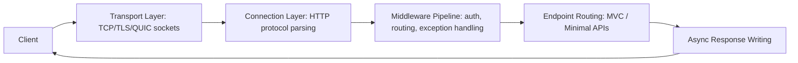

### Kestrel Concurrency Kaise Handle Karta Hai

**Q: Kestrel kam threads ke saath high concurrency kaise achieve karta hai?**

A: Event-loop-based (Node.js jaisa, lekin multiple loops); IOCP/epoll/kqueue use karta hai; minimal threads → high throughput; async context-switching ThreadPool ko block karne se bachata hai. 10,000 open connections ke saath, sirf ek chhoti si number of threads active hoti hain — saara I/O callbacks/async-await ke zariye async hota hai. Isi wajah se async code Kestrel ke under APIs ko faster banata hai.

### Kestrel Configure Karna (Real-World Example)

**Q: Kestrel limits aur listen ports kaise configure karte ho?**

A:
```csharp
builder.WebHost.ConfigureKestrel(options => {
    options.Limits.MaxRequestBodySize = 10 * 1024 * 1024;
    options.Limits.KeepAliveTimeout = TimeSpan.FromMinutes(2);
    options.Limits.RequestHeadersTimeout = TimeSpan.FromSeconds(30);
    options.ListenAnyIP(5000);
    options.ListenAnyIP(5001, lo => lo.UseHttps());
});
```

### Standalone vs Reverse Proxy Mode

**Q: Standalone vs reverse proxy — kya difference hai aur production mein proxy kyun use karein?**

A: Standalone: Client → Kestrel → app directly (dev/containers/simple deploys). Reverse proxy (recommended): Client → Nginx/Apache/IIS/ingress → Kestrel — better security, load balancing, connection handling, faster static file serving, aur Kestrel ko direct exposure se protect karta hai.

### Performance Features

**Q: Kestrel internally kaunse performance features par rely karta hai?**

A: Zero-copy memory (`Span<T>`, `Memory<T>`, pipelines API); minimal allocations ke saath optimized header/body parsing; HTTP/2 multiplexing (per connection multiple streams); Windows/IIS hosting ke liye IIS Integration Middleware.

### Kestrel Mein Memory Management

**Q: GC pressure kam karne ke liye Kestrel memory kaise manage karta hai?**

A: Constant allocation ke bajaye memory pools, shared buffers, aur reusable arrays use karta hai — GC pressure kam karta hai, responses faster hote hain.

### Common Interview Q&A (Kestrel)

**Q: Kestrel IIS/System.Web se faster kyun hai?**

A: Async I/O, minimal pipeline, no System.Web, lightweight handling, event-driven model.

**Q: Kya Kestrel ko directly internet par expose karna chahiye?**

A: Nahi — production ke liye ek reverse proxy (Nginx/IIS/cloud LB) use karo. Containerized deployments mein, "reverse proxy" aksar ek hand-configured Nginx box ke bajaye ingress controller ya platform LB hota hai, lekin principle same hi hota hai.

**Q: Kestrel thread starvation kaise avoid karta hai?**

A: No thread-per-request; async I/O + event loop ko classic IIS/System.Web se kaafi kam threads chahiye.

**Q: Kya Kestrel Windows par run hota hai?**

A: Haan, lekin yeh legacy Windows-specific APIs ke bajaye .NET ka cross-platform async I/O model use karta hai.

**Q: `MinRequestBodyDataRate`/`MinResponseDataRate` kya hai aur isko kab tune karoge?**

A: Kestrel slowloris-style slow-client attacks se protect karne ke liye ek minimum data rate enforce karta hai (default ~240 bytes/sec). Legitimately slow clients ke liye (poor mobile connections par large uploads) isko raise ya disable (`= null`) karo — public endpoints ke liye kabhi bhi bina aage ek aur mitigation (WAF/proxy timeout) ke disable mat karo.

**Q: HTTP/2 vs HTTP/3 — HTTP/3 (QUIC) kyun enable karein?**

A: HTTP/2 ek TCP connection ke upar streams multiplex karta hai lekin phir bhi TCP head-of-line blocking se suffer karta hai (ek lost packet saari streams ko stall kar deta hai). HTTP/3 QUIC (UDP) ke upar run hota hai, transport layer par multiplex karta hai taaki ek lost packet sirf apni stream ko stall kare — lossy/mobile networks par better hai. Trade-off: QUIC/UDP restrictive firewalls dwara block ho sakta hai, isliye HTTP/2 fallback available rehna chahiye.

### Senior-Level Summary (Kestrel, interview-ready)

**Q: Kestrel ka ek one-paragraph interview-ready summary do.**

A: Kestrel ASP.NET Core ka default high-performance server hai — async I/O, event-driven, memory-efficient pipelines, HTTP/1.1/2/3, TLS, WebSockets support karta hai, cross-platform hai. Production mein, security, load balancing, static file serving, aur connection management ke liye isko ek reverse proxy (Nginx/IIS ya platform ingress/LB) ke peeche run karo. Async-first hone ki wajah se, yeh classic IIS/System.Web se outperform karta hai.

## API Performance Optimization

### 1. I/O & Database Latency Kam Karna

**Q: DB/I/O latency kam karne ke key techniques kya hain?**

A: Proper indexing (composite indexes, `SELECT *` avoid karo, Query Store/`EXPLAIN` se analyze karo); unneeded columns load hone se bachne ke liye pagination + `Select()` projections; Kestrel thread starvation rokne ke liye async EF Core queries (`await ... ToListAsync()`).

```csharp
var data = await _dbContext.Users
    .Where(x => x.IsActive)
    .ToListAsync();
```

### 2. Multiple Layers Par Caching

**Q: Performance optimization list mein "caching" ke andar kya cover hota hai?**

A: Upar wale Caching Strategy section jaisa hi content — in-memory, Redis cache-aside, response caching, invalidation strategies, aur cache stampede mitigation.

### 3. Serialization Time Kam Karna

**Q: .NET APIs mein serialization overhead kaise kam karte ho?**

A: `Newtonsoft.Json` ke bajaye `System.Text.Json` use karo; response DTOs pre-define karo; EF entities ko kabhi directly serialize mat karo. Aur zyada speed ke liye, high throughput ke under reflection ko poori tarah avoid karne ke liye `JsonSerializerContext` source-generated serialization (.NET 6+ se) use karo.

### 4. Asynchronous & Non-Blocking Architecture

**Q: Kestrel ke under kaunsa async anti-pattern avoid karna chahiye, aur kyun?**

A: `.Result`/`.Wait()` (sync-over-async) avoid karo — yeh thread pool ko block karte hain. Kestrel async workloads ke liye optimized hai, isliye async all the way down use karo.

### 5. Middleware & Pipeline Overhead Minimize Karna

**Q: Middleware pipeline overhead kaise kam karte ho?**

A: Sirf required middleware rakho (routing, auth, structured logging); unused services aur verbose/production logging disable karo; prod mein large exception stack traces avoid karo.

### 6. Compression, HTTP/2, and gRPC

**Q: REST ke upar gRPC kab use karoge, aur trade-off kya hai?**

A: gRPC internal service-to-service calls ke liye 5-10x faster hai (HTTP/2 + Protobuf binary + strongly-typed contracts, no reflection-based JSON parsing). Trade-off: debug/inspect karna harder hai (human-readable nahi), weaker browser support (grpc-web + proxy chahiye), REST/OpenAPI se less universal tooling. Standard answer: internally gRPC, public/browser-facing APIs ke liye REST/JSON (ya GraphQL).

**Q: .NET mein response compression kaise enable karte ho?**

A:
```csharp
services.AddResponseCompression();
```

### 7. Application Architecture Improve Karna

**Q: Application layer par throughput improve karne wale do architectural moves kya hain?**

A: High-read systems ke liye CQRS (read DB se reads, write DB se commands); background processing (Hangfire, Azure Functions, `BackgroundService`) taaki APIs fast return karein jab heavy work async continue kare.

### 8. Connection Pooling & HttpClientFactory

**Q: `new HttpClient()` ke bajaye `HttpClientFactory` kyun use karein?**

A: Socket exhaustion prevent karta hai.
```csharp
services.AddHttpClient("external", c => c.Timeout = TimeSpan.FromSeconds(5));
```
Databases ke liye: minimal DbContexts use karo, long-running transactions avoid karo.

### 9. Payload Size Kam Karna

**Q: Payload size kaise kam karte ho?**

A: JSON compress karo, unused fields remove karo, lightweight DTOs return karo, jaha appropriate ho waha OData/filtering APIs use karo.

### 10. Profiling & Monitoring

**Q: API performance profiling ke liye kaunse tools aur metrics matter karte hain?**

A: Tools: Application Insights, New Relic, CloudWatch, Datadog, MiniProfiler, EF Core logging (N+1 detection). Track karo: latency p50/p90/p99, slow SQL queries, serialization time, GC pauses.

### Senior-Level Summary (API Performance, interview-ready)

**Q: API performance optimization ka ek one-paragraph interview-ready summary do.**

A: Layers ke across optimize karo — database (indexes, projections, pagination), caching (Redis/memory/response), async architecture, Kestrel tuning, minimized middleware, payload optimization, aur observability. High-scale systems ke liye, CQRS, background processing, gRPC add karo. Performance ek cross-layer concern hai, koi single fix nahi.

## Scalability & Performance Deep Dive

**Q: Ek production API slow hai — debugging decision tree ko walk through karo.**

A: p50 vs p99 check karke start karo. Agar p50 theek hai lekin p99 bad hai → likely GC pauses, connection pool exhaustion, ya tail par ek slow dependency; thread pool/DB pool saturation aur downstream timeouts check karo; Polly circuit breaker + bulkhead se fix karo, pool sizes tune karo. Agar p50 aur p99 dono bad hain → likely systemic (missing index, N+1 query, sync-over-async); EF Core query logs check karo; indexes, projections, caching se fix karo.

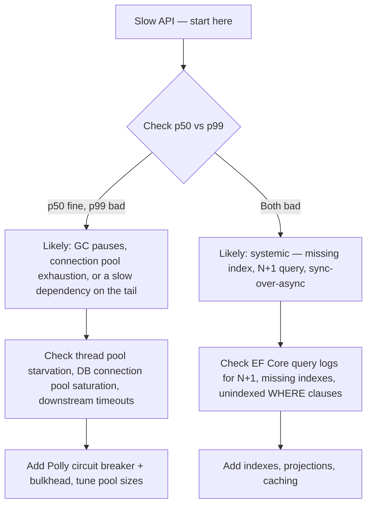

**Q: Vertical vs horizontal scaling — trade-off kya hai, aur default kaunsa hai?**

A: Vertical (bigger instance) simpler hai, no distributed complexity, lekin ek hard ceiling hai aur ek SPOF hai. Horizontal (more instances) internet-scale ke liye standard hai lekin statelessness (ya externalized state), ek load balancer chahiye, aur distributed-system problems introduce karta hai. Customer-facing scale ke liye horizontal default rakho; ek low-traffic internal tool ko over-engineer mat karo.

**Q: N+1 query problem kya hai aur EF Core mein isko kaise fix karte ho?**

A: Ek collection ko iterate karna aur per item ek related entity lazy-load karna 1 ke bajaye N+1 round trips cause karta hai. Eager loading (`.Include()`), projection (`.Select()`), ya ek single batched query se fix karo. One-to-many `Include`s ke liye `AsSplitQuery()` use karo jo warna ek single SQL query mein cartesian-product explosion cause karenge.

## Best Practices

**Q: Is guide ke key architectural best practices kya hain?**

A:
- Microservices/CQRS/event sourcing adopt karne se pehle business need validate karo — complexity earned honi chahiye
- Async all the way down design karo; ek async chain mein kabhi `.Result`/`.Wait()` mix mat karo
- Client ke sabse close jo layer bhi still correct hai waha cache karo (CDN > response cache > distributed cache > in-memory > DB)
- Read replicas aur distributed caches ko by default eventually consistent treat karo; read-after-write explicitly design karo
- Queue/webhook/retry consumers ko idempotent banao — at-least-once realistic default hai
- Kisi bhi aisi dependency ko har outbound call jise aap control nahi karte, retry/circuit-breaker/timeout/bulkhead ke saath wrap karo
- Observability (structured logs, correlation IDs, tracing, p50/p90/p99) ko din 1 se build karo
- Premature microservices ke upar clean boundaries wale ek modular monolith ko prefer karo
- Ek shard key choose karo jo related data/transactions ko saath rakhe

## Common Pitfalls

**Q: Sabse commonly cited system-design pitfalls kya hain?**

A:
- Microservices bahut fine-grained split → chatty calls, high latency
- "microservices" ke across forever shared database → distributed monolith
- No observability → debugging nightmare
- Tech stack explosion → ops complexity
- Yeh assume karna ki read replicas/distributed caches strongly consistent hain
- `.Result`/`.Wait()` Kestrel ke under thread pool starvation cause karna
- Bina idempotency key ke non-idempotent operations retry karna → duplicate side effects
- Bina timeout ke circuit breaker/retry → faster ke bajaye slower fail hota hai
- Sharding key jo query/transaction patterns se match nahi karti → expensive cross-shard fan-out
- Kafka/event sourcing/full CQRS ke liye reach karna kyunki yeh "correct" hain, needed hone ke bajaye

## Worked Examples

### Ek URL Shortener Design Karna

**Q: Ek URL shortener ke liye requirements aur estimated load kya hain?**

A: Shorten + redirect; ~100M new URLs/month, ~10:1 read:write ratio. ~40 writes/sec avg, ~400 reads/sec avg (peak par higher). Storage ≈ 50GB/month (500B/record).

**Q: Short-code generation approaches compare karo.**

A:
| Approach | Trade-off |
|---|---|
| Base62 of auto-increment ID | Simple, no collisions, lekin volume/order reveal karta hai, ek centralized/range-allocated ID generator chahiye |
| Hash + truncate | No central counter, lekin collisions ko check-and-retry chahiye |
| Random string + collision check | Simple, lekin keyspace fill hone par wasted lookups |

Senior answer: ek distributed ID generator (Snowflake-style ya per node pre-allocated ranges) ka base62 dono — counter bottleneck aur collisions — avoid karta hai.

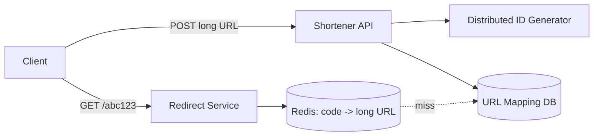

**Q: Redirect (hot) path ko kaise optimize karte ho, aur 301 vs 302?**

A: Redis mein short-code → long-URL cache karo (cache-aside/read-through); DB sirf miss par. 301 (permanent) browsers ko client-side cache karne deta hai (less load, lekin click analytics lose hota hai); 302 (temporary) har click ko aapki service hit karte rakhta hai (analytics/A-B redirects enable karta hai). Zyada tar production shorteners click tracking retain karne ke liye 302 use karte hain.

**Q: Aur kaunse trade-offs proactively raise karne chahiye?**

A: Vanity/custom short codes ko user-chosen codes ke against ek uniqueness check chahiye; spam abuse prevent karne ke liye link creation ko rate-limit karo.

### Ek Rate Limiter Service Design Karna

**Q: Ek rate limiter kaise design karte ho jo bahut si API instances ke across kaam kare?**

A: Counter ko Redis mein centralize karo (per-instance memory mein nahi) taaki limit global ho; average rate enforce karte hue bursts absorb karne ke liye token bucket use karo.

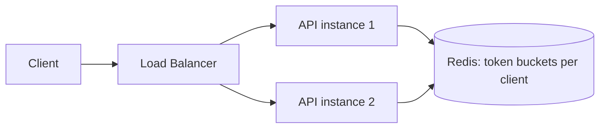

**Q: Yaha senior answers ko kaunsa implementation detail alag karta hai?**

A: Atomically read-and-decrement karne ke liye ek single Redis Lua script (ya MULTI/EXEC) use karo — separate GET phir SET concurrency ke under ek race condition hai (do requests dono "1 token left" dekhti hain, dono proceed karti hain, bucket negative ho jaata hai).

**Q: Jab Redis (counter store) down ho jaaye to kya hota hai — fail open ya fail closed?**

A: Zyada tar production systems fail open karte hain, kyunki ek rate limiter abuse se protect karta hai, ek hard security boundary hone ke bajaye — ek outage-driven traffic spike 100% legitimate traffic reject karne se kam risk hai.

**Q: Rate limiting kaha enforce hona chahiye?**

A: API Gateway/edge par (cheapest — backend compute spend hone se pehle abuse rokta hai), optional finer-grained per-service/per-endpoint limits ke saath upar layered (e.g., ek expensive search endpoint par ek stricter limit).

### Ek Notification System Design Karna

**Q: Ek multi-channel notification system ke liye high-level design kya hai?**

A: Upstream services events ko ek queue/event bus par publish karte hain → Notification Worker unhe padhta hai, User Preference Store check karta hai, aur Push/Email/SMS providers ko dispatch karta hai.

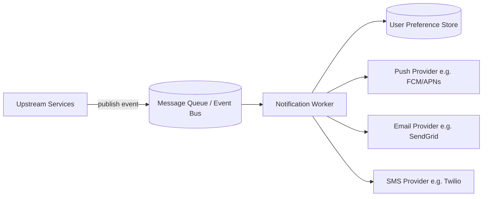

**Q: Notification delivery ko directly call karne ke bajaye queue kyun use karein?**

A: Triggering service (e.g., Orders) ko ek channel provider outage par block nahi hona chahiye ya usse care nahi karna chahiye — ek queue ke zariye decoupling order ko instantly complete hone deta hai jabki delivery/retries independently hote hain.

**Q: Triggering request ko slow kiye bina "all 1M followers" ko fan-out kaise handle karte ho?**

A: Synchronously 1M queue messages create mat karo. Ek fan-out event publish karo; ek dedicated fan-out worker isko per-user work items mein expand karta hai (possibly ek second queue mein) — originating request fast rehta hai.

**Q: Per-channel failures ko kaise isolate karte ho (SMS provider outage se email block nahi hona chahiye)?**

A: Har provider call ko apni Polly policy mein wrap karo (retry + circuit breaker); exhausted retries ke liye alerting ke saath per-channel dead-letter queues use karo.

**Q: At-least-once delivery ke under duplicate notifications kaise avoid karte ho?**

A: Bhejne se pehle cached user preferences check karo (opt-outs, quiet hours); per (event, channel) ek idempotency key use karo taaki ek redelivered message do baar send na ho.

**Q: Delivery timing ke regarding kaunsa trade-off explicitly naam lena chahiye?**

A: Real-time push (immediacy maximize karta hai, fatigue/cost ka risk) vs batched/digest notifications (better UX, lower cost, added latency) — assume karne ke bajaye yeh requirement clarify karo.

## Gap Close Karna: Additional Prep

### Worked-Example Repertoire Expand Karna

**Q: News Feed (Twitter/Instagram-style) — core design tension kya hai?**

A: Fan-out-on-write (post par har follower ka feed precompute karo — fast reads, celebrities ke liye expensive) vs fan-out-on-read (request time par assemble karo — cheap writes, expensive reads). Senior answer: hybrid — normal users ke liye fan-out-on-write, high-follower accounts ke liye fan-out-on-read/separate path.

**Q: Chat System (WhatsApp-style) — key deep-dive question kya hai?**

A: Core components: real-time delivery ke liye WebSockets, presence service, delivery guarantees ke saath message persistence, group-chat fan-out. Key question: ek message ko hazaaron stateless servers mein se ek se connected recipient tak kaise route karte ho? Answer: ek connection-registry/lookup service (e.g., Redis `userId -> serverId`) taaki koi bhi server correctly forward kar sake.

**Q: Ride-Sharing Dispatch (Uber-style) — core problem aur answer kya hai?**

A: Scale par geospatial matching — nearest available driver dhoondna. Full scans ke bajaye fast spatial queries ke liye driver locations ko index karne ke liye geohashing ya ek quadtree use karo; frequent location updates ko ek high-write-throughput store chahiye, strong consistency nahi.

**Q: Distributed Key-Value Store ("mini-DynamoDB") — yeh kaunse concepts par draw karta hai?**

A: Partitioning ke liye consistent hashing, durability ke liye replication factor, tunable consistency ke liye read/write quorums (R/W), concurrent writes par conflict resolution ke liye vector clocks ya last-write-wins.

**Q: Video Streaming Service (Netflix-style) — core components kya hain?**

A: Multiple bitrates par chunked video encoding, edge delivery ke liye CDN (caching-strategy content apply hota hai), adaptive bitrate streaming (client measured bandwidth se quality pick karta hai), video-serving path se decoupled ek metadata/recommendation service.

**Q: E-Commerce Checkout/Inventory — core problem aur use hone wala pattern kya hai?**

A: Concurrent checkouts ke under overselling prevent karna. Sagas + Idempotency Keys ka direct application: inventory reserve karo (TTL ke saath), payment charge karo, reservation confirm karo; failure par compensate karo (reservation release karo); idempotency keys retried checkout requests par double-charge/double-reserve prevent karte hain.

### Patterns Ko AWS Managed Services Se Map Karna

**Q: Is guide ke har generic pattern ko uske AWS managed-service equivalent se map karo.**

A:
| Pattern | AWS service |
|---|---|
| Distributed cache (Redis) | ElastiCache |
| Point-to-point queue | SQS |
| Pub/Sub fan-out | SNS (often SNS → multiple SQS) |
| CDN/edge cache | CloudFront |
| L7 load balancer | ALB |
| L4 load balancer | NLB |
| Read replicas | RDS/Aurora Read Replicas |
| Saga orchestration | Step Functions |
| Event streaming (Kafka) | Kinesis Data Streams (or MSK for Kafka compatibility) |
| Serverless background work | Lambda (e.g., Outbox poller as EventBridge-scheduled Lambda) |
| Rate limiter shared counter | ElastiCache (Redis) |

### Interview Chalana: Time-Boxing & Whiteboard Mechanics

**Q: Ek 45-minute system design interview ko kaise time-box karna chahiye?**

A: Requirements clarification ~5 min; back-of-envelope estimation ~5 min; high-level architecture ~15-20 min; 1-2 hard components par deep dive ~15-20 min; trade-offs/failure modes/wrap-up ~5-10 min.

**Q: Patterns jaanne se aage kaunse whiteboard/mechanics skills matter karte hain?**

A: Jo bhi tool aapko diya jaaye (Excalidraw, Miro, CoderPad, HackerRank) usmein fluently architectures (CQRS+BFF, Strangler Fig, Saga sequences) sketch karne ki practice karo — baat karte hue speed mein tool fluency architecture jaanne se ek alag skill hai.

**Q: "Continuously narrate karna" kyun matter karta hai, aur good narration kaisi sound karti hai?**

A: Sochte waqt silence sabse common reason hai ki ek technically-correct design "junior" lagta hai. Jo aap consider aur reject kar rahe ho woh bolo, e.g., "Main user ID se shard kar sakta hoon, lekin main tenant ID se shard karunga kyunki yeh har tenant ka data aur transactions ek shard par rakhta hai."

### Multi-Tenant Data Isolation & PII Handling

**Q: Teen tenant isolation models compare karo.**

A:
| Model | Isolation | Fit |
|---|---|---|
| Silo (DB-per-tenant) | Strongest | Regulatory hard-isolation requirements, ya wildly different tenant scale |
| Pooled + `TenantId` filtering | Logical, app/ORM-enforced | Moderate-large scale par zyada tar SaaS (shard-by-tenant-ID recommendation se match karta hai) |
| Bridge (schema-per-tenant) | Middle ground | Full silo cost ke bina schema customization chahne wala medium tenant count |

**Q: Kaunse PII/compliance measures proactively raise karne chahiye?**

A: Encryption at rest (RDS/DynamoDB + KMS) aur in transit (TLS everywhere); sirf DB-level encryption par rely karne ke bajaye sabse sensitive fields ke liye field-level encryption/tokenization; kaun kaunse tenant ka data kab access kiya iska audit logging.

**Q: Isolation model ke bawajood, multi-tenancy ke liye explicitly naam lene wala #1 failure mode kya hai?**

A: Cross-tenant data leak. Woh specific mechanism naam lo jo tenant A ki request ko kabhi tenant B ka data return karne se roke — ek fail-closed default wala global query filter (throw karta hai agar tenant context set nahi hai) — sirf "hum ek WHERE clause add karte hain" nahi.

## Sample Interview Q&A

**Q: Partition ke during vs normal operation ke during availability/consistency — distinction kya hai?**

A: CAP strictly sirf partition ke during apply hota hai (A ya C choose karo). Normal operation ke during, real trade-off latency vs consistency (PACELC) hai — e.g., sync multi-AZ replication consistency ke liye latency add karta hai, jabki async replication (RDS read replicas) temporary staleness ki cost par latency ko favor karta hai.

**Q: Aap ek payment API ko retry ke liye safe kaise banaoge?**

A: Per logical payment attempt ek idempotency key require karo; completed keys ko unke response ke saath store karo; re-charge karne ke bajaye retry par cached response return karo. Defense-in-depth ke roop mein Polly client-side retry policies aur business key par ek DB uniqueness constraint ke saath combine karo.

**Q: Aapka circuit breaker open hai aur fail fast kar raha hai — users vs on-call ko kya batate ho?**

A: Users: ek hung request ke bajaye ek graceful degraded response (cached/stale data ya ek clear "temporarily unavailable"). On-call: specifically circuit *state transitions* par alert karo (sirf error rate nahi) taaki unhe immediately pata chale ki yeh ek downstream dependency issue hai, jo diagnosis time kaat deta hai.

**Q: URL shortener redirect path ko 50,000 reads/sec tak kaise scale karoge?**

A: Aggressively cache karo (Redis, very hot links ke liye potentially CDN/edge), redirect path ko write DB se poori tarah door rakho, aur agar sirf cache-miss volume hi ek DB ki capacity se exceed kare to ek read replica/dedicated read store add karo — typical skewed read:write ratio ko dekhte hue path nearly saare cache hits hone chahiye.
