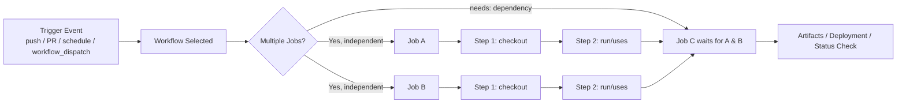
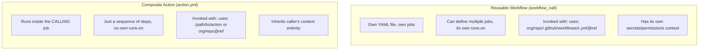
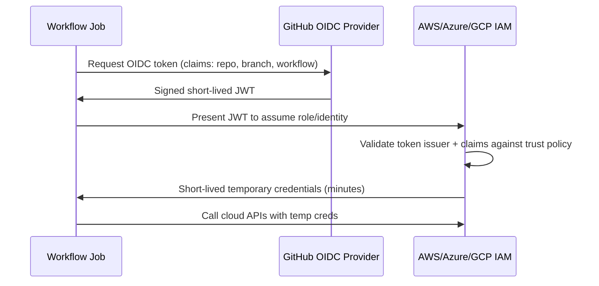

# GitHub Actions — Senior/Lead Interview Guide

Target audience: 10-year .NET full-stack developer jo senior/lead-level interviews ke liye prepare kar raha hai. Yeh assume karta hai ki CI/CD fundamentals already pata hain — focus hai nuance, trade-offs, gotchas, aur interviewer follow-ups par.

## Table of Contents

1. [Core Concepts](#core-concepts)
2. [Workflow Triggers](#workflow-triggers)
3. [Runners](#runners)
4. [Variables, Secrets & Environments](#variables-secrets--environments)
5. [Jobs, Dependencies & Control Flow](#jobs-dependencies--control-flow)
6. [Matrix Builds](#matrix-builds)
7. [Caching & Artifacts](#caching--artifacts)
8. [Reusable Workflows & Composite Actions](#reusable-workflows--composite-actions)
9. [Containers & Custom Actions](#containers--custom-actions)
10. [Deployment Patterns](#deployment-patterns)
11. [Debugging & Local Testing](#debugging--local-testing)
12. [.NET-Specific CI/CD](#net-specific-cicd) `[new content]`
13. [Security & Supply-Chain Hardening](#security--supply-chain-hardening) `[new content]`
14. [OIDC Federation for Cloud Auth](#oidc-federation-for-cloud-auth) `[new content]`
15. [Monorepo & Multi-Project CI Strategies](#monorepo--multi-project-ci-strategies) `[new content]`
16. [Performance & Cost Optimization](#performance--cost-optimization) `[new content]`
17. [GitHub Actions vs Azure DevOps Pipelines](#github-actions-vs-azure-devops-pipelines) `[new content]`
18. [AWS-Native CI/CD Integration Points](#aws-native-cicd-integration-points-gaps) `[gaps]`
19. [Best Practices](#best-practices)
20. [Common Pitfalls](#common-pitfalls)
21. [Sample Interview Q&A](#sample-interview-qa)
22. [Summary of Additions](#summary-of-additions)
23. [Summary of \[gaps\] Additions (This Pass)](#summary-of-gaps-additions-this-pass)

---

## Core Concepts

**GitHub Actions** GitHub ka native CI/CD aur automation platform hai, jo `.github/workflows/` mein stored YAML workflow files se driven hota hai.

### Key building blocks

| Concept | Description |
|---|---|
| **Workflow** | Ek YAML file jo automated process define karti hai. Events se triggered hoti hai. |
| **Job** | Steps ka ek group jo single runner par run hota hai. Jobs by default parallel mein run hote hain; sequencing `needs` ke through control hoti hai. |
| **Step** | Job ke andar ek single task — ya to shell command (`run`) ya reusable action (`uses`). |
| **Action** | Automation ki reusable unit (JavaScript, Docker, ya composite). First-party, community (Marketplace), ya custom ho sakta hai. |
| **Runner** | Compute (VM ya container) jo job execute karta hai. GitHub-hosted ya self-hosted. |

### Workflow lifecycle (event → job → step)



### Basic workflow example

```yaml
name: CI Workflow
on: [push, pull_request]

jobs:
  build:
    runs-on: ubuntu-latest
    steps:
      - name: Checkout Code
        uses: actions/checkout@v4
      - name: Run Tests
        run: npm test
```

> **Note on versions:** original notes mein `actions/checkout@v3`, `actions/cache@v3`, `actions/upload-artifact@v3` throughout use hue hain. 2026 tak inko `@v4` (checkout, upload/download-artifact) ya usse later pe pin karna chahiye — `upload-artifact`/`download-artifact` ka v3 deprecated hai aur GitHub-hosted runners par disabled hai. Yeh guide current versions use karta hai; older notes mein kisi bhi `@v3` reference ko **stale** samjho.

**Interviewer angle:** woh yeh dekhna chahenge ki aapko samajh hai ki *job* isolation ki unit hai (apna VM/container, apna filesystem) jabki *step* uss isolation ke andar sequencing ki unit hai — Jenkins/Azure DevOps ke stage-vs-task models se aane wale logo ke liye yeh ek bahut common trip-up hai.

---

## Workflow Triggers

| Trigger | Use case |
|---|---|
| `push` | Matching branches par commits par run hota hai |
| `pull_request` | PR open/sync/reopen par run hota hai — yeh **merge commit** ke against run hota hai, head commit ke against nahi (gotcha, neeche dekho) |
| `schedule` (cron) | Nightly builds, scheduled jobs |
| `workflow_dispatch` | UI/API se manual trigger, optional typed inputs ke saath |
| `workflow_call` | Workflow ko doosre workflow se reusable/callable banata hai |
| `repository_dispatch` | External system API ke through workflow trigger karta hai |
| `issues`, `release`, etc. | Repo/GitHub-object lifecycle events |

```yaml
on:
  push:
    branches: [main, develop]
    paths-ignore:
      - '**.md'
      - 'docs/**'
  pull_request:
  workflow_dispatch:
  schedule:
    - cron: '0 0 * * *'   # daily at midnight UTC
```

### Manual dispatch

```yaml
on:
  workflow_dispatch:
    inputs:
      environment:
        description: 'Target environment'
        required: true
        default: 'staging'
        type: choice
        options: [staging, production]
```
"Actions" tab se trigger karo, ya automation ke liye `gh workflow run` / REST API ke through.

### Cross-repo triggering

`repository_dispatch` ya `gh` CLI (`gh workflow run workflow.yml --repo other/repo`) doosri repositories mein workflows trigger kar sakte hain, bashart use hone wale token ke paas sufficient permissions ho (ek PAT ya GitHub App token — default `GITHUB_TOKEN` doosre repos mein workflows trigger nahi kar sakta, aur design ke hisaab se yeh *same* repo mein bhi *doosra* workflow run trigger nahi kar sakta, infinite recursion rokne ke liye).

**Gotcha:** fork se aaya `pull_request` **read-only, restricted `GITHUB_TOKEN`** ke saath run hota hai aur **repo secrets ka access nahi** hota — yeh ek deliberate security boundary hai. `pull_request_target` base repo ke context mein run hota hai (full token/secrets) lekin default se *base* ref checkout karta hai, jo misuse hone par classic **pwn request** vector ban jaata hai (dekho [Security & Supply-Chain Hardening](#security--supply-chain-hardening)).

---

## Runners

Ek **runner** woh VM/container hai jo job execute karta hai.

### `[new content]` GitHub-Hosted vs Self-Hosted Runners

| Aspect | GitHub-Hosted | Self-Hosted |
|---|---|---|
| **Maintenance** | Zero — GitHub har job ke liye provision/tear-down karta hai | Aapko OS patch karna, SDKs install karna, capacity manage karni padti hai |
| **Cost model** | Per-minute billing (free tier + overage), OS ke hisaab se multiplier (Linux 1x, Windows 2x, macOS 10x) | Sirf infra cost; GitHub Actions minutes billing se free |
| **Networking** | Sirf public internet, ephemeral IP, default se VPN/private network access nahi | Aapke VPC/on-prem ke andar reh sakta hai, private resources, internal NuGet/npm feeds access kar sakta hai |
| **State** | Fully ephemeral — har run mein clean VM | Default se persistent (danger: caches, leftover secrets, builds ke beech malware persistence — jab tak aap explicitly cleanup na karo ya ephemeral autoscaling use karo, jaise Kubernetes par Actions Runner Controller) |
| **Security surface** | Per-job isolated VM; GitHub patching manage karta hai | Security posture aapki apni zimmedari hai; malicious PR code (`pull_request_target` misuse ke through) internal network access wale infra par execute ho sakta hai — blast radius kaafi zyada |
| **Hardware** | Fixed SKUs (kuch GPU/large runners cost par available) | Jo bhi aap provision karo — bare metal, GPUs, ARM, custom images |
| **Best for** | Zyadatar OSS/standard CI, quick start | Compliance/data-residency needs, large monorepos, licensed software (jaise specific SQL Server editions), private network access, scale par cost control |

**Available GitHub-hosted images:**
- Ubuntu: `ubuntu-latest`, `ubuntu-24.04`, `ubuntu-22.04`
- Windows: `windows-latest`, `windows-2025`, `windows-2022`
- macOS: `macos-latest`, `macos-15`, `macos-14`

> **Note:** original notes mein `ubuntu-20.04` / `windows-2019` / `macos-12` list kiye gaye hain — yeh 2025-2026 tak retired/deprecated ho gaye hain. Current images upar listed hain; hardcoding karne ke bajaye hamesha current support matrix ke liye [actions/runner-images](https://github.com/actions/runner-images) repo check karo (interview ke time exact current defaults verify kar lena, kyunki GitHub `-latest` ko periodically rotate karta hai).

**Self-hosted setup:**
```bash
./config.sh --url <repo-url> --token <runner-token>
./run.sh
```

**Interviewer follow-up:** "Self-hosted runners ko scale kaise karte ho?" → Jawab: autoscaling ephemeral runners ke liye Kubernetes par **Actions Runner Controller (ARC)**, ya cloud-specific autoscaling groups. *Public* repo par kabhi bhi long-lived self-hosted runners run mat karo — koi bhi jo PR open kar sakta hai, workflow trigger abuse ke through aapke infrastructure par potentially arbitrary code execute kar sakta hai.

---

## Variables, Secrets & Environments

### Environment variables

```yaml
env:
  NODE_ENV: production

steps:
  - run: echo "Running in $NODE_ENV mode"
```

### Secrets

**Settings → Secrets and variables → Actions** mein stored hote hain, repo, environment, ya organization level par scoped.

```yaml
env:
  API_KEY: ${{ secrets.MY_SECRET_KEY }}
```

### `env` vs `secrets`

| Feature | `env` variables | `secrets` |
|---|---|---|
| Visibility | Logs mein visible | Logs mein automatically masked/redacted |
| Encryption | Encrypted nahi | Rest mein encrypted, job ke liye sirf runtime par decrypted |
| Scope | Repo/workflow ke liye public | Repository/environment/org ke liye private, access-controlled |
| Typical use | Non-sensitive config (build flags, feature toggles) | API keys, connection strings, credentials, tokens |

**Gotcha:** secret masking printed value par naive string-substring matching hoti hai — yeh secret ko base64-encoded, lines mein split, ya print se pehle transform kiye jaane se **protect nahi karta**. Kabhi bhi secret ko "clever" workaround ki tarah transformation ke through `echo` mat karo; assume karo ki secret ko touch karne wali koi bhi cheez compromised workflow mein potentially exfiltratable hai.

### Environments & approval gates

```yaml
jobs:
  deploy:
    runs-on: ubuntu-latest
    environment: production
    steps:
      - run: ./deploy.sh
```

Environments (Settings → Environments) aapko yeh karne dete hain:
- Secrets ko sirf us environment tak scope karna (jaise prod DB connection string same workflow mein bhi "staging" job ko visible nahi hoti).
- Job proceed karne se pehle designated reviewers se **manual approval** require karna (prod deploy gates ke liye critical).
- Restrict karna ki kaunse branches/tags us environment mein deploy kar sakte hain (**deployment branch policies**).
- Ek wait timer add karna.

Yeh Azure DevOps ke **environments + approvals/checks** ka direct equivalent hai, aur "GitHub Actions mein production deployment ko gate kaise karte ho?" ka standard senior-level jawab hai.

---

## Jobs, Dependencies & Control Flow

### `needs` — job dependencies

```yaml
jobs:
  build:
    runs-on: ubuntu-latest
  test:
    runs-on: ubuntu-latest
    needs: build
  deploy:
    runs-on: ubuntu-latest
    needs: [build, test]
```

`needs` ke bina jobs default se **parallel** mein run hote hain; `needs` ek DAG banata hai. `needs` multiple jobs ko reference kar sakta hai, aur downstream jobs upstream **outputs** consume kar sakte hain (`needs.build.outputs.version`).

### `if` conditionals

```yaml
- name: Run only on main
  if: github.ref == 'refs/heads/main'
  run: echo "Running on main branch"
```

Step **ya** job level par apply hota hai. Common expressions: `github.event_name == 'pull_request'`, `success()`, `failure()`, `always()`, `cancelled()`.

**Gotcha:** agar koi prior step fail ho jaaye, to subsequent steps default se **skip ho jaate hain** jab tak aap explicitly `if: always()` ya `if: failure()` use na karo — "mera cleanup/notification step kyun nahi chala?" jaise bugs ka yeh frequent cause hai.

### Build/Deploy Notifications (Slack & Email)

Notifications wire up karna CI/CD pipeline ke upar sabse common "glue" requests mein se ek hai, aur yeh directly upar ke `if: always()`/`if: failure()` conditionals par depend karta hai — notification step exactly waisa step hai jisko aap upstream failure ke bawajood (ya specifically usi ki wajah se) run karna *chahte* ho.

**Build/deploy status par Slack notification bhejna:**

```yaml
jobs:
  build:
    runs-on: ubuntu-latest
    steps:
      - uses: actions/checkout@v4
      - run: dotnet build

      - name: Notify Slack on success
        if: success()
        uses: rtCamp/action-slack-notify@v2
        env:
          SLACK_WEBHOOK: ${{ secrets.SLACK_WEBHOOK }}
          SLACK_MESSAGE: 'Build completed successfully! :white_check_mark:'
          SLACK_COLOR: good

      - name: Notify Slack on failure
        if: failure()
        uses: rtCamp/action-slack-notify@v2
        env:
          SLACK_WEBHOOK: ${{ secrets.SLACK_WEBHOOK }}
          SLACK_MESSAGE: 'Build failed on ${{ github.ref_name }} — check the run.'
          SLACK_COLOR: danger
```

- `rtCamp/action-slack-notify@v2` (aur similar Marketplace actions) ek repo/environment secret (`SLACK_WEBHOOK`) ke roop mein stored **Slack Incoming Webhook URL** par post karte hain — simple case ke liye koi OAuth app install nahi chahiye, sirf har channel ke liye ek webhook.
- Success/failure ko `if: success()` / `if: failure()` ke saath separate steps mein split karo (ek `if: always()` step ke bajaye) jab aapko har outcome ke liye different messages/colors chahiye ho; `if: always()` sirf tab use karo jab single step ko unconditionally run hona ho aur internally `${{ job.status }}` par branch karna ho.
- **Email** notifications same pattern follow karti hain ek SMTP-based action ke saath, jaise `dawidd6/action-send-mail@v3`, jisko secrets ke through server/credentials diye jaate hain aur same tarah gate kiya jaata hai (`if: failure()` on-call alert ke liye, `if: success()` deploy confirmation ke liye).
- **Reverse direction — Slack *se* workflow trigger karna:** ek Slack bot/slash-command GitHub REST API (ya `gh workflow run`) call kar sakta hai ek `workflow_dispatch` event fire karne ke liye, jo effectively aapko ChatOps deta hai ("`/deploy staging`" Slack mein type karne se ek GitHub Actions run kick off hota hai). Iske liye target repo par `actions: write` wala PAT ya GitHub App token chahiye — `GITHUB_TOKEN` yahan usable nahi hai kyunki call kisi workflow run ke bahar se originate hoti hai.

**Interviewer angle:** woh check kar rahe hain ki aapko pata hai *kahan* coupling point hai — notifications koi special GitHub Actions primitive nahi hain, yeh ordinary steps hain (Marketplace action ya ek `curl`/SMTP call) jo cleanup steps ke liye use hone wale same `if:` conditional logic se gated hote hain, aur `GITHUB_TOKEN` ke bajaye webhook/SMTP secret se driven hote hain.

### Branch/path filters

```yaml
on:
  push:
    branches: [main, develop]
    paths-ignore:
      - '**.md'
      - 'docs/**'
```

### Concurrency control

```yaml
concurrency:
  group: ci-${{ github.ref }}
  cancel-in-progress: true
```
Redundant/overlapping runs ko prevent karta hai (jaise, jab naye commits aayein to stale PR build ko supersede karna). `cancel-in-progress: true` ke bina, `concurrency` cancel karne ke bajaye sirf runs ko serially **queue** karta hai — yeh ek subtlety hai jo mention karna zaruri hai.

### Timeouts and retries

```yaml
jobs:
  build:
    timeout-minutes: 10
```

Core GitHub Actions syntax mein **koi built-in step-level retry** primitive nahi hai. Options:
1. Shell-level retry loop:
   ```yaml
   - run: |
       for i in 1 2 3; do
         your-command && break || sleep 5
       done
   ```
2. Marketplace action: `nick-fields/retry@v3` (zyada clean hai, max attempts/backoff/timeout support karta hai).

### Custom composite/anchor step reuse within a repo

```yaml
steps:
  - name: Common Step
    run: echo "This step is used in multiple jobs"
```
Jobs/workflows ke across true reuse ke liye, steps copy-paste karne ya YAML anchors use karne ke bajaye **composite action** (neeche dekho) prefer karo (YAML anchors Actions schema se officially supported/validated nahi hote aur ek fragile hack hain).

---

## Matrix Builds

```yaml
strategy:
  matrix:
    os: [ubuntu-latest, windows-latest]
    dotnet-version: ['8.0.x', '9.0.x']
  fail-fast: false
runs-on: ${{ matrix.os }}
steps:
  - uses: actions/setup-dotnet@v4
    with:
      dotnet-version: ${{ matrix.dotnet-version }}
```

- Saare matrix dimensions ka **cross-product** separate parallel jobs ki tarah run karta hai (yahan 2 OS × 2 versions = 4 jobs).
- `fail-fast: true` (default) jaise hi ek job fail hota hai baaki saare matrix jobs cancel kar deta hai — usually CI mein aap `false` chahte ho taaki matrix ke across full signal mile, aur `true` sirf tab jab aap runner minutes bachane ke liye fail fast karna chahte ho.
- `max-parallel` yeh throttle karta hai ki kitne matrix jobs concurrently run hote hain (limited self-hosted pool exhaust hone se bachne ke liye useful).
- `include`/`exclude` aapko full cross-product blow-up ke bina one-off combinations add karne ya specific combinations exclude karne dete hain.

**Interviewer angle:** "N separate jobs ke bajaye matrix kyun use karein?" → DRY workflow definition, aur Checks UI matrix results ko ek job name ke andar legibly group kar deta hai per-combination status ke saath — N unrelated jobs se padhna kaafi aasan hai.

---

## Caching & Artifacts

### Caching (speed, not persistence guarantee)

```yaml
- uses: actions/cache@v4
  with:
    path: ~/.nuget/packages
    key: nuget-${{ runner.os }}-${{ hashFiles('**/packages.lock.json') }}
    restore-keys: |
      nuget-${{ runner.os }}-
```

- Cache keyed hoti hai — exact key hit hone par cache restore hoti hai; `restore-keys` fallback **partial** matches provide karta hai (useful hai jab lockfile thoda change hua ho lekin zyadatar packages unchanged hain).
- Ek given key ke liye caches **write hone ke baad immutable** ho jaati hain — aap existing cache entry ko update nahi kar sakte; nayi key chahiye hoti hai (yeh log ko confuse karta hai: "mera cache update kyun nahi ho raha?").
- Caches per repo/branch scoped hoti hain eviction ke saath (10 GB repo-wide soft cap, LRU eviction — current exact limits verify kar lena, GitHub ne inko adjust kiya hai).
- `actions/cache` **best-effort** hai — correctness ke liye kabhi rely mat karo, sirf speed ke liye. Pipeline ko design karo ki full cache miss par bhi correctly kaam kare.

### Artifacts (durable, cross-job data transfer)

```yaml
- uses: actions/upload-artifact@v4
  with:
    name: build-output
    path: ./bin/Release
    retention-days: 7

- uses: actions/download-artifact@v4
  with:
    name: build-output
```

**Important v4 breaking change (common interview gotcha):** `upload-artifact@v4`/`download-artifact@v4` ab *same* artifact name par multiple uploads allow nahi karte (har upload ek naya immutable artifact banata hai) aur v3 se 10x tak faster hain, lekin har matrix leg ke liye distinct names chahiye hote hain — ek common fix hai `name: artifact-${{ matrix.os }}-${{ matrix.dotnet-version }}`. Inn actions ka v3 **deprecated/EOL** hai — notes mein `@v3` ka use update karna chahiye.

**Artifacts vs cache — woh distinction jo interviewers probe karte hain:**

| | Cache | Artifact |
|---|---|---|
| Purpose | Repeated dependency restore speed up karna | Build output ko jobs ke beech pass karna, ya humans/download ke liye preserve karna |
| Lifetime | Best-effort, opportunistically evicted | `retention-days` ke liye guaranteed, UI/API se downloadable |
| Typical content | `node_modules`, NuGet/npm cache, Docker layers | Compiled binaries, test results, logs, coverage reports |

### Long-term storage
`actions/upload-artifact` ki retention capped hai (default 90 days, configurable down); genuinely long-term artifact storage ke liye, iske bajaye package feed (GitHub Packages, NuGet.org, Azure Artifacts) ya blob storage (S3/Azure Blob) mein push karo.

---

## Reusable Workflows & Composite Actions

Yeh interviews mein sabse commonly confused areas mein se ek hai — distinction ekdum clear pata honi chahiye.



| | Reusable Workflow | Composite Action |
|---|---|---|
| File | `on: workflow_call` ke saath `.github/workflows/` ke under `.yml` | `action.yml` (+ optional script files) |
| Granularity | Ek ya zyada **jobs** | Ek job ke andar **steps** ki sequence |
| Runner | Apna `runs-on` define karta hai | Caller ke existing runner par run hota hai |
| Secrets | `secrets:` ke through explicitly pass karna zaruri hai (ya `secrets: inherit`) | Caller ka env/context automatically inherit karta hai |
| Nesting | Doosre reusable workflows ko call kar sakta hai (4 levels deep tak) | Doosre actions ko call kar sakta hai |
| Best for | Ek entire pipeline stage ko standardize karna (jaise "build-test-scan" jo 20 repos use karte hain) | Kuch steps ko standardize karna (jaise "checkout + setup dotnet + restore") |

### Reusable workflow

```yaml
# .github/workflows/deploy.yml
on:
  workflow_call:
    inputs:
      environment:
        required: true
        type: string
    secrets:
      AWS_ACCESS_KEY_ID:
        required: true

jobs:
  deploy:
    runs-on: ubuntu-latest
    steps:
      - run: echo "Deploying to ${{ inputs.environment }}"
```

Ise call karna, cross-repo including:
```yaml
jobs:
  call-workflow:
    uses: my-org/my-repo/.github/workflows/deploy.yml@main
    with:
      environment: production
    secrets:
      AWS_ACCESS_KEY_ID: ${{ secrets.AWS_ACCESS_KEY_ID }}
      # or simply: secrets: inherit
```

### Composite action

```yaml
# action.yml
name: 'Setup and Restore'
runs:
  using: "composite"
  steps:
    - uses: actions/setup-dotnet@v4
      with:
        dotnet-version: '8.0.x'
      shell: bash
    - run: dotnet restore
      shell: bash
```
> **Gotcha:** composite action ke andar har `run` step ko explicitly **`shell:` specify karna zaruri hai** — yeh normal workflow job ki tarah inherit nahi hota.

**Interviewer follow-up:** "Ek ke bajaye doosra kab choose karoge?" → Composite action ek chhota reusable step-sequence ke liye jo bade job ke andar embedded ho (jaise shared setup logic); reusable workflow tab jab aap centralized governance ke saath many repos ke across entire deployment/release process ko standardize karna chahte ho (org security team reusable workflow ko own karti hai, teams sirf usko call karti hain — isse drift kam hota hai aur auditing/patching ek single choke point ban jaata hai).

---

## Containers & Custom Actions

### Running a job inside a container

```yaml
jobs:
  docker-job:
    runs-on: ubuntu-latest
    container:
      image: mcr.microsoft.com/dotnet/sdk:8.0
    steps:
      - run: dotnet --version
```
Runner image se independent exact toolchain versions ko pin karne ke liye, ya production containers se match karta hermetic build environment use karne ke liye useful hai.

### Custom actions — three flavors

| Type | Runtime | Use case |
|---|---|---|
| **Docker container action** | Koi bhi language, container ki tarah packaged | Full control, heavier/slower startup, mostly sirf Linux runners par kaam karta hai |
| **JavaScript/TypeScript action** | Node.js (current major versions ke hisaab se `node20` runtime) | Fastest startup, cross-platform, zyadatar Marketplace actions isi ko use karte hain |
| **Composite action** | Existing actions/shell steps ko orchestrate karta hai | Koi compilation nahi, author/maintain karna sabse easy |

```yaml
# action.yml (JS action skeleton)
name: 'My Custom Action'
inputs:
  who-to-greet:
    required: true
runs:
  using: 'node20'
  main: 'dist/index.js'
```

---

## Deployment Patterns

### Multi-stage deployment (dev → staging → prod)

```yaml
jobs:
  deploy-dev:
    environment: dev
    runs-on: ubuntu-latest
    steps: [ ... ]
  deploy-staging:
    needs: deploy-dev
    environment: staging
    runs-on: ubuntu-latest
    steps: [ ... ]
  deploy-prod:
    needs: deploy-staging
    environment: production   # gated by required reviewers
    runs-on: ubuntu-latest
    steps: [ ... ]
```

### Cloud deployment example (AWS)

```yaml
- uses: aws-actions/configure-aws-credentials@v4
  with:
    aws-access-key-id: ${{ secrets.AWS_ACCESS_KEY_ID }}
    aws-secret-access-key: ${{ secrets.AWS_SECRET_ACCESS_KEY }}
    aws-region: us-east-1
- run: aws s3 sync ./build s3://my-bucket
```
> **Senior-level flag:** secrets ki tarah long-lived AWS access keys use karna *legacy* pattern hai. Current best practice hai **OIDC federation** — bilkul koi static credentials store nahi hote (neeche wala dedicated section dekho). Interview mein yeh proactively mention karo; isse current knowledge signal hota hai.

### IaC deployments

```yaml
- name: Deploy with Terraform
  run: terraform apply -auto-approve
```
Same principle Azure (`azure/login@v2` OIDC ke saath) ya GCP (`google-github-actions/auth`) ke liye bhi apply hota hai — jahan OIDC available hai wahan static service principal secrets avoid karo.

### Repository/status badges

```markdown

```

---

## Debugging & Local Testing

### Debugging a failed run

- **Debug logging** ke saath re-run karo: repo secrets `ACTIONS_STEP_DEBUG=true` aur `ACTIONS_RUNNER_DEBUG=true` set karo, ya UI mein "Re-run with debug logging" option use karo.
- Interactive debugging ke liye mid-failure live runner mein SSH karne ke liye `tmate` (`mxschmitt/action-tmate`) use karo — flaky/self-hosted-runner-specific issues ke liye bahut useful hai.
- Ek debug step mein dump karke `${{ toJSON(github) }}` / `${{ toJSON(steps) }}` context inspect karo, taaki exactly pata chale kaunse values available thi.

> **Note:** original notes mein `actions/setup-debugging` ka reference hai — aisa koi official action exist nahi karta (verify kar lena — source notes mein likely ek misremembered/hallucinated name hai, ya kisi community action se confuse kiya gaya hai). Correct, current jawab upar wala debug-logging secrets aur/ya `tmate` approach hai.

### Running Actions locally

```bash
act -j build
```
[`nektos/act`](https://github.com/nektos/act) GitHub par push/wait kiye bina fast iteration ke liye workflows ko locally Docker mein run karta hai. Limitations: GitHub-hosted runner images ko perfectly emulate nahi karta, kuch contexts (`secrets`, kuch `github.*` fields) ko manual stubbing chahiye hoti hai, aur GitHub-specific features (environments/approvals) simulate nahi hote.

---

## .NET-Specific CI/CD

### `[new content]` Idiomatic .NET Build/Test/Publish Pipeline

Ek realistic senior-level .NET CI workflow, jisme woh pieces hain jo interviewers actually probe karte hain (multi-TFM builds, test result publishing, coverage, NuGet caching, versioning):

```yaml
name: .NET CI

on:
  push:
    branches: [main]
  pull_request:

jobs:
  build-test:
    runs-on: ubuntu-latest
    steps:
      - uses: actions/checkout@v4
        with:
          fetch-depth: 0   # needed for tools like GitVersion / Nerdbank.GitVersioning

      - uses: actions/setup-dotnet@v4
        with:
          dotnet-version: '8.0.x'

      - name: Cache NuGet packages
        uses: actions/cache@v4
        with:
          path: ~/.nuget/packages
          key: nuget-${{ runner.os }}-${{ hashFiles('**/packages.lock.json') }}
          restore-keys: nuget-${{ runner.os }}-

      - name: Restore
        run: dotnet restore --locked-mode

      - name: Build
        run: dotnet build --configuration Release --no-restore

      - name: Test
        run: >
          dotnet test --configuration Release --no-build
          --logger "trx;LogFileName=test-results.trx"
          --collect:"XPlat Code Coverage"

      - name: Publish test results
        uses: dorny/test-reporter@v1
        if: always()
        with:
          name: Test Results
          path: '**/test-results.trx'
          reporter: dotnet-trx

      - name: Publish
        run: dotnet publish ./src/MyApp/MyApp.csproj -c Release -o ./publish

      - uses: actions/upload-artifact@v4
        with:
          name: webapp
          path: ./publish
```

Key points jo interviewer sunna chahta hai:
- **`packages.lock.json` + `--locked-mode`**: deterministic restore enable karta hai aur cache key ko ek exact, reproducible hash par base hone deta hai — lock file ke bina, `hashFiles('**/*.csproj')` ek weaker proxy hai aur transitive dependency drift miss kar sakta hai.
- **`fetch-depth: 0`**: shallow clone (default `fetch-depth: 1`) un tools ko break kar deta hai jinko full git history chahiye (GitVersion, Nerdbank.GitVersioning, `git describe`-based versioning).
- **`--no-restore` / `--no-build`**: `restore` → `build` → `test` steps ke across redundant work avoid karta hai.
- **Test result publishing**: `.trx` files GitHub se natively render nahi hoti — `dorny/test-reporter`, `EnricoMi/publish-unit-test-result-action`, ya artifact + external tool ke roop mein upload chahiye hota hai.
- **Coverage**: `--collect:"XPlat Code Coverage"` Cobertura XML emit karta hai; visualization aur PR-level coverage-diff gating ke liye `danielpalme/ReportGenerator-GitHub-Action` ke saath combine karo ya Codecov/SonarCloud par upload karo.

### `[new content]` Versioning & Semantic Release for .NET

- **GitVersion** ya **Nerdbank.GitVersioning (nbgv)**: git history/tags se automatically SemVer version derive karte hain, `.csproj` mein manual version bumps avoid karte hue. Typically ek early workflow step ki tarah run hota hai, computed version ko job output ki tarah expose karta hai jo baad ke `dotnet build -p:Version=...` aur container-tag steps consume karte hain.
- **MinVer**: lighter-weight alternative, purely tag-based.
- Container images aur NuGet packages ko *same* computed value se tag/version karna chahiye taaki deployed artifact aur uske exact commit ke beech traceability bani rahe.

### `[new content]` Containerized .NET Apps — Build & Push

```yaml
- uses: docker/setup-buildx-action@v3
- uses: docker/login-action@v3
  with:
    registry: ghcr.io
    username: ${{ github.actor }}
    password: ${{ secrets.GITHUB_TOKEN }}
- uses: docker/build-push-action@v6
  with:
    context: .
    push: true
    tags: ghcr.io/my-org/my-app:${{ github.sha }}
    cache-from: type=gha
    cache-to: type=gha,mode=max
```
`cache-from`/`cache-to: type=gha` Docker layer caching ke liye Actions cache backend use karta hai — har run mein har layer rebuild karne se meaningfully faster hai, aur manually `/var/lib/docker` cache karne ka modern replacement hai.

---

## Security & Supply-Chain Hardening

### `[new content]` Pwn Requests and `pull_request_target` Risk

Abhi GitHub Actions ke liye sabse zyada tested senior security topic:

- Fork se aane wala `pull_request`: **read-only token aur koi secrets nahi** ke saath run hota hai — default se safe hai chahe PR mein malicious code ho, kyunki yeh koi sensitive cheez exfiltrate nahi kar sakta.
- `pull_request_target`: **base repo ke token aur full secrets access** ke saath run hota hai, lekin default se **base** branch checkout karta hai — safe hai *jab tak* workflow explicitly PR ke head ref (`github.event.pull_request.head.sha`) ko checkout aur execute na kare, ya kisi aur tarah attacker-controlled code run na kare (jaise `npm install` fork ke `package.json` se ek malicious `postinstall` script trigger kare, ya checked-out PR code se koi Makefile/script invoke kare). Yeh combination — privileged token + untrusted code execute karna — exactly wahi **"pwn request"** vulnerability class hai jiske baare mein GitHub ne advisories publish ki hain.
- **Mitigation:** `pull_request_target` (ya `workflow_run`) ko kabhi bhi untrusted head content ke checkout ke saath combine mat karo jab tak aapne deliberately isolate na kiya ho ki kya run hota hai; agar aapko fork PRs ko kisi elevated capability ke saath build/test karna hai, to do workflows mein split karo — ek unprivileged `pull_request` build/test job, aur ek separate, manually-gated ya `workflow_run`-triggered job jo privileged kaam ke liye sirf vetted **artifacts** (source nahi) re-use kare.

### `[new content]` Pinning Actions to Commit SHAs

- `uses: actions/checkout@v4` ek mutable tag resolve karta hai — agar kabhi woh tag move ho jaaye (compromised publisher, ya publisher naya v4 tag force-push kare), to aapka workflow next run par silently different code run karega. Yeh ek real supply-chain attack surface hai (2024 wala `tj-actions/changed-files` aur uske jaise tools dekho jo compromised hue the).
- Kisi bhi security-sensitive cheez ke liye best practice: readability ke liye version comment ke saath ek **full commit SHA** par pin karo:
  ```yaml
  - uses: actions/checkout@11bd71901bbe5b1630ceea73d27597364c9af683 # v4.2.2
  ```
- Dependabot aur `pinact` jaise tools SHA-pinned actions ko pin rakhte hue auto-update kar sakte hain.

### `[new content]` `GITHUB_TOKEN` Least Privilege

- `GITHUB_TOKEN` ke liye default `permissions` classic repos ke liye broad hoti thi (zyadatar scopes par `write`); naye repos default se **read-only** hote hain, lekin aapko default par kabhi rely nahi karna chahiye — workflow ya job level par `permissions` explicitly declare karo:
  ```yaml
  permissions:
    contents: read
    pull-requests: write   # only if the job actually comments/labels PRs
  ```
- Interview mein point out karne ke liye yeh single highest-leverage, lowest-effort security control hai — defaults accept karne ke bajaye har workflow par least-privilege `permissions:` blocks set karo.

### `[new content]` Third-Party Action Vetting

- **GitHub, verified creators, ya vendors jinpe aap already trust karte ho** (`aws-actions/*`, `docker/*`, `azure/*`) ke publish kiye hue actions prefer karo.
- Kisi aur ke liye, source review karo, SHA par pin karo, aur agar business-critical hai to internal org action mein mirror karne ka consider karo — kisi unaudited third-party script par runtime dependency mat lo jo aapke secrets ke access ke saath execute ho.
- **CodeQL** / **Dependabot** / **Scorecard** (`ossf/scorecard-action`) ko workflows mein wire kiya ja sakta hai taaki repo ke apne supply-chain risk ko continuously assess kiya ja sake.

### `[new content]` Environment Protection Rules as a Security Control

Environments sirf approvals ke liye nahi hote — yeh aapko scope karne dete hain ki given job context mein bilkul kaunse secrets exist karte hain, matlab ek `dev` environment target karne wala compromised/malicious PR workflow `production` secrets simply read nahi kar sakta, kyunki woh us job ke context mein bilkul inject hi nahi hote. Yeh sirf `if` conditions par rely karne se zyada strong boundary hai.

---

## OIDC Federation for Cloud Auth

### `[new content]` Why OIDC Replaces Long-Lived Cloud Secrets

Purana pattern (abhi bhi many legacy pipelines mein hai, including is guide ke earlier wala AWS example) ek long-lived `AWS_ACCESS_KEY_ID`/`AWS_SECRET_ACCESS_KEY` (ya Azure Service Principal secret) ko GitHub secret ki tarah store karta hai. Problems:
- Static credentials leak risk — agar exfiltrate ho jaayein, to manually rotate/revoke hone tak valid rehte hain.
- Koi natural expiry nahi, single workflow run tak koi scoping nahi.
- Rotation ek manual, often-neglected operational burden hai.

**OIDC (OpenID Connect) federation** GitHub Actions ko GitHub ke OIDC provider se ek short-lived, cryptographically-signed identity token request karne deta hai, jisko cloud provider trust karta hai (ek pre-configured trust relationship ke through) sirf us job run ke liye temporary, scoped credentials mint karne ke liye. Kahin bhi koi static secret store nahi hota.



### Example: AWS via OIDC (no static keys)

```yaml
permissions:
  id-token: write   # required for OIDC
  contents: read

jobs:
  deploy:
    runs-on: ubuntu-latest
    steps:
      - uses: aws-actions/configure-aws-credentials@v4
        with:
          role-to-assume: arn:aws:iam::123456789012:role/github-actions-deploy
          aws-region: us-east-1
      - run: aws s3 sync ./build s3://my-bucket
```

IAM role ki trust policy restrict karti hai ki *kaunsa* repo/branch/environment usko assume kar sakta hai, claims jaise `token.actions.githubusercontent.com:sub == "repo:my-org/my-repo:ref:refs/heads/main"` use karke — matlab chahe workflow compromised ho jaaye, yeh sirf usi exact repo/branch context se role ko impersonate kar sakta hai.

### Azure equivalent

```yaml
permissions:
  id-token: write
  contents: read
steps:
  - uses: azure/login@v2
    with:
      client-id: ${{ secrets.AZURE_CLIENT_ID }}
      tenant-id: ${{ secrets.AZURE_TENANT_ID }}
      subscription-id: ${{ secrets.AZURE_SUBSCRIPTION_ID }}
      # no client-secret — federated credential configured on the App Registration
```

**Interviewer follow-up:** "Yahan client secret nahi hai to secret ki tarah kya store hota hai?" → Sirf non-sensitive identifiers (client ID, tenant ID, subscription ID) — inme se koi bhi akela access grant nahi karta jab tak OIDC trust relationship bhi repo/branch claims match na kare.

---

## Monorepo & Multi-Project CI Strategies

### `[new content]` Change-Detection-Based Selective Builds

Ek monorepo mein (jaise, ek repo mein multiple .NET services + ek frontend), har push par *entire* pipeline run karna runner minutes waste karta hai aur feedback slow kar deta hai. Standard senior-level pattern:

```yaml
jobs:
  changes:
    runs-on: ubuntu-latest
    outputs:
      api: ${{ steps.filter.outputs.api }}
      frontend: ${{ steps.filter.outputs.frontend }}
    steps:
      - uses: dorny/paths-filter@v3
        id: filter
        with:
          filters: |
            api:
              - 'src/Api/**'
            frontend:
              - 'src/Frontend/**'

  build-api:
    needs: changes
    if: needs.changes.outputs.api == 'true'
    runs-on: ubuntu-latest
    steps: [ ... ]

  build-frontend:
    needs: changes
    if: needs.changes.outputs.frontend == 'true'
    runs-on: ubuntu-latest
    steps: [ ... ]
```

Yeh Azure DevOps ke `paths` trigger filters ya Bazel/Nx-style affected-project detection ka GitHub Actions equivalent hai, aur agar role mein monorepo involve hai to yeh near-guaranteed interview question hai.

### `[new content]` Nx/Turborepo-Aware CI

Polyglot ya JS-heavy monorepos ke liye, **Nx** aur **Turborepo** jaise tools dependency graph compute karte hain aur ek "affected" command expose karte hain (`nx affected`, `turbo run build --filter=...[origin/main]`) jo sirf path filters se zyada accurate hai, kyunki yeh *code* dependencies samajhta hai, sirf directory boundaries nahi. Un .NET-heavy shops mein bhi increasingly relevant hai jinke paas JS frontend ke saath mixed-stack monorepo hai.

### Reusable workflows as the monorepo governance mechanism

Path-filtering ko har "project type" ke liye ek shared reusable workflow ke saath combine karo (jaise ek `dotnet-build-test.yml` reusable workflow jo har service ke job se call hoti ho) taaki build/test/security logic centrally maintained rahe chahe har service independently trigger ho.

---

## Performance & Cost Optimization

### `[new content]` Where Runner Minutes Actually Go

- **Runner OS multiplier**: GitHub-hosted billing par Windows runners Linux minutes se 2x cost karte hain, macOS 10x. Jab tak aapko specifically Windows/macOS na chahiye ho (jaise full .NET Framework, ya iOS/macOS builds) Linux ko default rakho — "hamara CI bill kaise reduce karoge" wale question ke liye ek bahut concrete, quantifiable jawab.
- **Concurrency + `cancel-in-progress`**: superseded commits par minutes burn hona rok deta hai.
- **Caching** (NuGet/npm/Docker layers) restore/build time kaat deti hai, often single biggest lever hai.
- Parallel runner slots waste hone se bachne ke liye **Matrix `fail-fast` aur `max-parallel`** tuning.
- Monorepos mein **Path filters / change detection** (upar wala) unrelated pipelines ko entirely run hone se avoid karta hai.
- High-volume, predictable workloads ke liye **Self-hosted runners** — cost crossover point org ke minute consumption vs. infra/ops cost par depend karta hai; ek senior jawab yeh acknowledge karta hai ki yeh ek build-vs-buy calculation hai, koi default nahi.
- **Larger/faster hosted runners** (GitHub premium par bigger SKUs offer karta hai) default 2-core runners se *in aggregate* cheaper ho sakte hain agar woh CPU-bound builds par wall-clock time meaningfully kaat dein — default sabse cheap hai yeh assume karne ke bajaye benchmark karna better hai.

### `[new content]` Workflow-Level Timeout Hygiene

Hamesha job level par `timeout-minutes` set karo (sirf platform ke 6 hours wale default par rely mat karo) — ghanton tak silently runner minutes burn karta hua hung test/process ek common real-world cost leak hai, aur "hum har jagah aggressive timeouts set karte hain" cite karne ke liye ek achhi concrete practice hai.

---

## GitHub Actions vs Azure DevOps Pipelines

### `[new content]` Comparison Table

.NET-heavy audience ko dekhte hue, yeh comparison aane ka chance extremely zyada hai (many senior .NET shops Azure DevOps se GitHub par migrate kar rahe hain, ya dono run karte hain).

| Aspect | GitHub Actions | Azure DevOps Pipelines |
|---|---|---|
| **Config format** | `.github/workflows/` mein YAML | YAML (`azure-pipelines.yml`) ya classic UI-based pipelines |
| **Unit of isolation** | Job (apna VM/container) | Stage → Job → Task hierarchy (extra nesting level) |
| **Reusability** | Reusable workflows (`workflow_call`) + composite actions | Templates (`extends`, `template` includes) |
| **Marketplace** | GitHub Marketplace, bahut bada community ecosystem, JS/Docker/composite actions | Azure DevOps Marketplace, chhota, zyada enterprise/ALM-focused extensions |
| **Approvals/Gates** | Environments + required reviewers | Environments + approvals & checks (bahut similar model) |
| **Secrets** | Repo/Env/Org-scoped secrets | Variable groups, Key Vault-linked variable groups (arguably zyada mature Key Vault integration) |
| **Self-hosted compute** | Self-hosted runners | Self-hosted agents (same concept, different naam) |
| **Cloud-native auth** | OIDC federation (AWS/Azure/GCP) | Workload identity federation (equivalent concept, mature Azure integration) |
| **Native repo integration** | GitHub ke saath deeply integrated (Checks API, PR status, Issues) | Azure Repos ke saath paired hone par best; GitHub repos ke saath bhi usable, lekin kam native |
| **Boards/work item integration** | GitHub Projects/Issues (lighter-weight) | Azure Boards (heavier, zyada enterprise PM-oriented) |
| **Pricing model** | Per-minute + OS multiplier, public repos ke liye generous free tier | Per-parallel-job licensing model, different free tier shape |
| **Typical migration driver** | Org GitHub par source control ke liye consolidate kar rahi hai + ek single tool chahti hai | Org ko deeper enterprise ALM chahiye (Boards, Test Plans, zyada mature RBAC) ya Azure-only ecosystem lock-in |

**Interviewer angle:** agar org Azure DevOps se migrate ho rahi hai, to pata hona chahiye ki zyadatar concepts ka ek direct analog hota hai (stage→job, agent→runner, variable group→environment/secret, template→reusable workflow) — migration largely mechanical translation hai plus security ko re-think karna (OIDC, `permissions:` blocks) kyunki GitHub ka default security posture aur Azure DevOps ka meaningfully different hai.

---

## AWS-Native CI/CD Integration Points `[gaps]`

Upar wala OIDC Federation section general OIDC mechanism cover karta hai aur ek minimal AWS example dikhata hai. Yeh section un AWS-specific mechanics ko fill karta hai jo interviewer expect karta hai jab target cloud AWS ho — concrete action, IAM trust policy ka shape, aur artifacts/caching kaise ek generic `s3 sync` ke bajaye AWS deployment target (ECS/Lambda) se connect hote hain.

### `[gaps]` `aws-actions/configure-aws-credentials` in Depth

`aws-actions/configure-aws-credentials` ek job mein AWS credentials laane ke liye de facto standard action hai — yeh legacy static-key pattern aur current OIDC pattern dono support karta hai, aur yeh important hai ki aap exactly bata sako ki yeh under the hood kya karta hai:

```yaml
permissions:
  id-token: write   # required — this is what lets the job request an OIDC token at all
  contents: read

jobs:
  deploy:
    runs-on: ubuntu-latest
    steps:
      - uses: actions/checkout@v4

      - uses: aws-actions/configure-aws-credentials@v4
        with:
          role-to-assume: arn:aws:iam::123456789012:role/github-actions-ecs-deploy
          aws-region: us-east-1
          role-session-name: gha-${{ github.run_id }}   # traceable in CloudTrail

      - run: aws sts get-caller-identity   # sanity check — confirms the assumed role
```

What actually happens: action GitHub ke OIDC provider ko call karta hai ek signed JWT ke liye (calling repo/workflow/ref ke liye scoped), phir woh JWT pass karte hue AWS STS `AssumeRoleWithWebIdentity` call karta hai. AWS us JWT ki signature ko IAM mein registered OIDC provider ke against validate karta hai, trust policy ki conditions ko JWT ke claims ke against check karta hai, aur — agar match ho jaaye — short-lived (default 1 hour, configurable) temporary credentials return karta hai, jinko action phir job ke har subsequent step ke liye environment variables (`AWS_ACCESS_KEY_ID`, `AWS_SECRET_ACCESS_KEY`, `AWS_SESSION_TOKEN`) ki tarah export kar deta hai.

### `[gaps]` IAM OIDC Provider and Role Trust Policy Setup

Kisi bhi workflow ke OIDC ke through role assume karne se pehle AWS-side configuration ke do pieces chahiye hote hain — interviewers expect karte hain ki aapko dono pata ho, sirf GitHub YAML side nahi:

**1. GitHub ke OIDC provider ko IAM mein register karo** (one-time, per AWS account) — ya to console ke through, ya code ki tarah (Terraform, kyunki yeh candidate ka actual IaC tool hai):

```hcl
resource "aws_iam_openid_connect_provider" "github_actions" {
  url             = "https://token.actions.githubusercontent.com"
  client_id_list  = ["sts.amazonaws.com"]
  thumbprint_list = []  # AWS validates via its own trusted CA bundle for this provider; thumbprint no longer required for GitHub's OIDC endpoint (verify current guidance in the AWS provider docs at the time you provision this — this requirement has relaxed over time)
}
```

**2. Exact repo/branch/environment tak scoped trust policy ke saath IAM role create karo** — yeh woh control hai jo workflow compromised hone par blast radius limit karta hai:

```hcl
resource "aws_iam_role" "github_actions_ecs_deploy" {
  name = "github-actions-ecs-deploy"

  assume_role_policy = jsonencode({
    Version = "2012-10-17"
    Statement = [{
      Effect    = "Allow"
      Principal = { Federated = aws_iam_openid_connect_provider.github_actions.arn }
      Action    = "sts:AssumeRoleWithWebIdentity"
      Condition = {
        StringEquals = {
          "token.actions.githubusercontent.com:aud" = "sts.amazonaws.com"
        }
        StringLike = {
          "token.actions.githubusercontent.com:sub" = "repo:my-org/my-repo:ref:refs/heads/main"
          # or, scoped to a GitHub Environment instead of a branch:
          # "token.actions.githubusercontent.com:sub" = "repo:my-org/my-repo:environment:production"
        }
      }
    }]
  })
}
```

**Expect karne wala Interviewer follow-up:** "Agar yeh workflow compromised ho jaaye to blast radius kya hoga?" — Sirf woh jo attached IAM *permissions* policy allow karti hai, aur sirf `sub` claim mein match hue exact repo/ref/environment se — feature branch par ek workflow `ref:refs/heads/main` tak trust-scoped role ko assume nahi kar sakta, chahe stolen `GITHUB_TOKEN` ke saath bhi, kyunki OIDC claims GitHub ke through server-side generate hote hain aur workflow code se forge nahi kiye ja sakte.

**Gotcha:** `aud` (audience) claim ko hamesha `sub` ke saath check karna chahiye (`sts.amazonaws.com`) — sirf `sub` check karna aur `aud` pin na karna ek real (thoda narrower) hardening gap hai jo kuch example configs skip kar dete hain.

### `[gaps]` Artifacts/Caching Tying Into an AWS Deploy Target (ECS/Lambda)

Upar wala Caching & Artifacts section generic mechanics cover karta hai; yeh dekho ki yeh generic S3 sync ke bajaye AWS-native compute se concretely kaise connect hote hain:

**Ek containerized .NET service ko ECS par deploy karna:**
```yaml
jobs:
  build-and-push:
    runs-on: ubuntu-latest
    permissions:
      id-token: write
      contents: read
    steps:
      - uses: actions/checkout@v4
      - uses: aws-actions/configure-aws-credentials@v4
        with:
          role-to-assume: arn:aws:iam::123456789012:role/github-actions-ecs-deploy
          aws-region: us-east-1
      - uses: aws-actions/amazon-ecr-login@v2
        id: ecr-login
      - uses: docker/build-push-action@v6
        with:
          context: .
          push: true
          tags: ${{ steps.ecr-login.outputs.registry }}/order-api:${{ github.sha }}
          cache-from: type=gha
          cache-to: type=gha,mode=max
      - name: Render new ECS task definition
        id: task-def
        uses: aws-actions/amazon-ecs-render-task-definition@v1
        with:
          task-definition: ecs-task-def.json
          container-name: order-api
          image: ${{ steps.ecr-login.outputs.registry }}/order-api:${{ github.sha }}
      - name: Deploy to ECS
        uses: aws-actions/amazon-ecs-deploy-task-definition@v2
        with:
          task-definition: ${{ steps.task-def.outputs.task-definition }}
          service: order-api-service
          cluster: order-api-cluster
          wait-for-service-stability: true
```
Same `type=gha` layer cache jo iss guide mein doosri jagah GHCR-based .NET container builds ke liye use hota hai, waisa hi kaam karta hai jab target registry ECR ho — cache backend Actions cache service hi hoti hai, chahe built image kahin bhi push ho.

**Ek .NET Lambda deploy karna (jaise, AWS Lambda .NET tooling ke through ya container-image Lambda):**
```yaml
      - name: Publish Lambda package
        run: dotnet lambda package -pl ./src/MyFunction -o ./publish/function.zip

      - uses: actions/upload-artifact@v4     # durable handoff to a separate deploy job, or for audit/rollback
        with:
          name: lambda-package
          path: ./publish/function.zip

      - name: Deploy to Lambda
        run: |
          aws lambda update-function-code \
            --function-name order-processor \
            --zip-file fileb://./publish/function.zip
```
Yahan **artifact** (cache nahi) correct primitive hai — zip actual deployable unit hai jo build job se deploy job ko handover ki jaa rahi hai (ya rollback/audit ke liye retained hai), jo exactly wahi artifacts-vs-cache distinction hai jo Caching & Artifacts section draw karta hai: cache *build* ko accelerate karta hai, artifacts *jo actually ship karte ho* usko carry karte hain. NuGet restore caching (`actions/cache` `packages.lock.json` par keyed) still is step se upstream apply hoti hai `dotnet lambda package` ko khud speed up karne ke liye.

**Interviewer angle:** explicitly bolne ke liye ready raho ki ECS deploys usually image-based hote hain (ek baar build karo, ECR par push karo, task definition update karo, ECS ko rolling/blue-green rollout handle karne do — Deployment Strategies guide mein AWS CodeDeploy content dekho), jabki Lambda deploys typically artifact-based hote hain (zip ya container image directly Lambda API/SDK ke through push kiya jaata hai, often Terraform/CDKTF se orchestrated hota hai raw `aws lambda update-function-code` ke bajaye kisi bhi quick example se aage), yeh jaan lena ki kaunsa primitive (image vs. zip artifact) kaunse compute target ke liye fit karta hai, yahan AWS fluency ka actual signal hai.

---

## Best Practices

- Action versions pin karo (ideally security-sensitive kisi bhi cheez ke liye commit SHA par; minimum ek major version tag, kabhi `@main`/`@master` nahi).
- Har workflow par explicit least-privilege `permissions:` blocks set karo.
- Kisi bhi production deployment gate ke liye required reviewers ke saath `environments` use karo.
- Jahan bhi cloud provider support kare, long-lived cloud credentials ke bajaye OIDC federation prefer karo.
- Superseded runs par minutes waste hone se bachne ke liye `concurrency` + `cancel-in-progress` use karo.
- Aggressively cache karo (NuGet/npm/Docker layers) lekin correctness ke liye kabhi cache par depend mat karo.
- Repos ke across copy-paste karne ke bajaye shared CI logic ko reusable workflows/composite actions mein centralize karo.
- Unnecessary full-repo builds avoid karne ke liye monorepos mein path filters / change detection use karo.
- Har jagah sensible `timeout-minutes` ke saath fail fast karo.
- Pwn-request exposure avoid karne ke liye "build untrusted PR code" (unprivileged) ko "run privileged deployment logic" (trusted, gated) se separate workflows mein split karo.
- Application dependencies aur pinned Action SHAs dono ko current rakhne ke liye Dependabot use karo.

---

## Common Pitfalls

- Yeh assume karna ki `GITHUB_TOKEN` ke paas default se full permissions hoti hain — modern defaults zyada restrictive hote hain, lekin kisi bhi taraf assume mat karo; explicitly declare karo.
- `pull_request_target` ko PR head ke checkout ke saath combine karna — classic pwn-request vulnerability.
- Pure speed-up ke bajaye correctness ke liye `actions/cache` par rely karna.
- Composite action ke `run` steps mein `shell:` bhool jaana.
- Jab actually full matrix signal chahiye ho tab `fail-fast: false` set na karna.
- Yeh believe karna ki sirf `concurrency` stale runs cancel kar deta hai — yeh sirf `cancel-in-progress: true` ke saath hi karta hai.
- Deprecated `actions/checkout@v3`, `upload-artifact@v3`/`download-artifact@v3` use karna — yeh retired/sunset ho rahe hain; v4+ use karo.
- v4 semantics ke under multiple matrix legs ko ek artifact name par upload karna (ab disallowed hai) — har leg ke liye unique names use karna zaruri hai.
- Secret masking ko determined exfiltration ke against ek real security boundary maan lena (encoding/splitting naive log redaction ko bypass kar deta hai).
- Jab step ko full git history chahiye ho tab `fetch-depth: 0` bhool jaana (versioning tools, `git log`-based changelogs).
- Public repos par long-lived, non-ephemeral self-hosted runners — ek significant attack surface.

---

## Sample Interview Q&A

**Q: Mujhe end-to-end batao ki jab ek developer PR open karta hai, trigger se merge tak, ek well-designed GitHub Actions setup mein .NET service ke liye kya hota hai.**
A: PR opened → `pull_request` event ek restricted, secret-less token ke saath fire hota hai → build/test/lint jobs jahan possible ho parallel mein run hote hain, agar zaruri ho to relevant TFMs/OS ke across matrix ke saath → NuGet cache lockfile hash se restore hota hai → `dotnet build`/`dotnet test` run hote hain, results ek TRX-aware reporter ke through PR checks ki tarah publish hote hain → success hone par, artifacts (build output, coverage report) upload hote hain → branch protection merge se pehle inn checks ka green hona require karti hai → main mein merge hone se ek separate `push`-triggered workflow trigger hota hai jo trusted deployment path run karta hai (potentially ek reusable workflow ke through), production ke liye manual approval require karne wale ek `environment` se gated, static secrets ke bajaye cloud deploy role assume karne ke liye OIDC use karte hue.

**Q: Aapka GitHub Actions bill bahut zyada hai — mujhe batao ki developer velocity ko hurt kiye bina aap ise kaise reduce karoge.**
A: Pehle instrument karo — identify karo ki kaunse workflows/jobs sabse zyada minutes consume karte hain (Actions usage reports). Phir: jahan feasible ho waha unnecessary Windows/macOS runners ko Linux par switch karo (sabse bada per-minute multiplier lever); stale superseded runs kill karne ke liye `concurrency`+`cancel-in-progress` add karo; NuGet aur Docker layer caching add/verify karo; monorepos mein path-based change detection add karo taaki unrelated services rebuild na hon; hangs pakadne ke liye `timeout-minutes` tighten karo; agar infra/ops cost aggregate GitHub-hosted minute cost se kam hai to highest-volume, most predictable workloads ke liye self-hosted runners evaluate karo; larger runner SKUs sirf wahan consider karo jahan benchmarking net wall-clock/cost improvement dikhaye.

**Q: Cloud credentials ko GitHub secrets ki tarah store kiye bina aap AWS/Azure par securely deploy kaise karte ho?**
A: OIDC federation — GitHub ke OIDC provider aur ek IAM role (AWS) ya federated credential (Azure App Registration) ke beech ek trust relationship configure karo, jo claims ke through specific repo/branch/environment tak scoped ho. Workflow `id-token: write` permission request karta hai, ek short-lived signed token ko us single job run tak scoped temporary cloud credentials se exchange karta hai, aur system mein kahin bhi koi static secret exist nahi karta.

**Q: Reusable workflow aur composite action ke beech kya difference hai, aur aap decide kaise karte ho ki kaunsa use karna hai?**
A: Reusable workflow = ek ya zyada full jobs, apna runner, `workflow_call` se invoked, secrets explicitly pass karne zaruri hain (ya `inherit`); central governance ke saath many repos ke across ek entire pipeline stage ko standardize karne ke liye achha hai. Composite action = *caller* ke existing job/runner ke andar execute hone wale steps ki ek sequence, `action.yml` mein defined; otherwise-different jobs ke andar embedded smaller shared step sequences (jaise standard checkout+setup+restore) ke liye achha hai.

**Q: "Pwn request" kya hai aur aap ise kaise prevent karte ho?**
A: Ek vulnerability class jahan `pull_request_target` (ya `workflow_run`) se triggered ek workflow — jo base repo ke full token/secrets ke saath run hota hai — ek untrusted PR head se code checkout aur execute kar leta hai, jisse ek malicious contributor privileged access/secrets ke saath arbitrary code run kar leta hai. Prevention: `pull_request_target` context mein PR head content ko kabhi checkout/execute mat karo; untrusted build/test (plain `pull_request` ke through, koi secrets nahi) ko privileged deploy logic (sirf trusted, already-merged code ya vetted artifacts par operate karne wale `push`/manual/gated triggers ke through) se split karo.

**Q: Aap ek existing Azure DevOps YAML pipeline ko GitHub Actions mein kaise migrate karoge?**
A: Map karo stage→job(s), Azure DevOps `template`→reusable workflow ya composite action, variable groups→repo/environment secrets aur variables (Key Vault ko service connection ke bajaye OIDC-authenticated steps ke through re-link karna), self-hosted agent pools→self-hosted runners ya ARC, aur approvals/checks→required reviewers ke saath GitHub environments. Mechanical translation usually straightforward hoti hai; real kaam hai security model ko re-audit karna — GitHub ki default `GITHUB_TOKEN` permissions, secret scoping, aur OIDC trust policies Azure DevOps service connection semantics se different hoti hain, isliye yeh assume mat karo ki ek 1:1 lift-and-shift default se secure hai.

**Q: Caching vs artifacts explain karo, aur ek scenario jahan galat wala use karne se bug aa jaaye.**
A: Cache repeated restores (NuGet/npm/Docker layers) ko speed up karti hai aur best-effort/evictable/immutable-per-key hoti hai; artifacts durable hoti hain, retention-period ke liye guaranteed outputs jo jobs ke beech pass karne ya humans ke download karne ke liye meant hote hain. Build output ko jobs ke beech pass karne ke liye cache use karna ek bug hai jo hona hi hai — ek cache miss (eviction, key change) hard failure ke bajaye silently stale/missing output wala build produce kar deta hai, jabki ek missing artifact download loudly fail hota hai. Job-to-job data dependencies ke liye hamesha artifacts use karo, cache sirf dependency-restore acceleration ke liye.

---

## Summary of Additions

Current (2026) senior .NET interviews mein commonly kya pucha jaata hai uske versus gaps close karne ke liye neeche wale `[new content]` sections add kiye gaye hain. Original notes Q&A-format mein the aur already answered the — source mein koi bare/unanswered questions nahi mile, isliye yeh pass entirely gap-filling aur reorganization par focused tha:

1. **.NET-Specific CI/CD** — original notes generic/language-agnostic the; senior .NET interviews `dotnet restore --locked-mode`, TRX test reporting, coverage collection, aur versioning tools (GitVersion/nbgv/MinVer) mein fluency expect karti hain, jisme se koi bhi covered nahi tha.
2. **Containerized .NET Apps — Build & Push** — modern .NET deployment overwhelmingly container-based hai; Docker Buildx + GHA cache layer source mein bilkul mention nahi tha.
3. **Pwn Requests and `pull_request_target` Risk** — single most-tested current GitHub Actions security topic; source notes se entirely absent tha.
4. **Pinning Actions to Commit SHAs** — supply-chain security (real 2024-2025 incidents jaise compromised Marketplace actions) ek standard follow-up hai; mentioned nahi tha.
5. **`GITHUB_TOKEN` Least Privilege** — source ne `permissions:` blocks ko bilkul discuss nahi kiya tha, senior-level security expectations ke liye ek major omission.
6. **Third-Party Action Vetting** — supply-chain theme ko extend karta hai; covered nahi tha.
7. **Environment Protection Rules as a Security Control** — original notes ne environments ko sirf approvals ke liye cover kiya tha, secret-scoping security angle miss kar diya tha.
8. **OIDC Federation for Cloud Auth** — source ka ek hi deployment example tha jisme long-lived static AWS keys use hui thi; OIDC ab standard/expected jawab hai aur entirely missing tha.
9. **Change-Detection-Based Selective Builds** (monorepo) — addressed nahi tha; agar role monorepo touch karta hai to ek near-certain question hai.
10. **Nx/Turborepo-Aware CI** — mixed-stack shops ke liye monorepo coverage ko extend karta hai.
11. **Where Runner Minutes Actually Go** / **Workflow-Level Timeout Hygiene** — cost/performance optimization pehle se covered nahi
