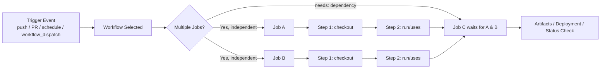
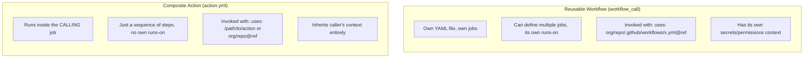
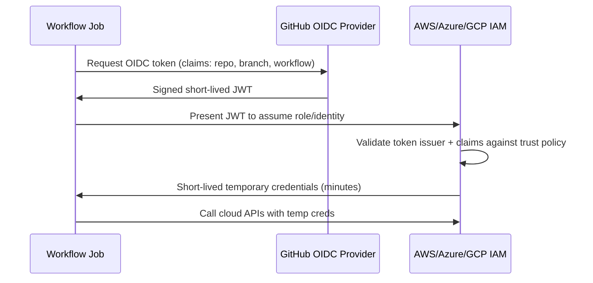

# GitHub Actions — Interview Revision Notes

> `O. GitHub-Actions-Interview-Guide.md` se derived Quick-revision Q&A. Source ke har section ko cover karta hai.

## Core Concepts

### Key building blocks

**Q: GitHub Actions ke paanch core building blocks kya hain?**

A:

- **Workflow** — ek YAML file jo ek automated process define karti hai, events se triggered hoti hai.
- **Job** — steps ka ek group jo ek single runner par chalta hai; jobs by default parallel mein chalte hain, sequencing `needs` ke through controlled hoti hai.
- **Step** — ek job ke andar ek single task, ya to ek shell command (`run`) ya ek reusable action (`uses`).
- **Action** — automation ki ek reusable unit (JavaScript, Docker, ya composite); first-party, Marketplace, ya custom.
- **Runner** — woh compute (VM ya container) jo job execute karta hai; GitHub-hosted ya self-hosted.

### Workflow lifecycle (event → job → step)

**Q: Trigger event se job completion tak ka lifecycle describe karo.**

A: Ek trigger event (push/PR/schedule/`workflow_dispatch`) ek workflow ko select karta hai. Independent jobs parallel mein chalte hain; jo job `needs` declare karti hai woh apni dependencies ke liye wait karti hai. Har job apne steps (checkout, phir `run`/`uses`) ko apne khud ke isolated runner ke andar sequence mein chalata hai, aur final job(s) artifacts/deployments/status checks produce karte hain.



### Basic workflow example

**Q: Ek minimal GitHub Actions workflow dikhao jo code checkout kare aur tests chalaye.**

A:

```yaml
name: CI Workflow
on: [push, pull_request]

jobs:
  build:
    runs-on: ubuntu-latest
    steps:
      - name: Checkout Code
        uses: actions/checkout@v4
      - name: Run Tests
        run: npm test
```

Note: `actions/checkout@v3`, `actions/cache@v3`, aur `actions/upload-artifact@v3` 2026 tak stale/deprecated ho chuke hain — `@v4`+ par pin karo (upload/download-artifact ka v3 GitHub-hosted runners par disabled hai).

**Q: "job" aur "step" ke beech ka woh key distinction kya hai jo Jenkins/Azure DevOps se aane wale logon ko trip up karta hai?**

A: Ek **job** isolation ki unit hai — apna VM/container, apna filesystem. Ek **step** us isolation *ke andar* sequencing ki unit hai. Jenkins/Azure DevOps ke stage-vs-task model ke aadi log often dono ko conflate kar dete hain.

## Workflow Triggers

**Q: Main GitHub Actions triggers kya hain aur har ek ko kab use karte ho?**

A:

| Trigger | Use case |
|---|---|
| `push` | Matching branches par commits par run hota hai |
| `pull_request` | PR open/sync/reopen par run hota hai — head commit ke against nahi, merge commit ke against run hota hai |
| `schedule` (cron) | Nightly builds, scheduled jobs |
| `workflow_dispatch` | UI/API se manual trigger, optional typed inputs ke saath |
| `workflow_call` | Workflow ko doosre workflow se reusable/callable banata hai |
| `repository_dispatch` | External system API ke through workflow trigger karta hai |
| `issues`, `release`, etc. | Repo/GitHub-object lifecycle events |

```yaml
on:
  push:
    branches: [main, develop]
    paths-ignore:
      - '**.md'
      - 'docs/**'
  pull_request:
  workflow_dispatch:
  schedule:
    - cron: '0 0 * * *'   # daily at midnight UTC
```

### Manual dispatch

**Q: Typed inputs ke saath manually-triggered workflow kaise set up karte ho?**

A:

```yaml
on:
  workflow_dispatch:
    inputs:
      environment:
        description: 'Target environment'
        required: true
        default: 'staging'
        type: choice
        options: [staging, production]
```

"Actions" tab se trigger karo, ya automation ke liye `gh workflow run` / REST API ke through.

### Cross-repo triggering

**Q: Ek different repository mein workflow kaise trigger karte ho, aur `GITHUB_TOKEN` ki limitation kya hai?**

A: `repository_dispatch` use karo, ya `gh workflow run workflow.yml --repo other/repo`, provided token ke paas sufficient permissions hon (ek PAT ya GitHub App token). Default `GITHUB_TOKEN` doosre repos mein workflows **trigger nahi kar sakta**, aur by design *same* repo mein bhi doosra workflow run trigger nahi kar sakta — yeh infinite recursion ko prevent karta hai.

**Q: Forked PRs par `pull_request` vs `pull_request_target` ka security gotcha kya hai?**

A:

- Ek fork se `pull_request` ek **read-only, restricted `GITHUB_TOKEN`** ke saath chalta hai aur **repo secrets tak koi access nahi** hota — ek deliberate security boundary.
- `pull_request_target` base repo ke context mein chalta hai (full token/secrets) lekin by default **base** ref checkout karta hai — agar workflow ko PR ke head content ko checkout aur run karne ke liye modify kiya jaaye to yeh ek classic **pwn request** vector ban jaata hai (Security & Supply-Chain Hardening dekho).

## Runners

### GitHub-Hosted vs Self-Hosted Runners

**Q: GitHub-hosted aur self-hosted runners compare karo.**

A:

| Aspect | GitHub-Hosted | Self-Hosted |
|---|---|---|
| Maintenance | Zero — GitHub har job ke liye provision/teardown karta hai | Aap OS patch karte ho, SDKs install karte ho, capacity manage karte ho |
| Cost model | Per-minute billing, OS ke hisaab se multiplier (Linux 1x, Windows 2x, macOS 10x) | Sirf Infra cost; Actions minutes billing se free |
| Networking | Sirf public internet, ephemeral IP, by default koi VPN nahi | Aapke VPC/on-prem ke andar reh sakta hai, private resources access kar sakta hai |
| State | Fully ephemeral — har run par clean VM | By default persistent (cache/secret/malware leftover risk, jab tak cleaned up na ho ya ARC ke through ephemeral run na ho) |
| Security surface | Isolated per-job VM, GitHub-managed patching | Aap security posture own karte ho; `pull_request_target` misuse ke through malicious PR code ka blast radius bahut zyada hota hai |
| Hardware | Fixed SKUs (GPU/large runners cost par) | Jo bhi aap provision karo — bare metal, GPUs, ARM, custom images |
| Best for | Zyadatar OSS/standard CI, quick start | Compliance/data-residency, large monorepos, licensed software, private network access, scale par cost control |

**Q: Currently kaunse GitHub-hosted runner images available hain?**

A:

- Ubuntu: `ubuntu-latest`, `ubuntu-24.04`, `ubuntu-22.04`
- Windows: `windows-latest`, `windows-2025`, `windows-2022`
- macOS: `macos-latest`, `macos-15`, `macos-14`

Older images (`ubuntu-20.04`, `windows-2019`, `macos-12`) 2025-2026 tak retired/deprecated ho chuke hain — current support matrix ke liye hamesha `actions/runner-images` repo check karo.

**Q: Ek self-hosted runner ko kaise register aur start karte ho?**

A:

```bash
./config.sh --url <repo-url> --token <runner-token>
./run.sh
```

**Q: Self-hosted runners ko kaise scale karte ho, aur ek public repo par long-lived self-hosted runners ka key risk kya hai?**

A: Autoscaling ephemeral runners ke liye Kubernetes par **Actions Runner Controller (ARC)** use karo, ya cloud-specific autoscaling groups. Public repo par kabhi bhi long-lived self-hosted runners mat chalao — jo koi bhi PR open kar sakta hai woh workflow trigger abuse ke through potentially aapke infrastructure par arbitrary code execute kar sakta hai.

## Variables, Secrets & Environments

### Environment variables

**Q: Workflow mein ek plain environment variable kaise define aur use karte ho?**

A:

```yaml
env:
  NODE_ENV: production

steps:
  - run: echo "Running in $NODE_ENV mode"
```

### Secrets

**Q: Workflow mein ek secret kaise reference karte ho, aur secrets kahan configure hote hain?**

A: Secrets **Settings → Secrets and variables → Actions** mein stored hote hain, repo, environment, ya organization level par scoped.

```yaml
env:
  API_KEY: ${{ secrets.MY_SECRET_KEY }}
```

### `env` vs `secrets`

**Q: `env` variables aur `secrets` ke beech kya difference hai?**

A:

| Feature | `env` variables | `secrets` |
|---|---|---|
| Visibility | Logs mein visible | Logs mein automatically masked/redacted |
| Encryption | Encrypted nahi hota | At rest encrypted, job ke liye sirf runtime par decrypted |
| Scope | Repo/workflow ke liye public | Repository/environment/org ke liye private, access-controlled |
| Typical use | Non-sensitive config (build flags, feature toggles) | API keys, connection strings, credentials, tokens |

**Q: Logs mein secret masking ka gotcha kya hai?**

A: Secret masking printed value par naive string-substring matching hoti hai — yeh protect nahi karti agar secret ko print hone se pehle base64-encode kiya jaaye, lines ke across split kiya jaaye, ya otherwise transform kiya jaaye. Kabhi bhi ek "clever" workaround ki tarah secret ko kisi transformation ke through echo mat karo; assume karo ki secret ko touch karne wali koi bhi cheez ek compromised workflow mein potentially exfiltratable hai.

### Environments & approval gates

**Q: GitHub Environments kya hote hain, aur production deployment gate karne ke liye yeh kaunsi capabilities add karte hain?**

A:

```yaml
jobs:
  deploy:
    runs-on: ubuntu-latest
    environment: production
    steps:
      - run: ./deploy.sh
```

Environments (Settings → Environments) aapko yeh karne dete hain:

- Secrets ko sirf us environment tak scope karna (e.g. prod DB connection string same workflow mein ek staging job ko visible nahi hota).
- Job proceed karne se pehle designated reviewers se manual approval require karna.
- Restrict karna ki kaunsi branches/tags us environment mein deploy kar sakti hain (deployment branch policies).
- Ek wait timer add karna.

Yeh Azure DevOps environments + approvals/checks ka direct equivalent hai, aur "GitHub Actions mein production deployment ko kaise gate karte ho?" ka standard answer hai.

## Jobs, Dependencies & Control Flow

### `needs` — job dependencies

**Q: Ek job ko doosron ke liye wait kaise karwate ho, aur ek upstream job ka output kaise consume karte ho?**

A:

```yaml
jobs:
  build:
    runs-on: ubuntu-latest
  test:
    runs-on: ubuntu-latest
    needs: build
  deploy:
    runs-on: ubuntu-latest
    needs: [build, test]
```

`needs` ke bina jobs by default parallel mein chalte hain; `needs` ek DAG banata hai. `needs` multiple jobs ko reference kar sakta hai, aur downstream jobs `needs.build.outputs.version` ke through upstream outputs consume kar sakte hain.

### `if` conditionals

**Q: Step/job level par `if` conditionals kaise kaam karte hain, aur common gotcha kya hai?**

A:

```yaml
- name: Run only on main
  if: github.ref == 'refs/heads/main'
  run: echo "Running on main branch"
```

Step ya job level par apply hota hai. Common expressions: `github.event_name == 'pull_request'`, `success()`, `failure()`, `always()`, `cancelled()`.

Gotcha: agar koi prior step fail hoti hai, to subsequent steps **by default skip** ho jaate hain jab tak aap explicitly `if: always()` ya `if: failure()` use na karo — yeh "mera cleanup/notification step kyun nahi chala?" bugs ka ek frequent cause hai.

### Build/Deploy Notifications (Slack & Email)

**Q: Build success/failure par Slack notification kaise send karte ho, aur coupling point kahan hota hai?**

A: Notifications ordinary steps hote hain jo `if:` conditionals se gated hote hain — koi special GitHub Actions primitive nahi.

```yaml
jobs:
  build:
    runs-on: ubuntu-latest
    steps:
      - uses: actions/checkout@v4
      - run: dotnet build

      - name: Notify Slack on success
        if: success()
        uses: rtCamp/action-slack-notify@v2
        env:
          SLACK_WEBHOOK: ${{ secrets.SLACK_WEBHOOK }}
          SLACK_MESSAGE: 'Build completed successfully! :white_check_mark:'
          SLACK_COLOR: good

      - name: Notify Slack on failure
        if: failure()
        uses: rtCamp/action-slack-notify@v2
        env:
          SLACK_WEBHOOK: ${{ secrets.SLACK_WEBHOOK }}
          SLACK_MESSAGE: 'Build failed on ${{ github.ref_name }} — check the run.'
          SLACK_COLOR: danger
```

- `rtCamp/action-slack-notify@v2` ek secret ki tarah stored (`SLACK_WEBHOOK`) Slack Incoming Webhook URL par post karta hai — simple case ke liye koi OAuth app install zaroori nahi.
- Jab aapko different messages/colors chahiye ho to success/failure ko `if: success()` / `if: failure()` ke saath separate steps mein split karo; `if: always()` sirf tab use karo jab ek single step unconditionally chalna chahiye aur internally `${{ job.status }}` par branch karna ho.
- Email notifications bhi ek SMTP-based action (e.g. `dawidd6/action-send-mail@v3`) ke saath same pattern follow karte hain, same way gated.
- Slack **se** (ChatOps) ek workflow trigger karne ke liye, ek Slack bot/slash-command `workflow_dispatch` event fire karne ke liye GitHub REST API (ya `gh workflow run`) call karta hai. `actions: write` ke saath ek PAT ya GitHub App token chahiye — `GITHUB_TOKEN` usable nahi hai kyunki call kisi bhi workflow run ke bahar se originate hota hai.

### Branch/path filters

**Q: Ek workflow ko specific branches tak restrict aur kuch paths ko ignore kaise karte ho?**

A:

```yaml
on:
  push:
    branches: [main, develop]
    paths-ignore:
      - '**.md'
      - 'docs/**'
```

### Concurrency control

**Q: Redundant/overlapping workflow runs ko kaise prevent karte ho?**

A:

```yaml
concurrency:
  group: ci-${{ github.ref }}
  cancel-in-progress: true
```

Yeh naye commits aane par ek stale in-progress run cancel kar deta hai. `cancel-in-progress: true` ke bina, `concurrency` runs ko cancel karne ke instead sirf serially **queue** karta hai.

### Timeouts aur retries

**Q: Ek job timeout kaise set karte ho, aur given ki koi built-in step-level retry nahi hai, ek flaky step ko kaise retry karte ho?**

A:

```yaml
jobs:
  build:
    runs-on: ubuntu-latest
    timeout-minutes: 10
```

Koi built-in step-level retry primitive nahi hai. Options:

1. Shell-level retry loop:

```yaml
- run: |
    for i in 1 2 3; do
      your-command && break || sleep 5
    done
```

2. Marketplace action: `nick-fields/retry@v3` (cleaner, max attempts/backoff/timeout support karta hai).

### Custom composite/anchor step reuse within a repo

**Q: Jobs ke across ek step-sequence reuse karne ka recommended tarika kya hai, aur YAML anchors kyun avoid karein?**

A:

```yaml
steps:
  - name: Common Step
    run: echo "This step is used in multiple jobs"
```

Jobs/workflows ke across true reuse ke liye, steps copy-paste karne ya YAML anchors ke instead ek **composite action** prefer karo — YAML anchors Actions schema dwara officially supported/validated nahi hote aur ek fragile hack hain.

## Matrix Builds

**Q: OS aur .NET version vary karta ek matrix build dikhao, aur explain karo ki yeh kaise execute hota hai.**

A:

```yaml
strategy:
  matrix:
    os: [ubuntu-latest, windows-latest]
    dotnet-version: ['8.0.x', '9.0.x']
  fail-fast: false
runs-on: ${{ matrix.os }}
steps:
  - uses: actions/setup-dotnet@v4
    with:
      dotnet-version: ${{ matrix.dotnet-version }}
```

- Sabhi matrix dimensions ka **cross-product** separate parallel jobs ki tarah run karta hai (yahan 2 OS × 2 versions = 4 jobs).
- `fail-fast: true` (default) jaise hi ek fail hoti hai to baaki saare matrix jobs cancel kar deta hai — usually CI mein full signal ke liye aapko `false` chahiye, `true` sirf runner minutes save karne ke liye.
- `max-parallel` yeh throttle karta hai ki kitne matrix jobs concurrently chalte hain (limited self-hosted pool ke liye useful).
- `include`/`exclude` full cross-product blow-up ke bina one-off combinations add karte hain ya specific ones exclude karte hain.

**Q: N separate jobs ke instead matrix kyun use karein?**

A: DRY workflow definition, aur Checks UI matrix results ko per-combination status ke saath ek job name ke under legibly group kar deta hai — N unrelated jobs se padhna kahin zyada easy hai.

## Caching & Artifacts

### Caching (speed, persistence guarantee nahi)

**Q: `actions/cache` kaise kaam karta hai, aur uski key limitations kya hain?**

A:

```yaml
- uses: actions/cache@v4
  with:
    path: ~/.nuget/packages
    key: nuget-${{ runner.os }}-${{ hashFiles('**/packages.lock.json') }}
    restore-keys: |
      nuget-${{ runner.os }}-
```

- Cache keyed hoti hai — ek exact key hit cache ko restore karta hai; `restore-keys` fallback partial matches provide karta hai.
- Ek given key ke liye caches **write hone ke baad immutable** hoti hain — aap kisi existing entry ko update nahi kar sakte, ek naya key chahiye hota hai.
- Caches per repo/branch scoped hoti hain eviction ke saath (10 GB repo-wide soft cap, LRU eviction — current limits verify karo).
- `actions/cache` **best-effort** hai — correctness ke liye kabhi ispar rely mat karo, sirf speed ke liye. Pipeline ko design karo ki woh full cache miss par bhi correctly kaam kare.

### Artifacts (durable, cross-job data transfer)

**Q: Jobs ke beech build artifacts kaise upload/download karte ho, aur v4 mein kya change hua?**

A:

```yaml
- uses: actions/upload-artifact@v4
  with:
    name: build-output
    path: ./bin/Release
    retention-days: 7

- uses: actions/download-artifact@v4
  with:
    name: build-output
```

`upload-artifact@v4`/`download-artifact@v4` ab *same* artifact name par multiple uploads allow nahi karte (har upload ek naya immutable artifact banata hai) aur v3 se 10x tak faster hain, lekin per matrix leg distinct names chahiye hote hain — ek common fix hai `name: artifact-${{ matrix.os }}-${{ matrix.dotnet-version }}`. Inn actions ka v3 deprecated/EOL hai.

**Q: Cache aur artifacts ke beech woh distinction kya hai jise interviewers probe karte hain?**

A:

| | Cache | Artifact |
|---|---|---|
| Purpose | Repeated dependency restore ko speed up karna | Jobs ke beech build output pass karna, ya humans/download ke liye preserve karna |
| Lifetime | Best-effort, opportunistically evicted | `retention-days` ke liye guaranteed, UI/API ke through downloadable |
| Typical content | `node_modules`, NuGet/npm cache, Docker layers | Compiled binaries, test results, logs, coverage reports |

### Long-term storage

**Q: Agar aapko artifacts retention window se aage chahiye to unhe kahan store karna chahiye?**

A: `actions/upload-artifact` ki retention capped hoti hai (default 90 days, configurable down). Genuinely long-term storage ke liye, instead ek package feed (GitHub Packages, NuGet.org, Azure Artifacts) ya blob storage (S3/Azure Blob) mein push karo.

## Reusable Workflows & Composite Actions

**Q: Ek reusable workflow aur ek composite action ke beech structural difference kya hai?**

A:



| | Reusable Workflow | Composite Action |
|---|---|---|
| File | `on: workflow_call` ke saath `.github/workflows/` ke under `.yml` | `action.yml` (+ optional script files) |
| Granularity | Ek ya zyada jobs | Ek job ke andar steps ki ek sequence |
| Runner | Apna khud ka `runs-on` define karta hai | Caller ke existing runner par chalta hai |
| Secrets | `secrets:` (ya `secrets: inherit`) ke through explicitly pass karna zaroori hai | Caller ka env/context automatically inherit karta hai |
| Nesting | Doosre reusable workflows ko call kar sakta hai (up to 4 levels deep) | Doosre actions ko call kar sakta hai |
| Best for | Kaafi repos ke across ek entire pipeline stage ko standardize karna | Kuch steps (checkout + setup + restore) ko standardize karna |

### Reusable workflow

**Q: Inputs aur secrets ke saath ek reusable workflow define aur call karna dikhao.**

A:

```yaml
# .github/workflows/deploy.yml
on:
  workflow_call:
    inputs:
      environment:
        required: true
        type: string
    secrets:
      AWS_ACCESS_KEY_ID:
        required: true

jobs:
  deploy:
    runs-on: ubuntu-latest
    steps:
      - run: echo "Deploying to ${{ inputs.environment }}"
```

Isse call karna, cross-repo including:

```yaml
jobs:
  call-workflow:
    uses: my-org/my-repo/.github/workflows/deploy.yml@main
    with:
      environment: production
    secrets:
      AWS_ACCESS_KEY_ID: ${{ secrets.AWS_ACCESS_KEY_ID }}
      # or simply: secrets: inherit
```

### Composite action

**Q: Ek composite action definition dikhao, aur uske `run` steps ke liye mandatory gotcha kya hai?**

A:

```yaml
# action.yml
name: 'Setup and Restore'
runs:
  using: "composite"
  steps:
    - uses: actions/setup-dotnet@v4
      with:
        dotnet-version: '8.0.x'
      shell: bash
    - run: dotnet restore
      shell: bash
```

Composite action ke andar har `run` step ko `shell:` explicitly specify karna zaroori hai — yeh normal workflow job ki tarah inherit nahi hota.

**Q: Aap ek reusable workflow ke instead composite action kab choose karoge?**

A: Ek larger job ke andar embedded ek small reusable step-sequence (shared setup logic) ke liye composite action. Reusable workflow jab aapko centralized governance ke saath kaafi repos ke across ek entire deployment/release process standardize karna ho — org security team reusable workflow ko own karti hai, teams sirf usse call karti hain, jisse drift kam hota hai aur auditing/patching ek single choke point ban jaata hai.

## Containers & Custom Actions

### Running a job inside a container

**Q: Aap ek specific container image ke andar job kaise chalate ho, aur aisa kyun karoge?**

A:

```yaml
jobs:
  docker-job:
    runs-on: ubuntu-latest
    container:
      image: mcr.microsoft.com/dotnet/sdk:8.0
    steps:
      - run: dotnet --version
```

Runner image se independent exact toolchain versions pin karne ke liye, ya production containers ke matching ek hermetic build environment use karne ke liye useful.

### Custom actions — three flavors

**Q: Custom GitHub Actions ke teen flavors kya hain, aur unke trade-offs kya hain?**

A:

| Type | Runtime | Use case |
|---|---|---|
| Docker container action | Koi bhi language, container ki tarah packaged | Full control, heavier/slower startup, mostly Linux-only |
| JavaScript/TypeScript action | Node.js (`node20` runtime) | Fastest startup, cross-platform, zyadatar Marketplace actions yehi use karte hain |
| Composite action | Existing actions/shell steps ko orchestrate karta hai | No compilation, author/maintain karna easiest |

```yaml
# action.yml (JS action skeleton)
name: 'My Custom Action'
inputs:
  who-to-greet:
    required: true
runs:
  using: 'node20'
  main: 'dist/index.js'
```

## Deployment Patterns

### Multi-stage deployment (dev → staging → prod)

**Q: Ek multi-stage dev → staging → prod deployment pipeline dikhao.**

A:

```yaml
jobs:
  deploy-dev:
    environment: dev
    runs-on: ubuntu-latest
    steps: [ ... ]
  deploy-staging:
    needs: deploy-dev
    environment: staging
    runs-on: ubuntu-latest
    steps: [ ... ]
  deploy-prod:
    needs: deploy-staging
    environment: production   # gated by required reviewers
    runs-on: ubuntu-latest
    steps: [ ... ]
```

### Cloud deployment example (AWS)

**Q: Static keys use karne wala ek legacy AWS deployment step dikhao, aur uspar senior-level flag kya hai?**

A:

```yaml
- uses: aws-actions/configure-aws-credentials@v4
  with:
    aws-access-key-id: ${{ secrets.AWS_ACCESS_KEY_ID }}
    aws-secret-access-key: ${{ secrets.AWS_SECRET_ACCESS_KEY }}
    aws-region: us-east-1
- run: aws s3 sync ./build s3://my-bucket
```

Secrets ki tarah long-lived AWS access keys legacy pattern hai. Current best practice **OIDC federation** hai — bilkul koi static credentials store nahi hote (OIDC Federation section dekho). Interview mein isse proactively bring up karo.

### IaC deployments

**Q: Aap ek IaC deployment step kaise chalate ho, aur kya OIDC principle Azure/GCP tak extend hota hai?**

A:

```yaml
- name: Deploy with Terraform
  run: terraform apply -auto-approve
```

Same principle Azure (`azure/login@v2` OIDC ke saath) ya GCP (`google-github-actions/auth`) ke liye bhi apply hota hai — jahan OIDC available hai wahan static service principal secrets avoid karo.

### Repository/status badges

**Q: Ek repo README mein CI status badge kaise add karte ho?**

A:

```markdown

```

## Debugging & Local Testing

### Debugging a failed run

**Q: Ek failed GitHub Actions run ko kaise debug karte ho?**

A:

- Debug logging ke saath re-run: repo secrets `ACTIONS_STEP_DEBUG=true` aur `ACTIONS_RUNNER_DEBUG=true` set karo, ya UI mein "Re-run with debug logging" use karo.
- Interactive debugging ke liye mid-failure ek live runner mein SSH karne ke liye `tmate` (`mxschmitt/action-tmate`) use karo — flaky/self-hosted-runner-specific issues ke liye useful.
- `${{ toJSON(github) }}` / `${{ toJSON(steps) }}` context ko ek debug step mein dump karke inspect karo.

Note: koi official `actions/setup-debugging` action nahi hai — correct answer upar wala debug-logging secrets aur/ya `tmate` approach hai.

### Running Actions locally

**Q: GitHub Actions workflows ko locally kaise chalate ho, aur limitations kya hain?**

A:

```bash
act -j build
```

`nektos/act` GitHub par push/wait kiye bina fast iteration ke liye workflows ko locally Docker mein chalata hai. Limitations: GitHub-hosted runner images ko perfectly emulate nahi karta, kuch contexts (`secrets`, kuch `github.*` fields) ko manual stubbing chahiye hoti hai, aur GitHub-specific features (environments/approvals) simulate nahi hote.

## .NET-Specific CI/CD

### Idiomatic .NET Build/Test/Publish Pipeline

**Q: Restore, build, test, coverage, aur publish cover karta ek realistic senior-level .NET CI pipeline dikhao.**

A:

```yaml
name: .NET CI

on:
  push:
    branches: [main]
  pull_request:

jobs:
  build-test:
    runs-on: ubuntu-latest
    steps:
      - uses: actions/checkout@v4
        with:
          fetch-depth: 0   # needed for tools like GitVersion / Nerdbank.GitVersioning

      - uses: actions/setup-dotnet@v4
        with:
          dotnet-version: '8.0.x'

      - name: Cache NuGet packages
        uses: actions/cache@v4
        with:
          path: ~/.nuget/packages
          key: nuget-${{ runner.os }}-${{ hashFiles('**/packages.lock.json') }}
          restore-keys: nuget-${{ runner.os }}-

      - name: Restore
        run: dotnet restore --locked-mode

      - name: Build
        run: dotnet build --configuration Release --no-restore

      - name: Test
        run: >
          dotnet test --configuration Release --no-build
          --logger "trx;LogFileName=test-results.trx"
          --collect:"XPlat Code Coverage"

      - name: Publish test results
        uses: dorny/test-reporter@v1
        if: always()
        with:
          name: Test Results
          path: '**/test-results.trx'
          reporter: dotnet-trx

      - name: Publish
        run: dotnet publish ./src/MyApp/MyApp.csproj -c Release -o ./publish

      - uses: actions/upload-artifact@v4
        with:
          name: webapp
          path: ./publish
```

Key points:

- `packages.lock.json` + `--locked-mode` deterministic restore enable karta hai aur cache key ko ek exact, reproducible hash par based hone deta hai — iske bina, `hashFiles('**/*.csproj')` ek weaker proxy hai jo transitive dependency drift miss kar sakta hai.
- `fetch-depth: 0` — shallow clone (default `fetch-depth: 1`) un tools ko break kar deta hai jinhe full git history chahiye (GitVersion, Nerdbank.GitVersioning, `git describe`-based versioning).
- `--no-restore` / `--no-build` restore → build → test steps ke across redundant work avoid karte hain.
- `.trx` files GitHub dwara natively render nahi hoti — `dorny/test-reporter`, `EnricoMi/publish-unit-test-result-action`, ya artifact + external tool ki tarah upload karna zaroori hai.
- `--collect:"XPlat Code Coverage"` Cobertura XML emit karta hai; visualization aur PR-level coverage-diff gating ke liye `danielpalme/ReportGenerator-GitHub-Action` ya Codecov/SonarCloud ke saath combine karo.

### Versioning & Semantic Release for .NET

**Q: Manual `.csproj` bumps ke instead .NET builds ko automatically kaise version karte ho?**

A:

- **GitVersion** ya **Nerdbank.GitVersioning (nbgv)** git history/tags se ek SemVer version derive karte hain, ek early step ki tarah run hote hain, computed version ko job output ki tarah expose karte hain jo `dotnet build -p:Version=...` aur container-tag steps consume karte hain.
- **MinVer** — lighter-weight alternative, purely tag-based.
- Container images aur NuGet packages ko same computed value se tagged/versioned hona chahiye taaki ek deployed artifact aur uske exact commit ke beech traceability bani rahe.

### Containerized .NET Apps — Build & Push

**Q: Layer caching ke saath ek containerized .NET app ko kaise build aur push karte ho?**

A:

```yaml
- uses: docker/setup-buildx-action@v3
- uses: docker/login-action@v3
  with:
    registry: ghcr.io
    username: ${{ github.actor }}
    password: ${{ secrets.GITHUB_TOKEN }}
- uses: docker/build-push-action@v6
  with:
    context: .
    push: true
    tags: ghcr.io/my-org/my-app:${{ github.sha }}
    cache-from: type=gha
    cache-to: type=gha,mode=max
```

`cache-from`/`cache-to: type=gha` Docker layer caching ke liye Actions cache backend use karta hai — har run par har layer rebuild karne se meaningfully faster, aur `/var/lib/docker` ko manually cache karne ka modern replacement.

## Security & Supply-Chain Hardening

### Pwn Requests aur `pull_request_target` Risk

**Q: "pwn request" kya hai aur yeh safe `pull_request` default se kaise differ karta hai?**

A:

- Fork se `pull_request`: read-only token, koi secrets nahi — malicious PR code ke saath bhi by default safe, kyunki kuch bhi sensitive exfiltrate nahi ho sakta.
- `pull_request_target`: base repo ke token aur full secrets access ke saath chalta hai, lekin by default base branch checkout karta hai — safe hai *jab tak* workflow explicitly PR ke head ref (`github.event.pull_request.head.sha`) ko checkout aur execute na kare ya otherwise attacker-controlled code na chalaye (e.g. `npm install` jo ek malicious `postinstall` script trigger kare). Yeh combination — privileged token + untrusted code execute karna — "pwn request" vulnerability class hai.
- Mitigation: `pull_request_target` (ya `workflow_run`) ko untrusted head content ke checkout ke saath kabhi combine mat karo jab tak deliberately isolated na ho; ek unprivileged `pull_request` build/test job aur ek separate, manually-gated ya `workflow_run`-triggered job mein split karo jo privileged kisi bhi cheez ke liye sirf vetted **artifacts** (source nahi) reuse kare.

### Actions ko Commit SHAs par Pin karna

**Q: Version tag ke instead actions ko commit SHA par kyun pin karein, aur syntax kya hai?**

A: `uses: actions/checkout@v4` ek mutable tag resolve karta hai — agar woh tag kabhi move ho jaaye (compromised publisher, force-pushed tag), to aapka workflow next run silently different code chala dega (ek real supply-chain surface, e.g. 2024 ka `tj-actions/changed-files` compromise). Security-sensitive kisi bhi cheez ke liye best practice hai ki ek version comment ke saath full commit SHA par pin kiya jaaye:

```yaml
- uses: actions/checkout@11bd71901bbe5b1630ceea73d27597364c9af683 # v4.2.2
```

Dependabot aur `pinact` jaise tools pin ko rakhte hue SHA-pinned actions ko auto-update kar sakte hain.

### `GITHUB_TOKEN` Least Privilege

**Q: `GITHUB_TOKEN` permissions ko aapko kaise scope karna chahiye, aur yeh high-leverage kyun hai?**

A: Classic repos ke liye default permissions pehle broad hoti thi; new repos default read-only hote hain, lekin default par kabhi rely mat karo — `permissions` explicitly declare karo:

```yaml
permissions:
  contents: read
  pull-requests: write   # only if the job actually comments/labels PRs
```

Har workflow par least-privilege `permissions:` blocks set karna ek single highest-leverage, lowest-effort security control hai jise aap interview mein cite kar sakte ho.

### Third-Party Action Vetting

**Q: Depend karne se pehle third-party Marketplace actions ko kaise vet karte ho?**

A:

- GitHub, verified creators, ya un vendors dwara publish kiye gaye actions prefer karo jinhe aap already trust karte ho (`aws-actions/*`, `docker/*`, `azure/*`).
- Baaki kisi bhi cheez ke liye, source review karo, SHA par pin karo, aur agar yeh business-critical hai to ek internal org action mein mirror karne ka consider karo.
- **CodeQL**, **Dependabot**, aur **Scorecard** (`ossf/scorecard-action`) ko workflows mein wire kiya ja sakta hai taaki repo ke apne supply-chain risk ko continuously assess kiya ja sake.

### Environment Protection Rules ek Security Control ki tarah

**Q: Approvals se aage, GitHub Environments ek security boundary ki tarah kaise act karte hain?**

A: Environments aapko yeh scope karne dete hain ki given job context mein bilkul kaunse secrets exist karte hain — ek `dev` environment ko target karne wala compromised/malicious PR workflow `production` secrets simply read nahi kar sakta, kyunki woh us job ke context mein bilkul inject hi nahi hote. Yeh sirf `if` conditions par rely karne se ek stronger boundary hai.

## OIDC Federation for Cloud Auth

### OIDC Long-Lived Cloud Secrets ko Kyun Replace Karta Hai

**Q: GitHub secrets ki tarah static cloud credentials store karne ke instead OIDC federation kyun preferred hai?**

A: Old pattern ek GitHub secret ki tarah long-lived `AWS_ACCESS_KEY_ID`/`AWS_SECRET_ACCESS_KEY` (ya Azure SP secret) store karta hai. Problems: static credentials ka leak risk (manually rotate hone tak valid), koi natural expiry ya per-run scoping nahi, aur rotation ek manual, often-neglected burden hai.

OIDC GitHub Actions ko GitHub ke OIDC provider se ek short-lived, signed identity token request karne deta hai, jise cloud provider trust karta hai (ek pre-configured trust relationship ke through) sirf us job run ke liye temporary, scoped credentials mint karne ke liye. Kahin bhi koi static secret store nahi hota.



### Example: OIDC ke through AWS (no static keys)

**Q: Static keys ke instead OIDC ke through authenticated ek AWS deployment step dikhao.**

A:

```yaml
permissions:
  id-token: write   # required for OIDC
  contents: read

jobs:
  deploy:
    runs-on: ubuntu-latest
    steps:
      - uses: aws-actions/configure-aws-credentials@v4
        with:
          role-to-assume: arn:aws:iam::123456789012:role/github-actions-deploy
          aws-region: us-east-1
      - run: aws s3 sync ./build s3://my-bucket
```

IAM role ki trust policy yeh restrict karti hai ki kaunsa repo/branch/environment usse assume kar sakta hai, `token.actions.githubusercontent.com:sub == "repo:my-org/my-repo:ref:refs/heads/main"` jaise claims use karke — even agar ek workflow compromised ho jaaye, woh sirf us exact repo/branch context se role ko impersonate kar sakta hai.

### Azure equivalent

**Q: OIDC-based Azure login AWS example se kaise differ karta hai, aur actually secret ki tarah kya stored hota hai?**

A:

```yaml
permissions:
  id-token: write
  contents: read
steps:
  - uses: azure/login@v2
    with:
      client-id: ${{ secrets.AZURE_CLIENT_ID }}
      tenant-id: ${{ secrets.AZURE_TENANT_ID }}
      subscription-id: ${{ secrets.AZURE_SUBSCRIPTION_ID }}
      # no client-secret — federated credential configured on the App Registration
```

Sirf non-sensitive identifiers (client ID, tenant ID, subscription ID) stored hote hain — inme se koi bhi akela access grant nahi karta jab tak OIDC trust relationship bhi repo/branch claims match na kare.

## Monorepo & Multi-Project CI Strategies

### Change-Detection-Based Selective Builds

**Q: Ek monorepo mein har push par entire pipeline run karne se kaise avoid karte ho?**

A:

```yaml
jobs:
  changes:
    runs-on: ubuntu-latest
    outputs:
      api: ${{ steps.filter.outputs.api }}
      frontend: ${{ steps.filter.outputs.frontend }}
    steps:
      - uses: dorny/paths-filter@v3
        id: filter
        with:
          filters: |
            api:
              - 'src/Api/**'
            frontend:
              - 'src/Frontend/**'

  build-api:
    needs: changes
    if: needs.changes.outputs.api == 'true'
    runs-on: ubuntu-latest
    steps: [ ... ]

  build-frontend:
    needs: changes
    if: needs.changes.outputs.frontend == 'true'
    runs-on: ubuntu-latest
    steps: [ ... ]
```

Yeh Azure DevOps ke `paths` trigger filters ya Bazel/Nx-style affected-project detection ka GitHub Actions equivalent hai — agar role mein monorepo involved hai to yeh near-guaranteed aayega.

### Nx/Turborepo-Aware CI

**Q: Monorepo CI ke liye Nx/Turborepo plain path filters se kaise better hain?**

A: Polyglot ya JS-heavy monorepos ke liye, Nx aur Turborepo dependency graph compute karte hain aur ek "affected" command (`nx affected`, `turbo run build --filter=...[origin/main]`) expose karte hain jo sirf path filters se zyada accurate hai, kyunki yeh sirf directory boundaries nahi, *code* dependencies ko samajhta hai. .NET-heavy shops mein bhi jinme ek JS frontend wala mixed-stack monorepo hai, yeh increasingly relevant hai.

### Monorepo governance mechanism ki tarah Reusable workflows

**Q: Reusable workflows ek monorepo mein kaafi services ke across CI ko govern karne mein kaise help karte hain?**

A: Har "project type" ke liye path-filtering ko ek shared reusable workflow ke saath combine karo (e.g. ek `dotnet-build-test.yml` reusable workflow jise har service ki job call karti hai) taaki build/test/security logic centrally maintained rahe even though har service independently trigger hoti hai.

## Performance & Cost Optimization

### Runner Minutes Actually Kahan Jaate Hain

**Q: Agar poocha jaaye "hamara CI bill kaise reduce karoge," to aap kaunse concrete levers pull karoge?**

A:

- **Runner OS multiplier**: Windows runners GitHub-hosted billing par 2x Linux minutes cost karte hain, macOS 10x — jab tak Windows/macOS specifically na chahiye ho, Linux ko default rakho.
- **Concurrency + `cancel-in-progress`**: superseded commits par minutes burn hona rok deta hai.
- **Caching** (NuGet/npm/Docker layers) restore/build time kaat deta hai — often single biggest lever.
- Parallel runner slots waste hone se avoid karne ke liye **Matrix `fail-fast` aur `max-parallel`** tuning.
- Monorepos mein **Path filters / change detection** unrelated pipelines ko bilkul run hone se avoid karte hain.
- High-volume, predictable workloads ke liye **Self-hosted runners** — ek build-vs-buy calculation, koi default nahi.
- **Larger/faster hosted runners** default 2-core runners se aggregate mein cheaper ho sakte hain agar woh CPU-bound builds par wall-clock time meaningfully kaat dein — default ko cheapest assume karne ke instead benchmark karna worth hai.

### Workflow-Level Timeout Hygiene

**Q: Job level par `timeout-minutes` explicitly kyun set karein?**

A: Platform default 6 hours hai — ek hung test/process ka ghanto tak silently runner minutes burn karna ek common real-world cost leak hai. Platform default par rely karne ke instead job level par hamesha aggressive `timeout-minutes` set karo.

## GitHub Actions vs Azure DevOps Pipelines

### Comparison Table

**Q: GitHub Actions Azure DevOps Pipelines par concept-for-concept kaise map hota hai?**

A:

| Aspect | GitHub Actions | Azure DevOps Pipelines |
|---|---|---|
| Config format | `.github/workflows/` mein YAML | YAML (`azure-pipelines.yml`) ya classic UI-based pipelines |
| Unit of isolation | Job (apna VM/container) | Stage → Job → Task hierarchy (extra nesting level) |
| Reusability | Reusable workflows (`workflow_call`) + composite actions | Templates (`extends`, `template` includes) |
| Marketplace | GitHub Marketplace, huge community ecosystem | Azure DevOps Marketplace, smaller, zyada enterprise/ALM-focused |
| Approvals/Gates | Environments + required reviewers | Environments + approvals & checks (bahut similar model) |
| Secrets | Repo/Env/Org-scoped secrets | Variable groups, Key Vault-linked variable groups |
| Self-hosted compute | Self-hosted runners | Self-hosted agents (same concept) |
| Cloud-native auth | OIDC federation (AWS/Azure/GCP) | Workload identity federation (equivalent concept) |
| Native repo integration | GitHub ke saath deeply integrated (Checks API, PR status, Issues) | Azure Repos ke saath paired hone par best |
| Boards/work item integration | GitHub Projects/Issues (lighter-weight) | Azure Boards (heavier, zyada enterprise PM-oriented) |
| Pricing model | Per-minute + OS multiplier, public repos ke liye generous free tier | Per-parallel-job licensing model |
| Typical migration driver | Source control + single tool ke liye GitHub par consolidate karna | Deeper enterprise ALM ya Azure-only ecosystem lock-in chahta hai |

Agar org Azure DevOps se migrate kar raha hai, to zyadatar concepts ka ek direct analog hota hai (stage→job, agent→runner, variable group→environment/secret, template→reusable workflow) — migration largely mechanical translation hai plus security ko re-think karna (OIDC, `permissions:` blocks), kyunki default security posture meaningfully differ karta hai.

## AWS-Native CI/CD Integration Points

### `aws-actions/configure-aws-credentials` Depth mein

**Q: `aws-actions/configure-aws-credentials` OIDC ke saath under the hood actually kya karta hai?**

A:

```yaml
permissions:
  id-token: write   # required — this is what lets the job request an OIDC token at all
  contents: read

jobs:
  deploy:
    runs-on: ubuntu-latest
    steps:
      - uses: actions/checkout@v4

      - uses: aws-actions/configure-aws-credentials@v4
        with:
          role-to-assume: arn:aws:iam::123456789012:role/github-actions-ecs-deploy
          aws-region: us-east-1
          role-session-name: gha-${{ github.run_id }}   # traceable in CloudTrail

      - run: aws sts get-caller-identity   # sanity check — confirms the assumed role
```

Action ek signed JWT (calling repo/workflow/ref ke liye scoped) ke liye GitHub ke OIDC provider ko call karta hai, phir woh JWT pass karke AWS STS `AssumeRoleWithWebIdentity` ko call karta hai. AWS IAM mein registered OIDC provider ke against JWT ke signature ko validate karta hai, trust policy ke conditions ko JWT ke claims ke against check karta hai, aur — agar match hota hai — to job ke har subsequent step ke liye `AWS_ACCESS_KEY_ID`/`AWS_SECRET_ACCESS_KEY`/`AWS_SESSION_TOKEN` env vars ki tarah exported short-lived (default 1 hour, configurable) temporary credentials return karta hai.

### IAM OIDC Provider aur Role Trust Policy Setup

**Q: OIDC ke through ek workflow role assume kar sake, iske liye AWS-side configuration ke kaunse do pieces required hain?**

A: 1. IAM mein GitHub ke OIDC provider ko register karo (one-time, per AWS account):

```hcl
resource "aws_iam_openid_connect_provider" "github_actions" {
  url             = "https://token.actions.githubusercontent.com"
  client_id_list  = ["sts.amazonaws.com"]
  thumbprint_list = []  # AWS validates via its own trusted CA bundle for this provider; thumbprint no longer required for GitHub's OIDC endpoint (verify current guidance)
}
```

2. Exact repo/branch/environment tak scoped ek trust policy ke saath IAM role banao:

```hcl
resource "aws_iam_role" "github_actions_ecs_deploy" {
  name = "github-actions-ecs-deploy"

  assume_role_policy = jsonencode({
    Version = "2012-10-17"
    Statement = [{
      Effect    = "Allow"
      Principal = { Federated = aws_iam_openid_connect_provider.github_actions.arn }
      Action    = "sts:AssumeRoleWithWebIdentity"
      Condition = {
        StringEquals = {
          "token.actions.githubusercontent.com:aud" = "sts.amazonaws.com"
        }
        StringLike = {
          "token.actions.githubusercontent.com:sub" = "repo:my-org/my-repo:ref:refs/heads/main"
          # or, scoped to a GitHub Environment instead of a branch:
          # "token.actions.githubusercontent.com:sub" = "repo:my-org/my-repo:environment:production"
        }
      }
    }]
  })
}
```

**Q: Agar is role ko use karne wala workflow compromised ho jaaye to blast radius kya hai?**

A: Sirf wahi jo attached IAM permissions policy allow karti hai, aur sirf `sub` claim mein matched exact repo/ref/environment se — feature branch par ek workflow `ref:refs/heads/main` tak trust-scoped role assume nahi kar sakta, ek stolen `GITHUB_TOKEN` ke saath bhi nahi, kyunki OIDC claims GitHub dwara server-side generate hote hain aur workflow code dwara forge nahi kiye ja sakte.

Gotcha: `aud` (audience) claim ko `sub` ke saath hamesha check karna zaroori hai (`sts.amazonaws.com`) — sirf `sub` check karna aur `aud` pin na karna ek real hardening gap hai jise kuch example configs skip kar dete hain.

### Artifacts/Caching ka ek AWS Deploy Target (ECS/Lambda) se Tie Hona

**Q: Ek container image build/push karke usse ECS mein deploy karti ek full pipeline dikhao.**

A:

```yaml
jobs:
  build-and-push:
    runs-on: ubuntu-latest
    permissions:
      id-token: write
      contents: read
    steps:
      - uses: actions/checkout@v4
      - uses: aws-actions/configure-aws-credentials@v4
        with:
          role-to-assume: arn:aws:iam::123456789012:role/github-actions-ecs-deploy
          aws-region: us-east-1
      - uses: aws-actions/amazon-ecr-login@v2
        id: ecr-login
      - uses: docker/build-push-action@v6
        with:
          context: .
          push: true
          tags: ${{ steps.ecr-login.outputs.registry }}/order-api:${{ github.sha }}
          cache-from: type=gha
          cache-to: type=gha,mode=max
      - name: Render new ECS task definition
        id: task-def
        uses: aws-actions/amazon-ecs-render-task-definition@v1
        with:
          task-definition: ecs-task-def.json
          container-name: order-api
          image: ${{ steps.ecr-login.outputs.registry }}/order-api:${{ github.sha }}
      - name: Deploy to ECS
        uses: aws-actions/amazon-ecs-deploy-task-definition@v2
        with:
          task-definition: ${{ steps.task-def.outputs.task-definition }}
          service: order-api-service
          cluster: order-api-cluster
          wait-for-service-stability: true
```

Wahi `type=gha` layer cache jo kahin aur GHCR-based .NET container builds ke liye use hota hai, identically kaam karta hai jab target registry ECR ho — cache backend Actions cache service hi hota hai, chahe built image kahin bhi push ho.

**Q: Ek .NET Lambda deployment dikhao, aur yahan ek artifact (cache nahi) right primitive kyun hai?**

A:

```yaml
      - name: Publish Lambda package
        run: dotnet lambda package -pl ./src/MyFunction -o ./publish/function.zip

      - uses: actions/upload-artifact@v4     # durable handoff to a separate deploy job, or for audit/rollback
        with:
          name: lambda-package
          path: ./publish/function.zip

      - name: Deploy to Lambda
        run: |
          aws lambda update-function-code \
            --function-name order-processor \
            --zip-file fileb://./publish/function.zip
```

Zip hi woh actual deployable unit hai jo ek build job se ek deploy job ko handover ki jaati hai (ya rollback/audit ke liye retain ki jaati hai) — yeh exactly artifacts-vs-cache distinction hai: cache *build* ko accelerate karta hai, artifacts woh *cheez carry karte hain jo aap actually ship karte ho*. NuGet restore caching abhi bhi is step ke upstream apply hoti hai taaki `dotnet lambda package` khud speed ho.

ECS deploys usually image-based hote hain (ek baar build karo, ECR mein push karo, task definition update karo, aur ECS ko rolling/blue-green rollout handle karne do), jabki Lambda deploys typically artifact-based hote hain (zip ya container image directly Lambda API/SDK ke through pushed, often ek quick example se aage raw `aws lambda update-function-code` ke instead Terraform/CDKTF dwara orchestrated) — yeh jaanna ki kaunsa primitive (image vs. zip artifact) kaunse compute target ko fit karta hai, yahan AWS fluency ka actual signal hai.

## Best Practices

**Q: Ek GitHub Actions setup ke liye senior-level best-practices checklist kya hai?**

A:

- Action versions pin karo (ideally security-sensitive kisi bhi cheez ke liye commit SHA par; kam se kam ek major version tag, kabhi `@main`/`@master` nahi).
- Har workflow par explicit least-privilege `permissions:` blocks set karo.
- Kisi bhi production deployment gate ke liye required reviewers ke saath `environments` use karo.
- Jahan bhi cloud provider support karta hai, long-lived cloud credentials ke instead OIDC federation prefer karo.
- Superseded runs par minutes waste hone se avoid karne ke liye `concurrency` + `cancel-in-progress` use karo.
- Aggressively cache karo (NuGet/npm/Docker layers) lekin correctness ke liye kabhi cache par depend mat karo.
- Repos ke across copy-paste karne ke instead shared CI logic ko reusable workflows/composite actions mein centralize karo.
- Unnecessary full-repo builds avoid karne ke liye monorepos mein path filters / change detection use karo.
- Har jagah sensible `timeout-minutes` ke saath fail fast karo.
- Pwn-request exposure avoid karne ke liye "untrusted PR code build karna" (unprivileged) ko "privileged deployment logic chalana" (trusted, gated) se separate workflows mein split karo.
- Application dependencies aur pinned Action SHAs, dono ko current rakhne ke liye Dependabot use karo.

## Common Pitfalls

**Q: Watch karne layak sabse common GitHub Actions pitfalls kya hain?**

A:

- Assume karna ki `GITHUB_TOKEN` ke paas by default full permissions hain — modern defaults zyada restrictive hote hain, lekin dono taraf assume mat karo; explicitly declare karo.
- `pull_request_target` ko PR head ke checkout ke saath combine karna — classic pwn-request vulnerability.
- Pure speed-up ke instead correctness ke liye `actions/cache` par rely karna.
- Composite action ke `run` steps mein `shell:` bhool jaana.
- Jab actually full matrix signal chahiye ho tab `fail-fast: false` na set karna.
- Yeh believe karna ki sirf `concurrency` stale runs cancel kar deta hai — yeh sirf `cancel-in-progress: true` ke saath karta hai.
- Deprecated `actions/checkout@v3`, `upload-artifact@v3`/`download-artifact@v3` use karna — retired/sunset ho rahe hain, v4+ use karo.
- v4 semantics ke under multiple matrix legs ko ek artifact name mein upload karna (ab disallowed) — per leg unique names use karna zaroori hai.
- Secret masking ko determined exfiltration ke against ek real security boundary ki tarah treat karna (encoding/splitting naive log redaction ko bypass kar deta hai).
- Jab ek step ko full git history chahiye ho (versioning tools, `git log`-based changelogs) tab `fetch-depth: 0` bhool jaana.
- Public repos par long-lived, non-ephemeral self-hosted runners — ek significant attack surface.

## Sample Interview Q&A

**Q: Ek .NET service ke ek well-designed GitHub Actions setup mein, jab developer ek PR open karta hai to trigger se merge tak end-to-end kya hota hai, mujhe walk through karo.**

A: PR opened → `pull_request` event ek restricted, secret-less token ke saath fire hota hai → build/test/lint jobs jahan possible ho wahan parallel mein chalte hain, agar zarurat ho to relevant TFMs/OS ke across matrix ke saath → NuGet cache lockfile hash se restore hota hai → `dotnet build`/`dotnet test` chalte hain, results ek TRX-aware reporter ke through PR checks ki tarah publish hote hain → success par, artifacts (build output, coverage report) upload hote hain → branch protection merge se pehle inn checks ko green hone ki requirement rakhti hai → main mein merge hona ek separate `push`-triggered workflow trigger karta hai jo trusted deployment path chalata hai (potentially ek reusable workflow ke through), production ke liye manual approval require karne wale ek `environment` se gated, static secrets ke instead ek cloud deploy role assume karne ke liye OIDC use karte hue.

**Q: Aapka GitHub Actions bill bahut zyada hai — mujhe walk through karo ki aap developer velocity ko hurt kiye bina isse kaise reduce karoge.**

A: Pehle instrument karo — identify karo ki kaunse workflows/jobs sabse zyada minutes consume karte hain (Actions usage reports). Fir: jahan feasible ho wahan unnecessary Windows/macOS runners ko Linux mein switch karo (biggest per-minute multiplier lever); stale superseded runs ko kill karne ke liye `concurrency`+`cancel-in-progress` add karo; NuGet aur Docker layer caching add/verify karo; monorepos mein path-based change detection add karo taaki unrelated services rebuild na hon; hangs catch karne ke liye `timeout-minutes` tighten karo; agar infra/ops cost aggregate GitHub-hosted minute cost se kam hai to highest-volume, most predictable workloads ke liye self-hosted runners evaluate karo; larger runner SKUs sirf tab consider karo jahan benchmarking net wall-clock/cost improvement dikhaye.

**Q: GitHub secrets ki tarah cloud credentials store kiye bina AWS/Azure mein securely kaise deploy karte ho?**

A: OIDC federation — GitHub ke OIDC provider aur ek IAM role (AWS) ya federated credential (Azure App Registration) ke beech ek trust relationship configure karo, jo claims ke through specific repo/branch/environment tak scoped ho. Workflow `id-token: write` permission request karta hai, us single job run tak scoped temporary cloud credentials ke liye ek short-lived signed token exchange karta hai, aur system mein kahin bhi koi static secret exist nahi karta.

**Q: Ek reusable workflow aur ek composite action ke beech difference kya hai, aur aap kaise decide karte ho ki kaunsa use karna hai?**

A: Reusable workflow = ek ya zyada full jobs, apna runner, `workflow_call` se invoked, secrets explicitly pass karna zaroori (ya `inherit`); central governance ke saath kaafi repos ke across ek entire pipeline stage standardize karne ke liye achha. Composite action = caller ke existing job/runner ke andar executed steps ki ek sequence, `action.yml` mein defined; otherwise-different jobs ke andar embedded smaller shared step sequences (e.g. standard checkout+setup+restore) ke liye achha.

**Q: "pwn request" kya hai aur aap isse kaise prevent karte ho?**

A: Ek vulnerability class jahan `pull_request_target` (ya `workflow_run`) se triggered ek workflow — jo base repo ke full token/secrets ke saath chalta hai — ek untrusted PR head se code checkout aur execute karta hai, jisse ek malicious contributor privileged access/secrets ke saath arbitrary code chala paata hai. Prevention: `pull_request_target` context mein kabhi bhi PR head content checkout/execute mat karo; untrusted build/test (plain `pull_request` ke through, koi secrets nahi) ko privileged deploy logic (`push`/manual/gated triggers ke through jo sirf trusted, already-merged code ya vetted artifacts par operate karte hain) se split karo.

**Q: Aap ek existing Azure DevOps YAML pipeline ko GitHub Actions mein kaise migrate karoge?**

A: Map karo stage→job(s), Azure DevOps `template`→reusable workflow ya composite action, variable groups→repo/environment secrets aur variables (ek service connection ke instead OIDC-authenticated steps ke through Key Vault re-link karna), self-hosted agent pools→self-hosted runners ya ARC, aur approvals/checks→required reviewers ke saath GitHub environments. Mechanical translation usually straightforward hoti hai; real work security model ko re-audit karna hai — GitHub ke default `GITHUB_TOKEN` permissions, secret scoping, aur OIDC trust policies Azure DevOps service connection semantics se different hote hain, isliye assume mat karo ki ek 1:1 lift-and-shift by default secure hai.

**Q: Caching vs artifacts explain karo, aur ek scenario jahan galat wala use karne se bug hota hai.**

A: Cache repeated restores (NuGet/npm/Docker layers) ko speed up karta hai aur best-effort/evictable/immutable-per-key hota hai; artifacts durable, guaranteed-for-retention-period outputs hote hain jo jobs ke beech pass karne ya humans dwara download karne ke liye meant hote hain. Jobs ke beech build output pass karne ke liye cache use karna ek bug hai jo hone wala hai — ek cache miss (eviction, key change) ek hard failure ke instead silently stale/missing output wala build produce kar deta hai, jabki ek missing artifact download loudly fail hota hai. Job-to-job data dependencies ke liye hamesha artifacts use karo, cache sirf dependency-restore acceleration ke liye.
