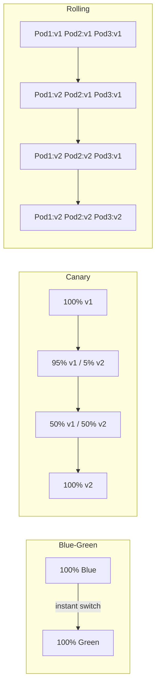
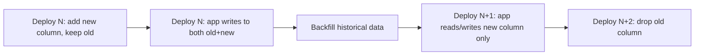
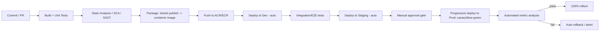
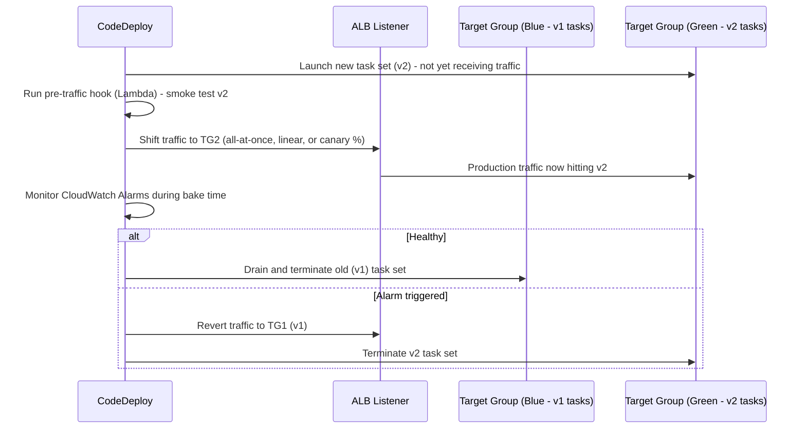

# Deployment Strategies — Interview Revision Notes

> Quick-revision Q&A `P. Deployment-Strategies-Interview-Guide.md` se derive kiya gaya hai. Source ka har section cover karta hai.

## Core Concepts

### "Deployment Strategy" ka Actual Matlab Kya Hai

**Q: Har deployment strategy kaun se teen questions answer karti hai?**

A: Changes ko downtime ke bina kaise ship karein, jab kuch galat ho jaye to blast radius kaise limit karein, aur jab wo ho jaye to fast rollback kaise karein. Koi single "best" strategy nahi hoti — right choice statefulness, compliance constraints, team maturity, aur cost tolerance ke basis par infrastructure cost, deployment speed, aur risk exposure ke beech trade-off karti hai.

**Q: Interviewer deployment strategies ke baare mein poochte waqt actually kya probe kar raha hota hai?**

A: Sirf definitions nahi ("blue-green define karo") balki yeh ki kya aapne actually kisi production system ko ek bad deploy se through operate kiya hai — traffic-shifting mechanics, session affinity, database compatibility windows, aur observability requirements.

### Blue-Green Deployment

**Q: Blue-green deployment kaise kaam karta hai?**

A:
- Do identical, fully-provisioned environments: Blue (current production) aur Green (new version).
- Green ko isolation mein deploy aur test kiya jaata hai jab Blue saara real traffic serve kar raha hota hai.
- Ek baar Green verify ho jaye, traffic atomically switch ho jaata hai (router/load balancer/DNS/CNAME swap).
- Rollback = traffic ko Blue par wapas flip karna.

**Q: Blue-green ke fayde aur nuksan kya hain?**

A:
- Fayde: cutover par zero downtime, instant rollback (traffic switch, redeploy nahi), Green ka full pre-production validation.
- Nuksan: expensive (2x infra), ek reliable traffic-switch mechanism chahiye (DNS TTL/caching delays ek common gotcha hai), aur database/schema state usually shared hoti hai — "two identical environments" model tab break ho jaata hai jab ek shared stateful backing store ho.

**Q: AWS Elastic Beanstalk use karke ek real-world blue-green example dikhao.**

A:

```bash
# Deploy the new version in Green
eb create green-environment

# Swap Blue and Green environments (CNAME swap)
eb swap-environment-cnames --source-environment blue-environment --destination-environment green-environment
```

Scenario walkthrough (banking app): Blue (v1.0) live hai → v2.0 Green mein deploy hota hai → Green ke against automated + manual tests run hote hain → agar pass ho jaye, traffic ko Green par swap karo → agar v2.0 misbehave kare, Blue par instantly swap back karo.

**Q: Blue-green describe karne ke baad kaun se follow-up questions expect karni chahiye?**

A:
- "Swap ke during in-flight requests ka kya hota hai?" → connection draining / graceful shutdown chahiye.
- "Database ka kya?" → usually shared hoti hai, isliye yeh actually sirf app tier par blue-green hai.
- "Session state kaise handle karte ho?" → sticky sessions blue-green ko break karte hain; stateless services + distributed cache/session store prefer karo.

### Canary Deployment

**Q: Canary deployment kaise kaam karta hai?**

A:
- New version ko traffic ke ek small slice par deploy karo (e.g., 5–10%).
- Error rates, latency, business metrics monitor karo.
- Agar healthy hai, traffic ko progressively increase karo (5% → 25% → 50% → 100%).
- Agar problems surface hote hain, halt karo aur us slice ko roll back karo.

**Q: Canary ke fayde aur nuksan kya hain?**

A:
- Fayde: blast radius minimize karta hai, real production signals use karke data-driven rollout, gradual controlled exposure.
- Nuksan: 100% tak pohochne mein slower (multiple soak/bake stages), real traffic-splitting infrastructure plus statistically meaningful sample sizes par solid observability chahiye.

**Q: Ek real-world canary example aur ek Kubernetes implementation do.**

A: Netflix ek streaming feature roll out kar raha hai: v2.0 ko 5% par deploy karo → monitor karo → 50% tak bump karo → 100% par jao.

```yaml
apiVersion: apps/v1
kind: Deployment
metadata:
  name: my-app
spec:
  replicas: 10
  selector:
    matchLabels:
      app: my-app
  template:
    metadata:
      labels:
        app: my-app
        version: canary
    spec:
      containers:
      - name: my-app
        image: my-app:v2.0
        ports:
        - containerPort: 80
```

Ingress ke through weighted traffic split:

```yaml
apiVersion: networking.k8s.io/v1
kind: Ingress
metadata:
  name: my-app-ingress
spec:
  rules:
  - http:
      paths:
      - path: /my-app
        backend:
          service:
            name: my-app
            port:
              number: 80
        weight: 20 # Send 20% traffic to Canary
```

**Q: Kya wo Ingress YAML vanilla Kubernetes par actually valid hai?**

A: Nahi. Plain Kubernetes `Ingress` (networking.k8s.io/v1) natively `weight` field support nahi karta — yeh vanilla Ingress spec ka part nahi hai. Weighted canary routing actually ek ingress controller extension (e.g., NGINX ka `nginx.ingress.kubernetes.io/canary-weight` annotation), ek service mesh (Istio VirtualService weighted routing), ya ek progressive-delivery controller (Flagger, Argo Rollouts) ke through achieve hota hai. YAML correct *intent* dikhata hai lekin stock Kubernetes par unmodified kaam nahi karega.

**Q: Canary describe karne ke baad kaun se follow-up questions expect karni chahiye?**

A:
- "Traffic split increments aur bake time kaise decide karte ho?" → SLO-based automated gates, gut feel nahi.
- "Kaun se users canary dekhenge, kaise pick karte ho?" → random sampling vs. sticky-by-user-id (UX ke liye consistency matter karti hai).
- "Tumhara automatic rollback trigger kya hai?" → error rate/latency SLO breach → Flagger/Argo Rollouts jaise controller ke through auto-abort, dashboard dekhta hua human nahi.

### Rolling Deployment

**Q: Rolling deployment kaise kaam karta hai, aur rollback par catch kya hai?**

A:
- Old-version instances ko incrementally new instances se replace kiya jaata hai (e.g., Kubernetes `Deployment` default `RollingUpdate` with `maxSurge`/`maxUnavailable`).
- Koi second full environment nahi chahiye — blue-green se cheaper.
- Rollback instant nahi hai — same incremental process ko reverse mein roll karte ho, time fleet size ke proportional hota hai.
- Mid-rollout, do versions simultaneously live traffic serve karte hue run hote hain, isliye transition window ke during N/N+1 API aur schema backward compatibility mandatory hai.
- Stateless services ke liye good default jahan cost instant rollback se zyada matter karta hai.

### Comparison Table: Blue-Green vs Canary vs Rolling vs Recreate

**Q: Recreate, Rolling, Blue-Green, aur Canary cost, speed, rollback, aur risk par kaise compare karte hain?**

A:

| Strategy | Infra Cost | Rollout Speed | Rollback Speed | Risk Exposure | Needs Traffic Splitting? | Typical Use Case |
|---|---|---|---|---|---|---|
| **Recreate** (old stop karo, new start karo) | Low | Fast | Slow (old redeploy) | High (downtime) | No | Dev/test environments, non-critical batch jobs |
| **Rolling** | Low–Medium | Medium | Medium (reverse rollout) | Medium | No (LB simply drain karta hai) | Stateless microservices ke liye default, cost-sensitive teams |
| **Blue-Green** | High (2x infra) | Fast cutover | Instant (traffic wapas flip) | Low (switch se pehle fully tested) | Yes (router/DNS/LB swap) | Regulated/critical systems jinhe instant, clean rollback chahiye |
| **Canary** | Medium (extra small fleet) | Slow (staged) | Fast (rollout stop, canary drain) | Lowest (limited blast radius) | Yes (weighted routing) | High-traffic consumer apps, gradual validated rollout |



## Feature Flags / Feature Toggles

### Feature Toggle Kya Hai

**Q: Feature toggle kya hai aur yeh kya decouple karta hai?**

A: Ek Feature Toggle (Feature Flag) deployment ko release se decouple karta hai — code production mein dark (disabled) ship hota hai aur independently (specific users, percentages, ya environments ke liye) redeploy ke bina on kiya jaata hai. Yeh trunk-based development aur continuous delivery ke underneath hota hai: aap incomplete ya risky work continuously merge/deploy kar sakte ho jab tak wo flag-guarded ho. Yeh teams ko features gradually roll out karne, sabko affect kiye bina production mein test karne, aur issue aane par feature ko instantly disable karne deta hai.

### Feature Toggles Kyun Use Karein

**Q: Feature toggles use karne ke main reasons kya hain?**

A:
- Risk-free deployments — default se off, progressively enabled.
- Instant rollback — poore deployment ko rollback karne ke bajaye flag disable karo (much faster MTTR).
- A/B testing — different cohorts ke liye enable karo aur impact measure karo.
- Continuous delivery — incomplete work ko flag ke peeche ship karo, baad mein finish karo, ready hone par flip on karo.

### Implementing Feature Toggles with LaunchDarkly in .NET

**Q: .NET app mein LaunchDarkly feature flags implement karne ke steps kya hain?**

A: Ek LaunchDarkly account/project create karo aur SDK key lo, SDK install karo, key configure karo, client initialize karo, phir controller mein toggle use karo.

```bash
dotnet add package LaunchDarkly.ServerSdk
```

```json
{
  "LaunchDarkly": {
    "SdkKey": "your-launchdarkly-sdk-key"
  }
}
```

**Q: Kya SDK key ko directly `appsettings.json` mein store karna safe hai, jaise example mein dikhaya gaya hai?**

A: Nahi — kabhi bhi real SDK key ko source control mein `appsettings.json` mein commit na karo. Production mein Azure Key Vault, User Secrets (dev), ya environment variables/App Configuration use karo, aur `IConfiguration` ke through bind karo — bas literal key ko check-in mat karo.

**Q: .NET mein LaunchDarkly client kaise initialize karte ho aur flag kaise check karte ho?**

A:

```csharp
using LaunchDarkly.Sdk;
using LaunchDarkly.Sdk.Server;
using Microsoft.Extensions.Configuration;
using System;

public class LaunchDarklyService : IDisposable
{
    private readonly LdClient _ldClient;

    public LaunchDarklyService(IConfiguration configuration)
    {
        var sdkKey = configuration["LaunchDarkly:SdkKey"];
        _ldClient = new LdClient(sdkKey);
    }

    public bool IsFeatureEnabled(string featureFlagKey, string userKey)
    {
        var user = User.WithKey(userKey);
        return _ldClient.BoolVariation(featureFlagKey, user, false); // Default is false
    }

    public void Dispose()
    {
        _ldClient.Dispose();
    }
}
```

**Q: DI mein `LdClient` ke saath lifetime gotcha kya hai?**

A: `LdClient` ek persistent streaming connection aur internal caches maintain karta hai — yeh construct karne mein expensive hai aur app ke lifetime ke liye singleton hona chahiye, `services.AddSingleton<LaunchDarklyService>()` ke roop mein registered. Har request par naya `LdClient` construct karna connections exhaust kar deta hai aur multi-second startup latency add karta hai, kyunki `LdClient` default se initial connection par briefly block karta hai.

**Q: Controller mein flag kaise consume karte ho?**

A:

```csharp
using Microsoft.AspNetCore.Mvc;

[Route("api/feature")]
[ApiController]
public class FeatureController : ControllerBase
{
    private readonly LaunchDarklyService _ldService;

    public FeatureController(LaunchDarklyService ldService)
    {
        _ldService = ldService;
    }

    [HttpGet("dark-mode")]
    public IActionResult GetFeatureStatus()
    {
        string featureFlagKey = "dark-mode";
        string userKey = "user-123"; // dynamic, from the authenticated user

        bool isEnabled = _ldService.IsFeatureEnabled(featureFlagKey, userKey);

        return Ok(new
        {
            message = isEnabled
                ? "Dark Mode is ENABLED for you!"
                : "Dark Mode is DISABLED for you."
        });
    }
}
```

### Testing Feature Toggles

**Q: LaunchDarkly flag ko end to end kaise test karoge?**

A:
1. LaunchDarkly dashboard mein, key `dark-mode` ke saath ek flag create karo aur ek specific user (`user-123`) target karo.
2. Endpoint call karo: `GET http://localhost:5000/api/feature/dark-mode`.
3. Enabled → `{ "message": "Dark Mode is ENABLED for you!" }`
4. Disabled → `{ "message": "Dark Mode is DISABLED for you." }`

### Real-World Use Cases

**Q: Feature flag usage ke kuch real-world examples kya hain?**

A:
- Facebook Dark Mode — general availability se pehle limited rollout.
- Netflix UI updates — user segments ke across UI variants ka A/B testing.
- Amazon promotions — discounts sirf Prime members tak scoped.

### Microservices Architecture mein Feature Flags

**Q: Microservices architecture mein feature flags kaun se cross-service problems introduce karte hain, aur unko kaise address karte ho?**

A:
- Flag evaluation centralize karo — ek shared flag platform use karo (LaunchDarkly, Azure App Configuration + Feature Management, Unleash, Split) taaki saari services flag state, targeting rules, aur audit history par agree karein.
- Flag context ko consistently propagate karo — ek fanned-out request ke across same targeting context (user ID, tenant, region) pass karo (header ya trace context) taaki saari services flag ko identically evaluate karein; inconsistent evaluation (Service A naya UI dikhata hai, Service B abhi bhi old contract validate karta hai) ek classic bug hai.
- Version/contract compatibility — ek flag ki "on" state services ke across ek dependency graph rakh sakti hai; flag dependencies (prerequisite flags) ko document karo aur jahan possible ho enforce karo.
- Local caching + streaming updates — SDKs ko flag values locally cache karni chahiye aur streaming/polling ke through push updates receive karni chahiye, har request par flag service ko synchronously call nahi karna chahiye (har request mein ek network hop/SPOF add karne se avoid karta hai).
- Yahan kill switches zyada matter karte hain — ek service mein bad release call graph ke through cascade ho sakta hai; ek feature ko instantly disable karna ek coordinated multi-service rollback se bachata hai.
- Scale par flag lifecycle/cleanup governance zyada matter karta hai — dozens of services flags accumulate karte hue ek distributed technical-debt aur security-audit problem ban jaate hain.

### Feature Flag Types aur Anti-Patterns

**Q: Feature flags ke different types aur unke lifespans kya hain?**

A:

| Flag Type | Lifespan | Purpose |
|---|---|---|
| **Release flag** | Short (days–weeks) | Deploy ko release se decouple karta hai; full rollout ke baad remove kiya jaata hai |
| **Experiment flag** (A/B) | Medium | Experimentation/analytics drive karta hai; experiment conclude hone ke baad remove kiya jaata hai |
| **Ops / kill switch** | Long-lived | Ek feature/dependency ke liye circuit-breaker; operability ke liye permanently rakha jaata hai |
| **Permission / entitlement flag** | Permanent | Plan/tier se features gate karta hai (e.g., Prime-only discounts) — business logic hai, deploy mechanism nahi |

**Q: Common feature-flag anti-patterns kya hain?**

A:
- Flag debt — 100% rollout ke baad release flags ko kabhi remove na karna, dead `if` branches aur combinatorial testing explosion chhod dena.
- Flags jo non-idempotent side effects ko wrap karte hain (e.g., half state already written hone ke baad mid-transaction toggling) — flags ko behavior gate karna chahiye, ek unit of work ke andar flip nahi hona chahiye.
- Sirf "on" aur "off" ko isolation mein test karna, kabhi other active flags ke combination mein nahi — flag interaction bugs scale par ek real production risk hain.

## Intermediate Topics

### Zero-Downtime Database Migrations

**Q: Zero-downtime database migration ek commonly-missed lekin critical topic kyun hai?**

A: Blue-green, canary, aur rolling sab assume karte hain ki transition window ke during database old aur new app versions ke across shared hoti hai — yeh topic aksar un notes mein skip ho jaata hai jo sirf app-tier strategies cover karte hain, aur ek favorite senior-level interview probe hai.

**Q: Expand/contract (parallel change) pattern kya hai?**

A:
1. Expand — naya schema element (column/table) add karo bina kisi purani cheez ko remove ya rename kiye; old aur new dono app code ko is schema ke against work karna chahiye.
2. Migrate/backfill — data ko naye structure mein backfill karo, zaroorat pade to dual-write karo (old code old+new likhta hai, ya ek background job sync karta hai).
3. Contract — ek baar saare instances naya code run karein aur verify ho jaayein, ek later, separate deployment mein old schema element remove karo.



**Q: Mid-rollout schema changes ke liye concrete rules of thumb kya hain?**

A:
- Ek step mein kabhi breaking rename mat karo — hamesha multiple deploys ke across "add new" → "migrate" → "remove old" karo.
- Additive changes (`ADD COLUMN` nullable, new table) generally mid-rollout safe hote hain.
- Destructive changes (`DROP COLUMN`, `NOT NULL` default ke bina, renaming) ko tab tak wait karna chahiye jab tak fleet ka 100% wo code run na kare jo old shape ko reference nahi karta.
- EF Core ke liye: multi-instance rolling deployment mein app startup par `Database.Migrate()` ko automatically run hone se avoid karo — migrate karne ke liye race karte concurrent instances deadlock ya state corrupt kar sakte hain. Migrations ko naya version traffic receive karne se pehle ek separate, single pre-deploy step (CI/CD migration job) ke roop mein run karo.
- Large table migrations (indexes, backfills) online/incrementally hone chahiye (batched updates, `CREATE INDEX ONLINE`/concurrently) production tables ko lock karne se avoid karne ke liye.
- Blue-green ke liye: Blue aur Green typically same database share karte hain, isliye "database ke liye blue-green" ek much harder, separate problem hai (aksar read replicas + cutover ke through, ya transition ke during DB ko append-only treat karke solve kiya jaata hai) — app-tier blue-green ko DB-tier blue-green ke saath conflate mat karo.

### Stateful Services ke liye Rollback Strategy

**Q: Stateless services ke liye rollback trivial lagta hai — harder senior question kya hai?**

A: State ka kya hota hai. Key concerns:

- Schema compatibility — rollback cleanly sirf tab kaam karta hai jab previous code version current schema/data ke against abhi bhi run kar sake; rollback safety preserve karne ke liye destructive migrations ko code deploys se ek full contract cycle peeche lag karna chahiye.
- Message queue / event-driven state — agar naye version ne ek message schema change kiya (e.g., ek naya required Kafka/Service Bus field), naye version dwara produce ki gayi in-flight messages ko handle kiye bina consumer ko rollback karna deserialization failures cause kar sakta hai; schema versioning/tolerant readers use karo (unknown fields ko ignore karo).
- Cache poisoning — agar naye version ne ek shared cache (Redis) mein ek naya shape likha, un keys ko invalidate kiye bina code rollback karna old code ko crash kar sakta hai; cache keys ko version karo (e.g., `user:v2:{id}`) taaki old aur new collide na karein.
- Replays ke liye idempotency — rollback ka matlab aksar operations ko replay/retry karna hota hai; idempotency keys use karo (payment/order APIs) taaki retries double-charge ya double-write na karein.
- Kubernetes mein stateful sets — ek `StatefulSet` ko rollback karna ek `Deployment` se fundamentally different hai: ordered, one-at-a-time rollback, aur aapko check karna hoga ki persistent volume ka data abhi bhi older image ke saath compatible hai.
- Feature-flag-first rollback — kai incidents ke liye fastest, safest "rollback" risky code path ko guard karne wale flag ko disable karna hai, ek full deployment rollback nahi; un issues ke liye infra rollback ko fallback ke roop mein use karo jo flags cover nahi kar sakte (bad image, bad logic nahi).

### Deployment in Kubernetes / AKS / EKS

**Q: Raw YAML se aage senior interview kaun se Kubernetes/AKS/EKS platform details expect karta hai?**

A:
- Deployment object — default strategy `RollingUpdate` hai configurable `maxSurge` (desired count se upar extra pods) aur `maxUnavailable` (kitne down ho sakte hain) ke saath; inko tune karna rollout speed vs. resource headroom vs. availability ka trade-off karta hai.
- Readiness vs. liveness probes — rolling updates sirf un pods ko traffic route karti hain jo readiness checks pass karte hain; ek pod alive ho sakta hai lekin ready nahi. Misconfigured probes "rolling deploy ne brief outage cause kiya" ka #1 cause hain — unready pods ko traffic bheja jaana, ya `livenessProbe` ready hone se pehle healthy-but-slow-starting .NET pods (cold JIT/ReadyToRun startup) ko kill kar dena.
- PodDisruptionBudget (PDB) — voluntary disruptions (node drains, cluster upgrades) ke during ek minimum healthy replica count guarantee karta hai, deployment strategy se separate hai lekin uske saath interact karta hai.
- AKS: weighted/canary routing ke liye Azure Load Balancer / Application Gateway Ingress Controller (AGIC) ke saath integrate karta hai; Azure DevOps aur GitHub Actions dono ke paas first-class AKS deploy tasks hain (`kubectl`, Helm, `azure/k8s-deploy`).
- EKS: typically traffic shaping ke liye AWS ALB Ingress Controller ya App Mesh/Istio ke saath paired hota hai; aksar CodeDeploy ke native Blue/Green aur Canary support ECS/EKS ke liye, ya Argo Rollouts ke through driven hota hai.
- AKS/EKS dono raw Kubernetes primitives par layered progressive-delivery controllers ke roop mein Flagger ya Argo Rollouts support karte hain — jo most real canary/blue-green implementations 2026 mein use karte hain, hand-rolled Ingress weight annotations ke bajaye.
- Helm / Kustomize — environment-specific manifests ke liye templating; templated manifests + environment-specific values files ke ek single source ke through config drift avoid karo, environments ke through CI ke through promoted, har environment mein hand-edited nahi.

## Advanced Topics

### Progressive Delivery

**Q: "Progressive delivery" kya hai aur interview mein yeh term kyun use karni chahiye?**

A: Canary + feature flags + automated analysis combined ke liye ek umbrella term (Weaveworks/James Governor dwara coined). Isko use karna canary/blue-green/flags ko teen unrelated ideas treat karne ke bajaye currency signal karta hai.

- Automated analysis/gating — Flagger ya Argo Rollouts ek canary stage ke during Prometheus/Datadog metrics (error rate, latency, business metrics) watch karte hain aur automatically promote ya abort karte hain, human-watching-a-dashboard step ko remove karte hain.
- Feature flags ke saath combine hota hai — infrastructure ko canary-deploy karo (new pods) jab feature ko separately flag-gate kiya jaaye — do independent risk levers.
- Traffic mirroring/shadowing — user ko response return kiye bina production traffic ka ek copy naye version ko bhejo, zero user-facing risk ke saath real load ke under behavior validate karo.

**Q: Progressive delivery canary se kaise different hai?**

A: Canary ek technique hai; progressive delivery canary analysis, flags, aur rollback decisions ko end-to-end automate karne ki practice hai taaki releases ko koi manual gate-watching na chahiye.

### GitOps

**Q: GitOps kya hai aur deployment strategy ke liye yeh kyun matter karta hai?**

A:
- Definition — desired infra/deployment state Git mein declare ki jaati hai (manifests, Helm values, Kustomize overlays); ek controller (ArgoCD, Flux) continuously live cluster ko Git ke match karne ke liye reconcile karta hai, ek CI pipeline imperatively `kubectl apply` run karne ke bajaye.
- Yeh kyun matter karta hai — Git single audit trail aur rollback mechanism ban jaata hai: ek bad deploy ka rollback literally manifest par `git revert` hai, aur GitOps controller cluster ko automatically reconcile karta hai — "old pipeline re-run karo" se ek stronger, more auditable story.
- Push vs. pull model — traditional CI/CD changes ko cluster mein push karta hai (CI cluster credentials hold karta hai — ek security surface); GitOps controllers Git se pull karte hain aur cluster ke andar se reconcile karte hain, isliye koi external system ko prod cluster credentials nahi chahiye.
- Drift detection — GitOps continuously Git ke bahar kiye gaye manual `kubectl` changes ("configuration drift") ko detect karta hai aur auto-correct kar sakta hai — regulated environments mein valuable.
- Progressive delivery ke saath tie karta hai — Argo Rollouts ArgoCD ke saath integrate hota hai canary/blue-green ko ek GitOps-native, declarative resource (`Rollout` CRD replacing `Deployment`) banane ke liye.

### Deployment Strategies: Microservices vs Monolith

**Q: Monolith aur microservices ke beech deployment concerns kaise different hote hain?**

A:

| Aspect | Monolith | Microservices |
|---|---|---|
| **Unit of deployment** | Poora app, ek artifact | Har service independently |
| **Blue-green cost** | Ek large environment duplicated (simpler, lekin double karna expensive) | Per-service blue-green ho sakta hai (per-service cheaper, lekin N services ke versions coordinate karna complex hai) |
| **Canary granularity** | Coarse — poore app ko canary karo | Fine-grained — dusron ko touch kiye bina ek service ko canary karo |
| **Contract/versioning risk** | Low (single deployable, internal calls in-process hoti hain) | High — independent rollouts ke during har service boundary ko backward/forward-compatible contracts chahiye |
| **Rollback blast radius** | Poore app ka all-or-nothing rollback | Sirf offending service ko rollback kiya ja sakta hai |
| **Database migration coordination** | Single DB, single migration path (abhi bhi expand/contract chahiye) | Potentially many DBs (database-per-service) — independent migrations, lekin partial rollout ke during cross-service data consistency ke liye sagas/eventual consistency chahiye |
| **Deployment frequency** | Aksar lower (bigger, riskier releases) | Higher (small, frequent, isolated releases) |
| **Tooling complexity** | Lower — ek pipeline | Higher — orchestration, service mesh, distributed tracing near-mandatory ban jaate hain |

**Q: Kya microservices deployment strategies ko khud change karte hain?**

A: Nahi — blue-green/canary/rolling sab abhi bhi apply hote hain; microservices coordination problem ko instead multiply kar dete hain: per-service independent deploy cadence ka matlab hai ki aapko continuously N aur N+1 version compatibility ke liye design karna hoga, sirf ek deploy window ke during nahi, kyunki kisi bhi moment kuch services doosri se aage hoti hain.

### Dark Launches / Shadow Traffic / A-B Testing at Infrastructure Level

**Q: Dark launch kya hai, aur yeh canary aur feature flags se kaise different hai?**

A: Ek dark launch production mein naya code run karta hai bina real users ko uska output expose kiye — e.g., ek naya recommendation engine parallel mein run karna, uske results log karna, current engine ke against offline compare karna, kabhi user ko output dikhaye bina. Yeh ek validation technique hai, canary se distinct hai (jo real users ko expose karta hai) aur ek feature flag se distinct hai (ek on/off switch, shadow comparison nahi).

**Q: Infrastructure level par traffic mirroring/shadowing kya hai?**

A: Load balancer/service mesh ek request ko old aur new dono versions ko duplicate kar deta hai; sirf old version ka response client ko return hota hai. Istio aur kuch API gateways isko natively support karte hain (`mirror` in a VirtualService).

**Q: A/B testing canary se kaise different hai?**

A: Canary ek risk-mitigation rollout mechanism hai — temporary, 100% ya 0% par converge hota hai. A/B testing ek experimentation mechanism hai — indefinitely run ho sakta hai, dono variants "correct" hote hain, aur aap ek business metric measure kar rahe ho, safety nahi. Interviewers is distinction ko sunte hain.

### CI/CD Pipeline Design for .NET (Azure DevOps / GitHub Actions)

**Q: .NET ke liye ek concrete, current CI/CD pipeline shape sketch karo.**

A:



**Q: Kaun se principles is pipeline shape ko solid banate hain?**

A:
- Immutable artifacts — ek baar build karo, same container image/artifact ko Dev → Staging → Prod ke through promote karo; har environment mein kabhi rebuild na karo ("works in staging, different bits in prod" avoid karta hai).
- Environment-specific config, environment-specific builds nahi — `appsettings.{Environment}.json`, Azure App Configuration, ya env vars/K8s ConfigMaps/Secrets deploy time par injected.
- Approval gates — Azure DevOps environments / GitHub Actions environments prod deploy job run hone se pehle required reviewers support karte hain, regulated .NET shops (banking, healthcare) ke liye standard.
- Migrations ek pipeline stage ke roop mein — ek baar run karo, naya version traffic receive karne se pehle.

### AWS-Specific Deployment Mechanics

**Q: Yeh guide ek AWS-specific section kyun add karta hai, aur framing kya hai?**

A: Upar ki har cheez (blue-green, canary, rolling, progressive delivery, GitOps) principle mein framework-agnostic hai, lekin concrete implementations entirely Kubernetes-flavored hote hain. Kyunki target cloud AWS hai, yeh section same strategies ko AWS-native mechanics mein ground karta hai aur unko actual IaC tool ke roop mein Terraform/CDKTF se connect karta hai.

#### AWS CodeDeploy — Blue/Green for EC2, ECS, and Lambda

**Q: AWS CodeDeploy ka blue/green mechanic EC2, ECS, aur Lambda targets ke across kaise different hota hai?**

A:

| Target | What "Blue" and "Green" mean | Traffic-shift mechanism | Rollback |
|---|---|---|---|
| **EC2 (in-place ya blue/green)** | Blue = existing ASG/instance fleet; Green = ek freshly provisioned, fully-provisioned replacement fleet | CodeDeploy instances ko existing ELB/Target Group ke peeche re-register karta hai, ya Target Groups ko entirely swap karta hai | Green fleet ko terminate karo, Blue fleet (cutover complete hone tak still running) serving jaari rakhta hai |
| **ECS** | Blue = current running task set (existing task definition revision); Green = same service par new task set (new task definition revision) | ALB listener rule do Target Groups (har task set ke liye ek) ke beech traffic shift karta hai — all-at-once, linear, ya canary ho sakta hai | CodeDeploy automatically ALB listener ko original (Blue) Target Group par wapas reroute karta hai |
| **Lambda** | Blue = currently aliased function version; Green = newly published function version | Lambda alias traffic shifting — alias ka weighted routing config invocations ka ek percentage naye version par shift karta hai | Alias weight original version par 100% revert ho jaata hai |

**Q: CodeDeploy ek bad deployment ko automatically kaise abort karta hai?**

A: Teeno targets ke liye, CodeDeploy ko CloudWatch Alarms (error rate, latency) se wire kiya ja sakta hai taaki ek bad deployment automatically halt ho jaaye aur mid-shift rollback ho jaaye bina dashboard dekhte human ke — Flagger/Argo Rollouts ke automated canary analysis ka direct AWS-native analog.

#### ECS Blue/Green Deployments in Detail

**Q: ECS blue/green mechanics ko ek level deeper walk through karo.**

A:



- ECS isko natively service par `CODE_DEPLOY` deployment controller ke through support karta hai, default `ECS` rolling-update controller ke against (Kubernetes `RollingUpdate` ka ECS ka apna equivalent — koi second Target Group nahi, koi traffic-shift granularity nahi, bas incremental task replacement).
- Traffic-shift options Flagger/Argo Rollouts ko mirror karte hain: Canary (e.g., N minutes ke liye 10%, phir 100%), Linear (timer par fixed percentage increments), ya AllAtOnce (safety ke liye pre/post-traffic hooks aur alarms par relying karne wala full cutover).
- Pre-traffic aur post-traffic Lambda hooks aapko real traffic Green tak pohochne se pehle validation run karne dete hain, aur shift complete hone ke baad phir se — Progressive Delivery ke automated analysis gate ka AWS-native equivalent.

#### Route 53 Weighted Routing for Gradual Traffic Shifting

**Q: Route 53 weighted routing DNS-layer traffic shifting kaise provide karta hai, aur catch kya hai?**

A:

```
Record: api.example.com
  → Weighted record A (Blue stack ALB)   weight = 90
  → Weighted record B (Green stack ALB)  weight = 10
```

- Route 53 har DNS query ko weight ratio ke according probabilistically resolve karta hai — enough queries mein, ~10% new connections Green par land karti hain.
- Guide mein kahin aur flag ki gayi same DNS TTL/caching gotcha yahan bhi apply hoti hai: jo clients/resolver caches Blue IP ko already resolve aur cache kar chuke hain wo TTL expire hone tak re-resolve nahi karenge, isliye ek weighted Route 53 shift gradual aur edges par "fuzzy" hoti hai, ek precise instant percentage nahi — ek ALB-layer ya service-mesh-layer split se materially different, jo existing connections ko more precisely aur immediately shift karta hai.
- Aksar Route 53 health checks ke saath paired hota hai taaki agar target ALB/endpoint health checks fail kare to ek weighted record automatically rotation se pull ho jaaye — CodeDeploy ke CloudWatch-Alarm-driven abort ke comparison mein ek coarser, DNS-layer safety net.
- Typical use case: cross-region blue-green (e.g., `us-east-1` se ek newly-deployed `us-west-2` stack par shift karna) jahan koi single shared load balancer nahi hota jiske front mein canary/blue-green controller place kiya ja sake.

#### Terraform/CDKTF Driving Deployment Orchestration

**Q: Kya Terraform/CDKTF khud blue-green deploy perform karta hai?**

A: Nahi, directly nahi. Terraform fundamentally ek provisioning tool hai (declarative infrastructure state), CodeDeploy/Argo Rollouts jaisa ek deployment orchestrator nahi. Terraform/CDKTF deployment machinery ko khud provision karta hai — CodeDeploy Application/DeploymentGroup resources, ECS service ka `deployment_controller` block, ALB listener rules aur dono Target Groups, Lambda alias aur uska `routing_config` weighted-alias block, aur Route 53 weighted record sets. Short mein: Terraform/CDKTF rails set up karta hai; CodeDeploy (ya ek CI/CD pipeline step) har release par train ko unke saath drive karta hai.

```hcl
resource "aws_codedeploy_deployment_group" "ecs_bluegreen" {
  app_name               = aws_codedeploy_app.order_api.name
  deployment_group_name  = "order-api-dg"
  service_role_arn       = aws_iam_role.codedeploy.arn
  deployment_config_name = "CodeDeployDefault.ECSLinear10PercentEvery1Minute"

  deployment_style {
    deployment_type   = "BLUE_GREEN"
    deployment_option  = "WITH_TRAFFIC_CONTROL"
  }

  blue_green_deployment_config {
    terminate_blue_instances_on_deployment_success {
      action                           = "TERMINATE"
      termination_wait_time_in_minutes = 5
    }
  }

  ecs_service {
    cluster_name = aws_ecs_cluster.main.name
    service_name = aws_ecs_service.order_api.name
  }

  load_balancer_info {
    target_group_pair_info {
      target_group {
        name = aws_lb_target_group.blue.name
      }
      target_group {
        name = aws_lb_target_group.green.name
      }
      prod_traffic_route {
        listener_arns = [aws_lb_listener.https.arn]
      }
    }
  }
}
```

**Q: Terraform aur deployments ke regarding common junior mistake kya hai, aur correct mental model kya hai?**

A: Terraform khud live traffic shift perform nahi karta ya mid-deployment CloudWatch Alarms watch nahi karta — ek baar naya task definition/Lambda version deployment trigger kare to yeh CodeDeploy ka runtime job hai. Har code release par `terraform apply` run karna (per deploy poore stack ko re-apply karna) wrong mental model hai. Correct split: Terraform/CDKTF infrastructure manage karta hai (rarely change hota hai), jab CI/CD pipeline (e.g., GitHub Actions) har release par ek CodeDeploy deployment trigger karta hai ya ek ECS task definition/Lambda alias update karta hai — infrastructure changes aur application deployments do different change cadences hain do different mechanisms use karte hue.

**Q: CDKTF-specific angle mention karne layak kya hai?**

A: CDKTF aapko same HCL-equivalent resources ko TypeScript/C# mein express karne deta hai, isliye ek .NET-background candidate services ke across shared ek reusable "blue-green ECS service" construct/module build kar sakta hai, har repo mein CodeDeploy/Target-Group/Listener HCL block copy-paste karne ke bajaye — reusable GitHub Actions workflows ke liye same DRY argument structurally CDKTF constructs par apply hota hai.

## Best Practices

**Q: Interview mein cite karne ke liye key deployment-strategy best practices kya hain?**

A:
- Rollback decision ko automate karo, dashboards dekhte humans par rely mat karo — canary/progressive delivery ko SLO-based automated analysis (Flagger, Argo Rollouts, ya Application Insights/Datadog metrics par custom pipeline gates) se wire karo.
- Jahan bhi risk logic mein ho wahan feature flags use karke deploy ko release se decouple karo; deployment-strategy rollback (blue-green/canary abort) ko runtime/infrastructure mein risk ke liye reserve karo (bad image, crash loops, resource exhaustion).
- Hamesha N/N+1 compatibility ke liye design karo — rolling, canary, ya blue-green sab imply karte hain ki do versions temporarily coexist karte hain; API contracts aur DB schemas ko yeh tolerate karna chahiye, sirf "deploy day" nahi.
- Database migrations ko expand/contract use karke ek separate, ordered pipeline stage ke roop mein treat karo, multi-instance deployment mein kabhi app startup mein bundle mat karo.
- Zaroorat padne se pehle instrument karo — canary/progressive delivery version/cohort se segmented per-version metrics (error rate, latency, business KPIs) ke bina worthless hai.
- Rollback practice karo, sirf plan mat karo — regularly rollback path exercise karo (game days/chaos exercises) taaki yeh pressure ke under proven ho.
- Flag lifecycle hygiene maintain karo — flag age track karo, stale flags par alert karo, full rollout ke baad promptly release flags remove karo.
- Immutable infrastructure/artifacts prefer karo — containers/images ek baar build hote hain aur promote hote hain, in place mutate nahi hote.

## Common Pitfalls

**Q: Deployment-strategy interview mein call out karne ke liye common pitfalls kya hain?**

A:
- DNS-based blue-green switching use karna aur DNS TTL/client-side caching bhool jaana, iska matlab hai "instant" cutover actually sabhi clients ke liye instant nahi hota.
- Rolling deployment ke during har instance ke startup par EF Core auto-migrations run karna — race conditions aur partial-migration states.
- Canary (risk mitigation, 0/100% par converge hota hai) ko A/B testing (experimentation, indefinitely run ho sakta hai) ke saath confuse karna.
- Feature flags ko free treat karna — flag debt accumulate karna, untested flag combinations, aur experiment/rollout khatam hone ke baad bhi code mein reh gaye flags.
- Assume karna ki blue-green aapko "for free" ek clean database story deta hai — nahi deta; DB usually shared hoti hai aur usko apni expand/contract discipline chahiye.
- Misconfigured Kubernetes readiness probes rolling updates ko unready pods ko traffic bhejne ka cause banate hain (ek deploy ke during brief user-facing errors jo zero-downtime hona chahiye tha).
- Older version ke saath schema/message/cache compatibility consider kiye bina application code ko rollback karna — rollback khud ek outage cause karta hai.
- Ek bare `weight` field ke saath Ingress YAML copy-paste karna aur assume karna ki vanilla Kubernetes Ingress out of the box canary weighting support karta hai — nahi karta; aapko ek ingress controller extension, mesh, ya progressive-delivery controller chahiye.

## Sample Interview Q&A

**Q: Mujhe walk through karo ki aap zero downtime ke saath ek breaking database schema change kaise deploy karoge.**

A: Breaking change ko kabhi ek step mein ship mat karo. Expand/contract use karo: (1) naya column/table additively add karo jab old code kaam karta rahe; (2) naya app code deploy karo jo old aur new dono mein likhta hai (dual-write) ya asynchronously backfill karta hai; (3) ek baar 100% instances wo code run karein jisko sirf new shape chahiye, old column mein likhna band karne ke liye phir se deploy karo; (4) ek final, later deploy mein, old column drop karo. Har step independently deployable aur rollback-safe hai kyunki schema hamesha ek superset hota hai jisko old aur new dono code tolerate kar sakte hain.

**Q: Blue-green deployment aapko instant rollback deta hai — catch kya hai?**

A: Instant rollback claim actually sirf app tier ke baare mein hai. Agar Blue aur Green same database share karte hain (common case), Green dwara likha gaya koi bhi data jo Blue ki expectations ke saath incompatible hai (new schema, new message formats) ka matlab hai "traffic ko wapas switch karna" actually us state ko undo nahi karta. True instant, safe rollback ke liye schema/API ko already backward compatible hona zaroori hai — traffic switch easy part hai; compatibility discipline hard part hai.

**Q: Aap kab canary ko blue-green ke upar choose karoge, ya vice versa?**

A: Canary jab aapko smallest possible blast radius chahiye aur strong per-cohort metrics/traffic-splitting infrastructure ho — high-traffic consumer services ke liye good jahan affected users ka ek small percentage gradual confidence-building ke liye ek acceptable trade hai. Blue-green jab aapko instant total rollback ke saath ek clean, fully-tested cutover chahiye aur duplicate infrastructure tolerate kar sakte ho (ya already hai) — regulated environments (e.g., banking) mein common jahan kisi bhi user ke liye broken version ka partial exposure unacceptable hai, lekin ek full pre-switch validation window achievable hai. Mature CI/CD wali cost-sensitive teams aksar instead rolling deployments ko default karti hain, slightly slower rollback accept karte hue much lower infra cost ke liye.

**Q: Feature flags aapke incident response ko kaise change karte hain?**

A: Wo aapko ek sub-second "rollback" lever dete hain jisko deployment pipeline ko touch karne ki zaroorat bilkul nahi hoti — flag disable karo, aur risky code path saare users ke liye immediately execute hona band kar deta hai, koi redeploy nahi, ek rolling/canary process ko reverse hone ke liye wait nahi karna padta. Yeh typically ek flag ke peeche logic bug ke liye aapka first response hona chahiye; full deployment rollback un issues ke liye necessary rehta hai jo flag cover nahi karta (bad binary, crash loops, infra misconfiguration).

**Q: Feature-flag evaluation microservices architecture mein monolith ke versus kaise change hota hai?**

A: Ek monolith mein, flag evaluation consistent state ke saath ek single in-process call hoti hai. Microservices mein, same logical request multiple services ko hit kar sakti hai, aur har ek ko us request ke liye flag ko consistently evaluate karna hota hai — jisko service boundaries (headers ya trace context) ke across targeting context (user/tenant ID) ki propagation chahiye, aur ek centralized flag platform par reliance chahiye taaki saari services current flag state par agree karein har ek ke independently polling/caching aur out of sync drift karne ke bajaye.

**Q: Ek canary ko promote ya abort karna hai yeh decide karne ke liye aap kya monitor karoge?**

A: Version se segmented golden signals: error rate, p95/p99 latency, saturation (CPU/memory/thread pool), plus feature se relevant kam se kam ek business metric (conversion rate, checkout completion) — canary aur baseline cohorts ke beech statistically compared, eyeballed nahi. Ideally ek automated analysis tool (Flagger/Argo Rollouts) se wired jiske paas defined SLO thresholds hain jo auto-abort karte hain, bake window ke during dashboard dekhte human on-call ke bajaye.
