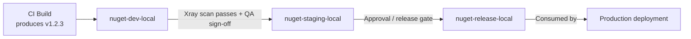

# JFrog Artifactory — Interview Revision Notes

> Quick-revision Q&A `Q. JFrog-Artifactory-Interview-Guide.md` se derive kiye gaye hain. Source ke har section ko cover karta hai.

## Core Concepts

### JFrog Artifactory kya hai

**Q: JFrog Artifactory kya hai, ek sentence mein?**

A: Ek universal binary repository manager jo build artifacts (packages, containers, libraries) ko secure, scalable, access-controlled tarike se store, version, aur distribute karta hai — source control aur production ke beech "kya build hua aur kya ship hua" ke liye single source of truth.

**Q: Interviewer "yeh sirf NuGet packages store karta hai" se aage kya senior-level framing sunna chahta hai?**

A: Artifactory artifact provenance aur supply-chain control point hai. Production tak pahunchne wali har binary ko exact commit, build, aur dependency set tak traceable hona chahiye jisne use produce kiya — yeh governance/traceability tool hai, sirf storage nahi.

### Isko kyun use karein

**Q: Builds ko directly public registries (NuGet.org/npmjs.com) par point karne ke bajaye Artifactory kyun use karein?**

A:
- Supply-chain risk — ek public registry outage, yanked package, ya malicious/typosquatted dependency aapke build ko break ya compromise kar sakta hai; ek private proxy/cache control aur fallback deta hai.
- Compliance — regulated industries ko auditable, access-controlled artifact store chahiye; production builds directly public internet par point nahi kar sakte.
- Performance — caching har build par internet se same package re-download karne se bachati hai, jo CI scale par bahut matter karta hai.

**Q: Artifactory kaunsi core capabilities provide karta hai?**

A:
- Binaries, Docker images, Helm charts, aur other build artifacts ke liye central repository.
- Multi-package-type support: Maven, npm, NuGet, PyPI, Docker, Helm, RPM, etc. — many single-purpose registries ke bajaye ek platform.
- External repositories (Maven Central, npm registry, NuGet.org, Docker Hub) ka caching/proxying.
- CI/CD integrations: Jenkins, GitHub Actions, GitLab CI/CD, Azure DevOps.
- Security: access control, vulnerability scanning (Xray), license compliance.
- Deployment options: Cloud (SaaS) ya On-Premises (self-hosted).

### Key Features

**Q: Artifactory ke key feature areas kya hain?**

A:
1. Repository Management — local, remote, virtual repositories; har repository/path ke liye permission targets ke through fine-grained access control.
2. Universal Binary Repository — Maven, Gradle, npm, NuGet, Docker, PyPI, etc., har ek ka apna native dependency-management semantics.
3. Build Integration — Jenkins, Azure DevOps, GitHub Actions, Bitbucket Pipelines; artifact storage, versioning, build-info capture.
4. Security & Compliance — vulnerabilities/licenses ke liye Xray scanning; access tokens, LDAP, SSO, RBAC.
5. High Availability & Scalability — multi-node clustering, distributed teams ke liye geo-replication.

## Repository Types

### Local, Remote, Virtual Repositories

**Q: Local, remote, aur virtual repositories mein kya difference hai?**

A:
- Local — internally developed/built artifacts store karta hai (jaise, team ke `.nupkg` files store karne wala NuGet repo); aapka CI pipeline isme push karta hai.
- Remote — ek external repository (jaise, NuGet.org, npm registry) ke liye proxy/cache; Artifactory khud pull-through karke cache karta hai, consumers ke liye read-only.
- Virtual — multiple local + remote repos ko ek URL ke peeche aggregate karta hai; yeh routing/aggregation layer hai, physical storage nahi.

**Q: Developers/CI ko actually kaunsi repository type par point karna chahiye, aur kyun?**

A: Hamesha ek virtual repository, kabhi local ya remote directly nahi. Isse ek stable URL/feed milta hai regardless ki backing repos baad mein kaise reorganize ho, aur yehi transparent promotion aur proxying ko enable karta hai.

### Virtual Repositories mein Resolution Order

**Q: Ek virtual repository request kaise resolve karta hai, aur resolution order kyun matter karta hai?**

A: Yeh member repositories ko ek configured order mein check karta hai — local repos first typical/recommended pattern hai, phir remote/cached repos. Yeh in cheezon ke liye matter karta hai:
1. Correctness — agar internal package name kisi public wale se collide karta hai, resolution order decide karta hai ki kaunsa wins karega.
2. Dependency confusion attacks — attacker aapke internal package ke same naam se public registry par ek malicious package publish karta hai; agar virtual repo local se pehle remote check karta hai (ya names ko scope nahi karta), build silently attacker ka package pull kar sakta hai.

**Q: Artifactory mein dependency confusion attacks ko kaise mitigate karein?**

A:
- Virtual repo configuration mein hamesha remote se pehle local repos resolve karein.
- Scoped/prefixed internal package names use karein (jaise, `Contoso.*`) jo public names se collide hone ki possibility kam ho.
- Remote repositories par include/exclude patterns consider karein taaki aapka internal namespace externally kabhi resolve na ho.

```mermaid
flowchart LR
    Dev[Developer / CI Build] -->|nuget restore| VR[Virtual Repo: nuget-virtual]
    VR --> LR[Local Repo: nuget-local\n(internal packages)]
    VR --> RR[Remote Repo: nuget-remote\n(proxy/cache of NuGet.org)]
    RR -->|cache miss| Ext[(NuGet.org)]
    LR -->|checked first| Result[Package returned to build]
    RR -->|checked if not found locally| Result
```

### .NET Teams ke liye NuGet-Specific Repository Setup

**Q: Artifactory mein .NET shop ke liye NuGet repositories kaise set up karenge?**

A:
- Ek NuGet local repo banayein (jaise, `nuget-local`) uss artifacts ke liye jo aapki teams publish karti hain.
- Ek NuGet remote repo banayein (jaise, `nuget-remote`) jo `https://api.nuget.org/v3/index.json` par point kare public packages proxy/cache karne ke liye.
- Ek NuGet virtual repo banayein (jaise, `nuget`) jo dono ko combine kare — yeh single feed URL hai jo har `NuGet.Config` aur CI job ko reference karna chahiye.

**Q: Artifactory par point karne wala typical `NuGet.Config` kaisa dikhta hai?**

A:

```xml
<?xml version="1.0" encoding="utf-8"?>
<configuration>
  <packageSources>
    <clear />
    <add key="corp-artifactory" value="https://artifactory.example.com/artifactory/api/nuget/v3/nuget" />
  </packageSources>
  <packageSourceCredentials>
    <corp-artifactory>
      <add key="Username" value="%ARTIFACTORY_USER%" />
      <add key="ClearTextPassword" value="%ARTIFACTORY_API_KEY%" />
    </corp-artifactory>
  </packageSourceCredentials>
</configuration>
```

**Q: dotnet CLI ke through Artifactory par package kaise push karte hain?**

A:

```bash
dotnet nuget push my-package.1.0.0.nupkg -s corp-artifactory -k %ARTIFACTORY_API_KEY%
```

**Q: NuGet v2 vs v3 protocol endpoint Artifactory mein — kaunsa use karna chahiye?**

A: Hamesha v3 (`api/nuget/v3/<repo>`) prefer karein — yeh JSON-based aur faster hai, aur yehi modern `dotnet` CLI tooling expect karta hai. Legacy v2 endpoint slower hai aur mainly legacy `nuget.exe` compatibility ke liye hai.

## Pipeline mein Artifactory Use Karna

### Manual Upload/Download Examples

**Q: cURL ke through Artifactory par Maven artifact manually kaise upload karte hain?**

A:

```bash
curl -u user:password -T my-app.jar \
  "http://artifactory.example.com/artifactory/libs-release-local/com/myapp/my-app/1.0.0/my-app-1.0.0.jar"
```

**Q: Artifactory se Docker image kaise pull karte hain?**

A:

```bash
docker login artifactory.example.com
docker pull artifactory.example.com/my-repo/my-image:latest
```

### JFrog CLI

**Q: JFrog CLI kaise install, configure, aur upload karte hain?**

A:

```bash
# Install
curl -fL https://getcli.jfrog.io | sh

# Configure credentials (interactive)
./jfrog config add

# Upload an artifact
./jfrog rt upload "build/*.jar" libs-release-local/
```

**Q: Pipelines mein raw `curl`/`docker` commands ke bajaye JFrog CLI kyun prefer karein?**

A: Yeh retries/checksums handle karta hai, build-info collection support karta hai (`jfrog rt build-collect-env`, `build-publish`), aur Xray scanning ke saath integrate karta hai (`jfrog rt build-scan`) — package types ke across ek consistent tool.

### GitHub Actions Example

**Q: Artifactory par upload karne wala basic GitHub Actions workflow kaisa dikhta hai?**

A:

```yaml
name: Build and Deploy to JFrog
on: push

jobs:
  build:
    runs-on: ubuntu-latest
    steps:
      - name: Checkout Code
        uses: actions/checkout@v3

      - name: Setup JFrog CLI
        run: |
          curl -fL https://getcli.jfrog.io | sh
          ./jfrog config add my-artifactory --url=https://artifactory.example.com --user=${{ secrets.ARTIFACTORY_USER }} --password=${{ secrets.ARTIFACTORY_PASSWORD }}

      - name: Build and Upload Artifact
        run: |
          ./jfrog rt upload "dist/*.jar" my-repo/
```

**Q: Iss example mein raw username/password ke saath `--password` use karne mein kya galat hai, aur behtar approach kya hai?**

A: Yeh functionally correct hai lekin best practice nahi — CI mein ek long-lived secret baitha rehta hai. Official `jfrog/setup-jfrog-cli` GitHub Action prefer karein, jo OIDC-based token exchange support karta hai taaki GitHub mein koi long-lived secret store hi na ho.

### Azure DevOps / dotnet CLI Integration

**Q: .NET shop mein Azure DevOps ke saath Artifactory integrate karne ke do common patterns kya hain?**

A:
1. Native Azure Artifacts + upstream ke roop mein Artifactory — Azure Artifacts feed jisme Artifactory ka NuGet virtual repo upstream source ke roop mein configured hai (kam common, ek extra hop add karta hai).
2. Direct Artifactory integration (typical enterprise pattern) — JFrog Azure DevOps extension (marketplace task) ya YAML mein plain CLI steps use karein.

**Q: Direct Azure DevOps YAML integration Artifactory ke saath kaisa dikhta hai?**

A:

```yaml
steps:
  - task: NuGetAuthenticate@1
  - script: |
      dotnet restore --source https://artifactory.example.com/artifactory/api/nuget/v3/nuget
      dotnet build
      dotnet nuget push "**/*.nupkg" -s https://artifactory.example.com/artifactory/api/nuget/v3/nuget -k $(ARTIFACTORY_API_KEY)
    displayName: 'Restore, Build, Push to Artifactory'
```

**Q: Azure DevOps YAML mein API key hardcode karne se kaise bachein?**

A: Azure Key Vault-backed Azure DevOps variable groups, ya service connections use karein, jo pipeline secrets/masked variables ke roop mein inject hote hain — kabhi bhi repo mein commit nahi hote.

## Intermediate Topics

### Environments ke Beech Artifact Promotion

**Q: Bina rebuild kiye ek build dev se staging se production tak kaise promote karte hain?**

A: "Build once, promote many" follow karein — aap kabhi bhi same binary ko har environment ke liye rebuild nahi karte; aap ise ek baar build karte ho aur pipeline stages represent karne wali repositories ke through exact artifact ko move/copy/tag karte ho. Isse yeh guarantee milta hai ki jo test hua wahi exactly ship hota hai, koi "staging mein kaam karta hai, prod mein different binary" drift nahi.

**Q: Typical promotion repo layout kya hai?**

A: `nuget-dev-local` → `nuget-staging-local` → `nuget-release-local` (ya single repo ke andar property/tag-based promotion metadata jaise `promotion.status=released` use karke).



**Q: Promotion actually kaunsa mechanism perform karta hai, aur ise kya gate kar sakta hai?**

A:
- `jfrog rt build-promote` (JFrog CLI) ya Promotion API (`POST /api/build/promote/{buildName}/{buildNumber}`) artifacts aur unke build-info ko repos ke beech move/copy karta hai, optionally properties add karte hue.
- Promotion Xray scan results (koi critical CVEs nahi) aur/ya manual approval par gate kiya ja sakta hai — bina rebuild dobara chalaye release governance isi tarah implement hota hai.
- Kyunki yeh same physical artifact hai (same checksum/SHA256) jo pipeline ke through move ho raha hai, aapko true immutability guarantees milte hain, jo audits ke liye critical hai ("prove karo ki prod mein jo hai wahi scan aur approve hua tha").

### Retention aur Cleanup Policies

**Q: Artifactory ke liye retention/cleanup policies kyun matter karti hain?**

A: Local repos default se snapshot/pre-release builds aur cached remote artifacts indefinitely accumulate karte hain, jisse storage cost badhta hai aur searches/indexing slow hoti hai.

**Q: Retention aur cleanup ke liye kya approaches hain?**

A:
- Retention/cleanup policies (modern Artifactory versions mein native feature) — jaise, "N days se purane artifacts delete karo jinme last M days mein koi download nahi hua" non-release repos ke liye.
- AQL (Artifactory Query Language)-driven cleanup scripts — classic/portable approach, schedule par run hota hai (Jenkins job ya JFrog Pipelines):

```sql
items.find({
  "repo": "nuget-dev-local",
  "created": {"$before": "30d"}
})
```

  phir result set ko delete operation mein feed karo.
- Remote repo cache eviction — cached artifacts unused-for-N-days basis par evict hote hain, local-repo retention se independent; pure cache hygiene hai, compliance nahi.
- Release repos ko exempt rakhein — cleanup policies ko almost hamesha `*-release-local` repos ko exclude karna chahiye; sirf dev/snapshot/staging repos prune karein.
- Kisi bhi release/audit-relevant repo se kuch bhi delete karne se pehle legal/compliance retention minimums (jaise, SOX) consider karein — retention ek deliberate, documented decision hona chahiye.

### Build-Info, Provenance, aur SBOM

**Q: Artifactory mein "build-info" kya hai?**

A: Ek JSON blob jo Artifactory har build ke liye capture karta hai: produce hue artifacts, resolve hui dependencies (checksums ke saath), CI job/VCS revision jisne ise produce kiya, environment variables, aur linked issues/commits. `jfrog rt build-publish` ke through ya JFrog CLI ke build-aware upload/download commands ke through automatically published hota hai.

**Q: Build-info kya enable karta hai, aur yeh SBOM aur provenance se kaise related hai?**

A:
- Promotion, build comparison ("build 41 aur 42 ke beech kya changed hua") ko power karta hai, aur ek running production binary se lekar source commit tak full traceability deta hai.
- SBOM (Software Bill of Materials) — Xray/Artifactory build-info + dependency graph se SBOMs (CycloneDX/SPDX format) generate kar sakta hai; government/enterprise customers ko bechne wale vendors ke liye increasingly ek hard compliance requirement.
- Provenance — build-info + SBOM + signing se ek full chain of custody milta hai: source commit → build → resolved dependencies → produced artifact → scan results → promotion history → deployment. Yehi SLSA (Supply-chain Levels for Software Artifacts) framework compliance require karta hai, aur supply-chain attacks (SolarWinds-style incidents, npm/PyPI compromises) ki wajah se ek live topic hai.

## Advanced Topics

### JFrog Xray — Security & License Scanning

**Q: Xray artifacts ko actually mechanically kaise scan karta hai?**

A: Yeh recursive dependency-graph analysis perform karta hai — yeh artifact ko unpack karta hai aur full transitive dependency tree ko walk karta hai, har component ko vulnerability database (CVEs) aur license database ke against match karta hai.

**Q: Xray ke do integration points kya hain?**

A:
1. Repository-level scanning — ek watched repo mein aane wali har chiz ko continuously scan karta hai, already-stored artifacts mein newly-disclosed CVEs ko catch karta hai (sirf build time par nahi).
2. Build-level scanning (`jfrog rt build-scan`) — CI mein ek specific build ke dependency graph ko scan karta hai, aur policy violations (critical CVE, disallowed license jaise proprietary product mein GPL) par pipeline ko fail kar sakta hai.

**Q: Repo-level scanning log expect karne se zyada kyun matter karti hai?**

A: Ek package jab aap uske against build karte ho tab clean ho sakta hai, phir months baad exact version ke liye CVE disclose ho sakta hai. Xray ka continuous repo-level scanning aapke repos mein already sitting artifacts ko re-flag karta hai — kuch jo build-time-only check (jaise, one-off `dotnet list package --vulnerable`) kabhi catch nahi karega.

**Q: Xray license compliance kaise handle karta hai, aur kya licensing gotcha jaanna chahiye?**

A: Xray closed-source products ke incompatible copyleft licenses (GPL, AGPL) ko flag/block kar sakta hai — ek common trick question hai "koi accidentally GPL-licensed library pull karle isse kaise rokoge?" Gotcha: Xray ek paid add-on hai, free/base Artifactory tiers mein included nahi hai.

### Immutability, Versioning, aur Reproducible Builds

**Q: Release repositories ko overwrites ke respect mein kaise configure kiya jaana chahiye?**

A: Local repositories generally release artifacts ke liye immutable hone chahiye — ek baar `my-app-1.0.0.nupkg` publish ho jaane ke baad, same version number ke under isse different bytes ke saath kabhi overwrite nahi kiya jaana chahiye, jo repo configuration (overwrite disallow) aur semantic versioning discipline se enforce hota hai.

**Q: Snapshot/pre-release repos kaise differ karte hain?**

A: Snapshot/pre-release repos (Maven `-SNAPSHOT`, NuGet `-beta`/`-ci` suffixes) mutable/overwritable expected hote hain — yehi to snapshot ka poora point hai.

**Q: Immutability kyun matter karti hai, aur ise kya enforce karta hai?**

A: Agar `1.0.0` silently content change kar sake, to aap kahin bhi deployed hai wo reason karne ki ability lose kar dete ho — cache poisoning possible ho jaata hai (ek build server "old" 1.0.0 cache karta hai jab dusra "new" 1.0.0 pull karta hai), aur rollback unreliable ho jaata hai. Har artifact ke liye stored checksums (SHA-1/SHA-256) Artifactory aur consumers ko tampering ya accidental overwrite detect karne dete hain, jo directly supply-chain integrity verification se jud jaata hai.

**Q: "Reproducible build" kya hai aur kya Artifactory ise guarantee karta hai?**

A: Yeh ideal hai ki same commit + locked dependency versions se rebuild karna ek bit-for-bit identical artifact produce kare. Artifactory khud yeh guarantee nahi karta (yeh ek build-tooling concern hai — deterministic compilation, locked lockfiles/`packages.lock.json`), lekin immutable storage + build-info wo infrastructure piece hai jo reproducibility verify karna possible banata hai.

### Access Tokens, Identity, aur Feeds Secure Karna

**Q: API Keys vs Access Tokens vs OIDC federation — current best-practice progression kya hai?**

A:
- API Keys (legacy) — JFrog ne access tokens ke favor mein deprecate kar diya hai; agar older docs/examples mein dekhein to unse migrate karein.
- Access Tokens — scoped, expiring, revocable JWT-based tokens jo ek specific identity, repo, aur permission set ke liye scoped hain — CI ke liye modern recommended credential.
- Platform-native identity mapping / OIDC — current best practice: Artifactory aur CI provider (GitHub Actions, Azure DevOps) ke beech ek OIDC trust relationship configure karein taaki pipeline runtime par short-lived OIDC token ko short-lived Artifactory access token ke saath exchange kare — CI mein koi long-lived secret store nahi hota.

**Q: RBAC/permission targets kaise structure kiye jaane chahiye?**

A: Permissions per repository (ya repo path pattern) ko users ya groups ko assign hote hain, globally nahi. Least privilege: CI service accounts ko sirf specific local repo par write milta hai jahan wo publish karte hain, aur read sirf virtual repo par jahan se wo consume karte hain — kabhi admin/global rights nahi.

**Q: Human users ke liye LDAP/SSO kyun matter karte hain, aur classic gotcha kya hai jo interviewers raise karte hain?**

A: LDAP/SSO (SAML/OIDC) identity ko centralize karta hai taaki artifact access rest of corporate identity ke same offboarding/lifecycle process follow kare — yeh prove karne ke liye important hai ki ek terminated employee ka access everywhere revoke hua tha. Gotcha: dozen pipelines mein use hone wala shared service-account password rotate karna painful aur risky hai; scoped, short-lived, per-pipeline tokens (ya OIDC federation) isse entirely avoid karte hain.

### Terraform Provider for Artifactory aur CDKTF-Driven Provisioning

**Q: Artifactory ko sirf UI ke through manage karne mein kya gap hai, aur kya use close karta hai?**

A: Repository/permission-target setup jo sirf UI ya ad hoc REST calls ke through reason kiya jaata hai, Terraform/CDKTF-based IaC practice mein fit nahi hota. `jfrog/artifactory` Terraform provider har Artifactory object (local/remote/virtual repos, permission targets) ko first-class Terraform resource ke roop mein treat karta hai.

**Q: Ek NuGet local/remote/virtual repo triple aur ek permission target provision karne wala Terraform config kaisa dikhta hai?**

A:

```hcl
terraform {
  required_providers {
    artifactory = {
      source  = "jfrog/artifactory"
      version = "~> 12.0"   # verify current major version against the provider registry at implementation time
    }
  }
}

provider "artifactory" {
  url          = "https://artifactory.example.com/artifactory"
  access_token = var.artifactory_access_token   # short-lived/scoped token, not a shared password — ties back to the Access Tokens section above
}

resource "artifactory_local_nuget_repository" "nuget_local" {
  key = "nuget-local"
}

resource "artifactory_remote_nuget_repository" "nuget_remote" {
  key           = "nuget-remote"
  url           = "https://api.nuget.org/v3/index.json"
  feed_context_path = "api/v3"
}

resource "artifactory_virtual_nuget_repository" "nuget_virtual" {
  key          = "nuget"
  repositories = [
    artifactory_local_nuget_repository.nuget_local.key,
    artifactory_remote_nuget_repository.nuget_remote.key,
  ]
  # resolution order matches the local-first pattern from the dependency-confusion discussion above
}

resource "artifactory_permission_target" "order_team_nuget" {
  name = "order-team-nuget-publish"

  repo {
    repositories = [artifactory_local_nuget_repository.nuget_local.key]
    actions {
      users {
        name        = "svc-order-ci"
        permissions = ["read", "write", "annotate"]
      }
    }
  }
}
```

**Q: Senior level par Artifactory ko code ke roop mein provision karna kyun matter karta hai?**

A:
- Repeatable, reviewable repo provisioning — naya local/remote/virtual repo triple ek runbook of manual UI steps ke bajaye ek PR-reviewed module ban jaata hai jise koi skip kar sakta tha.
- Permission targets as code — least-privilege RBAC ko enforce aur audit karna ek `artifactory_permission_target` resource ke roop mein version control mein aasaan hai, ek permissions checkbox grid ke bajaye jise koi review nahi karta.
- Drift detection — `terraform plan` Terraform ke bahar kiya gaya koi bhi repo/permission-target change surface karta hai (jaise, manual UI edits) — same GitOps drift-detection value proposition jo artifact-repository configuration par apply hota hai.
- Environments ke across consistency — same module `nuget-dev-local`/`nuget-staging-local`/`nuget-release-local` ko parameterized names ke saath provision karta hai, per environment pattern ko haath se recreate karne ke bajaye.

**Q: CDKTF kaise fit hota hai, aur "sirf UI ek baar click karne se benefit kya hai" ka jawab kya hai?**

A: CDKTF isi `jfrog/artifactory` provider ko TypeScript/C# bindings ke through consume karne deta hai, taaki repository/permission-target provisioning platform ke rest of infrastructure constructs ke same codebase/language mein rahe (jaise, ek shared "new-service onboarding" construct jo ek ECS service, uska IAM role, aur uska Artifactory NuGet repo + permission target saath mein provision karta hai). UI clicking se benefit one-time setup speed nahi hai — yeh scale par repeatability hai (40th team ko identically onboard karna), audit trail (PR history vs. tribal knowledge), aur repo lifecycle ko org ke rest of infrastructure ke same review/approval process se tie karna.

### High Availability & Scalability

**Q: Artifactory kaise scale karta hai aur available rehta hai?**

A:
- Multi-node clustering — multiple nodes ek load balancer ke peeche ek common database aur filestore (ya HA-enabled storage) share karte hain, reliability/failover aur horizontal read/write scaling ke liye.
- Geo-replication — geographically distributed instances ke across repositories ka push-based ya pull-based replication, taaki distributed teams/multi-region CI har dependency restore par continents cross karne ke bajaye local instance se read kare; latency reduce karta hai aur DR redundancy provide karta hai.
- Filestore considerations — Artifactory typically metadata (database) ko binary storage (filestore — local disk, NFS, ya cloud object storage jaise S3/Azure Blob) se separate karta hai; yeh separation samajhna HA/DR planning ke liye matter karta hai ("iska backup kaise loge / failover kaise karoge?").

## Best Practices

**Q: Interview mein cite karne ke liye core Artifactory best practices kya hain?**

A:
- Developers/CI ko hamesha virtual repositories par point karein, kabhi local/remote directly nahi — ek stable abstraction jise baad mein reorganize kiya ja sake.
- Dependency confusion attacks se defend karne ke liye virtual repos mein local-repo-first resolution order enforce karein.
- Public registries ke saath namespace collision risk kam karne ke liye scoped internal package naming conventions (company prefix) use karein.
- Release/local repos ko immutable treat karein — published version numbers ka koi overwrite nahi.
- Build once, promote many — kabhi bhi per environment same artifact rebuild na karein; same binary ko repo stages ke through promote karein.
- Promotion ko Xray scan results par gate karein (koi unresolved critical CVEs nahi, koi disallowed licenses nahi) ek automated policy ke roop mein, manual checklist nahi.
- CI credentials ke liye long-lived shared passwords/API keys ke bajaye short-lived, scoped access tokens ya OIDC federation use karein.
- Per repository/permission target least-privilege RBAC apply karein, service accounts ke liye blanket admin rights nahi.
- Dev/snapshot repos par retention/cleanup policies set karein; release repos ko explicitly exempt karein aur compliance requirements ke against retention decisions document karein.
- Full traceability aur promotion/comparison tooling ke liye har CI build par build-info capture aur publish karein.
- Raw `curl`/manual scripting se zyada JFrog CLI ya official CI extensions prefer karein — retries, checksums, build-info, aur Xray integration free mein milte hain.

## Common Pitfalls

**Q: Interviewers kaunse common Artifactory pitfalls naam expect karte hain?**

A:
- CI ko virtual repo ke bajaye directly ek remote repo (caching bypass karte hue) ya directly ek local repo (aggregation bypass karte hue) par point karna — abstraction ko break karta hai aur future reorganization ko painful banata hai.
- Misconfigured virtual-repo resolution order jo ek public package ko internal ek ke upar shadow karne deta hai (dependency confusion).
- Xray ko "optional" treat karna ya cost-sensitive environments mein skip karna — supply-chain blind spot chhod deta hai; at minimum, full continuous repo scanning licensed na ho tab bhi release promotion ko scan par gate karein.
- Dev/snapshot repos ko unbounded grow hone dena — cleanup policies ke bina storage costs balloon karte hain aur search/index performance degrade hota hai.
- Release repositories par overwrite allow karna — silently "immutable artifact = trusted deployment" guarantee ko break karta hai aur "it worked yesterday" incidents cause kar sakta hai.
- Long-lived Artifactory passwords/API keys ko directly pipeline YAML mein ya unscoped secrets ke roop mein store karna — masked, scoped hona chahiye, aur ideally OIDC-federated short-lived tokens se replace hona chahiye.
- v2 vs v3 NuGet protocol distinction bhool jaana aur habit/old documentation ki wajah se modern tooling ko slower legacy v2 API endpoint par point karna.
- Assume karna ki HA/clustering aur Xray har license tier mein included hain — yeh frequently paid add-ons/higher tiers hote hain; feature available hone se pehle licensing confirm karein.

## Artifactory vs Azure Artifacts vs Nexus

**Q: Artifactory Azure Artifacts aur Sonatype Nexus se kaise compare karta hai?**

A:

| Dimension | JFrog Artifactory | Azure Artifacts | Sonatype Nexus Repository |
|---|---|---|---|
| Package type breadth | Very broad (Maven, npm, NuGet, PyPI, Docker, Helm, RPM, Go, Conan, etc.) | Narrower (npm, NuGet, Maven, Python, universal packages); tightly tied to Azure DevOps | Broad, similar to Artifactory (npm, NuGet, Maven, Docker, PyPI, etc.) |
| Multi-cloud / on-prem | Strong — Cloud SaaS or fully self-hosted, cloud-agnostic | Azure DevOps-native; less natural fit outside Azure ecosystem | Strong — self-hosted or cloud, cloud-agnostic |
| Security scanning | Xray (deep, recursive dependency graph, paid add-on) | Basic; typically leans on Defender for DevOps / GitHub Advanced Security for real scanning | Nexus IQ / Lifecycle (paid add-on), comparable depth to Xray |
| CI/CD ecosystem fit | Broadest — plugins/extensions for Jenkins, GitHub Actions, Azure DevOps, GitLab, Bitbucket | Best-in-class *only* if you're all-in on Azure DevOps | Broad, similar plugin ecosystem to Artifactory |
| HA / geo-replication | Enterprise-grade clustering + geo-replication (paid tiers) | Managed by Microsoft; no user-configurable geo-replication | Nexus HA available in Pro tier |
| Typical fit | Large orgs, polyglot tooling, multi-cloud/hybrid, strong governance needs | Teams fully committed to Azure DevOps who want zero extra infra to manage | Cost-sensitive orgs wanting Artifactory-like breadth with a different pricing model |
| Licensing model | Per-feature tiers (OSS/free tier limited; Xray, HA, geo-replication are paid) | Included/bundled with Azure DevOps, billed per-GB storage + retention | Free/OSS core (Nexus OSS), paid Pro tier for IQ/HA |

**Q: "Azure Artifacts hi kyun na use karein" pucha jaane par interviewer kaunsa "it depends" jawab chahta hai?**

A: Agar aap 100% Azure DevOps hain aur NuGet/npm se aage multi-cloud/polyglot package support ki zarurat nahi hai, to Azure Artifacts zero extra infrastructure ke saath simpler hai. Artifactory (ya Nexus) apni complexity tab earn karta hai jab aapke paas multiple CI systems, multiple package ecosystems, multi-cloud/on-prem requirements, ya deep security/compliance tooling (Xray/IQ) aur governed promotion workflows ki zarurat ho jo Azure Artifacts natively offer nahi karta.

## Advantages and Disadvantages

**Q: Artifactory ke main advantages kya hain?**

A:
- Multiple package types support karta hai (Maven, npm, NuGet, Docker, etc.).
- Faster builds ke liye caching aur proxying.
- Automated deployments ke liye CI/CD tools ke saath integrate karta hai.
- JFrog Xray ke saath security scanning.
- Clustering ke saath high availability & scalability.

**Q: Artifactory ke main disadvantages kya hain?**

A:
- Advanced features (Xray, HA, geo-replication) ke liye paid licenses ki zarurat hoti hai.
- Self-hosted environments ke liye initial setup complexity.
- Large-scale repositories ke liye extra storage ki zarurat ho sakti hai (cleanup/retention policies se mitigate hoti hai).

## Popular Use Cases

**Q: Artifactory ke most common real-world use cases kya hain?**

A:
- CI/CD Pipelines — build artifacts store aur manage karna.
- Docker Image Management — private container registry.
- Dependency Management — external repositories ke liye proxy.
- Security & Compliance — vulnerability scanning.

## Sample Interview Q&A

**Q: Local, remote, aur virtual repositories mein kya difference hai, aur developer ko apna `NuGet.Config` kisme point karna chahiye?**

A: Local repos wo artifacts store karte hain jo aap own/publish karte ho; remote repos ek external registry proxy/cache karte hain; virtual repos multiple local/remote repos ko ek stable URL ke peeche aggregate karte hain. Developers aur CI ko hamesha virtual repo target karna chahiye — yeh unhe backend reorganization se insulate karta hai aur ek feed deta hai jo internal aur cached public packages dono serve karta hai.

**Q: Artifactory mein dependency confusion attack ko kaise prevent karenge?**

A: Ensure karein ki virtual repo ka resolution order remote (public proxy) repos se pehle local (internal) repos check kare, internal packages ke liye ek distinctive company-prefixed naming convention use karein, aur optionally remote repo par include/exclude patterns configure karein taaki aapke internal namespace ka public source se resolution poori tarah block ho.

**Q: "Build once, promote many" explain karein aur yeh kyun matter karta hai.**

A: Aap CI mein ek binary ko exactly ek baar build karte ho, phir same artifact (uske build-info aur checksum intact ke saath) ko repository stages ke through move/copy karte ho jo dev → staging → release represent karte hain, typically Xray scan results aur/ya approvals se gated. Isse yeh guarantee milta hai ki staging mein test hua artifact production mein ship hone wale se byte-for-byte same hai — koi rebuild-induced drift nahi.

**Q: Artifactory storage costs ko control mein kaise rakhte hain?**

A: Dev/snapshot repos par age aur download activity based retention/cleanup policies (ya AQL-driven scripts), unused cached artifacts ke liye remote-repo cache eviction, aur kisi bhi automated deletion se release/audit-relevant repos ko explicitly exempt karna.

**Q: JFrog Xray ka role kya hai, aur yeh pipeline mein kahan plug hota hai?**

A: Xray recursive dependency-graph vulnerability aur license scanning karta hai, dono continuously repository level par (already-stored artifacts mein newly disclosed CVEs catch karte hue) aur build time par (`build-scan`), jahan yeh policy violations (critical CVEs, disallowed licenses jaise closed-source code mein GPL) par pipeline fail ya promotion block kar sakta hai.

**Q: CI ko Artifactory se kaise authenticate karna chahiye — aur pipeline YAML mein shared username/password mein kya galat hai?**

A: Scoped, short-lived access tokens prefer karein, ya better, CI provider aur Artifactory ke beech OIDC federation taaki koi long-lived secret store hi na ho. YAML/secrets mein baked ek shared password ek single point of compromise hai, saari consuming pipelines ke across downtime ke bina rotate karna hard hai, aur typically specific repos ke least-privilege RBAC ke relative over-privileged hota hai.

**Q: All-Azure-DevOps shop mein Azure Artifacts ke bajaye Artifactory kab choose karenge?**

A: Jab aapko Azure Artifacts jo achhe se cover karta hai usse aage polyglot package support chahiye, multi-cloud/on-prem flexibility, deeper security/license scanning (Xray vs. Azure DevOps mein bundled kya hai), ya governed multi-stage promotion workflows chahiye — otherwise Azure Artifacts lower-overhead default hai.

**Q: Released NuGet package ki immutability kya guarantee karta hai, aur yeh kyun matter karta hai?**

A: Repository configuration jo existing version ke artifact ko overwrite karne se disallow karta hai, semantic versioning discipline (kabhi version number reuse na karna) aur checksum verification ke saath combined. Yeh matter karta hai kyunki deployments, rollbacks, aur audits sab assume karte hain ki "version 1.0.0" ka matlab exactly ek set of bytes hai, forever — mutable release artifacts reproducibility break karte hain aur supply-chain tampering mask kar sakte hain.

**Q: Build-info kya hai aur yeh SBOM/provenance se kaise related hai?**

A: Build-info wo metadata hai jo Artifactory har CI build ke liye capture karta hai — produce hue artifacts, resolve hui dependencies (checksums ke saath), source revision, environment. Yeh promotion, build comparison, aur ek SBOM (CycloneDX/SPDX) generate karne ki foundation hai — saath mein commit se lekar deployed artifact tak full chain-of-custody dete hain, jo increasingly ek compliance requirement hai (SLSA framework, government SBOM mandates).
