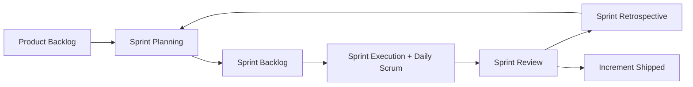
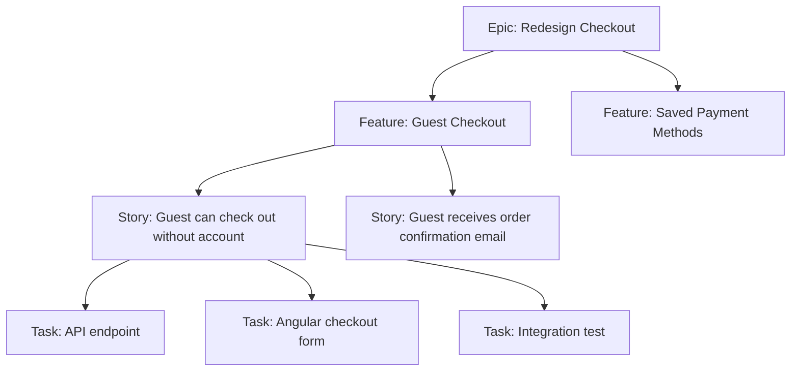
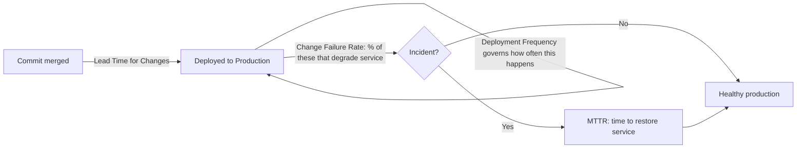
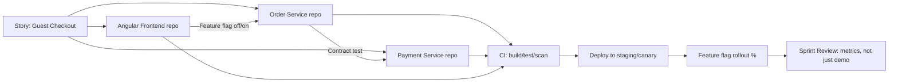
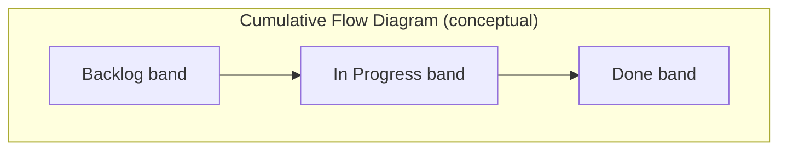

# Agile — Interview Revision Notes

> Quick-revision Q&A `R. Agile-Interview-Guide.md` se derive ki gayi hain. Source ka har section cover karti hain.

## Core Concepts

### What is Agile?

**Q: Agile fundamentally kya hai — ek process ya ek mindset?**

A: Agile software deliver karne ka ek iterative aur incremental approach hai, chhote cycles (sprints/iterations) mein, continuous feedback, collaboration, aur change ke saath adaptability ke saath. Yeh ek *mindset/values ka set* hai (Agile Manifesto: individuals and interactions over processes and tools; working software over comprehensive documentation; customer collaboration over contract negotiation; responding to change over following a plan). Scrum, Kanban, XP, aur SAFe frameworks hain jo us mindset ko *implement* karte hain.

**Q: "Agile kya hai" puchhe jaane par kaunsa senior-level nuance dikhana chahiye?**

A: Yeh dikhao ki Agile ek philosophy hai, koi rigid process nahi, aur tum identify kar sakte ho ki kab strict-by-the-book Scrum galat tool hai — jaise, ek small legacy-maintenance team ko sprints se zyada Kanban better serve karta hai.

### What is Scrum?

**Q: Scrum kya hai aur yeh kya define karta hai?**

A: Scrum ek Agile framework hai jo fixed-length sprints (typically 1–4 weeks, most commonly 2) use karta hai. Yeh define karta hai:

- **Roles**: Product Owner, Scrum Master, Development Team (Scrum Guide 2020+ unhe "Developers" kehta hai; PO/SM Scrum Team ke part hain, uske external nahi).
- **Artifacts**: Product Backlog, Sprint Backlog, Increment.
- **Ceremonies**: Sprint Planning, Daily Scrum, Sprint Review, Sprint Retrospective, plus Sprint khud ek container event ke roop mein.



### What is a User Story?

**Q: User story kya hai aur yeh kaunsa format follow karti hai?**

A: End user ke perspective se ek feature ka lightweight description, jiska purpose exhaustive spec ke bajaye conversation drive karna hai.

```
As a [user/role], I want [feature/capability], so that [benefit/value].
```

**Q: Story ko actually testable/"done" kya banata hai, aur yeh usually kaise express hota hai?**

A: Story ek *conversation ke liye placeholder* hai, contract nahi. Acceptance criteria — aksar Given/When/Then (Gherkin) format mein — hi usko testable banata hai.

```gherkin
Given a registered user on the login page
When they submit valid credentials
Then they are redirected to the dashboard
And a session token is issued
```

### Functional vs Technical (Non-Functional) Requirements

**Q: Functional aur non-functional requirements kaise differ karte hain?**

A:

| Aspect | Functional Requirement | Non-Functional Requirement |
|---|---|---|
| Answers | System kya karta hai? | System kitna achha karta hai? |
| Example | User password reset kar sakta hai | Password reset email 2s ke andar send hona chahiye |
| Testing | Behavioral/acceptance tests | Load, security, performance, chaos tests |
| Owner (typical) | BA / Product Owner | Architect / Tech Lead |
| Visibility to end user | Directly visible | Aksar invisible jab tak violate na ho |

Functional examples: login, add to cart, generate report, reset password. NFR examples: API response 500ms ke under, encryption at rest/in transit, 10,000 concurrent users support, mandated tech stack.

### Who Defines Functional vs Technical Requirements

**Q: Functional requirements vs technical requirements kaun own karta hai?**

A: Functional — BA ya Product Owner, stakeholder/end-user input ke saath. Technical — Architect, Tech Lead, ya Development Team, system design aur NFRs/platform constraints se driven.

**Q: Iss ownership split par senior-level nuance kya hai?**

A: Mature teams mein yeh koi hard wall nahi hai — developers ko technical implications waale functional requirements par push back karna chahiye ("yeh X users se zyada scale nahi karega bina redesign ke"), aur POs ko NFR work prioritize karne ke liye enough tech constraint samajhni chahiye. Best senior engineers business requirements ko technical requirements mein translate karte hain aur trade-offs early surface karte hain, sprint start hone ke baad nahi.

### Core Scrum Ceremonies

**Q: Sprint Planning mein kya hota hai?**

A: Team ek refined, prioritized backlog se backlog items select karti hai aur upcoming sprint ke work ko plan karti hai, jisse Sprint Goal aur Sprint Backlog produce hoti hai.

**Q: Daily Scrum kya hai, aur uske around modern nuance kya hai?**

A: Ek short (≤15 min), timeboxed daily sync. Classic teen questions: kal kya kiya, aaj kya plan hai, koi blockers. Senior nuance: Scrum Guide khud ab isko *Sprint Goal* ki taraf progress inspect karne aur re-planning karne ke around frame karta hai — Scrum Master ko status report nahi. Yeh shift mention karna current framework knowledge signal karta hai.

**Q: Sprint Review kya hai, aur kya yeh "sirf ek demo" hai?**

A: Stakeholders ko increment ka end-of-sprint demo, product ko inspect karne aur backlog ko adapt karne ke liye — ek collaborative working session, sirf demo nahi.

**Q: Sprint Retrospective kis par focused hota hai?**

A: Review ke baad, next planning se pehle hota hai — discuss karta hai ki kya achha gaya/kya nahi aur *process* ke liye concrete improvement actions, product ke liye nahi.

### Definition of Done (DoD)

**Q: Definition of Done kya hai, aur ek typical .NET/Angular DoD kya include karta hai?**

A: Ek shared, team-agreed checklist jo ensure karti hai ki backlog item truly complete aur potentially shippable hai:

- Code complete aur main/trunk mein merged
- Unit tests likhe gaye aur pass ho rahe hain (coverage threshold met)
- Code review / PR approved
- Integration tests CI pipeline mein pass ho rahe hain
- Koi naya critical/high static-analysis ya security finding nahi (SonarQube, etc.)
- Deployed aur verified ek test/staging environment mein
- Story ke against acceptance criteria verified
- Documentation/README/API contract update hua agar applicable ho

**Q: Kya DoD ko story-by-story renegotiate kiya ja sakta hai?**

A: Nahi — DoD ek team-wide, per-increment standard hai jo har story par apply hota hai. Isko story ke hisaab se renegotiate karna team maturity problem signal karta hai.

### Backlog Refinement

**Q: Backlog refinement ("grooming") kya hai?**

A: Backlog items ko review, clarify, split, estimate, aur re-prioritize karne ka ongoing process, sprint mein enter hone *se pehle* — usually ek recurring event (weekly/mid-sprint), backlog ke top ko "sprint-ready" rakhta hai.

### Agile vs Waterfall

**Q: Agile Waterfall se kaise compare hota hai?**

A:

| Aspect | Agile | Waterfall |
|---|---|---|
| Delivery | Iterative, incremental (har sprint) | Sequential, end mein delivered |
| Requirements | Evolve karti hain, change ko embrace karti hain | Upfront fixed, change costly hai |
| Feedback loop | Continuous (har sprint/demo) | Sirf end mein (ya major milestones par) |
| Risk | Early discover/mitigate hota hai | Late discover hota hai, fix karna expensive hai |
| Documentation | Lightweight, just enough | Heavy, upfront comprehensive |
| Best fit | Uncertain/evolving requirements, digital products | Fixed-scope, regulatory/contractual, hardware-coupled projects |

## Intermediate Concepts

### Story Point Estimation

**Q: Hours ke bajaye story points (relative sizing) kyun use karte hain?**

A: Story points complexity, effort, uncertainty, aur risk size karte hain — literal hours nahi — usually ek Fibonacci-like scale par (1, 2, 3, 5, 8, 13, 21…). Humans absolute time estimation mein bad hain lekin relative comparison mein good hain; widening Fibonacci gaps bade, less-understood items ke liye meaningful differentiation force karte hain. Yeh estimation ko kisi ek developer ki speed se bhi decouple karta hai, jo matter karta hai jab velocity team-wide use hoti hai.

### Handling Changing Requirements

**Q: Agile changing requirements ko kaise handle karta hai?**

A: **Product Owner dwara backlog reprioritization** ke through — changes new/modified backlog items ban jaate hain jo baaki sab ke against re-rank hote hain, ek locked sprint mein disruptively inject hone ke bajaye. Team sprint *ke andar* churn se protected hai; *backlog* sprints *ke beech* change absorb karta hai.

### Definition of Ready (DoR)

**Q: Ek story ko sprint mein enter karne se pehle kaunse criteria satisfy karne chahiye (DoR)?**

A:

- Clear, testable acceptance criteria
- Dependencies identified aur ideally resolved/sequenced
- Team ne estimate ki hai
- Sprint ke andar complete hone ke liye small enough
- UX/designs attached hain agar relevant ho
- Implementation ko block karne waale koi open questions nahi

### DoD vs DoR — Why Both Matter

**Q: DoR aur DoD kaise differ karte hain, aur yeh ek classic interview trap kyun hai?**

A: Candidates aksar dono mein se sirf ek jaante hain.

| | Definition of Ready (DoR) | Definition of Done (DoD) |
|---|---|---|
| Applies to | Ek story sprint mein enter hone *se pehle* | Ek story/increment work complete hone *ke baad* |
| Purpose | Ill-defined work start karna prevent karta hai | Unfinished/untested work ko "done" kehna prevent karta hai |
| Owned by | Team, mainly refinement ke dauran PO + team dwara enforced | Team, review/PR/CI ke dauran enforced |
| Failure mode if missing | Mid-sprint churn, blocked stories, re-estimation | "Done" work jo shippable nahi, hidden technical debt, QA surprises |

**Q: Ek lead ke liye DoR vs DoD failures distinguish karna kyun matter karta hai?**

A: DoR failures usually ek *refinement* discipline problem hote hain; DoD failures usually ek *quality/engineering* discipline problem hote hain. Kaunsa broken hai diagnose karna (aur right ceremony fix karna) core lead-level judgment hai.

### Epic vs Feature vs Story vs Task

**Q: Epic, Feature, Story, aur Task scope mein kaise differ karte hain?**

A:

- **Epic** — bada initiative jo multiple sprints/releases mein spread hota hai, ek business goal se map hota hai (jaise, "Checkout flow redesign karo").
- **Feature** — ek epic ke andar functional grouping, abhi bhi potentially multi-sprint (jaise, "Guest checkout").
- **Story** — user-focused, sprint-sized requirement acceptance criteria ke saath (jaise, "As a guest, I want to check out without an account").
- **Task** — story ka technical, implementation-level sub-unit (jaise, "`GuestCheckoutController` endpoint add karo," "`GuestOrder` table ke liye EF Core migration likho").



### INVEST Principle for User Stories

**Q: INVEST kis cheez ka stand karta hai?**

A:

- **I**ndependent — dusri stories par hard sequencing ke bina deliverable
- **N**egotiable — details discussion ke liye open hain, rigid contract nahi
- **V**aluable — user ya business ko clear value deliver karta hai
- **E**stimable — team ke paas usko size karne ke liye enough clarity hai
- **S**mall — comfortably ek sprint ke andar fit hoti hai
- **T**estable — clear, verifiable acceptance criteria hai

### Cross-Functional Teams

**Q: Cross-functional team kya hai, aur yeh kyun matter karti hai?**

A: Ek team jispe idea se production tak feature le jaane ke saare skills hain bina har increment mein ek external team par depend kiye (developers, QA, UX/UI, DevOps, kabhi kabhi embedded DBAs/SREs). Point hai *hand-off latency* aur specialties ke beech *queueing* minimize karna — har external hand-off wait time aur context loss add karta hai.

**Q: Full cross-functionality possible na ho (jaise, ek shared DBA/security team) tab team kaise structure karo?**

A: Ek rotating liaison embed karo ya shared team ke saath explicit SLAs banao — constraint ko simply ignore mat karo.

### Agile Documentation Philosophy

**Q: Kya Agile ka matlab "no documentation" hai?**

A: Nahi — yeh "working software over comprehensive documentation" ka ek common misquote hai. Agile "just enough" documentation favor karta hai. Ek .NET/Angular shop mein: living API contracts (OpenAPI/Swagger), ADRs (Architecture Decision Records) significant technical decisions ke liye, aur story-level acceptance criteria large requirement documents ko replace karte hain — documentation ko lighter, zyada current, aur code ke closer banate hain, eliminate nahi karte.

## Advanced Concepts

### Scrum vs Kanban

**Q: Scrum aur Kanban cadence, roles, aur key constraints ke across kaise compare hote hain?**

A:

| Aspect | Scrum | Kanban |
|---|---|---|
| Cadence | Fixed-length sprints | Continuous flow, koi fixed iteration nahi |
| Roles | Defined (PO, SM, Dev Team) | Koi prescribed roles nahi |
| Ceremonies | Sprint planning, standup, review, retro | Optional; aksar sirf standup + periodic replenishment |
| Work commitment | Ek sprint ke worth ke items commit karna | Capacity free hone par continuously pull karna |
| Key constraint | Sprint length/capacity | **WIP (Work-In-Progress) limits** per column |
| Change mid-cycle | Discouraged mid-sprint | Naturally accommodated |
| Best fit | Plannable feature work waale product teams | Support/ops/maintenance teams, unpredictable inflow |
| Core metric | Velocity (points/sprint) | Cycle time / lead time, throughput |

### Scrum vs Kanban vs SAFe vs Scrumban

**Q: Scrum, Kanban, Scrumban, aur SAFe kaise compare hote hain, aur kab kaunsa pick karoge?**

A:

| Framework | Best for | Trade-off |
|---|---|---|
| **Scrum** | Plannable scope ke saath naye features banane waali product teams | Rigid cadence interrupt-driven work (support, ops) ke liye poor fit ho sakta hai |
| **Kanban** | Support/maintenance teams, ops, unpredictable inbound work | Retros/planning ke liye built-in cadence nahi, jab tak deliberately add na kiya jaaye |
| **Scrumban** | Scrum se flow-based work ki taraf transition kar rahi teams, ya teams jinke paas planned feature work aur unplanned support tickets dono hain | Hybrid — sprints + WIP limits; agar tuned na ho toh "neither" jaisa feel ho sakta hai |
| **SAFe (Scaled Agile Framework)** | Large orgs (50+ engineers, multiple teams) jinko cross-team coordination aur portfolio alignment chahiye | Heavyweight; agar PI Planning big upfront planning ban jaaye toh "Waterfall in Agile clothing" banne ka risk hai |

**Q: "Tumne Scrum use kiya hai — kab use nahi karoge?" Iska answer kaise doge?**

A: Constant unplanned interrupts waali ek production-support/BAU team 2-week sprint commitments ke liye poor fit hai — Kanban WIP limits aur SLA-based classes of service ke saath better fit karta hai. Early-stage discovery/spike work bhi aksar sprint box mein force hone se zyada Kanban-style flow mein better fit karta hai.

### Handling Scope Change Mid-Sprint

**Q: Mid-sprint scope changes kaise handle honi chahiye?**

A: Ideally avoided — sprint ek protected commitment hai. Agar truly required ho:

1. Product Owner sprint goal ke against priority re-evaluate karta hai.
2. Team impact discuss karti hai (capacity, dependencies, risk).
3. Either item *next* sprint mein jaata hai, ya existing lower-value item *swap out* hota hai — tum sprint par bas zyada work pile nahi karte.

**Q: Yahan interviewers kaunsa gotcha sunte hain?**

A: Candidates jo kehte hain "hum just squeeze kar lete hain." Correct instinct trade-off hai, addition nahi — sprint integrity aur sustainable pace protect karna.

### Velocity and Its Use

**Q: Velocity kya hai aur yeh kis liye use hoti hai?**

A: Work (story points) ki quantity jo team per sprint complete karti hai, recent sprints ke average liya jaata hai. Sprint planning ke liye use hoti hai (kitna pull in karna hai), delivery forecasting, aur capacity/staffing conversations ke liye.

**Q: Classic velocity gotcha kya hai?**

A: Velocity ek *team-specific, relative* planning tool hai — kabhi productivity/performance metric nahi, aur kabhi teams ke across comparable nahi (different teams points ko differently calibrate karti hain). Isko log ya teams compare karne ke liye use karna ek textbook anti-pattern aur red flag hai.

### Velocity vs Throughput vs Cycle Time

**Q: Velocity, Throughput, Cycle Time, aur Lead Time kaise differ karte hain?**

A:

| Metric | Definition | Framework | What it tells you |
|---|---|---|---|
| **Velocity** | Per sprint complete hue story points | Scrum | Future sprints ki *planning* ke liye capacity (sirf same team) |
| **Throughput** | Unit time mein complete hue items ki number (size ignore karke) | Kanban/flow | Delivery rate ki predictability, estimation se independent |
| **Cycle Time** | Work *start* hone se *done* hone tak ka time | Kanban/flow (Little's Law: WIP = Throughput × Cycle Time) | Responsiveness/flow efficiency; wo metric jo customers actually feel karte hain |
| **Lead Time** | Work *request* hone se *deliver* hone tak ka time | Dono | End-to-end customer-facing responsiveness, work start hone se pehle ka queue time include karta hai |

**Q: Velocity great kyun dikh sakti hai jabki team actually struggle kar rahi ho?**

A: Velocity high reh sakti hai jabki cycle time balloon ho jaata hai — team "busy" hai lekin items too much WIP ki wajah se half-done baithe hain. Ek lead jo sirf velocity dekhta hai yeh miss kar deta hai; Little's Law aur WIP limits isko fix karne ke actual lever hain.

### Managing Technical Debt in Agile

**Q: Agile delivery ke andar technical debt kaise manage karna chahiye?**

A:

- Tech debt items ko explicitly backlog mein add karo (isko visible banao — invisible debt kabhi prioritize nahi hoti).
- Refactoring ke liye dedicated sprint capacity allocate karo (jaise, har sprint ka 10–20% reserve karo, ya periodic "tech debt sprints").
- Code quality ko continuously improve karo code reviews, static analysis (SonarQube/Roslyn analyzers), aur automated tests se — big-bang cleanup se nahi.
- Debt items ko business impact se tie karo ("yeh debt feature X ko Y% se slow kar raha hai") taaki PO feature work ke against prioritize kar sake.

**Q: Tech debt par kaunsa senior nuance dikhana chahiye?**

A: Tech debt ko un terms mein quantify aur communicate karo jinki PO/stakeholder care karta hai — velocity drag, incident rate, new-dev onboarding time — sirf "hume refactor karna hai kyunki messy hai" nahi.

### Backlog Prioritization

**Q: Product Owner backlog prioritization ko kaunse factors drive karte hain?**

A: Business value, risk, dependencies, aur customer needs.

### Prioritization Frameworks (WSJF, MoSCoW, Kano, RICE)

**Q: "value/risk/dependencies" se aage backlog prioritization ko kaunse formal frameworks formalize karte hain?**

A:

- **WSJF (Weighted Shortest Job First)** — SAFe mein heavily use hota hai:

```text
WSJF = Cost of Delay / Job Size
Cost of Delay = user/business value + time criticality + risk reduction/opportunity enablement
```

  High-value, low-effort, time-sensitive work favor karta hai.
- **MoSCoW** — Must have / Should have / Could have / Won't have. Simple; scope negotiation aur MVP definition ke liye good hai.
- **Kano Model** — features ko Basic (expected), Performance (more is better), Delighters (unexpected value), Indifferent/Reverse classify karta hai. UX-driven prioritization ke liye useful.
- **RICE**:

```text
Score = (Reach × Impact × Confidence) / Effort
```

  Product-led orgs mein popular; explicit confidence estimation force karta hai, assumption risk surface karta hai.

**Q: Interview mein specifically WSJF naam lena kyun matter karta hai?**

A: Yeh SAFe/scaled-Agile exposure signal karta hai, jo enterprise .NET shops mein increasingly common hai.

### Agile Metrics

**Q: Core Agile/Scrum metrics kya hain?**

A: Velocity, burn-down chart (sprint/release ke andar remaining work vs time), cycle time, lead time, aur sprint predictability (committed vs completed).

### DORA Metrics

**Q: Upar wali "Agile Metrics" list DORA metrics mention na karne ke bawajood yeh kyun matter karte hain?**

A: Standard Agile/flow metrics (velocity, burn-down, cycle time, lead time, sprint predictability) Scrum/flow-focused hain. DORA metrics industry-standard tareeka hai jisse engineering *organizations* (sirf teams nahi) delivery performance measure karti hain, aur yeh framework-agnostic hain — chahe team Scrum chalaye, Kanban, ya kuch aur, yeh apply hote hain.

**Q: DORA metrics kahan se aate hain?**

A: DORA (DevOps Research and Assessment) Google-run research program hai (ab Google Cloud ka part hai) jo, thousands of orgs ke across years ke large-scale survey data ke through, char metrics identify kiye jo high-performing software delivery organizations ke saath sabse strongly correlate karte hain.

**Q: Char DORA metrics kya hain?**

A:

| Metric | Definition | What it measures |
|---|---|---|
| **Deployment Frequency** | Organization production par successfully kitni baar release karti hai | Batch size / release cadence — elite performers on-demand deploy karte hain (din mein multiple baar); low performers mahine mein ek baar se kam deploy karte hain |
| **Lead Time for Changes** | Ek commit merge hone se us change ke production mein successfully run hone tak ka time | End-to-end delivery pipeline speed — Agile "Lead Time" metric (ek *story* ke liye request-to-delivery) se distinct hai; yeh commit-to-production hai, ek CI/CD efficiency measure |
| **Change Failure Rate** | Production deployments ka % jo degraded service result karta hai jisko remediation chahiye (rollback, hotfix, patch) | Deployment quality/risk — specifically failures jo production reach karne *ke baad* manifest hote hain |
| **Mean Time to Recovery (MTTR)** | Production incident/failure ke baad service restore karne mein kitna time lagta hai | Resilience/operational recovery — ek reliability engineering metric, dev-speed metric nahi |



**Q: Exactly yeh char kyun, aur counterintuitive research finding kya hai?**

A: Yeh do independent axes mein cluster hote hain: **throughput** (Deployment Frequency + Lead Time for Changes — kitni fast tum ship karte ho) aur **stability** (Change Failure Rate + MTTR — kitna safely tum ship karte ho). DORA ki research ne pata lagaya ki high-performing orgs *dono* axes par simultaneously strong hote hain — speed aur stability elite level par ek trade-off nahi hain, us intuition ko contradict karte hue ki "faster move karna zyada tootne ka matlab hai." "Humein safe hone ke liye slow down karna hai" ko *low* DevOps maturity ka sign framing karna (caution nahi) ek strong interview point hai.

**Q: DORA metrics Agile ceremonies aur backlog health se kaise connect hote hain?**

A:

- Ek team ki velocity great ho sakti hai lekin MTTR poor — velocity yeh kuch nahi batati ki story production reach karne ke baad kya hota hai; DORA exactly wahi blind spot close karta hai.
- Retrospectives ko DORA trends (Change Failure Rate, MTTR) review karni chahiye, sirf sprint-level velocity/burn-down nahi, "busy but fragile" patterns catch karne ke liye.
- Ek rising Change Failure Rate ya lengthening MTTR khud ek backlog-prioritization signal hai — isko real-priority technical-debt/reliability backlog items generate karni chahiye, ek separate "ops problem" ke roop mein treat nahi karna chahiye.
- Low Deployment Frequency bade, risky release batches ka proxy hai, jo khud *future* Change Failure Rate problems ka leading indicator hai.
- Interview framing: "Velocity batati hai ki team sprint ke andar work start/finish karne mein predictable hai ya nahi. DORA batata hai ki wo work actually safe aur fast hai ship karne ke liye. Ek lead ko dono chahiye."

### Handling Blockers

**Q: Blockers ko day to day kaise handle karna chahiye?**

A:

- Immediately daily standup mein raise karo — wait mat karo.
- Pehle team ke saath collaborate karo (pair up, peer knowledge se unblock karo).
- Agar blocker external/organizational hai (dusri team, infra access, ek vendor) toh Scrum Master ke through escalate karo.

### Role of the Developer in Estimation

**Q: Estimation mein developer ka kya role hona chahiye?**

A:

- Planning poker / estimation sessions mein actively participate karo.
- Technical complexity/risk insight provide karo jo PO nahi de sakta (jaise, "yeh legacy payment integration ko touch karta hai, wo hidden 5 hai, 2 nahi").
- Sprint planning ke dauran stories ko technical tasks mein break karo.

### Estimation Techniques Beyond Planning Poker

**Q: Planning poker/Fibonacci se aage kaunse estimation techniques exist karte hain, aur kab har ek use karoge?**

A:

- **Planning Poker** — classic, discussion-driven consensus estimation; calibration aur discussion se hidden complexity surface karne ke liye good.
- **T-Shirt Sizing (XS/S/M/L/XL)** — fast, coarse-grained; detailed refinement se pehle early backlog/epic-level sizing ke liye good.
- **Affinity Estimation / Silent Grouping** — team silently stories ko relative-size buckets mein place karti hai bina discussion ke pehle, phir sirf outliers discuss karti hai — bade backlogs (quarterly planning mein 50+ stories) ke liye kaafi faster.
- **Bucket System** — affinity estimation jaisa, predefined point buckets ke saath; very large-scale estimation ke liye use hota hai (SAFe PI Planning).
- **#NoEstimates movement** — provocative counter-approach: stories ko itna small slice karo ki wo roughly uniform size ki hon, aur point-based velocity ke bajaye forecasting ke liye *throughput* (item count/week) use karo. Estimation debate ki awareness dikhane ke liye mention karne layak.

### When Sprint Goals Are Not Achieved

**Q: Jab sprint goal achieve nahi hota tab kya karna chahiye?**

A:

- Retrospective ke dauran root cause analyze karo — sirf note karke move on mat karo.
- *Planning/estimation* failures (over-committed, poor refinement) ko *execution* failures (unexpected complexity, blockers, absenteeism) se aur *external* failures (dependency delays, environment issues) se distinguish karo.
- Specific root cause address karne ke liye future planning adjust karo (jaise, DoR tighten karo, known risk categories ke liye buffer add karo) generically "estimate more conservatively" karne ke bajaye.
- Ek repeated pattern khud Scrum Master ke liye systemically address karne ka ek signal hai, ek one-off retro action item nahi.

### Real-World Challenge: PO Adds Urgent Work Mid-Sprint

**Q: PO mid-sprint urgent work add karna chahta hai — tum yeh kaise handle karoge?**

A:

- Team ke saath impact openly discuss karo (capacity, current commitments, sprint goal ko risk).
- Already committed ke against true priority/urgency evaluate karo — PO se "urgent" automatically sprint ko override nahi karta.
- Resolution ek *trade* hai, addition nahi — ek existing lower-priority item ko replace karo, ya naye work ko next sprint mein defer karo — jab tak yeh genuinely sprint-goal-threatening na ho (jaise, ek production incident).

**Q: Yahan draw karne ke liye key distinction kya hai?**

A: "Urgent business request" vs "production incident/hotfix." Second wala legitimately sprint ko interrupt karta hai (most teams ka DoD/process ek explicit P1 exception carve out karta hai); pehle wale ko abhi bhi trade-off conversation se guzarna chahiye.

### Agile in a Microservices / CI-CD Context

**Q: Jab ek feature multiple microservices ke across span karta hai tab story slicing kaise kaam karti hai?**

A: Ek "vertical slice" story (jaise, "guest checkout") aksar multiple services/repos ke across span karti hai. Senior practice: stories ko isliye slice karo ki har ek jahan possible ho *ek* service/repo ke andar deliverable aur independently testable ho, cross-service dependencies decouple karne ke liye contract tests (jaise, Pact) use karke, lockstep releases force karne ke bajaye.

**Q: Trunk-based development aur feature flags sprint delivery ko kaise change karte hain?**

A: High-maturity shops mein yeh long-lived feature branches ko replace karte hain, ek story ko "done" (merged, deployed) hone dete hain bina *release* hue (users ko expose hue) — deployment ko release se decouple karke aur ek sprint ke andar true continuous delivery enable karke.

**Q: CI/CD context mein Definition of Done kaise expand hota hai?**

A: Add hota hai: automated pipeline gates pass karta hai (build, unit, integration, security scan), staging/canary tak deployed hota hai, aur (agar flagged ho) ek feature flag ke peeche verified — sirf "code complete" nahi.

**Q: CI/CD ke involved hone par Sprint Review kaise change hota hai?**

A: Yeh release gate ke roop mein less meaningful ban jaata hai — software review se pehle hi production mein ho sakta hai, isliye review outcomes/metrics (A/B test results, adoption) validate karne ki taraf shift hota hai, first-time demo ke bajaye.

**Q: Microservices Agile org mein dominant coordination problem kya hai?**

A: Cross-team dependency management, ek baar jab ek "story" ko 3+ microservices ke across coordinated changes chahiye hoti hain jo different teams own karti hain — exactly wo problem jise SAFe ka PI Planning aur dependency boards scale par solve karne ki koshish karte hain.



### Scaling Agile: SAFe, LeSS, and Spotify Model

**Q: SAFe, LeSS, aur Spotify Model scaling approaches ke roop mein kaise differ karte hain?**

A:

- **SAFe (Scaled Agile Framework)** — team-level Scrum/Kanban ke upar Program (Agile Release Train, PI Planning har 8–12 weeks) aur Portfolio layers add karta hai. Strength: shared roadmaps/dependencies ke saath kaafi teams coordinate karta hai. Weakness: agar PI Planning mishandle ho jaaye toh Waterfall-like upfront planning reintroduce kar sakta hai.
- **LeSS (Large-Scale Scrum)** — Scrum ke rules ko directly multiple teams tak extend karta hai jo ek Product Backlog aur ek Sprint share karti hain, added process/roles minimize karke (SAFe ke unlike). Coordination layers add karne ke bajaye organization ko "descale" karna favor karta hai.
- **Spotify Model (Squads/Tribes/Chapters/Guilds)** — ek prescriptive framework nahi balki ek organizational topology jo business domains ke saath aligned autonomous, cross-functional squads ko emphasize karta hai, cross-cutting skill communities ke liye chapters/guilds ke saath. Note: Spotify khud publicly iske parts se move away kar gaya hai — isko current best practice ke roop mein over-cite mat karo.

**Q: Scaling frameworks par practical senior take kya hai?**

A: *Scaling problem* really ek *dependency-management aur communication* problem hai — specific framework se zyada matter karta hai ki kya org actively cross-team dependencies ko visibly manage karta hai (dependency boards, PI Planning, Scrum-of-Scrums) unko mid-sprint discover karne ke bajaye.

## Best Practices

**Q: Interview mein cite karne layak key Agile best practices kya hain?**

A:

- Sprints ko protected rakho — genuine incidents ke alawa mid-sprint scope injection avoid karo.
- Technical debt ko backlog par business-impact framing ke saath visible banao, sirf "cleanup" nahi.
- Sprint Planning se pehle DoR aur "done" kehne se pehle DoD enforce karo — dono, consistently, case-by-case nahi.
- Velocity ko sirf *same team ki* forward planning ke liye use karo — kabhi cross-team comparison ya productivity metric ke roop mein nahi.
- Stories ko vertically slice karo (thin end-to-end slices) horizontally (all-UI, phir all-API) ke bajaye taaki har story demonstrable value deliver kare.
- DoD verification ko jahan possible ho automate karo (tests/coverage/security scans ke liye CI gates) manual checklist honesty par depend karne ke bajaye.
- Retrospectives ko action-oriented treat karo — action items ko completion tak track karo, unko revisit karo, retros ko bina follow-through waale venting sessions mat banne do.
- Scaled/multi-team contexts mein, cross-team dependencies ko early visible banao (dependency boards, PI Planning) integration time par unko discover karne ke bajaye.

## Agile Anti-Patterns

**Q: Recognize karne layak common Agile anti-patterns kya hain?**

A:

- **Water-Scrum-Fall** — Scrum ceremonies ek org par bolted-on hain jo abhi bhi upfront big design aur end mein ek hardening/UAT phase karta hai; sprints status theater ban jaate hain, real iterative delivery nahi.
- **Zombie Scrum** — team motions (standups, retros) se guzarti hai bina kisi real inspect-and-adapt ke; retro action items kuch bhi change nahi karte.
- **Velocity as a productivity metric / point inflation** — teams "improving" velocity dikhane ke liye story points ko time ke saath inflate karti hain, ya management teams ke across velocity compare karta hai, honest estimation ke bajaye gaming ko incentivize karta hai.
- **Standup as status report to management** — Daily Scrum ko peer-to-peer re-planning session ke bajaye ek top-down reporting ritual banata hai, psychological safety kill karta hai.
- **PO-as-bottleneck / absent PO** — either PO har micro-decision approve karta hai (bottleneck) ya clarification ke liye unavailable hai (team blocked/guessing), dono role ke collaborative intent ko violate karte hain.
- **Scope creep disguised as "just one more thing"** — chhoti mid-sprint additions jo individually harmless lagti hain lekin cumulatively sprint goal blow kar deti hain; fix wahi trade-off discipline hai jo consistently apply hoti hai.
- **Retrospective without action** — bina improvement actions ko owners/deadlines assign kiye repeatedly problems identify karna.
- **Estimation theater** — form's sake ke liye planning poker chalana jabki manager ne already externally ek delivery date commit kar diya hai, estimate ko meaningless bana ke.
- **Copy-pasted "Agile at scale"** — SAFe/LeSS terminology aur ceremonies ko wholesale adopt karna bina underlying dependency/communication problem address kiye jise wo solve karne ke liye meant hain.

## Common Pitfalls

**Q: Agile ke saath teams kaunse common pitfalls mein fall karti hain?**

A:

- Story points ko hours treat karna (relative estimation aur cross-team comparability break karta hai).
- Sprint Review ko "sirf ek demo" ban jaane dena, stakeholders ke saath genuine inspect-and-adapt session ke bajaye.
- Backlog refinement skip karna, jisse under-specified stories sprint planning mein enter hoti hain (DoR violated).
- Definition of Done ko acceptance criteria ke saath confuse karna — DoD story-agnostic aur team-wide hai; acceptance criteria story-specific hai.
- Technical debt ko production incident cause hone tak ignore karna, continuously track aur pay down karne ke bajaye.
- Work (jaise, pure support/ops) ke liye Scrum dogmatically use karna jo flow-based (Kanban) model mein far better fit karta hai.
- Ek sprint ko overload karna kyunki "team ne pressure mein haan bol diya," capacity/velocity data respect karne ke bajaye.

## Agile Metrics Dashboards and Reporting to Leadership

**Q: Team metrics ko leadership reporting ke liye kaise translate karna chahiye?**

A: Team-level metrics (velocity, burn-down) ko business-facing metrics mein translate karo: **predictability** (committed vs delivered %), **lead time to production** (decide hone ke baad kitni fast hum ek change ship kar sakte hain), aur **defect escape rate** (quality signal) — raw point counts ke bajaye jo leadership interpret nahi kar sakta.

**Q: Leadership ko velocity publish karne ka risk kya hai, aur alternative kya hai?**

A: Goodhart's Law — "jab ek measure target ban jaata hai, wo ek good measure hona band ho jaata hai." Leadership ko velocity publish karna almost hamesha point inflation leads karta hai. Iske bajaye throughput/cycle-time trends report karo, jo game karna harder hai.

**Q: Leadership ko yeh dikhane mein ki work kahan stuck hai, kaunsa visualization undervalued hai?**

A: Cumulative Flow Diagrams (CFDs) — visually yeh dikhane ke liye excellent hain ki work *kahan* stuck hai (ek widening "in progress" band ek bottleneck signal karta hai) bina leadership ko story points samajhne ki zarurat ke.



## Sample Interview Q&A

**Q: Mujhe walk through karo ki tum currently ad-hoc, unstructured development kar rahi ek team ko Scrum kaise introduce karoge.**

A: Ceremonies se nahi, pain points se start karo — identify karo ki unko actually kya hurt kar raha hai (missed deadlines, unclear priorities, rework). Ek lightweight backlog aur ek short (1–2 week) sprint cadence introduce karo, ek real Definition of Done, aur day one se ek retrospective taaki process self-correct kare. Sabhi SAFe/Scrum artifacts ka ek saath big-bang adoption avoid karo; ceremony weight add karne se pehle kuch working sprints se team ka trust earn karo.

**Q: Team ke "hum kabhi se zyada busy hain" kehne ke bawajood teen sprints se velocity flat hai. Tum kya investigate karoge?**

A: Pehle check karo ki "busier" ka matlab zyada WIP hai, zyada throughput nahi — sirf velocity nahi, cycle time aur WIP counts dekho. Hidden work (unplanned interrupts, production support) check karo jo board par capture nahi ho rahi. Point inflation ya estimation drift check karo. Increased context-switching check karo (per person too many concurrent stories). Velocity ek lagging, aggregate signal hai — flat velocity akela cause diagnose nahi karti; cycle time aur WIP usually karte hain.

**Q: Ek stakeholder ek project ke liye fixed date aur fixed scope chahta hai, lekin tumhara org Scrum chalata hai. Tum yeh kaise reconcile karoge?**

A: Fixed date + fixed scope + fixed quality classic "iron triangle" conflict hai — kuch to flex karna padega. Practice mein: upfront stakeholder ke saath ek MVP scope negotiate karo (MoSCoW help karta hai), us reduced/prioritized scope ke against date commit karo, aur backlog ko "nice to have" items absorb karne ke liye use karo jo cut ho sakte hain jab date approach karti hai, sprint by sprint ek single upfront estimate ke bajaye velocity-based forecasting se verify karke.

**Q: Tum kaise jaanoge ki tumhari Definition of Done actually honored ho rahi hai, versus sirf ek wiki page par exist kar rahi hai?**

A: Isko jitna possible ho CI/CD gates mein automate karo (tests, coverage thresholds, security scans, static analysis) taaki yeh pipeline se enforced ho, self-reported nahi. Parts jo automate nahi ho sakte (jaise, "QA ne review kiya") unko board workflow se track karo (ek story "QA" column se explicit checklist ke saath guzre bina Done mein move nahi ho sakti) aur agar regressions/escaped-defects appear hone lagein toh retro mein sporadically audit karo.

**Q: Backlog prioritize karne waale Product Owner aur process facilitate karne waale Scrum Master ke beech difference explain karo — responsibilities overlap ya conflict kahan hote hain?**

A: PO *what* aur *why* (value, priority, business outcomes) own karta hai; Scrum Master *how* (process health, impediments remove karna, team ko Agile practices coach karna) own karta hai. Yeh conflict kar sakte hain jab ek PO dictate karne ki koshish kare ki team *kaise* kaam kare (jaise, scope hit karne ke liye overtime mandate karna) ya jab ek Scrum Master prioritization calls lene lage jo PO ke belong karte hain. Ek healthy team inko separate rakhti hai even jab chhoti teams mein ek person kabhi kabhi dono hats pehnta hai (khud ek known risk/anti-pattern jo puchhe jaane par naam lene layak hai).

**Q: Tum ek team member ko kaise handle karoge jo consistently apne khud ke tasks ko underestimate karta hai?**

A: Isko pehle ek 1:1 mein calibration problem ke roop mein address karo, performance issue nahi — unke actual task breakdown process ko dekho (kya wo testing/review/deployment effort miss kar rahe hain, sirf "coding time" nahi?). Pattern ko concretely visible banane ke liye retro data (planned vs actual) use karo. Estimation sessions ke dauran unko ek teammate ke saath pair karo group consensus ke against calibrate karne ke liye (planning poker ki real value). Public callouts avoid karo — estimation accuracy ek team-learning problem hai, individual failing nahi, khaaskar kyunki points relative/team-calibrated hone ke liye meant hain pehli jagah mein.
