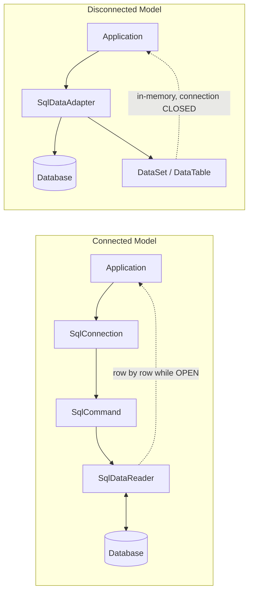
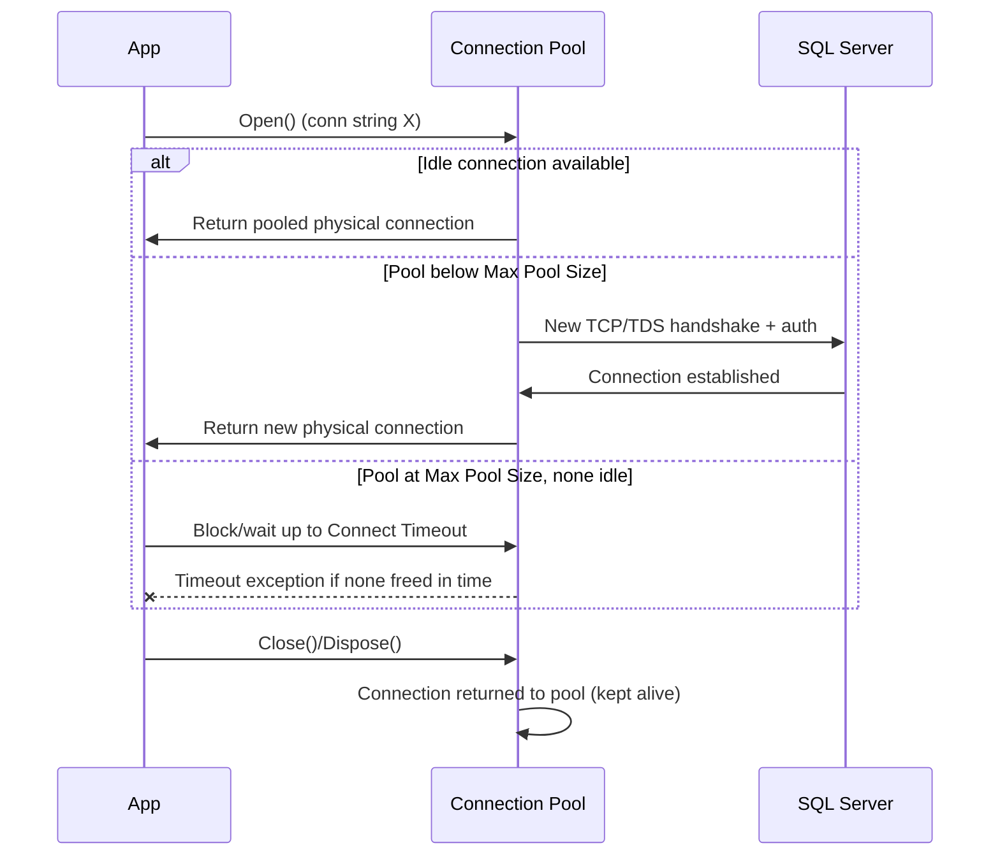
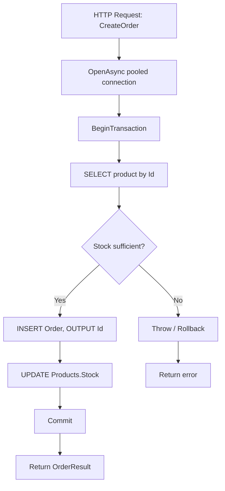

# ADO.NET Interview — Quick Revision Notes (Senior / Lead)

> Yeh guide se derived quick-revision notes hain — har section aur sub-topic same order mein cover kiya gaya hai. **Q/A** aur tight bullets format mein, taaki interview se pehle fatafat brush-up ho jaaye.

---

## 1. Core Concepts

### 1.1 What Is ADO.NET

**Q: ADO.NET kya hai?**
A: .NET ka low-level, provider-based data access framework — relational (aur kuch non-relational) sources ke saath baat karne ke liye. Deta hai: direct connection management, direct SQL/stored-proc execution, raw result retrieval (auto object materialization nahi), manual transaction control, aur do models — **connected** (streaming) + **disconnected** (in-memory).

**Q: ADO.NET ORM se fast kyun?**
A: Mapping / change-tracking / LINQ-translation layers skip karta hai → generally faster + memory-efficient. **Cost:** aapko khud zyada boilerplate mapping code likhna padta hai.

- **Aaj kahan use hota hai:** high-throughput APIs, reporting/analytics endpoints, bulk data pipelines, tight-latency microservices, legacy pre-EF systems.
- Dapper aur EF Core khud isi ke upar bane hain — kisi bhi ORM ke neeche `DbConnection`/`DbCommand` hote hi hain.

### 1.2 Core Architecture: Connected vs Disconnected

**A) Connected**
- Read ki duration ke liye live connection open rehta hai; data row-by-row stream.
- `DataReader` se implement.

**B) Disconnected**
- Data ek baar in-memory (`DataSet`/`DataTable`) mein pull; fill ke baad connection turant close ho sakta hai.
- `DataAdapter` se implement.



**Q: Aaj default kya use karoge?**
A: Read paths ke liye connected (`DataReader`), ya usse better — connected model par bana micro-ORM/ORM (Dapper/EF Core) simplest CRUD se aage kisi bhi cheez ke liye. Hand-rolled `DataSet` ab rare hai, mostly legacy WinForms/data-binding mein.

### 1.3 Data Providers

**Q: Data Provider kya hai?**
A: ADO.NET classes ka set jo ek specific DB engine (SQL Server, Oracle, MySQL, PostgreSQL) target karta hai. Object model (`Connection`, `Command`, `DataReader`, `DataAdapter`, `Transaction`) providers ke across consistent, concrete implementation per-DB different.

- SQL Server classes: `SqlConnection`, `SqlCommand`, `SqlDataReader`, `SqlDataAdapter`, `SqlTransaction`.
- **Modern note:** `System.Data.SqlClient` legacy/maintenance mode. Recommended = **`Microsoft.Data.SqlClient`** (NuGet) — Always Encrypted, Azure AD auth, TDS 8.0/strict encryption, UTF-8, newer TLS. Naye project mein hamesha yahi reference karo.

### 1.4 Connection Management & Connection Strings

**Connection string components:** Server/Data Source, Initial Catalog (DB), Authentication (Windows/Integrated vs SQL login vs Azure AD/Managed Identity), `Connect Timeout`, Encryption (`Encrypt=True`, `TrustServerCertificate`), Pooling (`Pooling`, `Min Pool Size`, `Max Pool Size`).

```text
Server=myServer;Database=myDb;Trusted_Connection=True;
```

```csharp
using (SqlConnection conn = new SqlConnection(connectionString))
{
    conn.Open();
    // work
}
```

**Best practices:**
- Late open, early close.
- Hamesha `using`/`using var` — exception par bhi `Dispose()` chale.
- Ek single long-lived `SqlConnection` ko requests ke across cache/share **mat** karo — yeh kaam pooling ka hai.

### 1.5 Command Execution

`SqlCommand` = ek SQL statement ya stored proc jo connection ke against run hota hai.

**CommandType:**
1. `Text` — raw SQL (default)
2. `StoredProcedure`
3. `TableDirect` — rarely used, provider-specific (mainly OLE DB); `Microsoft.Data.SqlClient` ke saath SQL Server par commonly use nahi hota (largely Access/OLE DB/ODBC concept).

```csharp
SqlCommand cmd = new SqlCommand("SELECT * FROM Users", conn);
```

**Q: `SELECT *` kyun avoid?**
A: Schema drift column-ordinal reads ko break kar deta hai, unused columns par bandwidth waste, aur server par covering-index usage prevent kar sakta hai.

### 1.6 Execution Methods

| Method | Returns | Use |
|---|---|---|
| `ExecuteReader()` | `SqlDataReader` (forward-only, streaming) | Multi-row/col SELECT; large/streamed results |
| `ExecuteNonQuery()` | `int` (rows affected) | INSERT/UPDATE/DELETE/DDL |
| `ExecuteScalar()` | `object` (first row, first col) | Aggregates (`COUNT`, `SUM`), existence checks |

```csharp
using (SqlDataReader reader = cmd.ExecuteReader())
{
    while (reader.Read())
    {
        string name = reader["Name"].ToString();
    }
}

SqlCommand countCmd = new SqlCommand("SELECT COUNT(*) FROM Users", conn);
int count = (int)countCmd.ExecuteScalar();
```

**Gotcha (`ExecuteScalar`):** no-rows / empty result set → C# `null` return karta hai (`DBNull.Value` nahi); lekin selected cell mein `NULL` value → `DBNull.Value`. Cast se pehle **dono** ke against guard karo.

---

## 2. Intermediate Topics

### 2.1 Parameterized Queries & SQL Injection Prevention

**Purpose:** SQL injection roko + SQL Server ko har literal par recompile karne ke bajaye cached execution plans reuse karne do.

```csharp
// Wrong (vulnerable + plan caching defeat)
string sql = "SELECT * FROM Users WHERE Name = '" + userInput + "'";

// Correct
cmd.Parameters.Add("@Name", SqlDbType.VarChar, 100).Value = userInput;
```

**`AddWithValue` vs explicit typing — real gotcha, sirf style nahi:**

```csharp
cmd.Parameters.AddWithValue("@UserId", 1);              // infers SqlDbType at runtime
cmd.Parameters.Add("@UserId", SqlDbType.Int).Value = 1; // preferred: pinned type/size
```

**Kyun matter karta hai:** `AddWithValue` per call CLR value se type/length infer karta hai. Varying-length `string` per call *different* signature (`nvarchar(4)` vs `nvarchar(12)`) bana sakta hai → plan-cache reuse defeat + near-duplicate plans se cache bloat. Explicit `SqlDbType` + size signature pin karke plan reuse ensure karta hai.

**Benefits:** security, performance (plan reuse), safe type handling, koi manual concatenation/escaping bugs nahi.

### 2.2 DataReader (Connected Model) Deep Dive

**Characteristics:**
- Iteration duration ke liye open connection chahiye.
- Forward-only, read-only cursor — na backward seek, na in-place modify.
- Sabse lowest memory footprint — sirf current row materialize.

**Advantages:** best raw throughput; large result sets ko ek consumer tak stream karne ke liye ideal (directly HTTP response/CSV).
**Limitations:** koi random access nahi, bina extra work koi data binding nahi, poore read ke liye ek pooled connection tied-up.

```csharp
using (SqlDataReader reader = cmd.ExecuteReader())
{
    while (reader.Read())
        string name = reader["Name"].ToString();
}
```

**Q: Hot loop mein ordinal/column-name lookup cost kaise avoid?**
A: `reader.GetOrdinal("Name")` se ordinals ek baar cache karo, phir typed accessors (`GetString(ordinal)`, `GetInt32(ordinal)`) use karo — indexer har row par box karta hai + name lookup karta hai.

### 2.3 DataSet / DataTable / DataAdapter (Disconnected Model)

**DataSet:** in-memory, relations/constraints ke saath multiple related `DataTable`s. Fill ke baad koi active connection nahi chahiye — offline processing, caching, classic WinForms/WebForms binding.

```csharp
SqlDataAdapter adapter = new SqlDataAdapter(query, conn);
DataTable table = new DataTable();
adapter.Fill(table);
```

**Advantages:** offline processing, built-in change tracking (`AcceptChanges`/`RejectChanges`), native data-binding, aur `adapter.Update()` — `SqlCommandBuilder` ke auto-generated INSERT/UPDATE/DELETE se edits wapas push.
**Disadvantages:** kaafi higher memory (har column `DataRow` mein `object` ke roop mein boxed), `DataReader` se slower, API async/LINQ patterns ke against dated.

**Senior framing:** largely legacy-maintenance territory. Naya code → `DataReader` + manual mapping, Dapper, ya EF Core — jab tak existing WinForms/WebForms codebase extend na kar rahe ho.

### 2.4 Transactions & ACID

**Purpose:** ek ya zyada statements ke across atomic, all-or-nothing execution.

**ACID:**
- **Atomicity** — sab succeed ya koi bhi nahi.
- **Consistency** — DB valid state se valid state; constraints mid-way violate nahi.
- **Isolation** — concurrent txns ek doosre ke uncommitted changes nahi dekhte (degree configurable — 3.3 dekho).
- **Durability** — commit ke baad crash mein bhi survive (write-ahead log/journal).

```csharp
SqlTransaction transaction = conn.BeginTransaction();
try
{
    cmd.Transaction = transaction;
    cmd.ExecuteNonQuery();
    transaction.Commit();
}
catch
{
    transaction.Rollback();
    throw; // don't swallow — rethrow after rollback
}
```

**Use cases:** financial postings, multi-table updates (order + inventory + payment), koi bhi op jahan partial write business invariants corrupt kare.

**Senior tips:**
- Scope jitna chhota ho sake — sirf truly-atomic statements.
- Open txn ke andar kabhi network calls / user I/O / long computation nahi — locks hold hote hain, doosre sessions block hote hain.
- Hamesha `Rollback()` ke baad rethrow — jab tak deliberately failure ko different outcome mein convert na kar rahe ho.

### 2.5 Error Handling

Generic `Exception` nahi, provider-specific type catch karo taaki transient vs permanent par branch kar sako.

```csharp
try { /* DB op */ }
catch (SqlException ex)
{
    // ex.Number: 1205 = deadlock victim, -2 = timeout, 4060 = invalid DB
    // log with correlation id
    throw;
}
```

**Senior nuance:** `SqlException.Number` batata hai *kaunsa* failure. Deadlock victim (1205) + timeouts aksar retry-safe; constraint violations (2627/2601 unique key) ya permission errors (229/230) safe nahi. Yeh distinction directly 3.7 (Retry & Resilience) mein feed hoti hai.

---

## 3. Advanced Topics

### 3.1 Connection Pooling Internals & Tuning

**Q: Pooling kya hai?**
A: Provider har unique connection string ("pool key") ke liye already-established physical connections ka pool rakhta hai; har logical `Open()` par naya TCP/TDS handshake + re-auth karne ke bajaye reuse karta hai.

**Kaise kaam karta hai:**
- Pool **exact connection string** (+ kuch identity settings) se keyed. Ek space/case difference bhi *separate* pools bana sakta hai — per-tenant/user dynamic strings mein subtle bug.
- `conn.Open()` idle physical connection maangta hai; valid mila to turant hand back (no handshake).
- `conn.Close()`/`Dispose()` connection ko **pool mein return** karta hai, TCP tear down **nahi** — isliye "open late, close early" cheap hai.
- Idle nahi + pool `Max Pool Size` (default 100) se neeche → naya physical connection.
- Pool `Max Pool Size` par + koi free nahi → caller `Connect Timeout` tak **block**, phir `InvalidOperationException: Timeout expired...`. Yeh **connection leak** ka classic symptom (dispose miss hua kisi path par).
- `Min Pool Size` se zyada idle connections ~4-8 min inactivity ke baad prune (provider-version dependent).

| Keyword | Effect |
|---|---|
| `Pooling=true/false` | Sirf diagnostics ke liye off; production mein on |
| `Max Pool Size` | Per-pool concurrent physical connections ceiling; cautiously raise (DB ka apna max limit) |
| `Min Pool Size` | N connections pre-warm; cold-start latency spikes avoid |
| `Connect Timeout` | `Open()` fail hone se pehle free/new connection ke liye wait |
| `Connection Lifetime` | N sec se older connections recycle — load-balanced failover ke liye (keyword naam verify karo) |

**Interview insight:** pool exhaustion almost hamesha app bug (leaked connections / loop mein bina dispose open karna), "bigger pool chahiye" nahi. Pehla fix "Max Pool Size raise karo" nahi — leak dhoondho.



### 3.2 Async ADO.NET & CancellationToken

Server-side code (ASP.NET Core APIs, background services) mein har jagah `*Async` overloads — DB network I/O par wait karte time thread-pool thread tie na ho.

```csharp
await conn.OpenAsync(token);
using SqlCommand cmd = new SqlCommand(sql, conn);
using SqlDataReader reader = await cmd.ExecuteReaderAsync(token);
while (await reader.ReadAsync(token)) { /* ... */ }
```

Key members: `OpenAsync`, `ExecuteReaderAsync`, `ExecuteNonQueryAsync`, `ExecuteScalarAsync`, `ReadAsync`, `NextResultAsync`.

**Benefits:** non-blocking threads, concurrent load par better scalability, better responsiveness — thread-pool-starvation scenario poore chain ko async karke largely solve.

**Senior nuance (aksar mis-stated):** async **throughput/scalability** improve karta hai, **single-query latency** nahi. Ek async call DB ko sync se "faster" nahi banati — sirf thread ko wait karte time free karti hai. Kabhi claim mat karo ki async query faster hai; yeh server ko zyada concurrently handle karne layak banata hai.

**CancellationToken:** har async DB call tak pass karo → client disconnect/timeout par in-flight SQL command abort ho (uselessly complete hone ke bajaye). `HttpContext.RequestAborted` wiring ke liye bhi matter karta hai.

**Common mistake:** sync + async mix karna (`.Result`, `.Wait()`, `GetAwaiter().GetResult()` async call par) — sync-context wale contexts mein deadlock, aur poora purpose defeat.

### 3.3 Transaction Isolation Levels & TransactionScope (Ambient Transactions)

**Why:** Isolation binary nahi — spectrum jo correctness ko concurrency/throughput ke against trade karta hai.

| Isolation Level | Dirty Read | Non-Repeatable Read | Phantom Read | Notes |
|---|---|---|---|---|
| `ReadUncommitted` | Possible | Possible | Possible | "NOLOCK"; avoid |
| `ReadCommitted` (SQL Server default) | Prevented | Possible | Possible | Statement ke baad locks release |
| `RepeatableRead` | Prevented | Prevented | Possible | Txn end tak shared locks — higher blocking |
| `Serializable` | Prevented | Prevented | Prevented | Highest isolation, highest contention/deadlock risk |
| `Snapshot` | Prevented | Prevented | Prevented | Row-versioning (readers/writers block nahi), `ALLOW_SNAPSHOT_ISOLATION` chahiye |

```csharp
using SqlTransaction tx = conn.BeginTransaction(IsolationLevel.ReadCommitted);
```

**TransactionScope / ambient transactions:** ADO.NET calls (aur multiple resources) ko ek txn mein wrap karo bina har command ke through `SqlTransaction` thread kiye — `System.Transactions` ambient txn detect karke connections auto-enlist karta hai.

```csharp
using (var scope = new TransactionScope(
           TransactionScopeAsyncFlowOption.Enabled)) // required for async
{
    using var conn = new SqlConnection(connectionString);
    await conn.OpenAsync();
    await cmd.ExecuteNonQueryAsync(); // auto-enlists in ambient txn
    scope.Complete(); // success mark; omit/throw = rollback
}
```

**Gotchas:**
- `TransactionScopeAsyncFlowOption.Enabled` bhoolne se ambient txn `await` boundaries ke across flow nahi karta.
- **Do different connections** (same DB ke liye bhi) enlist → **DTC/MSDTC** distributed txn mein escalate — heavier, aur Linux/containers par DTC support limited/unavailable (current state verify karo).
- `TransactionOptions.IsolationLevel` specify na karo to `TransactionScope` **`Serializable`** par default karta hai (DB default `ReadCommitted` nahi) — unexpected blocking/deadlocks ka bahut common source.

### 3.4 Multiple Active Result Sets (MARS)

**Default:** ek `SqlConnection` par ek time mein sirf **ek** active `DataReader`; pehla read ho raha ho tab doosra kholne par `InvalidOperationException`.

**MARS** (`MultipleActiveResultSets=True`) ek physical connection par multiple batches/readers interleave hone deta hai — jab ek reader iterate karte hue har row ke liye ek lookup query issue karni ho bina doosra connection khole.

```text
Server=.;Database=ShopDB;Trusted_Connection=True;MultipleActiveResultSets=True;
```

**Trade-off:** MARS convenience hai, performance feature nahi — interleaved ops wire par still serialized (cooperative multiplexing, true parallel nahi) + server-side session overhead. Senior engineers code restructure karna prefer karte hain (pehle lookup load karo, ya JOIN) aur MARS ko ORM internals ke liye reserve rakhte hain (EF Core ise is scenario mein default enable karta hai).

### 3.5 SqlBulkCopy for High-Volume Inserts

Thousands-to-millions rows ke liye row-by-row `INSERT` (parameterized/batched bhi) SQL Server ke native bulk-load path se dramatically slower. `SqlBulkCopy` us native path ko wrap karta hai.

```csharp
using var bulkCopy = new SqlBulkCopy(connection, SqlBulkCopyOptions.Default, transaction)
{
    DestinationTableName = "dbo.Orders",
    BatchSize = 5000,
    BulkCopyTimeout = 60
};
bulkCopy.ColumnMappings.Add("OrderId", "OrderId");
bulkCopy.ColumnMappings.Add("ProductId", "ProductId");
await bulkCopy.WriteToServerAsync(dataTable /* or IDataReader */, cancellationToken);
```

**Fast kyun:** TDS bulk insert protocol se rows server tak stream, individual INSERTs ke per-row transaction-log overhead ko largely bypass (especially `SqlBulkCopyOptions.TableLock` + minimal-logging table/index config).

**Senior points:**
- Source: `DataTable`, `DataRow[]`, ya (best) koi bhi `IDataReader` — ek query se directly doosri table mein stream, bina sab memory mein materialize kiye.
- `KeepIdentity`, `CheckConstraints`, `FireTriggers` default-off — bulk copy default mein constraint checks + triggers skip karta hai → correctness gotcha agar business logic triggers par depend karti ho.
- **Kab NAHI:** small batches, ya per-row error handling/business validation chahiye — tab plain parameterized batched inserts simpler + safer.

### 3.6 Reading & Streaming Large Objects (BLOBs/CLOBs)

Large `VARBINARY(MAX)`/`NVARCHAR(MAX)` (files, images, big JSON/XML) ko normal `reader["Column"]` cast se poori tarah memory mein load karna memory blow-up. ADO.NET streaming support karta hai.

```csharp
using SqlDataReader reader = await cmd.ExecuteReaderAsync(
    CommandBehavior.SequentialAccess, token); // required for true streaming

if (await reader.ReadAsync(token))
{
    using Stream blobStream = reader.GetStream(reader.GetOrdinal("FileContent"));
    using Stream output = File.Create(destinationPath);
    await blobStream.CopyToAsync(output, token);
}
```

**Key points:**
- `CommandBehavior.SequentialAccess` **required** — reader poori row buffer nahi karta, columns incrementally `Stream`/`TextReader` ke roop mein read hote hain.
- Streaming accessors: `GetStream()`, `GetTextReader()`, `GetSqlBytes()`. `SequentialAccess` ke saath columns **ordinal order** mein aur sirf **ek baar** read karna zaroori.
- File-serving APIs, large document export, aur big-blob `byte[]` allocations se **LOH pressure** avoid karne ke liye matter karta hai.

### 3.7 Retry & Resilience for Transient Faults

Cloud SQL (Azure SQL) aur load par on-prem bhi **transient** errors: throttling, failover, network blips, deadlock victim. Senior impl retryable vs non-retryable distinguish karke backoff ke saath retry karta hai — blindly kabhi nahi.

**Approach:**
- `Microsoft.Data.SqlClient` ka built-in **configurable retry** (`SqlRetryLogicBaseProvider`, v3+) use karo, ya provider-agnostic policy ke liye **Polly** se wrap.
- `SqlException.Number` se classify: transient Azure codes → 40613 (DB unavailable), 40501 (service busy), 40197, 4060, 1205 (deadlock victim), -2 (timeout). Non-transient → 2627 (constraint), 18456 (auth), syntax errors.
- **Jitter ke saath exponential backoff** — thundering-herd retries avoid.
- **Idempotency matters:** sirf idempotent ops auto-retry karo, ya retryable unit ko txn mein wrap karo taaki failed commit ke baad retry double-apply na kare. Bare `INSERT` bina dedupe key/txn boundary ke retry → duplicate rows (agar server ne commit kiya lekin client ko ack na mila).

```csharp
var retryPolicy = Policy
    .Handle<SqlException>(ex => IsTransient(ex.Number))
    .WaitAndRetryAsync(3, attempt =>
        TimeSpan.FromMilliseconds(200 * Math.Pow(2, attempt)) +
        TimeSpan.FromMilliseconds(Random.Shared.Next(0, 100))); // jitter

await retryPolicy.ExecuteAsync(async ct =>
{
    await conn.OpenAsync(ct);
    await cmd.ExecuteNonQueryAsync(ct);
}, token);
```

**Q: Why not just retry everything?**
A: Non-idempotent write jo actually succeed hua par ack lost — retry side effects duplicate karega; aur non-transient errors (bad SQL, permission) retry karna time waste + real bugs hide karta hai.

### 3.8 High-Scale End-to-End Example

Realistic order-processing endpoint: async, pooling, teen-statement transaction, parameterization, cancellation — sab ek flow mein.



```csharp
public async Task<OrderResult> CreateOrderAsync(
    int productId, int quantity, CancellationToken token)
{
    string connectionString = "Server=.;Database=ShopDB;Trusted_Connection=True;";
    using SqlConnection conn = new SqlConnection(connectionString);
    await conn.OpenAsync(token);
    using SqlTransaction transaction = conn.BeginTransaction();

    try
    {
        // 1. Read product
        SqlCommand productCmd = new SqlCommand(
            @"SELECT Id, Name, Price, Stock FROM Products WHERE Id = @ProductId",
            conn, transaction);
        productCmd.Parameters.Add("@ProductId", SqlDbType.Int).Value = productId;

        Product product = null;
        using (SqlDataReader reader = await productCmd.ExecuteReaderAsync(token))
        {
            if (await reader.ReadAsync(token))
                product = new Product
                {
                    Id = reader.GetInt32(0), Name = reader.GetString(1),
                    Price = reader.GetDecimal(2), Stock = reader.GetInt32(3)
                };
        }
        if (product == null) throw new Exception("Product not found");
        if (product.Stock < quantity) throw new Exception("Insufficient stock");

        // 2. Insert order
        SqlCommand orderCmd = new SqlCommand(
            @"INSERT INTO Orders(ProductId, Quantity, TotalAmount)
              OUTPUT INSERTED.Id VALUES(@ProductId, @Qty, @Total)",
            conn, transaction);
        orderCmd.Parameters.Add("@ProductId", SqlDbType.Int).Value = productId;
        orderCmd.Parameters.Add("@Qty", SqlDbType.Int).Value = quantity;
        orderCmd.Parameters.Add("@Total", SqlDbType.Decimal).Value = product.Price * quantity;
        int orderId = (int)await orderCmd.ExecuteScalarAsync(token);

        // 3. Update inventory
        SqlCommand stockCmd = new SqlCommand(
            @"UPDATE Products SET Stock = Stock - @Qty WHERE Id = @ProductId",
            conn, transaction);
        stockCmd.Parameters.Add("@Qty", SqlDbType.Int).Value = quantity;
        stockCmd.Parameters.Add("@ProductId", SqlDbType.Int).Value = productId;
        await stockCmd.ExecuteNonQueryAsync(token);

        transaction.Commit();
        return new OrderResult { OrderId = orderId, ProductName = product.Name, Quantity = quantity };
    }
    catch { transaction.Rollback(); throw; }
}
```

```csharp
public class Product { public int Id; public string Name; public decimal Price; public int Stock; }
public class OrderResult { public int OrderId; public string ProductName; public int Quantity; }
```

Disconnected batch retrieval (`SqlDataAdapter`):

```csharp
public DataTable GetProducts()
{
    using SqlConnection conn = new SqlConnection(_connectionString);
    SqlCommand cmd = new SqlCommand("SELECT Id, Name, Price, Stock FROM Products", conn);
    SqlDataAdapter adapter = new SqlDataAdapter(cmd);
    DataTable table = new DataTable();
    adapter.Fill(table);
    return table;
}
```

**Practices demonstrated:** end-to-end async, multi-statement consistency ke liye txn, minimal connection lifetime, parameterization, implicit pooling, `CancellationToken` propagation, `using` blocks (deterministic disposal).

---

## 4. Performance

### 4.1 Performance Best Practices

- Hamesha parameterized queries (security + plan-cache reuse).
- `SELECT *` avoid — columns explicitly naam do.
- Indexes WHERE/JOIN/ORDER BY predicates support karein — design/verify.
- Read-heavy hot paths ke liye `DataReader` (ya upar thin mapper).
- Connection open time minimize — late open, early close, churn pooling absorb kare.
- `DataSet`/`DataTable` avoid jab tak disconnected/data-binding semantics na chahiye.
- Operations batch karo (multi-row inserts, TVPs, ya large volume ke liye `SqlBulkCopy` — 3.5).
- Hot loops mein column ordinals cache karo; string indexer ke bajaye typed `Get*`.
- Large columns → `CommandBehavior.SequentialAccess` + streaming (3.6).
- Server-side code mein poori call stack async prefer.

### 4.2 ADO.NET vs Dapper vs EF Core Trade-offs

Common senior question — "kab raw ADO.NET vs Dapper vs EF Core?" Shallow answer ("CRUD=EF, perf=ADO.NET") table stakes; senior answer team velocity, maintainability, aur abstraction cost kahan show up karti hai — us par baat karta hai.


| Aspect | ADO.NET (raw) | Dapper | EF Core |
|---|---|---|---|
| Abstraction | Koi nahi — SQL + mapping khud | Minimal — SQL khud, map auto | High — LINQ-to-SQL, change tracking |
| Performance | Fastest (no mapping overhead) | Raw ke bahut close (~5-10%, verify) | Reads slower; change tracking + cold-start query-compile misses se overhead |
| Productivity | Lowest (most boilerplate) | Medium (SQL still hand-write) | Highest (LINQ, no-SQL CRUD, migrations) |
| Change tracking / UoW | Manual | Koi nahi | Built-in `DbContext` tracker |
| Migrations | Koi nahi | Koi nahi | Built-in (`dotnet ef migrations`) |
| Complex graphs | Manual joins + mapping | Manual joins + mapping (multi-mapping) | Navigation props, `Include()`, auto |
| Best fit | Bulk, streaming, ultra-hot paths, legacy | Reporting/read-heavy APIs, SQL control + kam boilerplate | CRUD-heavy apps, rapid iteration, maintainability > micro-latency |
| Learning curve | High (SQL + mapping discipline) | Medium | CRUD low; advanced LINQ debugging high |

**Senior talking points:**
- Dapper aksar "sweet spot": SQL explicit + reviewable, EF ke change-tracking/translation surprises se bacha, raw ADO.NET ke bahut close benchmark.
- EF Core overhead mostly high-throughput reads + large graphs mein; typical CRUD volumes (hundreds/thousands ops/sec) par EF fast + productivity win dominate.
- Ek codebase mein **mix** karna legitimate: transactional/CRUD core EF Core; reporting, bulk jobs, hot paths raw ADO.NET/Dapper. "Sab kuch ADO.NET mein rewrite?" ka good answer — "nahi, pehle profile karo, phir selectively lower abstraction sirf wahan jahan proven ho."
- EF Core `AsNoTracking()`, compiled queries, `ExecuteUpdate`/`ExecuteDelete` (7+) historical gap ka bada hissa close karte hain bina ORM chhode.

### 4.3 ExecuteUpdate / ExecuteDelete (EF Core 7+) — Closing the Bulk-Operation Gap

**Problem:** pehle bulk writes ke liye EF chhodne ki top reason change-tracking model tha — kai rows update/delete ke liye har entity load, mutate, `SaveChanges()` (per-entity round trip + tracker overhead) — bhale intent single set-based SQL ho.

**EF Core 7 ka `ExecuteUpdateAsync`/`ExecuteDeleteAsync`:** LINQ query ko directly single set-based `UPDATE`/`DELETE` mein compile karke turant execute — us op ke liye change tracker + `SaveChanges()` fully bypass.

```csharp
await dbContext.Products
    .Where(p => p.CategoryId == 5)
    .ExecuteUpdateAsync(s => s.SetProperty(p => p.Discontinued, true));

await dbContext.Orders
    .Where(o => o.CreatedAt < cutoffDate)
    .ExecuteDeleteAsync();
```

**Kyun matter (4.2 ke liye):** raw ADO.NET par drop karne ko justify karne wala bulk UPDATE/DELETE gap ka bada hissa close — LINQ ergonomics + strong typing milte hain jabki efficient set-based statement issue hota hai (no materialization, no per-row snapshotting, no N-round-trip `SaveChanges()`).

**Remaining gap — `SqlBulkCopy` replace NAHI karta:** yeh sirf set-based UPDATE/DELETE. Bahut large bulk **INSERTs** (thousands-to-millions new rows) ke liye `SqlBulkCopy` (3.5) meaningfully faster — native TDS bulk-load protocol, EF ke LINQ-to-SQL insert translation se fundamentally different code path. Senior answer: "EF 7+ ne bulk update/delete gap close kiya; bulk insert gap nahi — woh abhi bhi `SqlBulkCopy` territory."

**Q: Kya `ExecuteUpdate` global query filters + interceptors respect karta hai?**
A: Haan — abhi bhi EF ke query pipeline (model, filters, value converters) se guzarta hai; sirf change tracker skip karta hai aur per-entity round trips ke bajaye single SQL statement banata hai.

### 4.4 Managed Identity / Azure AD Authentication with Microsoft.Data.SqlClient

1.4 mein "Azure AD/Managed Identity" ek bare bullet tha — yeh us ka elaboration. Passwordless/secret-free cloud architectures ke liye increasingly probed topic.

**Managed Identity kya:** Azure AD (Entra ID) mein ek identity jo Azure auto-provision karke ek specific resource (App Service, VM, Function, Container App, AKS pod) se bind karta hai. App *us resource ki identity ke roop mein* authenticate hota hai — no password, no client secret, no certificate to store/rotate/leak. Azure transparently credentials/tokens issue + rotate karta hai.

- **System-assigned:** resource lifecycle se 1:1 tied (resource delete → identity delete).
- **User-assigned:** standalone Azure resource, ek baar banao, kai compute resources se attach — jab several services ko ek identity/permission share karni ho.

**`Microsoft.Data.SqlClient` support:** `Authentication` connection-string keyword — driver SQL login/password ke bajaye Azure AD access token acquire karta hai.

```text
Server=tcp:myserver.database.windows.net,1433;Database=myDb;Authentication=Active Directory Managed Identity;Encrypt=True;
```

```text
# User-assigned: identity ka client ID bhi do
Server=tcp:myserver.database.windows.net,1433;Database=myDb;Authentication=Active Directory Managed Identity;User Id=<managed-identity-client-id>;Encrypt=True;
```

`Authentication=Active Directory Default` broader variant: credential-discovery chain par delegate (Azure par managed identity, locally env vars / VS / Azure CLI login par fall back) — same code Azure + dev machine dono par bina branch ke.

```csharp
using Microsoft.Data.SqlClient;
var connectionString =
    "Server=tcp:myserver.database.windows.net,1433;Database=myDb;" +
    "Authentication=Active Directory Managed Identity;Encrypt=True;";
using SqlConnection conn = new SqlConnection(connectionString);
await conn.OpenAsync(); // driver acquires AAD token transparently on Open()
```

**Alternative — `Azure.Identity` (token par zyada control):** custom chains, explicit tenant, caching, ya doosre Azure resources ke tokens — `DefaultAzureCredential` se khud token fetch karke `SqlConnection.AccessToken` set karo.

```csharp
using Azure.Identity;
using Azure.Core;
using Microsoft.Data.SqlClient;

var credential = new DefaultAzureCredential();
var tokenRequestContext = new TokenRequestContext(new[] { "https://database.windows.net/.default" });
AccessToken token = await credential.GetTokenAsync(tokenRequestContext);

using SqlConnection conn = new SqlConnection(
    "Server=tcp:myserver.database.windows.net,1433;Database=myDb;Encrypt=True;");
conn.AccessToken = token.Token;
await conn.OpenAsync();
```

**Kyun modern recommended (vs SQL-login in connection string):**
- **Secret sprawl eliminate** — koi SQL password/secret `appsettings.json`, Key Vault, CI/CD vars, dev machines mein nahi; source control mein commit karne ko kuch nahi.
- **Automatic rotation** — Azure underlying credential lifecycle manage karta hai; koi password-expiry rotation project nahi.
- **Centralized access control** — permissions Azure AD identity ko (`CREATE USER [my-app-identity] FROM EXTERNAL PROVIDER;` + role membership), Entra ID/Azure RBAC ke through governed — SQL logins ka separate universe nahi.
- **Reduced blast radius** — compromised app reusable password expose nahi karta; token short-lived + scoped, identity assignment resource level par revoke ho sakta hai.

**Q: Locally, Azure ke bahar (koi managed identity nahi) kya hota hai?**
A: `Authentication=Active Directory Default` (ya `DefaultAzureCredential`) developer-context credentials (Azure CLI/`az login`, VS sign-in, env vars) par fall back — same code path dono environments mein, bina local dev ke liye alag auth story hardcode kiye.

---

## 5. Best Practices

- Har `IDisposable` object (`SqlConnection`, `SqlCommand`, `SqlDataReader`, `SqlTransaction`) → `using`/`using var`.
- Hamesha parameterize — user input SQL text mein kabhi concatenate nahi.
- Late open, early close/dispose; churn pooling par trust.
- Transactions short — open txn ke andar koi network calls / user waits / heavy computation nahi.
- Sab server-side/API code async; `CancellationToken` propagate.
- Right tool per op: read-heavy hot paths → `DataReader`/Dapper, CRUD business logic → EF Core, bulk loads → `SqlBulkCopy`.
- Parameters explicitly type + size karo (`SqlDbType` + length), sirf `AddWithValue` inference par mat raho.
- Specifically `SqlException` catch (bare `Exception` nahi) → error number par retry/no-retry branch.
- `Rollback()` ke baad rethrow — txn failures swallow mat karo.
- Long reports/batch jobs ke liye `CommandTimeout` deliberately set karo, default blindly mat maano.

---

## 6. Common Pitfalls

1. **Pooling na samajhna** — "open late, close early" ko wasteful samajhna, jabki closing sirf pool mein return karta hai.
2. **String concatenation SQL** — injection risk + plan-cache reuse defeat.
3. **Connections unnecessarily open rakhna** — doosre requests block, pool exhaustion, scalability hurt.
4. **Readers/connections/transactions dispose na karna** — leaks, pool starvation, lingering locks.
5. **Async ignore karna** — web API request thread par sync DB calls → load par thread-pool starvation.
6. **`DataSet`/`DataTable` default/habit se** — heavier, slower; connected model ya mapper choose karo jab tak disconnected semantics zaroori na ho.
7. **Transactions handle na karna** — partial multi-statement writes → inconsistent DB state.
8. **Performance differences explain na kar paana** — DataReader vs DataSet, ADO.NET vs ORM, parameterized vs inline, sync vs async throughput.
9. **Transient faults par blind retries** — non-idempotent writes bina txn/dedupe boundary retry karna, ya non-transient errors retry karke real bugs mask karna.
10. **Assume karna async single query faster banata hai** — async concurrency/scalability deta hai, per-call lower latency nahi.
11. **`TransactionScopeAsyncFlowOption.Enabled` bhoolna** — ambient txn `await` ke across flow nahi karta, ya do connections enlist → unexpected DTC escalation.

---

## 7. Sample Interview Q&A

**Q: ADO.NET EF Core se faster kyun?**
A: No change-tracking, no LINQ-to-SQL translation, no entity materialization/proxying — directly SQL execute + sirf maange columns map. Trade-off: mapping + SQL khud likho/maintain, aur migrations, navigation properties, LINQ composability lose.

**Q: `DataReader` kab (EF Core ke bajaye)?**
A: High-throughput reads, large/streamed result sets, reporting queries, ya koi hot path jahan profiling dikhaye ORM overhead matter karta hai. CRUD-heavy business logic (maintainability + dev speed > micro-latency) → EF Core jeet ta hai.

**Q: Pooling impact + ek failure mode jo dekha ho?**
A: Pooling connection-string se keyed physical connections reuse karti hai → har `Open()` par naya TCP/TDS handshake + auth avoid. `Close()`/`Dispose()` destroy nahi, pool mein return — isliye "open late, close early" cheap + correct. Failure mode = connection leak: exception path par dispose fail → pool exhaust → har subsequent `Open()` `Connect Timeout` tak block, phir throw.

**Q: Transactions correctly kaise, aur isolation levels ka relation?**
A: Scope minimal — sirf atomic statements — promptly commit/rollback, rollback ke baad rethrow. Isolation control karta hai concurrent txns ek doosre ka kitna uncommitted/committed-but-changing data dekhte hain; `ReadCommitted` default + reasonable baseline, lekin phantom/non-repeatable reads prevent karne ke liye `Serializable`/`Snapshot` chahiye ho sakta hai — cost zyada blocking/versioning overhead.

**Q: Kya async single query ko faster run karata hai?**
A: Nahi — query server par same time leti hai. Async calling thread ko I/O wait par block hone se free karta hai → *server* same thread pool se zyada concurrent requests handle karta hai. Win = throughput/scalability under load, per-call latency nahi.

**Q: 2 million rows efficiently kaise insert?**
A: Row-by-row `ExecuteNonQuery` nahi — `SqlBulkCopy` (native bulk-load protocol se stream, per-row overhead ka bada hissa bypass). Memory concern ho to `DataTable` ke bajaye `IDataReader` source se stream. Aware raho: default mein triggers + constraint checks skip (jab tak `SqlBulkCopyOptions` se opt-in na karo).

**Q: `AddWithValue` vs explicitly-typed params — difference + kyun matter?**
A: `AddWithValue` runtime value se `SqlDbType` + size infer → same query text par different signatures (varying `nvarchar` lengths) → plan cache fragment. Explicit `Add(name, SqlDbType, size)` signature pin karke plan reuse — scale par better perf + predictable behavior.

**Q: `TransactionScope` kab (`SqlTransaction` ke bajaye)?**
A: Jab logical unit of work multiple `SqlConnection` (ya resource managers) span kare, ya txn-demarcation code ko data-access se separate rakhna ho (outer service layer par `scope.Complete()`, har method ke through `SqlTransaction` thread kiye bina). Do distinct connections enlist → accidental DTC escalation ka dhyan, aur override na ho to `Serializable` default hota hai — yaad rakho.

---

## Summary of Additions

Yeh sections senior interview level par commonly probe kiye jaate hain aur original notes mein missing/lightly covered the:

- **Connection Pooling Internals & Tuning** — pool-key mechanism, exhaustion par blocking/timeout, tuning keywords (`Max/Min Pool Size`, `Connection Lifetime`).
- **Transaction Isolation Levels & TransactionScope** — full isolation-level table + ambient-txn mechanics + DTC-escalation aur default-`Serializable` gotchas.
- **Multiple Active Result Sets (MARS)** — concurrent-reader `InvalidOperationException` gotcha + common connection-string question.
- **SqlBulkCopy for High-Volume Inserts** — millions rows efficiently insert karna.
- **Reading & Streaming Large Objects (BLOBs/CLOBs)** — `CommandBehavior.SequentialAccess` + streaming accessors.
- **Retry & Resilience for Transient Faults** — transient classification, idempotency, Polly/`SqlRetryLogicBaseProvider`.
- **ADO.NET vs Dapper vs EF Core** — full three-way comparison (Dapper senior teams ka near-universal middle-ground).

**Contradictions flagged:** genuine substance ka kuch nahi — duplicate pitfalls sections merge kiye; "async performance improve karta hai" claim ko refine karke throughput/scalability vs single-query latency distinguish kiya.

## Summary of Gaps Additions (This Pass)

- **ExecuteUpdate / ExecuteDelete (EF Core 7+)** — 4.2 ki single passing line ko full subsection (4.3) mein expand: working code, set-based bulk writes change tracking/`SaveChanges()` kaise bypass karte hain, aur nuance — gap sirf UPDATE/DELETE ke liye close, bulk INSERT ke liye nahi (`SqlBulkCopy`). "EF bulk ke liye hamesha slower" ab outdated blanket answer.
- **Managed Identity / Azure AD Auth (Microsoft.Data.SqlClient)** — 1.4 ke bare bullet ko full subsection (4.4): managed identity kya, `Authentication` keyword + `DefaultAzureCredential` tokens kaise acquire karte hain, aur kyun recommended (no secret sprawl, auto rotation, centralized Entra ID access control). Passwordless/secretless cloud access ab standard senior expectation.

**Contradictions flagged:** koi nahi — dono existing bullets ke elaborations hain, corrections nahi.
