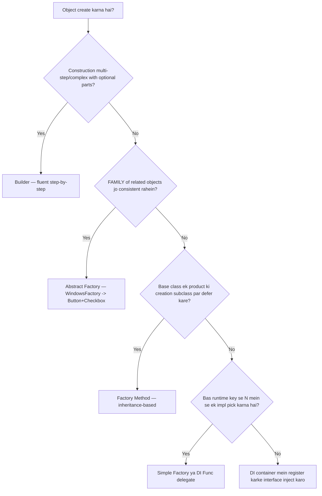
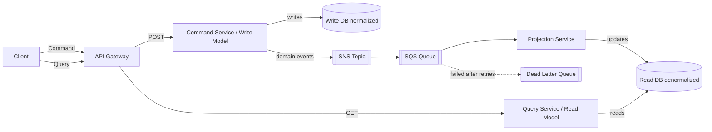
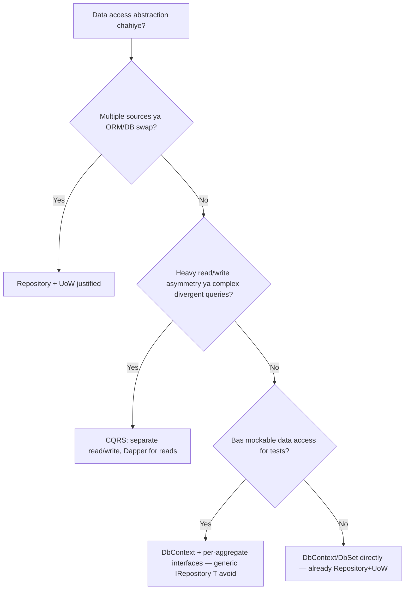

# Design Patterns — Senior .NET Interview: Quick Revision Notes

> Yeh guide se derived quick-revision notes hain — har section aur sub-topic same order mein cover kiya gaya hai (Core Concepts se lekar Summary tak). Focus: trade-offs, "why", gotchas, aur crisp Q&A. Brush-up ke liye, deep tutorial ke liye nahi.

---

## Core Concepts

**Q: Design pattern kya hai aur kyun exist karta hai?**
A: Recurring design problems ke reusable, named solutions. Teams ko ek **shared vocabulary** dete hain aur hard-won trade-offs encode karte hain taaki rediscover na karna pade. GoF ne 23 patterns 3 categories mein rakhe.

| Category | Kya control karta hai | Examples |
|---|---|---|
| Creational | Objects **kaise create** hote hain | Singleton, Factory Method, Abstract Factory, Builder, Prototype |
| Structural | Objects/classes **kaise compose** hote hain | Adapter, Decorator, Proxy, Facade, Composite, Bridge, Flyweight |
| Behavioral | Objects **kaise communicate/collaborate** karte hain | Observer, Strategy, State, Template Method, Command, CoR, Mediator, Iterator, Visitor, Memento |

**Senior framing:** Patterns goals nahi, **trade-offs** hain jo tum ek specific force (variability, coupling, lifecycle, testability) solve karne ke liye accept karte ho. Agar force naam nahi bata sakte → probably over-engineering. Best answer aksar isse start hota hai: "hum actually problem kya solve kar rahe hain — pattern chahiye bhi ya ek simple function/DI registration kaafi hai?"

---

## Creational Patterns

### Singleton

**Intent:** Ek class ka exactly ek instance + global access point.

**Kab:** shared, expensive, effectively stateless/read-only resources — logging, in-memory cache wrappers, config snapshots, connection pool managers.

**Q: Implementations compare karo.**

| Approach | Thread-safe | Lazy | Best for | Note |
|---|---|---|---|---|
| Naive `if (_instance==null)` | ❌ | ✔ | Kabhi nahi | Race → multiple instances |
| `lock` on every access | ✔ | ✔ | Legacy | Har call par lock overhead |
| Double-checked locking | ✔ | ✔ | Threading knowledge dikhana | Verbose; `volatile` chahiye |
| Static field/ctor | ✔ (CLR) | ❌ eager | Simple cheap objects | CLR type-init per AppDomain exactly once |
| `Lazy<T>` | ✔ | ✔ | **Modern default** | Cleanest, `LazyThreadSafetyMode` |
| `LazyInitializer.EnsureInitialized` | ✔ | ✔ | Perf-critical, many lazy fields | Lower allocation, more verbose |

```csharp
// Modern default
public sealed class Logger
{
    private static readonly Lazy<Logger> _instance = new(() => new Logger());
    public static Logger Instance => _instance.Value;
    private Logger() { }
    public void Log(string m) => Console.WriteLine($"[{DateTime.UtcNow:O}] {m}");
}
```

```csharp
// Double-checked locking — volatile zaroori, warna reordering partially-constructed object expose kar deta hai
public sealed class Singleton
{
    private static volatile Singleton? _instance;
    private static readonly object _lock = new();
    private Singleton() { }
    public static Singleton Instance
    {
        get
        {
            if (_instance == null)
                lock (_lock) { _instance ??= new Singleton(); }
            return _instance;
        }
    }
}
```

**Trap question:** `public static Singleton Instance => _instance ??= new Singleton();` — yeh **thread-safe NAHI** hai; `??=` atomic nahi, do threads null observe karke do instances bana sakte hain.

**Q: DI mein Singleton kaise?**
A: Hand-rolled ke bajaye container-managed prefer karo: `builder.Services.AddSingleton<ILogger, Logger>();`. Testability (interface + ctor injection), aur container `IDisposable`/`IAsyncDisposable` disposal handle karta hai.

**Singleton vs Static Class:**

| Singleton | Static Class |
|---|---|
| Instance-based | No instance |
| Interfaces implement kar sakta hai | Nahi |
| DI/mocking ke saath kaam karta hai | Inject/mock nahi ho sakta |
| Deliberately controlled state | Default effectively global mutable state |

**Q: Singleton kab NAHI?**
- Per-request/per-user state chahiye → web app mein stateful Singleton **classic bug** (e.g. `CurrentUser` requests ke across shared → data leakage).
- Testing: global state → order-dependent, isolate/mock mushkil.
- **SRP** violate (creation-control + business logic mix), aksar **DIP** bhi (concrete global reach).
- Distributed/cloud: Singleton **ek process** scope; 5 pods = 5 independent Singletons. Cluster-wide coordination ke liye **distributed lock/lease** chahiye.
- `HttpContext`/DB connections/request-scoped objects Singleton mein store mat karo → captive dependency + leaks.

**Q: Reflection/serialization breakage kaise roke?**
A: `sealed` class, `private` ctor, custom `GetObjectData`/deserialization hooks (ya `[NonSerialized]`). Par reflection `Activator.CreateInstance(type, nonPublic:true)` se private ctor bypass kar sakta hai — .NET mein 100% reflection-proof Singleton nahi. Best: reflection se mat lado, **DI-managed singletons use karo.**

> Note: guide ek `lock`-based aur ek `Lazy<T>`-based Logger — dono ko before/after best-practice progression ki tarah rakhta hai, contradiction nahi.

---

### Factory Patterns

**Simple Factory (GoF nahi):** static method jo input par implementation return kare. Cheap, common, "good enough".
```csharp
public static class NotificationFactory
{
    public static INotification Create(string type) => type switch
    {
        "email" => new EmailNotification(),
        "sms"   => new SmsNotification(),
        _       => throw new ArgumentException("Invalid notification type")
    };
}
```

**Factory Method (GoF):** base `Creator` invariant workflow define karta hai; subclass `FactoryMethod()` override karke decide karti hai *kaunsa* product bane. **Inheritance** use karta hai.
```csharp
public abstract class Creator
{
    protected abstract IProduct FactoryMethod();
    public string SomeOperation() => $"Creator: working with {FactoryMethod().Operation()}";
}
public class ConcreteCreatorA : Creator
{
    protected override IProduct FactoryMethod() => new ConcreteProductA();
}
```
**Trade-off:** algorithm centralized (OCP good — naye Creator/Product pairs add karo bina existing touch kiye), par inheritance-based → rigid, subclass explosion.

**Abstract Factory (GoF):** **related objects ki family** create karta hai jo saath consistent rahein.
```csharp
public interface IGuiFactory { IButton CreateButton(); ICheckbox CreateCheckbox(); }
public class WindowsFactory : IGuiFactory
{
    public IButton CreateButton() => new WindowsButton();
    public ICheckbox CreateCheckbox() => new WindowsCheckbox();
}
// DI se runtime family wire:
services.AddTransient<IGuiFactory>(sp =>
    configuration["Ui:Platform"] == "windows" ? new WindowsFactory() : new MacFactory());
```

| | Factory Method | Abstract Factory |
|---|---|---|
| Scope | Ek product | Related products ki family |
| Mechanism | Inheritance (method override) | Composition (factory object hold) |
| Use case | Ek product ka concrete type vary | Products ke across compatibility |
| Extension | Naya Creator subclass | Naya concrete factory |

**Q: Factory vs Strategy — same interface ke peeche type hide karte hain, farq kya?**

| | Factory | Strategy |
|---|---|---|
| Decides | Object kaise/kya create hota hai | Kaunsa algorithm/behavior run hota hai |
| Chosen by | Creation-time key/config | Client/caller, per invocation/context |
| Output | Naya object instance | Behavior execute karne ka result |
| Relationship | Aksar ek Strategy construct karke return karta hai | Aksar woh product hai jo Factory return karta hai |

**One-liner:** "Strategy = *kaunsa behavior* run hota hai; Factory = *woh object kaise banta hai*. Competing nahi — factories aksar exactly ek runtime key se selected Strategy construct karke dete hain."

**Q: DI containers factories ki zaroorat kaise kam karte hain?**
A: Container already creation + lifetime (Singleton/Scoped/Transient) + implementation selection deta hai — jo factory ki responsibilities hain. `provider.GetRequiredService<INotificationService>()`. Runtime-parameterized creation ke liye factory delegate inject karo:
```csharp
services.AddTransient<Func<string, IService>>(provider => key => key switch
{
    "email" => provider.GetRequiredService<EmailService>(),
    "sms"   => provider.GetRequiredService<SmsService>(),
    _       => throw new ArgumentException("Invalid type")
});
```
**Line:** "DI containers built-in lifetime ke saath automatic factories hain — hand-written Factory sirf tab justified jab creation genuinely complex ho, container ke bahar pluggable ho (plugin DLLs), ya family/consistency guarantee (Abstract Factory)."

**Real ASP.NET Core factories (cite kar sakte ho):**

| Factory | Purpose |
|---|---|
| `IHttpClientFactory` | Socket exhaustion avoid; `HttpClient`/handler pooling; named/typed clients, Polly |
| `ILoggerFactory` | Category-typed `ILogger<T>`; provider config centralize |
| `IServiceScopeFactory` | Manually DI scope (e.g. `BackgroundService` mein Scoped resolve) |
| `IMiddlewareFactory` | DI ke through `IMiddleware` (scoped deps enable) |

**Plugin architecture (dynamic assembly load):** `Assembly.LoadFrom` + reflection se `IPlugin` types discover karke `Activator.CreateInstance`.
> Modern alternative: `AssemblyLoadContext` (unloadable/isolated), `System.Composition`/MEF (attribute discovery) — unloading + version isolation ke liye zyada robust.

**Plugin Factory Versioning & Backward Compatibility** — 4 techniques:
- **Adapter layers** — old plugin ko current `IPlugin` contract ke peeche wrap; host ko legacy special-case nahi karna padta.
- **Versioned interfaces** — `IPlugin`/`IPluginV2` (ya `Version` prop); host resolve karta hai plugin kaunsa implement karta hai.
- **Feature negotiation** — chhote optional capability interfaces (`ISupportsCancellation`); host `is`/`as` se probe karke sirf supported call karta hai.
- **Fallback factories** — load fail/incompatible → safe default/no-op (Null Object) return, throw karke host down karne ke bajaye.
```csharp
public static IPluginV2 LoadPluginWithFallback(Type pluginType)
{
    try
    {
        return Activator.CreateInstance(pluginType) switch
        {
            IPluginV2 v2 => v2,
            IPluginV1 v1 => new PluginAdapter(v1), // versioned interface + adapter
            _            => new NoOpPlugin()       // incompatible → safe fallback
        };
    }
    catch { return new NoOpPlugin(); } // load failure bhi safely fallback
}
```
**Line:** "Class explosion aur version drift plugin factories ke do real risks; versioned + capability interfaces host/plugins ko independently evolve karne dete hain, adapter + fallback factories ek bad plugin ko host down karne se rokte hain."

---

### Builder

**Intent:** complex object ke construction ko representation se separate karo — step-by-step, ek process se multiple representations.

**.NET fluency signal:** `HostBuilder`, `WebApplicationBuilder`, `DbContextOptionsBuilder`, EF Fluent API, `StringBuilder` — sab Builder instances.
```csharp
var pizza = new PizzaBuilder().WithSize("Large").AddTopping("Pepperoni").WithExtraCheese().Build();
```
Immutable ke liye modern C# alternative — **records + `with`** aksar simple cases mein Builder replace karta hai:
```csharp
public record Pizza(string Size, IReadOnlyList<string> Toppings, bool ExtraCheese);
var custom = basePizza with { Size = "Large", ExtraCheese = true };
```
**Builder records ke upar kab jeetta hai:** genuinely multi-step construction, steps ke beech validation, kai optional params ke saath fluent API (telescoping ctors avoid), ya same steps se different representations (Director variant).

---

### Builder vs Factory vs Abstract Factory — Decision Tree



---

### Prototype

**Intent:** naye objects existing instance ("prototype") ko copy karke banao — jab construction expensive ho ya preconfigured object ke variations chahiye.
```csharp
public class Prototype : ICloneable
{
    public List<string> Tags { get; set; } = new();
    public object Clone()
    {
        var clone = (Prototype)MemberwiseClone();   // shallow: ref-types share hote hain
        clone.Tags = new List<string>(Tags);        // manual deep copy of mutable ref members
        return clone;
    }
}
```
**Nuance:** `ICloneable` BCL mein discouraged (shallow vs deep specify nahi karta, non-generic) — explicit `Clone()`/copy-ctor ya records ke `with` prefer karo. Distributed context mein "prototype" = templated config objects (e.g. base `HttpRequestMessage` har retry par clone).

---

## Structural Patterns

### Dependency Injection (as a pattern)

DI ek *technique* hai (strictly GoF nahi), foundational. Dependencies class ko provide ki jaati hain, andar `new` karne ke bajaye → control invert (IoC).
```csharp
public class Client { private readonly Service _s; public Client(Service s) => _s = s; }
```
**Q: DI pattern vs DI container?**
- **Pattern:** design principle — abstractions par depend, ctor/property/method se inject. Zero libraries ("poor man's DI") se bhi ho sakta hai.
- **Container (tool):** runtime component (`Microsoft.Extensions.DependencyInjection`, Autofac) — object graph *resolve*, **lifetimes** manage, decoration/interception/assembly-scanning.

| Lifetime | Instances | Use |
|---|---|---|
| Singleton | App ke liye 1 | Caches, config snapshots, stateless services |
| Scoped | Request/scope ke liye 1 | EF `DbContext`, per-request UoW |
| Transient | Har resolution par naya | Lightweight, stateless, cheap services |

**Gotcha (captive dependency):** Singleton ctor mein Scoped/Transient inject → container use Singleton lifetime ke liye capture kar leta hai → intended shorter lifetime silently break, disposed `DbContext` leak. Development mein `ServiceProviderOptions.ValidateScopes = true` se detect.

---

### Repository Pattern

**Intent:** data-access layer ko business logic se abstract karo (EF/Dapper/store se decouple).
```csharp
public interface IRepository<T> where T : class
{
    Task<IEnumerable<T>> GetAllAsync();
    Task<T> GetByIdAsync(int id);
    Task AddAsync(T entity);
    Task UpdateAsync(T entity);
    Task DeleteAsync(int id);
}
public class Repository<T> : IRepository<T> where T : class
{
    private readonly AppDbContext _context;
    private readonly DbSet<T> _dbSet;
    public Repository(AppDbContext ctx) { _context = ctx; _dbSet = ctx.Set<T>(); }
    public async Task<IEnumerable<T>> GetAllAsync() => await _dbSet.ToListAsync();
    public async Task AddAsync(T e) { await _dbSet.AddAsync(e); await _context.SaveChangesAsync(); }
    // Update/Delete similar...
}
```
Specific repo generic ko extend karta hai (custom queries): `IEmployeeRepository : IRepository<Employee>` with `GetEmployeesByDepartmentAsync`. Register:
```csharp
builder.Services.AddScoped(typeof(IRepository<>), typeof(Repository<>));
builder.Services.AddScoped<IEmployeeRepository, EmployeeRepository>();
```
**Kab use:** DDD-style, genuinely swappable persistence, ya DB hit kiye bina mockable data access.

**Kab avoid:** small app; `DbContext`/`DbSet<T>` already repository + UoW **hai** (`DbSet<T>` = `IQueryable` + change tracking; `SaveChanges` = commit). Generic wrap aksar sirf indirection layer add karta hai jo `IQueryable` leak karta hai ya filtering/paging/`Include()` reinvent karwata hai. **Dono sides argue karne ke liye ready raho** (contested topic).

---

### Unit of Work Pattern

**Intent:** multiple repository operations ko ek atomic transaction/commit mein coordinate karo.
```csharp
public interface IUnitOfWork : IDisposable
{
    IProductRepository Products { get; }
    ICustomerRepository Customers { get; }
    int Complete();
}
public class UnitOfWork : IUnitOfWork
{
    private readonly ApplicationDbContext _context;
    public IProductRepository Products { get; }
    public ICustomerRepository Customers { get; }
    public UnitOfWork(ApplicationDbContext ctx)
    { _context = ctx; Products = new ProductRepository(ctx); Customers = new CustomerRepository(ctx); }
    public int Complete() => _context.SaveChanges();
    public void Dispose() => _context.Dispose();
}
```
`OrderService` `_unitOfWork.Products.GetById(...)` + `_unitOfWork.Complete()` use karta hai. Register: `AddScoped<IUnitOfWork, UnitOfWork>();`

**Key nuance (trap):** EF Core mein `DbContext` **already** UoW hai (sab `DbSet<T>` ke changes track, `SaveChanges` atomically commit). Hand-rolled `IUnitOfWork` mostly **testability/DI-ergonomics wrapper** hai, nayi transactional capability nahi. ("EF Core toh already karta hai?" → yes.)

---

### Decorator vs Proxy vs Adapter

Teenon ek object ko same-shaped interface ke peeche wrap karte hain → confuse hote hain.

| | Adapter | Decorator | Proxy |
|---|---|---|---|
| Intent | Interface ko doosre mein convert (jo client expect kare) | Interface change kiye bina behavior add | Object tak access control (lazy, security, remoting, caching) |
| Interface | Target ≠ adaptee | Wrapped ke same | Real subject ke same |
| Naya behavior? | Nahi — calls translate | Haan — layers (logging, caching, validation) | Kabhi-kabhi — access control, core nahi |
| .NET example | 3rd-party SDK → `IPaymentGateway` | `Stream` decorators (`GZipStream`); middleware | `Lazy<T>` virtual proxy; EF change-tracking proxies |
| Composability | 1 adapter/adaptee | Freely stackable (chains) | 1 proxy/subject |

```csharp
// Adapter — SDK ko apne interface ke peeche
public class StripeSdkAdapter : IPaymentGateway
{
    private readonly ThirdPartyStripeClient _client;
    public StripeSdkAdapter(ThirdPartyStripeClient c) => _client = c;
    public bool Charge(decimal amt) => _client.CreateCharge(amt * 100, "usd") == "succeeded";
}
```
```csharp
// Decorator — caching add without touching callers
public class CachingProductServiceDecorator : IProductService
{
    private readonly IProductService _inner; private readonly IMemoryCache _cache;
    public Product Get(int id) => _cache.GetOrCreate($"product:{id}", _ => _inner.Get(id))!;
}
// Scrutor: services.Decorate<IProductService, CachingProductServiceDecorator>();
```
```csharp
// Proxy — lazy/virtual, expensive construction delay
public class LazyReportGeneratorProxy : IReportGenerator
{
    private readonly Lazy<RealReportGenerator> _real = new(() => new RealReportGenerator());
    public string Generate() => _real.Value.Generate();
}
```
**One-liner:** "Adapter interface ki *shape* change karta hai; Decorator same shape rakhte hue *behavior* add karta hai; Proxy same shape tak *access* control karta hai. ASP.NET Core middleware = `RequestDelegate` ke upar live Decorator chain."

---

### Facade

**Intent:** complex subsystem ke upar single simplified interface, un callers se power hide kiye bina jinhe directly chahiye.
```csharp
public class OrderFacade
{
    private readonly InventoryService _inventory = new();
    private readonly PaymentService _payment = new();
    private readonly ShippingService _shipping = new();
    public string PlaceOrder(int sku, int qty, decimal amount, int orderId)
    {
        if (!_inventory.Reserve(sku, qty)) throw new InvalidOperationException("Out of stock");
        if (!_payment.Charge(amount)) throw new InvalidOperationException("Payment failed");
        return _shipping.Schedule(orderId);
    }
}
```
Real .NET: `HttpClient` khud `HttpMessageHandler` + socket/pooling ke upar facade hai.

---

### Specification Pattern

**Intent:** business rule/query predicate ko composable object (`IsSatisfiedBy`/`ToExpression`) mein encapsulate karo — `Where()` lambdas scatter karne ya repository interface ko har query se bloat karne ke bajaye.
```csharp
public interface ISpecification<T> { Expression<Func<T, bool>> ToExpression(); }

public class ActiveCustomerSpecification : ISpecification<Customer>
{
    public Expression<Func<Customer, bool>> ToExpression() => c => c.IsActive;
}

// Combinator (AND) — real payoff
public class AndSpecification<T> : ISpecification<T>
{
    private readonly ISpecification<T> _left, _right;
    public AndSpecification(ISpecification<T> l, ISpecification<T> r) { _left = l; _right = r; }
    public Expression<Func<T, bool>> ToExpression()
    {
        var p = Expression.Parameter(typeof(T));
        var body = Expression.AndAlso(
            Expression.Invoke(_left.ToExpression(), p),
            Expression.Invoke(_right.ToExpression(), p));
        return Expression.Lambda<Func<T, bool>>(body, p);
    }
}
// Repo bespoke methods badhane ke bajaye spec accept karta hai:
public async Task<List<Customer>> FindAsync(ISpecification<Customer> spec) =>
    await _dbSet.Where(spec.ToExpression()).ToListAsync();
```
**Trade-off:** reusable/testable/composable rules + repo bloat avoid = great; CRUD-only apps = overkill (extra abstraction + expression-tree complexity). EF simple specs ko directly SQL mein translate kar deta hai (sirf `Expression<Func<T,bool>>`).

---

### Bridge, Composite, and Flyweight

Kam frequent, par define + lookalikes se distinguish karna aana chahiye (Bridge vs Adapter, Composite vs Decorator).

**Bridge:** **abstraction** ko **implementation** se separate karta hai taaki dono independently vary karein — jab variation ke do orthogonal dimensions hon (shape × renderer, notification-type × channel), subclass combinatorial explosion avoid.
```csharp
public interface IChannel { void Send(string m); }          // implementation ("how")
public abstract class Notification                            // abstraction ("what")
{
    protected readonly IChannel Channel;
    protected Notification(IChannel c) => Channel = c;
    public abstract void Notify(string content);
}
public class Alert : Notification
{
    public Alert(IChannel c) : base(c) { }
    public override void Notify(string content) => Channel.Send($"[ALERT] {content}");
}
var alert = new Alert(new SmsChannel()); // 2 abstractions × 2 channels = 4 combos, 4 subclasses ke bina
```
*Kab reach:* notification system jahan kai message types × kai delivery channels — grid ko `AlertEmail`/`AlertSms`/... banne se rokta hai.

**Composite:** single object aur composition ko **uniformly** treat karo shared interface ke through — tree data (file system, UI tree, org chart, nested validation).
```csharp
public class CompositeRule : IValidationRule
{
    private readonly List<IValidationRule> _children = new();
    public CompositeRule Add(IValidationRule r) { _children.Add(r); return this; }
    public bool IsValid(object input) => _children.All(r => r.IsValid(input)); // leaf jaisa hi interface
}
// Caller ko pata nahi ek rule hai ya poora tree
```
*Kab reach:* recursive UI/menu tree, composable business-rule/validation tree jahan "group" rule child rules aggregate kare par khud ek `IValidationRule` ki tarah pass ho.

**Flyweight:** bahut saare similar objects ka memory footprint minimize — **intrinsic (context-independent) state** share karo, **extrinsic (context-specific) state** per object rakho. Classic space/time trade-off (counts thousands→millions).
```csharp
public class GlyphFactory
{
    private readonly Dictionary<(char, string), CharacterGlyph> _cache = new();
    public CharacterGlyph GetGlyph(char symbol, string font)
    {
        var key = (symbol, font);
        if (!_cache.TryGetValue(key, out var g)) { g = new CharacterGlyph(symbol, font); _cache[key] = g; }
        return g;
    }
}
public record RenderedCharacter(CharacterGlyph Glyph, int X, int Y); // extrinsic position bahar
```
*Kab reach:* `string.Intern` (built-in Flyweight); text editor mein shared formatting/glyph; game mein thousands entities ke shared sprite/texture.

---

## Behavioral Patterns

### Observer

**Intent:** subject ka state change hone par kai dependents ko notify karo, subject ko concrete subscriber types jaane bina.
```csharp
public class NewsPublisher
{
    public event Action<string>? NewsUpdated;
    public void PublishNews(string news) => NewsUpdated?.Invoke(news);
}
```
Event-driven code, UI data-binding (`INotifyPropertyChanged`), pub/sub. Distributed mein Observer → **domain events + message brokers** (same intent, different transport: in-memory delegate vs SNS/SQS/Kafka).

---

### Mediator Pattern (MediatR)

**Intent:** components ke beech direct coupling kam karo — communication central mediator ke through route.

**Bina MediatR:** Controller → `IOrderService` (tightly coupled).
**MediatR ke saath:** Controller → Mediator → Handler.
```csharp
public class GetOrderByIdQuery : IRequest<OrderDto>
{
    public int OrderId { get; }
    public GetOrderByIdQuery(int id) => OrderId = id;
}
public class GetOrderByIdQueryHandler : IRequestHandler<GetOrderByIdQuery, OrderDto>
{
    private readonly IOrderRepository _repo;
    public GetOrderByIdQueryHandler(IOrderRepository r) => _repo = r;
    public async Task<OrderDto> Handle(GetOrderByIdQuery req, CancellationToken ct) =>
        await _repo.GetOrderByIdAsync(req.OrderId);
}
public class OrdersController : ControllerBase
{
    private readonly IMediator _mediator;
    public OrdersController(IMediator m) => _mediator = m;
    [HttpGet("{id}")] public async Task<IActionResult> Get(int id) => Ok(await _mediator.Send(new GetOrderByIdQuery(id)));
}
```
Register: `builder.Services.AddMediatR(cfg => cfg.RegisterServicesFromAssembly(Assembly.GetExecutingAssembly()));`
> **(verify)** MediatR 12+ `cfg =>` delegate use karta hai; purana `AddMediatR(Assembly)` overload kuch versions mein chalta hai. Registration API + licensing major versions ke across change hua — installed version check karo.

| Pros | Cons |
|---|---|
| Controller ko concrete service/repo se decouple | Indirection — jump-to-definition/trace harder |
| Har handler small, independently testable | Small CRUD ke liye overkill |
| CQRS ke liye natural fit | Runtime dispatch → stack traces less obvious |
| Cross-cutting via pipeline behaviors | Ek aur package/convention |

**Kab:** many-module large apps, CQRS, DDD, ya composable cross-cutting behavior (`IPipelineBehavior<TRequest,TResponse>` — validation/logging/caching bina har handler decorate kiye).

**Real trade-off:** MediatR coupling **relocate** karta hai, remove nahi — controller ab `IOrderService` par nahi, par handler apni deps par depend karta hai. Real win = **discoverability + cross-cutting consistency** (ek pipeline behavior sab par) + **thinner controllers**, "no coupling" nahi.

---

### Strategy vs State

Dono structurally identical (interface + swappable impls + context) — farq *intent* aur *transition kaun control karta hai*.

| | Strategy | State |
|---|---|---|
| Intent | Runtime par algorithm choose, **client** dwara | Internal state transitions par behavior change, object khud decide |
| Switch kaun | Caller/config upfront/per-call | State objects khud transition trigger |
| Awareness | Strategies independent | States aksar ek doosre ko jaanti (transition) |
| .NET example | `IComparer<T>`, pricing/discount, payment selection | Order lifecycle (Pending→Shipped→Delivered), TCP states, workflow engines |

```csharp
// Strategy — caller algorithm pick karta hai
public class Checkout
{
    private readonly IDiscountStrategy _strategy;
    public Checkout(IDiscountStrategy s) => _strategy = s;   // externally injected/chosen
    public decimal Total(decimal amt) => _strategy.Apply(amt);
}
```
```csharp
// State — object khud transition drive karta hai
public class PendingState : IOrderState
{
    public string Name => "Pending";
    public IOrderState Next(Order o) => new ShippedState();   // state decides next
}
public class Order
{
    public IOrderState State { get; private set; } = new PendingState();
    public void Advance() => State = State.Next(this);
}
```
**One-liner:** "Strategy = 'kaunsa algorithm', externally chosen; State = 'ab object ko kya karna', internally lifecycle ke part mein decided. Transition logic classes ke *andar* → State; classes peers with zero transition awareness → Strategy."

**Factory vs Strategy revisited:** "kaunsa pattern hai" ≠ "kaunsa pattern isko choose karta hai". Strategy = runtime par kaunsa *algorithm*; Factory = kaunsa *object construct* — dono compose hote hain (factory runtime key se chosen Strategy deta hai).

---

### Template Method

**Intent:** base class method mein algorithm ka skeleton define karo, specific steps subclass par defer — overall structure change kiye bina. **Inheritance** use karta hai (Strategy composition use karta hai similar goal ke liye).
```csharp
public abstract class ReportGenerator
{
    public sealed string Generate()   // template method — invariant skeleton, sealed
    {
        var data = FetchData();
        var formatted = FormatData(data);
        return WrapWithHeaderFooter(formatted);
    }
    protected abstract string FetchData();
    protected abstract string FormatData(string raw);
    protected virtual string WrapWithHeaderFooter(string body) => $"--- Report ---\n{body}\n--- End ---"; // hook
}
public class SalesReportGenerator : ReportGenerator
{
    protected override string FetchData() => "raw sales rows...";
    protected override string FormatData(string raw) => $"Formatted Sales: {raw}";
}
```

**Template Method vs Strategy:**

| | Template Method | Strategy |
|---|---|---|
| Mechanism | Inheritance — abstract steps override | Composition — impl object inject |
| Flexibility | Fixed shape, variable steps | Poora behavior swappable |
| Runtime swap | Nahi (type compile-time fixed) | Haan |
| ASP.NET example | `ControllerBase` filters/lifecycle hooks | `IAuthorizationHandler` chains, payment strategies |

**Pitfall:** template method khud override karna (agar `sealed` nahi) purpose defeat karta hai — skeleton **seal** karo, sirf well-named hooks expose karo.

---

### Command Pattern

**Intent:** request (action + params) ko object mein encapsulate karo — queuing, logging, undo/redo enable, invoker ko executor se decouple.
```csharp
public interface ICommand { void Execute(); void Undo(); }
public class AddItemCommand : ICommand
{
    private readonly List<string> _cart; private readonly string _item;
    public AddItemCommand(List<string> cart, string item) { _cart = cart; _item = item; }
    public void Execute() => _cart.Add(_item);
    public void Undo() => _cart.Remove(_item);
}
public class CommandInvoker
{
    private readonly Stack<ICommand> _history = new();
    public void Run(ICommand c) { c.Execute(); _history.Push(c); }
    public void UndoLast() { if (_history.TryPop(out var c)) c.Undo(); }
}
```
**MediatR connection:** `IRequest<TResponse>` + `IRequestHandler` = Command (encapsulated request + separate handler) Mediator ke through dispatched. Interview mein recognize karna strong senior signal — "MediatR kaunse pattern par? → Command + Mediator."

---

### Chain of Responsibility

**Intent:** request ko handlers ki chain se pass karo jab tak koi handle na kare (ya sab ko chance mile), sender ko receivers se decouple.
```csharp
public abstract class Handler
{
    protected Handler? Next;
    public Handler SetNext(Handler next) { Next = next; return next; }
    public abstract Task HandleAsync(HttpContext ctx);
}
public class AuthHandler : Handler
{
    public override async Task HandleAsync(HttpContext ctx)
    {
        Console.WriteLine("Checking auth...");
        if (Next != null) await Next.HandleAsync(ctx);
    }
}
```
**Direct mapping:** ASP.NET Core `app.Use(...)` middleware pipeline (`await next(context)`) exactly yeh pattern hai — har link decide karta hai act/pass/short-circuit.

---

### Visitor and Memento

**Visitor:** heterogeneous structure (AST, shape hierarchy) par **new operation** add karo element classes modify kiye bina — element visitor accept karta hai, double-dispatch. Trade-off (Strategy/Template ka mirror): naya **operation** easy (naya visitor), naya **element type** = har existing visitor touch — inverse extensibility problem.
```csharp
public interface IShapeVisitor { void Visit(Circle c); void Visit(Square s); }
public class Circle : Shape { public double Radius { get; init; } public override void Accept(IShapeVisitor v) => v.Visit(this); }
public class AreaVisitor : IShapeVisitor   // naya operation, Circle/Square touch kiye bina
{
    public double TotalArea { get; private set; }
    public void Visit(Circle c) => TotalArea += Math.PI * c.Radius * c.Radius;
    public void Visit(Square s) => TotalArea += s.Side * s.Side;
}
```
*Kab reach:* AST/expression tree walk/rewrite — `System.Linq.Expressions.ExpressionVisitor` canonical BCL example; ya fixed closed node-set ko kai output formats mein serialize.

**Memento:** object ka internal state capture/externalize taaki baad mein restore ho — **encapsulation violate kiye bina**. Originator decide karta hai kya snapshot ho aur opaque token deta hai.
```csharp
public class EditorMemento { internal string Content { get; } internal EditorMemento(string c) => Content = c; }
public class TextEditor
{
    public string Content { get; private set; } = "";
    public void Type(string t) => Content += t;
    public EditorMemento Save() => new(Content);
    public void Restore(EditorMemento m) => Content = m.Content;
}
// Caretaker (UndoStack) sirf opaque mementos store/retrieve karta hai — internals ko touch nahi
```
*Kab reach:* editor/form-builder undo/redo, risky operation se pehle snapshot. Modern C#: immutable `record` (ya JSON serialization) aksar "free" memento deta hai — formal ceremony sirf tab jab true internal state richer ho ya caretaker exposure control karna ho.

---

### Null Object Pattern

**Kya:** interface ki no-op implementation jo null reference ki jagah substitute hoti hai — calling code ko kabhi defensive null check nahi chahiye.
```csharp
public class NullNotifier : ICustomerNotifier { public void Notify(string m) { /* no-op */ } }
public class Customer { public ICustomerNotifier Notifier { get; init; } = new NullNotifier(); } // never null
void SendPromo(Customer c) => c.Notifier.Notify("20% off today!"); // zero null checks
```
Real BCL: `Microsoft.Extensions.Logging.Abstractions.NullLogger`/`NullLogger<T>`.

**Trade-off vs Nullable / Option/Maybe:** Null Object absence ko poori tarah **hide** karta hai — "genuine no-op" vs "kuch configure nahi kiya" distinguish nahi hota → bugs mask (missing config silently no-op ban jaata hai).

| Approach | Absence... | Compiler enforce? | Risk |
|---|---|---|---|
| Null Object | Polymorphism ke peeche hidden | Nahi | Real bugs mask (koi signal nahi) |
| `Nullable<T>`/nullable refs | Explicit typed possibility | Haan (warnings-as-errors) | `!` se suppress ho sakta |
| Option/Maybe `<T>` | Functionally composed explicit value | Haan, construction se | Imperative teams ke liye learning curve |

**Senior take:** Null Object jeetta hai jab genuine **polymorphic no-op** chahiye jo kai call sites par uniformly apply ho (legacy/imperative code, ya jab "safely kuch mat karna" valid behavior ho — `NullLogger`). Naye modern C# code ke liye nullable refs (compile-time baseline) ya Option/Maybe (pipeline compose) better default — absence surface karte hain, swallow nahi.

---

## Architectural Patterns

### CQRS

**Intent:** state **change** karne wale parts (Commands) ko state **read** karne wale parts (Queries) se alag karo — har side different models/optimizations/stores use kare.
- **Commands** = state change intent (`CreateOrder`) — success/failure ya ID return, entity nahi.
- **Queries** = read-only, kabhi mutate nahi.



**Kyun:** better read perf (denormalized/materialized views), simpler write-side, independent scaling, cleaner separation, event-driven fit.
**Cost:** complexity — multiple models, replication lag, eventual consistency (UI accommodate kare). Best: complex domains, high read/write asymmetry, divergent query shapes, audit/event-history.

**Q: CQRS vs Event Sourcing?**
- CQRS = separate read/write **models**. ES ki zaroorat nahi.
- ES = state ko events ke ordered sequence ki tarah persist; current state replay se rebuild.
- CQRS **bina ES** (write model normal DB update + read ke liye events publish) ya **ES ke saath** (source of truth = event stream).

```csharp
// Command handler (write side)
public class PlaceOrderHandler : IRequestHandler<PlaceOrderCommand, Unit>
{
    private readonly WriteDbContext _db; private readonly IEventPublisher _events;
    public async Task<Unit> Handle(PlaceOrderCommand cmd, CancellationToken ct)
    {
        var order = Order.Create(cmd.OrderId, cmd.CustomerId, cmd.Items);
        _db.Orders.Add(order);
        await _db.SaveChangesAsync(ct);
        await _events.PublishAsync(new OrderPlacedEvent(order.Id, order.Total));
        return Unit.Value;
    }
}
```
```csharp
// Projection handler (read side) — idempotent
public class OrderPlacedProjectionHandler : IEventHandler<OrderPlacedEvent>
{
    private readonly ReadDbContext _readDb;
    public async Task Handle(OrderPlacedEvent evt)
    {
        if (await _readDb.Orders.FindAsync(evt.OrderId) != null) return; // idempotent — at-least-once
        _readDb.Orders.Add(new OrderReadModel { Id = evt.OrderId, Total = evt.Total, Status = "Placed" });
        await _readDb.SaveChangesAsync();
    }
}
```

**Operational must-knows:**
1. **Outbox** — events ko write ke *same DB transaction* mein outbox table mein persist, phir background dispatcher publish — "DB likha par publish se pehle crash" wala event loss roke.
2. **Idempotency** — handlers duplicate delivery tolerate karein (at-least-once norm) — processed IDs track ya upsert.
3. **Event ordering** — partition/group keys (`OrderId`, SQS FIFO `MessageGroupId`) → per-entity order.
4. **Schema evolution** — events version karo; fields nullable/optional add.
5. **Eventual consistency UX** — "processing" vs immediately-consistent reads; critical flows ke liye read-your-writes fallback.
6. **Sagas** — multi-service transactions ke liye 2PC ke bajaye compensating actions — choreography (events par react) ya orchestration (coordinator commands + state).

**Checklist — CQRS worth it?** Kai expensive/divergent reads? Complex write domain? Asymmetric scaling? Audit/event history? Zyadatar "yes" → fit; nahi → over-engineering.

**Incremental Rollout (~4–6 weeks, ek bounded context):**

| Phase | Focus |
|---|---|
| 1 | Commands/events/queries design; write API + write DB |
| 2 | Command handlers, outbox table, event publisher |
| 3 | Projection service, read DB, query API |
| 4 | Broker end-to-end wire; idempotency; integration tests |
| 5 | Observability — projection-lag metrics, DLQ alerting |
| 6 | Saga/orchestration *sirf tab* jab cross-service workflows exist karein (speculative nahi) |

**Kyun matter karta hai:** per bounded context incremental, outbox + idempotency live *se pehle*, big-bang rewrite nahi.

**Pitfalls:** trivial CRUD par read/write split; outbox skip (silent event loss); non-idempotent projections (duplicate side effects); projection lag/DLQ ignore; services ke across strong consistency expect (CQRS eventual consistency embrace karta hai).

---

### Projection Service

Woh CQRS component jo **domain events sunta hai aur read model materialize karta hai** — normalized write-side events ko denormalized query-optimized views mein badalta hai.
```
OrderPlaced      → OrderSummaryView
PaymentCompleted → OrderStatusView
ItemAdded        → OrderItemsView
```

**Q: Write/read sides ke beech SNS/SQS (broker) kyun?**

| Guarantee | Kaise |
|---|---|
| Decoupling | Write API sirf publish; read-side par wait nahi |
| Durability | AZs ke across persisted; at-least-once |
| Retry/backoff | Broker transient failures retry |
| Poison-message isolation | N retries ke baad DLQ (queue block nahi) |
| Buffering/elasticity | Queue spikes absorb; workers queue-depth par autoscale |
| Ordering | FIFO / partition keys (`MessageGroupId = OrderId`) |

**Read store by query shape:**

| Query need | Read store | Why |
|---|---|---|
| Complex search, filters, free text | Elasticsearch/OpenSearch | Full-text, ranking, multi-field filter |
| Fast key-value lookup | Redis | Sub-ms reads, high throughput |
| Analytical/aggregation, dashboards | Read-optimized RDBMS / warehouse | Scans, joins, aggregations |

**Senior framing:** ek hi event stream se *multiple* read stores chalana common + correct — har projection ek query shape ke liye tuned (Redis for status widget, Elasticsearch for search).

**One-liner:** "Projection Service domain events subscribe karta hai (SNS/SQS) aur materialized read models banata hai; broker reliability/retries/ordering/fault-isolation deta hai — yahi CQRS ko scale par practical banata hai."

---

### Distributed Locks / Leases

**Definition:** distributed lock = multiple instances/nodes/pods ke across shared lock taaki ek time par sirf ek critical op chale — Singleton ki "is process mein ek instance" guarantee multi-pod ke across **extend nahi** hoti. **Lease** = TTL wala lock jo holder crash par auto-expire (deadlock roke).

**Use cases:** cluster-wide scheduled job ka ek instance; ek queue message sirf ek worker; leader election; replicas ke across unique ID/invoice.

**Mechanics:** (1) node atomically shared store se lock acquire (Redis, SQL Server, etcd/K8s Lease); (2) success → leader; (3) baaki wait/retry/backoff; (4) TTL — leader periodically **renew** kare; (5) renew bina die → lease expire → doosra node takeover.
```csharp
using var redLock = await redlockFactory.CreateLockAsync("critical-job", TimeSpan.FromSeconds(30));
if (redLock.IsAcquired) await RunJobAsync();
```
```sql
EXEC sp_getapplock @Resource = 'job-lock', @LockMode = 'Exclusive', @LockTimeout = 0;
```
K8s native `Lease` object (etcd) bhi leader election ke liye.

**Interviewers probe:** acquisition atomicity (warna "split brain" — 2 leaders), TTL/expiry, renewal protocol, guarded job **idempotency** (lease mid-job expire ho sakta hai), lock store unavailable par graceful failure.

**Trade-offs:** external dependency + network-partition risk; Redis RedLock ki timing-assumptions par publicized correctness critiques hain **(cite karne se pehle current consensus verify karo — debated area)**; phir bhi .NET cloud shops mein standard pragmatic tool.

**Singleton tie-back:** "In-process Singleton per process ek instance; distributed lock/lease uska cluster-wide equivalent jab process horizontally scale ho."

---

### Options Pattern in .NET

**Intent:** `IConfiguration["Key:SubKey"]` string lookups scatter karne ke bajaye config sections ko strongly-typed POCOs se bind karo, DI lifetimes ke saath integrate.
```csharp
public class SmtpOptions { public string Host { get; set; } = ""; public int Port { get; set; } = 587; public bool UseSsl { get; set; } = true; }
builder.Services.Configure<SmtpOptions>(builder.Configuration.GetSection("Smtp"));
public class EmailSender { public EmailSender(IOptions<SmtpOptions> o) => _options = o.Value; }
```

| Interface | Reload | Lifetime | Use case |
|---|---|---|---|
| `IOptions<T>` | First resolution snapshot — runtime changes **nahi** | Singleton OK | Static-for-app settings |
| `IOptionsSnapshot<T>` | Per Scoped resolution recomputed | Sirf Scoped | Per-request changeable settings |
| `IOptionsMonitor<T>` | Live-reload + `OnChange` callbacks | Singleton OK | Long-lived services (background workers) |

**Validation:**
```csharp
builder.Services.AddOptions<SmtpOptions>()
    .Bind(builder.Configuration.GetSection("Smtp"))
    .Validate(o => o.Port > 0, "Port must be positive")
    .ValidateDataAnnotations()
    .ValidateOnStart(); // fail fast at startup
```
**Kyun matter:** Options = config ke liye **typed Factory + Strategy hybrid**; `IOptionsMonitor<T>` conceptually config changes par ek **Observer**. In connections ko articulate karna pattern fluency signal karta hai.

---

### Repository + Unit of Work vs Raw EF Core / CQRS



**Core tension:**
- `DbContext` already **UoW** (change tracking + atomic `SaveChanges`); har `DbSet<T>` already close to **Repository** (`IQueryable` + CRUD).
- Generic `IRepository<T>` aksar `IQueryable` ko leaky abstraction ke peeche **hide** karta hai (ya `IQueryable` expose karo — purpose defeat — ya har query shape ke liye bespoke method → interface balloon).
- Legit reasons: DDD aggregate boundaries (per aggregate root, per table nahi), swappable persistence, complex query composition centralize (Specification ke saath pairs).
- CQRS mein: read side par Repository **poori tarah skip** — direct Dapper/raw SQL/`AsNoTracking()` projections faster + simpler; Repository mainly write/command side invariants ke liye.

**Strong answer:** "EF Core ke saath default se generic Repository+UoW nahi — `DbContext` dono deta hai. Repository tab jab DDD aggregate boundaries, testing ke liye persistence isolation, ya complex specs centralize karni ho. Read side (especially CQRS) par direct no-tracking projections/Dapper favor karta hoon — wahan abstraction cost pay nahi karta."

---

## SOLID Principles

| Principle | Definition | Enforcing pattern |
|---|---|---|
| **S** — Single Responsibility | Class ke change ka ek hi reason | Facade, Decorator |
| **O** — Open/Closed | Extension ke liye open, modification ke liye closed | Strategy, Factory Method, Decorator, CoR |
| **L** — Liskov Substitution | Subtypes base ke liye substitutable, behavior break kiye bina | Template Method (correctly), careful inheritance |
| **I** — Interface Segregation | Kai small client-specific interfaces > ek fat | Adapter, role interfaces (`IReader`/`IWriter`) |
| **D** — Dependency Inversion | High-level modules abstractions par depend karein | DI, Abstract Factory, Strategy |

### SOLID in Practice — Violation-to-Fix

**1. SRP:** validation + persistence + email ek method mein → **extract** karke thin service se orchestrate (`OrderValidator`, `OrderRepository`, `OrderNotifier` inject).

**2. OCP:** har naya discount type = method modify (`switch`) → **Strategy** (naya class = naya discount, existing untouched).
```csharp
public interface IDiscountStrategy { decimal Apply(decimal total); }
public class GoldDiscount : IDiscountStrategy { public decimal Apply(decimal t) => t * 0.8m; }
```

**3. LSP:** `Square : Rectangle` — `Width` set karne se `Height` unexpectedly change (breaks LSP) → **inheritance force mat karo** jo behaviorally hold nahi karta:
```csharp
public interface IShape { int Area(); }
public class Rectangle : IShape { public int Width; public int Height; public int Area() => Width * Height; }
public class Square : IShape { public int Side; public int Area() => Side * Side; }
```

**4. ISP:** fat `IWorker { Work(); Eat(); }` → `RobotWorker.Eat()` throws → **role interfaces**:
```csharp
public interface IWorkable { void Work(); }
public interface IFeedable { void Eat(); }
public class RobotWorker : IWorkable { public void Work() => Console.WriteLine("Working"); }
```

**5. DIP:** `OrderProcessor` concrete `SqlOrderRepository` par depend → **abstraction par depend, inject**:
```csharp
public interface IOrderRepository { void Save(Order order); }
public class OrderProcessor
{
    private readonly IOrderRepository _repo;
    public OrderProcessor(IOrderRepository r) => _repo = r;
    public void Process(Order o) => _repo.Save(o);
}
```

---

## Anti-Patterns

### God Object, Anemic Domain Model, Service Locator, aur doosre Overused/Misapplied

**God Object (God Class):** bahut zyada jaanti/karti class — aksar `Manager`/`Helper`/`Utils` jo saalon mein unrelated responsibilities accrete kare. SRP ignore ka symptom. Fix: **Extract Class**/Facade se incrementally, big-bang rewrite nahi.

**Anemic Domain Model:** entities = pure data bags (`{ get; set; }`), saari logic separate "Service" classes mein. EF codebases mein common (path of least resistance), par OO encapsulation violate — invariants kahin bhi break. Fix: **behavior entity par push** (rich domain model).
```csharp
// ❌ Anemic — check kahin bhi bhool sakta hai
public class Order { public OrderStatus Status { get; set; } }

// ✅ Rich — invariant khud enforce
public class Order
{
    public OrderStatus Status { get; private set; }
    public void Cancel()
    {
        if (Status == OrderStatus.Shipped) throw new InvalidOperationException("Cannot cancel a shipped order");
        Status = OrderStatus.Cancelled;
    }
}
```

**Service Locator:** global registry (`ServiceLocator.Resolve<T>()`) class ke andar se deps fetch karti hai, ctor injection ke bajaye. DI jaisa dikhta hai par real deps ko public API se **hide** karta hai → undiscoverable + testing gymnastics. `IServiceProvider` *pervasively business logic mein* = disguised Service Locator. Fix: specific deps inject, `IServiceProvider` sirf genuine factory/composition-root boundaries par.

**Doosre commonly misapplied:**
- Web apps mein **mutable shared state ke liye Singleton** — #1 real-world misuse.
- Bina reason **EF Core par cargo-culted Repository/UoW** — simple CRUD par bina benefit ceremony.
- **Trivial CRUD par MediatR/CQRS overuse** — bina read/write divergence, indirection tax.
- **Single implementation ke liye premature Abstract Factory/Strategy** — "just in case" YAGNI smell; abstraction tab jab 2nd impl aaye.
- **Har class ke liye interface ("Java-itis")** — har `Foo` ke liye `IFoo` (ek hi impl) "testability ke liye" — real lever pure logic ko I/O se separate karna hai, blanket interface nahi.

---

## Performance Considerations

- **Singleton locking:** har access par manual `lock` ke bajaye `Lazy<T>`/static init — har call par lock (sirf init nahi) needless bottleneck.
- **Decorator/Proxy chains:** har layer = virtual call + allocation; deep stacks (logging+caching+retry+circuit-breaker) hot paths mein measurable overhead — source-generated/compiled pipelines consider (`Microsoft.Extensions.Http.Resilience`/Polly `ResiliencePipeline`).
- **MediatR dispatch:** reflection-based resolution ka cost (lookups cached); very hot paths benchmark karo — usually I/O ke relative negligible par non-zero. Measure, assume mat karo.
- **CQRS/Projection lag:** read-model staleness real trade-off, free nahi — queue depth staleness ka leading indicator.
- **Repository over-abstraction:** `IQueryable` ko non-queryable methods ke peeche wrap → filtering se pehle full result memory mein materialize → SQL-side filtering/paging kill. Common EF perf bug.
- **Distributed locks:** har acquire/renew = network call; overly fine-grained (per-row) locking latency dominate kar sakti hai — granularity coarsen/batch.

---

## Best Practices

- Ek **named force** resolve karne ke liye pattern choose karo (variability, lifecycle, coupling) — bata pao kaunsa force solve hota hai.
- Default **composition over inheritance** (Strategy/Decorator > deep hierarchies).
- Default **DI container ko factory** banne do; explicit Factory sirf jab creation complex ho ya container ke bahar ho.
- **Repository/UoW intentional** — DDD aggregate boundaries/swappable persistence ke liye, EF ke saath default se nahi.
- Cross-cutting concerns → **pipeline behaviors/decorators**, copy-paste nahi.
- Template Method skeletons **seal** karo; sirf named hooks expose.
- **Eventual consistency** = UX decision, sirf technical detail nahi — staleness tolerance upfront decide/communicate.
- Simple immutable data → **records + `with`**; Builder ko genuinely multi-step, validated construction ke liye reserve.

---

## Common Pitfalls

- `??=`/unsynchronized null-check se non-thread-safe Singleton.
- Singleton ke andar per-request/mutable state (`HttpContext`, `CurrentUser`).
- Captive dependency — Scoped/Transient Singleton ctor mein → silently lifetime extend.
- Generic `IRepository<T>` jo `IQueryable` leak kare ya per-query bespoke methods force kare.
- `DbContext` + hand-rolled `IUnitOfWork` ko naye transactional guarantees dena (EF `SaveChanges` already transaction boundary).
- CQRS mein missing outbox → crash par silently lost events.
- Non-idempotent event/projection handlers → at-least-once redelivery par duplicated side effects.
- Strategy/State confuse — "transition kaun decide karta hai" bhoolna.
- Non-sealed Template Method skeleton override karna.
- Simple CRUD par MediatR/CQRS "best practice hai" isliye — read/write divergence justify kare tab.
- `IServiceProvider` ka business logic mein general-purpose Service Locator jaisa use.

---

## Sample Interview Q&A

**Q: Singleton vs static class — kab kaunsa?**
A: Singleton instance-based, interfaces implement, inject/mock, controlled (ideally read-only) state; static class no instance, no interface, no substitute, effectively uncontrolled global state. Modern ASP.NET Core mein container-managed Singleton (`AddSingleton<TInterface, TImpl>`) prefer, static sirf pure stateless utility ke liye.

**Q: 5 replicas ke across "sirf ek worker job run kare" kaise?**
A: In-process Singleton kaam nahi (har pod ka apna). TTL wala distributed lock/lease (Redis RedLock, `sp_getapplock`, K8s `Lease`) — acquire karne wala pod leader, periodically renew; die → expire → doosra takeover. Job **idempotent** ho (lease mid-execution expire ho sakta hai).

**Q: EF Core ke saath Repository kab NAHI?**
A: Jab `DbContext`/`DbSet<T>` already querying + tracking + UoW-jaisa `SaveChanges` deta hai aur persistence swap/DDD boundaries/complex specs ki zaroorat nahi. Un reasons ke bina wrap karna ceremony + `IQueryable` composability hide karke perf degrade.

**Q: Strategy vs State?**
A: Strategy — caller externally algorithm choose, strategies independent. State — object ki internal lifecycle, state objects khud transitions decide/drive. Structurally near-identical; farq intent + kaun transitions control karta hai.

**Q: MediatR kaunse GoF pattern par, aur actual benefit?**
A: Command (`IRequest`/handler = request as object) + Mediator (`IMediator` dispatch bina sender/receiver ek doosre ko jaane). Benefit "zero coupling" nahi — thinner controllers + uniformly applied pipeline behaviors (consistent cross-cutting).

**Q: Team CQRS add karne par debate — kaise decide?**
A: Check reads/writes genuinely diverge karte hain: kai expensive/different read shapes, complex write domain, asymmetric scaling, real audit/event-history. Zyadatar "no" → well-modeled CRUD simpler/cheaper. CQRS ki eventual consistency + dual-model complexity concrete benefits par pay karo, speculative nahi.

**Q: Anemic Domain Model kya, problem kyun?**
A: Entities pure property bags, saare rules "Service" classes mein. Problem: kuch bhi invalid state transition rokta nahi jab check bhool jaaye — class invariants protect nahi karti. Fix: behavior entity par (`order.Cancel()` khud rule enforce) — rich domain model.

**Q: Outbox pattern, aur kyun chahiye?**
A: Command handler DB write + event publish dono karta hai; commit aur publish ke beech crash → event lose → read side permanently stale. Outbox event ko business write ke *same* transaction mein outbox table mein persist karta hai, phir separate reliable dispatcher unsent rows publish karta hai, ack tak retry — at-least-once bina distributed transaction.

**Q: Kya `IServiceProvider` Service Locator anti-pattern hai?**
A: Depends kahan. *Business logic ke andar* pervasively arbitrary deps fetch → Service Locator (real deps ctor signature se hide). Legitimate factory/composition-root boundaries par (e.g. `IServiceScopeFactory` se background worker mein scope, ya plugin loader runtime types resolve) → accepted idiomatic use.

---

## Summary of Additions

`[new content]` sections add kiye kyunki source mein missing/thin the par senior interviews mein commonly probed:
- **Builder** — core GoF creational; `WebApplicationBuilder`/`DbContextOptionsBuilder` fluency + record `with` alternatives.
- **Builder vs Factory vs Abstract Factory Decision Tree** — "kaunsa pick karoge aur kyun" ke liye judgment framework.
- **Prototype** — baaki GoF creational; shallow vs deep clone.
- **Decorator vs Proxy vs Adapter** — most common structural comparison (teenon confuse).
- **Facade** — subsystem simplify; `HttpClient` framing.
- **Specification** — Repository/DDD complement; query logic composable + repo ke bahar.
- **Strategy vs State** — structurally identical, intent/transition-control differ.
- **Template Method** — source ek bare "Template Method:" stub par end hua; fully likha + Strategy comparison.
- **Command** — MediatR se connect (`IRequest`/handler = Command).
- **Chain of Responsibility** — ASP.NET Core middleware = CoR.
- **Options Pattern** — idiomatic typed config, DI lifetimes se ties.
- **Repository + UoW vs Raw EF/CQRS** — "EF ke saath redundant?" trap.
- **SOLID Violation-to-Fix** — saare 5 principles full violation→fix ("spot the violation" live-coding format).
- **God Object, Anemic Domain Model, Service Locator, etc.** — anti-patterns (near-guaranteed material).

**Contradictions flagged:** source do Singleton `Logger` (ek `lock`, ek `Lazy<T>`) sequentially present karta hai — dono correct, before/after progression ki tarah preserve. Aur koi factual contradiction nahi; uncertain points (MediatR registration API version, RedLock correctness debate) **(verify)** se marked.

---

## Summary of [gaps] Additions

`[gaps]` sections second pass mein add kiye taaki recognizable GoF patterns + ek modern-C# debate cover ho:
1. **Bridge, Composite, Flyweight** (Structural) — senior candidate se define + lookalikes se distinguish (Bridge vs Adapter, Composite vs Decorator) expect kiya jaata hai, chahe kam frequent hon; crisp .NET examples "X use kiya hai?" follow-up mein fumble bachate hain.
2. **Visitor aur Memento** (Behavioral) — Visitor `ExpressionVisitor` ke underlying (LINQ/expression trees discuss karte waqt probe); Memento undo/redo/state-snapshot follow-up.
3. **Null Object Pattern** — nullable reference types aur Option/Maybe se compare; absence hide (Null Object) vs type system mein surface (nullable/Option) ka trade-off — live design debate.
