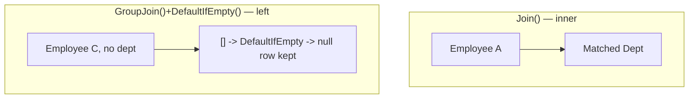
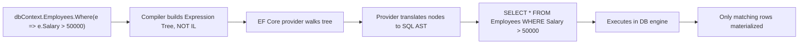

# LINQ — Senior .NET Interview Revision Notes

> Quick-revision notes, guide se derive kiye gaye — har section aur topic same order mein cover kiya gaya hai. Fast brush-up ke liye Q/A + tight bullets. Deep detail chahiye to guide dekho.

---

## Core Concepts

### LINQ Kya Hai Aur Kyun Exist Karta Hai

**Q: LINQ kya hai?**
A: Language-Integrated Query — .NET mein baked query operators ka set jo in-memory collections, DBs, XML, JSON ko ek single, consistent, strongly-typed syntax se query karne deta hai (loops ya SQL strings ke bajaye).

**Q: Senior level par asli test kya hai?**
A: Ki aap samjho LINQ actually **do cheezein** hain jo same syntax pehne hain:
1. **LINQ to Objects** — ordinary delegates (`Func<T,bool>`), in-memory execute, ek item ek time.
2. **LINQ to Entities/SQL** — **expression trees** jo doosri language (SQL) mein *translate* hoke remotely run hote hain.
Inn dono ko conflate karna production bugs/perf incidents ka #1 source hai (client-eval fallback).

**Key benefits:** Readability (declarative), compile-time type safety + IntelliSense, uniform surface across back ends, deferred execution → composable queries + `IQueryable` optimization.

### LINQ Flavors

| Flavor | Target | Interface |
|---|---|---|
| LINQ to Objects | In-memory (arrays, `List<T>`) | `IEnumerable<T>` |
| LINQ to Entities | EF / EF Core DBs | `IQueryable<T>` |
| LINQ to SQL | SQL Server (legacy ORM) | `IQueryable<T>` |
| LINQ to XML | `XDocument` | `IEnumerable<T>` |
| LINQ to JSON | Newtonsoft `JToken` / System.Text.Json | `IEnumerable<T>` |

```csharp
XDocument xml = XDocument.Load("employees.xml");
var names = xml.Descendants("Employee").Select(e => e.Element("Name").Value);

// JSON deserialize ke baad it's just LINQ to Objects
var users = JsonConvert.DeserializeObject<List<User>>(jsonData);
var activeUsers = users.Where(u => u.IsActive).ToList();
```

### Query Syntax vs Method Syntax

```csharp
var q = from emp in employees where emp.Age > 30 select emp;   // query syntax
var m = employees.Where(emp => emp.Age > 30);                  // method syntax
```

- Dono **same IL** mein compile hote hain — query syntax pure syntactic sugar hai.
- Method syntax dominate karta hai: full operator surface (`Sum`, `Count`, `Take` — inke query keywords nahi) + better chaining.

### Deferred vs Immediate Execution

**Sabse zyada tested concept — har level par.**

- **Deferred**: query variable kaam ka ek *description* (iterator, ya `IQueryable` ke liye expression tree) hold karta hai — enumerate karne tak (`foreach`, `.ToList()`, `.Count()`, `.First()`) kuch run nahi hota.
- **Immediate**: `.ToList()`, `.ToArray()`, `.ToDictionary()`, `.Count()`, `.Sum()`, `.First()`, `.Any()` (directly call kiye) — enumeration on the spot force.

```csharp
var result = employees.Where(e => e.Age > 30);          // deferred — abhi kuch nahi chala
Console.WriteLine(result.Count());                       // yahan execute hota hai
var result2 = employees.Where(e => e.Age > 30).ToList(); // immediate
```


**Kyun probe karte hain:** same query variable har enumeration par different results de sakta hai agar source/captured vars beech mein change ho.

```csharp
var numbers = new List<int> { 1, 2, 3 };
var query = numbers.Where(n => n > 1);       // deferred
numbers.Add(4);
Console.WriteLine(string.Join(",", query));  // 2,3,4 — NOT 2,3
```

### Closures Over Variables — Classic Deferred Execution Trap

Deferred execution lambda ko variable **reference se close** karta hai, value se nahi. Captured var enumeration se pehle change ho to query naya value dekhti hai.

```csharp
int threshold = 30;
var query = employees.Where(e => e.Age > threshold); // captures 'threshold' by reference
threshold = 50;
var result = query.ToList();                          // filters using 50, NOT 30
```

Historical `for`-loop capture bug (C# 5.0 se `foreach` fix, par plain `for` mein **abhi bhi zinda**):

```csharp
var actions = new List<Action>();
for (int i = 0; i < 3; i++)
    actions.Add(() => Console.WriteLine(i)); // SAME 'i' captured
actions.ForEach(a => a());                    // prints 3,3,3 — NOT 0,1,2
```

Fix — loop body mein local copy:
```csharp
for (int i = 0; i < 3; i++) { int local = i; actions.Add(() => Console.WriteLine(local)); }
```

Note: `foreach` var ab per-iteration naya hai, so trap `foreach` par apply nahi hota — par interviewer *why* fix kaam karta hai woh test karta hai.

---

## Intermediate Concepts

### Select vs SelectMany

| | `Select()` | `SelectMany()` |
|---|---|---|
| Output | Nesting preserve (collection of collections) | Ek level flatten → single sequence |
| Use | 1:1 projection | Project + flatten (saare skills across employees) |

```csharp
var r1 = students.Select(s => s.Courses);     // IEnumerable<List<string>>
var r2 = students.SelectMany(s => s.Courses); // IEnumerable<string>, flattened
```

`SelectMany` = LINQ ka **cross join** implementation + monadic "flatMap" composition (FP parallel).

### First / FirstOrDefault / Single / SingleOrDefault

| Method | Behavior | Throws? |
|---|---|---|
| `First()` | First match | Yes — no match / empty |
| `FirstOrDefault()` | First match ya `default(T)` | No |
| `Single()` | Exactly ek match | Yes — zero ya >1 match |
| `SingleOrDefault()` | Zero ya ek match | Yes — >1 match; zero par default |

```csharp
var firstUser = users.FirstOrDefault(u => u.Age > 30); // safe
var singleEmp = employees.Single(e => e.Id == 101);     // uniqueness assert — PK lookups
```

**Senior nuance:** `Single()` ek *assertion* hai — jab business rule genuinely uniqueness guarantee kare (PK) tab use karo taaki data-integrity bug loudly surface ho. Aisi jagah `First()` use karna bugs hide karta hai.

### Any / All

```csharp
bool hasAdults = users.Any(u => u.Age >= 18);
bool allAdults = users.All(u => u.Age >= 18);
```
- Predicate ke bina `Any()` = idiomatic existence check — hamesha `Count() > 0` ke bajaye.
- **Empty sequence par `All()` → `true`** (vacuous truth), `Any()` → `false`. Classic gotcha.

### GroupBy

```csharp
var grouped = users.GroupBy(u => u.City);
foreach (var g in grouped)
    Console.WriteLine($"City: {g.Key}, Count: {g.Count()}");
```
- Return: `IEnumerable<IGrouping<TKey,TElement>>`; har grouping khud `IEnumerable<TElement>` + `.Key`.
- **Deferred**, par LINQ-to-Objects mein first group yield karne se pehle *entire* source ko buffer karna padta hai — truly stream nahi karta. Large sets par matter karta hai.

### Join vs GroupJoin (Left Join)

- `Join()` — inner join; per match ek flat row.
- `GroupJoin()` — *per left element* ek row + matches ki nested collection (natural left-join/1:many shape). True SQL left outer join ke liye `.SelectMany(...DefaultIfEmpty())`.

```csharp
var inner = employees.Join(departments, e => e.DeptID, d => d.ID, (e,d) => new { e.Name, d.Name });

var left = from emp in employees
           join dept in departments on emp.DeptID equals dept.ID into empDept
           from d in empDept.DefaultIfEmpty()
           select new { emp.Name, Department = d?.Name ?? "No Department" };
```



### Aggregate Functions and Aggregate()

```csharp
int total = employees.Sum(e => e.Salary);
double avg = employees.Average(e => e.Salary);
int product = numbers.Aggregate((a, b) => a * b); // custom fold/reduce
```
- `Aggregate()` = generic fold/reduce — jab built-in (`Sum`/`Max`/`Count`) fit na ho.
- **EF Core mein `Aggregate()` almost always SQL translate NAHI hota** → client eval force ya throw. `IQueryable` par use karne se pehle trade-off jaano.

### Distinct, Except, Intersect, Union

| Method | Description |
|---|---|
| `Except()` | First mein hain par second mein nahi |
| `Intersect()` | Dono mein common |
| `Union()` | Dono ke unique elements (implicit de-dup) |

```csharp
int[] a = {1,2,3,4}; int[] b = {3,4,5,6};
a.Except(b);    // 1,2
a.Intersect(b); // 3,4
a.Union(b);     // 1,2,3,4,5,6
```
Teenon `EqualityComparer<T>.Default` use karte hain jab tak custom `IEqualityComparer<T>` na do — reference types ke custom equality ke liye comparer bhoolna common bug hai.

### ToLookup() vs GroupBy()

| Feature | `GroupBy()` | `ToLookup()` |
|---|---|---|
| Execution | Deferred | Immediate |
| Return | `IEnumerable<IGrouping<K,V>>` | `ILookup<K,V>` |
| Key indexable | No | Yes (`lookup["HR"]`) |
| Missing key | N/A | Empty sequence (no exception) |

```csharp
var lookup = employees.ToLookup(e => e.Department);
Console.WriteLine(lookup["HR"].Count());
```

### MaxBy, MinBy, DistinctBy, Chunk (.NET 6+)

Ye four operators .NET 6 mein `System.Linq` mein shipped — verbose old idioms replace karte hain, ab fair game.

- **`MaxBy`/`MinBy`** — max/min key wala *element* return (not just value). Fix karta hai woh "`.Max(f => f.AverageSalary)` se department lose" wala Q6/Q15 bug.
- **`DistinctBy`** — projected key se de-dup, custom comparer ki zarurat nahi.
- **`Chunk`** — sequence ko fixed-size batches mein split (`IEnumerable<T[]>`), last batch chhota ho sakta hai. Bulk inserts/API batch limits ke liye.

```csharp
var highestPaid = employees.MaxBy(e => e.Salary);   // Employee, not decimal
var lowestPaid  = employees.MinBy(e => e.Salary);
var oldIdiom    = employees.OrderByDescending(e => e.Salary).First(); // equivalent
var onePerDept  = employees.DistinctBy(e => e.DepartmentId);
foreach (int[] batch in employeeIds.Chunk(100))
    await bulkApiClient.ProcessBatchAsync(batch);    // 100-item API limit
```

**Gotchas:**
- `MaxBy`/`MinBy` empty par `default(T)` return (reference type → `null`) — `Max()`/`Min()` non-nullable value type par `InvalidOperationException` throw karte hain. Asymmetry jaano.
- Tie par `MaxBy`/`MinBy` **first** encountered return karte hain (deterministic, arbitrary nahi).
- `IQueryable` par translation support provider/version dependent — generated SQL verify karo.
- `Chunk` ka last batch shorter — partial final batch handle karo.

### Take/Skip, Pagination, DefaultIfEmpty, Zip

```csharp
int pageSize = 5, pageNumber = 2;
var paged = employees.Skip((pageNumber - 1) * pageSize).Take(pageSize);
var d = employees.Where(e => e.ID == 100).DefaultIfEmpty(new Employee { Name = "Not Found" });
var combined = names.Zip(ages, (name, age) => $"{name} is {age} years old."); // stops at shorter
```
**Senior gotcha (`IQueryable`):** `Skip`/`Take` ko hamesha `OrderBy` ke saath pair karo — SQL bina ordering guarantee nahi deta, so concurrent writes ke under non-deterministic pages/duplicates.

### ToDictionary and Non-Generic Collections

```csharp
var empDict = employees.ToDictionary(e => e.ID, e => e.Name);
ArrayList list = new ArrayList { 1,2,3,4 };
var nums = list.Cast<int>().Where(n => n > 2); // non-generic → Cast
```
`ToDictionary` **duplicate keys par `ArgumentException`** — common runtime surprise. Duplicates possible ho to `GroupBy` + `ToDictionary(g => g.Key, g => g.ToList())` ya `.DistinctBy(...)`.

### Let Clause

```csharp
var result = from e in employees
             let bonus = e.Salary * 0.1m
             select new { e.Name, Bonus = bonus };
```
`let` sirf query syntax mein. Method equivalent = intermediate `Select` with anonymous type (ya inline calc). Readability aid — expression ko multiple baar recompute karne se bachata hai.

### Cross Join

```csharp
var result = from e in employees from d in departments select new { e.Name, d.Name };
```
= `employees.SelectMany(e => departments, (e,d) => new { e.Name, d.Name })` — Cartesian product. Rare; usually bug jab correlating `where` bhool jaate ho.

---

## Advanced Concepts

### IEnumerable\<T\> vs IQueryable\<T\>

**Highest-signal senior LINQ question.**

| Feature | `IEnumerable<T>` | `IQueryable<T>` |
|---|---|---|
| Represents | Sequence + delegate (`Func`) | Sequence + **expression tree** (`Expression<Func>`) |
| Source | In-memory (LINQ to Objects) | ORMs — EF Core, LINQ to SQL |
| Filtering kahan | App memory mein, full source materialize ke baad | SQL mein translate hoke source par |
| Deferred | Yes | Yes |
| Composability | Har `.Where()` = ek delegate | Har `.Where()` = tree node; whole tree ek baar translate |
| Large remote perf | Poor — sab memory mein pull | Good — filter/sort/page DB tak push |
| Arbitrary C# methods? | Yes, kuch bhi | No — sirf jo provider SQL mein translate kar sake |

```csharp
IEnumerable<int> d1 = numbers.Where(n => n > 5);                          // in-memory
IQueryable<int> d2 = dbContext.Employees.Where(e => e.Salary > 50000);    // SQL, runs in DB
```

**Trap:** final `Where()` se pehle `.AsEnumerable()` (ya non-translatable method) → filter client-side chalta hai *entire* table pull karne ke baad. Large tables par quietly catastrophic.

```csharp
var bad  = dbContext.Employees.AsEnumerable().Where(e => e.Salary > 50000); // all rows → memory
var good = dbContext.Employees.Where(e => e.Salary > 50000);                // SQL WHERE
```

### Expression Trees Aur LINQ-to-Entities SQL Translation

- `Func<T,...>` lambda → **IL** (executable delegate).
- `Expression<Func<T,...>>` lambda → **data**: `Expression` node objects (`BinaryExpression`, `MemberExpression`, `ConstantExpression`) ka tree jo code ko *describe* karta hai, run nahi.



Isliye `IQueryable`'s `Where` param = `Expression<Func<T,bool>>` jabki `IEnumerable` = plain `Func<T,bool>` — provider ko *tree* chahiye translate karne ke liye.

```csharp
Expression<Func<Employee,bool>> isHighEarner = e => e.Salary > 50000;
// .Body, .Parameters inspect/rewrite ho sakte hain — AutoMapper ProjectTo, Dynamic LINQ, query builders isi par rely karte hain
```
Practical: koi bhi C# construct jiska SQL equivalent nahi (custom methods, string helpers, complex pattern matching) predicate mein → `InvalidOperationException` (strict providers) ya client eval (EF Core, warning ke saath).

### Client-Eval Fallback Aur Query Translation Limits (EF Core)

**Highest real-world-impact gap.** EF Core (EF6 ke unlike jo hard-throw karta tha) jitna possible SQL translate karta hai, aur **untranslatable part silently memory mein pull** karke client-side eval karta hai — sirf ek warning log karke (production mein miss karna easy).

```csharp
var result = dbContext.Employees
    .Where(e => Regex.IsMatch(e.Name, "^A"))   // no SQL translation → client-eval, ALL rows first
    .ToList();
```

**Common untranslatable:** arbitrary instance/static C# methods (custom validators, regex, culture string ops); `Aggregate()`, custom `IComparer`/`IEqualityComparer` wale operators; kuch complex nested ternary/pattern-matching; kuch bhi `.AsEnumerable()`/`.ToList()` ke baad.

**Mitigation:**
- Non-prod mein warnings ko errors banao: `optionsBuilder.ConfigureWarnings(w => w.Throw(RelationalEventId.QueryClientEvaluationWarning))` (API version-dependent).
- Jitna filter/projection ho sake `IQueryable` portion mein push karo; `.AsEnumerable()`/`.ToList()` sirf *last* step.
- Materialize se pehle `.Select()` se exact columns par project — translation risk + network/memory dono kam.

### yield return Aur Custom Iterators

Deferred+streaming custom operator kaise likhein? → `yield return`.

```csharp
public static IEnumerable<TSource> WhereGreaterThan<TSource,TKey>(
    this IEnumerable<TSource> source, Func<TSource,TKey> selector, TKey threshold)
    where TKey : IComparable<TKey>
{
    foreach (var item in source)
        if (selector(item).CompareTo(threshold) > 0)
            yield return item; // pauses; resumes on next MoveNext()
}
```
Compiler `yield return` ko state machine (`IEnumerator<T>`) mein rewrite karta hai — isi tarah `Where`/`Select` deferred, streaming (one-at-a-time) execution deti hain bina whole sequence buffer kiye. Isse samajh aata hai:
- Kyun LINQ-to-Objects large sequences ke liye memory-efficient (full materialization ki zarurat nahi).
- Kyun iterator ke andar throw hui exception `MoveNext()` par surface hoti hai, method call par nahi — confusing stack traces.
- **Gotcha:** iterator mein argument validation first enumeration tak run nahi hoti (body `MoveNext()` tak execute nahi). Eager validation ke liye public wrapper + private iterator mein split karo.

```csharp
public static IEnumerable<T> SafeWhere<T>(this IEnumerable<T> source, Func<T,bool> predicate)
{
    if (source is null) throw new ArgumentNullException(nameof(source));       // eager
    if (predicate is null) throw new ArgumentNullException(nameof(predicate));
    return SafeWhereIterator(source, predicate);                              // deferred part
}
private static IEnumerable<T> SafeWhereIterator<T>(IEnumerable<T> source, Func<T,bool> predicate)
{
    foreach (var item in source) if (predicate(item)) yield return item;
}
```

### Custom LINQ Extension Methods

```csharp
public static class MyExtensions
{
    public static IEnumerable<int> GetEvens(this IEnumerable<int> numbers)
        => numbers.Where(n => n % 2 == 0);
}
var evens = numbers.GetEvens();
```

### Dynamic LINQ

```csharp
// Requires System.Linq.Dynamic.Core
var result = employees.AsQueryable().Where("Salary > 50000").ToList();
```
Runtime se filters/sorts build karne ke liye (user-selectable filter UI) bina expression trees hand-roll kiye. **Trade-off:** string predicates compile-time safety lose karte hain + injection surface agar field names untrusted input se aayein — column names ki allow-list se validate karo.

### LINQ Method Chaining vs Query Syntax — Kab Kaunsa

| Scenario | Prefer |
|---|---|
| Simple filter/projection/sort | Method — left-to-right, kisi bhi operator se compose |
| Multiple `join`s, esp. `GroupJoin`+`DefaultIfEmpty` | Query — `into`/`from` shape zyada readable |
| Reused named intermediate value chahiye (`let`) | Query — clean method equivalent nahi |
| Operators bina query keyword: `Sum`,`Count`,`Take`,`Skip`,`Distinct`,`Any`,`Aggregate` | Method — mandatory |
| Fluent, conditionally-built queries | Method — variable reassign se trivially composable |

```csharp
IQueryable<Employee> query = dbContext.Employees;
if (minSalary.HasValue) query = query.Where(e => e.Salary >= minSalary.Value);
if (!string.IsNullOrEmpty(department)) query = query.Where(e => e.Department == department);
```
Practice: default method syntax; multi-join/`let`-heavy ke liye query syntax mein drop; mix bhi kar sakte ho.

---

## Performance

### General Optimization Rules

- `.AsEnumerable()` deliberately use karo (sirf tab jab saari server-side filtering ho chuki ho) — LINQ-to-Entities se LINQ-to-Objects switch.
- `.ToList()`/`.ToArray()` premature call mat karo — immediate execution force + entire result materialize, further composition/provider optimization defeat.
- Existence: `.Count() > 0` ke bajaye `.Any()` — short-circuits; `Count()` (`IQueryable`) full `COUNT(*)`/enumeration.
- `Select()`/`OrderBy()` se pehle `Where()` — working set jaldi reduce, smaller translated query.
- `IQueryable` paging: `Skip`/`Take` ko `OrderBy` ke saath pair karo.

### Multiple Enumeration Pitfall

**Common real-world bug** ("is code mein kya galat hai?").

```csharp
IEnumerable<Employee> highEarners = employees.Where(e => e.Salary > 50000); // deferred
int count = highEarners.Count();  // enumeration #1 — full pass
var list  = highEarners.ToList(); // enumeration #2 — full pass AGAIN
if (highEarners.Any()) { ... }    // enumeration #3 — full pass AGAIN
```
Har call `Where` ko *original* source par scratch se re-run karta hai (variable iterator hold karta hai, cached result nahi).
- **Perf:** LINQ-to-Objects → bina reason 3x work; LINQ-to-Entities → **DB ke 3 round trips**.
- **Correctness:** source beech mein change ho (live collection, non-det generator, concurrent DB writes) → har enumeration different results, inconsistent count/list/Any.

**Fix:** ek baar `.ToList()`/`.ToArray()` se materialize karo, phir snapshot par kaam.
```csharp
var highEarners = employees.Where(e => e.Salary > 50000).ToList(); // ONE enumeration
int count = highEarners.Count;                                      // List<T> property, no re-enum
if (highEarners.Any()) { ... }                                      // cheap
```
Roslyn analyzers/ReSharper isko "possible multiple enumeration" flag karte hain.

### Hidden O(n²) Traps — Nested Where/Any Inside Select

```csharp
// O(n*m): har employee ke liye pura departments scan
var result = employees.Select(e => new {
    e.Name, DeptName = departments.FirstOrDefault(d => d.Id == e.DepartmentId)?.Name });

// O(n*m): Any() inside Where re-scans blockedIds per item
var filtered = employees.Where(e => !blockedIds.Any(b => b == e.Id));
```
n rows × m rows = O(n·m) — small m par fine, scale par disastrous (50k×50k = 2.5B comparisons).

**Fix:** lookup side ko `Dictionary`/`HashSet`/`ILookup` mein pre-index (O(1)), ya actual `Join`/`GroupJoin` (DB level hash/indexed join).
```csharp
var deptById = departments.ToDictionary(d => d.Id, d => d.Name);           // O(n+m)
var result = employees.Select(e => new {
    e.Name, DeptName = deptById.TryGetValue(e.DepartmentId, out var n) ? n : null });

var blockedSet = blockedIds.ToHashSet();
var filtered = employees.Where(e => !blockedSet.Contains(e.Id));

var result2 = employees.Join(departments, e => e.DepartmentId, d => d.Id,
    (e,d) => new { e.Name, DeptName = d.Name });                           // SQL JOIN against IQueryable
```
Yeh sabse common LINQ complexity bug hai jo code-review question mein poocha jaata hai.

### Parallel LINQ (PLINQ)

```csharp
var results = users.AsParallel().Where(u => u.Age > 30).ToList();
```
Source ko threads/cores ke across partition + merge — large in-memory CPU-bound embarrassingly-parallel work speed up.

**Trade-offs (unprompted raise karo):**
- **Overhead** — small collections/cheap predicates par partitioning overhead > benefit; sequential se *slower* ho sakta hai. Benchmark karo.
- **Ordering** — default unordered; order chahiye to `.AsOrdered()` (perf cost).
- **I/O/DB ke liye nahi** — PLINQ = LINQ-to-Objects tool. `DbContext` thread-safe nahi — kabhi same context par PLINQ se EF queries fan out mat karo.
- **Side effects** — predicates/projections side-effect-free ya synchronized ho; shared state mutate = race condition.
- **Exceptions** — multiple partitions ki exceptions `AggregateException` mein — unwrap karne ready raho.
- Shared/server env mein `.WithDegreeOfParallelism(n)` se threads cap karo.

### IAsyncEnumerable Aur System.Linq.Async

`IEnumerable`/`IQueryable` enumeration synchronous — next item pull calling thread block karta hai. `IAsyncEnumerable<T>` (`await foreach`) har `MoveNextAsync()` par I/O wait karte hue thread yield back karta hai — load ke under scalability ke liye matter.

```csharp
await foreach (var e in dbContext.Employees.Where(e => e.Salary > 50000).AsAsyncEnumerable())
    Process(e);
```
`IAsyncEnumerable<T>` par LINQ composition (`Select`/`Where`/`SelectMany`) ke liye **`System.Linq.Async`** NuGet (`dotnet/reactive`) — BCL operators sirf `IEnumerable`/`IQueryable` target karte hain.

```csharp
using System.Linq;
var filtered = dbContext.Employees.AsAsyncEnumerable().Where(e => e.IsActive).Select(e => e.Name);
await foreach (var name in filtered) { ... }
```
**Distinction:** `Task<IEnumerable<T>>` (ek big async wait, phir sync sequence) vs `IAsyncEnumerable<T>` (genuinely async *stream*, incremental delivery) — latter large/server-streaming (gRPC, paged APIs, huge Minimal API responses) ke liye right tool.

### EF Core: AsNoTracking, Split Queries, Compiled Queries

Concrete EF Core 5+ perf levers:
- **`.AsNoTracking()`** — read-only queries mein change-tracking overhead skip (no snapshot compare, no identity map). Reporting/read-heavy ke liye big win. `.AsNoTrackingWithIdentityResolution()` = identity resolution rakhta hai without full tracking.
- **Split queries (`.AsSplitQuery()`)** — multiple `Include()` collections eager-load par default single JOIN "cartesian explosion" (rows multiply) de sakta hai; split query per collection separate SQL issue karta hai (round trips vs row bloat trade). Dono directions context-dependent — verify.
- **Compiled queries (`EF.CompileQuery`/`EF.CompileAsyncQuery`)** — expression-to-SQL translation ek baar pre-compile, subsequent calls par translation cost bypass. Sirf extremely hot-path par worth; warna unnecessary (EF Core already query plans cache karta hai).
- **Projection > full-entity loading** — `.Select(e => new EmployeeDto {...})` unused columns skip + unselected shape ke liye change tracking entirely skip. Read-only endpoints ke liye often sabse bada win.

```csharp
var dtos = await dbContext.Employees
    .AsNoTracking()
    .Where(e => e.IsActive)
    .Select(e => new EmployeeDto { Id = e.Id, Name = e.Name })
    .ToListAsync();
```

### Window-Function Alternatives for Ranking Queries (Nth Highest Salary in Production)

Q2/Q11 `Distinct().OrderByDescending().Skip(n).FirstOrDefault()` = LINQ-to-Objects/interview ke liye sahi. Par senior follow-up: **"millions rows wali production DB par kaise?"** → usually nahi karte — ranking ko DB native **window functions** tak push down karo.

**Kyun better:**
- **Full materialization avoid** — translated `Skip(n)` ke liye DB ko pura result set compute+order karna padta hai; `ROW_NUMBER()` optimizer ko index use karke full sort/scan avoid karne deta hai.
- **Set-based, not row-by-row** — `RANK()`/`DENSE_RANK()`/`ROW_NUMBER() OVER (PARTITION BY ... ORDER BY ...)` exactly wahi primitive hai. Nested-`GroupBy`-then-rank shapes historically EF Core ke hardest translations, often old versions par silent client eval.
- **Ek round trip, ek query plan** — exactly N rows waapas.
- **Ties correct** — `RANK()` (ties share rank, gaps chhode), `DENSE_RANK()` (ties share rank, no gaps), `ROW_NUMBER()` (strict, arbitrary tie-break) — teen alag business rules jo LINQ mein hand-roll karna easy-to-get-wrong.

```sql
-- Nth highest per department (SQL Server)
WITH RankedSalaries AS (
    SELECT e.DepartmentId, e.Name, e.Salary,
           DENSE_RANK() OVER (PARTITION BY e.DepartmentId ORDER BY e.Salary DESC) AS SalaryRank
    FROM Employees e
)
SELECT DepartmentId, Name, Salary FROM RankedSalaries WHERE SalaryRank = 3;
```

```csharp
// EF Core 8+ : SqlQuery<T> — no DbSet-mapped entity needed, scalar/DTO projections
var thirdPerDept = await dbContext.Database.SqlQuery<DeptSalaryRankDto>($"""
    WITH RankedSalaries AS (
        SELECT DepartmentId, Name, Salary,
               DENSE_RANK() OVER (PARTITION BY DepartmentId ORDER BY Salary DESC) AS SalaryRank
        FROM Employees)
    SELECT DepartmentId, Name, Salary FROM RankedSalaries WHERE SalaryRank = 3
    """).ToListAsync();

// Pre-EF Core 8 / entity-shaped: FromSqlRaw against mapped/keyless entity
var legacy = await dbContext.Employees.FromSqlRaw(@"
    WITH RankedSalaries AS (
        SELECT e.*, DENSE_RANK() OVER (PARTITION BY DepartmentId ORDER BY Salary DESC) AS SalaryRank
        FROM Employees e)
    SELECT * FROM RankedSalaries WHERE SalaryRank = 3").ToListAsync();

public record DeptSalaryRankDto(int DepartmentId, string Name, decimal Salary);
```

**LINQ/in-memory kab abhi bhi fine:** small already-materialized collections (config data, ek page of results, unit tests) ya genuine LINQ-to-Objects (no DB). Real growing table par `IQueryable` ho to window functions (raw SQL ya modern EF Core translation) production-grade answer. Hamesha generated SQL/execution plan verify — LINQ compile hona translation guarantee nahi.

---

## Best Practices

- Default method syntax; multi-join/`let`-heavy ke liye query syntax.
- Exactly ek baar materialize (`.ToList()`/`.ToArray()`) us point par jahan pata ho multiple enumeration hoga — multiple enumeration pitfall avoid.
- Chain mein jaldi `Where` se filter, esp. `IQueryable` (work DB tak push).
- Existence: `Count() > 0` ke bajaye `Any()`.
- SQL-translatable sab kuch `IQueryable` portion mein rakho; `.AsEnumerable()`/`.ToList()` sirf final step; client-eval ke liye alert.
- `Select`/`Where` mein scan nest karne se pehle lookup collections (`Dictionary`/`HashSet`/`ToLookup`) pre-index karo — O(n²) avoid.
- Read-only EF Core queries mein `AsNoTracking()`.
- Materialize se pehle `Select()` se DTOs par project — over-fetch + unnecessary tracking avoid.
- `IQueryable` paging: `Skip`/`Take` hamesha `OrderBy` ke saath.
- `AsParallel()` se pehle benchmark — free nahi, I/O/DB ke liye galat tool.
- `foreach` se iterate ho rahi collection mutate karne se pehle `.ToList()` (warna `InvalidOperationException`).

---

## Common Pitfalls

- **Multiple enumeration** of deferred `IEnumerable`/`IQueryable` — silently re-run (EF → DB re-hit).
- **Closures on mutable captured vars** — variable change ke baad unexpected results.
- **Client-side eval fallback (EF Core)** — untranslatable predicate → silently entire table memory mein.
- **Empty par `All()` → `true`** (vacuous truth) — `Any()` (empty → false) se backwards karna easy.
- **`ToDictionary()` duplicate keys par throw** — uniqueness assume mat karo (live/dirty data).
- **Iterate karte hue collection modify** → `InvalidOperationException`; pehle `.ToList()` snapshot.
- **DB par `Skip`/`Take` se pehle `OrderBy` bhoolna** — non-deterministic paging.
- **`Select` ke andar nested `Where`/`Any`/`FirstOrDefault` scans** — hidden O(n²).
- **`IEnumerable` vs `IQueryable` confuse** — `.AsEnumerable()` too early → filtering DB se memory mein.
- **`GroupBy` ko `Where`/`Select` jaisa stream maanna** — LINQ-to-Objects mein whole source buffer.

---

## Worked Coding Exercises

Foundational patterns — cold jaano, harder challenges ke building blocks.

```csharp
var even = numbers.Where(n => n % 2 == 0).ToList();                            // 1
var high = employees.Where(e => e.Salary > 50000).Select(e => e.Name);         // 2
var dups = numbers.GroupBy(n => n).Where(g => g.Count() > 1).Select(g => g.Key).ToList(); // 3
var wordCount = sentence.Split(' ').GroupBy(w => w).Select(g => new { Word = g.Key, Count = g.Count() }); // 4
var second = salaries.Distinct().OrderByDescending(s => s).Skip(1).FirstOrDefault();  // 5
var top3 = products.OrderByDescending(p => p.Price).Take(3).Select(p => p.Name);      // 6
// 7. Group by department (GroupBy section)
var upper = names.Select(n => n.ToUpper());                                    // 8
var aNames = employees.Where(n => n.StartsWith("A")).ToList();                 // 9
var scores = students.Join(scores, s => s, sc => sc.StudentId,
    (s, sc) => new { StudentId = s, Score = sc.Score });                       // 10
```

---

## Senior-Level Query Challenges (with Solutions)

Dataset:
```csharp
public class Employee { public int Id; public string Name; public int DepartmentId; public decimal Salary; public DateTime JoiningDate; }
public class Department { public int Id; public string Name; }
public class Order { public int Id; public int CustomerId; public decimal Amount; public DateTime OrderDate; }
public class Customer { public int Id; public string Name; public string City; }
```

### Level 1 — Medium

```csharp
// Q1. Above-average earners
var avg = employees.Average(e => e.Salary);
var q1 = employees.Where(e => e.Salary > avg);
// Gotcha: IQueryable par 2 round trips / subquery — SQL verify; windowed avg better ho sakta hai

// Q2. Second highest salary (single sort)
var q2 = salaries.Distinct().OrderByDescending(s => s).Skip(1).FirstOrDefault();

// Q3. Joined in last 6 months
var cutoff = DateTime.Today.AddMonths(-6);
var q3 = employees.Where(e => e.JoiningDate >= cutoff);

// Q4. Names by DeptId asc, Salary desc
var q4 = employees.OrderBy(e => e.DepartmentId).ThenByDescending(e => e.Salary).Select(e => e.Name);

// Q5. Top 5 highest paid
var q5 = employees.OrderByDescending(e => e.Salary).Take(5);
```

### Level 2 — Upper Medium

```csharp
// Q6. Dept with highest average salary — OrderByDescending().First(), NOT Max()
var q6 = employees.GroupBy(e => e.DepartmentId)
    .Select(g => new { DeptId = g.Key, AvgSalary = g.Average(e => e.Salary) })
    .OrderByDescending(x => x.AvgSalary).First();
// Bug in source: .Max(f => f.AverageSalary) sirf numeric max deta hai, dept lose. Use OrderByDescending().First() ya MaxBy.

// Q7. Highest paid per dept (dept name joined)
var q7 = employees.GroupBy(e => e.DepartmentId)
    .Select(g => new { DeptId = g.Key, Top = g.OrderByDescending(e => e.Salary).First() })
    .Join(departments, x => x.DeptId, d => d.Id, (x,d) => new { Dept = d.Name, x.Top.Name, x.Top.Salary });

// Q8. Duplicate employee names
var q8 = employees.GroupBy(e => e.Name).Where(g => g.Count() > 1).Select(g => g.Key);

// Q9. Employees joined per year
var q9 = employees.GroupBy(e => e.JoiningDate.Year).Select(g => new { Year = g.Key, Count = g.Count() });

// Q10. Salary > dept average (classic — SelectMany se flatten)
var q10 = employees.GroupBy(e => e.DepartmentId)
    .SelectMany(g => { var a = g.Average(e => e.Salary); return g.Where(e => e.Salary > a); });
```

### Level 3 — Hard

```csharp
// Q11. Third highest salary per dept
var q11 = employees.GroupBy(e => e.DepartmentId)
    .Select(g => new { DeptId = g.Key,
        ThirdHighest = g.Select(e => e.Salary).Distinct().OrderByDescending(s => s).Skip(2).FirstOrDefault() });

// Q12. Salary matching another dept's employee
var q12 = employees.GroupBy(e => e.Salary)
    .Where(g => g.Select(e => e.DepartmentId).Distinct().Count() > 1).SelectMany(g => g);

// Q13. Depts where EVERY employee > 50000
var q13 = employees.GroupBy(e => e.DepartmentId).Where(g => g.All(e => e.Salary > 50000)).Select(g => g.Key);
// Bug in source: .TakeWhile(...) GALAT — first failing group par stop, baaki silently drop. Correct = .Where(g => g.All(...)). Genuine logic bug.

// Q14. Depts with at least one employee > 200000
var q14 = employees.GroupBy(e => e.DepartmentId).Where(g => g.Any(e => e.Salary > 200000)).Select(g => g.Key);

// Q15. Employees earning dept max
var q15 = employees.GroupBy(e => e.DepartmentId)
    .SelectMany(g => { var m = g.Max(e => e.Salary); return g.Where(e => e.Salary == m); });
```

### Level 4 — Advanced Joins

```csharp
// Q16. Employees with dept names
var q16 = employees.Join(departments, e => e.DepartmentId, d => d.Id, (e,d) => new { e.Name, DeptName = d.Name });

// Q17. Depts with no employees (favorite — !Any() over Count()<1)
var q17 = departments.GroupJoin(employees, d => d.Id, e => e.DepartmentId, (d, emps) => new { Dept = d.Name, Emps = emps })
    .Where(x => !x.Emps.Any()).Select(x => x.Dept);

// Q18. Employees whose dept doesn't exist
var q18 = employees.GroupJoin(departments, e => e.DepartmentId, d => d.Id, (e, depts) => new { e.Name, DeptMatches = depts })
    .Where(x => !x.DeptMatches.Any()).Select(x => x.Name);

// Q19. Per-dept count/avg/max/min — GUARD empty!
var q19 = departments.GroupJoin(employees, d => d.Id, e => e.DepartmentId, (d, emps) => new {
    Dept = d.Name, Count = emps.Count(),
    Average = emps.Any() ? emps.Average(e => e.Salary) : 0,
    Max = emps.Any() ? emps.Max(e => e.Salary) : 0,
    Min = emps.Any() ? emps.Min(e => e.Salary) : 0 });
// Bug in source: bina guard Average/Max/Min empty sequence par InvalidOperationException. emps.Any()?...:0 required.
```

### Level 5 — Real Production Style

```csharp
// Q20. Customers who never ordered
var q20 = customers.GroupJoin(orders, c => c.Id, o => o.CustomerId, (c, co) => new { c.Name, co })
    .Where(x => !x.co.Any()).Select(x => x.Name);

// Q21. Top overall spender
var q21 = orders.GroupBy(o => o.CustomerId).Select(g => new { CustomerId = g.Key, Total = g.Sum(o => o.Amount) })
    .OrderByDescending(x => x.Total).First();

// Q22. Top customer per city (nested GroupBy)
var q22 = customers.Join(orders, c => c.Id, o => o.CustomerId, (c,o) => new { c.City, c.Name, o.Amount })
    .GroupBy(x => x.City)
    .Select(cg => new { City = cg.Key,
        TopCustomer = cg.GroupBy(x => x.Name).Select(cu => new { Name = cu.Key, Total = cu.Sum(x => x.Amount) })
            .OrderByDescending(x => x.Total).First() });

// Q23. Per-month orders/revenue/avg
var q23 = orders.GroupBy(o => new { o.OrderDate.Year, o.OrderDate.Month })
    .Select(g => new { g.Key.Year, g.Key.Month, TotalOrders = g.Count(),
        TotalRevenue = g.Sum(o => o.Amount), AvgOrderValue = g.Average(o => o.Amount) })
    .OrderBy(x => x.Year).ThenBy(x => x.Month);

// Q24. Customers with orders on consecutive days (no built-in pairwise operator)
var q24 = orders.GroupBy(o => o.CustomerId).Where(g => {
    var dates = g.Select(o => o.OrderDate.Date).Distinct().OrderBy(d => d).ToList();
    for (int i = 1; i < dates.Count; i++) if ((dates[i] - dates[i-1]).Days == 1) return true;
    return false; }).Select(g => g.Key);
// Tricky: adjacent pairwise comparison ke liye index loop ya Zip chahiye — pure declarative LINQ "previous item" cleanly express nahi karta.

// Q25. Longest gap between orders per customer (Zip idiom)
var q25 = orders.GroupBy(o => o.CustomerId).Select(g => {
    var dates = g.Select(o => o.OrderDate.Date).Distinct().OrderBy(d => d).ToList();
    var gaps = dates.Zip(dates.Skip(1), (a,b) => (b - a).Days);
    return new { CustomerId = g.Key, LongestGap = gaps.DefaultIfEmpty(0).Max() }; });
// dates.Zip(dates.Skip(1),...) = consecutive pairs idiom; DefaultIfEmpty(0) single-order guard.
```

### Level 6 — Senior Developer Challenges

```csharp
// Q26. Duplicates in original order (impure LINQ — side effects in predicate)
var seen = new HashSet<int>(); var emitted = new HashSet<int>();
var q26 = numbers.Where(n => !seen.Add(n) && emitted.Add(n));
// HashSet.Add false = already exists; !seen.Add(n) true jab already seen; emitted.Add per-dup once. Intentionally impure — flag to interviewer.

// Q27. Missing numbers in a sequence
var q27 = Enumerable.Range(numbers.Min(), numbers.Max() - numbers.Min() + 1).Except(numbers);

// Q28. Merge overlapping date ranges — LINQ RIGHT TOOL NAHI (stateful merge)
public static List<(DateTime Start, DateTime End)> MergeRanges(List<(DateTime Start, DateTime End)> ranges) {
    var sorted = ranges.OrderBy(r => r.Start).ToList();      // LINQ for sort
    var merged = new List<(DateTime Start, DateTime End)>();
    foreach (var range in sorted) {                          // merge = stateful imperative
        if (merged.Count > 0 && range.Start <= merged[^1].End) {
            var last = merged[^1];
            merged[^1] = (last.Start, range.End > last.End ? range.End : last.End);
        } else merged.Add(range);
    }
    return merged;
}
// Merging inherently stateful — "current merged range" aage change hoti hai. LINQ pure/stateless transforms ke liye. Imperative loop favor karna senior signal.

// Q29. Recursive reporting hierarchy — LINQ alone insufficient
public static IEnumerable<Employee> GetAllReports(int managerId, List<Employee> all) {
    var direct = all.Where(e => e.ManagerId == managerId).ToList();  // LINQ one level
    foreach (var r in direct) {
        yield return r;
        foreach (var ind in GetAllReports(r.Id, all)) yield return ind; // recursion for depth
    }
}
// LINQ ka native recursive/hierarchical operator nahi (SQL recursive CTE ka koi equivalent nahi). DB mein hierarchy ho to recursive CTE push karo, N+1 nahi.

// Q30. Top 3 customers per year by revenue (top N per group)
var q30 = orders.GroupBy(o => o.OrderDate.Year).Select(yg => new { Year = yg.Key,
    TopCustomers = yg.GroupBy(o => o.CustomerId).Select(cg => new { CustomerId = cg.Key, Total = cg.Sum(o => o.Amount) })
        .OrderByDescending(x => x.Total).Take(3).ToList() });
```
**"Top N per group" pattern:** nested `GroupBy` (outer = partition, inner = ranking dim), rank within partition, `Take(N)`. Same shape Q22 + Q30.

**SQL/EF Core translation note:** yeh pattern (`ROW_NUMBER() OVER (PARTITION BY ... ORDER BY ...)`) historically hardest LINQ-to-Entities translations mein se. Modern EF Core (5+) bahut cases translate karta hai, par hamesha generated SQL verify — older versions client eval force karte the.

---

## Sample Interview Q&A

**Q: `IEnumerable<T>` vs `IQueryable<T>` — practical difference, method signature ke liye kyun matter?**
A: `IEnumerable` = in-memory-executable sequence via compiled delegates; `IQueryable` = expression tree jise provider SQL mein translate karta hai. Repository return type `IQueryable` = callers additional filtering compose kar sakte hain (DB tak push); `IEnumerable`/`List<T>` return = entire result materialize (common anti-pattern: "repository `List<T>` return, service layer memory mein filter").

**Q: `var query = employees.Where(e => e.Age > minAge); minAge = 50;` — filter 30 ya 50?**
A: 50 (enumeration-time value). Deferred execution lambda closure mein *variable* ko reference se capture karta hai — predicate har run par `minAge` re-read karta hai.

**Q: EF Core query correct results par terribly perform kyun kar sakti hai jab LINQ fine lage?**
A: Client evaluation fallback — predicate/projection ka part SQL translatable nahi, EF untranslated slice memory mein pull (often *entire* table) + C# eval. Silent (log warning), isliye dangerous. Diagnose: generated SQL inspect (`ToQueryString()`, logging) + check `WHERE` actually SQL mein hai.

**Q: `if (collection.Count() > 0)` (IQueryable) mein kya galat?**
A: Full `COUNT(*)` scan/materialization force ek number ke liye jise sirf zero se compare karte ho. `.Any()` → SQL `EXISTS(...)`, first match par short-circuit — hamesha cheaper/equal.

**Q: Method syntax ke bajaye query syntax kab?**
A: Multi-table joins (esp. `GroupJoin`+`DefaultIfEmpty` left joins), aur reused named intermediate value ke liye `let` — dono query syntax mein zyada readable. Baaki sab, esp. `Sum`/`Count`/`Take`/`Distinct`, method syntax.

**Q: Highest salary per dept — common mistake?**
A: `employees.GroupBy(e => e.DepartmentId).Select(g => g.OrderByDescending(e => e.Salary).First())`. Common mistake: group par `.Max(e => e.Salary)` — sirf numeric max, employee record nahi (value ↔ entity association lose). `OrderByDescending().First()` ya `MaxBy` chahiye.

**Q: `AsParallel()` + EF Core `DbContext` ka danger?**
A: `DbContext` thread-safe nahi — single instance concurrently threads par use nahi. `AsParallel()` work fan out karta hai; shared context-backed `IQueryable` par → concurrent access exceptions/corrupt state. PLINQ = CPU-bound in-memory tool, DB parallelize karne ka tarika nahi.

**Q: `dbContext.Employees.Where(e => e.Salary > 50000).ToList()` — step by step?**
A: `Where` provider ko wrap karke expression tree node build karta hai (IL nahi). Abhi kuch nahi chalta — `.ToList()` enumeration trigger karta hai → provider tree walk, SQL translate (`SELECT ... WHERE Salary > 50000`), DB par execute, rows ko `Employee` objects mein materialize (change tracker se tracked jab tak `AsNoTracking()` na ho).

---

## Summary of Additions

`[new content]` sections (high-frequency senior/lead topics jo original notes mein missing/implicit the):
1. **Closures Over Variables** — reference capture + historical `for`-loop closure bug.
2. **Expression Trees + SQL Translation** — pipeline jo `IQueryable` ko `IEnumerable` se fundamentally different banata hai.
3. **Client-Eval Fallback (EF Core)** — highest real-world-impact gap, silent in-memory eval.
4. **yield return + Custom Iterators** — compiler state machine, deferred streaming, eager-validation gotcha.
5. **Method Chaining vs Query Syntax** — concrete decision framework.
6. **Multiple Enumeration Pitfall** — high-signal, entirely absent tha.
7. **Hidden O(n²) Traps** — nested scans, common real perf bug.
8. **IAsyncEnumerable + System.Linq.Async** — modern async streaming LINQ.
9. **EF Core: AsNoTracking, Split Queries, Compiled Queries** — concrete EF Core 5+ levers.

### Contradictions / Bugs Flagged from Original Notes
- **Q6:** `.Max(f => f.AverageSalary)` dept key discard karta hai → `OrderByDescending(...).First()`.
- **Q13:** `.TakeWhile(...)` first failing group par stop + baaki silently drop (genuine logic bug) → `.Where(g => g.All(...))`.
- **Q19:** bina guard `Average`/`Max`/`Min` empty par `InvalidOperationException` → `emps.Any() ? ... : 0`.
- Minor: source deferred/immediate + First/Single tables 3 baar repeat karta hai — yahan single canonical sections mein merge.

## Summary of [gaps] Additions
1. **MaxBy, MinBy, DistinctBy, Chunk (.NET 6+)** — guide cross-referenced kar raha tha par define nahi kiya; `MaxBy`/`MinBy` exactly Q6/Q15 "`.Max()` entity lose" bug fix karte hain; .NET 6+ target par current-idiom answer expected.
2. **Window-Function Alternatives (Nth Highest in Production)** — Q2/Q11 LINQ solution correct hai par production large-table answer = `RANK()`/`DENSE_RANK()`/`ROW_NUMBER()` DB tak push (`FromSqlRaw` ya EF Core 8 `SqlQuery<T>`), memory mein materialize nahi.
