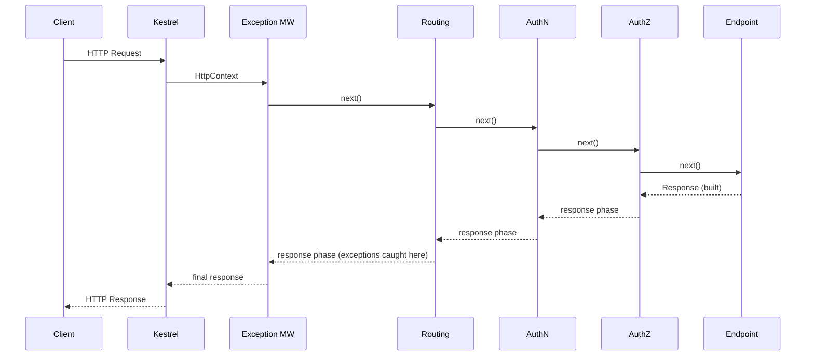
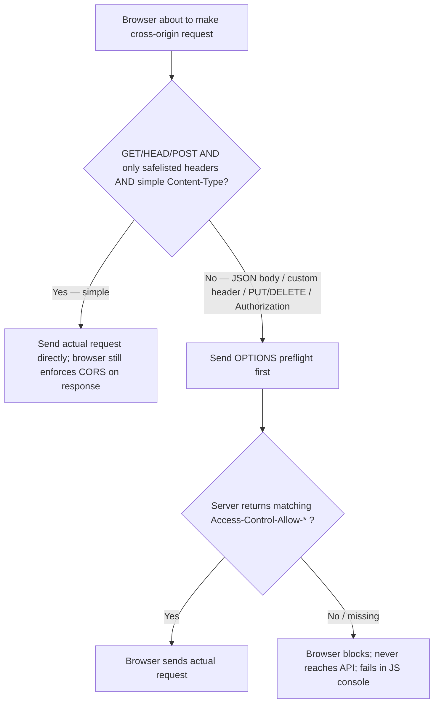
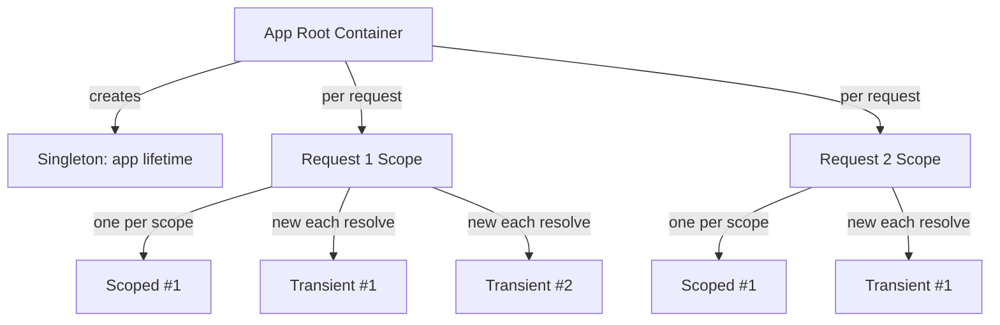
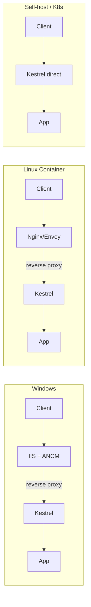

# ASP.NET Core — Senior/Lead Interview Quick-Revision Notes

> Yeh quick-revision notes hain jo `../Detailed Notes/F. ASP.NET-Core-Interview-Guide.md` se derive kiye gaye hain — guide ki har section aur sub-topic ko same order mein cover karta hai, Q/A + tight bullets format mein. Focus: nuance, trade-offs, internals, aur interviewer follow-ups. Current as of ASP.NET Core 8/9.

---

## 1. Core Concepts

### .NET Core vs ASP.NET Core, and vs .NET Framework

**Q: .NET Core vs ASP.NET Core?**
A: **.NET Core** = cross-platform, modular, open-source runtime (CoreCLR). **ASP.NET Core** = uske upar bana web framework (Web API, MVC, Razor Pages, Blazor, gRPC, SignalR).

**Q: ASP.NET Core ke advantages over legacy .NET Framework?**
- Cross-platform (Win/Linux/macOS), container-native.
- Unified framework — MVC + Web API ek hi pipeline (alag `System.Web.Http`/`System.Web.Mvc` nahi).
- High perf: Kestrel, async-first I/O, `Span<T>`/`Memory<T>`, lightweight middleware pipeline.
- Built-in first-class DI (third-party container optional).
- Self-contained deployment, side-by-side runtime versioning.
- Composable middleware pipeline (monolithic `System.Web` ko replace karta hai).

| Dimension | .NET Framework | .NET Core / .NET 5+ |
|---|---|---|
| Platform | Sirf Windows | Cross-platform, Docker-native |
| Architecture | Monolithic, IIS + `System.Web` | Modular, Kestrel, async-first |
| WebForms | Yes | No |
| MVC | Yes | Rewritten as ASP.NET Core MVC |
| WPF/WinForms | Yes | Yes, Windows-only |
| gRPC / Minimal APIs | No | Yes |
| Deployment | Machine-wide, IIS zaruri | Self-contained EXE, side-by-side, any proxy, container-ready |
| Tooling | Sirf VS | VS, VS Code, Rider, `dotnet` CLI |
| Future | Maintenance/security only | Active development |

**Q: .NET Framework abhi bhi kyun relevant?**
A: Legacy WebForms/WCF apps port karna expensive — legitimate business reason hai, koi technical advantage nahi.

**Migration path (Framework → Core), senior level:**
1. Dependencies inventory karo (Upgrade Assistant / API Analyzer se blockers dhundo).
2. Shared logic pehle .NET Standard / multi-targeted libraries mein port karo.
3. `System.Web` HttpModules/Handlers → middleware equivalents.
4. WCF → gRPC/REST; `Web.config` → `appsettings.json` + Options pattern.
5. DI re-wire karo (`IServiceProviderFactory` ya built-in container).
6. Feature flags ke peeche incrementally deploy; bade monoliths ke liye **strangler fig pattern**.

### Project Structure & Hosting Model Evolution

| Item | Purpose |
|---|---|
| `Program.cs` | Startup: builder, DI, pipeline, `app.Run()` |
| `wwwroot/` | Static files |
| `appsettings.json` / `.{Env}.json` | Config |
| `Controllers/` `Models/` `Views/` | MVC/API bits |
| `Properties/launchSettings.json` | Local debug profiles — dev-only, prod mein use nahi |

**Q: Pre-.NET 6 vs .NET 6+ hosting model?**
- **Before .NET 6 (generic host):** `Program.cs` `IHost`/`IWebHost` build karta hai + `Startup` class. `ConfigureServices()` → DI; `Configure()` → middleware.
- **.NET 6+ (minimal hosting):** `Startup.cs` `Program.cs` mein fold, top-level statements, koi `Main`/class wrapper nahi. `WebApplicationBuilder` → register on `builder.Services` → `WebApplication` build → pipeline on `app` → `app.Run()`. Bade apps mein extension methods (`AddApplicationServices()`) mein split kar sakte ho.

```csharp
var builder = WebApplication.CreateBuilder(args);
builder.Services.AddControllers();
builder.Services.AddScoped<IOrderService, OrderService>();
var app = builder.Build();
if (app.Environment.IsDevelopment()) app.UseDeveloperExceptionPage();
app.UseHttpsRedirection();
app.UseAuthentication();
app.UseAuthorization();
app.MapControllers();
app.Run();
```

**Q: Minimal hosting — under the hood real change ya sirf syntax sugar?**
A: Mostly sugar. `WebApplicationBuilder` internally generic `Host` builder wrap karta hai; `WebApplication` `IApplicationBuilder` + `IEndpointRouteBuilder` + `IHost` implement karta hai. DI, hosting abstractions, pipeline unchanged — sirf mandatory `Startup` ceremony gaya.

### Program.cs / Startup.cs / Minimal Hosting Model

- `ConfigureServices()` / `builder.Services.Add...()` → sirf dependency registration (yahan middleware nahi).
- `Configure()` / `app.Use...()` → sirf middleware wiring, registration order mein execute.
- Concerns mix karna (jaise `Configure` mein services eagerly resolve karna) junior mistake — DI registration side-effect-free rakho.

### Environments & Configuration Basics

- Env vars environment-specific behavior drive karte hain (conn strings, log levels, endpoints, toggles). **Secrets kabhi source mein commit nahi.**
- Built-in envs: `Development`, `Staging`, `Production` via `ASPNETCORE_ENVIRONMENT`.

**Q: Configuration provider precedence? (baad wala pehle wale ko override karta hai)**
1. `appsettings.json`
2. `appsettings.{Environment}.json`
3. User Secrets (Development only)
4. Environment variables
5. Command-line arguments

Kyun matter karta hai: K8s/ECS config env vars ke through inject karta hai, isliye env vars JSON se upar → ops image rebuild kiye bina override kar sakte hain.

- **Options pattern** = config consume karne ka idiomatic way (neeche IOptions section).

### Static Files & Default Files

```csharp
app.UseDefaultFiles();   // MUST run BEFORE UseStaticFiles
app.UseStaticFiles();
```

Custom default names / non-wwwroot folder:
```csharp
var options = new DefaultFilesOptions();
options.DefaultFileNames.Clear();
options.DefaultFileNames.Add("home.html");
app.UseDefaultFiles(options);

app.UseStaticFiles(new StaticFileOptions {
    FileProvider = new PhysicalFileProvider(Path.Combine(Directory.GetCurrentDirectory(), "MyStatic")),
    RequestPath = "/mystatic"
});
```

**Gotcha:** `UseDefaultFiles` sirf default document ka **URL rewrite** karta hai — file serve nahi karta. `UseStaticFiles` (ya `UseFileServer` = dono + directory browsing) ke saath pair karo.

### Logging Providers & Configuration

- Built-in structured logging via `Microsoft.Extensions.Logging`, consumed through `ILogger<T>` — per-class inject, log entries auto category name (T ka FQN) se tag.

```csharp
private readonly ILogger<OrdersController> _logger;
public OrdersController(ILogger<OrdersController> logger) => _logger = logger;
_logger.LogInformation("Fetching order {OrderId}", id);
```

| Provider | Notes |
|---|---|
| Console | Default; human-readable dev output |
| Debug | Debugger output window |
| EventSource | Cross-platform ETW, `dotnet-trace`/PerfView |
| EventLog | Windows Event Log (Windows only) |
| Azure App Insights | Cloud telemetry sink |
| Serilog/NLog | Structured/sink-based (files, Elasticsearch, Seq) as provider adapters |

```json
{ "Logging": { "LogLevel": {
  "Default": "Information",
  "Microsoft": "Warning",
  "Microsoft.Hosting.Lifetime": "Information" } } }
```

- Filtering hierarchical hoti hai (namespace-based) — specific category `Default` ko override karti hai; noisy framework namespaces `Warning` par pin, app namespace `Information`/`Debug`.
- **Senior nuance:** structured/semantic logging (named placeholders `{OrderId}`, NOT string interpolation) matter karti hai — Serilog/App Insights un fields par index/query kar sakte hain. `$"Fetching order {id}"` likhne se structure waste, query-able field opaque string ban jaata hai.

### .NET Application Types, Code Sharing & Multi-Targeting

| Type | Use |
|---|---|
| Console app | CLI tools, scripts, one-off jobs |
| Class library | Shared logic |
| Web app (MVC/Razor/API) | HTTP apps |
| Worker service | Long-running bg process bina HTTP, `dotnet new worker` |
| Background service | `IHostedService`/`BackgroundService` kisi bhi host ke andar |
| ASP.NET Core hosted service | Bg task web app ke process mein, uska DI/lifetime share |

**Code sharing mechanisms (least→most packaged):**

| Mechanism | When |
|---|---|
| Project reference | Same solution, co-developed code |
| Class library | General sharing unit (compile once, reference ya NuGet) |
| Shared project | Legacy (source har consumer mein compile), mostly superseded |
| NuGet package | Cross-repo/cross-team with independent versioning |

Typical candidates: DTOs/contracts, cross-cutting utilities, shared business logic (API + Worker same domain rules).

**Multi-targeting** — ek project multiple TFMs ke liye compile:
```xml
<PropertyGroup><TargetFrameworks>net6.0;net8.0</TargetFrameworks></PropertyGroup>
```
Kab: NuGet library jise purane LTS + current support karna ho; cross-platform tooling; migration window bridge.

**Gotcha:** multi-target code ko aksar `#if NET8_0_OR_GREATER` conditional compilation chahiye → maintenance cost. Application-level projects single current LTS target karein; multi-targeting genuinely reusable libraries ke liye reserve.

---

## 2. Middleware Pipeline (Deep Dive)

### What Middleware Really Is

- Middleware = `RequestDelegate`s ki chain jo registration order mein sequential lekin **runtime par nested** (stack-based, linear nahi):
```
Middleware A → Middleware B → Middleware C → Endpoint
```
- Yeh nested model explain karta hai: registration order kyun matter karta hai (har MW baad ki har cheez ko wrap karta hai); `await next()` ke relative code placement (pehle = request phase, baad = response phase); responses backward flow kyun karte hain.

### Request/Response Flow



- **Request:** Kestrel `HttpContext` banata hai → MW registration order mein enter → har MW "before" logic + `next()` → endpoint execute.
- **Response:** endpoint response → same stack reverse unwind → har MW ka "after next()" → client.
- **Key insight:** har MW effectively har request ke liye 2x execute (in + out). Isliye exception-handling MW **outermost** (pehle registered), aur response-mutation logic `await next()` ke **baad**.

### Built-in Middleware Deep Dive

**Exception Handling** — baad ki har cheez ke unhandled exceptions catch karta hai. Pehle register hona chahiye (sirf downstream protect karta hai).
```csharp
if (app.Environment.IsDevelopment()) app.UseDeveloperExceptionPage();
else app.UseExceptionHandler("/error");   // or IExceptionHandler (.NET 8+)
```
.NET 8 `IExceptionHandler` — testable, DI-friendly:
```csharp
public class GlobalExceptionHandler : IExceptionHandler {
    public async ValueTask<bool> TryHandleAsync(HttpContext ctx, Exception ex, CancellationToken ct) {
        ctx.Response.StatusCode = StatusCodes.Status500InternalServerError;
        await ctx.Response.WriteAsJsonAsync(new { error = "An unexpected error occurred." }, ct);
        return true; // handled, short-circuits
    }
}
builder.Services.AddExceptionHandler<GlobalExceptionHandler>();
builder.Services.AddProblemDetails();
app.UseExceptionHandler();
```

**Routing** — URL ko endpoint metadata se match karta hai + route data. Endpoint execute **nahi** karta, sirf decide karta hai *kaunsa*. Downstream (AuthZ) us metadata par depend.

**Authentication** — tokens/cookies/headers padhkar `ClaimsPrincipal` build, `HttpContext.User` set. **Nuance:** AuthN block nahi karta, sirf identify karta hai; anonymous bhi pass through. AuthZ decide karta hai sufficient hai ya nahi.

**Authorization** — user + endpoint `[Authorize]` metadata ke against roles/policies evaluate. Chain: routing + authentication pehle chahiye → isliye `UseRouting` ke bina `UseAuthorization` throw karta/kuch useful nahi karta.

### Custom Middleware

```csharp
// 1. Inline (lambda) — simple one-off
app.Use(async (context, next) => {
    context.Items["CorrelationId"] = Guid.NewGuid().ToString();
    await next();
});

// 2. Class-based — reusable, testable, DI-friendly
public class CorrelationIdMiddleware {
    private readonly RequestDelegate _next;
    public CorrelationIdMiddleware(RequestDelegate next) => _next = next;
    public async Task InvokeAsync(HttpContext context) {
        context.Items["CorrelationId"] = Guid.NewGuid().ToString();
        await _next(context);
    }
}
app.UseMiddleware<CorrelationIdMiddleware>();
```
- Class-based MW pipeline build par **ek baar** singleton-jaisa construct hota hai → constructor deps singleton-safe. Lekin `InvokeAsync` params mein scoped services accept kar sakta hai (per-request method injection).
- **Good:** logging, correlation IDs, tenant resolution, header validation, rate limiting, security headers.
- **Bad:** business logic, DB access, domain workflows, heavy compute → services mein.

### Use vs Run vs Map vs MapWhen

| Method | Behavior | Use |
|---|---|---|
| `app.Use(...)` | Continue; before/after via `next()` | Most middleware |
| `app.Run(...)` | Terminate; koi `next()` nahi | Terminal handlers, maintenance pages |
| `app.Map(pattern,...)` | URL **path prefix** par branch, isolated sub-pipeline | `/health`, `/metrics`, admin |
| `app.MapWhen(predicate,...)` | Arbitrary `HttpContext` predicate par branch | Header/query-based branching |

`Map`/`MapWhen` branches auto rejoin nahi hote.

### Short-Circuiting

= MW response likhta hai aur `next()` deliberately call **nahi** karta.
```csharp
if (!authorized) { context.Response.StatusCode = 401; return; }
```
Legitimate: auth failure, rate limiting, feature toggles, maintenance. Intentional design — lekin "mera middleware kyun nahi chala" bugs ka common source jab koi upstream short-circuit kar de.

### Correct Middleware Ordering

```csharp
app.UseExceptionHandler("/error");   // 1. outermost
app.UseHttpsRedirection();
app.UseStaticFiles();
app.UseRouting();                    // 2. endpoint identify
app.UseCors();                       // 3. after routing, before authn/authz
app.UseAuthentication();             // 4. user identify
app.UseAuthorization();              // 5. access enforce
app.UseResponseCompression();
app.MapControllers();                // 6. business logic
app.Run();
```

| Middleware | Kyun yahan |
|---|---|
| Exception handling | Poore pipeline ko wrap |
| Routing | Endpoint+metadata identify (baad ke stages depend) |
| CORS | Auth se pehle (preflight early), routing ke baad (endpoint-specific policies) |
| Authentication | `HttpContext.User` populate |
| Authorization | Routing metadata + identity se enforce |
| Endpoint | Business logic |

### Endpoint Routing Internals

- Endpoint Routing (ASP.NET Core 3.0) route **matching** ko route **execution** se decouple karta hai. `UseRouting()` request ko `Endpoint` object se match (store in `HttpContext.GetEndpoint()`); `UseEndpoints()`/`MapControllers()`/`MapGet()` execute karte hain.
- Yeh split hi allow karta hai `UseRouting` aur endpoint execution ke beech ka MW (jaise `UseAuthorization`) endpoint metadata inspect kare — `[Authorize]`, `[AllowAnonymous]`, CORS/rate-limiter policy names — via `context.GetEndpoint()?.Metadata`.
- MVC, Minimal APIs, gRPC, SignalR, Blazor ko unify karta hai — sab same `EndpointDataSource` mein register, ek routing/authz/CORS pipeline sabko govern karti hai.
- Matcher **tree-based (DFA-like)** hai, linear scan nahi → older `IRouter` se better scale.
- **Gotcha:** `UseRouting()` se pehle `MapControllers()` call karna (rare) → metadata upstream MW ko unavailable → inconsistent 404s / bypassed authorization.

### Middleware vs Filters

| Middleware | Filters |
|---|---|
| Har pipeline request ke liye | Sirf MVC/endpoint-bound requests |
| MVC context nahi (model binding, args) | `ActionExecuting/ExecutedContext`, args, result, exceptions |
| Poore pipeline mein early/late | Action/page execution ke around (MVC endpoint select hone ke baad) |
| Framework-agnostic concerns (correlation, compression, CORS) | MVC-specific (model validation, `[Authorize]`-adjacent, response shaping) |
| Poore pipeline short-circuit | Sirf MVC action pipeline short-circuit |

Filter types order: **Authorization → Resource → Action → Exception → Result** (har ek "executing"/"executed" pair). "X kahan rakhoge" → global model-validation short-circuit MW mein nahi, resource/action filter mein (bound model chahiye).

### IStartupFilter — Composing the Pipeline from a Library

**Q: Reusable library ko apna middleware pipeline mein inject karna hai bina consumer ko `Program.cs` line yaad rakhwaye — kaise?**
A: `IStartupFilter` — library `Configure`/pipeline delegate ko **wrap** karti hai.

```csharp
public class CorrelationIdStartupFilter : IStartupFilter {
    public Action<IApplicationBuilder> Configure(Action<IApplicationBuilder> next) {
        return app => {
            app.UseMiddleware<CorrelationIdMiddleware>();  // BEFORE next() = outermost
            next(app);
        };
    }
}
public static IServiceCollection AddCorrelationIdModule(this IServiceCollection services) {
    services.AddTransient<IStartupFilter, CorrelationIdStartupFilter>();
    return services;
}
```
- ASP.NET Core saare registered `IStartupFilter` resolve karke app ke `Configure` delegate ke around nested decorators jaise compose karta hai.
- `next(app)` se **pehle** `app.Use...()` → middleware **earlier/outer**; `next(app)` ke **baad** → **later/inner** (endpoint ke closer).
- Framework khud kuch built-in features (default exception handling in some hosting scenarios) `IStartupFilter` se wire karta hai — "framework-grade" plumbing.
- **Kyun na consumer khud call kare?** Footgun remove karta hai (bhool/galat order), aur platform team cross-cutting concerns ek `services.AddXyzModule()` mein ship kar sakti hai, wiring ko implementation detail bana kar.
- **Trade-off:** `IStartupFilter`-injected MW `Program.cs` mein invisible → effective order reason karna harder (debugging cost). Sirf genuinely reusable cross-app modules ke liye use karo.

### CORS Preflight Mechanics — What Triggers an OPTIONS Request

**Q: Browser exactly kab preflight `OPTIONS` bhejta hai vs directly real request?**
A: Cross-origin request tabhi **"simple" (no preflight)** hai jab yeh SAARI conditions satisfy kare; kisi bhi violation par preflight force:

| Condition (simple request) | Detail |
|---|---|
| Method | Sirf `GET`/`HEAD`/`POST`; koi aur verb (`PUT`/`PATCH`/`DELETE`) → preflight |
| Headers | Sirf CORS-safelisted (`Accept`, `Accept-Language`, `Content-Language`, `Content-Type`). Koi custom header (`Authorization`, `X-Api-Version`, `X-Correlation-Id`) → preflight |
| `Content-Type` | Sirf `application/x-www-form-urlencoded`, `multipart/form-data`, `text/plain`. **`application/json` simple NAHI** → virtually har JSON API call preflight |
| Upload stream | Advanced fetch (progress tracking) → preflight |



- **Practical:** almost saari real API traffic JSON + `Authorization: Bearer` use karti hai → **almost har browser cross-origin call preflighted** (normal, misconfig nahi). Isliye CORS MW `UseRouting()` ke baad, `UseAuthentication/Authorization()` se pehle — preflight `OPTIONS` koi `Authorization`/credentials carry nahi karti, CORS MW `204` se short-circuit kare before auth reject kare.
- Preflight `Access-Control-Request-Method`/`-Headers` include karti hai ("agar main yeh headers ke saath PUT bheju, allow?").
- Server response `Access-Control-Allow-Methods/Headers/Origin` (+ `Allow-Credentials: true` agar credentials) echo kare — `UseCors()` auto construct karta hai, hand-write nahi.
- Preflight `Access-Control-Max-Age` se **cacheable** → duplicate round trips avoid (latency-sensitive SPAs).
- Production logs mein extra `OPTIONS` = yehi mechanism, bug nahi. `OPTIONS` block/ignore karna legit calls break karta hai.
- CORS/preflight **server-to-server ke liye irrelevant** — sirf browser-enforced; curl/Postman/backend kabhi preflight nahi bhejte.

---

## 3. Dependency Injection

- DI = classes deps bahar se receive karti hain. Built-in IoC container (`IServiceCollection`/`IServiceProvider`) — third-party optional (Autofac/Lamar via `IServiceProviderFactory<T>` for property injection, decorators, assembly scanning; Scrutor built-in par scanning add karta hai).

```csharp
builder.Services.AddSingleton<ICacheService, MemoryCacheService>();
builder.Services.AddScoped<IOrderRepository, OrderRepository>();
builder.Services.AddTransient<IEmailSender, SmtpEmailSender>();
```
Constructor injection = default & preferred.

### Service Lifetimes

| Lifetime | Description | Use case |
|---|---|---|
| Transient | Har request par naya instance | Lightweight stateless |
| Scoped | Per HTTP request (per DI scope) ek | `DbContext`, unit-of-work, per-request state |
| Singleton | App lifetime ek | Config objects, in-memory caches, `IHttpClientFactory` internals |



### Captive Dependencies & Lifetime Mismatch Bugs

**Q: Captive dependency kya hai?**
A: Shorter-lived service ko longer-lived mein inject karna → shorter-lived "capture" ho jaata hai aur intended se zyada jeeta hai.

```csharp
// BAD: Singleton captures a Scoped DbContext
public class BadCacheWarmer {          // registered Singleton
    private readonly AppDbContext _db; // Scoped — captured at construction!
    public BadCacheWarmer(AppDbContext db) => _db = db;
    // _db forever live karta hai → stale/disposed state; concurrent use of
    // captured DbContext (NOT thread-safe) → intermittent hard-to-reproduce exceptions
}
```
- Container **startup par validate** karta hai jab `ValidateScopes = true` (Development mein default via `CreateBuilder`) → `InvalidOperationException: Cannot consume scoped service ... from singleton`. **Production mein by default OFF** → bug silently ship. Fix: `ValidateScopes`/`ValidateOnBuild` saare envs ke liye enable karo.
- **Fixes:**
  ```csharp
  // Inject IServiceScopeFactory, per-operation scope banao
  public class CacheWarmer {
      private readonly IServiceScopeFactory _scopeFactory;
      public CacheWarmer(IServiceScopeFactory f) => _scopeFactory = f;
      public async Task WarmAsync() {
          using var scope = _scopeFactory.CreateScope();
          var db = scope.ServiceProvider.GetRequiredService<AppDbContext>();
      }
  }
  ```
  Ya `IDbContextFactory<T>` (EF Core ka dedicated answer).
- **Inverse safe:** Transient/Scoped jo Singleton inject kare (jaise `IMemoryCache`/`IConfiguration` scoped repo mein) — singleton consumer se zyada jeeta hai, koi capture nahi.
- `AddHttpContextAccessor()` → `IHttpContextAccessor` singleton hai lekin `AsyncLocal<T>` se safely per-request `HttpContext` expose karta hai — sanctioned ambient state without captive violation.

### IOptions vs IOptionsSnapshot vs IOptionsMonitor

Options pattern = idiomatic, testable config consumption (raw `IConfiguration` injection = smell beyond bootstrapping).
```csharp
public class SmtpOptions { public string Host {get;set;}=""; public int Port {get;set;} }
builder.Services.Configure<SmtpOptions>(builder.Configuration.GetSection("Smtp"));
```

| Interface | Lifetime | Reloads on change? | Use |
|---|---|---|---|
| `IOptions<T>` | Singleton, value ek baar compute + forever cache | No | Runtime par never-changing config |
| `IOptionsSnapshot<T>` | Scoped, har scope/request recompute | Yes, har naye scope par | Scoped/Transient services, per-request-fresh |
| `IOptionsMonitor<T>` | Singleton, changes actively watch | Yes, immediately, `OnChange` callback | Long-lived singletons/bg services, live updates |

```csharp
public class EmailSender {
    private readonly IOptionsMonitor<SmtpOptions> _options;
    public EmailSender(IOptionsMonitor<SmtpOptions> options) {
        _options = options;
        _options.OnChange(u => Console.WriteLine($"SMTP host changed to {u.Host}"));
    }
    public SmtpOptions Current => _options.CurrentValue;
}
```
**Q: `IOptionsSnapshot` ko Singleton mein kyun nahi?** A: Scoped registered → Singleton mein capture = captive dependency; startup par throw (scope validation on). Singletons mein `IOptionsMonitor` use karo.
- Named options (`Configure<T>(name,...)` + `IOptionsSnapshot<T>.Get(name)`) → multi-tenant / multi-provider (multiple payment gateway configs).

### Detecting & Fixing Cyclic Dependencies

Container resolution time par detect karke throw:
```
System.InvalidOperationException: A circular dependency was detected for the service of type 'X'.
```
Fixes: cycle break karo (ek side interface/abstraction par depend kare); factory (`Func<T>`/dedicated) se resolution defer karo; constructor dependency count kam karo (cyclic = tight coupling symptom, merge/extract shared collaborator).

---

## 4. Minimal APIs, MVC & API Design

### Minimal APIs vs Controller-based MVC — Full Comparison

```csharp
// Minimal API
app.MapGet("/orders/{id:int}", async (int id, IOrderService svc) => {
    var order = await svc.GetAsync(id);
    return order is not null ? Results.Ok(order) : Results.NotFound();
}).WithName("GetOrder").Produces<OrderDto>(200).Produces(404);
```
```csharp
// Controller MVC
[ApiController] [Route("orders")]
public class OrdersController : ControllerBase {
    private readonly IOrderService _svc;
    public OrdersController(IOrderService svc) => _svc = svc;
    [HttpGet("{id:int}")]
    [ProducesResponseType(typeof(OrderDto),200)] [ProducesResponseType(404)]
    public async Task<IActionResult> Get(int id) {
        var order = await _svc.GetAsync(id);
        return order is not null ? Ok(order) : NotFound();
    }
}
```

| Aspect | Minimal APIs | Controller MVC |
|---|---|---|
| Boilerplate | Minimal, no base class | `ControllerBase`, attributes chahiye |
| Startup/AOT | Faster startup, smaller footprint, first-class Native AOT | Reflection-heavy binding, weaker AOT |
| Filters | `IEndpointFilter` (lighter, .NET 7+) | Full MVC filter pipeline |
| Model binding | Explicit params (`[FromBody]`/`[FromRoute]`, often inferred) | Rich convention-based |
| Validation | Manual / endpoint filters; **no** automatic `[ApiController]` 400 | Auto model validation + auto 400 |
| Views/Razor | N/A (JSON only) | Full Razor views |
| Discoverability at scale | `Program.cs` unwieldy unless route groups/extension methods | Naturally per-class organized |
| Route grouping | `app.MapGroup("/orders")` (.NET 7+) | Controller + `[Route]` |
| OpenAPI/Swagger | Supported, .NET 8/9 much improved | Mature (Swashbuckle) |
| Best for | Lightweight microservices, high-throughput, greenfield, AOT/cold-start | Big apps: filters, views, conventions, complex binding, existing controllers |

- **NOT mutually exclusive** — `MapControllers()` + `MapGet()`/route groups coexist. Real driver = team convention + filters/views need, raw perf nahi (perf gap mostly cold-start/AOT → serverless/scale-to-zero, steady-state throughput nahi).

### REST API vs MVC App

| Feature | MVC Web App | Web/Minimal API |
|---|---|---|
| Views | Yes (Razor) | No |
| Result | HTML | JSON/XML |
| Routing | Controller+Views (conventional) | Attributes / route mapping |
| SPA support | Atypical | Commonly SPA backend |

### Angular/React SPA Integration

Do hosting models:
1. **Separate deployments** — SPA independently build+deploy (static host/CDN), API cross-origin call, CORS zaruri. Independent scale/deploy — greenfield ka zyada common default.
2. **Merged/hosted** — SPA build output ASP.NET `wwwroot` se serve, ek deployable unit.

Merged specifics (legacy SPA templates, `Microsoft.AspNetCore.SpaServices.Extensions`):
```csharp
if (app.Environment.IsDevelopment()) {
    app.UseSpa(spa => {
        spa.Options.SourcePath = "ClientApp";
        spa.UseAngularCliServer(npmScript: "start"); // React: spa.UseReactDevelopmentServer(...)
    });
} else { app.UseSpaStaticFiles(); }
```
- **CORS** — alag origins par zaruri (`AddCors` + `UseCors`, routing ke baad, authn/authz se pehle).
- **Static serving** — built SPA `wwwroot` mein, `UseStaticFiles`/`UseDefaultFiles`.
- **Dev proxy** — SPA dev server API ko backend par proxy karta hai (`proxy.conf.json` / `"proxy"` in package.json) → dev mein CORS avoid, prod mein cross-origin.
- **Senior framing:** merged/`UseSpa` 2024-26 mein out of favor; most teams SPA independently deploy karti hain + CORS. `UseAngularCliServer`/`UseSpaStaticFiles` jaano (legacy + interview), lekin independent deployment ko current default state karo.

### API Versioning Strategies

- **URL** `/api/v1/orders` — explicit, cache-friendly, easy route; URL pollute, clients ko URLs change.
- **Query string** `?api-version=1.0` — easy default, easy accidentally omit; RESTful purists ko napasand.
- **Header** `X-Api-Version: 1.0` — clean URLs; browser test/debug harder, logs mein kam visible.
- **Media type** `Accept: application/json;v=1.0` — content-negotiation "correct", least discoverable.

```csharp
builder.Services.AddApiVersioning(o => {
    o.DefaultApiVersion = new ApiVersion(1, 0);
    o.AssumeDefaultVersionWhenUnspecified = true;
    o.ReportApiVersions = true;
}).AddApiExplorer(o => o.GroupNameFormat = "'v'VVV");
```
**Breaking-change discipline:** existing contract kabhi mutate mat karo; naya version add, dono ko deprecation window ke liye support, `ReportApiVersions`/`Deprecated` metadata (`api-supported-versions`/`api-deprecated-versions` headers) + changelogs se communicate, silent removal nahi.

### DTOs, Validation & FluentValidation

**Q: EF entities API se directly kyun na return karein?**
A: Over-posting/mass-assignment prevent; wire contract ko persistence se decouple; internal structure/navigation hide (lazy-loading serialization loops sidestep); payload shape/trim; computed fields cheap add.

FluentValidation (DataAnnotations ka standard alternative beyond trivial):
```csharp
public class UserValidator : AbstractValidator<UserDto> {
    public UserValidator() {
        RuleFor(x => x.Name).NotEmpty().MinimumLength(3);
        RuleFor(x => x.Email).NotEmpty().EmailAddress();
        RuleFor(x => x.Age).InclusiveBetween(18, 60).WithMessage("User must be an adult, and under 60.");
    }
}
// wiring
builder.Services.AddFluentValidationAutoValidation();
builder.Services.AddValidatorsFromAssemblyContaining<UserValidator>();
// [ApiController] controller me auto-validated; invalid -> 400
```
Failure shape (`ValidationProblemDetails`):
```json
{ "errors": { "Name": ["'Name' must not be empty."],
  "Email": ["'Email' is not a valid email address."],
  "Age": ["'Age' must be between 18 and 60."] } }
```
- Custom: `RuleFor(x => x.Age).Must(a => a >= 18).WithMessage("...")`.
- **Note:** `AddFluentValidationAutoValidation()` MVC filter pipeline mein hook (`[ApiController]`). **Minimal APIs** ke liye validator explicitly handler/`IEndpointFilter` mein invoke karo — no automatic equivalent.
- **Application/DTO validation** (shape/format: valid email? age in range?) vs **domain validation** (entity invariants: `Order` `Cancelled`→`Shipped` nahi). DTO valid ≠ domain op valid.

### CQRS, Mediator Pattern & MediatR

- CQRS = **commands** (writes, state-changing, return void/id) vs **queries** (reads, side-effect-free, DTOs). Benefits: read/write independent optimization, smaller single-responsibility handlers, + MediatR pipeline behaviors (logging/validation/transactions generically wrapped).
```csharp
public record GetOrderQuery(int Id) : IRequest<OrderDto>;
public class GetOrderQueryHandler : IRequestHandler<GetOrderQuery, OrderDto> {
    private readonly IOrderRepository _repo;
    public GetOrderQueryHandler(IOrderRepository repo) => _repo = repo;
    public async Task<OrderDto> Handle(GetOrderQuery r, CancellationToken ct)
        => (await _repo.GetAsync(r.Id, ct)).ToDto();
}
```
- Kab use: complex business rules (fat controllers), "what" (request) ko "how" (handler) se decouple, generic pipeline behaviors.
- **Trade-off:** indirection add karta hai — CRUD-simple ke liye over-engineering. Genuinely complex/divergent read/write ke liye reserve.

### DDD in ASP.NET Core

**Entities** (identity equality), **Value Objects** (immutable, structural equality), **Aggregates + Aggregate Roots** (consistency boundary, saare writes root ke through), **Domain Events** (decoupled side effects), **Repositories** (per-aggregate persistence), **Bounded Contexts** (explicit model boundaries, often separate microservices/modules).

### Clean Architecture / Folder Structure at Scale

```
src/
  Api/             -> Controllers/endpoints, DI wiring, composition root
  Application/     -> CQRS handlers, validators, DTOs, use-case orchestration
  Domain/          -> Entities, Value Objects, domain interfaces, domain events
  Infrastructure/  -> EF Core, external clients, messaging, repositories
tests/ UnitTests/ IntegrationTests/
```
**Dependency rule:** `Domain` zero outward deps; `Application` sirf `Domain`; `Infrastructure` `Domain`/`Application` interfaces implement; `Api` `Application` par depend (+ startup par `Infrastructure` wire). Dependencies **inward** via Dependency Inversion (interfaces inner layers ke owned, outer implement).

### Multi-Tenant Applications

- Tenant resolution: header/subdomain/token claims — **early**, ideally dedicated MW **authentication se pehle** (AuthN ko tenant-specific issuer validate karna pad sakta hai).
- Tenant context = scoped service (`ITenantContext`), MW se populate, data access se consume (tenant conn string, ya EF `HasQueryFilter(x => x.TenantId == _tenant.TenantId)`).
- Per-tenant config/caching (named `IOptionsSnapshot`, tenant-keyed cache entries).

### API Anti-Patterns

- Fat controllers with business logic (push to Application/Domain).
- EF entities directly return.
- Day one se no versioning strategy.
- Trivial pass-through ke liye excessive/needless DTOs (opposite over-engineering).
- Collection endpoints par no pagination (unbounded response + DB load).
- Retry-heavy clients ke under POST/PUT idempotency ignore (duplicate side effects).

### Plugin Architecture (Dynamic Assembly Loading)

Main deployable mein compiled nahi thi wo functionality load/execute (CMS extensions, integration connectors, tenant customizations).
```csharp
public interface IPlugin { string Name { get; } void Execute(IServiceProvider services); }
```
- **Reflection-based loading:** plugins folder scan → assembly load → `GetTypes().Where(t => typeof(IPlugin).IsAssignableFrom(t))` → `Activator.CreateInstance`/DI.
- **`AssemblyLoadContext`:** modern (.NET Core+) isolated load/unload without polluting host assemblies. `AppDomain` isolation ko replace karta hai (.NET Core mein `AppDomain` nahi).
- **Scrutor:** assembly-scanning registration:
  ```csharp
  services.Scan(scan => scan.FromAssemblies(pluginAssemblies)
      .AddClasses(c => c.AssignableTo<IPlugin>())
      .AsImplementedInterfaces().WithScopedLifetime());
  ```

- **Trade-offs:** dynamic loading fundamentally Native AOT/trimming ke saath **incompatible** (runtime reflection + compile-time-unknown assemblies) → plugin arch aur AOT-host mutually exclusive. Contract (`IPlugin` + shared types) vs plugin DLLs ka versioning = operational concern → contract change coordinated redeploy demand karta hai → interfaces small & stable rakho.

### WebHooks (Outbound Event Callbacks)

Normal API call ka inverse: client poll karne ke bajaye, server proactively outbound `POST` client-registered callback URL par (jaise "order shipped").
- **Signed payloads** — HMAC-SHA256 raw body par, per-subscriber secret, `X-Webhook-Signature` header → receiver verify (tamper-proof + authentic).
- **Retry** — receivers unreliable: exponential backoff, cap attempts/duration, persist attempts (outbox-style table) → no silent loss.
- **Timestamp validation** — signed payload mein timestamp, receiver clock-skew window ke bahar reject → replay defense.
- **Logging/observability** — har delivery attempt log (success/failure/retry) → support ko "humein callback nahi mila" history.
- **Framing:** WebHooks vs message broker similar decoupling, lekin WebHooks *external third-party* consumers ko plain HTTP par (no shared infra), broker *internal* services ko. "External customer endpoint notify karo" → broker mat use karo.

---

## 5. Hosting & Infrastructure

### Kestrel, IIS, HTTP.sys & Reverse Proxy Models

| Model | Notes |
|---|---|
| **Kestrel** | Default, cross-platform, high-perf managed server. Historically reverse proxy ke peeche (advanced filtering, port sharing, TLS tooling) — modern Kestrel robust hai, directly internet-facing bhi ok; reverse-proxy aaj defense-in-depth/TLS termination/multi-app port sharing ke liye, hard limitation nahi |
| **IIS** | Windows-only. ANCM ke through Kestrel ke aage reverse proxy, ya in-process (app IIS worker mein — default). Windows Auth, app pools, process recycling |
| **HTTP.sys** | Alternative *self-hosting* server (Windows-only, kernel-mode). Kestrel ke bajaye jab chahiye: Windows Auth without proxy, kernel-level port sharing, direct file-handle responses. Kestrel ka alternative, uske aage proxy nahi |
| **Self-host/containers** | `dotnet run` / container `ENTRYPOINT` directly Kestrel — Linux/K8s/cloud standard, no IIS |


- **In-process:** app `w3wp.exe` ke andar; no loopback hop → faster; IIS-hosted default.
- **Out-of-process:** IIS separate Kestrel process ko proxy; thoda overhead, process isolation.

### Native AOT Compilation

- **Kya:** app ahead-of-time directly native machine code mein compile (no runtime JIT) → self-contained native executable, target par .NET runtime install ki zarurat nahi.
- **Kyun matter:** dramatically faster cold start (ms vs hundreds ms), lower memory → serverless, scale-to-zero containers, high-density multi-tenant.
- **Constraints:**
  - Reflection-heavy features nahi — classic MVC controllers, most EF Core (compiled models required), reflection-based DI scanning rule out/restrict. Path = Minimal APIs + source-generated JSON (`System.Text.Json` source generators).
  - Dynamic assembly loading/plugins possible nahi.
  - Trimming non-trim-safe libraries break kar sakti hai — careful testing (`PublishAot`, trim warnings as errors).
  - Large MVC apps ke liye drop-in nahi — deliberate early architectural choice, new small high-density services ke liye.
```xml
<PropertyGroup><PublishAot>true</PublishAot></PropertyGroup>
```
- (Hard numbers quote karne se pehle current release notes verify — AOT surface area expand ho raha hai.)

### Deployment Models (Framework-Dependent vs Self-Contained)

- **Framework-dependent:** host par shared runtime chahiye; artifact chhota, builds faster, runtime independently patch.
- **Self-contained:** runtime bundled; artifact bada, no host dependency; minimal base images/unguaranteed-runtime envs.
- **ReadyToRun (R2R):** IL ko native precompile + IL bhi ship (partial AOT, reflection works) — JIT-only aur full AOT ke beech middle ground, cold start kam without AOT constraints.

### Long-Running Jobs: BackgroundService vs IHostedService

- `IHostedService` = base abstraction, generic host bg work ke liye. `AddHostedService<T>()` → startup/shutdown par `StartAsync`/`StopAsync`.
```csharp
public interface IHostedService {
    Task StartAsync(CancellationToken ct);
    Task StopAsync(CancellationToken ct);
}
```
- `BackgroundService` = abstract base jo `IHostedService` **implement** karta hai + long-lived loop boilerplate (cancellation wiring). Sirf `ExecuteAsync` override:
```csharp
public class OrderQueueProcessor : BackgroundService {
    private readonly IServiceScopeFactory _scopeFactory;
    public OrderQueueProcessor(IServiceScopeFactory f) => _scopeFactory = f;
    protected override async Task ExecuteAsync(CancellationToken stoppingToken) {
        while (!stoppingToken.IsCancellationRequested) {
            using var scope = _scopeFactory.CreateScope();
            var queue = scope.ServiceProvider.GetRequiredService<IOrderQueue>();
            await queue.ProcessNextBatchAsync(stoppingToken);
            await Task.Delay(TimeSpan.FromSeconds(5), stoppingToken);
        }
    }
}
builder.Services.AddHostedService<OrderQueueProcessor>();
```
- **Distinction:** `BackgroundService` = common "loop for app lifetime" case simplify karta hai; raw `IHostedService` = jab `StartAsync` ko jaldi return karna ho (fire-and-forget timer / event subscribe, continuous loop nahi).
- **Golden rule:** request thread ko long-running work se kabhi block mat karo. Hosted service host lifetime par chalta hai, HTTP se decoupled — polling loops, queue consumers, scheduled cleanup ke liye correct, controller action mein inline nahi.

| Option | Kab |
|---|---|
| `BackgroundService`/`IHostedService` | Lightweight in-process, app lifetime-tied; restart par acceptable loss / cheap resume |
| **Hangfire** | Persistent durable jobs + dashboard/retries/scheduling (fire-and-forget/delayed/recurring), durable store (SQL/Redis), restarts survive |
| **Azure Functions / AWS Lambda** | Serverless event/timer-triggered, web app se independent scale |
| **SQS/SNS/Kafka/RabbitMQ + Worker** | Decoupled horizontally scalable, producer/consumer independent — high-volume durable async standard |

- **Framing:** low-stakes restart-tolerant → in-process ok; in-flight loss unacceptable / independent scaling → durable job system (Hangfire) ya queue + separate worker.

### Feature Flags

Redeploy ke bina toggle — progressive rollouts, kill-switches, A/B.
```csharp
builder.Services.AddFeatureManagement();
```
```json
{ "FeatureManagement": { "NewCheckoutFlow": true, "BetaDashboard": false } }
```
```csharp
if (await _featureManager.IsEnabledAsync("NewCheckoutFlow"))
    return await NewCheckoutAsync();
return await LegacyCheckoutAsync();
```

| Approach | Notes |
|---|---|
| Boolean config switches | Simplest; flip par restart/reload, no targeting |
| `Microsoft.FeatureManagement` | First-class: `[FeatureGate]`, `IFeatureManager.IsEnabledAsync`, percentage/targeting filters |
| **Azure App Configuration** | Centralized, dynamically-refreshable, multi-instance shared; FeatureManagement backing provider |
| **LaunchDarkly** (SaaS) | Full platform: targeting, rollouts, real-time streaming, audit, experimentation — jab flags first-class product concern |

- **Framing:** ek se zyada instance ya 2-3 se zyada flags → FeatureManagement + centralized store. Raw config booleans runtime toggling support nahi karte, jaldi unmanageable.

### Pre-loading / Startup Warmup Tasks

Kuch services first-use par expensive (large cache population, cold ML model, connection pool prime). Lazily pehli request par → latency cost pehle user ko.
Pattern: warmup startup par (traffic accept karne se pehle/concurrently), commonly `IHostedService`:
```csharp
public class CacheWarmupService : IHostedService {
    private readonly IServiceScopeFactory _scopeFactory;
    public CacheWarmupService(IServiceScopeFactory f) => _scopeFactory = f;
    public async Task StartAsync(CancellationToken ct) {
        using var scope = _scopeFactory.CreateScope();
        var cache = scope.ServiceProvider.GetRequiredService<IProductCache>();
        await cache.PreloadAsync(ct);
    }
    public Task StopAsync(CancellationToken ct) => Task.CompletedTask;
}
```
- Warmup ko **readiness** probe se pair karo (liveness nahi) — warmup complete hone tak instance ready mark / LB rotation mein add nahi → cold rehte hue traffic na aaye. Yahi reason liveness/readiness separate endpoints.

---

## 6. Performance & Optimization

### Response Caching vs Output Caching vs Distributed Caching

| Mechanism | How | Limitation/strength |
|---|---|---|
| `ResponseCaching` + `[ResponseCache]` | HTTP headers (`Cache-Control`/`Vary`) set/respect; client/proxy/CDN par depend; server-side store minimal | Standards-based, server-side control weak |
| **Output Caching** (.NET 7+) | Full responses ka **server-side** cache, server-defined policies (client headers par nahi); tag-based eviction | API ke liye powerful/predictable; query/header/route par vary; programmatic invalidation via tags |
| Distributed (Redis, `IDistributedCache`) | *Data* ka key/value caching (not full HTTP responses), instances ke across shared | Aap control kya/kitni der; app code chahiye; HTTP semantics se untied |
| In-memory (`IMemoryCache`) | Local process cache | Fastest, but not shared across instances → multi-instance mein inconsistent |

```csharp
builder.Services.AddOutputCache(o => o.AddPolicy("Expire60", b => b.Expire(TimeSpan.FromSeconds(60))));
var app = builder.Build();
app.UseOutputCache();
app.MapGet("/products", GetProducts).CacheOutput("Expire60");
```
```csharp
[ResponseCache(Duration = 60)] public IActionResult Get() => Ok(_data);
services.AddStackExchangeRedisCache(o => o.Configuration = "redis-host:6379");
```
- **Multi-instance:** har instance same Redis se network se connect → centralized cache shared across all → consistent/available regardless of container → horizontal scaling safe (in-memory mein har instance ka inconsistent view).

| Type | Where | Use |
|---|---|---|
| In-memory (`IMemoryCache`) | Local process | Single-instance / per-instance non-critical |
| Distributed (Redis) | Shared external | Multi-instance/scaled-out needing consistency |

### Response Compression

Server-side compress before send; client `Accept-Encoding` par auto decompress.
Flow: client `Accept-Encoding: gzip, br` → server encoding select → body compress → send → client transparent decompress.
```csharp
builder.Services.AddResponseCompression(o => {
    o.EnableForHttps = true;
    o.Providers.Add<BrotliCompressionProvider>();
    o.Providers.Add<GzipCompressionProvider>();
});
app.UseResponseCompression();
```

| Algorithm | Notes |
|---|---|
| Gzip | Widely supported, moderate ratio |
| Brotli | Better ratio, HTTPS APIs recommended, thoda zyada CPU |

- **Best practices:** primarily HTTPS ke liye (unencrypted HTTP par BREACH-jaise attacks → isliye `EnableForHttps` opt-in); already-compressed formats (images/video) re-compress mat karo; CPU monitor karo (compression CPU-bound, high throughput par bottleneck); JSON/API ke liye Brotli.

### Data Shaping

Sirf zaroori fields return karo (not full resource) → payload kam, over-fetching avoid (high-traffic lists, mobile).
```csharp
var summaries = await _db.Orders
    .Select(o => new OrderSummaryDto { Id = o.Id, Total = o.Total, Status = o.Status })
    .ToListAsync();
```
- **Key:** `Select()` projection **query mein hi** (EF SQL translate) — sirf zaroori columns wire par; full entities materialize karke memory mein shape karna DB+network waste. Projection *hi* DTO construction (query level).
- Dynamic approaches: query-string field selection (`?fields=id,total,status`, GitHub-style) aur GraphQL (field-level shaping first-class, but entire paradigm cost) — heavier, sirf jab client needs vary karti ho.

### Optimizing Static Content Delivery

| Technique | What |
|---|---|
| **CDN** | Edge locations se serve, origin offload — global users ke liye highest-leverage |
| **Caching headers** | `Cache-Control`/`ETag` (`UseStaticFiles` sensible defaults; immutable fingerprinted assets `app.js?v=abc123` ke liye `max-age` tune) |
| **Compression** | Brotli/Gzip text assets (JS/CSS/SVG) par |
| **SPA static middleware** | `UseSpaStaticFiles()` prod mein pre-built bundle serve, dev server proxy nahi |

- **Framing:** static optimization = *caching & offloading* problem, code nahi. App minimum kaam kare (correct headers, compress) aur serving CDN par push — har static request app capacity dynamic processing se cheenta hai.

### HttpClientFactory & Socket Exhaustion

**Q: Naive `new HttpClient()` ki problems?**
- **Socket exhaustion:** per-request dispose `HttpClient` socket immediately release nahi karta (`TIME_WAIT` linger) → load ke under ephemeral port range exhaust.
- **DNS change blindness:** single long-lived static `HttpClient` connection pool indefinitely hold → DNS changes (failover) pick up nahi (connections re-resolve bina reuse).

`IHttpClientFactory` dono solve karta hai — `HttpMessageHandler` pool with rotation/recycling (default handler lifetime 2 min) → connection reuse *aur* periodic DNS refresh.
```csharp
builder.Services.AddHttpClient<IPaymentGatewayClient, PaymentGatewayClient>(client => {
    client.BaseAddress = new Uri("https://payments.internal/");
    client.Timeout = TimeSpan.FromSeconds(10);
})
.AddPolicyHandler(Policy<HttpResponseMessage>.Handle<HttpRequestException>().RetryAsync(3));
```
- Object pooling broadly: DB connections, `StringBuilder` via `ObjectPool<T>`, buffers via `ArrayPool<T>` — `HttpClientFactory` ek instance hai.

### Rate Limiting Middleware (.NET 7+)

```csharp
builder.Services.AddRateLimiter(o => {
    o.AddFixedWindowLimiter("fixed", opt => {
        opt.Window = TimeSpan.FromSeconds(10);
        opt.PermitLimit = 20; opt.QueueLimit = 0;
        opt.QueueProcessingOrder = QueueProcessingOrder.OldestFirst;
    });
    o.AddSlidingWindowLimiter("sliding", opt => { });
    o.AddTokenBucketLimiter("token", opt => { });
    o.AddConcurrencyLimiter("concurrency", opt => { });
    o.RejectionStatusCode = StatusCodes.Status429TooManyRequests;
});
var app = builder.Build();
app.UseRateLimiter();
app.MapGet("/orders", GetOrders).RequireRateLimiting("fixed");
```

| Algorithm | Behavior | Kab |
|---|---|---|
| Fixed Window | N requests/window, boundary par sharp reset | Simple quotas; burst-at-boundary accept |
| Sliding Window | Sub-segments track → boundary-burst smooth | Fairer distribution without bursty edges |
| Token Bucket | Tokens time se refill, requests consume, bucket size tak bursts | Occasional bursts allow but sustained cap |
| Concurrency Limiter | *Simultaneous* in-flight cap (not per-time) | Downstream resource ko concurrent overload se protect |

- **Gotcha:** yeh **in-process** — multi-instance mein har instance apna limit independently. Global limit ke liye shared store (Redis-backed) ya API Gateway (YARP/Kong/APIM) level. Built-in = per-instance protection (thread pool/CPU) ya single instance.

### Thread Pool Starvation & Async Gotchas

- **Async kyun:** sync blocking call (`.Result`/`.Wait()`/sync I/O) I/O wait tak ek thread pool thread tie karta hai. Pool = shared finite resource (CPU-bound sized) → I/O par block → other requests starve = thread pool starvation → entire app degrade, sirf slow endpoint nahi.
- **Classic deadlock:** SynchronizationContext wale context (classic ASP.NET / WinForms/WPF) se async par `.Result`/`.Wait()` → deadlock (continuation captured context par resume karna chahta hai jab thread blocked hai). ASP.NET **Core** ne `SynchronizationContext` remove kiya → yeh deadlock mode largely gaya, LEKIN blocking abhi bhi load ke under starvation cause karta hai (deadlock ke bina) — real production bug, stylistic nahi.
- **Diagnose:** requests isolation mein fast, concurrent load ke under sharply/non-linearly degrade, `ThreadPool` queue length climb (`dotnet-counters` `threadpool-queue-length`/EventCounters), CPU moderate. Fix = blocking call dhundh kar remove karo, "aur threads add karo" nahi (pool already hill-climbing se slowly grow karta hai — slow growth khud spike ke under problem ka part).
- **Rules:** async all the way; CPU-light I/O ko `Task.Run` se fake-async mat karo (thread phir bhi consume); `Task.Run` genuinely CPU-bound work ke liye; hot paths par `.Result`/`.Wait()`/`GetAwaiter().GetResult()` kabhi nahi.
- **`ConfigureAwait(false)`:** ASP.NET Core app/endpoint code mein largely unnecessary (no SyncContext), library code mein commonly (jo other hosts mein sync context ke saath chal sakta hai) — precisely state karo, har jagah cargo-cult nahi.

### Kestrel Tuning for High Throughput

```csharp
builder.WebHost.ConfigureKestrel(o => {
    o.Limits.MaxConcurrentConnections = 1000;
    o.Limits.MaxRequestBodySize = 10 * 1024 * 1024; // 10 MB
    o.Limits.MinRequestBodyDataRate = new MinDataRate(bytesPerSecond: 100, gracePeriod: TimeSpan.FromSeconds(10));
    o.Limits.KeepAliveTimeout = TimeSpan.FromMinutes(2);
    o.ListenAnyIP(5000, l => l.Protocols = HttpProtocols.Http1AndHttp2);
});
```
- Levers: HTTP/2 (aur HTTP/3 jahan support — verify OS/client), max request body size, connection/request throttling, `MinRequestBodyDataRate` (slow-drip attacks), `ThreadPool.SetMinThreads` (sudden spike ke under scale-up lag kam → direct starvation mitigation).

### EF Core Performance

- Read-only ke liye `AsNoTracking()` (change tracking skip).
- Hot repeated shapes ke liye compiled queries.
- N+1 avoid — loop lazy-loading ke bajaye `Include`/projection.
- Actual predicates se matching SQL indexes (execution plans se verify, guesses nahi).
- Batching (`SaveChanges` multiple statements per round trip).
- Collections par multiple `Include` → cartesian explosion → `AsSplitQuery()`.
- Connection pooling (default on, bina reason disable mat karo).

**EF Core concepts (one-stop):**
- **Optimistic concurrency:** `RowVersion`/`[ConcurrencyCheck]` → `DbUpdateConcurrencyException` (silent overwrite nahi).
- **Shadow properties:** EF-mapped columns bina CLR property (audit columns).
- **Value conversions:** CLR ↔ stored transform (encrypt/decrypt, enum as string).
- **Soft delete:** `HasQueryFilter(x => !x.IsDeleted)` — auto apply unless `IgnoreQueryFilters()`.
- **Interceptors:** command/connection/save pipeline mein hook (logging/auditing/retry).
- **Loading:** lazy (first access, proxies, accidental N+1), eager (`Include()` upfront), explicit (`.Load()` when you control *when*).

### Diagnosing Memory Leaks & Measuring Performance

- Tools: `dotnet-trace`, `dotnet-dump`, `dotnet-counters`, `dotMemory`, PerfView, BenchmarkDotNet (micro), App Insights / Prometheus+Grafana / OpenTelemetry (prod).
- Common leaks: static refs holding large graphs, long-lived singletons holding captured scopes (captive dep), event handlers not unsubscribed, `IDisposable` not disposed (esp. `DbContext` outside DI scope), unbounded caches without eviction.
- Cold start reduction: ReadyToRun, trimming, minimize DI/startup work, extreme cases Native AOT.

---

## 7. Security

### Authentication vs Authorization

- **Authentication:** caller *kaun* hai.
- **Authorization:** authenticated (ya anonymous) caller ko *kya* allowed.

### JWT, OAuth2 & OpenID Connect

- **JWT:** self-contained signed (optionally encrypted) token, 3 parts (header, payload/claims, signature) → stateless auth (no server session store, sirf signature/expiry validate).
- **OAuth2 (authorization code flow):** user auth server par authenticate → auth code issue → access token (+ refresh) ke liye exchange → client Bearer token bhejta hai → resource server validate (signature, issuer, audience, expiry).
- **OIDC:** OAuth2 ke upar, *authentication* (identity, ID token) standardize karta hai — OAuth2 alone authorization framework hai, kabhi authentication protocol nahi (interviewers probe karte hain).
```csharp
builder.Services.AddAuthentication(JwtBearerDefaults.AuthenticationScheme)
    .AddJwtBearer(o => {
        o.Authority = "https://identity.myapp.com";
        o.Audience = "orders-api";
        o.TokenValidationParameters = new TokenValidationParameters {
            ValidateIssuer = true, ValidateAudience = true,
            ValidateLifetime = true, ClockSkew = TimeSpan.FromMinutes(1)
        };
    });
```
- `IdentityServer4` → ab **Duende IdentityServer** (OSS license change; licensing verify). Alternatives: Azure AD/Entra ID, Auth0, Okta, Keycloak.

### Role-based vs Policy-based Authorization

```csharp
[Authorize(Roles = "Admin")] public IActionResult AdminOnly() => Ok();

builder.Services.AddAuthorization(o =>
    o.AddPolicy("MinimumAge", p => p.Requirements.Add(new MinimumAgeRequirement(18))));

public class MinimumAgeRequirement : IAuthorizationRequirement {
    public int MinimumAge { get; }
    public MinimumAgeRequirement(int age) => MinimumAge = age;
}
public class MinimumAgeHandler : AuthorizationHandler<MinimumAgeRequirement> {
    protected override Task HandleRequirementAsync(AuthorizationHandlerContext ctx, MinimumAgeRequirement req) {
        var dob = ctx.User.FindFirst(c => c.Type == ClaimTypes.DateOfBirth);
        if (dob != null && CalculateAge(dob.Value) >= req.MinimumAge) ctx.Succeed(req);
        return Task.CompletedTask;
    }
}
```
- Policy-based zyada flexible/composable/testable — trivial role checks se aage hardcoded `Roles="..."` ke upar prefer (multiple requirements combine, `IAuthorizationHandler` independently unit-testable).

### CSRF, XSS & Security Headers

- **XSS prevention:** Razor auto HTML encoding, Content-Security-Policy, input validation/sanitization.
- **CSRF prevention:** anti-forgery tokens (`[ValidateAntiForgeryToken]`, Razor form helpers auto), `SameSite` cookie, short-lived cookies, double-submit cookie pattern (token cookie + request param/header dono, server match verify — sirf same-site origin cookie read kar sakta hai).
- **Security headers:** HSTS (`Strict-Transport-Security`), `X-Frame-Options` (clickjacking), CSP, `X-Content-Type-Options: nosniff`. Best: small custom MW ya `NWebsec`/`OwaspHeaders.Core`.
- `SameSite` cookie attribute cross-site requests par cookie block karta hai — modern CSRF ka effective mitigation.

### Secrets Management

- **Local dev:** User Secrets (`dotnet user-secrets`) — secrets kabhi `appsettings.json` mein nahi.
- **Production:** Azure Key Vault / AWS Secrets Manager, configuration providers ke through inject → app code raw storage details na dekhe.

### Other Security Concerns

- **API key security:** header-based validate, regular rotate, hashed store (plaintext nahi).
- **Password hashing:** PBKDF2/BCrypt/Argon2 — kabhi fast general hash (MD5/SHA alone) nahi; ASP.NET Core Identity default PBKDF2.
- **File upload:** content validate (magic bytes, not just extension), size limits, virus scanner, original filename kabhi trust/reuse mat karo (path traversal) — naya naam generate karo, original sirf metadata.
- **Certificate auth:** mTLS client certificates, service-to-service auth in trusted network.
- **Brute-force protection:** rate limiting, account lockout, CAPTCHA, IP throttling.
- **CORS:** origins/methods/headers explicitly whitelist; `AllowAnyOrigin()` + `AllowCredentials()` combine mat karo (framework disallow karta hai — same-origin credential protection defeat).

---

## 8. EF Core & Data Access

(Additional EF Core depth upar Performance section mein; yeh section non-perf access-pattern topics.)

- **EF Core vs Dapper:** EF Core = full ORM (change tracking, migrations, LINQ, navigation) — cost overhead+"magic". Dapper = micro-ORM (SQL likho, objects map) — perf-critical/complex reporting ke liye faster/predictable, cost = no tracking/migrations/LINQ. Senior codebases dono use karte hain: EF Core transactional write-side, Dapper read-heavy reporting.
- **Repository + Unit of Work:** generic repo aggregate CRUD abstract; UoW multiple ops ek transaction/`SaveChanges()` mein wrap. **Debate:** `DbContext` already ek UoW + rough repository hai → extra repository layer redundant abstraction criticized. Nuanced senior answer dono sides state karta hai, unquestioned best practice nahi.
```csharp
await using var transaction = await db.Database.BeginTransactionAsync();
try {
    // multiple SaveChanges/operations
    await transaction.CommitAsync();
} catch {
    await transaction.RollbackAsync();
    throw;
}
```

---

## 9. Microservices & Distributed Systems

- **Inter-service comm:** HTTP/REST (simple, ubiquitous), gRPC (low-latency, contract-first, HTTP/2 streaming — internal, dono ends control), event-driven broker (Kafka/RabbitMQ/SQS/SNS — decoupling, async).
- **gRPC:** Protobuf contracts → cross-language strong typing + codegen; HTTP/2 multiplexing → head-of-line blocking avoid (plain HTTP/1.1 REST high concurrency mein suffer); streaming (client/server/bidirectional). Trade-off: bina grpc-web proxy browser-unfriendly, JSON REST se kam debuggable (binary) → internal service-to-service, public-facing nahi.
- **Resilience (Polly):** retries with backoff, circuit breakers (failing downstream ko call band → recover, apna thread pool protect), timeout policies, fallback responses, bulkhead isolation (concurrent calls cap → ek downstream ki failure doosre ko starve na kare).
- **Saga pattern:** local transactions ki sequence + compensating actions on failure → distributed transaction coordinate (distributed 2PC largely impractical/unsupported across modern boundaries).
- **Event Sourcing:** state-changing events ki sequence persist (not just current state); current state = events replay. Audit trails + temporal queries "free"; cost = query complexity (projections/read models) + eventual consistency.
- **Outbox pattern:** state change + integration event kabhi inconsistent na ho (DB write ok but publish fail) — event ko *same* local transaction mein "outbox" table mein, phir separate relay async publish + mark sent. "Dual write" problem ka standard fix.
- **API Gateway:** edge par aggregation, auth, routing, rate limiting, caching → services ko alag reimplement na karna. YARP (.NET-native code-first), Ocelot, Kong, Azure APIM, AWS API Gateway.
- **Service discovery:** dynamic instance address lookup (Consul, Eureka, K8s DNS/`Service`) — K8s mein often cluster DNS se transparent.
- **Distributed tracing:** single logical request ko services ke across correlate (Jaeger, Zipkin, App Insights, OpenTelemetry vendor-neutral). Correlation/trace ID header (W3C Trace Context `traceparent`, ya `X-Correlation-ID`) → spans tie karta hai.
- **Idempotency:** idempotency keys on write endpoints, retry-safe design, DB unique constraints (reject duplicate inserts), consumer-side event dedup — at-least-once delivery (most brokers default) mein essential.
- **Schema/contract versioning:** Protobuf field versioning (field numbers kabhi reuse/renumber nahi), shared contract NuGet packages, REST ke liye HTTP-layer API versioning → independent deploy without "big bang".

---

## 10. Cloud, DevOps & Observability

### Health Checks

```csharp
builder.Services.AddHealthChecks()
    .AddDbContextCheck<AppDbContext>("database", tags: new[] { "ready" })
    .AddCheck<RedisHealthCheck>("redis", tags: new[] { "ready" })
    .AddCheck("self", () => HealthCheckResult.Healthy(), tags: new[] { "live" });
var app = builder.Build();
app.MapHealthChecks("/health/live", new HealthCheckOptions { Predicate = c => c.Tags.Contains("live") });
app.MapHealthChecks("/health/ready", new HealthCheckOptions { Predicate = c => c.Tags.Contains("ready") });
```
- **Liveness:** "process alive, not deadlocked" → failing → container **restart**. Extremely cheap rakho (no DB calls) — dependency par depend karne wala liveness → cascading restarts on a blip.
- **Readiness:** "instance traffic ready?" → failing → **LB rotation se remove** (no restart). Dependency checks (DB/cache/downstream) yahan.
- Custom checks `IHealthCheck`; built-in EF Core check (`AddDbContextCheck<T>()` / community packages).
- **Common galti:** liveness par DB check → transient blip = unnecessary restarts. (liveness fail = restart; readiness fail = rotation remove = "DB down but process fine" ka correct response.)

### OpenTelemetry & Distributed Tracing in .NET 8/9

```csharp
builder.Services.AddOpenTelemetry()
    .ConfigureResource(r => r.AddService("orders-api"))
    .WithTracing(t => t
        .AddAspNetCoreInstrumentation()
        .AddHttpClientInstrumentation()
        .AddEntityFrameworkCoreInstrumentation()
        .AddOtlpExporter())
    .WithMetrics(m => m
        .AddAspNetCoreInstrumentation()
        .AddRuntimeInstrumentation()
        .AddOtlpExporter());
```
- `System.Diagnostics.Activity`/`ActivitySource` = underlying .NET primitive jispar OTel tracing build. OTel se pehle exist karta hai → isliye instrumentation "just works" (ASP.NET Core/HttpClient/EF Core ko OTel dependency baked in nahi chahiye).
- OTLP exporter vendor-neutral — same code, sirf exporter config swap → Jaeger/Tempo/App Insights/Datadog/any OTLP backend. App Insights SDK hand-wire karne ke against key selling point.
- `W3C Trace Context` (`traceparent`) = propagation standard, auto span correlation jab dono sides `AddAspNetCoreInstrumentation()`/`AddHttpClientInstrumentation()` wired.

### Deployment Strategies

- **CI/CD:** restore → build → test → publish → deploy, gated by required checks.
- **Zero-downtime:** rolling upgrades / blue-green — saare instances simultaneously down nahi.
- **Blue-green:** do full environments; verify par traffic atomically switch, wapas switch = instant rollback.
- **Canary:** small % traffic naye version par, metrics observe, progressively roll out — bad deploy ka blast radius limit (blue-green ke all-or-nothing cutover se).
- **IaC:** Terraform / Bicep (Azure-native) — reproducible, version-controlled.
- **Auto-scaling:** CPU/memory/queue length par instance count.
- **Horizontal vs vertical:** horizontal = more instances (fault tolerance, statelessness); vertical = bigger machine (simpler, ceiling + SPOF).
- **Containerize:** multi-stage Docker (SDK build stage, smaller runtime stage, sirf published output copy → lean image).
```dockerfile
FROM mcr.microsoft.com/dotnet/sdk:8.0 AS build
WORKDIR /src
COPY . .
RUN dotnet publish -c Release -o /app
FROM mcr.microsoft.com/dotnet/aspnet:8.0 AS runtime
WORKDIR /app
COPY --from=build /app .
ENTRYPOINT ["dotnet", "MyApi.dll"]
```
- **Linux specifics:** self-contained/framework-dependent publish, `systemd` (process supervision/auto-restart), Nginx front (reverse proxy), logs `journald` par (better: structured logs log aggregator ko ship).
- **Log correlation ID:** value (`X-Correlation-ID`/`traceparent`) request se attach + logs/downstream ke through propagate → single logical request trace across services.

---

## 11. Testing

### Integration Testing with WebApplicationFactory

**Q: Web API ko as a whole kaise test karte ho (routing, middleware, DI, model binding, DB)?**
A: `Microsoft.AspNetCore.Mvc.Testing` ka `WebApplicationFactory<TEntryPoint>` — actual app in-memory test server mein spin up, real HTTP requests bina network socket/deployed instance.

**Kya karta hai:**
- Real `Program.cs`/DI/pipeline ko **in-process** boot (`TestServer` — in-memory server abstraction, Kestrel ki jagah).
- `HttpClient` (`factory.CreateClient()`) deta hai jo in-memory server se baat kare — requests actual routing/middleware/filters/controllers se guzarti hain, bina real TCP socket.
- Host build hone se pehle **DI registrations override** (real SQL `DbContext` → in-memory, payment client → fake, config override) bina production startup touch kiye.
```csharp
public class CustomWebApplicationFactory : WebApplicationFactory<Program> {
    protected override void ConfigureWebHost(IWebHostBuilder builder) {
        builder.ConfigureServices(services => {
            var descriptor = services.SingleOrDefault(d => d.ServiceType == typeof(DbContextOptions<AppDbContext>));
            if (descriptor is not null) services.Remove(descriptor);
            services.AddDbContext<AppDbContext>(o => o.UseInMemoryDatabase("IntegrationTestDb"));
            using var scope = services.BuildServiceProvider().CreateScope();
            var db = scope.ServiceProvider.GetRequiredService<AppDbContext>();
            db.Database.EnsureCreated();
            db.Users.Add(new User { Id = 1, Name = "Test User", Email = "test@example.com" });
            db.SaveChanges();
        });
    }
}
```
```csharp
public class OrdersApiTests : IClassFixture<CustomWebApplicationFactory> {
    private readonly HttpClient _client;
    public OrdersApiTests(CustomWebApplicationFactory factory) => _client = factory.CreateClient();

    [Fact] public async Task GetUser_ReturnsSeededUser() {
        var response = await _client.GetAsync("/api/users/1");
        response.EnsureSuccessStatusCode();
        var user = await response.Content.ReadFromJsonAsync<UserDto>();
        Assert.Equal("Test User", user!.Name);
    }
    [Fact] public async Task CreateOrder_WithInvalidPayload_Returns400() {
        var response = await _client.PostAsJsonAsync("/api/orders", new { });
        Assert.Equal(HttpStatusCode.BadRequest, response.StatusCode);
    }
}
```

**Key design points (raise unprompted):**
- **`Program` test project ko visible hona chahiye.** Minimal hosting top-level statements ke saath `Program` default internal → `<InternalsVisibleTo Include="YourApp.Tests" />` ya `Program.cs` ke bottom `public partial class Program { }`.
- **Test database choices:**

| Approach | Fidelity | Speed | Notes |
|---|---|---|---|
| EF Core `UseInMemoryDatabase` | Lowest — not relational engine, FK/SQL nahi | Fastest | Basic controller/wiring tests; provider-specific SQL/constraints/transaction bugs **catch nahi** |
| SQLite in-memory (`:memory:`) | Medium — real relational, kuch constraints, dialect differ | Fast | Better middle ground, not perfect stand-in |
| **Testcontainers** (real SQL/Postgres in Docker) | Highest — actual production engine | Slower (container startup) | Senior-preferred; provider-specific SQL issues catch |

- **Isolation:** `IClassFixture`/in-memory DB share fast but shared mutation → interference → state reset/reseed ya per-test uniquely-named DB.
- **Integration, not E2E:** real middleware/DI/routing/binding + real-enough data layer, but process kabhi nahi chhodta — no real network hop, no real external deps (unless fake via same override). Pyramid mein unit aur E2E ke beech.
- **Config override bhi:** `builder.UseConfiguration(...)`/`ConfigureAppConfiguration` → test-specific `appsettings` (feature flag disable, mock endpoint).
- Interviewers sunna chahte hain: `WebApplicationFactory`, `TestServer`, `ConfigureServices`/`ConfigureTestServices` DI override, fake/in-memory vs Testcontainers fidelity trade-offs.

---

## 12. Best Practices

- Middleware **order ko architecture** treat karo — document karo kyun.
- Middleware lightweight rakho; scale par ms matter — heavy logic services mein.
- Middleware mein kabhi business/domain logic nahi — Application/Domain layers.
- Raw `IConfiguration` injection ke bajaye Options pattern.
- Constructor injection prefer karo; service locator anti-pattern (`IServiceProvider.GetService` jagah-jagah) avoid, except deliberate composition boundaries (factories/middleware per-request resolution).
- DTOs deliberately design karo — EF entities wire par kabhi expose nahi.
- APIs day one se version karo (v1 hi sahi) — retrofit expensive.
- `IHttpClientFactory` use karo; per-request `new HttpClient()` nahi, na naive `static readonly` bina DNS trade-off samjhe.
- Output/response caching + compression deliberately enable karo, CPU trade-offs monitor — har jagah default nahi.
- Shuru se OpenTelemetry se instrument karo, incident ke baad retrofit nahi.
- Liveness ko readiness se separate; liveness ko external dependency par depend mat karne do.

---

## 13. Common Pitfalls

- Middleware galat order (`UseAuthorization` before `UseRouting`, exception handling first nahi) → silent authz bypass / unprotected exceptions.
- Captive dependencies — Scoped/Transient (esp. `DbContext`) ko Singleton mein → intermittent hard-to-reproduce concurrency bugs, often sirf prod load par (dev/test mein `ValidateScopes` off).
- Bhulna ki `ValidateScopes` by default sirf Development mein — captive dep bug CI/local pass, prod mein blow up.
- Sync-over-async (`.Result`/`.Wait()`) load ke under thread pool starvation → "app slow" dikhta hai.
- `IOptionsSnapshot` ko Singleton mein safe maanna (nahi — same captive dep bug).
- Liveness par DB/dependency check → transient blip par restart storms.
- `UseDefaultFiles()` files serve karta hai maanna (sirf URL rewrite — `UseStaticFiles()` zaruri).
- Simple CRUD par CQRS/MediatR over-apply → benefit ke bina indirection.
- API versioning skip karna jab tak first breaking change unavoidable na ho → safe path na hona.
- Minimal APIs ko `[ApiController]` jaisi auto validation milti hai maanna (nahi milti bina explicit wiring).
- Multi-instance mein rate limiting sirf instance-level lagana aur global maanna (actually per-instance).

---

## 14. Sample Interview Q&A

**Q1: `UseAuthorization()` `UseRouting()` ke bina kyun kaam nahi karta?**
A: AuthZ ko endpoint metadata (`[Authorize]` roles/policies) chahiye. Routing hi request ko endpoint tak resolve karke metadata `HttpContext` par attach karti hai. Routing pehle nahi → koi metadata nahi → check ke liye kuch nahi ya throw.

**Q2: Exception-handling middleware pehle kyun?**
A: MW sirf uske *baad* registered MW ke throw kiye exceptions catch kar sakta hai (nested-delegate model). Outermost nahi → pehle wale exceptions unhandled → pipeline crash / unformatted 500.

**Q3: Response modification kaise?**
A: Response same chain se backward flow karta hai. `await next()` ke baad ka code wapas jaate time execute (endpoint response produce karne ke baad) — response-header mutation / final status logging `next()` ke baad, pehle nahi.

**Q4: Middleware kabhi `next()` na kare to?**
A: Pipeline us point par short-circuit — no downstream MW, no endpoint. Deliberate for auth failures/rate limiting/maintenance; designed capability, bug nahi — lekin *unintentional* missing `next()` = classic "code run kyun nahi ho raha" bug.

**Q5: Middleware vs MVC filters practical difference, kab choose?**
A: Middleware globally har request ke liye, no MVC constructs (bound model/action metadata). Filters MVC/endpoint execution ke around, action args/results/exceptions access. Framework-agnostic concerns (correlation, compression, CORS) → middleware; MVC context chahiye (bound+validated model par short-circuit, controller actions transaction mein wrap) → filters.

**Q6: Singleton service load ke under `DbContext` par intermittent `ObjectDisposedException`. Kya + fix?**
A: Almost certainly captive dependency — Scoped `DbContext` constructor injection se Singleton mein → first resolution par capture, request scope se lambi zindagi; concurrent requests single eventually-disposed `DbContext` par race (waise bhi thread-safe nahi). Fix: `IServiceScopeFactory`/`IDbContextFactory<T>` inject karo, per-operation fresh scope/context.

**Q7: Naye service ke liye Minimal APIs vs controller MVC?**
A: Small high-throughput, possibly Native AOT/scale-to-zero, simple shapes, no views → Minimal APIs (leaner, better cold-start). Full filter pipeline/Razor views/complex conventional routing, ya existing controller codebase extend → MVC. Ek app mein mutually exclusive nahi — commonly mix.

**Q8: `IOptions<T>` vs `IOptionsSnapshot<T>` vs `IOptionsMonitor<T>`, aur `IOptionsSnapshot` har jagah kyun nahi?**
A: `IOptions<T>` singleton snapshot, first use par compute, kabhi refresh nahi. `IOptionsSnapshot<T>` scoped, har request/scope recompute → reloads pick up — but Scoped hone se Singleton mein inject = captive-dependency violation. `IOptionsMonitor<T>` singleton jo changes track kare, `.CurrentValue` + `OnChange` → long-lived services ke live-reloading config ke liye correct.

**Q9: Liveness vs readiness real difference, operationally kyun matter?**
A: Liveness = process alive/functioning → failing → orchestrator container restart. Readiness = instance traffic-capable → failing → LB se remove without restart. Dependency checks (DB/cache) ko liveness par → transient outage se fleet mein unnecessary/cascading restarts, us correct behavior ke bajaye jahan traffic quietly drain hota hai till recover.

**Q10: p99 latency load ke under sharply degrade, CPU theek, individual requests fast. Pehle kya?**
A: Blocking (sync-over-async) call se thread pool starvation — `dotnet-counters` se `ThreadPool` queue length, `.Result`/`.Wait()`/`GetAwaiter().GetResult()` ya hot path sync I/O audit. Pool sudden spike ke under slowly grow (hill-climbing) → blocked threads ka burst = "low load fine, load par cliff" signature, chahe CPU headroom ho.

---

## 15. Summary of Additions

**`[new content]` sections (current 2025/26 senior interviews mein commonly tested, original notes mein missing/superficial):**
- **Endpoint Routing Internals** — routing/execution split (3.0+), MVC/Minimal/gRPC/SignalR ko ek metadata-driven pipeline mein unify.
- **Captive Dependencies & Lifetime Mismatch** — most common real DI bug (Singleton captures Scoped/`DbContext`), `ValidateScopes` Dev-vs-Prod gotcha.
- **IOptions vs Snapshot vs Monitor** — idiomatic config consumption, source mein absent.
- **Minimal APIs vs MVC — Full Comparison** — thin table → full trade-offs (AOT, filters, validation, discoverability).
- **Native AOT Compilation** — cold-start/container-dense deployments.
- **Rate Limiting Middleware (.NET 7+)** — built-in middleware + 4 algorithms, per-instance-vs-global caveat.
- **Thread Pool Starvation & Async Gotchas** — mechanism + classic sync-over-async failure + diagnosis.
- **Health Checks** — liveness/readiness distinction + restart-storm misconfiguration.
- **OpenTelemetry & Distributed Tracing (.NET 8/9)** — native vendor-neutral integration.

**Contradictions/inconsistencies flagged during consolidation:**
- "Advantages" list + middleware ordering example dono verbatim 2x appear (duplicated re-answer block) → single canonical versions mein merge.
- Kestrel "production mein reverse proxy ke peeche hona chahiye" ko absolute rule se soften karke aaj ki defense-in-depth recommendation ki tarah flag.
- Source mein duplicated numbering artifact (Section F Q97 → Q99, Q98 skip) content coverage mein faithfully preserved (verify karo Q98 kahin aur exist karta tha).

### Summary of [gaps] Additions (This Pass)

Formal gap-analysis se identify kiya gaya targeted content:
1. **Integration Testing with WebApplicationFactory** — "Web API ko integration level par kaise test karte ho" ka standard answer; `TestServer`, DI override, `Program` visibility gotcha, EF InMemory/SQLite/Testcontainers fidelity trade-offs.
2. **IStartupFilter — Composing the Pipeline from a Library** — library/platform module bina consumer `Program.cs` modify kiye middleware inject; platform-engineering senior interviews.
3. **CORS Preflight Mechanics** — underlying browser mechanism (simple vs non-simple, `application/json` gotcha, production `OPTIONS` traffic normal kyun) — precise frequent follow-up.
