# .NET Web API — Senior/Lead Interview: Quick-Revision Notes

> Yeh guide se derived quick-revision notes hain — guide ka har section aur sub-topic same order mein cover kiya gaya hai. Fundamentals assume; focus nuance, trade-offs, "why" aur gotchas par. Brush-up ke liye ye akele kaafi hain.

---

## 1. Core Concepts

### REST Architectural Principles

**Q: REST kya hai?**
A: Roy Fielding ka **architectural style** (protocol/standard nahi) — networked apps ke liye, HTTP ke upar scalability + simplicity + performance par emphasis.

**6 constraints (yaad rakho):**
- **Client-Server** — UI aur data/logic independently evolve → separation of concerns.
- **Statelessness** — har request self-contained; server session state nahi rakhta → horizontal scaling easy.
- **Cacheable** — responses cacheability declare karte (`Cache-Control`, `ETag`) → load/latency kam.
- **Uniform Interface** — resource-based URLs, standard verbs, self-descriptive messages.
- **Layered System** — client ko gateway/LB/auth-server intermediaries ka pata nahi.
- **Code-on-Demand** (optional) — server executable code bhej sakta (pure APIs mein rare).

**Uniform Interface practical constraints:** nouns use karo (`GET /users/123`, na ki `/getUserById`); standard verbs (GET/POST/PUT/PATCH/DELETE); status codes + headers se intent clear (no out-of-band info).

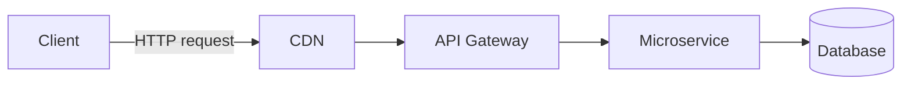

**Q: Kya truly stateless API hamesha desirable hai?**
A: Nahi — har request re-authenticate karni padti (JWT re-validate / context resend) → client/network overhead. Statelessness *protocol* ke baare mein hai; DB stateful ho sakta, *API interaction* stateless.

### Web API vs WCF vs MVC vs gRPC vs GraphQL

| Feature | Web API | WCF | MVC | gRPC | GraphQL |
|---|---|---|---|---|---|
| Protocol | HTTP | HTTP/TCP/MSMQ/Pipes | HTTP | HTTP/2 | HTTP |
| Payload | JSON/XML | SOAP/XML | HTML/JSON | Protobuf (binary) | JSON (flexible) |
| Best for | Public/internal REST | Legacy SOAP | Server-rendered web | Internal low-latency μsvc | Client-driven queries, BFF |

**Note:** WCF legacy hai; modern .NET mein first-class nahi (sirf community **CoreWCF** migration ke liye).

### SOAP vs REST

| | SOAP | REST |
|---|---|---|
| Messaging | XML, strict envelope (WSDL) | JSON/XML, flexible |
| Performance | Slower (verbose XML) | Faster, lightweight |
| Security | Built-in WS-Security | OAuth2/JWT + HTTPS |
| Complexity | High (formal contracts) | Simple, convention-driven |
| State | Stateful support (WS-*) | Stateless by design |

### HTTP Methods, Status Codes, Idempotency

| Method | Use | Idempotent | Safe |
|---|---|---|---|
| GET | Read | Yes | Yes |
| POST | Create | No | No |
| PUT | Replace whole | Yes | No |
| PATCH | Partial | No (unless designed) | No |
| DELETE | Remove | Yes | No |

**Status codes fluently:** 200 OK · 201 Created (`Location` header) · 202 Accepted (async) · 204 No Content · 400 Bad Request · 401 Unauthorized (not authenticated) · 403 Forbidden (authenticated, not allowed) · 404 Not Found · 409 Conflict · 422 Unprocessable Entity (semantic/validation, 400 se alag) · 429 Too Many Requests · 500 Internal Server Error · 503 Service Unavailable.

**Gotcha:** PUT idempotent (N calls = 1 call ka same state). PATCH guaranteed idempotent nahi ("increment by 1" = not idempotent). **"Idempotent" ≠ "safe"** — GET dono; PUT/DELETE idempotent but state mutate karte (safe nahi).

### Controllers, IActionResult, ActionResult\<T\>

```csharp
[ApiController]
[Route("api/products")]
public class ProductsController : ControllerBase
{
    [HttpGet]
    public IEnumerable<string> Get() => new[] { "Laptop", "Mobile" };

    [HttpGet("{id}")]
    public IActionResult GetProduct(int id)
    {
        if (id <= 0) return BadRequest("Invalid ID");
        return Ok(new { id, name = "Laptop" });
    }
}
```

**`[ApiController]` deta hai:** invalid `ModelState` par auto-400, complex types ke liye `[FromBody]` inference, problem-details error responses, attribute-routing requirement.

| | `IActionResult` | `ActionResult<T>` |
|---|---|---|
| Return | Kisi bhi shape | Strongly typed + `Ok()`/`NotFound()` bhi |
| OpenAPI inference | Poor (`[ProducesResponseType]` chahiye) | Better (compiler ko `T` pata) |
| Prefer | Mixed-result | **Modern actions** |

**Legacy trap — `IHttpActionResult` (ASP.NET Web API 2, `System.Web.Http`) vs `IActionResult` (ASP.NET Core, `Microsoft.AspNetCore.Mvc`):** dono almost same dikhte (same `Ok()`/`BadRequest()` helpers — deliberately preserved ergonomics) par **source-compatible NAHI** — migration mein `using` + base class (`ApiController` → `ControllerBase`) change karne padte. Interview mein yeh check karta hai ki tumne legacy codebase touch/migrate kiya.

### Routing: Attribute vs Conventional

| | Conventional | Attribute |
|---|---|---|
| Location | `Program.cs` | Controller/action par |
| Best for | MVC views | **Web APIs (required)** |
| Example | `{controller}/{action}/{id?}` | `[Route("api/products/{id}")]` |

Modern APIs = attribute routing (route+action colocate, constraints, versioning tokens, explicit verb binding).

```csharp
var builder = WebApplication.CreateBuilder(args);
builder.Services.AddControllers();
var app = builder.Build();
app.UseHttpsRedirection();
app.UseRouting();
app.UseAuthentication();
app.UseAuthorization();
app.MapControllers();
app.Run();
```

### Parameter Binding

| Attribute | Source |
|---|---|
| `[FromRoute]` | URL segment |
| `[FromQuery]` | Query string |
| `[FromBody]` | JSON body |
| `[FromHeader]` | HTTP header |
| `[FromForm]` | Form/multipart (file uploads) |

**Gotcha:** Sirf **ek** `[FromBody]` per action (body stream ek hi baar read hota). Multiple complex pieces → single DTO mein wrap karo.

### File Upload & Download (IFormFile)

```csharp
[HttpPost("upload")]
public async Task<IActionResult> Upload(IFormFile file)
{
    if (file is null || file.Length == 0) return BadRequest("No file uploaded.");
    var filePath = Path.Combine("uploads", file.FileName);
    using var stream = new FileStream(filePath, FileMode.Create);
    await file.CopyToAsync(stream);
    return Ok(new { file.FileName, file.Length });
}

[HttpGet("download/{fileName}")]
public IActionResult Download(string fileName)
{
    var filePath = Path.Combine("uploads", fileName);
    if (!System.IO.File.Exists(filePath)) return NotFound();
    var fileBytes = System.IO.File.ReadAllBytes(filePath);
    return File(fileBytes, "application/octet-stream", fileName);
}
```

**Senior points (unprompted):**
- `IFormFile` memory/temp disk mein buffer karta — large files → directly stream (`MultipartReader` / `OpenReadStream()`), aur size limit enforce (`[RequestSizeLimit]` / `Kestrel MaxRequestBodySize`) taaki DoS na ho.
- `file.FileName` ko path ki tarah **kabhi trust mat karo** (path-traversal `../../etc/passwd`) — server-side sanitize/regenerate (GUID).
- Content-type + actual bytes (magic-number) validate karo — client `Content-Type` jhooth bol sakta.
- Large/high-throughput → directly blob storage (Azure Blob/S3), local disk nahi → stateless + no instance-affinity.
- Large downloads → `FileStreamResult` (`File(stream, ...)`/`PhysicalFile(...)`) taaki framework stream kare, memory buffer na kare.

### Content Negotiation

```csharp
builder.Services.AddControllers().AddXmlSerializerFormatters();
```
```http
GET /api/products
Accept: application/xml
```
- `Accept` = client ko kya chahiye; `Content-Type` = current body actually kis format mein hai.
- Koi formatter match na ho aur default na ho → **406 Not Acceptable** milta tab jab `ReturnHttpNotAcceptable = true`; warna by default JSON par fall back.

---

## 2. Intermediate

### Dependency Injection & Service Lifetimes

```csharp
builder.Services.AddScoped<IProductService, ProductService>();
```

| Lifetime | Created | Use | Risk |
|---|---|---|---|
| Singleton | App mein 1 baar | Logging, config, caches | Thread-safe hona chahiye; scoped hold nahi kar sakta |
| Scoped | Per request | `DbContext`, unit-of-work | Singleton mein inject → captive dependency |
| Transient | Har resolution | Lightweight stateless | Expensive construct → wasteful |

- `TryAddSingleton<T>` = tab register jab already registered na ho (library code mein safe, consumer registration clobber na ho). `AddSingleton<T>` hamesha nayi registration (multiple → `IEnumerable<T>`).

**Q: Singleton, Scoped (`DbContext`) par kyun depend nahi kar sakta?**
A: `DbContext` Scoped hai = ek request ka unit-of-work, **thread-safe nahi**. Singleton app-lifetime jeeta, saare concurrent requests mein shared. Direct inject → `InvalidOperationException: Cannot consume scoped service from singleton` (validation on); warna race conditions + stale/shared state.

**Fix — `IServiceScopeFactory`:**
```csharp
public void LogToDatabase(string message)
{
    using var scope = _scopeFactory.CreateScope();
    var db = scope.ServiceProvider.GetRequiredService<MyDbContext>();
    db.Logs.Add(new Log { Message = message });
    db.SaveChanges();
}
```
Manually naya scope → `DbContext` sirf us unit-of-work tak jeeta. Loggers: Singleton + stateless + thread-safe; built-in `ILogger<T>` prefer karo.

### SOLID Principles

| Principle | Definition | ASP.NET Core Example |
|---|---|---|
| **S** — Single Responsibility | 1 class = 1 reason to change | Controller (HTTP) vs Service (logic) vs Repository (persistence) |
| **O** — Open/Closed | Extension open, modification closed | naya `IDiscountStrategy` add, `if/else` edit nahi |
| **L** — Liskov Substitution | Subtype base ki jagah usable | koi bhi `IPaymentGateway` (Stripe/PayPal) same contract honor kare |
| **I** — Interface Segregation | Choti client-specific interfaces | bloated `IRepository` → `IReadRepository<T>`/`IWriteRepository<T>` |
| **D** — Dependency Inversion | Abstractions par depend, concrete par nahi | `ILogger`/`IProductService` inject, `new` nahi |

```csharp
public class UserService
{
    private readonly ILogger _logger;
    public UserService(ILogger logger) => _logger = logger; // abstraction, not ConsoleLogger
}
```
DIP = ASP.NET Core ka pura DI container practice mein. **Senior framing:** acronym recite mat karo — ek real violation batao jo tumne refactor kiya + trade-off (zyada interfaces/indirection vs easier testing + isolated change).

### Middleware Pipeline

```csharp
public class CustomMiddleware
{
    private readonly RequestDelegate _next;
    public CustomMiddleware(RequestDelegate next) => _next = next;
    public async Task Invoke(HttpContext context)
    {
        Console.WriteLine("Request: " + context.Request.Path);
        await _next(context);
    }
}
app.UseMiddleware<CustomMiddleware>();
```

**Key rule:** order matters — aane par top-down, jaane par bottom-up.

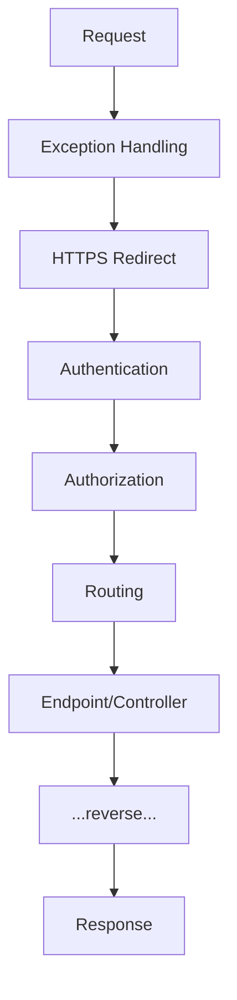

**Middleware vs Filters (common trap):** Middleware = HTTP pipeline ke liye global + framework-agnostic. Filters = MVC/API-specific, action invocation ke *andar* (routing ke baad) → `ActionExecutingContext`/model-bound args ka access (raw middleware ke paas nahi).

### Request Lifecycle End-to-End

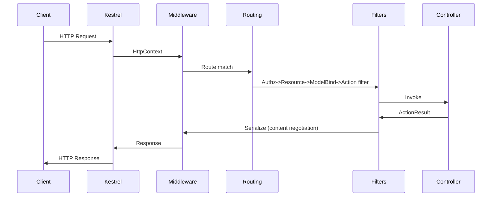

1. **Client** → URL/method/headers/body.
2. **Kestrel** — built-in cross-platform server; raw HTTP parse, `HttpContext` build, **no business logic**. Prod mein IIS/Nginx/LB reverse-proxy ke peeche (TLS termination, process mgmt).
3. **Middleware** — exception/logging/authn/authz/CORS/routing (order matters).
4. **Authentication** — user *kaun* (`HttpContext.User`), permissions nahi; failure = anonymous (pipeline necessarily stop nahi).
5. **Authorization** — user *kya* kar sakta; `[Authorize]`/roles/policies; failure = 401/403, controller execute nahi.
6. **Routing** — URL+verb+template → controller/action, binding sources.
7. **Filters** — Authz → Resource → ModelBind/Validation → Action → Exception → Result.
8. **Model binding/validation** — invalid + `[ApiController]` → auto-400 before action.
9. **Controller** — validated input, orchestrate, `ActionResult` return.
10. **Result execution** — `Ok()`/`NotFound()` → status code + formatter.
11. **Formatting/content negotiation** — JSON (default)/XML.
12. **Response** — middleware reverse order → Kestrel → client.

**One-liner:** *Kestrel → Middleware → Routing → Filters → Controller → Formatters → Middleware → Client.*

### Model Validation

```csharp
public class Product
{
    [Required] public string Name { get; set; }
    [Range(1, 10000)] public decimal Price { get; set; }
}

[HttpPost]
public IActionResult AddProduct([FromBody] Product product)
{
    if (!ModelState.IsValid) return BadRequest(ModelState); // redundant with [ApiController]
    return Ok("Product Added");
}
```
`[ApiController]` ke saath explicit `ModelState.IsValid` check **redundant** — framework auto-400 `ValidationProblemDetails` deta. Custom shaping ke liye `[ApiController(SuppressModelStateInvalidFilter = true)]` se opt-out. Complex/conditional rules + testability → **FluentValidation** (Data Annotations ka senior upgrade).

### Action Filters & Filter Pipeline

```csharp
public class LogActionFilter : ActionFilterAttribute
{
    public override void OnActionExecuting(ActionExecutingContext context)
        => Console.WriteLine($"Action {context.ActionDescriptor.DisplayName} executing");
}
```

| Filter | Runs | Use |
|---|---|---|
| Authorization | Sabse pehle | `[Authorize]` |
| Resource | Model bind se pehle/baad | Short-circuit caching, pre-checks |
| Action | Action se pehle/baad | Logging, timing, args/results mutate |
| Exception | Unhandled exception par | Centralized error shaping (controller-scoped) |
| Result | Result exec se pehle/baad | Header injection, wrapping |

### PUT vs PATCH (JSON Patch)

| | PUT | PATCH |
|---|---|---|
| Purpose | Whole replace | Partial update |
| Idempotent | Yes | Guaranteed nahi |
| Body | Full representation | Changed fields / JSON Patch doc |

```csharp
[HttpPatch("{id}")]
public async Task<IActionResult> UpdateProduct(int id, [FromBody] JsonPatchDocument<Product> patchDoc)
{
    var product = await _context.Products.FindAsync(id);
    if (product == null) return NotFound();
    patchDoc.ApplyTo(product, ModelState);
    if (!ModelState.IsValid) return BadRequest(ModelState);
    await _context.SaveChangesAsync();
    return Ok(product);
}
```
**Gotcha:** `JsonPatchDocument<T>` (RFC 6902) → `Content-Type: application/json-patch+json` + `[{ "op":"replace","path":"/price","value":1500 }]`. Kai teams plain partial DTO (merge-patch, RFC 7396) accept karte — simplicity vs strict semantics. Dono jaano + choice justify karo.

### Exception Handling

```csharp
public class ExceptionMiddleware // functional but NOT senior-grade
{
    private readonly RequestDelegate _next;
    public ExceptionMiddleware(RequestDelegate next) => _next = next;
    public async Task Invoke(HttpContext context)
    {
        try { await _next(context); }
        catch (Exception ex)
        {
            context.Response.StatusCode = 500;
            await context.Response.WriteAsync($"Error: {ex.Message}"); // leaks info!
        }
    }
}
```
Yeh exception messages leak karta (information disclosure) + plain text. Production-grade = `IExceptionHandler` (.NET 8+) + Problem Details (neeche).

### CORS

```csharp
builder.Services.AddCors(o => o.AddPolicy("AllowSpecificOrigin", p =>
    p.WithOrigins("https://frontend.com").AllowAnyMethod().AllowAnyHeader()));
app.UseCors("AllowSpecificOrigin");
```
CORS = **browser-enforced** same-origin relaxation — server-to-server (curl/Postman/backend) ko protect nahi karta. `Access-Control-Allow-Origin: *` + `AllowCredentials()` = spec ke against invalid + security hole. Wildcard origin credentialed requests ke saath kabhi nahi.

### Repository Pattern & DTOs

```csharp
public List<Product> GetAll() => _context.Products.AsNoTracking().ToList();
var productDto = _mapper.Map<ProductDTO>(product);
```
**Senior nuance:** EF Core `DbSet<T>`/`DbContext` **already** unit-of-work + repository. Isse generic repo mein wrap karna well-known anti-pattern debate — often useless indirection (`IQueryable` hide) + `Include`/projection/compiled-query strip. Real need se justify karo (persistence swap, test doubles), "best practice" cargo-cult se nahi.

**DTOs matter:** internal/DB fields hide, contract-persistence decouple (column rename se clients na break), over-posting/mass-assignment prevent (EF entity directly bind → malicious `IsAdmin=true`).

### IHttpClientFactory & Resilient HTTP

```csharp
builder.Services.AddHttpClient<IProductService, ProductService>();
public ProductService(HttpClient httpClient) => _httpClient = httpClient;
```
- Naive `new HttpClient()` per-request → **socket exhaustion** (sockets `TIME_WAIT` mein, ports exhaust).
- Single static singleton → **DNS staleness** (connection indefinitely cache).
- `IHttpClientFactory` (ASP.NET Core 2.1) → `HttpMessageHandler` pool/recycle (default 2 min) → connection reuse **+** DNS responsiveness. Named/typed clients + Polly integration.

---

## 3. Advanced

### API Versioning Strategies

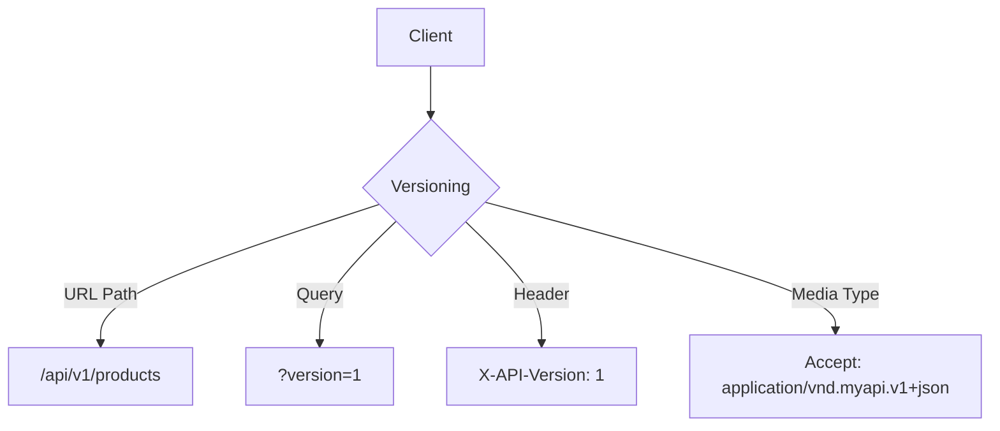

| Strategy | Pros | Cons |
|---|---|---|
| URL Path | Explicit, cacheable, logs mein visible | URL pollute |
| Query String | Simple | Omit easy, caching keys messy |
| Header | URL clean | curl/browse mein invisible |
| Media Type | Most "RESTfully correct" | Complex, poor tooling |

```csharp
builder.Services.AddApiVersioning(o =>
{
    o.AssumeDefaultVersionWhenUnspecified = true;
    o.DefaultApiVersion = new ApiVersion(1, 0);
    o.ReportApiVersions = true;
    o.ApiVersionReader = new UrlSegmentApiVersionReader();
});

[Route("api/v{version:apiVersion}/products")]
[ApiVersion("1.0")]
public class ProductsV1Controller : ControllerBase { }
```
**Recommendation:** real-world mein **URL path** jeet jaata (discoverability + cache). Header/media-type "correct" par operational complexity worth nahi (except strict-SLA public APIs). NuGet: **`Asp.Versioning.Mvc`** (purana `Microsoft.AspNetCore.Mvc.Versioning` deprecated). Best practices: `Sunset` header, `api-supported-versions`, OpenAPI docs, kam live versions, gateway.

### REST Maturity Model (Richardson) & HATEOAS Trade-offs

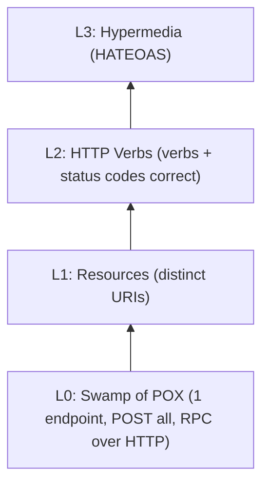
- **L0** — 1 URL, 1 verb (POST), RPC/SOAP-in-disguise.
- **L1** — per-resource URIs, still single-verb-heavy.
- **L2** — verbs + status codes proper. **Yahin most prod "REST" APIs rehte** — legit pragmatic target.
- **L3** — HATEOAS: responses mein hypermedia links (next actions runtime-discoverable, hardcoded nahi).

| HATEOAS Pro | Con |
|---|---|
| Client hardcoded URLs se decouple | Server+client complexity |
| Server-driven workflow changes (no client redeploy) | Client SDKs practically links consume nahi karte |
| Self-documenting/discoverable | Bigger payloads, more serialization |
| Real state machines ke liye fit (order: pending→shipped→delivered) | Most CRUD APIs justify nahi karte |

**Honest take:** elegant + heavily tested, par industry mein rarely full-implement — most teams L2 par ruk + explicitly version. Pay off: complex workflow APIs jahan "next kya" resource-state par vary karta.

### Problem Details (RFC 7807/9457)

```json
{ "type":"https://example.com/probs/insufficient-funds", "title":"Insufficient funds",
  "status":400, "detail":"Balance 30, transfer needs 50.", "instance":"/transfers/abc-123", "traceId":"00-4bf9..." }
```

```csharp
builder.Services.AddProblemDetails(o =>
    o.CustomizeProblemDetails = ctx => ctx.ProblemDetails.Extensions["traceId"] = ctx.HttpContext.TraceIdentifier);
builder.Services.AddExceptionHandler<GlobalExceptionHandler>();

public class GlobalExceptionHandler : IExceptionHandler
{
    private readonly ILogger<GlobalExceptionHandler> _logger;
    public GlobalExceptionHandler(ILogger<GlobalExceptionHandler> logger) => _logger = logger;
    public async ValueTask<bool> TryHandleAsync(HttpContext ctx, Exception ex, CancellationToken ct)
    {
        _logger.LogError(ex, "Unhandled exception");
        ctx.Response.StatusCode = StatusCodes.Status500InternalServerError;
        await ctx.Response.WriteAsJsonAsync(new ProblemDetails
        {
            Status = 500, Title = "An unexpected error occurred", Type = "https://httpstatuses.io/500"
        }, cancellationToken: ct);
        return true; // handled, don't rethrow
    }
}
app.UseExceptionHandler();
```
**Why senior:** consistent, structured, machine-parseable errors → consumers generic error-handling likhte (string-match nahi). `[ApiController]` auto-400 = `ValidationProblemDetails` (Problem Details subtype); saare errors (validation/business/exceptions) same shape = uniform contract.

### Idempotency Keys for POST/PUT

POST idempotent nahi — retry (timeout/blip) → duplicate orders.

```http
POST /payments
Idempotency-Key: 7b6a5e2e-3f1a-4b8e-9c2d-5a6f7e8d9c0b
{ "amount": 100, "currency": "USD" }
```
```csharp
[HttpPost]
public async Task<IActionResult> CreatePayment(
    [FromHeader(Name="Idempotency-Key")] string key, [FromBody] PaymentRequest request)
{
    if (string.IsNullOrEmpty(key)) return BadRequest("Idempotency-Key required.");
    var existing = await _cache.GetAsync<PaymentResult>(key);
    if (existing != null) return Ok(existing); // don't reprocess
    var result = await _paymentService.ProcessAsync(request);
    await _cache.SetAsync(key, result, TimeSpan.FromHours(24));
    return Ok(result);
}
```
**Senior nuances:** key + side-effect **atomically store** (same TX / unique-constraint table — sirf cache mein "check then process" = race window). Key scope mein context (`userId + key` hash) collisions avoid. Same-key **concurrent** in-flight → `409 Conflict`/`425 Too Early`. Yeh outbox se tie hota — idempotency at-least-once ko exactly-once jaisa behave karvata.

### Pagination: Offset vs Cursor

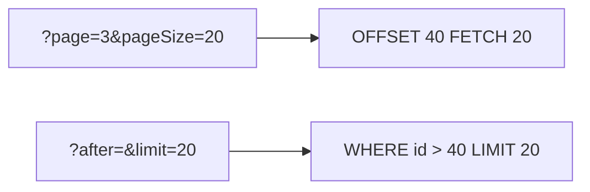

| Aspect | Offset | Cursor |
|---|---|---|
| Impl | Trivial `Skip(n).Take(m)` | Encode last-seen key |
| Scale perf | Degrade (`OFFSET 100000` scans+discards) | Consistently fast (indexed seek) |
| Concurrent writes | **Unstable** (shift → dup/skip) | Stable (row-relative) |
| Random page jump | Yes | No (sequential) |
| Use | Admin UIs, small data, "total pages" | Feeds, infinite scroll, large/high-write, public APIs (GitHub/Stripe/Slack) |

```csharp
var query = _context.Orders.OrderBy(o => o.Id).AsQueryable();
if (!string.IsNullOrEmpty(after))
    query = query.Where(o => o.Id > DecodeCursor(after));
var items = await query.Take(limit + 1).ToListAsync();
var hasMore = items.Count > limit;
items = items.Take(limit).ToList();
return Ok(new { data = items, nextCursor = hasMore ? EncodeCursor(items.Last().Id) : null });
```
**Why not page numbers public?** Concurrent inserts/deletes offset ko *silently* dup/missing rows deta (invisible bug); indexed cursor seek DB par cheaper (no `OFFSET` scan).

### Long-Running Operations: 202 Accepted + Polling

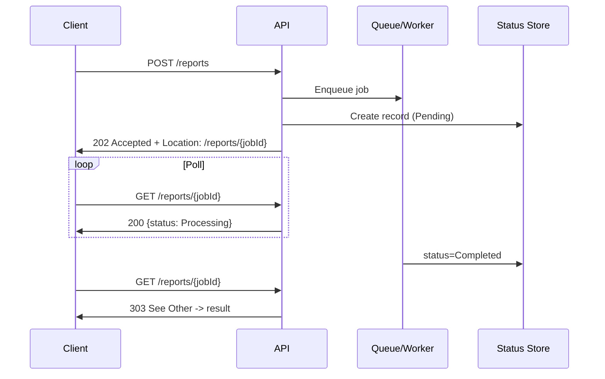
```csharp
[HttpPost("reports")]
public async Task<IActionResult> GenerateReport([FromBody] ReportRequest request)
{
    var jobId = Guid.NewGuid();
    await _jobStore.CreateAsync(jobId, JobStatus.Pending);
    await _queue.EnqueueAsync(new GenerateReportJob(jobId, request));
    return Accepted(new Uri($"/reports/{jobId}", UriKind.Relative), new { jobId, status = "Pending" });
}
```
**Senior points:** `202` + `Location` header (status resource) = HTTP-idiomatic "accepted, not done". Alt: **webhooks** (server callback) — infrequent/high-latency ke liye better, par public endpoint + retries/signature verify. Shape = Azure Durable Functions / AWS Step Functions jaisa. Idempotency yahan bhi — retry par duplicate job enqueue na ho.

### OpenAPI/Swagger: Contract-First vs Code-First

```csharp
builder.Services.AddSwaggerGen();
app.UseSwagger();
app.UseSwaggerUI(c => c.SwaggerEndpoint("/swagger/v1/swagger.json", "My API v1"));
```

| Approach | Pros | Cons |
|---|---|---|
| **Code-first** (Swashbuckle/NSwag reflection se spec) | Fast start, spec = impl match | Spec = byproduct, break easy |
| **Contract-first** (pehle `.yaml`, phir stubs/SDKs gen: NSwag/OpenAPI Gen/Kiota) | Design review force, parallel FE/BE, public APIs | Slower setup, drift risk (CI se enforce) |

**Nuance:** internal fast-moving μsvc → code-first pragmatic. Public/partner/high-cost-breaking → contract-first (+ Pact/consumer-driven contract tests + CI drift check). **.NET 9:** Swashbuckle bundling deprecate → `Microsoft.AspNetCore.OpenApi` (spec) + Scalar/Swagger UI (viewer) separately. Stack version verify karo.

### Minimal APIs vs Controllers

```csharp
var app = WebApplication.Create(args);
app.MapGet("/api/products/{id}", async (int id, IProductService svc) =>
{
    var p = await svc.GetByIdAsync(id);
    return p is not null ? Results.Ok(p) : Results.NotFound();
}).WithName("GetProduct").WithOpenApi();
app.Run();
```

| Aspect | Controllers | Minimal APIs |
|---|---|---|
| Ceremony | More boilerplate | Terse, function-per-endpoint |
| Perf | Slightly higher overhead | Lower allocation/latency |
| Filters | Mature pipeline | `IEndpointFilter` (.NET 7+), less mature |
| Model bind/validation | Automatic, attribute-driven | Manual, less feature-complete |
| Scale org | Controllers/areas | `MapGroup` + extension methods (discipline) |
| Fit | Large teams, complex, versioning/OData | μsvc, small/focused, latency-sensitive, serverless |

**Framing:** dono same `Endpoint`/routing infra mein compile — choice = team ergonomics + scale, capability nahi. Real pattern: small internal → Minimal, large filter-heavy versioned → Controllers.

### Rate Limiting (Built-in ASP.NET Core Middleware)

.NET 7+ `Microsoft.AspNetCore.RateLimiting` = default recommendation (third-party `AspNetCoreRateLimit` ke bajaye).

```csharp
builder.Services.AddRateLimiter(o =>
{
    o.AddFixedWindowLimiter("fixed", opt =>
    { opt.PermitLimit = 100; opt.Window = TimeSpan.FromMinutes(1); opt.QueueLimit = 0; });
    o.AddTokenBucketLimiter("token", opt =>
    { opt.TokenLimit = 50; opt.TokensPerPeriod = 10; opt.ReplenishmentPeriod = TimeSpan.FromSeconds(10); });
    o.OnRejected = async (ctx, ct) =>
    { ctx.HttpContext.Response.StatusCode = 429; await ctx.HttpContext.Response.WriteAsync("Too many requests.", ct); };
});
app.UseRateLimiter();
app.MapGet("/api/products", () => Ok("data")).RequireRateLimiting("fixed");
```

| Algorithm | Behavior |
|---|---|
| Fixed Window | N req/window, boundary par sharp reset (edge bursts) |
| Sliding Window | Smoother, segments track |
| Token Bucket | Steady refill, short bursts allowed |
| Concurrency | In-flight concurrent limit (DB pool protect) |

**Distributed caveat:** counters by default **in-memory per instance** → multi-pod mein effective limit = `perInstance × instanceCount`. True global → distributed store (Redis counters) ya gateway (APIM/Kong).

**Alternatives/layers:** Queue-based throttling (delay vs reject); WAF (edge, bots/volumetric); CAPTCHA (login/signup/checkout); Cloud gateway rate limiting (distributed counters). **Framing:** yeh mutually exclusive nahi — mature setup layer karta: edge WAF/CAPTCHA + gateway quotas + in-process last line of defense (DB pool/CPU).

### Authentication & Authorization (JWT, OAuth2, OIDC)

**JWT** — stateless bearer, `Authorization: Bearer <token>`.
```csharp
builder.Services.AddAuthentication(JwtBearerDefaults.AuthenticationScheme)
    .AddJwtBearer(o => o.TokenValidationParameters = new TokenValidationParameters
    {
        ValidateIssuer = true, ValidateAudience = true, ValidateLifetime = true,
        ValidateIssuerSigningKey = true, ValidIssuer = "yourdomain.com", ValidAudience = "yourdomain.com",
        IssuerSigningKey = new SymmetricSecurityKey(Encoding.UTF8.GetBytes(secretKey))
    });
```
JWT pros: no server session storage, scales in distributed/μsvc. Cons: leaked token expiry tak valid, revocation hard.

**OAuth2** = *authorization* framework (auth nahi) — scoped access via tokens. **OIDC** = OAuth2 ke upar *authentication* (identity, ID tokens). **Distinction:** OAuth2 = "yeh app mere behalf par kya kar sakta", OIDC = "yeh user kaun hai".

```csharp
.AddJwtBearer(o => { o.Authority = "https://your-idp.com"; o.Audience = "your-api"; });
```

**Azure AD (Entra) SSO:**
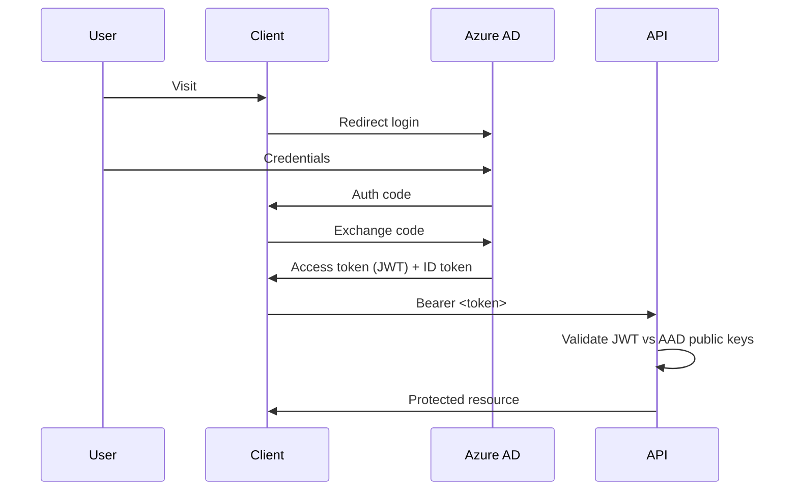
```csharp
builder.Services.AddAuthentication("Bearer")
    .AddMicrosoftIdentityWebApi(builder.Configuration.GetSection("AzureAd"));
```

**Role vs claims:** `[Authorize(Roles = "Admin")]` vs `User.FindFirst(ClaimTypes.Email)?.Value`. Claims = general (roles = special `ClaimTypes.Role`). Simple role se aage → **policy-based** (`[Authorize(Policy="MinimumAge")]` + `IAuthorizationHandler`) taaki logic scatter na ho.

### OAuth2 Grant Types — Kaunsa Client Ke Liye

| Grant | Client | Why | Mechanic |
|---|---|---|---|
| **Auth Code + PKCE** | SPA, native/mobile (public) | Secret safely hold nahi kar sakta; PKCE code verifier/challenge se intercepted code protect | Redirect → auth → code → exchange (code + `code_verifier`). OAuth 2.1 mein **sabke liye** recommended |
| **Client Credentials** | M2M (backend→backend, no user) | App khud identity; confidential client | `client_id`+`client_secret`/JWT assertion → token endpoint, no redirect |
| **Device Code** | Smart TV, CLI, IoT | Browser render/text input nahi kar sakta | Device short code+URL dikhata; user alag device par authenticate; device poll |
| Implicit — **deprecated** | (tha) SPA | Token URL fragment mein (history/referrer leak) | **OAuth 2.1 mein removed** → Auth Code + PKCE |
| ROPC — **deprecated** | (tha) first-party username/password | Client raw creds handle | **Removed** — no MFA/social/passkeys; sirf legacy bridge |

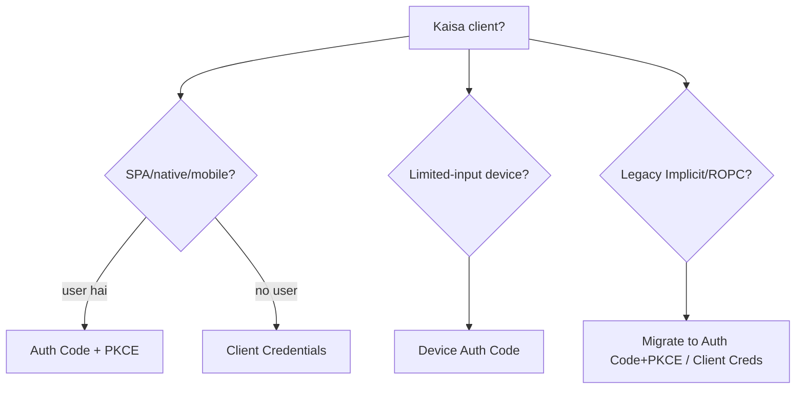
**Follow-ups:**
- *PKCE confidential ke liye kyun?* — OAuth 2.1: universally recommended, code-interception se protect + har jagah consistent flow.
- *SPA ke liye Client Credentials kyun nahi?* — secret chahiye, par SPA code browser mein inspectable → koi secret secret nahi.
- *User vs app?* — Auth Code/Device Code = specific end-user token. Client Credentials = sirf app/service (no user identity → per-user authz/audit ke liye galat).
- *.NET note:* `AddJwtBearer`/`Microsoft.Identity.Web` jo bhi token aaye validate karta — grant type = *issuance* concern (IdP config), resource-server validation ka nahi.

### API Keys vs OAuth2 Scopes — Kab Kaunsa

| | API Keys | OAuth2 (scopes) |
|---|---|---|
| Identify | App/client (aksar no user) | User/service, delegated, granular |
| Granularity | All-or-nothing per key | Fine-grained scopes (`read:orders`) |
| Rotation/revoke | Manual, redeploy | Short-lived + refresh; revoke by invalidate/TTL |
| Use | S2S, internal tools, simple integrations, metering | User-delegated, public APIs, "login with X", consent/audit |
| Security | Weaker (static, over-privileged) | Stronger (short-lived, PKCE, consent) |

```csharp
if (!context.Request.Headers.TryGetValue("X-API-KEY", out var key) || key != "expected-key")
{ context.Response.StatusCode = 401; await context.Response.WriteAsync("Unauthorized"); return; }
await _next(context);
```
**Guidance:** API keys = *system* identify (rate buckets, billing, trusted internal S2S) theek. Per-user permissions/consent/audit → OAuth2. Breaches often over-scoped long-lived key config-file mein. M2M mein bhi IdP ho to Client Credentials prefer (short-lived + central revocation).

### HATEOAS

```json
{ "id":1, "name":"Laptop", "price":1200,
  "links":[
    {"rel":"self","href":"/api/products/1"},
    {"rel":"update","href":"/api/products/1","method":"PUT"},
    {"rel":"delete","href":"/api/products/1","method":"DELETE"}
  ] }
```
```csharp
public class ProductResource { public int Id; public string Name; public decimal Price; public List<LinkResource> Links = new(); }
public class LinkResource { public string Rel; public string Href; public string Method; }
```
Full trade-off discussion = REST Maturity Model section (upar).

### Microservices vs Monolithic

| Aspect | Monolith | Microservices |
|---|---|---|
| Architecture | Single deployable | Independent services |
| Scalability | Whole app (coarse) | Per-service (fine) |
| Deployment | 1 pipeline | Independent, faster iteration, more parts |
| Data | Shared DB | Per-service store (joins → API calls) |
| Team | Single/small org | Conway's Law aligned |
| Ops overhead | Low | High (discovery, tracing, contracts) |
| Transactions | Native ACID | Distributed hard → Outbox/sagas/eventual |
| Failure isolation | 1 bug = whole down | Isolate (breakers/bulkheads) |

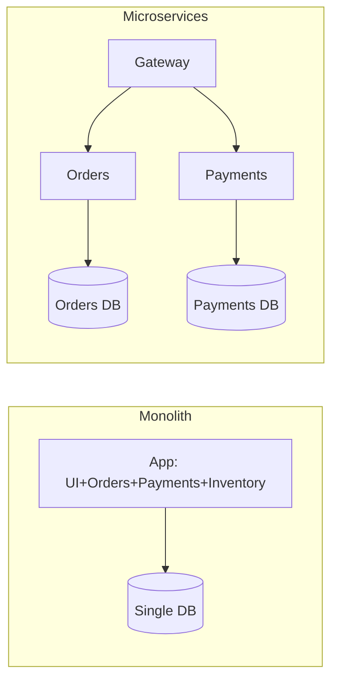
**Kab monolith choose?** Small team/low complexity (μsvc tax worth nahi); early-stage/unclear boundaries (else "distributed monolith"); lower ops overhead = genuine win; **well-modularized monolith** (clean boundaries → future extraction = refactor not rewrite → strangler fig).

**Q: "Distributed monolith" kya + kaise bachein?** Naam se μsvc par services DB share/lockstep deploy/long sync chains → complexity inherit bina independent scale/deploy. Bachein: per-service data ownership (no shared DB), async/event-driven, bounded contexts par boundaries (technical layers par nahi).

### API Gateway Pattern

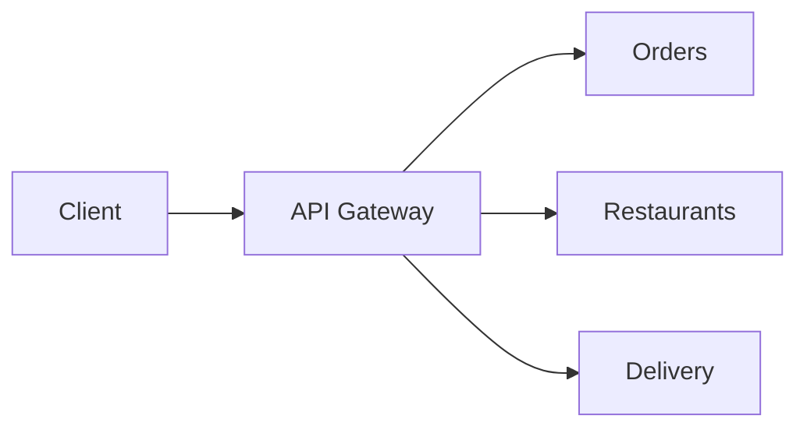
Single entry point → routing, auth, rate limiting, observability centralize. Concerns: routing, edge auth/API-key, load balancing, central rate limiting, single telemetry choke point. **Options:** Ocelot (.NET, lightweight), **YARP** (Microsoft, flexible/performant, increasingly default), managed (Azure APIM/AWS/Kong). **BFF** = narrower gateway per-client (mobile BFF vs web BFF).

### CQRS

```csharp
public record CreateProductCommand(string Name, decimal Price) : IRequest<Product>;
public record GetProductQuery(int Id) : IRequest<Product>;

public class GetProductHandler : IRequestHandler<GetProductQuery, Product>
{
    private readonly DbContext _context;
    public GetProductHandler(DbContext context) => _context = context;
    public async Task<Product> Handle(GetProductQuery r, CancellationToken ct)
        => await _context.Products.FindAsync(r.Id);
}

[HttpGet("{id}")]
public async Task<IActionResult> Get(int id, [FromServices] IMediator mediator)
    => Ok(await mediator.Send(new GetProductQuery(id)));
```
**Nuance:** CQRS ko MediatR/event-sourcing/separate DBs ki **zarurat nahi** — core idea = "reads/writes concerns diverge to same model force mat karo" (write = invariants, read = flattened projection). Full CQRS + event sourcing + separate stores = heavyweight, real scale se justify. Default use ("kyunki MediatR hai") = junior overengineering trap.

### Background Jobs & IHostedService/BackgroundService

```csharp
public class Worker : BackgroundService // preferred modern
{
    protected override async Task ExecuteAsync(CancellationToken stoppingToken)
    {
        while (!stoppingToken.IsCancellationRequested)
        {
            Console.WriteLine("Running background task...");
            await Task.Delay(5000, stoppingToken);
        }
    }
}
builder.Services.AddHostedService<Worker>();
```
`IHostedService`/`BackgroundService` = app ke saath start, shutdown par gracefully stop. Use: polling/cleanup, queue consumers, cache refresh, emails. Durable/scheduled/retry/dashboards → **Hangfire**/**Quartz.NET**:
```csharp
builder.Services.AddHangfire(c => c.UseSqlServerStorage(connectionString));
app.UseHangfireDashboard(); app.UseHangfireServer();
BackgroundJob.Enqueue(() => Console.WriteLine("job"));
RecurringJob.AddOrUpdate("daily-cleanup", () => Console.WriteLine("recurring"), Cron.Daily);
```
**Gotcha:** yeh **Singleton** register hote → Scoped (`DbContext`) directly inject na karo; `ExecuteAsync` mein `IServiceScopeFactory` use karo.

### WebSockets & SignalR

```csharp
app.UseWebSockets();
app.Use(async (ctx, next) =>
{
    if (ctx.Request.Path == "/ws" && ctx.WebSockets.IsWebSocketRequest)
    { var socket = await ctx.WebSockets.AcceptWebSocketAsync(); /* handle */ }
    else await next();
});
```
**SignalR** — WebSockets ke upar real-time abstraction (SSE/long-polling fallback):
```csharp
public class ChatHub : Hub
{
    public async Task SendMessage(string user, string message)
        => await Clients.All.SendAsync("ReceiveMessage", user, message);
}
app.MapHub<ChatHub>("/chatHub");
```
**Kaunsa kab?** Raw WebSockets = full control/non-.NET clients/custom protocol. SignalR = dono .NET-friendly + group/user mgmt + auto-reconnect + Redis/Azure backplane scale-out. SSE = server→client push only (plain HTTP, simple). Long polling = lowest-common-denominator fallback.

### Circuit Breaker & Resiliency (Polly)

```csharp
builder.Services.AddHttpClient("ExternalAPI")
    .AddTransientHttpErrorPolicy(p => p.CircuitBreakerAsync(2, TimeSpan.FromSeconds(30)));
```
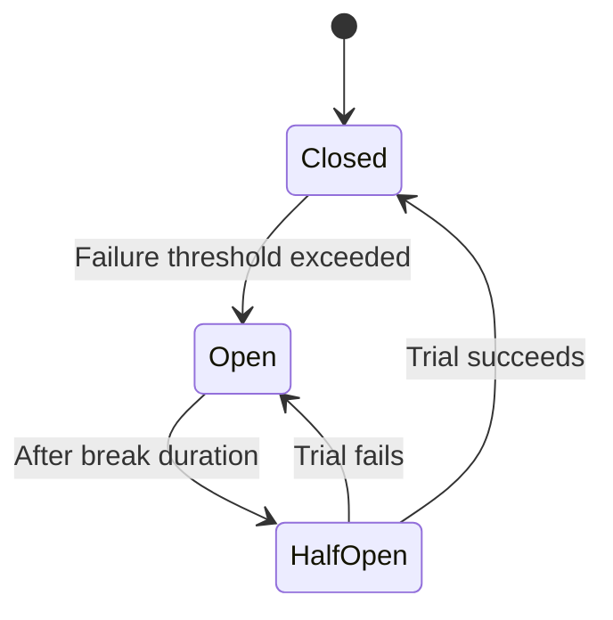
Circuit Breaker cascading failures rokta — threshold ke baad "open" (calls immediately short-circuit), phir **Half-Open** trial request se recovery test. **.NET 8** = `Microsoft.Extensions.Http.Resilience` (Polly v8 wrapper) → `AddStandardResilienceHandler()`. Related patterns: **Retry** (exp backoff + jitter), **Bulkhead** (concurrent calls cap), **Timeout** (bound wait), **Fallback** (cached/default value).

### gRPC vs REST vs GraphQL

| Feature | REST | gRPC | GraphQL |
|---|---|---|---|
| Protocol | HTTP/1.1-2 | HTTP/2 (mandatory) | HTTP (any) |
| Payload | JSON/XML | Protobuf (binary) | JSON |
| Contract | OpenAPI (optional) | `.proto` (mandatory) | Schema (mandatory) |
| Streaming | Limited (SSE/chunked) | Native bidirectional | Subscriptions (WS) |
| Browser | Native | grpc-web proxy | Native |
| Over/underfetch | Common | N/A (RPC) | Solved (client fields) |
| Best for | Public, broad compat | Internal S2S, low-latency, polyglot | Client-driven UIs, BFF |

```protobuf
syntax = "proto3";
service ProductService { rpc GetProduct (ProductRequest) returns (ProductResponse); }
```
**Framing:** REST = public/diverse clients (cacheable, human-debuggable). gRPC = internal S2S (speed + strong contracts, service mesh). GraphQL = varying data-shape needs (avoid chatty round-trips + endpoint explosion) — **downsides:** harder HTTP caching (single `POST /graphql`), N+1 (DataLoader batching), complex field-level authz.

### OData

```csharp
builder.Services.AddControllers().AddOData(o => o.Select().Filter().OrderBy());
[EnableQuery]
[HttpGet] public IQueryable<Product> Get() => _context.Products;
```
```http
GET /api/products?$filter=price gt 100&$orderby=name
```
Standardized query (filter/sort/select/expand/paginate) via query string. **Trade-off:** free ad-hoc querying par clients arbitrarily expensive queries (unbounded `$expand`, unindexed filters) → guardrails chahiye (`$top` max, cost limits, `$expand` disable) warna self-inflicted DoS.

---

## 4. System Design & Scalability

### Database Sharding vs Partitioning

| Aspect | Partitioning | Sharding |
|---|---|---|
| Scope | 1 table split, **same DB/instance** | **Multiple DB instances/servers** |
| Goal | Manageability/perf 1 large table | Horizontal scalability |
| Transparency | Transparent (engine routes) | App/proxy jaanta shard key |
| Cross queries | Cheap (same engine) | Expensive (fan-out, joins pain) |
| Complexity | Lower (DBA/schema) | Higher (app code, routing, rebalancing) |
| .NET/SQL | `PARTITION BY RANGE` | Shard key (`TenantId % N`/hashing), Citus/Vitess/multi-`DbContext` |

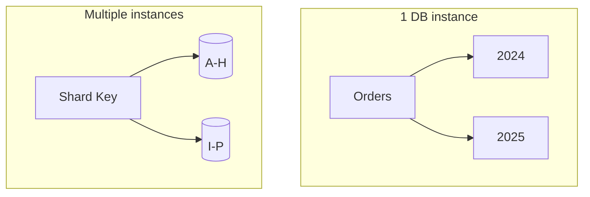
**Framing:** pehle **partitioning** (app touch nahi, "table too big"). **Sharding** sirf jab single instance capacity (storage/IOPS/connections) bottleneck — complexity app mein (shard key hotspots avoid, cross-shard queries, rebalancing). Middle ground: `TenantId` shard key (natural boundary) + internally date partition.

### Feature Flags & Safe Rollout

```csharp
if (await _featureManager.IsEnabledAsync("NewCheckoutFlow"))
    return await _newCheckoutService.ProcessAsync(order);
return await _legacyCheckoutService.ProcessAsync(order);

builder.Services.AddFeatureManagement(); // Microsoft.FeatureManagement
```
**Deployment** (code prod tak) ko **release** (users ko visible) se decouple. Senior answer:
- **Gradual/percentage rollout** — 1%→10%→50%→100% (metrics dekhte).
- **Kill switch** — redeploy ke bina flip (incident mein seconds).
- **Flag hygiene/debt** — stale flags = untested combinatorial branches → remove after rollout.
- **Consistent bucketing** — user/session ID hash (fresh random roll nahi).
- Tooling: `Microsoft.FeatureManagement` (simple), LaunchDarkly/Azure App Config/Unleash (targeting/analytics).

### Zero-Downtime Deployment: Blue-Green & Canary


| Strategy | How | Rollback | Cost |
|---|---|---|---|
| **Blue-Green** | 2 full envs; v2 idle par deploy+smoke, LB atomically flip 100% | Instant (flip back) | Double infra |
| **Canary** | v2 + v1; small % → v2, metrics, gradually 100% | Fast (share → 0%) | Lower (traffic-split infra) |
| **Rolling** | Instances ek-ek v1→v2 | Slower (redeploy) | Low (K8s standard) |

**Senior mechanics:** **Readiness probes** (traffic sirf "ready" par, "started" par nahi); **backward-compatible DB migrations** (rollout window mein old+new dono compatible — nullable column add + later backfill, rename/drop nahi); **graceful shutdown** (in-flight drain, `SIGTERM`). Canary early catch (small blast radius) par metrics-driven sophistication chahiye; blue-green simpler par issue 100% flip ke baad surface.

### The Outbox Pattern

**Problem (dual-write):** DB update **+** message publish (Kafka/RabbitMQ) ek atomic unit chahiye, par DB + broker separate systems (no shared TX). Do separate steps → DB commit succeed par publish fail (ya vice versa) → inconsistent (order banaa par `OrderCreated` event kabhi nahi pahuncha).

**Fix:** event ko `OutboxMessages` table mein **same DB transaction** mein likho; separate background relay unpublished rows read → broker publish → processed mark.

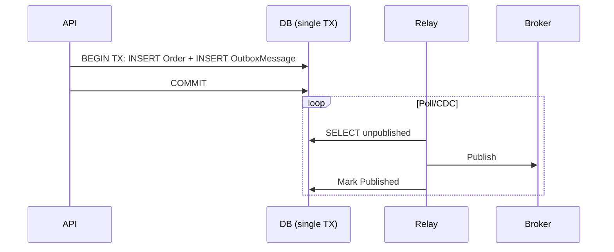
```csharp
_context.Orders.Add(order);
_context.OutboxMessages.Add(new OutboxMessage
{
    Id = Guid.NewGuid(), Type = "OrderCreated",
    Payload = JsonSerializer.Serialize(new { order.Id, order.CustomerId }),
    CreatedAt = DateTime.UtcNow
});
await _context.SaveChangesAsync(); // atomic: both or neither
```
**Nuances:** relay (BackgroundService/Debezium CDC) **at-least-once** deliver (publish ke baad, mark se pehle crash → re-publish) → consumers **idempotent** hone chahiye. Yahi "exactly-once" ka real mechanism = at-least-once + idempotent consumers. Outbox = **sagas** ka building block (2PC alternative). Trade-off: table + relay + eventual delivery — sirf network-boundary atomicity chahiye tab; monolith (no broker) mein unnecessary.

### Eventual Consistency & Compensating Transactions

μsvc mein multi-service single-DB ACID nahi milta — har service local TX commit, overall *eventually* consistent.

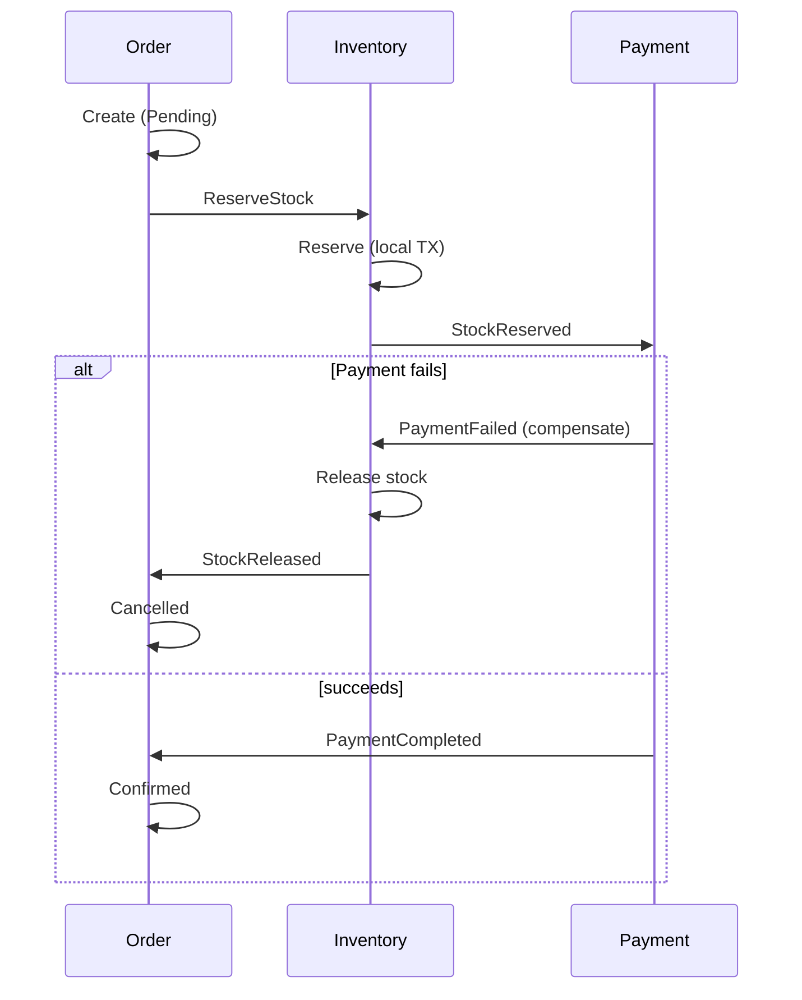
**Compensating transactions** = distributed "rollback" jab shared TX nahi — har committed service explicit business *undo* karti (stock release, refund, cancel shipment). Yeh **Saga** ka core.

**Unprompted:** UI honest interim states ("Order placed — confirming payment"); read models lag (write path se just-written entity return); compensations hamesha possible nahi (email/irreversible — trigger delay ya inconsistency accept); idempotency + outbox hi sagas reliable banate (isliye teeno saath poochhe jaate).

---

## 5. Deployment & Observability

### Health Checks

```csharp
builder.Services.AddHealthChecks()
    .AddDbContextCheck<AppDbContext>()
    .AddCheck<RedisHealthCheck>("redis")
    .AddUrlGroup(new Uri("https://downstream-api.com/health"), name: "downstream-api");
app.MapHealthChecks("/health");
```
**Senior detail:**
- **Liveness** (alive/restart?) vs **readiness** (traffic-ready: DB reachable, cache warm?) separate endpoints/tags (`/health/live` vs `/health/ready`) — conflate → K8s starting pod restart ya DB-down pod ko traffic.
- Downstream ping readiness = cascading-failure vector → timeout + "downstream degraded" = `Degraded` (necessarily `Unhealthy` nahi).
- UI dashboards (`AspNetCore.HealthChecks.UI`) ops ke liye, par *endpoints* hi orchestrators consume karte.
- Yeh zero-downtime readiness-probe ka concrete impl hai.

### Dockerizing a .NET Web API

```dockerfile
FROM mcr.microsoft.com/dotnet/sdk:8.0 AS build
WORKDIR /src
COPY . .
RUN dotnet restore
RUN dotnet publish -c Release -o /app/publish

FROM mcr.microsoft.com/dotnet/aspnet:8.0 AS runtime
WORKDIR /app
COPY --from=build /app/publish .
EXPOSE 8080
ENTRYPOINT ["dotnet", "MyWebAPI.dll"]
```
**Multi-stage kyun:** `sdk` se build par `aspnet` runtime ship → lean image (no compilers) + less attack surface. Points: exact tags pin (`aspnet:8.0`, `latest` nahi); **non-root user** (.NET 8 default `app`); `.dockerignore` (`bin`/`obj`/`.git`); config env vars/secrets (image mein bake nahi); health-checks pair. Follow-up = Kubernetes (resource limits, HPA, `ConfigMap`/`Secret`).

### Application Insights

```csharp
builder.Services.AddApplicationInsightsTelemetry(builder.Configuration["ApplicationInsights:ConnectionString"]);
_telemetry.TrackEvent("ProductsListRequested"); // via injected TelemetryClient
```
Out-of-box: automatic request/dependency tracking (SQL/HTTP timed+correlated), exception tracking, live metrics, **distributed correlation** (`Operation Id` service hops ke across → Application Map end-to-end trace). **vs OpenTelemetry:** App Insights ab under-the-hood **OpenTelemetry** par built (Azure Monitor OTel Distro) — competing tech nahi. Custom `TrackEvent`/`TrackMetric` business telemetry ("checkout completed") ke liye — reserve for dashboard/alert signals (warna noise + ingestion cost).

---

## 6. Performance

### Response Compression

```csharp
builder.Services.AddResponseCompression(o =>
{ o.Providers.Add<BrotliCompressionProvider>(); o.Providers.Add<GzipCompressionProvider>(); });
app.UseResponseCompression();
```
Payload/network kam, CPU cost. **Brotli** primary (text/JSON par better), Gzip fallback. **Gotcha:** already-compressed (images/video) ya small payloads par worth nahi. `UseResponseCompression()` early register (static/MVC se pehle), HTTPS/caching ke peeche.

### Response / Output Caching & Distributed Cache (Redis)

```csharp
builder.Services.AddResponseCaching();
app.UseResponseCaching();
[ResponseCache(Duration = 60, Location = ResponseCacheLocation.Client)]
[HttpGet] public IActionResult Get() => Ok("Cached Data");
```
`[ResponseCache]` mostly HTTP caching **headers** manipulate (server-side cache necessarily nahi); misconfigured headers silently caching disable. **Output Caching** (.NET 7, `AddOutputCache()`) = actual server-side cache-the-body, custom policies + tag eviction:
```csharp
builder.Services.AddOutputCache(o =>
    o.AddPolicy("Products", p => p.Expire(TimeSpan.FromSeconds(60)).Tag("products")));
app.UseOutputCache();
app.MapGet("/api/products", () => Ok(products)).CacheOutput("Products");
await outputCacheStore.EvictByTagAsync("products", ct); // on write
```
**Redis cache-aside:**
```csharp
builder.Services.AddStackExchangeRedisCache(o => { o.Configuration = "redis:6379"; o.InstanceName = "app_"; });
var value = await cache.GetStringAsync("product_10");
if (value is null)
{
    value = await FetchFromDbAndSerialize();
    await cache.SetStringAsync("product_10", value,
        new DistributedCacheEntryOptions { AbsoluteExpirationRelativeToNow = TimeSpan.FromMinutes(10) });
}
```
**Redis μsvc mein kyun:** scale par `IMemoryCache` diverge (instance A hit = B miss) → shared cache fleet-consistent.

| Pitfall | Description | Mitigation |
|---|---|---|
| Cache Stampede | Expire par concurrent DB hits | Distributed locks, warming, jittered TTLs |
| Cache Invalidation | DB updated, cache stale | Delete-on-write, write-through, event-driven |
| Too Much Data | Redis = datastore treat | Sirf hot data + TTLs |
| Serialization | Large graphs inefficient | MessagePack / trimmed DTOs |
| Redis as Primary | Durability par rely | Disposable treat karo |
| Connection Mismanagement | Naye connections per call | Shared `IConnectionMultiplexer` singleton |

### ETags & Conditional Requests

```csharp
[HttpGet("{id}")]
public async Task<IActionResult> GetProduct(int id)
{
    var product = await _context.Products.FindAsync(id);
    if (product is null) return NotFound();
    var etag = $"\"{product.RowVersion.ToBase64()}\"";
    Response.Headers.ETag = etag;
    if (Request.Headers.IfNoneMatch == etag) return StatusCode(304);
    return Ok(product);
}

[HttpPut("{id}")]
public async Task<IActionResult> UpdateProduct(int id, [FromBody] Product update)
{
    var product = await _context.Products.FindAsync(id);
    if (product is null) return NotFound();
    var currentEtag = $"\"{product.RowVersion.ToBase64()}\"";
    if (Request.Headers.IfMatch != currentEtag) return StatusCode(412); // someone updated first
    await _context.SaveChangesAsync();
    return NoContent();
}
```
- **`ETag` + `If-None-Match`** — conditional GET → `304 Not Modified` (no body), bandwidth save.
- **`ETag` + `If-Match`** — writes optimistic concurrency → `412 Precondition Failed` (EF Core `[ConcurrencyCheck]`/`RowVersion` ka HTTP-layer analog).
- CDNs/reverse proxies HTTP caching natively samajhte.

### Query & EF Core Performance

```csharp
var products = _context.Products.AsNoTracking().ToList();
```
Checklist:
- **`AsNoTracking()`** read-only (change-tracking snapshot skip).
- **N+1 avoid** — `.Include()`/`.ThenInclude()` ya projections (`.Select(x => new Dto{...})`).
- **Compiled queries** (`EF.CompileAsyncQuery`) hot repeated shapes.
- **Split queries** (`.AsSplitQuery()`) cartesian-explosion avoid.
- **Slow queries diagnose** — `.ToQueryString()`, query logging, `EXPLAIN`/execution plans; missing indexes.
- **DB-level pagination** — `Skip/Take` `ToList()` se *pehle*.
- **Dapper/raw ADO.NET** genuine hotspots (profile first).

### Soft Delete Pattern

```csharp
public class Product { public int Id; public string Name; public bool IsDeleted; }

[HttpDelete("{id}")]
public async Task<IActionResult> SoftDelete(int id)
{
    var product = await _context.Products.FindAsync(id);
    if (product is null) return NotFound();
    product.IsDeleted = true;
    await _context.SaveChangesAsync();
    return NoContent();
}
```
Physical delete → audit history khatam + FK cascade break. Manual `.Where(p => !p.IsDeleted)` scale nahi — bhoolna easy → leaked rows. **Global query filter:**
```csharp
protected override void OnModelCreating(ModelBuilder mb)
    => mb.Entity<Product>().HasQueryFilter(p => !p.IsDeleted);
```
Har LINQ query auto-exclude (Include navigations bhi). Admin query → `.IgnoreQueryFilters()`.

**Trade-offs:** unique constraints soft-deleted account karein (filtered/partial index `WHERE IsDeleted = 0`); FK relationships resolve (cascade-flag vs independent); retention/purge policy (background hard-delete job, warna unbounded grow); GDPR = PII scrub bhi (sirf soft delete insufficient).

### Async/Await Pitfalls

- **`Task.Run` in request handlers = almost always galat** — sirf thread pool thread shift, single request parallelism nahi, load par starvation worse.
- **Async par blocking** (`.Result`/`.Wait()`/`.GetAwaiter().GetResult()`) — SynchronizationContext contexts mein deadlock (ASP.NET Core mein kam issue — no `SyncContext`), par thread waste + anti-pattern.
- **`ConfigureAwait(false)`** — mostly *library* code mein (ASP.NET Core app code mein non-issue, no `SyncContext`); WPF/WinForms callers ke liye hygiene.
- **`ValueTask` vs `Task`** — `ValueTask<T>` sync-available (cache hit) par heap allocation avoid; **do baar await/concurrent store nahi** (`Task` safe).
- **Deadlock classic:** sync-over-async chain blocking thread waiting on Task jise wahi thread/starved pool chahiye. Widespread blocking → thread pool starvation real prod issue.

---

## 7. Security

### Securing a Web API — Poori Checklist

| Measure | Purpose |
|---|---|
| Authentication (JWT/OAuth2/API keys) | Kaun access kar sakta |
| Authorization (roles/claims/policies) | Authenticated caller kya kar sakta |
| CORS | Unauthorized cross-origin browser calls |
| Rate limiting | Abuse/DoS |
| Input validation/sanitization | Injection (SQL/XSS) |
| HTTPS/TLS everywhere | Transit encryption |
| Secrets mgmt (Key Vault, env vars) | Credential leakage |
| Security headers (HSTS, CSP, X-Content-Type-Options) | Browser-attack defense-in-depth |

```csharp
// BAD
string query = "SELECT * FROM users WHERE username = '" + userInput + "'";
// GOOD — parameterized
var cmd = new SqlCommand("SELECT * FROM users WHERE username = @username", conn);
cmd.Parameters.AddWithValue("@username", userInput);
```
EF Core LINQ auto-parameterizes; `FromSqlRaw` risk → `FromSqlInterpolated`/explicit params.

**XSS:** rendered user content encode (`@Html.Encode`); API mein bigger risk = frontend jo responses trust; stored input validate/sanitize (stored-XSS vector na ban jaye).

```csharp
public class User
{
    [Required][StringLength(50)] public string Username { get; set; }
    [EmailAddress] public string Email { get; set; }
}
```

### SSL/TLS Fundamentals

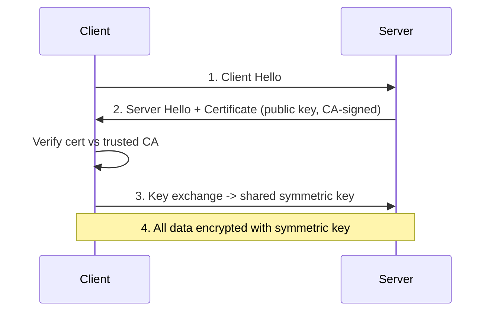
- "SSL" colloquial; **TLS** actual protocol (SSL deprecated/insecure).
- **3 guarantees:** confidentiality (encryption), authentication (CA-signed cert), integrity (tamper detection).
- Sirf **transit** protect (at-rest = separate: DB/disk encryption).
- Handshake per-connection 1 baar; subsequent = symmetric key. **Hybrid:** asymmetric (handshake) + symmetric (bulk, orders-of-magnitude faster).
- **TLS termination** LB/IIS/reverse-proxy par (backend internally plain HTTP in trusted network).
- **HSTS** (`Strict-Transport-Security: max-age=31536000; includeSubDomains`) → browser hamesha HTTPS, downgrade window band.

### Token Revocation & Refresh Tokens

**JWT revocation problem:** stateless/self-contained (no per-request DB check = whole point) → leaked JWT expire tak valid, early invalidate hard.
```csharp
public class TokenService // naive, per-instance — production-inadequate
{
    private static readonly List<string> _blacklistedTokens = new();
    public void RevokeToken(string t) => _blacklistedTokens.Add(t);
    public bool IsTokenRevoked(string t) => _blacklistedTokens.Contains(t);
}
```
**Kyun inadequate:** `static List` per-instance — scaled deployment mein A par revoke = B/C ke liye kuch nahi. Fix: **shared distributed revocation store** (Redis, TTL = remaining lifetime) validation-hook mein check; ya problem **avoid**:
1. **Short access token lifetimes** (minutes) → small exposure window.
2. **Refresh tokens** (server-side DB stored) → demand par revoke/rotate; access token stateless+short.

```csharp
[HttpPost("refresh-token")]
public async Task<IActionResult> RefreshToken([FromBody] TokenRequest request)
{
    var user = await _context.Users.SingleOrDefaultAsync(u => u.RefreshToken == request.RefreshToken);
    if (user == null || user.RefreshTokenExpiry < DateTime.UtcNow) return Unauthorized();
    var newAccessToken = GenerateJwtToken(user);
    user.RefreshToken = GenerateRefreshToken(); // rotate — prevents replay
    await _context.SaveChangesAsync();
    return Ok(new { Token = newAccessToken, RefreshToken = user.RefreshToken });
}
private string GenerateRefreshToken() => Convert.ToBase64String(RandomNumberGenerator.GetBytes(64));
```
**Rotation** (har use par naya + purana invalidate) = best practice → theft detect (stolen token replay after legit rotate → whole family revoke).

### Two-Factor Authentication

```csharp
var token = await _userManager.GenerateTwoFactorTokenAsync(user, TokenOptions.DefaultPhoneProvider);
await _smsService.SendSmsAsync(user.PhoneNumber, $"Code: {token}");
var isValid = await _userManager.VerifyTwoFactorTokenAsync(user, TokenOptions.DefaultPhoneProvider, inputToken);
if (!isValid) return Unauthorized();
```
SMS 2FA = weakest (SIM-swapping); TOTP (Authenticator/Authy) ya WebAuthn/FIDO2 passkeys stronger + 2025-26 preferred.

---

## 8. Best Practices

- Resource-oriented URLs (nouns), verbs/status codes sahi, pluralization/casing consistent.
- DTOs at boundaries — EF entities directly bind kabhi nahi (over-posting risk).
- External/cross-team consumers → day-one versioning (retrofit painful).
- Saare errors → Problem Details (RFC 7807/9457), ad-hoc shapes nahi.
- POST/PUT idempotent jahan meaning allow kare; warna idempotency keys.
- Large/high-write/public collections → cursor pagination.
- Outbound HTTP → `IHttpClientFactory` (per-call `new` ya bare static singleton nahi).
- Controllers thin (orchestration); logic services/domain mein.
- Structured logging (`ILogger`+Serilog) + correlation IDs + OpenTelemetry tracing.
- HTTPS everywhere + HSTS; cert validation "temporarily" disable kabhi nahi.
- Authorization fail closed (default-deny, explicit allow).
- Optimize se pehle load-test/profile (`dotnet-counters`/`dotnet-trace`).
- API = product: document (OpenAPI), SLA/deprecation policy, backward compat default.

## 9. Common Pitfalls

- PATCH ko by-default idempotent assume karna.
- Raw exception messages/stack traces clients tak leak.
- Wildcard CORS + credentials.
- Scoped (`DbContext`) directly Singleton mein inject.
- Frequently-mutated large table par offset pagination.
- Redis ko system-of-record treat karna.
- Rate limiting counters in-memory-per-instance (false global limit).
- OData/`$filter`/`$expand` bina page-caps/cost-limits expose.
- Request paths mein async par block (`.Result`/`.Wait()`).
- `DbContext` ko repository mein wrap bina justification (IQueryable composability loss).
- `[ApiController]` already `ModelState` auto-validate karta — redundant manual checks.
- JWT server-side "logout" assume karna bina revocation store/short-expiry+refresh.

## 10. Sample Interview Q&A

**Q: Request pipeline + middleware kahan?** Kestrel raw request → `HttpContext` → ordered middleware (exception→HTTPS→routing→authn→authz→custom) → endpoint (filters) → wapas reverse. Order matters — middleware sirf apne se pehle wala dekhta; `Use` continue, `Run` terminate (short-circuit).

**Q: Socket exhaustion?** `IHttpClientFactory` (named/typed) — per-call `new HttpClient()` ya naive static singleton nahi; handlers pool/recycle → reuse + no DNS-staleness.

**Q: Slow EF Core query diagnose?** `.ToQueryString()`/query logging se SQL, `EXPLAIN`/execution plan, missing indexes, N+1 (missing `.Include()`/projections), read-only paths par `AsNoTracking()`.

**Q: gRPC kab REST ke upar?** Internal S2S (dono ends control), low latency + high throughput, strongly-typed `.proto` generated clients, native bidirectional streaming. REST = public + broad compat default.

**Q: Payment API idempotent retries?** Client-supplied idempotency key; result ke saath atomically store (same TX/unique table); retry par stored result return; concurrent-in-flight → 409/425.

**Q: POST-triggered long-running op?** `202 Accepted` + `Location` (status resource), work enqueue, client poll (ya webhook register) — original request block nahi.

**Q: Authn vs authz + kahan fail?** Authn (kaun) pehle, `HttpContext.User` populate; failure = anonymous. Authz (kya) baad mein, `[Authorize]`/roles/policies; failure = 401/403, action execute nahi.

**Q: `DbContext` Singleton mein kyun nahi?** Scoped (unit-of-work per request, thread-safe nahi); Singleton app-lifetime + shared → lifetime-validation exception ya race/shared-state corruption. Fix: `IServiceScopeFactory` + per-operation scope.

**Q: Offset vs cursor kab?** Offset = simple, small/static data, "jump to page N" + total-count UI (admin grids). Cursor = large/high-write/public (feeds, Stripe/GitHub) — row-shift immune + indexed seek (no `OFFSET` scan).

**Q: API backward compatible evolve?** Explicitly version (URL path default), fields add (change/remove nahi), removals/type-changes = breaking (new version gate), `Sunset`/`Deprecation` headers + timeline, CI consumer-driven contract tests.

---

## 11. Summary of Additions

`[new content]` sections (current 2025-26 senior interviews mein frequently probed, original mein missing/thin): REST Maturity Model & HATEOAS trade-offs; Problem Details (RFC 7807/9457) via `IExceptionHandler`; Idempotency Keys; Pagination (Offset vs Cursor); Long-Running Ops (202+polling); OpenAPI Contract-First vs Code-First; Minimal APIs vs Controllers; Built-in Rate Limiting (`Microsoft.AspNetCore.RateLimiting`); API Keys vs OAuth2 Scopes; ETags & Conditional Requests.

### Contradictions Flagged

- Versioning: `Microsoft.AspNetCore.Mvc.Versioning` deprecated → `Asp.Versioning.Mvc` (inline flag, package-lifecycle change not conflict).
- Same-topic passages mein koi direct factual contradiction nahi mila (duplicate REST/PUT-vs-PATCH/CORS/rate-limiting blocks consistent the → merged/de-duplicated).

### Summary of [gaps] Additions (This Pass)

1. **OAuth2 Grant Types — Which One Fits Which Client** — existing content ne Auth Code/Client Credentials/Device Code sirf passing naam liya; "which grant fits which client type" (SPA vs native/mobile vs M2M vs limited-input device) = most frequent *direct* OAuth2 question, koi explicit client-to-grant mapping nahi thi. Implicit + ROPC ko OAuth 2.1 deprecated bhi call out.
