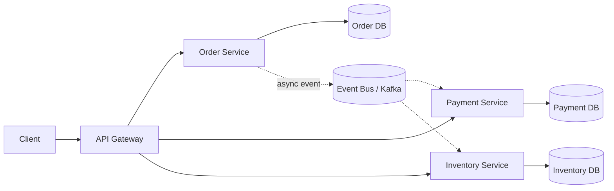
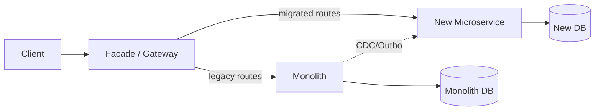
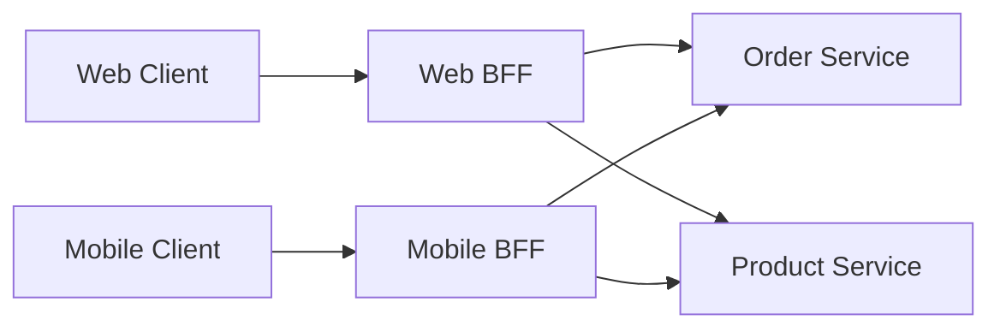
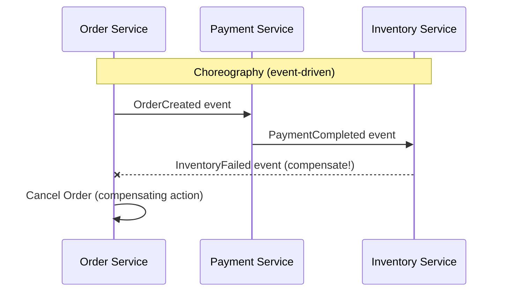
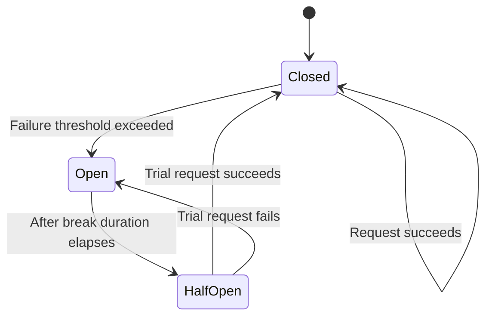
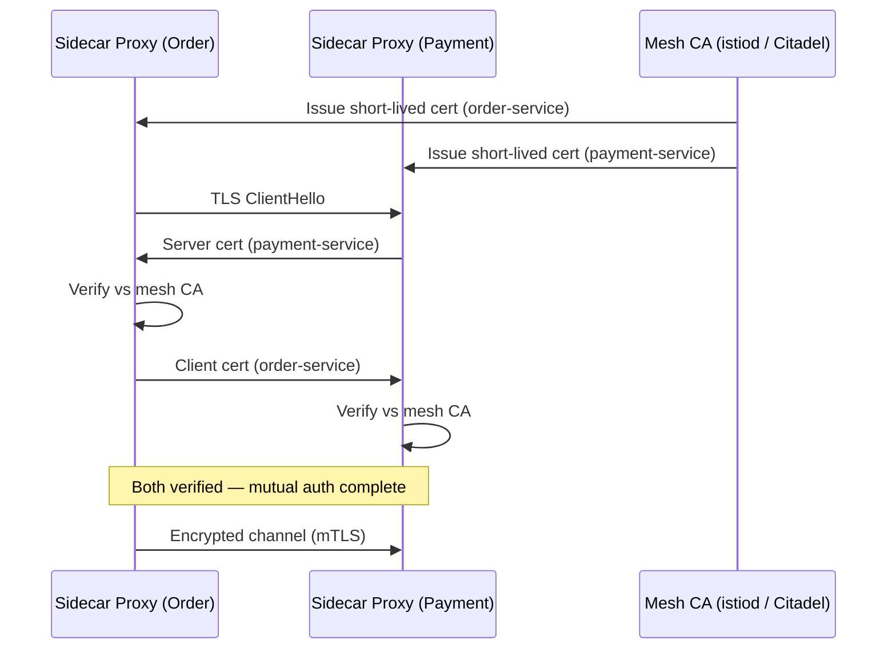
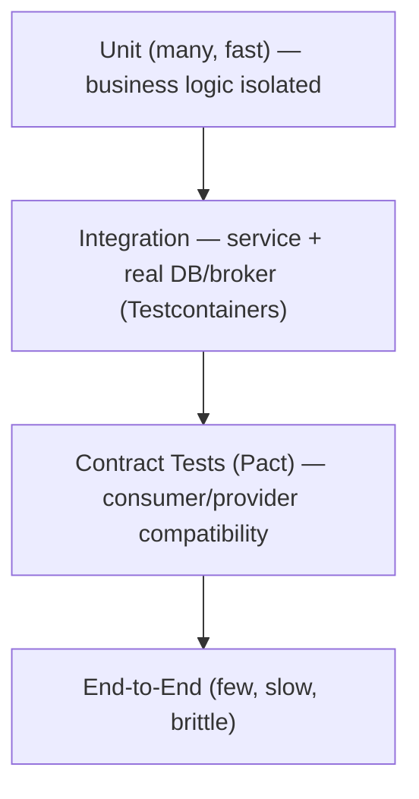

# Microservices — Senior .NET Interview Revision Notes

> Quick-revision notes, guide se derived. Har section/topic same order mein cover kiya gaya hai — sirf brush-up ke liye, Q/A + tight bullets format mein.

## Table of Contents

1. [Core Concepts](#core-concepts)
2. [Service Design & Boundaries](#service-design--boundaries)
3. [Communication Patterns](#communication-patterns)
4. [Data Management & Consistency](#data-management--consistency)
5. [Resilience & Fault Tolerance](#resilience--fault-tolerance)
6. [Security](#security)
7. [Observability](#observability)
8. [Deployment & Infrastructure](#deployment--infrastructure)
9. [API Management](#api-management)
10. [Testing Strategies](#testing-strategies)
11. [Advanced Patterns](#advanced-patterns)
12. [Performance](#performance)
13. [Best Practices](#best-practices)
14. [Common Pitfalls / Anti-Patterns](#common-pitfalls--anti-patterns)
15. [Sample Interview Q&A](#sample-interview-qa)

---

## Core Concepts

**Q: Microservices kya hai?**
A: Architectural style — app chhote, independently deployable services mein composed. Har service ek single business capability own karti hai, network ke through communicate karti hai (in-process nahi), independently develop/deploy/scale hoti hai, aur **ek single team dwara owned** hoti hai. E-commerce example: Order, Payment, Inventory, Shipping services.

**Q: Monolith vs Microservices — key differences?**

| Aspect | Monolith | Microservices |
|---|---|---|
| Deployment | Ek unit | Per service independent |
| Scalability | Whole app | Per service |
| Technology | Single stack | Polyglot |
| Failure impact | Ek crash = poori app | Isolated (agar resilience apply ho) |
| Dev speed | Slower (tight coupling) | Faster (ek org size ke baad) |
| Data | Shared DB | Database-per-service |
| Testing | Simpler | Harder (contract/integration) |
| Ops overhead | Low | High (orchestration, tracing, mesh) |



**Advantages:** Scalability (sirf hot service scale karo), technology independence (polyglot), fault isolation, faster parallel dev (Conway's Law), independent deployability.

**Challenges:** Distributed systems complexity (discovery, partial failures, debugging across boundaries), network latency (chatty/N+1 fan-out), data consistency (no cross-service ACID → eventual consistency), bigger security surface, high operational cost (per-service CI/CD, centralized logging/tracing, mesh).

**Q: Microservices kab NOT use karein? (senior trap Q)**
A: Honest answer — always nahi.
- Small team (<2 pizza teams) ya domain abhi unclear → **modular monolith** (clean internal boundaries, single deployable) zyadatar benefit deta hai bina distributed tax ke.
- Microservices dev-time complexity ko run-time/ops complexity se trade karte hain. Payoff se *pehle* mature DevOps (CI/CD, containers, observability) chahiye.
- **Premature decomposition** = bigger risk; early-discovered boundaries usually galat hote hain, aur wrong boundary ko later split karna = distributed refactoring (much harder).
- Rule of thumb: "Monolith-first (ya modular monolith) se start karo, services extract karo jab boundaries proven ho aur specific scaling/team-autonomy pain real ho."

---

## Service Design & Boundaries

**Q: Service decomposition kaise karein? (most-asked senior Q)**
A:
- **Business capability se decompose karo**, technical layer se nahi (kabhi "UI service"/"DB service" nahi). "Business kya karta hai?" poocho, "kaunse tables hain?" nahi.
- **Bounded Context** (DDD) = actual unit of decomposition — ek boundary jahan domain model + ubiquitous language consistent hain. Do contexts mein "Customer" ka matlab alag ho sakta hai (Sales vs Support) — yeh fine hai; ek shared model force mat karo.
- **Aggregates** = transactional consistency boundaries. **Ek transaction kabhi >1 aggregate span nahi kare**, aur rarely >1 service. Agar 2 services ke across transaction chahiye → ya boundary galat hai ya Saga chahiye.
- Service size = bounded context + team ownership se decide (LOC se nahi). "Useful hone jitna bada, ek team dwara owned/independently deployable hone jitna chhota" (~2-pizza team, end-to-end owned).

**Context Mapping patterns (bounded contexts ke beech relationships):**
- *Shared Kernel* — small shared model, tightly coupled, sparingly use.
- *Customer/Supplier* — upstream/downstream, negotiated contracts.
- *Conformist* — downstream upstream model as-is accept karta hai.
- *Anti-Corruption Layer (ACL)* — external/legacy model aur clean internal model ke beech translate (strangler migrations mein critical).

**Event Storming** — workshop technique, code se pehle domain experts ke saath collaboratively bounded contexts discover karne ke liye.

### DDD Building Blocks
- **Entities** — identity wale (`Order`, `Customer`).
- **Value Objects** — immutable, no identity (`Address`).
- **Aggregates** — entities/VOs ka cluster, root invariants enforce karta hai (`Order` with `OrderItem`s).
- **Repositories** — per aggregate root data access abstract.

```csharp
public class Order
{
    public int Id { get; set; }
    public List<OrderItem> Items { get; set; } = new();
}
```

### Hexagonal Architecture (Ports & Adapters)
Core business logic ko infrastructure se separate karta hai:
1. **Core logic** — DB/API/framework independent.
2. **Ports** — abstracting interfaces (`IOrderRepository`).
3. **Adapters** — concrete impls (EF Core repo, REST controller, message consumer).

Kyun matter karta hai: service ko *testable* (adapters swap with test doubles) aur *framework-agnostic* banata hai — directly Clean Architecture se related.

### Strangler Fig Migration
Old ko incrementally new se replace karo:
1. Monolith ke saamne **Facade/Gateway** calls intercept karta hai.
2. Ek **vertical slice** (bounded context) pick karo — clearest boundaries / highest value (Search, Notifications — read-heavy, low write-coupling).
3. New service build; gateway matching requests route karta hai, baaki monolith mein.
4. **Data migration = hard part** — often monolith DB temporarily old+new dono se read hota hai (views/CDC), phir writes cut over.
5. Repeat, monolith shrink karte hue jab tak "strangled" na ho.
6. Key risk: **dual-write inconsistency** transition window mein → Outbox/CDC (Debezium) se mitigate karo, naive dual writes se nahi.



---

## Communication Patterns

**Q: Synchronous vs Asynchronous?**
- **Sync** (REST, gRPC) — caller block/await karta hai. Simple, lekin temporal coupling: callee down → caller fail (jab tak resilience na ho).
- **Async** (queue, event bus) — fire & continue; response later. Availability decouple karta hai, lekin eventual consistency + ordering + idempotency + debugging complexity add karta hai.

| Concern | Sync (REST/gRPC) | Async (Queue/Event) |
|---|---|---|
| Coupling | Temporal (callee up) | Decoupled |
| Latency | Immediate (ya fail) | Higher perceived, non-blocking |
| Failure handling | Retry/CB on caller | DLQ, redelivery, idempotent consumers |
| Consistency | Strongly consistent possible | Eventual (default) |
| Complexity | Lower | Higher (ordering, dedup, poison msgs) |
| Best for | Read-heavy request/response UX | Write-heavy, cross-service side effects |

Rule: queries jahan immediate answer chahiye → sync; "yeh hua, react karo" type kuch bhi → async events (fan-out/cascading-failure risk bhi kam karta hai).

**Q: REST vs gRPC?**

| Feature | REST | gRPC |
|---|---|---|
| Protocol | HTTP/1.1 | HTTP/2 |
| Format | JSON/XML (text) | Protobuf (binary) |
| Performance | Slower | Faster (binary, multiplexed) |
| Contract | OpenAPI (loose) | `.proto` (strict, codegen) |
| Streaming | Limited (SSE/WS) | Native (unary/server/client/bidi) |
| Browser | Native | grpc-web proxy chahiye |
| Use case | Public/external APIs | Internal service-to-service, low-latency |

Follow-up: "Public API ke liye gRPC?" — Generally nahi (weak browser support, poor debuggability). Common pattern: **internally gRPC, edge par REST/GraphQL** (gateway translation).

**Q: Message Queue (RabbitMQ) vs Event Bus (Kafka)?**

| Feature | Queue (RabbitMQ) | Event Bus (Kafka) |
|---|---|---|
| Communication | Point-to-point (competing consumers) | Pub/Sub (fan-out) |
| Storage | Short-term, consume ke baad removed | Persistent log, replayable, retention |
| Ordering | FIFO per queue | Partition-based |
| Consumer model | Ek msg → ek consumer | Many consumer groups same stream |
| Replay | Typically nahi | Haan (kisi bhi offset se) |

Follow-up: "Kafka over RabbitMQ kab?" — Kafka jab replay, high-throughput log-based event sourcing, multiple independent consumer groups (analytics + fraud + notifications sab "OrderPlaced" read). RabbitMQ jab simpler routing (topic/direct/fanout), lower ops footprint, true work-queue semantics bina replay ke.

### Event-Driven Architecture
Services state changes par events publish karti hain; subscribers react karte hain — decoupled, async.

```csharp
channel.BasicPublish(exchange: "", routingKey: "order-placed",
    body: Encoding.UTF8.GetBytes("Order ID: 1234"));
```

Benefits: async, decoupled, natural audit trail. Downsides: business flow trace karna hard ("kisne trigger kiya?"), eventual consistency, event schema evolution = cross-team contract problem.

### API Composition
Data services ke across split hone par aggregator results combine karta hai:

```csharp
var orders = await httpClient.GetFromJsonAsync<List<Order>>("orders-service/orders");
var customers = await httpClient.GetFromJsonAsync<List<Customer>>("customer-service/customers");
```
Trade-off: simple, lekin large joins/filters ke saath scale nahi karta → **CQRS denormalized read model** better.

**Q: API Gateway vs BFF (Backend-for-Frontend)?**
- **API Gateway** — ek gateway saare client types serve karti hai (generic routing/auth/rate-limiting).
- **BFF** — dedicated gateway *per client type* (`web-bff`, `mobile-bff`), har responses us client ke liye shape/aggregate karti hai (mobile smaller, web richer).
- Kyun: single generic gateway "if mobile then..." branching accumulate karke shared bottleneck ban jaati hai. BFF har frontend team ko apna aggregation independently own karne deta hai.
- Trade-off: zyada services maintain; cross-cutting logic (auth/logging) duplicate na ho isliye BFFs ke saamne thin edge gateway/ingress.



### API Gateway (core)
Single entry point → backend routing; auth, rate limiting, load balancing, request transformation centralize.

```json
{
  "Routes": [
    {
      "DownstreamPathTemplate": "/api/products",
      "DownstreamScheme": "http",
      "DownstreamHostAndPorts": [ { "Host": "localhost", "Port": 5001 } ],
      "UpstreamPathTemplate": "/products",
      "UpstreamHttpMethod": [ "GET" ]
    }
  ]
}
```
*(Ocelot config. Alternatives: YARP, Kong, Nginx, Azure APIM, AWS API Gateway.)*

Note: Ocelot activity slow — aaj ke .NET shops build-your-own ke liye **YARP** (Microsoft-maintained, ASP.NET Core middleware ke saath native) prefer karte hain, ya managed gateway (Azure APIM/Kong/AWS). "Aaj kya use karoge" → YARP naam lo.

**API Gateway vs Reverse Proxy:**

| Feature | API Gateway | Reverse Proxy |
|---|---|---|
| Purpose | Multiple APIs, application-aware | Traffic direct, protocol-aware |
| Functionality | AuthN/Z, rate limit, transform, aggregation | Load balancing, TLS termination, basic routing |

**Request Aggregation / Gateway Caching:**
- Aggregation — gateway multiple downstream calls ko ek response mein combine (`/api/orders/123` = order + customer).
- Caching — gateway responses cache karke backend load kam karta hai.

```nginx
proxy_cache_path /var/cache/nginx levels=1:2 keys_zone=mycache:10m;
```

---

## Data Management & Consistency

### Database per Service
Har service apna DB/schema own karti hai; no direct cross-service DB access. Independent schema evolution + tech choice (Orders → SQL, Catalog → NoSQL) enable karta hai, lekin cross-service queries/transactions explicitly solve karne padte hain.

```csharp
public class OrderContext : DbContext
{
    public DbSet<Order> Orders { get; set; }
}
```

**Q: Multiple services ka data chahiye wali queries kaise handle karein?**
A: API Composition ke aage —
- **CQRS materialized read model** — dedicated read-side service domain events subscribe karti hai, denormalized query-optimized view banati hai (Elasticsearch/Redis/reporting DB). Reads request-time par fan out nahi karte.
- **BFF aggregation** — jab aggregation client-specific ho.

### CQRS (Command Query Responsibility Segregation)
Write model (commands) ko read model (queries) se separate — often alag stores.
- **Command Handler** → validate + write store update.
- **Query Handler** → separate (denormalized/replica) store se read.

```csharp
POST /orders   // Command Handler → primary DB
GET /orders    // Query Handler → read replica / projection
```

Follow-up: "CQRS ko Event Sourcing chahiye?" — Nahi, independent patterns hain (often saath, required nahi). Do relational tables/views se CQRS ho sakta hai. Plain CQRS + read replica far more common & simpler.

### Distributed Transactions — Saga Pattern
2PC autonomous services/DBs par scale nahi karta (blocking, availability, modern brokers support nahi karte). **Saga** = local transactions ka sequence, har failure par **compensating transaction**.
- **Choreography** — services directly ek doosre ke events par react (no coordinator); har service jaanti hai kya karna + failure par kya compensate.
- **Orchestration** — central orchestrator har service ko next step batata hai, compensation centrally handle.



| Aspect | Choreography | Orchestration |
|---|---|---|
| Coupling | Loose (events only) | Coordinator poora flow jaanta hai |
| Flow visibility | Poor (smeared across services) | Good (ek jagah explicit) |
| Complexity growth | Steps badhne par messy (cyclic deps) | Better scale, lekin god-service risk |
| Compensation logic | Distributed | Centralized |
| Tooling | Plain pub/sub (Kafka/RabbitMQ) | MassTransit saga, Temporal, Azure Durable Functions, AWS Step Functions, Camunda |
| Best for | 2-3 step simple | Long-running, multi-step, branching |

```csharp
if (!PaymentService.ProcessPayment(order.Id))
{
    OrderService.RollbackOrder(order.Id);
}
```

### Outbox Pattern
**Dual-write problem** solve karta hai: DB update + broker publish ko atomically 2 ops mein nahi kar sakte bina risk ke.

Mechanism:
1. Business update ke *same local DB transaction* mein event ko `Outbox` table mein insert.
2. Separate background process (poller ya CDC/Debezium) unpublished rows read karke broker par publish.
3. Broker ack ke baad row published mark/delete.

**At-least-once delivery** guarantee — event kabhi lost nahi (business data ke saath durably stored).

Nuance:
- Consumers **idempotent** hone chahiye (at-least-once, exactly-once nahi).
- Do styles: **polling publisher** (simple, latency + DB load add) vs **CDC-based** (Debezium tx-log tail → near real-time, no polling, lekin Debezium/Kafka Connect ops complexity).
- Saga choreography ke saath directly pairs (har step ka commit + publish = same dual-write problem).

### Idempotency
Same request repeat = same effect. Critical kyunki at-least-once (retries/redeliveries) = norm.

```
POST /api/orders?IdempotencyKey=abcd1234
```

Kaise implement karein:
- Client per logical operation unique idempotency key (GUID) generate karke bhejta hai.
- Server `(IdempotencyKey, Result)` ko table/cache mein TTL ke saath store.
- Repeat request par: server short-circuit karke *original* stored response return karta hai (re-execute nahi).
- Message consumers: unique message ID se "processed messages" store ke against dedupe, ya natural idempotency (`UPSERT` not `INSERT`, `set status = Shipped` not `increment`).

### Concurrency Control
- **Optimistic locking** — conflicts rare assume; version/rowversion se detect, conflict par retry.
- **Pessimistic locking** — record upfront lock; simpler correctness lekin throughput/availability hurt, boundaries ke across discouraged.
- **Eventual consistency** — temporary staleness accept, events se reconcile.

```csharp
public class Order
{
    public int Id { get; set; }
    [ConcurrencyCheck]
    public int Version { get; set; }
}
```

### Read Replicas & Sharding
- **Read replica** — secondary copy read traffic serve karti hai (writes primary ko). Trade-off: replication lag → "read-your-own-write" ko care (write ke baad primary se read).
- **Sharding:**
  - *Range-based* — A–M → DB1, N–Z → DB2. Simple, hot-shard risk.
  - *Hash-based* — even distribution, harder range queries.
  - *Geo-based* — data residency/latency good, cross-region joins expensive.

### Database Migrations
EF Core Migrations ya Flyway/Liquibase (language-agnostic), version control mein store.

```bash
dotnet ef migrations add InitDatabase
dotnet ef database update
```

Live env mein migrations **rollout ke dauran backward-compatible** hone chahiye (rolling deploy mein old+new versions saath chalte hain). Technique: **expand/contract (parallel change)** — naye columns/tables add (expand) → code jo dono mein write kare deploy → fully rolled out ke baad old schema remove (contract). >1 replica hone par single step mein breaking change kabhi nahi.

---

## Resilience & Fault Tolerance

### Circuit Breaker Pattern
Failing dependency ko repeatedly call karne se rokta hai, recover time deta hai, cascading failure/thread exhaustion se protect.

```csharp
services.AddHttpClient("OrderService")
    .AddTransientHttpErrorPolicy(policy =>
        policy.CircuitBreakerAsync(2, TimeSpan.FromSeconds(30)));
```

**State machine (common whiteboard ask):**

- **Closed** — requests flow, failures count.
- **Open** — immediate fail-fast (no call) break duration ke liye — service + caller dono protect.
- **Half-Open** — timeout ke baad ek trial request; success → Closed, fail → Open.

**Polly v8+ resilience pipelines** (current, `Microsoft.Extensions.Http.Resilience` via .NET 8+):

```csharp
services.AddHttpClient("OrderService")
    .AddResilienceHandler("standard", builder =>
    {
        builder.AddRetry(new RetryStrategyOptions
        {
            MaxRetryAttempts = 3,
            BackoffType = DelayBackoffType.Exponential
        });
        builder.AddCircuitBreaker(new CircuitBreakerStrategyOptions
        {
            FailureRatio = 0.5,
            SamplingDuration = TimeSpan.FromSeconds(30)
        });
        builder.AddTimeout(TimeSpan.FromSeconds(5));
    });
```
Polly v8 = **ResiliencePipeline** builder (chained policies nahi). `AddStandardResilienceHandler()` retry+CB+timeout bundle karta hai.

### Retry Pattern
- Hamesha **exponential backoff + jitter** ("thundering herd"/retry storm avoid).
- Sirf **idempotent** ops retry karo (ya idempotency key wale) — non-idempotent POST blindly retry = duplicate orders/charges.
- Total attempts cap + circuit breaker ke saath combine (retries khud downstream overwhelm na karein).

### Bulkhead Pattern
Resources (thread/connection pools) per dependency isolate — ek slow/failing dependency doosron ke resources exhaust na kare (ship compartments analogy).

```csharp
services.AddHttpClient("PaymentService")
    .AddBulkheadPolicy(100, 10); // 100 concurrent, 10 queued
```

### Rate Limiting / Throttling
Per client/window requests cap → abuse/overload prevent.

```csharp
services.AddRateLimiter(options =>
{
    options.GlobalLimiter = RateLimitPartition.GetFixedWindowLimiter(
        TimeSpan.FromSeconds(10), 100);  // 100 req / 10 sec
});
```
*(ASP.NET Core built-in `Microsoft.AspNetCore.RateLimiting`, .NET 7+, ab standard over `AspNetCoreRateLimit`.)*

| Algorithm | Behavior | .NET |
|---|---|---|
| Fixed Window | N req/window, edge par 2x burst risk | `GetFixedWindowLimiter` |
| Sliding Window | Edge-burst smooth | `GetSlidingWindowLimiter` |
| Token Bucket | Tokens steady refill, controlled bursts | `GetTokenBucketLimiter` |
| Concurrency | Concurrent in-flight cap | `GetConcurrencyLimiter` |

### Dead Letter Queue (DLQ)
Retry limits exceed ke baad failed messages store (silent drop/endless retry ke jagah — poison message problem).
- RabbitMQ: **Dead Letter Exchange (DLX)**.
- AWS SQS: max-receive-count redrive policy.

Hamesha **DLQ depth par alert/monitor** — growing DLQ = silent failure signal.

### Sidecar & Ambassador Patterns
- **Sidecar** — main service ke saath deployed helper container (K8s same pod), cross-cutting concerns (logging, monitoring, proxying, TLS) handle karta hai bina main code pollute kiye.
- **Ambassador** — Sidecar specialization, outbound/inbound network calls (auth, retries, CB) proxy karne par focused — jaise service mesh mein Envoy sidecar.

```yaml
containers:
- name: order-service
  image: order-service:v1
- name: envoy
  image: envoyproxy/envoy
```

**Q: Service Mesh vs library-based resilience?**

| Aspect | Library (Polly, in-process) | Service Mesh (Istio/Linkerd) |
|---|---|---|
| Logic kahan | App code, per stack | Infra (sidecar), language-agnostic |
| Polyglot | Har language reimplement | Uniform sab jagah |
| Consistency | Team discipline par | Platform team centrally enforce |
| Ops overhead | Low (NuGet package) | High (sidecar, control plane, latency hop) |
| Observability | App-level | Uniform mesh-wide "for free" |
| Debuggability | Easier (just code) | Harder (mesh tooling chahiye) |
| Best for | Small org, few stacks, simplicity | Large polyglot, uniform policy |

Pragmatic answer: .NET-heavy shops Polly/`M.E.Http.Resilience` use karte hain (simpler, mostly ek language). Service mesh larger polyglot scale par ya uniform mTLS/traffic policy hard requirement hone par worth hai.

### Circuit Breaker at Mesh Layer (Istio)
```yaml
apiVersion: networking.istio.io/v1alpha3
kind: DestinationRule
metadata:
  name: order-service
spec:
  host: order-service
  trafficPolicy:
    outlierDetection:
      consecutiveErrors: 5
      interval: 10s
      baseEjectionTime: 30s
```
10s mein 5 errors → instance 30s ke liye eject. Same concept as Polly CB, lekin infra layer par.

---

## Security

### Authentication & Authorization
- **JWT** — self-contained token (identity/claims), signature se verify (per request auth-server round-trip nahi).
- **OAuth 2.0** — delegated token-based access authorization framework.
- **API Gateway auth** — edge par AuthN centralize (per service duplicate nahi).

```csharp
services.AddAuthentication(JwtBearerDefaults.AuthenticationScheme)
    .AddJwtBearer(options =>
    {
        options.Authority = "https://your-auth-server";
        options.Audience = "your-api";
    });
```

**Q: OAuth 2.0 vs OIDC vs JWT? (commonly conflated)**
- **OAuth 2.0** — *authorization* framework (delegated access). Identity/auth define nahi karta.
- **OIDC** — OAuth 2.0 ke upar identity layer; **ID token** (standardized identity claims wala JWT) add karta hai taaki client jaane *kaun* user hai.
- **JWT** — sirf token *format* (signed/optionally encrypted claims). Protocol nahi. OAuth access tokens/OIDC ID tokens commonly JWT hote hain (opaque tokens bhi valid).
- Gotcha: **sensitive/PII data kabhi unencrypted JWT payload mein nahi** — JWT typically signed hote hain, encrypted nahi → payload base64-readable hai.

```json
{
  "access_token": "eyJhbGciOiJIUzI1NiIsInR5cCI6IkpXVCJ9...",
  "expires_in": 3600,
  "token_type": "Bearer"
}
```

### Securing Internal (East-West) Communication
- **mTLS** — client + server dono certs present; zero-trust service-to-service auth ka standard, usually service mesh dwara enforced.
- **JWT propagation** — user's/service's token call chain ke saath pass (service-to-service tokens often client-credentials OAuth flow se, end-user token se distinct).

```yaml
apiVersion: networking.istio.io/v1alpha3
kind: DestinationRule
spec:
  host: order-service
  trafficPolicy:
    tls:
      mode: MUTUAL
```

**Zero Trust networking:** "kabhi sirf network perimeter par trust mat karo" — har service-to-service call authenticated + authorized, chahe cluster/VPC ke "andar" se ho. Ab default assumption (old "trusted internal network" ke against). Mesh common enabler (per-service mTLS hand-roll scale nahi karta).

### Zero Trust Architecture & mTLS Deep Dive

**Castle-and-moat vs Zero Trust:**
- **Castle-and-moat (old):** strong perimeter (firewall/VPN/segmentation); andar jo bhi = implicitly trusted. Internal traffic often plaintext, no per-call auth.
- **Zero Trust (current):** no trusted network location. Har request independently authenticated (kaun?) + authorized (permission hai?). Trust cryptographic identity se, IP/subnet se nahi.
- **Shift kyun:**
  - **Ephemeral cloud-native infra** — pods/containers dynamic IPs, koi stable boundary nahi.
  - **Lateral movement risk** — attacker low-value service compromise karke "trusted" network mein laterally move karta hai; Zero Trust har hop par auth require karke isko close karta hai.
  - **Compliance mandates** — finance/healthcare/govt explicit zero-trust mandates.
  - **Multi-tenant/shared infra** — shared K8s cluster mein "andar" koi meaningful trust boundary nahi; namespace isolation ≠ authentication.

**mTLS kaise service-to-service auth implement karta hai:**
Normal TLS sirf *server's* identity prove karta hai. **mTLS dono sides identity prove karne deta hai:**
1. Har service ko apna **X.509 certificate** (workload/service identity, human nahi).
2. **Private CA** — mesh control plane (Istio `istiod`/Citadel, Linkerd `identity`) auto per-workload certs issue karta hai.
3. Certs **short-lived** (hours) + **auto-rotated** — no manual renewal, small exposure window.
4. Har connection par dono sides cert present karte hain, shared CA ke against verify → mutual auth + encryption-in-transit ek handshake mein.



**Ops pain solved:** hand-rolled per-service mTLS = har team cert issuance/distribution/rotation/revocation manage kare, har language mein. Rotation galat → 3am cluster-wide auth fail. Isliye scale par mTLS infra mein push down hota hai.

**Service mesh fit:** app code mein mTLS logic nahi likhte. **Sidecar proxy** (Istio Envoy, Linkerd2-proxy) TLS transparently terminate/originate karta hai — app apne local sidecar se plain HTTP mein baat karta hai; sidecar-to-sidecar hop par mTLS. **Control plane** certs issue/distribute/rotate karta hai — yehi Zero Trust ko *scale par* achievable banata hai.

| Aspect | Istio | Linkerd |
|---|---|---|
| Data plane proxy | Envoy (feature-rich) | Linkerd2-proxy (lightweight, Rust) |
| Feature surface | Very broad | Narrower, core mesh |
| Complexity | Higher (more CRDs) | Lower ("just works") |
| Overhead/sidecar | Higher | Lower |
| Best fit | Large org, fine-grained policy | Least ops overhead + mTLS/reliability/observability |

### API Key Authentication
```csharp
if (!Request.Headers.TryGetValue("X-API-KEY", out var apiKey) || apiKey != "my-secret-key")
{
    return Unauthorized();
}
```
Simple lekin weak (static, no expiry/scoping) — service-to-service/partner ke liye acceptable ek gateway (rate limit/IP allow-list) ke peeche; user-facing ke liye OAuth substitute nahi.

### Secrets Management
Source control/config mein secrets kabhi nahi.

```csharp
var secret = await secretsManagerClient.GetSecretValueAsync(
    new GetSecretValueRequest { SecretId = "MyDatabaseSecret" });
```
Tools: AWS Secrets Manager, Azure Key Vault, HashiCorp Vault.

### CORS
```csharp
services.AddCors(options =>
{
    options.AddPolicy("AllowAll", builder =>
        builder.AllowAnyOrigin().AllowAnyMethod().AllowAnyHeader());
});
```
**Gotcha:** `AllowAnyOrigin()` + credentials (cookies/auth headers) browsers dwara disallowed — production mein CORS hamesha explicit trusted origins tak scope karo, wildcard kabhi nahi.

### General Security Checklist
- AuthN: OAuth, JWT
- AuthZ: Role/claims-based
- Encryption: TLS/HTTPS everywhere, rest par sensitive data encrypt
- Static analysis: SonarQube, dependency scanning (Dependabot/Snyk)

---

## Observability

### The Three Pillars

| Pillar | Answers | Tools |
|---|---|---|
| **Logs** | Point-in-time mein kya hua (detail) | Serilog, NLog, ELK, Seq |
| **Metrics** | Aggregate numeric trends (rates, latency, error %) | Prometheus, Grafana, Azure Monitor |
| **Traces** | Ek request ka path across services | OpenTelemetry, Jaeger, Zipkin |

### Distributed Tracing
Ek logical request ko multiple services ke across track karta hai, spans ko ek trace mein correlate.

```csharp
services.AddOpenTelemetryTracing(builder =>
    builder.AddAspNetCoreInstrumentation()
           .AddHttpClientInstrumentation()
           .AddJaegerExporter());
```

**OpenTelemetry = de facto standard:**
- OTel ne OpenTracing + OpenCensus ko unify kiya (traces/metrics/logs, vendor-neutral).
- .NET ka `System.Diagnostics.Activity`/`ActivitySource` natively OTel-compatible — `AddOpenTelemetry().WithTracing(...)` se largely "for free" tracing, kisi bhi OTLP backend (Jaeger, Zipkin, Azure Monitor, Datadog, Honeycomb) par export (no vendor lock-in).
- Async boundary (Kafka) ke across trace correlate kaise? — **trace context** (`traceparent`, W3C Trace Context) message headers/metadata mein propagate karo, sirf HTTP headers mein nahi.

### Correlation IDs
Full tracing ke bina simpler cross-service log correlation:

```csharp
var correlationId = Guid.NewGuid().ToString();
HttpContext.Response.Headers.Add("X-Correlation-ID", correlationId);
```
Prefer full distributed tracing (OTel trace/span IDs) — correlation IDs "logs saath belong karte hain" dete hain lekin causality/timing/parent-child relationships nahi.

### Centralized Logging
```csharp
Log.Logger = new LoggerConfiguration()
    .WriteTo.Console()
    .WriteTo.File("logs/log.txt")
    .CreateLogger();
```
`WriteTo.File` = local sink; logs centrally ship karo (ELK, Seq, Azure Log Analytics, Datadog) — containers ephemeral, local files restart par gone.

---

## Deployment & Infrastructure

### Docker
```dockerfile
FROM mcr.microsoft.com/dotnet/aspnet:8.0
COPY ./publish /app
WORKDIR /app
ENTRYPOINT ["dotnet", "MyMicroservice.dll"]
```

**Multi-stage build** (SDK image build ke liye, slim aspnet runtime final ke liye) — small images, no SDK/build tools ship:

```dockerfile
FROM mcr.microsoft.com/dotnet/sdk:8.0 AS build
WORKDIR /src
COPY . .
RUN dotnet publish -c Release -o /app/publish

FROM mcr.microsoft.com/dotnet/aspnet:8.0 AS final
WORKDIR /app
COPY --from=build /app/publish .
ENTRYPOINT ["dotnet", "MyMicroservice.dll"]
```

### Kubernetes
Containers orchestrate: scaling, self-healing, load balancing, rolling updates.

```yaml
apiVersion: apps/v1
kind: Deployment
metadata:
  name: product-service
spec:
  replicas: 3
  selector:
    matchLabels:
      app: product-service
  template:
    metadata:
      labels:
        app: product-service
    spec:
      containers:
      - name: product-service
        image: myproductservice:latest
        ports:
        - containerPort: 80
```

### Service Discovery in Kubernetes
- **ClusterIP** — internal-only.
- **NodePort** — har node par static port.
- **LoadBalancer** — cloud LB provision.

```yaml
apiVersion: v1
kind: Service
metadata:
  name: order-service
spec:
  type: LoadBalancer
  selector:
    app: order-service
  ports:
    - port: 80
      targetPort: 5001
```

### Service Discovery (general) & Registry
Standalone registries: **Consul, Eureka**.

```json
{ "service": { "name": "order-service", "port": 5001 } }
```
Modern K8s-native mein standalone registry largely unnecessary — K8s DNS-based discovery (ClusterIP + kube-dns/CoreDNS) Eureka/Consul (Netflix-OSS/Spring Cloud style) ko replace karta hai. Consul mainly multi-cluster/multi-DC discovery ya service-mesh capabilities ke liye.

### Horizontal Pod Autoscaler (HPA)
```yaml
apiVersion: autoscaling/v2
kind: HorizontalPodAutoscaler
spec:
  minReplicas: 2
  maxReplicas: 10
  metrics:
    - type: Resource
      resource:
        name: cpu
        target:
          type: Utilization
          averageUtilization: 50
```
*(`autoscaling/v2` = current; `v2beta2` deprecated.)*

### Deployment Strategies

| Strategy | Mechanism | Rollback | Risk |
|---|---|---|---|
| Blue-Green | Do full envs; validate → traffic switch | Instant | 2x infra |
| Canary | Gradual % shift to new | Fast (scale down canary) | Traffic-split infra + good metrics chahiye |
| Rolling update | Incremental replace (K8s default) | Moderate | Dono versions saath — backward compatible |
| Shadow traffic | Real traffic mirror, compare | N/A | Extra cost; write-side care (double-charge na ho!) |

```yaml
spec:
  trafficRouting:
    weighted:
      blue: 80
      green: 20
```

### Feature Toggles
Redeploy bina functionality enable/disable.

```csharp
if (await _featureManager.IsEnabledAsync("NewFeature"))
{
    Console.WriteLine("New Feature Enabled");
}
```
*(`Microsoft.FeatureManagement`. `.Result`/`.Wait()` avoid — ASP.NET Core sync context mein deadlock risk; senior reviewer isko code-smell flag kare. Properly-awaited `IsEnabledAsync` use karo.)*

### Monorepo vs Polyrepo

| Feature | Monorepo | Polyrepo |
|---|---|---|
| Storage | Saari services ek repo | Har service apni repo |
| Management | Easy cross-service refactor, atomic commits | Better isolation, independent versioning |
| CI/CD | Single pipeline (path-based triggers) | Independent pipelines |
| Scalability | Tooling chahiye (Bazel/Nx/Turborepo) | Naturally per repo; cross-cutting = coordinated PRs |
| Dependency | Share easy | Version drift risk |

Koi "correct" nahi — genuine trade-off. Monorepo: atomic cross-service changes + shared tooling (Google/Meta), lekin build-tooling investment. Polyrepo: strict team autonomy + independent release cadence, lekin coordinated multi-service changes (breaking contract) harder → careful versioning/backward-compat discipline.

### Azure Deployment Options
- **AKS** — managed K8s.
- **Azure API Management** — gateway/security layer.
- **Azure Service Bus** — managed async messaging (queues + topics).

---

## API Management

### API Versioning & Backward Compatibility
```csharp
[ApiVersion("1.0")]
[Route("api/v{version:apiVersion}/orders")]
public class OrdersController : ControllerBase
{
    [HttpGet]
    public IActionResult GetOrders() => Ok("Version 1 Orders");
}
```

| Strategy | Example | Pros | Cons |
|---|---|---|---|
| URI | `/api/v1/orders` | Explicit, cache-friendly, easy test | URI pollute; resource identity mein version? |
| Query string | `?api-version=1.0` | Route changes bina add | Easy to omit, less visible |
| Header | `Api-Version: 1.0` | Clean URIs | Less discoverable, tooling chahiye |
| Media type | `Accept: application/vnd.myapi.v1+json` | RESTfully "correct" | Least intuitive, ceremony |

Senior point: versioning ke upar **additive, backward-compatible changes prefer karo** — naye optional fields add, version bump sirf genuinely breaking changes ke liye. **Consumer-Driven Contract testing** ke saath combine karo.

### OpenAPI / Swagger
```csharp
services.AddSwaggerGen();
```
Interactive docs + client SDK generation. .NET 9 mein `Microsoft.AspNetCore.OpenApi` built-in (OpenAPI doc natively generate; Swashbuckle/Swagger UI interactive layer ke liye common).

---

## Testing Strategies

### The Microservices Testing Pyramid

- **Unit** — domain logic isolation mein (microservices se unchanged).
- **Integration** — service + *real* deps (DB/cache/broker), typically **Testcontainers** (ephemeral Docker: Postgres/Kafka/Redis) — real engine behavior test karta hai (SQL quirks, indexes).
- **Consumer-Driven Contract (Pact)** — consumer expected contract define karta hai; provider CI mein verify karta hai ki saare known consumer contracts satisfy hote hain, bina consumer spin up/E2E ke. Breaking changes early catch, E2E se cheaper.
- **E2E** — full user journey across deployed services. Few, slow, flaky — sirf critical flows, primary safety net nahi.

**Service virtualization:** local dev/integration mein har real dep spin up impractical → **WireMock.NET** downstream HTTP APIs ko canned responses se stub, failure/edge-cases (timeouts, 500s, malformed) test karne ke liye.

### API Consumer-Driven Contracts
```
Pact.io for contract testing between consumer and provider.
```

---

## Advanced Patterns

### Event Sourcing
Current state ke jagah, **domain events** ki full sequence persist karo; current state events replay (ya snapshot + subsequent events) se derive.
- Pros: full audit trail "for free," koi bhi past state rebuild, event-driven/CQRS ke liye natural fit.
- Cons: current state directly query harder (projections chahiye), event schema evolution = long-term maintenance burden, significant complexity. **Default se reach mat karo** — sirf jahan audit history/temporal queries genuine business requirement hain (financial ledgers).

### Sharding Strategies
Data Management section ([Read Replicas & Sharding](#data-management--consistency)) dekho — range/hash/geo-based.

### Sidecar / Ambassador / Service Mesh
[Resilience & Fault Tolerance](#resilience--fault-tolerance) mein full coverage.

---

## Performance

- **gRPC over REST internally** — latency-sensitive calls (binary, HTTP/2 multiplexing).
- **Distributed caching** (Redis/Memcached) — frequently-read, rarely-changed data, redundant DB round-trips kaatne ke liye.

```csharp
services.AddStackExchangeRedisCache(options =>
{
    options.Configuration = "localhost:6379";
});
```

- **Read replicas** — read-heavy services, primary offload.
- **API Gateway response caching** — cacheable responses.
- **Async/non-blocking I/O** — `async`/`await` end-to-end; sync-over-async avoid (thread pool starvation). Gotcha: "ASP.NET Core mein `.Result`/`.Wait()` kyun dangerous?"
- **Connection pooling** — `IHttpClientFactory` + DB connections; per-request naya `HttpClient` = socket exhaustion.
- **Backpressure** — overwhelmed service upstream ko slow-down signal kare (429s, queue depth limits, reactive streams) unbounded queue → OOM ke jagah. Bulkhead + rate limiting ke saath combine.

---

## Best Practices

- Database-per-service — no shared DB, no direct cross-service DB access.
- **Business capabilities/bounded contexts** ke around design, technical layers nahi.
- Cross-service side effects → **async event-driven**; sync sirf request/response reads ke liye.
- Har operation **idempotent** jahan retries/redelivery possible (basically everywhere).
- Cross-cutting concerns (auth, rate limit, logging correlation) gateway/mesh par centralize.
- APIs deliberately version; additive/backward-compat prefer; contract testing.
- Day one se **structured logs + metrics + traces** — observability retrofit karna hard.
- Per-service CI/CD automate (independent pipelines).
- Har network boundary par resilience (retry, CB, bulkhead, timeout) — assume har downstream fail karega.
- **Outbox pattern** jab business transaction + event publish atomically pair karna ho.
- **Modular monolith** se start agar boundaries/team structure unproven; extract jab real pain justify kare.

---

## Common Pitfalls / Anti-Patterns

- **Shared database across services** — autonomy tod deta hai, "distributed monolith" ka #1 root cause.
- **Bahut zyada sync calls / deep call chains** — cascading latency + failure (A→B→C→D sync, ek slow link poori chain stall).
- **Improper/absent API versioning** — breaking changes silently consumers break.
- **Distributed monolith** — technically separate deployables lekin tightly coupled (shared DB/sync chains/shared lib) → lockstep deploy; saari cost bina independence benefit.
- **Chatty APIs / N+1 across boundaries** — fine-grained calls loop mein network hop, batching/restructure ke jagah.
- **Premature decomposition** — boundaries samajhne se pehle split → wrong boundaries → expensive distributed refactoring. "YAGNI applied to architecture" legitimate position hai.
- **Eventual consistency ke liye UI/UX plan na karna** — Order confirm before Inventory decrement → UI ko temporary inconsistency tolerate/communicate karna (jaise "order confirmed, processing" states).
- **Strangler Fig data migration ignore karna** — long window mein dual-write inconsistency = frequent production incident; CDC/Outbox discipline chahiye.
- **DLQ growth / poison messages monitor na karna.**
- **Idempotency skip** — retries ke neeche duplicate side effects (double-charge, duplicate orders).

---

## Sample Interview Q&A

**Q: Naye e-commerce ke liye service boundaries kahan draw karoge?**
A: Event Storming/domain modeling se bounded contexts identify (Ordering, Payments, Inventory, Shipping, Catalog). Boundaries team ownership + transactional consistency (aggregates) ke saath align — single aggregate ke invariants 2 services mein split mat karo. Unsure → modular monolith clean module boundaries ke saath start, extract jab specific scaling/team-autonomy pain justify kare.

**Q: Downstream payment service intermittently slow — end-to-end kya put karoge?**
A: Timeout on call, retry with exp backoff + jitter (sirf idempotent, ideally idempotency key), circuit breaker, bulkhead (payment client pool isolate), fallback/degraded path (payment async queue + "processing" batao). Distributed tracing se instrument karo latency source dekhne ke liye.

**Q: Distributed transactions ke bina data consistent kaise?**
A: Saga (choreography simple, orchestration complex/long-running) + compensating transactions per step, Outbox se backed (local update + event publish atomic). Eventual consistency accept + UI intermediate states ke liye design.

**Q: Message queue vs event bus — kab kaunsa?**
A: Queue (RabbitMQ) = point-to-point/competing-consumers, work distribute. Event bus (Kafka) = pub/sub, persistent replayable log, jab multiple independent consumers same stream (analytics/notifications/fraud) ya replay/audit chahiye.

**Q: Breaking schema change zero-downtime multiple instances ke across kaise roll out?**
A: Expand/contract — naya column/table add (expand), code jo old+new dono mein write kare deploy, verify, fully rolled out ke baad old remove (contract). Single-step breaking change kabhi nahi jab >1 version concurrently run ho (rolling deploy mein hamesha true).

**Q: Service mesh ya Polly — aur kyun?**
A: Org scale + stack diversity par depend. Single/few-language .NET shop → in-process Polly/`M.E.Http.Resilience` (more value, less overhead, easier debug). Large polyglot org jise uniform mTLS/traffic policy/observability chahiye → service mesh (Istio/Linkerd) added complexity/latency ke bawajood.

**Q: Breaking API change ko silently consumer break karne se kaise roko?**
A: CI mein Consumer-driven contract testing (Pact) — provider build fail agar real consumer ka contract satisfy nahi. + deliberate versioning + additive/backward-compat preference.

**Q: Same message twice deliver ho jaaye — double-processing kaise roko?**
A: Idempotent consumers — processed-messages store ke against unique key se dedupe, ya naturally idempotent op (upsert not insert, "set status" not "increment"). At-least-once delivery = norm (brokers + Outbox), isliye idempotency requirement hai, edge case nahi.
