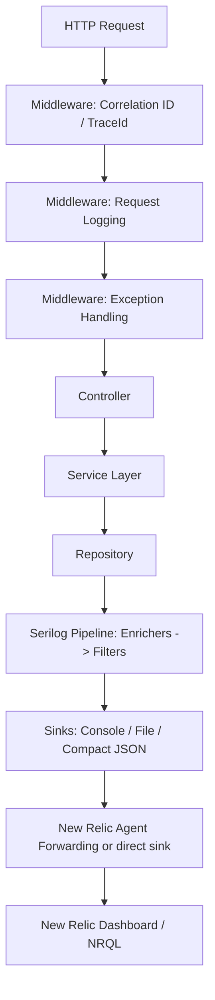
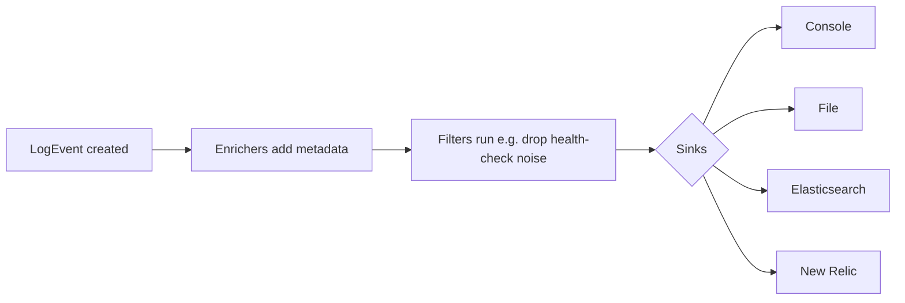
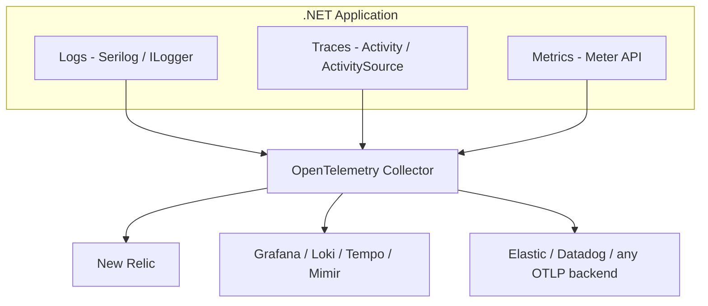
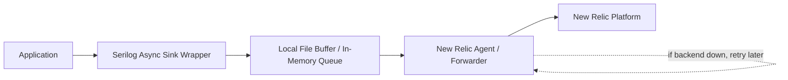
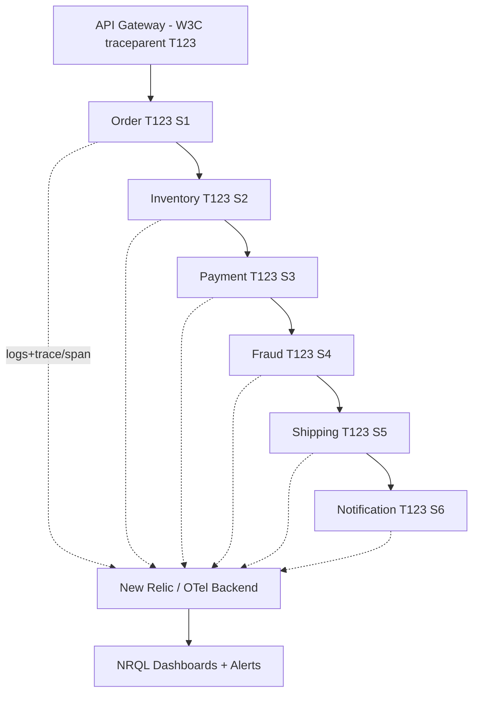

# Structured Logging — Senior .NET Interview Revision Notes

> Yeh quick-revision notes hain, guide se derive kiye gaye. Har section cover kiya gaya hai (same order), Q/A + tight bullets format mein — interview se pehle fast brush-up ke liye. Hinglish style, technical terms English mein.

---

## 1. Core Concepts

### Structured Logging Kya Hai Aur String Interpolation Se Better Kyun

**Q: Structured logging kya hai?**
A: Har log event = ek set of **typed key/value properties** + message, na ki sirf flattened string. Backend se pooch sakte ho "give me every event where `OrderId=45678` and `Level=Error`", regex text-search ke bajaye.

**Q: Interpolation vs message template — kaunsa sahi?**
```csharp
_logger.LogInformation($"Order {orderId} created");        // Bad — interpolation
_logger.LogInformation("Order {OrderId} created", orderId); // Good — message template
```

**Kyun better (senior points):**
- Serilog template parse karke `OrderId` ko `LogEvent` par **separate typed property** store karta hai.
- Downstream (New Relic, Seq, Elasticsearch) directly query/filter/facet kar sakte hain.
- **Performance:** interpolation se string turant ban jaati hai chahe koi sink sun raha ho ya level enabled ho ya nahi. Template se rendering **deferred** — string sirf tab banti hai jab kisi sink ko rendered message chahiye; JSON sink properties ko directly serialize karta hai bina string banaye.
- Consistent analytics/dashboards bina log-text ko regex-scrape kiye.

### Message Templates

- `{OrderId}` — scalar property; text sink `ToString()` use karta hai, structured sink native type.
- `{@Order}` — **destructuring operator**: poore object graph ko nested structured data ke roop mein capture. Auditing ke liye invaluable, lekin large graphs / circular references se careful (dekho Pitfalls).
  ```csharp
  _logger.LogInformation("Order created {@Order}", order);
  ```
- `{$Order}` — **stringification operator**: `ToString()` force karta hai un types par bhi jo normally destructure hote.

### Log Levels

| Level (MEL) | Serilog Name | Meaning | Prod default? | Example |
|---|---|---|---|---|
| Trace | `Verbose` | Finest tracing | Off | "Entering CalculateTax()" |
| Debug | `Debug` | Dev troubleshooting | Off (usually) | "SQL query started" |
| Information | `Information` | Normal business flow | On | "Order created" |
| Warning | `Warning` | Unexpected but recoverable | On | Retry, validation 400s |
| Error | `Error` | Failures needing attention | On | DB error, 3rd-party fail |
| Critical | `Fatal`(Serilog)/`Critical`(MEL) | App can't continue | On | DB down, outage |

**Naming gotcha:** `Microsoft.Extensions.Logging.LogLevel` = Trace/Debug/Information/Warning/Error/**Critical**. Serilog `LogEventLevel` = **Verbose**/Debug/Information/Warning/Error/**Fatal**. Bridge maps `Critical ↔ Fatal` aur `Trace ↔ Verbose`. Enums 1:1 identical nahi hain — mapping jaan lo.

### Structured vs Plain-Text Logging — Full Picture

Common opener: "why structured logging?"

| Aspect | Plain-text | Structured |
|---|---|---|
| Storage shape | Free text | K/V properties + message |
| Query | Regex/substring | Exact-match, range, facet (NRQL, KQL, Lucene) |
| Schema evolution | None — change parsers break | Additive — naye props purani queries nahi todte |
| Machine readability | Fragile parsing regexes | Native JSON/CLEF, no parsing |
| Dashboarding | Hard (regex extract) | Trivial (`FACET`/`GROUP BY`) |
| Human readability | Good | Good (template-aware console theme se) |
| Migration cost | N/A | Discipline chahiye — templates use karo, `$"..."` nahi |

**Key point:** structured logging human-readable output ke saath **mutually exclusive nahi** — console sink templated message readable render karta hai *while* same `LogEvent` structured properties doosre sinks tak carry karta hai. Dono milte hain.

---

## 2. Architecture

### End-to-End Request Flow



### Program.cs Configuration (Code-Based)

```csharp
using Serilog;

Log.Logger = new LoggerConfiguration()
    .MinimumLevel.Information()
    .Enrich.FromLogContext()
    .Enrich.WithEnvironmentName()
    .Enrich.WithThreadId()
    .Enrich.WithProperty("Application", "OrderApi")
    .WriteTo.Console()
    .WriteTo.Async(a => a.File(
        new Serilog.Formatting.Compact.CompactJsonFormatter(),
        "logs/app-.log", rollingInterval: RollingInterval.Day))
    .CreateLogger();

try
{
    var builder = WebApplication.CreateBuilder(args);
    builder.Host.UseSerilog();
    builder.Services.AddControllers();
    var app = builder.Build();
    app.UseSerilogRequestLogging();
    app.UseMiddleware<CorrelationIdMiddleware>();
    app.MapControllers();
    app.Run();
}
catch (Exception ex) { Log.Fatal(ex, "Application stopped unexpectedly"); }
finally { Log.CloseAndFlush(); }
```

**Packages:** `Serilog.AspNetCore`, `Serilog.Sinks.Console`, `Serilog.Sinks.File`, `Serilog.Formatting.Compact`, `Serilog.Enrichers.Environment`, `Serilog.Enrichers.Thread`, `Serilog.Sinks.Async`. Direct New Relic ke liye: `Serilog.Sinks.NewRelicLogs`, `NewRelic.LogEnrichers.Serilog`.

**Note:** `UseSerilogRequestLogging()` hand-rolled request-logging middleware replace karta hai — path, status code, elapsed time single line mein.

### appsettings.json Configuration (Config-Based)

```json
{
  "Serilog": {
    "Using": [ "Serilog.Sinks.Console", "Serilog.Sinks.File" ],
    "MinimumLevel": {
      "Default": "Information",
      "Override": { "Microsoft": "Warning", "System": "Warning" }
    },
    "Enrich": [ "FromLogContext", "WithEnvironmentName", "WithThreadId" ],
    "WriteTo": [
      { "Name": "Console" },
      { "Name": "File", "Args": {
          "path": "logs/app-.log", "rollingInterval": "Day",
          "formatter": "Serilog.Formatting.Compact.CompactJsonFormatter, Serilog.Formatting.Compact" } }
    ]
  }
}
```
```csharp
Log.Logger = new LoggerConfiguration().ReadFrom.Configuration(builder.Configuration).CreateLogger();
```

**Trade-off (code vs config):** config-based (`ReadFrom.Configuration`) ops ko sinks/levels change karne deta hai **bina redeploy** ke (esp. `IOptionsMonitor`/reloadOnChange + `LoggingLevelSwitch`). Lekin kuch sink options + custom enrichers/`ILogEventSink` sirf programmatically wire hote hain ya `Using` array mein register karne padte hain. Real systems dono combine karte hain: levels/sinks config se, DI/custom types code se.

---

## 3. Intermediate — Enrichment aur Context Propagation

### Correlation ID Middleware

```csharp
public class CorrelationIdMiddleware
{
    private readonly RequestDelegate _next;
    public CorrelationIdMiddleware(RequestDelegate next) => _next = next;

    public async Task Invoke(HttpContext context)
    {
        var correlationId = Guid.NewGuid().ToString();
        using (Serilog.Context.LogContext.PushProperty("CorrelationId", correlationId))
        {
            context.Response.Headers.Add("X-Correlation-Id", correlationId);
            await _next(context);
        }
    }
}
```
**Purpose:** per-request unique ID, cross-service tracing, easier New Relic debugging.

**Note:** Serilog ka idiomatic mechanism `LogContext.PushProperty` hai, `ILogger.BeginScope` nahi. BeginScope kaam karta hai (Serilog MEL implement karta hai) lekin PushProperty native + more efficient path hai.

**Gotcha (anti-pattern):** upar wala middleware hamesha **naya** ID mint karta hai, inbound header check kiye bina — multi-hop par correlation break. Fix:
```csharp
var correlationId = context.Request.Headers.TryGetValue("X-Correlation-Id", out var existing)
    ? existing.ToString() : Guid.NewGuid().ToString();
```

### LogContext.PushProperty Deep Dive

**Problem iske bina:** 50k req/min par "Order 98765 failed" ticket — unrelated log lines ko ek logical operation mein group karne ka tareeka nahi.

**Fix:**
```csharp
using (Serilog.Context.LogContext.PushProperty("OrderId", 98765))
using (Serilog.Context.LogContext.PushProperty("CustomerId", 1001))
{
    _logger.LogInformation("Order validation started");
    _logger.LogInformation("Calling payment service");
    _logger.LogInformation("Order created successfully");
}
```
Block ke andar har line automatically `OrderId` + `CustomerId` carry karti hai.

**`await` ke across kyun kaam karta hai:** `LogContext` `AsyncLocal<T>` se backed — pushed properties async/await continuations ke through flow karti hain bina manual passing, even `Task.Run` continuations par (different thread) kyunki `AsyncLocal` **logical call context** follow karta hai, physical thread nahi.

**Staff answer:** contextual info ko ek logical operation ke har log par attach karta hai (async boundaries ke across), duplicate logging code kam, logs searchable/traceable. Commonly push: `CorrelationId`, `TraceId`, `TenantId`, `CustomerId`, `OrderId`, `UserId`.

### Controller / Service / Repository Logging

```csharp
[ApiController, Route("api/orders")]
public class OrderController : ControllerBase
{
    private readonly OrderService _service;
    private readonly ILogger<OrderController> _logger;
    public OrderController(OrderService s, ILogger<OrderController> l) { _service = s; _logger = l; }

    [HttpPost]
    public async Task<IActionResult> CreateOrder(CreateOrderRequest request)
    {
        _logger.LogInformation("CreateOrder request received. CustomerId={CustomerId}", request.CustomerId);
        var orderId = await _service.CreateOrder(request);
        return Ok(orderId);
    }
}

public class OrderService
{
    private readonly ILogger<OrderService> _logger;
    public OrderService(ILogger<OrderService> l) => _logger = l;

    public async Task<int> CreateOrder(CreateOrderRequest request)
    {
        _logger.LogInformation("Creating order. CustomerId={CustomerId}, Amount={Amount}",
            request.CustomerId, request.Amount);
        try
        {
            var orderId = await SaveOrder(request);
            _logger.LogInformation("Order created successfully. OrderId={OrderId}", orderId);
            return orderId;
        }
        catch (Exception ex)
        {
            _logger.LogError(ex, "Order creation failed. CustomerId={CustomerId}", request.CustomerId);
            throw;
        }
    }
}
```

**Q: Repositories mein business logs kyun nahi?**
A: Repository = data-access concerns ("SQL timeout"). Service = business concerns ("Customer upgraded plan"). Mix karne se log semantics blur, aur layer-specific alerting harder.

**Contradiction flagged (important):** upar wala `catch → LogError(ex) → throw` "log once, only in global middleware" rule ke against jaata hai. **Resolution:** locally sirf tab log karo jab aisa context add ho raha ho jo global handler reconstruct nahi kar sakta (e.g., `CustomerId`) — aur us case mein `LogError` ke bajaye scoped `LogContext.PushProperty` use karo taaki global ka single `LogError` poora context carry kare bina duplicate ke. Agar extra context nahi hai → locally log mat karo, `catch { throw; }` karo aur global handler ko woh ek call own karne do.

### Built-in Request Logging

```csharp
app.UseSerilogRequestLogging(options =>
{
    options.MessageTemplate =
        "Request completed. Path={RequestPath}, StatusCode={StatusCode}, DurationMs={Elapsed}";
    options.EnrichDiagnosticContext = (diag, http) =>
        diag.Set("UserId", http.User?.Identity?.Name);
});
```
**Purpose:** API execution time track, slow endpoints monitor, per-request ek log line — hand-written stopwatch ke bajaye.

### Global Exception Middleware

```csharp
public class ExceptionHandlingMiddleware
{
    private readonly RequestDelegate _next;
    private readonly ILogger<ExceptionHandlingMiddleware> _logger;
    public ExceptionHandlingMiddleware(RequestDelegate next, ILogger<ExceptionHandlingMiddleware> l)
    { _next = next; _logger = l; }

    public async Task Invoke(HttpContext context)
    {
        try { await _next(context); }
        catch (Exception ex) { _logger.LogError(ex, "Unhandled exception occurred"); throw; }
    }
}
```
**Purpose:** sab unhandled exceptions ek baar capture, duplicate try/catch avoid, centralized error logging.

**Gotcha:** yahan log-then-rethrow ka matlab upstream (`UseExceptionHandler`/outer middleware) ko HTTP response mein convert karna padega. Ensure chain mein sirf **ek** layer log kare — typically innermost catch (yeh middleware); aage sirf response par map, dobara log nahi.

### Serilog Sinks Internals

**Sink kya hai?** Destination jahan Serilog `LogEvent` likhta hai — console, file, Elasticsearch, Seq, New Relic, custom system.

**Event processing pipeline:**

1. App `LogEvent` banata hai (Message, properties, Level, Timestamp).
2. Enrichers metadata add (CorrelationId, MachineName, Environment).
3. Filters run (only Error+, ignore health-checks).
4. Event har configured sink ko dispatch.

**Har sink `ILogEventSink` implement karta hai:**
```csharp
public interface ILogEventSink { void Emit(LogEvent logEvent); }

public class CompanySink : ILogEventSink
{
    public void Emit(LogEvent logEvent) => SendToMonitoringSystem(logEvent);
}
// .WriteTo.Sink(new CompanySink())
```

**Fan-out — ek event, kai sinks:**
```csharp
builder.Host.UseSerilog((ctx, lc) =>
    lc.WriteTo.Console().WriteTo.File("logs/app.log")
      .WriteTo.Elasticsearch(/*...*/).WriteTo.NewRelicLogs(/*...*/));
```

**Sink fail ho jaaye to?** Serilog failures isolate karta hai — ek failing sink app ko crash ya doosre sinks ko block nahi karna chahiye. Enterprises async + buffering mein wrap karte hain; `PeriodicBatching`-based sinks apni retry policy rakhte hain. **Caveat:** isolation sink-dependent hai — naive custom sink jo `Emit()` mein synchronously throw kare woh exception ko logging call ke through propagate *kar sakta hai* jab tak `.WriteTo.Async(...)` mein wrap na ho (background worker catch/drop/retry karta hai).

### Enrichers vs Destructuring — Difference

| | Enrichers | Destructuring (`@`) |
|---|---|---|
| Kya add | Ambient/contextual props jo call site par nahi (MachineName, CorrelationId, ThreadId) | Ek specific object jo call site par pass hua (`{@Order}`) |
| Scope | Har log event par (ya `LogContext` block ke andar) | Sirf single `@` wale log call par |
| Mechanism | `ILogEventEnricher.Enrich(...)` | `IDestructuringPolicy` / built-in reflection destructurer |
| Example | `.Enrich.WithEnvironmentName()`, custom TenantId enricher | `LogInformation("... {@Order}", order)` |
| Custom hook | Implement `ILogEventEnricher` | Implement `IDestructuringPolicy` (mask field, cap depth) |

---

## 4. Advanced — Distributed Tracing & Multi-Tenancy

### CorrelationId vs TraceId

| | CorrelationId | TraceId |
|---|---|---|
| Origin | Custom-generated business/request identifier | Distributed tracing systems (W3C `traceparent`, OTel, New Relic) |
| Captured by | Manual `LogContext.PushProperty` | Automatic — `Serilog.Enrichers.Span` / NR enricher, ASP.NET `Activity`/`DiagnosticSource` par ride |
| Kaun search | Support teams (ticket-friendly, human-readable) | Engineers (APM trace view se match) |
| Modern trend | TraceId se subsume ho raha | Increasingly primary; dono rakhna common support-ergonomics ke liye |

### 15 Microservices Ke Across Request Trace Karna

- `TraceId` ek baar generate (W3C `traceparent`, gateway/SDK-issued).
- Har downstream hop ko headers mein pass.
- Har service mein `Serilog.Enrichers.Span` / NR enricher se captured.
- New Relic Distributed Tracing end-to-end enabled.
- Reconstruct: `SELECT * FROM Log WHERE trace.id = 'T123'`

```mermaid
sequenceDiagram
    participant GW as API Gateway
    participant OS as Order Service
    participant IS as Inventory Service
    participant PS as Payment Service
    participant NS as Notification Service
    GW->>OS: traceparent: TraceId=T123
    OS->>IS: TraceId=T123, SpanId=S1
    IS->>PS: TraceId=T123, SpanId=S2
    PS->>NS: TraceId=T123, SpanId=S3
    Note over GW,NS: TraceId constant every hop; SpanId per service
```

### Multi-Tenant Logging

**Problem:** shared SaaS (Walmart, Target, Costco...) mein "Database Timeout" — kaunsa tenant hit hua pata nahi, incident isolate karna impossible.

**Solution:** `TenantId` ko JWT claims / gateway headers / request headers se extract karke tenant-resolution middleware mein push:
```csharp
var tenantId = httpContext.Request.Headers["TenantId"];
using (Serilog.Context.LogContext.PushProperty("TenantId", tenantId))
{
    await _next(context);
}
```
Query: `SELECT * FROM Log WHERE TenantId = 'Walmart'`

**Staff answer:** har log `TenantId` + contextual metadata se enrich; extract via JWT/gateway/headers, attach via `LogContext.PushProperty` (middleware) ya custom `ILogEventEnricher`. Ops per-tenant filter, incident isolate, tenant-specific dashboards/alerts bana sakte hain.

### OpenTelemetry Logs/Traces/Metrics Unification

Ab (2025–26) hot topic — orgs vendor agents (incl. NR .NET Agent) se OTel (vendor-neutral) ki taraf migrate ho rahe hain.



- OTel = **vendor-neutral wire format (OTLP)** + SDK. Ek baar instrument karo; backend swap karo Collector exporter reconfigure karke, code nahi.
- MEL, `OpenTelemetry.Extensions.Logging` ke through OTel se integrate — `ILogger` output ko OTel `LoggerProvider` se route (Serilog ke saath ya jagah).
- Serilog + OTel **mutually exclusive nahi**: common pattern = rich structured logging Serilog se + OTel exporter sink (`Serilog.Sinks.OpenTelemetry`) taaki logs same `TraceId`/`SpanId` carry karein.
- Traces `System.Diagnostics.ActivitySource`/`Activity` (built into .NET Core 3.0+) use karte hain — OTel .NET SDK largely ek **listener + exporter** hai `Activity` ke upar, replacement nahi. Isiliye `Serilog.Enrichers.Span` aur OTel dono same `Activity.Current` par "just work".
- Metrics `System.Diagnostics.Metrics.Meter` API, OTel se exported; same resource attributes (`service.name`, `deployment.environment`) se correlated.
- **Follow-up: NR agent chal raha hai to OTel kyun?** Vendor lock-in avoidance, multi-backend flexibility (traces NR ko, logs cheaper Loki/S3 ko), polyglot (Java/Node/Go) standardization.

### ASP.NET Core Activity / W3C Trace Context Integration

- ASP.NET Core automatically incoming request ke liye ek `Activity` banata hai aur incoming `traceparent`/`tracestate` (W3C Trace Context) parse karta hai, `Activity.Current.TraceId`/`SpanId` populate — **bina custom middleware**.
- Yehi mechanism `Serilog.Enrichers.Span` read karta hai TraceId/SpanId attach karne ke liye — yeh tumhare custom `CorrelationIdMiddleware` se pull *nahi* karta jab tak khud wire na karo.
- **Nuance:** .NET Core 3.0+ se tracing context "for free" milta hai (`HttpContext.TraceIdentifier` request ID; `Activity.Current` W3C trace). Hand-rolled correlation ID often **redundant** — kai teams custom `CorrelationId` sirf business-friendly alias ke roop mein rakhti hain, actual cross-service linkage framework ke `Activity`/`traceparent` par.

### Centralized Logging Pipelines: ELK vs Seq vs Grafana Loki

| Stack | Storage | Query lang | Strengths | Trade-offs |
|---|---|---|---|---|
| **ELK** | Full-text indexed JSON | Lucene/KQL | Powerful full-text search, mature, self-hostable | Resource-hungry, scale par operationally heavy, high indexing cost |
| **Seq** | Structured events (CLEF), SQL-like | Seq SQL-ish | Serilog ke liye purpose-built, great local-dev, lightweight self-host | Smaller ecosystem; large multi-tenant ke liye paid clustering chahiye |
| **Grafana Loki** | Log-streams, **sirf labels indexed** (no full text) | LogQL | Scale par bahut cheap (chhota index), LGTM stack (Loki-Grafana-Tempo-Mimir) ke saath natural pair | Stream ke andar full-text search slow (content indexed nahi) |
| **New Relic Logs** | Managed SaaS | NRQL | Zero infra, tight APM/trace correlation ("Logs in Context") | Cost = ingest volume ke saath scale; vendor lock-in |

**Kyun matter karta hai:** "centralized logging" = cost/query-power/operational-burden trade-off. Justify karo: local dev/small tools → Seq; deep full-text + ops capacity → ELK; cost-per-GB dominant + already Grafana/Prometheus → Loki; unified APM+logs+traces bina infra ownership → New Relic/Datadog (ingest-cost accept).

### AWS-Native Logging and Tracing

Upar sab third-party SaaS ya self-hosted. Target cloud AWS hai → AWS-native equivalents (OTel content ki jagah nahi, uske saath).

#### CloudWatch Logs Insights

**Kya hai:** query engine directly CloudWatch Logs ke upar — koi separate indexing pipeline nahi. ECS/Lambda/EC2 par .NET service (CW agent / Lambda auto log group) stdout/console-sink output Log Group mein deti hai; Insights us Log Group ko query karta hai.

**Query syntax (purpose-built QL, SQL/Lucene nahi):**
```
fields @timestamp, @message
| filter @message like /OrderId/
| sort @timestamp desc
| limit 20
```
Structured Compact-JSON fields parse + aggregate:
```
fields @timestamp, OrderId, CorrelationId, Level
| filter Level = "Error"
| stats count(*) as errorCount by bin(5m)
```
Property se facet (NRQL `FACET` analog):
```
fields RequestPath, DurationMs
| stats avg(DurationMs) as avgDuration by RequestPath
| sort avgDuration desc
```

| | CloudWatch Logs Insights | ELK | Seq |
|---|---|---|---|
| Infra | Nahi — managed, pay-per-scan + ingestion | Self-host ES / OpenSearch | Self-host / Seq Cloud |
| Query lang | Insights QL (AWS-only) | Lucene/KQL | Seq SQL-ish |
| Perf model | Har query par raw data scan (no persistent index) — ad hoc fine, dashboards nahi | Pre-indexed, fast repeated queries | Pre-indexed (CLEF), fast |
| Best fit | Already-on-AWS, IAM access control | Deep full-text, ES-capable teams | Local dev, tight Serilog fit |
| Cost | **Per query GB scanned** + ingestion/storage — cost query volume se bhi scale | Infra (cluster) | Infra / Seq Cloud sub |

**Gotcha:** scan-based hone se broad unbounded time-range query slow + "GB scanned" cost badhata hai — time range + log-group scope narrow karna yahan zyada matter karta hai.

#### AWS X-Ray for Distributed Tracing

**Kya hai:** AWS native distributed tracing — role wahi jo OTel tracing pipeline ka (`ActivitySource`/`Activity`, trace/span propagation), lekin X-Ray ka apna backend + SDK/daemon. AWS compute (Lambda/ECS/EC2) + AWS service calls (DynamoDB/S3/SQS auto segments) ke saath first-class.

- **X-Ray daemon/agent** app ke saath chalta hai (ECS sidecar / Lambda built-in / EC2 agent), segments batch karke API ko forward — same "don't block request thread" principle.
- **Service map** — signature viz: live graph, har edge par latency + error rate (NR distributed trace / Tempo/Jaeger ka AWS-native equivalent).
- **X-Ray directly OTel data consume kar sakta hai** — **ADOT (AWS Distro for OpenTelemetry)** Collector OTel traces ko X-Ray backend ko export karta hai. Standard `ActivitySource`/OTel-instrumented service ko X-Ray-proprietary SDK ki zarurat nahi.
- **Framing:** X-Ray = backend + legacy proprietary SDK; OTel = vendor-neutral instrumentation standard. Senior answer: OTel se instrument karo, ADOT exporter ko X-Ray par point karo (baad mein swap without code change). Direct X-Ray SDK = older pattern (jaise NR .NET Agent ke against directly).
- **Correlate with CloudWatch Logs:** X-Ray segments `trace_id` carry karte hain; usi `trace_id` ko har Serilog `LogEvent` par emit karo → slow/failed trace se directly `filter trace_id = "..."` Insights query tak jump (NR "Logs in Context" ka AWS-native version).

#### CloudWatch Retention Policies & Subscription Filters (Cost Control)

- **Log Group retention** — explicit setting (1 day–10 years / Never Expire), **default = Never Expire** (real cost leak — Lambda auto log group forever accumulate karta hai). IaC se set karo:
  ```hcl
  resource "aws_cloudwatch_log_group" "order_api" {
    name = "/ecs/order-api"
    retention_in_days = 30
  }
  ```
- **Subscription filters** — 100% volume long-term retain karne ke bajaye matching events ko near-real-time cheaper destination tak stream (Kinesis Firehose → S3 cold/compliance; ya Lambda real-time alerting). Tiered-retention-by-sink ka AWS-native equivalent, filter+stream rule ke roop mein:
  ```hcl
  resource "aws_cloudwatch_log_subscription_filter" "errors_to_firehose" {
    name = "errors-to-s3-archive"
    log_group_name = aws_cloudwatch_log_group.order_api.name
    filter_pattern = "{ $.Level = \"Error\" }"
    destination_arn = aws_kinesis_firehose_delivery_stream.log_archive.arn
    role_arn = aws_iam_role.cwl_to_firehose.arn
  }
  ```
- **Cost framing:** 3 dimensions — ingestion (per GB), storage (per GB-month), Insights query (per GB scanned). 3 levers: sampling/level-filtering se ingestion ↓; retention + subscription-filter offload to S3 se storage ↓ (S3 kaafi cheaper); Insights time-range/scope narrow se query cost ↓.

---

## 5. New Relic Integration

### Three Integration Options

**Ek pick karo** — combine karne se logs double-ship + double billing.

**Option A — Agent-based forwarding (recommended default):** host/container par NR .NET Agent; console/file output tail karke auto-forward.
```xml
<configuration>
  <service licenseKey="YOUR_LICENSE_KEY"/>
  <application><name>Order API</name></application>
  <log><level>info</level></log>
  <applicationLogging enabled="true"><forwarding enabled="true"/></applicationLogging>
</configuration>
```

**Option B — Log Enricher (Logs in Context):** `NewRelic.LogEnrichers.Serilog` linking metadata (`trace.id`, `span.id`, `entity.guid`) har `LogEvent` par add.
```csharp
Log.Logger = new LoggerConfiguration()
    .Enrich.WithNewRelicLogsInContext()
    .WriteTo.File(new NewRelicFormatter(), "logs/newrelic-app.log")
    .CreateLogger();
```
NR Log Forwarder/infra agent output folder watch karke JSON ship karta hai.

**Option C — Direct sink to NR Logs API** (containers/serverless/console apps, no agent):
```csharp
Log.Logger = new LoggerConfiguration()
    .WriteTo.NewRelicLogs(
        endpointUrl: "https://log-api.newrelic.com/log/v1",
        applicationName: "OrderApi", licenseKey: "YOUR_LICENSE_KEY")
    .CreateLogger();
```
Sab ka purpose: APM metrics, Serilog logs forward, logs↔traces correlate.

### NRQL Query Examples

```sql
SELECT * FROM Log WHERE level = 'Error'
SELECT * FROM Log WHERE CorrelationId = '2e1f4f9a-b0f2'
SELECT count(*) FROM Log WHERE message LIKE '%Order created%'
SELECT average(DurationMs) FROM Log FACET RequestPath
SELECT percentage(count(*), WHERE level = 'Error') FROM Log
SELECT average(duration) FROM Transaction FACET name
SELECT * FROM Log WHERE OrderId = 98765
SELECT * FROM Log WHERE TenantId = 'Walmart'
```

**Sample structured log (Compact JSON):**
```json
{ "@t": "2026-06-17T10:15:11.000Z", "@m": "Order created successfully", "@l": "Information",
  "OrderId": 45678, "CorrelationId": "2e1f4f9a-b0f2", "Application": "OrderApi", "EnvironmentName": "Production" }
```
Benefits: searchable, filterable, easy NRQL, better observability.

---

## 6. Performance

### Excessive Logging Production Ko Kyun Hurt Karta Hai

- Disk I/O saturation, increased CPU, huge storage costs
- Log ingestion costs (NR / koi bhi SaaS backend), network congestion

**Solution:** sirf actionable info log karo; log levels + `LoggingLevelSwitch` properly use karo.

### Async Logging Aur Buffering

```text
Bina async:  Request Thread -> Write file -> Wait disk -> Continue
Saath async: Request Thread -> Queue log -> Continue
             Background Thread -> Write to file
```
```csharp
.WriteTo.Async(a => a.File("logs/app-.log"))
```
**NR unavailable ho jaaye to?** App chalti rahe; logging async + buffered; business request ko backend ke liye kabhi block mat karo.

Backend down → logs locally buffer, later forward — no customer-facing impact.

**Kyun prefer:** file/network writes expensive; async request-thread blocking rokta hai, API response time improve.

### Source-Generated Logging (LoggerMessage) Aur ILogger Cost

**Historical problem:** `LogInformation("Order {OrderId} created", orderId)` rendering defer karne par bhi har call par value-type args (`int`) ko `object[]` mein **box** karta hai + `params object[]` allocation (jab tak level disabled → short-circuit). Classic advice: hot-path debug ko `if (_logger.IsEnabled(LogLevel.Debug))` se guard.

**Modern fix — compile-time source-generated (`LoggerMessageAttribute`, .NET 6+):**
```csharp
public static partial class Log
{
    [LoggerMessage(EventId = 1001, Level = LogLevel.Information,
        Message = "Order {OrderId} created for customer {CustomerId}")]
    public static partial void OrderCreated(this ILogger logger, int orderId, int customerId);
}
// usage
_logger.OrderCreated(orderId, customerId);
```
**Kyun matter karta hai:**
- Strongly-typed method emit — **no boxing, no array allocation, built-in `IsEnabled` check** = fastest logging shape.
- Compile-time template-vs-parameters checking (typos build time par catch).
- Explicit `EventId` = stable, language-independent identifier for alerting/dashboards (message reword ke baad bhi survive).
- **Framing:** hot paths (tight loops, high-throughput) ke liye `[LoggerMessage]` use karo — allocation overhead eliminate + compile-time validation, jab tens of thousands log calls/sec par logging khud measurable CPU % ban jaata hai.

### Scale Par Log Sampling Strategies

Roughly sophistication order mein:
1. **Level-based filtering** — Warning+ 100%, Information sample. Simplest.
2. **Fixed-rate sampling** — 1-in-10 success logs (`UseSerilogRequestLogging` custom `GetLevel`, ya `Filter.ByIncludingOnly` random threshold).
3. **Rate limiting ("first N per key per window")** — identical error ke first 5/min, taaki misbehaving dependency pipeline flood na kare (`Serilog.Sinks.RateLimit` / hand-rolled `ConcurrentDictionary` throttle).
4. **Tail-based / trace-aware sampling** — error mein khatam hue requests ka 100%, success sample — decided *outcome pata chalne ke baad* (zyada OTel tracing concept, logs mein bleed kar raha).
5. **Dynamic via `LoggingLevelSwitch`** — sampling nahi, operational lever incident ke during verbosity raise karne ke liye bina redeploy:
```csharp
var levelSwitch = new LoggingLevelSwitch(LogEventLevel.Information);
Log.Logger = new LoggerConfiguration().MinimumLevel.ControlledBy(levelSwitch).CreateLogger();
// incident ke during:
levelSwitch.MinimumLevel = LogEventLevel.Debug;
```
**Framing:** sampling = cost vs statistical visibility trade-off. Errors ka **100% hamesha** rakho; sampling sirf high-volume, low-signal success paths par.

---

## 7. Best Practices

### 10 Logging Best Practices

Good logging: troubleshoot, health monitor, distributed tracing, security auditing, performance analysis.

1. **Structured data log karo, strings nahi** — templates (`{OrderId}`), `$"..."` nahi. Searchable + better perf.
2. **Right level deliberately** — Trace `Entering CalculateTax()`, Warning validation failures, Critical "DB unavailable".
3. **Duplicate logging avoid** — ek exception ek baar; sirf global middleware unhandled log kare; services `throw;` karein bina redundant `LogError` (jab tak unique context na ho).
4. **Context se enrich, repetition se nahi** — `CorrelationId` ek baar `LogContext.PushProperty`, har call par template arg repeat nahi.
5. **Kabhi sensitive data nahi** — passwords, cards, CVV, JWT/refresh tokens, API secrets, PII. `UserId` log karo, `Password` nahi.
6. **Async + non-blocking** — `.WriteTo.Async(a => a.File(...))`.
7. **Correlation ke liye design** — same `TraceId`/`CorrelationId` end-to-end; `traceparent` se propagate, ingress par `LogContext` mein push.
8. **Volume + cost control** — `LoggingLevelSwitch` se incident ke during verbosity raise, baad mein lower.
9. **Concern + retention se separate** — app/audit/security/performance har ek ka apna sink + retention:

   | Log type | Retention |
   |---|---|
   | Debug | 7 days |
   | Application/Info | 30 days |
   | Error | 90–180 days |
   | Audit | 7 years (compliance) |
   ```csharp
   .WriteTo.Logger(lc => lc
       .Filter.ByIncludingOnly(e => e.Properties.ContainsKey("Audit"))
       .WriteTo.File("logs/audit-.log", retainedFileCountLimit: 2555))
   ```
10. **Logging ko observability contract treat karo** — standard fields (`Event`, `TraceId`, `CorrelationId`, `TenantId`, `UserId`, `RequestId`, `MachineName`, `Environment`) par agree karo.

### Golden Rules Checklist

- Structured data: `_logger.LogInformation("Order {OrderId} created", orderId);`
- Appropriate levels: Info→normal, Warning→recoverable, Error→failures, Critical→outage.
- Exceptions ek baar — global middleware prefer.
- Context enrichment se (`LogContext.PushProperty()`), repetition se nahi.
- Kabhi secrets nahi.
- Async rakho (`.WriteTo.Async()`).
- `TraceId`/`CorrelationId` se correlate.
- Volume manage — verbosity sirf incidents mein.
- Purpose se separate: application, audit, security, performance.
- Logging = first-class observability/reliability feature, afterthought nahi.

### PII / Sensitive-Data Redaction Patterns

Notes batate hain *kya nahi* log karna; senior level par *kaise* enforce karna aana chahiye:

1. **Call-site discipline (baseline, fragile)** — sensitive fields kabhi template mein pass mat karo. Tootta hai jab koi `{@Request}` destructure kare jisme `Password` ho.
2. **Custom `IDestructuringPolicy`** — specific types (e.g. `LoginRequest`) ke destructuring intercept karke sensitive props mask/omit, taaki `{@Request}` bhi safe:
   ```csharp
   public class RedactingDestructuringPolicy : IDestructuringPolicy
   {
       public bool TryDestructure(object value, ILogEventPropertyValueFactory factory, out LogEventPropertyValue result)
       {
           if (value is LoginRequest req)
           {
               result = new StructureValue(new[]
               {
                   new LogEventProperty("UserId", new ScalarPropertyValue(req.UserId)),
                   new LogEventProperty("Password", new ScalarPropertyValue("***REDACTED***"))
               });
               return true;
           }
           result = null; return false;
       }
   }
   // .Destructure.With(new RedactingDestructuringPolicy())
   ```
3. **Built-in `Microsoft.Extensions.Compliance.Redaction` / taxonomy attributes** — model props ko sensitive mark (e.g. `[PrivateData]`) taaki pipeline auto-redact kare jahan bhi type log ho. *(Exact package/API/naming target .NET version ke liye verify karo — compliance/redaction APIs preview releases mein move/rename hue hain.)*
4. **Sink/formatter-level scrubbing** — custom `ITextFormatter`/enricher/filter jo rendered output ko patterns (card numbers, JWT shapes) ke liye regex-scan kare. Last-resort, expensive/imperfect — defense-in-depth, primary control nahi.
5. **Log-schema review CI mein** — Roslyn analyzer jo `[Sensitive]`-tagged props reference karne wali logging calls flag kare, ship se pehle catch.

**Kyun "hot" topic:** GDPR/CCPA + PCI-DSS failures frequently logging se root-caused (primary datastore se nahi) — real recurring incident pattern.

---

## 8. Common Pitfalls

- **String interpolation vs templates** — structured querying + deferred rendering dono kill.
- **Har service apna CorrelationId mint karta hai** — cross-service traceability break, RCA impossible. Gateway se propagate karo.
- **Request/response bodies wholesale log** — large payloads, PII, GDPR/PCI, storage cost. Sirf metadata; agar full object → custom destructuring se mask.
- **Same exception duplicate logging** (controller+service+repo+middleware) — ingestion cost inflate + troubleshooting confuse. Sirf global middleware.
- **Validation failures ke liye wrong level** — 400 Bad Request = `Warning`, `Error` nahi (caller ki galti).
- **Stack trace lose karna** — `LogError(ex.Message)` exception object throw kar deta; hamesha `ex` first arg: `_logger.LogError(ex, "... {OrderId}", orderId);`.
- **Synchronous network sinks** (NR, Elasticsearch) request thread block karti hain — hamesha `.WriteTo.Async(...)`.
- **Repositories business events log** ("Customer upgraded plan") data-access ke bajaye — layer responsibilities blur, dashboards pollute.
- **Uncontrolled `{@Object}` destructuring** — poore EF Core entities lazy-load/circular refs/huge graphs pull → serialization blowup / `StackOverflowException` (max-depth guards verify karo). DTO mein project karke destructure karo.
- **DEBUG-in-production ko harmless treat karna** — scale par disk I/O saturation + ingestion cost driver; default disable, `LoggingLevelSwitch` se narrowly enable.
- **Multiple NR integration paths ek saath** (agent + direct sink + enricher) — duplicate ship + double billing. Ek option pick karo.

---

## 9. Kyun Serilog (vs NLog vs log4net)

| Criterion | Serilog | NLog | log4net |
|---|---|---|---|
| Structured-by-default | Haan — `{OrderId}` `LogEvent` par typed property | JSON layout text-based pipeline par | Text-based core, JSON bolted-on |
| Sink ecosystem | Largest — native Seq, ES, Datadog, NR, App Insights, CloudWatch | Fewer lekin solid | Bahut few maintained |
| ASP.NET Core fit | `UseSerilogRequestLogging()` + DI/enricher out of box | Good, less first-class | Legacy/.NET Framework era |
| Local dev tooling | Seq naturally pair (free structured viewer) | Less tightly paired | Minimal |
| Async/buffered | `Serilog.Sinks.Async` solid | Historically **more mature** + live XML reload | Limited |
| Momentum | Cloud-native .NET mein most | Current, maintained | Legacy |

**Counterpoint (over-sell mat karo):** NLog historically more mature async/buffered targets + live XML reload bina restart. Team already NLog mein deep aur achha chal raha ho to migrate ka sufficient reason nahi — cost/retraining vs marginal gain; NLog bhi aaj JSON layout renderers se structured logging support karta hai.

---

## 10. Sample Interview Q&A

### Foundational Q&A

**Q: Templates ke saath structured logging interpolation se better kyun?**
A: Serilog `OrderId` ko separate typed property store karta hai; backend directly query/filter; formatting deferred (better perf); easier analytics/dashboards.

**Q: Har service apna CorrelationId generate kare to problems?**
A: Cross-service trace nahi; request journey break; RCA difficult. Fix: gateway par generate, headers se propagate, downstream `LogContext.PushProperty` se reuse.

**Q: CorrelationId vs TraceId?**
A: (dekho table). Modern mein TraceId engineering ke liye replace karta hai; kai companies dono rakhti hain (support business-friendly CorrelationId prefer karte hain).

**Q: Request/response body log karna dangerous kyun?**
A: Large payloads, PII, GDPR, PCI, storage cost. Sirf metadata (`UseSerilogRequestLogging` diagnostic context); objects → custom destructuring mask.

**Q: Excessive logging systems ko kyun down kar sakti hai?**
A: Disk I/O saturation, CPU, storage/ingestion cost, network congestion. Solution: actionable-only + levels + `LoggingLevelSwitch`.

**Q: NR unavailable ho jaaye?**
A: App continue; logging async + buffered; kabhi block nahi. `App → Serilog(async) → local file buffer → NR agent/forwarder → NR`.

**Q: Enterprises async logging kyun prefer?**
A: File/network writes expensive; async blocking rokta, response time improve. `.WriteTo.Async(a => a.File("logs/app-.log"))`.

**Q: Log enrichment kya hai?**
A: Har event mein auto contextual props — `CorrelationId`, `UserId`, `TenantId`, `Environment` (`Enrich.WithEnvironmentName()`), App/Machine/Thread (`Enrich.WithThreadId()`). Iske bina troubleshooting hard (no shared context).

**Q: 15 microservices ke across request trace?**
A: `TraceId` ek baar generate, headers se propagate, har service `Serilog.Enrichers.Span`/NR enricher se capture, DT enabled, `TraceId` se searchable.

**Q: Repositories mein business logs kyun nahi?**
A: Repo = data-access ("SQL timeout"); Service = business ("Customer upgraded plan"). Mix → responsibilities blur, dashboards pollute.

**Q: Logs vs metrics vs traces?**
A: Logs "what happened?" (Order failed); Metrics "how often?" (50 failures); Traces "where?" (failure in PaymentService).

**Q: Serilog logs ko NR APM transactions se kaise correlate?**
A: `.Enrich.WithNewRelicLogsInContext()` — `trace.id`/`span.id`/`entity.guid` `LogEvent` mein inject; NR auto-links.

**Q: LogContext.PushProperty important kyun?**
A: Logical operation ke har log par context attach; `await` boundaries ke across `AsyncLocal` se flow; duplicated params kam; searchable/traceable.

**Q: Failed third-party API call kaise log?**
A: Endpoint, status code, `CorrelationId`, duration. Tokens/secrets kabhi nahi. "Payment gateway failed. StatusCode=500 Duration=2300ms".

**Q: NR logging costs kaise reduce?**
A: `LoggingLevelSwitch` se dynamic lower (no redeploy); high-volume sample; duplicates avoid; sirf business events; shorter retention.

**Q: Duplicate logs serious issue kyun?**
A: Controller+service+middleware same error → 1 exception ke 3 entries. Fix: sirf global middleware unhandled log kare.

**Q: Validation failures ka level?**
A: 400 Bad Request usually `Warning`, `Error` nahi (app sahi, caller ki galti).

**Q: Exceptions correctly kaise log?**
A: Wrong `_logger.LogError(ex.Message)` (stack trace lost). Correct `_logger.LogError(ex, "... {OrderId}", orderId)` — full Exception structured property, stack trace preserved.

**Q: Multi-tenant logging kaise?**
A: `TenantId` ko `LogContext.PushProperty` se tenant-resolution middleware mein add.

### Staff/Lead-Level System Design

**Scenario A: API 50k req/min; NR costs explode; devs ko DEBUG chahiye; prod degrade. Redesign?**
- DEBUG prod mein default disabled.
- `LoggingLevelSwitch` admin endpoint/config reload se exposed (temp verbosity raise, no redeploy).
- Async sinks everywhere.
- Sirf structured logs (templates).
- High-volume success ke liye sampling.
- Separate audit logger/sink apni retention se.
- Centralized exception logging.
- NR log enricher se distributed tracing.
- Level se tiered retention.

**Scenario B: 20 microservices, request Gateway→Order→Inventory→Payment→Fraud→Shipping→Notification; failures 2 min mein identify.**


1. **Distributed tracing** — Gateway W3C `traceparent` (T123); har service ASP.NET `Activity`/`DiagnosticSource` + `Serilog.Enrichers.Span` se capture. TraceId constant, SpanId per service. `SELECT * FROM Log WHERE trace.id='T123'`.
2. **CorrelationId** — business tracking (support search); engineers TraceId.
3. **Structured JSON** — har service `{"OrderId":123,"Status":"Failed","ErrorCode":"GatewayTimeout","TraceId":"..."}` natively.
4. **OTel/Serilog enrichment** — active `Activity` ke trace/span IDs har `LogEvent` par copy; trace/span/latency/dependency/exception/HTTP/DB auto-capture.
5. **NR APM + Logs in Context** — failed span par click → related logs/exceptions (no manual timestamp cross-ref).
6. **Centralized exception handling** — sirf global middleware ek baar, full context.
7. **NRQL dashboards** — error rate, slowest APIs, per-service failures (`FACET Service`).
8. **Alerting** — e.g. 2 min mein >20 payment failures / >5s latency / >10 inventory failures → alert before customers complain.
9. **Log sampling** — errors/warnings 100%, success ~10% (custom `GetLevel` gate).
10. **Retention** — DEBUG 7d, INFO 30d, ERROR 180d, AUDIT 7yr.
11. **Async + buffering** — request thread kabhi NR par wait nahi; NR down → app continue, logs later forward.

**Final staff answer (gist):** End-to-end observability via distributed tracing + Serilog native structured logging + NR APM (ya OTel equivalent). Gateway W3C `TraceId` + business `CorrelationId` issue karke sab services ke across propagate. Har service Serilog pipeline `TraceId`/`SpanId`/`CorrelationId`/`ServiceName`/`Environment`/`TenantId`/`OrderId` se enrich (PushProperty + enrichers). Async sinks; NR agent forward ya direct sink; NR enricher `trace.id`/`span.id`/`entity.guid` attach karke failed span→logs jump. Centralized exception middleware duplicate rokta. NRQL dashboards/alerts monitor. Sampling + tiered retention cost control. Root cause minutes mein identify.

### Additional Senior/Staff Q&A

**Q: NR (proprietary APM) se OTel migration — risk aur sequencing?**
A: Risks: (1) NR-specific niceties (one-line "Logs in Context") kho dena jab tak OTel equivalent backend-side configured na ho; (2) third-party libs mein `Activity`/`ActivitySource` instrumentation gaps jahan NR auto-instrumentation tha lekin OTel library abhi nahi (coverage verify karo); (3) NRQL-built dashboards/alerts ko naye query language par revalidate karne ki cost. **Sequencing:** dono parallel (dual-export Collector), low-risk service par parity validate, phir service-by-service cut over — big-bang nahi.

**Q: Logging library ko khud incident source banne se kaise roko (unbounded queue OOM, slow sink shutdown stall)?**
A: Async sink ka queue **bound** karo (`bufferSize` + drop-vs-block policy — version ke exact params verify karo) taaki downstream outage log loss kare, unbounded memory growth nahi. Shutdown par `Log.CloseAndFlush()` `finally` mein with bounded timeout, taaki hung sink graceful shutdown/pod termination block na kare (K8s `terminationGracePeriodSeconds` regardless kill karega — flush us window ke andar).

**Q: `ILogger<T>` category name vs Serilog `SourceContext` — filtering ke liye kyun matter?**
A: `ILogger<T>` category ko `T` ke full type name par set karta hai; Serilog MEL bridge isko `SourceContext` property store karta hai. Yehi `MinimumLevel.Override("Microsoft", LogEventLevel.Warning)` ko kaam karata hai — override ek `SourceContext` prefix par match karta hai (magic hook nahi). Isse precise per-namespace overrides likh sakte ho (chatty lib silence bina apne logs touch kiye).

---

## 11. Summary of Additions

`[new content]` sections (missing/superficial the, ab common senior/staff probes):
- **Structured vs Plain-Text — Full Picture** — broader case (schema evolution, dashboarding, machine readability).
- **Serilog Sinks Internals** — consolidated proper section (`ILogEventSink`, fan-out, failure isolation).
- **Enrichers vs Destructuring** — side-by-side used but never contrasted; interviewers conflate check karte hain.
- **OpenTelemetry Unification** — near-certain topic (industry shift to vendor-neutral OTel).
- **ASP.NET Core Activity / W3C Trace Context** — trace context "for free"; `Serilog.Enrichers.Span` ka actual mechanism.
- **Centralized Pipelines (ELK/Seq/Loki)** — beyond New-Relic-only; cost/capability trade-offs.
- **Source-Generated Logging (LoggerMessage)** — biggest gap: .NET 6+ compile-time; modern "cheap logging at scale" answer.
- **Log Sampling Strategies** — standalone interview-ready topic.
- **PII/Sensitive-Data Redaction** — *kaise* enforce (destructuring policies, compliance attributes, CI).
- **Additional Senior/Staff Q&A** — OTel migration, bounding async queues, `ILogger<T>` vs `SourceContext`.

**Contradiction flagged:** service-layer example log-and-rethrow karta hai jabki rule "log once, only global middleware" kehta hai. Resolution (Layered Logging mein): locally sirf tab log jab context add ho jo global reconstruct nahi kar sakta, aur prefer `LogContext.PushProperty` over duplicate `LogError`.

## 12. Summary of [gaps] Additions

Gap-analysis: centralized-logging/tracing content New Relic/ELK/Seq/Loki tak defaulted tha, bina AWS-native (candidate target cloud AWS). Added:

1. **AWS-Native Logging and Tracing** — **CloudWatch Logs Insights** (purpose-built QL, Compact-JSON examples, honest cost/capability vs ELK/Seq — specifically **per-GB-scanned-per-query** billing, unique cost dimension). **AWS X-Ray** — explicitly OTel section se tied (X-Ray standard OTel data via **ADOT** consume kar sakta hai; senior answer = OTel se instrument + exporter X-Ray par point, X-Ray-proprietary SDK nahi). **CloudWatch retention + subscription filters** — tiered-retention ka AWS mechanism, incl. "Never Expire" cost leak + S3 offload via subscription filter.
