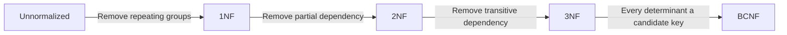
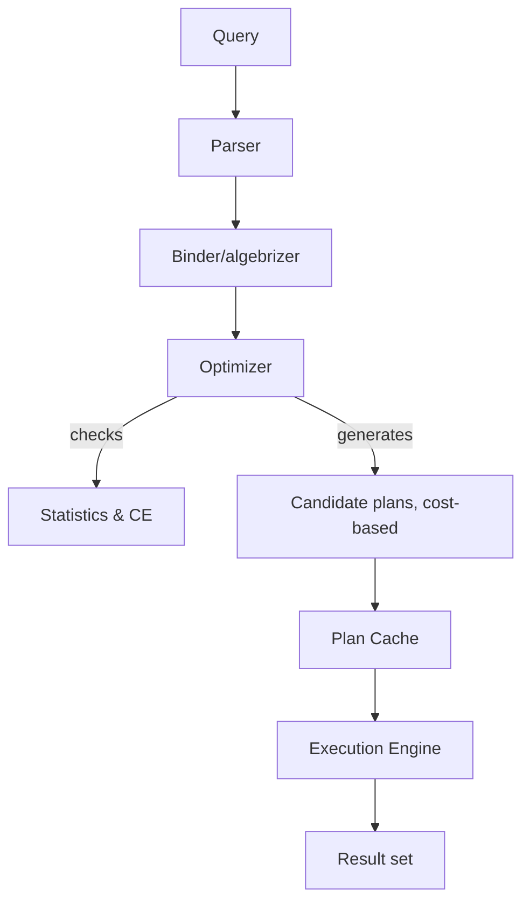
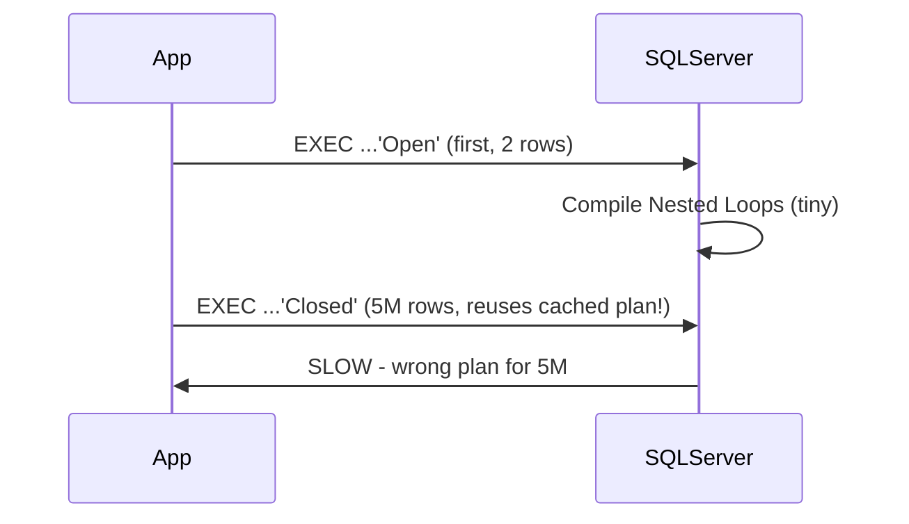
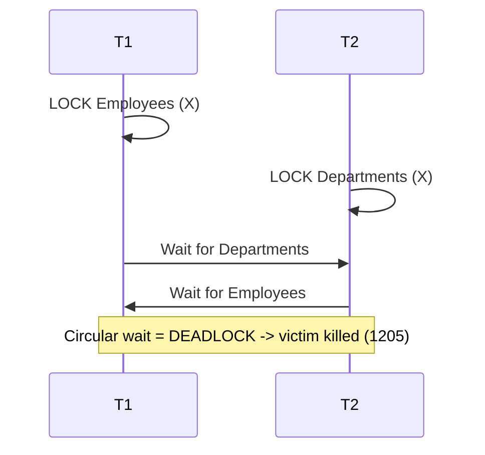

# SQL Server Interview — Quick Revision Notes (Senior / Lead .NET Full-Stack)

> Ye Guide se derive kiye gaye quick-revision notes hain — guide ki har section/topic ko usi order mein cover karte hain, concise **Q/A** + tight bullets + key SQL ke saath. Explanations Hinglish mein, code/SQL English mein.

## Table of Contents

- Core Concepts: RDBMS & Keys, DELETE/TRUNCATE/DROP, WHERE vs HAVING, CHAR/VARCHAR/NCHAR/NVARCHAR, Views, SP vs Functions, Triggers, Normalization, OLTP vs OLAP
- Intermediate: Joins, UNION, CTE/Temp/Table Var/View, Subqueries, Cursors, Dynamic SQL, TRY/CATCH, Window Functions, SARGability
- Advanced: Execution Plans, Index Seek/Scan/Key Lookup/Covering, Heap, Statistics & CE, Parameter Sniffing, Transactions/ACID, Isolation Levels, RCSI vs Snapshot, Locking/Deadlocks, TempDB, Query Store, Columnstore, Partitioning, HA/DR, Backup/Restore, DB Snapshots, Bulk vs Batch, Full-Text, Security, Linked Servers, Service Broker, LSN, FILESTREAM, Agent Jobs, Editions, Azure Migration, DBCC CHECKDB/CHECKTABLE
- Performance Tuning: Fragmentation, Optimization Checklist, DMVs, Troubleshooting Scenarios
- Best Practices, Common Pitfalls, Sample Q&A, Practical Query Challenges, Summary of Additions

---

## Core Concepts

### RDBMS Basics & Keys

- **SQL Server** = Microsoft RDBMS. Components: Database Engine, SQL Server Agent, SSMS, SSRS, SSIS, SSAS.
- **Primary Key**: row uniquely identify; NULL nahi; default **clustered** index banata hai.
- **Foreign Key**: referential integrity (child ↔ parent PK/unique). **Child column par auto-index NAHI banata** — frequent join/filter/delete ho to khud index add karo (warna parent deletes/updates par child par scans).
- **Unique Key**: uniqueness enforce; exactly **ek NULL** allow; default **nonclustered** index.
- **Constraints**: `PRIMARY KEY`, `FOREIGN KEY`, `UNIQUE`, `CHECK`, `DEFAULT`, `NOT NULL`, `IDENTITY`.

```sql
CREATE TABLE dbo.OrdersDemo (
  OrderID INT IDENTITY(1,1) NOT NULL,
  OrderNumber NVARCHAR(30) NOT NULL,
  CustomerID INT NOT NULL,
  OrderDate DATE NOT NULL CONSTRAINT CK_OrderDate CHECK (OrderDate <= CAST(GETDATE() AS DATE)),
  Quantity INT NOT NULL CONSTRAINT CK_Qty CHECK (Quantity > 0),
  Status NVARCHAR(20) NOT NULL CONSTRAINT DF_Status DEFAULT ('Open'),
  LineTotal AS (Quantity * CONVERT(DECIMAL(18,2), UnitPrice)) PERSISTED,
  CONSTRAINT PK_OrdersDemo PRIMARY KEY CLUSTERED (OrderID),
  CONSTRAINT UQ_OrderNumber UNIQUE (OrderNumber),
  CONSTRAINT FK_Customers FOREIGN KEY (CustomerID) REFERENCES dbo.Customers(CustomerID)
    ON DELETE NO ACTION ON UPDATE NO ACTION
);
CREATE NONCLUSTERED INDEX IX_OrdersDemo_CustomerID ON dbo.OrdersDemo(CustomerID); -- index FK yourself
```

- **Computed columns**: expression se derive; `PERSISTED` disk par materialize karta hai (indexable) lekin expression deterministic hona chahiye. Directly insert/update nahi kar sakte.
- **Cascading** (`ON DELETE/UPDATE CASCADE`): parent changes children tak propagate. Production mein caution — pehle real data copy par test karo, unexpected cascade zyada data wipe kar sakta hai.

### DELETE vs TRUNCATE vs DROP

| Feature | DELETE | TRUNCATE | DROP |
|---|---|---|---|
| Type | DML | DDL | DDL |
| Scope | WHERE rows | Saari rows | Table + structure |
| Logging | Full row-level (slow) | Minimal (page dealloc, fast) | Minimal |
| Rollback | Haan | Haan (explicit tran ke andar) | Haan (explicit tran ke andar) |
| Reset IDENTITY | Nahi | Haan | N/A |
| Triggers | Haan (AFTER) | Nahi | Nahi |
| FK | Har row check | Table par active FK nahi ho | Dependents pehle drop |

> **Myth correction:** "TRUNCATE rollback nahi ho sakta" sirf tab true jab wo transaction ke bahar auto-committed standalone chale. `BEGIN TRAN ... ROLLBACK` ke andar TRUNCATE **rollback ho jaata hai**. DELETE se asli difference = **logging granularity** (page dealloc vs row-by-row), transactional capability nahi.

### WHERE vs HAVING

- `WHERE`: grouping/aggregation se **pehle** rows filter; aggregates reference nahi kar sakta.
- `HAVING`: `GROUP BY` ke **baad** groups filter; aggregate results par (e.g., `HAVING COUNT(*) > 1`).

### CHAR vs VARCHAR vs NCHAR/NVARCHAR

| | CHAR | VARCHAR | NCHAR | NVARCHAR |
|---|---|---|---|---|
| Length | Fixed | Variable | Fixed | Variable |
| Encoding | Non-Unicode 1B | Non-Unicode | Unicode 2B | Unicode |
| Padding | Space-padded | Nahi | Space-padded | Nahi |
| Best for | Fixed codes | Variable text | Fixed multilingual | Variable multilingual |

- **Gotcha:** `VARCHAR` literal ko `NVARCHAR` column ke saath mix karna implicit conversion force karta hai → index seek silently disable ho sakta hai. `NVARCHAR` compare karte waqt hamesha `N'...'` prefix use karo.

### Views (Normal, Indexed/Materialized)

- View = saved `SELECT`, virtual, koi storage nahi (indexed view chhodkar).
- **Simple** (single table), **Complex** (joins/aggregations).
- **Indexed (materialized) view**: `WITH SCHEMABINDING` + `UNIQUE CLUSTERED INDEX`. Data physically persist; har base-table DML par synchronously maintain → **kabhi stale nahi** (dusre RDBMS materialized views ke ulat). Cost = write amplification.

```sql
CREATE OR ALTER VIEW dbo.vOrderTotals WITH SCHEMABINDING AS
SELECT o.OrderID, SUM(oi.Quantity * oi.UnitPrice) AS OrderTotal
FROM dbo.Orders o JOIN dbo.OrderItems oi ON o.OrderID = oi.OrderID
GROUP BY o.OrderID;
GO
CREATE UNIQUE CLUSTERED INDEX IX_vOrderTotals ON dbo.vOrderTotals(OrderID);
```

- Restrictions: SCHEMABINDING zaroori; deterministic expressions; fixed `SET` options (ANSI_NULLS, QUOTED_IDENTIFIER); no outer joins; nullable `SUM`/`COUNT` par `COUNT_BIG` needed; non-Enterprise par auto-match ke liye `NOEXPAND` hint lag sakta hai.

| | Normal View | Indexed View |
|---|---|---|
| Storage | Kuch nahi | Persisted |
| Read perf | Koi gain nahi | Fast, precomputed |
| Write cost | Kuch nahi | Zyada |
| Freshness | Current | Current (sync maintained) |

### Stored Procedures vs Functions

| | SP | Scalar Function | Table-Valued Function |
|---|---|---|---|
| Return | result sets, OUTPUT, int code | single value | table |
| SELECT/JOIN mein | Nahi | Haan | Haan |
| Data modify | Haan | Nahi | Nahi |
| Transactions | Haan | Nahi | Nahi |
| Perf | compiled, plan cached | pre-2019 slow (RBAR) | Inline TVF fast; multi-statement TVF slow (optimizer black box) |

```sql
CREATE OR ALTER PROCEDURE dbo.uspCreateOrder
  @orderNumber NVARCHAR(30), @customerID INT, @orderDate DATE, @newOrderID INT OUTPUT
AS
BEGIN
  SET NOCOUNT ON;
  BEGIN TRY
    INSERT INTO dbo.Orders (OrderNumber, CustomerID, OrderDate)
    VALUES (@orderNumber, @customerID, @orderDate);
    SET @newOrderID = SCOPE_IDENTITY();  -- NOT @@IDENTITY (trigger-safe)
    RETURN 0;
  END TRY
  BEGIN CATCH SET @newOrderID = -1; THROW; END CATCH;
END;
```

- **Scalar UDF Inlining (2019+):** pre-2019 scalar UDFs row-by-row (RBAR) chalti thi, parallelism kill karti thi — top hidden OLTP killer. 2019 ne eligible scalar UDFs ko compile time par relational expressions mein transform kar diya (set-based, parallel). Eligibility: no TRY/CATCH, no side-effects (RAND/temp tables), etc. Check `sys.sql_modules.is_inlineable`, compat level 150+. Gotcha Q: "Kya scalar functions hamesha slow?" → "Ab zaroori nahi, version/shape par depend."

### Triggers & Magic Tables

- Types: **AFTER** (DML ke baad; views par nahi), **INSTEAD OF** (DML replace; soft deletes/updatable views), **DDL triggers** (CREATE/DROP), **LOGON triggers** (server-level).

| Operation | `inserted` | `deleted` |
|---|---|---|
| INSERT | new rows | empty |
| DELETE | empty | old rows |
| UPDATE | new values | old values |

```sql
CREATE TRIGGER trg_AuditOrders ON Orders AFTER INSERT, UPDATE, DELETE AS
BEGIN
  SET NOCOUNT ON;
  INSERT INTO OrderAudit(OrderId, ActionType, ActionDate)
  SELECT COALESCE(i.OrderId, d.OrderId),
    CASE WHEN i.OrderId IS NOT NULL AND d.OrderId IS NULL THEN 'INSERT'
         WHEN i.OrderId IS NOT NULL AND d.OrderId IS NOT NULL THEN 'UPDATE'
         ELSE 'DELETE' END, SYSUTCDATETIME()
  FROM inserted i FULL OUTER JOIN deleted d ON i.OrderId = d.OrderId;
END;
```

- **Critical pitfall:** triggers **per statement fire hote hain, per row nahi**. `SELECT @id = OrderId FROM inserted` multi-row insert par ek arbitrary row pick karega — classic bug. `inserted`/`deleted` ko sets ki tarah treat karo.
- Aur: recursive triggers (`TRIGGER_NESTED_LEVEL()` se guard), trigger DML ke same transaction mein (slow/failing trigger caller ko block/rollback), multiple triggers ka order unguaranteed (`sp_settriggerorder`), bulk load overhead (`ALTER TABLE ... DISABLE TRIGGER ALL`).

### Normalization & Denormalization

| Level | Fixes | Rule |
|---|---|---|
| 1NF | Repeating groups | Atomic values, unique row id |
| 2NF | Partial dependency | Non-key column poore composite PK par depend |
| 3NF | Transitive dependency | Non-key sirf PK par depend, dusre non-key par nahi |
| BCNF | 3NF ki missed anomalies | Har determinant candidate key ho |

- **Denormalization**: reads speed up + joins kam karne ke liye intentional redundancy (OLAP/reporting/dashboards) — write complexity + inconsistency ki cost par.



### OLTP vs OLAP

| | OLTP | OLAP |
|---|---|---|
| Purpose | Transaction processing | Analytical reporting |
| Workload | Many small fast reads/writes | Few big complex reads |
| Schema | Normalized (3NF) | Denormalized (star/snowflake) |
| Example | Order entry | Data warehouse / BI |
| Indexing | Selective NC indexes | Columnstore, wide scans, aggregates |
| Concern | Locking/blocking, deadlocks | Query concurrency, resource governance |

- **Why matters:** interviewers sunna chahte hain ki aap workloads separate karte ho (read replicas, Always On readable secondaries, dedicated warehouse) — heavy analytics ko OLTP buffer pool/locks starve na karne do.

---

## Intermediate

### Joins

| Join | Behavior |
|---|---|
| INNER | Dono sides matching rows |
| LEFT OUTER | Saari left + right matches (else NULL) |
| RIGHT OUTER | Saari right + left matches |
| FULL OUTER | Dono sides saari rows, unmatched NULL |
| CROSS | Cartesian product |
| SELF | Alias ke through khud se (employee → manager) |

```sql
SELECT e.EmployeeID, e.Name AS Employee, m.Name AS Manager
FROM dbo.Employees e LEFT JOIN dbo.Employees m ON e.ManagerID = m.EmployeeID;
```

### UNION vs UNION ALL

- `UNION` = de-duplicate (implicit distinct sort/hash → CPU/memory cost).
- `UNION ALL` = saari rows, koi dedup — duplicates acceptable/impossible ho to prefer.
- Column count + convertible types sab SELECTs mein match; `ORDER BY` sirf final combined result par.

### CTE vs Temp Table vs Table Variable vs View

| | CTE | Temp `#t` | Table Var `@t` | View |
|---|---|---|---|---|
| Lifetime | Single statement | Session/drop | Batch/proc | Permanent |
| Storage | Usually not materialized | tempdb physical | tempdb (lighter) | Kuch nahi |
| Indexes | Nahi | Haan (explicit) | Sirf PK/UNIQUE inline | Indexed view se |
| Statistics | Nahi | Full stats | Pre-2019 koi nahi (1-row est!); 2019+ deferred compilation | Base tables par |
| Recursion | Haan | Nahi | Nahi | Nahi |
| Recompiles | N/A | Cause kar sakta | Nahi karta | N/A |

- **Key:** pre-2019 table variable ke paas **koi real stats nahi** → optimizer hamesha ~1 row assume karta → catastrophic plans (nested loop on 500K rows). **2019 deferred compilation** first execution tak compile delay karke actual row counts pata karta hai. Trap Q: "SQL 2016 par large intermediate set ke liye table var ke bajaye temp table kab?" → estimate-of-1 assumption disastrous plans deta; temp table ke paas real cardinality-aware stats.

```sql
WITH EmployeeHierarchy AS (
    SELECT EmployeeID, Name, ManagerID, 1 AS Level FROM Employees WHERE ManagerID IS NULL
    UNION ALL
    SELECT e.EmployeeID, e.Name, e.ManagerID, eh.Level + 1
    FROM Employees e INNER JOIN EmployeeHierarchy eh ON e.ManagerID = eh.EmployeeID
)
SELECT * FROM EmployeeHierarchy;
```

### Subqueries: Scalar, Correlated, EXISTS vs IN vs JOIN

- **Scalar**: har outer row ke liye 0/1 value (warna "returned more than 1 value" error).
- **Correlated**: outer ko reference karta, logically per outer row re-evaluate (optimizer join mein rewrite kar sakta).
- **EXISTS vs IN**: `EXISTS` first match par short-circuit, NULL-safe; `IN` full list materialize, NULL ke saath dangerous.

```sql
-- NULL trap: NOT IN with NULL returns ZERO rows
SELECT CustomerName FROM dbo.Customers
WHERE CustomerID NOT IN (SELECT CustomerID FROM (VALUES (100),(101),(NULL)) AS x(CustomerID));
-- Safe alternative
SELECT c.CustomerName FROM dbo.Customers c
WHERE NOT EXISTS (SELECT 1 FROM dbo.Orders o WHERE o.CustomerID = c.CustomerID);
```

- Modern optimizer correlated EXISTS/IN ko semi-joins mein rewrite karta hai — assume mat karo, plan se verify; older versions/complex predicates par explicit JOIN/GROUP BY better ho sakta.

### Cursors and Why to Avoid

- Row-by-row (RBAR). Types: static, dynamic, forward-only (fastest), keyset-driven.

```sql
DECLARE @EmployeeID INT, @Salary INT;
DECLARE EmployeeCursor CURSOR FOR SELECT EmployeeID, Salary FROM Employees;
OPEN EmployeeCursor; FETCH NEXT FROM EmployeeCursor INTO @EmployeeID, @Salary;
WHILE @@FETCH_STATUS = 0 BEGIN
    FETCH NEXT FROM EmployeeCursor INTO @EmployeeID, @Salary;
END;
CLOSE EmployeeCursor; DEALLOCATE EmployeeCursor;
```

- Set-based prefer: `UPDATE Employees SET Salary = Salary * 1.10 WHERE Salary < 70000;`
- Cursors sirf tab legit jab genuinely procedural/order-dependent (per-row external proc, state machines). Warna slow, memory-heavy, locks lambe hold → blocking/deadlocks.

### Dynamic SQL

```sql
DECLARE @sql NVARCHAR(MAX) = N'SELECT * FROM Users WHERE Id = @Id';
EXEC sp_executesql @sql, N'@Id INT', @Id = 5;
```

- Hamesha `sp_executesql` + parameters (user input concatenate mat karo → SQL injection). Concatenated `EXEC()` = injection risk + fresh non-reusable plan (cache pollution).

### TRY...CATCH, THROW vs RAISERROR

```sql
BEGIN TRY
    BEGIN TRAN;
    -- statements
    COMMIT TRAN;
END TRY
BEGIN CATCH
    IF XACT_STATE() <> 0 ROLLBACK TRAN;
    THROW;  -- re-raises original error/number/line/severity
END CATCH;
```

- `ERROR_NUMBER/MESSAGE/SEVERITY/STATE/LINE/PROCEDURE()` — sirf CATCH mein valid.
- `XACT_STATE()`: `1` active/committable, `0` none, `-1` doomed (rollback zaroori).
- `THROW` (2012+) context preserve karta, simpler; `RAISERROR` legacy, manual formatting. **New code mein THROW.**
- TRY/CATCH **nahi catch karta**: compile/syntax errors, parse-time "object not found", severity ≥ 20.

### Window Functions Deep Dive

| Function | Behavior |
|---|---|
| `ROW_NUMBER()` | Unique sequential, ties bhi distinct |
| `RANK()` | Ties share; numbers skip (1,2,2,4) |
| `DENSE_RANK()` | Ties share; no gap (1,2,2,3) |
| `NTILE(n)` | n roughly-equal buckets |
| `LAG/LEAD(col,offset,default)` | Previous/next row value |
| `FIRST_VALUE/LAST_VALUE()` | Frame ki first/last — LAST_VALUE trap |
| `NTH_VALUE()` | Nth value (2019+) |

```sql
SELECT *, SUM(amount) OVER (
  PARTITION BY region ORDER BY sale_date
  ROWS BETWEEN UNBOUNDED PRECEDING AND CURRENT ROW) AS running_total
FROM sales;
```

**Gotchas:**
1. **LAST_VALUE surprise**: default frame `RANGE ... CURRENT ROW` → current row ki value deta hai, partition ki true last nahi. Fix: `ROWS BETWEEN UNBOUNDED PRECEDING AND UNBOUNDED FOLLOWING`.
2. **RANGE vs ROWS**: RANGE peer rows (same ORDER BY value) group karta (ties par surprising); ROWS strictly row-count (predictable) — running totals ke liye ROWS.
3. `OVER()` mein hamesha deterministic `ORDER BY` (tiebreaker) — warna non-deterministic results.
4. Window aggregates row-level granularity rakhte hain (GROUP BY ke ulat jo collapse karta) — "har row mein duplicate total kyun" confusion.
5. Window functions `WHERE`/`HAVING` mein directly nahi — CTE/subquery mein wrap karke alias par filter.

```sql
-- Nth highest salary via DENSE_RANK
SELECT Salary FROM (
  SELECT Salary, DENSE_RANK() OVER (ORDER BY Salary DESC) AS rnk FROM Employees
) t WHERE rnk = @N;
```

### SARGability

- **SARG** = Search ARGument — predicate jise optimizer index seek mein convert kar sake. Non-SARGable = scan force karta hai chahe good index ho.

| Non-SARGable | SARGable fix |
|---|---|
| `WHERE YEAR(OrderDate) = 2025` | `WHERE OrderDate >= '2025-01-01' AND OrderDate < '2026-01-01'` |
| `WHERE ISNULL(Status,'') = 'Open'` | `WHERE Status = 'Open' OR Status IS NULL` |
| `WHERE LTRIM(RTRIM(Name)) = 'Bob'` | Write-time clean; raw column compare |
| `WHERE Col LIKE '%abc%'` | Leading wildcard defeats seek → full-text |
| `WHERE CAST(VarcharCol AS INT) = 5` | Schema-level type fix; no column-side cast |
| `WHERE Salary * 1.1 > 50000` | `WHERE Salary > 50000 / 1.1` |
| `WHERE Col1 + Col2 = @x` | `@x - Col2` compute on param side |

- **Universal rule:** indexed column ko kabhi function/expression mein wrap na karo (jab tak matching computed-column index na ho). Classic "spot the bug" Q.

---

## Advanced

### Execution Plans & Join Operators

- **Estimated (`Ctrl+L`)**: run kiye bina optimizer guess — cheap, prod-safe. **Actual (`Ctrl+M`)**: run + real vs estimated row counts — best diagnostic. Bada **estimated vs actual mismatch** = stale/missing stats ya parameter sniffing.

| Operator | Meaning |
|---|---|
| Table Scan | Heap ki har row — scale par bad |
| Index Scan | Index ki har row (small/covering ok) |
| Index Seek | b-tree se direct jump — ideal |
| Key Lookup | NC index mein na hone wale columns ke liye clustered/heap mein extra seek — volume par expensive; covering se fix |
| Sort | Explicit sort — supporting index se removable |
| Nested Loops | Per outer row inner seek/scan — outer small + inner indexed |
| Hash Match | Small input se hash table, bade se probe — large unsorted unindexed; tempdb spill risk |
| Merge Join | Do sorted inputs zipper-merge — cheapest jab dono pre-sorted |
| Parallelism | Multiple threads/cores |



| Scenario | Operator | Why |
|---|---|---|
| Small outer, indexed inner | Nested Loops | Kam seeks |
| Large unsorted unindexed both | Hash Match | No sort/index dependency |
| Both sorted on join key | Merge Join | Sequential zipper, min memory |
| Outer unexpectedly 1M+ w/ Nested Loops | Red flag — param sniffing/stale stats | Millions of seeks = symptom |

```sql
SELECT * FROM Employees WHERE Age > 30;   -- Table Scan
CREATE INDEX IDX_Employees_Age ON Employees(Age);
SELECT * FROM Employees WHERE Age > 30;   -- Now Index Seek
```

- Capture: `Ctrl+L/Ctrl+M`, `SET STATISTICS IO, TIME ON`, Query Store, Extended Events (`query_post_execution_showplan`).

### Index Seek vs Scan, Key Lookup, Covering Indexes

- **Index Seek**: direct b-tree nav, O(log n) — highly selective ke liye best.
- **Index Scan**: poora leaf read — acceptable jab most rows return ho ya small table.
- **Key Lookup**: NC index mein saare columns nahi → per matching row clustered/heap RID mein extra seek. High volume par `Nested Loops + Key Lookup` often **table scan se bhi mehenga** — classic trap. Covering index se fix.

```sql
SELECT OrderDate, CustomerName, Status FROM Orders WHERE OrderDate > '2025-01-01';
-- Covering: INCLUDE = SELECT-only columns (seek/filter mein use nahi)
CREATE NONCLUSTERED INDEX IX_Orders_OrderDate_Covering
  ON Orders(OrderDate) INCLUDE (CustomerName, Status);
```

- **INCLUDE kyun (key ke bajaye):** included columns sirf leaf par store, b-tree intermediate levels ko bloat nahi karte, aur key mein disallowed types (bada VARCHAR(MAX)) include kar sakte hain. Key columns order matter karta (leftmost-prefix rule — phone book: last→first name, sirf first name se nahi); INCLUDE order matter nahi.

### Heap Tables

- **Heap** = koi clustered index nahi; rows physical order mein nahi, RID (`FileID:PageID:SlotID`) se identify. Plain **Table Scan** isko read karta.

```sql
SELECT i.name, i.type_desc FROM sys.indexes i
WHERE i.object_id = OBJECT_ID('dbo.StagingOrders'); -- index_id = 0 means heap
```

- **Fast bulk inserts** (no B-tree sort) — staging/ETL truncate-reload.
- **Slow selective reads** — supporting NC index bina har WHERE = full scan.
- **Forwarded records**: update se row grow ho aur page par fit na ho → forwarding pointer, extra hop har access par (NC index bhi RID store karta). High `forwarded_record_count` (`sys.dm_db_index_physical_stats`) = clustered index chahiye.
- NC indexes heap par fine (RID par point) lekin "seek then get everything free" benefit lose.
- Rule: heaps deliberate narrow choice (bulk-load staging, insert-only log tables) — default nahi. Zyadatar OLTP tables clustered index se benefit.

### Statistics & Cardinality Estimation

- Optimizer **estimated row counts** (column/index **statistics** = histograms + density) se plans choose karta, compile time par scan karke nahi. Stale/missing stats = bad plans ka top cause.

```sql
DBCC SHOW_STATISTICS ('dbo.Orders', 'IX_Orders_OrderDate');
UPDATE STATISTICS dbo.Orders IX_Orders_OrderDate WITH FULLSCAN;
SELECT name, is_auto_update_stats_on, is_auto_create_stats_on FROM sys.databases WHERE name = DB_NAME();
```

- Auto-update threshold: historically ~20% modified rows; 2016+ (compat 130+) lower size-dependent dynamic threshold (bade tables sooner refresh).
- **CE** 2014 mein badla (new vs legacy). Compat level control karta hai — "migration ke baad plan kyun badla" root cause. Legacy force: TF 9481 ya `ALTER DATABASE SCOPED CONFIGURATION SET LEGACY_CARDINALITY_ESTIMATION = ON`.
- **Ascending-key problem**: grow-only column (IDENTITY/timestamp) ke naye values under-estimate (histogram mein last sampled max ke baad data nahi). TF 2371 / frequent updates se mitigate.

### Parameter Sniffing

- **First call ke parameter values** par plan compile + cache; baad ki saari calls reuse — usually beneficial (plan reuse), lekin **skewed data** par serious problem.
- Symptom: "same proc zyadatar customers ke liye fast, ek big customer ke liye 30s" (ya vice versa).

```sql
CREATE OR ALTER PROCEDURE dbo.GetOrdersByStatus @Status VARCHAR(20) AS
BEGIN
  SELECT * FROM Orders WHERE Status = @Status;  -- first-compiled value's selectivity sniffed
END;
```

| Fix | How | Trade-off |
|---|---|---|
| `OPTION (RECOMPILE)` | Har exec recompile w/ actual value | No reuse, per-call CPU; always optimal per-call |
| `OPTIMIZE FOR (@x='typical')` | Pin representative value | Common case + few outliers |
| `OPTIMIZE FOR UNKNOWN` | Density-based average estimate | Safe average, avoids extremes |
| Local variable trick | Copy param → local, filter on it | Older way to force density average |
| Split procs | `IF @x='Closed' EXEC procA ELSE procB` | Each own optimal plan; more code |
| Query Store Force Plan | Pin known-good plan | Good incident stop-gap |



### Transactions & ACID

- **Atomicity** (all-or-nothing), **Consistency** (constraints satisfy), **Isolation** (concurrent trans ek dusre ka uncommitted state nahi dekhte — degree isolation level par), **Durability** (committed survive crash via write-ahead log).

```sql
BEGIN TRAN;
  INSERT INTO Orders VALUES (1);
  UPDATE Stock SET Qty = Qty - 1;
  SAVE TRAN Step1;
  -- ROLLBACK TRAN Step1;  -- only to savepoint
COMMIT;
```

- Savepoints partial rollback allow karte hain lekin **locks release NAHI karte**. Nested `BEGIN TRAN` true sub-transactions nahi — `@@TRANCOUNT` badhta, sirf outermost COMMIT actually commit; koi bhi `ROLLBACK` sab kuch rollback (savepoint target chhodkar).

### Isolation Levels & Concurrency

| Level | Dirty | Non-Repeatable | Phantom | Mechanism |
|---|---|---|---|---|
| Read Uncommitted | Y | Y | Y | No read locks (NOLOCK) |
| Read Committed (default) | N | Y | Y | Short-lived read locks |
| Repeatable Read | N | N | Y | Read locks till tran end |
| Serializable | N | N | N | Range locks |
| Snapshot | N | N | N | Row versioning (optimistic) |
| RCSI | N | Y | Y | Row versioning per-statement |

- **Dirty read**: uncommitted change read. **Non-repeatable**: same row re-read different (beech mein commit). **Phantom**: range query naye/missing rows (beech mein insert/delete).

```sql
SELECT * FROM Employees WITH (NOLOCK);  -- Read Uncommitted; dirty/inconsistent data risk
```

### RCSI vs Snapshot Isolation (Optimistic Concurrency)

- Dono **row versioning** (old versions tempdb version store) use karte — readers/writers ek dusre ko block nahi karte. Difference = **snapshot ka scope**.

| | RCSI | Snapshot Isolation |
|---|---|---|
| Snapshot kab | Per **statement** | Per **transaction** (BEGIN TRAN) |
| Enable | `SET READ_COMMITTED_SNAPSHOT ON` (transparent, default ka naya behavior) | `SET ALLOW_SNAPSHOT_ISOLATION ON` + `SET TRANSACTION ISOLATION LEVEL SNAPSHOT` |
| App changes | Koi nahi | Haan, explicit opt-in |
| Non-repeatable reads | Still possible | Prevented |
| Write conflict | N/A | Error 3960 (retry karna hoga) |
| TempDB cost | Version store | Version store (bada, poore tran ke liye retain) |

```sql
ALTER DATABASE MyDB SET READ_COMMITTED_SNAPSHOT ON;   -- transparent, common
ALTER DATABASE MyDB SET ALLOW_SNAPSHOT_ISOLATION ON;
SET TRANSACTION ISOLATION LEVEL SNAPSHOT;             -- consistent view across statements
```

- Trade-offs: readers/writers kabhi block nahi (read-heavy OLTP + reporting win); cost = tempdb version store space/IO; Snapshot Isolation update-conflict retry chahiye (RCSI nahi, kyunki per-statement latest committed re-read).

### Locking: Types, Granularity, Deadlocks

| Lock | Purpose |
|---|---|
| Shared (S) | Reads |
| Exclusive (X) | Writes |
| Update (U) | X mein upgrade decision; do readers ke upgrade deadlock prevent |
| Intent (IS/IX/SIX) | Coarser granularity par intent signal |

- Granularity: row → page → table. **Lock escalation** (~5,000 locks/object default) → large batch updates par unexpected blocking; `ALTER TABLE ... SET (LOCK_ESCALATION = DISABLE)` rare override.
- **Deadlock**: 2+ trans circular wait. SQL Server lower-cost victim ko Error 1205 se kill karta.



```sql
DBCC TRACEON (1204, 1222, -1);      -- legacy deadlock graph trace flags
SELECT * FROM sys.dm_tran_locks;     -- current lock waits
-- Modern: system_health Extended Events session already captures deadlock graphs
```

**Prevention:** (1) consistent access order, (2) short transactions (no mid-tran user/network), (3) narrowest lock granularity (`ROWLOCK`), (4) covering indexes (scans→seeks), (5) RCSI/Snapshot, (6) **retry logic for 1205** (deadlocks high-concurrency mein normal hain).

```sql
DECLARE @RetryCount INT = 3, @TryAgain BIT = 1;
WHILE @TryAgain = 1 AND @RetryCount > 0 BEGIN
    BEGIN TRY
        BEGIN TRAN;
        UPDATE Employees SET Salary = Salary + 500 WHERE EmployeeID = 1;
        UPDATE Departments SET Budget = Budget - 1000 WHERE DepartmentID = 2;
        COMMIT; SET @TryAgain = 0;
    END TRY
    BEGIN CATCH
        IF XACT_STATE() <> 0 ROLLBACK;
        IF ERROR_NUMBER() = 1205 SET @RetryCount -= 1; ELSE THROW;
    END CATCH
END;
```

> Framing: "Deadlocks almost hamesha design/access-pattern issue hote hain, DB bug nahi — fix app code mein (ordering, tran scope)."

### TempDB Contention & Configuration

- TempDB = temp tables, table variables, sort/hash spills, version stores, cursor worktables — shared instance resource; contention **poore instance** ko affect karta.
- Sources: **PFS/GAM/SGAM allocation page contention** (single file serialized allocation), heavy hash/sort spills.

```sql
SELECT name, physical_name, size/128.0 AS SizeMB FROM tempdb.sys.database_files;
ALTER DATABASE tempdb MODIFY FILE (NAME = tempdev, SIZE = 4096MB, FILEGROWTH = 512MB);
SELECT * FROM sys.dm_os_waiting_tasks WHERE wait_type LIKE 'PAGELATCH%';  -- allocation contention
SELECT * FROM sys.dm_db_session_space_usage ORDER BY user_objects_alloc_page_count DESC; -- spills
```

- Best practices: multiple equal-sized data files (~1 file / 4 logical CPUs, up to ~8, reassess), generous pre-size, fastest storage, minimize temp object churn. TF 1117/1118 behavior modern versions mein largely automatic.

### Query Store in Depth

- (2016+) built-in per-database "flight data recorder": query text, plans (+ history), runtime stats — restarts/cache eviction survive karta hai.

```sql
ALTER DATABASE MyDB SET QUERY_STORE = ON;
ALTER DATABASE MyDB SET QUERY_STORE (
    OPERATION_MODE = READ_WRITE, CLEANUP_POLICY = (STALE_QUERY_THRESHOLD_DAYS = 30),
    MAX_STORAGE_SIZE_MB = 1024, QUERY_CAPTURE_MODE = AUTO);  -- AUTO ignores trivial queries
EXEC sp_query_store_force_plan @query_id = 42, @plan_id = 101;
SELECT * FROM sys.query_store_runtime_stats ORDER BY avg_duration DESC;  -- regressed queries
```

- Use: plan regression detection, capacity planning, "force plan" emergency stabilizer. Pitfall: force plan = band-aid (data shape badle to forced plan bhi suboptimal ho sakta) — temporary treat karo; storage/retention watch karo.

### Columnstore Indexes for Analytics

- Column-by-column storage + heavy compression; scan-heavy analytical/aggregation ke liye, singleton lookups ke liye nahi.

```sql
CREATE CLUSTERED COLUMNSTORE INDEX CCI_FactSales ON dbo.FactSales;
CREATE NONCLUSTERED COLUMNSTORE INDEX NCCI_Orders_Analytics
  ON dbo.Orders (OrderDate, CustomerID, Amount, Status);
```

- Fast kyun: **batch-mode execution** (~900 rows at once), extreme compression (5-10x, kam IO), **segment elimination** (per rowgroup min/max metadata → skip rowgroups).
- Trade-offs: singleton lookups/frequent single-row updates ke liye ideal nahi (delta store, rowgroup reorg). Best: star schema fact tables, append-mostly, hybrid **operational analytics** (NC columnstore alongside OLTP rowstore, 2016+).

### Table Partitioning

- Logical table → multiple physical partitions (typically date range) for manageability + **partition elimination**.

```sql
CREATE PARTITION FUNCTION PF_OrderDate (DATE)
AS RANGE RIGHT FOR VALUES ('2023-01-01', '2024-01-01', '2025-01-01');
CREATE PARTITION SCHEME PS_OrderDate AS PARTITION PF_OrderDate ALL TO ([PRIMARY]);
CREATE TABLE dbo.Orders (OrderID INT NOT NULL, OrderDate DATE NOT NULL) ON PS_OrderDate(OrderDate);
```

- **Partition switching** (`ALTER TABLE ... SWITCH PARTITION`) = near-instant metadata-only → sliding-window archival (load staging → SWITCH IN; oldest → SWITCH OUT) instead of slow DELETE. **Partition elimination** jab WHERE statically partitions restrict kare. Per-partition maintenance (rebuilds/stats).
- **Misconception fix:** partitioning **primarily manageability feature** (fast archival, targeted maintenance), guaranteed query-speed nahi — pure perf ke liye well-designed index zyada help karta; partition-aligned filter na ho to bilkul help nahi.

### High Availability & Disaster Recovery

| Feature | Model | Sync | Failover | Use Case |
|---|---|---|---|---|
| Log Shipping | Tx log backup/restore | Delayed | Manual | Cheap DR/warm standby |
| DB Mirroring (deprecated) | Log stream to mirror | Sync/async | Auto (sync+witness) | Legacy |
| Snapshot Replication | Full copy push (no change tracking) | Periodic full refresh | N/A | Small/static reference data, seeding |
| Transactional Replication | Committed changes push | Near real-time | N/A (distribution) | Reporting copies |
| Merge Replication | Bi-directional + conflict resolution | Periodic | N/A | Disconnected/mobile |
| Always On AG | Log stream to replicas | Sync (no loss)/async | Auto (sync) | Modern HA/DR standard, readable secondaries |

- Conclusion: Log Shipping = simple backup DR; Replication = distribution (not HA); **Always On AG = modern default** (HA+DR), interview mein first mention. Snapshot Replication simplest lekin heaviest per sync (poora dataset re-copy).

### Backup & Restore

```sql
BACKUP DATABASE MyDB TO DISK = 'C:\Backup\MyDB.bak';
-- Point-in-time recovery
RESTORE DATABASE MyDB FROM DISK = 'C:\Backup\MyDB.bak' WITH NORECOVERY;
RESTORE LOG MyDB FROM DISK = 'C:\Backup\MyDB.trn' WITH STOPAT = '2024-03-08 12:30:00', RECOVERY;
```

| Type | Captures | Role |
|---|---|---|
| Full | Entire DB | Base for all restores |
| Differential | Changes since last full | Faster than repeated fulls |
| Transaction Log | Records since last log backup | Point-in-time; FULL/BULK_LOGGED log truncate ke liye required |

- **Recovery models:** `SIMPLE` (no log backups/PITR, auto-truncate), `FULL` (full PITR, regular log backups warna log unbounded grow), `BULK_LOGGED` (bulk ops minimally logged, log backups but not arbitrary point inside minimally-logged op).

### Database Snapshots

- Read-only point-in-time view via `CREATE DATABASE ... AS SNAPSHOT OF`. **Copy-on-write sparse file**: source page pehli baar change hone par SQL Server original page snapshot mein copy karta. Storage cost = kitna data change hua uske proportional.

```sql
CREATE DATABASE MyDB_Snapshot ON (NAME = MyDB, FILENAME = 'C:\Snapshots\MyDB.ss') AS SNAPSHOT OF MyDB;
SELECT * FROM MyDB_Snapshot.dbo.Orders;
RESTORE DATABASE MyDB FROM DATABASE_SNAPSHOT = 'MyDB_Snapshot';  -- revert (discards changes)
```

- Uses: stable non-blocking reporting view, quick "undo" before risky deploy/mass update, pre-upgrade rollback.

| | Database Snapshot | Snapshot Isolation |
|---|---|---|
| Kya | Separate named DB object | Transaction isolation level |
| Mechanism | Page copy-on-write sparse file | tempdb row versioning |
| Lifetime | Persist till drop | Single transaction |
| Backup? | **Nahi** (same disk; source lost → snapshot lost) | N/A |

### Bulk Insert vs Batch Insert

- **Bulk insert** (`BULK INSERT`/`bcp`): large external file → table efficiently; right conditions (SIMPLE/BULK_LOGGED, TABLOCK, no incompatible triggers/constraints) mein **minimally logged** — speed ka main source.
- **Batch insert**: large workload ko multiple smaller transactions mein split — goal minimal logging nahi, balki log growth bound, lock escalation avoid, incremental progress/retry.

```sql
BULK INSERT dbo.Orders FROM 'C:\ImportData\orders.csv'
WITH (FIELDTERMINATOR = ',', ROWTERMINATOR = '\n', FIRSTROW = 2, BATCHSIZE = 10000, TABLOCK);
-- bcp dbo.Orders in "orders.csv" -S MyServer -d MyDB -c -t, -F 2

DECLARE @BatchSize INT = 5000, @RowsInserted INT = 1;
WHILE @RowsInserted > 0 BEGIN
    INSERT INTO dbo.Orders (OrderNumber, CustomerID, OrderDate)
    SELECT TOP (@BatchSize) OrderNumber, CustomerID, OrderDate FROM staging.OrdersStaging s
    WHERE NOT EXISTS (SELECT 1 FROM dbo.Orders o WHERE o.OrderNumber = s.OrderNumber);
    SET @RowsInserted = @@ROWCOUNT;
END;
```

### Full-Text Search

- Linguistic queries (inflections, proximity, ranking) ke liye inverted-index — jo `LIKE '%...%'` (leading wildcard = full scan) nahi kar sakta.

```sql
CREATE FULLTEXT CATALOG ArticleFTCatalog;
CREATE FULLTEXT INDEX ON Articles (Title LANGUAGE 1033, Body LANGUAGE 1033)
  KEY INDEX PK_Articles ON ArticleFTCatalog;
SELECT * FROM Articles WHERE CONTAINS(Body, '"cloud computing"');
SELECT * FROM Articles WHERE CONTAINS(Body, '"microserv*"');            -- prefix
SELECT * FROM Articles WHERE CONTAINS(Body, 'NEAR((api, performance), 5)'); -- proximity
SELECT * FROM Articles WHERE FREETEXT(Body, 'improve api performance');    -- natural-language
SELECT A.*, FT.RANK FROM CONTAINSTABLE(Articles, Body, '"microservices"') FT
JOIN Articles A ON A.Id = FT.[KEY] ORDER BY FT.RANK DESC;
```

- Use jab volume/text LIKE ko slow bana de ya linguistic/ranked search chahiye; tiny tables/exact-match/write-heavy ke liye avoid (index maintenance overhead).

### Security: Encryption, RBAC

- **TDE**: rest par data (files, backups) transparently encrypt — stolen disk/backup se protect, compromised login se nahi.
- **Always Encrypted**: client-side encrypt before SQL Server; server plaintext/keys kabhi nahi dekhta — DBAs/sysadmins se bhi protect, restricted query capability ki cost par (equality only, unless deterministic vs randomized).
- **Column-level** (`ENCRYPTBYKEY`/certs): symmetric (same key, fast) vs asymmetric (key pair, slow, symmetric keys protect karne ke liye).
- **RBAC**: roles ko grant, users ko roles mein — auditability/maintainability. Least privilege: app login `db_owner` nahi; direct table grants ke bajaye SP par `EXECUTE` (injection blast radius mitigate).

### Linked Servers

- Dusre SQL Server / OLE DB/ODBC source (Oracle, Excel) ko local jaisa query — four-part name (`Server.DB.Schema.Object`) ya `OPENQUERY`.

```sql
EXEC sp_addlinkedserver @server='RemoteServer', @srvproduct='', @provider='SQLNCLI', @datasrc='RemoteSqlHost\Inst';
SELECT * FROM RemoteServer.RemoteDB.dbo.Orders WHERE OrderDate > '2025-01-01';
SELECT * FROM OPENQUERY(RemoteServer, 'SELECT * FROM dbo.Orders WHERE OrderDate > ''2025-01-01''');
```

- Caveats: four-part name predicates hamesha remote push nahi hoti (extra data network par) — plan check, `OPENQUERY` prefer jab remote filtering guarantee chahiye; distributed transactions ko MSDTC; scale par risky permanent app pattern — ETL/replication/API boundary prefer.

### Service Broker

- Built-in async transactional messaging (message types, contracts, queues, services); guaranteed in-order, exactly-once delivery.

```sql
CREATE MESSAGE TYPE OrderMessageType VALIDATION = WELL_FORMED_XML;
CREATE CONTRACT OrderContract (OrderMessageType SENT BY INITIATOR);
CREATE QUEUE OrderQueue; CREATE SERVICE OrderService ON QUEUE OrderQueue (OrderContract);
DECLARE @h UNIQUEIDENTIFIER;
BEGIN DIALOG CONVERSATION @h FROM SERVICE OrderService TO SERVICE 'OrderService' ON CONTRACT OrderContract;
SEND ON CONVERSATION @h MESSAGE TYPE OrderMessageType ('<Order><Id>123</Id></Order>');
RECEIVE TOP(1) * FROM OrderQueue;
```

- Use: slow work ko triggering tran se decouple, in-database pub/sub. Framing: aaj largely legacy/niche — naye systems Azure Service Bus/Kafka/RabbitMQ use karte, lekin older enterprise systems mein recognize karna worth.

### Log Sequence Number (LSN)

- Har log record monotonically increasing LSN (`00000025:000001d0:0003`) — crash recovery ordering + **backup chaining**. Har backup First/Last/Checkpoint LSN record karta; diff/log restore tabhi valid jab LSNs continuously chain hon — "not created in the correct sequence" error = chain link missing.

```sql
SELECT DB_NAME(database_id), last_log_backup_lsn FROM sys.database_recovery_status;
SELECT database_name, first_lsn, last_lsn, checkpoint_lsn, type FROM msdb.dbo.backupset ORDER BY backup_start_date DESC;
```

### FILESTREAM

- Unstructured BLOBs (docs, images, video) ko filesystem par files ki tarah store, phir bhi DB ke saath transactionally consistent + backed up. Column `VARBINARY(MAX) FILESTREAM`, bytes mdf/ndf ke bahar dedicated FILESTREAM filegroup mein.

```sql
EXEC sp_configure filestream_access_level, 2; RECONFIGURE;  -- + OS-level enable in Config Manager
ALTER DATABASE MyDB ADD FILEGROUP FileStreamGroup CONTAINS FILESTREAM;
ALTER DATABASE MyDB ADD FILE (NAME = FSData, FILENAME = 'C:\FSData') TO FILEGROUP FileStreamGroup;
CREATE TABLE dbo.Documents (
    DocumentID UNIQUEIDENTIFIER ROWGUIDCOL NOT NULL UNIQUE DEFAULT NEWID(),
    FileName NVARCHAR(260) NOT NULL, FileData VARBINARY(MAX) FILESTREAM NULL);
```

- Plain VARBINARY(MAX) kyun nahi: FILESTREAM buffer pool bypass, Win32 file APIs se stream (cache bloat nahi), large files par better throughput — phir bhi transactional/backup boundary mein. Senior framing: aaj kaafi teams Azure Blob/S3 + URL/metadata row use karti hain (simpler ops, cheaper storage) — "naye project par FILESTREAM?" fair follow-up.

### SQL Server Agent Jobs

- Built-in scheduler; **Job** = Steps (T-SQL, SSIS, PowerShell, CmdExec, replication) + Schedules (recurring/one-time/startup), per-step failure handling, notifications, run history (`msdb.dbo.sysjobhistory`).

```sql
EXEC msdb.dbo.sp_add_job @job_name = N'Nightly_Index_Maintenance';
EXEC msdb.dbo.sp_add_jobstep @job_name = N'Nightly_Index_Maintenance',
    @step_name = N'Rebuild', @subsystem = N'TSQL', @command = N'EXEC dbo.uspRebuildFragmentedIndexes;';
EXEC msdb.dbo.sp_add_schedule @schedule_name = N'Nightly_2AM', @freq_type = 4, @active_start_time = 020000;
EXEC msdb.dbo.sp_attach_schedule @job_name = N'Nightly_Index_Maintenance', @schedule_name = N'Nightly_2AM';
EXEC msdb.dbo.sp_add_jobserver @job_name = N'Nightly_Index_Maintenance';
```

- Patterns: maintenance windows (backups, index/stats), ETL orchestration; hamesha explicit failure notifications + retry policy; job T-SQL ko app code jaise review karo (silent nightly failure often production issue ka pehla warning).

### Edition Differences: Express vs Enterprise

| | Express | Standard | Enterprise |
|---|---|---|---|
| Cost | Free | Per-core | Per-core (top) |
| Max DB size | 10 GB | Multi-TB+ | Multi-TB+ |
| Buffer pool | Small capped | Higher capped | OS-bound |
| SQL Agent | Nahi | Haan | Haan |
| Always On | Log shipping only | Basic AG (limited) | Full AG (multi readable, auto failover) |
| Security | Basic | TDE (2019+), basic audit | TDE, Always Encrypted secure enclaves, advanced audit |

- **Key point:** 2016 SP1 se kaafi Enterprise-only **programmability** (columnstore, partitioning, Always Encrypted, CDC) Standard/Express mein aaye (resource caps ke saath) — lekin true **scale/HA** (multiple AG secondaries, advanced audit, older online index ops) Enterprise-gated. (Exact caps version-to-version verify karo.)

### Azure Migration Paths

- **Azure DMS**: offline + near-zero-downtime online migrations (Azure SQL DB / MI / VM) — go-to jab downtime minimize.
- **BACPAC**: schema+data single portable file, scriptable, **offline** snapshot — smaller DBs / maintenance window ok.
- **SSDT/DACPAC**: **schema-only** versioned artifact — CI/CD, not bulk data.
- **DMA (Data Migration Assistant)**: compatibility/feature-gap assessment — sabse *pehle* run karo.

```sql
-- sqlpackage /Action:Export /SourceDatabaseName:MyDB /TargetFile:MyDB.bacpac
-- sqlpackage /Action:Import /TargetServerName:...database.windows.net /SourceFile:MyDB.bacpac
```

- Target: **Azure SQL Managed Instance** = near-complete compatibility (SQL Agent, linked servers, CLR, cross-DB) for lift-and-shift; **Azure SQL Database (PaaS)** = restricted, fully managed, low ops. Framing: "PaaS SQL DB vs MI par lift karoon to kya break hoga."

### DBCC CHECKDB vs DBCC CHECKTABLE

- Dono structural/logical/physical integrity (checksums, allocation, index/data consistency) validate — difference = scope.
- **CHECKDB**: entire database — standard nightly/weekly integrity job.
- **CHECKTABLE**: single table — fast targeted re-check.

```sql
DBCC CHECKDB ('MyDB') WITH NO_INFOMSGS, ALL_ERRORMSGS;
DBCC CHECKTABLE ('dbo.Orders') WITH NO_INFOMSGS;
ALTER DATABASE MyDB SET SINGLE_USER WITH ROLLBACK IMMEDIATE;
DBCC CHECKDB ('MyDB', REPAIR_ALLOW_DATA_LOSS);  -- last resort; itself loses data
ALTER DATABASE MyDB SET MULTI_USER;
```

- Framing: repair (`REPAIR_ALLOW_DATA_LOSS`, `REPAIR_REBUILD`) = last resort, not first. Corruption ka correct default = "restore from last known-good backup"; CHECKDB/CHECKTABLE damage scope confirm + restore verify ke liye.

---

## Performance Tuning

### Index Fragmentation & Maintenance

- Fragmentation = data churn se page splits + out-of-order pages → range scan efficiency degrade.

```sql
SELECT ips.avg_fragmentation_in_percent, ips.page_count, i.name
FROM sys.dm_db_index_physical_stats(DB_ID(), NULL, NULL, NULL, 'LIMITED') ips
JOIN sys.indexes i ON ips.object_id = i.object_id AND ips.index_id = i.index_id
WHERE ips.avg_fragmentation_in_percent > 5 ORDER BY 1 DESC;
```

| Fragmentation % | Action |
|---|---|
| < 5–10% | Chhod do |
| 10–30% | `ALTER INDEX ... REORGANIZE` (online, low-impact) |
| > 30% | `ALTER INDEX ... REBUILD` (`ONLINE=ON` in Enterprise/Azure, else schema lock) |

```sql
ALTER INDEX ALL ON dbo.Orders REORGANIZE;
ALTER INDEX IX_Orders_OrderDate ON dbo.Orders REBUILD WITH (ONLINE = ON, FILLFACTOR = 90);
```

- **Fill factor**: rebuild par per-page free space (`FILLFACTOR=90` → 10% free) taaki future inserts page split se pehle absorb — extra storage/IO ab, kam splits baad mein. Default (100/0) = fully pack (static/append-only ke liye fine, random mid-range inserts ke liye bad).
- Rebuild side-effect: full-scan stats refresh (targeted `UPDATE STATISTICS WITH FULLSCAN` jaisa exact nahi) — high-churn par sirf isi par rely na karo.
- `DBCC DBREINDEX` deprecated — `ALTER INDEX` use karo.

### Query Optimization Checklist

- Seeks > scans; SARGable predicates.
- `SELECT *` avoid — sirf needed columns (kam IO, narrower covering indexes, no unnecessary Key Lookups).
- Correlated subquery ke bajaye JOIN jab equivalent; plan se verify.
- Estimated vs actual row count mismatch = stats/param sniffing.
- Implicit conversions avoid (mismatched types, missing `N'...'`).
- Covering indexes for hot queries.
- Large DML batch karo; short transactions.
- `OPTION (RECOMPILE)`/hints sirf confirm karne ke baad, first resort nahi.

```sql
WHILE 1 = 1 BEGIN
    DELETE TOP (10000) FROM dbo.StaleAudit WHERE CreatedAt < DATEADD(YEAR, -2, GETDATE());
    IF @@ROWCOUNT = 0 BREAK;
END;
```

### DMVs and Monitoring Tools

```sql
SELECT * FROM sys.dm_exec_requests WHERE status = 'running';           -- currently executing
SELECT * FROM sys.dm_exec_query_stats ORDER BY total_worker_time DESC; -- top CPU (cache lifetime)
SELECT * FROM sys.dm_os_waiting_tasks;                                 -- wait types (blocking/contention)
SELECT * FROM sys.dm_tran_locks;                                       -- lock state
SELECT * FROM sys.dm_db_index_usage_stats;                             -- index usage / unused indexes
```

- **Profiler**: legacy, heavy — deprecated in favor of **Extended Events** (lightweight, granular, prod-safe; deadlock graphs + plans low overhead).
- **Query Store**: modern persistent alternative to volatile plan cache DMVs.

### Real-World Troubleshooting Scenarios

| # | Symptom | Root Cause | Fix |
|---|---|---|---|
| 1 | Deploy ke baad API slow, no code change | Plan regression (stats/param sniffing) | Query Store compare, force last-good, update stats |
| 2 | Peak hours blocking/deadlocks | Long trans, missing indexes, inconsistent access order | Shorten trans, add indexes, consistent order, RCSI |
| 3 | High CPU, table scans | Missing index / non-SARGable | Covering index, SARGable rewrite |
| 4 | Same query kabhi fast kabhi slow | Param sniffing on skewed data | RECOMPILE, OPTIMIZE FOR, split procs |
| 5 | High TempDB waits | Single tempdb file, heavy temp usage | Equal-sized files, reduce churn |
| 6 | Disk fill, log backups lagging | Large trans, rare log backups, wrong recovery model | Schedule log backups, break up trans, review model |
| 7 | Reporting slows OLTP | Heavy scans/locks contending | Read replica/readable secondary, indexed/columnstore views, snapshot isolation |
| 8 | Cloud logging cost spike | Excessive debug logging | Reduce verbosity, retention policy, filter noise |
| 9 | ETL/bulk load slow | Indexes/triggers active during load | Disable nonessential, batch, re-enable/rebuild after |
| 10 | Connect timeout | Connection pool exhaustion (leaks, long queries) | Proper disposal (`using`/Dispose), reduce query duration, review pool size |

---

## Best Practices

- Actual query patterns ke liye index karo (execution plans + DMV stats se validate, guess nahi).
- Set-based > cursors/RBAR.
- Dynamic SQL parameterize (`sp_executesql`); untrusted input concatenate mat karo.
- `THROW` > `RAISERROR`; CATCH mein COMMIT/ROLLBACK se pehle `XACT_STATE()` check.
- Triggers minimal, set-based, no external calls; constraints suffice to prefer.
- Isolation level deliberately choose; blocking recurring ho to RCSI proactively.
- Covering indexes for hot reads; unused indexes periodically remove (write cost).
- OLTP aur OLAP/reporting physically separate (read replicas/readable secondaries).
- Indexes maintain + stats fresh (especially large loads ke baad).
- Query Store har production DB par (low-overhead).
- Large DML batch; single giant transactions avoid.

## Common Pitfalls

- Indexed column ko `WHERE` mein function/expression mein wrap karna (SARGability break).
- `TRUNCATE` kabhi rollback nahi ho sakta assume karna (explicit tran mein ho sakta — asli diff = logging granularity).
- `NOT IN` subquery jo NULL contain kar sakti (silently zero rows).
- Pre-2019 table variable ke 1-row estimate par trust.
- Scalar UDF hamesha slow assume karna (2019+ inlining se fix, compat 150+).
- `LAST_VALUE()` default frame current row tak (poori partition nahi).
- Triggers per row assume karna (woh per statement; inserted/deleted bahut rows).
- Over-indexing (har NC index write cost).
- Param sniffing ko "ek baar fix" bug treat karna (ongoing trade-off hai).
- `Key Lookup` ignore karna (volume par scan se bura; INCLUDE add karo).
- Profiler traces prod par lambe run (Extended Events use karo).
- FK child column auto-index nahi hoti bhoolna (parent delete/update par scans).

---

## Sample Interview Q&A (Answered)

**Q: Read Committed vs RCSI, aur production system mein RCSI kyun enable?**
A: Default RC short-lived shared locks use karta — readers writers ke peeche block. RCSI wahi isolation *semantics* (still non-repeatable reads, still "Read Committed") lekin row versioning ke through — readers bina block hue per statement last-committed version dekhte, writers readers se block nahi. Busy OLTP mein reader/writer blocking eliminate karne ke liye enable karo bina app code touch kiye (database-level transparent switch), tempdb version-store overhead ki cost par.

**Q: ROW_NUMBER vs RANK vs DENSE_RANK — kab kaun?**
A: Ties handling differ karti: `ROW_NUMBER()` = unique number regardless of ties (de-dup, paging). `RANK()` = tied rows same rank, subsequent skip (1,2,2,4) — gaps competitors reflect karein. `DENSE_RANK()` = same rank no gap (1,2,2,3) — distinct rank tiers reporting (top 3 distinct price tiers).

**Q: Query pehli vs doosri baar run — end-to-end (plan caching)?**
A: Pehla: parse → bind/algebrize → optimizer stats-based candidate plans cost-compare → chosen plan query-text hash se keyed hokar plan cache mein store (parameterized queries alag values reuse — yahi param sniffing ka origin) → execute. Doosra (same text/parameterization): plan cache lookup, valid plan (no recompile triggers) reuse, optimization skip — isliye ad-hoc non-parameterized SQL expensive (har literal alag cache key + fresh compile).

**Q: Proc dev/QA fast, production slow — sabse pehle kya check?**
A: (1) data volume/distribution diff; (2) parameter sniffing (Query Store / `sys.dm_exec_query_stats`); (3) stats freshness (large loads ke baad stale); (4) missing indexes (schema drift); (5) actual plans side-by-side, estimated-vs-actual mismatch par focus.

**Q: CTE vs temp table ka asli difference (beyond "memory vs disk")?**
A: CTE = macro-jaisa query text jo inline substitute hota (non-recursive typically inline, recursive iteratively execute). Iski **koi stats nahi**, index nahi ho sakta. Temp table (`#t`) = tempdb mein real physical table apni **stats + indexes** ke saath, optimizer cardinality-aware decisions le sakta, multiple statements/batches mein persist. Rule: one-shot readability/recursion → CTE; intermediate result reuse ya indexed/stats-backed large set → temp table.

### Practical Query Challenges (Fully Solved)

```sql
-- Q1: Above-average salary
SELECT * FROM Employees WHERE Salary > (SELECT AVG(Salary) FROM Employees);

-- Q2: Second highest salary (3 approaches)
SELECT DISTINCT Salary FROM Employees ORDER BY Salary DESC OFFSET 1 ROWS FETCH NEXT 1 ROWS ONLY; -- a
SELECT Salary FROM (SELECT Salary, DENSE_RANK() OVER (ORDER BY Salary DESC) rnk FROM Employees) t WHERE rnk = 2; -- b
SELECT DISTINCT Salary FROM Employees e1
WHERE 1 = (SELECT COUNT(DISTINCT Salary) FROM Employees e2 WHERE e2.Salary > e1.Salary); -- c

-- Q3: Top 5 paid
SELECT TOP (5) * FROM Employees ORDER BY Salary DESC;
-- Q4: Joined last 6 months
SELECT * FROM Employees WHERE HireDate >= DATEADD(MONTH, -6, CAST(GETDATE() AS DATE));
-- Q5: Count per dept (LEFT JOIN includes empty)
SELECT d.DeptName, COUNT(e.EmployeeID) EmpCount FROM Departments d
LEFT JOIN Employees e ON e.DeptID = d.DeptID GROUP BY d.DeptName;
-- Q6: Depts with >5 employees
SELECT d.DeptName, COUNT(e.EmployeeID) EmpCount FROM Departments d JOIN Employees e ON e.DeptID = d.DeptID
GROUP BY d.DeptName HAVING COUNT(e.EmployeeID) > 5;
-- Q7: Duplicate names
SELECT Name FROM Employees GROUP BY Name HAVING COUNT(*) > 1;
-- Q8: Employee + dept name
SELECT e.Name, d.DeptName FROM Employees e JOIN Departments d ON e.DeptID = d.DeptID;
-- Q9: Depts with no employees
SELECT d.* FROM Departments d LEFT JOIN Employees e ON e.DeptID = d.DeptID WHERE e.EmployeeID IS NULL;
-- Q10: Employees w/ non-existent dept (orphaned FK)
SELECT e.* FROM Employees e LEFT JOIN Departments d ON e.DeptID = d.DeptID
WHERE e.DeptID IS NOT NULL AND d.DeptID IS NULL;
-- Q11: Customers who never ordered
SELECT c.* FROM Customers c WHERE NOT EXISTS (SELECT 1 FROM Orders o WHERE o.CustomerID = c.CustomerID);
-- Q12: Orders + customer
SELECT o.*, c.CustomerName FROM Orders o INNER JOIN Customers c ON o.CustomerID = c.CustomerID;
-- Q13: Highest salary per dept
SELECT d.DeptName, MAX(e.Salary) MaxSalary FROM Departments d JOIN Employees e ON e.DeptID = d.DeptID GROUP BY d.DeptName;

-- Q14: Highest-paid per dept WITH ties (RANK, not ROW_NUMBER)
WITH Ranked AS (SELECT *, RANK() OVER (PARTITION BY DeptID ORDER BY Salary DESC) rnk FROM Employees)
SELECT * FROM Ranked WHERE rnk = 1;

-- Q15: Avg salary per dept
SELECT DeptID, AVG(Salary) AvgSalary FROM Employees GROUP BY DeptID;
-- Q16: Depts avg > 100000
SELECT DeptID, AVG(Salary) AvgSalary FROM Employees GROUP BY DeptID HAVING AVG(Salary) > 100000;
-- Q17: Customer spending
SELECT c.CustomerName, SUM(oi.Quantity * oi.UnitPrice) TotalSpent
FROM Customers c JOIN Orders o ON o.CustomerID = c.CustomerID
JOIN OrderItems oi ON oi.OrderID = o.OrderID GROUP BY c.CustomerName;
-- Q18: Top spending customer
SELECT TOP (1) c.CustomerName, SUM(oi.Quantity * oi.UnitPrice) TotalSpent
FROM Customers c JOIN Orders o ON o.CustomerID = c.CustomerID
JOIN OrderItems oi ON oi.OrderID = o.OrderID GROUP BY c.CustomerName ORDER BY TotalSpent DESC;

-- Q19: Top spender per city (PARTITION BY + ROW_NUMBER)
WITH Spend AS (
  SELECT c.City, c.CustomerName, SUM(oi.Quantity * oi.UnitPrice) TotalSpent
  FROM Customers c JOIN Orders o ON o.CustomerID = c.CustomerID
  JOIN OrderItems oi ON oi.OrderID = o.OrderID GROUP BY c.City, c.CustomerName),
Ranked AS (SELECT *, ROW_NUMBER() OVER (PARTITION BY City ORDER BY TotalSpent DESC) rn FROM Spend)
SELECT City, CustomerName, TotalSpent FROM Ranked WHERE rn = 1;

-- Q20-22: Row number / rank / dense rank by salary
SELECT Name, Salary, ROW_NUMBER() OVER (ORDER BY Salary DESC) rn,
  RANK() OVER (ORDER BY Salary DESC) rnk, DENSE_RANK() OVER (ORDER BY Salary DESC) dense_rnk FROM Employees;

-- Q24: Top 3 salaries per dept
WITH Ranked AS (SELECT *, DENSE_RANK() OVER (PARTITION BY DeptID ORDER BY Salary DESC) rnk FROM Employees)
SELECT * FROM Ranked WHERE rnk <= 3;
-- Q25: Highest per dept, single row even on ties (ROW_NUMBER)
WITH Ranked AS (SELECT *, ROW_NUMBER() OVER (PARTITION BY DeptID ORDER BY Salary DESC) rn FROM Employees)
SELECT * FROM Ranked WHERE rn = 1;

-- Q26: Running salary total
SELECT Name, Salary, SUM(Salary) OVER (ORDER BY EmployeeID ROWS BETWEEN UNBOUNDED PRECEDING AND CURRENT ROW) RunningTotal FROM Employees;
-- Q27: Cumulative monthly revenue
SELECT OrderMonth, SUM(Amount) OVER (ORDER BY OrderMonth ROWS BETWEEN UNBOUNDED PRECEDING AND CURRENT ROW) CumulativeRevenue
FROM (SELECT DATEFROMPARTS(YEAR(OrderDate), MONTH(OrderDate), 1) OrderMonth, SUM(Amount) Amount
      FROM Orders GROUP BY DATEFROMPARTS(YEAR(OrderDate), MONTH(OrderDate), 1)) m;
-- Q28-30: Prev/next + difference
SELECT Name, Salary, LAG(Salary) OVER (ORDER BY EmployeeID) PrevSalary,
  LEAD(Salary) OVER (ORDER BY EmployeeID) NextSalary,
  Salary - LAG(Salary) OVER (ORDER BY EmployeeID) Difference FROM Employees;

-- Q31: Above department average
SELECT e.* FROM Employees e WHERE e.Salary > (SELECT AVG(e2.Salary) FROM Employees e2 WHERE e2.DeptID = e.DeptID);
-- Q32: Duplicates via CTE
WITH Dupes AS (SELECT *, ROW_NUMBER() OVER (PARTITION BY Name, DeptID ORDER BY EmployeeID) rn FROM Employees)
SELECT * FROM Dupes WHERE rn > 1;

-- Q34: Multi-CTE composition (top 10 customers by revenue)
WITH RevenueCTE AS (SELECT CustomerID, SUM(Quantity * UnitPrice) Revenue
  FROM Orders o JOIN OrderItems oi ON oi.OrderID = o.OrderID GROUP BY CustomerID),
RankingCTE AS (SELECT *, RANK() OVER (ORDER BY Revenue DESC) rnk FROM RevenueCTE),
FinalCTE AS (SELECT * FROM RankingCTE WHERE rnk <= 10)
SELECT c.CustomerName, f.Revenue, f.rnk FROM FinalCTE f JOIN Customers c ON c.CustomerID = f.CustomerID ORDER BY f.rnk;

-- Q35/36: Employee hierarchy + level (recursive CTE)
WITH RecursiveCTE AS (
  SELECT EmployeeID, Name, ManagerID, 0 Lvl FROM Employees WHERE ManagerID IS NULL
  UNION ALL
  SELECT e.EmployeeID, e.Name, e.ManagerID, r.Lvl + 1 FROM Employees e JOIN RecursiveCTE r ON e.ManagerID = r.EmployeeID)
SELECT * FROM RecursiveCTE ORDER BY Lvl;

-- Q37: Reporting path string (recursive CTE)
WITH PathCTE AS (
  SELECT EmployeeID, Name, ManagerID, CAST(Name AS NVARCHAR(4000)) Path FROM Employees WHERE ManagerID IS NULL
  UNION ALL
  SELECT e.EmployeeID, e.Name, e.ManagerID, CAST(p.Path + ' > ' + e.Name AS NVARCHAR(4000))
  FROM Employees e JOIN PathCTE p ON e.ManagerID = p.EmployeeID)
SELECT Path FROM PathCTE;

-- Q38: Consecutive-day orders
WITH Ordered AS (SELECT CustomerID, OrderDate, LAG(OrderDate) OVER (PARTITION BY CustomerID ORDER BY OrderDate) PrevDate FROM Orders)
SELECT * FROM Ordered WHERE DATEDIFF(DAY, PrevDate, OrderDate) = 1;
-- Q39: Longest gap between orders
WITH Ordered AS (SELECT CustomerID, OrderDate, LAG(OrderDate) OVER (PARTITION BY CustomerID ORDER BY OrderDate) PrevDate FROM Orders),
Gaps AS (SELECT CustomerID, DATEDIFF(DAY, PrevDate, OrderDate) GapDays FROM Ordered WHERE PrevDate IS NOT NULL)
SELECT CustomerID, MAX(GapDays) LongestGap FROM Gaps GROUP BY CustomerID;

-- Q40: Calendar table for a month (recursive CTE)
WITH Calendar AS (SELECT CAST('2025-01-01' AS DATE) d UNION ALL SELECT DATEADD(DAY, 1, d) FROM Calendar WHERE d < '2025-01-31')
SELECT d FROM Calendar OPTION (MAXRECURSION 31);  -- default 100; 0 = unlimited (careful)

-- Q41: Top 3 customers by revenue per year
WITH Yearly AS (SELECT YEAR(o.OrderDate) Yr, c.CustomerName, SUM(oi.Quantity * oi.UnitPrice) Revenue
  FROM Orders o JOIN Customers c ON c.CustomerID = o.CustomerID JOIN OrderItems oi ON oi.OrderID = o.OrderID
  GROUP BY YEAR(o.OrderDate), c.CustomerName),
Ranked AS (SELECT *, RANK() OVER (PARTITION BY Yr ORDER BY Revenue DESC) rnk FROM Yearly)
SELECT * FROM Ranked WHERE rnk <= 3 ORDER BY Yr, rnk;

-- Q42: Salary increased vs previous (by hire order)
SELECT * FROM (SELECT *, Salary - LAG(Salary) OVER (ORDER BY HireDate) Delta FROM Employees) t WHERE Delta > 0;
-- Q43: Pivot order counts by month
SELECT CustomerID, [1] Jan, [2] Feb, [3] Mar FROM (SELECT CustomerID, MONTH(OrderDate) Mo FROM Orders) src
PIVOT (COUNT(Mo) FOR Mo IN ([1],[2],[3])) pvt;
-- Q44: Unpivot monthly sales
SELECT CustomerID, Month, SalesAmount FROM MonthlySales UNPIVOT (SalesAmount FOR Month IN (Jan, Feb, Mar)) unpvt;

-- Q45: Find gaps in numeric sequence
WITH Nums AS (SELECT n FROM (VALUES (1),(2),(3),(5),(7),(8),(10)) AS x(n)),
Bounds AS (SELECT MIN(n) lo, MAX(n) hi FROM Nums),
AllNums AS (SELECT lo n FROM Bounds UNION ALL SELECT n + 1 FROM AllNums, Bounds WHERE n + 1 <= hi)
SELECT a.n MissingNumber FROM AllNums a LEFT JOIN Nums nu ON a.n = nu.n WHERE nu.n IS NULL OPTION (MAXRECURSION 0);

-- Q46/47: YEAR(OrderDate)=2025 slow (wraps column -> per-row scan). SARGable rewrite:
SELECT * FROM Orders WHERE OrderDate >= '2025-01-01' AND OrderDate < '2026-01-01';

-- Q48: DELETE vs TRUNCATE vs DROP -- see table above.
-- Q49: Clustered (one/table, physical order; range scans/ORDER BY) vs Nonclustered (many; selective
--   lookups; add INCLUDE to cover & avoid Key Lookups).
-- Q50: SELECT * FROM Orders O JOIN Customers C ON O.CustomerId=C.Id WHERE O.Amount > 50000
--   Indexes: NC on Orders(Amount) [INCLUDE (CustomerId) if selective]; PK/clustered Customers(Id).
--   Plan: Index Seek Orders.Amount -> Nested Loops -> Key Lookup (SELECT * pulls extra cols;
--   accept if filtered rows small, else covering index for frequent high-scale runs).
```

---

## Summary of Additions

Ye sections original notes ke beyond add hui thi (senior/lead .NET interview par commonly probe hoti hain):

- **OLTP vs OLAP** — workload separation + indexing strategy framing.
- **SARGability** — top "simple query slow kyun" root cause; named/systematized.
- **Index Seek/Scan, Key Lookup, Covering** — "index add karo" ke peeche mechanics; Key Lookup cost trap.
- **Statistics & CE** — plans *kyun* bure hote hain; CE version change + ascending-key.
- **Parameter Sniffing** — ranked fixes ke saath deep-dive.
- **RCSI vs Snapshot Isolation** — most-tested concurrency topic; enable mechanics, conflict detection, tempdb cost.
- **TempDB Contention & Config** — diagnostic queries + file config.
- **Query Store in Depth** — force-plan, capture-mode, regression workflow.
- **Columnstore Indexes** — analytics essential (source se absent).
- **Table Partitioning** — switching, elimination, manageability-vs-perf correction.
- **Index Fragmentation & Maintenance** — fill factor + REBUILD/REORGANIZE thresholds.

**Contradiction resolved:** TRUNCATE explicit transaction ke andar **rollback-capable hai**; DELETE se asli distinction = **logging granularity** (page deallocation vs per-row logging), transactional capability nahi.
