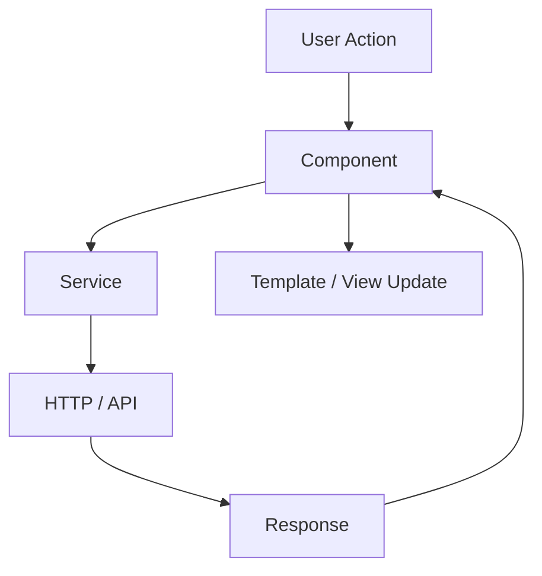
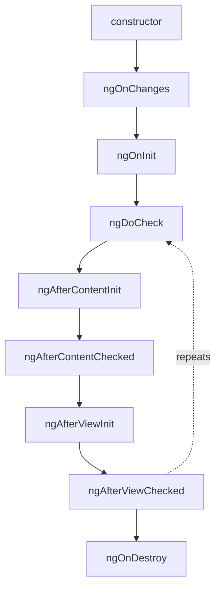
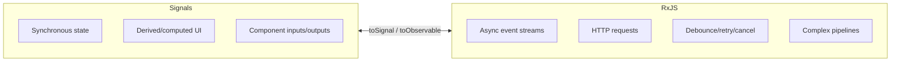
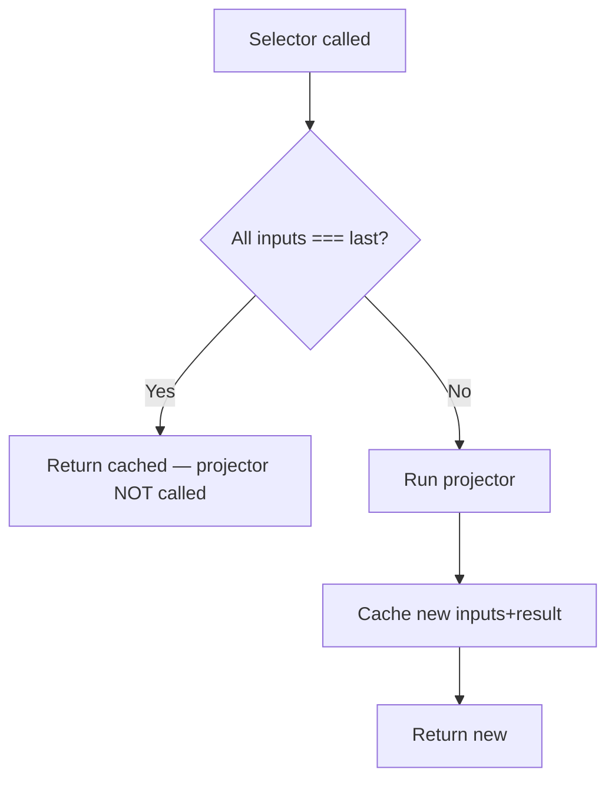
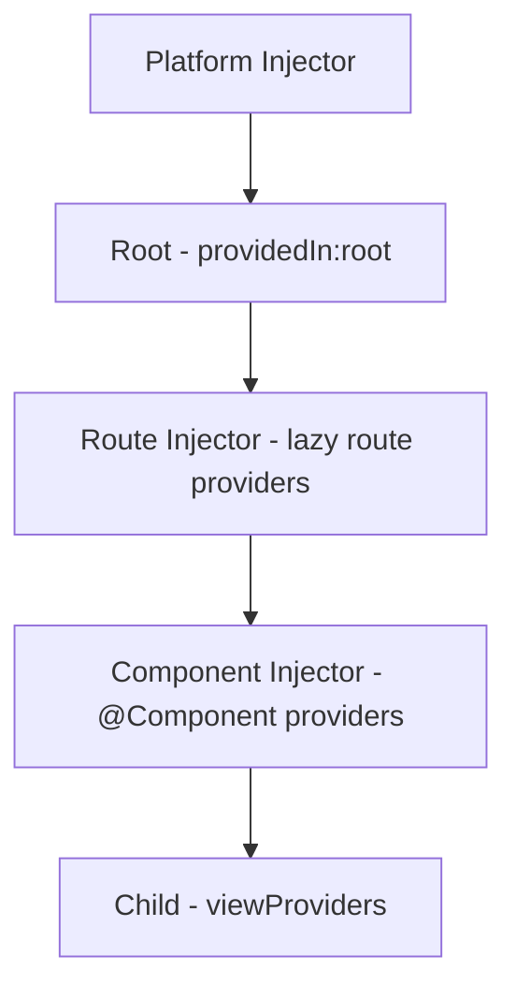
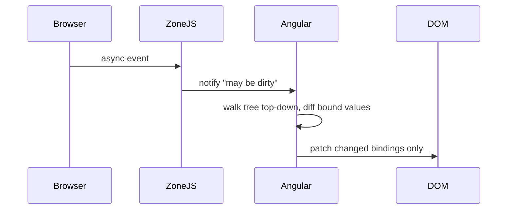
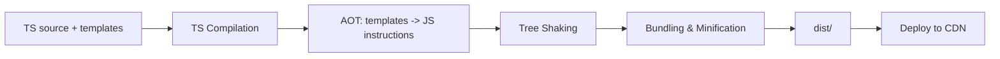
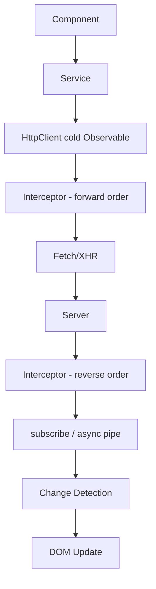
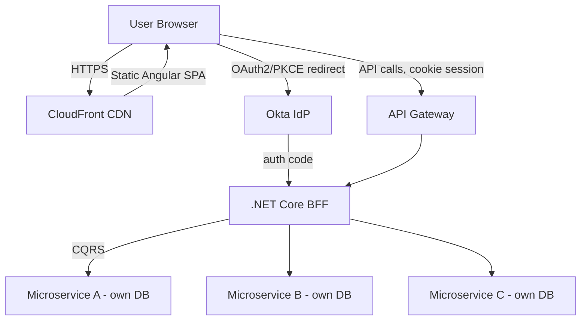

# Angular Senior/Lead Interview — Quick Revision Notes

> Yeh quick-revision notes "L. Angular-Interview-Guide.md" se derived hain — guide ka har section same order mein cover karta hai, concise Q/A + bullets + essential code/tables/diagrams ke saath. Baseline "Angular 7" (2018) hai, lekin current Angular (v18/19-class: standalone default, Signals, naya control-flow, `@defer`, zoneless) tak cover karta hai.

---

## Core Concepts

### Angular vs AngularJS

**Q: Key differences?**
| Aspect | AngularJS (1.x) | Angular (2+) |
|---|---|---|
| Architecture | MVC | Component-based |
| Language | JavaScript | TypeScript |
| Performance | Digest cycle, slow | AOT + Ivy, fast |
| Rendering | N/A | View Engine → **Ivy** (v9+ default) |

- **Key features:** component architecture, two-way binding, directives/pipes, DI, routing, HttpClient, template + reactive forms, lazy loading, AOT.
- **Ivy kya hai?** Angular ka rendering + compilation engine (v9+ default). Components/templates ko low-level JS instructions mein compile karta hai (generic runtime interpreter ke bajaye). Fayde: smaller bundles (better tree-shaking), faster compile, better debugging.
- **Trap: "Angular MVC nahi to kya hai?"** → Component/MVVM-flavored: class = view-model, template = view, services/DI = model layer. Koi single canonical controller nahi.

### Hybrid Angular Apps aur ngUpgrade

**Q: Hybrid app kya hai?** Ek app jo migration ke dauraan same page par AngularJS + Angular ko side-by-side run karta hai; dono runtimes bootstrap, components/services shared.
- **`@angular/upgrade`** (`UpgradeModule`) bridge deta hai; `downgradeComponent`/`downgradeInjectable` se Angular ↔ AngularJS interop.
- **Strategy:** ek time par ek route/feature migrate karo, `ngUpgrade` bridge rakho — risky "big bang" rewrite avoid. Maps to .NET WebForms → MVC → Core migrations.

### Architecture Overview

Classic (NgModule) blocks: 1. Modules 2. Components 3. Templates/Views 4. Directives/Pipes 5. Services/DI 6. Routing 7. Forms 8. State Management.



- **Modern (v14+, v17 default):** NgModules drop → **standalone** components/directives/pipes; routing `provideRouter` se `app.config.ts` mein (`RouterModule.forRoot()` ke bajaye). NgModules deprecated nahi — legacy mein common. "Naya app kaise structure karoge" → standalone answer expect hota hai. Dono discuss karne ke liye ready raho.

### TypeScript in Angular

- Static typing + OOP wala JS superset. Fayde: type safety, tooling, compile-time errors, decorators/ES features. `.NET` se map: interfaces, generics, access modifiers, `strictNullChecks` ≈ C# nullable ref types.
- **Q: Angular TS ko *require* kyun karta hai?** Compiler (AOT/Ivy) ko optimized code generate karne aur DI ki type-based token resolution ke liye static type info + decorator metadata chahiye.

### Modules (NgModule)

```typescript
@NgModule({
  declarations: [AppComponent],   // is module ke owned components/directives/pipes
  imports: [BrowserModule],       // doosre modules jinke exports chahiye
  providers: [],                  // module-level DI (legacy; ab providedIn:'root')
  bootstrap: [AppComponent]       // root component (sirf root module)
})
export class AppModule { }
```
- **`forRoot()` vs `forChild()`:** `forRoot()` sirf ek baar (root), `Router` singleton + location strategy configure karta hai. `forChild()` feature modules mein sirf routes register karta hai (singletons re-create nahi). Feature module mein `forRoot()` re-invoke = classic duplicate/broken router bug.

### Components

Component = Template (HTML) + Class (TS) + Styles (CSS/SCSS).

```typescript
@Component({
  selector: 'app-user',
  templateUrl: './user.component.html',
  styleUrls: ['./user.component.css'],
  providers: [UserService],        // component + children scoped
  viewProviders: [UserService],    // sirf view scoped (projected content ko nahi)
  encapsulation: ViewEncapsulation.Emulated,
  changeDetection: ChangeDetectionStrategy.OnPush,
  animations: [ trigger('fade', [ state('visible', style({opacity:1})),
    state('hidden', style({opacity:0})), transition('visible <=> hidden', [animate('300ms')]) ]) ],
  standalone: true,
  imports: [CommonModule],
  exportAs: 'userComp',
  host: { '(click)': 'onHostClick()', '[class.active]': 'isActive' }
})
export class UserComponent { name='John'; isActive=true; state='visible'; }
```

**Encapsulation:**
| Value | Behavior |
|---|---|
| `Emulated` (default) | Attribute selectors se scoped; truly isolated nahi |
| `None` | Koi encapsulation; styles global |
| `ShadowDom` | Real browser Shadow DOM, strict isolation |

- **`providers` vs `viewProviders` (senior gotcha):** `providers` view + `<ng-content>`-projected content dono ko visible. `viewProviders` sirf apne template ko, projected content ko nahi.
- **Directive vs Component:** Component = template + UI render; Directive = koi template nahi, DOM behavior change. **Har component ek directive hai jisme template hai** (trick Q).

### Standalone Components (Angular 14+, v17 se default)

NgModule wrapper eliminate. Har component apni exact dependencies `imports` mein declare karta hai (per-component scoped).

```typescript
@Component({ standalone: true, selector: 'app-user-card',
  imports: [CommonModule, RouterLink], template: `<div>{{ name }}</div>` })
export class UserCardComponent { name='Jane'; }
```
```typescript
// main.ts
bootstrapApplication(AppComponent, appConfig);
// app.config.ts
export const appConfig: ApplicationConfig = { providers: [
  provideRouter(routes), provideHttpClient(withInterceptors([authInterceptor])), provideAnimations() ] };
```
- **Why:** mental model simpler (koi "kis module mein declare karun"), better tree-shaking, React/Vue jaise self-contained importable units.
- **Gotcha:** har standalone component ko `CommonModule` khud import karna padta hai agar `*ngIf`/`*ngFor`/`date` use karta hai (shared module wala one-time import nahi). Migration: `ng generate @angular/core:standalone`.

### UI Component Libraries: Angular Material aur Bootstrap

| Library | Kya | Notes |
|---|---|---|
| **Angular Material** | Google ki official Material Design lib, Angular-specific | CDK-built, reactive forms se integrate, SCSS theming, accessible-by-default |
| **Bootstrap** | General-purpose framework-agnostic CSS | Plain classes ya `ngx-bootstrap`/`ng-bootstrap` wrapper (directives) |

- Install: `ng add @angular/material` (schematic — package + theme picker + typography/animations + optional hammerjs). Same `ng add` convention jaise `@angular/pwa`, `@angular/ssr`, `@ngrx/store`.
- **Senior framing:** Material → baked-in a11y/theming/Angular-native chahiye aur Material look OK. Bootstrap/wrapper → existing Bootstrap branding hai ya CSS-only chahiye.

### Templates, Metadata, Decorators

- **Template:** component ka declarative HTML view (Ivy efficient render instructions mein compile karta hai).
- **Metadata:** decorator ke through class par attached info (Angular ko batati hai construct/wire kaise karna hai).
- **Decorators:** functions jo metadata attach karte hain. Inke bina Angular class instantiate/deps resolve nahi kar sakta. Key: `@Component`, `@Directive`, `@Pipe`, `@NgModule`, `@Injectable`, `@Input`, `@Output`, `@HostBinding`, `@HostListener`, `@ViewChild`, `@ContentChild`.

### Data Binding

| Type | Syntax | Direction |
|---|---|---|
| Interpolation | `{{ value }}` | Component → View |
| Property | `[property]="value"` | Component → View |
| Event | `(event)="handler()"` | View → Component |
| Two-way | `[(ngModel)]="value"` | Both |

- **Two-way = sugar:** `[(ngModel)]="name"` → `[ngModel]="name" (ngModelChange)="name=$event"`. "Banana in a box." Custom two-way component = `@Input() value` + `@Output() valueChange`.

### Directives

Teen types:
1. **Component** — template wala directive.
2. **Structural** (`*ngIf`, `*ngFor`, `*ngSwitch`) — DOM add/remove. `*` sugar: `*ngIf="cond"` → `<ng-template [ngIf]="cond">`.
3. **Attribute** (`ngClass`, `ngStyle`, custom) — appearance/behavior change, structure nahi.

```typescript
@Directive({ selector: '[appHighlight]' })
export class HighlightDirective {
  constructor(private el: ElementRef, private renderer: Renderer2) {}
}
```
- **`ElementRef` vs `Renderer2`:** `ElementRef.nativeElement` = direct DOM. `Renderer2` = Angular abstraction, SSR/Web Worker ke under kaam karta hai. **Trap:** `nativeElement.style` direct mutate = browser mein OK, SSR mein break. Hamesha `Renderer2`.
- **`*ngIf` vs `[hidden]`:** `*ngIf` DOM se remove karta hai (lifecycle re-run, expensive subtrees ke liye better); `[hidden]` sirf `display:none` (frequent toggle cheaper, element DOM mein rehta hai).

### New Control-Flow Syntax: @if / @for / @switch (Angular 17+)

```html
@if (isLoggedIn) { <p>Welcome</p> } @else if (isGuest) { <p>Guest</p> } @else { <p>Log in</p> }

@for (item of items; track item.id) { <li>{{ item.name }}</li> } @empty { <li>No items</li> }

@switch (status) { @case ('success') { <p>OK</p> } @case ('error') { <p>Err</p> } @default { <p>?</p> } }
```
- `@for` mein **`track` mandatory** (`*ngFor` ka `trackBy` optional tha) — perf upfront force.
- Ivy directly compile karta hai (koi `<ng-template>` desugar nahi) → smaller code, better perf.
- `@empty` first-class "no data" block.
- Old `*ngIf`/`*ngFor` **deprecated/removed nahi** — coexist. Migration: `ng generate @angular/core:control-flow`.
- `@if`/`@for` ke liye `CommonModule` import ki zaroorat **nahi** — compiler mein built-in.

### ng-container, ng-template, ng-content

| Feature | Purpose | DOM mein? | Use |
|---|---|---|---|
| `ng-container` | Logical grouping, koi extra element nahi | Nahi | Wrapper `<div>` pollution avoid |
| `ng-template` | Deferred/conditional render blueprint | Nahi (jab tak use na ho) | `*ngIf else`, reusable, `ngTemplateOutlet` |
| `ng-content` | Content projection (parent→child) | Haan (children project) | Cards, modals, tabs |

```html
<ng-container *ngIf="isLoggedIn"><p>Welcome</p><button>Logout</button></ng-container>

<p *ngIf="isLoggedIn; else showLogin">Welcome!</p>
<ng-template #showLogin><p>Please log in.</p></ng-template>
```
Multi-slot projection: `<ng-content select="[card-title]">`, default `<ng-content>`, `<ng-content select="[card-footer]">` + parent `<h2 card-title>...</h2>`.

### Pipes

Data ko **sirf display ke liye** transform (formatting logic template mein, class se bahar).
```html
<p>{{ name | uppercase }}</p>
<p>{{ 1234.56 | currency:'USD' }}</p>
```
Built-in: `uppercase`, `lowercase`, `titlecase`, `number`, `percent`, `currency`, `date`, `json`, `async`, `slice`, `decimal`.
```typescript
@Pipe({ name: 'reverse' })
export class ReversePipe implements PipeTransform {
  transform(value: string): string { return value.split('').reverse().join(''); }
}
```
- **Pure (default `pure:true`)** — sirf input *reference*/primitive change par re-evaluate. Cheap, preferred.
- **Impure (`pure:false`)** — har CD cycle par re-run. `async` pipe ke liye needed; warna perf red flag.
- **Trap: "pipe se list filter kyun nahi?"** Pure hone par in-place mutation par re-run nahi hoga; impure banane par har CD par run → foot-gun. Fix: component mein filter karo ya RxJS/Signals derived state.

### Services aur Dependency Injection

```typescript
@Injectable({ providedIn: 'root' })
export class DataService { getData() { return 'Hello'; } }
// constructor(private dataService: DataService) {}
```
| Feature | `providedIn: 'root'` | `providers` in NgModule |
|---|---|---|
| Scope | Singleton, app-wide | Module/component scoped ho sakta |
| Lazy loading | Tree-shakable, inject par instantiate | Manual; per-lazy-module duplicate risk |
| Recommendation | Default preferred | Jab deliberately scoped/multiple instances chahiye |

- **Hierarchical DI:** injector ek tree hai, single global container nahi. Component ke `providers` mein service = us subtree ke liye *new* instance (root wali se separate). Per-feature/per-component state isolation ke liye (e.g. multi-step wizard).

### The inject() Function (Angular 14+)

Constructor injection ka additive alternative; standalone, functional guards/interceptors/resolvers, aur non-constructor jagahon ke liye idiomatic.
```typescript
export class UserComponent {
  private userService = inject(UserService);
  private route = inject(ActivatedRoute);
}
export const authGuard: CanActivateFn = () => {
  const auth = inject(AuthService); const router = inject(Router);
  return auth.isLoggedIn() ? true : router.createUrlTree(['/login']);
};
```
- **Gotcha:** `inject()` sirf **injection context** (constructor, field initializer, `runInInjectionContext`) mein kaam karta hai. `setTimeout` callback mein directly nahi — value pehle capture karo ya wrap karo. Constructor injection fully valid rehta hai; `inject()` additive hai (replacement nahi), lekin functional guards ke liye required.

---

## Intermediate

### Component Lifecycle Hooks


| Hook | When | Use |
|---|---|---|
| `ngOnChanges(changes)` | Har `@Input` change (first, ngOnInit se pehle) | Input react; `SimpleChanges` = prev/current |
| `ngOnInit()` | Ek baar, first ngOnChanges ke baad | Init logic, data fetch |
| `ngDoCheck()` | Har CD cycle | Custom change detection (in-place mutation) |
| `ngAfterContentInit()` | Ek baar, projected content init ke baad | Projected content access |
| `ngAfterContentChecked()` | Har projected content check ke baad | Projected updates react |
| `ngAfterViewInit()` | Ek baar, view + child views init ke baad | `@ViewChild`/DOM access |
| `ngAfterViewChecked()` | Har view check ke baad | Rare |
| `ngOnDestroy()` | Destroy se pehle | Cleanup: subscriptions, timers, listeners |

- **`constructor`** — sirf DI ke liye, business logic kabhi nahi (inputs abhi bound nahi, services fully ready nahi).
- **`constructor` vs `ngOnInit`:** constructor = instantiation, sirf DI, inputs unavailable. ngOnInit = bindings set hone ke baad, API/init, inputs available.

### ViewChild / ViewChildren / ContentChild / ContentChildren

- `@ViewChild`/`@ViewChildren` → **apne template** ke elements (available after `ngAfterViewInit`).
- `@ContentChild`/`@ContentChildren` → **parent se projected** content (available after `ngAfterContentInit`).
```typescript
@ViewChild(MatPaginator) paginator!: MatPaginator;
@ViewChildren(ItemComponent) items!: QueryList<ItemComponent>;
```
- **One-liner:** "View = jo main own karta hoon, Content = jo parent deta hai."
- `@ViewChild` use: DOM read/native methods (focus, scroll, measure), child public methods, third-party non-Angular UI integration.
- **Signal-based queries (17.3+):** `viewChild()`, `viewChildren()`, `contentChild()`, `contentChildren()` — Signals return karte hain (`Signal<T | undefined>`), `!` + timing dance nahi. "Not yet available" ab type ka explicit part; `computed()`/`effect()` se integrate.

### Component Communication

| Direction | Mechanism |
|---|---|
| Parent → Child | `@Input()` |
| Child → Parent | `@Output()` + `EventEmitter` |
| Sibling/unrelated | Shared service (`Subject`/`BehaviorSubject`/Signal) |
| Across routes | Route/query params, router `state` |

- `EventEmitter` = RxJS `Subject` par thin wrapper, sirf `@Output()` ke liye. Services mein general pub/sub ke liye **nahi** (wahan plain `Subject`/`BehaviorSubject`).
- **Senior guidance:** direct parent-child = `@Input`/`@Output`. Shared service sirf jab cross unrelated components ya route changes ke across persist. Overkill for simple parent-child.
- **Template ref vars** (`#var`) — trivial DOM access ka `@ViewChild` se lighter alternative:
```html
<input #txt /><button (click)="print(txt.value)">Print</button>
```

### Routing and Navigation

```typescript
const routes: Routes = [ { path:'home', component:HomeComponent }, { path:'about', component:AboutComponent } ];
// imports: [RouterModule.forRoot(routes)]
```
```html
<a routerLink="/home">Home</a><router-outlet></router-outlet>
```
- Programmatic: `this.router.navigate(['/home']);`
- Wildcard: `{ path:'**', component:PageNotFoundComponent }`
- Params: `{ path:'product/:id', ... }` → `this.route.snapshot.paramMap.get('id')`
- Query: `navigate(['/products'], { queryParams:{category:'electronics'} })` → `snapshot.queryParamMap.get('category')`
- **snapshot gotcha:** sirf navigation moment par capture. Agar same component param-change par reuse ho (`/product/1`→`/product/2`), snapshot update nahi hoga → observable form use karo: `this.route.paramMap.subscribe(...)` ya `switchMap`.
- Lazy (NgModule): `loadChildren: () => import('./dashboard/dashboard.module').then(m => m.DashboardModule)`
- **Lazy standalone (14+):** `loadComponent: () => import('./login/login.component').then(c => c.LoginComponent)` aur `loadChildren` → plain `Routes` array (`ADMIN_ROUTES`), NgModule nahi.

### Route Guards

| Guard | Purpose |
|---|---|
| `CanActivate` | Route protect (logged-in only) |
| `CanActivateChild` | Saare child routes (`/admin/*`) |
| `CanLoad` (legacy) / `CanMatch` (current) | Lazy module load prevent |
| `CanMatch` | Route *match* karega ya nahi (role/flag); false par next route config try |
| `CanDeactivate` | Navigate-away block (unsaved changes) |

- **`CanLoad` → `CanMatch`:** `CanMatch` zyada capable — non-lazy routes bhi gate karta hai aur false par next matching config try (A/B/feature-flag swaps). Naya code `CanMatch`.
```typescript
export const authGuard: CanActivateFn = () => {
  const auth = inject(AuthService); const router = inject(Router);
  return auth.isLoggedIn() || router.createUrlTree(['/login']);
};
export const formExitGuard: CanDeactivateFn<ProfileEditComponent> = (component) =>
  component.form.dirty ? confirm('Unsaved changes. Leave?') : true;
```
- Class-based guards (`implements CanActivate`) still work (legacy/enterprise). Functional = modern idiomatic (extra injectable class avoid).

### Forms: Template-driven vs Reactive

| | Template-driven | Reactive |
|---|---|---|
| Control | `ngModel`, template mein | `FormControl`/`FormGroup`, class mein |
| Scalability | Less | Enterprise standard |
| Testability | Harder | Easier (pure TS) |
| Dynamic/validation | Awkward | Natural |
| Use | Small/simple | Complex, dynamic, conditional |

```html
<form #form="ngForm"><input [(ngModel)]="name" name="name"></form>
```
```typescript
form = new FormGroup({ name: new FormControl('') });
form = this.fb.group({ name: ['', Validators.required] }); // FormBuilder
form = new FormGroup({ email: new FormControl('', [Validators.required, Validators.email]) });
```
- Built-in validators: `required`, `minLength`, `maxLength`, `pattern`, `email`, `min`/`max` (array ya `Validators.compose`).
- **`FormGroup` vs `FormArray`:** "FormGroup = fixed, named group of controls; FormArray = dynamic, indexed collection jab number unknown/user-driven ho."
- Dynamic validation: `setValidators([...])`, `clearValidators()`, `updateValueAndValidity()` (field validity doosre par depend).
- Validity: `form.valid`, `control.errors`, `control.touched`, `control.dirty`.
- `[ngModelOptions]="{standalone:true}"` — control ko parent `ngForm` se register **na** karna (UI-only filter field inside `<form>`).
- `valueChanges` — RxJS Observable on any control/group/array, har change par latest value. **Sirf reactive forms** (template-driven mein `ngModelChange`). Use: live validation, search, autosave, filter.
- Submit: `<form [formGroup]="form" (ngSubmit)="onSubmit()">`; reset: `form.reset()`.
- Custom validator: `ValidationErrors | null` return (cross-field, e.g. passwordsMatch).
```typescript
export function passwordsMatch(group: AbstractControl): ValidationErrors | null {
  return group.get('password')?.value === group.get('confirmPassword')?.value ? null : { passwordMismatch: true };
}
```
- Validators `<form>` tag ke bina bhi kaam karte hain (inline edit/search boxes).

### Typed Reactive Forms (Angular 14+)

v14 se pehle `any`-typed (`form.get('emial')` typos runtime par silent fail). Ab strictly typed:
```typescript
interface ProfileForm { name: FormControl<string>; email: FormControl<string>; phones: FormArray<FormControl<string>>; }
const form = new FormGroup<ProfileForm>({
  name: new FormControl('', { nonNullable: true }),
  email: new FormControl('', { nonNullable: true, validators: [Validators.email] }),
  phones: new FormArray<FormControl<string>>([])
});
```
- Typo'd names + wrong types = compile-time error (.NET dev ke liye win).
- **`nonNullable` gotcha:** default `FormControl<string>` par `.reset()` `null` par jaata tha (type violation). `nonNullable: true` opt-in karo ya `FormControl<string | null>`.
- `UntypedFormGroup`/`UntypedFormControl` = old-code escape hatch/migration aid.

### HttpClient aur Interceptors

```typescript
constructor(private http: HttpClient) {}
this.http.get('/users').subscribe(r => ...);
this.http.post('/users', data).subscribe();
this.http.put('/users/1', data).subscribe();
this.http.delete('/users/1').subscribe();
const headers = new HttpHeaders().set('Authorization', 'Bearer token');
const params = new HttpParams().set('search', 'Angular');
```
```typescript
this.http.get('/data').pipe(catchError(err => { console.error(err); return throwError(() => err); })).subscribe();
```
- **JSONP** — legacy `<script>` cross-domain GET (CORS na ho tab). 2026 mein rarely used, security downsides (arbitrary script exec). Sirf pucha jaaye tab mention.

**Class-based interceptor:**
```typescript
@Injectable()
export class AuthInterceptor implements HttpInterceptor {
  constructor(private auth: TokenService) {}
  intercept(req: HttpRequest<any>, next: HttpHandler): Observable<HttpEvent<any>> {
    const token = this.auth.getAccessToken();
    if (!token) return next.handle(req);
    return next.handle(req.clone({ setHeaders: { Authorization: `Bearer ${token}` } }));
  }
}
// providers: [{ provide: HTTP_INTERCEPTORS, useClass: AuthInterceptor, multi: true }]
```
- **Token kahan?** `localStorage`/`sessionStorage` = simple, common, lekin XSS-readable → sirf low-stakes. **BFF + HttpOnly cookie** = token browser JS tak nahi pahunchta, `withCredentials:true`, chota blast radius → enterprise answer. Trade-off explicitly state karo.
- **Order:** request = registration order, response = reverse. Chain: **Auth → Loader → Error**. "Pipeline draw karo" whiteboard Q.

### Functional Interceptors (Angular 15+)

Modern idiomatic; `provideHttpClient` ka only-supported style.
```typescript
export const authInterceptor: HttpInterceptorFn = (req, next) => {
  const token = inject(AuthService).getToken();
  return next(req.clone({ setHeaders: { Authorization: `Bearer ${token}` } }));
};
// provideHttpClient(withInterceptors([authInterceptor, loaderInterceptor, errorInterceptor]))
```
Array order = execution order. Default demonstrate karo jab tak class-based na pucha jaaye.

---

## Advanced

### RxJS aur Observables

RxJS = reactive/async lib using **Observables** — streams jo time ke saath 0/1/many values emit (`next`/`error`/`complete`).
```typescript
const obs = new Observable(observer => { observer.next('Hello'); observer.complete(); });
obs.subscribe(data => console.log(data));
```
| Feature | Observable | Promise |
|---|---|---|
| Lazy | Haan (`.subscribe()` tak nahi) | Nahi (creation par) |
| Multiple values | Haan | Nahi |
| Cancelable | Haan (`unsubscribe()`) | Nahi |
| Operators | Haan | Nahi |

Angular usage: `HttpClient`, route params, `valueChanges`, event streams. Default "cold" — subscribe tak kuch nahi.

**Unsubscribe / leak avoid:**
- `Subscription` store + `ngOnDestroy()` mein `.unsubscribe()`.
- `takeUntil(destroy$)` pattern.
- Template mein **`async` pipe** (auto subscribe/unsubscribe).
- **Modern `takeUntilDestroyed()` (16+):** `DestroyRef` mein auto-hook.
```typescript
private destroyRef = inject(DestroyRef);
this.userService.getUsers().pipe(takeUntilDestroyed(this.destroyRef)).subscribe(...);
```
Constructor/field initializer mein arg omit kar sakte ho. "destroy$ add karna bhool gaya" bugs remove.

### Subjects, BehaviorSubject, Multicasting

- **Multicasting:** ek Observable execution multiple subscribers ke across shared (`Subject`, `share`/`shareReplay`).
- **Subject:** Observable + Observer dono. Last value store **nahi**; new subscribers ko previous values **nahi**; sirf subscribe ke *baad* wali.
- **BehaviorSubject:** latest value store, initial value required, new subscribers ko immediately current value.
```typescript
const s = new BehaviorSubject(0); s.subscribe(v=>console.log('A:',v));
s.next(1); s.next(2); s.subscribe(v=>console.log('B:',v)); // B: 2 immediately
```
| | Subject | BehaviorSubject |
|---|---|---|
| Stores prev? | Nahi | Haan |
| Initial value? | Nahi | Haan |
| New subscriber gets last? | Nahi | Haan |
| Emits on subscribe? | Nahi | Haan |
| Use | Events/clicks | App/auth/theme/state |

- **Rule:** Observable → read data; Subject → send events; BehaviorSubject → store latest state.
- **`ReplaySubject`:** new subscribers ko some/all previous values (last N chat messages).
- **`shareReplay` vs BehaviorSubject:** ek *source* Observable (single HTTP call) ka result cache/share; `shareReplay(1)` = HTTP-backed hot + cached for late subscribers (manual BehaviorSubject push ke bajaye).

### RxJS Operators Cheat Sheet

`pipe()` operators chain karta hai (Observables immutable, har operator naya return). Subscribe tak kuch nahi.
```typescript
this.http.get<User[]>('/api/users').pipe(map(u => u.filter(x => x.active))).subscribe(...);
of(1,2,3,4).pipe(filter(n => n>2)).subscribe(); // 3,4
```
**Flattening (senior cheat sheet):**
| Operator | Behavior | Best for |
|---|---|---|
| `mergeMap` | Concurrent, cancel nahi, order guaranteed nahi | Parallel independent API |
| `switchMap` | Naye value par previous inner cancel, sirf latest | Search-as-you-type, stale avoid |
| `concatMap` | Queue, one-after-another | Sequential, order-preserving |
| `exhaustMap` | Current inner run hone tak naye ignore | Duplicate submit prevent |
```typescript
this.searchInput.valueChanges.pipe(debounceTime(300),
  switchMap(term => this.http.get(`/api/search?q=${term}`))).subscribe();
```
- **`forkJoin`** — *saare* Observables complete hone par ek baar array/object emit (≈ `Promise.all`).
```typescript
forkJoin([this.http.get('/users'), this.http.get('/posts')]).subscribe(([u,p]) => ...);
```
  **Gotcha:** koi source complete na ho (Subject/infinite stream) → `forkJoin` forever hang. Favorite interviewer gotcha.
- **Push vs Pull:** pull = consumer poochta hai (function calls, array iterate); push = producer bhejta hai (Observables, events, Promises). Push async/UI ke liye better scale.

### Angular Signals (Angular 16+)

Sabse zyada pucha "naya kya hai" (2025-26). **Signal** = `@angular/core` mein built-in fine-grained reactive primitive (RxJS nahi) jo value represent karta hai aur change par consumers notify. Angular ko *exactly* pata hota hai kaunsa binding kis state par depend karta hai → surgical DOM updates.
```typescript
import { signal, computed, effect } from '@angular/core';
export class CounterComponent {
  count = signal(0);
  doubled = computed(() => this.count() * 2);
  increment() { this.count.update(v => v + 1); } // ya .set(v)
  constructor() { effect(() => console.log('Count:', this.count())); } // reactive side-effect
}
```
```html
<p>Count: {{ count() }}</p><p>Doubled: {{ doubled() }}</p>
```
Function-call syntax (`count()`) = compiler ko dependency track karne deta hai.
- **Signal inputs/outputs (17.1+):** `name = input.required<string>()`, `age = input(0)`, `selected = output<string>()`.
- **Why (interviewer sunna chahta):** RxJS ka learning curve + subscription bugs; Zone.js CD *exactly* kaun-sa binding change hua nahi jaan sakta → poore subtrees re-check. Signals dependency graph dete hain → **zoneless CD** ka enabler + future fine-grained DOM patching.
- **Signals RxJS ko replace NAHI karte.** Signals = synchronous "always current value" (UI/derived state). RxJS = async streams, orchestration (debounce, retry, cancel, combine). Interop: `toSignal()` (Obs→Signal), `toObservable()` (Signal→Obs) from `@angular/core/rxjs-interop`.
```typescript
users = toSignal(this.userService.getUsers(), { initialValue: [] });
```

### RxJS vs Signals — Kab Kaunsa Use Karein


| Concern | Signals | RxJS |
|---|---|---|
| Model | Pull, always current | Push, event stream |
| Async | Nahi (RxJS se compose) | Native |
| Cancel/retry/debounce | Nahi | Rich |
| Learning curve | Low | High |
| CD integration | Native, fine-grained, zoneless | `async` pipe ya manual |
| Use | View state, derived, bindings | HTTP, WebSockets, `valueChanges` |

**Framing:** "Ek ko doosre over choose nahi kar rahe — Signals component-local state/bindings ke liye default, RxJS async streams/composition ka backbone. `toSignal`/`toObservable` interop dono ko coexist karata hai."

### State Management (NgRx aur Alternatives)

Increasing formality: service-based state (BehaviorSubject/Signal) → RxJS BehaviorSubject → **NgRx** (Redux, RxJS) → Akita/NGXS/Apollo.

**NgRx concepts:**
| Concept | Role |
|---|---|
| Store | Central single source of truth |
| Actions | Plain objects — *kya hua* |
| Reducers | Pure functions — action se new state |
| Effects | Side effects (API), further actions dispatch |
| Selectors | Specific, memoized state slices |
```typescript
export const increment = createAction('INCREMENT');
const counterReducer = createReducer(initialState, on(increment, s => ({ count: s.count+1 })));
loadData$ = createEffect(() => this.actions$.pipe(ofType(loadData),
  mergeMap(() => this.http.get('/api/data').pipe(map(data => loadDataSuccess({data}))))));
export const selectCount = (state: AppState) => state.count;
```
Setup: `ng add @ngrx/store`.
| Feature | NgRx | BehaviorSubject |
|---|---|---|
| Complexity | Zyada | Kam |
| Structure | Actions/reducers/effects | Service-based |
| Scale | Large apps | Small/medium |
| Side effects | Effects | Service methods |

- **Kab NgRx:** large teams, complex cross-cutting state, strict unidirectional flow, time-travel, strong conventions. Small/medium → signal/service store simpler. Choice justify karo, reflexive default nahi.

### SignalStore / NgRx Signals (Angular 17+)

`@ngrx/signals` — classic Actions/Reducers/Effects ka lighter, Signal-native alternative (boilerplate kam, DX maintain).
```typescript
export const CounterStore = signalStore(
  { providedIn: 'root' },
  withState({ count: 0 }),
  withComputed(({ count }) => ({ doubled: computed(() => count() * 2) })),
  withMethods((store) => ({ increment() { patchState(store, { count: store.count()+1 }); } }))
);
```
- **Why:** "classic NgRx overkill nahi?" ka modern answer. Complex async orchestration (retries, cancellation races, sagas) → classic NgRx effects still mature. Simple feature/component-local → SignalStore.

### NgRx Entity Adapters, Facade Pattern, aur Selector Memoization

**`@ngrx/entity` — `EntityAdapter`:** most state = ID-keyed collection. Array (`User[]`) = O(n) scans + manual immutable dance. Adapter normalize → `{ ids, entities: {[id]:User} }` + typed CRUD helpers + selectors.
```typescript
interface UserState extends EntityState<User> { loading: boolean; selectedUserId: string | null; }
const adapter = createEntityAdapter<User>({ selectId: u => u.id, sortComparer: (a,b) => a.name.localeCompare(b.name) });
const initialState = adapter.getInitialState({ loading: false, selectedUserId: null });
const userReducer = createReducer(initialState,
  on(loadUsersSuccess, (s, {users}) => adapter.setAll(users, s)),
  on(addUser, (s, {user}) => adapter.addOne(user, s)),
  on(updateUser, (s, {update}) => adapter.updateOne(update, s)),
  on(deleteUser, (s, {id}) => adapter.removeOne(id, s)),
  on(upsertManyUsers, (s, {users}) => adapter.upsertMany(users, s)));
const { selectIds, selectEntities, selectAll, selectTotal } = adapter.getSelectors();
```
- **Why senior:** `selectEntities` = O(1) lookup-by-id vs `Array.find()`; matters at scale + frequent lookups. Update semantics standardized (`updateOne` proper immutable merge), no buggy array-splicing reinvent.

**Facade pattern:** `Store` access ko injectable service ke peeche wrap; components NgRx symbols directly import na karein.
```typescript
@Injectable({ providedIn: 'root' })
export class UserFacade {
  private store = inject(Store);
  users$ = this.store.select(selectAllUsers);
  loadUsers() { this.store.dispatch(loadUsers()); }
  selectUser(id: string) { this.store.dispatch(selectUser({ id })); }
}
```
- **Why:** (1) small testable app-specific API; (2) implementation swap (→SignalStore) = sirf facade rewrite; (3) mock facade > MockStore in unit tests. Trade-off: extra indirection — worth jab state 1-2 se zyada components consume karein.

**`createSelector` memoization:** last input args (`===`) + last result cache karta hai. Har call par input selectors re-invoke, reference-equality compare:
- Saare inputs `===` last → projector **re-run nahi**, cached return.
- Koi input different → projector ek baar re-run, cache update.
- Isiliye immutable updates matter (jaise OnPush): in-place mutation → same reference → `===` "unchanged" (recompute skip OK); par unconditional `return {...state}` → cache har dispatch defeat.
- **Cache size = 1** (sirf latest). Alternating args (parameterized selectors) → thrash, har baar recompute. "Selector memoize kyun nahi ho raha?" gotcha.


### Dependency Injection: Hierarchical Injectors Deep Dive


- Angular requesting component se **upar** walk karta hai jab tak provider mile — *nearest* jeetta hai.
- Component `providers` mein service = us subtree ke liye fresh instance (root wali ko shadow).
- `viewProviders` `providers` se ek tarike se differ: `<ng-content>`-projected content ko invisible (projected content apni deps *apne origin* injector se resolve).
- **Multi-providers** (`multi: true`, e.g. `HTTP_INTERCEPTORS`) — token ke under multiple values accumulate (overwrite nahi).
- **Resolution modifiers:** `@Optional()` (provider nahi → `null`, throw nahi); `@Self()` (sirf requesting injector); `@SkipSelf()` (local skip, ek level upar se — `ControlContainer` parent pattern); `@Host()` (host boundary par stop).

### Micro-Frontends / Module Federation for Angular

**Problem:** ek team ka single large app organizationally scale nahi karta jab multiple independent teams (Checkout/Account/Search) ko own/build/**independently deploy** karna ho bina shared release train.
- **Webpack Module Federation:** ek build ("remote") runtime par modules expose karta hai, doosri ("host"/shell) consume — bina saath compile kiye; shell ko sirf runtime manifest URL chahiye.
```javascript
// remote — exposes
new ModuleFederationPlugin({ name:'checkoutApp', filename:'remoteEntry.js',
  exposes:{ './CheckoutModule':'./src/app/checkout/checkout.module.ts' },
  shared:['@angular/core','@angular/common','@angular/router'] });
// shell — consumes
new ModuleFederationPlugin({ name:'shell',
  remotes:{ checkoutApp:'checkoutApp@https://checkout.example.com/remoteEntry.js' },
  shared:['@angular/core','@angular/common','@angular/router'] });
```
- Angular ke liye standard: **`@angular-architects/module-federation`** schematic (CLI builder par wire, dynamic remote loading).
```typescript
{ path:'checkout', loadChildren: () => loadRemoteModule({
    type:'module', remoteEntry:'https://checkout.example.com/remoteEntry.js', exposedModule:'./CheckoutModule'
  }).then(m => m.CheckoutModule) }
```
- **Mechanics:** `shared` = framework singletons negotiate (duplicate instances/bloat avoid, warna DI/routing/CD break). Har remote independently deployable (public contract break na ho tab tak shell rebuild nahi). **Version skew = real cost** — runtime warn/fail (build-time type error se harder to catch).
- **Kab worth vs Nx monorepo:** MF sirf jab **independent deployability** chahiye (team B wait/coordinate na kare). Agar constraint sirf "kaafi teams, ek codebase, fast builds, enforced boundaries" → **Nx monorepo** (lint tags/boundaries) same benefit, kam operational cost, compile-time breakage. **Framing:** "MF ek *organizational/deployment* problem solve karta hai, code-org nahi — pehle Nx boundaries, MF sirf jab independent deploy cadence business requirement ho."

| Concern | Nx Monorepo | Module Federation |
|---|---|---|
| Team independence | Shared pipeline, lint boundaries | True independent build+deploy |
| Version coordination | Single version | Runtime negotiation, skew risk |
| Breaking-change failure | Compile-time (CI fail) | Often runtime |
| Operational complexity | Kam (ek pipeline) | Zyada (per-remote, manifest, governance) |
| Best fit | Zyadatar orgs | Teams jinhe *must* independent deploy |

---

## Performance

### Change Detection Deep Dive

CD = data changes detect + DOM update. **Classic Zone.js model:**
1. **Zone.js** async APIs (`setTimeout`, Promises, DOM events, XHR) monkey-patch — fire par Angular notify → CD trigger.
2. **CD cycle** — root se top-down walk, bindings check (prev vs current), changed DOM patch ("dirty checking", Ivy = bound expressions diff).
3. **Default** — har async event par har component check (simple, scale par expensive).

- **Triggers:** DOM events, HTTP responses, timers, Promise, `@Input` changes, `markForCheck()`/`detectChanges()`.
```typescript
constructor(private cd: ChangeDetectorRef) {}
this.cd.detectChanges(); // sync CD now
this.cd.markForCheck();  // mark this + OnPush ancestors dirty for next cycle
```
- **Senior answer:** "Zone.js async APIs patch karta hai, Angular ko notify karta hai. Angular tree top-down walk, prev/current diff, changed DOM patch. Default = har event pura tree; OnPush = skip jab tak `@Input` ref change/own event/async-piped emission/manual trigger na ho. CD unidirectional, top-down, Ivy se instruction-level optimized."

### Zoneless Change Detection (Angular 18+)

`provideExperimentalZonelessChangeDetection()` — Zone.js poori tarah remove.
- **Why:** Zone.js runtime cost + subtle bugs (third-party monkey-patch weirdness, zone ke bahar async silently CD trigger na karna); bundle/parse cost bhi remove.
- Zoneless CD **Signals** par rely karta hai kab re-render karna hai — Signals investment ka direct payoff (Signal components + `async` pipe + manual `markForCheck()` explicitly notify).
```typescript
providers: [ provideExperimentalZonelessChangeDetection() ]
```
- **Gotcha:** Signal write ke bahar + notification ke bahar state mutate (raw untracked callback plain field) → re-render nahi. State ko Signal banao, `markForCheck()`, ya `async` pipe se route karo. Evolving area — exact stability/GA version verify karo (last verified: experimental).

### OnPush Strategy aur Pitfalls

```typescript
@Component({ changeDetection: ChangeDetectionStrategy.OnPush })
```
OnPush = check **sirf** jab: 1. `@Input` **reference** change 2. Event component ke andar se 3. `async`-piped Observable emit 4. Manual `markForCheck()`/`detectChanges()`.
| | Default | OnPush |
|---|---|---|
| Pura tree check? | Haan | Nahi |
| Perf | Scale par slow | Fast |
| Trigger | Kuch bhi | `@Input` ref/own event/async emit/manual |

- **#1 gotcha:** OnPush **reference** compare karta hai, deep equality nahi.
```typescript
this.user.name = 'John';                   // ❌ in-place mutate — ref unchanged, NOT re-checked
this.user = { ...this.user, name: 'John' }; // ✅ new ref — re-check
```
Isliye immutable patterns (spread, NgRx new objects, Signals). 500+ components = OnPush standard.
- **OnPush + Signals:** template mein Signal read (`{{ mySignal() }}`) → OnPush ke under bhi auto re-check, bina `@Input`/`markForCheck()`. Signal ki notification OnPush requirement natively satisfy karti hai — Signals interlock (compete nahi) CD ke saath.

### trackBy / track in Loops

`trackBy` ke bina default identity = object reference; naya array reference → Angular unnecessary DOM nodes destroy/recreate.
```html
<li *ngFor="let item of items; trackBy: trackByFn">{{ item.name }}</li>
```
```typescript
trackByFn(index: number, item: any) { return item.id; }
```
- `id`-keyed trackBy → sirf changed binding patch, unchanged DOM untouched. Kam churn, better perf. `@for` mein `track` **mandatory**.
- **Virtual scrolling (CDK):** hundreds/thousands rows → `cdk-virtual-scroll-viewport` (sirf viewport-visible + buffer render).
```html
<cdk-virtual-scroll-viewport itemSize="50" class="viewport">
  <div *cdkVirtualFor="let item of items">{{ item.name }}</div>
</cdk-virtual-scroll-viewport>
```
"50,000 rows to?" → trackBy = *update* cost kam; virtual scrolling = *render* cost kam (off-screen materialize nahi).

### Deferrable Views: @defer (Angular 17+)

**Template regions** ke liye built-in declarative lazy-loading — deferred content + deps separate JS chunk mein, trigger par load.
```html
@defer (on viewport) { <heavy-chart [data]="chartData" /> }
@placeholder { <div class="skeleton"></div> }
@loading (minimum 500ms) { <spinner /> }
@error { <p>Failed to load.</p> }
```
- Triggers: `on idle` (default), `on viewport` (IntersectionObserver), `on interaction`, `on hover`, `on timer(2s)`, `when condition`.
- **Why:** directly Core Web Vitals — heavy/below-fold/rarely-used UI (charts, modals, admin widgets) ab initial bundle mein nahi. Pehle manual lazy route ya `ViewContainerRef.createComponent()` chahiye tha. "Route-level lazy se aage bundle kaise kam karoge" ka pehla answer.

### Lazy Loading aur Preloading

```typescript
{ path:'dashboard', loadChildren: () => import('./dashboard/dashboard.module').then(m => m.DashboardModule) }
```
- **Preloading** — initial app stable hone *ke baad* background mein lazy modules load → first navigation fast.
```typescript
RouterModule.forRoot(routes, { preloadingStrategy: PreloadAllModules })
```
- Custom `PreloadingStrategy` — selectively preload (role/heuristic). "Sab preload achha?" → nahi, constrained/mobile par critical resources se compete; analytics-based selective = better.

### Bundle Size, Tree Shaking, Build Optimization

- **Tree shaking** — build (esbuild/webpack) unused/dead code remove.
- Analyze: `ng build --stats-json` + `npx webpack-bundle-analyzer dist/stats.json` (esbuild builder mein format/flag differ ho sakta — verify).
- **Differential loading** — pehle ES2015+ / ES5 do bundles (`type=module`/`nomodule`). Ab modern-browser universal → ES5 differential bundles effectively obsolete/removed (exact CLI version verify).
- **Angular DevTools** — component trees + CD cycles inspect/profile.
- **Budgets** (`angular.json`) — bundle threshold exceed par warn/error, CI enforced.

### Angular CLI vs Webpack

Different layers, competitors nahi.
| Aspect | Angular CLI | Webpack |
|---|---|---|
| Purpose | Scaffold/build/serve/test (`ng new/generate/build/serve/test`) | General JS module bundler |
| Config | Minimal, convention (`angular.json`) | Customizable, verbose (`webpack.config.js`) |
| Relationship | Historically Webpack **internally** use karta tha | CLI dwara building block, replacement nahi |

CLI = day-to-day tool; Webpack = underneath bundler (builder abstraction ke peeche hidden, isliye `webpack.config.js` hand-write nahi karna pada, unlike CRA `eject`). Ab CLI ne bundler esbuild/Vite mein swap kiya.

### esbuild / Vite-based Application Builder (Angular 17+)

`@angular-devkit/build-angular:application` (v17 default), old `browser` builder replace.
- **Why:** dramatically faster cold builds/rebuilds (esbuild = Go, parallel); `ng serve` = **Vite** dev server (near-instant HMR); browser+server (SSR) targets unified single `application` config; webpack custom loaders/plugins ka direct esbuild equivalent na ho (migration friction).
- **Framing:** "v17 se default webpack → esbuild/Vite, primarily build speed (jaise broader JS ecosystem). Component writing change nahi, par troubleshooting + `angular.json` builder config change."

### Angular Build & Runtime Lifecycle

**Build-time (`ng build`):**

1. **TS compilation** — `ngc`/Ivy `.ts`→`.js`, templates+decorators → JS instructions, type + AOT template errors check.
2. **AOT** — templates build par JS render functions (browser mein nahi), DI metadata pre-gen. Faster startup, smaller, kam runtime errors. **Default + production mandatory** (JIT legacy).
3. **Tree shaking** 4. **Bundling & minification** (`main.js`, `polyfills.js`, historically `runtime.js`/`styles.css`) 5. **Deploy** static host.

**Runtime:**
1. `index.html` → `runtime.js` (esbuild mein superseded), `main.js`, `polyfills.js`.
2. `main.ts` bootstrap: `platformBrowserDynamic().bootstrapModule(AppModule)` ya `bootstrapApplication(AppComponent, appConfig)`.
3. **DI setup** — injector tree. 4. **Root component** — `<app-root>` locate, instantiate, `constructor→ngOnInit→ngAfterViewInit`. 5. **Router** lazy routes activate par fetch.

| Feature | JIT | AOT |
|---|---|---|
| When | Runtime, browser | Build time |
| Perf | Dheema | Tez |
| Size | Bada | Chota |
| Use | Dev (Ivy incremental se superseded) | Production hamesha |

### HTTP Request Lifecycle


1. Component → service method. 2. `HttpClient.get()` = **cold** Observable (koi call nahi). 3. Interceptors forward (auth/logging/loader-start). 4. Browser Fetch/XHR. 5. Server responds. 6. Interceptors **reverse** (error/logging/loader-stop). 7. Observable emit → subscribe/async pipe. 8. CD → diff → DOM patch.

---

## SSR, PWA & Cross-Cutting

### Angular Universal / SSR

Server (Node.js) par initial HTML snapshot render → perceived load + SEO (crawlers fully rendered content).
- Setup: legacy `ng add @nguniversal/express-engine`. **v17+:** `ng add @angular/ssr` (ya `ng new` par SSR select) — `@nguniversal` → `@angular/ssr`/`@angular/platform-server`. `@nguniversal/express-engine` deprecated naam.
- Benefits: SEO, faster perceived load, slow networks par better (meaningful content JS bootstrap se pehle).

### Hydration (Angular 16+) aur Event Replay (Angular 17+)

Classic SSR problem: client bootstrap poore DOM ko scratch se destroy + re-render ("destructive rehydration") → flicker + wasted work.
- **Non-destructive hydration** (`provideClientHydration()`, 16/17 stable) — existing server DOM reuse, state/listeners already-painted markup par attach.
```typescript
providers: [ provideClientHydration() ]
```
- **Event replay** (17+, Chrome event dispatch lib) — "HTML painted" aur "fully hydrated" ke beech user interactions capture + replay → instant click swallow nahi hota.
- **Why strong talking point:** hydration correctness = nuanced, prod-SSR-shipped signal (docs padhne wale se differentiate); genuinely hard recent engineering, incremental sugar nahi.

### Progressive Web Apps aur Service Workers

**PWA** = native-app-like: offline, background sync, push, cacheable, installable.
```
ng add @angular/pwa   # service worker + Web App Manifest + icons
```
**Service Worker** = background script: resources cache, network requests intercept/handle, push enable.
```json
{ "assetGroups": [ { "name":"app", "installMode":"prefetch", "updateMode":"prefetch",
  "resources": { "files":["/favicon.ico","/index.html"], "urls":["/api/**"] } } ] }
```
- Check: Chrome DevTools → Lighthouse. Background sync = offline store, connectivity par send. Push = server-initiated updates.
```typescript
constructor(updates: SwUpdate) {
  updates.available.subscribe(() => { if (confirm('New version. Reload?')) window.location.reload(); });
}
```
- **`SwUpdate` modernization:** boolean `updates.available`/`activated` = legacy. Current = `updates.versionUpdates` (discriminated-union: `VersionReadyEvent`, `VersionInstallationFailedEvent`) — filter for `VersionReadyEvent`. Exact API version verify.

### Angular Security

Built-in: XSS protection, CSRF support, CSP support, HTML/URL/style sanitization.
- **XSS** — Angular interpolation + property bindings auto-sanitize.
```html
<p>{{ userInput }}</p>            <!-- safe: auto-escaped -->
<p [innerHTML]="userInput"></p>   <!-- dangerous: bypasses escaping -->
```
```typescript
constructor(private sanitizer: DomSanitizer) {}
safeUrl = this.sanitizer.bypassSecurityTrustUrl(userInput);
```
- **`bypassSecurityTrustX`** = "main personally vouch karta hoon" — sirf controlled/server-validated content par, kabhi raw user input par (warna XSS hole reopen).
- **CSP** — `<meta http-equiv="Content-Security-Policy" content="default-src 'self'">` — kaunse scripts/resources load; injection slip par bhi XSS mitigate.
- **CSRF** — `HttpClient` mein `HttpXsrfTokenExtractor`/`withXsrfConfiguration` (double-submit cookie), lekin sirf jab *backend* cookie/header set+validate kare — cooperating contract, automatic nahi.
- **CORS** — server-side (`Access-Control-Allow-Origin`); Angular sirf request banata hai, browser enforce karta hai.
- **HTTP Parameter Pollution** — `?user=admin&user=guest` (inconsistent parsing confuse) — backend concern, vocabulary term.
- Secure auth: JWTs, tokens **HttpOnly cookies** (localStorage nahi = XSS-readable), Auth Guards.
```typescript
@Injectable({ providedIn: 'root' })
export class AuthGuard implements CanActivate {
  constructor(private authService: AuthService) {}
  canActivate(): boolean { return this.authService.isLoggedIn(); }
}
```
- **Token storage:** `localStorage`/`sessionStorage` = simple, common, XSS-readable → low-stakes only. BFF + HttpOnly-cookie = browser JS se bahar, `withCredentials:true`, chota blast radius = enterprise. Trade-off name karo, posture commit karo, `localStorage` ko best practice mat batao.
- Brute-force: rate limiting, CAPTCHA, account lockout (backend-enforced; Angular UX surface kare).

### Accessibility (a11y): ARIA, CDK a11y Module, Focus Management

Enterprise/govt = hard compliance (WCAG 2.1/2.2 AA, Section 508). "Working UI" vs "sab use kar sakein" differentiate.
- **ARIA on custom components:** native `<button>`/`<input>` free semantics dete hain; `<div>`/`<span>` custom components mein **kuch nahi** — explicit `role`/`aria-*` bindings chahiye.
```html
<div role="tablist" [attr.aria-label]="ariaLabel">
  @for (tab of tabs; track tab.id) {
    <button role="tab" [id]="'tab-'+tab.id" [attr.aria-selected]="tab.id===activeTabId"
      [attr.aria-controls]="'panel-'+tab.id" [tabindex]="tab.id===activeTabId ? 0 : -1"
      (click)="selectTab(tab.id)" (keydown.arrowRight)="focusNextTab()" (keydown.arrowLeft)="focusPreviousTab()">
      {{ tab.label }}</button>
  }
</div>
```
Key points: `role=*` = widget kya hai (generic markup); `aria-selected` = visually-obvious state screen reader ko; **roving `tabindex`** (active `0`, baaki `-1` + arrow handlers) = composite widget ek single `Tab` stop.

**CDK `a11y` module** (`@angular/cdk/a11y`):
| Utility | Purpose |
|---|---|
| `FocusTrap`/`cdkTrapFocus` | Tab focus container mein confine — modals essential |
| `LiveAnnouncer` | ARIA live region se message announce (async state, "3 results") |
| `FocusMonitor` | *Kaise* focused hua detect (mouse/keyboard/touch) — keyboard-only focus outlines |
| `InteractivityChecker` | Element genuinely focusable/tabbable hai — FocusTrap internal |
| `ListKeyManager`/`ActiveDescendantKeyManager` | List widgets arrow-key nav + active tracking |
```typescript
private liveAnnouncer = inject(LiveAnnouncer);
onResultsLoaded(count: number) { this.liveAnnouncer.announce(`${count} results found`, 'polite'); }
```
**Modal focus management — 3 steps (narrate karo):**
```typescript
ngAfterViewInit() {
  this.previouslyFocusedElement = document.activeElement as HTMLElement; // 1. capture trigger focus
  this.focusTrap = this.focusTrapFactory.create(this.containerRef.nativeElement); // 2. trap
  this.focusTrap.focusInitialElementWhenReady();
}
ngOnDestroy() {
  this.focusTrap?.destroy();
  this.previouslyFocusedElement?.focus(); // 3. restore focus to trigger
}
```
(1) trigger focus capture, (2) focus trap + move in (heading/first control), (3) close par trigger par restore. Home-grown modals steps 1+3 galat — common a11y bug/audit finding.
- **Framing:** "Custom widgets par a11y automatic nahi — generic elements = explicit ARIA + keyboard + focus management. CDK `a11y` exactly isliye." Verify: axe-core/`@angular-eslint`/Lighthouse baseline, par automated ~1/3 catch karta hai — manual keyboard + NVDA/VoiceOver baaki.

### Deployment: Firebase aur GitHub Pages

Lightweight targets (demos, side projects, take-homes).
**Firebase Hosting:**
```bash
npm install -g firebase-tools
firebase login
firebase init          # Hosting, dist/<project> point karo
firebase deploy        # build first (ng build), then push
```
Free HTTPS, global CDN, easy custom-domain, koi infra nahi.
**GitHub Pages:**
```bash
ng add angular-cli-ghpages
ng deploy --base-href=/repo-name/
```
`--base-href` matters — GH Pages subpath (`username.github.io/repo-name/`) se serve; bhool jaana = broken assets/routes, blank page.
- **Framing:** Firebase/GH Pages = static SPA/demos/portfolios; SSR/backend proxy/enterprise compliance chahiye to BFF/CloudFront right hai.

---

## Enterprise Architecture Case Study (BFF + CQRS + .NET)

Senior .NET-full-stack ke liye relevant — Angular ko realistic .NET backend se connect. Lead-level system-design whiteboard.

- **Angular frontend:** sirf UI render, koi business logic/direct microservice access nahi. **Auth Code Flow + PKCE**, Okta redirect, **kabhi tokens store nahi** (na localStorage na sessionStorage), sirf BFF se baat. Stateless + token-free = security surface radically simple.
- **CloudFront (CDN):** S3 static Angular serve, edge cache, `/api/*` → API Gateway, HTTPS enforce, Shield + WAF. Latency kam, spikes protect.
- **Okta (SSO/IdP):** central auth (login/MFA/session). Flow: Angular→Okta→auth code→**BFF** exchanges for tokens. ID token (identity), access token (API), refresh token (BFF server-side only).
- **API Gateway:** single public entry; Okta JWTs validate, rate-limit, route, WAF, direct microservice access prevent.
- **BFF (Backend-for-Frontend):** this frontend ke liye built — Okta token exchange, session, API aggregation/shaping (over/under-fetch avoid), CQRS orchestration. Stack: ASP.NET Core, `HttpClientFactory`/YARP, cookie auth. **Why:** Angular exactly ek backend call, tokens server-side, frontend complexity drop.
- **CQRS:** commands (create/update/delete) validated/transactional → write DB; queries read-only/optimized → read models/projections. Benefit: independent read/write scaling, clear intent. **One-liner:** "CQRS write consistency affect kiye bina read scalability deta hai."
- **.NET microservices:** ek service = ek responsibility = ek DB; independently deployable; Clean Architecture/DDD, repository (write) + read models (query). Comm: sync HTTP (internal), async SNS/SQS (decoupled).
- **Security:** zero trust, least privilege, defense in depth. Angular = no secrets; BFF stores tokens; Gateway validates JWTs; microservices VPC-private. IAM roles, Secrets Manager, private subnets.
- **CI/CD:** Frontend — build, S3 upload, CloudFront invalidate. Backend — build, Docker, ECR push, blue/green/rolling ECS/EKS with health checks.
- **Observability:** correlation IDs, structured logs, centralized; latency/error/throughput; end-to-end distributed tracing.

**Common Q&A:** *BFF kyun?* Security (tokens browser tak nahi), aggregation, decoupling. *CQRS kyun?* Independent scaling, perf, separation. *Tokens secure kaise?* BFF server-side. *API versioning?* BFF layer (frontend ko microservice churn se insulate). *Downstream fail?* Circuit breakers, retries+backoff, graceful degradation.
- **Kab NAHI:** small apps, MVPs, low-traffic — yeh enterprise scale/security ke liye, simplicity ke liye nahi. Small app over-engineer = red flag.
- **Summary:** "Angular CloudFront ke peeche pure UI, auth Okta se centralized, API Gateway ingress secure, BFF tokens + orchestration, CQRS .NET microservices strong boundaries ke saath independently scale."

---

## Testing

Types: **unit** (components/services), **integration** (interactions), **E2E** (full flows, e.g. Cypress).
- **Jasmine** — default JS framework: `describe`/`it`/`expect`, assertions, spies, mocking; no browser render.
```typescript
describe('Calculator', () => { it('should add', () => { expect(1+1).toBe(2); }); });
```
- **Karma** — test runner, real browser launch (headless Chrome/Firefox CI), Jasmine execute, watch+re-run (`karma.conf.js`). **v17+:** naye projects increasingly **Jest**/**Web Test Runner** default; Karma maintenance-mode/deprecated. Codebase ka actual runner clarify karo. Jest API Jasmine-compatible.
- **`TestBed`** — test module env:
```typescript
TestBed.configureTestingModule({ declarations: [MyComponent] }).compileComponents();
```
- Service: `TestBed.inject(MyService)`. Component: `TestBed.createComponent(MyComponent)`, `fixture.nativeElement.querySelector('h1')`.
- Mock: `spyOn(myService, 'getData').and.returnValue(of(mockData));`
- Async: `fakeAsync` + `tick(1000)` → sync test.
```typescript
it('resolves', fakeAsync(() => { let v=false; setTimeout(()=>v=true,1000); tick(1000); expect(v).toBe(true); }));
```
- **E2E:** **Protractor** = original, ab **deprecated/removed**. Ecosystem → **Cypress**, **WebdriverIO**, **Playwright** (2025-26 mein very common). Protractor fully gone.
- **Angular Testing Library** (`@testing-library/angular`) — user-centric (visible text/role query, implementation details nahi), refactor-resilient tests.

---

## Best Practices

- Naye code = **standalone components**; NgModule incrementally migrate.
- Non-trivial = **`OnPush`** + immutable patterns (ya Signals, jo OnPush natively satisfy).
- Non-trivial lists = **`trackBy`** (ya `@for` mandatory `track`).
- Manual `.subscribe()` ke bajaye **`async` pipe** (ya `toSignal`) — lifecycle + CD handle, leak class eliminate.
- **Components thin** — business logic/data access/orchestration services mein; component = template↔service wire.
- Simplest se aage = **Reactive Forms** (ideally **typed**); template-driven small cases.
- Feature areas **lazy load**; heavy in-page content = **`@defer`**.
- Cross-cutting HTTP (auth/error/loading) = **interceptors** mein centralize.
- Unsubscribe: pehle `async` pipe, phir `takeUntilDestroyed()`, fallback manual `ngOnDestroy()` unsubscribe.
- **Bundle budgets** enforce + Angular DevTools/Lighthouse profile (blind optimize nahi).
- `bypassSecurityTrustX`, `[innerHTML]` on user content, `localStorage` tokens = explicit justified decisions, defaults nahi.
- State tooling (service/Signal, NgRx Signals, classic NgRx) = app complexity proportionate; choice justify karo.

## Common Pitfalls

- **OnPush ke under objects/arrays in-place mutate** — silent CD break (ref unchanged).
- **Impure pipes overuse** (ya filter/sort as pipes) — har CD par recompute.
- **Unsubscribe bhoolna** — memory leak; SPAs mein compounded.
- **`route.snapshot.paramMap` jab component param-only nav par reuse** — stale; observable form use karo.
- **Constructor mein business logic** — inputs/DI ready guarantee nahi, testability undermine.
- **`ElementRef.nativeElement` direct mutate** (Renderer2 ke bajaye) — SSR break.
- **`forkJoin` on never-completing source** — forever hang, no emission/error.
- **Large/frequent lists par `trackBy` bina** — DOM churn, janky.
- **JWTs `localStorage` mein** (low-stakes se aage) — XSS-exposed; BFF/HttpOnly contrast.
- **NgRx as default** (jinhe guarantees nahi chahiye) — complexity cost.
- **Signals RxJS replace karte hain assume** — different problems (sync view vs async streams); interop explain karo.
- **`@for` mein `track` mandatory bhoolna** old `*ngFor` port karte waqt — identity-based fall back, problem reintroduce.
- **`inject()` injection context ke bahar** (unrelated `setTimeout`/`.then`) — throws; pehle capture ya `runInInjectionContext()`.

## Version Feature Comparison Table

| Feature | Angular 7 (2018 baseline) | Current (2025-26) |
|---|---|---|
| Component | NgModule-declared only | Standalone default; NgModules supported |
| Bootstrap | `platformBrowserDynamic().bootstrapModule(AppModule)` | `bootstrapApplication(AppComponent, appConfig)` |
| Control flow | `*ngIf`/`*ngFor`/`*ngSwitch` | `@if`/`@for`/`@switch` (old still valid) |
| Reactive state | RxJS only (BehaviorSubject, services) | Signals + RxJS, interop |
| Change detection | Zone.js Default/OnPush | + experimental zoneless (Signal-driven) |
| DI | Constructor injection | + `inject()` function |
| Forms | Untyped FormGroup/FormControl | Strictly typed reactive |
| In-template lazy | Nahi (route/module only) | `@defer` template-region lazy |
| Build | Webpack via CLI | esbuild + Vite `application` builder (v17 default) |
| SSR | Angular Universal (`@nguniversal`), destructive rehydration | `@angular/ssr`, non-destructive hydration + event replay |
| E2E | Protractor | Protractor removed; Cypress/Playwright/WebdriverIO |
| Rendering | View Engine (Ivy v9) | Ivy |
| Interceptors | Class-based + `HTTP_INTERCEPTORS` | Functional via `withInterceptors()` (class still supported) |
| Guards | Class-based `CanActivate` | Functional (`CanActivateFn`); class still supported |

## Sample Interview Q&A

**Q: OnPush ke under button click → HTTP call, end-to-end?**
A: Click native DOM event; OnPush component ke apne template se originate → CD guaranteed run. Handler → service → `HttpClient.get()` = cold Observable (kuch nahi). `.subscribe()`/`async` pipe par → interceptor forward (auth) → Fetch/XHR → response interceptors reverse (error/log). Observable emit → callback result assign. Agar assignment object/array reference replace kare (mutate nahi), OnPush naya `@Input` ref pick up karta hai (child flow) ya already checked (local event). CD bindings diff, changed DOM patch.

**Q: Signals over BehaviorSubject kab, aur RxJS kab?**
A: Simple sync always-has-value UI state (toggle, selected tab, computed total) = Signals simpler — koi subscription mgmt, templates directly read (auto fine-grained CD, OnPush/zoneless ke under bhi). RxJS jab inherently async ya operator composition — debounced search, retryable HTTP, `combineLatest`/`forkJoin`, WebSocket. Practice mein `toSignal()`/`toObservable()` se bridge, exclusively pick nahi.

**Q: "Hamesha OnPush everywhere"?**
A: Directionally haan non-trivial ke liye, caveat: OnPush immutability discipline maangta hai — in-place mutation → silent update-stop (worse bug). Blanket policy ko lint rules/review discipline se pair (ya Signals push karo, jo reference-equality gotcha sidestep karte hain).

**Q: `providers` vs `viewProviders` real scenario?**
A: Dono component-scoped (new instance), par `providers` view + `<ng-content>`-projected content dono ko visible, `viewProviders` sirf apne template ko. E.g. `TabsComponent` jo `TabsService` provide karta hai internal tab state ke liye — agar consumer `ng-content` se content project kare jo same token inject kare, `viewProviders` hide karega (by design), `providers` expose. Galat = confusing "projected content service kyun nahi dekh sakta" bugs.

**Q: Okta+API Gateway+BFF+CQRS mein Angular tokens kyun hold nahi karta?**
A: Browser JS tak pahunchne wala koi token XSS-exposed — koi dependency/injected script `localStorage`/`sessionStorage` read karke exfiltrate kar sakta hai. Token exchange+storage .NET BFF mein server-side (HttpOnly secure cookies browser-BFF session ke liye) → Angular mein successful XSS bhi bearer token steal nahi kar sakta (browser-readable kuch hai hi nahi). Deliberate trade-off: added BFF complexity ↔ reduced token-theft blast radius — enterprise appropriate, low-stakes internal tool ke liye overkill.

**Q: Angular 7 NgModule codebase modernize (no big-bang)?**
A: Incrementally: pehle `ng update` version-by-version (har major ke migration schematics; versions skip risky). Standalone-support version (14+) par `ng generate @angular/core:standalone` schematics se ek feature area at a time convert (coexist karte hain). Parallel: control-flow migration schematic se `@if`/`@for`, genuinely simpler jagah Signals, touch par `HttpInterceptor`→functional. Poore build system (webpack→esbuild) + component model same change mein flip nahi — regress bisect karna hard.

---

## Summary of Additions

**[new content] sections** (2018 baseline → 2025-26 gap close): 1. Standalone Components (14+, v17 default) 2. inject() (14+) 3. Control-Flow @if/@for/@switch (17+) 4. Typed Reactive Forms (14+) 5. Functional Interceptors (15+) 6. Signals (16+) 7. RxJS vs Signals 8. SignalStore/NgRx Signals (17+) 9. Hierarchical Injectors deep dive 10. Zoneless CD (18+) 11. @defer (17+) 12. esbuild/Vite builder (17+) 13. Hydration + Event Replay (16+/17+).

**Resolved contradictions:** (1) Token storage — `AuthInterceptor` ab `TokenService` inject karta hai (localStorage direct read nahi); storage posture explicit decision, trade-off dono jagah stated. (2) `ng build --prod` (old) vs `--configuration production`/`-c production` (current) — `--prod` deprecated/removed. Baaki apparent duplication = de-duplicated repetition, conflicts nahi.

## Summary of [gaps] Additions

Formal gap-analysis se 3 sections (**[gaps]** tagged): 1. **NgRx Entity Adapters, Facade Pattern, Selector Memoization** (SignalStore ke baad) — normalized CRUD O(1) lookups, component decoupling + easier tests, `createSelector` reference-equality mechanics + single-slot cache gotcha. 2. **Micro-Frontends / Module Federation** (DI deep dive ke baad) — lead-level system design: MF mechanics, `@angular-architects/module-federation`, shared-singleton risk, kab justified (independent deploy cadence) vs Nx monorepo. 3. **Accessibility (a11y)** (Security ke baad) — ARIA roles/states/roving-tabindex, CDK `FocusTrap`/`LiveAnnouncer`/`FocusMonitor`, 3-step modal focus management. Teeno forward-looking/conceptual mark (particularly Module Federation) hands-on Angular 4/7 experience relative.
